# Army Tm 9-2320-280-20-1 Air Force To 36A12-1A-2092-1-1 Marine Corps Tm 2320-20/7B (Supersedes Tm 9-2320-280-20-1, 19 January 1990)

Volume No. 1

# Technical Manual Unit Maintenance

TRUCK, UTILITY: CARGO/TROOP CARRIER, 1-1/4 TON, 4X4, M998
(2320-01-107-7155) (EIC: BBD); M998A1 (2320-01-371-9577) (EIC: BBN);
TRUCK, UTILITY: CARGO/TROOP CARRIER, 1-1/4 TON, 4X4, W/WINCH, 
M1038 (2320-01-107-7156) (EIC: BBE); M1038A1 (2320-01-371-9578) (EIC: BBP);
TRUCK, UTILITY: HEAVY VA R I A N T, 4X4, M1097 (2320-01-346-9317) (EIC:BBM); 
M1097A1 (2320-01-371-9583) (EIC: BBU); M1097A2 (2320-01-380-8604) (EIC: BB6);
M1123 (2320-01-455-9593) (EIC: B6G);
TRUCK, UTILITY: TOW CARRIER, ARMORED, 1-1/4 TON, 4X4, M966 (2320-01-107-7153) (EIC: BBC); M966A1 (2320-01-372-3932) (EIC: BBX);
M1121 (2320-01-456-1282) (EIC: B 6 H ) ;
TRUCK, UTILITY: TOW CARRIER, ARMORED, 1-1/4 TON, 4X4, W/WINCH,
M1036 (2320-01-107-7154) (EIC: BBH);
TRUCK, UTILITY: TOW CARRIER, W/SUPPLEMENTAL ARMOR, 1-1/4 TON, 4X4, M1045 (2320-01-146-7191); M1045A1 (2320-01-371-9580) (EIC: BBR); 
M1045A2 (2320-01-380-8229) (EIC: BB5);
TRUCK, UTILITY: TOW CARRIER, W/SUPPLEMENTAL ARMOR, 1-1/4 TON, 4X4, W/WINCH, M1046 (2320-01-146-7188); M1046A1 (2320-01-371-9582) (EIC: BBT);
TRUCK, UTILITY: ARMAMENT CARRIER, ARMORED, 1-1/4 TON, 4X4, M1025
(2320-01-128-9551) (EIC: BBF); M1025A1 (2320-01-371-9584) (EIC: BBV); 
M1025A2 (2320-01-380-8233) (EIC: BB3);
TRUCK, UTILITY: ARMAMENT CARRIER, ARMORED, 1-1/4 TON, 4X4, W/WINCH, 
M1026 (2320-01-128-9552) (EIC: BBG); M1026A1 (2320-01-371-9579) (EIC: BBQ);
TRUCK, UTILITY: ARMAMENT CARRIER, W/SUPPLEMENTAL ARMOR, 1-1/4 TON, 4X4, M1043 (2320-01-146-7190); M1043A1 (2320-01-372-3933) (EIC: BBY);
M1043A2 (2320-01-380-8213) (EIC: BB4);
TRUCK, UTILITY: ARMAMENT CARRIER, W/SUPPLEMENTAL ARMOR, 1-1/4 TON, 4X4, W/WINCH, M1044 (2320-01-146-7189); M1044A1 (2320-01-371-9581) (EIC: BBS);
TRUCK, UTILITY: S250 SHELTER CARRIER, 4X4, M1037 (2320-01-146-7193) (EIC: BBK); TRUCK, UTILITY: S250 SHELTER CARRIER, 4X4, W/WINCH, M1042 (2320-01-146-7187);
TRUCK, AMBULANCE, 2-LITTER, ARMORED, 4X4, M996 (2310-01-111-2275)
(EIC: BBB); M996A1 (2310-01-372-3935) (EIC: BB2);
TRUCK, AMBULANCE, 4-LITTER, ARMORED, 4X4, M997 (2310-01-111-2274) (EIC: BBA);
M997A1 (2310-01-372-3934) (EIC: BBZ); M997A2 (2310-01-380-8225) (EIC: BB8);
TRUCK, AMBULANCE, 2-LITTER, SOFT TOP, 4X4, M1035 (2310-01-146-7194);
M1035A1 (2310-01-371-9585) (EIC: BBW); M1035A2 (2310-01-380-8290) (EIC: BB9).

| HOW TO USE THIS                            | v     |
|--------------------------------------------|-------|
| M A N U A L                                |       |
| I N T R O D U C T I O N                    | 1\-1  |
| S E RVICE AND                              | 2\-1  |
| T R O U B L E S H O O T I N G              |       |
| I N S T R U C T I O N S                    |       |
| ENGINE SYSTEMS                             | 3\-1  |
| M A I N T E N A N C E                      |       |
| ELECTRICAL SYSTEMS                         | 4\-1  |
| M A I N T E N A N C E                      |       |
| T R A N S M I S S I O N  AND TRANSFER CASE | 5\-1  |
| M A I N T E N A N C E                      |       |
| PROPELLER SHAFTS  AXLES AND SUSPENSION     | 6\-1  |
| M A I N T E N A N C E                      |       |
| BRAKE SYSTEM                               | 7\-1  |
| M A I N T E N A N C E                      |       |
| WHEELS AND STEERING                        | 8\-1  |
| M A I N T E N A N C E                      |       |
| FRAME MAINTENANCE                          | 9\-1  |
| BODY AND ACCESSORIES                       | 10\-1 |
| M A I N T E N A N C E                      |       |
| SPECIAL PURPOSE                            | 11\-1 |
| BODIES MAINTENANCE                         |       |
| SPECIAL PURPOSE KITS                       | 12\-1 |
| M A I N T E N A N C E                      |       |
| P R E PA R ATION FOR                       | 13\-1 |
| STORAGE OR SHIPMENT                        |       |

Approved for public release; distribution is unlimited.

HEADQUARTERS, DEPARTMENTS OF THE ARMY, 
THE AIR FORCE, AND MARINE CORPS
JANUARY 1996

# Warning

# Exhaust Gases Can Kill

Brain damage or death can result from heavy exposure. Precautions must be followed to ensure crew safety when the personnel heater, main, or auxiliary engine of any vehicle is operated for any purpose.

1. Do not operate your vehicle engine in enclosed areas. 2. Do not idle vehicle engine with vehicle windows closed. 3. Be alert at all times for exhaust odors. 4. Be alert for exhaust poisoning symptoms. they are:
- Headache - Dizziness - Sleepiness - Loss of muscular control 5. If you see another person with exhaust poisoning symptoms:
- Remove person from area - Expose to open air - Keep person warm - Do not permit physical exercise - Administer artificial respiration, if necessary* - Notify a medic
*For artificial respiration, refer to FM 21-11.

6. BE AWARE, the field protective mask for nuclear, biological or chemical (NBC) protection will not protect you from carbon monoxide poisoning. THE BEST DEFENSE AGAINST EXHAUST POISONING IS ADEQUATE VENTILATION.

# Warning Summary **(Cont'D)**

- Drycleaning solvent is flammable and will not be used near an open flame. A fire extinguisher will be kept nearby when the solvent is used. Use only in well-ventilated places. Failure to do this may result in injury to personnel and/or damage to equipment.

- Compressed air used for cleaning purposes will not exceed 30 psi (207 kPa). Use only with effective chip guarding and personal protective equipment (goggles/shield, gloves, etc.).

- Diesel fuel is highly flammable. Do not perform any procedure near fire, flames, or sparks. Severe injury or death will result.

- Do not touch hot exhaust system components with bare hands. Severe injury will result. - Do not remove surge tank filler cap before releasing internal pressure when engine temperature is above 190°F (88°C). Steam or hot coolant under pressure will cause injury.

- Do not drain oil when engine is hot. Severe injury to personnel will result. - Always wear eye protection when bleeding brakes. Failure to do this may cause injury if brake fluid comes in contact with eyes.

- Do not perform battery system checks or inspections while smoking or near fire, flames, or sparks.

Batteries may explode causing damage to vehicle, injury, or death to personnel.

- Remove all jewelry such as rings, dog tags, bracelets, etc. If jewelry or disconnected battery ground cable contacts battery terminal, a direct short will result, causing injury to personnel, or damage to equipment.

- Use caution when testing thermostat. Hot water will cause burns. - Negative battery cable must be disconnected before disconnecting any harness from protective control box, or serious injury to personnel or damage to equipment will result.

- Keep hands and arms away from fan blade and drivebelts while engine is running, or serious injury may result.

- Battery acid (electrolyte) is extremely harmful. Always wear safety goggles and rubber gloves, and do not smoke when performing maintenance on batteries. Injury will result if acid contacts eyes or skin.

- When removing battery cable clamps, disconnect ground cable first. Ensure all switches are in OFF position before disconnecting ground cable. Do not allow tools to come in contact with vehicle when disconnecting cable clamps. A direct short can result, causing instant heating of tools, tool damage, battery damage, or battery explosion.

- Allow transmission/transfer case to cool before performing maintenance. Failure to do this may cause injury.

- Always apply parking brake and chock opposite wheel before removing wheel. Avoid removing wheel when vehicle is on sloping terrain. Injury to personnel or damage to equipment may result.

- Gloves must be worn whenever handling winch cable. Severe injury may result. - Opening one end of cargo door without ensuring opposite end is securely closed will cause both ends to open simultaneously, resulting in injury to personnel or damage to equipment.

- Direct all personnel to stand clear during engine hoisting operations. Failure to do this may cause injury to personnel.

- Hydraulic jacks are used for raising and lowering, and are not used to support vehicle. Never work under vehicle unless wheels are blocked and it is properly supported. Injury or damage to equipment may result if vehicle suddenly shifts or moves.

- Remove only the inner group of nuts when removing a wheel from the vehicle. Removing the outer nuts which hold the rim together while the assembly is inflated could result in serious injury or death.

# Warning Summary **(Cont'D)**

- In all disassembly of the wheel assembly operations, ensure the tire is totally deflated before removing wheel nuts. Failure to follow proper safety precautions could cause serious injury or death.

- Never inflate a wheel assembly with the wheel locknuts removed in an attempt to separate inner and outer rim halves. The assembly will separate under pressure resulting in serious injury or death.

- Never use wheel assemblies with studs which are damaged, loose, or have damaged threads. Damaged studs can cause improper assembly, which could cause individual fasteners to fail. Any of these situations could cause serious injury or death.

- Never use tubes in wheel assemblies. Use of a tube defeats built-in safety features, and could allow the wheel to come apart under pressure, resulting in serious injury or death.

- Use only replacement parts specified in TM 9-2320-280-24P. Wheels assembled with components which do not meet specifications could cause the assembly to separate under pressure, resulting in serious injury or death.

- Never inflate a wheel assembly without having checked wheel locknut torques to ensure to wheel locknuts are tightened to specifications. An assembly with improperly tightened locknuts could separate under pressure resulting in serious injury or death.

- Always use a tire inflation cage for inflation purposes. Stand on one side of cage, during inflation, never directly in front. Keep hands out of the cage during inflation. Inflate assembly to recommended pressure, using a clip-on air chuck. Do not exceed 30 psi (207 kPa) cold bias tire inflation pressure or 50 psi (344 kPa) cold radial tire inflation pressure. Failure to follow these instructions may result in serious injury or death.

- Never mix radial tires and bias ply tires on the same vehicle. Injury to personnel or damage to equipment may result.

- Rear steps must be raised before disconnecting retractor lever from rear steps. Failure to do this may cause injury to personnel and damage to equipment.

- NBC contaminated filters must be handled and disposed of only by authorized and trained personnel.

The unit commander or senior officer in charge of maintenance personnel must ensure that prescribed protective clothing (FM 3-4) is used, and prescribed safety measures and decontamination procedures (FM 3-5) are followed. The local unit SOP is responsible for final disposal of contaminated air filters. Failure to do this may cause severe injury to personnel.

- Seatbelts are to be replaced as a set. Failure to do this may cause injury to personnel or damage to equipment.

- The Department of Transportation requires 105 mm cannon ammunition to be in wooden boxes when transporting ammunition on public highways, by fixed wing aircraft, rail, or ship. Movement of cannon ammunition in fiber containers (inner pack) in the HMMWV ammunition rack is restricted to other than public highways.

MARINE CORPS TM 2320-20/7B
CHANGE HEADQUARTERS NO. 2 DEPARTMENTS OF THE ARMY,
THE AIR FORCE, AND MARINE CORPS
Washington, **D.C.,** 15 July *2004*

# Technical Manual Volume 1 Of 3 Unit Maintenance

```
                             TRUCK, UTILITY: CARGO/TROOP CARRIER, 1-1/4 TON, 4X4,
                     M998 (2320-01-107-7155) (EIC: BBD); M998A1 (2320-01-371-9577) (EIC: BBN);
                        TRUCK, UTILITY: CARGO/TROOP CARRIER, 1-1/4 TON, 4X4, W/WINCH,
                    M1038 (2320-01-107-7156) (EIC: BBE); M1038A1 (2320-01-371-9578) (EIC: BBP);
                     TRUCK, UTILITY: HEAVY VARIANT, 4X4, M1097 (2320-01-346-9317) (EIC: BBM); 
M1097A1 (2320-01-371-9583) (EIC: BBU); M1097A2 (2320-01-380-8604) (EIC: BB6); M1123 (2320-01-455-9593) (EIC: B6G);
                             TRUCK, UTILITY: TOW CARRIER, ARMORED, 1-1/4 TON, 4X4,
   M966 (2320-01-107-7153) (EIC: BBC); M966A1 (2320-01-372-3932) (EIC: BBX); M1121 (2320-01-456-1282) (EIC: B6H);
                        TRUCK, UTILITY: TOW CARRIER, ARMORED, 1-1/4 TON, 4X4, W/WINCH,
                                      M1036 (2320-01-107-7154) (EIC: BBH);
                      TRUCK, UTILITY: TOW CARRIER, W/SUPPLEMENTAL ARMOR, 1-1/4 TON, 4X4,
     M1045 (2320-01-146-7191); M1045A1 (2320-01-371-9580) (EIC: BBR); M1045A2 (2320-01-380-8229) (EIC: BB5);
                TRUCK, UTILITY: TOW CARRIER, W/SUPPLEMENTAL ARMOR, 1-1/4 TON, 4X4, W/WINCH,
                        M1046 (2320-01-146-7188); M1046A1 (2320-01-371-9582) (EIC: BBT);
                          TRUCK, UTILITY: ARMAMENT CARRIER, ARMORED, 1-1/4 TON, 4X4,
 M1025 (2320-01-128-9551) (EIC: BBF); M1025A1 (2320-01-371-9584) (EIC: BBV); M1025A2 (2320-01-380-8233) (EIC: BB3); 
                     TRUCK, UTILITY: ARMAMENT CARRIER, ARMORED, 1-1/4 TON, 4X4, W/WINCH,
                   M1026 (2320-01-128-9552) (EIC: BBG); M1026A1 (2320-01-371-9579) (EIC: BBQ);
                   TRUCK, UTILITY: ARMAMENT CARRIER, W/SUPPLEMENTAL ARMOR, 1-1/4 TON, 4X4,
      M1043 (2320-01-146-7190) M1043A1 (2320-01-372-3933) (EIC: BBY); M1043A2 (2320-01-380-8213) (EIC: BB4); 
             TRUCK, UTILITY: ARMAMENT CARRIER, W/SUPPLEMENTAL ARMOR, 1-1/4 TON, 4X4, W/WINCH,
                        M1044 (2320-01-146-7189); M1044A1 (2320-01-371-9581) (EIC: BBS);
                  TRUCK, UTILITY: S250 SHELTER CARRIER, 4X4, M1037 (2320-01-146-7193) (EIC: BBK);
                 TRUCK, UTILITY: S250 SHELTER CARRIER, 4X4, W/WINCH, M1042 (2320-01-146-7187);
TRUCK, AMBULANCE, 2-LITTER, ARMORED, 4X4, M996 (2310-01-111-2275) (EIC: BBB); M996A1 (2310-01-372-3935) (EIC: BB2);
                  TRUCK, AMBULANCE, 4-LITTER, ARMORED, 4X4, M997 (2310-01-111-2274) (EIC: BBA); 
                    M997A1 (2310-01-372-3934) (EIC: BBZ); M997A2 (2310-01-380-8225) (EIC: BB8);
                                   TRUCK, AMBULANCE, 2-LITTER, SOFT TOP, 4X4, 
     M1035 (2310-01-146-7194); M1035A1 (2310-01-371-9585) (EIC: BBW); M1035A2 (2310-01-380-8290) (EIC: BB9).

```

TM 9-2320-280-20-1, 31 January 1996, is changed as follows:
1. Remove old pages and insert new pages as indicated below. 2. New or changed material is indicated by a vertical bar in the margin of the page.

| Remove pages                            | Insert page                             |
|-----------------------------------------|-----------------------------------------|
| A through E/(F blank)                   | A through J                             |
| i and ii                                | i and ii                                |
| 1\-1 and 1\-2                           | 1\-1 and 1\-2                           |
| 1\-31 and 1\-32                         | 1\-31 and 1\-32                         |
| 1\-49 and 1\-50                         | 1\-49 and 1\-50                         |
| 2\-13 and 2\-14                         | 2\-13 and 2\-14                         |
| 2\-17 through 2\-20                     | 2\-17 through 2\-20                     |
| 2\-23 and 2\-24                         | 2\-23 and 2\-24                         |
| 2\-29 and 2\-30                         | 2\-29 and 2\-30                         |
| 2\-33 and 2\-34                         | 2\-33 and 2\-34                         |
| 2\-107 through 2\-110                   | 2\-107 through 2\-110                   |
| 2\-189 and 2\-190                       | 2\-189 and 2\-190                       |
| 2\-193 and 2\-194                       | 2\-193 and 2\-194                       |
| 2\-217 through 2\-224                   | 2\-217 through 2\-224.2                 |
| 2\-433 and 2\-434                       | 2\-433 and 2\-434                       |
| 2\-447 and 2\-448                       | 2\-447 and 2\-448                       |
| 2\-467 through 470                      | 2\-467 through 2\-470                   |
| Index 1 through Index 3/(Index 4 blank) | Index 1 through Index 3/(Index 4 blank) |
| DA Form 2028\-2                         | DA Form 2028                            |

3. File this change sheet in front of the publication for reference purposes.

Approved for public release; distribution is unlimited.

By Order of the Secretary of the Army:
Peter J. Schoomaker General, United States Army Chief of Staff Official:
JOEL B. HUDSON
Administrative Assistant to the Secretary of the Army 0223404 By Order of the Secretary of the Air Force:
RONALD R. FOGLEMAN
General, United States Air Force Chief of Staff Official:
HENRY VICCELLIO, JR.

General, United States Air Force Commander, Air Force Materiel Command By Order of the Marine Corps:
R. P. SHOCKEY
Director, Program Support Marine Corps Systems Command Distribution:
To be distributed in accordance with the initial distribution number (IDN) 380900, requirements for TM 9-2320-280-20-1.

ARMY TM 9-2320-280-20-1 AIR FORCE TO 36A12-1A-2092-1-1 MARINE CORPS TM 2320-20/7B
CHANGE NO. 1 HEADQUARTERS
DEPARTMENTS OF THE ARMY,
THE AIR FORCE, AND MARINE CORPS
Washington, D.C., *30 JUNE 1999* TECHNICAL MANUAL
VOLUME 1 OF 3 UNIT MAINTENANCE
TRUCK, UTILITY: CARGO/TROOP CARRIER, 1-1/4 TON, 4X4, M998 (2320-01-107-7155) (EIC: BBD); M998A1 (2320-01-371-9577) (EIC: BBN);
TRUCK, UTILITY: CARGO/TROOP CARRIER, 1-1/4 TON, 4X4, W/WINCH,
M1038 (2320-01-107-7156) (EIC: BBE); M1038A1 (2320-01-371-9578) (EIC: BBP);
TRUCK, UTILITY: HEAVY VARIANT, 4X4, M1097 (2320-01-346-9317) (EIC: BBM); 
M1097A1 (2320-01-371-9583) (EIC: BBU); M1097A2 (2320-01-380-8604) (EIC: BB6); M1123 (2320-01-455-9593) (EIC: B6G);
TRUCK, UTILITY: TOW CARRIER, ARMORED, 1-1/4 TON, 4X4, M966 (2320-01-107-7153) (EIC: BBC); M966A1 (2320-01-372-3932) (EIC: BBX); M1121 (2320-01-456-1282) (EIC: B6H);
TRUCK, UTILITY: TOW CARRIER, ARMORED, 1-1/4 TON, 4X4, W/WINCH,
M1036 (2320-01-107-7154) (EIC: BBH);
TRUCK, UTILITY: TOW CARRIER, W/SUPPLEMENTAL ARMOR, 1-1/4 TON, 4X4, M1045 (2320-01-146-7191); M1045A1 (2320-01-371-9580) (EIC: BBR); M1045A2 (2320-01-380-8229) (EIC: BB5);
TRUCK, UTILITY: TOW CARRIER, W/SUPPLEMENTAL ARMOR, 1-1/4 TON, 4X4, W/WINCH,
M1046 (2320-01-146-7188); M1046A1 (2320-01-371-9582) (EIC: BBT);
TRUCK, UTILITY: ARMAMENT CARRIER, ARMORED, 1-1/4 TON, 4X4, M1025 (2320-01-128-9551) (EIC: BBF); M1025A1 (2320-01-371-9584) (EIC: BBV); M1025A2 (2320-01-380-8233) (EIC: BB3); 
TRUCK, UTILITY: ARMAMENT CARRIER, ARMORED, 1-1/4 TON, 4X4, W/WINCH,
M1026 (2320-01-128-9552) (EIC: BBG); M1026A1 (2320-01-371-9579) (EIC: BBQ);
TRUCK, UTILITY: ARMAMENT CARRIER, W/SUPPLEMENTAL ARMOR, 1-1/4 TON, 4X4, M1043 (2320-01-146-7190) M1043A1 (2320-01-372-3933) (EIC: BBY); M1043A2 (2320-01-380-8213) (EIC: BB4); 
TRUCK, UTILITY: ARMAMENT CARRIER, W/SUPPLEMENTAL ARMOR, 1-1/4 TON, 4X4, W/WINCH,
M1044 (2320-01-146-7189); M1044A1 (2320-01-371-9581) (EIC: BBS);
TRUCK, UTILITY: S250 SHELTER CARRIER, 4X4, M1037 (2320-01-146-7193) (EIC: BBK);
TRUCK, UTILITY: S250 SHELTER CARRIER, 4X4, W/WINCH, M1042 (2320-01-146-7187);
TRUCK, AMBULANCE, 2-LITTER, ARMORED, 4X4, M996 (2310-01-111-2275) (EIC: BBB); M996A1 (2310-01-372-3935) (EIC: BB2);
TRUCK, AMBULANCE, 4-LITTER, ARMORED, 4X4, M997 (2310-01-111-2274) (EIC: BBA); 
M997A1 (2310-01-372-3934) (EIC: BBZ); M997A2 (2310-01-380-8225) (EIC: BB8);
TRUCK, AMBULANCE, 2-LITTER, SOFT TOP, 4X4, M1035 (2310-01-146-7194); M1035A1 (2310-01-371-9585) (EIC: BBW); M1035A2 (2310-01-380-8290) (EIC: BB9).

TM 9-2320-280-20-1, 31 January 1996, is changed as follows:
1. Two new models have been added to the front cover. The new cover, located at the end of the change package, replaces the existing cover.

2. Remove old pages and insert new pages as indicated below. 3. New or changed material is indicated by a vertical bar in the margin of the page.

| Remove pages        | Insert page                             |
|---------------------|-----------------------------------------|
| None                | A through E/(F blank)                   |
| i through iv        | i through iv                            |
| 1\-1 through 1\-8   | 1\-1 through 1\-8                       |
| 1\-13 and 1\-14     | 1\-13 and 1\-14                         |
| 1\-23 and 1\-24     | 1\-23 and 1\-24                         |
| 1\-29 through 1\-38 | 1\-29 through 1\-38                     |
| None                | 1\-42.1 through 1\-42.3/(1\-42.4 blank) |
| 1\-51 and 1\-52     | 1\-51 and 1\-52                         |
| 1\-55 through 1\-58 | 1\-55 through 1\-58                     |

Approved for public release; distribution is unlimited.

| Remove pages                         | Insert pages                                 |
|--------------------------------------|----------------------------------------------|
| 2\-1 through 2\-34                   | 2\-1 through 2\-34                           |
| 2\-67 and 2\-68                      | 2\-67 and 2\-68                              |
| 2\-77 through 2\-82                  | 2\-77 through 2\-82                          |
| 2\-105 through 2\-108                | 2\-105 through 2\-108                        |
| 2\-145 through 2\-148                | 2\-145 through 2\-148                        |
| 2\-155 and 2\-156                    | 2\-155 and 2\-156                            |
| 2\-159 and 2\-160                    | 2\-159 and 2\-160                            |
| 2\-169 and 2\-170                    | 2\-169 and 2\-170                            |
| 2\-173 through 2\-178                | 2\-173 through 2\-178                        |
| 2\-193 through 2\-210                | 2\-193 through 2\-210                        |
| 2\-213 and 2\-214                    | 2\-213 and 2\-214                            |
| 2\-217 through 2\-249/(2\-250 blank) | 2\-217 through 2\-249/(2\-250 blank)         |
| 2\-261 through 2\-268                | 2\-261 through 2\-268                        |
| 2\-271 and 2\-272                    | 2\-271 and 2\-272                            |
| 2\-275 through 2\-284                | 2\-275 through 2\-284                        |
| 2\-289 through 2\-304                | 2\-289 through 2\-304                        |
| 2\-311 and 2\-312                    | 2\-311 and 2\-312                            |
| None                                 | 2\-318.1 through 2\-318.15/(2\-318.16 blank) |
| 2\-331 through 2\-344                | 2\-331 through 2\-344                        |
| 2\-401 through 2\-404                | 2\-401 through 2\-404                        |
| 2\-427 through 2\-430                | 2\-427 through 2\-430                        |
| 2\-437 and 2\-438                    | 2\-437 and 2\-438                            |
| 2\-445 and 2\-446                    | 2\-445 and 2\-446                            |
| 2\-449 and 2\-450                    | 2\-449 and 2\-450                            |
| 2\-469 and 2\-470                    | 2\-469 and 2\-470                            |
| 2\-473 and 2\-474                    | 2\-473 and 2\-474                            |
| 2\-477/(2\-478 blank) through 2\-480 | 2\-477/(2\-478 blank) through 2\-480         |
| 2\-761 and 2\-762                    | 2\-761 and 2\-762                            |
| Index 1 through Index 3              | Index 1 through Index 3/(Index 4 blank)      |
| cover                                | cover                                        |

4. File this change sheet in front of the publication for reference purposes.

By Order of the Secretary of the Army:
ERIC K. SHINSEKI
General, United States Army Chief of Staff O f f i c i a l :
JOEL B. HUDSON
Administrative Assistant to the Secretary of the Army 05692 By Order of the Secretary of the Air Force:
RONALD R. FOGLEMAN
General, United States Air Force Chief of Staff O f f i c i a l :
H E N RY VICCELLIO, JR.

General, United States Air Force C o m m a n d e r, Air Force Materiel Command By Order of the Marine Corps:
D.R. BLOOMER
Colonel, USMC
Director, Program Support Marine Corps Systems Command Distribution:
To be distributed in accordance with the initial distribution number (IDN) 380900, requirements for TM 9-2320-280-20-1.

TM 9-2320-280-20-1

# List Of Effective Pages

NOTE: The portion of the text affected by the changes is indicated by a vertical line in the outer margins of the page. 

Dates of issue for original and changed pages of volume 1 are: Original . . . 0 . . .31 January 1996 Change . . . 1 . . . . . 30 June 1999 Change . . . 2 . . . . . . .15 July 2004 Dates of issue for original and changed pages of volume 2 are: Original . . . 0 . . .31 January 1996 Change . . . 1 . .14 September 1998 Change . . . 2 . . . . . 30 June 1999 Change . . . 3 . . . . . . .31 July 2003 Volume 1 contains 927 pages Volume 2 contains 947 pages Dates of issue for original and changed pages of volume 3 are: Original . . 0 . 31 January 1996 Change . . 1 . . . . 30 June 1999 Change . . 2 . . . . .31 July 2003 Volume 3 contains 1,170 pages TOTAL NUMBER OF PAGES IN THIS PUBLICATION IS 3,044. CONSISTING OF THE FOLLOWING:

| Page No *Change No.   | Page No *Change No.   | Page No *Change No.          |
|-----------------------|-----------------------|------------------------------|
| VOLUME 1              | 2\-1 0                | 2\-136 Blank 0               |
| a \- c 0              | 2\-2 \- 2\-3 1        | 2\-137 \- 2\-141 0           |
| d Blank 0             | 2\-4 0                | 2\-142 Blank 0               |
| A \- E 2              | 2\-5 1                | 2\-143 \- 2\-145 0           |
| F \- J Added 2        | 2\-6 0                | 2\-146 \- 2\-147 1           |
| i 2                   | 2\-7 1                | 2\-148 \- 2\-153 0           |
| ii 1                  | 2\-8 \- 2\-9 0        | 2\-154 Blank 0               |
| iii 0                 | 2\-10 \- 2\-11 1      | 2\-155 \- 2\-156 1           |
| iv 1                  | 2\-12 0               | 2\-157 \- 2\-158 0           |
| v \- xi 0             | 2\-13 2               | 2\-159 1                     |
| xii Blank 0           | 2\-14 \- 2\-17 1      | 2\-160 \- 2\-169 0           |
| 1\-1 \- 1\-2 2        | 2\-18 \- 2\-19 2      | 2\-170 1                     |
| 1\-3 0                | 2\-20 0               | 2\-171 \- 2\-173 0           |
| 1\-4 \- 1\-7 1        | 2\-21 \- 2\-22 1      | 2\-174 1                     |
| 1\-8 \- 1\-12 0       | 2\-23 2               | 2\-175 0                     |
| 1\-13 \- 1\-14 1      | 2\-24 \- 2\-28 1      | 2\-176 \- 2\-177 1           |
| 1\-15 \- 1\-23 0      | 2\-29 \- 2\-30 2      | 2\-178 \- 2\-185 0           |
| 1\-24 1               | 2\-31 \- 2\-32 1      | 2\-186 Blank 0               |
| 1\-25 \- 1\-29 0      | 2\-33 2               | 2\-187 \- 2\-188 0           |
| 1\-30 \- 1\-31 1      | 2\-34 \- 2\-45 0      | 2\-189 2                     |
| 1\-32 2               | 2\-46 Blank 0         | 2\-190 \- 2\-192 0           |
| 1\-33 \- 1\-35 1      | 2\-47 \- 2\-55 0      | 2\-193 2                     |
| 1\-36 \- 1\-37 0      | 2\-56 Blank 0         | 2\-194 \- 2\-205 1           |
| 1\-38 1               | 2\-57 \- 2\-63 0      | 2\-206 0                     |
| 1\-39 \- 1\-42 0      | 2\-64 Blank 0         | 2\-207 1                     |
| 1\-42.1 \- 1\-42.3 1  | 2\-65 \- 2\-66 0      | 2\-208 0                     |
| 1\-42.4 Blank 1       | 2\-67 1               | 2\-209 \- 2\-210 1           |
| 1\-43 \- 1\-48 0      | 2\-68 \- 2\-69 0      | 2\-211 \- 2\-212 0           |
| 1\-49 2               | 2\-70 Blank 0         | 2\-213 1                     |
| 1\-50 0               | 2\-71 \- 2\-77 0      | 2\-214 \- 2\-217 0           |
| 1\-51 1               | 2\-78 \- 2\-81 1      | 2\-218 2                     |
| 1\-52 \- 1\-54 0      | 2\-82 \- 2\-105 0     | 2\-218.1 \- 2\-218.2 Added 2 |
| 1\-55 1               | 2\-106 1              | 2\-219 \- 2\-220 2           |
| 1\-56 \- 1\-57 0      | 2\-107 \- 2\-109 2    | 2\-221 0                     |
| 1\-58 1               | 2\-110 \- 2\-135 0    | 2\-222 2                     |

*Zero in this column indicates original page.

TM 9-2320-280-20-1

# List Of Effective Pages (Contd)

| Page No *Change No.     | Page No *Change No.          | Page No *Change No.    |
|-------------------------|------------------------------|------------------------|
| 2\-223 1                | 2\-398 Blank 0               | 2\-762 \- 2\-766 0     |
| 2\-224 2                | 2\-399 \- 2\-400 0           | Index\-1 \- Index\-3 2 |
| 2\-224.1 2              | 2\-401 1                     | Index 4 Blank 2        |
| 2\-224.2 1              | 2\-402 0                     | FP\-1 0                |
| 2\-224.3 \- 2\-224.12 1 | 2\-403 1                     | FP\-2 Blank 0          |
| 2\-225 1                | 2\-404 \- 2\-409 0           | FP\-3 0                |
| 2\-226 Blank 1          | 2\-410 Blank 0               | FP\-4 Blank 0          |
| 2\-227 \- 2\-249 1      | 2\-411 \- 2\-427 0           | FP\-5 0                |
| 2\-250 Blank 1          | 2\-428 \- 2\-429 1           | FP\-6 Blank 0          |
| 2\-251 \- 2\-259 0      | 2\-430 \- 2\-433 0           | FP\-7 0                |
| 2\-260 Blank 0          | 2\-434 2                     | FP\-8 Blank 0          |
| 2\-261 \- 2\-264 1      | 2\-435 \- 2\-436 0           | FP\-9 0                |
| 2\-265 0                | 2\-437 1                     | FP\-10 Blank 0         |
| 2\-266 1                | 2\-438 \- 2\-443 0           | FP\-11 0               |
| 2\-267 0                | 2\-444 Blank 0               | FP\-12 Blank 0         |
| 2\-268 1                | 2\-445 1                     | FP\-13 0               |
| 2\-269 \- 2\-271 0      | 2\-446 0                     | FP\-14 Blank 0         |
| 2\-272 1                | 2\-447 2                     | FP\-15 0               |
| 2\-273 \- 2\-275 0      | 2\-448 0                     | FP\-16 Blank 0         |
| 2\-276 1                | 2\-449 1                     | FP\-17 0               |
| 2\-277 0                | 2\-450 \- 2\-457 0           | FP\-18 Blank 0         |
| 2\-278 \- 2\-281 1      | 2\-458 Blank 0               | FP\-19 0               |
| 2\-282 \- 2\-283 0      | 2\-459 \- 2\-467 0           | FP\-20 Blank 0         |
| 2\-284 1                | 2\-468 2                     | FP\-21 0               |
| 2\-285 \- 2\-289 0      | 2\-468.1 \- 2\-468.2 Added 2 | FP\-22 Blank 0         |
| 2\-290 \- 2\-295 1      | 2\-469 2                     | FP\-23 0               |
| 2\-296 \- 2\-297 0      | 2\-470 \- 2\-472 0           | FP\-24 Blank 0         |
| 2\-298 1                | 2\-473 1                     | FP\-25 0               |
| 2\-299 0                | 2\-474 \- 2\-476 0           | FP\-26 Blank 0         |
| 2\-300 \- 2\-301 1      | 2\-477 1                     | FP\-27 0               |
| 2\-302 Blank 1          | 2\-478 Blank 1               | FP\-28 Blank 0         |
| 2\-303 1                | 2\-479 0                     | FP\-29 0               |
| 2\-304 \- 2\-310 0      | 2\-480 1                     | FP\-30 Blank 0         |
| 2\-311 1                | 2\-481 \- 2\-495 0           | FP\-31 0               |
| 2\-312 \- 2\-317 0      | 2\-496 Blank 0               | FP\-32 Blank 0         |
| 2\-318 Blank 0          | 2\-497 \- 2\-683 0           |                        |
| 2\-318.1 \- 2\-318.15 1 | 2\-684 Blank 0               |                        |
| 2\-318.16 Blank 1       | 2\-685 \- 2\-691 0           | VOLUME 2               |
| 2\-319 \- 2\-331 0      | 2\-692 Blank 0               | a\-b 0                 |
| 2\-332 \- 2\-337 1      | 2\-693 \- 2\-713 0           | c 3                    |
| 2\-338 0                | 2\-714 Blank 0               | d Blank 0              |
| 2\-339 1                | 2\-715 \- 2\-721 0           | A\-B 3                 |
| 2\-340 0                | 2\-722 Blank 0               | C\-D Added 3           |
| 2\-341 \- 2\-344 1      | 2\-723 \- 2\-731 0           | i 3                    |
| 2\-345 \- 2\-387 0      | 2\-732 Blank 0               | ii 2                   |
| 2\-388 Blank 0          | 2\-733 \- 2\-760 0           | iii 0                  |
| 2\-389 \- 2\-397 0      | 2\-761 1                     | iv Blank 0             |

*Zero in this column indicates original page.

B Change 2

# List Of Effective Pages (Contd)

| Page No *Change No.   | Page No * Change No.   | Page No *Change No.   |
|-----------------------|------------------------|-----------------------|
| 3\-1 .                | 3\-72 .                | 3\-140                |
| 3\-2 .                | 3\-73 .                | 3\-141                |
| 3\-3 \- 3\-4          | 3\-74 .                | 3\-142                |
| 3\-5 \- 3\-6          | 3\-75 \- 3\-77 .       | 3\-142.1 \- 3\-142.2  |
| 3\-7 .                | 3\-78 .                | 3\-143                |
| 3\-8 .                | 3\-79 .                | 3\-144                |
| 3\-9 .                | 3\-80 .                | 3\-145                |
| 3\-10 .               | 3\-81 .                | 3\-146 Blank .        |
| 3\-11 \- 3\-12 .      | 3\-82 \- 3\-86 .       | 4\-1 \- 4\-2          |
| 3\-13 .               | 3\-87 .                | 4\-3 \- 4\-6          |
| 3\-14 \- 3\-19 .      | 3\-88 ··               | 4\-6.1                |
| 3\-20 .               | 3\-89 .                | 4\-6.2                |
| 3\-21 .               | 3\-90 \- 3\-92 .       | 4\-6.3                |
| 3\-22 .               | 3\-93 .                | 4\-6.4                |
| 3\-23 \- 3\-25 .      | 3\-94 \- 3\-96 .       | 4\-6.5 \- 4\-6.14     |
| 3\-26 .               | 3\-97 .                | 4\-7 .                |
| 3\-27 .               | 3\-98 .                | 4\-8 .                |
| 3\-28 .               | 3\-99 .                | 4\-9 .                |
| 3\-29 \- 3\-30 .      | 3\-100                 | 4\-10 .               |
| 3\-31 \- 3\-35 .      | 3\-101                 | 4\-10.1 \- 4\-10.2 .  |
| 3\-36 .               | 3\-102 \- 3\-104       | 4\-11 .               |
| 3\-37 .               | 3\-105                 | 4\-12 .               |
| 3\-38 .               | 3\-106                 | 4\-12.1 \- 4\-12.3 .  |
| 3\-39 \- 3\-41 .      | 3\-107                 | 4\-12.4 Blank         |
| 3\-42 \- 3\-46 .      | 3\-108 \- 3\-109       | 4\-12.5               |
| 3\-46.1               | 3\-110                 | 4\-12.6               |
| 3\-46.2               | 3\-111 \- 3\-112       | 4\-12.7 \- 4\-12.9 .  |
| 3\-47 .               | 3\-113                 | 4\-12.10 .            |
| 3\-48 .               | 3\-114 \- 3\-115       | 4\-12.11 .            |
| 3\-49 .               | 3\-116                 | 4\-12.12 .            |
| 3\-50 .               | 3\-117                 | 4\-12.13 \- 4\-12.15  |
| 3\-51 .               | 3\-118 \- 3\-124       | 4\-12.16 .            |
| 3\-52 .               | 3\-125                 | 4\-12.17 .            |
| 3\-53 .               | 3\-126 \- 3\-128       | 4\-12.18 .            |
| 3\-54 .               | 3\-129                 | 4\-12.19 \- 4\-12.21  |
| 3\-55 .               | 3\-130                 | 4\-12.22 \- 4\-12.24  |
| 3\-56 .               | 3\-130.1 .             | 4\-12.25 .            |
| 3\-57 \- 3\-58 .      | 3\-130.2 .             | 4\-12.26 .            |
| 3\-59 \- 3\-60 .      | 3\-130.3               | 4\-12.27              |
| 3\-61 .               | 3\-130.4 .             | 4\-12.28 .            |
| 3\-62 .               | 3\-131                 | 4\-12.29 .            |
| 3\-63 .               | 3\-132                 | 4\-12.30 .            |
| 3\-64 .               | 3\-133                 | 4\-12.31 \- 4\-12.37  |
| 3\-65 .               | 3\-134                 | 4\-12.38 .            |
| 3\-66 \- 3\-68 .      | 3\-135                 | 4\-13 \- 4\-14 .      |
| 3\-69 .               | 3\-136                 | 4\-15 .               |
| 3\-70 \- 3\-71 .      | 3\-137 \- 3\-139       | 4\-16 \- 4\-20 .      |

*Zero in this column indicates original page.

# List Of Effective Pages (Contd)

| Page No *Change No.   | Page No * Change No.   | Page No *Change No.   |
|-----------------------|------------------------|-----------------------|
| 4\-21 .               | 4\-93 .                | 4\-166                |
| 4\-22 Blank           | 4\-94 \- 4\-96 .       | 4\-167                |
| 4\-23 \- 4\-25 .      | 4\-97 .                | 4\-168                |
| 4\-26 \- 4\-27 .      | 4\-98 .                | 4\-169                |
| 4\-28 .               | 4\-99 .                | 4\-170                |
| 4\-28.1               | 4\-100                 | 4\-171                |
| 4\-28.2 \- 4\-28.4 .  | 4\-101                 | 4\-172                |
| 4\-29 \- 4\-30 .      | 4\-102                 | 4\-173                |
| 4\-31 .               | 4\-103                 | 4\-174                |
| 4\-32 .               | 4\-104                 | 4\-175                |
| 4\-32.1 \- 4\-32.3 .  | 4\-105 \- 4\-107       | 4\-176 \- 4\-180      |
| 4\-32.4 \- 4\-32.5 .  | 4\-108                 | 4\-181                |
| 4\-32.6               | 4\-109 \- 4\-110       | 4\-182                |
| 4\-33 \- 4\-35 .      | 4\-111                 | 4\-183                |
| 4\-36 .               | 4\-112                 | 4\-184 \- 4\-186      |
| 4\-36.1 \- 4\-36.2 .  | 4\-113                 | 4\-187                |
| 4\-37 .               | 4\-114 \- 4\-115       | 4\-188 \- 4\-189      |
| 4\-38 \- 4\-41 .      | 4\-116                 | 4\-190 \- 4\-191      |
| 4\-42 \- 4\-43 .      | 4\-117 \- 4\-121       | 4\-192                |
| 4\-44 \- 4\-47 .      | 4\-122                 | 4\-193                |
| 4\-48 .               | 4\-123                 | 4\-194                |
| 4\-49 .               | 4\-124                 | 4\-195 \- 4\-199      |
| 4\-50 \- 4\-51 .      | 4\-125 \- 4\-126       | 4\-200                |
| 4\-52 \- 4\-57 .      | 4\-127 \- 4\-128       | 4\-201                |
| 4\-58 .               | 4\-129                 | 4\-202 \- 4\-204      |
| 4\-59 .               | 4\-130                 | 4\-205                |
| 4\-60 \- 4\-61 .      | 4\-131 \- 4\-135       | 4\-206 \- 4\-208      |
| 4\-62 \- 4\-66 .      | 4\-136                 | 4\-209                |
| 4\-66.1 \- 4\-66.2 .  | 4\-137                 | 4\-210 \- 4\-214      |
| 4\-67 \- 4\-68 .      | 4\-138                 | 4\-215                |
| 4\-69 .               | 4\-139                 | 4\-216 \- 4\-218      |
| 4\-70 .               | 4\-140                 | 4\-219                |
| 4\-71 .               | 4\-141                 | 4\-220                |
| 4\-72 \- 4\-73 .      | 4\-142                 | 4\-221                |
| 4\-74 .               | 4\-143                 | 4\-222 \- 4\-224      |
| 4\-75 .               | 4\-144                 | 4\-225                |
| 4\-76 Blank           | 4\-145                 | 4\-226 \- 4\-228      |
| 4\-77 \- 4\-79 .      | 4\-146 \- 4\-148       | 4\-229                |
| 4\-80 \- 4\-82 .      | 4\-149   .             | 4\-230                |
| 4\-83 .               | 4\-150                 | 4\-231                |
| 4\-84 \- 4\-86 .      | 4\-151                 | 4\-232 \- 4\-233      |
| 4\-87 .               | 4\-152                 | 4\-234 \- 4\-235      |
| 4\-88 .               | 4\-153 \- 4\-156       | 4\-236                |
| 4\-89 .               | 4\-157 \- 4\-158       | 4\-237                |
| 4\-90 .               | 4\-159                 | 4\-238                |
| 4\-91 .               | 4\-160                 | 4\-238.1 .            |
| 4\-92 .               | 4\-161 \- 4\-165       | 4\-238.2 .            |

*Zero in this column indicates original page.

Change 2 D

# List Of Effective Pages (Contd)

| Page No *Change No.   | Page No * Change No.   | Page No *Change No.   |
|-----------------------|------------------------|-----------------------|
| 4\-239                | 4\-304                 | 5\-43 \- 5\-44 .      |
| 4\-240                | 4\-305 \- 4\-307       | 5\-45 .               |
| 4\-241                | 4\-308                 | 5\-46 .               |
| 4\-242                | 4\-309                 | 5\-47 .               |
| 4\-243                | 4\-310                 | 5\-48 .               |
| 4\-244 \- 4\-246      | 4\-311 \- 4\-312       | 5\-49 .               |
| 4\-247                | 4\-313                 | 5\-50 .               |
| 4\-248                | 4\-314                 | 5\-51 .               |
| 4\-249                | 4\-315                 | 5\-52 .               |
| 4\-250                | 4\-316 \- 4\-318       | 5\-52.1 \- 5\-52.4 .  |
| 4\-251                | 4\-319                 | 5\-53 \- 5\-54 .      |
| 4\-252                | 4\-320 \- 4\-325       | 5\-55 .               |
| 4\-253                | 4\-326 Blank .         | 5\-56 Blank           |
| 4\-254 \- 4\-255      | 5\-1 .                 | 6\-1 .                |
| 4\-256                | 5\-2 .                 | 6\-2 .                |
| 4\-256.1 .            | 5\-3 .                 | 6\-3 \- 6\-4          |
| 4\-256.2 .            | 5\-4 .                 | 6\-5 .                |
| 4\-257 \- 4\-258      | 5\-5 .                 | 6\-6 .                |
| 4\-259 \- 4\-260      | 5\-6 .                 | 6\-7 .                |
| 4\-260.1 .            | 5\-7 .                 | 6\-8 .                |
| 4\-260.2 \- 4\-260.4  | 5\-8 .                 | 6\-9 \- 6\-11         |
| 4\-261 \- 4\-262      | 5\-9 \- 5\-12          | 6\-12 .               |
| 4\-263                | 5\-13 .                | 6\-13 .               |
| 4\-264 \- 4\-266      | 5\-14 .                | 6\-14 .               |
| 4\-267 \- 4\-269      | 5\-15 .                | 6\-15 \- 6\-16 .      |
| 4\-270 \- 4\-272      | 5\-16 .                | 6\-17 .               |
| 4\-273                | 5\-17 .                | 6\-18 .               |
| 4\-274                | 5\-18 .                | 6\-19 \- 6\-21 .      |
| 4\-275                | 5\-19 \- 5\-20 .       | 6\-22 .               |
| 4\-276                | 5\-21 .                | 6\-22.1               |
| 4\-277                | 5\-22 \- 5\-26 .       | 6\-22.2               |
| 4\-278                | 5\-27 .                | 6\-23 .               |
| 4\-279 \- 4\-281      | 5\-28 .                | 6\-24 .               |
| 4\-282                | 5\-29 .                | 6\-25 .               |
| 4\-283                | 5\-30 .                | 6\-26 .               |
| 4\-284                | 5\-31 .                | 6\-27 \- 6\-30 .      |
| 4\-285                | 5\-32 .                | 6\-31 .               |
| 4\-286 \- 4\-288      | 5\-33 .                | 6\-32 .               |
| 4\-289                | 5\-34 .                | 6\-33 .               |
| 4\-290 \- 4\-292      | 5\-35 .                | 6\-34 .               |
| 4\-293                | 5\-36 .                | 6\-35 .               |
| 4\-294                | 5\-37 .                | 6\-36 \- 6\-40 .      |
| 4\-295 \- 4\-297      | 5\-38 .                | 6\-41 \- 6\-49 .      |
| 4\-298                | 5\-39 .                | 6\-50 .               |
| 4\-299                | 5\-40 .                | 6\-51 \- 6\-52 .      |
| 4\-300                | 5\-41 .                | 6\-53 .               |
| 4\-301 \- 4\-303      | 5\-42 .                | 6\-54 .               |

*Zero in this column indicates original page.

# List Of Effective Pages (Contd)

| Page No *Change No.   | Page No * Change No.   | Page No *Change No.          |
|-----------------------|------------------------|------------------------------|
| 6\-55 \- 6\-58 .      | 7\-43 .                | 8\-31 .                      |
| 6\-59 .               | 7\-44 .                | 8\-32 .                      |
| 6\-60 .               | 7\-45 .                | 8\-33 \- 8\-42 .             |
| 6\-61 .               | 7\-46 .                | 8\-43 \- 8\-44 .             |
| 6\-62 .               | 7\-47 .                | 8\-45 .                      |
| 6\-63 .               | 7\-48 .                | 8\-46 .                      |
| 6\-64 .               | 7\-49 .                | 8\-47 .                      |
| 6\-65 .               | 7\-50 .                | 8\-48 .                      |
| 6\-66 .               | 7\-50.1                | 8\-49 .                      |
| 6\-67 .               | 7\-50.2                | 8\-50 .                      |
| 6\-68 .               | 7\-51 .                | 8\-51 .                      |
| 6\-69 \- 6\-72 .      | 7\-52 .                | 8\-52 .                      |
| 7\-1 .                | 7\-53 .                | 8\-53 .                      |
| 7\-2 .                | 7\-54 .                | 8\-54 .                      |
| 7\-3 .                | 7\-55 .                | 8\-55 \- 8\-57 .             |
| 7\-4 .                | 7\-56 \- 7\-60 .       | 8\-58 .                      |
| 7\-5 .                | 7\-61 .                | 8\-59 .                      |
| 7\-6 .                | 7\-62 .                | 8\-60 .                      |
| 7\-7 \- 7\-9          | 7\-63 .                | 8\-61 .                      |
| 7\-10 .               | 7\-64 .                | 8\-62 .                      |
| 7\-11 .               | 7\-65 .                | 8\-63 .                      |
| 7\-12 .               | 7\-66 Blank            | 8\-64 .                      |
| 7\-13 .               | 8\-1 .                 | 8\-65 \- 8\-67 .             |
| 7\-14 .               | 8\-2 \- 8\-3           | 8\-68 .                      |
| 7\-15 .               | 8\-4 .                 | 8\-69 .                      |
| 7\-16 \- 7\-17 .      | 8\-5 \- 8\-7           | 8\-70 .                      |
| 7\-18 .               | 8\-8 \- 8\-9           | 8\-71 .                      |
| 7\-18.1               | 8\-10 \- 8\-13 .       | 8\-72 .                      |
| 7\-18.2               | 8\-14 .                | 8\-73 .                      |
| 7\-18.3               | 8\-14.1                | 8\-74 .                      |
| 7\-18.4               | 8\-14.2 \- 8\-14.4 .   | 8\-74.1                      |
| 7\-18.5               | 8\-14.5                | 8\-74.2                      |
| 7\-18.6 Blank .       | 8\-14.6                | 8\-74.3 \- 8\-74.6 Added   . |
| 7\-19 \- 7\-23 .      | 8\-14.7                | 8\-75 \- 8\-76 .             |
| 7\-24 \- 7\-25 .      | 8\-14.8 \- 8\-14.10 .  | 8\-77 .                      |
| 7\-26 \- 7\-28 .      | 8\-15 \- 8\-17 .       | 8\-78 \- 8\-81 .             |
| 7\-29 .               | 8\-18 \- 8\-21 .       | 8\-82 .                      |
| 7\-30 .               | 8\-22 \- 8\-23 .       | 8\-83 .                      |
| 7\-31 .               | 8\-24 .                | 8\-84 .                      |
| 7\-32 .               | 8\-24.1                | 8\-85 .                      |
| 7\-32.1 \- 7\-32.2 .  | 8\-24.2 \- 8\-24.3 .   | 8\-86 .                      |
| 7\-33 \- 7\-34 .      | 8\-24.4 \- 8\-24.7 .   | 8\-87 .                      |
| 7\-34.1 \- 7\-34.2 .  | 8\-24.8 \- 8\-24.9 .   | 8\-88 .                      |
| 7\-35 \- 7\-39 .      | 8\-24.10 .             | 9\-1 \- 9\-4                 |
| 7\-40 .               | 8\-25 \- 8\-26 .       | 9\-5 .                       |
| 7\-41 .               | 8\-27 \- 8\-29 .       | 9\-6 .                       |
| 7\-42 .               | 8\-30 .                | 9\-7  .                      |

*Zero in this column indicates original page.

Change 2 F

# List Of Effective Pages (Contd)

| Page No * Change No.    | Page No *Change No.   | Page No *Change No.      |
|-------------------------|-----------------------|--------------------------|
| 9\-8 \- 9\-14           | 10\-35 \- 10\-36      | 10\-103 \- 10\-110 .     |
| 9\-14.1                 | 10\-37 \- 10\-38      | 10\-111                  |
| 9\-14.2 Blank .         | 10\-39 \- 10\-43      | 10\-112                  |
| 9\-15 .                 | 10\-44 \- 10\-47      | 10\-113 \- 10\-114 .     |
| 9\-16 \- 9\-19 .        | 10\-48 \- 10\-50      | 10\-114.1 .              |
| 9\-20 \- 9\-23 .        | 10\-51 \- 10\-52      | 10\-114.2 Blank   .      |
| 9\-24 Added             | 10\-53                | 10\-115                  |
| Index\-1 .              | 10\-54                | 10\-116 \- 10\-118 .     |
| Index\-2 \- Index\-6    | 10\-55                | 10\-119                  |
| Index\-7 .              | 10\-56                | 10\-120                  |
| Index\-8 \- Index\-9    | 10\-56.1 .            | 10\-121 \- 10\-123 .     |
| Index\-10 .             | 10\-56.2 .            | 10\-124 \- 10\-125 .     |
| Index\-11 \- Index 15 . | 10\-57                | 10\-126                  |
| Index\-16 \- Index 26 . | 10\-58                | 10\-127                  |
|                         | 10\-59                | 10\-128                  |
|                         | 10\-60 \- 10\-61      | 10\-129                  |
| VOLUME 3                | 10\-62                | 10\-130 \- 10\-133 .     |
| a \- b                  | 10\-63                | 10\-134 \- 10\-143  .    |
| A \- B                  | 10\-64                | 10\-144                  |
| C \- D Added .          | 10\-65 \- 10\-66      | 10\-145                  |
| 1                       | 10\-67                | 10\-146                  |
| ii                      | 10\-68                | 10\-147 \- 10\-149 .     |
| 10\-1 \- 10\-2 .        | 10\-69                | 10\-150                  |
| 10\-3 .                 | 10\-70                | 10\-151                  |
| 10\-4 .                 | 10\-71                | 10\-152                  |
| 10\-5 .                 | 10\-72                | 10\-153                  |
| 10\-6 .                 | 10\-73 \- 10\-80      | 10\-154                  |
| 10\-7 .                 | 10\-80.1 \- 10\-80.2  | 10\-154.1 .              |
| 10\-8 .                 | 10\-81                | 10\-154.2 .              |
| 10\-9 .                 | 10\-82                | 10\-155 \- 10\-156 .     |
| 10\-10 \- 10\-11        | 10\-82.1 \- 10\-82.2  | 10\-157 \- 10\-159 .     |
| 10\-12                  | 10\-83                | 10\-160                  |
| 10\-13                  | 10\-84                | 10\-161                  |
| 10\-14                  | 10\-85 \- 10\-86      | 10\-162 Blank .          |
| 10\-14.1 .              | 10\-87 \- 10\-88      | 10\-163 \- 10\-164 .     |
| 10\-14.2 Blank          | 10\-89                | 10\-164.1 \- 10\-164.6 . |
| 10\-15                  | 10\-90                | 10\-165                  |
| 10\-16                  | 10\-91                | 10\-166                  |
| 10\-17 \- 10\-18        | 10\-92 \- 10\-93      | 10\-166.1 .              |
| 10\-19 \- 10\-20        | 10\-94                | 10\-166.2 Blank   .      |
| 10\-21 \- 10\-22        | 10\-95 \- 10\-96      | 10\-167 \- 10\-170 .     |
| 10\-23 \- 10\-26        | 10\-97                | 10\-171                  |
| 10\-27 \- 10\-28        | 10\-98                | 10\-172                  |
| 10\-29                  | 10\-99                | 10\-172.1 \- 10\-172.4 . |
| 10\-30                  | 10\-100               | 10\-173                  |
| 10\-31 \- 10\-32        | 10\-101               | 10\-174                  |
| 10\-33 \- 10\-34        | 10\-102               | 10\-175                  |

*Zero in this column indicates original page.

TM 9-2320-280-20-1

# List Of Effective Pages (Contd)

| Page No *Change No.   | Page No *Change No.   |          | Page No *Change No.    |
|-----------------------|-----------------------|----------|------------------------|
| 3\-1 0                | 3\-72 3               |          | 3\-140 3               |
| 3\-2 3                | 3\-73 0               |          | 3\-141 2               |
| 3\-3 \- 3\-4 0        | 3\-74 2               |          | 3\-142 3               |
| 3\-5 \- 3\-6 3        | 3\-75 \- 3\-77 0      |          | 3\-142.1 \- 3\-142.2 2 |
| 3\-7 0                | 3\-78 3               |          | 3\-143 2               |
| 3\-8 3                | 3\-79 0               |          | 3\-144 3               |
| 3\-9 0                | 3\-80 3               |          | 3\-145 2               |
| 3\-10 3               | 3\-81 0               |          | 3\-146 Blank 0         |
| 3\-11 \- 3\-12 0      | 3\-82 \- 3\-86 3      |          | 4\-1 \- 4\-2 3         |
| 3\-13 2               | 3\-87 0               |          | 4\-3 \- 4\-6 2         |
| 3\-14 \- 3\-19 0      | 3\-88 3               |          | 4\-6.1 2               |
| 3\-20 2               | 3\-89 2               |          | 4\-6.2 3               |
| 3\-21 0               | 3\-90 \- 3\-92 3      |          | 4\-6.3 2               |
| 3\-22 2               | 3\-93 2               |          | 4\-6.4 3               |
| 3\-23 \- 3\-25 0      | 3\-94 \- 3\-96 3      |          | 4\-6.5 \- 4\-6.14 2    |
| 3\-26 3               | 3\-97 2               |          | 4\-7 2                 |
| 3\-27 0               | 3\-98 3               |          | 4\-8 3                 |
| 3\-28 2               | 3\-99 2               |          | 4\-9 0                 |
| 3\-29 \- 3\-30 3      | 3\-100 3              |          | 4\-10 3                |
| 3\-31 \- 3\-35 0      | 3\-101 0              |          | 4\-10.1 \- 4\-10.2 3   |
| 3\-36 3               | 3\-102 \- 3\-104 3    |          | 4\-11 2                |
| 3\-37 2               | 3\-105 0              |          | 4\-12 3                |
| 3\-38 3               | 3\-106 3              |          | 4\-12.1 \- 4\-12.3 3   |
| 3\-39 \- 3\-41 0      |                       | 3\-107 2 | 4\-12.4 Blank 2        |
| 3\-42 \- 3\-46 2      | 3\-108 \- 3\-109 0    |          | 4\-12.5 2              |
| 3\-46.1 2             | 3\-110 3              |          | 4\-12.6 3              |
| 3\-46.2 3             | 3\-111 \- 3\-112 2    |          | 4\-12.7 \- 4\-12.9 2   |
| 3\-47 0               | 3\-113 0              |          | 4\-12.10 3             |
| 3\-48 3               | 3\-114 \- 3\-115 2    |          | 4\-12.11 2             |
| 3\-49 0               | 3\-116 0              |          | 4\-12.12 3             |
| 3\-50 3               | 3\-117 3              |          | 4\-12.13 \- 4\-12.15 2 |
| 3\-51 0               | 3\-118 \- 3\-124 0    |          | 4\-12.16 3             |
| 3\-52 3               | 3\-125 3              |          | 4\-12.17 2             |
| 3\-53 0               | 3\-126 \- 3\-128 2    |          | 4\-12.18 3             |
| 3\-54 3               | 3\-129 0              |          | 4\-12.19 \- 4\-12.21 2 |
| 3\-55 2               | 3\-130 3              |          | 4\-12.22 \- 4\-12.24 3 |
| 3\-56 3               | 3\-130.1 2            |          | 4\-12.25 2             |
| 3\-57 \- 3\-58 0      | 3\-130.2 3            |          | 4\-12.26 3             |
| 3\-59 \- 3\-60 3      | 3\-130.3 2            |          | 4\-12.27 2             |
| 3\-61 2               | 3\-130.4 3            |          | 4\-12.28 3             |
| 3\-62 3               | 3\-131 2              |          | 4\-12.29 2             |
| 3\-63 0               | 3\-132 3              |          | 4\-12.30 3             |
| 3\-64 3               | 3\-133 0              |          | 4\-12.31 \- 4\-12.37 2 |
| 3\-65 2               | 3\-134 3              |          | 4\-12.38 3             |
| 3\-66 \- 3\-68 0      | 3\-135 2              |          | 4\-13 \- 4\-14 3       |
| 3\-69 2               | 3\-136 0              |          | 4\-15 0                |
| 3\-70 \- 3\-71 0      | 3\-137 \- 3\-139 2    |          | 4\-16 \- 4\-20 3       |

*Zero in this column indicates original page.

H Change 2 TM 9-2320-280-20-1

# List Of Effective Pages (Contd)

| Page No *Change No.   | Page No *Change No.   | Page No *Change No.   |
|-----------------------|-----------------------|-----------------------|
| 4\-21 0               | 4\-93 0               | 4\-166 3              |
| 4\-22 Blank 0         | 4\-94 \- 4\-96 3      | 4\-167 0              |
| 4\-23 \- 4\-25 3      | 4\-97 0               | 4\-168 3              |
| 4\-26 \- 4\-27 0      | 4\-98 3               | 4\-169 0              |
| 4\-28 3               | 4\-99 0               | 4\-170 3              |
| 4\-28.1 2             | 4\-100 3              | 4\-171 0              |
| 4\-28.2 \- 4\-28.4 3  | 4\-101 2              | 4\-172 3              |
| 4\-29 \- 4\-30 2      | 4\-102 3              | 4\-173 0              |
| 4\-31 0               | 4\-103 2              | 4\-174 3              |
| 4\-32 3               | 4\-104 3              | 4\-175 0              |
| 4\-32.1 \- 4\-32.3 3  | 4\-105 \- 4\-107 2    | 4\-176 \- 4\-180 3    |
| 4\-32.4 \- 4\-32.5 0  | 4\-108 0              | 4\-181 0              |
| 4\-32.6 3             | 4\-109 \- 4\-110 3    | 4\-182 3              |
| 4\-33 \- 4\-35 0      | 4\-111 2              | 4\-183 0              |
| 4\-36 2               | 4\-112 3              | 4\-184 \- 4\-186 3    |
| 4\-36.1 \- 4\-36.2 2  | 4\-113 2              | 4\-187 0              |
| 4\-37 2               | 4\-114 \- 4\-115 0    | 4\-188 \- 4\-189 3    |
| 4\-38 \- 4\-41 0      | 4\-116 3              | 4\-190 \- 4\-191 0    |
| 4\-42 \- 4\-43 3      | 4\-117 \- 4\-121 0    | 4\-192 3              |
| 4\-44 \- 4\-47 0      | 4\-122 3              | 4\-193 0              |
| 4\-48 3               | 4\-123 0              | 4\-194 3              |
| 4\-49 0               | 4\-124 3              | 4\-195 \- 4\-199 0    |
| 4\-50 \- 4\-51 3      | 4\-125 \- 4\-126 0    | 4\-200 3              |
| 4\-52 \- 4\-57 0      | 4\-127 \- 4\-128 3    | 4\-201 0              |
| 4\-58 2               | 4\-129 0              | 4\-202 \- 4\-204 3    |
| 4\-59 0               | 4\-130 3              | 4\-205 0              |
| 4\-60 \- 4\-61 3      | 4\-131 \- 4\-135 0    | 4\-206 \- 4\-208 3    |
| 4\-62 \- 4\-66 0      | 4\-136 3              | 4\-209 0              |
| 4\-66.1 \- 4\-66.2 2  | 4\-137 0              | 4\-210 \- 4\-214 3    |
| 4\-67 \- 4\-68 2      | 4\-138 3              | 4\-215 0              |
| 4\-69 0               | 4\-139 2              | 4\-216 \- 4\-218 3    |
| 4\-70 3               | 4\-140 3              | 4\-219 0              |
| 4\-71 0               | 4\-141 2              | 4\-220 3              |
| 4\-72 \- 4\-73 2      | 4\-142 3              | 4\-221 0              |
| 4\-74 3               | 4\-143 0              | 4\-222 \- 4\-224 3    |
| 4\-75 0               | 4\-144 3              | 4\-225 0              |
| 4\-76 Blank 0         | 4\-145 0              | 4\-226 \- 4\-228 3    |
| 4\-77 \- 4\-79 2      | 4\-146 \- 4\-148 3    | 4\-229 0              |
| 4\-80 \- 4\-82 3      | 4\-149 0              | 4\-230 3              |
| 4\-83 0               | 4\-150 3              | 4\-231 0              |
| 4\-84 \- 4\-86 3      | 4\-151 0              | 4\-232 \- 4\-233 3    |
| 4\-87 0               | 4\-152 3              | 4\-234 \- 4\-235 0    |
| 4\-88 3               | 4\-153 \- 4\-156 0    | 4\-236 3              |
| 4\-89 0               | 4\-157 \- 4\-158 3    | 4\-237 0              |
| 4\-90 3               | 4\-159 0              | 4\-238 3              |
| 4\-91 0               | 4\-160 3              | 4\-238.1 2            |
| 4\-92 3               | 4\-161 \- 4\-165 0    | 4\-238.2 3            |

*Zero in this column indicates original page.

TM 9-2320-280-20-1 LIST OF EFFECTIVE PAGES (Contd)

| Page No *Change No.    | Page No *Change No.   | Page No *Change No.   |
|------------------------|-----------------------|-----------------------|
| 4\-239 2               | 4\-304 3              | 5\-43 \- 5\-44 0      |
| 4\-240 3               | 4\-305 \- 4\-307 0    | 5\-45 3               |
| 4\-241 2               | 4\-308 3              | 5\-46 0               |
| 4\-242 3               | 4\-309 0              | 5\-47 2               |
| 4\-243 0               | 4\-310 3              | 5\-48 3               |
| 4\-244 \- 4\-246 3     | 4\-311 \- 4\-312 0    | 5\-49 0               |
| 4\-247 0               | 4\-313 3              | 5\-50 3               |
| 4\-248 3               | 4\-314 0              | 5\-51 2               |
| 4\-249 2               | 4\-315 3              | 5\-52 3               |
| 4\-250 3               | 4\-316 \- 4\-318 0    | 5\-52.1 \- 5\-52.4 3  |
| 4\-251 2               | 4\-319 3              | 5\-53 \- 5\-54 3      |
| 4\-252 3               | 4\-320 \- 4\-325 0    | 5\-55 0               |
| 4\-253 2               | 4\-326 Blank 0        | 5\-56 Blank 0         |
| 4\-254 \- 4\-255 3     | 5\-1 0                | 6\-1 0                |
| 4\-256 2               | 5\-2 3                | 6\-2 3                |
| 4\-256.1 2             | 5\-3 0                | 6\-3 \- 6\-4 0        |
| 4\-256.2 3             | 5\-4 3                | 6\-5 2                |
| 4\-257 \- 4\-258 3     | 5\-5 0                | 6\-6 3                |
| 4\-259 \- 4\-260 2     | 5\-6 3                | 6\-7 0                |
| 4\-260.1 2             | 5\-7 0                | 6\-8 3                |
| 4\-260.2 \- 4\-260.4 3 | 5\-8 3                | 6\-9 \- 6\-11 0       |
| 4\-261 \- 4\-262 3     | 5\-9 \- 5\-12 2       | 6\-12 3               |
| 4\-263 2               | 5\-13 0               | 6\-13 0               |
| 4\-264 \- 4\-266 3     | 5\-14 3               | 6\-14 3               |
| 4\-267 \- 4\-269 0     | 5\-15 0               | 6\-15 \- 6\-16 0      |
| 4\-270 \- 4\-272 3     | 5\-16 3               | 6\-17 3               |
| 4\-273 0               | 5\-17 2               | 6\-18 2               |
| 4\-274 3               | 5\-18 3               | 6\-19 \- 6\-21 0      |
| 4\-275 0               | 5\-19 \- 5\-20 2      | 6\-22 2               |
| 4\-276 3               | 5\-21 0               | 6\-22.1 2             |
| 4\-277 0               | 5\-22 \- 5\-26 3      | 6\-22.2 3             |
| 4\-278 3               | 5\-27 2               | 6\-23 2               |
| 4\-279 \- 4\-281 0     | 5\-28 3               | 6\-24 0               |
| 4\-282 3               | 5\-29 2               | 6\-25 2               |
| 4\-283 0               | 5\-30 3               | 6\-26 3               |
| 4\-284 3               | 5\-31 0               | 6\-27 \- 6\-30 2      |
| 4\-285 0               | 5\-32 3               | 6\-31 0               |
| 4\-286 \- 4\-288 3     | 5\-33 0               | 6\-32 3               |
| 4\-289 0               | 5\-34 3               | 6\-33 0               |
| 4\-290 \- 4\-292 3     | 5\-35 0               | 6\-34 3               |
| 4\-293 0               | 5\-36 3               | 6\-35 0               |
| 4\-294 3               | 5\-37 0               | 6\-36 \- 6\-40 3      |
| 4\-295 \- 4\-297 0     | 5\-38 3               | 6\-41 \- 6\-49 0      |
| 4\-298 3               | 5\-39 0               | 6\-50 3               |
| 4\-299 0               | 5\-40 3               | 6\-51 \- 6\-52 0      |
| 4\-300 3               | 5\-41 2               | 6\-53 2               |
| 4\-301 \- 4\-303 0     | 5\-42 3               | 6\-54 0               |

*Zero in this column indicates original page.

J Change 2
*ARMY TM 9-2320-280-20-1 AIR FORCE TO 36A12-1A-2092-1-1 MARINE CORPS TM 2320-20/7B
ARMY TM 9-2320-280-20-1 AIR FORCE TO 36A12-1A-2092-1-1 MARINE CORPS TM 2320-20/7B
HEADQUARTERS 
TECHNICAL MANUAL DEPARTMENTS OF THE ARMY, NO. 9-2320-280-20-1 THE AIR FORCE, AND MARINE CORPS NO. 2320-20/7B Washington, D.C., *31 JANUARY 1996* TECHNICAL ORDER NO. 36A12-1A-2092-1-1 TECHNICAL MANUAL
VOLUME 1 OF 3 UNIT MAINTENANCE

```
               TRUCK, UTILITY: CARGO/TROOP CARRIER, 1-1/4 TON, 4X4, M998 (2320-01-107-7155) (EIC: BBD); 
                                        M998A1 (2320-01-371-9577) (EIC: BBN);
       TRUCK, UTILITY: CARGO/TROOP CARRIER, 1-1/4 TON, 4X4, W/WINCH, M1038 (2320-01-107-7156) (EIC: BBE);
                                       M1038A1 (2320-01-371-9578) (EIC: BBP);
  TRUCK, UTILITY: HEAVY VARIANT, 4X4, M1097 (2320-01-346-9317) (EIC: BBM); M1097A1 (2320-01-371-9583) (EIC: BBU); 
                    M1097A2 (2320-01-380-8604) (EIC: BB6); M1123 (2320-01-455-9593) (EIC: B6G);
             TRUCK, UTILITY: TOW CARRIER, ARMORED, 1-1/4 TON, 4X4, M966 (2320-01-107-7153) (EIC: BBC);
                     M966A1 (2320-01-372-3932) (EIC: BBX); M1121 (2320-01-456-1282) (EIC: B6H);
       TRUCK, UTILITY: TOW CARRIER, ARMORED, 1-1/4 TON, 4X4, W/WINCH, M1036 (2320-01-107-7154) (EIC: BBH);
         TRUCK, UTILITY: TOW CARRIER, W/SUPPLEMENTAL ARMOR, 1-1/4 TON, 4X4, M1045 (2320-01-146-7191); 
                   M1045A1 (2320-01-371-9580) (EIC: BBR); M1045A2 (2320-01-380-8229) (EIC: BB5);
    TRUCK, UTILITY: TOW CARRIER, W/SUPPLEMENTAL ARMOR, 1-1/4 TON, 4X4, W/WINCH, M1046 (2320-01-146-7188); 
                                       M1046A1 (2320-01-371-9582) (EIC: BBT);
         TRUCK, UTILITY: ARMAMENT CARRIER, ARMORED, 1-1/4 TON, 4X4, M1025 (2320-01-128-9551) (EIC: BBF); 
                   M1025A1 (2320-01-371-9584) (EIC: BBV); M1025A2 (2320-01-380-8233) (EIC: BB3);
   TRUCK, UTILITY: ARMAMENT CARRIER, ARMORED, 1-1/4 TON, 4X4, W/WINCH, M1026 (2320-01-128-9552) (EIC: BBG); 
                                       M1026A1 (2320-01-371-9579) (EIC: BBQ);
      TRUCK, UTILITY: ARMAMENT CARRIER, W/SUPPLEMENTAL ARMOR, 1-1/4 TON, 4X4, M1043 (2320-01-146-7190); 
                   M1043A1 (2320-01-372-3933) (EIC: BBY); M1043A2 (2320-01-380-8213) (EIC: BB4);
TRUCK, UTILITY: ARMAMENT CARRIER, W/SUPPLEMENTAL ARMOR, 1-1/4 TON, 4X4, W/WINCH, M1044 (2320-01-146-7189);
                                       M1044A1 (2320-01-371-9581) (EIC: BBS);
                   TRUCK, UTILITY: S250 SHELTER CARRIER, 4X4, M1037 (2320-01-146-7193) (EIC: BBK);
                   TRUCK, UTILITY: S250 SHELTER CARRIER, 4X4, W/WINCH, M1042 (2320-01-146-7187);
TRUCK, AMBULANCE, 2-LITTER, ARMORED, 4X4, M996 (2310-01-111-2275) (EIC: BBB); M996A1 (2310-01-372-3935) (EIC: BB2);
                        TRUCK, AMBULANCE, 4-LITTER, ARMORED, 4X4, M997 (2310-01-111-2274)
               (EIC: BBA); M997A1 (2310-01-372-3934) (EIC: BBZ); M997A2 (2310-01-380-8225) (EIC: BB8);
                       TRUCK, AMBULANCE, 2-LITTER, SOFT TOP, 4X4, M1035 (2310-01-146-7194);
                   M1035A1 (2310-01-371-9585) (EIC: BBW); M1035A2 (2310-01-380-8290) (EIC: BB9).

```

Approved for public release; distribution is unlimited.

REPORTING ERRORS AND RECOMMENDING IMPROVEMENTS
You can help improve this publication. If you find any mistakes or if you know of a way to improve the procedures, please let us know. Submit your DA Form 2028 (Recommended Changes to Publications and Blank Forms), through the Internet, on the Army Electronic Product Support (AEPS) website. The Internet address is http://aeps.ria.army.mil. If you need a password, scroll down and click on "ACCESS REQUEST FORM." The DA Form 2028 is located in the ONLINE FORMS PROCESSING section of the AEPS. Fill out the form and click on SUBMIT. Using this form on the AEPS will enable us to respond quicker to your comments and better manage the DA Form 2028 program. You may also mail, fax or E-mail your letter or DA Form 2028 direct to: AMSTA- LC-CI Tech Pubs, TACOM-RI, 1 Rock Island Arsenal, Rock Island, IL 61299-7630. The E-mail address is TACOM-TECH-PUBS@ria.army.mil. The fax number is DSN 793-0726 or Commercial (309) 782-0726. (Marine Corps) Submit NAVMC 10722 to Commander Code 835-2, Marine Corps Logistic Base, 814 Radford Boulevard, Albany, GA 31704-1128.

This manual is published in three parts. TM 9-2320-280-20-1 contains chapters 1 and 2, TM 9-2320-280-20-2 contains chapters 3 through 9, and TM 9-2320-280-20-3 contains chapters 10 through 13 and appendices A through G. This manual contains a table of contents for all three volumes 1, 2, and 3 and alphabetical index for chapters 1 and 2. *This publication supersedes TM 9-2320-280-20-1 dated 19 January 1990 and all changes.

# Volume 1 Of 3

| 6\-66 3          |       | 7\-50.1 2        | 8\-49 0          |
|------------------|-------|------------------|------------------|
| 6\-67 2          |       | 7\-50.2 3        | 8\-50 3          |
| 6\-68 3          |       | 7\-51 2          | 8\-51 2          |
| 6\-69 \- 6\-72 0 | 7\-52 | 3                | 8\-52 3          |
| 7\-1 2           |       | 7\-53 0          | 8\-53 2          |
| 7\-2 3           |       | 7\-54 3          | 8\-54 3          |
| 7\-3 0           |       | 7\-55 0          | 8\-55 \- 8\-57 0 |
| 7\-4 3           |       | 7\-56 \- 7\-60 3 | 8\-58 3          |
| 7\-5 0           |       | 7\-61 2          | 8\-59 0          |
| 7\-6 3           |       | 7\-62 3          |                  |

| 8\-14.8 \- 8\-14.10 3      | 8\-77 2          |
|----------------------------|------------------|
| 8\-15 \- 8\-17 3           | 8\-78 \- 8\-81 0 |
| 8\-18 \- 8\-21 2           | 8\-82 3          |
| 8\-22 \- 8\-23 3           | 8\-83 0          |
| 8\-24 2                    | 8\-84 3          |
| 8\-24.1 2                  | 8\-85 0          |
| 8\-24.2 \- 8\-24.3 3       | 8\-86 2          |
| 8\-24.4 \- 8\-24.7 2 8\-87 | 3                |
| 8\-24.8 \- 8\-24.9 3       | 8\-88 2          |
| 8\-24.10 2                 | 9\-1 \- 9\-4 3   |
| 8\-25 \- 8\-26 3           | 9\-5 0           |
| 8\-27 \- 8\-29 0           | 9\-6 3           |
| 8\-30 3                    | 9\-7 0           |

| 7\-14 3          | 8\-2 \- 8\-3 0       | 8\-68 3   |
|------------------|----------------------|-----------|
| 7\-15 0          | 8\-4 2               | 8\-69 2   |
| 7\-16 \- 7\-17 3 | 8\-5 \- 8\-7 0       | 8\-70 3   |
| 7\-18 2          | 8\-8 \- 8\-9 3       | 8\-71 0   |
| 7\-18.1 2        | 8\-10 \- 8\-13 2     | 8\-72 3   |
| 7\-18.2 3        | 8\-14 3              | 8\-73 2   |
| 7\-18.3 2        | 8\-14.1 2            | 8\-74 3   |
| 7\-18.4 1        | 8\-14.2 \- 8\-14.4 3 | 8\-74.1 2 |
| 7\-18.5 2        | 8\-14.5 2            | 8\-74.2 3 |

| LIST OF EFFECTIVE PAGES (Contd)   |                     |                     |
|-----------------------------------|---------------------|---------------------|
| Page No *Change No.               | Page No *Change No. | Page No *Change No. |
| 6\-55 \- 6\-58 3                  | 7\-43 0             | 8\-31 0             |
| 6\-59 2                           | 7\-44 3             | 8\-32 2             |
| 6\-60 3                           | 7\-45 0             | 8\-33 \- 8\-42 0    |
| 6\-61 0                           | 7\-46 3             | 8\-43 \- 8\-44 3    |
| 6\-62 3                           | 7\-47 0             | 8\-45 2             |
| 6\-63 2                           | 7\-48 3             | 8\-46 3             |
| 6\-64 3                           | 7\-49 0             | 8\-47 0             |

## Volume 2 Of 3

Page

| 9\-20 \- 9\-23 3        | 10\-51 \- 10\-52 2     | 10\-114.2 Blank 1    |
|-------------------------|------------------------|----------------------|
| 9\-24 Added 3           | 10\-53 0               | 10\-115 1            |
| Index\-1 3              | 10\-54 2               | 10\-116 \- 10\-118 2 |
| Index\-2 \- Index\-6 2  | 10\-55 0               | 10\-119 0            |
| Index\-7 3              | 10\-56 2               | 10\-120 2            |
| Index\-8 \- Index\-9 2  | 10\-56.1 1             | 10\-121 \- 10\-123 0 |
| Index\-10 3             | 10\-56.2 2             | 10\-124 \- 10\-125 2 |
| Index\-11 \- Index 15 2 | 10\-57 1               | 10\-126 1            |
| Index\-16 \- Index 26 3 | 10\-58 2               | 10\-127 0            |
|                         | 10\-59 0               | 10\-128 2            |
|                         | 10\-60 \- 10\-61 2     | 10\-129 0            |
| VOLUME 3                | 10\-62 0               | 10\-130 \- 10\-133 2 |
| a \- b 0                | 10\-63 2               | 10\-134 \- 10\-143 0 |
| A \- B 2                | 10\-64 0               | 10\-144 2            |
| C \- D Added 2          | 10\-65 \- 10\-66 2     | 10\-145 0            |
| i 2                     | 10\-67 0               | 10\-146 2            |
| ii 1                    | 10\-68 2               | 10\-147 \- 10\-149 0 |
| 10\-1 \- 10\-2 1        | 10\-69 0               | 10\-150 1            |
| 10\-3 0                 | 10\-70 2               | 10\-151 0            |
| 10\-4 2                 | 10\-71 0               | 10\-152 2            |
| 10\-5 0                 | 10\-72 2               | 10\-153 1            |
| 10\-6 2                 | 10\-73 \- 10\-80 0     | 10\-154 2            |
| 10\-7 0                 | 10\-80.1 \- 10\-80.2 1 | 10\-154.1 1          |

| Page No *Change No.   | Page No *Change No.   | Page No *Change No.   |
|-----------------------|-----------------------|-----------------------|
| 9\-8 \- 9\-14 3       | 10\-35 \- 10\-36 0    | 10\-103 \- 10\-110 0  |
| 9\-14.1 3             | 10\-37 \- 10\-38 1    | 10\-111 2             |
| 9\-14.2 Blank 2       | 10\-39 \- 10\-43 0    | 10\-112 1             |

| 10\-31 \- 10\-32 0  10\-33 \- 10\-34 2   | 10\-101 0  10\-102 2                          | 10\-174 0  10\-175 2   |
|------------------------------------------|-----------------------------------------------|------------------------|
|                                          | *Zero in this column indicates original page. |                        |

| 10\-15 2           | 10\-90 2           | 10\-165 1            |
|--------------------|--------------------|----------------------|
| 10\-16 1           | 10\-91 0           | 10\-166 2            |
| 10\-17 \- 10\-18 2 | 10\-92 \- 10\-93 2 | 10\-166.1 1          |
| 10\-19 \- 10\-20 0 | 10\-94 0           | 10\-166.2 Blank 1    |
| 10\-21 \- 10\-22 2 | 10\-95 \- 10\-96 2 | 10\-167 \- 10\-170 2 |
| 10\-23 \- 10\-26 0 | 10\-97 0           | 10\-171 0            |
| 10\-27 \- 10\-28 2 | 10\-98 2           | 10\-172 1            |

CHAPTER 9 FRAME MAINTENANCE . . . . . . . . . . . . . . . . . . . . . . . . . . . . . . . . . . . . . 9-1

## Volume 3 Of 3

| LIST OF EFFECTIVE PAGES (Contd)   |    |                      |                                |
|-----------------------------------|----|----------------------|--------------------------------|
| Page No *Change No.               |    | Page No *Change No.  | Page No *Change No.            |
| 10\-176 1                         |    | 11\-67 2             | 11\-160 2                      |
| 10\-176.1                         | 2  | 11\-68 0             | 11\-160.1 \- 11\-160.2 Added 2 |
| 10\-176.2 1                       |    | 11\-69 \- 11\-70 2   | 11\-161 0                      |
| 10\-177 2                         |    | 11\-71 0             | 11\-162 \- 11\-166 2           |
| 10\-178 0                         |    | 11\-72 \- 11\-80 2   | 11\-167 0                      |
| 10\-179 \- 10\-186 2              |    | 11\-81 1             | 11\-168 \- 11\-170 2           |
| 10\-186.1 \- 10\-186.4 2          |    | 11\-82 \- 11\-83 2   | 11\-171 0                      |
| 10\-186.5 \- 10\-186.6 Added 2    |    | 11\-84 \- 11\-85 0   | 11\-172 2                      |
| 10\-187 \- 10\-190 2              |    | 11\-86 2             | 11\-173 \- 11\-174 1           |
| 10\-190.1 \- 10\-190.2 2          |    | 11\-87 0             | 11\-175 0                      |
| 10\-191 \- 10\-195 2              |    | 11\-88 2             | 11\-176 2                      |
| 10\-196 \- 10\-204 Added          | 2  | 11\-89 0             | 11\-177 0                      |
| 11\-1 0                           |    | 11\-90 \- 11\-92 2   | 11\-178 2                      |
| 11\-2 1                           |    | 11\-93 0             | 11\-179 0                      |
| 11\-3 0                           |    | 11\-94 2             | 11\-180 2                      |
| 11\-4 1                           |    | 11\-95 0             | 11\-181 0                      |
| 11\-5 2                           |    | 11\-96 2             | 11\-182 \- 11\-183 2           |
| 11\-6 \- 11\-7 0                  |    | 11\-97 \- 11\-98 0   | 11\-184 0                      |
| 11\-8 2                           |    | 11\-99 \- 11\-100 2  | 11\-185 \- 11\-190 2           |
| 11\-9 0                           |    | 11\-101 0            | 11\-191 0                      |
| 11\-10 \- 11\-12 2                |    | 11\-102 \- 11\-104 2 | 11\-192 \- 11\-193 2           |
| 11\-13                            | 0  | 11\-105 0            | 11\-194 \- 11\-195 0           |
| 11\-14 2                          |    | 11\-106 \- 11\-108 2 | 11\-196 2                      |
| 11\-15 0                          |    | 11\-109 \- 11\-113 0 | 11\-197 0                      |
| 11\-16 2                          |    | 11\-114 2            | 11\-198 2                      |
| 11\-17 0                          |    | 11\-115 \- 11\-116 0 | 11\-199 0                      |
| 11\-18 \- 11\-20 2                |    | 11\-117 \- 11\-118 2 | 11\-200 2                      |
| 11\-21 0                          |    | 11\-119 0            | 11\-201 0                      |
| 11\-22 2                          |    | 11\-120 \- 11\-130 2 | 11\-202 2                      |
| 11\-23 \- 11\-25 0                |    | 11\-131 0            | 11\-202.1 \- 11\-202.2 1       |
| 11\-26 \- 11\-30 2                |    | 11\-132 \- 11\-134 2 | 11\-203 \- 11\-205 1           |
| 11\-31                            | 0  | 11\-134.1 Added 1    | 11\-206 \- 11\-207 0           |
| 11\-32 2                          |    | 11\-134.2 Blank 1    | 11\-208 2                      |
| 11\-33 0                          |    | 11\-135 2            | 11\-209 0                      |
| 11\-34 \- 11\-35 2                |    | 11\-136 0            | 11\-210 \- 11\-212 2           |
| 11\-36 0                          |    | 11\-137 \- 11\-142 2 | 11\-212.1 2                    |
| 11\-37 \- 11\-38 2                |    | 11\-143 0            | 11\-212.2 1                    |

# How To Use This Manual

### About Your Manual

a. Spend some time looking through this manual. You'll find that it has a new look, different than most of the TMs you've been using. New features added to improve the convenience of this manual and increase your efficiency are:
1. Accessing Information - These include physical entry features such as the bleed-to-edge indicators on the cover and edge of the manual. Extensive troubleshooting guides for specific systems lead directly to step by step directions for problem solving and maintenance tasks.

2. Illustrations - A variety of methods are used to make locating and fixing components much easier.

Locator illustrations with keyed text, exploded views, and cut-away diagrams make the information in this manual easier to understand.

3. Keying Text With Illustrations - Instructions are located together with figures that illustrate the specific task you are working on. In most cases, the task steps and figures are located side by side making part identification and procedure sequence easier to follow.

The TM is the fundamental means by which the Army communicates to soldiers the requirements and procedures necessary to perform equipment operations and maintenance. This manual describes in detail the Unit Maintenance authorized by the Maintenance Allocation Chart (appendix B) and Source, Maintenance, and Recovery (SMR) codes (TM 9-2320-280-24P).

b. General Features. Your TM is the best source available for providing information and data critical to vehicle operation and maintenance:
Safety summary (warning page a, b, and c) General information, equipment descriptions, and data (chapter 1)
Principles of operation (chapter 1, section III) Preventive Maintenance Checks and Services - PMCS (chapter 2, section III) Electrical/Mechanical Systems Troubleshooting (chapter 2, section IV)
Detailed maintenance procedures (chapters 3-12)
General maintenance instructions (chapter 2, section II and III) Maintenance Allocation Chart - MAC (appendix B)
Expendable/durable supplies and materials list (appendix C)
Manufactured items (appendix D)
Torque limits (appendix E) Wiring Diagrams and Schematic (appendix F)
Mandatory replacement parts (appendix G)
A typical example of how to use this manual is provided on the following pages.

USING YOUR MANUAL AN EXAMPLE
a. TASK: The operator of an M998 series

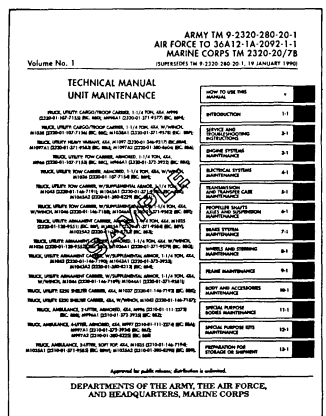

vehicle has complained that his TOW carrier uses too much engine oil. The vehicle has been assigned to you for repair.

### B. Troubleshooting Steps:

1. Look at the cover of this manual. You'll see chapter titles listed from top to bottom on the right-hand side.

2. Look at the right edge of the manual. On some of the pages you'll see black bars
(bleed-to-edge indicators) that are alined with the chapter bars on the cover. These are the locations of the chapters in the text.

3. Look for "SERVICE AND TROUBLESHOOTING INSTRUCTIONS" in the chapter list on the cover.

This is where the troubleshooting information is located.

4. Turn to those pages with the edge indicator matching the black bar for service and troubleshooting instructions. Page numbers are also listed next to chapter titles.

5. Chapter 2 is divided into four sections:
 Section I - Repair Parts, Special Tools, TMDE, and Support Equipment Ž Section II - Service Upon Receipt Ž Section III - PMCS Ž Section IV - Electrical/Mechanical Systems Troubleshooting vi 6. Turn to section IV, "ELECTRICAL/

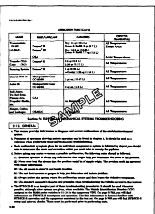

MECHANICAL SYSTEMS TROUBLE- SHOOTING (page 2-30).

This troubleshooting section is systemoriented and is broken down into five top level tests and twenty-one system level tests.

7.


One of the first pages of this section is the "ELECTRICAL/MECHANICAL SYSTEM TROUBLESHOOTING" (turn to page 2-31)
8.

Look down the list of symptoms until you find
"ENGINE LUBRICATION TESTS". In that paragraph you will find the diagnostic flow chart that the vehicle operator can pick the test as "OIL LEAKS OR ENGINE PROBLEMS".

9.

Turn to the test indicated.

On page 2-188, steps relating to

 resolving the problem of excessive oil loss are listed. Read the diagnostic flow chart until you find "OIL LEAKS OR ENGINE PROBLEMS". The tests listed are shown in the example page to the right of this text.

10.

In accordance with Test 1, you checked the oil level and filter for leaks. The oil level and filter appears normal and you move on to Test 2.

11.

In Test 2, you begin a methodical check of the engine lubricating system. You discover a leak in the oil cooler assembly adjacent to one of the mounting brackets. One of the welds has cracked, allowing a class III leak from a small area of the cooling fins. The oil cooler assembly must be repaired or replaced.

12.

At this point, the engine lubrication diagnostic flow chart would direct you to a specific detailed procedure to solve the problem. However, the engine lubricating system is complex and you must now refer to the table of contents to locate the proper task paragraph.

13.

NOTE: Before attempting to repair or replace the oil cooler assembly, as a Unit mechanic, you must:
a. Determine the maintenance responsibility of repair or replacement of the component. b. If the task is at your echelon of maintenance responsibility, you must identify the tools needed and the replacement parts required.

Refer to the Maintenance Allocation Chart - MAC (appendix B) to determine not only the maintenance responsibility of the item, but also to obtain an estimate of the time required to perform the task, tools needed, and any special notes/requirements necessary.

Refer to TM 9-2320-280-24P, Unit Maintenance Repair Parts and Special Tools List for M998 Series Vehicles, for requisition data concerning replacement parts for this task.


c. OIL COOLER ASSEMBLY REPLACEMENT. After reporting the results of your troubleshooting efforts to your supervisor, he decides that the most expedient means of returning the vehicle to service would be to replace the oil cooler assembly.

Turn to the "TABLE OF CONTENTS" and find the chapter dealing with the engine. You find it as "CHAPTER 3, ENGINE SYSTEMS
MAINTENANCE". Furthermore, you note that the chapter is divided into five sections; you are interested in "Section I. Lubrication System Maintenance".

1.

2. Turn to chapter 3, section I on page 3-1. Here


you find the "Lubrication System Maintenance Task Summary". Read down the list of tasks until you find the one that will correct your maintenance problem. For our example, you find it as task 3-8 "Engine and Transmission Oil Cooler Assembly Maintenance". Turn to page 3-12.


3. On page 3-12 you find paragraph 3-8, the detailed procedure for replacing the oil cooler assembly.

d. DETAILED MAINTENANCE PROCEDURES. Detailed maintenance procedures include everything you must do to accomplish a basic maintenance task. Unless otherwise stated, general mechanic's automotive tool kit will be used for maintenance of this vehicle.

1. Before beginning the maintenance task, look through the procedure. You must familiarize yourself with the entire maintenance procedure of para. 3-8: "Engine and Transmission Oil Cooler Assembly Maintenance". The task includes "a. Removal" "b. Installation" and "c. Cleaning and Inspection".

2. The ten basic headings listed under "INITIAL SETUP" outline task conditions, materials, special tools, manpower requirements, and special conditions. The headings are:
Applicable Models: Any models that require a particular maintenance task. If a maintenance task covers all models, then this heading will not be used. Test Equipment: Test equipment needed to complete a task. If test equipment is not required, this heading will not be used. Tools These are common tools and general mechanic tool sets required to perform maintenance tasks. These common tools should be on hand to properly perform the task. Torque wrenches are required for many tasks; the proper torque wrench should be available to tighten mounting hardware.

Special Tools: Those special tools needed to complete a maintenance task. If no special tools are needed, this heading will not be used.

If you don't have one of these special tools, requisition it (before starting the task) using the data supplied in TM 9-2320-280-24P, the repair parts and special tools list for this level of maintenance.

Special tools are located in section III.

Materials/Parts: This heading lists only mandatory replacement materials or parts (gaskets, O-
rings, sealant, etc.). To replace other unserviceable parts, refer to TM 9-2320-280-24P for requisition data. If no mandatory replacement materials/parts are required, this heading will not be used.

Personnel Required: The number of personnel needed to perform a task. If only one mechanic is needed, this heading will not be used.

NOTE
If you think that you need more help to adequately or safely complete a task, perhaps as the result of unusual conditions, etc.,
alert your supervisor and ask for help.

Manual References: Those TMs needed to complete the task.

Equipment Condition: Notes the conditions that must exist before starting the task. If none are required, this heading will not be used. For oil cooler assembly replacement, the left-hand engine splash shield should be removed before we can start the task. If not already done, follow the procedure for splash shield removal in para. 10-17, before proceeding with this task.

General Safety Instructions: Summarizes all safety warnings for the maintenance task. If none are required, this heading will not be used.

3. A step by step maintenance procedure follows the "INITIAL SETUP" and gives detailed instructions for the procedure. These instructions give the part's general location and name and action performed. In the example, oil cooler assembly replacement -a. Removal, step 1 is "Disconnect engine oil cooler supply and return lines (7) from engine oil cooler ports (9)". Note that the numbers in parenthesis correspond to the part's callout number in the accompanying illustration.

### Note

Warnings, cautions, and notes provide supplemental information:
Warnings : Indicate conditions, practices, or procedures which must be observed to avoid personnel injury, loss of life, loss of life, or long-term health hazard.

Cautions: Indicate condition, practices, or procedures which must be observed to avoid damage to equipment or destruction of equipment.

Notes: Include essential information of special importance, interest, or aid in job performance which should be remembered and would be otherwise difficult to find or incorporate into the text.

4. At the end of a procedure, "FOLLOW-ON TASKS" will list those additional tasks that must be performed to complete the procedure. The Follow-On Tasks for oil cooler assembly replacement are:
Ž Fill oil to proper level (TM 9-2320-280-10). Ž Install left-hand splash shield (para. 10-17).

Ž Start engine (TM 9-2320-280-10) and check for leaks.

e. Refer to the example pages for para. 3-8, Engine and Transmission Oil Cooler Assembly Maintenance, as we review the following points:
1. Modular Text: Both pages of text and illustrations are to be used together. This manual was designed so that the two pages would be visible at once, making part identification and procedure sequence easy to follow.

2. Initial Setup: Outlines task conditions.

3. Illustrations: An exploded diagram of the component shows part locations, attachments, and spatial relationships. Cutaway views (part of the vehicle is "erased") show the location and orientation of screws and attachments.

f. Your manual is easy to use once you understand its design. We hope it will encourage you to use your TM more often as an aid to maintenance support for M998 series vehicles.

# Chapter 1 Introduction

## Section I. General Information 1-1. Scope

a. This technical manual contains instructions for organizational maintenance of the 1-1/4 ton, 4X4, M998 series vehicles.

b. Models included are:
(1) M998 and M998A1, Cargo/Troop Carrier (2) M1038 and M1038A1, Cargo/Troop Carrier, W/Winch (3) M1097, M1097A1, M1097A2, and M1123 Heavy Variant (4) M966, M966A1, and M1121 TOW Carrier, Armored (5) M1036, TOW Carrier, Armored, W/Winch (6) M1045, M1045A1, and M1045A2 TOW Carrier, W/Supplemental Armor (7) M1046 and M1046A1, TOW Carrier, W/Supplemental Armor, W/Winch (8) M1025, M1025A1, and M1025A2 Armament Carrier, Armored (9) M1026 and M1026A1, Armament Carrier, Armored, W/Winch
(10) M1043, M1043A1, and M1043A2 Armament Carrier, W/Supplemental Armor (11) M1044 and M1044A1, Armament Carrier, W/Supplemental Armor, W/Winch (12) M1037, S250 Shelter Carrier (13) M1042, S250 Shelter Carrier, W/Winch (14) M996 and M996A1 2-Litter Ambulance, Armored (15) M997, M997A1, and M997A2 4-Litter Ambulance, Armored (16) M1035, M1035A1, and M1035A2 2-Litter Ambulance, Soft Top

## 1-2. Maintenance Forms, Records, And Reports

(Army) Department of the Army forms and procedures used for equipment maintenance will be those prescribed by DA Pam 738-750, The Army Maintenance Management System (TAMMS). (Marine Corps) Refer to TM 4700-15/1–.

## 1-3. Destruction Of Army Equipment To Prevent Enemy Use

Refer to TM 750-244-6, Procedures for Destruction of Army Tank-Automotive Equipment to Prevent Enemy Use.

## 1-4. Preparation For Shipment

(Army) Refer to TM 746-10, Marking, Packaging and Shipment of Supplies and Equipment:General Packaging Instructions for Field Use. (Marine Corps) Refer to MCO 4450-7.

## 1-5. Reporting Equipment Improvement Recommendations (Eir)

(Army) If your vehicle needs improvement, let us know. Send us an EIR. You, the user, are the only one who can tell us what you don't like about your equipment. Let us know why you don't like the design or performance. The preferred method for submitting QDRs is through the Army Electronic Product Support (AEPS) website under the Electronic Deficiency Reporting System (EDRS). The web address is: http://aeps.ria.army.mil. This is a secured site requiring a password that can be applied for on the front page of the website. If the above method is not available to you, put it on an SF 368, Product Quality Deficiency Report (PQDR), and mail it to us at: Department of the Army, U.S. Army Tank-automotive and Armaments Command, ATTN: AMSTA-TR-E/PQDR MS 267, 6501 E. 11 Mile Road, Warren, MI 48397-500. We'll send you a reply. (Marine Corps) Submit QDR's in accordance with MCO 4855-10.

## 1-6. Equipment Improvement Report And Maintenance Digest (Eir Md)

The quarterly Equipment Improvement Report and Maintenance Digest, TB 43-0001-62 series, contains valuable field information on the equipment covered in this manual. The information in the TB 43-0001-62 series is compiled from some of the Equipment Improvement Reports that you prepared on the vehicles covered in this manual. Many of these articles result from comments, suggestions, and improvement recommendations that you submitted to the EIR program. The TB 43-0001-62 series contains information on equipment improvements, minor alterations, proposed Modification Work Orders (MWOs), warranties (if applicable), actions taken on some of your DA Form 2028s (Recommended Changes to Publications and Blank Forms), and advance information on proposed changes that may affect this manual. The information will help you in doing your job better and will help in keeping you advised of the latest changes to this manual. Also refer to DA Pam 25-30, Consolidated Index of Army Publications and Blank Forms, and appendix A, References, of this manual. (Marine Corps) Submit QDR's in accordance with MCO 4855-10. For those with access to the World Wide Web (WWW), the EIR MD can be viewed through the Army Electronic Product Support. The site is http://aeps.ria.army.mil.

## 1-7. Metric System

The equipment described herein contains metric components and requires metric common and special tools; therefore, metric units in addition to standard units will be used throughout this publication. In addition, a metric conversion table is located on the inside back cover of this publication.

## 1-8. Mandatory Replacement Parts

The maintenance instructions contained herein make reference to removing and discarding piece parts such as: gaskets, lockwashers, cotter pins, O-rings, seals; etc.; these items should be considered mandatory replacement items and replaced with new parts during assembly/installation.

## 1-9. Break-In Procedure

Upon receipt of vehicles, or after engine replacement, break-in procedures must be observed during the first 500 miles (804 kilometers) of operation. For break-in procedure, refer to TM 9-2320-280-10.

## Section Ii. Equipment Description And Data 1-10. Equipment Characteristics, Capabilities, And Features

The 1-1/4 ton, 4x4, M998 series of vehicles are tactical vehicles designed for use over all types of roads, as well as cross-country terrain in all weather conditions. The vehicles have four driving wheels powered by a V-8, liquid-cooled, diesel engine. Four-wheel hydraulic service brakes and a mechanical parking brake are common to all models in the M998 series. All vehicles are equipped with a pintle hook for towing. Tiedown and lifting eyes are provided for air, rail, or sea shipment.

# Cargo/Troop Carriers: M998, M998A1, M1038, And M1038A1

PURPOSE: These models are used to transport cargo and troops. The M1038 and M1038A1 models,


which have a winch, can be used for recovery operations. Both models utilize a troop seat kit for troop transport operations.

### H E Avy Variant Cargo/Troop Carriers: M1097, M1097A1, M1097A2, And M1123

PURPOSE: This model is used for transporting equipment, materials, and/or personnel (including crew)
of 4,400 pounds (1,998 kilograms). The only difference between the M998 and M998A1 cargo/troop carriers and the M1097, M1097A1, M1097A2, and M1123 heavy variant cargo/troop carriers is that the M1097, M1097A1, M1097A2, and M1123 are specifically designed to accommodate a higher payload capacity. This difference affects vehicle length, width, and shipping dimensions, but does not affect the basic purpose and performance of the vehicle. The increased payload capabilities accomodate the following kit configurations:

### A. 105Mm Towed Howitzer Prime Mover (L119 Kit) Consists Of:

- Larger rear bumper and reinforced mounting - Body wiring harness trailer receptacle extension - Ammunition stowage rack and tiedown straps - Camouflage net stowage rack - Winch - Two-man crew area soft top - Troop area soft top - Cargo bulkhead B. TOWED VULCAN SYSTEMS (TVS) MOVER consists of:
- Two-man crew area soft top - Troop area soft top - Camouflage net stowage rack - Troop seat kit - Cargo bulkhead C. S250 ELECTRICAL EQUIPMENT SHELTER consists of:
- Shelter support - Shelter tailgate - 200 amp umbilical power cable

M1097/M1097A1/M1097A2/M1123

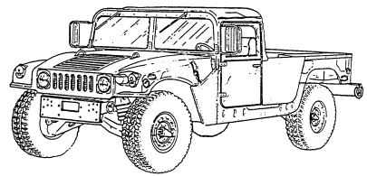

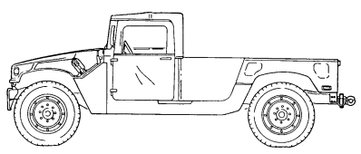

(WITH 2-MAN SOFT TOP INSTALLED)
M1097A2


M1123

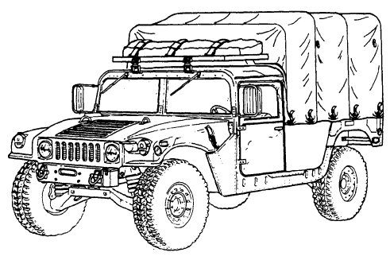

M1097/M1097A1/M1097A2/M1123


(WITH L119 KIT INSTALLED)
(WITHOUT WINCH, TOWED VULCAN SYSTEMS (TVS) MOVER)
M1097/M1097A1/M1097A2/M1123
(WITH S250 SHELTER INSTALLED)

### Tow Carriers: M966, M966A1, M1036, And M1121

P U R P O S E : These models are used to transport, mount, and operate the TOW missile launcher system with armor protection for crew, TOW system components, and ammunition. The M1036 model, which has a winch, can be used for recovery operations.


TOW CARRIERS, W/SUPPLEMENTAL ARMOR M1045, M1045A1, M1045A2, M1046, AND M1046A1 a. PURPOSE: These models are used to transport, mount, and operate the TOW missile launcher

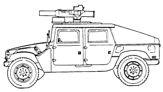

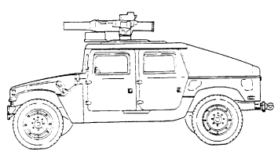

system with added ballistic protection for crew, TOW system components, and ammunition. The M1046 and M1046A1 models, which have a winch, can be used for recovery operations.

b. SPECIAL LIMITATIONS: Weapon station azimuth is limited to 300° left and right of vehicle centerline when Vehicle Power Conditioner (VPC) cables are connected. With launcher installed, elevation is limited to 20° and depression is limited to 10°.


ARMAMENT CARRIERS, W/SUPPLEMENTAL ARMOR: M1025, M1025A1, M1025A2, M1026, AND M1026A1 a. PURPOSE: These models are used to transport, mount, and operate the M2 and M60 machine guns

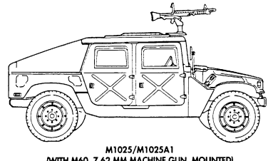


and MK19 automatic grenade launcher with armor protection for crew, weapons components, and ammunition. The M1026 and M1026A1 models, which have a winch, can be used for recovery operations.

b. SPECIAL LIMITATIONS: Weapon station azimuth is limited to 300° left and right of vehicle centerline when Vehicle Power Condition (VPC) cables are connected. With launcher installed, elevation is limited to 20° and depression is limited to 10°.


ARMAMENT CARRIERS, W/SUPPLEMENTAL ARMOR M1043, M1043A1, M1043A2, M1044, AND M1044A1 PURPOSE: These models are used to transport, mount, and operate the M2 and M60 machine guns and MK19 automatic grenade launcher with added ballistic protection for crew, weapons components, and ammunition. The M1044 and M1044A1 models, which have a winch, can be used for recovery operations.


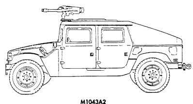

(WITH MK19 GRENADE LAUNCHER MOUNTED)

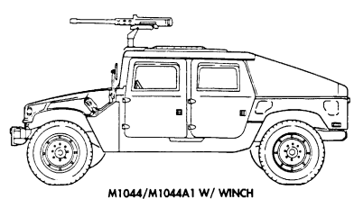

(WITH M2, CAUBER .50 MACHINE GUN MOUNTED)

### S250 Shelter Carriers M1037 And M1042

PURPOSE: These models are used for securing and transporting the S250 electrical equipment shelter.


The M1042 model, which has a winch, can be used for recovery operations.

ARMORED AMBULANCES: M996, M996A1, M997, M997A1, AND M997A2 PURPOSE: These models are used to transport patients with armor protection for crew and patients.

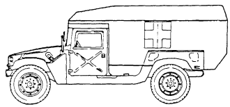

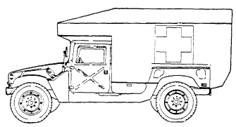

The M996 and M996A1 are reducible in height for CH47 helicopter transport. The M997, M997A1, and M997A2 have air conditioning for patient comfort. For operation in an NBC environment, the M997, M997A1, and M997A2 is equipped with a Gas-Particulate Filter Unit (GPFU) with heaters capable of supporting up to seven personnel equipped with either M25 series protective masks or M13 series patient protective masks.


# Soft Top Ambulances: M1035, M1035A1, And M1035A2

PURPOSE: These models are used to transport a maximum of 2 litter and 2 ambulatory patients and


are transportable by a CH47 helicopter.

M1035/M1035A1

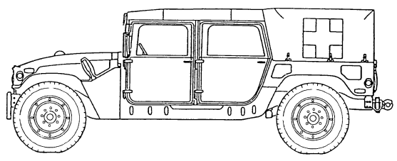

### M1035A2

## 1 - 1 1 . L O C Ation And Description Of Major Exterior C O M P O N E N T S

The exterior components described below are common to all vehicles covered in this manual. Special differences are found in TM 9-2320-280-10 or table 1-1, differences between models, of this manual.

A **AIR CLEANER** - Filters air before it enters intake manifold.

B **ENGINE** - Provides power for the vehicle.

C **TRANSMISSION** - Transmits engine power to transfer case at varying speeds.

D **FUEL TANK** - Stores fuel.

E **GEARED HUB** - Transfers turning action of half shafts to wheels for vehicle motion.

F
PINTLE HOOK - Permits towing of vehicles or equipment.

G
REAR PROPELLER SHAFT - Transmits power from the transfer case to the rear differential.

H
TRANSFER CASE - Provides full-time four-wheel drive with three drive ranges.

I
FRONT PROPELLER SHAFT - Transmits power from the transfer case to the front differential.

J
MASTER CYLINDER AND HYDRO-BOOST - Provides hydraulic pressure and power assist for vehicle stopping power.

K
DIFFERENTIAL - Transfers turning action of the propeller shaft to the geared hubs through the half shafts.

L
WINCH - 6000 lb (M1026, M1026A1, M1036, M1038, M1038A1, M1042, M1044, M1044A1, M1046, and M1046A1 only), electrically powered to provide recovery capability.

M **WINCH** - 9000 lb, can be used on "A2" models M1025A2, M1043A2, M1045A2, and M1097A2 and M1123.

1-11. LOCATION AND DESCRIPTION OF MAJOR EXTERIOR
COMPONENTS (Cont'd)

( M


(L
(A) AIR CLEANER
(B) ENGINE
(C
TRANSMISSION
D
FUEL TANK
GEARED HUB
E
(F)
PINTLE HOOK
REAR PROPELLER SHAFT
(G
(H) TRANSFER CASE
FRONT PROPELLER SHAFT
I
 MASTER CYLINDER AND HYDRO-BOOST
J
(K) DIFFERENTIAL
WINCH (6000 lb)
L
(M) WINCH (9000 Ib)

## 1-12. Location And Description Of Major Interior

COMPONENTS
The major interior components shown below are common to all vehicles covered in this manual. Components not covered here can be found in TM 9-2320-280-10 or the applicable maintenance chapters of this manual.

AIR RESTRICTION GAUGE - Indicates restrictions in the air cleaner.

DIRECTIONAL SIGNAL CONTROL - Activates turn signal lights.

STEERING WHEEL - Manual control for turning vehicle.

INSTRUMENT CLUSTER - Houses controls and indicators.

DIAGNOSTIC CONNECTOR - Connection point for STE/ICE-R test set.

TRANSMISSION SHIFT LEVER - Manual control for shifting transmission.

TRANSFER CASE SHIFT LEVER - Manual control for shifting transfer case.

PARKING BRAKE LEVER - Manual control for applying parking brake.

ACCELERATOR PEDAL - Foot control for determining engine speed.

BRAKE PEDAL - Foot control for stopping vehicle.

MAIN LIGHT SWITCH - Controls operation of vehicle lights.

ROTARY SWITCH - When positioned to START, the starter is engaged to crank the engine.

1-12. LOCATION AND DESCRIPTION OF MAJOR INTERIOR
COMPONENTS (Cont'd)


1
"R" (Reverse)
2
"N" (Neutral)
3 
"D" (Manual Third)
ব
"2" (Manual Second)
5
"1" (Manual First)
6
"P" (Park)
7
"R" (Reverse)
8
"N" (Neutral)
9
"(D)" (Overdrive)
10
"D" (Manual Third)
11
"2" (Manual Second)
12
"1" (Manual First)
3L80 TRANSMISSION
4L80-E TRANSMISSION


## 1-13. Location And Contents Of Warning, Caution, And Data Plates

The location and contents of caution, data, and warning plates are provided in this paragraph. If any of

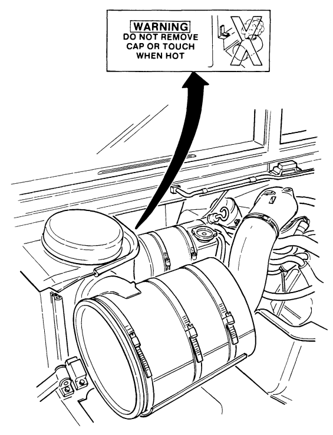 these plates are worn, broken, painted over, missing, or unreadable, they must be replaced. Information on data plate may vary per model.

1-13. LOCATION AND CONTENTS OF WARNING, CAUTION, AND DATA PIATES
(Cont'd)

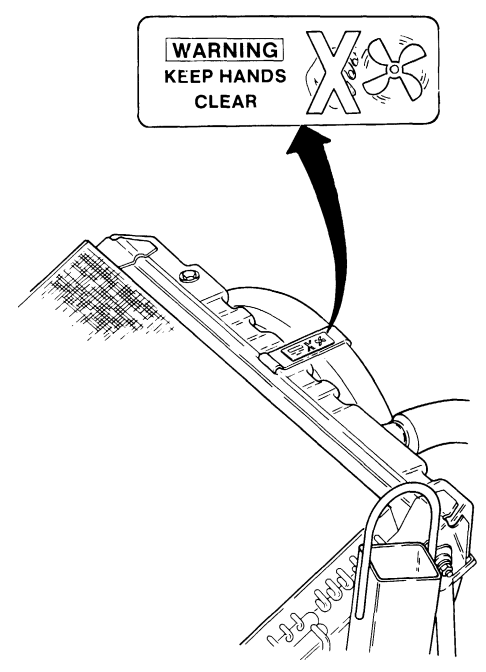

1-13. LOCATION AND CONTENTS OF WARNING, CAUTION, AND DATA PLATES
(Cont'd)


1-13. LOCATION AND CONTENTS OF WARNING, CAUTION, AND DATA PLATES
(Cont'd)


1-13. LOCATION AND CONTENTS OF WARNING, CAUTION, AND DATA PLATES
(Cont'd)
MAX. VEHICLE OPERATING SPEEDS
TRANSFER CASE RANGE SELECTION


TRANSFER CASE IN HIGH "H" WHEN
OPERATING ON HARD SURFACE
FORDING
SHALLOW FORDING DEPTH 30 INCHES

# Vehicle Break-In Service

DURING THE FIRST 500 MI.

(804 KM) OF OPERATION:
· DO NOT EXCEED A SPEED
OF 55 MPH (88 KPH)
· DO NOT DRIVE FOR LONG
PERIODS OF TIME AT
CONSTANT SPEED
· AVOID RAPID ACCELERA-
TION OR DECELERATION
· DRIVE AT MODERATE
SPEED UNTIL THE ENGINE
IS FULLY WARMED UP
· NO TRAILER TOWING
1-13. LOCATION AND CONTENTS OF WARNING, CAUTION, AND DATA PLATES
(Cont'd)

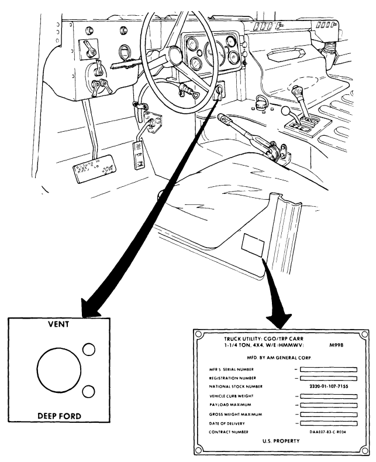


| SERVICING DATA          |                            |                                                     | TIRE INFLATION PRESSURE   |        | MANUALS                         |                      |
|-------------------------|----------------------------|-----------------------------------------------------|---------------------------|--------|---------------------------------|----------------------|
| FUEL                    |                            | DIESEL NO. 1. NO. 2. DFA ALL MODELS EXCEPT FRONT    |                           | REAR   |                                 |                      |
| FUEL TANK CAPACITY      |                            | 25 GALS M996, M997, M1037.                          | P.S.I.                    | P.S.I. |                                 |                      |
| COOLING SYSTEM CAPACITY |                            | 25 QTS AND MID47                                    | 20                        | 22     | MAINTENANCE TM 9\-2320\-280\-20 |                      |
| CRANKCASE CAPACITY      |                            | 7 QTS + 1 QT FOR FILTER \| M996. M997. M1037. M1042 | 22                        | 30     | MANUAL                          | TM 9\-2320\-280\-34  |
| TEMPERATURE             | ABOVE +15ºF +40° TO \-15°F | +40° TO \-65°F                                      | TO DRAIN COOLING SYSTEM   |        | OPERATOR'S                      | TM 9\-2320\-280\-10  |
| ENGINE OIL              | QE\-30 OE\-10              | OEA                                                 | OPEN DRAINCOCK LOCATED    |        | MANUAL                          |                      |
| GEAR OIL                | GO 80/90 GO 80/90          | GO 75                                               | AT LOWER RADIATOR TUBE    |        | PARTS LIST                      | TM 9\-2320\-280\-20P |
| GREASE                  | GAA GAA                    | GAA                                                 |                           |        |                                 | TM 9\-2320\-280\-34P |

1-13. LOCATION AND CONTENTS OF WARNING, CAUTION, AND DATA PIÆS
(Cont'd)
1-13. LOCATION AND CONTENTS OF WARNING, CAUTION, AND DATA PLATES
(Cont'd)


1-13. LOCATION AND CONTENTS OF WARNING, CAUTION, AND DATA PLATES
(Cont'd)

# Warning

DO NOT USE HAND THROTTLE AS AN
AUTOMATIC VEHICLE SPEED OR CRUISE CONTROL.

THE HAND THROTTLE WILL NOT DISENGAGE
AUTOMATICALLY WHEN BRAKE IS APPLIED.


# 1-13. Location And Contents Of Warning, Caution, And Data Plates (Cont'D)


1-13. LOCATION AND CONTENTS OF WARNING, CAUTION, AND DATA PLATES (Cont'd)


HEATER OPERATING INSTRUCTIONS
TO START HEATER:
1. WITH HEATER "HI-LO" SWITCH IN "LO" POSITION,
HOLD HEATER SWITCH IN "START" POSITION.

2. WHEN HEATER INDICATOR LIGHT COMES ON,
MOVE HEATER SWITCH TO "RUN" POSITION.

TO SELECT TEMPERATURE:
1. SNAP "HI-LO" SWITCH TO DESIRED LEVEL
TO DEFROST (IF APPLICABLE):
1. CLOSE DAMPER.

IF HEATER FAILS TO START:
1. CHECK "PRESS TO TEST" INDICATOR LIGHT.

2.   IF LIGHT WORKS AND HEATER STILL FAILS TO START IN
APPROXIMATELY 3 MINUTES, SERVICE IS REQUIRED.

SEE SERVICE MANUAL.

NOTE: CLEAN FUEL FILTER FREQUENTLY TO PREVENT
ICE FORMATION.

1-13. LOCATION AND CONTENTS OF WARNING, CAUTION, AND DATA PLATES (Cont'd)

# Warning

THE DEPARTMENT OF TRANSPORTATION REQUIRES 105 MM CANNON
AMMUNITION TO BE IN WOODEN BOXES WHEN TRANSPORTING
AMMUNITION ON PUBLIC HIGHWAYS, BY FIXED WING AIRCRAFT, RAIL, OR SHIP.

RESTRICT MOVEMENT OF CANNON AMMUNITION IN FIBER
CONTAINERS (INNER PACK) IN THE AMMUNITION RACK OF THE
HMMWV TO OTHER THAN PUBLIC HIGHWAYS.


CAUTION
HIGH INTENSITY NOISE
HEARING PROTECTION
REQUIRED

| Page No *Change No.   |                                          |                                 |                                 | Page No *Change No.                           | Page No *Change No.   |
|-----------------------|------------------------------------------|---------------------------------|---------------------------------|-----------------------------------------------|-----------------------|
|                       |                                          |                                 |                                 | 11\-326 Blank 0                               | 12\-70.4 2            |
|                       |                                          |                                 |                                 | 12\-1 1                                       | 12\-71 1              |
|                       |                                          |                                 |                                 | 12\-2 2                                       | 12\-72 2              |
|                       |                                          |                                 |                                 | 12\-3 0                                       | 12\-72.1 1            |
|                       |                                          |                                 |                                 | 12\-4 2                                       | 12\-72.2 Blank 1      |
|                       |                                          |                                 |                                 | 12\-5 \- 12\-6 0                              | 12\-73 \- 12\-74 0    |
|                       |                                          |                                 |                                 | 12\-7 \- 12\-8 1                              | 12\-75 2              |
|                       |                                          |                                 |                                 | 12\-9 \- 12\-11 2                             | 12\-76 \- 12\-84 0    |
|                       |                                          |                                 |                                 | 12\-12 0                                      | 12\-85 2              |
|                       |                                          |                                 |                                 | 12\-13 \- 12\-15 2                            | 12\-86 \- 12\-87 0    |
|                       |                                          |                                 |                                 | 12\-16 0                                      | 12\-88 \- 12\-90 2    |
|                       |                                          |                                 |                                 | 12\-17 \- 12\-20 2                            | 12\-91 \- 12\-92 0    |
|                       |                                          |                                 |                                 | 12\-21 0                                      | 12\-93 2              |
|                       |                                          |                                 |                                 | 12\-22 2                                      | 12\-94 0              |
|                       |                                          |                                 |                                 | 12\-23 1                                      | 12\-95 2              |
|                       |                                          |                                 |                                 | 12\-24 2                                      | 12\-96 0              |
|                       |                                          |                                 |                                 | 12\-25 0                                      | 12\-97 \- 12\-103 2   |
|                       |                                          |                                 |                                 | 12\-26 1                                      | 12\-104 \- 12\-106 0  |
|                       |                                          |                                 |                                 | 12\-27 0                                      | 12\-107 \- 12\-110 2  |
|                       |                                          |                                 |                                 | 12\-28 2                                      | 12\-111 1             |
|                       |                                          |                                 |                                 | 12\-28.1 1                                    | 12\-112 \- 12\-115 0  |
|                       |                                          |                                 |                                 | 12\-28.2 2                                    | 12\-116 2             |
|                       |                                          |                                 |                                 | 12\-29 \- 12\-30 2                            | 12\-117 \- 12\-118 0  |
|                       |                                          |                                 |                                 | 12\-31 0                                      | 12\-119 2             |
|                       |                                          |                                 |                                 | 12\-32 2                                      | 12\-120 \- 12\-134 0  |
|                       | 12\-33 \- 12\-34 1  12\-135 \- 12\-138 2 |                                 |                                 |                                               |                       |
|                       |                                          | 12\-34.1 1 12\-139 \- 12\-140 0 |                                 |                                               |                       |
|                       |                                          |                                 | 12\-34.2 2 12\-141 \- 12\-142 2 |                                               |                       |
|                       |                                          |                                 |                                 | 12\-34.3 \- 12\-34.8 1                        | 12\-143 0             |
|                       |                                          |                                 |                                 | 12\-35 \- 12\-36 1                            | 12\-144 2             |
|                       |                                          |                                 |                                 | 12\-37 0                                      | 12\-145 0             |
|                       |                                          |                                 |                                 | 12\-38 2                                      | 12\-146 2             |
|                       |                                          |                                 |                                 | 12\-39 1                                      |                       |
|                       |                                          |                                 |                                 | 12\-60 0                                      | 12\-153 2             |
|                       |                                          |                                 |                                 | 12\-61 \- 12\-62 2                            | 12\-154 \- 12\-157 0  |
|                       |                                          |                                 |                                 | 12\-62.1 1                                    |                       |
|                       |                                          |                                 |                                 | 12\-62.2 2                                    | 12\-159 \- 12\-161 0  |
|                       |                                          |                                 |                                 | 12\-63 1                                      | 12\-162 2             |
|                       |                                          |                                 |                                 | 12\-64 \- 12\-65 0                            | 12\-163 \- 12\-164 0  |
|                       |                                          |                                 |                                 | 12\-66 2                                      | 12\-165 \- 12\-168 2  |
|                       |                                          |                                 |                                 | 12\-70.2 2                                    | 12\-172 2             |
|                       |                                          |                                 |                                 | 12\-70.3 1                                    | 12\-173 \- 12\-175 0  |
|                       |                                          |                                 |                                 | *Zero in this column indicates original page. |                       |
|                       |                                          |                                 |                                 |                                               | 12\-158 2             |
|                       |                                          |                                 |                                 | 12\-67 0                                      | 12\-169 0             |
|                       |                                          |                                 |                                 |                                               | 12\-147 \- 12\-149 0  |
|                       |                                          |                                 |                                 | 12\-40 \- 12\-56 0                            | 12\-150 2             |
|                       |                                          |                                 |                                 | 12\-57 \- 12\-59 2                            | 12\-151 \- 12\-152 0  |
|                       |                                          |                                 |                                 | 12\-70.1 1                                    | 12\-171 0             |
|                       |                                          |                                 |                                 | 12\-68 \- 12\-70 2                            | 12\-170 2             |

# 1-14. Differences Between Models 1-15. Tabulated Data

Vehicle performance data for the M998 series vehicles is listed in table 1-2. This information includes only that data applicable to unit maintenance. Information not covered can be found in TM-9-2320-280-10.

Table 1-2. Tabulated Data

### Note

Standard and metric measurements will be used in this table. A list of their abbreviations is provided below.

## Tabulated Data Abbreviations

| 12\-182 2                | 12\-275 \- 12\-276 0                          | G\-2 \- G\-9 2          |
|--------------------------|-----------------------------------------------|-------------------------|
| 12\-183 0                | 12\-277 \- 12\-278 2                          | G\-10 \- G\-12 Added 2  |
| 12\-184 2                | 12\-279 \- 12\-281 0                          | Index\-1 \- Index\-7 1  |
| 12\-185 0                | 12\-282 2                                     | Index\-8 \- Index\-35 2 |
| 12\-186 2                | 12\-283 \- 12\-294 0                          | Index\-36 Blank 1       |
| 12\-187 \- 12\-189 0     | 12\-295 1                                     | FP\-1 0                 |
| 12\-190 2                | 12\-296 2                                     | FP\-2 Blank 0           |
| 12\-191 \- 12\-193 0     | 12\-297 1                                     | FP\-3 0                 |
| 12\-194 \- 12\-197 2     | 12\-298 2                                     | FP\-4 Blank 0           |
| 12\-198 \- 12\-200 0     | 12\-299 \- 12\-301 1                          | FP\-5 0                 |
| 12\-201 \- 12\-202 1     | 12\-302 2                                     | FP\-6 Blank 0           |
| 12\-202.1 2              | 12\-303 \- 12\-305 1                          | FP\-7 0                 |
| 12\-202.2 1              | 12\-306 2                                     | FP\-8 Blank 0           |
| 12\-203 1                | 12\-307 \- 12\-309 1                          | FP\-9 0                 |
| 12\-204 2                | 12\-310 \- 12\-312 2                          | FP\-10 Blank 0          |
| 12\-204.1 1              | 12\-313 \- 12\-317 1                          | FP\-11 0                |
| 12\-204.2 2              | 12\-318 Blank 1                               | FP\-12 Blank 0          |
| 12\-204.3 \- 12\-204.4 1 | 13\-1 \- 13\-3 0                              | FP\-13 0                |
| 12\-205 1                | 13\-4 Blank 0                                 | FP\-14 Blank 0          |
| 12\-206 \- 12\-214 2     | A\-1 \- A\-2 2                                | FP\-15 0                |
| 12\-215 0                | B\-1 \- B\-3 0                                | FP\-16 Blank 0          |
| 12\-216 \- 12\-222 2     | B\-4 \- B\-27 2                               | FP\-17 0                |
| 12\-222.1 1              | B\-28 \- B\-29 Added 2                        | FP\-18 Blank 0          |
| 12\-222.2 Blank 1        | B\-30 Blank Added 2                           |                         |
| 12\-223 \- 12\-225 2     | C\-1 0                                        |                         |
| 12\-226 \- 12\-227 0     | C\-2 \- C\-7 1                                |                         |
| 12\-228 2                | C\-8 Blank 0                                  |                         |
| 12\-229 0                | D\-1 \- D\-2 1                                |                         |
| 12\-230 2                | D\-3 \- D\-9 0                                |                         |
| 12\-231 0                | D\-10 1                                       |                         |
| 12\-232 2                | D\-11 \- D\-22 0                              |                         |
| 12\-233 \- 12\-235 0     | D\-23 2                                       |                         |
| 12\-236 2                | D\-24 0                                       |                         |
| 12\-237 \- 12\-239 0     | D\-25 2                                       |                         |
| 12\-240 2                | D\-26 \- D\-46 0                              |                         |
| 12\-241 0                | D\-46.1 \- D\-46.2 2                          |                         |
| 12\-242 2                | D\-47 \- D\-48 1                              |                         |
| 12\-243 \- 12\-246 0     | D\-49 \- D\-64 0                              |                         |
| 12\-247 \- 12\-250 2     | D\-65 \- D\-66 1                              |                         |
| 12\-251 0                | D\-67 \- D\-69 0                              |                         |
| 12\-252 2                | D\-70 \- D\-71 2                              |                         |
| 12\-253 \- 12\-254 0     | D\-72 \- D\-77 0                              |                         |
| 12\-255 \- 12\-266 2     | D\-78 \- D\-116 1                             |                         |
|                          | *Zero in this column indicates original page. |                         |

|            | VOLUME 1 OF 3                                                             |         |
|------------|---------------------------------------------------------------------------|---------|
|            |                                                                           | Page    |
|            | v  HOW TO USE THIS MANUAL                                                 |         |
| CHAPTER 1  | INTRODUCTION                                                              | 1\-1    |
| Section I. | General Information                                                       | 1\-1    |
| II.        | Equipment Description and Data                                            | 1\-2    |
| III.       | Principles of Operation                                                   | 1\-35   |
| CHAPTER 2  | SERVICE AND TROUBLESHOOTING INSTRUCTIONS                                  | 2\-1    |
| Section I. | Repair Parts, Special Tools, Test, Measurement, and Diagnostic            |         |
|            | Equipment (TMDE), and Support Equipment                                   | 2\-1    |
| II.        | Service Upon Receipt                                                      | 2\-1    |
| III.       | Preventive Maintenance Checks and Services                                | 2\-2    |
| IV.        | Electrical/Mechanical Systems Troubleshooting                             | 2\-30   |
|            | VOLUME 2 OF 3                                                             |         |
| CHAPTER 3  | ENGINE SYSTEMS MAINTENANCE                                                | 3\-1    |
| Section I. | Lubrication System Maintenance                                            | 3\-1    |
| II.        | Fuel System Maintenance                                                   | 3\-19   |
| III.       | Accelerator System Maintenance                                            | 3\-77   |
| IV.        | Exhaust System Maintenance                                                | 3\-86   |
| V.         | Cooling System Maintenance                                                | 3\-107  |
| CHAPTER 4  | ELECTRICAL SYSTEM MAINTENANCE                                             | 4\-1    |
| Section I. | Generating and Protective Control Box/Distribution Box System Maintenance | .  4\-1 |
| I.1.       | Dual Voltage Alternator and Regulator System Maintenance                  | 4\-12.5 |
| II.        | Starter and Starting Control System Maintenance                           | 4\-14   |
| III.       | Instruments, Sending Units, Switches, and Horn Maintenance                | 4\-23   |
| IV.        | Transfer Case and Transmission Electrical Maintenance                     | 4\-58   |
| V.         | Lighting System Maintenance                                               | 4\-77   |
| VI.        | Battery System Maintenance                                                | 4\-113  |
| VII.       | Ambulance Electrical System Maintenance                                   | 4\-157  |

|            |                                                     | Page    |
|------------|-----------------------------------------------------|---------|
| CHAPTER 5  | TRANSMISSION AND TRANSFER CASE MAINTENANCE          | 5\-1    |
| Section I. | Transmission Maintenance                            | 5\-1    |
| II.        | Transfer Case Maintenance                           | 5\-47   |
| CHAPTER 6  | PROPELLER SHAFTS, AXLES, AND SUSPENSION MAINTENANCE | 6\-1    |
| Section I. | Propeller Shafts Maintenance                        | 6\-1    |
| II.        | Front and Rear Axles Maintenance                    | 6\-16   |
| III.       | Suspension Maintenance                              | 6\-54   |
| CHAPTER 7  | BRAKE SYSTEM MAINTENANCE                            | 7\-1    |
| Section I. | Parking Brake System Maintenance                    | 7\-1    |
| II.        | Service Brake System Maintenance                    | 7\-19   |
| III.       | Rear Dual Service/Parking Brake System Maintenance  | 7\-45   |
| CHAPTER 8  | WHEELS AND STEERING MAINTENANCE                     | 8\-1    |
| Section I. | Wheel and Runflat System Maintenance                | 8\-1    |
| II.        | Steering Components Maintenance                     | 8\-43   |
| CHAPTER 9  | FRAME MAINTENANCE                                   | 9\-1    |
|            | VOLUME 3 OF 3                                       |         |
| CHAPTER 10 | BODY AND ACCESSORIES MAINTENANCE                    | 10\-1   |
| Section I. | Body Maintenance                                    | 10\-1   |
| II.        | Body Accessories Maintenance                        | 10\-115 |
| III.       | Winch Maintenance                                   | 10\-179 |
| CHAPTER 11 | SPECIAL PURPOSE BODIES MAINTENANCE                  | 11\-1   |

|                  |                                                              | Page           |
|------------------|--------------------------------------------------------------|----------------|
| CHAPTER 12       | SPECIAL PURPOSE KITS MAINTENANCE                             | 12\-1          |
| Section I.       | Deep Water Fording Kit Maintenance                           | 12\-1          |
| II.              | Troop Seat Kit Maintenance                                   | 12\-19         |
| III.             | 100 Ampere Alternator Kit Maintenance                        | 12\-23         |
| IV.              | Arctic Winterization Kits Maintenance                        | 12\-36         |
| V.               | Arctic Winterization Crew Top Kits Maintenance               | 12\-104        |
| VI.              | Troop/Cargo Winterization Kit Maintenance                    | 12\-114        |
| VII.             | Communications Kits Maintenance                              | 12\-201        |
| VIII.            | 81 MM Mortar Kit Maintenance                                 | 12\-235        |
| IX.              | Traversing Bar Kit Maintenance                               | 12\-251        |
| X.               | M1097, M1097A1, and M1097A2 Special Purpose Kits Maintenance | 12\-254        |
| XI.              | Accessory Kits Installation                                  | 12\-282        |
| XII.             | Cargo Barrier and Net Kit Maintenance                        | 12\-314        |
| CHAPTER 13       | PREPARATION FOR STORAGE OR SHIPMENT                          | 13\-1          |
| Section I.       | General Instructions                                         | 13\-1          |
| II.              | Preparation for Storage and Shipment                         | 13\-2          |
| APPENDIX A       | REFERENCES                                                   | A\-1           |
| APPENDIX B       | MAINTENANCE ALLOCATION CHART                                 | B\-1           |
| APPENDIX C       | EXPENDABLE/DURABLE SUPPLIES AND MATERIALS LIST               | C\-1           |
| APPENDIX D       | ILLUSTRATED LIST OF MANUFACTURED ITEMS                       | D\-1           |
| APPENDIX E       | TORQUE LIMITS                                                | E\-1           |
| APPENDIX F       | WIRING DIAGRAMS AND SCHEMATIC                                | F\-1           |
| APPENDIX G INDEX | MANDATORY REPLACEMENT PARTS                                  | G\-1   Index 1 |

# Section Iii. Principles Of Operat I O N

## 1 - 1 6 . G E N E R A L

This section explains how components of the M998 series vehicles work together. The systems (functional groups) covered are listed in the Principles of Operation Reference Index, paragraph 1-17.

1 - 1 7 . PRINCIPLES OF OPERATION REFERENCE INDEX

| REF.     | SYSTEM                                               | PAGE    |
|----------|------------------------------------------------------|---------|
| PARA.    |                                                      | NO.     |
| 1\-18.   | Drivetrain Operation                                 | 1\-36   |
| 1\-19.   | Fuel System Operation                                | 1\-37   |
| 1\-20.   | Cooling System Operation                             | 1\-38   |
| 1\-21.   | Starting System Operation                            | 1\-40   |
| 1\-22.   | Generating System Operation                          | 1\-41   |
| 1\-23.   | Generating System Operation (200 Ampere Alternator)  | 1\-42   |
| 1\-23.1. | Generating System Operation (100 Ampere Dual Voltage |         |
|          | Alternator)                                          | 1\-42.1 |
| 1\-23.2. | Generating System Operation (200 Ampere Dual Voltage |         |
|          | Alternator)                                          | 1\-42.2 |
| 1\-23.3. | Generating System Operation (400 Ampere Dual Voltage |         |
|          | Alternator)                                          | 1\-42.3 |
| 1\-24.   | Battery System Operation                             | 1\-43   |
| 1\-25.   | Windshield Wiper/Washer System Operation             | 1\-44   |
| 1\-26.   | Parking Brake System Operation                       | 1\-45   |
| 1\-27.   | Service/Parking Brake System Operation               | 1\-46   |
| 1\-28.   | Service Brake System Operation                       | 1\-47   |
| 1\-29.   | Steering Control System Operation                    | 1\-49   |
| 1\-30.   | Suspension System Operation                          | 1\-51   |
| 1\-31.   | Ambulance Patient Compartment Fuel Burning Heater    | 1\-53   |
|          | System Operation                                     |         |
| 1\-32.   | M997, M997A1, and M997A2 Ambulance Air\-Conditioning | 1\-54   |
|          | System Operation                                     |         |
| 1\-33.   | Stowage Racks and Tiedown Straps                     | 1\-55   |
| 1\-34.   | 200 Ampere Umbilical Power Cable                     | 1\-58   |

## 1-18. Drivetrain Operation

The drivetrain is identical for all models covered in this manual. It converts horsepower into mechanical force to move the vehicle. Major components of the drivetrain are:
ENGINE - The water-cooled 6.2 liter, V-8, Diesel engine provides up to 150 horsepower at 3600 rpm to power the vehicle. The 6.5 liter V-8 engine develops approximately 160 horsepower at 3400 rpm to power the vehicle. The engines are essentially the same on all models except those equipped with deep water fording kit installed, which adds a specially sealed dipstick, dipstick tube, and vented CDR valve.

These differences do not affect engine performance. TRANSMISSION (3L80) - Adapts engine power to meet different driving conditions. The automatic transmission has three forward speeds, a reverse and a neutral. A neutral safety switch prevents the vehicle from being started with the transmission in any selector lever position except neutral. TRANSMISSION (4L80E) - Adapts engine power to meet different driving conditions. The automotic transmission has four forward speeds, a reverse, a neutral and a park. A neutral safety switch prevents the vehicle from being started with the transmission in any selector lever position except park and neutral. TRANSFER CASE - Directs engine-to-transmission power to front and rear differentials simultaneously. This condition means the vehicle is always in four-wheel drive. The transfer case allows for selection of three drive ranges and a neutral position. A complete description of these driving ranges and the recommended driving conditions during which they are used can be found in TM 9-2320-280-10.

PROPELLER SHAFTS - Link transfer case to differentials. Universal joints, located at either end of the front and rear propeller shafts, permit inline driving power between the transfer case and differentials even though they are mounted at different angles.

DIFFERENTIALS - Transmit driving power, via halfshafts and geared hubs, to left and right wheels. The differential ensures power is applied to the wheel having traction, regardless of which wheel is slipping. This feature is called torque biasing. HALFSHAFTS - Transmits power from differentials to geared hubs.

GEARED HUBS - Serve as the front wheel steering spindle and act as the final drive components

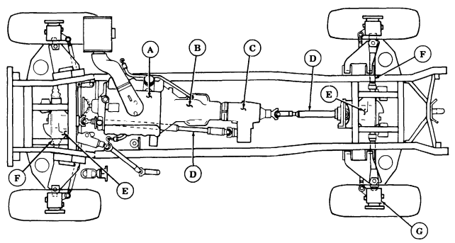 to front and rear wheels.

## 1-19. Fuel System Operation

The HMMWV diesel fuel system operation is identical for all models covered in this manual. It stores, cleans, and supplies fuel for the engine. Major components of the fuel system are:
FUEL PUMP - Draws fuel from fuel tank through the supply line and pumps it to the fuel filter.

FUEL RETURN LINE - Directs unused fuel from the injection pump back to the fuel tank.

FUEL SUPPLY LINE - Directs fuel from fuel tank to the system.

FUEL TANK - Stores 25 gallons of diesel fuel.

FUEL FILLER CAP - Located at right rear side of vehicle, the cap is removed to permit fuel tank servicing.

FUEL INJECTORS - Receive metered fuel from the injection pump and sprays fuel into the combustion chamber.

FUEL FILTER/WATER SEPARATOR- Filters water and sediment from fuel before fuel enters the injection pump.

INJECTION PUMP - Directs metered and pressurized fuel to the eight injector nozzles. It is


mounted on top of the engine under the intake manifold.

## 1 - 2 0 . Cooling System Operat I O N

The cooling system removes excess heat from the engine, engine oil, transfer oil, and transmission oil. This system is identical on all models covered in this manual. Major components of the cooling system are:
A**ENGINE TEMPERATURE SENDING UNIT** - Sends signal indicating coolant temperature to gauge on instrument cluster.

B**ENGINE TEMPERATURE SWITCH** - Sends signal to activate control valve system to operate fan when engine temperature exceeds 215°F (102°C) and deactivate when engine temperature drops below 190°F (88°C).

C**WATER CROSSOVER** - Collects coolant from cylinder heads and channels it to the thermostat housing where it is redirected through the cooling system.

D**THERMOSTAT** - Shuts off coolant return flow to radiator until temperature reaches 190°F (88°C).

Coolant is then directed to the radiator through the radiator inlet hose.

E**RADIATOR** - Directs coolant through a series of fins and baffles so outside air can dissipate excess engine heat before the coolant is recirculated through the engine.

F
OIL COOLER - Directs engine oil (lower half of cooler) and transmission oil (upper half of cooler) through a series of fins or baffles so outside air can remove heat from oil.

G
SURGE TANK - Filling and expansion point for cooling system.

H

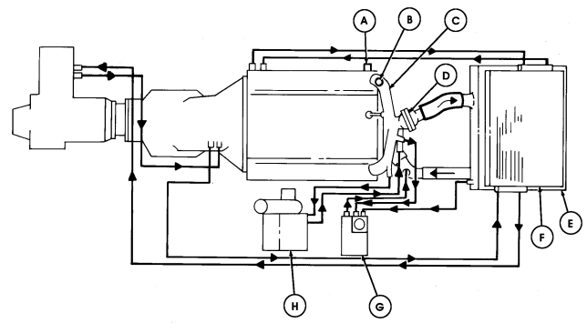

PERSONNEL HEATER - Provides heat for personnel and interior of vehicle.

### 1-20. Cooling System Operation (Cont'D)

FAN - Pulls outside air through radiator to remove heat from coolant. HYDRAULIC CONTROL VALVE - Directs hydraulic fluid to provide required pressure to actuate fan clutch as required by engine temperature. Hydraulic pressure supplied by power steering pump.

TIME DELAY MODULE - Sends delayed signal to fan clutch solenoid for delay of fan actuation to provide needed horsepower for engine acceleration.

FAN CLUTCH SOLENOID - Actuates hydraulic control valve as required by coolant temperature. WATER PUMP - Driven by V-belts provides circulation of coolant through cooling system.

FAN CLUTCH - Hydraulically actuated by pressure from hydraulic control valve to control operation of fan. Hydraulic pressure supplied by power steering pump.

DRAINCOCK - Draining point for radiator and cooling system.

RADIATOR SHROUD - Permits a greater concentration of air to be pulled through the radiator.


## 1-21. Starting System Operation

The starting system is identical for all vehicles covered in this manual, and consists of the following components and circuits.

ROTARY SWITCH - When in "START" position, provides battery power to the starter solenoid and to the neutral start switch through circuit 14.

NEUTRAL STARTER SWITCH - When transmission shift lever is in "N" (neutral) position, this switch closes a relay in the protective control box through circuit 14 allowing battery power to reach the starter solenoid. PROTECTIVE CONTROL BOX - Locks out the starter circuit, which prevents starter from reengaging while engine is running.

STARTER SOLENOID - A magnetic relay that transmits 24-volt battery power to the starter motor.

STARTER MOTOR - Cranks the engine for starting, and is supplied 24-volt battery power through

 circuit 6A.

# 1-22. Generating System Operation (60/100 Ampere Alternator)

The 60 ampere generating system is identical for all vehicles except the M997, M997A1, M997A2 4-litter and M996, M996A1 2-litter ambulances.

A
BATTERY GAUGE - Indicates electrical system voltage. It is connected to the electrical system through circuit 567.

B
ALTERNATOR (100 ampere) - Rated at 28 volts, 100 amperes, with external regulator. The alternator assists and recharges the batteries during operation.

C
ALTERNATOR (60 ampere) - Rated at 28 volts, 60 amperes, with internal regulator. The alternator assists and recharges the batteries during operation.

D
CIRCUIT 3 - Provides a ground circuit to alternator.

ાઝ CIRCUIT 5 - Conducts alternator output to charge the batteries and maintain vehicle voltage.

F
CIRCUIT 568 - Senses vehicle voltage activating the field current in the alternator to generate current.


## 1-23. Generating System Operation (200 Ampere Alternator)

The 200 ampere generating system maintains battery charge and provides electrical power to operate vehicle circuits. Major components of the generating system are:
BATTERY GAUGE - Indicates electrical system voltage. It is connected to the electrical system through circuit 567.

ALTERNATOR (200 AMPERE) - Is rated at 28 volts, 200 amperes, with external regulator. The alternator assists and recharges the vehicle batteries during operation.

CIRCUIT 568/CIRCUIT 5 (ALTERNATOR A0013036AA ONLY) - Senses vehicle voltage, and activates the field current in the alternator to generate current. PROTECTIVE CONTROL BOX - Protects the vehicle electrical system in the event battery polarity is reversed.

CIRCUIT 2 - Sends AC signal, indicating alternator shaft rpm, to frequency switch in protective

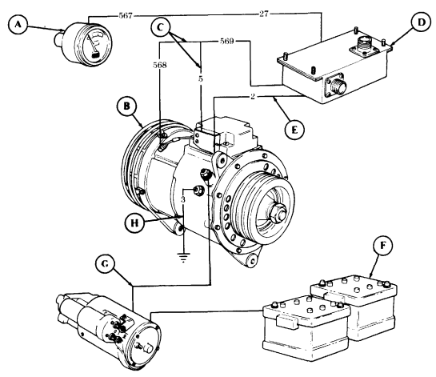 control box to prevent operation of starter solenoid when engine is running. BATTERIES - Two 12-volt batteries are connected in a series to provide 24 volts to start vehicle and assist alternator during operation.

POSITIVE CABLE - Transmits alternator output to maintain battery charge. A fuse at the alternator power stud will prevent damage to alternator if battery polarity is reversed.

CIRCUIT 3 - Connects to negative stud on alternator with engine ground strap to provide a ground circuit to alternator.

## 1 - 2 3 . 1 . G E N E R Ating System Operation (100 Ampere Dual Voltage Alt E R N At O R )

The 100-ampere dual voltage generating system maintains battery charge and provides electrical power to operate vehicle circuits. Major components of the generating system are:
C D
F
H
POSITIVE CABLE 68A - Provides 16-volt alternator output to maintain charge across the lower battery. CIRCUIT 3 - Connects to negative stud on alternator with engine ground strap to provide a ground

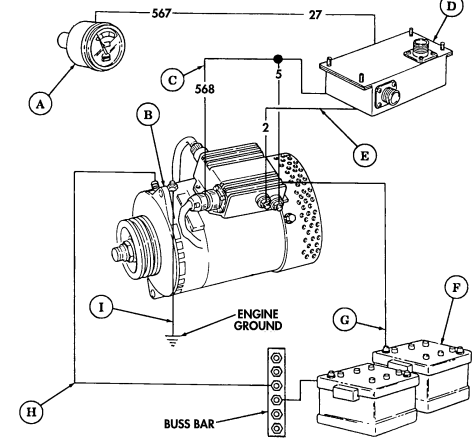

circuit to alternator. I
* Distribution box provides same function as protective control box except distribution box does not protect against reversal of battery polarity.

B**ALTERNATOR (100 AMPERE)**– Is rated at 28 volts at 100 amperes and 14 volts at 50 amperes with external regulator. The alternator assists and recharges the vehicle batteries during operation.

A**BATTERY GAUGE** - Indicates electrical system voltage. It is connected to the electrical system through circuit 567.

CIRCUIT 568 - Senses vehicle voltage, and activates the field current in the alternator circuit to alternator. PROTECTIVE CONTROL BOX / DISTRIBUTION BOX* - Protects the vehicle electric system in the event battery polarity is reversed. Provides load dump, glow plug operation, and interfacing of engine and body harnesses. CIRCUIT 2 - Sends AC signal, indicating alternator shaft rpm, to frequency switch in protective control box to prevent operation of starter solenoid when engine is running. E
BATTERIES - Two 12-volt batteries are connected in a series to provide 24 volts to start vehicle and assist alternator during operation.

G **POSITIVE CABLE 6** - Provides 28-volt alternator output to maintain charge across two batteries. 

## 1 - 2 3 . 2 . G E N E R Ating System Operation (200 Ampere Dual Voltage Alt E R N At O R )

The 200-ampere dual voltage generating system maintains battery charge and provides electrical power to operate vehicle circuits. Major components of the generating system are:
C
D
PROTECTIVE CONTROL BOX / DISTRIBUTION BOX* - Protects the vehicle electric system in the event battery polarity is reversed. Provides load dump, glow plug operation, and interfacing of engine and body harnesses.

F
CIRCUIT 2 - Sends AC signal, indicating alternator shaft rpm, to frequency switch in protective control box to prevent operation of starter solenoid when engine is running. E
BATTERIES - Two 12-volt batteries are connected in a series to provide 24 volts to start vehicle and assist alternator during operation.

G**POSITIVE CABLE 6** - Provides 28-volt alternator output to maintain charge across two batteries. 

H
POSITIVE CABLE 68A - Provides 16-volt alternator output to maintain charge across the lower battery.

I
CIRCUIT 3 - Connects to negative stud on alternator with engine ground strap to provide a ground

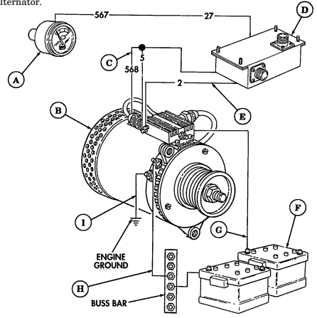 circuit to alternator.

* Distribution box provides same function as protective control box except distribution box does not protect against reversal of battery polarity.

B**ALTERNATOR (200 AMPERE)**– Is rated at 28 volts at 200 amperes and 14 volts at 50 amperes with external regulator. The alternator assists and recharges the vehicle batteries during operation.

A**BATTERY GAUGE** - Indicates electrical system voltage. It is connected to the electrical system through circuit 567.

CIRCUIT 568 - Senses vehicle voltage, and activates the field current in the alternator circuit to alternator.

## 1 - 2 3 . 3 . G E N E R Ating System Operation (400 Ampere Dual Voltage Alt E R N At O R )

The 400-ampere dual voltage generating system maintains battery charge and provides electrical power to operate vehicle circuits. Major components of the generating system are:
A**BATTERY GAUGE** - Indicates electrical system voltage. It is connected to the electrical system through circuit 567.

C
D
F
H
B**ALTERNATOR (400 AMPERE)** - Is rated at 28 volts at 400 amperes and 14 volts at 50 amperes with external regulator. The alternator assists and recharges the vehicle batteries during operation. CIRCUIT 568 - Senses vehicle voltage, and activates the field current in the alternator circuit to alternator. PROTECTIVE CONTROL BOX / DISTRIBUTION BOX* - Protects the vehicle electric system in the event battery polarity is reversed. Provides load dump, glow plug operation, and interfacing of engine body harnesses. CIRCUIT 2 - Sends AC signal, indicating alternator shaft rpm, to frequency switch in protective control box to prevent operation of starter solenoid when engine is running. E
BATTERIES - Two 12-volt batteries are connected in a series to provide 24 volts to start vehicle and assist alternator during operation.

G**POSITIVE CABLE 6** - Provides 28-volt alternator output to maintain charge across two batteries. 

POSITIVE CABLE 68A - Provides 16-volt alternator output to maintain charge across the lower battery.

I
CIRCUIT 3 - Connects to negative stud on alternator with engine ground strap to provide a ground

 circuit to alternator.

* Distribution box provides same function as protective control box except distribution box does not protect against reversal of battery polarity.

## 1-24. Battery System Operation

The battery system is identical for all vehicles covered in this manual and consists of the following circuits and components.

CIRCUIT 6A- Connects the batteries to the starter and to the protective control box through circuit 74A. BATTERIES - Two 6TN batteries are connected to provide 24 volts D.C. for the electrical starting system.

SLAVE RECEPTACLE - Links an external power source directly to the slaved vehicle's batteries to assist in cranking the engine when the vehicle's batteries are not sufficiently charged. SHUNT - Used when measuring current draw from batteries utilizing STE/ICE-R. PROTECTIVE CONTROL BOX - Protects the vehicle electrical system in the event the battery system polarity is reversed. ROTARY SWITCH - When in "START" position actuates starter solenoid through circuit 11A and 74A. When in "RUN" position closes circuit 29A to activate instrument cluster gages through circuit 27.

CIRCUIT 7A- Connects the battery system to the starter negative terminal and chassis ground. STARTER SOLENOID - Actuates starter motor gear to crank vehicle engine.


## 1-25. Windshield Wiper/Washer System Operation

The following miscellaneous components and circuits are not covered in any of the other electrical systems:
WINDSHIELD WIPER MOTOR - When knob is turned to "LOW" or "HIGH" position, circuit 27 carries battery power to wiper motor to activate windshield wipers.

CIRCUIT 57- Provides a ground circuit for wiper motor.

WINDSHIELD WASHER MOTOR - When knob on wiper motor is pushed, the washer motor is

 activated through circuit 71 to spray water onto windshield.

## 1-26. Parking Brake System Operation

The parking brake system for vehicles with serial numbers 1 through 44824 is a mechanically-actuated system that provides a means of keeping the vehicle still once it stops. It also assists in emergency stopping if there is a service brake system failure. Major components of the parking brake system are:
PARKING BRAKE ROTOR - Attached to pinion flange on rear differential, rotor prevents pinion flange from turning when parking brake is applied. BRAKE PADS - Apply friction to rotor when hand lever is applied.

PARKING BRAKE CALIPER - Forces brake pads against rotor when hand lever is applied.

PARKING BRAKE CABLE - Connects brake caliper to parking brake rod at bracket on left frame rail.

PARKING BRAKE ROD - Connects parking brake hand lever to parking brake cable by means of a adjustable clevis.

PARKING BRAKE HAND LEVER - Permits operator to engage the parking brake.

PARKING BRAKE HAND LEVER ADJUSTING CAP - Permits operator to make minor tension

 adjustment of parking brake.

## 1-27. Service/Parking Brake System Operation

The parking brake system is a mechanically-actuated system that provides a means of keeping the vehicle still once it stops. It also assists in emergency stopping if there is a complete service brake system failure. Major components of the parking brake system are:
PARKING BRAKE ROTORS - Attached to output flanges on rear differential, rotors prevents output flanges from turning when parking brake is applied.

BRAKE PADS - Apply friction to rotors when hand lever is applied.

PARKING BRAKE CALIPERS - Forces brake pads against rotors when hand lever is applied.

PARKING BRAKE CABLES - Connects parking brake hand lever to equalizer bar.

EQUALIZER BAR - Evenly distributes braking pressure to the rear brake rotors.

PARKING BRAKE ROD - Connects parking brake hand lever to equalizer bar.

PARKING BRAKE HAND LEVER - Permits operator to engage the parking brake.

PARKING BRAKE HAND LEVER ADJUSTING CAP - Permits operator to make minor tension

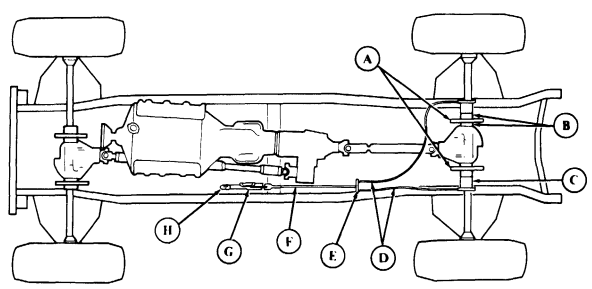 adjustment of parking brake.

## 1-28. Service Brake System Operation

The service brake system is identical for all models covered in this manual. It is an inboard-mounted, fourwheel, disc brake, hydraulically-assisted system. Major components of the braking system are:
HYDRO-BOOST - Converts hydraulic power from the steering pump to mechanical power to the master cylinder, providing power assist during braking.

MASTER CYLINDER/RESERVOIR - Stores brake fluid, and converts mechanical pedal pressure to hydraulic pressure. PROPORTIONING VALVE - Provides balanced front-to-rear braking and activates brake warning lamp in case of brake system malfunction.

ACCUMULATOR - Stores hydraulic pressure for additional power-assisted braking in case of loss of pressure in steering system.

BRAKE PEDAL - Provides operator control for stopping vehicle.

BRAKE LINKAGE - Directs brake pedal pressure to hydro-boost.


### 1-28. Service Brake System Operation (Cont'D)

HYDRAULIC BRAKE LINES - Directs brakes fluid under pressure to all four brake calipers from master cylinder.

BRAKE CALIPER - Converts hydraulic pressure to mechanical force to compress brake pads against brake rotors.

BRAKE ROTOR - Attached to output flange on front and rear differentials, rotor prevents output flange from turning when brakes are applied.

BRAKE PADS - Apply friction to brake rotor when brake pedal is depressed.


## 1-29. Steering Control System Operation

The steering system is identical for all models covered in this manual. Major components of the steering system are:
A **HYDRAULIC CONTROL VALVE** - Directs hydraulic fluid to provide required pressure to actuate and deactuate fan clutch as required by engine temperature. Hydraulic pressure supplied by power steering pump.

B **HYDRO-BOOST** - Converts hydraulic power from the steering pump to mechanical power to the master cylinder, providing power assist during braking.

C **ACCESSORY DRIVE PULLEY BELTS** - Transmits mechanical driving power from crankshaft drive pulley to steering pump pulley which drives the steering pump.

D **POWER STEERING COOLER** - Directs power steering fluid through a series of fins or baffles so outside air can dissipate excess heat before the fluid is recirculated through the steering system.

E **OIL RESERVOIR AND STEERING PUMP** - Combined in one unit, the reservoir serves as an oil


filling point and the pump supplies the oil under pressure throughout the steering system.

F **FAN CLUTCH** - Hydraulically actuated and deactuated by the hydraulic control valve. The fan is actuated when hydraulic pressure is released, and deactuated when hydraulic pressure is applied. Hydraulic pressure is supplied by the power steering pump.

## 1-29. Steering Control System Operation (Cont'D)

STEERING WHEEL - Serves as manual steering control for the operator.

STEERING COLUMN - Transmits turning effort from steering wheel to intermediate steering shaft.

INTERMEDIATE STEERING SHAFT - Permits angle of torque from steering column to input shaft of power steering gear. STEERING GEAR - Converts hydraulic power from steering pump to mechanical power at pitman arm. PITMAN ARM - Transfers steering torque from power steering gear to center link.

TIE ROD ASSEMBLY - Transmits movement from center link to geared hub.

GEARED HUB - Serves as the pivot point and link for the front wheels via the tie rod assembly.

CENTER LINK - Transmits movement from pitman arm to tie rods.

IDLER ARM - Supports right side of center link.


## 1 - 3 0 . Suspension System Operat I O N

The suspension system is identical for all models covered in this manual. It is an independent coil spring type system. Major components of the suspension system are:
A**BALL JOINTS** - Connects geared hub to control arms, and allows change of angle between geared hub and control arms during suspension movement.

B **UPPER CONTROL ARM** - Connects geared hub to frame rail.

C **STABILIZER BAR (FRONT ONLY)** - Prevents vehicle sway when cornering.

D**GEARED HUB** - Serves as a mounting point for wheel and tire assembly and provides 1.92:1 gear reduction to increase torque to wheel and tire assembly.

E **LOWER CONTROL ARM** - Connects geared hub to frame rail.

F **SHOCK ABSORBER** - Dampens suspension movement and limits amount of suspension travel.

G**COIL SPRING** - Supports weight of vehicle and allows suspension travel to vary depending on

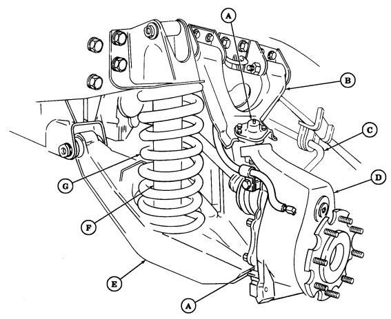

terrain and vehicle loading.

#### 1-30. Suspension System Operation (Cont'D)

RADIUS ROD (REAR ONLY) - Connects geared hub to frame, to maintain rear end alinement.


## 1-31. Ambulance Patlent Compartment Fuel Burning Heater System Operation

The ambulance patient compartment fuel burning heater in the M996, M996A1, M997, M997A1, and M997A2 vehicles are similar in that they are multi-fuel burning and heat filtered fresh air. Major components of the fuel burning heater system are:
FRESH AIR INTAKE GRILLE - The entry point of fresh air for the heater and ventilation system. The grille stops large debris from entering the system. FRESH AIR FILTER - Filters out dust and dirt which could foul the system.

FUEL BURNING HEATER - A self-contained heater/blower unit which heats filtered fresh air with a heat exchanger and forces it out to heat vents in the patient compartment.

HEATER EXHAUST PIPE - Outlet for exhaust gases from fuel burning heater.

HEATING/VENTILATION AND AIR-CONDITIONING SYSTEM (HVAC) CONTROL BOX —
The central point of operation for fuel burning heater. ELECTRICAL SYSTEM FUSE BOX - Provides electrical overload protection for the HVAC system.

MANUAL SHUTOFF VALVE - Stops fuel flow to heater in an emergency or when performing maintenance on the heater. FUEL FILTER - Filters contaminants out of the fuel for efficient burning.

FUEL PUMP - Pumps fuel out of the fuel tank and provides fuel pressure to the rest of the system. Pump will not draw fuel if tank is below 1/4 tank.

FUEL TANK - The supply point of fuel for fuel burning heater.

FUEL LINES - Supply fuel to the fuel burning heater.


1-32. M997, M997A1, AND M997A2 AMBULANCE AIR-CONDITIONING
SYSTEM OPERATION
The air-conditioning system covered in this manual applies only to the M997, M997A1, and M997A2 vehicles and consists of the following major components:
COMPRESSOR - Inside the compressor, low pressure gas refrigerant is compressed into a high pressure gas that is pushed into the condenser by the compressor.

DISCHARGE LINE - High pressure gas is carried through the discharge line from the compressor to the condenser.

CONDENSER - Refrigerant enters the condenser as a high pressure gas. When condensed, it gives up its heat to the outside air and becomes a high pressure liquid.

LIQUID LINE - High pressure liquid refrigerant is carried back to the evaporator by the liquid line to repeat the evaporation/condensation cycle.

EXPANSION VALVE - High pressure liquid refrigerant enters a non-adjustable expansion valve where the refrigerant is formed into a liquid spray.

EVAPORATOR - Refrigerant enters evaporator as a liquid spray. It absorbs heat from the air in the patient compartment and vaporizes into a low pressure gas.

SUCTION LINE - Refrigerant in low pressure gas form is drawn from the evaporator by the


suction action of the compressor.

## 1 - 3 3 . S T O Wage Racks And Tiedown Straps

The stowage racks and tiedown straps covered in this manual apply to the M1097, M1097A1, M1097A2, and M1123 vehicles and consist of the following major components:
A
AMMO STOWAGE RACK AND AMMO STRAP ASSEMBLY - Provides stowage for twenty-two ammunition rounds during transportation and allows quick access to rounds during reload operations.

B
M60 MACHINE GUN STRAPS (two each) - Secure M60 machine gun on top of ammo rack.

C
JACK STRUT SPRING CLIPS (two each) - Secure jack strut on top of ammo rack.

D
PARALLELOSCOPE SPIKE CLIPS (four each) - Secure two aiming stacks on top of ammo rack.

E
SIGHT BOX \#1 STRAPS (two each) - Secure sight box \#1 to cargo floor in front of ammo rack.

F
SIGHT BOX \#2 STRAP - Secure sight box \#2 to cargo floor in front of ammo rack.

G
SPADE STRAPS (two each) - Secure spade on cargo floor and against cargo bulkhead.

H

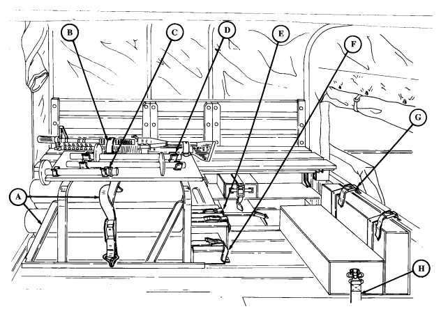

SECTION CHEST STRAPS (two each) - Secure section box on cargo floor.

## 1-33. Stowage Racks And Tiedown Straps (Cont'D)

FUEL CAN STRAP - Secures fuel cans to cargo bulkhead in front of right footwell.

REMOTE STRAP - Secures remote to right fixed door behind companion seat.

TRIPOD STRAPS (two each) - Secure tripod to bottom of troop seat.

TELEPHONE STRAP - Secures telephone to right fixed door in front of wheelhouse.

PARALLELOSCOPE AIMING POST STRAPS (three each) - Secure paralleloscope and aiming posts to cargo floor and right wheelhouse.

CABLE REEL STRAPS (two each) - Secure cable reels to right footwell in front of wheelhouse.


## 1-33. Stowage Racks And Tiedown Straps (Cont'D)

G.D.U. BATTERY STRAP - Secures G.D.U. battery to left fixed door in front of wheelhouse. WATER CAN STRAP - Secures water cans to cargo bulkhead in front of left footwell.

G.D.U. BOX STRAP - Secures G.D.U. to left footwell in front of wheelhouse.


CAMOUFLAGE STOWAGE RACK AND STRAPS (three) - Provide stowage for camouflage

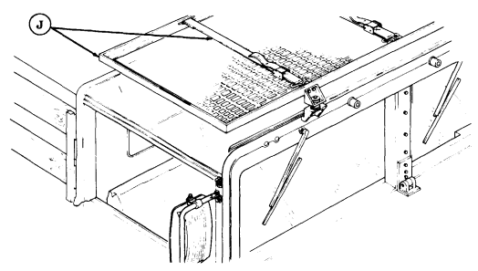

screen and support system during transportation.

## 1 - 3 4 . 200 Ampere Umbilical Power Cable

The 200 ampere umbilical power cable covered in this manual applies to the M1097A2 and M1123 vehicles and consists of the following major component.

A **POWER CABLE -** Located behind the companion seat provides power for shelter equipment.


# Chapter 2 Service And Troubleshooting Instructions

Section I. REPAIR PARTS, SPECIAL TOOLS, TEST, MEASUREMENT
DIAGNOSTIC EQUIPMENT (TMDE), AND SUPPORT EQUIPMENT

## 2-1. Common Tools And Equipment

For authorized common tools and equipment, refer to the Modified Table of Organization and Equipment
(MTOE) applicable to your unit.

2-2. SPECIAL TOOLS, TMDE, AND SUPPORT EQUIPMENT
Special Tools, Test, Measurement, Diagnostic Equipment (TMDE), and Support Equipment used to maintain the vehicles covered in this manual can be found in TM 9-2320-280-24P.

2-3. REPAIR PARTS
Repair parts are listed and illustrated in TM 9-2320-280-24P.

### Section Ii. Service Upon Receipt

## 2-4. General

a. Upon receipt of a new, used, or reconditioned vehicle, you must determine if the vehicle has been properly prepared for service. The following steps should be followed:
(1) Inspect all assemblies, subassemblies, and accessories to be sure they are in proper working order. (2) Secure, clean, lubricate, or adjust as needed.

(3) Check all Basic Issue Items (TM 9-2320-280-10) to be sure every item is present, in good condition, and properly mounted, or stowed.

(4) Follow general procedures for all services and inspections given in TM 9-2320-280-10.

b. The operator will assist when performing service upon receipt inspections.

c. See TM 9-2320-280-10 when checking equipment for proper operation.

d. Refer to TM 9-2320-280-10 for information concerning brake-in procedures.

## 2-5. General Inspection And Servicing Instructions

The following steps should be taken while performing general inspection and services:
NOTE
Cooler fin and engine protective covers can be used to prevent damage to the vehicle components during maintenance. Refer to Appendix D for fabrication instructions.

(1) Use TM 9-2320-280-10 as well as other sections of this manual, when servicing and inspecting equipment.

### Warning

Drycleaning solvent is flammable and will not be used near an open flame. A fire extinguisher will be kept nearby when the solvent is used. Use only in well-ventilated places. Failure to do this may result in injury to personnel and/or damage to equipment.

(2) Clean all exterior surfaces coated with rust-preventive compounds. Use drycleaning solvent
(Appendix C, Item 18).

(3) Clean fittings before lubrication. Clean parts with drycleaning solvent (SD), type II, or equivalent.

Dry before lubricating. Relubricate all items found contaminated after fording.

### .Warning.

Compressed air used for cleaning purposes will not exceed 30 psi (207 kPa). Use only with effective chip guarding and personal protective equipment such as goggles or shield, gloves, etc.

### Note

Use compressed air to dry electrical components. Use sealing compound (Appendix C, Item 40) before reconnecting plugs.

(4) Inspect electrical connectors for corrosion and/or damage (i.e., bent pins). Clean and repair damage. Clean electrical components with clean cloth dampened with drycleaning solvent. Care must be taken not to damage protective insulation.

(5) Read "Processing and Deprocessing Record of Shipping, Storage, and Issue of Vehicles and Spare Engines," tag (DD Form 1397) and follow all precautions listed. This tag should be attached to steering wheel, steering column, or rotary switch.

## 2 - 6 . Specific Inspection And Servicing Instructions

The following steps should be taken while performing specific inspections and services:
(1) Do the Semiannual (S) preventive maintenance checks and services listed in Section III in this chapter.

(2) Lubricate the vehicle. Do not lubricate gear cases and engine unless processing tag states that the oil is unsuitable for 500 mi (805 km) operation. If oil is suitable, just check level.

(3) Schedule semiannual service on DD Form 314 (Preventive Maintenance Schedule and Record Card). (4) If vehicle is delivered with a dry charged battery, activate it according to TM 9-6140-200-14. (5) Check vehicle coolant level and determine if solution is proper for climate (refer to TB 750-651 for preparation of antifreeze solutions).

(6) Remove towing brackets from their stowed position behind the bumper and install them in their proper location (para. 9-2, 9-3, or 9-4).

(7) Remove front lifting shackles from stowed position under passenger seat and install on towing brackets (para. 9-13).

## Section Iii. Preventive Maintenance Checks And Serv I C E S 2 - 7 . G E N E R A L

The best way to maintain vehicles covered by this manual is to inspect them on a regular basis so minor faults can be discovered and corrected before they result in serious damage, failure, or injury. All intervals are based on normal operation. Hard time intervals may be shortened if your lubricants are contaminated or if you are operating the equipment under adverse conditions, including longer-than-usual operating hours. Hard time intervals may be extended during periods of low activity, though adequate preservation precautions must be taken. This section contains systematic instructions of inspection, adjustment, lubrication, and correction of vehicle components to avoid costly repairs or major breakdowns. This is Preventive Maintenance Checks and Services (PMCS).

## 2 - 8 . I N T E Rva L S

a. Unit maintenance, assisted by operator/crew, will perform checks and services contained in Table 2-1 at the following intervals:
(1) Semiannually (S). Every 6 months or 3,000 miles (4,800 km), whichever comes first. (2) Annually (A). Every 12 months or 6,000 miles (9,654 km), whichever comes first. (3) Biennially (B). Every 24 months or 12,000 miles (19,308 km), whichever comes first.

b. Refer to following steps when performing lubrication checks and services:
(1) Intervals. Lubrication services coincide with the vehicle's Semiannual (S) Preventive Maintenance Service. For this propose, a 10% tolerance (variation) in specified lubrication point mileage is permissible. Those vehicles not accumulating 1,000 mi (1,609 km) in a 6-month period will be lubricated at the time of (S) Preventive Maintenance Service.

(2) Army Oil Analysis Program (AOAP). HMMWV engines and transmissions are enrolled in the Army Oil Analysis Program (AOAP). The sampling interval for the engine is every six months or 3,000 miles, or 100 hours (if hour meter is installed) of operation. For the transmission, the sampling interval is every 12 months or 6,000 miles, or 300 hours (if hour meter is installed) of operation.

(3) For Operation of Equipment in Protracted Cold Temperatures Below -15°F. (-26°C).

Remove lubricants prescribed in lubrication table for temperatures above -15°F (-26°C). Relubricate with lubricants specified in lubrication table for temperatures below -15°F (-26°C). If OEA lubricant is required, see the temperature ranges prescribed in the lubrication table. OEA lubricant is to be used in place of OE/HDO 10 lubricant for all temperature ranges where OE/HDO 10 is specified in the lubrication table.

c. Perform all (S) inspections in addition to (A) inspections at the time of the annual inspection. Perform all (A) and (S) inspections in addition to (B) inspections at the time of the biennial inspection.

## 2 - 9 . R E P O Rting Repa I R S

All vehicle shortcomings will be reported on DA Form 2404 Equipment Inspection and Maintenance Worksheet or DA Form 5988-E (automated) (DA Pam 738-750) immediately after the PMCS, and before taking corrective action. All vehicle deficiencies will be reported in the equipment record.

## 2 - 1 0 . General Service And Inspection Procedures

a. While performing specific PMCS procedures, make sure items are correctly assembled, secure, not worn, serviceable, not leaking, and adequately lubricated as defined below.

(1) An item is CORRECTLY ASSEMBLED when it is in proper position and all parts are present. (2) When wires, nuts, washers, hoses, or attaching hardware cannot be moved by hand, or wrench, they are SECURE.

(3) An item is WORN if there is too much play between joining parts or when marking data, warning, and caution plates are not readable.

(4) An item is UNSERVICEABLE if it is worn beyond repair and is likely to fail before the next scheduled inspection.

(5) LEAKS. TM 9-2320-280-10 contains definitions of Class I, II, and III leaks and their effect on vehicle operation.

(6) If an item meets the specified lubrication requirements, then it is ADEQUATELY LUBRICATED.

b. Where the instruction "tighten" appears in a procedure, you must tighten with a wrench to the given torque value even when the item appears to be secure.

### .Warning.

Drycleaning solvent is flammable and will not be used near an open flame. A fire extinguisher will be kept nearby when the solvent is used. Use only in well-ventilated places. Failure to do this may result in injury to personnel, and/or damage to equipment.

c. Where the instruction "clean" appears in a procedure, you must use drycleaning solvent (Appendix C,
Item 18) to clean grease or oil from metal parts. After the item is cleaned, rinsed, and dried, apply a light grade of oil to unprotected surfaces to prevent rusting.

d. Clean rubber and plastic materials with soap and water. Refer to TM 9-2320-280-10 for general vehicle cleaning instructions.

## 2-11. Specific Pmcs Procedures

a. The preventive maintenance for which you are responsible is provided in Table 2-1. The checks and services listed are arranged in logical order requiring minimal time and effort on your part.

b. The following columns read across on the PMCS schedule:
(1) Item Number. Provides logical order of PMCS performance and is used as a source number for DA Form 2404, on which your PMCS results will be recorded.

(2) Intervals. Shows the interval next to each item number to indicate when that check is to be performed. The interval will be repeated when consecutive item numbers are to be inspected during the same interval. Interval columns include:
(a) Semiannual (six month) checks; (b) Annual (yearly) checks; and
(c) Biennial (every two years) checks.

(3) Item To Be Inspected. Lists the system, common name, or location of the item to be inspected. (4) Procedures. Provides instructions for servicing, inspection, lubrication, replacement, or adjustment, and in some cases, having item repaired at a higher level.

### Note

Always do your preventive maintenance checks and services in the order prepared. Once it gets to be a habit, you will be able to spot anything wrong in a hurry.

(5) Not Fully Mission Capable. If vehicle meets criteria in this column, vehicle is not mission capable (NMC).

Table 2-1. Unit Level Preventive Maintenance Checks and Services HMMWV

| ( C o n t ' d )   |
|-------------------|

| ITEM   | INTERVAL      | ITEM TO BE          | PROCEDURES                                                                | NOT FULLY MISSION                     |
|--------|---------------|---------------------|---------------------------------------------------------------------------|---------------------------------------|
| NO.    |               | INSPECTED           |                                                                           | CAPABLE IF:                           |
| 1      | Semi\- Annual | Pre\-Service Checks | h. Bring vehicle to full stop. Engage parking brake while transmission is | h. Parking brake doesn't hold vehicle |
|        |               | (Cont'd)            | still in "D" (drive) or "(D)" (overdrive)                                 | stationary.                           |
|        |               |                     | for A2 series vehicles. Vehicle should                                    |                                       |
|        |               |                     | remain stationary.                                                        |                                       |
|        |               |                     | i. Observe vehicle response to road                                       |                                       |
|        |               |                     | shock. Side sway or continuous bouncing                                   |                                       |
|        |               |                     | indicates a malfunction.                                                  |                                       |
|        |               |                     | AFTER ROAD LEST                                                           |                                       |
| 2      | Semi\-        | Body                | a. Make sure the vehicle has been                                         |                                       |
|        | Annual        |                     | cleaned of mud, gravel, etc., from the                                    |                                       |
|        |               |                     | underbody, outside, and crew com\- partment area.                         |                                       |
|        |               |                     | b. Thoroughly wash all underbody                                          |                                       |
|        |               |                     | sheet metal panels and corners.                                           |                                       |
|        |               |                     | NOTE                                                                      |                                       |
|        |               |                     | Lubricate vehicle in accordance with                                      |                                       |
|        |               |                     | Lubrication Table.                                                        |                                       |
|        |               |                     | c. Inspect for loose rivets, cracks, loose or                             | c. Any body damage that               |
|        |               |                     | missing bolts and general body damage.                                    | would hinder vehicle                  |
|        |               |                     |                                                                           | operation.                            |
| 3      | Semi\-        | Fuel                | a. Inspect fuel filter/water separator                                    | a. Any class III fuel                 |
|        | Annual        | System              | assembly for dents and cracks that                                        | leak.                                 |
|        |               |                     | could cause leaks.                                                        |                                       |
|        |               |                     | b. Inspect fuel injection pump,                                           | b. Any class III leak.                |
|        |               |                     | nozzle lines, and fittings for leaks and                                  | Any nozzle loose or                   |
|        |               |                     | damage.                                                                   | damaged.                              |
|        |               |                     | c. Inspect rear fuel injector nozzle                                      | c. Rubber cap missing                 |
|        |               |                     | rubber cap for presence and                                               | or damaged.                           |
|        |               |                     | condition.                                                                |                                       |
|        |               |                     | FUEL/WATER                                                                |                                       |
|        |               |                     | SEPARATOR                                                                 |                                       |

Table 2-1. Unit Level Preventive Maintenance Checks and Semites HMMWV (Cont'd)

| Table 1\-1. Differences Between Models   |          |                     |    |               |          |    |    |    |    |    |    |    |
|------------------------------------------|----------|---------------------|----|---------------|----------|----|----|----|----|----|----|----|
| Equipment/                               | Function |                     |    |               |          |    |    |    |    |    |    |    |
| Personnel/Cargo                          | x        | x                   | x  | Operations    |          |    |    |    |    |    |    |    |
| TOW Launcher                             | x        | x                   | x  | x             | Mounting |    |    |    |    |    |    |    |
| Armament Mounting                        | x        | x                   | x  | x             |          |    |    |    |    |    |    |    |
| S250 Shelter                             | x        | x                   | x  | Configuration |          |    |    |    |    |    |    |    |
| Ambulance:                               |          |                     |    |               |          |    |    |    |    |    |    |    |
| Two Litter Patients                      | x        | x                   |    |               |          |    |    |    |    |    |    |    |
| Four Litter Patients                     | x        |                     |    |               |          |    |    |    |    |    |    |    |
| Eight Ambulatory                         | x        | Patients            |    |               |          |    |    |    |    |    |    |    |
| Six Ambulatory                           | x        | Patients            |    |               |          |    |    |    |    |    |    |    |
| Two Litter and Four                      | x        | Ambulatory Patients |    |               |          |    |    |    |    |    |    |    |
| One Litter and                           | x        | Three Ambulatory    |    |               |          |    |    |    |    |    |    |    |
| Patients                                 |          |                     |    |               |          |    |    |    |    |    |    |    |
| Vehicle Winch                            | x        | x                   | x  | x             | x        | x  |    |    |    |    |    |    |
| Communications:                          |          |                     |    |               |          |    |    |    |    |    |    |    |
| AN/GRC\-160                              | x        | x                   | x  | x             | x        | x  | x  | x  | x  | x  | x  | x  |
| AN/VRC\-12 Series                        | x        | x                   |    |               |          |    |    |    |    |    |    |    |
| Collective NBC Protection                | x        | x                   |    |               |          |    |    |    |    |    |    |    |
| Basic Armor                              | x        | x                   | x  | x             | x        | x  |    |    |    |    |    |    |
| Supplemental Armor                       | x        | x                   | x  | x             |          |    |    |    |    |    |    |    |
| Howitzer Prime Mover                     | x        |                     |    |               |          |    |    |    |    |    |    |    |

Table 2-1. Unit Level Preventive Maintenance Checks and Services HMMWV (Cont'd)

| Vehicle performance data for the M998 series vehicles is listed in table 1\-2. This information includes only   |                                            |
|-----------------------------------------------------------------------------------------------------------------|--------------------------------------------|
| that data applicable to unit maintenance. Information not covered can be found in TM\-9\-2320\-280\-10.         |                                            |
| Table 1\-2. Tabulated Data                                                                                      |                                            |
| NOTE                                                                                                            |                                            |
| Standard and metric measurements will be used in this table.                                                    |                                            |
| A list of their abbreviations is provided below.                                                                |                                            |
| TABULATED DATA ABBREVIATIONS                                                                                    |                                            |
| MEASUREMENT  ABBREVIATION  MEASUREMENT  ABBREVIATION                                                            |                                            |
| Pint pt  Fahrenheit F                                                                                           |                                            |
| Quart qt  Celsius C                                                                                             |                                            |
| Gallon gal.  Liters L                                                                                           |                                            |
| Inch in.  Centimeter cm                                                                                         |                                            |
| Miles Per Hour mph  Kilometers Per Hour kph                                                                     |                                            |
| Miles Per Gallon mpg  KiloPascal kPa                                                                            |                                            |
| Pounds Per Square Inch psi  Maximum max                                                                         |                                            |
| Revolutions Per Minute rpm  Minimum min                                                                         |                                            |
| Kilometers Per Liter km/L  Kilogram kg                                                                          |                                            |
| Pound\-Feet lb\-ft  Newton\-Meter N•m                                                                           |                                            |
| Gallon Per Minute gpm  Millimeter mm                                                                            |                                            |
| Volt V  Ampere A                                                                                                |                                            |
| Horsepower hp  KiloWatt kW                                                                                      |                                            |
| Liters Per Minute l/m                                                                                           |                                            |
| STANDARD  METRIC                                                                                                |                                            |
| 1. PAYLOAD                                                                                                      |                                            |
| 1,135 kg                                                                                                        | M998, M998A1, M1038, and M1038A1 2,50 0 lb |
| M1097, M1123, "A1" and "A2" Series 4,40 0 lb 1,998 kg                                                           |                                            |
| 2. CAPACITIES*                                                                                                  |                                            |
| Cooling System 26 qt 24.6 L                                                                                     |                                            |
| Engine                                                                                                          |                                            |
| Crankcase Only 7 qt 6.6 L                                                                                       |                                            |
| Crankcase and Filter 8 qt 7.6 L                                                                                 |                                            |
| Fuel Tank 25 gal. 94.6 L                                                                                        |                                            |
| Differential (each) 2 qt 1.9 L                                                                                  |                                            |
| Transmission (3L80):                                                                                            |                                            |
| Drain and Refill 6 qt 5.7 L                                                                                     |                                            |
| W/Dry Converter 11 qt 13.2 L                                                                                    |                                            |
| Transmission (4L80\-E):                                                                                         |                                            |
| Drain and Refill 7.7 qt 7.3 L                                                                                   |                                            |
| W/Dry Converter 13.5 qt 12.8 L                                                                                  |                                            |
| Transfer Case (model 218) 3.5 qt 3.3 L                                                                          |                                            |
| Transfer Case (model 242) 3.35 qt 3.17 L                                                                        |                                            |
| Geared Hub 1 pt 0.47 L                                                                                          |                                            |
| Steering Hydraulic System 1 qt 0.95 L                                                                           |                                            |
| Steering Hydraulic System with Steering Cooler 1.25 qt 1.18 L                                                   |                                            |
| Brake Hydraulic System (All except M1097, M1123, "A1" and "A2" series). . 1.2 pt 0.57 L                         |                                            |
| Brake Hydraulic System (M1097, M1123, "A1" and "A2" series) 1.63 pt  0.77 L                                     |                                            |
| Brake Master Cylinder (All except M1097, M1123, "A1" and "A2 series). . .  0.69 pt 0.33 L                       |                                            |
| Brake Master Cylinder (M1097, M1123, "A1" and "A2" series) 1.12 pt  0.53 L                                      |                                            |
| Windshield Washer Reservoir 1 qt 0.95 L                                                                         |                                            |
| *ALL HYDRAULIC SYSTEMS AND ALL FUEL CAPACITIES                                                                  |                                            |
| ARE CALCULATED APPROXIMATIONS                                                                                   |                                            |

Table 2-1. Unit Level Preventive Maintenance Checks and Services HMMWV (Cont'd)

| 3.   | ENGINE                                               |                      |
|------|------------------------------------------------------|----------------------|
|      | Model DDA 6.2 L                                      |                      |
|      | Type Diesel, Naturally Aspirated Liquid\-Cooled, V8  |                      |
|      | Brake Horsepower 150 hp @ 3,600 rpm                  | 111.9 kW @ 3,600 rpm |
|      | Idle Speed 650 ± 25 rpm                              |                      |
|      | Operating Speed 1,500\-2,300 rpm                     |                      |
|      | Oil Pressure:  @ Idle 10 psi                         | 69 kPa               |
|      | @ Operating Speed 40\-50 psi                         | 276\-345 kPa         |
| 4.   | ENGINE                                               |                      |
|      | Model DDA 6.5 L and 6.5 L Detuned                    |                      |
|      | Type Diesel, Naturally Aspirated, Liquid\-Cooled, V8 |                      |
|      | Brake Horsepower 160 hp @ 3,400 rpm                  | 119.4 kW @ 3,400 rpm |
|      | Idle Speed 700 ± 25 rpm                              |                      |
|      | Operating Speed 1,500\-2,300 rpm                     |                      |
|      | Oil Pressure                                         |                      |
|      | @ Idle 10 psi                                        | 69 kPa               |
|      | @ Operating Speed 40\-50 psi                         | 276\-345 kPa         |
| 5.   | FUEL SYSTEM                                          |                      |
|      | Fuel Pump (Mechanical):                              |                      |
|      | Type Cam\-Driven Diaphragm                           |                      |
|      | Fuel Filter                                          |                      |
|      | Type Fuel/Water Separator                            |                      |
|      | Air Cleaner:                                         |                      |
|      | Type Dry Element                                     |                      |
|      | Glowplug:                                            |                      |
|      | Type Fast Start                                      |                      |
| 6.   | COOLING SYSTEM                                       |                      |
|      | Surge Tank Cap Pressure 15 psi                       | 103 kPa              |
|      | Thermostat:                                          |                      |
|      | Starts to Open 190°F                                 | 88°C                 |
|      | Fully Open 212°F                                     | 100°C                |
|      | Radiator:                                            |                      |
|      | Type Downflow                                        |                      |
|      | Fan:                                                 |                      |
|      | Type Ten Blade                                       |                      |
|      | Diameter 19 in.                                      | 48.26 cm             |
| 7.   | ELECTRICAL SYSTEM                                    |                      |
|      | Alternator:                                          |                      |
|      | 60 Ampere 60 A @ 28 V                                |                      |
|      | 100 Ampere 100 A @ 28 V                              |                      |
|      | 200 Ampere 200 A @ 28 V                              |                      |
|      | 400 Ampere 400 A @ 28 V                              |                      |
|      | Starter:                                             |                      |
|      | Voltage 14 V                                         |                      |
|      | Batteries (2):                                       |                      |
|      | Voltage 12 V                                         |                      |

Table 2-1. Unit Level Preventive Maintenance Checks and Services HMMWV (Cont'd)

|     |                 | STANDARD                                             | METRIC         |
|-----|-----------------|------------------------------------------------------|----------------|
| 8.  | TRANSMISSION    |                                                      |                |
|     | Model           | 3L80                                                 |                |
|     | Type            | 3\-Speed, Automatic                                  |                |
|     | Oil Type        | Dexron® II                                           |                |
|     | Oil Pressure    | 55\-160 psi                                          | 379\-1,103 kPa |
| 9.  | TRANSMISSION    |                                                      |                |
|     | Model           | 4L80\-E                                              |                |
|     | Type            | 4\-speed, Automatic Torque Converter Stall Ratio and |                |
|     |                 | Direct Drive w/Lock Up Clutch                        |                |
|     | Gear Ratios     |                                                      |                |
|     |                 | First 2.48:1                                         |                |
|     | Second          | 1.45:1                                               |                |
|     | Third           | 1.00:1                                               |                |
|     | Fourth          | 0.75:1                                               |                |
|     |                 | Reverse 2.08:1                                       |                |
|     | Oil Type        | Dexron® III                                          |                |
|     | Oil Pressure    | 35\-324 psi                                          | 241\-2,234 kPa |
| 10. | TRANSFER CASE   |                                                      |                |
|     | Model           | NPG 218 w/Cooler                                     |                |
|     |                 | NPG 242 w/Cooler                                     |                |
|     |                 | Type 2\-speed                                        |                |
|     | Oil Type        | Dexron® II                                           |                |
| 11. |                 | SERVICE BRAKE CALIPER (FRONT)                        |                |
|     |                 | Manufacturer Kelsey\-Hayes                           |                |
|     |                 | Piston Diameter 2.6 in.                              | 66 mm          |
| 12. |                 | SERVICE/PARKING BRAKE CALIPER (REAR)                 |                |
|     |                 | Manufacturer Kelsey\-Hayes                           |                |
|     | Piston diameter | 2.6 in.                                              | 66 mm          |
| 13. |                 | SERVICE BRAKE ROTOR (FRONT)                          |                |
|     |                 | Manufacturer Kelsey\-Hayes                           |                |
|     | A2 Manufacturer | Kelsey\-Hayes                                        |                |
|     | Diameter        | 10.5 in.                                             | 267 mm         |
|     | A2 Diameter     | 12 in.                                               | 305 mm         |
|     | Thickness       | 0.87 in.                                             | 22.1 mm        |
|     | A2 Thickness    | 1.02 in.                                             | 26 mm          |
| 14. |                 | SERVICE/PARKING BRAKE ROTOR (REAR)                   |                |
|     |                 | Manufacturer Kelsey\-Hayes                           |                |
|     | A2 Manufacturer | Kelsey\-Hayes                                        |                |
|     | Diameter        | 10.5 in.                                             | 267 mm         |
|     | A2 Diameter     | 12 in.                                               | 305 mm         |
|     | Thickness       | 0.87 in.                                             | 22.1 mm        |
|     | A2 Thickness    | 1.02 in.                                             | 26 mm          |

Table 2-1. Unit Level Preventive Maintenance Checks and Services HMMWV (Cont'd)

| 15.        | PARKING BRAKE (VEHICLES SERIAL NUMBERS 1 THROUGH 44824)     |                     |           |
|------------|-------------------------------------------------------------|---------------------|-----------|
|            | Type Rod and Cable Actuated, Caliper                        |                     |           |
|            | Rotor Diameter 8 in.                                        |                     | 203 mm    |
|            | Brake Pad:                                                  |                     |           |
|            | Type Bonded Minimum thickness 0.125 in.                     |                     |           |
|            | Lever Type Over\-Center                                     |                     | 3.2 mm    |
| 16.        | WHEELS AND TIRES                                            |                     |           |
|            | Tire size (Bias ply) 36 in. x 12.5 in. x 16.5 in.           | 91.4 cm x 31.75 cm  |           |
|            |                                                             |                     | x 41.9 cm |
|            | Tire size (Radial) 37 in. x 12.5 in. x 16.5 in.             | 93.98 cm x 31.75 cm |           |
|            |                                                             |                     | x 41.9 cm |
|            | Wheels:                                                     |                     |           |
|            | Type Offset Disc                                            |                     |           |
|            | Runflat Insert:                                             |                     |           |
|            | Type 2\-Piece Magnesium                                     |                     |           |
| 17.        | STEERING SYSTEM                                             |                     |           |
|            | Steering Gear:                                              |                     |           |
|            | Manufacturer Saginaw                                        |                     |           |
|            | Type Variable Ratio                                         |                     |           |
|            | Ratio 13/16:1                                               |                     |           |
|            | Power Steering Pump:                                        |                     |           |
|            | Model Saginaw 125                                           |                     |           |
|            | Output Pressure (max) 1,450 psi                             | 9,998 kPa           |           |
|            | Flow Rate (max) 3.5 gpm                                     |                     | 13.2 l/m  |
|            | Tow\-In (Front/Rear @ curb weight):                         |                     |           |
|            | M998, M998A1, M1025, M1025A1, M1025A2, M1026, M1026A1,      |                     |           |
|            | M1035, M1035A1, M1035A2, M1038, M1038A1, M1043, M1043A1,    |                     |           |
|            | M1043A2, M1044, M1044A1, M1097, M1097A1,                    |                     |           |
|            | M1097A2, and M1123 0.438 in. ± 0.125 in.                    | 11 mm ± 3.2 mm      |           |
|            | M966, M966A1, M996, M996A1, M997, M997A1, M997A2,           |                     |           |
|            | M1036, M1037, M1042, M1045, M1045A1, M1045A2, M1046, M1121, |                     |           |
|            | and M1046A1 0.312 in. ± 0.125 in.                           | 8 mm ± 3.2 mm       |           |
| 18.        | WINCH                                                       |                     |           |
|            | Model W6000D25                                              |                     |           |
| Type       | Electric Drive, Thermal Cutoff Switch                       |                     |           |
|            | Capacity 6,000 lb                                           |                     | 2,724 kg  |
| 19.        | WINCH                                                       |                     |           |
|            | Model MIL\-9000                                             |                     |           |
|            | Type Electric Drive, Thermal Cutoff Switch                  |                     |           |
|            | Capacity 9,000 lb                                           |                     | 4,086 kg  |
| 19.1.WINCH |                                                             |                     |           |
|            | Model 983\-75\-50050                                        |                     |           |
| Type       | Hydraulic                                                   |                     |           |
|            | Capacity 10,500 lb                                          |                     | 4,767 kg  |
| 20.        | AIR\-CONDITIONING COMPRESSOR                                |                     |           |
|            | Manufacturer Sanden                                         |                     |           |

Table 2-1. Unit Level Preventive Maintenance Checks and Services HMMWV (Cont'd)

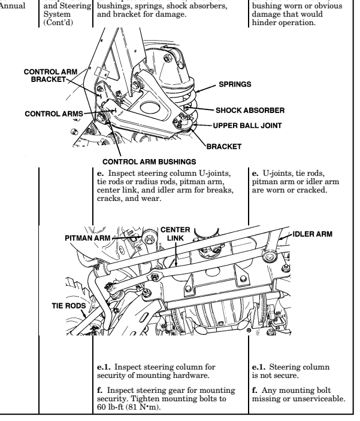

| ITEM   | INTERVAL   | ITEM TO BE      | PROCEDURES                                                              | NOT FULLY WISSION          |
|--------|------------|-----------------|-------------------------------------------------------------------------|----------------------------|
| NO.    |            | INSPECTED       |                                                                         | CAPABLE IF:                |
| 10     | Semi\-     | Suspension      | g. Inspect power steering pump.                                         | g. Any class III leak      |
|        | Annual     | and Steering    | power steering gear, hydraulic                                          | Any component damaged.     |
|        |            | System          | control valve, hoses, lines, and                                        |                            |
|        |            | (Cont'd)        | fittings for leaks or damage.                                           |                            |
| 11     | Semi\-     | Brake           | a. Inspect master cylinder,                                             | a. Any leak. Plugged.      |
|        | Annual     | System          | hydro\-boost, lines, and fittings for                                   | broken, or damaged         |
|        |            |                 | leaks and damage.                                                       | lines and fittings.        |
|        |            | MASTER CYLINDER |                                                                         | MASTER CYLINDER            |
|        |            |                 | HYDRO\-BOOST                                                            |                            |
|        |            |                 |                                                                         | NEW CONFIGURATION          |
|        |            |                 | CAUTION                                                                 |                            |
|        |            |                 | · Use MIL\-B\-46176, Silicone Brake                                     |                            |
|        |            |                 | Fluid (BFS), for filling master brake cylinder. Failure to use BFS will |                            |
|        |            |                 | cause damage to brake cylinder.                                         |                            |
|        |            |                 | · Throughly clean exterior of master                                    |                            |
|        |            |                 | cylinder cover before removing cover                                    |                            |
|        |            |                 | (table 2\-1). Dirt, water, or grease will                               |                            |
|        |            |                 | contaminate brake fluid causing                                         |                            |
|        |            |                 | brake system damage.                                                    |                            |
|        |            |                 | · Do not use screwdriver to remove                                      |                            |
|        |            |                 | cover. Damage to bail wire will result.                                 |                            |
|        |            |                 | · To prevent excessive fluid spillage,                                  |                            |
|        |            |                 | ensure that rubber diaphragm is                                         |                            |
|        |            |                 | completely seated before installing cover to master cylinder.           |                            |
|        |            |                 | NOTE                                                                    |                            |
|        |            |                 | Remove cover from brake master                                          |                            |
|        |            |                 | cylinder by moving bail wire using                                      |                            |
|        |            |                 | thumb pressure only.                                                    |                            |
|        |            |                 | b. Check master brake cylinder fluid                                    | b. Level below 1/8 inch    |
|        |            |                 | level. Level should be 1/8 inch                                         | (3.2 mm) from top of       |
|        |            |                 | (3.2 mm) from top of master cylinder                                    | master cylinder reservoir. |
|        |            |                 | reservoirs. Fill with BFS as necessary.                                 |                            |

Table 2-1. Unit Level Preventive Maintenance Checks and Services HMMWV (Cont'd)

| G E N E R A L                                                                                                                                                          |                                                                                                         |         |
|------------------------------------------------------------------------------------------------------------------------------------------------------------------------|---------------------------------------------------------------------------------------------------------|---------|
|                                                                                                                                                                        | This section explains how components of the M998 series vehicles work together. The systems (functional |         |
|                                                                                                                                                                        | groups) covered are listed in the Principles of Operation Reference Index, paragraph 1\-17.             |         |
|                                                                                                                                                                        | PRINCIPLES OF OPERATION REFERENCE INDEX                                                                 |         |
|                                                                                                                                                                        | S Y S T E M                                                                                             | P A G E |
| P A R A .                                                                                                                                                              |                                                                                                         | N O .   |
|                                                                                                                                                                        | Drivetrain Operation                                                                                    | 1\-36   |
|                                                                                                                                                                        | Fuel System Operation                                                                                   | 1\-37   |
|                                                                                                                                                                        | Cooling System Operation                                                                                | 1\-38   |
|                                                                                                                                                                        | Starting System Operation                                                                               | 1\-40   |
|                                                                                                                                                                        | Generating System Operation                                                                             | 1\-41   |
|                                                                                                                                                                        | Generating System Operation (200 Ampere Alternator)                                                     | 1\-42   |
| 1\-23.1.                                                                                                                                                               | Generating System Operation (100 Ampere Dual Voltage                                                    |         |
|                                                                                                                                                                        | Alternator)                                                                                             | 1\-42.1 |
|                                                                                                                                                                        | Generating System Operation (200 Ampere Dual Voltage                                                    |         |
|                                                                                                                                                                        | Alternator)                                                                                             | 1\-42.2 |
|                                                                                                                                                                        | Generating System Operation (400 Ampere Dual Voltage                                                    |         |
|                                                                                                                                                                        | Alternator)                                                                                             | 1\-42.3 |
|                                                                                                                                                                        | Battery System Operation                                                                                | 1\-43   |
|                                                                                                                                                                        | Windshield Wiper/Washer System Operation                                                                | 1\-44   |
|                                                                                                                                                                        | Parking Brake System Operation                                                                          | 1\-45   |
|                                                                                                                                                                        | Service/Parking Brake System Operation                                                                  | 1\-46   |
|                                                                                                                                                                        | Service Brake System Operation                                                                          | 1\-47   |
|                                                                                                                                                                        | Steering Control System Operation                                                                       | 1\-49   |
|                                                                                                                                                                        | Suspension System Operation                                                                             | 1\-51   |
|                                                                                                                                                                        | Ambulance Patient Compartment Fuel Burning Heater                                                       | 1\-53   |
|                                                                                                                                                                        | System Operation                                                                                        |         |
|                                                                                                                                                                        | M997, M997A1, and M997A2 Ambulance Air\-Conditioning                                                    | 1\-54   |
|                                                                                                                                                                        | System Operation                                                                                        |         |
|                                                                                                                                                                        | Stowage Racks and Tiedown Straps                                                                        | 1\-55   |
|                                                                                                                                                                        | 200 Ampere Umbilical Power Cable                                                                        | 1\-58   |
| 1 \- 1 6 . 1 \- 1 7 . R E F . 1\-18. 1\-19. 1\-20. 1\-21. 1\-22. 1\-23. 1\-23.2. 1\-23.3. 1\-24. 1\-25. 1\-26. 1\-27. 1\-28. 1\-29. 1\-30. 1\-31. 1\-32. 1\-33. 1\-34. |                                                                                                         |         |

Table 2-1. Unit Level Preventive Maintenance Checks and Services HMMWV (Cont'd)

| I T E M   | I N T E RVA L   | ITEM TO BE        | P R O C E D U R E S                        | NOT FULLY MISSION            |
|-----------|-----------------|-------------------|--------------------------------------------|------------------------------|
| N O .     |                 | I N S P E C T E D |                                            | C A PABLE IF:                |
|           |                 |                   | PRIOR TO ROAD TEST                         |                              |
|           |                 |                   | Ensure Operator/Crew has                   |                              |
|           |                 |                   | performed PMCS listed in TM 9\-            |                              |
|           |                 |                   | 2320\-280\-10.                             |                              |
|           |                 |                   | ROAD TEST                                  |                              |
|           |                 |                   | Maintenance personnel will be with         |                              |
|           |                 |                   | vehicle operator to assist in perform                                            |                              |
|           |                 |                   | ing PMCS checks and verify pre                                            |                              |
|           |                 |                   | service checks.                            |                              |
| 1         | Semi\-          | Pre\-Service      | a. Notice if starter engages smoothly      | a. Starter inoperative or    |
|           | Annual          | Checks            | and turns the engine at normal             | makes excessive grinding     |
|           |                 |                   | cranking speed.                            | sound.                       |
|           |                 |                   | b. Listen for unusual noise at idle,       | b. Engine knocks, rattles,   |
|           |                 |                   | at operating speed, and under              | or smokes excessively.       |
|           |                 |                   | acceleration. Be alert for excessive       |                              |
|           |                 |                   | vibration and the smell of oil, fuel,      |                              |
|           |                 |                   | and exhaust.                               |                              |
|           |                 |                   | c. Check for transmission response to      | c. Transmission shifts       |
|           |                 |                   | shifting and for smoothness of             | improperly, does not shift,  |
|           |                 |                   | operation in all gear ranges. Be alert     | or makes excessive noises.   |
|           |                 |                   | for unusual noises and difficulty in       |                              |
|           |                 |                   | shifting in any speed range.               |                              |
|           |                 |                   | NOTE                                       |                              |
|           |                 |                   | If desired range cannot be selected,       |                              |
|           |                 |                   | turn engine off, select range, and re                                            |                              |
|           |                 |                   | start engine.                              |                              |
|           |                 |                   | d. Check for transfer response to          | d. Lever inoperable or       |
|           |                 |                   | shifting and for smoothness of             | does not engage in all       |
|           |                 |                   | operation in all gear ranges. Be           | ranges with engine not       |
|           |                 |                   | alert for unusual noises and difficulty    | running.                     |
|           |                 |                   | in shifting in any gear range.             |                              |
|           |                 |                   | e. Test for response to accelerator        | e. Pedal sticking or         |
|           |                 |                   | feed. Observe for sticking pedal.          | binding.                     |
|           |                 |                   | f. With vehicle speed approximately 5      | f. Steering binds, grabs,    |
|           |                 |                   | mph (8 kph) turn steering wheel to         | wanders, or has excessive    |
|           |                 |                   | left, then right, to detect hard steering, | freeplay.                    |
|           |                 |                   | steering backlash, or shimmy. Vehicle      |                              |
|           |                 |                   | should respond instantly. With vehicle     |                              |
|           |                 |                   | moving on straight, level terrain, lightly |                              |
|           |                 |                   | hold steering wheel to check for pull      |                              |
|           |                 |                   | and wandering.                             |                              |
|           |                 |                   | g. Apply brake pedal with steady force.    | g. Brakes chatter, pull      |
|           |                 |                   | Vehicle should slow and stop without       | to one side, or inoperative. |
|           |                 |                   | pulling to one side or jerking. Release    | Brakes will not release.     |
|           |                 |                   | brake pedal. The brakes should release     |                              |
|           |                 |                   | immediately and without difficulty.        |                              |

Table 2-1. Unit Level Preventive Maintenance Checks and Services HMMWV (Cont'd)

| Table 2\-1. Unit Level Preventive Maintenance Checks and Semites HMMWV (Cont'd)   |
|-----------------------------------------------------------------------------------|
| NOTE                                                                              |

Table 2-1. Unit Level Preventive Maintenance Checks and Services HMMWV (Cont'd)

| I T E M   | I N T E RVA L   | ITEM TO BE        | P R O C E D U R E S                               | NOT FULLY MISSION                                       |
|-----------|-----------------|-------------------|---------------------------------------------------|---------------------------------------------------------|
| N O .     |                 | I N S P E C T E D |                                                   | C A PABLE IF:                                           |
| 3         | Semi\-          | Fuel              | d. Inspect all fuel lines for loose con\-         | d. Any class III leak.                                  |
|           | Annual          | System            | nections, splits, cracks, and bends that          |                                                         |
|           |                 | (Cont'd)          | could leak.                                       |                                                         |
|           |                 |                   | e. Disconnect leads from each                     | e. Continuity is not                                    |
|           |                 |                   | glow plug (paragraph 3\-38) and check             | present.                                                |
|           |                 |                   | for resistance between glow plug ter                                                   |                                                         |
|           |                 |                   | minal and ground. Continuity should               |                                                         |
|           |                 |                   | be present.                                       |                                                         |
|           |                 |                   | f. Check each glow plug for looseness             | f. Glow plugs are loose                                 |
|           |                 |                   | and damage. Tighten each plug to                  | or damaged.                                             |
|           |                 |                   | 8\-12 lb\-ft (11\-16 N•m).                        |                                                         |
|           |                 |                   | g. Check locknut on body mounts.                  | g. Body mounts loose.                                   |
|           |                 |                   | Proper torque 90 lb\-ft (122 N•m).                |                                                         |
|           |                 |                   | h. Check the fuel tank for propeller              | h. Any class III fuel leak                              |
|           |                 |                   | shaft rub marks and damage. Ensure                | or tank strap improperly                                |
|           |                 |                   | straps are properly installed in fuel             | installed or loose.                                     |
|           |                 |                   | tank slots. Tighten strap locknuts                |                                                         |
|           |                 |                   | to 23\-27 lb\-in. (2.6 \- 3 N•m).                 |                                                         |
| 4         | Semi\-          | Engine            | a. Check for missing, broken, cracked,            | a. Any drivebelt is miss                                                         |
|           | Annual          | Accessory         | and frayed drivebelts. Ensure                     | ing, broken, frayed, or                                 |
|           |                 | Drive and         | serpentine drivebelt has not moved                | dry\-rotted. Belt fiber has                             |
|           | B e l t         | Serpentine        | out of place on pulley.                           | more than one crack 1/8 in. (3.2 mm) in depth or 50% of |
|           |                 |                   |                                                   | belt thickness) or has frays                            |
|           |                 |                   |                                                   | more than 2 in. (51 mm)                                 |
|           |                 |                   |                                                   | long. Serpentine belt has                               |
|           |                 |                   |                                                   | moved out of place on                                   |
|           |                 |                   |                                                   | p u l l e y s .                                         |
|           |                 |                   | b. (All models except M1123 and "A2"              | b. Tension below 70 lbs                                 |
|           |                 |                   | vehicles). Check all drivebelts tension           | (311 N), or greater than                                |
|           |                 |                   | using belt tension gauge. Belt tension            | 110 lbs (489 N) new belt                                |
|           |                 |                   | should be 70 lbs (311 N) minimum. If              | and 95 lbs (422 N)                                      |
|           |                 |                   | belt tension is not at least 70 lbs (311 N),      | old belts.                                              |
|           |                 |                   | adjust drivebelts (paragraph 3\-82). Te n s i o n |                                                         |
|           |                 |                   | should not be greater than 110 lbs (489 N)        |                                                         |
|           |                 |                   | for new belts; old belts 95 lbs (422 N).          |                                                         |
| 5         | Semi\-          | Protective        | a. Inspect four nuts for security of              | a. Mounting not secure,                                 |
|           | Annual          | Control Box       | mounting.                                         | four nuts loose.                                        |
|           |                 |                   | b. Ensure cannon plugs are securely               |                                                         |
|           |                 |                   | connected to box.                                 |                                                         |

Table 2-1. Unit Level Preventive Maintenance Checks and Services HMMWV (Cont'd)

| Table 2\-1. Unit Level Preventive Maintenance Checks and Services HMMWV (Cont'd)   |                                              |                                        |                                 |            |           |                                    |             |
|------------------------------------------------------------------------------------|----------------------------------------------|----------------------------------------|---------------------------------|------------|-----------|------------------------------------|-------------|
| INTERVAL                                                                           | ITEM TO BE                                   | NOT FULLY MISSION                      | ITEM                            | PROCEDURES | INSPECTED | NO.                                | CAPABLE IF: |
| Cooling                                                                            | 6                                            | Semi\-                                 | WARNING                         | Annual     | System    | If vehicle has been operating, use |             |
| extreme care to avoid being burned                                                 | when removing cooling system                 |                                        |                                 |            |           |                                    |             |
| radiator cap. Use heavy rags or gloves                                             | to protect hands. Turn radiator cap          |                                        |                                 |            |           |                                    |             |
| only one\-half turn counterclockwise                                               | and allow pressure to be released            |                                        |                                 |            |           |                                    |             |
| before fully removing cap.                                                         |                                              |                                        |                                 |            |           |                                    |             |
| NOTE                                                                               | Ž Coolant level is correct when coolant      |                                        |                                 |            |           |                                    |             |
| recovery tank is full TM 9\-2320\-280\-10).                                        | Ž Use MIL\-A\-46153 in temperatures          |                                        |                                 |            |           |                                    |             |
| above 0°F (\-18°C) and MIL\-A\-11755 in                                            | temperature below 0°F (\-18°C).              |                                        |                                 |            |           |                                    |             |
| a. Check coolant condition. Test coolant                                           | a. Coolant condition/                        | testing shows draining                 | to see if draining is necessary |            |           |                                    |             |
| is required.                                                                       | (TB 750\-651).                               |                                        |                                 |            |           |                                    |             |
| b. Any class III water                                                             | b. Inspect surge tank, radiator shroud,      | power steering cooler, oil cooler, all | leak. Hoses cracked             |            |           |                                    |             |
| hoses, quick disconnects and fittings for                                          | or dry rotted.                               | security of mounting, leaks, and       |                                 |            |           |                                    |             |
| deterioration. Inspect and clean as                                                | necessary the radiator and oil cooler cores. |                                        |                                 |            |           |                                    |             |

Table 2-1. Unit Level Preventive Maintenance Checks and Services HMMWV (Cont'd)

| Table 2\-1. Unit Level Preventive Maintenance Checks and Services HMMWV (Cont'd)   |                                       |                        |                                         |                     |             |           |     |
|------------------------------------------------------------------------------------|---------------------------------------|------------------------|-----------------------------------------|---------------------|-------------|-----------|-----|
| NOT FULLY MISSION                                                                  | ITEM TO BE                            | INTERVAL               | ITEM                                    | PROCEDURES          | CAPABLE IF: | INSPECTED | NO. |
| WARNING                                                                            | If NBC exposure is suspected, all air |                        |                                         |                     |             |           |     |
| filter media should be handled by                                                  | protective                            | personnel              | wearing                                 |                     |             |           |     |
| equipment. Consult your unit NBC                                                   | officer or NBC NCO for appropriate    |                        |                                         |                     |             |           |     |
| handling or disposal instructions.                                                 |                                       |                        |                                         |                     |             |           |     |
| Air\-Intake                                                                        | a. Inspect and clean air cleaner      | Semi\-                 | 7                                       | element and housing | Annual      | System    |     |
| (para. 3\-13).                                                                     |                                       |                        |                                         |                     |             |           |     |
| b. CDR fails water                                                                 | b. Check CDR valve oil saturation.    | manometer vacuum test. | Disconnect CDR valve oil fill tube hose |                     |             |           |     |
| from CDR valve and inspect. Some oil                                               | accumulation in the CDR valve is      |                        |                                         |                     |             |           |     |
| acceptable. Correct CDR function is                                                | determined by checking vacuum with a  |                        |                                         |                     |             |           |     |
| water manometer. (para. 3\-9a).                                                    |                                       |                        |                                         |                     |             |           |     |
| CAUTION                                                                            | Do not clean CDR valve with solvent.  |                        |                                         |                     |             |           |     |
| This will damage the diaphragm in                                                                                    | side the CDR valve. Wiping with a rag |                        |                                         |                     |             |           |     |
| is the only authorized method of                                                   | cleaning.                             |                        |                                         |                     |             |           |     |
| c. Remove and wipe off the CDR valve                                               | and hoses with a rag.                 |                        |                                         |                     |             |           |     |

Table 2-1. Unit Level Preventive Maintenance Checks and Services HMMWV (Cont'd)

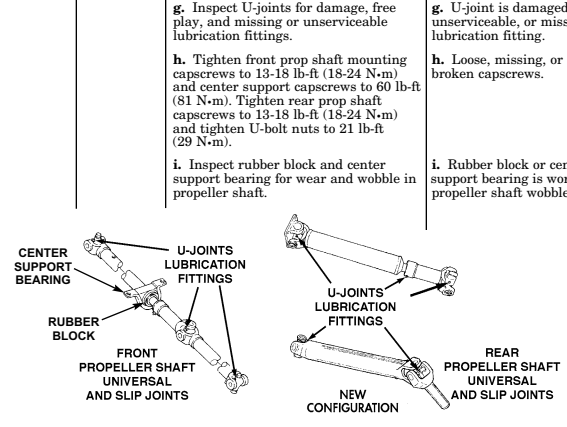

| ITEM TO BE                                  | NOT FULLY MISSION                          | I T E M                                | P R O C E D U R E S                        | I N T E RVA L                           | I N S P E C T E D       | C A PABLE IF:                      | N O .                                |                                         |                       |
|---------------------------------------------|--------------------------------------------|----------------------------------------|--------------------------------------------|-----------------------------------------|-------------------------|------------------------------------|--------------------------------------|-----------------------------------------|-----------------------|
| 8                                           | Semi\-                                     | 60, 100, and                           | a.                                         | Inspect alternator and voltage          | a. Mounting bolts       | Annual                             | 200 Amp                              | regulator (200 amp only) for condition, | missing or alternator |
| Alternators                                 | proper installation, and security of       | damaged.                               | mounting.                                  |                                         |                         |                                    |                                      |                                         |                       |
| b.                                          | Inspect electrical wiring for              | b.                                     | Wiring frayed, broken,                     | broken strands, frayed, cracked or worn | or loose connections.   |                                    |                                      |                                         |                       |
| insulation, and loose connections.          |                                            |                                        |                                            |                                         |                         |                                    |                                      |                                         |                       |
| c.                                          | Deleted                                    |                                        |                                            |                                         |                         |                                    |                                      |                                         |                       |
| d.                                          | Check alternator mounting bolts            | d.                                     | Any alternator                             | for security of mounting. Tighten       | mounting bolt is loose. |                                    |                                      |                                         |                       |
| bolts to 40 lb\-ft (54 N•m).                |                                            |                                        |                                            |                                         |                         |                                    |                                      |                                         |                       |
| 9                                           | Semi\-                                     | Accelerator                            | Inspect for bends, excessive play, cracks, | Linkage damaged, bent,                  | Annual                  | Linkage                            | and damage that could cause failure. | or cracked.                             |                       |
| 10                                          | Semi\-                                     | Suspension                             | NOTE                                       | Annual                                  | and                     | If access to locknut is a problem, |                                      |                                         |                       |
| Steering                                    | remove geared hub from control arm         | System                                 | (para. 6\-11 ) .                           |                                         |                         |                                    |                                      |                                         |                       |
| a.                                          | Remove wheel and tire assembly             | a.                                     | Capscrews or locknuts                      | (para. 8\-3). Check front and rear      | are finger or hand      |                                    |                                      |                                         |                       |
| lower ball joint mounting. For M996,        | turnable.                                  | M997, M1042, M1037, M1097, M1123,      |                                            |                                         |                         |                                    |                                      |                                         |                       |
| and "A1" and "A2" series vehicles,          | tighten rear lower ball joint to lower     |                                        |                                            |                                         |                         |                                    |                                      |                                         |                       |
| control arm locknuts to 60 lb\-ft (81 N•m)  | and front to 35 lb\-ft (48 N•m). All other |                                        |                                            |                                         |                         |                                    |                                      |                                         |                       |
| models, tighten front and rear lower        | ball joint to lower control arm locknuts   |                                        |                                            |                                         |                         |                                    |                                      |                                         |                       |
| to 35 lb\-ft (48 N•m) and ensure cotter     | pin is present. Tighten ball joint slotted |                                        |                                            |                                         |                         |                                    |                                      |                                         |                       |
| nut to 73 lb\-ft (99 N•m) and ensure        | cotter pin is present.                     |                                        |                                            |                                         |                         |                                    |                                      |                                         |                       |
| b.                                          | Check front and rear upper ball joint      | b.                                     | Capscrews or locknuts                      | mounting. Tighten upper ball joint to   | are finger or hand      |                                    |                                      |                                         |                       |
| upper control arm locknuts to 21 lb\-ft     | turnable.                                  | 29 (N•m). Tighten upper control arm to |                                            |                                         |                         |                                    |                                      |                                         |                       |
| control arm bracket locknuts to 260 lb\-ft  | (353 N•m) . Tighten ball joint slotted     |                                        |                                            |                                         |                         |                                    |                                      |                                         |                       |
| nut to 65 lb\-ft (88 N•m) and ensure cotter | pin is present.                            | NOTE                                   |                                            |                                         |                         |                                    |                                      |                                         |                       |
| Do not over lubricate ball joints, one      | or two shots is adequate.                  |                                        |                                            |                                         |                         |                                    |                                      |                                         |                       |
| c.                                          | Lubricate front and rear upper             | ball joints with GAA.                  |                                            |                                         |                         |                                    |                                      |                                         |                       |

Table 2-1. Unit Level Preventive Maintenance Checks and Services HMMWV (Cont'd)

| ITEM   | INTERVAL      | ITEM TO BE     | PROCEDURES                                                                   | NOT FULLY WISSION                                |
|--------|---------------|----------------|------------------------------------------------------------------------------|--------------------------------------------------|
| NO.    |               | INSPECTED      |                                                                              | CAPABLE IF:                                      |
| । ਰੇ    | Semi\- Annual | Tires (Cont'd) | b. Inspect tires for uneven wear and                                         | b. Tires exhibit excessive                       |
|        |               |                | balance (paragraph 8\-9). For normal wear, rotate tires as shown in rotation | or uneven wear or balance.                       |
|        |               |                | diagram. The vehicle's wheel alignment is optimumly designed for GVW         |                                                  |
|        |               |                | operation. Operating the vehicle without                                     |                                                  |
|        |               |                | a load can cause excessive wear on the                                       |                                                  |
|        |               |                | outer edge of the tread pattern. If this                                     |                                                  |
|        |               |                | pattern develops, turn tires around                                          |                                                  |
|        |               |                | on the rim (para. 8\-4).                                                     |                                                  |
|        |               |                | c. Rotate tires as diagram shows.                                            |                                                  |
|        |               |                | ROTATION DIAGRAM                                                             |                                                  |
|        |               |                | d. Tighten wheel lug nuts to 90\-110 lb\-ft (122\-149 N·m) in                | d.  Any broken studs, loose or missing lug nuts. |
|        |               |                | tightening sequence shown.                                                   |                                                  |
|        |               |                | TIGHTENING SEQUENCE                                                          |                                                  |
|        |               |                | \-9                                                                          |                                                  |
|        |               |                | গু 0                                                                          |                                                  |
|        |               |                | 0 0                                                                          |                                                  |
|        |               |                | 0 ਉ                                                                          |                                                  |
|        |               |                | ତି                                                                            |                                                  |

Table 2-1. Unit Level Preventive Maintenance Checks and Services HMMWV (Cont'd)

| ITEM TO BE                             | NOT FULLY MISSION                     | I T E M                             | P R O C E D U R E S     | I N T E RVA L                        | I N S P E C T E D                 | C A PABLE IF:     | N O .             |
|----------------------------------------|---------------------------------------|-------------------------------------|-------------------------|--------------------------------------|-----------------------------------|-------------------|-------------------|
| NOTE                                   | Do not lubricate shock absorber       |                                     |                         |                                      |                                   |                   |                   |
| bushings, radius rod bushings,         | stabilizer bar bushing, or suspension |                                     |                         |                                      |                                   |                   |                   |
| arm pivot bushing.                     | 10                                    | Semi\-                              | Suspension              | d.                                   | Inspect control arms, control arm | d.                | Control arm bent, |
| Annual                                 | and Steering                          | bushings, springs, shock absorbers, | bushing worn or obvious | System                               | and bracket for damage.           | damage that would |                   |
| (Cont'd)                               | hinder operation.                     |                                     |                         |                                      |                                   |                   |                   |
| e.                                     | Inspect steering column U\-joints,    | e .                                 | U\-joints, tie rods,    | tie rods or radius rods, pitman arm, | pitman arm or idler arm           |                   |                   |
| center link, and idler arm for breaks, | are worn or cracked.                  | cracks, and wear.                   |                         |                                      |                                   |                   |                   |
| e.1.                                   | Inspect steering column for           | e.1.                                | Steering column         | security of mounting hardware.       | is not secure.                    |                   |                   |
| f.                                     | Inspect steering gear for mounting    | f.                                  | Any mounting bolt       | security. Tighten mounting bolts to  | missing or unserviceable.         |                   |                   |
| 60 lb\-ft (81 N•m).                    |                                       |                                     |                         |                                      |                                   |                   |                   |

Table 2-1. Unit Level Preventive Maintenance Checks and Services HMMWV (Cont'd)
Table 2-1. Unit Level Preventive Maintenance Checks and Services HMMWV (Cont'd)

| Table 2\-1. Unit Level Preventive Maintenance Checks and Services HMMWV (Cont'd)   |               |
|------------------------------------------------------------------------------------|---------------|
| CAUTION                                                                            | MIL\-B\-46176 |
| table 2\-1                                                                         |               |
| NOTE                                                                               |               |

Table 2-1. Unit Level Preventive Maintenance Checks and Services HMMWV (Cont'd)

| ITEM   | INTERVAL   | ITEM TO BE      | PROCEDURES                               | NOT FULLY MISSION            |
|--------|------------|-----------------|------------------------------------------|------------------------------|
| NO.    |            | INSPECTED       |                                          | CAPABLE IF:                  |
| 11     | Semi\-     | Brake           | c. Inspect service brake pads and        | c. Service brake pads less   |
|        | Annual     | System (Cont'd) | rotor disks for wear (para. 7\-11).      | than 1/8 inch (3.2 mm).      |
|        |            |                 | d. Inspect parking brake pads and        | d. Parking brake pads        |
|        |            |                 | rotor disk for wear (para. 7\-3).        | less than 1/8 inch (3.2 mm). |
|        |            |                 | d.1. Inspect brake calipers and mounting | d.1. Brake calipers are      |
|        |            |                 | hardware for damage or loose hardware.   | damaged or mounting          |
|        |            |                 |                                          | bolts are loose.             |
|        |            |                 | e. Inspect dual service/park brake       | e. Brake pads less than      |
|        |            |                 | pads and rotor for wear (para. 7\-21).   | 1/8 inch (3.2 mm).           |

| ITEM TO BE                                | NOT FULLY MISSION                          | I T E M                        | P R O C E D U R E S    | I N T E RVA L                         | I N S P E C T E D          | C A PABLE IF:         | N O .      |                                     |                                        |                            |
|-------------------------------------------|--------------------------------------------|--------------------------------|------------------------|---------------------------------------|----------------------------|-----------------------|------------|-------------------------------------|----------------------------------------|----------------------------|
| 11                                        | Semi\-                                     | Brake                          | f.                     | Inspect parking brake cable, cable    | f.                         | Parking brake binding | Annual     | System                              | clip, lever, spring, and pushrod/guide | or cable frayed or broken. |
| (Cont'd)                                  | pin for binding and loose components.      | Spring or cable clip           | missing.               |                                       |                            |                       |            |                                     |                                        |                            |
| g.                                        | On vehicles equipped with a single         | parking brake assembly mounted |                        |                                       |                            |                       |            |                                     |                                        |                            |
| between the rear prop shaft and rear      | differential, lubricate parking brake      |                                |                        |                                       |                            |                       |            |                                     |                                        |                            |
| lever, parking brake cam, parking         | brake push pins, and parking brake         |                                |                        |                                       |                            |                       |            |                                     |                                        |                            |
| guide pins with WTR. On vehicles          | equipped with a left and right parking/    |                                |                        |                                       |                            |                       |            |                                     |                                        |                            |
| service brake assembly mounted between    | the rear axle half\-shafts and rear        |                                |                        |                                       |                            |                       |            |                                     |                                        |                            |
| differential, lubricate the parking brake | lever with WTR. The parking/service        |                                |                        |                                       |                            |                       |            |                                     |                                        |                            |
| brake assembly needs no lubrication.      |                                            |                                |                        |                                       |                            |                       |            |                                     |                                        |                            |
| h.                                        | Inspect rear parking brake cables for      | h.                             | Parking brake binding  | damage and/or chaffing in the area of | or cable frayed or broken. |                       |            |                                     |                                        |                            |
| the control arm. If cables are damaged,   | replace cables (paragraph 7\-23 or 7\-24). |                                |                        |                                       |                            |                       |            |                                     |                                        |                            |
| i.                                        | Inspect for presence of, or damage to,     | parking brake cable clamps.    |                        |                                       |                            |                       |            |                                     |                                        |                            |
| 12                                        | Semi\-                                     | Engine and                     | a.                     | Inspect engine mounts and insu\-      | a. Engine mounts or        | Annual                | Transmis\- | lators for loose, worn, and damaged | insulators cracked,                    |                            |
| sion Mounts                               | condition.                                 | damaged, loose, or worn.       |                        |                                       |                            |                       |            |                                     |                                        |                            |
| b.                                        | Check for loose or missing engine          | b.                             | Capscrews or locknuts, | mount capscrews and locknuts. If      | loose or missing.          |                       |            |                                     |                                        |                            |
| engine mount capscrews or locknuts are    | loose or missing, notify DS maintenance.   |                                |                        |                                       |                            |                       |            |                                     |                                        |                            |

Table 2-1. Unit Level Preventive Maintenance Checks and Services HMMWV (Cont'd)
Table 2-1. Unit Level Preventive Maintenance Checks and Services HMMWV (Cont'd)

| ITEM TO BE                             | NOT FULLY MISSION                        | I T E M                              | P R O C E D U R E S              | I N T E RVA L                       | I N S P E C T E D          | C A PABLE IF:                        | N O .   |         |                                   |                    |
|----------------------------------------|------------------------------------------|--------------------------------------|----------------------------------|-------------------------------------|----------------------------|--------------------------------------|---------|---------|-----------------------------------|--------------------|
| 12                                     | Semi\-                                   | Engine and                           | c.                               | Using 3/4 inch torque adapter       | c.                         | Transmission mount                   | Annual  | Trans\- | (reefer to Appendix B, Item 145), | loose, cracked, or |
| mission                                | tighten two capscrews securing           | damaged.                             | Mount                            | transmission mount to adapter to    |                            |                                      |         |         |                                   |                    |
| (Cont'd)                               | 65 lb\-ft (88 N•m). Tighten two locknuts | securing transmission mount to       |                                  |                                     |                            |                                      |         |         |                                   |                    |
| crossmember to 28 lb\-ft (38 N•m).     |                                          |                                      |                                  |                                     |                            |                                      |         |         |                                   |                    |
| 13                                     | Semi\-                                   | Starter                              | CAUTION                          | Annual                              | Disconnect negative cable. |                                      |         |         |                                   |                    |
| a.                                     | Inspect starter for mounting             | a.                                   | Mounting bolt                    | security. Tighten mounting bolts to | missing or will not        |                                      |         |         |                                   |                    |
| 40 lb\-ft (54 N•m).                    | torque.                                  |                                      |                                  |                                     |                            |                                      |         |         |                                   |                    |
| b.                                     | Inspect cables and studs for loose       | b.                                   | Stud nut loose.                  | nuts and damage.                    |                            |                                      |         |         |                                   |                    |
| 13.1                                   | Semi\-                                   | Neutral                              | WARNING                          | Annual                              | Start Safety               | Ensure vehicle parking brake is set, |         |         |                                   |                    |
| Switch                                 | wheels are chocked, and rotary           | switch is in the ENG STOP position.  |                                  |                                     |                            |                                      |         |         |                                   |                    |
| Failure to comply may result in        | injury to personnel and/or damage to     |                                      |                                  |                                     |                            |                                      |         |         |                                   |                    |
| e q u i p m e n t .                    |                                          |                                      |                                  |                                     |                            |                                      |         |         |                                   |                    |
| a.                                     | Disconnect wires 14A and 14B from        | Neutral start safety                 | wires 14 at neutral start safety | switch is malfunctioning.           |                            |                                      |         |         |                                   |                    |
| switch.                                |                                          |                                      |                                  |                                     |                            |                                      |         |         |                                   |                    |
| b.                                     | Check for continuity of neutral          | start safety switch.                 |                                  |                                     |                            |                                      |         |         |                                   |                    |
| (1)                                    | With transmission shift lever in         | N (neutral), or P (park) (for M1123, |                                  |                                     |                            |                                      |         |         |                                   |                    |
| A2 series, and up\-armor models only), | continuity should be present between     |                                      |                                  |                                     |                            |                                      |         |         |                                   |                    |
| wires 14 at neutral start safety       | switch.                                  |                                      |                                  |                                     |                            |                                      |         |         |                                   |                    |

| ITEM TO BE                                   | NOT FULLY MISSION                          | I T E M                                | P R O C E D U R E S               | I N T E RVA L                          | I N S P E C T E D   | C A PABLE IF:      | N O .                         |                                      |                                          |                      |
|----------------------------------------------|--------------------------------------------|----------------------------------------|-----------------------------------|----------------------------------------|---------------------|--------------------|-------------------------------|--------------------------------------|------------------------------------------|----------------------|
| 13.1                                         | Semi\-                                     | Neutral                                | (2)                               | Place transmission shift lever in      | Annual              | Start Safety       | D (drive). There should be no |                                      |                                          |                      |
| Switch                                       | continuity present between wires 14.       | (Cont'd)                               | If continuity is present, replace |                                        |                     |                    |                               |                                      |                                          |                      |
| neutral start safety switch (para. 5\-6).    |                                            |                                        |                                   |                                        |                     |                    |                               |                                      |                                          |                      |
| c.                                           | Connect wires 14A and 14B to               | wires 14 at neutral start safety       |                                   |                                        |                     |                    |                               |                                      |                                          |                      |
| switch.                                      |                                            |                                        |                                   |                                        |                     |                    |                               |                                      |                                          |                      |
| 14                                           | Semi\-                                     | Trans\-                                | a.                                | Inspect vent lines and connectors      | a.                  | Vent line cracked, | Annual                        | mission                              | for security, cracks, and deterioration. | plugged, or missing. |
| b.                                           | Inspect transmission shift linkage         | b.                                     | Shift linkage is                  | for bends, excessive play, cracks, and | unserviceable.      |                    |                               |                                      |                                          |                      |
| damage that could cause failure.             |                                            |                                        |                                   |                                        |                     |                    |                               |                                      |                                          |                      |
| 15                                           | Semi\-                                     | Transfer                               | a.                                | Inspect transfer case vent lines and   | a.                  | Vent line cracked, | Annual                        | connectors for security, cracks, and | plugged or missing.                      |                      |
| deterioration.                               | Shift linkage is unserv                                            | iceable.                               |                                   |                                        |                     |                    |                               |                                      |                                          |                      |
| b.                                           | Inspect transfer case shift linkage        | for bends, excessive play, cracks, and |                                   |                                        |                     |                    |                               |                                      |                                          |                      |
| damage that could cause failure.             |                                            |                                        |                                   |                                        |                     |                    |                               |                                      |                                          |                      |
| CAUTION                                      | Use Dexron® II                             | for filling transfer case.             |                                   |                                        |                     |                    |                               |                                      |                                          |                      |
| Failure to use Dexron® II                    | will cause                                 | damage to transfer case.               |                                   |                                        |                     |                    |                               |                                      |                                          |                      |
| c.                                           | Check transfer case fluid level every      | 3,000 (4,800 km) or semiannually,      |                                   |                                        |                     |                    |                               |                                      |                                          |                      |
| whichever occurs first. Remove fill plug     | and gasket. Level should be within 1/2 in. |                                        |                                   |                                        |                     |                    |                               |                                      |                                          |                      |
| (12.7 mm) of fill plug opening when vehicle  | is on level ground. Install fill plug and  |                                        |                                   |                                        |                     |                    |                               |                                      |                                          |                      |
| gasket, and tighten to 35 lb\-ft (47 N•m ) . |                                            |                                        |                                   |                                        |                     |                    |                               |                                      |                                          |                      |

Table 2-1. Unit Level Preventive Maintenance Checks and Services HMMWV (Cont'd)

| I T E M   | I N T E RVA L   | ITEM TO BE         | P R O C E D U R E S                                                                            | NOT FULLY MISSION                      |
|-----------|-----------------|--------------------|------------------------------------------------------------------------------------------------|----------------------------------------|
| N O .     |                 | I N S P E C T E D  |                                                                                                | C A PABLE IF:                          |
| 15        | Semi\-          | Transfer           | NOTE                                                                                           |                                        |
|           | Annual          | (Cont'd)           | Do not overtorque retaining nuts.                                                              |                                        |
|           |                 |                    | d . Inspect oil cooler lines for leaks or                                                      | d . Any class III oil                  |
|           |                 |                    | damage. Check for loose oil cooler line                                                        | leak or damage to                      |
|           |                 |                    | nuts and damage to the spiral wrap on                                                          | spiral wrap.                           |
|           |                 |                    | the cooler line. If oil cooler line nuts are l o o s e, hold end of oil cooler stationary, and |                                        |
|           |                 |                    | tighten line nuts to 194\-212 lb\-in.                                                          |                                        |
|           |                 |                    | ( 2 2\-24 N•m )                                                                                |                                        |
| 16        | Semi\- Annual   | Driveline  Compo\- | a. Inspect geared hub vent lines and connectors for security, cracks, and                      | a. Hub vent lines cracked, plugged, or |
|           |                 | nents              | deterioration.                                                                                 | missing.                               |
|           |                 |                    | b. Inspect geared hub for leaking                                                              | b. Class III leaks or                  |
|           |                 |                    | seals and damage.                                                                              | damage.                                |
|           |                 |                    | CAUTION                                                                                        |                                        |
|           |                 |                    | Change geared hub and differential                                                             |                                        |
|           |                 |                    | lubricants when required by mainte                                                                                                |                                        |
|           |                 |                    | nance repair action, contaminated by                                                           |                                        |
|           |                 |                    | water or foreign material, or if                                                               |                                        |
|           |                 |                    | lubricant appears by smell, feel, or                                                           |                                        |
|           |                 |                    | visual indication to be overheated.                                                            |                                        |
|           |                 |                    | NOTE                                                                                           |                                        |
|           |                 |                    | •Fill each axle differential with 2                                                            |                                        |
|           |                 |                    | quarts (1.9 L) of GO.                                                                          |                                        |
|           |                 |                    | •Fill each geared hub with 1 pint                                                              |                                        |
|           |                 |                    | (0.5 L) of GO.                                                                                 |                                        |
|           |                 |                    | c. Adjust spindle bearing                                                                      | c. Bearing damaged.                    |
|           |                 |                    | (paragraph 6\-14).                                                                             |                                        |
|           |                 |                    | d. Inspect differential vent lines and                                                         | d. Differential vent line              |
|           |                 |                    | connectors for security, cracks, and                                                           | has hole, plugged, or                  |
|           |                 |                    | deterioration.                                                                                 | cracked.                               |
|           |                 |                    | e. Inspect differentials for leaking                                                           | e. Class III leak.                     |
|           |                 |                    | seals and cracks.                                                                              |                                        |

Table 2-1. Unit Level Preventive Maintenance Checks and Services HMMWV (Cont'd)

| ITEM TO BE                                | NOT FULLY MISSION                         | ITEM                   | INTERVAL                          | PROCEDURES                          | INSPECTED                  | CAPABLE IF:   | NO.                                     |                           |
|-------------------------------------------|-------------------------------------------|------------------------|-----------------------------------|-------------------------------------|----------------------------|---------------|-----------------------------------------|---------------------------|
| 16                                        | Semi\-                                    | Driveline              | f. M998, M998A1, and M1121 series | f. Lube level not within            | Annual                     | Compo\-       | vehicles - Check differential lubricant | 1/4 inch (6.4 mm) of fill |
| nents                                     | level semiannually or every (3,000 miles) | plug opening when cold | (Cont'd)                          | (4,830 km). M998A2 and M1123 series | or to plug level when hot. |               |                                         |                           |
| vehicles - Change differential lubricant  | semiannually or every 3,000 miles         |                        |                                   |                                     |                            |               |                                         |                           |
| (4,830 km). Differential level should be  | within 1/4 inch (6.4 mm) of fill plug     |                        |                                   |                                     |                            |               |                                         |                           |
| opening when lubricant is cold or to plug | level when hot.                           |                        |                                   |                                     |                            |               |                                         |                           |

SEMI-ANNUAL (3,000 MILE) PMCS PARTS LIST

|         | g. Inspect U\-joints for damage, free play, and missing or unserviceable   | g. U\-joint is damaged,  unserviceable, or missing   |
|---------|----------------------------------------------------------------------------|------------------------------------------------------|
|         | lubrication fittings.                                                      | lubrication fitting.                                 |
|         | h. Tighten front prop shaft mounting                                       | h. Loose, missing, or                                |
|         | capscrews to 13\-18 lb\-ft (18\-24 N•m)                                    | broken capscrews.                                    |
|         | and center support capscrews to 60 lb\-ft                                  |                                                      |
|         | (81 N•m). Tighten rear prop shaft                                          |                                                      |
|         | capscrews to 13\-18 lb\-ft (18\-24 N•m)                                    |                                                      |
|         | and tighten U\-bolt nuts to 21 lb\-ft                                      |                                                      |
|         | (29 N•m).                                                                  |                                                      |
|         | i. Inspect rubber block and center                                         | i. Rubber block or center                            |
|         | support bearing for wear and wobble in                                     | support bearing is worn or                           |
|         | propeller shaft.                                                           | propeller shaft wobbles.                             |
| CENTER  |                                                                            |                                                      |
| SUPPORT |                                                                            |                                                      |
| BEARING |                                                                            |                                                      |

ANNUAL (6,000 MILE) PMCS PARTS LIST

| ITEM   | INTERVAL   | ITEM TO BE     | PROCEDURES                                                                             | NOT FULLY MISSION                               |
|--------|------------|----------------|----------------------------------------------------------------------------------------|-------------------------------------------------|
| NO.    |            | INSPECTED      |                                                                                        | CAPABLE IF:                                     |
| 16     | Semi\-     | Driveline      | j. Tighten halfshaft mounting bolts to                                                 | j. Loose, missing, or                           |
|        | Annual     | Compo\-        | 48 lb\-ft (65 N•m).                                                                    | broken bolts.                                   |
|        |            | nents (Cont'd) |                                                                                        |                                                 |
| 17     | Semi\-     | Exhaust        | Inspect for cracked and loose pipes,                                                   | Cracked, loose, or holes in                     |
|        | Annual     | Compo\-        | muffler, and hangers. Check for ex\-                                                   | pipes or muffler.                               |
|        |            | nents          | haust leaks.                                                                           | Exhaust leak.                                   |
| 18     | Semi\-     | Frame and      | a. Inspect frame side rails for cracks,                                                | a. Any loose or missing                         |
|        | Annual     | Cross\-        | breaks, bends, wear, deterioration,                                                    | fasteners, cracks, bends,                       |
|        |            | members        | and missing or loose fasteners.                                                        | or breaks in frame.                             |
|        |            |                | b. Inspect crossmembers for cracks,                                                    | b. Any loose or missing                         |
|        |            |                | breaks, bends, deterioration, and                                                      | fasteners. Cracks, bends                        |
|        |            |                | loose or missing fasteners.                                                            | (bends are defined as a                         |
|        |            |                |                                                                                        | condition that would                            |
|        |            |                |                                                                                        | affect vehicle operation)                       |
|        |            |                |                                                                                        | or breaks in cross members.                                                 |
|        |            |                | c. Inspect for missing, broken, bent,  or loose bumper supports before                 | c. Any missing, broken,   bent, or loose bumper |
|        |            |                | towing a trailer.                                                                      | supports.                                       |
| 19     | Semi\-     | Tires          | WARNING                                                                                |                                                 |
|        | Annual     |                | - Changing tire pressures or wheel                                                     |                                                 |
|        |            |                | alignment, out of the                                                                  |                                                 |
|        |            |                | recommended specification, may                                                         |                                                 |
|        |            |                | adversely affect the vehicle's                                                         |                                                 |
|        |            |                | handling characteristics. Loss of vehicle control may result in                        |                                                 |
|        |            |                | serious injury or death and                                                            |                                                 |
|        |            |                | damage to equipment.                                                                   |                                                 |
|        |            |                | - Radial and bias ply tires should not be mixed on the same vehicle.                   |                                                 |
|        |            |                | Injury to personnel and damage to                                                      |                                                 |
|        |            |                | equipment may result.                                                                  |                                                 |
|        |            |                | NOTE                                                                                   |                                                 |
|        |            |                | Vehicle must be up on jack stands for                                                  |                                                 |
|        |            |                | the following checks.                                                                  |                                                 |
|        |            |                | a. Check tread depth of tires with tire                                                | a. Tread depth is less                          |
|        |            |                | gauge. If tread depth is less than 1/16 in. (1.59 mm), replace tire in approx                                                                                        | than 1/16 in. (1.59 mm).                        |
|        |            |                | imately 400 miles (644 km), bias tires                                                 |                                                 |
|        |            |                | will wear 1/32 in. (0.79 mm), radial tires                                             |                                                 |
|        |            |                | will take approximately 1,300 miles                                                    |                                                 |
|        |            |                | (2092 km) to wear 1/32 in. (0.79 mm). If                                               |                                                 |
|        |            |                | mission will require the vehicle to travel  this distance within a month, replace tire |                                                 |
|        |            |                | if it measures 3/32 in. (2.38 mm).                                                     |                                                 |

BIENNIALLY (12,000 MILE) PMCS PARTS LIST

OE/HDO 15/40 (Grade 15W-40) lubricant may be used when expected temperatures are above +5°F (-15°C). If OEA lubricant is required to meet the temperature ranges prescribed in the table, then the OEA lubricant is to be used in place of OE/HDO 10 lubricant for all temperature ranges. If operating conditions are severe or abnormal, service chassis lubrication points at 1,000 miles (1,600 kilometers).

| Table 2\-1. Unit Level Preventive Maintenance Checks and Services HMMWV (Cont'd)   |
|------------------------------------------------------------------------------------|
| paragraph 8\-9                                                                     |
| para. 8\-4                                                                         |

## Section Iv. Electrical/Mechanical Systems Troubleshooting 2-12. General

a. This section provides information to diagnose and correct malfunctions of the electrical/mechanical system.

b. Principles of operation showing system operation can be found in chapter 1. It should be used as a reference when performing electrical/mechanical troubleshooting.

c. Each malfunction symptom given for an individual component or system is followed by step(s) you should take to determine the cause and corrective action you must take to remedy the problem.

d. Before taking any action to correct a possible malfunction, the following rules should be followed:
(1) Question operator to obtain any information that might help you determine the cause of the problem. (2) Never over look the chance that the problem could be of simple origin. The problem could be corrected with minor adjustment. (3) Use all senses to observe and locate troubles. (4) Use test instruments or gauges to help you determine and isolate problem. (5) Always isolate the system where the malfunction occurs and then locate the defective component. (6) Use standard automotive theories and principles when troubleshooting the vehicles covered in this manual.

e. The STE/ICE-R is an integral part of these troubleshooting procedures. It should be used whenever possible, although other options are given, when available. The Vehicle Identification Number (VIN) assigned to the M998 series vehicles is 21 (14 is the temporary VIN). On page 2-753, you will find information on STE/ICE-R description and operation. Use this information to become familiar with STE/ICE-R operation and the equipment contained in the test set. On page 2-763 you will find STE/ICE- R setup and internal checks. These must be performed prior to performing tests.

# 2 - 1 3 . Electrical/Mechanical Systems Troubleshooting Electrical/Mechanical Troubleshooting

| 19                                  | Semi\-                              | Tires                                   | e.   | Check for loose, missing, or   | e.   | Any broken studs, or   | Annual   | (Cont'd)   | broken wheel studs and nuts.   | loose or missing wheel   |
|-------------------------------------|-------------------------------------|-----------------------------------------|------|--------------------------------|------|------------------------|----------|------------|--------------------------------|--------------------------|
| nuts.                               | CAUTION                             |                                         |      |                                |      |                        |          |            |                                |                          |
| Prior to checking torque, the tire  | assembly must be deflated.          |                                         |      |                                |      |                        |          |            |                                |                          |
| (1)                                 | Release air pressure from tire      | (para. 8\-4 or 8\-5).                   |      |                                |      |                        |          |            |                                |                          |
| CAUTION                             | Tighten locknuts gradually to avoid |                                         |      |                                |      |                        |          |            |                                |                          |
| bent and broken studs, or damage to | wheel components will result.       |                                         |      |                                |      |                        |          |            |                                |                          |
| (2)                                 | Wheel configurations:               |                                         |      |                                |      |                        |          |            |                                |                          |
| (a)                                 | 12\-bolt configuration -            | Tighten locknuts to 85 lb\-ft (115 N•m) |      |                                |      |                        |          |            |                                |                          |
| in sequence shown; repeat torque    | sequence at 125 lb\-ft (170 N•m).   |                                         |      |                                |      |                        |          |            |                                |                          |
| 12\-BOLT TIGHTENING SEQUENCE        |                                     |                                         |      |                                |      |                        |          |            |                                |                          |
| (b)                                 | 8\-bolt configuration -             | Tighten locknuts to 55 lb\-ft (75 N•m)  |      |                                |      |                        |          |            |                                |                          |
| in sequence shown; repeat torque    | sequence at 65 lb\-ft (88 N•m).     |                                         |      |                                |      |                        |          |            |                                |                          |
| 8\-BOLT TIGHTENING SEQUENCE         |                                     |                                         |      |                                |      |                        |          |            |                                |                          |
| (3)                                 | Inflate tire to recommended tire    | pressure (TM 9\-2320\-280\-10).         |      |                                |      |                        |          |            |                                |                          |

# 2-14. How To Use This Troubleshooting Guide

#### Note To The Recipient Of This Manual

There are 16 foldouts that are supplied with this manual. Take the foldouts and place them after the last page of diagnostics at the end of the paragraph. That way, the foldout will be with diagnostics for that system.

Use the cross-reference information listed below to guide you in the placement of the foldouts.

| If AOAP is not                           | b. Perform AOAP sample.   |
|------------------------------------------|---------------------------|
| available, change oil and oil filter at  |                           |
| 3,000 miles (4,800 km), or 100 hours (if |                           |
| hour meter is installed), or every six   |                           |
| m o n t h s .                            |                           |

# 2-14. How To Use This Troubleshooting Guide (Cont'D)

| ITEM TO BE                            | NOT FULLY MISSION                        | ITEM                               | INTERVAL                             | PROCEDURES                             | INSPECTED               | CAPABLE IF:                          | NO.   |
|---------------------------------------|------------------------------------------|------------------------------------|--------------------------------------|----------------------------------------|-------------------------|--------------------------------------|-------|
| 21                                    | Semi\-                                   | Batteries                          | .WARNING.                            | Annual                                 |                         |                                      |       |
| - Do not perform battery system       | checks or inspections while              |                                    |                                      |                                        |                         |                                      |       |
| smoking or near fire, flames, or      | sparks. Batteries may explode            |                                    |                                      |                                        |                         |                                      |       |
| causing damage to vehicle, injury,    | or death to personnel.                   |                                    |                                      |                                        |                         |                                      |       |
| - Remove all jewelry such as rings,   | dog tags, bracelets, etc. If jewelry     |                                    |                                      |                                        |                         |                                      |       |
| or disconnected battery ground        | cable contacts battery terminal, a       |                                    |                                      |                                        |                         |                                      |       |
| direct short will result, causing     | injury to personnel, or damage to        |                                    |                                      |                                        |                         |                                      |       |
| equipment.                            | NOTE                                     |                                    |                                      |                                        |                         |                                      |       |
| Refer to TM 9\-6140\-200\-14 for more | specific details on battery maintenance. |                                    |                                      |                                        |                         |                                      |       |
| a.                                    | Inspect battery box and battery tray     | a.                                 | Corrosion has                        | bolts for corrosion and debris. If any | made holes in metal     |                                      |       |
| corrosion is evident, wipe bolts      | battery box.                             | and/or washers clean. If corrosion |                                      |                                        |                         |                                      |       |
| cannot be removed or the surface of   | bolts are pitted, replace bolts and/or   |                                    |                                      |                                        |                         |                                      |       |
| washers (para. 4\-80).                |                                          |                                    |                                      |                                        |                         |                                      |       |
| b. Clean slave receptacle and coat    | b. Terminals corroded.                   | with corrosion preventive compound |                                      |                                        |                         |                                      |       |
| (Appendix C, Item 24).                |                                          |                                    |                                      |                                        |                         |                                      |       |
| c.                                    | Check and record specific gravity        | c.                                 | If cell is below                     | of each cell.                          | 1.225 specific gravity. |                                      |       |
| d.                                    | Inspect battery cables for frays,        | d.                                 | Cables frayed, split,                | splits, or looseness.                  | or loose.               |                                      |       |
| SPECIAL PURPOSE KITS                  |                                          |                                    |                                      |                                        |                         |                                      |       |
| 22                                    | Semi\-                                   | Cargo Shell                        | Check adjustment of cargo shell door | Annual                                 | Door                    | (paragraph 11\-13).                  |       |
| 23                                    | Semi\-                                   | Rear Cargo                         | Check rear cargo door for proper     | Annual                                 | Door                    | operation. Rotate gas springs (para. |       |
| 11\-21) 180 degrees every six         | months and move left spring to right     |                                    |                                      |                                        |                         |                                      |       |
| side and right spring to left side.   |                                          |                                    |                                      |                                        |                         |                                      |       |

# 2-14. How To Use This Troubleshooting Guide (Cont'D)

PAGE LAYOUT All diagnostic logic and flowcharts are on the left hand page, with supporting information, help, test, instructions and vehicle operation on the right.

Question number, so you know 

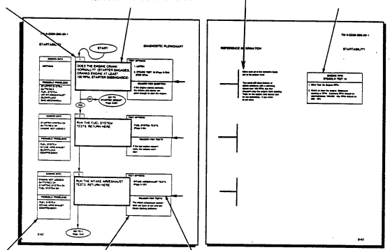 where you are and where to go when entering or leaving a test chain.

Notes, warnings and cautions about a particular question. Instructions for how to perform a test or make a measurement, usually in a box.

Known info and possible problems with the system. 

Reason for question; This is to help by telling you why it's being asked. This is especially helpful when something's just a little bit bad' and you're not sure if it passed or failed.

Test options; Mutible choice of methods you can use to obtain the answer to the question.

DIAGNOSTIC REFERENCE FLOWCHART INFORMATION

### How To Troubleshoot

PICK THE TESTS: Select either a top level or a system level test. DIAGNOSTIC PROCEDURE Just answer the questions on the left hand page and follow the YES or NO path. Helpful information about the question is also on the right hand page. If you aren't sure about a question or procedure, look on the right page for notes, instructions and help.

Question to be answered.

# 2-14. How To Use This Troubleshooting Guide (Cont'D)

## Page Layqut

Diagnostic logic is on the left hand page.

Related and helpful information is on the right hand page.

## Diagnostic Procedure

Just answer the questions on the left hand page.  Follow the YES
or NO path to the next step.

Everything else on both pages is information to support the question. As a rule, the most important information (warnings, cautions, etc) is closest to the question, less important information is farther away.

Is the symbol for a WARNING

 statement. If you see this symbol above a question, look on the right hand page for the text of the message. The WARNING message on the right hand page will also have the symbol above it.

Is the symbol for a CAUTION

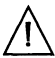

statement. If you see this symbol above a question, look on the right hand page for the text of the message. The CAUTION message on the right hand page will also have the symbol above it.

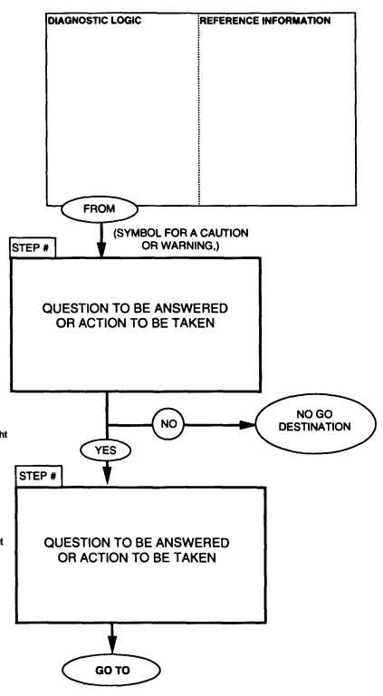

# 2-14. How To Use This Troubleshooting Guide (Cont'D)

## Information About The Question Test Options:

This box lists at least one way of getting the answer to the question.  When there is more than one way to get the answer, the different options will be given. Usually the easiest or best option is first.

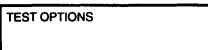

REASON FOR QUESTION


### Reason For Question:

If you know why the question is being asked, it should be easier to understand the diagnostic logic and easier to answer the question. This is especially helpful when a measurement is 'just a little bad'. Knowing why the question is being asked should help you decide if the answer should be 'YES' or 'NO'.

## Information About The Diagnostic Logic Known Info

This box indicates what is known about the vehicle's condition.

As you follow a test chain, parts will be listed here after they have checked ok.  Sometimes this box will indicate a fault that you know exists, such as a shorted or open circuit, or a component that doesn't work. DO NOT USE THIS BOX TO PICK A
'JUMP-IN' POINT. ALWAYS RUN A COMPLETE CHAIN WHEN
INSTRUCTED TO DO SO.

## Possible Problems

This box is the opposite of 'KNOWN INFO'. Possible causes of the problem are listed here until tested and shown to be ok.


# 2-14. How To Use This Troubleshooting Guide (Cont'D)

## Information About The Question

All warnings and cautions are given next to (or as close as possible to) the arrow pointing to the particular question.  Look for the symbol that is in the box for the question in order to locate the particular note. Helpful notes, test procedures, or other information related to the question are provided here. These notes are provided as supporting information only, you don't usually need them to answer the question.

The more skilled you become, the less you'll have to read these.

Any cross references to other manuals will be located in this area.

NOTES. WARNINGS AND


CAUTIONS ARE IN BOLD FACE TYPE.

Additional information, notes and/or suggestions are in normal type so as not to draw too much attention. 

## Test Procedures

These are special notes about how to make measurements with the test equipment. Ocassionally, if space is limited on a page, the easiest procedure will be listed with a page reference for the other procedures if you would rather use them. The procedures presume a basic working knowledge of the equipment to be used, but references are included for the less experienced operator.

## Type Of Measurement Type Of Equipment

Procedure for performing the measurement using the type of equipment listed above.

### Pictures

The pictures are supposed to make it easier to find what you're looking for, such as a pin in a connector or a particular wire or component.

PICTURES ARE PROVIDED WHEREVER
POSSIBLE.

# 2-15. Glossary Of Abbreviations And Commonly Used Terms

PCB - Protective Control Box, located on the firewall above the brake pedal.

STE/ICE-R - Simplified Test Equipment for Internal Combustion Engines - Reprogrammable, a testing system used for performing tests and measurements on the vehicle. In addition to acting as a conventional digital multimeter to measure voltage, current and resistance, it is also capable of measuring pressure, speed, compression unbalance, engine power, and some specialized battery and starter evaluations. It is powered from the vehicle batteries. The complete system includes a vehicle test meter
(VTM), a transducer kit (TK), cables, transit case and technical publications.

DCA - Diagnostic Connector Assembly, an electrical harness on the vehicle which allows the STE/ICE-R
to be powered and to make measurements of key vehicle signals from a single connection. In addition to many basic electrical signals such as starter voltage and current, it includes engine speed and fuel supply pressure. The STE/ICE-R can make TK measurements at the same time that it is connected to the DCA.

VTM - Vehicle Test Meter, a box which performs the measurement and analysis functions of the STE/ICE-R systems.

TK (and TK mode) - Transducer Kit, a collection of transducers, adapters and fittings which permit the STE/ICE-R to be used as a general purpose measurement system for any application. This allows the STE/lCE-R to be used anywhere that you want to measure voltage, current, resistance, pressure, or speed. TK mode of operation is what you are doing when you use this kit (as opposed to DCA mode where you are using the vehicle's built-in sensors to make measurements).

Compression unbalance - A STE/ICE-R test that gives an indication of any engine cylinders that have lower compression then the average. It does this by monitoring the battery voltage during cranking. As each cylinder goes into compression, the extra load on the starter shows up as a drop in voltage. This works well for finding one or more cylinders that have a compression problem, but don't forget that it doesn't give the average compression. If all cylinders are low by the same amount, this test doesn't find it.

Troubleshooting - the process of making measurements and observing the operation of the vehicle to find out if anything is wrong with it and then to locate any problem that exists.

Diagnostics - Troubleshooting by following an exact procedure.

Test Chain - a series of tests to be followed in a particular order or sequence. It is referred to as a "chain" of tests because they are all connected one after another like the links of a chain.

System - a collection of devices which are all related to each other because they depend on each other to do some function or job. For instance, the function of the fuel system is to inject fuel into the cylinders at the correct time in the correct amount and with the correct quality. The collection of devices that are required to do this include the fuel pump, fuel lines, lift pump, fuel filter, injection pump, and injectors.

# 2-15. Glossary Of Abbreviations And Commonly Used Terms (Cont'D)

Functional flow schematic - a diagram which is much like a normal electrical circuit diagram, except that its purpose is to show the flow of information through the system (or the flow of a signal or the flow of some material such as the fuel). This kind of diagram shows how each component or device depends on the others. It is called functional flow because it shows the function (purpose of each component) and how the output of one component "flows" into the next. For troubleshooting, the functional flow schematic is better than the usual circuit diagram because it allows you to quickly see how the system works and what to expect when you make measurements on a system that has faults. You can't expect the output of a device to be good when it has a bad input.

## 2-16. Electric Circuit Description

An electrical circuit is a collection of electrical devices which are connected in a loop from a positive voltage source (the battery positive) to a negative source ( the battery negative). It must be continuous, with no breaks (no opening in the loop) so that electrical current can flow from the positive to the negative. You can think of it like the plumbing in your house. There must be a source of water under pressure or nothing will flow through the pipes. Water pressure is like the positive voltage of the battery. There may be branches (tees) in the pipes going to several different places, but if you don't connect the pipes, you don't get water. The same thing is true with the electrical circuit. If the wires aren't connected, no electricity will flow through them.

In the plumbing of a house, all of the water must go to the drain (you won't permit it to be spilled on the floor). With the vehicle electrical circuit, the drain is the negative terminal of the battery. With the water pipes, the water always flows from high pressure to low pressure (another way of saying that water always flows downhill). The electrical current is the same as the water flow - it always goes from positive to negative voltage. Voltage is to electricity what pressure is to water. Just like the pressure in the water pipe, the greater the voltage, the more electricity will flow through the wires.

Unlike the water pipes that will spill the water if they break, you can't "spill" the electricity. The closest thing to this in an electrical circuit is when two wires touch that aren't supposed to and the current flows to some place that it shouldn't (this is called a "short circuit" or a "short"). Shorts often happen where the wire touches the vehicle body (the body is connected to the negative terminal of the battery). Since the current always flows through the easiest path to negative, it will bypass the rest of the circuit where it was supposed to go, and go through the short directly to the battery. Because this new path to the battery negative is shorter the malfunction is called a "short circuit" or a "short".

If you put a valve in a water pipe, you can control how much water flows by closing the valve. What you are doing is pinching off the pipe with the valve which restricts the flow. If you shut it off completely, you can stop all water from flowing. In the electrical circuit, a resistor acts like a valve. If you make the resistor extremely large, you can stop the current from flowing. The resistance is measured in "ohms".

2-16. ELECTRIC CIRCUIT DESCRIPTION (CONT'D)
When there is no electrical connection, such as when a wire is disconnected, the resistance is infinite (too large to be measured). No current will flow through the wires, because the circuit is no longer continuously connected. This is referred to as an "open circuit" or simply an "open". Remember that an electrical circuit is formed by continuous loops of devices connected together. When you are troubleshooting you are often asked to check for "continuity", which simply means that you need to find out if there is a continuous path from one place in the circuit to another. Since you are trying to see if the path is continuous, you must check wires and switches rather than any special or active devices. You will usually just measure the resistance between two points. If the resistance is zero (or the value of any resistance that is supposed to be there), then there is continuity. In the case of looking for a short, this may mean that you have found the short. If the resistance is off-scale on the meter (infinite resistance) then there is no connection and you have found an open. A continuity test is the same whether you are looking for an open or a short, the only difference being what resistance values you are looking for and where you make the measurements. You are familiar with the typical light switch which allows you to turn a light on and off. A switch of any kind in an electrical circuit is simply a way of opening the loop so that no current will flow through it.

Something to remember while troubleshooting is that everything on the positive side of the switch still has full battery voltage while everything from the switch on through the rest of the circuit is (or should be)
connected to the battery negative terminal and you will measure zero volts. This is easy to remember if you think of the faucet on a sink. If you shut off the faucet, there is no water flowing into the sink, but the water in the pipe is still under pressure.

Sometimes a switch is turned on and off automatically. An example is a "circuit breaker" which is a device that measures how much current is flowing through it. If the current goes too high (possibly damaging equipment or melting the wires) then it opens an internal switch to stop the current flow. A
"relay" is another form of switch that is turned on and off under remote control using a signal in another wire. When a device which requires a very large amount of current (such as the starter motor), must be turned on and off, a "power relay" is used. The idea is to use a small switch to turn on a larger switch.

Thus, you don't have very large wires going all over the vehicle or large switches on the instrument panel.

In the case of the starter's power relay, it is also called a "solenoid". A solenoid is any device that changes the electrical current into a forward and backward motion. It is something like an electrical motor except that instead of continuously going around in the same direction, it goes in or out. For the starter, the solenoid is used to "push" a very large switch into the "on" position.

When testing a circuit, you will need to know how much current is flowing. Current is easilly measured with the STE/lCE-R. A device called a "shunt" is connected to the negative terminal of the battery. A
shunt is a very precise resistor designed so that for every 1000 amps of current that flow through it there is a drop of .1 volts from one side of it to the other (different shunts may have different values). By measuring the voltage across the shunt you know how much current is flowing through the circuit. The shunt is placed on the negative side because it is safer (less chance of accidents which may short out the batteries). Since all of the current eventually goes through the negative battery terminal anyway, the shunt gives the same measurement as if it were connected to the positive terminal. You can think of the shunt as doing the same thing as the water meter in your house. As you turn devices such as lights on or off, you can use the shunt to measure how much current they are using.

# 2-17. Startability Tests

This is a top level test for problems with an engine that doesn't start, or starts but immediately stops, or is very hard to start. If the engine starts but doesn't run well after starting. trv the "STARTABILITY" tests first.

FOR THE ENGINE TO START, ALL OF THE BASIC SYSTEMS SHOWN BELOW
MUST BE WORKING. THESE STARTABILITY TESTS WILL HELP YOU TO
VERIFY THE CONDITION OF EACH OF THESE SYSTEMS.

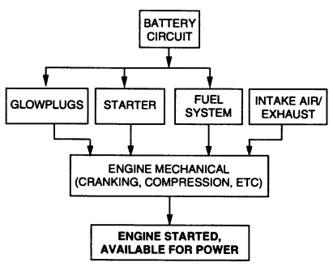

A functional flow schematic is not applicable to this section.

However, so that you may refer to sections as you need them, a quick index to the systems required for starting is given here.

| PARAGRAPH              | PAGE   |
|------------------------|--------|
| BATTERY CIRCUIT        | 2\-251 |
| GLOWPLUGS CIRCUIT      | 2\-303 |
| STARTER CIRCUIT        | 2\-261 |
| FUEL SYSTEM            | 2\-95  |
| INTAKE AIR/EXHAUST     | 2\-137 |
| COMPRESSION/MECHANICAL | 2\-143 |

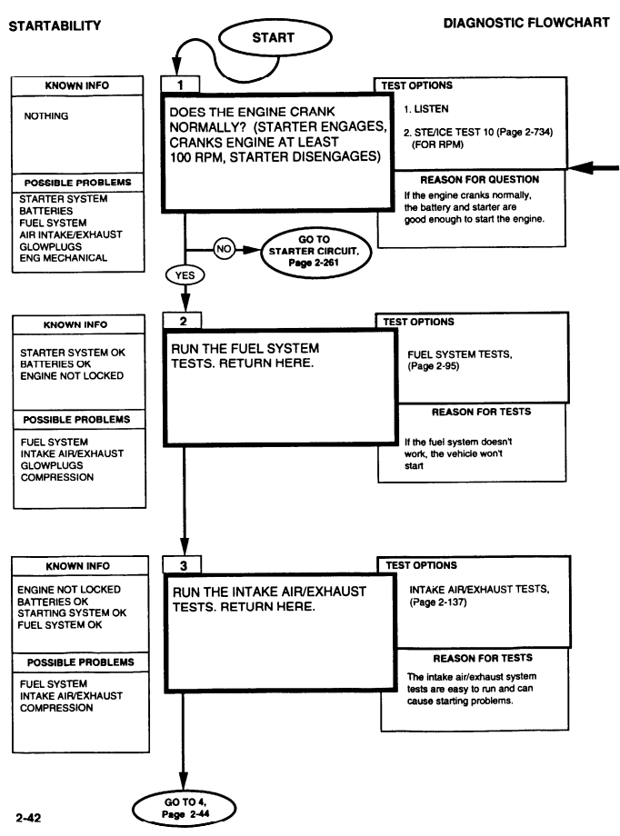

STARTABILITY
Make sure all of the vehicle's fluids are at the proper level.

You could still have battery or starter problems with a cranking speed over 100 RPM, but that shouldn't stop the engine from starting.

Tests for the battery and starter can be run separately,  if you want to run them.

| ENGINE RPM        |
|-------------------|
| STEACE\-R TEST 10 |

| 2. Crank or start the engine. Displayed   |
|-------------------------------------------|
| roading in DDM Cranking DDM choo          |

1. Start Test 10, Engine RPM.

reading is RPM.  Cranking RPM should be approximately 100-200.  Idle RPM should be 625 - 675.

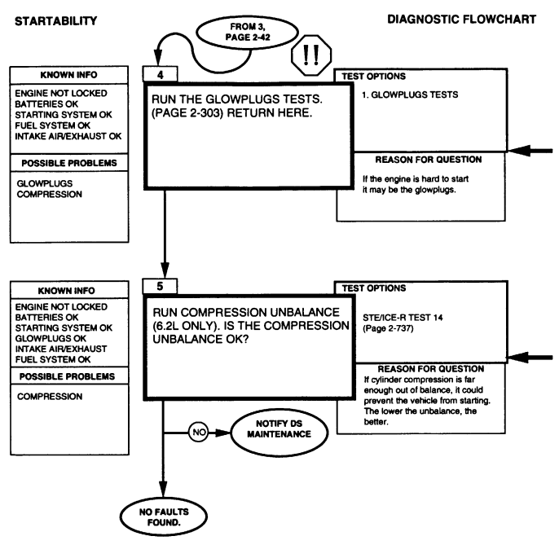

STARTABILITY

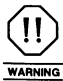

A HOT ENGINE MAY CAUSE SERIOUS
BURNS. Always use caution when approaching a hot engine.

NOTE
When using the vehicle's temperature gage to determine engine temperature, don't forget to turn the rotary switch to "RUN".  The gages don't work when power is off.

The colder the engine (and air temperature).

the more you need the glowplugs for starting.

There are some times when you don't need to run the glowplugs test.  If the engine is warm and the problem is there on a hot day, then the problem is probably NOT the glowplugs or cold start advance, and these tests may be bypassed. If it's colder than 50°F, run the glowplugs test, because just a few bad glowplugs can make a minor starting problem much worse.

If the vehicle passes the STE/ICE-R compression unbalance test, it may still have a compression problem, but it would mean that every cylinder has low compression. This is possible, but not too likely. If you're confident that everything else is working properly, notify DS maintenance.

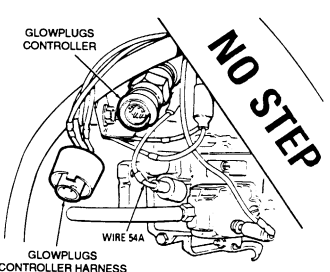

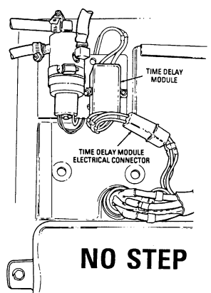

### Compression Unbalance Steace-R Test 14

1. Run tests 72,73 and 74 to verify that the batteries are OK.

CAUTION
THE GLOWPLUGS CONTROLLER AND
THE CONTROL VALVE ELECTRICAL
CONNECTOR MUST BE DISCONNECTED
PRIOR TO RUNNING THIS TEST.

2. Disconnect wire 54A at injection pump to prevent starting.

3. Disconnect glowplugs controller and control valve electrical connector. (to keep waveform clean).

4. Start Test 14, compression unbalance.

5. Wait for the GO message. Crank the engine.

6. Release the rotary switch when the VTM
displays OFF.  A number less than 25%
is passing.

# 2-18. Engine Running Tests

This is a top level test for problems with an engine that starts but doesn't run well after starting. This includes an engine that starts but doesn't stay running for very long. If the engine doesn't start, or starts but immediately stops, or is very hard to start, try the "STARTABILITY" tests first.

A functional flow schematic is not applicable to this section.

However, so that you may refer to sections as you need them, a quick index to the systems relating to engine running is given here.

| PARAGRAPH              | PAGE   |
|------------------------|--------|
| FUEL SYSTEM            | 2\-95  |
| INTAKE AIRVEXHAUST     | 2\-137 |
| COMPRESSION/MECHANICAL | 2\-143 |

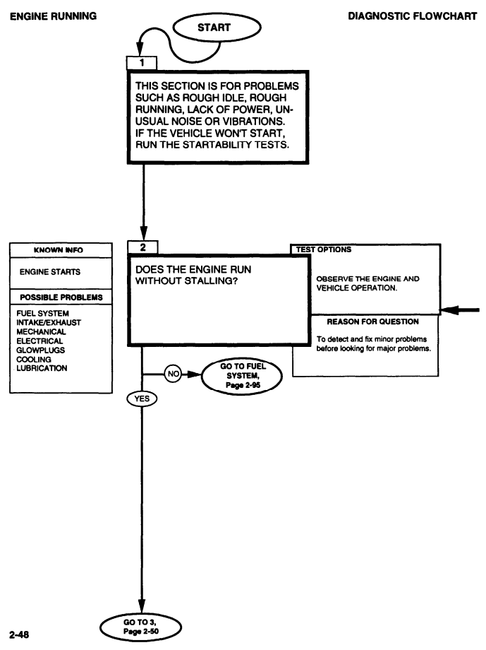

REFERENCE INFORMATION
ENGINE RUNNING
This is a check for all of those problems which


can cause the engine to stop when it shouldn't.

This includes fuel, air, and electrical problems. If the engine starts and then stops immediately, run the STARTABILITY tests first.

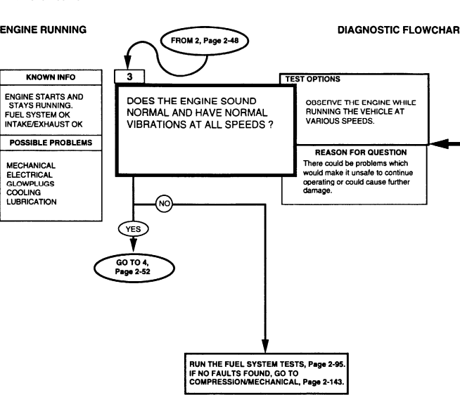

REFERENCE INFORMATION
ENGINE RUNNING

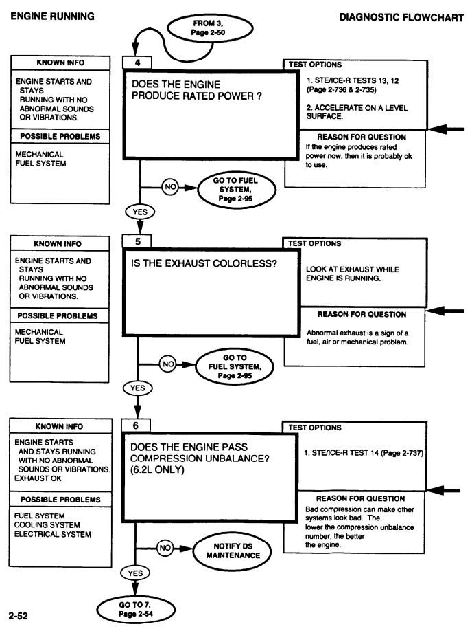

## Reference Information Engine Running

### Engine Power Test (Percent) Steace-R Test #13

1. Set TEST SELECT switches to 13.

2. Press and release TEST button.

3.  Wait for prompting message CIP to appear.

4.  When CIP appears on display, press down sharply on engine accelerator and hold it to the floor. When VTM displays OFF,
release accelerator.

5. A number will be displaved after the engine has returned to idle speed. This number is the test result in units of per cent of nominal rated power.

### Engine Power Test (Rpm/Sec) Steace-R Test #12

1. Set TEST SELECT switches to 12.

2. Press and release TEST button.

3.  Wait for prompting message CIP to appear. 4. When CIP appears on display, press down sharply on engine accelerator and hold it to the floor. When VTM displays a number, release accelerator.

5. A number will be displayed after the engine has returned to idle speed. This number is the test result in units of rpm's per second.

It is normal for the engine to emit some black smoke when accelerating after idling for a while.  Under most other conditions, exhaust smoke is usually from one of three sources; BLUE smoke is usually oil.

BLACK smoke is too much fuel or too little air. (Often caused by advanced injection timing).

WHITE smoke is usually water. (Often caused by retarded iniection timing).

If the smoking is continuous or appears under a particular condition, the smoke probably indicates a problem and should be investigated.

If STE/ICE-R is not available, there is no easy way to test compression. In this case, go on to the next step but remember that compression may be a problem.

### Compression Unbalance Steace-R Test 14

1. Run tests 72,73 and 74 to verify that the batteries are ok.

2. THE GLOWPLUG CONTROLLER AND THE
CONTROL VALVE ELECTRICAL
CONNECTOR MUST BE DISCONNECTED
PRIOR TO RUNNING THIS TEST.

3. Disconnect wire 54A at injection pump to prevent starting.

4. Disconnect glowplug controller and control valve electrical connector. (to keep waveform clean).

5. Start Test 14, compression unbalance.

6. Walt for the GO message. Crank the engine.

7. Release the rotary switch when the VTM
displays OFF. A number less than 25%
is passing.

If STE/ICE-R is not available, accelerate under full power to a safe and reasonable speed on a level surface. For STE/ICE-R test \#12, a number higher than 6700 is passing. For test \#13, a number higher than 75 is passing.

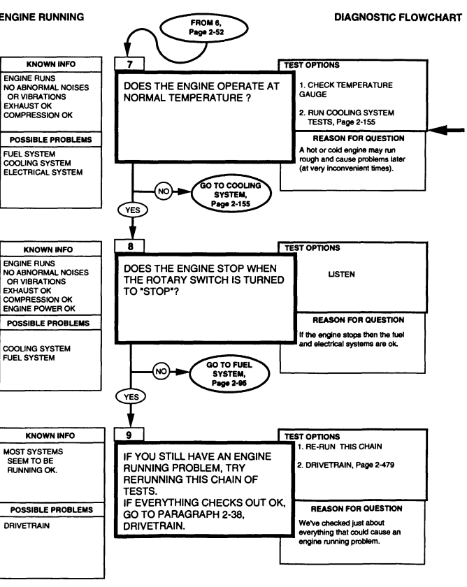

REFERENCE INFORMATION


ENGINE RUNNING

# '2-19. Cooling System Tests

This paragraph is a top level test for problems with either the watercooling system or the oil cooling system. Just follow the path, answering the questions.

Additional information and notes are given on the facing page when necessary.

The Cooling System consists of the oil and water radiators, the engine fan and its controller, the water pump, and the internal coolant passages in the engine.

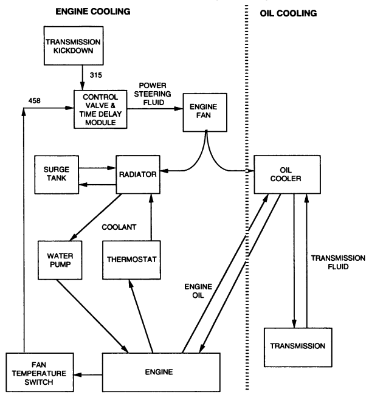

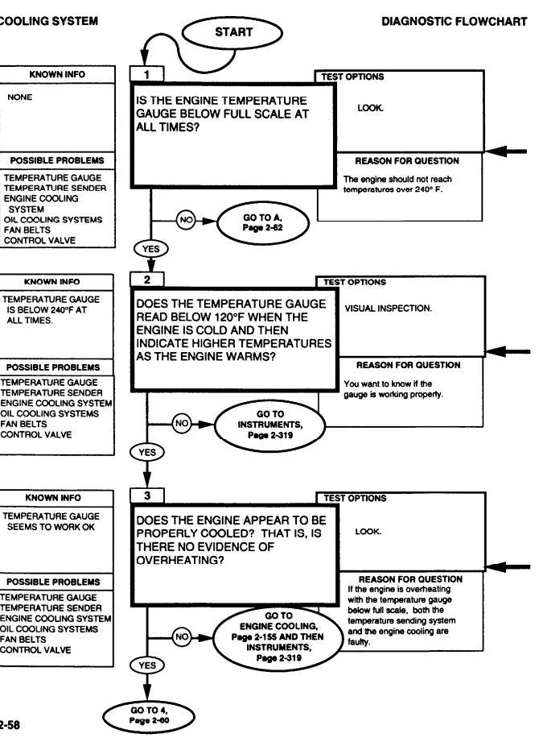

REFERENCE INFORMATION


COOLING SYSTEM

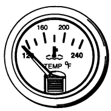

TEMPERATURE GAUGE

The question describes how the gauge should work. If you aren't sure if its working properly, you may want to run the instruments test anyway.

Look for boiling coolant, a


blown surge tank pressure cap or leaking hoses to tell you if the engine is overheating.

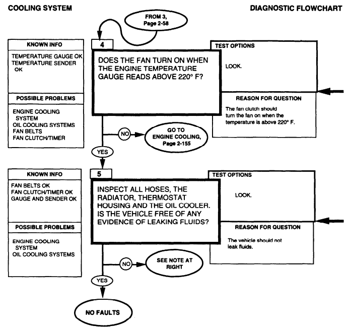

COOLING SYSTEM
220° F Is the approximate temperature at which the fan should turn itself on.

The fan will turn on and off as the engine temperature varies.

NOTE
If the leaking fluid is red, go to the transmission Paragraph 2-34, Page 2-399 or Paragraph 2-35, Page 2-411.

If the leaking fluid is yellow/green, go to engine cooling,  Paragraph 2-25, Page 2-155.

If the oil cooler is leaking, try to determine where the leak is coming from.  The oil cooler in front of the radiator cools both engine oil and transmission fluid (top half-transmission fluid, bottom half-engine oil).  If the leak is in the oil cooler, go to transmission or engine cooling.  If the leak is elsewhere, go to lubrication, Paragraph 2-20, Page 2-65.

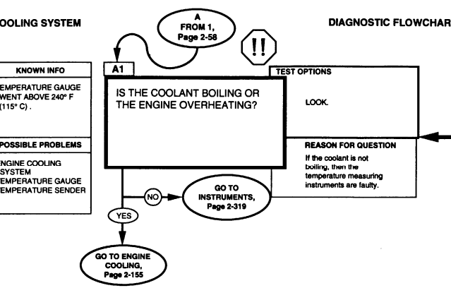

COOLING SYSTEM

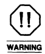

USE CAUTION WHEN INSPECTING HOT


ENGINE PARTS TO AVOID BURNS.

NEVER REMOVE THE PRESSURE CAP
OF A HOT ENGINE.

The coolant surge tank is clear, so you can see what is happening.

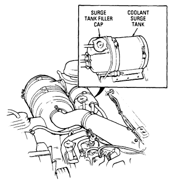

# 2-20. Lubrication System Tests

This paragraph is a top level test for all of the lubrication systems in the vehicle. Just follow the path, answering the questions. Additional information and notes are given on the facing page when necessary.

The HMMWV includes a venting system that is also checked in this paragraph. The purpose of the vent system is to allow vapor to escape to the atmosphere under normal operation, and to prevent venting during deep water fording operations. If the vents were left open, water would enter the engine and other systems and cause damage. The location of the vent lines is shown below. The location of the other parts in the lubrication system are shown in other lower level paragraph as required.

## Note

Bold lines represent ventilation system.

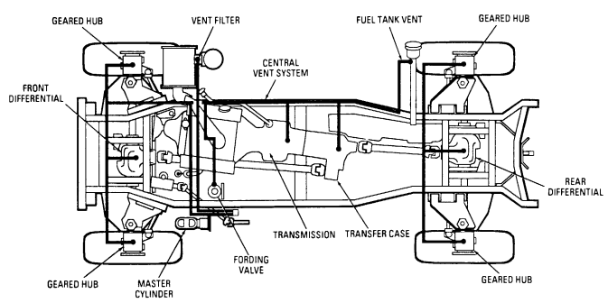

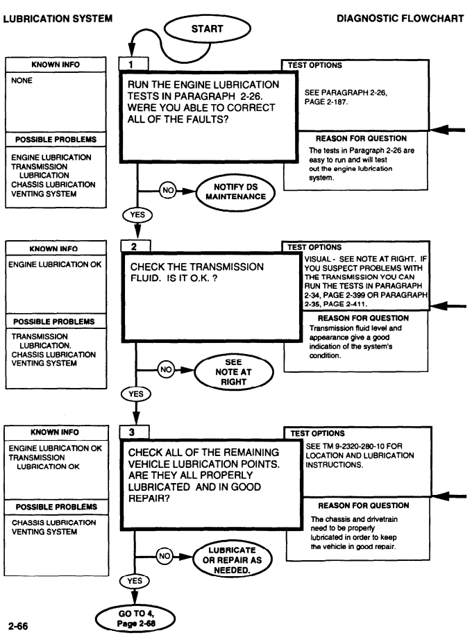

LUBRICATION SYSTEM
The tests in para. 2-26 test the oil level, cleanliness, leaks in the system, and the CDR valve. Return here when you've fixed everything you can or if no faults were found.

PROCEDURE FOR CHECKING TRANSMISSION FLUID
1. Start engine.

 2. Hold down brake pedal and move transmission shift lever through all ranges including reverse. 3. Engage parking brake and place shift lever in neutral. Check fluid level on dipstick. 4. Proper level is between "FULL" and "ADD" marks on dipstick.

NOTE
CHECK FLUID FOR A BURNT SMELL, GRIT, DISCOLORATION, AIR BUBBLES, OR A MILKY APPEARANCE.

- Burnt smell, discoloration, or grit indicates worn or damaged internal components. Notify DS maintenance.

- Bubbles indicate an overfilled system or air leaks in the system. Drain the fluid and refill to proper level. Refer to (para. 5-2).

- Milky appearance is due to water in the system. Drain the fluid from the entire transmission and transmission cooling system and install a new filter.

 Refer to (para 5-2). 

- Check fill tube for indications of fluid being blown out. If fluid is being blown out, check vent line for obstructions, and refill transmission to proper level. Refer to (para. 5-2). 

- Transmission fluid coming out of dipstick filler tube indicates a restriction in the ventilation system. Check for clogged, melted, or crushed lines and/or fittings between transmission and atmosphere vent on air cleaner canister. Replace where needed. Refer to (para. 5-16).

Among the items are the driveshafts, suspension, differentials, and geared hubs.


REFERENCE INFORMATION

# Lubrication System

There are vent lines attached to all parts of the vehicle with a lubrication reservoir. These parts are the engine, transmission, transfer case, differentials, geared hubs, and the fuel tank.

Removal procedures for the vent lines are given in the repair procedure for the particular component to which the line is attached.


Replace the fording valve. Refer to (para 12-9).

## 2-21. Electrical Tests

Most of the electrical circuits in the vehicle are included in one of the major systems covered by this manual. This is a top level paragraph to help you pick the right one. A number of schematics are also included to help you find the problem. If you go through the flowchart and can't solve the problem, use the schematics to find wires which may be causing trouble. The Electrical System consists of the batteries, which produce electrical power by a chemical reaction between the lead plates and the electrolyte solution (a mixture of acid and water).

This power is carried by wires and cables to those parts of the vehicle which require electrical power. The batteries get recharged by the alternator, which generates electrical power by using some of the engine's mechanical power, produced when the engine is running. If you are not too confident about electrical concepts and terminology, you should read Paragraph 2-16, page 2-39. All electrical systems require a connection to ground (called grounding), which is the completion of the circuit to the battery negative. Pages 2-66, 2-67 and 2-68 are diagrams of the grounding. If your vehicle exhibits strange symptoms that seem to defy all efforts to fix them, the vehicle may have a grounding problem. Grounding problems cause strange symptoms usually because more than one circuit is using the same ground, or because a circuit has more than one ground. For example, looking at the body ground diagram, if wire 58D (a ground for the instruments) is disconnected from the left side cylinder head, the instruments may still function due to the separate ground, but they would probably be erratic and inaccurate. Usually the problem will be a loose or corroded connection between the circuit, through body ground to battery negative terminal. Be sure to check continuity to battery negative cable rather than simply to the vehicle body or engine block. After the grounding diagrams are functional flow schematics of the major systems in the


vehicle. The shaded areas are the wires and components of the vehicle master power distribution. These are designed to help you find the system giving you problems.


ELECTRICAL
The lights are the only circuit on the vehicle which should work or be drawing any power when the switch is in the STOP position. Check the instruments, try turning on the heater fan, listen for any relay clicking or other sign (includes engine running) that power is on when It should't be.

It's best if you use the STE/ICE-R in TK mode to verify that there is no current draw from the batteries. You can't use the DCA mode for this because it will measure this current during the calibration part of the test and think that this is just an offset in the sensor.

0-1500 AMPS DC
STEACE-R TEST 90 1. Connect probe.

| 2. Start Test 90, DC amps.   |
|------------------------------|

3. Displayed reading is in amps.

The lights should work with the rotary switch in any position.


ELECTRICAL
With engine off, turn switch.  If the voltmeter


is slightly in the yellow zone, you can continue down the YES path,  but beware of possible test failures due to the low battery charge.


ELECTRICAL


1. Start Test 67, battery voltage.

2. Displayed reading is in volts.  Batteries should be 23-25.5 volts.  Batteries voltage will drop when glowplugs turn on. 

ELECTRICAL
DIAGNOSTIC FLOWCHART
KNOWN INFO
SHORT CIRCUIT IN POWER LINES


CONNECTOR. KEEP THE ROTARY
SWITCH IN THE "STOP" POSITION. IS THERE STILL POWER AT ANY
CIRCUITS OTHER THAN THE
LIGHTS?

POSSIBLE PROBLEMS
BODY CONNECTOR HARNESS ENGINE CONNECTOR HARNESS ROTARY SWITCH


KNOWN INFO
BODY CONNECTOR 
 HARNESS OK
RECONNECT THE BODY
CONNECTOR. DISCONNECT THE ENGINE 
CONNECTOR HARNESS. KEEP THE
ROTARY SWITCH AT "STOP". IS THERE POWER AT ANY CIRCUITS
TEST OPTIONS
1. STE/ICE-R TEST 90 (Page 2-751) 2. VISUAL CHECK
POSSIBLE PROBLEMS
ENGINE CONNECTOR HARNESS ROTARY SWITCH


A3
REPAIR OR REPLACE THE ENGINE
CONNECTOR HARNESS. GO TO STEP 1, PAGE 2-72 TO CONTINUE
TESTING.

REASON FOR QUESTION
If the problem stays, it has to be a short in the engine connector harness.

REASON FOR QUESTION
If the problem goes away, the short is in the body connector harness or the rotary switch TM 9-2320-280-20-1

ELECTRICAL

WARNING


DISCONNECT NEGATIVE BATTERY CABLE
BEFORE DISCONNECTING AND RECONNECTING PROTECTIVE CONTROL BOX/DISTRIBUTION BOX HARNESS.

There is battery voltage at the PCB/distribution box at all times. Failure to disconnect battery cable will result in damage to equipment or injury to personnel.

0-1500 AMPS DC
STE/ICE-R TEST 90 1. Connect probe. 2. Start Test 90, DC amps.

3. Displayed reading is in amps.

Replace PCB, refer to (para. 4-5). Replace distribution box, refer to (para. 4-5.1).

Repair harness, refer to (para. 4-85). Replace harness. Notify DS maintenance.

ELECTRICAL
KNOWN INFO
SHORT ON BODY CONNECTOR SIDE OF PCB/DISTRIBUTION BOX
POSSIBLE PROBLEMS
ROTARY SWITCH PCB/DISTRIBUTION BOX BODY CONNECTOR BODY CONNECTOR CABLE HARNESS
KNOWN INFO
ROTARY SWITCH OK
POSSIBLE PROBLEMS
PCB/DISTRIBUTION BOX BODY CONNECTOR BODY CONNECTOR CABLE HARNESS


REPAIR OR REPLACE THE BODY CONNECTOR HARNESS. 

GO TO A2, PAGE 2-78, TO CONTINUE TESTING.

REFERENCE INFORMATION
ELECTRICAL

1. Connect RED clip and BLACK clip to the terminations indicated in the question. RED to the first, BLACK to the second. 2. Start Test 91, 0-4500 ohms. 3. Displayed reading is in ohms. Less than 5 ohms is continuity. If the resistance is over 4500 ohms, STE/ICE displays "9.9.9.9."
Replace rotary switch. Refer to (para. 4-7).

0-45 DC VOLTS
STE/ICE-R TEST 89 Replace PCB. Refer to (para. 4-5). Replace distribution box. Refer to (para. 4-5.1).

1. Connect RED clip to the indicated test point, BLACK clip to negative or ground.

2. Start Test 89, DC volts.

3. Displayed reading is in volts.


DISCONNECT NEGATIVE BATTERY CABLE BEFORE DISCONNECTING AND RECONNECTING PROTECTIVE CONTROL BOX/DISTRIBUTION BOX HARNESS.

There is battery voltage at the PCB/distribution box at all times. Failure to disconnect battery cable will result in damage to equipment or injury to personnel.

Repair or replace harness.

Notify DS maintenance.


Battery cables to starter.


Bus bar to solenoid PCB engine & body connector Light switch


# Electrical

## Reference Information Battery Voltage Steace-R Test 67

1. Start Test 67, battery voltage.

2. Displayed reading is in volts.  Batteries should be 23-25.5 volts. Batteries' voltage will drop when glowplugs tum on.

## Battery Voltage Multimeter

1. Set the voltmeter to a DC volts scale of at least 40 volts.

2. Connect the RED lead to positive and the BLACK lead to negative. 3. Be sure to read the correct scale.

ELECTRICAL

# Battery/Engine Ground Circuit


ELECTRICAL

# Body Ground Circuit


 ELECTRICAL


# Front Hood/Lights Ground Circuit

# Battery Circuit Interface

ELECTRICAL


ALL CIRCUITS MUST RETURN
THROUGH VEHICLE GROUND.

ELECTRICAL


ELECTRICAL

# Alternator Interface


ELECTRICAL

SHADED AREA IS VEHICLE
MASTER POWER


ELECTRICAL


## 2-22. **Fuel System Tests**

These Fuel System tests can be run any time you think there maybe a problem with the fuel system or if you were sent here from another test.

If you are running this test because the engine runs rough remember that air intake and exhaust as well as internal mechanical problems can also cause this condition. At the bottom of this page is a simplified block diagram which shows how the different fuel system


components relate to each other. Refer to fold-out page FO-1, leave open for reference while you are testing.

This set of tests maybe used when the engine is hard starting, has low power or runs rough. Just follow the path, answering the questions. Additional information and notes are given on the facing page (like this one) when necessary. It is recommended that you refer to your fold-out diagram now because it will help you follow the testing.

I


MAKE SURE ALL ELECTRICAL CONNECTIONS ARE CLEAN AND TIGHT. CHECK FUEL SOLENOID, COLD ADVANCE SOLENOID, BATTERIES, ROTARY
SWITCH, ETC.

1. While cranking or running the engine open the drain fitting end drain some fuel into a clear container.

2. The fuel should come out of the open drain valve in a steady stream, if it
●
3. 4.

5.

doesn't, than ANSWER NO TO THIS
QUESTION.

NOTE: Nothing will come out unless the engine is running or cranking. Close the drain valve and turn the rotary switch to STOP. Check the fuel that came out to be sure that it isn't contaminated with water or dirt.

If the fuel didn't come out in a steady stream or if it is contaminated then ANSWER NO TO THIS QUESTION.

If you have trouble starting the engine you should have entered here byway of the Statability tests. If you didn't begin there, go beck to Page 2-41 and the the Startability top level teat.

At this point you don't care how well it starts or runs but just that it will run. THE ANSWER TO THIS QUESTION IS NO if the engine seems to start but stops almost immediately.

Engine temperature may be determined from vehicle temp. gauge (Rotary Switch must be in RUN position) or by touching fortably than it is above 120° F (49° C).

Hard stating can be caused by other things such as fuel in the lines leaking back into the tank while the engine is shut down. This will occur if there is an air leak in the lines.


FUEL SYSTEM
Diesel fuel is highly flammable.

Do not perform any procedures near fire, flames, or sparks.

Severe injury ordeath will result WARNING
A hot engine may cause serious

 bums. Always use caution when approaching a hot engine.

FUEL SYSTEM


FUEL SOLENOID OK
COLD ADVANCE OK
FUEL FILTER
FUEL SOLENOID OK
COLD ADVANCE OK
AND FILTER OK
INJECTION PUMP
FUEL SUPPLY LINES
FUEL RETURN LINES
RETURN CHECK VALVE
FUEL LINES, PUMP
AND FILTER OK
INJECTION PUMP
EXHAUST RESTRICTED
FUEL LINES
FUEL PUMP
FUEL LINES
FUEL FILTER
FUEL PUMP
FUEL PUMP
INJECTORS
INJECTORS

FUEL SYSTEM
Watch the fuel pump pressure while slowly accelerating the angina from idle to maximum speed. The pressure should always be greater than zero. If pressure, check to be sure it is still above zero even during maximum acceleration (maximum engine power). You can use STE/ICE test 24 with control function 02 (minimum).

NOTE
Rapidly accelerating the engine with the transmission in neutral doesn't work for this engine because the fuel supply can't increase as fast as the engine can accelerate so you won't get good test results.

Proper engine performance is dependent upon the availability of the correct fuel volume to the injection pump.

Pay attention to when the engine runs rough. If it runs rough only while warming up after a cold start it may be a glowplug problem and you should run the Glowplug Circuit tests. Rough running may also be caused by air leaks in the fuel supply lines. Air in the fuel should purge itself while idling. If rough running occurs after a period of high speed or high power running but seems to go away after idling, then look for air leaks in the fuel supply lines and fittings. if rough running occurs while driving but idles ok, check the fuel return check valve for any malfunctions (refer to para. 3-35).

#### Note

Try to adjust the engine idle speed by turning the idle speed screw (refer to para 3-44).

Continue testing if you can adjust the speed properly. If you cannot, notify DS maintenance.

Engine must be at normal operating temperature when making speed checks. Air fitter must be in place and all accessories (lights, heater fan, etc...)
must be turned off.

This engine has a min-max governor which controls engine speed at both idle and full throttle.


FUEL SYSTEM
Governor no-load speed is with the transmission in neutral. Loaded speed is with the transmission in gear and the vehicle moving. It is the maximum rpm's the engine will develop. The engine will surge at governor speed since the governor will try to lower the engine speed and the accelerator is trying to increase it.

A number over 75 is passing for STE/lCE-R
test 13. tf the vehicle seems to be low on power while driving you have to check for other things which could cause this such as the transmission.

To try a road test, accelerate the vehicle from 0 to a safe and reasonable speed on a reasonably level road.

NOTE
If the exhaust is not colorless it must be either white, blue or black. If exhaust color is:
WHITE . . . . . . . . . . Go to G, Page 2-122. Also could be injector timing. Notify DS maintenance. BLUE . . . . . . . . . . . . Blue smoke is a sign of oil entering the combustion chambers. It usually enters pest the piston rings or intake valve stem seals. This is an internal engine problem that can't be handled at this level of maintenance. You may want to run the Engine Running Mechanical tests, Page 2-47, before you notify DS Maintenance.

BLACK . . . . . . . . . Air lntake/exhaust, Page 2-137.


TM 9-2320-280-20-1 FUEL SYSTEM
REFERENCE INFORMATION
1. Note engine rpm reading (STE/lCE-R TEST 10)
2. Gently depress rocker arm on pump towards injection pump 3. If mechanism is functioning properly rpms will decrease.

4. If mechanism doesn't move freely, try putting a drop of oil in the two spots indicated. Gently try to depress rocker arm again.

Injection pump as seen


from rear of engine. Gently press screwdriver against arm.

Use a ten inch screwdriver


REFERENCE INFORMATION
If no fuel arrives when cranking engine,


 the diaphragm in the Iift pump may be ruptured, allowing the fuel to drain back into the tank.

There may be some water or dirt trapped in the filter already that didn't come from the fuel that is in the tank now. Open the filter drain valve and sank the engine for approximately 5 seconds to purge the filter, then take a fuel sample in a clear container.

Inspect the sample for water and dirt. Replace fuel fitter, refer to (para 3-33).

KNOWN INFO B1 ENGINE DOESN'T
STAY RUNNING
POSSIBLE PROBLEMS
FUEL PUMP FUEL SUPPLY LINES FUEL RETURN LINES FUEL FILTER FUEL
SOLENOID/WIRING
HIGH PRESSURE
SYSTEM

### Known Info

OTHER SYSTEMS
LISTED ABOVE OK
POSSIBLE PROBLEMS
FUEL PUMP FUEL SUPPLY LINES FUEL RETURN LINES FUEL FILTER FUEL
SOLENOID/WIRING
HIGH PRESSURE
SYSTEM

### Known Info

FUEL PUMP OK FUEL SUPPLY LINES
OK
FUEL FILTER OK
POSSIBLE PROBLEMS
FUEL RETURN LINES FUEL
SOLENOID/WIRING
HIGH PRESSURE
SYSTEM
Disconnect the glowplug

 controller and wire 569B/569D from the injector pump. Make sure that wire 54A is properly connected to the injector pump. With the rotary switch in "RUN" position, do you have at least 0.5 amps DC flowing through wire 54A?


Go to N,


Page 2-132
TEST OPTIONS
STE/ICE Test 90, (page 2-751) Multimeter

### Reason For Question

Current through the wire quickly checks the integrity of the fuel system wiring. The normal reading will be about 1.3 to 1.5 amps.

B2


### Test Options

Reconnect the above wires. Check fuel pump pressure and volume during cranking. Is pump pressure greater than 3 psi (20.69 kPa) and fuel volume at the injection pump inlet 1 pint in 30 seconds?


Does the engine start and stay
running with the fuel return line (the short rubber line at the injector pump) disconnected?


Go to B4, page 2-108


Volume Test STE/ICE Test 24, (page 2-738) Fuel Pump REASON FOR QUESTION Positive pressure and volume indicate that fuel is present and supply lines and filter are not plugged. This is a test of the lift pump.

TEST OPTIONS
Put the return line in a suitable container and try starting the engine.

REASON FOR QUESTION A restricted fuel return line will cause a pressure imbalance in the pump and prevent the engine from running.

# Reference Information **Fuel System**

### Note

When using a multimeter to measure current through wire 54A, disconnect the wire. Set the ammeter to a scale of at least 5 amps DC. Connect the red lead of the multimeter to wire 54A and the black lead to ground. With the rotary switch in the RUN position, measure current. Be sure to read the correct scale. Return the switch to the STOP position. Disconnect the multimeter and reconnect wire 54A.

### Fuel Pump Pressure Ste/Ice-R Test #24

1. Select Fuel Supply Pressure Test
(Test \#24). Perform CAL.

2. Crank (or start) engine.

### Fuel Pump Volume Test

1. Disconnect fuel line at injection pump inlet and route fuel line into a suitable, 1 quart container. 2. Crank the engine for 30 seconds. 3. If the pump and lines are ok, you should get about 1 pint (1/2 quart) (0.5L) in 30 seconds.


### Warning


Diesel fuel is highly flammable. Do not perform any procedures near fire, flames, or sparks. Severe injury or death may result.

1. Disconnect the return line and direct it into a suitable container.

2. Watch the fuel flow from the return line as you or an assistant try to start the engine.

### 5 Amps Dc Ste/Ice-R Test 89

1. Connect RED clip to the indicated test point; BLACK clip to negative or ground.

2. Start Test 90. 3. Displayed reading is in amps.

### Fuel Pump Pressure Test Pressure Gauge

1. Connect a tee into the fuel line between the fuel filter outlet and the injection pump inlet.

2. Attach gauge to tee. 3. Crank (or Start) engine.


KNOWN INFO B4 FUEL SOLENOID AND
WIRING OK
POSSIBLE PROBLEMS
FUEL RETURN LINES INJECTION PUMP INJECTORS RETURN CHECK
VALVE
KNOWN INFO
RETURN LINES OK
POSSIBLE PROBLEMS
INJECTION PUMP INJECTORS


DOES THE ENGINE RUN

POORLY WITH THE RETURN

 


TEST OPTIONS


Visual Inspection


REASON FOR QUESTION Plugged fuel return lines cause back pressure which prevents injection pump from working properly.

### Test Options

Run Intake/Exhaust Tests

 Page 2-137.

RUN THE INTAKE/EXHAUST


 TESTS. RETURN HERE IF NO FAULTS FOUND.

REASON FOR TESTS
There is still a possible Intake/Exhaust fault. If you came here from Startability then this wasn't tested.

KNOWN INFO
RETURN LINES OK


RUN THE STARTABILITY TEST 

 RUN THE FUEL SYSTEM TEST
Run Startability Test Page 2-41. Run Fuel System Test Page 2-95.

REASON FOR TEST
If all efforts have been exhausted, still experience no hot start problem, identify the fuel injection pump model and serial number.

POSSIBLE PROBLEMS
INJECTION PUMP INJECTORS
TEST OPTIONS

# Reference Information **Fuel System**

Return lines should be inspected for kinks or crushed lines or anything that might restrict fuel flow. Inspect fuel return check valve for any restrictions. Replace valve (para. 3-35). Replace fuel lines. Refer to (para. 3-25).

If you came here from the Startability Tests, return to STEP 5, Page 2-44. If you haven't run the Startability Tests yet, go to STEP 1, Page 2-42.

During high temperature and humidity, early model vehicles can experience difficulty starting while using JP-8 fuel. High temperatures can cause restrictive clearances in some older fuel injection head and rotor assemblies. The engine must be allowed to cool to allow adequate clearance of the pumping plungers to ensure adequate fuel delivery for starting. If this condition persists, run the startability tests. If vehicle passes all startability tests and troubleshooting procedures and still experiences difficulty in hot starting, identify the fuel injection pump and serial numbers. All fuel injection pumps with P/N DB2831-5209, NSN 2910-01-467-9029 incorporated the improved head and rotor assembly, P/N 31506. If your serial number is less than shown in the Serial Number Break Column of the table below, the manufacturer recommends the fuel injection pump to be replaced, tagged as a "no hot restart" condition, and forward for rebuild. Notify direct support maintenance.

| System               |                                    |                            |
|----------------------|------------------------------------|----------------------------|
| 29.1  Annually  Dust | Visually inspect dust unloader for | Dust unloader missing or   |
| Unloader             | presence and for cuts, tears,      | has cuts, tears, obstruc                            |
|                      | obstructions, worn areas, enlarged | tions, worn areas,         |
|                      | gap, or if center opening exceeds  | enlarged gap, or if center |
|                      | 1/8 in. (3.175 mm).                | opening exceeds 1/8 in.    |
|                      |                                    | (3.175 mm).                |

KNOWN INFO C1 HARD COLD
STARTING
POSSIBLE PROBLEMS
COLD ADVANCE
CIRCUIT
GLOWPLUG CIRCUIT FUEL SYSTEM
KNOWN INFO
POWER TO COLD
ADVANCE SOLENOID
POSSIBLE PROBLEMS
COLD ADVANCE
CIRCUIT
GLOWPLUG CIRCUIT FUEL SYSTEM
KNOWN INFO
COLD ADVANCE
CIRCUIT OK
POSSIBLE PROBLEMS
GLOWPLUG CIRCUIT FUEL SYSTEM

FUEL SYSTEM **DIAGNOSTIC FLOWCHART**


FUEL SYSTEM
The engine temperature must be below 90° F (32°C)
to get voltage here. If the engine is warm, either wait for it to cool, or go to step C3 at the bottom of the pegs and remember that the cold advance maybe the problem if everything else checks out OK.

The Glowplugs or the lntake/Exhaust System may be faulty, so you should test them first.

The cold advance circuit advances the fuel injection pump timing approximately 3 to 5 degrees during cold start up. If engine temperature is less than 90°F (32°C), then Advance circuit operation maybe checked as follows:
1.

2.

3.

4.

Start the engine.

Disconnect wire 569B/569D from the Advance Solenoid. If the circuit is working correctly, then engine RPM should decrease.

Look at the advance mechanism on the right side of the fuel injection pump while you connect and disconnect 569D/
569B with the engine running. The advance mechanism should move about 1/4 inch.

If the advance mechanism is stuck, apply some oil at the points shown and try again.

Remember to reconnect any wires that were disconnected during troubleshooting.

1. Connect RED clip to positive, BLACK clip to negative or ground.

2. Start Test 89, DC volts.

3. Displayed reading is in volts.

### Battery Voltage Multimeter

1. Set the voltmeter to a DC volts scale of at least 40 volts.

2. Connect the RED lead to positive and the BLACK lead to negative.

3. Be sure to read the correct scale.


FUEL SYSTEM
If you hear a hissing noise while removing the fuel filter cap then either the vent filter is plugged, the vent line is restricted, or the vent valve is restricted. The vent filter is located behind the coolant surge tank.

Replace vent lines or vent line filter, refer to (para. 3-27.)
Replace vent valve, refer to (para. 3-24.)
Diesel fuel is sensitive to temperature. All diesel fuel has a certain amount of paraffin-like components which have high energy value and help improve fuel economy. When temperatures are less than 20°F (-7°C) these components begin turning into wax flakes that can build upon the fuel tank strainer or in the fuel filter. If wax build-up is found, replace the fuel in the tank with a winter grade of fuel if available. You will have to remove the fuel tank if you need to inspect the tank strainer.

Replace fuel tank, refer to (para. 3-24.)


FUEL SYSTEM
Fuel lines should be inspected for kinks, cracks or anything that would restrict fuel flow or allow air to enter the lines. Be sure to check the lines all the way beck to the tank and remember that there is a strainer inside the tank which can become plugged. You will have to remove the tank if it becomes necessary to check this.

Replace fuel lines, refer to
(para 3-25)
Poor starting and excessive smoke after start up can be the result of a restricted fuel supply. This restriction most likely will be from a plugged fuel filter but can also be caused by a pinched or kinked fuel line.

After the engine warms up, it generally will run satisfactorily. If the restriction gets progressively worse, top speed and performance will be affected also.

#### Fungus

In warm or humid weather, fungi and/or bacteria in the fuel can cause fuel system damage by plugging the fuel lines, filter, or injection nozzles.

For removal, replacement and torques, refer to (para 3-33) or notify DS
maintenance.

Excessive roughness on any of these parts is an indication of wear. The pushrod should slide smoothly in the engine block. If you notice any roughness on the end of the pushrod be sure to check the lobe on the camshaft.

#### Note

If the pump or rod is worn, replace. Refer to (para 3-23). If the lobe on the camshaft is worn, notify DS maintenance.

#### Rerun Test Chain

You may have corrected some problems but there may be others including the fuel pump.

For removal, replacement and torques, refer to (para 3-23).


TM 9-2320-280-20-1 REFERENCE INFORMATION
FUEL SYSTEM
Injection pump timing that is too far


advanced can cause glowplugs failure because it increases cylinder temperature. Usually several but not all glowplugs will fail.


REFERENCE INFORMATION
Be sure to keep the line clear of


moving engine parts (fan, pulleys, etc...)
and DO NOT place the line on the exhaust manifold.

Replace fuel lines (refer to para 3-25).

Check the fitter vent screw for tightness.

Check the supply lines for kinks, cracks, leaks, or loose connections that could restrict fuel flow or allow air to enter the system. Remember that under certain operating conditons parts of the fuel system can be under vacuum so that loose connections


FUEL SYSTEM


REFERENCE INFORMATION


Be sure to keep the line clear of moving engine parts (fan, pulleys, etc...)
and DO NOT place the line on the exhaust manifold.

Fuel lines should be inspected for kinks, cracks, or anything that would restrict fuel flow or allow air into the lines. Be sure to check the lines all the way back to the tank and remember that there is a strainer inside the tank which can also become plugged. To teat for air leaks in the supply lines, disconnect the return line from the injection pump and connect a line that is long enough to reach the ground.

Place the end of the line into a bucket containing diesel fuel, making sure that the end of the line is below the level of fuel in the bucket. Run the engine and watch for air bubbles in the bucket.

Replace fuel line, refer to (para 3-25).

An important function of all hoses, lines and fittings is to carry fuel without admitting air to the system. When the fuel tank cap is in place and the fuel pump and injection pump are drawing fuel through the lines a low vacuum of 0-1 PSI is created. This occurs because the fuel which the engine uses must be replaced by air. During this vacuum condition, the slightest leak, which may not leak fuel out, could draw air into the system and, depending on the volume of air, cause a wide variety of engine malfunctions.

#### Cold Weather Operation

Diesel fuel is sensitive to temperature. All diesel fuel has a certain amount of wax-like components which have high energy value and help improve fuel economy. When temperatures are less than 20°F (-7°C) these components begin turning into flakes that can build up on the fuel tank strainer or in the fuel filter.

#### Fungus

In warm or humid weather, fungi and/or bacteria can cause fuel system damage by plugging the fuel lines, filter, or injection nozzles.

Old fuel smells like varnish.

Check the accelerator pedal for full movement with no sticking or binding. It you have sticking or binding, lubricate accelerator pedal bushing and bearing with seasonal grade OE oil
(TM 9-2320-280-10). If you do not have full pedal travel then disconnect the accelerator linkage from the fuel injection pump and recheck the travel. It you now have full travel then the problem is in the fuel injection pump and cannot be handled at this level of maintenance. Operation of the injection pump and injectors cannot be verified at this level of maintenance.

FUEL SYSTEM


REFERENCE INFORMATION
FUEL SYSTEM


Be careful when performing this test. Exhaust gas can be extremely hot end severe bums can result.

Put a piece of paper in the exhaust stream for a few moments with the engine at idle. Then look at the paper to see if there is any condensed fuel on it. Then smell the paper to see if it smells like raw fuel. If it smells like fuel then the engine could be very cold or else it has a DS level fuel system fault or compression fault.

White smoke for a short time after start up, especially on a cold day, is a normal condition. It is caused by incomplete combustion of the fuel because of low cylinder temperature. It should clear up in a few minutes. If not you may have a bed head gasket, cracked block, or a restricted check valve. Check for restricted check valve (para. 3-35).


Keep hands away from engine fan!

Moving fan blades can cause serious injury.  Use extreme caution when engine is running.


Disconnect negative battery cable before disconnecting and reconnecting protective control box hamess.

There is battery voltage at the PCB at all times. Failure to disconnect battery cable will result in damage to equipment or injury to personnel.

Rotary Switch must remain in STOP position for the rest of

1. Connect RED clip to positive, BLACK clip to negative or ground.

2. Start Test 89, DC volts.

3. Displayed reading is in volts.

## Dc Voltage Multimeter

1. Set the voitmeter to a DC volts scale of at least 40 volts.

2. Connect the RED lead to positive and the BLACK lead to negative.

3. Be sure to read the correct scale.


OK, you have to replace the harness.

Remember to reconnect any wires that may have been disconnected during troubleshooting.

For repair instructions (HARNESS REPAIR),
refer to (para 4-85).

For repair/replace instructions (ROTARY
SWITCH), refer to (para 4-7).

## Fuel System


## Reference Information Fuel System

NOTE
Check the rubber return line from the injection pump to the steel tubing return line. If the rubber line is not clogged go to D1, page 2-112.

If the line is clogged, then replace it.  Start the engine and see if it stays running. If it doesn't start or stay running then return to J1 and continue testing. There may be another fuel system fault preventing fuel from reaching this point.

1. Connect RED clip to the indicated test point, BLACK clip to negative or ground.

2. Start Test 89, DC volts.

3. Displayed reading is in volts.

## Battery Voltage Multimeter

1. Set the voltmeter to a DC volts scale of at least 40 volts.

2. Connect the RED lead to positive and the BLACK lead to negative.

3. Be sure to read the correct scale.

If the cold advance solenoid is getting power then the only possibilities that would keep the engine from starting are that fuel is not reaching the cylinders due to a fault in the high pressure side of the fuel system or nearly all the cylinders have very low compression. It is unlikely that all the cylinders would lose compression at the same time, but you may want to run a Compression Unbalance test
(STE/ICE-R Test \#14) to check this.

For repair/replace instructions, refer to (para 4-85).


FUEL SYSTEM

### Note

If you are getting white smoke due to coolant entering the cviinders then you should notice a loss of coolant in the radiator or bubbles in the radiator tank while the engine is running.  You may need to fill the radiator to proper level and recheck a day later to determine if there is a coolant loss.

If you don't detect coolant loss then you may have missed a fuel problem. Rerun the fuel system tests paying attention for a raw exhaust smell.

If you still find nothing you may have a small or inconsistant leak.

Notify DS maintenance.


Keep hands away from engine fan! Moving fan blades can cause serious iniurv. Use extreme caution when engine is running.

If the enaine doesn't shut off with the solenoid disconnected then fuel is still reaching the cylinders- probably because the fuel solenoid is stuck open.  When vou squeeze the return line tight enough to prevent fuel flowing through it, you create a pressure imbalance inside the injection pump that will cause the engine to stall.


Disconnect negative battery cable before disconnecting and reconnecting protective control box hamess.

There is battery voltage at the PCB at all times. Failure to disconnect battery cable will result in damage to equipment or injury to personnel. Remember to reconnect any wires that may have been disconnected during troubleshooting.

For repair/replace instructions (HARNESS), refer to (para 4-85).

For repair/replace instructions (PCB), refer to (para 4-5).


1. Connect RED clip to the indicated test point, BLACK clip to negative or ground.

2. Start Test 89, DC volts.

3. Displayed reading is in volts.

## Battery Voltage Multimeter

1. Set the voltmeter to a DC volts scale of at least 40 volts.

2. Connect the RED lead to positive and the BLACK lead to negative.

3. Be sure to read the correct scale.


FUEL SYSTEM

1. Connect RED clip to positive, BLACK clip to negative or ground.

2. Start Test 89. DC volts.

3. Displayed reading is in volts.

You should only run the enaine long enough to determine the gage reading because engine temperature must stav below 90° F (33° C) for the Cold Advance Circuit to function.

## Battery Voltage Multimeter

1. Set the voltmeter to a DC volts scale of at least 40 volts.

2. Connect the RED lead to positive and the BLACK lead to negative.

3. Be sure to read the correct scale.

1. Shut off enaine 2. Disconnect wire 569C at Cold Advance Switch.

3. Turn Rotary Switch to Run

position.

4. Check for battery voltage at wire

રક્કર્સ્ટ.

Repair wire or replace hamess, refer to (para 4-85).

NOTE
Engine temp must be less than 90°F (33° C)
when testing the switch.

For repair/replace instructions,
(COLD ADVANCE SWITCH), refer to
(para 4-27).

For repair/replace instructions,
(HARNESS), refer to (para 4-85).


Alternator output is hot when the Rotary Switch is in the RUN position.

Cold Advance Switch is closed when engine temperature is below 90°F (33° C) and open when it goes above 120°F (49° C).

The Cold Advance Solenoid advances the Injection Pump timing when it receives power from the switch.  This helps the engine run better when it is cold.

## Fuel System

KNOWN INFO
NO VOLTAGE AT FUEL
SOLENOID
POSSIBLE PROBLEMS
РСВ ROTARY SWITCH
WIRING
KNOWN INFO
WIRING TO FUEL
SOLENOID OK
POSSIBLE PROBLEMS
PCB
ROTARY SWITCH WIRING
KNOWN INFO
WIRING TO FUEL
SOLENOID OK
POSSIBLE PROBLEMS
PCB
ROTARY SWITCH
WIRING


Disconnect negative battery cable before disconnecting and reconnecting protective control box hamess.

There is battery voltage at the PCB at all times.

Failure to disconnect battery cable will result in damage to equipment or injury to personnel.

Repair wiring, refer to (para 4-85).

Inspect wiring to be sure that all the wires are connected in their proper places.


PCB ENGINE CONNECTOR (ON LEFT FENDER


PCB BODY CONNECTOR (LOCATED UNDER
DASHBOARD)
Repair wiring, refer to (para 4-85).

Remember to reconnect any wires that were disconnected during troubleshooting.

FUEL SYSTEM


1. Connect RED clip and BLACK clip to the terminations indicated in the question.  RED to the first, BLACK to the second.

2. Start Test 91, 0-4500 ohms.

3. Displayed reading is in ohms. Less than 5 ohms is continuity.  If the resistance is over 4500 ohms/
STE/ICE displays "9.9.9.9."

1. Set the voltmeter to an ohms scale of about 1000 ohms.

2. Connect the RED and BLACK leads to the connections stated in the question.

3. Be sure to read the correct scale.  Less than 5 ohms indicates continuity.  For an open circuit, the meter should peg full scale (needle all the


way to the left).

REAR OF ROTARY SWITCH


## Reference Information Fuel System


to (para 4-85).


For repair/replace instructions (ROTARY SWITCH), refer to (para 4-7).

WARNING


Disconnect negative battery cable before disconnecting and reconnecting protective control box hamess.

There is battery voltage at the PCB at all times.

Failure to disconnect battery cable will result in damage to equipment or injury to personnel. Be sure to reconnect the wires at the rotary switch and the fuel solenoid.

For  repair/replace instructions (PCB), refer to (para 4-5).

1. Connect RED clip and BLACK clip to the terminations indicated in the question.

2. Start Test 91, 0-4500 ohms.

3. Displayed reading is in ohms.  Less than 5 ohms is continuity. If the resistance is over 4500 ohms, STE/ICE displays "9.9.9.9.9."

1. Set the voltmeter to an ohms scale of about 1000 ohms.

2. Connect the RED and BLACK leads to the connections stated in the question.

3. Be sure to read the correct scale.  Less than 5 ohms indicates continuity.  For an open circuit, the meter should peg full scale (needle all the way to the left).

## 2-23. Air Intake/Exhaust Tests

These Air Intake/Exhaust System tests can be run anytime you think there maybe a problem with the air intake or exhaust systems, or if you were sent here from another test.

At the bottom of this page is a simplified block diagram of the Intake Air/Exhaust System. A detailed functional flow is not applicable to this system.

The Air Intake/Exhaust System is a very simple system that can cause very annoying


problems. Whether the vehicle is hard to start or runs rough or never develops full power, it's worth the few minutes that it takes to check the components of this system. You can run through the diagnostic logic for this system almost anytime you open the hood or check the underside of your vehicle.


REFERENCE INFORMATION
INTAKE AIR/ EXHAUST
First, check the Air Filter Restriction gauge on the dashboard, just to the left of the steering wheel and make a note of its reading. Open the air cleaner cannister, remove the air cleaner element and inspect it for dirt and other contaminants.  Replace air filter, refer to (para 3-13).  A clean air filter is white.  If the condition of the filter does not agree with the gauge on the dashboard, make a note to check the gauge, see Instruments section, page 2-319.


Make sure that all mounting bolts are in place and tight.  Look for obvious things like a crushed or cracked air filter or air induction tube, check gaskets where possible.

Replace induction system components, refer to (para 3-12).

Look for damage caused by rocks such as bent pipes or holes and loose or broken clamps.

Small dents (depth less than 1/4 the diameter of the exhaust pipes) should not cause the pipes to be replaced as long as the pipes are intact.

Replace induction system components, refer to (para 3-12).


REFERENCE INFORMATION
. 

Look for damage caused by rocks such as bent pipes or holes, loose or broken clamps.

Replace muffler, refer to (para 3-48).

INTAKE AIR/ EXHAUST

# 2-24. Compression/Mechanical Tests

The main intent of this paragraph is to determine if the engine has internal compression or mechanical problems and to fix everything possible without having to notify DS maintenance.


## Reference Information Compression / Mechanical Engine Rpm Steace-R Test 10

1. Start Test 10, Engine RPM.

2. Crank or start the engine. Displayed reading is RPM. Cranking RPM should be approximately 100-200. Idle RPM should be


625 - 675.

A healthy engine should crank at least 100 RPM when it's cold and at least 180-200 RPM
when it's wam.

If the engine doesn't crank at normal speed then it could be due to a Starter or Battery Circuit fault or it may be due to an internal engine problem.

OIL PRESSURE
SENDING UNIT

Oil pressure may go as high as 80 psi if the engine is cold and should be 10 psi minimum at idle speed.  You should check the oil pressure with the STE/ICE-R (test 50) using 1000 psi transducer (blue stripe).  Check pressure at idle and at 2000 RPM.  If pressure is low, check oil level and condition.  Add or change oil as required.

## Oil Pressure Steace-R Test 50

1. Install STE/ICE-R 0 to1000 PSI transducer (blue stripe) in place of oil pressure sending unit.

2. Connect to STE/ICE-R TK connector J2 or J3.

3. CAL with engine off.

4. Start engine.  Run test 50.  With the engine warm, oil pressure should be 10 psi minimum at idle and 40-45 psi at 2000 RPM.  Pressure may go as high as 80 psi when the engine is cold.


COMPRESSION / MECHANICAL


This is not to evaluate driving performance. If the engine or the vehicle makes strange noises or vibrations at idle speed, don't rev the engine. If there is a problem internal to the engine, revving the engine could cause major damage (like a rod coming through the engine block).

### Compression Unbalance Ste/Ice-R Test 14

1. Run tests 72, 73, and 74 to verify that the batteries are ok. 2. Disconnect wire 54A at injection pump to prevent starting.

#### Caution

The glowplug controller and the control valve electrical connector must be disconnected prior to running this test.

3. Disconnect glowplug controller and control valve electrical connector. 4. Start Test 14, Compression Unbalance. 5. Wait for the GO message. Crank the engine. 6. Release the rotary switch when the VTM
 displays OFF. A number less than 25% 
 is passing.

If the vehicle passes the STE/ICE-R Compression

 Unbalance Test, it may still have a compression problem, but it would mean that every cylinder has low compression. This is possible, but not too likely. If you don't find a problem and suspect compression, notify DS maintenance to measure compression.

If STE/ICE-R is not available, accelerate under full power to a reasonable speed on a flat, level, paved surface. You have to decide from your own experience whether or not the engine is developing full power. A number greater than 75 is passing for test \# 13.

### Power Test (% Power) Ste/Ice-R Test 13

1. Start and idle engine. 2. Run STE/ICE-R test \#10 to set idle and governor speed as necessary. 3. Start STE/ICE-R test \#13. 4. When CIP appears on the display, press down sharply on the accelerator and hold it to the floor until the VTM displays OFF. 5. Displayed value is % POWER.

Change 1 2-147


### Battery Voltage Steace-R Test 67

1. Start Test 67, Battery Voltage.

2. Displayed reading is in volts. Batteries should be 23-25.5 volts. Batteries voltage will drop when glowplugs turn on.

## Compression / Mechanical

### Starter First Peak Current Steace-R Test 72

1. Disconnect wire 54A at injection pump to prevent starting.

2. Disconnect glowplugs controller and fan solenoid.

3. Start Test 72, starter first peak current.

4. Wait for the GO message. Crank the engine.

5. Result is displayed in amps. Starter first peak should be over 400 amps.

### Starter Average Current Steace-R Test 71

1. Start Test 71, Starter Average Current.

2. Displayed reading is in amps. The starter should draw at least 200 amps with a peak of over 400 amps.

The Starter Circuit Tests begin on page 2-261.

Internal engine problems (tight main or rod bearings for example) or drivetrain problems could still cause the engine to crank slowly even if the Starter and Battery Circuits are OK.

## Battery Internal Resistance Steace-R Test 73

1. Disconnect wire 54A at injection pump to prevent starting.

2. Disconnect glowplugs controller and fan solenoid.

3. Start Test 73, Battery Internal Resistance.

4. Wait for the GO message. Crank the engine.

5. Result is displayed in milliohms. Battery resistance should be 25 milliohms max.


Be sure to disconnect fuel solenoid (wire 54A) to prevent accidental starting. Failure to do so may result in injury to personnel or damage to equipment.

A breaker bar and socket placed on the crankshaft pulley can be used to try to turn the crankshaft.  The crankshaft pulley is located directly under the engine cooling fan. It can be reached from under the HMMWV.

If the engine won't turn, remove the glowplugs and try again.  If the engine turns now, try cranking it and look for fuel at the eight glowplug holes. If you see fuel at any of the holes then the engine may have had hydrostatic lock. Crank the engine for about 15 seconds to clear the fuel then re-install the glowplugs and try to start the engine.  If it still won't crank, notify DS maintenance.

## Starter Circuit Resistance Steace-R Test 74

1. Disconnect wire 54A at injection pump to prevent starting.

2. Disconnect glowplugs controller and fan solenoid.

3. Start Test 74, Starter Circuit Resistance.

4. Wait for the GO message. Crank the engine.

5. Result is displayed in milliohms. Starter circuit resistance should be 25 milliohms max.


COMPRESSION / MECHANICAL
Try the following steps:
1. Determine what noises or vibrations are there when the engine is running with the transmission in neutral.

2. Keep the engine running, put the transmission in drive and take note of any changes in the noises or vibrations.

3. If it's safe to drive, drive the vehicle and take note of any changes in the noises or vibrations. Drive vehicle through all gears and ranges within speed rates listed in TM 9-2320-280-10.


A hot engine may cause serious burns.  Always use caution when approaching a hot engine.

Engine Mounts Transmission Mounts Cooling Fan Belts Water Pump Power Steering Pump Fuel Pump Alternator Air Induction Components Exhaust Components

## Compression / Mechanical

KNOWN INFO
BATTERY AND
STARTER CIRCUITS OK
POSSIBLE PROBLEMS
ENGINE DRIVETRAIN FUEL SYSTEM INTAKE/EXHAUST
KNOWN INFO
BATTERY AND
STARTER CIRCUITS OK
AIR INTAKE/EXHAUST
ОК
POSSIBLE PROBLEMS
ENGINE DRIVETRAIN FUEL SYSTEM
KNOWN INFO
BATTERY AND
STARTER CIRCUITS OK
AIR INTAKE/EXHAUST OK
FUEL SYSTEM OK
POSSIBLE PROBLEMS
ENGINE
DRIVETRAIN


REFERENCE INFORMATION
COMPRESSION / MECHANICAL
If faults are found and corrected go to STEP 2 of the GO CHAIN. If no faults are found go to B2, page 2-150.

If faults are found and corrected go to STEP 2 of the GO CHAIN. If no faults are found go to B2, page 2-150.

## 2-25. Engine Cooling Tests

These Engine Cooling tests may be run any time you think you have an engine cooling problem or if you were sent here by another test chain. Just follow the path, answering the questions. Additional information and notes are given on the facing page when necessary. Please note that this paragraph is NOT for diagnoses of problems with the temperature sending unit or the gauge.

Once you are sure that the cooling system is OK, run the instruments test in Paragraph 2-32 to find out if the gauge is OK.

Fold-out FO-4 contains a functional diagram of the engine cooling system. This page may be left open for reference while testing.

The engine cooling system is a pressure type cooling system with thermostatic control of coolant circulation. The cooling system dissipates heat generated from combustion and maintains the engine operating temperature at its most efficient level. When the engine is cold and the thermostat is closed, coolant is recirculated through the water pump and engine. As the engine coolant reaches 190°F (87.7°C), the thermostat opens allowing coolant to flow through the radiator before returning to the water pump and engine. Any air or vapor in the cooling system will be forced to the surge tank under the liquid level and leave through a vent tube. As the system cools, the extra coolant in the tank will be drawn back to the radiator. Normally a 50-50 mixture of water and ethylene glycol base antifreeze will be used. The fan is activated when coolant temperature reaches 215°F (102°C). A separate oil cooler is mounted in front of the radiator. This cooler is divided into two parts.

The top half is for transmission oil. The bottom half is for engine oil. When the cooling system pressure reaches approximately 15 psi (103 kPa), a valve in the surge tank cap opens and lets excess pressure escape to the atmosphere.

|                                        | model transmissions.                     |
|----------------------------------------|------------------------------------------|
| 31  Biennially  Tr a n s m i s s i o n | CAUTION                                  |
|                                        | Use Dexron® II or Dexron® III for        |
|                                        | 3L80 transmission. Use only Dexron®      |
|                                        | III for 4L80\-E transmission. Failure to |
|                                        | use only Dexron® III for 4L80E           |
|                                        | transmission will cause damage to        |
|                                        | transmission.                            |
|                                        | NOTE                                     |
|                                        | - Change fluid every 12,000 miles        |
|                                        | (19,300 km) or biennially, whichever     |
|                                        | occurs first (para. 5\-2a). Inspect      |
|                                        | either 3L80 or 4L80\-E transmission      |
|                                        | drainplug for metal particles.           |
|                                        | - Replace transmission oil filter each   |
|                                        | time transmission is drained. Fill       |

### Ethylene Glycol Mixture Table

NONE
 PULLEY
 PULLEY
 PULLEY


COOLANT LEVEL
WATER PUMP AND
ENGINE FAN BELTS WATER PUMP AND 
COOLANT OK
THERMOSTAT
ENGINE COOLING


Do not remove surge tank filler cap before releasing internal pressure when engine temperature is above 190 °F (88°C). Steam or hot coolant under pressure will cause injury.

Drain and refill coolant, refer to
(para 3-60).


Do not remove surge tank filler cap before releasing internal pressure when engine temperature is above 190 °F (88°C). Steam or hot coolant under pressure will cause injury.

Fill coolant to proper level , refer to
(para 3-60).


Always use caution when approaching a hot engine.  Failure to do so may result in serious burns. Remove and replace the thermostat, refer to (para 3-75).


HOSES


Do not remove surge tank filler cap before releasing internal pressure when engine temperature is above 190 °F (88°C). Steam or hot coolant under pressure will cause injury. Check seal and spring on pressure cap.

Replace pressure cap, refer to (para. 3-60).

Flush cooling system, refer to (para. 3-60). For surge tank and radiator support replacement procedures, refer to (paras. 3-63 and 3-64). For oil cooler and oil cooler hose replacement procedures, refer to (paras. 3-7 and 3-8). Notify DS maintenance to repair radiators.

#### Engine Cooling Fan Description Of Operation

An external line from the power steering gear brings hydraulic fluid to the clutch fan solenoid through control valve (normally open) and then to the fan drive, keeping it disengaged. The action of the valve is controlled by the time delay module and the fan temperature switch.

During normal operation, the fan timer switch is closed. This keeps the control valve in the open position and the drive disengaged. As the engine reaches a temperature of 215°F (102°C), the temperature switch opens and the control valve closes. This engages the fan. If the fan is engaged and the accelerator is floored, the transmission kickdown system disengages the fan drive for 20 seconds. The easiest way to determine if the fan is engaged is to stand outside the driver's door and gently work the accelerator. If the fan is engaged, you will feel a breeze from the engine area. If the fan is not engaged, you won't feel the breeze. If the vehicle's serial number is 68555 through 72541 or 100000 through 112867, and you see ADCO stamped on top of the time delay module, replace the module with part NSN 5945-01-193-7175, refer to (para. 4-31).

ENGINE COOLING


REFERENCE INFORMATION
ENGINE COOLING


Listen for noisy bearings in the water pump, or an in and out motion to the fan.

You can also check the pump and pulley by trying to move it in and out or laterally with the engine off.

Replace the water pump pulley, refer to
(para 3-76).

A bad water pump needs to be replaced by DS maintenance.

Replace belts, refer to (para. 3-81, all except "A2" vehicles) (para. 3-83, "A2" vehicles) or tighten belts, refer to (para. 3-82, all except "A2" vehicles).


CONFIGURATION


 REFERENCE INFORMATION
ENGINE COOLING


Always use caution when approaching a hot engine.  Failure to do so may result in serious burns.

Look for excessive white exhaust smoke, steam leaks in the engine compartment oil in the coolant.  Other signs include excess condensation in the exhaust system, or white joints in the exhaust system.  You can also feel the coolant hoses to see if they have high pressure caused by leaking combustion gasses. Also, if the glowplugs turn off very quickly after starting the engine, or if the engine overheats, or has excessive coolant consumption, you may have a head gasket problem.


 REFERENCE INFORMATION
ENGINE COOLING


・


Replace fan drive, refer to (para 3-78).

 A YES answer to this question means that you were not able to turn the fan by hand.


WARNING


Keep hands and arms away from fan blades and drive belts when engine is running or serious injury may result.

See page 2-159 for a description of the operation of the fan system and an easy way to tell if it's engaged or not.

See page 2-159 for a description of the operation of the fan system and an easy way to tell if it's engaged or not.

If you know the engine is cold and the fan temperature switch is good, you can reconnect 45BB to the switch and see if the fan disengages.

Replace the switch, refer to (para 4-30).

You can also remove the switch to test it hot and cold.


1. Connect RED clip and BLACK clip to the terminations indicated in the question.   RED to the first, BLACK to the second.

2. Start Test 91, 0-4500 ohms.

3. Displayed reading is in ohms.  Less than 5 ohms is continuity.  If the resistance is over 4500 ohms, STE/ICE displays "9.9.9.9."

1. Set the voltmeter to an ohms scale of about 1000 ohms.

2. Connect the RED and BLACK leads to the connections stated in the question.

3. Be sure to read the correct scale.  Less than 5 ohms indicates continuity.  For an open circuit, the meter should peg full scale (needle all the way to the left).

## Engine Cooling


## Reference Information Engine Cooling Continuity (Resistance) Multimeter

1. Set the voltmeter to an ohms scale of about 1000 ohms.

2. Connect the RED and BLACK leads to the connections stated in the question. 3. Be sure to read the correct scale.  Less  than 5 ohms indicates continuity. For an open circuit, the meter should peg full scale (needle all the way to the left).

1. Connect RED clip and BLACK clip to the terminations indicated in the question. RED to the first, BLACK to the second. 2. Start Test 91, 0-4500 ohms.

3. Displayed reading is in ohms.  Less than 5 ohms is continuity. If the resistance is over 4500 ohms, STE/ICE displays   "9.9.9.9."


ENGINE COOLING
KNOWN INFO
FAN DRIVE OK
FAN DOESN'T ENGAGE VIA WIRE 458 POSSIBLE PROBLEMS
FAN WIRING TIME DELAY MODULE FAN CONTROL VALVE PCB/DISTRIBUTION BOX
KNOWN INFO
FAN ENGAGES
CONTROL VALVE OK
POSSIBLE PROBLEMS
WIRING
KNOWN INFO
FAN ENGAGES CONTROL VALVE OK
POSSIBLE PROBLEMS
WIRING


DIAGNOSTIC FLOWCHART
2-170 Change 1

## Reference Information Engine Cooling 0-4500 Ohms

### Steace-R Test 91

1. Connect RED clip and BLACK clip to the terminations indicated in the question. RED to the first, BLACK to the second.

2. Start Test 91, 0-4500 ohms.

3. Displayed reading is in ohms. Less than 5 ohms is continuity.  If the resistance is over 4500 ohms, STE/ICE displays "9.9.9.9.9."

1. Set the voltmeter to an ohms scale of about 1000 ohms. 2. Connect the RED and BLACK leads to the connections stated in the question.

3. Be sure to read the correct scale.  Less than 5 ohms indicates continuity. For an open circuit, the meter should peg full scale (needle all the way to the left).


1. Connect RED clip to the indicated test point, BLACK clip to negative or ground.

2. Start Test 89, DC volts.

3. Displayed reading is in volts.

## Voltage Multimeter

1. Set the voltmeter to a DC volts scale of at least 40 volts.

2. Connect the RED lead to positive and the BLACK lead to negative.

3. Be sure to read the correct scale.


## Reference Information Engine Cooling 0-4500 Ohms Steace-R Test 91 Continuity (Resistance) Multimeter

## Voltage Multimeter

1. Connect RED clip and BLACK clip to the terminations indicated in the question. RED to the first, BLACK to the second.

2. Start Test 91, 0-4500 ohms.

3. Displayed reading is in ohms.  Less than 5 ohms is continuity. If the resistance is over 4500 ohms, STE/ICE displays "9.9.9.9.9."
1. Set the voltmeter to an ohms scale of about 1000 ohms.

2. Connect the RED and BLACK leads to the connections stated in the question.

3. Be sure to read the correct scale.  Less than 5 ohms indicates continuity.  For  an open circuit, the meter should peg full scale (needle all the way to the left).

1. Connect RED clip to the indicated test point, BLACK clip to negative or ground.

2. Start Test 89, DC volts.

3. Displayed reading is in volts.

1. Set the voltmeter to a DC volts scale of at least 40 volts. 2. Connect the RED lead to positive and the BLACK lead to negative.

3. Be sure to read the correct scale.

TM 9-2320-280-20-1

ENGINE COOLING C, 


DIAGNOSTIC FLOWCHART
KNOWN INFO
DRIVE OK
FAN ENGAGES BUT WON'T DISENGAGE
REMOVE THE JUMPER BETWEEN
WIRE 458A AND WIRE 458B. TURN THE ROTARY SWITCH TO THE
"RUN" POSITION. DOES WIRE 458A HAVE BATTERY VOLTAGE?

TEST OPTIONS


REASON FOR QUESTION


POSSIBLE PROBLEMS
PCB/DISTRIBUTION BOX TIME DELAY MODULE WIRING HYDRAULIC SYSTEM


KNOWN INFO
DRIVE OK FAN ENGAGES BUT WON'T DISENGAGE
POSSIBLE PROBLEMS
PCB/DISTRIBUTION BOX TIME DELAY MODULE WIRING HYDRAULIC SYSTEM
4-WAY CONNECTOR TO WIRE 458B
AT THE FAN TEMPERATURE


KNOWN INFO
DRIVE OK FAN ENGAGES BUT WON'T DISENGAGE
POSSIBLE PROBLEMS
PCB/DISTRIBUTION BOX TIME DELAY MODULE WIRING HYDRAULIC SYSTEM

ENGINE COOLING

1. Connect RED clip to the indicated test point, BLACK clip to negative or ground.

2. Start Test 89, DC volts.

3. Displayed reading is in volts.

### Voltage Multimeter

1. Set the voltmeter to a DC volts scale of at least 40 volts.

2. Connect the RED lead to positive and the BLACK lead to negative.

3. Be sure to read the correct scale.

1. Connect RED clip and BLACK clip to the terminations indicated in the question. RED to the first, BLACK to the second.

2. Start Test 91, 0-4500 ohms.

3. Displayed reading is in ohms. Less than 5 ohms is continuity. If the resistance is over 4500 ohms, STE/ICE displays "9.9.9.9."

1. Set the voltmeter to an ohms scale of about 1000 ohms.

2. Connect the RED and BLACK leads to the connections stated in the question.

3. Be sure to read the correct scale.  Less  than 5 ohms indicates continuity.  For an open circuit, the meter should peg full scale (needle all the way to the left).


KNOWN INFO
ENGINE COOLANT TEMPERATURE BELOW NORMAL (215°F) (102°C)
POSSIBLE PROBLEMS
TIME DELAY MODULE

ENGINE COOLING FROM


 "RUN" POSITION. MEASURE THE
VOLTAGE AT WIRE 583 ON THE
2-WAY HARNESS OF THE TIME DELAY MODULE (DO NOT
DISCONNECT HARNESS). IS THERE BATTERY VOLTAGE?


REASON FOR QUESTION
WIRE 583 SHOULD INDICATE
KNOWN INFO
ENGINE COOLANT TEMPERATURE BELOW NORMAL (215°F) (102°C)
POSSIBLE PROBLEMS
TIME DELAY MODULE


KNOWN INFO
FAN DRIVE OK FAN WON'T DISENGAGE
POSSIBLE PROBLEMS
TIME DELAY MODULE WIRING CONTROL VALVE HYDRAULIC SYSTEM
DIAGNOSTIC FLOWCHART
2-176 Change 1 REFERENCE INFORMATION
ENGINE COOLING


Replace time delay module, refer to (para. 4-31).

Replace time delay module, refer to (para. 4-31).

When checking coil resistance, use an analog type multimeter.

For an accurate ohms reading, perform this check when the system is at room temperature. Heat will increase resistance, resulting in a higher ohms reading.

Replace the control valve, refer to (para. 8-26).

1. Set the voltmeter to an ohms scale of about 1000 ohms. 2. Connect the RED and BLACK leads to the connections stated in the question.

3. Be sure to read the correct scale. Less than 5 ohms indicates continuity. For an open circuit, the meter should peg full scale (needle all the way to the left).


2-178
ENGINE COOLING
Repair wire refe to (para. 4-85) or notify DS maintenance.

Replce the time delay rnodule, refer to (para 4-31).

1. Connect RED clip and BLACK clip to the terminations indicated in the question. RED to the first, BLACK to the second. 2. Start Test 91, 0-4500 ohms.

3. Displayed reading is in ohms. Less than 5 ohms is continuity. If the resistance is over 4500 ohms, STE/lCE displays "9.9.9.9."

1. Set the voltmeter to an ohms scale of about 1000 ohms. 2. Connect the RED and BLACK leads to the connections stated in the question.

3. Be sure to read the correct scale. Less than 5


ohms indicates continuity. For an open circuit the meter should peg full scale (needle all the way to the Ieft).

Replace the time delay module, refer to (para 4-31).

I
I


REFERENCE INFORMATION
ENGINE COOLING


Replace hoses, refer to (para 8-26).

STE/ICE-R TEST \#50


0 TO 1000 PSIG PRESSURE
1. Connect transducer to valve after removing connector, refer to (para 8-26). Do offset test.

2. Connect BLUE pressure transducer to A W4 cable. Make sure the system under testis not pressurized.

3. Turn on system and read pressure.

Measure the pressure at the valve outlet. Remove the fan drive hose and connector from the valve body and screw transducer into the valve. Start the engine and look for leaks.

Replace control valve and/or fan drive, refer to (para 8-26 or 3-78). Check to sea if hoses are blocked prior to replacing parts, and perform back flush procedure
(para 8-26).

If pressure in the fan drive hose is not at least 90 psi,
(620.5 kPa) perform back flush procedure (para 8-26).

Recheck pressure. If pressure is not at least 90 psi, replace control valve. If pressure in the fan drive hose is at least 90 psi, (620.5 kPa) check for blockage in hose between the control valve and fan drive. If hose is not blocked, replace fan drive (para. 3-78).


ENGINE COOLING


DISCONNECT NEGATIVE
BATTERY CABLE BEFORE
DISCONNECTING AND
RECONNECTING PROTECTIVE
CONTROL BOX HARNESS.

There is battery voltage at the PCB at all times.

Failure to disconnect battery cable will result in damage to equipment or injury to personnel.

Replace PCB, refer to (para 4-5).


1. Connect RED dip and BLACK clip to the terminations indicated in the question. RED to the first, BLACK to the second.

2. Start Teat 91,0-4500 ohms. 3. Displayed reading is in ohms. Leas than 5 ohms is continuity. If the resistance is over 4500 ohms, STE/ICE displays "9.9.9.9."

1. Set the voltmeter to an ohms scale of about 1000 ohms.

2. Connect the RED and BLACK leads to the connections stated in the question. 3. Be sure to read the correct scale. Leas than 5

 ohms indicates continuity. For an open circuit, the meter should peg full scale (needle all the way to the left).


ENGINE COOLING
Replace time delay module, refer to (para 4-31).

0-45 DC VOLTS
STE/lCE-R TEST 89 1. Connect RED clip to the indicated test point, BLACK clip to negative or ground.

2. Start Test 89, DC volts. 3. Displayed reading is in volts.

#### Voltage Multimeter

1. Set the voltmeter to a DC volts scale of at least 40 volts. 2. Connect the RED lead to positive and the BLACK lead to negative.

3. Be sure to read the correct scale.


2-185(2-186 blank)

# 2-26. Engine Lubrication Tests I

These Engine Lubrication tests may be run any time there is an engine lubrication problem or if you were sent here by another test chain. Just follow the path, answering the questions. Additional information and notes are given on the facing page when necessary.

Fold-out page FO-5 shows the location of the major components of the Engine Lubrication system in case you are not familiar with them. This page may be left open for reference while testing.


Incorrect oil level and type can cause pressure problems, leaks, excessive blowby, and other problems.

Inspect the oil cooler, oil cooler supply return lines, CDR valve hoses, oil pan, and oil filter. Test CDR valve, (para. 3-9). See the location on parts page to find these parts.

### Engine Rpm

 Ste/Ice-R Test 10

1. Start Test 10, Engine RPM. 2. Crank or start the engine. Displayed reading is RPM. Cranking RPM should be approximately 200. Idle RPM should be 625-675.

| OIL PRESSURE CHART   |                          |
|----------------------|--------------------------|
| ENGINE RPM           | APPROXIMATE OIL PRESSURE |
| STOP                 | 0 PSI                    |
| 6.2L IDLE (650 ± 25) | 10\-15 PSI               |
| 6.5L IDLE (700 ± 25) | 10\-15 PSI               |
| 6.5L DETUNED         |                          |
| IDLE (700 ± 25)      | 10\-15 PSI               |
| 2000                 | 40\-50 PSI               |

Remove sending unit, refer to (para. 4-25).

### Engine Rpm Interleave With 0-1000 Psi Pressure

1. Connect BLUE Transducer in place of oil pressure sending unit. Dial test 50 (0-1000 psi). Perform offset test.

2. Dial test 01, interleave with RPM.

Dial test 50.

3. Start engine and observe display.

VTM will display RPM's, then PSI.


ENGINE LUBRICATION DIAGNOSTIC FLOWCHART


No faults found. If you still have a problem, you may want to re-run the test chain to make sure you didn't miss anything.

TM 9-2320-280-20-1

ENGINE LUBRICATION
NOTE
If the exhaust is not colorless it must be either white, blue or black.

If exhaust color is: WHITE. . . . . . . . . .Go to fuel system, Paragraph 2-22. Could be injector timing, DS level fault. BLUE. . . . . . . . . . . .Blue smoke is a sign of oil entering the combustion chambers. It usually enters past the piston rings or intake valve stem seals. This is an internal engine problem that can't be handled at this level of maintenance. You may want to run the Engine Mechanical Tests, Paragraph 2-18 before you notify DS Maintenence.

BLACK. . . . . . . . . Intake/exhaust. Para. 2-23


GAUGE
SENDER
WIRING


REFERENCE INFORMATION **ENGINE LUBRICATION**

| OIL PRESSURE CHART                  |            |
|-------------------------------------|------------|
| APPROXIMATE OIL PRESSURE ENGINE RPM |            |
| STOP                                | 0 PSI      |
| 6.2L IDLE (650 ± 25)                | 10\-15 PSI |
| 6.5L IDLE (700 ± 25)                | 10\-15 PSI |
| 6.5L DETUNED                        |            |
| IDLE (700 ± 25)                     | 10\-15 PSI |
| 2000                                | 40\-50 PSI |

Remove sending unit, refer to (para. 4-25)

### Engine Rpm Interleave With 0-1000 Psi Pressure

1. Connect BLUE Transducer in place of oil pressure sending unit. Dial test 50 (0-1000 psi). Perform offset test.

2. Dial test 01, interleave with RPM.

Dial test 50.

3. Start engine and observe display.

VTM will display RPM's, then PSI.

# 2-27. Alternator Tests

These Alternator tests can be run any time you think there may be a problem with the alternator or battery charging or if you were sent here from another system chain. 

These tests are NOT for the batteries. These tests are strictly for the alternator, its operation, and its associated wiring. Tests for the batteries are in Battery Circuit, Paragraph 2-29.

A simplified block diagram for the alternator system is given on page 2-195. A detailed functional flow schematic is provided as foldout FO-6 to help you understand the system as you perform the tests.

### Note

Dual voltage 100, 200, and 400 amp alternators can be installed in a single voltage system. See Table 2-2 for hookup procedures.

After preliminary common tests, the model of alternator must be identified for specific testing to determine if alternator or regulator is defective.

|           | Dry System 10 qt (9.5 L)   |
|-----------|----------------------------|
|           | (INC. oil cooler)          |
| 3/4 Water |                            |
| 3/5 Water |                            |

Table 2-2. Adaption of dual voltage alternator on a single voltage system


ALTERNATOR
KNOWN INFO
NOTHING
POSSIBLE PROBLEMS
ALTERNATOR PROTECTIVE CONTROL
 BOX/DISTRIBUTION BOX
WIRING BELTS
KNOWN INFO


POSSIBLE PROBLEMS
WIRING ALTERNATOR PCB/DISTRIBUTION BOX
KNOWN INFO
BELTS OK
WIRING CONNECTIONS OK
POSSIBLE PROBLEMS
ALTERNATOR PCB/DISTRIBUTION BOX WIRING

#### Note

Cracks, glaze, and frays indicate worn belts, which should be replaced (para. 3-81, all except M1123 and "A2" vehicles) (para. 3-83, M1123 and "A2" vehicles). Use a belt tension gauge to determine if the belts need to be tightened, refer to (para 3-82, all except M1123 and "A2" vehicles).

BAD CONNECTIONS ARE THE MOST COMMON PROBLEM !

Sometimes just disconnecting, cleaning, and reconnecting will solve a problem. BE THOROUGH! The time you save may be your own. Refer to the functional flow schematic and check the following; 1. BATTERY - make sure all connections are clean and tight, including the shunt and power stud. 2. STARTER - check the high current (heavy gauge wire 6A) wire at the starter. Don't just check for voltage; a loose connection will have voltage but can't carry much current. 3. PCB/DISTRIBUTION BOX


Disconnect negative battery cable before disconnecting and reconnecting PCB/distribution box harness.

There is battery voltage at the PCB/distribution box at all times. Failure to disconnect battery cable will result in damage to equipment or injury to personnel.

Unscrew BOTH connectors and look for bent or broken pins, pins pushed out of their socket, or dirt and corrosion in the connections.

### Interleave Tests 67 And 89 Battery Voltage And Dc Voltage

USE CONTROL FUNCTION 06 TO INTERLEAVE TESTS ON THE STE/ICE-R. DIAL 06, PRESS THE TEST BUTTON. WHEN PROMPTED BY THE VTM, DIAL IN TEST 67 AND PRESS THE BUTTON. WHEN PROMPTED AGAIN, DIAL IN TEST 89 AND PRESS THE BUTTON. VTM WILL DISPLAY RESULT FOR TEST 67, THEN 89 THEN 6789, AND THEN REPEAT. SEE TM 9-4910-571-12&P FOR MORE INFORMATION.

ALTERNATOR


ALTERNATOR
BELTS OK ALTERNATOR CONNECTIONS OK OK
ALTERNATOR
ALTERNATOR DRIVE WIRING
BATTERIES OK BELTS OK
ALTERNATOR 
 CONNECTIONS OK OK
ALTERNATOR WIRING
BATTERIES OK BELTS OK ALTERNATOR CONNECTIONS OK
ALTERNATOR OUTPUT OK
ALTERNATOR
WIRING


2-198 Change 1 POSSIBLE PROBLEMS
POSSIBLE PROBLEMS
PCB/DISTRIBUTION BOX
PCB/DISTRIBUTION BOX ALTERNATOR DRIVE OK
PCB/DISTRIBUTION BOX OK ALTERNATOR DRIVE OK
# Reference Information Alternator

If the engine doesn't start on its own power, you should check the battery

## And Starter Circuits.Notes On Idle Adjustment

If idle can be adjusted to within limits, go to step 5. If idle CANNOT be adjusted to within limits, you may have a problem with the fuel system. You can either continue here or run the fuel system tests and return here.

### Engine Rpm Ste/Ice-R Test 10

1. Start Test 10, Engine RPM. 2. Crank or start the engine. Displayed reading is RPM. Cranking RPM should be at least 100. Idle RPM should be 625 - 675.

1. Connect RED clip to the indicated test point, BLACK clip to negative or ground. 2. Start Test 89, DC volts.

3. Displayed reading is in volts.

#### Notes

Check the wiring and the pins at sockets E & F at PCB/distribution box engine connector.

Check the wiring and the pins at sockets D & G at PCB/distribution box body connector. Check and clean starter solenoid and battery box power stud. Check and clean battery cables and clamps. Look for loose, dirty, or broken connections and repair as necessary. If terminal voltage is still low, harness should be replaced. Notify DS maintenance.

### Battery Voltage Ste/Ice-R Test 67

1. Start Test 67, battery voltage. 2. Displayed reading is in volts. Batteries should be 23-25.5 volts. Battery voltage will drop when glowplugs turn on.

#### Note

A charged battery in good condition is a prerequisite for testing an alternator/regulator system. If battery is suspect, substitute a known good battery in the vehicle. Output for 60 amp alternator is wire 5A and stud. All other alternators have a large stud on side of housing as output terminal to connect wire 6.

ALTERNATOR
KNOWN INFO
BELTS OK
ALTERNATOR CONNECTIONS OK
PROTECTIVE CONTROL
 BOX/DISTRIBUTION BOX OK ALTERNATOR DRIVE OK ALTERNATOR OUTPUT OK
POSSIBLE PROBLEMS
ALTERNATOR


IF YOU STILL HAVE A PROBLEM,
RERUN THESE TESTS TO MAKE SURE YOU DIDN'T MISS
ANYTHING. IF EVERYTHING
CHECKS OUT, RUN BATTERY TESTS AND ELECTRICAL TESTS.

REFERENCE INFORMATION ALTERNATOR
NOTE
Wire 5A is output path for 60 amp alternator. All other alternators have large stud on alternator case as output connector for wire 6. Alternator current will go up as you turn on vehicle accessories. Turn on the lights, wipers, heater, etc. to make sure alternator can supply enough current to power the loads. To replace 60 and 200 amp alternators,
(refer to chapter 4). To replace 100 amp alternator, (refer to chapter 12). To replace 100, 200, and 400 amp dual voltage alternators, (refer to chapter 4).

### Battery Current

STE/ICE-R TEST 80 1. Start Test 80, battery current. 2. Displayed reading is in amps. The reading will be greater than 30 amps, depending on how many accessories you have on.

ALTERNATOR
KNOWN INFO
BATTERY IS NOT CON-
 NECTED TO ALTERNATOR
 WHEN ROTARY SWITCH IS IN RUN POSITION
POSSIBLE PROBLEMS
PCB/DISTRIBUTION BOX WIRING

#### Known Info

BATTERY IS NOT CON- NECTED TO ALTERNATOR
 WHEN ROTARY SWITCH
 IS IN RUN POSITION, BATTERIES CONNECTED TO STARTER
POSSIBLE PROBLEMS
PCB/DISTRIBUTION BOX WIRING

#### Known Info

BATTERY IS NOT CON- NECTED TO ALTERNATOR WHEN ROTARY SWITCH IS IN RUN POSITION, BATTERIES CONNECTED TO STARTER
POSSIBLE PROBLEMS
PCB/DISTRIBUTION BOX WIRING


### Reference Information Alternator Interleave Test 67 And 68. Battery Voltage And Dc Voltage

USE CONTROL FUNCTION 06 TO INTERLEAVE TESTS ON THE STE/ICE-R. DIAL 06, PRESS THE TEST BUTTON. WHEN PROMPTED BY THE VTM, DIAL IN TEST 67 AND PRESS THE BUTTON. WHEN PROMPTED AGAIN, DIAL IN TEST 68 AND PRESS THE BUTTON. VTM WILL DISPLAY RESULT FOR TEST 67, THEN 68 THEN 6768, AND THEN REPEAT. SEE TM 9-4910-571-12&P FOR MORE INFORMATION.


DISCONNECT NEGATIVE BATTERY CABLE
BEFORE DISCONNECTING AND
RECONNECTING PROTECTIVE CONTROL BOX/DISTRIBUTION BOX HARNESS.

There is battery voltage at the PCB/distribution box at all times. Failure to disconnect battery cable will result in damage to equipment or injury to personnel.

#### Note

When checking for voltage or continuity in a harness connector (steps A2 and A3), check the wiring at the connector carefully for broken wires. Check to see that the connector pins are not bent, broken, or pushed out of place. Check that the connections are clean and tight. Use the STE/ICE-R in TK mode for this measurement. DO NOT USE THE DCA. Leave the negative battery cable off for the measurement. If there is an open circuit, the STE/ICE-R will measure close to 500 ohms. If you don't have continuity or voltage, and the wires and connections are all ok, then the harness must have a broken wire. In this case you have to replace the wiring harness. Replace harness, notify DS Maintenance. Replace PCB, refer to (para. 4-5). Replace distribution box, refer to (para. 4-5.1).

### Interleave Test 67 And 89. Battery Voltage And Dc Voltage

USE CONTROL FUNCTION 06 TO INTERLEAVE TESTS ON THE STE/ICE-R. DIAL 06, PRESS THE TEST BUTTON. WHEN PROMPTED BY THE VTM, DIAL IN TEST 67 AND PRESS THE BUTTON. WHEN PROMPTED AGAIN, DIAL IN TEST 89 AND PRESS THE BUTTON. VTM WILL DISPLAY RESULT FOR TEST 67, THEN 89 THEN 6789, AND THEN REPEAT. SEE TM 9-4910-571-12&P FOR MORE INFORMATION.

1. Connect RED clip and BLACK clip to the terminations indicated in the question. RED to the first, BLACK to the second. 2. Start Test 91, 0-4500 ohms. 3. Displayed reading is in ohms. Less than 5 ohms is continuity. If the resistance is over 4500 ohms, STE/ICE displays "9.9.9.9".


 CORRECT
 CORRECT
 CORRECT
WIRING
ALTERNATOR

### Note

For 60 amp Prestolite alternator, continue B. For 100 amp Prestolite alternator, go to C, page 2-208. For 200 amp Prestolite alternator, go to D, page 2-212. For 200 amp single voltage Niehoff alternator, go to E, page 2-218. For 100 amp single voltage Niehoff alternator, go to F, page 2-222. For 100 amp dual voltage Niehoff alternator, go to F.1, page 2-224.2. For 200 amp dual voltage Niehoff alternator, go to G, page 2-224.6. For 400 amp dual voltage Niehoff alternator, go to H, page 2-224.10.

### Note

Voltage on wire 568 signals regulator to turn on.

Without voltage, regulator can't operate. Wire 568A is connected with wire 5A inside engine wire harness. If there is no loose end on wire 568A, wire harness repair is required. Notify DS Maintenance.

0-45 DC VOLTS STE/ICE-R TEST 89 1. Connect RED clip to indicated test point, BLACK clip to negative or ground.

2. Start Test 89, DC volts.

3. Displayed reading is in volts.


# Reference Information Alternator

1. Turn engine off. 2. Remove protective cover from alternator wiring. 3. Remove the potting material. 4. Remove hex head plug to expose adjustment screw. 5. Start engine and lock throttle at 1200-1500 RPM by using STE/ICE-R test 10. 6. Connect the Red test lead to wire 5A and the Black lead to engine ground. 7. Monitor alternator output voltage with STE/ICE-R test 89. 8. Use a cross tip screwdriver to adjust the alternator output voltage 28.0 ± 0.5 Volts. 9. Unlock throttle, replace hex head plug, repot the area with silicon caulk, and replace the protective cover.

#### Engine Rpm

STE/ICE-R TEST 10 1. Start Test 10, Engine RPM. 2. Crank or start the engine. Displayed reading is RPM. Cranking RPM should be approximately 100. Idle RPM should be 625-675.

1. Connect RED clip to the indicated test point, BLACK clip to negative or ground.

2. Start Test 89, DC volts.

3. Displayed reading is in volts.

NOTE
Regulator cannot be tested independently from alternator on 60 amp alternator system.


# Reference Information Alternator

#### Note

For 60 amp Prestolite alternator, go to B, page 2-204. For 100 amp Prestolite alternator, continue C. For 200 amp Prestolite alternator, go to D, page 2-212. For 200 amp single voltage Niehoff alternator, go to E, page 2-218.

For 100 amp single voltage Niehoff alternator, go to F,
page 2-222. For 100 amp dual voltage Niehoff alternator, go to F.1, page 2-224.2.

For 200 amp dual voltage Niehoff alternator, go to G, page 2-224.6. For 400 amp dual voltage Niehoff alternator, go to H, page 2-224.10.

#### Note

Voltage on wire 568 signals regulator to turn on. Without voltage, regulator can't operate. Wire 568A is connected with wire 5A inside engine wire harness. If there is no loose end on wire 568A, wire harness repair is required. Notify DS Maintenance.

| 0\-45 DC VOLTS                                   |
|--------------------------------------------------|
| STE/ICE\-R TEST 89                               |
| 1. Connect RED clip to the indicated test point, |
| BLACK clip to negative or ground.                |
| 2. Start Test 89, DC volts.                      |
| 3. Displayed reading is in volts.                |


ALTERNATOR
DIAGNOSTIC FLOWCHART 


KNOWN INFO
VOLTAGE OUTPUT INCORRECT
WIRING OR IGNITION
 OK
POSSIBLE PROBLEMS
ALTERNATOR REGULATOR
KNOWN INFO
VOLTAGE OUTPUT 
 INCORRECT WIRING OR IGNITION OK
POSSIBLE PROBLEMS
ALTERNATOR REGULATOR
C5

 WITH REGULATOR REMOVED FROM


ALTERNATOR, PERFORM FULL-FIELD
TEST. START ENGINE AND SET SPEED TO 850 RPM. CONNECT A JUMPER WIRE FROM PIN E ON ALTERNATOR TO GROUND.

MOMENTARILY WIRE JUMPER FROM
PIN D TO BATTERY VOLTAGE.

MEASURE VOLTAGE AT ALTERNATOR
OUTPUT. DID VOLTAGE RISE TO AT


REPLACE REGULATOR
(Para 12-21) or (Para 12-22)
TEST OPTIONS
1. STE/ICE-R Tests 10 and 89 (pages 2-734 and 2-750).

2. MULTIMETER


REASON FOR QUESTION
Determine if alternator or regulator is defective.

#### Caution


Ensure all electrical loads are disconnected or turned off. Higher voltage could damage components in other devices.

1. Disconnect battery ground cable.

2. Loosen screws.

3. Remove clamp pins from slots.

4. Loosen connector nut. 5. Remove regulator from alternator.

Secure regulator out of the way. 6. Connect battery ground cable.

#### Note

Jumper wires must be able to handle 15 amp current (14 gauge or larger diameter).

NOTE
Multimeter set to read over 75 vdc.

#### Engine Rpm Ste/Ice-R Test 10

1. Start Test 10, Engine RPM.

2. Crank or start the engine. Displayed reading is RPM. Cranking RPM should be approximately 100. Set idle speed to 850 RPM.

1. Connect RED clip to indicated test point, BLACK clip to negative or ground.

2. Start Test 89, DC volts.

3. Displayed reading is in volts.


# Reference Information Alternator

#### Note


For 60 amp Prestolite alternator, go to B, page 2-204. For 100 amp Prestolite alternator, go to C, page 2-208. For 200 amp Prestolite alternator, continue D. For 200 amp single voltage Niehoff alternator, go to E, page 2-218. For 100 amp single voltage Niehoff alternator, go to F, page 2-222.

For 100 amp dual voltage Niehoff alternator, go to F.1, page 2-224.2.

For 200 amp dual voltage Niehoff alternator, go to G, 
page 2-224.6. For 400 amp dual voltage Niehoff alternator, go to H, page 2-224.10.

#### Replacement Of Reverse Polarity Fuse

1. Remove nut, lockwasher, washer, fuse, insulator and cable 6 from output stud.

2. Examine fuse for burns and breaks. Replace fuse and insulator if damaged. 3. Install new fuse and insulator on output stud with washer, lockwasher, and nut. Tighten nut 10-15 lb-in. (14-20 N•m).

1. Disconnect battery ground cable. 2. Remove four screws, lockwashers, gasket, and cover from regulator. 3. Remove potting material as necessary to gain access to studs.

1. Connect RED clip to the indicated test point, BLACK clip to negative or ground. 2. Start Test 89, DC volts. 3. Displayed reading is in volts.


### Alternator


#### Temperature-Environment Adjustment

1. Disconnect battery ground cable. 2. Remove four screws securing regulator to alternator.

3. Position regulator to allow access to the buss bar link. The buss bar link and voltage setting terminals are located under sealant. It maybe necessary to scrape away some of the sealant to access the buss bar link and terminals.

4. To adjust the voltage setting to 27.2 volts (for hot or desert condition), loosen screw E0 and remove screws E1 and E2. Rotate bus bar link to E2. Reinstall screws E1 and E2 and tighten screw E0.

5. Apply RTV sealant to fully cover buss bar link and voltage setting terminals. 6. Install regulator to alternator with four screws. 7. Connect battery ground cable.

8. Check output voltage, it should read 27.2 volts.

#### Note


To reset alternator output voltage to 28 volts, the buss bar link should be connected between E0 and E1. The terminal connection E0 and E3 provides an output voltage of 28.8 volts (for arctic conditions). When operation in hot weather or arctic conditions cease, the alternator output voltage should be reset to its normal 28.0 volt setting.

9. Mark the output voltage setting on the alternator and annotate the information in the vehicle log book for future reference. **NOTE**
This procedure resets the alternator output approximately 0.8 volts on either side of 28 volts, but will not correct for larger errors.

NOTE
If an overcharge condition exists, wiring to regulator is satisfactory.

#### Engine Rpm Ste/Ice-R Test 10

1. Start test 10, Engine RPM.

2. Crank or start the engine. Displayed reading is RPM. Engine RPM should be 850.

1. Connect RED clip to the indicated test point, BLACK clip to negative or ground.

2. Start Test 89, DC volts. 3. Displayed reading is in volts.


# Reference Information **Alternator**

### Full Field Test

1. Disconnect battery ground cable.

#### Note

Tag leads before removal.

2. Remove five screws, lockwashers, and leads from bottom of regulator. 3. Insulate leads from V,P, and Z terminals.

4. Connect 6 volt lantern battery NSN 6135-00-643-1310, (or equivalent that can supply 1.0 amp current at 6 volts)
with (+) battery and lead connector to W lead and (-) battery and lead connector to Y lead. Insulate all connections. 5. Monitor voltage across alternator output studs. Meter must be capable of reading 50 volts.

#### Caution

Ensure all vehicle and on board equipment are turned off. Higher voltages could damage components.

6. Connect battery ground cable.

7. Start vehicle and run engine to 900 rpm. Run only long enough to obtain a stable output voltage reading. 8. Stop engine, remove 6 volt battery and leads.

#### Note

If installing alternator, reconnect regulator (para 4-114).

### 0-45 **Dc Volts** Ste/Lce-R Test 89

1. Connect RED clip to the indicated test point, BLACK clip to negative or ground.

2. Start Test 89, DC volts. 3. Displayed reading is in volts.


# Reference Information **Alternator**

### Note

For 60 amp Prestolite alternator, go to B, page 2-204. For 100 amp Prestolite alternator, go to C, page 2-208. For 200 amp Prestolite alternator, go to D, page 2-212. For 200 amp single voltage Niehoff alternator, continue with E. For 100 amp single voltage Niehoff alternator, go to F, page 2-222. For 100 amp dual voltage Niehoff alternator, go to F.1, page 2-224.2. For 200 amp dual voltage Niehoff alternator, go to G, page 2-224.6. For 400 amp dual voltage Niehoff alternator, go to H, page 2-224.10.

### Note

The regulator for this model alternator has overvoltage protection. Any output voltage over 30.5 volts is an overvoltage. Output voltage of 26 - 30.5 is acceptable for this alternator.

### Engine Rpm Ste/Ice-R Test 10

1. Start Test 10, Engine RPM. 2. Crank or start the engine. Displayed reading is RPM. Engine RPM should be 1200 - 1500.

1. Connect RED clip to the indicated test point, BLACK clip to negative or ground.

2. Start Test 89, DC volts. 3. Displayed reading is in volts.


# Reference Information **Alternator**

NOTE 
Wire 6 connects alternator output stud to starter terminal. A poor connection at these points will cause a low or no alternator output condition.

### Fusible Link Replacement


1. Disconnect battery ground cable. 2. Remove boot from alternator output terminal. 3. Remove nut, lockwasher, washers, and fusible link from terminal.

4. Inspect fusible link. 5. Replace fusible link if damaged or appears burned.

6. Connect battery ground cable.


VOLTAGE OUTPUT
INCORRECT
FUSIBLE LINK OK
ALTERNATOR
VOLTAGE OUTPUT
INCORRECT
REGULATOR HAS
ENERGIZING VOLTAGE
FUSIBLE LINK OK
ALTERNATOR
REGULATOR
REPLACE REGULATOR
(Para. 4-114). THEN GO TO
STEP 5, Page 2-198.

REGULATOR WIRING


# Reference Information **Alternator**

1. Slide boot back from wire lug to expose red terminal.

2. Make contact at stud.

1. Connect RED clip to the indicated test point, BLACK clip to negative or ground.

2. Start Test 89, DC Volts. 3. Displayed reading is in volts.

### Engine Rpm Ste/Ice-R Test 10

1. Start Test 10, Engine RPM. 2. Crank or start the engine. Displayed reading is RPM. Set engine to fast idle of 1200 - 1500 RPM.

### 0-1500 Amps Dc Ste/Ice-R Test 90

1. Connect probe. 2. Start Test 90, DC amps. 3. Displayed reading is in amps.


## Reference Information **Alternator**

### Note

For 60 amp Prestolite alternator, go to B, page 2-204. For 100 amp Prestolite alternator, go to C, page 2-208. For 200 amp Prestolite alternator, go to D, page 2-212. For 200 amp single voltage Niehoff alternator, continue with E. For 100 amp single voltage Niehoff alternator, continue with F. For 100 amp dual voltage Niehoff alternator, go to F.1, page 2-224.2. For 200 amp dual voltage Niehoff alternator, go to G, page 2-224.6. For 400 amp dual voltage Niehoff alternator, go to H, page 2-224.10.

NOTE
The regulator for this model alternator has overvoltage protection. Any output voltage over 30.5 volts is an overvoltage. Output voltage of 25-30.5 is acceptable for this alternator.

### Engine Rpm Ste/Ice-R Test 10

1. Start Test 10, Engine RPM.

2. Crank or start the engine. Displayed reading is RPM. Engine RPM should be 1200 - 1500.

1. Connect RED clip to the indicated test point, BLACK clip to negative or ground.

2. Start Test 89, DC Volts. 3. Displayed reading is in volts.

### Note

Voltage on wire 568 signals regulator to turn on. Without voltage, regulator can't operate. Wire 568A is connected with wire 5A inside engine wire harness. If there is no loose end on wire 568A, wire harness repair is required.

KNOWN INFO
VOLTAGE OUTPUT
INCORRECT
REGULATOR HAS
ENERGIZING VOLTAGE
POSSIBLE PROBLEMS
ALTERNATOR REGULATOR WIRE
NO
YES
KNOWN INFO
F5 VOLTAGE OUTPUT
INCORRECT
REGULATOR HAS
ENERGIZING VOLTAGE
POSSIBLE PROBLEMS
ALTERNATOR REGULATOR
AMPS?

YES
REPLACE REGULATOR,
(Para. 12-22). THEN GO TO
STEP 5, Page 2-198.

ALTERNATOR **DIAGNOSTIC FLOWCHART**


CONNECT WIRE 568A AND 568. DISCONNECT WIRE 568 FROM ALTERNATOR. TURN ROTARY SWITCH TO "RUN". MEASURE VOLTAGE AT ALTERNATOR END OF WIRE. IS THERE VOLTAGE AT BATTERY END OF WIRE 568?

DISCONNECT ALTERNATOR-TO- REGULATOR CABLE. START ENGINE AND SET IDLE 1200-1500 RPM. USING 15 AMP CAPACITY JUMPER WIRE, MOMENTARILY CONNECT PIN A OF ALTERNATOR CONNECTOR TO ENGINE GROUND. DOES CURRENT RISE DURING CONNECTION TO 90-110
NO

# Reference Information **Alternator**

1. Slide boot back from wire lug to expose red terminal.

2. Make contact at stud.

### 0-45 Dc Volts

 Ste/Ice-R Test 89

1. Connect RED clip to the indicated test point, BLACK clip to negative or ground.

2. Start Test 89, DC Volts. 3. Displayed reading is in volts.

### Engine Rpm Ste/Ice-R Test 10

1. Start Test 10, Engine RPM. 2. Crank or start the engine. Displayed reading is RPM. Set engine to fast idle of 1200 - 1500 RPM.

### 0-1500 Amps Dc Ste/Ice-R Test 90

1. Connect probe. 2. Start Test 90, DC amps. 3. Displayed reading is in amps.


### Reference Information Alternator

NOTE
For 60 amp Prestolite alternator, go to B, page 2-204.

For 100 amp Prestolite alternator, go to C, page 2-208.

For 200 amp Prestolite alternator, go to D, page 2-212.

For 200 amp single voltage Niehoff alternator, go to E,
page 2-218. For 100 amp single voltage Niehoff alternator, go to F,
page 2-222.

For 100 amp dual voltage Niehoff alternator, continue with F.1.

For 200 amp dual voltage Niehoff alternator, go to G, page 2-224.6. For 400 amp dual voltage Niehoff alternator, go to H, page 2-224.10.

NOTE
The regulator for this model alternator has overvoltage protection. Any output voltage over 30.5 volts is an overvoltage.

Output voltage of 26-30.5 is acceptable for this alternator.

NOTE
The regulator for this alternator has overvoltage protection. Any output voltage over 30.5 volts is an overvoltage.

Output voltage of 26-30.5 is acceptable for this alternator.

ENGINE RPM
STE/ICE-R TEST 10 1. Start test 10, Engine RPM.

2. Crank or start the engine. Displayed reading is RPM. Engine RPM should be 1200-1500.

#### 0-1,500 Amps Dc

STE/ICE-R TEST 90 1. Connect probe.

2. Start Test 90, DC amps. 3. Displayed reading is in amps.


# Reference Information Alternator

1. Slide boot back from wire lug to expose red terminal.

2. Make contact at stud.

| 0\-45 DC VOLTS     |
|--------------------|
| STE/ICE\-R TEST 89 |

1. Connect RED clip to the indicated test point, BLACK clip to negative or ground. 2. Start Test 89, DC Volts.

3. Displayed reading is in volts.


# Reference Information Alternator

NOTE
For 60 amp Prestolite alternator, go to B, page 2-204. For 100 amp Prestolite alternator, go to C, page 2-208.

For 200 amp Prestolite alternator, go to D, page 2-212.

For 200 amp single voltage Niehoff alternator, go to E, page 2-218. For 100 amp single voltage Niehoff alternator, go to F, page 2-222.

For 100 amp dual voltage Niehoff alternator, go to F.1, page 2-224.2.

For 200 amp dual voltage Niehoff alternator, continue with G. For 400 amp dual voltage Niehoff alternator, go to H, page 2-224.10.

NOTE
The regulator for this model alternator has overvoltage protection. Any output voltage over 30.5 volts is an overvoltage.

Output voltage of 26-30.5 is acceptable for this alternator.

NOTE
The regulator for this alternator has overvoltage protection. Any output voltage over 30.5 volts is an overvoltage.

Output voltage of 26-30.5 is acceptable for this alternator.

ENGINE RPM
STE/ICE-R TEST 10 1. Start test 10, Engine RPM. 2. Crank or start the engine. Displayed reading is RPM. Engine RPM should be 1200-1500.

1. Connect RED clip to the indicated test point, BLACK clip to negative or ground.

2. Start Test 89, DC Volts. 3. Displayed reading is in volts.


REFERENCE INFORMATION ALTERNATOR
1. Slide boot back from wire lug to expose red terminal.

2. Make contact at stud.

| 0\-45 DC VOLTS   | STE/ICE\-R TEST 89   |
|------------------|----------------------|

1. Connect RED clip to the indicated test point, BLACK clip to negative or ground.

2. Start Test 89, DC volts.

3. Displayed reading is in volts.


# Reference Information Alternator

NOTE
For 60 amp Prestolite alternator, go to B, page 2-204.

For 100 amp Prestolite alternator, go to C, page 2-208.

For 200 amp Prestolite alternator, go to D, page 2-212. For 200 amp single voltage Niehoff alternator, go to E, page 2-218.

For 100 amp single voltage Niehoff alternator, go to F, page 2-222.

For 100 amp dual voltage Niehoff alternator, go to F.1, page 2-224.2. For 200 amp dual voltage Niehoff alternator, continue with G.

For 400 amp dual voltage Niehoff alternator, go to H, page 2-224.10.

NOTE
The regulator for this model alternator has overvoltage protection. Any output voltage over 30.5 volts is an overvoltage. Output voltage of 26-30.5 is acceptable for this alternator.

NOTE
The regulator for this alternator has overvoltage protection. Any output voltage over 30.5 volts is an overvoltage. Output voltage of 26-30.5 is acceptable for this alternator.

ENGINE RPM
STE/ICE-R TEST 10 1. Start test 10, Engine RPM. 2. Crank or start the engine. Displayed reading is RPM. Engine RPM should be 1200-1500.

1. Connect RED clip to the indicated test point, BLACK clip to negative or ground. 2. Start Test 89, DC Volts.

3. Displayed reading is in volts.


# Reference Information Alternator

1. Slide boot back from wire lug to expose red terminal.

2. Make contact at stud.

 0-45 DC VOLTS
STE/ICE-R TEST 89 1. Connect RED clip to the indicated test point, BLACK clip to negative or ground. 2. Start Test 89, DC Volts.

3. Displayed reading is in volts.

#### Engine Rpm

STE/ICE-R TEST 10 1. Start Test 10, Engine RPM.

2. Crank or start the engine. Displayed reading is RPM. Set engine to fast idle of 1200-1500 RPM.

0-1500 AMPS DC
STE/ICE-R TEST 90 1. Connect probe.

2. Start Test 90, DC amps.

3. Displayed reading is in amps.

# 2-28. Protective Control Box/Distribution Box Tests

This protective control box /distribution box test can be run any time you think there may be a problem with the protective control box or distribution box, or if you were sent here from another system chain.

### Note

- To perform PCB/distribution box diagnostics, a PCB test module is needed.

- For fabrication of PCB/distribution box test module, refer to Appendix D, Figs. 96-113, or requesitioned with NSN 6625-01-440-4522.

PROTECTIVE CONTROL BOX/DISTRIBUTION BOX **DIAGNOSTIC FLOWCHART**


# Reference Information **Protective Control Box/Distribution Box**

1. Remove instrument panel, refer to (para. 4-12). 2. Remove nut and lockwasher assembly and engine harness ground lead 3C from body. 

 Remove nut and lockwasher assembly , capscrew, and harness ground leads 57A and 79A from body. Discard nut and lockwasher assemblies. 3. Inspect and clean wires and connection points. 4. Apply antiseize compound to harness ground leads 57A and 79A and install on body with capscrew and nut and lockwasher assembly. Apply antiseize compound to engine harness ground lead 3C and install on body with nut and lockwasher assembly. 5. Cover leads 3C, 57A, and 79A with RTV.


### Protective Control Box/Distribution Box Diagnostic Flowchart


DISCONNECT THE BODY AND ENGINE
WIRING HARNESS CANNON PLUGS
FROM PROTECTIVE CONTROL
BOX/DISTRIBUTION BOX.

NOTE: THE DISTRIBUTION BOX HAS AN ADDITIONAL GLOWPLUG
HARNESS.


CONNECT DIAGNOSTIC TEST MODULE
HARNESS RECEPTACLE AND
CONNECTORS TO BODY AND ENGINE
WIRING HARNESS CANNON PLUGS.


REFERENCE INFORMATION PROTECTIVE CONTROL BOX/DISTRIBUTION BOX


Disconnect negative battery cable before disconnecting and reconnecting protective control box/distribution box harness. Failure to do so may result in injury to personnel or damage to equipment.

### Protective Control Box/Distribution Box

DIAGNOSTIC FLOWCHART
KNOWN INFO
NOTHING
POSSIBLE PROBLEMS
BATTERIES BAD LEAD 57B BAD GROUND PARKING BRAKE SWITCH BAD BODY HARNESS WIRES BAD GLOWPLUG CONTROLLER BAD ALTERNATOR BAD HARNESS WIRE 2A BAD IGNITION SWITCH BAD HARNESS WIRE 29A BAD HARNESS WIRE 29C BAD PROTECTIVE CONTROL BOX/ DISTRIBUTION BOX BAD
KNOWN INFO
BATTERIES OK
POSSIBLE PROBLEMS
LEAD 57B BAD GROUND PARKING BRAKE SWITCH BAD BODY HARNESS WIRES BAD ALTERNATOR BAD HARNESS WIRE 2A BAD
IGNITION SWITCH BAD
HARNESS WIRE 29A BAD HARNESS WIRE 29C BAD PROTECTIVE CONTROL BOX/ DISTRIBUTION BOX BAD
KNOWN INFO
BATTERIES OK
POSSIBLE PROBLEMS
LEAD 57B BAD GROUND PARKING BRAKE SWITCH BAD BODY HARNESS WIRES BAD ALTERNATOR BAD HARNESS WIRE 2A BAD IGNITION SWITCH BAD HARNESS WIRE 29A BAD HARNESS WIRE 29C BAD PROTECTIVE CONTROL BOX/ DISTRIBUTION BOX BAD


 NOTE This analyzer requires all glow plugs be serviceable and the batteries fully charged in order to operate properly. Prior to performing diagnostic checks ensure these two items are checked. If either of these two items are found to be faulty, repair/replace prior to beginning checks. Failure to do so will cause the analyzer to give false readings, therefore causing the needless replacement of serviceable components.


Disconnect negative battery cable before disconnecting and reconnecting protective control box/distribution box harness. Failure to do so may result in injury to personnel or damage to equipment. Replace protective control box, refer to (para. 4-5). Replace distribution box, refer to (para. 4-5.1).

Repair lead connectors, refer to (para.

4-85). Repair lead, refer to (para. 4-85).

# Reference Information Protective Control Box/Distribution Box

| VERIFY THE CONDITION OF EACH OF THESE SYSTEMS.   |
|--------------------------------------------------|
| 2\-251                                           |
| 2\-303                                           |
| 2\-261                                           |
| 2\-95                                            |
| 2\-137                                           |
| 2\-143                                           |

### Protective Control Box/Distribution Box

DIAGNOSTIC FLOWCHART


### Reference Information Protective Control Box/Distribution Box

 NOTE This analyzer requires all glow plugs be serviceable and the batteries fully charged in order to operate properly. Prior to performing diagnostic checks ensure these two items are checked. If either of these two items are found to be faulty, repair/replace prior to beginning checks. Failure to do so will cause the analyzer to give false readings, therefore causing the needless replacement of serviceable components.

Repair lead connectors, refer to
(para. 4-85). 

Repair lead, refer to (para. 4-85).

WARNING


Disconnect negative battery cable before disconnecting and reconnecting protective control box/distribution box harness. Failure to do so may result in injury to personnel or damage to equipment. Replace protective control box, refer to (para. 4-5).

Replace distribution box, refer to (para. 4-5.1).

|                           | PROTECTIVE CONTROL BOXINS IRIBUTION BOX                                                                                                                                        |
|---------------------------|--------------------------------------------------------------------------------------------------------------------------------------------------------------------------------|
|                           | DIAGNOSTIC CHECKS                                                                                                                                                              |
|                           | (GO TASKS)                                                                                                                                                                     |
|                           | (For Vehicles with protective control box/distribution box)                                                                                                                    |
| OFF                       |                                                                                                                                                                                |
|                           | LED's 1, 3, 4, 6, 7, "ON"; Remaining LED's "OFF" If all LED's are "OFF", battery power is not available. If LED 3 or 4 is "OFF", replace the PCB/distribution box.             |
| RUN \- (PCB)              | If LED 7 is "OFF", body harness wire 57B is not grounded.                                                                                                                      |
|                           | LED's 1,2,3,4,5,6,7,8,11,13 "ON". LED 13 "OFF" after a few seconds (glow plug warm up time).                                                                                   |
| (ENGINE                   | LED 13 "OFF if engine is at operating temperature.                                                                                                                             |
| NOT RUNNING\-             | LED 11 cycling "OÑ" and "OFF" (glow plug controller operatlon) LED's 9, 10, 12 "OFF".                                                                                          |
| РСВ)                      | Release parking brake lever. LED 6 "OFF".                                                                                                                                      |
|                           | Engage parking brake lever. LED 6 "ON". If all LED's are "OFF", no battery power is available. If LED 3 or 4 is "OFF", no battery power is available. If LED 7 is "OFF", and a |
|                           | If LED 2 is "OFF", and all glow plugs are serviceable, replace the PCB. If LED 5 is "OFF", replace the PCB is LED 13 is "ON".                                                  |
|                           | lf LED's 5 and 13 are "OFF", the ignition switch is defective and/or harness                                                                                                   |
|                           | wires 29A and 29C are defective. If LED 13 is "OFF" aud LED 5 is "ON" and the engine is not at operating                                                                       |
|                           | temperature from a previous run, replace the PCB. The PCB is operational                                                                                                       |
|                           | if the engine is at operating temperature trom a previous run. If LED 6 is "OFF" and the parking brake lever is engaged the parking brake                                      |
|                           | switch is defective or the wires in the body harness are defective                                                                                                             |
|                           | lf LED 8 is "OFF", replace the PCB. If LED 11 is "OFF", check the glow plug controller. If the glow plug                                                                       |
|                           | controller is functioning properly, replace the PCB.                                                                                                                           |
| RUN \- (Distribution Box) | LED's 1, 2, 3, 4, 5, 6, 7, 8,13 "ON"; remaining LED's "OFF" LED 13 "OFF" after a few seconds (glow plug warm up time).                                                         |
| (ENGINE NOT               | LED 13 "OFF" if engine is at operating temperature.                                                                                                                            |
| RUNNING\-                 | LED 6 "OFF if parking brake lever is released.                                                                                                                                 |
| Distribution Box)         | LED 6 "OF" if parking brake lever is rengaood. LED 6 "ON" if parking brake lever is engaged. If LED 2, 3, 4, or 8 is "OFF", replace distribution box. If LED 7 is "OFF", hody  |
|                           | If LED 7 is "OFF" If LED 7 is "OFF", body harness wire 57B is not grounded If LED 5 is "OFF", replace distribution box if LED 13 is "ON"                                       |
|                           | If LED's 5 and 13 are "OFF", the ignition switch and/or harness wires 29A                                                                                                      |
|                           | and 29C are defective.                                                                                                                                                         |
|                           | If LED 13 is "OFF" and LED 5 is "ON", and engine is not at operating temperature from a previous run, replace distribution box.  Distribution box                              |
|                           | is operation if engine is at operating temperature from a previous run.                                                                                                        |
|                           | If LED 6 is "OFF"and the parking brake lever is engaged the parking brake                                                                                                      |
|                           | switch and/or the wires in the body harness are defective.                                                                                                                     |
| START                     | LED 10 momentarily "ON" and then remains "OFF" (starter motor                                                                                                                  |
| ENGINE                    | frequency lockout).                                                                                                                                                            |
| CRANKING\-                | If LED 11 and 13 remain "ON" or engine does not crank; check battery                                                                                                           |
| РСВ)                      | voltage; charge is low.                                                                                                                                                        |
|                           | If LED 10 does not momentarily come "ON" and then stays "OFF", replace РСВ.                                                                                                    |
| START                     | LED 10 momentarily "ON".                                                                                                                                                       |
| (ENGINE                   | If LED 13 is "ON or engine does not crank; check battery voltage; charge is ow.                                                                                                |
| CRANKING\-                | If LED 10 does not momentarily come "ON" and then stays "OFF", and                                                                                                             |
| Distribution              | ignition                                                                                                                                                                       |
| Box)                      | switch is operating properly, replace distribution box.                                                                                                                        |
| RUN (ENGINE               | LED's 1,2,3,4,5,6,7,8,9,12 "ON" LED 11 cycling "ON"  and "OFF" (glow plug controller operation): "OFF"                                                                         |
| RUNNING\-                 | time interval increases as engine warms up.                                                                                                                                    |
| РСВ)                      | LED 11 "OFF" (when engine is at operating temperature).                                                                                                                        |
|                           | LED 11 may remain "OFF" (when engine is at operating temperature from                                                                                                          |
|                           | prevlous run).                                                                                                                                                                 |
|                           | LED 13 "OFF"                                                                                                                                                                   |
|                           | Release parking brake lever. LED 6 "OFF". Engage parking brake lever. LED 6 "ON"                                                                                               |
|                           | If LED 2, 3, 4, 5, or 8 is "OFF" and all glow plugs are serviceable replace the                                                                                                |
|                           | РСВ. If LED 7 is "OFF", the body harness wire 57B is not grounded.                                                                                                             |
|                           | If LED 9 is "OFF" and LED 12 is "ON", replace the PCB.                                                                                                                         |
|                           | If LED's 9 and 12 are "OFF", there is no alternator output (alternating                                                                                                        |
|                           | current tap) available and/or the engine harness wire 2A is defective.                                                                                                         |
|                           | If LED 11 is "OFF" and the engine is not at operating temperature, check the glow plug controller. If the glow plug controller is functioning properly,                        |
|                           | replace the PCB.                                                                                                                                                               |
| RUN                       | LED's 1, 2, 3, 4, 5, 6, 7, 8, 12 "ON", remaining LED's "OFF" LED 6 "OFF" if parking brake lever is released.                                                                   |
| (ENGINE                   |                                                                                                                                                                                |
| RUNNING\-                 | LED 6 "ON" if parking brake lever is released                                                                                                                                  |
| Distribution Box)         | lf LED's 2, 3, 4, 5 or 8 is "OFF" replace distribution box. lf LED 7 is "OFF", body harness wire 57B is not grounded lf LED 12 is "OFF", there is no alternator output (alter  |
|                           | available and/or engine harness wire 2A is defective.                                                                                                                          |

### Protective Control Box/Distribution Box

KNOWN INFO
BATTERIES OK LEAD 57B GROUND OK


POSSIBLE PROBLEMS
PARKING BRAKE SWITCH BAD BODY HARNESS WIRES BAD GLOWPLUG CONTROLLER BAD ALTERNATOR BAD HARNESS WIRE 2A BAD IGNITION SWITCH BAD HARNESS WIRE 29A BAD HARNESS WIRE 29C BAD PROTECTIVE CONTROL BOX/ DISTRIBUTION BOX BAD
KNOWN INFO
BATTERIES OK
LEAD 57B GROUND OK
IGNITION SWITCH OK HARNESS WIRE 29A OK
HARNESS WIRE 29C OK
POSSIBLE PROBLEMS
PARKING BRAKE SWITCH BAD BODY HARNESS WIRES BAD
GLOW PLUG CONTROLLER 
 BAD ALTERNATOR BAD HARNESS WIRE 2A BAD PROTECTIVE CONTROL BOX BAD
PARKING BRAKE SWITCH BAD BODY HARNESS WIRES BAD GLOWPLUG CONTROLLER BAD ALTERNATOR BAD HARNESS WIRE 2A BAD PROTECTIVE CONTROL BOX/ DISTRIBUTION BOX BAD

#### Known Info

BATTERIES OK LEAD 57B GROUND OK IGNITION SWITCH OK HARNESS WIRE 29A OK HARNESS WIRE 29C OK
POSSIBLE PROBLEMS
PARKING BRAKE SWITCH BAD BODY HARNESS WIRES BAD GLOWPLUG CONTROLLER BAD ALTERNATOR BAD HARNESS WIRE 2A BAD PROTECTIVE CONTROL BOX/ DISTRIBUTION BOX BAD
TEST OPTIONS
1.TRY IT
DID LED 13 COME "ON" WITH PCB?


REFERENCE INFORMATION PROTECTIVE CONTROL BOX/DISTRIBUTION BOX


Disconnect negative battery cable before disconnecting and reconnecting protective control box/distribution box harness. Failure to do so may result in injury to personnel or damage to equipment. Replace protective control box, refer to (para. 4-5). Replace distribution box, refer to (para. 4-5.1).

Repair lead connectors, refer to (para. 4-85). Repair leads, refer to (para. 4-85).

### Protective Control Box/Distribution Box

DIAGNOSTIC FLOWCHART
KNOWN INFO
BATTERIES OK LEAD 57B GROUND OK IGNITION SWITCH OK HARNESS WIRE 29A OK HARNESS WIRE 29C OK PARKING BRAKE SWITCH OK BODY HARNESS WIRES OK
POSSIBLE PROBLEMS
GLOWPLUG CONTROLLER BAD ALTERNATOR BAD HARNESS WIRE 2A BAD PROTECTIVE CONTROL BOX/ DISTRIBUTION BOX BAD

#### Known Info

BATTERIES OK
LEAD 57B GROUND OK
IGNITION SWITCH OK HARNESS WIRE 29A OK HARNESS WIRE 29C OK PARKING BRAKE SWITCH OK BODY HARNESS WIRES OK
POSSIBLE PROBLEMS
GLOWPLUG CONTROLLER BAD ALTERNATOR BAD HARNESS WIRE 2A BAD PROTECTIVE CONTROL BOX/ DISTRIBUTION BOX BAD
KNOWN INFO
BATTERIES OK LEAD 57B GROUND OK IGNITION SWITCH OK HARNESS WIRE 29A OK HARNESS WIRE 29C OK PARKING BRAKE SWITCH OK BODY HARNESS WIRES OK GLOWPLUG CONTROLLER OK
POSSIBLE PROBLEMS
ALTERNATOR BAD HARNESS WIRE 2A BAD PROTECTIVE CONTROL BOX/ DISTRIBUTION BOX BAD


# Reference Information Protective Control Box/Distribution Box


Disconnect negative battery cable before disconnecting and reconnecting protective control box or distribution box harness. Failure to do so may result in injury to personnel or damage to equipment. Replace protective control box, refer to (para. 4-5). Replace distribution box, refer to (para. 4-5.1).

Replace glowplug controller. refer to (para. 4-29).

Service/repair batteries. refer to (para. 4-79).

### Protective Control Box/Distribution Box

DIAGNOSTIC FLOWCHART

PROTECTIVE CONTROL BOX/ DISTRIBUTION BOX BAD


Page 2-242 KNOWN INFO
POSSIBLE PROBLEMS
PARKING BRAKE SWITCH OK BODY HARNESS WIRES OK
HARNESS WIRE 29A OK HARNESS WIRE 29C OK PARKING BRAKE SWITCH OK BODY HARNESS WIRES OK
PROTECTIVE CONTROL BOX/ DISTRIBUTION BOX BAD
POSSIBLE PROBLEMS
HARNESS WIRE 29A OK HARNESS WIRE 29C OK PARKING BRAKE SWITCH OK
BODY HARNESS WIRES OK
LEAD 57B GROUND BAD HARNESS WIRE 2A BAD PROTECTIVE CONTROL BOX/ DISTRIBUTION BOX BAD
POSSIBLE PROBLEMS
BATTERIES OK LEAD 57B GROUND OK IGNITION SWITCH OK HARNESS WIRE 29A OK
HARNESS WIRE 29C OK
ALTERNATOR BAD HARNESS WIRE 2A BAD
BATTERIES OK LEAD 57B GROUND OK IGNITION SWITCH OK
ALTERNATOR BAD HARNESS WIRE 2A BAD
BATTERIES OK IGNITION SWITCH OK
ALTERNATOR BAD

# Reference Information Protective Control Box/Distribution Box


Disconnect negative battery cable before disconnecting and reconnecting protective control box or distribution box harness. Failure to do so may result in injury to personnel or damage to equipment. Replace protective control box, refer to (para. 4-5).

Replace distribution box, refer to (para. 4-5.1).


Disconnect negative battery cable before disconnecting and reconnecting protective control box or distribution box harness. Failure to do so may result in injury to personnel or damage to equipment. Replace protective control box, refer to (para. 4-5). Replace distribution box, refer to (para. 4-5.1).

Repair lead connectors, refer to (para. 4-85). Repair leads, refer to (para. 4-85).

### Protective Control Box/Distribution Box

KNOWN INFO
BATTERIES OK LEAD 57B GROUND OK IGNITION SWITCH OK HARNESS WIRE 29A OK HARNESS WIRE 29C OK PARKING BRAKE SWITCH OK BODY HARNESS WIRES OK
GLOWPLUG CONTROLLER 
 OK
POSSIBLE PROBLEMS
ALTERNATOR BAD HARNESS WIRE 2A BAD PROTECTIVE CONTROL BOX/ DISTRIBUTION BOX BAD


REASON FOR QUESTION
If this LED condition does not exist, that would indicate a protective control box (PCB)/distribution box malfunction.

#### Known Info

BATTERIES OK
LEAD 57B GROUND OK
IGNITION SWITCH OK HARNESS WIRE 29A OK HARNESS WIRE 29C OK PARKING BRAKE SWITCH OK BODY HARNESS WIRES OK GLOWPLUG CONTROLLER OK
POSSIBLE PROBLEMS
TEST OPTIONS
VISUAL
ARE LEDs 9 AND 12 "ON"?

NOTE: LED 9 DOES NOT FUNCTION WITH DISTRIBUTION
BOX. IF LED 12 IS ON, GO TO 27,


REASON FOR QUESTION
If these LEDs are OFF, that would indicate a malfunctioning alternator or damaged harness wire 2A.

ALTERNATOR BAD HARNESS WIRE 2A BAD PROTECTIVE CONTROL BOX/ DISTRIBUTION BOX BAD
KNOWN INFO
24 BATTERIES OK LEAD 57B GROUND OK IGNITION SWITCH OK HARNESS WIRE 29A OK HARNESS WIRE 29C OK PARKING BRAKE SWITCH OK BODY HARNESS WIRES OK ALTERNATOR OK HARNESS WIRE 2A OK
POSSIBLE PROBLEMS
GLOWPLUG CONTROLLER BAD PROTECTIVE CONTROL BOX/ DISTRIBUTION BOX BAD
WHILE ENGINE IS NOT AT
OPERATING TEMPERATURE, IS LED 11 "ON"?

NOTE: LED 11 DOES NOT
FUNCTION WITH DISTRIBUTION BOX.

TEST OPTIONS
VISUAL


REASON FOR QUESTION If this LED is not ON, that would indicate a glowplug controller malfunction.

# Reference Information Protective Control Box/Distribution Box


Disconnect negative battery cable before disconnecting and reconnecting protective control box or distribution box harness. Failure to do so may result in injury to personnel or damage to equipment. Replace protective control box, refer to (para. 4-5). Replace distribution box, refer to (para. 4-5.1).

Repair lead connectors, refer to (para. 4-85). Repair leads, refer to (para. 4-85).

Repair glowplug controller, refer to (para. 4-29).

### Protective Control Box/Distribution Box


HARNESS WIRE 29A OK HARNESS WIRE 29C OK
ALTERNATOR OK HARNESS WIRE 2A OK
PROTECTIVE CONTROL 
BATTERIES OK LEAD 57B GROUND OK IGNITION SWITCH OK
ALTERNATOR OK HARNESS WIRE 2A OK
BATTERIES OK LEAD 57B GROUND OK IGNITION SWITCH OK
 OK
 BOX BAD
 OK
 BAD


REFERENCE INFORMATION PROTECTIVE CONTROL BOX/DISTRIBUTION BOX


Disconnect negative battery cable before disconnecting and reconnecting protective control box/distribution box harness. Failure to do so may result in injury to personnel or damage to equipment. Replace protective control box, refer to (para. 4-5).

PROTECTIVE CONTROL BOX/DISTRIBUTION BOX **DIAGNOSTIC FLOWCHART**


DISCONNECT BODY AND ENGINE
WIRING HARNESS CANNON PLUGS FROM DIAGNOSTIC TEST
MODULE. 

DISCONNECT CONNECTORS
FROM PROTECTIVE CONTROL
BOX/DISTRIBUTION BOX.

30 CONNECT BODY AND ENGINE
WIRING HARNESS CANNON
PLUGS TO PROTECTIVE CONTROL BOX/DISTRIBUTION
BOX.

CONNECT BATTERY GROUND
CABLE.

REFERENCE INFORMATION PROTECTIVE CONTROL BOX/DISTRIBUTION BOX


Disconnect negative battery cable before disconnecting and reconnecting protective control box or distribution box harness. Failure to do so may result in injury to personnel or damage to equipment.

TM 9-2320-280-20-1 PROTECTIVE CONTROL BOX/DISTRIBUTION BOX **DIAGNOSTIC FLOWCHART**


IF LED 5 IS "ON," REPLACE
PROTECTIVE CONTROL BOX/DISTRIBUTION BOX, OR
REPAIR/REPLACE IGNITION
SWITCH AND/OR HARNESS WIRES 29A AND 29C.

REFERENCE INFORMATION PROTECTIVE CONTROL BOX/DISTRIBUTION BOX
Replace protective control box, refer to (para. 4-5). Replace distribution box, refer to (para. 4-5.1). Repair/replace rotary switch, refer to (para. 4-7). Repair/replace leads 29A and 29C, refer to (para. 4-85).

## 2-29. Battery Circuit Test 1

These Battery Circuit tests maybe run any time you think you have a battery problem of if you were sent here by another test chain. Just follow the path, answering the questions. Additional information and notes are given on the facing page when necessary.

The fold-out page shows the location of the major components of the Battery Circuit in case you are not familiar with them.

Fold-out page FO-7 may be left open for reference while testing.


BATTERY CIRCUIT
BAD COMMECTIONS ARE THE WOST COMWON BHOBLEM T
Sometimes, just disconnecting, cleaning and reconnecting will solve a problem. BE THOROUGH ! The time you save may be your own.

Refer to the functional flow schematic and check the following; 1. BATTERY - make sure all connections are clean and tight.

This includes the interconnect cables, clamps, shunt, power stud and the slave connector.  Also check wires 6A and 7A
under vehicle where they enter shunt.

2. STARTER - check the high current (heavy gauge) wire at the starter.  Don't just check for voltage; a loose connection will have voltage but can't carry much current.

## Battery Voltage Steace-R Test 67

1. Start Test 67, battery voltage.

2. Displayed reading is in volts.  Batteries should be 23-25.5 volts.  Batteries voltage will drop when glowplugs turn on.

There is a ring inside the battery fill plugs.  The water level should be at the ring.


### Battery Circuit

These tests check the strength of the batteries during engine cranking. lf you don't have STE/lCE-R, skip this step, but remember that you haven't tested the batteries under load.

#### Battery Internal Resistance Ste/Ice-R Test 73

1. Disconnect wire 54A at injection pump to prevent stating. 2. Disconnect glowplug controller and fan solenoid.

3. Start Test 73, battery internal resistance. 4. Waif for the GO massage. Crank the engine. 5. Result is displayed in milliohms. Battery resistance should be 25 milliohms max.

#### Battery Resistance Change Ste/Lce-R Test 75

1. Disconnect wire 54A at injection pump to prevent starting. 2. Disconnect glowplug controller and fan solenoid. 3. Start Test 75, battery resistance change. 4. Wait for the GO message. Crank the engine. 5. Result is displayed in milliohms/second.

Battery resistance change should be 50 milliohms/second max.

1. Connect RED dip to the indicated test point, BLACK clip to negative or ground. 2. Start Test 89, DC Volts. 3. Displayed reading is in volts.

#### Starter Neg. Cable Voltage Drop Ste/Ice-R Test 69

1. Start Test 69, starter negative cable voltage drop. 2. Displayed reading is in volts. The cable voltage drop should be less than 0.25 volts maximum.


CABLES
CABLES
BATTERIES
ALTERNATOR

BATTERY CIRCUIT
Measure from the positive poet to the negative poet of each battery.

For battery replacement instructions, refer to (para. 4-79).

#### Note

Check these cables:
WIRE 68, connecting the batteries together. Test point is the postive terminal of one of the batteries. WIRE 49A, connecting the batteries to the power stud. Test point is the power stud. Wire connecting the battery to the shunt. Test point is the shunt.

Wire connecting shunt to ground stud. Test point is the shunt.

For repair or replacement of cables, refer to (para. 4-73).

If you use STE/lCE-R test 67 in Step 3 on page 2-252, you may have a faulty DCA. Try running the tests using STE/lCE-R test 89 with the W2 cable. Sea paragraph 4-79. (Also check each battery's specific gravity in accordance with TM 9-6140-200-14.) Replace battery refer to (para. 4-79).

0-45 DC VOLTS
STE/lCE-R TEST 89 1. Connect RED clip to the indicated test point, BLACK cIip to negative or ground. 2. Start Test 89, DC volts. 3. Displayed reading is in volts.


## Battery Circuit

KNOWN INFO
BATTERY RESISTANCE
NO GOOD
POSSIBLE PROBLEMS
BATTERIES CABLES
KNOWN INFO
BATTERIES OK
POSSIBLE PROBLEMS
CABLES


NO FAULTS FOUND.

(IF YOU USED TESTS 73 & 75 IN
STEP 4, P. 2-254, YOU MAY HAVE
A PROBLEM WITH THE DCA.

CHECK THE DCA CONNECTIONS
AND TRY RUNNING STEP 4 USING TESTS 77 & 79.)  SEE NOTE TO RIGHT.

BATTERY CIRCUIT

#### Battery Internal Resistance Ste/Ice-R Test 73

1. Disconnect wire 54A at injection pump to prevent starting. 2. Disconnect glowplug controller and fan solenoid (to keep waveform clean).

3. Start Test 73, battery internal resistance. 4. Wait for the GO message. Crank the engine. 5. Result is displayed in milliohms. Battery resistance should be 25 milliohms max.

Replace batteries, refer to (para 4-79).

#### Note

Check these cables WIRE 68, correcting the batteries together. Test point is the positive terminal of one of the batteries.

WIRE 49A, connecting the battery to the power stud. Test point is the power stud.

Wire connecting the battery to the shunt. Test point is the negative terminal of the battery.

Wire connecting shunt to ground stud.

Test point is the shunt.

Replace batteries, refer to (para 4-79).

#### Note

Tests 77 and 79 are TK tests that do the same thing that DCA tests 73 and 75 do.

See TM 9-4910-571-12&P for instructions on how to run these tests.

### Battery Resistance Change Ste/Ice-R Test 75

1. Disconnect wire 54A at injection pump to prevent starting. 2. Disconnect glowplug controller and fan solenoid (to keep waveform dean).

3. Start Test 75, battery resistance change.

4. Wait for the GO message. Crank the engine.

5. Result is displayed in milliohms/second. Battery resistance change should be 50 milliohms/second max.

1. Connect RED clip to the indicated test point, BLACK dip to negative or ground. 2. Start Test 89, DC volts. 3. Displayed reading is in volts.

# 2-30. Starter Circuit Tests

# Starter Circuit Without Starter Lockout


### General Description

The Starter Circuit consists of the batteries, starter solenoid, starter motor, rotary switch, neutral safety switch, protective control box/distribution box, and related electrical wiring. The relationship of these parts is shown in the block diagram above, and a simplified functional flow schematic is provided on the foldout FO-8.

The starter solenoid and starter motor are enclosed in housings to protect them from dirt, icing conditions, and other road hazards.

When the rotary switch is turned to "START," the starter solenoid is energized. The solenoid contacts close, sending battery power to the starter motor. The battery power causes the starter motor pinion gear to engage the engine flywheel ring gear and the engine cranks. When the engine starts, the rotary switch should be released, allowing it to return to the "RUN" position. This deenergizes the starter solenoid which, in turn, disengages the starter motor from the engine.

Solenoid current flows from the rotary switch through the neutral safety switch and protective control box/distribution box to the solenoid.

STARTER CIRCUIT
ENGINE WON'T CRANK OR CRANKS SLOWLY
POSSIBLE PROBLEMS
WIRING BATTERIES
STARTER
SOLENOID ROTORY SWITCH
ENGINE LOCKED
PCB/DISTRIBUTION BOX
KNOWN INFO
CABLES & CONNECTORS APPEAR OK
POSSIBLE PROBLEMS
WIRING BATTERIES STARTER/SOLENOID ROTARY SWITCH ENGINE LOCK PCB/DISTRIBUTION BOX


KNOWN INFO
STARTER CIRCUIT
BAD CONNECTIONS ARE THE MOST COMMON PROBLEM !

Sometimes, just disconnecting, cleaning and reconnecting will solve a problem. BE THOROUGH!

The time you save may be your own. Refer to the functional flow schematic and check the following:
1. BATTERY - make sure all connections are clean and tight, including the shunt and power stud. 2. STARTER - check the high current (heavy gauge wire 6A) wire at the starter. Don't just check for voltage; a loose connection will have voltage but can't carry much current.


Disconnect negative battery cable before disconnecting and reconnecting protective control box/distribution box harness.

There is battery voltage at the PCB/distribution box at all times. Failure to disconnect battery cable will result in damage to equipment or injury to personnel.

2 3. PROTECTIVE CONTROL BOX/
DISTRIBUTION BOX - Unscrew BOTH connectors and look for bent or broken pins, pins pushed out of their socket, or dirt and corrosion in the connections. 4. ROTARY SWITCH - Check the wires at the switch. Don't just look. Feel the connections to make sure they're snug. Many problems can be solved by seeing with your fingers, not just your eyes. A cold engine should crank at least 100 RPM. A warm engine should crank at least 180 RPM.


VOLTS
GAUGE

### Battery Voltage Ste/Ice Test 67 Ste/Ice-R Test 67

1. Start Test 67, battery voltage. 2. Displayed reading is in volts. Batteries should be 23-25.5 volts. Batteries voltage will drop when glowplugs turn on.

| BATTERY VOLTAGE   | MULTIMETER   |
|-------------------|--------------|

1. Set the voltmeter to a DC volts scale of at least 40 volts.

2. Connect the RED lead to positive and the BLACK lead to negative. 3. Be sure to read the correct scale.

STARTER CIRCUIT


REFERENCE INFORMATION
STARTER CIRCUIT
ENGINE RPM
STE/ICE-R TEST 10 1. Start Test 10, Engine RPM.

2. Crank or start the engine. Displayed reading is RPM. Cranking RPM should be approximately 200. Idle RPM should be 625-675 (6.2L and 6.5L).


2-266 Change 1

#### Reference Information Starter Circuit

### Starter Average Current Ste/Lce-R Test 71

1. Start Test 71, starter average current.

2. Displayed reading is in amps. The starter should draw at least 200 amps with a peak of over 400 amps.

#### Battery Current Multimeter

1. Set the voltmeter to a DC volts scale of about 1 volt.

2. Connect the BLACK lead to the battery side of the current shunt and the RED lead to the other end of the current shunt. 3. Current shunt voltage is proportional to battery current, 100 millivolts. 1000 amps. To get current, multiply millivolts x 10.

#### Battery Voltage Ste/Lce-R Test 67

1. Start Test 67, battery voltage.

2. Displayed reading is in volts. Batteries should be 23-25.5 volts. Batteries voltage will drop when glowplugs turn on.

#### Battery Voltage Multimeter

1. Set the voltmeter to a DC volts scale of at least 40 volts. 2. Connect the RED lead to positive and the BLACK lead to negative.

3. Be sure to reed the correct scale.

KNOWN INFO
ENGINE DOESN'T CRANK AT 200 RPM
POSSIBLE PROBLEMS
BATTERIES STARTER NEUTRAL SAFETY SWITCH CABLES/WIRING ENGINE MECHANICAL ROTARY SWITCH PCB/DISTRIBUTION BOX
KNOWN INFO
ENGINE CRANKS SLOW
POSSIBLE PROBLEMS
BATTERIES
STARTER
ENGINE MECHANICAL CABLES/CONNECTIONS
KNOWN INFO
BATTERY VOLTS OK STARTER OK
POSSIBLE PROBLEMS
WEAK BATTERIES ENGINE MECHANICAL CABLES/CONNECTORS


STARTER CIRCUIT A 
STARTER REPLACE
STARTER CIRCUIT

### Battery Voltage Ste/Ice-R Test 67

1. Start Test 67, battery voltage.

2. Displayed reading is in volts. Batteries should be 23-25.5 volts. Batteries voltage will drop when glowplugs turn on.

#### Voltage Multimeter

1. Set the voltmeter to a DC vollts scale of at least 40 volts.

2. Connect the RED lead to positive and the BLACK lead to negative. 3. Be sure to read the correct scale.


VOLTS GAUGE

(para 4-79).

(para 4-79).


STARTER CIRCUIT

#### Starter Average Current Ste/Lce-R Test 71

1. Start Test 71, starter average current. 2. Displayed reading is in amps. The starter should draw at least 200 amps with a peak of over 400 amps.

### Starter Neg. Cable Voltage Drop Ste/Ice-R Test 69

1. Start Test 69, starter negative cable voltage drop.

2. Displayed reading is in volts. The cable voltage drop should be less than 0.25 volts max.

Check these cables; Starter negative cable - STE/ICE-R test 69 Wire 68, connecting the batteries together. Test point is the positive battery post. Wire 49A, connecting battery to power stud.

Test point is the power stud.

Wire connecting battery to shunt (50A).

Test point is the positive battery post.

Power stud to starter motor (6A). Test point is the power stud. Replace or repair cables, refer to (para 4-73).


1. connect RED clip to the indicated test point, BLACK clip to negative or ground. 2. Start Test 89, DC Volts. 3. Displayed reading is in volts.

### Battery Current Multimeter

1. Set the voltmeter to a DC volts scale of about 1 volt.

2. Connect the BLACK lead to the battery side of the current shunt and the RED lead to the other end of the current shunt.

3. Current shunt voltage is proportional to battery current, 100 millivolts = 1000 amps. To get current, multiply millivolts x 10.

### Voltage Multimeter

1. Set the voltmeter to a DC volts scale of at least 40 volts. 2. Connect the RED lead to positive and the BLACK lead to negative. 3. Be sure to read the correct scale.


STARTER CIRCUIT
Remove Starter motor.

Check the pinion and gear for missing or broken teeth, unusual wear, bent pieces, etc. Check the pinion by fuming it on the screw shaft.

Check the armature by prying the pinion with a screwdriver. The armature should turn freely. Replace starter, refer to (para 4-8).

Disconnect the fuel solenoid, wire 54A, to prevent accidental starting. Rotate the engine with a breaker bar and socket on the crankshaft pulley to inspect the engine flywheel for missing or defective teeth.

Replace starter, refer to (para 4-8).


TM 9-2320-280-20-1 REFERENCE INFORMATION


STARTER CIRCUIT
Replace starter, refer to (para 4-8).


STARTER CIRCUIT C


DIAGNOSTIC FLOWCHART


KNOWN INFO
ENGINE WON'T STOP
 CRANKING
ROTARY SWITCH PCB/DISTRIBUTION BOX
WIRING
STARTER
POSSIBLE PROBLEMS**REASON FOR QUESTION**
No matter what's wrong, the starter can't crank without battery power.

KNOWN INFO
ENGINE WON'T STOP CRANKING


DISCONNECT WIRES AT ROTARY
SWITCH. WITH SWITCH IN "OFF"
POSITION, DO YOU GET:
TEST OPTIONS


 (Page 2-752)
2. MULTIMETER
POSSIBLE PROBLEMS
ROTARY SWITCH PCB/DISTRIBUTION BOX WIRING STARTER


REASON FOR QUESTION
A good switch exhibits these open circuits in the "OFF" position.

KNOWN INFO
ENGINE WON'T STOP
 CRANKING
POSSIBLE PROBLEMS
ROTARY SWITCH PCB/DISTRIBUTION BOX
WIRING
STARTER


TEST OPTIONS
1. STE/ICE-R TEST 91 


 (Page 2-752) 2. MULTIMETER
REASON FOR QUESTION A good switch has these opens and shorts.

WITH ROTARY SWITCH IN "RUN" 
STARTER CIRCUIT

Don't forget that your vehicle batteries are disconnected, so you can't run the STE/lCE-R from the DCA, you have to use the power cable and connect directly to the batteries.

When the resistance is too high for STE/lCE-R to measure, as in the case of an open circuit, STE/lCE-R displays "9.9.9.9."
Replace rotary switch, refer to (pare 4-7).

Don't forget that your vehicle batteries are disconnected, so you can't run the STE/lCE-R from the DCA, you have to use the power cable and connect directly to the batteries. When the resistance is too high for STE/lCE-R to measure, es in the case of an open circuit, STE/ICE-R displays "9.9.9.9."
Replace rotary switch, refer to (para 4-7).


DIAGNOSTIC FLOWCHART

STARTER CIRCUIT**FROM C3,**


TEST OPTIONS
1. STE/ICE-R TEST 91 (Page 2-752) 2. MULTIMETER
REASON FOR QUESTION Continuity between any of these pins indicates a short between the wires in body harness KNOWN INFO
ROTARY SWITCH OK
RECONNECT ROTARY SWITCH. TURN SWITCH TO "STOP." CHECK
FOR OPEN CIRCUIT IN THE PCB
BODY CONNECTOR HARNESS BETWEEN THE FOLLOWING
SOCKETS; G-A, G-B, A-B, F-A, AND F-B.

ARE THEY ALL OPEN CIRCUITS ?

POSSIBLE PROBLEMS
PCB/DISTRIBUTION BOX WIRING STARTER


C5


KNOWN INFO
ROTARY SWITCH OK
BODY HARNESS OK
RECONNECT BODY CONNECTOR.

DISCONNECT ENGINE CONNECTOR. DISCONNECT WIRE
74A AT STARTER. IS THERE AN
TEST OPTIONS
1. STE/ICE-R TEST 91 (Page 2-752) 2. MULTIMETER
REASON FOR QUESTION indicates a short in the engine harness.

POSSIBLE PROBLEMS
PCB/DISTRIBUTION BOX WIRING STARTER

OPEN CIRCUIT FROM SOCKET E  CONNECTOR HARNESS? Continuity between these pins
KNOWN INFO
ROTARY SWITCH OK BODY HARNESS OK
IS THERE AN OPEN CIRCUIT FROM SOCKET E OF
PCB/DISTRIBUTION BOX ENGINE CONNECTOR
HARNESS TO ENGINE
TEST OPTIONS
1. STE/ICE-R TEST 91 (Page 2-752) 2. MULTIMETER
REASON FOR QUESTION connector in the starter solenoid.

POSSIBLE PROBLEMS
PCB/DISTRIBUTION BOX WIRING STARTER

GROUND?Continuity indicates shorted 


STARTER CIRCUIT
Don't forget that your vehicle batteries are disconnected, so you can't run the STE/ICE-R from the DCA, you have to use the power cable and connect directly to the batteries.

When the resistance is too high for STE/ICE-R to measure, as in the case of an open circuit, STE/ICE-R displays "9.9.9.9." Repair wiring or replace harness, refer to (para. 4-85).


PCB/DISTRIBUTION BOX BODY CONNECTOR

1. Connect RED clip and BLACK clip to the indicated test points in the question. RED to the first, BLACK to the second. 2. Start Test 91, 0-4500 ohms. 3. Displayed reading is in ohms. Less than 5 ohms is continuity. If the resistance is over 4500 ohms, STE/ICE displays "9.9.9.9."

1. Set the voltmeter to an ohms scale of about 1000 ohms.

2. Connect the RED and BLACK leads to the connections stated in the question. 3. Be sure to read the correct scale. Less than 5 ohms indicates continuity. For an open circuit, the meter should peg full scale (needle all the way to the left).

Check the wires at the connectors for shorts. If there are no visible shorts, you have to replace the harness.

Repair wiring or replace harness, refer to (para. 4-85).

Replace starter, refer to (para. 4-8).

DIAGNOSTIC FLOWCHART
KNOWN INFO
ENGINE HARNESS OK
POSSIBLE PROBLEMS
PCB/DISTRIBUTION BOX BATTERY

STARTER CIRCUIT**FROM C6,**


TEST OPTIONS
C8
1. STE/ICE-R TEST 67 (Page 2-740) 2. MULTIMETER
REASON FOR QUESTION
Low battery voltage may, under the proper conditions, cause the starter solenoid to remain energized. 

KNOWN INFO
ENGINE HARNESS OK
POSSIBLE PROBLEMS
PCB/DISTRIBUTION BOX
BATTERY
DISCONNECT BATTERY NEGATIVE CABLE. RECONNECT
ENGINE CONNECTOR. REPLACE
BATTERY NEGATIVE CABLE. REPLACE BATTERIES. TRY
CRANKING ENGINE. IF IT WON'T
STOP CRANKING, REPLACE PCB/DISTRIBUTION BOX. RE-RUN
STARTER CIRCUIT TEST CHAIN
(STEP 1, Page 2-262).

 TM 9-2320-280-20-1

STARTER CIRCUIT

### Battery Voltage Multimeter

1. Set the voltmeter to a DC volts scale of at least 40 volts. 2. Connect the RED lead to positive and the BLACK lead to negative. 3. Be sure to read the correct scale.

Replace PCB, refer to (para. 4-5). Replace distribution box (para. 4-5.1).

#### Battery Voltage

STE/ICE-R TEST 67 1. Start Test 67, battery voltage. 2. Displayed reading is in volts. Batteries should be 23-25.5 volts. Batteries voltage will drop when glowplugs turn on.

Replace batteries, refer to (para. 4-79). Replace distribution box (para. 4-5.1).


### Reference Information **Starter Circuit**

#### Battery Voltage Multimeter

1. Set the voltmeter to a DC volts scale of at least 40 volts. 2. Connect the RED lead to positive and the BLACK lead to negative. 3. Be sure to read the correct scale.

Replace batteries, refer to (para 4-79).

### Battery Voltage Ste/Ice-R Test 67

1. Start Test 67, battery voltage.

2. Displayed reading is in volts. Batteries should be 23-25.5 volts. Batteries voltage will drop when glowplugs turn on.

Replace batteries, refer to (para 4-79).

### Battery Internal Resistance Ste/Ice-R Test 73

1. Disconnect wire 54A at injection pump to prevent starting. 2. Disconnect glowplug controller and fan solenoid (to keep waveform clean).

3. Start Test 73, battery internal resistance.

4. Wait for the GO massage. Crank the engine. 5. Result is displayed in milliohms. Battery resistance should be 25 milliohms max.

Replace cables or starter, refer to (para 4-77 or 4-8).

#### Starter Neg. Cable Voltage Drop Ste/Ice-R Test 69

1. Start Test 69, starter negative cable voltage drop. 2. Displayed reading is in volts. The cable voltage drop should be less than 0.25 volts max. 

#### Battery Resistance Change Ste/Ice-R Test 75

1. Disconnect wire 54A at injection pump to prevent starting. 2. Disconnect glowplug controller and fan solenoid (to keep waveform clean). 3. Start Test 75, battery resistance change. 4. Wait for the GO message. Crank the engine. 5. Result is displayed in milliiohms/second. Battery resistence change should be 50 milliohms/second max.

#### 0-45 Dc **Volts** Ste/Lce-R Test 89

1. Connect RED clip to the indicated test point, BLACK clip to negative or ground.

2. Start Test 89, DC volts.

3. Displayed reading is in volts.

#### Voltage Multimeter

l. Set the voltrneter to a DC volta scale of at least 40 volts. 2. Connect the RED lead to positive and the BLACK lead to negative. 3. Be sure to read the correct scale.

I
I
STARTER CIRCUIT
KNOWN INFO
ENGINE WON'T CRANK
POSSIBLE PROBLEMS
BATTERY STARTER PCB/DISTRIBUTION BOX ROTARY SWITCH NEUTRAL SAFETY SWITCH WIRING/CABLES LOCKED ENGINE

#### Known Info

BATTERY SHOULD AT LEAST CRANK ENGINE SLOWLY.

POSSIBLE PROBLEMS
STARTER PCB/DISTRIBUTION BOX ROTARY SWITCH NEUTRAL SAFETY SWITCH WIRING/CABLES LOCKED ENGINE
KNOWN INFO
VOLTAGE AVAILABLE AT
 STARTER
POSSIBLE PROBLEMS
BATTERY STARTER PCB/DISTRIBUTION BOX ROTARY SWITCH NEUTRAL SAFETY SWITCH WIRING/CABLES LOCKED ENGINE


### Reference Information Starter Circuit

#### Battery Voltage Ste/Lce-R Test 67

1. Start Test 67, battery voltage.

2. Displayed reading is in volts. Batteries should be 23-25.5 volts. Batteries voltage will drop when glowplugs turn on.

Replace batteries, refer to (para 4-79).

#### Battery Voltage Multimeter

1. Set the voltmeter to a DC volts scale at least 40 volts. 2. Connect the RED lead to positive and the BLACK lead to negative. 3. Be sure to read the correct scale.

#### Starter Motor Voltage Ste/Lce-R Test 68

1. Start Test 68, starter motor voltage. 2. Displayed reading is in volts. Starter motor voltage should be the same as battery voltage, 23-25.5 volts. During cranking the starter motor voltage should beat least 18 volts.

#### Starter Solenoid Voltage Ste/Ice-R Test 70

1. Start Test 70, starter solenoid voltage. 2. Displayed reading is in volts. Starter solenoid voltage should be the same as battery voltage, 23-25.5 volts. During cranking the starter solenoid voltage should be at least 18 volts.

I


DIAGNOSTIC FLOWCHART
TM 9-2320-280-20-1 STARTER CIRCUIT
REFERENCE INFORMATION


Replace starter, refer to (para 4-8)


STARTER CIRCUIT

1. Connect RED clip to the indicated test point, BLACK clip to negative or ground.

2. Start Test 89, DC volts. 3. Displayed reading is in volts.

## Voltage Multimeter

1. Set the voltmeter to a DC volts scale of at least 40 volts.

2. Connect the RED lead to positive and the BLACK lead to negative.

3. Be sure to read the correct scale.


WIRE 6A

### Starter Circuit

KNOWN INFO
NO SOLENOID CONTROL VOLTAGE
POSSIBLE PROBLEMS
PCB/DISTRIBUTION BOX WIRING ROTARY SWITCH NEUTRAL SAFETY SWITCH
KNOWN INFO
VOLTAGE AVAILABLE
ROTARY SWITCH OK
POSSIBLE PROBLEMS
NEUTRAL SAFETY 

 SWITCH PCB/DISTRIBUTION BOX
KNOWN INFO
NEUTRAL SAFETY SWITCH OK
POSSIBLE PROBLEMS
PCB/DISTRIBUTION BOX WIRING


WIRING REPLACE
STARTER CIRCUIT

#### Voltage Multimeter

1. Set the voltmeter to a DC volts scale of at least 40 volts. 2. Connect the RED lead to positive and the BLACK lead to negative. 3. Be sure to read the correct scale.

1. Set the voltmeter to an ohms scale of about 1000 ohms. 2. Connect the RED and BLACK leads to the connections stated in the question. 3. Be sure to read the correct scale. Less than 5 ohms indicates continuity. For an open circuit, the meter should peg full scale (needle all the way to the left).

1. Connect RED clip and BLACK clip to the terminations indicated in the question. RED to the first, BLACK to the second. 2. Start Test 91, 0-4500 ohms. 3. Displayed reading is in ohms. Less than 5 ohms is continuity. If the resistance is over 4500 ohms, STE/ICE displays "9.9.9.9."
The connections for the neutral safety switch can be reached by removing the engine cover. The connections are near the gear shift lever.

Replace rotary switch, refer to (para. 4-7).

WARNING


Disconnect negative battery cable before disconnecting and reconnecting protective control box/distribution box harness.

There is battery voltage at the PCB/distribution box at all times. Failure to disconnect battery cable will result in damage to equipment or injury to personnel.

Repair wiring or replace switch, refer to
(para. 4-7). A

1. Connect RED clip to the indicated test point, BLACK clip to negative or ground. 2. Start Test 89, DC volts. 3. Displayed reading is in volts.


PCB/DISTRIBUTION BOX BODY CONNECTOR
Change 1 2-291


STARTER CIRCUIT


Disconnect negative battery cable before disconnecting and reconnecting protective control box/distribution box harness.

There is battery voltage at the PCB/distribution box at all times. Failure to disconnect battery cable will result in damage to equipment or injury to personnel.

Check the wires and connections at both ends for broken wires or any kind of bad connection. Repair whatever you can. If the wires and connections seem OK, you have to replace the harness.

Repair wiring or replace harness, refer to (para. 4-85).


Replace rotary switch, refer to (para. 4-7).

1. Connect RED clip to the indicated test point, BLACK clip to negative or ground.

2. Start Test 89, DC volts. 3. Displayed reading is in volts.

#### Voltage Multimeter

1. Set the voltmeter to a DC volts scale of at least 40 volts. 2. Connect the RED lead to positive and the BLACK lead to negative. 3. Be sure to read the correct scale.

1. Connect RED clip and BLACK clip to the terminations indicated in the question. RED to the first, BLACK to the second. 2. Start Test 91, 0-4500 ohms. 3. Displayed reading is in ohms. Less than 5 ohms is continuity. If the resistance is over 4500 ohms, STE/ICE displays "9.9.9.9."

1. Set the voltmeter to an ohms scale of about 1000 ohms.

2. Connect the RED and BLACK leads to the connections stated in the question.

3. Be sure to read the correct scale. Less than 5 ohms indicates continuity. For an open circuit, the meter should peg full scale (needle all the way to the left).

STARTER CIRCUIT **FROM G5,**


TEST OPTIONS
DIAGNOSTIC FLOWCHART
KNOWN INFO
POWER AVAILABLE TO PCB/DISTRIBUTION BOX
POSSIBLE PROBLEMS
PCB/DISTRIBUTION BOX WIRING
DISCONNECT BATTERY NEGATIVE CABLE. RECONNECT NEUTRAL
SAFETY SWITCH. DISCONNECT
ENGINE CONNECTOR FROM PCB/DISTRIBUTION BOX. IS
THERE CONTINUITY FROM
ENGINE CONNECTOR HARNESS SOCKET "I" TO THE STARTER
SOLENOID WIRE 74A?

1. STE/ICE-R TEST 91 (Page 2-752) 2. MULTIMETER
REASON FOR QUESTION
If there is continuity there, you know all the wiring is good and the problem is in the PCB/distribution box.


REPAIR 74A 


OR REPLACE
HARNESS
KNOWN INFO
WIRING OK
G7 POSSIBLE PROBLEMS
PCB/DISTRIBUTION BOX
REPLACE PCB/DISTRIBUTION
BOX. IF YOU STILL HAVE A PROBLEM, RE-RUN THE
TEST CHAIN (Page 2-261).

STARTER CIRCUIT


Disconnect negative battery cable before disconnecting and reconnecting protective control box/distribution box harness.

There is battery voltage at the PCB/distribution box at all times. Failure to disconnect battery cable will result in damage to equipment or injury to personnel.

Replace PCB, refer to (para. 4-5). Replace distribution box, refer to (para. 4-5.1).

1. Connect RED clip and BLACK clip to the terminals indicated in the question.

2. Start Test 91, 0-4500 ohms.

3. Displayed reading is in ohms. Less than 5 ohms is continuity. If the resistance is over 4500 ohms, STE/ICE-R displays "9.9.9.9."

1. Set the voltmeter to an ohms scale of about 1000 ohms. 2. Connect the RED and BLACK leads to the connections stated in the question. 3. Be sure to read the correct scale. Less than 5 ohms indicates continuity. For an open circuit, the meter should peg full scale (needle all the way to the left).


TM 9-2320-280-20-1 REFERENCE INFORMATION
STARTER CIRCUIT


in serious injury or death.

STARTER CIRCUIT


TEST OPTIONS
DIAGNOSTIC FLOWCHART
KNOWN INFO
NO VOLTAGE AVAILABLE AT NEUTRAL SAFETY SWITCH.

POSSIBLE PROBLEMS
ROTARY SWITCH PCB/DISTRIBUTION BOX WIRING
1. STE/ICE-R TEST 89 (Page 2-750) 2. MULTIMETER

REASON FOR QUESTION

 Power must be available to
rotary switch.

#### Known Info

BATTERY VOLTAGE
 AVAILABLE TO ROTARY
 SWITCH.

POSSIBLE PROBLEMS
ROTARY SWITCH PCB/DISTRIBUTION BOX WIRING
DISCONNECT WIRE 14A AT ROTARY SWITCH . WITH THE
ROTARY SWITCH TURNED TO
START, IS THERE CONTINUITY 

"S" STUD ?

TEST OPTIONS
1. STE/ICE-R TEST 91 (Page 2-752) 2. MULTIMETER
REASON FOR QUESTION
Continuity here indicates rotary switch is OK.


KNOWN INFO
ROTARY SWITCH OK
REPAIR WIRE 14A OR REPLACE HARNESS.

POSSIBLE PROBLEMS
WIRING

### Starter Circuit Reference Information

#### Voltage Multimeter

1. Set the voltmeter to a DC volts scale of at least 40 volts.

2. Connect the RED lead to positive and the BLACK lead to negative. 3. Be sure to read the correct scale.

1. Set the voltmeter to an ohms scale of about 1000 ohms.

2. Connect the RED and BLACK leads to the connections stated in the question. 3. Be sure to read the correct scale. Less than 5 ohms indicates continuity. For an open circuit, the meter should peg full scale (needle all the way to the left).

Replace rotary switch, refer to (para 4-7).

### 0-45 Dc Volts Ste/Ice-R Test 89 I

1. Connect RED clip to the indicated test point, BLACK clip to negative or ground. 2. Start Test 89, DC volts. 3. Displayed reading is in volts.

1. Connect RED clip and BLACK clip to the terminations indicated in the question. RED to the first, BLACK to the second. 2. Start Test 91, 0-4500 ohms. 3. Displayed reading is in ohms. Less than 5 ohms is continuity. If the resistance is over 4500 ohms, STE/lCE displays "9.9.9.9."
I
I

REAR OF ROTARY SWITCH

Repair wiring or replace harness,

 refer to (para 4-85).

KNOWN INFO
NO VOLTAGE AT ROTARY SWITCH
POSSIBLE PROBLEMS
PCB/DISTRIBUTION BOX WIRING

STARTER CIRCUIT DIAGNOSTIC FLOWCHART


TEST OPTIONS
DISCONNECT BATTERY
NEGATIVE CABLE. DISCONNECT
BODY CONNECTOR FROM PCB/DISTRIBUTION BOX. IS
THERE CONTINUITY FROM
SOCKET G OF BODY CONNECTOR HARNESS TO WIRE


1. STE/ICE-R TEST 91 

 (Page 2-752) 2. MULTIMETER
REASON FOR QUESTION If this wire is open, no power can get to the rotary switch.

KNOWN INFO
NO VOLTAGE AT ROTARY 
 SWITCH
WIRING TO ROTARY SWITCH OK
RECONNECT WIRE 11A AT ROTARY
SWITCH. DISCONNECT ENGINE CONNECTOR OF
PCB/DISTRIBUTION BOX.

RECONNECT BATTERY NEGATIVE CABLE. IS THERE BATTERY
VOLTAGE AT SOCKET E OF
TEST OPTIONS
1. STE/ICE-R TEST 89 
 (Page 2-750) 2. MULTIMETER
POSSIBLE PROBLEMS
PCB/DISTRIBUTION BOX WIRING


REASON FOR QUESTION This wire provides power from the batteries directly to the PCB/distribution box. If there is power here, then this wire is OK and the PCB/distribution box must be bad.

KNOWN INFO
WIRING OK
REPLACE PROTECTIVE CONTROL BOX/DISTRIBUTION BOX.

POSSIBLE PROBLEMS
PCB/DISTRIBUTION BOX


Disconnect negative battery cable before disconnecting and reconnecting PCB/ distribution box harness. There is battery voltage at the PCB/distribution box at all times. Failure to disconnect battery cable will result in damage to equipment or injury to personnel.

Replace harness or repair wiring, refer to (para. 4-85).

WARNING


Disconnect negative battery cable before disconnecting and reconnecting PCB/distribution box harness. There is battery voltage at the PCB/distribution box at all times. Failure to disconnect battery cable will result in damage to equipment or injury to personnel. Replace harness or repair wiring, refer to (para. 4-85).


REAR OF ROTARY SWITCH


Disconnect negative battery cable before disconnecting and reconnecting PCB/distribution box harness.

There is battery voltage at the PCB/distribution box at all times. Failure to disconnect battery cable will result in damage to equipment or injury to personnel.

Replace PCB, refer to (para. 4-5).

Replace distribution box, refer to 
(para. 4-5.1)

### Voltage Multimeter

1. Set the voltmeter to a DC volts scale of at least 40 volts. 2. Connect the RED lead to positive and the BLACK lead to negative. 3. Be sure to read the correct scale.

1. Set the voltmeter to an ohms scale of about 1000 ohms. 2. Connect the RED and BLACK leads to the connections stated in the question. 3. Be sure to read the correct scale. Less than 5 ohms indicates continuity. For an open circuit, the meter should peg full scale (needle all the way to the left).

1. Connect RED clip to the indicated test point, BLACK clip to negative or ground. 2. Start Test 89, DC volts. 3. Displayed reading is in volts.

1. Connect RED clip and BLACK clip to the indicated terminals in the question. RED to the first, BLACK to the second. 2. Start Test 91, 0-4500 ohms. 3. Displayed reading is in ohms. Less than 5 ohms is continuity. If the resistance is over 4500 ohms, STE/ICE displays '9.9.9.9.'
STARTER CIRCUIT

## 2-31. Glowplugs Circuit Tests (Protective Control Box)

These tests of the Glowplugs Circuit can be run anytime you think there may be a problem with the glowplugs, or if you were sent here from another test. 

If you were sent from another test, be sure to mark where you came from so you will be able to return.

If you are running this test because the engine is hard to start when cold, remember that there is also a cold start advance circuit (part of the fuel system) which is not checked here. For any starting problem, we recommend running the "STARTABILITY" test chain just to be sure you don't miss anything. At the bottom of this page is a simplified block diagram which shows how the different parts of the glowplug circuit depend on each other and on other engine circuits. Refer to fold-out page FO-9 and leave it open for reference while preforming these tests. The fold-out diagram is arranged to allow you to follow the diagnostic logic and understand what you are testing, when and why.


GLOWPLUGS CIRCUIT SIMPLIFIED BLOCK DIAGRAM
FOR PROTECTIVE CONTROL BOX

## Glowplugs

DIAGNOSTIC FLOWCHART


KNOWN INFO
NOTHING
POSSIBLE PROBLEMS
GLOWPLUGS GLOWPLUG
CONTROLLER
PCB CABLES
KNOWN INFO
BATTERIES OK
POSSIBLE PROBLEMS
GLOWPLUGS
GLOWPLUG
CONTROLLER
РСВ CABLES
KNOWN INFO
BATTERIES OK CABLES/CONNECTIONS
SEEM OK
POSSIBLE PROBLEMS
GLOWPLUGS GLOWPLUG
CONTROLLER
ьсв CABLES
TESTS. THE BATTERIES MUST BE
IN A GOOD STATE OF CHARGE.

IF YOU AREN'T SURE, RUN THE
BATTERY CIRCUIT TESTS. IF
YOU ARE HERE BECAUSE THE
"WAIT-TO-START" LAMP DOESN'T
WORK PROPERLY, SEE THE NOTE ON THE RIGHT-HAND PAGE.


TEST OPTIONS
BATTERY TESTS


(Page 2-251) 
REASON FOR QUESTION
The glowplugs and their control circuits require battery power to work.


## Reference Information **Glowplugs**

If the engine cranks ok (or starts), then the batteries are good enough for testing the glowplugs. If the engine starts, shut it off. You can use STE/lCE Test 10 to measure cranking speed. The engine should crank at least 100 RPM in cold weather and at least 180 RPM in warm weather.


Disconnect negative battery cable before disconnecting and reconnecting protective control box harness.

There is battery voltage at the PCS at all times. Failure to disconnect battery cable will result in damage to equipment or injury to personnel.

#### Bad Connections Are The Most Common

Sometimes, just disconnecting, cleaning and reconnecting will solve a problem. BE THOROUGH ! The time you save may be your own. Refer to the functional flow schematic and check the following 1. BATTERY - make sure all connections are dean and tight, including the shunt and power stud. 2. PROTECTIVE CONTROL BOX - unscrew BOTH
connectors and look for bent or broken pins, pins pushed out of their socket, or dirt and corrosion in the connections. 3. GLOWPLUG CONTROLLER - pop the controller connector off (squeeze the sides) and check the pins in both the controller and the connector. Look for bent, broken or pushed out pins, dirt or corrosion. Check for broken wires at the connector. Take note that pin 2 of the glowplugs controller connector has no pin in it. 4. GLOWPLUGS - Check that all the glowplug wires are snug. Don't just look with your eyes. Many problems are solved by Iooking with your fingers to be sure a connection is snug.

The glowplugs first come ON when the engine temperature is below 120 °F (49°C) and the rotary switch is turned to
"RUN". They stay ON for up to 9 seconds and then go OFF.

They will stay OFF for about 7-15 seconds then come ON
again for about 1 second.

#### Note Note

The WAIT-TO-START lamp is NOT diagnosed in this section. If the lamp does not work property, the glowplug circuit may be affecting its operation.

Run these tests to check out the glowplug circuit. If the lamp still does not work properly, go to the INSTRUMENTS section for a full diagnosis of the


#### Battery Current Multimeter

1. Set the voltmeter to a DC volts scale of about 1 volt.

2. Connect the BLACK lead to the battery side of the current shunt and the RED lead to the other end of the current shunt. 3. Currant shunt voltage is proportional to battery current, 100 millivolts = 1000 amps. To get current, multiply millivolts x 10.

#### Battery Current Ste/Ice-R Test 80

1. Start Test 80, battery currant. 2. Displayed reading is in amps. The reading will be greater then 30 amps, depending on how many accessories you have on.

To check for glowplug current draw, start STE/lCE-R Test 80, battery current. Turn off all accessories (lights, heater, wipers etc). STE/lCE-R should immediately measure at least 74 amps. Take note, however, that if all your glowplugs are working, the current draw should be close to or more than 100 amps, especially if it's cold. If it's near freezing and the glowplugs only draw 75-80 amps, you probably have a few bad glowplugs.

## 

GLOWPLUGS
The glowplugs first come ON when the engine temperature is below 120 °F (49 °C) and the rotary switch is turned to RUN. They stay ON for up to 9 seconds and then go OFF. They will stay OFF for about 7-15 seconds then come ON again for about 1 second, than go OFF again. If you don't start the engine, the glowplugs should keep cycling like this, due to the glowplug cycle timer in the glowplugs controller. It you start the engine, they will cycle until the engine is warm, due to the afterglow cycle timer in the glowplug controller. When the engine gets up to 120 °F (49 °C), the glowplugs should stop cycling completely.

#### Engine Not Running

If the glowplugs are cycling property, you should hear a click from the protective control box (PCB) when the glowplugs turn on and when they turn off. This is the glowplug cycle timer, a thermal circuit breaker. A good way to check for cycling is STE/lCE-R test 80, battery current. When the glowplugs turn on, STE/lCE-R will measure 74-125 amps.

When the glowplugs turn off, the STE/lCE-R will measure 3-8 amps.

#### Engine Running. Rotary Switch In Run

If the glowplugs are cycling properly, you can hear a click from the protective control box (PCB) when the glowplugs turn on and when they turn off (you may have to duck your head under the dash). This is the afterglow cycle timer, a thermal circuit breaker. A good way to check for cycling is STE/ICE-R test 80, battery current. When the glowplugs turn on, STE/lCE-R will measure 74-125 amps. When the glowplugs turn off, STE/lCE-R will measure 3-8 amps. As the engine gets warmer, the glowplugs turn on leas frequently and for baa time.

#### Note

If you don't have a STE/lCE-R or a multimeter for measuring current, you can watch the vehicle volts gauge for indication of glowplug operation. The glowplugs drew so much current that the volts gage should jump about half-an-inch to the left when the glowplugs come on. Before starting the engine, you should hear the glowplug power relay click open and closed as the glowplugs cycle. (You can hear the relay after the engine has started by leaning your head under the dash near the protective control box.) This method won't tell you if all the glowplugs are working property, but it at least shows that the glowplugs are trying to work and that the glowplug power relay is working.

## Glowplugs

KNOWN INFO
GLOWPLUGS DO NOT
DRAW ENOUGH
CURRENT
POSSIBLE PROBLEMS
GLOWPLUGS
GLOWPLUG
CONTROLLER
CABLES

## Known Info

GLOWPLUGS DRAW SOME
BUT NOT ENOUGH
CURRENT.

РСВ ОК
POSSIBLE PROBLEMS
GLOWPLUGS
GLOWPLUG
CONTROLLER
CABLES

## Known Info

GLOWPLUGS DRAW SOME
BUT NOT ENOUGH
CURRENT
РСВ ОК
GLOWPLUG
CONTROLLER OK
POSSIBLE PROBLEMS
GLOWPLUGS
CABLES


only reason they wouldn't draw
enough current is that the glowplugs themselves are bad or the wires are no good.

Dead glowplugs draw virtually no current, but other parts of the vehicle are drawing some current, up to 8 amps. If any glowplugs are drawing any current, then the protective control box is probably OK.

Disconnect ALL the glowplugs.


1.

2.

Disconnect the negative battery cable. Disconnect the PCB connector harness from the PCB. Reconnect the negative battery cable. Measure the resistance between pin Din the engine connector harness of the protective control box and ground. There should NOT be continuity (resistance reading off-the-scale). If there is continuity, repair or replace the harness.

Repeat the following for each glowplug a.

3.

Reconnect the wiring harness to the glowplug while you repeat the resistance measurement described in step 2. When you reconnect the wire to the glowplug, the resistance should drop to between 1 and 2 ohms (glowplugs are typically 1.6 ohms).

b.

If step a passed; disconnect the glowplug again, making sure the resistance goes off-scale again. Repeat step a for the next glowplug.

If step a failed; then either the glowplug or its wire is no good. Take the wire off the glowplug again and measure the resistance from the glowplug to the engine block. If the resistance is 1-2 ohms, then the cable is no good, otherwise replace the glowplug and check the cable for continuity, just to be sure.

c.

For a good description of how glowplugs cycle and how to check for proper cycling, refer to page 2-307.


Disconnect negative battery cable before disconnecting and reconnecting protective control box harness.

There is battery voltage at the PCB at all times.

Failure to disconnect battery cable will result in damage to equipment or injury to personnel.

If most or all of the glowplugs are bad, you may also have a problem with the protective control box or the glowplug controller which caused them to go bed (usually they burn out from being on too long or not turning off at all). After replacing the bad glowplugs, rerun the glowplugs test chain paying special attention to the glowplugs cycling, especially that they turn OFF when they should.

Replace glowplugs, wires, or harness, refer to (para 3-38).

4.Reconnect the PCB and all wires.


GLOWPLUGS

### Note


Ensure that alternator "AC" tap is functioning correctly by measuring DC volts at wire 2A. Reading should be between 9-16 Vdc. If this votage is not present, glowplug system will never stop cycling. Refer to the functional flow schematic. If the glowplug controller is shorted (continuity from pin 6 to pin 3), the glowplug power relay will always be energized and the glowplugs will always be drawing current.

#### Battery Current Ste/Ice-R Test 80

1. Start Test 80, battery current. 2. Displayed reading is in amps. The reading will be greater than 30 amps, depending on how many accessories you have on.

Since the glowplugs draw current without the glowplug controller connected, there must be a short in the harness or a stuck relay in the protective control box (PCB). If there were a short in the harness directly to the glowplugs, the glowplugs would have burned out long ago and you wouldn't be here. The only other short in the harness that would make the glowplugs turn on without the glowplug controller installed would show up as battery voltage at pin 6 of the controller's connector.

Replace PCB, refer to (para. 4-5).

Check the end of the harness at the protective control box, glowplugs, etc. for shorts. Repair whatever you can. If you don't see anything wrong, the short must be in the main body of the harness, which means that you have to replace the harness.

WARNING


Disconnect negative battery cable before disconnecting and reconnecting protective control box.

There is battery voltage at the PCB at all times. Failure to disconnect battery cable will result in damage to equipment or injury to personnel.

For repair or replacement of wiring, refer to (para. 4-85).

### Battery Current Multimeter

1. Set the voltmeter to a DC volts scale of about 1 volt. 2. Connect the BLACK lead to the battery side of the current shunt and the RED lead to the other end of the current shunt. 3. Current shunt voltage is proportional to battery current, 100 millivolts = 1000 amps. To get current, multiply millivolts x 10.

1. Connect RED clip to the indicated test point, BLACK clip to negative or ground. 2. Start Test 89, DC volts.

3. Displayed reading is in volts.

#### Voltage Multimeter

1. Set the voltmeter to a DC volts scale of at least 40 volts. 2. Connect the RED lead to positive and the BLACK lead to negative. 3. Be sure to read the correct scale.


Glowplug Controller Harness Schematic GLOWPLUG
CONTROLLER
РСВ

GLOWPLUGS


8 BAD GLOWPLUGS
NO SHORTS
ZERO AMPS
CONTROLLER
BAD GLOWPLUGS
GLOWPLUGS DRAW
 NO CURRENT
NO VOLTAGE AT
GLOWPLUGS
OPEN IN GLOWPLUG
CONTROLLER
OPEN IN WIRING
GLOWPLUG
PCB
NO SHORTS
OPEN IN PCB
REFERENCE INFORMATION
GLOWPLUGS
Replace harness. Notify DS Maintenance.

### 0-45 Dc Volts

## Steace-R Test 89

1. Connect RED clip to the indicated test point, BLACK clip to negative or ground.

2. Start Test 89, DC volts.

3. Displayed reading is in volts.

### Voltage Multimeter

1. Set the voltmeter to a DC volts scale of at least 40 volts.

2. Connect the RED lead to positive and the BLACK lead to negative. 3. Be sure to read the correct scale.

1. Connect RED clip and BLACK clip to the indicated test points in the question. RED to the first, BLACK to the second.

2. Start Test 91, 0-4500 ohms.

3. Displayed reading is in ohms.  Less than 5 ohms is continuity. If the resistance is over 4500 ohms.

STE/ICE displays "9.9.9.9."

1. Set the voltmeter to an ohms scale of about 1000 ohms.

2. Connect the RED and BLACK leads to the connections stated in the question.

3. Be sure to read the correct scale.  Less than 5 ohms indicates continuity.  For an open circuit, the meter should peg full scale (needle all the way to the left).

Replace glowplugs, refer to (para 3-38).


Disconnect negative battery cable before disconnecting and reconnecting protective control box harness.

There is battery voltage at the PCB at all times. Failure to disconnect battery cable will result in damage to equipment or injury to personnel.

Replace PCB, refer to


(para 4-5).

Engine Connector with pins 'A' & 'B'
highlighted.


GLOWPLUGS


Disconnect negative battery cable before disconnecting and reconnecting protective control box harness.

There is battery voltage at the PCB at all times. Failure to disconnect battery cable will result in damage to equipment or injury to personnel.


Engine Connector Hamess with sockets "A" & "B"
highlighted.

1. Connect RED clip and BLACK clip to the indicated test points in the question. RED to the first, BLACK to the second.

2. Start Test 91, 0-4500 ohms.

3. Displayed reading is in ohms.  Less than 5 ohms. is continuity. If the resistance is over 4500 ohms, STE/ICE displays '9.9.9.9.'

1. Set the voltmeter to an ohms scale of about 1000 ohms.

2. Connect the RED and BLACK leads to the connections stated in the question. 3. Be sure to read the correct scale.  Less than 5 ohms indicates continuity.  For an open circuit, the meter should peg full scale (needle all the way to the left).

|    | PIN\-TO\-PIN   | RESISTANCE       |
|----|----------------|------------------|
| 1  | 5              | 130 ರ ಕ ರ        |
| 2  | 3              | 0.40 Ω TO 0.75 Ω |
| 4  | 5              | 27 Ω + 3 Ω       |
| 2  | 6              | .45 Ω MAXIMUM    |

Glowplug Controller Hamess with sockets 3 & 6 highlighted

## Note

You will not be able to check the solid-state controller using the pin-to-pin resistance check. The solid-state controller is identified by a green finish and a larger case.

Replace glowplug controller, refer to (para 4-29).


Glowplug Controller


GLOWPLUGS CIRCUIT


Disconnect negative battery cable before disconnecting and reconnecting protective control box harness.

There is battery voltage at the PCB at all times.

Failure to disconnect battery cable will result m damage to equipment or injury to personnel.

Repair wiring or replace harness, refer to
(pare 4-34).

1. Connect RED clip and BLACK clip to the indicated test points in the question. RED to the first, BLACK to the second.

2. Start Test 91,0-4500 ohms.

3. Displayed reading is in ohms. Less than 5 ohms is continuity. If the resistance is over 4500 ohms, STE/lCE displays "9.9.9.9."
Repair wiring or replace harness, refer to (para 4-85). Replace glowplug controller, refer to (para 4-29).

1. Set the voltmeter to an ohms scale of about 1000 ohms. 2. Connect the RED and BLACK leads to the connections stated in the question. 3. Be sure to read the correct scale. Less than 5 ohms indicates continuity. For an open circuit, the meter should peg full scale (needle all the way to the left).

## 2-31.1. Glowplugs Circuit Tests (Distribution Box)

These tests of the Glowplugs Circuit can be run anytime you think there may be a problem with the glowplugs, or if you were sent here from another test.

If you were sent from another test, be sure to mark where you came from so you will be able to return.

If you are running this test because the engine is hard to start when cold, remember that there is also a cold start advance circuit (part of the fuel system) which is not checked here. For any starting problem, we recommend running the "STARTABILITY" test chain just to be sure you don't miss anything. At the bottom of this page is a simplified block diagram which shows how the different parts of the glowplug circuit depend on each other and on other engine circuits.


GLOWPLUGS CIRCUIT SIMPLIFIED BLOCK DIAGRAM
FOR DISTRIBUTION BOX


2-318.2 Change 1

### Glowplugs

KNOWN INFO
NOTHING
POSSIBLE PROBLEMS
DISTRIBUTION BOX
CABLES
GLOWPLUGS
KNOWN INFO
POSSIBLE PROBLEMS
DISTRIBUTION BOX CABLES GLOWPLUGS
KNOWN INFO
BATTERIES OK CABLES/CONNECTIONS SEEM OK
POSSIBLE PROBLEMS
DISTRIBUTION BOX CABLES GLOWPLUGS

### Glowplugs

If the engine cranks ok (or starts), then the batteries are good enough for testing the glowplugs. If the engine starts, shut it off. You can use STE/ICE Test 10 to measure cranking speed. The engine should crank at least 100 RPM in cold weather and at least 180 RPM in warm weather.


Disconnect negative battery cable before disconnecting and reconnecting distribution box harness.

There is battery voltage at the distribution box at all times. Failure to disconnect battery cable will result in damage to equipment or injury to personnel.

#### Bad Connections Are The Most Common

PROBLEM !

Sometimes, just disconnecting, cleaning and reconnecting will solve a problem. BE THOROUGH ! The time you save may be your own. Refer to the functional flow schematic and check the following; 1. BATTERY - make sure all connections are clean and tight, including the shunt and power stud. 2. DISTRIBUTION BOX - unscrew the three connectors and look for bent or broken pins, pins pushed out of their socket, or dirt and corrosion in the connections. 3. GLOWPLUGS - Check that all the glowplug wires are snug. Don't just look with your eyes. Many problems are solved by looking with your fingers to be sure a connection is snug.

#### Normal Glowplug Operation

The glowplugs are heated quickly for 5 to 20 seconds. This cycle is active while the "Wait-to-Start" light is on. The length of "on" time is dependent on battery voltage, the weaker the batteries the longer the "on" time. This cycle will only repeat if the run start switch has been off for more than 2 1/2 minutes. After the initial 5 to 20 seconds preglow, the system goes to afterglow. Afterglow provides lower voltage to the glowplugs to keep them at operating temperature for approximately 60 seconds. 

#### Note

To check for glowplug current draw, start STE/ICE-R Test 80, battery current. Turn off all accessories (lights, heater, wipers etc). STE/ICE-R should immediately measure at least 74 amps. Take note, however, that if all your glowplugs are working, the current draw should be close to or more than 100 amps, especially if it's cold. If it's near freezing and the glowplugs only draw 75-80 amps, you probably have a few bad glowplugs.

#### Note

The "WAIT-TO-START" lamp is NOT diagnosed in

 this section. If the lamp does not work properly, the glowplug circuit may be affecting its operation. Run these tests to check out the glowplug circuit. If the lamp still does not work properly, go to the INSTRUMENTS section for a full diagnosis of the lamp's problem.

### Battery Current Multimeter

1. Set the voltmeter to a DC volts scale of about 1 volt. 2. Connect the BLACK lead to the battery side of the current shunt and the RED lead to the other end of the current shunt. 3. Current shunt voltage is proportional to battery current, 100 millivolts = 1000 amps. To get current, multiply millivolts x 10.

### Battery Current Ste/Ice-R Test 80

1. Start Test 80, battery current. 2. Displayed reading is in amps. The reading will be greater than 30 amps, depending on how many accessories you have on.

KNOWN INFO
BATTERIES OK GLOWPLUGS OK DISTRIBUTION BOX OK
POSSIBLE PROBLEMS
CABLES GLOWPLUG 
 CONTROL CIRCUIT


REFERENCE INFORMATION
GLOWPLUGS

#### Normal Glowplug Operation

The glowplugs first come ON when the engine temperature is below 120 °F (49 °C) and the rotary switch is turned to RUN. They stay ON for up to 9 seconds and then go OFF. They will stay OFF for about 7-15 seconds then come ON again for about 1 second, then go OFF
again. If you don't start the engine, the glowplugs should keep cycling like this, due to the glowplug cycle timer in the glowplugs controller. If you start the engine, they will cycle until the engine is warm, due to the afterglow cycle timer in the glowplug controller. When the engine gets up to 120 °F (49 °C), the glowplugs should stop cycling completely.

#### Engine Not Running, Rotary Switch In Run.

If the glowplugs are cycling properly, you should hear a click from the distribution box when the glowplugs turn on and when they turn off. This is the glowplug cycle timer, a thermal circuit breaker. A good way to check for cycling is STE/ICE-R test 80, battery current. When the glowplugs turn on, STE/ICE-R will measure 74-125 amps. When the glowplugs turn off, the STE/ICE-R will measure 3-8 amps.

#### Engine Running, Rotary Switch In Run

If the glowplugs are cycling properly, you can hear a click from the distribution box when the glowplugs turn on and when they turn off (you may have to duck your head under the dash). This is the afterglow cycle timer, a thermal circuit breaker. A good way to check for cycling is STE/ICE-R test 80, battery current. When the glowplugs turn on, STE/ICE-R will measure 74-125 amps. When the glowplugs turn off, STE/ICE-R will measure 3-8 amps. As the engine gets warmer, the glowplugs turn on less frequently and for less time.

#### Note

If you don't have a STE/ICE-R or a multimeter for measuring current, you can watch the vehicle volts gauge for indication of glowplug operation. The glowplugs draw so much current that the volts gage should jump about half-an-inch to the left when the glowplugs come on. Before starting the engine, you should hear the glowplug power relay click open and closed as the glowplugs cycle. (You can hear the relay after the engine has started by leaning your head under the dash near the distribution box.) This method won't tell you if all the glowplugs are working properly, but it at least shows that the glowplugs are trying to work and that the glowplug power relay is working.

#### Expected Glowplug Current

ROTARY SWITCH IN RUN POSITION; GLOWPLUGS ON : 74 - 125 AMPS 74 is only for weak batteries. You should get at least 100 amps when glowplugs are working properly.

GLOWPLUGS OFF : AT or NEAR ZERO With the rotary switch in the RUN position, other parts of the vehicle are drawing current. You might measure up to 8 amps.

#### Battery Current Ste/Ice-R Test 80

1. Start Test 80, battery current. 2. Displayed reading is in amps. The reading will be greater then 30 amps, depending on how many accessories you have on.

#### Battery Current Multimeter

1. Set the voltmeter to a DC volts scale of about 1 volt. 2. Connect the BLACK lead to the battery side of the current shunt and the RED lead to the other end of the current shunt. 3. Current shunt voltage is proportional to battery current, 100 millivolts = 1000 amps. To get current, multiply millivolts x 10.

 
 
KNOWN INFO
GLOWPLUGS DO NOT DRAW ENOUGH CURRENT
POSSIBLE PROBLEMS
GLOWPLUGS GLOWPLUG CONTROLLER CABLES


SEE THE PROCEDURE ON THE
KNOWN INFO
GLOWPLUGS DRAW SOME BUT NOT ENOUGH CURRENT DISTRIBUTION BOX OK
POSSIBLE PROBLEMS
GLOWPLUGS GLOWPLUG CONTROLLER CABLES
KNOWN INFO
GLOWPLUGS DRAW SOME BUT NOT ENOUGH CURRENT DISTRIBUTION BOX OK GLOWPLUG CONTROLLER OK
POSSIBLE PROBLEMS
GLOWPLUGS CABLES
CHECK THE GLOWPLUGS AND
WIRES USING THE PROCEDURE
ON THE RIGHT-HAND PAGE. REPAIR OR REPLACE PARTS AS
REQUIRED. RERUN THE MAIN
TEST CHAIN.

RIGHT HAND PAGE AND USE: 1. STE/ICE-R TEST \#91 (Page 2-752) 2. MULTIMETER REASON FOR QUESTION Since the glowplugs draw some current and cycle properly, the only reason they wouldn't draw enough current is that the glowplugs themselves are bad or the wires are no good. 

GLOWPLUGS

### Battery Current Ste/Ice-R Test 80

1. Start Test 80, battery current. 2. Displayed reading is in amps. The reading will be greater then 30 amps, depending on how many accessories you have on.

### Battery Current Multimeter

1. Set the voltmeter to a DC volts scale of about 1 volt. 2. Connect the BLACK lead to the battery side of the current shunt and the RED lead to the other end of the current shunt.

3. Current shunt voltage is proportional to battery current, 100 millivolts = 1000 amps. To get current, multiply millivolts x 10.

#### Checking Glowplugs & Their Wires

1.

Disconnect ALL the glowplugs.


2.

Disconnect the negative battery cable. Disconnect the distribution box connector harness from the distribution box. Reconnect the negative battery cable. Measure the resistance between pin D in the engine connector harness of the distribution box and ground. There should NOT be continuity (resistance reading off-the-scale). If there is continuity, repair or replace the harness.

3.

Repeat the following for each glowplug: a.

Reconnect the wiring harness to the glowplug while you repeat the resistance measurement described in step 2. When you reconnect the wire to the glowplug, the resistance should drop to between 1 and 2 ohms (glowplugs are typically 1.6 ohms).

b.

If step a passed; disconnect the glowplug again, making sure the resistance goes off-scale again. Repeat step a for the next glowplug.

c.

If step a failed; then either the glowplug or its wire is no good. Take the wire off the glowplug again and measure the resistance from the glowplug to the engine block. If the resistance is 1 - 2 ohms, then the cable is no good, otherwise replace the glowplug and check the cable for continuity, just to be sure.

4.

Reconnect the distribution box and all wires.

Dead glowplugs draw virtually no current, but other parts of the vehicle are drawing some current, up to 8 amps. If any glowplugs are drawing any current, then the distribution box and glowplug circuit is probably OK.

For a good description of how glowplugs cycle and how to check for proper cycling, refer to page 2-307.


Disconnect negative battery cable before disconnecting and reconnecting distribution box harness.

There is battery voltage at the distribution box at all times. Failure to disconnect battery cable will result in damage to equipment or injury to personnel.

If most or all of the glowplugs are bad, you may also have a problem with the distribution box or the glowplug controller which caused them to go bad (usually they burn out from being on too long or not turning off at all). After replacing the bad glowplugs, rerun the glowplugs test chain paying special attention to the glowplugs cycling, especially that they turn OFF when they should.

Replace glowplugs, wires, or harness, refer to (para. 3-38).

GLOWPLUGS
KNOWN INFO
GLOWPLUG CURRENT OK NOT CYCLING PROPERLY
POSSIBLE PROBLEMS
DISTRIBUTION BOX


KNOWN INFO
GLOWPLUG CURRENT OK GLOWPLUGS NOT CYCLING GLOWPLUGS DRAW CURRENT WITH DISTRIBUTION BOX 
 DISCONNECTED.

POSSIBLE PROBLEMS
WIRING SHORT DISTRIBUTION BOX (GLOWPLUG POWER RELAY)

GLOWPLUGS

#### Note


Ensure that alternator "AC" tap is functioning correctly by measuring DC volts at wire 2A. Reading should be between 9-16 Vdc. If this voltage is not present, glowplug system will never stop cycling. Refer to the functional flow schematic. If the distribution box is shorted (continuity from pin 6 to pin 3), the glowplug power relay will always be energized and the glowplugs will always be drawing current.

#### Battery Current Ste/Ice-R Test 80

1. Start Test 80, battery current. 2. Displayed reading is in amps. The reading will be greater then 30 amps, depending on how many accessories you have on.

Since the glowplugs draw current without the distribution box connected, there must be a short in the harness or a stuck relay in the distribution box. If there were a short in the harness directly to the glowplugs, the glowplugs would have burned out long ago and you wouldn't be here. The only other short in the harness that would make the glowplugs turn on without the distribution box installed would show up as battery voltage at pin 6 of the controller's connector.


Glowplug Controller Harness Schematic Replace distribution box, refer to (para. 4-5.1).

Check the end of the harness at the distribution box, glowplugs, etc. for shorts. Repair whatever you can. If you don't see anything wrong, the short must be in the main body of the harness, which means that you have to replace the harness.


Disconnect negative battery cable before disconnecting and reconnecting distribution box harness.

There is battery voltage at the distribution box at all times. Failure to disconnect battery cable will result in damage to equipment or injury to personnel.

For repair or replacement of wiring, refer to (para. 4-85).

### Battery Current Multimeter

1. Set the voltmeter to a DC volts scale of about 1 volt. 2. Connect the BLACK lead to the battery side of the current shunt and the RED lead to the other end of the current shunt. 3. Current shunt voltage is proportional to battery current, 100 millivolts = 1000 amps. To get current, multiply millivolts x 10.

1. Connect RED clip to the indicated test point, BLACK clip to negative or ground. 2. Start Test 89, DC volts.

3. Displayed reading is in volts.

#### Voltage Multimeter

1. Set the voltmeter to a DC volts scale of at least 40 volts. 2. Connect the RED lead to positive and the BLACK lead to negative. 3. Be sure to read the correct scale.


### Glowplugs

GLOWPLUGS DON'T DRAW ANY CURRENT
POSSIBLE PROBLEMS
GLOWPLUG CONTROLLER WIRING (OPEN CIRCUIT) BAD GLOWPLUGS DISTRIBUTION BOX
KNOWN INFO
NO SHORTS
GLOWPLUGS DRAW ZERO AMPS
POSSIBLE PROBLEMS
GLOWPLUG
 CONTROLLER
BAD GLOWPLUGS DISTRIBUTION BOX
NO SHORTS GLOWPLUGS DRAW NO CURRENT NO VOLTAGE AT GLOWPLUGS
POSSIBLE PROBLEMS
OPEN IN DISTRIBUTION BOX OPEN IN WIRING
KNOWN INFO
KNOWN INFO
2-318.10 Change 1

GLOWPLUGS
Replace harness. Notify DS Maintenance.

Replace glowplugs, refer to (para. 3-38).


Disconnect negative battery cable before disconnecting and reconnecting distribution box harness.

There is battery voltage at the distribution box at all times. Failure to disconnect battery cable will result in damage to equipment or injury to personnel.

Replace distribution box, refer to (para. 4-5.1).


Engine Connector with pins 'A' & 'B'
highlighted.

1. Connect RED clip to the indicated test point, BLACK clip to negative or ground. 2. Start Test 89, DC volts. 3. Displayed reading is in volts.

#### Voltage Multimeter

1. Set the voltmeter to a DC volts scale of at least 40 volts. 2. Connect the RED lead to positive and the BLACK lead to negative. 3. Be sure to read the correct scale.

1. Connect RED clip and BLACK clip to the indicated test points in the question. RED to the first, BLACK to the second. 2. Start Test 91, 0-4500 ohms. 3. Displayed reading is in ohms. Less than 5 ohms is continuity. If the resistance is over 4500 ohms, STE/ICE displays "9.9.9.9."

1. Set the voltmeter to an ohms scale of about 1000 ohms. 2. Connect the RED and BLACK leads to the connections stated in the question. 3. Be sure to read the correct scale. Less than 5 ohms indicates continuity. For an open circuit, the meter should peg full scale (needle all the way to the left).


2-318.12 Change 1
GLOWPLUGS


Disconnect negative battery cable before disconnecting and reconnecting distribution box harness. There is battery voltage at the distribution box at all times. Failure to disconnect battery cable will result in damage to equipment or injury to personnel.


Engine Connector Harness with sockets "A" & "B" highlighted.


Glowplug Controller Harness with sockets 3 & 6 highlighted


Glowplug Controller

1. Connect RED clip and BLACK clip to the indicated test points in the question. RED to the first, BLACK to the second. 2. Start Test 91, 0-4500 ohms. 3. Displayed reading is in ohms. Less than 5 ohms is continuity. If the resistance is over 4500 ohms, STE/ICE displays '9.9.9.9.'

1. Set the voltmeter to an ohms scale of about 1000 ohms. 2. Connect the RED and BLACK leads to the connections stated in the question. 3. Be sure to read the correct scale. Less than 5 ohms indicates continuity. For an open circuit, the meter should peg full scale (needle all the way to the left).


# Reference Information Glowplugs Circuit


Disconnect negative battery cable before disconnecting and reconnecting distribution box harness.

There is battery voltage at the distribution box at all times. Failure to disconnect battery cable will result in damage to equipment or injury to personnel.

Repair wiring or replace harness, refer to (para. 4-84).

Repair wiring or replace harness, refer to (para. 4-85). Replace glowplug controller, refer to (para. 4-29).

1. Connect RED clip and BLACK clip to the indicated test points in the question. RED to the first, BLACK to the second. 2. Start Test 91, 0-4500 ohms. 3. Displayed reading is in ohms. Less than 5 ohms is continuity. If the resistance is over 4500 ohms, STE/ICE displays "9.9.9.9."

1. Set the voltmeter to an ohms scale of about 1000 ohms.

2. Connect the RED and BLACK leads to the connections stated in the question. 3. Be sure to read the correct scale. Less than 5 ohms indicates continuity. For an open circuit, the meter should peg full scale (needle all the way to the left).

# 2-32. Instrument Tests

These Instrument Tests can be run any time you think there is a problem with the instruments or if you were sent here from another test.

If you get an unusual gauge reading it is a good idea to check out the system that the gauge monitors to be sure that it is a gauge problem and not a real problem in the engine or electrical system.

Refer to fold-out page FO-10 and leave fold-out open for reference during testing. Diagrams of the individual gauge circuits will be found on the page that deals with that circuit.

### 2-319


TM 9-2320-280-20-1

INSTRUMENTS CIRCUIT
None of the following instruments and accessories should work when the rotary switch is in the STOP position:
Volts gauge


Wait-to-start lamp Temperature gauge oil pressure gauge Fuel gauge Windshield wiper/washer Brake warning lamp If any of the instruments and accessories work when the rotary switch is in the RUN position, then power is available and the circuit breaker is OK.

#### Note

The wait-to-start lamp is not an accurate indication of glowplug operation. Make sure the glowplugs are operating property BEFORE you check out the light. Go to the Glowplug Tests, page 2-303. Return here if the light still doesn't operate property.

The wait-t-start lamp should come on when the engine is below 120°F (49° C) and the rotary switch is first turned to the RUN
position.


INSTRUMENTS CIRCUIT
The brake warning lamp should come on


when the engine is cranking, when the parking brake is set, or When there is a failure in the brake system. If brake warning lamp stays on, go to 1, page 2-342. If the warning lamp does not come on, go to D,
page 2-338.

BRAKE WARNING LAMP


The volt gauge may be checked by running STE/ICE-R Test 67 with the engine running.

The position in the center of the green area of the volt gauge marked GEN is approximately 26 volts.

The volt gauge is a gatvanometer type gauge. It is conceivable that the coil in the gauge may have a broken wire that only opens when the gauge is heated up. If you are having an intermittent gauge problem, leave the vehicle running for awhile and watch the gauge.

If the charging system is ok, but the gauge is reading full scale one way or the other, then you may have this type of problem.


Rotary switch has to be in the RUN position

 for the windshield wiper or washer to operate.


## Instruments Circuit


REFERENCE INFORMATION
NOTE
These gauges are galvanometer type gauges.

It is conceivable that the coil in the gauge may have a broken wire that only opens when the gauge is warmed up. If you are having an intermittent gauge problem, leave the vehicle running for a while and watch the gauge. If the system the gauge monitors is OK, but the gauge is reading full scale one way or the other, then you may have this type of problem.

Fill the fuel tank if necessary to obtain a reading greater than empty.

FUEL GAUGE


With the engine running, the oil pressure should be approximately 10 PSI at idle, 40-45 PSI at 2000 RPM, and it should be 0 when stopped.

Make sure shift lever is in neutral before running this test.

With the engine cold the gauge should read off scale to the left and when warm the reading should be 190°- 230°F (88° - 110° C).

OIL PRESSURE


GAUGE
TEMPERATURE
GAUGE


INSTRUMENTS CIRCUIT

When vacuum is applied to the line at the air filter, the gauge should read yellow and hold the reading until it is released by pressing the reset button on the gauge.


## Reference Information Instruments Circuit 0-45 Dc Volts Steace-R Test 89

1. Connect RED clip to the indicated test point, BLACK clip to negative or ground.

2. Start Test 89, DC volts.

3. Displayed reading is in volts.

### Battery Voltage Multimeter

1. Set the voltmeter to a DC volts scale of at least 40 volts. 2. Connect the RED lead to positive and the BLACK lead to negative.

3. Be sure to read the correct scale.

1. Connect RED clip and BLACK clip to the indicated terminals in the question. RED to the first, BLACK to the second.

2. Start Test 91, 0-4500 ohms.

3. Displayed reading is in ohms.  Less than 5 ohms is continuity.  If the resistance is over 4500 ohms, STE/ICE displays "9.9.9.9."

1. Set the voltmeter to an ohms scale of about 1000 ohms. 2. Connect the RED and BLACK leads to the connections stated in the question.

3. Be sure to read the correct scale.  Less than 5 ohms indicates continuity.  For an open circuit, the meter should peg full scale (needle all the way to the left).

The easiest way to reach the circuit breaker and gauge wiring is to remove the gauge panel screws and pull the panel out far enough to work with the wiring.


Replace harness/or repair wiring, refer to (para 4-85).

Connect the Black test lead to a good engine ground and connect the Red test lead to each gauge ground terminal (the uninsulated screw) one at a time and note each reading.

NOTE
You have checked all the wiring that is common to all the gauges and warning lamps. Reconnect wires and return to step 2 of the go-chain, page 2-320, and continue testing.


# Reference Information Instruments Circuit

The easiest way to reach the circuit breaker and gauge wiring is to remove the gauge panel screws and pull the panel out far enough to work with the wiring.

Replace harness/or repair wiring, refer to
(para 4-85).

1. Connect RED clip to the indicated test point, BLACK clip to negative or ground.

2. Start Test 89, DC volts.

3. Displayed reading is in volts.

## Battery Voltage Multimeter

1. Set the voltmeter to a DC volts scale of at least 40 volts.

2. Connect the RED lead to positive and the BLACK lead to negative.

3. Be sure to read the correct scale.

Replace circuit breaker, refer to (para 4-9).


Replace hamess/or repair wiring, refer to (para 4-85).

NOTE
You have checked all the common power wiring to all the gauges and waming lamps. Reconnect wires and return to step 3 of the go-chain, page 2-320, and continue testing.

INSTRUMENTS CIRCUIT **DIAGNOSTIC FLOWCHART**


KNOWN INFO
POWER AVAILABLE TO GAUGES WAIT-TO-START LAMP DOESN'T COME ON
DISCONNECT WIRE 27F AT THE
WAIT-TO-START LAMP. WITH THE ROTARY SWITCH IN THE "RUN"
POSITION, DO YOU HAVE BATTERY VOLTAGE AT WIRE 27F?

TEST OPTIONS
1. STE/ICE-R TEST 89 (Page 2-750) 2. MULTIMETER
REASON FOR QUESTION
You know power is available at the wire junction. Now you need to know if it is reaching the gauge.


TEST OPTIONS
1. STE/ICE-R TEST 91 (Page 2-752) 2. MULTIMETER
REASON FOR QUESTION
The ground circuit for the lamp goes through this wire and the PCB/distribution box.

TEST OPTIONS
1. STE/ICE-R TEST 91 (Page 2-752) 2. MULTIMETER (RESISTANCE)
REASON FOR QUESTION You need to make sure the lamp can light.

POSSIBLE PROBLEMS
WAIT-TO-START LAMP PCB/DISTRIBUTION BOX GLOWPLUG CONTROLLER WIRING NOTE: NO GLOWPLUG CONTROLLER WITH DISTRIBUTION BOX
KNOWN INFO
POWER AVAILABLE TO LAMP
DISCONNECT PCB/DISTRIBUTION BOX ENGINE CONNECTOR, BODY
CONNECTOR & WIRE 571A AT THE
WAIT-TO-START LAMP. DO YOU HAVE CONTINUITY BETWEEN WIRE
571A & SOCKET E ON THE BODY
CONNECTOR HARNESS?

POSSIBLE PROBLEMS
WAIT-TO-START LAMP PCB/DISTRIBUTION BOX GLOWPLUG CONTROLLER WIRING


KNOWN INFO
LAMP HAS GROUND
CONNECT RED LEAD OF STE/ICE-R OR MULTIMETER TO
LEAD WIRE 27 OF THE WAIT-TO-
START LAMP AND CONNECT THE BLACK LEAD TO WIRE 571 LEAD
OF THE LAMP. DOES THE LAMP
GLOW DIMLY?

POSSIBLE PROBLEMS
WAIT-TO-START LAMP PCB/DISTRIBUTION BOX GLOWPLUG CONTROLLER WIRING


Disconnect negative battery cable before disconnecting and reconnecting protective control box/distribution box harness.

There is battery voltage at the PCB/distribution box at all times. Failure to disconnect battery cable will result in damage to equipment or injury to personnel.

1. Set the voltmeter to a DC volts scale of at least 40 volts. 2. Connect the RED lead to positive and the BLACK lead to negative. 3. Be sure to read the correct scale.

1. Connect RED clip and BLACK clip to the terminations indicated in the question. RED to the first, BLACK to the second. 2. Start Test 91, 0-4500 ohms. 3. Displayed reading is in ohms. Less than 5 ohms is continuity. If the resistance is over 4500 ohms, STE/ICE displays "9.9.9.9."
It is important to connect the leads as indicated because you are checking continuity across a diode. The lamp will glow dimly because you are supplying a small amount of power thru STE/ICE-R. You may have to shade the lamp with your hand to see if it glows. NOTE A multimeter may not supply enough power to light the lamp. In this case look for a much greater resistance when measuring with the leads connected in one direction than when they are connected in reverse.

Replace harness or lamp, refer to (para. 4-17).

### Instruments Circuit

1. Connect RED clip to the indicated test point, BLACK clip to negative or ground. 2. Start Test 89, DC volts. 3. Displayed reading is in volts.


1. Set the voltmeter to an ohms scale of about 1000 ohms. 2. Connect the RED and BLACK leads to the connections stated in the question. 3. Be sure to read the correct scale. Less than 5 ohms indicates continuity. For an open circuit, the meter should peg full scale (needle all the way to the left).


KNOWN INFO
POSSIBLE PROBLEMS
KNOWN INFO
POSSIBLE PROBLEMS
KNOWN INFO
 POSSIBLE PROBLEMS
2-334 Change 1 PCB/DISTRIBUTION BOX
PCB/DISTRIBUTION BOX
PCB/DISTRIBUTION BOX
LAMP OK
GLOWPLUG CONTROLLER WIRING
LAMP OK
GLOWPLUG
 CONTROLLER WIRING
WIRING TO & FROM CONTROLLER OK
GLOWPLUG CONTROLLER


Disconnect negative battery cable before disconnecting and reconnecting protective control box/distribution box harness.

There is battery voltage at the PCB/distribution box at all times. Failure to disconnect battery cable will result in damage to equipment or injury to personnel.

1. Connect RED clip and BLACK clip to the terminations indicated in the question. RED to the first, BLACK to the second. 2. Start Test 91, 0-4500 ohms. 3. Displayed reading is in ohms. Less than 5 ohms is continuity. If the resistance is over 4500 ohms, STE/ICE displays "9.9.9.9."

1. Set the voltmeter to an ohms scale of about 1000 ohms. 2. Connect the RED and BLACK leads to the connections stated in the question.

3. Be sure to read the correct scale. Less than 5 ohms indicates continuity. For an open circuit, the meter should peg full scale (needle all the way to the left).

Engine temperature must be below 120°F (49°C) in order to make this test, otherwise normal operation of the glowplug controller will cause the circuit to be open.

Replace harness and glowplug controller, refer to (para. 4-29).

PCB ENGINE CONNECTOR


INSTRUMENTS CIRCUIT


 TM 9-2320-280-20-1 REFERENCE INFORMATION


Disconnect negative battery cable before disconnecting and reconnecting protective control box/distribution box harness.

There is battery voltage at the PCB/distribution box at all times. Failure to disconnect battery cable will result in damage to equipment or injury to personnel. Engine temperature must be below 120°F (49° C) or the lamp may not come on. Replace PCB, refer to (para. 4-5). Replace distribution box (para. 4-5.1).

INSTRUMENTS CIRCUIT


# Instruments Circuit


It is important to connect the leads as indicated because you are checking continuity across a diode. The lamp will glow dimly because you are supplying a small amount of power thru STE/ICE-R. You may have to shade the lamp with your hand to see if it glows.

#### Note

A multimeter may not supply enough power to light the lamp.

In this case look for a much greater resistance when measuring with the leads connected in one direction than when they are connected in reverse.

Replace harness/or repair wiring, refer to (para. 4-85). Replace brake warning lamp, refer to (para. 4-17).

1. Connect RED clip to the indicated test point, BLACK clip to negative or ground. 2. Start Test 89, DC volts. 3. Displayed reading is in volts.

### Battery Voltage Multimeter

1. Set the voltmeter to a DC volts scale of at least 40 volts. 2. Connect the RED lead to positive and the BLACK lead to negative. 3. Be sure to read the correct scale.

1. Connect RED clip and BLACK clip to the indicated terminals in the question. RED to the first, BLACK to the second. 2. Start Test 91, 0-4500 ohms.

3. Displayed reading is in ohms. Less than 5 ohms is continuity. If the resistance is over 4500 ohms, STE/ICE displays "9.9.9.9."

1. Set the voltmeter to an ohms scale of about 1000 ohms. 2. Connect the RED and BLACK leads to the connections stated in the question. 3. Be sure to read the correct scale. Less than 5 ohms indicates continuity. For an open circuit, the meter should peg full scale (needle all the way to the left).


### Instruments Circuit


Reconnect all wiring. Connect the glowplug controller last.

Replace parking brake switch. Refer to (para. 4-19).

Replace harness/or repair wiring.

Refer to (para. 4-85).

1. Connect RED clip and BLACK clip to the terminations indicated in the question. RED to the first, BLACK to the second.

2. Start Test 91, 0-4500 ohms.

3. Displayed reading is in ohms. Less than 5 ohms is continuity. If the resistance is over 4500 ohms, STE/ICE displays '9.9.9.9.'

1. Set the voltmeter to an ohms scale of about 1000 ohms. 2. Connect the RED and BLACK leads to the connections stated in the question. 3. Be sure to read the correct scale. Less than 5 ohms indicates continuity. For an open circuit, the meter should peg full scale (needle all the way to the left).

KNOWN INFO
BRAKE WARNING LIGHT WON'T GO OFF
POSSIBLE PROBLEMS
WIRING
PARKING BRAKE SWITCH
PCB/DISTRIBUTION BOX BRAKE WARNING

INSTRUMENTS CIRCUIT DIAGNOSTIC FLOWCHART


 PRESSURE SWITCH END OF TEST
TEST OPTIONS
NONE
REASON FOR QUESTION If the lamp stays on, it could be that the hydraulic brake system has a fault and might require bleeding.

KNOWN INFO
BRAKE WARNING LIGHT WON'T GO OFF
DISCONNECT WIRE 67A AND 67B FROM BRAKE WARNING PRESSURE
SWITCH, WIRE 67C FROM PARKING BRAKE SWITCH. DISCONNECT THE
PCB/DISTRIBUTION BOX BODY
HARNESS CONNECTOR. CONNECT A JUMPER WIRE BETWEEN WIRES
TEST OPTIONS
1. STE/ICE-R TEST 89
(Page 2-750)
2. MULTIMETER
REASON FOR QUESTION If the lamp stays on with the PCB/distribution box, valve switch and park brake switch disconnected, the problem is in the wiring.

POSSIBLE PROBLEMS
WIRING PARKING BRAKE SWITCH PCB/DISTRIBUTION BOX BRAKE WARNING PRESSURE SWITCH

67A AND 67B. DOES THE LIGHT GO


TEST OPTIONS KNOWN INFO
TEST OPTIONS
1. STE/ICE-R TEST 91 (Page 2-752) 2. MULTIMETER
(RESISTANCE)
REASON FOR QUESTION
When the protective control box/distribution box is connected, the light should not come on. If it does, the PCB/distribution box is faulty.

WIRING OK
POSSIBLE PROBLEMS
BRAKE WARNING
 PRESSURE SWITCH PCB/DISTRIBUTION BOX
PARKING BRAKE SWITCH


Bleed brake system. Refer to (para. 7-10). Replace parking brake switch. Refer to (para. 4-19). Replace harness/or repair wiring.

Refer to (para. 4-85).

Replace PCB. Refer to (para. 4-5). Replace distribution box (para. 4-5.1).

### Instruments Circuit 0-45 Ohms Ste/Ice-R Test 89

1. Connect RED clip to the indicated test point, BLACK clip to negative or ground. 2. Start Test 89, DC volts. 3. Displayed reading is in volts.

### Battery Voltage Multimeter

1. Set the voltmeter to a DC volts scale of at least 40 volts. 2. Connect the RED lead to positive and the BLACK lead to the negative.

3. Be sure to read the correct scale.

1. Connect RED clip and BLACK clip to the terminations indicated in the question. RED to the first, BLACK to the second. 2. Start Test 91, 0-4500 ohms. 3. Displayed reading is in ohms. Less than 5 ohms is continuity. If the resistance is over 4500 ohms, STE/ICE displays '9.9.9.9.'

1. Set the voltmeter to an ohms scale of about 1000 ohms. 2. Connect the RED and BLACK leads to the connections stated in the question. 3. Be sure to read the correct scale. Less than 5 ohms indicates continuity. For an open circuit, the meter should peg full scale (needle all the way to the left).


PARKING BRAKE SWITCH
PCB/DISTRIBUTION BOX BRAKE WARNING VALVE
BRAKE WARNING PRESSURE SWITCH
WIRING OK OK SWITCH OK
WIRING OK
INSTRUMENTS CIRCUIT
REFERENCE INFORMATION
Replace parking brake switch, refer to
(para. 4-19).

When the brake waming pressure switch is defective, the proportioning valve must be replaced. Refer to
(para. 7-18). 

1. Connect RED clip and BLACK clip to the terminations indicated in the question.  RED to the first, BLACK to the second.

2. Start Test 91, 0-4500 ohms. 3. Displayed reading is in ohms.  Less than 5 ohms is continuity.  If the resistance is over 4500 ohms, STE/ICE displays "9.9.9.9."

1. Set the voltmeter to an ohms scale of about 1000 ohms.

2. Connect the RED and BLACK leads to the connections stated in the question. 3. Be sure to read the correct scale.  Less than 5 ohms indicates continuity.  For an open circuit, the meter should peg full scale (needle all the way to the left).


## Reference Information Instruments Circuit 0-45 Dc Volts Steace-R Test 89

1. Connect RED clip to the indicated test point, BLACK clip to negative or ground.

2. Start Test 89, DC volts. 3. Displayed reading is in volts.

## Battery Voltage Multimeter

1. Set the voltmeter to a DC volts scale of at least 40 volts.

2. Connect the RED lead to positive and the BLACK lead to negative.

3. Be sure to read the correct scale.

1. Connect RED clip and BLACK clip to the indicated terminals in the question.  RED to the first, BLACK to the second.

2. Start Test 91, 0-4500 ohms.

3. Displayed reading is in ohms. Less than 5 ohms is continuity.  If the resistance is over 4500 ohms, STE/ICE displays "9.9.9.9."

1. Set the voltmeter to an ohms scale of about 1000 ohms.

2. Connect the RED and BLACK leads to the connections stated in the question.

3. Be sure to read the correct scale.  Less than 5 ohms indicates continuity.  For an open circuit, the meter should peg full scale (needle all the way to the left).

Replace hamess/or repair wiring, refer to (para 4-85).

Replace hamess/or repair wiring, refer to (para 4-85).

Be sure the charging system is functioning properly before replacing the gauge. Run the altemator tests, page 2-196, if you're not sure.

Replace volt gauge, refer to (para 4-13).


## Reference Information Instruments Circuit

1. Connect RED clip to the indicated test point, BLACK clip to negative or ground.

2. Start Test 89, DC volts.

3. Displayed reading is in volts.

## Battery Voltage Multimeter

1. Set the voltmeter to a DC volts scale of at least 40 volts.

2. Connect the RED lead to positive and the BLACK lead to negative.

3. Be sure to read the correct scale.

1. Connect RED clip and BLACK clip to the indicated terminals in the question. RED to the first, BLACK to the second. 2. Start Test 91, 0-4500 ohms.

3. Displayed reading is in ohms. Less than 5 ohms is continuity. If the resistance is over 4500 ohms, STE/ICE-R displays "9.9.9.9."

1. Set the voltmeter to an ohms scale of about 1000 ohms.

2. Connect the RED and BLACK leads to the connections stated in the question.

3. Be sure to read the correct scale. Less than 5 ohms indicates continuity. For an open circuit, the meter should peg fuil scale (needle all the way to the left).

Replace wiper motor SF5578716.

Refer to (para. 10-71.)


## Reference Information


# Instruments Circuits

Replace wiper switch, refer to (para. 10-72.)


connections stated in the question.

3. Be sure to read the correct scale. Less than 5 ohms indicates continuity. For an open circuit, the meter should peg full scale (needle all the way to the left).

Replace wiper switch,

 refer to (para. 10-72.)


Replace wiper switch,


refer to (para. 10-72.)
Replace wiper motor, refer to (para. 10-72.)


## Reference Information Instruments Circuit 0-45 Dc Volts Steace-R Test 89

1. Connect RED clip to the indicated test point, BLACK clip to negative or ground.

2. Start Test 89, DC volts.

3. Displayed reading is in volts.

## Battery Voltage Multimeter

1. Set the voltmeter to a DC volts scale of at least 40 volts. 2. Connect the RED lead to positive and the BLACK lead to negative. 3. Be sure to read the correct scale.

1. Connect RED clip and BLACK clip to the indicated terminals in the question.  RED to the first, BLACK to the second.

2. Start Test 91, 0-4500 ohms.

3. Displayed reading is in ohms.  Less than 5 ohms is continuity. If the resistance is over 4500 ohms, STE/ICE displays "9.9.9.9."

1. Set the voltmeter to an ohms scale of about 1000 ohms. 2. Connect the RED and BLACK leads to the connections stated in the question.

3. Be sure to read the correct scale.  Less than 5 ohms indicates continuity.  For an open circuit, the meter should peg full scale (needle all the way to the left).

Replace hamess/or repair wiring, refer to
(para 4-85).

Replace hamess/or repair wiring, refer to
(para 4-85).


REFERENCE INFORMATION
INSTRUMENTS CIRCUIT

 Replace fuel gauge,refer to (para 4-13).


Replace fuel gauge, refer to (para 4-13).


2-356

## Reference Information Instruments Circuit 0-45 Dc Volts Steace-R Test 89

1. Connect RED clip to the indicated test point, BLACK clip to negative or ground.

2. Start Test 89, DC volts.

3. Displayed reading is in volts.

Replace hamess/or repair wiring, refer to (para 4-85).

## Battery Voltage Multimeter

1. Set the voltmeter to a DC volts scale of at least 40 volts.

2. Connect the RED lead to positive and the BLACK lead to negative. 3. Be sure to read the correct scale.

1. Connect RED clip and BLACK clip to the indicated terminals in the question. RED to the first, BLACK to the second. 2. Start Test 91, 0-4500 ohms.

3. Displayed reading is in ohms.  Less than 5 ohms is continuity.  If the resistance is over 4500 ohms, STE/ICE displays "9.9.9.9."
Replace hamess/or repair wiring, refer to (para 4-85).

1. Set the voltmeter to an ohms scale of about 1000 ohms.

2. Connect the RED and BLACK leads to the connections stated in the question. 3. Be sure to read the correct scale.  Less than 5 ohms indicates continuity.  For an open circuit, the meter should peg full scale (needle all the way to the left).


Replace hamess/or repair wiring, refer to (para 4-85).

DIF PRESSURE
SENDING UNIT


INSTRUMENTS CIRCUIT
Make sure wire 36A is not connected

 to the sending unit and is not touching anything metal that could cause the wire to be grounded.

Replace oil pressure gauge, refer to
(para 4-13).

Wire 36A must be connected at the


gauge.  Short the wire at the sending unit to ground.

Replace oil pressure gauge, refer to (para 4-13).

Replace oil pressure sending unit, refer to


(para 4-25).


THE GAUGES
DOESN'T WORK.

SENDING UNIT
HAS POWER.

SENDING UNIT
SENDING UNIT
GAUGE
WIRING
GAUGE
WIRING
WIRING

## Reference Information Instruments Circuit 0-45 Dc Volts Steace-R Test 89

1. Connect RED clip to the indicated test point, BLACK clip to negative or ground. 2. Start Test 89, DC volts.

3. Displayed reading is in volts.

1. Set the voltmeter to an ohms scale of about 1000 ohms.

2. Connect the RED and BLACK leads to the connections stated in the question.

3. Be sure to read the correct scale.  Less than 5 ohms indicates continuity.  For an open circuit, the meter should peg full scale (needle all the way to the left).


Replace hamess/or repair wiring, refer to
(para 4-85).

Replace hamess/or repair wiring, refer to (para 4-85).

1. Connect RED clip and BLACK clip to the indicated terminals in the question.  RED to the first, BLACK to the second. 2. Start Test 91, 0-4500 ohms. 3. Displayed reading is in ohms.  Less than 5 ohms is continuity. If the resistance is over 4500 ohms, STE/ICE displays "9.9.9.9."
Replace hamess/or repair wiring, refer to
(para 4-85).

## Battery Voltage Multimeter

1. Set the voltmeter to a DC volts scale of at least 40 volts.

2. Connect the RED lead to positive and the BLACK lead to negative.

3. Be sure to read the correct scale.


INSTRUMENTS CIRCUIT
Make sure wire 33B is not connected to


the sending unit and is not touching anything metal that could cause the wire to be grounded.

Replace temperature gauge, refer to (para 4-13).

(para 4-13).

Replace temperature gauge, refer to


(para 4-24).


## Reference Information Instruments Circuit 0-45 Dc Volts Steace-R Test 89

1. Connect RED clip to the indicated test point, BLACK clip to negative or ground.

2. Start Test 89, DC volts.

3. Displayed reading is in volts.

## Battery Voltage Multimeter

1. Set the voltmeter to a DC volts scale of at least 40 volts.

2. Connect the RED lead to positive and the BLACK lead to negative.

3. Be sure to read the correct scale.

1. Connect RED clip and BLACK clip to the indicated terminals in the question.  RED to the first, BLACK to the second.

2. Start Test 91, 0-4500 ohms.

3. Displayed reading is in ohms.  Less than 5 ohms is continuity.  If the resistance is over 4500 ohms, STE/ICE displays "9.9.9.9."

1. Set the voltmeter to an ohms scale of about 1000 ohms.

2. Connect the RED and BLACK leads to the connections stated in the question.

3. Be sure to read the correct scale.  Less than 5 ohms indicates continuity.  For an open circuit, the meter should peg full scale (needle all the way to the left).

Replace hamess/or repair wiring, refer to
(para 4-85).

Replace rotary switch, refer to (para 4-7).


# Instruments Circuit

1. Connect RED clip and BLACK clip to the indicated terminals in the question. RED to the first, BLACK to the second.

2. Start Test 91, 0-4500 ohms.

3. Displayed reading is in ohms.  Less than 5 ohms is continuity.  If the resistance is over 4500 ohms, STE/ICE displays "9.9.9.9."

1. Set the voltmeter to an ohms scale of about 1000 ohms.

2. Connect the RED and BLACK leads to the connections stated in the question.

3. Be sure to read the correct scale.  Less than 5 ohms indicates continuity.  For an open circuit, the meter should peg full scale (needle all the way to the left).

The connector is located above the driveshaft toward the rear of the vehicle.


| GAUGE READING   | OHMS   |
|-----------------|--------|
| FULL            | 35     |
| HALF            | 16     |
| EMPTY           | 0      |


In order to reach these wires and the sending unit you have to remove the fuel tank.  You may want to recheck the previous steps to be sure you didn't miss anything before you proceed with this step. Replace fuel level sending unit and repair wiring, refer to (para 4-28 and 4-85).


## Instruments Circuit

### 0-4500 Ohms

## Steace-R Test 91

1. Connect RED clip and BLACK clip to the indicated terminals in the question.  RED to the first, BLACK to the second.

2. Start Test 91, 0-4500 ohms.

3. Displayed reading is in ohms.  Less than 5 ohms is continuity.  If the resistance is over 4500 ohms, STE/ICE displays "9.9.9.9."

1. Set the voltmeter to an ohms scale of about 1000 ohms.

2. Connect the RED and BLACK leads to the connections stated in the question.

3. Be sure to read the correct scale.  Less than 5 ohms indicates continuity.  For an open circuit, the meter should peg full scale (needle all the way to the left).


## Reference Information Instruments Circuit

Make sure these contacts are clean otherwise the wiper motor may not have power or ground.

If you experience intermittent problems with the wiper motor on your vehicle, inspect the terminals and the rubber grommet of the contact assembly. If the terminals are dirty or corroded, clean or replace as required. If the grommet shows signs of damage or deformity, replace the contact assembly (TM 9-2320-280-24P).

Replace harness or repair wiring, refer to (para 4-85).


1. Connect RED clip to the indicated test point, BLACK clip to negative or ground.

2. Start Test 89, DC volts.

3. Displayed reading is in volts.

## Battery Voltage Multimeter

1. Set the voltmeter to a DC volts scale of at least 40 volts.

2. Connect the RED lead to positive and the BLACK lead to negative.

3. Be sure to read the correct scale.

## 0-4500 Ohms

### Steace-R Test 91

1. Connect RED clip and BLACK clip to the indicated terminals in the question.  RED to the first, BLACK to the second.

2. Start Test 91, 0-4500 ohms.

3. Displayed reading is in ohms.  Less than 5 ohms is continuity. If the resistance is over 4500 ohms, STE/ICE displays "9.9.9.9."
Replace hamess/or repair wiring, refer to (para 4-85).


WINDSHIELD CONNECTOR
AS VIEWED FROM ABOVE

## Continuity (Resistance)

### Multimeter

1. Set the voltmeter to an ohms scale of about 1000 ohms.

2. Connect the RED and BLACK leads to the connections stated in the question.

3. Be sure to read the correct scale.  Less than 5 ohms indicates continuity. For an open circuit, the meter should peg full scale (needle all the way to the left).


## Reference Information Instruments Circuit 0-4500 Ohms Steace-R Test 91

1. Connect RED clip and BLACK clip to the indicated terminals in the question. RED to the first, BLACK to the second.

2. Start Test 91, 0-4500 ohms.

3. Displayed reading is in ohms.  Less than 5 ohms is continuity.  If the resistance is over 4500 ohms, STE/ICE displays "9.9.9.9."
Make sure these contacts are clean otherwise the wiper motor may not have power or ground.

Replace hamess/or repair wiring, refer to (para 4-85).

1. Set the voltmeter to an ohms scale of about 1000 ohms.

2. Connect the RED and BLACK leads to the connections stated in the question.

3. Be sure to read the correct scale.  Less than 5 ohms indicates continuity.  For an open circuit, the meter should peg full scale (needle all the way to the left).


WINDSHIELD CONNECTOR
AS VIEWED FROM ABOVE

Replace harness/or repair winng, refer to (para 4-85).


REFERENCE INFORMATION
INSTRUMENTS CIRCUIT


You can provide enough vacuum to operate the gauge by sucking on the line.

Replace vacuum line, refer to (para 3-19).

Replace gauge, refer to (para 3-17).


## Instruments Circuit

KNOWN INFO
AIR FILTER RESTRICTION
GAUGE OK
VACUUM TUBE OK
POSSIBLE PROBLEMS
WIRING
SWITCH
MOTOR
CIRCUIT BREAKER \#1 РСВ
KNOWN INFO
WIRE 27C OK
POSSIBLE PROBLEMS
WIRING
SWITCH MOTOR
CIRCUIT BREAKER \#1 PCB
KNOWN INFO
WIRE 27C OK
WIRE 27D OK
CIRCUIT BREAKER \#1 OK
POSSIBLE PROBLEMS
WIRING
SWITCH MOTOR
РСВ


2-376 GO TO P4, Page 2-378

INSTRUMENTS CIRCUIT
The easiest way to reach the circuit breaker is to remove the gauge panel screws and pull the panel out far enough to work with the wiring.

1. Connect RED clip to the indicated test point, BLACK clip to negative or ground.

2. Start Test 89, DC volts. 3. Displayed reading is in volts.

## Battery Voltage Multimeter

1. Set the voltmeter to a DC volts scale of at least 40 volts.

2. Connect the RED lead to positive and the BLACK lead to negative. 3. Be sure to read the correct scale.

The heater motor is located directly in front of the passenger seat under the dashboard, connected to the heating ducts.


### Reference Information **Instruments Circuit** 0-4500 Ohms Ste/Ice-R Test 91 I

1. Connect RED clip and BLACK clip to the indicated terminals in the question. RED to the first, BLACK to the second. 2. Start Test 91, 0-4500 ohms.

3. Displayed reading is in ohms. Lees then 5 ohms is continuity. It the resistance is over 4500 ohms, STE/ICE displays "9.9.9.9."

1. Set the voltmeter to an ohms scale of about 1000 ohms. 2. Connect the RED and BLACK leads to the connections stated in the question. 3. Be sure to read the correct scale. Less than 5 ohms indicates continuity. For an open circuit, the meter should peg full scale (needle all the way to the left).


### Instruments Circuit

1. Connect RED clip to the indicated test point, BLACK clip to negative or ground.

2. Start Test 89, DC volts. 3. Displayed reading is in volts.

Replace harness/or repair wiring, refer to (para 4-85).

#### Battery Voltage Multimeter

1.Set the voltmeter to a DC volts scale of at least 40 volts.

2. Connect the RED lead to positive and the BLACK lead to negative.

3. Be sure to read the correct scale.

I
I


## Reference Information Instruments Circuit 0-4500 Ohms Steace-R Test 91

1. Connect RED clip and BLACK clip to the indicated test points in the question.  RED to the first, BLACK to the second. 2. Start Test 91, 0-4500 ohms.

3. Displayed reading is in ohms.  Less than 5 ohms is continuity.  If the resistance is over 4500 ohms, STE/ICE displays "9.9.9.9."

1. Set the voltmeter to an ohms scale of about 1000 ohms. 2. Connect the RED and BLACK leads to the connections stated in the question.

3. Be sure to read the correct scale.  Less than 5 ohms indicates continuity.  For an open circuit, the meter should peg full scale (needle all the way to the left).

Replace harness or repair wiring, refer to (para 4-85).


## Reference Information Instruments Circuit 0-4500 Ohms Steace-R Test 91

1. Connect RED clip and BLACK clip to the indicated test points in the question.  RED to the first, BLACK to the second.

2. Start Test 91, 0-4500 ohms.

Repair wire or replace harness, refer to (para 4-85).

3. Displayed reading is in ohms.  Less than 5 ohms is continuity.  If the resistance is over 4500 ohms, STE/ICE displays "9.9.9."

1. Set the voltmeter to an ohms scale of about 1000 ohms.

2. Connect the RED and BLACK leads to the connections stated in the question.

3. Be sure to read the correct scale.  Less than 5 ohms indicates continuity.  For an open circuit, the meter should peg full scale (needle all the way to the left).

##  Instruments Circuit Reference Information


Disconnect negative battery cable before disconnecting and reconnecting protective control box hamess.

There is battery voltage at the PCB at all times. Failure to disconnect battery cable will result in damage to equipment or injury to personnel. Replace harness or repair wiring, refer to
(para 4-85).


Disconnect negative battery cable before disconnecting and reconnecting protective control box hamess.

There is battery voltage at the PCB at all times. Failure to disconnect battery cable will result in damage to equipment or injury to personnel.

Replace the PCB, refer to (para 4-5).

1. Connect RED clip and BLACK clip to the indicated terminals in the question. RED to the first, BLACK to the second.

2. Start Test 91, 0-4500 ohms.

3. Displayed reading is in ohms.  Less than 5 ohms is continuity.  If the resistance is over 4500 ohms, STE/ICE displays "9.9.9.9."

1. Set the voltmeter to an ohms scale of about 1000 ohms.

2. Connect the RED and BLACK leads to the connections stated in the question. 3. Be sure to read the correct scale.  Less than 5 ohms indicates continuity.  For an open circuit, the meter should peg full scale (needle all the way to the left).

## 2-33. Light Tests

The Lights paragraph has almost no flow chart to guide you through a problem. This is because there aren't very many problems that can occur. The most common problems are burned-out bulbs and loose or corroded connections. Aside from bulbs and wiring, the only components are the PCB and the lights switch. If either of these is found to be faulty, you just replace the bad unit. On the following pages you will find diagrams of the major portions of the Lights Circuit. These are designed to help you isolate a problem without wasting too much time.

### 2-389

## Lights Diagnostic Flowchart


socket, there may be a fault in the wiring harness.

b)   Check for continuity to ground (STE/ICE-R TEST 91, P2-752) from the light socket, there may be a missing connection to ground.

c) 

Go to the wiring diagram(s) for more help.

## Reference Information Lights


DISCONNECT NEGATIVE BATTERY CABLE BEFORE DISCONNECTING AND RECONNECTING PROTECTIVE
CONTROL BOX HARNESS.

There is battery voltage at the PCB at all times.  Failure to disconnect battery cable will result in damage to equipment or injury to personnel.


PCB BODY
CONNECTOR
LIGHT SWITCH

CONNECTOR HARNESS

1. Connect RED clip and BLACK clip to the indicated terminals in the question.

2. Start Test 91, 0-4500 ohms. 3. Displayed reading is in ohms.  Less than 5 ohms is continuity.  If the resistance is over 4500 ohms, STE/ICE displays "9.9.9.9."

1. Connect RED clip to positive, BLACK clip to negative or ground.

2. Start Test 89, DC volts.

3. Displayed reading is in volts.


LIGHTS
REAR LIGHTS
(NOT INCLUDING
BACKUP LAMPS AND
SIDE MARKERS)


1.
WHEN CHECKING FOR VOLTAGE, MAKE SURE THAT THE LAMP YOU ARE CHECKING IS SUPPOSED TO BE ON (CHECK THE LIGHTS
SWITCH, TURN SIGNAL SWITCH, TRANSMISSION, ETC.).

CAUTION
DISCONNECT NEGATIVE BATTERY CABLE PRIOR
TO MAKING CONTINUITY MEASUREMENTS
2.

CHECK CONTINUITY TO BODY GROUND.

LIGHTS
BACKUP LAMPS AND
REAR SIDE MARKERS


CAUTION
DISCONNECT NEGATIVE BATTERY CABLE PRIOR
TO MAKING CONTINUITY MEASUREMENTS
2. CHECK CONTINUITY TO BODY GROUND.

LIGHTS
FRONT LIGHTS
(PARK LIGHTS, TURN SIGNAL LAMPS,
BLACKOUT MARKERS)


1. WHEN CHECKING FOR VOLTAGE, MAKE SURE THAT THE LAMP YOU ARE
CHECKING IS SUPPOSED TO BE ON (CHECK THE LIGHTS SWITCH, TURN
SIGNAL SWITCH, TRANSMISSION, ETC.).

CAUTION
DISCONNECT NEGATIVE BATTERY CABLE PRIOR TO MAKING
CONTINUITY MEASUREMENTS.

2. CHECK CONTINUITY TO BODY GROUND.

FRONT LIGHTS
HEADLAMPS,
BLACKOUT DRIVING
LAMP, SIDE
MARKERS


1. WHEN CHECKING FOR VOLTAGE, MAKE SURE THAT THE LAMP YOU ARE
CHECKING IS SUPPOSED TO BE ON (CHECK THE LIGHTS SWITCH, TURN SIGNAL SWITCH, TRANSMISSION, ETC.).

CAUTION
DISCONNECT NEGATIVE BATTERY CABLE PRIOR
TO MAKING CONTINUITY MEASUREMENTS.

2. CHECK CONTINUITY TO BODY GROUND.

LIGHTS
LIGHTS

## Turn Signal Switch


SUMMARY OF CONNECTIONS:
TERMINAL CONNECTION
WIRE NUMBER

| ERMINAL UNNECTION   |                                           | WIRE NUMB   |
|---------------------|-------------------------------------------|-------------|
| A                   | RIGHT FRONT TURN SIGNAL                   | 460A        |
| B                   | LEFT FRONT TURN SIGNAL                    | 461A        |
| C                   | LEFT REAR TURN SIGNAL/STOP LAMP           | 22\-461A    |
| D                   | LIGHT SWITCH TERMINAL "C"                 | 22A         |
| 는                  | RIGHT REAR TURN SIGNAL                    | 22\-460A    |
| F                   | HAZARD/TURN SIGNAL FLASHER TERM. "B" 325B |             |
| G                   | LIGHT SWITCH TERMINAL "J" (24 VOLTS)      | 467B        |
| H                   | HAZARD/TURN SIGNAL FLASHER TERM. "A" 325A |             |

CAUTION
DISCONNECT NEGATIVE BATTERY CABLE PRIOR TO MAKING CONTINUITY MEASUREMENTS.

### Turn Signal Switch **Lights**

1. WITH THE SWITCH IN THE 'LEFT" POSITION, YOU SHOULD HAVE CONTINUITY FROM PIN "H" TO PINS "B" AND
"C", PIN "D" TO "E", AND PIN "F" TO "G".

2. WITH THE SWITCH IN THE "RIGHT" POSITION, YOU SHOULD HAVE CONTINUITY FROM PIN "H" TO PINS "A" AND
"E", PIN "C" TO "D", AND PIN "F TO "G".


NOTE
- IF VEHICLE IS EQUIPPED WITH BRAKE LIGHT OVERRIDE
DIRECTIONAL SIGNAL CONTROL ASSEMBLY (P/N12339312-1), REFER TO STEP 3.

- IF VEHICLE IS EQUIPPED WITH DIRECTIONAL SIGNAL
CONTROL ASSEMBLY (P/N 12339312), REFER TO STEP 4.

3. WITH SWITCH IN HAZARD POSITION, YOU SHOULD HAVE CONTINUITY FROM PIN H TO PINS "A", "B", "C", "D",
AND "E" AND PIN "F" TO "G".

4. WITH SWITCH IN HAZARD POSITION, YOU SHOULD HAVE CONTINUITY FROM PIN H TO PINS "A", "B", "C". AND
"E" AND PIN "F" TO "G".


# 2-34. Transmission System Tests (3L80)

These Transmission System tests may be run any time you think you have a transmission problem or if you were sent hereby another test chain. Just follow the path, answering the questions. Additional information and notes are given on the facing page when necessary.

(4L80-E) Transmission system tests, refer to (para. 2-35).

Fold-out page FO-12 may be left open for reference while testing.


MODULATOR
TRANSMISSION
MODULATOR
TRANSMISSION
SHIFTER OK
MODULATOR
TRANSMISSION

## (3L80)

NOTHING
FLUID
SHIFTER
FLUID OK
SHIFTER
FLUID OK
2-400

TRANSMISSION SYSTEM


(3L80)
Procedure for checking transmission fluid 1. Start engine. 2. Hold down brake pedal and move transmission shift lever through all ranges including reverse. Leave the lever in each range for 2 seconds. 3. Engage parking brake and place shift lever in neutral. Check fluid level on dipstick. 4. Proper level is between FULL and ADD marks on dipstick.

#### Note

Check fluid for a burnt smell, grit, discoloration, air bubbles, or a milky appearance.

- Burnt smell, discoloration, or grit indicates worn or damaged internal components. Notify DS maintenance. - Bubbles indicate an overfilled system or air leaks in the system. Drain the fluid and refill to proper level. Refer to (para 5-2). - Milky appearance is due to water in the system. Change the fluid and filter. - Check fill tube for indications of fluid being blown out. If fluid is being blown out, check vent line for obstructions, and refill transmission to proper level. Refer to 
 (para 5-2). - Transmission fluid coming out of dipstick filler tube indicates a restriction in the ventilation system. Check for clogged, melted, or crushed lines and/or fittings between transmission and atmosphere vent on air cleaner canister. Replace where needed. Refer to (para 5-16).

#### Road Test Procedure

1.Position transmission shift lever in "D" (drive) and accelerate vehicle from 0 mph. A 1-2 and 2-3 shift should occur at all throttle openings. Allow vehicle to coast down to about 0 mph and 3-2 and 2-1 shifts should occur. 2.Position transmission shift lever in "2" (low two) and accelerate vehicle from 0 mph. A 1-2 shift should occur at all throttle openings. No 2-3 shift can be obtained in this range. A 1-2 shift in 2 is somewhat firmer than in "D". This is normal. 3.Position shift lever in "1" and accelerate the vehicle from 0 mph. No upshifts should occur in this range. 4.Position shift lever in "D" and with the vehicle speed at approximately 35 mph, close throttle and move lever to "2". Transmission should downshift to 2nd gear. An increase in engine rpm and engine braking effect should be noticed. 5.Position shift lever "2" and with the vehicle speed at approximately 25 mph, close thethrottle and move lever to "1". Transmission should downshift to 1st gear. An increase in engine RPM and engine braking effect should be noticed. 6. Position shift lever in "R" and check for reverse operation. 7. Hard shifting may be indicative of an underfilled or clogged system. The kickdown system is used to shift the transmission to a lower gear under heavy acceleration. The system also disengages the engine cooling fan so as to allow maximum engine power to be used for moving the vehicle.


REFERENCE INFORMATION
TRANSMISSION SYSTEM


(3L80)
Replace transmission modulator, refer to (para. 5-14).

### Ste/Ice-R Test #50

 0 To 1000 Psig Pressure Interleaved With Rpm

1. Connect blue pressure transducer (1000 PSI) to system under test, and other end to a W4 cable. Make sure the system under test is not pressurized. 2. Dial 01 into VTM, and then 50 when prompted. 3. Perform offset test. 4. Start engine and VTM will display pressure interleaved with RPM.

### Transmission Oil Pressure Test

 1. Remove plug from pressure port on left side of transmission. 2. Connect transducer to port using appropriate fittings. 3. Perform offset test. 4. Start engine and check for leaks at connections. 5. Bring engine to operating temperature. 6. Place shift lever in N and bring engine to 1000 RPM (STE/ICE-R test 10). Pressure should be 55-70 psi (379-483 kPa). If not notify DS Maintenance. 7. Apply service brakes and place shifter in D. Operate engine at 1000 RPM. Pressure should be 60-90 psi (414-621 kPa). If not, notify DS Maintenance. 8. Apply brakes and place lever in 2. With engine at 1000 RPM, pressure should be 135-160 psi (931- 1103 kPa). If not, notify DS Maintenance.

 9. Apply brakes and place lever in 1. With engine at 1000 RPM, pressure should be 135-160 psi (931-1103 kPa). If not, notify DS Maintenance. 10. Apply brakes and place lever in R. With engine at 1000 RPM, pressure should be 95-150 psi (655-1034 kPa). If not, notify DS Maintenance.

11. Apply brakes and place lever in D. With engine idling, pressure should be 60-85 psi (414-586 kPa). If not, notify DS Maintenance.

#### Note

NEXT TEST MUST BE PERFORMED DURING A ROAD TEST OR WITH VEHICLE RAISED AND TIRES OFF THE GROUND. RECORD PRESSURE WITH THROTTLE CLOSED.

12. Place lever in D and take foot off brake. With engine at 2000 RPM, close throttle and read pressure between 1200 and 2000 RPM. Pressure should be 65-70 psi (448-485 kPa). If not, notify DS Maintenance. 13. Shut off engine, remove transducer and reinstall plug.


REFERENCE INFORMATION TRANSMISSION SYSTEM
(3L80)
lf the drivetrain system checks out OK, the


problem is either the transmission itself, the shifter or the modulator. The DRIVETRAIN tests are located in (para. 2-38) of this manual.

Make sure that the detents in the shifter correspond to the shift posittions shown on the plate. Have an assistant move the shifter and look to see that the linkage is moving at the transmission.

Linkage repair and adjustment procedures are shown in (para. 5-12).

Look for a modulator problem if fhe vehicle was not shifting, or wee not shifting as well as it should be.

NOTE
Run the BRAKES and DRIVETRAIN tests in this manual. If you don't find any faults, notify DS maintenance.

## (3L80)


WIRING
2-406

TRANSMISSION SYSTEM
(3L80)
A NO answer here means the kickdown works with the time delay module disconnected.


1. Connect RED clip and BLACK clip to the test points indicated in the question. RED to the first, BLACK to the second.

2. Start Test 91, 0-4500 ohms.

3. Displayed reading is in ohms. Less than 5 ohms is continuity. If the resistance is over 4500 ohms, STE/ICE displays "9.9.9.9."
A measurement of zero or infinity means the solenoid is no good.

1. Set the voltmeter to an ohms scale of about 1000 ohms.

2. Connect the RED and BLACK leads to the connections stated in the question.

3. Be sure to read the correct scale.  Less than 5 ohms indicates continuity.  For an open circuit, the meter should peg full scale (needle all the way to the left).


## Reference Information Transmission System (3L80)

### 0-4500 Ohms

## Steace-R Test 91

1. Connect RED clip and BLACK clip to the indicated terminals in the question. RED
to the first, BLACK to the second.

2. Start Test 91, 0-4500 ohms.

3. Displayed reading is in ohms.  Less than 5 ohms is continuity. If the resistance is over 4500 ohms, STE/ICE displays
"9.9.9.9."
Repair or raplace of wiring, refer to (para 4-85).

1. Set the voltmeter to an ohms scale of about 1000 ohms.

2. Connect the RED and BLACK leads to the connections stated in the question.

3. Be sure to read the correct scale.  Less than 5 ohms indicates continuity.  For an open circuit, the meter should peg full scale
(needle all the way to the left).


There should be continuity when the injector pump is wide open, and an open circuit when it isn't. Check out both positions.

Adjust or replace kickdown switch, refer to (para 4-43).

### Note

Recheck everything in the circuit. If you don't find anything wrong, notify DS maintenance. The problem is probably in the transmission itself.

1. Connect RED clip to the indicated test point, BLACK clip to negative or ground.

2. Start Test 89, DC volts.

3. Displayed reading is in volts.

### Voltage

## Multimeter

1. Set the voltmeter to a DC volts scale of at least 40 volts.

2. Connect the RED lead to positive and the BLACK lead to negative.

3. Be sure to read the correct scale.

# 2-35. Transmission System Tests (4L80-E)

The 4L80-E Transmission system is equipped with a computer called the Transmission Control Module (TCM) (located left rear seat compartment; for M996A2 and M997A2 vehicles, located in the left exterior stowage compartment) which interprets, analyzes and records electronic signals form sensors and switches located on the engine, brake pedal, and transmission. The recorded codes stored in the TCM are known as TROUBLE CODES which are retrieved using the Diagnostic Switch Cable on the J2 connector of the TCM. The TCM
can protect the transmission from damage by locking it in Second Gear, with maximum fluid pressure, until the problem has been corrected. The following procedures will detail diagnostic testing, troubleshooting and corrective action for any existing faults. These Transmission System tests may be run any time you think there is a transmission problem or if you were sent here by another test chain. This paragraph has a different kind of flow chart to guide you through testing because of the may problems that can occur. The most common problems are loose or corroded wiring connections. To troubleshoot the transmission, you will need a diagnostic switch cable, digital multimeter and a throttle position (TP) sensor test cable.

### Caution

Do not disconnect battery without recording Trouble Codes. Failure to do so will result in loss of diagnostic test codes.

The diagnostic test codes (DTC) are transmitted from the TCM to transmission lamp located next to the shift lever. When Diagnostic Switch Cable is connected to the J2 connector, the system is placed in the diagnostic mode, which causes the transmission lamp to flash. The transmission lamp will flash once, pause, flash twice (meaning code 12) pause, flash once, pause, flash twice (code 12 again), and do this one more time for a total of three times, which means the system is operational.

### Note

Diagnostic test code 63 will be set at all times.

For example if the TCM is sending the trouble code 74, the lamp will flash 12 three times, flash 63 three times, which is set all the time and is to be disregarded, flash code 7 and 4,7 and 4, 7 and 4 for code 74, and then 12, 12, 12, which ends the diagnostic check. These codes will repeat again, if not taken out of diagnostic mode.

The TCM J1 connector will be used to diagnose and troubleshoot wiring, sensor connectors, pins, solenoids, and brake switch, to insure all external problems are checked and corrected prior to TCM and transmission faults. On the following pages you will find diagrams and charts of the major portions of the transmission circuits. These are designed to help you isolate a problem and correct it.

### 2-411


2-412

### Reference Information **Transmission System**

(4L80-E)


Procedure for checking transmission fluid 1. Start engine 2. Hold down brake pedal and move transmission shift lever through all ranges including raverse. Leave the lever in each range for 2 seconds.

3. Engage parking brake and place shift lever in neutral. Check fluid level on dipstick. 4. Proper level is between FULL and ADD marks on dipstick.

#### Note

Check fluid for a burnt small, grit, discoloration, air bubbles, or a milky appearance.

Burnt smell, discoloration, or grit indicates worn or damaged internal components.

Notify DS maintenance Bubbles indicate an overfilled system or air leaks in the system. Drain the fluid and refill to proper level. Refer to (para 5-2). Milky appearance is due to water in the system. Change the fluid and filter.

Check fill tube for indications of fluid being blown out. If fluid is being blown out, cheek vent line for obstructions, and refill transmission to proper level. Refer to (para. 5-2).

1. Position shift lever in (overdrive) and accelerate vehicle from 0 mph. A 1-2, 2-3 and 3-4 shift should occur at all throttle openings. Allow vehicle to coast down to about 0 mph and 4-3, 3-2 and 2-1 shifts should occur.

2. Position transmission shift lever in "D" (drive) and accelerate vehicle from 0 mph. A 1-2 and 2-3 shift should occur at all throttle openings. Allow vehicle to coast down to about 0 mph and 3-2 and 2-1 shifts should occur.

3. Position transmission shift lever in "2" (low two) and accelerate vehicle from 0 mph. A 1-2 shift should occur at all throttle openings. No 2-3 shift can be obtained in this range. A 1-2 shift in 2 is somewhat firmer than in "D". This is normal.

4. Position shift lever in "1" and accelerate the vehicle from 0 mph. No upshifts should occur in this range.

5. Position shift lever in and with the vehicle speed at approximately 45 mph, close throttle and move lever to "3".

Transmission should downshift to 3rd gear. An increase in engine rpm and engine braking effect should be noticed.

6. Position shift lever in "D" and with the vehicle speed at approximately 35 mph, close throttle and move lever to "2".

Transmission should downshift to 2nd gear. An increase in engine rpm and engine braking effect should be noticed.

7. Position shift lever "2" and with the vehicle speed at approximately 25 mph, close the throttle and move lever to "1".

Transmission should downshift to 1st gear. An increase in engine RPM and engine braking effect should be noticed.

8. Position shift lever in "R" and check for reverse operation. 9. Hard shifting may be indicative of an underfilled or dogged system.

The fan cut off switch and TP sensor are used to shift the transmission to a lower gear under heavy acceleration. The system also disengages the engine cooling fan so as to allow maximum engine power to be used for moving the vehicle.


### Reference Information


Repair or replace fen cut-off switch, refer to (para 4-44).

TRANSMISSION SYSTEM


(4L80-E)


REFERENCE INFORMATION TRANSMISSION SYSTEM
(4L80-E)
If the drivetrain system checks out OK, the


problem is either the transmission itself, the shifter or the modulator. The DRIVETRAIN
tests are located in Paragraph 2-33 of this manual.

Make sure that the detents in the shifter


correspond to the shift positions shown on the plate. Have an assistant move the shifter and look to see that the linkage is moving at the transmission.

Linkage repair and adjustment procedures are shown in Paragraph 5-13.

Look for a fan cut-off switch problem if the vehicle was not shifting, or was not shifting as well as it should be.

NOTE
Run the BRAKES and DRIVETRAIN tests in this manual. If you don't find any faults, notify DS maintenance.

## Transmission System

(4L80-E)
KNOWN INFO
NO LEAKS FLUID OK SHIFTER OK
POSSIBLE PROBLEMS
TRANSMISSION


KNOWN INFO
NO LEAKS FLUID OK
SHIFTER OK
POSSIBLE PROBLEMS
TRANSMISSION

### Known Info

NO LEAKS
FLUID OK SHIFTER OK
POSSIBLE PROBLEMS
TRANSMISSION

TRANSMISSION SYSTEM
(4L80-E)


# Will Not Display Dtc Code 12, Or Check Transmission "On" Steady

NOTE: AFTER TROUBLESHOOTING, RECONNECT GLOWPLUG CONTROLLER. VEHICLE WILL HAVE TO BE OPERATED IN ORDER FOR TCM TO RECEIVE TROUBLE CODES. AFTER REPAIRS, CHECK TRANS LAMP OPERATION.

TRANSMISSION SYSTEM
(4L80-E)

KNOWN INFO


POSSIBLE PROBLEMS
TRANSMISSION


FOLLOWING THE CODE 12 DISPLAYS. EACH STORED CODE
WILL BE FLASHED THREE TIMES
IN NUMERIC ORDER FROM
LOWEST TO HIGHEST. WHEN ALL
CODES HAVE BEEN DISPLAYED,


THREE CODE 12s WILL FLASH AGAIN. TURN THE SWITCH OFF IF
YOU DO NOT WISH TO REPEAT
THE SEQUENCE.


RECORD THE CODES AND REFER
TO THE J1 CABLE DIAGNOSTICS
CHART ON PAGES 2-428 THROUGH
2-443 AND COMPLETE THE
DIAGNOSTICS.  REFER TO PAGE
2-421 FOR DESCRIPTION OF
TROUBLE CODES.


IF CODE 51 SHOWS, REPLACE TCM.


REFER TO PARA. 4-42.


## Diagnostic Flowchart


REFERENCE INFORMATION TRANSMISSION SYSTEM
(4L80-E)

| TROUBLE CODE   | CIRCUIT                                               | PAGE NO.   |
|----------------|-------------------------------------------------------|------------|
| 21             | Throttle Position High                                | 2\-422     |
| 22             | Throttle Position Low                                 | 2\-422     |
| 24             | Transmission Output Speed Sensor (TOSS)               | 2\-422     |
| 28             | Transmission Range Pressure Switch                    | 2\-422     |
| 37             | Torque Converter Clutch (TCC) Brake Switch Stuck "ON" | 2\-422     |
| 38             | TCC Brake Switch Stuck "OFF"                          | 2\-422     |
| 3a             | TCC Stuck "OFF"                                       | 2\-423     |
| 51             | Transmission Control Module (TCM) Bad                 | 2\-423     |
| 52             | System Voltage High Long                              | 2\-423     |
| રૂ3             | System Voltage High                                   | 2\-423     |
| 58             | Transmission Temperature High                         | 2\-423     |
| 59             | Transmission Temperature Low                          | 2\-423     |
| ୧୫             | Transmission Component Slipping                       | 2\-424     |
| 69             | Torque Converter Clutch (TCC) Stuck "ON"              | 2\-424     |
| 71             | Engine Speed Sensor Circuit Low                       | 2\-424     |
| 73             | Pressure Control Solenoid (PCS) Current               | 2\-424     |
| 74             | Transmission Input Speed Sensor (TISS) Circuit        | 2\-425     |
| 75             | System Voltage Low                                    | 2\-425     |
| 79             | Transmission Fluid Overtemp                           | 2\-425     |
| 81             | 2\-3 Shift Solenoid Circuit Fault                     | 2\-425     |
| 82             | 1\-2 Shift Solenoid Circuit Fault                     | 2\-426     |
| 83             | TCC Solenoid (PWM) Circuit Fault                      | 2\-426     |
| 85             | Undefined Ratio                                       | 2\-426     |
| 86             | Low Ratio                                             | 2\-427     |
| 87             | High Ratio                                            | 2\-427     |

The following chart will help you find the code you need. The J1 cable diagnostics checks (page 2-428) must be performed. Always correct the lower code number first. If code 51 shows up, replace TCM (para. 4-42),
operate vehicle, and recheck for trouble codes.

TRANSMISSION SYSTEM
(4L80-E)

### Dtc 21/22 Throttle Position (Tp) Sensor Circuit High/ Throttle Position Sensor Circuit Low Circuit Description:

The TP sensor contains a resistor strip with one end connected to a 5-volt supply and the other to ground.

The signal is connected to a movable contact within the TP sensor. As the accelerator pedal is applied, and the throttle shaft rotates, the voltage signal will increase from approximately 0.5 to 4.5 volts.

### Dtc 21 Will Set When:

- Engine is operating.

- TP sensor signal voltage is greater than 4.9 voits.

c Conditions are met for one second.

### Dtc 22 Will Set When:

- Engine is operating.

. TP sensor signal voltage is less than 0.2 volt.

- Conditions are met for one second.

### Dtc 24 Output Speed Sensor Signal Circuit Decription:

The Output Speed sensor is a magnetic induction type sensor. Gear teeth pressed onto the output shaft induce an alternating voltage into the sensor.

### Dtc 24 Will Set When:

- Not in P/N.

- CKT voltage is constant.

- Engine speed is greater than 3000 rpm.

. Output speed is less than 200 rpm.

- TP is between 10% and 100%.

- All conditions are met for 3 seconds.

### Dtc 28 Transmission Range (Tr) Pressure Switch Assembly (Psa) Fault Circuit Description:

The Transmission Range (TR) switch assembly consists of five normally open pressure switches mounted on the valve body. The TCM supplies battery voltage to each range signal. BY grounding one or more of these circuits through various combinations of the pressure switches, the TCM assembly detects what transmission range has been selected by the vehicle operator. When the transmission electrical connector is disconnected, the ground potential for the three range signals to the TCM will be removed and D2 gear will be indicated

### Dtc 28 Will Set When:

- Range signals "A" and "C" are both zero volts. - Condition is met for 2 seconds.

### Dtc 37/38 Torque Converter Clutch (Tcc) Brake Switch Stuck "On"/ Tcc Brake Switch Stuck "Off" Circuit Description:

The normally closed brake switch supplies a B+
signal volt when the TCC brake switch is closed
(brake pedal not applied).

### Dtc 37 Will Set When:

CKT 810B is open.

- Then vehicle speed is between 5 mph (8 kph)
and 20 mph (32 kph) for greater than 6 seconds.

- Then vehicle speed is greater than 20 mph (32 kph) for greater than 6 seconds.

- For a complete total of seven times.

### Dtc 38 Will Set When:

TCC brake switch feed CKT 810B has constant voltage.

- Vehicle speed is greater than 20 mph (32 kph)
for greater than 6 seconds.

. Then vehicle speed is between 5 mph (8 kph)
and 20 mph (32 kph) for greater than 6 seconds.

- For a complete total of seven times.

### Dtc 39 Tcc Stuck "Off" Circuit Description:

The TCM commands the TCC PWM solenoid "ON" by modulating TCC signal fluid acting on the converter clutch shift valve. Then TCC fluid applies the torque converter clutch.

### Dtc 39 Will Set When:

- TCC is commanded "ON."
- TCC slip speed greater than 65 RPM. - Trans range in D3 or D4. - 2nd or 3rd gear. - All conditions are met for two seconds.

### Dtc 51 Faulty Or Incorrect Circuit Description:

The transmission Control Module (TCM) , an on board computer, receives and processes input signals from sensors on the vehicle and delivers output signals to the solenoids located on the control valve assembly. These solenoids control the transmission operating pressures, upshift and downshift patterns and torque converter clutch (TCC) operation.

### Dtc 51 Will Set When:

- There is an uncorrectable computational error, or an input is in error intermittently.

(4L80-E)

### Dtc 52/53 System Voltage High Long/ System Voltage High Circuit Description:

Ignition voltage is supplied to the control module to indicate the status of the ignition switch. Battery voltage is supplied to the control module to, in part, maintain memory of learned functions and parameters.

### Dtc 52 Will Set When:

- The ignition is "ON" and the system voltage is greater than 16 volts.

- Condition is met for 109 minutes.

### Dtc 53 Will Set When:

- The ignition is "ON" and the system voltage

is greater than 19.5 volts.

- Condition is met for 2 minutes.

### Dtc 58 Transmission Fluid Temperature (Tft) Sensor Circuit Low (High Temperature Indicated) Circuit Description:

The TFT sensor is a thermistor that controls the signal voltage to the TCM, The TCM supplies a 5-volt reference signal to the sensor on TWC pin "L."
When the transmission fluid is cold, the sensor resistance is high and the TCM will sense high signal voltage.

As the transmission fluid temperature warms to normal transmission operating temperature 212°F (100°C), the sensor resistance becomes less and the voltage decreases to approximately 1.5 to 2.0 volts. With DTC 79 also set, check the transmission cooling system.

### Dtc 58 Will Set When:

- Signal voltage indicates TFT greater than 304°F (151°C).

- Condition is met for 1 second.

### Transmission System

(4L80-E)

### Dtc 59 Transmission Fluid Temperature (Tft) Sensor Circuit High (Low Temperature Indicated) Circuit Description:

The TFT sensor is a thermistor that controls the signal voltage to the TCM. The TCM supplies a 5-volt reference signal to the sensor on TWC Pin "L."
When the transmission fluid is cold, the sensor resistance is high and the TCM will sense high signal voltage.

As the transmission fluid temperature warms to normal transmission operating temperature 212°F (100°C), the sensor resistance becomes less and the voltage decreases to approximately 1.5 to 2.0 volts.

### Dtc 59 Will Set When:

. Signal voltage indicates TFT less than
-34°F (-37°C).

- Condition is met for 1 second.

### Dtc 68 Transmission Component Slipping Circuit Description:

The TCM monitors the difference in engine Speed and input Speed.

### Dtc 68 Will Set When:

- TCC slip speed greater than 200 RPM.

- Fourth gear is indicated.

- TCC is locked.

- Not in park/neutral.

- All conditions are met for 2 seconds.

- Trans range switch indicates D3 or D4.

- Commanded gear indicates 2nd or 3rd gear.

- All conditions are met for 2 seconds.

### Dtc 69 Torque Converter Clutch (Tcc) Stuck "On" Circuit Description:

The TCM commands the TCC PWM solenoid "ON"
by modulating TCC signal fluid acting on the converter clutch shift vaIve. Then TCC fluid applies the torque converter clutch.

### Dtc 69 Will Set When:

- TCC slip speed RPM indicates between -5 and
+10 RPM.

. TCC solenoid is commanded "OFF."
- TP sensor signal is greater than 25%.

### Dtc 71 Engine Speed, Sensor Circuit Low Circuit Description:

The camshaft position sensor (CPS) detects the rotational speed of the camshaft. As the camshaft rotates, an AC signal is generated in the circuit.

This signal provides the input to determine engine speed for use in various calculations including TCC
slip speed and overdrive ratio.

### Dtc 71 Will Set When:

- Engine speed less than 50 rpm

- Transmission range indicates, R, D4, D3, or D1. - Conditions are met for 2 seconds.

### Transmission System

(4L80-E)

### Dtc 73 Pressure Control Solenoid (Pcs) Circuit Current Error (Force Motor Circuit) Circuit Description:

The pressure control solenoid is a TCM-controlled device used to regulate transmission line pressure. The TCM compares TP voltage, engine rpm and other inputs to determine the appropriate line pressure of a given load. The TCM will regulate the pressure by applying a varying amperage to the pressure control solenoid. The applied amperage can vary from 0.1 to 1.1 amp. The TCM then monitors the amperage at the return line.

### Dtc 73 Will Set When:

. The return amperage varies greater than 0.16 amps from the commanded amperage.

. All conditions are met for 1 second.

### Dtc 74 Transmission Input Speed Sensor (Tiss) Circuit Circuit Description:

The TISS sensor consists of a permanent magnet surrounded by a coil of wire. As the forward clutch housing rotates, an AC voltage is induced in the circuit. The signal voltage and frequency vary directly with the forward clutch rotational speed.

### Dtc 74 Will Set When"

s Trans range not in park or neutral.

. Engine speed greater than 300 rpm.

- Trans output speed greater than 200 rpm.

- Trans input speed less than 50 rpm.

. All conditions are met for 2 seconds.

DTC 75 System Voltage Low

### Circuit Description:

Ignition voltage is supplied to the control module to indicate the status of the ignition switch. Battery voltage is supplied to the control module to, in part, maintain memory of learned functions and parameters.

### Dtc 75 Will Set When:

- The ignition is "ON." - Ignition feed voltage to the control module is less than the graduated scale of:
. -40°F (-40°C) = 7.3 volts.

- 194°F (-90°C) = 10.3 volts.

- 302°F (-150°C) = 11.7 volts.

- Engine speed greater than 1000 rpm.

- All conditions are met for 4 seconds.

### Dtc 79 Transmission Fluid Overtemp Circuit Description:

The Transmission Fluid Temperature (TFT) sensor is a thermistor that controls the signal voltage to the TCM. The TCM supplies a 5-volt reference signal to the sensor on CKT 923A. When the transmission fluid is cold, the sensor resistance is high and the TCM will sense high signal voltage. As the transmission fluid temperature warms to normal transmission operating temperature 212°F
(100°C), the sensor resistance becomes less and the voltage decreases to approximately 1.5 to 2.0 volts.

### Dtc 79 Will Set When:

- Trans fluid temp greater than 295°F (146°C). - All conditions are met for 30 minutes.

### Transmission System

(4L80-E)

### Dtc 81 2-3 Shift Solenoid Circuit Fault Circuit Description:

Ignition voltage is supplied directly to the 2-3 shift solenoid. The TCM controls the solenoid by providing the ground path through CKT 315A to TCM.

### Dtc 81 Will Set When:

- The TCM commands the solenoid "ON" and voltage remains high.

c The TCM commands the solenoid "OFF" and voltage remains low.

. All conditions are met for 2 seconds.

### Dtc 82 1-2 Shift Solenoid Fault Circuit Description:

Ignition voltage is supplied directly to the 1-2 shift solenoid. The TCM controls the solenoid by providing the ground path through CKT 237A to TCM.

### Dtc 82 Will Set When:

- The TCM commands the solenoid "ON" and voltage remains high.

- The TCM commands the solenoid "OFF" and voltage remains low.

- All conditions are met for 2 seconds.

### Dtc 83 Tcc Solenoid (Pwm) Circuit Fault Circuit Description:

The control module supplies a ground through an internal Quad-Driver Module (QDM) allowing current to flow through the solenoid coil according to the duty cycle (percentage of "ON" and "OFF"
time). This current flow through the solenoid coil creates a magnetic field that magnetizes the solenoid core. The magnetized core attracts the check-ball to seat against spring pressure. This blocks the exhaust for the TCC signal fluid and allows 2-3 drive fluid to feed the TCC signal circuit. The TCC signal fluid pressure acts on the TCC regulator valve to regulate line pressure and to apply fluid pressure to the TCC shift valve. When the TCC shift valve is in the "apply" position, regulated apply fluid pressure is directed through the TCC valve to apply the torque converter clutch.

### Dtc 83 Will Set When:

●
The TCM commands the solenoid "ON" and voltage remains high. The TCM commands the solenoid "OFF" and voltage remains low.

●

●
AU conditions are met for 2 seconds.

(4L80-E)

### Dtc 85 Undefined Ratio Error Circuit Description:

The control module calculates ratio based on the transmission input speed and output speed sensor reading. The control module compares the known transmission ratio to the calculated ratio for the particular gear range selected.

### Dtc 85 Will Set When:

- TP is greater than 25%.

. Not in park neutral, or 4th gear.

. Engine speed is greater than 300 rpm.

- Vehicle speed is greater than 7 mph (11 kph).

- All conditions are met for 2 seconds.

## Dtc 86 Low Ratio Error

### Circuit Description:

The control module calculates ratio based on the transmission input speed and output speed sensor readings. The control module compares the known transmission ratio to the calculated ratio for the particular gear range selected.

### Dtc 86 Will Set When:

●
Not in park, reverse, or neutral. Engine speed greater than 300 rpm.

- ●
TP greater than 25%.

Vehicle speed is greater than 7 mph (11 kph).

Trans gear ratio is less than 1.06 in first or second gear.

All conditions are met for 2 seconds.

●
●
●

### Dtc 87 High Ratio Error Circuit Description:

The control module calculates ratio based on the transmission input speed and output speed sensor readings. The control module compares the known transmission ratio to the calculated ratio for the particular gear range selected.

### Dtc 87 Will Set When:

- TP greater than 25%. - Not in park, reverse, or neutral.

. Engine speed greater than 300 rpm.

. Vehicle speed greater than 7 mph (11 kph). - Transmission temperature is greater than 68°F (20°C).

- All conditions are met for 2 seconds. 

TRANSMISSION SYSTEM DIAGNOSTIC FLOWCHART (4L80-E)
NOTE


- The following diagnostics will help isolate and repair problem circuits, wires, pins, connectors, sensors, circuit breakers, and solenoids.

- For repair of all wiring, refer to para. 4-85. - Check connector pins before inserting probes.

J1 CABLE DIAGNOSTICS CHART
J1 Voltage Measurements With Ignition ON, Engine OFF, 
and Glow Plug Controller Disconnected. Refer to para 4-29.

| opens and lets excess pressure escape to the atmosphere.   |
|------------------------------------------------------------|

* Jumper wire from U to a or b.

| +20        | \-6.7        | 1\-1/2                                | 1.022   |
|------------|--------------|---------------------------------------|---------|
| +10        | \-12.2       | 2                                     | 1.036   |
| 0          | \-17.7       | 2\-3/4                                | 1.047   |
| \-10       | \-23.3       | 3\-1/4                                | 1.055   |
| \-20       | \-28.8       | 3\-1/2                                | 1.062   |
| \-30       | \-34.4       | 4                                     | 1.067   |
| \-40       | \-40.0       | 4\-1/4                                | 1.073   |
| \-50       | \-45.5       | 4\-1/2                                |         |
| \-55       | \-48.3       | 4\-3/4                                |         |
| BELOW \-60 | BELOW \-51.1 | USE ARCTIC                            |         |
|            |              | GRADE ANTIFREEZE  (\-90°F) (\-67.7°C) |         |

Reconnect Glow Plug Controller; refer to para 4-29. 

J1 Voltage Measurement With Ignition ON, Engine ON,
and Transmission in PARK.


Go to pg 2-430 Go to pg 2-431


Go to pg 2-432


Go to pg 2-433


Go to pg 2-433 Go to pg 2-434


DIAGNOSTIC FLOWCHART **TRANSMISSION SYSTEM**
(4L80-E)

| Inspect the oil cooler, oil cooler supply                 |            |
|-----------------------------------------------------------|------------|
| return lines, CDR valve hoses, oil pan, and               |            |
| oil filter. Test CDR valve, (para. 3\-9). See             |            |
| the location on parts page to find these                  |            |
| parts.                                                    |            |
| ENGINE RPM                                                |            |
| STE/ICE\-R TEST 10                                        |            |
| 1. Start Test 10, Engine RPM.                             |            |
| 2. Crank or start the engine. Displayed                   |            |
| reading is RPM. Cranking RPM                              |            |
| should be approximately 200. Idle RPM should be 625\-675. |            |
| OIL PRESSURE CHART                                        |            |
| APPROXIMATE OIL PRESSURE                                  | ENGINE RPM |
| STOP  0 PSI                                               |            |
| 6.2L IDLE (650 ± 25)  10\-15 PSI                          |            |
| 6.5L IDLE (700 ± 25)  10\-15 PSI                          |            |
| 6.5L DETUNED                                              |            |
| IDLE (700 ± 25)  10\-15 PSI                               |            |
| 2000  40\-50 PSI                                          |            |
| Remove sending unit, refer to (para. 4\-25).              |            |
| ENGINE RPM                                                |            |
| INTERLEAVE WITH 0\-1000 PSI PRESSURE                      |            |
| 1. Connect BLUE Transducer in place                       |            |

Upon completion of J1 cable diagnostics, operate the vehicle and recheck for codes to insure codes have cleared. If codes have not cleared, refer to DS Maintenance.

NOTE
Check connector pins before inserting probes.

TRANSMISSION SYSTEM
(4L80-E)


DIAGNOSTIC FLOWCHART
BATTERY CIRCUIT
537D-
TRANSMISSION SYSTEM
(4L80-E)


VEHICLE GROUND CIRCUIT


TRANSMISSION SYSTEM
(4L80-E)
TRANSMISSION LIGHT CIRCUIT

# Diagnostic Flowchart


DIAGNOSTIC FLOWCHART
TRANSMISSION SYSTEM
(4L80-E)
BRAKE SWITCH CIRCUIT


TRANSMISSION SYSTEM DIAGNOSTIC FLOWCHART (4L80-E) ENGINE RPM SENSOR


Are 125 to 175 ohms present between engine RPM sensor (located on engine front cover), pins 1 and 2?


Replace engine rpm sensor, (para. 4-33).

Is continuity present from pin h wire 349A of J1 to pin 1 wire 359B of J1 to 2 wire 359J on engine harness connector to rpm sensor?


sensor, (para. 4-33).

Repair wire 349A/349B, and/or wire 359B/359J, (para. 4-85).

### 2-434 Change 2

# Diagnostic Flowchart

THROTTLE POSITION SENSOR
CIRCUIT
TRANSMISSION SYSTEM
(4L80-E)


TRANSMISSION SYSTEM (4L80-E)
TRANSMISSION INPUT SPEED
SENSOR (TISS) CIRCUIT


495A 496A
LOW RESISTANCE
Disconnect TISS and check continuity between pins M and N at J1.


Repair wire 495A/496A.

(para. 4-85).


TRANSMISSION OUTPUT SPEED SENSOR (TOSS) CIRCUIT
DIAGNOSTIC FLOWCHART TRANSMISSION SYSTEM
(4L80-E)
If reading from J1 diagnostics chart is greater than 2, perform high resistance - less than 1 perform low resistance.

HIGH RESISTANCE
497A 498A
Check transmission output speed sensor connector and pins for continuity.


Disconnect and check continuity of wire 495A on J1 pin S to transmission output speed connector pin A, and check continuity of wire 498A on J1 pin R to transmission output speed connector pin B. 


Check continuity of transmission output speed sensor and pins A and B (TOSS) 1 Kohm to 2 Kohms W.


NO
Replace TOSS, (para. 4-46).


LOW RESISTANCE
Disconnect TOSS and check continuity between pins M and N at J1.

YES
Repair wire 497A/498A, (para. 4-85).


END
TRANSMISSION SYSTEM
(4L80-E)
TORQUE CONVERTER CLUTCH SOLENOID CIRCUIT

## Diagnostic Flowchart

HIGH RESISTANCE
924A-


LOW RESISTANCE


from J1 pin X to J1 pin j.

## Diagnostic Flowchart

TRANSMISSION SYSTEM
(4L80-E)
1-2 SHIFT SOLENOID CIRCUIT SHIFT
SOLENOID A


LOW RESISTANCE
Disconnect transmission connector from transmission. Check continuity from J1 pin E to J1 pin j.


## Transmission System (4L80-E)

2-3 SHIFT SOLENOID CIRCUIT SHIFT
SOLENOID B
DIAGNOSTIC FLOWCHART


HIGH RESISTANCE
LOW RESISTANCE
Disconnect transmission connector from transmission. Check continuity from J1 pin D to J1 pin j.


## Diagnostic Flowchart

TRANSMISSION SYSTEM
(4L80-E)
PRESSURE CONTROL SOLENOID CIRCUIT
FORCE MOTOR HIGH


LOW RESISTANCE


wire 264A and wire 265A.

TRANSMISSION SYSTEM
(4L80-E)
TRANSMISSION RANGE PRESSURE
SWITCH, CIRCUIT PRESSURE SWITCH A
765A-


TRANSMISSION RANGE PRESSURE SWITCH, CIRCUIT PRESSURE SWITCH B


TRANSMISSION RANGE PRESSURE
SWITCH, CIRCUIT PRESSURE SWITCH C
764A-
Disconnect the transmission connector from transmission. Check continuity from J1 pin C to chassis ground at shunt.


DIAGNOSTIC FLOWCHART
NO


DIAGNOSTIC FLOWCHART
TRANSMISSION SYSTEM
(4L80-E)
TRANSMISSION TEMPERATURE SENSOR
The transmission temperature sensor is a thermistor. The resistance decreases as the temperature increases at 68°F (20°C) the resistance should be from 2980 to 4020 ohms, at 248°F (120°C) the resistance should be 90 to 111 ohms.

RESISTANCE TOO LOW
923A


## Resistance Too High

Disconnect transmission connector from transmission. Check continuity from J1 pin e to transmission connector pin L.


Check continuity from J1 pin c to transmission connector pin M.
Refer to DS maintenance.

## 2-36. Brake System Tests

These Brake System tests may be run any time you think you have a braking problem or if you were sent here by another test chain. Just follow the path, answering the questions. Additional information and notes are given on the facing page when necessary. 

Fold-out page FO-13 may be left open for reference while testing.

### Note

- The brake lights and the parking brake warning lamp are not diagnosed here. If you are having trouble with these parts, and you are sure the brakes are OK, go to Instruments, Page 2-319, for the warning lamp, or Lights, Page 2-389, for the brake lights.

- When parking brake handle is pulled, the parking brake is applied to the left and right rear service brake rotors.


# Reference Information **Brakes**


Make sure the area is clear of personnel and obstacles prior to performing this test. Failure to do so may result in serious injury. PARKING BRAKE TEST PROCEDURE: 1. Depress service brake pedal and start engine. 2. Place transmission shift lever in D (drive) and transfer case shift lever in H (high).

3. Apply parking brake. Slowly let up on service brake pedal. Vehicle should remain stationary.

### Service Brake Road Test Procedure:

1. On an open, smooth, flat surface, accelerate to a steady, reasonable, safe speed (below posted limits).

2. Apply pressure on the brake pedal and bring the vehicle to a stop.

3. Repeat this procedure several times, applying a different brake pressure each time. Look for the following symptoms, which may indicate a problem with the service brakes: 1) Spongy or pulsating brake pedal, 2) Incomplete brake pedal return, 3) Excessive pull to one side, 4) Unusually long braking distance, 5) Rear wheels lock-up before front wheels, 6) Brake warning light comes on while braking, and 7) A squealing, grinding, or chattering noise while braking.


BRAKES

#### Parking Brake Adjustment:

A.

Chock wheels and release parking brake handle.

B.

Turn adjusting knob at the tip of the brake handle clockwise as tight as possible by hand.

Apply parking brake handle.

C.

D.

E.

 If parking brake cannot be applied, turn

 adjusting knob counterclockwise until parking brake can be applied.

Test parking brake.

Make sure the area is clear of personnel and obstacles prior to performing this test. Failure to do so may result in serious injury.

WARNING
(1) (2) (3) (4)
Remove chocks. Depress service brake pedal and start engine. Place transmission shift lever in drive and transfer case shift lever in high. Apply parking brake and slowly let up on service brake pedal. Vehicle should remain stationary.

Replace or repair parts, refer to (para. 7-3) for old configuration. Replace or repair parts, refer to (para 7-20)


Repair or replace linkage, refer to (paras. 7-5, 7-23, and 7-24).


BRAKES
Flush and bleed the brake system, refer to


(para 7-10).


## Master Cylinder Test Procedure:

1.  With the engine off, purnp the brake pedal six or seven times, or until the pedal becomes noticeably stiffer and harder to depress.

2. Press hard on the brake pedal. If the pedal keeps going down to the floor, either the master cylinder is bad, or there is a leak in the hydraulic system.

Replace master cylinder, refer to (para  7-13).

Check the individual lines going to each brake. Check the supply and return lines to the hydro- boost unit. Replace brake line, refer to (para 7-15).

NOTE
Brake hydraulic system must be bled of air whenever hydraulic lines are broken.

Bleed service brake, refer to (para 7-10).


TM 9-2320-280-20-1


BRAKES
Replace brake pad, refer to (para 7-11).


NOTE
The minimum brake pad thickness is 1/8 of an inch (3.2mm).

Replace service brake rotor, refer to (para 7-1 9).


NOTE
The only way the rotors can be sticking is if the calipers are not releasing fully. Remove calipers. clean and lubricate guide pins with grease. Replace and clean brake caliper, refer to (para 7-12).


BRAKES
Test for faulty proportioning valve:
Drive the vehicle and have an assistant observe during the performance of this test. With vehicle at curb weight, decelerate vehicle from 46 to 40mph (72 to 69 kph)
on dry concrete mad and apply sufficient pressure to lockup front brakes. If rear brakes lock up before front brakes, then the proportioning valve should be replaced. Replace proportioning valve, refer to (para 7-18).

Method for checking hydrobooster:


Depress brake pedal several times to exhaust accumulator pedal. Depress brake pedal and start engine. Brake pedal should fall, then push back against operators foot.

Replace hydro-booster, refer to (para 7-14).

Replace service brake pedal, refer to (para 7-16).

The steering tests will check for suspension problems that will affect braking.


BRAKES
Bleed power steering system, refer

 to (para 8-29).

Check belts using the belt tension

 gauge, refer to (pars 3-82) (All except "A2" vehicles).

A defective power steering pump, gear, hoses, or control valve could affect hydro-booster operation.

## 2-37. Steering System Tests

These Steering System tests may be run any time you have a steering problem or if you were sent here by another test chain. Just follow the path, answering the questions. Additional information and notes are given on the facing page when necessary.

The fold-out page shows the location of the major components of the steering in case you are not familiar with them. These parts are shown in a schematic manner. Illustrations of the actual components are given wherever applicable on the reference pages of the diagnostics.

Fold-out page FO-14 may be left open for reference while testing. The functional flow diagram shows the mechanical and hydraulic parts of the system and how they interact. Even if the hydraulic system fails, you will still be able to steer the vehicle, although it will require more effort.

### 2-459


STEERING SYSTEM
POWER STEERING
COMPONENTS
STEERING LINKAGES
BRAKING SYSTEM OK
POWER STEERING
COMPONENTS
STEERING LINKAGES
BRAKES GRABBING
POWER STEERING
COMPONENTS
STEERING LINKAGES
NOTHING
SUSPENSION
BRAKES
SUSPENSION
BRAKES OK
SUSPENSION
 ОК
2-460

Make sure that the area where you conduct these teats is free of natural


and man-made obstructions. Failure to do so may result in serious injury.

Visualty inspect steering components:
1. Check all four tires and rims for wear, inflation, damage, or warping.

a. Adjust tire pressure (TM 9-2320-280-10). b. Replace my unserviceable rims (para 8-4).

2. check steering linkage for damage.

a. Replace any damaged steering Iinkage components (para 3-12).

b. Lubricate steering linkage (TM 9-2320-280-10).

3. Check power steeing fluid for contamination and level
(TM 9-2320-280-10).

a. Drain and replace any fluid that appears black and smells burned.

b. Bleed air from system where fluid appears milky white (para 8-29).

4. Check pump drivebelts for fraying, cracks, damage, or misadjustrnent.

a. Replace unserviceable power steering drivebelts (para 3-80).

b. Adjust loose power steering drivebelts (para 3-82).

While travelling at a moderate speed (20mph) (32 kmph), apply the brakes while applying minimal pressure to the steering wheel. If pull to one side or the other occurs, make a note of the speed at which it occurs and on what side of the vehicle it occurs. Repeat this procedure for different speeds and braking forces. If the vehicle seems to steer straight while braking, then there probably isn't a problem with the brakes (at least not one that affects the steering). If the braking action feels strange in anyway, then the brake diagnostics should be run to assure vehicle safety. TM test will usually reveal problems with frozen brake calipers.

If the wheels are out of alignment or if the tires are worn unevenly, vehicle may wander.

Symptoms of bad steering characteristics include hard steering, excesssive play in steering, a momentary increase in steering effort when turning wheel quickly, end jerking of the steering wheel when turning.

STEERING SYSTEM


TM 9-2320-280-20-1

I
Drive the vehicle until the fires warm up. If the condition goes away it was probably caused by a burst lube pack or a flat spot on a tire. L Both of these conditions are OK since the vehicle will operate normally after the fires warm up.

STEERING SYSTEM
I


Uneven tire wear can be caused by improper inflation, suspension misalignment or damage, hard service, or wheel imbalance. For wheel and tire replacement and maintenance procedures, refer to (para 8-3).

For instructions on adjusting front wheel toe-in, refer to

 (para 8-10).

For instructions on adjusting rear wheel toe-out, refer to


 (para 8-11). Part C will test out the suspension parts to see if they are OK.

STEERING SYSTEM


BELTS OK
BELTS OK
2-466
TM 9-2320-280-20-1

STEERING SYSTEM


Check belts using the belt tension gauge, refer to
(para 3-82) (All except "A2" Vehicles).

Do not overfill hydraulic fluid.


See TM 9-2320-280-10 for fluid replacement procedure. For bleeding procedure, refer to (para 8-29). Low fluid level could indicate a problem elsewhere in the system, either leaking hydraulic Iines or a leaking or demaged power steering pump. lf adding fluid seems to cure the problem, you should probably run the reat of the tests to make sure there aren't any other problem.

A Ioose pump, pulley, or bracket could cause excess noise, slipping belts, or other malfunctions. For appropriate repair or replacement procedures, refer to
(para 8-24).

Check hydraulic hoses, power steering pump, power steering cooler, hydraulic control valve, hydro-boost unit, steering gear, fan shroud, and fan clutch. See hose replacement procedures (refer to para 8-25). Check power steering cooler for bent fins or any other airflow restrictions. Straighten fins or replace power steering cooler (para. 8-28) if damaged beyond repair.

1. With engine off, disconnect pressure hose from hydro-boost and connect tube and quickdisconnect to hydro-boost.

### Note

Have drainage container ready to catch fluid.

2. Connect adapter and quick-disconnect to pressure hose.

3. Connect hose from valve on power steering analyzer to tube and quick-disconnect on hydro-boost.

4. Connect hose from gauge side of power steering analyzer to adapter and quickdisconnect on pressure hose.

5. Loosen hose clamp and remove cooler hose from return tube on steering gearbox.

6. Plug hose with plug or bolt (3/8 in. or 10 mm dia.) and secure with hose clamp. 

7. Connect bypass hose to tube on steering gearbox and secure with hose clamp. 

(continued on page 2-469)


STEERING SYSTEM


2-468.2 Change 2

# Reference Information **Steering System**

8. Loosen hose clamp and remove control valve return hose from tube on power steering pump. 9. Plug return hose with plug or bolt (3/8 in. or 10 mm dia.) and secure with hose clamp. 10. Connect other end of bypass hose to tube on power steering pump and secure with hose clamp. 11. Connect STE/ICE-R to vehicle diagnostic connector and set for measuring RPM (para. 2-43). 12. Open analyzer valve to full open position. 13. Start engine (Refer to TM 9-2320-280-10). 14. Remove power steering reservoir cap and turn steering wheel all the way left, hold in place for 5 seconds, then repeat process with steering wheel all the way right. This releases air from the system.

15. Return steering wheel to center position and shut engine off (para. 3-44).

16. Check and add power steering fluid to reach FULL COLD level in reservoir (Refer to TM 9-2320-280-10).

17. Start engine (Refer to TM 9-2320-280-10)
and allow engine to idle and reach operating temperature of 190° F to 230° F.


18. Check for proper engine idle speeds and adjust if necessary (para. 3-44).

6.2L engine 650±25 RPM 6.5L engine 700±25 RPM 6.5L detuned engine 700±25 RPM
19. Ensure analyzer valve is in full open position and engine is at proper idle speed.

20. Initial pressure should be 150-250 psi and a flow of 2.50-3.50 gpm. If these specifications aren't present, check installation of analyzer and check power steering system (Refer to TM 9-2320-280-10).

21. With power steering system working properly, partially close analyzer valve until pressure reaches 700 psi. If flow rate varies more than 1 gpm from the initial reading, replace power steering pump (para. 8-24). 

CAUTION
Do not leave analyzer valve fully closed for more than 5 seconds. Severe damage may occur to power steering pump.

22. With engine at idle, close and open analyzer valve three times, recording pressure each time. All readings should be 1300 psi or higher, if pressure is lower, replace power steering pump (para. 8-24).

23. With analyzer valve in the open position, increase engine rpm to 1500 and record fluid flow. If fluid flow varies more than 1 gpm from initial reading, replace power steering pump (para. 8-24).

24. With engine at idle, turn steering wheel all the way left, hold in place for 5 seconds, then repeat process with steering wheel all the way right and record flow rates. If flow rate does not drop to 1 gpm or less, replace steering gearbox (para. 8-21).

25. With engine at idle, turn wheels slightly left and right and release quickly. If pressure does not increase and snap back within 2 seconds, check steering shaft and column for binding and repeat step 15. If pressure still does not increase and snap back, replace steering gearbox (para. 8-21).

26. With engine at idle, push brake pedal down and hold. Record pressure. If pressure varies more than 50 psi from step 22, replace hydro-boost (para. 7-14).

27. With engine at idle, push brake pedal down and release quickly. If pressure does not increase and snap back within 2 seconds, replace hydro-boost (para. 7-14). 

28. Shut off engine. Remove power steering analyzer and restore power steering system to original configuration. 29. Bleed power steering system (para. 8-29).

NOTE
You must be certain that the engine cooling system is working ok, or this test won't tell you anything. If the engine is cold, and everything is working ok, the fan should be disengaged. You can tell by gently revving the engine in neutral with the hood open. If the fan is engaged you will feel a breeze outside the driver's door. If it's disengaged, you won't feel it. If you aren't sure if it's working ok, run the tests in Paragraph 2-25.


FAN DRIVE
FAN DRIVE
STEERING SYSTEM

Method for checking hydro-booster. Depress brake pedal several times to exhaust accumulator. Depress brake pedal and start engine. Brake pedal should fall, then push back against operator's foot.

|     | ANSWERS TO QUESTION:   |     | COMPONENT                            |
|-----|------------------------|-----|--------------------------------------|
| B6  | B7                     | B8  | TO REPLACE                           |
| NO  | NO                     | NO  | POWER STEERING PUMP                  |
| NO  | NO                     | YES | SEE NOTE BELOW                       |
| NO  | YES                    | NO  | SEE NOTE BELOW                       |
| NO  | પ્રદર્                   | YES | RUN ENGINE COOLING TEST (PARA 2\-19) |
| YES | NO                     | NO  | POWER STEERING PUMP                  |
| YES | NO                     | YES | HYDRO\-BOOSTER                       |
| YES | YES                    | NO  | DS LEVEL STEERING GEAR               |
| YES | YES                    | YES | NO FAULTS                            |

## Note

To diagnose the second and third cases to one item, it is necessary to have a power steering analyzer. Additionally, for all cases, check the hoses for the particular part to make sure they are OK.


REFERENCE INFORMATION
STEERING SYSTEM


Check for looseness in idler arm and pitman arm, refer to (para. 8-18 and 8-14). For replacing center link refer to (para. 8-15). For replacing tie rods refer to (para. 8-17).

For adjusting the drivebelt tension, refer to (para. 3-82, all except M1123 and "A2" vehicles), and replacing the pulley, refer to (para 8-24).

CAUTION**M1123 and "A2"**


Do not loosen slotted nut to install cotter pin. Loosening the nut may result in damage to the equipment.

To check for proper operation of ball joints: 
(i) Chock rear wheels front and back.

(ii) Raise front wheels about two inches off the ground and support on a jack stand.

 (a)Lower ball joints. (iii) Mark a line across the head of the top bolt holding the steering arm cover. Make sure the mark is parallel to the lower control arm. (iv) Put a prybar between the cover control arm and geared hub.

(v) Set a 6-inch ruler upright between the lower control arm and the marked screw. (vi) Push down the prybar to try to move the hub.

(vii) Measure movement in the hub assembly. If movement is more than 1/8 inch (3 mm), replace lower ball joint (refer to para. 6-27). (b) Upper ball joints.

(viii) Grasp top of tire and attempt to move it in and out.

 (ix) Measure any movement at top outer edge of tire. Replace upper ball joints if tire movement is 3/8 inch (10 mm) or more (refer to para. 6-26).


STEERING SYSTEM


For upper and Iower control arm and bushing replacement instructions, refer to (para 6-28 and 6-29).

To test the shocks and springs, drive the vehicle over a variety of terrain. If the vehicle continues to bounce after hitting a bump, the shocks may be worn. If the vehicle bottoms out on the suspension, the shocks may be worn. If the vehicle sags when loaded, the springs maybe worn. If the shock absorber bodies are not warm after driving the vehicle, the shocks are no good. For coil spring and shock absorber replacement instructions, refer to (para 6-30 and 6-31).

For instructions on replacing the radius rod, refer

 to (para 6-25).


 TM 9-2320-280-20-1

STEERING SYSTEM
NOTE


Inspect intermediate shaft U-joints for wear, binding, or missing/damaged grease fittings. Replace or lubricate as necessary. Refer to (para. 8-22) for replacement and TM 9-2320-280-10, Appendix G, for lubrication instructions. Replace the steering column and intermediate shaft, refer to (paras 8-19 and 8-20).

Replace the stabilizer bar, refer to (para 6-23).


If you still have a problem, rerun the test chain to make sure you didn't miss anything. If you didn't go down the "A" chain, you may want to run those tests in order to check out the hydraulic parts of the steering system.

## 2-38. Drivetrain Tests

These Drivetrain tests maybe run anytime you think you have a drivetrain problem or if you were sent here by another test chain. Just follow the path, answering the questions. Additional information and notes are given on the facing page when necessary.

The fold-out page shows the location of the major components of the drivetrain system in case you are not familiar with them.

Fold-out page FO-15 may be left open for reference while testing. Also, due to the design of the functional flow diagram, it is not necessary to have a location of parts diagram, so it has been omitted.

NOTE
Problems with the transmission and drivetrain cooling system are dealt with in Paragraph 2-34 or 2-35.

### 2-479


NOTHING IS THE TRANSMISSION 
DRIVETRAIN
KNOWN INFO
POSSIBLE PROBLEMS
TRANSFER CASE DIFFERENTIALS HALF AND PROPELLER SHAFTS CV & U-JOINTS GEARED HUBS
KNOWN INFO
FLUID OK
POSSIBLE PROBLEMS
TRANSFER CASE
DIFFERENTIALS
HALF AND PROPELLER SHAFTS
CV & U-JOINTS
GEARED HUBS
KNOWN INFO
SHIFTER OK FLUID OK VEHICLE PASSES ROAD TEST
POSSIBLE PROBLEMS
TRANSFER CASE
DIFFERENTIALS
HALF AND PROPELLER SHAFTS
CV & U-JOINTS
GEARED HUBS
GO TO 4, Page 2-482 2-480 Change 1

DRIVETRAIN
1. Start engine 2. Hold down brake pedal and move transmission shift lever through ail ranges including reverse.

3. Engage parking brake and place shift lever in neutral. Check fluid level on dipstick.

4. Proper level is between FULL and ADD marks on dipstick NOTE
Check fluid for a burnt smell, grit, discoloration, air bubbles, or a milky appearance.

o Burnt smell, discolration, or grit indicates worn or damaged internal components. Notify DS maintenance.

o Bubbles indicate of an overfilled system or air


leaks in the syetem. Drain the fluid and refill to proper level, refer to (para 5-2).

o Milky appearance is due to watar in the system.

Replace fluid, and replace fifter.

If the speedometer works, but the vehicle doesn't move, the transmission is OK and the problem is in the final drive. Most likely the fault is in the splined output shafts of the transfer case. Listen for unusual noise.


REFERENCE INFORMATION
DRIVETRAIN
Check for torn boots on the CV joints, stripped splines, smooth joint operation, and proper mounting torques. Replace halfshafts and CV joints, refer to (para 6-9).

TM 9-2320-280-10.


Check for smooth operation of U-joints,

 stripped splines, bent yokes, or other problems. Also check to see if the shaft itself is bent. Replace propeller shafts or U-joints, refer to (para 6-2 through 6-7). Lube in accordance with TM 9-2320-280-10.

Make sure the geared hubs turn freely.

Check mounting hardware for proper installation Lube in accordance with TM 9-2320-280-10. Replace geared hubs, refer to (para 6-11).


### Reference Information


DRIVETRAIN
Check for loose mounting

 and broken parts. Check fluid in accordance with TM 9-2320-280-10.

Notify DS maintenance for other faults.


DRIVETRAIN
Lube in accordance with table 2-1.

Adjust and repair linkage, refer to (para 5-8 or 5-11). Make sure the detents in the shifter correspond with the positions on the name plate. If difficulty occurs when shifting transfer range with engine running, perform Engine Idle Speed Adjustment prior to troubleshooting drivetrain. If engine was turned OFF in order to shift transfer to desired range, notify DS maintenance.

For the vehicle not to move, there must be a major problem in the drivetrain.

If you've already run the transmission tests, and you still can't find the problem, continue down this test chain.


TM 9-2320-280-20-1

DRIVETRAIN
Lube in accordance with TM 9-2320-280-10.

Check for smooth operation

 of U-Joints, stripped splines, bent yokes, or other problems.

Also check to see if the shaft itself is bent.

Repair and replace propeller shafts and U-joints, refer to
(para 6-4 thru 6-7).

Check for torn boots on the CV joints, stripped splines, smooth joint operation, and proper mounting torques. For halfshaft maintenance procedures, refer to (para 6-9).

Lube in accordance with


TM 9-2320-280-10.

Make sure the geared hubs turn freely. Check mounting hardware for proper installation.

TM 9-2320-280-10.

NOTE
If you havan't found any faults, check the differential fluid in accordance with TM 9-2320-280-10. Otherwise notify DS maintenance.

## Drivetrain

KHOWN INFO
VEHICLE DOESN'T MOVE SHIFTER OK FLUID OK
POSSIBLE PROBLEMS
TRANSFER CASE TRANSMISSION
HALF AND PROPELLER
SHAFTS
GEARED HUBS
KNOWN INFO
SHIFTER OK
TRANSFER CASE OK TRANSMISSION OK SPEEDOMETER WORKS
POSSIBLE PROBLEMS
PROPELLER SHAFTS U-JOINTS GEARED HUBS
HALFSHAFTS AND
CV JOINTS OK
KNOWN INFO
SHIFTER OK
TRANSFER CASE OK
TRANSMISSION OK
SPEEDOMETER WORKS
PROPELLER SHAFTS
U-JOINTS
POSSIBLE PROBLEMS
GEARED HUBS
HALFSHAFTS AND
CV JOINTS OK


2-490


DRIVETRAIN
If the vehicle doesn't work, then both shafts would have to be broken.

Check for smooth operation of U-joints, stripped splines, bent yokes, or other problems.

Also check to see if the shaft


itself is bent. Replace propeller shafts, refer to (para 6-2 thru 6-6).

Lube in accordance with TM 9-2320-280-10.

If the vehicle doesn't move, all four shafts maybe broken. Check for tom boots on the CV joints, stripped splines, smooth joint operation, and proper mounting torques. For halfshaft maintenance procddures, refer to (para 6-9).

 Lube in accordance with TM 9-2320-280-10.


REFERENCE INFORMATION **DRIVETRAIN**
Make sure the geared hubs turn freely.

 For geared hub replacement procedure, refer to (para 6-11). Check mounting hardware for proper installation.

Lube in accordance with TM 9-2320-280-10.

Check for loose mounting and broken parts. Notify DS maintenance. Check fluid level in accordance with TM 9-2320-280-10.

Notify DS maintenance for other faults.


DRIVETRAIN
A no answer means the speedometer did move.

 NOTE
If you answer NO, check the driven gear in the transfer case. if it's OK, the problem is the drive gear. Notify DS maintenance.

Replace the driven gear, refer to (para 5-24).


Replace the cable, refer to (para 4-15).

Replace speedometer, refer to (para 4-14).


## 2-39. Ambulance Electrical System Tests

This section provides information to diagnose and correct malfunctions of the ambulance electrical system.

Each malfunction symptom given for an individual component or system is followed by step(s) that you should take to determine the cause and corrective action necessary to remedy the problem.

Before taking any action to correct a possible malfunction, the following rules should be followed:
Question the operator to obtain any information that might help you determine the cause of the problem.

(1)
(2)
Never overlook the chance that the problem could be of simple origin because it could be corrected with minor adjustment.

Use all senses to observe and locate trouble spots.

(3)
(4)
Use test instruments or gauges to help you determine and isolate problem.

Always isolate the system where the malfunction occurs and then locate the defective component.

(5)
(6)
Use standard automotive theories and principles when troubleshooting the vehicles covered in this manual.

Functional Schematics for ambulance electrical systems are located on pages 2-685 thru 2-691.

(7)

## Ambulance


AMBULANCE


STEACE-R TEST 89
1. Connect RED clip to the indicated test point, BLACK clip to negative or ground.

2. Start Test 89, DC volts. 3. Displayed reading is in volts.

## Battery Voltage Multimeter

1. Set the voltmeter to a DC volts scale of at least 40 volts.

2. Connect the RED lead to positive and the BLACK lead to negative.

3. Be sure to read the correct scale.

Repair cable, refer to DS Maintenance.


AMBULANCE

## 0-45 Dc Volts

STEACE-R TEST 89 1. Connect RED clip to the indicated test point, BLACK clip to negative or ground. 2. Start Test 89, DC volts.

3. Displayed reading is in volts.

## Battery Voltage Multimeter

1. Set the voltmeter to a DC volts scale of at least 40 volts. 2. Connect the RED lead to positive and the BLACK lead to negative.

3. Be sure to read the correct scale.


Replace light switch, refer to (para. 4-118).

Replace relay 1, refer to (para. 4-120).


## Ambulance Reference Information


## 0-4500 Dc Ohms Steace-R Test 91

1. Connect RED clip and BLACK clip to the indicated terminals in question; RED to the first, BLACK to the second.

2. Start test 91, 0-4500 ohms.

3. Displayed reading is in ohms. Less than 5 ohms is continuity. If the resistance is over 4500 ohms, STE/ICE displays "9.9.9.9."

1. Set the voltmeter to an ohms scale of about 1000 ohms.

2. Connect the RED and BLACK leads to the connections stated in the question.

3. Be sure to read the correct scale. Less than 5 ohms indicates continuity. For an open circuit, the meter should peg full scale (needle all the way to the left).

Replace blackout rear step switch, refer to (para. 4-92).


AMBULANCE


AMBULANCE
Replace blackout rear door switch, refer to
(para. 4-93).

## 0-4500 Dc Ohms Steace-R Test 91

1. Connect RED clip and BLACK clip to the indicated terminals in question;  RED to the first, BLACK to the second.

2. Start test 91, 0-4500 ohms.

3. Displayed reading is in ohms. Less than 5 ohms is continuity. If the resistance is over 4500 ohms, STE/ICE displays "9.9.9.9."


AMBULANCE

## 0-4500 Dc Ohms Steace-R Test 91

1. Connect RED clip and BLACK clip to the Indicated terminals in question. RED to the first, BLACK to the second.

2. Start test 91, 0-4500 ohms.

3. Displayed reading is in ohms. Less than 5 ohms is continuity. If the resistance is over 4500 ohms. STE/ICE displays "9.9.9.9."

1. Set the voitmeter to an ohms scale of about 1000 ohms.

2. Connect the RED and BLACK leads to the connections stated in the question.

3. Be sure to read the correct scale. Less than


Replace front door switch, refer to (para. 4-94).

AMBULANCE


With Ambulance LEAD 712 LEAD 711

## Ambulance 0-45 Dc Volts Steace-R Test 89

1. Connect RED clip to the indicated test point, BLACK clip to negative or ground.

2. Start test 89, DC votts.

3. Displayed reading is in volts.

## Battery Voltage Multimeter

1. Set the voltmeter to a DC volts scale of at least 40 volts.

2. Connect the RED lead to positive and the BLACK lead to negative. 3. Be sure to read the correct scale.


AMBULANCE


AMBULANCE
Repair lead, refer to (para. 4-85).

## 0-4500 Dc Ohms Steace-R Test 91

1. Connect RED clip and BLACK clip to the indicated terminals in question; RED to the first, BLACK to the second.

2. Start Test 91, 0-4500 ohms. 3. Displayed reading is in ohms. Less than 5 ohms is continuity. If the resistance is over 4500 ohms, STE/ICE displays "9.9.9.9."

1. Set the voltmeter to an ohms scale of about 1000 ohms.

2. Connect the RED and BLACK leads to the connections stated in the question.

3. Be sure to read the correct scale. Less than 5 ohms indicates continuity. For an open circuit, the meter should peg full scale (needle all the way to the left).


Replace light switch, refer to (para. 4-118).

## Ambulance

(All Dome Lamps)
With Ambulance Compartment Front Door, Rear Door, and Rear Step Closed (Refer to Fig. 11.)
KNOWN INFO
LEAD 797 OK
LIGHT SWITCH OK
LEAD 718 OK
POSSIBLE PROBLEMS
LEAD 718 A
LEAD 719 DAMAGED LEADS
DOME LAMP SOCKETS
KNOWN INFO
LEAD 797 OK LIGHT SWITCH OK
LEAD 718 OK
LEAD 718A OK
POSSIBLE PROBLEMS
LEAD 719 DAMAGED LEADS
DOME LAMP SOCKETS
KNOWN INFO
LEAD 797 OK
LIGHT SWITCH OK
LEAD 718 OK
LEAD 718 A OK
LEAD 719 OK
POSSIBLE PROBLEMS
DAMAGED LEADS DOME LAMP SOCKETS


## Reference Information Ambulance


## 0-4500 Dc Ohms Steace-R Test 91

1. Connect RED clip and BLACK clip to the indicated terminals in question; RED to the first, BLACK to the second.

2. Start Test 91, 0-4500 ohms.

3. Displayed reading is in ohms. Less than 5 ohms is continuity. If the resistance is over 4500 ohms, STE/ICE displays "9.9.9.9."

1. Set the voltmeter to an ohms scale of about 1000 ohms.

2. Connect the RED and BLACK leads to the connections stated in the question.

3. Be sure to read the correct scale. Less than 5 ohms indicates continuity. For an open circuit, the meter should peg full scale (needle all the way to the left).


AMBULANCE

(para. 4-87).
 Replace dome lamps, refer to


### 0-4500 Dc Ohms Steace-R Test 91

1. Connect RED clip and BLACK clip to the indicated terminals in question; RED to the first.

BLACK to the second. 2. Start Test 91, 0-4500 ohms.

3. Dilsplayed reading is in ohms. Less than 5 ohms is continuity. If the resistance is over 4500 ohms, STE/ICE displays "9.9.9.9.9."

1. Set the voltmeter to an ohms scale of about 1000 ohms.

2. Connect the RED and BLACK leads to the connections stated in the question.

3. Be sure to read the correct scale. Less than 5 ohms indicates continuity. For an open circuit, the meter should peg full scale (needle all the way to the left).


AMBULANCE


 REFERENCE INFORMATION
AMBULANCE
Replace main light switch, refer to (para. 4-59).


## Ambulance


AMBULANCE

1. Connect RED clip to the indicated test point, BLACK clip to negative or ground.

2. Start Test 89, DC volts.

3. Displayed reading is in volts.

BATTERY VOLTAGE
MULTIMETER
1. Set the voltmeter to volts scale of at least 40 volts.

2. Connect the RED lead to positive and the black lead to negative.

3. Be sure to read the correct scale.


Replace relay 2, refer to (para. 4-120).

Replace main light switch, refer to (para. 4-59).


AMBULANCE
0-4500 DC OHMS
STEACE-R TEST 91 1. Connect RED clip and BLACK clip to the indicated terminals in question; RED to the first, BLACK to the second.

2. Start test 91, 0-4500 ohms.

3. Displayed reading is in ohms. Less than 5 ohms is continuity. If the resistance is over 4500 ohms, STE/ICE displays "9.9.9.9."


## Ambulance


AMBULANCE

## 0-4500 Dc Ohms Steace-R Test 91

1. Connect RED clip and BLACK clip to the indicated terminals in question;  RED to the first, BLACK to the second.

2. Start test 91, 0-4500 ohms. 3. Displayed reading is in ohms. Less than 5 ohms is continuity. If the resistance is over 4500 ohms, STE/ICE displays "9.9.9.9."


AMBULANCE

 REFERENCE INFORMATION


1. Connect RED clip to the indicated test point, BLACK clip to negative or ground.

2. Start Test 89, DC volts. 3. Displayed reading is in volts.

## Battery Voltage Multimeter

1. Set the voltmeter to a volts scale of at least 40 volts.

2. Connect the RED lead to positive and the black lead to negative.

3. Be sure to read the correct scale.

Replace dome lamp assembly, refer to (para. 4-87).

Repair lead, refer to (para. 4-85).

Repair lead connector, refer to
(para. 4-85).


REFERENCE INFORMATION
AMBULANCE
:


AMBULANCE


AMBULANCE
0-45 DC VOLTS
STEACE-R TEST 89 1. Connect RED clip to the indicated test point, BLACK clip to negative or ground.

2. Start Test 89, DC volts.

3. Displayed reading is in volts.

BATTERY VOLTAGE
MULTIMETER
1. Set the voltmeter to volts scale of at least 40 volts.

2. Connect the RED lead to positive and the black lead to negative.

3. Be sure to read the correct scale.


Replace dome lamp assembly,
refer to (para. 4-87). Repair lead, refer to (para. 4-85).

Repair lead connector, refer to
(para. 4-85).


## Reference Information


AMBULANCE
Repair lead, refer to (para. 4-85).

## 0-4500 Dc Ohms Steace-R Test 91

1. Connect RED clip and BLACK clip to the indicated terminals in question; RED to the first, BLACK to the second.

2. Start Test 91, 0-4500 ohms.

3. Displayed reading is in ohms. Less than 5 ohms is continuity. If the resistance is over 4500 ohms, STE/ICE displays "9.9.9.9."
Replace dome lamp assembly, refer to (para. 4-87). Repair lead, refer to (para. 4-85). Repair lead connector, refer to (para. 4-85).


AMBULANCE
Repair leads, refer to (para. 4-85).

Repair lead connector, refer to (para. 4-85).

| 2. Start Test 89, DC volts.       |
|-----------------------------------|
| 3. Displayed reading is in volts. |

| 3. Be sure to read the correct scale.   |
|-----------------------------------------|

| 2. Connect the RED lead to positive and the black   | lead to negative.   |
|-----------------------------------------------------|---------------------|

| and and any and the promote of the promote of the program and on the comments of the control of the control of the control of the control of the contribution of the contribut   |
|----------------------------------------------------------------------------------------------------------------------------------------------------------------------------------|
| 1. Connect RED clip to the indicated test point,                                                                                                                                 |
| BLACK clip to negative or ground.                                                                                                                                                |

| of the property of a management of the property of the control of the control of the continues of the control of the continues of the control of the control of the continued  0\-45 DC VOLTS   |
|-------------------------------------------------------------------------------------------------------------------------------------------------------------------------------------------------|
| ben and and a many of a result of the consideration of the consisted and the consideration of the consideration of the consideration of the consisted on the consideration of  STEACE\-R TEST & |


Replace dome lamp assembly, refer to (para. 4-87).


AMBULANCE
REFERENCE INFORMATION


AMBULANCE
Replace spotlight assembly, refer to (para. 4-88).

Repair leads, refer to (para. 4-85).

Repair lead connector, refer to
(para. 4-85).

1. Connect RED clip to the indicated test point.

BLACK clip to negative or ground.

2. Start Test 89, DC volts.

3. Displayed reading is in volts.

## Battery Voltage Multimeter

1. Set the voltmeter to a DC volts scale of at least 40 volts.

2. Connect the RED lead to positive and the BLACK lead to negative.

3. Be sure to read the correct scale.


 REFERENCE INFORMATION
AMBULANCE


## Ambulance Reference Information 0-45 Dc Volts Steace-R Test 89

1. Connect RED clip to the indicated test point, BLACK clip to negative or ground.

2. Start Test 89, DC volts. 3. Displayed reading is in volts.

## Battery Voltage Multimeter

1. Set the voltmeter to a DC volts scale of at least 40 volts.

2. Connect the RED lead to positive and the BLACK lead to negative.

3. Be sure to read the correct scale.

## 0-4500 Dc Ohms Steace-R Test 91

1. Connect RED clip and BLACK clip to the indicated terminals in question; RED to the first, BLACK to the second. 2. Start Test 91, 0-4500 ohms. 3. Displayed reading is in ohms. Less than 5 ohms is continuity. If the resistance is over 4500 ohms, STE/ICE displays "9.9.9.9."
Replace Aspirator/Resuscitator cable, refer to (para. 4-104).

Repair cable, refer to DS Maintenance.


# Reference Information Ambulance


40 volts.
1. Connect RED clip to the indicated test point, BLACK clip to negative or ground. 2. Start Test 89, DC volts. 3. Displayed reading is in volts.

BATTERY VOLTAGE
MULTIMETER
1. Set the voltmeter to a DC volts scale of at least 2. Connect the RED lead to positive and the BLACK lead to negative.

3. Be sure to read the correct scale.


AMBULANCE

1. Connect RED clip to the indicated test point, BLACK clip to negative or ground.

2. Start Test 89, DC volts.

3. Displayed reading is in volts.


## Battery Voltage Multimeter

1. Set the voltmeter to a DC voits scale of at least 40 volts. 2. Connect the RED lead to positive and the BLACK lead to negative.

3. Be sure to read the correct scale.

## 0-4500 Dc Ohms Steace-R Test 91

1. Connect RED clip and BLACK clip to the indicated terminals in question; RED to the first, BLACK to the second.

2. Start Test 91, 0-4500 ohms.

3. Displayed reading is in ohms. Less than 5 ohms is continuity. If the resistance is over 4500 ohms, STE/ICE displays "9.9.9.9."
Repair lead, refer to
(para. 4-85).

Repair lead connector, refer to (para. 4-85).


AMBULANCE
Repair lead, refer to (para. 4-85).

Repair lead connector, refer to (para. 4-85).

1. Connect RED clip to the indicated test point, BLACK clip to negative or ground. 2. Start Test 89, DC volts.

3. Displayed reading is in volts.

## Battery Voltage Multimeter

1. Set the voltmeter to a DC volts scale of at least 40 volts.

2. Connect the RED lead to positive and the BLACK lead to negative.

3. Be sure to read the correct scale.

Repair lead connectors, refer to (para. 4-85).

Repair lead, refer to (para. 4-85).

Replace front DC outlet, refer to (para. 4-90).


### 0-4500 Dc Ohms

## Steace-R Test 91

1. Connect RED clip and BLACK clip to the indicated terminals in question; RED to the first, BLACK to the second.

2. Start Test 91, 0-4500 ohms.

3. Displayed reading is in ohms. Less than 5 ohms is continuity. If the resistance is over 4500 ohms, STE/ICE displays "9.9.9.9."

1. Set the voltmeter to an ohms scale of about 1000 ohms.

2. Connect the RED and BLACK leads to the connections stated in the question.

3. Be sure to read the correct scale. Less than 5 ohms indicates continuity. For an open circuit, the meter should peg full scale (needle all the way to the left).

AMBULANCE


## Ambulance Reference Information


Repair lead, refer to (para. 4-85).

Repair lead connector, refer to (para. 4-85).

### 0-4500 Ohms

## Steace-R Test 91

1. Connect RED clip and BLACK clip to the indicated terminals in question;  RED to the first, BLACK to the second.

2. Start Test 91, 0-4500 ohms. 3. Displayed reading is in ohms. Less than 5 ohms is continuity. If the resistance is over 4500 ohms, STE/ICE displays "9.9.9.9."

1. Set the voltmeter to an ohms scale of about 1000 ohms.

2. Connect the RED and BLACK leads to the connections stated in the question.

3. Be sure to read the correct scale. Less than 5 ohms indicates continuity. For an open circuit, the meter should peg full scale (needle all the way to the left).

1. Connect RED clip to the indicated test point, BLACK clip to negative or ground.

2. Start Test 89, DC volts. 3. Displayed reading is in volts.

### Battery Voltage Multimeter

1. Set the voltmeter to a volts scale of at least 40 volts.

2. Connect the RED lead to positive and the BLACK lead to negative.

3. Be sure to read the correct scale.

Repair lead, refer to (para. 4-85).

Repair lead connector, refer to
(para. 4-85).


## Ambulance Reference Information

Repair lead, refer to (para. 4-85). Repair lead connector, refer to
(para. 4-85).

1. Connect RED clip to the indicated test point, BLACK clip to negative or ground.

2. Start Test 89, DC volts.

3. Displayed reading is in volts.

### Battery Voltage Multimeter

1. Set the voltmeter to a DC volts scale of at least 40 volts. 2. Connect the RED lead to positive and the BLACK lead to negative. 3. Be sure to read the correct scale.

Repair lead, refer to (para. 4-85).

Replace rear DC outlet, refer to
(para. 4-90).

### 0-4500 Dc Ohms Steace-R Test 91

1. Connect RED clip and BLACK clip to the indicated terminals in question;  RED to the first, BLACK to the second.

2. Start Test 91, 0-4500 ohms.

3. Displayed reading is in ohms. Less than 5 ohms is continuity. If the resistance is over 4500 ohms, STE/ICE displays "9.9.9.9."

1. Set the voltmeter to an ohms scale of about 1000 ohms.

2. Connect the RED and BLACK leads to the connections stated in the question.

3. Be sure to read the correct scale. Less than 5 ohms indicates continuity. For an open circuit, the meter should peg full scale (needle all the way to the left).


## Ambulance


1. Connect RED clip to the indicated test point, BLACK clip to negative or ground.

2. Start Test 89, DC volts.

3. Displayed reading is in volts.


AMBULANCE

1. Connect RED clip to the indicated test point, BLACK clip to negative or ground. 2. Start Test 89, DC volts.

3. Displayed reading is in volts.

## Battery Voltage Multimeter

1. Set the voltmeter to a DC volts scale of at least 40 volts.

2. Connect the RED lead to positive and the BLACK lead to negative.

3. Be sure to read the correct scale.


Repair cable, refer to DS
Maintenance.

Repair lead, refer to (para. 4-85).

Repair lead connector, refer to
(para. 4-85).


AMBULANCE
0-45 DC VOLTS
STEACE-R TEST 89 1. Connect RED clip to the indicated test point, BLACK clip to negative or ground.

2. Start Test 89, DC volts.

3. Displayed reading is in volts.


Repair lead, refer to (para. 4-85). Repair lead connector, refer to (para. 4-85).

Replace door switch,

 refer to DS Maintenance.


AMBULANCE
0-45 DC VOLTS
STEACE-R TEST 89 1. Connect RED clip to the indicated test point, BLACK clip to negative or ground.

2. Start Test 89, DC volts.

3. Displayed reading is in volts.


Repair lead, refer to (para. 4-85).


AMBULANCE
0-45 DC VOLTS
STEACE-R TEST 89 1. Connect RED clip to the indicated test point, BLACK clip to negative or ground.

2. Start Test 89, DC volts.

3. Displayed reading is in volts.


Replace cold control, refer to DS Maintenance.


AMBULANCE

1. Connect RED clip to the indicated test point, BLACK clip to negative or ground.

2. Start Test 89, DC volts.

3. Displayed reading is in volts.

## Battery Voltage Multimeter

1. Set the voltmeter to a DC volts scale of at least 2. Connect the RED lead to positive and the BLACK lead to negative. 3. Be sure to read the correct scale.


40 volts.


AMBULANCE

1. Connect RED clip to the indicated test point, BLACK clip to negative or ground.

2. Start Test 89, DC volts.

3. Displayed reading is in volts.

## Battery Voltage Multimeter

1. Set the voltmeter to a DC volts scale of at least 40 volts.

2. Connect the RED lead to positive and the BLACK lead to negative.

3. Be sure to read the correct scale.


Replace high pressure switch, refer to DS Maintenance.


AMBULANCE

## 0-45 Dc Volts

STEACE-R TEST 89 1. Connect RED clip to the indicated test point, BLACK clip to negative or ground.

2. Start Test 89, DC volts.

3. Displayed reading is in volts.

Replace compressor wiring hamess, refer to (para. 4-122). Repair lead, refer to (para. 4-85).

Repair lead connector, refer to
(para. 4-85).


AMBULANCE
0-4500 DC OHMS
STEACE-R TEST 91 1. Connect RED clip and BLACK clip to the indicated terminals in question; RED to the first, BLACK to the second. 2. Start Test 91, 0-4500 ohms.

3. Displayed reading is in ohms. Less than 5 ohms is continuity. If the resistance is over 4500 ohms, STE/ICE displays "9.9.9.9."


Repair lead, refer to (para. 4-85).

Repair lead connector, refer to (para. 4-85).


AMBULANCE
REFERENCE INFORMATION


## Ambulance 0-45 Dc Volts Steace-R Test 89

1. Connect RED clip to the indicated test point, BLACK clip to negative or ground. 2. Start Test 89, DC volts.

3. Displayed reading is in volts.


1. Connect RED clip and BLACK clip to the indicated terminals in question; RED to the first, BLACK to the second.

2. Start Test 91, 0-4500 ohms.

3. Displayed reading is in ohms. Less than 5 ohms is continuity. If the resistance is over 4500 ohms, STE/ICE displays "9.9.9.9."


AMBULANCE


€
Repair lead, refer to (para. 4-85).

Repair lead connector, refer to (para. 4-85).

1. Connect RED clip to the indicated test point, BLACK clip to negative or ground.

2. Start Test 89, DC volts.

3. Displayed reading is in volts.


AMBULANCE
Repair lead,


refer to (para. 4-85).

Repair lead connector, refer to (para. 4-85).

1. Connect RED clip to the indicated test point, BLACK clip to negative or ground.

2. Start Test 89, DC volts.

3. Displayed reading is in volts.

Replace door switch, refer to DS Maintenance.


REFERENCE INFORMATION
AMBULANCE
0-45 DC VOLTS
STEACE-R TEST 89 1. Connect RED clip to the indicated test point, BLACK clip to negative or ground.

2. Start Test 89, DC volts.

3. Displayed reading is in volts.


Repair lead, refer to (para. 4-85).


REFERENCE INFORMATION
AMBULANCE


AMBULANCE
Repair lead, refer to (para. 4-85).

Repair lead connector, refer to
(para. 4-85).

1. Connect RED clip and BLACK clip to the indicated terminals in question; RED to the first, BLACK to the second. 2. Start Test 91, 0-4500 ohms.

3. Displayed reading is in ohms. Less than 5 ohms is continuity. If the resistance is over 4500 ohms, STE/ICE displays "9.9.9.9."


AMBULANCE
Repair lead, refer to (para. 4-85). Repair lead connector, refer to
(para. 4-85).

1. Connect RED clip and BLACK clip to the indicated terminals in question; RED to the first, BLACK to the second.

2. Start Test 91, 0-4500 ohms.

3. Displayed reading is in ohms. Less then 5 ohms Is continuity. If the resistance is over 4500 ohms, STE/ICE displays "9.9.9.9."


Repair lead, refer to (para. 4-85). Repair lead connector, refer to
(para. 4-85).

AMBULANCE


TM 9-2320-280-20-1 REFERENCE INFORMATION
AMBULANCE
Replace evaporator fans, refer to (para.11-198).


REFERENCE INFORMATION
 AMBULANCE


AMBULANCE
Repair leads, refer to (para. 4-85).

Repair lead connectors, refer to (para. 4-85).

1. Connect RED clip to the indicated test point, BLACK clip to negative or ground.

2. Start Test 89, DC volts.

3. Displayed reading is in volts.

Repair lead, refer to (para. 4-85).

Repair lead connector, refer to
(para. 4-85).

1. Connect RED clip and BLACK clip to the Indicated terminals in question; RED to the first, BLACK to the second.

2. Start Test 91, 0-4500 ohms.

3. Displayed reading is in ohms. Less than 5 ohms is continuity. If the resistance is over 4500 ohms STE/ICE displays "9.9.9.9."


AMBULANCE

# Reference Information


(para. 4-85).

1. Connect RED clip and BLACK clip to the indicated terminals in question; RED to the first, BLACK to the second.

2.  Start Test 91, 0-4500 ohms.

3. Displayed reading is in ohms. Less than 5 ohms is continuity. If the resistance is over 4500 ohms STE/ICE displays "9.9.9.9."

1. Set the voltmeter to an ohms scale of about 1000 ohms.

2. Connect the RED and BLACK leads to the connections stated in the question.

3. Be sure to read the correct scale. Less than 5 ohms indicates continuity. For an open circuit, the meter should peg full scale (needle all the way to the left).


Replace condenser fans, refer to
(para. 11-201).


 REFERENCE INFORMATION
AMBULANCE
Repair leads, refer to (para. 4-85).

Repair lead connector, refer to
(para. 4-85).

1. Connect RED clip and BLACK clip to the indicated terminals in question; RED to the first, BLACK to the second.

2. Start Test 91, 0-4500 ohms.

3. Displayed reading is in ohms. Less than 5 ohms is continuity. If the resistance is over 4500 ohms STE/ICE displays "9.9.9.9."
Repair lead, (refer to 4-85).

Repair lead connector, refer to
(para. 4-85).

Replace condenser fan, refer to
(para. 11-201).

1. Connect RED clip to the indicated test point, BLACK clip to negative or ground.

2. Start Test 89, DC volts.

3. Displayed reading is in volts.


AMBULANCE


AMBULANCE


Remove heater compartment panel, refer to (para. 11-214).

Installation/adjustment of fan duct door linkage, refer to (para. 11-211).


AMBULANCE

1. Connect RED clip to the indicated test point, BLACK clip to negative or ground.

2. Start Test 89, DC volts. 3. Displayed reading is in volts.

## Battery Voltage

MULTIMETER
1. Set the voltmeter to a DC volts scale of at least 40 volts.

2. Connect the RED lead to positive and the BLACK lead to negative.

3. Be sure to read the correct scale.

Repair lead, refer to (para. 4-85).


Repair lead, refer to (para. 4-85).

Repair lead connector, refer to
(para. 4-85).


AMBULANCE


### 0-45 Dc Volts

## Steace-R Test 89

1. Connect RED clip to the indicated test point, BLACK clip to negative or ground.

2. Start Test 89, DC volts.

3. Displayed reading is in volts.

## Battery Voltage Multimeter

1. Set the voltmeter to a DC volts scale of at least 40 volts.

2. Connect the RED lead to positive and the BLACK lead to negative.

3. Be sure to read the correct scale.

Repair lead, refer to (para. 4-85).

Repair lead connector, refer to (para. 4-85).


Replace relay, refer to (para. 4-120).


AMBULANCE

1. Connect RED clip to the indicated test point, BLACK clip to negative or ground.

2. Start Test 89, DC volts.

3. Displayed reading is in volts.


1. Connect RED clip and BLACK clip to the indicated terminals in question; RED to the first, BLACK to the second.

2.  Start Test 91, 0-4500 ohms.

3. Displayed reading is in ohms. Less than 5 ohms is continuity. If the resistance is over 4500 ohms STE/ICE displays "9.9.9.9.9."
Replace fan switch, refer to (para. 4-127).

AMBULANCE


REFERENCE INFORMATION
AMBULANCE


AMBULANCE

## 0-4500 Ohms

STEACE -R TEST 91 1. Connect RED clip and BLACK clip to the indicated terminals in question; RED to the first, BLACK to the second.

2.  Start Test 91, 0-4500 ohms.

3. Displayed reading is in ohms. Less than 5 ohms is continuity. If the resistance is over 4500 ohms STE/ICE displays "9.9.9.9."


Repair lead, refer to (para. 4-85).

Repair lead connector, refer to (para. 4-85).

Repair lead, refer to (para. 4-85).

Replace blower assembly, refer to (para. 11-212).


AMBULANCE


## Ambulance Steace-R Test 89

1. Connect RED clip to the indicated test point, BLACK clip to negative or ground.

2. Start Test 89, DC volts.

3. Displayed reading is in volts.

## Battery Voltage Multimeter

1. Set the voltmeter to a DC volts scale of at least 40 volts.

2. Connect the RED lead to positive and the BLACK lead to negative.

3. Be sure to read the correct scale.

Repair lead, refer to (para. 4-85).


AMBULANCE


1. Connect RED clip to the indicated test point, BLACK clip to negative or ground.

2. Start Test 89, DC volts.

3. Displayed reading is in volts.

Repair lead, refer to (para. 4-85). Repair lead connector, refer to (para. 4-85).

Replace heater fuel pump, refer to (para. 11-194).

1. Connect RED clip and BLACK clip to the indicated terminals in question; RED to the first, BLACK to the second.

2. Start Test 91, 0-4500 ohms. 3. Displayed reading is in ohms. Less than 5 ohms is continuity. If the resistance is over 4500 ohms STE/ICE displays "9.9.9.9."


REFERENCE INFORMATION
AMBULANCE

1. Connect RED clip to the indicated test point, BLACK clip to negative or ground.

2. Start Test 89, DC volts.

3. Displayed reading is in volts.


Repair lead, refer to (para. 4-85).

Repair lead connector, refer to
(para. 4-85).

Repair lead, refer to (para. 4-85).

Repair lead connector, refer to (para. 4-85).

20 44


REFERENCE INFORMATION
AMBULANCE
Replace Heater Evaporator Motors continuity switch, refer to DS Maintenance.

1. Connect RED clip to the indicated test point, BLACK clip to negative or ground.

2. Start Test 89, DC volts.

3. Displayed reading is in volts.

## Battery Voltage Multimeter

1. Set the voltmeter to a  DC volts scale of at least 40 volts.

2. Connect the RED lead to positive and the BLACK lead to negative.

3. Be sure to read the correct scale.


Replace Heater Fresh Air Door continuity switch, refer to DS Maintenance.


AMBULANCE

## Reference Information 0-45 Dc Volts Steace-R Test 89

1. Connect RED clip to the indicated test point, BLACK clip to negative or ground.

2. Start Test 89, DC volts. 3. Displayed reading is in volts.

## Battery Voltage

MULTIMETER
1. Set the voltmeter to a DC volts scale of at least 40 volts.

2. Connect the RED lead to positive and the BLACK lead to negative. 3. Be sure to read the correct scale.

Replace Heater Switch, refer to (para. 4-126 or 4-127).


Repair lead, refer to (para. 4-85).

Repair lead connector, refer to (para. 4-85).

Repair lead, refer to (para. 4-85).


AMBULANCE
Replace Rollover Switch, refer to (para. 4-126 or 4-127).

1. Connect RED clip to the indicated test point, BLACK clip to negative or ground.

2. Start Test 89, DC volts. 3. Displayed reading is in volts.

## Battery Voltage Multimeter

1. Set the voltmeter to a  DC volts scale of at least 40 volts.

2. Connect the RED lead to positive and the BLACK lead to negative. 3. Be sure to read the correct scale.

Repair lead.

refer to (para. 4-85).

Repair lead connector, refer to (para. 4-85).


REFERENCE INFORMATION
AMBULANCE
Repair lead, refer to (para. 4-85).

Repair lead connector, refer to (para. 4-85).

1. Connect RED clip to the indicated test point, BLACK clip to negative or ground.

2. Start Test 89, DC volts.

3. Displayed reading is in volts.

Replace Heater Fuel Pump, refer to (para. 11-194).


## Ambulance


Repair lead, refer to (para. 4-85).

Repair lead, refer to (para. 4-85).

Repair lead connector, refer to
(para. 4-85).

Replace Heater on Lamp, refer to
(para. 4-126 or 4-127).

1. Connect RED clip and BLACK clip to the indicated terminals in question; RED to the first, BLACK to the second.

2. Start test 91, 0-4500 ohms.

3. Displayed reading is in ohms. Less than 5 ohms is continuity. If the resistance is over 4500 ohms, STE/ICE displays "9.9.9.9."


REFERENCE INFORMATION
AMBULANCE


AMBULANCE


Repair/replace fuel fitter, refer to (para. 11-192).

1. Connect RED clip to the indicated test point, BLACK clip to negative or ground.

2. Start Test 89, DC volts.

3. Displayed reading is in volts.

Repair lead, refer to (para. 4-85).

Replace fuel switch, refer to (para. 4-127).


AMBULANCE
Repair lead, refer to (para. 4-85).

Repair lead connector, refer to (para. 4-85).

0-45 DC VOLTS
STEACE-R TEST 89 1. Connect RED clip to the indicated test point, BLACK clip to negative or ground.

2. Start Test 89, DC volts.

3. Displayed reading is in volts.

Replace heater assembly, refer to (para. 11-190 or 11-209).


AMBULANCE


Repair lead, refer to (para. 4-85).

Repair lead connector, refer to (para. 4-85).

1. Connect RED clip to the Indicated test point, BLACK clip to negative or ground.

2. Start Test 89, DC volts.

3. Displayed reading is in volts.

## Battery Voltage Multimeter

1. Set the voltmeter to volts scale of at least 40 volts. 2. Connect the RED lead to positive and the black lead to negative.

3. Be sure to read the correct scale.

Replace Rollover Switch, refer to (para. 4-127).


AMBULANCE

Repair lead, refer to (para. 4-85). Repair lead connector, refer to (para. 4-85).

0-45 DC VOLTS
STEACE-R TEST 89 1. Connect RED clip to the indicated test point, BLACK clip to negative or ground.

2. Start Test 89, DC volts.

3. Displayed reading is in volts.


AMBULANCE
Replace fuel pump, refer to (para. 11-194).


Replace heater assembly, refer to
(para. 11-190 or 11-209).

0-45 DC VOLTS
STEACE-R TEST 89 1. Connect RED clip to the indicated test point, BLACK clip to negative or ground.

2. Start Test 89, DC volts.

3. Displayed reading is in volts.


AMBULANCE


AMBULANCE

1. Connect RED clip to the indicated test point, BLACK clip to negative or ground.

2. Start Test 89, DC volts.

3. Displayed reading is in volts.

## Battery Voltage Multimeter

1. Set the voltmeter to a DC volts scale of at least 40 volts.

2. Connect the RED lead to positive and the BLACK lead to negative.

3. Be sure to read the correct scale.


Repair lead, refer to (para. 4-85).

Repair lead connector, refer to (para. 4-85).

Repair lead, refer to (para. 4-85).


AMBULANCE


EVAPORATUR

1. Connect RED clip to the indicated test point, BLACK clip to negative or ground.

2. Start Test 89, DC volts.

3. Displayed reading is in volts.

## Battery Voltage

MULTIMETER
1. Set the voltmeter to volts scale of at least 40 volts.

2. Connect the RED lead to positive and the black lead to negative.

3. Be sure to read the correct scale.

Replace Heater Evaporator Motors continuity switch, refer to DS Maintenance.


AMBULANCE
Repair lead, refer to (para. 4-85).

1. Connect RED clip to the indicated test point, BLACK clip to negative or ground.

2. Start Test 89, DC volts.

3. Displayed reading is in volts.

## Battery Voltage Multimeter

1. Set the voltmeter to volts scale of at least 40 volts.

2. Connect the RED lead to positive and the black lead to negative.

Replace heater fresh air door continuity switch, refer to DS Maintenance.

3. Be sure to read the correct scale.


Repair lead, refer to (para. 4-85).


AMBULANCE


Repair lead connector, refer to (para. 4-85).

2. Start Test 91, 0-4500 ohms.

3. Displayed reading is in ohms. Less than 5 ohms is continuity. If the resistance is over 4500 ohms, STE/ICE displays "9.9.9.9.9."


TM 9-2320-280-20-1 REFERENCE INFORMATION


AMBULANCE
Replace heater assembly, refer to (paras.11-190 or 11-209).


AMBULANCE


SHITU


1. Connect RED clip to the indicated test point, BLACK clip to negative or ground. 2. Start Test 89, DC volts. 3. Displayed reading is in volts.

Replace NBC filter blower, refer to DS Maintenance.

1. Connect RED clip and BLACK clip to the indicated terminals in question; RED to the first, BLACK to the second. 2. Start Test 91, 0-4500 ohms.

3. Displayed reading is in ohms. Less than 5 ohms is continuity. If the resistance is over 4500 ohms, STE/ICE displays "9.9.9.9."


AMBULANCE

## 0-45 Dc Volts

STEACE-R TEST 89 1. Connect RED clip to the indicated test point,


BLACK clip to negative or ground. 2. Start Test 89, DC volts.

3. Displayed reading is in volts.

## Battery Voltage

MULTIMETER
1. Set the voltmeter to a DC volts scale of at


2. Connect the RED lead to positive and the


AMBULANCE

0-45 DC VOLTS
STEACE-R TEST 89 1. Connect RED clip to the indicated test point, BLACK clip to negative or ground.

2. Start Test 89, DC volts.

3. Displayed reading is in volts.


Repair lead, refer to (para. 4-85).


AMBULANCE
0-45 DC VOLTS
STEACE-R TEST 89 1. Connect RED clip to the indicated test point, BLACK clip to negative or ground.

2. Start Test 89, DC volts.

3. Displayed reading is in volts.


Replace NBC switch, refer to DS Maintenance.


AMBULANCE
 REFERENCE INFORMATION


## 0-4500 Ohms

STEACE R TEST 91 1. Connect RED clip and BLACK clip to the Indicated terminals in question; RED to the first, BLACK to the second.

2. Start Test 91, 0-4500 ohms.

3. Displayed reading in ohms. Less than 5 ohms is continuity. If the resistance is over 4500 ohms, STE/ICE displays "9.9.9.9."


# Reference Information


AMBULANCE

Repair lead, refer to (para. 4-85).
1. Connect RED clip and BLACK clip to the indicated terminals in question; RED to the first, BLACK to the second.

2. Start Test 91, 0-4500 ohms. 3. Displayed reading in ohms. Less than 5 ohms Is continuity. If the resistance is over 4500 ohms, STE/ICE displays "9.9.9.9."
Replace NBC filter blower, refer to DS Maintenance.


AMBULANCE


AMBULANCE


0-45 DC VOLTS
STEACE-R TEST 89 1. Connect RED clip to the indicated test point, BLACK clip to negative or ground.

2. Start Test 89, DC volts.

3. Displayed reading is in volts.


AMBULANCE
0-45 DC VOLTS
STEACE-R TEST 89 1. Connect RED clip to the indicated test point, BLACK clip to negative or ground.

2. Start Test 89, DC volts.

3. Displayed reading is in volts.


AMBULANCE
0-4500 OHMS
STEACE-R TEST 91 1. Connect RED clip and BLACK clip to the indicated terminals in question; RED to the first, BLACK to the second.


3. Displayed reading is in ohms. Less than 5 ohms is continuity. If the resistance is over 4500
Repair lead, refer to (para. 4-85).


# Reference Information


AMBULANCE
Repair lead, refer to (para. 4-85).

1. Connect RED clip and BLACK clip to the Indicated terminals in question; RED to the first, BLACK to the second.

2. Start Test 91, 0-4500 ohms. 3. Displayed reading is in ohms. Less than 5 ohms is continuity. If the resistance is over 4500 ohms, STE/ICE displays "9.9.9.9."


AMBULANCE


Repair lead, refer to (para. 4-85).

Repair lead connector, refer to (para. 4-85).

1. Connect RED clip to the indicated test point, BLACK clip to negative or ground.

| 2. Start Test 89, DC volts.   |
|-------------------------------|

3. Displayed reading is in volts.

Repair lead, refer to (para. 4-85).

Replace NBC heater, refer to (para. 11-164).

1. Connect RED clip and BLACK clip to the indicated terminals in question; RED to the first, BLACK to the second.

2. Start Test 91, 0-4500 ohms.

3. Displayed reading is in ohms. Less than 5 ohms is continuity. If the resistance is over 4500 ohms, STEACE displays "9.9.9.9."

## Malfunction Test Or Inspection


Figure 11. Lighting System

MALFUNCTION
TEST OR INSPECTION


Figure 12. Aspirator System

# Malfunction

 TEST OR INSPECTION


Figure 13. DC Voltage System

MALFUNCTION

## Test Or Inspection


०३०

Figure 14. Air-Conditioning Control System

# Malfunction


Figure 15. M996 and M996A1 Heater/Ventilation Control Box and Blower Fan
MALFUNCTION
TEST OR INSPECTION


Figure 16. Heater Control System

## Malfunction Test Or Inspection


Figure 17. NBC Control System

## 2-40. Ambulance Mechanical System Tests

These ambulance system mechanical tests may be run anytime you think you have an ambulance mechanical problem or if you were sent here by another test chain. Just follow the path, answering the questions. Additional information and notes are given on the facing page when necessary.


REFERENCE INFORMATION


AMBULANCE
Adjust upper litter rack latch, refer to (para. 11-142).


 REFERENCE INFORMATION
AMBULANCE
Unhook suspension straps, refer to (TM 9-2320-280-10).


2-698
 REFERENCE INFORMATION


AMBULANCE
 Unhook safety straps, refer to (TM 9-2320-280-10).


 REFERENCE INFORMATION
AMBULANCE
 Replace latch rods, refer to (para. 11-128).


TM 9-2320-280-20-1

AMBULANCE
To ensure the proper alignment of

 attendant seat tracks and rails, remove and reinstall attendant seat making sure that tracks fully engage. Refer to
(para. 11-157).

Replace latch, refer to (para. 11-157).


Replace spring, refer to (para. 11-157).


TM 9-2320-280-20-1 REFERENCE INFORMATION
AMBULANCE


TM 9-2320-280-20-1 REFERENCE INFORMATION
AMBULANCE


REFERENCE INFORMATION
AMBULANCE
Clean or replace heater exhaust pipe, refer to


(para. 11-189 or 11-207).

Adjust or replace door cable, refer to (para. 11-199).


Replace duct door, refer to (para. 11-185).

At the completion of the mechanical troubleshooting


steps, the heater should start. If not, there might be an electical problem. Refer to electrical troubleshooting section, para. 2-39 (heater electrical troubleshooting, page 2-636).


AMBULANCE
Turn on air-conditioning and set controls to


maximum cooling and blower speed settings
(TM 9-2320-280-10). Maintain engine speed at 1500 rpm with hand throttle. Verify rpm with STE/CE equipment. Open ambulance body doors to allow flow of fresh air through vehicle. Run air-conditioner five minutes to allow temperature and pressure to stabilize.

Check outlet ducts for cool air.

Adjust drivebelt, refer to (para. 11-202).


Properly adjust evaporator intake cable and

 heater/air-conditioning outlet cable, refer to
(para. 11-199).


 REFERENCE INFORMATION
AMBULANCE
Repair or replace latch, refer to (para. 11-163).


## 2-41. Winch System Tests

These winch system tests may be run anytime you think you have a winch problem or if you were sent here by another test chain, Just follow the path and answer the questions. Additional information and notes are given on the facing page when necessary.


REFERENCE INFORMATION
WINCH

1.Connect RED clip to the indicated test point, BLACK clip to negative or ground. 2. Start Test 89, DC volts.

3. Displayed reading is in volts.

## Battery Voltage Multimeter

1. Set the voltmeter to a DC voits scale of at least 40 volts.

2. Connect the RED lead to positive and the BLACK lead to negative.

3. Be sure to read the correct scale.

Repair/replace winch power cables, refer to (para. 10-107 or 10-108).


## Winch


1. Connect RED clip  and BLACK clip to the indicated terminals in question; RED to the first, BLACK to the second.

2. Start test 91, 0-4500 ohms.

3. Displayed reading is in ohms. Less than 5 ohms is continuity. If the resistance is over 4500 ohms,  STE/ICE displays, 9.9.9.9."


1. Set the voltmeter to an ohms scale of about 1000 ohms. 2. Connect the RED and BLACK leads to the connections stated in the question.

3. Be sure to read the correct scale. Less than 5 ohms indicates continuity. For an open circuit, the meter should peg fuil scale (needle all the way to the left).


TM 9-2320-280-20-1 REFERENCE INFORMATION
ARMAMENT/TOW CARRIERS


# 2-42. Dca Troubleshooting

These DCA tests can be run anytime you think there is a problem with the vehicle's DCA or its on board transducers. Do not use this paragraph to test the STE/lCE-R and its cables and transducers. Refer to TM 9-4910-571-12&P to test the STE/ICE-R. This paragraph will also supply instructions on how to use the STE/lCE-R in the TK mode to substitute for tests run through the DCA.

The HMMWV is equipped with three transducers - the pulse tachometer, the fuel pressure transducer, and the current shunt. A power test (12, 13) or RPM test (10) uses the pulse tachometer. The fuel pressure test (24) uses the pressure transducer. All of the starting circuit tests and battery tests done through the DCA use the shunt. Check to see that the wires are connected to the transducer for the test you're trying to run. There is a four wire connector for the fuel pressure transducer, a two wire connector for the pulse tachometer, and there are four wires connected to the shunt in addition to the battery cables.

The fold-out page FO-16 gives a cross reference between DCA tests and TK tests. Use this cross reference to find out how to substitute TK tests for DCA tests if you have a bad DCA. The Location of Parts page has a schematic of the HMMWV DCA.

### 2-723


DCA TROUBLESHOOTING
NOTE
The diagnostics in this chapter assume you have already run a test through the DCA. If you haven't run a test and are here to test the entire DCA,  run tests 10 (RPM), 24
(Fuel Pressure) and 80 (BatteryCurrent)  Make note of the results for later. If you want to test the entire DCA hamess, answer YES


here and then return and answer NO when you've finished the test chain. Answer NO here to test the shunt.

Answer NO here to test the pulse tachometer.

Repair wiring or replace transducer, refer to (para 4-26).


DCA TROUBLESHOOTING
The fuel pressure should always be greater than 3 psi. If you get about the same pressure with the 2 transducers, then you have a fuel system problem. Remove fuel pressure transducer, refer to (para 4-26). Make sure the STE/ICE-R is powered by a W5 cable.

## Steace-R Test 49 0 To 25 Psig Pressure

1. CONNECT RED TRANSDUCER TO FUEL
FILTER.

2. CONNECT TRANSDUCER TO A W4 CABLE.

MAKE SURE THE SYSTEM UNDER TEST
IS NOT PRESSURIZED. CONNECT OTHER
END OF W4 TO J2 OR J3. PERFORM
OFFSET TEST.

3. TURN ON SYSTEM AND READ PRESSURE.

You will have to decide if test 24 gave the wrong result. If test 24 gave a substantially different result than test 49, answer NO to this question.

NOTE
VEHICLE DCA FAULTY. Use the STE/ICE-R in the TK mode for the rest of your testing. See the chart on the foldout page for a way to run the rest of the DCA tests in the TK Mode. Have DS maintenance repair the DCA
when you're finished.


REFERENCE INFORMATION
DCA TROUBLESHOOTING
Make sure the STE/ICE-R is powered by a W5 cable. If the TK mode test tells you that the vehicle has a fault, then return to the paragraph you came from. If the vehicle tests OK, continue here.

You will have to decide if the DCA test result is wrong. If the TK test gave a substantially different result than the DCA test, answer NO to this question.

NOTE
VEHICLE DCA FAULTY. Use the STEΛCE-R in the TK
mode for the rest of your testing. See the chart on the foldout page for a way to run the rest of the DCA tests in the TK Mode. Have DS maintenance repair the DCA
when you're finished.

You can check the connections at the shunt and the power stud to see if they are OK. Look at the schematic for help.


REFERENCE INFORMATION
DCA TROUBLESHOOTING
Remove tachometer, refer to (para 4-13). If you find the tachometer defective, replace it and return to where you came from and rerun the original DCA test. If it fails again return to this question and answer "YES".

Make sure the STE/ICE-R is powered by the W5 cable.

If you don't find any faults in the vehicle, the slot in the oil pump drive could be too worn to drive the tachometer.

If you see this, notify DS maintenance.

You will have to decide if the DCA test result is wrong.

If the TK test gave a substantially different result than the DCA test, answer "NO" to this question.

NOTE
Vehicle DCA faulty. Use the STEACE-R in the TK mode for the rest of your testing. See the chart on the foldout page for a way to run the rest of the DCA tests in the TK mode. Have DS maintenance repair the DCA when you're finished.

### 2-43. Ste/Ice-R Test Procedures

This paragraph will be helpful when using the STE/lCE-R to answer diagnostic questions. Use this paragraph as a reference if you need additional information about a specific test. This paragraph contains information such as possible errors, test procedure, control codes, and additional notes as necessary. The following chart will help you find the test you need. The STE/lCE setup and internal checks (test no. G01, Page 2-763) must be perfomed prior to performing tests. A complete description and operation of the STE/lCE-R is found on Page 2-753. See TM 9-4910-571-12&P for additional information.

| OIL PRESSURE CHART   |
|----------------------|
| ENGINE RPM           |

# Engine Rpm (Average) Test #10

Description:
This procedure measures engine speed in the range 50 to 5000 RPM. At speeds below 50 RPM the VTM will display 0. At speeds above 5000 RPM
the display may give a false reading.

Test requires DCA hookup only.

Pre-Test Procedures Run Confidence Test.

Typical Applications:
Check Engine Speed Possible Error Messages E014 Incorrect \# of cylinders entered Test Procedure:
1. Set TEST SELECT switches to 10 2. Press and release TEST button 3. Start engine 4. Observe displayed value (RPM).

# Power Test (Rpm/Sec) Test #12

### Description:

This procedure measures an engine's power producing potential in units of RFM/SEC. Test requires DCA hookup only.

Pre-Test **Procedures:**
Run Confidence Test. Warm up engine to operating temperature.

### Typical Applications:

Check engine power in units of RPM/SEC.

### Possible Error Messages:

E009 Engine not running at start of test.

E011 Throttle control operated incorrectly.

E012 Ignition adapter/pulse tachometer missing.

E014 Incorrect number of cylinder entries.

E033 Error in entry of power test constants

### Test Procedure:

1. Start and idle engine 2. Set TEST SELECT switches to 10 3. Press and release TEST button 4. Observe displayed value (RPM) to adjust idle Speed if necessary.

5. Press down sharply on accelerator end observe displayed value (RPM) to adjust governor speed if necessary.

6. Set TEST SELECT switches to 12. 7. Press and release TEST button. 8. Wait for prompting message CIP to appear. 9. When CIP appears on display, press down sharply on engine accelerator end hold it to the floor. When VTM displays a number, release accelerator.

10. Observe displayed value (RFM/SEC).

### Notes

Engine idle speed must rechecked before performing power test. Idle spead must be within the range 625-675 RPM (6.2L and 6.5L)
range to run test.

Engine governor no bad speed must be checked before performing power test. Governor no-load speed must be within the 39004100 RPM (6.2L) end 3600-3600 RPM (6.5L) range to run test.

# Power Test (Percent) Test #13

### Description:

This procedure measures the percentage of engine's power producing potential as compared to a good engine.

Test requires DCA hookup only.

Pm-lest Procedures:
Run Confidence Test. Warm up engine to operating temperature.

Typical Applications:
Check engine power

### Possible Error Messages:

E009 Engine not running at start of test.

E011 Throttle control operated incorrectly.

E012 Ignition adapter/pulse tachometer missing.

E024 Test not valid for VID
entered

#### Notes:

Engine idle speed must be checked before performing power test. Idle speed must be within the 625-675 RPM (6.2L and 6.5L) range to run test. Engine governor no load speed must be checked before performing power test. Governor no load speed must be within the 3600-3800 RPM (6.2L) and 3900-4100 RPM (6.5L) range to run test.

### Test **Procedure:**

1. Start and idle engine 2. Set TEST SELECT switches to 10 3. Press and release TEST button 4. Observe displayed value (RPM) to adjust idle speed if necessary.

5. Press down sharply on on engine accelerator and observe displayed value (RPM) to adjust governor speed if necessary.

6. Set TEST SELECT switches to 13. 7. Press and release TEST button. 8. Wait for prompting message CIP to appear. 9. When CIP appears on display, press down sharply on engine accelerator and hold it to the floor. When VTM displays OFF, release accelerator.

10. A number will be displayed after the engine has returned to idle speed. This number is the test result in units of percent of nominal rated power.

# Compression Unbalance Test #14 (6.2L Only)

### Description:

This procedure compares the compression between the highest and lowest cylinders and displays the unbalance in percent. Test requires DCA hookup only.

### Pre-Test Procedures:

Run Confidence Test. Warmup engine to operating temperature.

Run first-peak series teats 72,73,74, 75.

### Typical Applications:

Check compression unbalance of engine with VTM powered from battery of vehicle being tested.

### Possible Error Messages:

E006 VTM doesn't detect battery Voltage.

E013 VTM cannot use date received.

E027 Error in entry of compression Unbalance constants.

E032 Vehicle's cranking speed is varying too much for a compression unbalance measurement.

### Test Procedure:

1. Set up engine to prevent Starting by disconnecting wire 54A. Stop Engine. Shut off fuel before cranking. Crank engine without fuel for 5 seconds to dear fuel from cylinders.

2. Set TEST SELECT switches to 14.

3. Press and release TEST button.

4. Wait until GO appears on display before proceeding.

5. When GO appears, crank engine. Display will change to while engine is turning.

6. When OFF or E013 appears, stop cranking.

7. If OFF appears, wait for message to appear.

(A) The number displayed will be the percent unbalance between the highest and lowest cylinders. A number above 25 is a failure.

(B) If GO appears, repeat from step 2.

(C) A FAIL message usually means compression is too far unbalanced to measure with STE/ICE.

### Note

If E013 appears, test data cannot be analyzed because of weak batteries, or interrupted cranking during test. Correct problem and repeat from Step 2.

# Fuel Supply Pressure (Psi) Test # 24

### Description:

This procedure measures the return pressure, in order to detect line blockage, leaks or insufficient restrictor back pressure. Test requires DCA hookup only.

Pre-Test Procedure-.

Run Confidence Test. Wait for 1 minute after turning engine off to run this test.

Typical **Applications:**
Fuel Supply Pressure Control Functions:
01,02,03,04,06

### Test **Procedure:**

1. Turn off vehicle.

2. Set TEST SELECT switch to 24. 3. Press and hold TEST button until CAL appears on display.

4. Release TEST button and wait for offset value to appear on display. If offset is within -15 to 15 proceed. If not, go to DCA Troubleshooting Procedure 5. Press and release TEST button. 6. Start engine 7. Observe displayed value.

Possible Error Messages:
E005 offset not performed.

# Pressure (Psi) 0 To 1000 Test #50

Description:
This procedure measures pressure, in the 0 to 1000 PSIG range. Teat requires the use of the TK adapters and transducers.

Pre-Test Procedures Run Confidence Test.

Typical Applications:
Oil Pressure Control Functions:
01,02,03,04,06

### Test Procedure:

1. Attach connector P1 of cable W4 to J2 TK or J3 TK.

2. Install blue striped pressure transducer where pressure is to be measured. Attach connector P2 of cable W4 to transducer.

3. Set TEST SELECT switch to 50. Press and hold TEST button until CAL appears on display.

4. Release TEST button and wait for offset value to appear on display. If offset is within -150 to 150 proceed. If not, go to DCA
Troubteshooting Procedure.

5. Energize system 6. Press and release TEST button. 7. Observe displayed value.

Possible Error Messages E005 Offset not perfomed. E002 Transducer not connected

### 2-739

# Battery Voltage Test #67

Description:
Pre-Test Procedures:
Run Confidence Test.

| Typical Applications:   |
|-------------------------|
| Check Battery Voltage   |

This procedure measures battery voltage in the 9 to 32 range volts. The voltage is measured directly at the power source of the VTM, and maybe done with the vehicle operating or shut down. Test requires DCA hookup only.

Test Procedure:

| Control Functions:   |
|----------------------|
| 01,02,03,04,06       |

1. Set TEST SELECT switch to 67. 2. Press and release TEST button.

3. If .9.9.9.9 is displayed, voltage is not within the test range.

4. Observe displayed value (volts).

Possible Error Messages:
none

# Starter Motor Voltage Test #68

Description:
Pm-Test Procedures:
Run Confidence Test.

This procedure measures the voltage present at the starter motor positive terminal, in the 0-32 volts range.

Test requires DCA hookup only.

Typical **Applications:**
Check Starter Motor Voltage Control Functions:
01,02,03,04,06 Test **Procedure:**
Possible Error Messages:
none 1. Disconnect Fuel Solenoid wire 54A to prevent starting.

2. Set TEST SELECT switch to 68.

3. Press and release TEST button.

4. Crank the engine and observe the displayed Votage.

# Starter Negative Cable Voltage Drop Test #69

Description:

| is required. Notify DS Maintenance.   |
|---------------------------------------|

This procedure measures the voltage drop on the starter path. A high voltage (>2V) indicates excessive ground path resistance.

Test requires DCA hookup only.

Pre-Test Procedures:
Run Confidence Test.

Test Procedure:

| Control Functions:   |
|----------------------|
| 01,02,03,04,06       |

Possible Error Messages:
None 1. Disconnect Fuel Solenoid wire 54A to prevent starting.

2. Set TEST SELECT switch to 69.

3. Press and release TEST button.

4. Crank the engine and observe the displayed voltage.

# Starter Solenoid Volts Test #70

Description:

| Typical Applications:         |
|-------------------------------|
| Check Starter Solenoid Volts. |

| 1. Discoonned Fuel Solenoid wire 54A toprevent   |
|--------------------------------------------------|
| starting.                                        |
| 2. Set TEST SELECT switch to 70.                 |
| 3. Press and release TEST button.                |
| 4. Crank the engine and observe the displayed \- |

This procedure measures the voltage present at the starter solenoids positive terminal. Test requires DCA hookup only.

| Pre\-Test Procedures:   |
|-------------------------|
| Run Confidence Test.    |

| Control Functions: 01,02,03,04,08   |
|-------------------------------------|

### Test Procedure:

| Possible Error Messages:  None   |
|----------------------------------|

voltage.

Possible Error Messages:

# Starter Current Average Test #71

Description:
This procedure measures the average starter current in the 0 - 1000 amps range. Test requires DCA hookup only.

Pre-Test Procedureas Run Confidence Test.

Typical Applications:
Check Starter Current.

Control Functions:
01,02,03,04,08

### Test Procedure:

1. Disconnect fuel solenoid wire 54A to prevent startimg.

2. Set TEST SELECT switch to 71. 3. Press and hold TEST button until CAL
appears on display.

4. Release TEST button and wait for offset value to appear on display. If offset is within
-150 to 150, proceed. If not, go to DCA
.Troubleshooting Procedure.

5. Press and release TEST button.

6. Crank engine.

7. Observe the displayed starter current.

Possible Error Messages E005 Offset not performed.

# Current Flrst Peak Test #72

### Description:

This procedure measures the overall condition of the complete starting system. Test requires DCA hookup only.

Pre-Test Procedures:
Run Confidence Test. Warm up engine to operating temperature. Turn off ail electrical accessories.

### Typical Applications:

Check conditon of starting system on C1 engines with VTM trdngpowered from battery of vehicle tested.

### Possible Error Messages:

E002 Transducer not connected.

E005 Offset not performed.

E008 VTM does not detect battery voltage.

E013 VTM cannot use data received.

E020 No first peak information was detected by the VTM.

E021 VTM cannot calculate result because current is over current probe's range.

### Test Procedure:

DiscABonnect fuel solenoid wire 54A to prevent NOTES:
starting. Make sure all vehicle accessories are off. Set TEST SELECT switches to 72.

1.

2. 3. 4. 5.

6.

7.

8.

Press and hold TEST button until CAL appears on display. If E013 is displayed, then check battery Release TEST button and wait for offset value connections and correct as necessary. Repeat to appear on display. If offset is within the range Step 6. If E013 persists after 3 tests, VTM -150 to 150, proceed. If not, go to DCA cannot perform test.

Troubteshooting Procedure.

Press and release TEST button. When GO appears on display, crank engine for 2 seconds or until one of the following appears on the display OFF
.9.9.9.9 A number An error measage Observe displayed value (amps).

If .9.9.9.9 is displayed, current first peak was too high and cannot be measured with VTM.

# Battery Internal Resistance Test #73

### Description:

This procedure measures the internal battery resistance. Internal battery resistance is a measure of the state of the batteries. Test requires DCA hookup only.

### Pre-Test Procedures:

Run Confidence Test. Turn off all electrical accessories.

### Typical Applications:

Evaluate batteries on Cl engines with VTM
being powered from battery of vehicle tested.

### Possible Error Messages:

E002 Transducer not connected E005 Offset not performed E008 VTM does not detect battery voltage E013 VTM cannot use data received.

E020 No first peak information was detected by the VTM.

E021 VTM cannot calculate result because current is over current probe's range.

### Test **Procedure:**

1. Disconnect fuel solenoid wire 54A from the injector pump to prevent starting.

2. Make sure all vehicle accessories are off. 3. Set TEST SELECT switches to 73. 4. Press and hold TEST button until CAL
appears on display.

5. Release TEST button and waif for offset value to appear on display. If offset is within the
-150 to 150 range, proceed. If not, go to DCA
Troubleshooting Procedure 6. Press and release TEST button. 7. When GO appears on display, crank engine for 2 seconds or until one of the following appears on the display OFF
.9.9.9.9 A number An error message 8. Observe displayed value (milliohms). The limit is 25 milliohms per battery pair.

9. Test \#75 is Battery Resistance Change. You can run that test after this one if you want to.

### Notes:

If .9.9.9.9 is displayed, battery internal resistance was too high and cannot be measured with VTM.

If E013 is displayed, then check battery connections and correct as necessary.

Repeat Step 6. If E013 persists after 3 tests, VTM cannot perform test.

# Starter Circuit Resistance Test #74

### Description:

This procedure measures starter circuit resistance. Test requires DCA hookup only.

### Pre-Test Procedures:

Run Confidence Test Warm up engine to operating temperature. Turn off all electrical accessories.

### Typical Applications:

Check resistance of complete starting system in Cl engines with VTM powered from batteries of Vehicle being tested.

### Possible Error Messages

E002 Transducer not connected.

E005 Offset not performed. E003 VTM does not detect battery voltage. E013 VTM cannot use data received.

E020 No first peak information was detected by the VTM.

E021 VTM cannot calculate result because current is over current probe's range.

### Test Procedure:

1. Disconnect fuel Solenoid wire 54A to prevent starting.

2. Make sure all vehicle accessories are off. 3. Set TEST SELECT switches to 74. 4. Press and hold TEST button until CAL appears on display.

5. Release TEST button and waft for offset value to appear on display. lf offset is within the range -150 to 150, proceed. If not, go to DCA
Troubleshooting Procedure.

6. Press and release TEST button. 7. When GO appears on display, crank engine for 2 seconds or until one of the following appears on the display OFF
.9.9.9.9 A number An error message 8. Observe displayed value(milliohms).

### Notes

If .9.9.9.9 is displayed, the starter circuit resistance value was too high and cannot be measured with VTM. If E013 is displayed, then check battery connections and correct as necessary. Repeat Step 6. If E013 persistes after 3 tests, VTM cannot perform test.

# Battery Resistance Change Test #75

Description:
This procedure measures the change of battery resistance. Test requires DCA hookup only.

Pre-Test Procedures:
Run Confidence Test. Warm up engine to operating temperature. Turn off all electrical accessories.

### Typical Applications:

Evaluate batteries in Cl engines with VTM powered from batteries of vehicle being tested.

### Possible Error Messages

E002 Transducer not connected. E005 Offset not performed. E006 VTM does not detect battery voltage. E013 VTM cannot use data received. E020 No first peak information was detected by the VTM.

E021 VTM cannot calculate result because current is over current probe's range.

### Test **Procedure:**

1. Disconnect fuel solenoid wire 54A to prevent starting.

2. Make sure all vehicle accessories are off. 3. Set TEST SELECT switches to 75. 4. Press and hold TEST button until CAL appears on display.

5. Release TEST button and wait for offset value to appear on display. If offset is within the -150 to 150 range, proceed. If not, go to DCA Troubleshooting Procedure.

6. Press and release TEST button.

7. When GO appears on display, engage starter for 2 seconds or until one of the following appears on the display OFF
.9.9.9.9 A number An error message 8. Observe displayed value (milliohms/second).

The limit is 50 milliohms per battery pair.

A lower number is better than a higher one.

### Notes

If .9.9.9.9 is displayed, the battery resistance change value is beyond the range of the VTM and cannot be measured with the VTM. If E013 is displayed, then check battery connections and correct as necessary.

Repeat Step 6. If E013 persistes after 3 tests, VTM cannot perform test.

# Battery Current Test #80

Description:
This procedure measures current to or from the battery. Test requires DCA hookup only.

Pre-Test Procedures:
Run Confidence Test.

| Typical Applications:             |
|-----------------------------------|
| Evaluate batteries in CI engines. |

Control Functions 01,02,03,04 Teat **Procedure:**
1. set TEST SELECT switch to 80.

2. Press and hold TEST button until CAL
appears on display.

3. Release TEST button and wait for offset value to appear on display. If offset is within
-150 to 150, proceed. lf not, go to DCA
Troubleshooting Procedure.

4. Press and release TEST button.

5. Observe displayed value (amps).

Possible Error Messages:
E005 Offset not Performed.

# Dc Voltage O To 45 Volts Test #89

### Description:

This procedure measures voltage in the range of
-45 to 45 volts. The VTM is used as a DC voltmeter with the decimal point in the correct position. This test must be done with the component being tested turned on. Test requires the use of the TK adapters and transducers Pre-Test Procedures Run Confidence Test.

Typical Applications:
- Fuel Solenoid
- Starter Solenoid - Alternator Output - Any DC Voltage measurement Control Functions:
01,02,03,04,06

### Test Procedure:

1. Connect test probe cable W2. Attach P1 to J4. 2. Connect the desired test leads to P2. 3. Set TEST SELECT switch to 89. 4. Short leads together. Press and hold TEST
button until CAL appears on display.

5. Release TEST button and wait for offset value to appear on display.

6. If offset is within -6.8 to 6.8 proceed. If not, go to DCA Troubleshooting Procedure.

7. Press and release TEST button. Observe displayed value.

Possible Error Messages E005 Offset not performed.

# Dc Current 0 To 1500 Amps Test #90

This procedure measures DC currant in the range of Run Confidence Test.

0 to 1500 amps. The VTM is used as an ammeter with the decimal point in the right positiion. This test may be done with the vehicle/equipment operating.

Test requires the use of the TK adapters and transducers.

Description: **Pre-Test Procedures**
Typical Applications:
Control Functions:
01,02,03,04,06

### Test Procedure:

1. Connect test probe cable W4. 2. Attach P1 to J2 or J3. Connect the Current Probe to P2.

3. Set TEST SELECT switch to 90. 4. Clamp probe to da-energized wire. 5. Press and hold TEST button until CAL appears on display.

6. Release TEST button and wait for offset value to appear on display. If offset is within 225 to -225 proceed. If not, go to DCA
Troubleshooting Procedure.

7. Energize circuit. Press and release TEST
button.

8. Observe displayed value. A negative reading indicates the probe is backwards. Reverse and repeat from step 4.

Possible Error Messages E002 Offset not performed. E005 Transducer not connected.

# Resistance And Continuity O To 4500 Ohms Test #91

### Description:

This procedure measures resistance in the range of 0 to 4500 ohms. The VTM is used as an ohmmeter, and test results are always displayed with the decimal point in the right position. Additionally, any voltage present in the device being tested will adversely affect test results. Make sure the circuit or component being tested is shut off. Test requires the use of the TK adapters and transducers.

Pre-Test Procedures Run Confidence Test.

Typical Applications:
- Continuity checks - Resistance measurements - Switch and relay functions Control Functions: 01,02,03,04,06

### Test Procedure:

1. Connect test probe cable W2. Attach P1 to J4.

2. Connect the desired test leads to P2. 3. Set TEST SELECT switch to 91. 4. Short leads together. Press and hold TEST
button until CAL appears on display.

5. Release TEST button and wait for offset value to appear on display.

6. If offset is within -225 to 225 proceed. If no go to DCA Troubleshooting Procedure 7. Press and release TEST button. Observe displayed value.

Possible Error Messages E005 Offset not Performed.

E022 External voltage detected while measuring resistance.

a. STE/ICE-R Description and Operation. The following describes the operation of the Simplified Teat Equipment/Internal Combustion Engines (STE/ICE-R) system and contains detailed operating procedures. It is used to test the serviceability of HMMWV vehicles and to perform primary fault detection and isolation.

After the technician has identified a faulty part or subsystem, he is referred to a paragraph number for replacement or repair procedures for individual parts.

b. Description and Operation. STE/ICE-R is a testing system that performs tests and measurement on internal combustion engines. STE/ICE-R measures standard voltage, current, resistance, pressure, temperature, and speed. Special tests, such as compression balance tests end starter system evaluations, are performed by STE/ICE-R. Standard equipment functions including vacuum pressure gauge, compression gauge, lowcurrent tester, and multimeter are features of the STE/ICE-R set. STE/ICE-R is portable and operates on either 12- or 24-volt vehicle batteries or equivalent power source. The STE/ICE-R system consists of a vehicle test meter (VTM), a transducer kit (TK), four electrical cables, a transit case, and technical publications.

c. **Vehicle Test Meter.**
1. General. The VTM provides a method for the technician to test vehicle electrical and mechanical components. Readings are either pass/fail indications or digital displays in units familiar to the technician (psi, rpm, volts, ohms, amps, etc.). The diagnostic connector assembly (DCA) is permanently mounted in the vehicle and provides accessibility to the most frequently needed test points. The use of the VTM through the DCA is referred to as DCA mode. The VTM interfaces with the vehicle directly with a transducer from the transducer kit (TK). The use of the VTM through the TK is referred to as TK mode. The DCA and the TK can be used at the same time This may be necessary when the diagnostic connector assembly has a missing transducer. If a transducer is missing, a no sensor indication (E002) is displayed when a measurement is made. If this happens, the TK mode can be used to make the measurement. The use of the VTM through the DCA and TK is referred to as the combined mode. Additional teats can be done that involve manually probing and/or connecting transduce to appropriate test points. Operating power for the VTM is drawn from the vehicle batteries or some equivalent battery source. Power is routed to the VTM through the DCA connected to the battery. The STE/ICE-R general purpose testing capabilities that maybe applied to the vehicle are: 0-1000 psi pressure, 0-45 volts dc and 0-40k ohms resistance. The following control functions can be performed in conjunction with the special tests: interleave (displays rpm with next test), display maximum value, and display minimum value, and display peak-to-peak value.

2. Controls and Indicators. The controls and readout display on the VTM are illustrated. The following paragraphs describe how the controls are used and how the display functions.

(a) Power Switch (PUSH ON/PULL OFF). The power switch controls DC power to the VTM. The VTM can operate from a 12-volt or 24-volt battery system. When the power switch is pushed in (PUSH ON), the VTM power is on. To shut the VTM off, pull out the power switch (PULL OFF). The power switch contains a 4-amp circuit breaker. The power switch will pop out automatically if something is wrong which causes the VTM to use more power than it should. If the switch pops out, check your hookup carefully and try again before returning the VTM to direct support maintenance.

(b) **TEST SELECT Switches.** The TEST SELECT switches are used to select the actual test to be performed. There are ten positions on each switch numbered 0 through 9. The number dialed into these switches is read by the VTM when you press the test button. Changing the TEST SELECT switch positions has no effect until the TEST button is pushed.

(c) TEST Button. Depressing and releasing the TEST button causes the test measurement to begin.

Observe the measured value on the readout display. The reading will be in unite normally used for the particular vehicle measurement. These units are listed on the flip cards. The TEST button must be pressed and immediately released. Depressing and holding the TEST button down initiates an offset test. Offset tests are described in TM 9-4910-571-12&P.

(d) **Readout Display.** The readout display will show different types of readouts during testing up to a maximum of 4-characters (for example .8.8.8.8). The types of readouts are described in detail in paragraph 3 below and are summarized as follows:
(1) **Statue Readout.** This type of readout keeps the technician informed of what is happening, such as power applied, failed test, etc.

(2) Numerical Readout. This type of readout is the measured value in units of the measurement being made. If you are measuring 0-45 volts dc, the number 24 on the display indicates 24 volts.

(3) Error Readout. This type of readout indicates that the wrong test number was selected, the transducer is not connected, or the VTM is faulty.

(e) Flip Cards. The flip cards list the 2-digit test number system for selecting the various tests. The cards also summarize the test and operating instructions contained herein.

(f) Power/DCA Connector J1. Connector J1 connects the VTM to either a vehicle diagnostic connector using the DCA cable, or to the vehicle batteries using the power cable. Operating power and signals from the installed transducers are supplied to the VTM through the DCA cable.


(g) Transducer Cable Connectors J2, J3. Connector J2 or J3 connects the VTM to any transducer in the transducer kit. Operating power is supplied to the transducer and signals from the transducers are supplied to the VTM through the cable. Connectors I2 and J3 are identical and can be interchanged with each other or used in combination.

(h) Test Probe Cable Connector J4. Connector J4 connects test leads to the VTM when doing


SIMPLIFIED TEST EQUIPMENT INTERNAL COMBUSTION ENGINE (STE/ICE) SYSTEM

3. Readouts. The following paragraphs describe the different types of readouts that can occur during testing.

(a) Status Readout. A status readout keeps the technician informed of what is happening. For


example, .8.8.8.8 is displayed each time the power switch is pushed on. It means that power is applied, and that all elements of the display are operative, it changes to --- 1.5 seconds later, indicating that the VTM is ready to be used for testing. The status readout displays are described in table 2-1.

(b) Prompting Message. A prompting message is a technician action message. It is a signal for you to


do something such as crank the engine. For example, UEH tells you to enter the vehicle type identification number into the VTM. After the technical action is performed, the test will automatically continue.

Prompting messages are listed in table 2-2.

(c) Numerical Readout. A numerical readout is the measured value in units of the measurement


being made. For example, if you are measuring 0-45 volts dc, 12.7 is volts dc. If you are measuring 0-25 psig pressure, 12.7 is psig. The units for each test are listed on the flip card. The numbers displayed in the VTM are always positive unless there is a minus shown to make them negative.

(d) Error Readout. E0001 is a typical error readout. There are 15 different readouts. All error readouts


start with E. An error readout is a warning that you forgot to connect the transducer, selected a wrong test number, failed to start the engine, etc. All of the error messages mean you must correct the problem before continuing testing. Error readouts are listed in table 2-3. If the error message does not go away after corrective action, refer to TM 9-4910-571-12&P.

(e) Confidence Error Readouts. C004 is a typical error readout resulting from the detection of a


faulty VTM during confidence test. For detailed information concerning confidence error readouts refer to TM 9-4910-571-12&P.

| 1. Connect RED clip to the indicated test point,   | BLACK clip to negative or ground.   |
|----------------------------------------------------|-------------------------------------|
| 2. Start Test 89, DC volts.                        |                                     |
| 3. Displayed reading is in volts.                  |                                     |

| if the engine is at operating temperature from a previous run.                                                                    |                                                                                                                                                        |
|-----------------------------------------------------------------------------------------------------------------------------------|--------------------------------------------------------------------------------------------------------------------------------------------------------|
| If LED 6 is "OFF" and the parking brake lever is engaged the parking brake                                                        |                                                                                                                                                        |
| If LED 8 is "OFF", replace the PCB.                                                                                               | switch is defective or the wires in the body harness are defective                                                                                     |
| If LED 11 is "OFF", check the glow plug controller. If the glow plug                                                              |                                                                                                                                                        |
| controller is functioning properly, replace the PCB.                                                                              |                                                                                                                                                        |
| RUN \-  LED's 1, 2, 3, 4, 5, 6, 7, 8,13 "ON"; remaining LED's "OFF"                                                               |                                                                                                                                                        |
| (Distribution Box)  LED 13 "OFF" after a few seconds (glow plug warm up time).                                                    |                                                                                                                                                        |
| LED 13 "OFF" if engine is at operating temperature.  (ENGINE NOT                                                                  |                                                                                                                                                        |
| RUNNING LED 6 "OFF if parking brake lever is released.                                                                                                                                   |                                                                                                                                                        |
| LED 6 "ON" if parking brake lever is engaged  Distribution Box) WARNING  If LED 2, 3, 4, or 8 is "OFF", replace distribution box. |                                                                                                                                                        |
| If LED 7 is "OFF", body harness wire 57B is not grounded                                                                          |                                                                                                                                                        |
| If LED 5 is "OFF", replace distribution box if LED 13 is "ON".                                                                    |                                                                                                                                                        |
| Disconnect negative battery cable before  and 29C are defective.                                                                  | If LED's 5 and 13 are "OFF", the ignition switch and/or harness wires 29A                                                                              |
| disconnecting and reconnecting                                                                                                    | If LED 13 is "OFF" and LED 5 is "ON", and engine is not at operating                                                                                   |
| protective control box/distribution box                                                                                           | temperature from a previous run, replace distribution box. Distribution                                                                                |
| harness. Failure to do so may result in                                                                                           | box is operation if engine is at operating temperature from a previous run.  If LED 6 is "OFF"and the parking brake lever is engaged the parking brake |
| switch and/or the wires in the body harness are defective.  injury to personnel or damage to                                      |                                                                                                                                                        |
| equipment.  START                                                                                                                 | LED 10 momentarily "ON" and then remains "OFF" (starter motor                                                                                          |
| (ENGINE  frequency lockout).                                                                                                      |                                                                                                                                                        |
| CRANKING Replace protective control box, refer to  voltage; charge is low.                                                                                                                                   | If LED 11 and 13 remain "ON" or engine does not crank; check battery                                                                                   |
| PCB)                                                                                                                              | If LED 10 does not momentarily come "ON" and then stays "OFF", replace                                                                                 |
| (para. 4\-5).  PCB.                                                                                                               |                                                                                                                                                        |
| Replace distribution box, refer to (para.                                                                                         |                                                                                                                                                        |
| START  LED 10 momentarily "ON".  4\-5.1).                                                                                         | If LED 13 is "ON or engine does not crank; check battery voltage; charge is                                                                            |
| (ENGINE  low.                                                                                                                     |                                                                                                                                                        |
| CRANKING                                                                                                                                   |                                                                                                                                                        |
| Distribution  ignition                                                                                                            | If LED 10 does not momentarily come "ON" and then stays "OFF'', and                                                                                    |
| Box)  switch is operating properly, replace distribution box.                                                                     |                                                                                                                                                        |
| RUN  LED's 1,2,3,4,5,6,7,8,9,12 "ON"                                                                                              |                                                                                                                                                        |
| (ENGINE                                                                                                                           | LED 11 cycling "ON" and "OFF" (glow plug controller operation): "OFF"                                                                                  |
| time interval increases as engine warms up.  RUNNING                                                                                                                                   |                                                                                                                                                        |
| LED 11 "OFF" (when engine is at operating temperature).  PCB)                                                                     |                                                                                                                                                        |
| prevlous run).                                                                                                                    | LED 11 may remain "OFF" (when engine is at operating temperature from                                                                                  |
| LED 13 "OFF"                                                                                                                      |                                                                                                                                                        |
| Release parking brake lever. LED 6 "OFF".                                                                                         |                                                                                                                                                        |
| Engage parking brake lever. LED 6 "ON".                                                                                           |                                                                                                                                                        |
| PCB.                                                                                                                              | If LED 2, 3, 4, 5, or 8 is "OFF" and all glow plugs are serviceable replace the                                                                        |
| Repair lead connectors, refer to (para.  If LED 7 is "OFF", the body harness wire 57B is not grounded.                            |                                                                                                                                                        |
| If LED 9 is "OFF" and LED 12 is "ON", replace the PCB.  4\-85).                                                                   |                                                                                                                                                        |
| Repair lead, refer to (para. 4\-85).                                                                                              | If LED's 9 and 12 are "OFF", there is no alternator output (alternating  current tap) available and/or the engine harness wire 2A is defective.        |
| If LED 11 is "OFF" and the engine is not at operating temperature, check                                                          |                                                                                                                                                        |
| the glow plug controller. If the glow plug controller is functioning properly,                                                    |                                                                                                                                                        |
| replace the PCB.                                                                                                                  |                                                                                                                                                        |
| RUN  LED's 1, 2, 3, 4, 5, 6, 7, 8, 12 "ON", remaining LED's "OFF"                                                                 |                                                                                                                                                        |
| LED 6 "OFF" if parking brake lever is released.                                                                                   |                                                                                                                                                        |
| (ENGINE  LED 6 "ON" if parking brake lever is released                                                                            |                                                                                                                                                        |
| RUNNING                                                                                                                                   | If LED's 2, 3, 4, 5 or 8 is "OFF" replace distribution box.                                                                                            |
| Distribution                                                                                                                      | If LED 7 is "OFF", body harness wire 57B is not grounded                                                                                               |
| Box)                                                                                                                              | If LED 12 is "OFF", there is no alternator output (alternating current tap)                                                                            |

| REFERENCE INFORMATION                   |              | PROTECTIVE CONTROL BOX/DISTRIBUTION BOX                                                                              |
|-----------------------------------------|--------------|----------------------------------------------------------------------------------------------------------------------|
|                                         | IGNITION     | DIAGNOSTIC CHECKS                                                                                                    |
|                                         | SWITCH       | (GO TASKS)                                                                                                           |
|                                         | POSITION     | (For vehicles with protective control box/distribution box)                                                          |
| NOTE                                    |              |                                                                                                                      |
| This analyzer requires all glow plugs   | OFF          | LED's 1, 3, 4, 6, 7, "ON''; Remaining LED's "OFF"                                                                    |
| be serviceable and the batteries fully  |              | If all LED's are "OFF", battery power is not available.                                                              |
| charged in order to operate properly.   |              | If LED 3 or 4 is "OFF", replace the PCB/distribution box.  If LED 7 is "OFF", body harness wire 57B is not grounded. |
| Prior to performing diagnostic checks   | RUN \- (PCB) | LED's 1,2,3,4,5,6,7,8,11,13 "ON".                                                                                    |
| ensure these two items are checked.     |              | LED 13 "OFF" after a few seconds (glow plug warm up time).                                                           |
| If either of these two items are found  | (ENGINE      | LED 13 "OFF if engine is at operating temperature.                                                                   |
| to be faulty, repair/replace prior to   | NOT          | LED 11 cycling "ON" and "OFF" (glow plug controller operatlon)                                                       |
|                                         | RUNNING              | LED's 9, 10, 12 "OFF".                                                                                               |
| beginning checks. Failure to do so will | PCB)         | Release parking brake lever. LED 6 "OFF".                                                                            |
| cause the analyzer to give false        |              | Engage parking brake lever. LED 6 "ON".  If all LED's are "OFF", no battery power is available.                      |
|                                         |              | If LED 3 or 4 is "OFF", replace the PCB.                                                                             |

## D. Cable Assemblies.

1. General. The cable assemblies are shown below and are referred to by the cable number and by a name which describes how the cable is used. If necessary, the two transducer cables (W4) can be joined with the adapter supplied in the transducer kit to make one long cable.


CABLE ASSEMBLIES

2. Installation. When cables are connected, large key on the cable connector mates with a keyway on the transducer connector or the VTM connector for proper installation, If you experience any difficulty during testing and suspect that a cable is bad, refer to TM 9-4910-571-12&P for checking cable continuty.

e. Transducer Kit.

|           |        |               | Tuble 2\-4. ITunsulucer Kit Components   |                                             |
|-----------|--------|---------------|------------------------------------------|---------------------------------------------|
| IIIEM NO. | TK NO. | PART NO.      | QTY                                      | ITEM                                        |
|           | 10     | 11669227      | 1                                        | Hose and fitting assy (spark plug adapter)  |
| 2         | II     | 12258878      | 1                                        | Current probe                               |
|           | 12     | 12258853\-1   | 1                                        | Pipe thread reducer, 3/4 MPT to 1/4 FPT     |
| 01 + 10   | 18     | 12258853\-3   | 1                                        | Pipe thread reducer, 1/2 MPT to 1/4 FPT     |
|           | 14     | 12258853\-2   | 2                                        | Pipe thread reducer, 3/8 MPT to 1/4 FPT     |
| 6         | IR     | 444620        | 1                                        | Hex head plug, 1/4 MPT                      |
| 7         | 18     | 5327970       | I                                        | Hex head plug, 1/8 MPT                      |
| 8         | 17     | 12258876      | 1                                        | Pressure transducer, 0\-1000 psig           |
| 9         | 21     | 12258881      | 1                                        | Snubber                                     |
| 10        | 20     | 3204X2        | 2                                        | Adapter, 1/8 MPT to 1/4 FPT                 |
| D         | 19     | 3304X2        | 1                                        | Coupling reducer. 1/8 FPT to 1/4 FPT        |
| 12        | 18     | 234X5         | 1                                        | Male connector, 5/16 tube to 1/4 MPT        |
| 18        | 22     | 12258877      | 1                                        | Pressure transducer, \-30 in. Hg to 25 psig |
| 14        | 23     | 444152        | l                                        | Street tee, 1/2 pipe thread                 |
| 15        | ನಿಕ     | 3750X4        | 1                                        | Street tee, 1/4 pipe thread                 |
| 16        | 25     | 547002        | 1                                        | Street tee, 1/8 pipe thread                 |
| 17        | 26     | 12258879\-2   | 1                                        | Street elbow, 1/4 pipe thread               |
| 18        | 27     | 12258879\-1   | 1                                        | Street elbow, 1/8 pipe thread               |
| 19        | 34     | 12258875      | 1                                        | Pulse tachometer                            |
| 20        | 32     | 12258880      | 1                                        | Fuel line adapter                           |
| 21        | 81     | MS53099\-2    | 1                                        | Tachometer drive adapter                    |
| 22        | 30     | 7540877       | 1                                        | Ignition adapter                            |
| 23        | 29     | MS3119E14\-19 | 1                                        | Adapter (connector\-to\-connector)          |
| 24        | રુક     | 12258762      | 1                                        | Tee, inverted flare                         |
| 25        | 33     | 8840543       | 1                                        | Air chuck                                   |
| 25        | ર્સર    | 11669236      | 1                                        | Hose assembly, 1/8 MPT                      |
| 24        | 36     | 12258852      | 1                                        | Pipe nipple, 1/8 MPT                        |

Table 2-4. Transducer Kit Components

1. General. The transducer kit contains a pulse tachometer transducer, a pressure and a vacuum transducer and the necessary adapters (bushing, plugs, tees, etc.). Also included in the kit is a current probe for measuring current and a test probe cable for measuring voltage and resistance. Not all fittings have part number markings. The legend will help to identify the items. Before installing any transducer kit item on the vehicle, be sure to clean the mounting surfaces. This is particularly important if you are going to open fuel lines or tap into manifolds. Dirt particles entering the engine can cause damage to both the engine and the transducer kit item. The transducers should kept clean, free of dirt and grease, and handled with reasonable care.

2. Pressure Transducer. The pressure transducers have a small breather hole on the side of the housing which should be kept unplugged. Do not use high pressure.

3. Pulse Tachometer. Make sure that the slotted hole in the engine tachometer drive shaft is clear and not hard packed before installing the pulse tachometer.

4. Threaded Adapters. Observe threaded fittings carefully to avoid engaging straight threads with


pipe threads. Each measurement device (transducer) in the transducer kit has its own identification resistor. The VTM uses this identification resistor to check that the correct transducer is connected for the measurement being made. If the correct transducer is not connected, error code E002 will be displayed.

TRANSDUCER KIT

## 2-44. Vehicle Testing

a. General. To troubleshoot a vehicle problem, the technician can use the STE/ICE-R (vehicle test meter and transducers) and the vehicle test card.

b. Data Entry Tests. For information regarding Data Entry, Cylinder Entry, Vehicle ID Entry, and Data Display Tests, refer to TM 9-4910-571-12&P.

c . **Offset Tests.** The STE/ICE-R VTM performs a test by setting the TEST Select switches to the test number and pressing the TEST button. For some tests, an offset test is required before the test itself can be performed. This is done by selecting the number of the desired test and holding the TEST button down for several seconds. The offset test nulls out characteristic differences in the VTM, test leads, and transducers. It zeros the meter. Once the offset is performed, the VTM automatically corrects for the offset before displaying measured values. The displayed offset value should be checked against limits on the vehicle test card. If the displayed value is outside these limits, either the transducer or the test cable is faulty and must be replaced. This is another form of self-test. The offset is performed when each transducer is connected. All tests requiring offset are identified by a star (*) on the flip cards and by OFFSET LIMITS on the vehicle test cards. The offset test is performed with the test probe cable or transducer connected to the VTM. Care should be taken to see that no stimulus is applied to the transducer. Test probe cable leads should be shorted together. To perform an offset test, dial the test number into the TEST SELECT switches. Press and hold the TEST button until the prompting message CAL appears on the display. A few seconds after release of the TEST button, a number will appear. This is the measured offset value associated with the test probe cable or transducer and cable.

d. **Control Tests.** These tests are used to change (or control) the way a vehicle test is displayed or the way it is run. There are five control tests:
01 Interleave (displays RPM with next test). 02 Display minimum value for next test. 03 Display maximum value for next test. 04 Display peak-to-peak value for next test. 06 Interleave. Control tests 01, 02, 03, 04, and 06 specify the action to be taken by the next test only. A subsequent test will reset the control.

1. Interleave (Test 01). This test alternately measures engine speed and a second parameter such as fuel pressure or alternator voltage. To initiate interleave, dial 01 into the TEST SELECT switches and press and release the TEST button. The prompting message CON will signal the technician to dial into the second test number and again press and release the TEST button.

2. Minimum Value (Test 02). This test displays the minimum value measured during a test. To initiate a minimum value display, dial 02 into the TEST SELECT switches and press and release the TEST button. The prompting message PASS will signal the technician to dial in the desired test number and again press and release the TEST button. The minimum value is displayed and updated whenever a lower minimum value is measured. Entering 02 and the test number again will reset the process and a new minimum value will be displayed.

3. Maximum Value (Test 03). This test displays the maximum value measured during a test. To initiate a maximum value display, dial 03 into the TEST SELECT switches and press and release the TEST
button. The prompting message PASS will signal the technician to dial in the desired test number and again press and release the TEST button. The maximum value is displayed and updated whenever a higher maximum value is measured. Entering 03 and the test number again will reset the process and a new maximum value will be displayed.

4. Peak-to-Peak Value (Test 04). This test displays the peak-to-peak value of 0-45 volts DC (89),
0-1500 amps DC (90), and battery volts (67). To start a peak-to-peak measurement, dial 04 into the TEST SELECT switches and press the TEST button. The prompting message PASS will signal the operator to dial in one of the three numbers (89, 90, 67) and again press the TEST button.

CONNECTOR KEY LOCATION


Table 2-1. STE/ICE-R GO-Chain Tests.


· Check vehicle battery specific gravity
Table 2-1. STE/ICE-R GO-Chain Tests. (Cont'd)
(para. 4-79).

Charge vehicle battery (TM 9-61 40-200-14).

· Return to step 1 .

· If problem repeats, look for broken or loose connections in DCA wiring from battery or in cable W1.

l


Table 2-1. STE/ICE-R GO-Chain Tests. (Cont'd)
· Proceed to following page.


Table 2-1. STE/ICE-R GO-Chain Tests. (Cont'd)

| REFERENCE INFORMATION                               |                    | PROTECTIVE CONTROL BOX/DISTRIBUTION BOX                                                                                                          |
|-----------------------------------------------------|--------------------|--------------------------------------------------------------------------------------------------------------------------------------------------|
|                                                     |                    | DIAGNOSTIC CHECKS                                                                                                                                |
|                                                     |                    | (GO TASKS)                                                                                                                                       |
|                                                     |                    | (For Vehicles with protective control box/distribution box)                                                                                      |
| NOTE                                                | OFF                | LED's 1, 3, 4, 6, 7, "ON''; Remaining LED's "OFF"                                                                                                |
| This analyzer requires all glow plugs               |                    | If all LED's are "OFF", battery power is not available.  If LED 3 or 4 is "OFF", replace the PCB/distribution box.                               |
| be serviceable and the batteries fully              |                    | If LED 7 is "OFF", body harness wire 57B is not grounded.                                                                                        |
| charged in order to operate properly.               | RUN \- (PCB)       | LED's 1,2,3,4,5,6,7,8,11,13 "ON".  LED 13 "OFF" after a few seconds (glow plug warm up time).                                                    |
| Prior to performing diagnostic checks               |                    |                                                                                                                                                  |
| ensure these two items are checked.                 | (ENGINE            | LED 13 "OFF if engine is at operating temperature.                                                                                               |
| If either of these two items are found              | NOT  RUNNING                    | LED 11 cycling "ON" and "OFF" (glow plug controller operatlon)  LED's 9, 10, 12 "OFF".                                                           |
|                                                     | PCB)               | Release parking brake lever. LED 6 "OFF".                                                                                                        |
| to be faulty, repair/replace prior to               |                    | Engage parking brake lever. LED 6 "ON".                                                                                                          |
| beginning checks. Failure to do so will             |                    | If all LED's are "OFF", no battery power is available.  If LED 3 or 4 is "OFF", replace the PCB.                                                 |
| cause the analyzer to give false                    |                    | If LED 7 is "OFF", harness wire 57B is not grounded                                                                                              |
| readings, therefore causing the                     |                    | If LED 2 is "OFF", and all glow plugs are serviceable, replace the PCB.                                                                          |
| needless replacement of serviceable                 |                    | If LED 5 is "OFF", replace the PCB is LED 13 is "ON".  If LED's 5 and 13 are "OFF", the ignition switch is defective and/or harness              |
| components.                                         |                    | wires 29A and 29C are defective.                                                                                                                 |
|                                                     |                    | If LED 13 is "OFF" aud LED 5 is "ON" and the engine is not at operating                                                                          |
|                                                     |                    | temperature from a previous run, replace the PCB. The PCB is operational  if the engine is at operating temperature from a previous run.         |
|                                                     |                    | If LED 6 is "OFF" and the parking brake lever is engaged the parking brake                                                                       |
|                                                     |                    | switch is defective or the wires in the body harness are defective  If LED 8 is "OFF", replace the PCB.                                          |
|                                                     |                    | If LED 11 is "OFF", check the glow plug controller. If the glow plug                                                                             |
|                                                     |                    | controller is functioning properly, replace the PCB.                                                                                             |
|                                                     | RUN \-             | LED's 1, 2, 3, 4, 5, 6, 7, 8,13 "ON"; remaining LED's "OFF"                                                                                      |
|                                                     | (Distribution Box) | LED 13 "OFF" after a few seconds (glow plug warm up time).                                                                                       |
|                                                     | (ENGINE NOT        | LED 13 "OFF" if engine is at operating temperature.                                                                                              |
|                                                     | RUNNING                    | LED 6 "OFF if parking brake lever is released.  LED 6 "ON" if parking brake lever is engaged                                                     |
|                                                     | Distribution Box)  | If LED 2, 3, 4, or 8 is "OFF", replace distribution box.                                                                                         |
|                                                     |                    | If LED 7 is "OFF", body harness wire 57B is not grounded                                                                                         |
|                                                     |                    | If LED 5 is "OFF", replace distribution box if LED 13 is "ON".  If LED's 5 and 13 are "OFF", the ignition switch and/or harness wires 29A        |
|                                                     |                    | and 29C are defective.                                                                                                                           |
|                                                     |                    | If LED 13 is "OFF" and LED 5 is "ON", and engine is not at operating                                                                             |
|                                                     |                    | temperature from a previous run, replace distribution box. Distribution box                                                                      |
| Repair lead connectors, refer to                    |                    | is operation if engine is at operating temperature from a previous run.                                                                          |
|                                                     |                    | If LED 6 is "OFF"and the parking brake lever is engaged the parking brake                                                                        |
| (para. 4\-85).                                      |                    | switch and/or the wires in the body harness are defective.                                                                                       |
| Repair lead, refer to (para. 4\-85).                |                    |                                                                                                                                                  |
|                                                     | START              | LED 10 momentarily "ON" and then remains "OFF" (starter motor                                                                                    |
|                                                     | (ENGINE            | frequency lockout).  If LED 11 and 13 remain "ON" or engine does not crank; check battery                                                        |
|                                                     | CRANKING PCB)                    | voltage; charge is low.                                                                                                                          |
|                                                     |                    | If LED 10 does not momentarily come "ON" and then stays "OFF", replace                                                                           |
|                                                     |                    | PCB.                                                                                                                                             |
|                                                     | START              | LED 10 momentarily "ON".                                                                                                                         |
|                                                     | (ENGINE            | If LED 13 is "ON or engine does not crank; check battery voltage; charge is                                                                      |
|                                                     | CRANKING                    | low.  If LED 10 does not momentarily come "ON" and then stays "OFF'', and                                                                        |
|                                                     | Distribution       | ignition                                                                                                                                         |
|                                                     | Box)               | switch is operating properly, replace distribution box.                                                                                          |
|                                                     | RUN                | LED's 1,2,3,4,5,6,7,8,9,12 "ON"                                                                                                                  |
|                                                     | (ENGINE            | LED 11 cycling "ON" and "OFF" (glow plug controller operation): "OFF"                                                                            |
|                                                     | RUNNING                    | time interval increases as engine warms up.                                                                                                      |
|                                                     | PCB)               | LED 11 "OFF" (when engine is at operating temperature).  LED 11 may remain "OFF" (when engine is at operating temperature from                   |
|                                                     |                    | prevlous run).                                                                                                                                   |
|                                                     |                    | LED 13 "OFF"                                                                                                                                     |
|                                                     |                    | Release parking brake lever. LED 6 "OFF".                                                                                                        |
|                                                     |                    | Engage parking brake lever. LED 6 "ON".  If LED 2, 3, 4, 5, or 8 is "OFF" and all glow plugs are serviceable replace the                         |
|                                                     |                    | PCB.                                                                                                                                             |
| WARNING                                             |                    | If LED 7 is "OFF", the body harness wire 57B is not grounded.  If LED 9 is "OFF" and LED 12 is "ON", replace the PCB.                            |
|                                                     |                    | If LED's 9 and 12 are "OFF", there is no alternator output (alternating                                                                          |
| Disconnect negative battery cable                   |                    | current tap) available and/or the engine harness wire 2A is defective.  If LED 11 is "OFF" and the engine is not at operating temperature, check |
| before disconnecting and                            |                    | the glow plug controller. If the glow plug controller is functioning properly,                                                                   |
| reconnecting protective control                     |                    | replace the PCB.                                                                                                                                 |
| box/distribution box harness. Failure               | RUN                | LED's 1, 2, 3, 4, 5, 6, 7, 8, 12 "ON", remaining LED's "OFF"                                                                                     |
|                                                     | (ENGINE            | LED 6 "OFF" if parking brake lever is released.                                                                                                  |
| to do so may result in injury to                    | RUNNING                    | LED 6 "ON" if parking brake lever is released                                                                                                    |
| personnel or damage to equipment.                   | Distribution       | If LED's 2, 3, 4, 5 or 8 is "OFF" replace distribution box.                                                                                      |
|                                                     | Box)               | If LED 7 is "OFF", body harness wire 57B is not grounded                                                                                         |
|                                                     |                    | If LED 12 is "OFF", there is no alternator output (alternating current tap)                                                                      |
| Replace protective control box, refer               |                    | available and/or engine harness wire 2A is defective.                                                                                            |
| to (para. 4\-5).                                    |                    |                                                                                                                                                  |
| Replace distribution box, refer to  (para. 4\-5.1). |                    |                                                                                                                                                  |

# Index (Cont'D)

| STARTER CIRCUIT                                                                           | REFERENCE INFORMATION   |
|-------------------------------------------------------------------------------------------|-------------------------|
| BAD CONNECTIONS ARE THE MOST COMMON                                                       |                         |
| PROBLEM !                                                                                 |                         |
| Sometimes, just disconnecting, cleaning and                                               |                         |
| reconnecting will solve a problem. BE THOROUGH!                                           |                         |
| The time you save may be your own.                                                        |                         |
| Refer to the functional flow schematic and check the  following:                          |                         |
| 1. BATTERY \- make sure all connections are clean                                         |                         |
| and tight, including the shunt and power stud.                                            |                         |
| 2. STARTER \- check the high current (heavy gauge                                         |                         |
| wire 6A) wire at the starter. Don't just check for                                        |                         |
| voltage; a loose connection will have voltage but                                         |                         |
| can't carry much current.                                                                 |                         |
| WARNING                                                                                   |                         |
| Disconnect negative battery cable before dis                                                                                           |                         |
| connecting and reconnecting protective control                                            |                         |
| BATTERY VOLTAGE box/distribution box harness.                                             |                         |
| STE/ICE TEST 67  STE/ICE\-R TEST 67  There is battery voltage at the PCB/distribution box |                         |
| at all times. Failure to disconnect battery cable will                                    |                         |
| 1. Start Test 67, battery voltage.                                                        |                         |
| result in damage to equipment or injury to                                                |                         |
| personnel.  2 2. Displayed reading is in volts. Batteries should                          |                         |
| 3. PROTECTIVE CONTROL BOX/  be 23\-25.5 volts. Batteries voltage will drop when           |                         |
| DISTRIBUTION BOX \- Unscrew BOTH connectors  glowplugs turn on.                           |                         |
| and look for bent or broken pins, pins pushed out of                                      |                         |
| their socket, or dirt and corrosion in the connections.                                   |                         |
| 4. ROTARY SWITCH \- Check the wires at the switch.                                        |                         |
| Don't just look. Feel the connections to make sure                                        |                         |
| they're snug. Many problems can be solved by                                              |                         |
| seeing with your fingers, not just your eyes.                                             |                         |
| BATTERY VOLTAGE                                                                           |                         |
| MULTIMETER A cold engine should crank at least 100 RPM.                                   |                         |
| A warm engine should crank at least 180 RPM.                                              |                         |
| 1. Set the voltmeter to a DC volts scale of at least                                      |                         |
| 40 volts.                                                                                 |                         |
| GREEN  YELLOW  2. Connect the RED lead to positive and the                                |                         |
| BLACK lead to negative.                                                                   |                         |
| RED  RED                                                                                  |                         |
| 3. Be sure to read the correct scale.                                                     |                         |
| \-  +                                                                                     |                         |
| VOLTS                                                                                     |                         |
| VOLTS                                                                                     |                         |
| GAUGE                                                                                     |                         |

INDEX (Cont'd)

| GLOWPLUGS                                                 | REFERENCE INFORMATION                                     |
|-----------------------------------------------------------|-----------------------------------------------------------|
| WARNING                                                   | Disconnect negative battery cable before                  |
| disconnecting and reconnecting protective                 | control box harness.                                      |
| There is battery voltage at the PCB at all times.         | Failure to disconnect battery cable will result in        |
| damage to equipment or injury to personnel.               |                                                           |
| NOTE                                                      | You will not be able to check the solid\-state controller |
| using the pin\-to\-pin resistance check. The solid\-state | controller is identified by a green finish and a larger   |
| case.                                                     |                                                           |
| Replace glowplug controller, refer to (para 4\-29).       |                                                           |

By Order of the Secretary of the Army:
ERIC K. SHINSEKI
General, United States Army Chief of Staff O f f i c i a l :
JOEL B. HUDSON
Administrative Assistant to the Secretary of the Army 05692 By Order of the Secretary of the Air Force:
RONALD R. FOGLEMAN
General, United States Air Force Chief of Staff O f f i c i a l :
H E N RY VICCELLIO, JR.

General, United States Air Force C o m m a n d e r, Air Force Materiel Command By Order of the Marine Corps:
D.R. BLOOMER
Colonel, USMC
Director, Program Support Marine Corps Systems Command Distribution:
To be distributed in accordance with the initial distribution number (IDN) 380900, requirements for TM 9-2320-280-20-1.


DA FORM 2028, FEB 74
TO: (Forward direct to addressee listed in publication)

| FROM: (Activity and location)   |
|---------------------------------|
| (include ZIP code)              |

DATE:
AMSTA-LC-CI Tech Pubs, TACOM-RI
1 Rock Island Arsenal

Rock Island, IL 61299-7630


TYPED NAME, GRADE, OR TITLE
TELEPHONE EXCHANGE/AUTOVON,

| SIGNATURE   |
|-------------|

PLUS EXTENSION


INJECTOR NOZZLES  IT IS MOUNTED ON TOP OF THE
ENGINE UNDER THE INTAKE MANIFOLD 
 FO-1 Fuel System Functional Flow and Locations of Parts Diagrams FP-1/(FP-2 Blank)


 NOT APPLICABLE TO THIS SYSTEM 
 FO-2 Intake Air/Exhaust Functional  Flow and Location of Parts Diagrams FP-3/(FP-4 Blank)


 NOT APPLICABLE TO THIS SYSTEM 
FO-3 Compression/Mechanical Function Flow and Location of Parts Diagrams FP-5/(FP-6 Blank)


 FO-4 Cooling Functional Flow and LOcation of Parts Diagrams FP-7/(FP-8 Blank)


FP-9/(FP-10 Blank)


 FO-6 Alternator Functional Flow and Location of Parts Diagrams FP-11/(FP-12 Blank)


ALL CIRCUITS MUST RETURN
THROUGH VEHICLE GROUND
 FO-7 Battery Functional Flow and Location of Parts Diagrams FP-13/(FP-14 Blank)


and Location of Parts Diagrams FP-15/(FP-16 Blank)
Ground O
ー
 
. -
1
 - .

 I
.


---
' B-D


 FO-9 Glowplugs Functional Flow and Location of Parts Diagrams FP-17/(FP-18 Blank)
Glowplugs


 FO-10 Instruments Functional Flow and Location of Parts Diagrams FP-19/(FP-20 Blank)


 FO-11 Lights Functional Flow and Location of Parts Diagrams FP-21/(FP-22 Blank)


 FO-12 Transmission Functional Flow and Location of Parts Diagrams FP-23/(FP-24 Blank)


FO-13 Brakes Functional Flow
 
FP-25/(FP-26 Blank)


 FO-14 Steering Functional Flow and  Location of Parts Diagrams


 MECHANICAL SYSTEM
FP-27/(FP-28 Blank)


NOT APPLICABLE TO THIS SYSTEM
 FO-15 Drive Train Functional Flow and Location of Parts Diagrams FP-29/(FP-30 Blank)

## Dca To Tk Cross Reference


This table assumes that the VTM is powered by  the W5 cable.  For additional information on any of these tests, see Chapter 23 or TM 9-4910-571-12&P.  Tests 72,73,74, and 75 are known as a first peak series, and data for all four of these tests is taken simultaneously.

| DCA   |                    |                                 | TEST   | MEASUREMENT                                                                     |
|-------|--------------------|---------------------------------|--------|---------------------------------------------------------------------------------|
| TESTI | PARAMETER          | USE TK ITEM                     | NO.    | POINTS                                                                          |
| 10    | RPM                | 34\-PULSE TACH. WITH A W4 CABLE | 10     | PUT IN PLACE OF VEHICLE TACH.                                                   |
| 12    | POWER              | 34\-PULSE TACH.                 | 12     | PUT IN PLACE OF VEHICLE TACH.                                                   |
|       | (RPM/SEC)          | WITH A W4 CABLE                 |        |                                                                                 |
| 13    | POWER              | 34\-PULSE TACH.                 | 13     | PUT IN PLACE OF VEHICLE TACH.                                                   |
|       | (PERCENT)          | WITH A W4 CABLE                 |        |                                                                                 |
| 14    | COMPRESSION        | NONE                            | 14     | VTM TAKES DATA THROUGH W5 (POWER) CABLE                                         |
|       | UNBALANCE          | REQUIRED                        |        |                                                                                 |
|       | FUEL               | 22\-RED PRESSURE                | 49     | INSTALL IN PLACE OF VEHICLE FUEL PRESSURE                                       |
| 24    | PRESSURE           | TRANSDUCER                      |        | TRANSDUCER.                                                                     |
| 67    | BATTERY            | NONE                            | 67     | VTM TAKES DATA THROUGH W5 (POWER) CABLE                                         |
|       | VOLTAGE            | REQUIRED                        |        |                                                                                 |
| 68    | STARTER            | W2 CABLE                        | 80     | ATTACH RED CLIP TO STARTER POSITIVE TERMINAL                                    |
|       | MOTOR VOLTS        |                                 |        | (WIRE 6A),BLACK TO BATTERY SIDE OF SHUNT                                        |
| દવ    | STARTER NEG.       | W2 CABLE                        | 89     | ATTACH RED CLIP TO STARTER GROUND TERMINAL                                      |
|       | CABLE DROP         |                                 |        | (WIRE 7A),BLACK TO BATTERY SIDE OF SHUNT                                        |
| 70    | STARTER            | W2 CABLE                        | 80     | ATTACH RED CLIP TO STARTER SOLENOID TERMINAL                                    |
|       | SOL. VOLTS         |                                 |        | (WIRE 74A),BLACK T0 STARTER GROUND TERMINAL                                     |
| 71    | STARTER            | 11\- CURRENT                    | 90     | PUT PROBE AROUND NEGATIVE BATTERY CABLE                                         |
|       | CURRENT            | PROBE                           |        | BETWEEN THE SHUNT AND THE BATTERY PACK.                                         |
| 72    | CURRENT            | 11\- CURRENT                    | 72     | PUT PROBE AROUND NEGATIVE BATTERY CABLE                                         |
|       | FIRST PEAK         | PROBE                           |        | BETWEEN THE SHUNT AND THE BATTERY PACK.                                         |
| 73    | BATTERY            | 11\- CURRENT                    | 73     | PUT PROBE AROUND NEGATIVE BATTERY CABLE                                         |
|       | RESISTANCE         | PROBE                           |        | BETWEEN THE SHUNT AND THE BATTERY PACK.                                         |
|       | STARTER            | 11\- CURRENT                    | 74     |                                                                                 |
| 74    | CIRCUIT RESISTANCE | PROBE                           |        | PUT PROBE AROUND NEGATIVE BATTERY CABLE BETWEEN THE SHUNT AND THE BATTERY PACK. |
| 75    | BATTERY            | 11\- CURRENT                    | 75     | PUT PROBE AROUND NEGATIVE BATTERY CABLE                                         |
|       | RESISTANCE         | PROBE                           |        | BETWEEN THE SHUNT AND THE BATTERY PACK.                                         |
|       | CHANGE             |                                 |        |                                                                                 |
| 80    | BATTERY            | 11\- CURRENT                    | 90     | PUT PROBE AROUND NEGATIVE BATTERY CABLE                                         |
|       | CURRENT            | PROBE                           |        | BETWEEN THE SHUNT AND THE BATTERY PACK.                                         |

FO-16 DCA Functional Flow and Location of Parts Diagrams FP-31/(FP-32 Blank)

# The Metric System And Equivalents

### Linear Measure

1 Centimeter = 10 Millimeters = 0.01 Meters = 
0.3937 Inches 1 Meter = 100 Centimeters = 1,000 Millimeters = 
39.37 Inches 1 Kilometer = 1,000 Meters = 0.621 Miles SQUARE MEASURE
1 Sq Centimeter = 100 Sq Millimeters = 0.155 Sq Inches 1 Sq Meter = 10,000 Sq Centimeters = 10.76 Sq Feet 1 Sq Kilometer = 1,000,000 Sq Meters = 0.386 Sq Miles

### Cubic Measure

1 Cu Centimeter = 1,000 Cu Millimeters = 0.06 Cu Inches 1 Cu Meter = 1,000,000 Cu Centimeters = 35.31 Cu Feet LIQUID MEASURE 1 Milliliter = 0.001 Liters = 0.0338 Fluid Ounces 1 Liter = 1,000 Milliliters = 33.82 Fluid Ounces TEMPERATURE Degrees Fahrenheit (F) = °C - 9 ÷ 5 + 32 Degrees Celsius (C) = F° - 32 - 5 ÷ 9 212° Fahrenheit is equivalent to 100° Celsius 90° Fahrenheit is equivalent to 32.2° Celsius 32° Fahrenheit is equivalent to 0° Celsius WEIGHTS
1 Gram = 0.001 Kilograms = 1,000 Milligrams =
0.035 Ounces 1 Kilogram = 1,000 Grams = 2.2 Lb 1 Metric Ton = 1,000 Kilograms = 1 Megagram = 1.1 Short Tons

| TO CHANGE                                              | TO                                                    | MULTIPLY BY   |
|--------------------------------------------------------|-------------------------------------------------------|---------------|
| Inches                                                 | Millimeters                                           | 25.4          |
| Inches                                                 | Centimeters                                           | 2.540         |
| Feet .                                                 | Meters  . . .                                         | 0.305         |
| Yards .                                                | ・・・・・・・・・・・・・・・・・・・・ Meters       | 0.914         |
| Miles ・・・・・・・・・・・・・・・・・・・・・・・・ | Kilometers   .                                        | 1.609         |
| Square Inches .                                        | Square Centimeters                                    | 6.451         |
| Square Feet .                                          | Square Meters                                         | 0.093         |
| Square Yards                                           | Square Meters                                         | 0.836         |
| Square Miles                                           | Square Kilometers                                     | 2.590         |
| Acres . . .                                            | Square Hectometers                                    | 0.405         |
| Cubic Feet                                             | Cubic Meters                                          | 0.028         |
| Cubic Yards .                                          | Cubic Meters                                          | 0.765         |
| Fluid Ounces .                                         | Milliliters                                           | 29.573        |
| Pints                                                  | Liters                                                | 0.473         |
| Quarts                                                 | Liters                                                | 0.946         |
| Gallons                                                | Liters .                                              | 3.785         |
| Ounces                                                 | Grams                                                 | 28.349        |
| Pounds .                                               | Kilograms                                             | 0.4536        |
| Short Tons                                             | Metric Tons .                                         | 0.907         |
| Pound\-Feet                                            | Newton\-Meters                                        | 1.356         |
| Pounds Per Square Inch                                 | Kilopascals .                                         | 6.895         |
| Miles Per Gallon                                       | Kilometers Per Liter                                  | 0.425         |
| Miles Per Hour                                         | Kilometers Per Hour                                   | 1.609         |
| TO CHANGE                                              | TO                                                    | MULTIPLY BY   |
| Millimeters                                            | Inches .                                              | 0.03937       |
| Centimeters                                            | Inches                                                | 0.3937        |
| Meters .                                               | Feet ・・・・・・・・・・・・・・・・・・・・・・・・ | 3.280         |
| Meters .                                               | Yards                                                 | 1.094         |
| Kilometers                                             | Miles .                                               | 0.621         |
| Square Centimeters                                     | Square Inches                                         | 0.155         |
| Square Meters .                                        | Square Feet .                                         | 10.764        |
| Square Meters .                                        | Square Yards .                                        | 1.196         |
| Square Kilometers                                      | Square Miles                                          | 0.386         |
| Square Hectometers                                     | Acres                                                 | 2.471         |
| Cubic Meters .                                         | Cubic Feet                                            | 35.315        |
| Cubic Meters .                                         | Cubic Yards  .                                        | 1.308         |
| Milliliters                                            | Fluid Ounces                                          | 0.034         |
| Liters                                                 | Pints                                                 | 2.113         |
| Liters                                                 | Quarts . . .                                          | 1.057         |
| Liters                                                 | Gallons .                                             | 0.264         |
| Grams . .                                              | Ounces                                                | 0.035         |
| Kilograms                                              | Pounds .                                              | 2.2046        |
| Metric Tons                                            | Short Tons  .                                         | 1.102         |
| Newton\-Meters                                         | Pound\-Feet .                                         | 0.738         |
| Kilopascals                                            | Pounds Per Square Inch                                | 0.145         |
| Kilometers Per Liter                                   | Miles Per Gallon                                      | 2.354         |
| Kilometers Per Hour                                    | Miles Per Hour                                        | 0.621         |


### Approximate Conversion Factors

# This Fine Document...


Was brought to you by me:
 Liberated Manuals -- free army and government manuals Why do I do it? I am tired of sleazy CD-ROM sellers, who take publicly available information, slap "watermarks" and other junk on it, and sell it. Those masters of search engine manipulation make sure that their sites that sell free information, come up first in search engines. They did not create it... They did not even scan it... Why should they get your money? Why are not letting you give those free manuals to your friends?

I am setting this document FREE. This document was made by the US Government and is NOT protected by Copyright. Feel free to share, republish, sell and so on.

I am not asking you for donations, fees or handouts. If you can, please provide a link to liberatedmanuals.com, so that free manuals come up first in search engines:
<A HREF=http://www.liberatedmanuals.com/>Free Military and Government Manuals</A>
- Sincerely Igor Chudov http://igor.chudov.com/