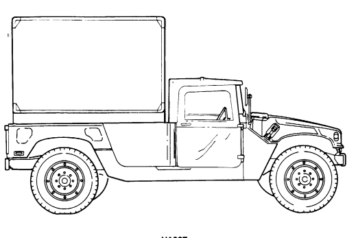

# Chapter 1 Introduction

## Section I. General Information 1-1. Scope

a. This technical manual contains instructions for organizational maintenance of the 1-1/4 ton, 4X4, M998 series vehicles.

b. Models included are:
(1) M998 and M998A1, Cargo/Troop Carrier (2) M1038 and M1038A1, Cargo/Troop Carrier, W/Winch (3) M1097, M1097A1, M1097A2, and M1123 Heavy Variant (4) M966, M966A1, and M1121 TOW Carrier, Armored (5) M1036, TOW Carrier, Armored, W/Winch (6) M1045, M1045A1, and M1045A2 TOW Carrier, W/Supplemental Armor (7) M1046 and M1046A1, TOW Carrier, W/Supplemental Armor, W/Winch (8) M1025, M1025A1, and M1025A2 Armament Carrier, Armored (9) M1026 and M1026A1, Armament Carrier, Armored, W/Winch
(10) M1043, M1043A1, and M1043A2 Armament Carrier, W/Supplemental Armor (11) M1044 and M1044A1, Armament Carrier, W/Supplemental Armor, W/Winch (12) M1037, S250 Shelter Carrier (13) M1042, S250 Shelter Carrier, W/Winch (14) M996 and M996A1 2-Litter Ambulance, Armored (15) M997, M997A1, and M997A2 4-Litter Ambulance, Armored (16) M1035, M1035A1, and M1035A2 2-Litter Ambulance, Soft Top

## 1-2. Maintenance Forms, Records, And Reports

(Army) Department of the Army forms and procedures used for equipment maintenance will be those prescribed by DA Pam 738-750, The Army Maintenance Management System (TAMMS). (Marine Corps) Refer to TM 4700-15/1–.

## 1-3. Destruction Of Army Equipment To Prevent Enemy Use

Refer to TM 750-244-6, Procedures for Destruction of Army Tank-Automotive Equipment to Prevent Enemy Use.

## 1-4. Preparation For Shipment

(Army) Refer to TM 746-10, Marking, Packaging and Shipment of Supplies and Equipment:General Packaging Instructions for Field Use. (Marine Corps) Refer to MCO 4450-7.

## 1-5. Reporting Equipment Improvement Recommendations (Eir)

(Army) If your vehicle needs improvement, let us know. Send us an EIR. You, the user, are the only one who can tell us what you don't like about your equipment. Let us know why you don't like the design or performance. The preferred method for submitting QDRs is through the Army Electronic Product Support (AEPS) website under the Electronic Deficiency Reporting System (EDRS). The web address is: http://aeps.ria.army.mil. This is a secured site requiring a password that can be applied for on the front page of the website. If the above method is not available to you, put it on an SF 368, Product Quality Deficiency Report (PQDR), and mail it to us at: Department of the Army, U.S. Army Tank-automotive and Armaments Command, ATTN: AMSTA-TR-E/PQDR MS 267, 6501 E. 11 Mile Road, Warren, MI 48397-500. We'll send you a reply. (Marine Corps) Submit QDR's in accordance with MCO 4855-10.

## 1-6. Equipment Improvement Report And Maintenance Digest (Eir Md)

The quarterly Equipment Improvement Report and Maintenance Digest, TB 43-0001-62 series, contains valuable field information on the equipment covered in this manual. The information in the TB 43-0001-62 series is compiled from some of the Equipment Improvement Reports that you prepared on the vehicles covered in this manual. Many of these articles result from comments, suggestions, and improvement recommendations that you submitted to the EIR program. The TB 43-0001-62 series contains information on equipment improvements, minor alterations, proposed Modification Work Orders (MWOs), warranties (if applicable), actions taken on some of your DA Form 2028s (Recommended Changes to Publications and Blank Forms), and advance information on proposed changes that may affect this manual. The information will help you in doing your job better and will help in keeping you advised of the latest changes to this manual. Also refer to DA Pam 25-30, Consolidated Index of Army Publications and Blank Forms, and appendix A, References, of this manual. (Marine Corps) Submit QDR's in accordance with MCO 4855-10. For those with access to the World Wide Web (WWW), the EIR MD can be viewed through the Army Electronic Product Support. The site is http://aeps.ria.army.mil.

## 1-7. Metric System

The equipment described herein contains metric components and requires metric common and special tools; therefore, metric units in addition to standard units will be used throughout this publication. In addition, a metric conversion table is located on the inside back cover of this publication.

## 1-8. Mandatory Replacement Parts

The maintenance instructions contained herein make reference to removing and discarding piece parts such as: gaskets, lockwashers, cotter pins, O-rings, seals; etc.; these items should be considered mandatory replacement items and replaced with new parts during assembly/installation.

## 1-9. Break-In Procedure

Upon receipt of vehicles, or after engine replacement, break-in procedures must be observed during the first 500 miles (804 kilometers) of operation. For break-in procedure, refer to TM 9-2320-280-10.

## Section Ii. Equipment Description And Data 1-10. Equipment Characteristics, Capabilities, And Features

The 1-1/4 ton, 4x4, M998 series of vehicles are tactical vehicles designed for use over all types of roads, as well as cross-country terrain in all weather conditions. The vehicles have four driving wheels powered by a V-8, liquid-cooled, diesel engine. Four-wheel hydraulic service brakes and a mechanical parking brake are common to all models in the M998 series. All vehicles are equipped with a pintle hook for towing. Tiedown and lifting eyes are provided for air, rail, or sea shipment.

# Cargo/Troop Carriers: M998, M998A1, M1038, And M1038A1

PURPOSE: These models are used to transport cargo and troops. The M1038 and M1038A1 models,

which have a winch, can be used for recovery operations. Both models utilize a troop seat kit for troop transport operations.

### H E Avy Variant Cargo/Troop Carriers: M1097, M1097A1, M1097A2, And M1123

PURPOSE: This model is used for transporting equipment, materials, and/or personnel (including crew)
of 4,400 pounds (1,998 kilograms). The only difference between the M998 and M998A1 cargo/troop carriers and the M1097, M1097A1, M1097A2, and M1123 heavy variant cargo/troop carriers is that the M1097, M1097A1, M1097A2, and M1123 are specifically designed to accommodate a higher payload capacity. This difference affects vehicle length, width, and shipping dimensions, but does not affect the basic purpose and performance of the vehicle. The increased payload capabilities accomodate the following kit configurations:

### A. 105Mm Towed Howitzer Prime Mover (L119 Kit) Consists Of:

- Larger rear bumper and reinforced mounting - Body wiring harness trailer receptacle extension - Ammunition stowage rack and tiedown straps - Camouflage net stowage rack - Winch - Two-man crew area soft top - Troop area soft top - Cargo bulkhead B. TOWED VULCAN SYSTEMS (TVS) MOVER consists of:
- Two-man crew area soft top - Troop area soft top - Camouflage net stowage rack - Troop seat kit - Cargo bulkhead C. S250 ELECTRICAL EQUIPMENT SHELTER consists of:
- Shelter support - Shelter tailgate - 200 amp umbilical power cable

M1097/M1097A1/M1097A2/M1123

(WITH 2-MAN SOFT TOP INSTALLED)
M1097A2

M1123

M1097/M1097A1/M1097A2/M1123

(WITH L119 KIT INSTALLED)
(WITHOUT WINCH, TOWED VULCAN SYSTEMS (TVS) MOVER)
M1097/M1097A1/M1097A2/M1123
(WITH S250 SHELTER INSTALLED)

### Tow Carriers: M966, M966A1, M1036, And M1121

P U R P O S E : These models are used to transport, mount, and operate the TOW missile launcher system with armor protection for crew, TOW system components, and ammunition. The M1036 model, which has a winch, can be used for recovery operations.

TOW CARRIERS, W/SUPPLEMENTAL ARMOR M1045, M1045A1, M1045A2, M1046, AND M1046A1 a. PURPOSE: These models are used to transport, mount, and operate the TOW missile launcher

system with added ballistic protection for crew, TOW system components, and ammunition. The M1046 and M1046A1 models, which have a winch, can be used for recovery operations.

b. SPECIAL LIMITATIONS: Weapon station azimuth is limited to 300° left and right of vehicle centerline when Vehicle Power Conditioner (VPC) cables are connected. With launcher installed, elevation is limited to 20° and depression is limited to 10°.

ARMAMENT CARRIERS, W/SUPPLEMENTAL ARMOR: M1025, M1025A1, M1025A2, M1026, AND M1026A1 a. PURPOSE: These models are used to transport, mount, and operate the M2 and M60 machine guns

and MK19 automatic grenade launcher with armor protection for crew, weapons components, and ammunition. The M1026 and M1026A1 models, which have a winch, can be used for recovery operations.

b. SPECIAL LIMITATIONS: Weapon station azimuth is limited to 300° left and right of vehicle centerline when Vehicle Power Condition (VPC) cables are connected. With launcher installed, elevation is limited to 20° and depression is limited to 10°.

ARMAMENT CARRIERS, W/SUPPLEMENTAL ARMOR M1043, M1043A1, M1043A2, M1044, AND M1044A1 PURPOSE: These models are used to transport, mount, and operate the M2 and M60 machine guns and MK19 automatic grenade launcher with added ballistic protection for crew, weapons components, and ammunition. The M1044 and M1044A1 models, which have a winch, can be used for recovery operations.

(WITH MK19 GRENADE LAUNCHER MOUNTED)

(WITH M2, CAUBER .50 MACHINE GUN MOUNTED)

### S250 Shelter Carriers M1037 And M1042

PURPOSE: These models are used for securing and transporting the S250 electrical equipment shelter.

The M1042 model, which has a winch, can be used for recovery operations.

ARMORED AMBULANCES: M996, M996A1, M997, M997A1, AND M997A2 PURPOSE: These models are used to transport patients with armor protection for crew and patients.

The M996 and M996A1 are reducible in height for CH47 helicopter transport. The M997, M997A1, and M997A2 have air conditioning for patient comfort. For operation in an NBC environment, the M997, M997A1, and M997A2 is equipped with a Gas-Particulate Filter Unit (GPFU) with heaters capable of supporting up to seven personnel equipped with either M25 series protective masks or M13 series patient protective masks.

# Soft Top Ambulances: M1035, M1035A1, And M1035A2

PURPOSE: These models are used to transport a maximum of 2 litter and 2 ambulatory patients and

are transportable by a CH47 helicopter.

M1035/M1035A1

### M1035A2

## 1 - 1 1 . L O C Ation And Description Of Major Exterior C O M P O N E N T S

The exterior components described below are common to all vehicles covered in this manual. Special differences are found in TM 9-2320-280-10 or table 1-1, differences between models, of this manual.

A **AIR CLEANER** - Filters air before it enters intake manifold.

B **ENGINE** - Provides power for the vehicle.

C **TRANSMISSION** - Transmits engine power to transfer case at varying speeds.

D **FUEL TANK** - Stores fuel.

E **GEARED HUB** - Transfers turning action of half shafts to wheels for vehicle motion.

F
PINTLE HOOK - Permits towing of vehicles or equipment.

G
REAR PROPELLER SHAFT - Transmits power from the transfer case to the rear differential.

H
TRANSFER CASE - Provides full-time four-wheel drive with three drive ranges.

I
FRONT PROPELLER SHAFT - Transmits power from the transfer case to the front differential.

J
MASTER CYLINDER AND HYDRO-BOOST - Provides hydraulic pressure and power assist for vehicle stopping power.

K
DIFFERENTIAL - Transfers turning action of the propeller shaft to the geared hubs through the half shafts.

L
WINCH - 6000 lb (M1026, M1026A1, M1036, M1038, M1038A1, M1042, M1044, M1044A1, M1046, and M1046A1 only), electrically powered to provide recovery capability.

M **WINCH** - 9000 lb, can be used on "A2" models M1025A2, M1043A2, M1045A2, and M1097A2 and M1123.

1-11. LOCATION AND DESCRIPTION OF MAJOR EXTERIOR
COMPONENTS (Cont'd)

( M

(L
(A) AIR CLEANER
(B) ENGINE
(C
TRANSMISSION
D
FUEL TANK
GEARED HUB
E
(F)
PINTLE HOOK
REAR PROPELLER SHAFT
(G
(H) TRANSFER CASE
FRONT PROPELLER SHAFT
I
 MASTER CYLINDER AND HYDRO-BOOST
J
(K) DIFFERENTIAL
WINCH (6000 lb)
L
(M) WINCH (9000 Ib)

## 1-12. Location And Description Of Major Interior

COMPONENTS
The major interior components shown below are common to all vehicles covered in this manual. Components not covered here can be found in TM 9-2320-280-10 or the applicable maintenance chapters of this manual.

AIR RESTRICTION GAUGE - Indicates restrictions in the air cleaner.

DIRECTIONAL SIGNAL CONTROL - Activates turn signal lights.

STEERING WHEEL - Manual control for turning vehicle.

INSTRUMENT CLUSTER - Houses controls and indicators.

DIAGNOSTIC CONNECTOR - Connection point for STE/ICE-R test set.

TRANSMISSION SHIFT LEVER - Manual control for shifting transmission.

TRANSFER CASE SHIFT LEVER - Manual control for shifting transfer case.

PARKING BRAKE LEVER - Manual control for applying parking brake.

ACCELERATOR PEDAL - Foot control for determining engine speed.

BRAKE PEDAL - Foot control for stopping vehicle.

MAIN LIGHT SWITCH - Controls operation of vehicle lights.

ROTARY SWITCH - When positioned to START, the starter is engaged to crank the engine.

1-12. LOCATION AND DESCRIPTION OF MAJOR INTERIOR
COMPONENTS (Cont'd)

1
"R" (Reverse)
2
"N" (Neutral)
3 
"D" (Manual Third)
ব
"2" (Manual Second)
5
"1" (Manual First)
6
"P" (Park)
7
"R" (Reverse)
8
"N" (Neutral)
9
"(D)" (Overdrive)
10
"D" (Manual Third)
11
"2" (Manual Second)
12
"1" (Manual First)
3L80 TRANSMISSION
4L80-E TRANSMISSION

## 1-13. Location And Contents Of Warning, Caution, And Data Plates

The location and contents of caution, data, and warning plates are provided in this paragraph. If any of

 these plates are worn, broken, painted over, missing, or unreadable, they must be replaced. Information on data plate may vary per model.

1-13. LOCATION AND CONTENTS OF WARNING, CAUTION, AND DATA PIATES
(Cont'd)

1-13. LOCATION AND CONTENTS OF WARNING, CAUTION, AND DATA PLATES
(Cont'd)

1-13. LOCATION AND CONTENTS OF WARNING, CAUTION, AND DATA PLATES
(Cont'd)

1-13. LOCATION AND CONTENTS OF WARNING, CAUTION, AND DATA PLATES
(Cont'd)
MAX. VEHICLE OPERATING SPEEDS
TRANSFER CASE RANGE SELECTION

TRANSFER CASE IN HIGH "H" WHEN
OPERATING ON HARD SURFACE
FORDING
SHALLOW FORDING DEPTH 30 INCHES

# Vehicle Break-In Service

DURING THE FIRST 500 MI.

(804 KM) OF OPERATION:
· DO NOT EXCEED A SPEED
OF 55 MPH (88 KPH)
· DO NOT DRIVE FOR LONG
PERIODS OF TIME AT
CONSTANT SPEED
· AVOID RAPID ACCELERA-
TION OR DECELERATION
· DRIVE AT MODERATE
SPEED UNTIL THE ENGINE
IS FULLY WARMED UP
· NO TRAILER TOWING
1-13. LOCATION AND CONTENTS OF WARNING, CAUTION, AND DATA PLATES
(Cont'd)

| SERVICING DATA          |                            |                                                     | TIRE INFLATION PRESSURE   |        | MANUALS                         |                      |
|-------------------------|----------------------------|-----------------------------------------------------|---------------------------|--------|---------------------------------|----------------------|
| FUEL                    |                            | DIESEL NO. 1. NO. 2. DFA ALL MODELS EXCEPT FRONT    |                           | REAR   |                                 |                      |
| FUEL TANK CAPACITY      |                            | 25 GALS M996, M997, M1037.                          | P.S.I.                    | P.S.I. |                                 |                      |
| COOLING SYSTEM CAPACITY |                            | 25 QTS AND MID47                                    | 20                        | 22     | MAINTENANCE TM 9\-2320\-280\-20 |                      |
| CRANKCASE CAPACITY      |                            | 7 QTS + 1 QT FOR FILTER \| M996. M997. M1037. M1042 | 22                        | 30     | MANUAL                          | TM 9\-2320\-280\-34  |
| TEMPERATURE             | ABOVE +15ºF +40° TO \-15°F | +40° TO \-65°F                                      | TO DRAIN COOLING SYSTEM   |        | OPERATOR'S                      | TM 9\-2320\-280\-10  |
| ENGINE OIL              | QE\-30 OE\-10              | OEA                                                 | OPEN DRAINCOCK LOCATED    |        | MANUAL                          |                      |
| GEAR OIL                | GO 80/90 GO 80/90          | GO 75                                               | AT LOWER RADIATOR TUBE    |        | PARTS LIST                      | TM 9\-2320\-280\-20P |
| GREASE                  | GAA GAA                    | GAA                                                 |                           |        |                                 | TM 9\-2320\-280\-34P |

1-13. LOCATION AND CONTENTS OF WARNING, CAUTION, AND DATA PIÆS
(Cont'd)
1-13. LOCATION AND CONTENTS OF WARNING, CAUTION, AND DATA PLATES
(Cont'd)

1-13. LOCATION AND CONTENTS OF WARNING, CAUTION, AND DATA PLATES
(Cont'd)

# Warning

DO NOT USE HAND THROTTLE AS AN
AUTOMATIC VEHICLE SPEED OR CRUISE CONTROL.

THE HAND THROTTLE WILL NOT DISENGAGE
AUTOMATICALLY WHEN BRAKE IS APPLIED.

# 1-13. Location And Contents Of Warning, Caution, And Data Plates (Cont'D)

1-13. LOCATION AND CONTENTS OF WARNING, CAUTION, AND DATA PLATES (Cont'd)

HEATER OPERATING INSTRUCTIONS
TO START HEATER:
1. WITH HEATER "HI-LO" SWITCH IN "LO" POSITION,
HOLD HEATER SWITCH IN "START" POSITION.

2. WHEN HEATER INDICATOR LIGHT COMES ON,
MOVE HEATER SWITCH TO "RUN" POSITION.

TO SELECT TEMPERATURE:
1. SNAP "HI-LO" SWITCH TO DESIRED LEVEL
TO DEFROST (IF APPLICABLE):
1. CLOSE DAMPER.

IF HEATER FAILS TO START:
1. CHECK "PRESS TO TEST" INDICATOR LIGHT.

2.   IF LIGHT WORKS AND HEATER STILL FAILS TO START IN
APPROXIMATELY 3 MINUTES, SERVICE IS REQUIRED.

SEE SERVICE MANUAL.

NOTE: CLEAN FUEL FILTER FREQUENTLY TO PREVENT
ICE FORMATION.

1-13. LOCATION AND CONTENTS OF WARNING, CAUTION, AND DATA PLATES (Cont'd)

# Warning

THE DEPARTMENT OF TRANSPORTATION REQUIRES 105 MM CANNON
AMMUNITION TO BE IN WOODEN BOXES WHEN TRANSPORTING
AMMUNITION ON PUBLIC HIGHWAYS, BY FIXED WING AIRCRAFT, RAIL, OR SHIP.

RESTRICT MOVEMENT OF CANNON AMMUNITION IN FIBER
CONTAINERS (INNER PACK) IN THE AMMUNITION RACK OF THE
HMMWV TO OTHER THAN PUBLIC HIGHWAYS.

CAUTION
HIGH INTENSITY NOISE
HEARING PROTECTION
REQUIRED

| Page No *Change No.   |                                          |                                 |                                 | Page No *Change No.                           | Page No *Change No.   |
|-----------------------|------------------------------------------|---------------------------------|---------------------------------|-----------------------------------------------|-----------------------|
|                       |                                          |                                 |                                 | 11\-326 Blank 0                               | 12\-70.4 2            |
|                       |                                          |                                 |                                 | 12\-1 1                                       | 12\-71 1              |
|                       |                                          |                                 |                                 | 12\-2 2                                       | 12\-72 2              |
|                       |                                          |                                 |                                 | 12\-3 0                                       | 12\-72.1 1            |
|                       |                                          |                                 |                                 | 12\-4 2                                       | 12\-72.2 Blank 1      |
|                       |                                          |                                 |                                 | 12\-5 \- 12\-6 0                              | 12\-73 \- 12\-74 0    |
|                       |                                          |                                 |                                 | 12\-7 \- 12\-8 1                              | 12\-75 2              |
|                       |                                          |                                 |                                 | 12\-9 \- 12\-11 2                             | 12\-76 \- 12\-84 0    |
|                       |                                          |                                 |                                 | 12\-12 0                                      | 12\-85 2              |
|                       |                                          |                                 |                                 | 12\-13 \- 12\-15 2                            | 12\-86 \- 12\-87 0    |
|                       |                                          |                                 |                                 | 12\-16 0                                      | 12\-88 \- 12\-90 2    |
|                       |                                          |                                 |                                 | 12\-17 \- 12\-20 2                            | 12\-91 \- 12\-92 0    |
|                       |                                          |                                 |                                 | 12\-21 0                                      | 12\-93 2              |
|                       |                                          |                                 |                                 | 12\-22 2                                      | 12\-94 0              |
|                       |                                          |                                 |                                 | 12\-23 1                                      | 12\-95 2              |
|                       |                                          |                                 |                                 | 12\-24 2                                      | 12\-96 0              |
|                       |                                          |                                 |                                 | 12\-25 0                                      | 12\-97 \- 12\-103 2   |
|                       |                                          |                                 |                                 | 12\-26 1                                      | 12\-104 \- 12\-106 0  |
|                       |                                          |                                 |                                 | 12\-27 0                                      | 12\-107 \- 12\-110 2  |
|                       |                                          |                                 |                                 | 12\-28 2                                      | 12\-111 1             |
|                       |                                          |                                 |                                 | 12\-28.1 1                                    | 12\-112 \- 12\-115 0  |
|                       |                                          |                                 |                                 | 12\-28.2 2                                    | 12\-116 2             |
|                       |                                          |                                 |                                 | 12\-29 \- 12\-30 2                            | 12\-117 \- 12\-118 0  |
|                       |                                          |                                 |                                 | 12\-31 0                                      | 12\-119 2             |
|                       |                                          |                                 |                                 | 12\-32 2                                      | 12\-120 \- 12\-134 0  |
|                       | 12\-33 \- 12\-34 1  12\-135 \- 12\-138 2 |                                 |                                 |                                               |                       |
|                       |                                          | 12\-34.1 1 12\-139 \- 12\-140 0 |                                 |                                               |                       |
|                       |                                          |                                 | 12\-34.2 2 12\-141 \- 12\-142 2 |                                               |                       |
|                       |                                          |                                 |                                 | 12\-34.3 \- 12\-34.8 1                        | 12\-143 0             |
|                       |                                          |                                 |                                 | 12\-35 \- 12\-36 1                            | 12\-144 2             |
|                       |                                          |                                 |                                 | 12\-37 0                                      | 12\-145 0             |
|                       |                                          |                                 |                                 | 12\-38 2                                      | 12\-146 2             |
|                       |                                          |                                 |                                 | 12\-39 1                                      |                       |
|                       |                                          |                                 |                                 | 12\-60 0                                      | 12\-153 2             |
|                       |                                          |                                 |                                 | 12\-61 \- 12\-62 2                            | 12\-154 \- 12\-157 0  |
|                       |                                          |                                 |                                 | 12\-62.1 1                                    |                       |
|                       |                                          |                                 |                                 | 12\-62.2 2                                    | 12\-159 \- 12\-161 0  |
|                       |                                          |                                 |                                 | 12\-63 1                                      | 12\-162 2             |
|                       |                                          |                                 |                                 | 12\-64 \- 12\-65 0                            | 12\-163 \- 12\-164 0  |
|                       |                                          |                                 |                                 | 12\-66 2                                      | 12\-165 \- 12\-168 2  |
|                       |                                          |                                 |                                 | 12\-70.2 2                                    | 12\-172 2             |
|                       |                                          |                                 |                                 | 12\-70.3 1                                    | 12\-173 \- 12\-175 0  |
|                       |                                          |                                 |                                 | *Zero in this column indicates original page. |                       |
|                       |                                          |                                 |                                 |                                               | 12\-158 2             |
|                       |                                          |                                 |                                 | 12\-67 0                                      | 12\-169 0             |
|                       |                                          |                                 |                                 |                                               | 12\-147 \- 12\-149 0  |
|                       |                                          |                                 |                                 | 12\-40 \- 12\-56 0                            | 12\-150 2             |
|                       |                                          |                                 |                                 | 12\-57 \- 12\-59 2                            | 12\-151 \- 12\-152 0  |
|                       |                                          |                                 |                                 | 12\-70.1 1                                    | 12\-171 0             |
|                       |                                          |                                 |                                 | 12\-68 \- 12\-70 2                            | 12\-170 2             |

# 1-14. Differences Between Models 1-15. Tabulated Data

Vehicle performance data for the M998 series vehicles is listed in table 1-2. This information includes only that data applicable to unit maintenance. Information not covered can be found in TM-9-2320-280-10.

Table 1-2. Tabulated Data

### Note

Standard and metric measurements will be used in this table. A list of their abbreviations is provided below.

## Tabulated Data Abbreviations

| 12\-182 2                | 12\-275 \- 12\-276 0                          | G\-2 \- G\-9 2          |
|--------------------------|-----------------------------------------------|-------------------------|
| 12\-183 0                | 12\-277 \- 12\-278 2                          | G\-10 \- G\-12 Added 2  |
| 12\-184 2                | 12\-279 \- 12\-281 0                          | Index\-1 \- Index\-7 1  |
| 12\-185 0                | 12\-282 2                                     | Index\-8 \- Index\-35 2 |
| 12\-186 2                | 12\-283 \- 12\-294 0                          | Index\-36 Blank 1       |
| 12\-187 \- 12\-189 0     | 12\-295 1                                     | FP\-1 0                 |
| 12\-190 2                | 12\-296 2                                     | FP\-2 Blank 0           |
| 12\-191 \- 12\-193 0     | 12\-297 1                                     | FP\-3 0                 |
| 12\-194 \- 12\-197 2     | 12\-298 2                                     | FP\-4 Blank 0           |
| 12\-198 \- 12\-200 0     | 12\-299 \- 12\-301 1                          | FP\-5 0                 |
| 12\-201 \- 12\-202 1     | 12\-302 2                                     | FP\-6 Blank 0           |
| 12\-202.1 2              | 12\-303 \- 12\-305 1                          | FP\-7 0                 |
| 12\-202.2 1              | 12\-306 2                                     | FP\-8 Blank 0           |
| 12\-203 1                | 12\-307 \- 12\-309 1                          | FP\-9 0                 |
| 12\-204 2                | 12\-310 \- 12\-312 2                          | FP\-10 Blank 0          |
| 12\-204.1 1              | 12\-313 \- 12\-317 1                          | FP\-11 0                |
| 12\-204.2 2              | 12\-318 Blank 1                               | FP\-12 Blank 0          |
| 12\-204.3 \- 12\-204.4 1 | 13\-1 \- 13\-3 0                              | FP\-13 0                |
| 12\-205 1                | 13\-4 Blank 0                                 | FP\-14 Blank 0          |
| 12\-206 \- 12\-214 2     | A\-1 \- A\-2 2                                | FP\-15 0                |
| 12\-215 0                | B\-1 \- B\-3 0                                | FP\-16 Blank 0          |
| 12\-216 \- 12\-222 2     | B\-4 \- B\-27 2                               | FP\-17 0                |
| 12\-222.1 1              | B\-28 \- B\-29 Added 2                        | FP\-18 Blank 0          |
| 12\-222.2 Blank 1        | B\-30 Blank Added 2                           |                         |
| 12\-223 \- 12\-225 2     | C\-1 0                                        |                         |
| 12\-226 \- 12\-227 0     | C\-2 \- C\-7 1                                |                         |
| 12\-228 2                | C\-8 Blank 0                                  |                         |
| 12\-229 0                | D\-1 \- D\-2 1                                |                         |
| 12\-230 2                | D\-3 \- D\-9 0                                |                         |
| 12\-231 0                | D\-10 1                                       |                         |
| 12\-232 2                | D\-11 \- D\-22 0                              |                         |
| 12\-233 \- 12\-235 0     | D\-23 2                                       |                         |
| 12\-236 2                | D\-24 0                                       |                         |
| 12\-237 \- 12\-239 0     | D\-25 2                                       |                         |
| 12\-240 2                | D\-26 \- D\-46 0                              |                         |
| 12\-241 0                | D\-46.1 \- D\-46.2 2                          |                         |
| 12\-242 2                | D\-47 \- D\-48 1                              |                         |
| 12\-243 \- 12\-246 0     | D\-49 \- D\-64 0                              |                         |
| 12\-247 \- 12\-250 2     | D\-65 \- D\-66 1                              |                         |
| 12\-251 0                | D\-67 \- D\-69 0                              |                         |
| 12\-252 2                | D\-70 \- D\-71 2                              |                         |
| 12\-253 \- 12\-254 0     | D\-72 \- D\-77 0                              |                         |
| 12\-255 \- 12\-266 2     | D\-78 \- D\-116 1                             |                         |
|                          | *Zero in this column indicates original page. |                         |

|            | VOLUME 1 OF 3                                                             |         |
|------------|---------------------------------------------------------------------------|---------|
|            |                                                                           | Page    |
|            | v  HOW TO USE THIS MANUAL                                                 |         |
| CHAPTER 1  | INTRODUCTION                                                              | 1\-1    |
| Section I. | General Information                                                       | 1\-1    |
| II.        | Equipment Description and Data                                            | 1\-2    |
| III.       | Principles of Operation                                                   | 1\-35   |
| CHAPTER 2  | SERVICE AND TROUBLESHOOTING INSTRUCTIONS                                  | 2\-1    |
| Section I. | Repair Parts, Special Tools, Test, Measurement, and Diagnostic            |         |
|            | Equipment (TMDE), and Support Equipment                                   | 2\-1    |
| II.        | Service Upon Receipt                                                      | 2\-1    |
| III.       | Preventive Maintenance Checks and Services                                | 2\-2    |
| IV.        | Electrical/Mechanical Systems Troubleshooting                             | 2\-30   |
|            | VOLUME 2 OF 3                                                             |         |
| CHAPTER 3  | ENGINE SYSTEMS MAINTENANCE                                                | 3\-1    |
| Section I. | Lubrication System Maintenance                                            | 3\-1    |
| II.        | Fuel System Maintenance                                                   | 3\-19   |
| III.       | Accelerator System Maintenance                                            | 3\-77   |
| IV.        | Exhaust System Maintenance                                                | 3\-86   |
| V.         | Cooling System Maintenance                                                | 3\-107  |
| CHAPTER 4  | ELECTRICAL SYSTEM MAINTENANCE                                             | 4\-1    |
| Section I. | Generating and Protective Control Box/Distribution Box System Maintenance | .  4\-1 |
| I.1.       | Dual Voltage Alternator and Regulator System Maintenance                  | 4\-12.5 |
| II.        | Starter and Starting Control System Maintenance                           | 4\-14   |
| III.       | Instruments, Sending Units, Switches, and Horn Maintenance                | 4\-23   |
| IV.        | Transfer Case and Transmission Electrical Maintenance                     | 4\-58   |
| V.         | Lighting System Maintenance                                               | 4\-77   |
| VI.        | Battery System Maintenance                                                | 4\-113  |
| VII.       | Ambulance Electrical System Maintenance                                   | 4\-157  |

|            |                                                     | Page    |
|------------|-----------------------------------------------------|---------|
| CHAPTER 5  | TRANSMISSION AND TRANSFER CASE MAINTENANCE          | 5\-1    |
| Section I. | Transmission Maintenance                            | 5\-1    |
| II.        | Transfer Case Maintenance                           | 5\-47   |
| CHAPTER 6  | PROPELLER SHAFTS, AXLES, AND SUSPENSION MAINTENANCE | 6\-1    |
| Section I. | Propeller Shafts Maintenance                        | 6\-1    |
| II.        | Front and Rear Axles Maintenance                    | 6\-16   |
| III.       | Suspension Maintenance                              | 6\-54   |
| CHAPTER 7  | BRAKE SYSTEM MAINTENANCE                            | 7\-1    |
| Section I. | Parking Brake System Maintenance                    | 7\-1    |
| II.        | Service Brake System Maintenance                    | 7\-19   |
| III.       | Rear Dual Service/Parking Brake System Maintenance  | 7\-45   |
| CHAPTER 8  | WHEELS AND STEERING MAINTENANCE                     | 8\-1    |
| Section I. | Wheel and Runflat System Maintenance                | 8\-1    |
| II.        | Steering Components Maintenance                     | 8\-43   |
| CHAPTER 9  | FRAME MAINTENANCE                                   | 9\-1    |
|            | VOLUME 3 OF 3                                       |         |
| CHAPTER 10 | BODY AND ACCESSORIES MAINTENANCE                    | 10\-1   |
| Section I. | Body Maintenance                                    | 10\-1   |
| II.        | Body Accessories Maintenance                        | 10\-115 |
| III.       | Winch Maintenance                                   | 10\-179 |
| CHAPTER 11 | SPECIAL PURPOSE BODIES MAINTENANCE                  | 11\-1   |

|                  |                                                              | Page           |
|------------------|--------------------------------------------------------------|----------------|
| CHAPTER 12       | SPECIAL PURPOSE KITS MAINTENANCE                             | 12\-1          |
| Section I.       | Deep Water Fording Kit Maintenance                           | 12\-1          |
| II.              | Troop Seat Kit Maintenance                                   | 12\-19         |
| III.             | 100 Ampere Alternator Kit Maintenance                        | 12\-23         |
| IV.              | Arctic Winterization Kits Maintenance                        | 12\-36         |
| V.               | Arctic Winterization Crew Top Kits Maintenance               | 12\-104        |
| VI.              | Troop/Cargo Winterization Kit Maintenance                    | 12\-114        |
| VII.             | Communications Kits Maintenance                              | 12\-201        |
| VIII.            | 81 MM Mortar Kit Maintenance                                 | 12\-235        |
| IX.              | Traversing Bar Kit Maintenance                               | 12\-251        |
| X.               | M1097, M1097A1, and M1097A2 Special Purpose Kits Maintenance | 12\-254        |
| XI.              | Accessory Kits Installation                                  | 12\-282        |
| XII.             | Cargo Barrier and Net Kit Maintenance                        | 12\-314        |
| CHAPTER 13       | PREPARATION FOR STORAGE OR SHIPMENT                          | 13\-1          |
| Section I.       | General Instructions                                         | 13\-1          |
| II.              | Preparation for Storage and Shipment                         | 13\-2          |
| APPENDIX A       | REFERENCES                                                   | A\-1           |
| APPENDIX B       | MAINTENANCE ALLOCATION CHART                                 | B\-1           |
| APPENDIX C       | EXPENDABLE/DURABLE SUPPLIES AND MATERIALS LIST               | C\-1           |
| APPENDIX D       | ILLUSTRATED LIST OF MANUFACTURED ITEMS                       | D\-1           |
| APPENDIX E       | TORQUE LIMITS                                                | E\-1           |
| APPENDIX F       | WIRING DIAGRAMS AND SCHEMATIC                                | F\-1           |
| APPENDIX G INDEX | MANDATORY REPLACEMENT PARTS                                  | G\-1   Index 1 |

# Section Iii. Principles Of Operat I O N

## 1 - 1 6 . G E N E R A L

This section explains how components of the M998 series vehicles work together. The systems (functional groups) covered are listed in the Principles of Operation Reference Index, paragraph 1-17.

1 - 1 7 . PRINCIPLES OF OPERATION REFERENCE INDEX

| REF.     | SYSTEM                                               | PAGE    |
|----------|------------------------------------------------------|---------|
| PARA.    |                                                      | NO.     |
| 1\-18.   | Drivetrain Operation                                 | 1\-36   |
| 1\-19.   | Fuel System Operation                                | 1\-37   |
| 1\-20.   | Cooling System Operation                             | 1\-38   |
| 1\-21.   | Starting System Operation                            | 1\-40   |
| 1\-22.   | Generating System Operation                          | 1\-41   |
| 1\-23.   | Generating System Operation (200 Ampere Alternator)  | 1\-42   |
| 1\-23.1. | Generating System Operation (100 Ampere Dual Voltage |         |
|          | Alternator)                                          | 1\-42.1 |
| 1\-23.2. | Generating System Operation (200 Ampere Dual Voltage |         |
|          | Alternator)                                          | 1\-42.2 |
| 1\-23.3. | Generating System Operation (400 Ampere Dual Voltage |         |
|          | Alternator)                                          | 1\-42.3 |
| 1\-24.   | Battery System Operation                             | 1\-43   |
| 1\-25.   | Windshield Wiper/Washer System Operation             | 1\-44   |
| 1\-26.   | Parking Brake System Operation                       | 1\-45   |
| 1\-27.   | Service/Parking Brake System Operation               | 1\-46   |
| 1\-28.   | Service Brake System Operation                       | 1\-47   |
| 1\-29.   | Steering Control System Operation                    | 1\-49   |
| 1\-30.   | Suspension System Operation                          | 1\-51   |
| 1\-31.   | Ambulance Patient Compartment Fuel Burning Heater    | 1\-53   |
|          | System Operation                                     |         |
| 1\-32.   | M997, M997A1, and M997A2 Ambulance Air\-Conditioning | 1\-54   |
|          | System Operation                                     |         |
| 1\-33.   | Stowage Racks and Tiedown Straps                     | 1\-55   |
| 1\-34.   | 200 Ampere Umbilical Power Cable                     | 1\-58   |

## 1-18. Drivetrain Operation

The drivetrain is identical for all models covered in this manual. It converts horsepower into mechanical force to move the vehicle. Major components of the drivetrain are:
ENGINE - The water-cooled 6.2 liter, V-8, Diesel engine provides up to 150 horsepower at 3600 rpm to power the vehicle. The 6.5 liter V-8 engine develops approximately 160 horsepower at 3400 rpm to power the vehicle. The engines are essentially the same on all models except those equipped with deep water fording kit installed, which adds a specially sealed dipstick, dipstick tube, and vented CDR valve.

These differences do not affect engine performance. TRANSMISSION (3L80) - Adapts engine power to meet different driving conditions. The automatic transmission has three forward speeds, a reverse and a neutral. A neutral safety switch prevents the vehicle from being started with the transmission in any selector lever position except neutral. TRANSMISSION (4L80E) - Adapts engine power to meet different driving conditions. The automotic transmission has four forward speeds, a reverse, a neutral and a park. A neutral safety switch prevents the vehicle from being started with the transmission in any selector lever position except park and neutral. TRANSFER CASE - Directs engine-to-transmission power to front and rear differentials simultaneously. This condition means the vehicle is always in four-wheel drive. The transfer case allows for selection of three drive ranges and a neutral position. A complete description of these driving ranges and the recommended driving conditions during which they are used can be found in TM 9-2320-280-10.

PROPELLER SHAFTS - Link transfer case to differentials. Universal joints, located at either end of the front and rear propeller shafts, permit inline driving power between the transfer case and differentials even though they are mounted at different angles.

DIFFERENTIALS - Transmit driving power, via halfshafts and geared hubs, to left and right wheels. The differential ensures power is applied to the wheel having traction, regardless of which wheel is slipping. This feature is called torque biasing. HALFSHAFTS - Transmits power from differentials to geared hubs.

GEARED HUBS - Serve as the front wheel steering spindle and act as the final drive components

 to front and rear wheels.

## 1-19. Fuel System Operation

The HMMWV diesel fuel system operation is identical for all models covered in this manual. It stores, cleans, and supplies fuel for the engine. Major components of the fuel system are:
FUEL PUMP - Draws fuel from fuel tank through the supply line and pumps it to the fuel filter.

FUEL RETURN LINE - Directs unused fuel from the injection pump back to the fuel tank.

FUEL SUPPLY LINE - Directs fuel from fuel tank to the system.

FUEL TANK - Stores 25 gallons of diesel fuel.

FUEL FILLER CAP - Located at right rear side of vehicle, the cap is removed to permit fuel tank servicing.

FUEL INJECTORS - Receive metered fuel from the injection pump and sprays fuel into the combustion chamber.

FUEL FILTER/WATER SEPARATOR- Filters water and sediment from fuel before fuel enters the injection pump.

INJECTION PUMP - Directs metered and pressurized fuel to the eight injector nozzles. It is

mounted on top of the engine under the intake manifold.

## 1 - 2 0 . Cooling System Operat I O N

The cooling system removes excess heat from the engine, engine oil, transfer oil, and transmission oil. This system is identical on all models covered in this manual. Major components of the cooling system are:
A**ENGINE TEMPERATURE SENDING UNIT** - Sends signal indicating coolant temperature to gauge on instrument cluster.

B**ENGINE TEMPERATURE SWITCH** - Sends signal to activate control valve system to operate fan when engine temperature exceeds 215°F (102°C) and deactivate when engine temperature drops below 190°F (88°C).

C**WATER CROSSOVER** - Collects coolant from cylinder heads and channels it to the thermostat housing where it is redirected through the cooling system.

D**THERMOSTAT** - Shuts off coolant return flow to radiator until temperature reaches 190°F (88°C).

Coolant is then directed to the radiator through the radiator inlet hose.

E**RADIATOR** - Directs coolant through a series of fins and baffles so outside air can dissipate excess engine heat before the coolant is recirculated through the engine.

F
OIL COOLER - Directs engine oil (lower half of cooler) and transmission oil (upper half of cooler) through a series of fins or baffles so outside air can remove heat from oil.

G
SURGE TANK - Filling and expansion point for cooling system.

H

PERSONNEL HEATER - Provides heat for personnel and interior of vehicle.

### 1-20. Cooling System Operation (Cont'D)

FAN - Pulls outside air through radiator to remove heat from coolant. HYDRAULIC CONTROL VALVE - Directs hydraulic fluid to provide required pressure to actuate fan clutch as required by engine temperature. Hydraulic pressure supplied by power steering pump.

TIME DELAY MODULE - Sends delayed signal to fan clutch solenoid for delay of fan actuation to provide needed horsepower for engine acceleration.

FAN CLUTCH SOLENOID - Actuates hydraulic control valve as required by coolant temperature. WATER PUMP - Driven by V-belts provides circulation of coolant through cooling system.

FAN CLUTCH - Hydraulically actuated by pressure from hydraulic control valve to control operation of fan. Hydraulic pressure supplied by power steering pump.

DRAINCOCK - Draining point for radiator and cooling system.

RADIATOR SHROUD - Permits a greater concentration of air to be pulled through the radiator.

## 1-21. Starting System Operation

The starting system is identical for all vehicles covered in this manual, and consists of the following components and circuits.

ROTARY SWITCH - When in "START" position, provides battery power to the starter solenoid and to the neutral start switch through circuit 14.

NEUTRAL STARTER SWITCH - When transmission shift lever is in "N" (neutral) position, this switch closes a relay in the protective control box through circuit 14 allowing battery power to reach the starter solenoid. PROTECTIVE CONTROL BOX - Locks out the starter circuit, which prevents starter from reengaging while engine is running.

STARTER SOLENOID - A magnetic relay that transmits 24-volt battery power to the starter motor.

STARTER MOTOR - Cranks the engine for starting, and is supplied 24-volt battery power through

 circuit 6A.

# 1-22. Generating System Operation (60/100 Ampere Alternator)

The 60 ampere generating system is identical for all vehicles except the M997, M997A1, M997A2 4-litter and M996, M996A1 2-litter ambulances.

A
BATTERY GAUGE - Indicates electrical system voltage. It is connected to the electrical system through circuit 567.

B
ALTERNATOR (100 ampere) - Rated at 28 volts, 100 amperes, with external regulator. The alternator assists and recharges the batteries during operation.

C
ALTERNATOR (60 ampere) - Rated at 28 volts, 60 amperes, with internal regulator. The alternator assists and recharges the batteries during operation.

D
CIRCUIT 3 - Provides a ground circuit to alternator.

ાઝ CIRCUIT 5 - Conducts alternator output to charge the batteries and maintain vehicle voltage.

F
CIRCUIT 568 - Senses vehicle voltage activating the field current in the alternator to generate current.

## 1-23. Generating System Operation (200 Ampere Alternator)

The 200 ampere generating system maintains battery charge and provides electrical power to operate vehicle circuits. Major components of the generating system are:
BATTERY GAUGE - Indicates electrical system voltage. It is connected to the electrical system through circuit 567.

ALTERNATOR (200 AMPERE) - Is rated at 28 volts, 200 amperes, with external regulator. The alternator assists and recharges the vehicle batteries during operation.

CIRCUIT 568/CIRCUIT 5 (ALTERNATOR A0013036AA ONLY) - Senses vehicle voltage, and activates the field current in the alternator to generate current. PROTECTIVE CONTROL BOX - Protects the vehicle electrical system in the event battery polarity is reversed.

CIRCUIT 2 - Sends AC signal, indicating alternator shaft rpm, to frequency switch in protective

 control box to prevent operation of starter solenoid when engine is running. BATTERIES - Two 12-volt batteries are connected in a series to provide 24 volts to start vehicle and assist alternator during operation.

POSITIVE CABLE - Transmits alternator output to maintain battery charge. A fuse at the alternator power stud will prevent damage to alternator if battery polarity is reversed.

CIRCUIT 3 - Connects to negative stud on alternator with engine ground strap to provide a ground circuit to alternator.

## 1 - 2 3 . 1 . G E N E R Ating System Operation (100 Ampere Dual Voltage Alt E R N At O R )

The 100-ampere dual voltage generating system maintains battery charge and provides electrical power to operate vehicle circuits. Major components of the generating system are:
C D
F
H
POSITIVE CABLE 68A - Provides 16-volt alternator output to maintain charge across the lower battery. CIRCUIT 3 - Connects to negative stud on alternator with engine ground strap to provide a ground

circuit to alternator. I
* Distribution box provides same function as protective control box except distribution box does not protect against reversal of battery polarity.

B**ALTERNATOR (100 AMPERE)**– Is rated at 28 volts at 100 amperes and 14 volts at 50 amperes with external regulator. The alternator assists and recharges the vehicle batteries during operation.

A**BATTERY GAUGE** - Indicates electrical system voltage. It is connected to the electrical system through circuit 567.

CIRCUIT 568 - Senses vehicle voltage, and activates the field current in the alternator circuit to alternator. PROTECTIVE CONTROL BOX / DISTRIBUTION BOX* - Protects the vehicle electric system in the event battery polarity is reversed. Provides load dump, glow plug operation, and interfacing of engine and body harnesses. CIRCUIT 2 - Sends AC signal, indicating alternator shaft rpm, to frequency switch in protective control box to prevent operation of starter solenoid when engine is running. E
BATTERIES - Two 12-volt batteries are connected in a series to provide 24 volts to start vehicle and assist alternator during operation.

G **POSITIVE CABLE 6** - Provides 28-volt alternator output to maintain charge across two batteries. 

## 1 - 2 3 . 2 . G E N E R Ating System Operation (200 Ampere Dual Voltage Alt E R N At O R )

The 200-ampere dual voltage generating system maintains battery charge and provides electrical power to operate vehicle circuits. Major components of the generating system are:
C
D
PROTECTIVE CONTROL BOX / DISTRIBUTION BOX* - Protects the vehicle electric system in the event battery polarity is reversed. Provides load dump, glow plug operation, and interfacing of engine and body harnesses.

F
CIRCUIT 2 - Sends AC signal, indicating alternator shaft rpm, to frequency switch in protective control box to prevent operation of starter solenoid when engine is running. E
BATTERIES - Two 12-volt batteries are connected in a series to provide 24 volts to start vehicle and assist alternator during operation.

G**POSITIVE CABLE 6** - Provides 28-volt alternator output to maintain charge across two batteries. 

H
POSITIVE CABLE 68A - Provides 16-volt alternator output to maintain charge across the lower battery.

I
CIRCUIT 3 - Connects to negative stud on alternator with engine ground strap to provide a ground

 circuit to alternator.

* Distribution box provides same function as protective control box except distribution box does not protect against reversal of battery polarity.

B**ALTERNATOR (200 AMPERE)**– Is rated at 28 volts at 200 amperes and 14 volts at 50 amperes with external regulator. The alternator assists and recharges the vehicle batteries during operation.

A**BATTERY GAUGE** - Indicates electrical system voltage. It is connected to the electrical system through circuit 567.

CIRCUIT 568 - Senses vehicle voltage, and activates the field current in the alternator circuit to alternator.

## 1 - 2 3 . 3 . G E N E R Ating System Operation (400 Ampere Dual Voltage Alt E R N At O R )

The 400-ampere dual voltage generating system maintains battery charge and provides electrical power to operate vehicle circuits. Major components of the generating system are:
A**BATTERY GAUGE** - Indicates electrical system voltage. It is connected to the electrical system through circuit 567.

C
D
F
H
B**ALTERNATOR (400 AMPERE)** - Is rated at 28 volts at 400 amperes and 14 volts at 50 amperes with external regulator. The alternator assists and recharges the vehicle batteries during operation. CIRCUIT 568 - Senses vehicle voltage, and activates the field current in the alternator circuit to alternator. PROTECTIVE CONTROL BOX / DISTRIBUTION BOX* - Protects the vehicle electric system in the event battery polarity is reversed. Provides load dump, glow plug operation, and interfacing of engine body harnesses. CIRCUIT 2 - Sends AC signal, indicating alternator shaft rpm, to frequency switch in protective control box to prevent operation of starter solenoid when engine is running. E
BATTERIES - Two 12-volt batteries are connected in a series to provide 24 volts to start vehicle and assist alternator during operation.

G**POSITIVE CABLE 6** - Provides 28-volt alternator output to maintain charge across two batteries. 

POSITIVE CABLE 68A - Provides 16-volt alternator output to maintain charge across the lower battery.

I
CIRCUIT 3 - Connects to negative stud on alternator with engine ground strap to provide a ground

 circuit to alternator.

* Distribution box provides same function as protective control box except distribution box does not protect against reversal of battery polarity.

## 1-24. Battery System Operation

The battery system is identical for all vehicles covered in this manual and consists of the following circuits and components.

CIRCUIT 6A- Connects the batteries to the starter and to the protective control box through circuit 74A. BATTERIES - Two 6TN batteries are connected to provide 24 volts D.C. for the electrical starting system.

SLAVE RECEPTACLE - Links an external power source directly to the slaved vehicle's batteries to assist in cranking the engine when the vehicle's batteries are not sufficiently charged. SHUNT - Used when measuring current draw from batteries utilizing STE/ICE-R. PROTECTIVE CONTROL BOX - Protects the vehicle electrical system in the event the battery system polarity is reversed. ROTARY SWITCH - When in "START" position actuates starter solenoid through circuit 11A and 74A. When in "RUN" position closes circuit 29A to activate instrument cluster gages through circuit 27.

CIRCUIT 7A- Connects the battery system to the starter negative terminal and chassis ground. STARTER SOLENOID - Actuates starter motor gear to crank vehicle engine.

## 1-25. Windshield Wiper/Washer System Operation

The following miscellaneous components and circuits are not covered in any of the other electrical systems:
WINDSHIELD WIPER MOTOR - When knob is turned to "LOW" or "HIGH" position, circuit 27 carries battery power to wiper motor to activate windshield wipers.

CIRCUIT 57- Provides a ground circuit for wiper motor.

WINDSHIELD WASHER MOTOR - When knob on wiper motor is pushed, the washer motor is

 activated through circuit 71 to spray water onto windshield.

## 1-26. Parking Brake System Operation

The parking brake system for vehicles with serial numbers 1 through 44824 is a mechanically-actuated system that provides a means of keeping the vehicle still once it stops. It also assists in emergency stopping if there is a service brake system failure. Major components of the parking brake system are:
PARKING BRAKE ROTOR - Attached to pinion flange on rear differential, rotor prevents pinion flange from turning when parking brake is applied. BRAKE PADS - Apply friction to rotor when hand lever is applied.

PARKING BRAKE CALIPER - Forces brake pads against rotor when hand lever is applied.

PARKING BRAKE CABLE - Connects brake caliper to parking brake rod at bracket on left frame rail.

PARKING BRAKE ROD - Connects parking brake hand lever to parking brake cable by means of a adjustable clevis.

PARKING BRAKE HAND LEVER - Permits operator to engage the parking brake.

PARKING BRAKE HAND LEVER ADJUSTING CAP - Permits operator to make minor tension

 adjustment of parking brake.

## 1-27. Service/Parking Brake System Operation

The parking brake system is a mechanically-actuated system that provides a means of keeping the vehicle still once it stops. It also assists in emergency stopping if there is a complete service brake system failure. Major components of the parking brake system are:
PARKING BRAKE ROTORS - Attached to output flanges on rear differential, rotors prevents output flanges from turning when parking brake is applied.

BRAKE PADS - Apply friction to rotors when hand lever is applied.

PARKING BRAKE CALIPERS - Forces brake pads against rotors when hand lever is applied.

PARKING BRAKE CABLES - Connects parking brake hand lever to equalizer bar.

EQUALIZER BAR - Evenly distributes braking pressure to the rear brake rotors.

PARKING BRAKE ROD - Connects parking brake hand lever to equalizer bar.

PARKING BRAKE HAND LEVER - Permits operator to engage the parking brake.

PARKING BRAKE HAND LEVER ADJUSTING CAP - Permits operator to make minor tension

 adjustment of parking brake.

## 1-28. Service Brake System Operation

The service brake system is identical for all models covered in this manual. It is an inboard-mounted, fourwheel, disc brake, hydraulically-assisted system. Major components of the braking system are:
HYDRO-BOOST - Converts hydraulic power from the steering pump to mechanical power to the master cylinder, providing power assist during braking.

MASTER CYLINDER/RESERVOIR - Stores brake fluid, and converts mechanical pedal pressure to hydraulic pressure. PROPORTIONING VALVE - Provides balanced front-to-rear braking and activates brake warning lamp in case of brake system malfunction.

ACCUMULATOR - Stores hydraulic pressure for additional power-assisted braking in case of loss of pressure in steering system.

BRAKE PEDAL - Provides operator control for stopping vehicle.

BRAKE LINKAGE - Directs brake pedal pressure to hydro-boost.

### 1-28. Service Brake System Operation (Cont'D)

HYDRAULIC BRAKE LINES - Directs brakes fluid under pressure to all four brake calipers from master cylinder.

BRAKE CALIPER - Converts hydraulic pressure to mechanical force to compress brake pads against brake rotors.

BRAKE ROTOR - Attached to output flange on front and rear differentials, rotor prevents output flange from turning when brakes are applied.

BRAKE PADS - Apply friction to brake rotor when brake pedal is depressed.

## 1-29. Steering Control System Operation

The steering system is identical for all models covered in this manual. Major components of the steering system are:
A **HYDRAULIC CONTROL VALVE** - Directs hydraulic fluid to provide required pressure to actuate and deactuate fan clutch as required by engine temperature. Hydraulic pressure supplied by power steering pump.

B **HYDRO-BOOST** - Converts hydraulic power from the steering pump to mechanical power to the master cylinder, providing power assist during braking.

C **ACCESSORY DRIVE PULLEY BELTS** - Transmits mechanical driving power from crankshaft drive pulley to steering pump pulley which drives the steering pump.

D **POWER STEERING COOLER** - Directs power steering fluid through a series of fins or baffles so outside air can dissipate excess heat before the fluid is recirculated through the steering system.

E **OIL RESERVOIR AND STEERING PUMP** - Combined in one unit, the reservoir serves as an oil

filling point and the pump supplies the oil under pressure throughout the steering system.

F **FAN CLUTCH** - Hydraulically actuated and deactuated by the hydraulic control valve. The fan is actuated when hydraulic pressure is released, and deactuated when hydraulic pressure is applied. Hydraulic pressure is supplied by the power steering pump.

## 1-29. Steering Control System Operation (Cont'D)

STEERING WHEEL - Serves as manual steering control for the operator.

STEERING COLUMN - Transmits turning effort from steering wheel to intermediate steering shaft.

INTERMEDIATE STEERING SHAFT - Permits angle of torque from steering column to input shaft of power steering gear. STEERING GEAR - Converts hydraulic power from steering pump to mechanical power at pitman arm. PITMAN ARM - Transfers steering torque from power steering gear to center link.

TIE ROD ASSEMBLY - Transmits movement from center link to geared hub.

GEARED HUB - Serves as the pivot point and link for the front wheels via the tie rod assembly.

CENTER LINK - Transmits movement from pitman arm to tie rods.

IDLER ARM - Supports right side of center link.

## 1 - 3 0 . Suspension System Operat I O N

The suspension system is identical for all models covered in this manual. It is an independent coil spring type system. Major components of the suspension system are:
A**BALL JOINTS** - Connects geared hub to control arms, and allows change of angle between geared hub and control arms during suspension movement.

B **UPPER CONTROL ARM** - Connects geared hub to frame rail.

C **STABILIZER BAR (FRONT ONLY)** - Prevents vehicle sway when cornering.

D**GEARED HUB** - Serves as a mounting point for wheel and tire assembly and provides 1.92:1 gear reduction to increase torque to wheel and tire assembly.

E **LOWER CONTROL ARM** - Connects geared hub to frame rail.

F **SHOCK ABSORBER** - Dampens suspension movement and limits amount of suspension travel.

G**COIL SPRING** - Supports weight of vehicle and allows suspension travel to vary depending on

terrain and vehicle loading.

#### 1-30. Suspension System Operation (Cont'D)

RADIUS ROD (REAR ONLY) - Connects geared hub to frame, to maintain rear end alinement.

## 1-31. Ambulance Patlent Compartment Fuel Burning Heater System Operation

The ambulance patient compartment fuel burning heater in the M996, M996A1, M997, M997A1, and M997A2 vehicles are similar in that they are multi-fuel burning and heat filtered fresh air. Major components of the fuel burning heater system are:
FRESH AIR INTAKE GRILLE - The entry point of fresh air for the heater and ventilation system. The grille stops large debris from entering the system. FRESH AIR FILTER - Filters out dust and dirt which could foul the system.

FUEL BURNING HEATER - A self-contained heater/blower unit which heats filtered fresh air with a heat exchanger and forces it out to heat vents in the patient compartment.

HEATER EXHAUST PIPE - Outlet for exhaust gases from fuel burning heater.

HEATING/VENTILATION AND AIR-CONDITIONING SYSTEM (HVAC) CONTROL BOX —
The central point of operation for fuel burning heater. ELECTRICAL SYSTEM FUSE BOX - Provides electrical overload protection for the HVAC system.

MANUAL SHUTOFF VALVE - Stops fuel flow to heater in an emergency or when performing maintenance on the heater. FUEL FILTER - Filters contaminants out of the fuel for efficient burning.

FUEL PUMP - Pumps fuel out of the fuel tank and provides fuel pressure to the rest of the system. Pump will not draw fuel if tank is below 1/4 tank.

FUEL TANK - The supply point of fuel for fuel burning heater.

FUEL LINES - Supply fuel to the fuel burning heater.

1-32. M997, M997A1, AND M997A2 AMBULANCE AIR-CONDITIONING
SYSTEM OPERATION
The air-conditioning system covered in this manual applies only to the M997, M997A1, and M997A2 vehicles and consists of the following major components:
COMPRESSOR - Inside the compressor, low pressure gas refrigerant is compressed into a high pressure gas that is pushed into the condenser by the compressor.

DISCHARGE LINE - High pressure gas is carried through the discharge line from the compressor to the condenser.

CONDENSER - Refrigerant enters the condenser as a high pressure gas. When condensed, it gives up its heat to the outside air and becomes a high pressure liquid.

LIQUID LINE - High pressure liquid refrigerant is carried back to the evaporator by the liquid line to repeat the evaporation/condensation cycle.

EXPANSION VALVE - High pressure liquid refrigerant enters a non-adjustable expansion valve where the refrigerant is formed into a liquid spray.

EVAPORATOR - Refrigerant enters evaporator as a liquid spray. It absorbs heat from the air in the patient compartment and vaporizes into a low pressure gas.

SUCTION LINE - Refrigerant in low pressure gas form is drawn from the evaporator by the

suction action of the compressor.

## 1 - 3 3 . S T O Wage Racks And Tiedown Straps

The stowage racks and tiedown straps covered in this manual apply to the M1097, M1097A1, M1097A2, and M1123 vehicles and consist of the following major components:
A
AMMO STOWAGE RACK AND AMMO STRAP ASSEMBLY - Provides stowage for twenty-two ammunition rounds during transportation and allows quick access to rounds during reload operations.

B
M60 MACHINE GUN STRAPS (two each) - Secure M60 machine gun on top of ammo rack.

C
JACK STRUT SPRING CLIPS (two each) - Secure jack strut on top of ammo rack.

D
PARALLELOSCOPE SPIKE CLIPS (four each) - Secure two aiming stacks on top of ammo rack.

E
SIGHT BOX \#1 STRAPS (two each) - Secure sight box \#1 to cargo floor in front of ammo rack.

F
SIGHT BOX \#2 STRAP - Secure sight box \#2 to cargo floor in front of ammo rack.

G
SPADE STRAPS (two each) - Secure spade on cargo floor and against cargo bulkhead.

H

SECTION CHEST STRAPS (two each) - Secure section box on cargo floor.

## 1-33. Stowage Racks And Tiedown Straps (Cont'D)

FUEL CAN STRAP - Secures fuel cans to cargo bulkhead in front of right footwell.

REMOTE STRAP - Secures remote to right fixed door behind companion seat.

TRIPOD STRAPS (two each) - Secure tripod to bottom of troop seat.

TELEPHONE STRAP - Secures telephone to right fixed door in front of wheelhouse.

PARALLELOSCOPE AIMING POST STRAPS (three each) - Secure paralleloscope and aiming posts to cargo floor and right wheelhouse.

CABLE REEL STRAPS (two each) - Secure cable reels to right footwell in front of wheelhouse.

## 1-33. Stowage Racks And Tiedown Straps (Cont'D)

G.D.U. BATTERY STRAP - Secures G.D.U. battery to left fixed door in front of wheelhouse. WATER CAN STRAP - Secures water cans to cargo bulkhead in front of left footwell.

G.D.U. BOX STRAP - Secures G.D.U. to left footwell in front of wheelhouse.

CAMOUFLAGE STOWAGE RACK AND STRAPS (three) - Provide stowage for camouflage

screen and support system during transportation.

## 1 - 3 4 . 200 Ampere Umbilical Power Cable

The 200 ampere umbilical power cable covered in this manual applies to the M1097A2 and M1123 vehicles and consists of the following major component.

A **POWER CABLE -** Located behind the companion seat provides power for shelter equipment.

