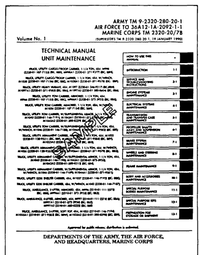
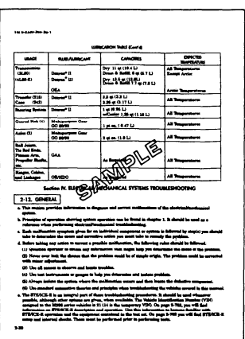
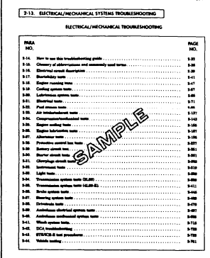
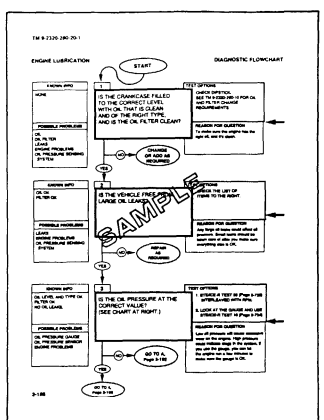
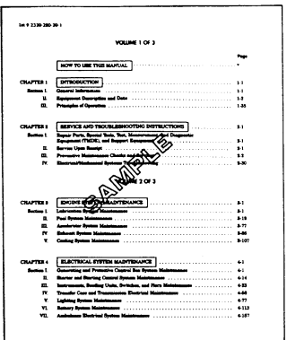
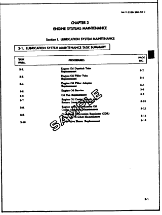
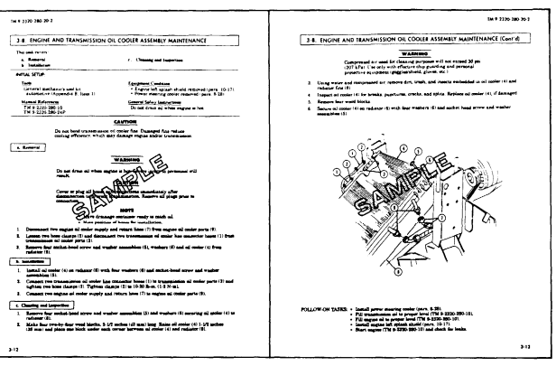

# How To Use This Manual

### About Your Manual

a. Spend some time looking through this manual. You'll find that it has a new look, different than most of the TMs you've been using. New features added to improve the convenience of this manual and increase your efficiency are:
1. Accessing Information - These include physical entry features such as the bleed-to-edge indicators on the cover and edge of the manual. Extensive troubleshooting guides for specific systems lead directly to step by step directions for problem solving and maintenance tasks.

2. Illustrations - A variety of methods are used to make locating and fixing components much easier.

Locator illustrations with keyed text, exploded views, and cut-away diagrams make the information in this manual easier to understand.

3. Keying Text With Illustrations - Instructions are located together with figures that illustrate the specific task you are working on. In most cases, the task steps and figures are located side by side making part identification and procedure sequence easier to follow.

The TM is the fundamental means by which the Army communicates to soldiers the requirements and procedures necessary to perform equipment operations and maintenance. This manual describes in detail the Unit Maintenance authorized by the Maintenance Allocation Chart (appendix B) and Source, Maintenance, and Recovery (SMR) codes (TM 9-2320-280-24P).

b. General Features. Your TM is the best source available for providing information and data critical to vehicle operation and maintenance:
Safety summary (warning page a, b, and c) General information, equipment descriptions, and data (chapter 1)
Principles of operation (chapter 1, section III) Preventive Maintenance Checks and Services - PMCS (chapter 2, section III) Electrical/Mechanical Systems Troubleshooting (chapter 2, section IV)
Detailed maintenance procedures (chapters 3-12)
General maintenance instructions (chapter 2, section II and III) Maintenance Allocation Chart - MAC (appendix B)
Expendable/durable supplies and materials list (appendix C)
Manufactured items (appendix D)
Torque limits (appendix E) Wiring Diagrams and Schematic (appendix F)
Mandatory replacement parts (appendix G)
A typical example of how to use this manual is provided on the following pages.

USING YOUR MANUAL AN EXAMPLE
a. TASK: The operator of an M998 series

vehicle has complained that his TOW carrier uses too much engine oil. The vehicle has been assigned to you for repair.

### B. Troubleshooting Steps:

1. Look at the cover of this manual. You'll see chapter titles listed from top to bottom on the right-hand side.

2. Look at the right edge of the manual. On some of the pages you'll see black bars
(bleed-to-edge indicators) that are alined with the chapter bars on the cover. These are the locations of the chapters in the text.

3. Look for "SERVICE AND TROUBLESHOOTING INSTRUCTIONS" in the chapter list on the cover.

This is where the troubleshooting information is located.

4. Turn to those pages with the edge indicator matching the black bar for service and troubleshooting instructions. Page numbers are also listed next to chapter titles.

5. Chapter 2 is divided into four sections:
 Section I - Repair Parts, Special Tools, TMDE, and Support Equipment Ž Section II - Service Upon Receipt Ž Section III - PMCS Ž Section IV - Electrical/Mechanical Systems Troubleshooting vi 6. Turn to section IV, "ELECTRICAL/

MECHANICAL SYSTEMS TROUBLE- SHOOTING (page 2-30).

This troubleshooting section is systemoriented and is broken down into five top level tests and twenty-one system level tests.

7.

One of the first pages of this section is the "ELECTRICAL/MECHANICAL SYSTEM TROUBLESHOOTING" (turn to page 2-31)
8.

Look down the list of symptoms until you find
"ENGINE LUBRICATION TESTS". In that paragraph you will find the diagnostic flow chart that the vehicle operator can pick the test as "OIL LEAKS OR ENGINE PROBLEMS".

9.

Turn to the test indicated.

On page 2-188, steps relating to

 resolving the problem of excessive oil loss are listed. Read the diagnostic flow chart until you find "OIL LEAKS OR ENGINE PROBLEMS". The tests listed are shown in the example page to the right of this text.

10.

In accordance with Test 1, you checked the oil level and filter for leaks. The oil level and filter appears normal and you move on to Test 2.

11.

In Test 2, you begin a methodical check of the engine lubricating system. You discover a leak in the oil cooler assembly adjacent to one of the mounting brackets. One of the welds has cracked, allowing a class III leak from a small area of the cooling fins. The oil cooler assembly must be repaired or replaced.

12.

At this point, the engine lubrication diagnostic flow chart would direct you to a specific detailed procedure to solve the problem. However, the engine lubricating system is complex and you must now refer to the table of contents to locate the proper task paragraph.

13.

NOTE: Before attempting to repair or replace the oil cooler assembly, as a Unit mechanic, you must:
a. Determine the maintenance responsibility of repair or replacement of the component. b. If the task is at your echelon of maintenance responsibility, you must identify the tools needed and the replacement parts required.

Refer to the Maintenance Allocation Chart - MAC (appendix B) to determine not only the maintenance responsibility of the item, but also to obtain an estimate of the time required to perform the task, tools needed, and any special notes/requirements necessary.

Refer to TM 9-2320-280-24P, Unit Maintenance Repair Parts and Special Tools List for M998 Series Vehicles, for requisition data concerning replacement parts for this task.

c. OIL COOLER ASSEMBLY REPLACEMENT. After reporting the results of your troubleshooting efforts to your supervisor, he decides that the most expedient means of returning the vehicle to service would be to replace the oil cooler assembly.

Turn to the "TABLE OF CONTENTS" and find the chapter dealing with the engine. You find it as "CHAPTER 3, ENGINE SYSTEMS
MAINTENANCE". Furthermore, you note that the chapter is divided into five sections; you are interested in "Section I. Lubrication System Maintenance".

1.

2. Turn to chapter 3, section I on page 3-1. Here

you find the "Lubrication System Maintenance Task Summary". Read down the list of tasks until you find the one that will correct your maintenance problem. For our example, you find it as task 3-8 "Engine and Transmission Oil Cooler Assembly Maintenance". Turn to page 3-12.

3. On page 3-12 you find paragraph 3-8, the detailed procedure for replacing the oil cooler assembly.

d. DETAILED MAINTENANCE PROCEDURES. Detailed maintenance procedures include everything you must do to accomplish a basic maintenance task. Unless otherwise stated, general mechanic's automotive tool kit will be used for maintenance of this vehicle.

1. Before beginning the maintenance task, look through the procedure. You must familiarize yourself with the entire maintenance procedure of para. 3-8: "Engine and Transmission Oil Cooler Assembly Maintenance". The task includes "a. Removal" "b. Installation" and "c. Cleaning and Inspection".

2. The ten basic headings listed under "INITIAL SETUP" outline task conditions, materials, special tools, manpower requirements, and special conditions. The headings are:
Applicable Models: Any models that require a particular maintenance task. If a maintenance task covers all models, then this heading will not be used. Test Equipment: Test equipment needed to complete a task. If test equipment is not required, this heading will not be used. Tools These are common tools and general mechanic tool sets required to perform maintenance tasks. These common tools should be on hand to properly perform the task. Torque wrenches are required for many tasks; the proper torque wrench should be available to tighten mounting hardware.

Special Tools: Those special tools needed to complete a maintenance task. If no special tools are needed, this heading will not be used.

If you don't have one of these special tools, requisition it (before starting the task) using the data supplied in TM 9-2320-280-24P, the repair parts and special tools list for this level of maintenance.

Special tools are located in section III.

Materials/Parts: This heading lists only mandatory replacement materials or parts (gaskets, O-
rings, sealant, etc.). To replace other unserviceable parts, refer to TM 9-2320-280-24P for requisition data. If no mandatory replacement materials/parts are required, this heading will not be used.

Personnel Required: The number of personnel needed to perform a task. If only one mechanic is needed, this heading will not be used.

NOTE
If you think that you need more help to adequately or safely complete a task, perhaps as the result of unusual conditions, etc.,
alert your supervisor and ask for help.

Manual References: Those TMs needed to complete the task.

Equipment Condition: Notes the conditions that must exist before starting the task. If none are required, this heading will not be used. For oil cooler assembly replacement, the left-hand engine splash shield should be removed before we can start the task. If not already done, follow the procedure for splash shield removal in para. 10-17, before proceeding with this task.

General Safety Instructions: Summarizes all safety warnings for the maintenance task. If none are required, this heading will not be used.

3. A step by step maintenance procedure follows the "INITIAL SETUP" and gives detailed instructions for the procedure. These instructions give the part's general location and name and action performed. In the example, oil cooler assembly replacement -a. Removal, step 1 is "Disconnect engine oil cooler supply and return lines (7) from engine oil cooler ports (9)". Note that the numbers in parenthesis correspond to the part's callout number in the accompanying illustration.

### Note

Warnings, cautions, and notes provide supplemental information:
Warnings : Indicate conditions, practices, or procedures which must be observed to avoid personnel injury, loss of life, loss of life, or long-term health hazard.

Cautions: Indicate condition, practices, or procedures which must be observed to avoid damage to equipment or destruction of equipment.

Notes: Include essential information of special importance, interest, or aid in job performance which should be remembered and would be otherwise difficult to find or incorporate into the text.

4. At the end of a procedure, "FOLLOW-ON TASKS" will list those additional tasks that must be performed to complete the procedure. The Follow-On Tasks for oil cooler assembly replacement are:
Ž Fill oil to proper level (TM 9-2320-280-10). Ž Install left-hand splash shield (para. 10-17).

Ž Start engine (TM 9-2320-280-10) and check for leaks.

e. Refer to the example pages for para. 3-8, Engine and Transmission Oil Cooler Assembly Maintenance, as we review the following points:
1. Modular Text: Both pages of text and illustrations are to be used together. This manual was designed so that the two pages would be visible at once, making part identification and procedure sequence easy to follow.

2. Initial Setup: Outlines task conditions.

3. Illustrations: An exploded diagram of the component shows part locations, attachments, and spatial relationships. Cutaway views (part of the vehicle is "erased") show the location and orientation of screws and attachments.

f. Your manual is easy to use once you understand its design. We hope it will encourage you to use your TM more often as an aid to maintenance support for M998 series vehicles.
