Volume No. 2

# TECHNICAL MANUAL UNIT MAINTENANCE
ARMY TM 9-2320-280-20-2 AIR FORCE TO 36A12-1A-2092-1-2 MARINE CORPS TM 2320-20/7B 

<!-- TRUCK, UTILITY: CARGO/TROOP CARRIER, 1-1/4 TON, 4X4, M998
(2320-01-107-7155) (EIC: BBD); M998A1 (2320-01-371-9577) (EIC: BBN);
TRUCK, UTILITY: CARGO/TROOP CARRIER, 1-1/4 TON, 4X4, W/WINCH, M1038 (232001-107-7156) (EIC: BBE); M1038A1 (2320-01-371-9578) (EIC: BBP);
TRUCK, UTILITY: HEAVY VARIANT, 4X4, M1097 (2320-01-346-9317) (EIC: BBM);
M1097A1 (2320-01-371-9583) (EIC: BBU); M1097A2 (2320-01-380-8604) (EIC: BB6);
M1123 (2320-01-455-9593) (EIC: B6G); 
TRUCK, UTILITY: TOW CARRIER, ARMORED, 1-1/4 TON, 4X4, M966 (2320-01-107-7153) (EIC: BBC); M966A1 (2320-01-372-3932) (EIC: BBX);
M1121 (2320-01-456-1282) (EIC: B6H);
TRUCK, UTILITY: TOW CARRIER, ARMORED, 1-1/4 TON, 4X4, W/WINCH,
M1036 (2320-01-107-7154) (EIC: BBH);
TRUCK, UTILITY: TOW CARRIER, W/SUPPLEMENTAL ARMOR, 1-1/4 TON, 4X4, M1045 (2320-01-146-7191); M1045A1 (2320-01-371-9580) (EIC: BBR);
M1045A2 (2320-01-380-8229) (EIC: BB5);
TRUCK, UTILITY: TOW CARRIER, W/SUPPLEMENTAL ARMOR, 1-1/4 TON, 4X4, W/WINCH, M1046 (2320-01-146-7188); M1046A1 (2320-01-371-9582) (EIC: BBT);
TRUCK, UTILITY: ARMAMENT CARRIER, ARMORED, 1-1/4 TON, 4X4, M1025
(2320-01-128-9551) (EIC: BBF); M1025A1 (2320-01-371-9584) (EIC: BBV); 
M1025A2 (2320-01-380-8233) (EIC: BB3);
TRUCK, UTILITY: ARMAMENT CARRIER, ARMORED, 1-1/4 TON, 4X4, W/WINCH, M1026
(2320-01-128-9552) (EIC: BBG); M1026A1 (2320-01-371-9579) (EIC: BBQ);
TRUCK, UTILITY: ARMAMENT CARRIER, W/SUPPLEMENTAL ARMOR, 1-1/4 TON, 4X4, M1043 (2320-01-146-7190); M1043A1 (2320-01-372-3933) (EIC: BBY); 
M1043A2 (2320-01-380-8213) (EIC: BB4);
TRUCK, UTILITY: ARMAMENT CARRIER, W/SUPPLEMENTAL ARMOR, 1-1/4 TON, 4X4, W/WINCH, M1044 (2320-01-146-7189); M1044A1 (2320-01-371-9581) (EIC: BBS);
TRUCK, UTILITY: S250 SHELTER CARRIER, 4X4, M1037 (2320-01-146-7193) (EIC: BBK); TRUCK, UTILITY: S250 SHELTER CARRIER, 4X4, W/WINCH, M1042 (2320-01-146-7187);
TRUCK, AMBULANCE, 2-LITTER, ARMORED, 4X4, M996 (2310-01-111-2275)
(EIC: BBB); M996A1 (2310-01-372-3935) (EIC: BB2);
TRUCK, AMBULANCE, 4-LITTER, ARMORED, 4X4, M997 (2310-01-111-2274)(EIC: BBA);
M997A1 (2310-01-372-3934) (EIC: BBZ); M997A2 (2310-01-380-8225) (EIC: BB8);
TRUCK, AMBULANCE, 2-LITTER, SOFT TOP, 4X4, M1035 (2310-01-146-7194);
M1035A1 (2310-01-371-9585) (EIC: BBW); M1035A2 (2310-01-380-8290) (EIC: BB9).
-->

ENGINE SYSTEMS MAINTENANCE [3-1](#chapter-3-engine-systems-maintenance)

ELECTRICAL SYSTEM MAINTENANCE [4-1](#chapter-4-electrical-system-maintenance)

TRANSMISSION AND TRANSFER CASE MAINTENANCE [5](#chapter-5-transmission-and-transfer-case-maintenance)

PROPELLER SHAFTS, AXLES, AND SUSPENSION MAINTENANCE [6](#chapter-6-propeller-shafts-axles-and-suspension-maintenance)

BRAKE SYSTEM MAINTENANCE [7](#chapter-7-brake-system-maintenance)

WHEELS AND STEERING MAINTENANCE [8](#chapter-8-wheels-and-steering-maintenance-section-i-wheel-and-runflat-system-maintenance)

FRAME MAINTENANCE [9](#chapter-9-frame-maintenance-9-1-frame-maintenance-task-summary)

Approved for public release; distribution is unlimited.

>[!NOTE]
>HEADQUARTERS, DEPARTMENTS OF THE ARMY, 
>THE AIR FORCE, AND MARINE CORPS
>JANUARY 1996

<!--
[!WARNING]
Exhaust Gases Can Kill

Brain damage or death can result from heavy exposure. Precautions must be followed to ensure crew safety when the personnel heater, main, or auxiliary engine of any vehicle is operated for any purpose.

1. Do not operate your vehicle engine in enclosed areas. 2. Do not idle vehicle engine with vehicle windows closed. 3. Be alert at all times for exhaust odors. 4. Be alert for exhaust poisoning symptoms. they are:
- Headache - Dizziness - Sleepiness - Loss of muscular control 5. If you see another person with exhaust poisoning symptoms:
- Remove person from area - Expose to open air - Keep person warm - Do not permit physical exercise - Administer artificial respiration, if necessary* - Notify a medic
*For artificial respiration, refer to FM 21-11.

6. BE AWARE, the field protective mask for nuclear, biological or chemical (NBC) protection will not protect you from carbon monoxide poisoning. THE BEST DEFENSE AGAINST EXHAUST POISONING IS ADEQUATE VENTILATION.

# Warning Summary

- Drycleaning solvent is flammable and will not be used near an open flame. A fire extinguisher will be kept nearby when the solvent is used. Use only in well-ventilated places. Failure to do this may result in injury to personnel and/or damage to equipment.

- Compressed air used for cleaning purposes will not exceed 30 psi (207 kPa). Use only with effective chip guarding and personal protective equipment (goggles/shield, gloves, etc.).

- Diesel fuel is highly flammable. Do not perform any procedure near fire, flames, or sparks. Severe injury or death will result.

- Do not touch hot exhaust system components with bare hands. Severe injury will result. - Do not remove surge tank filler cap before releasing internal pressure when engine temperature is above 190°F (88°C). Steam or hot coolant under pressure will cause injury.

- Do not drain oil when engine is hot. Severe injury to personnel will result. - Always wear eye protection when bleeding brakes. Failure to do this may cause injury if brake fluid comes in contact with eyes.

- Remove all jewelry such as rings, dog tags, bracelets, etc. If jewelry or disconnected battery ground cable contacts battery terminal, a direct short will result, causing injury to personnel, or damage to equipment.

- Keep hands and arms away from fan blade and drive belts while engine is running, or serious injury may result.

- Battery acid (electrolyte) is extremely harmful. Always wear safety goggles and rubber gloves, and do not smoke when performing maintenance on batteries. Injury will result if acid contacts eyes or skin.

- When removing battery cable clamps, disconnect ground cable first. Ensure all switches are in OFF
position before disconnecting ground cable. Do not allow tools to come in contact with vehicle when disconnecting cable clamps. A direct short can result, causing instant heating of tools, tool damage, battery damage, or battery explosion.

- Allow transmission/transfer case to cool before performing maintenance. Failure to do this may cause injury.

- Always apply parking brake and chock opposite wheel before removing wheel. Avoid removing wheel when vehicle is on sloping terrain. Injury to personnel or damage to equipment may result.

# Warning Summary (Cont'D)

- Hydraulic jacks are used for raising and lowering, and are not used to support vehicle. Never work under vehicle unless wheels are blocked and it is properly supported. Injury or damage to equipment may result if vehicle suddenly shifts or moves.

- Remove only the inner group of nuts when removing a wheel from the vehicle. Removing the outer nuts which hold the rim together while the assembly is inflated could result in serious injury or death.

- In all disassembly of the wheel assembly operations, ensure the tire is totally deflated before removing wheel nuts. Failure to follow proper safety precautions could cause serious injury or death.

- Never inflate a wheel assembly with the wheel locknuts removed in an attempt to separate inner and outer rim halves. The assembly will separate under pressure resulting in serious injury or death.

- Never use wheel assemblies with studs which are damaged, loose, or have damaged threads. Damaged studs can cause improper assembly, which could cause individual fasteners to fail. Any of these situations could cause serious injury or death.

- Never use tubes in wheel assemblies. Use of a tube defeats built-in-safety features, and could allow the wheel to come apart under pressure, resulting in serious injury or death.

- Use only replacement parts specified in TM 9-2320-280-24P. Wheels assembled with components which do not meet specifications could cause the assembly to separate under pressure, resulting in serious injury or death.

- Never inflate a wheel assembly without having checked wheel locknut torques to ensure the wheel locknuts are tightened to specifications. An assembly with improperly tightened locknuts could separate under pressure resulting in injury or death.

- Always use a tire inflation cage for inflation purposes. Stand on one side of cage, during inflation, never directly in front. Keep hands out of the cage during inflation. Inflate assembly to recommended pressure, using a clip-on air chuck. Do not exceed 30 psi (207 kPa) cold inflation pressure. Failure to follow these instructions may result in serious injury or death.

- Radial tires and bias ply tires should not be mixed on the same vehicle. Injury to personnel or damage to equipment may result.

- Never install radial tire on eight bolt wheel. Damage to equipment may result, causing injury to personnel.

- Ensure that during assembly indexing hole on inner and outer rim halves is aligned. Failure to do so may cause damage to equipment or injury to personnel.
-->

<!--
AIR FORCE TO 36A12-1A-2092-1-2 MARINE CORPS TM 2320-20/7B
HEADQUARTERS, 
DEPARTMENTS OF THE ARMY,
THE AIR FORCE, AND MARINE CORPS 
WASHINGTON, **D.C.,** 15 July *2004* TECHNICAL MANUAL
VOLUME 2 OF 3 UNIT MAINTENANCE
TRUCK, UTILITY: CARGO/TROOP CARRIER, 1-1/4 TON, 4X4, M998 (2320-01-107-7155) (EIC: BBD); M998A1 (2320-01-371-9577) (EIC: BBN);
TRUCK, UTILITY: CARGO/TROOP CARRIER, 1-1/4 TON, 4X4, W/WINCH, 
M1038 (2320-01-107-7156) (EIC: BBE); M1038A1 (2320-01-371-9578) (EIC: BBP);
TRUCK, UTILITY: HEAVY VARIANT, 4X4, M1097 (2320-01-346-9317) (EIC: BBM); 
M1097A1 (2320-01-371-9583) (EIC: BBU); M1097A2 (2320-01-380-8604) (EIC: BB6); 
M1123 (2320-01-455-9593) (EIC: B6G);
TRUCK, UTILITY: TOW CARRIER, ARMORED, 1-1/4 TON, 4X4, M966 (2320-01-107-7153) (EIC: BBC); M966A1 (2320-01-372-3932) (EIC: BBX); 
M1121 (2320-01-456-1282) (EIC: B6H);
TRUCK, UTILITY: TOW CARRIER, ARMORED, 1-1/4 TON, 4X4, W/WINCH, 
M1036 (2320-01-107-7154) (EIC: BBH);
TRUCK, UTILITY: TOW CARRIER, W/SUPPLEMENTAL ARMOR, 1-1/4 TON, 4X4, M1045 (2320-01-146-7191); M1045A1 (2320-01-371-9580) (EIC: BBR); M1045A2 (2320-01-380-8229) (EIC: BB5);
TRUCK, UTILITY: TOW CARRIER, W/SUPPLEMENTAL ARMOR, 1-1/4 TON, 4X4, W/WINCH, 
M1046 (2320-01-146-7188); M1046A1 (2320-01-371-9582) (EIC: BBT);
TRUCK, UTILITY: ARMAMENT CARRIER, ARMORED, 1-1/4 TON, 4X4, M1025 (2320-01-128-9551) (EIC: BBF); M1025A1 (2320-01-371-9584) (EIC: BBV); M1025A2 (2320-01-380-8233) (EIC: BB3); 
TRUCK, UTILITY: ARMAMENT CARRIER, ARMORED, 1-1/4 TON, 4X4, W/WINCH,
M1026 (2320-01-128-9552) (EIC: BBG); M1026A1 (2320-01-371-9579) (EIC: BBQ);
TRUCK, UTILITY: ARMAMENT CARRIER, W/SUPPLEMENTAL ARMOR, 1-1/4 TON, 4X4, M1043 (2320-01-146-7190); M1043A1 (2320-01-372-3933) (EIC: BBY); M1043A2 (2320-01-380-8213) (EIC: BB4); 
TRUCK, UTILITY: ARMAMENT CARRIER, W/SUPPLEMENTAL ARMOR, 1-1/4 TON, 4X4, W/WINCH, 
M1044 (2320-01-146-7189); M1044A1 (2320-01-371-9581) (EIC: BBS);
TRUCK, UTILITY: S250 SHELTER CARRIER, 4X4, M1037 (2320-01-146-7193) (EIC: BBK);
TRUCK, UTILITY: S250 SHELTER CARRIER, 4X4, W/WINCH, M1042 (2320-01-146-7187);
TRUCK, AMBULANCE, 2-LITTER, ARMORED, 4X4, M996 (2310-01-111-2275) (EIC: BBB); M996A1 (2310-01-372-3935) (EIC: BB2);
TRUCK, AMBULANCE, 4-LITTER, ARMORED, 4X4, M997 (2310-01-111-2274) (EIC: BBA); 
M997A1 (2310-01-372-3934) (EIC: BBZ); M997A2 (2310-01-380-8225) (EIC: BB8);
TRUCK, AMBULANCE, 2-LITTER, SOFT TOP, 4X4, M1035 (2310-01-146-7194); M1035A1 (2310-01-371-9585) (EIC: BBW); M1035A2 (2310-01-380-8290) (EIC: BB9).

TM 9-2320-280-20-2, 31 January 1996, is changed as follows:
1.Remove old pages and insert new pages as indicated below. 2.New or changed material is indicated by a vertical bar in the margin of the page.

| Remove pages          | Insert pages          |
|-----------------------|-----------------------|
| c/d (blank)           | c/d (blank)           |
| A and B               | A through D           |
| i and ii              | i and ii              |
| 3\-1 and 3\-2         | 3\-1 and 3\-2         |
| 3\-5 through 3\-10    | 3\-5 through 3\-10    |
| 3\-25 and 3\-26       | 3\-25 and 3\-26       |
| 3\-29 and 3\-30       | 3\-29 and 3\-30       |
| 3\-35 through 3\-38   | 3\-35 through 3\-38   |
| 3\-46.1 through 3\-56 | 3\-46.1 through 3\-56 |
| 3\-59 through 3\-64   | 3\-59 through 3\-64   |
| 3\-71 and 3\-72       | 3\-71 and 3\-72       |
| 3\-77 through 3\-106  | 3\-77 through 3\-106  |
| 3\-109 and 3\-110     | 3\-109 and 3\-110     |
| 3\-117 and 3\-118     | 3\-117 and 3\-118     |
| 3\-125 and 3\-126     | 3\-125 and 3\-126     |

Approved for public release; distribution is unlimited.

CHANGE NO. 3

| Remove pages                                                                  | Insert pages              |
|-------------------------------------------------------------------------------|---------------------------|
| 3\-129 through 3\-134                                                         | 3\-129 through 3\-134     |
| 3\-139 through 3\-142                                                         | 3\-139 through 3\-142     |
| 3\-143 and 3\-144                                                             | 3\-143 and 3\-144         |
| 4\-1 and 4\-2                                                                 | 4\-1 and 4\-2             |
| 4\-6.1 through 4\-6.4                                                         | 4\-6.1 through 4\-6.4     |
| 4\-7 through 4\-12.6                                                          | 4\-7 through 4\-12.6      |
| 4\-12.9 through 4\-12.12                                                      | 4\-12.9 through 4\-12.12  |
| 4\-12.15 through 4\-12.18                                                     | 4\-12.15 through 4\-12.18 |
| 4\-12.21 through 4\-12.30                                                     | 4\-12.21 through 4\-12.30 |
| 4\-12.37 through 4\-20                                                        | 4\-12.37 through 4\-20    |
| 4\-23 through 4\-28.4                                                         | 4\-23 through 4\-28.4     |
| 4\-31 through 4\-32.6                                                         | 4\-31 through 4\-32.6     |
| 4\-41 through 4\-44                                                           | 4\-41 through 4\-44       |
| 4\-47 through 4\-52                                                           | 4\-47 through 4\-52       |
| 4\-59 through 4\-62                                                           | 4\-59 through 4\-62       |
| 4\-69 and 4\-70                                                               | 4\-69 and 4\-70           |
| 4\-73 and 4\-74                                                               | 4\-73 and 4\-74           |
| 4\-79 through 4\-104                                                          | 4\-79 through 4\-104      |
| 4\-109 through 4\-112                                                         | 4\-109 through 4\-112     |
| 4\-115 and 4\-116                                                             | 4\-115 and 4\-116         |
| 4\-121 through 4\-124                                                         | 4\-121 through 4\-124     |
| 4\-127 through 4\-130                                                         | 4\-127 through 4\-130     |
| 4\-135 through 4\-152                                                         | 4\-135 through 4\-152     |
| 4\-157 through 4\-160                                                         | 4\-157 through 4\-160     |
| 4\-165 through 4\-194                                                         | 4\-165 through 4\-194     |
| 4\-199 through 4\-258                                                         | 4\-199 through 4\-258     |
| 4\-260.1 through 4\-266                                                       | 4\-260.1 through 4\-266   |
| 4\-269 through 4\-278                                                         | 4\-269 through 4\-278     |
| 4\-281 through 4\-294                                                         | 4\-281 through 4\-294     |
| 4\-297 through 4\-300                                                         | 4\-297 through 4\-300     |
| 4\-303 and 4\-304                                                             | 4\-303 and 4\-304         |
| 4\-307 through 4\-310                                                         | 4\-307 through 4\-310     |
| 4\-313 through 4\-316                                                         | 4\-313 through 4\-316     |
| 4\-319 and 4\-320                                                             | 4\-319 and 4\-320         |
| 5\-1 through 5\-8                                                             | 5\-1 through 5\-8         |
| 5\-13 through 5\-18                                                           | 5\-13 through 5\-18       |
| 5\-21 through 5\-42                                                           | 5\-21 through 5\-42       |
| 5\-45 through 5\-54                                                           | 5\-45 through 5\-54       |
| 6\-1 and 6\-2                                                                 | 6\-1 and 6\-2             |
| 6\-5 through 6\-8                                                             | 6\-5 through 6\-8         |
| 6\-11 through 6\-14                                                           | 6\-11 through 6\-14       |
| 6\-17 and 6\-18                                                               | 6\-17 and 6\-18           |
| 6\-22.1 and 6\-22.2                                                           | 6\-22.1 and 6\-22.2       |
| 6\-25 and 6\-26                                                               | 6\-25 and 6\-26           |
| 6\-31 through 6\-40                                                           | 6\-31 through 6\-40       |
| 6\-49 and 6\-50                                                               | 6\-49 and 6\-50           |
| 6\-55 through 6\-68                                                           | 6\-55 through 6\-68       |
| 7\-1 through 7\-6                                                             | 7\-1 through 7\-6         |
| 7\-9 through 7\-18.2                                                          | 7\-9 through 7\-18.2      |
| 7\-25 through 7\-32                                                           | 7\-25 through 7\-32       |
| 7\-39 through 7\-48                                                           | 7\-39 through 7\-48       |
| 7\-50.1 through 7\-64                                                         | 7\-50.1 through 7\-64     |
| 8\-7 through 8\-10                                                            | 8\-7 through 8\-10        |
| 8\-13 through 8\-18                                                           | 8\-13 through 8\-18       |
| 8\-21 through 8\-24.4                                                         | 8\-21 through 8\-24.4     |
| 8\-24.7 through 8\-26                                                         | 8\-24.7 through 8\-26     |
| 8\-29 and 8\-30                                                               | 8\-29 and 8\-30           |
| 8\-43 through 8\-54                                                           | 8\-43 through 8\-54       |
| 8\-57 through 8\-64                                                           | 8\-57 through 8\-64       |
| 8\-67 through 8\-74.2                                                         | 8\-67 through 8\-74.6     |
| 8\-75 and 8\-76                                                               | 8\-75 and 8\-76           |
| 8\-81 through 8\-84                                                           | 8\-81 through 8\-84       |
| 8\-87 and 8\-88                                                               | 8\-87 and 8\-88           |
| 9\-1 through 9\-16                                                            | 9\-1 through 9\-16        |
| 9\-19 through 9\-23/(9\-24 blank)                                             | 9\-19 through 9\-24       |
| Index 1 and Index 2                                                           | Index 1 and Index 2       |
| Index 7 through Index 10                                                      | Index 7 through Index 10  |
| Index 15 through Index 26                                                     | Index 15 through Index 26 |
| 3. File this change sheet in front of the publication for reference purposes. |                           |

By Order of the Secretary of the Army:
Peter J. Schoomaker General, United States Army Chief of Staff Official:
JOEL B. HUDSON
Administrative Assistant to the Secretary of the Army 0223405 By Order of the Secretary of the Air Force:
RONALD R. FOGLEMAN
General, United States Air Force Chief of Staff Official:
HENRY VICCELLIO, JR.

General, United States Air Force Commander, Air Force Materiel Command By Order of the Marine Corps:
R. P. SHOCKEY
Director, Program Support Marine Corps Systems Command Distribution:
To be distributed in accordance with the initial distribution number (IDN) 380900, requirements for TM 9-2320-280-20-2.

MARINE CORPS TM 2320-20/7B
CHANGE NO. 2 HEADQUARTERS, 
DEPARTMENTS OF THE ARMY,
THE AIR FORCE, AND MARINE CORPS 
WASHINGTON, D.C., *30 JUNE 1999* TECHNICAL MANUAL
VOLUME 2 OF 3 UNIT MAINTENANCE
TRUCK, UTILITY: CARGO/TROOP CARRIER, 1-1/4 TON, 4X4, M998 (2320-01-107-7155) (EIC: BBD); M998A1 (2320-01-371-9577) (EIC: BBN);
TRUCK, UTILITY: CARGO/TROOP CARRIER, 1-1/4 TON, 4X4, W/WINCH,
M1038 (2320-01-107-7156) (EIC: BBE); M1038A1 (2320-01-371-9578) (EIC: BBP);
TRUCK, UTILITY: HEAVY VARIANT, 4X4, M1097 (2320-01-346-9317) (EIC: BBM); 
M1097A1 (2320-01-371-9583) (EIC: BBU); M1097A2 (2320-01-380-8604) (EIC: BB6);
M1123 (2320-01-455-9593) (EIC: B6G);
TRUCK, UTILITY: TOW CARRIER, ARMORED, 1-1/4 TON, 4X4, M966 (2320-01-107-7153) (EIC: BBC); M966A1 (2320-01-372-3932) (EIC: BBX);
M1121 (2320-01-456-1282) (EIC: B6H);
TRUCK, UTILITY: TOW CARRIER, ARMORED, 1-1/4 TON, 4X4, W/WINCH,
M1036 (2320-01-107-7154) (EIC: BBH);
TRUCK, UTILITY: TOW CARRIER, W/SUPPLEMENTAL ARMOR, 1-1/4 TON, 4X4, M1045 (2320-01-146-7191); M1045A1 (2320-01-371-9580) (EIC: BBR); M1045A2 (2320-01-380-8229) (EIC: BB5);
TRUCK, UTILITY: TOW CARRIER, W/SUPPLEMENTAL ARMOR, 1-1/4 TON, 4X4, W/WINCH,
M1046 (2320-01-146-7188); M1046A1 (2320-01-371-9582) (EIC: BBT);
TRUCK, UTILITY: ARMAMENT CARRIER, ARMORED, 1-1/4 TON, 4X4, M1025 (2320-01-128-9551) (EIC: BBF); M1025A1 (2320-01-371-9584) (EIC: BBV); M1025A2 (2320-01-380-8233) (EIC: BB3); 
TRUCK, UTILITY: ARMAMENT CARRIER, ARMORED, 1-1/4 TON, 4X4, W/WINCH,
M1026 (2320-01-128-9552) (EIC: BBG); M1026A1 (2320-01-371-9579) (EIC: BBQ);
TRUCK, UTILITY: ARMAMENT CARRIER, W/SUPPLEMENTAL ARMOR, 1-1/4 TON, 4X4, M1043 (2320-01-146-7190); M1043A1 (2320-01-372-3933) (EIC: BBY); M1043A2 (2320-01-380-8213) (EIC: BB4); 
TRUCK, UTILITY: ARMAMENT CARRIER, W/SUPPLEMENTAL ARMOR, 1-1/4 TON, 4X4, W/WINCH,
M1044 (2320-01-146-7189); M1044A1 (2320-01-371-9581) (EIC: BBS);
TRUCK, UTILITY: S250 SHELTER CARRIER, 4X4, M1037 (2320-01-146-7193) (EIC: BBK);
TRUCK, UTILITY: S250 SHELTER CARRIER, 4X4, W/WINCH, M1042 (2320-01-146-7187);
TRUCK, AMBULANCE, 2-LITTER, ARMORED, 4X4, M996 (2310-01-111-2275) (EIC: BBB); M996A1 (2310-01-372-3935) (EIC: BB2);
TRUCK, AMBULANCE, 4-LITTER, ARMORED, 4X4, M997 (2310-01-111-2274) (EIC: BBA); 
M997A1 (2310-01-372-3934) (EIC: BBZ); M997A2 (2310-01-380-8225) (EIC: BB8);
TRUCK, AMBULANCE, 2-LITTER, SOFT TOP, 4X4, M1035 (2310-01-146-7194); M1035A1 (2310-01-371-9585) (EIC: BBW); M1035A2 (2310-01-380-8290) (EIC: BB9).

TM 9-2320-280-20-2, 31 January 1996, is changed as follows:
1. Two new models have been added to the front cover. The new cover, located at the end of the change package, replaces the existing cover.

2. Remove old pages and insert new pages as indicated below. 3. New or changed material is indicated by a vertical bar in the margin of the page.

| Remove pages        | Insert pages                    |
|---------------------|---------------------------------|
| None                | A and B (After warning d blank) |
| i and ii            | i and ii                        |
| 3\-5 and 3\-6       | 3\-5 and 3\-6                   |
| 3\-13 and 3\-14     | 3\-13 and 3\-14                 |
| 3\-19 through 3\-22 | 3\-19 and 3\-22                 |
| 3\-25 through 3\-30 | 3\-25 through 3\-30             |
| 3\-35 through 3\-38 | 3\-35 through 3\-38             |

Approved for public release; distribution is unlimited.

| Remove pages                         | Insert pages                           |
|--------------------------------------|----------------------------------------|
| 3\-41 through 3\-46                  | 3\-41 through 3\-46.2                  |
| 3\-49 and 3\-50                      | 3\-49 and 3\-50                        |
| 3\-53 through 3\-56                  | 3\-53 through 3\-56                    |
| 3\-61 and 3\-62                      | 3\-61 and 3\-62                        |
| 3\-65 and 3\-66                      | 3\-65 and 3\-66                        |
| 3\-69 and 3\-70                      | 3\-69 and 3\-70                        |
| 3\-73 and 3\-74                      | 3\-73 and 3\-74                        |
| 3\-85 through 3\-100                 | 3\-85 through 3\-100                   |
| 3\-107 through 3\-116                | 3\-107 through 3\-116                  |
| 3\-125 through 3\-128                | 3\-125 through 3\-128                  |
| 3\-131 through 3\-145/(3\-146 blank) | 3\-130.1 through 3\-145/(3\-146 blank) |
| 4\-1 through 4\-20                   | 4\-1 through 4\-20                     |
| 4\-23 and 4\-24                      | 4\-23 and 4\-24                        |
| 4\-29 through 4\-32.2                | 4\-28.1 through 4\-32.2                |
| 4\-36 through 4\-38                  | 4\-36 through 4\-38                    |
| 4\-57 and 4\-58                      | 4\-57 and 4\-58                        |
| 4\-67 and 4\-68                      | 4\-66.1 through 4\-68                  |
| 4\-71 through 4\-74                  | 4\-71 through 4\-74                    |
| 4\-77 through 4\-80                  | 4\-77 through 4\-80                    |
| 4\-85 and 4\-86                      | 4\-85 and 4\-86                        |
| 4\-89 and 4\-90                      | 4\-89 and 4\-90                        |
| 4\-95 and 4\-96                      | 4\-95 and 4\-96                        |
| 4\-99 through 4\-114                 | 4\-99 through 4\-114                   |
| 4\-137 through 4\-142                | 4\-137 through 4\-142                  |
| 4\-157 and 4\-158                    | 4\-157 and 4\-158                      |
| 4\-237 through 4\-242                | 4\-237 through 4\-242                  |
| 4\-247 through 4\-264                | 4\-247 through 4\-264                  |
| 5\-7 through 5\-12                   | 5\-7 through 5\-12                     |
| 5\-17 through 5\-20                  | 5\-17 through 5\-20                    |
| 5\-25 through 5\-30                  | 5\-25 through 5\-30                    |
| 5\-39 through 5\-42                  | 5\-39 through 5\-42                    |
| 5\-47 through 5\-52                  | 5\-47 through 5\-52.4                  |
| 6\-5 and 6\-6                        | 6\-5 and 6\-6                          |
| 6\-17 and 6\-18                      | 6\-17 and 6\-18                        |
| 6\-21 through 6\-30                  | 6\-21 through 6\-30                    |
| 6\-35 and 6\-36                      | 6\-35 and 6\-36                        |
| 6\-53 and 6\-54                      | 6\-53 and 6\-54                        |
| 6\-57 through 6\-68                  | 6\-57 through 6\-68                    |
| 7\-1 and 7\-2                        | 7\-1 and 7\-2                          |
| 7\-17 and 7\-18                      | 7\-18 through 7\-18.5 (7\-18.6 blank)  |
| 7\-23 through 7\-28                  | 7\-23 through 7\-28                    |
| 7\-31 through 7\-40                  | 7\-31 through 7\-40                    |
| 7\-47 through 7\-52                  | 7\-47 through 7\-52                    |
| 7\-55 through 7\-64                  | 7\-55 through 7\-64                    |
| 8\-1 through 8\-4                    | 8\-1 through 8\-4                      |
| 8\-7 through 8\-24.10                | 8\-7 through 8\-24.10                  |
| 8\-31 and 8\-32                      | 8\-31 and 8\-32                        |
| 8\-43 through 8\-46                  | 8\-43 through 8\-46                    |
| 8\-51 through 8\-54                  | 8\-51 through 8\-54                    |

| Remove pages             | Insert pages             |
|--------------------------|--------------------------|
| 8\-67 through 8\-78      | 8\-67 through 8\-78      |
| 8\-85 and 8\-86          | 8\-85 and 8\-86          |
| None                     | 8\-87 and 8\-88          |
| 9\-1 and 9\-2            | 9\-1 and 9\-2            |
| 9\-11 and 9\-12          | 9\-11 and 9\-12          |
| None                     | 9\-14.1 (9\-14.2 blank)  |
| Index 1 through Index 23 | Index 1 through Index 26 |
| cover                    | cover                    |

4. File this change sheet in front of the publication for reference purposes.

By Order of the Secretary of the Army:
ERIC K. SHINSEKI
General, United States Army Chief of Staff O f f i c i a l :
JOEL B. HUDSON
Administrative Assistant to the Secretary of the Army 05692 By Order of the Secretary of the Air Force:
RONALD R. FOGLEMAN
General, United States Air Force Chief of Staff O f f i c i a l :
H E N RY VICCELLIO, JR.

General, United States Air Force C o m m a n d e r, Air Force Materiel Command By Order of the Marine Corps:
D.R. BLOOMER
Colonel, USMC
Director, Program Support Marine Corps Systems Command Distribution:
To be distributed in accordance with the initial distribution number (IDN) 380900, requirements for TM 9-2320-280-20-2.

CHANGE NO. 1 ARMY TM 9-2320-280-20-2 AIR FORCE TO 36A12-1A-2092-1-2 MARINE CORPS TM 2320-20/7B
C1 HEADQUARTERS, 
DEPARTMENTS OF THE ARMY,
THE AIR FORCE, AND THE
MARINE CORPS 
WASHINGTON, D.C., 14 September 1998 TECHNICAL MANUAL
VOLUME 2 OF 3 UNIT MAINTENANCE
TRUCK, UTILITY: CARGO/TROOP CARRIER, 1-1/4 TON, 4X4, M998 (2320-01-107-7155) (EIC: BBD); M998A1 (2320-01-371-9577) (EIC: BBN);
TRUCK, UTILITY: CARGO/TROOP CARRIER, 1-1/4 TON, 4X4, W/WINCH,
M1038 (2320-01-107-7156) (EIC: BBE); M1038A1 (2320-01-371-9578) (EIC: BBP);
TRUCK, UTILITY: HEAVY VARIANT, 4X4, M1097 (2320-01-346-9317) (EIC: BBM); 
M1097A1 (2320-01-371-9583) (EIC: BBU); M1097A2 (2320-01-380-8604) (EIC: BB6);
TRUCK, UTILITY: TOW CARRIER, ARMORED, 1-1/4 TON, 4X4, M966 (2320-01-107-7153) (EIC: BBC); M966A1 (2320-01-372-3932) (EIC: BBX);
TRUCK, UTILITY: TOW CARRIER, ARMORED, 1-1/4 TON, 4X4, W/WINCH,
M1036 (2320-01-107-7154) (EIC: BBH);
TRUCK, UTILITY: TOW CARRIER, W/SUPPLEMENTAL ARMOR, 1-1/4 TON, 4X4, M1045 (2320-01-146-7191); M1045A1 (2320-01-371-9580) (EIC: BBR); M1045A2 (2320-01-380-8229) (EIC: BB5);
TRUCK, UTILITY: TOW CARRIER, W/SUPPLEMENTAL ARMOR, 1-1/4 TON, 4X4, W/WINCH,
M1046 (2320-01-146-7188); M1046A1 (2320-01-371-9582) (EIC: BBT);
TRUCK, UTILITY: ARMAMENT CARRIER, ARMORED, 1-1/4 TON, 4X4, M1025 (2320-01-128-9551) (EIC: BBF); M1025A1 (2320-01-371-9584) (EIC: BBV); M1025A2 (2320-01-380-8233) (EIC: BB3); 
TRUCK, UTILITY: ARMAMENT CARRIER, ARMORED, 1-1/4 TON, 4X4, W/WINCH,
M1026 (2320-01-128-9552) (EIC: BBG); M1026A1 (2320-01-371-9579) (EIC: BBQ);
TRUCK, UTILITY: ARMAMENT CARRIER, W/SUPPLEMENTAL ARMOR, 1-1/4 TON, 4X4, M1043 (2320-01-146-7190); M1043A1 (2320-01-372-3933) (EIC: BBY); M1043A2 (2320-01-380-8213) (EIC: BB4); 
TRUCK, UTILITY: ARMAMENT CARRIER, W/SUPPLEMENTAL ARMOR, 1-1/4 TON, 4X4, W/WINCH,
M1044 (2320-01-146-7189); M1044A1 (2320-01-371-9581) (EIC: BBS);
TRUCK, UTILITY: S250 SHELTER CARRIER, 4X4, M1037 (2320-01-146-7193) (EIC: BBK);
TRUCK, UTILITY: S250 SHELTER CARRIER, 4X4, W/WINCH, M1042 (2320-01-146-7187);
TRUCK, AMBULANCE, 2-LITTER, ARMORED, 4X4, M996 (2310-01-111-2275) (EIC: BBB); M996A1 (2310-01-372-3935) (EIC: BB2);
TRUCK, AMBULANCE, 4-LITTER, ARMORED, 4X4, M997 (2310-01-111-2274) (EIC: BBA); 
M997A1 (2310-01-372-3934) (EIC: BBZ); M997A2 (2310-01-380-8225) (EIC: BB8);
TRUCK, AMBULANCE, 2-LITTER, SOFT TOP, 4X4, M1035 (2310-01-146-7194); M1035A1 (2310-01-371-9585) (EIC: BBW); M1035A2 (2310-01-380-8290) (EIC: BB9).

TM 9-2320-280-20-2, 31 January 1996, is changed as follows:
1. Remove old pages and insert new pages as indicated below. 2. New or changed material is indicated by a vertical bar in the margin of the page.

Remove pages Insert pages 4-13 and 4-14 4-13 through 4-14.2 Approved for public release; distribution is unlimited.

By Order of the Secretary of the Army:
DENNIS J. REIMER
General, United States Army Chief of Staff Official:
JOEL B. HUDSON
Administrative Assistant to the Secretary of the Army 05163 By Order of the Secretary of the Air Force:
RONALD R. FOGLEMAN
General, United States Air Force Chief of Staff Official:
HENRY VICCELLIO, JR.

General, United States Air Force Commander, Air Force Materiel Command By Order of the Marine Corps:
M. K. HAYDEN
Colonel, United States Marine Corps Director, Program Support Marine Corps Systems Command Distribution: To be distributed in accordance with the Initial Distribution Number (IDN) 380900, requirements for TM 9-2320-280-20-2.

# List Of Effective Pages

NOTE: The portion of the text affected by the changes is indicated by a vertical line in the outer margins of the page.

Dates of issue for original and changed pages of volume 2 are:
Original . . . 0 . . . 31 January 1996 Change . . . 1 . . . 14 September 1998 Change . . . 2 . . . 30 June 1999 Change ... 3 ... 1 5 July 2004 TOTAL NUMBER OF PAGES IN THIS PUBLICATION IS 947, CONSISTING OF THE FOLLOWING:

| Page No *Change No.   | Page No * Change No.   | Page No *Change No.   |
|-----------------------|------------------------|-----------------------|
| VOLUME 2              | 3\-53 .                | 3\-116                |
| a\-b  . C             | 3\-54 .                | 3\-117                |
| .                     | 3\-55 .                |                       |
| d Blank .             | 3\-56                  | 3\-125                |
| .  A\-B               | 3\-57 \- 3\-58 .       | 3\-126 \- 3\-128      |
| C\-D Added            | 3\-59 \- 3\-60 .       | 3\-129                |
| 1                     | 3\-61 .                | 3\-130                |
| ii                    | 3\-62 .                | 3\-130.1 .            |
| iii .                 | 3\-63 .                | 3\-130.2 .            |
| iv Blank              | 3\-64 .                | 3\-130.3 .            |
| 3\-1 .                | 3\-65 .                | 3\-130.4 .            |
| 3\-2 .                | 3\-66 \- 3\-68 .       | 3\-131                |
| 3\-3 \- 3\-4          | 3\-69 .                | 3\-132                |
| 3\-5 \- 3\-6          | 3\-70 \- 3\-71 .       | 3\-133                |
| 3\-7 .                | 3\-72 .                | 3\-134                |
| 3\-8 .                | 3\-73 .                | 3\-135                |
| 3\-9 .                | 3\-74 .                | 3\-136                |
| 3\-10 .               | 3\-75 \- 3\-77  .      | 3\-137 \- 3\-139      |
| 3\-11 \- 3\-12 .      | 3\-78 .                | 3\-140                |
| 3\-13 .               | 3\-79 .                | 3\-141                |
| 3\-14 \- 3\-19 .      | 3\-80 .                | 3\-142                |
| 3\-20 .               | 3\-81 .                | 3\-142.1 \- 3\-142.2  |
| 3\-21 .               | 3\-82 \- 3\-86 .       | 3\-143                |
| 3\-22 .               | 3\-87 .                | 3\-144                |
| 3\-23 \- 3\-25 .      | .  3\-88               | 3\-145                |
| 3\-26 .               | 3\-89 .                | 3\-146 Blank .        |
| 3\-27 .               | 3\-90 \- 3\-92 .       | 4\-1 \- 4\-2          |
| 3\-28 .               | 3\-93                  | 4\-3 \- 4\-6          |
| 3\-29 \- 3\-30 .      | 3\-94 \- 3\-96  .      | 4\-6.1                |
| 3\-31 \- 3\-35 .      | 3\-97 .                | 4\-6.2 .              |
| 3\-36 .               | 3\-98 .                | 4\-6.3  .             |
| 3\-37 .               | 3\-99 .                | 4\-6.4 .              |
| 3\-38 .               | 3\-100                 | 4\-6.5 \- 4\-6.14     |
| 3\-39 \- 3\-41 .      | 3\-101                 | 4\-7 .                |
| 3\-42 \- 3\-46 .      | 3\-102 \- 3\-104       | 4\-8 .                |
| 3\-46.1               | 3\-105                 | 4\-9 .                |
| 3\-46.2               | 3\-106                 | 4\-10 .               |
| 3\-47 .               | 3\-107                 | 4\-10.1 \- 4\-10.2 .  |
| 3\-48 .               | 3\-108 \- 3\-109       | 4\-11 .               |
| 3\-49 .               | 3\-110                 | 4\-12 .               |
| 3\-50 .               | 3\-111 \- 3\-112       | 4\-12.1 \- 4\-12.3 .  |
| 3\-51 .               | 3\-113                 | 4\-12.4 Blank .       |
| 3\-52 .               | 3\-114 \- 3\-115       | 4\-12.5               |

*Zero in this column indicates original page.

# List Of Effective Pages (Contd)

| Page No *Change No.       |    | Page No *Change No.   |                          | Page No *Change No.      |
|---------------------------|----|-----------------------|--------------------------|--------------------------|
| 4\-12.6                   |    | 4\-142                |                          | 4\-67 \- 4\-68 .         |
| 4\-12.7 \- 4\-12.9  .     |    | 4\-143                |                          | 4\-69 .                  |
| 4\-12.10 .                |    | 4\-144                |                          | 4\-70 .                  |
| 4\-12.11 .                |    | 4\-145                |                          | 4\-71 .                  |
| 4\-12.12 .                |    | 4\-146 \- 4\-148      |                          | 4\-72 \- 4\-73 .         |
| 4\-12.13 \- 4\-12.15      |    | 4\-149 .              |                          | 4\-74 .                  |
| 4\-12.16 ··               |    | 4\-150                |                          | 4\-75 .                  |
| 4\-12.17 .                |    | 4\-151                |                          | 4\-76 Blank              |
| 4\-12.18 ··               |    | 4\-152                |                          | 4\-77 \- 4\-79 .         |
| 4\-12.19 \- 4\-12.21      |    | 4\-153 \- 4\-156      |                          | 4\-80 \- 4\-82 .         |
| 4\-12.22 \- 4\-12.24      |    | 4\-157 \- 4\-158      |                          | 4\-83 .                  |
| ··· 4\-12.25              |    | 4\-159                |                          | 4\-84 \- 4\-86 .         |
| 4\-12.26 .                |    | 4\-160                |                          | 4\-87 .                  |
| 4\-12.27 .                |    | 4\-161 \- 4\-165      |                          | 4\-88 .                  |
| .  4\-12.28               |    | 4\-166                |                          | 4\-89 .                  |
| 4\-12.29 ··               |    | 4\-167                |                          | 4\-90 .                  |
| 4\-12.30 .                |    | 4\-168                |                          | 4\-91 .                  |
| 4\-12.31 \- 4\-12.37      | .  | 4\-169                | 4\-92                    |                          |
| 4\-12.38 ..               |    | 4\-170                |                          | 4\-93 .                  |
| 4\-13 \- 4\-14 .          |    | 4\-171                |                          | 4\-94 \- 4\-96 .         |
| 4\-15 .                   |    | 4\-172                |                          | 4\-97 .                  |
| 4\-16 \- 4\-20 .          |    | 4\-173                |                          | 4\-98 .                  |
| 4\-21 .                   |    | 4\-174                |                          | 4\-99 .                  |
| 4\-22 Blank               |    | 4\-175                |                          | 4\-100                   |
| 4\-23 \- 4\-25 .          |    |                       | 4\-101  4\-176 \- 4\-180 |                          |
| 4\-26 \- 4\-27 .          |    |                       |                          | 4\-102  4\-181           |
| 4\-28 .                   |    | 4\-182                |                          | 4\-103                   |
| 4\-28.1                   |    | 4\-183                |                          | 4\-104                   |
| 4\-28.2 \- 4\-28.4 .      |    | 4\-184 \- 4\-186      |                          | 4\-105 \- 4\-107         |
| 4\-29 \- 4\-30 .          |    | 4\-187                |                          | 4\-108                   |
| 4\-31 .                   |    | 4\-188 \- 4\-189      |                          | 4\-109 \- 4\-110         |
| 4\-32.1 \- 4\-32.3 .      |    | 4\-192                |                          | 4\-112                   |
| 4\-32.4 \- 4\-32.5 .      |    | 4\-193                |                          | 4\-113                   |
| 4\-32.6                   |    | 4\-194                |                          | 4\-114 \- 4\-115         |
| 4\-33 \- 4\-35 .          |    | 4\-195 \- 4\-199      |                          | 4\-116                   |
| 4\-36 .                   |    | 4\-200                |                          | 4\-117 \- 4\-121         |
| 4\-36.1 \- 4\-36.2 .      |    | 4\-201                |                          | 4\-122                   |
| 4\-38 \- 4\-41 .          |    | 4\-205                |                          | 4\-124                   |
| 4\-42 \- 4\-43 .          |    | 4\-206 \- 4\-208      |                          | 4\-125 \- 4\-126         |
| 4\-44 \- 4\-47 .  4\-48 . |    | 4\-209                |                          | 4\-127 \- 4\-128  4\-129 |
| 4\-49 .                   |    |                       |                          | 4\-130                   |
| 4\-50 \- 4\-51 .          |    | 4\-216 \- 4\-218      |                          | 4\-131 \- 4\-135         |
| 4\-52 \- 4\-57 .          |    | 4\-219                |                          | 4\-136                   |
| 4\-58 .                   |    | 4\-220                |                          | 4\-137                   |
| 4\-59 .                   |    | 4\-221                |                          | 4\-138                   |
| 4\-60 \- 4\-61 .          |    | 4\-222 \- 4\-224      |                          | 4\-139                   |
| 4\-66.1 \- 4\-66.2 .      |    | 4\-226 \- 4\-228      |                          | 4\-141                   |
| ·  4\-32                  |    | 4\-190 \- 4\-191      |                          | 4\-111                   |
| 4\-37 .                   |    | 4\-202 \- 4\-204      |                          | 4\-123                   |
|                           |    | 4\-215                |                          |                          |
| 4\-62 \- 4\-66 .          |    | 4\-225                |                          | 4\-140                   |

*Zero in this column indicates original page.

Change 3 B

# List Of Effective Pages (Contd)

| Page No * Change No.                    | Page No * Change No.       | Page No *Change No.   |
|-----------------------------------------|----------------------------|-----------------------|
| 4\-229                                  | 4\-294                     | 5\-41 .               |
| 4\-230                                  | 4\-295 \- 4\-297           | 5\-42 .               |
| 4\-231                                  | 4\-298                     | 5\-43 \- 5\-44 .      |
| 4\-232 \- 4\-233                        | 4\-299                     | 5\-45 .               |
| 4\-234 \- 4\-235                        | 4\-300                     | 5\-46 .               |
| 4\-236                                  | 4\-301 \- 4\-303           | 5\-47 .               |
| 4\-237                                  | 4\-304                     | 5\-48 .               |
| 4\-238                                  | 4\-305 \- 4\-307           | 5\-49  .              |
| 4\-238.1 .                              | 4\-308                     | 5\-50 .               |
| 4\-238.2 .                              | 4\-309                     | 5\-51 .               |
| 4\-239                                  | 4\-310                     | 5\-52 .               |
| 4\-240                                  | 4\-311 \- 4\-312           | 5\-52.1 \- 5\-52.4 .  |
| 4\-241                                  | 4\-313                     | 5\-53 \- 5\-54 .      |
| 4\-242                                  | 4\-314                     | 5\-55 .               |
| 4\-243 .                                | 4\-315                     | 5\-56 Blank           |
| 4\-244 \- 4\-246                        | 4\-316 \- 4\-318 \- 4\-318 | 6\-1 .                |
| 4\-247                                  | 4\-319                     | 6\-2 .                |
| 4\-248 .                                | 4\-320 \- 4\-325           | 6\-3 \- 6\-4          |
| 4\-249 ・・・・・・・・・・・・・・・ . | 4\-326 Blank .             | 6\-5 .                |
| 4\-250                                  | 5\-1 .                     | 6\-6 .                |
| 4\-251                                  | 5\-2 .                     | 6\-7 .                |
| 4\-252                                  | 5\-3 .                     | 6\-8 .                |
| 4\-253                                  | 5\-4 .                     | 6\-9 \- 6\-11         |
| 4\-254 \- 4\-255                        | 5\-5 .                     | 6\-12 .               |
| 4\-256                                  | 5\-6 .                     | 6\-13 .               |
| 4\-256.1 .                              | 5\-7 .                     | 6\-14 .               |
| 4\-256.2 ··                             | 5\-8 .                     | 6\-15 \- 6\-16 .      |
| 4\-257 \- 4\-258                        | 5\-9 \- 5\-12              | 6\-17 .               |
| 4\-259 \- 4\-260                        | 5\-13 .                    | 6\-18 .               |
| 4\-260.1 .                              | 5\-14 .                    | 6\-19 \- 6\-21 .      |
| 4\-260.2 \- 4\-260.4                    | 5\-15 .                    | 6\-22 .               |
| 4\-261 \- 4\-262                        | 5\-16 .                    | 6\-22.1               |
| 4\-263                                  | 5\-17 .                    | 6\-22.2               |
| 4\-264 \- 4\-266                        | 5\-18 .                    | 6\-23 .               |
| 4\-267 \- 4\-269                        | 5\-19 \- 5\-20 .           | 6\-24 .               |
| 4\-270 \- 4\-272                        | 5\-21 .                    | 6\-25 .               |
| 4\-273                                  | 5\-22 \- 5\-26 .           | 6\-26 .               |
| 4\-274                                  | 5\-27 .                    | 6\-27 \- 6\-30 .      |
| 4\-275                                  | 5\-28 .                    | 6\-31 .               |
| 4\-276                                  | .  5\-29                   | 6\-32 .               |
| 4\-277                                  | 5\-30 .                    | 6\-33 .               |
| 4\-278                                  | 5\-31 .                    | 6\-34 .               |
| 4\-279 \- 4\-281                        | 5\-32 .                    | 6\-35 .               |
| 4\-282                                  | 5\-33 .                    | 6\-36 \- 6\-40 .      |
| 4\-283                                  | 5\-34 .                    | 6\-41 \- 6\-49 .      |
| 4\-284                                  | 5\-35 .                    | 6\-50 .               |
| 4\-285                                  | 5\-36 .                    | 6\-51 \- 6\-52 .      |
| 4\-286 \- 4\-288                        | 5\-37 .                    | 6\-53 .               |
| 4\-289                                  | 5\-38 .                    | 6\-54 .               |
| 4\-290 \- 4\-292                        | 5\-39 .                    | 6\-55 \- 6\-58 .      |
| 4\-293                                  | 5\-40 .                    | 6\-59 .               |

*Zero in this column indicates original page.

Change 3

# List Of Effective Pages (Contd)

| Page No *Change No.   |                                       | Page No *Change No.   | Page No *Change No.                 |
|-----------------------|---------------------------------------|-----------------------|-------------------------------------|
| 6\-60                 | .                                     | 7\-49 .               | 8\-51 .                             |
| 6\-61                 | !!!                                | 7\-50 .               | 8\-52 .                             |
| 6\-62                 | ··                                    | 7\-50.1               | 8\-53 .                             |
| 6\-63                 | ···                                   | 7\-50.2               | 8\-54  .                            |
| 6\-64                 | ·                                     | 7\-51 .               |                                     |
| 6\-65                 | ··································· . | 7\-52 .               | 8\-58 .                             |
| 6\-66                 | .                                     | 7\-53 .               | 8\-59 .                             |
| 6\-67                 | !!!!!!!!!!!!!!!! 2    | 7\-54 .               | 8\-60 .                             |
| 6\-68                 | .                                     | 7\-55 .               | 8\-61 .                             |
| 6\-69 \- 6\-72 .      |                                       | 7\-56 \- 7\-60 .      | 8\-62 .                             |
| 7\-1 .                |                                       | 7\-61 .               | 8\-63 .                             |
| 7\-2 .                | 7\-3 .                                | 7\-62 .               | 8\-64  .                            |
|                       |                                       | 7\-63 .               |                                     |
| 7\-4 .                |                                       | 7\-64 .               | 8\-68 .                             |
| 7\-5 .                |                                       | 7\-65 .               | 8\-69 .                             |
| 7\-6 .                |                                       | 7\-66 Blank           | 8\-70 .                             |
| 7\-7 \- 7\-9          |                                       | 8\-1 .                | 8\-71 .                             |
| 7\-10 .               |                                       | 8\-2 \- 8\-3          | 8\-72 .                             |
| 7\-11 .               |                                       | 8\-4 .                | 8\-73 .                             |
| 7\-12                 | ·                                     | 8\-5 \- 8\-7          | 8\-74 .                             |
| 7\-13                 | .                                     | 8\-8 \- 8\-9          | 8\-74.1                             |
| 7\-14                 | .                                     | 8\-10 \- 8\-13 .      | 8\-74.2                             |
| 7\-15                 | .                                     | 8\-14 .               | 8\-74.3 \- 8\-74.6 Added   .        |
| 7\-16 \- 7\-17 .      |                                       | 8\-14.1               | 8\-75 \- 8\-76 .                    |
| 7\-18                 | ・・・・・・・・・・・・・・・ .      | 8\-14.2 \- 8\-14.4 .  | 8\-77 .                             |
| 7\-18.1               | ··                                    | 8\-14.5               | 8\-78 \- 8\-81 .                    |
| 7\-18.2               | .                                     | 8\-14.6               | 8\-82 .                             |
| 7\-18.3               | ・・・・・・・・・・・・・            | 8\-14.7               | 8\-83 .                             |
| 7\-18.4               | .                                     | 8\-14.8 \- 8\-14.10 . | 8\-84 .                             |
| 7\-18.5               | ··                                    | 8\-15 \- 8\-17 .      | 8\-85 .                             |
| 7\-18.6 Blank .       |                                       | 8\-18 \- 8\-21 .      | 8\-86 .                             |
| 7\-19 \- 7\-23 .      |                                       | 8\-22 \- 8\-23 .      | 8\-87 .                             |
| 7\-24 \- 7\-25 .      |                                       | 8\-24 .               | 8\-88 .                             |
| 7\-26 \- 7\-28 .      |                                       | 8\-24.1               | 9\-1 \- 9\-4                        |
| 7\-29                 | .                                     | 8\-24.2 \- 8\-24.3  . | 9\-5 .                              |
| 7\-30                 | ·                                     | 8\-24.4 \- 8\-24.7 .  | 9\-6 .                              |
| 7\-31 .               |                                       | 8\-24.8 \- 8\-24.9 .  | 9\-7  .                             |
| 7\-32                 | .                                     | 8\-24.10 .            | 9\-8 \- 9\-14  .                    |
| 7\-32.1 \- 7\-32.2 .  |                                       | 8\-25 \- 8\-26 .      | 9\-14.1                             |
| 7\-33 \- 7\-34 .      |                                       | 8\-27 \- 8\-29 .      | 9\-14.2 Blank                       |
| 7\-34.1 \- 7\-34.2 .  |                                       | 8\-30 .               | 9\-15 .                             |
| 7\-35 \- 7\-39 .      |                                       | 8\-31 .               | 9\-16 \- 9\-19  .                   |
| 7\-40 .               |                                       | 8\-32 .               | 9\-20 \- 9\-23  .                   |
| 7\-41 .               |                                       | 8\-33 \- 8\-42 .      | 9\-24 Added   .                     |
| 7\-42 .               |                                       | 8\-43 \- 8\-44 .      | Index\-1 .                          |
| 7\-43 .               |                                       | 8\-45 .               | Index\-2 \- Index\-6                |
| 7\-44 .               |                                       | 8\-46 .               | Index\-7 ·························· |
| 7\-45 .               |                                       | 8\-47 .               | Index\-8 \- Index\-9                |
| 7\-46 .               |                                       | 8\-48 .               | Index\-10 .                         |
| 7\-47 .               |                                       | 8\-49 .               | Index\-11 \- Index 15 .             |
| 7\-48 .               |                                       | 8\-50 .               | Index\-16 \- Index 26 .             |

*Zero in this column indicates original page.

Change 3 D
TECHNICAL MANUAL NO. 9-2320-280-20-2 NO. 2320-20/7B TECHNICAL ORDER NO. 36A12-1A-2092-1-2
*ARMY TM 9-2320-280-20-2 AIR FORCE TO 36A12-1A2092-1-2 MARINE CORPS TM 2320-20/7B
HEADQUARTERS, 
DEPARTMENTS OF THE ARMY,
THE AIR FORCE, AND MARINE CORPS 
WASHINGTON, D.C., *31 January 1996* TECHNICAL MANUAL
VOLUME 2 OF 3 UNIT MAINTENANCE
TRUCK, UTILITY: CARGO/TROOP CARRIER, 1-1/4 TON, 4X4, M998 (2320-01-107-7155) (EIC: BBD); 
M998A1 (2320-01-371-9577) (EIC: BBN);
TRUCK, UTILITY: CARGO/TROOP CARRIER, 1-1/4 TON, 4X4, W/WINCH, M1038 (2320-01-107-7156) (EIC: BBE);
M1038A1 (2320-01-371-9578) (EIC: BBP);
TRUCK, UTILITY: HEAVY VARIANT, 4X4, M1097 (2320-01-346-9317) (EIC: BBM); M1097A1 (2320-01-371-9583) (EIC: BBU); 
M1097A2 (2320-01-380-8604) (EIC: BB6); M1123 (2320-01-455-9593) (EIC: B6G);
TRUCK, UTILITY: TOW CARRIER, ARMORED, 1-1/4 TON, 4X4, M966 (2320-01-107-7153) (EIC: BBC); 
M966A1 (2320-01-372-3932) (EIC: BBX); M1121 (2320-01-456-1282) (EIC: B6H);
TRUCK, UTILITY: TOW CARRIER, ARMORED, 1-1/4 TON, 4X4, W/WINCH, M1036 (2320-01-107-7154) (EIC: BBH);
TRUCK, UTILITY: TOW CARRIER, W/SUPPLEMENTAL ARMOR, 1-1/4 TON, 4X4, M1045 (2320-01-146-7191); 
M1045A1 (2320-01-371-9580) (EIC: BBR); M1045A2 (2320-01-380-8229) (EIC: BB5);
TRUCK, UTILITY: TOW CARRIER, W/SUPPLEMENTAL ARMOR, 1-1/4 TON, 4X4, W/WINCH, M1046 (2320-01-146-7188); 
M1046A1 (2320-01-371-9582) (EIC: BBT);
TRUCK, UTILITY: ARMAMENT CARRIER, ARMORED, 1-1/4 TON, 4X4, M1025 (2320-01-128-9551) (EIC: BBF); 
M1025A1 (2320-01-371-9584) (EIC: BBV); M1025A2 (2320-01-380-8233) (EIC: BB3);
TRUCK, UTILITY: ARMAMENT CARRIER, ARMORED, 1-1/4 TON, 4X4, W/WINCH, M1026 (2320-01-128-9552) (EIC: BBG); 
M1026A1 (2320-01-371-9579) (EIC: BBQ);
TRUCK, UTILITY: ARMAMENT CARRIER, W/SUPPLEMENTAL ARMOR, 1-1/4 TON, 4X4, M1043 (2320-01-146-7190); 
M1043A1 (2320-01-372-3933); M1043A2 (2320-01-380-8213) (EIC: BB4);
TRUCK, UTILITY: ARMAMENT CARRIER, W/SUPPLEMENTAL ARMOR, 1-1/4 TON, 4X4, W/WINCH, M1044 (2320-01-1467189); M1044A1 (2320-01-371-9581);
TRUCK, UTILITY: S250 SHELTER CARRIER, 4X4, M1037 (2320-01-146-7193) (EIC: BBK); TRUCK, UTILITY: S250 SHELTER CARRIER, 4X4, W/WINCH, M1042 (2320-01-146-7187);
TRUCK, AMBULANCE, 2-LITTER, ARMORED, 4X4, M996 (2310-01-111-2275) (EIC: BBB); M996A1 (2310-01-372-3935) (EIC: BB2);
TRUCK, AMBULANCE, 4-LITTER, ARMORED, 4X4, M997 (2310-01-111-2274)
(EIC: BBA); M997A1 (2310-01-372-3934) (EIC: BBZ); M997A2 (2310-01-380-8225) (EIC: BB8);
TRUCK, AMBULANCE, 2-LITTER, SOFT TOP, 4X4, M1035 (2310-01-146-7194);
M1035A1 (2310-01-371-9585) (EIC: BBW); M1035A2 (2310-01-380-8290) (EIC: BB9).

Approved for public release; distribution is unlimited.

REPORTING ERRORS AND RECOMMENDING IMPROVEMENTS
You can help improve this publication. If you find any mistakes or if you know of a way to improve the procedures, please let us know. Submit your DA Form 2028 (Recommended Changes to Publications and Blank Forms), through the Internet, on the Army Electronic Product Support (AEPS) website. The Internet address is http://aeps.ria.army.mil. If you need a password, scroll down and click on "ACCESS REQUEST FORM." The DA Form 2028 is located in the ONLINE FORMS PROCESSING section of the AEPS. Fill out the form and click on SUBMIT. Using this form on the AEPS will enable us to respond quicker to your comments and better manage the DA Form 2028 program. You may also mail, fax or E-mail your letter or DA Form 2028 direct to: AMSTA-LC-CI Tech Pubs, TACOM-RI, 1 Rock Island Arsenal, Rock Island, IL 61299-7630. The E-mail address is TACOM-TECH- PUBS@ria.army.mil. The fax number is DSN 793-0726 or Commercial (309) 782-0726. (Marine Corps) Submit NAVMC 10772 to the Commanding General (826), MCLB, 814 Radford Blvd., Albany, GA 31704-1128.

This manual is published in three parts. TM 9-2320-280-20-1 contains chapters 1 and 2, TM 9-2320-280-20-2 contains chapters 3 through 9, and TM 9-2320-280-20-3 contains chapters 10 through 13 and Appendices a through g. This manual contains a table of contents and alphabetized index for chapters 3 through 9. *This publication supersedes TM 9-2320-280-20-2 dated 19 January 1990 and all changes.

| 3\-102 \- 3\-104 3   | 4\-8 3               |
|----------------------|----------------------|
| 3\-105 0             | 4\-9 0               |
| 3\-106 3             | 4\-10 3              |
| 3\-107 2             | 4\-10.1 \- 4\-10.2 3 |
| 3\-108 \- 3\-109 0   | 4\-11 2              |
| 3\-110 3             | 4\-12 3              |
| 3\-111 \- 3\-112 2   | 4\-12.1 \- 4\-12.3 3 |

| 3\-88 3          | 3\-145 2       |
|------------------|----------------|
| 3\-89 2          | 3\-146 Blank 0 |
| 3\-90 \- 3\-92 3 | 4\-1 \- 4\-2 3 |
| 3\-93 2          | 4\-3 \- 4\-6 2 |
| 3\-94 \- 3\-96 3 | 4\-6.1 2       |
| 3\-97 2          | 4\-6.2 3       |
| 3\-98 3          | 4\-6.3 2       |

# Volume 2 Of 3

| Page No *Change No.   | Page No *Change No.   | Page No *Change No.   |
|-----------------------|-----------------------|-----------------------|
| VOLUME 2              | 3\-53 0               | 3\-116 0              |
|                       | 3\-54 3               | 3\-117 3              |
|                       | 3\-55 2               | 3\-118 \- 3\-124 0    |
|                       | 3\-56 3               | 3\-125 3              |
|                       | 3\-57 \- 3\-58 0      | 3\-126 \- 3\-128 2    |
|                       | 3\-59 \- 3\-60 3      | 3\-129 0              |
|                       | 3\-61 2               | 3\-130 3              |
|                       | 3\-62 3               | 3\-130.1 2            |
|                       | 3\-63 0               | 3\-130.2 3            |
|                       | 3\-64 3               | 3\-130.3 2            |
|                       | 3\-65 2               | 3\-130.4 3            |
|                       | 3\-66 \- 3\-68 0      | 3\-131 2              |
|                       | 3\-69 2               | 3\-132 3              |

| LIST OF EFFECTIVE PAGES                                                                                                 |
|-------------------------------------------------------------------------------------------------------------------------|
| NOTE: The portion of the text affected by the changes is indicated by a vertical line in the outer margins of the page. |
| Dates of issue for original and changed pages of volume 2 are:                                                          |
| Original . . 0 . . . 31 January 1996                                                                                    |
| Change . . . 1 . . . 14 September 1998                                                                                  |
| Change . . . 2 . . . 30 June 1999                                                                                       |
| Change . . . 3 . . . 15 July 2004                                                                                       |

| 3\-74 2          |
|------------------|
| 3\-75 \- 3\-77 0 |
| 3\-78 3          |
| 3\-79 0          |
| 3\-80 3          |

Page

| 4\-12.13 \- 4\-12.15 2   | 4\-74 3       | 4\-149 0   |
|--------------------------|---------------|------------|
| 4\-12.16 3               | 4\-75 0       | 4\-150 3   |
| 4\-12.17 2               | 4\-76 Blank 0 | 4\-151 0   |

| LIST OF EFFECTIVE PAGES (Contd)   |                     |                     |
|-----------------------------------|---------------------|---------------------|
| Page No *Change No.               | Page No *Change No. | Page No *Change No. |
| 4\-12.6 3                         | 4\-67 \- 4\-68 2    | 4\-142 3            |
-->
# Chapter 3 Engine Systems Maintenance

## Section 1 Lubrication System Maintenance

### 3-1 Lubrication System Maintenance Task Summary
<!--
| 4\-232 \- 4\-233 3   | 4\-299 0           | 5\-45 3              |
|----------------------|--------------------|----------------------|
| 4\-234 \- 4\-235 0   | 4\-300 3           | 5\-46 0              |
| 4\-236 3             | 4\-301 \- 4\-303 0 | 5\-47 2              |
| 4\-237 0             | 4\-304 3           | 5\-48 3              |
| 4\-238 3             | 4\-305 \- 4\-307 0 | 5\-49 0              |
| 4\-238.1 2           | 4\-308 3           | 5\-50 3              |
| 4\-238.2 3           | 4\-309 0           | 5\-51 2              |
| 4\-239 2             | 4\-310 3           | 5\-52 3              |
| 4\-240 3             | 4\-311 \- 4\-312 0 | 5\-52.1 \- 5\-52.4 3 |
| 4\-241 2             | 4\-313 3           | 5\-53 \- 5\-54 3     |
| 4\-242 3             | 4\-314 0           | 5\-55 0              |
| 4\-243 0             | 4\-315 3           | 5\-56 Blank 0        |
| 4\-244 \- 4\-246 3   | 4\-316 \- 4\-318 0 | 6\-1 0               |
| 4\-247 0             | 4\-319 3           | 6\-2 3               |
| 4\-248 3             | 4\-320 \- 4\-325 0 | 6\-3 \- 6\-4 0       |
| 4\-249 2             | 4\-326 Blank 0     | 6\-5 2               |
| 4\-250 3             | 5\-1 0             | 6\-6 3               |
| 4\-251 2             | 5\-2 3             | 6\-7 0               |
| 4\-252 3             | 5\-3 0             | 6\-8 3               |
| 4\-253 2             | 5\-4 3             | 6\-9 \- 6\-11 0      |
| 4\-254 \- 4\-255 3   | 5\-5 0             | 6\-12 3              |
| 4\-256 2             | 5\-6 3             | 6\-13 0              |
| 4\-256.1 2           | 5\-7 0             | 6\-14 3              |
| 4\-256.2 3           | 5\-8 3             | 6\-15 \- 6\-16 0     |
| 4\-257 \- 4\-258 3   | 5\-9 \- 5\-12 2    | 6\-17 3              |
| 4\-259 \- 4\-260 2   | 5\-13 0            | 6\-18 2              |
| 4\-260.1 2           | 5\-14 3            | 6\-19 \- 6\-21 0     |
-->

### 3-2. Engine Oil Dipstick Tube Replacement

This task covers:
INITIAL SETUP:

#### Tools

General mechanic's tool kit:
automotive (Appendix B, Item 1)
Special Tools Hex-head driver, 8 mm
(Appendix B, Item 156)

#### Materials/Parts
- O-ring (Appendix G, Item 209) 
- Plain-assembled nut (Appendix G, Item 201) 
- Sealant (Appendix C, Item 38)

#### a. Removal 
 1. Remove oil dipstick (5) from oil dipstick tube (4). 
 2. Remove plain-assembled nut (3) and capscrew (13) from harness clamp (2) and upper dipstick tube bracket (6). Discard plain-assembled nut (3).
 3. Using hex-head driver, remove socket-head screw (8) and washer (7) from lower dipstick tube bracket (12) and exhaust manifold (11).
 4. Remove two assembled-washer screws (1) from upper dipstick tube bracket (6) and fuel line bracket (14).
 5. Remove oil dipstick tube (4) from engine oil pan (10). Remove and discard O-ring (9).

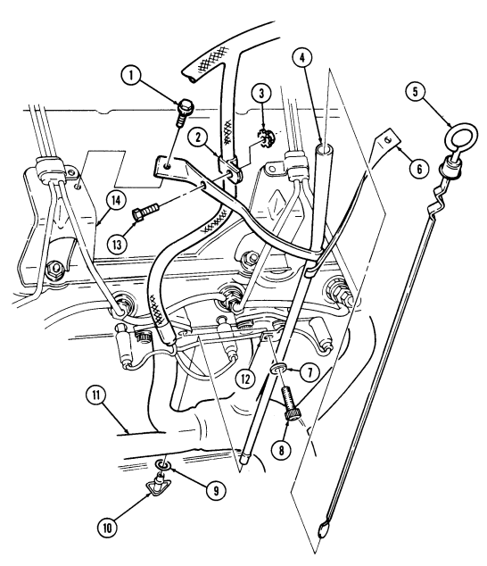

#### b. Installation
 1. Apply RTV sealant to O-ring (9) and install O-ring (9) on oil dipstick tube (4). 
 2. Install oil dipstick tube (4) in engine oil pan (10). 
 3. Using hex-head driver, secure lower dipstick tube bracket (12) to exhaust manifold (11) with washer (7) and socket-head screw (8). Tighten socket-head screw (8) to 25-33 lb-ft (34-45 N•m).
 4. Secure upper dipstick tube bracket (6) to fuel line bracket (14) with two assembled-washer screws (1). Tighten assembled-washer screws (1) to 3–4 lb-ft (4-5 N•m).
 5. Secure harness clamp (2) to upper dipstick tube bracket (6) with capscrew (13) and plain-assembled nut (3).
 6. Install oil dipstick (5) into oil dipstick tube (4).

a. Removal 
b. Installation

| Manual References   |
|---------------------|
| TM 9-2320-280-1     |
| TM 9-2320-280-10    |
| TM 9-2320-280-24P   |

Equipment Condition Hood raised and secured (TM 9-2320-280-10).

FOLLOW-ON TASKS: 
- Start engine (TM 9-2320-280-10) and check for oil leaks.
- Lower and secure hood (TM 9-2320-280-10).

### 3-3. Engine Oil Filler Tube Replacement

This task covers:

INITIAL SETUP:
- Tools 
  - General mechanic's tool kit automotive (Appendix B, Item 1) TM 9-2320-280-10 TM 9-2320-280-24P
- Materials/Parts 
  - Lubricating oil (Appendix C, Item 31) 
- Equipment Condition
  - Hood raised and secured (TM 9-2320-280-10).

A. Removal 
1. Loosen clamp (2) and disconnect CDR valve hose (1) from engine oil filler tube (3).
2. Remove two nuts (4), washers (5), and engine oil filler tube (3) from timing chain cover (7) and studs (8).
3. Inspect grommet (6) for breaks or cracks. Replace if defective.

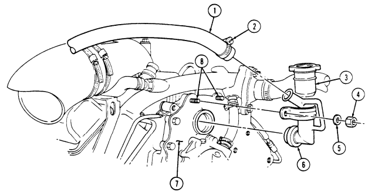 

B. Installation
1. Coat grommet (6) with lubricating oil.
2. Install engine oil filler tube (3) into timing chain cover (7) with two washers (5) and nuts (4). Tighten nuts (4) to 13-20 lb-ft (18-27 N.m).
3. Connect CDR valve hose (1) to engine oil filler tube (3) and tighten clamp (2).

FOLLOW-ON TASK: 
- Lower and secure hood (TM 9-2320-280-10).

### 3-4. Engine Oil Filter Adapter Replacement

This task covers:
INITIAL SETUP:

#### Tools

General mechanic's tool kit:
automotive (Appendix B, Item 1)
Materials/Parts Gasket (Appendix G, Item 53) Two O-rings (Appendix G, Item 210) O-ring (Appendix G, Item 211)

#### A. Removal

3. Inspect reducer boss (7) for damaged threads or cracks. Replace if defective.

#### B. Installation

1. Install reducer boss (7) into oil filter adapter (3) and tighten to 25 lb-ft (34 N•m).

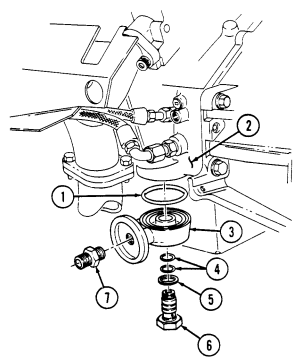 2. Install engine oil filter adapter (3) and O-ring (1) on cylinder block (2) with two O-rings (4), 
gasket (5), and adapter bolt (6). Tighten adapter bolt (6) to 50 lb-ft (68 N•m).

FOLLOW-ON TASK: Install engine oil filter (para. 3-5).

a. Removal b. Installation

Manual References TM 9-2320-280-24P
Equipment Condition Engine oil filter removed (para. 3-5).

1. Remove adapter bolt (6), gasket (5), two O-rings (4), engine oil filter adapter (3), and O-ring (1)
from cylinder block (2). Discard O-ring (1), two O-rings (4), and gasket (5).

2. Remove reducer boss (7) from oil adapter (3).

## 3-5. Engine Oil Service

This task covers:

a. Draining Oil c. Installing Filter b. Removing Filter d. Replenishing Oil

INITIAL SETUP:
Tools General mechanic's tool kit:
automotive (Appendix B, Item 1)
Oil filter removal tool (Appendix B, Item 2)
Materials/Parts Oil filter (Appendix G, Item 206) (6.2L only) Oil filter (Appendix G, Item 206.1)
(6.5L and 6.5L detuned only)
Lubricating oil (Appendix C, Item 31)
Manual References TM 9-2320-280-10 TM 9-2320-280-24P
Equipment Condition Hood raised and secured (TM 9-2320-280-10).

General Safety Instructions Do not drain oil when engine is hot.

a. Draining Oil

Do not drain oil when engine is hot. Severe injury to personnel will result.

- Park vehicle on a firm, level surface. - Have drainage container ready to catch oil.

1. Remove drainplug (5) and gasket (4) from oil pan (3). Allow oil to drain completely. 2. Install gasket (4) and drainplug (5). Tighten drainplug (5) to 20 lb-ft (27 N•m).

b. Removing Filter

Have drainage container ready to catch oil.

Remove oil filter (1) from filter adapter (2). Discard filter (1).

c. Installing Filter 1. Apply a light coat of oil to filter gasket prior to installation 2. Install oil filter (1) on oil filter adapter (2) and tighten by hand until gasket contacts filter adapter (2). Tighten additional 1/2-3/4 turn by hand.

d. Replenishing Oil

Install a non-vented filler cap only. An incorrect filler cap will not seal properly, causing water to enter and damage engine.

1. Remove filler cap (6) from filler tube (7). Fill with oil according to TM 9-2320-280-10. 2. Install filler cap (6) on filler tube (7).

3-5. ENGINE OIL SERVICE (Cont'd)

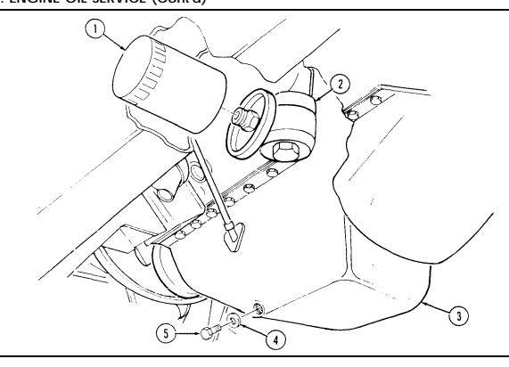

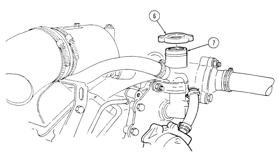

FOLLOW-ON   TASKS: -   Lower and secure hood (TM 9-2320-280-10).
•

# 3-6. Oil Pan Replacement

This task covers:
INITIAL SETUP:

#### Tools

General mechanic's tool kit:
automotive (Appendix B, Item 1)
Materials/Parts Oil seal retainer (Appendix G, Item 207) Two lockwashers (Appendix G, Item 135) Oil pan gasket (Appendix G, Item 61) 
(optional - used on 6.2 L only)
Sealant (Appendix C, Item 38)
Manual References TM 9-2320-280-10 TM 9-2320-280-24P
a. Removal

#### A. Removal B . Installation Equipment Condition

- Starter removed (para. 4-8). - Oil dipstick tube removed (para. 3-2).

General Safety Instructions Do not drain oil when engine is hot.

Do not drain oil when engine is hot. Severe injury to personnel will result.

Have drainage container ready to catch oil.

1. Remove oil drainplug (8) and gasket (7) and drain oil. Install gasket (7) and oil drainplug (8) after oil is drained.

2. Remove two nuts (9), lockwashers (10), and starter cable support bracket (11) from studs (14).

Discard lockwashers (10).

Optional gasket applies to 6.2 L only.

3. Remove twenty capscrews (6), two large capscrews (13), studs (14), oil pan gasket (4) (if installed),
and oil pan (12) from cylinder block (2). Remove any sealant remains.

4. Remove oil pan rear seal retainer (15) from rear main cap (1). Discard oil pan rear seal retainer (15). b. Installation 1. Apply a bead of sealant to each end of seal retainer (15) and install oil pan rear seal retainer (15) on rear main cap (1).

- Perform step 2 for oil pan gasket (if installed). Perform step 3 for applying sealant.

- Immediately install oil pan after application of sealant.

2. Install oil pan gasket (4) on lip of oil pan (12) and align with bolt holes. 3. Apply a 3/16 in. (5mm) bead of sealant around two large holes (3) on cylinder block (2). Apply a 3/16 in. (5mm) bead of sealant around oil pan sealing surface (5) following sealant diagram shown.

4. Install oil pan (12) on cylinder block (2) with twenty capscrews (6), two large capscrews (13), and studs (14). Tighten capscrews (6) and studs (14) to 4-10 lb-ft (5-14 N•m). Tighten large capscrews (13) to 13-20 lb-ft (18-27 N•m).

5. Install starter cable support bracket (11) on studs (14) with two lockwashers (10) and nuts (9). 6. Tighten oil drainplug (8) to 20 lb-ft (27 N•m).

3-8 Change 3

## 3-6. Oil Pan Replacement (Cont'D)

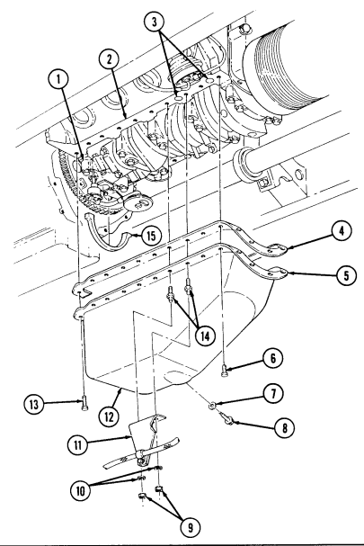

SEALANT DIAGRAM

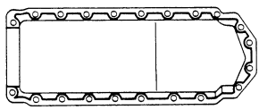

FOLLOW-ON TASKS: -  Replenish engine oil (TM 9-2320-280-10).
- • - Install oil dipstick tube (para. 3-2).

· Install starter (para. 4-8).

# 3-7. Engine Oil Cooler Supply And Return Lines Maintenance

This task covers:
b. Inspection INITIAL SETUP:
Tools General mechanic's tool kit:
automotive (Appendix B, Item 1)

#### Materials/Parts

Tiedown strap (Appendix G, Item 306) Lockwasher (Appendix G, Item 133) Locknut (Appendix G, Item 72)
Manual References TM 9-2320-280-10 TM 9-2320-280-24P
a. Supply Line Removal c. Supply Line Installation

#### Equipment Condition

- Engine left splash shield removed
(para. 10-17).

- Engine access cover removed (para. 10-15).

General Safety Instructions Do not drain oil when engine is hot.

a. Removal

Do not drain oil when engine is hot. Severe injury to personnel will result.

Cover or plug all hoses and connections immediately after disconnection to prevent contamination. Remove all plugs prior to connection.

- Engine oil cooler supply and return lines are replaced basically the same. This procedure covers supply line replacement.

- Have drainage container ready to catch oil. - Left splash shield can be modified to add engine access cover.

Refer to appendix D, Figs. D-86 and D-87 for installation.

1. Disconnect supply line connector (5) from adapter (4) and allow oil to drain. 2. Disconnect supply line connector (16) from oil cooler port (17). 3. Remove locknut (3), washer (2), capscrew (15), and washer (2) from supply line clamp (14), brake line clamp (1), and frame bracket (13). Discard locknut (3).

4. Remove capscrew (7), lockwasher (8), and clamp (9) from supply line (12) and engine mount bracket
(10). Discard lockwasher (8).

5. Remove tiedown strap (11) from supply line (12) and return line (6). Discard tiedown strap (11). b. Inspection Inspect adapter (4) for damaged threads or cracks. Replace if defective.

c. Installation 1. Position supply line (12) in approximate mounting location along frame. 2. Install supply line clamp (14) and brake line clamp (1) on frame bracket (13) with washer (2),
capscrew (15), washer (2), and locknut (3). Tighten locknut (3) to 6 lb-ft (8 N•m).

3. Connect supply line connector (16) to oil cooler port (17).

3-10 Change 3

# 3-7. Engine Oil Cooler Supply And Return Lines Replacement (Cont'D)

4. Connect supply line connector (5) to adapter (4).

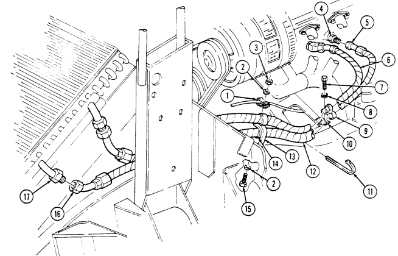

5. Secure supply line (12) to engine mount bracket (10) with clamp (9), lockwasher (8), and capscrew (7).

6. Secure supply line (12) to return line (6) with tiedown strap (11).

FOLLOW-ON TASKS: Install engine left splash shield (para. 10-17).

Fill oil to proper level (TM 9-2320-280-10). Start engine (TM 9-2320-280-10) and inspect for leaks at engine oil cooler, supply and return lines. Install engine access cover (para. 10-15).

# 3-8. Engine And Transmission Oil Cooler Assembly Maintenance

This task covers:
b. Installation INITIAL SETUP:
Tools **Equipment Condition**
a. Removal **c. Cleaning and Inspection**
General mechanic's tool kit: Engine left splash shield removed (para. 10-17).

automotive (Appendix B, Item 1) Power steering cooler removed (para. 8-28).

Manual References **General Safety Instructions**
TM 9-2320-280-10 Do not drain oil when engine is hot.

TM 9-2320-280-24P Compressed air used for cleaning purposes will not exceed 30 psi (207 kPa).

Do not bend transmission oil cooler fins. Damaged fins reduce cooling efficiency, which may damage engine and/or transmission.

a. Removal

Do not drain oil when engine is hot. Severe injury to personnel will result.

Cover or plug all hoses and connections immediately after disconnection to prevent contamination. Remove all plugs prior to connection.

Have drainage container ready to catch oil. Note position of hoses for installation.

1. Disconnect two engine oil cooler supply and return lines (7) from engine oil cooler ports (9).

2. Loosen two hose clamps (2) and disconnect two transmission oil cooler line connector hoses (1) from transmission oil cooler ports (3).

3. Remove four socket-head screw and washer assemblies (5), washers (6) and oil cooler (4) from radiator (8).

1. Install oil cooler (4) on radiator (8) with four washers (6) and socket-head screw and washer assemblies (5).

2. Connect two transmission oil cooler line connector hoses (1) to transmission oil cooler ports (3) and tighten two hose clamps (2). Tighten clamps (2) to 10-20 lb-in. (1-2 N*m).

3. Connect two engine oil cooler supply and return lines (7) to engine oil cooler ports (9).

#### C. Cleaning And Inspection

1. Remove four socket-head screw and washer assemblies (5) and washers (6) securing oil cooler (4) to radiator (8).

2. Make four two-by-four wood blocks, 2-1/2 inches (63 mm) long. Raise oil cooler (4) 1-1/2 inches
(38 mm) and place one block under each comer between oil cooler (4) and radiator (8).

# 3 - 8 . Engine And Transmission Oil Cooler Assembly Maintenance ( Co N T ' D)

Compressed air used for cleaning purposes will not exceed 30 psi (207 kPa). Use only with effective chip guarding and personal protective equipment (goggles/shield, gloves, etc.).

Using high water pressure when cleaning engine and transmission oil cooler and radiator can cause damage. High water pressure should not be directed at oil cooler or radiator.

3. Using water and compressed air, remove dirt, trash, and insects embedded in oil cooler (4) and radiator fins (8).

4. Inspect oil cooler (4) for breaks, punctures, cracks, and splits. Replace oil cooler (4), if damaged. 5. Remove four wood blocks. 6. Install oil cooler (4) on radiator (8) with four washers (6) and socket-head screw and washer

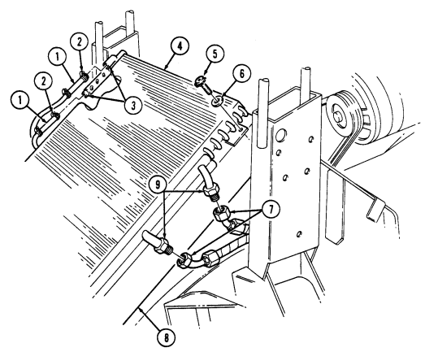

assemblies (5).

FOLLOW-ON TASKS: - Install power steering cooler (para. 8-28).

- Fill transmission oil to proper level (TM 9-2320-280-10). - Fill engine oil to proper level (TM 9-2320-280-10). - Install engine left splash shield (para. 10-17). - Start engine (TM 9-2320-280-10) and check for leaks.

# 3-9. Crankcase Depression Regulator (Cdr) Valve And Bracket Maintenance

| This task covers:   |
|---------------------|

b. Removal **d. Installation**

INITIAL SETUP:

Tools **Manual References**

General mechanic's tool kit: TM 9-2320-280-10

automotive (Appendix B, Item 1) TM 9-2320-280-24P

#### A. Testing

a. Testing **c. Cleaning and Inspection**

Test Equipment **Equipment Condition**

Manometer, U-tube Hood raised and secured (TM 9-2320-280-10).

(Appendix B, Section IV, Item L) Engine access cover removed (para. 10-15).

1. Remove engine oil dipstick from oil dipstick tube (para. 3-2).

2. Install manometer in dipstick tube. 3. Connect STE/ICE-R unit to DCA connector.

To read manometer, add amount the water column travels above zero to the amount the water column travels below zero.

4. Start engine and let idle; record water pressure. Pressure should be zero inches of water or a slight vacuum.

5. Increase engine speed to 2,000 rpm; record water pressure. Pressure should be 2-5 inches.

6. If pressures are not within specifications listed in steps 4 and 5, replace CDR valve (9) and repeat test.

7. Install oil dipstick in engine oil dipstick tube (para. 3-2).

CDR valves on vehicles equipped with deep water fording kit contain two additional vent lines.

1. Loosen clamp (7) and discomect CDR valve oil fill tube hose (8) from CDR valve (9). 2. Loosen clamp (6) on CDR valve intake manifold hose (5). 3. Remove two screws (1), washers (2), CDR valve (9), and heater control cable clamp (3) horn CDR
valve bracket (4).

4. Remove two nuts (10) from CDR valve bracket (4) and two intake manifold studs (11). 5. Remove two nuts (13) and CDR valve bracket (4) from two valve cover studs (12).

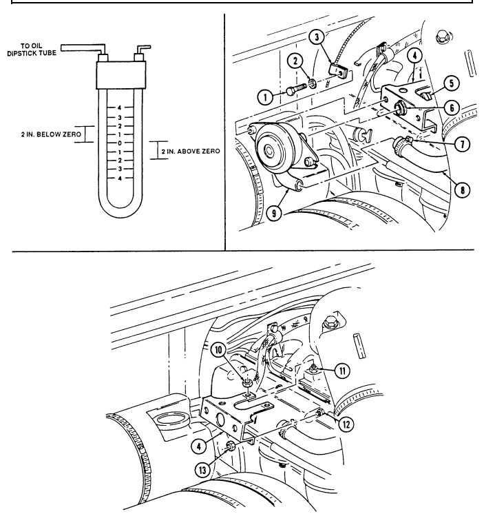

3-9. CRANKCASE DEPRESSION REGULATOR (CDR) VALVE AND BRACKET
MAINTENANCE (Cont'd)

# 3-9. Crankcase Depression Regulator (Cdr) Valve And Bracket Maintenance (Cont'D)

c Cleaning and Inspection

Do not clean CDR valve with drycleaning solvent. Drycleaing solvent will damage the diaphragm inside the CDR valve.

1. Clean oil and carbon deposits from the CDR valve (9) with a clean, lint-flee cloth.

2. Inspect the CDR valve (9) and lines for leaks, cracks, and restrictions. Replace if damaged.

d. Installation 1. 2.

3.

4.

5.

Connect CDR valve (9) to intake manifold hose (5) and tighten clamp (6). Install CDR valve (9) and heater control cable clamp (3) on CDR valve bracket (4) with two washers (2) and screws (1). Tighten screws (1) to 15 lb-ft (20 N.m).

6.

Connect CDR valve oil fill tube hose (8) to CDR valve (9) and tighten clamp (7).

Install CDR valve bracket (4) on two intake manifold studs (12) and two valve cover studs (13).

Secure CDR valve bracket (4) to intake manifold (11) with two nuts (10). Tighten nuts (10) to 15 lb-ft (20 N.m).

Secure CDR valve bracket (4) to valve cover studa (13) with two nuts (14). Tighten nuts (14) to 10 lb-ft (14 N.m).

3-9. CRANKCASE DEPRESSION REGULATOR (CDR) VALVE AND BRACKET
MAINTENANCE (Cont'd)

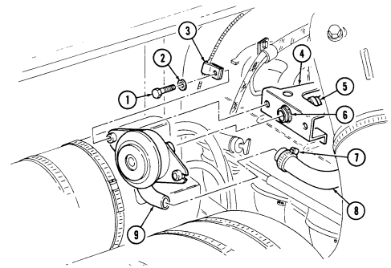

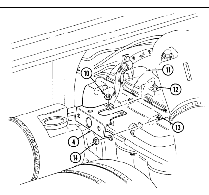

FOLLOW-ON TASKS: - Lower and secure hood (TM 9-2320-280-10).

· Install engine access cover (para. 10-15).

## 3-10. Cdr Valve Hoses Replacement

This task covers:
INITIAL SETUP:
Manual References TM 9-2320-280-10 TM 9-2320-280-24P

#### A. Removal **B. Installation**

Tools **Equipment Condition**
General mechanic's tool kit: Hood raised and secured (TM 9-2320-280-10).

automotive (Appendix B, Item 1) Engine access cover removed (para. 10-15).

CDR valve and bracket removed (para. 3-9).

1. Loosen clamp (2) and disconnect CDR valve intake manifold hose (1) from intake manifold (7).

2. Inspect adapter (3) for breaks or cracks. Replace if defective.

3. Loosen clamp (5) and disconnect CDR valve oil fill tube hose (4) from oil fill tube (6).

1. Connect CDR valve oil fill tube hose (4) to oil fill tube (6) and tighten clamp (5).

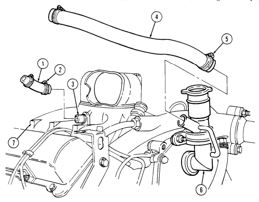

2. Connect to CDR valve intake manifold hose (1) to intake manifold (7) and tighten clamp (2).

FOLLOW-ON TASKS:
Install CDR valve and bracket (para. 3-9).

Lower and secure hood (TM 9-2320-280-10).

Install engine access cover (para. 10-15).

# Section Ii. Fuel System Maintenance

| b. Installation a. Removal                                                                                                                           |                     |
|------------------------------------------------------------------------------------------------------------------------------------------------------|---------------------|
| Tools  Manual References                                                                                                                             |                     |
| General mechanic's tool kit                                                                                                                          | TM 9\-2320\-280\-10 |
| automotive (Appendix B, Item 1) TM 9\-2320\-280\-24P                                                                                                 |                     |
| Materials/Parts  Equipment Condition                                                                                                                 |                     |
| Lubricating oil (Appendix C, Item 31) Hood raised and secured (TM 9\-2320\-280\-10).                                                                 |                     |
| 1. Loosen clamp (2) and disconnect CDR valve hose (1) from engine oil filler tube (3).                                                               |                     |
| 2. Remove two nuts (4), washers (5), and engine oil filler tube (3) from timing chain cover (7) and                                                  |                     |
| studs (8).                                                                                                                                           |                     |
| 3. Inspect grommet (6) for breaks or cracks. Replace if defective.                                                                                   |                     |
| 1. Coat grommet (6) with lubricating oil.                                                                                                            |                     |
| 2. Install engine oil filler tube (3) into timing chain cover (7) with two washers (5) and nuts (4). Tighten nuts (4) to 13\-20 lb\-ft (18\-27 N.m). |                     |
| 3. Connect CDR valve hose (1) to engine oil filler tube (3) and tighten clamp (2).                                                                   |                     |
| FOLLOW\-ON TASK: Lower and secure hood (TM 9\-2320\-280\-10).                                                                                        |                     |

# 3 - 1 2 . Air Cleaner Assembly And Dust Unloader Maintenance

This task covers:
a. Removal c . Installation b. Inspection INITIAL SETUP:
Tools General mechanic's tool kit:
automotive (Appendix B, Item 1)
Equipment Condition Hood raised and secured (TM 9-2320-280-10).

Manual Refere n c e s TM 9-2320-280-10 TM 9-2320-280-24P

#### Not E

For dust unloader replacement, perform steps 1 and 2 only.

a. Removal 1. Remove four screws (18) and dust unloader cover (17) from support brackets (4). 2. Loosen clamp (15) and remove dust unloader (16) from air cleaner assembly (9). 3. Loosen clamp (5) and disconnect elbow (6) from air cleaner assembly (9). 4. Disconnect air restriction gauge hose (7) from fitting (8). 5. Remove outer strap clamps (10) and (12) securing air cleaner assembly (9) to support brackets (4). 6. Disconnect vent line (3) from elbow (2). 7. Remove air cleaner assembly (9) from support bracket (4). 8. Remove elbow (2) from air cleaner assembly (9). 9. Remove adapter (14) and tube (13) from air cleaner assembly (9).

10. Remove fitting (8) from air cleaner assembly (9).

11. Remove clamp (11) from air cleaner assembly (9).

b. Inspection 1. Inspect gasket (1) for cracks or brakes. Replace gasket (1) if defective. 2. Inspect elbow (2), fitting (8), and adapter (14) for damaged threads or cracks. Replace if defective.

c. Installation

#### Not E

For dust unloader replacement, perform steps 10 and 11 only.

1. Install clamp (11) on air cleaner assembly (9). 2. Install fitting (8) on air cleaner assembly (9). 3. Install tube (13) on adapter (14). 4. Install tube (13) and adapter (14) on air cleaner assembly (9). 5. Install elbow (2) to air cleaner assembly (9). 6. Install air cleaner assembly (9) on support brackets (4) with strap clamps (10) and (12). Make sure clamp tabs are facing downward away from cab before tightening. Tighten the following clamps in sequence as follows: (10), (11), and (12).

7. Connect elbow (6) to air cleaner assembly (9) and tighten clamp (5). 8. Connect air restriction gauge hose (7) to fitting (8). 9. Connect vent line (3) to elbow (2).

## 3-12. Air Cleaner Assembly And Dust Unloader Maintenance (Cont'D)

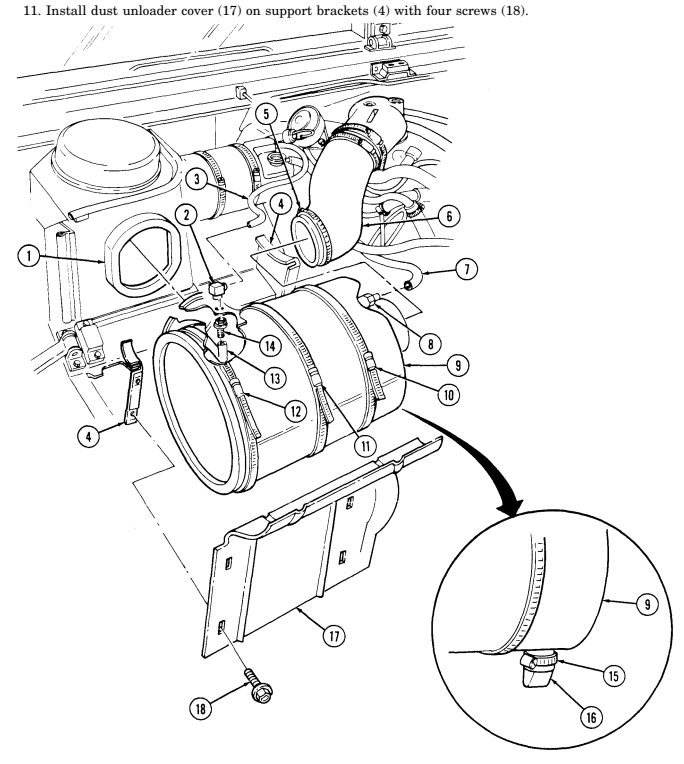

10. Install dust unloader (16) on air cleaner assembly (9) and tighten clamp (15) to 45-50 lb-in.

(5-6 N.m).

FOLLOW-ON TASK: Lower and secure hood (TM 9-2320-280-10).

# 3 - 1 3 . Air Cleaner Filter Element Serv I C I N G

This task covers:
a. Removal **d. Cleaning** b. Inspection **e. Installation** c. Emergency Cleaning INITIAL SETUP:
Tools General mechanic's tool kit:
automotive (Appendix B, Item 1)
Materials/Parts Detergent (Appendix C, Item 17)
Manual References TM 9-2320-280-10 TM 9-2320-280-24P
Equipment Condition Hood raised and secured (TM 9-2320-280-10).

General Safety Instructions
- Compressed air used for cleaning purposes will not exceed 30 psi (207 kPa).

- If NBC contamination is suspected, consult NBC
officer or NBC NCO for appropriate handling instructions.

- Improper cleaning methods and use of unauthorized cleaning liquids can injure personnel and cause damage to equipment. Do not use anything other than compressed air, water, and detergent to clean elements.

- If NBC contamination is suspected, consult NBC officer or NBC
NCO for appropriate handling instructions.

a. Removal 1. Loosen bolt (8), and remove ring clamp (1), cover (2), and gasket (3) from air cleaner assembly (6). 2. Remove nut and washer assembly (7) and filter element (4) from stud (5) and air cleaner assembly (6).

3. Cover housing opening with screen or rag to prevent contaminants from entering the air intake system and damaging your engine.

#### B. Inspection

1. Check gasket (3) for dents, tears, rips, and other damage. Make sure the gasket has not taken a set.

Make sure there are no hard dirt ridges on the sealing surfaces.

2. Inspect filter element (4) for holes and tears by looking through the element toward a bright light. If pinpoints of light shine through, replace the element. Holes that are large enough to let light through are large enough to let contaminants through. Another way to check for leaks or damage is to look for uneven dirt patterns. Make sure there is no rust or flaking paint on metal parts of the filter. If the filter has already been cleaned three times, or if you find damage, replace it.

3. Check air cleaner assembly (6) for holes, dents, rust, or any other damage that will interfere with proper sealing and allow unfiltered air to enter and destroy engine.

c. Emergency Cleaning

Do not strike ends of filter element on hard surface or damage to filter element may result.

Remove dust or sand from filter element (4) by holding it so neither end faces ground. Gently tap around filter element (4) to free dust and sand.

# 3-13. Air Cleaner Filter Element Servicing (Cont'D)

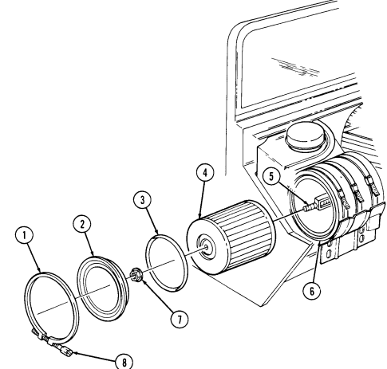

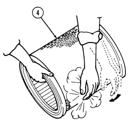

# 3-13. Air Cleaner Filter Element Servicing (Cont'D)

Compressed air used for cleaning purpose will not exceed 30 psi (207 kPa). Use only with effective chip guarding and personnel protective equipment (goggles/shield, gloves, etc.).

Hold nozzle at least one inch away from element (1) and direct compressed air against clean side of element (1) (in direction opposite to normal air flow). Move air stream up and down length of pleats until you can not see dust being blown out.

1.

2.

Prepare a solution of five gallons warm water (80-110° F (26.7-43.3° C)) and approximately one cup of non-sudsing detergent in a container large enough to submerge the element (1). Never use gasoline or solvents of any kind to clean elements. Immerse the element (1) completely in the cleaning solution. Swish for two minutes. Soak the element in the cleaning solution for 15 to 20 minutes, then swish it around again to remove contaminants.

3.

Remove the element (1) from the solution and let it drain.

Rinse the element with cool water (35-80° F (1.7-26.7° C)) from clean side to dirty side (in direction opposite to normal air flow) with a gentle stream of water (no more than 40 psi (275.8 kpa)). If the clean side was contaminated during the soak cycle, rinse the element from both sides.

4.

5.

Air dry the element (1) at normal room temperature until completely dry. Usually overnight is adequate, but temperature and humidity will effect drying time. If you use circulating air, do not exceed 180° F (82.2° C). Do not use compressed air to speed drying time, you will damage your element. Reinspect the element (1) and discard if damaged. If it checks out O.K., mark the date of cleaning on it.

6.

7.

#### E. Installation

1. Remove screen or rag from housing opening. 2. Install filter element (1) into air cleaner assembly (6) and on stud (5) with nut and washer assembly (7). Tighten nut and washer assembly (7) to 20-40 lb-in (2-4 N-m).

When cover clamp is secured to end of filter body assembly, ensure the clamp bolt is between the three and six o'clock position to prevent damaging hood when hood is closed.

3. Install cover (3) and gasket (4) on air cleaner assembly (6) with ring clamp (2) as shown. Tighten bolt (8) to 35-40 lb-in (3-4 N-m).

# 3-13. Air Cleaner Filter Element Servicing (Cont'D)

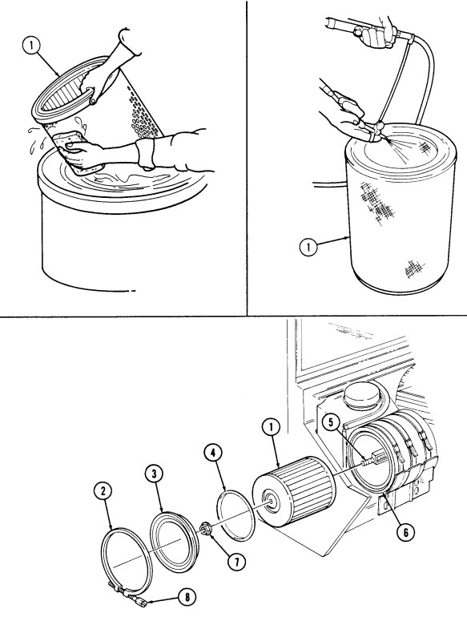

FOLLOW-ON TASKS: - Lower and secure hood (TM 9-2320-280-10).

- Start engine (TM 9-2320-280-10) and ensure air restriction gauge on instrument panel does not show red.

## 3-14. Air Horn Replacement

This task covers:
INITIAL SETUP:

#### Tools

General mechanic's tool kit:
automotive (Appendix B, Item 1)
Materials/Parts Two flat washers (Appendix G, Item 37) Gasket (Appendix G, Item 41) Sealing compound (Appendix C, Item 40)

a. Removal b. Installation

| Equipment Condition   |
|-----------------------|
| Hood raised and se    |

| Manual References    |
|----------------------|
| TM 9\-2320\-280\-24P |

Hood raised and secured (TM 9-2320-280-10).

a. Removal 1. Remove two screws (2), washers (3), and flat washers (4) securing air horn (5) to intake manifold (7). Discard flat washers (4).

2. Loosen clamp (10) and disconnect air intake elbow (9) from air horn (5).

Cover opening of intake manifold to prevent foreign material from entering engine.

3. Loosen clamp (1) securing air horn (5) to engine lift bracket (8) and slide clamp (1) from engine lift bracket (8). Remove air horn (5) from intake manifold (7).

4. Remove gasket (6) from intake manifold (7). Discard gasket (6). 5. Remove clamp (1) from air horn (5).

#### B. Installation

1. Install clamp (1) on air horn (5). 2. Install gasket (6) on intake manifold (7). 3. Coat threads of screws (2) with sealing compound. Install air horn (5) on intake manifold (7) with two flat washers (4), washers (3), and screws (2). Tighten screws (2) to 40-45 lb-in. (5-6 N•m).

4. Connect elbow (9) to air horn (5) and tighten clamp (10) to 45-50 lb-in. (5-6 N•m). 5. Slide clamp (1) on engine lift bracket (8) and air horn (5) and tighten clamp (1) to 40-45 lb-in. 

(5-6 N•m).

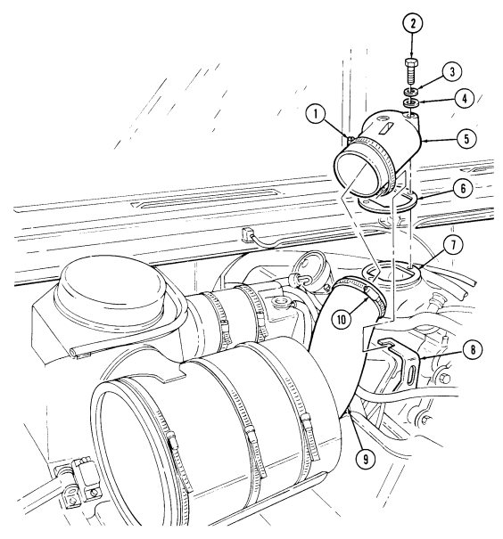

FOLLOW-ON TASK: Lower and secure hood (TM 9-2320-280-10).

# 3 - 1 5 . Air Horn-To-Air Cleaner Elbow Replacement

This task covers:
a. Removal b. Installation INITIAL SETUP:
Tools General mechanic's tool kit:
automotive (Appendix B, Item 1)
Equipment Condition Hood raised and secured (TM 9-2320-280-10).

Manual References TM 9-2320-280-10 TM 9-2320-280-24P
a. Removal 1. Loosen two clamps (3) and remove elbow (4) from air cleaner assembly (1) and air horn (2). 2. Remove two clamps (3) from elbow (4).

b. Installation 1. Install two clamps (3) on elbow (4). 2. Connect elbow (4) to air cleaner assembly (1) and air horn (2) and tighten two clamps (3). Tighten

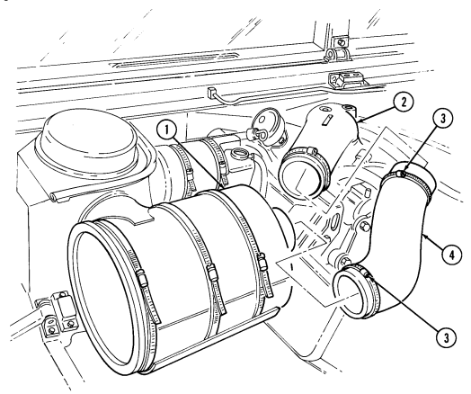

clamps (3) to 40-45 lb-in. (5-6 N•m).

FOLLOW-ON TASK: Lower and secure hood (TM 9-2320-280-10).

# 3-16. Air Horn Support Bracket Replacement

This task covers:
INITIAL SETUP:
Applicable Models All models except M997, M997A1, M997A2, M1036, M1037, M1042 Tools General mechanic's tool kit:
automotive (Appendix B, Item 1)

#### Materials/Parts

a. Removal b. Installation Manual References TM 9-2320-280-24P
Equipment Condition Air horn removed (para. 3-14).

Lockwasher (Appendix G, Item 191)
a. Removal 1. Remove nut (5), lockwasher (4), two clamps (3), washer (2.1), and stud (2) from air horn support bracket (1) and cylinder head (7). Discard lockwasher (4).

2. Remove capscrew (6) and support bracket (1) from cylinder head (7). 

b. Installation 1. Install air horn support bracket (1) on cylinder head (7) with stud (2). 2. Secure air horn support bracket (1) to cylinder head (7) with capscrew (6). Tighten capscrew (6) and stud (2) to 40 lb-ft (54 N•m).

3. Install washer (2.1) and two clamps (3) on stud (2) with lockwasher (4) and nut (5).

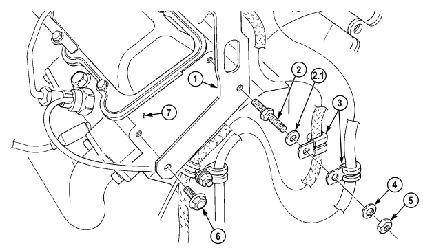

FOLLOW-ON TASK: Install air horn (para. 3-14).

# 3-17. Air Restriction Gauge Replacement

This task covers:
INITIAL SETUP:

a. Removal b. Installation

| Tools                        | Manual References   |
|------------------------------|---------------------|
| General mechanic's tool kit: | TM 9\-2320\-280\-10 |

a. Removal 1. Remove two screws (2) and bezel (1) from air restriction gauge (4), and remove gauge (4) and gasket (3) from behind dash panel (6).

2. Disconnect air restriction gauge hose (5) from gauge (4) and remove gauge (4).

b. Installation 1. Connect hose (5) to gauge (4). 2. Position gauge (4) and gasket (3) behind dash panel (6) and secure to bezel (1) with two screws (2).

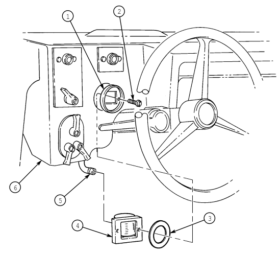

FOLLOW-ON TASK: Start engine (TM 9-2320-280-10) and check operation of air restriction gauge.

#### 3-18. Weathercap Replacement

This task covers:

| a. Testing   | c. Cleaning and Inspection   |
|--------------|------------------------------|
| b. Removal   | d. Installation              |
| Tools        | Manual References            |

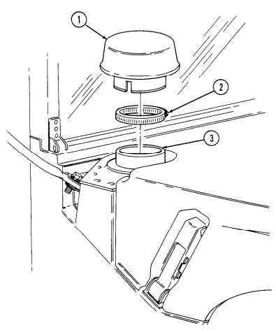

automotive (Appendix B, Item 1)
Loosen clamp (2) and remove weathercap (1) from air intake duct (3).

b. Installation Install weathercap (1) on air intake duct (3) with clamp (2). Tighten clamp (2) to 45-50 lb-in. (5-6 Nom).

# 3-19. Air Restriction Gauge Hose Replacement

This task covers:
INITIAL SETUP:
Manual References TM 9-2320-280-10 TM 9-2320-280-24P
1. Loosen three clamps (2) from air restriction gauge hose (6) and "A" beam (1).

2. Disconnect hose (6) from air cleaner assembly (7). 3. Disconnect hose (6) from air restriction gauge (4) located behind instrument panel (5).

4. Remove hose (6) by routing out from three clamps (2) through two grommets (3) in "A" beam (1).

b. Installation 1. Route hose (6) through three clamps (2) and two grommets (3) in "A" beam (1) to air cleaner assembly (7) and gauge (4).

2. Connect hose (6) to air cleaner assembly (7). 3. Connect hose (6) to gauge (4).

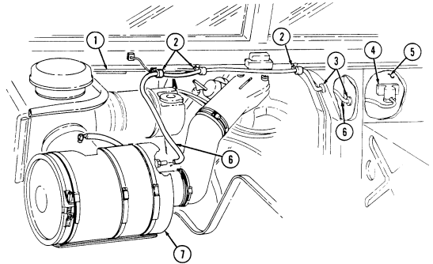

4. Tighten three clamps (2) on hose (6) and "A" beam (1).

FOLLOW-ON TASKS: Install engine access cover (para. 10-15).

Lower and secure hood (TM 9-2320-280-10).

a. Removal **b. Installation**
Tools **Equipment Condition**
General mechanic's tool kit: Engine access cover removed (para. 10-15).

automotive (Appendix B, Item 1) Hood raised and secured (TM 9-2320-280-10).

# 3-20. Air Intake And Fuel Pump Vent Lines Replacement

This task covers:
a. Removal **b. Installation**
INITIAL SETUP:
Tools **Equipment Condition**
automotive (Appendix B, Item 1)
General mechanic's tool kit: Hood raised and secured (TM 9-2320-280-10).

Manual References TM 9-2320-280-10 TM 9-2320-280-24P

For fuel pump vent line replacement, perform steps 2, 3, and 4 only.

a. Removal 1. Remove vent line (2) from air cleaner fitting (1) and tee fitting (7).

2. Loosen clamp (3) and disconnect vent line (4) from fuel pump (6). 3. Loosen clamp (3) and remove vent line (4) from tee fitting (5). 4. Remove two clamps (3) from vent line (4).

b. Installation

For fuel pump vent line replacement, perform steps 2 and 3.

1. Connect vent line (2) to tee fitting (7) and air cleaner fitting (1). 2. Install two clamps (3) to vent line (4).

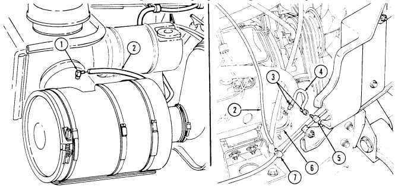 3. Install vent line (4) on tee fitting (5) and fuel pump (6) and tighten two clamps (3).

FOLLOW-ON TASK: Lower and secure hood (TM 9-2320-280-10).

## 3-21. Drainage Bracket Replacement

This task covers:
a. Removal **b. Installation**
INITIAL SETUP:
Tools General mechanic's tool kit:
automotive (Appendix B, Item 1)
Equipment Condition Air cleaner assembly removed (para. 3-12).

Manual References TM 9-2320-280-24P
a. Removal Remove three screws (2) and drainage bracket (3) from body (1).

b. Installation Install drainage bracket (3) on body (1) with three screws (2).

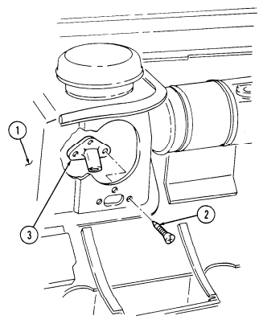

FOLLOW-ON TASK: Install air cleaner assembly (para. 3-12).

# 3-22. Fuel Injection Pump Boot Replacement

This task covers:
a. Removal **b. Installation**
INITIAL SETUP:
automotive (Appendix B, Item 1)
Tools **Equipment Condition**
General mechanic's tool kit: Hood raised and secured (TM 9-2320-280-10).

Manual References TM 9-2320-280-10 TM 9-2320-280-24P
Remove clamp (3) and boot (2) from injection pump (1).

Install boot (2) on injection pump (1) with clamp (3).

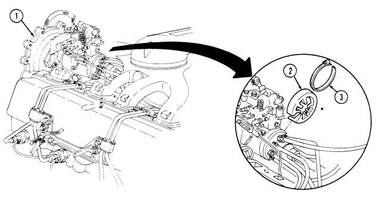

FOLLOW-ON TASK: Lower and secure hood (TM 9-2320-280-10)

# 3-23. Fuel Pump Replacement

This task covers:
INITIAL SETUP:

#### Tools

General mechanic's tool kit:
automotive (Appendix B, Item 1)
Materials/Parts Mounting plate gasket (Appendix G, Item 198) Fuel pump gasket (Appendix G, Item 40) Grease (Appendix C, Item 22)
Manual References TM 9-2320-280-10 TM 9-2320-280-24P

a. Removal b. Installation

#### Equipment Condition

Battery ground cable disconnected (para. 4-73).

General Safety Instructions - Do not perform this procedure near fire, flames, or sparks.

- Gaskets installed on some 6.2L engines assembled prior to 1991 may contain asbestos. Gaskets should be disposed of IAW current directives.

Diesel fuel is highly flammable. Do not perform this procedure near fire, flames, or sparks. Severe injury or death will result.

a. Removal

Cover or plug all open hoses and connections immediately after disconnection to prevent contamination. Remove all plugs prior to connection.

Have drainage container ready to catch fuel.

1. Loosen clamp (14) and disconnect fuel inlet line (13) from fuel pump (2) and allow fuel to drain into container.

2. Disconnect fuel outlet line (12) from fuel pump (2) and allow fuel to drain into container. 3. Loosen clamp (3) and disconnect vent line (4) from fuel pump (2).

Gaskets installed on some 6.2L engines assembled prior to 1991 may contain asbestos. Gaskets should be removed with a scraper or putty knife and then be disposed of IAW current directives. Inhalation of asbestos fibers can cause respiratory ailments.

4. Remove two capscrews (1), fuel pump (2) and gasket (6) from fuel pump mounting plate (7). Discard gasket (6).

5. Remove two capscrews (11), fuel pump mounting plate (7) and gasket (8) from cylinder block (10).

Discard gasket (8).

6. Remove pushrod (9) from cylinder block (10).

# 3-23. Fuel Pump Replacement (Cont'D)

b. Installation

Place GAA grease on pushrod to retain in cylinder block during installation.

1. Insert pushrod (9) into cylinder block (10). 2. Install gasket (8) and mounting plate (7) into block (10) with two capscrews (1) for alignment of pump (2) to cylinder block (10).

3. Secure gasket (8) and mounting plate (7) to cylinder block (10) with two capscrews (11). Tighten capscrews (11) to 4-7 lb-ft (5-10 N•m) then remove two capscrews (1).

4. Install gasket (6) and fuel pump (2) on fuel pump mounting plate (7) and block (10), ensuring alignment of lever (5) to pushrod (9) with two capscrews (1). Tighten capscrews (1) to 20-30 lb-ft (27-41 N•m).

5. Connect vent line (4) to fuel pump (2) and tighten clamp (3) to 10-20 lb-in. (1-2 N•m). 6. Connect fuel outlet line (12) to fuel pump (2). 7. Connect fuel inlet line (13) to fuel pump (2) and tighten clamp (14).

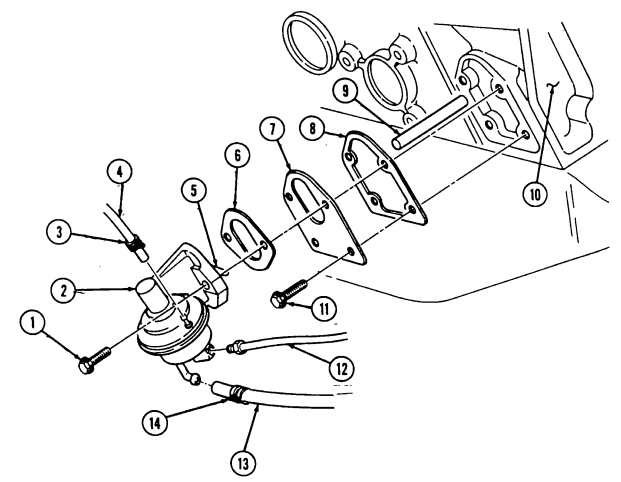

FOLLOW-ON TASKS: - Connect battery ground cable (para 4-73).

- Start engine (TM 9-2320-280-10) and check fuel pump and hoses for fuel leaks.

# 3-24. Fuel Tank Maintenance (Cont'D)

This task covers:
c. Disassembly **f. Installation**
INITIAL SETUP:

#### Tools

General mechanic's tool kit:
automotive (Appendix B, Item 1)

#### Materials/Parts

Access cover gasket (Appendix G, Item 1)
Fifteen locknuts (Appendix G, Item 70)
Adhesive (Appendix C, Item 1)
Sealing compound (Appendix C, Item 46) Drycleaning solvent (Appendix C, Item 18) Twelve O-rings (Appendix G, Item 215)
Personnel Required One mechanic One assistant a. Draining d. Cleaning and Inspection b. Removal e. Assembly

#### Manual References

TM 9-2320-280-10 TM 9-2320-280-24P

#### Equipment Condition

- Battery ground cable disconnected (para. 4-73).

- Rear propeller shaft removed (para. 6-4).

#### General Safety Instructions

- Do not perform this procedure near fire, flames, or sparks.

- Cleaning will be done in a well-ventilated area and a fire extinguisher will be kept nearby when solvent is used.

Diesel fuel is highly flammable. Do not perform this procedure near fire, flames, or sparks. Severe injury or death will result.

Have drainage container ready to catch fuel.

#### A. Draining

1. Remove fuel tank filler cap (1). 2. Remove drainplug (3) from fuel tank (2). Allow fuel to completely drain into container.

Do not overtighten drainplug. Drainplug must not turn in hole. Sharp edge of hole may cut rubber.

3. Install drainplug (3) flush with bottom of fuel tank (2) and tighten.

b. Removal 1. Disconnect large vent line (4) from filler spout (5). 2. Remove locknut (15), washer (12), capscrew (11), washer (12), and clamp (13) from vent line (4) and body (14).

Discard locknut (15).

3. Remove locknut (16), washer (7), capscrew (8), washer (7) and clamp (6) from filler spout (5). Discard locknut
(16).

4. Loosen clamp (9) and remove hose (10) from filler spout (5).

# 3-24. Fuel Tank Maintenance (Cont'D)

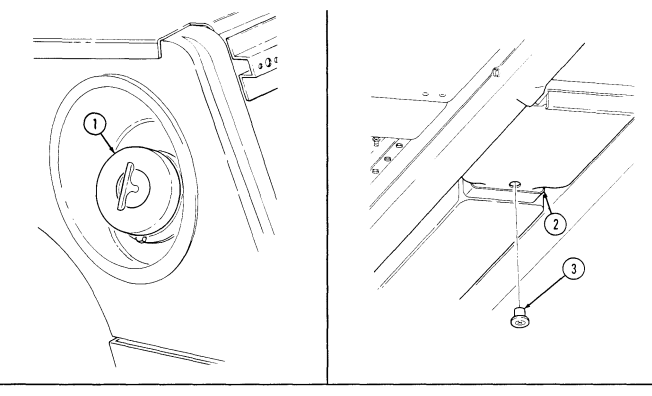

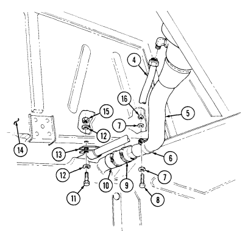

## 3-24. Fuel Tank Maintenance (Cont'D)

5.

Remove two nuts (15), washers (14), and capscrews (7) from fuel tank support straps (6) and (12) and remove lower straps (13).

6.

Loosen two clamps (3) and disconnect fuel supply hoses (1) and (2) from fuel return line (4) and supply line (5).

Perform step 7 if vehicle is equipped with an arctic heater and/or troop/cargo wintenzation kit.

7.

Loosen clamp (17) and disconnect fuel supply hose (18) from arctic heater and/or troop/cargo heater fuel supply line (16).

8.

Disconnect vent line (20) from tee (19).

9.

10.

11. 12.

13.

14.

Remove capscrew (22) and clamp (23) securing vent line (20) to body (24). Remove locknut (8), washer (9), capscrew (10) and rear strap (12) from strap bracket (11). Discard locknut (8). Lower fuel tank (21) for access to vent line (29) and clamp (28).

Disconnect vent line (20) from fitting (25) on fuel tank (21). Remove locknut (26) and washer (27) securing clamp (28) and vent line (29) to fuel tank (21). Discard locknut (26).

Disconnect vent line (29) from vent line housing (30).

Prior to removal, tag leads for installation.

Disconnect jumper leads 58J (33) and 28B (35) from body wiring harness (34).

15.

16.

Bend clamp (32) down and remove jumper harness (31).

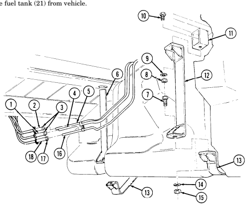

17.

# 3-24. Fuel Tank Maintenance (Cont'D)

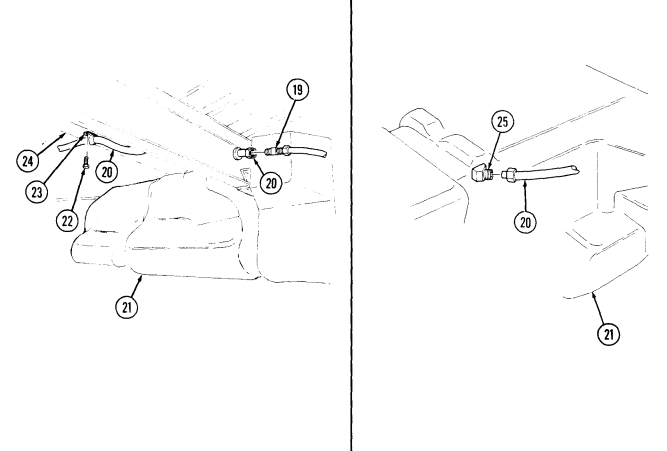

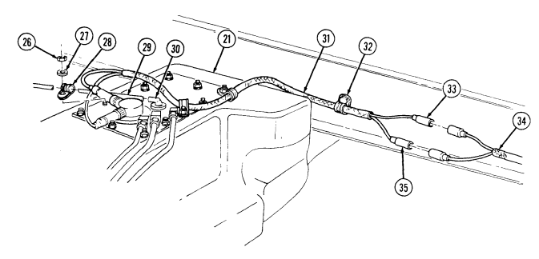

# 3-24. Fuel Tank Maintenance (Cont'D)

c. Disassembly 1. Thoroughly clean outside of tank (17) to prevent dirt contamination. 2. Disconnect fuel supply line (26) from fuel supply tube (12) and fuel return line (25) from fuel return tube (29).

#### Not E

Perform step 3 if vehicle is equipped with an arctic heater.

3. Disconnect arctic heater fuel supply line (20) from arctic heater fuel supply tube (13). 4. Remove capscrew (22) and clamp (24) securing fuel supply line (26), fuel return line (25), and shield (21) to fuel tank (17). Remove arctic heater fuel supply line (20), and clamp (23) if installed.

5. Remove two locknuts (6) and washers (7) securing two clamps (8) and jumper harness (5) to access cover (11). Discard locknuts (6).

#### Not E

Prior to removal, tag leads for installation.

6. Disconnect jumper harness leads 28B (1) and 58J (2) from fuel level sender (30) and remove jumper harness (5).

#### Not E

Perform steps 7 and 8 for vehicles with fuel tank P/N 12358588.

7. Remove nine locknuts (9) and washers (10) securing access cover (11), gasket (28), and retainer (27)
to fuel tank (17). Discard locknuts (9).

8. Remove access cover (11), gasket (28), and retainer (27) from fuel tank (17). Discard gasket (28).

#### Not E

Perform steps 8.1 through 8.5 for vehicles with fuel tank P/N 12460105.

8.1. Remove nine locknuts (9), washers (10), access cover (11), gasket (28), and retainer (19.2) from fuel tank (17). Discard locknuts (9) and gasket (28).

8.2. Remove eight capscrews (19.4), washers (19.3), and retainer (19.2) from support baffle (19.8). 8.3. Remove twelve O-rings (19.1) from retainer (19.2). Discard O-rings (19.1). 8.4. Remove four locknuts (19.6), washers (19.7), and support baffle (19.8) from fuel tank baffle (19.5).

Discard locknuts (19.6).

8.5. Remove support baffle (19.8) and fuel tank baffle (19.5) from fuel tank (17).

9. Match mark position of elbow fittings on access cover (11).

#### Not E

Note position of fuel strainer for installation.

10. Remove fuel strainer (14) from fuel supply tube (12).

11. Remove fuel supply tube (12) from access cover (11).

12. Remove fuel return tube (29) from access cover (11).

#### Not E

- Perform step 13 if vehicle is equipped with an arctic heater. - Vehicles not equipped with an arctic winterization kit will have a plug instead of an arctic heater fuel supply tube.

13. Remove arctic heater fuel supply tube (13) from access cover (11). 14. Remove vent valve (4) and grommet (3) from access cover (11). 15. Remove vent line (18) from tee (19). 16. Loosen clamp (15) and remove filler spout hose (16) from tank (17).

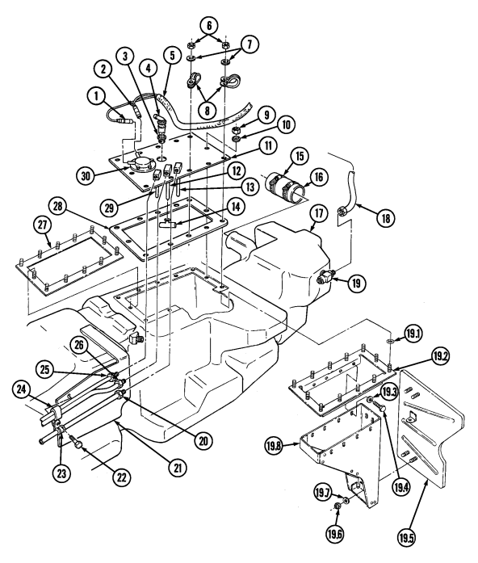

# 3-24.  Fuel Tank Maintenance(Cont'D)

## 3-24. Fuel Tank Maintenance (Cont'D)

d. Cleaning and Inspection

## ________ Warning

Drycleaning solvent is flammable and will not be used near an open flame. A fire extinguisher will be kept nearby when the solvent is used. Use only in well-ventilated places. Failure to do this may result in injury to personnel or damage to equipment.

1. Use drycleaning solvent to clean access cover (3), fuel supply line (11), fuel return line (10), arctic heater fuel supply line (9), fuel supply tube (4), fuel return tube (13), arctic heater fuel supply tube (5), and inside fuel tank (7).

2. Inspect access cover (3), fuel supply line (11), fuel return line (10), fuel supply tube (4), fuel return tube (13), strainer (6), tee (8), fitting (12), vent line housing (2), and grommet (1) for cracks, wear, and breaks. Replace if cracked, worn, or broken.

3. Inspect arctic heater fuel supply line (9) and arctic heater fuel supply tube (5) for cracks, wear, and breaks, if installed. Replace if cracked, worn, or broken.

4. Inspect sending unit (14) for damage. Replace if damaged.

## ________

# 3-24.  Fuel Tank Maintenance(Cont'D)

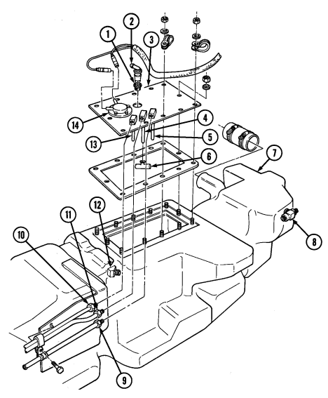

1

## 3-24. Fuel Tank Maintenance (Cont'D)

e. Assembly

#### Not E

- Use pipe sealant on all vent line and fuel line connector threads before installation.

- Use fittings from old tank if installing new tank.

1. Install vent line (18) to tee fitting (19). 2. Install filler spout hose (16) on tank (17) and secure with clamp (15). 3. Apply sealing compound to threads of fuel supply tube (12), and install and align fuel supply tube (12) on access cover (11).

4. Apply sealing compound to threads of fuel return tube (29), and install and align fuel return tube (29) on access cover (11).

#### Not E

Perform step 5 only if vehicle has an arctic heater installed.

5. Apply sealing compound to threads of arctic heater fuel supply line (13), and install and align arctic heater fuel supply line (13) on access cover (11).

6. Install grommet (3) and vent valve (4) to access cover (11). 7. Install fuel strainer (14) on fuel supply tube (12).

#### Not E

Perform steps 7.1 through 7.4 for vehicles with fuel tank P/N 12460105.

7.1 Insert fuel tank baffle (19.5) and support baffle (19.8) into fuel tank (17). 7.2 Secure support baffle (19.8) to fuel tank baffle (19.5) with four washers (19.7) and locknuts (19.6). 7.3 Install twelve O-rings (19.1) on retainer (19.2), and secure retainer (19.2) to support baffle (19.8)
with eight washers (19.3) and capscrews (19.4).

7.4 Apply adhesive to threads of nine locknuts (9), and install retainer (19.2), gasket (28), and access cover (11) on fuel tank (17) and with nine washers (10) and locknuts (9). Tighten locknuts (9) to 72 lb-in. (8 N•m).

NOT E
Perform step 8 for vehicles with fuel tank P/N 12358588.

8. Apply adhesive to threads of nine locknuts (9), and install retainer (27), gasket (28), and access cover (11) on fuel tank (17) with nine washers (10) and locknuts (9). Tighten locknuts (9) to 72 lb-in. (8 N•m).

9. Connect jumper harness leads 28B (1) and 58J (2) to fuel level sender (30).

10. Apply adhesive to threads of two locknuts (6) and secure jumper harness (5) to fuel tank (17) with two clamps (8), washers (7), and locknuts (6). Tighten locknuts (6) to 72 lb-in. (8 N•m).

11. Connect fuel supply line (26) to fuel supply tube (12), and fuel return line (25) to fuel return tube (29).

#### Not E

Perform step 12 if vehicle has an arctic heater installed.

12. Connect arctic heater fuel supply line (20) to arctic heater fuel supply tube (13). 13. Secure shield (21), return line (25), supply line (26), clamp (24), and arctic heater fuel supply line (20) and clamp (23) if installed, to fuel tank (17) with capscrew (22).

3-24.  FUEL TANK MAINTENANCE(Cont'd)

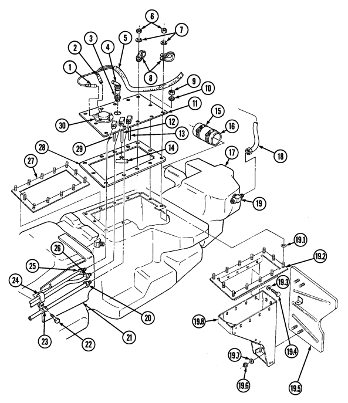

## 3-24. Fuel Tank Maintenance (Cont'D)

f. Installation 1. Position fuel tank (5) under vehicle. 2. Install jumper harness (6) on clamp (7) and bend clamp (7) up. 3. Connect jumper harness leads 58J (8) and 28B (10) to body wiring harness (9).

Use sealing compound on all vent line connector threads before installation.

3.1. Connect vent line (4) to vent line housing (4.1).

4. Connect vent line (4) to fuel tank (5) with clamp (3), washer (2), and locknut (1). Tighten locknut (1) to 6 lb-ft (8 N•m).

5. Connect vent line (12) on fitting (11) on fuel tank (5).

Apply adhesive to threads of capscrews.

6. Install rear strap (23) on strap bracket (22) with capscrew (21), washer (20), and locknut (19). Tighten locknut (19) to 37 lb-ft (50 N•m).

Ensure front straps are flush with fuel tank and to right side of dimple in slot.

7. Raise fuel tank (5) and install two support straps (24) to straps (17) and (23) with two capscrews (18), washers
(25), and locknuts (26). Do not tighten locknuts (26).

8. Connect vent line (12) to tee (31) on vent line (38). 9. Secure vent line (12) to body (34) with clamp (33) and screw (32).

10. Connect fuel supply hoses (13) and (30) to fuel return and supply lines (16) and (15) and secure with clamps (14).

Perform step 11 if vehicle is equipped with an arctic heater and/or troop/cargo winterization kit.

11. Connect fuel supply hose (29) to arctic heater and/or troop/cargo heater fuel supply line (27) and secure with clamp
(28).

Ensure upper and lower straps are 1/2 in. (12 mm) apart after tightening nuts. Straps should not touch when properly installed. Straps must be replaced if upper or lower straps touch.

12. Tighten locknuts (26) to 23-27 lb-ft (31-37 N•m).

13. Connect vent line (38) to filler spout (39). 14. Secure vent line (38) to body (34) with clamp (35), washer (36), capscrew (47), washer (36), and locknut (37).

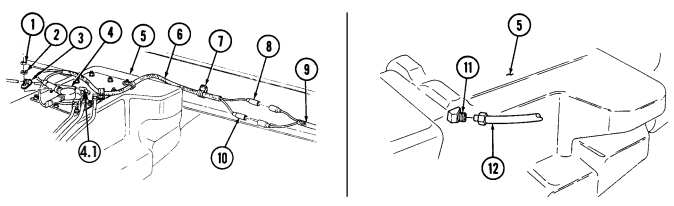

## 3-24. Fuel Tank Maintenance (Cont'D)

15. Install filler spout (39) into hose (46) and tighten clamp (45).

16. Install filler spout (39) to body (34) with clamp (42), washer (43), capscrew (44), washer (41), and

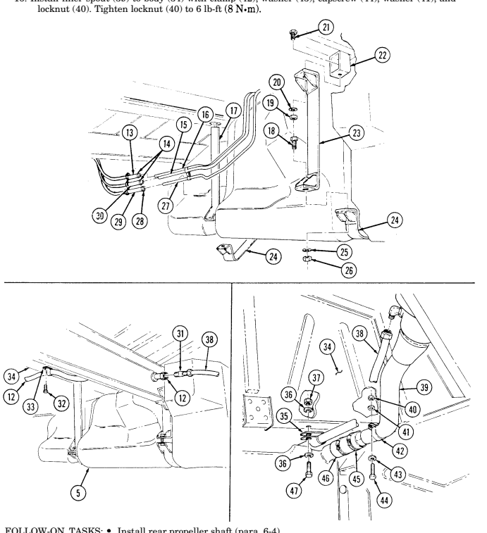

· Connect battery ground cable (para. 4-73). · Fill fuel tank (TM 9-2320-280-10) and check for leaks.

# 3-25. Fuel Tank Supply And Return Lines Replacement

This task covers:
INITIAL SETUP:
Tools General mechanic's tool kit:
automotive (Appendix B,Item 1)

a. Removal b. Installation

Equipment Condition Engine right splash shield removed (para. 10-20).

General Safety Instructions Do not perform this procedure near fire, flames, or sparks.

Materials/Parts Two locknuts (Appendix G, Item 70)
Manual References TM 9-2320-280-10 TM 9-2320-280-24P

## ________ _W__A_**Rn_I_N_G_**

Diesel fuel is highly flammable. Do not perform this procedure near fire, flames, or sparks. Severe injury or death will result.

a. Removal

## _Ca_U_T_Io_N_

Cover or plug all open hoses and connections immediately after disconnection to prevent contamination. Remove all plugs prior to connection.

Have drainage container ready to catch fuel.

1. Loosen clamps (7) and disconnect hoses (6) from fuel tank return and supply lines (8). 2. Remove two locknuts (1), capscrews (5), washers (4), clamps (3) and return and supply lines (8)
from front body bracket (2) and rear body bracket (10). Discard locknuts (1).

3. Remove three clips (9) securing lines together.

#### B. Installation

1. Install return and supply lines (8) on front body bracket (2) and rear body bracket (10) with two clamps (3), washers (4), capscrews (5), and locknuts (1).

2. Connect supply and return lines (8) to hoses (6) and tighten clamps (7). 3. Secure fuel supply and return lines (8) together with three clips (9).

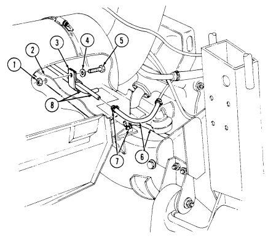

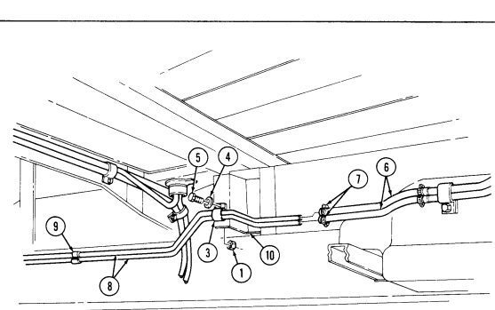

FOLLOW-ON TASKS: - • Install engine right splash shield (para. 10-20).
- • - • - Fill fuel tank (TM 9-2320-280-10) and check for fuel leaks.

# 3-25. Fuel Tank Supply And Return Lines Replacement (Cont'D) 3-26. Auxiliary Fuel Pickup And Return Lines Replacement

This task covers:
INITIAL SETUP:
Applicable Models M1097, M1097A1, M1097A2, M1123 Tools General mechanic's tool kit:
automotive (Appendix B, Item 1)
Materials/Parts Sealing compound (Appendix C, Item 44) Tiedown strap (Appendix G, Item 311)

a. Removal b. Installation

Manual References TM 9-2320-280-24P
Equipment Condition Fuel tank removed (para. 3-24).

General Safety Instructions Do not perform this procedure near fire, flames, or sparks.

Diesel fuel is highly flammable. Do not perform this procedure near fire, flames, or sparks. Severe injury or death will result.

a. Removal

Cover or plug all open hoses and connections immediately after disconnection to prevent contamination. Remove all plugs prior to connection.

Have drainage container ready to catch fuel.

1. Remove screw (5) and clamp (7), securing fuel return line (6) and fuel pickup line (4) to fuel line clamp (8).

2. Remove fuel pickup line (4) from supply tube (3) on fuel tank (1). 3. Remove fuel return line (6) from supply tube (2).

b. Installation

Substitute tiedown strap for spring clamp when clamp is not available.

1. Apply sealing compound to threads of fuel return line (6) and fuel pickup line (4). 2. Install fuel return line (6) to supply tube (2) on fuel tank (1). 3. Install fuel pickup line (4) to supply tube (3). 4. Install clamp (7) on fuel return line (6) and fuel pickup line (4) and secure to fuel line clamp (8) 
with screw (5).

# 3-26. Auxiliary Fuel Pickup And Return Lines Replacement (Cont'D)

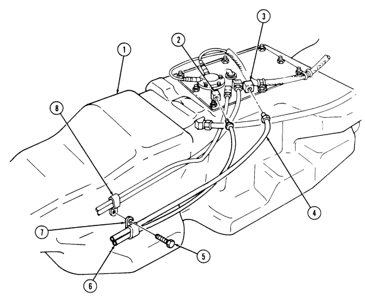

સ્ત્રે
# 3-27. Fuel Tank Vent Line And Filter Replacement

This task covers:
INITIAL SETUP:
Tools General mechanic's tool kit:
automotive (Appendix B, Item 1)
Materials/Parts Tiedown strap (Appendix G, Item 312) Locknut (Appendix G, Item 70)

a. Removal b. Installation

Manual References TM 9-2320-280-10 TM 9-2320-280-24P
Equipment Condition
- Fuel tank removed (para. 3-24). - Hood raised and secured (TM 9-2320-280-10).

Cover or plug all open hoses and connections immediately after disconnection to prevent contamination. Remove all plugs prior to connection.

For fuel tank vent line filter replacement, perform steps 5, 8, and 9 only.

#### A. Removal

1. Remove clip (9) securing fuel tank vent line (3) to vent line (6). 2. Remove two capscrews (2) securing clamps (1) and (7) and vent lines (3) and (6) to brackets (8). 3. Remove tiedown strap (4) securing vent line (6) and fuel lines (5). Discard tiedown strap (4). 4. Disconnect vent line (3) from elbow (16). 5. Loosen two clamps (14) and remove vent line (15) from vent line filter (13) and elbow (16). 6. Remove two clamps (14) from vent line (15). 7. Remove two clamps (1) from vent line (3).

Perform step 8 only when deep water fording kit is installed.

8. Disconnect deep water fording vent line (19) from vent line filter (13). 9. Remove capscrew (18), washer (11), locknut (12) clamp (10) and vent line filter (13) from body bracket (17). Discard locknut (12).

b. Installation

For fuel tank vent line filter replacement, perform steps 1, 2, and 5 only.

1. Install clamp (10) and vent line filter (13) to body bracket (17) with washer (11), capscrew (18), and locknut (12).

Perform step 2 only when deep water fording kit is installed.

2. Connect deep water fording vent line (19) to vent line filter (13).

# 3-27. Fuel Tank Vent Line And Filter Replacement (Cont'D)

3. Install two clamps (1) on vent line (3).

4. Install two clamps (14) on vent line (15).

5. Install vent line (15) to vent line filter (13) and elbow (16) and tighten two clamps (14).

6. Connect vent line (3) to elbow (16).

7. Install vent line (3) to vent line (6) and fuel lines (5) with tiedown strap (4).

8. Install vent lines (3) and (6) and two clamps (1) and (7) to brackets (8) with two capscrews (2).

9. Secure vent line (3) to vent line (6) with clip (9).

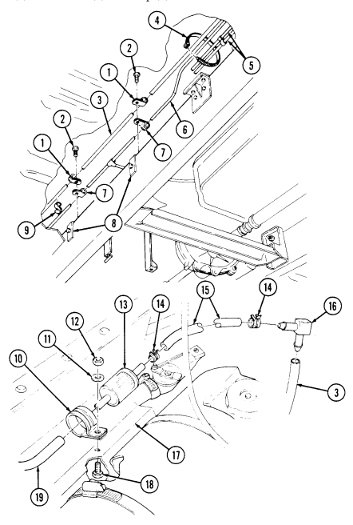

FOLLOW-ON TASKS: - Install fuel tank (para. 3-24).

· Lower and secure hood (TM 9-2320-280-10).

# 3-28. Fuel Tank Filler Cap And Spout Maintenance

This task covers:
c. Installation INITIAL SETUP:

#### Tools

General mechanic's tool kit:
automotive (Appendix B, Item 1)
Materials/Parts Four locknuts (Appendix G, Item 70) Sealing compound (Appendix C, Item 44)
Manual References TM 9-2320-280-10 TM 9-2320-280-24P
a. Removal d. Fuel Filler Chain Removal b. Inspection e. Fuel Filler Chain Installation Equipment Condition Fuel tank drained (para. 3-24).

General Safety Instructions Do not perform this procedure near fire, flames, or sparks.

Diesel fuel is highly flammable. Do not perform this procedure near fire, flames, or sparks. Severe injury or death will result.

#### A. Removal

b. Inspection 1. Unscrew filler cap "T" handle (7) and remove filler cap (6) from filler spout (12). 2. Detach cap chain clip (8) from filler spout (12) and remove filler cap (6). 3. Disconnect vent line (1) from fitting (2). 4. Remove three locknuts (3), washers (4), capscrews (5), and washers (4) from spout mounting ring (9).

Discard locknuts (3).

5. Loosen clamp (17) securing filler spout (12) to hose (18). 6. Remove locknut (13), washer (14), capscrew (16), washer (14), and clamp (15) from filler spout (12).

Discard locknut (13).

7. Push filler spout (12) out of spout mounting ring (9) and remove filler spout (12) from hose (18). 8. Remove fitting (2) from filler spout (12). 9. Using handle (10), remove screen (11) from filler spout (12).

Inspect screen (11) for damage, debris, or blockage. Replace if damaged or if debris or blockage is detected.

#### C. Installation

1. Apply sealing compound to fitting (2) and install fitting (2) on filler spout (12). 2. Align filler spout (12) with hose (18) and push filler spout (12) into hose (18). 3. Install filler spout mounting ring (9) to body with three washers (4), capscrews (5), washers (4), and locknuts (3).

4. Secure hose (18) to filler spout (12) and tighten clamp (17). 5. Secure filler spout (12) to body with clamp (15), washer (14), capscrew (16), washer (14), and locknut (13).

Tighten locknut (13) to 6 lb-ft (8 N•m).

6. Apply sealing compound to fitting (2) and connect vent line (1) to fitting (2).

# 3 - 2 8 . Fuel Tank Filler Cap And Spout Maintenance ( C O N T ' D )

7. Using handle (10), install screen (11) in filler spout (12). 8. Attach filler cap chain clip (8) to filler spout (12). 9. Install filler cap (6) to filler spout (12) and secure with "T" handle (7).

d. Fuel Filler Chain Removal

#### Not E

Replacement chain manufacturing instructions can be found in appendix D, figure 15.1.

1. Unscrew "T" handle (7) and remove filler cap (6) from filler spout (12). 2. Detach cap chain clip (8) from filler spout (12) and remove chain clip (8) from chain (5.1). 3. Pry open link holding chain (5.1) to cap (6), and remove chain (5.1) from cap (6).

e. Fuel Filler Chain Installation 1. Pry open link on end of chain (5.1) and attach to filler cap (6). Close link.

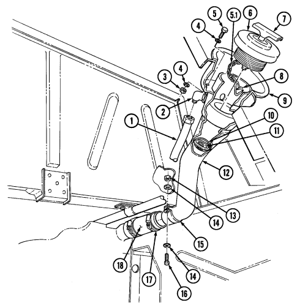 2. Hook chain clip (8) through last link at opposite end of chain (5.1) and attach to filler spout (12). 3. Install filler cap (6) to filler spout (12) and secure with "T" handle (7).

FOLLOW-ON TASK: Fill fuel tank (TM 9-2320-280-10) and check filler spout for fuel leaks.

# 3-29. Fuel Tank Filler Spout Vent Line Replacement

This task covers:

| Tools   |
|---------|

INITIAL SETUP:

a. Removal b. Installation

Equipment Condition Rear propeller shaft removed (para. 6-4).

| Manual References    |
|----------------------|
| TM 9\-2320\-280\-24P |

Materials/Parts Locknut (Appendix G, Item 70) Adhesive (Appendix C, Item 1) Sealing compound (Appendix C, Item 46)

#### A. Removal

1. Disconnect vent line (2) from fuel filler spout elbow (3). 2. Remove locknut (7), washer (5), capscrew (4), and washer (5) securing vent line (2) and clamp (6) to body (1). Discard locknut (7).

3. Disconnect and remove vent line (2) from tee (12). 4. Disconnect vent line (10) from tee (12). 5. Remove capscrew (15) securing vent line (10) and clamp (11) to body (1). 6. Loosen two nuts (13) to allow access to elbow (8). 7. Disconnect vent line (10) from elbow (8) on fuel tank (9), cut vent line (10), and remove vent line
(10) from crossmember (14).

b. Installation

Use sealing compound on all vent line connector threads before installation.

1. Install vent line (10) and connect to elbow (8) on fuel tank (9).

Upper and lower straps should be approximately 1/2 in. (12 mm) apart after tightening locknuts. Straps should not touch when properly installed. Straps must be replaced if upper and lower straps touch.

2. Apply adhesive to threads of nuts (13) and tighten nuts (13) to 23-27 lb-in. (3-5 N•m). 3. Install clamp (11) and vent line (10) to body (1) with capscrew (15). 4. Route vent line (10) through crossmember (14). 5. Connect vent line (10) to tee (12). 6. Install vent line (2) and connect to tee (12). 7. Install vent line (2) and clamp (6) on body (1) with washer (5), capscrew (4), washer (5), and locknut (7). Tighten locknut (7) to 6 lb-ft (8 N•m).

8. Connect vent line (2) to fuel filler spout elbow (3).

3-29. FUEL TANK FILLER SPOUT VENT LINE REPLACEMENT (Cont'd)

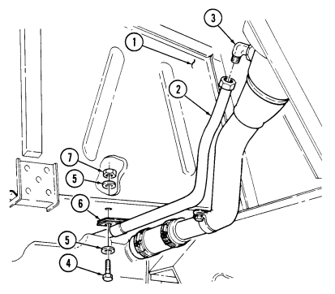

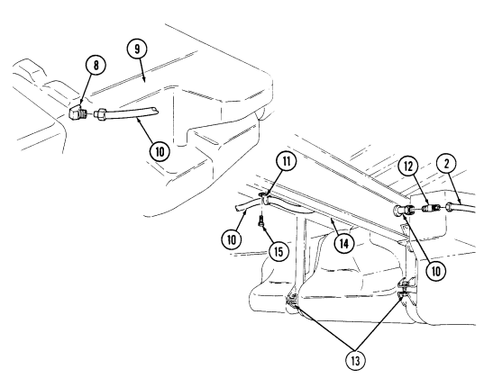

FOLLOW-ON TASK: Install rear propeller shaft (para. 6-4).

# 3-30. Filler Spout Hose Replacement

This task covers:
a. Removal **b. Installation**
INITIAL SETUP:
General mechanic's tool kit: Fuel tank drained (para. 3-24).

automotive (Appendix B, Item 1) General Safety Instructions TM 9-2320-280-10 sparks.

TM 9-2320-280-24P
Tools **Equipment Condition**
Manual References Do not perform this procedure near fire, flames, or

Diesel fuel is highly flammable. Do not perform this procedure near fire, flames, or sparks. Severe injury or death will result.

a. Removal 1. Loosen clamps (4) and (3) securing hose (1) to fuel tank (5) and to filler spout (2).

2. Slide hose (1) on to filler spout (2) until disconnected from fuel tank (5). Remove hose (1) from filler spout (2).

b. Installation

Position clamps attaching filler hose to fuel tank as shown.

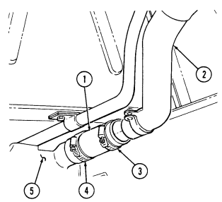

1. Install hose (1) on filler spout (2) and slide on filler spout (2) until the hose (1) clears fuel tank (5). 2. Connect hose (1) to fuel tank (5) and tighten clamps (3) and (4).

FOLLOW-ON TASK: Fill fuel tank (TM 9-2320-280-10) and check for leaks.

# 3-31. Fuel Tank Hangers Replacement

This task covers:
INITIAL SETUP:
Tools General mechanic's tool kit:
automotive (Appendix B, Item 1)
Materials/Parts Adhesive (Appendix C, Item 1)
a. Removal

a. Removal b. Installation

| Manual References                |
|----------------------------------|
| TM 9\-2320\-280\-24P             |
| Equipment Condition              |
| Fuel tank removed (para. 3\-24). |

1. Remove two nuts (3), washers (4), screws (5), and rear hangers (7) from supports (6). 2. Twist two front hangers (9) until tee handles (2) clear slots (11) in supports (1) and remove front hangers (9).

Perform step 3 for "A2" vehicles only.

3. Inspect four insulators (8) on front and rear hangers (9) and (7). Remove insulators (8) if damaged.

b. Installation

Perform step 1 for "A2" vehicles only.

1. Install four insulators (8) on front and rear hangers (9) and (7) (if removed.) 2. Install two front hangers (9) by inserting tee handles (2) up through slots (11) in supports (1). Twist hangers (9) so that tee handles (2) are resting across slots (11) against side of ridge (10).

NOTE
Apply adhesive to threads of screws.

3. Install two rear hangers (7) on supports (6) with screws (5), washers (4), and nuts (3).

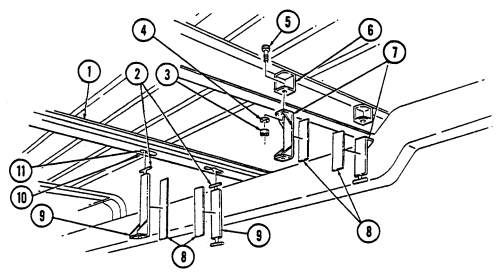

Tighten nuts (3) to 37 lb-ft (50 N•m).

FOLLOW-ON TASK: Install fuel tank (para. 3-24).

# 3-32. Fuel Filter Maintenance

This task covers:
a. Removal c. Bleeding b. Installation INITIAL SETUP:

#### Tools

General mechanic's tool kit:
automotive (Appendix B, Item 1)

#### Materials/Parts

Two lockwashers (Appendix G, Item 134) Sealing compound (Appendix C, Item 44) Fuel filter bleeder tool (Appendix D, Figure D-63)
(optional)
Manual References TM 9-2320-280-10 TM 9-2320-280-24P
a. Removal

#### Equipment Condition

- Hood raised and secured (TM 9-2320-280-10). - Engine access cover removed (para. 10-15). - Fuel pressure transducer removed (para. 4-26).

General Safety Instructions Do not perform this procedure near fire, flames, or sparks.

Diesel fuel is highly flammable. Do not perform this procedure near fire, flames, or sparks. Severe injury or death will result.

Cover or plug all hoses and connections immediately after disconnection to prevent contamination. Remove all plugs prior to connection.

Have drainage container ready to catch fuel.

1. Loosen two hose clamps (2) and disconnect fuel inlet hose (1) and fuel outlet hose (13) from fuel filter (8).

2. Loosen hose clamp (9) and disconnect fuel filter drain hose (10) from fuel filter (8). 3. Pull back insulation to allow access to capscrews (3) and remove two capscrews (3), lockwashers (4),
and fuel filter bracket (11) from body (12). Discard lockwashers (4).

4. Loosen capscrew (7) and remove fuel filter (8) from fuel filter bracket (11). 5. Remove three fittings (5) from fuel filter (8).

#### B. Installation

1. Apply sealing compound to threads of three fittings (5). Install three fittings (5) to fuel filter (8). 2. Install fuel filter (8) in fuel filter bracket (11) and tighten capscrew (7). 3. Install fuel filter bracket (11) on body (12) with two capscrews (3) and lockwashers (4). Tighten capscrews (3) to 15 lb-ft (20 N•m).

4. Connect drain hose (10) to fuel filter (8) and tighten clamp (9) to 10-20 lb-in. (1-2 N•m). 5. Connect fuel inlet hose (1) and fuel outlet hose (13) to fuel filter (8) with two hose clamps (2).

Tighten clamps (2) to 10-20 lb-in. (1-2 N•m).

# 3 - 3 2 . Fuel Filter Maintenance (Co N T ' D)

c. Bleeding

#### Not E

The bleeder tool described in 2, 3, and 5 is optional. The tool prevents fuel spilling on engine.

1. Install fuel pressure transducer (para. 4-26). 2. Remove fuel filter bleed screw (6) and install bleeder tool into the hole. 3. Place open end of bleeder tool hose in clean, clear container. 4. Disconnect lead 54A (14) from solenoid (15).

## ______ Caution

Do not operate starter continuously for more than 20 seconds, wait 10 to 15 seconds between periods of operation. Failure to do this will result in damage to the starter.

5. Crank engine and watch fuel. When air bubbles stop coming through the line, remove bleeder tool and replace bleed screw (6). Dispose of fuel in accordance with local SOP.

6. Tighten bleed screw (6) to 40-50 lb-in. (4-6 N•m).

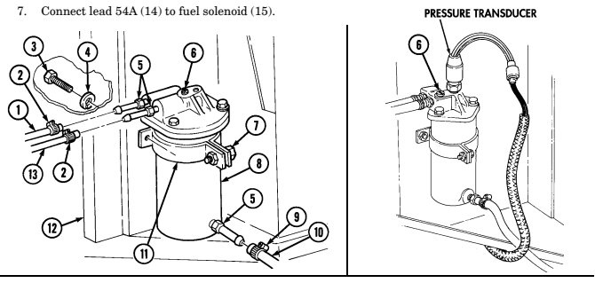

FOLLOW-ON TASKS: - Start engine (TM 9-2320-280-10) and check for fuel leaks.

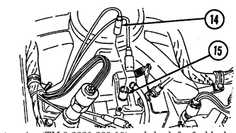

- Lower and secure hood (TM 9-2320-280-10). - Install engine access cover (para. 10-15).

# 3-33. Fuel Filter Element Maintenance

This task covers:
a. Element Removal c. Element Installation b. Cleaning and Inspection INITIAL SETUP:
Tools General mechanic's tool kit:
automotive (Appendix B, Item 1)
Materials/Parts Filter element kit
(Appendix G, Item 32)

#### Equipment Condition

Fuel pressure transducer removed (para. 4-26).

General Safety Instructions
- Do not perform this procedure near fire, flames, or sparks.

- Cleaning will be done in a well-ventilated area and a fire extinguisher will be kept nearby when solvent is used.

Diesel fuel is highly flammable. Do not perform this procedure near fire, flames, or sparks. Severe injury or death will result.

CAUTION
Cover or plug all hoses and connections immediately after disconnection to prevent contamination. Remove all plugs prior to connection.

#### A. Element Removal

1. Loosen two hose clamps (2), and disconnect fuel inlet hose (1) and fuel outlet hose (15) from fuel filter cover (3).

2. Loosen hose clamp (7) and disconnect fuel filter drain hose (8) from filter housing (6). 3. Remove capscrew (9), nut (11), and filter housing (6) from fuel filter bracket (10). 4. Remove three capscrews (4) washers (5) and cover (3) from filter housing (6). 5. Remove O-ring seal (14) from filter housing (6). Discard O-ring seal (14). 6. Remove filter element (12) and separator (13) from filter housing (6). 7. Remove separator (13) from filter element (12). Discard filter element (12).

#### B. Cleaning And Inspection Warning

Drycleaning solvent is flammable and will not be used near an open flame. A fire extinguisher will be kept nearby when the solvent is used. Use only in well-ventilated places. Failure to do this may result in injury to personnel and/or damage to equipment.

1. Use drycleaning solvent to clean all metallic parts. 2. Inspect filter housing (6) and cover (3) for distortion or damage. Replace if damaged. 3. Inspect separator (13) for dirt, contamination, or damage. Replace if dirty, contaminated, or damaged.

Manual References TM 9-2320-280-24P

#### 3-33. Fuel Filter Element Maintenance (Cont'D) C. Element Installation

1.

2.

Install filter element (12) into filter housing (6). Install separator (13) on filter element (12).

3. 4.

5. 6.

Install O-ring seal (14) into filter housing (6). Install cover (3) on filter housing (6) with three washers (5) and capscrews (4). Tighten capscrews (4) to 50-60 lb-in. (6-7 N*m). Install filter housing (6) in fuel filter bracket (10) with capscrew (9) and nut (11). Connect fuel filter drain hose (8) to filter hosing (6) and tighten clamp (7) to 10-20 lb-in. (1-2 Nero).

Connect fuel inlet hose (1) and fuel outlet hose (15) to fuel filter cover (3) and tighthen clamps (2) to 10-20 lb-in. (1-2 Nom).

7.

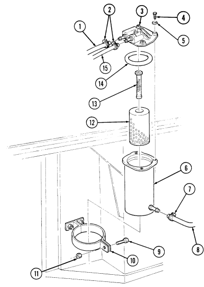

FOLLOW-ON TASK: Bleed fuel filter (para. 3-32).

# 3-34. Fuel Filter Drain Hose And Valve Replacement

This task covers:
INITIAL SETUP:

#### Tools

General mechanic's tool kit:
automotive (Appendix B, Item 1)
Materials/Parts Plain-assembled nut (Appendix G, Item 201)
Manual References TM 9-2320-280-10 TM 9-2320-280-24P

a. Removal **b. Installation**

| Manual References   |
|---------------------|

One assistant Equipment Condition Hood raised and secured (TM 9-2320-280-10).

General Safety Instructions Do not perform this procedure near fire, flames, or sparks.

Diesel fuel is highly flammable. Do not perform this procedure near fire, flames, or sparks. Severe injury or death will result.

a. Removal

Cover or plug all open hoses and connections immediately after disconnection to prevent contamination. Remove all plugs prior to connection.

- For fuel filter drain valve replacement, perform steps 5 and 6 only.

- Have drainage container ready to catch fuel.

1. Loosen clamp (2) and disconnect fuel filter drain hose (8) from fuel filter assembly (1). 2. Loosen clamp (7) and disconect drain hose (8) from fuel filter drain valve (6). 3. Remove plain-assembled nut (5), capscrew (11), clamp (4), and drain hose (8) from cowl panel (3).

Discard plain-assembled nut (5).

4. Remove capscrew (10), drain hose (8), and clamp (9) from panel (3). 5. Remove nut (13) and fuel filter drain valve (6) from bracket (12). 

b. Installation

For fuel filter drain valve replacement, perform steps 5 and 6 only.

1. Install drain hose (8) and clamp (4) to cowl panel (3) with capscrew (11) and plain-assembled nut (5).

2. Install clamp (9) and drain hose (8) to panel (3) with capscrew (10). 3. Connect drain hose (8) to fuel filter drain valve (6) with clamp (7). 4. Connect drain hose (8) to fuel filter assembly (1) with clamp (2). 5. Install fuel filter drain valve (6) to bracket (12) with nut (13).

# 3-34. Fuel Filter Drain Hose And Valve Replacement (Cont'D)

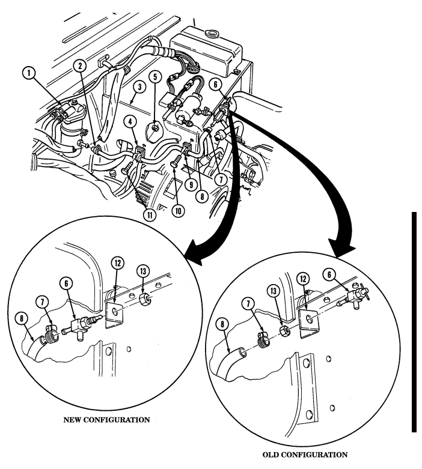

FOLLOW-ON TASKS: - Start engine (TM 9-2320-280-10) and check for oil leaks.
- Start en

# 3-35. Fuel Injection Pump Return Hose Check Valve Maintenance

This task covers:
a. Removal c. Installation b. Cleaning and Inspection INITIAL SETUP:
automotive (Appendix B, Item 1) Air horn removed (para. 3-14).

TM 9-2320-280-24P or sparks.

Tools **Equipment Condition**
General mechanic's tool kit: Hood raised and secured (TM 9-2320-280-10).

Manual References **General Safety Instructions**
TM 9-2320-280-10 Do not perform this procedure near fire, flames, Compressed air used for cleaning purposes will not exceed 30 psi (207 kPa).

#### Warnin G

Diesel fuel is highly flammable. Do not perform this procedure near fire, flames, or sparks. Severe injury or death will result.

Cover or plug all hoses and connections immediately after disconnection to prevent contamination. Remove all plugs prior to connection.

#### A. Removal

1. Loosen clamp (2) and disconnect hose (1) from injection pump check valve (3). 2. Remove check valve (3) from injection pump (4).

#### Warnin G

Compressed air used for cleaning purposes will not exceed 30 psi (207 kPa). Use only with effective chip guarding and personal protective equipment (goggles/shield, gloves, etc).

#### B. Cleaning And Inspection

Examine the lower end of the check valve (3) where the ball seats for evidence of debris. If debris is present, blow compressed air through the check valve. Replace check valve (3) if debris remains or if check valve (3) fails to function properly.

c. Installation 1. Install check valve (3) on injection pump (4). 2. Connect hose (1) on check valve (3) with clamp (2).

# 3-35. Fuel Injection Pump Return Hose Check Valve Maintenance (Cont'D)

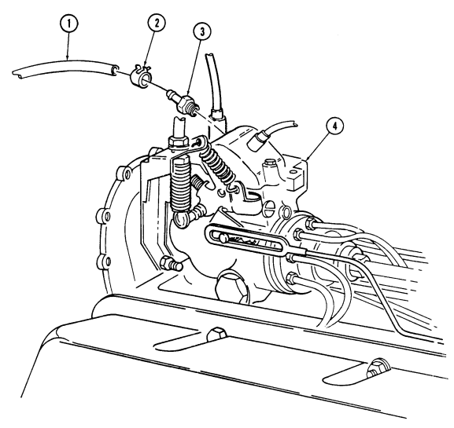

 FOLLOW-ON TASKS: - Install air horn assembly (para. 3-14).

· Lower and secure hood (TM 9-2320-280-10).

# 3-36. Fuel Injection Return Hoses Replacement

This task covers:
a. Fuel Drain Back Hose Removal **e. Nozzle to Nozzle Hose Removal**
c. Tube to Nozzle Hose Removal g. Nozzle Cap Removal d. Tube to Nozzle Hose Installation **h. Nozzle Cap Installation**
INITIAL SETUP:
b. Fuel Drain Back Hose Installation f. Nozzle to Nozzle Hose Installation

#### Tools **Equipment Condition**

General mechanic's tool kit: Engine access cover removed (para. 10-15).

automotive (Appendix B, Item 1) Air horn removed (para. 3-14).

TM 9-2320-280-24P sparks.

Manual References **General Safety Instructions**
TM 9-2320-280-10 Do not perform this procedure near fire, flames, or

#### Warnin G

Diesel fuel is highly flammable. Do not perform this procedure near fire, flames, or sparks. Severe injury or death will result.

CAUTION
Cover or plug all hoses and connections immediately after disconnection to prevent contamination. Remove all plugs prior to connection.

NOT E
Have drainage container ready to catch fuel.

a. Fuel Drain Back Hose Removal 1. Loosen two clamps (2) and remove hose (3) from injection pump (4) and fuel drain back tube (1).

2. Remove two clamps (2) from hose (3).

b. Fuel Drain Back Hose Installation 1. Install two clamps (2) to hose (3).

2. Connect hose (3) to injection pump (4) and fuel drain back tube (1) with two clamps (2).

c. Tube to Nozzle Hose Removal 1. Loosen two clamps (5) and remove hose (6) from nozzle (7) and fuel drain back tube (1).

2. Remove two clamps (5) from hose (6).

#### D. Tbbe To Nozzle Hose Installation

1. Install two clamps (5) to hose (6). 2. Connect hose (6) to nozzle (7) and fuel drain back tube (1)with two clamps (5).

# 3-36.  Fuel Injection Return Hoses Replacement(Cont'D)

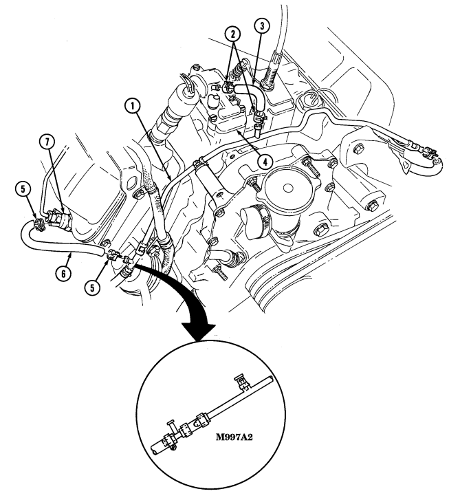

## 3-36. Fuel Injection Return Hoses Replacement (Cont'D)

e. Nozzle to Nozzle Hose Removal 1. Loosen two clamps (5) and disconnect hose (6) from two nozzles (4). 2. Remove two clamps (5) from hose (6).

f. Nozzle to Nozzle Hose Installation 1. Install two clamps (5) to hose (6). 2. Connect hose (6) to two nozzles (4) with two clamps (5).

g. Nozzle Cap Removal Loosen clamp (2) and remove cap (1) from rear nozzle nipple (3).

h. Nozzle Cap Installation Install cap (1) on rear nozzle nipple (3) with clamp (2).

# 3-36. Fuel Injection Return Replacement (Cont'D)

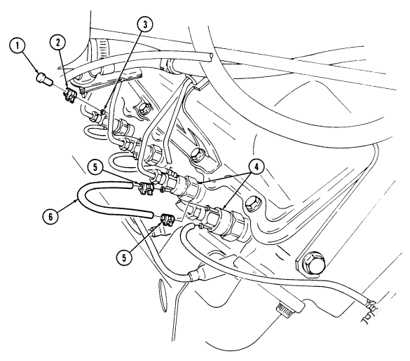

FOLLOW-ON TASKS: - Install air horn (para. 3-14).

- Install engine access cover (para. 10-15).
- Start engine (TM 9-2320-280-10) and check for fuel leaks.

# 3-37. Fuel Drain Back Tube Replacement

This task covers:
INITIAL SETUP:
Tools General mechanic's tool kit:
automotive (Appendix B, Item 1)
Materials/Parts Lockwasher (Appendix G, Item 191)
Manual References TM 9-2320-280-10 TM 9-2320-280-24P

a. Removal b. Installation

Equipment Condition Air horn removed (para. 3-14).

General Safety Instructions Do not perform this procedure near fire, flames, or sparks.

Diesel fuel is highly flammable. Do not perform this procedure near fire, flames, or sparks. Severe injury or death will result.

a. Removal

Cover or plug all hoses and connections immediately after disconnection to prevent contamination. Remove all plugs prior to reconnection.

1. Remove nut (17), lockwasher (18), and engine wiring harness clamp (15) from stud (19). Discard lockwasher (18).

2. Remove stud (19) fuel drain back tube (5), clamp (20) fuel supply line (14), and clamp (16) from cylinder head (23).

3. Loosen two clamps (10) and disconnect two hoses (11) from fuel drain back tube (5). 4. Loosen clamp (22) and disconnect fuel return hose (21) from fuel drain back tube (5). 5. Loosen clamp (4) and disconnect fuel drain back hose (3) from fuel drain back tube (5). 6. Remove nut (7), washer (8), clamp (9), and fuel drain back tube (5) from valve cover stud (6). 7. Remove capscrew (1), washer (24), and clamp (12) from front engine cover (13). 8. Remove drain back tube (5).

#### B. Installation

1. Position fuel drain back tube (5) in front of injection pump (2). 2. Connect fuel return hose (21) to fuel drain back tube (5) with clamp (22). 3. Connect two hoses (11) to fuel drain back tube (5) with two clamps (10). 4. Connect fuel drain back hose (3) to fuel drain back tube (5) with clamp (4). 5. Install fuel drain back tube (5) on valve cover stud (6) with clamp (9), washer (8), and nut (7).

Tighten nut (7) to 13-20 lb-ft (18-27 N•m).

6. Install fuel drain back tube (5) on front engine cover (13) with clamp (12), washer (24), and capscrew (1). Tighten capscrew (1) to 40 lb-ft (54 N•m).

7. Install fuel supply line (14), clamp (16), fuel drain back tube (5), and clamp (20) on cylinder head (23) with stud (19).

8. Install wiring harness clamp (15) on stud (19) with lockwasher (18) and nut (17).

# 3-37. Fuel Drain Back Tube Replacement (Cont'D)

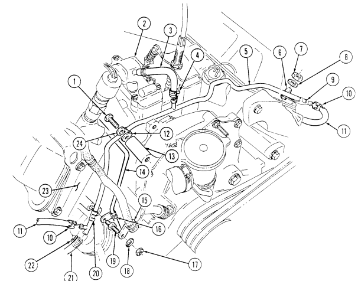

FOLLOW-ON TASKS: - Install air horn (para. 3-14).
- Start engine (

(
# 3 - 3 8 . Glow Plug Replacement

This task covers:
INITIAL SETUP:
Tools General mechanic's tool kit:
automotive (Appendix B, Item 1)

a. Removal **b. Installation**

| Manual References   |
|---------------------|
| TM 9\-2320\-280\-10 |
| TM 9\-2320\-280\-24 |

Special Tools Socket, 3/8 in. (Appendix B, Item 155)
Equipment Condition
- Battery ground cable disconnected (para. 4-73). - Hood raised and secured (TM 9-2320-280-10).

a. Removal 1. Disconnect electrical lead 575 (3) from glow plug (2).

#### Not E

- If glow plug is damaged or broken, notify unit commander.

Damaged or broken glow plugs are removed at DS maintenance.

- To help remove swollen glow plugs, fabricate tool as shown in appendix D, figure 63.1.

- Other tools can be used to aid in glow plug removal. This procedure pertains to tool in appendix D, figure 63.1.

2. Insert forked end of glow plug tool behind hex-head of glow plug (2) and remove glow plug (2) from cylinder head (1).

b. Installation

#### Not E

HMMWV glow plugs have bullet-shaped tips, not flat tips.

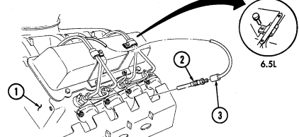

1. Install glow plug (2) in cylinder head (1). Tighten-glow plug (2) to 8-12 lb-ft (11-16 N•m). 2. Connect electrical lead 575 (3) to glow plug (2).

FOLLOW-ON TASKS: - Connect battery ground cable (para. 4-73).

- Lower and secure hood (TM 9-2320-280-10).

# 3-39. Right Fuel Injection Lines Bracket Replacement

This task covers:
INITIAL SETUP:
automotive (Appendix B, Item 1) Air horn removed (para. 3-14).

Manual References TM 9-2320-280-24P

#### A. Removal A. Removal **B. Installation**

Tools **Equipment Condition**
General mechanic's tool kit: Engine access cover removed (para. 10-15).

1. Remove two screw-assembled washers (6), clamps (5), and clamp (7) from bracket (1). 2. Remove two clamps (5) and inspect for cracks or breaks. Replace if defective. 3. Remove two nuts (3), washers (2), and bracket (1) from valve cover studs (4).

#### B. Installation

1. Install bracket (1) to valve cover studs (4) with two washers (2) and nuts (3). Tighten nuts (3) to 13-20 lb-ft (18-27 Nom).

2. Install two clamps (5) and clamp (7) to bracket (1) with two screw-assembled washers (6). Tighten

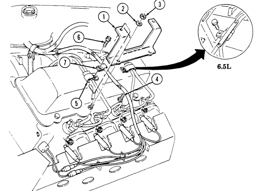

screw-assembled washers (6) to 3-4 lb-ft (4-5 N.m).

FOLLOW-ON TASKS: Install air horn (para. 3-14).

Install engine access cover (para. 10-15).

# 3-40. Left Fuel Injection Lines Bracket Replacement

This task covers:
INITIAL SETUP:
a. Removal **b. Installation**
Tools **Equipment Condition**
General mechanic's tool kit: Hood raised and secured (TM 9-2320-280-10).

automotive (Appendix B, Item 1) Engine access cover removed (para. 10-15).

Manual References TM 9-2320-280-10 TM 9-2320-280-24P
a. Removal 1. Remove screw-assembled washer (2) and clamp (1) from bracket (5).

2. Remove screw-assembled washer (8) and clamp (9) from bracket (5). 3. Remove two screw-assembled washers (3) and oil dipstick tube (4) from bracket (5). 4. Remove two nuts (6), washers (7) and bracket (5) from valve cover studs (10).

b. Installation 1. Install bracket (5) to valve cover studs (10) with two washers (7) and nuts (6). Tighten nuts (6) to 13-20 lb-ft (18-27 N.m).

2. Secure oil dipstick tube (4) to bracket (5) with two screw-assembled washers (3). Tighten screwassembled washers (3) to 3-4 lb-ft (4-5 N.m).

3. Install clamp (9) to bracket (5) with screw-assembled washer (8). Tighten screw-assembled washer (8) to 3-4 lb-ft (4-5 N.m).

4. Install clamp (1) to bracket (5) with screw-assembled washer (2). Tighten screw-assembled

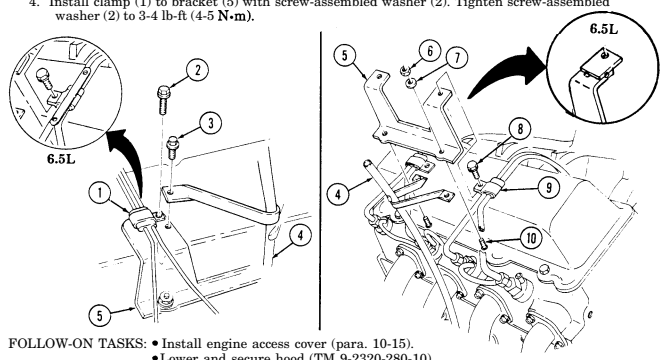

Lower and secure hood (TM 9-2320-280-10).
# Section Ill. Accelerator System Maintenance 3-41. Accelerator System Maintenance Task Summary

| INITIAL SETUP:                  |                                  |
|---------------------------------|----------------------------------|
| Tools                           | Manual References                |
| General mechanic's tool kit:    | TM 9\-2320\-280\-24P             |
| automotive (Appendix B, Item 1) |                                  |
|                                 | Equipment Condition              |
| Materials/Parts                 | Fuel tank removed (para. 3\-24). |
| Adhesive (Appendix C, Item 1)   |                                  |
| a. Removal                      |                                  |

# 3-42. Accelerator Linkage Maintenance

This task covers:
INITIAL SETUP:

| automotive (Appendix B, Item 1)   |
|-----------------------------------|

#### Tools Materials/Parts

Four locknuts (Appendix G, Item 70) Cotter pin (Appendix G, Item 11) Assembled locknut (Appendix G, Item 131) Lubricating oil, seasonal grade of OE
(Appendix C, Item 32)

a. Removal c. Installation b. Inspection d. Adjustment

| sparks.   |
|-----------|

Manual References TM 9-2320-280-10 TM 9-2320-280-24P

| One mechanic   |
|----------------|
| One assistant  |

- Hood raised and secured (TM 9-2320-280-10). - Engine access cover removed (para. 10-15).

#### A. Removal

1. Remove cotter pin (15) and washer (16) and disconnect accelerator cable clevis (18) from accelerator pedal rod (14). Discard cotter pin (15).

2. Remove hitch pin (1) and washer (2) and disconnect hand throttle clevis (3) from accelerator pedal rod (14).

3. Remove assembled locknut (19) and harness clamp (21) from lower capscrew (25). Discard assembled locknut (19).

4. Remove three locknuts (22), washers (23), capscrews (25), washers (23) and accelerator rod retainers (24) from cowl (20). Discard locknuts (22).

Bushing halves may detach from accelerator pedal rod during removal.

5. Pull accelerator pedal rod (14) forward through gasket (5) in cowl (20) and remove accelerator pedal rod (14).

6. Remove accelerator rod retainers (24) and bushing halves (4) from accelerator pedal rod (14). 7. Remove gasket (5) from cowl (20). 8. Remove locknut (11), washer (12), capscrew (17), and accelerator cable clevis (18) from body bracket (13). Discard locknut (11).

9. Remove nut (10), capscrew (7), and clamps (6) and (9) from A-beam (8).

10. Loosen two nuts (27) and disconnect accelerator cable (28) from engine bracket (31). 11. Disconnect throttle return spring (29) from engine bracket (31). 12. Remove accelerator cable clip (26) and accelerator cable (28) from injection pump throttle shaft (30).

# 3-42. Accelerator Linkage Maintenance (Cont'D)

b.  Inspection Inspect throttle return spring (29) for damage. Replace if defective.

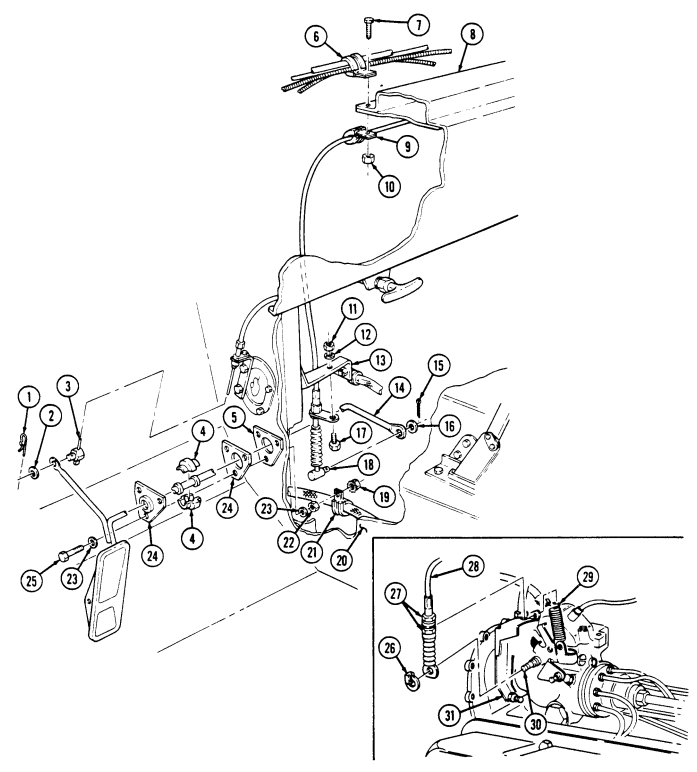

# 3-42. Accelerator Linkage Maintenance (Cont'D)

#### C. Installation

1. Connect accelerator cable (3) to injection pump throttle shaft (6). 2. Position throttle shaft lever (5) to full throttle position and install accelerator cable (3) with accelerator cable clip (1) to injection pump throttle shaft (6).

3. Connect throttle return spring (4) to engine bracket (7). 4. Install cable assembly (3) to engine bracket (7) and tighten two nuts (2). 5. Install clamp (17) to cable assembly (3) and install clamps (14) and (17) to "A" beam (16) with capscrew (15) and nut (18).

6. Install accelerator cable clevis (26) to body bracket (21) with capscrew (25), washer (20), and nut (19). 7. Position gasket (13) to cowl (28). 8. Lubricate accelerator bushing halves (12) and accelerator pedal rod (22) at accelerator rod retainer (32)
with lubricating oil.

9. Position accelerator rod retainers (32) and bushing halves (12) onto accelerator pedal rod (22)
ensuring retainers (32) are properly seated over bushing halves (12).

10. Install accelerator rod retainers (32), accelerator pedal rod (22), and gasket (13) to cowl (28) with three capscrews (33), washers (31), washers (31), and locknuts (30). Install clamp (29) to bottom capscrew (33) with assembled locknut (27).

11. Connect hand throttle clevis (11) to accelerator pedal rod (22) with washer (10) and hitch pin (9). 12. Connect accelerator cable clevis (26) to accelerator pedal rod (22) with washer (24) and cotter pin (23).

#### D. Adjustment

1. Loosen accelerator cable nuts (2) on engine bracket (7). 2. Fully depress accelerator pedal. 3. Hold throttle shaft lever (5) in full throttle position. 4. Adjust accelerator cable nuts (2) up or down so cable end (8) holds throttle shaft lever (5) in full throttle position.

5. Tighten nuts (2) securing accelerator cable (3) to engine bracket (7). 6. Release accelerator pedal and ensure throttle shaft lever (5) returns all the way to idle position.

# 3-42. Accelerator Linkage Maintenance (Cont'D)

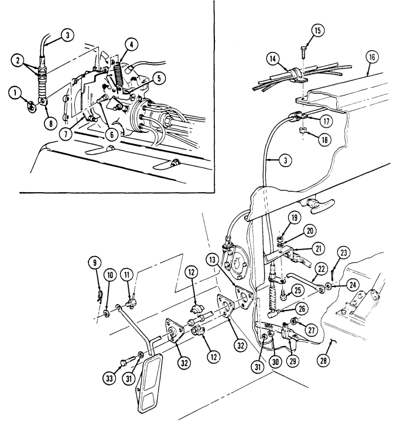

FOLLOW-ON TASKS: - Install engine access cover (para. 10-15).

-  Lower and secure hood (TM 9-2320-280-10).
-  Start engine (TM 9-2320-280-10) and check for proper accelerator operation.

# 3-43. Accelerator Pedal Replacement

This task covers:
INITIAL SETUP:

#### Tools

General mechanic's tool kit:
automotive (Appendix B, Item 1)

#### Materials/Parts

Cotter pin (Appendix G, Item 11)
a. Removal

a. Removal b. Installation

| Equipment Condition   |
|-----------------------|

TM 9-2320-280-24P
Remove cotter pin (5), washer (6), and pin (3) from accelerator rod (1), and remove accelerator pedal (4) and spring (2). Discard cotter pin (5).

b. Installation Install accelerator pedal (4) and spring (2) on accelerator rod (1) with pin (3), washer (6), and cotter pin (5).

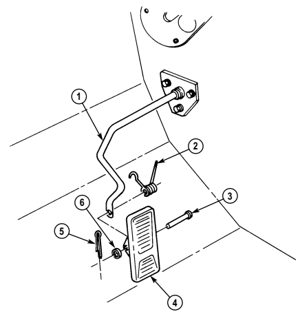

FOLLOW-ON TASK: Start engine (TM 9-2320-280-10) and check for proper accelerator operation.

# 3-44. Engine Idle Speed Adjustment

This task covers:
Engine Idle Speed Adjustment INITIAL SETUP:
Tools General mechanic's tool kit:
automotive (Appendix B, Item 1)
Test Equipment STE/ICE-R

| Manual References   |
|---------------------|
| TM 9\-2320\-280\-10 |

Equipment Condition Hood raised and secured (TM 9-2320-280-10).

General Safety Instructions Keep hands and arms away from fan blade and drivebelts while engine is running.

#### Engine Idle Speed Adjustment

1. Start engine (TM 9-2320-280-10) and bring engine to operating temperature. 2. Note idle speed and disconnect lead 569B (2) from injection pump (4). If change in idle speed is noted, refer to para. 2-22, Fuel System Tests. If no change in idle speed is noted, connect lead 569B (2) to injection pump (4) and proceed to step 3.

Keep hands and arms away from fan blade and drivebelts while engine is running or serious injury may result.

3. Set engine idle speed to 650 rpm (± 25 rpm) for the 6.2L engine or 700 rpm (± 25 rpm) for the 6.5L
engine by turning idle speed adjusting screw (1) on throttle shaft lever (3).

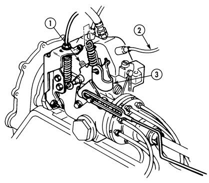

FOLLOW-ON TASK: Lower and secure hood (TM 9-2320-280-10).

# 3-45. Hand Throttle Control Cable And Bracket Replacement

This task covers:
INITIAL SETUP:

#### Tools

General mechanic's tool kit:
automotive (Appendix B, Item 1)
Materials/Parts Four locknuts (Appendix G, Item 70) O-ring (Appendix G, Item 212)
a. Removal

a. Removal b. Installation

| Personnel Required   |
|----------------------|
| One mechanic         |
| One assistant        |

Manual References TM 9-2320-280-24P
1. Remove four screws (6) and instrument cluster (7) from instrument panel (3) and pull instrument cluster (7) away to allow access to speedometer cable (4).

2. Loosen nut (5) and disconnect speedometer cable (4) from speedometer (1). 3. Remove hitch pin (19) and washer (18) and disconnect hand throttle clevis (16) from accelerator rod (17).

4. Remove locknut (8), washer (9), screw (10), washer (9), and hand throttle cable (11) from bracket
(12). Discard locknut (8).

5. Remove two locknuts (13), washers (14), capscrews (20), washers (14), and bracket (12) from cowl (15) Discard locknuts (13).

6. Loosen nut (25) and hand throttle cable (11) from bracket (23). 7. Remove locknut (21), washer (28), capscrew (27), and washer (28) from bracket (23) and instrument panel (3). Discard locknut (21).

8. Remove nut (22), screw (24), and bracket (23) from instrument panel (3). 9. Remove setscrew (30) and handle (31) from hand throttle cable (11).

10. Remove nut (25), O-ring (33), and nut (26) from hand throttle cable (11). Discard O-ring (33).

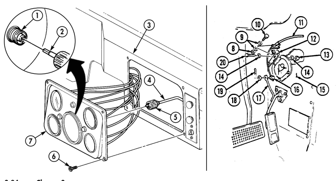

# 3-45. Hand Throttle Control Cable And Bracket Replacement (Cont'D)

#### B. Installation

1. Install nut (26), O-ring (33), and nut (25) on hand throttle cable (11). 2. Install handle (31) on hand throttle cable (11) with setscrew (30). 3. Install bracket (23) on instrument panel (3) with screw (24) and nut (22). Do not tighten. 4. Align holes in bracket (23), instrument panel (3), and steering column bracket (29) with washer (28), capscrew (27), washer (28) and locknut (21).

5. Tighten screw (24) and nut (22). 6. Install hand throttle cable (11) on bracket (23) with nut (25). 7. Install bracket (12) on cowl (15) with two washers (14), capscrews (20), washers (14), and locknuts (13).

8. Install hand throttle cable (11) on bracket (12) with washer (9), screw (10), washer (9), and locknut (8).

9. Connect clevis (16) to accelerator rod (17) with washer (18) and hitch pin (19).

10. Connect speedometer cable (4) to speedometer (1), ensuring core (2) engages with square hole in speedometer (1), and tighten nut (5).

11. Install instrument cluster (7) in instrument panel (3) with four screws (6).

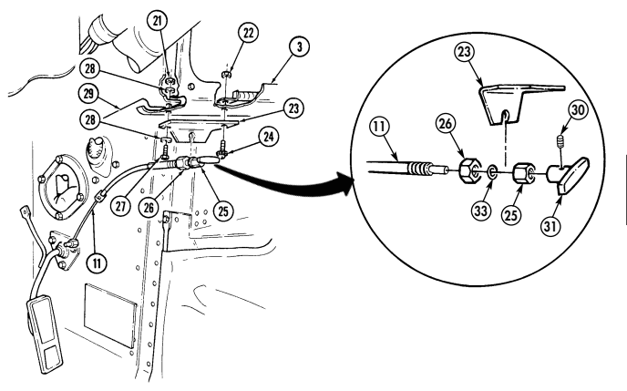

# Section Iv. **Exhaust System Maintenance**

| b.  Inspection                                                                 | d.  Adjustment                                                                                       |
|--------------------------------------------------------------------------------|------------------------------------------------------------------------------------------------------|
| INITIAL SETUP:                                                                 |                                                                                                      |
| Tools                                                                          | Personnel Required                                                                                   |
| General mechanic's tool kit:                                                   | One mechanic                                                                                         |
| automotive (Appendix B, Item 1)                                                | One assistant                                                                                        |
| Materials/Parts                                                                | Manual References                                                                                    |
| Four locknuts (Appendix G, Item 70)                                            | TM 9\-2320\-280\-10                                                                                  |
| Cotter pin (Appendix G, Item 11)                                               | TM 9\-2320\-280\-24P                                                                                 |
| Assembled locknut (Appendix G, Item 131) Lubricating oil, seasonal grade of OE | Equipment Condition                                                                                  |
| (Appendix C, Item 32)                                                          | - Hood raised and secured (TM 9\-2320\-280\-10).                                                     |
|                                                                                | - Engine access cover removed (para. 10\-15).                                                        |
| a. Removal                                                                     |                                                                                                      |
| 1.                                                                             | Remove cotter pin (15) and washer (16) and disconnect accelerator cable clevis (18) from accelerator |
| pedal rod (14). Discard cotter pin (15).                                       |                                                                                                      |
| 2.                                                                             | Remove hitch pin (1) and washer (2) and disconnect hand throttle clevis (3) from accelerator pedal   |
| rod (14).                                                                      |                                                                                                      |
| 3.                                                                             | Remove assembled locknut (19) and harness clamp (21) from lower capscrew (25). Discard               |

## 3-46. Exhaust System Maintenance Task Summary 3-47. Tailpipe Replacement

|    | retainers (24) from cowl (20). Discard locknuts (22).                                                |
|----|------------------------------------------------------------------------------------------------------|
|    | NOTE                                                                                                 |
|    | Bushing halves may detach from accelerator pedal rod during removal.                                 |
| 5. | Pull accelerator pedal rod (14) forward through gasket (5) in cowl (20) and remove accelerator pedal |
|    | rod (14).                                                                                            |
| 6. | Remove accelerator rod retainers (24) and bushing halves (4) from accelerator pedal rod (14).        |
| 7. | Remove gasket (5) from cowl (20).                                                                    |
| 8. | Remove locknut (11), washer (12), capscrew (17), and accelerator cable clevis (18) from body         |
|    | bracket (13). Discard locknut (11).                                                                  |
| 9. | Remove nut (10), capscrew (7), and clamps (6) and (9) from A\-beam (8).                              |

This task covers:

Do not touch hot exhaust system components with bare hands. Severe injury will result.

a. Removal 1. Remove three locknuts (9), washers (6), capscrews (5), and washers (6) from tailpipe (1) and muffler (7). Discard locknuts (9).

2. Remove two nuts (3), lockwashers (4), and U-bolt (10) from tailpipe (1) and hanger (2). 

Discard lockwashers (4).

3. Remove tailpipe (1) and gasket (8) from muffler (7). Discard gasket (8).

## 3-47. Tailpipe Replacement (Cont'D)

b. Installation Install gasket (8) and tailpipe (1) on muffler (7) with three washers (6), capscrews (5), washers (6),
1.

and locknuts (9). Tighten locknuts (9) to 26 lb-ft (35 N.m).

Install tailpipe (1) on hanger (2) with U-bolt (10), two washers (4), and nuts (3).

2.

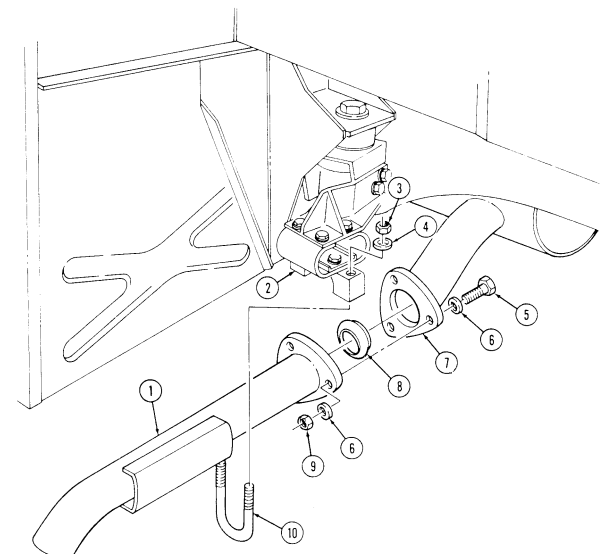

FOLLOW-ON TASK: Start engine (TM 9-2320-280-10 and check for exhaust leaks.

# 3-48. Muffler And Insulator Replacement (All Models Except M1123 And "A2" Vehicles)

This task covers:
INITIAL SETUP:
Applicable Models All except: M997A2, M1025A2, M1035A2, M1043A2, M1045A2, M1097A2, M1123 Tools General mechanic's tool kit:
automotive (Appendix B, Item 1)
Materials/Parts Nine locknuts (Appendix G, Item 128) Gasket (Appendix G, Item 42) Two lockwashers (Appendix G, Item 133)

#### A. Removal B. Installation

Manual References TM 9-2320-280-24P
Equipment Condition Tailpipe removed (para. 3-47).

General Safety Instructions Do not touch hot exhaust system components with bare hands.

Do not touch hot exhaust system components with bare hands. Severe injury will result.

#### A. Removal

1. Remove three locknuts (10), washers (9), capscrews (12), and washers (9) from muffler (7) and crossover pipe (8). Discard locknuts (10).

2. Remove two nuts (16), lockwashers (15), and U-bolt (13) from muffler (7) and support bracket (14).

Discard lockwashers (15).

3. Remove gasket (11) by pulling muffler (7) towards rear of vehicle. Discard gasket (11).

NOTE
It may be necessary to lower rear propeller shaft (para. 6-5) to gain access to locknuts on muffler hanger.

4. Remove four locknuts (3), washers (2), capscrews (6), and washers (2) securing insulator (4) and retaining plates (5) to muffler hanger (1) and remove muffler (7). Discard locknuts (3).

5. Remove two locknuts (17), washers (18), capscrews (20), washers (18), insulator (4), and retaining plate (19) from muffler (7). Discard locknuts (17).

#### B. Installation

1. Install insulator (4) and retaining plate (19) to muffler (7) with two washers (18), capscrews (20),
washers (18), and locknuts (17). Tighten locknuts (17) to 10 lb-ft (14 N•m).

2. Install muffler (7), insulator (4), and retaining plates (5) to muffler hanger (1) with four washers (2), capscrews (6), washers (2), and locknuts (3).

3. Install muffler (7) on bracket (14) with U-bolt (13), two lockwashers (15), and nuts (16). 4. Install gasket (11) and muffler (7) on crossover pipe (8) with three washers (9), capscrews (12), 
washers (9), and locknuts (10). Tighten locknuts (10) to 26 lb-ft (35 N•m).

3-48.   MUFFLER AND INSULATOR REPLACEMENT (ALL MODELS EXCEPT M1123 AND
"A2″ VEHICLES)

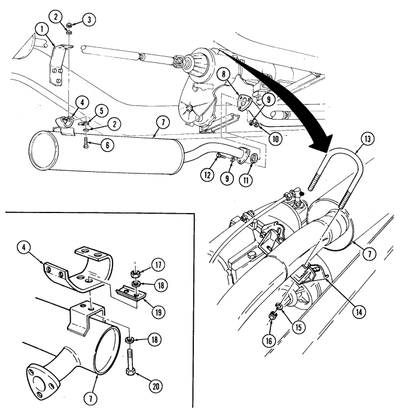

FOLLOW-ON TASK:   Install tailpipe (para. 3-47).

# 3-49. Muffler And Catalytic Converter Replacement (M1123 And "A2" Vehicles Only)

This task covers:
INITIAL SETUP:
Applicable Models M997A2, M1025A2, M1035A2, M1043A2, M1045A2, M1097A2, M1123 Tools General mechanic's tool kit:
automotive (Appendix B, Item 1)
Materials/Parts Nine locknuts (Appendix G, Item 128)
Manifold seal assembly (Appendix G, Item 197)
Two lockwashers (Appendix G, Item 167)
a. Removal b. Installation Manual References TM 9-2320-280-24P
Equipment Condition Tailpipe removed (para. 3-47).

General Safety Instructions Do not touch hot exhaust system components with bare hands.

Do not touch hot exhaust system components with bare hands. Severe injury will result.

a. Removal

Support muffler and catalytic converter during replacement. Failure to do so may result in damage to equipment.

1. Remove two clamps (12) and heat shield (13) from crossover pipe (14). 2. Remove four nuts (7) and U-bolt (25) from heat shield (11), support bracket (24), and muffler (26). 3. Loosen clamp (8) and remove heat shield (11) from catalytic converter (18). 4. Remove two nuts (10) and heat shield (4) from muffler (26). 5. Remove three locknuts (16), washers (15), capscrews (23), and washers (15) from catalytic converter (18) and crossover pipe (14). Discard locknuts (16).

6. Remove two nuts (21), lockwashers (20), and U-bolt (17) from catalytic converter (18) and support bracket (19). Discard lockwashers (20).

7. Remove manifold seal assembly (22) by pulling catalytic converter (18) towards rear of vehicle.

Discard manifold seal assembly (22).

It may be necessary to lower rear propeller shaft (para. 6-5) to gain access to locknuts on muffler hanger.

8. Remove four locknuts (2), washers (3), capscrews (27), washers (3), two retaining plates (28), and muffler (26) from muffler hanger (1). Discard locknuts (2).

9. Remove two locknuts (34), washers (31), capscrews (32), washers (31) insulator (29), retaining plate (33), and bracket (30) from muffler (26). Discard locknuts (34).

#### B. Installation

1. Install bracket (30), insulator (29) and retaining plate (33) on muffler (26) with two washers (31),
capscrews (32), washers (31), and locknuts (34). Tighten locknuts (34) to 10 lb-ft (14 N•m).

2. Install muffler (26) and two retaining plates (28) on muffler hanger (1) with four washers (3),
capscrews (27), washers (3), and locknuts (2).

3. Install catalytic converter (18) on bracket (19) with U-bolt (17), two lockwashers (20), and nuts (21).

# 3-49. Muffler And Catalytic Converter Replacement (M1123 And "A2" Vehicles Only) (Cont'D)

4. Install manifold seal assembly (22) and catalytic converter (18) on crossover pipe (14) with three washers (15), capscrews (23), washers (15), and locknuts (16). Tighten locknuts (16) to 26 lb-ft (35 N•m).

5. Install heat shield (4) on muffler (26) with two nuts (10). 6. Install heat shield (11) on catalytic converter (18) with clamp (8). 7. Install heat shield (11) on bracket (24) and muffler (26) with U-bolt (25) and four nuts (7).

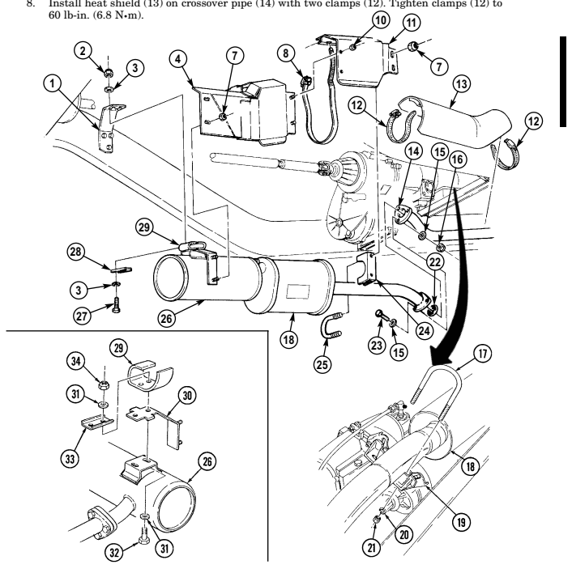

FOLLOW-ON TASK: Install tailpipe (para. 3-47).

# 3-50. Crossover Pipe Replacement

This task covers:
INITIAL SETUP:

#### Tools

General mechanic's tool kit:
automotive (Appendix B, Item 1)
Materials/Parts Nine locknuts (Appendix G, Item 128) Two manifold seals (Appendix G, Item 197) Gasket (Appendix G, Item 42)
Manual References TM 9-2320-280-10 TM 9-2320-280-24P

#### A. Removal B. Installation Equipment Condition

- Engine access cover removed (para. 10-15).

- Right exhaust manifold rear heat shield removed
(para. 3-54).

General Safety Instructions Do not touch hot exhaust system components with bare hands.

Do not touch hot exhaust system components with bare hands. Severe injury will result.

a. Removal 1. Remove two clamps (17) and heat shield (18) from crossover pipe (3). 2. Remove three locknuts (1), washers (2), capscrews (4), washers (2), and crossover pipe (3) from right exhaust manifold (5). Discard locknuts (1).

3. Remove three locknuts (14), washers (13), capscrews (16), washers (13) , and crossover pipe (3) from muffler (12). Discard locknuts (14).

4. Remove three locknuts (10), washers (8), capscrews (7), washers (8), and crossover pipe (3) from left exhaust manifold (9). Discard locknuts (10).

5. Remove and discard two manifold seals (6) and (11) and gasket (15).

#### B. Installation

1. Install manifold seal (11) and crossover pipe (3) on left exhaust manifold (9) with three washers (8), 
capscrews (7), washers (8), and locknuts (10).

2. Install gasket (15) and crossover pipe (3) on muffler (12) with three washers (13), capscrew (16),
washers (13), and locknuts (14).

3. Install manifold seal (6) and crossover pipe (3) on right exhaust manifold (5) with three washers (2),
capscrews (4), washers (2), and locknuts (1).

4. Tighten locknuts (1), (10), and (14) to 26 lb-ft (35 N•m). 5. Install heat shield (18) on crossover pipe (3) with two clamps (17).

# 3-50.  Crossover Pipe Replacement(Cont'D)

FOLLOW-ON TASKS: - Start engine (TM 9-2320-280-10) and check for exhaust leaks.

- Install right exhaust manifold rear heat shield (para. 3-54).

- Install engine access cover (para. 10-15).

# 3-51. Tailpipe Hanger Replacement

This task covers:
INITIAL SETUP:

#### Tools

General mechanic's tool kit:
automotive (Appendix B, Item 1)
Materials/Parts Six locknuts (Appendix G, Item 128)
a. Removal

a. Removal b. Installation

| Manual References   |
|---------------------|
| TM 9\-2320\-280\-10 |

General Safety Instructions Do not touch hot exhaust system components with bare hands.

Do not touch hot exhaust system components with bare hands. Severe injury will result.

1. Remove four locknuts (5), washers (4), capscrews (9), washers (4) two insulator reinforcement plates (10) and insulator (8) from tailpipe hanger (6). Discard locknuts (5).

2. Remove two locknuts (1), washers (2), capscrews (7), washers (2) and tailpipe hanger (6) from frame (3). Discard locknuts (1).

#### B. Installation

1. Install insulator (8) and insulator reinforcement plates (10) to tailpipe hanger (6) with four washers (4), capscrews (9), washers (4), and locknuts (5).

2. Install tailpipe hanger (6) to frame (3) with two washers (2), capscrews (7), washers (2), and

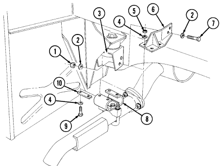

locknuts (1). Tighten capscrews (7) to 26 lb-ft (35 N•m).

# 3-52. Tailpipe Insulator Replacement

This task covers:
INITIAL SETUP:

#### Tools

General mechanic's tool kit:
automotive (Appendix B, Item 1)
Materials/Parts Four locknuts (Appendix G, Item 128) Two lockwashers (Appendix G, Item 133)
Manual References TM 9-2320-280-24P
a. Removal b. Installation Equipment Condition Tailpipe removed (para. 3-47).

General Safety Instructions Do not touch hot exhaust system components with bare hands.

Do not touch hot exhaust system components with bare hands. Severe injury will result.

a. Removal 1. Remove four locknuts (5), washers (6), capscrews (9), washers (8) reinforcement plates (7) and insulator (11) from tailpipe hanger (4). Discard locknuts (5).

2. Remove two capscrews (3), lockwashers (2), reinforcement plate (1) and U-bolt clamp (10) from insulator (11). Discard lockwashers (2).

#### B. Installation

1. Install reinforcement plate (1) and U-bolt clamp (10) to insulator (11) with two lockwashers (2) and capscrews (3). Tighten capscrews (3) to 10 lb-ft (14 N•m).

2. Install insulator (11) and reinforcement plate (7) to tailpipe hanger (4) with four washers (8),

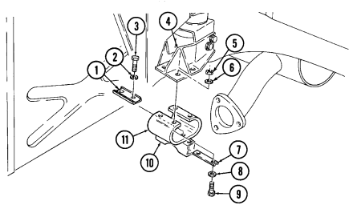

capscrews (9), washers (6), and locknuts (5). Tighten locknuts (5) to 10 lb-ft (14 N•m).

FOLLOW-ON TASK: Install tailpipe (para. 3-47).

# 3-53. Muffler Support Bracket Maintenance

This task covers:

a. Removal c. Assembly b. Disassembly d. Installation

INITIAL SETUP:
Tools General mechanic's tool kit:
automotive (Appendix B, Item 1)
Materials/Parts Four locknuts (Appendix G, Item 128)
Manual References TM 9-2320-280-24P
a. Removal

#### Equipment Condition

- Muffler and insulator removed (all models except M1123 and "A2" series vehicles) (para. 3-48).

- Muffler and catalytic converter removed (M1123 and "A2" vehicles only) (para. 3-49).

Hold bolt heads on transfer case secure to prevent changing torque or damaging transfer case seal.

Remove two locknuts (1), washers (2), and support bracket assembly (3) from transfer case (4). Discard locknuts (1).

#### B. Disassembly

1. Remove two locknuts (9), washers (8), capscrews (5), washers (6), mounting bracket (11), and washers (6) from support plate (10). Discard locknuts (9).

2. Remove two insulators (7) from mounting plate (11).

#### C. Assembly

1. Install two insulators (7) in mounting bracket (11). 2. Install two washers (6) between mounting bracket (11) and support plate (10) with two washers (6),
capscrews (5), washers (8), and locknuts (9). Tighten locknuts (9) to 15 lb-ft (20 N•m).

d. Installation

Hold bolt heads on transfer case secure to prevent changing torque or damaging transfer case seal.

Install support bracket assembly (3) to transfer case (4) with two washers (2) and locknuts (1). Tighten locknuts (1) to 15 lb-ft (20 N•m).

# 3-53.  Muffler Support Bracket Maintenance(Cont'D)

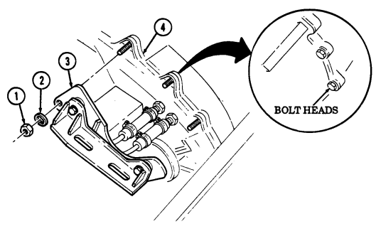

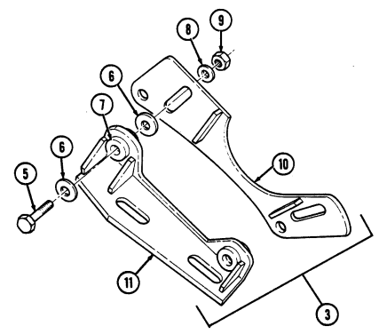

FOLLOW-ON TASKS: - • Install muffler and catalytic converter (M1123 and "A2" vehicles only) (para. 3-49).

-  Install muffler and insulator (all models except M1123 and "A2" series vehicles)
(para. 3-48).

# 3-54. Right Exhaust Manifold Rear Heat Shield Replacement

This task covers:
INITIAL SETUP:
Tools General mechanic's tool kit:
automotive (Appendix B, Item 1)

a. Removal b. Installation

Equipment Condition Engine access cover removed (para. 10-15).

General Safety Instructions Do not touch hot exhaust system components with bare hands.

Materials/Parts Locknut (Appendix G, Item 72)
Manual References TM 9-2320-280-24P

Do not touch hot exhaust system components with bare hands. Severe injury will result.

#### A. Removal

1. Remove locknut (6), capscrew (2), and clamp (1) from rear heat shield (7) and transmission dipstick tube (3). Discard locknut (6).

2. Remove capscrew (5) and rear heat shield (7) from heat shield (4).

b. Installation 1. Install rear heat shield (7) on heat shield (4) with capscrew (5). 2. Install clamp (1) and rear heat shield (7) on transmission dipstick tube (3) with capscrew (2) and locknut (6).

# 3-54.  Right Exhaust Manifold Rear Heat Shield Replacement(Cont'D)

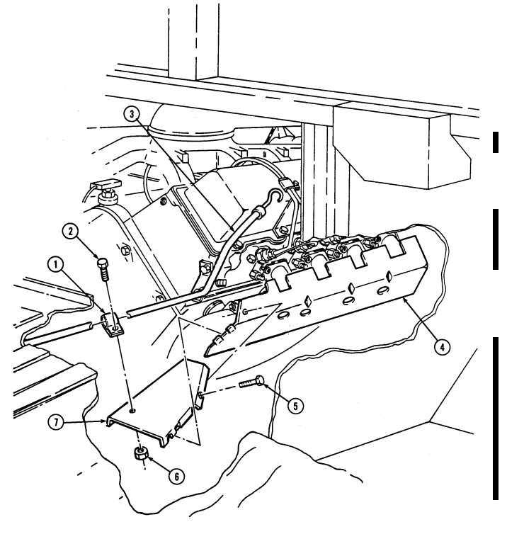

FOLLOW-ON TASK:   Install engine access cover (para. 10-15).

# 3-55. Right Exhaust Manifold Heat Shield Replacement

| Special Tools   |
|-----------------|

| Tools                           |
|---------------------------------|
| General mechanic's tool kit:    |
| automotive (Appendix B, Item 1) |

This task covers:

| INITIAL SETUP:   |
|------------------|

Hex-head driver, 8mm (Appendix B, Item 156)
Materials/Parts Locknut (Appendix G, Item 128)
Personnel Required One mechanic One assistant

a. Removal b. Installation

Equipment Condition

| Manual References    |
|----------------------|
| TM 9\-2320\-280\-10  |
| TM 9\-2320\-280\-24P |

- Right exhaust manifold rear heat shield removed
(para. 3-54).

- Hood raised and secured (TM 9-2320-280-10). - Engine access cover removed (para. 10-15).

#### General Safety Instructions

Do not touch hot exhaust system components with bare hands.

Do not touch hot exhaust system components with bare hands. Severe injury will result.

a. Removal 1. Using hex-head driver, loosen three socket head screws (3) on heat shield (4), exhaust manifold (2),
and cylinder head (1).

2. Remove locknut (7), washer (6), capscrew (5), washer (6) and heat shield (4) from crossover pipe (8)
and exhaust manifold (2). Discard locknut (7).

#### B. Installation

1. Position heat shield (4) on exhaust manifold (2) and crossover pipe (8). 2. Using hex-head driver, secure heat shield (4) and exhaust manifold (2) to cylinder head (1) with three socket-head screws (3). Tighten socket-head screws (3) to 25-33 lb-ft (34-45 N•m).

3. Install heat shield (4) on exhaust manifold (2) and crossover pipe (8) with washer (6), capscrew (5),
washer (6), and locknut (7). Tighten locknut (7) to 37 lb-ft (50 N•m).

# 3-55. Right Exhaust Manifold Heat Shield Replacement (Cont'D)

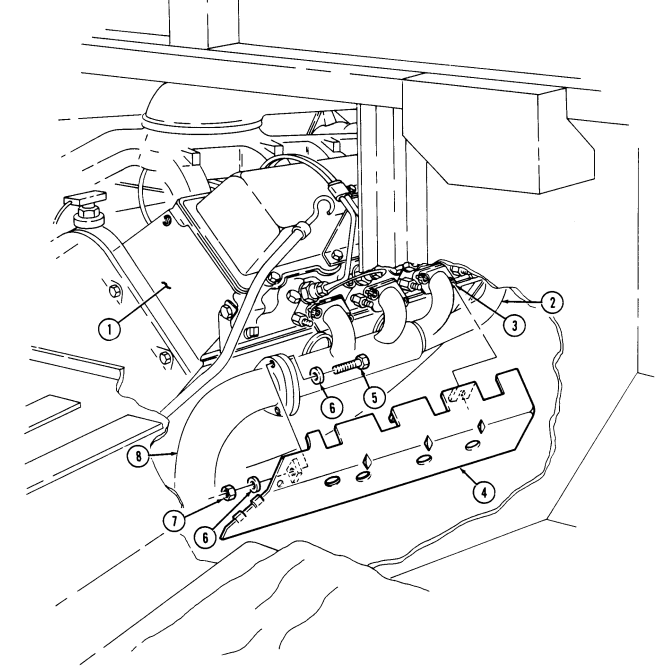

FOLOW-ON   TASK:  - Install right exhaust manifold rear heat shield (para. 3-54).
- • Install engine access cover (para. 10-15).

· Start engine (TM 9-2320-280-10) and check for exhaust leaks. - Lower and secure hood (TM 9-2320-280-10).

# 3-56. Left Exhaust Manifold Replacement

This task covers:
INITIAL SETUP:

#### Tools

General mechanic's tool kit:
automotive (Appendix B, Item 1)
Special Tools Hex-head driver, 8mm, (Appendix B, Item 156)
Materials/Parts Gasket (Appendix G, Item 50) Four locknuts (Appendix G, Item 128) Manifold seal (Appendix G, Item 197)
Manual References TM 9-2820-280-24P

#### A. Removal B. Installation Equipment Condition

- Engine access cover removed (para. 10-15). - Oil dipstick tube removed (para. 3-2). - 60 ampere alternator removed (para. 4-2). - 100 ampere alternator removed (para. 12-23 or 12-24).

- 200 ampere alternator removed (para. 4-109 or 4-110). 

#### General Safety Instructions

- Do not touch hot exhaust system components with bare hands.

- Place used gaskets in a plastic, leakproof, sealed bag or container.

Do not touch hot exhaust system components with bare hands. Severe injury will result.

a. Removal 1. Remove three locknuts (8), washers (9), capscrews (11), and washers (9) from crossover pipe (7) and exhaust manifold (4). Discard locknuts (8).

Some vehicles may have a socket-head screw in place of stud to secure alternator support bracket and exhaust manifold to cylinder head.

2. Remove locknut (14), washer (15) and alternator support bracket (1) from exhaust manifold (4) and stud (2). Discard locknut (14).

3. Remove stud (2) and washer (3) from exhaust manifold (4) and cylinder head (6). 4. Using hex-head driver, remove seven socket-head screws (12) and washers (13) from exhaust manifold (4) and cylinder head (6).

- Vehicles with serial numbers USBL Eff. 1 through 118767 have manifold gaskets containing asbestos fibers. When performing manifold maintenance, place used gaskets in a plastic, leakproof, sealed bag or container and contact the local health and safety department for further disposal instructions.

- Failure to observe above warning may result in an environmental hazard.

5. Remove exhaust manifold (4), gasket (5), and manifold seal (10). Discard gasket (5) and manifold seal (10).

6. Clean all gasket material from head mounting surface and manifold mating surface.

# 3-56. Left Exhaust Manifold Replacement (Cont'D)

b. Installation

Alternate screw and stud tightening. Flanges often break when each screw is tightened completely before others are snugged up.

Ensure replacement gasket has a silver, shiny surface, not a dull, dark surface, which is characteristic of a gasket containing asbestos.

1. Install gasket (5) and exhaust manifold (4) on cylinder head (6) with seven washers (13), sockethead screws (12), washer (3), and stud (2).

2. Using hex-head driver, tighten seven socket-head screws (12) and stud (2) to 25-33 lb-ft (34-45 N.m).

3. Install alternator support bracket (1) on exhaust manifold (4) and stud (2) with washer (15) and locknut (14). Tighten locknut (14) to 31-39 lb-ft (42-53 N.m).

4. Install manifold seal (10) and crossover pipe (7) on exhaust manifold (4) with three washers (9), 

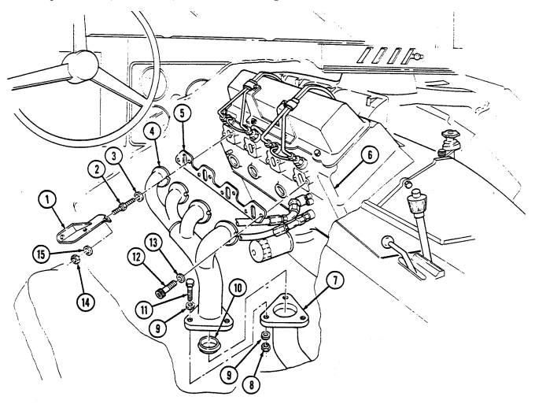

capscrews (11), washers (9), and locknuts (8). Tighten locknuts (8) to 37 lb-ft (50 N.m).

FOLLOW-ON TASKS: - Install 200 ampere alternator (para. 4-109 or 4-110).

- Install 100 ampere alternator (para. 12-23 or 12-24). - Install 60 ampere alternator (para. 4-2). - Install oil dipstick tube (para. 3-2). - Install engine access cover (para. 10-15).

# 3-57. Right Exhaust Manifold Replacement

This task covers:
INITIAL SETUP:

#### Tools

General mechanic's tool kit:
automotive (Appendix B, Item 1)
Special Tools Hex head driver, 8mm, (Appendix B, Item 156)
Materials/Parts Gasket (Appendix G, Item 50) Three locknuts (Appendix G, Item 128) Manifold seal (Appendix G, Item 197)
Manual References TM 9-2820-280-24P

#### A. Removal B. Installation Equipment Condition

- Air horn and elbow removed (para. 3-14). - Right exhaust manifold heat shield removed
(para. 3-55).

General Safety Instructions
- Do not touch hot exhaust system components with bare hands.

- Place used gaskets in a plastic, leakproof, sealed bag or container.

Do not touch hot exhaust system components with bare hands. Severe injury will result.

#### A. Removal

1. Remove three locknuts (10), washers (7), capscrews (6), and washers (7) from exhaust manifold (3) and crossover pipe (9). Discard locknuts (10).

2. Using hex head driver, remove eight socket-head screws (5) and washers (4) from exhaust manifold (3)
and cylinder head (1).

- Vehicles with serial numbers USBL Eff. 1 through 118767 have manifold gaskets containing asbestos fibers. When performing manifold maintenance, place used gaskets in a plastic, leakproof sealed bag or container and contact the local health and safety department for further disposal instructions.

- Failure to observe above warning may result in an environmental hazard.

3. Remove exhaust manifold (3), gasket (2), and manifold seal (8). Discard gasket (2) and manifold seal (8).

4. Clean all gasket material from head mounting surface and manifold mating surface.

b. Installation

Alternate screw tightening. Flanges often break when each screw is tightened completely before others are snugged up.

NOTE
Ensure replacement gasket has a silver, shiny surface, not a dull, dark surface, which is characteristic of a gasket containing asbestos.

1. Install gasket (2) and exhaust manifold (3) to cylinder head (1) with eight socket-head screws (5) and washers (4). Tighten socket-head screws (5) to 25-33 lb-ft (34-45 N.m).

2. Install exhaust manifold (3) to crossover pipe (9) with manifold seal (8), three washers (7), capscrews
(6), washers (7), and locknuts (10). Tighten locknuts (10) to 37 lb-ft (50 N.m).

# 3-57. Right Exhaust Manifold Replacement (Cont'D)

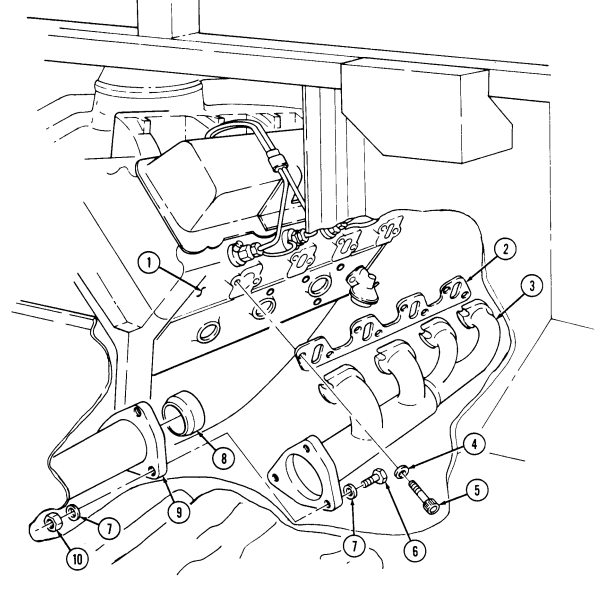

FOLLOW-ON TASKS: - Install air horn and elbow (para. 3-14).
- • - Install right exhaust manifold heat shield (para. 3-55).

# 3-58. Muffler Hanger Replacement

This task covers:
INITIAL SETUP:
Tools General mechanic's tool kit:
automotive (Appendix B, Item 1)

a. Removal b. Installation

| General Safety Instructions                     |
|-------------------------------------------------|
| Do not touch hot exhaust system components with |

| Manual References    |
|----------------------|
| TM 9\-2320\-280\-24P |

Materials/Parts Three locknuts (Appendix G, Item 114)
a. Removal Remove three locknuts (4), washers (3), and muffler hanger (1) from frame rail (2) Discard locknuts (4).

b. Installation Install muffler hanger (1) to frame rail (2) with three washers (3) and locknuts (4). Tighten locknuts (4) to 75 lb-ft (102 N•m).

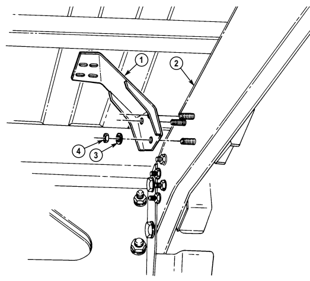

FOLLOW-ON TASK: Install muffler and insulator (para. 3-48).

# Section V. Cooling System Maintenance 3 - 5 9 . Cooling System Maintenance Task Summary

| INITIAL SETUP:                                                                                           |
|----------------------------------------------------------------------------------------------------------|
| Tools  Equipment Condition                                                                               |
| General mechanic's tool kit: - Muffler and insulator removed (all models except                          |
| automotive (Appendix B, Item 1) M1123 and "A2" series vehicles) (para. 3\-48).                           |
| - Muffler and catalytic converter removed (M1123 Materials/Parts                                         |
| Four locknuts (Appendix G, Item 128)                                                                     |
| Manual References                                                                                        |
| TM 9\-2320\-280\-24P                                                                                     |
| a. Removal                                                                                               |
| NOTE                                                                                                     |
| Hold bolt heads on transfer case secure to prevent changing                                              |
| torque or damaging transfer case seal.                                                                   |
| Remove two locknuts (1), washers (2), and support bracket assembly (3) from transfer case (4). Discard   |
| locknuts (1).                                                                                            |
| b. Disassembly                                                                                           |
| 1.  Remove two locknuts (9), washers (8), capscrews (5), washers (6), mounting bracket (11), and         |
| washers (6) from support plate (10). Discard locknuts (9).                                               |
| 2.  Remove two insulators (7) from mounting plate (11).                                                  |
| c. Assembly                                                                                              |
| 1.  Install two insulators (7) in mounting bracket (11).                                                 |
| 2.  Install two washers (6) between mounting bracket (11) and support plate (10) with two washers (6),   |
| capscrews (5), washers (8), and locknuts (9). Tighten locknuts (9) to 15 lb\-ft (20 N•m).                |
| d. Installation                                                                                          |
| Hold bolt heads on transfer case secure to prevent changing                                              |
| torque or damaging transfer case seal.                                                                   |
| Install support bracket assembly (3) to transfer case (4) with two washers (2) and locknuts (1). Tighten |
| and "A2" vehicles only) (para. 3\-49). NOTE  locknuts (1) to 15 lb\-ft (20 N•m).                         |

# 3-60. Cooling System Servicing

This task covers:
INITIAL SETUP:
General mechanic's tool kit: TM 9-2320-280-10 automotive (Appendix B, Item 1) TM 9-2320-280-24P
Test Equipment TB 750-651 Radiator tester (Appendix B, Item 66) Equipment Condition Antifreeze (Appendix C, Item 12) **General Safety Instructions**

a. Depressurizing c. Preventive Cleaning

b. Draining System **d. Fillng System**

Tools **Manual References**
TM 750-254 Materials/Parts Hood raised and secured (TM 9-2320-280-10).

Do not remove surge tank filler cap before releasing internal pressure.

#### A. Depressurizing Warnin G

Do not remove surge tank filler cap before depressurizing system when engine temperature is above 190°F (88°C). Steam or hot coolant under pressure will cause severe burns.

1. If engine is hot, remove surge tank filler cap (1) by placing a thick cloth over cap (l). Press down and turn counterclockwise to its first stop to release internal pressure.

2. After pressure has escaped, press down and turn cap (1) counterclockwise again and remove.

b. Draining System 1. If engine is hot, repressurize system (see a. of this task).

#### Not E

Have drainage container ready to catch coolant.

2. Open draincock (4) and allow system to drain. 3. Close draincock (4).

c. Preventive Cleaning 1. For preventive cleaning, refer to TB 750-651.

2. Test surge tank filler cap (1), refer to TM 750-254.

d. Filling System

#### Not E

The cooling system for the vehicles covered in this manual has a 26 qt (25 l) capacity. Continue filling and allow air to escape. Ensure surge tank coolant level is 3/4 full before securing filler cap.

1. Ensure radiator draincock (4) is closed and heater control valve (3) is open (pull "TEMP" knob on dash to "MAX" position).

2. Fill system with proper antifreeze solution. See table 3-1 for preparation of antifreeze solutions.

## 3-60. Cooling System Servicing (Cont'D)

3. 4.

5.

6.

7.

Secure filler cap (1) to surge tank (2). Run engine at fast idle (approximately 1500 rpm) until engine temperature reaches 190°F (88°C), opening thermostat to circulate coolant. Depressurize system (see a. of this task). Fill with proper antifreeze solution until surge tank (2) is 3/4 full. See table 3-1 for preparation of antifreeze solutions. Secure filler cap (1) to surge tank (2). Run engine at fast idle (approximately 1500 rpm) until temperature reaches 190°F (88°C), opening thermostat, and stop engine.

Depressurize system (see task a. of this paragraph). Use tester to ensure proper coolant protection is provided.

8.

9.

Secure filler cap (1) to surge tank (2).

10.

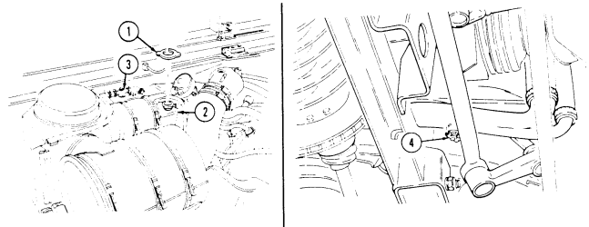

| 1.  Position heat shield (4) on exhaust manifold (2) and crossover pipe (8).                                                                                                                        |
|-----------------------------------------------------------------------------------------------------------------------------------------------------------------------------------------------------|
| 2.  Using hex\-head driver, secure heat shield (4) and exhaust manifold (2) to cylinder head (1) with three socket\-head screws (3). Tighten socket\-head screws (3) to 25\-33 lb\-ft (34\-45 N•m). |
| 3.  Install heat shield (4) on exhaust manifold (2) and crossover pipe (8) with washer (6), capscrew (5),                                                                                           |
| washer (6), and locknut (7). Tighten locknut (7) to 37 lb\-ft (50 N•m).                                                                                                                             |

Table 3-1. Guide for Preparation of Antifreeze Solutions.

FOLLOW-ON TASKS: Start engine (TM 9-2320-280-10) and check cooling system for leaks.

Lower and secure hood (TM 9-2320-280-10).

# 3-61. Radiator And Fan Shroud Assembly Maintenance

This task covers:
a. Removal c. Installation b. Cleaning and Inspection INITIAL SETUP:
Tools General mechanic's tool kit:
automotive (Appendix B, Item 1)

#### Materials/Parts

Locknut (Appendix G, Item 99) Six locknuts (Appendix G, Item 128) Eight lockwashers (Appendix G, Item 135) Rivet (Appendix G, Item 254) (optional) Repair kit (Appendix C, Item 37) (optional)
Personnel Required One mechanic One assistant Manual References TM 9-2320-280-10 TM 9-2320-280-24P
Equipment Condition
- Hood removed (para. 10-5). - Cooling system drained (para. 3-60). - Oil cooler removed (para. 3-8).

General Safety Instructions Compressed air used for cleaning purposes will not exceed 30 psi (207 kPa).

Do not bend transmission oil cooler fins. Damaged fins reduce cooling efficiency, which may damage engine.

a. Removal

The radiator and fan shroud are removed as a unit.

1. Loosen clamp (2) and disconnect radiator inlet hose (1) from radiator (3). 2. Loosen clamp (6) and disconnect surge tank-to-radiator vent hose (5) from adapter (7). 3. Loosen clamp (16) and disconnect control valve hose (15) from shroud bulkhead adapter (17)

M1123 and "A2" vehicles have a quick-disconnect on fan drive hose.

4. Disconnect fan drive hose (18) from fan drive (19). 5. Loosen clamp (10) and disconnect lower radiator front hose (11) from radiator (3).

Perform step 6 only if shroud has to be removed from radiator.

6. Remove rivet (3.1) (if installed) and strap (4) securing fan shroud (33) to radiator (3). 7. Remove locknut (24), washer (25), capscrew (29), large washer (28), washer (25), and lower mount (26)
from radiator (3) and frame bracket (27). Discard locknut (24).

8. Remove four locknuts (14), washers (13), and capscrews (12) from two rear support brackets (9) and airlift brackets (8). Discard locknuts (14).

9. Lift radiator (3) up and remove from vehicle.

10. Remove eight capscrews (30), lockwashers, (31), two retaining strips (32) and fan shroud (33) from radiator (3). Discard lockwashers (31).

11. Remove two locknuts (20), washers (21), large washers (22), insulators (23), and brackets (9) from radiator (3). Discard locknuts (20).

3-61. RADIATOR AND FAN SHROUD ASSEMBLY MAINTENANCE (6nt'd)

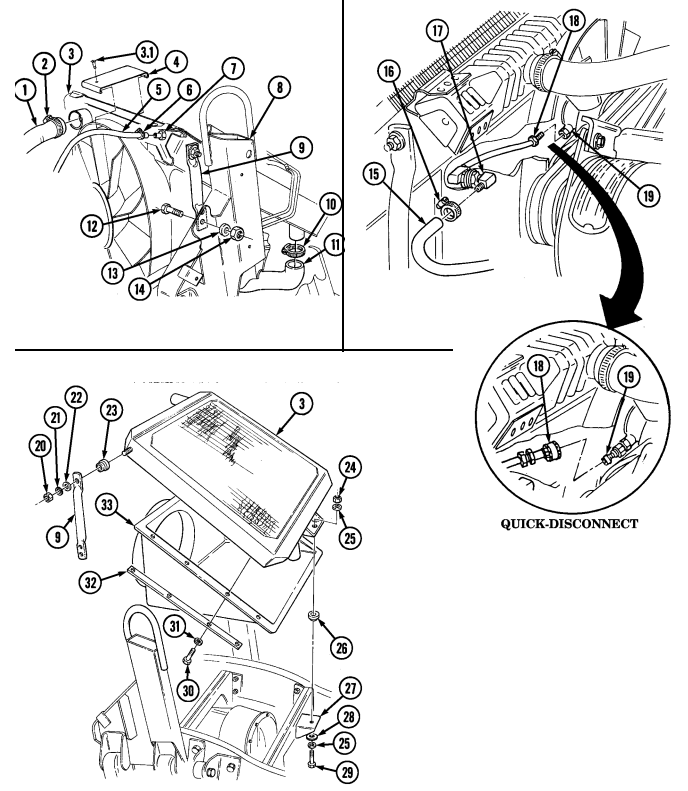

# 3 - 6 1 . R A D I Ator And Fan Shroud Assembly Maintenance (Co N T ' D)

b. Cleaning and Inspection

Compressed air used for cleaning purposes will not exceed 30 psi (207 kPa). Use only with effective chip guarding and personal protective equipment (goggles/shield, gloves, etc).

#### C A U T I O N

Using high water pressure when cleaning engine and transmission oil cooler and radiator can cause damage. High water pressure should not be directed at cooler or radiator.

1. Remove dirt, trash, and insects embedded in radiator fins, using water and compressed air. 2. Inspect radiator adapter (19) for damage. Replace adapter (19) if damaged. 3. Inspect radiator (6) for breaks, punctures, cracks, and splits. Replace radiator (6) if broken, punctured, cracked, or split.

4. Inspect shroud bulkhead adapter (20) for damage. Replace bulkhead adapter (20) if damaged.

#### Not E

For on vehicle fan shroud repair only, use repair kit listed in Appendix C.

5. Inspect fan shroud (16) for cracks, splits, and breaks. Repair fan shroud (16) if cracked, split, or broken.

Replace fan shroud if damaged beyond repair.

6. Inspect fan drive hose (21) for cracks or damage. Replace if defective.

c. Installation

#### C A U T I O N

To ensure proper cooling of engine, upper edge of shroud must align with radiator top tank seam or damage to equipment may result.

1. Install fan shroud (16) to radiator (6) so fan shroud edge (17) aligns with tank seam (18) and secure with two retaining strips (15), eight washers (14), and capscrews (13). Tighten capscrews (13) to 6 lb-ft (8 N•m ) .

2. Install two support brackets (4) and insulators (5) to radiator (6) with two large washers (3), 
washers (2), and locknuts (1). Tighten locknuts (1) to 20 lb-ft (27 N•m ) .

3. Align radiator (6) to frame bracket (10), and align rear support brackets (4) to airlift brackets (22). 4. Install rear support brackets (4) to airlift brackets (22) with four capscrews (25), washers (24), and locknuts (23). Do not tighten locknuts (23).

5. Install radiator (6) and mount (9) on frame bracket (10) with large washer (11), washer (8), capscrew (12),
washer (8), and locknut (7). Do not tighten capscrew (12).

# 3-61. Radiator And Fan Shroud Assembly Maintenance (Cont'D)

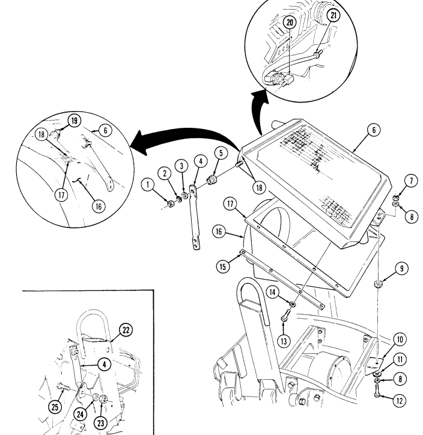

# 3 - 6 1 . R A D I Ator And Fan Shroud Assembly Maintenance (Co N T ' D)

#### Not E

- Fan shroud should be aligned so the following dimensions are maintained. Adjustments may be made by sliding the radiator/ shroud assembly. Distance "A" from the edge of shroud ring and rear edge of fan must be 1-1/2 ± 1/8 in. (38.1 ± 3 mm). Measure distance "A" at the 2, 4, 8, and 10 o'clock positions.

- Fan blade to fan shroud clearance, the distance between the top of the fan blade and fan shroud, must not be less than 1/4 in. (6 mm) at any p o s i t i o n .

6. Tighten locknuts (12) to 26 lb-ft (35 N•m). Tighten capscrew (9) to 30 lb-ft (41N•m).

#### Not E

- To secure strap to shroud, use of rivet is optional. - Perform steps 7.1 and 7.2 if retaining strap was not connected to radiator shroud with rivet.

7. Secure radiator (3) to shroud (13) with strap (5). Secure strap (5) to shroud (13) with rivet (4).

7.1. Locate, mark, and drill 0.129-in. (3 mm) diameter hole (using \#30 drill bit) in strap (5) and fan shroud (13). Remove burrs and sharp edges.

7.2. Secure radiator (3) to fan shroud (13) with rivet (4).

8. Connect lower radiator front hose (11) to radiator (3) with clamp (10).

#### Not E

- M1123 and "A2" vehicles have a quick-disconnect on fan drive hose.

- The fan drive hose may be modified to add the quick-disconnect.

Refer to appendix D, Fig. D-94 for installation.

9. Connect fan drive hose (17) to fan drive (18).

10. Connect control valve hose (14) to bulkhead adapter (16) with clamp (15).

NOT E
For vehicles equipped with a 200 amp alternator, it is recommended that the inlet hose be installed with the hose twisted counterclockwise, and upward until a kink in the hose starts to form.

11. Connect radiator inlet hose (1) to radiator (3) with clamp (2).

12. Connect surge tank-to-radiator vent hose (6) to adapter (8) with clamp (7).

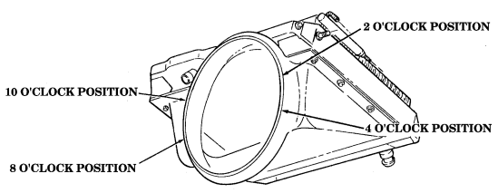

# 3-61.  Radiator And Fan Shroud Assembly Maintenance (6Nt'D)

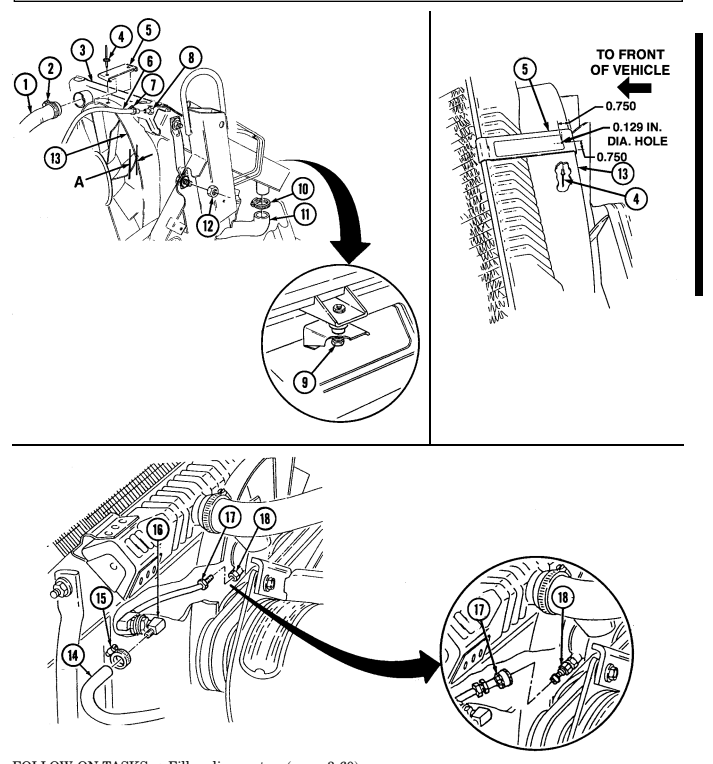

FOLLOW-ON TASKS: - Fill cooling system (para. 3-60).

· Install oil cooler (para. 3-8).

- Start engine (TM 9-2320-280-10) and check cooling system for leaks.

- Install hood (para. 10-5). · Bleed power steering system (para. 8-29).

# 3-62. Airlift To Shroud Shield Assembly Replacement

This task covers:

| a.  Removal                     | b.  Installation                             |
|---------------------------------|----------------------------------------------|
| INITIAL SETUP:                  |                                              |
| Tools                           | Manual References                            |
| General mechanic's tool kit:    | TM 9\-2320\-280\-24P                         |
| automotive (Appendix B, Item 1) | Equipment Condition                          |
| Materials/Parts                 | Muffler and insulator removed (para. 3\-48). |

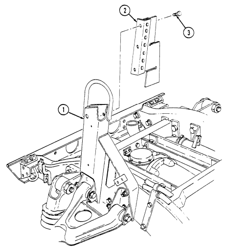

a. Removal Remove three screws (3) and shield assembly (2) from airlift bracket (1).

b. Installation Install shield assembly (2) on airlift bracket (1) with three screws (3).

FOLLOW-ON TASK: Install radiator and fan shroud (para. 3-61).

# 3-63. Radiator Support Replacement

This task covers:
INITIAL SETUP:

#### Tools

General mechanic's tool kit:
automotive (Appendix B, Item 1)
Materials/Parts Three locknuts (Appendix G, Item 128)
a. Removal a. Removal **b. Installation**
Manual References TM 9-2320-280-24P
Equipment Condition
- Left splash shield removed (para. 10-17). - Right splash shield removed (para. 10-20).

1. Remove locknut (1), washer (2), large washer (3), radiator support (4), and insulator (5) from radiator (6). Discard locknut (1).

2. Remove two locknuts (10), washers (8), capscrews (7), and support (4) from airlift bracket (9).

Discard locknuts (10).

#### B. Installation

1. Install support (4) on airlift bracket (9) with two capscrews (7), washers (8), and locknuts (10). 2. Install insulator (5) and support (4) on radiator (6) with large washer (3), washer (2), and locknut (1). Tighten locknut (1) to 26 lb-ft (35 N•m).

3. Tighten locknuts (10) to 26 lb-ft (35 N•m).

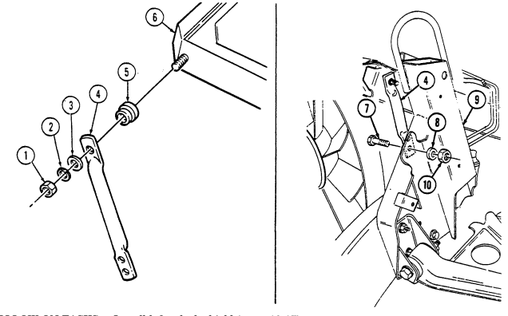

FOLLOW-ON TASKS: - Install left splash shield (para. 10-17).

- Install right splash shield (para. 10-20).

#### 3-64. Surge Tank Replacement

This task covers:
INITIAL SETUP:
General mechanic's tool kit: TM 9-2320-280-24P
automotive (Appendix B, Item 1)

a. Removal **b. Installation**

Tools **Manual References**

| Manual References                                 |
|---------------------------------------------------|
| TM 9\-2320\-280\-24P                              |
| Equipment Condition                               |
| Cooling system drained as required (para. 3\-60). |

Tag hoses prior to disconnection. When current stocks of the four-quart surge tank (12340062) are exhausted, the four and one-half quart surge tank (12340061) will be provided in ita place. When replacing the four-quart surge tank (12340062) with the four and one-half quart surge tank (12340061), the existing surge-tank-to-lower-radiator tube hose (12339163) can be used by cutting approximately four inches from surge tank end of hose.

#### A. Removal

1. Loosen clamp (3) and disconnect surge tank-to-radiator vent hose (6) from surge tank (2).

2. Loosen clamp (4) and disconnect surge tank-to-water crossover vent hose (5) from surge tank (2).

3. Loosen clamp (9) and disconnect surge tank-to-lower radiator hose (8) from surge tank (2). 4. Open two clamps (1) on surge tank (2) and bracket (10). 5. Disconnect surge tank overflow hose (7) and remove surge tank (2).

#### B. Installation

1. Install surge tank (2) on bracket (10) with two clamps (1). 2. Connect surge tank-to-lower radiator hose (8) to surge tank (2) with clamp (9). 3. Connect surge tank-to-water crossover vent hose (5) to surge tank (2) with clamp (4). Tighten

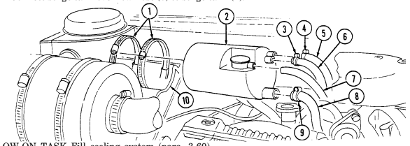

clamp (4) to 10-20 lb-in. (1-2 Nom)
4. Connect surge tank-to-radiator vent hose (6) to surge tank (2) with clamp (3). Tighten clamp (3) to 10-20 lb-in. (1-2 N*m).

5. Connect surge tank overflow hose (7) to surge tank (2).

FOLLOW-ON TASK Fill cooling system (para. 3-60).
# 3-65. Surge Tank-To-Radiator Vent Hose Replacement

This task covers:
INITIAL SETUP:
automotive (Appendix B, Item 1)
Manual References TM 9-2320-280-24P
a. Removal 1. Loosen two clamps (2) and remove vent hose (3) from radiator (4) and surge tank (1).

2. Remove two clamps (2) from vent hose (3).

b. Installation 1. Install two clamps (2) on vent hose (3). 2. Install vent hose (3) on surge tank (1)

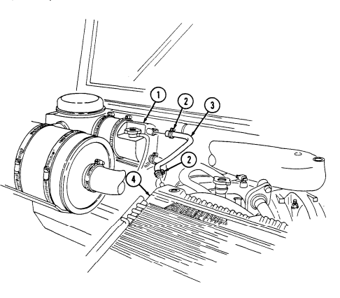

10-20 lb-in. (1-2 N*m).

and radiator (4) with two clamps (2). Tighten clamps to FOLLOW-ON TASK: Tighten coolant filler cap (para. 3-60).

a. Removal **b. Installation**
Tools **Equipment Condition**
General mechanic's tool kit: Cooling system depressurized (para. 3-60).

# 3-66. Surge Tank-To-Water Crossover Vent Hose Replacement

This task covers:
a. Removal **b. Installation**
INITIAL SETUP:
automotive (Appendix B, Item 1)
Tools **Equipment Condition**
General mechanic's tool kit: Cooling system depressurized (para. 3-60).

Manual References TM 9-2320-280-24P
a. Removal 1. Loosen two clamps (2) and remove vent hose (3) from water crossover (4) and surge tank (1).

2. Remove two clamps (2) from vent hose (3).

b. Installation 1. Install two clamps (2) to vent hose (3).

2. Install vent hose (3) on surge tank (1) and water crossover (4) with two clamps (2). Tighten clamps

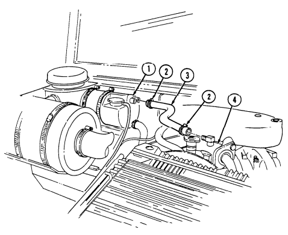

to 10-20 lb in. (1-2 N*m).

FOLLOW-ON TASK: Tighten coolant filler cap (para. 3-60).

# 3-67. Thermostat Bypass Hose Replacement

This task covers:
INITIAL SETUP:
automotive (Appendix B, Item 1)
Manual References TM 9-2320-280-24P

#### A. Removal

1. Loosen two clamps (2) and remove hose (3) from water pump (4) and water crossover (1).

2. Remove two clamps (2) from hose (3).

b. Installation 1. Install two clamps (2) on hose (3).

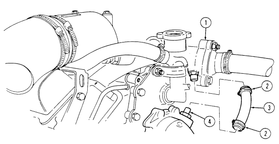 2. Install hose (3) on water pump (4) and water crossover (1) with two clamps (2).

FOLLOW-ON TASK: Fill cooling system (para. 3-60).

a. Removal **b. Installation**
Tools **Equipment Condition**
General mechanic's tool kit: Cooling system drained as required (para. 3-60).

# 3-68. Fan Drive Hose And Quick-Disconnect Replacement

This task covers:
INITIAL SETUP:

Applicable Models **Personnel Required**

M997A2, M1025A2, M1035A2, One mechanic

M1043A2, M1045A2, M1097A2 One assistant

General mechanic's tool kit: TM 9-2320-280-24P
automotive (Appendix B, Item 1)
Sealing compound (Appendix C, Item 44)
a. Removal

#### A. Removal **B. Installation**

Tools **Manual References**

| Equipment Condition   |
|-----------------------|

Material/Parts Hood raised and secured (TM 9-2320-280-10).

NOT E
Have container ready to catch fluid.

Loosen clamp (10) and remove control valve hose (9) from bulkhead adapter (5).

Remove bulkhead adapter (5) from bulkhead adapter bushing (8). Remove nut (6), washer (7), bulkhead adapter bushing (8) and bulkhead adapter (11) from shroud (4).

1.

2. 3.

4. 5.

6.

7. 8.

Release fan drive hose quick-disconnect (2) and remove hose (1) from fan drive (3).

Remove bulkhead adapter bushing (8) from bulkhead adapter (11). Remove bulkhead adapter (11) from fan drive hose (1). Remove female end of quick-disconnect (2) from fan drive hose (1). Remove male end of quick-disconnect (12) from fan drive (3).

b. Installation

#### Not E

Apply sealing compound to all pipe threads during installation.

1. Install male end of quick-disconnect (12) on fan drive (3). 2. Install female end of quick-disconnect (2) on fan drive hose (1). 3. Install bulkhead adapter (11) on fan drive hose (1) 4. Install bulkhead adapter bushing (8) on bulkhead adapter (11). 5. Install bulkhead adapter (11) and bulkhead adapter bushing (8) on shroud (4) with washer (7) and nut (6).

6. Install hose (1) and fan drive hose quick-disconnect (2) on fan drive (3). 7. Install bulkhead adapter (5) on bulkhead adapter bushing (8). 8. Install control valve hose (9) on bulkhead adapter (5) with clamp (10).

3-68. FAN DRIVE HOSE AND QUICK-DISCONNECT REPLACEMENT (Cont'd)

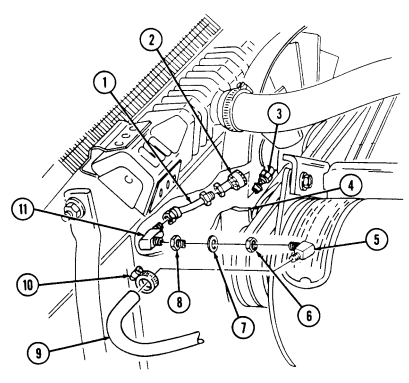

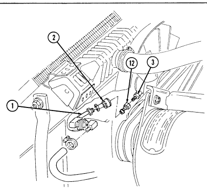

09

FOLLOW-ON TASK: Lower and secure hood (TM 9-2320-280-10).

# 3-69. Radiator Inlet Hose Replacement

This task covers:
a. Removal INITIAL SETUP:
Tools General mechanic's tool kit:
automotive (Appendix B, Item 1 Manual References TM 9-2320-280-24P

#### A. Removal

1. Loosen two clamps (2) and remove hose (3) from radiator (1) and water crossover (4).

2. Remove two clamps (2) from hose (3).

1. Install two clamps (2) to hose (3).

NOT E
For vehicles equipped with a 200 amp alternator, it is recommended that the inlet hose be installed with the hose twisted counterclockwise and upward until a kink in the hose starts to form.

2. Install hose (3) on water crossover (4) and radiator (1) with two clamps (2).

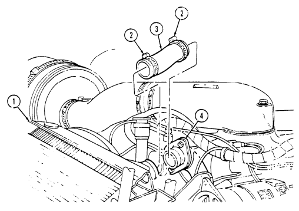

FOLLOW-ON TASK: Tighten coolant filler cap (para. 3-60).

| b. Installation   |
|-------------------|

Equipment Condition Cooling system depressurized (para. 3-60).

3-124

# 3-70. Radiator Lower Tube Assembly Replacement

This task covers:
INITIAL SETUP:

#### Tools

General mechanic's tool kit:
automotive (Appendix B, Item 1)
Materials/Parts Two locknuts (Appendix G, Item 72) Tape (Appendix C, Item 50)

#### A. Removal

1. Remove draincock (11) from radiator lower tube assembly (10).

#### B. Installation

1. Install radiator lower tube assembly (10) on frame bracket (4) with two washers (3), capscrews (2),
washers (3), and locknuts (5). Tighten locknuts (5) to 6 lb-ft (8 N•m).

2. Remove two locknuts (5), washers (3), capscrews (2), and washers (3) from radiator lower tube assembly (10) and frame bracket (4). Discard locknuts (5).

3. Loosen clamp (7) and disconnect water pump inlet hose (6) from radiator lower tube assembly (10). 4. Loosen clamp (8) and disconnect surge tank to lower radiator hose (9) from radiator lower tube assembly (10).

5. Loosen clamp (12) and disconnect lower radiator hose (1) from radiator lower tube assembly (10). 6. Remove radiator lower tube assembly (10).

2. Connect lower radiator hose (6) to radiator lower tube assembly (10) with clamp (7). 3. Connect surge tank to lower radiator hose (9) to radiator lower tube assembly (10) with clamp (8). 4. Connect water pump inlet hose (1) to radiator lower tube assembly (10) with clamp (12).

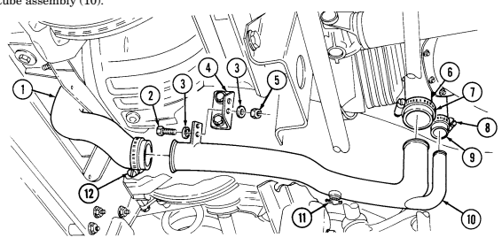 5. Apply sealant type tape to threads of draincock (11) and install draincock (11) on radiator lower tube assembly (10).

FOLLOW-ON TASK: Fill cooling system (para. 3-60).

a. Removal b. Installation

Manual References TM 9-2320-280-24P
Equipment Condition Cooling system drained (para. 3-60).

# 3 - 7 1 . Lower Radiator Hose Replacement

This task covers:
a. Removal b. Installation INITIAL SETUP:
Tools General mechanic's tool kit:
automotive (Appendix B, Item 1)
Equipment Condition Cooling system drained (para. 3-60).

Manual References TM 9-2320-280-24P
a. Removal 1. Loosen two clamps (2) and remove lower radiator hose (3) from radiator (1) and lower tube assembly ( 4 ) . 2. Remove two clamps (2) from hose (3).

b. Installation 1. Install two clamps (2) to hose (3). 2. Install lower radiator hose (3) on lower tube assembly (4) and radiator (1) with two clamps (2).

#### Not E

Vehicles may be equipped with either spring clamps and/or

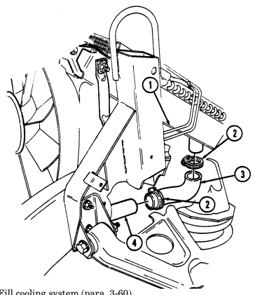 conventional clamps.

3. Tighten spring clamps (2) to 90 lb-in. (10 N•m). Tighten conventional clamps (2) to 40 lb-in. (5 N•m ) .

FOLLOW-ON TASK: Fill cooling system (para. 3-60).

# 3 - 7 2 . Water Pump Inlet Hose Replacement

This task covers:
a. Removal **b. Installation**
INITIAL SETUP:
Tools General mechanic's tool kit:
automotive (Appendix B, Item 1)
Equipment Condition Cooling system drained (para. 3-60).

Manual References TM 9-2320-280-24P
a. Removal 1 . Loosen two clamps (2) and remove water pump inlet hose (3) from water pump (1) and lower tube assembly (4).

2. Remove two clamps (2) from hose (3).

b. Installation 1. Install two clamps (2) to hose (3). 2 . Install water pump inlet hose (3) on lower tube assembly (4) and water pump (1) with two clamps (2).

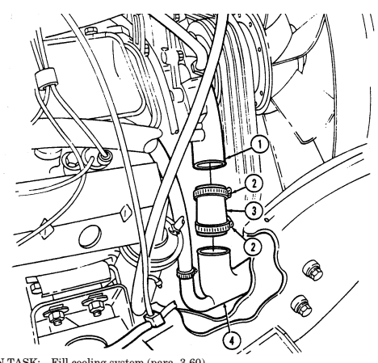 3. Tighten clamps (2) to 40 lb-in. (5 N•m).

FOLLOW-ON TASK: Fill cooling system (para. 3-60).
# 3 - 7 3 . Surge Tank-To-Lower Radiator Tube Hose Replacement

This task covers:
a. Removal **b. Installation**
INITIAL SETUP:
Tools General mechanic's tool kit:
automotive (Appendix B, Item 1)
Equipment Condition Cooling system drained (para. 3-60).

Manual References TM 9-2320-280-24P

#### Not E

If the vehicle is equipped with surge tank (12340061) and surge tank-to-lower-radiator tube hose (12339163) is received, cut approximately four inches from surge tank end of hose prior to installation.

a. Removal 1. Loosen two clamps (2) and remove hose (3) from surge tank (1) and tube assembly (4). 2. Remove two clamps (2) from hose (3).

b. Installation 1. Install two clamps (2) on hose (3). 2. Install hose (3) on surge tank (1) and tube assembly (4) with two clamps (2).

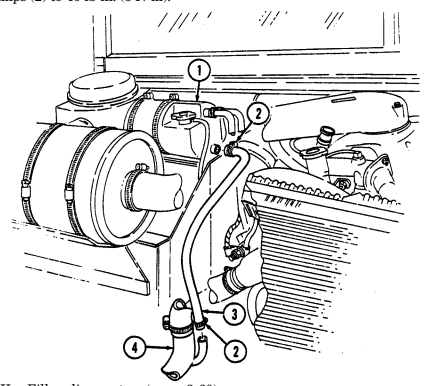 3. Tighten clamps (2) to 40 lb-in. (5 N•m).

FOLLOW-ON TASK: Fill cooling system (para. 3-60).

## 3-74. Surge Tank Overflow Hose Replacement

This task covers:
a. Removal **b. Installation**
INITIAL SETUP:
Tools **Equipment Condition**
General mechanic's tool kit: Hood raised and secured (TM 9-2320-280-10).

automotive (Appendix B, Item 1)
Manual References TM 9-2320-280-10 TM 9-2320-280-24P
a. Removal 1. Remove overflow hose (2) from surge tank filler neck (1).

2. Loosen clamp (3) and remove hose (2) from body (4).

b. Installation 1. Connect hose (2) to surge tank filler neck (1).

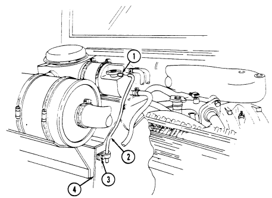

2. Install hose (2) on body (4) with clamp (3).

FOLLOW-ON TASK: Lower and secure hood (TM 9-2320-280-10).

# 3-75. Thermostat Replacement

This task covers:
a. Removal b. Installation INITIAL SETUP:

#### Tools

General mechanic's tool kit:
automotive (Appendix B, Item 1)
Materials/Parts Gasket (Appendix G, Item 54) Sealing compound (Appendix C, Item 44)
a. Removal 1. Remove capscrew (5), stud (4), thermostat housing (3), thermostat (2), and gasket (6) from water crossover (1). Discard gasket (6).

2. Clean gasket surface on water crossover (1) and thermostat housing (3).

#### B. Installation

1. Install thermostat (2) into water crossover (1) ensuring valve sensor (7) points toward crossover (1). 2. Position gasket (6) on thermostat housing (3). Apply sealing compound to fastener threads and insert capscrew (5) and stud (4) to align gasket (6).

3. Install thermostat housing (3) over thermostat (2) on water crossover (1) with capscrew (5) and stud (4). Tighten capscrew (5) and stud (4) to align gasket (6).

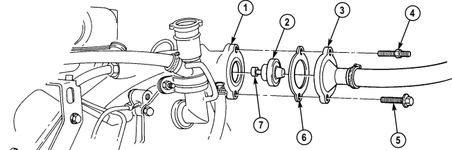

FOLLOW-ON TASK: Fill cooling system (para. 3-60). 

Manual References TM 9-2320-280-24P
Equipment Condition Cooling system drained as required (para. 3-60).

# 3 - 7 6 . Water Pump Pulley Replacement

This task covers:
a. Removal b. Installation INITIAL SETUP:
Tools General mechanic's tool kit:
automotive (Appendix B, Item 1)
Maintenance and repair shop equipment:
automotive (Appendix B, Item 2)
Special Tools Hex head driver, 6 mm
(Appendix B, Item 157)

#### Materials/Parts

Sealing compound (Appendix C, Item 44)
Manual Refer ________________ **e n c e s**
TM 9-2320-280-24P
__________________ **Equipment Condition**
- Fan drive and fan blade removed (para. 3-78). - Power steering drivebelt set removed (para. 3-80). - Serpentine drivebelt removed (M1123 and
" A 2 " vehicles) (para. 3-83).

a. Removal Remove four socket-head screws (1) and water pump pulley (2) from water pump (3).

b. Installation 1. Apply sealing compound to four socket-head screws (1). 2. Install water pump pulley (2) on water pump (3) with four socket-head screws (1). Tighten socket-

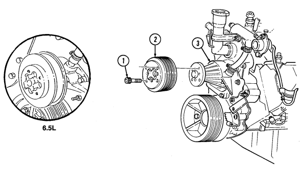

head screws (1) to 15-20 lb-ft (20-27 N•m).

FOLLOW-ON TASKS: - Install serpentine belt (M1123 and "A2" vehicles) (para. 3-83).

- Install fan drive and fan blade (para. 3-78). - Install power steering drivebelt set (para. 3-80).

# 3-76.1. Water Pump And Adapter Plate Maintenance

This task covers:
a. Removal **c. Installation** b. Inspection

#### Initial Setup: Tools

General mechanic's tool kit:
automotive (Appendix B, Item 1)

#### Materials/Parts

Water pump gasket (Appendix G, Item 62)
(6.2 L only)
Water pump gasket (Appendix G, Item 62.1) 
(6.5 L only)
Pipe sealing compound (Appendix C, Item 44)
Sealing compound (Appendix C, Item 45)
Anaerobic gasket sealer 
(Appendix C, Item 39)
Manual References TM 9-2320-280-24P

#### Equipment Condition

- Engine oil filler tube removed (para. 3-3). - Water pump inlet hose removed (para. 3-72). - Water pump pulley removed (para. 3-76). - Thermostat bypass hose removed (para. 3-67). - Fan drive hose disconnected (para. 3-68). - Tensioner, idler pulleys, and mounting hardware removed (para. 3-84).

- Power steering pump removed (para. 8-24).

Water pump is different on M1123 and A2 series vehicles.

a. Removal 1. Remove bypass nipple (13) from water crossover (12). 2. Remove studs (1), (11), (6), and (5), four capscrews (9), washers (10), two capscrews (7),
capscrew (8), water pump (4), and adapter plate (3) from timing gear cover (2).

3. Remove seven capscrews (15), adapter plate (3), and gasket (14) from water pump (4). Discard gasket (14).

4. Clean remaining gasket material and sealing compound from sealing surfaces of adapter plate (3),
water pump (4), and timing gear cover (2).

5. Remove heater hose nipple (17), elbow (16), and bypass hose adapter (19) from water pump (4). b. Inspection 1. Inspect water pump (4) for cracks, breaks, or loose impeller. Replace if cracked, broken, or impeller is loose.

2. Inspect adapter plate (3) for corrosion. If adapter plate (3) is excessively corroded, replace. 3. Inspect elbow (16), heater hose nipple (17), and bypass hose adapter (19) for stripped threads and breaks. If damaged, replace.

4. Inspect rivet (18) for damage or looseness. Replace if damaged or loose. Apply sealing compound to replacement rivet (18) prior to installation.

3-76.1.  WATER PUMP AND ADAPTER PLATE MAINTENANCE (Cont'd)

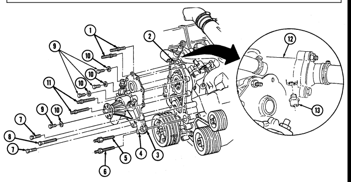

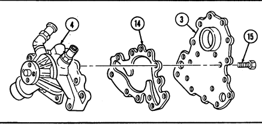

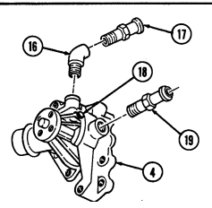

# 3-76.1. Water Pump And Adapter Plate Maintenance (Cont'D)

c. Installation

## _Ca_U_T_Io_N_

- Ensure water pump P/N 251-591 is used on 6.2L engines, or damage to equipment will result.

- Ensure water pump P/N 12534772 is used on 6.5L and 6.5L
detuned engines, or damage to equipment will result.

1. Install gasket (6) and adapter plate (7) on water pump (5) with seven capscrews (8). Tighten capscrews (8) 13-20 lb-ft (18-27 N•m).

Perform step 2 if a new water pump is being installed.

2. Apply sealing compound to rivet (3) and install in water pump (5). 3. Apply anaerboic gasket sealer to sealing surfaces on adapter plate (7), following diagram shown. 4. Apply pipe sealing compound to capscrew (14). 5. Install adapter plate (7) and water pump (5) on timing gear cover (10) with two long studs (17),
stud (12), stud with thick hex (11), and capscrew (14).

6. Secure adapter plate (7) to timing gear cover (10) with two capscrews (13), studs (9), four washers (16), and capscrews (15). Tighten studs (9) and capscrews (13) and (15) to 13-20 lb-ft (18-27 N•m). Tighten studs (17), (12), and (11) to 25-37 lb-ft (34-50 N•m).

7. Apply pipe sealing compound to threads of elbow (1), heater hose nipple (2), and bypass hose adapter (4) and install in water pump (5).

8. Coat threads of bypass nipple (19) with pipe sealing compound and install in water crossover (18).

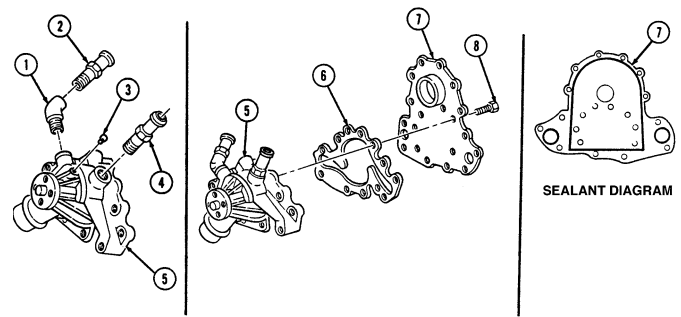

# 3 - 7 6 . 1 . Water Pump And Adapter Plate Maintenance (Cont'D)

FOLLOW-ON TASKS: - Install power steering pump (para. 8-24).

- Install tensioner, idler pulleys, and mounting hardware (para. 3-84). - Connect fan drive hose (para. 3-68). - Install water pump pulley (para. 3-76). - Install water pump inlet hose (para. 3-72). - Install engine oil filler tube (para. 3-3). - Install thermostat bypass hose (para. 3-67).

# 3-77. Water Crossover Maintenance

This task covers:
a. Removal c. Installation b. Inspection INITIAL SETUP:
Tools General mechanic's tool kit:
automotive (Appendix B, Item 1)
Materials/Parts Two gaskets (Appendix G, Item 51)
Manual References TM 9-2320 280-24P

#### Equipment Condition

•Cooling system drained (para. 3-60). •Fan temperature switch removed (para. 4-30). •Glow plug controller removed (para. 4-29). •Thermostat removed (para. 3-75).

#### General Safety Instructions

Gaskets installed on some 6.2L engines assembled prior to 1991 may contain asbestos. Gaskets should be disposed of IAW current directives.

a. Removal 1. Loosen three clamps (2) and disconnect hoses (1) from water crossover (4). 2. Remove four capscrews (6) from water crossover (4) and cylinder head (8).

Gaskets installed on some 6.2L engines assembled prior to 1991 may contain asbestos. Gaskets should be removed with a scraper or putty knife and then be disposed of IAW current directives. Inhalation of asbestos fibers can cause respiratory ailments.

3. Remove water crossover (4) and two gaskets (7). Discard gaskets (7). 4. Clean gasket surface on water crossover (4) and cylinder head (8).

#### B. Inspection

Inspect thermostat by-pass nipple (3), surge tank hose nipple (5) and water pump hose adapter (9) for cracks or breaks. Replace if defective.

c. Installation 1. Install two gaskets (7) and water crossover (4) on cylinder head (8). 2. Secure water crossover (4) to cylinder head (8) with four capscrews (6). Tighten capscrews (6) to 25-35 lb-ft (34-50 N•m).

3. Connect three hoses (1) to water crossover (4) with clamps (2).

# 3-77. Water Crossover Maintenance (Cont'D)

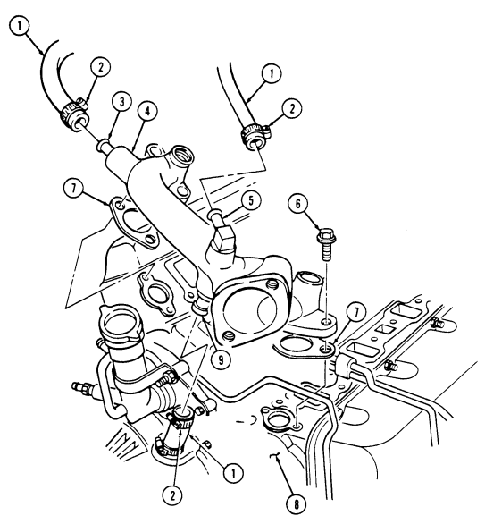

FOLLOW-ON TASKS:

# 3-78. Fan Drive And Fan Blade Maintenance

This task covers:
a. Removal c. Installation b. Inspection INITIAL SETUP:

#### Tools

General mechanic's tool kit:
automotive (Appendix B, Item 1)
Special Tools Hex head driver, 8 mm
(Appendix B, Item 156)

#### Materials/Parts

Four lockwashers (Appendix G, Item 133) Sealing compound (Appendix C, Item 43)
a. Removal 1. Disconnect fan drive hose (9) from fan drive (10).

- Mark position of fan blade for installation. - It may be necessary to apply compressed air to clutch adapter.

This disengages fan drive clutch to allow access to socket head screws.

- The fan drive hose may be modified to add a quick-disconnect at commander's discretion. Refer to appendix D, Fig. D-94 for installation.

2. Using hex head driver, remove four socket-head screws (1) and fan drive assembly (3) from water pump pulley (2).

3. Remove four nuts (5), lockwashers (6) and fan blade (7) from fan drive (8). Discard lockwashers (6).

b. Inspection Inspect clutch adapter (4) and fan blade (7) for damaged threads, cracks, bent blades, or breaks. Replace if defective.

c. Installation 1. Align fan blade (7) onto fan drive (8) with four lockwashers (6) and nuts (5). Tighten nuts (5) to 26 lb-ft (35 N•m).

3. Connect fan drive hose (9) to fan drive (10).

#### Manual References

TM 9-2320-280-10 TM 9-2320-280-24P
Equipment Condition - Hood raised and secured (TM 9-2320-280-10). - Radiator and shroud removed (optional)
(para. 3-61).

2. Apply sealing compound to four socket-head screws (1) and install fan drive assembly (3) to water pump (2). Tighten socket-head screws (1) to 45 lb-ft (61 N•m).

# 3-78.  Fan Drive And Fan Blade Maintenance (Cont'D)

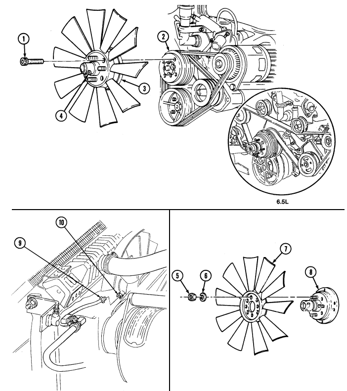

FOLLOW-ON TASKS: - Install radiator and shroud (if removed) (para. 3-61).

- Bleed power steering system (para. 8-29) (if radiator and shroud were not removed).

-  Lower and secure hood (TM 9-2320-280-10).

# 3-79. Fan Drive Friction Lining Replacement

This task covers:
INITIAL SETUP:
Tools General mechanic's tool kit:
automotive (Appendix B, Item 1

a. Removal **b. Installation**

| Equipment Condition   |
|-----------------------|

| Manual References    |
|----------------------|
| TM 9\-2320\-280\-24P |

Disconnect battery ground cable (para. 4-73).

Prior to loosening screws on fan drive retaining plates, disconnect fan drive hose from fan drive. Failure to do so may result in injury to personnel or damage to equipment.

NOTE
It maybe necessary to apply compressed air to clutch adapter. This disengages fan drive clutch to allow access to friction lining screws.

The fan drive hose may be modified to add the quick-disconnect.

Refer to Appendix D, Fig. D-94 for installation.

1. Remove six screws (1) and three retaining plates (2) from fan drive (3).

2. Remove friction lining (4) from fan drive (3).

1. Install friction lining (4) on fan drive (3). 2. Install three retaining plates (2) on on drive (3) with six screws (1). Tighten screws 1) to 22 lb-in. (2.5 Nom).

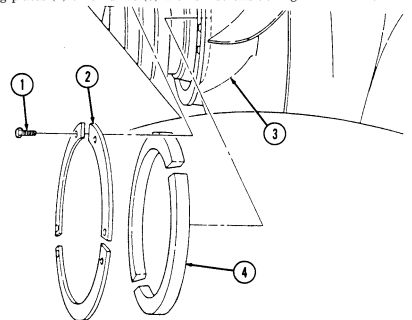

FOLLOW ON TASK: Connect battery ground cable (para. 4-73).

# 3 - 8 0 . Power Steering Drivebelt Set Replacement

This task covers:
INITIAL SETUP:
Applicable Models All vehicles except: M997A2, M1025A2, M1035A2, M1043A2, M1045A2, M1097A2, M1123 Tools General mechanic's tool kit:
automotive (Appendix B, Item 1)

a. Removal b. Installation

Manual References TM 9-2320-280-24P
Equipment Condition Alternator drivebelts removed (para. 3-81).

#### Not E

Replace power steering drivebelts in matched sets only.

a. Removal 1. Loosen three capscrews (6) from power steering pump mounting bracket (7) and support brackets. 2. Push power steering pump (1) towards engine and remove drivebelts (4) from power steering pump pulley (2), water pump pulley (5) and crankshaft pulley (3).

b. Installation Feed belt set (4) into grooves on crankshaft pulley (3), water pump pulley (5), and power steering pump

 pulley (2).

FOLLOW-ON TASK: Install alternator drivebelts (para. 3-81).

## 3 - 8 1 . A Lt E R N Ator Drivebelt Set Replacement

This task covers:
INITIAL SETUP:
Applicable Models All vehicles except: M997A2, M1025A2, M1035A2, M1043A2, M1045A2, M1097A2, M1123 Tools General mechanic's tool kit:
automotive (Appendix B, Item 1)
a. Removal b. Installation Manual References TM 9-2320-280-10 TM 9-2320-280-24P
Equipment Condition
- Hood raised and secured (TM 9-2320-280-10). - Battery ground cable disconnected (para. 4-73).

#### Not E

Replace alternator drivebelts in matched sets only.

a. Removal 1. Loosen two capscrews (8) securing alternator (2) to bottom mounting bracket (9). 2. Loosen adjusting bracket capscrew (1) and push alternator (2) toward engine

#### Not E

Some vehicles have a quick-disconnect on fan drive hose.

3. Disconnect fan drive hose assembly (11) from fan drive assembly (10). 4. Remove belt set (5) from power steering pump pulley (4), alternator pulley (3), water pump pulley (7), and crankshaft pulley (6).

b. Installation 1. Feed belt set (5) into grooves on crankshaft pulley (6), water pump pulley (7), alternator pulley (3),
and power steering pump pulley (4).

#### Not E

Some vehicles have a quick-disconnect on fan drive hose.

2. Connect fan drive hose assembly (11) to fan drive assembly (10).

# 3-81. Alternator Drivebelt Set Replacement (Gnt'D)

# 3-82. Drivebelts Adjustment

This task covers:
a. Power Steering Belt Adjustment b. Alternator Belt Adjustment INITIAL SETUP:
Applicable Models All vehicles except: M997A2, M1025A2, M1035A2, M1043A2, M1045A2, M1097A2, M1123 Tools General mechanic's tool kit:
automotive (Appendix B, Item 1)
Special Tools Belt tension gauge (Appendix B, Item 67)
Materials/Parts Locknut (Appendix G, Item 70)
Personnel Required One mechanic One assistant Manual References TM 9-2320-280-10 TM 9-2320-280-24P
Equiment Condition
- Hood raised and secured (TM 9-2320-280-10). - Battery ground cable disconnected (para. 4-73).

Prior to making any belt adjustments, check belt tension with belt tension gage. Drivebelt adjustment should only be done if belt tension is below 70 lbs (32 kg). Check alternator belts from above engine; power steering belts from under vehicle. Adjusting power steering belts can affect alternator belt tension. Always check alternator belt tension after adjusting power steering belts. To adjust air-conditioning belt, refer to para. 11-202.

#### A. Power Steering Belt Adjustment

1. Remove locknut (5), washer (6), capscrew (2), spacer (4), and two clamps (3) from return and control valve hoses (7) and (8) and alternator bracket (1). Discard locknut (5).

2. Loosen three capscrews (15) from power steering pump bracket (16) and support brackets.

Do not pry against power steering pump housing with pry bar when adjusting belt tension. Pump could be damaged.

There are two square holes in the power steering pump bracket, one in front, accessible from above; and one in back, accessible from under the vehicle. Either can be used to adjust belt tension.

3. Adjust power steering belt set (9) using 1/2-inch breaker bar in square hole of power steering bracket (16). Apply force until belt set (9) appears tight and tighten capscrews (15).

4. Using belt tension gauge, check each belt individually for proper tension, refer to table 3-2, Belt Tension Requirements.

5. If belt set (9) tension is correct, tighten three capscrews (15) on power steering pump bracket (16) to 40 lb-ft (54 N•m). If not, repeat steps 2 through 5. If tension cannot be properly adjusted, replace belt set (9) (para. 3-80).

6. Install return and control valve hoses (7) and (8) to alternator bracket (1) with spacer (4), two clamps (3), capscrew (2), washer (6), and locknut (5). Tighten locknut (5) to 8 lb-ft (11 N•m).

b. Alternator Belt Adjustment 1. Loosen capscrew (11) and two capscrews (13.1) on alternator (13) and alternator bracket (14).

## 3 - 8 2 . D R I V E B E Lts Adjustment (Cont'D)

2 . Adjust alternator belt set (10) by inserting 1/2-inch drive ratchet and extension in square hole (12) of alternator adjusting bracket (11.1). Turn until belt set (10) appears tight, and tighten capscrew ( 11 ) and two capscrews (13.1) securing alternator (13).

3. Using belt tension gauge, check each belt of belt set (10) individually for proper tension. Refer to table 3-2, Belt Tension Requirements.

4. If belt set (10) tension is correct, tighten alternator adjusting bracket (11.1) and capscrew (11) to 40 lb-ft (54 N.m). Tighten two capscrews (13.1) to 60 lb-ft (81 N.m). If tension is not, repeat steps 2 through 4. If tension cannot be properly adjusted, replace belt set (10) (para. 3-81).

Table 3-2. Belt Tension Requirements

#### Not E

A used belt is one that has been run at least 15 min. or 15 mi.

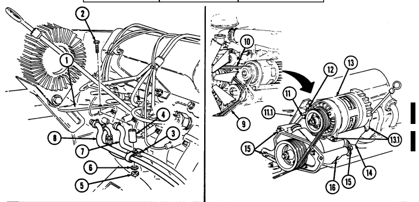 (24 km.). Tension variance of not more than 20 lbs (90 N) between belts of the same set is acceptable.

| APPLICATION   | NEW BELT     | USED BELT    |
|---------------|--------------|--------------|
| All belts     | 105 ± 5 lbs  | 90 ± 5 lbs   |
|               | (467 ± 22 N) | (400 ± 22 N) |

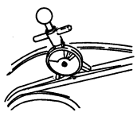

FOLLOW-ON TASKS: - Connect battery ground cable (para. 4-73). FOLLOW-ON TASK - Lower and secure hood (TM 9-2320-280-10).

# 3-83. Serpentine Drivebelt Maintenance

This task covers:

b. Inspection d. Alignment

#### Initial Setup:

Applicable Models M997A2, M1025A2, M1035A2, M1043A2, M1045A2, M1097A2, M1123 Tools General mechanic's tool kit:
automotive (Appendix B, Item 1)
Breaker bar, 3/8 in. (Appendix B, Item 2) Breaker bar, 1/2 in. (Appendix B, Item 2) Pulley alignment tool 
(Appendix D, Fig. D-120)
a. Removal c. Installation Personnel Required One mechanic One assistant Manual References TM 9-2320-280-10 Equipment Condition Hood raised and secured (TM 9-2320-280-10).

a. Removal 1. Position 3/8 or 1/2 in. breaker bar as appropriate on belt tensioner (7) and move tensioner (7)
clockwise to loosen belt (9).

2. Remove belt (9) from power steering pump pulley (3), alternator pulley (2), water pump pulley (4),
crankshaft pulley (5), air conditioning compressor or idler pulley (8), two upper idler pulleys (1), and tensioner pulley (6). Release belt tensioner (7).

b. Inspection Clean and check pulleys and pulley groves to ensure a smooth surface.

c. Installation 1. Position 3/8 or 1/2 in. breaker bar as appropriate on belt tensioner (7) and move tensioner (7)
clockwise to allow installation of belt (9).

2. Feed belt (9) into grooves on crankshaft pulley (5), air conditioning compressor or idler pulley (8), two upper idler pulleys (1), alternator pulley (2), power steering pump pulley (3), water pump pulley (4), and tensioner pulley (6). Release belt tensioner (7).

# 3-83.  Serpentine Drivebelt Maintenance Çont'D)

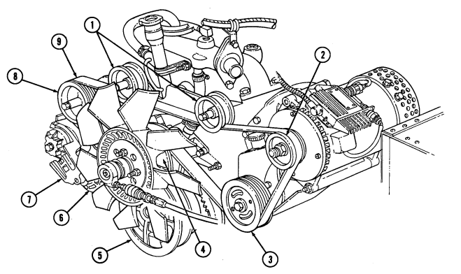

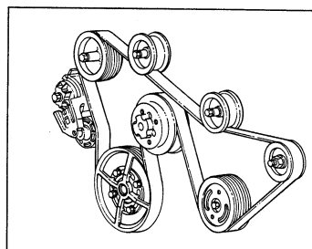

# 3 - 8 3 . Serpentine Drivebelt Maintenance (Co N T ' D)

d. Alignment

Serpentine belt failure (abnormal wear or belt dislodgement) can be caused by misalignment of pulleys, improper installation, or foreign objects introduced into belt path. Damage to equipment may result NOTE
Ensure tab of pulley alignment tool seats flush against back side of crankshaft pulley.

1. Position tab (1) of pulley alignment tool (5) behind crankshaft pulley (6) and straight edge portion
(4) of pulley alignment tool (5) across power steering pump pulley (2) and alternator pulley (3). Tab (1) on pulley alignment tool (5) should seat flush against back side of crankshaft pulley (6). Straight edge portion (4) of pulley alignment tool (5) should seat flush against power steering pump pulley (2) and alternator pulley (3). If pulley alignment is not flush, rotate engine and recheck alignment in several locations. Proceed to step 3 if pulleys are out of alignment.

2. Position straight edge portion (4) of pulley alignment tool (5) against idler pulleys (7) and check for bent mounting bracket (8). If mounting bracket (8) is bent, refer to para. 8-24 for replacement.

If any adjustments are made while performing steps 3 through 8, start engine and check for proper tracking of belt.

3. Check all pulleys (2), (3), (6), and (7) for mud or foreign objects lodged in grooves.

Power steering pump pulley must be flush with end of shaft.

4. Check power steering pump pulley (2) for proper installation. Refer to para. 8-24. 5. Check power steering pump (11) and power steering/alternator mounting bracket (9) for proper installation and security of mounting hardware. Refer to para. 8-24.

6. Check alternator pulley (3) for proper installation. Refer to para. 4-3. 7. Check alternator (10) for proper installation and security of mounting hardware. Refer to para. 4-2. 8. Check idler pulleys (7) and mounting bracket (8) for proper installation and security of mounting hardware. Refer to para. 8-24.

3-83.  SERPENTINE DRIVEBELT MAINTENANCE Çont'd)

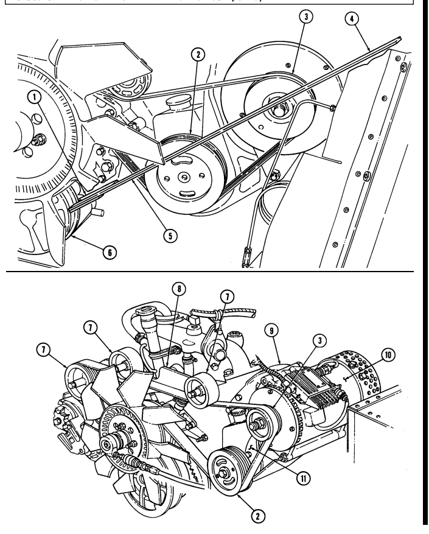

# 3-84. Tensioner, Idler Pulleys, And Mounting Hardware Replacement

This task covers:

| INITIAL SETUP:   |
|------------------|

|                                                             | Manual References                                                   |
|-------------------------------------------------------------|---------------------------------------------------------------------|
| General mechanic's tool kit: automotive (Appendix B, Item 1 | TM 9\-2320\-280\-24P                                                |
|                                                             | Equipment Condition  Disconnect battery ground cable (para. 4\-73). |

a. Removal b. Installation

a. Removal 1. Remove capscrew (12) and tensioner (11) from mounting bracket (8).

On M997A2 vehicles equipped with A/C, the compressor pulley is in place of the lower idler pulley.

2. Remove three nuts (6), lockwashers (5), washers (4), capscrews (1), washers (2), and idler pulleys
(3) from mounting bracket (8). Discard lockwashers (5).

3. Remove two capscrews (10), lockwashers (9), and mounting bracket (8) from water pump (7).

Discard lockwashers (9).

b. Installation 1. Install mounting bracket (8) on water pump (7) with two lockwashers (9) and capscrews (10).

- On M997A2 vehicles equipped with A/C, the compressor pulley is in place of the lower idler pulley.

- Pulley will turn if it is installed correctly. If pulley does not turn, it may be installed backwards.

2. Install three idler pulleys (3) on mounting bracket (8) with three washers (2), capscrews (1),
washers (4), lockwashers (5), and nuts (6).

3. Install tensioner (11) on mounting bracket (8) with capscrew (12).

3-84.  TENSIONER, IDLER PULLEYS, AND MOUNTING HARDWARE REPLACEMENT
(Cont'd)

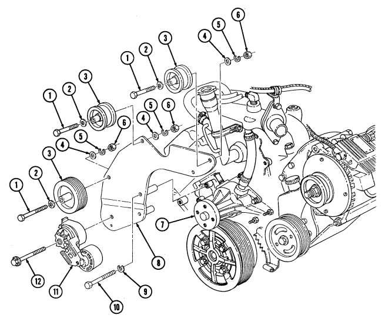

 FOLLOW-ON TASKS: - Install serpentine drivebelt (para. 3-83).

- Install fan drive and fan blade (para. 3-78).

# Chapter 4 Electrical System Maintenance

Section I. GENERATING AND PROTECTIVE CONTROL BOX SYSTEM MAINTENANCE

| All vehicles except: M997A2, M1025A2, TM 9\-2320\-280\-24P                                              |
|---------------------------------------------------------------------------------------------------------|
| M1035A2, M1043A2, M1045A2, M1097A2,                                                                     |
| Equipment Condition M1123                                                                               |
| Alternator drivebelts removed (para. 3\-81). Tools                                                      |
| General mechanic's tool kit:                                                                            |
| automotive (Appendix B, Item 1)                                                                         |
| NOT E                                                                                                   |
| Replace power steering drivebelts in matched sets only.                                                 |
| a. Removal                                                                                              |
| 1.  Loosen three capscrews (6) from power steering pump mounting bracket (7) and support brackets.      |
| 2.  Push power steering pump (1) towards engine and remove drivebelts (4) from power steering pump      |
| pulley (2), water pump pulley (5) and crankshaft pulley (3).                                            |
| b. Installation                                                                                         |
| Feed belt set (4) into grooves on crankshaft pulley (3), water pump pulley (5), and power steering pump |
| pulley (2).                                                                                             |

# 4-2. 60 Ampere Alternator Maintenance

This task covers:
a. Removal c. Adjustment b. Installation

#### Initial Setup: Tools

General mechanic's tool kit:
automotive (Appendix B, Item 1)
Special Tools Hex-head driver, 3/16 in. 

(Appendix B, Item 163)

#### Materials/Parts

Lockwasher (Appendix G, Item 133) Two lockwashers (Appendix G, Item 183) Three lockwashers (Appendix G, Item 188) Five lockwashers (Appendix G, Item 178) Sealing compound (Appendix C, Item 44) Adhesive sealant (Appendix C, Item 3)

#### Personnel Required

One mechanic One assistant

#### Manual References

TM 9-2320-280-10 TM 9-2320-280-24P
Equipment Condition
- Battery ground cable disconnected 
(para. 4-73).

- Hood raised and secured 
(TM 9-2320-280-10).

#### General Safety Instructions

Alternator must be supported during removal and installation.

Prior to removal, tag leads for installation.

a. Removal 1. Loosen capscrew (1) on alternator adjusting bracket (2) and two capscrews (17) on alternator mounting bracket (20) and support bracket (18).

Perform step 2 for vehicles with revised configurations.

2. Loosen capscrew (1) on alternator adjusting bracket (2) and nut (21) on alternator mounting bracket (20) and support bracket (18).

3. Remove two drivebelts (3) from alternator pulley (4). 4. Remove two screws (8), lockwashers (9), and wire retaining strap (10) from alternator (19). Discard lockwashers (9).

5. Remove two screws (5) and lockwashers (6) from terminal cover (7). Discard lockwashers (6). 6. Pry cover (7) away from waterproofing adhesive and remove cover (7). 7. Remove waterproofing adhesive around terminals (16). 8. Disconnect lead 568A (15) at engine wiring harness (14). 9. Remove capscrew (11) and lockwasher (12) securing ground 3B (13) to alternator (19) and disconnect ground 3B (13) from alternator (19). Discard lockwasher (12).

# 4-2.  60 Ampere Alternator Maintenance (Cont'D)

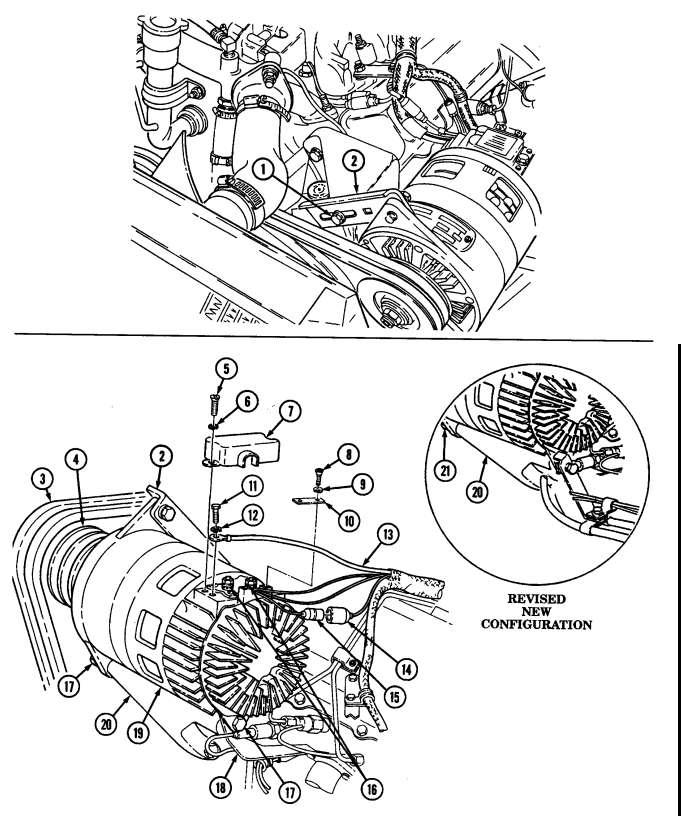

## 4 - 2 . 60 Ampere Alt E R N Ator Maintenance (Cont'D)

10. Remove nut (4), lockwasher (3), washer (2), and lead 5A (1) from alternator (9). Discard lockwasher (3).

11. Remove nut (5), lockwasher (6), washer (7), and lead 2A (8) from alternator (9). Discard lockwasher (6).

#### .Warning.

Alternator must be supported during removal and installation. Failure to support alternator may cause injury to personnel or damage to equipment.

12. Remove capscrew (13), lockwasher (12), and washer (11) from adjusting bracket (10) and alternator (9). Discard lockwasher (12).

#### Not E

- Perform step 14 for vehicles with new alternator support bracket configuration.

- Perform step 15 for vehicles with revised new configuration 16. Remove alternator (9). 17. Remove alternator pulley (19) (para. 4-3).

#### B. Installation

1. Install alternator pulley (19) (para. 4-3).

#### Not E

- Perform step 3 for vehicles with new alternator support bracket configuration.

- Perform step 4 for vehicles with revised new configuration.

2. Position alternator (9) on mounting bracket (18) with support bracket (17) between mounting flange (18.1) and alternator (9) and install two washers (16), lockwashers (15), and capscrews (14).

3. Position alternator (9) on mounting bracket (18) with support bracket (17) and power steering lines bracket (20) on the outside of alternator mounting flange (17.1) and install spacer (21) between mounting bracket (18) and alternator mounting flange (17.1) with two lockwashers (15), washers (16), and capscrews (14).

4. Position alternator (9) on mounting bracket (18) with support bracket (17) and power steering lines bracket (20) on the outside of alternator mounting flange (17.1) and install washer (16), long capscrew (23), lockwasher (15), washer (16), and nut (22).

5. Align alternator (9) with adjusting bracket (10) and install washer (11), lockwasher (12), and capscrew (13).

#### Not E

Ensure terminals are clean before connections are made.

6. Connect lead 2A (8) on alternator (9) with washer (7), lockwasher (6), and nut (5). Tighten nut (5) to 20-25 lb-in. (2-3 N•m).

7. Connect lead 5A (1) on alternator (9) with washer (2), lockwasher (3), and nut (4). Tighten nut (4) to 45-55 lb-in. (5-6 N•m).

13. Remove two capscrews (14), lockwashers (15), and washers (16) from alternator (9), support bracket (17), and mounting bracket (18). Discard lockwashers (15).

14. Remove two capscrews (14), lockwashers (15), washers (16), spacer (21), power steering lines bracket (20), and support bracket (17) from mounting bracket (18). Discard lockwashers (15).

15. Remove nut (22), lockwasher (15), washer (16), long capscrew (23), washer (16), power steering lines bracket (20), and support bracket (17) from mounting bracket (18) and alternator (9). Discard lockwasher (15).

# 4-2.  60 Ampere Alternator Maintenance (Cont'D)

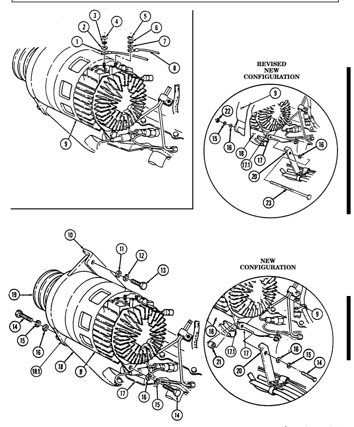

## 4 - 2 . 60 Ampere Alt E R N Ator Maintenance (Cont'D)

8. Connect ground 3B (11) to alternator (15) with lockwasher (3) and capscrew (4). Tighten capscrew (4)
to 82-102 lb-in. (9-12 N•m ) .

9. Connect lead 568A (14) to engine wiring harness (13).

10. Install wire retainer strap (10) on alternator (15) with two lockwashers (9) and screws (8). Tighten screws (8) to 30-35 lb-in. (3-4 N•m).

11. Install two drivebelts (1) on alternator pulley (2).

12. Adjust drivebelts (1) (para. 3-82). 13. Check alternator (15) for correct output voltage adjustment (para. 4-2, task c.).

#### C. Adjustment Not E

Battery ground cable must be removed (para. 4-73).

1. Using hex-head driver, remove pipe plug (12). 2. Connect battery ground cable (para. 4-73). 3. Start engine (TM 9-2320-280-10). 4. Raise engine speed above idle. 5. Put a load on the alternator by operating driving lights (TM 9-2320-280-10). 6. Using a multimeter, check alternator (15) output voltage. Connect black test lead to ground lead 3B (18). Connect red test lead to lead 5A (16). Output voltage should be 28 volts ± 0.5 volts. If adjustment is required, go to step 7. If no adjustment is required, go to step 11.

7. Turn adjusting screw (17) counterclockwise to increase voltage or clockwise to decrease voltage. 8. Turn off driving lights (TM 9-2320-280-10). 9. Return engine to idle.

10. Stop engine (TM 9-2320-280-10).

11. Apply sealing compound to pipe plug (12) threads. Using hex-head driver, install pipe plug (12) and tighten to 30-40 lb-in. (3-4 N•m).

12. Remove battery ground cable (para. 4-73). 13. Seal terminal connections using adhesive sealant. 14. Install terminal cover (7) on alternator (15) with two lockwashers (5) and screws (6).

# 4-2. 60 Ampere Alternator Maintenance (Cont'D)

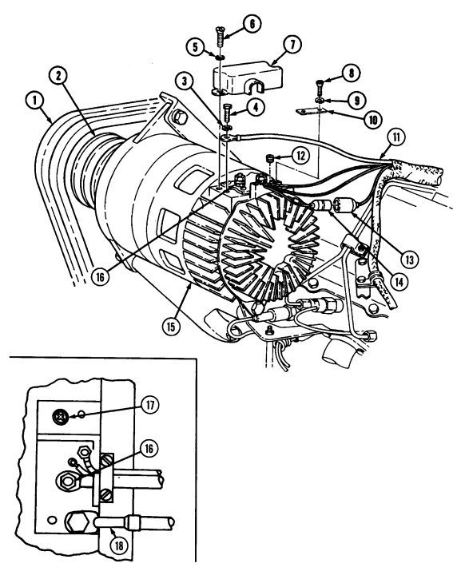

FOLLOW-ON TASKS: - Connect battery ground cable (para. 4-73).
- • - Lower and secure hood (TM 9-2320-280-10).

# 4-2.1. 60 Ampere Alternator Regulator Replacement

This task covers:
INITIAL SETUP:
Tools ____
General mechanic's tool kit: 
automotive (Appendix B, Item 1)
Materials/Parts ____________
O-ring (Appendix G, Item 218)
a. Removal

Regulator is part of end cover. Do not disassemble.

1. Remove six screws (1), end cover (2), and O-ring (3) from end housing (4). Discard O-ring (3). 2. Disconnect four leads (6) from terminals (7) on regulator (8).

#### B. Installation

1. Install O-ring (3) on end cover (2). 2. Connect four leads (6) to terminals (7) on regulator (8). 3. Install end cover (2) on end housing (4) with six screws (1). 4. Check alternator (5) for correct output voltage (para. 4-2, task c.).

a. Removal **b. Installation**

Manual References ________________
TM 9-2320-280-24P
Equipment Condition **__________________**
60 ampere alternator removed (para. 4-2).

# 4-2.1.  60 Ampere Alternator Regulator Replacement (Cont'D)

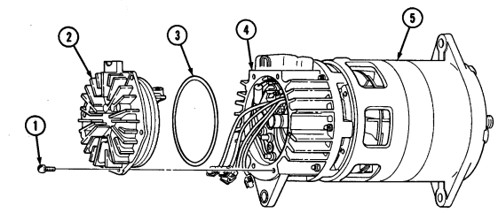

.

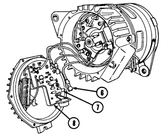

FOLLOW-ON TASK:    Install alternator (para. 4-2).

## 4-2.2. 100/200 Ampere Alternator Cable Replacement

This task covers:

#### Initial Setup: Tools

General mechanic's tool kit:
automotive (Appendix B, Item 1)
Maintenance and repair shop equipment:
automotive (Appendix B, Item 2)

#### Materials/Parts

Sealant (Appendix C, Item 47.1) Two lockwashers (Appendix G, Item 134) Five lockwashers (Appendix G, Item 191) Six tiedown straps (Appendix G, Item 312)
a. Removal a. Removal d. 12-Volt Regulator Cable Installation b. Installation e. 100/200 Ampere Alternator Ground Cable Removal c. 12-Volt Regulator Cable Removal f. 100/200 Ampere Alternator Ground Cable Installation

#### Manual Reeferences

TM 9-2320-280-10 TM 9-2320-280-24P

#### Equipment Condition

- Hood raised and secured (TM 9-2320-280-10). - Battery ground cables disconnected (para. 4-73). - Engine access cover removed (para. 10-15).

- Prior to removal, tag leads for installation. - Note number of clamps and tiedown straps for installation.

1. Slide back rubber boot (11) and remove nut (9), lockwasher (13), washer (12), and cable (7) from positive stud (10). Discard lockwasher (13).

2. Remove nut (6), lockwasher (5), washer (4), and clamp (3) from water crossover stud (2). Discard lockwasher (5).

3. Remove two tiedown straps (8) from cables (1) and (7). Discard tiedown straps (8).

# 4-2.2. 100/200 Ampere Alternator Cable Replacement(Cont'D)

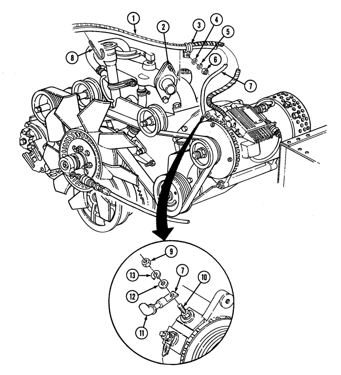

## 4-2.2. 100/200 Ampere Alt E R N Ator Cable Replacement ( Co N T ' D )

4. Remove nut (5), lockwasher (4), washer (3), clamp (6), and cables (1) and (2) from stud (7). Discard lockwasher (4).

5. Remove four tiedown straps (8) from cables (1), (2), and (18). Discard tiedown straps (8). 6. Remove screw (10), clamp (9), nut (17), lockwasher (16), screw (12), washer (13), and clamp (14)
from bracket (15) and body (11). Discard lockwasher (16).

7. Remove nut (23), lockwasher (22), washer (21), and cable (2) from buss bar (20). Discard lockwasher (22).

8. Remove cable (2) through grommet (24) on battery box (19).

#### B. Installation

1. Insert cable (2) through grommet (24) on battery box (19) and install cable (2) on buss bar (20) with washer (21), lockwasher (22), and nut (23).

2. Install cables (1) and (2) on bracket (15) and body (11) with clamp (14), washer (13), screw (12),
lockwasher (16), nut (17), clamp (9), and screw (10).

3. Install cables (1) and (2) on stud (7) with clamp (6), washer (3), lockwasher (4), and nut (5). 4. Secure cables (1), (2), and (18) together using four tiedown straps (8).

4-2.2. 100/200 AMPERE ALTERNATOR CABLE REPLACEMENT(Cont'd)

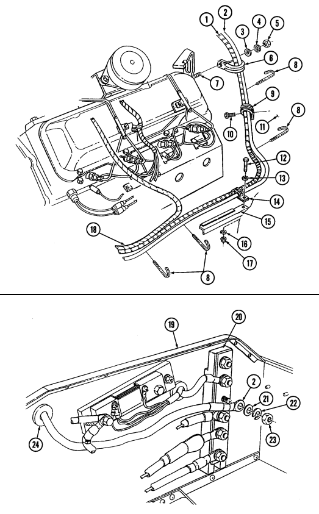

## 4-2.2. 100/200 Ampere Alt E R N Ator Cable Replacement ( Co N T ' D )

5. Install two tiedown straps (8) on cables (1) and (7). 6. Install cables (1) and (7) on water crossover stud (2) with clamp (3), washer (4), lockwasher (5), and nut (6). Tighten nut (6) to 10-15 lb-ft (14-20 N•m).

7. Apply sealant to positive stud (10) and cable (7), coating all exposed metallic surfaces. 8. Install cable (7) on positive stud (10) with washer (12), lockwasher (13), and nut (9). Tighten nut (9)
to 10-15 lb-ft (14-20 N•m).

9. Slide rubber boot (11) on cable (7).

# 4-2.2. 100/200 Ampere Alternator Cable Replacement(Cont'D)

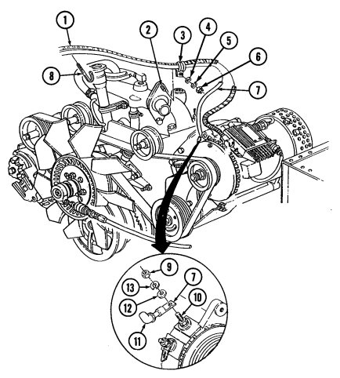

# 4-2.2. 100/200 Ampere Alt E R N Ator Cable Replacement ( Co N T ' D )

c. 12-Volt Regulator Cable Removal

- Prior to removal, tag leads for installation. - Note number of clamps and tiedown straps for installation.

1. Slide back rubber boot (9) and remove nut (12), washer (13), and cable (11) from regulator (10). 2. Remove six tiedown straps (8) from cables (1), (6), and (11). Discard tiedown straps (8). 3. Remove nut (5), lockwasher (4), washer (3), clamp (2), and cables (1) and (6) from stud (7). Discard lockwasher (4).

4. Remove nut (16), lockwasher (15), washer (14), clamp (17), and cables (1) and (6) from stud (18).

Discard lockwasher (15).

5. Remove screw (20), clamp (19), nut (27), lockwasher (26), screw (22), washer (23), clamp (24), and cables (1) and (6) from bracket (25) and body (21). Discard lockwasher (26).

# 4-2.2. 100/200 Ampere Alternator Cable Replacement(Cont'D)

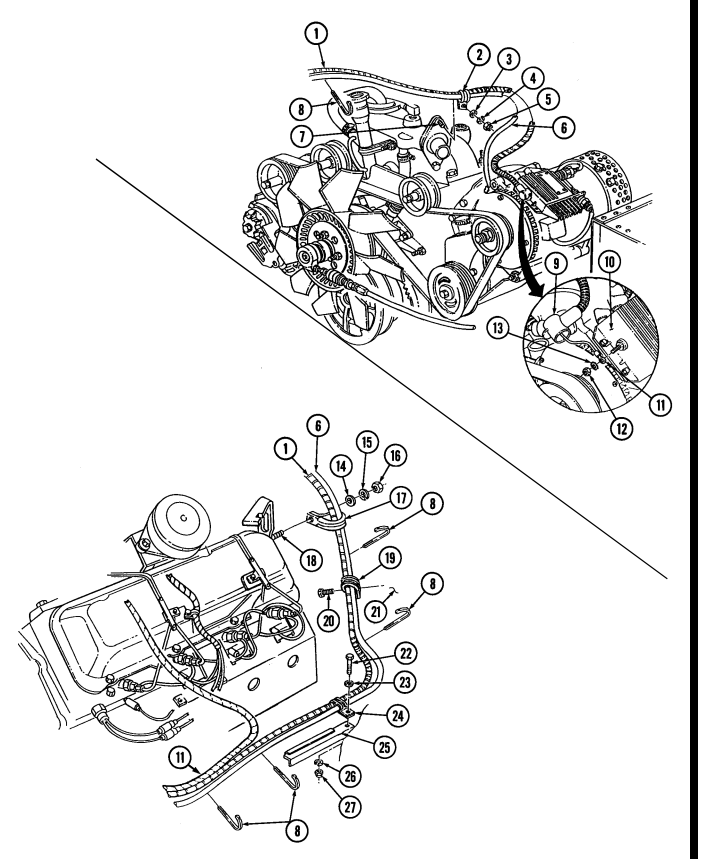

## 4-2.2. 100/200 Ampere Alt E R N Ator Cable Replacement ( Co N T ' D )

6. Remove cap (9) from battery terminal boot (7) and clean lubricating oil from battery terminal boot (7).

7. Remove nut (5), screw (1), and cables (2), (3), and (4) from terminal clamp (6) and battery box (8).

#### D. 12-Volt Regulator Cable Installation

1. Position cable (2) in approximate mounting location through hole in battery box (8). 2. Install cables (4), (3), and (2) on terminal clamp (6) with screw (1) and nut (5). 3. Fill battery terminal boot (7) with lubricating oil. 4. Install cap (9) on terminal boot (7). 5. Install cables (2) and (3) and clamps (16) and (21) on bracket (22) and body (18) with washer (20),

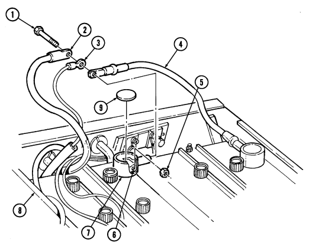

screw (19), lockwasher (23), nut (24), and screw (17).

6. Install clamp (13) and cables (2) and (3) on stud (15) with washer (10), lockwasher (11), and nut (12).

7. Install six tiedown straps (14) on cables (2), (3), and (25). 8. Install cables (2) and (3) on stud (26) with clamp (27), washer (28), lockwasher (29), and nut (30). 9. Install cable (2) on regulator (31) with washer (33) and nut (32). Tighten nut (32) to 18-22 lb-in.

(2.0-2.5 N•m). Slide rubber boot (34) on nut (32).

# 4-2.2. 100/200 Ampere Alternator Cable Replacement(Cont'D)

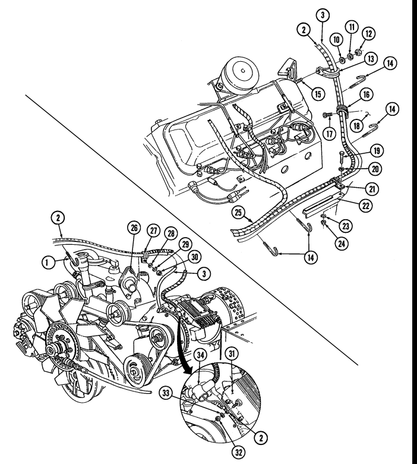

## 4-2.2. 100/200 Ampere Alt E R N Ator Cable Maintenance( Co N T ' D )

e. 100/200 Ampere Alternator Ground Cable Removal

- Routing of the 200 amp ground cable is identical to the 100 amp ground cable, with the exception of the 200 amp ground cable being installed on the alternator with a washer, lockwasher, and nut. This procedure covers the 100 amp ground cable.

- Prior to removal, tag leads for installation.

1. Slide back rubber boot (10) and remove capscrew (6), lockwasher (7), washer (8), and ground cable (4) from alternator (9). Discard lockwasher (7).

2. Remove nut (1), lockwasher (2), washer (3), ground cable (4), and washer (3) from water crossover stud (5). Discard lockwasher (2).

#### F. 100/200 Ampere Alternator Ground Cable Installation

1. Install washer (3), ground cable (4), washer (3), lockwasher (2), and nut (1) on water crossover stud (5).

2. Install ground cable (4) on alternator (9) with washer (8), lockwasher (7), and capscrew (6). Tighten capscrew (6) to 8-12 lb-ft (11-16 N•m).

3. Slide rubber boot (10) on capscrew (6).

# 4-2.2. 100/200 Ampere Alt E R N Ator Cable Replacement ( Co N T ' D )

FOLLOW-ON TASKS: - Connect battery ground cables (para. 4-73).

- Install engine access cover (para. 10-15). - Lower and secure hood (TM 9-2320-280-10).

# 4-3. Alternator Pulley Replacement

This task covers:
INITIAL SETUP:

#### Tools

General mechanic's tool kit:
automotive (Appendix B, Item 1)
Mechanical puller (Appendix B, Item 167) Vise inserts (Appendix B, Item 170)

#### Materials/Parts

Locknut (Appendix G, Item 73)
(60, 100 amp only)
Woodruff key (Appendix G, Item 321)
(60, 100 amp only)
Locknut (Appendix G, Item 73.1)
(200 amp - Niehoff)
Woodruff key (Appendix G, Item 322)
(200 amp - Niehoff)

#### A. Removal B. Installation

Manual References TM 9-2320-280-24P
Equipment Condition
- 60 amp alternator removed (para. 4-2). - 100 amp alternator removed (para. 12-23 or 12-24).

- 200 amp alternator removed (para. 4-109 or 4-110).

The removal and installation procedure for 60 amp, 100 amp, and 200 amp alternator pulleys are identical.

#### A. Removal

1. Clamp alternator pulley (2) in a soft-jawed vise. 2. Remove locknut (4) and washer (3) from alternator shaft (6). Discard locknut (4). 3. Remove alternator (1) and pulley (2) from soft-jawed vise. 4. Using a mechanical puller, remove pulley (2) and woodruff key (5) from alternator (1). Discard woodruff key (5).

#### B. Installation

1. Position woodruff key (5) in alternator shaft (6) with flat side up. 2. Align pulley keyway (7) with woodruff key (5) in alternator shaft (6) and tap pulley (2) onto shaft (6).

3. Install washer (3) and locknut (4) on shaft (6). Tighten locknut (4) finger-tight. 4. Clamp pulley (2) in soft-jawed vise.

For 200 amp alternators (12447109 or 12338796-1), tighten locknut to 115-125 lb-ft (156-169 N•m).

5. Tighten locknut (4) to 95 ± 5 lb-ft (129 ± 7 N•m). 6. Remove pulley (2) and alternator (1) from vise.

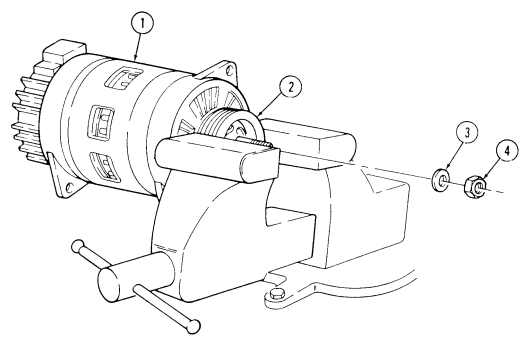

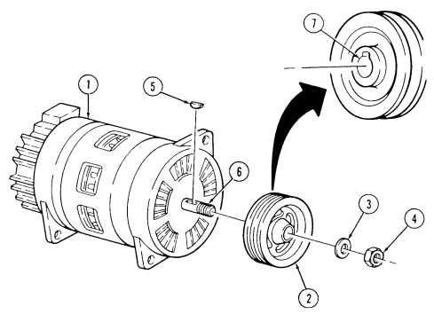

FOLLOW-ON TASKS: - Install 60 amp alternator (para. 4-2).

· Install 100 amp alternator (para. 12-23 or 12-24).

- Install 200 amp alternator (para. 4-109 or 4-110).

# 4-3. Alternator Pulley Replacement (Cont'D) 4-4. Alternator Mounting Brackets Replacement

This task covers:

| INITIAL SETUP:   |
|------------------|

| Materials/Parts   |
|-------------------|
|                   |

Tools General mechanic's tool kit:
automotive (Appendix B, Item 1)
Two lockwashers (Appendix G, Item 133) Two bolts (Appendix G, Item 5) Bolt (Appendix G, Item 4) Lockwasher (Appendix G, Item 191) Lockwasher (Appendix G, Item 178)
a. Removal

#### A. Removal B. Installation

| One mechanic        | One assistant   |
|---------------------|-----------------|
| TM 9\-2320\-280\-10 |                 |

If the connection is loose between alternator bracket and alternator, tightening mounting bolts further may cause alternator bracket to fail. Notify DS maintenance to modify an older bracket.

1. Remove capscrew (4), lockwasher (5), washer (6), and alternator adjusting bracket (7) from alternator mounting bracket (9). Discard lockwasher (5).

2. Remove bolt (1) and lockwasher (2) from power steering bracket (3), alternator mounting bracket (9), and engine (21). Discard lockwasher (2) and bolt (1).

3. Remove capscrew (12), lockwasher (11), and washer (10) from alternator mounting bracket (9) and power steering bracket (3). Discard lockwasher (11).

4. Remove capscrew (25), lockwasher (24), and washer (23), and swing power steering pump (22)
down. Discard lockwasher (24).

5. Remove two bolts (8) and alternator mounting bracket (9) from engine (21). Discard bolts (8).

NOTE
Perform steps 8 and 9 for vehicles with new alternator support bracket configuration.

6. Remove nut (20), washer (19), capscrew (13), spacer (17), and clamps (18) from support bracket (14). 7. Remove socket-head screw (16), washer (15), and support bracket (14) from engine (21). 8. Remove nut (20), two washers (19), capscrew (13), power steering lines bracket (27), and harness clamp (26) from clamps (18).

9. Remove nut (16), washer (15), and support bracket (14) from engine (21). 

b. Installation

Perform steps 3 and 4 for vehicles with new alternator support bracket configuration.

1. Install support bracket (14) on engine (21) with washer (15) and socket-head screw (16). Tighten socket-head screw (16) to 25-33 lb-ft (34-45 N•m).

2. Install spacer (17) and clamps (18) on support bracket (14) with capscrew (13), washer (19), and nut (20).

3. Install support bracket (14) on engine (21) with washer (15) and nut (28). Tighten nut (28) 
to 35 lb-ft (47 N•m).

4. Install power steering lines bracket (27) and harness clamp (26) on clamps (18) with washer (19),
capscrew (13), washer (19), and nut (20).

## 4-4. Alternator Mounting Brackets Replacement (Cont'D)

Install alternator mounting bracket (9) on engine (21) with two bolts (8). Tighten bolts (8)
5.

to 48 lb-ft (65 N.m).

6.

Install power steering bracket (3) on alternator mounting bracket (9) with washer (10), lockwasher (11), and capscrew (12). Tighten capscrew (12) finger-tight.

7.

Secure power steering bracket (3) on alternator mounting bracket (9) and engine (21) with lockwasher (2) and bolt (1). Tighten bolt (1) to 48 lb-ft (65 N-m). Install alternator adjusting bracket (7) on alternator mounting bracket (9) with washer (6),
8.

lockwasher (5), and capscrew (4).

9.

Install washer (23), lockwasher (24), and capscrew (25) in power steering bracket (3). Tighten

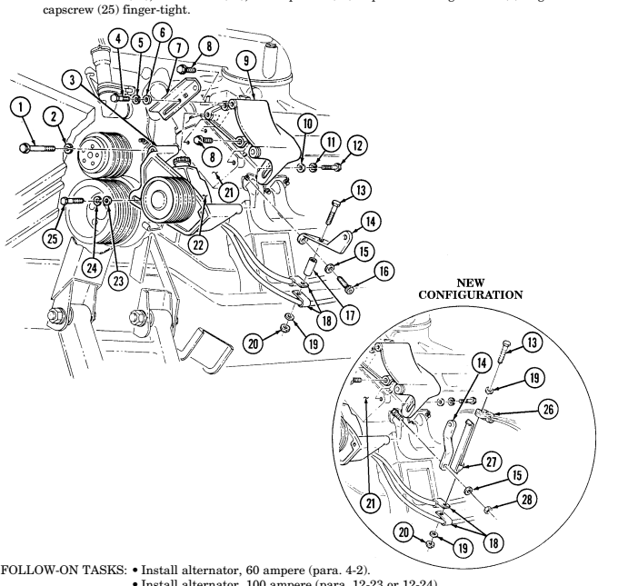

· Install alternator, 100 ampere (para. 12-23 or 12-24).
· Install alternator, 200 ampere (para. 4-109 or 4-110).

1

# 4-4.1. Alternator/Power Steering Mounting Bracket Replacement

This task covers:
INITIAL SETUP:
Applicable Models

| M1045A2, M1097A2, M1123         | Three lockwashers (Appendix G, Item 190)         |
|---------------------------------|--------------------------------------------------|
| Tools                           | Equipment Condition                              |
| General mechanic's tool kit:    | - Fan drive and fan blade removed (para. 3\-78). |
| automotive (Appendix B, Item 1) | - Serpentine drivebelt removed (para. 3\-83).    |

a. Removal b. Installation

Manual References a. Removal Remove two short bolts (3), long bolt (2), and mounting bracket (1) from engine (4).

b. Installation Install mounting bracket (1) on engine (4) with two short bolts (3) and long bolt (2). Tighten bolts (3) and (2) to 48 lb-ft (65 N•m).

# 4-4.1. Alternator/Power Steering Mounting Bracket Replacement (Cont'D)

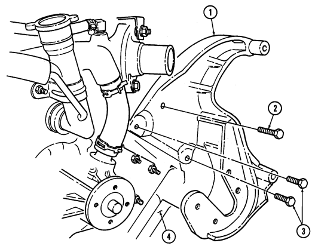

FOLLOW-ON TASKS: - • Install power steering pump (para. 8-24).

· Install tensioner, idler pulleys, and mounting hardware (para. 3-84). · Install 200 ampere alternator (para. 4-109 or 4-110).

# 4-5. Protective Control Box Maintenance

This task covers:
b. Inspection

#### Initial Setup:

Tools General mechanic's tool kit:
automotive (Appendix B, Item 1)
Materials/Parts Silicone compound (Appendix C, Item 48)
Personnel Required One mechanic One assistant Manual References TM 9-2320-280-10 TM 9-2320-280-24P
Equipment Condition
- Battery ground cable disconnected (para. 4-73). - Hood raised and secured (TM 9-2320-280-10).

The control box must be supported from inside the vehicle during removal and installation or damage to protective control box/unit may result.

#### A. Removal

1. Working under hood, disconnect engine wiring harness cannon plug (6) from control box (5). 2. From inside the vehicle, disconnect body wiring harness cannon plug (3) from control box (5). 3. Remove four screws (1) and control box (5) from cowl (2).

#### B. Inspection

Inspect rivnuts (5.1) for damage. Replace rivnuts (5.1) if damaged (para. 10-66).

#### C. Installation

1. Position control box (5) under instrument panel (4) against cowl (2). 2. From under hood, install control box (5) on cowl (2) with four screws (1). Tighten screws (1) 
to 6 lb-ft (8 N•m).

3. Fill engine wiring cannon plug (6) and control box connection (5) to capacity with silicone. 4. From inside vehicle, connect body wiring harness cannon plug (3) to control box (5). 5. Connect engine wiring harness cannon plug (6) to control box (5).

a. Removal c. Installation

# 4-5.  Protective Control Box Maintenance (Cont'D)

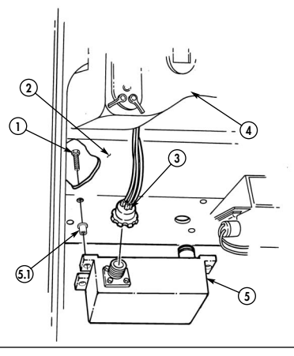

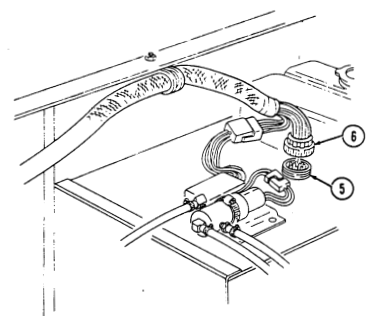

FOLLOW-ON TASKS: - Lower and secure hood (TM 9-2320-280-10).

- Connect battery ground cable (para. 4-73).

## 4-5.1. Distribution Box Maintenance

This task covers:
b. Inspection INITIAL SETUP:
Tools General mechanic's tool kit:
automotive (Appendix B, Item 1)
Personnel Required One mechanic One assistant a. Removal c. Installation Manual References TM 9-2320-280-10 TM 9-2320-280-24P
Equipment Condition
- Battery ground cable disconnected (para. 4-73). - Hood raised and secured (TM9-2320-280-10).

The distribution box must be supported from inside the vehicle during removal and installation, or damage to distribution box may result.

a. Removal 1. From inside the vehicle, disconnect body wiring harness cannon plug (3) from distribution box (4). 2. Working under hood, disconnect engine wiring harness cannon plug (6) and glow plug wiring harness cannon plug (7) from distribution box (4).

3. Remove four screws (1) and distribution box (4) from cowl (2). 

b. Inspection Inspect rivnuts (5) for damage. Replace rivnuts (5) if damaged (para. 10-66).

c. Installation 1. From under hood, install distribution box (4) on cowl (2) with four screws (1). Tighten screws (1) 
to 71 lb-in. (8 N•m).

2. Connect body wiring harness cannon plug (3) to distribution box (4). 3. Connect engine wiring harness cannon plug (6) to distribution box (4). 4. Connect glow plug wiring harness cannon plug (7) to distribution box (4).

# 4-5.1. Distribution Box Maintenance (Cont'D)

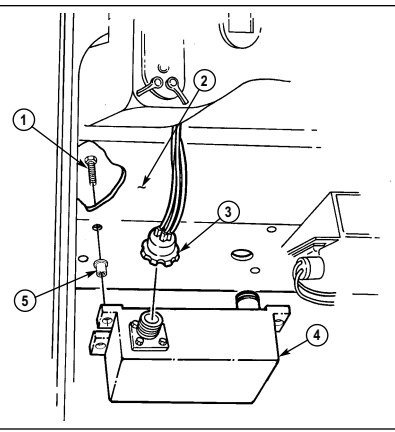

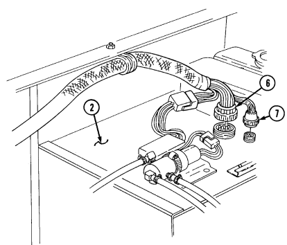

FOLLOW-ON TASKS: - Lower and secure hood (TM 9-2320-280-10).

- Connect battery ground cable (para. 4-73).

# Section I.1. Dual Voltage Alt E R N Ator And Regulator System Maintenance

4 - 5 . 2 . DUAL VOLTAGE ALT E R N ATOR AND REGULATOR SYSTEM MAINTENANCE TA S K
S U M M A RY

| Section I.   | GENERATING AND PROTECTIVE CONTROL BOX SYSTEM MAINTENANCE   |              |         |                                          |       |
|--------------|------------------------------------------------------------|--------------|---------|------------------------------------------|-------|
| 4\-1.        | GENERATING AND PROTECTIVE CONTROL BOX SYSTEM MAINTENANCE   | TASK SUMMARY |         |                                          |       |
| TASK         | PAGE                                                       | PROCEDURES   | PARA.   | NO.                                      |       |
| 4\-2.        | 60 Ampere Alternator Maintenance                           | 4\-2         |         |                                          |       |
| 4\-2.1.      | 60 Ampere Alternator Regulator Replacement                 | 4\-6.2       |         |                                          |       |
| 4\-2.2.      | 100/200 Ampere Alternator Cable Replacement                | 4\-6.4       |         |                                          |       |
| 4\-3.        | Alternator Pulley Replacement                              | 4\-8         | 4\-4.   | Alternator Mounting Brackets Replacement | 4\-10 |
| 4\-4.1.      | Alternator/Power Steering Mounting Bracket                 | Replacement  | 4\-10.2 |                                          |       |
| 4\-5.        | Protective Control Box Maintenance                         | 4\-12        |         |                                          |       |
| 4\-5.1.      | Distribution Box Maintenance                               | 4\-12.2      |         |                                          |       |

# 4-5.3. 100 Ampere Dual Voltage Alternator (12447110) Replacement

This task covers:
INITIAL SETUP:
Tools General mechanic's tool kit:
automotive (Appendix B, Item 1)
Maintenance and repair shop equipment:
automotive (Appendix B, Item 2)

#### Materials/Parts

Lockwasher (Appendix G, Item 188) Two lockwashers (Appendix G, Item 172)
Personnel Required One mechanic One assistant

a. Removal b. Installation

Manual References TM 9-2320-280-10 TM 9-2320-280-24P

#### Equipment Condition

- Hood raised and secured (TM 9-2320-280-10). - Battery ground cables disconnected (para. 4-73). - Engine access cover removed (para. 10-15). - Voltage regulator removed (para. 4-5.6).

General Safety Instructions Alternator must be supported during removal and installation.

a. Removal

Prior to removal, tag leads for installation.

1. Remove screw (5), lockwasher (6), washer (7), ground strap (8), and lead 3B (9) from ground point (11). Discard lockwasher (6).

2. Slide back rubber boot (4) and remove nut (3), washer (2), and alternator positive cable (1) from positive stud (12). 

3. Loosen screw (15) on alternator adjustment bracket (16) and remove drivebelt (14) from alternator pulley (13) on alternator (10).

Alternator must be supported during removal. Failure to support alternator may cause injury to personnel or damage to equipment.

4. Remove screw (17) and washer (18) from alternator adjustment bracket (16). 5. Remove nut (19), lockwasher (20), washer (21), screw (26), washer (27), and alternator (10) from support bracket (28) and mounting bracket (29). Discard lockwasher (20).

6. Remove three capscrews (24), washers (25), bushings (22), and fan guard assembly (23) from alternator (10).

7. Remove alternator pulley (13) (para. 4-3).

4-5.3.  100 AMPERE DUAL VOLTAGE ALTERNATOR (12447110) REPLACEMENT(Cont'd)

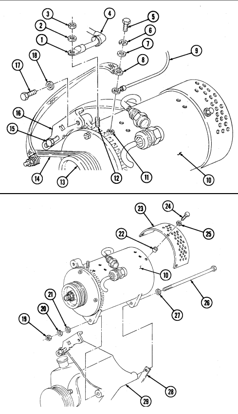

# 4-5.3. 100 Ampere Dual Voltage Alternator (12447110) Replacement (C O Nt' D )

b. Installation 1. Install alternator pulley (4) (para. 4-3). 2 . Install fan guard assembly (6) on alternator (11) with three bushings (5), washers (8), and capscrews (7).

Alternator must be supported during installation. Failure to support alternator may cause injury to personnel or damage to equipment.

3 . Position alternator (11) on mounting bracket (13), with support bracket (12) on outside of alternator (11), and install washer (10), capscrew (9), washer (3), lockwasher (2), and nut (1).

#### Not E

Ensure terminals are clean before connections are made.

4. Install washer (29) and screw (28) on alternator adjustment bracket (27) and alternator (11). Do not tighten screw (28).

5. Install positive cable (14), washer (15), and nut (16) on positive stud (24). Tighten nut (16) to 10-15 lb-ft (14-20 N•m).

6. Slide rubber boot (17) over positive stud (24). 7. Install lead 3B (22) and ground strap (21) on ground point (23) with washer (20), lockwasher (19),
and screw (18). Tighten screw (18) to 8-12 lb-ft (11-16 N•m).

8. Install drivebelt (25) on alternator pulley (4) and rotate alternator (11) to put tension on drivebelt (25). Tighten screws (26) and (28).

# 4-5.3.  100 Ampere Dual Voltage Alternator (12447110) Replacementcont'D)

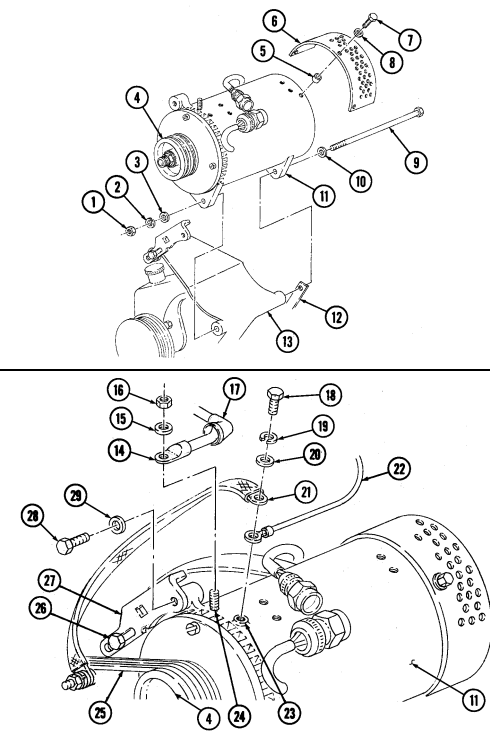

FOLLOW-ON TASKS: - • Install voltage regulator (para. 4-5.6).

· Connect battery ground cables (para. 4-73). · Install engine access cover (para. 10-15). · Lower and secure hood (TM 9-2320-280-10).

- Start engine (TM 9-2320-280-10) and check operation of voltmeter gauge.

# 4-5.4. 100 Ampere Dual Voltage Alternator (12447110) Cable Replacement

This task covers:

| INITIAL SETUP:   |
|------------------|

| General mechanic's tool kit:    |
|---------------------------------|
| automotive (Appendix B, Item 1) |

#### Tools

Maintenance and repair shop equipment:
automotive (Appendix B, Item 2)

#### Materials/Parts

Two lockwashers (Appendix G, Item 191) Silicone compound (Appendix C, Item 48) Tiedown strap (Appendix G, Item 306) Lockwasher (Appendix G, Item 134) Lockwasher (Appendix G, Item 141)
a. Removal b. Installation

#### A. Removal B. Installation Manual References

TM 9-2320-280-10 TM 9-2320-280-24P
Equipment Condition
- Hood raised and secured 
(TM 9-2320-280-10).

- Battery ground cables disconnected 
(para. 4-73).

- Engine access cover removed (para. 10-15).

Prior to removal, tag leads for installation.

1. Slide back rubber boot (8) and remove nut (6), washer (7), and positive cable (1) from positive stud (9). 

2. Remove nut (5), lockwasher (4), washer (3), and clamp (2) from thermostat outlet stud (10). Discard lockwasher (4).

3. Remove nut (22), lockwasher (21), clamp (20), and cable (1) from right cylinder head stud (19) of water manifold (18). Discard lockwasher (21).

4. Remove nut (17), lockwasher (16), screw (14), washer (13), and clamp (11) from inner body flange (12). Discard lockwasher (16). 

5. Inspect condition of edge trim (15) for damage and replace if damaged. 6. Remove nut (28), lockwasher (27), washer (26), and cable (1) from power stud (25). Discard lockwasher (27).

7. Remove tiedown strap (24) from cable (1). 8. Remove grommet (23) and cable (1) from battery box (29) and vehicle.

Ensure studs are clean before connections are made.

1. Install grommet (23) on battery box (29). 2. Route cable (1) through grommet (23) in battery box (29) and install cable (1) on power stud (25)
with washer (26), lockwasher (27), and nut (28). Apply silicone compound to power stud (25).

3. Install tiedown strap (24) on cable (1). 4. Install cable (1) on inner body flange (12) with washer (13), screw (14), clamp (11), 
lockwasher (16), and nut (17).

5. Install cable (1) to right cylinder head stud (19) on water manifold (18) with clamp (20),
lockwasher (21), and nut (22).

6. Install cable (1) on thermostat outlet stud (10) with clamp (2), washer (3), lockwasher (4), and nut (5).

7. Install cable (1) on positive stud (9) with washer (7) and nut (6). Tighten nut (6) to 75-85 lb-ft
(8-10 N•m). Slide rubber boot (8) over nut (6).

4-12.10 Change 3 4-5.4.  100 AMPERE DUAL VOLTAGE ATERNATOR (12447110) CABLE REPLACEMENT
(Cont'd)

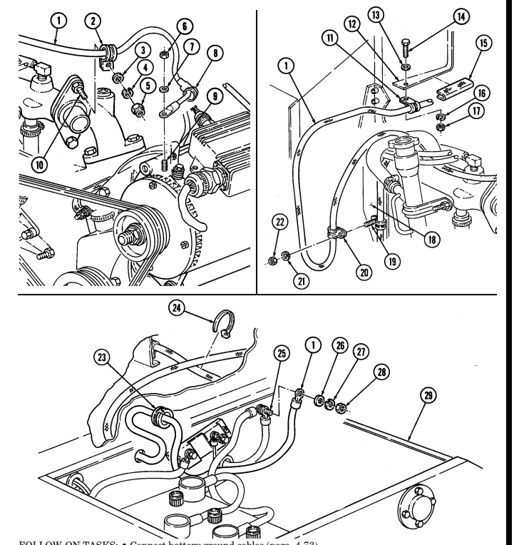

FOLLOW-ON TASKS: - Connect battery ground cables (para. 4-73).
· Install engine access cover (para. 10-15).

· Lower and secure hood (TM 9-2320-280-10). - Start engine (TM 9-2320-280-10) and check operation of voltmeter gauge.

# 4-5.5. 100 Ampere Dual Voltage Alternator (12447110) Umbilical Power Cable Replacement

This task covers:

#### Intial Setup:

| Materials/Parts   |
|-------------------|

Tools General mechanic's tool kit:
automotive (Appendix B, Item 1)
Two lockwashers (Appendix G, Item 141) Two lockwashers (Appendix G, Item 138) Lockwasher (Appendix G, Item 148) Silicone compound (Appendix C, Item 47.1)
a. Removal b. Installation a. Removal

| - 200 ampere alternator removed (para. 4\-109   | or 4\-110).                     |
|-------------------------------------------------|---------------------------------|
| - Tensioner, idler pulleys, and mounting        | hardware removed (para. 3\-84). |
| - Power steering pump removed (para. 8\-24).    |                                 |

Prior to removal, tag leads for installation.

1. Remove nut (5), lockwasher (4), washer (3), and positive power cable (2) from power stud (1). 

Discard lockwasher (4).

2. Remove capscrew (6), lockwasher (7), negative power cable (8), and two cables (9) from shunt (10).

Discard lockwasher (7).

Perform step 4 for M1097A2 and M1123 vehicles only. Perform steps 5 and 6 for M1097 and M1097A1 vehicles only.

4. Remove five capscrews (34), two washers (33), and coverplate (32) from "B" beam (12). 5. Remove three capscrews (31) from coverplate (19) and "B" beam (12). 6. Remove three nuts (17), lockwashers (16), capscrews (20), and coverplate (19) from cargo floor (18).

Discard lockwashers (16).

7. Remove two nuts (15), washers (14), capscrews (26), washers (27), and mounting bracket (24) from coverplate (19).

8. Remove nut (28), screw (23), and cover chain (21) from mounting bracket (24). 9. Remove cover (22) with cover chain (21) from umbilical power cable assembly (29).

10. Remove four nuts (30), screws (25), and mounting bracket (24) from umbilical power cable assembly (29).

11. Pull umbilical power cable assembly (29) through grommet (11) and coverplate (19) and remove from vehicle.

12. Remove grommet (11) from battery box (13).

4-5.5.  100 AMPERE DUAL VOLTAGE ATERNATOR (12447110) UMBILICAL POWER
CABLE REPLACEMENT (Cont'd)

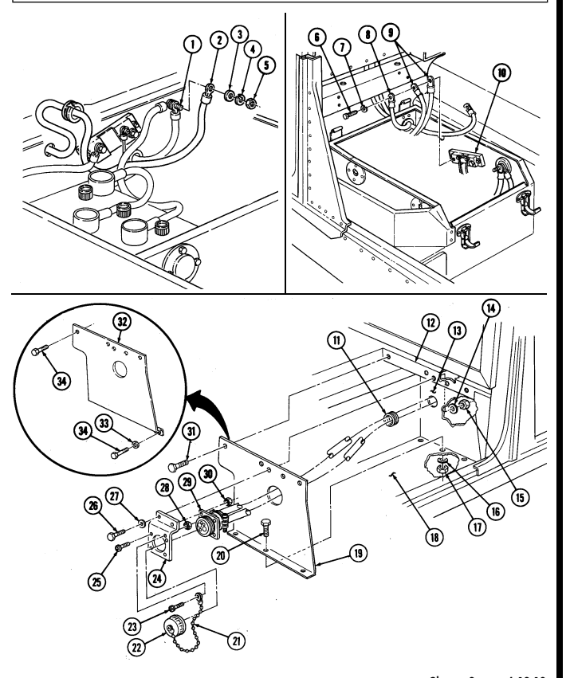

4 - 5 . 5 . 100 AMPERE DUAL VOLTAGE ALT E R N ATOR (12447110) UMBILICAL POWER

# Cable Replacement (Cont'D)

b. Installation 1. Install grommet (11) on battery box (13). 2. Route umbilical power cable assembly (29) through coverplate (19) and grommet (11) and position in approximate mounting location.

3. Install mounting bracket (24) on umbilical power cable assembly (29) with three screws (25) and nuts (30).

4. Install cover (22) on umbilical power cable assembly (29). 5. Install cover chain (21) on mounting bracket (24) with screw (23) and nut (28).

#### Not E

Perform step 6 for M1097A2 and M1123 vehicles only. Perform steps 7 and 8 for M1097 and M1097A1 vehicles.

6. Install coverplate (32) on "B" beam (12) with two washers (33) and five capscrews (34). 7 . Install mounting bracket (24) on coverplate (19) with two washers (27), capscrews (26), washers (14),
and nuts (15).

8. Install coverplate (19) on "B" beam (12) with three capscrews (31). 9 . Install coverplate (19) on cargo floor (18) with three capscrews (20), lockwashers (16), and nuts (17).

Tighten nuts (17) to 65 lb-ft (88 N•m ) .

10. Install two cables (4) and negative power cable (3) on shunt (5) with lockwasher (2) and capscrew (1).

11. Install positive power cable (7) on power stud (6) with washer (8), lockwasher (9), and nut (10).

12. Apply silicone compound to cable (7), coating all exposed metallic surfaces.

4-5.5.  100 AMPERE DUAL VOLTAGE ATERNATOR (12447110) UMBILICAL POWER

CABLE REPLACEMENT (Cont'd)

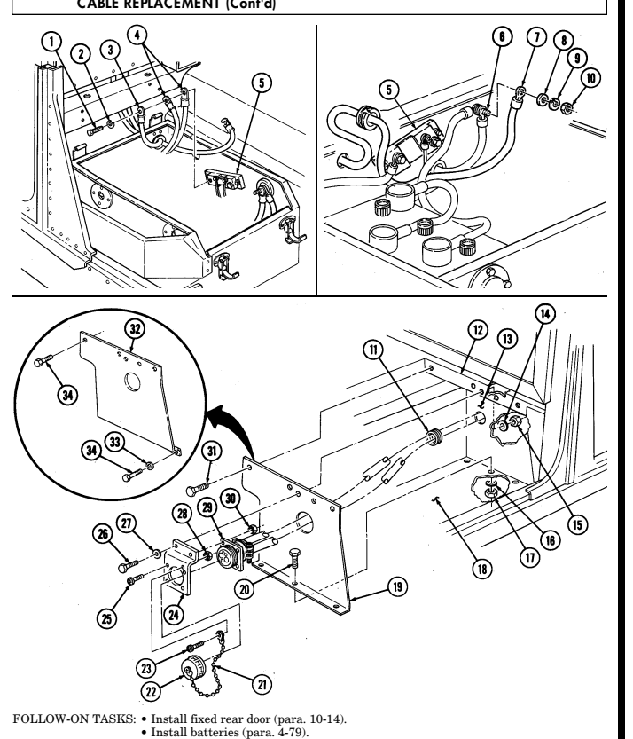

4-5.6. 100 AMPERE DUAL VOLTAGE ALTERNATOR REGULATOR (PART OF 12447110)

# Replacement

This task covers:
a. Removal b. Installation INITIAL SETUP:
Tools General mechanic's tool kit:
automotive (Appendix B, Item 1)
Maintenance and repair shop equipment:
automotive (Appendix B, Item 2)

#### Materials/Parts

Three lockwashers (Appendix G, Item 135) Lockwasher (Appendix G, Item 138) Sealant (Appendix C, Item 44) Grease (Appendix C, Item 25)
Manual References TM 9-2320-280-10 TM 9-2320-280-24P
Equipment Condition
- Battery ground cables disconnected (para. 4-73). - Hood raised and secured (TM 9-2320-280-10).

Prior to removal, tag leads for installation.

#### A. Removal

1. Disconnect voltage regulator plug (21) from voltage regulator connector (19). 2. Slide back rubber boot (13) and remove nut (14) and lead 568A (12) from IGN terminal (11). 3. Slide back rubber boot (15) and remove nut (17) and lead 2A (16) from AC terminal (18). 4. Remove nut (9) and ground wire (5) from 14-volt stud (10) on voltage regulator (23). 5. Disconnect alternator connector (22) from voltage regulator connector (4). 6. Remove screw (8), lockwasher (7), washer (6), and ground wire (5) from voltage regulator (23) and alternator (20). Discard lockwasher (7).

7. Remove three screws (3), lockwashers (2), washers (1), and voltage regulator (23) from alternator (20). Discard lockwashers (2).

#### B. Installation

1. Install voltage regulator (23) on alternator (20) with three washers (1), lockwashers (2), and screws (3).

Tighten screws (3) to 30-34 lb-in. (3-4 N•m).

2. Install one end of ground wire (5) on voltage regulator (23) with washer (6), lockwasher (7), and screw (8). Tighten screw (8) to 88-94 lb-in. (10-11 N•m).

3. Install other end of ground wire (5) on 14-volt stud (10) with nut (9). Tighten nut (9) to 45-55 lb-in. 

(5-6 N•m) and apply sealant to nut (9) and 14-volt stud (10).

4. Connect alternator connector (22) to voltage regulator connector (4). 5. Install lead 568A (12) on IGN terminal (11) with nut (14). Tighten nut (14) to 23-27 lb-in. (2.6-3.0 N•m). 6. Apply grease to IGN terminal (11), lead 568A (12), and inside of boot (13), and slide rubber boot (13)
over terminal (11).

7. Install lead 2A (16) on AC terminal (18) with nut (17). Tighten nut (17) to 18-22 lb-in. (2.0-2.5 N•m). 8. Apply grease to AC terminal (18), lead 2A (16), and inside of boot (15), and slide rubber boot (15) over terminal (18).

9. Connect voltage regulator plug (21) to voltage regulator connector (19).

4-5.6.  100 AMPERE DUAL VOLTAGE ATTERNATOR REGULATOR (PART OF 12447110)
REPLACEMENT (Cont'd)

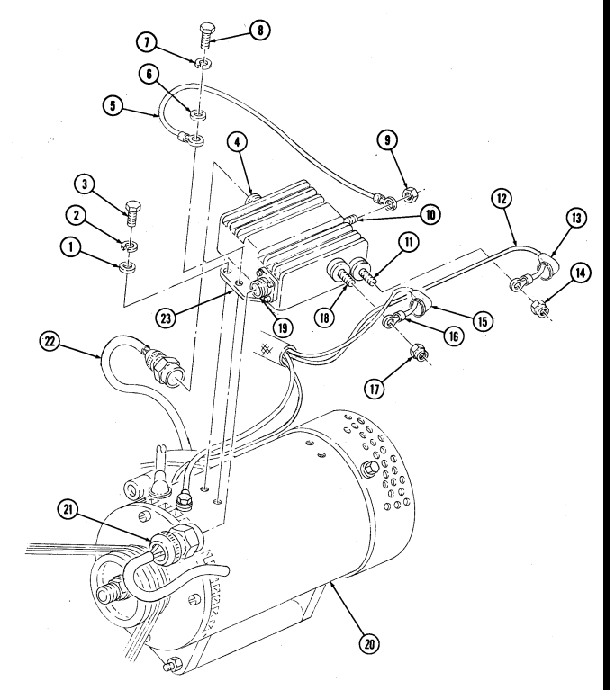

FOLLOW-ON TASKS: - Connect battery ground cables (para. 4-73).
- • - • - Lower and secure hood (TM 9-2320-280-10).

17 e e e
# 4-5.7. (6.5L) 200 Ampere Dual Voltage Alternator (12447109) Replacement

This task covers:
a. Removal b. Installation

#### Initial Setup:

| PA R A .   | P R O C E D U R E S                                                 | N O .    |
|------------|---------------------------------------------------------------------|----------|
|            | NOTE                                                                |          |
|            | This section pertains to vehicles configured for dual voltage and   |          |
|            | electrical systems. Conversion from single voltage electrical       |          |
|            | systems to dual voltage is accomplished by application of 100\-,    |          |
|            | 200\-, and 400\-voltage kits. Newer production vehicles incorporate |          |
|            | these systems.                                                      |          |
| 4\-5.3.    | 100 Ampere Dual Voltage Alternator (12447110) Replacement           | 4\-12.6  |
| 4\-5.4.    | 100 Ampere Dual Voltage Alternator (12447110) Cable Replacement     | 4\-12.10 |
| 4\-5.5.    | 100 Ampere Dual Voltage Alternator (12447110) Umbilical             |          |

a. Removal

Prior to removal, tag leads for installation.

1. Remove nut (13), lockwasher (12), washer (11), lead 3B (10), and ground strap lead 3B (9) from ground stud (8). Discard lockwasher (12).

2. Slide back rubber boot (14) and remove nut (1), lockwasher (2), washer (3), and alternator positive cable lead 6 (4) from positive stud (5). Discard lockwasher (2).

3. Position 3/8-in. breaker bar on belt tensioner (15), move tensioner (15) clockwise, and remove drivebelt (6) from alternator pulley (7).

Alternator must be supported during removal. Failure to support alternator may cause injury to personnel or damage to equipment.

4. Remove nut (28), lockwasher (27), washer (26), two screws (18), washers (16), lockwasher (17), and alternator (24) from support bracket (22) and mounting bracket (25). Discard lockwashers (27) and (17).

5. Remove three capscrews (19), washers (20), bushings (23), and fan guard assembly (21) from alternator (24).

6. Remove alternator pulley (7) (para. 4-3).

 4-5.7. (6.5L) 200 AMPERE DUAL VOLTAGE ALTERNATOR (12447109) REPLACEMENT (Cont'd)

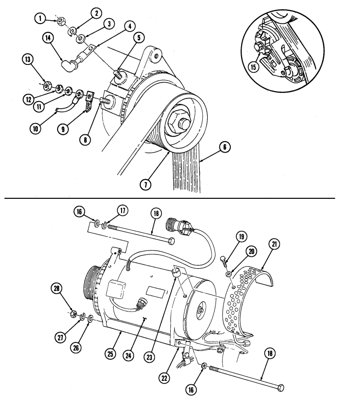

# 4-5.7. (6.5L) 200 Ampere Dual Voltage Alternator (12447109) Replacement (Cont'D)

b. Installation 1. Install alternator pulley (20) (para. 4-3). 2 . Install fan guard assembly (6) on alternator (9) with three bushings (8), washers (5), and capscrews (4).

Alternator must be supported during installation. Failure to support alternator may cause injury to personnel or damage to equipment.

3 . Position alternator (9) on mounting bracket (10). 4 . Install support bracket (7) on alternator (9) and alternator mounting bracket (10) with lockwasher ( 2 ) ,
two washers (1), capscrews (3), washer (11), lockwasher (12), and nut (13).

#### Not E

Ensure terminals are clean before connections are made.

5. Install positive cable lead 6 (17) on positive stud (18) with washer (16), lockwasher (15), and nut (14). Tighten nut (14) to 10-15 lb-ft (14-20 N•m).

6. Apply grease to positive terminal (18), positive cable lead 6 (17), and inside of rubber boot (27), slide boot (27) over stud (18).

7. Install ground strap (22) and lead 3B (23) on ground stud (21) with washer (24), lockwasher (25),
and nut (26). Tighten nut (26) to 8-12 lb-ft (11-16 N•m).

8. Position 3/8-in. breaker bar on belt tensioner (28), move tensioner (28) clockwise, and install belt (19) on alternator pulley (20).

 4-5.7. (6.5L) 200 AMPERE DUAL VOLTAGE ALTERNATOR (12447109) REPLACEMENT (Cont'd)

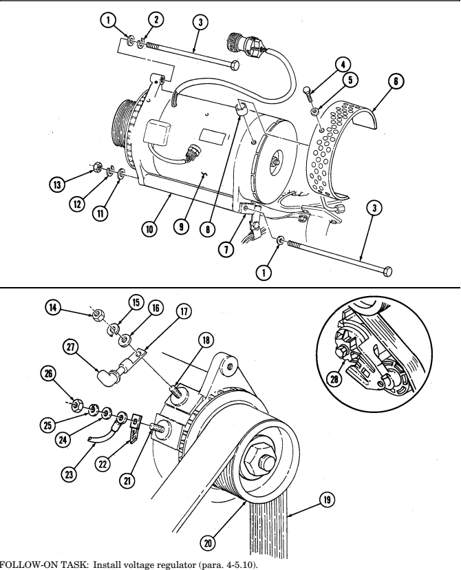

# 4-5.8. (6.5L) 200 Ampere Dual Voltage Alternator (12447109) Cable Replacement

This task covers:

| INITIAL SETUP:   |
|------------------|

#### Tools

General mechanic's tool kit:
automotive (Appendix B, Item 1)
Maintenance and repair shop equipment:
automotive (Appendix B, Item 2)

#### Materials/Parts

Four tiedown straps (Appendix G, Item 309) Lockwasher (Appendix G, Item 134) Lockwasher (Appendix G, Item 186) Lockwasher (Appendix G, Item 191) Lockwasher (Appendix G, Item 150)

| Manual References    |
|----------------------|
| TM 9\-2320\-280\-10  |
| TM 9\-2320\-280\-24P |

a. Removal b. Installation

Equipment Condition
- Hood raised and secured (TM 9-2320-280-10). - Battery ground cables disconnected (para. 4-73). - Engine access cover removed (para. 10-15).

#### A. Removal Note

Prior to removal, tag leads for installation.

1. Slide back rubber boot (5) and remove nut (8), lockwasher (7), washer (6), cable (4), nut (3), and washer (2) from positive stud (1). Discard lockwasher (7).

2. Remove capscrew (9) and clamp (10) from water crossover bracket (11), and separate cable (4) from cables and clamp (10).

3. Remove nut (14), lockwasher (13), and clamp (15) from stud (12) and separate cable (4) from cables and clamp (15). Discard lockwasher (13).

4. Remove and discard four tiedown straps (16). 5. Remove nut (22), lockwasher (21), screw (17), and washer (18) from bracket (20) and remove cable (4) from clamp (19). Discard lockwasher (21).

6. Remove nut (27), lockwasher (26), washer (25), and cable (4) from buss bar (24) on battery box (23).

Discard lockwasher (26).

7. Remove cable (4) through grommet (28) and vehicle.

b. Installation

Ensure terminals are clean before connections are made.

1. Install cable (4) through grommet (28) in battery box (23). 2. Install cable (4) on buss bar (24) with washer (25), lockwasher (26), and nut (27). 3. Install four tiedown straps (16) on cable (4). 4. Route cable (4) through clamp (19), and install clamp (19) to bracket (20) with washer (18),
screw (17), lockwasher (21), and nut (22).

5. Route cable (4) through clamp (15), and install clamp (15) on stud (12) with lockwasher (13), and nut (14).

6. Route cable (4) through clamp (10), and install clamp (10) on water crossover bracket (11) with capscrew (9).

7. Install washer (2), nut (3), and cable (4) on positive stud (1) with washer (6), lockwasher (7), and nut (8). Tighten nut (8) to 10-15 lb-ft (14-20 N•m), and slide rubber boot (5) over nut (8).

4-5.8.  (6.5L) 200 AMPERE DUAL VOLTAGE ALTERNATOR (12447109) CABLE REPLACEMENT
(Cont'd)

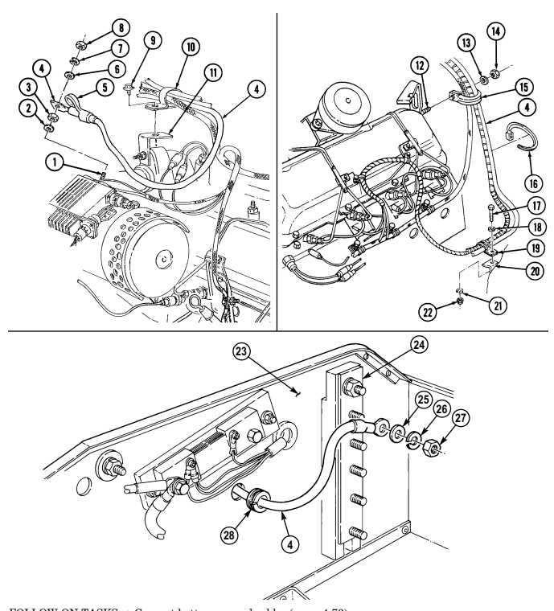

FOLLOW-ON TASKS: - Connect battery ground cables (para. 4-73).

· Install engine access cover (para. 10-15).

- Lower and secure hood (TM 9-2320-280-10). - Start engine (TM 9-2320-280-10) and check operation of voltmeter gauge.

4-5.9. (6.5L) 200 AMPERE DUAL VOLTAGE ALTERNATOR (12447109) UMBILICAL POWER
CABLE REPLACEMENT
This task covers:

| General mechanic's tool kit:    |
|---------------------------------|
| automotive (Appendix B, Item 1) |

| Materials/Parts   |
|-------------------|

INITIAL SETUP:
Tools automotive (Appendix B, Item 1)
Two lockwashers (Appendix G, Item 138) Lockwasher (Appendix G, Item 148) Lockwasher (Appendix G, Item 150) Sealing compound (Appendix C, Item 47.1)
a. Removal b. Installation a. Removal

| TM 9\-2320\-280\-10                           |
|-----------------------------------------------|
| TM 9\-2320\-280\-24P                          |
| Equipment Condition                           |
| - Hood raised and secured                     |
| (TM 9\-2320\-280\-10).                        |
| - Battery ground cables disconnected          |
| (para. 4\-73).                                |
| - Engine access cover removed (para. 10\-15). |

Prior to removal, tag leads for installation.

1. Remove nut (5), lockwasher (4), washer (3), and positive power cable (2) from buss bar (1). Discard lockwasher (4).

2. Remove capscrew (6), lockwasher (7), negative power cable (8), and two cables (9) from shunt (10).

Discard lockwasher (7).

3. Remove five capscrews (20), two lockwashers (19), washers (18), and coverplate (17) from "B" beam (12).

Discard lockwashers (19).

4. Remove two nuts (15), washers (14), capscrews (25), washers (26), and mounting bracket (27) from coverplate (17).

5. Remove nut (28), screw (23), and cover chain (21) from mounting bracket (27). 6. Remove cover (22) with cover chain (21) from umbilical power cable assembly (29). 7. Remove four nuts (30), screws (24), and mounting bracket (27) from umbilical power cable assembly (29). 8. Pull umbilical power cable assembly (29) through grommet (11) and coverplate (17), and remove from vehicle (16).

9. Remove grommet (11) from battery box (13).

#### B. Installation

1. Install grommet (11) on battery box (13). 2. Route umbilical power cable assembly (29) through coverplate (17) and grommet (11), and position in approximate mounting location on vehicle (16).

3. Install cover chain (21) on mounting bracket (27) with screw (23) and nut (28). 4. Install umbilical power cable assembly (29) on mounting bracket (27) with four screws (24) and nuts (30).

5. Install cover (22) on umbilical power cable assembly (29). 6. Install coverplate (17) on "B" beam (12) with two washers (18), lockwashers (19), and five capscrews (20).

7. Install mounting bracket (27) on coverplate (17) with two washers (26), capscrews (25), washers (14),
and nuts (15).

8. Install two cables (9) and negative power cable (8) on shunt (10) with lockwasher (7) and capscrew (6).

9. Install positive power cable (2) on buss bar (1) with washer (3), lockwasher (4), and nut (5).

10. Apply silicone compound to cable (2), coating all exposed metallic surfaces.

4-5.9.  (6.5L) 200 AMPERE DUAL VOLTAGE ALTERNATOR (12447109) UMBILICAL POWER

# Cable Replacement (Confd)

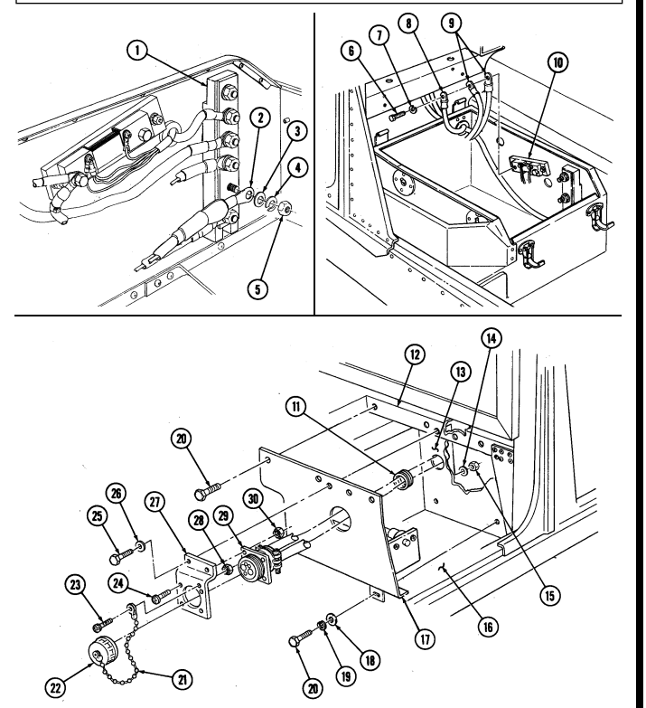

FOLLOW-ON TASKS: - Install fixed rear door (para. 10-14).
- Install batteries (para. - Install batteries (para. 4-79).

# 4-5.10. (6.5L) 200 Ampere Dual Voltage Regulator ( Part Of 12447109) Replacement

This task covers:
a. Removal b. Installation INITIAL SETUP:
Tools General mechanic's tool kit:
automotive (Appendix B, Item 1)
Maintenance and repair shop equipment:
automotive (Appendix B, Item 2)
Materials/Parts Two spring tension washers 
(Appendix G, Item 318)
Lockwasher (Appendix G, Item 185) Grease (Appendix C, Item 25)
a. Removal Manual References TM 9-2320-280-10 TM 9-2320-280-24P
Equipment Condition
- Battery ground cables disconnected (para. 4-73). - Hood raised and secured (TM 9-2320-280-10).

Prior to removal, tag leads for installation.

1. Disconnect regulator plug (13) from voltage regulator (11). 2. Slide back rubber boot (3) and remove nut (2) and lead 5A (1) from IGN terminal (22). 3. Slide back rubber boot (4) and remove nut (5) and lead 2A (6) from AC terminal (7). 4. Remove nut (20) and ground wire (12) from 14-volt stud (21). 5. Remove screw (8), lockwasher (9), washer (10), and ground wire (12) from voltage regulator (11).

Discard lockwasher (9).

6. Disconnect alternator connector (15) from regulator connector (16). 7. Remove two screws (19), spring tension washers (18), washers (17), and voltage regulator (11) from alternator (14). Discard spring tension washers (18).

#### B. Installation

1. Install voltage regulator (11) on alternator (14) with two washers (17), spring tension washers (18), and screws (19). Tighten screws (19) to 30-34 lb-in. (3-4 N•m).

2. Connect alternator connector (15) to regulator connector (16). 3. Install lead 5A (1) and nut (2) on IGN terminal (22). Tighten nut (2) to 23-27 lb-in. (2.6-3.0 N•m). 4. Apply grease to IGN terminal (22), lead 5A (1), and inside of boot (3), and slide boot (3) over IGN
terminal (22).

5. Install lead 2A (6) and nut (5) on AC terminal (7). Tighten nut (5) to 18-22 lb-in. (2.0-2.5 N•m). 6. Apply grease to AC terminal (7), lead 2A (6), and inside of boot (4), and slide boot (4) over AC
terminal (7).

7. Connect regulator plug (13) to voltage regulator (11). 8. Install one end of ground wire (12) on 14-volt stud (21) on regulator (11) with nut (20). Tighten nut (20) to 45-55 lb-in. (5-6 N•m).

9. Install other end of ground wire (12) on regulator (11) with washer (10), lockwasher (9), and screw (8). Tighten screw (8) to 88-94 lb-in. (10-11 N•m).

4-5.10.  (6.5L) 200 AMPERE DUAL VOLTAGE REGULATOR ( PART OF 12447109)

# Replacement (Cont'D)

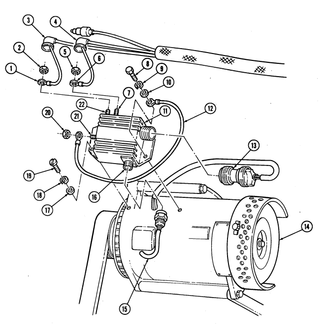

FOLLOW-ON TASKS: - Connect battery ground cables (para. 4-73).

· Lower and secure hood (TM 9-2320-280-10).

# 4-5.11. (6.5L) 400 Ampere Dual Voltage Regulator ( Part Of 12446760) Replacement

This task covers:
INITIAL SETUP:
Tools General mechanic's tool kit:
automotive (Appendix B, Item 1)
Maintenance and repair shop equipment:
automotive (Appendix B, Item 2)

#### Materials/Parts

Two lockwashers (Appendix G, Item 187) Lockwasher (Appendix G, Item 185) Grease (Appendix C, Item 25)

#### A. Removal B. Installation

Manual References TM 9-2320-280-10 TM 9-2320-280-24P
Equipment Condition
- Battery ground cables disconnected (para. 4-73). - Hood raised and secured (TM 9-2320-280-10).

a. Removal

Prior to removal, tag leads for installation.

1. Disconnect regulator plugs (13) and (14) from connectors (10) and (11) on voltage regulator (12). 2. Slide back rubber boot (7) and remove nut (5), washer (6), and lead 5A (8) from red terminal (9) on voltage regulator (12).

3. Slide back rubber boot (3) and remove nut (1), washer (2), and lead 2A (4) from yellow terminal (20)
on voltage regulator (12).

4. Remove three screws (19), lockwashers (18), washers (17), spacers (16), and voltage regulator (12)
from alternator (15). Discard lockwashers (18).

#### B. Installation

1. Install voltage regulator (12) on alternator (15) with three spacers (16), washers (17),
lockwashers (18), and screws (19) . Tighten screws (19) to 30-34 lb-in. (3-4 N•m).

2. Install lead 5A (8), washer (6), and nut (5) on red terminal (9) of voltage regulator (12). Tighten nut (5) to 35 lb-in. (4 N•m).

3. Apply grease to red terminal (9), lead 5A (8), and inside of boot (7), and slide boot (7) over red terminal (9).

4. Install lead 2A (4), washer (2), and nut (1) on yellow terminal (20) of voltage regulator (12). Tighten nut (1) to 20 lb-in. (2 N•m).

5. Apply grease to yellow terminal (20), lead 2A (4), and inside of boot (3), and slide boot (3) over yellow terminal (20).

6. Connect regulator plugs (13) and (14) to connectors (10) and (11) on voltage regulator (12).

4-5.11.  (6.5L) 400 AMPERE DUAL VOLTAGE REGULATOR ( PRT OF 12446760) REPLACEMENT
(Cont'd)

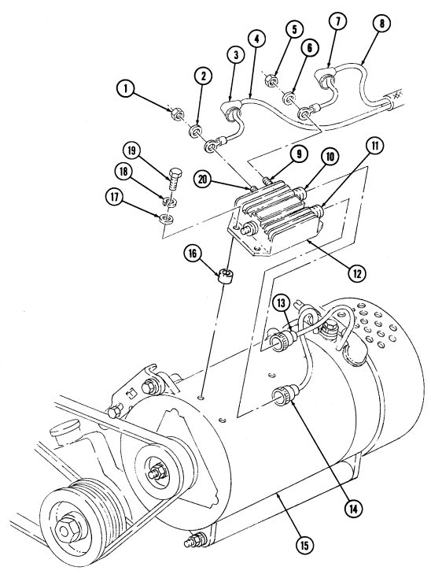

FOLLOW-ON TASKS: - Connect battery ground cables (para. 4-73).

· Lower and secure hood (TM 9-2320-280-10).

4-5.12. (6.5L) 400 AMPERE DUAL VOLTAGE ALTERNATOR (PART OF 12446760) CABLE

# Replacement

This task covers:

#### Initial Setup:

Tools General mechanic's tool kit:
automotive (Appendix B, Item 1)
Maintenance and repair shop equipment:
automotive (Appendix B, Item 2)

#### Materials/Parts

Locknut (Appendix G, Item 72) Three lockwashers (Appendix G, Item 191) Locknut (Appendix G, Item 79) Lockwasher (Appendix G, Item 141) Five lockwashers (Appendix G, Item 190) Three tiedown straps (Appendix G, Item 309)
a. Removal a. Removal b. Installation

#### Manual References

TM 9-2320-280-10 TM 9-2320-280-24P
Equipment Condition
- Hood raised and secured (TM 9-2320-28010).

- Battery ground cables disconnected (para.

4-73).

- Engine access cover removed (para. 10-15).

Prior to removal, tag leads for installation.

1. Remove locknut (7), washer (6), screw (3), clamp (4), and cables (2) and (20) from bracket (5).

Discard locknut (7).

2. Remove nut (19), lockwasher (18), washer (17), and bracket (5) from stud (16) on right rear intake manifold (15). Discard lockwasher (18).

3. Remove screw (8), clamp (9), and cables (2) and (20) from bracket (11). 4. Remove locknut (14), washer (13), screw (10), and bracket (11) from right rear cowl (12). Discard locknut (14).

5. Remove three tiedown straps (1) from cables (2) and (20). Discard tiedown straps (1). 6. Remove nut (21), lockwasher (22), washer (23), and cable (20) from stud (31) on battery box side panel (24). Discard lockwasher (22).

7. Remove nut (28), lockwasher (29), washer (27), and cable (2) from stud (26) on buss bar (25).

Discard lockwasher (29).

8. Remove grommet (30) from battery box side panel (24) and remove cable (2) through battery box side panel (24).

4-5.12.  (6.5L) 400 AMPERE DUAL VOLTAGE ATERNATOR (PART OF 12446760) CABLE
 REPLACEMENT (Conf d)

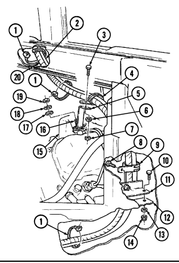

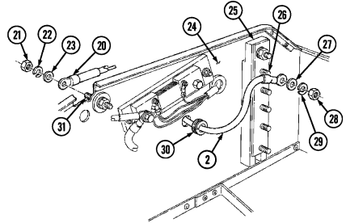

## 4-5.12.  (6.5L) 400 Ampere Dual Voltage Aternator (Part Of 12446760) Cable Replacement (Conf D)

9.

10.

11.

12.

Remove nut (6), screw (7), cable (2), and clamp (8) from oil pan bracket (1). Remove nut (3), lockwasher (4), and cable (2) from positive terminal (5). Discard lockwasher (4). Remove nut (11), lockwasher (12), washer (13), clamp (9), and cable (2) from stud (10) on thermostat housing (14). Discard lockwasher (12). Remove nut (15), washer (16), clamp (18), and cable (2) from stud (17).

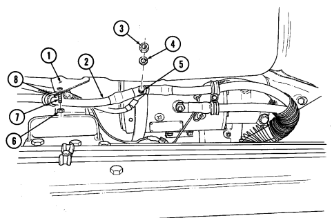

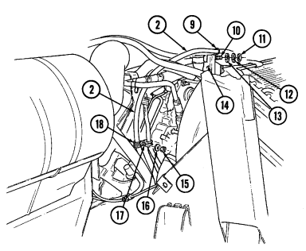

## 4-5.12.  (6.5L) 400 Ampere Dual Voltage Aternator (Part Of 12446760) Cable Replacement (Cont'D)

Remove screw (23), lockwasher (22), washer (21), ground strap (24), lead (20), and cable (25) from 13.

alternator (19). Discard lockwasher (22).

Remove screw (26), lockwasher (27), washer (28), cables (25) and (29) from alternator (19). Discard 14.

lockwasher (27).

Slide back rubber boot (35) and remove screw (31), lockwasher (32), washer (33), and cables (34)
15.

and (36) from alternator (19). Discard lockwasher (32). Slide back rubber boot (40) and remove screw (30), lockwasher (39), washer (38), and cables (37)
16.

and (36) from alternator (19). Discard lockwasher (39).

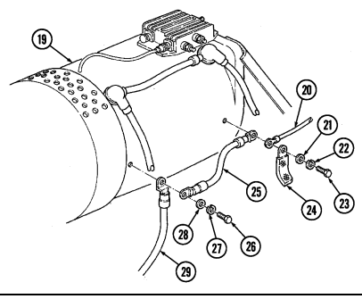

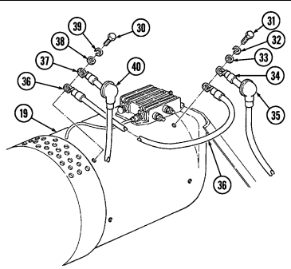

4 - 5 . 1 2 . (6.5L) 400 AMPERE DUAL VOLTAGE ALT E R N ATOR (PA RT OF 12446760) CABLE

## Replacement ( C O N T ' D )

#### B. Installation

1. Install cables (2) and (3) to rear positive terminal (14) on alternator (1) with washer (4),
lockwasher (5), and screw (6), and slide rubber boot (7) over cables (2) and (4).

2. Install cables (2) and (9) to front positive terminal (8) on alternator (1) with washer (10),
lockwasher (12), and screw (11), and slide rubber boot (13) over cables (2) and (9). 

3. Install ground strap (17), lead (16), and cable (21) to front negative terminal (15) on alternator (1)
with washer (18), lockwasher (20), and screw (19).

4. Install cables (25) and (21) to rear negative terminal (26) on alternator (1) with washer (24),

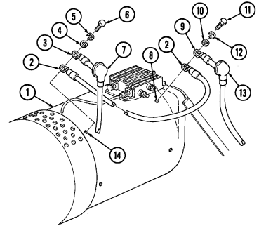

lockwasher (23), and screw (22).

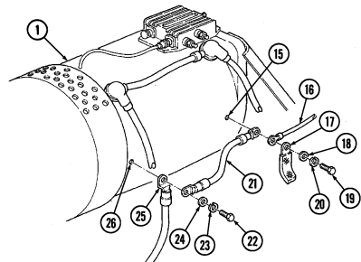

4-5.12. (6.5L) 400 AMPERE DUAL VOLTAGE ATERNATOR (PART OF 12446760) CABLE

## Replacement (Cont'D)

Install cable (9) on stud (35) with clamp (36), washer (34), and nut (33).

5. 6.

Install cable (9) to stud (28) on thermostat housing (32) with clamp (27), washer (29),
lockwasher (31), and nut (30).

7.

Install cable (9) on positive terminal (41) of starter (44) with lockwasher (39) and nut (40). Install cable (9) on oil pan bracket (38) with clamp (37), screw (43), and nut (42).

8.

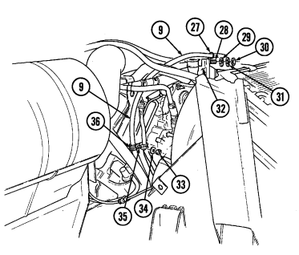

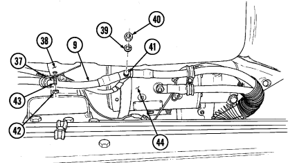

## 4 - 5 . 1 2 . (6.5L) 400 Ampere Dual Voltage Alt E R N Ator (Pa Rt Of 12446760) Cable Replacement ( C O N T ' D )

9. Install grommet (12) on battery box side panel (5) and route cable (8) through grommet (12) and

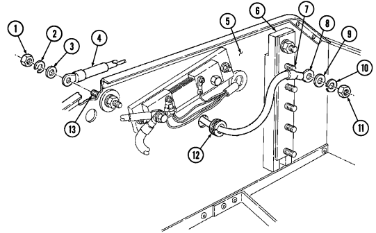

battery box side panel (5).

10. Install cable (8) to stud (7) on buss bar (6) with washer (9), lockwasher (10), and nut (11).

11. Install cable (4) to stud (13) on battery box side panel (5) with washer (3), lockwasher (2), and nut (1).

12. Install bracket (23) on right rear cowl (24) with screw (22), washer (25), and locknut (26). 13. Install cables (4) and (8) on bracket (23) with clamp (21) and screw (20). 14. Install bracket (17) to stud (28) on right rear intake manifold (27) with washer (29), lockwasher (30),
and nut (31).

15. Install cables (4) and (8) on bracket (17) with clamp (16), screw (15), washer (18), and locknut (19). 16. Install three tiedown straps (14) on cables (4) and (8).

4-5.12.  (6.5L) 400 AMPERE DUAL VOLTAGE ATERNATOR (PART OF 12446760) CABLE
REPLACEMENT (Cont'd)

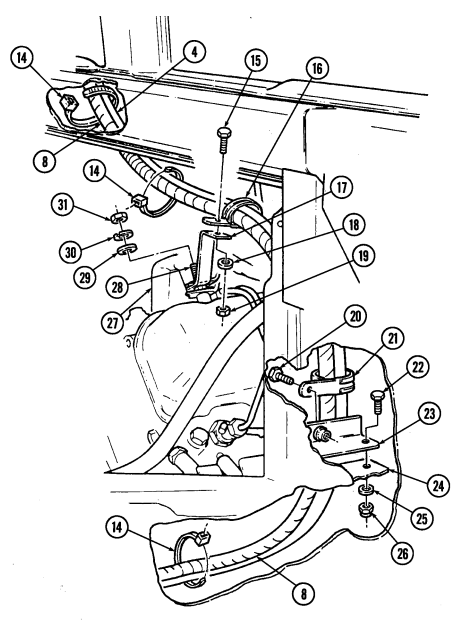

FOLLOW-ON TASKS:
-  Install engine access cover (para. 10-15).

· Connect battery ground cables (para. 4-73). -  Lower and secure hood (TM 9-2320-280-10).

# 4-5.13. (6.5L) 400 Ampere Dual Voltage Alternator (12446760) Replacement

This task covers:
INITIAL SETUP:
Tools General mechanic's tool kit:
automotive (Appendix B, Item 1)
Maintenance and repair shop equipment:
automotive (Appendix B, Item 2)

#### Materials/Parts

Lockwasher (Appendix G, Item 191) Lockwasher (Appendix G, Item 133) Lockwasher (Appendix G, Item 151)
Personnel Required One mechanic One assistant a. Removal

a. Removal b. Installation

| Personnel Required   |
|----------------------|

Equipment Condition
- Hood raised and secured (TM 9-2320-280-10). - Battery ground cables disconnected (para. 4-73). - Engine access cover removed (para. 10-15). - Alternator cables removed (para. 4-5.12).

General Safety Instructions Alternator must be supported during removal and installation.

NOTE
Prior to removal, tag leads for installation.

1. Position 3/8-in. breaker bar on belt tensioner (4), move tensioner (4) clockwise, and remove drivebelt (1) from power steering pump pulley (3) and alternator pulley (2).

2. Remove nut (5), lockwasher (6), washer (7), ground strap (8), and washer (10) from stud (9). Discard lockwasher (6).

Alternator must be support during removal and installation. Failure to do so may cause injury to personnel or damage to equipment.

#### B. Installation

3. Remove screw (12), lockwasher (13), and washer (14) from alternator bracket (17) and alternator mounting bracket (11). Discard lockwasher (13).

4. Remove screw (15), washer (16), and bracket (17) from alternator (18) and alternator mounting bracket (11). 

5. Remove nut (24), lockwasher (23), washer (22), screw (19), washer (20), and alternator (18) from alternator support bracket (21) and alternator mounting bracket (11). Discard lockwasher (23).

6. Remove alternator pulley (2) (para. 4-3).

1. Install alternator pulley (2) (para. 4-3). 2. Position alternator (18) on alternator mounting bracket (11). 3. Install alternator (18) on alternator mounting bracket (11) and alternator support bracket (21) 
with washer (20), screw (19), washer (22), lockwasher (23), and nut (24). Do not tighten nut (24).

4. Install alternator bracket (17) on alternator mounting bracket (11) and alternator (18) with washer (16) and screw (15). Do not tighten screw (15).

5. Install washer (14), lockwasher (13), and screw (12) on alternator mounting bracket (11) and alternator bracket (17). 

6. Tighten screw (15) to 40 lb-ft (54 N•m). 7. Tighten nut (24) to 155 lb-ft (210 N•m). 8. Install ground strap (8) on stud (9) with washers (10) and (7), lockwasher (6), and nut (5). 9. Position 3/8-in. breaker bar on belt tensioner (4) and move tensioner (4) clockwise and install drivebelt (1) on power steering pump pulley (3) and alternator pulley (2).

4-5.13. (6.5L) 400 AMPERE DUAL VOLTAGE ALTERNATOR (12446760) REPLACEMENT
(Cont'd)

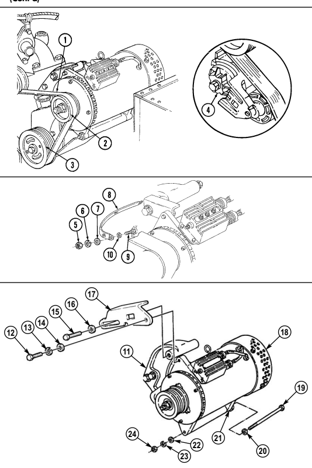

FOLLOW-ON TASKS: - Install alternator cables (para. 4-5.12).

- Install engine access cover (para. 10-15). - Connect battery ground cables (para. 4-73). - Lower and secure hood (TM 9-2320-280-10).

# Section Ii. Starter And Starting Control System Maintenance 4-6. Starter And Starting Control System Maintenance Task Summary

| a.  Removal                            | b.   | Installation       |
|----------------------------------------|------|--------------------|
| INITIAL SETUP:                         |      |                    |
| Tools                                  |      | Personnel Required |
| General mechanic's tool kit:           |      | One mechanic       |
| automotive (Appendix B, Item 1)        |      | One assistant      |
| Maintenance and repair shop equipment: |      | Manual References  |

## 4-7. Rotary Switch Replacement

This task covers:
a. Removal **b. Installation**

| a. Removal   |                                                                                                     |
|--------------|-----------------------------------------------------------------------------------------------------|
|              | NOTE                                                                                                |
|              | Prior to removal, tag leads for installation.                                                       |
| 1.           | Remove nut (13), lockwasher (12), washer (11), lead 3B (10), and ground strap lead 3B (9) from      |
|              | ground stud (8). Discard lockwasher (12).                                                           |
| 2.           | Slide back rubber boot (14) and remove nut (1), lockwasher (2), washer (3), and alternator positive |

INITIAL SETUP:

Prior to removal, tag leads and note position of lever for installation.

#### A. Removal

1. Remove screw (8), lockwasher (7), and switch lever (6) from switch shaft (9). Discard lockwasher (7). 2. Remove nut (5) and lockwasher (4) from switch (2) and instrument panel (3). Discard lockwasher (4). 3. Push switch (2) out of hole in panel (3). 4. Disconnect three electrical leads 11A (1), 14A (10), and 29A (11) from switch (2) and remove switch (2).

#### B. Installation

1. Connect three electrical leads 11A (1), 14A (10), and 29A (11) on switch (2). 2. Install switch (2) into hole in panel (3). 3. Install lockwasher (4) and nut (5) on switch (2). 4. Place switch lever (6) on switch shaft (9) to indicate ENGINE STOP position. 5. Secure lever (6) on switch shaft (9) with lockwasher (7) and screw (8).

# 4-7. Rotary Switch Replacement (Cont'D)

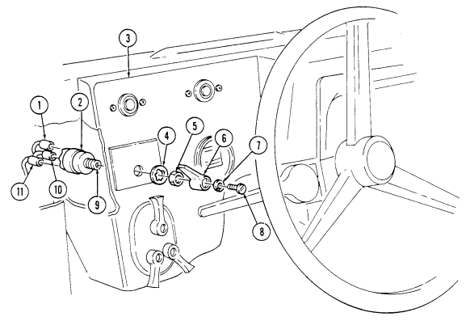

FOLLOW-ON   TASKS:  - Connect battery ground cable (para. 4-73).
 - • - • Check rotary switch operation (TM 9-2320-280-10).

# 4-8. Starter Replacement

This task covers:
INITIAL SETUP:

#### Tools

General mechanic's tool kit:
automotive (Appendix B, Item 1)
Special Tools Crowfoot, 9/16 in. (Appendix B, Item 150) Torque adapter, 3/4 in. (Appendix B, Item 145)
Socket adapter, 3/8 - 1/2 in. drive
(Appendix B, Item 146)

#### Materials/Parts

Lockwasher (Appendix G, Item 133) Lockwasher (Appendix G, Item 137) Plain-assembled nut (Appendix G, Item 203) Adhesive sealant (Appendix C, Item 10) Sealing compound (Appendix C, Item 45)

#### A. Removal **B. Installation**

Personnel Required One mechanic One assistant Manual References TM 9-2320-280-10 TM 9-2320-280-24P

#### Equipment Condition

- Battery ground cable disconnected (para. 4-73). - Arctic heater oil pan shroud removed
(para. 12-48.2).

- Converter housing cover removed (para. 5-19). - Sealed upper converter housing cover removed (para. 5-18).

#### General Safety Instructions

Starter must be supported during removal and installation.

Starter must be supported during removal and installation. Failure to support starter may cause injury to personnel or damage to equipment.

- Illustration shown is a cutaway of the right side of vehicle. - Prior to removal, tag leads for installation.

a. Removal 1. Remove nut (18), lockwasher (19), lead 3D (20), and negative cable 7A (23) from starter (5). Discard lockwasher (19).

2. Remove adhesive sealant from positive terminal (21) on starter (5).

NOTE
4-16 Change 3
- Perform step 3 for all vehicles except M1123 and "A2" series vehicles. 

- Perform step 4 for M1123 and "A2" series vehicles only.

3. Remove nut (16), lockwasher (15), leads 81A (11) and 81B (17), and positive cable 6A (4) from starter (5). Discard lockwasher (15) and tiedown strap (9.1).

4. Remove nut (16), lockwasher (15), and lead 81B (17) from starter (5). Discard lockwasher (15). 5. Remove screw (14), clip (13), and leads 74B (12) and 74A (10) from solenoid (6). 6. Remove screw (22), two clamps (3), negative cable 7A (23), and positive cable 6A (4) from starter (5).

7. Loosen plain-assembled nut (8) and washer (7) (if installed) on stud connecting starter (5) to bracket (9). Discard plain-assembled nut (8).

8. While supporting starter (5) from under vehicle, remove two capscrews (25) and washers (24) from starter (5) and engine (1).

9. Remove starter (5) and shim (2) from engine (1).

# 4-8. Starter Replacement (Cont'D)

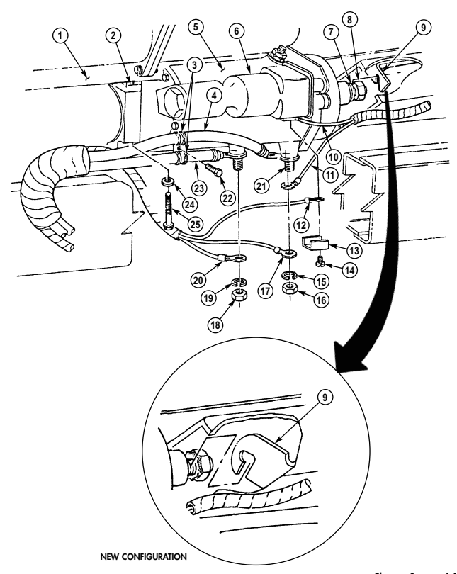

## 4-8. Starter Replacement (Cont'D)

b. Installation 1. Install an 0.08 in. (2 mm) shim (2) on starter (5). 2. Position shim (2) and starter (5) to flywheel housing with solenoid (6) facing outward. 3. Slide front stud on starter (5) in bracket (9). 

Some capscrews have sealing compound pre-applied. Additional sealing compound is not required.

4. Apply sealing compound to capscrews (25). Install two washers (24) and capscrews (25) on starter (5) and engine (1). Tighten capscrews (25) to 30-40 lb-ft (41-54 N•m).

5. Secure starter (5) on bracket (9) with plain-assembled nut (8). Using crowfoot, tighten plain-assembled nut (8) to 15-19 lb-ft (20-26 N•m).

6. Install two clamps (3), and negative cable 7A (23) and positive cable 6A (4), on starter (5) with screw (22).

7. Connect leads 74A (10) and 74B (12) to solenoid (6) with clip (13) and screw (14). Tighten screw (14)
to 20 lb-in. (2 N•m).

Perform step 8 for all vehicles except M1123 and "A2" series vehicles. Perform step 9 for M1123 and "A2" series vehicles only.

8. Connect positive cable 6A (4) and leads 81A (11) and 81B (17) to starter (5) with lockwasher (15) and nut (16). Using torque adapter, tighten nut (16) to 25-30 lb-ft (34-41 N•m).

8.1. Deleted.

9. Connect lead 81B (17) to starter (5) with lockwasher (15) and nut (16). Tighten nut (16) 
to 25-30 lb-ft (34-41 N•m).

10. Seal positive terminal (21), leads 81B (17) and 81A (11), and positive cable 6A (4) with adhesive sealant. Apply sealant at least 1.8 in. (3.175 mm) thick, covering all exposed metal attached to the positive terminal (21).

11. Connect negative cable 7A (23) and lead 3D (20) to starter (5) with lockwasher (19) and nut (18). Using torque adapter, tighten nut (18) to 15-20 lb-ft (20-27 N•m).

# 4-8. Starter Replacement (Cont'D)

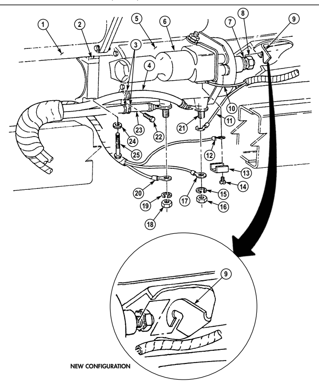

FOLLOW-ON TASKS: - Install converter housing cover (para. 5-19).

- Install sealed upper converter housing cover (para. 5-18). - Connect battery ground cable (para. 4-73). - Install arctic heater oil pan shroud (para. 12-48.2). - Start engine (TM 9-2320-280-10) and check for smooth starter engagement.

## 4-9. Circuit Breaker Replacement

This task covers:
INITIAL SETUP:
Tools General mechanic's tool kit:
automotive (Appendix B, Item 1)

a. Removal **b. Installation**

Manual References TM 9-2320-280-10 TM 9-2320-280-24P
Materials/Parts Two lockwashers (Appendix G, Item 136)
Equipment Condition Battery ground cable disconnected (para. 4-73).

- All circuit breakers are removed and installed basically the same. - This procedure covers the instrument gauge circuit breaker. - Prior to removal, tag leads for installation.

#### A. Removal

1. Loosen nut (1) and lower steering column (2). 2. Disconnect lead 29B (8) and 29D (9) from circuit breaker (6). 3. Remove two nuts (4), lockwashers (5), screws (7), and circuit breaker (6) from column bracket (3).

Discard lockwasher (5).

#### B. Installation

1. Install circuit breaker (6) on column bracket (3) with two screws (7), lockwashers (5) and nuts (4).

2. Connect leads 29B (8) and 29D (9) to circuit breaker (6). 3. Raise steering column (2) and tighten nut (1) to 31 lb-ft (42 N•m).

# 4-9. Circuit Breaker Replacement (Cont'D)

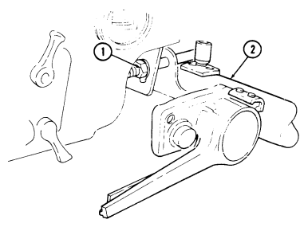

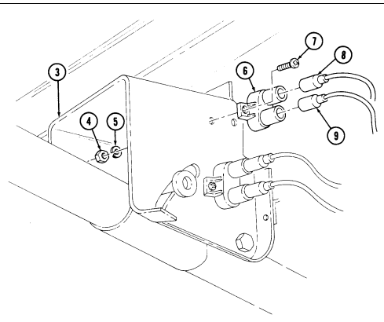

FOLLOW-ON TASKS: - Connect battery ground cable (para. 4-73).

· Check operation of circuit breaker (TM 9-2320-280-10).

# Section Iii. Instruments, Sending Units, Switches, And Horn Maintenance

4-10. INSTRUMENTS, SENDING UNITS, SWITCHES, AND HORN MAINTENANCE TASK
SUMMARY

| Tools   | Personnel Required                                                                                            |
|---------|---------------------------------------------------------------------------------------------------------------|
|         | General mechanic's tool kit: One mechanic                                                                     |
|         | automotive (Appendix B, Item 1) One assistant                                                                 |
|         | Materials/Parts Manual References                                                                             |
|         | Two lockwashers (Appendix G, Item 138) TM 9\-2320\-280\-24P                                                   |
|         | Lockwasher (Appendix G, Item 148) Equipment Condition                                                         |
|         | Lockwasher (Appendix G, Item 150) - Batteries removed (para. 4\-79). Sealing compound (Appendix C, Item 47.1) |
|         | - Fixed rear door removed (para. 10\-14).                                                                     |
|         | a. Removal                                                                                                    |
|         | NOTE                                                                                                          |
|         | Prior to removal, tag leads for installation.                                                                 |
| 1.      | Remove nut (5), lockwasher (4), washer (3), and positive power cable (2) from buss bar (1). Discard           |
|         | lockwasher (4).                                                                                               |
| 2.      | Remove capscrew (6), lockwasher (7), negative power cable (8), and two cables (9) from shunt (10).            |
|         | Discard lockwasher (7).                                                                                       |
| 3.      | Remove five capscrews (20), two lockwashers (19), washers (18), and coverplate (17) from "B" beam (12).       |
|         | Discard lockwashers (19).                                                                                     |
| 4.      | Remove two nuts (15), washers (14), capscrews (25), washers (26), and mounting bracket (27) from              |
|         | coverplate (17).                                                                                              |
| 5.      | Remove nut (28), screw (23), and cover chain (21) from mounting bracket (27).                                 |
| 6.      | Remove cover (22) with cover chain (21) from umbilical power cable assembly (29).                             |
| 7.      | Remove four nuts (30), screws (24), and mounting bracket (27) from umbilical power cable assembly (29).       |
| 8.      | Pull umbilical power cable assembly (29) through grommet (11) and coverplate (17), and remove                 |
|         | from vehicle (16).                                                                                            |
| 9.      | Remove grommet (11) from battery box (13).                                                                    |
|         | b. Installation                                                                                               |
| 1.      | Install grommet (11) on battery box (13).                                                                     |
| 2.      | Route umbilical power cable assembly (29) through coverplate (17) and grommet (11), and position              |
|         | in approximate mounting location on vehicle (16).                                                             |
| 3.      | Install cover chain (21) on mounting bracket (27) with screw (23) and nut (28).                               |
| 4.      | Install umbilical power cable assembly (29) on mounting bracket (27) with four screws (24) and                |
|         | nuts (30).                                                                                                    |
| 5.      | Install cover (22) on umbilical power cable assembly (29).                                                    |
| 6.      | Install coverplate (17) on "B" beam (12) with two washers (18), lockwashers (19), and five                    |
|         | capscrews (20).                                                                                               |
| 7.      | Install mounting bracket (27) on coverplate (17) with two washers (26), capscrews (25), washers (14),         |
|         | and nuts (15).                                                                                                |
| 8.      | Install two cables (9) and negative power cable (8) on shunt (10) with lockwasher (7) and                     |
|         | capscrew (6).                                                                                                 |
| 9.      | Install positive power cable (2) on buss bar (1) with washer (3), lockwasher (4), and nut (5).                |
| 10.     | Apply silicone compound to cable (2), coating all exposed metallic surfaces.                                  |

# 4-11. Instrument Cluster Replacement

This task covers:
INITIAL SETUP:

#### Tools

General mechanic's tool kit:
automotive (Appendix B, Item 1)
Materials/Parts Five lockwashers (Appendix G, Item 169) Antiseize compound (Appendix C, Item 13)

#### A. Removal B. Installation

Manual References TM 9-2320-280-10 TM 9-2320-280-24P
Equipment Condition Battery ground cable disconnected (para. 4-73).

NOTE
Prior to removal, tag leads for installation.

#### A. Removal

1. Remove four capscrews (6) from instrument cluster (7) and instrument panel (3). Pull instrument cluster (7) away from instrument panel (3) to allow access to speedometer cable (4).

2. Loosen nut (5) and disconnect speedometer cable (4) from speedometer (1). 3. Disconnect harness lead 27J (8), 28A (9), 40B (13), 27H (14), 36A (15), 57L (19), 17B (20), 27G (21),
33A (22), 40C (17), and 567A (18) from instrument cluster (7).

4. Remove four nuts (12), lockwashers (11), and harness ground leads 58H (10), 58G (25), 58E (23), and 58F (24) from instrument cluster (7). Discard lockwashers (11).

5. Remove screw (12.1), lockwasher (11.1), and ground lead 57G (16) from instrument cluster (7) and

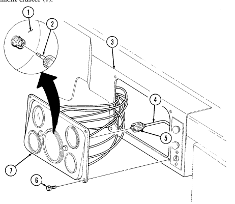

remove instrument cluster (7).

# 4-11. Instrument Cluster Replacement (Cont'D)

b. Installation 1. Apply antiseize compound to harness ground leads 58H (10), 58G (25), 58E (23), and 58F (24) and install on instrument cluster (7) with five lockwashers (11) and nuts (12).

2. Apply antiseize compound to harness ground lead 57G (16) and install on instrument cluster (7)
with lockwasher (11.1) and screw (12.1).

3. Connect harness leads 27J (8), 28A (9), 40B (13), 27H (14), 36A (15) 57L (19), 17B (20), 27G (21),
33A (22), 40C (17), and 567A (18) to instrument cluster (7).

4. Connect speedometer cable (4) to speedometer (1) ensuring core (2) engages with square hole in speedometer (1) and secure with nut (5).

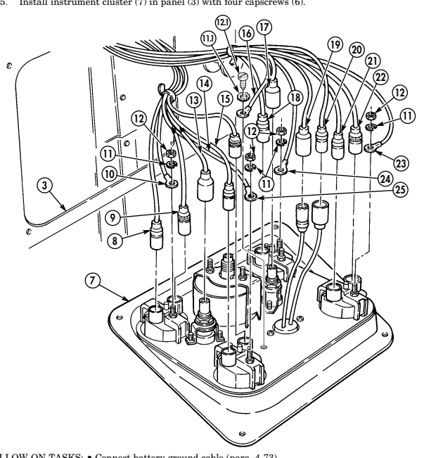

FOLLOW-ON TASKS: - Connect battery ground cable (para. 4-73).
- Check operation of instrument cluster components (TM 9-2320-280-10).

## 4-12. Instrument Panel Replacement

This task covers:
INITIAL SETUP:
Tools **Equipment Condition**
General mechanic's tool kit: Instrument cluster removed (para. 4-11).

automotive (Appendix B, Item 1) Heater control cables remove (para. 10-89).

Manual References TM 9-2320-280-10 TM 9-2320-280-24P

#### A. Removal **B. Installation** Note

Prior to removal, tag leads for installation.

1.

2. 3.

4. 5.

6. 7. 8. 9.

10. 11.

12. 13.

Loosen nut (9) and lower steering column (3).

Remove cannon plug (11) from main light switch (10).

Remove two capscrews (12), washers (13), nuts (14), and washers (13) from instrument panel (2) and body (1).

Remove nut (16) and screw (17) from hand throttle bracket (15) and instrument panel (2). Remove nut (4), washer (5), capscrew (7), washer (5) and hand throttle bracket (15) from steering column bracket (8) and instrument panel (2). Remove screw (6) from instrument panel (2) and body (1).

Pull instrument panel (2) away from body (1). Disconnect two harness leads 11A (28), 14A (29), and 27A (27) from rotary switch (26).

Disconnect two harness leads 27F (32) and 571A (31) at wait-to-start indicator light (24). Disconnect two harness leads 27L (30) and 67D (33) at brake warning indicator light (22). Disconnect harness lead 400 D (18) from resistor (21). Disconnect harness lead 27E (19) from blower switch (20) and remove instrument panel (2). Disconnect hose (25) from air restriction gage (23).

#### B. Installation

1.

2. 3.

4. 5.

6. 7.

8.

9.

10.

11.

12.

Connect hose (25) to air restriction gage (23). Connect harness lead 27E (19) to blower switch (20). Connect harness lead 400D (18) to resistor (21).

Connect two harness leads 27L (30) and 67D (33) to brake warning indicator light (22). Connect two harness leads 27F (32) and 571A (31) to wait-to -start indicator light (24). Connect three harness leads 11A (28), 14A (29), and 27A (27) to rotary switch (26).

Install instrument panel (2) on body (1) with screw (6).

Install instrument panel (2) and hand throttle bracket (15) to steering column bracket (8) with washer (5), capscrew (7), washer (5), and nut (4). Install hand throttle bracket (15) to instrument panel (2) with screw (17) and nut (16).

Install instrument panel (2) to body (1) with two washers (13), capscrews (12), and washers (13), and nuts (14).

Install cannon plug (11) to main light switch (10). Raise steering column (3) and tighten nut (9) to 31 lb-ft (42 N*m).

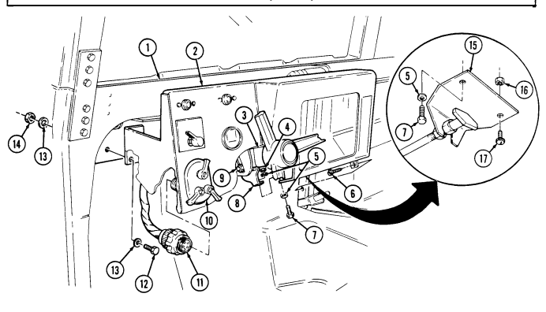

# 4-12. Instrument Panel Replacement (Cont'D)

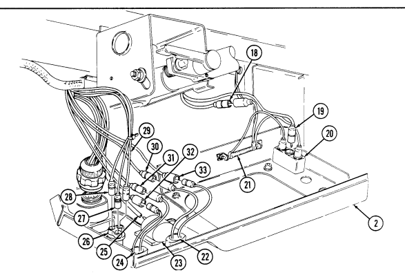

FOLLOW-ON TASKS: - Install heater cables (para. 10-89).

· Install instrument cluster (para. 4-11). · Check operation of instrument panel components (TM 9-2320-280-10).

# 4-13. Electrical Gauge Replacement

This task covers:
INITIAL SETUP:
Tools General mechanic's tool kit:
automotive (Appendix B, Item 1)

a. Removal b. Installation

| Manual References   |
|---------------------|
| TM 9\-2320\-280\-10 |

TM 9-2320-280-10 TM 9-2320-280-24P
Materials/Parts Two lockwashers (Appendix G, Item 169)
Equipment Condition Battery ground cable disconnected (para. 4-73).

- All electrical gauges are removed and installed basically the same. This procedure covers the temperature gauge.

- Prior to removal, tag all leads for installation.

a. Removal 1. Remove four capscrews (8) from instrument cluster (1) and instrument panel (6). 2. Pull instrument cluster (1) away from panel (6). 3. Disconnect leads (4) and (5) from gauge (9). 4. Remove two nuts (3), lockwashers (7), gauge retaining bracket (2), and gauge (9) from instrument cluster (1). Discard lockwashers (7).

#### B. Installation

1. Install gauge (9) and retaining bracket (2) on instrument cluster (1) with two new lockwashers (7)
and nuts (3). Tighten nuts (3) to 8 lb-in. (1 N•m).

2. Connect leads (4) and (5) to gauge (9). 3. Install instrument cluster (1) to panel (6) with four capscrews (8).

# 4-13. Electrical Gauge Replacement (Cont'D)

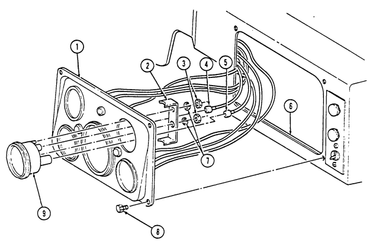

FOLLOW-ON TASKS: - Connect battery ground cable (para. 4-73).

· Start engine and check operation of gauge (TM 9-2320-280-10).

# 4-13.1. Tachometer Replacement

This task covers:

| TASK   |                             | PAGE   |
|--------|-----------------------------|--------|
| PARA.  | PROCEDURES                  | NO.    |
| 4\-7.  | Rotary Switch Replacement   | 4\-14  |
| 4\-8.  | Starter Replacement         | 4\-16  |
| 4\-9.  | Circuit Breaker Replacement | 4\-20  |
| 4\-7.  | ROTARY SWITCH REPLACEMENT   |        |

Seal (Appendix G, Item 285) Two lockwashers (Appendix G, Item 138) Lockwasher (Appendix G, Item 168)

#### A. Removal

1. Remove engine harness connector (2) from tachometer connector (1). 2. Remove seven screws (4), lockwashers (3), washers (25), cover (5), and gasket (24) from tach/hourmeter box (18). Discard lockwashers (3) and gasket (24).

3. Remove nut (33), lockwasher (34), ground cable (32), and washer (35) from stud (27). 

Discard lockwasher (34).

4. Remove locknut (36), washer (31), and safety lanyard (30) from stud (28). Discard locknut (36). 5. Remove locknut (37), washer (38), and washer (39) from stud (26) and remove tach/hourmeter box (18) from engine access cover (29). Discard locknut (37).

6. Remove seal (40) from tach/hourmeter box (18). Discard seal (40). 7. Remove nut (15), washer (14), washer (6), and screw (7) from tach/hourmeter box (18). 8. Remove two nuts (21), lockwashers (22), and bracket (19) from tach/hourmeter box (18). 

Discard lockwashers (22).

9. Remove nuts (13) and (17) from cable connectors (8) and (23).

10. Remove nut (10), lockwasher (11), washer (12), toggle switch (9), cable connectors (8) and (23), 
and tachometer (16) from tach/hourmeter box (18) Discard lockwasher (11).

#### B. Installation

1. Install cable connectors (8) and (23) to tach/hourmeter box (18) with nuts (13) and (17). 2. Install toggle switch (9) in tach/hourmeter box (18) with washer (12), lockwasher (11), and nut (10). 3. Install tachometer (16) to tach/hourmeter box (18) with bracket (19), two lockwashers (22), and nuts (21).

4. Install screw (7), washer (6), washer (14), and nut (15) on tach/hourmeter box (18). 5. Install seal (40) on tach/hourmeter box (18). 6. Install tach/hourmeter box (18) on engine access cover (29) with washer (39), washer (38), and locknut (37).

7. Install safety lanyard (30) to stud (28) with washer (31) and locknut (36).

# 4-13.1. Tachometer Replacement **(Cont'D)**

8. Install ground cable (32) to stud (27) with washer (35), lockwasher (34), and nut (33). 9. Install cover (5) and gasket (24) to tach/hourmeter box (18) with seven washers (25),
lockwashers (3), and screws (4).

10. Install engine harness plug (2) to tachometer connector (1).

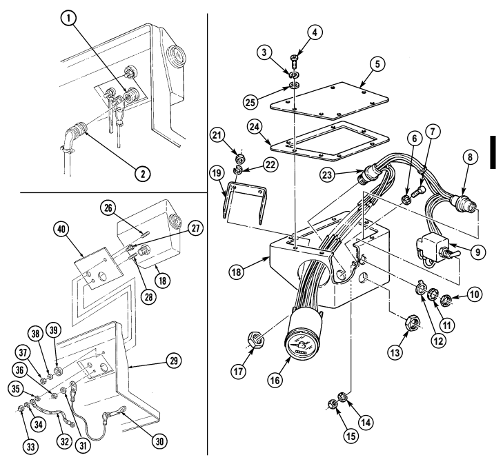

FOLLOW-ON TASKS: - Install engine access cover (para. 10-15).

- Install radio rack (para. 12-132). - Install radio rack mounting brackets (para. 12-130). - Connect battery ground cables (para. 4-73).

# 4 - 1 3 . 2 . Tachometer Cable Connector Assembly Replacement

This task covers:

| a.  Removal                            | b.  Installation     |
|----------------------------------------|----------------------|
| INITIAL SETUP:                         |                      |
| Tools                                  | Manual References    |
| General mechanic's tool kit:           | TM 9\-2320\-280\-10  |
| automotive (Appendix B, Item 1)        | TM 9\-2320\-280\-24P |
| Materials/Parts                        | Equipment Condition  |
| Two lockwashers (Appendix G, Item 136) |                      |

a. Removal 1. Remove screw (13), washer (14), and cable connector wire lead 12 (15) from terminal post SIG (3) on tachometer (1).

2. Remove screw (8), washer (7), and cable connector wire lead 13 (6) from terminal post SIG (4) on tachometer (1).

3. Remove screw (12), washer (11), and cable connector leads 58A (9) and 58B (10) from terminal post NEG (5) on tachometer (1).

4. Remove screw (16) ,washer (17), and cable connector wire leads 458A (35) and 458B (36) from terminal post POS (2) on tachometer (1).

5. Remove screw (23), washer (24), and cable connector wire lead 11 (25) from terminal post 5 (28) on toggle switch (29).

6. Remove screw (34), washer (33), and cable connector wire lead 10 (32) from terminal post 2 (30) on toggle switch (29).

#### B. Installation

4. Install cable connector wire lead 10 (32) to terminal post 2 (30) on toggle switch (29) with washer (33) and screw (34).

5. Install cable connector wire lead 11 (25) to terminal post 5 (28) on toggle switch (29) with washer (24) and screw (23).

6. Apply approximately 0.125-in. of adhesive sealant to wire leads 13 (6), 58A (9), 58B (10), 12 (15), 
458A (35), 458B (36) and terminal posts POS (2), SIG (3), SIG (4), and NEG (5).

7. Install cable connector wire leads 458A (35) and 458B (36) to terminal post POS (2) on tachometer (1) with washer (17) and screw (16).

7. Remove screw (21), washer (22), and cable connector wire lead 97A (26) from terminal post 4 (27) on toggle switch (29).

8. Remove screw (18), washer (19), and cable connector lead 97B (20) from terminal post 1 (31) on toggle switch (29).

1. Apply approximately 0.125 in. (3.175 mm) adhesive sealant to wire leads 97A (26), 97B (20), 10 (32),
11 (25) and terminal posts 1 (31), 2 (30), 4 (27), and 5 (28).

2. Install cable connector wire lead 97B (20) to terminal post 1 (31) on toggle switch (29) with washer (19) and screw (18).

3. Install cable connector wire lead 97A (26) to terminal post 4 (27) on toggle switch (29) with washer (22) and screw (21).

## 4-13.2. Tachometer Cable Connector Assembly Replacement (@Tr'D)

8.

9.

10.

Install cable connector wire leads 58A (9) and 58B (10) to terminal post NEG (5) on tachometer (1)
with washer (11) and screw (12).

Install cable connector wire lead 13 (6) to terminal post SIG (4) on tachometer (1) with washer (7)
and screw (8).

Install cable connector wire lead 12 (15) to terminal post SIG (3) on tachometer (1) with washer (14)
and screw (13).

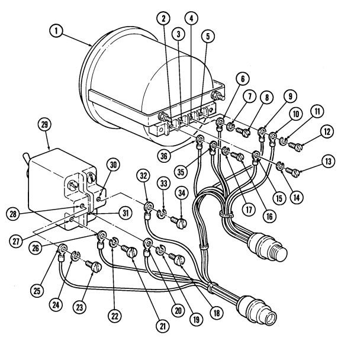

FOLLOW-ON TASK: Install tachometer (para. 4-13.1).

| SUMMARY   |
|-----------|

## 4 - 1 4 . Speedometer/Odometer Replacement

#### A. Removal

1. Remove four capscrews (9) from instrument cluster (4) and instrument panel (8). 2. Pull instrument cluster (4) away from panel (8). 3. Loosen large nut (2) on speedometer cable (7) and pull cable end out of speedometer (3). 4. Remove two nuts (6), speedometer retaining bracket (5), and speedometer (3) from instrument cluster (4).

#### B. Installation

1. Install speedometer (3) and speedometer retaining bracket (5) on instrument cluster (4) with two nuts (6). Tighten nuts (6) to 8 lb-in. (1 N•m).

2. Install speedometer cable (7) into back of speedometer (3), ensuring core (1) engages in square hole in speedometer (3), and tighten cable nut (2).

3. Install instrument cluster (4) to panel (8) with four capscrews (9).

# 4-14. Speedometer/Odometer Replacement (Cont'D)

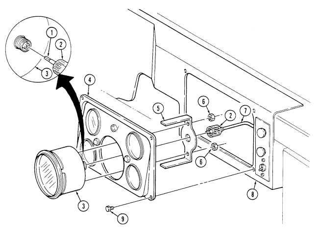

FOLLOW-ON TASK: Check operation of speedometer (TM9-2320-280-10).

# 4-15. Speedometer Cable And Core (12338428) Replacement

This task covers:

| INITIAL SETUP:   |
|------------------|

| Tools                                  | Manual References                                |
|----------------------------------------|--------------------------------------------------|
| General mechanic's tool kit:           | TM 9\-2320\-280\-10                              |
| automotive (Appendix B, Item 1)        | TM 9\-2320\-280\-24P                             |
| Materials/Parts                        | Equipment Condition                              |
| Two lockwashers (Appendix G, Item 169) | Battery ground cable disconnected (para. 4\-73). |

a. Removal b. Installation

a. Removal

If vehicle is equipped with speedometer cable (12338428-2), refer to para. 4-15.1.

1. Remove four capscrews (12) from instrument cluster (11) and instrument panel (10) and pull instrument cluster (11) away to gain access to back of speedometer (3).

2. Remove speedometer driveshaft nut (2) from speedometer (3). 3. Push speedometer cable (5) and rubber grommet (4) through body (8). 4. Remove screw (9) and plain-assembled nut (6) from clamp (7) on body (8). Remove clamp (7) from speedometer cable (5). Discard plain-assembled nut (6).

5. Working under vehicle, remove screw (14) and clamp (13) from side of transmission (15). Remove clamp (13) from speedometer cable (5).

6. Remove speedometer driveshaft nut (18) and speedometer cable (5) from adapter (16) on transfer case (17) and remove speedometer cable (5).

#### B. Installation

1. Install speedometer cable (5) into adapter (16), ensuring core (1) engages in square hole in adapter (16), and tighten speedometer cable nut (18).

2. Install speedometer cable (5) and clamp (13) on side of transmission (15) with screw (14). 3. Secure speedometer cable (5) and clamp (7) on body (8) with screw (9) and plain-assembled nut (6). 4. Install speedometer cable (5) and grommet (4) on body (8). 5. Install speedometer cable (5) into back of speedometer (3), ensuring core (1) engages in square hole in speedometer (3) and tighten speedometer cable nut (2).

6. Install instrument cluster (11) on panel (10) with four capscrews (12).

# 4-15. Speedometer Cable And Core (12338428) Replacement (Cont'D)

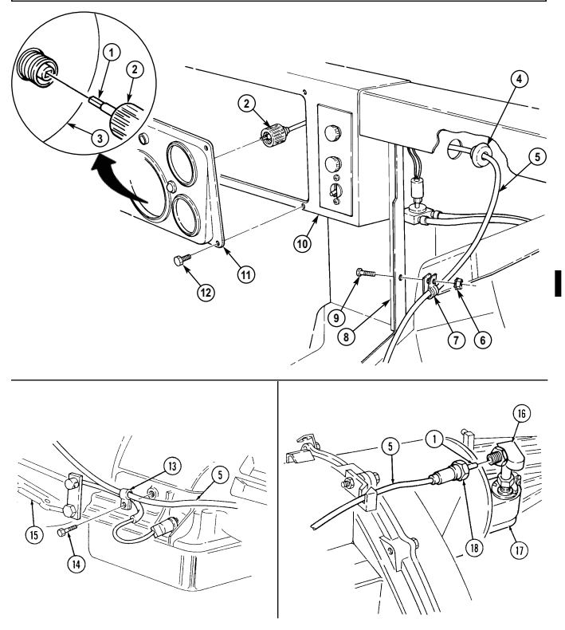

FOLLOW-ON TASKS: - Lower and secure hood (TM 9-2320-280-10).

· Install engine access cover (para. 10-15).

# 4-15.1. Speedometer Cable And Core (12338428-2) Replacement

| INITIAL SETUP:                           |                                               |
|------------------------------------------|-----------------------------------------------|
| Applicable Models                        | Manual References                             |
| M1123                                    | TM 9\-2320\-280\-24P                          |
| Tools                                    | Equipment Condition                           |
| General mechanic's tool kit:             | - Battery ground cable disconnected           |
| automotive (Appendix B, Item 1)          | (para. 4\-73).                                |
| Material/Parts                           | - Radio rack removed (para. 12\-132).         |
|                                          | - Radio rack mounting brackets removed        |
| Gasket (Appendix G, Item 55)             | (para. 12\-130).                              |
| Seven lockwashers (Appendix G, Item 156) | - Engine access cover removed (para. 10\-15). |
| Lockwasher (Appendix G. Item 155)        |                                               |

| This task covers:   |
|---------------------|

a. Removal **b. Installation**

Tiedown strap (Appendix G, Item 315)

If vehicle is equipped with speedometer cable (12338428), refer to para. 4-15.

#### A. Removal

1. Remove tiedown strap (4) from speedometer cable (1) and wiring harness (3) behind instrument panel (2). Discard tiedown strap (4).

2. Remove four capscrews (11) and pull instrument cluster (10) away to gain access to back of speedometer (12).

3. Loosen nut (5) and remove speedometer cable (1) from speedometer (12). 4. Remove plain-assembled nut (7), clamp (6), screw (9), and speedometer cable (1) from body (8).

Discard plain-assembled nut (7).

5. Push speedometer cable (1) and grommet (13) through cowl (14). 6. Remove two nuts (18), screws (24), clamps (19), and speedometer cable (1) from two speedometer cable support braces (20) located in front of solenoid control valve (16) and behind alternator (15).

7. Remove nut (23), screw (21), and speedometer cable support brace (20) from two clamps (22) on hydraulic hoses (17) located in front of solenoid control valve (16).

8. Remove nut (23), screw (21), and speedometer cable support brace (20) from two clamps (22) on hydraulic hoses (17) located behind alternator (15).

9. Remove speedometer cable (1) from under alternator (15).

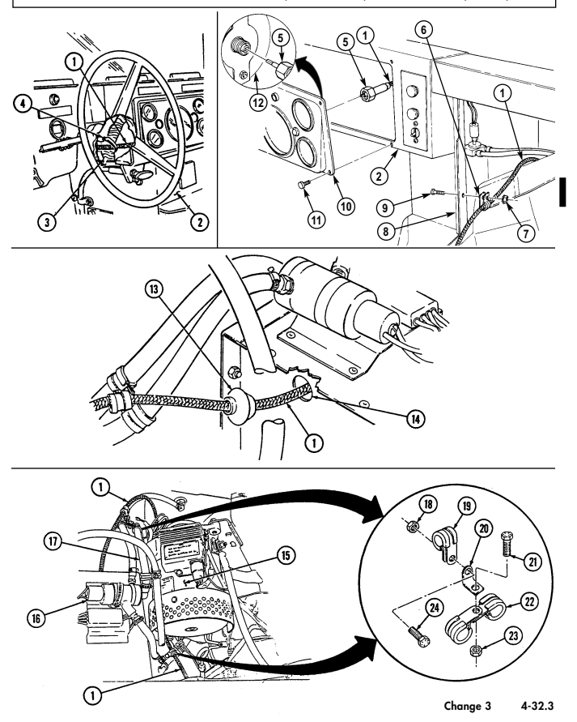

4-15.1. SPEEDOMETER CABLE AND CORE (12338428-2) REPLACEMENT (Cont'd)

## 4-15.1. Speedometer Cable And Core (12338428-2) Replacement (Cont'D)

10. Remove screw (4), clamp (1), and speedometer cable (2) from transmission (3). 11. Remove speedometer cable (2) from standoff bracket (8) on transfer case (6). 12. Loosen nut (7) and remove speedometer cable (2) from adapter (5) on transfer case (6).

b. Installation 1. Install speedometer cable (2) into adapter (5) on transfer case (6) and tighten nut (7) to 90-110 lb-in (10-12 Nom).

2. Install speedometer cable (2) through standoff bracket (8) on transfer case (6).

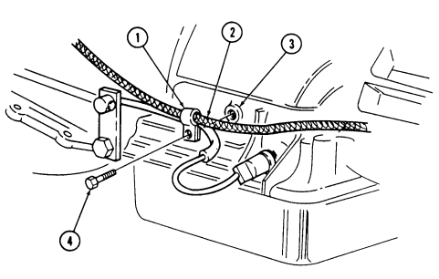 3. Install speedometer cable (2) on transmission (3) with clamp (1) and screw (4).

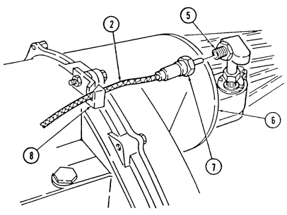

# 4-15.1. Speedometer Cable And Core (12338428-2) Replacement (Cont'D)

NOTE
If installing speedometer cable (12338428-2) for the first time, perform steps 4 and 5. If not go to step 6.

4. Install plug (9) in existing hole (10) located in left inner cowl (11).

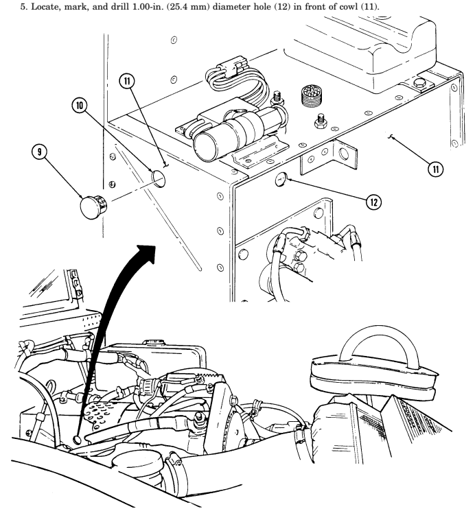

# 4-15.1. Speedometer Cable And Core (12338428-2) Replacement (Cont'D)

6. Install speedometer cable (4) on body (6) with clamp (3), screw (7), and plain-assembled nut (5).

7. Route speedometer cable (4) under alternator (11) next to hydraulic hoses (13). 8. Install speedometer cable support brace (16) on two clamps (18) and hydraulic hoses (13) located behind alternator (11) with screw (17) and nut (19).

9. Install speedometer cable (4) and clamp (15) on speedometer cable support brace (16) with screw (20) and nut (14).

10. Install speedometer cable support brace (16) on two clamps (18) and hydraulic hoses (13) located in front of solenoid control valve (12) with screw (17) and nut (19).

11. Install speedometer cable (4) and clamp (15) on speedometer cable support brace (16) with screw (20)
and nut (14).

12. Install speedometer cable (4) and grommet (21) into cowl (22). 13. Install speedometer cable (4) on speedometer (1). 14. Install instrument cluster (9) on instrument panel (8) with four capscrews (10). 15. Install tiedown strap (24) on speedometer cable (4) and wiring harness (23) behind instrument

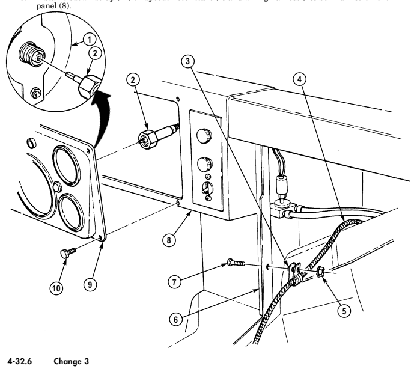

4-15.1. SPEEDOMETER CABLE AND CORE (12338428-2) REPLACEMENT (Cont'd)

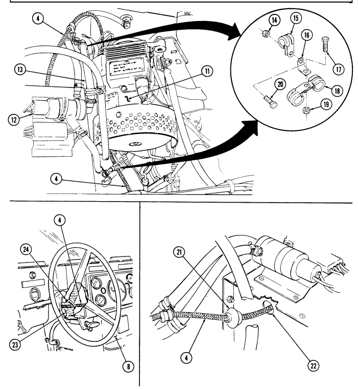

FOLLOW-ON-TASK: - ● Install left splash shield (para. 10-17).

· Connect battery ground cable (para. 4-73).

· Install fuel filler drain hose (para 3-34).

· Install engine access cover (para. 10-15).

· Lower and secure hood (TM 9-2320-280-10).

## 4-16. Instrument Cluster Light Replacement

This task covers:
INITIAL SETUP:
automotive (Appendix B, Item 1)
Manual References TM 9-2320-280-10 TM 9-2320-280-24P

#### A. Lamp Removal

1. Remove light lens (1) and gasket (2) from light assembly (4).

2. Remove lamp (3) from light assembly (4).

#### B. Lamp Installation

1. Install lamp (3) into light assembly (4).

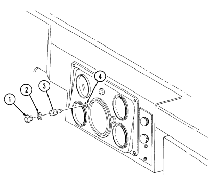 2. Install gasket (2) and lens (1) to light assembly (4).

a. Lamp Removal c. Light Assembly Removal b. Lamp Installation **d. Light Assembly Installation**
Tools **Equipment Condition**
General mechanic's tool kit: Battery ground cable disconnected (para. 4-73).

## 4-16. Instrument Cluster Light Replacement (Cont'D)

#### C. Light Assembly Removal

1. Remove two light lenses (1) and gaskets (2) from light assemblies (4).

2. Remove lamp (3) from light assembly (4) being replaced. 3. Remove all electrical gauges (para. 4-13) and speedometer/odometer (para. 4-14). 4. Separate instrument cluster (8) from backing panel (6). 5. Disconnect harness lead 40B (5) from light assembly (4). 6. Remove two screws (7) and light assembly (4) from backing panel (6).

#### D. Light Assembly Installation

Install light assembly (4) to backing panel (6) with two screws (7). Install backing panel (6) to instrument cluster (8).

1.

2.

Install all electrical gauges (para. 4-13) and speedometer/odometer (para. 4-14). Connect harness lead 40B (5) to light assembly (4).

3. 4.

Install lamp (3) into light assembly (4).

5.

Install two gaskets (2) and light lenses (1) on light assemblies (4).

6.

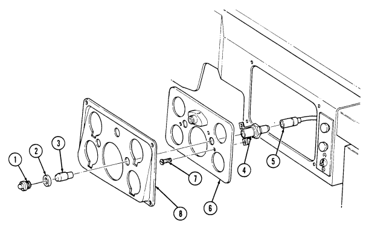

FOLLOW-ON TASK: Connect battery ground cable (para. 4-73).

# 4 - 1 7 . Wa I T- T O - S Ta Rt Lamp Replacement

This task covers:

#### A. Removal B. Installation

INITIAL SETUP:
Tools General mechanic's tool kit:
automotive (Appendix B, Item 1)
Maintenance and repair shop equipment:
automotive (Appendix B, Item 2)
Manual References TM 9-2320-280-10 TM 9-2320-280-24P

#### Equipment Condition

- Battery ground cable disconnected (para. 4-73). - Instrument cluster removed (para. 4-11).

#### Not E

Prior to removal, tag leads and note position for installation.

#### A. Removal

1. Loosen nut (14) and lower steering column (7). 2. Remove cannon plug (16) from main light switch (15). 3. Remove two capscrews (17), washers (18), nuts (20), and washers (18) from instrument panel (6) and body (19).

4. Remove nut (22) and screw (23) from hand throttle bracket (21) and instrument panel (6). 5. Remove nut (13), washer (11), capscrew (10), and washer (11) from instrument panel (6), hand throttle bracket (21), and steering column bracket (12).

6. Remove screw (8) from instrument panel (6) and cowl (9). 7. Pull instrument panel (6) away from body (19). 8. Remove two screws (5) from wait-to-start lamp (4) and instrument panel (6). 9. Disconnect lead 571 (2) and 27 (3) from wiring harness (1).

10. Remove wait-to-start lamp (4).

#### B. Installation

1. Connect lead 571 (2) and 27 (3) to wiring harness (1). 2. Install wait-to-start lamp (4) on instrument panel (6) with two screws (5). 3. Install instrument panel (6) on cowl (9) with screw (8). 4. Install instrument panel (6) and hand throttle bracket (21) on steering column bracket (12) with capscrew (10), washer (11), nut (13), and washer (11).

5. Install hand throttle bracket (21) to instrument panel (6) with screw (23) and nut (22). 6. Install instrument panel (6) to body (19) with two capscrews (17), washers (18), nuts (20), and washers (18).

7. Install cannon plug (16) on main light switch (15). 8. Raise steering column (7) and tighten nut (14) to 31 lb-ft (42 N•m).

# 4-17.  Wait-To-Start Lamp Replacement (Cont'D)

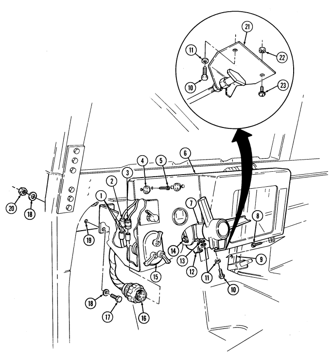

FOLLOW-ON TASKS: - Install instrument cluster (para. 4-11).

- Connect battery ground cable (para. 4-73).

- Start engine (TM 9-2320-280-10) and check wait-to-start lamp assembly for operation.

## 4 - 1 7 . 1 . Brake Warning Lamp Replacement

This task covers:
INITIAL SETUP:
Tools General mechanic's tool kit:
automotive (Appendix B, Item 1)
Materials/Parts Tape (Appendix C, Item 50)
a. Removal **b. Installation**
Manual References TM 9-2320-280-10 TM 9-2320-280-24P
Equipment Condition
- Battery ground cables disconnected (para. 4-73). - Air restriction gauge removed (para. 3-17).

Prior to removal, tag leads for installation.

a. Removal 1. Remove two screws (2) from brake warning lamp (1) and instrument panel (5). 2. Disconnect leads 67 (7) and 27 (3) from wiring harness leads (6). 3. Slide brake warning lamp (1) down toward steering column (4) and remove brake warning lamp (1).

b. Installation

Place tape around lead wires to keep lamp in proper position during installation.

1. Install tape (8) around lamp (1) and lead wires (7) and (3). 2. Slide brake warning lamp (1) up along steering column (4) and install brake warning lamp (1) on instrument panel (5) with two screws (2).

3. Connect leads 67 (7) and 27 (3) to wiring harness leads (6).

# 4-17.1. Brake Warning Lamp Replacement (Gnt'D)

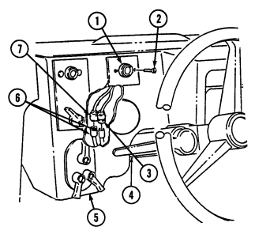

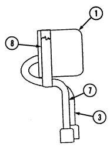

FOLLOW-ON TASKS: - Install air restriction gauge (para. 3-17).

-  Connect battery ground cables (para. 4-73).
-  Start engine (TM 9-2320-280-10) and check brake warning lamp for operation.

## 4-18. High Beam Lamp Replacement

This Task Covers:
a. Removal **b. Installation**
INITIAL SETUP:
Tools General mechanic's tool kit:
automotive (Appendix B, Item Equipment Condition Electrical gauges removed (para. 4-13).

Speedometer/odometer removed (para. 4-14).

Manual References TM 9-2320-280-24P

Prior to removal, tag leads for installation.

#### A. Removal

1. Remove two light lenses (7) from instrument cluster back panel (4).

2. Remove instrument cluster (6) from instrument cluster back panel (4).

3. Disconnect harness lead 57L (1) and lead 17B (2) from high beam lamp (5).

4. Remove two screws (3) and high beam lamp (5) from instrument cluster back panel (4).

#### B. Installation

1. Install high beam lamp (5) on instrument cluster back panel (4) with two screws (3).

2. Connect harness lead 57L (1) and lead 178 (2) to high beam lamp (5). 3. Install instrument cluster (6) on instrument cluster back panel (4).

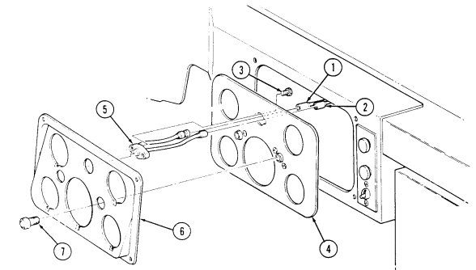 4. Install two light lenses (7) on instrument cluster back panel (4).

FOLLOW-ON TASKS: Install speedometer/odometer (para. 4-14).

Install electrical gauges (para. 4-13).

# 4-19. Parking Brake Switch Replacement

This Task Covers:
a. Removal **b. Installation**
INITIAL SETUP:
automotive (Appendix B, Item 1)
Tools **Equipment Condition**
General mechanic's tool kit: Battery ground cable disconnected (para. 4-73).

Manual References TM 9-2320-280-24P

Prior to removal, tag leads for installation.

#### A. Removal

1. Disconnect parking brake switch lead 67C (1) and 67 (2) from wiring harness leads 67B (3)
and 67E (4).

2. Remove parking brake switch (5) from parking brake lever (6).

b. Installation 1.

2.

Install parking brake switch (5) to parking brake lever (6).

Connect lead 67C (1) and 67 (2) to wiring harness leads 67B (3) and 67E (4).

FOLLOW-ON TASKS: Connect battery ground cable (para. 4-73).

Check parking brake switch operation (TM 9-2320-280-10).

## 4-20. Horn Switch Replacement

| This task covers:               |                                     |
|---------------------------------|-------------------------------------|
| a.  Removal                     | b.  Installation                    |
| INITIAL SETUP:                  |                                     |
| Applicable Models               | Material/Parts                      |
| M1123                           | Sealant (Appendix C, Item 10)       |
| Tools                           | Equipment Condition                 |
| General mechanic's tool kit:    | Tachometer removed (para. 4\-13.1). |
| automotive (Appendix B, Item 1) |                                     |

#### A. Removal

1. Remove snapring (5) from horn switch (4) and steering wheel (1).

2. Pull horn switch (4) out and disconnect from lead 25A (3) in steering shaft (2).

#### B. Installation

1. Apply sealing compound to bushing (6).

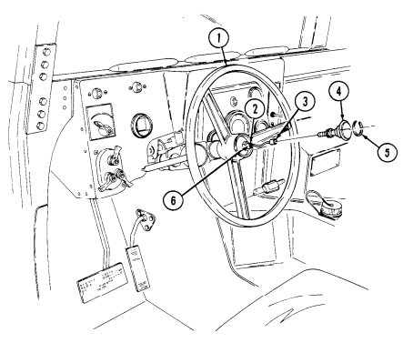 2. Connect lead 25A (3) to horn switch (4) and push into steering shaft (2). 3. Install snapring (5) on horn switch (4) and steering wheel (1).

FOLLOW-ON TASKS: Connect battery ground cable (para. 4-73).

Test horn for operation (TM 9-2320-280-10).

# 4-21. Horn Control Brush Replacement

This task covers:

| a.  Removal                     | b.  Installation     |
|---------------------------------|----------------------|
| Tools                           | Manual References    |
| General mechanic's tool kit:    | TM 9\-2320\-280\-10  |
| automotive (Appendix B, Item 1) | TM 9\-2320\-280\-24P |

#### A. Lamp Removal

1. Loosen nut (1) and lower steering column (5). 2. Disconnect lead 25A (3) from horn control brush (4). 3. Remove two screws (2) from horn control brush (4) and steering column (5).

4. Pry horn control brush (4) out of steering column (5). 5. Clean sealant from steering column (5).

#### B. Installation

1. Apply sealing to bottom of horn control brush (4).

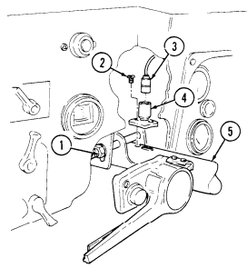

2. Install horn control brush (4) into steering column (5) with two screws (2). 3. Connect lead 25A (3) to horn control brush (4). 4. Raise steering column (5) and tighten nut (1) to 31 lb-ft (42 Nom).

FOLLOW-ON TASKS: Connect battery ground cable (para. 4-73).

Check horn for proper operation (TM 9-2320-280-10).

# 4-22. Horn Replacement

This task covers:
INITIAL SETUP:
Tools General mechanic's tool kit:
automotive (Appendix B, Item 1)
Materials/Parts Two lockwashers (Appendix G, Item 175)

a. Removal b. Installation

Manual References TM 9-2320-280-10 TM 9-2320-280-24P
Equipment Condition
- Battery ground cable disconnected (para. 4-73). - Hood raised and secured (TM 9-2320-280-10).

Prior to removal, tag leads for installation.

a. Removal 1. Remove two capscrews (4), lockwashers (5) and horn (2) from bracket (3). Discard lockwashers (5). 2. Disconnect lead 25A (1) and 26A (6) from horn (2).

b. Installation 1. Connect leads 25A (1) and 26A (6) to horn (2).

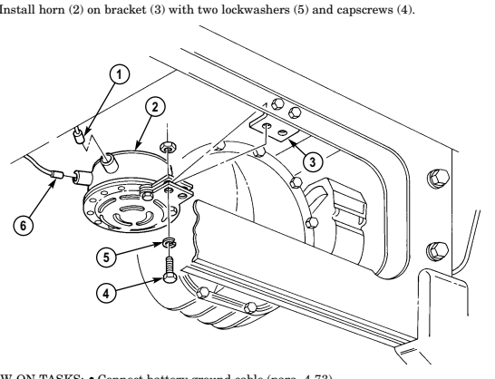

FOLLOW-ON TASKS: - Connect battery ground cable (para. 4-73).

- Lower and secure hood (TM 9-2320-280-10). - Check horn for proper operation (TM 9-2320-280-10).

# 4-23. Horn Mounting Bracket Replacement

This Task Covers:

| Applicable Models                       |
|-----------------------------------------|
| All models except M1123 and "A2" series |
| vehicles                                |
| Tools                                   |

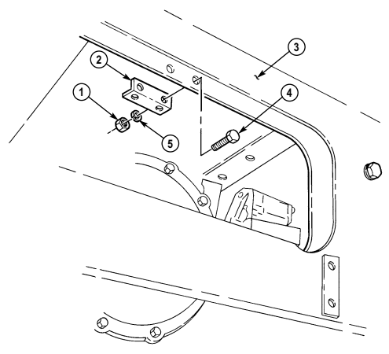

| Manual References    |
|----------------------|
| TM 9\-2320\-280\-10  |
| TM 9\-2320\-280\-24P |
| Equipment Condition  |

Two lockwashers (Appendix G, Item 133)

a. Removal b. Installation

a. Removal Remove two nuts (1), lockwashers (5), capscrews (4) and horn mounting bracket (2) from front crossmember (3). Discard lockwashers (5).

b. Installation Install horn mounting bracket (2) on front crossmember (3) with two capscrews (4), lockwashers (5), and nuts (1). Tighten nuts (1) to 10 lb-ft (14 N•m).

FOLLOW-ON TASK: Install horn (para. 4-22).

# 4-24. Engine Temperature Sending Unit Replacement

This task covers:

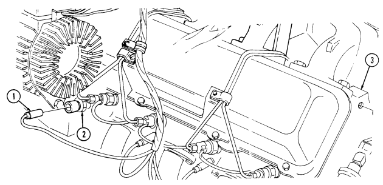

a. Removal **b. Installation**

| INITIAL SETUP:   |
|------------------|

automotive (Appendix B, Item 1)

Materials/Parts **Equipment Condition**

Sealing compound (Appendix C, Item 44) Battery ground cable disconnected (para. 4-73).

Hood raised and secured (TM 9-2320-280-10).

| Manual References                                  |
|----------------------------------------------------|
| TM 9\-2320\-280\-24P                               |
| TM 9\-2320\-280\-24P                               |
| Equipment Condition                                |
| · Battery ground cable disconnected (para. 4\-73). |
| · Hood raised and secured (TM 9\-2320\-280\-10).   |

The engine temperature sending unit is located left front of engine.

1. Disconnect lead 33B (1) from engine temperature sending unit (2).

2. Remove engine temperature sending unit (2) from engine (3).

b. Installation 1. Apply sealing compound to threads of engine temperature sending unit (2). 2. Install engine temperature sending unit (2) to engine (3). 3. Connect lead 33B (1) to engine temperature sending unit (2).

FOLLOW-ON TASKS: Connect battery ground cable (para. 4-73).

Start engine and check sending unit for leaks (TM 9-2320-280-10). Lower and secure hood (TM 9-230-280-10).

# 4-25. Oil Pressure Sending Unit Replacement

This task covers:

a. Removal **b. Installation**

INITIAL SETUP:
General mechanic's tool kit: TM 9-2320-280-10 automotive (Appendix B, Item 1) TM 9-2320-280-24P

Tools **Manual References**

Materials/Parts **Equipment Condition**

Sealing compound (Appendix C, Item 44) Battery ground cable disconnected (para. 4-73).

Engine access cover removed (para. 10-15).

NOTE
The oil pressure sending unit is located left rear of engine.

#### A. Removal

1. Disconnect lead 36 A (1) from oil pressure sending unit (2).

2. Remove oil pressure sending unit (2) from elbow (3). 3. Inspect elbow (3) for damage. Replace if damaged. Apply sealing compound to threads of elbow (3)
before installing on engine.

#### B. Installation

1. Apply sealing compound to threads of oil pressure sending unit (2).

2. Install oil pressure sending unit (2) to elbow (3).

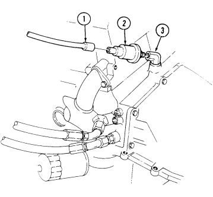 3. Connect lead 36A (1) to oil pressure sending unit (2).

FOLLOW-ON TASKS: Connect battery ground cable (para. 4-73).

Start engine (TM 9-2320-280-10) and check sending unit for leaks.

Install engine access cover (para. 10-15).

# 4-26. Fuel Pressure Transducer Replacement

This task covers:
INITIAL SETUP:
General mechanic's tool kit: TM 9-2320-280-10 automotive (Appendix B, Item 1) TM 9-2320-280-24P
Materials/Parts **Equipment Condition**

a. Removal **b. Installation**

Tools **Manual References**

Sealing compound (Appendix C, Item 44) Battery ground cable disconnected (para. 4-73).

Hood raised and secured (TM 9-2320-280-10).

#### Not E

The fuel pressure transducer is a sensor unit for diagnostic testing. It is mounted on top of the fuel filter on the firewall of the vehicle.

#### A. Removal

1. Disconnect multiple connector (2) from STE/ICE-R wiring harness (3). 2. Remove fuel pressure transducer (1) from fuel filter (4).

b. Installation 1. Apply sealing compound to threads of fuel pressure transducer (1).

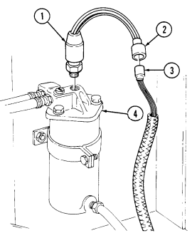 2. Install fuel pressure transducer (1) to fuel filter (4). 3. Connect multiple connector (2) to STE/ICE-R wiring harness (3).

FOLLOW-ON TASKS: Connect battery ground cable (para. 4-73).

Start engine (TM 9-2320-280-10) and check fuel pressure transducer for leaks.

Lower and secure hood (TM 9-2320-280-10).

# 4-27. Cold Advance Switch Replacement

This task covers:
INITIAL SETUP:

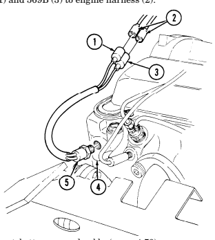

General mechanic's tool kit: TM 9-2320-280-24P
automotive (Appendix B, Item 1)
Sealing compound (Appendix C, Item 44)

a Removal **b. Installation**

Tools **Manual References**

Battery ground cable disconnected (para. 4-73). Engine coolant drained as necessary (para. 3-60). Engine access cover removed (para. 10-15).

| Equipment Condition   |
|-----------------------|

The cold advcance switch is located in the right cylinder head water jacket at the rear of the cylinder head just above the exhaust manifold.

Prior to removal, tag leads for installation.

a. Removal 1. Disconnect leads 569G (1) and 569B (3) from engine harness (2). 2. Remove cold advance switch (5) from engine (4).

b. Installation 1.

2.

Apply sealing compound to threads of cold advance switch (5). Install cold engine (4).

advance switch (5) in Connect leads 569G (1) and 569B (3) to engine harness (2).

FOLLOW-ON TASKS: Connect battery ground cable (para. 4-73).

Fill cooling system (para. 3-60). Install engine access cover (para. 10-15).

# 4-28. Fuel Level Sending Unit Replacement

This task covers:
INITIAL SETUP:

#### Tools

General mechanic's tool kit:
automotive (Appendix B, Item 1)
Materials/Parts Five lockwashers (Appendix G, Item 139) Gasket (Appendix G, Item 45)

#### Manual References

TM 9-2320-280-10 TM 9-2320-280-24P

a. Removal b. Installation

Equipment Condition Fuel tank removed (para. 3-24).

General Safety Instructions Do not perform this procedure near fire, flames, or sparks.

Diesel fuel is highly flammable. Do not perform this procedure near fire, flame, or sparks. Severe injury or death will result.

#### A. Removal

1. Remove five screws (1) and lockwashers (2) from fuel level sending unit (3) and fuel tank (6).

Discard lockwashers (2).

2. Remove fuel level sending unit (3) from inside of fuel tank (6). 3. Remove and discard gasket (4).

b. Installation 1. Place gasket (4) on fuel level sending unit (3). 2. Install fuel level sending unit (3) into fuel tank (6) ensuring not to bend float arm (8). 3. Align holes of fuel level sending unit (3) to tank (6) so float (7) is pointed in same direction that tank filler neck (5) points.

4. Secure fuel level sending unit (3) with five lockwashers (2) and screws (1). Tighten screws (1) 
to 32 lb-in. (4 N•m).

# 4-28. Fuel Level Sending Unit Replacement (Cont'D)

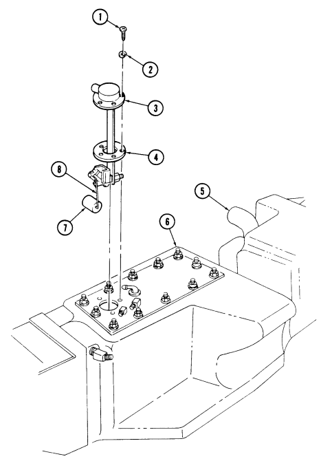

FOLLOW-ON TASKS:  - Install fuel tank (para. 3-24).
- • Check fuel gauge for proper operation (TM 9-2320-280-10).

# 4-29. Glow Plug Controller/Temperature Sensor Replacement

This task covers:
INITIAL SETUP:
Tools General mechanic's tool kit:
automotive (Appendix B, Item 1)

a. Removal b. Installation

| Manual References   |
|---------------------|
| TM 9\-2320\-280\-1  |

TM 9-2320-280-10 TM 9-2320-280-24P

| Equipment Condition   |
|-----------------------|
| · Battery ground c    |
| · Hood raised and     |

Materials/Parts Grease (Appendix C, Item 25) Sealing compound (Appendix C, Item 44)
- Battery ground cable disconnected (para. 4-73). - Hood raised and secured (TM 9-2320-280-10).

- It may be necessary to clamp surge tank-to-lower radiator tube to prevent loss of coolant.

- Two different systems are used. One uses glow plug controller and the other uses a temperature sensor. The temperature sensor is indicated by a yellow band.

a. Removal 1. Disconnect multiple connector (2) from glow plug controller or temperature sensor (1). 2. Remove glow plug controller or temperature sensor (1) from water crossover (3).

b. Installation

- Do not attempt to start engine unless controller/sensor is mounted in engine for a minimum of 10 minutes or if all glow plugs are disconnected. Damage to glow plugs may result.

- Do not overtighten controller/sensor. Damage to crossover will result.

1. Apply sealing compound to threads of glow plug controller or temperature sensor (1). Install glow plug controller or temperature sensor (1) on water crossover (3). Tighten controller or sensor (1) to 14-20 lb-ft (19-27 N•m).

2. Apply grease to pins (4) of glow plug controller or temperature sensor (1). 3. Connect multiple connector (2) to glow plug controller or temperature sensor (1).

# 4-29. Glow Plug Controller/Temperature Sensor Replacement (Cont'D)

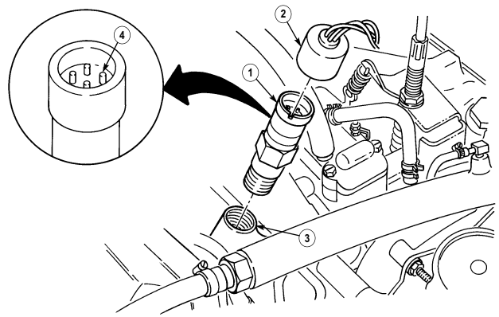

FOLLOW-ON TASKS: - Connect battery ground cable (para. 4-73).

- Lower and secure hood (TM 9-2320-280-10).

# 4-30. Fan Temperature Switch Replacement

This task covers:

#### A. Removal **B. Installation**

INITIAL SETUP:
General mechanic's tool kit: TM 9-2320-280-10 automotive (Appendix B, Item 1) TM 9-2320-280-24P
Tools **Manual References**
Materials/Parts **Equipment Condition**
Sealing compound (Appendix C, Item 44) Battery ground cable disconnected (para. 4-73).

Hood raised and secured (TM 9-2320-280-10).

NOTE
The engine temperature switch is located on the top front side of the engine in the water crossover. Prior to removal, tag leads for installation.

a. Removal 1. Disconnect engine harness leads 458A (4) and 458B (3) from fan temperature switch (1). 2. Remove fan temperature switch (1) from water crossover (2).

b. Installation 1. Apply sealing compound to threads of fan temperature switch (1). Install fan temperature switch (1)

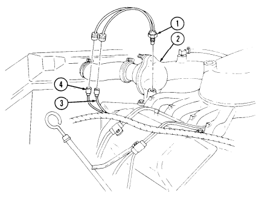

to water crossover (2).

2. Connect engine harness leads 458A (4) and 458B (3) to fan temperature switch (1).

FOLLOW-ON TASKS: Connect battery ground cable (para. 4-73).

Lower and secure hood (TM 9-2320-280-10).

# 4-31. Time Delay Module Replacement

This task covers:
INITIAL SETUP:
Manual References TM 9-2320-280-10 TM 9-2320-280-24P

#### A. Removal

1. Disconnect connector plug (3) from control valve connector (5).

2. Disconnect connector plug (2) from engine harness (4). 3. Remove two screws (1) and time delay module (7) from cowl (6).

b. Installation 1. Install time delay module (7) on cowl (6) with two screws (1).

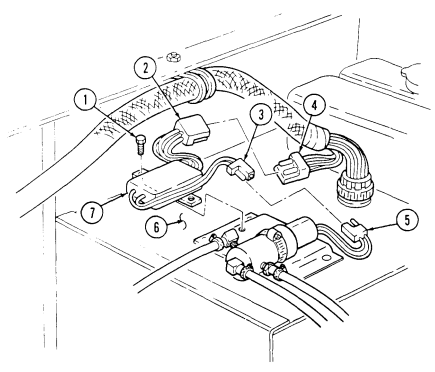

2. Connect connector plug (2) to engine harness (4).

3. Connect connector plug (3) to control valve connector (5).

FOLLOW-ON TASKS: Connect battery ground cable (para. 4-73).

Lower and secure hood (TM 9-2320-280-10).

#### A. Removal **B. Installation**

Tools **Equipment Condition**
General mechanic's tool kit: Battery ground cable disconnected (para. 4-73).

automotive (Appendix B, Item 1) Hood raised and secured (TM 9-2320-280-10).

## 4-32. Rpm Sensor Replacement

This task covers:
INITIAL SETUP:
All vehicles except: M997A2, M1025A2, TM 9-2320-280-24P
M1035A2, M1043A2, M1045A2, M1097A2 General mechanic's tool kit:
automotive (Appendix B, Item 1)

#### A. Removal **B. Installation**

Applicable Models **Manual References**
Equipment Condition Tools Engine access cover removed (para. 10-15).

#### A. Removal

1. Disconnect harness connector (5) from RPM sensor connector (4). 2. Loosen nut (2) and remove RPM sensor (1) from oil pump drive (6).

b. Installation 1. Align tab (3) on RPM sensor (1) with slot (7) in oil pump drive (6). Install RPM sensor (1) on oil pump drive (6) with nut (2).

2. Comect RPM sensor connector (4) to harness connector (5).

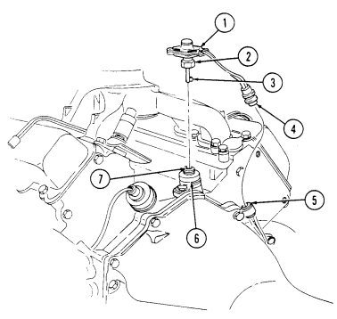

FOLLOW-ON TASK: Install engine access cover (para. 10-15).

## 4-33. Engine Rpm Sensor Replacement

This task covers:
INITIAL SETUP:
Applicable Models **Manual References**
M997A2, M1025A2, M1035A2, M1043A2, TM 9-2320-280-10 M1045A2, M1097A2 TM 9-2320-280-24P

#### A. Removal A. Removal **B. Installation**

Tools **Equipment Condition**
General mechanic's tool kit: Battery ground cable disconnected (para. 4-73).

automotive (Appendix B, Item 1) Hood raised and secured (TM 9-2320-280-10).

1. Disconnect engine harness leads (1) from RPM sensor leads (2).

2. Remove capscrew (3) and RPM sensor (4) from front cover (5).

b. Installation 1. Install RPM sensor (4) in front cover (5) with capscrew (3).

 2. Connector RPM sensor leads (2) to engine harness leads (1).

FOLLOW-ON TASKS: Connect battery ground cable (para. 4-73)
Lower and secure hood (TM 9-2320-280-10)

## 4-34. Backup Light Switch Replacement

This task covers:
INITIAL SETUP:
Applicable Models **Material/Parts**
M1035, M1035A1, M1035A2 Manual References General mechanic's tool kit: **Equipment Condition** 

#### A. Removal **B. Installation**

M996, M996A1, M997, M997A1, M997A2, Sealing compound (Appendix C, Item 44)

Tools TM 9-2320-280-24P

automotive (Appendix B, Item 1)Shift controls housing removed (para. 5-7 or 5-11).

1. Remove boot (4) from shift control housing assembly (1).

Perform step 2 for M996, M996A1, M997, M997A1, M1035, and M1035A1 vehicles. Perform steps 3 and 4 for M997A2 and M1035A2 vehicles.

2. Remove backup light switch (3) from shift control housing assembly (1). 3. Remove two screws (6) and lockwashers (7) from backup light switch (8) and housing (1). Discard lockwashers (7).

4. Remove tiedown strap (10) and backup light switch (8) from neutral start switch (9).

b. Installation

Perform steps 1 through 3 for M997A2 and M1035A2 vehicles. Perform steps 4 and 5 for M996, M996A1, M997, M997A1, M1035, and M1035A1 vehicles.

Install backup light switch (8) on shift controls housing (1) with two lockwashers (7) and screws (6). Install tiedown strap (10) on leads from backup light switch (8) and neutral start switch (9). Position neutral start switch (9) leads and backup light switch (8) leads through boot (4) and install boot (4) on housing (1).

Apply sealing compound to threads of backup light switch (3), and install backup light switch on shift control assembly (1).

Position leads from neutral start switch (2), backup light switch (3), and shift selector indicator (5) through boot (4) and install boot (4) on shift control housing assembly (1).

1.

2.

3.

4.

5.

# 4-34. Backup Light Switch Replacement (Cont'D)

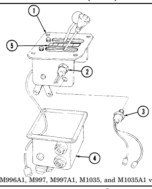

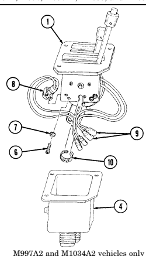

FOLLOW-ON TASK: Install shift controls housing (para. 5-7 or 5-11).

# Section Iv. Transfer Case And Transmission Electrical Maintenance

| a.  Removal                                                          | b.  Installation                                                                               |
|----------------------------------------------------------------------|------------------------------------------------------------------------------------------------|
| INITIAL SETUP:                                                       |                                                                                                |
| Tools                                                                | Equipment Condition                                                                            |
| General mechanic's tool kit:                                         | Fuel tank removed (para. 3\-24).                                                               |
| automotive (Appendix B, Item 1)                                      | General Safety Instructions                                                                    |
| Materials/Parts                                                      | Do not perform this procedure near fire, flames, or                                            |
| Five lockwashers (Appendix G, Item 139)                              | sparks.                                                                                        |
| Gasket (Appendix G, Item 45)                                         |                                                                                                |
| Manual References                                                    |                                                                                                |
| TM 9\-2320\-280\-10                                                  |                                                                                                |
| TM 9\-2320\-280\-24P                                                 |                                                                                                |
|                                                                      | WARNING                                                                                        |
| Diesel fuel is highly flammable. Do not perform this procedure       |                                                                                                |
| near fire, flame, or sparks. Severe injury or death will result.     |                                                                                                |
| a. Removal                                                           |                                                                                                |
| 1.                                                                   | Remove five screws (1) and lockwashers (2) from fuel level sending unit (3) and fuel tank (6). |
| Discard lockwashers (2).                                             |                                                                                                |
| 2.  Remove fuel level sending unit (3) from inside of fuel tank (6). |                                                                                                |
| 3.  Remove and discard gasket (4).                                   |                                                                                                |
| b. Installation                                                      |                                                                                                |

# 4-36. Transfer Case Indicator Switch Replacement

This task covers:

#### A. Removal **B. Installation**

INITIAL SETUP:
Applicable Models **Equipment Condition**
M1097, "A1" and "A2" series Battery ground cable disconnected (para. 4-73).

Tools General mechanic's tool kit:
automotive (Appendix B, Item 1)

#### A. Removal

1. Disconnect leads 511A (4) and 511B (5) from indicator switch leads (3) on transfer case (1).

2. Remove indicator switch (2) from transfer case (1).

b. Installation 1. Install indicator switch (2) on transfer case (1).

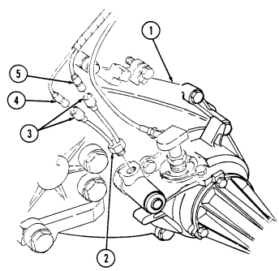

2. Connect leads 511A (4) and 511B (5) to indicator switch leads (3).

FOLLOW-ON TASK: Connect battery ground cable (para. 4-73).

# 4-37. Transfer Case Indicator Lamp Cable Assembly Replacement

This task covers:

#### A. Removal B. Installation Initial Setup:

| General mechanic's tool kit:    | Battery ground cable disconnected (para. 4\-73).   |
|---------------------------------|----------------------------------------------------|
| automotive (Appendix B, Item 1) | Hood raised and secured (TM 9\-2320\-280\-10).     |
| Manual References               |                                                    |
| TM 9\-2320\-280\-10             |                                                    |
| TM 9\-2320\-280\-24P            |                                                    |

#### A. Removal

1. Disconnect leads 511A (6) and 511B (7) from indicator switch leads (5) on transfer case (3). 2. Deleted. 3. Disconnect lead 511A (8) from lamp assembly lead (9). 4. Disconnect leads 458B (12) and 458C (11) from fan temperature switch lead (13) and engine wiring harness lead 458A (10) and remove cable assembly (1) from vehicle.

#### B. Installation

1. Position cable assembly (1) in approximate mounting location on vehicle. 2. Connect leads 458B (12) and 458C (11) to fan temperature switch lead (13) and engine wiring harness lead 458A (10).

3. Connect lead 511A (8) to lamp assembly lead (9). 4. Connect leads 511B (7) and 511A (6) to indicator switch leads (5) on transfer case (3). 5. Deleted.

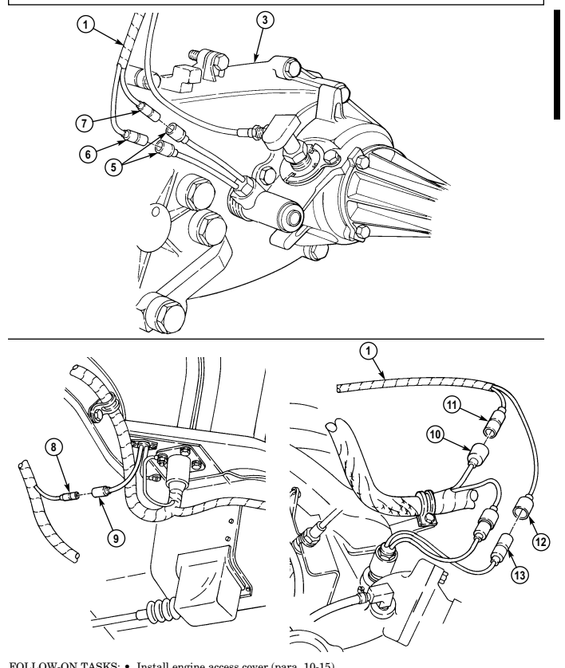

FOLLOW-ON TASKS: - • Install engine access cover (para. 10-15).
- • - • Connect battery ground cable (para. 4-73).

4-37. TRANSFER CASE INDICATOR LAMP CABLE ASSEMBLY REPLACEMENT (Cont'd)

# 4-38. Transfer Case Indicator Lamp Assembly Replacement

This task covers:
INITIAL SETUP:
Applicable Models **Manual References**
M1097, "A1" and "A2" series TM 9-2320-280-24P

#### A. Removal

1. Disconnect lead 511A (5) from lamp assembly lead (4).

2. Remove screw (3) and ground lead (2) from engine (8). 3. Remove two screws (6) and lamp assembly (7) from body (1).

b. Installation

#### A. Removal **B. Installation**

Tools **Equipment Condition**

General mechanic's tool kit: Battery ground cable disconnected (para. 4-73).

automotive (Appendix B, Item 1) Engine access cover removed (para. 10-15).

1. Install lamp assembly (7) to body (1) with two screws (6).

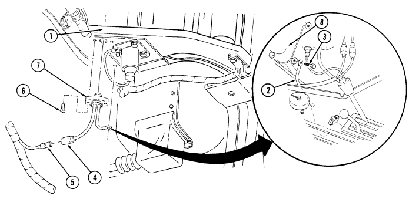

2. Install ground lead (2) to engine (8) with screw (3). 3. Connect lead 511A (5) to lamp assembly lead (4).

FOLLOW-ON TASKS:
Install engine access cover (para. 10-15). Connect battery ground cable (para. 4-73).

# 4-39. Transmission Indicator Lamp Assembly Replacement (4L80-E)

This task covers:
INITIAL SETUP:
Applicable Models **Manual References**
M997A2, M1025A2, M1035A2, TM 9-2320-280-24P
automotive (Appendix B, Item 1)

a. Removal **b. Installation**

M1043A2, M1045A2, M1097A2**Equipment Condition**

Tools Battery ground cable disconnected (para. 4-73).

General mechanic's tool kit: Engine access cover removed (para. 10-15).

a. Removal 1. Disconnect lead 657 (4) from lamp assembly lead (3).

2. Remove two screws (2) and lamp assembly (5) from body (1).

b. Installation 1. Install lamp assembly (5) to body (1) with two screws (2).

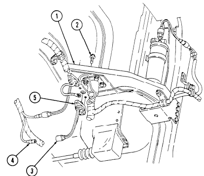

2. Connect lead 657 (4) to lamp assembly lead (3).

FOLLOW-ON TASKS: Install engine access cover (para. 10-15).

Connect battery ground cables (para. 4-73).

# 4-40. Transmission Circuit Breakers And Jumper Leads Replacement (4L80-E)

This task covers:
INITIAL SETUP:

#### A. Removal **B. Installation**

Applicable Models **Manual References**
M997A2, M1025A2, M1035A2, TM 9-2320-280-24P M1043A.2, M1045A2, M1097A2 General mechanic's tool kit:
automotive (Appendix B, Item 1)
Equipment Condition Tools Battery ground cables discomected (para. 4-73).

Prior to removal, tag leads for installation.

#### A. Removal

1.

Remove nut (6), capscrew (1), cable (2), three circuit breaker-to-battery leads (3) and cable (4) from terminal clamp (5).

2.

3.

4.

5.

6.

7.

NOTE
The coverplate on M1025A2 and M1043A2 vehicles has four capscrews and washers.

Remove five capscrews (8), two washers (10), and coverplate (7) from "B" pillar (9).

Remove three screws (20) and circuit breaker-tubattery leads (3) from circuit breakers (21), (16), and (15).

Remove two screws (12) and circuit breaker-to-relay leads (13) from circuit breakers (16) and (21).

Discomect leads (13) from relay lead (19) and remove leads (13). Remove screw (12) and circuit breaker-to-harness lead (14) from circuit breaker (15). Remove two nuts (11), capscrews (18), washers (17) and circuit breaker (21) from coverplate (7). Repeat step 7 for circuit breakers (15) and (16).

#### B. Installation

1. Install circuit breaker (21) on coverplate (7) with two washers (17), capscrews (18), and nuts (11).

Repeat step 1 for circuit breakers (15) and (16).

2. Install circuit breaker-to-harness lead (14) on circuit breaker (15) with screw (12).

3. Connect leads (13) to relay lead (19).

4. Install two circuit breaker-to-relay leads (13) to circuit breakers (16) and (21) with screws (12).

5. Install three circuit breaker-to-battery leads (3) on circuit breakers (15) (16), and (21) with screws (20). 6. Install coverplate (7) to "B" pillar (9) with two washers (10) and five capscrews (8). 7. Install cable (4), three circuit breaker-to-battery leads (3) and cable (2) to terminal clamp (5) with capscrew (1) and nut (6).

# 4-40. Transmission Circuit Breakers And Jumper Leads Replacement (4L80-E) (Cont'D)

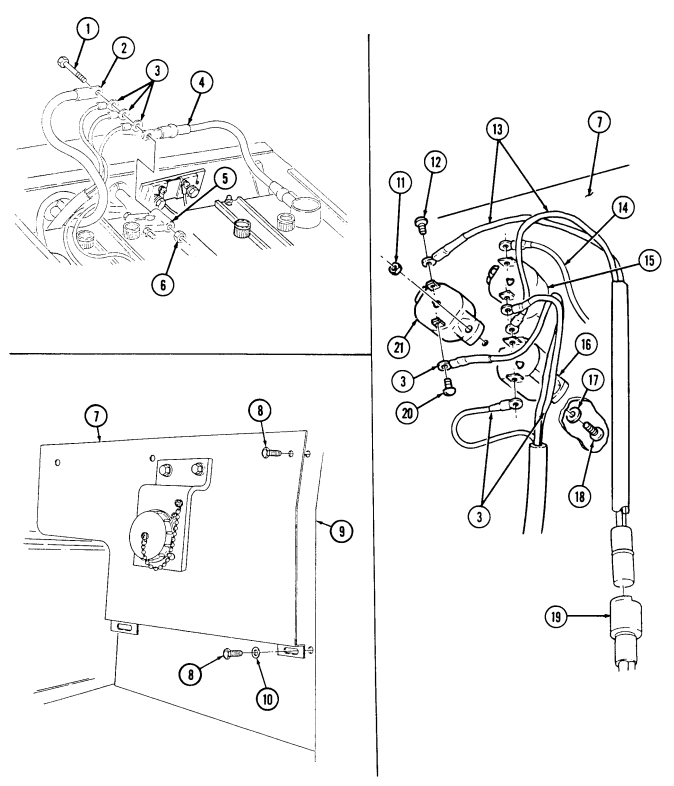

FOLLOW-ON TASK: Connect battery ground cables (para. 4-73).

# 4-41. Transmission Relay Replacement (4L80-E)

This task covers:
INITIAL SETUP:
Applicable Models **Manual References**
M997A2, M1025A2, M1035A2, TM 9-2320-280-24P
M1043A2, M1045A2, M1097A2**Equipment Condition**
General mechanic's tool kit:
automotive (Appendix B, Item 1)
a. Removal **b. Installation**
Tools Battery ground cables disconnected (para. 4-73).

Prior to removal, tag leads for installation. M1025A2 and M1043A2 vehicles have four capscrews and washers on coverplate.

a. Removal 1. Remove five capscrews (2), two washers (4) and coverplate (1) from "B" beam (3).

2. Disconnect four leads (5) from relay leads (6).

3. Remove two nuts (9), washers (10), capscrews (7), and relay (8) from coverplate (1).

b. Installation 1. Install relay (8) on coverplate (1) with two capscrews (7), washers (10), and nuts (9).

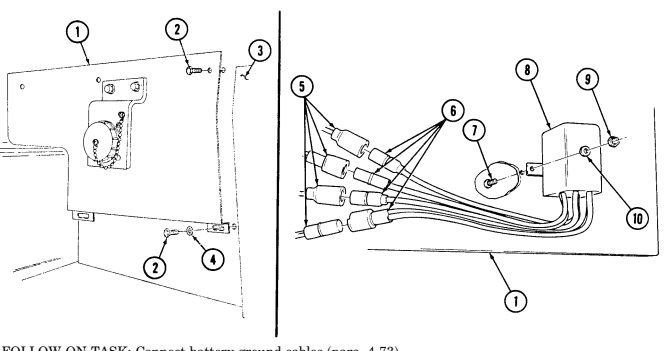 2. Connect four relay leads (6) to leads (5). 3. Install coverplate (1) to "B" beam (3) with two washers (4) and five capscrews (2).

FOLLOW-ON TASK: Connect battery ground cables (para. 4-73).
# 4 - 4 2 . Transmission Control Module (Tcm) Replacement (4L80-E)

This task covers:
INITIAL SETUP:
Applicable Models M997A2, M1025A2, M1035A2, M1043A2, M1045A2, M1097A2, M1123 Tools General mechanic's tool kit:
automotive (Appendix B, Item 1)
Personnel Required One mechanic One assistant a. Removal

#### A. Removal B. Installation

Manual References TM 9-2320-280-24P
Equipment Condition
- Battery ground cables disconnected (para. 4-73). - Left rear seat compartment cover removed
(para. 10-43).

Ensure that ignition switch is OFF before disconnecting or reconnecting the Transmission Control Module (TCM). Failure to do this may cause internal damage to TCM.

1. Disconnect harness connector (1) from TCM (2). 2. Remove four nuts (4), washers (3), and TCM (2) from body (5).

b. Installation 1. Install TCM (2) on body (5) with four washers (3) and nuts (4).

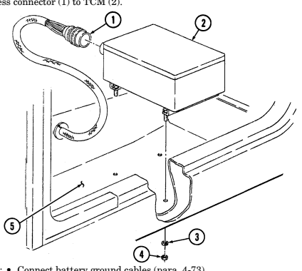 2. Connect harness connector (1) to TCM (2).

FOLLOW-ON TASKS: - Connect battery ground cables (para. 4-73).

- Install left rear seat compartment cover (para. 10-43).

## 4 - 4 2 . 1 . E-Prom Replacement

| Applicable Models   |
|---------------------|

This task covers:

| INITIAL SETUP:   |
|------------------|

M997A2, M1025A2, M1035A2, M1043A2, M1045A2, M1097A2, M1123 Tools General mechanic's tool kit:
automotive (Appendix B, Item 1)
Materials/Parts RTV sealant (Appendix C, Item 38)
a. Removal

a. Removal b. Installation

| Manual References   |
|---------------------|
| TM 9\-2320\-280\-2  |

Equipment Condition
- Battery ground cables disconnected (para. 4-73). - Left rear seat compartment cover removed
(para. 10-43).

Ensure that ignition switch is OFF before replacing E-PROM or disconnecting or reconnecting the Transmission Control Module (TCM). Failure to do this may cause internal damage to TCM.

For proper calibration of E-PROM to transmission, ensure E-PROM is the same production year as the transmission installed in the vehicle.

1. Loosen four screws (1) and remove cover (2) and foam insulation (4) from TCM box (8). 2. Remove two screws (5) and access panel (6) from terminal box (9). 3. Remove E-PROM (10) from circuit board (7).

#### B. Installation

1. Install E-PROM (10) on circuit board (7) by pushing it down firmly to ensure it is well seated. 2. Install access panel (6) on terminal box (9) with two screws (5). 3. Clean sealant from TCM box (8) and cover (2). 4. Apply 0.125 in. (3.175 mm) bead of RTV adhesive sealant in groove (3) on cover (2). 5. Install foam insulation (4) and cover (2) on TCM box (8) and tighten four screws (1) to 30 lb-in.

(3 N•m).

# 4-42.1. E-Prom Replacement (Contd)

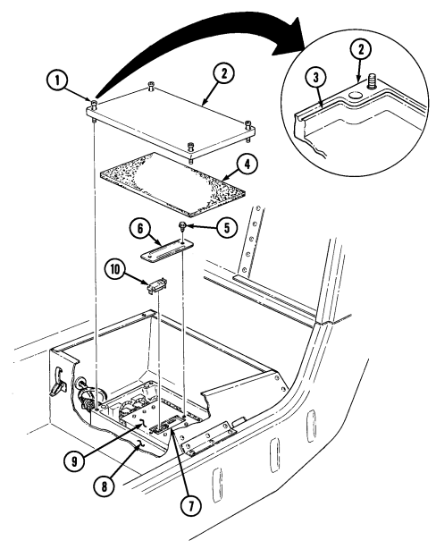

FOLLOW-ON TASKS: - • Connect negative battery cables (para. 4-73).
- • - • - Install left rear seat compartment cover (para. 10-43).

# 4 - 4 3 . Kick-Down Switch Maintenance (3L80)

This task covers:
b. Installation

#### Initial Setup:

Applicable Models All vehicles except: M997A2, M1025A2, M1035A2, M1043A2, M1045A2, M1097A2, M1123 Tools General mechanic's tool kit:
automotive (Appendix B, Item 1)
Test Equipment Multimeter (Appendix B, Item 166)
a. Removal **c. Adjustment**
Manual References TM 9-2320-280-10 TM 9-2320-280-24P
Equipment Condition
- Battery ground cable disconnected (para. 4-73). - Hood raised and secured (TM 9-2320-280-10).

a. Removal 1. Disconnect engine harness leads 315A (5) and 315B (4) from kick-down switch (3). 2. Remove two capscrews (1) and switch (3) from fuel injection pump (2).

b. Installation 1. Install kick-down switch (3) on injection pump (2) with two capscrews (1). 2. Connect leads 315A (5) and 315 B (4) to kick-down switch (3).

c. Adjustment

Kick-down switch must be adjusted whenever it is replaced or when injection pump is replaced.

1. Disconnect throttle return spring (6) from throttle shaft lever (7) and accelerator cable bracket (9). 2. Disconnect engine harness leads 315A (5) and 315 B (4) from kick-down switch (3). 3. Connect multimeter to leads on kick-down switch (3) to read continuity. 4. Loosen two capscrews (1) to allow movement of kick-down switch (3).

8 . Position feeler gauge set at 0.310 in. (7.874 mm) between throttle shaft lever (7) and injection pump (2)
ensuring feeler gauge does not touch screw (8).

9. Move throttle shaft lever (7) to wide open position so throttle shaft lever (7) rests on feeler gauge.

Note multimeter, no continuity should be present. If continuity is present, repeat steps 3 through 8.

10. Connect leads 315A (5) and 315 B (4) to kick-down switch (3).

11. Connect throttle return spring (6) to accelerator cable bracket (9) and throttle shaft lever (7).

5 . Position feeler gauge set at 0.295 in. (7.493 mm) between throttle shaft lever (7) and injection pump (2)
ensuring feeler gauge does not touch screw (8).

6. Move throttle shaft lever (7) to wide open position so throttle shaft lever (7) rests on feeler gauge. 7. Rotate kick-down switch (3) slowly until multimeter reads continuity through kick-down switch (3)
and tighten capscrews (1).

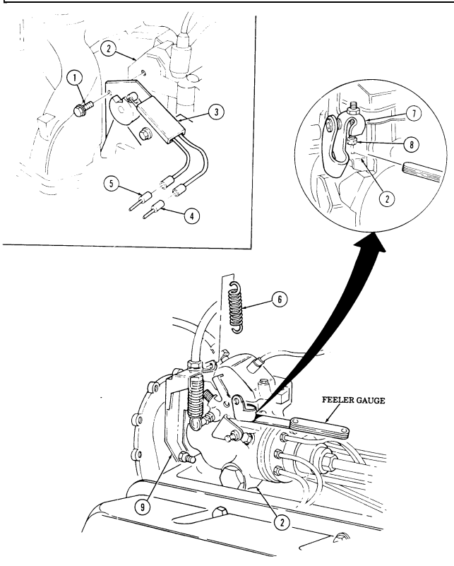

# 4-43. Kick-Down Switch Maintenance (3L80) (Cont'D)

FOLLOW-ON  TASKS: - Connect  battery  ground  cable  (para.  4-73).
- • - • -  -  -  -  -  -  - Lower and secure hood (TM 9-2320-0280-10).

# 4-44. Fan Cut-Off Switch Replacement (4L80-E)

| This task covers:   |
|---------------------|

INITIAL SETUP:
Applicable Models **_______________**
M997A2, M1025A2, M1035A2, M1043A2, M1045A2, M1097A2 Tools General mechanic's tool kit:
automotive (Appendix B, Item 1)

#### Materials/Parts

Two lockwashers (Appendix G, Item 135)
a. Removal

| (para. 4\-73).   |
|------------------|

| Manual References   |
|---------------------|

a. Removal b. Installation

- Engine access cover removed (para. 10-15). - Battery ground cable disconnected (para. 4-73). - Hood raised and secured (TM 9-2320-280-10).

Prior to removal, tag leads for installation.

1. Slide rod (1) forward and disconnect from fuel injection pump (2). 2. Remove rod (1) from switch (11). 3. Disconnect harness leads 315A/315B (10) from leads 315 (9). 4. Remove two nuts (13), lockwashers (12), washers (8), capscrews (7), washers (8), and switch (11)
from bracket (5). Discard lockwashers (12).

5. Remove two capscrews (3), leads (4), and bracket (5) from engine (6).

#### B. Installation

1. Install switch (11) on bracket (5) with two washers (8), capscrews (7), washers (8), lockwashers (12),
and nuts (13). Do not tighten nuts (13).

2. Slide rod (1) forward and connect to fuel injection pump (2). 3. Install rod (1) on switch (11). 4. Install bracket (5) and two leads (4) on engine (6) with capscrews (3). 5. Position rod (1) at wide open throttle and position switch (11) to close. Tighten nuts (13). 6. Connect harness leads 315A/315B (10) to leads 315 (9).

# 4-44. Fan Cut-Off Switch Replacement (4L80-E) (Cont'D)

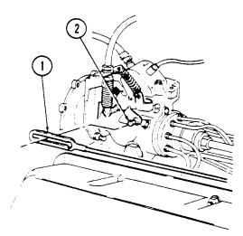

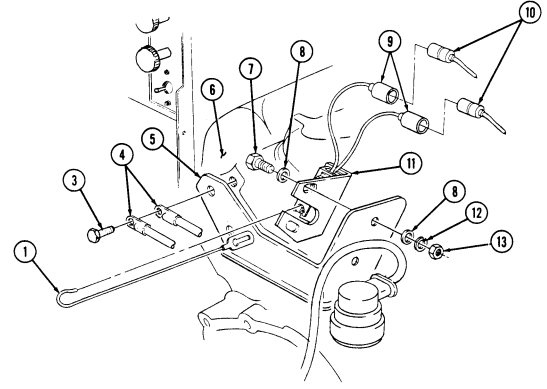

FOLLOW-ON TASKS:
- Install engine access cover (para. 10-15).

- Connect battery ground cable (para. 4-73).

- Lower and secure hood (TM 9-2320-280-10).

# 4 - 4 5 . Throttle Position (Tp) Sensor Maintenance (4L80-E)

This task covers:
a. Removal c. Adjustment b. Installation

#### Initial Setup:

Applicable Models M997A2, M1025A2, M1035A2, M1043A2, M1045A2, M1097A2, M1123 Tools General mechanic's tool kit:
automotive (Appendix B, Item 1)
Test Equipment Multimeter (Appendix B, Item 166) Jumper wire (Appendix B, Item 93.1) Gauge block (Appendix B, Item 63)
a. Removal Manual References TM 9-2320-280-10 TM 9-2320-280-24P
Equipment Condition - Hood raised and secured (TM 9-2320-280-10). - Battery ground cables disconnected (para. 4-73).

The Throttle Position (TP) sensor is an electrical component and must not be soaked in any liquid cleaner or solvent or damage may result.

1. Disconnect body wiring harness connector (3) from TP sensor connector (4). 2. Remove two screws (7), washers (6), and TP sensor (5) from fuel injection pump (1).

b. Installation 1. Ensuring throttle is closed, place TP sensor (5) on throttle shaft (2) of fuel injection pump (1). 2. Rotate TP sensor (5) counterclockwise to align screw holes in sensor (5) with holes in injection pump (1).

3. Install TP sensor (5) on injection pump (1) with two washers (6) and screws (7). Do not tighten screws (7).

4. Adjust TP sensor (5) (para. 4-45c).

c. Adjustment 1. Disconnect engine harness connector (12) and body harness connector (11). 2. Install jumper wires between TP sensor connector (4) and body wiring harness connector (11). 3. Rotate ignition switch to RUN position (TM 9-2320-280-10). 4. Using a digital multimeter, measure voltage between terminals A and C of TP sensor connector (4). This voltage should be between 4.5 - 5.8 volts. Multiply by 0.33 to obtain the desired TP sensor voltage, and use this figure to adjust TP sensor.

#### Not E

For example, 5.00 volts x 0.33 = 1.65 volts (±1% or 0.02 volt tolerance).

5 . Install 0.646 side of gauge block between injection pump throttle lever stopscrew (8) and housing boss (9) on injection pump (1). 

## 4 - 4 5 . Throttle Position (Tp) Sensor Maintenance (4L80-E) (Cont'D)

6. Rotate injection pump throttle lever (10) so that stopscrew (8) holds gauge block against housing boss (9).

#### Not E

Keep throttle lever in this position during remainder of adjustment steps.

7. Measure voltage between terminals B and C of TP sensor connector (4).

a. If measured voltage is within calculated specification, as indicated in step 4, remove jumper wire and connect body harness connector (3) to TP sensor connector (4).

b. If voltage is not within calculated specification, go to next step.

8. Loosen TP sensor mounting screws (7) and rotate TP sensor (5) toward rear of vehicle (counterclockwise direction).

9. With voltmeter connected to terminals B and C of TP sensor connector (4), rotate TP sensor (5)
slowly toward front of vehicle (clockwise direction) until voltmeter indicates voltage as determined in step 4.

10. Tighten TP sensor mounting screws (7) and confirm that adjustment did not change.

11. Remove jumper wire.

12. Remove gauge block. 13. Connect body wiring harness connector (3) to TP sensor connector (4).

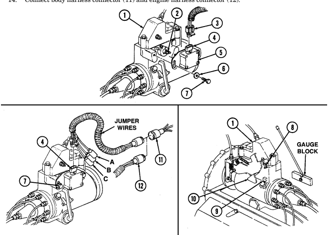 14. Connect body harness connector (11) and engine harness connector (12).

FOLLOW-ON TASKS: - Lower and secure hood (TM 9-2320-280-10).

- Connect battery ground cables (para. 4-73).

# 4-46. Transmission Input Speed Sensor (Tiss) And Output Speed Sensor

(TOSS) MAINTENANCE (4L80-E)
This task covers:
a. Removal c. Installation b. Inspection INITIAL SETUP:
Applicable Models M997A2, M1025A2, M1035A2, M1043A2, M1045A2, M1097A2, M1123 Tools General mechanic's tool kit:
automotive (Appendix B, Item 1)

#### Materials/Parts

Packing retainer (Appendix G, Item 230) Hydraulic fluid (Appendix C, Item 27)
Manual References TM 9-2320-280-10 TM 9-2320-280-24P
Equipment Conditions Battery ground cable disconnected (para. 4-73).

a. Removal

Both the input and output speed sensors are replaced basically the same.

1. Disconnect speed sensor harness connector (3) from sensor (5). 2. Remove capscrew (7) from sensor (5) and transmission (1). Slide bracket (6) off sensor (5). 3. Remove harness clip (2) from sensor bracket (6). 4. Using a twisting motion, remove sensor (5) from transmission (1).

b. Inspection Inspect packing retainer (4), and replace if damaged.

c. Installation 1. Lubricate packing retainer (4) with hydraulic fluid and install on sensor (5) if removed. 2. Install harness clip (2) on sensor bracket (6). 3. Using a twisting motion, install sensor (5) in transmission (1). 4. Slide bracket (6) over sensor (5) and install capscrew (7). 5. Install connector (3) on sensor (5).

4-46. TRANSMISSION INPUT SPEED SENSOR (TISS) AND OUTPUT SPEED SENSOR
(TOSS) MAINTENANCE (4L80-E) (Cont'd)

· Connect battery ground cable (para. 4-73).

FOLLOW-ON TASK:

- Start engine (TM 9-2320-280-10) and check operation of transmission.
# Section V. Lighting System Maintenance 4 - 4 7 . Lighting System Maintenance Task Summary

| Applicable Models  Manual References                          |                                                                                                                              |
|---------------------------------------------------------------|------------------------------------------------------------------------------------------------------------------------------|
| M1097, "A1" and "A2" series                                   | TM 9\-2320\-280\-24P                                                                                                         |
| Tools                                                         | Equipment Condition                                                                                                          |
| General mechanic's tool kit:                                  | Battery ground cable disconnected (para. 4\-73). automotive (Appendix B, Item 1) Engine access cover removed (para. 10\-15). |
| a. Removal                                                    |                                                                                                                              |
| 1. Disconnect lead 511A (5) from lamp assembly lead (4).      |                                                                                                                              |
| 2. Remove screw (3) and ground lead (2) from engine (8).      |                                                                                                                              |
| 3. Remove two screws (6) and lamp assembly (7) from body (1). |                                                                                                                              |
| b. Installation                                               |                                                                                                                              |
| Install lamp assembly (7) to body (1) with two screws (6).    | 1.                                                                                                                           |
| 2.                                                            | Install ground lead (2) to engine (8) with screw (3).                                                                        |
| 3.  Connect lead 511A (5) to lamp assembly lead (4).          |                                                                                                                              |

# 4 - 4 8 . S E Rvice Headlight Lamp Maintenance

This task covers:
a. Removal c. Adjustment b. Installation INITIAL SETUP:
Tools General mechanic's tool kit:
automotive (Appendix B, Item 1)
Personnel Required One mechanic One assistant Materials/Parts Chalk (Appendix C, Item 15)
Manual References TM 9-2320-280-10 TM 9-2320-280-24P TM 43-0139 Equipment Condition Battery ground cable disconnected (para. 4-73).

#### Not E

Prior to removal, tag leads for installation.

a. Removal 1. Loosen three retaining right screws (1). 2. Remove retaining ring (2).

#### Not E

If retaining ring shows signs of corrosion, perform steps 3 through 5 to allow accumulated water/condensation to drain out.

3. Clean and remove dirt/rust conditions from surface of retaining ring (2). 4. Drill a 9/16-in. (14 mm) hole in bottom of retaining ring (2), 3/4 in. (19 mm) from inside edge of retaining ring (2).

5. Paint all unprotected areas (TM 43-0139). 6. Disconnect leads 17 (4), 18 (6), and 91 (7) from headlight housing (5) and remove lamp (3).

b. Installation

#### Not E

Circuit numbers are marked on housing.

1. Connect leads 17 (4), 18 (6), and 91 (7) to headlight housing (5). 2. Install lamp (3) to housing (5) and secure with retaining ring (2) and three screws (1).

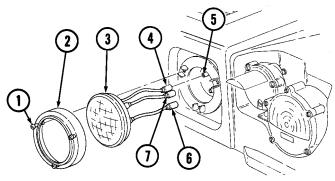 3. Connect battery ground cable (para. 4-73).

# 4 - 4 8 . S E Rvice Headlight Lamp Maintenance (Cont'D)

c. Adjustment

- Headlamp alignment is the same for both headlamps. - Inflate tires on vehicle before starting procedure
(TM 9-2320-280-10).

- Measured height (H) varies depending on model of vehicle and load configuration.

1. Position vehicle on level ground 25 ft (8 M) from and facing a vertical wall. 2. Measure height (H) from ground up to center of lamp (3). 3. Using chalk, draw a horizontal line across vertical wall at center height (H) of lamp (3). 4. Draw a vertical line through horizontal line for center position (C) of vehicle. 5. Measure distance from center to center of lamp (3) and divide measurement in half. 6. Draw two vertical lines (D) at equal distance from center position line (C). 7. Measure down 1/12 from horizontal line (H) and mark horizontal lines through lamp vertical lines (D).

8. Turn headlamps on low beam and block out one lamp (3). 9. Adjust lamp (3) using vertical adjusting screw (8) and/or horizontal adjusting screw (9) until center of lamp beam is aligned with lower horizontal and vertical lines.

10. Repeat steps 8 and 9 for other lamp (3).

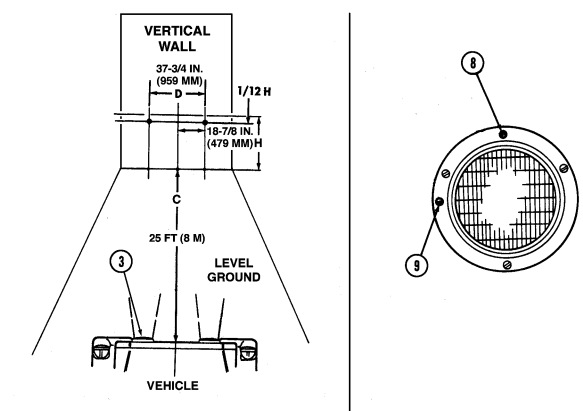

FOLLOW-ON TASK: Check headlight lamp for proper operation (TM 9-2320-280-10).

# 4-49. Service Headlight Assembly Replacement

This task covers:

#### A. Removal B. Installation

INITIAL SETUP:
Tools General mechanic's tool kit:
automotive (Appendix B, Item 1)
Manual References TM 9-2320-280-10 TM 9-2320-280-24P

#### Equipment Condition

- Battery ground cable disconnected 
(para. 4-73).

- Hood raised and secured 
(TM 9-2320-280-10).

- Prior to removal, tag leads for installation. - Note position of circuit 91 for installation.

#### A. Removal

1. Remove three nuts (4) and washers (5) from headlight assembly (1) and hood (6). 2. Remove leads 17 (2), 18 (3), and 91 (7) from headlight assembly (1). 3. Remove headlight assembly (1) from hood (6).

b. Installation

Circuit numbers are marked on headlight next to respective connector.

1. Connect leads 17 (2), 18 (3), and 91 (7) to headlight assembly (1). 2. Install headlight assembly (1) to hood (6) with three washers (5) and nuts (4).

# 4-49. Service Headlight Assembly Replacement (Cont'D)

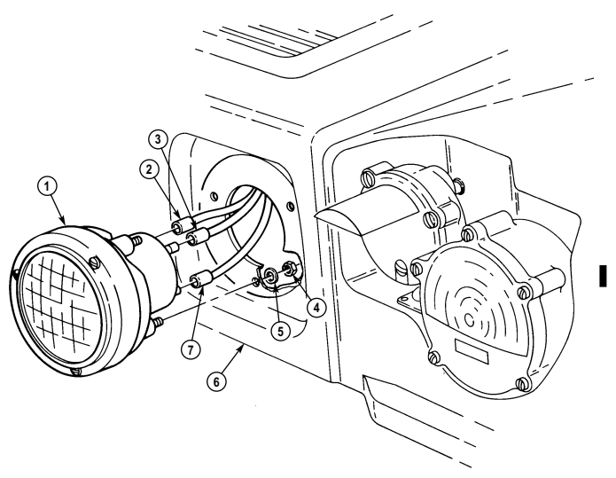

FOLLOW-ON TASKS: - Connect battery ground cable (para. 4-73).

-  Lower and secure hood (TM 9-2320-280-10). · Check adjustment of headlight lamp (para. 4-48).

# 4-50. Blackout Drive Light Assembly Replacement

This task covers:

| Materials/Parts   |
|-------------------|
|                   |

| General mechanic's tool kit:    |
|---------------------------------|
| automotive (Appendix B, Item 1) |

| INITIAL SETUP:   |
|------------------|

#### Tools

Lockwasher (Appendix G, Item 133) Four plain-assembled nuts
(Appendix G, Item 204)
Antiseize compound (Appendix C, Item 13)

a. Removal b. Installation

#### Equipment Condition

| Manual References    |
|----------------------|
| TM 9\-2320\-280\-10  |
| TM 9\-2320\-280\-24P |

- Battery ground cable disconnected (para. 4-73). - Hood raised and secured (TM 9-2320-280-10).

#### A. Removal

1. Remove nut (5), lockwasher (6), and special washer (7) from blackout drive light (1) and hood (9).

Discard lockwasher (6).

2. Disconnect lead 198 (4) from blackout drive light (1). 3. Remove blackout drive light (1) and coned mounting washer (2) from swivel bracket (11). 4. Disconnect lead 92C (3) from blackout drive light (1).

Some vehicles may have screws in place of studs securing bracket and plate to hood.

5. Remove four plain-assembled nuts (8), swivel bracket (11), and plate (10) from hood (9). Discard plain-assembled nuts (8).

b. Installation

Some vehicles may have screws in place of studs securing bracket and plate to hood.

1. Install swivel bracket (11) to outside of hood (9), and plate (10) to inside of hood (9) with four plainassembled nuts (8). Tighten plain-assembled nuts (8) 16-30 lb-in. (1-3 N•m).

2. Connect lead 92C (3) to blackout drive light (1). 3. Place blackout drive light (1) and coned mounting washer (2) through hole in swivel bracket (11). 4. Connect lead 198 (4) to blackout drive light (1). 5. Install blackout drive light (1) on hood (9) with special washer (7), lockwasher (6), and nut (5).

# 4-50. Blackout Drive Light Assemlby Replacement (Cont'D)

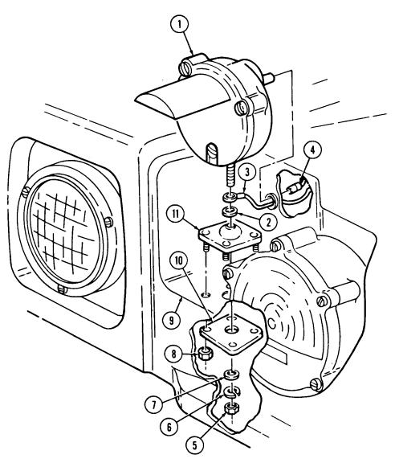

FOLLOW-ON TASKS: · · Connect battery ground cable (para. 4-73).

· Lower and secure hood (TM 9-2320-280-10).

- Check blackout drive light for properoperation (TM 9-2320-280-10).

# 4-51. Blackout Drive Light Lamp Replacement

This task covers:

#### Initial Setup:

Tools General mechanic's tool kit:
automotive (Appendix B, Item 1)
Materials/Parts Three gaskets (Appendix G, Item 46) Gasket (Appendix G, Item 56) Adhesive sealant (Appendix C, Item 10)
a. Removal b. Installation

| TM 9\-2320\-280\-24P                       |
|--------------------------------------------|
| Equipment Condition                        |
| - Left rear seat compartment cover removed |
| (para. 10\-43).                            |

a. Removal 1. Loosen three retaining screws (2) from light door (6). 2. Remove light door (6), three gaskets (5.1), and gasket (3) from light body (5). Discard gasket (3) and gaskets (5.1).

3. Remove lamp (4). 4. Clean mating surface on light door (6) and light body (5). Remove sealant.

b. Installation 1. Install lamp (4). 2. Install three gaskets (5.1), gasket (3), and light door (6) to light body (5) with lens hood (1) at top.

NOTE
To prevent moisture from entering light assembly, tighten all screws evenly.

3. Secure light door (6) by tightening three screws (2). 4. Apply thin coat of sealant to seam between light body (5) and light door (6).

# 4-51. Blackout Drive Light Lamp Replacement (Cont'D)

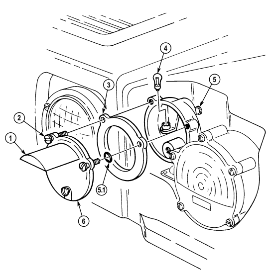

FOLLOW-ON TASKS: - Connect battery ground cable (para. 4-73).

· Check blockout drive light for proper operation (TM 9-2320-280-10).

# 4-52. Front Composite Light Assembly Replacement

This task covers:
INITIAL SETUP:
Tools General mechanic's tool kit:
automotive (Appendix B, Item 1)
Materials/Parts Adhesive sealant (Appendix C, Item 10)

#### A. Removal B. Installation

Manual References TM 9-2320-280-10 TM 9-2320-280-24P
Equipment Condition **_________________**
Battery ground cable disconnected (para. 4-73).

- The procedure to remove and install right and left composite light assemblies is basically the same except left side has four screws securing close-off cover and right side has three screws. This procedure covers the left composite light.

- Prior to removal, tag leads for installation.

a. Removal 1. Remove four screws (1), washers (2), and close-off cover (3) from hood (4). 2. Disconnect leads 20 (5), 461 (12), and 491 (11) from hood wiring harness (6). 3. Remove two capscrews (9), washers (8), ground 92 (7), buss bar (10), and composite light (13) from hood (4). 

b. Installation

To prevent water from accumulating between the composite light access cover and the hood, general purpose RTV adhesive sealant should be applied to the inside of the cover. Clean and reapply RTV when removing and reinstalling the cover.

1. Install composite light (13), buss bar (10), and ground 92 (7) on hood (4) with two washers (8) and capscrews (9).

2. Connect lead 20 (5), 461 (12), and 491 (11) to hood wiring harness (6). 3. Install close-off cover (3) to hood (4) with four washers (2) and screws (1).

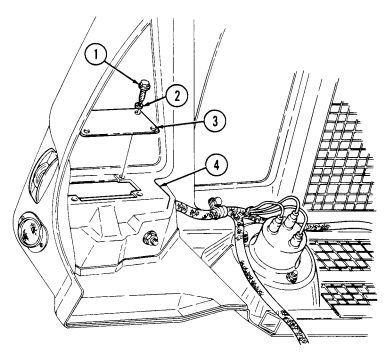

# 4-52. Front Composite Light Assembly Replacement (Cont'D)

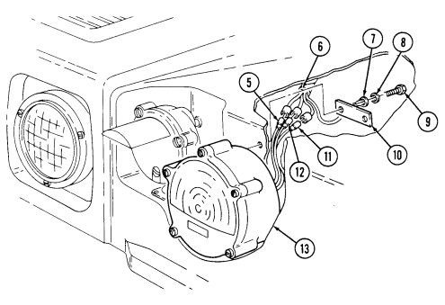

FOLLOW-ON TASKS: - Connect battery ground cable (para. 4-73).
- • - • Lower and secure hood (TM 9-2320-280-10).

· Check front composite light for proper operation (TM 9-2320-280-10).

# 4-53. Front Composite Light Lamp Replacement

This task covers:
INITIAL SETUP:
Tools General mechanic's tool kit:
automotive (Appendix B, Item 1)
Materials/Parts O-ring (Appendix G, Item 220) Adhesive sealant (Appendix C, Item 10)
a. Removal 1. Loosen five retaining screws (1) and remove light door (2) and O-ring (5) from light body (3).

Discard O-ring (5).

2. Remove lamp (4). 3. Clean mating surface on light door (2) and light body (3). Remove sealant.

b. Installation 1. Install lamp (4).

To prevent moisture from entering light assembly, tighten all screws evenly.

2. Install O-ring (5) and light door (2) on light body (3) with five retaining screws (1). 3. Apply thin coat of sealant to seam between light body (3) and light door (2).

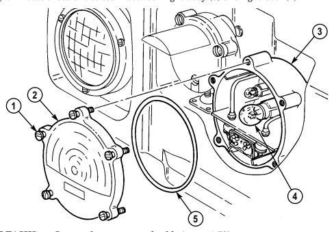

FOLLOW-ON TASKS: - Connect battery ground cable (para. 4-73).

- Check front composite light for proper operation (TM 9-2320-280-10).

4-88 Change 3

a. Removal b. Installation

Manual References TM 9-2320-280-10 TM 9-2320-280-24P
Equipment Condition Battery ground cable disconnect (para. 4-73).

# 4-54. Side Marker Light Lens And Lamp Replacement

This task covers:
a. Lens and Lamp Removal **b. Lens and Lamp Installation**
INITIAL SETUP:
automotive (Appendix B, Item 1)
Tools **Equipment Condition**
General mechanic's tool kit: Battery ground cable disconnect (para. 4-73).

Manual References TM 9-2320-280-10 TM 9-2320-280-24P

#### A. Lens And Lamp Removal

1. Remove two screws (5), door (4) and lens (3) from light body (1).

2. Remove lamp (2).

b. Lens and LamII Installation 1.

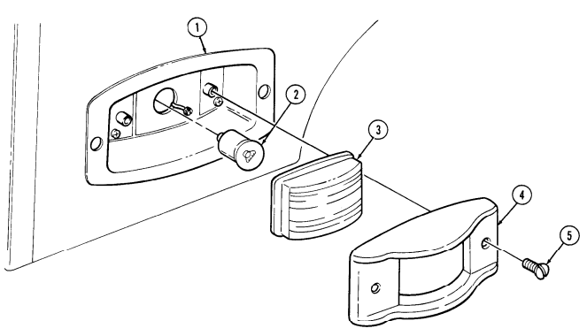

2.

Install lamp (4). Install lens (3) and door (4) on light body (1) with two screws (5).

FOLLOW-ON TASKS: Connect battery ground cable (para. 4-73).

Check side marker light for proper operation (TM 9-2320-280-10).

# 4-55. Side Marker Light Assembly Replacement

This task covers:
INITIAL SETUP:
Tools General mechanic's tool kit:
automotive (Appendix B, Item 1)
Materials/Parts Four locknuts (Appendix G, Item 74)
(front only)

a. Removal b. Installation

Manual References TM 9-2320-280-10 TM 9-2320-280-24P
Equipment Condition
- Battery ground cable disconnect (para. 4-73). - Hood raised and secured (front side marker only)
(TM 9-2320-280-10).

Procedures to remove and install the front and rear side marker light assemblies are basically the same for all models. Front marker lights have locknuts, rear marker lights have plain nuts. This procedure is for the left front side marker for basic and A1 models.

#### A. Removal

1. Remove four screws (1), washers (2), and close-off cover (3) from hood (4). 2. Disconnect lead 489 (14) from hood wiring harness (15). 3. Remove two screws (13), lens (11), and door (12) from side marker light (9) 4. Remove four screws (10), washers (6), locknuts (5), ground 92 (7), gasket (8), and side marker light (9) from hood (4). Discard locknuts (5).

#### B. Installation

1. Install gasket (8), side marker light (9), and ground 92 (7) on hood (4) with four screws (10),
washers (6), and locknuts (5) ensuring ground 92 (7) is under washers (6).

2. Install lens (11) and door (12) on side marker light (9) with two screws (13). 3. Connect lead 489 (14) to hood wiring harness (15). 4. Install close-off cover (3) to hood (4) with four washers (2) and screws (1).

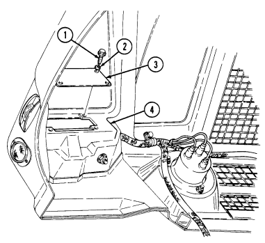

# 4-55. Side Marker Light Assembly Replacement (Cont'D)

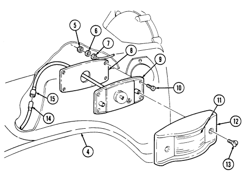

FOLLOW-ON TASKS: - Connect battery ground cable (para. 4-73).

- Lower and secure hood (front side marker only) (TM 9-2320-280-10). · Check side marker light for proper operation (TM 9-2320-280-10).

# 4-56. Rear Composite Light Assembly Replacement

This task covers:

a. Removal b. Installation

INITIAL SETUP:
Tools General mechanic's tool kit:
automotive (Appendix B, Item 1)
Manual References TM 9-2320-280-10 TM 9-2320-280-24P
Materials/Parts Two lockwashers (Appendix G, Item 135)
Equipment Condition Battery ground cable disconnect (para. 4-73).

Prior to removal, tag leads for installation.

a. Removal 1. Remove two capscrews (3), washers (4), ground 95B (5), and ground strap (6) from housing (17). 

2. Remove two capscrews (15), lockwashers (16), and pull shield (1) away from "D" beam (14). 

Discard lockwashers (16).

3. Remove screw (2), nut (12) and clamp (11) from shield (1). 4. Disconnect leads 21 (7), 23 (8), 24 (9), and 22-461 (10) from body harness (13). 5. Remove composite light (18) from housing (17).

#### B. Installation

1. Install composite light (18) on housing (17). 2. Connect leads 21 (7), 23 (8), 24 (9), and 22-461 (10) to body harness (13). 3. Install clamp (11) on shield (1) with screw (2) and nut (12). 4. Install shield (1) on "D" beam (14) with two capscrews (15) and lockwashers (16). 5. Install ground strap (6) and ground 95B (5) on housing (17) with two washers (4) and capscrews (3).

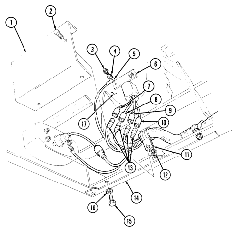

4-56. REAR COMPOSITE LIGHT ASSEMBLY REPLACEMENT (Cont'd)

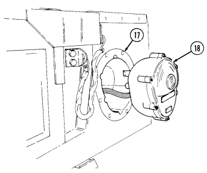

FOLLOW-ON TASKS: - Connect battery ground cable (para. 4-73).
- • - • Check rear composite light for proper operation (TM 9-2320-280-10).

# 4-57. Rear Composite Light Lamp Replacement

This task covers:
INITIAL SETUP:
Tools General mechanic's tool kit:
automotive (Appendix B, Item 1)
Materials/Parts O-ring (Appendix G, Item 221) Adhesive sealant (Appendix C, Item 10)

a. Removal b. Installation

Manual References TM 9-2320-280-10 TM 9-2320-280-24P
Equipment Condition Battery ground cable disconnect (para. 4-73).

a. Removal 1. Loosen six retaining screws (3) and remove composite light door (4) and O-ring (5) from composite light (1). Discard O-ring (5).

2. Remove lamp (2). 3. Clean mating surface on light door (4) and composite light (1). Remove sealant.

b. Installation 1. Install lamp (2).

To prevent moisture from entering light assembly, tighten all screws evenly.

2. Install O-ring (5) and composite light door (4) on composite light (1) with six screws (3). 3. Apply a thin coat of sealant to seam between composite light (1) and composite light door (4).

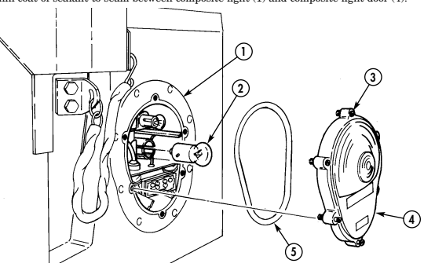

FOLLOW-ON TASKS: - Connect battery ground cable (para. 4-73).

- Check front composite light for proper operation (TM 9-2320-280-10).

# 4-58. Headlight Beam Selector Switch And Bracket Replacement

This task covers:
INITIAL SETUP:

#### Tools

General mechanic's tool kit:
automotive (Appendix B, Item 1)
Riveter tool kit (Appendix B, Item 139)
Materials/Parts Three assembled washer screws 
(Appendix G, Item 281)
a. Removal a. Removal b. Installation Manual References TM 9-2320-280-10 TM 9-2320-280-24P
Equipment Condition Battery ground cables disconnected (para. 4-73).

- Prior to removal, tag leads for installation.

3. Deleted. b. Installation 1. Deleted. 2. Connect leads 16A (2), 17A (1), and 18A (10) to switch (3). 3. Install switch (3) and shield (5) on bracket (4) with three assembled washer screws (7).

- Pull back floor insulation for access to beam selector switch and bracket.

1. Remove three assembled washer screws (7), switch (3), and shield (5) from bracket (4). Discard assembled washer screws (7).

2. Disconnect leads 16A (2), 17A (1), and 18A (10) from switch (3).

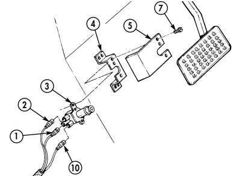

FOLLOW-ON TASKS: - Connect battery ground cables (para. 4-73).

- Check headlight beam selection switch for proper operation (TM 9-2320-280-10).

# 4-59. Main Light Switch Replacement

This task covers:
INITIAL SETUP:

a. Removal b. Installation

| Tools                                                                 | Manual References                              |
|-----------------------------------------------------------------------|------------------------------------------------|
| General mechanic's tool kit:                                          | TM 9\-2320\-280\-10                            |
| automotive (Appendix B, Item 1)                                       | TM 9\-2320\-280\-24P                           |
| Materials/Parts                                                       | Equipment Condition                            |
| O\-ring (Appendix G, Item 220) Adhesive sealant (Appendix C, Item 10) | Battery ground cable disconnect (para. 4\-73). |

a. Removal 1. Remove cannon plug (1) from main light switch (8). 2. Remove screw (6), lockwasher (5), top single position lever (4), and washer (7) from switch (8).

Discard lockwasher (5).

Lower right lever must be raised to remove screw.

3. Remove four screws (3) from switch (8) and instrument panel (2). 4. Remove switch (8) from behind instrument panel (2).

b. Installation 1. With single position lever shaft (9) at top of switch (8), install switch (8) into hole in instrument panel (2) with four screws (3).

2. Install washer (7) and top single position lever (4) to switch (8) with lockwasher (5) and screw (6). 3. Install cannon plug (1) to rear of switch (8).

# 4-59. Main Light Switch Replacement (Cont'D)

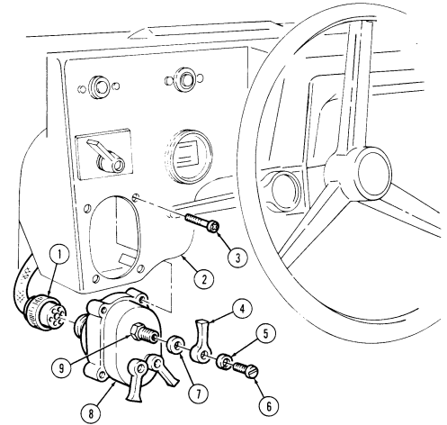

FOLLOW ON TASKS: - • Connect battery ground cable (para. 4-73).
- • - • - • Check main light switch for proper operation (TM 9-2320-280-10).

# 4-60. Stoplight Switch (11663279) Maintenance

This task covers:
a. Removal c. Adjustment b. Installation INITIAL SETUP:
Applicable Models All vehicles except: M997A2, M1025A2, M1035A2, M1043A2, M1045A2, M1097A2 Tools General mechanic's tool kit:
automotive (Appendix B, Item 1)
Test Equipment Multimeter (Appendix B, Item 166)
Materials/Parts Push on nut (Appendix G, Item 226)
Manual References TM 9-2320-280-10 TM 9-2320-280-24P
Equipment Condition Battery ground cable disconnected (para. 4-73).

Prior to removal, tag leads for installation.

a. Removal 1. Remove push on nut (10) from rod connecting switch arm (5) and brake pedal arm (9). 

Discard push on nut (10).

2. Remove two nuts (6), washers (1), capscrews (2), washers (1), and stoplight switch (3) from support (4).

3. Disconnect leads 75A (7) and 75B (8) from stoplight switch (3).

b. Installation 1. Install stoplight switch (3) on support (4) with two washers (1), capscrews (2), washers (1), 
and nuts (6).

2. Install switch arm (5) into brake pedal arm (9) with push on nut (10). 3. Connect leads 75B (8) and 75A (7) to stoplight switch (3). 4. Adjust stoplight switch (3) (para. 4-60c).

#### C. Adjustment

1. Disconnect leads 75A (7) and 75B (8) from stoplight switch (3) and connect multimeter to leads on stoplight switch (3) to check continuity. Multimeter should indicate open. Depress brake pedal, multimeter should indicate continuity within approximately 1/2 in. (12 mm) of pedal travel. If not, go to step 2.

2. Loosen two capscrews (2) to allow movement of stoplight switch (3). 3. Position stoplight switch (3) so that continuity is present when installed. Slide stoplight switch forward until no continuity (open) is indicated (approximately 1/8 to 1/4 in. (3 to 6 mm).

4. Tighten two capscrews (2). 5. Connect leads 75A (7) and 75B (8) to stoplight switch (3). 6. Connect battery ground cable (para. 4-73). 7. Turn selector lever to service drive; stoplights should not illuminate. Depress brake pedal; stoplights should illuminate within 1/2 in. (12 mm) of pedal travel.

4-60. STOPLIGHT SWITCH (11663279) MAINTENANCE (Cont'd)

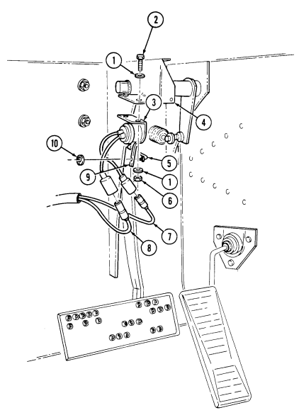

# 4-61. Stoplight Switch (Rcsk 17810) Maintenance

This task covers:
a. Removal c. Adjustment b. Installation

#### Initial Setup:

Applicable Models M997A2, M1025A2, M1035A2, M1043A2, M1045A2, M1097A2, M1123 Tools General mechanic's tool kit:
automotive (Appendix B, Item 1)
Test Equipment Multimeter (Appendix B, Item 166)

#### Materials/Parts

Two push on nuts (Appendix G, Item 226) Two assembled locknuts (Appendix G, Item 130) Sealing compound (Appendix C, Item 45)
Equipment Condition Battery ground cables disconnected (para. 4-73).

a. Removal

#### B. Installation

4. Connect leads 75A (1), 75B (16), and connector 810A/810B (15) to stoplight switch leads (2).

#### C. Adjustment

1. Disconnect leads 75A (1), 75B (16), and connector 810A/810B (15) from stoplight switch leads (2) and connect multimeter to leads on stoplight switch (3) to check continuity. Multimeter should indicate open. Depress brake pedal; multimeter should indicate continuity within approximately 1/4 in. (6 mm) of pedal travel. If not, go to step 2.

2. Loosen two capscrews (5) to allow movement of stoplight switch (3). 3. Position stoplight switch (3) so that continuity is present when installed. Slide stoplight switch forward until no continuity (open) is indicated (approximately 1/4 in. (6 mm)).

4. Tighten two capscrews (5).

7. Turn selector lever to service drive; stoplights should not illuminate. Depress brake pedal; stoplights should illuminate within 1/4 in. (6 mm) of pedal travel.

4-100 Change 3

Prior to removal, tag leads for installation.

1. Disconnect leads 75A (1), 75B (16), and connector 810A/810B (15) from stoplight switch leads (2). 2. Remove push on nut (14), stoplight switch arm (13), and washer (12) from actuating rod (10). Discard push on nut (14).

3. Remove two assembled locknuts (6), washers (4), capscrews (5), washers (4), and stoplight switch (3)
from mounting bracket (7). Discard assembled locknuts (6).

4. Remove push on nut (9), actuating rod (10), and washer (11) from brake pedal (8). Discard push on nut (9).

1. Install washer (11) and actuating rod (10) on brake pedal (8) with push on nut (9). 2. Install washer (12) and stoplight switch arm (13) on actuating rod (10) with push on nut (14). 3. Install stoplight switch (3) on mounting bracket (7) with two washers (4), capscrews (5), 
washers (4), and assembled locknuts (6).

5. Connect leads 75B (1), 75A (16), and connector 810A/810B (15) to stoplight switch leads (2). 6. Connect battery ground cables (para. 4-73).

# 4-61.  Stoplight Switch (Rcsk 17810) Maintenance (Cont'D)

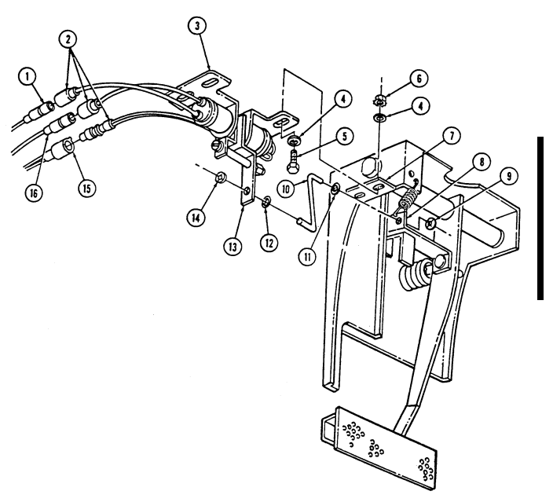

# 4-62. Directional Signal Flasher Replacement

This task covers:
INITIAL SETUP:
Tools General mechanic's tool kit:
automotive (Appendix B, Item 1)

a. Removal b. Installation

| Manual References   |
|---------------------|
| TM 9\-2320\-280\-10 |

TM 9-2320-280-24P
Materials/Parts Silicone compound (Appendix C, Item 48)
Equipment Condition Battery ground cable disconnected (para. 4-73).

The flasher is located under the instrument panel to the left of the steering column.

a. Removal 1. Remove cannon plug (1) from main light switch (2). 2. Remove connector plug (7) from flasher (5). 3. Remove two nuts (3), screws (6), and flasher (5) from instrument panel (8). 

b. Installation 1. Install flasher (5) on instrument panel (8) with two screws (6) and nuts (3). 2. Apply silicone compound to threads of connector plug (7). Install connector plug (7) on flasher (5). 3. Connect cannon plug (1) to main light switch (2).

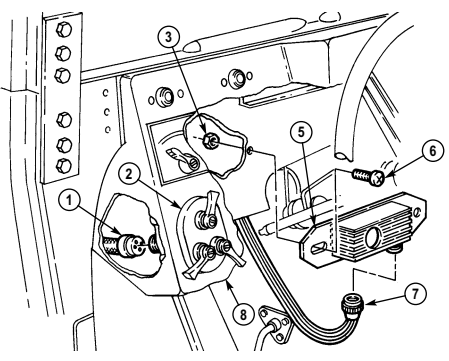

FOLLOW-ON TASKS: - Connect battery ground cable (para. 4-73).

- Check directional signal flasher for proper operation (TM 9-2320-280-10).

4-102 Change 3

# 4 - 6 3 . Directional Signal Control Indicator Lamp Replacement

This task covers:
a. Removal **b. Installation**
INITIAL SETUP:
Tools General mechanic's tool kit:
automotive (Appendix B, Item 1)
Equipment Condition Battery ground cable disconnected (para. 4-73).

Manual References TM 9-2320-280-10 TM 9-2320-280-24P
a. Removal 1. Push turn signal indicator lever (1) in the four-way flasher position (TM 9-2320-280-10). 2. Remove light lens (3) from directional control unit (4). 3. Remove lamp (2) from directional control unit (4).

b. Installation 1. Install lamp (2) into directional control unit (4).

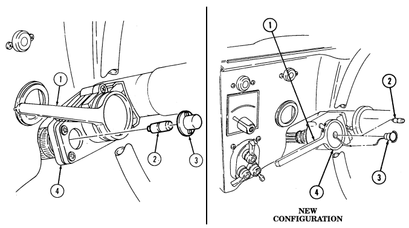 2. Install light lens (3) into directional control unit (4).

FOLLOW-ON TASKS: - Connect battery ground cable (para. 4-73).

- Check directional signal control lamp for proper operation (TM 9-2320-280-10).

# 4-64. Directional Signal Control (12339312-1) Maintenance

This task covers:
b. Cleaning

#### Initial Setup:

Applicable Models All vehicles except: M997A2, M1025A2, M1035A2, M1043A2, M1045A2, M1097A2, M1123 Tools General mechanic's tool kit:
automotive (Appendix B, Item 1)
Materials/Parts Cleaning and lubricating compound
(Appendix C, Item 16)
a. Removal c. Installation Manual References TM 9-2320-280-10 TM 9-2320-280-24P
Equipment Condition Battery ground cable disconnected (para. 4-73).

The directional signal control for this application is no longer available. For replacement of a defective directional signal control, the procedures and part number for the A2 application should be used (para. 4-65).

a. Removal 1. Loosen connector nut (4) and remove connector plug (5) from directional signal control (3). 2. Remove four screws (2) and directional signal control (3) from clamp (1).

b. Cleaning

Clean the signal control before replacing it. After cleaning, install and try again before replacing.

1. Remove four screws (7) and signal arm plate (6) from signal control (3).

Do not sand contacts with sandpaper or an emery board which removes the protective coating that fights corrosion. Damage to the switch will result.

The cleaner has an alcohol base that dries quickly.

2. Spray signal control contacts (8) with cleaning compound. 3. Install signal arm plate (6) on signal control (3) with four screws (7).

c. Installation 1. Install directional signal control (3) on clamp (1) with four screws (2). 2. Install connector plug (5) on directional signal control (3) and tighten connector nut (4).

# 4-64.  Directional Signal Control (12339312-1) Maintenance (Cont'D)

l

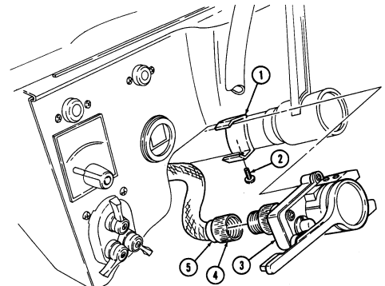

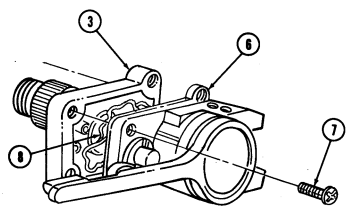

FOLLOW-ON TASKS: - Connect battery ground cable (para. 4-73).

· Check directional signal control for proper operation (TM 9-2320-280-10).

# 4 - 6 5 . Directional Signal Control Replacement

This task covers:
INITIAL SETUP:
Applicable Models M997A2, M1025A2, M1035A2, M1043A2, M1045A2, M1097A2, M1123 Tools General mechanic's tool kit:
automotive (Appendix B, Item 1)

a. Removal **b. Installation**

| Equipment Condition   |
|-----------------------|

| Manual References    |
|----------------------|
| TM 9\-2320\-280\-10  |
| TM 9\-2320\-280\-24P |

Battery ground cables disconnected (para. 4-73).

a. Removal 1. Loosen connector nut (6) and remove connector plug (7) from directional signal control (4). 2. Remove four screws (2) and directional signal control (4) from bracket (1).

b. Installation 1. Place lever (5) in HAZARD position. 2. Install directional signal control (4) on bracket (1) with four screws (2). Do not tighten screws (2).

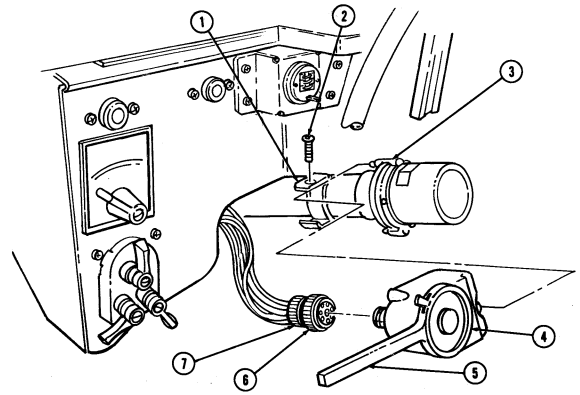 3 . Rotate steering wheel ensuring pin (3) mates with directional signal control (4) and tighten screws (2)
to 22-26 lb-in. (2.5-2.9 N•m ) .

4. Install connector plug (7) on directional signal control (4) and tighten connector nut (6).

FOLLOW-ON TASKS: - Connect battery ground cables (para. 4-73).

- Check directional signal control lamp for proper operation (TM 9-2320-280-10).

4 - 1 0 6 Change 2

# 4 - 6 6 . Directional Signal Control Cancelling Ring Replacement

| This task covers:   |
|---------------------|

| INITIAL SETUP:                         |                                                |
|----------------------------------------|------------------------------------------------|
| Tools                                  | Manual References                              |
| General mechanic's tool kit:           | TM 9\-2320\-280\-10                            |
| automotive (Appendix B, Item 1)        | TM 9\-2320\-280\-24P                           |
| Materials/Parts                        | Equipment Condition                            |
| O\-ring (Appendix G, Item 221)         | Battery ground cable disconnect (para. 4\-73). |
| Adhesive sealant (Appendix C, Item 10) |                                                |

a. Removal **b. Installation**

a. Removal Remove three screws (5) and cancelling ring (4) from steering wheel (6).

b. Installation

Cancelling ring pin must be positioned 90° ± 5° from directional signal control. Ensure front wheels of vehicle point straight ahead. Failure to position pin properly could cause loss of steering, with injury to personnel or damage to equipment.

1. Install cancelling ring (4) on steering wheel (6) with pin (2) 90° ± 5° from directional signal control (1). 2. Rotate steering wheel (6), ensuring pin (2) mates with directional signal control (1) and secure cancelling ring (4) on steering wheel (6) with three screws (5).

NOT E
Gauge posts found on new cancelling rings are there to ensure proper

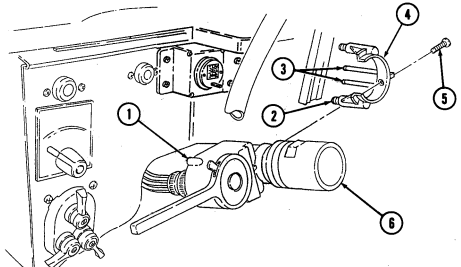 installation only. Gauge posts must be removed after installation of cancelling ring to permit proper operation of directional signal control.

3. Cut gauge posts (3) off within 1/4 in. (6 mm) of base.

FOLLOW-ON TASK: Check directional signal control for proper operation (TM 9-2320-280-10).

# 4-67. Service Headlight And Blackout Drive Light Electrical Connector And Grommet Replacement

This task covers:
INITIAL SETUP:
General mechanic's tool kit: Service headlight lamp removed (para. 4-48).

automotive (Appendix B, Item 1)
Manual References TM 9-2320-280-24P
a. Removal **b. Installation**
Tools **Equipment Condition**

The procedure to remove and install the connector and grommet from service headlight and blackout drive light is basically the same. The following procedure is for the service headlight.

a. Removal Remove connector (3) from grommet (1) and remove grommet (1) from headlight housing (2).

b. Installation Install grommet (1) to headlight housing (2) and install connector (3) to grommet (1).

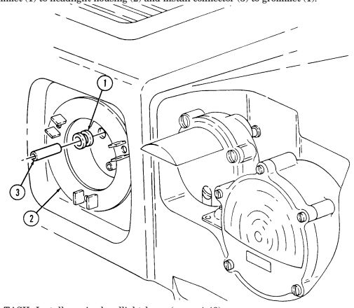

FOLLOW-ON TASK: Install service headlight lamp (para. 4-48).

# 4-68. Backup Light Lamp Replacement

This task covers:
INITIAL SETUP:
Applicable Models M1035, M1035A1, M1035A2 Tools General mechanic's tool kit:
automotive (Appendix B, Item 1)
Materials Parts Gasket (Appendix G, Item 47)

a. Removal **b. Installation**

| Manual References   |
|---------------------|
| TM 9\-2320\-280\-10 |

TM 9-2320-280-10 TM 9-2320-280-24P
Equipment Condition Battery ground cable disconnected (para. 4-73).

a. Removal 1. Remove two screws (5), bezel (4), lens (3), and gasket (2) from housing (1). Discard gasket (2). 2. Remove lamp (6) from housing (1).

b. Installation 1. Install lamp (6) in housing (1). 2. Install gasket (2), lens (3), and bezel (4) on housing (1) with two screws (5).

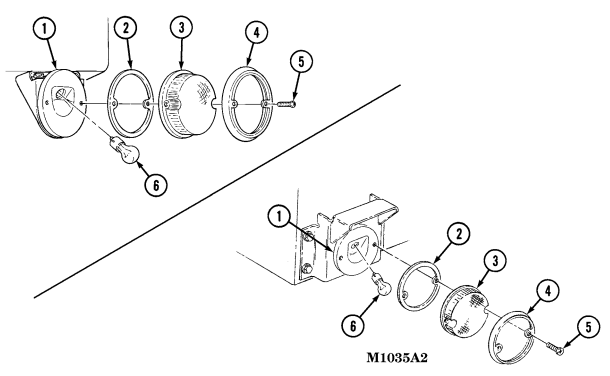

FOLLOW-ON TASKS: - Connect battery ground cable (para. 4-73).

- Check backup light for proper operation (TM 9-2320-280-10).

# 4-69. Backup Light Assembly Replacement

This task covers:
INITIAL SETUP:
Applicable Models M1035, M1035A1, M1035A2 Tools General mechanic's tool kit:
automotive (Appendix B, Item 1)
Materials Parts Two lockwashers (Appendix G, Item 139) Tiedown strap (Appendix G, Item 310)

a. Removal b. Installation

Manual References TM 9-2320-280-10 TM 9-2320-280-24P
Equipment Condition Battery ground cable disconnected (para. 4-73).

a. Removal

- Perform steps 1 and 2 for M1035 and M1035A1 vehicles. - Perform steps 3 through 5 for M1035A2 vehicle.

1. Disconnect lead 467F (1) from lamp assembly (3). 2. Remove two nuts (6), lockwashers (5), lead 95H (4), and lamp assembly (3) from bracket (2).

Discard lockwashers (5).

3. Remove tiedown strap (11) and disconnect leads 467F (1) and 95H (4) from body harness leads (10).

Discard tiedown strap (11).

4. Remove capscrew (8) and clamp (9) from body (12). 5. Remove two nuts (6), lockwashers (5), lead 95H (4), and lamp assembly (3) from bracket (7).

Discard lockwashers (5).

b. Installation

- Perform steps 1 through 3 for M1035A2 vehicle. - Perform steps 4 and 5 for M1035 and M1035A1 vehicles.

1. Install lamp assembly (3) and lead 95H (4) on bracket (7) with two lockwashers (5) and nuts (6). 2. Connect leads 467F (1) and 95H (4) to body harness leads (10) and install tiedown strap (11). 3. Install clamp (9) on body (12) with capscrew (8). 4. Install lamp assembly (3) and lead 95H (4) on bracket (2) with two lockwashers (5) and nuts (6). 5. Connect lead 467F (1) to lamp assembly (3).

# 4-69.  Backup Light Assembly Replacement (Cont'D)

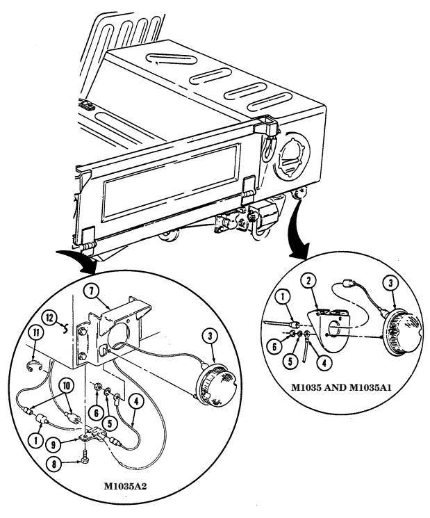

FOLLOW-ON TASKS: - Connect battery ground cable (para. 4-73).
- Check backup light for proper operation (TM 9-2320-280-10).

# 4-70. Backup Light Bracket Replacement

This task covers:
INITIAL SETUP:
Applicable Models M1035, M1035A1, M1035A2 Tools General mechanic's tool kit:
automotive (Appendix B, Item 1)
Materials Parts Two lockwashers (Appendix G, Item 133)
a. Removal b. Installation Manual References TM 9-2320-280-24P
Equipment Condition Backup light assembly removed (para. 4-69).

M1035A2 vehicles are equipped with four nuts, eight washers, and four capscrews.

a. Removal Remove two nuts (5), lockwashers (4), washers (3), capscrews (1) and bracket (6) from "D" beam (2). Discard lockwashers (4).

b. Installation Install bracket (6) on "D" beam (2) with two capscrews (1), washers (3), lockwashers (4), and nuts (5).

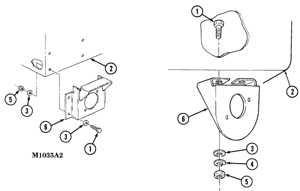

FOLLOW-ON TASK: Install backup light assembly (para. 4-69).

# Section Vi. Battery System Maintenance

| INITIAL SETUP:                                    |                                                                                                         |
|---------------------------------------------------|---------------------------------------------------------------------------------------------------------|
| Applicable Models                                 | Manual References                                                                                       |
| M997A2, M1025A2, M1035A2, M1043A2,                | TM 9\-2320\-280\-10                                                                                     |
| M1045A2, M1097A2, M1123                           | TM 9\-2320\-280\-24P                                                                                    |
| Equipment Condition                               | Tools                                                                                                   |
| Battery ground cables disconnected (para. 4\-73). | General mechanic's tool kit:                                                                            |
| automotive (Appendix B, Item 1)                   |                                                                                                         |
| a. Removal                                        |                                                                                                         |
| 1.                                                | Loosen connector nut (6) and remove connector plug (7) from directional signal control (4).             |
| 2.                                                | Remove four screws (2) and directional signal control (4) from bracket (1).                             |
| b. Installation                                   |                                                                                                         |
| 1.                                                | Place lever (5) in HAZARD position.                                                                     |
| 2.                                                | Install directional signal control (4) on bracket (1) with four screws (2). Do not tighten screws (2).  |
| 3 .                                               | Rotate steering wheel ensuring pin (3) mates with directional signal control (4) and tighten screws (2) |
| to 22\-26 lb\-in. (2.5\-2.9 N•m ) .               |                                                                                                         |
| 4.                                                | Install connector plug (7) on directional signal control (4) and tighten connector nut (6).             |

# 4 - 7 1 . B At T E Ry System Maintenance Task Summary 4-72. Battery Cable Terminal Clamp Replacement

This task covers:
INITIAL SETUP:
Tools General mechanic's tool kit:
automotive (Appendix B, Item 1)
Materials/Parts Lubricating oil (Appendix C, Item 33)
Manual References TM 9-2320-280-10 TM 9-2320-280-24P

#### A. Removal **B. Installation** Equipment Condition

Battery box cover removed (para. 10-35).

#### General Safety Instructions

Wear safety goggles and rubber gloves and do not smoke when performing battery maintenance.

Remove all jewelry.

When removing battery cable clamps, disconnect ground cable first.

Battery acid (electrolyte) is extremely harmful. Always wear safety goggles and rubber gloves, and do not smoke when performing battery maintenance. Severe injury will result if acid contacts eyes or skin.

Remove ail jewelry such as rings, dogtags, bracelets, etc. If jewelry or disconnected battery ground cable contacts battery terminal, a direct short can result, causing instant heating of tools, severe injury to personnel, or damage to equipment.

When removing battery cable clamps, disconnect ground cable first.

Do not allow tools to come in contact with vehicle when discomecting cable clamps. A direct short can result, causing instant heating of tools, tool damage, battery damage, or battery explosion.

a. Removal

The procedure for removing and installing all four battery cable terminal clamps are basically the same. This procedure covers one battery cable terminal clamp.

1. Remove cap (4) from battery terminal boot (8).

2. Clean lubricating oil from battery terminal boot (8). 3. Loosen screw (6), nut (7), and remove terminal clamp (3) from terminal post (9). 4. Remove screw (2) and nut (5) from cable (1) and terminal clamp (3). 5. Remove cable (1) from terminal clamp (3) and battery terminal boot (8).

6. Remove terminal clamp (3) from battery terminal boot (8).

#### B. Installation

1. Push battery terminal boot (8) onto cable (1).

2. Place terminal clamp (3) into battery terminal boot (8) and install cable (1) on terminal clamp (3)
with screw (2) and nut (5).

3. Apply lubricating oil to battery post pad (10). Do not allow lubricating oil to coat terminal post (9). 4. Secure terminal clamp (3) to terminal post (9) by tightening screw (6) and nut (7). 5. Apply lubricating oil to terminal clamp (3). 6. Install cap (4) to battery terminal boot (8).

# 4-72. Battery Cable Terminal Clamp Replacement (Cont'D)

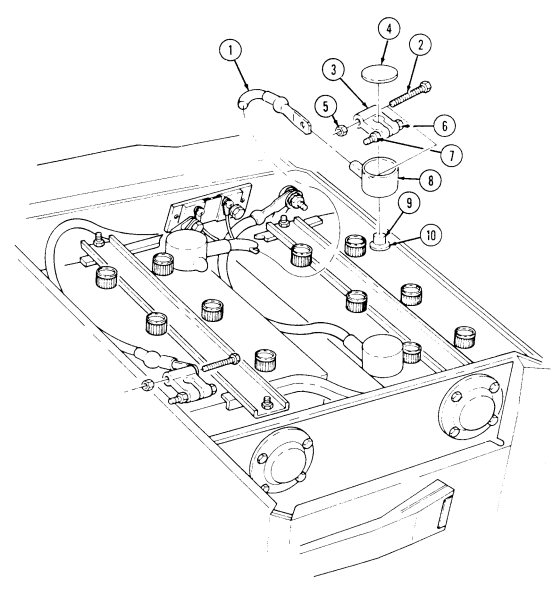

FOLLOW-ON TASK: Install battery box cover (para. 10-35).

# 4-73. Battery Cable Maintenance

This task covers:
c. Ground Cables Reconnection h. Positive Cable Removal d. Ground Cable Removal i. Positive Cable Installation e. Ground Cable Installation

#### Initial Setup:

Tools General mechanic's tool kit:
automotive (Appendix B, Item 1)

#### Materials/Parts

Lockwasher (Appendix G, Item 141) Lockwasher (Appendix G, Item 148) Lockwasher (Appendix G, Item 150) Sodium bicarbonate (Appendix C, Item 49) Lubricating oil (Appendix C, Item 33) Silicone compound (Appendix C, Item 48)

#### Manual References Tm 9-2320-280-24P

a. Cleaning and Inspection f. Interconnecting Cable Removal b. Ground Cables Disconnection g. Interconnecting Cable Installation

#### Equipment Condition

Battery box cover removed (para. 10-35).

General Safety Instructions
- Wear safety goggles and rubber gloves and do not smoke when performing battery maintenance.

- Remove all jewelry. - When removing battery cables, disconnect ground cable first. Ensure all switches are in OFF position before disconnecting.

- Battery acid (electrolyte) is extremely harmful. Always wear safety goggles and rubber gloves, and do not smoke when performing battery maintenance. Severe injury will result if acid contacts eyes or skin.

- Remove all jewelry such as rings, dogtags, bracelets, etc. If jewelry or disconnected battery ground cable contacts battery terminal, a direct short can result, causing instant heating of tools, severe injury to personnel, or damage to equipment.

- Always disconnect both ground cables when performing battery maintenance on the "A2" series vehicles. The "A2" series vehicles have a 12 volt cable connected to the positive terminal, which keeps the electrical system charged when only one ground cable is disconnected. Failure to do this may cause injury to personnel, or damage to equipment.

- When removing battery cable clamps, disconnect both ground cables first. Ensure all switches are in OFF position before disconnecting. Do not allow tools to come in contact with vehicle when disconnecting cable clamps. A direct short can result, causing instant heating of tools, tool damage, battery damage, or battery explosion.

- Secure all cables to head side of mounting capscrews. - Use this procedure for disconnecting all battery cables. - The following procedure covers disconnection and connection of the ground cable.

#### A. Cleaning And Inspection

1. Inspect cables (1), (2), and (11) for corrosion and cracks. 2. Remove defective cables (1), (2), and (11), or clean with wire brush and baking soda solution.

## 4-73. Battery Cable Maintenance (Cont'D)

b. Ground Cables Disconnection

Perform steps 1 through 6 for M997A2, M1025A2, M1035A2, M1043A2, M1045A2, and M1097A2 vehicles only. Perform step 7 for all other vehicles.

1. Remove nut (12), leads (13) and (14), screw (16), and ground cable (1) from terminal clamp (15). 2. Remove cap (5) from battery terminal boot (8). 3. Clean lubricating oil from battery terminal boot (8).

4. Loosen nut (7) and remove terminal clamp (4) from terminal (9).

5. Remove nut (3) and screw (6) from cable (2) and terminal clamp (4).

6. Remove cable (2) from terminal clamp (4) and battery terminal boot (8). 7. Remove nut (12), screw (16), and ground cable (1) from terminal clamp (15).

c. Ground Cables Reconnection

Perform steps 1 through 6 for M997A2, M1025A2, M1035A2, M1043A2, M1045A2, and M1097A2 vehicles only. Perform step 7 for all other vehicles.

1. Push battery terminal boot (8) onto cable (2) and secure cable (2) to terminal clamp (4) with screw (6)
and nut (3).

2. Apply a 1/16 in. (1.6mm) bead of lubricating oil to battery post pad (10). Do not allow oil to coat terminal post (9).

3. Install terminal clamp (4) to terminal (9) and tighten nut (7).

4. Fill battery terminal boot (8) with lubricating oil. 5. Install cap (5) to battery terminal boot (8).

6. Install ground cable (1) and leads (14) and (13) on terminal clamp (15) with screw (16) and nut (12).

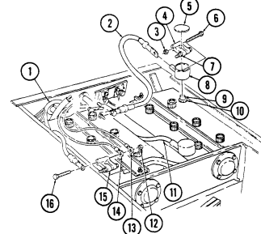 7. Install ground cable (1) on terminal clamp (15) with screw (16) and nut (12).

# 4-73. Battery Cable Maintenance (Cont'D)

d. Ground Cable Removal

Perform step 1 for M997A2, M1025A22, M1035A2, M1043A2, M1045A2, and M1097A2 vehicles only. Perform step 2 for all other vehicles.

1. Remove nut (5), leads (6) and (7), screw (9), and ground cable (4) from terminal clamp (8).

2. Remove nut (5), screw (9), and ground cable (4) from terminal clamp. 3. Remove capscrew (3), lockwasher (2), and ground cable (4) from shunt (1).

#### E. Ground Cable Installation

1. Position ground cable (4) in approximate mounting location and install ground cable (4) to shunt (1)
with lockwasher (2) and capscrew (3).

Perform step 2 for M997A2, M1025A2, M1035A2, M1043A2, M1045A2, and M1097A2 vehicles only. Perform step 3 for all other vehicles.

2. Install ground cable (4) on terminal clamp (8) with screw (9), leads (7) and (6), and nut (5).

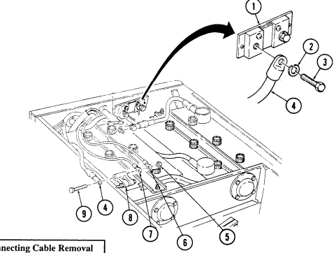 3. Install ground cable (4) on terminal clamp (8) with screw (9) and nut (5).

NOTE
All vehicles except M997A2, M1025A2, M1035A2, M1043A2, M1045A2, and M1097A2 vehicles have two caps and boots.

1. Remove cap (19) from battery terminal boot (20).

2. Clean lubricating oil from battery terminal boot (20).

# 4-73. Battery Cable Maintenance (Cont'D)

Perform steps 3 through 5 for M997A2, M1025A2, M1035A2, M1043A2, M1045A2, and M1097A2 vehicles only. Perform steps 6 and 7 for all other vehicles.

3. Loosen two nuts (12) and remove terminal clamps (17) from terminals (11).

4. Remove nut (18), capscrew (14), cable (13), leads (15) and cable (16) from terminal clamp (17). 5. Remove nut (18) and screw (14) from cable (16) and terminal clamps (17). 6. Loosen two nuts (12) and remove terminal clamps (17) from terminals (11).

7. Remove two screws (14), nuts (18), and cable (16) from terminal clamps (17).

8. Remove cable (16) from terminal clamps (17) and battery terminal boot (20).

g. Interconnecting Cable Installation

All vehicles except M997A2, M1025A2, M1035A2, M1043A2, M1045A2, and M1097A2 vehicles have two caps and boots.

1. Push battery terminal boot (20) onto cable (16) and install cable (16) on terminal clamp (17) with screw (14) and nut (18).

2. Apply a 1/16 in. (1.6mm) bead of lubricating oil to battery post pads (10). DO not allow oil to coat terminal posts (11).

Perform steps 3 and 4 for M997A2, M1025A2, M1035A2, M1043A2, M1045A2, and M1097A2 vehicles only. Perform steps 5 and 6 for all other vehicles.

3. Install cable (16), leads (15), and cable (13) to terminal clamp (17) with screw (14) and nut (18).

4. Install two terminal clamps (17) on terminals (11) and tighten nuts (12).

5. Install cable (16) on terminal clamp (17) with capscrew (14) and nut (18).

6. Install two terminal clamps (17) on terminal posts (11) and tighten nuts (12). 7. Fill battery terminal boot (20) with lubricating oil. 8. Install cap (19) to battery terminal boot (20).

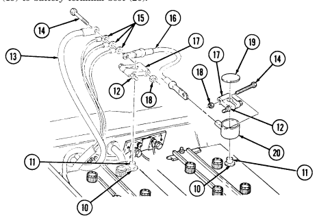

#### 4-73. Battery Cable Maintenance (Cont'D) H. Positive Cable Removal

1. Disconnect ground cable (para. 4-73.b).

2. Remove cap (8) from battery terminal boot (12). 3. Clean lubricating oil from battery terminal boot (12). 4. Loosen nut (11) and remove terminal clamp (7) from terminal (14).

5. Remove screw (6), nut (9), and cable (2) from terminal clamp (7) and battery terminal boot (12).

Perform step 6 for M997A2, M1025A2, M1035A2, M1043A2, M1045A2, and M1097A2 vehicles only. Perform step 7 for all other vehicles.

6. Remove nut (5), lockwasher (4), washer (3), and battery positive cable (2) from buss bar (1). Discard lockwasher (4).

7. Remove nut (5), lockwasher (4), washer (3), slave receptacle positive cable (15), and battery positive cable (2) from power stud (16). Discard lockwasher (4).

i. Positive Cable Installation

Perform step 1 for M997A2, M1025A2, M1035A2, M1043A2, M1045A2, and M1097A2 vehicles only Perform step 2 for all other vehicles.

1.

2.

3.

4.

5.

6. 7.

Install positive battery cable (2) on buss bar (1) with washer (3), lockwasher (4), and nut (5). Apply silicone compound on cable (15) so that all exposed metallic surfaces are coated.

Install positive battery cable (2) and slave receptacle positive cable (15) on power stud (16) with washer (3),
lockwasher (4), and nut (5). Tighten nut (5) to 26 lb-ft (35 N.m). Push battery terminal boot (12) onto cable (2) and install cable (2) on terminal clamp (7) with screw (6)
and nut (9).

Apply a 1/16 in. (1.6mm) bead of lubricating oil to battery post pad (13). Do not allow oil to coat terminal post (14). Secure terminal clamp (7) to terminal post (14) and tighten nut (11).

Fill battery terminal boot (12) with lubricating oil. Install cap (8) on battery terminal boot (12).

8.

Connect battery ground cable (para. 4-73.c).

# 4-73. Battery Cable Maintenance (Cont'D)

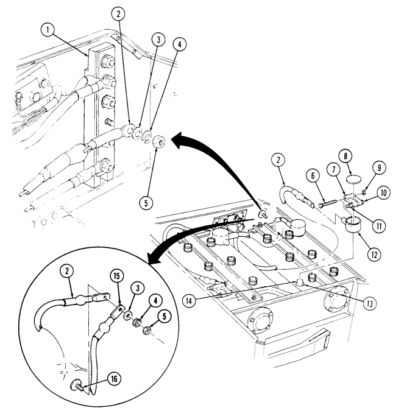

FOLLOW-ON TASK: Install battery box cover (para. 10-35).

# 4-74. Power Feed Through Stud Replacement

This task covers:

a. Removal **b. Installation**

| INITIAL SETUP:                  |                                                  |
|---------------------------------|--------------------------------------------------|
| Applicable Models               | Manual References                                |
| M1035, M1035A1, M1035A2         | TM 9\-2320\-280\-10                              |
|                                 | TM 9\-2320\-280\-24P                             |
| Tools                           |                                                  |
| General mechanic's tool kit:    | Equipment Condition                              |
| automotive (Appendix B, Item 1) | Battery ground cable disconnected (para. 4\-73). |
| Materials Parts                 |                                                  |

#### A. Removal

1. Remove nut (1), lockwasher (2), washer (3), leads 6B/6C (4), and starter cable (5), from stud (8).

Discard lockwasher (2).

Step 2 applies to all vehicles except M997A2, M1025A2, M1035A2, M1043A2, M1045A2, and M1097A2.

2. Remove nut (12), lockwasher (11), washer (10), and battery cables (9) from stud (8). Discard lockwasher (11).

3. Remove locknut (6) and stud (8) from battery box (7).

b. Installation 1. Install stud (8) on battery box (7) with locknut (6).

Step 2 applies to all vehicles except M997A2, M1025A2, M1035A2, M1043A2, M1045A2, and M1097A2 vehicles.

2. Connect battery cables (9) to stud (8) with washer (10), lockwasher (11), and nut (12). Tighten nut (12) to 26 lb-ft (35 N•m).

3. Install starter cable (5) and leads 6B/6C (4) to stud (8) with washer (3), lockwasher (2), and nut (1). Tighten nut (1) to 18-22 lb-ft (24-30 N•m).

4. Apply silicone compound to stud (8), cables (9) and (5), and leads (4), so that all exposed metallic surfaces are coated.

# 4-74. Power Feed Through Stud Replacement

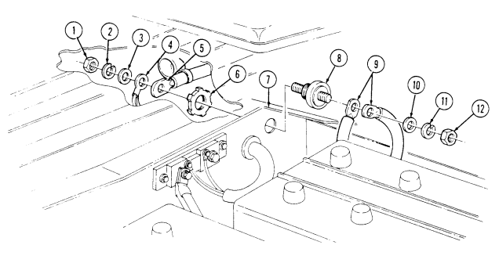

FOLLOW-ON TASK: - Install buss bar (para. 4-76).

M997A2, M1025A2, M1035A2, M1043A2, M1045A2, and M1097A2.

- Connect battery ground cables (para. 4-73).

# 4-75. 12 Volt Alternator Cable Replacement

This task covers:
INITIAL SETUP:
Applicable Models M997A2, M1025A2, M1035A2, M1043A2, M1045A2, M1097A2 Tools General mechanic's tool kit:
automotive (Appendix B, Item 1)

#### Material/Parts

a. Removal b. Installation Manual References TM 9-2320-280-10 TM 9-2320-280-24P
Equipment Condition
- Battery ground cables disconnected (para. 4-73). - Hood raised and secured (TM 9-2320-280-10). - Engine access cover removed (para. 10-15).

Two tiedown straps (Appendix G, Item 312)

Prior to removal, tag leads for installation.

#### A. Removal

1. Slide back rubber boot (9) and remove nut (8), washer (7), and cable (1) from regulator (6). 2. Remove capscrew (3) securing clamp (4) and cable (1) to bracket (2). 3. Remove two tiedown straps (10) from cable (1). Discard tiedown straps (10). 4. Remove nut (15), screw (11), cable (1), leads (12), and cable (13) from terminal clamp(14) and

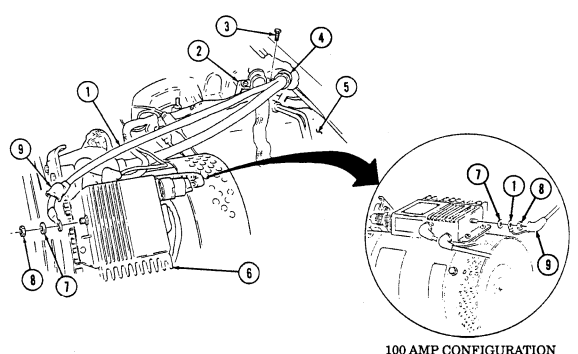

remove cable (1) from battery box (16) and engine (5).

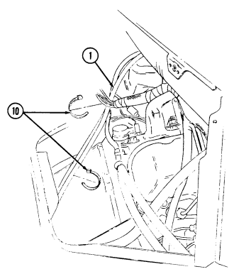

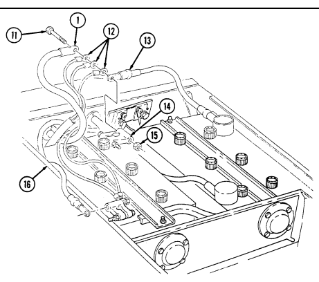

4-75. 12 VOLT ALTERNATOR CABLE REPLACEMENT (Cont'd)

# 4-75. 12 Volt Alternator Cable Replacement (Cont'D)

#### B. Installation

1. Position cable (1) in approximate mounting location on engine (5) and through hole in battery box (16).

2. Install cable (13), leads (12), and cable (1) on terminal clamp (14) with screw (11) and nut (15).

3. Install two tiedown straps (10) on cable (1).

4. Install cable (1) and clamp (4) on bracket (2) with capscrew (3).

 5. Install cable (1) on regulator (6) with washer (7) and nut (8). Tighten nut (8) to 18-22 lb-in.

2.0-2.5 N·m). lide rubber boot (9) over nut (8).

Lower and secure hood (TM 9-2320-280-10). Connect battery ground cables (para. 4-73). Install engine access cover (para. 10-15).

FOLLOW-ON TASKS:

# 4-76. Buss Bar Replacement

This task covers:
INITIAL SETUP:
Applicable Models M997A2, M1025A2, M1035A2, M1043A2, M1045A2, M1097A2 Tools General mechanic's tool kit:
automotive (Appendix B, Item 1)
a. Removal

a. Removal **b. Installation**

| Equipment Condition            |
|--------------------------------|
| Battery removed (para. 4\-79). |

| Manual References    |
|----------------------|
| TM 9\-2320\-280\-10  |
| TM 9\-2320\-280\-24P |

1. Remove five nuts (9), lockwashers (8), and washers (7), engine harness cable (6), alternator cable (10), battery cable (11), umbilical power cable (12) (M1097A2 vehicles only), and slave receptacle cable (13) from buss bar (2). Discard lockwashers (8).

2. Remove nut (5), lockwasher (4), washer (3), and buss bar (2) from power feed through stud (1).

Discard lockwasher (4).

#### B. Installation

1. Install buss bar (2) to power feed through stud (1) with washer (3), lockwasher (4), and nut (5). 2. Install engine harness cable (6), alternator cable (10), battery cable (11), umbilical power cable (12)
(M1097A2 vehicles only), and slave receptacle cable (13) on buss bar (2) with five washers (7), lockwashers (8), and nuts (9).

3. Apply silicone compound to buss bar (2), so that all exposed metallic surfaces are coated.

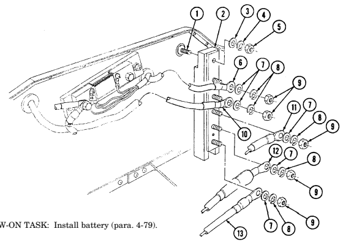

# 4-77. Starter Power Cables Replacement

This task covers:
INITIAL SETUP:
Tools General mechanic's tool kit:
automotive (Appendix B, Item 1)

#### Materials/Parts

Two lockwashers (Appendix G, Item 133) Assembled locknut (Appendix G, Item 130) Lockwasher (Appendix G, Item 141) Lockwasher (Appendix G, Item 178) Lockwasher (Appendix G, Item 137) Two lockwashers (Appendix G, Item 150) Tiedown strap (Appendix G, Item 306) Adhesive sealant (Appendix C, Item 10)

#### A. Removal B. Installation

Manual References TM 9-2320-280-10 TM 9-2320-280-24P
Equipment Condition
- Battery ground cable disconnected 
(para. 4-73).

- Raise and secure hood 
(TM 9-2320-280-10).

Prior to removal, tag all leads for installation.

#### A. Removal

1. Slide back rubber boot (1) on positive cable (3) for access to nut (8). Remove nut (8), lockwasher (9),
washer (10), lead 6B/6C (11), and positive cable (3) from power stud (2). Discard lockwasher (9).

2. Remove nut (7), lockwasher (6), and ground cable (5) from ground stud (4). Discard lockwasher (6). 3. Remove screw (30), two clamps (32), positive cable (3), and ground cable (5) from starter (23) and remove clamps (32) from cables (3) and (5).

4. Remove nut (33), lockwasher (34), ground cable (5), lead 7C (36) (winch vehicles only), and STE/ICE-R lead 3C (35) from negative post (37) on starter (23). Discard lockwasher (34).

Perform step 5 for all vehicles except "A2" vehicle series vehicles. Perform steps 6 and 7 for M997A2, M1025A2, M1035A2, M1043A2, M1045A2, and M1097A2 vehicles only.

5. Remove nut (28), lockwasher (27), positive cable (3), positive accessory cable (26) (vehicles with winch or 200 amp alternator only), and STE/ICE-R leads 81A (25) and 81B (43) from positive post (24). Discard lockwasher (27)
6. Remove nut (28), lockwasher (27) and lead 81B (43) from positive post (24). Discard lockwasher (27). 7. Remove two nuts (44), lockwashers (45), washers (46), positive cable (48), and positive accessory cable (47) (vehicles with winch or 200 amp alternator only) from buss bar (49). Discard lockwasher (45).

8. Remove screw (38), clip (39), and leads 74A (41) and 74B (40) from solenoid (42).

Proceed to step 12 for all vehicles except M997, M997A1, and M997A2. Perform steps 9 through 11 for M997, M997A1 and M997A2 vehicles only.

9. Remove nut (18), lockwasher (17), clamp (15), and compressor harness (16) from capscrew (14).

Discard lockwasher (17).

10. Disconnect compressor harness lead (13) from compressor leads (12). 11. Remove assembled locknut (20), clamp (19), and compressor harness (16) from cable bracket screw (21). Discard assembled locknut (20).

# 4-77. Starter Power Cables Replacement (Cont'D)

12. Remove tiedown strap (22) and compressor harness (16) from alternator cable (26) and lead 81A (25).

Discard tiedown strap (22).

13. Remove coil (31), positive cable (3), and ground cable (5) slowly while routing STE/ICE-R harness (29)
and compressor harness (16) (M997 and M997A1 vehicles only) through coil (31).

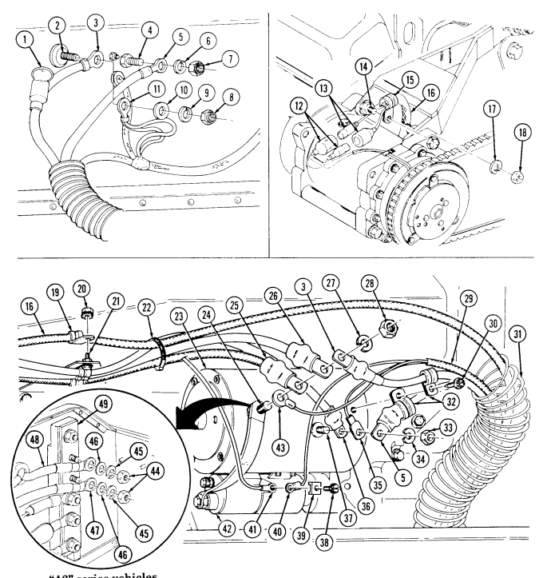

"A2" series vehicles

# 4-77. Starter Power Cables Replacement (Cont'D)

b. Installation 1. Install coil (16) on positive cable (11) and grommet cable (20). Route STE/ICE-R harness (14) and compressor harness (1) (M997 and M997A1 vehicles only) through coil (16), and place cables (11) and (20), STE/ICE-R harness (14), and compressor harness (1) (M997 and M997A1 vehicles only) in approximate mounting locations.

2. Install positive cable (11) and lead 6B/6C (37) on power stud (30) with washer (36), lockwasher (35),
and nut (34). Tighten nut (34) 26 lb-ft (35 N•m). Slide rubber boot (29) over power stud (30).

3. Install ground cable (20) on ground stud (31) with lockwasher (32) and nut (33). Tighten nut (33)
75 lb-ft (102 N•m).

Perform step 4 for all vehicles except "A2" series vehicles. Perform steps 5 and 6 for M997A2, M1025A2, M1035A2, M1043A2, M1045A2, and M1097A2 vehicles only.

4. Install STE/ICE-R leads 81B (8) and 81A (9), positive accessory cable (10), and positive cable (11),
(vehicles with winch or 200 amp alternator only) on positive post (7) with lockwasher (12) and nut (13). Tighten nut (13) 25-30 lb-ft (34-41 N•m).

5. Install lead 81B (8) on positive post (7) with lockwasher (12) and nut (13). Tighten nut (13) 
25-30 lb-ft (34-41 N•m).

6. Install positive accessory cable (49) and positive cable (48) (vehicles with winch or 200 amp alternator only) on buss bar (44) with two washers (47), lockwashers (46), and nuts (45). Tighten nuts (45) 25-30 lb-ft (34-41 N•m).

7. Apply sealant to positive post (7) and cable terminals so that all exposed metallic surfaces are coated. The sealant should be evenly applied with a minimum thickness of .12 in. (3 mm).

8. Install lead 7C (22) (winch vehicles only), STE/ICE-R 3C lead (21), and ground cable (20) on negative post (23) with lockwasher (19) and nut (18). Tighten nut (18) 15-20 lb-ft (20-27 N•m).

9. Install leads 74A (27) and 74B (26) on solenoid (28) with clip (25) and screw (24).

10. Install two clamps (17) on positive cable (11) and ground cable (20) and secure to starter (6) with screws (15).

Perform steps 11 through 14 for M997, M997A1, and M997A2 vehicles only.

11. Connect compressor harness leads (39) to compressor leads (38). 12. Install clamp (41) on compressor harness (1) and capscrew (40) with lockwasher (42) and nut (43). 13. Install clamp (2) on compressor harness (1) and cable bracket screw (4) with assembled locknut (3). 14. Install compressor harness (1) on alternator cable (10) and lead 81A (9) with tiedown strap (5).

# 4-77. Starter Power Cables Replacement (Cont'D)

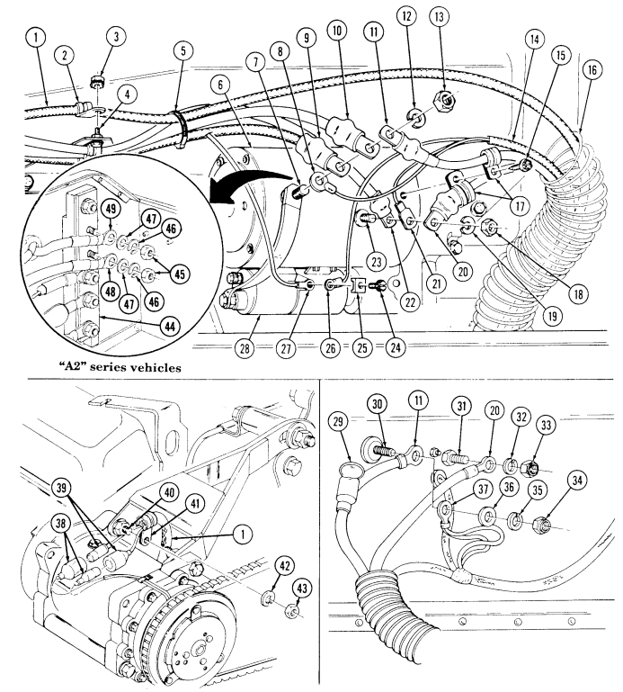

FOLLOW-ON TASKS: - Connect battery ground cable (para. 4-73)
· Lower and secure hood (TM 9-2320-280-10).

## 4-78. Battery Holddown Replacement

This task covers:
INITIAL SETUP:
General mechanic's tool kit:
TM 9-2320-280-10 disconnected (para. 4-73).

#### A. Removal **B. Installation**

## Tools **Equipment Condition**

automotive (Appendix B, Item 1) Battery box cover removed (para. 10-35).

Battery ground cable disconnected (para. 4-73).

Manual References Battery interconnecting cable and positive cable

## Tm 9-2320-280-24P **General Safety Instructions**

Wear safety goggles and rubber gloves, and do not smoke when performing battery maintenance.

Remove all jewelry.

#### Warnin G

Battery acid (electrolyte) is extremely harmful. Always wear safety goggles and rubber gloves, and do not smoke when performing battery maintenance. Severe injury will result if acid contacts eyes or skin.

Remove all jewelry such as rings, dog tags, bracelets, etc. If jewelry or disconnected battery ground cable contacts battery terminal, a direct short can result, causing instant heating of tools, severe injury to personnel, or damage to equipment.

#### A. Removal

1. Remove nut (8), screw (6), and interconnecting cable (4) from battery terminal clamp (5) and terminal post (7).

2. Remove four nuts (2) and holddown rods (1) from battery holddown (3), battery box (10) and brackets (9).

3. Remove battery holddown (3).

b. Installation 1. Install battery holddown (3) on batteries (11), battery box rods (1) and nuts (2).

(10), and brackets (9) with four holddown 2. Install interconnecting cable (4) on battery terminal clamp (5) at terminal post (7) with screw (6)
and nut (8).

# 4-78. Battery Holddown Replacement (Cont'D)

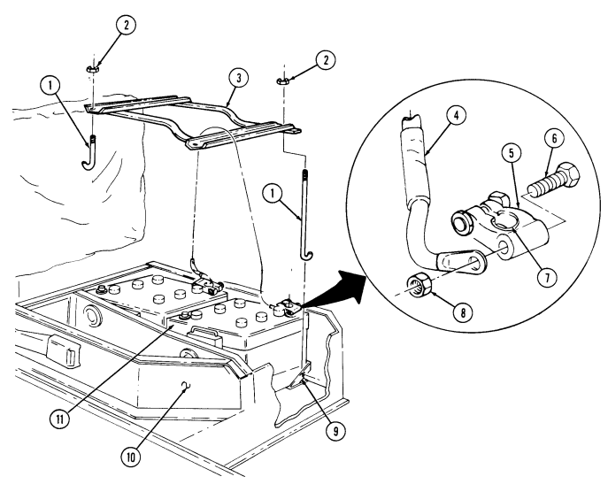

FOLLOW-ON TASKS: •	Connect battery interconnecting cable and positive cable (para. 4-73)
- Connect battery ground cable (para. 4-73).
- Install battery box cover (para. 10-35).

# 4-79. Battery Replacement And Servicing

This task covers:
a. Removal c. Installation b. Servicing INITIAL SETUP:
Tools **Equipment Condition**
General mechanic's tool kit: Battery holddown removed (para. 4-78).

automotive (Appendix B, Item 1)
Manual References TM 9-6140-200-14 TM 9-2320-280-24P
General Safety Instructions Wear safety goggles and rubber gloves, and do not smoke when performing battery maintenance.

Remove all jewelry.

#### Warnin G

Battery acid (electrolyte) is extremely harmful. Always wear safety goggles and rubber gloves, and do not smoke when performing battery maintenance. Severe injury will result if acid contacts eyes or skin. Remove all jewelry such as rings, dog tags, bracelets, etc. If jewelry or disconnected battery ground cable contacts battery terminal, a direct short can result, causing instant heating of tools, severe injury to personnel, or damage to equipment.

1. Loosen four screws (4) and nuts (2) from four battery terminal clamps (3) and terminals (1). 2. Using battery clamp puller, remove four battery terminal clamps (3) from terminals (1). 3. Place cables (6) in a position to prevent arcing with batteries. 4. Remove batteries (5) from battery box (7).

b. Servicing

For battery testing and servicing instructions refer to TM 9-6140-200-14.

#### C. Installation

1. Position batteries (5) in box (7).

2. Ensure negative (1) terminal posts are correctly located. Cables must reach their respective terminals without stretching.

3. Install four battery terminal clamps (3) to battery terminals (1).

4. Tighten four nuts (2) and screws (4) on battery terminal clamps (3) and battery terminals (1).

# 4-79. Battery Replacement And Servicing (Cont'D)

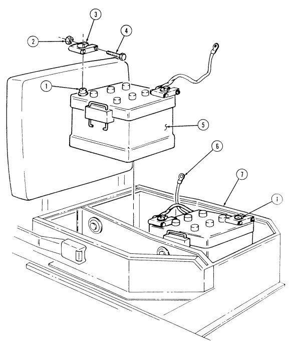

FOLLOW-ON TASK: Install battery holddown (para. 4-78).

## 4-80. Battery Tray Maintenance

This task covers:

a. Removal c. Preventive Modification b. Cleaning and Inspection d. Installation

INITIAL SETUP:
Tools General mechanic's tool kit:
automotive (Appendix B, Item 1)

#### Materials/Parts

Four locknuts (Appendix G, Item 70) Sodium bicarbonate (Appendix C, Item 49)
a. Removal Manual References TM 9-6140-200-14 TM 9-2320-280-24P
Equipment Condition Battery holddown removed (para. 4-78).

Remove four locknuts (6), washers (2), capscrews (1), washers (2), and battery tray (3) from battery box (5). Discard locknuts (6).

b. Cleaning and Inspection

For additional information on battery box tray cleaning, refer to TM 9-6140-200-14.

1. Clean battery tray (3) with baking soda solution. 2. Inspect battery tray (3) for damage. Replace if damaged. 3. Inspect battery cable protectors (4) and battery compartment seals (7) for damage. Replace if damaged.

c. Preventive Modification

- The following step will prevent water from accumulating in the battery tray.

- Refer to hole diagram for location of holes.

Locate, mark, and drill four 1/2 inch holes in battery tray (3).

d. Installation Install battery tray (3) on battery box (5) with four washers (2), capscrews (1), washers (2), and locknuts (6). Tighten locknuts (6) to 6 lb-ft (8 N•m).

# 4-80. Battery Tray Maintenance (Cont'D)

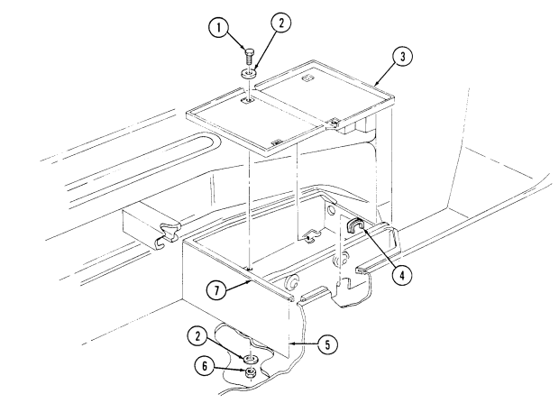

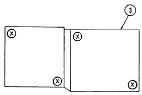

HOLE DIAGRAM

FOLLOW-ON TASK: Install battery holddown (para. 4-78).

# 4-81. Slave Receptacle And Cable Maintenance

This task covers:
a. Removal c. Installation b. Inspection INITIAL SETUP:

#### Tools

General mechanic's tool kit:
automotive (Appendix B, Item 1)

#### Materials/Parts

Lockwasher (Appendix G, Item 148) Lockwasher (Appendix G, Item 141) Two lockwashers (Appendix G, Item 133) 
(serial numbers 1 through 99,999)
Two lockwashers (Appendix G, Item 155) 
(serial numbers 100,000 and above)
Four plain-assembled nuts 
(Appendix G, Item 200) (old configuration)
Four plain-assembled nuts 
(Appendix G, Item 199) (new configuration)
Grease (Appendix C, Item 24)

| anual Reeferences    |
|----------------------|
| TM 9\-2320\-280\-24P |

Equipment Condition
- Battery tray removed (para. 4-80). - TOW wiring harness removed from power feed stud and shunt (para. 11-67). M966, M966A1 M1036, M1045, M1045A1, M1045A2, M1046, M1046A1, M1121 only.

#### A. Removal

1. Remove capscrew (8), lockwasher (9), slave negative cable (10), and battery negative cable (11)
from shunt (1). Discard lockwasher (9).

2. Remove nut (7), lockwasher (6), washer (5), battery positive cable (4), and slave positive cable (3)
from power feed stud (2). Discard lockwasher (6).

3. Remove four plain-assembled nuts (13), capscrews (18), receptacle (19), and cover (17) from battery box (12). Discard plain-assembled nuts (13).

- Prior to removal, tag leads for installation. - Perform steps 4 through 7 for vehicles with serial numbers 1 through 99,999. 

- Perform steps 8 through 10 for vehicles with serial numbers 100,000 and above. 

4. Slide rubber boot (14) back to allow access to slave receptacle (19) connections. 5. Remove capscrew (21), lockwasher (20), slave negative cable (10) from receptacle (19). Discard lockwasher (20).

6. Remove capscrew (16), lockwasher (15), slave positive cable (3) from receptacle (19). Discard lockwasher (15).

7. Remove rubber boot (14). 8. Loosen compression nut (23) on backshell (22) and remove backshell (22) from receptacle (19). 9. Remove capscrew (21), lockwasher (20), and slave negative cable (10) from receptacle (19). Discard lockwasher (20).

10. Remove capscrew (16), lockwasher (15), and slave positive cable (3) from receptacle (19). Discard lockwasher (15).

# 4-81. Slave Receptacle And Cable Maintenance (Cont'D)

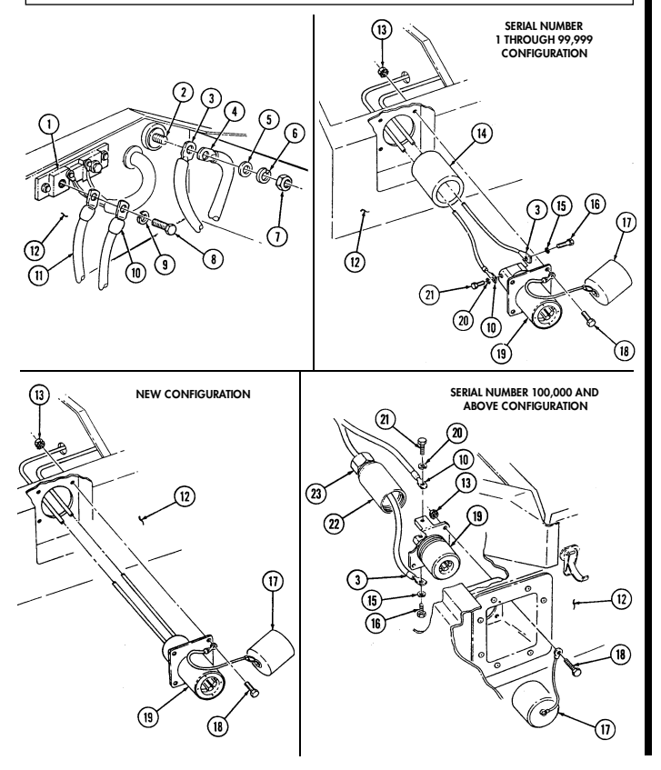

# 4-81. Slave Receptacle And Cable Maintenance (Cont'D)

b. Inspection 1. Inspect cover (17) for breaks or cracks. Replace if damaged. 2. Inspect cables (3) and (10) for damage. Repair if damaged (reefer to para. 4-73). 3. Inspect rubber boot (14) for tears. Replace if torn. c. Installation

When making electrical connections, ensure hookup of positive (+) cable to positive electrode and negative (–) cable to negative electrode of the receptacle.

- Perform steps 1 through 4 for vehicles with serial numbers 1 through 99,999.

- Perform steps 5 through 9 for vehicles with serial numbers 100,000 and above.

9. Tighten compression nut (23) on backshell (22).

1. Install rubber boot (14) by sliding slave negative cable (10) and slave positive cable (3) through rubber boot (14).

2. Install receptacle (19) by attaching slave positive cable (3) to receptacle (19) with lockwasher (15)
and capscrew (16).

3. Attach slave negative cable (10) to receptacle (19) with lockwasher (20) and capscrew (21). 4. Slide rubber boot (14) forward to cover slave receptacle (19) connection. 5. Attach slave positive cable (3) to receptacle (19) with lockwasher (15) and capscrew (16). 6. Attach slave negative cable (10) to receptacle (19) with lockwasher (20) and capscrew (21). 7. Using grease, coat receptacle (19) terminals, all exposed metal on rear of receptacle (19), and area under cover (17) on front of receptacle (19).

8. Install backshell (22) on receptacle (19).

10. Attach receptacle (19) to battery box (12) by installing cover (17) to receptacle (19) with four capscrews (18) and plain-assembled nuts (13).

11. Attach slave positive cable (3) and battery positive cable (4) to power feed stud (2) with washer (5),
lockwasher (6), and nut (7). Tighten nut (7) 26 lb-ft (35 N•m).

12. Attach battery negative cable (11) and slave negative cable (10) to shunt (1) with lockwasher (9)
and capscrew (8). Tighten capscrew (8) 96 lb-in. (11 N•m).

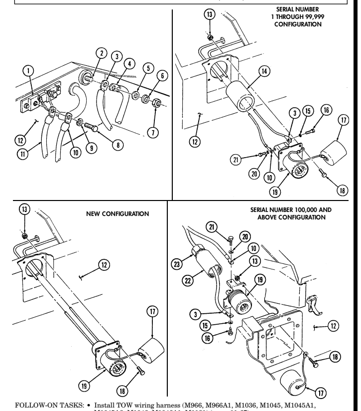

# 4-81. Slave Receptacle And Cable Maintenance (Cont'D)

M1045A2, M1046, M1046A1, M1121) (para. 11-67).

-  Install battery tray (para. 4-80).

# 4-82. Winch Power Cable Replacement

This task covers:
INITIAL SETUP:
Applicable Models M1026, M1026A1, M1036, M1038, M1038A1, M1042, M1044, M1044A1, M1046, M1046A1 Tools General mechanic's tool kit:
automotive (Appendix B, Item 1)

#### Materials/Parts

Lockwasher (Appendix G, Item 135) Three tiedown straps (Appendix G, Item 307)
Assembled locknut (Appendix G, Item 131)

a. Removal b. Installation

| Manual References    |
|----------------------|
| TM 9\-2320\-280\-24P |

Equipment Condition Battery ground cable disconnected (para. 4-73).

#### A. Removal

1. Remove three tiedown straps (2) from ventline (8), lead 7 (4), and lead 6 (6). Discard tiedown straps (2).

2. Remove capscrew (5) from lead 7 (4) and winch (9). 3. Remove nut (7) from lead 6 (6) and solenoid (3). 4. Remove two screws (1) and clamps (10) from lead 7 (4), lead 6 (6), and winch (9). 5. Remove screw (14), lockwasher (12), nut (11), and clamp (13) from lead 7 (4), lead 6 (6), and bracket (15). Discard lockwasher (12).

6. Remove two screws (16) and clamps (17) from lead 7 (4), lead 6 (6), and airlift bracket (18). 7. Remove assembled locknut (19), capscrew (21), and clamp (22) from lead 7 (4), lead 6 (6) and bracket (20). Discard assembled locknut (19).

8. Remove nut (25) and lead 7 (4) from starter negative stud (26). 9. Remove nut (23) and lead 6 (6) from starter positive stud (24).

#### B. Installation

1. Install lead 6 (6) on starter positive stud (24) with nut (23). Tighten nut (23) to 25-30 lb-ft (34-41 N•m). 2. Install lead 7 (4) on starter negative stud (25) with nut (26). Tighten nut (26) to 15-20 lb-ft (20-27 N•m). 3. Install lead 7 (4) and lead 6 (6) on bracket (20) with capscrew (21), assembled locknut (19), and clamp (22).

4. Install lead 7 (4) and lead 6 (6) on airlift bracket (18) with two screws (16) and clamps (17). 5. Install lead 7 (4) and lead 6 (6) on bracket (15) with screw (14), lockwasher (12), nut (11), and clamp (13).

6. Install lead 7 (4) and lead 6 (6) on winch (9) with two clamps (10) and screws (1). 7. Install lead 6 (6) on solenoid (3) with nut (7). 8. Install lead 7 (4) on winch (6) with capscrew (5). 9. Install lead 6 (6) and lead 7 (4) on vent line (8) with three tiedown straps (2).

# 4-82. Winch Power Cable Replacement (Cont'D)

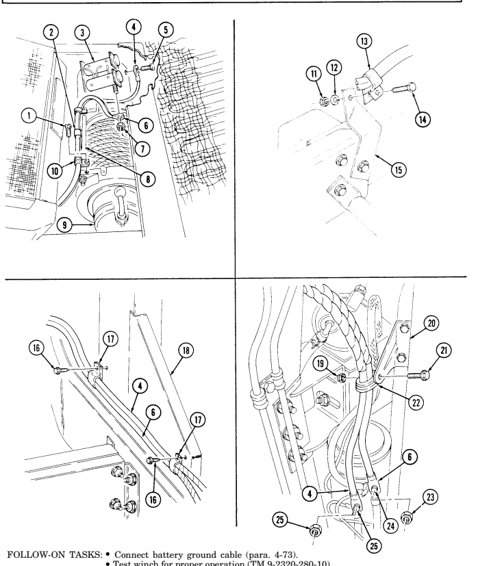

# 4-83. Shunt Replacement

This task covers:
INITIAL SETUP:

#### Tools

General mechanic's tool kit:
automotive (Appendix B, Item 1)
Materials/Parts Two lockwashers (Appendix G, Item 171) Two assembled locknuts (Appendix G, Item 130) Two lockwashers (Appendix G, Item 178) Lockwasher (Appendix G, Item 148)
Personnel Required One mechanic One assistant

#### A. Removal B. Installation

Manual References TM 9-2320-280-24P
Equipment Condition Batteries removed (para. 4-79).

Prior to removal, tag leads for installation.

#### A. Removal

1. Remove two screws (10) and lockwashers (8) and disconnect leads 9A (15), 8A (6), 7B and 7D (14)
from shunt (16). Discard lockwashers.

2. Remove nut (1) and lockwasher (2) securing starter cable (3) to capscrew (9) and disconnect starter cable (3). Discard lockwasher (2).

3. Remove nut (18), lockwasher (17), and capscrew (9) from shunt (16). Discard lockwasher (17). 4. Remove capscrew (11), lockwasher (12), and negative cables (13) from shunt (16). Discard lockwasher (12).

5. Remove two assembled locknuts (7), washers (5), capscrews (4), washers (5), and shunt (16) from battery box (19). Discard assembled locknuts (7).

#### B. Installation

1. Install shunt (16) to battery box (19) with two washers (5), capscrews (4), washers (5), and assembled locknuts (7). Tighten assembled locknuts (7) to 8 lb-ft (11 N.m).

2. Install negative cables (13) to shunt (16) with lockwasher (12) and capscrew (11). Tighten capscrew (11) to 8 lb-ft (11 N•m).

3. Install capscrew (9) to shunt (16) with lockwasher (17) and nut (18). Tighten nut (18) 
to 75 lb-ft (102 N•m).

4. Connect starter cable (3) to capscrew (9) with lockwasher (2) and nut (1). Tighten nut (1) 
to 18 to 22 lb-ft (24-30 N•m).

5. Instal leads 9A (15), 8A (6), 7B, and 7D (14) on shunt (16) with two lockwashers (8) and screws (10).

# 4-83. Shunt Replacement (Cont'D)

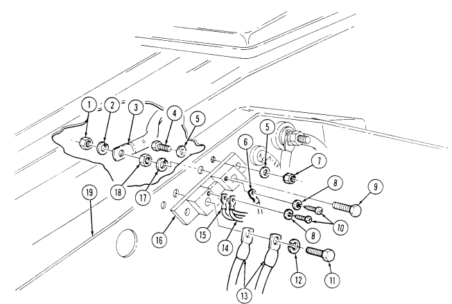

# 4-84. Hood Wiring Harness Replacement

This task covers:
a. Removal c. Installation

#### Initial Setup:

Tools General mechanic's tool kit:
automotive (Appendix B, Item 1)
Materials/Parts Two locknuts (Appendix G, Item 74)
(A2 Series and M1123)
Two locknuts (Appendix G, Item 102) (Basic and A1 Series)
Antiseize compound (Appendix C, Item 13)
Manual References TM 9-2320-280-10 TM 9-2320-280-24P
Equipment Condition
- Blackout drive light assembly removed
(para. 4-50).

- Side marker light lenses and lamp removed
(para. 4-54).

Prior to removal, tag leads for installation.

#### A. Removal

1. Disconnect connector plug (2) from connector receptacle (1). 2. Remove four capscrews (7) and washers (6) from left cover plate (5) and hood (3). 3. Remove two clips (4) from cover plate (5) and remove cover plate (5). 4. Disconnect harness leads 489C (16) from left side marker light terminal (15). 5. Disconnect harness leads 20E (9), 461B (20), and 491C (19) from three left composite light terminals (8). 6. Remove locknut (12), screw (11), and left side marker light ground 92C (10) from hood (3). Discard locknut (12).

7. Remove capscrew (14), washer (13), and left composite light ground 92B (17) from bus bar (18).

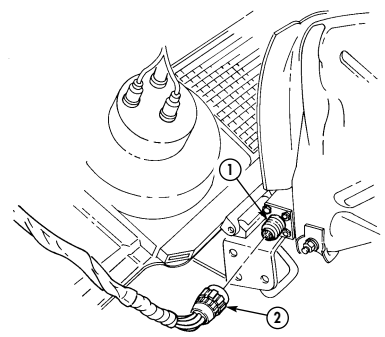

# 4-84. Hood Wiring Harness Replacement (Cont'D)

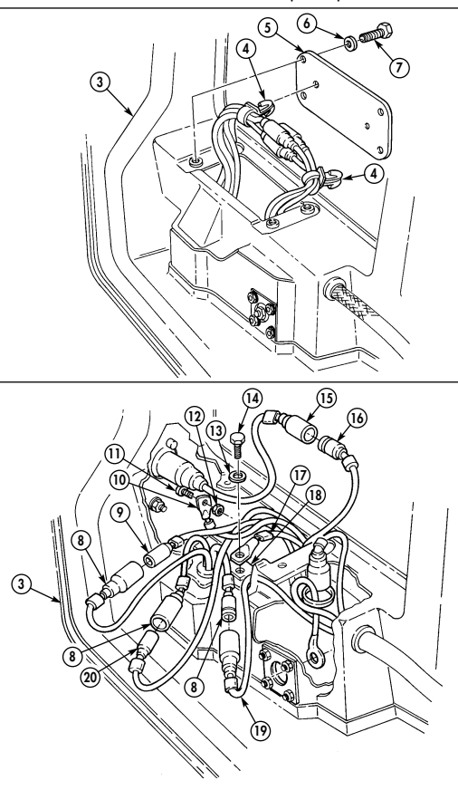

## 4-84. Hood Wiring Harness Replacement (Cont'D)

8. Remove three capscrews (1) and washers (2) from right cover plate (3) and hood (5). 9. Remove two clips (4) from cover plate (3) and remove cover plate (3).

10. Disconnect harness lead 489D (6) at right side marker light terminal (7). 11. Disconnect harness leads 20F (14), 460B (15), and 491D (16) at right composite light terminals (13). 12. Remove locknut (10), screw (12), and right side marker light ground 92D (11) from hood (5). 

Discard locknut (10).

13. Remove capscrew (9), washer (8), and right composite light ground 92A (18) from bus bar (17). 14. Disconnect harness leads 17E (22), 18C (23), and 91D (25) at left headlight connectors (26). 15. Disconnect harness leads 17F (22), 18D (23), and 91C (25) at right headlight connectors (26). 16. Remove three capscrews (27), clamps (28), washers (29), and harness (21) from hood (5). 17. Remove two screw and washer assemblies (19), clamps (20), and harness (21) from hood (5).

Use care when removing harness. Failure to do so will cause damage to harness.

18. Remove grommet (24) and harness (21) from hood (5).

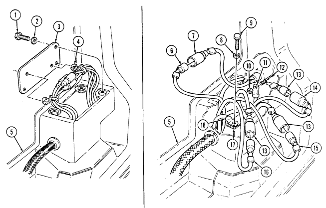

# 4-84. Hood Wiring Harness Replacement (Cont'D)

b. Installation 1.

Position harness (21) on hood (5) in approximate mounting position.

Use care when routing harness. Failure to do so will cause damage to harness.

2.

3.

Insert harness (21) and grommets (24) through opening in hood (5).

Connect harness leads 17E (22), 18C (23), and 91D (25) at left headlight connetors (26).

4.

5.

6.

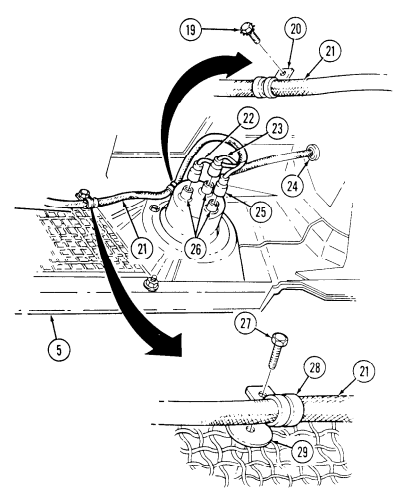

Connect harness leads 17F (22), 18D (23), and 91C (25) at right headlight connectors (26). Secure harness (21) to hood (5) with three washers (29), clamps (28), and screws (27). Finger tighten screws (27). Secure harness (21) to hood (5) with two screw and washer assemblies (19) and clamps (20). Finger tighten screw and washer assemblies (19).

## 4-84. Hood Wiring Harness Replacement (Cont'D)

7. Apply antiseize compound to left composite light ground 92B (10) and install on bus bar (11) with washer (6) and capscrew (7).

8. Apply antiseize compound to left side marker light ground 92C (3) and install on hood (16) with locknut (5) and screw (4).

9. Connect harness leads 20E (2), 461B (15), and 491B (14) at left composite light terminals (1).

10. Connect harness lead 489C (9) at left side marker light terminal (8). 11. Insert harness lead 19B (12) and harness lead 92E (13) through opening in hood (16). 12. Install leads (12) and (13) with two clips (17) on left cover plate (18). 13. Install left cover plate (18) with four washers (19) and capscrews (20).

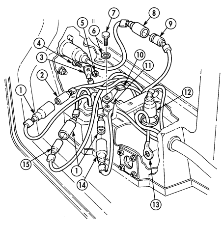

4-84. HOOD WIRING HARNESS REPLACEMENT (Cont'd)

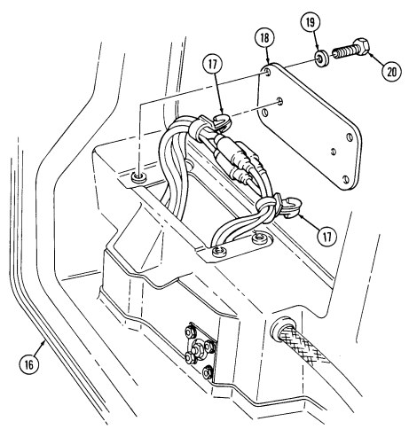

## 4-84. Hood Wiring Harness Replacement (Cont'D)

14. Apply antiseize compound to right composite light ground 92A (13) and install on bus bar (12) with washer (3) and capscrew (4).

15. Apply antiseize compound to right side marker light ground 92C (6) and install on hood (14) with screw (7) and locknut (5).

16. Connect harness leads 20F (9), 460B (10), and 491D (11) at right composite light terminals (8). 17. Connect harness lead 489D (1) at right side marker light terminal (2). 18. Secure leads with two clips (18) and install clips (18) on right cover plate (17). 19. Install right cover plate (17) to hood (14) with three washers (16) and capscrews (15). 20. Connect connector plug (20) to connector receptacle (19). 21. Tighten all clamps securing harness.

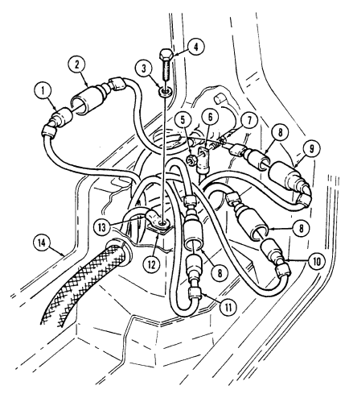

# 4-84. Hood Wiring Harness Replacement (Cont'D)

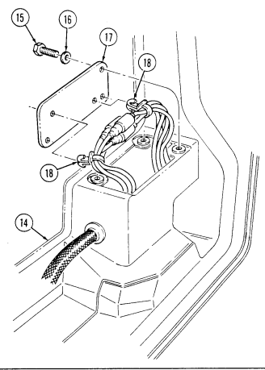

FOLLOW-ON TASKS: - Install side marker light lenses and lamp (para. 4-54).
- • Install drive blackout light (para. 4-50).

· Check front lights for proper operation (TM 9-2320-280-10).

## 4-85. Wiring Harness Connector Repair

This task covers: a. Terminal-Type Cable Connector Repair e. Receptacle Assembly Repair c. Female Cable Connector Repair Assembly Repair d. Connector Assembly Repair b. Male Cable Connector Repair f. Protective Control Box Lower Cannon Plug INITIAL SETUP:
General mechanic's tool kit: Battery ground cable disconnected (para. 4-73).

automotive (Appendix B, Item 1)
Connector repair kit (Appendix B, Item 165) General Safety Instructions Manual References TB SIG-222 TM 9-2320-280-24P
Tools **Equipment Condition**
Remove all jewelry.

#### Warnin G

Remove all jewelry such as rings dog tags, bracelets, etc. If jewelry or disconnected battery ground cable contacts battery terminal, a direct short can result, causing instant heating of tools, severe injury to personnel, or damage to equipment.

#### A. Terminal-Type Connector Repair

1. Strip cable insulation (1) from cable (2) to equal depth of terminal well (4).

2. Slide insulator (3) over cable insulation (1).

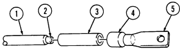 3. Insert cable (2) into terminal well (4) and crimp. 4. Slide insulator (3) over crimped end of terminal (5).

#### B. Male Cable Connector Repair

1. Strip cable insulation (6) from cable (7) to equal depth of terminal well (10).

2. Slide shell (8) over cable insulation (6). 3. Insert cable (7) into terminal well (10) and crimp.

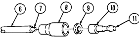 4. Place slotted washer (9) over crimped junction at terminal (11).

5. Slide shell (8) over slotted washer (9) and terminal (11).

## 4-85. Wiring Harness Connector Repair (Cont'D)

c. Female Cable Connector Repair 1. Strip cable insulation (12) from cable (13) to equal depth of terminal well (16).

2. Slide shell (14) and sleeve (15) over cable insulation (12). 3. Insert cable (13) into terminal well (16) and crimp.

4. Slide shell (14) and sleeve (15) over terminal (17).

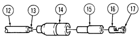

d. Connector Assembly Repair

Refer to TB SIG-222 for soldering instructions.

1. Strip cable insulation (18) to depth of solder wells (21) on inserts (22).

2. Slide cable ends (25) through grommet retaining nut (19) and grommet (20).

3. Place cable ends (25) into solder wells (21) and solder.

4. Slide grommet (20) over inserts (22) and press into shell assembly (23) and coupling nut (24) until seated.

5. Screw grommet retaining nut (19) into shell assembly (23) until seated.

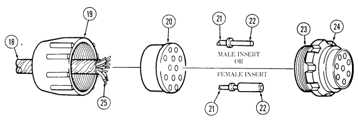

# 4-85. Wiring Harness Connector Repair (Cont'D)

e. Receptacle Assembly Repair

Refer to TB SIG-222 for soldering instructions.

Strip cable insulation (1) to depth of solder wells (5) on inserts (6).

Slide cable ends (3) through grommet retaining nut (2) and grommet (4).

1. 2.

3.

Place cable ends (3) into solder wells (5) and solder. Slide grommet (4) over inserts (5) and press into receptacle (7) until seated.

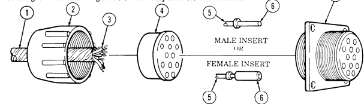

Screw grommet retaining nut (2) into receptacle (7) until seated.

4.

5.

#### F. Protective Control Box Lower Cannon Plug Assembly Repair

1. Strip cable insulation (8) to depth of solder wells (16) on inserts (14).

2. Slide cable ends (10) through grommet retaining nut (9) and grommet 3. Slide insulation sleeving (17) over lead 67A (18).

(11).

4. Place cable ends (10) into solder wells (16) and solder.

Ensure insulation sleeving passes through grommet to provide a water tight fit.

Slide insulation sleeving (17) up to solder well end (15), and heat shrink insulation sleeving (17). Slide grommet (11) over inserts (14) and press into shell assembly (12) and coupling nut (13) until seated.

Screw grommet retaining nut (9) into shell assembly (12) until seated.

5.

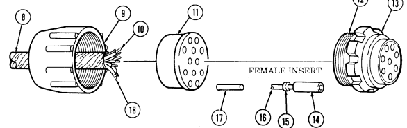

6.

7.

FOLLOW-ON TASK: Connect battery ground cable (para. 4-73).

# Section Vii. Ambulance Electrical System Maintenance 4-86. Electrical System Maintenance Task Summary

| Applicable Models                                                                               | Materials/Parts                                                                                   | M997A2, M1025A2, M1035A2,                                                                      | Five lockwashers (Appendix G, Item 150)                                                                 |
|-------------------------------------------------------------------------------------------------|---------------------------------------------------------------------------------------------------|------------------------------------------------------------------------------------------------|---------------------------------------------------------------------------------------------------------|
| M1043A2, M1045A2, M1097A2                                                                       | Lockwasher (Appendix G, Item 141)                                                                 | Silicone compound (Appendix C, Item 48)                                                        |                                                                                                         |
| Tools                                                                                           | General mechanic's tool kit:                                                                      | Equipment Condition                                                                            |                                                                                                         |
| automotive (Appendix B, Item 1)                                                                 | Battery removed (para. 4\-79).                                                                    |                                                                                                |                                                                                                         |
| a. Removal                                                                                      |                                                                                                   |                                                                                                |                                                                                                         |
| 1.                                                                                              | Remove five nuts (9), lockwashers (8), and washers (7), engine harness cable (6), alternator      | cable (10), battery cable (11), umbilical power cable (12) (M1097A2 vehicles only), and slave  |                                                                                                         |
| receptacle cable (13) from buss bar (2). Discard lockwashers (8).                               | 2.                                                                                                | Remove nut (5), lockwasher (4), washer (3), and buss bar (2) from power feed through stud (1). |                                                                                                         |
| Discard lockwasher (4).                                                                         |                                                                                                   |                                                                                                |                                                                                                         |
| b. Installation                                                                                 |                                                                                                   |                                                                                                |                                                                                                         |
| 1.                                                                                              | Install buss bar (2) to power feed through stud (1) with washer (3), lockwasher (4), and nut (5). | 2.                                                                                             | Install engine harness cable (6), alternator cable (10), battery cable (11), umbilical power cable (12) |
| (M1097A2 vehicles only), and slave receptacle cable (13) on buss bar (2) with five washers (7), | lockwashers (8), and nuts (9).                                                                    |                                                                                                |                                                                                                         |
| 3.                                                                                              | Apply silicone compound to buss bar (2), so that all exposed metallic surfaces are coated.        |                                                                                                |                                                                                                         |
| FOLLOW\-ON TASK: Install battery (para. 4\-79).                                                 |                                                                                                   |                                                                                                |                                                                                                         |

# 4-86. Electrical System Maintenance Task Summary (Cont'D)

| This task covers:                                                                                        |                             |                                         |
|----------------------------------------------------------------------------------------------------------|-----------------------------|-----------------------------------------|
| a.  Removal                                                                                              | c.  Preventive Modification |                                         |
| b.  Cleaning and Inspection                                                                              | d.  Installation            |                                         |
| INITIAL SETUP:                                                                                           |                             |                                         |
| Tools                                                                                                    | Manual References           |                                         |
| General mechanic's tool kit:                                                                             | TM 9\-6140\-200\-14         |                                         |
| automotive (Appendix B, Item 1)                                                                          | TM 9\-2320\-280\-24P        |                                         |
| Materials/Parts                                                                                          | Equipment Condition         |                                         |
| Four locknuts (Appendix G, Item 70)                                                                      |                             | Battery holddown removed (para. 4\-78). |
| Sodium bicarbonate (Appendix C, Item 49)                                                                 |                             |                                         |
| a. Removal                                                                                               |                             |                                         |
| Remove four locknuts (6), washers (2), capscrews (1), washers (2), and battery tray (3) from battery box |                             |                                         |
| (5). Discard locknuts (6).                                                                               |                             |                                         |
| b. Cleaning and Inspection                                                                               |                             |                                         |
|                                                                                                          | NOTE                        |                                         |

| 2.  Inspect battery tray (3) for damage. Replace if damaged.                                      |
|---------------------------------------------------------------------------------------------------|
| 3.  Inspect battery cable protectors (4) and battery compartment seals (7) for damage. Replace if |
| damaged.                                                                                          |
| c. Preventive Modification                                                                        |
| NOTE                                                                                              |
| - The following step will prevent water from accumulating in the                                  |
| battery tray.                                                                                     |
| - Refer to hole diagram for location of holes.                                                    |
| Locate, mark, and drill four 1/2 inch holes in battery tray (3).                                  |

## 4-87. Ceiling Light Assembly Maintenance

Dome and blackout light assemblies are removed and installed basically the same. This procedure covers the dome light assembly.

## 4-87. Ceiling Light Assembly Maintenance (Cont'D)

1. Remove two screws (5) and lens (6) from light assembly (4).

For removal and installation of rivets, refer to para. 10-66.

2. Remove four rivets (7) from light assembly (4) and duct (1). Pull light assembly (4) away from duct (1) to allow access to leads.

3. Disconnect two leads (3) from harness connectors (2). Remove light assembly (4).

1. Connect two leads (3) to harness connectors (2).

2. Install light assembly (4) to duct (1) with four rivets (7).

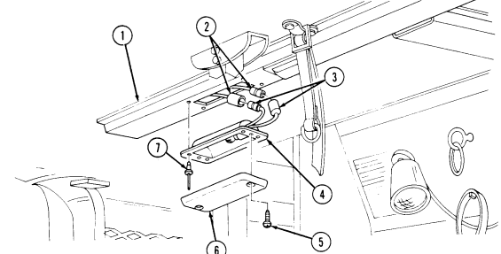 3. Install lens (6) to light assembly (4) with two screws (5).

FOLLOW-ON TASK: Check operation of ceiling light (TM 9-2320-280-10).

## 4-88. Spotlight Assembly Maintenance

This task covers:

a. Removal b. Installation

| Tools                           | Manual Reeferences                    |
|---------------------------------|---------------------------------------|
| General mechanic's tool kit:    | TM 9\-2320\-280\-24P                  |
| automotive (Appendix B, Item 1) | Equipment Condition                   |
| Materials/Parts                 | - Battery tray removed (para. 4\-80). |

| INITIAL SETUP:   |
|------------------|

M996, M996A1, M997, M997A1, and M997A2 spotlight replacements are basically the same. This procedure covers the M996 and M996A1.

#### A. Removal

1. Remove four screws (8) and duct (7) from ceiling (1) and pull duct (7) away for access to clamp (5). 2. Remove screw (6), nut (4), and clamp (5) from duct (7). Remove duct (7). 3. Disconnect spotlight leads (3) from harness leads (2). Remove light assembly (9) from quick disconnect base (10).

b. Installation 1. Install light assembly (9) on quick disconnect base (10) and connect spotlight leads (3) to harness leads (2).

2. Install clamp (5) on light assembly (9) and duct (7) with screw (6) and nut (4). 3. Install duct (7) on ceiling (1) with four screws (8).

# 4-88. Spotlight Assembly Maintenance (Cont'D)

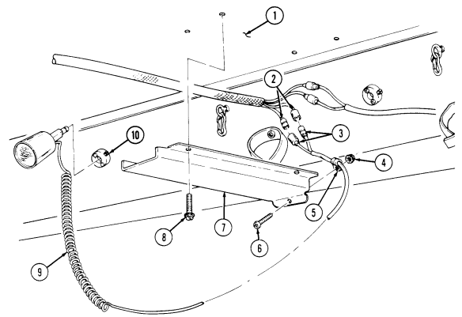

FOLLOW-ON TASKS: - Connect battery ground cable (para. 4-73).

· Check operation of spotlight (TM 9-2320-280-10)

## 4-89. Spotlight Socket Maintenance

This task covers:
a. Removal c. Adjustment b. Installation INITIAL SETUP:
Applicable Models **Manual References**
M996, M996A1, M997, M997A1, M997A2 TM 9-2320-280-24P
Tools General mechanic's tool kit:
automotive (Appendix B, Item 1)
1. Pull spotlight (5) from socket (2).

2. Remove two screws (1) and socket (2)from body (4).

b. Installation 1. Install socket (2) on body (4) with two screws (1).

2. Install spotlight (5) into socket (2).

c. Adjustment Adjust detent screw (3) for proper positioning of spotlight (5).

# 4-89. Spotlight Socket Maintenance (Cont'D)

5

# 4-90. Electrical Outlet/Bracket Maintenance

This task covers:
INITIAL SETUP:
Applicable Models **Equipment Condition**
General mechanic's tool kit:
automotive (Appendix B, Item 1)
Manual References TM 9-2320-280-10 TM 9-2320-280-24P

#### A. Removal **B. Installation**

M996, M996A1, M997, M997A1, M997A2 Battery ground cable disconnected
(para. 4-73).

Tools Rear doors opened (TM 9-2320-280-10).

#### Not E

Prior to removal, tag leads for installation.

#### A. Removal

1. Slide rubber boot (1) away from outlet (4). 2. Remove two screws (3) and pull outlet (4) away from bracket (2). 3. Loosen screw (8) and move shield (9) away from screws (7).

(10) and remove outlet (4).

4. Remove two screws (7), disconnect harness leads 714B (11) and 790A

#### Not E

Perform step 5 only if removing bracket.

5. Remove three screws (6) and bracket (2) from body (5).

#### B. Installation

1. Install bracket (2) on body (5) with three screws (6).

2. Connect leads 714B (11) and 790A (10) to outlet (4) with two screws (7).

3. Position shield (9) over screws (7) and tighten screw (8). 4. Install outlet (4) on bracket (2) with two screws (3). 5. Slide boot (1) over back of outlet (4).

4-90. ELECTRICAL OUTLET/BRACKET MAINTENANCE (Cont'd)

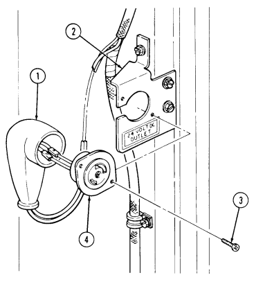

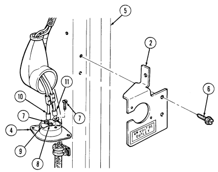

# 4-91. Rear Steps Blackout Switch Bracket Replacement

This task covers:
INITIAL SETUP:
Applicable Models M996, M996A1, M997, M997A1, M997A2 Tools General mechanic's tool kit:
automotive (Appendix B, Item 1)

a. Removal b. Installation

Manual References TM 9-2320-280-24P
Equipment Condition Blackout switch removed (para. 4-93).

Materials/Parts Two blind rivets (Appendix G, Item 242)

For instructions on replacement of rivets, refer to para. 10-66.

a. Removal Remove two rivets (1) and switch bracket (2) from body (3). 

b. Installation Install bracket (2) on body (3) with two rivets (1).

# 4-91. Rear Steps Blackout Switch Bracket Replacement (Cont'D)

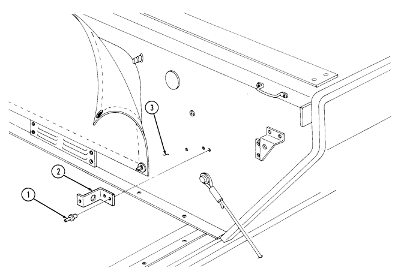

FOLLOW-ON TASK: Install blackout switch (para. 4-93).

# 4-92. Rear Steps Blackout Switch Replacement

This task covers:
INITIAL SETUP:
Applicable Models M996, M996A1, M997, M997A1, M997A2 Tools General mechanic's tool kit:
automotive (Appendix B, Item 1)

a. Removal b. Installation

Manual References TM 9-2320-280-10 TM 9-2320-280-24P
Equipment Condition
- Rear steps lowered (TM 9-2320-280-10). - Battery ground cable disconnected
(para. 4-73).

Materials/Parts Lockwasher (Appendix G, Item 168)

Prior to removal, tag leads for installation.

#### A. Removal

1. Remove three screws (1) and cover (2) from body (3) and bracket (5). 2. Remove grommet (4) from body (3). 3. Remove nut (11), lockwasher (10), and light switch (6) from bracket (5) and remove adjusting nut (12). Discard lockwasher (10).

4. Pull light switch leads (7) through hole in body (3). 5. Disconnect light switch leads (7) from harness leads 791C (8) and 791D (9). Remove light switch (6).

#### B. Installation

1. Connect light switch leads (7) to harness leads 791C (8) and 791D (9). Push through body (3). 2. Install grommet (4) in body (3). 3. Position adjusting nut (12) on switch (6) about halfway out on threads. Install switch (6) to bracket (5) with lockwasher (10) and nut (11).

4. Slowly raise rear steps to latched position while listening for switch (6) to "click". If necessary, adjust switch (6) in or out to ensure switch (6) clicks (closed) when steps are in raised and latched position.

5. Install cover (2) to body (3) and bracket (5) with three screws (1).

4-92. REAR STEPS BLACKOUT SWITCH REPLACEMENT (Cont'd)

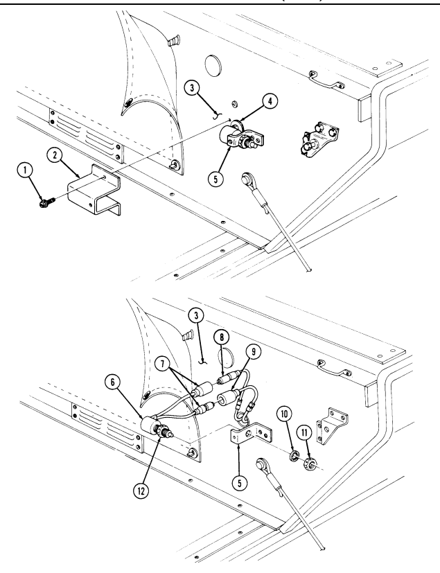

FOLLOW-ON TASK: Connect battery ground cable (para. 4-73).

# 4-93. Rear Door Blackout Switch/Bracket Maintenance

This task covers:
INITIAL SETUP:
Applicable Models M996, M996A1, M997, M997A1, M997A2 Tools General mechanic's tool kit:
automotive (Appendix B, Item 1)
Materials/Parts Assembled locknut (Appendix G, Item 131) Two lockwashers (Appendix G, Item 169) Two locknuts (Appendix G, Item 76)

#### A. Removal B. Installation

Manual References TM 9-2320-280-10 TM 9-2320-280-24P
Equipment Condition
- Battery ground cable disconnected
(para. 4-73).

- Rear doors lowered (TM 9-2320-280-10).

a. Removal 1.Remove two locknuts (6), washers (2), capscrews (3), and washers (2) from bracket (1) and bracket (7).

Discard locknuts (6).

Prior to removal, tag leads for installation.

2.Disconnect two leads (4) from leads (5). Remove bracket (1). 3.Remove two screws (18), lockwashers (17), and leads (14) and (16) from switch (15). Discard lockwashers (17).

4.Remove two nuts (13), washers (12), screws (9), switch (15), switch lever (11), and spacer plate (10)
from bracket (1).

Perform step 5 only if wiring harness is damaged.

5.Remove assembled locknut (20) screw (8), clamp (19) and wiring harness (21) from bracket (1).

Discard assembled locknut (20).

b. Installation

Perform step 1, only if wiring harness was removed.

1.Install clamp (19) and wiring harness (21) on bracket (1) with screw (8) and assembled locknut (20).

2.Install spacer plate (10), switch lever (11), and switch (15) on bracket (1) with two screws (9),
washers (12), and nuts (13).

3.Install leads (14) and (16) on switch (15) with two lockwashers (17) and screws (18). 4.Connect two leads (4) to leads (5). 5.Install bracket (1) on brackets (7) with two washers (2), capscrews (3), washers (2), and locknuts (6).

4-93. REAR DOOR BLACKOUT SWITCH/BRACKET MAINTENANCE (Cont'd)

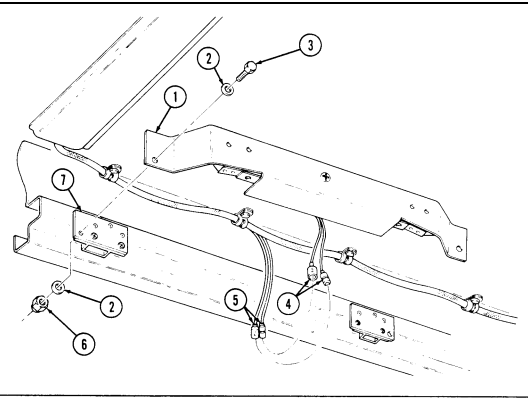

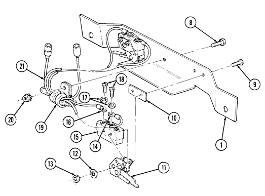

FOLLOW-ON TASKS: - Connect battery ground cable (para. 4-73).

- Check operation of interior blackout lights (TM 9-2320-280-10).

# 4-94. Bulkhead Door Blackout Switch And Bracket Maintenance

This task covers:

| INITIAL SETUP:   |
|------------------|

| 4\-119.   | Control Box Electrical Plug and Receptacle   | 4\-280   |
|-----------|----------------------------------------------|----------|
|           | Replacement                                  |          |
| 4\-120.   | Control Box Relay Replacement                | 4\-282   |
| 4\-121.   | Condenser Fan/Pressure Switch Wiring         | 4\-284   |
|           | Harness Replacement (M997, M997A1, M997A2)   |          |

a. Removal b. Installation

Materials/Parts Four lockwashers (Appendix G, Item 169)

#### A. Removal

1. Remove two screws (5) and washers (6) from switch cover (7) and bracket (4). Slide cover (7) away from switch (14) to allow access to switch (14).

Prior to removal, tag leads for installation.

2. Remove two screws (10) lockwashers (11), and two leads (12) and (13) from switch (14). Discard lockwashers (11).

3. Remove cover (7) and grommet (9) from wiring harness (8). 4. Remove two nuts (1), lockwashers (2), screws (16), switch (14), and switch lever (15) from bracket (4).

Discard lockwashers (2).

5. Remove two screws (3) and bracket (4) from body (17).

#### B. Installation

1. Install bracket (4) on body (17) with two screws (3). 2. Install switch (14) and switch lever (15) on bracket (4) with two screws (16), lockwashers (2), and nuts (1). 3. Install cover (7) and grommet (9) on wiring harness (8). 4. Connect two leads (12) and (13) to switch (14) with two lockwashers (11) and screws (10). 5. Slide cover (7) over switch (14) on bracket (4) with two washers (6) and screws (5).

# 4-94. Bulkhead Door Blackout Switch And Bracket Maintenance (Cont'D)

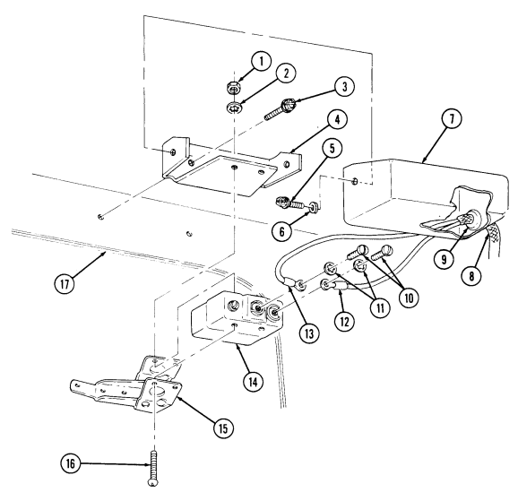

FOLLOW-ON TASKS: - · Connect battery ground cable (para. 4-73).

· Check operation of interior blackout light (TM 9-2320-280-10).

STORE LES
# 4-95. Backup Light Assembly Maintenance (M996, M996A1, M997, M997A1, M997A2)

This task covers:

| Applicable Models   |
|---------------------|

INITIAL SETUP:
M996, M996A1, M997, M997A1, M997A2 Tools General mechanic's tool kit:
automotive (Appendix B, Item 1)

#### Materials/Parts

Four lockwashers (Appendix G, Item 136) Two lockwashers (Appendix G, Item 139)

#### A. Light Assembly Removal B. Light Assembly Installation A. Light Assembly Removal

| Manual References ________________               |
|--------------------------------------------------|
| TM 9\-2320\-280\-10                              |
| TM 9\-2320\-280\-24P                             |
| Equipment Condition __________________           |
| Battery ground cable disconnected (para. 4\-73). |

1. Remove four screws (3) and lockwashers (2) from plate (6) and body (1). Pull plate (6) away from body (1) to allow access to connections. Discard lockwashers (2).

2. Remove two nuts (9), lockwashers (8), housing (5), and lead (7) from plate (6). Discard lockwashers (8). 3. Disconnect lead (10) from lead (4). Remove housing (5). 4. Inspect speed nuts (11) for damage. Replace if damaged.

b. Light Assembly Installation 1. Install housing (5) and lead (7) on plate (6) with two lockwashers (8) and nuts (9). 2. Connect lead (4) to lead (10). 3. Install plate (6) on body (1) with four lockwashers (2) and screws (3).

4-95. BACKUP LIGHT ASSEMBLY MAINTENANCE (M996, M996A1, M997, M997A1, M997A2)
(Cont'd)

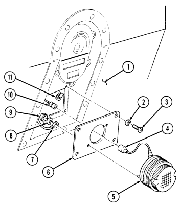

FOLLOW-ON TASKS: - Connect battery ground cable (para. 4-73).

· Check backup light operation (TM 9-2320-280-10).

# 4-96. Control Box Assembly Replacement (M997, M997A1, M997A2)

This task covers:

| Applicable Models            |
|------------------------------|
| Tools                        |
| General mechanic's tool kit: |

#### Initial Setup:

automotive (Appendix B, Item 1)
Materials/Parts Four lockwashers (Appendix G, Item 136) Locknut (Appendix G, Item 128) Lockwasher (Appendix G, Item 133) Two plain-assembled nuts 
(Appendix G, Item 201)
Three lockwashers (Appendix G, Item 135) Two tiedown straps (Appendix G, Item 309)
a. Removal b. Installation Equipment Condition Battery ground cable disconnected 
(para. 4-73).

| TM 9\-2320\-280\-24P   |
|------------------------|

#### A. Removal

1. Remove four screws (7), lockwashers (8), and cover (6) from control box (5). Discard lockwashers (8).

NOTE
Prior to removal, tag leads for installation.

2. Remove eight screws (4) and light harness leads (3) from terminal block (9) and mounting buss (10). 3. Disconnect light harness lead 791B (12) from NBC harness lead 791A (11).

Grommet must be removed through top of control box (5).

4. Remove grommet (2) and light harness (1) from control box (5). 5. Remove four screws (14) and four heating ventilating air conditioning leads (13) from mounting buss (10) and terminal block (9).

6. Remove plain-assembled nut (15), clamp (16), and heating ventilating air conditioning harness (17)
from screw (18). Discard plain-assembled nut (15).

7. Remove nut (21) and ground cable (19) from ground stud (35). 8. Remove nut (24), lockwasher (23), washer (22), positive cable (27), and NBC cable (32) from power stud (34). Discard lockwasher (23).

9. Remove two screws (25) and NBC leads (26) from mounting buss (10).

10. Remove plain-assembled nut (29), NBC harness clamp (31), and power harness clamp (28) from stud (33). Discard plain-assembled nut (29).

4-96.  CONTROL BOX ASSEMBLY REPLACEMENT (M997, M997A1, M997A2) (Cont'd)

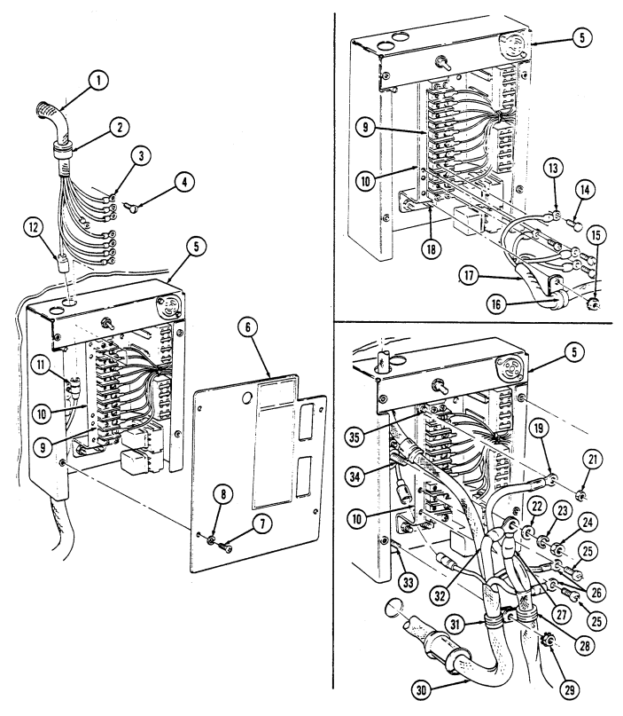

## 4-96. Control Box Assembly Replacement (M997, M997A1, M997A2) (Cont'D)

11. Remove two tiedown straps (14) and lead (12) from NBC harness (13). Discard tiedown straps (14). 12. Disconnect NBC harness leads 784A (5) and 784B (12) from heater leads (4). 13. Remove four capscrews (2) and washers (1) from NBC heater mounting plate (16) and body (15) and pull mounting plate (16) away for access to two capscrews (8).

14. Remove two nuts (6), capscrews (8), and ground terminals (7) from NBC heaters (3). 15. Remove screw (9), clamp (10), NBC harness (13), and A/C control box (11) from body (15). 16. Push grommet (40) down through hole in control box (17) and remove NBC harness (13) from control box (17).

17. Remove three screws (19), lockwashers (18), and control box (17) from body (37). Discard

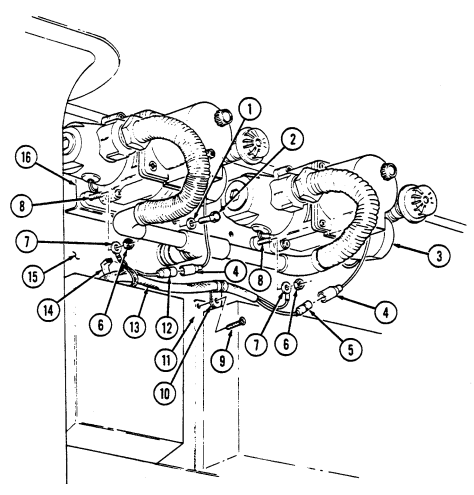

lockwashers (18).

# 4-96. Control Box Assembly Replacement (M997, M997A1, M997A2) (Cont'D)

b. Installation 1. Install control box (17) on body (37) with three lockwashers (18) and screws (19). 2. Install NBC harness (13) with grommet (40) up through hole in control box (17). 3. Install two ground terminals (7) from NBC harness (13) on heaters (3) with two capscrews (8) and nuts (6).

4. Install leads 791 and 794 (26) and 793 (29) on control box (17) with two capscrews (28). 5. Install NBC heater mounting plate (16) on body (15) with four washers (1) and capscrews (2). 6. Connect NBC harness leads 784A (5) and 784B (12) to heater leads (4). 7. Install lead (12) on NBC harness (13) with two tiedown straps (14). 8. Install NBC harness (13), power harness (32), and clamp (33) on screw (36) with plain-assembled nut (31). Connect NBC harness lead 791A (35) to light harness lead 791B (38).

9. Install positive cable (27) and NBC cable (34) on power stud (39) with washer (23), lockwasher (24),
and nut (25).

10. Install ground cable (20) on ground stud (41) with nut (22).

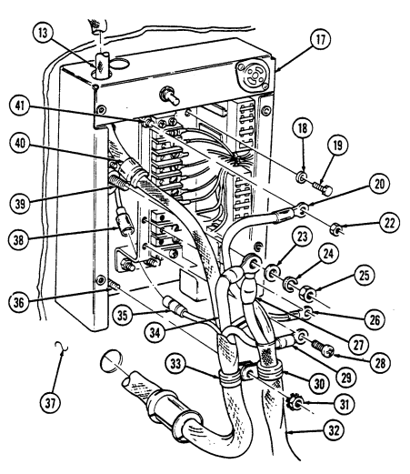

## 4-96. Control Box Assembly Replacement (M997, M997A1, M997A2) (Cont'D)

11. Install heating ventilating air conditioning harness (5) on screw (6) with clamp (4) and plain-assembled nut (3).

12. Install four control box leads (1) to mounting buss (7) and terminal block (8) with four screws (2). 13. Install light harness (9) down through hole in top of control box (13) and install grommet (10) in control box (13).

14. Connect light harness lead 791A (18) to NBC harness lead 791B (17). 15. Install eight light harness leads (11) on terminal block (8) and mounting buss (7) with eight screws (12).

16. Install cover (14) on control box (13) with four lockwashers (16) and screws (15).

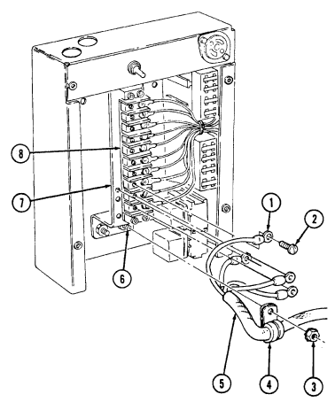

4-96. CONTROL BOX ASSEMBLY REPLACEMENT (M997, M997A1, M997A2) (Cont'd)

 FOLLOW-ON TASK: Connect battery ground cable (para. 4-73).

# 4-97. Control Box Assembly Replacement (M996, M996A1)

This task covers:

#### Initial Setup:

| Applicable Models                  |
|------------------------------------|
| M996, M996A1, M997, M997A1, M997A2 |
| Tools                              |
| General mechanic's tool kit:       |
| automotive (Appendix B, Item 1)    |
| Materials/Parts                    |

Four lockwashers (Appendix G, Item 136) Two plain-assembled nuts 
(Appendix G, Item 201)
Three lockwashers (Appendix G, Item 135) Locknut (Appendix G, Item 128) Lockwasher (Appendix G, Item 133)

| TM 9\-2320\-280\-10                         |
|---------------------------------------------|
| TM 9\-2320\-280\-24P                        |
| Equipment Condition                         |
| - Rear steps lowered (TM 9\-2320\-280\-10). |
| - Battery ground cable disconnected         |

#### A. Removal B. Installation

a. Removal 1. Remove four screws (7), lockwashers (8), and cover (6) from control box (5). Discard lockwashers (8).

Prior to removal, tag leads for installation.

2. Remove seven screws (4) and seven light harness leads (3) from terminal block (9). 3. Disconnect light harness lead 791B (11) from NBC harness lead 791A (10).

Grommet must be removed through top of control box.

4. Remove grommet (2) and light harness (1) from control box (5). 5. Remove plain-assembled nut (16), clamp (17), and heater harness (15) from mounting buss screw (18). Discard plain-assembled nut (16).

6. Remove three screws (14) and heater harness leads (13) from terminal block (9) and mounting buss (12).

# 4-97. Control Box Assembly Replacement (M996, M996A1) (Cont'D)

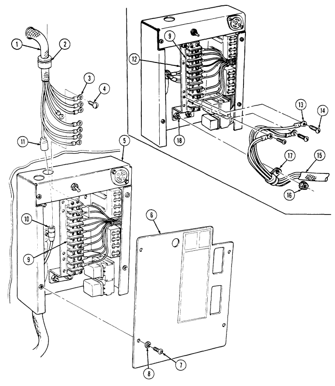

## 4-97. Control Box Assembly Replacement (M996, M996A1) (Cont'D)

11. Remove power cable (9) from power stud (2) and clamp (16) from control box stud (17). 12. Remove three screws (5), lockwashers (4), and control box (1) from body (21). 

Discard lockwashers (4).

#### B. Installation

7. Remove locknut (12), lockwasher (13), washer (11), NBC harness lead (10), and power cable (9)
from positive stud (2). Discard lockwasher (13) and locknut (12).

8. Remove two screws (6) and two NBC harness leads (7) from mounting buss (8). 9. Remove plain-assembled nut (15), clamp (14), and NBC harness leads (7) and (10) from control box stud (17). Discard plain-assembled nut (15).

10. Remove nut (18) and negative cable (20) from mounting buss capscrew (3). 

1. Install control box (1) on body (21) with three lockwashers (4) and screws (5). 2. Install negative cable (20) on mounting buss capscrew (3) with nut (18). 3. Install power cable (9) and NBC harness lead (10) on power stud (2) with washer (11), 
lockwasher (13), and locknut (12).

4. Install two NBC harness leads (7) on mounting buss (8) with two screws (6). 5. Install clamp (16) power cable (9), negative cable (20), clamp (14), and NBC harness leads (7) 
and (10), on control box stud (17) with plain-assembled nut (15).

# 4-97. Control Box Assembly Replacement (M996, M996A1) (Cont'D)

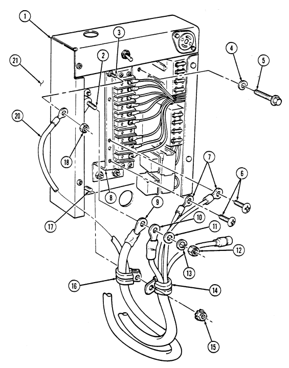

I

## 4-97. Control Box Assembly Replacement (M996, M996A1) (Cont'D)

6. Install three heater harness leads (3) to terminal block (2) and mounting buss (1) with three screws (4).

7. Install clamp (7) securing heater harness (6) to mounting buss screw (8) with plain-assembled nut (5).

8. Route light harness leads (11) and (18) through top of control box (13) and install grommet (9) and light harness (10) in control box (13).

9. Connect light harness lead 791B (18) to NBC harness lead 791A (17).

10. Install seven light harness leads (11) on terminal block (2) with seven screws (12). 11. Install cover (14) on control box (13) with four lockwashers (16) and screws (15).

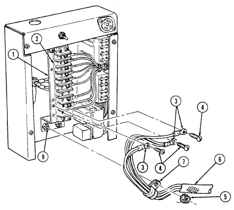

4-97. CONTROL BOX ASSEMBLY REPLACEMENT (M996, M996A1) (Cont'd)

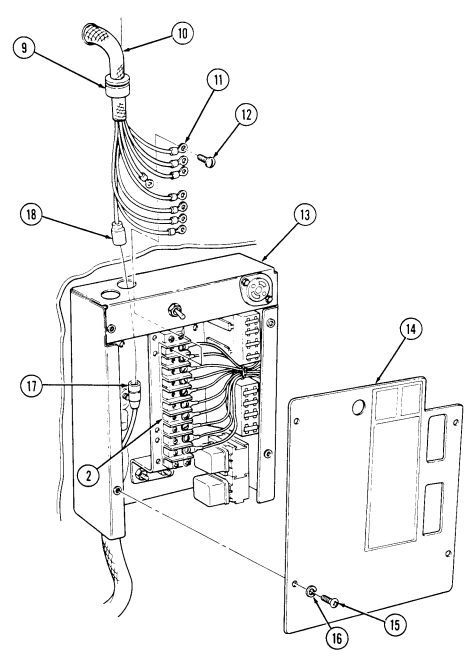

FOLLOW-ON TASKS: - Connect battery ground cable (para. 4-73).

· Check operation of spotlight (TM 9-2320-280-10).

# 4-98. Control Box Power Cables Replacement

This task covers:

#### Initial Setup:

Applicable Models M996, M996A1, M997, M997A1, M997A2 Tools General mechanic's tool kit:
automotive (Appendix B, Item 1)
Materials/Parts Four lockwashers (Appendix G, Item 136) Plain-assembled nut (Appendix G, Item 201) Lockwasher (Appendix G, Item 148) Lockwasher (Appendix G, Item 141) Lockwasher (Appendix G, Item 133) Locknut (Appendix G, Item 128)
a. Removal b. Installation Manual References TM 9-2320-280-10 TM 9-2320-280-24P
Equipment Condition Battery ground cable disconnected 
(para. 4-73).

Replacement of the control box power cables is basically the same for M996, M996A1, M997, M997A1, and M997A2 vehicles.

#### A. Removal

1. Remove four screws (6), lockwashers (5), and cover (7) from control box (1). Discard lockwashers (5). 2. Remove nut (4) and ground cable (2) from ground stud (18). 3. Remove locknut (12), lockwasher (13), washer (14), NBC harness cable (15), and positive cable (11)
from power stud (17). Discard lockwasher (13) and locknut (12).

4. Remove plain-assembled nut (9), two clamps (10), power harness (8), and NBC harness (22) from screw (16). Discard plain-assembled nut (9).

Step 5 is for M997, M997A1, and M997A2 vehicles only.

5. Remove two screws (20) two clamps (19) and power harness (8) from body (21) and remove clamps (19) from harness (8).

Steps 6 thru 8 apply to M996 and M996A1 vehicles only.

6. Remove four screws (20), five clamps (19), and power harness (8) from body (21). Remove clamps (19) from harness (8).

4-98.  CONTROL BOX POWER CABLES REPLACEMENT (Cont'd)

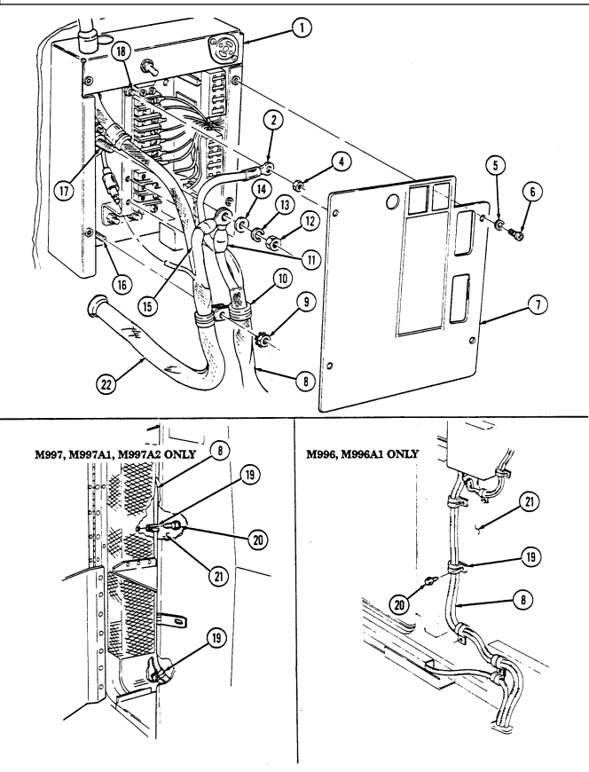

## 4-98. Control Box Power Cables Replacement (Cont'D)

7.

8.

9.

10.

11.

12.

13.

14.

1.

2.

3.

4. 5.

6. 7.

8.

Remove two screws (1) and three clamps (3) from power harness (8), resuscitator harness (2) and body (6).

Remove screw (1) and clamps (3) and (7) from body (6) and power harness (8). Remove grommets (4) and (9), power harness (8), and resuscitator harness (2) from floor (5)
and body (6).

Remove grommet (23) from battery box (20). Remove capscrew (10), lockwasher (11), ground cable (13), and two cables (12) from shunt (16)
Discard lockwasher (11).

Remove two screws (14), clamps (17), and positive cable (15) from battery box (20).

Remove nut (22), lockwasher (21), two battery cables (19), and positive cable (15) from power stud (18) . Discard lockwasher (21).

Remove power harness (8) from vehicle.

#### B. Installation

Route power harness (8) in approximate mounting location in vehicle.

Install positive cable (15) and two battery cables (19) on power stud (18) with lockwasher (21) and nut (22).

Install two clamps (17) on positive cable (15) and battery box (20) with two screws (14). Install ground cable (13) and two cables (12) on shunt (16) with lockwasher (11) and capscrew (10).

Install grommet (23) on power harness (8) in battery box (20).

Steps 6 thru 8 apply to M996 and M996A1 vehicles only.

Install clamp (7), power harness (8), and resuscitator harness clamp (3) on body (6) with screw (1). Install three clamps (3), power harness (8), resuscitator harness (2), on body (6) with two screws (1). Install power harness (8) and resuscitator harness (2) with two grommets (4) and (9) in floor (5) and body (6).

# 4-98. Control Box Power Cables Replacement (Cont'D)

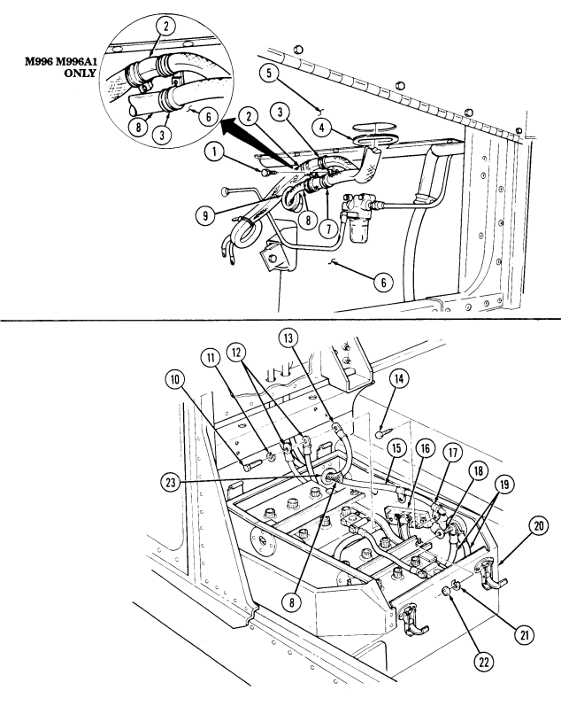

## 4-98. Control Box Power Cables Replacement (Cont'D)

9. Install positive cable (15) and NBC harness cable (16) on control box power stud (18) with washer (8), lockwasher (9), and locknut (10).

10. Install ground cable (2) on ground stud (19) with nut (4). 11. Install two clamps (11), power harness (13), and NBC harness (14) on screw (17) with plainassembled nut (12).

12. Install cover (7) on control box (1) with four lockwashers (5) and screws (6). 13. Install two clamps (22) and power harness (13) on body (21) with two screws (20).

NOTE

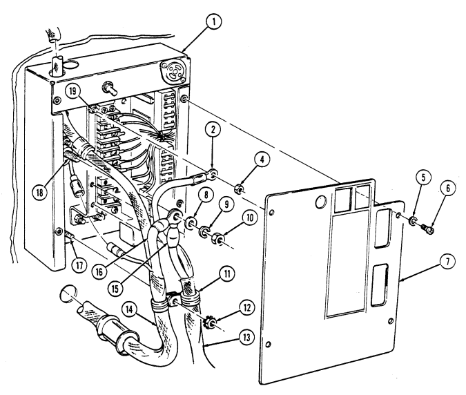

Step 14 applies to M996 and M996A1 vehicles only.

14. Install five clamps (22) and power harness (13) on body (21) with four screws (20).

# 4-98. Control Box Power Cables Replacement (Cont'D)

M996, M996A1 ONLY

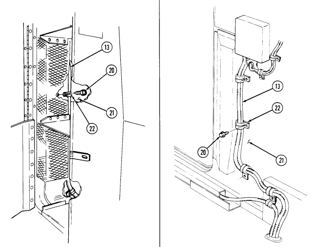

FOLLOW-ON TASKS: - Connect battery ground cable (para. 4-73).

- Check control box operation (TM 9-2320-280-10).

# 4-99. Nbc Control Box And Wiring Harness Replacement (M996, M996A1)

This task covers:

#### A. Removal B. Installation

| Materials/Parts   |
|-------------------|

| M996, M996A1, M997, M997A1, M997A2   |
|--------------------------------------|
| Tools                                |
| General mechanic's tool kit:         |
| automotive (Appendix B, Item 1)      |

#### Initial Setup:

Four lockwashers (Appendix G, Item 136) Plain-assembled nut (Appendix G, Item 201) Locknut (Appendix G, Item 128) Three locknuts (Appendix G, Item 97) Lockwasher (Appendix G, Item 133) Three lockwashers (Appendix G, Item 135) Five tiedown straps (Appendix G, Item 309)
NBC control panel removed (para. 4-124).

a. Removal

| TM 9\-2320\-280\-10   | TM 9\-2320\-280\-24P   |
|-----------------------|------------------------|
| Equipment Condition   |                        |

1. Remove four screws (11), lockwashers (10), and cover (9) from control box (1). Discard lockwashers (10).

Prior to removal, tag all leads for installation.

2. Remove locknut (12), lockwasher (3), washer (2), and positive cable lead 782 (22) from positive stud (25). Discard lockwasher (3) and locknut (12).

3. Remove two screws (13) and NBC harness leads (14) from mounting buss (26). 4. Disconnect lead 791A (23) from light harness lead 791B (24). 5. Remove plain-assembled nut (18), clamp (20), and NBC harness (4) from control box stud (21). Discard plain-assembled nut (18).

6. Remove four screws (8), clamps (7), NBC harness (4), and heater harness (6) from body (5). 7. Remove two screws (15), washers (16), retainer (17), and grommet (19) from body (5) and remove retainer (17) and grommet (19) from NBC harness (4).

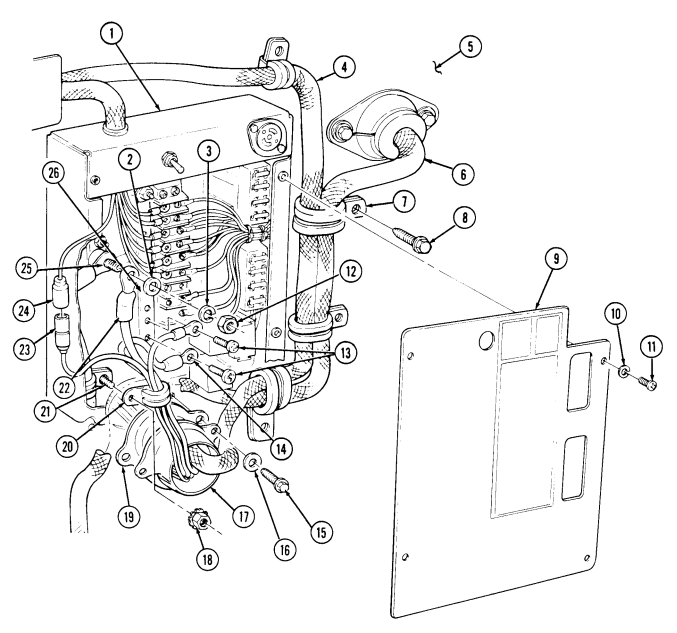

4-99. NBC CONTROL BOX AND WIRING HARNESS REPLACEMENT (M996, M996A1) Cont'd)

## 4-99. **Nbc Control Box And Wiring Harness Replacement (M996, M996A1) Cont'D)**

8. Remove four screws (4) and harness channel (5) from body (6). Pull channel (5) away from body (6).

9. Remove three tiedown straps (8). Discard tiedown straps (8).

10. Disconnect lead 785B (9), lead 785A (10), and lead 786A (19) from NBC heaters (7). 11. Remove three capscrews (17), lockwashers (16), and ground leads (18) from NBC heaters (7).

Discard lockwashers (16).

12. Remove screw (1), clamp (2), and harness (3) from body (6). 13. Remove two screws (14), washers (13), grommet (11), retainer (15), and intercom cable (12) from body (6).

14. Remove three screws (25), clamps (26), and harness (3) from body (27). Remove clamps (26). 15. Remove locknut (24), washer (21), capscrew (20), washer (21), clamp (22), and harness (3) from body (27).

16. Remove two locknuts (32), washer (33), capscrew (35), washer (33), and leads 795B (36) and 795C (34) from body (27).

17. Remove screw (31) and ground (29) from NBC heaters and filter assembly (28). 18. Disconnect connector (30) from NBC heater and filter assembly (28). 19. Remove grommet (23) and harness (3) from body (27).

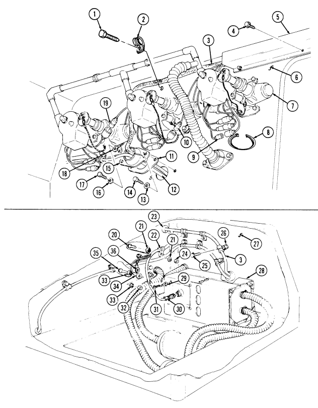

4-99. NBC CONTROL BOX AND WIRING HARNESS REPLACEMENT (M996, M996A1) Cont'd)

#### 4-99. Nbc Control Box And Wiring Harness Replacement (M996, M996A1) Cont'D)

20. Remove two tiedown straps (11) from leads (12) and (13) and harness (8). Discard tiedown straps (11). 21. Disconnect leads 787A (12) and 786B (13) from NBC heaters (10). 22. Remove screw (15), clamp (14), and harness (8) from body (9). 23. Remove two screws (5) and cover (6) from bracket (16). 24. Pull cover (6) away from switch (1) to allow access to leads. 25. Remove two screws (3) and leads (2) and (4) from switch (1).

26. Pull leads (2) and (4) through grommet (7) in cover (6).

Use care when removing harness. Failure to do so will cause damage to harness.

27. Remove harness (8) from vehicle.

b. Installation

Use care when routing harness. Failure to do so will cause damage to harness.

Route leads (2) and (4) through grommet (7) in cover (6). Route harness (8) in approximate mounting location. Connect leads (2) and (4) to switch (1) with two screws (3). Install cover (6) to bracket (16) with two screws (5). Install clamp (14) and harness (8) on body (25) with screw (15).

Connect leads 787A (12) and 786B (13) to NBC heaters (10).

Install two tiedown straps (11) on leads (12) and (13) and harness (8).

8. 9.

10.

11.

1.

2. 3.

4. 5.

6.

7.

Install grommet (22) on harness (8) in body (25).

Install clamp (20) and harness (8) on body (25) with washer (19), capscrew (18), washer (19), and nut (21). Install leads 795B (17) and 795C (32) on body (25) with two washers (31), capscrews (33), washers (31), and nuts (30). Install three clamps (24) on harness (8) to body (25) with three screws (23). Install ground (27) on NBC heater and filter assembly (26) with screw (29).

12. 13.

Connect harness (28) to NBC heater and filter assembly (26).

4-99. NBC CONTROL BOX AND WIRING HARNESS REPLACEMENT (M996, M996A1) Cont'd)

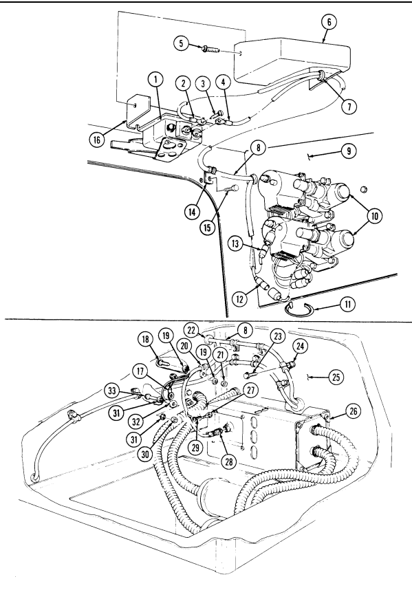

## 4-99. Nbc Control Box And Wiring Harness Replacement (M996, M996A1) Cont'D)

14. Install grommet (12), retainer (11), harness (3), and intercom cable (13) to body (7) with two washers (14) and screws (15).

15. Install clamp (2) and harness (3) on body (7) with screw (1). 16. Install ground leads (16) on three NBC heaters (6) and body (7) with three lockwashers (17) and capscrews (18).

17. Connect lead 785A (9), lead 785B (10), and lead 786A (19) to NBC heaters (6). 18. Install three tiedown straps (8) on leads (9), (10), and (19), and harness (3). 19. Install harness channel (4) over harness (3) on body (7) with four screws (5). 20. Install four clamps (25) on harness (3) and heater harness (24) on body (23) with four screws (26). 21. Install positive lead 782 (40) on power stud (43) with washer (21), lockwasher (22), and locknut (30).

22. Install two NBC harness leads (32) on mounting buss (44) with two screws (31). 23. Connect lead 791A (41) to light harness lead 791B (42). 24. Install clamp (38) on NBC harness (3) and control box stud (39) with plain-assembled nut (36). 25. Install grommet (37) and retainer (35) on NBC harness (3) and body (23) with two washers (34) and screws (33).

26. Install cover (27) on control box (20) with four lockwashers (28) and screws (29).

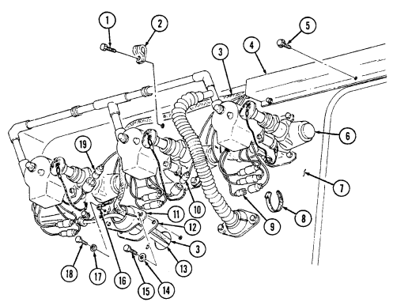

4-99. NBC CONTROL BOX AND WIRING HARNESS REPLACEMENT (M996, M996A1) Cont'd)

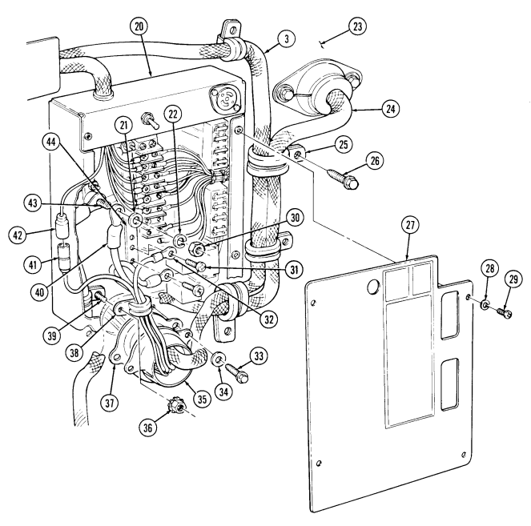

FOLLOW-ON TASK: NBC control panel installed (para. 4-124).

# 4-100. Nbc Control Box And Wiring Harness Replacement (M997, M997A1, M997A2)

This task covers:

#### Initial Setup:

Applicable Models M997, M997A1, M997A2 Tools General mechanic's tool kit:
automotive (Appendix B, Item 1)
Materials/Parts Locknut (Appendix G, Item 77) Four lockwashers (Appendix G, Item 136) Five lockwashers (Appendix G, Item 135) Three assembled locknuts 
(Appendix G, Item 130)
Five plain-assembled nuts 
(Appendix G, Item 201)
Nine tiedown straps (Appendix G, Item 309)

#### A. Removal **B. Installation**

Manual References TM 9-2320-280-10 TM 9-2320-280-24P
Equipment Condition
- Control panel removed (para. 4-124). - Front cover panel removed (para. 11-187).

Use care when removing harness. Failure to do so will cause damage to harness.

#### A. Removal

1. Remove four screws (8) lockwashers (7) and cover (6) from control box (1). Discard lockwashers (7). 2. Remove assembled locknut (11), clamp (12), and NBC harness (13) from control box stud (16).

Discard assembled locknut (11).

Prior to removal, tag leads for installation.

3. Remove nut (5), washer (3), and lead 782 (2) from power stud (20). 4. Disconnect NBC harness lead 791A (17) from light harness lead 791B (18). 5. Remove two screws (9) and NBC harness leads (10) from mounting buss (19). 6. Remove grommet (21) by pushing down through top of control box (1). 7. Remove grommet (14) and NBC harness (13) from body (15).

4-100.  NBC CONTROL BOX AND WIRING HARNESS REPLACEMENT (M997, M997A 1, M997A2)  (Cont'd)

## 4-100. Nbc Control Box And Wiring Harness Replacement (M997, M997A1, M997A2) (Cont'D)

8. Remove two tiedown straps (6). Disconnect leads 784A (4) and 784B (12) from NBC heaters (1).

Discard tiedown straps (6).

9. Remove four capscrews (3), washers (2), and mounting bracket (16) from body (14). Pull bracket (16) and NBC heaters (1) away from body (14) to allow access to ground leads (5) hardware.

10. Remove nut (13), capscrew (15), and ground terminals (5) from NBC heaters (1). 11. Remove screw (9), lockwasher (10), clamp (11), and harness (7) from A/C control box (8) and body (14). Remove clamp (11). Discard lockwasher (10).

12. Route harness (7) through body (14) into cab. 13. Remove two screws (26), clamps (25) and harness (7) from body (21). 14. Disconnect harness lead 785A (35) from NBC heater lead (36). 15. Remove nut (29), washer (30), capscrew (32), washer (30), and leads 796 and 796A (31) from NBC
heater (33). 

16. Remove five screws (27), clamps (28), harness (7), and intercom cable (24) from body (21). Remove clamps (28).

17. Remove tiedown straps (19) and (34). Disconnect harness lead 786A (40) from NBC heater lead (41). Discard tiedown straps (19) and (34).

18. Remove locknut (43), washer (17), capscrew (18), washer (17), and leads 796B and 796A (42) from

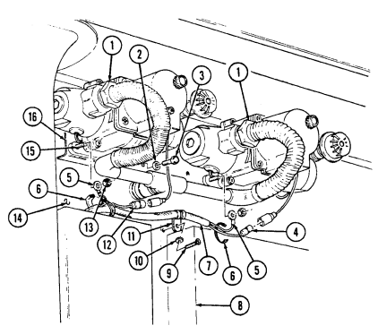

NBC heater (44). Discard locknut (43).

19. Remove two assembled locknuts (20), capscrews (37), washers (38), clamp (39), grommet (22),
retainer (23), harness (7), and intercom cable (24) from body (21). Discard assembled locknuts (20).

4-100.  NBC CONTROL BOX AND WIRING HARNESS REPLACEMENT (M997, M997A1, M997A2) (Cont'd)

## 4-100. Nbc Control Box And Wiring Harness Replacement (M997, M997A1, M997A2) (Cont'D)

20. Remove three plain-assembled nuts (19), screws (13), and cover (18) from body (14).

Discard plain-assembled nuts (19).

21. Remove two screws (20), clamps (21), harness (11), and intercom cable (12) from body (14). 22. Remove screw (7) and lead (9) from heater and filter assembly (10). 23. Remove two plain-assembled nuts (17), screws (15), clamps (16), harness (11), and intercom cable (12) from body (14). Discard plain-assembled nuts (17).

24. Disconnect connector (8) from heater and filter assembly (10). 25. Remove grommet (23) and harness (11) from body (14). 26. Remove screw (25), clamp (24), and harness (11) from body (14). 27. Remove two screws (5) and cover (26) from bracket (4). Pull cover (26) away from switch (3) to allow access to leads.

28. Remove two screws (27) and leads (2) and (6) from switch (3). 29. Remove harness (11) from grommet (22) and route harness (11) through opening in body (14). 30. Remove two screws (39), washers (38), retainer (37), grommet (36), harness (11), and intercom cable (12) from body (14). 

31. Remove six tiedown straps (40) from NBC heater leads (34) and harness (11). Discard tiedown straps (40).

32. Disconnect leads 786B (45), 787A (44), and 787B (41) from NBC connectors (42). 33. Remove four screws (28), lockwashers (29), washers (30), and mounting bracket (31) from brackets (32).

Pull bracket (31) away from body (14) to allow access to ground leads hardware. Discard lockwashers (29).

34. Loosen three hose clamps (49) and pull heaters (47) from fittings (48). 35. Remove three nuts (35) and ground leads (34), (43), and (46) from capscrews (33). 36. Remove harness (11) from vehicle.

b. Installation

Use care when routing harness. Failure to do so will cause damage to harness.

1. Route harness (11) through vehicle in approximate mounting location. 2. Install leads (34), (43), and (46) on three capscrews (33) with nuts (35).

10. Install cover (26) over switch (3) on bracket (4) with two screws (5). 11. Install clamp (24) and harness (11) on body (14) with screw (25).

3. Connect three heaters (47) to fittings (48) and tighten clamps (49). 4. Install mounting bracket (31) to brackets (32) with four washers (30), lockwashers (29), and screws (28).

5. Connect leads 786B (45), 787A (44), and 787B (41) to NBC heater connectors (42). 6. Install six tiedown straps (40) on NBC heater leads (34) and harness (11). 7. Install grommet (36), retainer (37), harness (11), and intercom cable (12) on body (14) with washers (38) and screws (39).

8. Route harness (11) through grommet (22) and opening in body (14). 9. Install leads (2) and (6) on switch (3) with two screws (27).

4-100.  NBC CONTROL BOX AND WIRING HARNESS REPLACEMENT (M997, M997A1,

## M997A2) (Cont'D)

Install grommet (23) and harness (11) in body (14).

12.

Connect connector (8) on heater and filter assembly (10).

13.

14.

Install lead (9) to heater and filter assembly (10) with screw (7).

Install two clamps (16), harness (11), and intercom cable (12) to body (14) with two screws (15) and 15.

plain-assembled nuts (17).

Install two clamps (21), harness (11), and intercom cable (12), on body (14) with two screws (20).

16.

Install cover (18) over harness (11) and intercom cable (12), and to body (14) with three screws (13)
17.

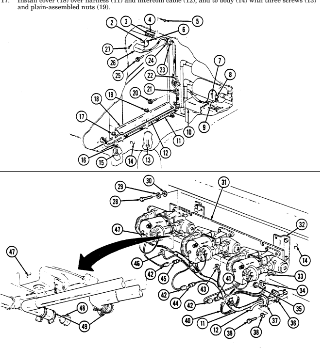

## 4-100. Nbc Control Box And Wiring Harness Replacement (M997, M997A1, M997A2) (Cont'D)

18. Install grommet (6), retainer (7), harness (9), and intercom cable (8) on body (5) with clamp (24),
two washers (23), capscrews (22), and assembled locknuts (4).

19. Install leads 796B and 796A (27) on NBC heater (29) with washer (1), capscrew (2), washer (1), and locknut (28).

20. Connect harness lead 786A (25) to NBC heater lead (26). 21. Install five clamps (13), harness (9), and intercom cable (8) on body (5) with five screws (12). 22. Install leads 796 and 796A (16) on NBC heater (18) with washer (15), capscrew (17), washer (15),
and nut (14).

23. Connect harness lead 785A (21) on NBC heater lead (20). 24. Install two clamps (10) on harness (9) and body (5) with three screws (11). 25. Install tiedown straps (3) and (19) securing heater leads together. 26. Install clamp (42) and harness (9) on A/C control box (40) and body (47) with lockwasher (41) and screw (38).

27. Install two ground terminals (37) on NBC heaters (30) and bracket (48) with capscrews (39) and
(49) and nuts (35) and (46).

28. Install bracket (48) and NBC heaters (30) on body (47) with four washers (31) and capscrews (32). 29. Connect leads 784A (36) and 784B (44) on NBC heater leads (34) and (43). 30. Install two tiedown straps (45) on harness (9) and leads. 

4-100.  NBC CONTROL BOX AND WIRING HARNESS REPLACEMENT (M997, M997A1, M997A2) (Cont'd)

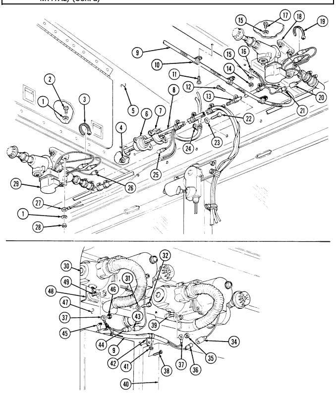

## 4-100. Nbc Control Box And Wiring Harness Replacement (M997, M997A1, M997A2) (Cont'D)

31. Install grommet (21) through top of control box (1) to secure NBC harness (13). 32. Install lead 782 (2) on power stud (20) with washer (3) and nut (5). 33. Connect NBC harness lead 791A (17) to light harness lead 791B (18). 34. Install two NBC harness leads (10) on mounting buss (19) with two screws (9). 35. Install clamp (12) and NBC harness (13) on control box stud (16) with assembled locknut (11). 36. Install cover (6) on control box (1) with four lockwashers (7) and screws (8). 37. Install grommet (14) in body (15) to secure NBC harness (13).

4-100.  NBC CONTROL BOX AND WIRING HARNESS REPLACEMENT (M997, M997A I,
 M997A2) (Cont'd)

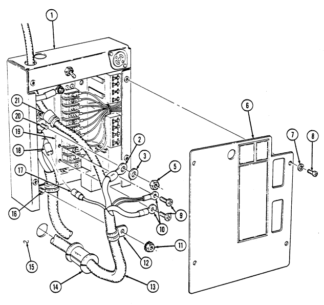

FOLLOW-ON TASKS: - Install control panel (para. 4-124).

- Install front cover panel (para. 11-187).

# 4-101. **Interior Lighting Harness Assembly Replacement (M997, M997A1, M997A2)**

This task covers:

a. Removal b. Installation

| INITIAL SETUP:                          |                                                  |
|-----------------------------------------|--------------------------------------------------|
| Applicable Models                       | Manual References                                |
| M996, M996A1, M997, M997A1, M997A2      | TM 9\-2320\-280\-10                              |
|                                         | TM 9\-2320\-280\-24P                             |
| Tools                                   |                                                  |
| General mechanic's tool kit:            | Equipment Condition                              |
| automotive (Appendix B, Item 1)         | Battery ground cable disconnected (para. 4\-73). |
| Materials/Parts                         |                                                  |
| Four lockwashers (Appendix G, Item 136) |                                                  |

a. Removal 1. Remove four screws (4), lockwashers (5), and cover (3) from control box (6). Discard lockwasher (5).

Prior to removal, tag leads for installation.

2. Remove eight screws (2) and lighting harness leads (1) from terminal block (7) and mounting buss (9).

3. Remove two screws (13), clamps (14), and lighting harness (12) from duct (15). 4. Disconnect lead 791B (10) from NBC harness lead 791A (8). 5. Remove grommet (11) and harness (12) from control box (6). 6. Deleted. 7. Remove four screws (29), clamp (17.1), and channel (30) from body (19) and pull channel (30) away for access to clamp (25).

8. Remove nut (23), screw (26), two clamps (25), and light harnesses (20) from cover (30). 9. Remove ten screws (21), cover (28), clamp (16), and harness (12) from body (19). Lower cover (28) to allow access to harness (12).

10. Disconnect six harness leads (17) from light leads (24). Remove harness cover (28) and grommet (27) from cover (28).

11. Disconnect four harness leads (18) from light leads (22).

4-101. INTERIOR LIGHTING HARNESS ASSEMBLY REPLACEMENT (M997, M997A1,

 M997A2) (Cont'd)

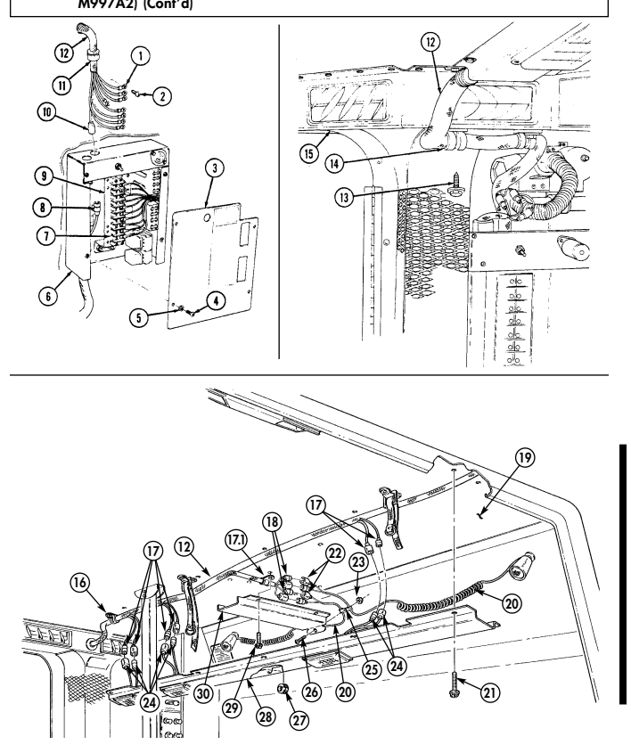

## 4-101. Interior Lighting Harness Assembly Replacement (M997, M997A1, M997A2) (Cont'D)

12. Remove seven screws (1) and clamps (2) from harness (3) and body (4). 13. Remove two screws (15) and clamps (14) from harness (3) and body (4). 14. Remove two grommets (13) from harness (3) and body (4). 15. Remove four screws (19) and lockwashers (18) from backup light cover (17) and body (16). Pull cover (17) away from body (16) to allow access to harness (3). Discard lockwashers (18).

16. Disconnect harness lead 21H (21) from light harness 21G (20). 17. Remove grommet (12) and harness (3) from body (4). 18. Remove screw (5) and clamp (11) from harness (3) and body (4). 19. Remove two nuts (8), screws (6), and clamps (7) from harness (3) and body (4). Discard nuts (8). 20. Disconnect two harness leads (10) from blackout switch leads (9). 21. Remove six screws (23) and clamps (22) from harness (3) and body (24).

4-101.  INTERIOR LIGHTING HARNESS ASSEMBLY REPLACEMENT (M997, M997A1, M997A2  (Cont'd)

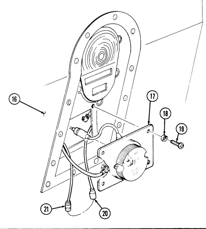

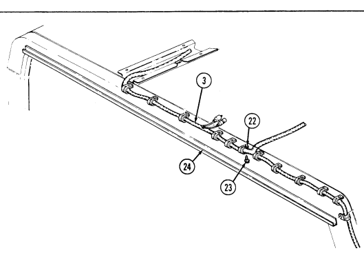

## 4-101. Interior Lighting Harness Assembly Replacement (M997, M997A1, M997A2) (Cont'D)

22. Remove four screws (7) from cover (6) and body (14). 23. Remove nut (3), screw (10), and cover (6) from two clamps (11) and light harnesses (11.1). 24. Disconnect four harness leads (5) from light leads (4). 25. Remove ten screws (13) from cover (8) and body (14). Lower cover (8) to allow access to harness (1). 26. Disconnect six harness leads (2) from light harness leads (12). Remove grommet (9) and harness cover (8).

Use care when removing harness. Failure to do so will cause damage to harness.

27. Remove harness (1) from body (14).

b. Installation

Use care when routing harness. Failure to do so will cause damage to harness.

1. Route harness (1) through vehicle in approximate mounting location. 2. Position harness cover (8) over harness (1) and connect six harness leads (2) to light harness leads (12). Install grommet (9) and cover (8) to body (14) with ten screws (13).

3. Connect four harness leads (5) to light leads (4). 4. Install two clamps (11) and light harnesses (11.1) on cover (6) with screw (10) and nut (3). 5. Install cover (6) on body (14) with four screws (7). 6. Install six clamps (15) on harness (1) and body (17) with six screws (16).

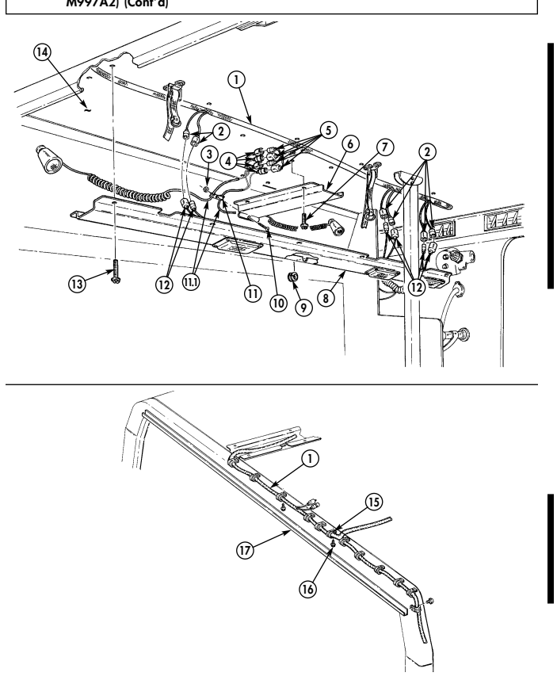

4-101. INTERIOR LIGHTING HARNESS ASSEMBLY REPLACEMENT (M997, M997A1, M997A2) (Cont'd)

## 4-101. Interior Lighting Harness Assembly Replacement (M997, M997A1, M997A2) (Cont'D)

7. Connect two harness leads (9) to blackout switch leads (8). 8. Install two clamps (10) on harness (3) and body (4) with two screws (6) and nuts (7). 9. Install clamp (11) on harness (3) and body (4) with screw (5).

10. Install grommet (12) and harness (3) in body (4). 11. Connect harness lead 24H (21) to lead 21G (20). 12. Install backup light cover (17) on body (16) with four lockwashers (18) and screws (19). 13. Install two grommets (13) on harness (3) and body (4). 14. Install two clamps (14) on harness (3) and body (4) with two screws (15). 15. Install seven clamps (2) on harness (3) and body (4) with seven screws (1).

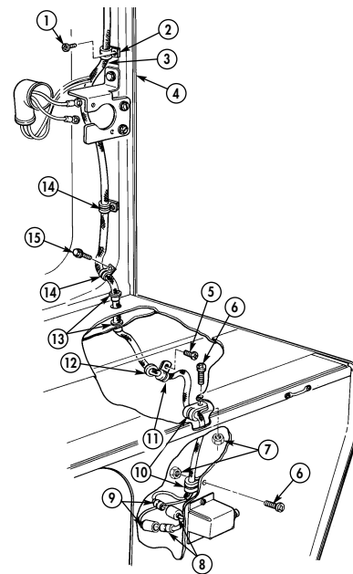

4-101. INTERIOR LIGHTING HARNESS ASSEMBLY REPLACEMENT (M997, M997A1, M997A2)  (Cont'd)

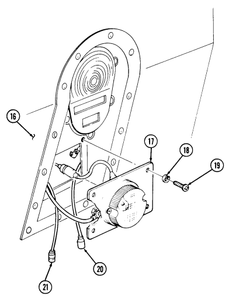

## 4-101. Interior Lighting Harness Assembly Replacement (M997, M997A1, M997A2) (Cont'D)

16. Connect four harness leads (4) to light harness leads (6). 17. Install grommet (13.1) on cover (14) and connect six harness leads (1) and (5) to light leads (16)
and (11).

18. Install clamp (17) and cover (14) on body (8) and harness (2) with ten screws (10). 19. Install two clamps (12) on light harnesses (9) and cover (3) with screw (13) and nut (7). 20. Install cover (3) and clamp (3.1) on body (8) with four screws (15). 21. Deleted. 22. Install two clamps (21) on harness (2) and duct (20) with two screws (22). 23. Connect lead 791B (32) to NBC harness lead 791A (30). 24. Install eight leads (23) on terminal block (29) and ground buss (31) with eight screws (24). 25. Install grommet (33) on control box (28). 26. Install cover (25) on control box (28) with four screws (26) and lockwashers (27).

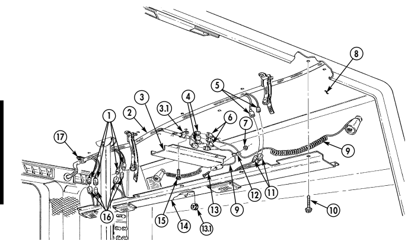

4-101. INTERIOR LIGHTING HARNESS ASSEMBLY REPLACEMENT (M997, M997A1, M997A2)  (Cont'd)

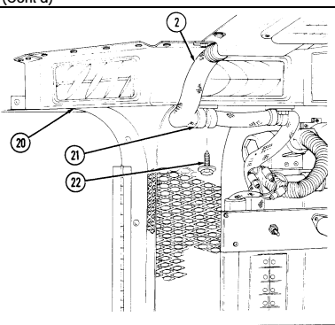

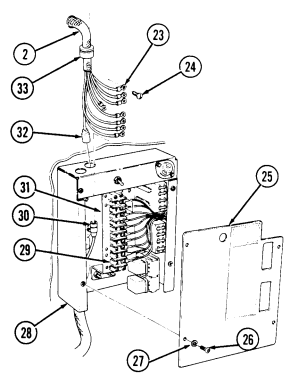

FOLLOW-ON TASKS: - Connect battery ground cable (para. 4-73).

· Check operation of interior dome lights (TM 9-2320-280-10).

- Install rear door blackout switch (para. 4-93).

· Install electrical outlet/bracket (para. 4-90).

# 4-102. Interior Lighting Harness Assembly Replacement (M996, M996A1)

| This task covers:                       |                                   |
|-----------------------------------------|-----------------------------------|
| a.  Removal                             | b.  Installation                  |
| INITIAL SETUP:                          |                                   |
| Applicable Models                       | Manual References                 |
| M997, M997A1, M997A2                    | TM 9\-2320\-280\-24P              |
| Tools                                   | Equipment Condition               |
| General mechanic's tool kit:            | Battery ground cable disconnected |
| automotive (Appendix B, Item 1)         | (para. 4\-73).                    |
| Materials/Parts                         |                                   |
| Four lockwashers (Appendix G, Item 136) |                                   |
| Locknut (Appendix G, Item 128)          |                                   |
| Lockwasher (Appendix G, Item 133)       |                                   |
| Two plain\-assembled nuts               |                                   |

#### A. Removal

1. Remove four screws (4), lockwashers (5), and cover (3) from control box (6). Discard lockwasher (5).

Prior to removal, tag leads for installation.

2. Remove eight screws (2) and lighting harness leads (1) from terminal block (7) and mounting buss
(9).

3. Disconnect lead 791B (10) from NBC harness lead 791A (8). 4. Remove grommet (12) and harness (11) from control box (6). 5. Remove four screws (14) and cover (13) from body (15) and harness (11). 6. Remove grommet (16) from harness (11). 7. Remove four screws (18) and cover (17) from body (15). 8. Remove four screws (30) and clamp (19.1) from channel (31) and body (15). 9. Remove nut (23), screw (28), clamp (27), and light harness (24) from cover (31). 

10. Remove grommet (28.1) from cover (29). 11. Remove ten screws (25) from cover (29) and body (15). Lower cover (29) to allow access to harness
(11).

12. Disconnect six harness leads (21) from light leads (26). Remove harness cover (29). 13. Disconnect two harness leads (20) from light leads (22).

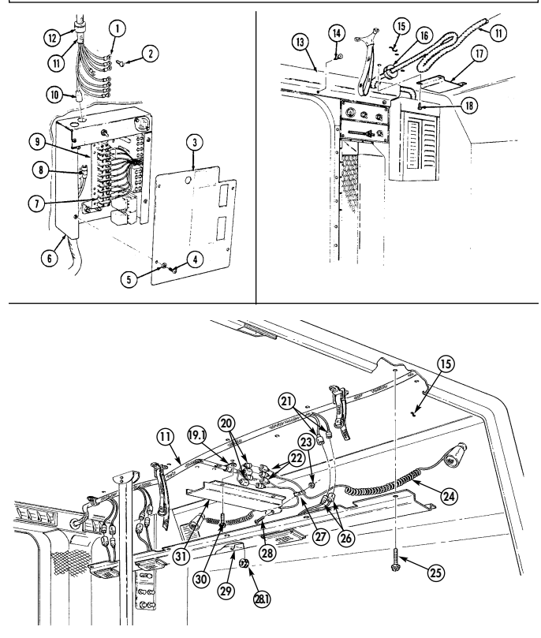

4-102.  INTERIOR LIGHTING HARNESS ASSEMBLY REPLACEMENT (M996, M996A1) (Cont'd)

## 4-102. Interior Lighting Harness Assembly Replacement (M996, M996A1) (Cont'D)

14. Remove seven screws (1) and clamps (3) from harness (2) and body (4). 15. Remove two screws (15) and clamps (14) from harness (2) and body (4). 16. Remove two grommets (13) from harness (2) and body (4). 17. Remove four screws (19) and lockwashers (18) from backup light cover (17) and body (16). Pull cover (17) away from body (16) to allow access to harness (2). Discard lockwashers (18).

18. Disconnect harness lead 21H (21) from light harness 21G (20). 19. Remove grommet (12) from harness (2) and body (4). 20. Remove screw (5) and clamp (6) from harness (2) and body (4). 21. Remove two nuts (11), screws (8), and clamps (7) from harness (2) and body (4) 22. Disconnect two harness leads (10) from blackout switch leads (9). 23. Remove six screws (23) and clamps (22) from harness (2) and body (24). 

4-102. INTERIOR LIGHTING HARNESS ASSEMBLY REPLACEMENT (M996, M996A1) (Cont'd)

## 4-102. Interior Lighting Harness Assembly Replacement (M996, M996A1) (Cont'D)

24. Remove four screws (7) from cover (6) and body (15). 25. Remove nut (3), screw (10), clamp (11), and cover (6) from light harness (14). 26. Remove grommet (9) from cover (8). 27. Disconnect two harness leads (5) from light leads (4). 28. Remove ten screws (13) from cover (8) and body (15). Lower cover (8) to allow access to harness (1). 29. Disconnect six harness leads (2) from light harness leads (12). Remove harness cover (8).

Use care when removing harness. Failure to do so will cause damage to harness.

30. Remove harness (1) from body (15).

b. Installation

Use care when routing harness. Failure to do so will cause damage to harness.

1. Route harness (1) through vehicle in approximate mounting location. 2. Position harness cover (8) over harness (1) and connect six harness leads (2) to light harness leads (12). Install cover (8) on body (15) with ten screws (13).

3. Connect two harness leads (5) to light leads (4). 4. Install grommet (9) on cover (8). 5. Install clamp (11) and light harness (14) on cover (6) with screw (10) and nut (3). 6. Install cover (6) on body (15) with four screws (7). 7. Install six clamps (16) and harness (1) on body (18) with six screws (17).

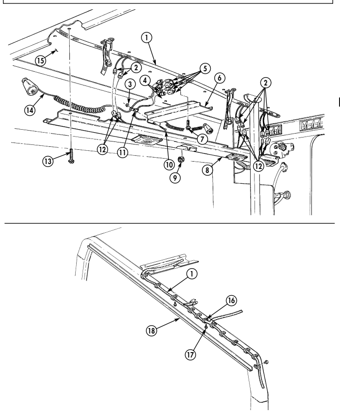

l
4-102. INTERIOR LIGHTING HARNESS ASSEMBLY REPLACEMENT (M996, M996A1) (Cont'd)

# 4-102. Interior Lighting Harness Assembly Replacement (M996, M996A1) (Cont'D)

8. Connect two harness leads (10) to blackout switch leads (9). 9. Install two clamps (7) and harness (2) on body (4) with two screws (8) and nuts (11).

10. Install clamp (6) and harness (2) on body (4) with screw (5). 11. Install grommet (12) on harness (2) and body (4). 12. Connect harness lead 24H (21) to lead 21G (20). 13. Install backup light cover (17) on body (16) with four lockwashers (18) and screws (19). 14. Install grommet (13) on harness (2) and body (4). 15. Install two clamps (14) and harness (2) on body (4) with two screws (15). 16. Install seven clamps (3) and harness (2) on body (4) with seven screws (1).

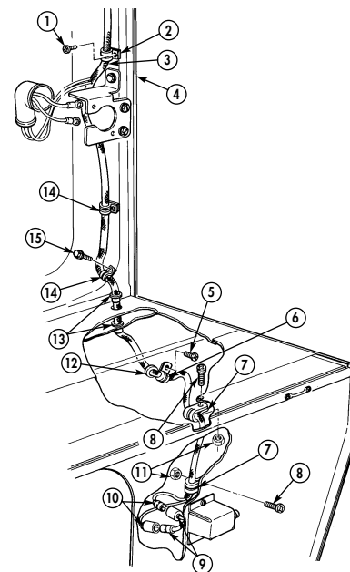

4-102. INTERIOR LIGHTING HARNESS ASSEMBLY REPLACEMENT (M996, M996A1) (Cont'd)

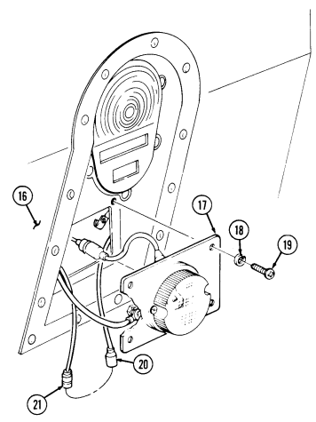

# 4-102. Interior Lighting Harness Assembly Replacement (M996, M996A1) (Cont'D)

17. Connect two harness leads (3) on light harness leads (4). 18. Install grommet (10.1) on cover (11). 19. Position cover (11) and connect six harness leads (1) to light leads (14). 20. Install cover (11) on body (6) with ten screws (8). 21. Install clamp (9) on light harness (7) and cover (13) with screw (10) and nut (5). 22. Install cover (13) and clamp (2.1) on body (6) with four screws (12). 23. Install grommet (15) on harness (16). 24. Position grommet (19) and harness (16) in control box (25). 25. Install cover (17) on body (6) with four screws (18). 26. Connect lead 791B (29) to NBC harness lead 791A (27). 27. Install eight leads (20) on terminal block (26) and ground buss (28) with eight screws (21). 28. Install cover (22) on control box (25) with four screws (23) and lockwashers (24).

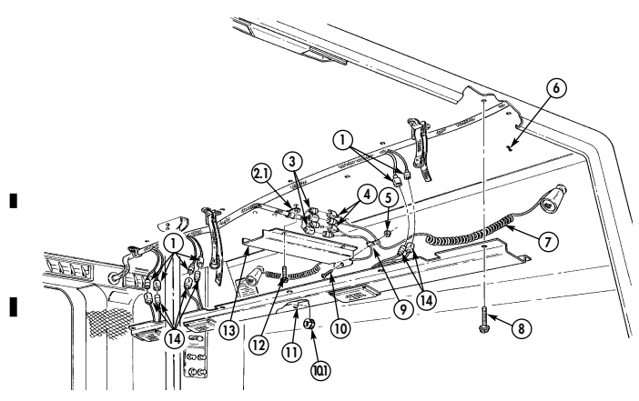

4-102. INTERIOR LIGHTING HARNESS ASSEMBLY REPLACEMENT (M996, M996A1) (Cont'd)

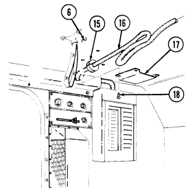

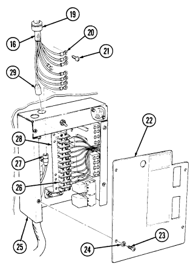

FOLLOW-ON TASKS: - Install rear close out panel (para. 11-182)
· Connect battery ground cable (para. 4-73). · Check operation of interior dome lights (TM 9-2320-280-10).

- Install rear door blackout switch/bracket (para. 4-93). - Install electrical outlet/bracket (para. 4-90).

# 4-103. Wiring Harness Duct Assembly Replacement

This task covers: a. Spotlight Branch Duct Removal c. Main Duct Installation INITIAL SETUP:
Applicable Models M996, M996A1, M997, M997A1, M997A2 Tools General mechanic's tool kit:
automotive (Appendix B, Item 1)
b. Main Duct Removal d. Spotlight Branch Duct Installation Manual References TM 9-2320-280-10 TM 9-2320-280-24P
Equipment Condition Battery ground cable disconnected (para. 4-73).

Harness duct replacement for M996, M996A1, M997, M997A1, and M997A2 are basically the same. This procedure covers M996 and M996A1 models only.

#### A. Spotlight Branch Duct Removal

1. Remove four screws (12) from duct (2), clamp (3), and ceiling (4) and pull duct (2) away from ceiling (4) for access to spotlight harness clamp (5).

2. Remove screw (11), nut (6), and spotlight wiring clamp (5) from duct (2).

#### B. Main Duct Removal Note

- Spotlight branch duct must be removed before removing main duct. Main duct must be installed before installing spotlight branch duct.

- Prior to removal, tag leads for installation.

1. Remove ten screws (8) from duct (7) and ceiling (4) and pull duct (7) away for access to wiring harness leads (1).

2. Disconnect six light assembly leads (9) from wiring harness leads (1) and remove duct (7). 3. Remove two ceiling lights (10) and blackout light (13) (para. 4-87). 4. Inspect grommet (11.1) for damage. Replace if damaged.

#### C. Main Duct Installation

1. Install two ceiling lights (10) and blackout light (13) (para. 4-87). 2. Connect six light assembly leads (9) to wiring harness leads (1). 3. Install duct (7) on ceiling (4) with ten screws (8)

#### D. Spotlight Branch Duct Installation

1. Install spotlight harness clamp (5) on duct (2) with screw (11) and nut (6). 2. Install duct (2) and clamp (3) on ceiling (4) with four screws (12).

# 4-103. Wiring Harness Duct Assembly Replacement (Cont'D)

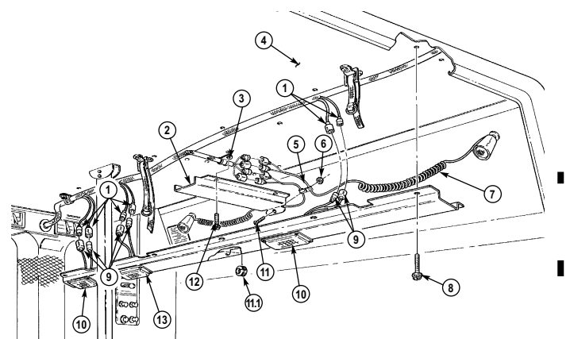

FOLLOW-ON TASKS: - Connect battery ground cable (para. 4-73).

- Check operation of interior lights (TM 9-2320-280-10).

# 4-104. Resuscitator/Aspirator Cable Replacement

This task covers:
a. Removal **b. Installation**
INITIAL SETUP:
Applicable Models **Manual References**
M996, M996A1, M997, M997A1, M997A2 TM 9-2320-280-24P
Tools General mechanic's tool kit:
automotive (Appendix B, Item 1)

Replacement of resuscitator/aspirator cable is basically the same for M996, M996A1, M997, M997A1, and M997A2 vehicles. This procedure covers M997, M997A1, and M997A2 vehicles.

For instructions on replacement of rivets, refer to para. 10-66.

a. Removal 1. Remove two screws (3), clamps (7), and cable (1) from body (2) and floor (6). 2. Remove nine rivets (4) from cable duct (5) and floor (6) and slide duct (5) left to remove. 3. Remove two screws (9), clamps (10), cable (1), and power harness clamp (8) from body (2). 4. Remove grommet (11) from floor (6) and remove cable (1) through hole in floor (6).

1. Install grommet (11) in floor (6). 2. Route cable (1) through grommet (11) in floor (6) and position in approximate mounting location. 3. Connect cable (1) to resuscitator and power source. (Leave slack at each end of cable before clamping to connect resuscitation equipment if not installed.)
4. Install two clamps (7) and cable (1) on body (2) and floor (6) with two screws (3). 5. Install cable duct (5) over cable (1) and slide to right under heat duct to mounting position. 6. Install cable duct (5) on floor (6) with nine rivets (4). 7. Install two clamps (10), cable (1), and power harness clamp (8) on body (2) with two screws (9).

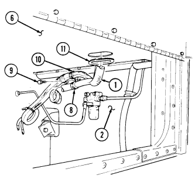

# 4-104. Resuscitator/Aspirator Cable Replacement (Cont'D)

# 4-105. Antenna Cables Replacement (M996, M996A1)

| Applicable Models            |
|------------------------------|
| M996, M996A1                 |
| Tools                        |
| General mechanic's tool kit: |

This task covers:
INITIAL SETUP:
automotive (Appendix B, Item 1)

#### Materials/Parts

Two tiedown straps (Appendix G, Item 307)

a. Removal b. Installation

Battery ground cable disconnected (para. 4-73).

| TM 9\-2320\-280\-24P   |
|------------------------|
| Equipment Condition    |

| Manual References   |
|---------------------|
| TM 9\-2320\-280\-2  |

#### A. Removal

1. Remove two tiedown straps (6) from antenna cables (8), power cable (2), and intercom cable (7).

Discard tiedown straps (6).

5. Remove two antenna cables (8) from antenna (16).

#### B. Installation

1. Install antenna cables (8) on antenna (16). 2. Install clamp (9) two antenna cables (8) and intercom cable (7) on plate (15) and windshield (12)
with washer (13) and capscrew (14). Tighten capscrew (14) 6 lb-ft (8 N•m).

3. Install three clamps (10), two antenna cables (8) and intercom cable (7) on windshield (12) with three screws (11).

4. Install clamp (5), two antenna cables (8) and intercom cable (7) on radio rack (1) with washer (4)
and capscrew (3). (Tighten capscrew (3) 6 lb-ft (8 N•m).

5. Install two antenna cables (8) on intercom cable (7) and power cable (2) with two tiedown straps (6).

2. Remove capscrew (3), washer (4), clamp (5), two antenna cables (8), and intercom cable (7) from radio rack (1).

3. Remove three screws (11), clamps (10), two antenna cables (8) and intercom cable (7) from windshield (12).

4. Remove capscrew (14), washer (13), clamp (9), two antenna cables (8) and intercom cable (7) from plate (15) and windshield (12).

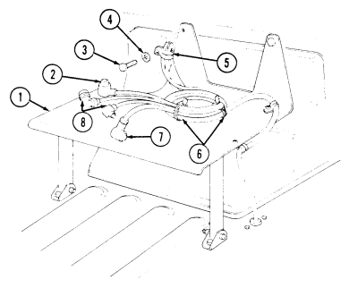

4-105. ANTENNA CABLES REPLACEMENT (M996, M996A1) (Cont'd)

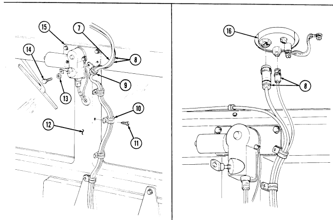

FOLLOW-ON TASK: Connect battery ground cable (para. 4-73).

# 4-106. Antenna Cables Replacement (M997, M997A1, M997A2)

| Applicable Models               |
|---------------------------------|
| M996, M996A1                    |
| Tools                           |
| General mechanic's kit:         |
| automotive (Appendix B, Item 1) |
| Materials/Parts                 |

This task covers:

#### Initial Setup:

Two tiedown straps (Appendix G, Item 308) Two lockwashers (old configuration only)
(Appendix G, Item 138)
Two assembled locknuts (old configuration only)
(Appendix G, Item 130)
Six assembled locknuts 
(new configuration only) (Appendix G, Item 130)

a. Removal b. Installation

#### A. Removal

| Equipment Condition                       |
|-------------------------------------------|
| NBC control panel removed (para. 4\-124). |

| Manual References   | TM 9\-2320\-280\-10   |
|---------------------|-----------------------|

1. Remove two tiedown straps (5) from antenna cables (7), power cable (8), and intercom cable (6).

Discard tiedown straps (5).

2. Remove capscrew (1), washer (2), clamp (3), antenna cables (7), and intercom cable (6) from radio rack (4).

3. Remove three screws (10), clamps (11), antenna cables (7), and intercom cable (6) from windshield (12).

4. Remove capscrew (13), washer (14), clamp (9), antenna cables (7), and intercom cable (6) from windshield (12) and plate (15).

4-106.  ANTENNA CABLES REPLACEMENT (M997, M997A1, M997A2) (Cont'd)

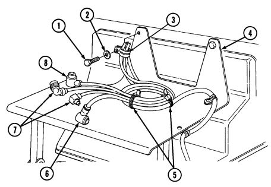

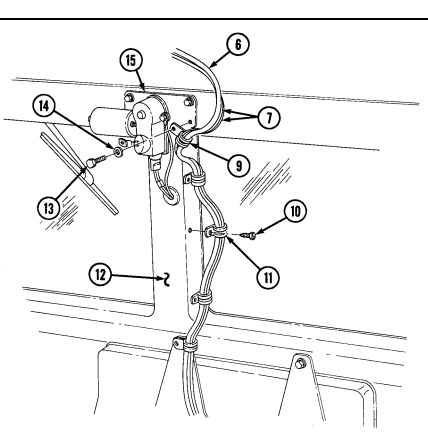

## 4-106. Antenna Cables Replacement (M997, M997A1, M997A2) (Cont'D)

5. Remove three screws (12), clamps (11), antenna cables (4), intercom cable (16), and harness (9)
from windshield (10).

•Perform steps 6 through 8 for old configuration. •Perform steps 9 through 11 for new configuration.

6. Remove assembled locknut (13), capscrew (19), washer (18), clamp (17), antenna cables (4), 
retainer (14), and grommet (15) from body (8). Discard assembled locknut (13).

7. Remove assembled locknut (1), screw (3), clamp (2), and antenna cables (4) from body (8). Discard assembled locknut (1).

12. Remove two antenna cables (4) from antenna (7).

8. Remove two capscrews (20), lockwashers (21), clamp (5), ground strap (6), and antenna cables (4)
from antenna (7) and body (8). Discard lockwashers (21).

9. Remove two assembled locknuts (30), capscrews (23), washers (24), clamps (25), and antenna cables (4) from reinforcement (22). Discard assembled locknuts (30).

10. Remove two assembled locknuts (29), capscrews (26), washers (27), clamps (28), and antenna cables (4) from body (8). Discard assembled locknuts (29).

11. Remove two assembled locknuts (13), capscrews (19), grommet (15), retainer (14), intercom cable (16), and antenna cables (4) from body (8). Discard assembled locknuts (13).

4-106.  ANTENNA CABLES REPLACEMENT (M997, M997A I, M997A2) (Cont'd)

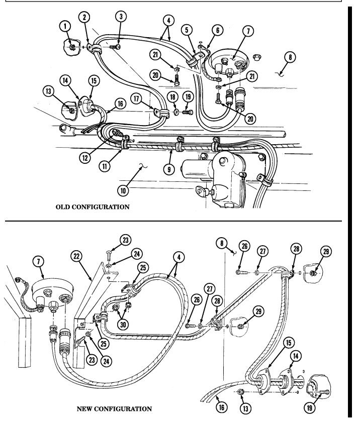

## 4-106. Antenna Cables Replacement (M997, M997A1, M997A2) (Cont'D)

b. Installation 1. Connect two antenna cables (4) to antenna (7).

- Perform steps 2 through 4 for old configuration. - Perform steps 5 through 7 for new configuration.

2. Install clamp (5) on antenna cables (4) and ground strap (6) on body (8) and antenna (7) with two lockwashers (21) and capscrews (20). Tighten capscrews (20) 26 lb-ft (35 N•m).

3. Install clamp (2) and two antenna cables (4) on body (8) with screw (3) and assembled locknut (1). 4. Install clamp (17) and two antenna cables (4) on grommet (15), retainer (14), and body (8) with capscrew (19), washer (18), and assembled locknut (13).

5. Install two clamps (26) on antenna cables (4) and reinforcement (23) with washers (25),
capscrews (24), and assembled locknuts (31).

6. Install grommet (15) and retainer (14) on antenna cables (4), wiring harness (9), intercom cable (16), and body (8) with two capscrews (19) and assembled locknuts (13).

7. Install two clamps (29) to antenna cables (4) on body (8) with washers (28), capscrews (27), and assembled locknuts (30).

8. Install three clamps (11) to antenna cables (4) and intercom cable (16) on windshield (10) with three screws (12).

9. Install clamp (35) to antenna cables (4) and intercom cable (16) on plate (34) with washer (33) and

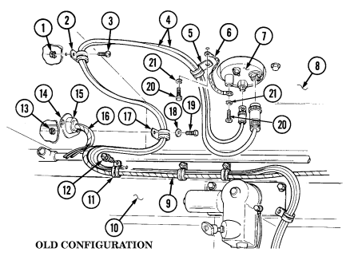

capscrew (32). Tighten capscrew (32) 72 lb-in. (8 N•m).

10. Install three clamps (37) on antenna cables (4) and intercom cable (16) on windshield (10) with three screws (36).

11. Install clamp (41) to antenna cables (4) and intercom cable (16) on radio rack (42) with washer (40)
and capscrew (39). Tighten capscrew (39) 72 lb-in. (8 N•m).

12. Install two tiedown straps (43) and antenna cables (4) on intercom cable (16) and power cable (38)
on radio rack (42).

# 4-106.  Antenna Cables Replacement (M997, M997A1, M997A2) (Cont'D)

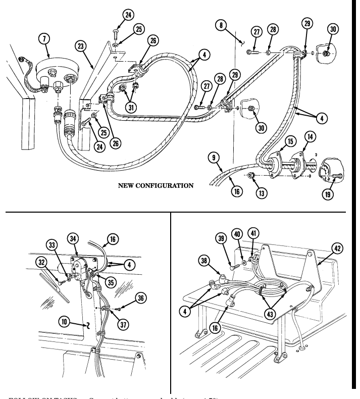

FOLLOW-ON TASKS: -   Connect battery ground cable (para. 4-73).
- •  -  - 

# 4-107. Intercom Cable Replacement (M996, M996A1)

This task covers:

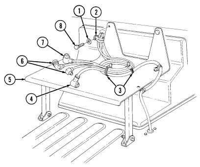

INITIAL SETUP

| Applicable Models   |
|---------------------|

General mechanic's tool kit:
automotive (Appendix B, Item 1)

#### Materials/Parts

| Equipment Condition   |
|-----------------------|

Plain-assembled nut (Appendix G, Item 201) Two assembled locknuts 
(Appendix G, Item 130)
Two tiedown straps (Appendix G, Item 307)

a. Removal b. Installation

| Manual References    |
|----------------------|
| TM 9\-2320\-280\-10  |
| TM 9\-2320\-280\-24P |

Equipment Condition **__________________**
Battery ground cable disconnected (para. 4-73).

#### A. Removal

1. Remove two tiedown straps (3) from intercom cable (4), power cable (7) and two antenna cables (6).

Discard tiedown straps (3).

2. Remove capscrew (8), washer (1), clamp (2), two antenna cables (6), and intercom cable (4) from radio rack (5).

3. Remove three screws (13), clamps (14), two antenna cables (6), and intercom cable (4) from windshield (15).

4. Remove capscrew (9), washer (10), clamp (12), intercom cable (4), and two antenna cables (6) from plate (11).

5. Remove two screws (22), clamps (23), and intercom cable (4) from body (17). 6. Remove two assembled locknuts (16), capscrews (21), washers (20), grommet (18), retainer (19), and intercom cable (4) from body (17). Discard assembled locknuts (16).

4-107. INTERCOM CABLE REPLACEMENT (M996, M996A1) (Cont'd)

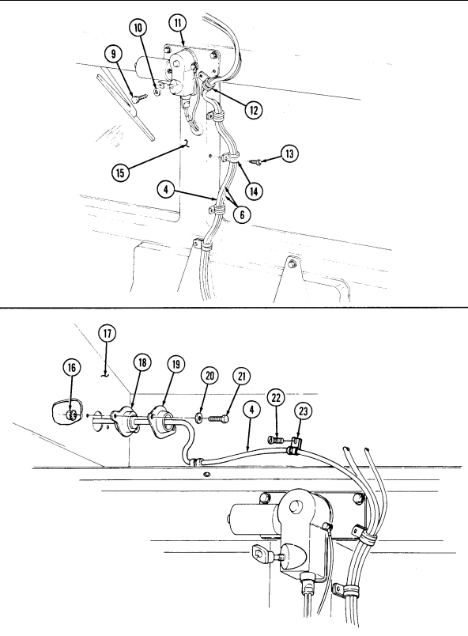

## 4-107. Intercom Cable Replacement (M996, M996A1) (Cont'D)

7. Loosen two clamps (12) and remove hose assemblies (11) from filter canisters (10). 8. Disconnect electrical harness lead (20) from precleaner (3). 9. Remove screw (1) and ground wire (2) from precleaner (3).

10. Disconnect latch (7) and remove precleaner (3) from bracket (4). 11. Remove four capscrews (15), washers (14), large washers (13), nuts (9) and bracket (4) from body (8).

12. Remove two nuts (16), screws (19), clamps (17), and intercom cable (18) from body (8). 13. Remove three screws (5), clamps (6), and intercom cable (18) from body (8). 14. Remove two screws (25), washers (24), retainer (27), grommet (26), intercom cable (18), and harness (21) from body (8).

15. Remove capscrew (30), plain-assembled nut (26.1), clamp (28), and intercom cable (18) from NBC
heater (31). Discard plain-assembled nut (26.1).

16. Remove screw (32), clamp (33), and intercom cable (18) from body (8). 17. Disconnect intercom cable (18) from intercom (34). Remove intercom cable (18) from vehicle while ensuring proper alignment of intercom cable connector (37) to avoid damage to wiring harness (35) as intercom cable (18) passes through hole (22) in bulkhead wall (36).

#### B. Installation

1. Ensure proper alignment of intercom cable connector (37) to avoid damage to wiring harness (35) as intercom cable (18) passes through hole (22) in bulkhead wall (36). Route intercom cable (18) through vehicle in approximate mounting location. Ensure yellow tape (23) is located in hole (22).

2. Connect intercom cable (18) to intercom (34). 3. Install clamp (33) and intercom cable (18) on body (8) with screw (32). 4. Install clamp (28) and intercom cable (18) on NBC heater (31) with plain-assembled nut (26.1) and capscrew (30).

5. Install grommet (26), retainer (27), over yellow tape (23) intercom cable (18), and harness (21) in body (8) with two washers (24) and screws (25).

6. Install three clamps (6) and intercom cable (18) on body (8) with three screws (5). 7. Install two clamps (17) and intercom cable (18) on body (8) with two screws (19) and nuts (16). 8. Install bracket (4) on body (8) with four capscrews (15), washers (14), large washers (13), and nuts (9).

9. Install precleaner (3) on bracket (4) with latch (7).

10. Install ground wire (2) on precleaner (3) with screw (1). 11. Connect electrical harness lead (20) to precleaner (3). 12. Install two hose assemblies (11) to filter canisters (10) with two clamps (12).

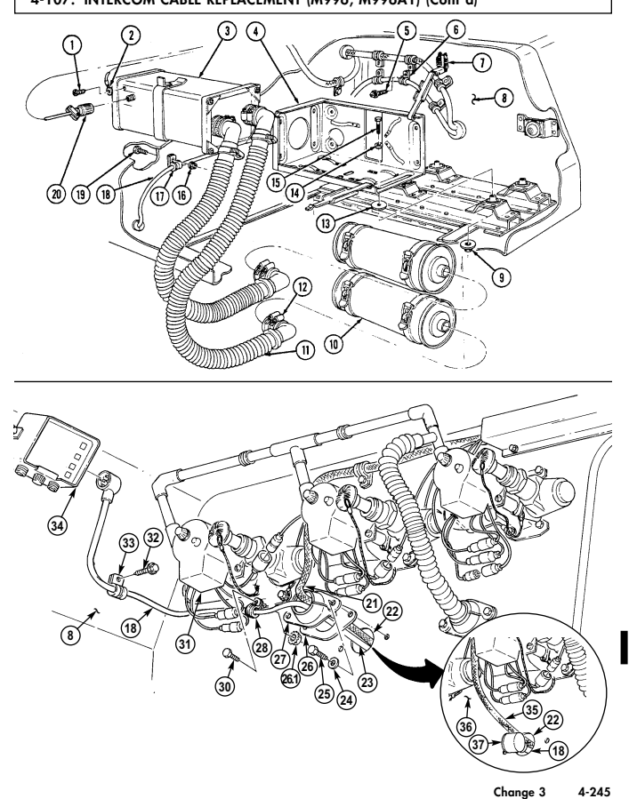

4-107. INTERCOM CABLE REPLACEMENT (M996, M996A1) (Cont'd)

## 4-107. Intercom Cable Replacement (M996, M996A1) (Cont'D)

13. Install grommet (3), retainer (4), and intercom cable (7) on body (2) with two washers (5), 
capscrews (6), and assembled locknuts (1).

14. Install two clamps (9) and intercom cable (7) on body (2) with two screws (8). 15. Install clamp (13), intercom cable (7), and two antenna cables (16) on plate (12) and windshield (17)

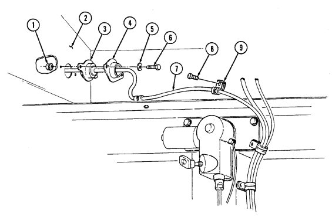

with washer (11) and capscrew (10). Tighten capscrew (10) to 6 lb-ft (8 N•m).

16. Install three clamps (15), intercom cable (7), and two antenna cables (16) on windshield (17) with three screws (14).

17. Install clamp (19), intercom cable (7), and two antenna cables (16) on radio rack (21) with washer (18) and capscrew (23). Tighten capscrew (23) to 6 lb-ft (8 N•m).

18. Install intercom cable (7) on antenna cables (16) and power cable (22) with two tiedown straps (20).

4-107. INTERCOM CABLE REPLACEMENT (M996, M996A1) (Cont'd)

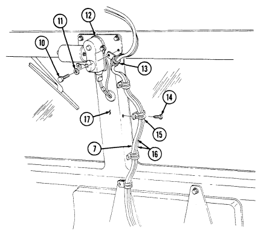

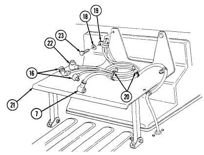

FOLLOW-ON TASKS: - Connect battery ground cable (para. 4-73).
- Test NBC system operation (TM 9-2320-280-10)

# 4-108. Intercom Cable Replacement (M997, M997A1, M997A2)

This task covers:

| Materials/Parts   |
|-------------------|

INITIAL SETUP:

| Applicable Models       |
|-------------------------|
| M996, M996A1            |
| Tools                   |
| General mechanic's kit: |

automotive (Appendix B, Item 1)
Two tiedown straps (Appendix G, Item 308) Seven assembled locknuts 
(Appendix G, Item 130)
a. Removal

a. Removal b. Installation

| Manual References    |
|----------------------|
| TM 9\-2320\-280\-10  |
| TM 9\-2320\-280\-24P |

TM 9-2320-280-10 Equipment Condition
- Battery ground cable disconnected (para. 4-73). - NBC door opened (TM 9-2320-280-10).

Removal and installation of intercom cable is basically the same for old and new antenna mount configurations. This procedure covers the old configuration.

1. Remove two tiedown straps (3) from intercom cable (4), power cable (7), and two antenna cables (6).

Discard tiedown straps (3).

2. Remove capscrew (8), washer (1), clamp (2), antenna cables (6), intercom cable (4), and power cable (7) from radio rack (5).

3. Remove three screws (13), clamps (14), two antenna cables (6), and intercom cable (4) from windshield (15).

4. Remove capscrew (9), washer (10), clamp (12), intercom cable (4), and two antenna cables (6) from plate (11) and windshield (15).

5. Remove three screws (25), clamps (24), intercom cable (4), two antenna cables (6), and wiring harness (23) from body (19).

6. Remove two assembled locknuts (16), capscrews (21), washers (20), grommet (17), retainer (18),
intercom cable (4), wiring harness (23), two antenna cables (6), and clamp (22) from body (19). Discard assembled locknuts (16).

4-108.  INTERCOM CABLE REPLACEMENT (M997, M997A1, M997A2) (Cont'd)

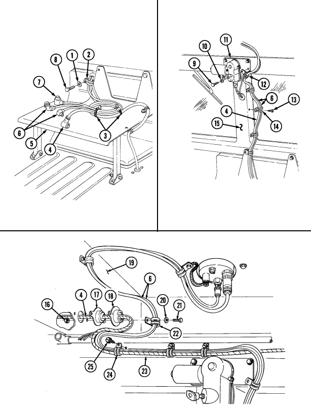

## 4-108. Intercom Cable Replacement (M997, M997A1, M997A2) (Cont'D)

7. Remove three assembled locknuts (3), capscrews (7), and cover (2) from body (6). Discard assembled locknuts (3).

8. Remove two screws (4), clamps (5), intercom cable (1), and wiring harness (8) from body (6). 9. Remove two assembled locknuts (5.3), capscrews (5.2), and clamps (5.1) from body (6). Discard assembled locknuts (5.3).

10. Remove two screws (13), washers (12), grommet (10), retainer (11), intercom cable (1), and wiring harness (8) from body (6).

11. Remove intercom cable (1) from intercom (14) and vehicle.

b. Installation 1. Install intercom cable (1) on intercom (14). 2. Route intercom cable (1) in vehicle in approximate mounting location. 3. Install grommet (10), retainer (11), and wiring harness (8) over yellow tape (9), and intercom cable (1) on body (6) with two washers (12) and screws (13).

4. Install two clamps (5.1), intercom cable (1), and wiring harness (8) on body (6) with two capscrews (5.2) and assembled locknuts (5.3).

5. Install two clamps (5), intercom cable (1), and wiring harness (8) on body (6) with two screws (4).

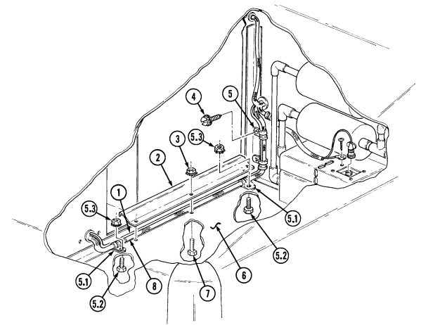 6. Install cover (2), intercom cable (1), and wiring harness (8) on body (6) with three capscrews (7) and assembled locknuts (3).

# 4-108.  Intercom Cable Replacement (M997, M997A1, M997A2) Cont'D)

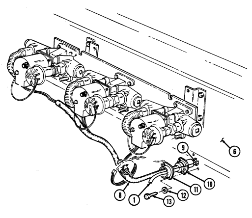

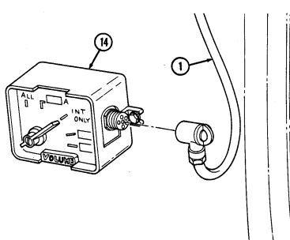

## 4-108. Intercom Cable Replacement (M997, M997A1, M997A2) (Cont'D)

7. Install grommet (3), retainer (4), intercom cable (2), wiring harness (10), and two cables (6) on body (5) with two capscrews (8), washers (7), clamp (9), and two assembled locknuts (1).

8. Install three clamps (12), intercom cable (2), antenna cables (6), and wiring harness (10) on body (5)
with three screws (13).

9. Install clamp (17), intercom cable (2), and antenna cables (6) on plate (16) and windshield (11) with washer (15) and screw (14). Tighten screw (14) to 71 lb-in. (8 N•m).

10. Install three clamps (19), intercom cable (2), and antenna cables (6) on windshield (11) with three screws (18).

11. Install clamp (21), intercom cable (2), and antenna cables (6) on radio rack (23) with washer (20)
and capscrew (25). Tighten capscrew (25) to 71 lb-in. (8 N•m).

12. Secure intercom cable (2), antenna cables (6), and power cable (24) together with two tiedown

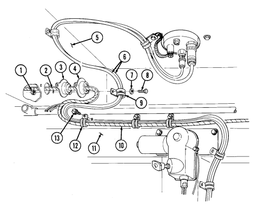

straps (22) on radio rack (23).

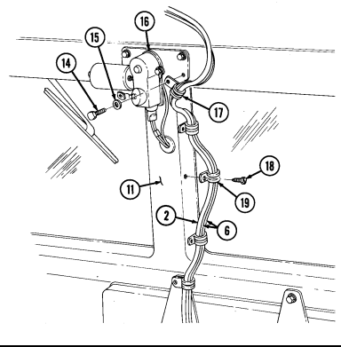

4-108.  INTERCOM CABLE REPLACEMENT (M997, M997A1, M997A2) (Cont'd)

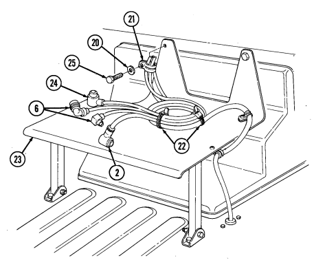

FOLLOW-ON TASKS: - Connect battery ground cable (para. 4-73).

•Close NBC door (TM 9-2320-280-10).

# 4-109. 200 Ampere Alternator (Aa0013036Aa) Replacement

This task covers:
a. Removal **b. Installation**

| INITIAL SETUP:                            |                                                                                                 |
|-------------------------------------------|-------------------------------------------------------------------------------------------------|
| Applicable Models                         | Manual References                                                                               |
| M996, M996A1                              | TM 9\-2320\-280\-24P                                                                            |
| Tools                                     | Equipment Condition                                                                             |
| General mechanic's tool kit:              | Battery ground cable disconnected (para. 4\-73).                                                |
| automotive (Appendix B, Item 1)           |                                                                                                 |
| Materials/Parts                           |                                                                                                 |
| Two tiedown straps (Appendix G, Item 307) |                                                                                                 |
| a. Removal                                |                                                                                                 |
| 1.                                        | Remove two tiedown straps (6) from antenna cables (8), power cable (2), and intercom cable (7). |
| Discard tiedown straps (6).               |                                                                                                 |

#### A. Removal

1. Remove four screws (1), lockwashers (21), cover (2), and gasket (3) from regulator (4). Discard lockwashers (21).

Prior to removal, tag leads for installation.

2. Remove nut (13), lockwasher (12), washer (11.1), and lead 2A (11) from stud (10). Discard lockwasher (12).

3. Remove nut (15), washer (16), nut (14.1), and lead 5A (14) from stud (5). 4. Remove rubber wedge (17) from opening in regulator (4). 5. Disconnect lead 568A (19) from harness lead (20). 6. Remove tiedown strap (18) securing lead 568A (19) to leads 5A (14) and 2A (11). Discard tiedown strap (18).

Perform steps 8 and 9 for vehicles with revised new configuration.

7. Loosen two capscrews (9) on alternator adjusting bracket (6) and two capscrews (38) on alternator mounting bracket (40) and support bracket (39).

8. Loosen capscrew (9), lockwasher (36), and washer (37) on alternator adjusting bracket (6). 9. Loosen nut (41) on alternator mounting bracket (40).

10. Remove three drivebelts (7) from alternator pulley (8). 11. Slide back rubber boot (27) and remove nut (23), lockwasher (24), washer (25), fuse (26), insulator washer (22), alternator positive cable (28), and bushing (29) from positive stud (30). Discard lockwasher (24).

12. Remove nut (35), lockwasher (34), lead 3B (31), and ground strap (33) from ground stud (32).

Discard lockwasher (34).

4-109.  200 AMPERE ALTERNATOR (AA0013036AA) REPLACEMENT (Cont'd)

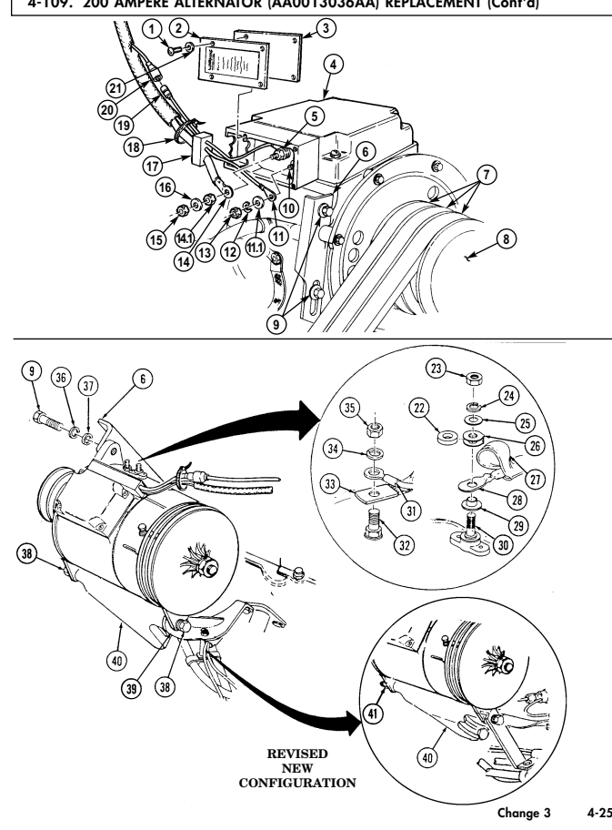

l

# 4-109. 200 Ampere Alternator (Aa0013036Aa) Replacement (Cont'D)

#### .Warning.

Alternator must be supported during removal and installation. Failure to support alternator may cause injury to personnel or damage to equipment.

13. Remove capscrew (1), lockwasher (2), and washer (3) from alternator (13) and adjusting bracket (4). Discard lockwasher (2).

#### Not E

- Perform step 15 for vehicles with new alternator support bracket c o n f i g u r a t i o n .

- Perform step 16 for vehicles with revised new configuration.

14. Remove two capscrews (16), lockwashers (15), and washers (14) from alternator (13), support bracket (11), and mounting bracket (12). Discard lockwashers (15).

15. Remove two capscrews (16), lockwashers (15), washers (14), and spacer (27) from alternator (13),
power steering lines bracket (21), support bracket (23), and mounting bracket (12). Discard lockwashers (15).

16. Remove nut (26), lockwasher (18), washer (19), long capscrew (22), and washer (20) from alternator (13), power steering lines bracket (21), support bracket (23), and mounting bracket (25). Discard lockwasher (18).

17. Remove alternator (13). 18. Remove five screws (5), washers (6), and guard (7) from alternator (13). 19. Remove alternator pulley (17) (para. 4-3).

#### B. Installation

1. Install alternator pulley (17) (para. 4-3). 2. Install guard (7) to alternator (13) with five washers (6) and screws (5).

#### Not E

- Perform step 4 for vehicles with new alternator support bracket c o n f i g u r a t i o n .

5. Position alternator (13) on mounting bracket (25) with support bracket (23) and power steering lines bracket (21) on the outside of alternator mounting flange (24) and install washer (20), long capscrew (22), washer (19), lockwasher (18), and nut (26).

6. Align alternator (13) with adjusting bracket (4) and install washer (3), lockwasher (2), and capscrew (1). Do not tighten capscrew (1).

- Perform step 5 for vehicles with revised new configuration.

3. Position alternator (13) on mounting bracket (12) with support bracket (11) between mounting bracket (12) and alternator (13) and install two washers (14), lockwashers (15), and capscrews (16). Do not tighten capscrews (16).

4. Position alternator (13) on mounting bracket (12) with support bracket (23) and power steering lines bracket (21) on the outside of alternator mounting flange (24) and install spacer (27), two washers (14), lockwashers (15), and capscrews (16).

# 4-109.  200 Ampere Alternator (Aa0013036Aa) Replacement (Cont'D)

# 4-109. 200 Ampere Alternator (Aa0013036Aa) Replacement (Cont'D)

Ensure terminals are clean before connections are made.

7. Install ground strap (25) and lead 3B (23) to ground stud (24) with lockwasher (26) and nut (22).

Tighten nut (22) to 96-144 lb-in. (11-16 N•m).

8. Install insulator (27) in fuse (31). 9. Install bushing (34), positive cable (33), fuse (31), and insulator (27) on positive stud (35) with washer (30), lockwasher (29), and nut (28). Tighten nut (28) to 10-15 lb-ft (14-20 N•m). Slide rubber boot (32) over nut (28).

Perform step 10 for vehicles equipped with deep water fording kits.

10. Apply sealant to positive stud (35) and positive cable (33) so that all exposed metallic surfaces are coated. The sealant should be evenly applied with a minimum thickness of 0.06 in. (1.5 mm).

11. Tighten two capscrews (9) on alternator mounting bracket (6) to 40 lb-ft. (54 N•m). 12. Install three drivebelts (7) on alternator pulley (8). 13. Install lead 5A (14) to stud (5) with washer (16), nut (14.1), and nut (15). 14. Install lead 2A (11) to stud (10) with washer (11.1), lockwasher (12), and nut (13). 15. Install rubber wedge (17) in opening in regulator (4). 16. Install gasket (3) and cover (2) to regulator (4) with four lockwashers (21) and screws (1). 15. Connect lead 568A (19) to harness lead (20) and secure to leads 2A (11) and 5A (14) using tiedown straps (18).

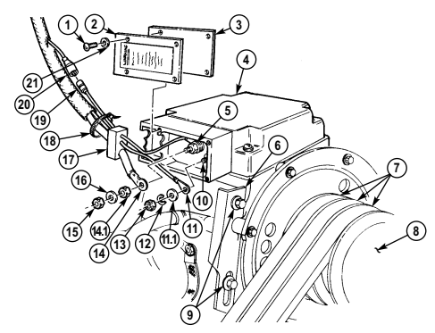

# 4-109.  200 Ampere Alternator (Aa0013036Aa) Replacement (Cont'D)

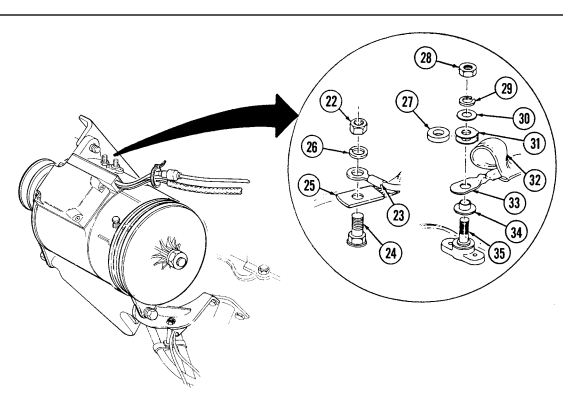

FOLLOW-ON TASKS: - Adjust alternator belts (para. 3-82).

· Connect battery ground cable (para. 4-75). - Lower and secure hood (TM 9-2320-280-10).

# 4-110. 200 Ampere Alternator (12338796-1) Replacement (6.2L)

This task covers:

a. Removal b. Installation

INITIAL SETUP:

| Applicable Models  _______________              | Manual References  ________________                |
|-------------------------------------------------|----------------------------------------------------|
| M997, M997A1, M997A2                            | TM 9\-2320\-280\-10                                |
|                                                 | TM 9\-2320\-280\-24P                               |
| Tools                                           |                                                    |
| General mechanic's tool kit:                    | Equipment Condition  __________________            |
| automotive (Appendix B, Item 1)                 | - NBC door opened (TM 9\-2320\-280\-10).           |
|                                                 | - Battery ground cable disconnected (para. 4\-73). |
| Materials/Parts _____________                   |                                                    |
| Two tiedown straps (Appendix G, Item 308)       |                                                    |
| Two lockwashers (old configuration only)        |                                                    |
| (Appendix G, Item 138)                          |                                                    |
| Two assembled locknuts (old configuration only) |                                                    |

a. Removal NOTE
Prior to removal, tag leads for installation.

1. Remove nut (25), lockwasher (24), washer (23), lead 3B (22), and ground strap (21) from ground stud (20). Discard lockwasher (24).

2. Slide back rubber boot (26) and remove nut (1), lockwasher (2), washer (3), fuse link (4), insulator washer (27), alternator positive cable (5), and washer (6) from positive stud (7). Discard lockwasher (2).

3. Loosen two capscrews (12) and (14) on alternator adjusting bracket (9) and two capscrews (15)
securing alternator (18) to alternator mounting bracket (17) and support bracket (16).

4. Remove three drivebelts (8) from alternator pulley (19).

#### .Warning.

Alternator must be supported during removal and installation. Failure to support alternator may cause injury to personnel or damage to equipment.

5. Remove capscrew (12), lockwasher (11), and washer (10) securing alternator (18) to adjusting bracket (9). Discard lockwasher (11).

6. Remove capscrew (14), washer (13), and alternator adjusting bracket (9) from mounting bracket (17).

4-110.  200 AMPERE ALTERNATOR (12338796-1) REPLACEMENT (6.2L) (Cont'd)

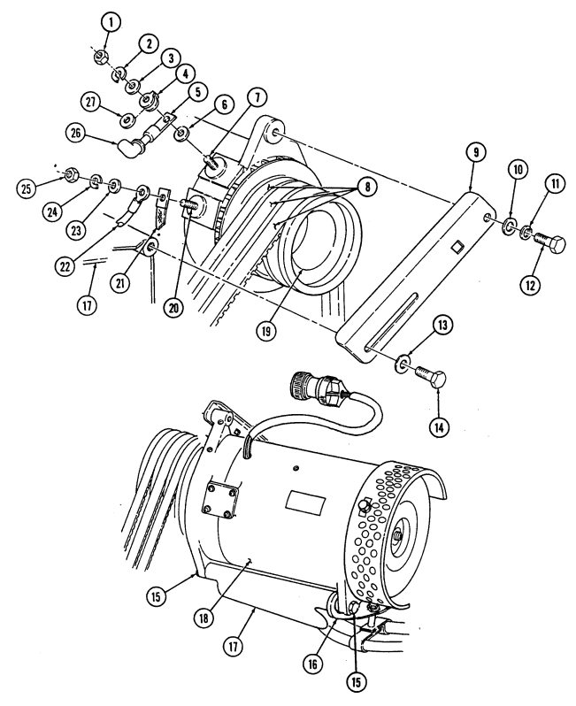

# 4 - 1 1 0 . 200 Ampere Alt E R N Ator (12338796-1) Replacement (6.2L) (Cont'D)

7. Remove two capscrews (18), lockwashers (19), and washers (20) securing alternator (24) to support bracket (21) and mounting bracket (23). Discard lockwashers (19).

#### Not E

- Perform step 8 for vehicles with new alternator support bracket configuration.

- Perform step 9 for vehicles with revised new configuration.

8. Remove two capscrews (18), lockwashers (19), washers (20), and spacer (27) securing alternator (24),
power steering lines bracket (25), and support bracket (21) to mounting bracket (23). Discard lockwashers (19).

9. Remove nut (37), lockwasher (19), washer (20), long capscrew (38), and washer (20) securing alternator (24), power steering lines bracket (25), and support bracket (21) to mounting bracket (23), and alternator flange (26). Discard lockwasher (19).

10. Remove alternator (24).

11. Remove three capscrews (15), washers (16), and bushings (22) securing fan guard assembly (17) to alternator (24).

12. Remove alternator pulley (28) (para. 4-3).

#### B Installation

1. Install alternator pulley (28) (para. 4-3). 2. Install fan guard assembly (17) on alternator (24) and secure with three bushings (22),
washers (16), and capscrews (15).

3. Position alternator (24) on mounting bracket (23) with support bracket (21) between mounting bracket (23) and alternator (24) and install two washers (20), lockwashers (19), and capscrews (18). Do not tighten capscrews (18).

#### Not E

- Perform step 4 for vehicles with new alternator support bracket configuration.

6. Position alternator adjusting bracket (9) and install washer (10), lockwasher (11), and capscrew (12). Do not tighten capscrew (12).

#### Not E

Ensure terminals are clean before connections are made.

7. Align alternator (24) with adjusting bracket (9) and install washer (13) and capscrew (14). Do not tighten capscrew (14).

8. Install insulator washer (36) in fuse link (4). 9. Install washer (6), positive cable (5), fuse link (4), and insulator washer (36) on postive stud (7) and secure with washer (3), lockwasher (2), and nut (1). Tighten nut (1) to 10-15 lb-ft (14-20 N•m).

10. Install ground strap (30) and lead 3B (31) to ground stud (29) and secure with washer (32),
lockwasher (33), and nut (34). Tighten nut (34) to 96-144 lb-in. (11-16 N•m).

11. Install rubber boot (35) over stud (7).

12. Install three drivebelts (8) on alternator pulley (28).

- Perform step 5 for vehicles with revised new configuration.

4. Position alternator (24) on mounting bracket (23) with support bracket (21) and power steering lines bracket (25) on the outside of alternator mounting flange (26) and install spacer (27), two washers (20), lockwashers (19), and capscrews (18).

5. Position alternator (24) on mounting bracket (23) with support bracket (21) and power steering lines bracket (25) on the outside of alternator mounting flange (26) and install washer (20), long capscrew (38), washer (20), lockwasher (19), and nut (37).

# 4-110.  200 Ampere Alternator (12338796-1) Replacement (6.2L) (Cont'D)

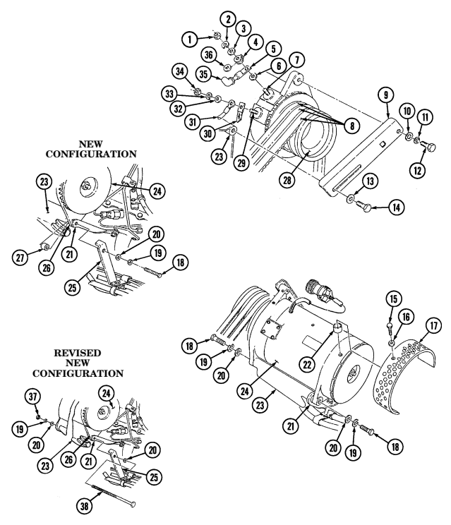

FOLLOW-ON TASKS: - Install 200 amp regulator (para. 4-115).

· Adjust alternator belt (para. 3-82).

· Connect battery ground cable (para. 4-73).

· Lower and secure hood (TM 9-2320-280-10).

# 4-110.1. 200 Ampere Alternator (12447109) Replacement (6.5L)

This task covers:

a. Removal b. Installation

| INITIAL SETUP                               |                                                  |
|---------------------------------------------|--------------------------------------------------|
| Applicable Models                           | Personnel Required                               |
| M996, M996A1                                | One mechanic                                     |
|                                             | One assistant                                    |
| Tools                                       |                                                  |
| General mechanic's tool kit:                | Manual References ________________               |
| automotive (Appendix B, Item 1)             | TM 9\-2320\-280\-24P                             |
| Materials/Parts                             | Equipment Condition __________________           |
| Plain\-assembled nut (Appendix G, Item 201) | Battery ground cable disconnected (para. 4\-73). |
| Two assembled locknuts                      |                                                  |
| (Appendix G, Item 130)                      |                                                  |
| Two tiedown straps (Appendix G, Item 307)   |                                                  |
| a. Removal                                  |                                                  |

a. Removal

Prior to removal, tag leads for installation.

1. Remove nut (14), lockwasher (13), washer (12), and ground strap (11) from ground stud (10). Discard lockwasher (13).

2. Slide back rubber boot (15) and remove nut (1), lockwasher (2), washer (3), alternator positive cable
(4), nut (5), and washer (6) from positive stud (7). Discard lockwasher (2).

3. Position 3/8-in. breaker bar on belt tensioner (16), move tensioner (16) clockwise, and remove drivebelt (8) from alternator pulley (9).

Alternator must be supported during removal and installation. Failure to support alternator may cause injury to personnel or damage to equipment.

4. Remove capscrew (17), lockwasher (18), and washer (19) from bracket (20) and alternator (28).

Discard lockwasher (18).

5. Remove nut (31), lockwasher (30), washer (25), screw (24), washer (25), and alternator (28) from support bracket (26) and mounting bracket (29). Discard lockwasher (30).

6. Remove three capscrews (21), washers (22), bushings (27), and fan guard assembly (23) from alternator (28).

7. Remove alternator pulley (9) (para. 4-3).

4-110.1.  200 AMPERE ALTERNATOR (12447109) REPLACEMENT  (6.5L) (Cont'd)

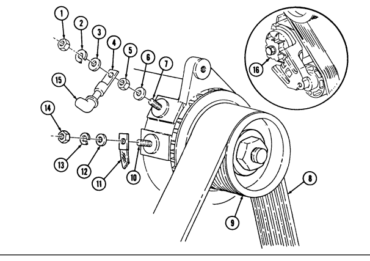

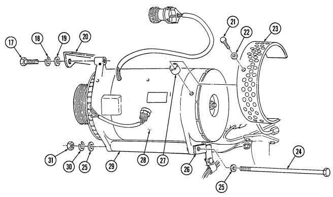

## 4-110.1. 200 Ampere Alternator (12447109) Replacement (6.5L) (Cont'D)

b. Installation 1. Install alternator pulley (24) (para. 4-3). 2. Install fan guard assembly (7) on alternator (12) with three bushings (11), washers (6), and capscrews (5).

Alternator must be supported during removal and installation. Failure to support alternator may cause injury to personnel or damage to equipment.

3. Position alternator (12) on mounting bracket (13) with support bracket (10) on outside of alternator (12) and install washer (9), capscrew (8), washer (9), lockwasher (14), and nut (15).

4. Install washer (3), lockwasher (2), and capscrew (1) on bracket (4) and alternator (12).

Ensure terminals are clean before connections are made.

5. Install washer (21), nut (20), and positive cable (19) on positive stud (22) with washer (18),
lockwasher (17), and nut (16). Tighten nut (16) to 10-15 lb-ft (14-20 N•m).

6. Slide rubber boot (30) over stud (22). 7. Install ground strap (26) on ground stud (25) with washer (27), lockwasher (28), and nut (29).

Tighten nut (29) to 8-12 lb-ft (11-16 N•m).

8. Position 3/8-in. breaker bar on belt tensioner (31), move tensioner (31) clockwise, and install belt (23) on alternator pulley (24).

# 4-110.1. 200 Ampere Alternator (12447109) Replacement (6.5L) (Cont'D)

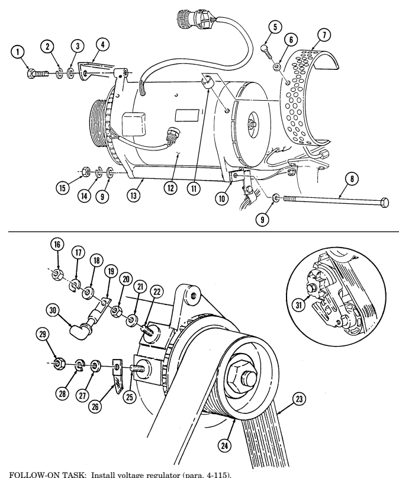

# 4-111. 200 Ampere Alternator Cable (12446825) Replacement

This task covers:
INITIAL SETUP:
Applicable Models M997A2, M1097A2, M1123 Tools General mechanic's tool kit:
automotive (Appendix B, Item 1)
Materials/Parts Lockwasher (Appendix G, Item 186) Lockwasher (Appendix G, Item 150) Adhesive sealant (Appendix C, Item 9)

a. Removal b. Installation

Manual References TM 9-2320-280-10 TM 9-2320-280-24P

#### Equipment Condition

- Battery ground cables disconnected (para. 4-73). - Hood raised and secured (TM 9-2320-280-10). - Engine access cover removed (para. 10-15).

Prior to removal, tag leads for installation.

a. Removal 1. Slide back rubber boot (1) and remove nut (3), lockwasher (4), washer (5), fuse (2), insulator (6),
cable (7), and bushing (8) from positive stud (9). Discard lockwasher (4).

2. Remove capscrew (11), clamp (12), and cable (7) from bracket (10). 3. Remove nut (17), lockwasher (16), washer (15), and cable (7) from buss bar (14) and remove cable
(7) from battery box (13). Discard lockwasher (16).

#### B. Installation Note

Ensure terminals are clean before connections are made.

1. Route cable (7) through grommet (18) in battery box (13), and install cable (7) on buss bar (14) with washer (15), lockwasher (16), and nut (17).

2. Route cable (7) in approximate mounting location over heat shield, and secure cable (7) and clamp (12) on bracket (10) with capscrew (11).

3. Apply sealant to positive stud (9) and cable (7) so all exposed metallic surfaces are coated. 4. Install bushing (8), cable (7), fuse (2), and insulator (6) on positive stud (9) with washer (5),
lockwasher (4), and nut (3). Tighten nut (3) to 10-15 lb-ft (14-20 N•m). Slide rubber boot (1) over nut (3).

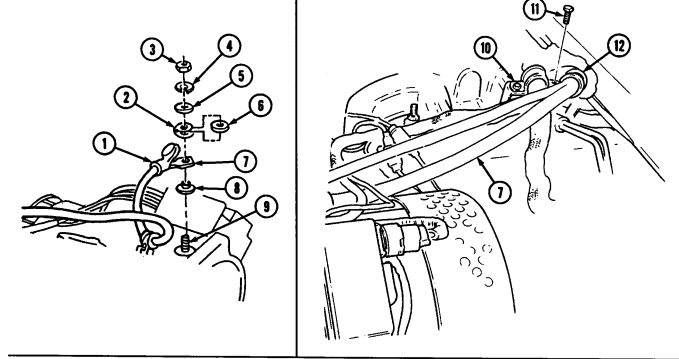

# 4-111.  200 Ampere Alternator Cable (12446825) Replacement (Cont'D)

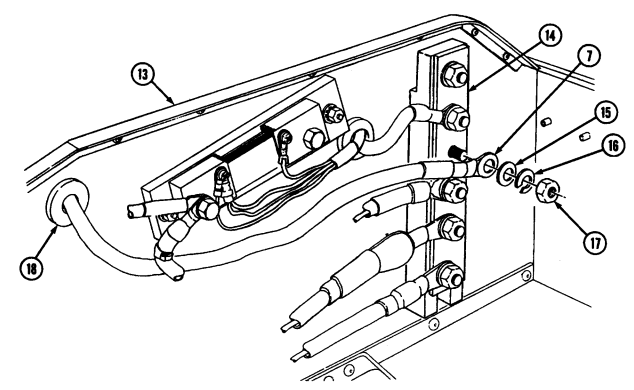

FOLLOW-ON TASKS: - Install engine access cover (para. 10-15).

- Lower and secure hood (TM 9-2320-280-10).

· Connect battery ground cables (para. 4-73).

- Start engine and check operation of voltmeter gauge (TM 9-2320-280-10).

# 4-112. 200 Ampere Alternator Cable (12339317) Replacement

This task covers:
INITIAL SETUP:
Applicable Models Tools General mechanic's tool kit:
automotive (Appendix B, Item 1)

| Materials/Parts   |
|-------------------|

Two lockwashers (Appendix G, Item 191) Assembled locknut (Appendix G, Item 131) Lockwasher (Appendix G, Item 186)

a. Removal b. Installation

#### Materials/Parts (Cont'D)

Tiedown strap (Appendix G, Item 308) Adhesive sealant (Appendix C, Item 9)
Manual References TM 9-2320-280-10 TM 9-2320-280-24P
Equipment Condition
- Battery ground cable disconnected (para. 4-73). - Hood raised and secured (TM 9-2320-280-10).

Prior to removal, tag leads for installation.

a. Removal 1. Remove tiedown strap (30), screw (31), clip (32), and 200 ampere cable (8) from starter (33). 

Discard tiedown strap (30).

Step 2 applies to M997 and M997A1 vehicles only. Step 3 applies to M996, M996A1, M1097, and M1097A1 vehicles only.

2. Remove assembled locknut (9), bolt (24), cable (8), and clamps (28), (25), and (27) from oil pan bracket (26). Discard assembled locknut (9).

3. Remove assembled locknut (9), bolt (24), cable (8), and clamp (28) from oil pan bracket (26). Discard assembled locknut (29).

4. Remove nut (19), washer (20), clamps (21), and (22), and cable (8) from compressor (18). 5. Remove nut (15), lockwasher (16), cable (8), and clamp (17) from engine lift bracket (1). Discard lockwasher (16).

6. Remove nut (11), lockwasher (12), cable (8), and clamp (13) from water crossover stud (14). Discard lockwasher (12).

7. Slide back rubber boot (2) and remove nut (4), lockwasher (5), washer (6), fuse (3), insulator (7),
cable (8), and bushing (9) from positive stud (10). Discard lockwasher (5).

8. Remove cable (8) from vehicle.

b. Installation

Ensure terminals are clean before connections are made.

1. Install bushing (9), cable (8), fuse (3), and insulator (7) on positive stud (10) with washer (6), lockwasher (5), and nut (4). Tighten nut (4) to 10-15 lb-ft (14-20 N•m). Slide rubber boot (2) over nut (4).

NOTE
For vehicles equipped with deep water fording kits, perform step 2.

2. Apply sealant to positive stud (10) and cable (8) so all exposed metallic surfaces are coated. The sealant should be evenly applied with a minimum thickness of .06 in. (1.5 mm).

3. Install clamp (13) and cable (8) on water crossover stud (14) with lockwasher (12) and nut (11). 4. Install clamp (17) on cable (8) and engine lift bracket (1) with lockwasher (16) and nut (15).

M996, M996A1, M997, M997A1, M1097, M1097A1

# 4-112. 200 Ampere Alternator Cable (12339317) Replacement (Cont'D)

5. Install clamp (22) on cable (8) and secure clamp (21) to compressor (18) with washer (20) and nut (19).

NOTE
Step 6 applies to M997 and M997A1 vehicles only. Step 7 applies to M996 and M996A1 vehicles only.

6. Install clamps (28), (27), and (25) on cable (8) and oil pan bracket (26) with bolt (24) and assembled locknut (29).

7. Install clamp (28) on cable (8) and oil pan bracket (26) with bolt (24) and assembled locknut (29). 8. Install cable (8) on starter (33) with clip (32) and screw (31). Connect tiedown strap (30). 9. Apply sealant to screw (31) and cable (8) so that all exposed metallic surfaces are coated. The

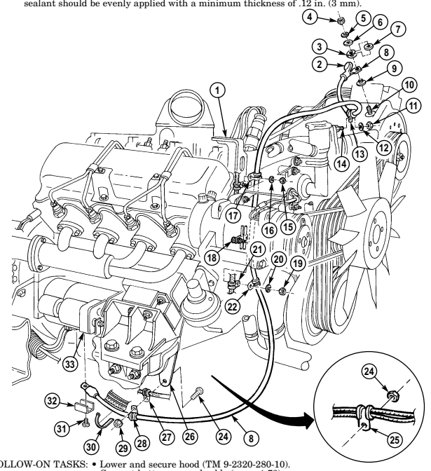

- Connect battery ground cable (para. 4-73). - Start engine and check operation of voltmeter gauge 
(TM 9-2320-280-10)

# 4-113. 200 Ampere Umbilical Power Cable Replacement

This task covers:
INITIAL SETUP:
Applicable Models M1097, M1097A1, M1097A2 Tools General mechanic's tool kit:
automotive (Appendix B, Item 1)
Materials/Parts Three lockwashers (Appendix G, Item 138) Lockwasher (Appendix G, Item 141) Lockwasher (Appendix G, Item 150) Lockwasher (Appendix G, Item 148) Silicone compound (Appendix C, Item 48)
a. Removal

#### A. Removal B. Installation

Personnel Required One mechanic One assistant Manual References TM 9-2320-280-24P
Equipment Condition
- Batteries removed (para, 4-79). - Fixed rear door removed (para. 10-14).

- Prior to removal, tag leads for installation. - Perform step 1 for M1097A2 vehicles only. Perform step 2 for M1097 and M1097A1 vehicles.

2. Remove nut (5) lockwasher (6), and positive power cable (7) from power stud (8). Discard lockwasher
(6).

3. Remove capscrew (1), lockwasher (2), negative power cable (3), and two cables (4) from shunt (9).

Discard lockwasher (2).

Perform step 4 for M1097A2 vehicles only. Perform steps 5 and 6 for M1097 and M1097A1 vehicles only.

4. Remove five capscrews (35), two washers, (34), and coverplate (33) from "B" beam (13). 5. Remove three capscrews (32) from coverplate (20) and "B" beam (13). 6. Remove three nuts (18), lockwashers (17), capscrews (21), and coverplate (20) from cargo floor (19).

Discard lockwashers (17).

7. Remove two nuts (16), washers (15), capscrews (27), washers (28), and mounting bracket (25) from coverplate (20).

8. Remove nut (29) and screw (24) from cover chain (22) and mounting bracket (25). 9. Remove cover (23) and cover chain (22) from umbilical power cable assembly (30).

10. Remove four nuts (31), screws (26), and mounting bracket (25) from umbilical power cable assembly (30).

11. Pull umbilical power cable assembly (30) through grommet (12) and coverplate (20) and remove from vehicle.

12. Remove grommet (12) from battery box (14).

1. Remove nut (5), lockwasher (6), washer (11), and positive power cable (7) from buss bar (10). 

Discard lockwasher (6).

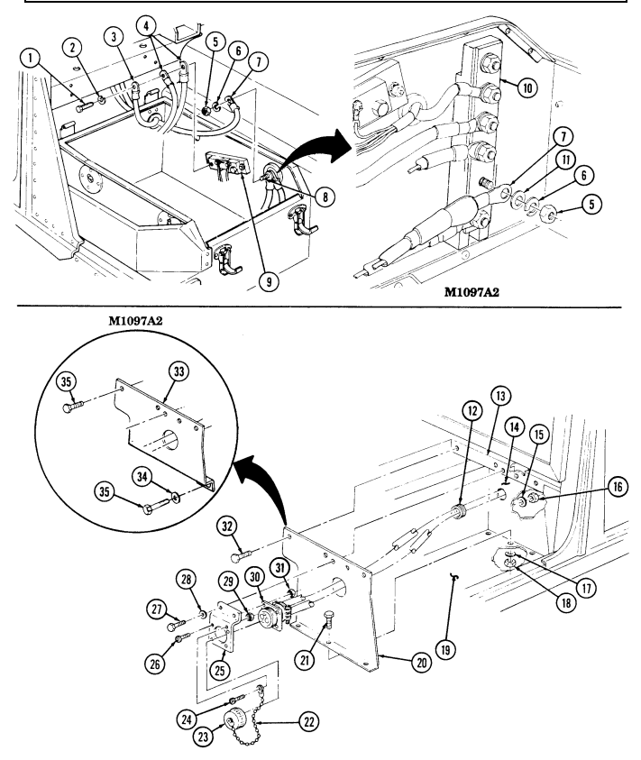

4-113. 200 AMPERE UMBILICAL POWER CABLE REPLACEMENT (Cont'd)

## 4-113. 200 Ampere Umbilical Power Cable Replacement (Cont'D)

#### B. Installation

1.

2.

Install grommet (12) on battery box (14). Route umbilical power cable assembly (30) through coverplate (20) and grommet (12) and position in approximate mounting location.

3.

4. 5.

6.

7.

8. 9.

Install umbilical power cable assembly (30) on mounting bracket (25) with three screws (24) and nuts (31).

Install cover (23) on umbilical power cable assembly (30). Install cover chain (22) on mounting bracket (25) with screw (24) and nut (29).

#### Not E

Perform step 6 for M1097A2 vehicles only. Perform steps 7 and 8 for M1097 and M1097A1 vehicles.

Install coverplate (33) on "B" beam (13) with two washers (34) and five capscrews (35).

Install mounting bracket (25) on coverplate (20) with two washers (28), capscrews (27), washers (15), and nuts (16).

Install coverplate (20) on "B" beam (13) with three capscrews (32).

Install coverplate (20) to cargo floor (19) with three capscrews (21), lockwashers (17), and nuts (18).

Tighten nuts (18) to 65 lb-ft (88 N*m).

10.

Install two cables (4) and negative power cable (3) on shunt (9) with lockwasher (2) and capscrew (1).

NOT E
Perform step 11 for M1097A2 vehicles only. Perform step 12 for M1097 and M1097A1 vehicles.

11.

Install positive power cable (7) on buss bar (10) with washer (11), lockwasher (6), and nut (5).

12.

Install positive power cable (7) on power stud (8) with lockwasher (6) and nut (5). Apply silicone compound to cable (7) so that all exposed metallic surfaces are coated.

13.

# 4-113. 200 Ampere Umbilical Power Cable Replacement (Cont'D)

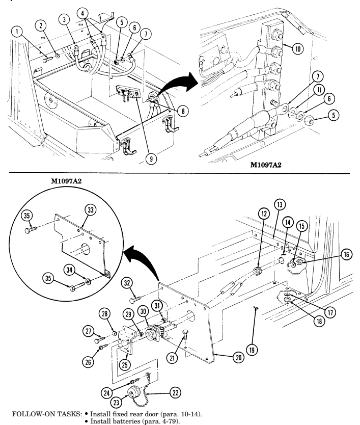

| Materials/Parts   |
|-------------------|

| Applicable Models                  |
|------------------------------------|
| M997A2, M1025A2, M1035A2, M1043A2, |
| M1045A2, M1097A2, M1123            |
| Tools                              |
| General mechanic's tool kit:       |

## 4-114. 200 Ampere Regulator (A0013036Aa) Replacement

| INITIAL SETUP:   |
|------------------|

| This task covers:   |
|---------------------|

Four lockwashers (Appendix G, Item 138) Six lockwashers (Appendix G, Item 142) Four lockwashers (Appendix G, Item 143)

a. Removal b. Installation

| Personnel Required   |
|----------------------|
| One mechanic         |
| One assistant        |
| Manual References    |
| TM 9\-2320\-280\-24P |

#### A. Removal

1. Remove four screws (1), lockwashers (2), cover (3), and gasket (4) from regulator (5). Discard lockwashers (2).

Prior to removal, tag leads for installation.

2. Remove nut (13), lockwasher (12), washer (11.1), and lead 2A (11) from stud (9). Discard lockwasher (12).

3. Remove nut (15), washer (16), and lead 5A (14) from stud (10). 4. Remove rubber wedge (17) from opening in regulator (5). 5. Remove four screws (6) and lockwashers (7) from regulator (5) and alternator (8) and pull regulator
(5) away for access to leads (21). Discard lockwashers (7).

6. Remove five screws (23), lockwashers (22), leads (21), and regulator (5) from alternator (8). Discard lockwashers (22).

7. Remove nut (19) and lead 568A (20) from stud (10). 

#### B. Installation

1. Install lead 568A (20) on stud (10) with nut (19). 2. Install five leads (21) on regulator (5) with five lockwashers (22) and screws (23). 3. Install regulator (5) on alternator (8) with four lockwashers (7) and screws (6). 4. Install lead 5A (14) on stud (10) with washer (16) and nut (15). 5. Install lead 2A (11) on stud (9) with washer (11.1), lockwasher (12), and nut (13). 6. Install rubber wedge (17) in opening in regulator (5). 7. Install gasket (4) and cover (3) on regulator (5) with four lockwashers (2) and screws (1).

4-114. 200 AMPERE REGULATOR (A0013036AA) REPLACEMENT (Cont'd)

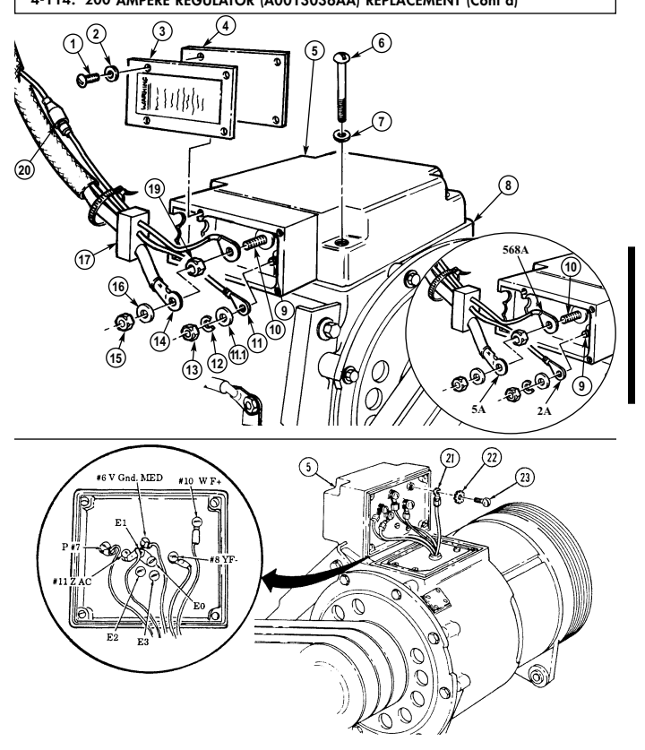

FOLLOW-ON TASKS: - Lower and secure hood (TM 9-2320-280-10).

· Connect battery ground cable (para. 4-73).

# 4-115. 200 Ampere Regulator (12338796-1, S-311) Replacement

This task covers:
INITIAL SETUP:
Applicable Models M997A2, M1025A2, M11035A2, M1043A2, M1045A2, M1097, M1097A1, M1097A2 Tools General mechanic's tool kit:
automotive (Appendix B, Item 1)

#### Materials/Parts

Two spring tension washers
(Appendix G, Item 318)
Lockwasher (Appendix G, Item 185) Sealing Compound (Appendix C, Item 45)

a. Removal b. Installation

Manual References TM 9-2320-280-10 TM 9-2320-280-24P

#### Equipment Condition

- Battery ground cables disconnected (para. 4-73). - Hood raised and secured (TM 9-2320-280-10).

a. Removal NOTE
Prior to removal, tag leads for installation.

1. Disconnect regulator plug (13) from voltage regulator (12). 2. Slide back rubber boot (4) and remove nut (3), lead 5A (2), and washer (1) from red (energize)
terminal (26).

3. Slide back rubber boot (5) and remove nut (6), lead 2A (7), and washer (8) from yellow (AC)
terminal (9).

Perform steps 4 and 5 for M997A2, M1025A2, M1035A2, M1043A2, M1045A2, and M1097A2 vehicles only.

4. Slide back rubber boot (22) and remove nut (23), lead (21), and washer (24) from terminal (25). 5. Disconnect regulator connector (17) from alternator connector (16). 6. Remove two screws (20), spring tension washers (19), and washers (18) from voltage regulator (12)
and alternator (15). Discard spring tension washers (19).

7. Remove capscrew (10), lockwasher (11), spacer (14), and voltage regulator (12) from alternator (15).

Discard lockwasher (11).

#### B. Installation

1. Apply sealing compound to threads of capscrew (10). 2. Install spacer (14) and voltage regulator (12) on alternator (15) with lockwasher (11) and capscrew (10). Tighten capscrew (10) to 88-94 lb-in. (10-11 N•m).

3. Install two washers (18), spring tension washers (19) and screws (20) on voltage regulator (12) and alternator (15). Tighten screws (20) to 30-34 lb-in. (3-4 N•m).

# 4-115. 200 Ampere Regulator (12338796-1, S-311) Replacement (Cont'D)

NOT E
Perform steps 4 and 5 for M997A2, M1025A2, M1035A2, M1043A2, M1045A2, and M1097A2 vehicles only.

4. Install washer (24), lead (21), and nut (23) on terminal (25). Tighten nut (23) to 18-22 lb-in.

(2.0-2.5 Nom). Slide rubber boot (22) over terminal (25).

5. Connect regulator connector (17) to alternator connector (16).

6. Install washer (1), lead 5A (2), and nut (3) on red (energize) terminal (26). Tighten nut (3) to 23-27 lb-in. (2.6-3.0 N.m). Slide rubber boot (4) over terminal (26).

7. Install washer (8), lead 2A (7), and nut (6) on yellow (AC) terminal (9). Tighten nut (6) to 18-22 lb-in.

(2.0-2.5 N.m). Slide rubber boot (5) over terminal (9).

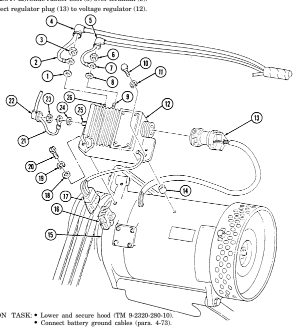

# 4-116. Control Box Terminal Block And Mounting Buss Replacement

This task covers:
INITIAL SETUP:
Applicable Models M996, M996A1, M997, M997A1, M997A2 Tools General mechanic's tool kit:
automotive (Appendix B, Item 1)
Materials/Parts Ten plain-assembled nuts 
(Appendix G, Items 201)

a. Removal b. Installation

Manual References TM 9-2320-280-24P
Equipment Condition Control box removed (para. 4-96 or 4-97).

- Prior to removal, tag leads for installation. - M996 and M996A1 require only nine screws and leads.

a. Removal 1. Remove ten screws (6) and leads (5) from terminal block (8). 2. Remove two plain-assembled nuts (3), two leads 790 (2) and 797 and 797A (11) from screws (12).

Discard plain-assembled nuts (3).

3. Remove four plain-assembled nuts (1), screws (12), terminal (8), and mounting buss (9) from control box (4). Discard four plain-assembled nuts (1).

4. Remove four plain-assembled nuts (10), screws (7), and terminal block (8) from mounting buss (9).

Discard plain-assembled nuts (10).

#### B. Installation

1. Install terminal block (8) on mounting buss (9) with four screws (7) and plain-assembled nuts (10). 2. Install mounting buss (9) on control box (4) with four screws (12) and plain-assembled nuts (1). 3. Install two leads 790 (2) and 797 and 797A (11) with two screws (12) and plain-assembled nuts (3). 4. Install ten leads (5) to terminal block (8) with ten screws (6).

# 4-116. Control Box Terminal Block And Mounting Buss Replacement

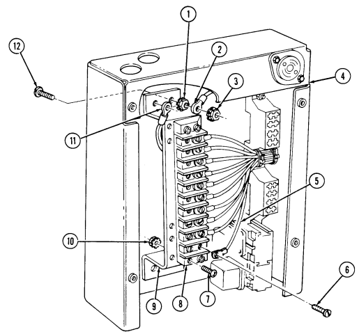

FOLLOW-ON TASK: Install control box (para. 4-96 or 4-97).

# 4-117. Control Box Fuse Block And Relay Socket Replacement

This task covers:

| INITIAL SETUP:   |
|------------------|

| Applicable Models       | Personnel Required   |
|-------------------------|----------------------|
| M1097, M1097A1, M1097A2 | One mechanic         |
|                         | One assistant        |
| Tools                   |                      |

| Materials/Parts   |
|-------------------|

a. Removal b. Installation

General mechanic's tool kit:
automotive (Appendix B, Item 1)
Two tiedown straps (Appendix G, Item 308)
Equipment Condition
- Control box removed (para. 4-96 or 4-97). - If replacing a fuse block: remove fuses
(TM 9-2320-280-10).

- If replacing relay socket: remove relays
(para. 4-120).

Procedures for replacing the upper fuse block, and relay socket are basically the same. This procedure covers replacement of the lower fuse block.

a. Removal 1. Remove two tiedown straps (3) from fuse block leads (7). Discard tiedown straps (3). 2. Remove two plain-assembled nuts (6), washers (5), and screws (2) from fuse block (4) and control box (1) and pull fuse block (4) away for access to leads (7). Discard plain-assembled nuts (6).

Prior to removal, tag leads for installation.

3. Disconnect six leads (7) from fuse block (4) and remove fuse block (4).

b. Installation 1. Connect six leads (7) to fuse block (4). 2. Install fuse block (4) on control box (1) with two screws (2), washers (5), and plain-assembled nuts (6).

3. Install fuse block leads (7) with two tiedown straps (3).

# 4-117. Control Box Fuse Block And Relay Socket Replacement (Cont'D)

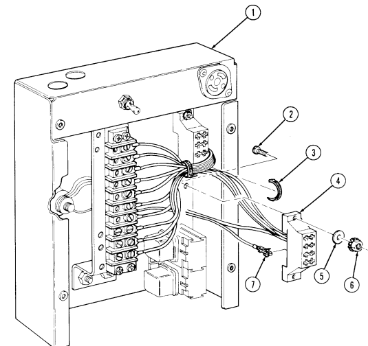

FOLLOW-ON TASKS: - If relay socket was replaced: install relays (para. 4-120).

- If fuse block was replaced: install fuses (TM 9-2320-280-10)
· Install control box (para. 4-96 or 4-97).

# 4-118. Control Box Light Switch Replacement

This task covers:
INITIAL SETUP:

| Applicable Models   |
|---------------------|

M996, M996A1, M997, M997A1, M997A2 Tools General mechanic's tool kit:
automotive (Appendix B, Item 1)

#### Materials/Parts

Four lockwashers (Appendix G, Item 136) Plain-assembled nut (Appendix G, Item 201)

| Manual References                                  |
|----------------------------------------------------|
| TM 9\-2320\-280\-10                                |
| TM 9\-2320\-280\-24P                               |
| Equipment Condition                                |
| - Battery ground cable disconnected (para. 4\-73). |

a. Removal b. Installation

a. Removal 1. Remove four screws (9), lockwashers (8), and cover (7) from control box (2). Discard lockwashers (8).

Prior to removal, tag leads for installation.

#### B. Installation

1. Install five leads (12) on switch terminals (11) with five washers (13) and screws (14). 2. Install switch (10) on top panel (1) with nut (4). 3. Install lead 797/797A (5) on control box screw (3) with plain-assembled nut (6). 4. Install cover (7) to control box (2) with four lockwashers (8) and screws (9).

2. Remove plain-assembled nut (6) and lead 797/797A (5) from control box screw (3). Discard plainassembled nut (6).

3. Remove nut (4) from switch (10) and top panel (1) and pull switch (10) out from under panel (1) for access to leads (12).

4. Remove five screws (14) and washers (13) from leads (12) and switch terminals (11) and remove switch (10).

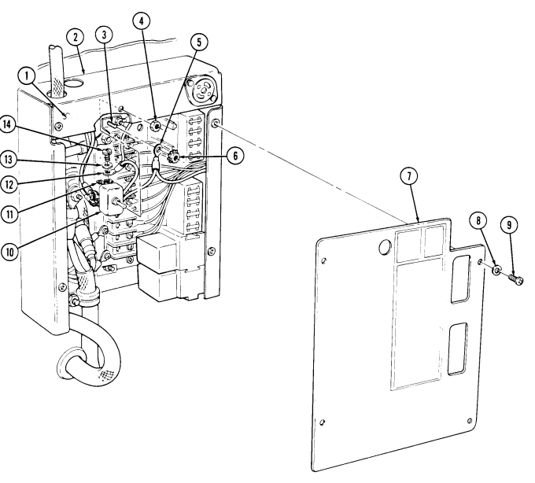

# 4-118. Control Box Light Switch Replacement (Cont'D)

FOLLOW-ON TASKS: - Connect battery ground cable (para. 4-73).
- • - Check operation of ambulance compartment lights (TM 9-2320-280-10).

# 4-119. Control Box Electrical Plug And Receptacle Replacement

| This task covers:   |
|---------------------|

| INITIAL SETUP:                      |                                                     |
|-------------------------------------|-----------------------------------------------------|
| Applicable Models                   | Manual References                                   |
| M997A2, M1025A2, M11035A2, M1043A2, | TM 9\-2320\-280\-10                                 |
| M1045A2, M1097, M1097A1, M1097A2    | TM 9\-2320\-280\-24P                                |
| Tools                               | Equipment Condition                                 |
| General mechanic's tool kit:        | - Battery ground cables disconnected (para. 4\-73). |
| automotive (Appendix B, Item 1)     | - Hood raised and secured (TM 9\-2320\-280\-10).    |

a. Plug Removal c. Receptacle Removal b. Plug Installation **d. Receptacle Installation**

a. Plug Removal 1. Turn and pull plug (4) from receptacle (3).

2. Remove two screws (5) from plug (4). Open plug (4) and ensure positive (10), negative (12), and ground (11) leads for plug (4) are properly installed.

b. Plug Installation 1. Close plug (4) and install two screws (5) on plug (4).

2. Insert plug (4) on receptacle (3).

c. Receptacle Removal

#### Not E

For instructions on replacement of rivets, refer to para. 10-66.

1. Remove two rivets (6) and receptacle (3) from control box (1). Pull receptacle (3) away for access to leads (2).

#### Not E

Prior to removal, tag leads for installation.

2. Loosen screw (8) and push shield (9) away for access to leads (2).

3. Remove two screws (7), and leads (2) from receptacle (3).

d. Receptacle Installation 1. Install two leads (2) on receptacle (3) with two screws (7). Position shield (9) over screws (7) and tighten screw (8).

2. Install receptacle (3) on control box (1) with two rivets (6).

# 4-119. Control Box Electrical Plug And Receptacle Replacement (Cont'D)

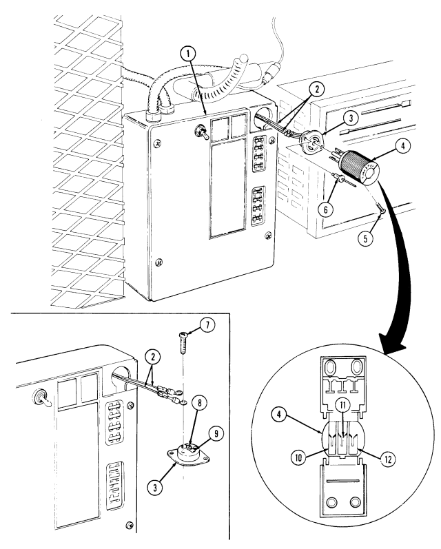

 FOLLOW-ON TASK: Connect battery ground cable (para. 4-73).

# 4-120. Control Box Relay Replacement

This task covers:
a. Removal b. Installation INITIAL SETUP:
Applicable Models M996, M996A1, M997, M997A1, M997A2 Tools General mechanic's tool kit:
automotive (Appendix B, Item 1)
Materials/Parts Four lockwashers (Appendix G, Item 136)
Manual References TM 9-2320-280-24P
Equipment Condition Battery ground cable disconnected (para. 4-73). (receptacle only).

Prior to removal, tag leads for installation.

a. Removal 1. Remove four screws (3), lockwashers (4), and cover (2) from control box (1). Discard lockwashers (4). 2. Remove relay (6) from relay socket (5).

b. Installation 1. Install relay (6) in relay socket (5). 2. Install cover (2) on control box (1) with four lockwashers (4) and screws (3).

# 4-120. Control Box Relay Replacement (Cont'D)

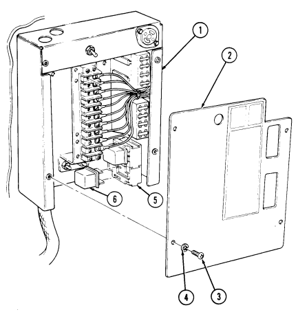

# 4-121. Condenser Fan/Pressure Switch Wiring Harness Replacement (M997, M997A1, M997A2)

This task covers:
INITIAL SETUP:
Applicable Models M997, M997A1, M997A2 Tools General mechanic's tool kit:
automotive (Appendix B, Item 1)
Materials/Parts Lockwasher (Appendix G, Item 182)
a. Removal b. Installation Manual References TM 9-2320-280-24P
Equipment Condition
- Battery ground cable disconnected (para. 4-73). - Air intake compartment panels removed
(para. 11-184).

Prior to removal, tag leads for installation.

a. Removal b. Installation 1. Disconnect leads 436A (12) and 436B (13) from low pressure switch leads (11). 2. Remove nut (5), washer (4), capscrew (19), lockwasher (18), washer (17), and clamp (3) from harness (2) and dryer panel (20). Discard lockwasher (18).

3. Disconnect leads 436A (7), 436C (8), 799J (9), and 437A (10) from control box leads (6). 4. Disconnect leads 436B (15) and 436C (16) from high pressure switch leads (14). 5. Disconnect leads 437C (25), 799L (26), 437B (23), and 799K (24) from condenser fan leads (27)
and (1).

6. Remove grommet (21) from condenser panel (22) and remove harness (2).

1. Install leads 799L (26), 437C (25), 437B (23), and 799K (24) through condenser panel (22) and connect to condenser fan leads (1) and (27).

2. Install grommet (21) on harness (2) and condenser panel (22). 3. Connect leads 436A (7), 436C (8), 799J (9), and 437A (10) to control box leads (6). 4. Connect leads 436B (15) and 436C (16) to high pressure switch leads (14). 5. Connect leads 436A (12) and 436B (13) to low pressure switch leads (11). 6. Install clamp (3) on harness (2) and dryer panel (20) with washer (17), lockwasher (18), 
capscrew (19), washer (4), and nut (5).

4-121. CONDENSER FAN/PRESSURE SWITCH WIRING HARNESS REPLACEMENT

# (M997, M997A1, M997A2) (Cont'D)

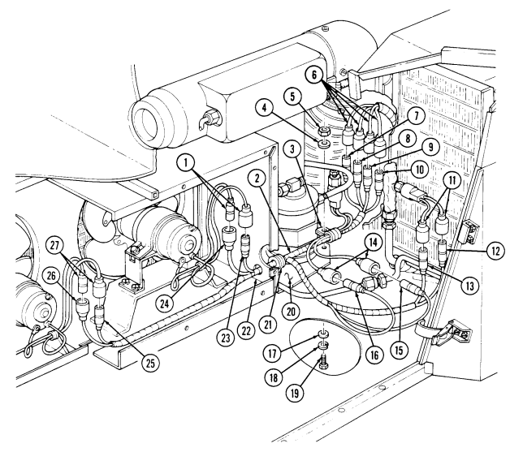

FOLLOW-ON TASKS: - Install air intake compartment panels (para. 11-184).

· Connect battery ground cable (para. 4-73).

# 4-122. Compressor/Heater Fuel Pump Wiring Harness Replacement (M997, M997A1, M997A2)

This task covers:
a. Removal b. Installation INITIAL SETUP:
Applicable Models M997, M997A1, M997A2 Tools General mechanic's tool kit:
automotive (Appendix B, Item 1)

#### Materials/Parts

Two lockwashers (Appendix G, Item 133) Two locknuts (Appendix G, Item 70) Lockwasher (Appendix G, Item 178)
Two assembled locknuts (Appendix G, Item 131)
Two tiedown straps (Appendix G, Item 308)
a. Removal

#### Manual References

TM 9-2320-280-24P
Equipment Condition
- Passenger seat back removed (para. 10-45). - Heater fuel pump removed (para. 11-194).

Prior to removal, tag leads for installation.

1. Disconnect harness leads (1) from control box leads 436D (3) and 723B (2). 2. Remove capscrew (4), lockwasher (5), washer (6), and clamp (7) from AC line clamp (8) and body (9). Discard lockwasher (5).

3. Remove six screws (10), clamps (11), and harness (12) from body (9) and "B'' beam (13). 4. Deleted. 5. Remove grommet (16) from harness (12) and tunnel (17). 6. Remove locknut (32), washer (31), screw (27), and clamp (28) from fuel line clamp (29), body bracket (30) and harness. Discard locknut (32).

7. Remove locknut (22), washer (23), capscrew (33), and washer (23) from harness ground (34) and fuel pump (26). Discard locknut (22).

8. Remove nut (21) and lockwasher (20), and ground terminal (19) from ground stud (18). Discard lockwasher (20).

9. Disconnect harness lead (24) from fuel pump lead (25).

10. Remove screw (35) and clamp (36) from harness (12) and body (9).

4-122.  COMPRESSOR/HEATER FUEL PUMP WIRING HARNESS REPLACEMENT
(M997, M997A1 , M997A2) (Cont'd)

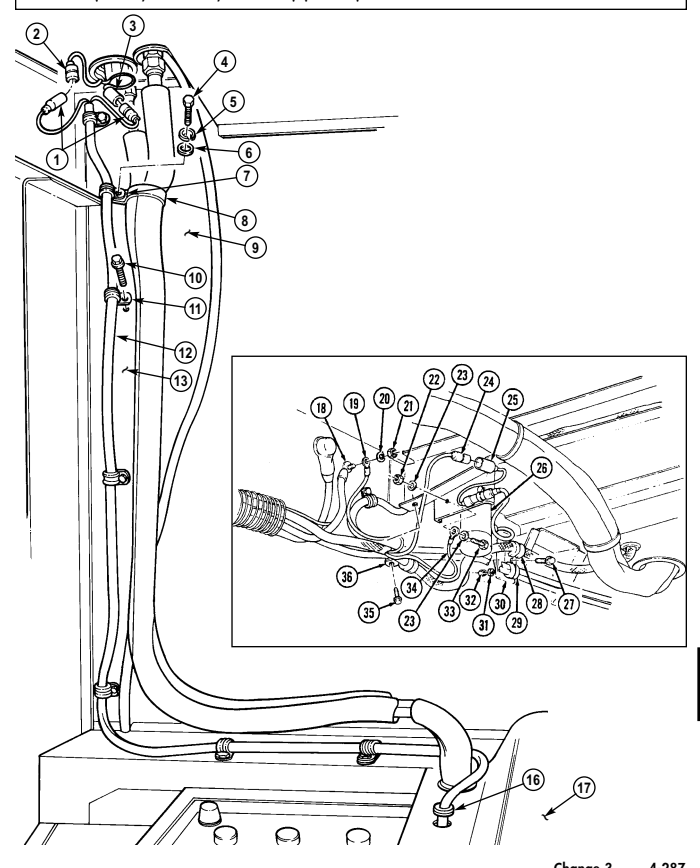

# 4-122. Compressor/Heater Fuel Pump Wiring Harness Replacement (M997, M997A1, M997A2) (Cont'D)

11. Remove assembled locknut (2) and clamp (3) from harness (4) and starter cable bracket screw (1).

Discard assembled locknut (2).

12. Remove tiedown strap (6) from harness (4) and starter positive cable (5). Discard tiedown strap (6). 13. Remove screw (18) and assembled locknut (15) and clamp (17) from harness (4) and compressor bracket (16). Discard assembled locknut (15).

14. Remove nut (11), lockwasher (12), washer (19), capscrew (20), and clamp (13) from harness (4) 
and compressor (14). Discard lockwasher (12).

15. Disconnect harness leads (10) from leads (21). 16. Remove tiedown strap (9) from inside protective shield (8). Discard tiedown strap (9). 17. Remove harness (4) by routing through tunnel (7) and starter cable protective shield (8).

#### B. Installation

1. Route harness (4) through protective shield (8) and tunnel (7), and place in approximate mounting location.

2. Secure harness (4) with tiedown strap (9) inside of protective shield (8). 3. Connect harness leads (10) to leads (21). 4. Install clamp (13) on harness (4) and compressor (14) with washer (19), capscrew (20), lockwasher (12),
and nut (11).

5. Install clamp (17) on harness (4) and compressor bracket (16) with screw (18) and assembled locknut (15).

6. Install clamp (3) on harness (4) and starter cable bracket screw (1) with assembled locknut (2). 7. Secure harness (4) to starter positive cable (5) with tiedown strap (6).

4-122. COMPRESSOR/HEATER FUEL PUMP WIRING HARNESS REPLACEMENT
(M997, M997A1, M997A2) (Cont'd)

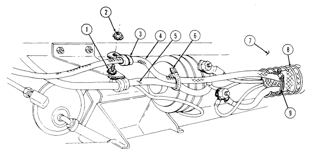

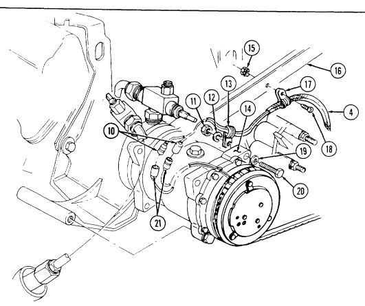

# 4-122. Compressor/Heater Fuel Pump Wiring Harness Replacement

## (M997, M997A1, M997A2) (Cont'D)

8. Install clamp (21) on harness (17) and body rail (7) with screw (20). 9. Connect harness lead (8) to fuel pump lead (9).

10. Install harness ground terminal (2) on ground stud (1) with lockwasher (3) and nut (4). 11. Install harness ground (19) on fuel pump (10) with washer (6), capscrew (18), washer (6), and locknut (5).

12. Install clamp (12) on harness (17) and install clamp (12) and fuel line clamp (13) on body bracket (14) with screw (11), washer (15), and locknut (16).

13. Connect harness leads (22) to control box leads 436D (24) and 723B (23). 14. Install six clamps (31) on harness (17) and body (7) with six screws (30). 15. Install clamp (28) on harness (17), AC line clamp (29), and body (7) with washer (27), 
lockwasher (26), and capscrew (25).

16. Deleted. 17. Install grommet (34) on tunnel (35) and harness (17).

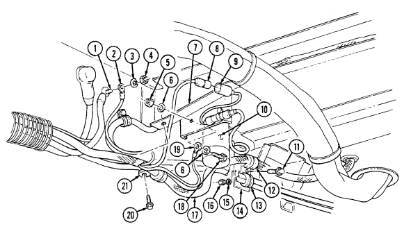

4-122. COMPRESSOR/HEATER FUEL PUMP WIRING HARNESS REPLACEMENT
(M997, M997A1, M997A2) (Cont'd)

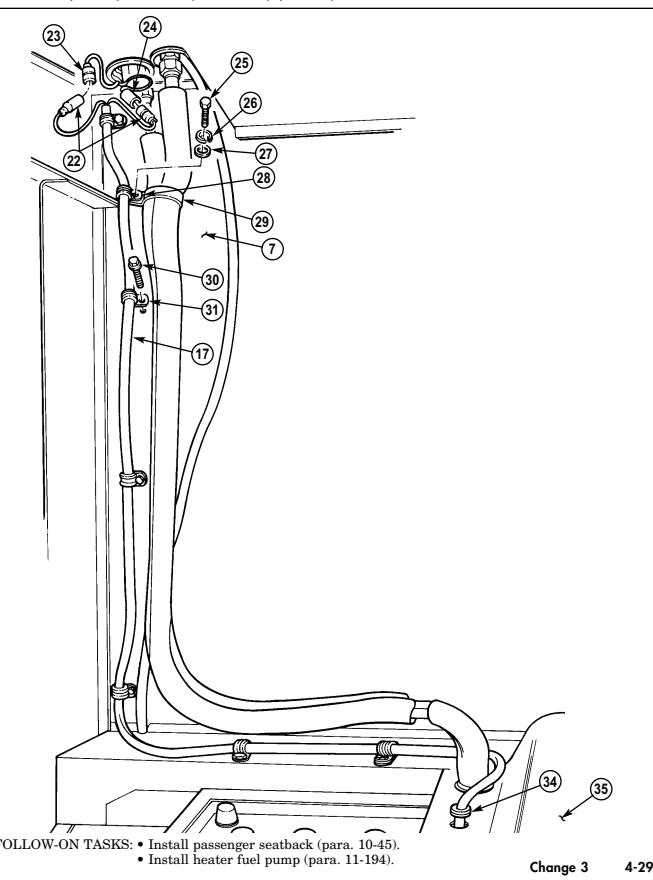

# 4-123. Heater/Vent System Control Box And Wiring Harness Replacement

This task covers:

#### Initial Setup:

Applicable Models M996, M996A1 Tools General mechanic's tool kit:
automotive (Appendix B, Item 1)

#### Materials/Parts

Two locknuts (Appendix G, Item 70) Plain-assembled nut (Appendix G, Item 201) Plug button (Appendix G, Item 8) Four lockwashers (Appendix G, Item 136) Tiedown strap (Appendix G, Item 308)
a. Removal **b. Installation**
Manual References TM 9-2320-280-24P
Equipment Condition Blower assembly removed (para. 11-212).

a. Removal

Prior to removal, tag leads for installation.

1. Remove locknut (1), washer (2), capscrew (8), washer (7), ground terminal (6), and capacitor (5)
from fuel pump (16) and bracket (17). Discard locknut (1).

2. Disconnect control box lead (3) from fuel pump lead (4). 3. Remove locknut (15), washer (14), capscrew (11), and clamp (9) from control box harness (10), fuel line clamp (13), and body bracket (12). Discard locknut (15).

4. Remove grommet (18) from tunnel (26) and harness (10) and route harness (10) through hole in tunnel (26) and battery box grommet (25) into stowage compartment.

5. Remove two screws (22) and clamps (19) from harness (10), resuscitator harness (23), and body (21). 6. Remove tiedown strap (24) from harness (10) and resuscitator harness (23). Discard tiedown strap
(24).

7. Route harness (10) up through grommet (20) into patient compartment.

4-123. HEATER/VENT SYSTEM CONTROL BOX AND WIRING HARNESS
REPLACEMENT (Cont'd)

# 4-123. Heater/Vent System Control Box And Wiring Harness

## Replacement (Cont'D)

8. Remove three screws (20), clamps (21), harness (2), and battery cable harness (22) from body (5). 9. Remove four screws (19), lockwashers (18), and cover (17) from circuit box (4). Discard lockwashers (18).

10. Remove plain-assembled nut (16) and clamp (15) from harness (2) and screw (24). Discard plainassembled nut (16).

11. Remove three screws (14) from harness leads (13) and terminal block (25). 12. Remove three screws (12), clamps (11), and harness (2) from NBC harness (10) and body (5). 13. Remove two screws (9), washers (8), retainer (7) and grommet (6 ) from body (5) and harness (2). 14. Route harness (2) through grommet (6) hole in body (5). 15. Remove five screws (28) and clamps (29) from harness (2) and body (5). 16. Remove three nuts (33), lockwashers (34), capscrews (36), and clamps (35) from harness (2) and body
(5). Discard lockwashers (34).

17. Disconnect plug (27) from heater receptacle (26). 18. Remove plug button (30) and control lever linkage (31) from duct door arm (32). Discard plug button (30).

19. Remove four screws (23), control box (1), and harness (2) from body (5). 

#### B. Installation

1. Route harness (2) through control box opening (3) in body (5) and install control box (1) on body (5)
with four screws (23).

2. Attach control lever linkage (31) to duct door arm (32) with plug button (30). 3. Install three clamps (35) on harness (2) and body (5) with capscrews (36), lockwashers (34), and nuts
(33).

4. Connect control box plug (27) to heater receptacle (26). 5. Route harness (2) through grommet (6) hole in body (5). 6. Install five clamps (29) on harness (2) and body (5) with five screws (28). 7. Install three harness leads (13) to terminal block (25) with three screws (14). 8. Install clamp (15) on harness (2) and screw (24) with plain-assembled nut (16). 9. Install grommet (6) and retainer (7) on harness (2) and body (5) with two washers (8) and screws
(9).

10. Install harness (2) in three clamps (11) with NBC harness (10), on body (5) with three screws (12). 11. Install cover (17) on circuit box (4) with four lockwashers (18) and screws (19). 12. Install harness (2) in three clamps (21) with battery cable harness (22), on body (5) with three screws (20).

4-123. HEATER/VENT SYSTEM CONTROL BOX AND WIRING HARNESS
REPLACEMENT (Cont'd)

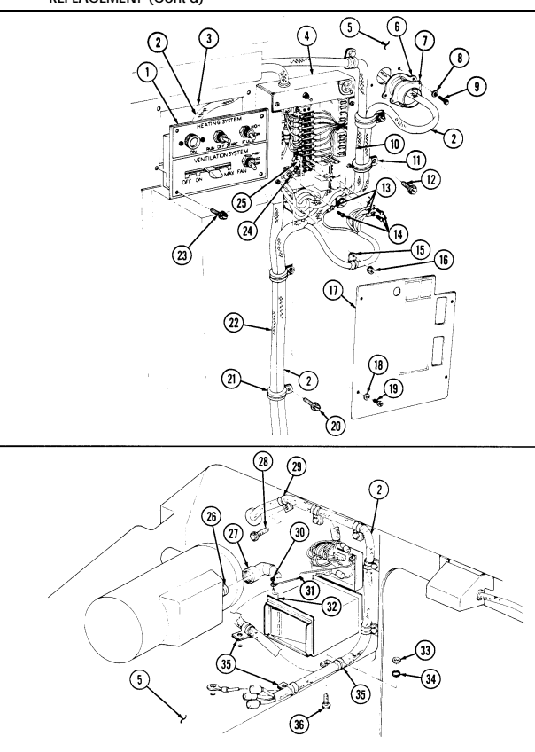

# 4-123. Heater/Vent System Control Box And Wiring Harness Replacement (Cont'D)

13. Route harness (21) down through grommet (20) into body (22) through battery box grommet (26) and through hole in tunnel (27).

14. Connect control box lead (3) to fuel pump lead (4). 15. Install fuel pump (16), capacitor (5), and ground terminal (6) on bracket (17) with washer (7),
capscrew (8), washer (2), and locknut (1).

16. Install clamp (9) on harness (10) and install clamp (9) and clamp (13) on body bracket (12) with capscrew (11), washer (14), and locknut (15).

17. Install grommet (18) on harness (21) and into tunnel (27).

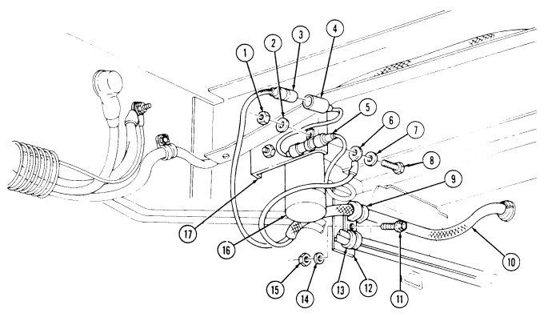 18. Install harness (21) in two clamps (19) on body (22) with two screws (23). 19. Install harness (21) on resuscitator harness (24) with tiedown strap (25).

4-123. HEATER/VENT SYSTEM CONTROL BOX AND WIRING HARNESS

# Replacement (Cont'D)

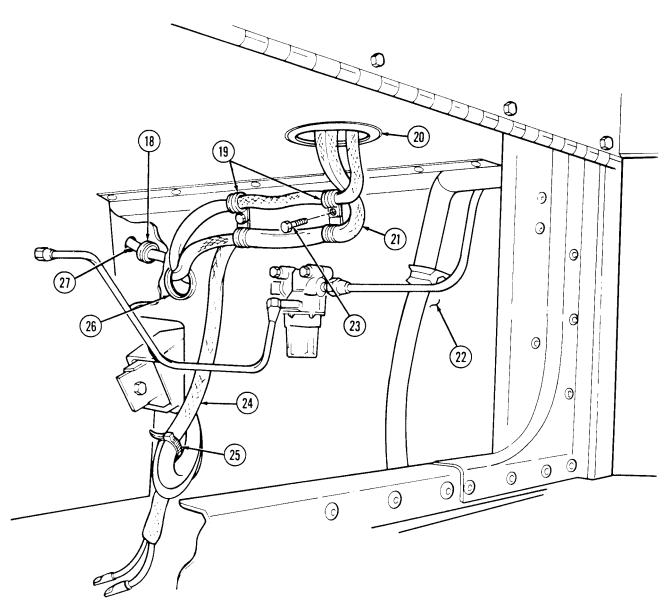

FOLLOW-ON TASK: Blower assembly installed (para. 11-212).

# 4-124. Nbc Control Panel Replacement

This task covers:
INITIAL SETUP:

| Tools   |
|---------|

| Materials/Parts   |
|-------------------|

| Applicable Models   |
|---------------------|

M996, M996A1, M997, M997A1, M997A2

| Equipment Condition                           |
|-----------------------------------------------|
| - Control box removed (para. 4\-96 or 4\-97). |
| - If replacing a fuse block: remove fuses     |
| (TM 9\-2320\-280\-10).                        |
| - If replacing relay socket: remove relays    |
| (para. 4\-120).                               |

General mechanic's tool kit:
automotive (Appendix B, Item 1)
Five lockwashers (Appendix G, Item 169) Lockwasher (Appendix G, Item 134) Four plain-assembled nuts
(Appendix G, Item 201)

a. Removal b. Installation

a. Removal

| Manual References    |
|----------------------|
| TM 9\-2320\-280\-10  |
| TM 9\-2320\-280\-24P |

M996 ambulance will not have cushioned wire clamp on ceiling.

1.Remove screw (3) from cushioned wire clamp (4) and passenger ceiling (2). 2.Remove six screws (1) from NBC control panel (5) and ambulance body (6). 3.Remove two plain-assembled nuts (8) and screws (7) from two cushioned wire clamps (9). Discard plain-assembled nuts (8).

Prior to removal, tag all leads for installation.

4.Remove two screws (10), lockwashers (11), and leads 783 (13) and 783A (12) from NBC control panel ON/OFF toggle switch (14). Discard lockwashers (11).

# 4-124. Nbc Control Panel Replacement (Cont'D)

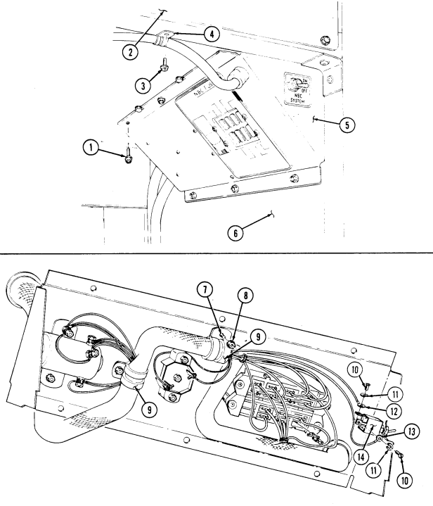

___

## 4-124. Nbc Control Panel Replacement (Cont'D)

5. Remove two screws (12), lockwashers (13), and leads 782A (14) and 783 (16) from NBC control panel circuit breaker (15). Discard lockwashers (13).

6. Remove plain-assembled nut (11), diode (24), and leads 783A (17) and 783B (18) from NBC control panel relay (19). Discard plain-assembled nut (11).

M996 and M996A1 ambulances have three leads, 785, 786, and 787, on NBC control panel relay.

7. Remove nut (5), lockwasher (6), and leads 784 (7), 787 (8) 785 (9), and 786 (10) from NBC control panel relay (19). Discard lockwasher (6).

8. Remove nut (22), lockwasher (23), and leads 782 (21) and 782A (20) from NBC control panel relay
(19). Discard lockwasher (23).

9. Remove plain-assembled nut (25), leads 795 (3), 796 (4), and 793 (2), and diode (24) from NBC
control panel relay ground (1). Discard plain-assembled nut (25).

Use care when removing lead clips from NBC control panel fuse block to prevent damage to leads, wire clips, and/or fuse block.

- For M997, M997A1 and M997A2 ambulances, perform steps 10 through 16 for removal of leads from NBC fuse block.

- For M996 and M996A1 ambulances, perform steps 17 through 21 for removal of leads from NBC fuse block.

- Leads 787, 784, and 786 have two way jumpers connecting fuses for heaters 4 & 5, 6 & 7, and 2 & 3 respectively.

10. Remove leads 787B (26) and 787 (8) from NBC fuse block (31) for heater fuse \#4. 11. Remove lead 787A (27) from NBC fuse block (31) for heater fuse \#5. 12. Remove leads 784 (30) and 784B (28) from NBC fuse block (31) for heater fuse \#6. 13. Remove lead 784A (29) from NBC fuse block (31) for heater fuse \#7. 14. Remove leads 785A (9) and 785 (34) from NBC fuse block (31) for heater fuse \#1. 15. Remove lead 786A (33) from NBC fuse block (31) for heater fuse \#2. 16. Remove lead 786 (32) and lead 786B (10) from NBC fuse block (31) for heater fuse \#3.

# 4-124. Nbc Control Panel Replacement (Cont'D)

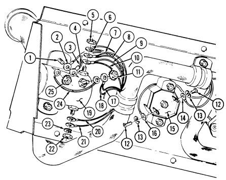

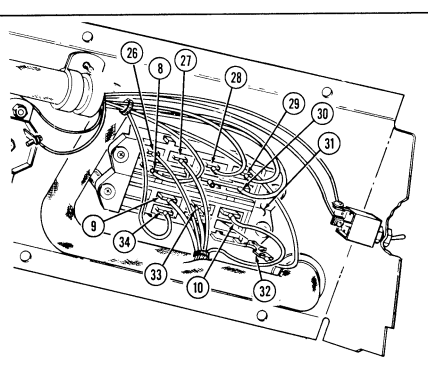

# 4-124. Nbc Control Panel Replacement (Cont'D)

Leads 785 and 786 have two way jumpers connecting fuses for heaters 1 & 2 and 3 & 4 respectively.

17. Remove leads 785 (3) and 785A (9) from NBC fuse block (5) for heater fuse \#1.

18. Remove lead 785B (8) from NBC fuse block (5) for heater fuse \#2. 19. Remove leads 786 (4) and 786A (7) from NBC fuse bock (5) for heater fuse \#3. 20. Remove lead 786B (6) from NBC fuse block (5) for heater fuse \#4.

21. Remove leads 787 (1) and 787A (2) from NBC fuse block (5) for heater fuse \#5.

# 4-124. Nbc Control Panel Replacement (Cont'D)

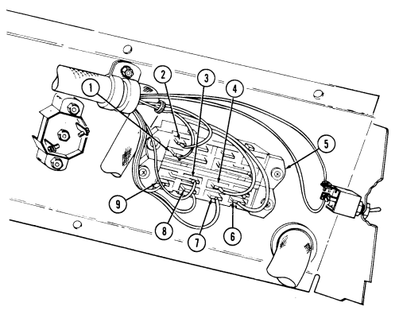

# 4-124. Nbc Control Panel Replacement (Cont'D)

b. Installation

Use care when installing leads to NBC control panel fuse block. Ensure lead clips lock into place. Failure to do so may cause damage to equipment and/or injury to personnel.

1. Install two cushioned wire clamps (17) with wire harness (14) in place onto NBC control panel (12)
with screws (15) and plain-assembled nuts (16).

- For M997, M997A1 and M997A2 ambulances, perform steps 8 through 14 for installation of leads to NBC fuse block.

- For M996 and M996A1 ambulances, perform steps 15 through 19 for installation of leads to NBC fuse block.

- Leads 787, 784, and 786 have two way jumpers connecting fuses for heaters 4 & 5, 6 & 7, and 2 & 3 respectively.

2. Install leads 795 (3), 796 (4) and lead 793 (2), and diode (28) onto NBC control panel relay ground (1) with plain-assembled nut (29).

M996 and M996A1 ambulances have three leads, 785, 786, and 787, secured to NBC control panel relay.

3. Install leads 784 (7), 787 (8), and leads 785 (9), 786 (10) onto NBC control panel relay (24) with nut (5) and lockwasher (6).

4. Install leads 783A (22) and 783B (23) and remaining lead from diode (28) onto NBC control panel relay (24) with plain-assembled nut (11).

5. Install leads 782 (25) and 782A (20) onto NBC control panel relay (24) with nut (26) and lockwasher (27).

6. Install leads 782A (20) and 783 (21) onto NBC control panel circuit breaker (13) with two screws (18) and lockwashers (19).

7. Install leads 783 (21) and 783A (22) onto NBC control panel ON/OFF toggle switch (35) with two screws (33) and lockwashers (34).

8. Install leads 787B (30) and 787 (8) into NBC fuse block (40) for heater fuse \#4. 9. Install lead 787A (31) into NBC fuse block (40) for heater fuse \#5.

10. Install lead 784B (32) into NBC fuse block (40) for heater fuse \#6. 11. Install lead 784A (36) and 784 (7) into NBC fuse block (40) for heater fuse \#7. 12. Install leads 785 (9) and 785A (39) into NBC fuse block (40) for heater fuse \#1. 13. Install leads 786 (10) and 786B (38) into NBC fuse block (40) for heater fuse \#2. 14. Install lead 786A (37) into NBC fuse block (40) for heater fuse \#3.

# 4-124. Nbc Control Panel Replacement (Cont'D)

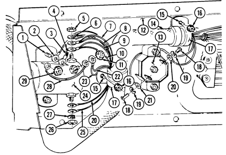

ੇ

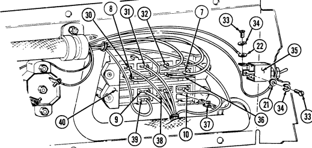

Q

# 4-124. Nbc Control Panel Replacement (Cont'D)

#### Not E

Leads 785 and 786 have two way jumpers connecting fuses for heaters 1 & 2 and 3 & 4 respectively.

15. Install leads 787 (1) and 787A (2) on NBC fuse block (5) for heater fuse \#5.

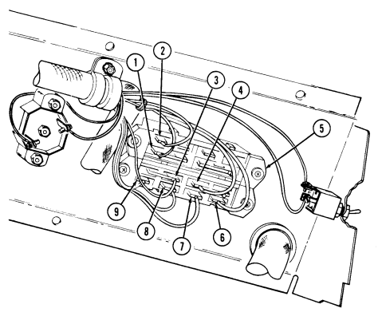 16. Install lead 786B (6) on NBC fuse block (5) for heater fuse \#4. 17. Install leads 786 (4) and 786A (7) on NBC fuse block (5) for heater fuse \#3. 18. Install lead 785A (9) on NBC fuse block (5) for heater fuse \#2. 19. Install leads 785 (3) and 785B (8) on NBC fuse block (5) for heater fuse \#1.

# 4-124. Nbc Control Panel Replacement (Cont'D)

20. Install NBC control panel (13) on ambulance body (14) with six screws (15).

NOTE
M996 and M996A1 ambulances will not have cushioned wire

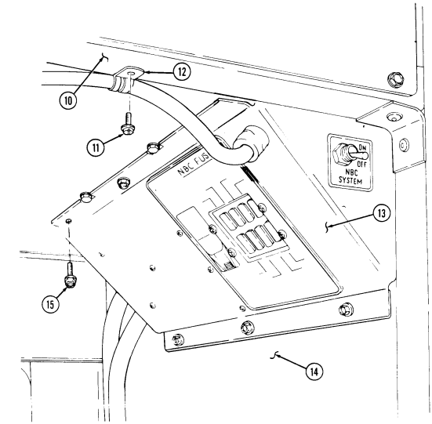

clamp on ceiling.

21. Install cushioned wire clamp (12) on passenger ceiling (10) with screw (11).

FOLLOW-ON TASKS: Install NBC wiring harness: M996 and M996A1 (para. 4-99) M997, M997A1 and M997A2 (para. 4-100).

Install NBC control panel fuses (TM 9-2320-280-10). Install battery ground cable to battery (para. 4-73).

# 4-125. Heat/Vent Control Panel Removal (M996, M996A1)

This task covers:
a. Removal b. Installation INITIAL SETUP:
Applicable Models M996, M996A1 Tools General mechanic's tool kit:
automotive (Appendix B, Item 1)
Materials/Parts Plug button (Appendix G, Item 8)
Manual References TM 9-2320-280-24P
Equipment Condition
- Battery ground cable disconnected (para. 4-73). - Heater compartment panel removal (para. 11204).

a. Removal 1. Remove plug button (1) from control arm (2) and blower duct arm (5). Discard plug button (1). 2. Disconnect vent door control arm (3) from switch lever assembly (4). 3. Remove four screws (7), control panel (8), and control arm (2) from body (6).

b. Installation 1. Connect control arm (2) to switch lever assembly (4) and install control panel (8) on body (6) with four screws (7).

2. Connect vent door control arm (3) to switch lever assembly (4).

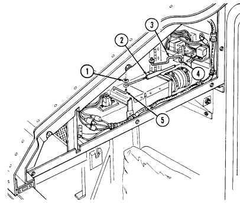 3. Install control arm (2) on blower duct arm (5) with plug button (1).

# 4-125. Heat/Vent Control Panel Removal (M996, M996A1) (Cont'D)

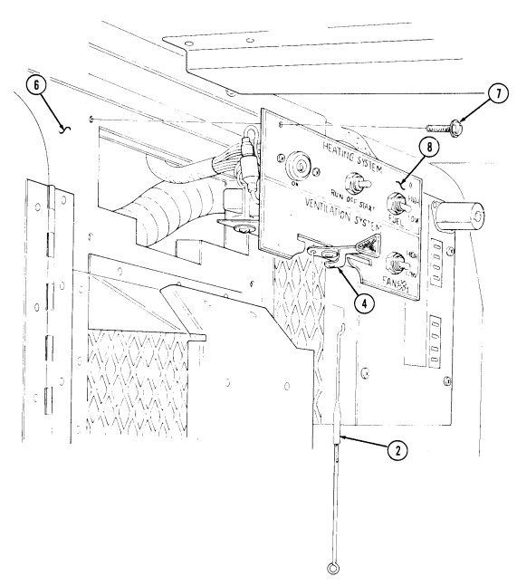

FOLLOW-ON TASKS:
.

Connect battery ground cable (para. 4-73).
Install heater compartment panel (para. 11-204).

# 4-126. Heat/Vent Control Panel Relay And Switch Maintenance (M996, M996A1)

This task covers:
a. Heater Run-Start Switch Removal i. Spot Vent Switch Removal b. Heater Run-Start Switch Installation j. Spot Vent Switch Installation c. 24-Volt Relay Removal k. Fuel Hi-Low Switch Removal d. 24-Volt Relay Installation l. Fuel Hi-Low Switch Installation e. Relay Socket Removal m. Fan Hi-Low Switch Removal f. Relay Socket Installation n. Fan Hi-Low Switch Installation g. Heat On Light Removal o. Rollover Switch Removal h. Heat On Light Installation p. Rollover Switch Installation

#### Initial Setup:

Applicable Models M996, M996A1 Tools General mechanic's tool kit:
automotive (Appendix B, Item 1)

#### Manual References

TM 9-2320-280-24P

#### Equipment Condition

- Battery ground cable disconnected (para. 4-73). - Heater compartment panel removed
(para. 11-204).

- Heat/vent control panel removed (para. 4-125).

Prior to removal, tag leads for installation.

#### A. Heater Run-Start Switch Removal

1. Remove nut (8), switch (4), washer (6), and nut (5) from panel (7). 2. Remove six screws (1), lockwashers (3), and seven terminals (2) from switch (4). Discard lockwashers (3).

#### B. Heater Run-Start Switch Installation

1. Install seven terminals (2) on switch (4) with six lockwashers (3) and screws (1). 2. Install nut (5), washer (6), and switch (4) on panel (7) with nut (8).

Materials/Parts Twenty lockwashers
(Appendix G, Item 169)
Three plain-assembled nuts 
(Appendix G, Item 201)
4-126. HEAT/VENT CONTROL PANEL RELAY AND SWITCH MAINTENANCE

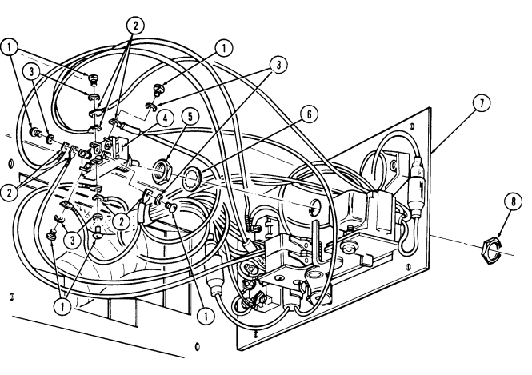

4-126. HEAT/VENT CONTROL PANEL RELAY AND SWITCH MAINTENANCE
(M996, M996A1) (Cont'd)
c. 24-Volt Relay Removal Remove 24-volt relay (1) from relay mounting socket (2).

d. 24-Volt Relay Installation Install 24-volt relay (1) on relay mounting socket (2).

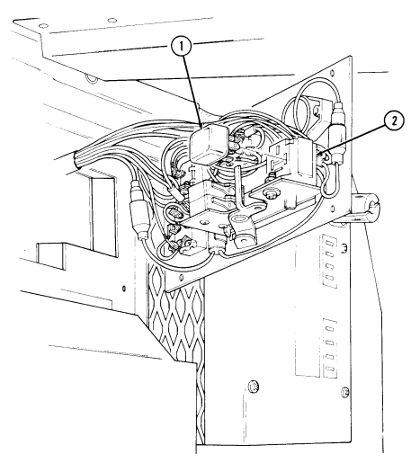

# 4-126. Heat/Vent Control Panel Relay And Switch Maintenance (M996, M996A1) (Cont'D)

e. Relay Socket Removal 1. Remove screw (3), washer (2), plain-assembled nut (7), and relay mounting socket (4) from mounting bracket (6). Discard plain-assembled nut (7).

2. Remove 24-volt relay (1) and five terminals (5) from relay mounting socket (4).

f. Relay Socket Installation 1. Install five terminals (5) and 24-volt relay (1) on relay mounting socket (4). 2. Install relay mounting socket (4) on bracket (6) with screw (3), washer (2), and plain-assembled nut (7).

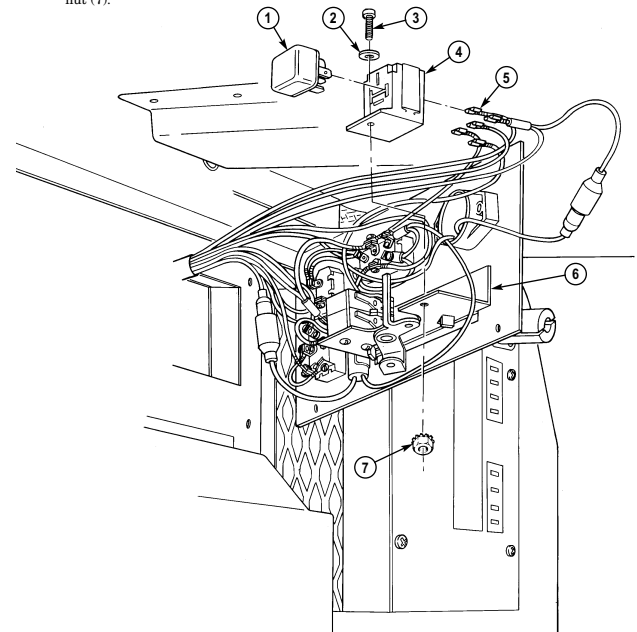

## 4-126. Heat/Vent Control Panel Relay And Switch Maintenance (M996, M996A1) (Cont'D)

g. Heat On Light Removal 1. Remove screw (7), lockwasher (8), terminal (9), and light terminal (6) from heater HI-LOW switch (10).

Discard lockwasher (8).

2. Disconnect light lead (2) from relay lead (5). Remove two screws (4) and light (1) from panel (3).

## H. Heat On Light Installation

1. Install light (1) on panel (3) with two screws (4). Connect relay lead (5) to light lead (2).

2. Install light terminal (6) and terminal (9) on HI-LOW switch (10) with lockwasher (8) and screw (7).

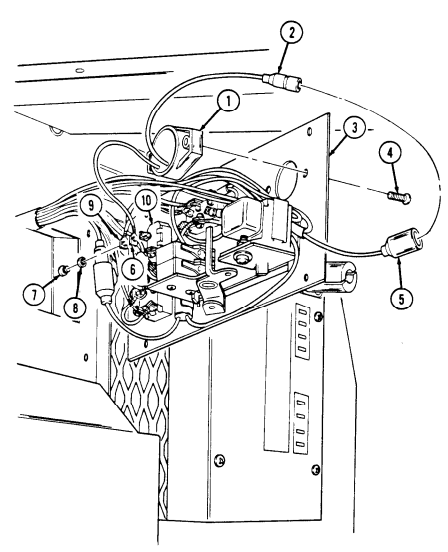

# 4-126. Heat/Vent Control Panel Relay And Switch Maintenance (M996, M996A1) (Cont'D)

i. Spot Vent Switch Removal 1. Remove two screws (6), washers (5.1), plain-assembled nuts (3), and switch (4) from lever bracket
(7). Discard plain-assembled nuts (3).

2. Remove four screws (1), lockwashers (2), and terminals (5) from switch (4). Discard lockwashers (2).

j. Spot Vent Switch Installation 1. Install four terminals (5) on switch (4) with lockwashers (2) and screws (1). 2. Install switch (4) on lever bracket (7) with two screws (6), washers (5.1), and plain-assembled nuts (3).

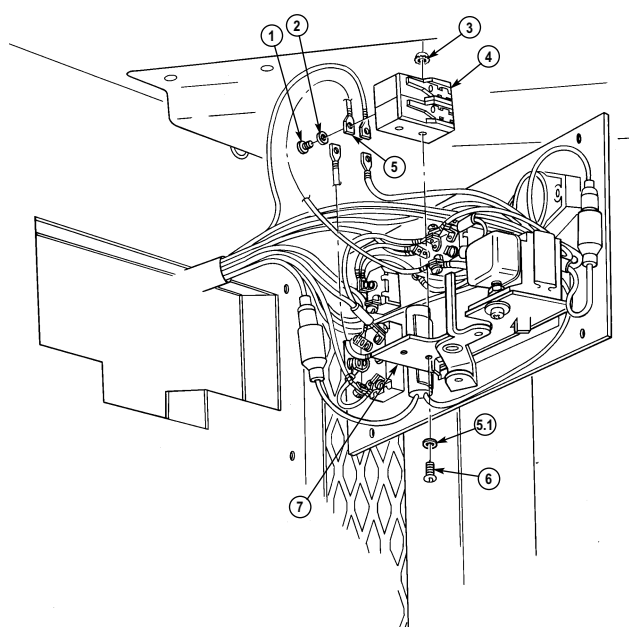

#### 4-126. Heat/Vent Control Panel Relay And Switch Maintenance

(M996, M996A1) (Cont'd)
1. Remove nut (5), switch (1) washer (3) and nut (2) from panel (4).

2. Remove two screws (7), lockwashers (8) and three terminals (6) from switch (1). Discard lockwashers (8).

1. Install three terminals (6) on switch (1) with two lockwashers (8) and screws (7).

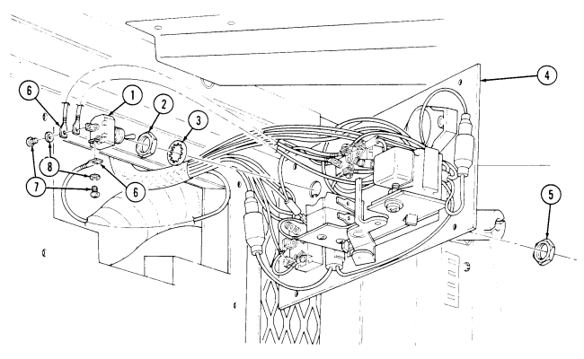 2. Install nut (2), washer (3), and switch (1) on panel (4) with nut (5).

# 4-126. Heat/Vent Control Panel Relay And Switch Maintenance (M996, M996A1) (Cont'D)

m. Fan Hi-Low Switch Removal 1. Remove nut (5), switch (4), washer (7), and nut (8) from panel (6).

2. Remove six screws (3), lockwashers (1) and six terminals (2) from switch (4). Discard lockwashers (1).

n. Fan Hi-Low Switch Installation 1. Install six terminals (2) on switch (4) with six lockwashers (1) and screws (3).

2. Install nut (8), washer (7), and switch (4) on panel (6) with nut (5).

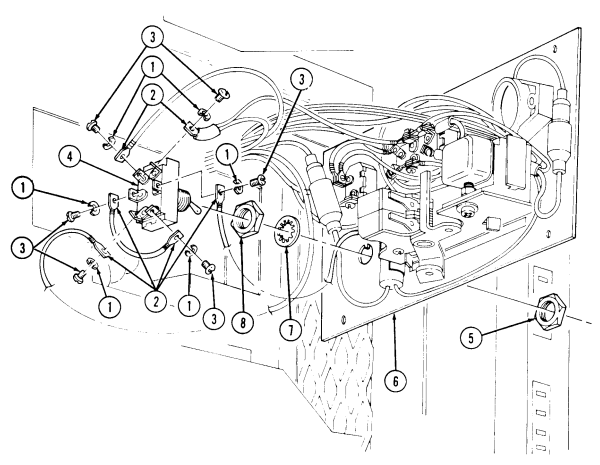

# 4-126. Heat/Vent Control Panel, Relay And Switch Maintenance (M996, M996A1) (Cont'D)

#### O. Rollover Switch Removal

1. Disconnect rollover switch lead (7) from harness lead (8).

2. Remove screw (4) and lockwasher (3) from two terminals (2) and heater RUN-START switch (5) and remove rollover switch (1). Discard lockwasher (3).

#### P. Rollover Switch Installation

1. Install two terminals (2) on heater RUN-START switch (5) with lockwasher (3) and screw (4).

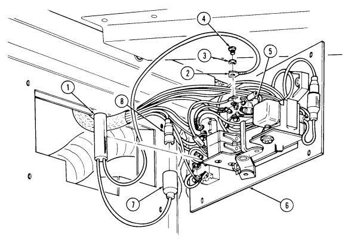

2. Connect harness lead (8) to rollover switch lead (7) and snap in rollover switch (1) in switch bracket (6).

FOLLOW-ON TASKS: Install heat/vent control panel (para. 4-125).

Install heater compartment panel (para. 11-204). Connect battery ground cable (para. 4-73).

# 4-127. Heat/Air-Conditioning Control Panel Relay And Switch Maintenance (M997, M997A1, M997A2)

This task covers:
a. Heat A/C Panel Removal h. Fuel Hi-Low Switch Installation b. Heat A/C Panel Installation i. Fan Hi-Low Switch Removal c. Heater Run-Start Switch Removal j. Fan Hi-Low Switch Installation d. Heater Run-Start Switch Installation k. A/C On-Off Switch Removal e. Heat On Light Removal l. A/C On-Off Switch Installation f. Heat On Light Installation m. Rollover Switch Removal g. Fuel Hi-Low Switch Removal n. Rollover Switch Installation INITIAL SETUP:
Applicable Models M997, M997A1, M997A2 Tools General mechanic's tool kit:
automotive (Appendix B, Item 1)
Materials/Parts Nine lockwashers (Appendix G, Item 169) Two lockwashers (Appendix G, Item 138)
Manual References TM 9-2320-280-24P
Equipment Condition Battery ground cable disconnected (para. 4-73).

#### A. Heat A/C Control Panel Removal

Remove four screws (1), two bolts (6), lockwashers (5) and panel (2) from harness bracket (4) and control box (3). Pull panel (2) away from control box (3). Discard lockwashers (5).

b. Heat A/C Control Panel Installation

Check for loose or disconnected wires before installing panel.

Install panel (2) on harness bracket (4) and control box (3) with two lockwashers (5), bolts (6), and four screws (1).

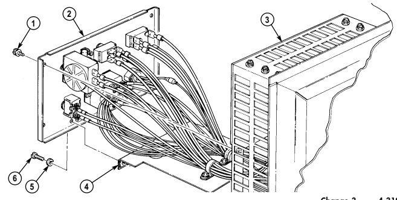

# 4-127. Heat/Air-Conditioning Control Panel Relay And Switch Maintenance (M997, M997A1, M997A2) (Cont'D)

#### Not E

Prior to removal, tag leads for installation.

1. Remove two screws (1) and switch (6) from panel (2). 2. Remove six screws (4), lockwashers (5), and twelve terminals (3) from switch (6). Discard lockwashers (5).

1. Install twelve terminals (3) on switch (6) with six lockwashers (5) and screws (4).

2. Install switch (6) on panel (2) with two screws (1).

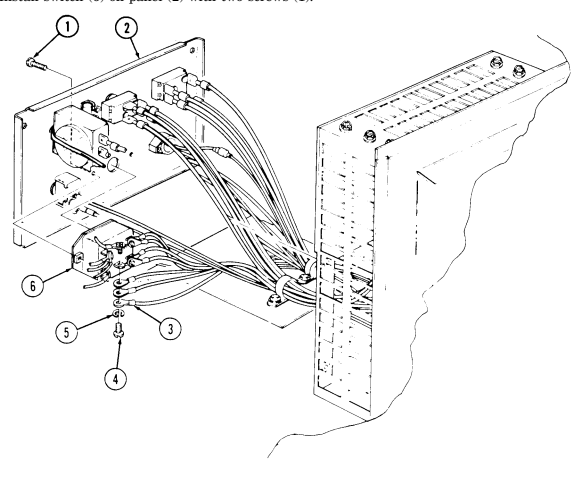

# 4-127. Heat/Air-Conditioning Control Panel Relay And Switch Maintenance (M997, M997A1, M997A2) (Cont'D)

#### Not E

Prior to removal, tag leads for installation.

1. Remove screw (9), lockwasher (8), and light terminal (7) from heater run-start switch (6). Discard lockwasher (8).

2. Disconnect light lead (4) from relay lead (5) and remove two screws (1) and light (3) from panel (2).

1. Install light (3) on panel (2) with two screws (1) and connect relay lead (5) to light lead (4).

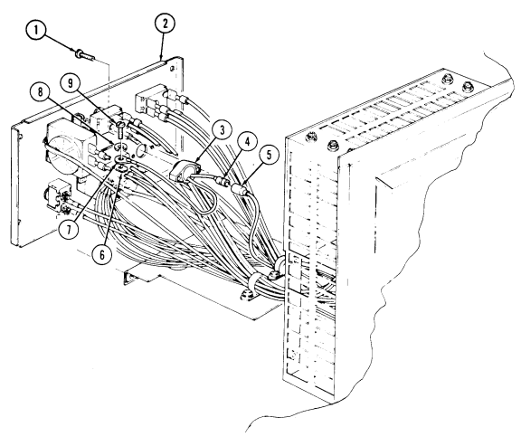

2. Install light terminal (7) on heater run-start switch (6) with lockwasher (8) and screw (9).

# 4-127. Heat/Air-Conditioning Control Panel Relay And Switch Maintenance (M997, M997A1, M997A2) (Cont'D)

1. Remove nut (1), switch (6), washer (8), and nut (7) from panel (2). 2. Remove two screws (4), lockwashers (5), and terminals (3) from switch (6). Discard lockwashers (5).

1. Install two terminals (3) on switch (6) with two lockwashers (5) and screws (4).

NOT E
Position toggle switch in low position.

2. Install nut (7), washer (8), and switch (6) on panel (2) with nut (1).

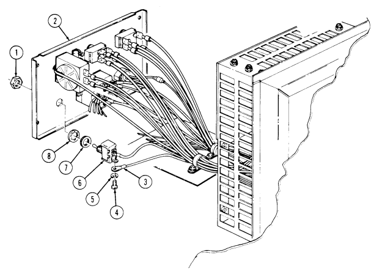

# 4-127. Heat/Air-Conditioning Control Panel Relay And Switch Maintenance (M997, M997A1, M997A2) (Cont'D)

#### Not E

Prior to removal, tag leads for installation.

i. Fan Hi-Low Switch Removal 1. Remove nut (1), switch (5), washer (3), and nut (4) from panel (2).

2. Pull four terminals (6) from switch (5) and remove switch (5).

j. Fan Hi-Low Switch Installation 1. Connect four terminals (6) to switch (5).

2. Install nut (4), washer (3), and switch (5) on panel (2) with nut (1).

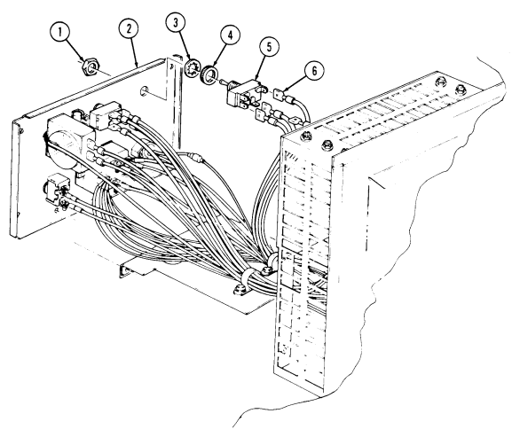

# 4-127. Heat/Air-Conditioning Control Panel Relay And Switch Maintenance [M997, M997A1, M997A2) (Cont'D)

Prior to removal, tag leads for installation.

1. Remove nut (1), switch (5), washer (3), and nut (4) from panel (2).

2. Pull four terminals (6) from switch (5) and remove switch (5).

1. Connect four terminals (6) to switch (5).

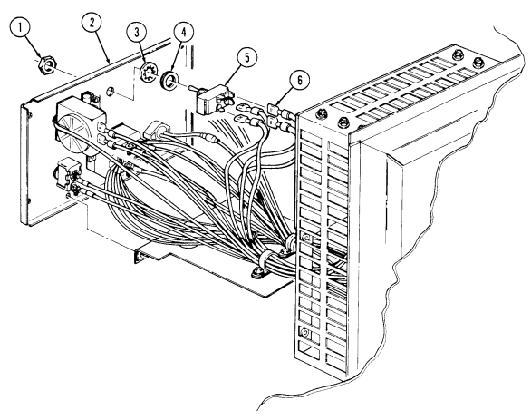 2. Install nut (4), washer (3), and switch (5) on panel (2) with nut (1).

# 4-127. Heat/Air-Conditioning Control Panel Relay And Switch Maintenance (M997, M997A1, M997A2) (Cont'D)

NOTE
Prior to removal, tag leads for installation.

m. Rollover Switch Removal Disconnect two rollover switch leads (4) from harness leads (3) and pull rollover switch (2) out of switch bracket (1).

n. Rollover Switch Installation Connect two harness leads (3) to rollover switch leads (4) and snap in rollover switch (2) into

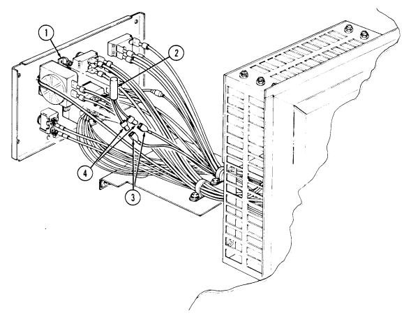

switch bracket (1).

FOLLOW-ON TASK: Connect battery ground cable (para. 4-73).

## Chapter 5 Transmission And Transfer Case Maintenance
### Section I. Transmission Maintenance 
### 5-1. Transmission Maintenance Task Summary

| Equipment Condition  Tools                                                                               |
|----------------------------------------------------------------------------------------------------------|
| Battery ground cable disconnected (para. 4\-73) General mechanic's tool kit:                             |
| (receptacle only).  automotive (Appendix B, Item 1)                                                      |
| 1. Turn and pull plug (4) from receptacle (3).                                                           |
| 2. Remove two screws (5) from plug (4). Open plug (4) and ensure positive (10), negative (12), and       |
| ground (11) leads for plug (4) are properly installed.                                                   |
| b. Plug Installation                                                                                     |
| 1. Close plug (4) and install two screws (5) on plug (4).                                                |
| 2.  Insert plug (4) on receptacle (3).                                                                   |
| c. Receptacle Removal                                                                                    |
| For instructions on replacement of rivets, refer to para. 10\-66.                                        |
| 1. Remove two rivets (6) and receptacle (3) from control box (1). Pull receptacle (3) away for access to |
| leads (2).                                                                                               |
| NOT E                                                                                                    |
| Prior to removal, tag leads for installation.                                                            |
| 2.  Loosen screw (8) and push shield (9) away for access to leads (2).                                   |
| 3. Remove two screws (7), and leads (2) from receptacle (3).                                             |
| d. Receptacle Installation                                                                               |
| 1. Install two leads (2) on receptacle (3) with two screws (7). Position shield (9) over screws (7) and  |
| tighten screw (8).                                                                                       |
| 2.  Install receptacle (3) on control box (1) with two rivets (6).                                       |
| a. Plug Removal  NOT E                                                                                   |

## 5-2. Transmission Service

This task covers:
b. Transmission Filter Removal **d. Replenishing Fluid**

#### Initial Setup: Tools

General mechanic's tool kit:
automotive (Appendix B, Item 1)

#### Materials/Parts

a. Draining Fluid c. Transmission Filter Installation

#### Manual References

TM 9-2320-280-10 TM 9-2320-280-24P
General Safety Instructions Drycleaning solvent is flammable and will not be used near an open flame.

Nonmetallic round seal (Appendix G, Item 286) Filter assembly (Appendix G, Item 31) (3L80) Gasket (Appendix G, Item 48) (3L80)
Filter element kit (Appendix G, Item 33) (4L80-E)
Gasket (Appendix G, Item 58) (4L80-E) Two locknuts (Appendix G, Item 103) Transmission fluid (Appendix C, Item 26 or 27) Drycleaning solvent (Appendix C, Item 18)

#### A. Draining Fluid Note

- Transmission service for the 3L80 and 4L80-E transmissions is basically the same. Differences are noted.

- Do not shift through driving gear ranges when warming transmission fluid for removal. Shifting through driving gear ranges is a procedure used only when refilling transmission fluid.

- Transmission should be warm when draining fluid. - Have drainage container ready to catch fluid.

1. Remove drainplug (1) and gasket (2) from oil pan (3). Allow fluid to drain.

Inspect fluid for grit, foaminess, and/or milkiness. If present, notify DS maintenance.

2. Install gasket (2) and drainplug (1) in oil pan (3) and tighten drain plug (1) to 20 lb-ft (27 N•m).

b. Transmission Filter Removal

Perform steps 1 through 5 for 3L80 transmissions only.

1. Remove thirteen capscrews (6), oil pan (3), and gasket (5) from transmission (4). Discard gasket (5). 2. Clean gasket (5) material from transmission (4) and oil pan (3) mating surfaces. 3. Remove capscrew (11), oil filter (10), and spacer (9) from transmission (4). 4. Pull suction tube (8) from oil filter (10) and remove seal (7). Discard seal (7).

Drycleaning solvent is flammable and will not be used near an open flame. A fire extinguisher will be kept nearby when the solvent is used. Use only in well ventilated places. Failure to do this may result in injury to personnel and/or damage equipment.

5. Clean suction tube (8) and oil pan (3) thoroughly with drycleaning solvent.

5-2 Change 3

5-2. TRANSMISSION SERVICE (Cont'd)

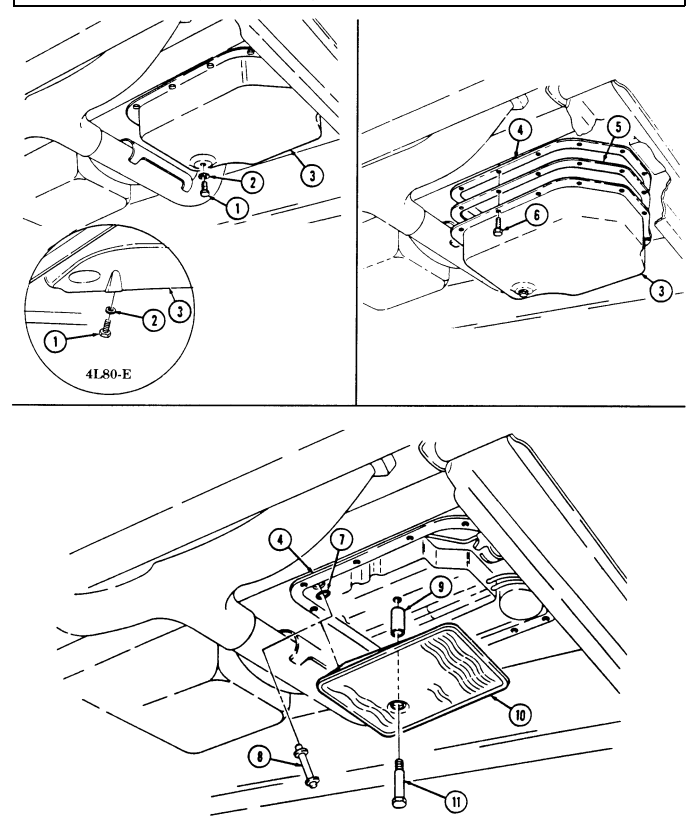

# 5-2. Transmission Service (Cont'D)

Perform steps 6 through 9 for 4L80-E transmissions only.

Transfer case must be supported during removal and installation of crossmember for access to oil pan capscrew and to prevent damage to equipment.

6. Place support under transfer case and remove two locknuts (3), washers (2), capscrews (6), and crossmember (4) from support brackets (1) and (5). Discard locknuts (3). 

Oil pan gasket is reusable. Discard only if damaged.

7. Remove seventeen capscrews (12), oil pan (11), and gasket (10) from transmission (7). 8. Remove magnet (9) from oil pan (11). Remove filter (8) from transmission (7).

Drycleaning solvent is flammable and will not be used near an open flame. A fire extinguisher will be kept nearby when the solvent is used Use only in well-ventilated places. Failure to do this may result in injury to personnel and/or damage to equipment.

9. Clean oil pan (11) thoroughly with drycleaning solvent.

c. Transmission Filter Installation

Perform steps 1 through 4 for 4L80-E transmissions only. 

1. Install filter (8) in transmission (7). Install magnet (9) in oil pan (11). 2. Install gasket (10) and oil pan (11) on transmission (7) with seventeen capscrews (12). Tighten capscrews (12) to 18 lb-ft (24 N•m).

3. Install crossmember (4) on support brackets (1) and (5) with two capscrews (6), washers (2), and locknuts (3). Tighten locknuts (3) to 90 lb-ft (122 N•m).

4. Remove support from transfer case.

# 5-2. Transmission Service (Cont'D)

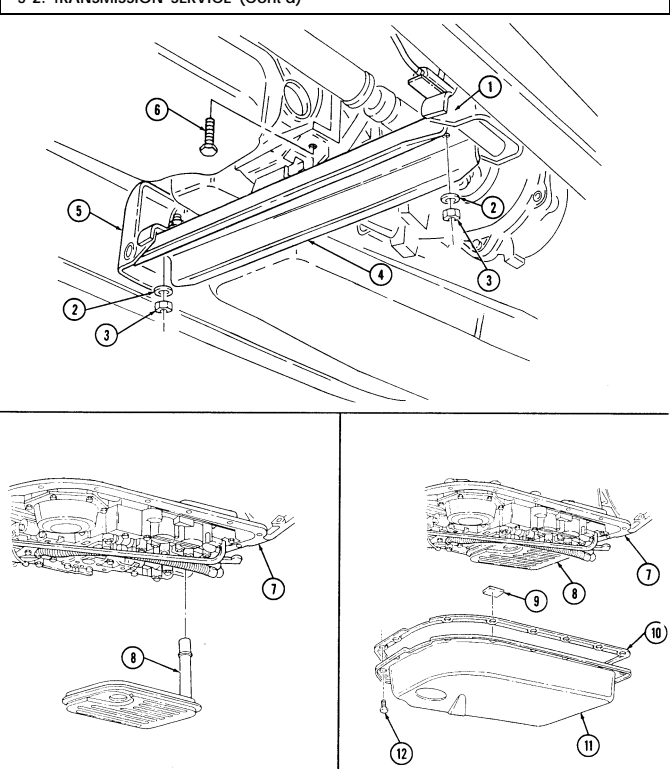

# 5-2. Transmission Service (Cont'D)

Perform steps 5 through 9 for 3L80 transmissions only.

5. Insert end of suction tube (3) marked "filter'' into oil filter (5). 6. Install seal (7) onto upper end of suction tube (3) marked "case'' and slide downward. 7. Position oil filter (5) on transmission (1) inserting suction tube (3) into oil input port (2). 8. Install oil filter (5) and spacer (4) on transmission (1) with capscrew (6). Tighten capscrew (6) 
to 10-15 lb-ft (14-20 N•m).

9. Install gasket (8) and oil pan (9) on transmission (1) with thirteen capscrews (10). Tighten capscrews (10) to 12 lb-ft (16 N•m).

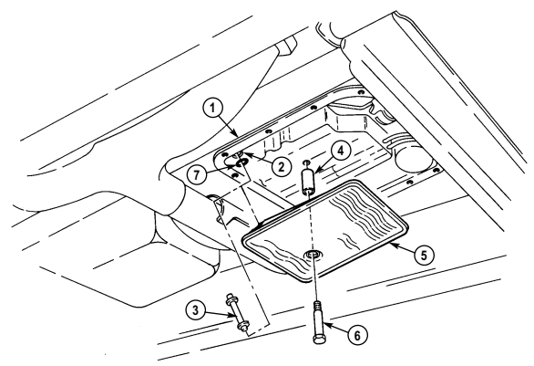

5-2. TRANSMISSION SERVICE (Cont'd)

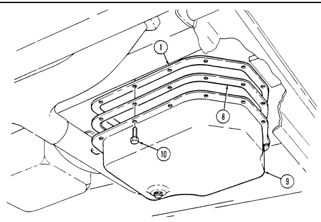

#### D. Replenishing Fluid

1. Remove transmission oil dipstick (12) from dipstick tube (11).

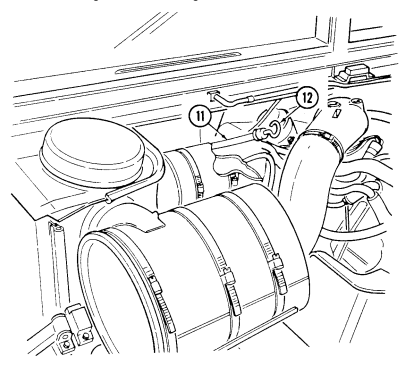

2. Check transmission fluid and fill to proper level (TM 9-2320-280-10). 3. Install transmission oil dipstick (12) in dipstick tube (11).

FOLLOW-ON TASK: Operate vehicle (TM 9-2320-280-10) and check for leaks.

# 5-3. Transmission Oil Cooler Lines Replacement

This task covers:
INITIAL SETUP:

#### Tools

General mechanic's tool kit:
automotive (Appendix B, Item 1)
Materials/Parts Four locknuts (Appendix G, Item 70) Locknut (Appendix G, Item 99)
Manual References TM 9-2320-280-10 TM 9-2320-280-24P

a. Removal b. Installation

Equipment Condition
- Right splash shield removed (oil cooler lines to oil cooler only) (para. 10-20).

- Left splash shield access cover removed
(para. 10-18).

General Safety Instructions Allow transmission to cool before performing this task.

Allow transmission to cool before performing this task. Severe injury to personnel may result.

- Removal and installation procedures are the same for all lines, regardless of function, size or location. All oil cooler ports should be plugged to prevent contamination. Remove plugs prior to connection.

- Left splash shield can be modified to add engine access cover. Refer to appendix D, Fig. D-86 and D-87 for installation.

#### A. Removal

1. Remove retaining clamps (3) from cooler lines (4). 2. Loosen hose clamps (1) on rubber hoses (2) and cooler lines (4). 3. Loosen hose clamps (5) on cooler lines (4).

Have drainage container ready to catch fluid.

4. Disconnect cooler lines (4) at each end and allow to drain.

Perform step 5 for M997A2, M1025A2, M1035A2, M1043A2, M1045A2, M1097A2, and M1123 vehicles only.

5. Disconnect two cooler lines (4) from by-pass valve (6).

NOTE
Perform steps 6 and 7 to allow access only if removing oil cooler lines from oil cooler.

6. Remove four locknuts (9), washers (10), and capscrews (11) from radiator supports (7) and airlift brackets (8). Discard locknuts (9).

7. Remove locknut (12), washer (13), capscrew (17), washer (13), large washer (16), and mount (15) from radiator (14) and front mounting bracket (18). Discard locknut (12).

8. Remove cooler lines (4) and rubber hoses (2) from vehicle.

# 5-3. Transmission Oil Cooler Lines Replacement (Corítl)

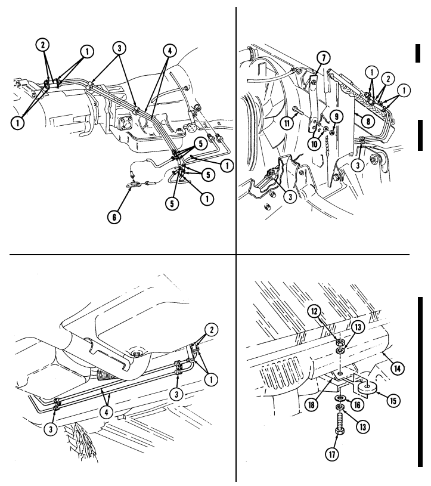

## 5 - 3 . Transmission Oil Cooler Lines Replacement (Cont' D )

b. Installation 1. Position rubber hoses (2) and cooler lines (4) in proper position.

Perform step 3 for M997A2, M1025A2, M1035A2, M1043A2, M1045A2, M1097A2, and M1123 vehicles only.

2. Connect two cooler lines (4) to by-pass valve (6) and hoses (2). 3. Tighten hose clamps (1) on rubber hoses (2) to cooler lines (4). 4. Tighten hose clamps (5) on cooler lines (4).

Perform steps 5 and 6 only if installing oil cooler lines to oil cooler.

5. Install radiator (9) to front mounting bracket (13) with mount (10), large washer (11), washer (8),
capscrew (12), washer (8), and locknut (7). Tighten capscrew (12) to 30 lb-ft (41 N•m).

6. Install radiator supports (14) to airlift brackets (15) with four capscrews (18), washers (17), and

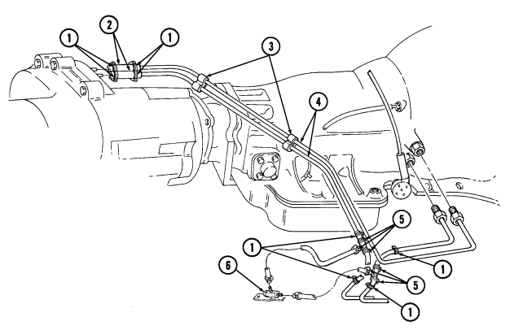

locknuts (16). Tighten locknuts (16) to 31 lb-ft (42 N•m).

7. Install retaining clamps (3) on cooler lines (4).

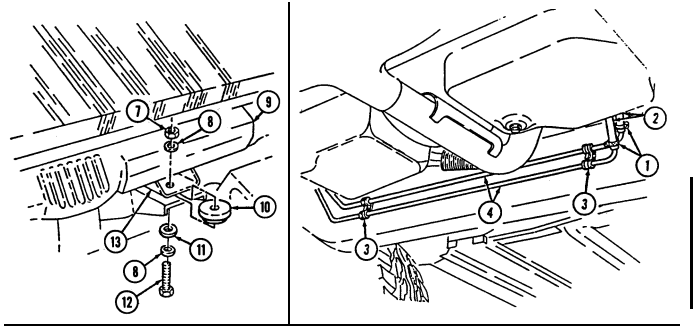

# 5-3. Transmission Oil Cooler Lines Replacement (Corítb)

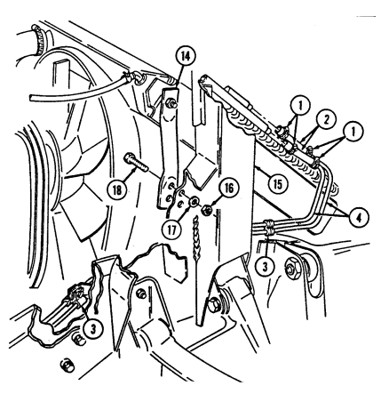

FOLLOW-ON TASKS:  - Fill transmission to proper level (TM 9-2320-280-10).

- Start engine (TM 9-2320-280-10) and check for leaks.

- Install right splash shield, if removed (para 10-20).

· Install left splash shield access cover, if removed (para. 10-18).

# 5 - 4 . Transmission Bypass Va Lve Replacement

This task covers:

a. Removal b. Installation

INITIAL SETUP:
Applicable Models M997A2, M1025A2, M1035A2, M1043A2, M1045A2, M1097A2, M1123

| Manual References                                  |
|----------------------------------------------------|
| TM 9\-2320\-280\-10                                |
| TM 9\-2320\-280\-24P                               |
| Equipment Condition                                |
| - Battery ground cable disconnected (para. 4\-73). |

Tools General mechanic's tool kit:
automotive (Appendix B, Item 1)

Allow transmission to cool before performing this task. Severe injury to personnel may result.

Cover or plug all open lines and connections immediately after disconnection to prevent contamination. Remove all plugs prior to connection.

a. Removal 1. Loosen hose clamps (1) and (8) on rubber hoses (2) and (9).

Have drainage container ready to catch fluid.

2. Disconnect rubber hoses (2) and (9) from bypass valve (3). 3 . Remove nut (7), washer (5), capscrew (4), washer (5), and bypass valve (3) from transmission crossmember (6).

#### B. Installation

1. Install bypass valve (3) on transmission crossmember (6) with washer (5), capscrew (4), washer (5),
and nut (7). Tighten nut (7) to 28 lb-ft (38 N•m).

2. Connect hoses (2) and (9) to bypass valve (3) and tighten clamps (1) and (8).

## 5-4. Transmission Bypass Valve Replacement (Cont'D)

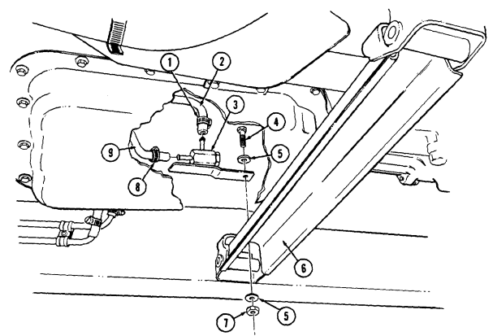

FOLLOW-ON TASKS:  - Fill transmission to proper level (TM 9-2320-280-10).

- Start engine (TM 9-2320-280-10) and check for leaks.

- …

# 5-5. Transmission Oil Dipstick Tube Replacement

This task covers:
INITIAL SETUP:
Tools General mechanic's tool kit:
automotive (Appendix B, Item 1)

#### A. Removal **B. Installation**

Manual References TM 9-2320-280-10 TM 9-2320-280-24P
Materials/Parts Packing (3L80) (Appendix G, Item 224)
Seal (4L80-E) (Appendix G, Item 288)
Equipment Condition
- Hood raised and secured (TM 9-2320-280-10). - Right exhaust manifold rear heat shield removed
(para. 3-54).

- Plug open transmission port to prevent contamination. Remove plug prior to installation of oil dipstick tube.

- Have drainage container ready to catch fluid.

#### A. Removal

1. Remove transmission oil dipstick (2) from dipstick tube (1). 2. Remove capscrew (7) from dipstick tube (1) and cylinder head (3). 3. Remove dipstick tube (1) from transmission (4). 4. Remove packing (6) from dipstick tube (1). Discard packing (6).

b. Installation 1. Install packing (6) on dipstick tube (1). 2. Push dipstick tube (1) into opening (5) in transmission (4).

3. Install dipstick tube (1) on cylinder head (3) with capscrew (7). Tighten capscrew (7) 
to 25-37 lb-ft (34-50 N•m).

4. Install transmission oil dipstick (2) into dipstick tube (1).

# 5-5. Transmission Oil Dipstick Tube Replacement (Cont'D)

FOLLOW-ON TASKS: Install right exhaust manifold rear heat shield (para. 3-54).

Fill transmission to proper level (TM 9-2320-280-10).

Lower and secure hood (TM 9-2320-280-10).

Start engine (TM 9-2320-280-10) and check for leaks.

# 5-6. Neutral Start Switch Replacement

This task covers:
INITIAL SETUP:

#### Tools

General mechanic's tool kit:
automotive (Appendix B, Item 1)

a. Removal **b. Installation**

| Manual References   |
|---------------------|

TM 9-2320-280-10 TM 9-2320-280-24P
Materials/Parts Tiedown strap (Appendix G, Item 305) Sealing compound (Appendix C, Item 44)
Equipment Conditioin Shift controls housing removed (para. 5-7 or 5-10).

a. Removal

- Prior to removal, tag leads for installation. - Perform steps 3 through 5 for M997A2, M1025A2, M1035A2, M1043A2, M1045A2, M1097A2, and M1123 vehicles only. Perform steps 1 and 2 for all other vehicles.

1. Remove rubber boot (4) from shift control housing assembly (1). 2. Remove neutral start switch (2) from shift control housing assembly (1). 3. Remove boot (10) from shift controls housing (6). 4. Remove two screws (8) and neutral start switch (7) from housing (6). 5. Remove tiedown strap (11) and neutral start switch leads (9) from backup light switch leads (12).

Discard tiedown strap (11).

b. Installation

Perform steps 1 through 3 for M997A2, M1025A2, M1035A2, M1043A2, M1045A2, M1097A2, and M1123 vehicles only. Perform steps 4 and 5 for all other vehicles.

1. Install neutral start switch (7) on shift control housing (6) with two screws (8). 2. Install neutral start switch leads (9) on backup light switch leads (12) with tiedown strap (11). 3. Position neutral start switch leads (9), backup light switch leads (12), and light lead (13) through boot (10), and install boot (10) on housing (6).

4. Apply sealing compound to threads of neutral switch (2), install neutral switch into shift control housing assembly (1). Tighten neutral start switch (2) to 27-30 lb-ft (37-42 N•m).

5. Install leads from neutral start switch (2) and shift selector indicator lead (5) through nipples (3) on rubber boot (4) and install rubber boot (4) on shift control housing assembly (1).

# 5-6.  Neutral Start Switch Replacement (Cont'D)

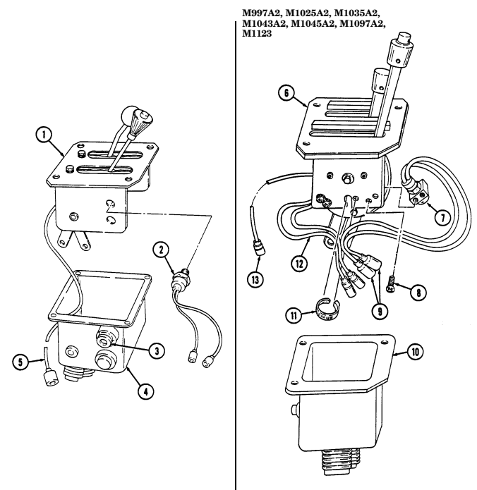

FOLLOW-ON TASKS: - Install shift controls housing (para. 5-7 or 5-10).

· Check neutral start switch for proper operation (TM 9-2320-280-10).

# 5-7. Shift Controls Housing Assembly (Sf-5583581) Replacement

This task covers:

a. Removal b. Installation

| 5\-1.   | TRANSMISSION MAINTENANCE TASK SUMMARY     |       |
|---------|-------------------------------------------|-------|
| TASK    |                                           | PAGE  |
| PARA.   | PROCEDURES                                | NO.   |
| 5\-2.   | Transmission Service                      | 5\-2  |
| 5\-3.   | Transmission Oil Cooler Lines Replacement | 5\-8  |
| 5\-4.   | Transmission Bypass Valve Replacement     | 5\-12 |
| 5\-5.   | Transmission Oil Dipstick Tube            | 5\-14 |

a. Removal

If shift controls housing assembly is to be reinstalled, tape trunnions to shift rod to prevent loss of adjustment. Transfer case shift rod trunnion is removed from shift rod only if damaged or shift rods are replaced.

1. Remove cotter pin (5), washer (6), trunnion (9), and rub strip (8) from transmission shift lever arm (10). Discard cotter pin (5).

2. Remove cotter pin (2), washer (3), trunnion (4), and rub strip (7) from transfer case shift arm (1). Discard cotter pin (2).

Tag leads for installation.

3. Disconnect two body harness leads 14A/14B (14) from neutral start switch leads 14 (19). 4. Disconnect body harness lead (17) from shift selector indicator lead 17J (18). 5. Remove four locknuts (15), washers (16), capscrews (20), and shift controls housing assembly (12)
from body (13). Discard locknuts (15).

#### B. Installation

1. Position shift controls housing assembly (12) in body (13) with transmission lever (11) on right, and install with four capscrews (20), washers (16), and locknuts (15). Tighten locknuts (15) to 6 lb-ft (8 N•m).

2. Connect two body harness leads 14A/14B (14) to neutral start switch leads 14 (19). 3. Connect body harness lead (17) to shift selector indicator lead 17J (18). 4. Install rub strip (7) and trunnion (4) on transfer case shift arm (1) with washer (3) and cotter pin
(2).

5. Install rub strip (8) and trunnion (9) on transmission shift lever arm (10) with washer (6) and cotter pin (5).

5-7.  SHIFT CONTROLS HOUSING ASSEMBLY (SF-5583581)  REPLACEMENT (Conrd)
FOLLOW-ON TASKS: - • Connect battery ground cables (para. 4-73).
- • - • - • - • - • Start engine (TM 9-2320-280-10), check shift controls for proper operation, and adjust as needed (paras. 5-12 and 5-23).

# 5 - 8 . Shift Controls Housing Assembly (Sf-5583581) Maintenance

This task covers:
INITIAL SETUP:

a. Disassembly b. Assembly

Applicable Models All vehicles except: M997A2, M1025A2, M1035A2, M1043A2, M1045A2, M1097A2, M1123

| Equipment Condition   |
|-----------------------|

Equipment Condition Shift controls housing assembly removed (para. 5-7).

#### Tools

General mechanic's tool kit:
automotive (Appendix B, Item 1)

#### A. Disassembly

1. Remove knob (4) from transfer shift tube (6). 2. Remove button (2) from transmission shift knob (1). 3. Remove knob (1) from transmission shift tube (17). 4. Remove neutral start switch leads (10) from openings (12) in boot (11). 5. Slide rubber boot (11) off shift controls housing assembly (9). 6. Remove two nuts (8), washers (5), and shift selector indicator (3) from bezel (7).

#### B. Assembly

5. Install knob (1) on transmission shift tube (17).

1. Install shift selector indicator (3) and two washers (5) on bezel (7) with two nuts (8). 2. Install rubber boot (11) on shift controls housing assembly (9), placing neutral start switch leads (10)
through openings (12) in boot (11).

3. Place shift indicator lead (14) through opening (13) in boot (11). 4 . Slide rubber boot (11) onto shift controls housing assembly (9). Ensure that mounting screw holes (16)
in shift control housing assembly (9) align with holes (15) in boot (11 ) .

6. Install button (2) on transmission shift knob (1). 7. Install knob (4) on transfer shift tube (6).

# 5-8. Shift Controls Housing Assembly (Sf-5583581) Maintenance (Cont'D)

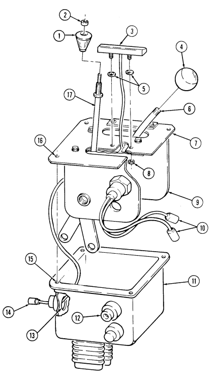

FOLLOW-ON TASK: Install shift control housing assembly (para. 5-7).

# 5-9. Shift Controls Housing Assembly (Sf-5583581) Repair

This task covers:

a. Disassembly c. Inspection b. Cleaning d. Assembly

#### Initial Setup:

Applicable Models All vehicles except: M997A2, M1025A2, M1035A2, M1043A2, M1045A2, M1097A2 Tools General mechanic's tool kit:
automotive (Appendix B, Item 1)
Materials/Parts Spring pin (Appendix G, Item 299) Retaining ring (Appendix G, Item 232)

| TM 9\-2320\-280\-24P        |
|-----------------------------|
| General Safety Instructions |

| TM 9\-2320\-280\-24P                         |
|----------------------------------------------|
| Equipment Condition                          |
| Shift controls housing assembly disassembled |
| (para. 5\-8).                                |

Manual References

#### A. Disassembly

1. Remove retaining ring (12) from shift control shaft (23) and shift controls housing (7). Discard retaining ring (12). 2. Remove spring pin (16) from spring retaining collar (15) and shift control shaft (23). Discard spring pin (16). 3. Remove shift control shaft (23), spring retaining collar (15), and shift control compression spring (17)
from shift controls housing (7).

4. Remove transfer shift lever (10) by sliding down and out from shift controls housing (7). 5. Remove two nylon flanged bearings (13) from transfer shift lever arm (14). 6. Remove spring pin (11) from transfer shift lever arm (14) and remove transfer shift lever (10) from transfer shift lever arm (14).

7. Remove transmission shift tube (28) by sliding down and out from shift controls housing (7).

Note position of transmission shift lever for installation.

8. Remove four nuts (26), washers (27), capscrews (18), washers (19), transmission shift tube (28), shift lever latch spring (24), and transmission shift lever (20) from bracket and shaft assembly (21).

9. Remove nylon flanged bearing (22) from bracket and shaft assembly (21).

10. Remove shift lever latch rod (25) by sliding out from transmission shift tube (28). 11. Remove three locknuts (9), washers (8), capscrews (2), washers (3), and bezel (1) from wiper (5) and shift controls housing (7). Discard three locknuts (9).

12. Remove three washers (4) and wiper (5) from shift controls housing (7). 13. Remove bearing (6) from shift controls housing (7).

b. Cleaning 1. Clean all shift control housing assembly parts in accordance with para. 2-10.

5-9. SHIFT CONTROLS HOUSING ASSEMBLY (SF-5583581) REPAIR (Cont'd)

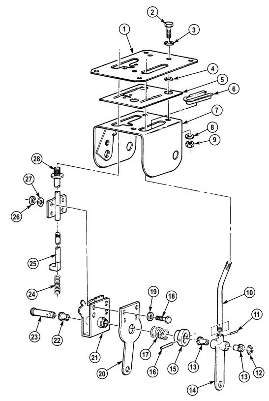

# 5-9. Shift Controls Housing Assembly (Sf-5583581) Repair (Cont'D)

c. Inspection 1. Inspect shift controls housing (7) for damage. Replace shift controls housing assembly if damaged. 2. Inspect transmission shift tube (28), bracket and shaft assembly (21), transmission shift lever (20),
bezel (1), and shift lever latch rod (25) for damage. Replace if damaged.

3. Inspect wiper (5) for tears. Replace if torn. 4. Inspect shift lever latch spring (24) and shift control compression spring (17) for distortion or damage. Replace if distorted or damaged.

5. Inspect nylon flanged bearings (22) and (13) for damage. Replace if damaged. 6. Inspect shift control shaft (23), spring retaining collar (15) and shift lever (14) for damage. Replace if damaged.

d. Assembly 1. Install bearing (6) in shift controls housing (7). 2. Apply thin coat of adhesive between shift controls housing assembly (7) and wiper (5). 3. Position wiper (5) and three washers (4) on shift controls housing (7). 4. Install bezel (1) on shift controls housing (7) with three washers (3), capscrews (2), washers (8), 
and locknuts (9).

5. Install shift lever latch rod (25) by pushing up into transmission shift tube (28). 6. Position transmission shift lever (20), shift lever latch spring (24), and transmission shift tube (28)
to bracket and shaft assembly (21) and secure with four washers (19), capscrews (18), washers (27), and nuts (26).

7. Install transmission shift tube (28) by pushing up through shift controls housing (7) and install nylon flanged bearing (22) into bracket and shaft assembly (21).

8. Install transfer shift lever (10) in transfer shift lever arm (14) with spring pin (11). 9. Install transfer shift lever (10) by pushing up through shift controls housing (7) and install two nylon flanged bearings (13) in transfer shift lever arm (14).

10. Position shift control compression spring (17) and spring retaining collar (15) into shift controls housing (7).

11. Install shift control shaft (23) through shift controls housing (7), bracket and shaft assembly (21),
com-pression spring (17), spring retaining collar (15), transfer shift lever arm (14), and out of shift controls housing (7).

12. Secure shift control shaft (23) in shift controls housing (7) with retaining ring (12). 13. Secure spring retaining collar (15) on shift control shaft (23) with spring pin (16).

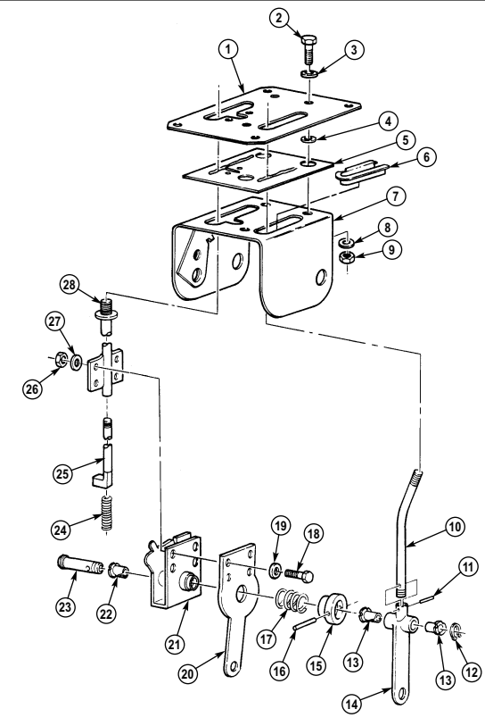

5-9. SHIFT CONTROLS HOUSING ASSEMBLY (SF-5583581) REPAIR (Cont'd)
FOLLOW-ON TASK: Assemble shift controls housing assembly (para 5-8).

# 5-10. Shift Controls Housing Assembly (12460111/12460112) Replacement (4L80-E)

This task covers:
INITIAL SETUP:
Applicable Models M997A2, M1025A2, M1035A2, M1043A2, M1045A2, M1097A2, M1123 Tools General mechanic's tool kit:
automotive (Appendix B, Item 1)
Materials/Parts Two cotter pins (Appendix G, Item 12) Four locknuts (Appendix G, Item 70)
a. Removal a. Removal b. Installation Manual References TM 9-2320-280-10 TM 9-2320-280-24P
Personnel Required One mechanic One assistant Equipment Condition Battery ground cable disconnected (para. 4-73).

If shift controls housing assembly is to be reinstalled, tape trunnions to shift rods to prevent loss of adjustment. Shift rod trunnions are removed from shift rods only if damaged or shift rods are replaced.

1. Remove cotter pin (5), washer (6), trunnion (7), and rub strip (6.1) from transmission shift lever arm (8). Discard cotter pin (5).

2. Remove cotter pin (2), washer (3), trunnion (4), and rub strip (3.1) from transfer case shift arm (1). Discard cotter pin (2).

- Tag leads for installation. - Perform step 3 for M997A2 and M1035A2 only.

3. Disconnect two body harness leads (12) from backup light switch leads (11). 4. Disconnect two body harness leads 14A/14B (14) from neutral start switch leads 14 (19). 5. Disconnect body harness lead (17) from shift selector indicator lead 17J (18). 6. Remove four locknuts (15), washers (16), capscrews (9), and shift controls housing assembly (10) from body (13). Discard locknuts (15).

7. Slide boot (20) off shift controls housing assembly (10).

#### B. Installation

1. Slide boot (20) onto shift controls housing assembly (10). 2. Position shift controls housing assembly (10) in body (13) with transmission lever on right and install with four capscrews (9), washers (16), and locknuts (15). Tighten locknuts (15) to 6 lb-ft (8 N•m).

NOTE
Perform step 3 for M997A2 and M1035A2 only.

3. Connect two body harness leads (12) to backup light switch leads (11). 4. Connect two body harness leads 14A/14B (14) to neutral start switch leads 14 (19). 5. Connect body harness lead (17) to shift selector indicator lead 17J (18). 6. Install rub strip (3.1) and trunnion (4) on transfer case shift arm (1) with washer (3) and cotter pin (2).

7. Install rub strip (6.1) and trunnion (7) on transmission shift lever arm (8) with washer (6) and cotter pin (5).

5-10. SHIFT CONTROLS HOUSING ASSEMBLY (12460111/12460112) REPLACEMENT
(4L80-E) (Cont'd)

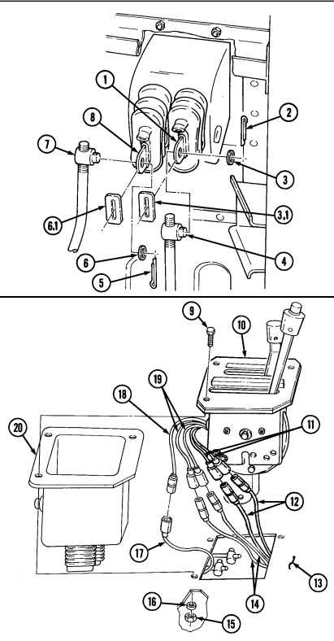

FOLLOW-ON-TASKS: - Connect battery ground cable (para. 4-73).

-  Start engine (TM 9-2320-280-10), check shift controls for proper operation, and adjust as needed (paras. 5-13 and 5-23).

# 5-11. Shift Controls Housing Assembly (12460111/12460112) Maintenance

This task covers:
INITIAL SETUP:

| Tools                                  | Manual References                                     |
|----------------------------------------|-------------------------------------------------------|
| General mechanic's tool kit:           | TM 9\-2320\-280\-10                                   |
| automotive (Appendix B, Item 1)        | TM 9\-2320\-280\-24P                                  |
| Materials/Parts                        | Equipment Conditioin                                  |
| Tiedown strap (Appendix G, Item 305)   | Shift controls housing removed (para. 5\-7 or 5\-10). |
| Sealing compound (Appendix C, Item 44) |                                                       |
| a. Removal                             |                                                       |

a. Disassembly b. Assembly

#### A. Disassembly

1. Remove pin (4) and knob (3) from transfer case shift tube (2). 2. Remove pin (6) and knob (5) from transmission shift tube (7). 3. Remove neutral start and backup switch leads (10) and (12) from openings in boot (8). 4. Remove shift indicator lead (11) from opening in boot (8). 5. Slide boot (8) off shift controls housing assembly (13). 6. Remove two transmission selector lens covers (1). 7. Remove two fiber optic indicator strips (19) from bulbs (18). 8. Remove two bulbs (18) from sockets (17). 9. Remove four screws (16), cover plate (15), and gasket (14) from shift controls housing assembly (13).

10. Remove tiedown strap (9) from leads (10), (12), and (11). Discard strap (9).

b. Assembly 1. Install gasket (14) and cover plate (15) on shift controls housing assembly (13) with four screws (16). 2. Install two bulbs (18) in sockets (17). 3. Install two fiber optic indicator strips (19) on bulbs (18). 4. Install two transmission selector lens covers (1).

4.1. Apply heat shrink to transmission shift lever arm (12.1) and transfer shift arm (12.2) if not already installed.

5. Install boot (8) on shift controls housing assembly (13), placing neutral start, backup light switch, and shift indicator leads (10), (12), and (11) through openings in boot (8).

6. Complete sliding boot (8) onto shift controls housing assembly (13), ensuring mounting screw holes align. 7. Install knob (5) on transmission shift tube (7) with pin (6). 8. Install knob (3) on transfer case shift tube (2) with pin (4). 9. Install tiedown strap (9) on leads (10), (11), and (12).

5-11. SHIFT CONTROLS HOUSING ASSEMBLY (12460111/12460112) MAINTENANCEConr'd)

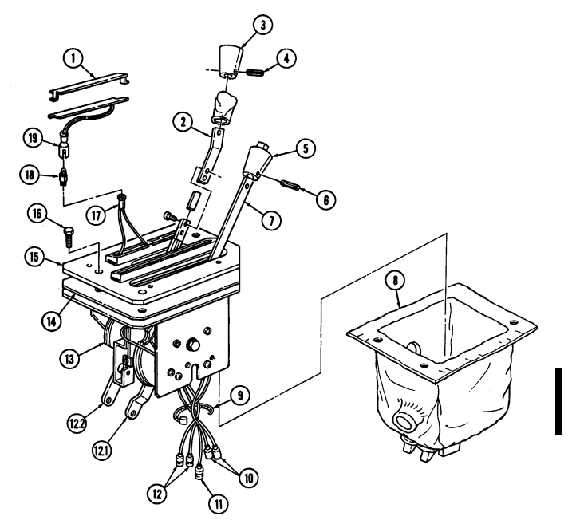

FOLLOW-ON TASK: Install shift control housing assembly (para. 5-10).

# 5-12. Transmission Shift Rod Maintenance (3L80)

This task covers:

a. Removal c. Adjustment b. Installation

#### Initial Setup:

Applicable Models All vehicles except: M997A2, M1025A2, M1035A2, M1043A2, M1045A2, M1097A2, M1123 Tools General mechanic's tool kit:
automotive (Appendix B, Item 1)

#### A. Removal B. Installation

c. Adjustment

If the manual control linkage arm is not in the proper detent for each transmission selector lever position, transmission will be damaged.

1. Place transmission shift lever arm (7) to "N'' (neutral) position. 2. Remove cotter pin (9) and washer (8) from shift rod trunnion (6) and shift lever arm (7). Discard cotter pin (9).

3. Remove cotter pin (1) and washer (2) from shift rod trunnion (4) and transmission selector lever (3)
and disconnect shift rod (5). Discard cotter pin (1).

4. Remove shift rod trunnion (6) from shift rod (5).

1. Install shift rod trunnion (6) to shift rod (5). 2. Connect shift rod trunnion (4) to transmission selector lever (3) with washer (2) and cotter pin (1). 3. Adjust shift rod (para. c).

1. Move shifter (10) into "1'' position and ensure transmission selector lever (3) is in the forward position, "1''.

2. Turn shift rod trunnion (6) so that it slips easily into hole in the shift lever arm (7). 3. Secure shift rod (5) and trunnion (6) to shift lever arm (7) with washer (8) and cotter pin (9).

#### Materials/Parts

Two cotter pins (Appendix G, Item 12)
Manual References TM 9-2320-280-10 TM 9-2320-280-24P

# 5-12. Transmission Shift Rod Maintenance (3L80) Cont'D)

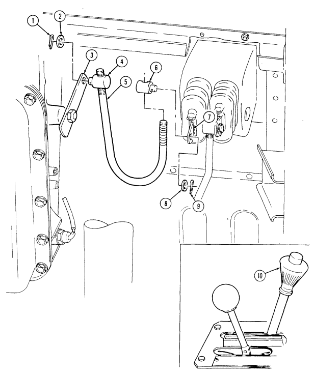

FOLLOW-ON  TASK:  Operate vehicle (TM 9-2320-280-10) and test transmission shift lever for
 

# 5-13. Transmission Shift Rod Maintenance (4L80-E)

This task covers:
a. Removal c. Adjustment b. Installation INITIAL SETUP:
Applicable Models M997A2, M1025A2, M1035A2, M1043A2, M1045A2, M1097A2 Tools General mechanic's tool kit:
automotive (Appendix B, Item 1)
Materials/Parts Four cotter pins (Appendix G, Item 12)

| Equipment Condition   |
|-----------------------|

a. Removal 2. Remove cotter pin (5), washer (6), and trunnion (3) from shift arm (4). Discard cotter pin (5). 3. Remove cotter pin (13) and washer (12) from rear trunnion (9). Remove trunnion (9) and shift rod
(8) from relay lever (11). Discard cotter pin (13).

Mark positions of trunnions on shift rod for installation.

4. Remove cotter pins (2) and (10) and trunnion (9) from shift rod (8). Discard cotter pins (2) and (10).

b. Installation 1. Install trunnion (9) on shift rod (8) on position marked with cotter pins (2) and (10). 2. Install trunnion (9) on relay lever (11) with washer (12) and cotter pin (13). Do not spread cotter pin (13). 3. Install trunnion (3) on shift arm (4) with washer (6) and cotter pin (5). Do not spread cotter pin (5). 4. Check shift rod (8) adjustment (para. c).

c. Adjustment

If the manual control linkage is not in proper detent for selector lever position, transmission will be damaged.

Proper adjustment makes end of shift rod movement parallel to relay lever movement.

1. Move shifter (7) to "1" position and ensure lever (1) is in forward detent position "1" or LOW. If not, remove cotter pin (5) and washer (6). Turn trunnion (3) until trunnion (3) aligns with shift arm (4).

2. To align shift rod (8), turn trunnion (3) in one direction and trunnion (9) same amount in opposite direction.

3. When adjustment is correct spread both cotter pins (5) and (13).

1. Place transmission shift lever (7) in neutral.

# 5-13. Transmission Shift Rod Maintenance (4L80-E) (Cont'D)

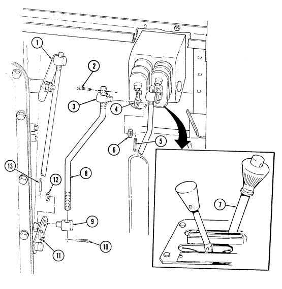

FOLLOW-ON TASK:
 Operate vehicle (TM 9-2320-280-10) and test transmission shift lever for proper operation.

# 5-14. Modulator Assembly Replacement (3L80)

This task covers:

#### Initial Setup:

Applicable Models All vehicles except: M997A2, M1025A2, M1035A2, M1043A2, M1045A2, M1097A2 Tools General mechanic's tool kit:
automotive (Appendix B, Item 1)

#### Materials/Parts

Packing retainer (Appendix G, Item 230)
Manual References TM 9-2320-280-10 TM 9-2320-280-24P
a. Removal **b. Installation**
Equipment Condition
- Hood raised and secured (TM 9-2320-280-10). - Engine access cover removed (para. 10-15).

General Safety Instructions Allow transmission to cool before performing this task.

a. Removal

Allow transmission to cool before performing this task. Failure to do this may cause injury.

1. Pull off cable clip (6) from modulator control rod head (3). 2. Loosen mounting nuts (8) and (4) on cable bracket (1) and remove cable (7) and washer (5) from bracket (1).

3. Underneath vehicle, remove capscrew (11) and modulator retaining clip (12) from transmission (13).

Have drainage container ready to catch fluid.

4. Remove modulator (10) and packing retainer (14) from transmission (13). Discard packing retainer (14).

b. Installation 1. Install packing retainer (14) on modulator (10) and install modulator (10) in transmission (13). 2. Install modulator retaining clip (12) on transmission (13) with capscrew (11). Tighten capscrew (11)
to 18 lb-ft (24 N•m).

Do not tighten mounting nuts.

3. Position modulator cable (7) through cable bracket (1) and install washer (5) and start mounting nut (4).

Ensure cable is clear of exhaust system or other sources of extreme heat to prevent damage to equipment.

4. Pull modulator control rod (2) to the rear until stop is engaged and hold in position. 5. With modulator cable core (9) in idle position (cable core (9) is extended), adjust modulator mounting nuts (4) and (8) until modulator control rod head (3) and cable clip (6) align.

NOTE

## 5-14. Modulator Assembly Replacement (3L80) (Cont'D)

6. Tighten mounting nuts (4) and (8) and recheck alignment. Readjust if alignment has changed. 7. Pull modulator cable core (9) outward and connect cable clip (6) to modulator control rod head (3).

8. Check modulator cable (7) for ease and smoothness of operation and ensure cable core (9) returns to the idle position.

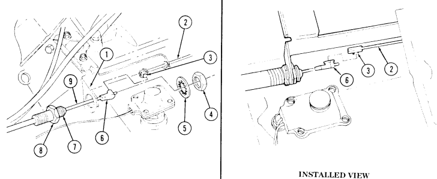

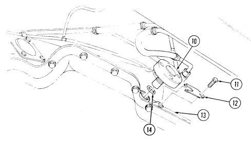

FOLLOW-ON TASKS:
· Install engine access cover (para. 10-15).

· Fill transmission to proper fluid level (TM 9-2320-280-10).

· Lower and secure hood (TM 9-2320-280-10).

· Road test and check for proper operation (para. 5-21).

# 5-15. Modulator Link Replacement (3L80)

This task covers:
INITIAL SETUP:
Applicable Models All vehicles except: M997A2, M1025A2, M1035A2, M1043A2, M1045A2, M1097A2 Tools General mechanic's tool kit:
automotive (Appendix B, Item 1)
Materials/Parts Gasket (Appendix G, Item 51)

#### A. Removal **B. Installation**

| Materials/Parts (Cont'd)   |
|----------------------------|

- Engine access cover removed (para. 10-15). - Cooling system drained (para. 3-60).

#### A. Removal

1. Pull off cable clip (6) from modulator link pin (5). 2. Remove two capscrews (1) and bracket (2) from cylinder head (10). 3. Loosen rear cable nut (8) and remove front cable nut (3), modulator cable (9), and washer (7) from bracket (2).

4. Slide modulator link (4) forward and disconnect from fuel injection pump (11).

Note orientation of modulator link and bracket for installation.

5. Remove bracket (2), modulator link (4), water jacket cover (12), and gasket (13) from cylinder head
(10). Discard gasket (13).

6. Spread slot (14) and remove modulator link (4) from bracket (2).

#### B. Installation

1. Install modulator link (4) in bracket (2) and crimp slot (14). 2. Slide modulator link (4) forward and connect to fuel injection pump (11). 3. Install gasket (13), cover (12), modulator link (4), and bracket (2) on cylinder head (10) with two capscrews (1).

4. Position modulator cable (9) through bracket (2), install washer (7), and start front cable nut (3). 5. Pull cable clip (6) out and connect to modulator link pin (5). Tighten rear cable nut (8).

# 5-15. Modulator Link Replacement (3L80) (Cont'D)

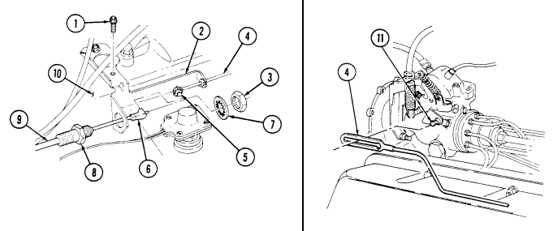

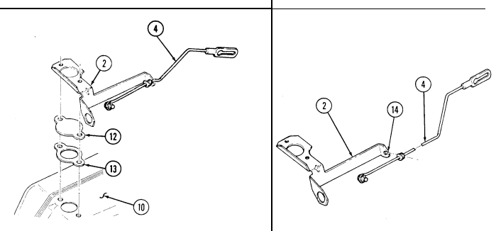

FOLLOW-ON TASKS: - Install engine access cover (para. 10-15).
- • - Fill cooling system (para. 3-60).

# 5-16. Transmission Vent Line Replacement

This task covers:
a. Removal b. Installation INITIAL SETUP:
Tools General mechanic's tool kit:
automotive (Appendix B, Item 1)

| Manual References    |
|----------------------|
| TM 9\-2320\-280\-24P |

Materials/Parts Adhesive sealant (Appendix C, Item 9)

#### A. Removal

1. Remove vent line (2) from transmission (3) and tee fitting (1). 2. Remove vent line (12) from tee fittings (1) and (11). 3. Remove capscrew (5), clamp (7), and vent line (10) from engine mount bracket (6). 4. Remove capscrew (4), clamp (8), and vent line (10) from bracket (9). 5. Remove vent line (10) from tee fittings (11) and (13). 6. Remove clamps (7) and (8) from vent line (10).

#### B. Installation

1. Install clamps (7) and (8) on vent line (10). 2. Install vent line (10) on tee fittings (11) and (13). 3. Install vent line (10) and clamp (7) on engine mount bracket (6) with capscrew (5). 4. Install vent line (10) and clamp (8) on bracket (9) with capscrew (4). 5. Install vent line (12) on tee fittings (11) and (1). 6. Install vent line (2) on tee fittings (1) and transmission (3). 7. Apply adhesive sealant around fittings (1), (11), and (13).

# 5-16. Transmission Vent Line Replacement (Cont'D)

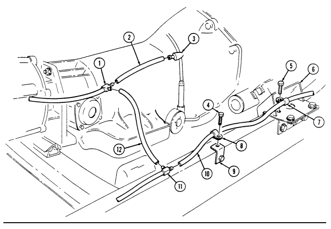

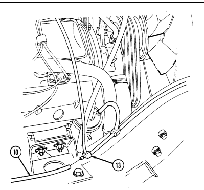

# 5-17. Sealed Lower Converter Housing Cover Maintenance

This task covers:
a. Removal c. Installation b. Inspection

#### Initial Setup: Tools

General mechanic's tool kit:
automotive (Appendix B, Item 1)
Materials/Parts Gasket (Appendix G, Item 43) 
(Basic/A1 Series)
Gasket (Appendix G, Item 57) 
(M1123 and A2 Series)
Adhesive (Appendix C, Item 5) Drycleaning solvent (Appendix C, Item 18)
Manual References TM 9-2320-280-24P
a. Removal

#### Equipment Condition

- Battery ground cables disconnected (para. 4-73). - Crossover pipe removed (para. 3-50). - Sealed upper converter housing cover removed
(para. 5-18).

#### General Safety Instructions

Drycleaning solvent is flammable and will not be used near an open flame.

3. Remove gasket (4) from converter housing cover (3). Discard gasket (4).

b. Inspection 1. Inspect converter housing cover (3) for pitting, cracking, and excessive wear. Replace if pitted, cracked, or excessively worn.

#### .Warning.

Drycleaning solvent is flammable and will not be used near an open flame. A fire extinguisher will be kept nearby when the solvent is used. Use only in well-ventilated places. Failure to do this may result in injury to personnel and/or damage to equipment.

2. Remove gasket material and sealant from converter housing cover (3) and transmission (1) with drycleaning solvent.

c. Installation

- For M1123 and A2 series vehicles, gasket must be bent over edge of converter housing cover to ensure gasket seats properly.

- For basic and A1 series vehicles, bend gasket over edge of converter housing if required to ensure gasket seats properly.

1. Apply adhesive to gasket (4) and install on converter housing cover (3).

- Step 1 applies to all vehicles except M1123 and A2 series. - Step 2 applies to M1123 and A2 series vehicles.

1. Remove four capscrews (2) and converter housing cover (3) from transmission (1). 2. Remove three capscrews (2) and converter housing cover (3) from transmission (1) and oil pan flange (5).

5-40 Change 3

# 5 - 1 7 . Sealed Lower Converter Housing Cover Maintenance (Cont'D)

For M1123 and A2 series vehicles, ensure converter housing cover is seated on oil pan flange to prevent converter housing cover from hitting flywheel and damaging converter housing cover.

#### Not E

- Step 2 applies to all vehicles except M1123 and A2 series. - Step 3 applies to M1123 and A2 series vehicles.

2. Apply adhesive to converter housing gasket (4). Install converter housing cover (3) on transmission (1)
with four capscrews (2).

3. Install converter housing cover (3) on oil pan flange (5) and transmission (1) with three capscrews (2).

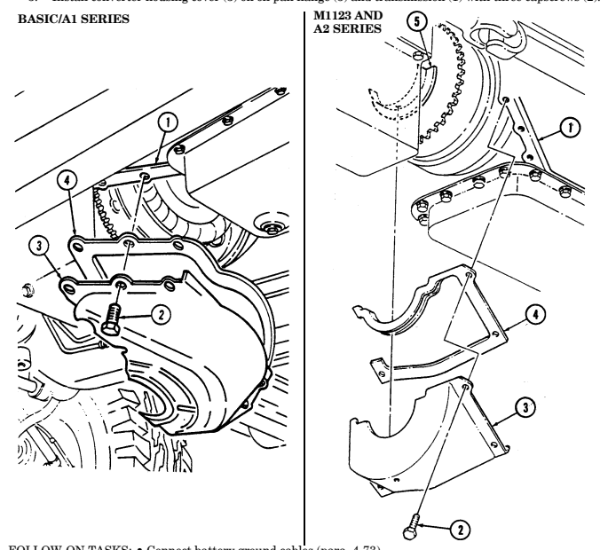

FOLLOW-ON TASKS: - Connect battery ground cables (para. 4-73).
- Install crossover pipe (para. 3-50). - Install sealed upper converter housing cover (para. 5-18).

# 5-18. Sealed Upper Converter Housing Cover (2-Piece) Maintenance

This task covers:
a. Removal c. Installation b. Inspection INITIAL SETUP
Tools General mechanic's tool kit:
automotive (Appendix B, Item 1)
Materials/Parts Gasket (Appendix G, Item 44) Adhesive (Appendix C, Item 5) Drycleaning solvent (Appendix C, Item 18)
Manual References TM 9-2320-280-24P
Equipment Condition Battery ground cable disconnected (para. 4-73).

General Safety Instructions Drycleaning solvent is flammable and will not be used near an open flame.

a. Removal 1. Remove two capscrews (3) and converter housing cover (4) from transmission (1) . 2. Remove gasket (5) from converter housing cover (4). Discard gasket (5).

b. Inspection

Drycleaning solvent is flammable and will not be used near an open flame. A fire extinguisher will be kept nearby when the solvent is used. Use only in well-ventilated places. Failure to do this may result in injury to personnel and/or damage to equipment.

1. Inspect converter housing cover (4) for pitting, cracking, and excessive wear. Replace if pitted, cracked, or excessively worn.

2. Remove gasket material and sealant from converter housing cover (4) and transmission (1) with drycleaning solvent.

#### C. Installation

1. Apply adhesive to gasket (5) and install on converter housing cover (3).

Gasket may require bending over edge of converter housing cover to make gasket seat properly.

2. Apply adhesive to converter housing cover edge (5) and install converter housing cover (4) on transmission (1) with two capscrews (3).

3. Apply adhesive to fill any gaps between housing cover (4).

5-18. SEALED UPPER CONVERTER HOUSING COVER (2-PIECE) MAINTENANCE (Cont'd)

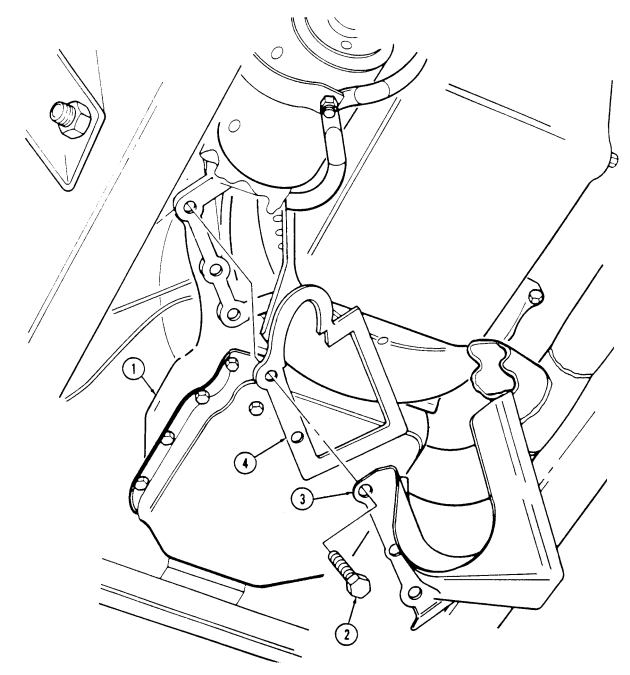

FOLLOW-ON TASK: Connect battery ground cable (para. 4-73).

## 5-19. Converter Housing Cover Replacement

This task covers:

#### A. Removal **B. Installation**

INITIAL SETUP:

#### Tools **Equipment Condition**

General mechanic's tool kit: Battery ground cable disconnected (para. 4-73).

automotive (Appendix B, Item 1) Crossover pipe removed (para. 3-50).

Manual References TM 9-2320-280-24P

For two-piece torque converter housing cover replacement, refer to paragraphs 5-17 and 5-18.

a. Removal Remove six capscrews (2) and converter housing cover (3) from transmission (1).

b. Installation Install converter housing cover (3) on transmission (1) with six capscrews (2).

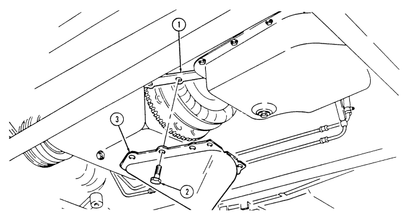

FOLLOW-ON TASKS: Install crossover pipe (para. 3-50).

Connect battery ground cable (para. 4-73).

# 5-20. Transmission Mount Replacement

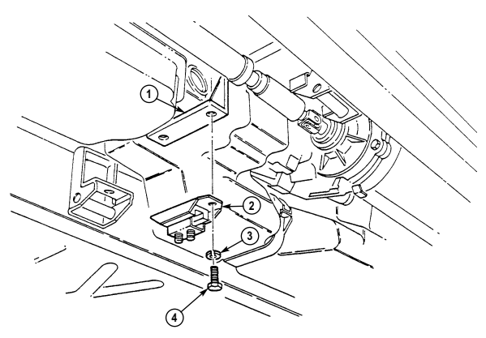

| Applicable Models                     | Materials/Parts                       |
|---------------------------------------|---------------------------------------|
| All vehicles except: M997A2, M1025A2, | Two cotter pins (Appendix G, Item 12) |
| M1035A2, M1043A2, M1045A2, M1097A2,   |                                       |
| M1123                                 | Manual References                     |
|                                       | TM 9\-2320\-280\-10                   |
| Tools                                 |                                       |

| This task covers:   |
|---------------------|

a. Removal **b. Installation**

a. Removal Remove two capscrews (4), lockwashers (3), and transmission mount (2) from adapter (1). Discard lockwashers (3).

b. Installation Install transmission mount (2) on adapter (1) with two lockwashers (3) and capscrews (4). Tighten capscrews (4) to 65 lb-ft (88 N•m).

FOLLOW-ON TASK: Install transmission mount crossmember (para. 9-15).

## 5-21. Transmission Road Test

This task covers:

| a.  Removal                        | c.  Adjustment                         |
|------------------------------------|----------------------------------------|
| b.  Installation                   |                                        |
| INITIAL SETUP:                     |                                        |
| Applicable Models                  | Materials/Parts                        |
| M997A2, M1025A2, M1035A2, M1043A2, | Four cotter pins (Appendix G, Item 12) |
| M1045A2, M1097A2                   |                                        |
|                                    | Manual References                      |
| Tools                              | TM 9\-2320\-280\-10                    |

#### A. Road Test (3L80)

1.

2.

3.

4.

5.

6.

#### B. Road Test (4L80-E)

1.

2.

3.

4.

Position transmission shift lever in "D" (drive) and accelerate vehicle from 0 mph. A 1-2 and 2-3 shift should occur at all throttle openings. Shift points will vary with throttle openings. Allow vehicle to decrease in speed to 0 mph and 3-2 and 2-1 shifts should occur.

Position transmission shift lever in "2" (low 2) and accelerate vehicle from 0 mph. A 1-2 shift should occur at all throttle openings (no 2-3 shift can be obtained in this range). The 1-2 shift in "2"
(low 2) is somewhat firmer than in "D" (drive). This is normal.

Position transmission shift lever in "1" (low 1) and accelerate the vehicle from 0 mph. No upshift should occur in this range. Position transmission shift lever in "D" (drive) and with the vehicle speed at approximately 35 mph, close throttle and move transmission shift lever to "2" (low 2). Transmission should downshift to 2nd gear. An increase in engine rpm and an engine braking effect should be noticed.

Position transmission shift lever in "2" (low 2) and with vehicle speed at approximately 25 mph, close throttle and move transmission shift lever to "1" (low 1). Transmission should downshift to 1st gear. An increase in engine rpm and engine braking effect should be noticed. Position transmission shift lever in "R" (reverse) and check for reverse operation.

Position shift lever in (overdrive) and accelerate vehicle from 0 mph. A 1-2, 2-3, and 3-4 shift should occur at all throttle openings. Allow vehicle to coast down to about 0 mph and 4-3, 3-2, and 2-1 shifts should occur.

Position transmission shift lever in "D" (drive) and accelerate vehicle from 0 mph. A 1-2 and 2-3 shift should occur at all throttle openings. Allow vehicle to coast down to about 0 mph and 3-2 and 2-1 shifts should occur.

Position transmission shift lever in "2" (low two) and accelerate vehicle from o mph. A 1-2 shift should occur at all throttle openings. No 2-3 shift can be obtained in this range. A 1-2 shift in 2 is somewhat firmer than in "D". This is normal.

Position shift lever in "1" and accelerate the vehicle from 0 mph. No upshifts should occur in this range.

5.

Position shift lever in and with the vehicle speed at approximately 45 mph, close throttle and move lever to '3". Transmission should downshift to 3rd gear. An increase in engine rpm and engine braking effect should be noticed.

6.

Position shift lever in "D" and with the vehicle speed at approximately 35 mph, close throttle and move lever to '2". Transmission should downshift to 2nd gear. An increase in engine rpm and engine braking effect should be noticed.

## 5 - 2 1 . Transmission Road Test (Cont'D)

7. Position shift lever "2" and with the vehicle speed at approximately 25 mph (40 km), close the throttle and move lever to "1". Transmission should downshift to 1st gear. An increase in engine RPM and engine braking effect should be noticed.

8. Position shift lever in "R" and check for reverse operation. 9. Hard shifting may indicate an underfilled or clogged system.

## Section Ii. Transfer Case Maintenance 5-22. Transfer Case Maintenance Task Summary

| 3.   | Install gasket (13), cover (12), modulator link (4), and bracket (2) on cylinder head (10) with two  capscrews (1).   |
|------|-----------------------------------------------------------------------------------------------------------------------|
| 4.   | Position modulator cable (9) through bracket (2), install washer (7), and start front cable nut (3).                  |
| 5.   | Pull cable clip (6) out and connect to modulator link pin (5). Tighten rear cable nut (8).                            |

# 5-23. Transfer Case Shift Rod Maintenance

This task covers:
a. Removal c. Adjustment b. Installation INITIAL SETUP:
Tools General mechanic's tool kit:
automotive (Appendix B, Item 1)
Materials/Parts Two cotter pins (Appendix G, Item 17) 
(Basic/A1 Series)
Two cotter pins (Appendix G, Item 18) 
(A2 Series)
Manual References TM 9-2320-280-10 TM 9-2320-280-24P

#### A. Removal

b. Installation c. Adjustment

The shift rod must be adjusted so that the detents of the transfer case lever correspond with the positions on the transfer case name plate.

1. Make sure parking brake lever (9) is engaged and place transmission shift lever (11) in "D'' (drive)
position.

2. Place transfer case shift lever (12) all the way forward in "HL'' (high lock) position.

1. Install shift rod trunnion (4) on shift rod (5). 2. Install shift rod (5) into transfer case range lever (6) with washer (7) and cotter pin (8). 3. Adjust shift rod (para. c).

3. Place long screwdriver in front of parking brake lever (9) and transmission shift lever (11), and behind knob (10) on transfer case shift lever (12) to hold transfer case shift lever (12) forward.

4. Place transfer case range lever (6) in the rearward position, "HL''. 5. Turn shift rod trunnion (4) so that it slips easily into the hole in bearing and arm assembly (1). 6. Secure shift rod trunnion (4) to bearing and arm assembly (1) with washer (2) and cotter pin (3). 7. Remove screwdriver from transfer case shift lever (12) and place transmission shift lever (11) 
in "N'' (neutral) position.

1. Remove cotter pin (8) and washer (7) from transfer case range rod (5) and transfer case range lever (6). Discard cotter pin (8).

2. Remove cotter pin (3), washer (2), and shift rod trunnion (4) from bearing and arm assembly (1).

Discard cotter pin (8).

3. Remove shift rod trunnion (4) from shift rod (5).

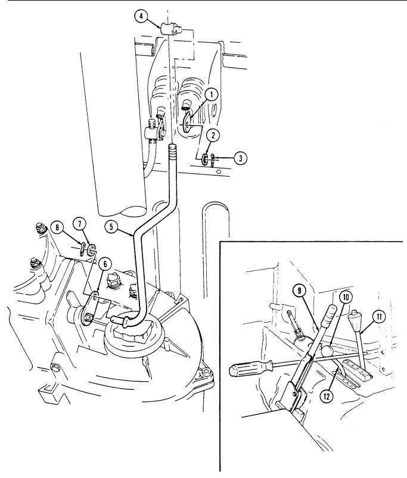

FOLLOW-ON TASK: Operate vehicle (TM 9-2320-280-10) and check for proper shifter operation.

# 5-23. Transfer Case Shift Rod Maintenance (Cont'D)

# 5-24. Speedometer Driven Gear Maintenance

This task covers:
b. Inspection

#### Initial Setup:

Tools General mechanic's tool kit: 
automotive (Appendix B, Item 1)
Special Tools Mirror, inspection (Appendix B, Item 107)
a. Removal a. Removal c. Installation

| Manual References   | TM 9\-2320\-280\-24P   |
|---------------------|------------------------|

1. Disconnect flex drive shaft (1) from correction adapter (2). 2. Loosen nut (3) and remove correction adapter (2) from pinion adapter (6).

NOTE
Perform step 2.1 only if drive tip is broken.

2.1. Remove drive tip (10) from correction adapter (2).

3. Remove screw (4) and clamp (5) securing pinion adapter (6) to transfer case (8). 4. Pull pinion adapter (6) out of transfer case (8). 5. Remove O-ring (7) from pinion adapter (6). Discard O-ring (7). 6. Remove driven gear (9) from transfer case (8).

b. Inspection Inspect driven gear (9) and drive tip (10) for damage or wear. Replace if broken or worn.

c. Installation 1. Install O-ring (7) on pinion adapter (6).

Note number stamped on driven gear.

2. Install driven gear (9) into pinion adapter (6).

NOTE
Numbers on pinion adapter represent number stamped on driven gear. When installing adapter, numbers on adapter must match with numbers on transfer case housing.

3. Install and align pinion adapter (6) into transfer case (8) and secure with clamp (5) and capscrew (4).

Tighten capscrew (4) to 15 lb-ft (20 N•m).

NOTE
Perform step 3.1 only if drive tip was removed.

3.1. Install drive tip (10) in correction adapter (2).

4. Install correction adapter (2) on pinion adapter (6) and tighten nut (3). 5. Connect flex drive shaft (1) to correction adapter (2).

# 5-24.  Speedometer Driven Gear Maintenance(Cont'D)

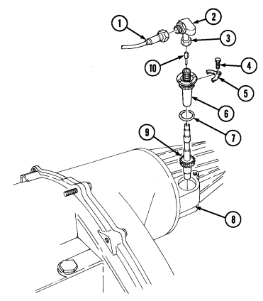

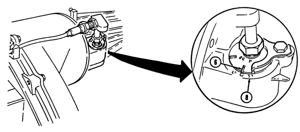

FOLLOW-ON TASK: Operate vehicle (TM 9-2320-280-10) and check speedometer for proper operation.

## 5-25. Transfer Case Vent Line Replacement

This task covers:
a. Removal **b. Installation**
INITIAL SETUP:
Tools General mechanic's tool kit:
automotive (Appendix B, Item 1)
Manual References TM 9-2320-280-24P
a. Removal

- Perform steps 1 through 5 for old configuration. - Perform steps 6 through 20 for new configuration.

1. Disconnect vent line (2) from elbow (1). 2. Remove elbow (1) from transfer case (3). 3. Remove two capscrews (5), clamps (4), and vent line (2) from bracket (8) and transmission governor cover (6).

4. Disconnect three vent lines (2) from tee (7). 5. Remove clamps (4) from vent line (2). 6. Disconnect vent line (11) from elbow (10). 7. Remove elbow (10) and pipe nipple (9) from transfer case (3). 8. Remove two capscrews (5), clamps (4), and vent line (11) from bracket (8) and transmission governor cover (6).

9. Deleted.

10. Disconnect vent lines (11) and (13) from elbow (16). 11. Remove clamps (4) from vent line (11). 12. Disconnect vent line (13) from elbow (14). 

# 5-25. Transfer Case Vent Line Replacement (Cont'D)

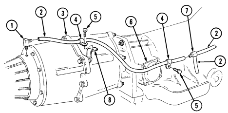

OLD CONFIGURATION

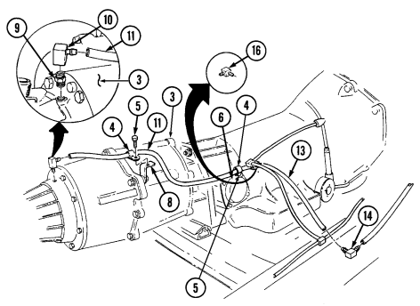

NEW CONFIGURATION

## 5-25. Transfer Case Vent Line Replacement (Cont'D)

13. Remove capscrew (1) from bracket (2) on frame rail (3). 14. Remove capscrew (4) and clamp (5) from bracket (2) and remove clamp (5) from hose (6) and vent line (7).

15. Deleted. 16. Disconnect vent lines (8) and (12) from elbow (10). 17. Disconnect vent line (15) from elbow (13) on air cleaner (14) and tee (16). 18. Remove elbow (13) from air cleaner (14) 19. Remove vent lines (17) and (18) from tee (16). 20. Deleted.

b. Installation

- Perform steps 1 through 14 for new configuration. - Perform steps 15 through 19 for old configuration.

1. Install vent lines (17) and (18) on tee (16). 2. Deleted. 3. Install elbow (13) on air cleaner (14). 4. Connect vent line (15) to elbow (13) and tee (16). 5. Connect vent lines (8) and (12) to elbow (10). 6. Deleted. 7. Position bracket (2) on frame rail (3) and secure with capscrew (1). 8. Route existing hose (6) and vent line hose (7) through clamp (5) and secure to bracket (2) with capscrew (4).

# 5-25. Transfer Case Vent Line Replacement (Cont'D)

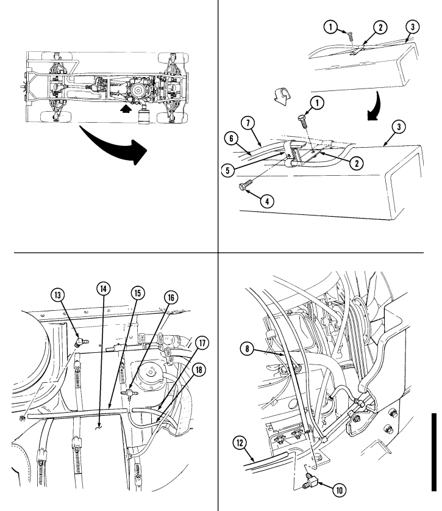

## 5-25. Transfer Case Vent Line Replacement (Cont'D)

9. Connect vent line (13) to elbow (14) and elbow (16).

10. Install vent line (11) on transmission governor cover (6) and bracket (8) with two clamps (4) and capscrews (5). Tighten capscrews (5) to 15 lb-ft (20 N•m).

11. Connect vent line (11) to elbow (16). 12. Deleted. 13. Install pipe nipple (9) and elbow (10) to transfer case (3). 14. Connect vent line (11) to elbow (10). 15. Install two clamps (4) on vent line (2). 16. Connect three vent lines (2) to tee (7). 17. Install two clamps (4) and capscrews (5) on bracket (8) and transmission governor cover (6).

Tighten capscrews (5) to 15 lb-ft (20 N•m).

18. Install elbow (1) in transfer case (3). 19. Connect vent line (2) to elbow (1).

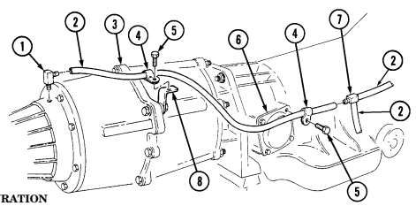

OLD CONFIGURATION

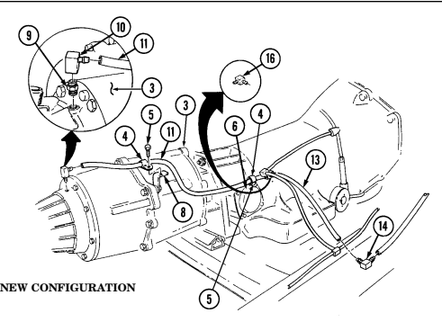

5-52.4 Change 3

# 5-26. Transfer Case Oil Seals Replacement

This task covers:
a. Front Oil Seal Removal c. Rear Oil Seal Removal b. Front Oil Seal Installation **d. Rear Oil Seal Installation**

#### Initial Setup: Tools

General mechanic's tool kit:
automotive (Appendix B, Item 1)
Special Tools Yoke seal installer (Model 218) 
(Appendix B, Item 94)
Output shaft seal installer (Model 242)
(Appendix B, Item 112)
Seal installer (Model 242)
(Appendix B, Item 116.1)
Special Tools (Cont'd)
Seal installer (Model 242)
(Appendix B, Item 116.2)
Drive handle (Model 242)
(Appendix B, Item 116.3)
Materials/Parts Washer seal (Appendix G, Item 292)
Manual References TM 9-2320-280-10 TM 9-2320-280-24P

#### A. Front Oil Seal Removal Note

Removal and installation procedures are basically the same for model 218 front and rear oil seals and model 242 front oil seal. This procedure covers the front oil seal. For replacement of rear oil seal for model 242, refer to para. 5-26.c.

1. Remove four capscrews (4), two straps (3), and front propeller shaft (1) from output yoke (2).

Have drainage container ready to catch fluid.

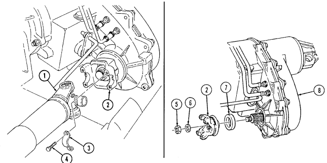

2. Remove nut (5), washer seal (6), and output yoke (2) from transfer case (8). Discard washer seal (6). 3. Remove output oil seal (7) from transfer case (8).

# 5-26. Transfer Case Oil Seals Replacement (Cont'D)

b. Front Oil Seal Installation

- Ensure rubber surface of seal faces yoke seal installer. - Ensure depth of seal is .07-.10 mm below casting surface.

1. Using seal installer, install oil seal (7) on transfer case (8). 2. Install output yoke (2) and washer seal (6) on transfer case (8) with nut (5). Tighten nut (5) to 110 lb-ft (149 N.m).

3. Connect front propeller shaft (1) to output yoke (2) with two straps (3) and four capscrews (4).

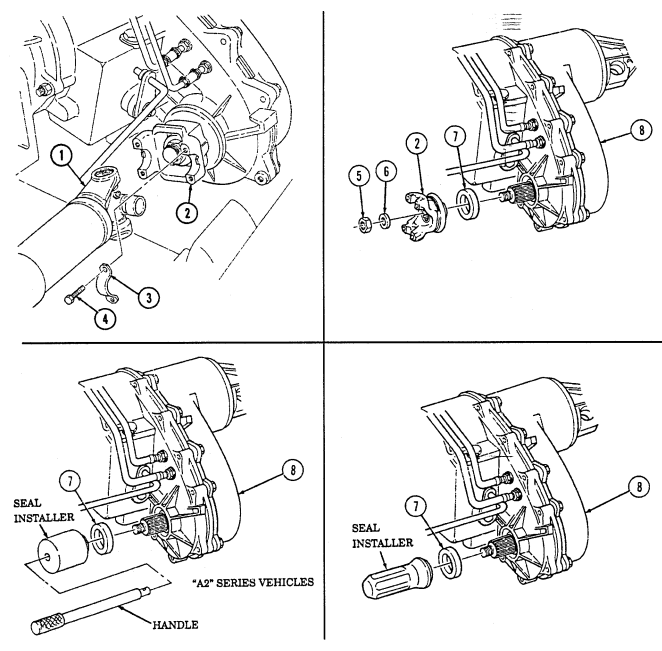

Tighten capscrews (4) to 13-18 lb-ft (18-24 N.m).

# 5-26. Transfer Case Oil Seals Replacement (Cont'D)

c. Rear Oil Seal Removal

The following procedure applies to model 242 transfer case rear oil seal.

1. Remove rear propeller shaft (para. 6-5).

2. Remove oil seal (9) from transfer case extension (10).

d. Rear Oil Seal Installation 1. Using output shaft seal installer, install oil

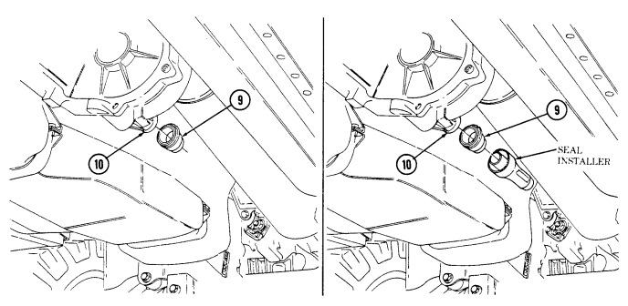

2. Install rear propeller shaft (para. 6-5).

seal (9) on transfer case extension (10).

FOLLOW-ON TASK: Fill fluid to proper level (TM 9-2320-280-10).

## Chapter 6 Propeller Shafts, Axles, And Suspension Maintenance
### Section I. Propeller Shafts Maintenance

#### 6-1. PROPELLER SHAFTS MAINTENANCE TASK SUMMARY

| Equipment Condition Materials/Parts                                                               | automotive (Appendix B, Item 1)   |
|---------------------------------------------------------------------------------------------------|-----------------------------------|
| Transmission mount crossmember removed Two lockwashers (Appendix G, Item 178) (para. 9\-15).      |                                   |
|                                                                                                   | a. Removal                        |
| Remove two capscrews (4), lockwashers (3), and transmission mount (2) from adapter (1).           |                                   |
| Discard lockwashers (3).                                                                          |                                   |
| b. Installation                                                                                   |                                   |
| Install transmission mount (2) on adapter (1) with two lockwashers (3) and capscrews (4). Tighten |                                   |

##### 6-2. Front Propeller Shaft Assembly Maintenance

This task covers:
b. Inspection INITIAL SETUP:

#### Tools

General mechanic's tool kit:
automotive (Appendix B, Item 1)
Materials/Parts Cotter pin (Appendix G, Item 17)
(Basic/A1 Series)
Cotter pin (Appendix G, Item 18)
(A2 Series)
a. Removal c. Installation Manual References TM 9-2320-280-10 TM 9-2320-280-24P

Propeller shaft bearing caps should be taped together to prevent loss of bearings.

a. Removal 1. Remove four capscrews (3) and two bearing straps (2) from front propeller shaft assembly (4) and differential pinion yoke (1).

Step 2 applies to all vehicles except M1097, "A1" and "A2" series. Step 3 applies to M1097, "A1" and "A2" series.

2. Remove four capscrews (10) and two bearing straps (9) from front propeller shaft assembly (4) and transfer case output yoke (7).

3. Remove four nuts (14), washers (15), and two U-bolts (16) from front propeller shaft assembly (4) and transfer case output yoke (7).

4. Remove cotter pin (13), washer (12), and transfer case shift rod (11) from transfer case shift lever (6).

Discard cotter pin (13).

5. Remove two nuts (17), washers (18), capscrews (20), washers (18), and center bearing (19) from engine mount (21).

6. Move front propeller shaft assembly (4) forward, then rearward over top of transfer case (5) and pipe (8), and remove front propeller shaft assembly (4).

#### B. Inspection

1. Inspect drive shaft (23) and coupling shaft (24) for cracks and damage. Replace either (para. 6-3) if cracked or damaged.

2. Inspect grease fittings (25) and universal joints (22) for serviceability. Replace universal joints (22)
(para. 6-7) or grease fittings (25) if unserviceable.

3. Inspect center bearing (19) for roughness or damage. Replace coupling shaft (24) (para. 6-3) if center bearing (19) is rough or damaged.

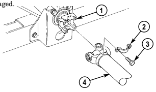

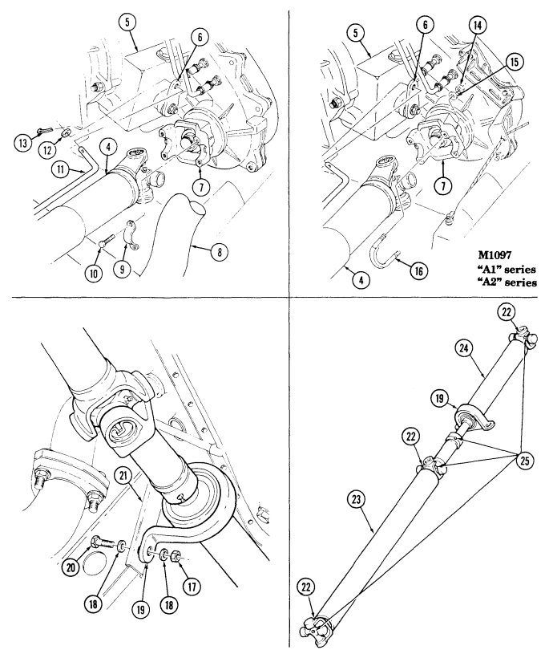

6-2. FRONT PROPELLER SHAFT ASSEMBLY MAINTENANCE (Cont'd)

## 6-2. Front Propeller Shaft Assembly Maintenance (Cont'D)

1. Install front propeller shaft assembly (4) over exhaust pipe (8) and over top of transfer case (5).

2. Install front propeller shaft assembly (4) on differential pinion yoke (1) with two bearing straps (2)
and four capscrews (3). Tighten capscrews (3) to 13-18 lb-ft (18-24 N m).

3. Install center bearing (19) on engine mount (21) with two washers (18), capscrews (20), washers (18),
and nuts (17). Tighten capscrews (20) to 60 lb-ft (81 N m).

4. Install transfer case shift rod (11) on transfer case shift lever (6) with washer (12) and cotter pin (13).

NOTE
Step 5 applies to all vehicles except M1097, "A1" and "A2" series.

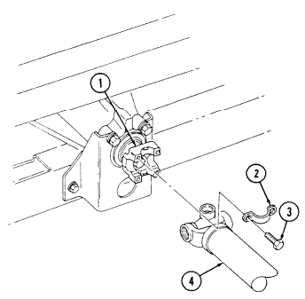 Step 6 applies to M1097, "A1" and "A2" series.

5. Install front propeller shaft assembly (4) on transfer case output yoke (7) with two bearing straps (9)
and four capscrews (10). Tighten capscrews (10) to 13-18 lb-ft (18-24 N m).

6. Install front propeller shaft assembly (4) on transfer case output yoke (7) with two U-bolts ( 16), four washers (15), and nuts (14). Tighten nuts (14) to 13-18, lb-ft (18-24 N m).

# 6-2.  Front Propeller Shaft Assembly Maintenance (Cont'D)

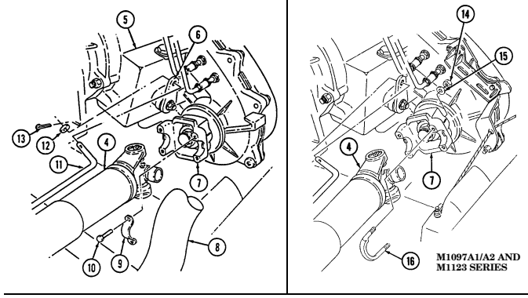

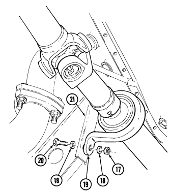

FOLLOW-ON TASK:  Lubricate propeller shaft assembly (TM 9-2320-280-10).

# 6-3. Front Propeller Shaft Assembly Repair

This task covers:
a. Disassembly c. Assembly b. Cleaning and Inspection INITIAL SETUP:
Tools General mechanic's tool kit:
automotive (Appendix B, Item 1)
Materials/Parts Dust cap (Appendix G, Item 29) Grease (Appendix C, Item 22) Drycleaning solvent (Appendix C, Item 18)
Manual References TM 9-2320-280-24P
a. Disassembly

#### Equipment Condition

Front propeller shaft assembly removed (para. 6-2).

General Safety Instructions Cleaning will be done in a well-ventilated area and a fire extinguisher will be kept nearby when drycleaning solvent is used.

Prior to disassembly, mark slip yoke and coupling shaft for assembly.

1. Place slip yoke (2) in vise. 2. Pull coupling shaft (4) apart from slip yoke (2). 3. Pry dust cap (3) off slipyoke (2). Discard dust cap (3).

b. Cleaning and Inspection

Drycleaning solvent is flammable and will not be used near an open flame. A fire extinguisher will be kept nearby when the solvent is used. Use only in well-ventilated places. Failure to do this may result in injury to personnel and/or damage to equipment.

Do not allow drycleaning solvent to come into contact with U-joint. Damage to equipment will result.

1. Use drycleaning solvent to clean all metallic parts. 2. Inspect drive shaft (1), coupling shaft (4), and slip yoke (2) for cracks or dents. Replace if cracked or dented.

3. Inspect splined end of coupling shaft (4) and slip yoke (2) for damage. Replace either if damaged. 4. Inspect center bearing (5) for looseness, vibration damage, rubber separation from bearing surface, and abnormal wear. If damaged, replace coupling shaft (4).

# 6-3. Front Propeller Shaft Assembly Repair (Cont'D)

Ensure grease fitting on dust cap is aligned with wide spline in slip yoke.

1. Install dust cap (3) on coupling shaft (4).

2. Coat splines on coupling shaft (4) and slip yoke (2) with grease.

NOTE
Ensure wide spline on coupling shaft is aligned with grease fitting on slip yoke.

3. Install coupling shaft (4) and dust cap (3) into slip yoke (2).

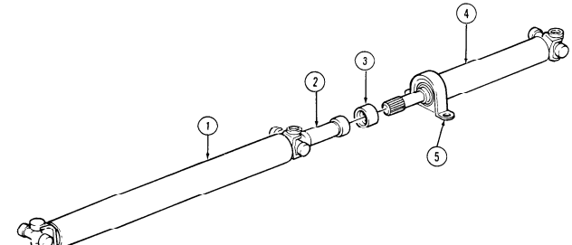

FOLLOW-ON TASK: Install front propeller shaft assembly (para. 6-2).

# 6-4. Rear Propeller Shaft Maintenance

This task covers:
b. Inspection INITIAL SETUP:
Applicable Models All except M1097, "A1" and "A2" series Tools General mechanic's tool kit:
automotive (Appendix B, Item 1)
a. Removal c. Installation

#### Materials/Parts

Four lockwashers (Appendix G, Item 134) Four lockwashers (Appendix G, Item 170)
Manual References TM 9-2320-280-10 TM 9-2320-280-24P

Prior to towing vehicle, parking brake rotor must be removed.

a. Removal

On vehicles with serial numbers USBL Eff. 44825 and above, the propeller shaft is attached to the differential yoke instead of the parking brake rotor. Lockwashers and U-bolts are not used.

1. Chock wheels and release parking brake (TM 9-2320-280-10). 2. Remove four nuts (1), lockwashers (2), and two U-bolts (4) from rear propeller shaft (5) and transfer case output yoke (3). Discard lockwashers (2).

3. Remove four capscrews (8), lockwashers (7), and rear propeller shaft (5) from parking brake rotor (6). Discard lockwashers (7).

b. Inspection 1. Inspect propeller shaft (5) for cracks and dents. Replace if cracked or dented. 2. Inspect grease fittings and universal joints for serviceability. Replace universal joints (para. 6-7)
or grease fittings if unserviceable.

c. Installation 1. Install rear propeller shaft (5) on parking brake rotor (6) with four lockwashers (7) and capscrews (8). Tighten capscrews (8) to 60 lb-ft (81 N•m).

2. Install rear propeller shaft (5) on transfer case output yoke (3) with two U-bolts (4), four lockwashers (2), and nuts (1). Tighten nuts (1) to 21 lb-ft (28 N•m).

3. Apply parking brake (TM 9-2320-280-10) and remove wheel chocks.

# 6-4. Rear Propeller Shaft Maintenance (Cont'D)

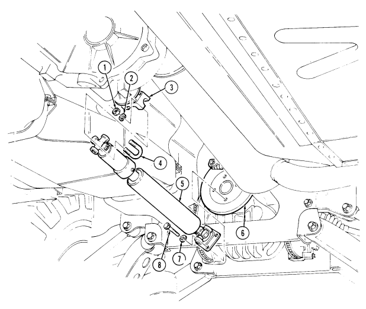

# 6-5. Rear Propeller Shaft Maintenance (1330 Series)

This task covers:
a. Removal c. Installation b. Inspection INITIAL SETUP:
Applicable Models **Manual References**
M1097, "A1" and "A2" series TM 9-2320-280-10 Tools General mechanic's tool kit:
automotive (Appendix B, Item 1)

| Manual References    |
|----------------------|
| TM 9\-2320\-280\-10  |
| TM 9\-2320\-280\-24P |

1. Chock wheels and release parking brake (TM 9-2320-280-10).

2. Remove four capscrews (6), two straps (5), and disconnect propeller shaft (3) from differential pinion yoke (4).

3. Slide propeller shaft end yoke (1) out of transfer case extension (2) and remove propeller shaft (3).

b. Inspection 1. Inspect propeller shaft (3) for cracks and dents. Replace if cracked or dented. 2. Inspect grease fittings and universal joints for serviceability. Replace universal joints (para. 6-6) or grease fittings if unserviceable.

3. Inspect splined end of end yoke (1) for damage. Replace end yoke (1) if damaged (para. 6-6).

c. Installation 1. Slide propeller shaft end yoke (1) on transfer case extension (2) and install propeller shaft (3). 2. Connect propeller shaft (3) to differential pinion yoke (4) with two straps (5) and four capscrews (6).

Tighten capscrews (6) to 13-18 lb-ft (18-24 N m).

3. Apply parking brake (TM 9-2320-280-10) and remove wheel chocks.

# 6-5. Rear Propeller Shaft Maintenance (1330 Series) (Cont'D)

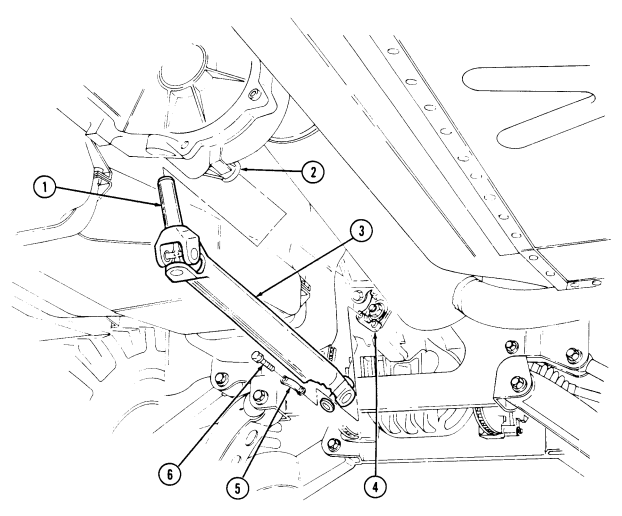

FOLLOW-ON TASK: Lubricate propeller shaft (TM 9-2320-280-10).

# 6-6. Rear Propeller Shaft Repair

This task covers:
a. Disassembly c. Assembly b. Cleaning and Inspection INITIAL SETUP:
Tools General mechanic's tool kit:
automotive (Appendix B, item 1)
Universal joint bearing kit
(Appendix B, Item 171)
Materials/Parts Dust cap (Appendix G, Item 29) Grease (Appendix C, Item 22) Drycleaning solvent (Appendix C, Item 18)
a. Disassembly

| Manual References                                    |
|------------------------------------------------------|
| TM 9\-2320\-280\-24P                                 |
| Equipment Condition                                  |
| Rear propeller shaft removed (para. 6\-4 or 6\-5).   |
| General Safety Instructions                          |
| Cleaning will be done in well\-ventilated area and a |
| fire extinguisher will be kept nearby when solvent   |
| is used.                                             |

Prior to disassembly, mark slip yoke and propeller shaft for assembly.

1. Pull slip yoke (3) from propeller shaft (1). 2. Place slip yoke (3) into vise. 3. Pry dust cap (2) off of slip yoke (3). Discard dust cap (2).

b. Cleaning and Inspection

Drycleaning solvent is flammable and will not be used near an open flame. A fire extinguisher will be kept nearby when solvent is used. Use only in well-ventilated area. Failure to do this may result in injury to personnel and/or damage to equipment.

Do not allow drycleaning solvent to come into contact with U-joint. Damage to equipment will result.

1. Use drycleaning solvent to clean all metallic parts. 2. Inspect propeller shaft (1) and slip yoke (3) for cracks and damage. Replace if cracked or damaged. 3. Inspect splined end of propeller shaft (1) and splined end of slip yoke (3) for damage. Replace either if damaged.

c. Assembly 1. Install dust cap (2) on propeller shaft (1). 2. Coat spline on propeller shaft (1) and slip yoke (3) with grease. 3. Insert propeller shaft (1) into slip yoke (3) and install dust cap (2).

6-6. REAR PROPELLER SHAFT REPAIR (Cont'd)

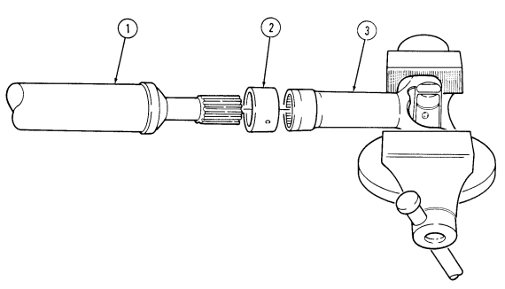

FOLLOW-ON TASK: Install rear propeller shaft (para. 6-4).

## 6-7. Universal Joint Repair

This task covers:
a. Disassembly b. Assembly INITIAL SETUP:
Tools General mechanic's tool kit:
automotive (Appendix B, Item 1)
Universal joint bearing kit
(Appendix B, Item 171)

| Materials/Parts   |
|-------------------|

Manual References TM 9-2320-280-24P
Materials/Parts Universal parts kit (Appendix G, Item 66)
Equipment Condition Propeller shaft removed (para. 6-2 or 6-4).

All universal joint replacement procedures are basically the same. This procedure covers the rear universal joint.

a. Disassembly

Do not drop bearing cups. Needle bearings can be easily lost.

1. Remove grease fitting (6) from cross (4). 2. Remove two bearing cups (1) from cross (4). 3. Remove two snaprings (2) from yoke (5). 4. Position propeller shaft (3) in vise with 1-1/8 in. socket between vise jaw and bearing cup (1) being removed. Ensure open end of socket is facing bearing cup (1).

5. Place 11/16 in. socket between opposite bearing cup (1) and vise jaw. Ensure open end of socket is facing vise jaw.

6. Press bearing cup (1) out of yoke (5) and remove bearing cup (1) from cross (4). 7. Reverse position of sockets and press remaining bearing cup (1) out of yoke (5). 8. Remove cross (4) from yoke (5).

b. Assembly

Ensure grease fitting on cross faces yoke. Damage to equipment will result if improperly installed.

1. Install cross (4) into yoke (5). 2. Install bearing cup (1) into yoke (5).

Ensure bearing cup is aligned with yoke before pressing in with vise. Damage to cross and bearing cups will result if forced into yoke.

3. Place yoke (5) in vise with 11/16 in. socket between vise jaw and bearing cup (1). 4. Press bearing cup (1) into yoke (5) far enough to install snapring (2) and install snapring (2) into yoke (5).

5. Install bearing cup (1) into yoke (5). 6. Place yoke (5) in vise with 11/16 in. socket between bearing cup (1) and vise jaw. 7. Press bearing cup (1) into yoke (5) far enough to install snapring (2) and install snapring (2) into yoke (5).

8. Install two bearing cups (1) on cross (4). 9. Install grease fitting (6) into cross (4).

6-14 Change 3

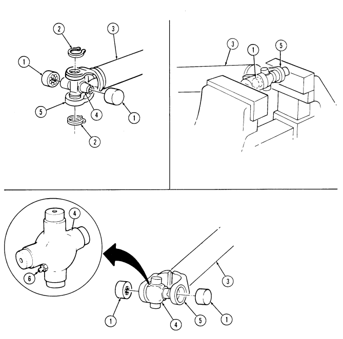

FOLLOW-ON TASK: Install propeller shaft (para. 6-2 or 6-4).

# Section Ii. Front And Rear Axles Maintenance

# 6-8. Front And Rear Axles Maintenance Task Summary

| 6\-1.   | PROPELLER SHAFTS MAINTENANCE TASK SUMMARY      |       |
|---------|------------------------------------------------|-------|
| TASK    | PROCEDURES                                     | PAGE  |
| PARA.   |                                                | NO.   |
| 6\-2.   | Front Propeller Shaft Assembly                 | 6\-2  |
|         | Maintenance                                    |       |
| 6\-3.   | Front Propeller Shaft Assembly Repair          | 6\-6  |
| 6\-4.   | Rear Propeller Shaft Maintenance               | 6\-8  |
| 6\-5.   | Rear Propeller Shaft Maintenance (1330 series) | 6\-10 |
| 6\-6.   | Rear Propeller Shaft Repair                    | 6\-12 |
| 6\-7.   | Universal Joint Repair                         | 6\-14 |

## 6-9. Halfshaft Maintenance

This task covers:
a. Removal **d. Assembly** b. Disassembly e. Installation c. Cleaning and Inspection

#### Initial Setup: Tools

General mechanic's tool kit:
automotive (Appendix B, Item 1)

#### Materials/Parts

Boot service kit (fixed) (Appendix G, Item 7) Boot service kit (plunged) (Appendix G, Item 7) Retaining ring (Appendix G, Item 231) Cotter pin (Appendix G, Item 12) Six lockwashers (Appendix G, Item 145) Lockwasher (Appendix G, Item 146) Drycleaning solvent (Appendix C, Item 18) Lithium grease (Appendix C, Item 25) Sealing compound (Appendix C, Item 41)
Manual References TM 9-2320-280-24P
Equipment Condition Wheel removed (para. 8-3).

General Safety Instructions Drycleaning solvent is flammable and will not be used near an open flame.

#### A. Removal

1. Remove access plug (8) and washer (7) from geared hub (4). 2. Remove halfshaft retaining capscrew (6) and lockwasher (5) from halfshaft (9) and geared hub (4).

Discard lockwasher (5).

3. Remove six capscrews (3), lockwashers (2), and halfshaft (9) from rotor (1) and output flange (10).

Discard lockwashers (2).

Perform steps 4 and 5 for rear halfshafts only.

4. Remove cotter pin (15), washer (16), and clevis pin (18) from parking brake clevis (17) and lever (14). Discard cotter pin (15).

5. Remove retaining ring (13) and disconnect cable (11) from caliper cable bracket (12). Discard retaining ring (13).

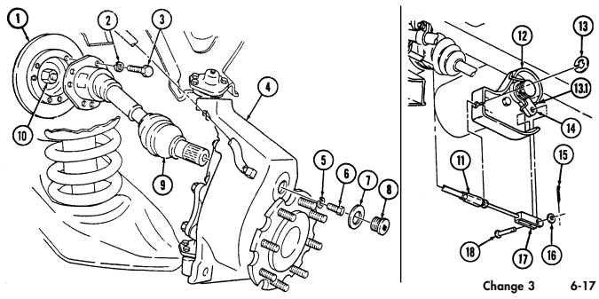

## 6 - 9 . Halfshaft Maintenance (Cont'D)

b. Disassembly 1 . Loosen two clamps (7) and (8) securing inner boot (6) to inner joint (1) and shaft (5). 2 . Clamp shaft (5) in soft-jawed vise. 3 . Remove inner boot (6) from inner joint (1) and slide up on shaft (5). 4 . Remove retainer clip (2) from inner joint (1). 5 . Remove inner joint (1), retainer clip (2), and six ball bearings (3) from bearing assembly (4).

#### Not E

Perform steps 5.1 through 5.3 for M1123 and "A2" series vehicles.

5 . 1 . Remove inner boot (6) from insert (9) and slide up on shaft (5). 5 . 2 . Remove inner joint (1) and insert (9) from spider assembly (10) and shaft (5).

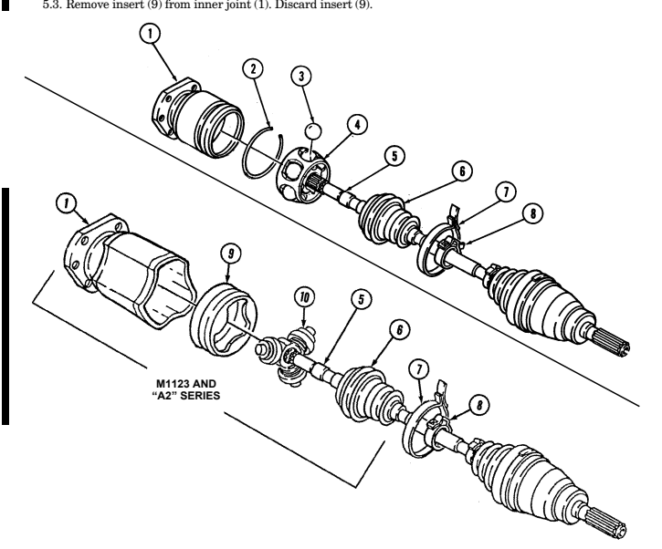

# 6-9. Halfshaft Maintenance (Cont'D)

Remove excess grease from bearing assembly and separate ball race from inner race.

Perform steps 6 through 8 for all models except the M1097, "A1" and "A2" vehicles.

Peform steps 9 and 10 for M1097, "A1" and "A2" series vehicles.

6.

7.

Pry spacer (3) from groove on shaft (5) and slide spacer (3) and inner race (2) up on shaft (5).

Remove retainer ring (1) from shaft (5). Discard retainer ring (1).

8.

Remove inner race (2), spacer (3), and ball race (4) from shaft (5). Discard spacer (3).

9.

Remove retainer ring (6) from shaft (5). Discard retainer ring (6).

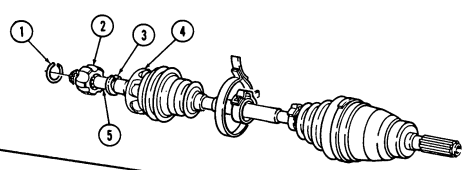 Remove inner race (2) and ball race (4) from shaft (5).

10.

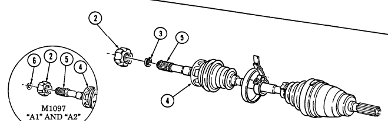

## 6-9. Halfshaft Maintenance (Cont'D)

11. Remove inner boot (1) and clamps (2) and (3) from shaft (7). Discard boot (1) and clamps (2) and (3). 12. Remove shaft (7) from soft-jawed vise.

13. Loosen two boot clamps (4) and (5) securing outer boot (6) to outer joint (8) and shaft (7). 14. Remove outer boot (6) and clamps (5) and (4) from shaft (7). Discard boot (6) and clamps (5) and (4).

NOTE
Perform steps 15 through 17 for all models except the M1097 and "A1" and "A2" series vehicles.

15. Remove slinger (11) from outer joint (8). 16. Remove outer joint (8) from shaft (7) using slide hammer. 17. Remove retainer ring (10) and spacer (9) from shaft (7). Discard retainer ring (10).

c. Cleaning and Inspection

#### Warning

Drycleaning solvent is flammable and will not be used near an open flame. A fire extinguisher will be kept nearby when the solvent is used. Use only in well-ventilated places. Failure to do this may result in injury to personnel and/or damage to equipment.

1. Clean all metallic parts with drycleaning solvent.

2. Inspect shaft (7) for cracks and distortion. Replace shaft (7) if cracked or distorted.

3. Inspect splined end of shaft (7) for damage. Replace shaft (7) if damaged.

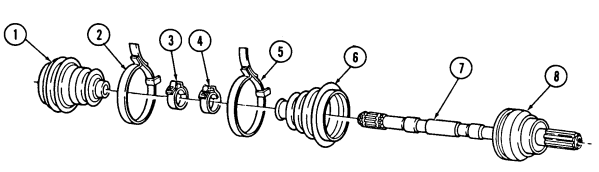 4. Inspect inner joint ( 12) for pitting or rough joint operation. Replace inner joint (12) if pitted or unserviceable.

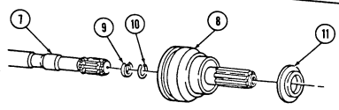

## 6-9. Halfshaft Maintenance (Cont'D)

Perform steps 1 through 3 for all models except the M1097 and "A1" and "A2" series vehicles.

Install spacer (9) and retainer ring (10) on shaft (7). Align splines on shaft (7) to outer joint (8) and push outer joint (8) onto shaft (7) until it snaps in place.

1.

2.

Install slinger (11) on outer joint (8).

Pack outer joint (8) with lithium grease.

3.

4.

Install outer boot (6) on shaft (7). Ensure boot (6) seats in groove of shaft (7).

5.

Secure outer boot (6) on shaft (7) with clamp (4).

6.

Install outer boot (6) on joint (8). Ensure boot (6) seats in groove of joint (8).

7.

Secure outer boot (6) on joint (8) with clamp (5).

8.

Clamp shaft (7) in soft-jawed vise.

9.

Position clamps (3) and (2) on shaft (7).

10.

Install inner boot (1) on shaft (7). Push boot (1) past groove on shaft (7).

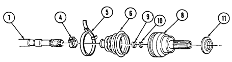

Position ball race (13) on shaft (7).

11.

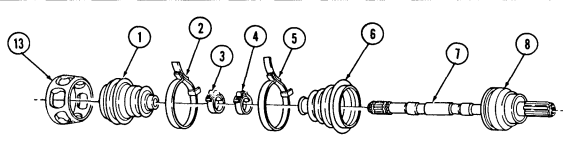

12.

6 - 9 . HALFSHAFT MAINTENANCE (Cont'd)

#### Not E

- Perform steps 13 and 14 for all models except M1097, M1123, and "A1" and "A2" series vehicles.

- Perform steps 15 and 16 for M1097 and "A1" series vehicles. - Perform steps 16.1 through 16.5 for M1123 and "A2" series vehicles.

1 3 . Install spacer (3) and retainer ring (2) on shaft (4). 1 4 . Align splines of inner race (1) with open spline of shaft (4). Use press to install inner race (1) until it snaps in place.

1 5 . Align splines of inner race (1) with open spline on shaft (4). Use press to install inner race (1) on shaft (4) until inner race (1) seats into place.

1 6 . Install retainer ring (6) in upper groove of shaft (4) behind inner race (1).

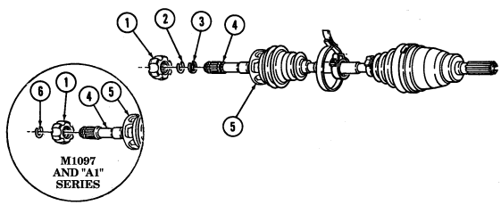

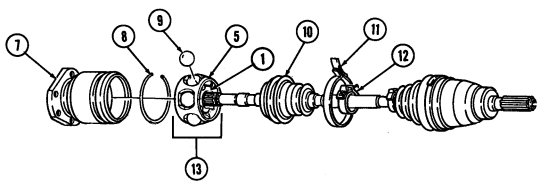

# 6 - 9 . Halfshaft Maintenance (Cont'D)

#### Not E

Coat spider assembly with lithium grease before installing on shaft.

1 6 . 1 . Align splines of spider assembly (15) with open spline on shaft (4). Use press to install spider a s s e m b l y (15) on shaft (4) until spider assembly (15) seats into place.

1 6 . 2 . Install retainer ring (14) in pupper groove of shaft (4) behind spider assembly (15). 1 6 . 3 . Pack inner joint (16) with lithium grease. 1 6 . 4 . Install insert (17) on inner joint (15). 1 6 . 5 . Install inner joint (16) and insert (17) on spider assembly (15) and shaft (4).

1 7 . Position ball race (5) and six ball bearings (9) on inner race (1) and retain with lithium grease. 1 8 . Position retainer clip (8) and inner joint (7) over bearing assembly (13).

#### Not E

Ensure ball bearings are retained in ball race.

1 9 . Secure retainer clip (8) in groove of inner joint (7). 2 0 . Pack inner joint (7) with lithium grease. 2 1 . Move inner boot (10) on shaft (4) until boot (10) seats in groove of shaft (4). 2 2 . Secure inner boot (10) on shaft (4) with clamp (12). 2 3 . Install inner boot (10) on inner joint (7). Ensure boot (10) seats in groove of joint (7). 2 4 . Secure inner boot (10) on inner joint (7) with clamp (11 ) .

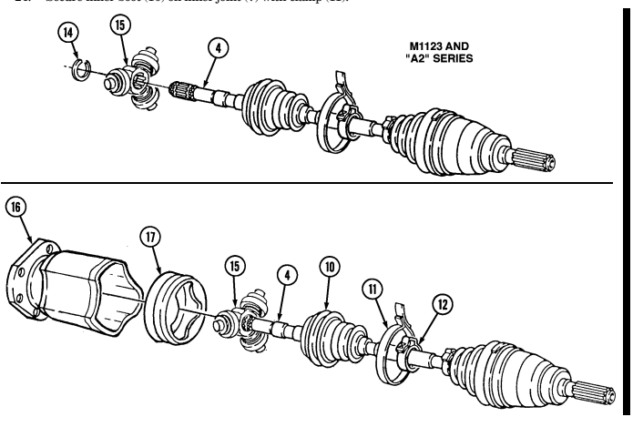

## 6-9. Halfshaft Maintenance (Cont'D)

e. Installation 1. Install halfshaft (9) into geared hub (4). 2. Apply sealing compound to halfshaft retaining capscrew (6) and install halfshaft (9) to geared hub (4) with lockwasher (5) and halfshaft retaining capscrew (6). Tighten halfshaft retaining capscrew (6) to 37 lb-ft (50 N•m).

3. Install washer (7) and access plug (8) into geared hub (4). Tighten access plug (8) to 8-13 lb-ft 
(11-18 N•m).

Ensure all six capscrew holes in the rotor align with holes in output flange.

4. Apply sealing compound to six capscrews (3). Install halfshaft (9) to rotor (1) and output flange (10),
with six lockwashers (2) and capscrews (3). Tighten capscrews (3) to 48 lb-ft (65 N•m).

Perform steps 5 through 7 for rear halfshafts only.

5. Install parking brake cable (11) to caliper cable bracket (12) with retaining ring (13).

- Ensure lever is in contact with caliper cable bracket stop.

Damage to equipment and poor performance will result if not aligned properly.

- Ensure that the clevis and clevis pin are aligned in the lever. 

Do not move the lever to accommodate misadjusted clevis. Damage to equipment and poor performance may result.

6. Install parking brake clevis (17) to lever (14) with clevis pin (18), washer (16), and cotter pin (15).

Check position of lever (13) and ensure it is in contact with caliper cable bracket stop (13.1).

7. If lever (14) is not in contact with caliper cable bracket stop (13.1), adjust rear dual service parking brake (para. 7-26).

# 6-9.  Halfshaft Maintenance (Cont'D)

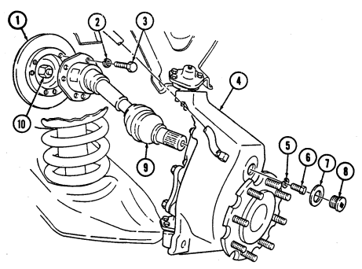

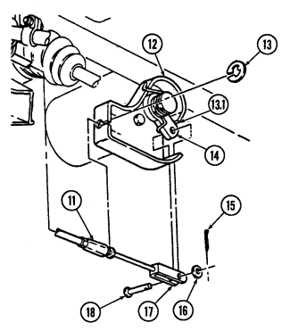

FOLLOW-ON TASK:    Install wheel (para. 8-3).

## 6-10. Geared Hub Side Cover Replacement

This task covers:
a. Removal c. Installation b. Cleaning and Inspection INITIAL SETUP:
General mechanic's tool kit: Wheel removed (para. 8-3).

automotive (Appendix B, Item 1) General Safety Instructions Drycleaning solvent, (Appendix C, Item 18) in well-ventilated places.

Manual References TM 9-2320-280-10 TM 9-2320-280-24P
Tools **Equipment Condition**
Materials/Parts Drycleaning solvent is flammable and will not be Sealing compound (Appendix C, Item 46) used near an open flame. A fire extinguisher will Sealant (Appendix C, Item 38) be kept nearby when the solvent is used. Use only

Have drainage container ready to catch oil. Geared hub side cover replacement procedures are basically the same for front and rear covers. This procedure deals with the front side cover.

#### A. Removal

1. Remove drainplug (5) from geared hub (1) and drain geared hub (1).

2. Install drainplug (5) in geared hub (1). 3. Remove eight capscrews (4), washers (3), and side cover (2) from geared hub (1).

b. Cleaning and Inspection

Drycleaning solvent is flammable and will not be used near an open flame. A fire extinguisher will be kept nearby when the solvent is used. Use only in well-ventilated places. Failure to do this may result in injury to personnel and/or damage to equipment.

1. Using drycleaning solvent, clean side cover (2). 2. Inspect side cover (2) for damage. If damaged replace.

1. Apply sealant (RTV) to side cover (2) and install side cover (2) on geared hub (1).

2. Apply sealing compound to capscrews (4) and install eight washers (3) and capscrews (4) on side cover (2). Tighten capscrews (4) to 15 lb-ft (20 N·m).

# 6-10. Geared Hub Side Cover Replacement (Corítd)

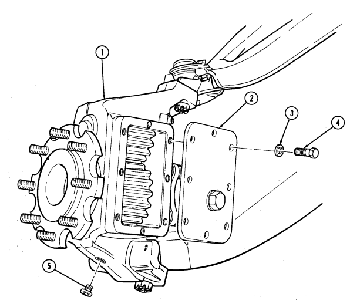

FOLLOW-ON TASKS: - Fill geared hub to proper level (para. 2-11).

- Install wheel (para. 8-3).

■

# 6-11. Geared Hub Replacement

This task covers:
INITIAL SETUP:

#### Tools

General mechanic's tool kit:
automotive (Appendix B, Item 1)
Puller kit (Appendix B, Item 167)

#### Materials/Parts

Three cotter pins (Appendix G, Item 14) Lockwasher (Appendix G, Item 146) Four locknuts (Appendix G, Item 79)
(Basic/A1 Series)
Four locknuts (Appendix G, Item 128)
(Basic/A1 Series)
Four locknuts (Appendix G, Item 104) 
(A2 Series)
Four locknuts (Appendix G, Item 105) 
(A2 Series)
Sealing compound (Appendix C, Item 45) Sealer (Appendix C, Item 39)

#### A. Removal B. Installation

Personnel Required One mechanic One assistant Manual References TM 9-2320-280-10 TM 9-2320-280-24P
Equipment Condition
- Wheel removed (para. 8-3). - Steering stop removed (para. 6-19). - Air lifting bracket removed, rear only 
(para. 6-20).

General Safety Instructions Geared hub must be supported during removal and installation.

Use of a pickle fork in lieu of the puller kit may damage serviceable components (boots).

NOTE
- Have drainage container ready to catch drained fluid. - Removal and installation procedures are basically the same for front and rear geared hubs. This procedure covers the front geared hub.

#### A. Removal

1. Remove drainplug (29) from geared hub (9) and drain geared hub (9). 2. Install drainplug (29) in geared hub (9). 3. Remove capscrew (22), washer (23), vent line bracket and clamp (24) from geared hub (9). 4. Loosen clamp (10) and disconnect vent line (1) from geared hub fitting (11). 5. Remove cotter pin (25), slotted nut (26), and washer (27) from tie rod end (28) and geared hub (9).

Discard cotter pin (25).

6. Using puller, disconnect tie rod end (28) from geared hub (9). 7. Remove access plug (14), washer (15), axle halfshaft retaining capscrew (13), lockwasher (12) and disconnect halfshaft (20) from geared hub (9). Discard lockwasher (12).

Geared hub must be supported during removal and installation. Failure to support geared hub may cause injury to personnel or damage to equipment.

Note direction of outer capscrew for installation.

8. Remove four locknuts (21), washers (16), capscrews (17), and washers (16) from lower ball joint (18)
and lower control arm (19). Discard locknuts (21).

## 6-11. Geared Hub Replacement (Cont'D)

 Remove four locknuts (7), washers (3), capscrews (2), and washers (3) from boot retainer (8), ball 9.

joint retainer (5), upper ball joint (6) and upper control arm (4). Discard locknuts (7).

10.

Lower support and remove geared hub (9).

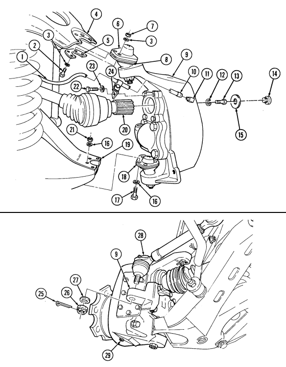

## 6 - 1 1 . Geared Hub Replacement (Cont'D)

b. Installation 11. Place geared hub (3) in vise.

12. Remove cotter pin (8), slotted nut (9), and upper ball joint (10) from geared hub (3). Discard cotter pin (8).

13. Remove cotter pin (1), slotted nut (2), and lower ball joint (4) from geared hub (3). Discard cotter pin (1).

#### Not E

Upper ball joint has grease fitting.

1. Install upper ball joint (10) to geared hub (3) with slotted nut (9), but do not tighten. 2. Install lower ball joint (4) to geared hub (3) with slotted nut (2), but do not tighten.

NOT E
- If geared hub received is P/N 5598766 and left front or right rear installation is required, replace steering arm cover P/N 5591279 with P/N 5591280 for basic and A1 vehicles and P/N 6005121 for M 1123 and A2 vehicles.

- If geared hub received is P/N 5598767 and right front or left rear installation is required, replace steering arm cover P/N 5591280 with P/N 5591279 for basic and A1 vehicles and P/N 6005120 for M 1123 and A2 vehicles.

- Use existing steering arm cover if serviceable. - Perform steps 3 through 5 for replacement of steering arm cover.

Proceed to step 6 for geared hub installation.

3. Remove four capscrews (7), washers (6), and steering arm cover (5) from geared hub (3).

#### Not E

Immediately install steering arm cover after application of sealant.

4. Clean sealing surfaces on geared hub (3) and steering arm cover (5). Apply anaerobic sealant to steering arm cover (5).

5. Apply sealing compound to threads on capscrews (7) and install steering arm cover (5) to geared hub (3) with four washers (6) and capscrews (7). Tighten capscrews (7) to 65 lb-ft (88 N•m).

Geared hub must be supported during removal and installation. Failure to support geared hub may cause injury to personnel or damage to equipment.

6. Install geared hub (3) and upper ball joint (10) on upper control arm (13) ensuring upper ball joint (10) is placed above upper control arm (13), and boot (16) and ball joint retainer (14) are placed below upper control arm (13).

#### Not E

Ensure outer capscrews on front ball joints are installed from top down, and inner capscrews are installed from bottom up for M1123 and "A2" series vehicles only.

7. Install upper ball joint (10) and ball joint retainer (14) to upper control arm (13) with four washers ( 1 2 ) ,
capscrews (11), washers (12), and locknuts (15). Tighten locknuts (15) to 252 lb-in. (28 N•m ) .

Do not loosen slotted nut to install cotter pin. Doing this may result in damage to equipment.

8. Tighten slotted nut (9) on upper ball joint (10) to 65 lb-ft (88 N•m). Install cotter pin (8). 9. Apply sealing compound to halfshaft retaining capscrew (18) and install halfshaft (24) to geared hub (3) with lockwasher (17) and halfshaft retaining capscrew (18). Tighten halfshaft retaining capscrew (18) to 37 lb-ft (50 N•m).

## 6 - 1 1 . Geared Hub Replacement (Cont'D)

10. Install washer (20) and access plug (19) to geared hub (3). Tighten access plug (19) to 8-13 lb-ft 
(11-18 N•m).

11. Install lower ball joint (4) and geared hub (3) on lower control arm (23). Ensure lower ball joint (4) is below lower control arm (23).

#### Not E

Ensure outer capscrews on front ball joints are installed from top down, and inner capscrews are installed from bottom up for M1123 and "A2" series vehicles only.

12. Secure lower ball joint (4) to lower control arm (23) with four washers (21), capscrews (22),
washers (21), and locknuts (25). Tighten locknuts (25) to 35 lb-ft (47 N•m).

Do not loosen slotted nut to install cotter pin. Doing this may result in damage to equipment.

13. Tighten slotted nut (2) on lower ball joint (4) to 73 lb-ft (99 N•m). Install cotter pin (1).

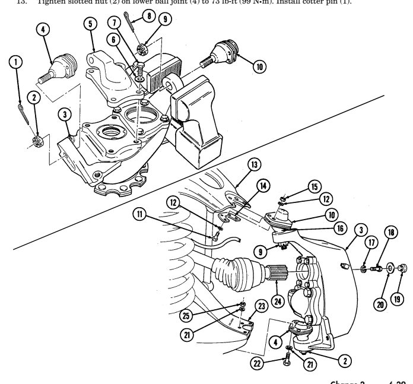

## 6 - 1 1 . Geared Hub Replacement (Cont'D)

14. Install tie rod end (4) into geared hub (5) with washer (3) and slotted nut (2). Tighten slotted nut (2)
to 70 lb-ft (95 N•m). Install cotter pin (1).

15. Connect vent line (6) to geared hub fitting (8) with clamp (7). 16. Install vent line (6) and clamp (9) to geared hub (5) with washer (10) and capscrew (11). Tighten capscrew (11) to 38 lb-ft (52 N•m).

17. Tighten drainplug (14) to 8-13 lb-ft (18-18 N•m). 18. Remove fill plug (13) and washer (12) from geared hub (5). 19. Fill geared hub (5) to proper level (para. 2-11).

2 0 . Install washer (12) and fill plug (13) to geared hub (5). Tighten fill plug (13) to 8-13 lb-ft (11-18 N•m ) .

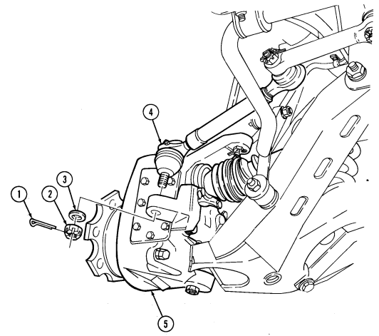

6-11. GEARED HUB REPLACEMENT (Cont'd)

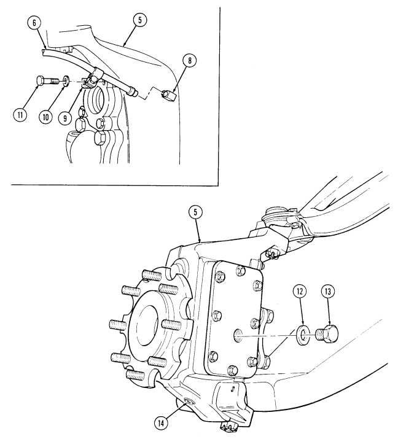

FOLLOW-ON TASKS: - Install steering stop (para. 6-19).

· Install wheel (para. 8-3).

- Install air lifting bracket, rear only (para. 6-20).

· Check alignment (paras. 8-10 and 8-11).

# 6-12. Geared Hub Input Seal Replacement

This task covers:
INITIAL SETUP:

#### Tools

General mechanic's tool kit:
automotive (Appendix B, Item 1)
Vise insert (Appendix B, Item 170)
Special Tools Installer (Appendix B, Item 126) Driver handle (Appendix B, Item 75)
a. Removal

a. Removal b. Installation

#### Materials/Parts

Plain seal (Appendix G, Item 290) Lubricating oil (Appendix C, Item 26)

| Manual References               |
|---------------------------------|
| TM 9\-2320\-280\-24P            |
| Equipment Condition             |
| Halfshaft removed (para. 6\-9). |

Shim gaskets must be reused to maintain proper drive gear bearing adjustment.

1. Remove capscrew (1), washer (2), and vent line bracket (3) from drive gear retainer (4). 2. Remove three capscrews (1), washers (2), drive gear retainer (4), and shim gasket(s) (5) from geared hub (6).

3. Install drive gear retainer (4) in vise with inserts and remove seal (7). Discard seal (7).

b. Installation 1. Using driver handle and input seal installer, install seal (7) in drive gear retainer (4). Ensure radius on outer diameter of seal (7) faces toward inside of geared hub (6).

2. Install shim gasket(s) (5) and drive gear retainer (4) to geared hub (6) with three washers (2) and capscrews (1). Tighten capscrews (1) to 38 lb-ft (52 N.m).

3. Install vent line bracket (3) to drive gear retainer (4) with washer (2) and capscrew (1). Tighten capscrew (1) to 38 lb-ft (52 N.m).

4. Coat lip of seal (7) with lubricating oil.

# 6-12. Geared Hub Input Seal Replacement (Cont'D)

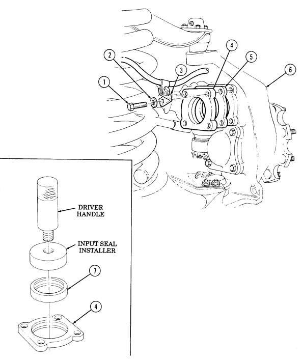

FOLLOW-ON TASK: Install halfshaft (para. 6-9).

# 6-13. Geared Hub Spindle Seal Replacement

This task covers:
INITIAL SETUP

#### Tools

General mechanic's tool kit:
automotive (Appendix B, Item 1)
Special Tools Wrench (Appendix B, Item 127) Installer (Appendix B, Item 128) Driver handle (Appendix B, Item 75)
Materials/Parts Key washer (Appendix G, Item 65) Plain encased seal (Appendix G, Item 291) Grease (Appendix C, Item 22) Sealer (Appendix C, Item 39) Lubricating oil (Appendix C, Item 29) Sealing compound (Appendix C, Item 45)

#### A. Removal B. Installation

Manual References TM 9-2320-280-10 TM 9-2320-280-24P
Equipment Condition Wheel removed (para. 8-3).

General Safety Instructions Ensure locktab on key washer is bent completely into slot on retaining nut.

a. Removal

Have drainage container ready to catch oil.

1. Remove drainplug (2) from geared hub (1) and drain geared hub (1). Install drainplug (2) in geared hub (1). Tighten drainplug (2) to 8-13 lb-ft (11-18 N•m).

2. Remove four capscrews (5), washers (4), and steering arm cover (3) from geared hub (1).

NOTE
For new configuration, two locktabs on key washer must be bent away from retaining nut for removal.

3. Bend locktab on key washer (13) away from retaining nut (14).

If four-slotted retaining nut TN-07 is present, it is recommended to replace it with eight-slotted retaining nut 12342680.

4. Using retaining nut wrench, remove retaining nut (14 ), key washer (13), and keyed washer (12)

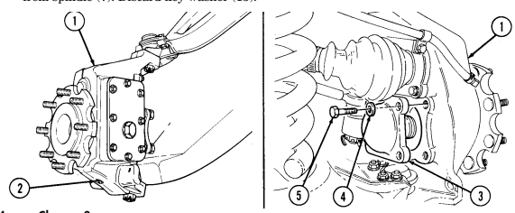

from spindle (7). Discard key washer (13).

## 6-13. Geared Hub Spindle Seal Replacement (Cont'D)

5. Remove spindle (7), spacer (6), bearing(11), and spacer (10) from geared hub (1).

6. Remove spindle seal (15) from geared hub (1). Discard spindle seal (15).

7. Inspect spindle (7) for rough or corroded sealing surface (8). Replace geared hub (1) (para. 6-11) if spindle (7) is damaged.

8. Inspect bearings (9) and (11) for damage. Replace geared hub (1) (para. 6-11) if bearing (9) or (11) is

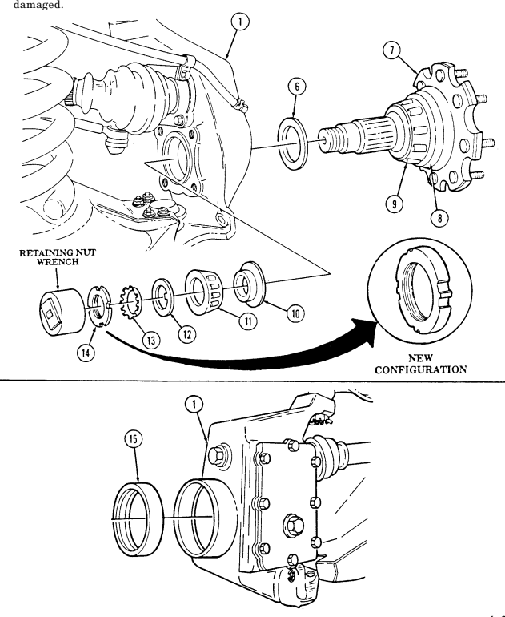

# 6-13. Geared Hub Spindle Seal Replacement (Cont'D)

#### B. Installation

1. Using driver handle and spindle seal installer, install spindle seal (1) in geared hub (2). 2. Coat spindle seal (1) with lubricating oil. 3. Install spacer (3) and spindle (4) in geared hub (2). 4. Apply grease to face of retaining nut (9).

- If four-slotted retaining nut TN-07 is present, it is recommended to replace it with eight-slotted retaining nut 12342680.

- Ensure lip of spacer faces the bearing for a proper fit.

5. Install spacer (5), bearing (6), keyed washer (7), key washer (8), and retaining nut (9) on spindle (4). 6. Using retaining nut wrench, tighten retaining nut (9) to 35-45 lb-ft (47-61 N•m). 7. Rotate spindle (4) five full rotations clockwise and five full rotations counter clockwise to properly seat bearings.

8. Loosen retaining nut (9) until it is finger tight, then retighten nut to 23-27 lb-ft (31-37 N•m).

Ensure locktab on key washer is bent completely into slot on retaining nut. Eight-slotted retaining nut provides additional security by enabling two locktabs on key washer to be bent into slots on retaining nut. Failure to do this may cause injury to personnel or damage to equipment.

- For new configuration, two locktabs on key washer must be bent into slots on retaining nut.

- It may be necessary to slightly loosen or tighten retaining nut to gain proper alignment with locktabs.

9. Determine which locktab (10) on key washer (8) aligns with slot (11) in retaining nut (9). Bend locktab (10) into slot (11) on retaining nut (9).

Immediately install steering arm cover after application of sealant. 

10. Clean sealing surfaces on geared hub (2) and steering arm cover (14). Apply anaerobic sealant to steering arm cover (14) and install steering arm cover (14) on geared hub (2).

11. Apply sealing compound to threads of capscrews (12) and install steering arm cover (14) on geared hub (2) with four washers (13) and capscrews (12). Tighten capscrews (12) to 65 lb-ft (88 N•m).

12. Remove fill plug (15) and washer (16) from geared hub (2). 13. Fill geared hub (2) to proper oil level (para. 2-11). 14. Install washer (16) and fill plug (15) on geared hub (2). Tighten fill plug (15) to 8-13 lb-ft (11-18 N•m).

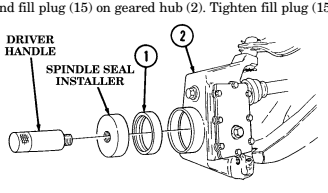

# 6-13. Geared Hub Spindle Seal Replacement (Cont'D)

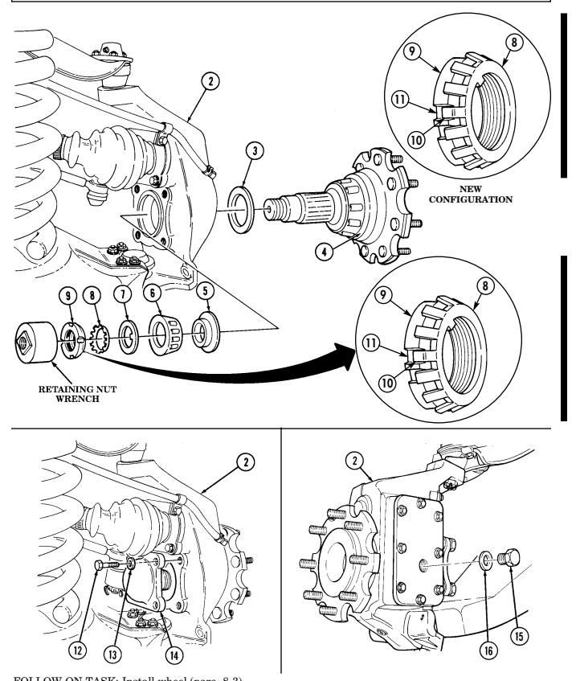

FOLLOW-ON TASK: Install wheel (para. 8-3).

# 6-14. Geared Hub Spindle Bearing Adjustment

This task covers:
Adjustment INITIAL SETUP:

#### Tools

General mechanic's tool kit:
automotive (Appendix B, Item 1)
Special Tools Wrench (Appendix B, Item 127)
Materials/Parts Key washer (Appendix G, Item 65) Sealer (Appendix C, Item 39) Sealing compound (Appendix C, Item 45) Grease (Appendix C, Item 22)

#### Adjustment

Manual References TM 9-2320-280-10 TM 9-2320-280-24P
Equipment Condition Wheel removed (para. 8-3).

General Safety Instructions Ensure locktab on key washer is bent completely into slot on retaining nut.

key washer (9).

Ensure locktab on key washer is bent completely into slot on retaining nut. Eight-slotted retaining nut provides additional security by enabling two locktabs on key washer to be bent into slots on retaining nut. Failure to do this may cause injury to personnel or damage to equipment.

NOTE
- For new configuration, two locktabs must be bent into slots on retaining nut.

- It may be necessary to slightly loosen or tighten retaining nut to gain proper alignment with locktabs.

9. Determine which locktab (12) on key washer (9) aligns with slot (11) in retaining nut (10). Bend locktab (12) into slot (11) on retaining nut (10).

Have drainage container ready to catch oil.

1. Remove drainplug (4), and drain geared hub (1). Install drainplug (4) into geared hub (1). Tighten drainplug (4) to 8-13 lb-ft (11-18 N•m).

2. Remove four capscrews (7), washers (6), and steering arm cover (5) from geared hub (1).

NOTE
For new configuration, two locktabs must be bent away from retaining nut for removal.

3. Bend locktab (12) on key washer (9) away from retaining nut (10). 4. Using retaining nut wrench, remove retaining nut (10) and key washer (9) from spindle (8). Discard

If four-slotted retaining nut TN-07 is present, it is recommended to replace it with eight-slotted retaining nut 12342680.

5. Apply grease to face of retaining nut (10) and install key washer (9) and retaining nut (10) on spindle (8).

6. Using retaining nut wrench, tighten retaining nut (10) to 35-45 lb-ft (47-61 N•m). 7. Rotate spindle (8) five full rotations clockwise and five full rotations counter clockwise to properly seat bearings.

8. Loosen retaining nut (10) until it is finger tight, then retighten nut to 23-27 lb-ft (31-37 N•m).

WARNING

# 6-14. Geared Hub Spindle Bearing Adjustment (Cont'D)

Immediately install steering arm cover after application of sealant.

10. Clean sealing surfaces on geared hub (1) and steering arm cover (5). Apply anaerobic sealant to steering arm cover (5) and install steering arm cover (5) on geared hub (1).

11. Apply sealing compound to threads of capscrew (7) and install steering arm cover (5) on geared hub (1) with four washers (6) and capscrews (7). Tighten capscrews (7) to 65 lb-ft (88 N•m).

12. Remove fill plug (2) and washer (3) from geared hub (1). 13. Fill geared hub (1) to proper oil level (TM 9-2320-280-10). 14. Install washer (3) and fill plug (2) on geared hub (1). Tighten fill plug (2) to 8-13 lb-ft (11-18 N•m).

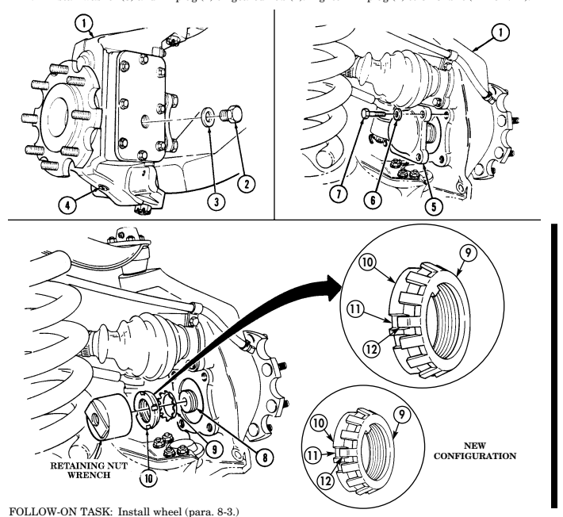

# 6-15. Wheel Stud Replacement

This task covers:
INITIAL SETUP:

#### Tools

General mechanic's tool kit:
automotive (Appendix B, Item 1))
Materials/Parts Three washers (Appendix G, Item 35) Hex nut (Appendix G, Item 64)
Manual References TM 9-2320-280-24P
a. Removal b. Installation Equipment Condition Wheel removed (para. 8-3).

General Safety Instructions Always wear eye protection when replacing wheel studs.

Always wear eye protection when replacing wheel studs. Severe eye injury may result if metal chips contact eyes.

a. Removal 1. Rotate spindle (3) to allow clearance for removal of stud (4) from spindle (3). 2. Drive stud (4) from spindle (3). Discard stud (4).

b. Assembly 1. Align splines on stud (4) with splines in spindle (3) and install stud (4) in spindle (3). 2. Install three flat washers (2) and hex nut (1) on stud (4). 3. Tighten hex nut (1) until head on stud (4) seats against spindle (3). 4. Remove and discard hex nut (1) and three flat washers (2).

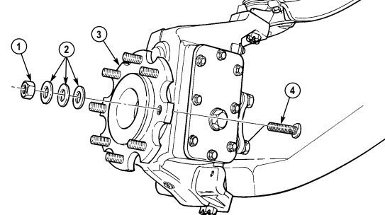

FOLLOW-ON TASK: Install wheel (para. 8-3).

6-40 Change 3

# 6-16. Differential Vent Line Replacement

This task covers:

#### A. Removal **B. Installation**

INITIAL SETUP:
General mechanic's tool kit: TM 9-2320-280-24P
automotive (Appendix B, Item 1)
Tools **Manual References**

Differential vent line replacement procedures are basically the same. This procedure covers the rear differential vent line.

#### A. Removal

1. Remove vent line (7) from differential fitting (6) and tee fitting (1). 2. Remove two line clips (2) from vent line (3) and brake line (5). 3. Remove vent line (3) from two tee fittings (1) and (4).

#### B. Installation

1. Install vent line (3) on tee fittings (1) and (4).

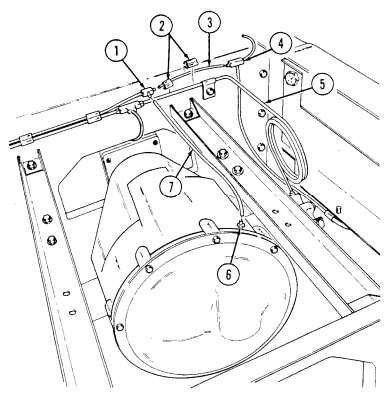

2. Install two line clips (2) on vent line (3) and brake line (5).

3. Install vent line (7) on differential fitting (6) and tee fitting (1).

# 6-17. Rear Geared Hub Vent Line Replacement

This task covers:

a. Removal **b. Installation**

INITIAL SETUP:

General mechanic's tool kit: TM 9-2320-280-24P

Tools **Manual References**

automotive (Appendix B, Item 1)

Rear geared hub vent line replacement procedures are basically the same. This procedure covers the right rear geared hub vent line.

1. Disconnect vent line (4) from geared hub fitting (3).

2. Remove capscrew (7), clamp (6), and vent line (4) from bracket (5). 3. Remove capscrew (8), clamp (1), and vent line (4) from control arm (2).

4. Remove capscrew (10), clamp (9), and vent line (4) from bracket (11).

5. Remove capscrew (15), clamp (14), and vent line (4) from frame (13). 6. Remove vent line (4) from tee fitting (12).

#### B. Installation

1. Install vent line (4) to tee fitting (12) and geared hub fitting (3). 2. Install vent line (4) to frame (13) with clamp (14) and capscrew (15).

3. Install vent line (4) to bracket (11) with clamp (9) and capscrew (10).

4. Install vent line (4) to control arm (2) with clamp (1) and capscrew (8).

NOTE
Position clamp at a 45° angle toward the wheel before securing with capscrew.

5. Install vent line (4) to bracket (5) with clamp (6) and capscrew (7).

6-17. REAR GEARED HUB VENT LINE REPLACEMENT (Cont'd)

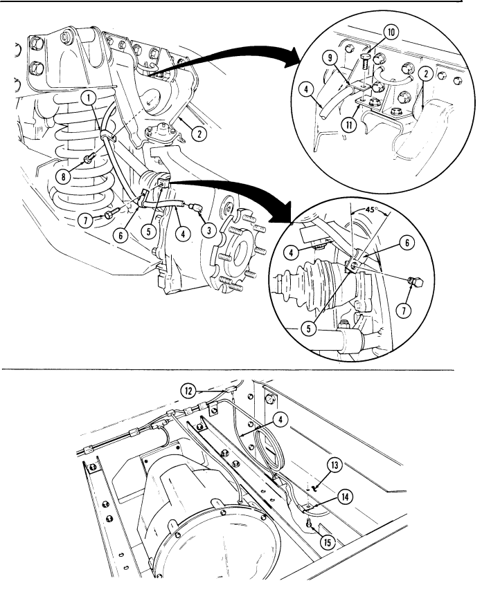

# 6-18. Front Geared Hub Vent Line Replacement

This task covers:
a. Right Side Removal c. Left Side Removal b. Right Side Installation **d. Left Side Installation**
INITIAL SETUP:
General mechanic's tool kit: Wheel removed (para. 8-3).

automotive (Appendix B, Item 1)
Tools **Equipment Condition**
Manual References TM 9-2320-280-24P
a. Right Side Removal

Mark clamp position before loosening to ensure clamps are properly positioned during installation.

1. Loosen four screws (7) and clamps (3) from front control arm (2) and geared hub (8). 2. Remove two hose clamps (6) and front vent line hose (4) from elbow (5) and tee fitting (1).

b. Right Side Installation

Step 1 is necessary to prevent vent line damage. If new clamp has

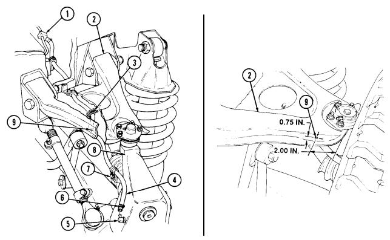 been previously installed, perform steps 3 through 5.

1. Locate, mark, and drill 0.266 in. (6.76 mm) diameter hole (9) in front control arm (2).

## 6-18. Front Geared Hub Vent Line Replacement (Cont'D)

2. To fabricate front vent line hose (4), cut 33.63 in. (85.42 cm) piece of hose from bulk.

3. Route front vent line hose (4) through four existing clamps (3), and secure with two hose clamps (6)
to tee fitting (1) and elbow (5).

4. Position 9.0 to 10.0 in. (22.9 to 25.4 cm) of hose (4) between two existing clamps (3). Secure existing clamps (3), as noted in removal, with screws (7).

5. Install new clamp (3) on front vent line (4), and control arm (2) at hole (9) with screw (10),

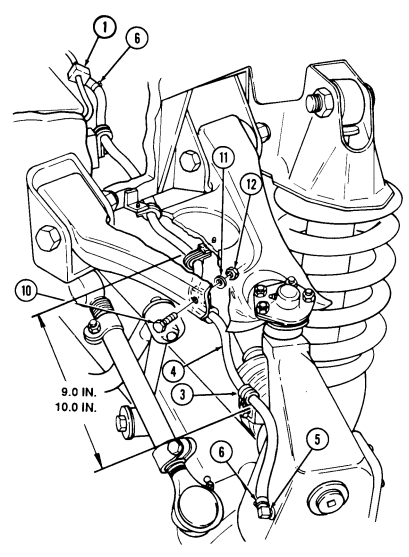

washer (11), and nut (12).

# 6-18. Front Geared Hub Vent Line Replacement (Cont'D)

c. Left Side Removal 1. Loosen three screws (3) and clamps (2) from front control arm (8) and geared hub (7).

2. Remove two hose clamps (5) and vent line hose (1) from elbow (6) and union on tube (4).

d. Left Side Installation

Step 1 is necessary to prevent vent line damage. If new clamp has been previously installed, perform steps 3 through 5.

1. Locate, mark, and drill 0.266 in. (6.75 mm) diameter hole (9) in left front control arm (8).

2. To fabricate front side vent line hose (1), cut a 28.2 in. (71.6 cm) piece from hose (1).

removed in para. c, step 2. If hose (1) is unserviceable cut anew piece from bulk3. Route vent line hose (1). fabricated in step 2 through three existing clamps (2), and secure

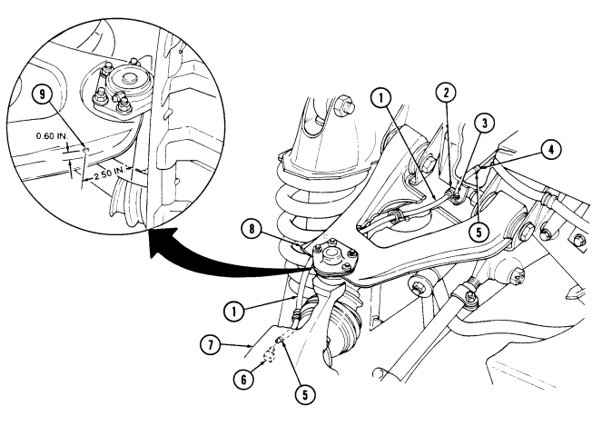

hose (1) with two hose clamps (5) to union on tube (4) and elbow (6) on geared hub (7).

## 6-18. Front Geared Hub Vent Line Replacement (Cont'D)

4. Position 11.5 to 12.5 inches (29.2 to 31.8 cm) of hose (1) between two existing outer clamps (2) and secure existing clamps (2) with screws (3). Ensure center clamp (2) is positioned as shown.

5. Bend 90° bracket (14) on geared hub (7) 30° outward as shown.

Do not close loop on clamps installed on control arms. Hose lines should move freely through control arm clamp loops.

6. Install new clamp (13) on vent line hose (1), and control arm (8) with screw (10), washer

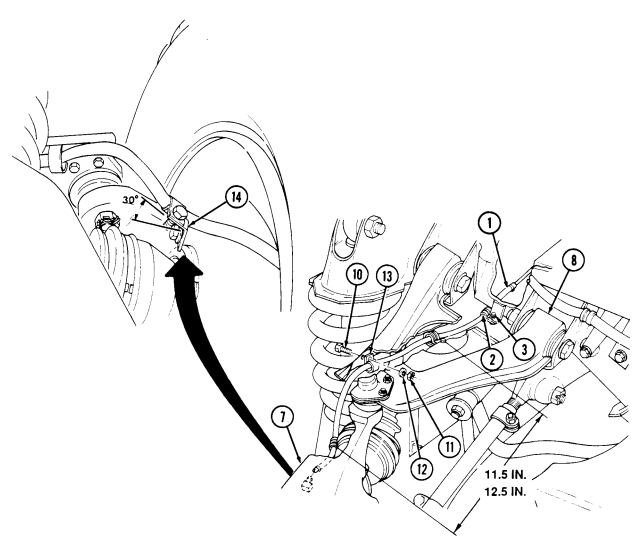

nut (11).

(12), and FOLLOW-ON TASK: Install wheel (para. 8-3).

#### 6-19. Steering Stop Maintenance

This task covers:
a. Removal **c. Adjustment**
b. Installation INITIAL SETUP:

| Tools General mechanic's tool kit:        | Personnel Required         |
|-------------------------------------------|----------------------------|
| automotive (Appendix B, Item 1)           | One mechanic One assistant |
| Universal joint bearing kit               |                            |
| (Appendix B, Item 171)                    | Manual References          |
| Materials/Parts                           | TM 9\-2320\-280\-24P       |
| Universal parts kit (Appendix G, Item 66) | Equipment Condition        |

1. Loosen jamnut (2) and remove steering stop capscrew (3) and jamnut (2) from geared hub (1).

2. Remove jamnut (2) from capscrew (3).

1. Apply sealing compound to capscrew (3). 2. Install jamnut (2) on capscrew (3). 3. Install capscrew (3) and jamnut (2) on geared hub (1). Tighten capscrew (3) finger tight.

c. Adjustment

Prior to adjustment ensure length of each tie rod is the same. If tie rod lengths are not the same ± 1/8 in. (3 mm), check toe-in alignment (para. 8-10).

Draw a reference chalk line (6)30 feet long. Mark this line "A". Position vehicle so that center of left rear and left front tires are positioned directly on reference line
"A" (6).

Using a protractor, draw a second reference line "B" (5) at 34°. Mark this line "B". Again, using a protractor, draw a third reference line "C" (4) at 36°. Mark this line "C". Roll vehicle forward until center of left front tire is over intersection of lines "A", "B", and "C".

Turn steering wheel full left.

If the centerline of front and rear of left front tire (7) is over area between lines "B" and "C", no adjustment is necessary.

If centerline of front and rear of left front is not over area between lines "B" and "C", loosen jamnut (2) and turn capscrew (3) all the way in.

9.

10.

11.

12.

Repeat adjustment procedure for opposite side.

1.

2.

3. 4. 5. 6. 7.

8.

Turn steering wheel until centerline of front and rear of tire (7) is over area between lines "B" and
"C". Unscrew capscrew (3) until head makes contact with wheel stop (9) on lower control arm (8). Secure capscrew (3) with jamnut (2).

6-19. STEERING STOP MAINTENANCE (Cont'd)

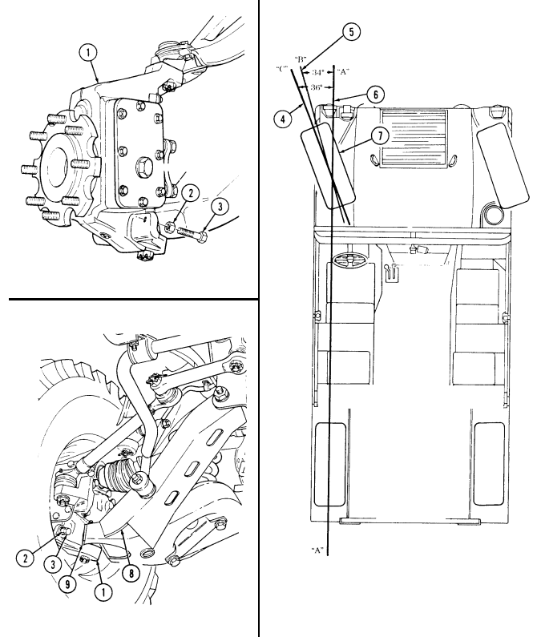

## 6-20. Air Lifting Bracket Replacement

This task covers:
a. Removal b. Installation INITIAL SETUP:

#### Tools

General mechanic's tool kit:
automotive (Appendix B, Item 1)
Manual References TM 9-2320-280-24P

#### Materials/Parts

Four lockwashers (Appendix G, Item 188)
a. Removal Remove four capscrews (4), lockwashers (3), and lifting bracket (2) from geared hub (1). Discard lockwashers (3).

b. Installation Install lifting bracket (2) to geared hub (1) with four lockwashers (3) and capscrews (4). Tighten capscrews (4) to 43 lb-ft (58 N•m).

# 6-20. Air Lifting Bracket Replacement (Cont'D)

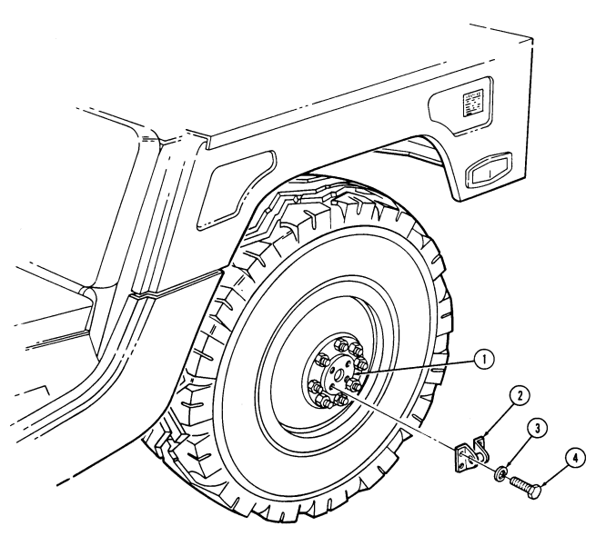

# 6-21. Differential Cover Maintenance

This task covers:
a Removal **c. Installation**
b. Cleaning and Inspection INITIAL SETUP:
General mechanic's tool kit: TM 9-2320-280-10 automotive (Appendix B, Item 1) TM 9-2320-280-24P
Drycleaning solvent (Appendix C, Item 18) used near an open flame.

Tools **Manual References**

Materials/Parts **General Safety Instructions**

Sealant (Appendix C, Item 38) Drycleaning solvent is flammable and will not be

The following procedure applies to vehicles with new brake adapters, P/N 10453002. These brakes are cut away, which allows access to left center capscrews.

Have drainage container ready to catch fluid.

a. Removal 1. Remove drainplug (3) from differential assembly (4) and drain differential. 2. Remove twelve capscrews (2) and cover (1) from differential assembly (4).

b. Cleaning and Inspection

Drycleaning solvent is flammable and will not be used near an open flame. A fire extinguisher will be kept nearby when the solvent is used. Use only in well-ventilated places. Failure to do this may result in injury to personnel and/or damage to equipment.

1. Use drycleaning solvent to clean differential cover (1), capscrews (2), and differential assembly (4). 2. Inspect differential cover (1) for cracks, wear, or breaks. Replace cover (1) if cracked, worn, or broken.

1. Apply RTV sealant to cover (1) sealing surface and install cover (1) on housing (4) with twelve capscrews (2). Tighten capscrews (2) to 16 lb-ft (22 N m).

2. Install drain plug (3) into differential assembly (4) and tighten to 13-18 lb-ft (18-25 N m).

# 6-21. Differential Cover Maintenance (Cont'D)

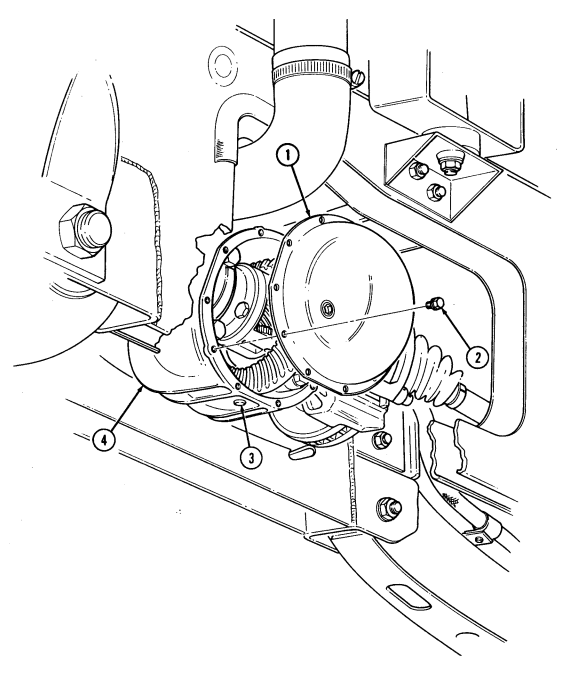

FOLLOW-ON TASK:  Fill differential to proper level (para. 2-11).

| This task covers:                | a.                                    | Removal                             | b.                                | Installation   |
|----------------------------------|---------------------------------------|-------------------------------------|-----------------------------------|----------------|
| INITIAL SETUP:                   |                                       |                                     |                                   |                |
| Tools                            | Materials/Parts                       | General mechanic's tool kit:        | Plain seal (Appendix G, Item 290) |                |
| automotive (Appendix B, Item 1)  | Lubricating oil (Appendix C, Item 26) | Vise insert (Appendix B, Item 170)  |                                   |                |
| Manual References                | Special Tools                         | TM 9\-2320\-280\-24P                |                                   |                |
| Installer (Appendix B, Item 126) | Equipment Condition                   | Driver handle (Appendix B, Item 75) |                                   |                |
| Halfshaft removed (para. 6\-9).  |                                       |                                     |                                   |                |
| a. Removal                       |                                       |                                     |                                   |                |

# Section Iii. Suspension Maintenance

## 6-23. Stabilizer Bar Replacement

This task covers:
a. Removal **b. Installation**
INITIAL SETUP:

#### Tools

General mechanic's tool kit:
automotive (Appendix B, Item 1)
Manual References TM 9-2320-280-24P
Materials/Parts Two locknuts (Appendix G, Item 80)

#### A. Removal

1. Remove two locknuts (10), nuts (7), and six washers (8) from bar links (11) and stabilizer bar (9).

Discard locknuts (10). Remove bar links (11) and pins (1) from stabilizer bar (9).

2. Remove four nuts (5), washers (6), two clamps (4), and stabilizer bar (9) from frame brackets (2). 3. Remove stabilizer bar bushings (3) from stabilizer bar (9).

b. Installation 1. Install stabilizer bar bushings (3) on stabilizer bar (9). 2. Install stabilizer bar (9) on frame brackets (2) with two clamps (4), four washers (6), and nuts (5).

Tighten nuts (5) to 60 lb-ft (81 N•m).

3. Install pins (1) in bar links (11). 4. Install bar links (11) to stabilizer bar (9) with six washers (8), two nuts (7), and locknuts (10).

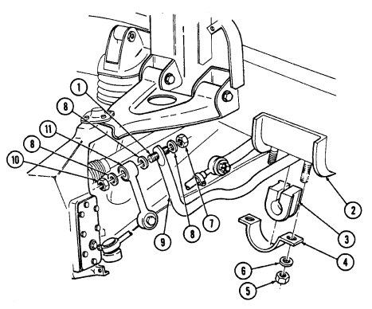

Tighten locknuts (10) to 75 lb-ft (102 N•m).

## 6-24. Stabilizer Bar Link Replacement

This task covers:
INITIAL SETUP:

#### Tools

General mechanic's tool kit:
automotive (Appendix B, Item 1)
a. Removal b. Installation Manual References TM 9-2320-280-24P

#### Materials/Parts

Locknut (Appendix G, Item 80) Sealing compound (Appendix C, Item 46)
a. Removal 1. Remove locknut (1) and two washers (2) from bar link (3) and stabilizer bar (4). Discard locknut (1). 2. Remove capscrew (5), two washers (6), and bar link (3) from lower control arm (7).

b. Installation 1. Apply sealing compound to threads of capscrew (5). Install bar link (3) to lower control arm (7) with two washers (6) and capscrew (5). Tighten capscrew (5) to 70 lb-ft (95 N•m).

2. Install bar link (3) to stabilizer bar (4) with two washers (2) and locknut (1). Tighten locknut (1) 

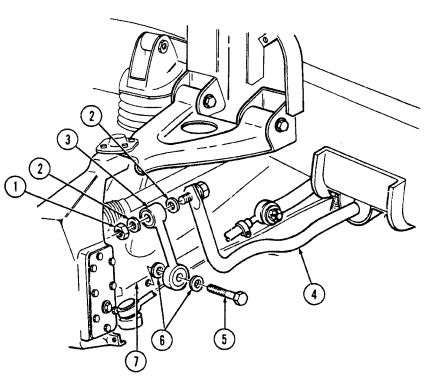

to 75 lb-ft (102 N•m).

# 6-25. Radius Rod Replacement

This task covers:
INITIAL SETUP:

#### Tools

General mechanic's tool kit:
automotive (Appendix B, Item 1)
Materials/Parts Cotter pin (Appendix G, Item 14) Locknut (Appendix G, Item 89)

a. Removal **b. Installation**

| Equipment Condition   |
|-----------------------|
| Wheel removed (pa     |

| Manual References    |
|----------------------|
| TM 9\-2320\-280\-10  |
| TM 9\-2320\-280\-24P |

Wheel removed (para. 8-3).

#### A. Removal

1. Remove cotter pin (7), slotted nut (6), and washer (5) from radius rod (4) and geared hub (8).

Discard cotter pin (7).

2. Remove locknut (9), washer (2), capscrew (1), washer (2), and radius rod (4) from bracket (3) and geared hub (8). Discard locknut (9).

b. Installation 1. Install radius rod (4) to bracket (3) with washer (2), capscrew (1), washer (2), and locknut (9).

Do not loosen slotted nut to install cotter pin. Doing this may result in damage to equipment.

2. Install radius rod (4) to geared hub (8) with washer (5) and slotted nut (6). Tighten slotted nut (6)
to 70 lb-ft (95 N•m). Install cotter pin (7).

3. Tighten locknut (9) to 260 lb-ft (353 N•m).

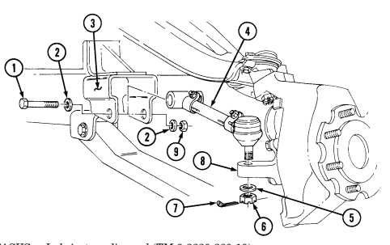

FOLLOW-ON TASKS: - Lubricate radius rod (TM 9-2320-280-10).

- Install wheel (para. 8-3). - Adjust rear wheel toe-out alignment (para. 8-11).

# 6-26. Upper Ball Joint Replacement

This task covers:
a. Inspection c. Installation b. Removal

#### Initial Setup:

Tools General mechanic's tool kit:
automotive (Appendix B, Item 1)
Pickle fork (Appendix B, Item 129)
Special Tools Socket adapter (Appendix B, Item 146) Crowfoot 15/16 in. (Appendix B, Item 151)
Materials/Parts Cotter pin (Appendix G, Item 14) Four locknuts (Appendix G, Item 79)
(Basic/A1 Series)
Four locknuts (Appendix G, Item 104) 
(A2 Series)
Personnel Required One mechanic One assistant

| Manual References   |
|---------------------|

TM 9-2320-280-10 TM 9-2320-280-24P
Equipment Condition Wheel removed (para. 8-3)
a. Inspection 1. Chock rear wheels. 2. Raise and support front wheels 2 in. (5.1 cm) off ground. 3. Grasp top of tire and attempt to move tire in and out. 4. Measure any movement at top outer edge of tire. Replace the upper ball joint (4) if tire movement is 3/8 in. (10 mm) or more.

b. Removal 1. Raise and support lower control arm. 2. Remove cotter pin (8) and slotted nut (7) from upper ball joint (4) and geared hub (6). Discard cotter pin (8).

3. Remove four locknuts (3), washers (2), capscrews (9), washers (2), and upper ball joint (4) from boot retainer (5), ball joint retainer (10), and upper control arm (1). Discard locknuts (3).

4. Using puller, remove ball joint (4) from geared hub (6).

#### C. Installation

1. Install ball joint (4) to upper control arm (1), ensuring upper ball joint (4) is placed above upper control arm (1), and boot retainer (5) and ball joint retainer (10) are placed below upper control arm (1).

2. Secure upper ball joint (4) to upper control arm (1) with four washers (2), capscrews (9), 
washers (2), and locknuts (3). Tighten locknuts (3) to 37 lb-ft (50 N•m).

Do not loosen slotted nut to install cotter pin. Doing this may result in damage to equipment.

3. Install ball joint (4) to geared hub (6) with slotted nut (7). Using crowfoot and adapter, tighten slotted nut (7) to 73 lb-ft (99 N•m). Install cotter pin (8) in slotted nut (7).

6-26.  UPPER BALL JOINT REPLACEMENT (Cont'd)

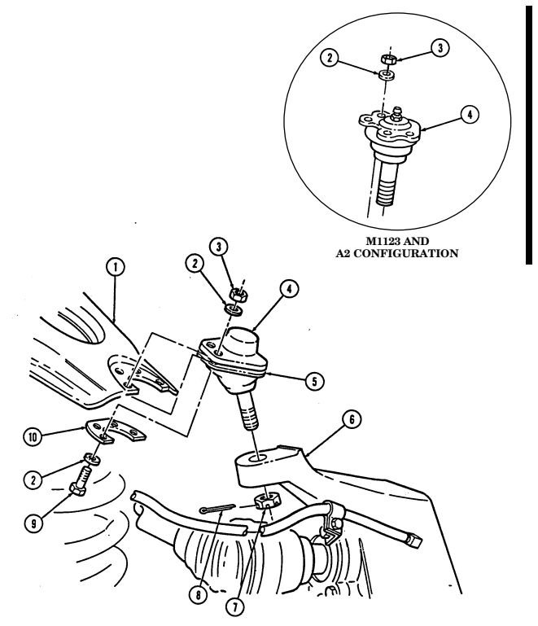

FOLLOW-ON TASKS: - Lubricate upper ball joint (M1123 and A2 only) (TM 9-2320-280-10).
•
■

# 6-27. Lower Ball Joint Replacement

This task covers:
a. Inspection c. Installation b. Removal INITIAL SETUP:
Tools General mechanic's tool kit:
automotive (Appendix B, Item 1)
Pickle fork (Appendix B, Item 129)

#### Materials/Parts

Cotter pin (Appendix G, Item 14) Four locknuts (Appendix G, Item 128) 
(Basic/A1 Series)
Four locknuts (Appendix G, Item 105) 
(A2 Series)

#### A. Inspection

Personnel Required One mechanic One assistant Manual References TM 9-2320-280-10 TM 9-2320-280-24P
Equipment Condition Wheel removed (para. 8-3)
1. Chock rear wheels. 2. Raise and support front wheels 2 in. (5.1 cm) off ground. 3. Mark a line across the top screw (11) of steering arm cover (10). Mark should be parallel with lower control arm (9).

4. Set a 6-in. (15.3 cm) ruler upright between lower control arm (9) and marked screw (11). 5. Install prybar between lower control arm (9) and geared hub (5). Push down on prybar and try to move geared hub (5).

6. Measure any movement in the geared hub (5). Replace lower ball joint (3) if any movement is more than 1/8 in. (3.2 mm).

b. Removal c. Installation 1. Raise and support lower control arm (9). 2. Remove cotter pin (7) and slotted nut (6) from lower ball joint (3) and geared hub (5). Discard cotter pin (7).

NOTE
Note direction of outer capscrews for installation.

3. Remove four locknuts (2), washers (1), capscrews (8), and washers (1) from lower ball joint (3) and lower control arm (9). Discard locknuts (2).

4. Using puller, remove ball joint (3) with boot retainer (4) from geared hub (5).

- Lower ball joint replacement procedures are the same for all models, except M996, M997, M1037, M1042, M1097, M1123, and "A1" and "A2" series vehicles. These have heavy duty rear lower ball joints and the locknuts securing ball joints to rear lower control arms on these vehicles must be tightened to 60 lb-ft (81 N•m).

- Ensure outer capscrews on front ball joints are installed from top down and inner capscrews are installed from bottom up for M1123 and "A2" series vehicles only.

1. Install ball joint (3) with boot retainer (4) to lower control arm (9), ensuring ball joint (3) is placed below lower control arm (9) with four washers (1), capscrews (8), washers (1), and locknuts (2). Tighten locknuts (2) to 35 lb-ft (47 N•m).

# 6-27. Lower Ball Joint Replacement (Cont'D)

 Do not loosen slotted nut to install cotter pin. Doing this may result in damage to equipment.

2.

Install ball joint (3) to geared hub (5) with slotted nut (6). Tighten slotted nut (6) to 73 lb-ft (99 N-m).

Install cotter pin (7) in slotted nut (6).

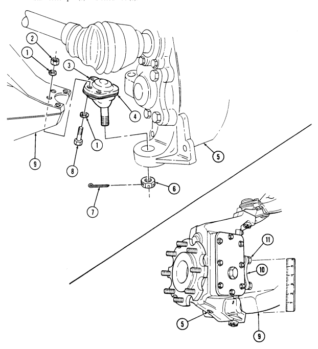

FOLLOW-ON TASKS: - Lubricate lower ball joint (TM 9-2320-280-10).

- Install wheel (para. 8-3).

# 6-28. Upper Control Arm Replacement

This task covers:
INITIAL SETUP
Tools General mechanic's tool kit:
automotive (Appendix B, Item 1)
a. Removal b. Installation Materials/Parts Four locknuts (Appendix G, Item 79)
(Basic/A1 Series)
Four locknuts (Appendix G, Item 104) 
(A2 Series)
Two locknuts (Appendix G, Item 89) Cotter pin (Appendix G, Item 14) Lockwasher (Appendix G, Item 146) Sealing compound (Appendix C, Item 40)
Manual References TM 9-2320-280-10 TM 9-2320-280-24P
Equipment Condition
- Wheel removed (para. 8-3). - Hood raised and secured (TM 9-2320-28010), (front upper control arms only).

The procedures for removing and installing the front and rear upper control arms are basically the same. This procedure covers the left front upper control arm.

#### A. Removal

1. Remove capscrew (1), washer (2), and vent line bracket (3) from geared hub (4). 2. Loosen clamp (6) and disconnect vent line (5) from fitting (7). 3. Remove capscrew (23), clamp (21), and vent line (5) from upper control arm (16). 4. Remove capscrew (24), washer (25), nut (27), clamp (26), and vent line (5) from upper control arm (16). 5. Remove cotter pin (31), slotted nut (32), washer (30), and disconnect tie rod end (29) from geared hub (4). Discard cotter pin (31).

6. Remove access plug (8), washer (33), halfshaft retaining capscrew (9), and lockwasher (10) from halfshaft (28) and geared hub (4). Discard lockwasher (10).

Not direction of outer capscrews for installation.

7. Remove four locknuts (15), washers (14), capscrews (11), and washers (14) from upper ball joint
(13), boot retainer (12), ball joint retainer (22), and upper control arm (16). Discard locknuts (15).

8. Remove two locknuts (17), washers (18), capscrews (20), washers (18), and upper control arm (16)
from brackets (19). Discard locknuts (17).

b. Installation

On front control arms, capscrew head is toward rear of vehicle. On rear control arms, capscrew head is toward front of vehicle.

1. Install upper control arm (16) to brackets (19) with two washers (18), capscrews (20), washers (18),
and locknuts (17).

Ensure outer capscrews on front ball joints are installed from top down and inner capscrews are installed from bottom up for M1123 and "A2" vehicles only.

2. Install upper ball joint (13) to upper control arm (16) ensuring upper ball joint (13) is placed above upper control arm (16), and boot retainer (12) and ball joint retainer (22) are placed below upper control arm (16). Secure with four washers (14), capscrews (11), washers (14), and locknuts (15). Tighten locknuts (15) to 21 lb-ft (28 N•m).

3. Tighten locknuts (17) to 260 lb-ft (353 N•m). 4. Apply sealing compound to halfshaft retaining capscrew (9) and install halfshaft (28) to geared hub (4)
with lockwasher (10) and halfshaft retaining capscrew (9). Tighten capscrew (9) to 37 lb-ft (50 N•m).

6-62 Change 3

## 6 - 2 8 . Upper Control Arm Replacement (Cont'D)

5. Install washer (33) and access plug (8) to geared hub (4). Tighten access plug (8) to 8-13 lb-ft
(11-18 N•m).

Do not loosen slotted nut to install cotter pin. Doing this may result in damage to equipment.

6. Install tie rod end (29) into geared hub (4) with washer (30) and slotted nut (32). Tighten slotted nut (32) to 70 lb-ft (95 N•m). Install cotter pin (31).

7. Connect vent line (5) to fitting (7) with clamp (6).

#### Not E

If installing new vent line bracket on left front geared hub, bend bracket 30° (from standard 90° angle to 120°) before installation.

8. Install vent line bracket (3) to geared hub (4) with washer (2) and capscrew (1). Tighten capscrew (1) to 38 lb-ft (52 N•m).

9. Install clamp (21) and vent line (5) to control arm (16) with capscrew (23).

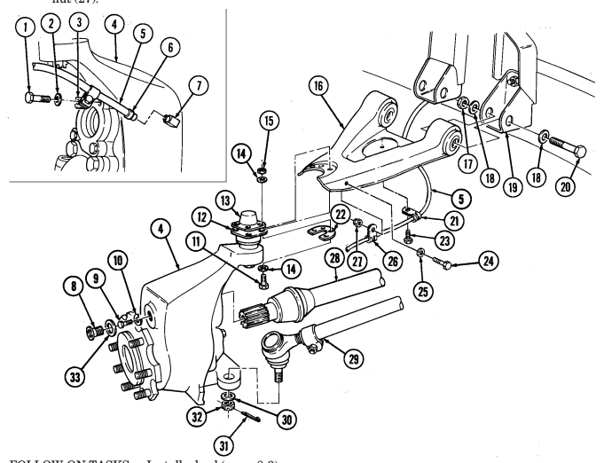

10. Install clamp (26) and vent line (5) to upper control arm (16) with screw (24), washer (25), and nut (27).

FOLLOW-ON TASKS: - Install wheel (para. 8-3).

- Lower and secure hood (TM 9-2320-280-10), (front upper control arm only). - Check wheel alignment (paras. 8-10 and 8-11 ) .

# 6-29. Lower Control Arm Replacement

This task covers:
INITIAL SETUP:
Tools General mechanic's tool kit:
automotive (Appendix B, Item 1)
Materials/Parts Four locknuts (Appendix G, Item 128)
(Basic/A1 Series)
Four locknuts (Appendix G, Item 105) (A2 Series) Two locknuts (Appendix G, Item 89) Sealing compound (Appendix C, Item 40)
Personnel Required One mechanic One assistant

#### A. Removal B. Installation

Manual References TM 9-2320-280-24P
Equipment Condition
- Wheel removed (para. 8-3). - Shock absorber removed (para. 6-31).

General Safety Instructions Lower control arm must be supported during removal and installation.

The procedures for removing and installing the front and rear lower control arms are basically the same. This procedure covers the left front lower control arm.

a. Removal

Lower control arm must be supported during removal and installation. Failure to support lower control arm may cause injury to personnel or damage to equipment.

Note direction of outer capscrews for installation.

1. Remove four locknuts (7), washers (6), capscrews (9), and washers (6) from lower ball joint (5),
geared hub (4) and lower control arm (8). Discard locknuts (7).

2. Remove capscrew (14), two washers (12), and bar link (13) from lower control arm (8). 3. Raise and support lower control arm (8) and pull geared hub (4) away. 4. Lower the lower control arm (8) and remove coil spring (10). 5. Remove two locknuts (3), washers (2), capscrews (1), washers (2), and lower control arm (8) from brackets (11). Discard locknuts (3).

b. Installation

On lower control arms, capscrew heads are toward front of vehicle.

1. Install lower control arm (8) on brackets (11) with two washers (2), capscrews (1), washers (2), and locknuts (3).

2. Install coil spring (10) on lower control arm (8) ensuring end of coil spring (10) fits in spring pocket of lower control arm (8).

Lower control arm must be supported during removal and installation. Failure to support lower control arm may cause injury to personnel or damage to equipment.

3. Raise lower control arm (8) to align with geared hub (4) and ball joint (5) ensuring lower ball joint (5) is placed below lower control arm (8).

6-64 Change 3

# 6 - 2 9 . Lower Control Arm Replacement ( C O N T ' D )

#### Not E

Ensure outer capscrews on front ball joints are installed from top down and inner capscrews are installed from bottom up for M1123 and "A2" series.

4. Install geared hub (4) and ball joint (5) on lower control arm (8) with four washers (6), capscrews (9),
washers (6), and locknuts (7). Tighten locknuts (7) to 35 lb-ft (47 N•m).

5. Tighten locknuts (3) to 260 lb-ft (352 N•m). 6. Install wheel (para. 8-3). 7. Apply sealing compound to threads of capscrew (14). Install bar link (13) to lower control arm (8),

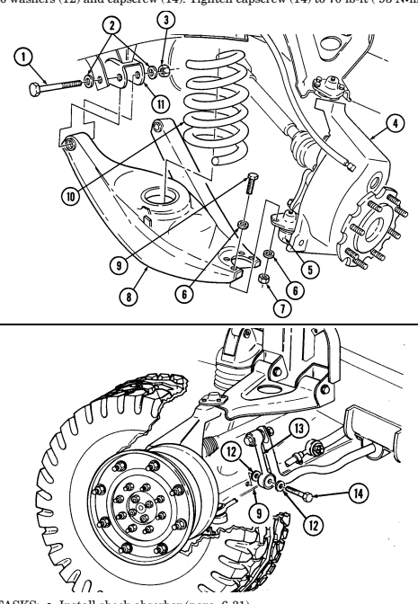

with two washers (12) and capscrew (14). Tighten capscrew (14) to 70 lb-ft ( 95 N•m).

FOLLOW-ON TASKS: - Install shock absorber (para. 6-31).

- Check wheel alignment (paras. 8-10 and 8-11).

# 6-30. Coil Spring Replacement

This task covers:
INITIAL SETUP:

#### Tools

General mechanic's tool kit:
automotive (Appendix B, Item 1)
Materials/Parts Four locknuts (Appendix G, Item 128)
(Basic/A1 Series)
Four locknuts (Appendix G,Item 105) 
(A2 Series)
Locknut (Appendix G,Item 106) Sealing compound (Appendix C, Item 40)

#### A. Removal B. Installation

| Manual References                               |
|-------------------------------------------------|
| TM 9\-2320\-280\-10                             |
| TM 9\-2320\-280\-24P                            |
| Equipment Condition                             |
| · Hood raised and secured                       |
| (TM 9\-2320\-280\-20\-10) (front springs only). |
| M1037 and M1042 only:                           |
| · Shelter removed (para. 11\-120)               |
| (rear shock absorbers only).                    |
| · Lower control arm supported (para. 6\-29)     |
| (rear shock absorbers only).                    |

The procedure for removing and installing all four coil springs are basically the same. This procedure covers the left front coil spring.

a. Removal

For rear coil spring replacement on M1037 and M1042 models, it may be necessary to spread frame from body by positioning prybar between hinge mount bracket and rear bumper to gain access to shock absorber retaining pin nut.

1. Remove capscrew (13), two washers (14), and stabilizer bar link (15) from lower control arm (12). 2. Remove wheel (para. 8-3).

Note direction of outer capscrews for installation.

3. Remove four locknuts (9), washers (8), capscrews (10), and washers (8) from lower ball joint (7),
geared hub (6) and lower control arm (12). Discard locknuts (9).

4. Place jack under lower control arm (12) and raise lower control arm (12) slightly to relieve tension 5. Remove locknut (5), pin (2), washer (3), and shock absorber (11) from spring seat (4) and collapse on shock pin (2).

shock absorber (11). Discard locknut (5).

It may be necessary to loosen lower control arm capscrews to allow lower control arm to be lowered.

6. Pull geared hub (6) and ball joint (7) away from control arm (12), lower control arm (12), and remove coil spring (1) from lower control arm (12) and shock absorber (11).

b. Installation 1. Install coil spring (1) over shock absorber (11) and onto lower control arm (12) ensuring end of coil spring (1) fits in spring pocket of lower control arm (12).

2. Ensure coil spring (1) is aligned with spring seat (4) flange, and raise lower control arm (12). 3. Extend shock absorber (11) into spring seat (4) and install washer (3), pin (2), and locknut (5).

Tighten locknut (5) to 300 lb-ft (407 N.m).

# 6 - 3 0 . Coil Spring Replacement (Cont'D)

#### Not E

Ensure outer capscrews on front ball joints are installed from top down for M1123 and "A2" series vehicles only.

4. Install lower ball joint (7) and geared hub (6) to lower control arm (12) ensuring lower ball joint (7) is placed below lower control arm (12). Secure with four washers (8), capscrews (10), washers (8), and locknuts (9). Tighten locknuts (10) to 35 lb-ft (47 N.m).

5. Install wheel (para. 8-3). 6. Apply sealing compound to threads of capscrew (13). Install stabilizer bar link (15) to lower control

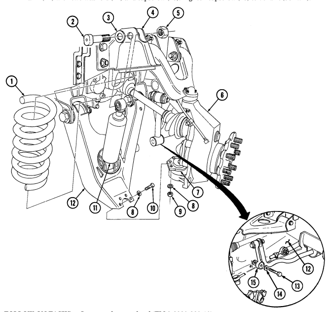

arm (12) with two washers (14) and capscrew (13). Tighten capscrew (13) to 70 lb-ft (95 N.m).

FOLLOW-ON TASKS: - Lower and secure hood (TM 9-2320-280-10).

M1037 and M1042 only: - Install shelter (if removed) (para. 11-120). - Remove lower control arm supports (para. 6-29).

# 6-31. Shock Absorber Replacement

This task covers:
INITIAL SETUP:
Tools General mechanic's tool kit:
automotive (Appendix B, Item 1)
Drive socket (Appendix B, Item 168)
Materials/Parts Two locknuts (Appendix G, Item 106) Eight locknuts (Appendix G, Item 81) Two lockwashers (Appendix G, Item 147)
Personnel Required One mechanic One assistant

a. Removal b. Installation

Manual References TM 9-2320-280-10 TM 9-2320-280-24P
Equipment Condition
- Hood raised and secured (TM 9-2320-280-10)
(front shock absorbers only).

M1037 and M1042 only: - Shelter removed (para. 11-120) (rear shock absorbers only).

- Lower control arm supported (para. 6-29) (rear shock absorbers only).

The procedures for removing and installing all shock absorbers are the same except rear lower shock pins must be installed with head of pin facing rearward. This procedure covers the left front shock absorber.

a. Removal

For rear shock absorber replacement on M1037 and M1042 models, it may be necessary to spread frame from body by positioning prybar between hinge mount bracket and rear bumper to gain access to shock absorber retaining pin nut. Perform steps 1 through 3 only if required.

1. Remove four locknuts (6), washers (5), capscrews (4), and washers (5) from bumper bracket (3),
plate (2), and frame (1). Discard locknuts (6).

2. Remove two locknuts (12), washers (10), capscrews (9), washers (10), and tiedown bracket (8) from body mount bracket (11) and rear bumper (7). Discard locknuts (12).

3. Remove two locknuts (12), washers (10), capscrews (9), and washers (10) from body mount bracket (11) and rear bumper (7). Discard locknuts (12).

6-31. SHOCK ABSORBER REPLACEMENT (Cont'd)

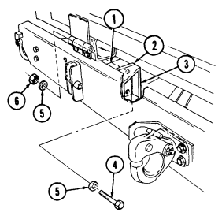

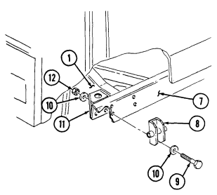

#### 6-31. Shock Absorber Replacement (Cont'D)

4. Remove two capscrews (10), lockwashers (9), and washers (8) from bracket (11) and lower control arm (6). Discard lockwashers (9).

5. Remove locknut (5), pin (2), and washer (3) from shock absorber (1) and spring seat (4). Note position of pin (2) for installation. Discard locknut (5).

6. Compress shock absorber (1) and remove shock absorber (1) and bracket (11).

NOT E
Note alignment of shock absorber and bracket for installation reference.

7. Position shock absorber (1) in vice, and remove locknut (7), pin (13), washer (12), and bracket (11)
from shock absorber (1). Discard locknut (7).

b. Installation

#### Not E

It may be necessary to spread spring seat to allow installation of shock absorber.

Shock absorbers are marked "FRONT" or "REAR" to aid identification.

1. Position shock absorber (1) in vice, and install bracket (11) to shock absorber (1), with washer (12),
pin (13), and locknut (7). Tighten locknut (7) to 300 lb-ft (407 Nom).

#### Cautio N

Do not pry or use sharp tools on shock absorber position rod. A
damaged rod will cause shock failure.

2. Install shock absorber (1) and bracket (11) through lower control arm (6). 3. Extend shock absorber (1) and install piston rod end of shock absorber (1) on spring seat (4) with washer (3), pin (2), and locknut (5). Tighten locknut (5) to 300 lb-ft (407 Nom).

4. Install bracket (11) to lower control arm (6) with two washers (8), lockwashers (9), and capscrews (10). Tighten capscrews (10) to 178 lb-ft (241 N.m).

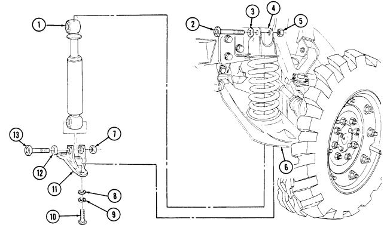

# 6-31. Shock Absorber Replacement (Cont'D)

NOT E
Perform steps 5 through 8 if necessary to reassemble body mount bracket to frame and rear bumper.

Install tiedown bracket (3) and body mount bracket (6) on rear bumper (2) with two washerS (5), capscrews (4), washers (5), and locknuts (7).

5.

Secure body mount bracket (6) to rear bumper (2) with two washers (5), capscrews (4), washers (5), and locknuts (7). Secure bumper bracket (9) and plate (8) to frame (1) with four washers (11), capscrews (10), washers (11), and locknuts (12). Tighten capscrews (10) and locknuts (7) to 90 lb-ft (122 N-m).

6.

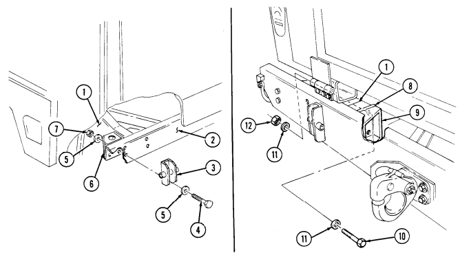

7.

8.

FOLLOW-ON TASKS: Lower and secure hood (TM 9-2320-280-10), (front shock absorbers only)
M1037 and M1042 only:
Install shelter (para. 11-120), (rear shock absorbers only).

Remove support from lower control arm (para. 6-29).

Install rear wheel (para. 8-3), (rear shock absorbers only).

## Chapter 7 Brake System Maintenance
Section I. Parking Brake System Maintenance

### 7-1. Parking Brake System Maintenance Task Summary

| Tools                                                         | Manual References                                                                                 |
|---------------------------------------------------------------|---------------------------------------------------------------------------------------------------|
| General mechanic's tool kit:  automotive (Appendix B, Item 1) | TM 9\-2320\-280\-10 TM 9\-2320\-280\-24P                                                          |
| Materials/Parts                                               | Equipment Condition                                                                               |
| Cotter pin (Appendix G, Item 14)                              | Wheel removed (para. 8\-3).                                                                       |
| Locknut (Appendix G, Item 89)                                 |                                                                                                   |
| a. Removal                                                    |                                                                                                   |
| 1.                                                            | Remove cotter pin (7), slotted nut (6), and washer (5) from radius rod (4) and geared hub (8).    |
| Discard cotter pin (7).                                       |                                                                                                   |
| 2.                                                            | Remove locknut (9), washer (2), capscrew (1), washer (2), and radius rod (4) from bracket (3) and |
| geared hub (8). Discard locknut (9).                          |                                                                                                   |
| b. Installation                                               |                                                                                                   |
| 1.                                                            | Install radius rod (4) to bracket (3) with washer (2), capscrew (1), washer (2), and locknut (9). |

# 7-2. Parking Brake Adjustment

This task covers:
Brake Adjustment INITIAL SETUP:
Tools General mechanic's tool kit:
automotive (Appendix B, Item 1)
Materials/Parts Cotter pin (Appendix G, Item 12) Cotter pin (Appendix G, Item 21)
Personnel Required One mechanic One assistant Manual References TM 9-2320-280-10 TM 9-2320-280-24P
Equipment Condition Wheels chocked and parking brake released (TM 9-2320-280-10).

The following procedure applies to vehicles with serial numbers USBL Eff. 1 through 44824.

Brake Adjustment 1. Remove clip (5) and open boot (6) to allow access to clevis pin (7). Remove cotter pin (4), washer (9),
and clevis pin (7) securing clevis (8) to bellcrank (1). Discard cotter pin (4).

2. Remove cotter pin (13) from slotted nut (14). Discard cotter pin (13).

Total gauge thickness should not exceed 0.020 in. (0.508 mm).

3. Place 0.020 in. (0.508 mm) thickness gauge between rotor (12) and brake pad (11). 4. Adjust slotted nut (14) until thickness gauge is snug, and cam (10) is at 11 o'clock position. Install cotter pin (13) in slotted nut (14).

5. Repeatedly apply and adjust parking brake lever until bellcrank (1) linear travel is 0.75 in. (19 mm).

Ensure slack is removed from parking brake linkage.

6. Release parking brake lever and adjust clevis (8) so clevis pin (7) slides easily into bellcrank (1) and secure with washer (9) and cotter pin (4). If alignment cannot be made at clevis (8), adjust rod (3) in or out of rear clevis (2) to obtain proper alignment.

7. Remove thickness gauge. 8. Close boot (6) and secure with clip (5).

Apply parking brake lever gradually, while burnishing brakes, to bring vehicle to a gradual stop. Sudden or quick application of brake lever can damage parking brake rotor.

Perform steps 9-11 only if parking brake pads were replaced.

9. Burnish parking brake pads (11) by operating vehicle at 10 mph (16 kph) and, using the parking brake, slow down and bring the vehicle to a gradual stop. Allow parking brake rotor (12) to cool by operating vehicle 2.5 miles (4 km) at 20 mph (32 kph). Repeat this step ten times.

10. Remove parking brake rotor (12) (para. 7-3.a) and inspect brake pads (11) for a large contact pattern across the surface of the brake pads (11). If contact pattern is not a minimum of 90%, install parking brake rotor (12) (para. 7-3.c) and repeat step 9. If contact pattern is satisfactory, install parking brake rotor (para. 7-3.c) and go to step 11.

11. Readjust, following steps 1 through 8.

# 7-2. Parking Brake Adjustment (Cont'D)

FOLLOW-ON TASK:  Check parking brake for proper operation (TM 9-2320-280-10).

# 7-3. Parking Brake Caliper And Rotor Maintenance

This task covers:
b. Inspection INITIAL SETUP:
Tools General mechanic's tool kit:
automotive (Appendix B, Item 1)

#### Materials/Parts

Four lockwashers (Appendix G, Item 134) Two lockwashers (Appendix G, Item 178) Cotter pin (Appendix G, Item 12) Cotter pin (Appendix G, Item 21) Four gaskets (Appendix G, Item 59) Two locknuts (Appendix G, Item 70) Sealing compound (Appendix C, Item 45) Grease (Appendix C, Item 22)
a. Removal c. Installation Personnel Required One mechanic One assistant Manual References TM-9-2320-280-10 TM 9-2320-280-24P
Equipment Condition Wheels chocked and parking brake released (TM 9-2320-280-10)

The following procedure applies to vehicles with serial numbers USBL Eff. 1 through 44824.

a. Removal 1. Remove four capscrews (15) and lockwashers (14) from rear propeller shaft (16) and parking brake rotor (13). Disconnect rear propeller shaft (16) and remove rotor (13). Discard lockwashers (14).

2. Remove cotter pin (17) from slotted nut (19), and loosen slotted nut (19). Discard cotter pin (17). 3. Remove cotter pin (24), washer (23), spring (21), clevis pin (3), and clevis (22) from cam (20).

Remove spring (21) from pin post (18). Discard cotter pin (24).

4. Remove two locknuts (11), washers (6), capscrews (5), washers (6), and clamp (4) from parking brake cable (7) and plate and guide pin assembly (8). Discard locknuts (11).

5. Remove two capscrews (1) and lockwashers (2) from plate and guide pin assembly (8) and caliper mounting bracket (9). Discard lockwashers (2).

6. Slide plate and guide pin assembly (8) towards front of vehicle until pins (10) come out of bracket (9).

7. Remove plate and guide pin assembly (8) and caliper assembly (12).

7-3. PARKING BRAKE CALIPER AND ROTOR MAINTENANCE (Cont'd)

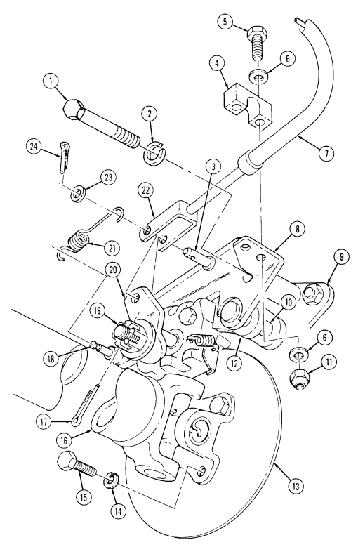

## 7-3. Parking Brake Caliper And Rotor Maintenance (Cont'D)

8. Remove slotted nut (1), washer (2), and cam (3) from caliper (50). 9. Remove plate and guide pin assembly (4) from caliper (5).

10. Remove two push pins (12) and two gaskets (6) from caliper (5). Discard gaskets (6). 11. Remove spring (7) and rear brake pad (8) from caliper half (14). 12. Remove two springs (10), front brake pad (9), and two gaskets (11) from caliper half (13). Discard gaskets (11).

13. If caliper (5) requires disassembly, remove two long capscrews (17), washers (18), short capscrew (16), and washer (15). Separate caliper halves (13) and (14).

#### B. Inspection

1. Inspect caliper halves (13) and (14) for cracks, wear, elongated holes, and bends. Replace as necessary.

2. Inspect rotor (19) for cracks, wear, elongated holes, and warping. Replace if defective, or rotor thickness is less than 5/32 in. (4 mm).

3. Inspect brake pads (9) and (8) for wear. If brake pad thickness is less than 1/8 in. (3.2 mm), replace both pads (9) and (8). Replace both pads (9) and (8) if rotor (19) was replaced.

#### C. Installation

1. If caliper halves (13) and (14) require assembly, apply sealing compound to threads of capscrews
(17) and (16). Install caliper halves (13) and (14) with washer (15), short capscrew (16), two washers (18), and two long capscrews (17). Tighten capscrews (17) and (16) in sequence shown, to 30-35 lb-ft (41-47 N•m).

2. Install two gaskets (11) and front brake pad (9) on caliper (5) with two springs (10). 3. Install long spring (7) on rear brake pad (8). 4. Install rear brake pad (8) on caliper (5) with spring (7). 5. Clean and lubricate push pins (12), cam-to-push pin contact area, and push pin openings in caliper (5) with grease.

6. Install two gaskets (6) and push pins (12) in caliper (5) with rounded ends of push pins (12) facing outward.

7. Install plate and guide pin assembly (4) on caliper (5). 8. Install cam (3) on caliper (5) with washer (2) and slotted nut (1). Do not tighten slotted nut (1).

# 7-3. Parking Brake Caliper And Rotor Maintenance (Cont'D)

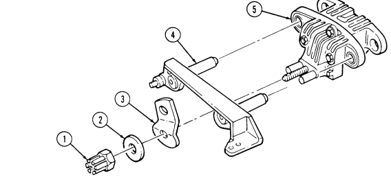

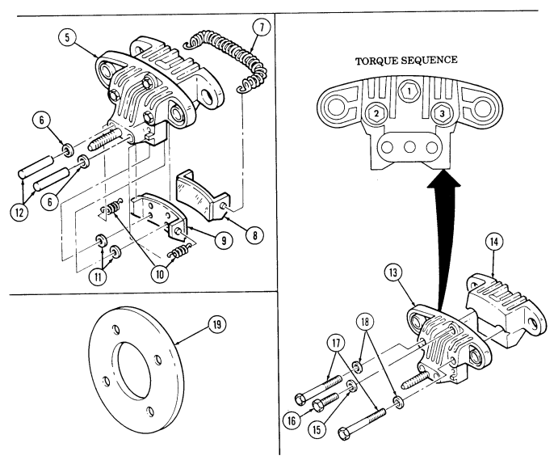

# 7-3. Parking Brake Callper **And Rotor Maintenance (Cont'D)**

#### Not E

Avoid placing parking brake cable behind mounting bracket when performing step 9.

9.

10.

11.

12.

13.

14. 15.

Install caliper (11) and plate and guide-pin assembly (8) on caliper mounting bracket (9).

Apply sealing compound to threads of capscrews (2). Install plate and guide pin assembly (8) to caliper mounting bracket (9) with two lockwashers (3) and capscrews (2). Tighten capscrews (2) to 90 lb-ft (122 Nom). Install parking brake cable (7) on plate and guide pin assembly (8) with clamp (4), two washers (5),
capscrews (6), washers (5), and locknuts (10). Tighten locknuts (10) to 5 lb-ft (7 Nd).

Position rotor (12) to caliper (11). Install clevis (19) to cam (17) with clevis pin (20), long end of spring (18), washer (21), and cotter pin (l). Install short end of spring (18) on pin post (16) and crimp short end of spring (18) with pliers. Install rear propeller shaft (15) to rotor (12) with four lockwashers (13) and capscrews (14). Tighten capscrews (14) to 60 lb-ft (81 N*m).

7-3. PARKING BRAKE CALIPER AND ROTOR MAINTENANCE (Cont'd)

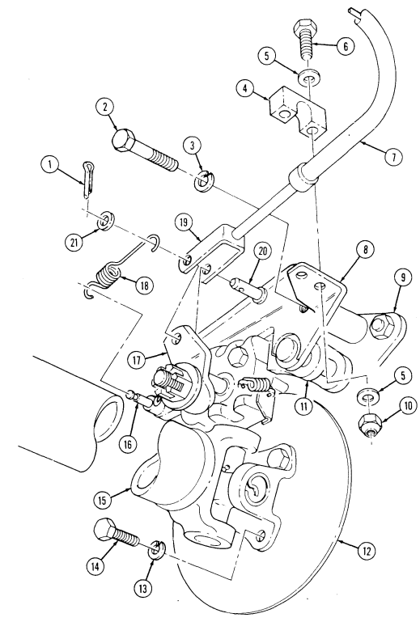

FOLLOW-ON TASK: Adjust parking brake (para. 7-2).

# 7-4. Parking Brake Lever Replacement

This task covers:
INITIAL SETUP:

#### Tools

General mechanic's tool kit:
automotive (Appendix B, Item 1)
Materials/Parts Two assembled locknuts 
(Appendix G, Item 131)
Five locknuts (Appendix G, Item 71) Cotter pin (Appendix G, Item 12)
Personnel Required One mechanic One assistant

#### A. Removal B. Installation

Manual References TM-9-2320-280-10 TM 9-2320-280-24P
Equipment Condition - Wheels chocked and parking brake released
(TM 9-2320-280-10).

- Parking brake switch removed (para. 4-19).

#### A. Removal

1. Remove clip (1) and open boot (2) to allow access to clevis pin (4). 2. Remove cotter pin (7), washer (6), and clevis pin (4) from clevis (5) and bellcrank (3). Discard cotter pin (7).

3. Remove assembled locknut (9), wiring harness clamp (10), assembled locknut (9) and capscrew (19)
from parking brake lever (8). Discard assembled locknut (9).

4. Remove three locknuts (11), washers (12), and capscrews (17) from parking brake lever (8) and body (20). Discard locknuts (11).

5. Remove two locknuts (16), washers (15), capscrews (13), washers (14), and parking brake lever (8)
from body (20). Discard locknuts (16).

6. Remove upper boot (18) from parking brake lever (8). 7. Remove lower boot (2) from body (20).

#### B. Installation

1. Install lower boot (2) on body (20). 2. Install upper boot (18) on parking brake lever (8). 3. Install parking brake lever (8) on body (20) with two washers (14), capscrews (13), washers (15),
and locknuts (16).

4. Secure parking brake lever (8) on body (20) with capscrew (19), assembled locknut (9), wiring harness clamp (10), and assembled locknut (9).

5. Secure parking brake lever (8) on body (20) with three capscrews (17), washers (12), and locknuts (11).

6. Install clevis (5) on bellcrank (3) with clevis pin (4), washer (6), and cotter pin (7). 7. Apply parking brake lever (8) and tighten capscrews (13), (17), and (19) to 8 lb-ft (11 N•m).

# 7-4. Parking Brake Lever Replacement (Cont'D)

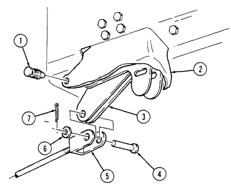

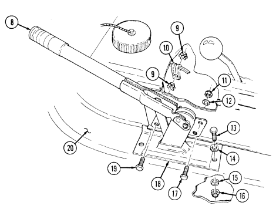

 FOLLOW-ON TASKS: - Install parking brake switch (para. 4-19).

- Adjust parking brake (para. 7-2).

# 7-5. Parking Brake Cable Replacement

This task covers:
INITIAL SETUP:

#### Tools

General mechanic's tool kit:
automotive (Appendix B, Item 1)
Materials/Parts Two cotter pins (Appendix G, Item 12) Cotter pin (Appendix G, Item 21) Two locknuts (Appendix G, Item 70) Four lockwashers
(Appendix G, Item 143)
a. Removal b. Installation Manual References TM 9-2320-280-10 TM 9-2320-280-24P
Equipment Condition
- Wheels chocked and parking brake released
(TM 9-2320-280-10).

- Muffler and insulator removed (para. 3-48).

The following procedure applies to vehicles with serial numbers USBL Eff. 1 through 44824.

#### A. Removal

1. Remove four capscrews (10) and lockwashers (9) and disconnect rear propeller shaft (11) from parking brake rotor (8). Discard lockwashers (9).

2. Remove cotter pin (12) and loosen slotted nut (14). Discard cotter pin (12). 3. Remove cotter pin (17), washer (16), spring (15), clevis pin (20), and clevis (18) from cam (19).

Remove spring (15) from pin post (13). Discard cotter pin (17).

4. Remove two locknuts (7), washers (6), capscrews (23), washers (6), and clamp (22) from brake cable (5) and plate and guide pin assembly (21). Discard locknuts (7).

5. Remove cotter pin (3), washer (4), and clevis pin (1) from brake cable (5) and brake rod clevis (2).

Discard cotter pin (3).

6. Remove clip (24) and brake cable (5) from bracket (25).

#### B. Installation

1. Install brake cable (5) in bracket (25) with clip (24). 2. Install brake rod clevis (2) on brake cable (5) with clevis pin (1) washer (4), and cotter pin (3). 3. Install brake cable (5) on plate and guide pin assembly (21) with clamp (22), two washers (6),
capscrews (23), washers (6), and locknuts (7). Tighten locknuts (7) to 5 lb-ft (7 N•m).

4. Install short end of spring (15) onto pin post (13) and crimp short end of spring (15). 5. Install cable clevis (18) to cam (19) with clevis pin (20), long end of spring (15), washer (16), and cotter pin (17).

6. Connect rear propeller shaft (11) to rotor (8) with four lockwashers (9) and capscrews (10). Tighten capscrews (10) to 60 lb-ft (81 N•m).

# 7-5. Parking Brake Cable Replacement (Cont'D)

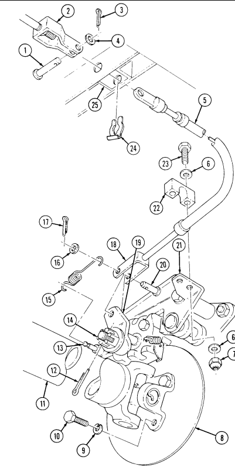

7)
FOLLOW-ON TASKS: - Install muffler and insulator (para. 3-48).
- Adjust parking brake (para. 7-2).

# 7-6. Parking Brake Rod Replacement

This task covers:
INITIAL SETUP:
Tools General mechanic's tool kit:
automotive (Appendix B, Item 1)
Materials/Parts Two cotter pins (Appendix G, Item 12) Locknut (Appendix G, Item 79)
Manuals/References TM 9-2320-280-10 TM 9-2320-280-24P
a. Removal b. Installation Equipment Condition
- Wheels chocked and parking brake released
(TM 9-2320-280-10).

- Muffler and insulator removed (para. 3-48).

The following procedure applies to vehicles with serial numbers USBL Eff. 1 through 44824.

a. Removal 1. Remove clip (1) and open boot (2) to allow access to clevis pin (4). 2. Remove cotter pin (9), washer (8), and clevis pin (4) from clevis (5) and bellcrank (3). Discard cotter pin (9).

3. Disconnect spring (7) from brake rod (6). 4. Remove cotter pin (17), washer (16), clevis pin (15), and brake rod (6) from brake cable (18). Discard cotter pin (17).

5. Remove clevis (5) and clevis (19) from brake rod (6).

Perform steps 6 and 7 if replacing spring. If not replacing spring, go to b., installation.

6. Remove locknut (10), washer (11), capscrew (13), washer (11), spring (7), and spacer (12) from body (14). Discard locknut (10).

7. Install spacer (12) and spring (7) to body (14) with washer (11), capscrew (13), washer (11), and locknut (10).

#### B. Installation

1. Install clevis (5) and clevis (19) on brake rod (6). 2. Install brake rod (6) to brake cable (18) with clevis pin (15), washer (16), and cotter pin (17). 3. Install clevis (5) on bellcrank (3) with clevis pin (4), washer (8), and cotter pin (9). 4. Connect spring (7) to brake rod (6). 5. Close boot (2) and install clip (1).

# 7-6. Parking Brake Rod Replacement (Cont'D)

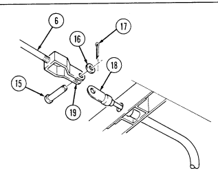

FOLLOW-ON TASKS: - Install muffler and insulator (para. 3-48).
- Adjust parking brake (para. 7-2).

# 7-7. Parking Brake Heat Shield Replacement

This task covers:
INITIAL SETUP:
Tools General mechanic's tool kit:
automotive (Appendix B, Item 1)
a. Removal b. Installation Manual Referneces TM 9-2320-280-24P
Materials/Parts Two lockwashers (Appendix G, Item 135)

The following procedure applies to vehicles with serial numbers USBL Eff. 1 through 44824.

a. Removal Remove two capscrews (1), lockwashers (2), and heat shield (3) from parking brake bracket (4). Discard lockwashers (2).

b. Installation Install heat shield (3) to parking brake bracket (4) with two lockwashers (2) and capscrews (1). Tighten capscrews (1) to 6 lb-ft (8 N•m).

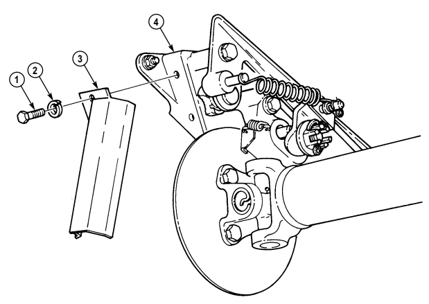

# 7-8. Parking Brake Heat Shield And Heat Shield Extension Replacement

This task covers:
INITIAL SETUP:

#### Tools

General mechanic's tool kit:
automotive (Appendix B, Item 1)

#### Materials/Parts

Four lockwashers (Appendix G, Item 138) Felt sheet (Appendix D, Fig. 84) Heat shield extension (Appendix D, Fig. 85)
a. Removal b. Installation Manual References TM 9-2320-280-24P

- The heat shield extension is used for extra protection of the parking brake. The replacement of it can be left up to the discretion of the commander.

- The following procedure applies to vehicles with serial numbers USBL Eff. 1 through 44824.

#### A. Removal

1. Remove two capscrews (8) and lockwashers (7) from heat shield extension (1), heat shield (2) and parking brake bracket (3). Discard lockwashers (7).

2. Remove capscrew (4), heat shield extension (1), and felt sheet (5) from crossmember (6). Discard felt sheet (5).

3. Remove two nuts (12), lockwashers (11), heat shield (2), capscrews (9), and washers (10) from heat

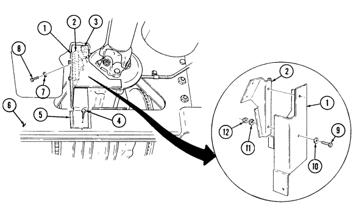

shield extension (1). Discard lockwashers (11).

## 7 - 8 . Parking Brake Heat Shield And Heat Shield Extension Replacement (Cont' D )

b. Installation 1. Install heat shield (2) to heat shield extension (1) with two washers (10), capscrews (9),
lockwashers (11), and nuts (12).

2. Install felt sheet (5) and heat shield extension (1) to crossmember (6) with capscrew (4). 3. Install heat shield extension (1) and heat shield (2) on parking brake bracket (3) with two lockwashers (7) and capscrews (8).

7-8. PARKING BRAKE HEAT SHIELD AND HEAT SHIELD EXTENSION REPLACEMENT (Confb)

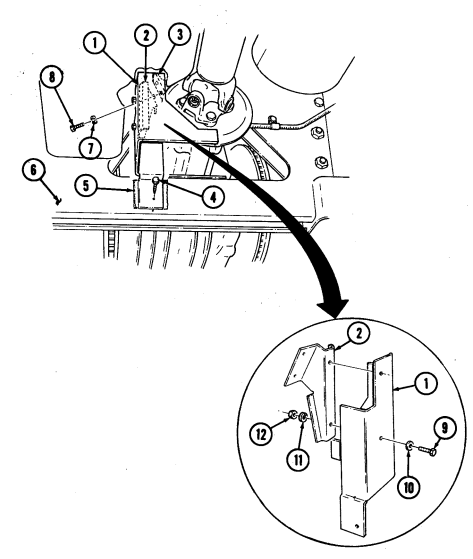

# 7-8.1. Brake Protection Guards Replacement

This task covers:

| Applicable Models                              |
|------------------------------------------------|
| 1155 SECT 100 \- 11 11 4 4 4 4 4 4 4 4 4 4 1 4 |

| General mechanic's tool kit:   |
|--------------------------------|

INITIAL SETUP:
All M1123 and "A2" series vehicles General mechanic's tool kit:
automotive (Appendix B, Item 1)

#### Materials/Parts

Six locknuts (without 10,500 lb hydraulic winch) (Appendix G, Item 128)
Three locknuts (with 10,500 lb hydraulic winch) (Appendix G, Item 128)
Six locknuts (Appendix G, Item 79)
a. Removal **b. Installation**
a. Removal

| Personnel Required   |
|----------------------|
| One mechanic         |
| One assistant        |

Perform steps 1 through 4 for vehicles equipped with 10,500 lb hydraulic winch only.

1. Remove two locknuts (3), washers (4), capscrews (18), washers (4), spacer (21), and left front brake protection guard (19) from bracket (20) and bumper (22). Discard locknuts (3).

2. Remove four locknuts (8), washers (9), capscrews (16), washers (9), two spacers (21), and right front brake protection guards (10) from bracket (7) and bumper (13). Discard locknuts (8).

3. Remove locknut (1), washer (2), capscrew (6), washer (2), and bracket (20) from front rear crossmember (5). Discard locknut (1)
4. Remove two locknuts (11), washers (12), capscrews (15), washers (12), and bracket (7) from front crossmember (5). Discard locknuts (11).

5. Remove two locknuts (3), washers (4), capscrews (18), washers (4), and left front brake protection guard (19) from brackets (17) and (20). Discard locknuts (3).

6. Remove four locknuts (8), washers (9), capscrews (16), washers (9), and right front brake protection guards (10) from brackets (7) and (14). Discard locknuts (8).

7. Remove two locknuts (1), washers (2), capscrews (6), washers (2), and brackets (17) and (20) from front rear crossmember (5) and front crossmember (13). Discard locknuts (1).

8. Remove four locknuts (11), washers (12), capscrews (15), washers (12), and brackets (7) and (14)
from front rear crossmember (5) and front crossmember (13). Discard locknuts (11).

# 7-8.1. Brake Protection Guards Replacement (Gnt'D)

(14)

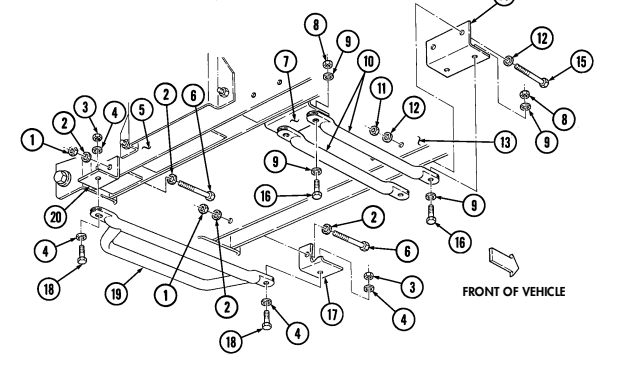

# 7 - 8 . 1 . Brake Protection Guards Replacement (Co N T ' D)

b. Installation

Perform steps 1 through 4 for vehicles with 10,500 lb hydraulic winch only.

1. Install bracket (20) on front rear crossmember (5) with washer (2), capscrew (6), washer (2), and locknut (1). Tighten capscrew (6) to 378 lb ft (513 N•m).

2. Install bracket (7) on front rear crossmember (5) with two washers (12), capscrews (15),
washers (12), and locknuts (11). Tighten capscrews (15) to 378 lb-ft (513 N•m).

3. Install spacer (21) and left front brake protection guard (19) on bumper (22) and bracket (20) with two washers (4), capscrews (18), washers (4), and locknuts (3). Tighten capscrews (18) to 378 lb-ft (513 N•m).

4. Install two spacers (21) and right front brake protection guards (10) on bumper (22) and bracket (7)
with four washers (9), capscrews (16), washers (9), and locknuts (8). Tighten capscrews (16) to 378 lb-ft (513 N•m).

5. Install brackets (17) and (20) on front rear crossmember (5) and front crossmember (13) with two washers (2), capscrews (6), washers (2), and locknuts (1). Tighten capscrews (6) to 378 lb-ft (513 N•m).

6. Install brackets (7) and (14) on front rear crossmember (5) and front crossmember (13) with four washers (12), capscrews (15), washers (12), and locknuts (11). Tighten capscrew (15) to 378 lb-ft (513 N•m).

7. Install right front brake protection guards (10) on brackets (7) and (14) with four washers (9),
capscrews (16), washers (9), and locknuts (8). Tighten capscrews (16) to 378 lb-ft (513 N•m).

8. Install left front brake protection guard (19) on brackets (17) and (20) with two washers (4),
capscrews (18), washers (4), and locknuts (3). Tighten capscrews (18) to 378 lb-ft (513 N•m).

# 7-8.1. Brake Protection Guards Replacement (Gnt'D)

(14

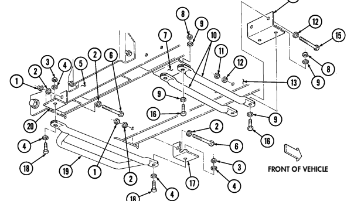

(18

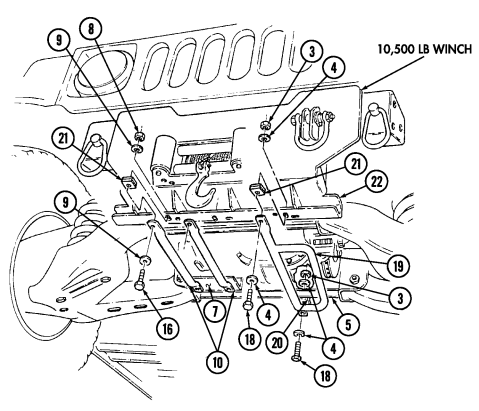

# Section Ii. Service Brake System Maintenance 7-9. Service Brake System Maintenance Task Summary

| a.  Removal  b.                                                       | Installation                                    |
|-----------------------------------------------------------------------|-------------------------------------------------|
| INITIAL SETUP:                                                        |                                                 |
| Tools                                                                 | Manual References                               |
| General mechanic's tool kit:                                          | TM 9\-2320\-280\-10                             |
| automotive (Appendix B, Item 1)                                       | TM 9\-2320\-280\-24P                            |
| Materials/Parts                                                       | Equipment Condition                             |
| Four locknuts (Appendix G, Item 128)                                  | - Hood raised and secured                       |
| (Basic/A1 Series)                                                     | (TM 9\-2320\-280\-20\-10) (front springs only). |
| Four locknuts (Appendix G,Item 105)                                   | M1037 and M1042 only:                           |
| (A2 Series)                                                           | - Shelter removed (para. 11\-120)               |
| Locknut (Appendix G,Item 106)                                         | (rear shock absorbers only).                    |
| Sealing compound (Appendix C, Item 40)                                | - Lower control arm supported (para. 6\-29)     |
|                                                                       | (rear shock absorbers only).                    |
| NOTE                                                                  |                                                 |
| The procedure for removing and installing all four coil springs are   |                                                 |
| basically the same. This procedure covers the left front coil spring. |                                                 |

## 7-10. Service Brake System Bleeding Instructions

This task covers:
a. Pressure Bleeding **c. Master Cylinder Bleeding**
b. Manual Bleeding INITIAL SETUP:

| 2.  Remove wheel (para. 8\-3). on shock pin (2).   |
|----------------------------------------------------|

Tools **Manual References**

General mechanic's tool kit: TM 9-2320-280-10

automotive (Appendix B, Item 1) TM 9-2320-280-24P

Materials/Parts **Equipment Condition**

One assistant (task b. only) **General Safety Instructions**

Brake fluid (Appendix C, Item 14) Hood raised and secured (TM 9-2320-280-10).

Master cylinder filled to proper level (para. 2-11, pg 2-12, Item 11).

Always wear eye protection when bleeding brakes.

#### Warnin G

Always wear eye protection when bleeding brakes. Failure to do this may cause injury if brake fluid comes in contact with eyes.

NOT E
If only the front or rear half of the system has been serviced, it is usually necessary to bleed only that half of the system. However, if a firm brake pedal cannot be obtained after bleeding, it will be necessary to bleed the entire system. The brake hydraulic system can be bled manually or by using a pressure tank and adapters. Each method is outlined in the following procedures.

Bleed brakes in the following order: right rear, left rear, right front, left front.

# 7-10. Service Brake System Bleeding Instructions (Cont'D)

a. Pressure Bleeding

When using a pressure bleeding tank, follow the manufacturer's instructions for its use. Do not exceed the recommended working pressure when pressurizing the tank. A tank pressure of 15-20 psi (103, 138 kPa) is sufficient to bleed the brake hydraulic system. Release all air pressure from the tank after using it.

After refilling pressure bleeding tank with silicone brake fluid, let tank sit undisturbed for 30 minutes minimum to ensure all visible as well as minute air bubbles are gone.

NOT E
This procedure covers bleeding at one wheel. Repeat bleeding task for remaining wheels.

1.

Remove cover from master cylinder (1).

Install pressure tank bleeder adapter (2) to master cylinder (1).

2. 3. 4.

Connect line (3) from pressure tank to adapter (2). Remove protective cap (5) from bleeder screw (6) on caliper assembly (7).

5.

6.

7.

8.

9.

10.

11.

Connect short piece of hose (8) to bleeder screw (6), and place other end of hose (8) in container 3/4 full of brake fluid.

Open valve (4) on line from pressure tank to master cylinder (1), allowing pressurized brake fluid to enter system.

Open bleeder screw (6) 3/4 turn and observe brake fluid in container. Close bleeder screw (6) when brake fluid flows free of air bubbles.

Disconnect hose (8) from bleeder screw (6) and install protective cap (5) on bleeder screw (6). Close valve (4) on line (3) from pressure tank to master cylinder (1). Disconnect line (3) from adapter (2). Remove adapter (2) from master cylinder (1) and install master cylinder cover.

#### B. Manual Bleeding Not E

This procedure covers bleeding at one wheel. Repeat bleeding task for remaining wheels.

Assistant is required to depress the brake pedal when manually bleeding brakes while mechanic opens and closes bleeder screw.

1. Remove protective cap (5) from bleeder screw (6) on caliper assembly (7).

2. Connect short piece of hose (8) to bleeder screw (6), and place other end of hose (8) in container 3/4 full brake fluid.

Check the master cylinder fluid level frequently during the bleeding operation and refill the reservoirs as necessary. Do not allow the master cylinder to run out of fluid at any time, or additional air will be drawn into the system. After adding silicone brake fluid to master cylinder, let cylinder sit undisturbed for 30 minutes minimum to ensure all visible as well as minute air bubbles are gone.

# 7-10. Service Brake System Bleeding Instructions (Cont'D)

3. Have assistant pump brake pedal toward floor and hold it there. Open bleeder screw (6) 3/4 turn.

4. When pedal reaches floor, tighten bleeder screw (6) and have assistant slowly release brake pedal. 5. Repeat steps 3 and 4 until fluid flows clear and free of air bubbles. 6. Disconnect hose (8) from bleeder screw (6) and install protective cap (5) on bleeder screw (6).

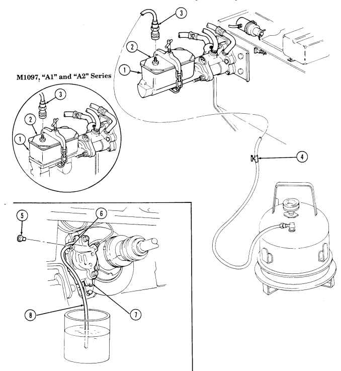

# 7-10. Service Brake System Bleeding Instructions (Cont'D)

c. Master Cylinder Bleeding

#### Not E

Perform this procedure prior to installing master cylinder on vehicle.

1.

2.

Secure master cylinder flange (5) in vise. Remove cover (1) and fill reservoirs (2) with silicone brake fluid.

3.

Screw threaded end of bleeder hose (3) into brake line port on master cylinder (6) and insert opposite end into reservoir (2). Repeat step for other bleeder hose (3).

4.

Slowly push piston (4) into master cylinder (6). Do not release piston (4). While holding piston (4),
pinch bleeder hoses (3) off and release piston (4). Piston (4) will return automatically.

Whenever the master cylinder is filled with silicone brake fluid, let cylinder sit undisturbed for 30 minutes minimum to ensure that all visible as well as minute air bubbles are gone.

5.

6.

Refill reservoirs (2) with silicone brake fluid and repeat step 4 until no air bubbles remain in brake fluid. Remove two bleeder hoses (3) from brake line ports on master cylinder (6). Install cover (1) on master cylinder (6) and remove from vise. Install master cylinder (para. 7-13).

7. 8.

# 7-10. Service Brake System Bleeding Instructions (Cont'D)

FOLLOW-ON TASKS: Lower and secure hood (TM 9-2320-280-10).

 Operate vehicle (TM 9-2320-280-10) and check for proper operation.

# 7 - 1 1 . S E Rvice Brake Pad Maintenance

This task covers:
a. Removal c. Installation b. Cleaning and Inspection INITIAL SETUP:
Applicable Models All "A2" series vehicles Tools General mechanic's tool kit:
automotive (Appendix B, Item 1)
"C" clamp (Appendix B, Item 164)
Special Tools Crowfoot, 14 mm (Appendix B, Item 152)
Materials/Parts Grease (Appendix C, Item 22) Sealing compound (Appendix C, Item 45)

| TM 9\-2320\-280\-10   |
|-----------------------|
| TM 9\-2320\-280\-24P  |

TM 9-2320-280-10 TM 9-2320-280-24P
Equipment Condition Brake protection guards removed (para. 7-8.1) (M998A2 vehicle only).

General Safety Instructions Make sure brake pads are installed with linings facing rotor.

#### Not E

- The following procedure applies to the front brake system on all vehicles and to the rear brake system on vehicles with serial numbers USBL Eff. 1 through 44824.

- For replacement of rear dual service/parking brake pad on vehicles with serial numbers USBL Eff. 44825 and above, refer to para. 7-21)
- If removing left front brake pads, halfshaft must be removed
(para. 6-9).

a. Removal

Caliper must be supported during removal to prevent damage to brake line.

1. Using crowfoot, remove two capscrews (7), washers (6), caliper (4), and yoke (5) from adapter (3).

NOT E
Note positioning of brake pad surfaces for installation.

2. Remove two brake pads (1) from adapter (3).

#### B. Cleaning And Inspection

1. Clean mating surfaces of caliper (4) and adapter (3) and lubricate with grease. 2. Inspect caliper (4) and caliper piston (8) for cracks, pitting, or damage. Replace caliper (4) if cracked, pitted, or damaged (para. 7-12).

3. Inspect dust boot (9) for tears or deterioration. Replace caliper (4) if dust boot (9) is torn or deteriorated (para. 7-12).

4. Inspect rotor (2) for heat cracks, discoloration, pitting, or scoring. Replace rotor (2) if cracked, pitted, or scored (para. 7-19).

# 7 - 1 1 . S E Rvice Brake Pad Maintenance (Cont'D)

#### Not E

- To ensure proper brake function, replace brake pads in pairs on both sides of axle.

- Replace brake pads if thickness is less than 3/16 in. (4.8 mm)
and operation in wet and muddy conditions is expected.

5. Inspect brake pads (1) for glazing, oil saturation, or wear. If glazed, oil saturated, or if brake pad thickness is less than 1/8 in. (3.2 mm), replace both pads (1) and pads from opposite caliper.

c. Installation

Ensure brake pads are installed with linings facing rotor. Failure to do this may cause injury to personnel or damage to equipment.

1. Position brake pads (1) to adapter (3).

#### Not E

When installing yoke and caliper, use a "C" clamp and a block of wood to bottom out position in caliper if needed.

2 . Apply sealing compound to threads of capscrews (7). Using crowfoot, install yoke (5) and caliper (4) to

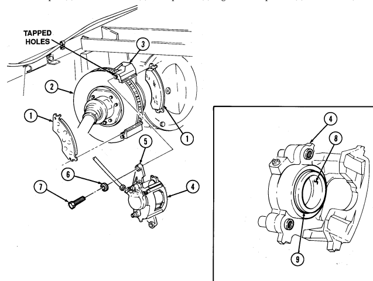

adapter (3) with two washers (6) and capscrews (7). Tighten two capscrews (7) to 30-40 lb-ft (41-54 N.m ) .

FOLLOW-ON TASK: Install brake protection guards (para. 7-8.1) (M998A2 vehicle only).

# 7-12. Service Brake Caliper Maintenance

This task covers:
a. Removal c. Installation b. Cleaning and Inspection INITIAL SETUP:
Tools General mechanic's tool kit:
automotive (Appendix B, Item 1)
"C" clamp (Appendix B, Item 164)

#### Special Tools

Hex-head driver, 7-mm (Appendix B, Item 162) Crowfoot, 14-mm (Appendix B, Item 152)
Materials/Parts Flat washer (Appendix G, Item 38) Grease (Appendix C, Item 22) Sealing compound (Appendix C, Item 45)
Manual References TM 9-2320-280-10 TM 9-2320-280-24P
Equipment Condition Brake protection guards removed (para. 7-8.1) (M998A2 vehicle only).

General Safety Instructions Make sure brake pads are installed with linings facing rotor.

- The following procedure applies to the front brake system on all vehicles and to the rear brake system on vehicles with serial numbers USBL Eff. 1 through 44824.

- For replacement of rear dual service/parking brake pad on vehicles with serial numbers USBL Eff. 44825 and above, refer to para. 7-22.

a. Removal

Cover or plug all open lines and connections immediately after disconnection to prevent contamination. Remove all plugs prior to connection.

1. Disconnect brake line (1) from coupling (10). 2. Remove coupling (10) and flat washer (11) from caliper (9). Discard flat washer (11). 3. Using crowfoot, remove two capscrews (7), washers (6), yoke (5), and caliper (9) from adapter (4).

NOTE
Note positioning of brake pad surfaces for installation.

4. Remove two brake pads (2) from adapter (4). 5. Slide yoke (5) and locating pins (8) out from caliper (9).

#### B. Cleaning And Inspection

1. Clean mating surfaces of caliper (9) and adapter (4) and lubricate with grease. 2. Clean cooling fins of rotor (3). 3. Inspect caliper (9) and caliper piston (12) for cracks, pitting, or damage. Replace caliper (9) if cracked, pitted, or damaged.

4. Inspect locating pin bearings and bushings (14) for tears or deterioration. Replace bearings and bushings (14) if torn or deteriorated.

5. Inspect dust boot (13) for tears or deterioration. Replace caliper (9) if dust boot (13) is torn or deteriorated.

6. Inspect yoke locating pins (8) for cracks or corrosion. Perform step 7 if pins (8) are cracked or corroded. 

7. Using 7-mm hex-head driver, remove locating pins (8) from yoke (5). Discard locating pins (8).

7-26 Change 3

# 7-12. Service Brake Caliper Maintenance (Cont'D)

8. Inspect rotor (3) for heat cracks, discoloration, pitting, or scoring. Replace rotor (3) if cracked, pitted, or scored (para. 7-19).

- Replace brake pads in sets only. - Replace brake pads if thickness is less than 3/16 in. (4.8 mm) and operation in wet and muddy conditions is expected.

9. Inspect brake pads (2) for glazing, oil saturation, or wear. If glazed, oil satruated, or if brake pad thickness is less than 1/8 in. (3.2 mm), replace both pads (2) and pads from opposite caliper (para. 7-11).

c. Installation

Ensure brake pads are installed with linings facing rotor. Failure to do this may cause injury to personnel or damage to equipment.

1. Install brake pads (2) on adapter (4).

Perform step 2 only if yoke locating pins were replaced.

2. Apply sealing compound to threads of locating pins (8) and install locating pins (8) in yoke (5).

Tighten locating pins (8) to 25-35 lb-ft (34-47 N•m).

3. Install caliper (9) on yoke (5).

NOTE
When installing caliper, use a "C" clamp and a block of wood to bottom out piston in caliper if needed.

4. Apply sealing compound to tapped holes of adapter (4). Using crowfoot, install yoke (5) and 

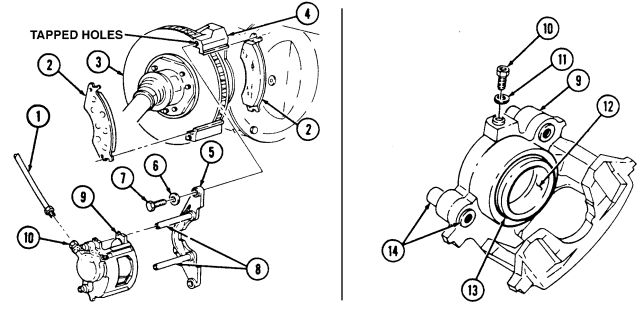

caliper (9) to adapter (4) with two washers (6) and capscrews (7). Tighten two capscrews (7) to 30-40 lb-ft (41-54 N•m).

5. Install flat washer (11) and coupling (10) on caliper (9). 6. Connect brake line (1) to coupling (10).

FOLLOW-ON TASKS - Bleed brake system (para. 7-10).

- Install brake protection guards (para. 7-8.1) (M998A2 vehicles only).

# 7-13. Master Cylinder Maintenance

This task covers:
a. Removal c. Bleeding b. Installation INITIAL SETUP:
Tools General mechanic's tool kit:
automotive (Appendix B, Item 1)
Materials Parts Five locknuts (Appendix G, Item 128)
Personnel Required One mechanic One assistant a. Removal Manual References TM 9-2320-280-10 TM 9-2320-280-24P
Equipment Condition Hood raised and secured (TM 9-2320-280-10).

Cover or plug all open lines and connections immediately after disconnection to prevent contamination. Remove all plugs prior to connection.

Have drainage container ready to catch brake fluid.

1. Disconnect brake lines (5) and (6) from master cylinder (2). 2. Remove locknut (3), washer (4), and proportioning valve bracket (8) from right master cylinder mounting stud (10). Discard locknut (3).

3. Remove locknut (14), washer (11), capscrew (12), and washer (11) from bracket (17) and splash shield (13).

4. Remove locknut (15), washer (16), and bracket (17) from hydro-boost (1). Discard locknut (15).

Do not lean on master cylinder.

5. Remove two locknuts (9) and master cylinder (2) from hydro-boost (1). Discard locknuts (9).

b. Installation

Ensure O-ring is properly seated on master cylinder prior to installation. Damage to master cylinder may result if O-ring is not properly seated.

1. Install master cylinder (2) on hydro-boost (1) with two locknuts (9). Tighten locknuts (9) 
to 22 lb-ft (30 N•m).

2. Install bracket (17) on hydro-boost (1) with washer (16) and locknut (15). Tighten locknut (15) 
to 22 lb-ft (30 N•m).

3. Install bracket (17) on splash shield (13) with washer (11), capscrew (12), washer (11), and locknut (14). Tighten locknut (14) to 26 lb-ft (35 N•m).

4. Install proportioning valve bracket (8) on stud (10) with washer (4) and locknut (3). Tighten locknut (3) to 22 lb-ft (30 N•m).

5. Connect brake lines (5) and (6) to master cylinder (2).

# 7-13. Master Cylinder Maintenance (Cont'D)

c. Bleeding

Master cylinder must be filled (para. 2-11, pg 2-12, Item 11) and kept at least half full during bleeding operation.

Depress brake pedal slowly and hold. Loosen brake line (5) to purge air from the front reservoir, 1.

2.

Tighten brake line (5) and release brake pedal.

3.

Repeat steps 1 and 2 until front reservoir is purged of air.

4.

Repeat steps 1 through 3 for rear reservoir with brake line (6)

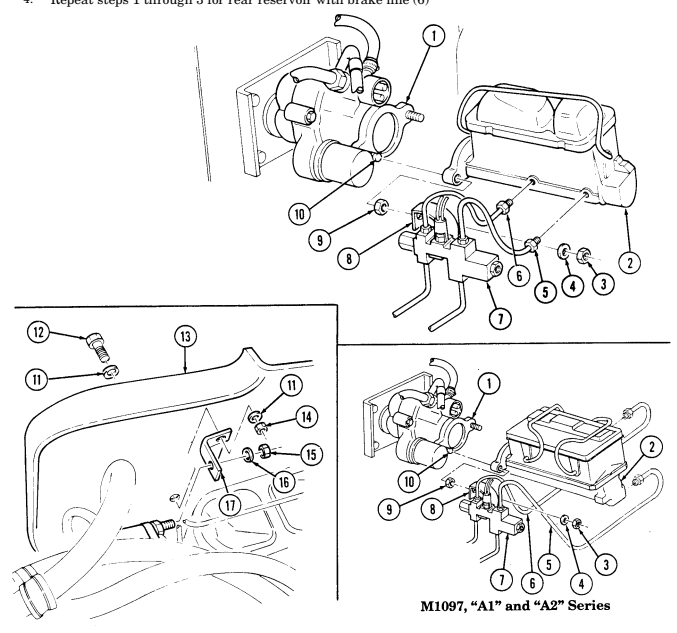

FOLLOW-ON TASK: Bleed brake system (para. 7-10).

# 7-14. Hydro-Boost Replacement

This task covers:
INITIAL SETUP:

#### Tools

General mechanic's tool kit:
automotive (Appendix B, Item 1)
Materials/Parts Cotter pin (Appendix G, Item 15) Spring tension washer (Appendix G, Item 317) Four lockwashers (Appendix G, Item 146) 
(Basic/A1 Series)
Four lockwashers (Appendix G, Item 133) 
(A2 Series)
a. Removal

a. Removal b. Installation

Personnel Required One mechanic One assistant Manual References TM 9-2320-280-24P
Equipment Condition Master cylinder removed (para. 7-13).

Cover or plug all open lines and connections immediately after disconnection to prevent contamination. Remove all plugs prior to connection.

Have drainage container ready to catch brake fluid.

1. Mark and disconnect two high pressure lines (4) and one return line (5) from hydro-boost (6). 2. Remove cotter pin (3), washer (2), and disconnect pushrod (7) from brake pedal bellcrank (13).

Remove spring tension washer (1) from brake pedal bellcrank (13) and discard cotter pin (3) and spring tension washer (1).

3. Remove four nuts (12), lockwashers (11), washers (10), hydro-boost (6), and gasket (8) from cowl (9).

Discard lockwashers (11).

#### B. Installation

1. Install gasket (8) and hydro-boost (6) on cowl (9) with four washers (10), lockwashers (11), and nuts (12).

2. Install spring tension washer (1) on brake pedal bellcrank (13). Connect hydro-boost pushrod (7) to brake pedal bellcrank (13). Install washer (2) and cotter pin (3).

3. Tighten nuts (12) to 21 lb-ft (28 N•m). 4. Connect two high pressure lines (4) and one return line (5) to hydro-boost (6).

# 7-14. Hydro-Boost Replacement (Cont'D)

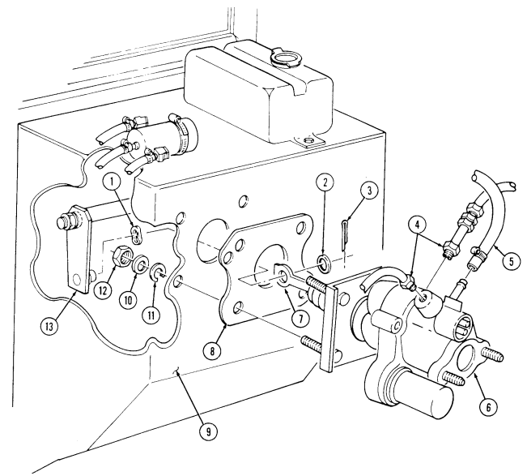

FOLLOW-ON TASKS: - Install master cylinder (para. 7-13).

- Bleed power steering system (para. 8-29).

## 7-15. Brake Lines Replacement

This task covers:
c. Rear Brake Line Removal Removal e. Intermediate Brake Line Removal Installation g. Proportioning Valve to Union Brake Line l. Caliper to Tee Support Brackets Installation Removal a. Caliper to Tee Brake Line Removal h. Proportioning Valve to Union Brake Line Installation b. Caliper to Tee Brake Line Installation i. Proportioning Valve to Front Tee Brake Line d. Rear Brake Line Installation j. Proportioning Valve to Front Tee Brake Line f. Intermediate Brake Line Installation k. Caliper to Tee Support Brackets Removal

#### Initial Setup:

Tools General mechanic's tool kit:
automotive (Appendix B, Item 1)

#### Materials/Parts

Four tiedown straps (Appendix G, Item 310) Locknut (Appendix G, Item 81)
Manual References TM 9-2320-280-10 TM 9-2320-280-24P
Equipment Condition
- Hood raised and secured (TM 9-2320-280-10). - Brake protection guards removed (para. 7-8.1).

Cover or plug all open lines and connections immediately after disconnection to prevent contamination. Remove all plugs prior to connection.

- Have drainage container ready to catch brake fluid. - Brake line replacement procedures for the service brake system and the rear dual service/parking brake system are basically the same. (Service brake system shown).

#### A. Caliper To Tee Brake Line Removal Note

- Removal procedures are basically the same for all caliper to tee brake lines except M1123 and "A2" vehicles. 

- Brake lines on M1123 and "A2" series vehicles are not disconnected at tee line.

- Steps 1 through 3 cover the right rear caliper to tee line
(M998/A1).

- Perform steps 4 through 9 for the left front caliper to tee line
(M998A2).

- Perform steps 10 through 14 for the left rear caliper to tee line
(M998A2).

1. Disconnect brake line (1) from caliper (7). 2. Disconnect brake line (1) from rear tee (5) at forward rear crossmember (4). 3. Remove capscrew (6) and clamp (2) securing brake line (1) and vent line (3) to forward rear crossmember (4) and remove brake line (1) from clamp (2).

# 7-15. Brake Lines Replacement (Cont'D)

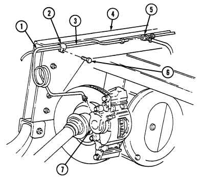

## 7-15. Brake Lines Replacement (Cont'D)

Disconnect left front brake line (17) from caliper (14).

Remove capscrew (16), washer (15), and clamp (12) from yoke (13).

Remove capscrew (8), washer (7), and clamp (6) from bracket (9).

4.

5.

6.

7.

8.

9.

Remove two tiedown straps (11) from brake lines (1) and (10). Discard tiedown straps (11).

Remove clip (4) and left front brake line (1) from bracket (2) and intermediate brake line (3). Remove intermediate brake line (3) from tee (5).

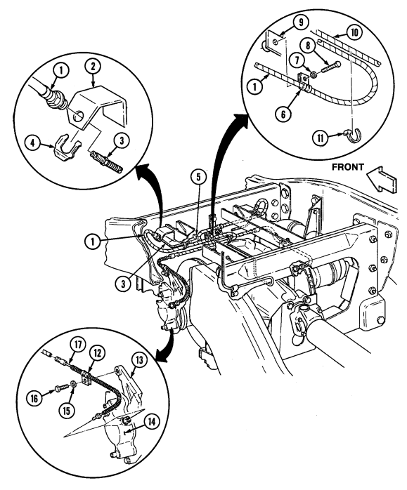

# 7 - 1 5 . Brake Lines Replacement (Cont'D)

10. Disconnect left rear brake line (25) from caliper (28).

11. Remove capscrew (30), washer (29), and clamp (26) from yoke (27).

12. Remove capscrew (31), clamp (32), and left rear brake line (18) from bracket (33). 13. Remove clip (24) and left rear brake line (18) from bracket (19) and intermediate brake line (23). 14. Remove locknut (22), two washers (21), screw (20), and bracket (19). Discard locknut (22).

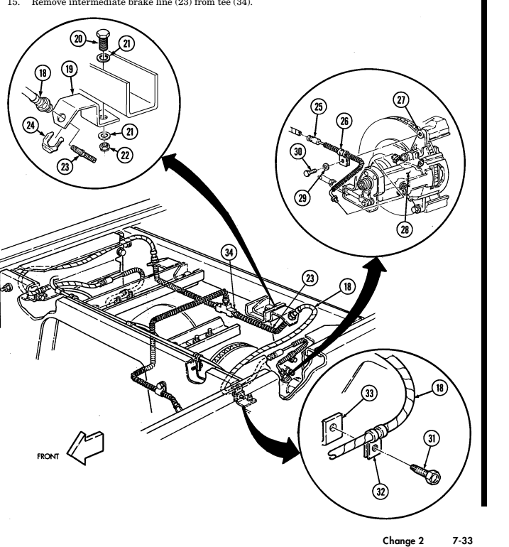

## 7 - 1 5 . Brake Lines Replacement (Cont'D)

b. Caliper to Tee Brake Line Installation

#### Not E

- Installation procedures are basically the same for all caliper to tee brake lines except M1123 and "A2" vehicles. 

- Steps 1 through 4 covers the right rear caliper to tee line (basic and A1).

- Perform steps 5 through 9 for the left front caliper to tee line (M1123 and "A2"). 

- Perform steps 10 through 15 for the left rear caliper to tee line
(M1123 and "A2").

1 . Connect brake line (1) to rear tee (5) at forward rear crossmember (4). 2 . Connect brake line (1) to caliper (7). 3 . Install brake line (1) and vent line (3) in clamp (2).

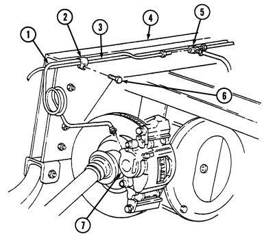 4 . Install brake line (1), vent line (3), and clamp (2) to forward rear crossmember (4) with capscrew ( 6 ) .

## 7-15. Brake Lines Replacement (Cont'D)

5. 6.

Install left front brake line (8) on intermediate brake line (10) and bracket (9) with clip (11). Connect left front brake line (24) to caliper (21)
7.

8.

Install clamp (13) and left front brake line (8) on bracket (16) with washer (14) and capscrew (15). Secure brake lines (8) and (17) with two tiedown straps (18).

9.

Install clamp (19) and brake line (24) on yoke (20) with washer (22) and capscrew (23).

Install intermediate brake line (10) to tee (12).

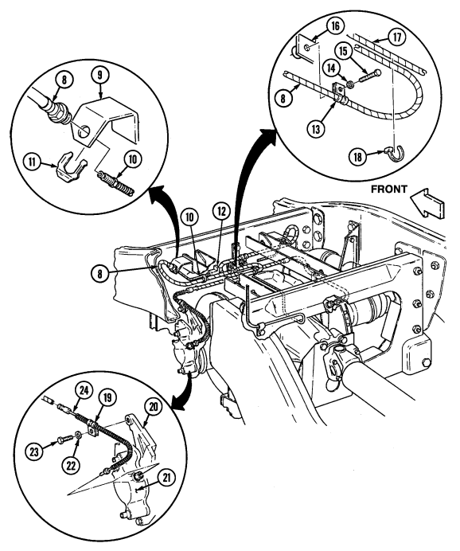

## 7 - 1 5 . Brake Lines Replacement (Cont'D)

13. Install clamp (16) and brake line (1) on bracket (17) with capscrew (15). 14. Install clamp (10) and brake line (9) on yoke (11) with washer (13) and capscrew (14).

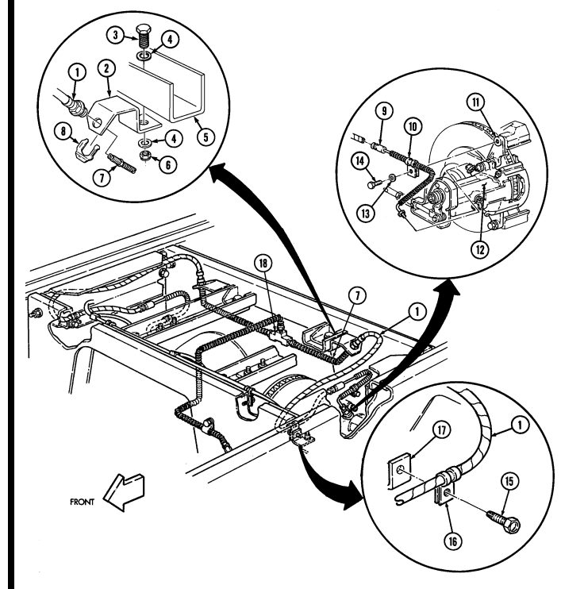 15. Connect intermediate brake line (7) to tee (18).

10. Install bracket (2) to crossmember (5) with washer (4), screw (3), washer (4), and locknut (6).

11. Install left rear brake line (1) on intermediate brake line (7) and bracket (2) with clip (8).

12. Connect left rear brake line (9) to caliper (12).

# 7 - 1 5 . Brake Lines Replacement (Cont'D)

c. Rear Brake Line Removal 1 . Disconnect rear brake line (20) from rear tee (19). 2 . Remove capscrew (23) and clamp (22) from rear brake line (20) and forward rear crossmember (21). 3 . Remove rear brake line (20) from intermediate brake line (24).

d. Rear Brake Line Installation 1 . Install rear brake line (20) to intermediate brake line (24). 2 . Install rear brake line (20) and clamp (22) to forward rear crossmember (21) with capscrew (23).

 3 . Connect rear brake line (20) to rear tee (19).

## 7 - 1 5 . Brake Lines Replacement (Cont'D)

e. Intermediate Brake Line Removal 1 . Disconnect intermediate brake line (4) from rear brake line (1). 2 . Remove five capscrews (3) and clamps (2) securing intermediate brake line (4) to frame (5). 3 . Remove intermediate brake line (4) from proportioning valve to union brake line (6).

#### F. Intermediate Brake Line Installation

1. Install intermediate brake line (4) to proportioning valve to union brake line (6). 2. Connect intermediate brake line (4) to rear brake line (1). 3. Install intermediate brake line (4) and five clamps (2) to frame (5) with five capscrews (3).

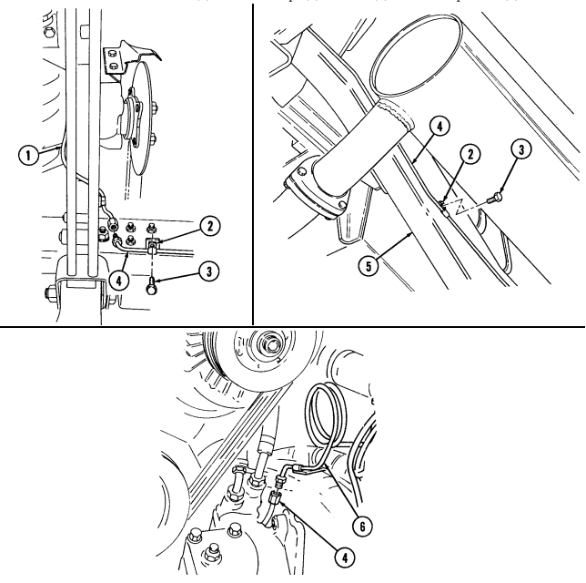

## 7 - 1 5 . Brake Lines Replacement (Cont'D)

g. Proportioning Valve to Union Brake Line Removal 1. Disconnect brake line (7) from proportioning valve (11). 2. Remove nut (14), washer (13), capscrew (9), and clamp (8) from brake line (7) and bracket (15). 3. Remove brake line (7) from union (16).

h. Proportioning Valve to Union Brake Line Installation 1. Connect brake line (7) to union (16). 2. Install brake line (7) and clamp (8) to bracket (15) with capscrew (9), washer (13), and nut (14). 3. Connect brake line (7) to proportioning valve (11).

i. **Proportioning Valve to Front Tee Brake Line Removal**
1. Disconnect brake line (10) from proportioning valve (11). 2. Remove brake line (10) from front tee (12).

j. **Proportioning Valve to Front Tee Brake Line Installation**
1. Connect brake line (10) to front tee (12).

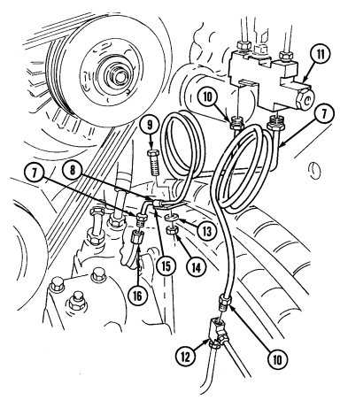 2. Connect brake line (10) to proportioning valve (11).

## 7 - 1 5 . Brake Lines Replacement (Cont'D)

k. Caliper to Tee Support Brackets Removal

#### Not E

- Perform steps 1 through 3 for front support bracket. - Perform steps 4 through 6 for rear support bracket.

1. Remove two tiedown straps (8) from front brake lines (4) and intermediate brake line (11). Discard tiedown straps (8).

2. Remove two capscrews (7), washers (6), and clamps (5) from bracket (2). 3. Remove nut (10), washer (9), capscrew (3), and support bracket (2) from crossmember (1). 4. Remove capscrew (14), clamp (15), and brake line (13) from left support bracket (16). 5. Remove capscrew (17), washer (18), and left support bracket (16) from frame bracket (12). 6. Repeat steps 4 and 5 for right support bracket.

#### L. Caliper To Tee Support Brackets Installation Not E

- Perform steps 1 through 3 for front support bracket. - Perform steps 4 through 6 for rear support bracket.

1. Install support bracket (2) on crossmember (1) with capscrew (3), washer (9), and nut (10). 2. Install two clamps (5) on support bracket (2) with two washers (6) and capscrews (7). 3. Secure front brake lines (4) and intermediate brake line (11) with two tiedown straps (8). 4. Install left support bracket (16) on frame bracket (12) with washer (18) and capscrew (17). 5. Install brake line (13) and clamp (15) on support bracket (16) with capscrew (14). 6. Repeat steps 4 and 5 for right support bracket.

# 7-15. Brake Lines Replacement (Cont'D)

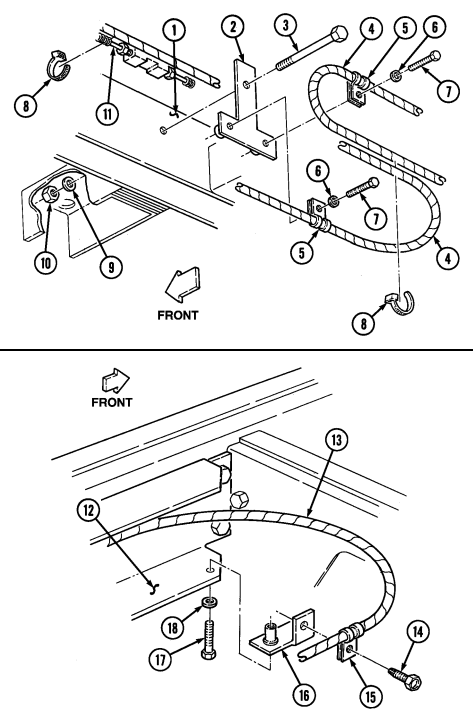

FOLLOW-ON TASK: Install brake protection guards (para. 7-8.1).

# 7-16. Service Brake Pedal (12338394) Replacement

This task covers:

| Removal                                   | a.    | b.  Installation                           |
|-------------------------------------------|-------|--------------------------------------------|
| INITIAL SETUP:                            |       |                                            |
| Applicable Models                         |       | Manual References                          |
| All M1123 and "A2" series vehicles        |       | TM 9\-2320\-280\-24P                       |
|                                           | Tools | Equipment Condition                        |
| General mechanic's tool kit:              |       | Vehicle raised and supported (para. 8\-2). |
| automotive (Appendix B, Item 1)           |       |                                            |
| Materials/Parts                           |       |                                            |
| Six locknuts (without 10,500 lb hydraulic |       |                                            |
| winch) (Appendix G, Item 128)             |       |                                            |
| Three locknuts (with 10,500 lb hydraulic  |       |                                            |
| winch) (Appendix G, Item 128)             |       |                                            |
| Six locknuts (Appendix G, Item 79)        |       |                                            |

#### A. Removal

1. Remove push on nut (9) and disconnect stoplight switch rod (1) from brake pedal assembly (8).

Discard push on nut (9).

#### B. Installation

2. Disconnect return spring (2) from brake pedal assembly (8). 3. Remove cotter pin (12), washer (11), and hydro-boost pushrod (5) from brake pedal bellcrank (6).

Remove spring tension washer (7). Discard cotter pin (12) and spring tension washer (7).

4. Remove nut (4), two washers (3), pivot pin (14), and brake pedal assembly (8) from bracket (13). 5. Remove two sleeve bearings (10) from brake pedal assembly (8). Discard sleeve bearings (10).

1. Apply grease to inside of two sleeve bearings (10). Install two sleeve bearings (10) in brake pedal assembly (8).

2. Install brake pedal assembly (8) to bracket (13) with pivot pin (14), two washers (3), and nut (4).

Using adapter and crowfoot, tighten nut (4) to 60 lb-ft (81 N•m).

3. Install spring tension washer (7) to brake pedal bellcrank (6). Connect hydro-boost pushrod (5) to brake pedal bellcrank (6) with washer (11) and cotter pin (12).

4. Connect return spring (2) to brake pedal assembly (8). 5. Connect stoplight switch rod (1) to brake pedal assembly (8) with push on nut (9).

# 7-16. Service Brake Pedal (12338394) Replacement (Cont'D)

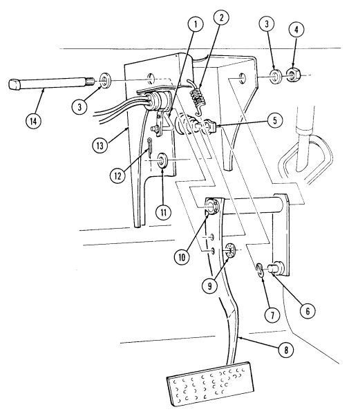

FOLLOW-ON TASKS: - Install protective control box (para. 4-5).

- Operate vehicle (TM 9-2320-280-10) and check brakes for proper operation.

# 7-17. Service Brake Pedal (Ex 5935037) Replacement

This task covers:

| TASK   | PAGE                                         |
|--------|----------------------------------------------|
| PARA.  | PROCEDURES                                   |
| 7\-10. | Service Brake System Bleeding Instructions   |
| 7\-11. | Service Brake Pad Maintenance                |
| 7\-12. | Service Brake Caliper Maintenance            |
| 7\-13. | Master Cylinder Maintenance                  |
| 7\-14. | Hydro\-Boost Replacement                     |
| 7\-15  | Brake Lines Replacement                      |
| 7\-16. | Service Brake Pedal (12338394) Replacement   |
| 7\-17. | Service Brake Pedal (EX 5935037) Replacement |
| 7\-18. | Proportioning Valve Replacement              |

a. Removal 1. Disconnect return spring (4) from brake pedal bracket (12). 2. Remove cotter pin (8) and washer (7) securing hydro-boost pushrod (6) to brake pedal bellcrank (10),
and disconnect hydro-boost pushrod (6) from brake pedal bellcrank (10). Remove spring tension washer (9) from bellcrank (10). Discard cotter pin (8) and spring tension washer (9).

3. Remove nut (5), washer (2), pivot pin (1), and washer (2) securing brake pedal assembly (11) to bracket (3) and remove brake pedal assembly (11).

4. Remove two sleeve bearings (13) from brake pedal assembly (11). Discard sleeve bearings (13).

#### B. Installation

1. Apply grease to inside of two sleeve bearings (13). Install two sleeve bearings (13) in brake pedal assembly (11).

2. Install brake pedal assembly (11) on bracket (3) with washer (2), pivot pin (1), washer (2), and nut (5). Using adapter and crowfoot, tighten nut (5) to 60 lb-ft (81 N•m).

3. Install spring tension washer (9) on brake pedal bellcrank (10). Connect hydro-boost pushrod (6) to brake pedal bellcrank (10) with washer (7) and cotter pin (8).

4. Connect return spring (4) to brake pedal bracket (12).

# 7-17. Service Brake Pedal (Ex 5935037) Replacement (Cont'D)

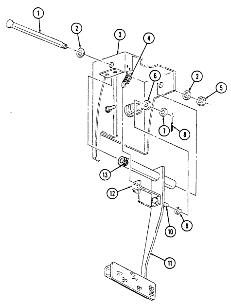

FOLLOW-ON TASKS: - Install stoplight switch (para. 4-61).

· Install protective control box (para. 4-5).

-  Operate vehicle (TM 9-2320-280-10) and check brakes for proper operation.

# 7-18. Proportioning Valve Replacement

This task covers:
INITIAL SETUP:

#### Tools

General mechanic's tool kit:
automotive (Appendix B, Item 1)

a. Removal **b. Installation**

| Manual References   |
|---------------------|
| TM 9\-2320\-280\-10 |

| Equipment Condition   |
|-----------------------|

Materials/Parts Locknut (Appendix G, Item 128) Lubricating oil (Appendix C, Item 33)
- Battery ground cable disconnected (para. 4-73). - Hood raised and secured (TM 9-2320-280-10).

#### A. Removal Caution

- Prior to removal, tag brake lines for installation. - Cover or plug all open lines and connections immediately after disconnection to prevent contamination. Remove all plugs prior to connection.

- Do not attempt to disassemble proportioning valve. Damage to equipment will result.

Have drainage container ready to catch brake fluid.

1. Disconnect electrical connector (1) from proportioning valve (6). 2. Disconnect two brake lines (5) from proportioning valve (6). 3. Disconnect two brake lines (4) from proportioning valve (6). 4. Remove locknut (2), washer (3), and proportioning valve (6) from hydro-boost (8) and proportioning valve bracket (7). Discard locknut (2).

#### B. Installation

1. Install proportioning valve (6) to proportioning valve bracket (7) and hydro-boost (8) with washer (3) and locknut (2). Tighten locknut (2) to 22 lb-ft (30 N•m).

2. Connect two brake lines (5) to proportioning valve (6). 3. Connect two brake lines (4) to proportioning valve (6). 4. Apply lubricating oil to pins (9) of proportioning valve (6). 5. Connect electrical connector (1) to proportioning valve (6).

# 7-18. Proportioning Valve Replacement (Cont'D)

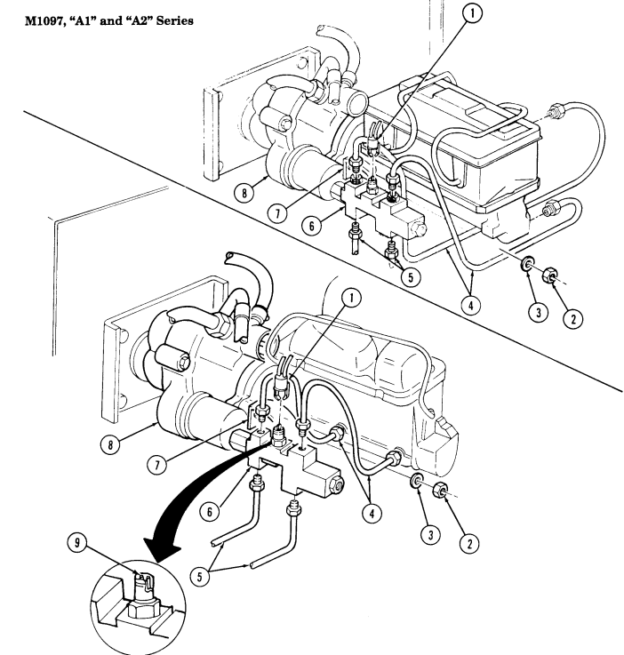

FOLLOW-ON TASKS: - Connect battery ground cable (para. 4-73).
- Bleed brake system (para. 7-10).

# 7-19. Service Brake Rotor Replacement

This task covers:
INITIAL SETUP:

#### Tools

General mechanic's tool kit:
automotive (Appendix B, Item 1)
Materials/Parts Six lockwashers (Appendix G, Item 145) Sealing compound (Appendix C, Item 43)
a. Removal **b. Installation**
Manual References TM 9-2320-280-24P
Equipment Condition Service brake pad removed (para. 7-11).

a. Removal 1. Remove six capscrews (1) and lockwashers (2) from halfshaft (3), rotor (4), and output flange (5).

Discard lockwashers (2).

2. Disconnect halfshaft (3) and remove rotor (4) from output flange (5).

b. Installation 1. Apply sealing compound to threads of capscrews (1). 2. Install rotor (4) on output flange (5). 3. Connect halfshaft (3) to rotor (4) and install six lockwashers (2) and capscrews (1). Tighten capscrews (1) to 48 lb-ft (65 N•m).

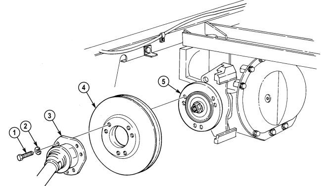

FOLLOW-ON TASK: Install service brake pad (para. 7-11).

# Section Iii. Rear Dual Service/Parking Brake System Maintenance

7-20. REAR DUAL SERVICE/PARKING BRAKE SYSTEM MAINTENANCE TASK SUMMARY

| INITIAL SETUP:                               |                                        |
|----------------------------------------------|----------------------------------------|
| Tools                                        | Personnel Required                     |
| General mechanic's tool kit:                 | One mechanic                           |
| automotive (Appendix B, Item 1)              | One assistant                          |
| Materials/Parts                              | Manual References                      |
| Cotter pin (Appendix G, Item 15)             | TM 9\-2320\-280\-24P                   |
| Spring tension washer (Appendix G, Item 317) |                                        |
| Four lockwashers (Appendix G, Item 146)      | Equipment Condition                    |
| (Basic/A1 Series)                            | Master cylinder removed (para. 7\-13). |
| Four lockwashers (Appendix G, Item 133)      |                                        |
| (A2 Series)                                  |                                        |
| a. Removal                                   |                                        |
| CAUTION                                      |                                        |

# 7-21. Rear Dual Service/Parking Brake Pad Maintenance

This task covers:
a. Removal c. Installation b. Cleaning and Inspection

#### Initial Setup:

Tools General mechanic's tool kit:
automotive (Appendix B, Item 1)
Hex wrench (Appendix D, Fig. D 115) Open end wrench (Appendix D, Fig. D 116)
Special Tools Crowfoot, 14 mm (Appendix B, Item 152)
Materials/Parts Retaining ring (Appendix G, Item 231) Cotter pin (Appendix G, Item 12) Sealing compound (Appendix C, Item 45) Grease (Appendix C, Item 22) Tiedown strap (Appendix G, Item 312)
Manual References TM 9-2320-280-10 TM 9-2320-280-24P
Equipment Condition
- Wheels chocked and parking brake released
(TM 9-2320-280-10).

- Pioneer tool stowage rack removed
(TM 9-2320-280-10).

General Safety Instructions Make sure brake pads are installed with linings facing rotor.

The following procedure applies to vehicles with serial numbers USBL, Eff, 44825 and above.

a. Removal 1.Remove cotter pin (4), washer (5), and clevis pin (7) from parking brake clevis (6) and lever (3).

Discard cotter pin (4).

2.Remove retaining ring (2) and disconnect parking brake cable (8) from caliper cable bracket (1).

Discard retaining ring (2)

Use tiedown strap to support caliper during removal to prevent damage to brake line.

3.Remove two capscrews (12), washers (13), and pull yoke (14) and caliper (15) away from rotor (10).

Note positioning of brake pad surfaces for installation.

4.Remove two brake pads (9) from adapter (11) and rotor (10).

7-21. REAR DUAL SERVICE/PARKING BRAKE PAD MAINTENANCE (Cont'd)

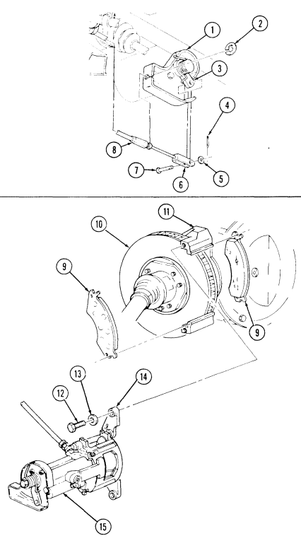

# 7 - 2 1 . Rear Dual Serv I C E / Parking Brake Pad Maintenance (Cont'D)

b. Cleaning and Inspection

#### Not E

Apply a light coat of grease on adapter slides.

1. Clean mating surfaces of caliper (1) and adapter (7) and lubricate adapter slides (7.1) with grease. 2. Inspect caliper (1) and caliper piston face (3) for cracks, pitting, or damage. Replace caliper assembly if cracked, pitted, or damaged (para. 7-22).

3. Inspect dust boot (2) for tears or deterioration. Replace caliper assembly (1) if dust boot (2) is torn or deteriorated (para. 7-22).

4. Inspect caliper cable bracket (4) for looseness, damage, and rotation. If loose, damaged, or repositioned, replace caliper assembly (1).

5. Thoroughly clean and inspect rotor (6) for heat cracks, discoloration, pitting, or scoring. Replace rotor (6) if cracked, pitted, or scored (para. 7-19).

Ensure that grease and oil are not in contact with rotor and/or shoe and lining friction surface. Failure to do so will result in damage to equipment and poor performance.

#### Not E

- Replace brake pads in axle sets only. - Replace brake pads if thickness is less than 3/16 in. (4.8 mm)
and operation in wet and muddy conditions is expected.

6. Inspect brake pads (5) for glazing, oil saturation, or wear. If glazed, oil saturated, or if brake pad thickness is less than 1/8 in. (3.2 mm), replace both pads (5) and pads on opposite caliper.

7-21.  REAR DUAL SERVICE/PARKING BRAKE PAD MAINTENANCE (Cont'd)

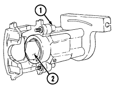

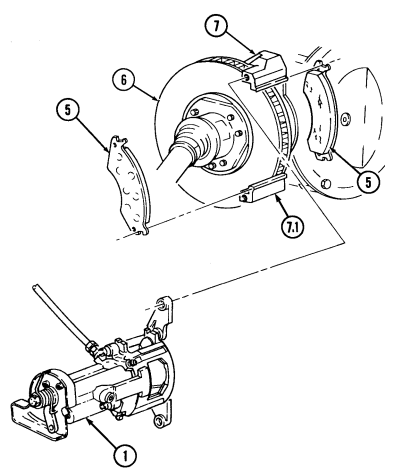

# 7-21. Rear Dual Service/Parking Brake Pad Maintenance (Cont'D)

c. Installation

Ensure brake pads are installed with linings facing rotor. Failure to do this may cause injury to personnel or damage to equipment and poor performance.

1. Position brake pads (3) facing rotor (4) in adapter (5). 2. Apply sealing compound to tapped holes of adapter (5).

Applying force to piston cap will result in piston cap damage.

- When installing yoke and caliper, use a "C" clamp and block of wood to bottom out piston in caliper if needed.

- With caliper secured, use either hex wrench or open end wrench to rotate caliper piston in a clockwise direction and, at the same time, apply force on outer piston hex until caliper piston is seated in caliper bore.

3. Rotate caliper piston (2) in a clockwise direction and at the same time apply force on outer piston hex until caliper piston (2) is seated in piston bore.

4. Install caliper (1) and yoke (8) on adapter (5) and rotor (4) with two washers (7) and capscrews (6).

Using crowfoot, tighten capscrews (6) to 30-40 lb-ft (41-54 N•m).

5. Install parking brake cable (16) on caliper cable bracket (9) with retaining ring (10).

- Ensure lever is in contact with caliper cable bracket stop. Damage to equipment and poor performance will result if not aligned properly.

- Ensure that the clevis and clevis pin are aligned to the lever. Do not move the lever to accommodate a misadjusted clevis. Damage to equipment and poor performance will result.

6. Install parking brake clevis (14) on lever (11) with clevis pin (15), washer (13), and cotter pin (12).

Check position of lever (11) and make sure it is in contact with caliper cable bracket stop (17).

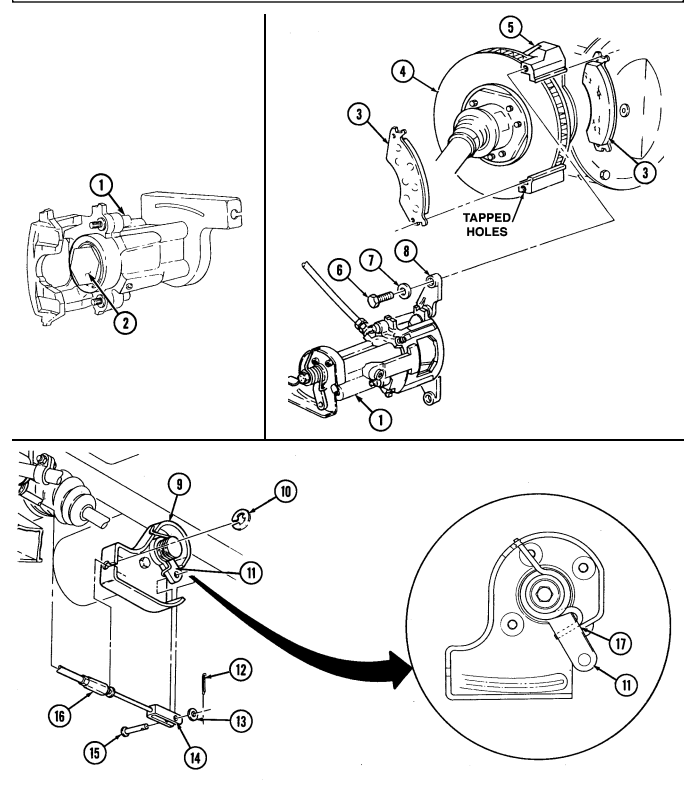

# 7-21. Rear Dual Service/Parking Brake Pad Maintenance (Cont'D)

FOLLOW-ON TASKS: •Adjust rear dual service/parking brake (para. 7-26).

●Install pioneer tool stowage rack (TM 9-2320-280-10).

# 7-22. Rear Dual Service/Parking Brake Caliper Maintenance

This task covers:
a. Removal c. Installation b. Cleaning and Inspection INITIAL SETUP:
Tools General mechanic's tool kit:
automotive (Appendix B, Item 1)
Special Tools Crowfoot, 14 mm (Appendix B, Item 152) Hex head driver, 7 mm
(Appendix B, Item 162)
Materials/Parts Cotter pin (Appendix G, Item 12) Flat washer (Appendix G, Item 38) Retaining ring (Appendix G, Item 231) Sealing compound (Appendix C, Item 45)

#### Manual References

TM 9-2320-280-10 TM 9-2320-280-24P

#### Equipment Condition

- Wheels chocked and parking brake released
(TM 9-2320-280-10).

- Pioneer tool stowage rack removed
(TM 9-2320-280-10).

General Safety Instructions Make sure brake pads are installed with linings facing rotor.

a. Removal

Cover or plug all open lines and connections immediately after disconnection to prevent contamination. Remove all plugs prior to connection.

The following procedure applies to vehicles with serial numbers USBL, Eff, 44825 and above.

1.Remove cotter pin (4), washer (5), and clevis pin (7) from parking brake clevis (6) and lever (3).

Discard cotter pin (4).

2.Remove retaining ring (2) and disconnect parking brake cable (8) from caliper cable bracket (1).

Discard retaining ring (2).

Have drainage container ready to catch brake fluid.

3.Disconnect brake line (17) from coupling (16). 4.Remove coupling (16) and flat washer (15) from caliper (14). Discard flat washer (15).

Caliper must be supported during removal to prevent damage to brake line.

5.Remove two capscrews (10), washers (11), yoke (12), and caliper (14) from adapter (9). 6.Slide yoke (12) and location pins (13) out from caliper (14).

7-22. REAR DUAL SERVICE/PARKING BRAKE CALIPER MAINTENANCE (Cont'd)

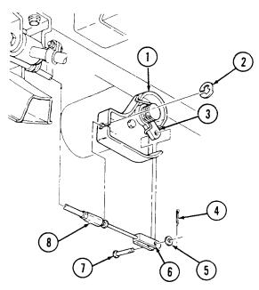

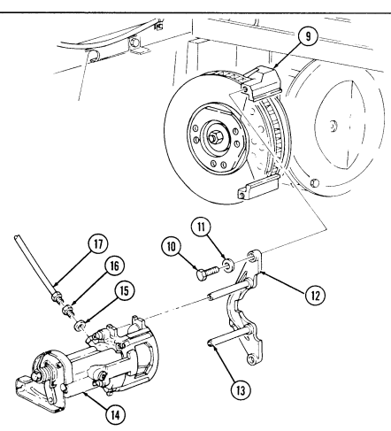

# 7-22. Rear Dual Service/Parking Brake Caliper Maintenance (Cont'D)

b. Cleaning and Inspection

Apply a light coat of grease on adapter slides.

1. Clean mating surfaces of caliper (1) and adapter (7) and lubricate adapter slides with grease. 2. Clean cooling fins of rotor (6). 3. Inspect caliper (1) and caliper piston face (4) for cracks, pitting, or damage. Replace caliper assembly if cracked, pitted, or damaged.

4. Inspect caliper cable bracket (5) for looseness, damage, and rotation. If loose, damaged, or repositioned, replace caliper assembly (1).

5. Inspect dust boot (3) for tears or deterioration. Replace caliper assembly if dust boot (3) is torn or deteriorated.

6. Inspect rotor (6) for heat cracks, discoloration, pitting, or damage. Replace rotor (6) if cracked, pitted, or scored (para. 7-19).

7. Inspect yoke locating pins (12) for cracks or corrosion. Perform step 8 if cracked or corroded. If not, perform step 9.

8. Using 7 mm hex driver, remove locating pins (12) from yoke (11). Discard locating pins (12). 9. Inspect brake pads (8) for glazing, oil saturation, or wear. If glazed, oil saturated, or if brake pad thickness is less than 1/8 in. (3.2 mm), replace both pads (8) and pads on opposite caliper (para. 7-21).

Ensure that grease and oil are not in contact with rotor and/or brake shoe friction surfaces. Failure to do so will result in damage to equipment and poor performance.

#### C. Installation

1. Open bleeder valve (2) and depress piston (4) into caliper (1) while rotating piston (4) in a clockwise direction, and at the same time apply pressure until piston (4) is seated in piston bore.

Perform step 2 only if yoke locating pins were removed.

2. Apply sealing compound to threads of locating pins (12) and install locating pins (12) in yoke (11)
using 7 mm hex head driver. Tighten locating pins (12) to 25-35 lb-ft (34-47 N•m).

3. Slide yoke (11) and locating pins (12) into caliper (1). 4. Apply sealing compound to tapped holes of adapter (7). 5. Install caliper (1) and yoke (11) on adapter (7) with two washers (10) and capscrews (9). Using crowfoot, tighten capscrews (9) to 30-40 lb-ft (41-54 N•m).

6. Install flat washer (15) and coupling (14) on caliper (1) and connect brake line (13) to coupling (14).

7. Install parking brake cable (24) on caliper cable bracket (18) with retaining ring (19).

- Ensure lever is in contact with caliper cable bracket stop.

Damage to equipment and poor performance will result if not alined properly.

- Ensure that the clevis and clevis pin are alined to lever. Do not move the lever to accommodate a misadjusted clevis, or damage to equipment and poor performance will result.

8. Check position of lever (17) and ensure it is in contact with caliper cable bracket stop (16). 9. Install parking brake clevis (22) to lever (17) with clevis pin (23), washer (21), and cotter pin (20).

# 7-22. Rear Dual Service/Parking Brake Caliper Maintenance (Cont'D)

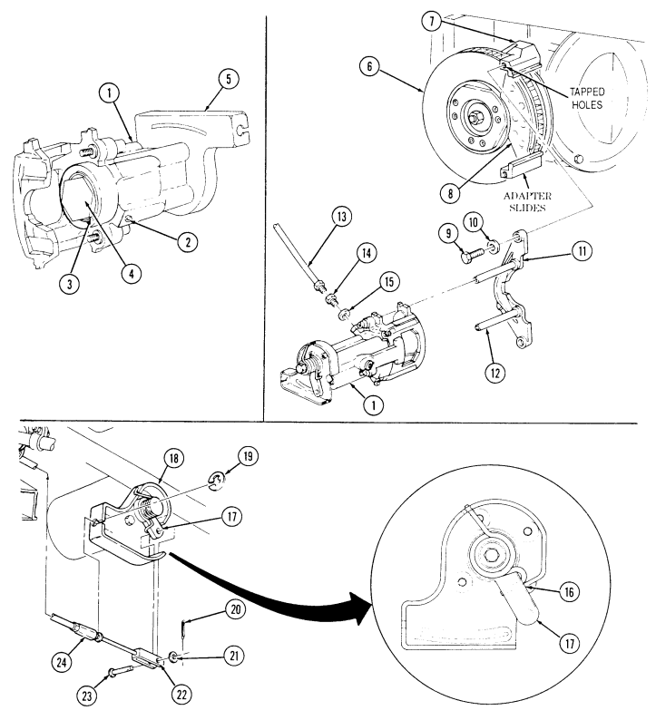

FOLLOW-ON TASKS: - Install service brake rotor (para. 7-19).

- Bleed brake system (para. 7-10). · Adjust rear dual service/parking brake (para. 7-26). · Install pioneer tool stowage rack (TM 9-2320-280-10).

## 7-23. Right Parking Brake Cable Replacement

#### A. Removal **B. Installation** Note Note Note Note

| Materials/Parts   |
|-------------------|

| Materials/Parts   |
|-------------------|

This task covers:
General mechanic's tool kit:
automotive (Appendix B, Item 1)
Cotter pins (Appendix G, Item 12) Two lockwashers (Appendix G, Item 163) Two retaining rings (Appendix G, Item 231) Two locknuts (Appendix G, Item 71) Lockwasher (Appendix G, Item 135)
- Muffler and insulator removed (all models except M1123 and "A2" vehicles) (para. 3-48).

- Muffler and catalytic converter removed (M1123 and "A2" vehicles only) (para. 3-49).

- Wheels chocked and parking brake released
(TM 9-2320-280-10).

- The following procedure applies to vehicles with serial numbers USBL Eff. 44825 and above.

- If cables are chafing or crushed, use new cable clamp bracket.

1. Remove cotter pin (21), washer (20), clevis pin (18), and brake clevis (19) from rear caliper lever (22). Discard cotter pin (21).

2. Remove brake cable retaining ring (1) and parking brake cable sleeve (17) from rear caliper cable bracket (2) and remove cable assembly (4) from caliper cable bracket (2). Discard cable retaining ring (1).

3. Slide parking brake cable (11) through parking brake cable assembly (4). Remove parking brake cable retaining ring (8) from parking brake cable sleeve (7) and "C" beam (10). Disconnect parking brake cable (4) from parking brake equalizer bar (9). Discard cable retaining ring (8).

4. Remove two capscrews (5), parking brake cable clamps (6), and parking brake cable assembly (4)
from body (12).

Perform steps 5 and 6 for vehicles with old parking brake cable bracket. Perform steps 7 through 9 for vehicles with new parking brake cable bracket configuration.

5. Remove capscrew (15), lockwasher (16), and parking brake cable clamp (14) from bracket (23).

Discard lockwasher (16).

6. Remove two capscrews (13) and clamp bracket (23) from support bracket (3). Discard clamp bracket (23). 7. Remove locknut (27), capscrew (29), lockwasher (28), and parking brake cable clamp (30) from clamp bracket (34). Discard locknut (27) and lockwasher (28).

8. Remove capscrew (31), lockwasher (32), and parking brake cable clamp (33) from bracket (34).

Discard lockwasher (32).

Perform step 9 if clamp bracket is damaged. If not replacing bracket proceed to b., installation.

bracket (3). Discard locknut (24).

9. Remove locknut (24), washer (35), capscrew (26), washer (25), and clamp bracket (34) from support b. Installation Ensure clamp bracket (P/N 12342965) is installed on vehicle.

1. Install clamp bracket (34) on support bracket (3) with washer (25), capscrew (26), washer (35), and locknut (24).

7-56 Change 3 INITIAL SETUP:
Tools a. Removal

## 7-23. Right Parking Brake Cable Replacement (Cont'D)

2. Slide parking brake cable clamp (33) onto parking brake cable assembly (4) and install on clamp bracket (34) with lockwasher (32) and capscrew (31).

3. Slide parking brake cable clamp (30) on parking brake cable assembly (4) and install on clamp bracket (34) with capscrew (29), lockwasher (28), and locknut (27).

4. Install two parking brake cable clamps (6) on parking brake cable assembly (4) and install parking brake cable clamps (6) on underbody (12) with two capscrews (5).

5. Install parking brake cable sleeve (7) to "C" beam (10) and parking brake cable (11) to equalizer bar (9) with retaining ring (8).

Ensure that the caliper cable bracket is secure with no signs of looseness and the lever is in contact with the caliper cable bracket stop. Damage to equipment and poor performance will result if not aligned properly.

6. Install parking brake cable sleeve (17) to caliper cable bracket (2) with cable retaining ring (1).

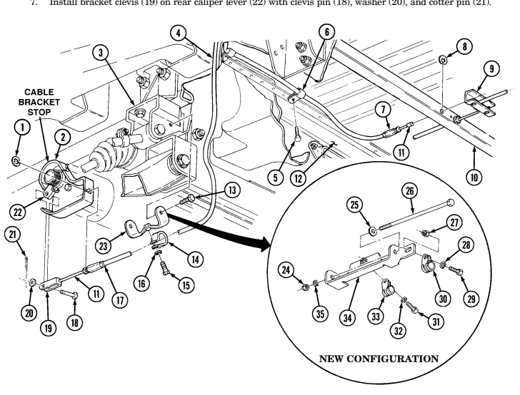

FOLLOW-ON TASKS: - Adjust parking brake lever (TM 9-2320-280-10).

- Install muffler and catalytic converter (M1123 and "A2" vehicles only) (para. 3-49). - Install muffler and insulator (all models except M1123 and "A2" vehicles)
(para. 3-48).

# 7-24. **Left Parking Brake Cable/Mounting Bracket Replacement**

This task covers:
INITIAL SETUP:
Tools General mechanic's tool kit:
automotive (Appendix B, Item 1)
Materials/Parts Assembled locknut (Appendix G, Item 130) Two lockwashers (Appendix G, Item 135) Cotter pin (Appendix G, Item 12) Two retaining rings (Appendix G, Item 231) Two locknuts (Appendix G, Item 71)

#### A. Removal B. Installation

Manual References TM 9-2320-280-10 TM 9-2320-280-24P
Equipment Condition
- Muffler and insulator removed (all models except M1123 and "A2" vehicles) (para. 3-48).

- Muffler and catalytic converter removed
(M1123 and "A2" vehicles only) (para. 3-49).

- Wheels chocked and parking brake released
(TM 9-2320-280-10).

- The following procedure applies to vehicles with serial numbers USBL Eff. 44825 and above.

- If cables are chafing or crushed, use new cable clamp bracket.

a. Removal 1. Remove cotter pin (11), washer (12), clevis pin (14), and brake clevis (13) from rear caliper lever (10).

Discard cotter pin (11).

2. Remove brake cable retaining ring (9) and parking brake cable sleeve (2) from rear caliper cable bracket (8). Discard cable retaining ring (9).

3. Slide parking brake cable (1) through parking brake cable assembly (15). Remove parking brake cable retaining ring (24) and parking brake cable sleeve (2) from "C" beam (22). Disconnect parking brake cable (1) from parking brake equalizer bar (23). Discard cable retaining ring (24).

4. Remove capscrew (6), washer (4), and assembled locknut (3) from brake cable clamp (5), mounting bracket (21) and parking brake cable assembly (15). Discard assembled locknut (3).

Perform steps 5 and 6 for vehicles with old parking brake cable bracket. Perform steps 7 through 9 for vehicles with new parking brake cable bracket configuration.

5. Remove capscrew (17), lockwasher (16), parking brake cable clamp (18), and parking brake cable assembly (15) from bracket (19). Discard lockwasher (16).

6. Remove two capscrews (20) and bracket (19) from support bracket (7). Discard bracket (19). 7. Remove locknut (36), capscrew (34), washer (33), and parking brake cable clamp (32) from bracket (28). Discard locknut (36).

8. Remove capscrew (31), lockwasher (30), and parking brake cable clamp (29) from bracket (28).

Discard lockwasher (30).

Perform step 9 if clamp bracket is damaged. If not replacing bracket, proceed to b., installation.

9. Remove locknut (26), washer (27), capscrew (35), washer (25), and clamp bracket (28) from support bracket (7). Discard locknut (26).

Perform step 10 if replacing parking cable mounting bracket. If not replacing bracket, proceed to b., installation.

10. Remove two nuts (37), washers (39), capscrews (40), washers (39), mounting bracket (21), and tailpipe hanger (41) from rear body mount (42).

NOTE

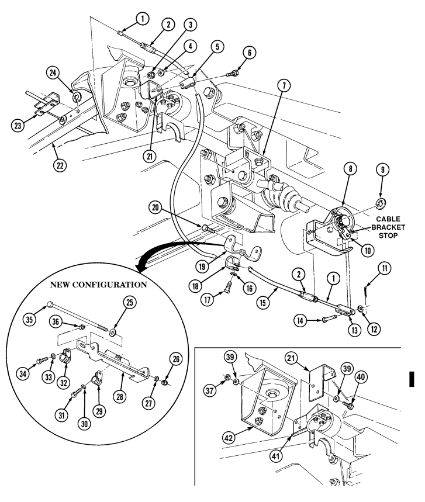

7-24. LEFT PARKING BRAKE CABLE/MOUNTING BRACKET REPLACEMENT (Cont'd)

# 7-24. **Left Parking Brake Cable/Mounting Bracket Replacement (Cont'D)**

b. Installation

Perform step 1 if replacing parking brake cable mounting bracket. If not, proceed to step 2.

1. Install parking brake cable mounting bracket (4) and tailpipe hanger (6) on rear body mount (7) with two capscrews (5), four washers (3), and two nuts (1).

Ensure clamp bracket (P/N 12342966) is installed on vehicle.

2. Install clamp bracket (34) on support bracket (14) with washer (31), capscrew (41), washer (33), and locknut (32).

3. Slide parking brake cable clamp (35) onto parking bracket cable assembly (22) and install cable clamp (35) on clamp bracket (34) with lockwasher (36) and capscrew (37).

4. Slide parking brake cable clamp (38) onto parking brake cable assembly (22) and install cable clamp (38) on clamp bracket (34) with capscrew (40), washer (39), and locknut (42).

5. Install parking brake cable clamp (12) on parking brake cable assembly (22) and install cable clamp (12) on parking brake cable mounting bracket (4) with washer (11), capscrew (13), and assembled locknut (10).

6. Install parking brake cable sleeve (9) on "C" beam (28) and parking brake cable (8) on equalizer bar (29) with retaining ring (30).

Ensure that the caliper cable bracket is secure with no signs of looseness and the lever is in contact with the caliper cable bracket stop. Damage to equipment and poor performance will result if not aligned properly.

7. Install parking brake cable sleeve (9) on rear caliper cable bracket (15) with cable retaining ring (16).

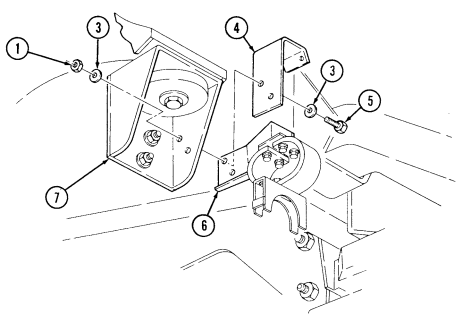 8. Install brake clevis (20) on rear caliper lever (17) with clevis pin (21), washer (19), and cotter pin (18). 9. Install parking brake cable assembly (22) on bracket (26) with clamp (23), capscrew (25), and lockwasher (24).

10. Install bracket (26) on bracket (14) with two capscrews (27).

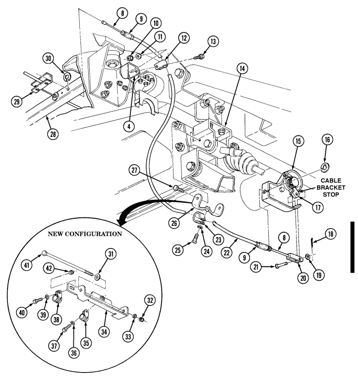

FOLLOW-ON TASKS: - Adjust parking brake lever (TM 9-2320-280-10).

- Install muffler and catalytic converter (M1123 and "A2" vehicles only) (para. 3-49). - Install muffler and insulator (all models except M1123 and "A2" vehicles)
(para. 3-48).

Change 3

# 7-24. Left Parking Brake Cable/Mounting Bracket Replacement (Cont'D) 7-25. Rear Dual Service/Parking Brake Rod Replacement

This task covers:
INITIAL SETUP:

#### Tools

General mechanic's tool kit:
automotive (Appendix B, Item 1)
Materials/Parts Three cotter pins (Appendix G, Item 12) Locknut (Appendix G, Item 79) Locknut (Appendix G, Item 86)
Manual References TM 9-2320-280-10 TM 9-2320-280-24P

a. Removal b. Installation

#### Equipment Condition

- Muffler and insulator removed (all models except M1123 and "A2" vehicles) (para. 3-48).

- Muffler and catalytic converter removed (M1123 and "A2" vehicles only) (para. 3-49).

- Wheels chocked and parking brake released
(TM 9-2320-280-10).

The following procedure applies to vehicles with serial numbers USBLEff. 44825 and above.

a. Removal 1. Remove two cotter pins (left and right) (23), washers (22), clevis pins (20), and brake clevis (21)
from caliper levers (24). Discard cotter pins (23).

2. Remove clip (5) and spread boot (6) to allow access to cotter pin (12).

#### B. Installation

1. Install spring (2) and spacer (15) on body (13) with washer (3), capscrew (4), washer (16), and locknut (17).

2. Install nut (10) and clevis (9) on brake rod (14). 3. Slide brake rod (14) rearward through spring (2). 4. Install brake rod (14) on brake cable equalizer bar (1) with conical washer (18) and locknut (19).

Tighten locknut (19) far enough to expose 3-5 threads on the end of brake rod (14).

5. Spread boot (6) and install clevis (9) on bellcrank (7) with clevis pin (8), washer (11), and cotter pin (12). 6. Install clip (5) on boot (6).

Ensure that the caliper cable bracket is secure with no signs of looseness and the lever is in contact with the caliper cable bracket stop. Damage to equipment and poor performance will result if not aligned properly.

7. Install brake clevis (21) on rear caliper levers (24) with clevis pins (20), washers (22), and cotter pins (23).

3. Remove cotter pin (12), washer (11), clevis pin (8), and clevis (9) from brake rod (14) and bellcrank (7). Discard cotter pin (12).

4. Remove locknut (17), washer (16), spacer (15), washer (3), capscrew (4), and spring (2) from body (13). Discard locknut (17).

5. Remove locknut (19) and conical washer (18) from brake rod (14) and brake cable equalizer bar (1).

Discard locknut (19).

6. Remove brake rod (14) by sliding brake rod (14) forward. 7. Remove clevis (9) and nut (10) from brake rod (14).

# 7-25. Rear Dual Service/Parking Brake Rod Replacement (Cont'D)

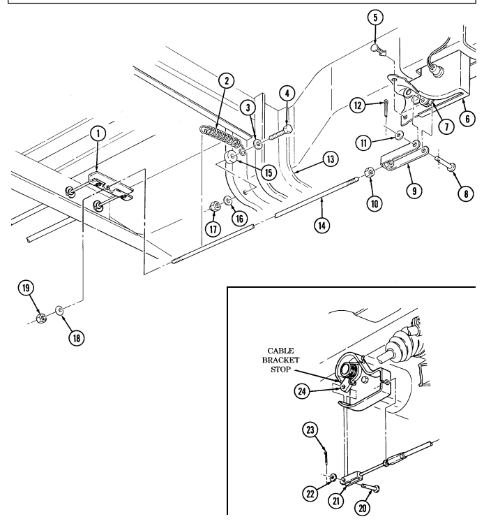

FOLLOW-ON TASKS: - Adjust rear dual service/parking brake (para. 7-26).

- Install muffler and catalytic converter (M1123 and "A2" vehicles only) (para. 3-49).

- Install muffler and insulator (all models except M1123 and "A2" vehicles)
(para. 3-48).

# 7-26. Rear Dual Service/Parking Brake Adjustment

This task covers:
Adjustment INITIAL SETUP:
Tools General mechanic's tool kit:
automotive (Appendix B, Item 1)
Materials/Parts Cotter pin (Appendix G, Item 12)
Personnel Required One mechanic One assistant Manual References TM 9-2320-280-10 TM 9-2320-280-24P
Equipment Condition Wheels chocked and parking brake released (TM 9-2320-280-10).

- The Kelsey-Hayes parking brake mechanism has an automatic adjusting feature and does not require periodic manual adjustment. When parking brake components or rear brake pads are replaced, the parking brake linkage must be initially positioned to ensure proper parking brake system operation. The only additional adjustment necessary is accomplished with the parking brake hand lever. Refer to TM 9-2320-280-10.

- The following procedure applies to vehicles with serial numbers USBL Eff. 44825 and above.

#### Adjustment

1. Remove clip (1) and spread boot (2) to allow access to cotter pin (9). 2. Remove cotter pin (9), washer (8) and clevis pin (4) from clevis (5) and bellcrank (3). Discard cotter pin (9).

3. Repeatedly apply and adjust parking brake hand lever until bellcrank (3) linear travel is 0.75 in.

(19 mm).

Holes in parking brake clevis must aline to the holes in the adjusting bellcrank without force for proper parking brake adjustment. Failure to do this may result in damage to equipment and poor performance.

4. Release parking brake. Loosen nut (6) and adjust clevis (5) so holes in clevis (5) align to holes in bellcrank (3). Install clevis (5) on bellcrank (3) with clevis pin (4), washer (8), and cotter pin (9).

Do not overtighten brake rod. Overtightening brake rod may result in dragging brakes.

5. If necessary, remove excess slack in parking brake cables by turning the parking brake rod (7)
clockwise or counterclockwise into the clevis (5).

# 7-26. Rear Dual Service/Parking Brake Adjustment (Cont'D)

Ensure that the caliper cable bracket is secure with no signs of looseness and the lever is in contact with the caliper cable bracket stop. Darnage to equipment and poor performance will result if not aligned properly.

Perform step 6 on both sides.

6. Parking brake rod (7) is properly adjusted if lever (11)
is in contact with caliper cable bracket

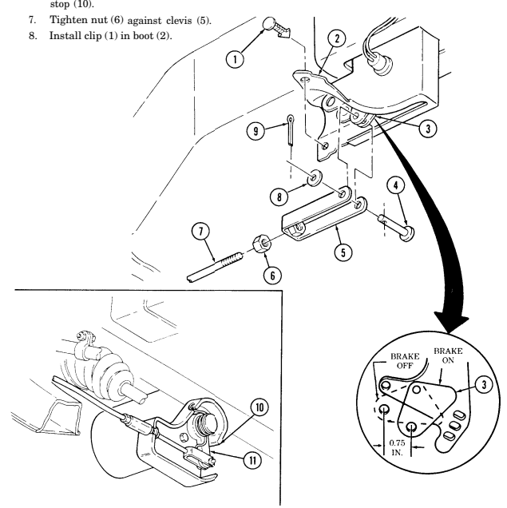

FOLLOW-ON TASK: Adjust parking brake lever (TM 9-2320-280-10).

# Chapter 8 Wheels And Steering Maintenance Section I. Wheel And Runflat System Maintenance

| General mechanic's tool kit:                                          | TM 9\-2320\-280\-10                                            |
|-----------------------------------------------------------------------|----------------------------------------------------------------|
| automotive (Appendix B, Item 1)                                       | TM 9\-2320\-280\-24P                                           |
| Materials/Parts                                                       | Equipment Condition                                            |
| Locknut (Appendix G, Item 128)                                        | - Battery ground cable disconnected (para. 4\-73).             |
| Lubricating oil (Appendix C, Item 33)                                 | - Hood raised and secured (TM 9\-2320\-280\-10).               |
| a. Removal                                                            |                                                                |
|                                                                       | CAUTION                                                        |
| -                                                                     | Prior to removal, tag brake lines for installation.            |
| -                                                                     | Cover or plug all open lines and connections immediately after |
| disconnection to prevent contamination. Remove all plugs prior to     |                                                                |
| connection.                                                           |                                                                |
| -                                                                     | Do not attempt to disassemble proportioning valve. Damage to   |
| equipment will result.                                                |                                                                |
|                                                                       | NOTE                                                           |
| Have drainage container ready to catch brake fluid.                   |                                                                |
| 1.  Disconnect electrical connector (1) from proportioning valve (6). |                                                                |

# 8 - 1 . Wheel And Runflat System Maintenance Task Summary

## 8-2. Jacking Instructions

This task covers:
a. Raising Corner of Vehicle e. Raising Rear of Vehicle b. Lowering Corner of Vehicle **f. Lowering Rear of Vehicle** c. Raising Front of Vehicle g. Raising Entire Vehicle d. Lowering Front of Vehicle **h. Lowering Entire Vehicle**
INITIAL SETUP:
Tools **General Safety Instructions**
General mechanic's tool kit: Never work under vehicle unless wheels are automotive (Appendix B, Item 1) blocked and it is properly supported.

Hydraulic jacks are used for raising and lowering, and are not used to support vehicle. Never work under vehicle unless wheels are blocked and it is properly supported. Injury or damage to equipment may result if vehicle suddenly shifts or moves.

#### A. Raising Corner Of Vehicle

1. Block wheels (2) or (4).

2. Place jack under lower control arm (5) on corner to be raised.

3. Raise vehicle (1) high enough to place trestle (3).

4. Place trestle (3) under flat portion of frame rail (7) and lower jack until weight is supported by trestle (3).

#### B. Lowering Corner Of Vehicle

1. Raise vehicle (1) and remove trestle (3). 2. Lower vehicle (1).

3. Remove blocks from wheels (2) or (4).

#### C. Raising Front Of Vehicle

1. Block rear wheels (2).

2. Center jack under front suspension front crossmember (6). Use a wood block between jack and crossmember (6).

3. Raise vehicle (1) high enough to place trestles (3). 4. Place trestles (3) under flat portion of frame rails (7) and lower jack until weight is supported by trestles (3).

#### D. Lowering Front Of Vehicle

1. Raise vehicle (1) and remove trestles (3).

2. Lower vehicle (1). 3. Remove blocks from rear wheels (2).

8-2. JACKING INSTRUCTIONS (Cont'd)

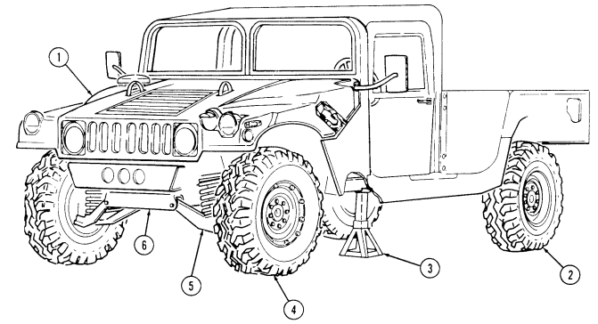

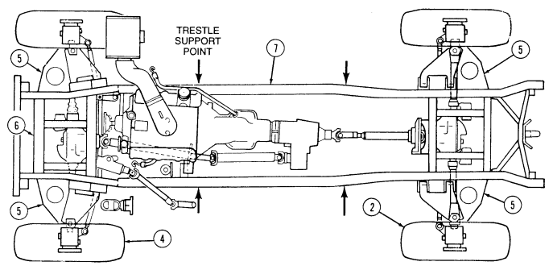

## 8 - 2 . Jacking Instructions( C O N T ' D )

#### E. Raising Rear Of Vehicle

1. Block front wheels (4). 2. Center jack under rear suspension rear crossmember (6). Use a wood block between jack and crossmember (6).

3. Raise vehicle (1) high enough to place trestles (3).

For vehicles with a heavy load such as S250 shelter carrier, an additional trestle should be placed in the rear for added stability.

4. Place trestles (3) under flat portion of frame rails (5) and lower jack until weight is supported by trestles (3).

f. Lowering Rear of Vehicle 1. Raise vehicle (1) and remove trestles (3). 2. Lower vehicle (1). 3. Remove blocks from front wheels (4).

#### G. Raising Entire Vehicle

1. Raise front of vehicle (task c). 2. Center jack under rear suspension rear crossmember (6). Use a wood block between jack and crossmember (6).

For vehicles with a heavy load such as S250 shelter carrier, an additional trestle should be placed in the rear for added stability.

3. Raise vehicle (1) high enough to place trestles (3). 4. Place trestles (3) under flat portion of frame rails (5) and lower jack until weight is supported by trestles (3).

5. Move blocks aside.

#### H. Lowering Entire Vehicle

1. Raise rear of vehicle (1) and remove trestles (3). 2. Lower rear of vehicle (1) and block rear wheels (2). 3. Lower front of vehicle (task d).

# 8-2. Jacking Instructions (Cont'D)

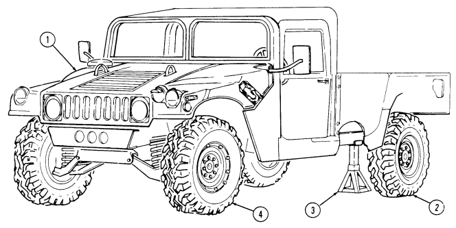

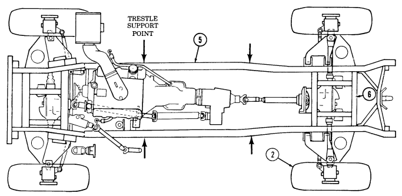

## 8-3. Wheel Replacement

This task covers:
INITIAL SETUP:

#### A. Removal **B. Installation** Tools **General Safety Instructions**

General mechanic's tool kit: Always apply parking brake and chock opposite automotive (Appendix B, item 1) wheel before removing wheel.

Remove only the inner group of nuts when Manual References removing a wheel from the vehicle.

TM 9-2320-280-24P Never mix radial tires and bias ply tires.

Always apply parking brake and chock opposite wheel before removing wheel. Avoid removing wheel when vehicle is on sloping terrain. Injury to personnel or damage to equipment may result.

Remove only the inner group of nuts when removing a wheel from the vehicle. Removing the outer nuts which hold the rim together while the assembly is inflated could result in serious injury or death.

Radial and Bias ply tires should not be mixed on the same vehicle. Injury to personnel or damage to equipment may result.

Check tire size designator on sidewall for tire construction identification:
36 X 12.50-16 .5 LT-Bias ply 37 X 12.50R16.5LT-Radial

#### A. Removal

1. Lumen eight lug nuts (2), but do not remove. 2. Raise and support corner of vehicle (para. 8-2). 3. Remove eight lug nuts (2) securing wheel (1) to geared hub (3) and remove wheel (1).

Ib. Installation**NOTE**
Install lug nuts with fingers to full engagement. If nuts resist finger tightening, discard nuts. Examine studs for damage and replace if damaged (para. 6-14). The radial tire is nondirectional and can be used in either position.

1. Install wheel (1) on geared hub (3) with eight lug nuts (2). 2. Remove support and lower corner of vehicle (para. 8-2). 3. Tighten eight lug nuts (2) to 90-110 lb-ft. (122-149 N m) in tightening sequence shown.

# 8-3. Wheel Replacement (Cont'D)

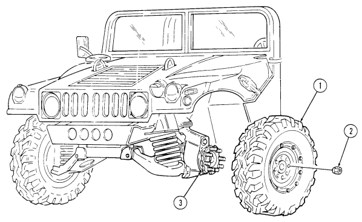

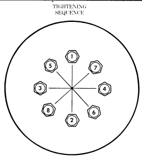

# 8-4. Tire, Wheel, And Runflat Maintenance

This task covers:
a. Disassembly c. Repair b. Inspection and Cleaning d. Assembly

#### Initial Setup:

Tools General mechanic's tool kit:
automotive (Appendix B, Item 1)
General mechanic's tool kit:
automotive, common No. 2 (Appendix B, Item 4)
Special Tools Torque adapter, 9/16 in.

(Appendix B, Item 144)
Socket adapter (Appendix B, Item 146)

#### Materials/Parts

Eight locknuts (Appendix G, Item 115) Four locknuts (Appendix G, Item 116) Lubricant (Appendix G, Item 196) O-ring (Appendix G, Item 214) Detergent (Appendix C, Item 17)
Manual References TM 9-2320-280-10 TM 9-2320-280-24P TM 9-2610-200-14

#### Equipment Condition

Wheel removed (para. 8-3).

#### General Safety Instructions

- Do not use tire machine. - Ensure tire is totally deflated before removing wheel locknuts.

- Never use tubes in wheel assemblies. - Rim surfaces must be kept clean and free of rust and dirt.

- Never use wheel assemblies with damaged studs.

- Never inflate a wheel assembly with the wheel locknuts removed.

- Never inflate a wheel assembly without first checking wheel locknut torques.

- Use only replacement parts specified in TM 9-2320-280-24P.

- Do not exceed recommended tire inflation pressure.

- Always use a tire inflation cage and a clip-on air chuck for tire inflation.

Do not use tire machine. Injury to personnel or damage to equipment may result.

NOTE
The following maintenance procedure applies to vehicles using bias ply tires and two-piece magnesium runflats. Refer to paras. 8-4.1, 8-5, and 8-5.1 for maintenance instructions on radial tires and rubber runflats.

#### A. Disassembly

1. Place wheel assembly in a tire inflation cage.

In all disassembly operations, ensure the tire is totally deflated before removing wheel locknuts. Failure to follow proper safety precautions could cause serious injury or death.

2. Remove valve core (4) from valve stem (3) and deflate tire (6). Run a piece of wire through valve stem (3) to make sure it is not plugged.

3. When tire (6) is fully deflated, remove wheel assembly from tire inflation cage and place flat on floor with valve stem (3) facing up.

4. Using a circular pattern, loosen eight wheel locknuts (1) securing rim halves (2) and (8) together. If you hear escaping air, do not proceed. Wait until the sound stops and recheck valve stem (3). When you are certain the tire (6) is fully deflated, proceed to remove wheel locknuts (1). Discard locknuts (1).

# 8-4. Tire, Wheel, And Runflat Maintenance (Cont'D)

Never inflate a wheel assembly with the wheel locknuts removed in an attempt to separate inner and outer rim halves. The assembly will separate under pressure, resulting in serious injury or death.

5. Remove rim half (2) from tire (6). 6. Remove tire (6) from rim half (8). 7. Remove O-ring (7) from rim half (8). Cut O-ring (7) in two, to make sure that it cannot be reused.

Discard O-ring (7).

8. Remove four locknuts (11), flange bolts (9), and runflat halves (10) from tire (6). Discard locknuts (11).

9. Remove balance weights (5) from rim halves (2) and (8) (if present). Discard balance weights (5).

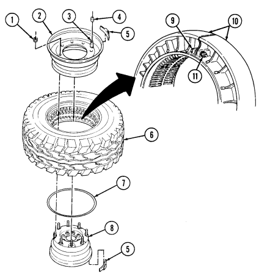

# 8 - 4 . Tire, Wheel, And Runflat Maintenance (Cont'D)

b. Inspection and Cleaning

Do not reuse a tire which has been run flat without thoroughly inspecting for damage. Failure to follow these instructions may result in injury to personnel or damage to equipment.

1. Inspect inside of tire (1) for cord or belt separation, and inner liner damage. Replace tire (1) if damaged.

2. Inspect tire bead (2) for abrasions caused from runflat halves (3). Replace tire (1) if damaged. 3. Check for protruding objects inside tire (1) which may not be visible from outside. Repair tire (1) if damaged.

4. Check tread depth on tire (1). Tread should not be worn below level of wear bars (4). Replace tire (1) if tread is worn below wear bars (4).

5. Remove filament tape (7), lubricant packet (6), and adhesive tape (5) from runflat halves (3) if

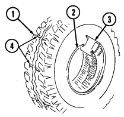

installed. Discard lubricant packet (6), filament tape (7), and adhesive tape (5).

6. Clean lubricant from tire (1) and runflat halves (3) with soap and water and allow to air dry.

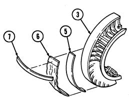

# 8 - 4 . Tire, Wheel, And Runflat Maintenance (Cont'D)

7. Inspect inside diameter fins (9) and center section fins (10) of runflat halves (8) for cracks or broken sections. Replace runflat halves (8) if cracked or broken.

8. Inspect outside diameter (11) of runflat halves (8) for total penetration cracks. Replace runflat halves (8) if cracked.

O-ring sealing surfaces and pressure relief grooves must be kept clean and free of rust and dirt. Failure to do so could cause the wheel assembly to separate under pressure if improperly disassembled, causing serious injury or death.

9. Using wire brush, clean studs (16). Clean all dirt and foreign material from rim halves (12) and (14)
with soap and water and allow to air dry. Ensure O-ring sealing surfaces (17) and pressure relief grooves (15) on rim halves (12) and (14) are not cracked, bent, and do not have oversized mounting holes.

10. Inspect rim halves (12) and (14) for cracks, bent sealing surfaces, or oversized mounting holes.

Replace rim halves (12) or (14) if cracked, bent, or if mounting holes are oversized. 

Never use wheel assemblies with studs which are damaged, loose, or have damaged threads. Damaged studs can cause improper assembly, which could cause individual fasteners to fail. Any of these situations could cause serious injury or death.

11. Inspect rim half (14) for cracked, broken, rusted, pitted, bent, or loose studs (16).

11.1. Inspect studs (16) for damaged or deformed threads. Replace studs (16) if threads are damaged or if studs (16) are damaged or loose (para. 8-8).

12. Inspect valve stem (13) for cracks or deterioration. Replace valve stem (13) if cracked or deteriorated.

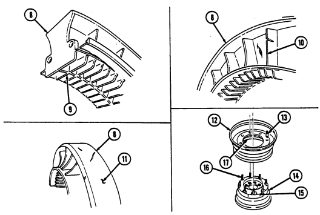

## 8 - 4 . Tire, Wheel, And Runflat Maintenance (Cont'D)

c. Repair Refer to TM 9-2610-200-14 for maintenance and repair of tires.

d. Assembly

- Never use tubes in wheel assemblies. Use of a tube defeats builtin safety features, and could allow the wheel to come apart under pressure, resulting in serious injury or death.

- Use only replacement parts specified in TM 9-2320-280-24P for bias tires. Eight bolt rims were designed for use with bias tire components only. Wheels assembled with components not specified for bias tires could cause the assembly to separate under pressure, resulting in serious injury or death.

Magnesium runflats are going to be phased out of the military supply system. They will be replaced by a rubber runflat kit. If rubber runflat kit is received for use with bias tires, follow assembly instructions in para. 8-5.

1. Apply one 11-ounce tube of gel lubricant (2) around inside of tire (1) at crown area (3). 2. Evenly spread gel lubricant (2) 4-5 in. (10-13 cm) wide on tire crown (3). 3. Install two runflat halves (4) inside tire (1) with four flange bolts (5) and locknuts (6). 

Using torque adapter, tighten locknuts (6) to 18-22 lb-ft (24-30 N•m).

8-4.  TIRE, WHEEL, AND RUNFLAT MAINTENANCE (Cont'd)

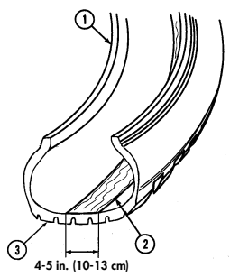

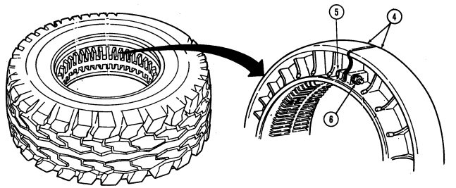

## 8-4. Tire, Wheel, And Runflat Maintenance (Cont'D)

4. Lubricate O-ring (8) with tire soap and install O-ring (8) on first ledge of rim half (9). Make sure O-
ring (8) is not twisted and is uniformly positioned 1 in. (25.4 mm) below studs (10). Do not overstretch O-ring (8).

5. Position inner rim half (9) on a raised stand (or another inner rim half) to ensure tire (6) sidewall will not contact floor when installed.

6. Lubricate tire bead (7) and rim bead seat areas with tire soap.

Before installing tire on inner rim half, inspect tire sidewalls for a "paint dot". Paint dots are often painted on tires to indicate the tire's light spot, for balancing purposes. If paint dot is present, position tire on rim halves so that paint dot is 180° from valve stem on outer rim half.

7. Center runflat (5) in tire (6). Carefully lower tire (6) over rim half (9). Check to ensure O-ring (8) has not been disturbed.

8. Ensure runflat (5) is not binding flat portion of rim half (9). Runflat (5) should clear inner rim half (9).

9. Install rim half (2) in tire (6).

Tighten locknuts gradually to avoid bent and broken studs, or damage to wheel components.

10. Install rim half (2) to rim half (9) with eight locknuts (1). Tighten locknuts (1) in sequence shown until rim half (2) is nearly touching rim half (9).

11. Tighten locknuts (1) to 55 lb-ft (75 N•m) in sequence shown. 12. Tighten locknuts (1) to 65 lb-ft (88 N•m) in sequence shown. 13. Check wheel assembly for gaps at each stud (10) between rim half (2) and rim half (9). Use a 0.0015 in. (0.038 mm) thickness gauge to detect gaps. If gaps are detected, disassemble and reassemble wheel assembly and recheck for gaps. If gaps are still detected, replace rim half (2).

14. Install valve core (4) in valve stem (3).

- Never inflate a wheel assembly without having checked wheel locknut torques to ensure the wheel locknuts are tightened to specifications. An assembly with improperly tightened locknuts could separate under pressure resulting in serious injury or death.

- Always use a tire inflation cage for inflation purposes. Stand on one side of cage, during inflation, never directly in front. Keep hands out of the cage during inflation. Inflate assembly to recommended pressure, using a clip-on air chuck. Do not exceed 30 psi (207 kPa) cold inflation pressure. Failure to follow these instructions may result in serious injury or death.

15. Place assembly in safety cage and inflate tire (6) to 30 psi (207 kPa) to seat tire bead. 16. Deflate tire (6) to recommended tire pressure (TM 9-2320-280-10). 17. Check for leaks around rim edges (11) and valve stem (4) with soapy solution.

# 8-4.  Tire, Wheel, And Runflat Maintenance (Cont'D)

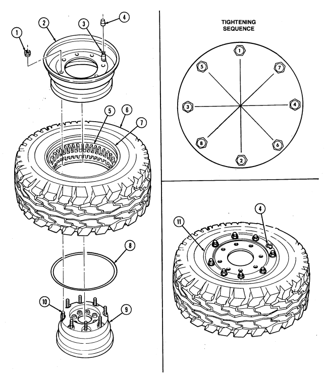

FOLLOW-ON TASK: Balance tire (para. 8-9).

# 8-4.1. Bias Tire, Wheel, And Rubber Runflat Maintenance

This task covers:
a. Disassembly c. Repair b. Inspection and cleaning d. Assembly

#### Initial Setup:

Applicable Models All except M997A2, M1025A2, M1035A2, M1043A2, M1045A2, M1097A2, and M1123 Tools General mechanic's tool kit:
automotive (Appendix B, Item 1)
General mechanic's tool kit:
automotive, common No. 2 (Appendix B, Item 4)

#### Special Tools

Runflat compressor (Appendix B, Item 131) Torque adapter, 9/16 in. 

(Appendix B, Item 144)

#### Materials/Parts

Twelve locknuts (Appendix G, Item 115) O-ring (Appendix G, Item 214) Detergent (Appendix C, Item 17) Lubricant (Appendix G, Item 196) Locknut (Appendix G, Item 82) O-ring (Appendix G, Item 219) Sealing compound, if required 
(Appendix C, Item 44)
Personnel Required One mechanic Manual References TM 9-2320-280-10 TM 9-2320-280-24P TM 9-2610-200-14

#### Equipment Condition

Wheel removed (para. 8-3).

General Safety Instructions
- Do not use tire machine. - Ensure tire is totally deflated before removing wheel locknuts.

- Never use tubes in wheel assemblies. - Rim surfaces must be kept clean and free of rust and dirt.

- Never use wheel assemblies with damaged studs.

- Never inflate a wheel assembly with the wheel locknuts removed.

- Never inflate a wheel assembly without first checking wheel locknut torques.

- Do not exceed recommended tire inflation pressure.

- Always use a tire inflation cage and a clipon air chuck for tire inflation.

- Ensure runflat compressor strap is centered around runflat.

- Never intermix bias and radial tires on the same vehicle.

- Use only replacement parts specified in TM 9-2320-280-24P.

- Do not use runflat compressor if compressor strap is frayed or damaged.

#### .Warning.

Do not use tire machine. Injury to personnel or damage to equipment may result.

The following maintenance procedure applies to vehicles using bias ply tires and one-piece rubber runflats. Refer to para. 8-4 for maintenance instructions on bias tires and magnesium runflats, and paras. 8-5 and 8-5.1 for maintenance instructions on radial tires and rubber runflats.

a. Disassembly 1. Place wheel assembly in a tire inflation cage.

# 8-4.1. Bias Tire, Wheel, And Rubber Runflat Maintenance (Cont'D)

In all disassembly operations, ensure the tire is totally deflated before removing wheel locknuts. Failure to follow proper safety precautions could cause serious injury or death.

2. Remove valve core (8) from valve bore (9) and deflate tire (6). Run a piece of wire through valve bore (9) to make sure it is not plugged.

3. When tire (6) is fully deflated, use a circular pattern and loosen twelve wheel locknuts (2) securing rim halves (1) and (4) together. If you hear escaping air, do not proceed. Wait until the sound stops and recheck valve bore (9). When you are certain the tire (6) is fully deflated, proceed to remove wheel locknuts (2). Discard locknuts (2).

4. Remove outer rim half (1) from tire (6).

Perform steps 5 and 6 only if damage to valve bore, insert, or O-ring is evident.

5. Remove valve bore (9) from insert (10). Remove insert (10) and locknut (12) from outer rim (1).

Discard locknut (12).

6. Remove O-ring (11) from insert (10). Discard O-ring (11). 7. Remove O-ring (5) from inner rim half (4). Cut O-ring (5) in two, to make sure it cannot be reused.

Discard O-ring (5).

8. Remove tire (6) from inner rim half (4). 9. Remove balance weights (3) from rim halves (1) and (4), if present. Discard balance weights (3).

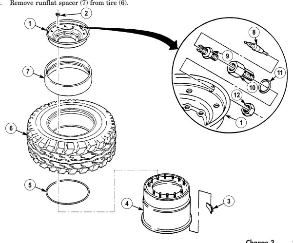

# 8-4.1. Bias Tire, Wheel, And Rubber Runflat Maintenance (Cont'D)

11. Lay tire (1) flat.

#### .Warning.

Do not use runflat compressor if compressor strap is frayed or damaged. Inspect the tool's pivot points and bearings and ensure runflat is free of grease and runflat compressor strap is centered around runflat. Failure to do so could cause injury to personnel.

NOTE
•Perform steps 10 and 11 when using runflat compressor P/N J39250. 

•Perform steps 12 and 13 when using runflat compressor P/N 528236.

and strap (5) is centered around runflat (2).

12. Position runflat compressor (3) on runflat (2) so that runflat compressor hex drive (4) is facing up NOTE
Compress runflat by rotating hex drive in either direction. Rotate hex drive opposite to loosen.

13. Using runflat compressor (3), compress runflat (2). 14. Position runflat compressor (6) on an outer edge of runflat (2) with handle assembly (7) facing up and strap (8) centered around runflat (2).

Compress runflat by rotating the handle assembly in a clockwise direction. Rotate handle assembly counterclockwise to loosen.

15. Using runflat compressor (6), compress runflat (2).

•It may be necessary to use a tire spoon and tire soap to remove runflat from tire.

•When using runflat compressor P/N 528236, handle may need to be removed before removing runflat.

16. Remove runflat (2) from tire (1) and remove runflat compressor (3) or (6) from runflat (2). 17. Remove two lubricant packets (9) and adhesive tape (10) from runflat (2) if installed. Discard

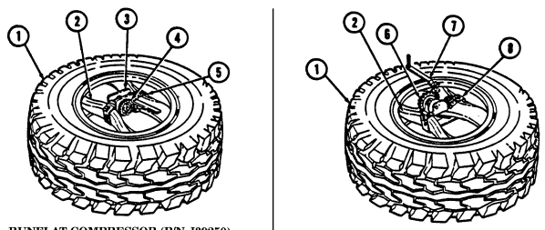

lubricant packets (9) and adhesive tape (10).

# 8-4.1. Bias Tire, Wheel, And Rubber Runflat Maintenance (Cont'D)

b. Inspection and Cleaning

#### .Warning.

Do not reuse a tire which has been run flat without thoroughly inspecting for damage. Failure to follow these instructions may result in injury to personnel or damage to equipment.

1. Inspect inside of tire (1) for cord or belt separation, and inner liner damage. Replace tire (1) if damaged.

2. Inspect tire bead (12) for abrasions caused from runflat (2). Replace tire (1) if damaged. 3. Check for protruding objects inside tire (1) which may not be visible from outside. Repair tire (1) if damaged.

4. Check tread depth on tire (1). Tread should not be worn below level of wear bars (13). Replace tire (1) if tread is worn below wear bars (13) or 3/32 in. (2.38 mm).

5. Inspect runflat spacer (11) for splitting, wear, or excessive chafing. Replace runflat spacer (11) if damaged.

6. Inspect runflat (2) for splitting, wear, or excessive chafing. Replace runflat (2) if damaged.

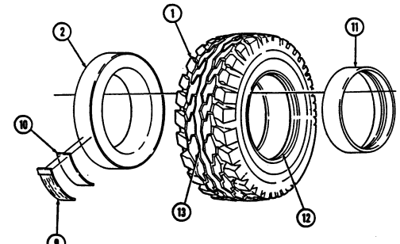

# 8-4.1. Bias Tire, Wheel, And Rubber Runflat Maintenance (Cont'D)

O-ringing surfaces and pressure relief grooves must be kept clean and free of rust and dirt. Failure to do so could cause the wheel assembly to separate under pressure, causing serious injury or death.

7. Using wire brush, clean studs (4). Clean all dirt and foreign material from rim halves (1) and (2)
with soap and water and allow to air dry. Ensure O-ringing surfaces (5) and pressure relief grooves (3) on rim halves (1) and (2) are smooth and clean.

8. Inspect rim halves (1) and (2) for cracks, bent sealing surfaces (5), or oversized mounting holes.

Replace rim halves (1) or (2) if cracked, bent, or if mounting holes are oversized.

Never use wheel assemblies with studs which are damaged, loose, or have damaged threads. Damaged studs can cause improper assembly, which could cause individual fasteners to fail. Any of these situations could cause serious injury or death.

9. Inspect inner rim half (2) for cracked, broken, rusted, pitted, bent, or loose studs (4).

10. Inspect valve core (6) for cracks or deterioration. Replace valve core (6) if cracked or deteriorated. 11. Inspect studs (4) for damaged or deformed threads. Replace studs (4) if threads are damaged or if studs (4) are damaged or loose (para. 8-8).

NOTE
Perform steps 11 and 12 only if valve core and insert were removed.

12. Inspect valve bore (7) for cracks or deterioration. Replace valve bore (7) if cracked or deteriorated. 13. Inspect insert (8) for damage. Replace insert (8) if damaged.

c. Repair Refer to TM 9-2610-200-14 for maintenance and repair of tires.

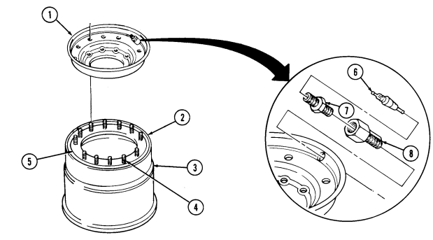

8-14.6 Change 3

# 8-4.1. Bias Tire, Wheel, And Rubber Runflat Maintenance (Cont'D)

d. Assembly

#### .Warning.

- Never use tubes in wheel assemblies. Use of a tube defeats built-in safety features, and could allow the wheel to come apart under pressure, resulting in serious injury or death.

- Use only replacement parts specified in TM 9-2320-280-24P.

Wheels assembled with components which do not meet specifications could cause the assembly to separate under pressure, resulting in serious injury or death.

- Do not use runflat compressor if compressor strap is frayed or damaged. Ensure runflat is free of grease and runflat compressor strap is centered on runflat. Failure to do so could cause injury to personnel.

- Any oil on runflat compressor belt could result in personnel injury or damage to equipment. Wipe any oil off from belt or handle.

#### Not E

Perform steps 1 and 2 when using runflat compressor P/N J39250. Perform steps 3 and 4 when using runflat compressor P/N 528236.

1. Position runflat compressor (9) on runflat (8) so that runflat compressor hex drive (10) is facing up and strap (11) is centered around runflat (8).

NOT E
Compress runflat by rotating hex drive in either direction. Rotate hex drive opposite to loosen.

2. Using runflat compressor (9), compress runflat (8). 3. Position runflat compressor (12) on an outer edge of runflat (8) with handle assembly (13) facing up and strap (14) centered around runflat (8).

#### Not E

Compress runflat by rotating the handle assembly in a clockwise

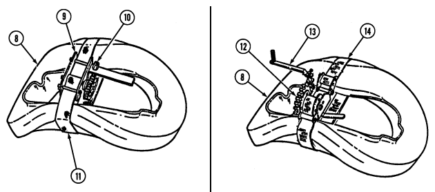 direction. Rotate handle assembly counterclockwise to loosen.

4. Using runflat compressor (12), compress runflat (8).

# 8-4.1. Bias Tire, Wheel, And Rubber Runflat Maintenance (Cont'D)

5. Stand tire (1) up and lubricate tire bead (3) with tire soap.

NOTE
It may be necessary to remove the handle assembly on runflat compressor P/N 528236 before inserting runflat into tire.

6. Insert runflat (2), compressor side first, as far as possible into tire (1). 7. Lay tire (1) flat on protruding runflat side. Loosen compressor (4). Runflat (2) should insert itself inside tire (1). If not, repeat steps 5 through 7 and/or use a tire spoon to assist in installation.

If required, clean and lubricate bearing assembly on runflat compressor P/N 528236 after removal.

8. Loosen runflat compressor (4) and remove from tire (1). 9. Apply one 11-ounce tube of gel lubricant (5) around inside of tire (1) at crown area (6).

10. Evenly spread gel lubricant (5) 4-5 in. (10-13 cm) wide on the tire crown (6).

NOTE
- Ensure longer lip of runflat faces inner rim of tire. - Ensure runflat spacer butts up against flat side of runflat.

11. Install runflat spacer (7) inside tire (1) and position on valve side of tire (1). 12. Lubricate O-ring (8) with tire soap and install O-ring (8) in groove (10) on top of inner rim (9),
around studs (11). Ensure O-ring (8) is not twisted and that it is uniformly positioned in groove (10). Do not overstretch O-ring (8).

13. Lubricate tire bead (3) and rim bead seat areas with tire soap.

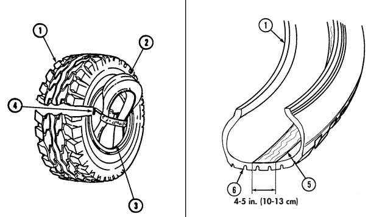

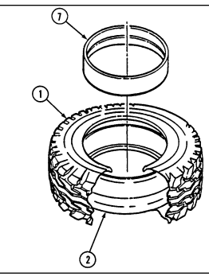

8-4.1. BIAS TIRE, WHEEL, AND RUBBER RUNFLAT MAINTENANCE (Cont'd)

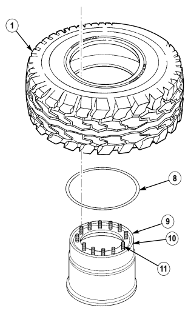

# 8-4.1. Bias Tire, Wheel, And Rubber Runflat Maintenance (Cont'D)

Never intermix bias and radial rim assemblies. Damage to equipment may result causing injury to personnel.

NOTE
Before installing tire on inner rim half, inspect tire sidewalls for a "paint dot". Paint dots are often painted on tires to indicate the tire's light spot, for balancing purposes. If paint dot is present, position tire on rim halves so that paint dot is aligned with insert hole on outer rim half.

14. Center runflat (6) and runflat spacer (5) in tire (1). Carefully lower tire (1) over inner rim half (8). Check to ensure O-ring (7) has not been disturbed.

15. Ensure runflat (6) and runflat spacer (5) are not binding on flat portion of inner rim half (8).

Runflat (6) and runflat spacer (5) should clear inner rim half (8).

16. Install valve core (9) in valve bore (10).

Perform step 17 only if valve bore and insert were removed.

17. Install insert (11), O-ring (12), and locknut (13) on outer rim (3). Apply sealing compound to valve bore (10) and install valve bore (10) on insert (11). Tighten locknut (13) to 40-60 lb-in. (5-7 N•m). Tighten valve bore (10) to 25-30 lb-ft (34-41 N•m).

18. Install outer rim half (3) on inner rim half (8).

Tighten locknuts gradually to avoid bent and broken studs, or damage to wheel components.

19. Install outer rim half (3) to inner rim half (8) with twelve locknuts (2).

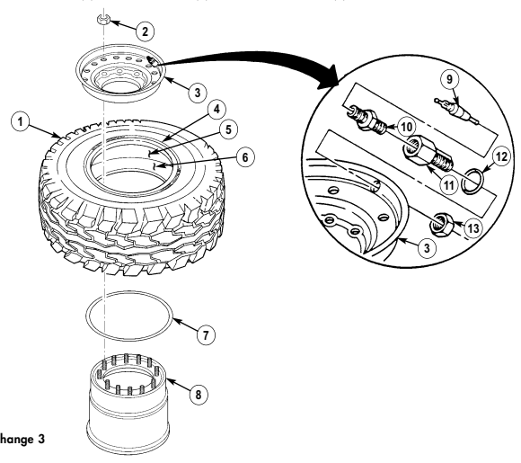

8-14.10 Change 3

# 8-4.1. Bias Tire, Wheel, And Rubber Runflat Maintenance (Cont'D)

20. Tighten locknuts (2) to 85 lb-ft (115 N•m) in tightening sequence shown. 21. Tighten locknuts (2) to 125 lb-ft (170 N•m) in tightening sequence shown. 22. Check wheel assembly for gaps at each stud (14). Use a 0.0015 in. (0.038 mm) thickness gauge to detect gaps. If gaps are detected, disassemble and reassemble wheel assembly and recheck for gaps. If gaps are still detected, replace outer rim half (3).

- Never inflate a wheel assembly without having checked wheel locknut torques to ensure the wheel locknuts are tightened to specifications. An assembly with improperly tightened locknuts could separate under pressure, resulting in serious injury or death.

- Always use a tire inflation cage for inflation purposes. Stand on one side of the cage, during inflation, never directly in front. Keep hands out of the cage during inflation. Inflate assembly to recommended pressure, using a clip-on air chuck. Do not exceed 50 psi (345 kPa) cold inflation pressure. Failure to follow these instructions may result in serious injury or death.

23. Place assembly in safety cage and inflate front and rear tires to recommended tire pressure
(TM 9-2320-280-10).

24. Check for leaks around rim edges (4), insert (6), and valve bore (10) with soapy solution.

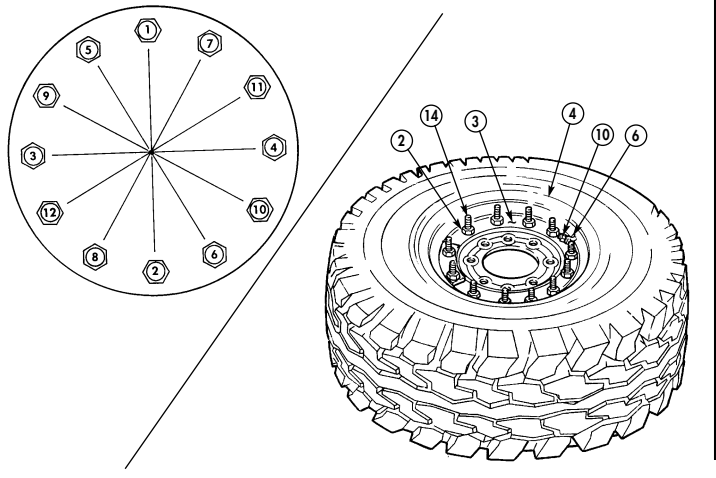

FOLLOW-ON TASK: Balance tire (para. 8-9).

# 8-5. Radial Tire, Wheel, And Rubber Runflat Maintenance (All Except M1123 And "A2" Vehicles)

This task covers:
a. Disassembly c. Repair b. Inspection and Cleaning d. Assembly INITIAL SETUP:

| automotive (Appendix B, Item 1)                                                                       | TM 9\-2320\-280\-24P   |
|-------------------------------------------------------------------------------------------------------|------------------------|
| Materials/Parts  Equipment Condition                                                                  |                        |
| Cotter pins (Appendix G, Item 12) - Muffler and insulator removed (all models except                  |                        |
| Two lockwashers (Appendix G, Item 163) M1123 and "A2" vehicles) (para. 3\-48).                        |                        |
| Two retaining rings (Appendix G, Item 231) - Muffler and catalytic converter removed (M1123           |                        |
| Two locknuts (Appendix G, Item 71) and "A2" vehicles only) (para. 3\-49).                             |                        |
| Lockwasher (Appendix G, Item 135) - Wheels chocked and parking brake released                         |                        |
| (TM 9\-2320\-280\-10).                                                                                |                        |
| NOTE                                                                                                  |                        |
| -  The following procedure applies to vehicles with serial numbers                                    |                        |
| USBL Eff. 44825 and above.                                                                            |                        |
| -  If cables are chafing or crushed, use new cable clamp bracket.                                     |                        |
| a. Removal                                                                                            |                        |
| 1.  Remove cotter pin (21), washer (20), clevis pin (18), and brake clevis (19) from rear caliper     |                        |
| lever (22). Discard cotter pin (21).                                                                  |                        |
| 2.  Remove brake cable retaining ring (1) and parking brake cable sleeve (17) from rear caliper cable |                        |
| bracket (2) and remove cable assembly (4) from caliper cable bracket (2). Discard cable retaining     |                        |
| ring (1).                                                                                             |                        |
| 3.  Slide parking brake cable (11) through parking brake cable assembly (4). Remove parking brake     |                        |
| cable retaining ring (8) from parking brake cable sleeve (7) and "C" beam (10). Disconnect parking    |                        |
| brake cable (4) from parking brake equalizer bar (9). Discard cable retaining ring (8).               |                        |
| 4.  Remove two capscrews (5), parking brake cable clamps (6), and parking brake cable assembly (4)    |                        |
| from body (12).                                                                                       |                        |

Do not use tire machine. Injury to personnel or damage to equipment may result.

NOTE
The following maintenance procedure applies to vehicles using load range "D" tires and one-piece rubber runflats. Refer to paras. 8-4 and 8-4.1 for maintenance instructions on bias tires and magnesium runflats.

a. Disassembly 1. Place wheel assembly in a tire inflation cage.

In all disassembly operations, ensure the tire is totally deflated before removing wheel locknuts. Failure to follow proper safety precautions could cause serious injury or death.

2. Remove valve core (8) from valve bore (9) and deflate tire (6). Run a piece of wire through valve bore (9) to make sure it is not plugged.

3. When tire (6) is fully deflated, use a circular pattern and loosen twelve wheel locknuts (2) securing rim halves (1) and (4) together. If you hear escaping air, do not proceed. Wait until the sound stops and recheck valve bore (9). When you are certain the tire (6) is fully deflated, proceed to remove wheel locknuts (2). Discard locknuts (2).

# 8-5. Radial Tire, Wheel, And Rubber Runflat Maintenance (All Except M1123 And "A2" Vehicles) (Cont'D)

Never inflate a wheel assembly with the wheel locknuts removed in an attempt to separate inner and outer rim halves. The assembly will separate under pressure resulting in serious injury or death.

4. Remove outer rim half (1) from tire (6).

Perform steps 5 and 6 only if damage to valve bore, insert, or O-ring is evident.

5. Remove valve bore (9) from insert (10). Remove insert (10) and locknut (12) from outer rim (1).

Discard locknut (12).

6. Remove O-ring (11) from insert (10). Discard O-ring (11). 7. Remove O-ring (5) from inner rim half (4). Cut O-ring (5) in two, to make sure it cannot be reused.

Discard O-ring (5).

8. Remove tire (6) from inner rim half (4). 9. Remove balance weights (3) from rim halves (1) and (4), if present. Discard balance weights (3).

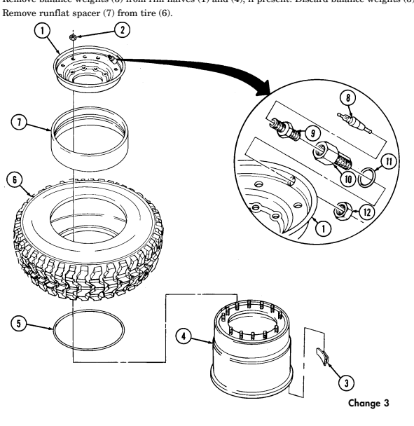

# 8 - 5 . Radial Tire, Wheel, And Rubber Runflat Maintenance (All Except M1123 And "A2" Vehicles) (Co N T ' D )

11. Lay tire (1) flat.

- Do not use runflat compressor if compressor strap is frayed or damaged.

Inspect the tool's pivot points and bearings and ensure runflat is free of grease and runflat compressor strap is centered around runflat. Failure to do so could cause injury to personnel.

- Any oil on runflat compressor belt or handle could result in personnel injury or damage to equipment. Wipe any oil off from belt or handle.

NOT E
Perform steps 12 and 13 when using runflat compressor P/N J39250. Perform steps 14 and 15 when using runflat compressor P/N 528236.

11.1. Make sure gears and pivot points on runflat compressor (3) or (6) have a light coat of oil to ensure ease of operation and prevent from rust.

12. Position runflat compressor (3) on runflat (2) so that runflat compressor hex drive (4) is facing up and strap (5) is centered around runflat (2).

#### Not E

Compress runflat by rotating hex drive in either direction. Rotate hex drive opposite to loosen.

13. Using runflat compressor (3), compress runflat (2). 14. Position runflat compressor (6) on an outer edge of runflat (2) with handle assembly (7) facing up and strap (8) centered around runflat (2).

NOT E
Compress runflat by rotating the handle assembly in a clockwise direction. Rotate handle assembly counterclockwise to loosen.

15. Using runflat compressor (6), compress runflat (2).

NOT E
- It may be necessary to use a tire spoon and tire soap to remove runflat from tire.

- When using runflat compressor P/N 528236, handle may need to be

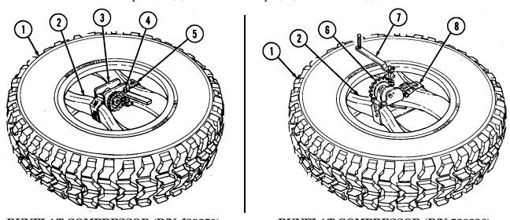

removed before removing runflat.

16. Remove runflat (2) from tire (1) and remove runflat compressor (3) or (6) from runflat (2). 17. Remove two lubricant packets (9) and adhesive tape (10) from runflat (2) if installed.

RUNFLAT COMPRESSOR (P/N J39250) RUNFLAT COMPRESSOR (P/N 528236)
8 - 5 . RADIAL TIRE, WHEEL, AND RUBBER RUNFLAT MAINTENANCE (ALL EXCEPT M1123

# And "A2" Vehicles) (Co N T ' D )

b. Inspection and Cleaning

Do not reuse a tire which has been run flat without thoroughly inspecting for damage. Failure to follow these instructions may result in injury to personnel or damage to equipment.

1. Inspect inside of tire (1) for cord or belt separation, and inner liner damage. Replace tire (1) if damaged.

2. Inspect tire bead (12) for abrasions caused from runflat (2). Replace tire (1) if damaged. 3. Check for protruding objects inside tire (1) which may not be visible from outside. Repair tire (1) if damaged.

4. Check tread depth on tire (1). Tread should not be worn below level of wear bars (13). Replace tire (1) if tread is worn below wear bars (13) or 3/32 in. (2.38 mm).

5. Inspect runflat spacer (11) for splitting, wear, or excessive chafing. Replace runflat spacer (11) if damaged.

6. Clean all grease, dirt, and foreign material from the runflat (2) with soap and water and allow to air

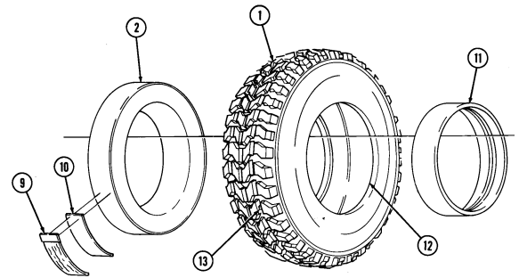

dry. Inspect runflat (2) for splitting, wear, or excessive chafing. Replace runflat (2) if damaged.

# 8 - 5 . Radial Tire, Wheel, And Rubber Runflat Maintenance (All Except M1123 And "A2" Vehicles) (Co N T ' D )

O-ring sealing surfaces and pressure relief grooves must be kept clean and free of rust and dirt. Failure to do so could cause the wheel assembly to separate under pressure, causing serious injury or death.

7. Using wire brush, clean studs (4). Clean all dirt and foreign material from rim halves (1) and (2)
with soap and water and allow to air dry. Ensure O-ring sealing surfaces (5) and pressure relief grooves (3) on rim halves (1) and (2) are smooth and clean.

8. Inspect rim halves (1) and (2) for cracks, bent sealing surfaces (5), or oversized mounting holes.

Replace rim halves (1) or (2) if cracked, bent, or if mounting holes are oversized.

Never use wheel assemblies with studs which are damaged, loose, or have damaged threads. Damaged studs can cause improper assembly, which could cause individual fasteners to fail. Any of these situations could cause serious injury or death.

9. Inspect inner rim half (2) for cracked, broken, rusted, pitted, bent, or loose studs (4).

10. Inspect valve core (6) for cracks or deterioration. Replace valve core (6) if cracked or deteriorated.

10.1. Inspect studs (4) for damaged or deformed threads. Replace studs (4) if threads are damaged or if studs (4) are damaged or loose (para. 8-8).

#### Not E

Perform steps 11 and 12 only if valve core and insert were removed.

11. Inspect valve bore (7) for cracks or deterioration. Replace valve bore (7) if cracked or deteriorated.

12. Inspect insert (8) for damage. Replace insert (8) if damaged.

c. Repair Refer to TM 9-2610-200-14 for maintenance and repair of tires.

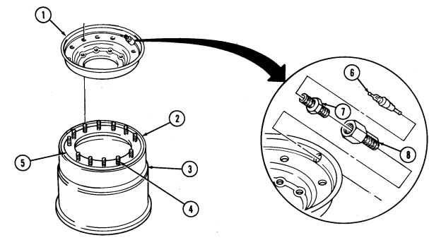

8 - 5 . RADIAL TIRE, WHEEL, AND RUBBER RUNFLAT MAINTENANCE (ALL EXCEPT M1123

# And "A2" Vehicles) (Co N T ' D )

d. Assembly

- Never use tubes in wheel assemblies. Use of a tube defeats built-in safety features, and could allow the wheel to come apart under pressure, resulting in serious injury or death.

- Use only replacement parts specified in TM 9-2320-280-24P for radial tires. Never install radial tire components on eight bolt rims. Wheels assembled with components not specified for radial tires could cause the assembly to separate under pressure, resulting in serious injury or death.

- Radial and bias tires should not be mixed on the same vehicle. Injury to personnel or damage to equipment may result.

- Do not use if compressor strap is frayed or damaged. Ensure runflat is free of grease and runflat compressor strap is centered on runflat. Failure to do so could cause injury to personnel.

- Any oil on runflat compressor belt or handle could result in personnel injury or damage to equipment. Wipe any oil off from belt or handle.

NOT E
Perform steps 1 and 2 when using runflat compressor P/N J39250. Perform steps 3 and 4 when using runflat compressor P/N 528236.

1. Make sure gears and pivot points on runflat compressor (10) or (13) have a light coat of oil to ensure ease of operation and prevent from rust.

1.1. Position runflat compressor (10) on runflat (9) so that runflat compressor hex drive (11) is facing up and strap (12) is centered around runflat (9).

NOT E
Compress runflat by rotating hex drive in either direction. Rotate hex drive opposite to loosen.

2. Using runflat compressor (10), compress runflat (9). 3. Position runflat compressor (13) on an outer edge of runflat (9) with handle assembly (14) facing up and strap (15) centered around runflat (9).

#### Not E

Compress runflat by rotating the handle assembly in a clockwise direction. Rotate handle assembly counterclockwise to loosen.

4. Using runflat compressor (13), compress runflat (9).

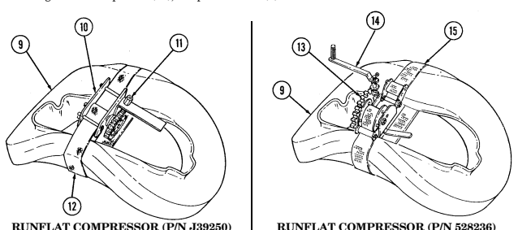

RUNFLAT COMPRESSOR (P/N J39250) RUNFLAT COMPRESSOR (P/N 528236)
# 8-5. Radial Tire, Wheel, And Rubber Runflat Maintenance (All Except M1123 And "A2" Vehicles) (Cont'D)

The radial tire is a bidirectional tire and the tread may be positioned in either direction.

5. Stand tire (1) up and lubricate tire bead (3) with tire soap.

NOTE
It may be necessary to remove the handle assembly on runflat compressor (P/N 528236) before inserting runflat into tire.

6. Insert runflat (2), compressor side first, as far as possible into tire (1). 7. Lay tire (1) flat on protruding runflat side. Loosen compressor (4). Runflat (2) should insert itself inside tire (1). If not, repeat steps 5 through 7 and/or use a tire spoon to assist in installation.

NOTE
If required, clean and lubricate bearing assembly on runflat compressor P/N 528236 after removal.

8. Loosen runflat compressor (4) and remove from tire (1). 9. Apply one 11-ounce tube of gel lubricant (6) around inside of tire (1) at crown area (7).

10. Evenly spread gel lubricant (6) 4-5 in. (10-13 cm) wide on tire crown (7).

NOTE
- Ensure longer lip of runflat faces inner rim of tire. - Ensure square cut edge of runflat spacer butts up against flat side of runflat.

11. Install flat spacer (5) inside tire (1) and position on valve side of tire (1). 12. Lubricate O-ring (10) with tire soap. Install O-ring (10) in groove (11.1) on top of inner rim (11),
around studs (12). Ensure O-ring (10) is not twisted and that it is uniformly positioned in groove (11.1). Do not overstretch O-ring (10).

13. Lubricate tire bead (3) and rim bead seat areas with tire soap.

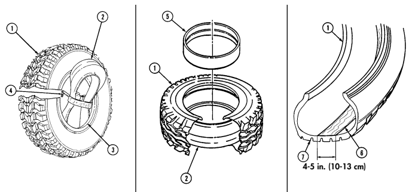

# 8-5. Radial Tire, Wheel, And Rubber Runflat Maintenance (All Except M1123 And "A2" Vehicles) (Cont'D)

- Never install radial tire on eight bolt wheel. Damage to equipment may result causing injury to personnel.

- Ensure that during assembly indexing hole on inner and outer rim halves is aligned. Failure to do so may cause damage to equipment or injury to personnel.

Before installing tire on inner rim half, inspect tire sidewalls for a "paint dot". Paint dots are often painted on tires to indicate the tire's light spot, for balancing purposes. If paint dot is present, position tire on rim halves so that paint dot is aligned with insert hole on outer rim half.

14. Center runflat (2) and runflat spacer (5) in tire (1). Carefully lower tire (1) over inner rim half (11). Check to ensure O-ring (10) has not been disturbed.

15. Ensure runflat (2) and runflat spacer (5) are not binding on flat portion of inner rim half (11).

Runflat (2) and runflat spacer (5) should clear inner rim half (11).

16. Install valve core (13) in valve bore (14).

Perform step 17 only if valve bore and insert were removed.

17. Install insert (15), O-ring (16), and locknut (17) on outer rim (9). Apply sealing compound to valve bore (14) and install valve bore (14) on insert (15). Tighten locknut (17) to 40-60 lb-in. (5-7 N•m). Tighten valve bore (14) to 25-30 lb-ft (34-41 N•m).

18. Install outer rim half (9) on inner rim half (11).

Tighten locknuts gradually to avoid bent and broken studs, or

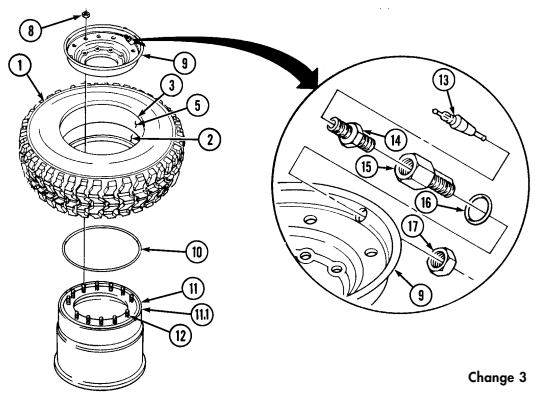 damage to wheel components.

19. Install outer rim half (9) to inner rim half (11) with twelve locknuts (8).

Change 3 8-23

## 8 - 5 . Radial Tire, Wheel, And Rubber Runflat Maintenance (All Except M1123 And "A2" Vehicles) (Co N T ' D )

20. Tighten locknuts (1) to 85 lb-ft (115 N•m) in tightening sequence shown. 21. Tighten locknuts (1) to 125 lb-ft (170 N•m) in tightening sequence shown. 22. Check wheel assembly for gaps at each stud (2). Use a 0.0015 in. (0.038 mm) thickness gauge to detect gaps. If gaps are detected, disassemble and reassemble wheel assembly and recheck for gaps. If gaps are still detected, replace outer rim half (3).

- Never inflate a wheel assembly without having checked wheel locknut torques to ensure the wheel locknuts are tightened to specifications. An assembly with improperly tightened locknuts could separate under pressure, resulting in serious injury or death.

- Always use a tire inflation cage for inflation purposes. Stand on one side of the cage, during inflation, never directly in front. Keep hands out of the cage during inflation. Inflate assembly to recommended pressure, using a clip-on air chuck. Do not exceed 50 psi (345 kPa) cold inflation pressure. Failure to follow these instructions may result in serious injury or death.

23. Place assembly in safety cage and inflate front and rear tires to recommended tire pressure
(TM 9-2320-280-10).

24. Check for leaks around rim edges (4), insert (6), and valve bore (5) with soapy solution.

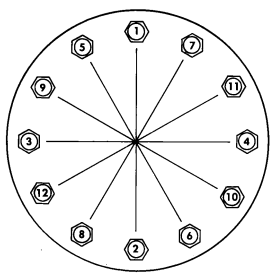

8 - 5 . RADIAL TIRE, WHEEL, AND RUBBER RUNFLAT MAINTENANCE (ALL EXCEPT M1123

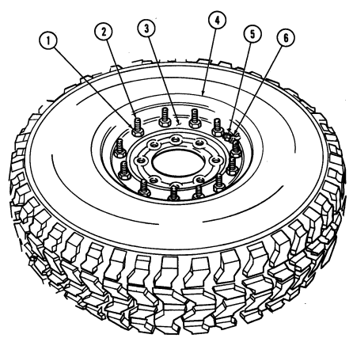

AND "A2" VEHICLES) (Co n t ' d )

# 8-5.1. Radial Tire, Wheel, And Rubber Runflat Maintenance (M1123 And "A2" Vehicles)

This task covers:
a. Disassembly c. Repair b. Inspection and Cleaning d. Assembly INITIAL SETUP:

| General mechanic's tool kit:                                    | - Muffler and insulator removed (all models except                                                  |
|-----------------------------------------------------------------|-----------------------------------------------------------------------------------------------------|
| automotive (Appendix B, Item 1)                                 | M1123 and "A2" vehicles) (para. 3\-48).                                                             |
| - Muffler and catalytic converter removed (M1123                | Materials/Parts                                                                                     |
| and "A2" vehicles only) (para. 3\-49).                          |                                                                                                     |
| Three cotter pins (Appendix G, Item 12)                         | - Wheels chocked and parking brake released                                                         |
| Locknut (Appendix G, Item 79)                                   | (TM 9\-2320\-280\-10).                                                                              |
| Locknut (Appendix G, Item 86)                                   |                                                                                                     |
| Manual References                                               |                                                                                                     |
| TM 9\-2320\-280\-10                                             |                                                                                                     |
| TM 9\-2320\-280\-24P                                            |                                                                                                     |
| CAUTION                                                         |                                                                                                     |
| The following procedure applies to vehicles with serial numbers |                                                                                                     |
| USBLEff. 44825 and above.                                       |                                                                                                     |
| a. Removal                                                      |                                                                                                     |
| 1.                                                              | Remove two cotter pins (left and right) (23), washers (22), clevis pins (20), and brake clevis (21) |
| from caliper levers (24). Discard cotter pins (23).             |                                                                                                     |
| 2.                                                              | Remove clip (5) and spread boot (6) to allow access to cotter pin (12).                             |
| 3.                                                              | Remove cotter pin (12), washer (11), clevis pin (8), and clevis (9) from brake rod (14) and         |
| bellcrank (7). Discard cotter pin (12).                         |                                                                                                     |
| 4.                                                              | Remove locknut (17), washer (16), spacer (15), washer (3), capscrew (4), and spring (2) from        |

Do not use tire machine. Injury to personnel or damage to equipment may result.

The following maintenance procedure applies to vehicles using load range "D" tires and one-piece rubber runflats. Refer to paras. 8-4 and 8-4.1 for maintenance instructions on bias tires and magnesium runflats.

#### A. Disassembly

1. Place wheel assembly in a tire inflation cage.

In all disassembly operations, ensure the tire is totally deflated before removing wheel locknuts. Failure to follow proper safety precautions could cause serious injury or death.

2. Remove valve core (8) from valve bore (7) and deflate tire (6). Run a piece of wire through valve bore (7) to make sure it is not plugged.

3. When tire (6) is fully deflated, use a circular pattern and loosen twelve wheel locknuts (2) securing rim halves (1) and (4) together. If you hear escaping air, do not proceed. Wait until the sound stops and recheck valve bore (7). When you are certain the tire (6) is fully deflated, proceed to remove wheel locknuts (2). Discard locknuts (2).

# 8-5.1. Radial Tire, Wheel, And Rubber Runflat Maintenance (M1123 And "A2" Vehicles) (Cont'D)

Never inflate a wheel assembly with the wheel locknuts removed in an attempt to separate inner and outer rim halves. The assembly will separate under pressure resulting in serious injury or death.

4. Remove outer rim half (1) from tire (6).

Perform steps 5 and 6 only if damage to valve bore, insert, or O-ring is evident.

5. Remove valve bore (7) from insert (10). Remove insert (10) and locknut (11) from outer rim (1).

Discard locknut (11).

6. Remove O-ring (9) from insert (10). Discard O-ring (9). 7. Remove O-ring (5) from inner rim half (4). Cut O-ring (5) in two, to make sure it cannot be reused.

Discard O-ring (5).

8. Remove tire (6) from inner rim half (4). 9. Remove balance weights (3) from rim halves (1) and (4), if present. Discard balance weights (3).

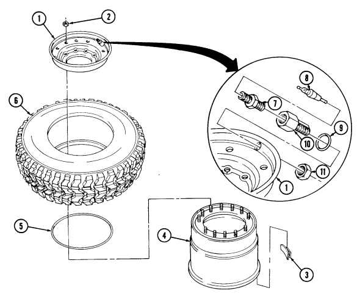

# 8-5.1. Radial Tire, Wheel, And Rubber Runflat Maintenance (M1123 And "A2" Vehicles) (Cont'D)

10. Lay tire (1) flat.

- Do not use runflat compressor if compressor strap is frayed or damaged. Inspect tool's pivot points and bearings and ensure runflat is free of grease and runflat compressor strap is centered around runflat. Failure to do so could cause injury to personnel.

- Any oil on runflat compressor belt or handle could result in personnel injury or damage to equipment. Wipe any oil off from belt or handle.

Perform steps 11 and 12 when using runflat compressor P/N J39250. Perform steps 13 and 14 when using runflat compressor P/N 528236.

10.1. Make sure gear and pivot points on runflat compressor (6) or (3) have a light coat of oil to ensure ease of operation and protect from rust.

11. Position runflat compressor (3) on runflat (2) so that runflat compressor hex drive (4) is facing up and strap (5) is centered around runflat (2).

NOTE
Compress runflat by rotating hex drive in either direction. Rotate hex drive opposite to loosen.

12. Using runflat compressor (3), compress runflat (2).

and strap (8) centered around runflat (2).

13. Position runflat compressor (6) on an outer edge of runflat (2) with handle assembly (7) facing up

Compress runflat by rotating the handle assembly in a clockwise direction. Rotate handle assembly counterclockwise to loosen.

14. Using runflat compressor (6), compress runflat (2).

NOTE
- It may be necessary to use a tire spoon and tire soap to remove runflat from tire.

- When using runflat compressor P/N 528236, handle may need to be

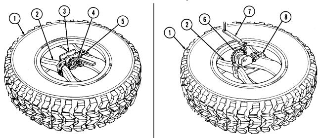

removed before removing runflat.

15. Remove runflat (2) from tire (1) and remove runflat compressor (3) or (6) from runflat (2).

RUNFLAT COMPRESSOR (P/N J39250) **RUNFLAT COMPRESSOR (P/N 528236)**
8-24.4 Change 2

# "A2" Vehicles) (Cont'D)

8-5.1. RADIAL TIRE, WHEEL, AND RUBBER RUNFLAT MAINTENANCE (M1123 AND
b. Inspection and Cleaning

Do not reuse a tire which has been run flat without thoroughly inspecting for damage. Failure to follow these instructions may result in injury to personnel or damage to equipment.

1. Inspect inside of tire (1) for cord or belt separation, and inner liner damage. Replace tire (1) if damaged.

2. Inspect tire bead (9) for abrasions caused from runflat (2). Replace tire (1) if damaged. 3. Check for protruding objects inside tire (1) which may not be visible from outside. Repair tire (1) if damaged.

4. Check tread depth on tire (1). Tread should not be worn below level of wear bars (10). Replace tire (1) if tread is worn below wear bars (10) or 3/32 in. (2.38 mm).

5. Clean all grease, dirt, and foreign material from the runflat (2) with soap and water and allow to

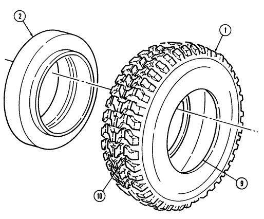

air dry. Inspect runflat (2) for splitting, wear, or excessive chafing. Replace runflat (2) if damaged.

# 8 - 5 . 1 . Radial Tire, Wheel, And Rubber Runflat Maintenance (M1123 And " A 2 " Vehicles) (Co N T ' D )

O-ring sealing surfaces and pressure relief grooves must be kept clean and free of rust and dirt. Failure to do so could cause the wheel assembly to separate under pressure, causing serious injury or death.

6. Using wire brush, clean studs (4). Clean all dirt and foreign material from rim halves (1) and (2)
with soap and water and allow to air dry. Ensure O-ring sealing surfaces (5) and pressure relief grooves (3) on rim halves (1) and (2) are smooth and clean.

7. Inspect rim halves (1) and (2) for cracks, bent sealing surfaces (5), or oversized mounting holes.

Replace rim halves (1) or (2) if cracked, bent, or if mounting holes are oversized.

Never use wheel assemblies with studs which are damaged, loose, or have damaged threads. Damaged studs can cause improper assembly, which could cause individual fasteners to fail. Any of these situations could cause serious injury or death.

8. Inspect inner rim half (2) for cracked, broken, rusted, pitted, bent, or loose studs (4).

8.1. Inspect studs (4) for damaged or deformed threads. Replace studs (4) if threads are damaged or if studs (4) are damaged or loose (para. 8-8).

9. Inspect valve core (6) for cracks or deterioration. Replace valve core (6) if cracked or deteriorated.

#### Not E

Perform steps 10 and 11 only if valve bore and insert were removed.

10. Inspect valve bore (7) for cracks or deterioration. Replace valve bore (7) if cracked or deteriorated.

11. Inspect insert (8) for damage. Replace insert (8) if damaged.

c. Repair Refer to TM 9-2610-200-14 for maintenance and repair of tires.

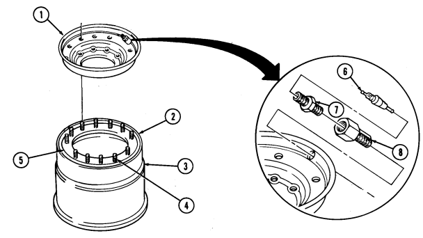

8 - 5 . 1 . RADIAL TIRE, WHEEL, AND RUBBER RUNFLAT MAINTENANCE (M1123 AND

# " A 2 " Vehicles) (Co N T ' D )

d. Assembly

- Never use tubes in wheel assemblies. Use of a tube defeats built-in safety features, and could allow the wheel to come apart under pressure, resulting in serious injury or death.

- Use only replacement parts specified in TM 9-2320-280-24P for radial tires. Never install radial tire components on eight bolt rims. Wheels assembled with components not specified for radial tires could cause the assembly to separate under pressure, resulting in serious injury or death.

- Radial and bias tires should not be mixed on the same vehicle. Injury to personnel or damage to equipment may result.

- Do not use if compressor strap is frayed or damaged. Ensure runflat is free of grease and runflat compressor strap is centered on runflat. Failure to do so could cause injury to personnel.

- Any oil on runflat compressor belt or handle could result in personnel injury or damage to equipment. Wipe any oil off from belt or handle.

NOT E
Perform steps 1 and 2 when using runflat compressor P/N J39250. Perform steps 3 and 4 when using runflat compressor P/N 528236.

1. Make sure gears and pivot points on runflat compressor (13) or (10) have a light coat of oil to ensure ease of operation and prevent from rust.

1.1. Position runflat compressor (10) on runflat (9) so that runflat compressor hex drive (11) is facing up and strap (12) is centered around runflat (9).

NOT E
Compress runflat by rotating hex drive in either direction. Rotate hex drive opposite to loosen.

2. Using runflat compressor (10), compress runflat (9). 3. Position runflat compressor (13) on an outer edge of runflat (9) with handle assembly (14) facing up and strap (15) centered around runflat (9).

#### Not E

Compress runflat by rotating the handle assembly in a clockwise

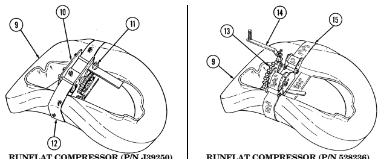 direction. Rotate handle assembly counterclockwise to loosen.

4. Using runflat compressor (13), compress runflat (9).

RUNFLAT COMPRESSOR (P/N J39250) RUNFLAT COMPRESSOR (P/N 528236)
# 8-5.1. Radial Tire, Wheel, And Rubber Runflat Maintenance (M1123 And "A2" Vehicles) (Cont'D)

4.1. Apply one 11-ounce tube of gel lubricant (5.1) around inside of tire (1) at crown area (5.2). 4.2. Evenly spread gel lubricant (5.1) 4-5 in. (10-13 cm) wide on tire crown (5.2).

NOTE
The radial tire is a bidirectional tire and the tread may be positioned in either direction.

5. Stand tire (1) up and lubricate tire bead (4) with tire soap.

It may be necessary to remove the handle assembly on runflat compressor (P/N 528236) before inserting runflat into tire.

6. Insert runflat (3), compressor side first, as far as possible into tire (1). 7. Lay tire (1) flat on protruding runflat side. Loosen compressor (5). Runflat (3) should insert itself inside tire (1). If not, repeat steps 5 through 7 and/or use a tire spoon to assist in installation.

If required, clean and lubricate bearing assembly on runflat compressor P/N 528236 after removal.

8. Loosen runflat compressor (5) and remove from tire (1).

- Never install radial tire on eight bolt wheel. Damage to equipment may result causing injury to personnel.

- Ensure that during assembly indexing hole on inner and outer rim halves is aligned. Failure to do so may cause damage to equipment or injury to personnel.

Before installing tire on inner rim half, inspect tire sidewalls for a "paint dot". Paint dots are often painted on tires to indicate the tire's light spot, for balancing purposes. If paint dot is present, position tire on rim halves so that paint dot is aligned with insert hole on outer rim half.

9. Lubricate tire bead (4) and rim bead seat areas with tire soap.

10. Center runflat (3) in tire (1). Carefully lower tire (1) over inner rim half (9). 11. Ensure runflat (3) is not binding on flat portion of inner rim half (9). Runflat (3) should clear inner

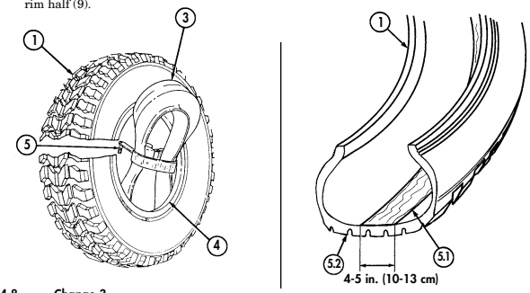

# 8-5.1. Radial Tire, Wheel, And Rubber Runflat Maintenance (M1123 And "A2" Vehicles) (Cont'D)

Ensure longer lip of runflat faces outer rim half.

12. Lubricate O-ring (8) with tire soap. Install O-ring (8) in groove (10) on top of inner rim (9), around studs (11). Ensure O-ring (8) is not twisted and that it is uniformly positioned in groove (10). Do not overstretch O-ring (8).

13. Install valve core (12) in valve bore (13).

Perform step 14 only if valve bore and insert were removed.

14. Install insert (14), O-ring (15), and locknut (16) on outer rim (7). Apply sealing compound to valve bore (13) and install valve bore (13) on insert (14). Tighten locknut (16) to 40-60 lb-in. (5-7 N•m). Tighten valve bore (13) to 25-30 lb-ft (34-41 N•m).

15. Install outer rim half (7) on inner rim half (9).

Tighten locknuts gradually to avoid bent and broken studs, or

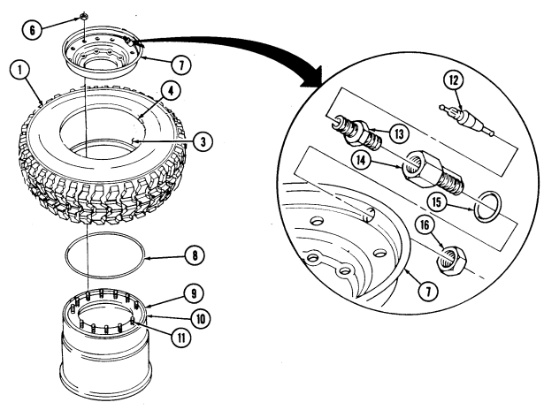 damage to wheel components.

16. Install outer rim half (7) on inner rim half (9) with twelve locknuts (6).

# 8 - 5 . 1 . Radial Tire, Wheel, And Rubber Runflat Maintenance (M1123 And " A 2 " Vehicles) (Co N T ' D )

17. Tighten locknuts (1) to 85 lb-ft (115 N•m) in tightening sequence shown. 18. Tighten locknuts (1) to 125 lb-ft (170 N•m) in sequence shown. 19. Check wheel assembly for gaps at each stud (2). Use a 0.0015 in. (0.038 mm) thickness gauge to detect gaps. If gaps are detected, disassemble and reassemble wheel assembly and recheck for gaps. If gaps are still detected, replace outer rim half (3).

- Never inflate a wheel assembly without having checked wheel locknut torques to ensure the wheel locknuts are tightened to specifications. An assembly with improperly tightened locknuts could separate under pressure, resulting in serious injury or d e a t h .

- Always use a tire inflation cage for inflation purposes. Stand on one side of the cage, during inflation, never directly in front. Keep hands out of the cage during inflation. Inflate assembly to recommended pressure, using a clip-on air chuck. Do not exceed 50 psi (345 kPa) cold inflation pressure. Failure to follow these instructions may result in serious injury or death.

20. Place assembly in safety cage and inflate front and rear tires to recommended tire pressure
(TM 9-2320-280-10).

21. Check for leaks around rim edges (4), insert (6), and valve bore (5) with soapy solution.

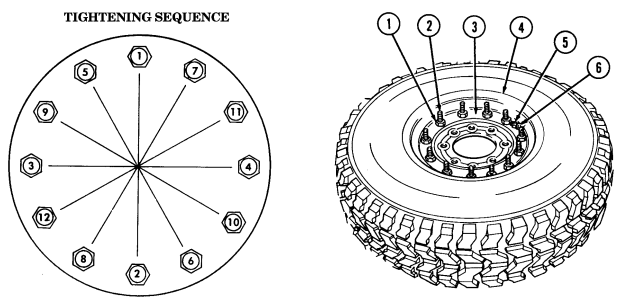

FOLLOW-ON TASK: Balance tire (para. 8-9).

# 8-6. Runflat Compressor (P/N J39250) Belt Replacement

This task covers:
INITIAL SETUP:
Tools General mechanic's tool kit:
automotive (Appendix B, Item 1)
Materials/Parts Runflat belt repair kit
(Appendix G, Item 276)
a. Removal a. Removal b. Installation Manual References TM 9-2320-280-24P

Note position of belt for installation.

1. Remove small pin (8) from belt (4) and worm gear shaft assembly (1). Discard small pin (8). 2. Remove shaft pin (7) and worm gear shaft assembly (1) from compressor assembly (6). Discard shaft pin (7).

3. Remove two locknuts (5), sockethead screws (2), spacers (3), and belt (4) from compressor assembly (6). Discard locknuts (5).

b. Installation

Belt overlap is to be positioned so that you have equal amount of belt on each side of worm gear shaft assembly.

1. Install belt (4) on compressor assembly (6) with two spacers (3), sockethead screws (2), and locknuts (5).

2. Install worm gear shaft assembly (1) on compressor assembly (6) with shaft pin (7). 3. Install belt (4) to worm gear shaft assembly (1) with small pin (8).

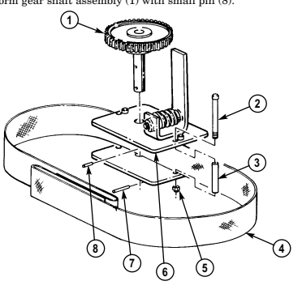

# 8-7. Runflat Compressor (P/N 528236) Belt Replacement

This task covers:
a. Removal b. Installation INITIAL SETUP:
Tools General mechanic's tool kit:
automotive (Appendix B, Item 1)
Manual References TM 9-2320-280-24P
Materials/Parts Runflat belt repair kit
(Appendix G, Item 277)
a. Removal

Note position of belt for installation.

Remove locknut (1), capscrew (2) and belt (3) from compressor (4). Discard locknut (1).

b. Installation 1. Install belt (3) on compressor (4) with capscrew (2) and locknut (1). 2. Loop free end of belt (3) around retaining bracket (5) as shown.

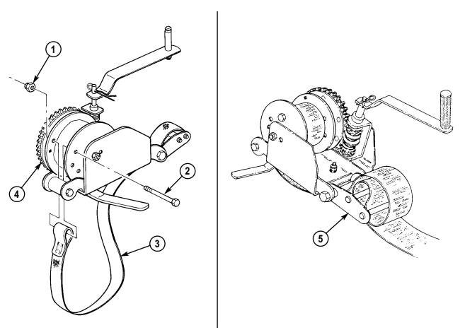

# 8-8. Inner Rim Stud Maintenance

This task covers:
a. Removal c. Installation b. Cleaning and Inspection INITIAL SETUP:
Tools General mechanic's tool kit:
automotive (Appendix B, Item 1)
Manual References TM 9-2320-280-24P
Equipment Condition Wheel removed (para. 8-3).

#### General Safety Instructions

Always wear eye protection when replacing wheel studs.

Ensure tire is totally deflated before removing wheel locknuts.

Never use wheel assemblies with damaged studs.

Never inflate a wheel assembly without first checking wheel locknut torques.

Always use a tire inflation cage and a clip-on air chuck for tire inflation.

Always wear eye protection when replacing wheel studs. Severe eye injury may result if metal chips contact eyes.

Perform steps 1 through 4 for stud removal without disassembly of wheel. Perform steps 5 and 6 for stud removal with disassembled wheel.

1. Place wheel assembly in tire inflation cage.

#### Warnin G

In all assembly operations, ensure the tire is totally deflated before

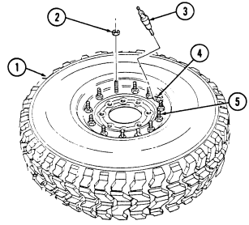 removing wheel locknuts. Failure to follow proper safety precautions may result in serious injury or death.

2.

3.

Remove valve core (3) from valve bore (4) and deflate tire (1). Run a wire through valve bore (4) to ensure it is not plugged. When tire (1) is fully deflated, loosen wheel locknut (2) from each side of the broken stud(s) (5). If you hear escaping air, do not proceed. Wait until the sound stops and recheck valve bore (4). When you are certain tire is fully deflated, proceed to remove wheel locknut (2). Discard locknut (2).

# 8-8. Inner Rim Stud Maintenance (Cont'D)

When replacing broken rim stud(s), replace studs on both sides of the broken stud(s).

4. Drive studs (1) out of inner rim (2). Discard studs (1).

5. Disassemble wheel and runflat (para. 8-4 or 8-5.)
6. Drive stud (3) out of inner rim half (4). Discard stud (3).

#### B. Cleaning And Inspection

1. Using wire brush, clean studs. Clean all dirt and foreign material from rim with soap and water and allow to air dry.

Never use wheel assemblies with studs which are damaged, loose, or have damaged threads. Damaged studs can cause improper assembly, which could cause individual fasteners to fail. Any of these situations may result in serious injury or death.

2. Inspect inner rim (4) for cracked, broken, rusted, pitted, bent, or loose studs (3), and studs (3) with damaged, mutilated, or deformed threads.

#### C. Installation Note

Perform steps 1 and 2 for stud installation with disassembled wheel. Perform steps 3 through 11 for stud installation without disassembly of wheel.

Align splines on stud (3) with splines in inner rim (4) and drive stud (3) into inner rim (4) until stud shoulder seats against inner rim (4).

1.

2.

3.

4.

Repeat step 3 for all studs (1) being replaced.

Tighten locknuts gradually to avoid bent and broken studs, or damage to wheel components will result.

5.

Install locknuts (6) on studs (1).

After replacing broken stud(s), all rim nuts must be retorqued.

6. 7. 8.

9.

Assemble wheel and runflat (para. 8-4 or 8-5.). Align splines on stud (1) with splines in inner rim (2) and drive stud (1) into rim (2) until shoulder of stud (1) seats against inner rim (2).

Tighten locknuts (6) to 85 lb-ft (115 N m) in sequence shown.

Tighten locknuts (6) to 125 lb-ft ( 170 N m) in sequence shown.

Check wheel assembly for gaps at each stud. Use a 0.0015 in. (0.038 mm) thickness gauge to detect gaps. If gaps are detected, disassemble and reassemble wheel assembly and recheck for gaps. If gaps are still detected, replace outer rim half (para. 8-4 or 8-5). Install valve core (7) in valve bore (8).

# 8-8. Inner Rim Stud Maintenance (Cont'D)

Never inflate a wheel assembly before checking wheel locknut torques to ensure the wheel locknuts are tightened to specifications. An assembly with improperly tightened locknuts could separate under pressure, resulting in serious injury or death.

Always use a tire inflation cage for inflation purposes. Stand on one side of the cage during inflation, never directly in front. Keep hands out of cage during inflation. Inflate assembly to recommended pressure, using a clip-on air chuck. Do not exceed 50 psi (345 kPa) cold inflation pressure. Failure to follow these instructions may result in serious injury or death.

10. Place tire assembly (5) in safety cage and inflate front and rear tires to recommended tire pressure
(TM 9-2320-280-10).

and valve bore (8) with soapy solution.

11. Check for leaks around rim edges, insert,

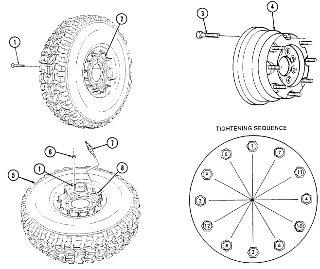

FOLLOW-ON TASK: Install wheel (para.

8-3).

## 8-9. Tire Balancing

This task covers:
Balancing INITIAL SETUP:
Tools General mechanic's tool kit:
automotive (Appendix B, item 1)
Test Equipment Bubble balancer (Appendix B, Item 130)
Materials/Parts Wheel balance weights (as required)
(Appendix G, Item 2)
Chalk (Appendix C, Item 15)
Personnel Required One mechanic One assistant Manual References TM 9-2320-280-24P
Equipment Condition Wheel removed (para. 8-3).

Balancing

•Wheel and tire must be clean and free of foreign material. •Wheel must be centered on balancer utilizing lug nut mounting holes.

1. Mount tire (1) and wheel (2) on balancer, curb side up. 2. Locate and mark light spot (5) on tire (1).

NOTE
•If more than 29 oz. of weight is required to balance tire, wheel and runflat must be disassembled and tire rotated 180° on wheel.

•Tires can be balanced using either adhesive backed or clip on type weights. Follow steps 3 through 10 if using adhesive backed weights, or steps 11 through 15 for clip on type weights.

3. Add 6 oz. of weight (4) to center of light spot (5) between wheel (2) and clamp ring (3) until weight required to balance tire (1) is met or exceeded. Do not permanently attach weights (4) at this time.

10. Repeat step 1 to ensure tire (1) is properly balanced. 11. Place a 6 oz. weight (6) on edge of wheel (2) with clip (7) centered on light spot (5). Do not permanently attach weight (6) at this time.

12. Check wheel (2) and tire (1) for proper balance. If necessary, add weights (6), or replace 6 oz.

weight (6) with a lighter weight (6), making sure weight clips (7) are centered on light spot (5) and weight (6) are not permanently attached.

4. If weight requirement is exceeded, evenly remove weights (4) in 1/2 oz. increments from each side of light spot (5) until tire (1) and wheel (2) are properly balanced.

5. Record amount of weights (4) used, and remove tire (1) and wheel (2) from balancer. 6. Working from light spot (5) on front side of tire (1), mark rear side of tire (1) and inside of wheel (2)
for light spot (5) identification.

7. Temporarily attach weights (4) with tape to inside of wheel (2), in a radial direction, following weight placement diagram.

8. Repeat step 1 and add or subtract weights (4) until tire (1) is properly balanced.

NOTE
Wheel must be smooth and clean before attaching wheel weights.

9. Remove adhesive backing from weights (4) and attach to inside of wheel (2) following weight placement diagram.

# 8-9. Tire Balancing (Cont'D)

13. Repeat step 12 until wheel (2) and tire (1) are properly balanced. 14. Record total amount of weight (6) on wheel (2), and remove weights(s) from wheel (2) and wheel (2)
from balancer.

Total amount of weight must be split "50/50" between imer and outer edges of wheel rim. For example, if 6 oz. of total weight was required to balance wheel, attach 3 oz. to outer edge of rim and 3 oz. to inner edge of rim.

15. Attach weights (6) to inner and outer edges of wheel (2), ensuring weight clips (7) are centered on

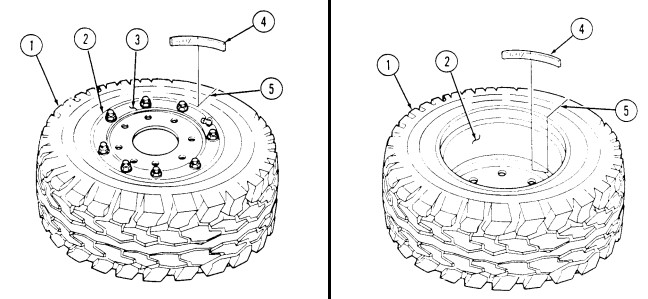

light spot (5), or weights (6) are placed evenly to sides of light spot (5) if more than one weight (6) is used. Using small hammer or clip claw-hammer tool, tap weights to conform to wheel (2) edge contour.

WEIGHT PLACEMENT DIAGRAM

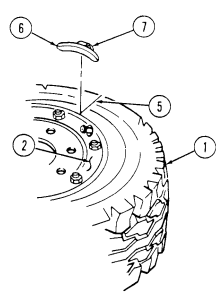

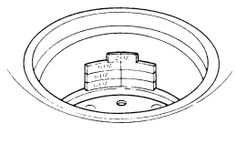

FOLLOW-ON TASK: Install wheel (para. 8-3).

# 8 - 1 0 . Front Wheel Toe-In Alignment

This task covers:
a. Preliminary Inspection c. Toe-in Adjustment b. Toe-in Check INITIAL SETUP:
Tools General mechanic's tool kit:
automotive (Appendix B, Item 1)
General mechanic's tool kit:
automotive, common No. 2 (Appendix B, Item 4)
Materials/Parts Chalk (Appendix C, Item 15)
Personnel Required One mechanic One assistant Manual References TM 9-2320-280-10 TM 9-2320-280-24P
Equipment Condition
•Tires inflated to proper pressure (TM 9-2320-280-10). •Vehicle on level ground.

#### N Ot E

- It is not necessary to perform front wheel toe-in alignment prior to the scheduled semiannual or 3,000 mile (4,827 km) maintenance interval unless abnormal vehicle handling or control is reported, or it is directed by another maintenance task.

- Front wheel alignment adjustments other than toe-in are performed by DS maintenance.

- Make sure models M1037 and M1042 have S250 shelter installed before performing front wheel toe-in alignment.

#### A. Preliminary Inspection

1. Check all tires (6) for uniform tread wear. 2. Raise vehicle and place support under lower control arms (9). 3 . Check geared hubs (4) for output spindle end play by grasping edges of tires (6) and attempting to move tires (6) up and down. Adjust spindle bearings if any spindle movement is apparent (para. 6-14).

4 . Check for looseness of upper ball joints (3) by grasping top of tires (6), and attempting to move tires (6)
in and out. Replace upper ball joints (3) if tire (6) movement at top outer edge of tires (6) is 3/8 in. ( 9 mm) or more (para. 6-26).

5 . Check for looseness of lower ball joints (7) by grasping bottom of tires (6), and attempting to move tires (6)
in and out. Replace lower ball joints (7) if tire (6) movement at bottom outer edge of tires (6) is 1/2 in. ( 1 3 mm) or more (para. 6-27).

6. Lower vehicle. 7. Check for looseness of tie rod ends (5) by attempting to move tie rods (8) vertically and horizontally.

Replace tie rod end(s) (5) if any movement is apparent (para. 8-16).

8 . Check for damaged control arm bushings (1). Replace upper control arms (2) (para. 6-28) or lower control arms (9) if bushings (1) are damaged (para. 6-29).

8-10. FRONT WHEEL TOE-IN ALIGNMENT (Cont'd)

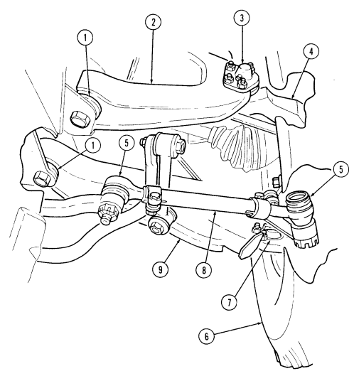

# 8-10. Front Wheel Toe-In Alignment (Cont'D)

b. Toe-in Check

Vehicle must be on level ground with wheels set straight ahead.

Steps 1 through 3 will determine centerline of tire.

"Point of Measurement" for checking toe-in will be where lines marked in steps 1 and 3 intersect.

Mark line (4) on center tread (1) of tire (2) 16-1/2 in. (42 cm) from ground. Measure total width of tire tread (3) and record. Mark line (5) on center tread (1) at one-half total tread width (3).

1.

2. 3. 4.

5. 6.

7.

Repeat steps 1 through 3 for opposite tire. Measure distance between "Points of Measurement" on front side of tires (2) and record.

Rotate tires (2) by moving vehicle forward until "Points of Measurement" are 16-1/2 in. (42 cm) above the ground at rear side of tires (2). Measure distance between "Points of Measurement" on rear side of tires (2) and record.

If measurement is larger on front side of tires than measurement on rear side of tires, tires have toe-out.

If toe-in alignment does not meet specifications, repeat checking procedures to eliminate any possible reading errors.

Subtract measurement from front side of tires (2), obtained in step 5, from measurement from rear side of tires (2), obtained in step 7. The result of this subtraction represents inches of toe-in. Refer to table 8-1 for toe-in specifications. If toe-in does not meet specifications, adjust toe-in (task c). Refer to table 81 for toe-in adjustment specifications.

8.

9. If toe-in is within specifications, refer to task c and perform step 5.

Vehicles should be at curb weight to ensure proper alignment. Refer to table 8-1(a.) for adjustment specifications.

Table 8-1(b.) is optional and can be used when the vehicle's average operation is at less than gross vehicle weight. Vehicle is to be loaded to its average operating weight when using this table.

Table 8-1. Toe-In Alignment Adjustment Specifications.

|                     |                | TOE\-IN (FRONT) ADJUSTMENT SPECIFICATIONS   |                                                  |                 |                                     |
|---------------------|----------------|---------------------------------------------|--------------------------------------------------|-----------------|-------------------------------------|
|                     | BIAS TIRE      |                                             | RADIAL TIRE                                      |                 |                                     |
|                     | MODELS:        | MODELS:                                     | MODELS: M996, M996A1,                            | MODELS          | MODELS:                             |
| VEHICLE             | M998,          | M966,                                       | M998, M998A1, M1025,                             | M997.           | M1097,                              |
|                     | M1025, M1026,  | M996, M997.                                 | M1025A1, M1025A2, M1026,                         | M997A1,         | M1097A1,                            |
| PAYLOAD             | M1035, M1038,  | M1036, M1037.                               | M1026A1. M1035. M1035A2.                         | M997A2,         | M1097A2                             |
|                     | M1043, M1044   | M1042, M1045,                               | M1035A1. M1036. M1038.                           | M1037           |                                     |
|                     |                | M1046                                       | M1038A1, M1043, M1043A1, M1043A2, M1044, M1044A1 | M1042           |                                     |
|                     |                |                                             | M1045, M1045A1, M1045A2,                         |                 |                                     |
|                     |                |                                             | M1046, M1046A1                                   |                 |                                     |
| a. Vehicle @ curb   | 7/16 ± 1/8 in. | 5/16 ± 1/8 in.                              | 1/4 ± 1/16 in.                                   | 5/16 ± 1/16 in. | 1/8 ± 1/16 in.                      |
| weight              | (11 mm ± 3 mm) | (8 mm ± 3mm                                 | (6 mm ± 1.5 mm)                                  | (8 mm ± 1.5 mm) | (9.5 mm ± 1.5 mm                    |
| b. Vehicle @ normal | 1/4 ± 1/8 in.  | 1/4 ± 1/8 in.                               | 1/16 ± 1/16 in.                                  | 1/16 ± 1/16 in. | 1/16 ± 1/16 in.                     |
| operating weight    | (6mm ± 3 mm)   | (6 mm ± 3 mm)                               | (1.5 mm ± 1.5 mm)                                |                 | (1.5 mm ± 1.5 mm) (1.5 mm ± 1.5 mm) |
| (optional)          |                |                                             |                                                  |                 |                                     |

# 8-10. Front Wheel Toe-In Alignment (Cont'D)

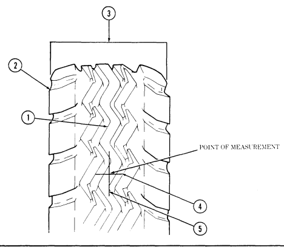

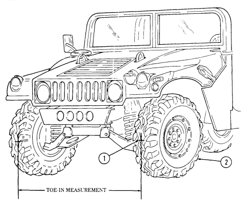

# 8-10. Front Wheel Toe-In Alignment (Cont'D)

#### C. Toe-In Adjustment

1. Loosen two locknuts (3) from clamps (1) on each adjusting sleeve (2).

Toe-in can be increased or decreased by changing length of tie rods. A threaded sleeve is provided for this purpose. Both tie rods must be the same length ± 1/8 inch (3 mm) after adjustment.

2. Turn each adjusting sleeve (2) equally but in opposite directions. 3. Roll vehicle rearward then forward to original position. 4. Repeat toe-in check and adjustment procedures until correct adjustment is indicated.

Ensure bolt and nut on adjusting sleeve clamp nearest to geared hub is facing halfshaft. Bolt and nut on adjusting sleeve clamp nearest to frame must be facing away (180°) from stabilizer bar, to prevent damage to equipment.

5. Secure two clamps 30 lb-f-t (40 N·m).

(1) on each adjusting sleeve (2) with two locknuts (3). Tighten locknuts (3) to

# 8-10. Front Wheel Toe-In Alignment (Cont'D)

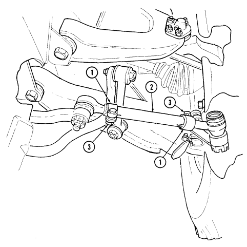

FOLLOW-ON TASK: Operate vehicle (TM 9-2320-280-10) and check for pull or wander.

# 8-11. Rear Wheel Toe-Out Alignment

This task covers:
a. Preliminary Inspection c. Toe-out Adjustment b. Toe-in Check INITIAL SETUP:
General mechanic's tool kit: TM 9-2320-280-10 automotive (Appendix B, Item 1) TM 9-2320-280-24P
Tape (Appendix C, Item 50) (TM 9-2320-280-10). Twine (Appendix C, Item 53) Vehicle on level ground.

Personnel Required One mechanic One assistant Tools **Manual References**
Materials/Parts **Equipment Condition**
Chalk (Appendix C, Item 15) Tires inflated to proper pressure

It is not necessary to perform rear wheel toe-out alignment prior to the scheduled semiannual or 3,000 mile (4,827 km) maintenance interval unless abnormal vehicle handling or control is reported, or it is directed by another maintenance task.

Rear wheel alignment adjustments other than toe-out are performed by DS maintenance.

Make sure models M1037 and M1042 have S250 shelter installed before performing rear wheel toe-out alignment.

#### A. Preliminary Inspection

1.

2. 3.

4.

5.

6.

7.

8.

9.

10.

11.

Check all tires (7) for uniform tread wear.

Raise vehicle and place support under lower control arms (11). Check geared hubs (5) for output spindle end play by grasping edges of tires (7) and attempting to move tires (7) up and down. Adjust spindle bearings (para. 6-14) if any spindle movement is apparent. Check for looseness of upper ball joints (4) by grasping top of tires (7), and attempting to move tires (7) in and out. Replace upper ball jointa (4) (para. 6-26) if tire (7) movement at top outer edge of tires (7) is 3/8 in. (9 mm) or more. Check for looseness of lower ball joints (8) by grasping bottom of tires (7), and attempting to move tires (7) in and out. Replace lower ball joints (8) (para. 6-27) if tire (7) movement at bottom outer edge of tires (7) is 1./2 in. (13 mm) or more. Lower vehicle. Check for looseness of radius rod ends (6) by attempting to move adjusting sleeves (10) vertically and horizontally. Replace radius rod end(s) (6) (para. 6-25) if any movement is apparent. Check for damaged control arm bushings (1). Replace upper control arms (3) (para. 6-28) or lower control arms (11) (para. 6-29) if bushings (1) are damaged. Set front wheels in straight ahead position. This can be checked by driving vehicle a short distance on a flat surface to determine steering wheel position at which vehicle follows a straight path.

Tape one end of a piece of string (12) to inner wall of front tire (7).

Ensure front tire (7) is straight. Pull string (12) to rear tire (7) until string (12) touches front of rear tire (7). Measure distance between string (12) and rear side wall of rear tire (7).

## 8-11. Rear Wheel Toe-Out Alignment (Cont'D)

12.

Measurement must be 0-118 in. (0-3 mm). If measurement is not within specifications, perform step 13. If measurement is within specifications. proceed to step 14.

13.

Loosen two locknuts (2) securing clamps (9). Turn adjusting sleeve (10) until measurement is within specifications. Roll vehicle forward then rearward and repeat steps 10 through 12 to ensure correct adjustment.

14.

Repeat steps 10 through 12 for opposite side.

15. Proceed to task b.

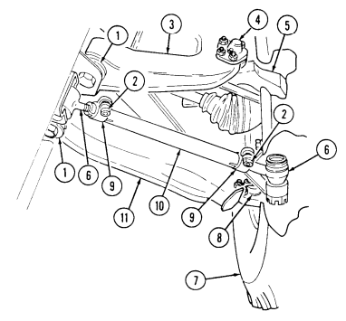

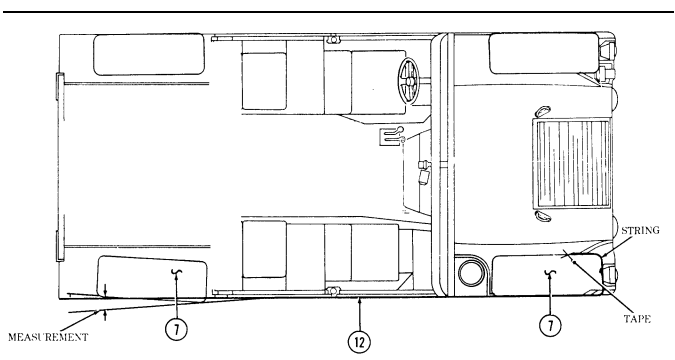

# 8-11. Rear Wheel Toe-Out Alignment (Cont'D)

#### B. Toe-Out Check Note

Vehicle must be on level ground with wheels set straight ahead.

Steps 1 through 3 will determine centerline of tire.

"Point of Measurement" for checking toe-out will be where lines marked in steps 1 and 3 intersect.

1.

Mark line (4) on center tread (1) of tire (2) 16-3/2 in. (42 cm) from ground.

2.

Measure total width of tire tread (3) and record.

3.

Mark line (5) on center tread (1) at one-half total tread width (3).

4.

Repeat steps 1 through 3 for opposite tire.

5. 6.

7.

Measure distance between "Points of Measurement" on front side of tires (2) and record. Rotate tires (2) by moving vehicle forward until "Points of Measurement" are 16-1/2 in. (42 cm)
above the ground at rear side of tires (2).

Measure distance between "Points of Measurement" on rear side of tires (2) and record.

NOTE
If measurement is larger on rear side of tires than measurement on front side of tires, tires have toe-in.

If toe-out alignment does not meet specifications, repeat checking procedures to eliminate any possible reading errors.

Subtract measurement from rear side of tires (2) step 7, from measurement from front side of tires (2) step 5. The result of this subtraction represents inches of toe-out. Refer to table 8-2 for toeout specifications. If toe-out does not meet specifications, adjust toe-out (task c). Refer to table 8-2 for toe-out adjustment specifications.

8.

9.

If toe-out is within specifications, refer to (task c), and perform step 5.

Vehicles should be at curb weight to ensure proper alignment. Refer to table 8-2(a.) for adjustment specifications. Table 8-2(b.) is optional and can be used when the vehicle's average operation is at less than gross vehicle weight. Vehicle is to be loaded to its average operating weight when using this table.

| a. Disassembly                                                                                     |                                                                                                                                            |
|----------------------------------------------------------------------------------------------------|--------------------------------------------------------------------------------------------------------------------------------------------|
| 1.  Place wheel assembly in a tire inflation cage.                                                 |                                                                                                                                            |
| WARNING                                                                                            | In all disassembly operations, ensure the tire is totally deflated                                                                         |
| before removing wheel locknuts. Failure to follow proper safety                                    | precautions could cause serious injury or death.                                                                                           |
| 2.                                                                                                 | Remove valve core (4) from valve stem (3) and deflate tire (6). Run a piece of wire through valve stem (3) to make sure it is not plugged. |
| 3.                                                                                                 | When tire (6) is fully deflated, remove wheel assembly from tire inflation cage and place flat on                                          |
| floor with valve stem (3) facing up.                                                               |                                                                                                                                            |
| 4.                                                                                                 | Using a circular pattern, loosen eight wheel locknuts (1) securing rim halves (2) and (8) together. If                                     |
| you hear escaping air, do not proceed. Wait until the sound stops and recheck valve stem (3). When |                                                                                                                                            |
| you are certain the tire (6) is fully deflated, proceed to remove wheel locknuts (1). Discard      |                                                                                                                                            |
| locknuts (1).                                                                                      |                                                                                                                                            |

Table 8-2. Toe-Out Alignment Adjustment Specifications.

# 8-11. Rear Wheel Toe-Out Alignment (Cont'D)

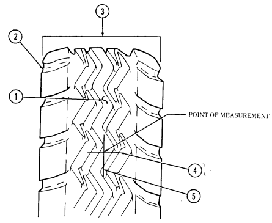

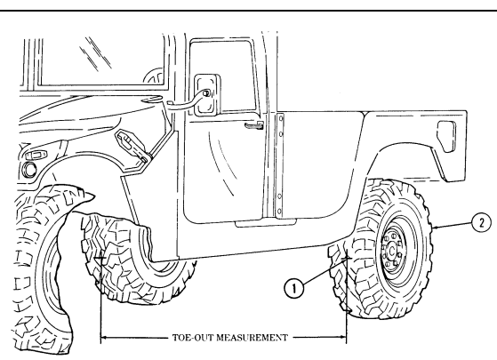

# 8-11. Rear Wheel Toe-Out Alignment (Cont'D)

#### C. Toe-Out Adjustment

1. Loosen two locknuts (1) securing two clamps (3) on each adjusting sleeve (2).

Toe-out can be increased or decreased by changing length of radius rods. A threaded sleeve is provided for this purpose.

2. Turn each adjusting sleeve (2) equally but in opposite directions. 3. Roll vehicle rearward then forward to original position. 4. Repeat toe-out check and adjustment procedures until correct adjustment is indicated.

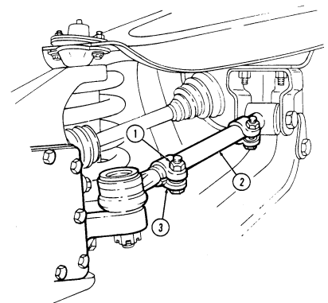 5. Secure two clamps (3) on each adjusting sleeve (2) with two locknuts (1). Tighten locknuts (1).

to 30 lb-ft (40 N m).

FOLLOW-ON TASK: Operate vehicle (TM 9-2320-280-10) and check for pull or wander.

# Section Ii. Steering Components Maintenance 8-12. Steering Components Maintenance Task Summary

| a.                                                                  | Disassembly                               | c.                                                    | Repair                                         | b.   | Inspection and Cleaning   | d.   | Assembly   |
|---------------------------------------------------------------------|-------------------------------------------|-------------------------------------------------------|------------------------------------------------|------|---------------------------|------|------------|
| INITIAL SETUP:                                                      | Tools                                     | Equipment Condition                                   |                                                |      |                           |      |            |
| General mechanic's tool kit:                                        | Wheel removed (para. 8\-3).               | automotive, (Appendix B, Item 1)                      | General Safety Instructions                    |      |                           |      |            |
| General mechanic's tool kit:                                        | - Do not use tire machine.                | automotive, common No. 2                              |                                                |      |                           |      |            |
| - Ensure tire is totally deflated before removing                   | (Appendix B, Item 4)                      | wheel locknuts.                                       | Special Tools                                  |      |                           |      |            |
| - Never use tubes in wheel assemblies.                              | Runflat compressor (Appendix B, Item 131) | - Rim surfaces must be kept clean and free of rust    |                                                |      |                           |      |            |
| Torque adapter, 9/16 in. (Appendix B, Item 144)                     | and dirt.                                 | Socket adapter (Appendix B, Item 146)                 | - Never use wheel assemblies with damaged      |      |                           |      |            |
| studs.                                                              | Materials/Parts                           | - Never inflate a wheel assembly with the wheel       | Lubricant (Appendix G, Item 196)               |      |                           |      |            |
| locknuts removed.                                                   | Twelve locknuts (Appendix G, Item 115)    | - Never inflate a wheel assembly without first        | Locknut (Appendix G, Item 82)                  |      |                           |      |            |
| checking wheel locknut torques.                                     | O\-ring (Appendix G, Item 217)            | - Do not exceed recommended tire inflation            | O\-ring (Appendix G, Item 219)                 |      |                           |      |            |
| pressure.                                                           | Detergent (Appendix C, Item 17)           | - Always use a tire inflation cage and a clip\-on air | Sealing compound, if required                  |      |                           |      |            |
| chuck for tire inflation.                                           | (Appendix C, Item 44)                     | - Ensure runflat compressor strap is centered         | Lubricating oil (Appendix C, Item 33)          |      |                           |      |            |
| around runflat.                                                     | Manual References                         | - Never install radial tire on eight bolt wheel.      |                                                |      |                           |      |            |
| TM 9\-2320\-280\-10                                                 | - Do not mix radial and bias tires.       | TM 9\-2320\-280\-24P                                  | - Ensure that during assembly indexing hole on |      |                           |      |            |
| TM 9\-2610\-200\-14                                                 | inner and outer rim halves is aligned.    |                                                       |                                                |      |                           |      |            |
| WARNING                                                             |                                           |                                                       |                                                |      |                           |      |            |
| Do not use tire machine. Injury to personnel or damage to equipment | may result.                               |                                                       |                                                |      |                           |      |            |

## 8-13. Steering Wheel Replacement

This task covers:
INITIAL SETUP:
Tools General mechanic's tool kit:
automotive (Appendix B, Item 1)
Steering wheel puller (Appendix B, Item 169)
Manual References TM 9-2320-280-24P

#### A. Removal B. Installation Equipment Condition

- Horn switch removed (para. 4-20). - Directional signal control removed (para. 4-65). - Directional signal control cancelling ring removed (para. 4-66).

a. Removal 1. Remove nut (2) from steering steering wheel (1) and shaft (3). 2. Using puller, remove steering wheel (1).

b. Installation 1. Align splines on steering wheel (1) with splines on shaft (3). 2. Install steering wheel (1) on shaft (3) with nut (2). Tighten nut (2) to 35 lb-ft (47 N•m). 3. Peen nut (2).

# 8 - 1 3 . Steering Wheel Replacement (C O N T ' D )

FOLLOW-ON TASKS: - Install directional signal control cancelling ring (para. 4-66).

- Install directional signal control (para. 4-65). - Install horn switch (para. 4-20).

# 8-14. Pitman Arm Replacement

This task covers:
INITIAL SETUP:
Tools General mechanic's tool kit:
automotive (Appendix B, Item 1)
Puller kit (Appendix B, Item 167)
Materials/Parts Cotter pin (Appendix G, Item 14) Lockwasher (Appendix G, Item 192)

a. Removal b. Installation

Manual References TM 9-2320-280-10 TM 9-2320-280-24P
Equipment Condition Front of vehicle raised and supported (para. 8-2).

Ensure front wheels are in straight ahead position while pitman arm is removed and installed.

a. Removal 1. Remove nut (1), lockwasher (2), and pitman arm (3) from steering gear shaft (4). Discard lockwasher (2).

2. Remove cotter pin (6) and slotted nut (7) from pitman arm (3) and center link (5). Discard cotter pin (6).

3. Using puller, remove pitman arm (3) from center link (5).

#### B. Installation

1. Install pitman arm (3) on steering gear shaft (4) with lockwasher (2) and nut (1). 2. Install pitman arm (3) on center link (5) with slotted nut (7). Tighten slotted nut (7) 
to 80 lb-ft (108 N•m).

3. Tighten nut (1) to 185 lb-ft (251 N•m).

Do not loosen slotted nut to install cotter pin. Doing this may result in damage to equipment.

4. Install cotter pin (6) in slotted nut (7).

# 8-14. Pitman Arm Replacement (Cont'D)

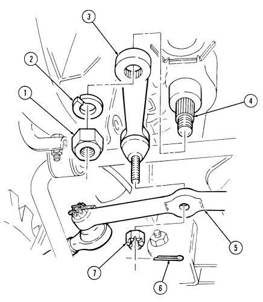

FOLLOW-ON TASKS: - Lubricate pitman arm (TM 9-2320-280-10).

- Remove supports and lower front of vehicle (para. 8-2).

## 8-15. Center Link Replacement

This task covers:
INITIAL SETUP:
Tools General mechanic's tool kit:
automotive (Appendix B, Item 1)
Puller kit (Appendix B, Item 167)

#### Materials/Parts

Four cotter pins (Appendix G, Item 14)
a. Removal **b. Installation**
Manual References TM 9-2320-280-24P Equipment Condition Front of vehicle raised and supported (para. 8-2).

Use of a pickle fork in lieu of puller kit may damage serviceable components (boots).

#### A. Removal

1. Remove cotter pin (5) and slotted nut (4) from idler arm (8) and center link (3). Discard cotter pin (5).

2. Remove cotter pin (9) and slotted nut (10) from pitman arm (2) and center link (3). Discard cotter pin (9).

3. Remove two cotter pins (1) and slotted nuts (6) from two tie rods (7) and center link (3). Discard cotter pins (1).

4. Using puller, remove center link (3) from two tie rods (7), idler arm (8), and pitman arm (2). b. Installation

Do not loosen slotted nut to install cotter pin. Doing this may result in damage to equipment.

1. Install center link (3) on pitman arm (2) and idler arm (8) with slotted nuts (4) and (10). Tighten slotted nuts (4) and (10) to 80 lb-ft (108 N•m).

2. Install cotter pins (5) and (9) in slotted nuts (4) and (10). 3. Install two tie rods (7) to center link (3) with two slotted nuts (6). Tighten slotted nuts (6) to 70 lb-ft
(95 N•m).

4. Install two cotter pins (1) in slotted nuts (6).

8-15. CENTER LINK REPLACEMENT (Cont'd)

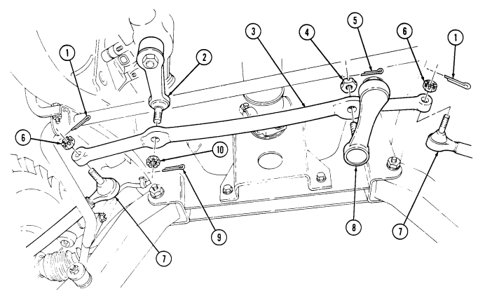

FOLLOW-ON TASK: Remove supports and lower front of vehicle (para. 8-2).

# 8-16. Tie Rod Maintenance

This task covers:

a. Removal c. Assembly b. Disassemblyd. Installation

INITIAL SETUP:
Tools General mechanic's tool kit:
automotive (Appendix B, Item 1)
Puller kit (Appendix B, Item 167)

#### Materials/Parts

Two cotter pins (Appendix G, Item 14)
Manual References TM 9-2320-280-10 TM 9-2320-280-24P
Equipment Condition Front of vehicle raised and supported (para. 8-2).

Use of a pickle fork in lieu of puller kit may damage serviceable components (boots).

a. Removal 1. Remove cotter pin (8), and slotted nut (7) from tie rod (2) and center link (1). Discard cotter pin (8). 2. Remove cotter pin (6), slotted nut (5), washer (4), and tie rod (2) from geared hub (3). Discard cotter pin (6).

b. Disassembly 1. Loosen two capscrews (10), nuts (13), and clamps (11) securing tie rod ends (9) to adjusting sleeve (12).

Note number of threads exposed on each tie rod end for installation. Approximately the same number of threads should be exposed on each tie rod end.

2. Remove two tie rod ends (9) from adjusting sleeve (12). 3. Remove two nuts (13), capscrews (10), and clamps (11) from adjusting sleeve (12). 

c. Assembly 1. Install two clamps (11), capscrews (10), and nuts (13) on adjusting sleeve (12). 2. Install two tie rod ends (9) into adjusting sleeve (12), turning tie rod ends (9) equally but in opposite directions.

d. Installation 1. Install tie rod (2) to center link (1) with slotted nut (7). Tighten slotted nut (7) to 70 lb-ft (95 N•m).

Do not loosen slotted nut to install cotter pin. Doing this may result in damage to equipment.

2. Install tie rod (2) to geared hub (3) with washer (4) and slotted nut (5). Tighten slotted nut (5) to 70 lb-ft (95 N•m).

3. Install cotter pin (8) in slotted nut (7). 4. Install cotter pin (6) in slotted nut (5).

# 8-16. Tie Rod Maintenance (Cont'D)

Ensure the outboard clamp faces the halfshaft and the inboard

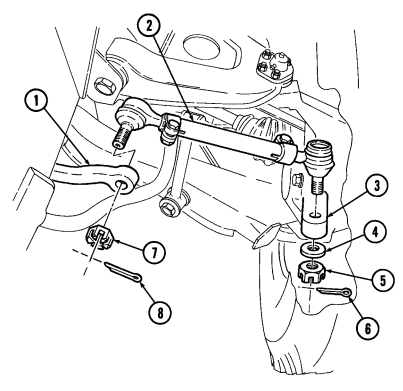 clamp faces away from the stabilizer bar (front only) or damage to equipment may result.

5. Tighten two locknuts (13).

FOLLOW-ON TASKS: - Lubricate tie rod end (TM 9-2320-280-10).

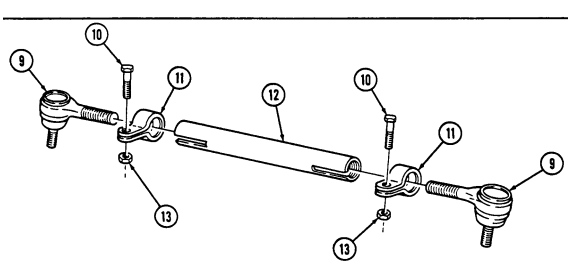

- Remove supports and lower front of vehicle (para. 8-2). - Align toe-in (para. 8-10).

# 8-17. Tie Rod End Replacement

This task covers:
INITIAL SETUP:

#### Tools

General mechanic's tool kit:
automotive (Appendix B, Item 1)
Pickle fork (Appendix B, Item 129)
Materials/Parts Cotter pin (Appendix G, Item 14)
a. Removal

a. Removal b. Installation

| Manual References    |
|----------------------|
| TM 9\-2320\-280\-10  |
| TM 9\-2320\-280\-24P |

Equipment Condition Front of vehicle raised and supported (para. 8-2).

1. Remove cotter pin (8), slotted nut (7), and washer (6) from tie rod end (4) and geared hub (5).

Discard cotter pin (8).

2. Using puller, remove tie rod end (4) from geared hub (5).

Note number of threads exposed on each tie rod end for installation. Approximately the same number of threads should be exposed on each tie rod end.

3. Loosen nut (9), capscrew (2), clamp (3), and tie rod end (4) from adjusting sleeve (1).

b. Installation

Ensure flange side of clamp faces halfshaft or damage to equipment may result.

1. Install tie rod end (4) on adjusting sleeve (1) with clamp (3), capscrew (2), and nut (9).

Do not loosen slotted nut to install cotter pin. Doing this may result in damage to equipment.

2. Install tie rod end (4) on geared hub (5) with washer (6) and slotted nut (7). Tighten slotted nut (7)
to 70 lb-ft (95 N•m).

3. Install cotter pin (8) on tie rod end (4) and slotted nut (7).

# 8-17.  Tie Rod End Replacement (Cont'D)

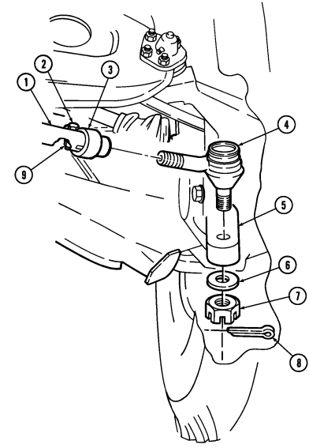

FOLLOW-ON TASKS: - Lubricate tie rod end (TM 9-2320-280-10).

· Remove supports and lower front of vehicle (para. 8-2).

-  Align toe-in (para. 8-10).

## 8-18. Idler Arm Maintenance

This task covers:
a. Removal **c. Inspection** b. Installation

#### Initial Setup:

Tools General mechanic's tool kit:
automotive (Appendix B, Item 1)
Pickle fork (Appendix B, Item 129) Spring scale, dial indicating
(Appendix B, Item 2)

#### Materials/Parts

Cotter pin (Appendix G, Item 14)
a. Removal

#### B. Installation

Manual References TM 9-2320-280-10 TM 9-2320-280-24P
Equipment Condition Front of vehicle raised and supported (para. 8-2).

1. Remove cotter pin (1) and slotted nut (8) from idler arm (7) and center link (2). Discard cotter pin (1).

2. Using puller, disconnect center link (2) from idler arm (7). 3. Remove two nuts (6), washers (4), capscrews (3), washers (4), and idler arm (7) from frame (5). 

1. Install idler arm (7) to frame (5) with two washers (4), capscrews (3), washers (4), and nuts (6).

Tighten nuts (6) to 60 lb-ft (81 N•m).

2. Install idler arm (7) to center link (2) with slotted nut (8). Tighten slotted nut (8) to 80 lb-ft (108 N•m).

Do not loosen slotted nut to install cotter pin. Doing this may result in damage to equipment.

3. Install cotter pin (1) in slotted nut (8).

8-18. IDLER ARM MAINTENANCE (Cont'd)

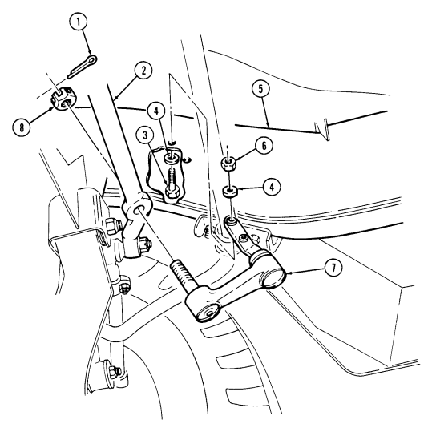

## 8-18. Idler Arm Maintenance (Cont'D)

Set front wheels in a straight ahead position.

1.

2.

Check idler arm (5) for visible damage, such as breaks and cracks. If damaged, replace idler arm (5). Check capscrews (4) for looseness of idler arm bracket (3) on frame (6). Tighten capscrews (4) if loose.

A flat steelplate or piece of scrap metal is required for step 3.

3. 4. 5.

6.

Secure a flat steelplate or piece of scrap metal to front crossmember (2).

Pull center link (1) downward to seat ball and socket of idler arm (5). as shown in figure A. reading on spring scale (7).

Using flat surface on center link (1) as a guide, mark first reference line on steelplate or scrap metal, Position spring scale (7) on center link (1) and pull in an upward direction to obtain a 25 lb (11Kg)

Maintain 25 lb (11 Kg) reading on spring scale (7) to perform step 7.

7.

8. 9.

10.

Using flat surface on center link (1) as a guide, mark second reference line on steel plate or scrap metal, as shown in figure B. Remove spring scale (7) from center link (1). Remove clamp and steelplate or scrap metal from front crossmember (2). Measure distance between first and second reference line on steel plate or scrap metal. If measurement exceeds 0.25 inch (6mm), replace idler arm (5).

8-18. IDLER ARM MAINTENANCE (Cont'd)

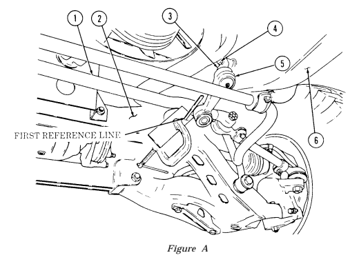

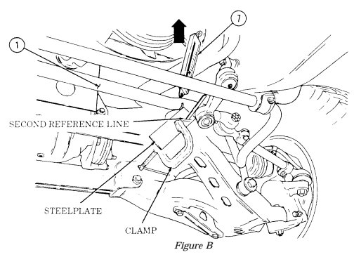

FOLLOW-ON TASKS:• Lubricate idler arm (TM 9-2320-280-10).

- Remove supports and lower front of vehicle (para. 8-2).

# 8-19. Steering Column Replacement

This task covers:

#### Initial Setup: Tools

General mechanic's tool kit:
automotive (Appendix B, Item 1)
Materials/Parts Two locknuts (Appendix G, Item 70) Lockwasher (Appendix G, Item 133) Plain-assembled nut (Appendix G, Item 201) Two locknuts (Appendix G, Item 79) (A2 Series) Locknut (Appendix G, Item 100) Locknut (Appendix G, Item 126) Locknut (Appendix G, Item 128)

#### A. Removal Note

- Only vehicles with serial number 99,999 and below, using steering column part number 1419, are equipped with spacers as indicated in step 1.

#### A. Removal **B. Installation**

Manual References TM 9-2320-280-24P
Equipment Condition
- Steering wheel removed (para. 8-13). - Directional signal control removed 
(para. 4-64 or 4-65).

- Steering column part number 1419 is no longer available and is being replaced with part number 1493.

1. Remove locknut (1), lockwasher (2), washer (3), pin (6), and two spacers (5) from steering column (7)
and mounting bracket (4). Discard lockwasher (2) and locknut (1).

2. Remove plain-assembled nut (18), screw (9), and ground 57C (15) from steering column (7). Discard plain-assembled nut (18).

Perform step 3 for vehicles with serial numbers 100,000 and above only.

3. Remove locknut (10), washer (11), capscrew (12), washer (11), and two brackets (8) from steering column (7). Discard locknut (10).

4. Disconnect lead 25A (21) from steering column (7).

When performing step 5, temporarily install steering wheel and turn steering column to gain access to steering column intermediate shaft mounting hardware.

5. Remove locknut (14), washer (13), capscrew (16), and washer (13) and disconnect intermediate shaft
(17) from steering column (7). Discard locknut (14).

Perform step 6 for "A2" series vehicles only.

6. Remove two locknuts (22), washers (23), screws (24), washers (23), and steering column (7) from mounting bracket (4). Discard locknuts (22).

7. Remove two locknuts (19), washers (20), shoulder bolts (9), and steering column (7) from mounting bracket (4). Discard locknuts (19).

8-19. STEERING COLUMN REPLACEMENT (Cont'd)

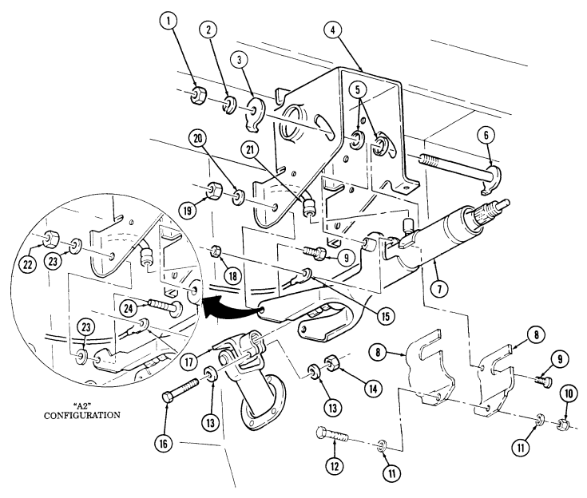

## 8-19. Steering Column Replacement (Cont'D)

b. Installation NOTE
Perform step 1 for "A2" series vehicles only.

1. Install steering column (7) on mounting bracket (4) with two washers (23), screws (24), washers
(23) and locknuts (22). Tighten locknuts (22) finger tight.

2. Install steering column (7) on mounting bracket (4) with two shoulder bolts (9), washers (20), and locknuts (19). Tighten locknuts (19) finger tight 3. Install intermediate shaft (17) on steering column (7) with washer (13), capscrew (16), washer (13),
and locknut (14). Tighten locknut (14) to 40-50 lb-ft (54-68 N•m).

4. Connect lead 25A (21) to steering column (7). 5. Install two brackets (8) on steering column (7) with washer (11), capscrew (12), washer (11), and locknut (10).

6. Install ground 57C (15) on steering column (7) with screw (9) and plain-assembled nut (18).

- Only vehicles with serial number 99,999 and below using steering column part number 1419, are equipped with spacers as indicated in step 7.

- Insert washer and pin with locking tabs in the "up" position.

7. Secure steering column (7) to mounting bracket (4) with two spacers (5), pin (6), washer (3),
lockwasher (2), and locknut (1). Tighten locknut (1) finger tight.

8. Position steering column (7) in upright position and tighten locknut (1) to 12-15 lb-ft (16-20 N•m). 9. Tighten locknuts (22) and (19) to 9-11 lb-ft (12-15 N•m).

# 8-19. Steering Column Replacement (Cont'D)

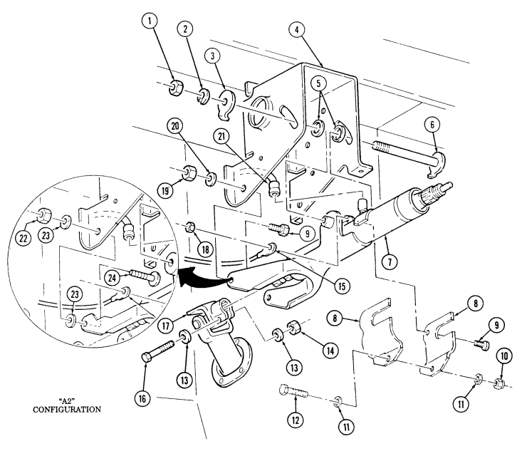

FOLLOW-ON TASKS: •Install directional signal control (para. 4-64 or 4-65).
- • Install steering wheel (para. 8-13).

# 8-20. Intermediate Steering Shaft Replacement

This task covers:
a. Removal b. Installation INITIAL SETUP:
Tools Manual References

| TM 9\-2320\-280\-10   |
|-----------------------|
| TM 9\-2320\-280\-24P  |

General mechanic's tool kit:
automotive (Appendix B, Item 1)
Materials/Parts Two locknuts (Appendix G, Item 100)

Ensure front wheels are in straight-ahead position while removing and installing intermediate steering shaft.

#### A. Removal

1. Remove locknut (6), washer (5), capscrew (8), and washer (5) from intermediate steering shaft (4)
and steering gear (7). Discard locknut (6).

2. Remove locknut (2), washer (3), capscrew (9), washer (3), and steering shaft (4) from steering column (1).

Discard locknut (2).

b. Installation 1. Install intermediate steering shaft (4) on steering gear (7) with washer (5), capscrew (8), washer (5),
and locknut (6). Tighten locknut (6) to 40-50 lb-ft (54-68 N•m).

2. Install steering shaft (4) on steering column (1) with washer (3), capscrew (9), washer (3), and locknut (2).

Tighten locknut (2) to 40-50 lb-ft (54-68 N•m).

# 8-20. Intermediate Steering Shaft Replacement (Cont'D)

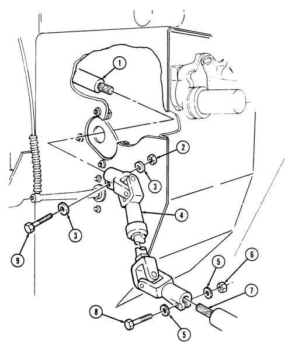

FOLLOW-ON TASK: Lubricate steering shaft (TM 9-2320-280-10).

# 8-21. Steering Gear Replacement

This task covers:
INITIAL SETUP:
Tools General mechanic's tool kit:
automotive (Appendix B, Item 1)
Materials/Parts Locknut (Appendix G, Item 100) Lockwasher (Appendix G, Item 192)
Three lockwashers (Appendix G, Item 188)

a. Removal b. Installation

Manual References TM 9-2320-280-10 TM 9-2320-280-24P
Equipment Condition
- Hood raised and secured (TM 9-2320-280-10). - Battery ground cable disconnected (para. 4-73).

a. Removal

Cover or plug all open lines and connections immediately after disconnection to prevent contamination. Remove all plugs prior to connection.

- Make sure front wheels are in the straight ahead position. - Have drainage container ready to catch fluid.

1. Disconnect two power steering lines (4) from steering gear (10). 2. Turn steering wheel left and right several times to bleed off power steering fluid. 3. Remove intermediate shaft locknut (1), washer (2), capscrew (5), and washer (2) and disconnect intermediate shaft (3) from steering gear (10). Discard locknut (1).

4. Remove nut (14) and lockwasher (13) from pitman arm (12). Discard lockwasher (13). 5. Remove pitman arm (12) from shaft (11). 6. Remove three capscrews (8), lockwashers (7), washers (6), and steering gear (10) from frame (9).

Discard lockwashers (7).

# 8-21. Steering Gear Replacement (Cont'D)

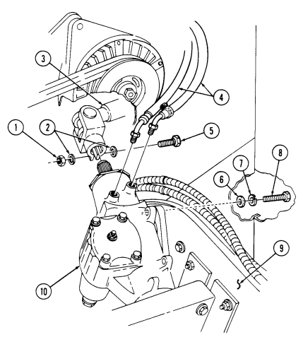

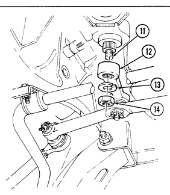

# 8-21. Steering Gear Replacement (Cont'D)

#### B. Installation

1.

Install steering gear (12) on frame (11) with three washers (8), lockwashers (9), and capscrews (10).

Tighten capscrews (1) to 54-66 lb-ft (73-89 N m).

2.

3.

Align hole in yoke (3) with notch on steering gear splines (7) and slide intermediate shaft (4) on steering gear splines (7). Install intermediate shaft (4) to steering gear splines (7) with washer (2), capscrew (6), washer (2), and locknut (1). Tighten locknut (1) to 40-50 lb-ft (54-68 N m).

4.

Connect two power steering lines (5) to steering gear (12).

Make sure front wheels are in the straight-ahead position.

5.

Install pitman arm (14) on shaft (13) with lockwasher (15) and nut (16). Tighten nut (16) to 167-203

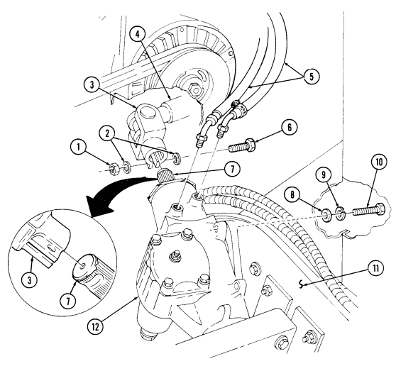 lb-ft (227-275 N m).

# 8-21. Steering Gear Replacement (Cont'D)

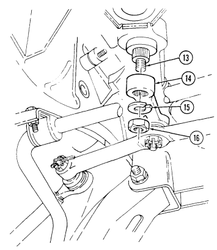

FOLLOW-ON TASKS: - Fill power steering reservoir (TM 9-2320-280-10).

-  Connect battery ground cable (para. 4-73).
-  Bleed power steering system (para. 8-29).

# 8-22. Steering Shaft U-Joint Replacement

This task covers:
INITIAL SETUP:
Tools a. Removal b. Installation General mechanic's tool kit:
automotive (Appendix B, Item 1)
Universal joint bearing kit
(Appendix B, Item 171)

#### Materials/Parts

Universal joint spider (Appendix G, Item 297)
a. Removal Manual References TM 9-2320-280-24P
Equipment Condition Intermediate steering shaft removed (para. 8-20).

Do not drop bearing cups. Needle bearings can be easily lost.

Removal and installation procedures are basically the same for both U-joints. This procedure covers the U-joint attached to steering gear.

1. Remove grease fitting (6) from cross (1). 2. Remove two snaprings (3) from bearing cups (4) in steering gear yoke (5). 3. Position steering gear yoke (5) in vise with 1-1/8-in. (29 mm) socket between vise jaw and bearing cup (4) being removed. Ensure open end of socket is facing bearing cup (4).

4. Place 11/16-in. (17 mm) socket between opposite bearing cup (4) and vise jaw. Ensure open end of socket is facing vise jaw.

5. Press bearing cup (4) out of steering gear yoke (5) and remove bearing cup (4) from cross (1). 6. Reverse position of sockets and press remaining bearing cup (4) out of steering gear yoke (5). 7. Remove steering gear yoke (5) from cross (1). 8. Repeat steps 2 through 6 for steering shaft yoke (2). 9. Remove cross (1) from steering shaft yoke (2).

#### B. Installation

1. Install cross (1) into steering shaft yoke (2). 2. Install bearing cup (4) into steering shaft yoke (2).

Ensure bearing cup is aligned with steering shaft yoke before pressing in with vise. Damage to cross and bearing cups will result if forced into yoke.

3. Place steering shaft yoke (2) in vise with 11/16-in. (17 mm) socket between vise jaw and bearing cup (4).

4. Press bearing cup (4) into steering shaft yoke (2) far enough to install snapring (3) and install snapring (3) on bearing cup (4).

5. Install other bearing cup (4) into steering shaft yoke (2). 6. Place steering shaft yoke (2) in vise with 11/16-in. (17 mm) socket between bearing cup (4) and vise jaw.

7. Press bearing cup (4) into steering shaft yoke (2) far enough to install snapring (3) and install snapring (3) on bearing cup (4).

# 8 - 2 2 . Steering Shaft U-Joint Replacement (Cont'D)

8. Repeat steps 2 through 7 to install steering gear yoke (5) on cross (1).

CAUTION
Ensure grease fitting on cross faces yoke. Damage to equipment will result if improperly installed.

9. Install grease fitting (6) into cross (1).

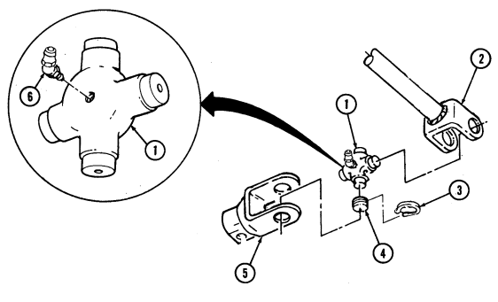

FOLLOW-ON TASK: Install intermediate steering shaft (para. 8-20).

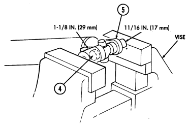

# 8-23. Intermediate Steering Shaft Close-Off And Retainer Replacement

This task covers:
INITIAL SETUP:

| Materials/Parts   |
|-------------------|

| Tools                        |
|------------------------------|
| General mechanic's tool kit: |

Tools Four locknuts (Appendix G, Item 70) Locknut (Appendix G, Item 100)

a. Removal b. Installation

Manual References TM 9-2320-280-24P

| Manual References   |
|---------------------|
| TM 9\-2320\-280\-10 |

Perform steps a.1 and b.2 only when replacing close-off retainer. Close-off may be replaced without disconnecting intermediate steering shaft.

a. Removal 1. Remove locknut (8), washer (9), capscrew (11), and washer (9) and disconnect intermediate steering shaft (10) from steering column (2). Discard locknut (8).

2. Remove four locknuts (12), washers (6), capscrews (5), and washers (6) from hand throttle bracket
(7), close-off retainer (4), close-off (3), and cowl panel (1). Remove close-off retainer (4) and close-off (3) from steering shaft (10). Discard locknuts (12).

b. Installation 1. Install close-off (3), close-off retainer (4) on cowl panel (1) and hand throttle bracket (7) with four washers (6), capscrews (5), washers (6), and locknuts (12). Tighten locknuts (12) to 8 lb-ft (11 N•m).

2. Install intermediate steering shaft (10) through close-off (3) on steering column (2) with washer (9),
capscrew (11), washer (9), and locknut (8). Tighten locknut (8) to 40-50 lb-ft (54-68 N•m).

 8-23. INTERMEDIATE STEERING SHAFT CLOSE-OFF AND RETAINER REPLACEMENT (Cont'd)

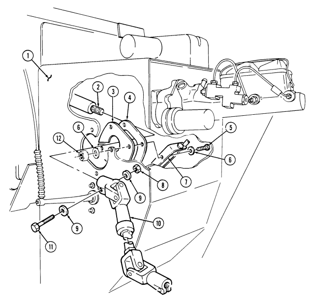

# 8-24. Power Steering Pump, Pulley, And Bracket Maintenance (6.2L)

This task covers:

b.Disassembly **d.Installation**

INITIAL SETUP:

#### Applicable Models

All vehicle models except M1123 and "A2" series Tools General mechanic's tool kit:
automotive (Appendix B, Item 1)
Special Tools Pulley installer (Appendix B, Item 137)

a.Removal c.Assembly

#### Materials/Parts

Lockwasher (Appendix G, Item 133) Lockwasher (Appendix G, Item 191) Lockwasher (Appendix G, Item 188) O-ring (Appendix G, Item 208) Sealing compound (Appendix C, Item 45)
Manual References TM 9-2320-280-10 TM 9-2320-280-24P
Equipment Condition Hood raised and secured (TM 9-2320-280-10).

Cover or plug all hoses and connections immediately after disconnection to prevent contamination. Remove all plugs prior to connection.

a.Removal

Have drainage container ready to catch fluid.

Perform step 10 if support bracket is defective.

9. Inspect support bracket (23) for breaks or cracks. 

10. Remove two nuts (24) and steering support bracket (23) from studs (20).

b.Disassembly 1. Remove screw (8), washer (9), and pulley (10) from power steering pump (3). 2. Remove capscrew (25), capscrew (13), two capscrews (26), and power steering pump (3) from power steering bracket (14).

1. Loosen two clamps (2) and disconnect two return lines (1) and high pressure line (5) from power steering pump (3). Remove O-ring (4) from high pressure line (5). Discard O-ring (4).

2. Loosen alternator adjusting capscrew (6), two alternator mounting capscrews (16), and push alternator (7) toward engine. Remove two drivebelts (22) from power steering pump pulley (10).

3. Loosen adjusting capscrews (29) and (17) from front of power steering bracket (14). 4. Loosen engine mounting capscrew (11) and push power steering bracket (14) toward engine.

Remove two drivebelts (21) from power steering pump pulley (10).

5. Remove capscrew (11) and lockwasher (12) from power steering bracket (14) and alternator bracket (15). Discard lockwasher (12).

6. Remove adjusting capscrew (17), lockwasher (18), and washer (19) from power steering bracket (14)
and alternator bracket (15). Discard lockwasher (18).

7. Remove adjusting capscrew (29), lockwasher (28), and washer (27) from power steering bracket (14)
and power steering front support bracket (23). Discard lockwasher (28).

8. Remove power steering pump (3), pulley (10), and power steering bracket (14).

NOTE

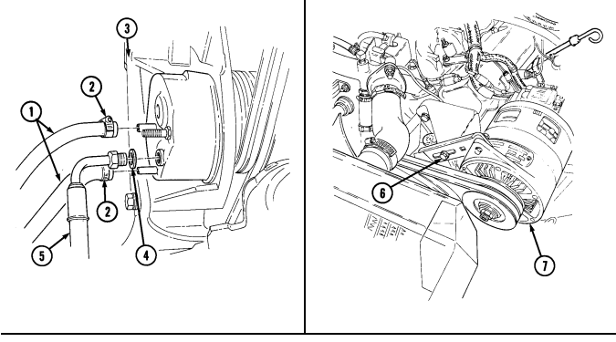

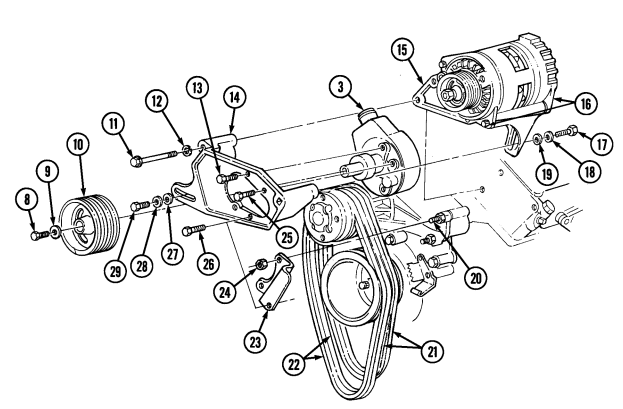

8-24. POWER STEERING PUMP, PULLEY, AND BRACKET MAINTENANCE (6.2L)(Cont'd)

# 8-24. Power Steering Pump, Pulley, And Bracket Maintenance (6.2L) (Cont'D)

c. Assembly 1. Apply sealing compound adhesive to threads of capscrews (6), (20), (21), and (1). 2. Install power steering pump (8) on power steering bracket (7) with capscrew (6), short capscrew (20),
and two long capscrews (21). Tighten capscrews (6), (20), and (21) to 40 lb-ft (54 N•m).

3. Using pulley installer, install pulley (3) on power steering pump (8) with washer (2) and capscrew (1). Tighten capscrew (1) to 37 lb-ft (50 N•m).

d. Installation

Perform step 1 if support bracket was removed.

1. Apply sealing compound to studs (15) and install support bracket (18) to studs (15) with two nuts (19). Tighten nuts (19) to 45 lb-ft (61 N•m).

2. Install power steering pump (8), pulley (3), and power steering bracket (7) on alternator bracket (9)
with washer (14), lockwasher (13), and capscrew (12).

3. Install power steering bracket (7) to support bracket (18) with washer (22), lockwasher (23), and capscrew (24).

4. Install four drivebelts (16) and (17) onto pulley (3). 5. Install power steering bracket (7) to alternator bracket (9) with lockwasher (5) and capscrew (4). 6. Pull alternator (10) away from engine. Tighten alternator adjusting capscrew (29) and two alternator mounting capscrews (11) finger tight.

7. Connect two return lines (25) to power steering pump (8) and secure with two clamps (26). 8. Install O-ring (27) on high pressure line (28) and connect high pressure line (28) to power steering pump (8).

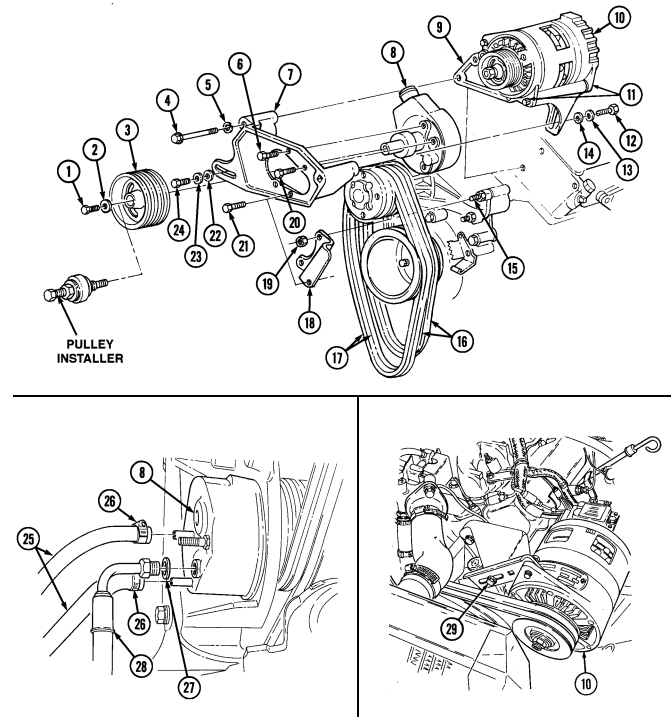

# 8-24.  Power Steering Pump, Pulley, And Bracket Maintenance (6.2L)(Cont'D)

FOLLOW-ON TASKS: -  Adjust drivebelts (para. 3-82).

· Bleed power steering system (para. 8-29).

# 8-24.1. Power Steering Pump And Pulley Replacement (6.5L)

This task covers:
INITIAL SETUP:
Applicable Models All M1123 and "A2" series vehicles Tools General mechanic's tool kit:
automotive (Appendix B, Item 1)
Maintenance and repair shop equipment:
automotive (Appendix B, Item 2)
Special Tools Pulley installer (Appendix B, Item 137)

a.Removal **b.Installation**

#### Materials/Parts

O-ring (Appendix G, Item 208) Lockwasher (Appendix G, Item 190)
Manual References TM 9-2320-280-10 TM 9-2320-280-24P
Equipment Condition
- Hood raised and secured (TM 9-2320-280-10). - Serpentine drivebelt removed (para. 3-83).

a.Removal

Cover or plug all hoses and connections immediately after disconnection to prevent contamination. Remove all plugs prior to connection.

1. Loosen two clamps (2) and disconnect return lines (1) and high-pressure line (5) from power steering pump (3). Remove O-ring (4) from high-pressure line (5). Discard O-ring (4).

2. Remove nut (7), clamp (8), and wiring harness (6) from power steering pump (3). 3. Remove nut (15), lockwasher (14), capscrew (9), washer (10), and idler pulley (11) from bracket (12).

Discard lockwasher (14).

4. Remove two capscrews (17), capscrew (18), and power steering pump (3) from mounting bracket (16). 5. Remove capscrew (19), washer (20), and power steering pulley (21) from power steering pump (3).

b.Installation

Ensure flat surface of pulley is facing out and is flush with pump shaft.

1. Using pulley installer, install pulley (21) on power steering pump (3). 2. Secure pulley (21) to power steering pump (3) with washer (20) and capscrew (19). Tighten capscrew (19) to 37 lb-ft (50 N•m).

3. Install power steering pump (3) on mounting bracket (16) with capscrew (18) and two capscrews (17). 4. Install idler pulley (11) on bracket (12) with washer (10), capscrew (9), lockwasher (14), and nut (15). 5. Install O-ring (4) on high-pressure line (5) and install high-pressure line (5) on power steering pump (3).

6. Install two return lines (1) on power steering pump (3) and tighten clamps (2). 7. Install wiring harness (6) and clamp (8) on power steering pump (3) with nut (7).

CAUTION
Serpentine belt failure (abnormal wear and belt dislodgement) can be caused by misalignment of pulleys, improper installation, or foreign objects introduced into belt path. For pulley alignment procedures, refer to para. 3-83.

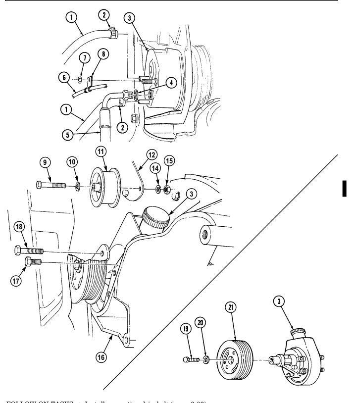

# 8-24.1. Power Steering Pump And Pulley Replacement (6.5L) (Cont'D)

FOLLOW-ON TASKS: - Install serpentine drivebelt (para. 3-83).
- Bleed power steering system (para. 8-29).

## 8-24.2. Power Steering Pump Repair

This task covers:

a. Disassembly c. Inspection b. Cleaning d. Assembly

#### Initial Setup:

| General mechanic's tool kit:             | TM 9\-2320\-280\-10                                |
|------------------------------------------|----------------------------------------------------|
| automotive (Appendix B, Item 1)          | TM 9\-2320\-280\-24P                               |
| Materials/Parts                          | Equipment Condition                                |
| Locknut (Appendix G, Item 100)           | - Hood raised and secured (TM 9\-2320\-280\-10).   |
| Lockwasher (Appendix G, Item 192)        | - Battery ground cable disconnected (para. 4\-73). |
| Three lockwashers (Appendix G, Item 188) |                                                    |

a. Disassembly

Have drainage container ready to catch fluid.

1. Remove reservoir filler cap (1) and drain fluid from pump assembly (8). 2. Remove two mounting studs (2) from pump assembly (8).

NOTE
Fitting assembly is spring loaded. Remove carefully to avoid losing parts.

3. Remove fitting assembly (6) and O-ring seal (5) from pump body (7). Discard O-ring seal (5). 4. Remove flow control valve (4) and valve spring (3) from pump body (7).

Do not overtighten vise as pump body could be distorted.

5. Place pump body (7) in vise so pump shaft (11) is pointing down. 6. Tap lightly around edge of reservoir (9). 7. Remove reservoir (9) and O-ring seal (10) from pump body (7). Discard O-ring seal (10). 8. Remove two O-ring seals (14) from pump body (7). Discard O-ring seals (14). 9. Remove magnet (13) from pump body (7). Discard magnet (13).

10. Remove O-ring seal (15) from pump body (7). Discard O-ring seal (12). 11. Remove shaft seal (12) from pump body (7).

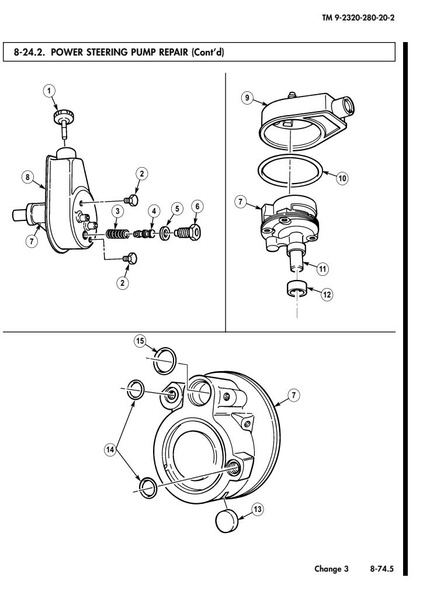

# 8-24.2. Power Steering Pump Repair (Cont'D)

b. Cleaning Clean all power steering pump components (refer to TM 9-2320-280-10). c. Inspection

For general inspection instructions, refer to para. 2-5.

1. Inspect external surface of flow control valve (12) for burrs, nicks, or damage. Inspect flow control valve (12) bore and screen for damage or debris. Inspect valve spring (11) for damage. Replace both flow control valve (12) and valve spring (11) if either is damaged.

2. Inspect studs (10) for damage. Replace if damaged. 3. Inspect fitting (14) for damage. Replace if damaged. 4. Inspect reservoir filler cap (16) for damage. Replace if damaged. 5. Inspect pump body (2) for damage. Replace power steering pump assembly (15) if pump body (2)
is damaged.

6. Inspect pump shaft (8) for burrs, nicks, or damage. Replace pump assembly (15) if damaged.

#### D. Assembly

1. Install shaft seal (9) on pump shaft (8) and in pump body (2). Use care not to damage pump seal (9)
when installing on pump shaft (8).

2. Install magnet (4) in pump body (2). 3. Install O-ring seal (1) into control valve cavity and two O-ring seals (5) into threaded holes (3). 4. Install O-ring seal (7) on pump body (2). 5. Install reservoir (6) on pump body (2). 6. Install two studs (10) on pump assembly (15). Tighten studs (10) to 26 lb-ft (35 N•m). 7. Install valve spring (11) and flow control valve (12) in pump assembly (15). 8. Install O-ring seal (13) and fitting (14) in pump assembly (15). Tighten fitting (14) in pump assembly (15) to 37 lb-ft (50 N•m).

9. Install reservoir filler cap (16) on pump assembly (15).

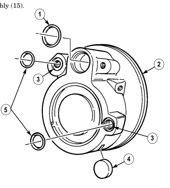

# 8-24.2. Power Steering Pump Repair (Cont'D)

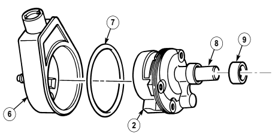

FOLLOW-ON TASK:
Install power steering pump, pulley, and bracket
(para 8-24 (6.2L)), (para 8-24.1 (6.5L)).

# 8-25. Power Steering Hydraulic System Pressure And Return Hose Replacement

This task covers:
a. Removal b. Installation INITIAL SETUP:
Tools General mechanic's tool kit:
automotive (Appendix B, Item 1)
Materials/Parts Three locknuts (Appendix G, Item 70) Two O-rings (Appendix G, Item 218) Tiedown strap (Appendix G, Item 308)
Manual References TM 9-2320-280-10 TM 9-2320-280-24P
Equipment Condition
- Hood raised and secured (TM 9-2320-280-10). - Battery ground cable disconnected (para. 4-73).

General Safety Instructions Do not drain fluid when engine is hot.

Removal and installation procedures are basically the same for all hydraulic system pressure and return hoses. This procedure covers the power steering pump to hydro-boost return hose and the steering gear to hydro-boost pressure hose.

a. Removal

Do not drain fluid when engine is hot. Severe injury to personnel will result

Cover or plug all hoses and connections immediately after disconnection to prevent contamination. Remove all plugs prior to connection.

Have drainage container ready to catch fluid.

1. Loosen two clamps (3) and disconnect return hose (8) from power steering pump (9) and hydro-boost (19).

2. Remove two locknuts (12), washers (13), and capscrews (14) from clamps (15) and control valve hose (16). Remove two clamps (15) from return hose (8). Discard locknuts (12).

Perform step 4 for vehicles with new alternator support bracket configuration.

3. Remove locknut (6), washer (7), capscrew (2), spacer (4), two clamps (5), clamp (10), and return hose (8) from alternator bracket (1). Remove clamp (5) from return hose (8). Discard locknut (6).

4. Remove locknut (6), two washers (7), capscrew (2), two clamps (5), harness clamp (10), and return hose (8) from power steering lines bracket (11). Remove clamp (5) and tiedown strap (11.1) from return hose (8). Discard locknut (6) and tiedown strap (11.1).

5. Remove pressure hose (17) from hydro-boost (19) and steering gear (20). Remove two O-rings (18)
from pressure hose (17). Discard O-rings (18).

b. Installation 1. Install two O-rings (18) on pressure hose (17) and connect pressure hose (17) to steering gear (20) and hydro-boost (19).

2. Connect return hose (8) to power steering pump (9) and hydro-boost (19) with two clamps (3).

# 8 - 2 5 . Power Steering Hydraulic System Presure And Return Hose Replacement (Cont'D)

3. Position two clamps (15) and clamp (5) on return hose (8) and install control valve hose (16) and two clamps (15) with two capscrews (14), washers (13), and locknuts (12). 

NOT E
Perform step 5 for vehicles with new alternator support bracket configuration.

4. Install clamp (10), spacer (4), and two clamps (5) to alternator bracket (1) with capscrew (2),
washer (7), and locknut (6).

5. Install harness clamp (10) and two clamps (5) to power steering lines bracket (11) with capscrew (2),

two washers (7), and locknut (6). Install tiedown strap (11.1) on return hose (8).

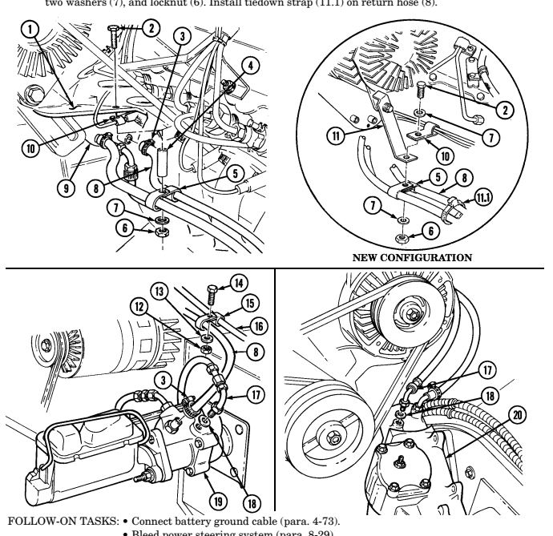

- Bleed power steering system (para. 8-29).
# 8-26. Power Steering System Hydraulic Control Valve Maintenance

This task covers:
a. Removal b. Back Flush Procedure INITIAL SETUP:
TM 9-2320-280-24P
c. Inspection d. Installation Tools **Equipment Condition**
General mechanic's tool kit: Battery ground cable disconnected (para. 4-73).

automotive (Appendix B, Item 1) Hood raised and secured (TM 9-2320-280-10).

Manual References **General Safety Instructions**
TM 9-2320-280-10 Do not drain fluid when engine is hot.

If referred here from TM 9-2320-280-20-1 troubleshooting instructions to perform back flush procedure, follow steps 1 through 4 and then proceed to b.

Do not drain fluid when engine is hot. Severe injury to personnel will result.

Cover or plug all hoses and connections immediately after disconnection to prevent contamination. Remove all plugs prior to connection.

Note location of hoses for installation.

Have drainage container ready to catch fluid.

1. Loosen clamp (2) and disconnect power steering return line hose (1) from control valve elbow (4). 2. Loosen clamp (11) and disconnect fan clutch hose (12) from control valve fitting (10). 3. Loosen clamp (14) and disconnect steering gear hose (13) from control valve elbow (3). 4. Disconnect time delay module connector (6) from control valve connector (7). 5. Loosen clamp (5) and remove control valve (8) from bracket (9).

#### B. Back Flush Procedure

1. Connect battery ground cable (para. 4-73).

2. Install steering gear hose (13) on control valve fitting (10). 3. Remove control valve elbow (4) from control valve (8) and install pipe plug (15) (NSN 4730-00-0112578) on control valve (8).

4. Install drain hose (16) (make from NSN 4720-01-186-2358,36 in. (91.4 cm) long) on control valve elbow (3).

5. Place drainage container underneath drain hose
(16) to catch fluid.

8-26. POWER STEERING SYSTEM HYDRAULIC CONTROL VALVE MAINTENANCE (Cont'd)

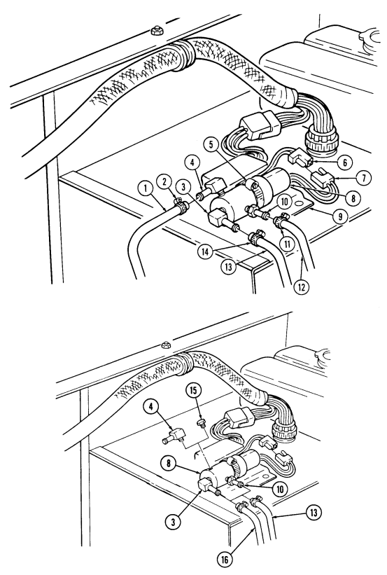

# 8-26. Power Steering System Hydraulic Control Valve Maintenance (Cont'D)

To ensure there is no load on the steering gear, position front wheels straight ahead before starting engine. Failure to do this may cause damage to the control valve.

Maintain power steering fluid level at all times while performing back flush procedure to prevent air from entering power steering system. Failure to do this may result in damage to equipment.

6.

Start engine and allow to run for about two or three seconds and stop, check, and fill power steering reservoir. Repeat the process once.

7.

Remove pipe plug (2) from control valve (7).

8.

Install control valve elbow (1) on control valve (7).

9.

Remove steering gear hose (4) from control valve fitting (3) and install on control valve elbow (1). Remove control valve fitting (3) from control valve (7) and install pipe plug (2) on control valve (7).

10.

To ensure there is no load on the steering gear, position front wheels straight ahead before starting engine. Failure to do this may cause damage to the control valve. Maintain power steering fluid level at all times while performing back flush procedure to prevent air from entering power steering system. Failure to do this may result in damage to equipment.

fill power steering Start engine and allow to run for about two to three seconds and stop, check, and reservoir. Repeat the process once.

11.

Remove drain hose (5) from control valve elbow (6). Remove steering gear hose (4) from control valve elbow (1).

12.

13.

Remove pipe plug (2) from control valve (7).

14.

Install control valve fitting (3) on control valve (7). Disconect battery ground cable (para. 4-73).

15.

16.

1. Inspect elbows (6) and (1) for damage. Replace elbows (6) or (1) if damaged.

2. Inspect valve fitting (3) for damage. Replace valve fitting (3) if damaged.

d. Installation

Perform step 1 only if control valve was removed.

Install control valve (7) on bracket (13) with clamp (10).

1.

2.

3.

Connect steering gear hose (4) to control valve elbow (6) and tighten clamp (16) to 10-20 lb-in.

(1-2 N m).

Connect fan clutch hose (15) to control valve fitting (3) and tighten clamp (14) to 10-20 lb-in.

(1-2 N m).

4.

5.

Connect power steering return line hose (8) to control valve elbow (1) and tighten clamp (9) to 10-20lb-in. (1-2 N m). Connect time delay module connector (11) to control valve connector (12).

# 8-26. Power Steering System Hydraulic Control Valve Maintenance (Cont'D)

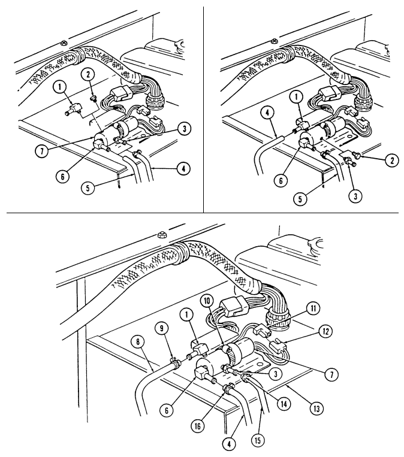

FOLLOW-ON TASK:
- Connect battery ground cable (para. 4-73).

· Bleed power steering system (para. 8-29).

# 8-27. Power Steering Cooler Hose Replacement

This task covers:
INITIAL SETUP:

#### Tools

General mechanic's tool kit:
automotive (Appendix B, Item 1)
Materials/Parts Two locknuts (Appendix G, Item 70) Tiedown strap (Appendix G, Item 308)
Manual References TM 9-2320-280-10 TM 9-2320-280-24P
a. Removal

a. Removal b. Installation

Equipment Condition Hood raised and secured (TM 9-2320-280-10).

General Safety Instructions Do not drain fluid when engine is hot.

Do not drain fluid when engine is hot. Severe injury to personnel will result.

Cover or plug all hoses and connections immediately after disconnection to prevent contamination. Remove all plugs prior to connection.

Have drainage container ready to catch fluid.

1. Loosen two clamps (14) and disconnect hoses (7) and (10) from cooler (13). 2. Remove tiedown strap (11) from oil cooler lines (12) and hoses (7) and (10). Discard tiedown strap (11).

3. Loosen clamp (9) and remove hose (10) from steering gear (8). 4. Remove two locknuts (6), washers (5), and capscrews (1) from four clamps on hoses (7) and (15).

Discard locknuts (6).

5. Loosen clamp (2) and remove hose (7) from control valve elbow (3) and remove hose (7).

# 8-27. Power Steering Cooler Hose Replacement (Cont'D)

1.

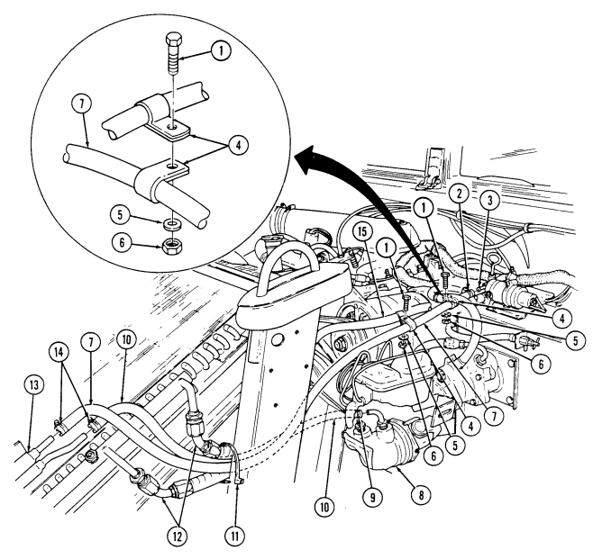

2.

3. 4. 5.

Connect hose (7) to control elbow (3) and secure with clamp (2). Position hoses (7) and (15) with four clamps (4) and install two capscrews (1), washers (5), and locknuts (6).

Connect hose (10) to steering gear (8) with clamp (9).

Connect hoses (7) and (10) to cooler (13) with two clamps (14).

Install tiedown strap (11) to oil cooler lines (12) and hoses (7) and (10).

FOLLOW-ON TASK: Bleed power steering system (para. 8-29).

# 8-28. Power Steering Cooler Replacement

This task covers:
a. Removal b. Installation INITIAL SETUP:
Tools General mechanic's tool kit:
automotive (Appendix B, Item 1)
Equipment Condition Hood raised and secured (TM 9-2320-280-10).

General Safety Instructions Do not drain fluid when engine is hot.

Materials/Parts Two lockwashers (Appendix G, Item 134)
Manual References TM 9-2320-280-10 TM 9-2320-280-24P

Do not bend power steering oil cooler fins. Damaged fins reduce cooling efficiency, which may damage power steering pump and/or gear.

a. Removal

Do not drain fluid when engine is hot. Severe injury to personnel will result.

Cover or plug all hoses and connections immediately after disconnection to prevent contamination. Remove all plugs prior to connection.

Have drainage container ready to catch fluid.

1. Loosen two clamps (4) and disconnect hoses (2) and (3) from cooler (8). 2. Remove two screws (5), lockwashers (6), washers (7), and cooler (8) from oil cooler (1). Discard lockwashers (6).

# 8-28. Power Steering Cooler Replacement (Cont'D)

1. Install cooler (8) to oil cooler (1) with two washers (7), lockwashers (6) and screws (5). Tighten

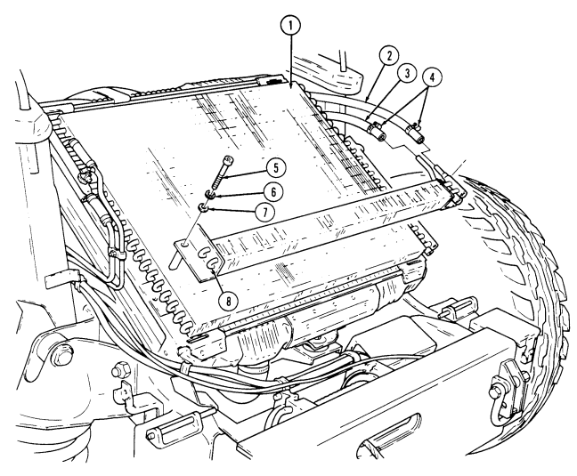

screws (5) to 125-155 lb-in. (14-18 N·m).

2. Connect two hoses (2) and (3) to cooler (8) with two clamps (4). Tighten clamps (4) 35-45 lb-in.

(4-5 N·m).

FOLLOW-ON TASK: Bleed power steering system (para. 8-29).

# 8 - 2 9 . Power Steering System Bleeding

This task covers:
Bleeding INITIAL SETUP:
Tools General mechanic's tool kit:
automotive (Appendix B, Item 1)
Personnel Required One mechanic One assistant

#### Bleeding

1. Make sure engine is shut off (TM 9-2320-280-10) and turn wheels all the way to the left. 2. Add power steering fluid (TM 9-2320-280-10) to "FULL COLD" level on reservoir. Leave reservoir cap off.

3. Raise front wheels off ground (para. 8-2). 4. Turn steering wheel left and right, holding wheels at steering stops for five seconds for at least 40 times.

#### Not E

- Power steering fluid must be free of bubbles and foam. If bubbles or foam are noted, it could be an indication of a loose connection or leaky O-ring.

- Fluid with air in it will have a milky appearance. Air must be eliminated from system before normal steering action can be o b t a i n e d .

5. Check power steering fluid level (TM 9-2320-280-10). If any bubbles are seen, repeat step 4. 6. Start engine (TM 9-2320-280-10) and with engine idling, add power steering fluid (TM 9-2320280-10) if necessary. Install reservoir cap.

7. Turn wheels to center, shut off engine, and lower front wheels to ground (para. 8-2). 8. Start engine (TM 9-2320-280-10) and run engine for two or three minutes, turning wheels left and right.

#### Not E

If pump is noisy, recheck hoses for possible contact with vehicle body or engine. If no contact is found and noise continues, turn engine off and repressurize system by following steps 9 and/or 10.

9. Remove reservoir cap. Wait for system to cool. Reinstall reservoir cap. Start engine (TM 9-2320280-10) and check pump for noise, if noise is still present continue to step 10. If noise stopped, proceed to step 11.

10. Turn engine off (TM 9-220-280-10). Remove fluid from reservoir using a suction device. Refill reservoir with clean, cool fluid. Install reservoir cap. Start engine (TM 9-2320-280-10) and check pump for noise. If noise is still present, replace power steering pump (para. 8-24 or 8-24.1).

11. Turn engine off (TM 9-2320-280-10).

FOLLOW-ON TASKS: - Check power steering fluid level (TM 9-2320-280-10).

- Lower and secure hood (TM 9-2320-280-10). - Operate vehicle and check for proper steering operation (TM 9-2320-280-10).

Manual References TM 9-2320-280-10 TM 9-2320-280-24P
Equipment Condition Hood raised and secured (TM 9-2320-280-10).

# 8-30. Power Steering Relief Valve Cartridge Maintenance

This task covers:
a. Removal c. Installation b. Inspection INITIAL SETUP:
Tools General mechanic's tool kit:
automotive (Appendix B, Item 1)
Materials/Parts O-ring (Appendix G, Item 218) Gasket (Appendix G, Item 60)
Manual References TM 9-2320-280-10 TM 9-2320-280-24P
a. Removal Equipment Condition
- Hood raised and secured (TM 9-2320-280-10). - Battery ground cables disconnected (para. 4-73).

Cover or plug all hoses and connections immediately after disconnection to prevent contamination. Remove all covers or plugs prior to connection.

Have drainage container ready to catch fluid.

1. Disconnect high-pressure line (1) from power steering pump (7). Remove O-ring (2) from highpressure line (1). Discard O-ring (2).

NOTE
Fitting assembly is spring-loaded. Remove carefully to avoid 

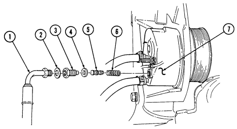 losing parts.

2. Remove fitting assembly (3) and gasket (4) from pump (7). Discard gasket (4). 3. Remove relief valve (5) and valve spring (6) from pump (7).

# 8 - 3 0 . Power Steering Relief Va Lve Cartridge Maintenance (Cont'D)

b. Inspection Inspect external surface of relief valve (5) for burrs, nicks, or damage. Inspect relief valve (5) bore and screen for damage or debris. Inspect valve spring (6) for damage. Replace both relief valve (5) and valve spring (6) if either is damaged.

c. Installation 1. Install valve spring (6) and relief valve (5) in pump (7).

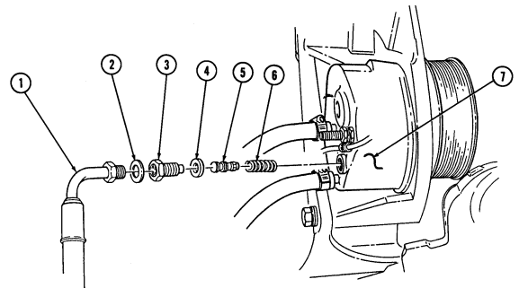 2. Install gasket (4) and fitting (3) in pump (7). Tighten fitting (3) in pump (7) to 37 lb-ft (50 N•m). 3. Install O-ring (2) on high-pressure line (1) and install high-pressure line (1) on pump (7).

FOLLOW-ON TASKS: - Connect battery ground cables (para. 4-73).

- Bleed power steering system (para. 8-29).

# Chapter 9 Frame Maintenance 9-1. Frame Maintenance Task Summary

| Applicable Models                                                                              | Materials/Parts                                                                                   |
|------------------------------------------------------------------------------------------------|---------------------------------------------------------------------------------------------------|
| All vehicle models except M1123 and                                                            | Lockwasher (Appendix G, Item 133)                                                                 |
| "A2" series                                                                                    | Lockwasher (Appendix G, Item 191)                                                                 |
| Tools                                                                                          | Lockwasher (Appendix G, Item 188)                                                                 |
|                                                                                                | O\-ring (Appendix G, Item 208)                                                                    |
| General mechanic's tool kit:                                                                   | Sealing compound (Appendix C, Item 45)                                                            |
| automotive (Appendix B, Item 1)                                                                | Manual References                                                                                 |
| Special Tools                                                                                  | TM 9\-2320\-280\-10                                                                               |
| Pulley installer (Appendix B, Item 137)                                                        | TM 9\-2320\-280\-24P                                                                              |
| Equipment Condition                                                                            |                                                                                                   |
|                                                                                                | Hood raised and secured (TM 9\-2320\-280\-10).                                                    |
| CAUTION                                                                                        |                                                                                                   |
| Cover or plug all hoses and connections immediately after                                      |                                                                                                   |
| disconnection to prevent contamination. Remove all plugs prior to                              |                                                                                                   |
| connection.                                                                                    |                                                                                                   |
| a.Removal                                                                                      |                                                                                                   |
| NOTE                                                                                           |                                                                                                   |
| Have drainage container ready to catch fluid.                                                  |                                                                                                   |
| 1.                                                                                             | Loosen two clamps (2) and disconnect two return lines (1) and high pressure line (5) from power   |
| steering pump (3). Remove O\-ring (4) from high pressure line (5). Discard O\-ring (4).        |                                                                                                   |
| 2.                                                                                             | Loosen alternator adjusting capscrew (6), two alternator mounting capscrews (16), and push        |
| alternator (7) toward engine. Remove two drivebelts (22) from power steering pump pulley (10). |                                                                                                   |
| 3.                                                                                             | Loosen adjusting capscrews (29) and (17) from front of power steering bracket (14).               |
| 4.                                                                                             | Loosen engine mounting capscrew (11) and push power steering bracket (14) toward engine.          |
| Remove two drivebelts (21) from power steering pump pulley (10).                               |                                                                                                   |
| 5.                                                                                             | Remove capscrew (11) and lockwasher (12) from power steering bracket (14) and alternator          |
| bracket (15). Discard lockwasher (12).                                                         |                                                                                                   |
| 6.                                                                                             | Remove adjusting capscrew (17), lockwasher (18), and washer (19) from power steering bracket (14) |
| and alternator bracket (15). Discard lockwasher (18).                                          |                                                                                                   |
| 7.                                                                                             | Remove adjusting capscrew (29), lockwasher (28), and washer (27) from power steering bracket (14) |
| and power steering front support bracket (23). Discard lockwasher (28).                        |                                                                                                   |
| 8.                                                                                             | Remove power steering pump (3), pulley (10), and power steering bracket (14).                     |

# 9-2. Front Bumper And Towing Brackets Replacement

This task covers:
INITIAL SETUP:

#### Applicable Models

M966, M966A1, M996, M996A1, M997, M997A1, M998, M998A1, M1025, M1025A1, M1035, M1035A1, M1037, M1043, M1043A1, M1045, M1045A1

#### Tools

General mechanic's tool kit:
automotive (Appendix B, Item 1)
a. Removal b. Installation Materials/Parts Four locknuts (Appendix G, Item 81)
Manual References TM 9-2320-280-24P

#### A. Removal

Remove four locknuts (3), washers (4), capscrews (6), washers (4), bumper (1), and two towing brackets (5) from mounting brackets (2). Discard locknuts (3). 

b. Installation Install bumper (1) and two towing brackets (5) on mounting brackets (2) with four washers (4), 

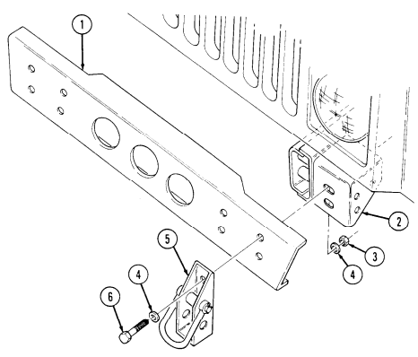 capscrews (6), washers (4), and locknuts (3). Tighten locknuts (3) to 90 lb-ft (122 N•m).

# 9-3. Front Bumper And Towing Brackets Replacement

This task covers:
INITIAL SETUP:

#### Applicable Models

M1026, M1026A1, M1036, M1038, M1038A1, M1042, M1044, M1044A1, M1046, M1046A1 Tools General mechanic's tool kit:
automotive (Appendix B, Item 1)

a. Removal b. Installation

Materials/Parts Five locknuts (Appendix G, Item 81)
Manual References TM 9-2320-280-24P
Equipment Condition Winch removed (para. 10-107).

#### A. Removal

1. Remove three locknuts (3), washers (4), capscrews (5), washers (4), and two towing brackets (6)
from front bumper (1) and two frame extensions (2). Discard locknuts (3).

2. Remove two locknuts (3), washers (4), capscrews (5), and washers (4) from front bumper (1) and frame extensions (2). Discard locknuts (3).

3. Remove two capscrews (7), washers (8), and front bumper (1) from frame extensions (2).

#### B. Installation

1. Install front bumper (1) on two frame extensions (2) with two washers (8) and capscrews (7).

Tighten capscrews (7) to 90 lb-ft (122 N•m).

2. Install front bumper (1) on two frame extensions (2) with two washers (4), capscrews (5),
washers (4), and locknuts (3). Tighten locknuts (3) to 90 lb-ft (122 N•m).

3. Install two towing brackets (6) on front bumper (1) with three washers (4), capscrews (5), 
washers (4), and locknuts (3). Tighten locknuts (3) to 90 lb-ft (122 N•m).

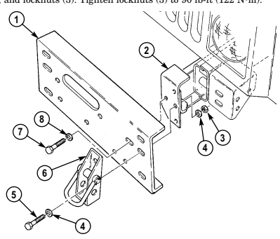

FOLLOW-ON TASK: Install winch (para. 10-107).

# 9-4. Front Bumper And Towing Brackets Replacement

This task covers:
INITIAL SETUP:

a. Removal b. Installation

| Tools                                  | Manual References                     |
|----------------------------------------|---------------------------------------|
| General mechanic's tool kit:           | TM 9\-2320\-280\-10                   |
| automotive (Appendix B, Item 1)        | TM 9\-2320\-280\-24P                  |
| Maintenance and repair shop equipment: | Equipment Condition                   |
| automotive (Appendix B, Item 2)        | Power steering pump, pulley, and      |
| Materials/Parts                        | bracket removed (para 8\-24 (6.2 L)), |

Perform steps 1 and 2 for bumpers with winch. Proceed to step 3 for bumpers without winch.

a. Removal 1. Remove four locknuts (5), washers (6), capscrews (8), washers (6), and two towing brackets (7) from bumper (1). Discard locknuts (5).

2. Remove six locknuts (3), washers (4), capscrews (9), washers (4), and front bumper (1) from two mounting brackets (2). Discard locknuts (3).

3. Remove four locknuts (5), washers (6), capscrews (8), washers (6), bumper (1), and two towing brackets (7) from mounting brackets (2). Discard locknuts (5).

b. Installation

Perform step 1 for bumpers without winch. Proceed to step 2 for bumpers with winch.

1. Install bumper (1) and two towing brackets (7) on two mounting brackets (2) with four washers (6),
capscrews (8), washers (6), and locknuts (5). Tighten locknuts (5) to 90 lb-ft (122 N•m).

2. Install front bumper (1) on two mounting brackets (2) with six washers (4), capscrews (9), 
washers (4), and locknuts (3). Tighten locknuts (3) to 90 lb-ft (122 N•m).

3. Install two towing brackets (7) on bumper (1) with four washers (6), capscrews (8), washers (6) and locknuts (5). Tighten locknuts (5) to 90 lb-ft (122 N•m).

9-4. FRONT BUMPER AND TOWING BRACKETS REPLACEMENT (Cont'd)

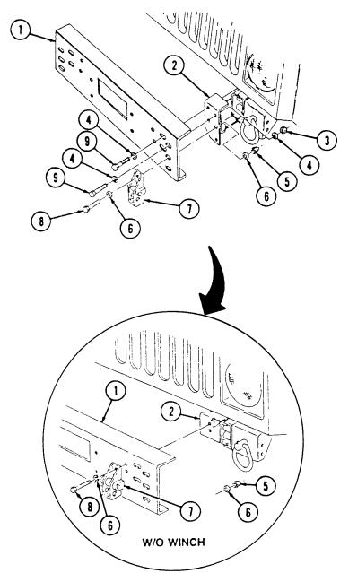

# 9-5. Frame Extension Replacement

This task covers:
INITIAL SETUP:
Applicable Models M997A2, M1025A2, M1026, M1026A1, M1035A1, M1035A2, M1036, M1038, M1038A1, M1042, M1043A2, M1044, M1044A1, M1045A2, M1046, M1046A1, M1097A2 Tools General mechanic's tool kit:
automotive (Appendix B, Item 1)

#### A. Removal B. Installation

Materials/Parts Three locknuts (Appendix G, Item 80)
Manual References TM 9-2320-280-24P
Equipment Condition
- Front bumper removed (para. 9-2, 9-3, or 9-4). - Hood and hinge removed (para. 10-5).

a. Removal

- Note position of winch cable bracket for installation. - M997A2, M1025A2, M1035A2, M1043A2, M1045A2, and M1097A2 vehicles are not equipped with a winch cable bracket as indicated in step 1.

1. Remove two locknuts (2), washers (3), capscrews (5), washers (3), and winch cable bracket (6) from frame extension (8). Discard locknuts (2).

2. Remove locknut (2), washer (3), capscrew (7), washer (3), frame extension (8), and bumper mounting bracket (1) from frame (4). Discard locknut (2).

b. Installation

M997A2, M1025A2, M1035A2, M1043A2, M1045A2, and M1097A2, vehicles are not equipped with a winch cable bracket as indicated in step 1.

1. Install bumper mounting bracket (1), frame extension (8), and winch cable bracket (6) on frame (4)
with two washers (3), capscrews (5), washers (3), and locknuts (2).

2. Install mounting bracket (1) and frame extension (8) on frame (4) with washer (3), capscrew (7), washer (3),
and locknut (2). Tighten locknuts (2) to 90 lb-ft (122 N•m).

## 9-5. Frame Extension Replacement

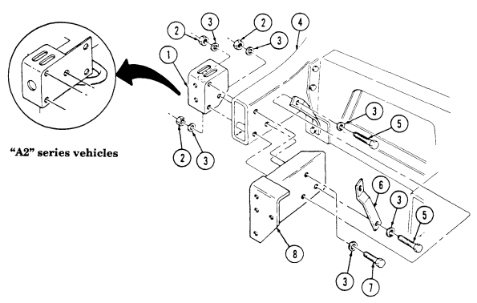

FOLLOW-ON TASKS: - Install hood and hinge (para. 10-5).
- Install front bumper (para. 9-3 or 9-4).

# 9-6. Tiedown Ring Replacement

This task covers:
INITIAL SETUP:
Applicable Models M997A, M1025A2, M1035A2, M1043A2, M1045A2, M1097A2 Tools General mechanic's tool kit:
automotive (Appendix B, Item 1)

a. Removal b. Installation

| Materials/Parts   |
|-------------------|

Cotter pin (Appendix G, Item 20)
Manual References TM 9-2320-280-24P
a. Removal Remove cotter pin (2), nut (3), and tiedown ring (1) from mounting bracket (4). Discard cotter pin (2).

b. Installation Install tiedown ring (1) on mounting bracket (4) with nut (3). Tighten nut (3) to 16 lb-ft (22 N•m), back off to the nearest cotter pin slot, and install cotter pin (2).

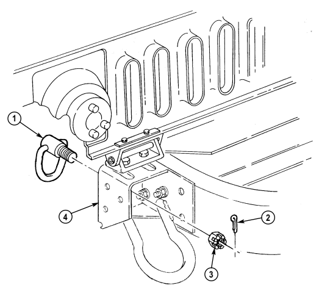

# 9-7. Radiator Front Mount Bracket Replacement

This task covers:

| General mechanic's tool kit:    |
|---------------------------------|
| automotive (Appendix B, Item 1) |
| Materials/Parts                 |
| . .                             |

INITIAL SETUP:

#### Tools

Two locknuts (Appendix G, Item 81) Locknut (Appendix G, Item 99)
a. Removal 1. Remove locknut (3), washer (2), capscrew (10), washer (2), and spacer (9) from radiator (4) and front mount bracket (11). Discard locknut (3).

2. Remove two locknuts (7), washers (8), capscrews (1), washers (8), bracket (11), and mount (6) from front suspension crossmember (5). Discard locknuts (7).

#### B. Installation

1. Install mount (6) and bracket (11) on front suspension crossmember (5) with two washers (8),
capscrews (1), washers (8), and locknuts (7). Tighten locknuts (7) to 90 lb-ft (122 N•m).

2. Install radiator (4) on bracket (11) with spacer (9), washer (2), capscrew (10), washer (2), and locknut (3). Tighten locknut (3) to 30 lb-ft (41 N•m).

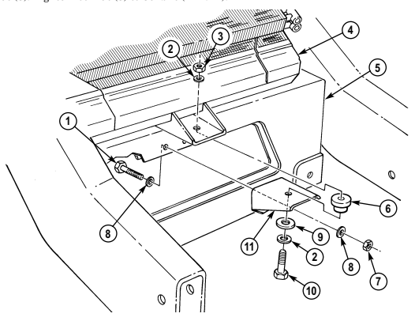

FOLLOW-ON TASK: Lower and secure hood (TM 9-2320-280-10).

a. Removal **b. Installation**

| PAGE  PROCEDURES   |
|--------------------|

# 9-8. Rear Bumper Brace Replacement

This task covers:
INITIAL SETUP:

#### Applicable Models

M996, M996A1, M997, M997A1, M997A2, M1037,M1042, M1097, M1097A1, M1097A2 Tools General mechanic's tool kit:
automotive (Appendix B, Item 1)
a. Removal b. Installation Materials/Parts Three locknuts (Appendix G, Item 81)
Manual References TM 9-2320-280-24P

#### A. Removal

1. Remove locknut (5), washer (2), capscrew (1), and washer (2), from rear bumper brace (3) and frame rail (4). Discard locknut (5).

2. Remove two locknuts (9), washers (7), capscrews (6), washers (7), and rear bumper brace (3) from rear bumper (8). Discard locknuts (9).

b. Installation 1. Install rear bumper brace (3) on rear bumper (8) with two washers (7), capscrews (6), washers (7),
and locknuts (9).

2. Install rear bumper brace (3) on frame rail (4) with washer (2), capscrew (1), washer (2), and locknut (5). Tighten locknuts (5) and (9) to 90 lb-ft (122 N•m).

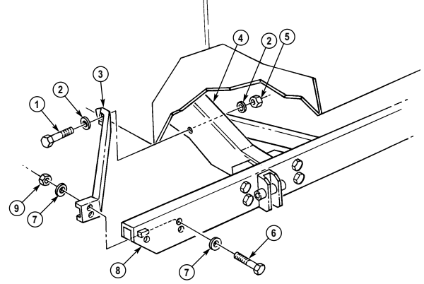

# 9-9. Rear Crossmember Brace Replacement

This task covers:

a. Removal b. Installation

| INITIAL SETUP:                         |                                     |
|----------------------------------------|-------------------------------------|
| Applicable Models                      | Materials/Parts                     |
| M1026, M1026A1, M1036, M1038, M1038A1, | Five locknuts (Appendix G, Item 81) |
| M1042, M1044, M1044A1, M1046, M1046A1  |                                     |
|                                        | Manual References                   |
| Tools                                  | TM 9\-2320\-280\-24P                |

Locknut (Appendix G, Item 81)

#### A. Removal

Remove locknut (5), washer (2), capscrew (3), washer (2), and rear crossmember brace (4) from frame rail (1). Discard locknut (5).

b. Installation Install rear crossmember brace (4) on frame rail (1) with washer (2), capscrew (3), washer (2), and

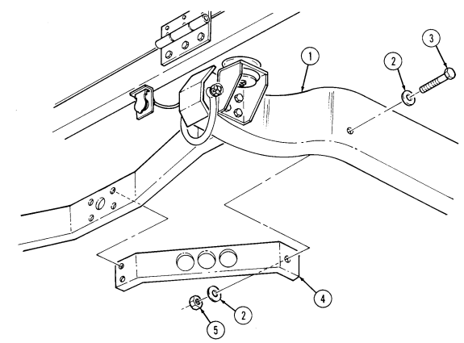 locknut (5). Tighten locknut (5) to 90 lb-ft (122 N•m).

FOLLOW-ON TASK: Install towing pintle (para. 9-12).

# 9-10. Rear Bumper Replacement

This task covers:
INITIAL SETUP:
Applicable Models M996, M996A1, M997, M997A1, M997A2, M1025A2, M1035A2, M1043A2, M1045A2, M1037, M1042, M1097, M1097A1, M1097A2 Tools General mechanic's tool kit:
automotive (Appendix B, Item 1)
Materials/Parts Sixteen locknuts (Appendix G, Item 81) Six assembled locknuts (Appendix G, Item 130)

a. Removal b. Installation

Personnel Required One mechanic One assistant Manual References TM 9-2320-280-24P
Equipment Condition Towing pintle removed (para. 9-12).

a. Removal 6. Remove four locknuts (3), washers (4), capscrews (18), washers (4), and two tiedown brackets (19)
from rear bumper (12) and two mounting brackets (5). Discard locknuts (3).

7. Remove four locknuts (3), washers (4), capscrews (18), and washers (4) from rear bumper (12) and mounting brackets (5). Discard locknuts (3).

8. Remove four locknuts (6), washers (7), capscrews (17), washers (7), and rear bumper (12) from two inner mounting brackets (8). Discard locknuts (6).

Perform step 9 only if bumper is being replaced.

9. Remove lifting shackles (para. 9-13).

b. Installation

Perform step 1 only if bumper was replaced.

1. Install lifting shackles (para. 9-13).

2. Remove two assembled locknuts (11), capscrews (14), plate (13), and trailer receptacle (10) from rear bumper (12) and remove plate (13) from rear bumper (12). Discard assembled locknuts (11).

3. Remove four locknuts (1), washers (2), capscrews (20), and washers (2) from rear bumper (12) and two braces (21). Discard locknuts (1).

Perform steps 4 and 5 for M997A2, M1025A2, M1035A2, M1043A2, M1045A2, and M1097A2 vehicles only.

4. Remove two cotter pins (22), nuts (23), and two tiedown rings (24) from rear bumper (12) and two mounting brackets (5). Discard cotter pins (22).

5. Remove eight locknuts (27), washers (26), capscrews (25), and washers (26) from rear bumper (12)
and two mounting brackets (5). Discard locknuts (27).

1. Remove four assembled locknuts (9), capscrew (15), and trailer receptacle cover (16) from trailer receptacle (10). Discard assembled locknuts (9).

## 9-10. Rear Bumper Replacement (Cont'D)

2. Install rear bumper (12) on inner mounting brackets (8) with four washers (7), capscrews (17),
washers (7), and locknuts (6). Tighten locknuts (6) to 90 lb-ft (122 N•m).

3. Install rear bumper (12) on mounting brackets (5) with four washers (4), capscrews (18), 
washers (4), and locknuts (3). Tighten locknuts (3) to 90 lb-ft (122 N•m).

Perform steps 4 and 5 for M997A2, M1025A2, M1035A2, M1043A2, M1045A2, and M1097A2 vehicles only.

4. Secure rear bumper (12) to two mounting brackets (5) with eight washers (26), capscrews (25),
washers (26), and locknuts (27). Tighten locknuts (27) to 90 lb-ft (122 N•m).

5. Install two tiedown rings (24) on rear bumper (12) and two brackets (5) with two nuts (23). Tighten nuts (23) to 16 lb-ft (22 N•m), back off to the nearest cotter pin slot, and install two cotter pins (22).

6. Install two tiedown brackets (19) on rear bumper (12) with four washers (4), capscrews (18),
washers (4), and locknuts (3). Tighten locknuts (3) to 90 lb-ft (122 N•m).

7. Install rear bumper (12) on braces (21) with four washers (2), capscrews (20), washers (2), and locknuts (1). Tighten locknuts (1) to 90 lb-ft (122 N•m).

8. Position trailer receptacle (10) through rear bumper (12) and install plate (13) and trailer receptacle (10) on rear bumper (12) with two capscrews (14) and assembled locknuts (11). Tighten assembled locknuts (11) to 8 lb-ft (11 N•m).

9. Install trailer receptacle cover (16) on plate (13) and rear bumper (12) with four capscrews (15) and

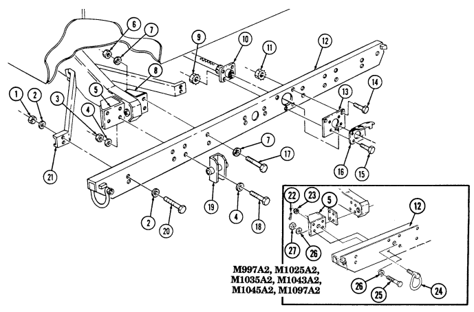

assembled locknuts (9). Tighten assembled locknuts (9) to 8 lb-ft (11 N•m).

FOLLOW-ON TASK: Install towing pintle (para. 9-12).

# 9-11. Rear Bumper Inner Mounting Bracket Replacement

This task covers:
INITIAL SETUP:
Applicable Models M996, M996A1, M997, M997A1, M997A2, M1037, M1042, M1097, M1097A1, M1097A2 Tools General mechanic's tool kit:
automotive (Appendix B, Item 1)
a. Removal b. Installation Materials/Parts Six locknuts (Appendix G, Item 81)
Manual References TM 9-2320-280-24P
a. Removal 1. Remove two locknuts (3), washers (4), capscrews (9), and washers (4) from bracket (7) and rear bumper (1). Discard locknuts (3).

2. Remove four locknuts (10), washers (6), capscrews (5), washers (6), spacer (8), and bracket (7) 
from frame rail (2). Discard locknuts (10).

b. Installation

Ensure spacer on outer side of frame rail is in position before installing

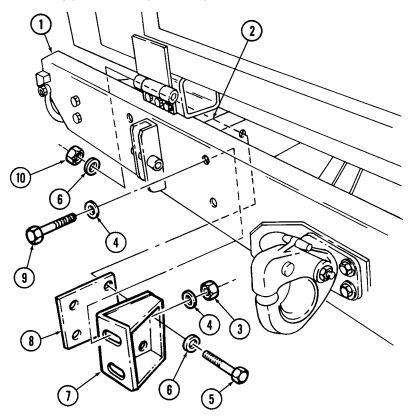 spacer and bracket.

1. Install spacer (8) and bracket (7) on frame rail (2) with four washers (6), capscrews (5), washers (6),
and locknuts (10). Tighten capscrews (5) to 90 lb-ft (122 N•m).

2. Install bracket (7) on rear bumper (1) with two washers (4), capscrews (9), washers (4), and locknuts (3). Tighten locknuts (3) to 90 lb-ft (122 N•m).

# 9-11.1. Towing Pintle Replacement (M1123)

This task covers:
INITIAL SETUP:

a. Removal **b. Installation**

| Applicable Models                 | Materials/Parts                  |
|-----------------------------------|----------------------------------|
| M997A, M1025A2, M1035A2, M1043A2, | Cotter pin (Appendix G, Item 20) |
| M1045A2, M1097A2                  |                                  |
|                                   | Manual References                |
| Tools                             | TM 9\-2320\-280\-24P             |
| General mechanic's tool kit:      |                                  |
| automotive (Appendix B, Item 1)   |                                  |

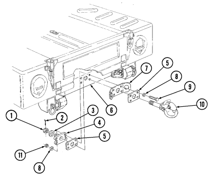

a. Removal 1. Remove cotter pin (2), slotted nut (1), washer (3), and towing pintle (10) from rear crossmember (6).

Discard cotter pin (2).

2. Remove four locknuts (11), washers (8), capscrews (9), washers (8), two support plates (5), backing plate (4), and safety chain plate (7) from rear crossmember (6). Discard locknuts (11).

#### B. Installation

1. Install safety chain plate (7), backing plate (4), and two support plates (5) on rear crossmember (6)
with four washers (8), capscrews (9), washers (8), and locknuts (11).

2. Install towing pintle (10) on crossmember (6) with washer (3) and slotted nut (1). 3. Tighten slotted nut (1) until towing pintle (10) is tight. Back off nut (1) until towing pintle (10)
rotates freely and hole in towing pintle (10) shaft aligns with slot in nut (1). Install cotter pin (2).

# 9-12. Towing Pintle Maintenance

This task covers:
b. Disassembly e. Installation c. Cleaning

#### Initial Setup: Tools

General mechanic's tool kit:
automotive (Appendix B, Item 1)

#### Materials/Parts

Two cotter pins (Appendix G, Item 22) Drive screw (Appendix G, Item 28) Two locknuts (Appendix G, Item 82) Four locknuts (Appendix G, Item 93.1) Drycleaning solvent (Appendix C, Item 18)
a. Removal d. Assembly Manual References TM 9-2320-280-10 TM 9-2320-280-24P
General Safety Instructions Cleaning will be done in a well-ventilated area and a fire extinguisher will be kept nearby when drycleaning solvent is used.

Contact DS maintenance for fabrication instructions of optional towing pintle.

a. Removal

- Perform steps 1 and 2 for rear-mounted towing pintle. - Perform steps 3 and 4 for optional towing pintle mounted to the front bumper.

1. Remove cotter pin (3), slotted nut (2), washer (4), and towing pintle (9) from rear crossmember (7).

Discard cotter pin (3).

2. Remove four nuts (1), washers (11), capscrews (10), washers (11), two support plates (6), backing

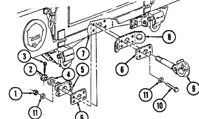

plate (5), and safety chain plate (8) from rear crossmember (7).

## 9-12. Towing Pintle Maintenance

Remove cotter pin (4), slotted nut (6), washer (5), and towing pintle (3) from front bumper (1).

3.

Discard cotter pin (4).

Remove four locknuts (9), washers (8), capscrews (10), washers (8), front plate (2), and 4.

back plate (7) from front bumper (1). Discard locknuts (9).

OPTIONAL

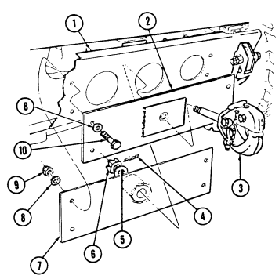

# 9-12. Towing Pintle Maintenance (Cont'D)

b. Disassembly

Perform step 1 for rear-mounted towing pintle only.

Remove grease fitting (12) from backing plate (11).

1.

Remove cotter pin (15) from towing pintle latch (20). Remove locknut (21), capscrew (19), pintle latch lock (17), and spring (16) from towing pintle latch (20). Discard locknut (21).

Remove locknut (24), capscrew (18), and towing pintle latch (20) from towing pintle hook (22). Discard locknut (24).

2. 3.

4.

Remove cotter pin (15) from pintle lock chain hook (14). Discard cotter pin (15).

Remove drivescrew (23) and pintle lock chain (13) from towing pintle hook (22). Discard drivescrew (23).

5. 6.

#### Warnin G

Drycleaning solvent is flammable and will not be used near an open flame. A fire extinguisher will be kept nearby when the solvent is used. Use only in well-ventilated places. Failure to do this may result in injury to personnel and/or damage to equipment.

Clean all metallic parts with drycleaning solvent.

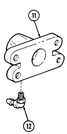

## 9-12. Towing Pintle Maintenance (Cont'D)

1.

2.

Install pintle lock chain (1) on towing pintle hook (10) with drivescrew (11). Install cotter pin (3) on pintle lock chain (1) with pintle lock chain hook (2).

3.

Install towing pintle latch (8) on towing pintle hook (10) with capscrew (6) and locknut (12). Tighten locknut (12) to 15 lb-ft (20 N m). Install spring (4) and pintle latch lock (5) on towing pintle latch (8) with capscrew (7) and locknut (9). Tighten locknut (9) to 15 lb-ft (20 N·m).

4.

Install cotter pin (3) in pintle latch (8).

5.

Perform step 6 for rear-mounted towing pintle only.

Install grease fitting (14) in backing plate (13).

6.

e. Installation

#### Note

Perform steps 1 through 3 for rear-mounted towing pintle.

Perform steps 4 through 6 for optional towing pintle mounted to the front bumper.

Grease fitting on backing plate must face downward.

1. Install safety chain plate (22), support plates (20), and backing plate (13) on rear crossmember (21)

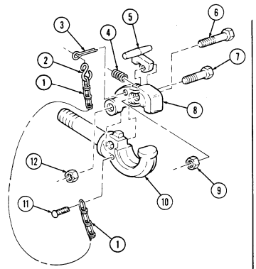

with four washers (16), capscrews (24), washers (16), and nuts (15).

2. Install towing pintle (23) and tighten nuts (15) to 90 lb-ft (122 N m). 3. Install towing pintle (23) with washer (19) and slotted nut (17). Loosen slotted nut (17) slightly if towing pintle (23) will not rotate easily. Install cotter pin (18) in slotted nut (17).

## 9-12. Towing Pintle Maintenance (Cont'D)

4.

Install front plate (26) and back plate (31) on front bumper (25) with four washers (32), capscrews (34),
washers (32), and locknuts (33). Tighten locknuts (33) to 90 lb-ft (122 N-m).

5.

Install towing pintle (27) with washer (29) and slotted nut (30).

Tighten slotted nut (30) until towing pintle (27) is tight. Back off nut (30) until towing pintle (27)
6.

rotates freely and hole in towing pintle (27) shaft aligns with slot in nut (30). Install cotter pin (28).

n

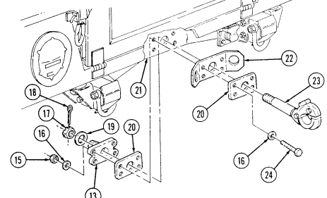

OPTIONAL

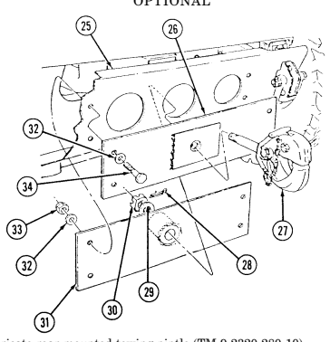

FOLLOW-ON TASKS: Lubricate rear-mounted towing pintle (TM 9-2320-280-10).

# 9-13. Lifting Shackle Replacement

This task covers:
INITIAL SETUP:

#### Tools

General mechanic's tool kit:
automotive (Appendix B, Item 1)

a. Removal b. Installation

| Materials/Parts   |
|-------------------|
| Cotter pin (A     |

Cotter pin (Appendix G, Item 14)
Manual References TM 9-2320-280-24P

- All lifting shackles are replaced basically the same. This procedure covers the rear lifting shackle on all vehicles except M996, M996A1, M997, M997A1, M997A2, M1037, and M1042.

- Vehicles with serial numbers 100,000 and above have new, reinforced lifting shackles. Previous models lifting shackles will be used on vehicles with serial numbers 99,999 and below only. Refer to vehicle serial number before ordering replacement parts.

a. Removal Remove cotter pin (1), slotted nut (2), capscrew (5), spring washer (4), and shackle (6) from frame (3). Discard cotter pin (1).

b. Installation 1.Install shackle (6) on frame (3) with spring washer (4), capscrew (5), and slotted nut (2). Tighten slotted nut (2) enough to allow movement of shackle (6). Torque slotted nut (2) to 15-20 lb-ft (20-27 N•m).

2.Back off slotted nut (2) to align with hole in capscrew (5) and install cotter pin (1) in slotted nut (2).

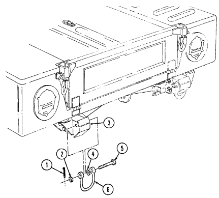

# 9-14. Receptacle Mounting Bracket Replacement

This task covers:
INITIAL SETUP:

#### Applicable Models

All vehicles except M996, M996A1, M997, M997A1, M997A2, M1037, M1042 Tools General mechanic's tool kit:
automotive (Appendix B, Item 1)

a. Removal **b. Installation**

| Manual References   |
|---------------------|

| Manual References    |
|----------------------|
| TM 9\-2320\-280\-24P |

Two locknuts (Appendix G, Item 79) Four assembled locknuts (Appendix G, Item 130)
a. Removal 1. Remove four assembled locknuts (9), capscrews (6), cover (5), and receptacle (1) from bracket (4).

Discard assembled locknuts (9).

NOTE
- If bracket is held on to "D" beam with rivets, proceed to step 2. If not, proceed to step 3.

- For instructions on removal of rivets, refer to para. 10-66.

2. Remove two rivets and bracket (4) from "D" beam (3). 3. Remove two locknuts (2) capscrews (8), washers (7), and bracket (4) from "D" beam (3). 

Discard locknuts (2).

b. Installation

If bracket was held on to "D" beam with rivets, do step 1. If not, do step 2.

1. With a 0.3125-in. drill bit, enlarge existing rivet holes on bracket (4) and "D" beam (3).

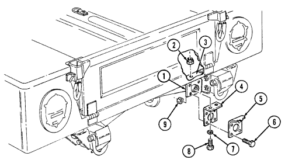 2. Install bracket (4) on "D" beam (3) with two washers (7), capscrews (8), and locknuts (2). 3. Install receptacle (1) and cover (5) on bracket (4) with four capscrews (6) and assembled locknuts (9).

# 9-15. Transmission Mount Crossmember Replacement

This task covers:
a. Removal b. Installation INITIAL SETUP:
Tools General mechanic's tool kit:
automotive (Appendix B, Item 1)
Manual References TM 9-2320-280-24P
Materials/Parts Two locknuts (Appendix G, Item 128)

Transmission must be supported during removal and installation of transmission mount crossmember to prevent damage to equipment.

a. Removal

Perform step 1 and 2 for all vehicles except "A2" series. Perform steps 3 and 4 for "A2" series only.

4. Remove two locknuts (15), washers (14), and crossmember (13) from transmission mount (9).

Discard locknuts (15).

b. Installation

Perform step 1 and 2 for all vehicles except "A2" series. Perform steps 3 and 4 for "A2" series only.

1. Install crossmember (5) on two support brackets (1) with washers (2), capscrews (3), washers (2),
and nuts (8). Tighten nuts (8) to 90 lb-ft (122 N•m).

4. Install crossmember (13) on transmission mount (9) with two washers (14) and locknuts (15).

Tighten locknuts (15) to 28 lb-ft (38 N•m).

5. Remove support.

1. Place support under transmission and remove two nuts (8), washers (2), capscrews (3), and washers (2) from transmission mount crossmember (5) and two transmission support brackets (1). 

2. Remove two locknuts (7), washers (6), and crossmember (5) from transmission mount (4). Discard locknuts (7).

3. Place support under transmission and remove two nuts (12), washers (11), capscrew (10), and washer (11) from crossmember (13) and two support brackets (1).

2. Install crossmember (5) on transmission mount (4) with two washers (6) and locknuts (7). Tighten locknuts (7) to 29 lb-ft (38 N•m).

3. Install crossmember (13) on two support brackets (1) with washer (11), capscrew (10), two washers (11), and nuts (12). Tighten nuts (12) to 90 lb-ft (122 N•m).

9-15. TRANSMISSION MOUNT CROSSMEMBER REPLACEMENT (Cont'd)

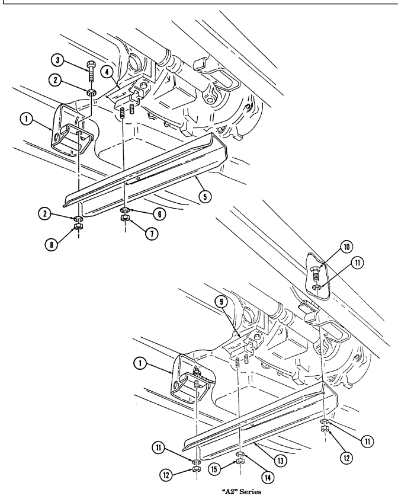

## 9-16. Rear Crossmember Replacement

| This task covers:   |
|---------------------|

| INITIAL SETUP:                        |                      |
|---------------------------------------|----------------------|
| Applicable Models                     | Personnel Required   |
| M996, M996A1, M997, M997A1, M997A2,   | One mechanic         |
| M1025A2, M1035A2, M1043A2, M1045A2,   | One assistant        |
| M1037, M1042, M1097, M1097A1, M1097A2 |                      |
|                                       | Manual References    |
| Tools                                 | TM 9\-2320\-280\-24P |

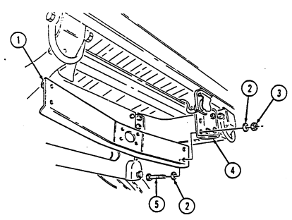

a. Removal **b. Installation**

#### A. Removal

Remove four locknuts (3), washers (2), capscrews (5), washers (2), and rear crossmember (1) from two rear crossmember mounting brackets (4). Discard locknuts (3).

#### B. Installation

Install rear crossmember (1) on two rear crossmember mounting brackets (4) with four washers (2), capscrews (5), washers (2), and locknuts (3). Tighten locknuts (3) to 90 lb-ft (122 N•m).

FOLLOW-ON TASK: Install rear crossmember braces (para. 9-9).

INDEX VOLUME II

| This task covers:                                                                                        | a.                                                                                                    | Removal                                                                                 | b.                                                                                                   | Installation   |
|----------------------------------------------------------------------------------------------------------|-------------------------------------------------------------------------------------------------------|-----------------------------------------------------------------------------------------|------------------------------------------------------------------------------------------------------|----------------|
| INITIAL SETUP:                                                                                           |                                                                                                       |                                                                                         |                                                                                                      |                |
| Applicable Models                                                                                        | Materials/Parts                                                                                       | M1123                                                                                   | Cotter pin (Appendix G, Item 22)                                                                     |                |
| Four locknuts (Appendix G, Item 81)                                                                      | Tools                                                                                                 |                                                                                         |                                                                                                      |                |
| Manual References                                                                                        | General mechanic's tool kit:                                                                          | automotive (Appendix B, Item 1)                                                         | TM 9\-2320\-280\-10                                                                                  |                |
| TM 9\-2320\-280\-24P                                                                                     |                                                                                                       |                                                                                         |                                                                                                      |                |
| a. Removal                                                                                               |                                                                                                       |                                                                                         |                                                                                                      |                |
| 1.                                                                                                       | Remove cotter pin (2), slotted nut (1), washer (3), and towing pintle (10) from rear crossmember (6). | Discard cotter pin (2).                                                                 |                                                                                                      |                |
| 2.                                                                                                       | Remove four locknuts (11), washers (8), capscrews (9), washers (8), two support plates (5), backing   | plate (4), and safety chain plate (7) from rear crossmember (6). Discard locknuts (11). |                                                                                                      |                |
| b. Installation                                                                                          |                                                                                                       |                                                                                         |                                                                                                      |                |
| 1.                                                                                                       | Install safety chain plate (7), backing plate (4), and two support plates (5) on rear crossmember (6) | with four washers (8), capscrews (9), washers (8), and locknuts (11).                   |                                                                                                      |                |
| 2.                                                                                                       | Install towing pintle (10) on crossmember (6) with washer (3) and slotted nut (1).                    | 3.                                                                                      | Tighten slotted nut (1) until towing pintle (10) is tight. Back off nut (1) until towing pintle (10) |                |
| rotates freely and hole in towing pintle (10) shaft aligns with slot in nut (1). Install cotter pin (2). |                                                                                                       |                                                                                         |                                                                                                      |                |

INDEX (Cont'd)

| This task covers: a.  Removal  b.  Installation                                                                                                                                                               |                         |
|---------------------------------------------------------------------------------------------------------------------------------------------------------------------------------------------------------------|-------------------------|
| INITIAL SETUP: Tools Materials/Parts                                                                                                                                                                          |                         |
| General mechanic's tool kit:  Cotter pin (Appendix G, Item 14) automotive (Appendix B, Item 1)  Manual References                                                                                             |                         |
| TM 9\-2320\-280\-24P                                                                                                                                                                                          |                         |
| NOTE - All lifting shackles are replaced basically the same. This procedure covers the rear lifting shackle on all vehicles except                                                                            |                         |
| M996, M996A1, M997, M997A1, M997A2, M1037, and M1042.                                                                                                                                                         |                         |
| - Vehicles with serial numbers 100,000 and above have new, reinforced lifting shackles. Previous models lifting shackles will be used on vehicles with serial numbers 99,999 and below only. Refer            |                         |
| to vehicle serial number before ordering replacement parts.                                                                                                                                                   | a. Removal              |
| Remove cotter pin (1), slotted nut (2), capscrew (5), spring washer (4), and shackle (6) from frame (3).                                                                                                      | Discard cotter pin (1). |
| Install shackle (6) on frame (3) with spring washer (4), capscrew (5), and slotted nut (2). Tighten                                                                                                           | b. Installation  1.     |
| slotted nut (2) enough to allow movement of shackle (6). Torque slotted nut (2) to 15\-20 lb\-ft   Back off slotted nut (2) to align with hole in capscrew (5) and install cotter pin (1) in slotted nut (2). | (20\-27 N•m).  2.       |

INDEX (Cont'd)

| This task covers:               | a.                                                                                                 | Removal                                                                                     | b.                                                                                                      | Installation   |
|---------------------------------|----------------------------------------------------------------------------------------------------|---------------------------------------------------------------------------------------------|---------------------------------------------------------------------------------------------------------|----------------|
| INITIAL SETUP:                  |                                                                                                    |                                                                                             |                                                                                                         |                |
| Applicable Models               | Materials/Parts                                                                                    | All vehicles except M996, M996A1, M997,                                                     | Two locknuts (Appendix G, Item 79)                                                                      |                |
| M997A1, M997A2, M1037, M1042    | Four assembled locknuts (Appendix G, Item 130)                                                     |                                                                                             |                                                                                                         |                |
| Tools                           | Manual References                                                                                  | General mechanic's tool kit:                                                                | TM 9\-2320\-280\-24P                                                                                    |                |
| automotive (Appendix B, Item 1) |                                                                                                    |                                                                                             |                                                                                                         |                |
| a. Removal                      |                                                                                                    |                                                                                             |                                                                                                         |                |
| 1.                              | Remove four assembled locknuts (9), capscrews (6), cover (5), and receptacle (1) from bracket (4). | Discard assembled locknuts (9).                                                             |                                                                                                         |                |
| NOTE                            | -                                                                                                  | If bracket is held on to "D" beam with rivets, proceed to step 2. If                        |                                                                                                         |                |
| not, proceed to step 3.         | -                                                                                                  | For instructions on removal of rivets, refer to para. 10\-66.                               |                                                                                                         |                |
| 2.                              | Remove two rivets and bracket (4) from "D" beam (3).                                               | 3.                                                                                          | Remove two locknuts (2) capscrews (8), washers (7), and bracket (4) from "D" beam (3).                  |                |
| Discard locknuts (2).           |                                                                                                    |                                                                                             |                                                                                                         |                |
| b. Installation                 |                                                                                                    |                                                                                             |                                                                                                         |                |
| NOTE                            | If bracket was held on to "D" beam with rivets, do step 1. If not,                                 |                                                                                             |                                                                                                         |                |
| do step 2.                      | 1.                                                                                                 | With a 0.3125\-in. drill bit, enlarge existing rivet holes on bracket (4) and "D" beam (3). |                                                                                                         |                |
| 2.                              | Install bracket (4) on "D" beam (3) with two washers (7), capscrews (8), and locknuts (2).         | 3.                                                                                          | Install receptacle (1) and cover (5) on bracket (4) with four capscrews (6) and assembled locknuts (9). |                |

INDEX (Cont'd)

| This task covers:                                                                                    |                           |                                 |       |                      |               |
|------------------------------------------------------------------------------------------------------|---------------------------|---------------------------------|-------|----------------------|---------------|
| a.                                                                                                   | Removal  b.  Installation |                                 |       |                      |               |
| INITIAL SETUP:                                                                                       |                           |                                 |       |                      |               |
| Manual References                                                                                    |                           |                                 | Tools |                      |               |
| General mechanic's tool kit:                                                                         |                           |                                 |       | TM 9\-2320\-280\-24P |               |
| Equipment Condition                                                                                  |                           |                                 |       |                      |               |
| a. Removal                                                                                           |                           |                                 |       |                      |               |
| Four locknuts (Appendix G, Item 81)                                                                  |                           |                                 |       |                      | (para. 9\-9). |
| Remove four locknuts (3), washers (2), capscrews (5), washers (2), and rear crossmember (1) from two |                           |                                 |       |                      |               |
| b. Installation                                                                                      |                           |                                 |       |                      |               |
| rear crossmember mounting brackets (4). Discard locknuts (3).                                        |                           |                                 |       |                      |               |
| Materials/Parts                                                                                      |                           | Rear crossmember braces removed |       |                      |               |
| Install rear crossmember (1) on two rear crossmember mounting brackets (4) with four washers (2),    |                           |                                 |       |                      |               |
| capscrews (5), washers (2), and locknuts (3). Tighten locknuts (3) to 90 lb\-ft (122 N•m).           |                           |                                 |       |                      |               |
| FOLLOW\-ON TASK: Install rear crossmember braces (para. 9\-9).                                       |                           |                                 |       |                      |               |
| automotive (Appendix B, Item 1)                                                                      |                           |                                 |       |                      |               |

# Index (Cont'D)

| Para                               | Page     | Para  Page                       |
|------------------------------------|----------|----------------------------------|
| A                                  |          |                                  |
| Accelerator linkage:               |          | Air restriction gauge hose:      |
| Adjustment 3\-42d                  | 3\-80    | Installation 3\-19b  3\-32       |
| Inspection 3\-42b                  | 3\-79    | Removal 3\-19a  3\-32            |
| Installation 3\-42c                | 3\-80    | Alternator, 12 volt cable:       |
| Removal 3\-42a                     | 3\-78    | Installation 4\-75b  4\-126      |
| Accelerator pedal:                 |          | Removal 4\-75a  4\-124           |
| Installation 3\-43b                | 3\-82    | Alternator, 60 ampere:           |
| Removal 3\-43a                     | 3\-82    | Adjustment 4\-2c 4\-6            |
| Accelerator system:                |          | Installation 4\-2b  4\-4         |
| Maintenance task summary . . 3\-41 | 3\-77    | Removal 4\-2a  4\-2              |
| Adapter plate, water pump and:     |          | Alternator (12447110),           |
| Inspection 3\-76.1b                | 3\-130.2 | 100 ampere dual voltage:         |
| Installation 3\-76.1c              | 3\-130.4 | Installation 4\-5.3b  4\-12.8    |
| Removal 3\-76.1a                   | 3\-130.2 | Removal 4\-5.3a  4\-12.6         |
| Air cleaner assembly and dust      |          | Alternator (12447110) cable,     |
| unloader:                          |          | 100 ampere dual voltage:         |
| Inspection 3\-12b                  | 3\-20    | Installation 4\-5.4b  4\-12.10   |
| Installation 3\-12c                | 3\-20    | Removal 4\-5.4a 4\-12.10         |
| Removal 3\-12a                     | 3\-20    | Alternator (12447110) regulator, |
| Air cleaner filter element:        |          | 100 ampere dual voltage:         |
| Cleaning 3\-13d                    | 3\-24    | Installation 4\-5.6b  4\-12.16   |
| Emergency cleaning 3\-13c          | 3\-22    | Removal 4\-5.6a  4\-12.16        |
| Inspection 3\-13b                  | 3\-22    | Alternator (12447110) umbilical  |
| Installation 3\-13e                | 3\-24    | power cable, 100 ampere dual     |
| Removal 3\-13a                     | 3\-22    | voltage:                         |
| Air cleaner to air horn elbow:     |          | Installation 4\-5.5b  4\-12.14   |
| Installation 3\-15b                | 3\-28    | Removal 4\-5.5a  4\-12.12        |
|                                    |          | Alternator (A0013036AA),         |
| Removal 3\-15a                     | 3\-28    | 200 ampere:                      |
| Air horn:                          |          |                                  |
| Installation 3\-14b                | 3\-26    | Installation 4\-109b  4\-256     |
|                                    |          | Removal 4\-109a  4\-254          |
| Removal 3\-14a                     | 3\-26    | Alternator (12338796\-1) (6.2L), |
| Air horn to air cleaner elbow:     |          |                                  |
| Installation 3\-15b                | 3\-28    | 200 ampere:                      |
|                                    |          | Installation 4\-110b  4\-260     |
| Removal 3\-15a                     | 3\-28    |                                  |
|                                    |          | Removal 4\-110a  4\-258          |
| Air horn support bracket:          |          | Alternator (12447109) (6.5L),    |
| Installation 3\-16b                | 3\-29    |                                  |
| Removal 3\-16a                     | 3\-29    | 200 ampere:                      |
| Air intake and fuel pump vent      |          | Installation 4\-110.1b4\-260.4   |
| line:                              |          | Removal 4\-110.1a4\-260.2        |
|                                    |          | Alternator cable (12339317),     |
| Installation 3\-20b                | 3\-33    | 200 ampere                       |
| Removal 3\-20a                     | 3\-33    | Installation 4\-112b  4\-264     |
| Air lifting bracket:               |          | 4\-264                           |
| Installation 6\-20b                | 6\-50    | Removal 4\-112a                  |
|                                    |          | Alternator cable (12446825)      |
| Removal 6\-20a                     | 6\-50    | 200 ampere                       |
| Airlift to shroud shield assembly: |          | Installation 4\-111b  4\-262     |
| Installation 3\-62b                | 3\-116   | Removal 4\-111a  4\-262          |
| Removal 3\-62a                     | 3\-116   | Alternator (12447109) (6.5L),    |
| Air restriction gauge:             |          | 200 ampere dual voltage:         |
| Installation 3\-17b                | 3\-30    | Installation 4\-5.7b  4\-12.20   |
| Removal 3\-17a                     | 3\-30    | Removal 4\-5.7a  4\-12.18        |

INDEX (Cont'd)

| Para                               |          | Page     | Para                                     | Page   |
|------------------------------------|----------|----------|------------------------------------------|--------|
| A (Cont'd)                         |          |          |                                          |        |
| Alternator (12447109) (6.5L),      |          |          | Alternator regulator, 60 ampere:         |        |
| cable, 200 ampere dual voltage:    |          |          | Installation 4\-2.1b                     | 4\-6.2 |
| Installation 4\-5.8b               |          | 4\-12.22 | Removal 4\-2.1a                          | 4\-6.2 |
| Removal 4\-5.8a                    |          | 4\-12.22 | Ambulance electrical system:             |        |
| Alternator (12447109) (6.5L)       |          |          | Maintenance task summary . . 4\-86       | 4\-157 |
| regulator, 200 ampere dual         |          |          | Antenna cables (M996, M996A1):           |        |
| voltage:                           |          |          | Installation 4\-105b                     | 4\-236 |
| Installation                       | 4\-5.10b | 4\-12.26 | Removal 4\-105a                          | 4\-236 |
| Removal 4\-5.10a                   |          | 4\-12.26 | Antenna cables                           |        |
| Alternator (12447109) (6.5L)       |          |          | (M997, M997A1, M997A2):                  |        |
| umbilical power cable,             |          |          | Installation 4\-106b                     | 4\-240 |
| 200 ampere dual voltage:           |          |          | Removal 4\-106a                          | 4\-238 |
| Installation 4\-5.9b               |          | 4\-12.24 | Auxiliary fuel pickup and return  lines: |        |
| Removal 4\-5.9a                    |          | 4\-12.24 | Installation 3\-26b                      | 3\-50  |
| Alternator cable, 100/200 ampere:  |          |          | Removal 3\-26a                           | 3\-50  |
| Installation 4\-2.2b               |          | 4\-6.6   | Axles, front and rear:                   |        |
| Installation of 12\-volt regulator |          |          | Maintenance task summary . . 6\-8        | 6\-16  |
| cable                              | 4\-2.2d  | 4\-6.12  | B                                        |        |
| Installation, 100/200 ampere       |          |          | Backup light assembly (M996,             |        |
| ground cable 4\-2.2f               |          | 4\-6.16  | M996A1, M997, M997A1,                    |        |
| Removal 4\-2.2a                    |          | 4\-6.4   | M997A2):                                 |        |
| Removal of 12\-volt regulator      |          |          | Installation 4\-95b                      | 4\-174 |
| cable 4\-2.2c                      |          | 4\-6.10  | Removal 4\-95a                           | 4\-174 |
| Removal, 100/200 ampere            |          |          | Backup light assembly:                   |        |
| ground cable 4\-2.2e               |          | 4\-6.16  | Installation 4\-69b                      | 4\-110 |
| Alternator (12446760) (6.5L)       |          |          | Removal 4\-69a                           | 4\-110 |
| 400 ampere dual voltage:           |          |          | Backup light bracket:                    |        |
| Installation                       | 4\-5.13b | 4\-12.38 | Installation 4\-70b                      | 4\-112 |
| Removal 4\-5.13a                   |          | 4\-12.38 | Removal 4\-70a                           | 4\-112 |
| Alternator (12446760) (6.5L)       |          |          | Backup light lamp:                       |        |
| cable, 400 ampere dual voltage:    |          |          | Installation 4\-68b                      | 4\-109 |
| Installation 4\-5.12b              |          | 4\-12.34 | Removal 4\-68a                           | 4\-109 |
| Removal 4\-5.12a                   |          | 4\-12.30 | Ball joint, lower:                       |        |
| Alternator (12446760) (6.5L)       |          |          | Inspection 6\-27a                        | 6\-60  |
| regulator, 400 ampere dual         |          |          | Installation 6\-27c                      | 6\-60  |
| voltage:                           |          |          | Removal 6\-27b                           | 6\-60  |
| Installation 4\-5.11b              |          | 4\-12.28 | Ball joint, upper:                       |        |
| Removal                            | 4\-5.11a | 4\-12.28 | Inspection 6\-62a                        | 6\-58  |
| Alternator drivebelt set:          |          |          | Installation 6\-26c                      | 6\-58  |
|                                    |          |          | Removal 6\-26b                           | 6\-58  |
| Installation 3\-81b                |          | 3\-138   | Battery cable:                           |        |
| Removal 3\-81a                     |          | 3\-138   | Cleaning and inspection 4\-73a           | 4\-116 |
| Alternator mounting brackets:      |          |          | Ground cables disconnection . . 4\-73b   | 4\-117 |
| Installation 4\-4b                 |          | 4\-10    | Ground cable installation 4\-73e         | 4\-118 |
| Removal 4\-4a                      |          | 4\-10    | Ground cables reconnection . . . 4\-73c  | 4\-117 |
| Alternator/power steering          |          |          | Ground cable removal 4\-73d              | 4\-118 |
| mounting bracket:                  |          |          | Interconnecting cable                    |        |
| Installation 4\-4.1b               |          | 4\-10.2  | installation 4\-73g                      | 4\-119 |
| Removal                            | 4\-4.1a  | 4\-10.2  | Interconnecting cable                    |        |
| Alternator pulley:                 |          |          | removal 4\-73f                           | 4\-118 |
| Installation 4\-3b                 |          | 4\-8     | Positive cable installation 4\-73i       | 4\-120 |
| Removal 4\-3a                      |          | 4\-8     | Positive cable removal 4\-73h            | 4\-120 |

INDEX (Cont'd)

| Para                                 | Page   |                                       | Para  Page   |
|--------------------------------------|--------|---------------------------------------|--------------|
| B (Cont'd)                           |        |                                       |              |
| Battery cable terminal clamp:        |        | Brackets, alternator mounting:        |              |
| Installation 4\-72b                  | 4\-114 | Installation 4\-4b                    | 4\-10        |
| Removal 4\-72a                       | 4\-114 | Removal 4\-4a                         | 4\-10        |
| Battery holddown:                    |        | Bracket, alternator/power steering    |              |
| Installation 4\-78b                  | 4\-132 | mounting:                             |              |
| Removal 4\-78a                       | 4\-132 | Installation 4\-4.1b                  | 4\-10.2      |
| Battery replacement and              |        | Removal 4\-4.1a                       | 4\-10.2      |
| servicing:                           |        | Bracket, backup light:                |              |
| Installation 4\-79c                  | 4\-134 | Installation 4\-70b                   | 4\-112       |
| Removal 4\-79a                       | 4\-134 | Removal 4\-70a                        | 4\-112       |
| Servicing 4\-79b                     | 4\-134 | Bracket, fuel injection lines, left:  |              |
| Battery system:                      |        | Installation 3\-40b                   | 3\-76        |
| Maintenance task summary . . 4\-71   | 4\-113 | Removal 3\-40a                        | 3\-76        |
| Battery tray:                        |        | Bracket, fuel injection lines, right: |              |
| Cleaning and inspection 4\-80b       | 4\-136 | Installation 3\-39b                   | 3\-75        |
| Installation 4\-80d                  | 4\-136 | Removal 3\-39a                        | 3\-75        |
| Preventive modification 4\-80c       | 4\-136 | Bracket, headlight beam selector      |              |
| Removal 4\-80a                       | 4\-136 | switch and:                           |              |
| Bearing adjustment, geared hub       |        | Installation 4\-58b                   | 4\-95        |
| spindle: 6\-14                       | 6\-38  | Removal 4\-58a                        | 4\-95        |
| Blackout drive light assembly:       |        | Bracket, horn mounting:               |              |
| Installation 4\-50b                  | 4\-82  | Installation 4\-23b                   | 4\-43        |
| Removal 4\-50a                       | 4\-82  | Removal 4\-23a                        | 4\-43        |
| Blackout drive light lamp:           |        | Bracket, muffler support:             |              |
| Installation 4\-51b                  | 4\-84  | Assembly 3\-53c                       | 3\-96        |
| Removal 4\-51a                       | 4\-84  | Disassembly 3\-53b                    | 3\-96        |
| Blackout switch and bracket,         |        | Installation 3\-53d                   | 3\-96        |
| bulkhead door:                       |        | Removal 3\-53a                        | 3\-96        |
| Installation 4\-94b                  | 4\-172 | Bracket, radiator front mount:        |              |
| Removal 4\-94a                       | 4\-172 | Installation 9\-7b                    | 9\-9         |
| Blackout switch/bracket,             |        | Removal 9\-7a                         | 9\-9         |
| rear door:                           |        | Bracket, rear bumper inner            |              |
| Installation 4\-93b                  | 4\-170 | mounting:                             |              |
| Removal 4\-93a                       | 4\-170 | Installation 9\-11b                   | 9\-14        |
| Blackout switch bracket, rear steps: |        | Removal 9\-11a                        | 9\-14        |
| Installation 4\-91b                  | 4\-166 | Bracket, receptacle mounting:         |              |
| Removal 4\-91a                       | 4\-166 | Installation 9\-14b                   | 9\-21        |
| Blackout switch, rear steps:         |        | Removal 9\-14a                        | 9\-21        |
| Installation 4\-92b                  | 4\-168 | Bracket, rear steps blackout switch:  |              |
| Removal 4\-92a                       | 4\-168 | Installation 4\-91b                   | 4\-166       |
| Boot, fuel injection pump:           |        | Removal 4\-91a                        | 4\-166       |
| Installation 3\-22b                  | 3\-35  | Brake adjustment, parking 7\-2        | 7\-2         |
| Removal 3\-22a                       | 3\-35  | Brake adjustment, rear dual           |              |
| Brace, rear bumper:                  |        | service/parking:                      |              |
| Installation 9\-8b                   | 9\-10  | Adjustment 7\-26                      | 7\-64        |
| Removal 9\-8a                        | 9\-10  | Brake cable/mounting bracket,         |              |
| Brace, rear crossmember:             |        | parking, left:                        |              |
| Installation 9\-9b                   | 9\-11  | Installation 7\-24b                   | 7\-60        |
| Removal 9\-9a                        | 9\-11  | Removal 7\-24a                        | 7\-58        |
| Bracket, air lifting:                |        | Brake cable, parking:                 |              |
| Installation 6\-20b                  | 6\-50  | Installation 7\-5b                    | 7\-12        |
| Removal 6\-20a                       | 6\-50  | Removal 7\-5a                         | 7\-12        |

INDEX (Cont'd)

| Para                                      |        | Page   | Para                               | Page    |
|-------------------------------------------|--------|--------|------------------------------------|---------|
| B (Cont'd)                                |        |        |                                    |         |
| Brake cable, parking, right:              |        |        | Brake pedal (12338394), service:   |         |
| Installation 7\-23b                       |        | 7\-56  | Installation 7\-16b                | 7\-40   |
| Removal 7\-23a                            |        | 7\-56  | Removal 7\-16a                     | 7\-40   |
| Brake caliper and rotor, parking:         |        |        | Brake pedal (EX5935037) service:   |         |
| Inspection 7\-3b                          |        | 7\-6   | Installation 7\-17b                | 7\-42   |
| Installation 7\-3c                        |        | 7\-6   | Removal 7\-17a                     | 7\-42   |
| Removal 7\-3a                             |        | 7\-4   | Brake protection guards:           |         |
| Brake caliper, rear dual service/         |        |        | Installation 7\-8.1b               | 7\-18.4 |
|                                           |        |        | Removal 7\-8.1a                    | 7\-18.2 |
| parking:                                  |        |        |                                    |         |
| Cleaning and inspection 7\-22b            |        | 7\-54  | Brake rod, parking:                |         |
| Installation 7\-22c                       |        | 7\-54  | Installation 7\-6b                 | 7\-14   |
|                                           |        |        | Removal 7\-6a                      | 7\-14   |
| Removal 7\-22a                            |        | 7\-52  | Brake rod, rear dual service/      |         |
| Brake heat shield, parking:               |        |        |                                    |         |
| Installation 7\-7b                        |        | 7\-16  | parking:                           |         |
|                                           |        |        | Installation 7\-25b                | 7\-62   |
| Removal 7\-7a                             |        | 7\-16  | Removal 7\-25a                     | 7\-62   |
| Brake lever, parking:                     |        |        | Brake rotor, service:              |         |
| Installation 7\-4b                        |        | 7\-10  | Installation 7\-19b                | 7\-46   |
| Removal 7\-4a                             |        | 7\-10  | Removal 7\-19a                     | 7\-46   |
| Brake lines:                              |        |        | Brake system bleeding, service:    |         |
| Caliper to tee brake line                 |        |        | Manual bleeding 7\-10b             | 7\-20   |
| installation 7\-15b                       |        | 7\-34  | Master cylinder bleeding 7\-10c    | 7\-22   |
| Caliper to tee brake line                 |        |        | Pressure bleeding 7\-10a           | 7\-20   |
| removal 7\-15a                            |        | 7\-32  |                                    |         |
|                                           |        |        | Brake system, parking:             |         |
| Caliper to tee support brackets           |        |        | Maintenance task summary . . 7\-1  | 7\-1    |
| installation 7\-15l                       |        | 7\-38  | Brake system, rear dual service/   |         |
| Caliper to tee support brackets           |        |        | parking:                           |         |
| removal 7\-15k                            |        | 7\-38  | Maintenance task summary . . 7\-20 | 7\-47   |
| Intermediate brake line                   |        |        | Brake system, service:             |         |
| installation 7\-15f                       |        | 7\-36  | Maintenance task summary . . 7\-9  | 7\-19   |
| Intermediate brake line                   |        |        | Brake warning lamp:                |         |
| removal 7\-15e                            |        | 7\-36  | Installation 4\-17.1b              | 4\-36.2 |
| Proportioning valve to front              |        |        | Removal 4\-17.1a                   | 4\-36.2 |
| tee brake line installation . . . 7\-15j  |        | 7\-37  | Brush, horn control:               |         |
| Proportioning valve to front              |        |        | Installation 4\-21b                | 4\-41   |
| tee brake line removal 7\-15i             |        | 7\-37  | Removal 4\-21a                     | 4\-41   |
| Proportioning valve to union              |        |        | Bulkhead door blackout switch      |         |
| brake line installation 7\-15h            |        | 7\-37  | and bracket:                       |         |
| Proportioning valve to union              |        |        | Installation 4\-94b                | 4\-172  |
| brake line removal 7\-15g                 |        | 7\-37  | Removal 4\-94a                     | 4\-172  |
|                                           |        |        | Bumper inner mounting bracket,     |         |
| Rear brake line installation . . . 7\-15d |        | 7\-35  | rear:                              |         |
| Rear brake line removal 7\-15c            |        | 7\-35  |                                    |         |
| Brake pad, rear dual service/parking:     |        |        | Installation 9\-11b                | 9\-14   |
|                                           |        |        | Removal 9\-11a                     | 9\-14   |
| Cleaning and inspection 7\-21b            |        | 7\-50  | Bumper and towing brackets         |         |
| Installation 7\-21c                       |        | 7\-50  | (M966, M966A1, M996, M996A1,       |         |
| Removal 7\-21a                            |        | 7\-48  | M997, M997A1, M998, M998A1,        |         |
| Brake pad, service:                       |        |        | M1025, M1025A1, M1035, M1035A1,    |         |
|                                           |        |        | M1037, M1043, M1043A1, M1045,      |         |
| Cleaning and inspection 7\-11b            |        | 7\-24  | M1045A1), front:                   |         |
| Installation                              | 7\-11c | 7\-25  |                                    |         |
| Removal 7\-11a                            |        | 7\-24  | Installation 9\-2b                 | 9\-2    |
|                                           |        |        | Removal 9\-2a                      | 9\-2    |

INDEX (Cont'd)

| Para                                         | Page    |                                         | Para   | Page   |
|----------------------------------------------|---------|-----------------------------------------|--------|--------|
| B (Cont'd)                                   |         |                                         |        |        |
| Bumper and towing brackets                   |         | Cables, antenna (M996, M996A1):         |        |        |
| (M1026, M1026A1, M1036,                      |         | Installation 4\-105b                    |        | 4\-236 |
| M1038, M1038A1, M1042,                       |         | Removal 4\-105a                         |        | 4\-236 |
| M1044, M1044A1, M1046,                       |         | Cables, antenna (M997, M997A1,          |        |        |
| M0146A1), front:                             |         | M997A2):                                |        |        |
| Installation 9\-3b                           | 9\-3    | Installation 4\-106b                    |        | 4\-240 |
| Removal 9\-3a                                | 9\-3    | Removal 4\-106a                         |        | 4\-238 |
| Bumper and towing brackets                   |         | Cable, battery:                         |        |        |
| (M997A2, M1025A2, M1035A2,                   |         | Cleaning and inspection 4\-73a          |        | 4\-116 |
| M1043A2, M1045A2, M1097A2),                  |         | Ground cables disconnection . . 4\-73b  |        | 4\-117 |
| front:                                       |         | Ground cable installation 4\-73e        |        | 4\-118 |
| Installation 9\-4b                           | 9\-4    | Ground cables reconnection . . . 4\-73c |        | 4\-117 |
| Removal 9\-4a                                | 9\-4    | Ground cable removal 4\-73d             |        | 4\-118 |
| Bumper brace, rear:                          |         | Interconnecting cable                   |        |        |
| Installation 9\-8b                           | 9\-10   | installation 4\-73g                     |        | 4\-119 |
| Removal 9\-8a                                | 9\-10   | Interconnecting cable removal . 4\-73f  |        | 4\-118 |
| Bumper, rear:                                |         | Positive cable installation 4\-73i      |        | 4\-120 |
| Installation 9\-10b                          | 9\-12   | Positive cable removal 4\-73h           |        | 4\-120 |
| Removal 9\-10a                               | 9\-12   | Cable, hand throttle control, and       |        |        |
| Buss bar:                                    |         | bracket:                                |        |        |
| Installation 4\-76b                          | 4\-127  | Installation 3\-45b                     |        | 3\-85  |
| Removal 4\-76a                               | 4\-127  | Removal                                 | 3\-45a | 3\-84  |
| C                                            |         | Cable, intercom (M996, M996A1):         |        |        |
| Cable (12339317), alternator,                |         | Installation 4\-107b                    |        | 4\-244 |
| 200 ampere:                                  |         | Removal 4\-107a                         |        | 4\-242 |
| Installation 4\-112b                         | 4\-264  | Cable, intercom                         |        |        |
| Removal 4\-112a                              | 4\-264  | (M997, M997A1, M997A2):                 |        |        |
| Cable, 200 ampere umbilical power:           |         | Installation 4\-108b                    |        | 4\-250 |
| Installation 4\-113b                         | 4\-268  | Removal 4\-108a                         |        | 4\-248 |
| Removal 4\-113a                              | 4\-266  | Cable, parking brake:                   |        |        |
| Cable, alternator, 100/200 ampere:           |         | Installation 7\-5b                      |        | 7\-12  |
| Installation 4\-2.2b                         | 4\-6.6  | Removal 7\-5a                           |        | 7\-12  |
|                                              |         | Cable, parking brake, right:            |        |        |
| Installation of 12\-volt regulator           |         | Installation 7\-23b                     |        | 7\-56  |
| cable 4\-2.2d                                | 4\-6.12 | Removal 7\-23a                          |        | 7\-56  |
| Installation, 100/200 ampere                 |         |                                         |        |        |
| ground cable 4\-2.2f                         | 4\-6.16 | Cable resuscitator/aspirator:           |        |        |
|                                              |         | Installation 4\-104b                    |        | 4\-234 |
| Removal 4\-2.2a                              | 4\-6.4  | Removal 4\-104a                         |        | 4\-234 |
| Removal of 12\-volt regulator                |         | Cables, starter power:                  |        |        |
| cable 4\-2.2c                                | 4\-6.10 |                                         |        |        |
|                                              |         | Installation 4\-77b                     |        | 4\-130 |
| Removal, 100/200 ampere ground cable 4\-2.2e | 4\-6.16 | Removal 4\-77a                          |        | 4\-128 |
|                                              |         | Caliper and rotor, parking brake:       |        |        |
| Cable and core (12338428),                   |         | Inspection 7\-3b                        |        | 7\-6   |
| speedometer:                                 |         | Installation 7\-3c                      |        | 7\-6   |
| Installation 4\-15b                          | 4\-32   | Removal 7\-3a                           |        | 7\-4   |
| Removal 4\-15a                               | 4\-32   | Caliper, rear dual service/parking      |        |        |
| Cable and core, (12338428\-2)                |         | brake:                                  |        |        |
| speedometer:                                 |         | Cleaning and inspection 7\-22b          |        | 7\-54  |
| Installation 4\-15.1b                        | 4\-32.4 | Installation 7\-22c                     |        | 7\-54  |
| Removal 4\-15.1a                             | 4\-32.2 | Removal 7\-22a                          |        | 7\-52  |
| Cable, slave receptacle and:                 |         | Caliper, service brake:                 |        |        |
| Inspection 4\-81b                            | 4\-140  | Cleaning and inspection 7\-12b          |        | 7\-26  |
| Installation 4\-81c                          | 4\-140  | Installation 7\-12c                     |        | 7\-27  |
| Removal 4\-81a                               | 4\-138  | Removal 7\-12a                          |        | 7\-26  |

INDEX (Cont'd)

| C (Cont'd)                               |        |                                          |        |
|------------------------------------------|--------|------------------------------------------|--------|
| CDR valve and bracket:                   |        | Connector and grommet, service           |        |
| Cleaning and inspection 3\-9c            | 3\-16  | headlight and blackout drive light:      |        |
| Installation 3\-9d                       | 3\-16  | Installation 4\-67b                      | 4\-108 |
| Removal 3\-9b                            | 3\-14  | Removal 4\-67a                           | 4\-108 |
| Testing 3\-9a                            | 3\-14  | Connector, wiring harness:               |        |
| CDR valve hoses:                         |        | Connector assembly repair . . . 4\-85d   | 4\-155 |
| Installation 3\-10b                      | 3\-18  | Female cable connector repair . 4\-85c   | 4\-155 |
| Removal 3\-10a                           | 3\-18  | Male cable connector repair . . . 4\-85b | 4\-154 |
| Ceiling light assembly:                  |        |                                          |        |
| Installation 4\-87b                      | 4\-159 | Protective control box lower             |        |
|                                          |        | cannon plug assembly repair . 4\-85f     | 4\-156 |
| Removal 4\-87a                           | 4\-159 |                                          |        |
| Center link:                             |        | Receptacle assembly repair . . . 4\-85e  | 4\-156 |
| Installation 8\-15b                      | 8\-48  | Terminal\-type cable connector           |        |
| Removal 8\-15a                           | 8\-48  | repair 4\-85a                            | 4\-154 |
| Circuit breaker:                         |        | Control arm, lower:                      |        |
| Installation 4\-9b                       | 4\-20  | Installation 6\-29b                      | 6\-64  |
| Removal 4\-9a                            | 4\-20  | Removal 6\-29a                           | 6\-64  |
|                                          |        | Control arm, upper:                      |        |
| Clamp, battery cable terminal:           |        |                                          |        |
| Installation 4\-72b                      | 4\-114 | Installation 6\-28b                      | 6\-62  |
| Removal 4\-72a                           | 4\-114 | Removal 6\-28a                           | 6\-62  |
| Close\-off and retainer, steering shaft: |        | Control box and wiring harness,          |        |
| Installation 8\-23b                      | 8\-70  | NBC (M996, M996A1):                      |        |
| Removal 8\-23a                           | 8\-70  | Installation 4\-99b                      | 4\-198 |
| Coil spring:                             |        | Removal 4\-99a                           | 4\-194 |
| Installation 6\-30b                      | 6\-66  | Control box and wiring harness,          |        |
| Removal 6\-30a                           | 6\-66  | NBC (M997, M997A1, M997A2):              |        |
| Cold advance switch:                     |        | Installation 4\-100b                     | 4\-206 |
| Installation 4\-27b                      | 4\-47  | Removal 4\-100a                          | 4\-202 |
| Removal 4\-27a                           | 4\-47  | Control box and wiring harness,          |        |
| Column, steering:                        |        | heater/vent system:                      |        |
| Installation 8\-19b                      | 8\-60  | Installation 4\-123b                     | 4\-294 |
| Removal 8\-19a                           | 8\-58  | Removal 4\-123a                          | 4\-292 |
| Composite light assembly, front:         |        | Control box assembly                     |        |
| Installation 4\-52b                      | 4\-86  | (M996, M996A1):                          |        |
| Removal 4\-52a                           | 4\-86  |                                          |        |
|                                          |        | Installation 4\-97b                      | 4\-184 |
| Composite light assembly, rear:          |        | Removal 4\-97a                           | 4\-182 |
| Installation 4\-56b                      | 4\-92  | Control box assembly                     |        |
| Removal 4\-56a                           | 4\-92  | (M997, M997A1, M997A2):                  |        |
| Composite light lamp, front:             |        | Installation 4\-96b                      | 4\-179 |
| Installation 4\-53b                      | 4\-88  | Removal 4\-96a                           | 4\-176 |
| Removal 4\-53a                           | 4\-88  | Control box electrical plug              |        |
| Composite light lamp, rear:              |        | receptacle:                              |        |
| Installation 4\-57b                      | 4\-94  | Installation 4\-119d                     | 4\-280 |
| Removal 4\-57a                           | 4\-94  | Plug installation 4\-119b                | 4\-280 |
| Compressor/heater fuel pump              |        | Plug removal 4\-119a                     | 4\-280 |
| wiring harness                           |        | Removal 4\-119c                          | 4\-280 |
| (M997, M997A1, M997A2):                  |        | Control box fuse block and               |        |
| Installation 4\-122b                     | 4\-288 | relay socket:                            |        |
| Removal 4\-122a                          | 4\-286 | Installation 4\-117b                     | 4\-276 |
| Condenser fan/pressure switch            |        | Removal 4\-117a                          | 4\-276 |
| wiring harness:                          |        | Control box light switch:                |        |
| Installation 4\-121b                     | 4\-284 | Installation 4\-118b                     | 4\-278 |
| Removal 4\-121a                          | 4\-284 | Removal 4\-118a                          | 4\-278 |

INDEX (Cont'd)

| C (Cont'd)                         | Para   | Page   |                                                 | Para  Page   |
|------------------------------------|--------|--------|-------------------------------------------------|--------------|
| Control box power cables:          |        |        | Cover, geared hub side:                         |              |
| Installation 4\-98b                |        | 4\-190 | Cleaning and inspection 6\-10b                  | 6\-24        |
| Removal                            | 4\-98a | 4\-188 | Installation 6\-10c                             | 6\-24        |
| Control box, protective:           |        |        | Removal 6\-10a                                  | 6\-24        |
| Inspection 4\-5b                   |        | 4\-12  | Crankcase depression regulator                  |              |
| Installation 4\-5c                 |        | 4\-12  | (CDR) valve and bracket:                        |              |
| Removal 4\-5a                      |        | 4\-12  | Cleaning and inspection 3\-9c                   | 3\-16        |
| Control box relay:                 |        |        | Installation 3\-9d                              | 3\-16        |
| Installation 4\-120b               |        | 4\-282 | Removal 3\-9b                                   | 3\-14        |
| Removal 4\-120a                    |        | 4\-282 | Testing 3\-9a                                   | 3\-14        |
| Control box terminal block         |        |        | Crossmember brace, rear:                        |              |
| and mounting buss:                 |        |        | Installation 9\-9b                              | 9\-11        |
| Installation 4\-116b               |        | 4\-274 | Removal 9\-9a                                   | 9\-11        |
| Removal 4\-116a                    |        | 4\-274 | Crossmember, transmission mount:                |              |
| Control panel, NBC:                |        |        | Installation 9\-15b                             | 9\-22        |
| Installation 4\-124b               |        | 4\-304 | Removal 9\-15a                                  | 9\-22        |
| Removal 4\-124a                    |        | 4\-298 | Crossover pipe:                                 |              |
| Control panel, (M996, M996A1),     |        |        | Installation 3\-50b                             | 3\-92        |
| heat/vent:                         |        |        | Removal 3\-50a                                  | 3\-92        |
| Installation 4\-125b               |        | 4\-308 | Crossover, water:                               |              |
| Removal 4\-125a                    |        | 4\-308 | Inspection 3\-77b                               | 3\-132       |
| Control valve, power steering      |        |        | Installation 3\-77c                             | 3\-132       |
| system hydraulic:                  |        |        | Removal 3\-77a                                  | 3\-132       |
| Back flush procedure 8\-26b        |        | 8\-78  | D                                               |              |
| Inspection 8\-26c                  |        | 8\-80  | Differential cover:                             |              |
| Installation 8\-26d                |        | 8\-80  | Cleaning and inspection 6\-21b                  | 6\-52        |
| Removal 8\-26a                     |        | 8\-78  | Installation 6\-21c                             | 6\-52        |
| Controller, glow plug/             |        |        | Removal 6\-21a                                  | 6\-52        |
| temperature sensor:                |        |        | Differential vent line:                         |              |
| Installation 4\-29b                |        | 4\-50  | Installation 6\-16b                             | 6\-41        |
| Removal 4\-29a                     |        | 4\-50  | Removal 6\-16a                                  | 6\-41        |
| Converter housing cover (1 piece): |        |        | Dipstick tube, engine oil:                      |              |
| Installation                       | 5\-19b | 5\-44  |                                                 |              |
| Removal 5\-19a                     |        | 5\-44  | Installation 3\-2b                              | 3\-2         |
| Converter housing cover, sealed    |        |        | Removal 3\-2a                                   | 3\-2         |
|                                    |        |        | Dipstick tube, transmission oil:                |              |
| lower:                             |        |        | Installation 5\-5b                              | 5\-14        |
| Inspection 5\-17b                  |        | 5\-40  | Removal 5\-5a                                   | 5\-14        |
| Installation 5\-17c                |        | 5\-40  | Directional signal control                      |              |
| Removal 5\-17a                     |        | 5\-40  | (12339312\-1):                                  |              |
| Converter housing cover, sealed    |        |        | Cleaning 4\-64b                                 | 4\-104       |
| upper:                             |        |        | Installation 4\-64c                             | 4\-104       |
| Inspection 5\-18b                  |        | 5\-42  | Removal 4\-64a                                  | 4\-104       |
| Installation                       | 5\-18c | 5\-42  |                                                 |              |
| Removal 5\-18a                     |        | 5\-42  | Directional signal control: Installation 4\-65b | 4\-106       |
| Cooling system:                    |        |        | Removal 4\-65a                                  | 4\-106       |
| Maintenance task summary . . 3\-59 |        | 3\-107 | Directional signal control                      |              |
| Cooling system servicing:          |        |        | cancelling ring:                                |              |
| Depressurizing 3\-60a              |        | 3\-108 | Installation 4\-66b                             | 4\-107       |
| Draining system 3\-60b             |        | 3\-108 | Removal 4\-66a                                  | 4\-107       |
| Filling system 3\-60d              |        | 3\-108 | Directional signal control                      |              |
| Preventive cleaning 3\-60c         |        | 3\-108 | indicator lamp:                                 |              |
| Cover, converter housing:          |        |        | Installation 4\-63b                             | 4\-103       |
| (1 piece):                         |        |        | Removal 4\-63a                                  | 4\-103       |
| Installation 5\-19b                |        | 5\-44  |                                                 |              |

INDEX (Cont'd)

| D (Cont'd)                              | Para   | Page             | Para                                     | Page   |
|-----------------------------------------|--------|------------------|------------------------------------------|--------|
| Directional signal flasher:             |        |                  | Electrical receptacle, control box:      |        |
| Installation 4\-62a                     |        | 4\-102           | Installation 4\-119c                     | 4\-280 |
| Removal 4\-62b                          |        | 4\-102           | Plug installation 4\-119b                | 4\-280 |
| Distribution box:                       |        |                  | Plug removal 4\-119a                     | 4\-280 |
| Inspection 4\-5.1b                      |        | 4\-12.2          | Removal 4\-119c                          | 4\-280 |
| Installation 4\-5.1c                    |        | 4\-12.2          | Electrical system:                       |        |
| Removal 4\-5.1a                         |        | 4\-12.2          | Maintenance task summary . . 4\-86       | 4\-157 |
| Drainage bracket:                       |        |                  | Element, air cleaner filter:             |        |
| Installation 3\-21b                     |        | 3\-34            | Cleaning 3\-13d                          | 3\-24  |
| Removal 3\-21a                          |        | 3\-34            | Emergency cleaning 3\-13c                | 3\-22  |
| Drivebelt, serpentine:                  |        |                  | Inspection 3\-13b                        | 3\-22  |
| Inspection 3\-83c                       |        | 3\-142           |                                          |        |
| Installation 3\-83b                     |        | 3\-142           | Installation 3\-13e                      | 3\-24  |
| Removal 3\-83a                          |        | 3\-142           | Removal 3\-13a                           | 3\-22  |
| Drivebelt set, alternator:              |        |                  | Element, fuel filter:                    |        |
| Installation 3\-81b                     |        | 3\-138           | Cleaning and inspection 3\-33b           | 3\-62  |
| Removal 3\-81a                          |        | 3\-138           | Element installation 3\-33c              | 3\-63  |
| Drivebelt set, power steering:          |        |                  | Element removal 3\-33a                   | 3\-62  |
| Installation 3\-80b                     |        | 3\-137           | Engine and transmission oil              |        |
| Removal 3\-80a                          |        | 3\-137           | cooler assembly:                         |        |
| Drivebelts adjustment:                  |        |                  | Cleaning and inspection 3\-8c            | 3\-12  |
| Alternator belt adjustment . . . 3\-82b |        | 3\-140           | Installation 3\-8b                       | 3\-12  |
| Power steering belt                     |        |                  | Removal 3\-8a                            | 3\-12  |
| adjustment                              | 3\-82a | 3\-140           | Engine idle speed adjustment . . . 3\-44 | 3\-83  |
| Driven gear, speedometer:               |        |                  | Engine oil cooler supply and             |        |
| Inspection 5\-24b                       |        | 5\-50            | return lines:                            |        |
| Installation 5\-24c                     |        | 5\-50            | Inspection 3\-7b                         | 3\-10  |
| Removal 5\-24a                          |        | 5\-50            | Installation 3\-7c                       | 3\-10  |
| Driveshaft and core (12338428),         |        |                  | Removal 3\-7a                            | 3\-10  |
| speedometer flexible:                   |        |                  | Engine oil dipstick tube:                |        |
| Installation 4\-15b                     |        | 4\-32            | Installation 3\-2b                       | 3\-2   |
| Removal 4\-15a                          |        | 4\-32            | Removal 3\-2a                            | 3\-2   |
| Duct assembly, wiring harness:          |        |                  | Engine oil filler tube:                  |        |
| Main duct installation 4\-103c          |        | 4\-232           | Installation 3\-3b                       | 3\-4   |
| Main duct removal 4\-103b               |        | 4\-232           | Removal 3\-3a                            | 3\-4   |
| Spotlight branch duct                   |        |                  | Engine oil filter adapter:               |        |
| installation 4\-103d                    |        | 4\-232           |                                          |        |
|                                         |        |                  |                                          | 3\-5   |
| Spotlight branch duct                   |        |                  | Installation 3\-4b                       |        |
| removal 4\-103a                         |        | 4\-232           | Removal 3\-4a                            | 3\-5   |
| Dust unloader and air cleaner           |        |                  | Engine oil service:                      |        |
| assembly:                               |        |                  | Draining oil 3\-5a                       | 3\-6   |
| Inspection                              | 3\-12b | 3\-20            | Installing filter 3\-5c                  | 3\-6   |
| Installation 3\-12c                     |        | 3\-20            | Removing filter 3\-5b                    | 3\-6   |
| Removal 3\-12a                          |        | 3\-20            | Replenishing oil 3\-5d                   | 3\-6   |
| E                                       |        |                  | Engine RPM sensor:                       |        |
| E\-Prom:                                |        |                  | Installation 4\-33b                      | 4\-55  |
|                                         |        |                  | Removal 4\-33a                           | 4\-55  |
| Installation 4\-42.1b Removal 4\-42.1a  |        | 4\-66.2  4\-66.2 | Engine temperature sending unit:         |        |
| Electrical gauge:                       |        |                  | Installation 4\-24b                      | 4\-44  |
| Installation 4\-13b                     |        | 4\-28            | Removal 4\-24a                           | 4\-44  |
| Removal 4\-13a                          |        | 4\-28            | Exhaust manifold, left:                  |        |
| Electrical outlet/bracket:              |        |                  | Installation 3\-56b                      | 3\-103 |
| Installation 4\-90b                     |        | 4\-164           | Removal 3\-56a                           | 3\-102 |
| Removal 4\-90a                          |        | 4\-164           |                                          |        |

INDEX (Cont'd)

| E (Cont'd)                           | Para   | Page   |                                           | Para   | Page   |
|--------------------------------------|--------|--------|-------------------------------------------|--------|--------|
| Exhaust manifold heat shield, right: |        |        |                                           |        |        |
| Installation 3\-55b                  |        | 3\-100 | Filter, fuel: Bleeding 3\-32c             |        | 3\-61  |
| Removal                              | 3\-55a | 3\-100 | Installation                              | 3\-32b | 3\-60  |
| Exhaust manifold rear heat           |        |        | Removal 3\-32a                            |        | 3\-60  |
| shield, right:                       |        |        | Flasher, directional signal:              |        |        |
| Installation 3\-54b                  |        | 3\-98  | Installation 4\-62b                       |        | 4\-102 |
| Removal 3\-54a                       |        | 3\-98  | Removal 4\-62a                            |        | 4\-102 |
| Exhaust manifold, right:             |        |        | Frame:                                    |        |        |
| Installation 3\-57b                  |        | 3\-104 | Maintenance task summary . . 9\-1         |        | 9\-1   |
| Removal 3\-57a                       |        | 3\-104 | Frame extension:                          |        |        |
| Exhaust system:                      |        |        | Installation 9\-5b                        |        | 9\-6   |
| Maintenance task summary . . 3\-46   |        | 3\-86  | Removal 9\-5a                             |        | 9\-6   |
| F                                    |        |        | Front and rear axles:                     |        |        |
| Fan cut\-off switch (4L80\-E):       |        |        | Maintenance task summary . . 6\-8         |        | 6\-16  |
| Installation 4\-44b                  |        | 4\-70  | Front geared hub vent line:               |        |        |
|                                      |        |        | Installation, left side                   | 6\-18d | 6\-46  |
| Removal 4\-44a                       |        | 4\-70  | Installation, right side 6\-18b           |        | 6\-44  |
| Fan drive and fan blade:             |        |        | Removal, left side 6\-18c                 |        | 6\-46  |
| Inspection 3\-78b                    |        | 3\-134 |                                           |        |        |
| Installation 3\-78c                  |        | 3\-134 | Removal, right side 6\-18a                |        | 6\-44  |
| Removal 3\-78a                       |        | 3\-134 | Fuel drain back tube: Installation 3\-37b |        | 3\-72  |
| Fan drive friction lining            |        |        |                                           |        |        |
| replacement:                         |        |        | Removal 3\-37a                            |        | 3\-72  |
| Installation                         | 3\-79b | 3\-136 | Fuel filter:                              |        |        |
|                                      |        |        | Bleeding 3\-32c                           |        | 3\-61  |
| Removal 3\-79a                       |        | 3\-136 | Installation 3\-32b                       |        | 3\-60  |
| Fan drive hose and quick                                      |        |        | Removal 3\-32a                            |        |        |
| disconnect:                          |        |        |                                           |        | 3\-60  |
|                                      |        |        | Fuel filter drain hose and valve:         |        |        |
| Installation 3\-68b                  |        | 3\-122 | Installation 3\-34b                       |        | 3\-64  |
| Removal 3\-68a                       |        | 3\-122 | Removal 3\-34a                            |        | 3\-64  |
| Fan shroud and radiator              |        |        | Fuel filter element:                      |        |        |
| assembly:                            |        |        |                                           |        |        |
|                                      |        |        | Cleaning and inspection 3\-33b            |        | 3\-62  |
| Cleaning and inspection 3\-61b       |        | 3\-112 | Element installation 3\-33c               |        | 3\-63  |
| Installation 3\-61c                  |        | 3\-112 | Element removal 3\-33a                    |        | 3\-62  |
| Removal                              | 3\-61a | 3\-110 |                                           |        |        |
|                                      |        |        | Fuel injection lines bracket, left:       |        |        |
| Fan temperature switch:              |        |        | Installation 3\-40b                       |        | 3\-76  |
| Installation 4\-30b                  |        | 4\-52  | Removal                                   | 3\-40a | 3\-76  |
| Removal 4\-30a                       |        | 4\-52  | Fuel injection lines bracket,             |        |        |
| Filler cap and spout, fuel tank:     |        |        | right:                                    |        |        |
| Chain replacement 3\-28d             |        | 3\-55  | Installation 3\-39b                       |        | 3\-75  |
| Inspection 3\-28b                    |        | 3\-54  | Removal 3\-39a                            |        | 3\-75  |
| Installation 3\-28c                  |        | 3\-54  | Fuel injection pump boot:                 |        |        |
| Removal 3\-28a                       |        | 3\-54  | Installation 3\-22b                       |        | 3\-35  |
| Filler spout hose:                   |        |        | Removal 3\-22a                            |        | 3\-35  |
| Installation                         | 3\-30b | 3\-58  | Fuel injection pump return hose           |        |        |
| Removal 3\-30a                       |        | 3\-58  | check valve replacement:                  |        |        |
| Filler tube, engine oil:             |        |        | Cleaning and inspection 3\-35b            |        | 3\-66  |
|                                      |        |        | Installation 3\-35c                       |        | 3\-66  |
| Installation 3\-3b                   |        | 3\-4   | Removal 3\-35a                            |        | 3\-66  |
| Removal 3\-3a                        |        | 3\-4   |                                           |        |        |
| Filter adapter, engine oil:          |        |        | Fuel injection return hoses:              |        |        |
| Installation 3\-4b                   |        | 3\-5   | Fuel drain back hose                      |        |        |
| Removal 3\-4a                        |        | 3\-5   | installation 3\-36b                       |        | 3\-68  |
|                                      |        |        | Fuel drain back hose removal . 3\-36a     |        | 3\-68  |

INDEX (Cont'd)

| Para                                   |        | Page    |                                      | Para   | Page             |
|----------------------------------------|--------|---------|--------------------------------------|--------|------------------|
| F (Cont'd)                             |        |         | G                                    |        |                  |
| Nozzle cap installation 3\-36h         |        | 3\-70   | Gauge, air restriction:              |        |                  |
| Nozzle cap removal 3\-36g              |        | 3\-70   | Installation 3\-17b                  |        | 3\-30            |
| Nozzle to nozzle hose                  |        |         | Removal 3\-17a                       |        | 3\-30            |
| installation 3\-36f                    |        | 3\-70   | Gauge, electrical:                   |        |                  |
| Nozzle to nozzle hose                  |        |         |                                      |        |                  |
| removal 3\-36e                         |        | 3\-70   | Installation 4\-13b                  |        | 4\-28            |
| Tube to nozzle hose                    |        |         | Removal 4\-13a                       |        | 4\-28            |
| installation 3\-36d                    |        | 3\-68   | Geared hub:                          |        |                  |
| Tube to nozzle hose removal . . 3\-36c |        | 3\-68   | Installation 6\-11b                  |        | 6\-28            |
| Fuel level sending unit:               |        |         | Removal 6\-11a                       |        | 6\-26            |
| Installation 4\-28b                    |        | 4\-48   | Geared hub input seal:               |        |                  |
| Removal 4\-28a                         |        | 4\-48   | Installation 6\-12b                  |        | 6\-32            |
| Fuel pickup and return lines,          |        |         |                                      |        |                  |
| auxiliary:                             |        |         | Removal 6\-12a                       |        | 6\-32            |
| Installation 3\-26b                    |        | 3\-50   | Geared hub side cover:               |        |                  |
| Removal 3\-26a                         |        | 3\-50   | Cleaning and inspection              | 6\-10b | 6\-24            |
| Fuel pressure transducer:              |        |         | Installation 6\-10c                  |        | 6\-24            |
| Installation 4\-26b                    |        | 4\-46   | Removal 6\-10a                       |        | 6\-24            |
| Removal 4\-26a                         |        | 4\-46   | Geared hub spindle bearing           |        |                  |
| Fuel pump:                             |        |         | adjustment:                          |        |                  |
| Installation 3\-23b                    |        | 3\-36   | Adjustment 6\-14                     |        | 6\-38            |
| Removal 3\-23a                         |        | 3\-36   |                                      |        |                  |
| Fuel system:                           |        |         | Geared hub spindle seal:             |        |                  |
|                                        |        |         | Installation 6\-13b                  |        | 6\-36            |
| Maintenance task summary . . 3\-11     |        | 3\-19   | Removal 6\-13a                       |        | 6\-34            |
| Fuel tank:                             |        |         |                                      |        |                  |
| Assembly 3\-24e                        |        | 3\-46   | Geared hub vent line, rear:          |        |                  |
| Cleaning and inspection 3\-24d         |        | 3\-44   | Installation 6\-17b                  |        | 6\-42            |
| Disassembly 3\-24c                     |        | 3\-42   | Removal 6\-17a                       |        | 6\-42            |
| Draining 3\-24a                        |        | 3\-38   | Geared hub vent line, front:         |        |                  |
| Installation 3\-24f                    |        | 3\-46.2 |                                      |        |                  |
|                                        |        |         | Installation, right side 6\-18b      |        | 6\-44            |
| Removal 3\-24b                         |        | 3\-38   | Removal, right side 6\-18a           |        | 6\-44            |
| Fuel tank filler cap and spout:        |        |         |                                      |        |                  |
| Chain installation 3\-28e              |        | 3\-54   | Installation, left side 6\-18c       |        | 6\-46            |
| Chain removal 3\-28d                   |        | 3\-55   | Removal, left side 6\-18d            |        | 6\-46            |
| Inspection 3\-28b                      |        | 3\-54   | Generating and protective            |        |                  |
| Installation 3\-28c                    |        | 3\-54   | control box system:                  |        |                  |
| Removal 3\-28a                         |        | 3\-54   | Maintenance task summary . . 4\-1    |        | 4\-1             |
| Fuel tank filler spout vent line:      |        |         | Glow plug:                           |        |                  |
| Installation 3\-29b                    |        | 3\-56   | Installation 3\-38b                  |        | 3\-74            |
| Removal 3\-29a                         |        | 3\-56   |                                      |        |                  |
| Fuel tank hangers:                     |        |         | Removal 3\-38a                       |        | 3\-74            |
|                                        |        |         | Glow plug controller/                |        |                  |
| Installation 3\-31b                    |        | 3\-59   | temperature sensor:                  |        |                  |
| Removal 3\-31a                         |        | 3\-59   |                                      |        |                  |
| Fuel tank supply and return lines:     |        |         | Installation 4\-29b                  |        | 4\-50            |
| Installation                           | 3\-25b | 3\-48   | Removal 4\-29a                       |        | 4\-50            |
| Removal 3\-25a                         |        | 3\-48   | Grommet and connector, service       |        |                  |
| Fuel tank vent line and filter:        |        |         | headlight and blackout drive         |        |                  |
| Installation 3\-27b                    |        | 3\-52   | light:                               |        |                  |
| Removal 3\-27a                         |        | 3\-52   | Installation 4\-67b                  |        | 4\-108           |
| Fuse block and relay socket,           |        |         | Removal 4\-67a                       |        | 4\-108           |
| control box:                           |        |         | Guards, brake protection             |        |                  |
| Installation 4\-117b                   |        | 4\-276  |                                      |        |                  |
| Removal 4\-117a                        |        | 4\-276  | Installation 7\-8.1b Removal 7\-8.1a |        | 7\-18.2  7\-18.2 |

INDEX (Cont'd)

| Para                                                             |         | Page           |                                                 | Para  Page   |
|------------------------------------------------------------------|---------|----------------|-------------------------------------------------|--------------|
| H                                                                |         |                |                                                 |              |
| Halfshaft:                                                       |         |                | Heater run\-start switch                        |              |
| Assembly 6\-9d                                                   |         | 6\-21          | removal 4\-127c                                 | 4\-320       |
| Cleaning and inspection                                          | 6\-9c   | 6\-20          | Rollover switch removal 4\-127m 4\-325          |              |
| Disassembly 6\-9b                                                |         | 6\-18          | Rollover switch installation . . . 4\-127n      | 4\-325       |
| Installation 6\-9e                                               |         | 6\-23          | Heat shield and heat shield                     |              |
| Removal 6\-9a                                                    |         | 6\-17          | extension, parking brake:                       |              |
| Hangers, fuel tank:                                              |         |                | Installation 7\-8b                              | 7\-18        |
| Installation 3\-31b                                              |         | 3\-59          | Removal 7\-8a                                   | 7\-17        |
| Removal 3\-31a                                                   |         | 3\-59          | Heat shield, parking brake:                     |              |
| Hanger, muffler:                                                 |         |                | Installation 7\-7b                              | 7\-16        |
| Installation 3\-58b                                              |         | 3\-106         | Removal 7\-7a                                   | 7\-16        |
| Removal 3\-58a                                                   |         | 3\-106         | Heat shield, right exhaust                      |              |
| Hanger, tailpipe:                                                |         |                | manifold:                                       |              |
| Installation 3\-51b                                              |         | 3\-94          | Installation 3\-55b                             | 3\-100       |
| Removal 3\-51a                                                   |         | 3\-94          | Removal 3\-55a                                  | 3\-100       |
| Harness assembly (M996,                                          |         |                | Heat shield, right exhaust                      |              |
| M996A1), interior lighting:                                      |         |                | manifold rear:                                  |              |
| Installation 4\-102b                                             |         | 4\-226         | Installation 3\-54b                             | 3\-98        |
| Removal 4\-102a                                                  |         | 4\-222         | Removal 3\-54a                                  | 3\-98        |
| Harness assembly (M997,                                          |         |                | Heat/vent control panel                         |              |
| M997A1, M997A2), interior                                        |         |                | (M996, M996A1):                                 |              |
| lighting:                                                        |         |                | Installation 4\-125b                            | 4\-308       |
| Installation 4\-101b                                             |         | 4\-216         | Removal 4\-125a                                 | 4\-308       |
|                                                                  |         |                | Heat/vent control panel relay                   |              |
| Removal 4\-101a                                                  |         | 4\-212         |                                                 |              |
| Headlight assembly, service:                                     |         |                | and switch (M996, M996A1):                      |              |
| Installation 4\-40b                                              |         | 4\-80          | Fan hi\-low switch installation . 4\-126n       | 4\-317       |
| Removal 4\-40a                                                   |         | 4\-80          | Fan hi\-low switch removal . . . 4\-126m 4\-317 |              |
| Headlight beam selector switch                                   |         |                | Fuel hi\-low switch                             |              |
| and bracket:                                                     |         |                | installation 4\-126l                            | 4\-316       |
| Installation 4\-58b                                              |         | 4\-95          | Fuel hi\-low switch removal . . . 4\-126k       | 4\-316       |
| Removal 4\-58a                                                   |         | 4\-95          | Heat on light installation 4\-126h              | 4\-314       |
| Headlight lamp, service:                                         |         |                | Heat on light removal 4\-126g                   | 4\-314       |
| Adjustment 4\-48c                                                |         | 4\-79          | Heater run\-start switch                        |              |
| Installation                                                     | 4\-48b  | 4\-78          | installation 4\-126b                            | 4\-310       |
| Removal 4\-48a                                                   |         | 4\-78          | Heater run\-start switch                        |              |
|                                                                  |         |                | removal 4\-126a                                 | 4\-310       |
| Heat/air\-conditioning control panel relay and switch            |         |                | Relay socket installation 4\-126f               | 4\-313       |
| (M997, M997A1, M997A2):                                          |         |                | Relay socket removal 4\-126e                    | 4\-313       |
| A/C on\-off switch installation . 4\-127l                        |         | 4\-324         | Rollover switch installation . . . 4\-126p      | 4\-318       |
| A/C on\-off switch removal 4\-127k                               |         | 4\-324         | Rollover switch removal 4\-126o                 | 4\-318       |
| Fan hi\-low switch installation . 4\-127j                        |         | 4\-323         | Spot vent switch installation . . 4\-126j       | 4\-315       |
| Fan hi\-low switch removal . . . 4\-127i                         |         | 4\-323         | Spot vent switch removal 4\-126i                | 4\-315       |
| Fuel hi\-low switch installation                                 | 4\-127h | 4\-322         | 24\-volt relay installation 4\-126d             | 4\-312       |
| Fuel hi\-low switch removal . . . 4\-127g                        |         | 4\-322         | 24\-volt relay removal 4\-126c                  | 4\-312       |
| Heat A/C panel installation . . . 4\-127b                        |         | 4\-319         | Heater/vent system control box                  |              |
| Heat A/C panel removal 4\-127a                                   |         | 4\-319         | and wiring harness:                             |              |
|                                                                  |         |                | Installation 4\-123b                            | 4\-294       |
| Heat on light installation 4\-127f Heat on light removal 4\-127e |         | 4\-321  4\-321 | Removal 4\-123a                                 | 4\-292       |
| Heater run\-start switch                                         |         |                | High beam lamp:                                 |              |
| Installation 4\-127d                                             |         | 4\-320         | Installation 4\-18b                             | 4\-38        |
|                                                                  |         |                | Removal 4\-18a  4\-38                           |              |

INDEX (Cont'd)

| H (Cont'd)                             | Para  Page   |                                           | Para   | Page   |
|----------------------------------------|--------------|-------------------------------------------|--------|--------|
| Holddown, battery:                     |              | Hose, surge tank to lower                 |        |        |
| Installation 4\-78b                    | 4\-132       | radiator tube:                            |        |        |
| Removal 4\-78a                         | 4\-132       | Installation 3\-73b                       |        | 3\-128 |
| Hood wiring harness:                   |              | Removal 3\-73a                            |        | 3\-128 |
| Installation 4\-84b                    | 4\-149       | Hose, thermostat bypass:                  |        |        |
| Removal 4\-84a                         | 4\-146       | Installation 3\-67b                       |        | 3\-121 |
| Horn:                                  |              | Removal 3\-67a                            |        | 3\-121 |
| Installation 4\-22b                    | 4\-42        |                                           |        |        |
| Removal 4\-22a                         | 4\-42        | Hose, vent, radiator to surge             |        |        |
| Horn control brush:                    |              | tank:                                     |        |        |
|                                        |              | Installation 3\-65b                       |        | 3\-119 |
| Installation 4\-21b                    | 4\-41        | Removal                                   | 3\-65a | 3\-119 |
| Removal 4\-21a                         | 4\-41        |                                           |        |        |
| Horn mounting bracket:                 |              | Hose, vent, surge tank to water           |        |        |
|                                        |              | crossover:                                |        |        |
| Installation 4\-23b                    | 4\-43        |                                           |        |        |
| Removal 4\-23a                         | 4\-43        | Installation 3\-66b                       |        | 3\-120 |
| Horn switch:                           |              | Removal 3\-66a                            |        | 3\-120 |
| Installation 4\-20b                    | 4\-40        | Hose, water pump inlet:                   |        |        |
| Removal 4\-20a                         | 4\-40        | Installation 3\-72b                       |        | 3\-127 |
|                                        |              | Removal 3\-72a                            |        | 3\-127 |
| Hose, air restriction gauge:           |              |                                           |        |        |
| Installation 3\-19b                    | 3\-32        | Housing assembly, shift controls,         |        |        |
| Removal 3\-19a                         | 3\-32        | replacement:                              |        |        |
| Hose, filler spout:                    |              | Installation 5\-7b                        |        | 5\-18  |
| Installation 3\-30b                    | 3\-58        | Removal 5\-7a                             |        | 5\-18  |
| Removal 3\-30a                         | 3\-58        | Housing assembly, shift controls,         |        |        |
| Hose, fuel filter drain, and valve:    |              | maintenance:                              |        |        |
| Installation 3\-34b                    | 3\-64        | Assembly 5\-8b                            |        | 5\-20  |
| Removal 3\-34a                         | 3\-64        | Disassembly 5\-8a                         |        | 5\-20  |
| Hose, overflow, surge tank:            |              | Hydraulic system pressure and             |        |        |
| Installation 3\-74b                    | 3\-129       | return hose, power steering:              |        |        |
| Removal 3\-74a                         | 3\-129       |                                           |        |        |
| Hose, power steering hydraulic         |              | Installation 8\-25b                       |        | 8\-76  |
|                                        |              | Removal 8\-25a                            |        | 8\-76  |
| system pressure and return:            |              | Hydro\-boost:                             |        |        |
| Installation 8\-25b                    | 8\-76        | Installation 7\-14b                       |        | 7\-30  |
| Removal 8\-25a                         | 8\-76        | Removal 7\-14a                            |        | 7\-30  |
| Hose, radiator inlet:                  |              |                                           |        |        |
| Installation 3\-69b                    | 3\-124       | I                                         |        |        |
| Removal 3\-69a                         | 3\-124       | Idler arm:                                |        |        |
| Hose, radiator, lower:                 |              | Inspection 8\-18c                         |        | 8\-56  |
| Installation 3\-71b                    | 3\-126       | Installation 8\-18b                       |        | 8\-54  |
| Removal 3\-71a                         | 3\-126       | Removal 8\-18a                            |        | 8\-54  |
| Hoses, return, fuel injection:         |              | Idler pulleys, and mounting               |        |        |
| Fuel drain back hose                   |              | hardware, tensioner:                      |        |        |
| installation 3\-36b                    | 3\-68        | Installation 3\-84b                       |        | 3\-144 |
| Fuel drain back hose removal . 3\-36a  | 3\-68        | Removal 3\-84a                            |        | 3\-144 |
| Nozzle cap installation 3\-36h         | 3\-70        | Idle speed adjustment, engine . . . 3\-44 |        | 3\-83  |
| Nozzle cap removal 3\-36g              | 3\-70        | Inner rim stud:                           |        |        |
| Nozzle to nozzle hose                  |              | Cleaning and inspection 8\-8b             |        | 8\-28  |
| installation 3\-36f                    | 3\-70        | Installation 8\-8c                        |        | 8\-28  |
| Nozzle to nozzle hose                  |              |                                           |        |        |
| removal 3\-36e                         | 3\-70        | Removal 8\-8a                             |        | 8\-27  |
|                                        |              | Instrument cluster:                       |        |        |
| Tube to nozzle hose                    |              | Installation 4\-11b                       |        | 4\-25  |
| installation 3\-36d                    | 3\-68        | Removal 4\-11a                            |        | 4\-24  |
| Tube to nozzle hose removal . . 3\-36c | 3\-68        |                                           |        |        |

INDEX (Cont'd)

| Para                                     |         | Page   |                                          | Para  Page   |
|------------------------------------------|---------|--------|------------------------------------------|--------------|
| I (Cont'd)                               |         |        | L                                        |              |
| Instrument cluster light:                |         |        | Lamp and lens, side marker:              |              |
| Lamp installation 4\-16b                 |         | 4\-34  | Installation 4\-54b                      | 4\-89        |
| Lamp removal 4\-16a                      |         | 4\-34  | Removal 4\-54a                           | 4\-89        |
| Light assembly installation . . . 4\-16d |         | 4\-35  | Lamp, backup light:                      |              |
| Light assembly removal 4\-16c            |         | 4\-35  | Installation 4\-68b                      | 4\-109       |
| Instrument panel:                        |         |        | Removal 4\-68a                           | 4\-109       |
| Installation 4\-12b                      |         | 4\-26  | Lamp, blackout drive light:              |              |
| Removal 4\-12a                           |         | 4\-26  | Installation 4\-51b                      | 4\-84        |
| Instruments, sending units,              |         |        | Removal 4\-51a                           | 4\-84        |
| switches, and horn:                      |         |        | Lamp, brake warning:                     |              |
| Maintenance task summary . . 4\-10       |         | 4\-23  | Installation 4\-17.1b                    | 4\-36.2      |
| Insulator and muffler:                   |         |        | Removal 4\-17.1a                         | 4\-36.2      |
| Installation 3\-48b                      |         | 3\-88  | Lamp, directional signal control         |              |
| Removal 3\-48a                           |         | 3\-88  | indicator:                               |              |
| Insulator, tailpipe:                     |         |        | Cleaning 4\-64b                          | 4\-104       |
| Installation 3\-52b                      |         | 3\-95  | Installation 4\-64c                      | 4\-104       |
| Removal 3\-52a                           |         | 3\-95  | Removal 4\-64a                           | 4\-104       |
| Intercom cable (M996, M996A1):           |         |        | Lamp, front composite light:             |              |
| Installation 4\-107b                     |         | 4\-244 | Installation 4\-53b                      | 4\-88        |
| Removal                                  | 4\-107a | 4\-242 | Removal 4\-53a                           | 4\-88        |
| Intercom cable                           |         |        | Lamp, high beam:                         |              |
| (M997, M997A1, M997A2):                  |         |        | Installation 4\-18b                      | 4\-38        |
| Installation 4\-108b                     |         | 4\-250 | Removal 4\-18a                           | 4\-38        |
| Removal 4\-108a                          |         | 4\-248 | Lamp, rear composite light:              |              |
| Interior lighting harness                |         |        | Installation 4\-57b                      | 4\-94        |
| (M996, M996A1):                          |         |        | Removal 4\-57a                           | 4\-94        |
| Installation 4\-102a                     |         | 4\-226 | Lamp, service headlight:                 |              |
| Removal 4\-102b                          |         | 4\-222 | Adjustment 4\-48c                        | 4\-79        |
| Interior lighting harness                |         |        | Installation 4\-48b                      | 4\-78        |
| (M997, M997A1, M997A2):                  |         |        | Removal 4\-48a                           | 4\-78        |
| Installation 4\-101b                     |         | 4\-216 | Lamp, wait\-to\-start:                   |              |
| Removal 4\-101a                          |         | 4\-212 | Installation 4\-17b                      | 4\-36        |
| Intermediate steering shaft:             |         |        | Removal 4\-17a                           | 4\-36        |
| Installation 8\-20b                      |         | 8\-62  |                                          |              |
| Removal 8\-20a                           |         | 8\-62  | Lever, parking brake: Installation 7\-4b | 7\-10        |
| J                                        |         |        | Removal 7\-4a                            | 7\-10        |
| Jacking instructions:                    |         |        | Lifting shackle:                         |              |
| Lowering corner of vehicle 8\-2b         |         | 8\-2   | Installation 9\-13b                      | 9\-20        |
| Lowering entire vehicle 8\-2h            |         | 8\-4   | Removal 9\-13a                           | 9\-20        |
| Lowering front of vehicle                | 8\-2d   | 8\-2   | Light assembly, backup:                  |              |
| Lowering rear of vehicle 8\-2f           |         | 8\-4   | Installation 4\-69b                      | 4\-110       |
| Raising corner of vehicle 8\-2a          |         | 8\-2   | Removal 4\-69a                           | 4\-110       |
| Raising entire vehicle 8\-2g             |         | 8\-4   | Light assembly, backup (M996,            |              |
| Raising front of vehicle 8\-2c           |         | 8\-2   | M996A1, M997, M997A1,                    |              |
| Raising rear of vehicle 8\-2e            |         | 8\-4   | M997A2):                                 |              |
|                                          |         |        | Installation 4\-95b                      | 4\-174       |
| K                                        |         |        | Removal 4\-95a                           | 4\-174       |
| Kick\-down switch (3L80):                |         |        | Light assembly, blackout drive:          |              |
| Adjustment 4\-43c                        |         | 4\-68  | Installation 4\-50b                      | 4\-82        |
| Installation 4\-43b                      |         | 4\-68  |                                          |              |
| Removal 4\-43a                           |         | 4\-68  | Removal 4\-50a                           | 4\-82        |

INDEX (Cont'd)

| Para                                     | Page   | Para                             | Page   |
|------------------------------------------|--------|----------------------------------|--------|
| L (Cont'd)                               |        | M                                |        |
| Light assembly, ceiling:                 |        | Main light switch:               |        |
| Installation 4\-87b                      | 4\-159 | Installation 4\-59b              | 4\-96  |
| Removal 4\-87a                           | 4\-159 | Removal 4\-59a                   | 4\-96  |
| Light assembly, front composite:         |        | Master cylinder:                 |        |
| Installation 4\-52b                      | 4\-86  | Bleeding 7\-13c                  | 7\-29  |
| Removal 4\-52a                           | 4\-86  | Installation 7\-13b              | 7\-28  |
| Light assembly, rear composite:          |        | Removal 7\-13a                   | 7\-28  |
| Installation 4\-56b                      | 4\-92  | Modulator assembly (3L80):       |        |
| Removal 4\-56a                           | 4\-92  |                                  |        |
| Light assembly, side marker:             |        | Installation 5\-14b              | 5\-34  |
| Installation 4\-55b                      | 4\-90  | Removal 5\-14a                   | 5\-34  |
| Removal 4\-55a                           | 4\-90  | Modulator link (3L80):           |        |
| Light bracket, backup:                   |        | Installation 5\-15b              | 5\-36  |
| Installation 4\-70b                      | 4\-112 | Removal 5\-15a                   | 5\-36  |
|                                          | 4\-112 | Module, time delay:              |        |
| Removal 4\-70a                           |        | Installation 4\-31b              | 4\-53  |
| Light, instrument cluster:               |        | Removal 4\-31a                   | 4\-53  |
| Lamp installation 4\-16b                 | 4\-34  | Muffler and catalyltic converter |        |
| Lamp removal 4\-16a                      | 4\-34  | (M1123 and "A2" vehicles):       |        |
| Light assembly installation . . . 4\-16d | 4\-35  |                                  |        |
| Light assembly removal 4\-16c            | 4\-35  | Installation 3\-49b              | 3\-90  |
| Light lamp, backup:                      |        | Removal 3\-49a                   | 3\-90  |
| Installation 4\-68b                      | 4\-109 | Muffler and insulator            |        |
| Removal 4\-68a                           | 4\-109 | (all except M1123 and "A2"):     |        |
| Light switch, backup:                    |        | Installation 3\-48b              | 3\-88  |
| Installation 4\-34b                      | 4\-56  | Removal 3\-48a                   | 3\-88  |
| Removal 4\-34a                           | 4\-56  | Muffler hanger:                  |        |
| Lighting harness assembly                |        | Installation 3\-58b              | 3\-106 |
| (M997, M997A1, M997A2),                  |        | Removal 3\-58a                   | 3\-106 |
| interior:                                |        | Muffler support bracket:         |        |
| Installation 4\-101b                     | 4\-216 | Assembly 3\-53c                  | 3\-96  |
| Removal 4\-101a                          | 4\-212 | Disassembly 3\-53b               | 3\-96  |
| Lighting harness assembly                |        |                                  |        |
| (M996, M996A1), interior:                |        | Installation 3\-53d              | 3\-96  |
|                                          |        | Removal 3\-53a                   | 3\-96  |
| Installation 4\-102b                     | 4\-226 | N                                |        |
| Removal 4\-102a                          | 4\-222 |                                  |        |
| Lighting system:                         |        | NBC control box and wiring       |        |
| Maintenance task summary . . 4\-47       | 4\-77  | harness (M996, M996A1):          |        |
|                                          |        | Installation 4\-99b              | 4\-198 |
| Link, center:                            |        | Removal 4\-99a                   | 4\-194 |
| Installation 8\-15b                      | 8\-48  | NBC control box and wiring       |        |
| Removal 8\-15a                           | 8\-48  | harness (M997, M997A1,           |        |
| Link stabilizer bar:                     |        | M997A2):                         |        |
| Installation 6\-24b                      | 6\-56  |                                  |        |
| Removal 6\-24a                           | 6\-56  | Installation 4\-100b             | 4\-206 |
| Linkage, accelerator:                    |        | Removal 4\-100a                  | 4\-202 |
| Adjustment 3\-42d                        | 3\-80  | NBC control panel:               |        |
| Inspection 3\-42b                        | 3\-79  | Installation 4\-124b             | 4\-304 |
| Installation 3\-42c                      | 3\-80  | Removal 4\-124a                  | 4\-298 |
| Removal 3\-42a                           | 3\-78  | Neutral start switch:            |        |
| Lubrication system:                      |        | Installation 5\-6b               | 5\-16  |
| Maintenance task summary . . 3\-1        | 3\-1   | Removal 5\-6a                    | 5\-16  |

INDEX (Cont'd)

| Para                                  | Page   |                                    | Para  Page   |
|---------------------------------------|--------|------------------------------------|--------------|
| O (Cont'd)                            |        |                                    |              |
| Odometer/speedometer:                 |        | Parking brake caliper and rotor:   |              |
| Installation 4\-14b                   | 4\-30  | Inspection 7\-3b                   | 7\-6         |
| Removal 4\-14a                        | 4\-30  | Installation 7\-3c                 | 7\-6         |
| Oil cooler, engine and                |        | Removal 7\-3a                      | 7\-4         |
| transmission:                         |        | Parking brake caliper, rear dual   |              |
| Installation 3\-8b                    | 3\-12  | service:                           |              |
| Removal 3\-8a                         | 3\-12  | Cleaning and inspection 7\-22b     | 7\-54        |
| Oil cooler lines, transmission:       |        | Installation 7\-22c                | 7\-54        |
| Installation 5\-3b                    | 5\-10  | Removal 7\-22a                     | 7\-52        |
|                                       |        | Parking brake heat shield:         |              |
| Removal 5\-3a                         | 5\-8   | Installation 7\-7b                 | 7\-16        |
| Oil cooler supply and return lines,   |        |                                    |              |
| engine:                               |        | Removal 7\-7a                      | 7\-16        |
| Inspection 3\-7b                      | 3\-10  | Parking brake heat shield and heat |              |
| Installation 3\-7c                    | 3\-10  | shield extension:                  |              |
|                                       |        | Installation 7\-8b                 | 7\-18        |
| Removal 3\-7a Oil pan:                | 3\-10  | Removal 7\-8a                      | 7\-17        |
| Installation 3\-6b                    | 3\-8   | Parking brake lever:               |              |
| Removal 3\-6a                         | 3\-8   | Installation 7\-4b                 | 7\-10        |
| Oil pressure sending unit:            |        | Removal 7\-4a                      | 7\-10        |
|                                       |        | Parking brake pad, rear dual/      |              |
| Installation 4\-25b                   | 4\-45  | service:                           |              |
| Removal 4\-25a                        | 4\-45  |                                    |              |
|                                       |        | Cleaning and inspection 7\-21b     | 7\-50        |
| Oil service, engine:                  |        | Installation 7\-21c                | 7\-50        |
| Draining oil 3\-5a                    | 3\-6   |                                    |              |
| Installing filter 3\-5c               | 3\-6   | Removal 7\-21a                     | 7\-48        |
| Removing filter 3\-5b                 | 3\-6   | Parking brake rod:                 |              |
|                                       |        | Installation 7\-6b                 | 7\-14        |
| Replenishing oil 3\-5d                | 3\-6   | Removal 7\-6a                      | 7\-14        |
| Outlet/bracket, electrical:           |        |                                    |              |
| Installation 4\-90b                   | 4\-164 | Parking brake rod, rear dual       |              |
|                                       |        | service/:                          |              |
| Removal 4\-90a                        | 4\-164 | Installation 7\-25b                | 7\-62        |
| Overflow (surge) tank:                |        | Removal 7\-25a                     | 7\-62        |
| Installation 3\-64b                   | 3\-118 |                                    |              |
|                                       |        | Parking brake switch:              |              |
| Removal 3\-64a                        | 3\-118 | Installation 4\-19b                | 4\-39        |
| P                                     |        |                                    |              |
| Panel, instrument:                    |        | Removal 4\-19a                     | 4\-39        |
| Installation 4\-12b                   | 4\-26  | Parking brake system:              |              |
|                                       |        | Maintenance task summary . . 7\-1  | 7\-1         |
| Removal 4\-12a                        | 4\-26  | Parking brake system, rear dual    |              |
| Parking brake adjustment 7\-2         | 7\-2   | service/:                          |              |
| Parking brake adjustment, rear        |        |                                    |              |
| dual service/:                        |        | Maintenance task summary . . 7\-20 | 7\-47        |
|                                       | 7\-64  | Pedal, accelerator:                |              |
| Adjustment 7\-26 Parking brake cable: |        | Installation 3\-43b                | 3\-82        |
| Installation 7\-5b                    | 7\-12  | Removal 3\-43a                     | 3\-82        |
| Removal 7\-5a                         | 7\-12  | Pedal, service brake  (12338394):  |              |
| Parking brake cable/mounting          |        |                                    |              |
|                                       |        | Installation 7\-16b                | 7\-40        |
| bracket, left:                        |        | Removal 7\-16a                     | 7\-40        |
| Installation 7\-24b                   | 7\-60  | Pedal, service brake               |              |
| Removal 7\-24a                        | 7\-58  | (EX5935037):                       |              |
| Parking brake cable, right:           |        | Installation 7\-17b                | 7\-42        |
| Installation 7\-23b                   | 7\-56  | Removal 7\-17a                     | 7\-42        |
| Removal 7\-23a                        | 7\-56  |                                    |              |

INDEX (Cont'd)

| Para                                               | Page    |                                          | Para  Page   |
|----------------------------------------------------|---------|------------------------------------------|--------------|
| P (Cont'd)                                         |         |                                          |              |
| Pintle, towing:                                    |         | Power steering pump repair:              |              |
| Assembly 9\-12d                                    | 9\-18   | Assembly 8\-24.2d                        | 8\-74.6      |
| Cleaning 9\-12c                                    | 9\-17   | Cleaning 8\-24.2b                        | 8\-74.6      |
| Disassembly 9\-12b                                 | 9\-17   | Disassembly 8\-24.2a                     | 8\-74.4      |
| Installation 9\-12e                                | 9\-18   | Inspection 8\-24.2c                      | 8\-74.6      |
| Removal 9\-12a                                     | 9\-16   | Power steering system bleeding . . 8\-29 | 8\-86        |
| Pintle, towing (M1123):                            |         | Power steering system hydraulic          |              |
| Installation 9\-11.1b                              | 9\-14.1 | control valve:                           |              |
| Removal 9\-11.1a                                   | 9\-14.1 | Back flush procedure 8\-26b              | 8\-78        |
| Pipe, crossover:                                   |         | Inspection 8\-26c                        | 8\-80        |
| Installation 3\-50b                                | 3\-92   | Installation 8\-26d                      | 8\-80        |
| Removal 3\-50a                                     | 3\-92   | Removal 8\-26a                           | 8\-78        |
| Pitman arm:                                        |         | Propeller shaft assembly                 |              |
| Installation 8\-14b                                | 8\-46   | maintenance, front:                      |              |
| Removal 8\-14a                                     | 8\-46   | Inspection 6\-2b                         | 6\-2         |
| Power cables, control box:                         |         | Installation 6\-2c                       | 6\-4         |
| Installation 4\-98b                                | 4\-190  | Removal 6\-2a                            | 6\-2         |
| Removal 4\-98a                                     | 4\-188  | Propeller shaft assembly repair,         |              |
| Power cable, 200 ampere                            |         | front:                                   |              |
| umbilical:                                         |         | Assembly 6\-3c                           | 6\-7         |
| Installation 4\-113b                               | 4\-268  | Cleaning and inspection 6\-3b            | 6\-6         |
| Removal 4\-113a                                    | 4\-266  | Disassembly 6\-3a                        | 6\-6         |
| Power feed through stud:                           |         | Propeller shaft maintenance, rear:       |              |
|                                                    |         | Inspection 6\-4b                         | 6\-8         |
| Installation 4\-74b                                | 4\-122  |                                          |              |
| Removal 4\-74a                                     | 4\-122  | Installation 6\-4c                       | 6\-8         |
| Power steering cooler:                             |         | Removal 6\-4a                            | 6\-8         |
| Installation 8\-28b                                | 8\-85   | Propeller shaft maintenance              |              |
| Removal 8\-28a                                     | 8\-84   | (1330 series), rear                      |              |
| Power steering cooler hose:                        |         | Inspection 6\-5b                         | 6\-10        |
| Installation 8\-27b                                | 8\-83   | Installation 6\-5c                       | 6\-10        |
| Removal 8\-27a                                     | 8\-82   | Removal 6\-5a                            | 6\-10        |
| Power steering drivebelt set:                      |         | Propeller shaft repair, rear:            |              |
| Installation 3\-80b                                | 3\-137  | Assembly 6\-6c                           | 6\-12        |
| Removal 3\-80a                                     | 3\-137  | Cleaning and inspection 6\-6b            | 6\-12        |
| Power steering hydraulic system                    |         | Disassembly 6\-6a                        | 6\-12        |
| pressure and return hose:                          |         | Propeller shafts:                        |              |
| Installation 8\-25b                                | 8\-76   | Maintenance task summary . . 6\-1        | 6\-1         |
|                                                    |         | Proportioning valve:                     |              |
| Removal 8\-25a                                     | 8\-76   | Installation 7\-18b                      | 7\-44        |
| Power steering relief valve cartridge maintenance: |         | Removal 7\-18a                           | 7\-44        |
| Inspection 8\-30b                                  | 8\-88   | Protective control box:                  |              |
| Installation 8\-30c                                | 8\-88   | Inspection 4\-5b                         | 4\-12        |
| Removal 8\-30a                                     | 8\-87   | Installation 4\-5c                       | 4\-12        |
| Power steering pump and                            |         | Removal 4\-5a                            | 4\-12        |
| pulley (6.5L):                                     |         | Pulley (6.5L), power steering            |              |
| Installation 8\-24.1b                              | 8\-74.2 | pump and:                                |              |
|                                                    |         | Installation 8\-24.1b                    | 8\-74.2      |
| Removal 8\-24.1a                                   | 8\-74.2 | Removal 8\-24.1a                         | 8\-74.2      |
| Power steering pump, pulley,                       |         |                                          |              |
| and bracket (6.2L):                                |         | Pulley, and bracket (6.2L), power        |              |
|                                                    |         | steering pump:                           |              |
| Assembly 8\-24c                                    | 8\-74   | Assembly 8\-24c                          | 8\-74        |
| Disassembly 8\-24b                                 | 8\-72   | Disassembly 8\-24b                       | 8\-72        |
| Installation 8\-24d                                | 8\-74   | Installation 8\-24d                      | 8\-74        |
| Removal 8\-24a                                     | 8\-72   | Removal 8\-24a                           | 8\-72        |

INDEX (Cont'd)

| Para                            | Page    | Para                                            | Page   |
|---------------------------------|---------|-------------------------------------------------|--------|
| P (Cont'd)                      |         |                                                 |        |
| Pulley, alternator:             |         | Rear crossmember:                               |        |
| Installation 4\-3b              | 4\-8    | Installation 9\-16b                             | 9\-24  |
| Removal 4\-3a                   | 4\-8    | Removal 9\-16a                                  | 9\-24  |
| Pulley, water pump:             |         | Rear door blackout switch/                      |        |
| Installation 3\-76b             | 3\-131  | bracket:                                        |        |
| Removal 3\-76a                  | 3\-131  | Installation 4\-93b                             | 4\-170 |
| Pump, power steering:           |         | Removal 4\-93a                                  | 4\-170 |
| Assembly 8.24.2d                | 8\-74.6 | Rear geared hub vent line:                      |        |
| Cleaning 8.24.2b                | 8\-74.6 | Installation 6\-17b                             | 6\-42  |
| Disassembly 8\-24.2a            | 8\-74.4 | Removal 6\-17a                                  | 6\-42  |
| Inspection 8\-24.2c             | 8\-74.6 | Rear steps blackout switch:                     |        |
| Pump and pulley (6.5L), power   |         | Installation 4\-92b                             | 4\-168 |
| steering:                       |         | Removal 4\-92a                                  | 4\-168 |
| Installation 8\-24.1b           | 8\-74.2 | Receptacle mounting bracket:                    |        |
| Removal 8\-24.1a                | 8\-74.2 | Installation 9\-14b                             | 9\-21  |
| Pump, pulley and bracket, power |         | Removal 9\-14a                                  | 9\-21  |
| steering:                       |         | Regulator, alternator, 60 ampere:               |        |
| Assembly 8\-24c                 | 8\-74   | Installation 4\-2.1b                            | 4\-6.2 |
| Disassembly 8\-24b              | 8\-72   | Removal 4\-2.1a                                 | 4\-6.2 |
| Installation 8\-24d             | 8\-74   | Regulator (A0013036AA),                         |        |
| Removal 8\-24a                  | 8\-72   | 200 ampere:                                     |        |
| R                               |         | Installation 4\-114b                            | 4\-270 |
| Radiator and fan shroud         |         | Removal 4\-114a                                 | 4\-270 |
| assembly:                       |         | Regulator (12338796\-1, S\-311),                |        |
| Cleaning and inspection 3\-61b  | 3\-112  | 200 ampere:                                     |        |
| Installation 3\-61c             | 3\-112  | Installation 4\-115b                            | 4\-272 |
| Removal 3\-61a                  | 3\-110  | Removal 4\-115a                                 | 4\-272 |
| Radiator front mount bracket:   |         | Relay and switch (M996, M996A1),                |        |
| Installation 9\-7b              | 9\-9    | heat/vent control panel:                        |        |
| Removal 9\-7a                   | 9\-9    | Fan hi\-low switch installation . 4\-126n       | 4\-317 |
| Radiator hose, lower:           |         | Fan hi\-low switch removal . . . 4\-126m 4\-317 |        |
| Installation 3\-71b             | 3\-126  | Fuel hi\-low switch installation  4\-126l       | 4\-316 |
| Removal 3\-71a                  | 3\-126  | Fuel hi\-low switch removal . . . 4\-126k       | 4\-316 |
| Radiator inlet hose:            |         | Heat on light installation 4\-126h              | 4\-314 |
| Installation 3\-69b             | 3\-124  | Heat on light removal 4\-126g                   | 4\-314 |
| Removal 3\-69a                  | 3\-124  | Heat run\-start switch                          |        |
| Radiator lower hose to surge    |         | installation 4\-126b                            | 4\-310 |
| tank hose:                      |         | Heat run\-start switch                          |        |
| Installation 3\-73b             | 3\-128  | removal 4\-126a                                 | 4\-310 |
| Removal 3\-73a                  | 3\-128  | Relay socket installation 4\-126f               | 4\-313 |
| Radiator lower tube assembly:   |         | Relay socket removal 4\-126e                    | 4\-313 |
| Installation 3\-70b             | 3\-125  | Rollover switch installation . . . 4\-126p      | 4\-318 |
| Removal 3\-70a                  | 3\-125  | Rollover switch removal 4\-126o                 | 4\-318 |
| Radiator support:               |         | Spot vent switch removal 4\-126j                | 4\-315 |
| Installation 3\-63b             | 3\-117  | Spot vent switch removal 4\-126i                | 4\-315 |
| Removal 3\-63a                  | 3\-117  | 24\-volt relay installation 4\-126d             | 4\-312 |
| Radius rod:                     |         | 24\-volt relay removal 4\-126c                  | 4\-312 |
| Installation 6\-25b             | 6\-57   | Relay, control box:                             |        |
|                                 |         | Installation 4\-120b                            | 4\-282 |

INDEX (Cont'd)

| Para                                       | Page   | Para                               | Page    |
|--------------------------------------------|--------|------------------------------------|---------|
| R (Cont'd)                                 |        |                                    |         |
| Relay and switch (M997,                    |        | Rotor, service brake:              |         |
| M997A1, M997A2), heat air                                            |        | Installation 7\-19b                | 7\-46   |
| conditioning control panel:                |        | Removal 7\-19a                     | 7\-46   |
| A/C on\-off switch installation . 4\-127l  | 4\-324 | RPM, engine sensor:                |         |
| A/C on\-off switch removal 4\-127k         | 4\-324 | Installation 4\-33b                | 4\-55   |
| Fan hi\-low switch installation . 4\-127j  | 4\-323 | Removal 4\-33a                     | 4\-55   |
| Fan hi\-low switch removal . . . 4\-127i   | 4\-323 | RPM sensor:                        |         |
| Fuel hi\-low switch                        |        | Installation 4\-32b                | 4\-54   |
| installation 4\-127h                       | 4\-322 | Removal 4\-32a                     | 4\-54   |
| Fuel hi\-low switch removal . . . 4\-127g  | 4\-322 | Rubber runflat (all except M1123   |         |
| Heat A/C panel installation . . . 4\-127b  | 4\-319 | and "A2" vehicles), radial tire,   |         |
| Heat A/C panel removal 4\-127a             | 4\-319 | wheel, and:                        |         |
| Heat on light installation 4\-127f         | 4\-321 | Assembly 8\-5d                     | 8\-21   |
| Heat on light removal 4\-127e              | 4\-321 | Disassembly 8\-5a                  | 8\-16   |
| Heater run\-start switch                   |        | Inspection and cleaning 8\-5b      | 8\-19   |
| installation 4\-127d                       | 4\-320 | Repair 8\-5c                       | 8\-20   |
| Heater run\-start switch                   |        | Rubber runflat (M1123 and          |         |
| removal 4\-127c                            | 4\-320 | "A2" vehicles), radial tire, wheel |         |
| Rollover switch installation . . . 4\-127n | 4\-325 | and :                              |         |
|                                            |        | Assembly 8\-5.1d                   | 8\-24.7 |
| Rollover switch removal 4\-127m 4\-325     |        | Disassembly 8\-5.1a                | 8\-24.2 |
| Resuscitator/aspirator cable:              |        |                                    |         |
| Installation 4\-104b                       | 4\-234 | Inspection and cleaning 8\-5.1b    | 8\-24.5 |
|                                            |        | Repair 8\-5.1c                     | 8\-24.6 |
| Removal 4\-104a                            | 4\-234 | Rubber runflat, bias tire, wheel,  |         |
| Retainer, steering shaft                   |        | and:                               |         |
| close\-off:                                |        | Assembly 8\-4.1d                   | 8\-14.7 |
| Installation 8\-23b                        | 8\-70  | Disassembly 8\-4.1a                | 8\-14.2 |
| Removal 8\-23a                             | 8\-70  | Inspection and cleaning 8\-4.1b    | 8\-14.5 |
| Rim stud, inner:                           |        | Repair 8\-4.1c                     | 8\-14.6 |
| Cleaning and inspection 8\-8b              | 8\-28  | Runflat compressor (P/N J39250)    |         |
| Installation 8\-8c                         | 8\-28  | belt:                              |         |
| 8\-27                                      |        | Installation 8\-6b                 | 8\-25   |
| Removal 8\-8a                              |        |                                    |         |
| Ring, tiedown:                             |        | Removal 8\-6a                      | 8\-25   |
| Installation 9\-6b                         | 9\-8   | Runflat compressor (P/N 528236)    |         |
| Removal 9\-6a                              | 9\-8   | belt:                              |         |
| Road test, transmission:                   |        | Installation 8\-7b                 | 8\-26   |
| Road test (3L80) 5\-21a                    | 5\-46  | Removal 8\-7a                      | 8\-26   |
|                                            |        | Runflat maintenance, tire,         |         |
| Road test (4L80\-E) 5\-21b                 | 5\-46  | wheel, and:                        |         |
| Rod, radius:                               |        | Assembly 8\-4d                     | 8\-12   |
| Installation 6\-25b                        | 6\-57  | Disassembly 8\-4a                  | 8\-8    |
| Removal 6\-25a                             | 6\-57  | Inspection and cleaning 8\-4b      | 8\-10   |
| Rotary switch:                             |        | Repair 8\-4c                       | 8\-12   |
| Installation 4\-7b                         | 4\-14  | S                                  |         |
| Removal 4\-7a                              | 4\-14  | Seal, geared hub input:            |         |
| Rotor and caliper, parking                 |        | Installation 6\-12b                | 6\-32   |
| brake:                                     |        | Removal 6\-12a                     | 6\-32   |
| Inspection 7\-3b                           | 7\-6   | Sealed lower converter housing     |         |
| Installation 7\-3a                         | 7\-4   | cover:                             |         |
| Removal 7\-3a                              | 7\-4   | Inspection 5\-17b                  | 5\-40   |

INDEX (Cont'd)

| Para                              | Page   |                                   | Para   | Page    |
|-----------------------------------|--------|-----------------------------------|--------|---------|
| S (Cont'd)                        |        |                                   |        |         |
| Sealed upper converter            |        | Service brake system:             |        |         |
| housing cover:                    |        | Maintenance task summary . . 7\-9 |        | 7\-19   |
| Inspection 5\-18b                 | 5\-42  | Service brake system bleeding:    |        |         |
| Installation 5\-18c               | 5\-42  | Manual bleeding 7\-10b            |        | 7\-20   |
| Removal 5\-18a                    | 5\-42  | Master cylinder bleeding          | 7\-10c | 7\-22   |
| Sending unit, engine temperature: |        | Pressure bleeding 7\-10a          |        | 7\-20   |
| Installation 4\-24b               | 4\-44  | Service headlight and blackout    |        |         |
| Removal 4\-24a                    | 4\-44  | drive light electrical connector  |        |         |
| Sending unit, fuel level:         |        | and grommet:                      |        |         |
|                                   |        | Installation                      | 4\-67b | 4\-108  |
| Installation 4\-28b               | 4\-48  | Removal 4\-67a                    |        | 4\-108  |
| Removal 4\-28a                    | 4\-48  |                                   |        |         |
| Sending unit, oil pressure:       |        | Service headlight assembly:       |        |         |
| Installation 4\-25b               | 4\-45  | Installation 4\-49b               |        | 4\-80   |
|                                   |        | Removal 4\-49a                    |        | 4\-80   |
| Removal 4\-25a                    | 4\-45  | Service headlight lamp:           |        |         |
| Sensor, engine RPM:               |        |                                   |        |         |
| Installation 4\-33b               | 4\-55  | Adjustment 4\-48c                 |        | 4\-79   |
| Removal 4\-33a                    | 4\-55  | Installation 4\-48b               |        | 4\-78   |
|                                   |        | Removal 4\-48a                    |        | 4\-78   |
| Sensor, RPM:                      |        | Service/parking brake adjustment, |        |         |
| Installation 4\-32b               | 4\-54  |                                   |        |         |
| Removal 4\-32a                    | 4\-54  | rear dual:                        |        |         |
| Sensor, temperature/glow plug     |        | Adjustment 7\-26                  |        | 7\-64   |
| controller:                       |        | Service/parking brake caliper,    |        |         |
|                                   |        | rear dual:                        |        |         |
| Installation 4\-29b               | 4\-50  |                                   |        |         |
| Removal 4\-29a                    | 4\-50  | Cleaning and inspection 7\-22b    |        | 7\-54   |
| Sensor, throttle position (TP)    |        | Installation 7\-22c               |        | 7\-54   |
| (4L80\-E)                         |        | Removal 7\-22a                    |        | 7\-52   |
| Installation 4\-45b               | 4\-72  | Service/parking brake pad, rear   |        |         |
| Adjustment 4\-45c                 | 4\-72  | dual:                             |        |         |
| Removal 4\-45a                    | 4\-72  | Cleaning and inspection 7\-21b    |        | 7\-50   |
| Serpentine drivebelt:             |        | Installation 7\-21c               |        | 7\-50.2 |
| Inspection 3\-83b                 | 3\-142 | Removal 7\-21a                    |        | 7\-48   |
| Installation 3\-83c               | 3\-142 | Service/parking brake rod, rear   |        |         |
| Removal 3\-83a                    | 3\-142 | dual:                             |        |         |
| Service brake caliper:            |        | Installation 7\-25b               |        | 7\-62   |
| Cleaning and inspection 7\-12b    | 7\-26  | Removal 7\-25a                    |        | 7\-62   |
| Installation 7\-12c               | 7\-27  | Shackle, lifting:                 |        |         |
| Removal 7\-12a                    | 7\-26  |                                   |        |         |
|                                   |        | Installation 9\-13b               |        | 9\-20   |
| Service brake pad:                |        | Removal 9\-13a                    |        | 9\-20   |
| Cleaning and inspection 7\-11b    | 7\-24  | Shaft assembly, front propeller,  |        |         |
| Installation 7\-11c               | 7\-25  |                                   |        |         |
|                                   |        | maintenance:                      |        |         |
| Removal 7\-11a                    | 7\-24  | Inspection 6\-2b                  |        | 6\-2    |
| Service brake pedal (12338394):   |        | Installation 6\-2c                |        | 6\-2    |
| Installation 7\-16b               | 7\-40  |                                   |        |         |
| Removal 7\-16a                    | 7\-40  | Removal 6\-2a                     |        | 6\-2    |
|                                   |        | Shaft assembly, front propeller,  |        |         |
| Service brake pedal (EX5935037):  |        | repair:                           |        |         |
| Installation 7\-17b               | 7\-42  |                                   |        |         |
|                                   |        | Assembly                          | 6\-3c  | 6\-5    |
| Removal 7\-17a                    | 7\-42  |                                   |        |         |
|                                   |        | Cleaning and inspection 6\-3b     |        | 6\-4    |
| Service brake rotor:              |        | Disassembly 6\-3a                 |        | 6\-4    |
| Installation 7\-19b               | 7\-46  |                                   |        |         |
|                                   |        | Shaft, intermediate steering:     |        |         |
| Removal 7\-19a                    | 7\-46  | Installation 8\-20b               |        | 8\-62   |
|                                   |        | Removal 8\-20a                    |        | 8\-62   |

# Index (Cont'D)

| Para                                 | Page   |                                         | Para  Page   |
|--------------------------------------|--------|-----------------------------------------|--------------|
| S (Cont'd)                           |        |                                         |              |
| Shaft, rear propeller:               |        | Shroud shield to airlift assembly:      |              |
| Inspection 6\-4b                     | 6\-6   | Installation 3\-62b                     | 3\-116       |
| Installation 6\-4c                   | 6\-6   | Removal 3\-62a                          | 3\-116       |
| Removal 6\-4a                        | 6\-6   | Shunt:                                  |              |
| Shaft, rear propeller (1330 series): |        | Installation 4\-83b                     | 4\-144       |
| Installation 6\-5b                   | 6\-8   | Removal 4\-83a                          | 4\-144       |
| Removal 6\-5a                        | 6\-8   | Side marker light assembly:             |              |
| Shaft, rear propeller, repair:       |        | Installation 4\-55b                     | 4\-90        |
| Assembly 6\-6c                       | 6\-10  | Removal 4\-55a                          | 4\-90        |
| Cleaning and inspection 6\-6b        | 6\-10  | Side marker light lens and lamp:        |              |
| Disassembly 6\-6a                    | 6\-10  | Lens and lamp installation . . . 4\-54b | 4\-89        |
| Shift controls housing assembly      |        | Lens and lamp removal 4\-54a            | 4\-89        |
| (SF\-5583581) maintenance:           |        | Signal control cancelling ring,         |              |
| Assembly 5\-8b                       | 5\-20  | directional:                            |              |
| Disassembly 5\-8a                    | 5\-20  | Installation 4\-66b                     | 4\-107       |
| Shift controls housing assembly      |        | Removal 4\-66a                          | 4\-107       |
| (SF\-5583581) repair:                |        | Signal control (12339312\-1),           |              |
| Assembly 5\-9d                       | 5\-24  | directional:                            |              |
| Cleaning 5\-9b                       | 5\-22  | Cleaning 4\-64b                         | 4\-104       |
| Disassembly 5\-9a                    | 5\-22  | Installation 4\-64c                     | 4\-104       |
| Inspection 5\-9c                     | 5\-24  | Removal 4\-64a                          | 4\-104       |
| Shift controls housing assembly      |        | Signal control, directional:            |              |
| (SF\-5583581) replacement:           |        | Installation 4\-65b                     | 4\-106       |
| Installation 5\-7b                   | 5\-18  | Removal 4\-65a                          | 4\-106       |
| Removal 5\-7a                        | 5\-18  |                                         |              |
|                                      |        | Signal control indicator lamp,          |              |
| Shift control housing assembly       |        | directional:                            |              |
| (12460111/12460112) replacement      |        | Installation 4\-63b                     | 4\-103       |
| (4L80\-E):                           |        | Removal 4\-63a                          | 4\-103       |
| Installation 5\-10b                  | 5\-26  |                                         |              |
| Removal 5\-10a                       | 5\-26  | Signal flasher, directional:            |              |
| Shift control housing assembly       |        | Installation 4\-62b                     | 4\-102       |
|                                      |        | Removal 4\-62a                          | 4\-102       |
| (12460111/12460112) maintenance:     |        |                                         |              |
| Assembly 5\-11b                      | 5\-28  | Slave receptacle and cable:             |              |
| Disassembly 5\-11a                   | 5\-28  | Inspection 4\-81b                       | 4\-140       |
|                                      |        |                                         | 4\-140       |
| Shift rod, transfer case:            |        | Installation 4\-81c                     |              |
| Adjustment 5\-23c                    | 5\-48  | Removal 4\-81a                          | 4\-138       |
| Installation 5\-23b                  | 5\-48  | Socket, spotlight:                      |              |
| Removal 5\-23a                       | 5\-48  | Adjustment 4\-89c                       | 4\-162       |
| Shift rod, transmission (3L80):      |        | Installation 4\-89b                     | 4\-162       |
| Adjustment 5\-12c                    | 5\-30  | Removal 4\-89a                          | 4\-162       |
| Installation 5\-12b                  | 5\-30  | Speedometer cable                       |              |
| Removal 5\-12a                       | 5\-30  | and core (12338428):                    |              |
| Shift rod, transmission (4L80\-E):   |        | Installation 4\-15b                     | 4\-32        |
| Adjustment 5\-13c                    | 5\-32  | Removal 4\-15a                          | 4\-32        |
| Installation 5\-13b                  | 5\-32  | Speedometer cable and core              |              |
|                                      |        | (12338428\-2):                          |              |
| Removal 5\-13a                       | 5\-32  |                                         |              |
| Shock absorber:                      |        | Installation 4\-15.1b                   | 4\-32.4      |
| Installation 6\-31b                  | 6\-70  | Removal 4\-15.1a                        | 4\-32.2      |
|                                      |        | Speedometer driven gear:                |              |
| Removal 6\-31a                       | 6\-68  | Inspection 5\-24b                       | 5\-50        |
|                                      |        | Installation 5\-24c                     | 5\-50        |
|                                      |        | Removal 5\-24a                          | 5\-50        |

INDEX (Cont'd)

| Para                               |        | Page   |                                                | Para   | Page   |
|------------------------------------|--------|--------|------------------------------------------------|--------|--------|
| S (Cont'd)                         |        |        |                                                |        |        |
| Speedometer/odometer:              |        |        | Steering stop:                                 |        |        |
| Installation 4\-14b                |        | 4\-30  | Adjustment 6\-19c                              |        | 6\-48  |
| Removal 4\-14a                     |        | 4\-30  | Installation 6\-19b                            |        | 6\-48  |
| Spotlight assembly:                |        |        | Removal 6\-19a                                 |        | 6\-48  |
| Installation 4\-88b                |        | 4\-160 | Steering wheel:                                |        |        |
| Removal 4\-88a                     |        | 4\-160 | Installation 8\-13b                            |        | 8\-44  |
| Spotlight socket:                  |        |        | Removal 8\-13a                                 |        | 8\-44  |
| Adjustment 4\-89c                  |        | 4\-162 | Stop, steering:                                |        |        |
| Installation 4\-89b                |        | 4\-162 | Adjustment 6\-19c                              |        | 6\-48  |
| Removal 4\-89a                     |        | 4\-162 | Installation 6\-19b                            |        | 6\-48  |
| Spring coil:                       |        |        | Removal 6\-19a                                 |        | 6\-48  |
| Installation 6\-30b                |        | 6\-66  | Stoplight switch (RCSK 17810):                 |        |        |
| Removal 6\-30a                     |        | 6\-66  | Adjustment 4\-61c                              |        | 4\-100 |
| Stabilizer bar:                    |        |        | Installation 4\-61b                            |        | 4\-100 |
| Installation 6\-23b                |        | 6\-55  | Removal                                        | 4\-61a | 4\-100 |
| Removal 6\-23a                     |        | 6\-55  | Stoplight switch (11663279):                   |        |        |
| Stabilizer bar link:               |        |        | Adjustment 4\-60c                              |        | 4\-98  |
| Installation 6\-24b                |        | 6\-56  | Installation 4\-60b                            |        | 4\-98  |
| Removal 6\-24a                     |        | 6\-56  | Removal 4\-60a                                 |        | 4\-98  |
| Starter:                           |        |        |                                                |        |        |
|                                    |        |        | Stud, power feed through:                      |        |        |
| Installation 4\-8b                 |        | 4\-18  |                                                |        |        |
| Removal 4\-8a                      |        | 4\-16  | Installation 4\-74b                            |        | 4\-122 |
|                                    |        |        | Removal 4\-74a                                 |        | 4\-122 |
| Starter and starting control       |        |        |                                                |        |        |
| system:                            |        |        | Supply and return lines, fuel                  |        |        |
| Maintenance task summary . . 4\-6  |        | 4\-14  | tank:                                          |        |        |
| Starter power cables:              |        |        | Installation 3\-25b                            |        | 3\-48  |
|                                    |        |        | Removal 3\-25a                                 |        | 3\-48  |
| Installation 4\-77b                |        | 4\-130 | Support, radiator:                             |        |        |
| Removal                            | 4\-77a | 4\-128 |                                                |        |        |
| Start switch, neutral:             |        |        | Installation 3\-63b                            |        | 3\-117 |
| Installation 5\-6b                 |        | 5\-16  | Removal 3\-63a                                 |        | 3\-117 |
| Removal 5\-6a                      |        | 5\-16  | Surge tank:                                    |        |        |
| Steering column:                   |        |        | Installation 3\-64b                            |        | 3\-118 |
| Installation 8\-19b                |        | 8\-60  | Removal 3\-64a                                 |        | 3\-118 |
| Removal 8\-19a                     |        | 8\-58  | Surge tank overflow hose:                      |        |        |
| Steering components:               |        |        | Installation 3\-74b                            |        | 3\-129 |
| Maintenance task summary . . 8\-12 |        | 8\-43  |                                                |        | 3\-129 |
| Steering gear replacement:         |        |        | Removal 3\-74a                                 |        |        |
| Installation 8\-21b                |        | 8\-66  | Surge tank\-to\-lower radiator                 |        |        |
|                                    |        |        | tube hose:                                     |        |        |
| Removal 8\-21a                     |        | 8\-64  | Installation 3\-73b                            |        | 3\-128 |
| Steering shaft close\-off and      |        |        | Removal 3\-73a                                 |        | 3\-128 |
| retainer intermediate:             |        |        | Surge tank\-to\-radiator vent hose:            |        |        |
| Installation 8\-23b                |        | 8\-70  | Installation 3\-65b                            |        | 3\-119 |
| Removal 8\-23a                     |        | 8\-70  | Removal 3\-65a                                 |        | 3\-119 |
| Steering shaft, intermediate:      |        |        |                                                |        |        |
| Installation 8\-20b                |        | 8\-62  | Surge tank\-to\-water crossover vent hose:     |        |        |
| Removal                            | 8\-20a | 8\-62  |                                                |        |        |
|                                    |        |        | Installation 3\-66b                            |        | 3\-120 |
| Steering shaft U\-joint:           |        |        |                                                |        |        |
| Installation 8\-22b                |        | 8\-68  | Removal 3\-66a                                 |        | 3\-120 |
| Removal 8\-22a                     |        | 8\-68  | Suspension: Maintenance task summary . . 6\-22 |        | 6\-54  |

# Index (Cont'D)

Para Page W (Cont'd)

| Switch and relay (M996, M996A1),                |         |        | Switch/bracket, rear door       |        |
|-------------------------------------------------|---------|--------|---------------------------------|--------|
| heat/vent control panel:                        |         |        | blackout:                       |        |
| Fan hi\-low switch installation . 4\-126n       |         | 4\-317 | Installation 4\-93b             | 4\-170 |
| Fan hi\-low switch removal . . . 4\-126m 4\-317 |         |        | Removal 4\-93a                  | 4\-170 |
| Fuel hi\-low switch installation                | 4\-126l | 4\-316 | Switch, cold advance:           |        |
| Fuel hi\-low switch removal . . . 4\-126k       |         | 4\-316 | Installation 4\-27b             | 4\-47  |
| Heat on light installation 4\-126h              |         | 4\-314 | Removal 4\-27a                  | 4\-47  |
| Heat on light removal 4\-126g                   |         | 4\-314 | Switch, control box light:      |        |
| Heater run\-start switch                        |         |        | Installation 4\-118b            | 4\-278 |
| installation 4\-126b                            |         | 4\-310 | Removal 4\-118a                 | 4\-278 |
| Heater run\-start switch                        |         |        | Switch, fan cut\-off (4L80\-E): |        |
| removal                                         | 4\-126a | 4\-310 | Installation 4\-44b             | 4\-70  |
| Relay socket installation                       | 4\-126f | 4\-313 | Removal 4\-44a                  | 4\-70  |
| Relay socket removal                            | 4\-126e | 4\-313 | Switch, fan temperature:        |        |
| Rollover switch installation . . .              | 4\-126p | 4\-318 | Installation 4\-30b             | 4\-52  |
| Rollover switch removal                         | 4\-126o | 4\-318 | Removal 4\-30a                  | 4\-52  |
| Spot vent switch installation . . 4\-126j       |         | 4\-315 | Switch and bracket, headlight   |        |
| Spot vent switch removal 4\-126i                |         | 4\-315 | beam selector:                  |        |
| 24\-volt relay installation 4\-126d             |         | 4\-312 | Installation 4\-58b             | 4\-95  |
| 24\-volt relay removal 4\-126c                  |         | 4\-312 | Removal 4\-58a                  | 4\-95  |
| Switch and relay (M997, M997A1,                 |         |        | Switch, horn:                   |        |
| M997A2), heat air\-conditioning                 |         |        | Installation 4\-20b             | 4\-40  |
| control panel:                                  |         |        |                                 |        |
| A/C on\-off switch installation . 4\-127l       |         | 4\-334 | Removal 4\-20a                  | 4\-40  |
|                                                 |         |        | Switch, kick\-down (3L80):      |        |
| A/C on\-off switch removal 4\-127k              |         | 4\-334 | Adjustment 4\-43c               | 4\-68  |
| Fan hi\-low switch                              |         |        |                                 |        |
|                                                 |         |        | Installation 4\-43b             | 4\-68  |
| installation 4\-127j                            |         | 4\-333 |                                 |        |
| Fan hi\-low switch removal . . . 4\-127i        |         | 4\-333 | Removal 4\-43a                  | 4\-68  |
|                                                 |         |        | Switch, main light:             |        |
| Fuel hi\-low switch                             |         |        |                                 |        |
| installation 4\-127h                            |         | 4\-322 | Installation 4\-59b             | 4\-96  |
| Fuel hi\-low switch removal . . . 4\-127g       |         |        | Removal 4\-59a                  | 4\-96  |
| 4\-322                                          |         |        |                                 |        |
| Heat A/C panel installation . . . 4\-127b       |         | 4\-319 | Switch, neutral start:          |        |
| Heat A/C panel removal 4\-127a                  |         |        | Installation 5\-6b              | 5\-16  |
| 4\-319                                          |         |        | Removal 5\-6a                   |        |
| Heat on light installation 4\-127f              |         | 4\-321 |                                 | 5\-16  |
| Heat on light removal 4\-127e                   |         | 4\-321 | Switch, parking brake:          |        |
|                                                 |         |        | Installation 4\-19b             | 4\-39  |
| Heater run\-start switch                        |         |        | Removal 4\-19a                  | 4\-39  |
| installation 4\-127d                            |         | 4\-320 |                                 |        |
| Heater run\-start switch                        |         |        | Switch, rear steps blackout:    |        |
| removal 4\-127c                                 |         | 4\-320 | Installation 4\-92b             | 4\-168 |
| Rollover switch installation . . . 4\-127n      |         | 4\-335 | Removal 4\-92a                  | 4\-168 |
| Rollover switch removal 4\-127m 4\-335          |         |        | Switch, rotary:                 |        |
| Switch, backup light:                           |         |        | Installation 4\-7b              | 4\-14  |
| Installation 4\-34b                             |         | 4\-56  | Removal 4\-7a                   | 4\-14  |
|                                                 |         |        | Switch, stoplight (11663279):   |        |
| Removal 4\-34a                                  |         | 4\-56  | Adjustment 4\-60c               | 4\-98  |
| Switch/bracket, bulkhead door                   |         |        |                                 |        |
| blackout:                                       |         |        | Installation 4\-60b             | 4\-98  |
| Installation 4\-94b                             |         | 4\-172 | Removal 4\-60a                  | 4\-98  |
| Removal 4\-94a                                  |         | 4\-172 |                                 |        |

By Order of the Secretary of the Army:
ERIC K. SHINSEKI
General, United States Army Chief of Staff O f f i c i a l :
JOEL B. HUDSON
Administrative Assistant to the Secretary of the Army 05692 By Order of the Secretary of the Air Force:
RONALD R. FOGLEMAN
General, United States Air Force Chief of Staff O f f i c i a l :
H E N RY VICCELLIO, JR.

General, United States Air Force C o m m a n d e r, Air Force Materiel Command By Order of the Marine Corps:
D.R. BLOOMER
Colonel, USMC
Director, Program Support Marine Corps Systems Command Distribution:
To be distributed in accordance with the initial distribution number (IDN) 380900, requirements for TM 9-2320-280-20-2.

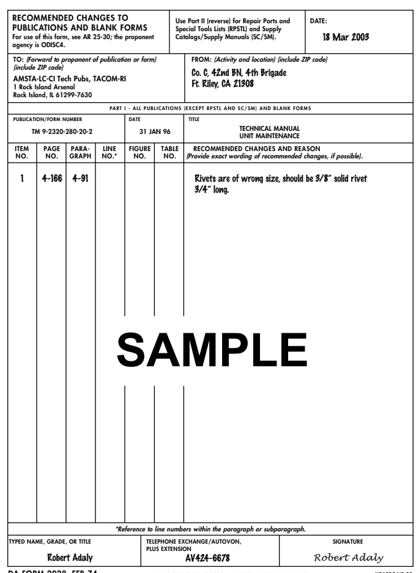

TO: (Forward direct to addressee listed in publication)

| FROM: (Activity and location)   |
|---------------------------------|
| (include ZIP code)              |

DATE:
AMSTA-LC-CI Tech Pubs, TACOM-RI
1 Rock Island Arsenal

Rock Island, IL 61299-7630

TYPED NAME, GRADE, OR TITLE
TELEPHONE EXCHANGE/AUTOVON,

| SIGNATURE   |
|-------------|

PLUS EXTENSION

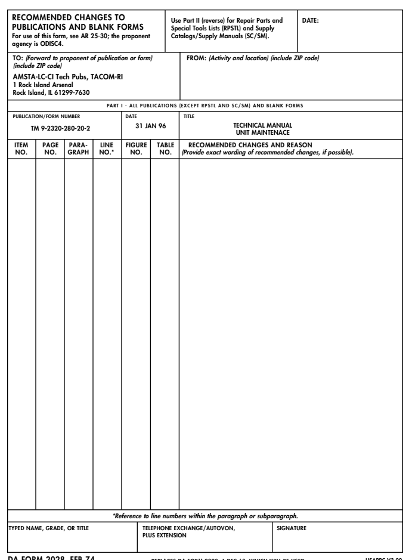

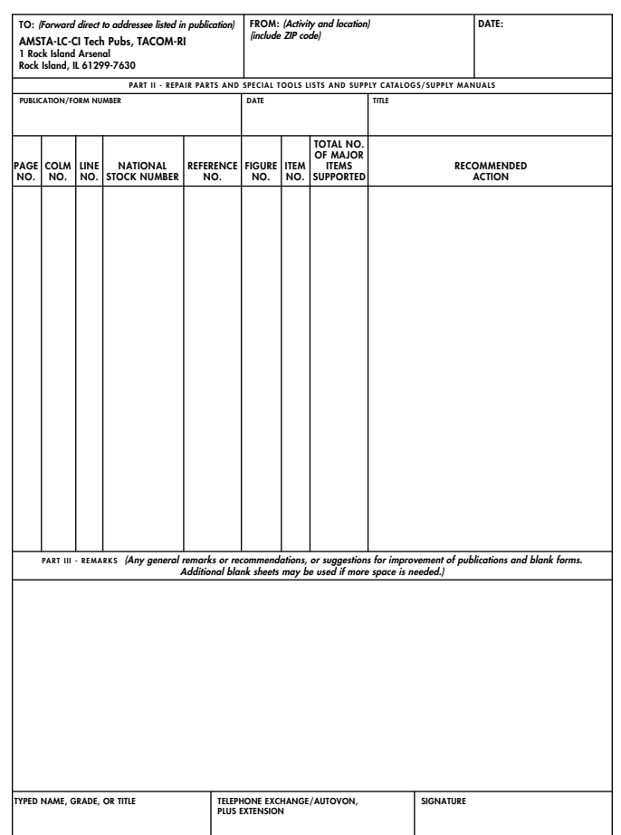

# The Metric System And Equivalents

#### Linear Measure

1 Centimeter = 10 Millimeters = 0.01 Meters = 
0.3937 Inches 1 Meter = 100 Centimeters = 1,000 Millimeters = 
39.37 Inches 1 Kilometer = 1,000 Meters = 0.621 Miles SQUARE MEASURE
1 Sq Centimeter = 100 Sq Millimeters = 0.155 Sq Inches 1 Sq Meter = 10,000 Sq Centimeters = 10.76 Sq Feet 1 Sq Kilometer = 1,000,000 Sq Meters = 0.386 Sq Miles

#### Cubic Measure

1 Cu Centimeter = 1,000 Cu Millimeters = 0.06 Cu Inches 1 Cu Meter = 1,000,000 Cu Centimeters = 35.31 Cu Feet LIQUID MEASURE 1 Milliliter = 0.001 Liters = 0.0338 Fluid Ounces 1 Liter = 1,000 Milliliters = 33.82 Fluid Ounces TEMPERATURE Degrees Fahrenheit (F) = °C - 9 ÷ 5 + 32 Degrees Celsius (C) = F° - 32 - 5 ÷ 9 212° Fahrenheit is equivalent to 100° Celsius 90° Fahrenheit is equivalent to 32.2° Celsius 32° Fahrenheit is equivalent to 0° Celsius WEIGHTS
1 Gram = 0.001 Kilograms = 1,000 Milligrams =
0.035 Ounces 1 Kilogram = 1,000 Grams = 2.2 Lb 1 Metric Ton = 1,000 Kilograms = 1 Megagram = 1.1 Short Tons

| Guide for preparation of     | Tiedown ring:          | antifreeze solutions              |                  |         |       |
|------------------------------|------------------------|-----------------------------------|------------------|---------|-------|
| (table 3\-1) 3\-60           | 3\-109                 | Toe\-in alignment specifications  | Tie rod:         |         |       |
| (table 8\-1) 8\-10           | 8\-34                  | Toe\-out alignment specifications |                  |         |       |
| (table 8\-2) 8\-11           | 8\-40                  | Tachometer                        |                  |         |       |
| Tie rod end:                 | Installation 4\-13.1b  | 4\-28.2                           | Removal 4\-13.1a | 4\-28.2 |       |
| Tachometer cable connector:  | Time delay module:     | Installation 4\-13.2b             | 4\-28.4          |         |       |
| Removal 4\-13.2a             | 4\-28.4                | Tailpipe:                         |                  |         |       |
| Installation 3\-47b          | 3\-87                  | Removal                           |                  | 3\-47a  | 3\-86 |
| Tailpipe hanger:             | runflat:               | Installation 3\-51b               | 3\-94            |         |       |
| Removal 3\-51a               | 3\-94                  | Tailpipe insulator:               |                  |         |       |
| Installation 3\-52b          | 3\-95                  | Removal 3\-52a                    | 3\-95            |         |       |
| Temperature sending unit,    | engine:                | "A2" vehicles):                   |                  |         |       |
| Installation 4\-24b          | 4\-44                  | Removal 4\-24a                    | 4\-44            |         |       |
| Temperature sensor/glow plug | controller:            |                                   |                  |         |       |
| Installation 4\-29b          | 4\-50                  | Removal 4\-29a                    | 4\-50            |         |       |
| Tensioner, idler pulleys,    | and mounting hardware: |                                   |                  |         |       |
| Installation 3\-84b          | 3\-144                 | Removal 3\-84a                    | 3\-144           |         |       |
| Terminal block and mounting  | buss, control box:     |                                   |                  |         |       |
| Installation 4\-116b         | 4\-274                 | Removal 4\-116a                   | 4\-274           |         |       |
| Thermostat:                  | Installation 3\-75b    | 3\-130                            |                  |         |       |
| Removal 3\-75a               | 3\-130                 | Thermostat bypass hose:           |                  |         |       |
| Installation 3\-67b          | 3\-121                 | Removal 3\-67a                    | 3\-121           |         |       |

#### Approximate Conversion Factors
