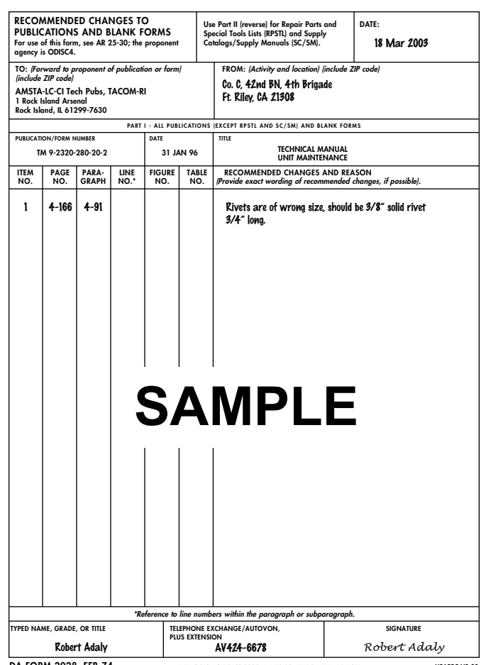
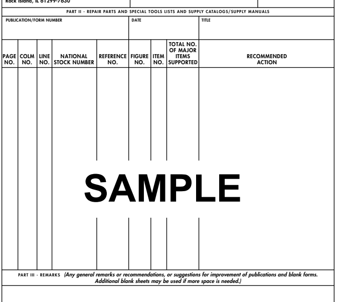
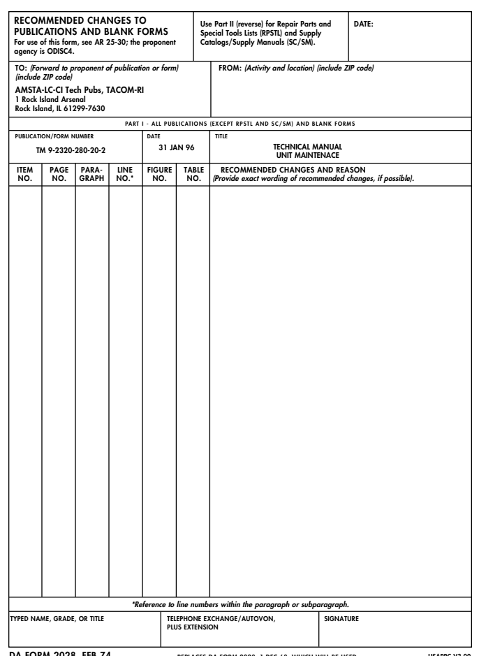
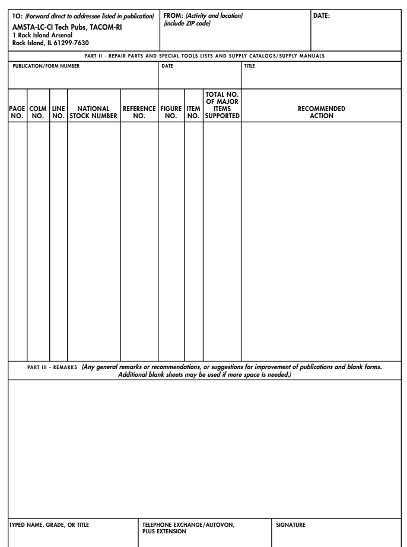

# TECHNICAL MANUAL UNIT MAINTENANCE - ARMY TM 9-2320-280-20-2
Volume No. 2

|            | VOLUME 2 OF 3                                                             
|------------                            |-----------------------------------------------
| [Chapter 3](chapter3.md)               | Engine Systems Maintenance                         
| [3.I](chapter3.md#chapter-3-section-i) | Lubrication System Maintenance                     
| [Chapter 4](chapter4.md)               |  ELECTRICAL SYSTEM MAINTENANCE                     
| [Chapter 5](chapter5.md)               |  TRANSMISSION AND TRANSFER CASE MAINTENANCE        
| [Chapter 6](chapter6.md)               | PROPELLER SHAFTS, AXLES, AND SUSPENSION MAINTENANCE
| [Chapter 7](chapter7.md)               | BRAKE SYSTEM MAINTENANCE                           
| [Chapter 8](chapter8.md)               | WHEELS AND STEERING MAINTENANCE                    
| [Chapter 9](chapter9.md)               | FRAME MAINTENANCE                                  

<!-- TRUCK, UTILITY: CARGO/TROOP CARRIER, 1-1/4 TON, 4X4, M998
(2320-01-107-7155) (EIC: BBD); M998A1 (2320-01-371-9577) (EIC: BBN);
TRUCK, UTILITY: CARGO/TROOP CARRIER, 1-1/4 TON, 4X4, W/WINCH, M1038 (232001-107-7156) (EIC: BBE); M1038A1 (2320-01-371-9578) (EIC: BBP);
TRUCK, UTILITY: HEAVY VARIANT, 4X4, M1097 (2320-01-346-9317) (EIC: BBM);
M1097A1 (2320-01-371-9583) (EIC: BBU); M1097A2 (2320-01-380-8604) (EIC: BB6);
M1123 (2320-01-455-9593) (EIC: B6G); 
TRUCK, UTILITY: TOW CARRIER, ARMORED, 1-1/4 TON, 4X4, M966 (2320-01-107-7153) (EIC: BBC); M966A1 (2320-01-372-3932) (EIC: BBX);
M1121 (2320-01-456-1282) (EIC: B6H);
TRUCK, UTILITY: TOW CARRIER, ARMORED, 1-1/4 TON, 4X4, W/WINCH,
M1036 (2320-01-107-7154) (EIC: BBH);
TRUCK, UTILITY: TOW CARRIER, W/SUPPLEMENTAL ARMOR, 1-1/4 TON, 4X4, M1045 (2320-01-146-7191); M1045A1 (2320-01-371-9580) (EIC: BBR);
M1045A2 (2320-01-380-8229) (EIC: BB5);
TRUCK, UTILITY: TOW CARRIER, W/SUPPLEMENTAL ARMOR, 1-1/4 TON, 4X4, W/WINCH, M1046 (2320-01-146-7188); M1046A1 (2320-01-371-9582) (EIC: BBT);
TRUCK, UTILITY: ARMAMENT CARRIER, ARMORED, 1-1/4 TON, 4X4, M1025
(2320-01-128-9551) (EIC: BBF); M1025A1 (2320-01-371-9584) (EIC: BBV); 
M1025A2 (2320-01-380-8233) (EIC: BB3);
TRUCK, UTILITY: ARMAMENT CARRIER, ARMORED, 1-1/4 TON, 4X4, W/WINCH, M1026
(2320-01-128-9552) (EIC: BBG); M1026A1 (2320-01-371-9579) (EIC: BBQ);
TRUCK, UTILITY: ARMAMENT CARRIER, W/SUPPLEMENTAL ARMOR, 1-1/4 TON, 4X4, M1043 (2320-01-146-7190); M1043A1 (2320-01-372-3933) (EIC: BBY); 
M1043A2 (2320-01-380-8213) (EIC: BB4);
TRUCK, UTILITY: ARMAMENT CARRIER, W/SUPPLEMENTAL ARMOR, 1-1/4 TON, 4X4, W/WINCH, M1044 (2320-01-146-7189); M1044A1 (2320-01-371-9581) (EIC: BBS);
TRUCK, UTILITY: S250 SHELTER CARRIER, 4X4, M1037 (2320-01-146-7193) (EIC: BBK); TRUCK, UTILITY: S250 SHELTER CARRIER, 4X4, W/WINCH, M1042 (2320-01-146-7187);
TRUCK, AMBULANCE, 2-LITTER, ARMORED, 4X4, M996 (2310-01-111-2275)
(EIC: BBB); M996A1 (2310-01-372-3935) (EIC: BB2);
TRUCK, AMBULANCE, 4-LITTER, ARMORED, 4X4, M997 (2310-01-111-2274)(EIC: BBA);
M997A1 (2310-01-372-3934) (EIC: BBZ); M997A2 (2310-01-380-8225) (EIC: BB8);
TRUCK, AMBULANCE, 2-LITTER, SOFT TOP, 4X4, M1035 (2310-01-146-7194);
M1035A1 (2310-01-371-9585) (EIC: BBW); M1035A2 (2310-01-380-8290) (EIC: BB9).
-->

<!-- 
Approved for public release; distribution is unlimited.

>[!NOTE]
>HEADQUARTERS, DEPARTMENTS OF THE ARMY, 
>THE AIR FORCE, AND MARINE CORPS
>JANUARY 1996
 -->
<!--
[!WARNING]
Exhaust Gases Can Kill

Brain damage or death can result from heavy exposure. Precautions must be followed to ensure crew safety when the personnel heater, main, or auxiliary engine of any vehicle is operated for any purpose.

1. Do not operate your vehicle engine in enclosed areas. 2. Do not idle vehicle engine with vehicle windows closed. 3. Be alert at all times for exhaust odors. 4. Be alert for exhaust poisoning symptoms. they are:
- Headache - Dizziness - Sleepiness - Loss of muscular control 5. If you see another person with exhaust poisoning symptoms:
- Remove person from area - Expose to open air - Keep person warm - Do not permit physical exercise - Administer artificial respiration, if necessary* - Notify a medic
*For artificial respiration, refer to FM 21-11.

6. BE AWARE, the field protective mask for nuclear, biological or chemical (NBC) protection will not protect you from carbon monoxide poisoning. THE BEST DEFENSE AGAINST EXHAUST POISONING IS ADEQUATE VENTILATION.

# Warning Summary

- Drycleaning solvent is flammable and will not be used near an open flame. A fire extinguisher will be kept nearby when the solvent is used. Use only in well-ventilated places. Failure to do this may result in injury to personnel and/or damage to equipment.

- Compressed air used for cleaning purposes will not exceed 30 psi (207 kPa). Use only with effective chip guarding and personal protective equipment (goggles/shield, gloves, etc.).

- Diesel fuel is highly flammable. Do not perform any procedure near fire, flames, or sparks. Severe injury or death will result.

- Do not touch hot exhaust system components with bare hands. Severe injury will result. - Do not remove surge tank filler cap before releasing internal pressure when engine temperature is above 190°F (88°C). Steam or hot coolant under pressure will cause injury.

- Do not drain oil when engine is hot. Severe injury to personnel will result. - Always wear eye protection when bleeding brakes. Failure to do this may cause injury if brake fluid comes in contact with eyes.

- Remove all jewelry such as rings, dog tags, bracelets, etc. If jewelry or disconnected battery ground cable contacts battery terminal, a direct short will result, causing injury to personnel, or damage to equipment.

- Keep hands and arms away from fan blade and drive belts while engine is running, or serious injury may result.

- Battery acid (electrolyte) is extremely harmful. Always wear safety goggles and rubber gloves, and do not smoke when performing maintenance on batteries. Injury will result if acid contacts eyes or skin.

- When removing battery cable clamps, disconnect ground cable first. Ensure all switches are in OFF
position before disconnecting ground cable. Do not allow tools to come in contact with vehicle when disconnecting cable clamps. A direct short can result, causing instant heating of tools, tool damage, battery damage, or battery explosion.

- Allow transmission/transfer case to cool before performing maintenance. Failure to do this may cause injury.

- Always apply parking brake and chock opposite wheel before removing wheel. Avoid removing wheel when vehicle is on sloping terrain. Injury to personnel or damage to equipment may result.

# Warning Summary (Cont'D)

- Hydraulic jacks are used for raising and lowering, and are not used to support vehicle. Never work under vehicle unless wheels are blocked and it is properly supported. Injury or damage to equipment may result if vehicle suddenly shifts or moves.

- Remove only the inner group of nuts when removing a wheel from the vehicle. Removing the outer nuts which hold the rim together while the assembly is inflated could result in serious injury or death.

- In all disassembly of the wheel assembly operations, ensure the tire is totally deflated before removing wheel nuts. Failure to follow proper safety precautions could cause serious injury or death.

- Never inflate a wheel assembly with the wheel locknuts removed in an attempt to separate inner and outer rim halves. The assembly will separate under pressure resulting in serious injury or death.

- Never use wheel assemblies with studs which are damaged, loose, or have damaged threads. Damaged studs can cause improper assembly, which could cause individual fasteners to fail. Any of these situations could cause serious injury or death.

- Never use tubes in wheel assemblies. Use of a tube defeats built-in-safety features, and could allow the wheel to come apart under pressure, resulting in serious injury or death.

- Use only replacement parts specified in TM 9-2320-280-24P. Wheels assembled with components which do not meet specifications could cause the assembly to separate under pressure, resulting in serious injury or death.

- Never inflate a wheel assembly without having checked wheel locknut torques to ensure the wheel locknuts are tightened to specifications. An assembly with improperly tightened locknuts could separate under pressure resulting in injury or death.

- Always use a tire inflation cage for inflation purposes. Stand on one side of cage, during inflation, never directly in front. Keep hands out of the cage during inflation. Inflate assembly to recommended pressure, using a clip-on air chuck. Do not exceed 30 psi (207 kPa) cold inflation pressure. Failure to follow these instructions may result in serious injury or death.

- Radial tires and bias ply tires should not be mixed on the same vehicle. Injury to personnel or damage to equipment may result.

- Never install radial tire on eight bolt wheel. Damage to equipment may result, causing injury to personnel.

- Ensure that during assembly indexing hole on inner and outer rim halves is aligned. Failure to do so may cause damage to equipment or injury to personnel.
-->

<!--
AIR FORCE TO 36A12-1A-2092-1-2 MARINE CORPS TM 2320-20/7B
HEADQUARTERS, 
DEPARTMENTS OF THE ARMY,
THE AIR FORCE, AND MARINE CORPS 
WASHINGTON, **D.C.,** 15 July *2004* TECHNICAL MANUAL
VOLUME 2 OF 3 UNIT MAINTENANCE
TRUCK, UTILITY: CARGO/TROOP CARRIER, 1-1/4 TON, 4X4, M998 (2320-01-107-7155) (EIC: BBD); M998A1 (2320-01-371-9577) (EIC: BBN);
TRUCK, UTILITY: CARGO/TROOP CARRIER, 1-1/4 TON, 4X4, W/WINCH, 
M1038 (2320-01-107-7156) (EIC: BBE); M1038A1 (2320-01-371-9578) (EIC: BBP);
TRUCK, UTILITY: HEAVY VARIANT, 4X4, M1097 (2320-01-346-9317) (EIC: BBM); 
M1097A1 (2320-01-371-9583) (EIC: BBU); M1097A2 (2320-01-380-8604) (EIC: BB6); 
M1123 (2320-01-455-9593) (EIC: B6G);
TRUCK, UTILITY: TOW CARRIER, ARMORED, 1-1/4 TON, 4X4, M966 (2320-01-107-7153) (EIC: BBC); M966A1 (2320-01-372-3932) (EIC: BBX); 
M1121 (2320-01-456-1282) (EIC: B6H);
TRUCK, UTILITY: TOW CARRIER, ARMORED, 1-1/4 TON, 4X4, W/WINCH, 
M1036 (2320-01-107-7154) (EIC: BBH);
TRUCK, UTILITY: TOW CARRIER, W/SUPPLEMENTAL ARMOR, 1-1/4 TON, 4X4, M1045 (2320-01-146-7191); M1045A1 (2320-01-371-9580) (EIC: BBR); M1045A2 (2320-01-380-8229) (EIC: BB5);
TRUCK, UTILITY: TOW CARRIER, W/SUPPLEMENTAL ARMOR, 1-1/4 TON, 4X4, W/WINCH, 
M1046 (2320-01-146-7188); M1046A1 (2320-01-371-9582) (EIC: BBT);
TRUCK, UTILITY: ARMAMENT CARRIER, ARMORED, 1-1/4 TON, 4X4, M1025 (2320-01-128-9551) (EIC: BBF); M1025A1 (2320-01-371-9584) (EIC: BBV); M1025A2 (2320-01-380-8233) (EIC: BB3); 
TRUCK, UTILITY: ARMAMENT CARRIER, ARMORED, 1-1/4 TON, 4X4, W/WINCH,
M1026 (2320-01-128-9552) (EIC: BBG); M1026A1 (2320-01-371-9579) (EIC: BBQ);
TRUCK, UTILITY: ARMAMENT CARRIER, W/SUPPLEMENTAL ARMOR, 1-1/4 TON, 4X4, M1043 (2320-01-146-7190); M1043A1 (2320-01-372-3933) (EIC: BBY); M1043A2 (2320-01-380-8213) (EIC: BB4); 
TRUCK, UTILITY: ARMAMENT CARRIER, W/SUPPLEMENTAL ARMOR, 1-1/4 TON, 4X4, W/WINCH, 
M1044 (2320-01-146-7189); M1044A1 (2320-01-371-9581) (EIC: BBS);
TRUCK, UTILITY: S250 SHELTER CARRIER, 4X4, M1037 (2320-01-146-7193) (EIC: BBK);
TRUCK, UTILITY: S250 SHELTER CARRIER, 4X4, W/WINCH, M1042 (2320-01-146-7187);
TRUCK, AMBULANCE, 2-LITTER, ARMORED, 4X4, M996 (2310-01-111-2275) (EIC: BBB); M996A1 (2310-01-372-3935) (EIC: BB2);
TRUCK, AMBULANCE, 4-LITTER, ARMORED, 4X4, M997 (2310-01-111-2274) (EIC: BBA); 
M997A1 (2310-01-372-3934) (EIC: BBZ); M997A2 (2310-01-380-8225) (EIC: BB8);
TRUCK, AMBULANCE, 2-LITTER, SOFT TOP, 4X4, M1035 (2310-01-146-7194); M1035A1 (2310-01-371-9585) (EIC: BBW); M1035A2 (2310-01-380-8290) (EIC: BB9).

TM 9-2320-280-20-2, 31 January 1996, is changed as follows:
1.Remove old pages and insert new pages as indicated below. 2.New or changed material is indicated by a vertical bar in the margin of the page.

| Remove pages          | Insert pages          |
|-----------------------|-----------------------|
| c/d (blank)           | c/d (blank)           |
| A and B               | A through D           |
| i and ii              | i and ii              |
| 3\-1 and 3\-2         | 3\-1 and 3\-2         |
| 3\-5 through 3\-10    | 3\-5 through 3\-10    |
| 3\-25 and 3\-26       | 3\-25 and 3\-26       |
| 3\-29 and 3\-30       | 3\-29 and 3\-30       |
| 3\-35 through 3\-38   | 3\-35 through 3\-38   |
| 3\-46.1 through 3\-56 | 3\-46.1 through 3\-56 |
| 3\-59 through 3\-64   | 3\-59 through 3\-64   |
| 3\-71 and 3\-72       | 3\-71 and 3\-72       |
| 3\-77 through 3\-106  | 3\-77 through 3\-106  |
| 3\-109 and 3\-110     | 3\-109 and 3\-110     |
| 3\-117 and 3\-118     | 3\-117 and 3\-118     |
| 3\-125 and 3\-126     | 3\-125 and 3\-126     |

Approved for public release; distribution is unlimited.

CHANGE NO. 3

| Remove pages                                                                  | Insert pages              |
|-------------------------------------------------------------------------------|---------------------------|
| 3\-129 through 3\-134                                                         | 3\-129 through 3\-134     |
| 3\-139 through 3\-142                                                         | 3\-139 through 3\-142     |
| 3\-143 and 3\-144                                                             | 3\-143 and 3\-144         |
| 4\-1 and 4\-2                                                                 | 4\-1 and 4\-2             |
| 4\-6.1 through 4\-6.4                                                         | 4\-6.1 through 4\-6.4     |
| 4\-7 through 4\-12.6                                                          | 4\-7 through 4\-12.6      |
| 4\-12.9 through 4\-12.12                                                      | 4\-12.9 through 4\-12.12  |
| 4\-12.15 through 4\-12.18                                                     | 4\-12.15 through 4\-12.18 |
| 4\-12.21 through 4\-12.30                                                     | 4\-12.21 through 4\-12.30 |
| 4\-12.37 through 4\-20                                                        | 4\-12.37 through 4\-20    |
| 4\-23 through 4\-28.4                                                         | 4\-23 through 4\-28.4     |
| 4\-31 through 4\-32.6                                                         | 4\-31 through 4\-32.6     |
| 4\-41 through 4\-44                                                           | 4\-41 through 4\-44       |
| 4\-47 through 4\-52                                                           | 4\-47 through 4\-52       |
| 4\-59 through 4\-62                                                           | 4\-59 through 4\-62       |
| 4\-69 and 4\-70                                                               | 4\-69 and 4\-70           |
| 4\-73 and 4\-74                                                               | 4\-73 and 4\-74           |
| 4\-79 through 4\-104                                                          | 4\-79 through 4\-104      |
| 4\-109 through 4\-112                                                         | 4\-109 through 4\-112     |
| 4\-115 and 4\-116                                                             | 4\-115 and 4\-116         |
| 4\-121 through 4\-124                                                         | 4\-121 through 4\-124     |
| 4\-127 through 4\-130                                                         | 4\-127 through 4\-130     |
| 4\-135 through 4\-152                                                         | 4\-135 through 4\-152     |
| 4\-157 through 4\-160                                                         | 4\-157 through 4\-160     |
| 4\-165 through 4\-194                                                         | 4\-165 through 4\-194     |
| 4\-199 through 4\-258                                                         | 4\-199 through 4\-258     |
| 4\-260.1 through 4\-266                                                       | 4\-260.1 through 4\-266   |
| 4\-269 through 4\-278                                                         | 4\-269 through 4\-278     |
| 4\-281 through 4\-294                                                         | 4\-281 through 4\-294     |
| 4\-297 through 4\-300                                                         | 4\-297 through 4\-300     |
| 4\-303 and 4\-304                                                             | 4\-303 and 4\-304         |
| 4\-307 through 4\-310                                                         | 4\-307 through 4\-310     |
| 4\-313 through 4\-316                                                         | 4\-313 through 4\-316     |
| 4\-319 and 4\-320                                                             | 4\-319 and 4\-320         |
| 5\-1 through 5\-8                                                             | 5\-1 through 5\-8         |
| 5\-13 through 5\-18                                                           | 5\-13 through 5\-18       |
| 5\-21 through 5\-42                                                           | 5\-21 through 5\-42       |
| 5\-45 through 5\-54                                                           | 5\-45 through 5\-54       |
| 6\-1 and 6\-2                                                                 | 6\-1 and 6\-2             |
| 6\-5 through 6\-8                                                             | 6\-5 through 6\-8         |
| 6\-11 through 6\-14                                                           | 6\-11 through 6\-14       |
| 6\-17 and 6\-18                                                               | 6\-17 and 6\-18           |
| 6\-22.1 and 6\-22.2                                                           | 6\-22.1 and 6\-22.2       |
| 6\-25 and 6\-26                                                               | 6\-25 and 6\-26           |
| 6\-31 through 6\-40                                                           | 6\-31 through 6\-40       |
| 6\-49 and 6\-50                                                               | 6\-49 and 6\-50           |
| 6\-55 through 6\-68                                                           | 6\-55 through 6\-68       |
| 7\-1 through 7\-6                                                             | 7\-1 through 7\-6         |
| 7\-9 through 7\-18.2                                                          | 7\-9 through 7\-18.2      |
| 7\-25 through 7\-32                                                           | 7\-25 through 7\-32       |
| 7\-39 through 7\-48                                                           | 7\-39 through 7\-48       |
| 7\-50.1 through 7\-64                                                         | 7\-50.1 through 7\-64     |
| 8\-7 through 8\-10                                                            | 8\-7 through 8\-10        |
| 8\-13 through 8\-18                                                           | 8\-13 through 8\-18       |
| 8\-21 through 8\-24.4                                                         | 8\-21 through 8\-24.4     |
| 8\-24.7 through 8\-26                                                         | 8\-24.7 through 8\-26     |
| 8\-29 and 8\-30                                                               | 8\-29 and 8\-30           |
| 8\-43 through 8\-54                                                           | 8\-43 through 8\-54       |
| 8\-57 through 8\-64                                                           | 8\-57 through 8\-64       |
| 8\-67 through 8\-74.2                                                         | 8\-67 through 8\-74.6     |
| 8\-75 and 8\-76                                                               | 8\-75 and 8\-76           |
| 8\-81 through 8\-84                                                           | 8\-81 through 8\-84       |
| 8\-87 and 8\-88                                                               | 8\-87 and 8\-88           |
| 9\-1 through 9\-16                                                            | 9\-1 through 9\-16        |
| 9\-19 through 9\-23/(9\-24 blank)                                             | 9\-19 through 9\-24       |
| Index 1 and Index 2                                                           | Index 1 and Index 2       |
| Index 7 through Index 10                                                      | Index 7 through Index 10  |
| Index 15 through Index 26                                                     | Index 15 through Index 26 |
| 3. File this change sheet in front of the publication for reference purposes. |                           |

By Order of the Secretary of the Army:
Peter J. Schoomaker General, United States Army Chief of Staff Official:
JOEL B. HUDSON
Administrative Assistant to the Secretary of the Army 0223405 By Order of the Secretary of the Air Force:
RONALD R. FOGLEMAN
General, United States Air Force Chief of Staff Official:
HENRY VICCELLIO, JR.

General, United States Air Force Commander, Air Force Materiel Command By Order of the Marine Corps:
R. P. SHOCKEY
Director, Program Support Marine Corps Systems Command Distribution:
To be distributed in accordance with the initial distribution number (IDN) 380900, requirements for TM 9-2320-280-20-2.

MARINE CORPS TM 2320-20/7B
CHANGE NO. 2 HEADQUARTERS, 
DEPARTMENTS OF THE ARMY,
THE AIR FORCE, AND MARINE CORPS 
WASHINGTON, D.C., *30 JUNE 1999* TECHNICAL MANUAL
VOLUME 2 OF 3 UNIT MAINTENANCE
TRUCK, UTILITY: CARGO/TROOP CARRIER, 1-1/4 TON, 4X4, M998 (2320-01-107-7155) (EIC: BBD); M998A1 (2320-01-371-9577) (EIC: BBN);
TRUCK, UTILITY: CARGO/TROOP CARRIER, 1-1/4 TON, 4X4, W/WINCH,
M1038 (2320-01-107-7156) (EIC: BBE); M1038A1 (2320-01-371-9578) (EIC: BBP);
TRUCK, UTILITY: HEAVY VARIANT, 4X4, M1097 (2320-01-346-9317) (EIC: BBM); 
M1097A1 (2320-01-371-9583) (EIC: BBU); M1097A2 (2320-01-380-8604) (EIC: BB6);
M1123 (2320-01-455-9593) (EIC: B6G);
TRUCK, UTILITY: TOW CARRIER, ARMORED, 1-1/4 TON, 4X4, M966 (2320-01-107-7153) (EIC: BBC); M966A1 (2320-01-372-3932) (EIC: BBX);
M1121 (2320-01-456-1282) (EIC: B6H);
TRUCK, UTILITY: TOW CARRIER, ARMORED, 1-1/4 TON, 4X4, W/WINCH,
M1036 (2320-01-107-7154) (EIC: BBH);
TRUCK, UTILITY: TOW CARRIER, W/SUPPLEMENTAL ARMOR, 1-1/4 TON, 4X4, M1045 (2320-01-146-7191); M1045A1 (2320-01-371-9580) (EIC: BBR); M1045A2 (2320-01-380-8229) (EIC: BB5);
TRUCK, UTILITY: TOW CARRIER, W/SUPPLEMENTAL ARMOR, 1-1/4 TON, 4X4, W/WINCH,
M1046 (2320-01-146-7188); M1046A1 (2320-01-371-9582) (EIC: BBT);
TRUCK, UTILITY: ARMAMENT CARRIER, ARMORED, 1-1/4 TON, 4X4, M1025 (2320-01-128-9551) (EIC: BBF); M1025A1 (2320-01-371-9584) (EIC: BBV); M1025A2 (2320-01-380-8233) (EIC: BB3); 
TRUCK, UTILITY: ARMAMENT CARRIER, ARMORED, 1-1/4 TON, 4X4, W/WINCH,
M1026 (2320-01-128-9552) (EIC: BBG); M1026A1 (2320-01-371-9579) (EIC: BBQ);
TRUCK, UTILITY: ARMAMENT CARRIER, W/SUPPLEMENTAL ARMOR, 1-1/4 TON, 4X4, M1043 (2320-01-146-7190); M1043A1 (2320-01-372-3933) (EIC: BBY); M1043A2 (2320-01-380-8213) (EIC: BB4); 
TRUCK, UTILITY: ARMAMENT CARRIER, W/SUPPLEMENTAL ARMOR, 1-1/4 TON, 4X4, W/WINCH,
M1044 (2320-01-146-7189); M1044A1 (2320-01-371-9581) (EIC: BBS);
TRUCK, UTILITY: S250 SHELTER CARRIER, 4X4, M1037 (2320-01-146-7193) (EIC: BBK);
TRUCK, UTILITY: S250 SHELTER CARRIER, 4X4, W/WINCH, M1042 (2320-01-146-7187);
TRUCK, AMBULANCE, 2-LITTER, ARMORED, 4X4, M996 (2310-01-111-2275) (EIC: BBB); M996A1 (2310-01-372-3935) (EIC: BB2);
TRUCK, AMBULANCE, 4-LITTER, ARMORED, 4X4, M997 (2310-01-111-2274) (EIC: BBA); 
M997A1 (2310-01-372-3934) (EIC: BBZ); M997A2 (2310-01-380-8225) (EIC: BB8);
TRUCK, AMBULANCE, 2-LITTER, SOFT TOP, 4X4, M1035 (2310-01-146-7194); M1035A1 (2310-01-371-9585) (EIC: BBW); M1035A2 (2310-01-380-8290) (EIC: BB9).

TM 9-2320-280-20-2, 31 January 1996, is changed as follows:
1. Two new models have been added to the front cover. The new cover, located at the end of the change package, replaces the existing cover.

2. Remove old pages and insert new pages as indicated below. 3. New or changed material is indicated by a vertical bar in the margin of the page.

| Remove pages        | Insert pages                    |
|---------------------|---------------------------------|
| None                | A and B (After warning d blank) |
| i and ii            | i and ii                        |
| 3\-5 and 3\-6       | 3\-5 and 3\-6                   |
| 3\-13 and 3\-14     | 3\-13 and 3\-14                 |
| 3\-19 through 3\-22 | 3\-19 and 3\-22                 |
| 3\-25 through 3\-30 | 3\-25 through 3\-30             |
| 3\-35 through 3\-38 | 3\-35 through 3\-38             |

Approved for public release; distribution is unlimited.

| Remove pages                         | Insert pages                           |
|--------------------------------------|----------------------------------------|
| 3\-41 through 3\-46                  | 3\-41 through 3\-46.2                  |
| 3\-49 and 3\-50                      | 3\-49 and 3\-50                        |
| 3\-53 through 3\-56                  | 3\-53 through 3\-56                    |
| 3\-61 and 3\-62                      | 3\-61 and 3\-62                        |
| 3\-65 and 3\-66                      | 3\-65 and 3\-66                        |
| 3\-69 and 3\-70                      | 3\-69 and 3\-70                        |
| 3\-73 and 3\-74                      | 3\-73 and 3\-74                        |
| 3\-85 through 3\-100                 | 3\-85 through 3\-100                   |
| 3\-107 through 3\-116                | 3\-107 through 3\-116                  |
| 3\-125 through 3\-128                | 3\-125 through 3\-128                  |
| 3\-131 through 3\-145/(3\-146 blank) | 3\-130.1 through 3\-145/(3\-146 blank) |
| 4\-1 through 4\-20                   | 4\-1 through 4\-20                     |
| 4\-23 and 4\-24                      | 4\-23 and 4\-24                        |
| 4\-29 through 4\-32.2                | 4\-28.1 through 4\-32.2                |
| 4\-36 through 4\-38                  | 4\-36 through 4\-38                    |
| 4\-57 and 4\-58                      | 4\-57 and 4\-58                        |
| 4\-67 and 4\-68                      | 4\-66.1 through 4\-68                  |
| 4\-71 through 4\-74                  | 4\-71 through 4\-74                    |
| 4\-77 through 4\-80                  | 4\-77 through 4\-80                    |
| 4\-85 and 4\-86                      | 4\-85 and 4\-86                        |
| 4\-89 and 4\-90                      | 4\-89 and 4\-90                        |
| 4\-95 and 4\-96                      | 4\-95 and 4\-96                        |
| 4\-99 through 4\-114                 | 4\-99 through 4\-114                   |
| 4\-137 through 4\-142                | 4\-137 through 4\-142                  |
| 4\-157 and 4\-158                    | 4\-157 and 4\-158                      |
| 4\-237 through 4\-242                | 4\-237 through 4\-242                  |
| 4\-247 through 4\-264                | 4\-247 through 4\-264                  |
| 5\-7 through 5\-12                   | 5\-7 through 5\-12                     |
| 5\-17 through 5\-20                  | 5\-17 through 5\-20                    |
| 5\-25 through 5\-30                  | 5\-25 through 5\-30                    |
| 5\-39 through 5\-42                  | 5\-39 through 5\-42                    |
| 5\-47 through 5\-52                  | 5\-47 through 5\-52.4                  |
| 6\-5 and 6\-6                        | 6\-5 and 6\-6                          |
| 6\-17 and 6\-18                      | 6\-17 and 6\-18                        |
| 6\-21 through 6\-30                  | 6\-21 through 6\-30                    |
| 6\-35 and 6\-36                      | 6\-35 and 6\-36                        |
| 6\-53 and 6\-54                      | 6\-53 and 6\-54                        |
| 6\-57 through 6\-68                  | 6\-57 through 6\-68                    |
| 7\-1 and 7\-2                        | 7\-1 and 7\-2                          |
| 7\-17 and 7\-18                      | 7\-18 through 7\-18.5 (7\-18.6 blank)  |
| 7\-23 through 7\-28                  | 7\-23 through 7\-28                    |
| 7\-31 through 7\-40                  | 7\-31 through 7\-40                    |
| 7\-47 through 7\-52                  | 7\-47 through 7\-52                    |
| 7\-55 through 7\-64                  | 7\-55 through 7\-64                    |
| 8\-1 through 8\-4                    | 8\-1 through 8\-4                      |
| 8\-7 through 8\-24.10                | 8\-7 through 8\-24.10                  |
| 8\-31 and 8\-32                      | 8\-31 and 8\-32                        |
| 8\-43 through 8\-46                  | 8\-43 through 8\-46                    |
| 8\-51 through 8\-54                  | 8\-51 through 8\-54                    |

| Remove pages             | Insert pages             |
|--------------------------|--------------------------|
| 8\-67 through 8\-78      | 8\-67 through 8\-78      |
| 8\-85 and 8\-86          | 8\-85 and 8\-86          |
| None                     | 8\-87 and 8\-88          |
| 9\-1 and 9\-2            | 9\-1 and 9\-2            |
| 9\-11 and 9\-12          | 9\-11 and 9\-12          |
| None                     | 9\-14.1 (9\-14.2 blank)  |
| Index 1 through Index 23 | Index 1 through Index 26 |
| cover                    | cover                    |

4. File this change sheet in front of the publication for reference purposes.

By Order of the Secretary of the Army:
ERIC K. SHINSEKI
General, United States Army Chief of Staff O f f i c i a l :
JOEL B. HUDSON
Administrative Assistant to the Secretary of the Army 05692 By Order of the Secretary of the Air Force:
RONALD R. FOGLEMAN
General, United States Air Force Chief of Staff O f f i c i a l :
H E N RY VICCELLIO, JR.

General, United States Air Force C o m m a n d e r, Air Force Materiel Command By Order of the Marine Corps:
D.R. BLOOMER
Colonel, USMC
Director, Program Support Marine Corps Systems Command Distribution:
To be distributed in accordance with the initial distribution number (IDN) 380900, requirements for TM 9-2320-280-20-2.

CHANGE NO. 1 ARMY TM 9-2320-280-20-2 AIR FORCE TO 36A12-1A-2092-1-2 MARINE CORPS TM 2320-20/7B
C1 HEADQUARTERS, 
DEPARTMENTS OF THE ARMY,
THE AIR FORCE, AND THE
MARINE CORPS 
WASHINGTON, D.C., 14 September 1998 TECHNICAL MANUAL
VOLUME 2 OF 3 UNIT MAINTENANCE
TRUCK, UTILITY: CARGO/TROOP CARRIER, 1-1/4 TON, 4X4, M998 (2320-01-107-7155) (EIC: BBD); M998A1 (2320-01-371-9577) (EIC: BBN);
TRUCK, UTILITY: CARGO/TROOP CARRIER, 1-1/4 TON, 4X4, W/WINCH,
M1038 (2320-01-107-7156) (EIC: BBE); M1038A1 (2320-01-371-9578) (EIC: BBP);
TRUCK, UTILITY: HEAVY VARIANT, 4X4, M1097 (2320-01-346-9317) (EIC: BBM); 
M1097A1 (2320-01-371-9583) (EIC: BBU); M1097A2 (2320-01-380-8604) (EIC: BB6);
TRUCK, UTILITY: TOW CARRIER, ARMORED, 1-1/4 TON, 4X4, M966 (2320-01-107-7153) (EIC: BBC); M966A1 (2320-01-372-3932) (EIC: BBX);
TRUCK, UTILITY: TOW CARRIER, ARMORED, 1-1/4 TON, 4X4, W/WINCH,
M1036 (2320-01-107-7154) (EIC: BBH);
TRUCK, UTILITY: TOW CARRIER, W/SUPPLEMENTAL ARMOR, 1-1/4 TON, 4X4, M1045 (2320-01-146-7191); M1045A1 (2320-01-371-9580) (EIC: BBR); M1045A2 (2320-01-380-8229) (EIC: BB5);
TRUCK, UTILITY: TOW CARRIER, W/SUPPLEMENTAL ARMOR, 1-1/4 TON, 4X4, W/WINCH,
M1046 (2320-01-146-7188); M1046A1 (2320-01-371-9582) (EIC: BBT);
TRUCK, UTILITY: ARMAMENT CARRIER, ARMORED, 1-1/4 TON, 4X4, M1025 (2320-01-128-9551) (EIC: BBF); M1025A1 (2320-01-371-9584) (EIC: BBV); M1025A2 (2320-01-380-8233) (EIC: BB3); 
TRUCK, UTILITY: ARMAMENT CARRIER, ARMORED, 1-1/4 TON, 4X4, W/WINCH,
M1026 (2320-01-128-9552) (EIC: BBG); M1026A1 (2320-01-371-9579) (EIC: BBQ);
TRUCK, UTILITY: ARMAMENT CARRIER, W/SUPPLEMENTAL ARMOR, 1-1/4 TON, 4X4, M1043 (2320-01-146-7190); M1043A1 (2320-01-372-3933) (EIC: BBY); M1043A2 (2320-01-380-8213) (EIC: BB4); 
TRUCK, UTILITY: ARMAMENT CARRIER, W/SUPPLEMENTAL ARMOR, 1-1/4 TON, 4X4, W/WINCH,
M1044 (2320-01-146-7189); M1044A1 (2320-01-371-9581) (EIC: BBS);
TRUCK, UTILITY: S250 SHELTER CARRIER, 4X4, M1037 (2320-01-146-7193) (EIC: BBK);
TRUCK, UTILITY: S250 SHELTER CARRIER, 4X4, W/WINCH, M1042 (2320-01-146-7187);
TRUCK, AMBULANCE, 2-LITTER, ARMORED, 4X4, M996 (2310-01-111-2275) (EIC: BBB); M996A1 (2310-01-372-3935) (EIC: BB2);
TRUCK, AMBULANCE, 4-LITTER, ARMORED, 4X4, M997 (2310-01-111-2274) (EIC: BBA); 
M997A1 (2310-01-372-3934) (EIC: BBZ); M997A2 (2310-01-380-8225) (EIC: BB8);
TRUCK, AMBULANCE, 2-LITTER, SOFT TOP, 4X4, M1035 (2310-01-146-7194); M1035A1 (2310-01-371-9585) (EIC: BBW); M1035A2 (2310-01-380-8290) (EIC: BB9).

TM 9-2320-280-20-2, 31 January 1996, is changed as follows:
1. Remove old pages and insert new pages as indicated below. 2. New or changed material is indicated by a vertical bar in the margin of the page.

Remove pages Insert pages 4-13 and 4-14 4-13 through 4-14.2 Approved for public release; distribution is unlimited.

By Order of the Secretary of the Army:
DENNIS J. REIMER
General, United States Army Chief of Staff Official:
JOEL B. HUDSON
Administrative Assistant to the Secretary of the Army 05163 By Order of the Secretary of the Air Force:
RONALD R. FOGLEMAN
General, United States Air Force Chief of Staff Official:
HENRY VICCELLIO, JR.

General, United States Air Force Commander, Air Force Materiel Command By Order of the Marine Corps:
M. K. HAYDEN
Colonel, United States Marine Corps Director, Program Support Marine Corps Systems Command Distribution: To be distributed in accordance with the Initial Distribution Number (IDN) 380900, requirements for TM 9-2320-280-20-2.

# List Of Effective Pages

NOTE: The portion of the text affected by the changes is indicated by a vertical line in the outer margins of the page.

Dates of issue for original and changed pages of volume 2 are:
Original . . . 0 . . . 31 January 1996 Change . . . 1 . . . 14 September 1998 Change . . . 2 . . . 30 June 1999 Change ... 3 ... 1 5 July 2004 TOTAL NUMBER OF PAGES IN THIS PUBLICATION IS 947, CONSISTING OF THE FOLLOWING:

| Page No *Change No.   | Page No * Change No.   | Page No *Change No.   |
|-----------------------|------------------------|-----------------------|
| VOLUME 2              | 3\-53 .                | 3\-116                |
| a\-b  . C             | 3\-54 .                | 3\-117                |
| .                     | 3\-55 .                |                       |
| d Blank .             | 3\-56                  | 3\-125                |
| .  A\-B               | 3\-57 \- 3\-58 .       | 3\-126 \- 3\-128      |
| C\-D Added            | 3\-59 \- 3\-60 .       | 3\-129                |
| 1                     | 3\-61 .                | 3\-130                |
| ii                    | 3\-62 .                | 3\-130.1 .            |
| iii .                 | 3\-63 .                | 3\-130.2 .            |
| iv Blank              | 3\-64 .                | 3\-130.3 .            |
| 3\-1 .                | 3\-65 .                | 3\-130.4 .            |
| 3\-2 .                | 3\-66 \- 3\-68 .       | 3\-131                |
| 3\-3 \- 3\-4          | 3\-69 .                | 3\-132                |
| 3\-5 \- 3\-6          | 3\-70 \- 3\-71 .       | 3\-133                |
| 3\-7 .                | 3\-72 .                | 3\-134                |
| 3\-8 .                | 3\-73 .                | 3\-135                |
| 3\-9 .                | 3\-74 .                | 3\-136                |
| 3\-10 .               | 3\-75 \- 3\-77  .      | 3\-137 \- 3\-139      |
| 3\-11 \- 3\-12 .      | 3\-78 .                | 3\-140                |
| 3\-13 .               | 3\-79 .                | 3\-141                |
| 3\-14 \- 3\-19 .      | 3\-80 .                | 3\-142                |
| 3\-20 .               | 3\-81 .                | 3\-142.1 \- 3\-142.2  |
| 3\-21 .               | 3\-82 \- 3\-86 .       | 3\-143                |
| 3\-22 .               | 3\-87 .                | 3\-144                |
| 3\-23 \- 3\-25 .      | .  3\-88               | 3\-145                |
| 3\-26 .               | 3\-89 .                | 3\-146 Blank .        |
| 3\-27 .               | 3\-90 \- 3\-92 .       | 4\-1 \- 4\-2          |
| 3\-28 .               | 3\-93                  | 4\-3 \- 4\-6          |
| 3\-29 \- 3\-30 .      | 3\-94 \- 3\-96  .      | 4\-6.1                |
| 3\-31 \- 3\-35 .      | 3\-97 .                | 4\-6.2 .              |
| 3\-36 .               | 3\-98 .                | 4\-6.3  .             |
| 3\-37 .               | 3\-99 .                | 4\-6.4 .              |
| 3\-38 .               | 3\-100                 | 4\-6.5 \- 4\-6.14     |
| 3\-39 \- 3\-41 .      | 3\-101                 | 4\-7 .                |
| 3\-42 \- 3\-46 .      | 3\-102 \- 3\-104       | 4\-8 .                |
| 3\-46.1               | 3\-105                 | 4\-9 .                |
| 3\-46.2               | 3\-106                 | 4\-10 .               |
| 3\-47 .               | 3\-107                 | 4\-10.1 \- 4\-10.2 .  |
| 3\-48 .               | 3\-108 \- 3\-109       | 4\-11 .               |
| 3\-49 .               | 3\-110                 | 4\-12 .               |
| 3\-50 .               | 3\-111 \- 3\-112       | 4\-12.1 \- 4\-12.3 .  |
| 3\-51 .               | 3\-113                 | 4\-12.4 Blank .       |
| 3\-52 .               | 3\-114 \- 3\-115       | 4\-12.5               |

*Zero in this column indicates original page.

# List Of Effective Pages (Contd)

| Page No *Change No.       |    | Page No *Change No.   |                          | Page No *Change No.      |
|---------------------------|----|-----------------------|--------------------------|--------------------------|
| 4\-12.6                   |    | 4\-142                |                          | 4\-67 \- 4\-68 .         |
| 4\-12.7 \- 4\-12.9  .     |    | 4\-143                |                          | 4\-69 .                  |
| 4\-12.10 .                |    | 4\-144                |                          | 4\-70 .                  |
| 4\-12.11 .                |    | 4\-145                |                          | 4\-71 .                  |
| 4\-12.12 .                |    | 4\-146 \- 4\-148      |                          | 4\-72 \- 4\-73 .         |
| 4\-12.13 \- 4\-12.15      |    | 4\-149 .              |                          | 4\-74 .                  |
| 4\-12.16 ··               |    | 4\-150                |                          | 4\-75 .                  |
| 4\-12.17 .                |    | 4\-151                |                          | 4\-76 Blank              |
| 4\-12.18 ··               |    | 4\-152                |                          | 4\-77 \- 4\-79 .         |
| 4\-12.19 \- 4\-12.21      |    | 4\-153 \- 4\-156      |                          | 4\-80 \- 4\-82 .         |
| 4\-12.22 \- 4\-12.24      |    | 4\-157 \- 4\-158      |                          | 4\-83 .                  |
| ··· 4\-12.25              |    | 4\-159                |                          | 4\-84 \- 4\-86 .         |
| 4\-12.26 .                |    | 4\-160                |                          | 4\-87 .                  |
| 4\-12.27 .                |    | 4\-161 \- 4\-165      |                          | 4\-88 .                  |
| .  4\-12.28               |    | 4\-166                |                          | 4\-89 .                  |
| 4\-12.29 ··               |    | 4\-167                |                          | 4\-90 .                  |
| 4\-12.30 .                |    | 4\-168                |                          | 4\-91 .                  |
| 4\-12.31 \- 4\-12.37      | .  | 4\-169                | 4\-92                    |                          |
| 4\-12.38 ..               |    | 4\-170                |                          | 4\-93 .                  |
| 4\-13 \- 4\-14 .          |    | 4\-171                |                          | 4\-94 \- 4\-96 .         |
| 4\-15 .                   |    | 4\-172                |                          | 4\-97 .                  |
| 4\-16 \- 4\-20 .          |    | 4\-173                |                          | 4\-98 .                  |
| 4\-21 .                   |    | 4\-174                |                          | 4\-99 .                  |
| 4\-22 Blank               |    | 4\-175                |                          | 4\-100                   |
| 4\-23 \- 4\-25 .          |    |                       | 4\-101  4\-176 \- 4\-180 |                          |
| 4\-26 \- 4\-27 .          |    |                       |                          | 4\-102  4\-181           |
| 4\-28 .                   |    | 4\-182                |                          | 4\-103                   |
| 4\-28.1                   |    | 4\-183                |                          | 4\-104                   |
| 4\-28.2 \- 4\-28.4 .      |    | 4\-184 \- 4\-186      |                          | 4\-105 \- 4\-107         |
| 4\-29 \- 4\-30 .          |    | 4\-187                |                          | 4\-108                   |
| 4\-31 .                   |    | 4\-188 \- 4\-189      |                          | 4\-109 \- 4\-110         |
| 4\-32.1 \- 4\-32.3 .      |    | 4\-192                |                          | 4\-112                   |
| 4\-32.4 \- 4\-32.5 .      |    | 4\-193                |                          | 4\-113                   |
| 4\-32.6                   |    | 4\-194                |                          | 4\-114 \- 4\-115         |
| 4\-33 \- 4\-35 .          |    | 4\-195 \- 4\-199      |                          | 4\-116                   |
| 4\-36 .                   |    | 4\-200                |                          | 4\-117 \- 4\-121         |
| 4\-36.1 \- 4\-36.2 .      |    | 4\-201                |                          | 4\-122                   |
| 4\-38 \- 4\-41 .          |    | 4\-205                |                          | 4\-124                   |
| 4\-42 \- 4\-43 .          |    | 4\-206 \- 4\-208      |                          | 4\-125 \- 4\-126         |
| 4\-44 \- 4\-47 .  4\-48 . |    | 4\-209                |                          | 4\-127 \- 4\-128  4\-129 |
| 4\-49 .                   |    |                       |                          | 4\-130                   |
| 4\-50 \- 4\-51 .          |    | 4\-216 \- 4\-218      |                          | 4\-131 \- 4\-135         |
| 4\-52 \- 4\-57 .          |    | 4\-219                |                          | 4\-136                   |
| 4\-58 .                   |    | 4\-220                |                          | 4\-137                   |
| 4\-59 .                   |    | 4\-221                |                          | 4\-138                   |
| 4\-60 \- 4\-61 .          |    | 4\-222 \- 4\-224      |                          | 4\-139                   |
| 4\-66.1 \- 4\-66.2 .      |    | 4\-226 \- 4\-228      |                          | 4\-141                   |
| ·  4\-32                  |    | 4\-190 \- 4\-191      |                          | 4\-111                   |
| 4\-37 .                   |    | 4\-202 \- 4\-204      |                          | 4\-123                   |
|                           |    | 4\-215                |                          |                          |
| 4\-62 \- 4\-66 .          |    | 4\-225                |                          | 4\-140                   |

*Zero in this column indicates original page.

Change 3 B

# List Of Effective Pages (Contd)

| Page No * Change No.                    | Page No * Change No.       | Page No *Change No.   |
|-----------------------------------------|----------------------------|-----------------------|
| 4\-229                                  | 4\-294                     | 5\-41 .               |
| 4\-230                                  | 4\-295 \- 4\-297           | 5\-42 .               |
| 4\-231                                  | 4\-298                     | 5\-43 \- 5\-44 .      |
| 4\-232 \- 4\-233                        | 4\-299                     | 5\-45 .               |
| 4\-234 \- 4\-235                        | 4\-300                     | 5\-46 .               |
| 4\-236                                  | 4\-301 \- 4\-303           | 5\-47 .               |
| 4\-237                                  | 4\-304                     | 5\-48 .               |
| 4\-238                                  | 4\-305 \- 4\-307           | 5\-49  .              |
| 4\-238.1 .                              | 4\-308                     | 5\-50 .               |
| 4\-238.2 .                              | 4\-309                     | 5\-51 .               |
| 4\-239                                  | 4\-310                     | 5\-52 .               |
| 4\-240                                  | 4\-311 \- 4\-312           | 5\-52.1 \- 5\-52.4 .  |
| 4\-241                                  | 4\-313                     | 5\-53 \- 5\-54 .      |
| 4\-242                                  | 4\-314                     | 5\-55 .               |
| 4\-243 .                                | 4\-315                     | 5\-56 Blank           |
| 4\-244 \- 4\-246                        | 4\-316 \- 4\-318 \- 4\-318 | 6\-1 .                |
| 4\-247                                  | 4\-319                     | 6\-2 .                |
| 4\-248 .                                | 4\-320 \- 4\-325           | 6\-3 \- 6\-4          |
| 4\-249 ・・・・・・・・・・・・・・・ . | 4\-326 Blank .             | 6\-5 .                |
| 4\-250                                  | 5\-1 .                     | 6\-6 .                |
| 4\-251                                  | 5\-2 .                     | 6\-7 .                |
| 4\-252                                  | 5\-3 .                     | 6\-8 .                |
| 4\-253                                  | 5\-4 .                     | 6\-9 \- 6\-11         |
| 4\-254 \- 4\-255                        | 5\-5 .                     | 6\-12 .               |
| 4\-256                                  | 5\-6 .                     | 6\-13 .               |
| 4\-256.1 .                              | 5\-7 .                     | 6\-14 .               |
| 4\-256.2 ··                             | 5\-8 .                     | 6\-15 \- 6\-16 .      |
| 4\-257 \- 4\-258                        | 5\-9 \- 5\-12              | 6\-17 .               |
| 4\-259 \- 4\-260                        | 5\-13 .                    | 6\-18 .               |
| 4\-260.1 .                              | 5\-14 .                    | 6\-19 \- 6\-21 .      |
| 4\-260.2 \- 4\-260.4                    | 5\-15 .                    | 6\-22 .               |
| 4\-261 \- 4\-262                        | 5\-16 .                    | 6\-22.1               |
| 4\-263                                  | 5\-17 .                    | 6\-22.2               |
| 4\-264 \- 4\-266                        | 5\-18 .                    | 6\-23 .               |
| 4\-267 \- 4\-269                        | 5\-19 \- 5\-20 .           | 6\-24 .               |
| 4\-270 \- 4\-272                        | 5\-21 .                    | 6\-25 .               |
| 4\-273                                  | 5\-22 \- 5\-26 .           | 6\-26 .               |
| 4\-274                                  | 5\-27 .                    | 6\-27 \- 6\-30 .      |
| 4\-275                                  | 5\-28 .                    | 6\-31 .               |
| 4\-276                                  | .  5\-29                   | 6\-32 .               |
| 4\-277                                  | 5\-30 .                    | 6\-33 .               |
| 4\-278                                  | 5\-31 .                    | 6\-34 .               |
| 4\-279 \- 4\-281                        | 5\-32 .                    | 6\-35 .               |
| 4\-282                                  | 5\-33 .                    | 6\-36 \- 6\-40 .      |
| 4\-283                                  | 5\-34 .                    | 6\-41 \- 6\-49 .      |
| 4\-284                                  | 5\-35 .                    | 6\-50 .               |
| 4\-285                                  | 5\-36 .                    | 6\-51 \- 6\-52 .      |
| 4\-286 \- 4\-288                        | 5\-37 .                    | 6\-53 .               |
| 4\-289                                  | 5\-38 .                    | 6\-54 .               |
| 4\-290 \- 4\-292                        | 5\-39 .                    | 6\-55 \- 6\-58 .      |
| 4\-293                                  | 5\-40 .                    | 6\-59 .               |

*Zero in this column indicates original page.

Change 3

# List Of Effective Pages (Contd)

| Page No *Change No.   |                                       | Page No *Change No.   | Page No *Change No.                 |
|-----------------------|---------------------------------------|-----------------------|-------------------------------------|
| 6\-60                 | .                                     | 7\-49 .               | 8\-51 .                             |
| 6\-61                 | !!!                                | 7\-50 .               | 8\-52 .                             |
| 6\-62                 | ··                                    | 7\-50.1               | 8\-53 .                             |
| 6\-63                 | ···                                   | 7\-50.2               | 8\-54  .                            |
| 6\-64                 | ·                                     | 7\-51 .               |                                     |
| 6\-65                 | ··································· . | 7\-52 .               | 8\-58 .                             |
| 6\-66                 | .                                     | 7\-53 .               | 8\-59 .                             |
| 6\-67                 | !!!!!!!!!!!!!!!! 2    | 7\-54 .               | 8\-60 .                             |
| 6\-68                 | .                                     | 7\-55 .               | 8\-61 .                             |
| 6\-69 \- 6\-72 .      |                                       | 7\-56 \- 7\-60 .      | 8\-62 .                             |
| 7\-1 .                |                                       | 7\-61 .               | 8\-63 .                             |
| 7\-2 .                | 7\-3 .                                | 7\-62 .               | 8\-64  .                            |
|                       |                                       | 7\-63 .               |                                     |
| 7\-4 .                |                                       | 7\-64 .               | 8\-68 .                             |
| 7\-5 .                |                                       | 7\-65 .               | 8\-69 .                             |
| 7\-6 .                |                                       | 7\-66 Blank           | 8\-70 .                             |
| 7\-7 \- 7\-9          |                                       | 8\-1 .                | 8\-71 .                             |
| 7\-10 .               |                                       | 8\-2 \- 8\-3          | 8\-72 .                             |
| 7\-11 .               |                                       | 8\-4 .                | 8\-73 .                             |
| 7\-12                 | ·                                     | 8\-5 \- 8\-7          | 8\-74 .                             |
| 7\-13                 | .                                     | 8\-8 \- 8\-9          | 8\-74.1                             |
| 7\-14                 | .                                     | 8\-10 \- 8\-13 .      | 8\-74.2                             |
| 7\-15                 | .                                     | 8\-14 .               | 8\-74.3 \- 8\-74.6 Added   .        |
| 7\-16 \- 7\-17 .      |                                       | 8\-14.1               | 8\-75 \- 8\-76 .                    |
| 7\-18                 | ・・・・・・・・・・・・・・・ .      | 8\-14.2 \- 8\-14.4 .  | 8\-77 .                             |
| 7\-18.1               | ··                                    | 8\-14.5               | 8\-78 \- 8\-81 .                    |
| 7\-18.2               | .                                     | 8\-14.6               | 8\-82 .                             |
| 7\-18.3               | ・・・・・・・・・・・・・            | 8\-14.7               | 8\-83 .                             |
| 7\-18.4               | .                                     | 8\-14.8 \- 8\-14.10 . | 8\-84 .                             |
| 7\-18.5               | ··                                    | 8\-15 \- 8\-17 .      | 8\-85 .                             |
| 7\-18.6 Blank .       |                                       | 8\-18 \- 8\-21 .      | 8\-86 .                             |
| 7\-19 \- 7\-23 .      |                                       | 8\-22 \- 8\-23 .      | 8\-87 .                             |
| 7\-24 \- 7\-25 .      |                                       | 8\-24 .               | 8\-88 .                             |
| 7\-26 \- 7\-28 .      |                                       | 8\-24.1               | 9\-1 \- 9\-4                        |
| 7\-29                 | .                                     | 8\-24.2 \- 8\-24.3  . | 9\-5 .                              |
| 7\-30                 | ·                                     | 8\-24.4 \- 8\-24.7 .  | 9\-6 .                              |
| 7\-31 .               |                                       | 8\-24.8 \- 8\-24.9 .  | 9\-7  .                             |
| 7\-32                 | .                                     | 8\-24.10 .            | 9\-8 \- 9\-14  .                    |
| 7\-32.1 \- 7\-32.2 .  |                                       | 8\-25 \- 8\-26 .      | 9\-14.1                             |
| 7\-33 \- 7\-34 .      |                                       | 8\-27 \- 8\-29 .      | 9\-14.2 Blank                       |
| 7\-34.1 \- 7\-34.2 .  |                                       | 8\-30 .               | 9\-15 .                             |
| 7\-35 \- 7\-39 .      |                                       | 8\-31 .               | 9\-16 \- 9\-19  .                   |
| 7\-40 .               |                                       | 8\-32 .               | 9\-20 \- 9\-23  .                   |
| 7\-41 .               |                                       | 8\-33 \- 8\-42 .      | 9\-24 Added   .                     |
| 7\-42 .               |                                       | 8\-43 \- 8\-44 .      | Index\-1 .                          |
| 7\-43 .               |                                       | 8\-45 .               | Index\-2 \- Index\-6                |
| 7\-44 .               |                                       | 8\-46 .               | Index\-7 ·························· |
| 7\-45 .               |                                       | 8\-47 .               | Index\-8 \- Index\-9                |
| 7\-46 .               |                                       | 8\-48 .               | Index\-10 .                         |
| 7\-47 .               |                                       | 8\-49 .               | Index\-11 \- Index 15 .             |
| 7\-48 .               |                                       | 8\-50 .               | Index\-16 \- Index 26 .             |

*Zero in this column indicates original page.

Change 3 D
TECHNICAL MANUAL NO. 9-2320-280-20-2 NO. 2320-20/7B TECHNICAL ORDER NO. 36A12-1A-2092-1-2
*ARMY TM 9-2320-280-20-2 AIR FORCE TO 36A12-1A2092-1-2 MARINE CORPS TM 2320-20/7B
HEADQUARTERS, 
DEPARTMENTS OF THE ARMY,
THE AIR FORCE, AND MARINE CORPS 
WASHINGTON, D.C., *31 January 1996* TECHNICAL MANUAL
VOLUME 2 OF 3 UNIT MAINTENANCE
TRUCK, UTILITY: CARGO/TROOP CARRIER, 1-1/4 TON, 4X4, M998 (2320-01-107-7155) (EIC: BBD); 
M998A1 (2320-01-371-9577) (EIC: BBN);
TRUCK, UTILITY: CARGO/TROOP CARRIER, 1-1/4 TON, 4X4, W/WINCH, M1038 (2320-01-107-7156) (EIC: BBE);
M1038A1 (2320-01-371-9578) (EIC: BBP);
TRUCK, UTILITY: HEAVY VARIANT, 4X4, M1097 (2320-01-346-9317) (EIC: BBM); M1097A1 (2320-01-371-9583) (EIC: BBU); 
M1097A2 (2320-01-380-8604) (EIC: BB6); M1123 (2320-01-455-9593) (EIC: B6G);
TRUCK, UTILITY: TOW CARRIER, ARMORED, 1-1/4 TON, 4X4, M966 (2320-01-107-7153) (EIC: BBC); 
M966A1 (2320-01-372-3932) (EIC: BBX); M1121 (2320-01-456-1282) (EIC: B6H);
TRUCK, UTILITY: TOW CARRIER, ARMORED, 1-1/4 TON, 4X4, W/WINCH, M1036 (2320-01-107-7154) (EIC: BBH);
TRUCK, UTILITY: TOW CARRIER, W/SUPPLEMENTAL ARMOR, 1-1/4 TON, 4X4, M1045 (2320-01-146-7191); 
M1045A1 (2320-01-371-9580) (EIC: BBR); M1045A2 (2320-01-380-8229) (EIC: BB5);
TRUCK, UTILITY: TOW CARRIER, W/SUPPLEMENTAL ARMOR, 1-1/4 TON, 4X4, W/WINCH, M1046 (2320-01-146-7188); 
M1046A1 (2320-01-371-9582) (EIC: BBT);
TRUCK, UTILITY: ARMAMENT CARRIER, ARMORED, 1-1/4 TON, 4X4, M1025 (2320-01-128-9551) (EIC: BBF); 
M1025A1 (2320-01-371-9584) (EIC: BBV); M1025A2 (2320-01-380-8233) (EIC: BB3);
TRUCK, UTILITY: ARMAMENT CARRIER, ARMORED, 1-1/4 TON, 4X4, W/WINCH, M1026 (2320-01-128-9552) (EIC: BBG); 
M1026A1 (2320-01-371-9579) (EIC: BBQ);
TRUCK, UTILITY: ARMAMENT CARRIER, W/SUPPLEMENTAL ARMOR, 1-1/4 TON, 4X4, M1043 (2320-01-146-7190); 
M1043A1 (2320-01-372-3933); M1043A2 (2320-01-380-8213) (EIC: BB4);
TRUCK, UTILITY: ARMAMENT CARRIER, W/SUPPLEMENTAL ARMOR, 1-1/4 TON, 4X4, W/WINCH, M1044 (2320-01-1467189); M1044A1 (2320-01-371-9581);
TRUCK, UTILITY: S250 SHELTER CARRIER, 4X4, M1037 (2320-01-146-7193) (EIC: BBK); TRUCK, UTILITY: S250 SHELTER CARRIER, 4X4, W/WINCH, M1042 (2320-01-146-7187);
TRUCK, AMBULANCE, 2-LITTER, ARMORED, 4X4, M996 (2310-01-111-2275) (EIC: BBB); M996A1 (2310-01-372-3935) (EIC: BB2);
TRUCK, AMBULANCE, 4-LITTER, ARMORED, 4X4, M997 (2310-01-111-2274)
(EIC: BBA); M997A1 (2310-01-372-3934) (EIC: BBZ); M997A2 (2310-01-380-8225) (EIC: BB8);
TRUCK, AMBULANCE, 2-LITTER, SOFT TOP, 4X4, M1035 (2310-01-146-7194);
M1035A1 (2310-01-371-9585) (EIC: BBW); M1035A2 (2310-01-380-8290) (EIC: BB9).

Approved for public release; distribution is unlimited.

REPORTING ERRORS AND RECOMMENDING IMPROVEMENTS
You can help improve this publication. If you find any mistakes or if you know of a way to improve the procedures, please let us know. Submit your DA Form 2028 (Recommended Changes to Publications and Blank Forms), through the Internet, on the Army Electronic Product Support (AEPS) website. The Internet address is http://aeps.ria.army.mil. If you need a password, scroll down and click on "ACCESS REQUEST FORM." The DA Form 2028 is located in the ONLINE FORMS PROCESSING section of the AEPS. Fill out the form and click on SUBMIT. Using this form on the AEPS will enable us to respond quicker to your comments and better manage the DA Form 2028 program. You may also mail, fax or E-mail your letter or DA Form 2028 direct to: AMSTA-LC-CI Tech Pubs, TACOM-RI, 1 Rock Island Arsenal, Rock Island, IL 61299-7630. The E-mail address is TACOM-TECH- PUBS@ria.army.mil. The fax number is DSN 793-0726 or Commercial (309) 782-0726. (Marine Corps) Submit NAVMC 10772 to the Commanding General (826), MCLB, 814 Radford Blvd., Albany, GA 31704-1128.

This manual is published in three parts. TM 9-2320-280-20-1 contains chapters 1 and 2, TM 9-2320-280-20-2 contains chapters 3 through 9, and TM 9-2320-280-20-3 contains chapters 10 through 13 and Appendices a through g. This manual contains a table of contents and alphabetized index for chapters 3 through 9. *This publication supersedes TM 9-2320-280-20-2 dated 19 January 1990 and all changes.

| 3\-102 \- 3\-104 3   | 4\-8 3               |
|----------------------|----------------------|
| 3\-105 0             | 4\-9 0               |
| 3\-106 3             | 4\-10 3              |
| 3\-107 2             | 4\-10.1 \- 4\-10.2 3 |
| 3\-108 \- 3\-109 0   | 4\-11 2              |
| 3\-110 3             | 4\-12 3              |
| 3\-111 \- 3\-112 2   | 4\-12.1 \- 4\-12.3 3 |

| 3\-88 3          | 3\-145 2       |
|------------------|----------------|
| 3\-89 2          | 3\-146 Blank 0 |
| 3\-90 \- 3\-92 3 | 4\-1 \- 4\-2 3 |
| 3\-93 2          | 4\-3 \- 4\-6 2 |
| 3\-94 \- 3\-96 3 | 4\-6.1 2       |
| 3\-97 2          | 4\-6.2 3       |
| 3\-98 3          | 4\-6.3 2       |

# Volume 2 Of 3

| Page No *Change No.   | Page No *Change No.   | Page No *Change No.   |
|-----------------------|-----------------------|-----------------------|
| VOLUME 2              | 3\-53 0               | 3\-116 0              |
|                       | 3\-54 3               | 3\-117 3              |
|                       | 3\-55 2               | 3\-118 \- 3\-124 0    |
|                       | 3\-56 3               | 3\-125 3              |
|                       | 3\-57 \- 3\-58 0      | 3\-126 \- 3\-128 2    |
|                       | 3\-59 \- 3\-60 3      | 3\-129 0              |
|                       | 3\-61 2               | 3\-130 3              |
|                       | 3\-62 3               | 3\-130.1 2            |
|                       | 3\-63 0               | 3\-130.2 3            |
|                       | 3\-64 3               | 3\-130.3 2            |
|                       | 3\-65 2               | 3\-130.4 3            |
|                       | 3\-66 \- 3\-68 0      | 3\-131 2              |
|                       | 3\-69 2               | 3\-132 3              |

| LIST OF EFFECTIVE PAGES                                                                                                 |
|-------------------------------------------------------------------------------------------------------------------------|
| NOTE: The portion of the text affected by the changes is indicated by a vertical line in the outer margins of the page. |
| Dates of issue for original and changed pages of volume 2 are:                                                          |
| Original . . 0 . . . 31 January 1996                                                                                    |
| Change . . . 1 . . . 14 September 1998                                                                                  |
| Change . . . 2 . . . 30 June 1999                                                                                       |
| Change . . . 3 . . . 15 July 2004                                                                                       |

| 3\-74 2          |
|------------------|
| 3\-75 \- 3\-77 0 |
| 3\-78 3          |
| 3\-79 0          |
| 3\-80 3          |

Page

| 4\-12.13 \- 4\-12.15 2   | 4\-74 3       | 4\-149 0   |
|--------------------------|---------------|------------|
| 4\-12.16 3               | 4\-75 0       | 4\-150 3   |
| 4\-12.17 2               | 4\-76 Blank 0 | 4\-151 0   |

| LIST OF EFFECTIVE PAGES (Contd)   |                     |                     |
|-----------------------------------|---------------------|---------------------|
| Page No *Change No.               | Page No *Change No. | Page No *Change No. |
| 4\-12.6 3                         | 4\-67 \- 4\-68 2    | 4\-142 3            |

ENGINE SYSTEMS MAINTENANCE [3-1](#chapter-3-engine-systems-maintenance)
ELECTRICAL SYSTEM MAINTENANCE [4-1](#chapter-4-electrical-system-maintenance)
TRANSMISSION AND TRANSFER CASE MAINTENANCE [5](#chapter-5-transmission-and-transfer-case-maintenance)
PROPELLER SHAFTS, AXLES, AND SUSPENSION MAINTENANCE [6](#chapter-6-propeller-shafts-axles-and-suspension-maintenance)
BRAKE SYSTEM MAINTENANCE [7](#chapter-7-brake-system-maintenance)
WHEELS AND STEERING MAINTENANCE [8](#chapter-8-wheels-and-steering-maintenance-section-i-wheel-and-runflat-system-maintenance)
FRAME MAINTENANCE [9](#chapter-9-frame-maintenance-9-1-frame-maintenance-task-summary)

-->

             |               |
<!--
# Index (Cont'D)

| Para                               | Page     | Para  Page                       |
|------------------------------------|----------|----------------------------------|
| A                                  |          |                                  |
| Accelerator linkage:               |          | Air restriction gauge hose:      |
| Adjustment 3\-42d                  | 3\-80    | Installation 3\-19b  3\-32       |
| Inspection 3\-42b                  | 3\-79    | Removal 3\-19a  3\-32            |
| Installation 3\-42c                | 3\-80    | Alternator, 12 volt cable:       |
| Removal 3\-42a                     | 3\-78    | Installation 4\-75b  4\-126      |
| Accelerator pedal:                 |          | Removal 4\-75a  4\-124           |
| Installation 3\-43b                | 3\-82    | Alternator, 60 ampere:           |
| Removal 3\-43a                     | 3\-82    | Adjustment 4\-2c 4\-6            |
| Accelerator system:                |          | Installation 4\-2b  4\-4         |
| Maintenance task summary . . 3\-41 | 3\-77    | Removal 4\-2a  4\-2              |
| Adapter plate, water pump and:     |          | Alternator (12447110),           |
| Inspection 3\-76.1b                | 3\-130.2 | 100 ampere dual voltage:         |
| Installation 3\-76.1c              | 3\-130.4 | Installation 4\-5.3b  4\-12.8    |
| Removal 3\-76.1a                   | 3\-130.2 | Removal 4\-5.3a  4\-12.6         |
| Air cleaner assembly and dust      |          | Alternator (12447110) cable,     |
| unloader:                          |          | 100 ampere dual voltage:         |
| Inspection 3\-12b                  | 3\-20    | Installation 4\-5.4b  4\-12.10   |
| Installation 3\-12c                | 3\-20    | Removal 4\-5.4a 4\-12.10         |
| Removal 3\-12a                     | 3\-20    | Alternator (12447110) regulator, |
| Air cleaner filter element:        |          | 100 ampere dual voltage:         |
| Cleaning 3\-13d                    | 3\-24    | Installation 4\-5.6b  4\-12.16   |
| Emergency cleaning 3\-13c          | 3\-22    | Removal 4\-5.6a  4\-12.16        |
| Inspection 3\-13b                  | 3\-22    | Alternator (12447110) umbilical  |
| Installation 3\-13e                | 3\-24    | power cable, 100 ampere dual     |
| Removal 3\-13a                     | 3\-22    | voltage:                         |
| Air cleaner to air horn elbow:     |          | Installation 4\-5.5b  4\-12.14   |
| Installation 3\-15b                | 3\-28    | Removal 4\-5.5a  4\-12.12        |
|                                    |          | Alternator (A0013036AA),         |
| Removal 3\-15a                     | 3\-28    | 200 ampere:                      |
| Air horn:                          |          |                                  |
| Installation 3\-14b                | 3\-26    | Installation 4\-109b  4\-256     |
|                                    |          | Removal 4\-109a  4\-254          |
| Removal 3\-14a                     | 3\-26    | Alternator (12338796\-1) (6.2L), |
| Air horn to air cleaner elbow:     |          |                                  |
| Installation 3\-15b                | 3\-28    | 200 ampere:                      |
|                                    |          | Installation 4\-110b  4\-260     |
| Removal 3\-15a                     | 3\-28    |                                  |
|                                    |          | Removal 4\-110a  4\-258          |
| Air horn support bracket:          |          | Alternator (12447109) (6.5L),    |
| Installation 3\-16b                | 3\-29    |                                  |
| Removal 3\-16a                     | 3\-29    | 200 ampere:                      |
| Air intake and fuel pump vent      |          | Installation 4\-110.1b4\-260.4   |
| line:                              |          | Removal 4\-110.1a4\-260.2        |
|                                    |          | Alternator cable (12339317),     |
| Installation 3\-20b                | 3\-33    | 200 ampere                       |
| Removal 3\-20a                     | 3\-33    | Installation 4\-112b  4\-264     |
| Air lifting bracket:               |          | 4\-264                           |
| Installation 6\-20b                | 6\-50    | Removal 4\-112a                  |
|                                    |          | Alternator cable (12446825)      |
| Removal 6\-20a                     | 6\-50    | 200 ampere                       |
| Airlift to shroud shield assembly: |          | Installation 4\-111b  4\-262     |
| Installation 3\-62b                | 3\-116   | Removal 4\-111a  4\-262          |
| Removal 3\-62a                     | 3\-116   | Alternator (12447109) (6.5L),    |
| Air restriction gauge:             |          | 200 ampere dual voltage:         |
| Installation 3\-17b                | 3\-30    | Installation 4\-5.7b  4\-12.20   |
| Removal 3\-17a                     | 3\-30    | Removal 4\-5.7a  4\-12.18        |

INDEX (Cont'd)

| Para                               |          | Page     | Para                                     | Page   |
|------------------------------------|----------|----------|------------------------------------------|--------|
| A (Cont'd)                         |          |          |                                          |        |
| Alternator (12447109) (6.5L),      |          |          | Alternator regulator, 60 ampere:         |        |
| cable, 200 ampere dual voltage:    |          |          | Installation 4\-2.1b                     | 4\-6.2 |
| Installation 4\-5.8b               |          | 4\-12.22 | Removal 4\-2.1a                          | 4\-6.2 |
| Removal 4\-5.8a                    |          | 4\-12.22 | Ambulance electrical system:             |        |
| Alternator (12447109) (6.5L)       |          |          | Maintenance task summary . . 4\-86       | 4\-157 |
| regulator, 200 ampere dual         |          |          | Antenna cables (M996, M996A1):           |        |
| voltage:                           |          |          | Installation 4\-105b                     | 4\-236 |
| Installation                       | 4\-5.10b | 4\-12.26 | Removal 4\-105a                          | 4\-236 |
| Removal 4\-5.10a                   |          | 4\-12.26 | Antenna cables                           |        |
| Alternator (12447109) (6.5L)       |          |          | (M997, M997A1, M997A2):                  |        |
| umbilical power cable,             |          |          | Installation 4\-106b                     | 4\-240 |
| 200 ampere dual voltage:           |          |          | Removal 4\-106a                          | 4\-238 |
| Installation 4\-5.9b               |          | 4\-12.24 | Auxiliary fuel pickup and return  lines: |        |
| Removal 4\-5.9a                    |          | 4\-12.24 | Installation 3\-26b                      | 3\-50  |
| Alternator cable, 100/200 ampere:  |          |          | Removal 3\-26a                           | 3\-50  |
| Installation 4\-2.2b               |          | 4\-6.6   | Axles, front and rear:                   |        |
| Installation of 12\-volt regulator |          |          | Maintenance task summary . . 6\-8        | 6\-16  |
| cable                              | 4\-2.2d  | 4\-6.12  | B                                        |        |
| Installation, 100/200 ampere       |          |          | Backup light assembly (M996,             |        |
| ground cable 4\-2.2f               |          | 4\-6.16  | M996A1, M997, M997A1,                    |        |
| Removal 4\-2.2a                    |          | 4\-6.4   | M997A2):                                 |        |
| Removal of 12\-volt regulator      |          |          | Installation 4\-95b                      | 4\-174 |
| cable 4\-2.2c                      |          | 4\-6.10  | Removal 4\-95a                           | 4\-174 |
| Removal, 100/200 ampere            |          |          | Backup light assembly:                   |        |
| ground cable 4\-2.2e               |          | 4\-6.16  | Installation 4\-69b                      | 4\-110 |
| Alternator (12446760) (6.5L)       |          |          | Removal 4\-69a                           | 4\-110 |
| 400 ampere dual voltage:           |          |          | Backup light bracket:                    |        |
| Installation                       | 4\-5.13b | 4\-12.38 | Installation 4\-70b                      | 4\-112 |
| Removal 4\-5.13a                   |          | 4\-12.38 | Removal 4\-70a                           | 4\-112 |
| Alternator (12446760) (6.5L)       |          |          | Backup light lamp:                       |        |
| cable, 400 ampere dual voltage:    |          |          | Installation 4\-68b                      | 4\-109 |
| Installation 4\-5.12b              |          | 4\-12.34 | Removal 4\-68a                           | 4\-109 |
| Removal 4\-5.12a                   |          | 4\-12.30 | Ball joint, lower:                       |        |
| Alternator (12446760) (6.5L)       |          |          | Inspection 6\-27a                        | 6\-60  |
| regulator, 400 ampere dual         |          |          | Installation 6\-27c                      | 6\-60  |
| voltage:                           |          |          | Removal 6\-27b                           | 6\-60  |
| Installation 4\-5.11b              |          | 4\-12.28 | Ball joint, upper:                       |        |
| Removal                            | 4\-5.11a | 4\-12.28 | Inspection 6\-62a                        | 6\-58  |
| Alternator drivebelt set:          |          |          | Installation 6\-26c                      | 6\-58  |
|                                    |          |          | Removal 6\-26b                           | 6\-58  |
| Installation 3\-81b                |          | 3\-138   | Battery cable:                           |        |
| Removal 3\-81a                     |          | 3\-138   | Cleaning and inspection 4\-73a           | 4\-116 |
| Alternator mounting brackets:      |          |          | Ground cables disconnection . . 4\-73b   | 4\-117 |
| Installation 4\-4b                 |          | 4\-10    | Ground cable installation 4\-73e         | 4\-118 |
| Removal 4\-4a                      |          | 4\-10    | Ground cables reconnection . . . 4\-73c  | 4\-117 |
| Alternator/power steering          |          |          | Ground cable removal 4\-73d              | 4\-118 |
| mounting bracket:                  |          |          | Interconnecting cable                    |        |
| Installation 4\-4.1b               |          | 4\-10.2  | installation 4\-73g                      | 4\-119 |
| Removal                            | 4\-4.1a  | 4\-10.2  | Interconnecting cable                    |        |
| Alternator pulley:                 |          |          | removal 4\-73f                           | 4\-118 |
| Installation 4\-3b                 |          | 4\-8     | Positive cable installation 4\-73i       | 4\-120 |
| Removal 4\-3a                      |          | 4\-8     | Positive cable removal 4\-73h            | 4\-120 |

INDEX (Cont'd)

| Para                                 | Page   |                                       | Para  Page   |
|--------------------------------------|--------|---------------------------------------|--------------|
| B (Cont'd)                           |        |                                       |              |
| Battery cable terminal clamp:        |        | Brackets, alternator mounting:        |              |
| Installation 4\-72b                  | 4\-114 | Installation 4\-4b                    | 4\-10        |
| Removal 4\-72a                       | 4\-114 | Removal 4\-4a                         | 4\-10        |
| Battery holddown:                    |        | Bracket, alternator/power steering    |              |
| Installation 4\-78b                  | 4\-132 | mounting:                             |              |
| Removal 4\-78a                       | 4\-132 | Installation 4\-4.1b                  | 4\-10.2      |
| Battery replacement and              |        | Removal 4\-4.1a                       | 4\-10.2      |
| servicing:                           |        | Bracket, backup light:                |              |
| Installation 4\-79c                  | 4\-134 | Installation 4\-70b                   | 4\-112       |
| Removal 4\-79a                       | 4\-134 | Removal 4\-70a                        | 4\-112       |
| Servicing 4\-79b                     | 4\-134 | Bracket, fuel injection lines, left:  |              |
| Battery system:                      |        | Installation 3\-40b                   | 3\-76        |
| Maintenance task summary . . 4\-71   | 4\-113 | Removal 3\-40a                        | 3\-76        |
| Battery tray:                        |        | Bracket, fuel injection lines, right: |              |
| Cleaning and inspection 4\-80b       | 4\-136 | Installation 3\-39b                   | 3\-75        |
| Installation 4\-80d                  | 4\-136 | Removal 3\-39a                        | 3\-75        |
| Preventive modification 4\-80c       | 4\-136 | Bracket, headlight beam selector      |              |
| Removal 4\-80a                       | 4\-136 | switch and:                           |              |
| Bearing adjustment, geared hub       |        | Installation 4\-58b                   | 4\-95        |
| spindle: 6\-14                       | 6\-38  | Removal 4\-58a                        | 4\-95        |
| Blackout drive light assembly:       |        | Bracket, horn mounting:               |              |
| Installation 4\-50b                  | 4\-82  | Installation 4\-23b                   | 4\-43        |
| Removal 4\-50a                       | 4\-82  | Removal 4\-23a                        | 4\-43        |
| Blackout drive light lamp:           |        | Bracket, muffler support:             |              |
| Installation 4\-51b                  | 4\-84  | Assembly 3\-53c                       | 3\-96        |
| Removal 4\-51a                       | 4\-84  | Disassembly 3\-53b                    | 3\-96        |
| Blackout switch and bracket,         |        | Installation 3\-53d                   | 3\-96        |
| bulkhead door:                       |        | Removal 3\-53a                        | 3\-96        |
| Installation 4\-94b                  | 4\-172 | Bracket, radiator front mount:        |              |
| Removal 4\-94a                       | 4\-172 | Installation 9\-7b                    | 9\-9         |
| Blackout switch/bracket,             |        | Removal 9\-7a                         | 9\-9         |
| rear door:                           |        | Bracket, rear bumper inner            |              |
| Installation 4\-93b                  | 4\-170 | mounting:                             |              |
| Removal 4\-93a                       | 4\-170 | Installation 9\-11b                   | 9\-14        |
| Blackout switch bracket, rear steps: |        | Removal 9\-11a                        | 9\-14        |
| Installation 4\-91b                  | 4\-166 | Bracket, receptacle mounting:         |              |
| Removal 4\-91a                       | 4\-166 | Installation 9\-14b                   | 9\-21        |
| Blackout switch, rear steps:         |        | Removal 9\-14a                        | 9\-21        |
| Installation 4\-92b                  | 4\-168 | Bracket, rear steps blackout switch:  |              |
| Removal 4\-92a                       | 4\-168 | Installation 4\-91b                   | 4\-166       |
| Boot, fuel injection pump:           |        | Removal 4\-91a                        | 4\-166       |
| Installation 3\-22b                  | 3\-35  | Brake adjustment, parking 7\-2        | 7\-2         |
| Removal 3\-22a                       | 3\-35  | Brake adjustment, rear dual           |              |
| Brace, rear bumper:                  |        | service/parking:                      |              |
| Installation 9\-8b                   | 9\-10  | Adjustment 7\-26                      | 7\-64        |
| Removal 9\-8a                        | 9\-10  | Brake cable/mounting bracket,         |              |
| Brace, rear crossmember:             |        | parking, left:                        |              |
| Installation 9\-9b                   | 9\-11  | Installation 7\-24b                   | 7\-60        |
| Removal 9\-9a                        | 9\-11  | Removal 7\-24a                        | 7\-58        |
| Bracket, air lifting:                |        | Brake cable, parking:                 |              |
| Installation 6\-20b                  | 6\-50  | Installation 7\-5b                    | 7\-12        |
| Removal 6\-20a                       | 6\-50  | Removal 7\-5a                         | 7\-12        |

INDEX (Cont'd)

| Para                                      |        | Page   | Para                               | Page    |
|-------------------------------------------|--------|--------|------------------------------------|---------|
| B (Cont'd)                                |        |        |                                    |         |
| Brake cable, parking, right:              |        |        | Brake pedal (12338394), service:   |         |
| Installation 7\-23b                       |        | 7\-56  | Installation 7\-16b                | 7\-40   |
| Removal 7\-23a                            |        | 7\-56  | Removal 7\-16a                     | 7\-40   |
| Brake caliper and rotor, parking:         |        |        | Brake pedal (EX5935037) service:   |         |
| Inspection 7\-3b                          |        | 7\-6   | Installation 7\-17b                | 7\-42   |
| Installation 7\-3c                        |        | 7\-6   | Removal 7\-17a                     | 7\-42   |
| Removal 7\-3a                             |        | 7\-4   | Brake protection guards:           |         |
| Brake caliper, rear dual service/         |        |        | Installation 7\-8.1b               | 7\-18.4 |
|                                           |        |        | Removal 7\-8.1a                    | 7\-18.2 |
| parking:                                  |        |        |                                    |         |
| Cleaning and inspection 7\-22b            |        | 7\-54  | Brake rod, parking:                |         |
| Installation 7\-22c                       |        | 7\-54  | Installation 7\-6b                 | 7\-14   |
|                                           |        |        | Removal 7\-6a                      | 7\-14   |
| Removal 7\-22a                            |        | 7\-52  | Brake rod, rear dual service/      |         |
| Brake heat shield, parking:               |        |        |                                    |         |
| Installation 7\-7b                        |        | 7\-16  | parking:                           |         |
|                                           |        |        | Installation 7\-25b                | 7\-62   |
| Removal 7\-7a                             |        | 7\-16  | Removal 7\-25a                     | 7\-62   |
| Brake lever, parking:                     |        |        | Brake rotor, service:              |         |
| Installation 7\-4b                        |        | 7\-10  | Installation 7\-19b                | 7\-46   |
| Removal 7\-4a                             |        | 7\-10  | Removal 7\-19a                     | 7\-46   |
| Brake lines:                              |        |        | Brake system bleeding, service:    |         |
| Caliper to tee brake line                 |        |        | Manual bleeding 7\-10b             | 7\-20   |
| installation 7\-15b                       |        | 7\-34  | Master cylinder bleeding 7\-10c    | 7\-22   |
| Caliper to tee brake line                 |        |        | Pressure bleeding 7\-10a           | 7\-20   |
| removal 7\-15a                            |        | 7\-32  |                                    |         |
|                                           |        |        | Brake system, parking:             |         |
| Caliper to tee support brackets           |        |        | Maintenance task summary . . 7\-1  | 7\-1    |
| installation 7\-15l                       |        | 7\-38  | Brake system, rear dual service/   |         |
| Caliper to tee support brackets           |        |        | parking:                           |         |
| removal 7\-15k                            |        | 7\-38  | Maintenance task summary . . 7\-20 | 7\-47   |
| Intermediate brake line                   |        |        | Brake system, service:             |         |
| installation 7\-15f                       |        | 7\-36  | Maintenance task summary . . 7\-9  | 7\-19   |
| Intermediate brake line                   |        |        | Brake warning lamp:                |         |
| removal 7\-15e                            |        | 7\-36  | Installation 4\-17.1b              | 4\-36.2 |
| Proportioning valve to front              |        |        | Removal 4\-17.1a                   | 4\-36.2 |
| tee brake line installation . . . 7\-15j  |        | 7\-37  | Brush, horn control:               |         |
| Proportioning valve to front              |        |        | Installation 4\-21b                | 4\-41   |
| tee brake line removal 7\-15i             |        | 7\-37  | Removal 4\-21a                     | 4\-41   |
| Proportioning valve to union              |        |        | Bulkhead door blackout switch      |         |
| brake line installation 7\-15h            |        | 7\-37  | and bracket:                       |         |
| Proportioning valve to union              |        |        | Installation 4\-94b                | 4\-172  |
| brake line removal 7\-15g                 |        | 7\-37  | Removal 4\-94a                     | 4\-172  |
|                                           |        |        | Bumper inner mounting bracket,     |         |
| Rear brake line installation . . . 7\-15d |        | 7\-35  | rear:                              |         |
| Rear brake line removal 7\-15c            |        | 7\-35  |                                    |         |
| Brake pad, rear dual service/parking:     |        |        | Installation 9\-11b                | 9\-14   |
|                                           |        |        | Removal 9\-11a                     | 9\-14   |
| Cleaning and inspection 7\-21b            |        | 7\-50  | Bumper and towing brackets         |         |
| Installation 7\-21c                       |        | 7\-50  | (M966, M966A1, M996, M996A1,       |         |
| Removal 7\-21a                            |        | 7\-48  | M997, M997A1, M998, M998A1,        |         |
| Brake pad, service:                       |        |        | M1025, M1025A1, M1035, M1035A1,    |         |
|                                           |        |        | M1037, M1043, M1043A1, M1045,      |         |
| Cleaning and inspection 7\-11b            |        | 7\-24  | M1045A1), front:                   |         |
| Installation                              | 7\-11c | 7\-25  |                                    |         |
| Removal 7\-11a                            |        | 7\-24  | Installation 9\-2b                 | 9\-2    |
|                                           |        |        | Removal 9\-2a                      | 9\-2    |

INDEX (Cont'd)

| Para                                         | Page    |                                         | Para   | Page   |
|----------------------------------------------|---------|-----------------------------------------|--------|--------|
| B (Cont'd)                                   |         |                                         |        |        |
| Bumper and towing brackets                   |         | Cables, antenna (M996, M996A1):         |        |        |
| (M1026, M1026A1, M1036,                      |         | Installation 4\-105b                    |        | 4\-236 |
| M1038, M1038A1, M1042,                       |         | Removal 4\-105a                         |        | 4\-236 |
| M1044, M1044A1, M1046,                       |         | Cables, antenna (M997, M997A1,          |        |        |
| M0146A1), front:                             |         | M997A2):                                |        |        |
| Installation 9\-3b                           | 9\-3    | Installation 4\-106b                    |        | 4\-240 |
| Removal 9\-3a                                | 9\-3    | Removal 4\-106a                         |        | 4\-238 |
| Bumper and towing brackets                   |         | Cable, battery:                         |        |        |
| (M997A2, M1025A2, M1035A2,                   |         | Cleaning and inspection 4\-73a          |        | 4\-116 |
| M1043A2, M1045A2, M1097A2),                  |         | Ground cables disconnection . . 4\-73b  |        | 4\-117 |
| front:                                       |         | Ground cable installation 4\-73e        |        | 4\-118 |
| Installation 9\-4b                           | 9\-4    | Ground cables reconnection . . . 4\-73c |        | 4\-117 |
| Removal 9\-4a                                | 9\-4    | Ground cable removal 4\-73d             |        | 4\-118 |
| Bumper brace, rear:                          |         | Interconnecting cable                   |        |        |
| Installation 9\-8b                           | 9\-10   | installation 4\-73g                     |        | 4\-119 |
| Removal 9\-8a                                | 9\-10   | Interconnecting cable removal . 4\-73f  |        | 4\-118 |
| Bumper, rear:                                |         | Positive cable installation 4\-73i      |        | 4\-120 |
| Installation 9\-10b                          | 9\-12   | Positive cable removal 4\-73h           |        | 4\-120 |
| Removal 9\-10a                               | 9\-12   | Cable, hand throttle control, and       |        |        |
| Buss bar:                                    |         | bracket:                                |        |        |
| Installation 4\-76b                          | 4\-127  | Installation 3\-45b                     |        | 3\-85  |
| Removal 4\-76a                               | 4\-127  | Removal                                 | 3\-45a | 3\-84  |
| C                                            |         | Cable, intercom (M996, M996A1):         |        |        |
| Cable (12339317), alternator,                |         | Installation 4\-107b                    |        | 4\-244 |
| 200 ampere:                                  |         | Removal 4\-107a                         |        | 4\-242 |
| Installation 4\-112b                         | 4\-264  | Cable, intercom                         |        |        |
| Removal 4\-112a                              | 4\-264  | (M997, M997A1, M997A2):                 |        |        |
| Cable, 200 ampere umbilical power:           |         | Installation 4\-108b                    |        | 4\-250 |
| Installation 4\-113b                         | 4\-268  | Removal 4\-108a                         |        | 4\-248 |
| Removal 4\-113a                              | 4\-266  | Cable, parking brake:                   |        |        |
| Cable, alternator, 100/200 ampere:           |         | Installation 7\-5b                      |        | 7\-12  |
| Installation 4\-2.2b                         | 4\-6.6  | Removal 7\-5a                           |        | 7\-12  |
|                                              |         | Cable, parking brake, right:            |        |        |
| Installation of 12\-volt regulator           |         | Installation 7\-23b                     |        | 7\-56  |
| cable 4\-2.2d                                | 4\-6.12 | Removal 7\-23a                          |        | 7\-56  |
| Installation, 100/200 ampere                 |         |                                         |        |        |
| ground cable 4\-2.2f                         | 4\-6.16 | Cable resuscitator/aspirator:           |        |        |
|                                              |         | Installation 4\-104b                    |        | 4\-234 |
| Removal 4\-2.2a                              | 4\-6.4  | Removal 4\-104a                         |        | 4\-234 |
| Removal of 12\-volt regulator                |         | Cables, starter power:                  |        |        |
| cable 4\-2.2c                                | 4\-6.10 |                                         |        |        |
|                                              |         | Installation 4\-77b                     |        | 4\-130 |
| Removal, 100/200 ampere ground cable 4\-2.2e | 4\-6.16 | Removal 4\-77a                          |        | 4\-128 |
|                                              |         | Caliper and rotor, parking brake:       |        |        |
| Cable and core (12338428),                   |         | Inspection 7\-3b                        |        | 7\-6   |
| speedometer:                                 |         | Installation 7\-3c                      |        | 7\-6   |
| Installation 4\-15b                          | 4\-32   | Removal 7\-3a                           |        | 7\-4   |
| Removal 4\-15a                               | 4\-32   | Caliper, rear dual service/parking      |        |        |
| Cable and core, (12338428\-2)                |         | brake:                                  |        |        |
| speedometer:                                 |         | Cleaning and inspection 7\-22b          |        | 7\-54  |
| Installation 4\-15.1b                        | 4\-32.4 | Installation 7\-22c                     |        | 7\-54  |
| Removal 4\-15.1a                             | 4\-32.2 | Removal 7\-22a                          |        | 7\-52  |
| Cable, slave receptacle and:                 |         | Caliper, service brake:                 |        |        |
| Inspection 4\-81b                            | 4\-140  | Cleaning and inspection 7\-12b          |        | 7\-26  |
| Installation 4\-81c                          | 4\-140  | Installation 7\-12c                     |        | 7\-27  |
| Removal 4\-81a                               | 4\-138  | Removal 7\-12a                          |        | 7\-26  |

INDEX (Cont'd)

| C (Cont'd)                               |        |                                          |        |
|------------------------------------------|--------|------------------------------------------|--------|
| CDR valve and bracket:                   |        | Connector and grommet, service           |        |
| Cleaning and inspection 3\-9c            | 3\-16  | headlight and blackout drive light:      |        |
| Installation 3\-9d                       | 3\-16  | Installation 4\-67b                      | 4\-108 |
| Removal 3\-9b                            | 3\-14  | Removal 4\-67a                           | 4\-108 |
| Testing 3\-9a                            | 3\-14  | Connector, wiring harness:               |        |
| CDR valve hoses:                         |        | Connector assembly repair . . . 4\-85d   | 4\-155 |
| Installation 3\-10b                      | 3\-18  | Female cable connector repair . 4\-85c   | 4\-155 |
| Removal 3\-10a                           | 3\-18  | Male cable connector repair . . . 4\-85b | 4\-154 |
| Ceiling light assembly:                  |        |                                          |        |
| Installation 4\-87b                      | 4\-159 | Protective control box lower             |        |
|                                          |        | cannon plug assembly repair . 4\-85f     | 4\-156 |
| Removal 4\-87a                           | 4\-159 |                                          |        |
| Center link:                             |        | Receptacle assembly repair . . . 4\-85e  | 4\-156 |
| Installation 8\-15b                      | 8\-48  | Terminal\-type cable connector           |        |
| Removal 8\-15a                           | 8\-48  | repair 4\-85a                            | 4\-154 |
| Circuit breaker:                         |        | Control arm, lower:                      |        |
| Installation 4\-9b                       | 4\-20  | Installation 6\-29b                      | 6\-64  |
| Removal 4\-9a                            | 4\-20  | Removal 6\-29a                           | 6\-64  |
|                                          |        | Control arm, upper:                      |        |
| Clamp, battery cable terminal:           |        |                                          |        |
| Installation 4\-72b                      | 4\-114 | Installation 6\-28b                      | 6\-62  |
| Removal 4\-72a                           | 4\-114 | Removal 6\-28a                           | 6\-62  |
| Close\-off and retainer, steering shaft: |        | Control box and wiring harness,          |        |
| Installation 8\-23b                      | 8\-70  | NBC (M996, M996A1):                      |        |
| Removal 8\-23a                           | 8\-70  | Installation 4\-99b                      | 4\-198 |
| Coil spring:                             |        | Removal 4\-99a                           | 4\-194 |
| Installation 6\-30b                      | 6\-66  | Control box and wiring harness,          |        |
| Removal 6\-30a                           | 6\-66  | NBC (M997, M997A1, M997A2):              |        |
| Cold advance switch:                     |        | Installation 4\-100b                     | 4\-206 |
| Installation 4\-27b                      | 4\-47  | Removal 4\-100a                          | 4\-202 |
| Removal 4\-27a                           | 4\-47  | Control box and wiring harness,          |        |
| Column, steering:                        |        | heater/vent system:                      |        |
| Installation 8\-19b                      | 8\-60  | Installation 4\-123b                     | 4\-294 |
| Removal 8\-19a                           | 8\-58  | Removal 4\-123a                          | 4\-292 |
| Composite light assembly, front:         |        | Control box assembly                     |        |
| Installation 4\-52b                      | 4\-86  | (M996, M996A1):                          |        |
| Removal 4\-52a                           | 4\-86  |                                          |        |
|                                          |        | Installation 4\-97b                      | 4\-184 |
| Composite light assembly, rear:          |        | Removal 4\-97a                           | 4\-182 |
| Installation 4\-56b                      | 4\-92  | Control box assembly                     |        |
| Removal 4\-56a                           | 4\-92  | (M997, M997A1, M997A2):                  |        |
| Composite light lamp, front:             |        | Installation 4\-96b                      | 4\-179 |
| Installation 4\-53b                      | 4\-88  | Removal 4\-96a                           | 4\-176 |
| Removal 4\-53a                           | 4\-88  | Control box electrical plug              |        |
| Composite light lamp, rear:              |        | receptacle:                              |        |
| Installation 4\-57b                      | 4\-94  | Installation 4\-119d                     | 4\-280 |
| Removal 4\-57a                           | 4\-94  | Plug installation 4\-119b                | 4\-280 |
| Compressor/heater fuel pump              |        | Plug removal 4\-119a                     | 4\-280 |
| wiring harness                           |        | Removal 4\-119c                          | 4\-280 |
| (M997, M997A1, M997A2):                  |        | Control box fuse block and               |        |
| Installation 4\-122b                     | 4\-288 | relay socket:                            |        |
| Removal 4\-122a                          | 4\-286 | Installation 4\-117b                     | 4\-276 |
| Condenser fan/pressure switch            |        | Removal 4\-117a                          | 4\-276 |
| wiring harness:                          |        | Control box light switch:                |        |
| Installation 4\-121b                     | 4\-284 | Installation 4\-118b                     | 4\-278 |
| Removal 4\-121a                          | 4\-284 | Removal 4\-118a                          | 4\-278 |

INDEX (Cont'd)

| C (Cont'd)                         | Para   | Page   |                                                 | Para  Page   |
|------------------------------------|--------|--------|-------------------------------------------------|--------------|
| Control box power cables:          |        |        | Cover, geared hub side:                         |              |
| Installation 4\-98b                |        | 4\-190 | Cleaning and inspection 6\-10b                  | 6\-24        |
| Removal                            | 4\-98a | 4\-188 | Installation 6\-10c                             | 6\-24        |
| Control box, protective:           |        |        | Removal 6\-10a                                  | 6\-24        |
| Inspection 4\-5b                   |        | 4\-12  | Crankcase depression regulator                  |              |
| Installation 4\-5c                 |        | 4\-12  | (CDR) valve and bracket:                        |              |
| Removal 4\-5a                      |        | 4\-12  | Cleaning and inspection 3\-9c                   | 3\-16        |
| Control box relay:                 |        |        | Installation 3\-9d                              | 3\-16        |
| Installation 4\-120b               |        | 4\-282 | Removal 3\-9b                                   | 3\-14        |
| Removal 4\-120a                    |        | 4\-282 | Testing 3\-9a                                   | 3\-14        |
| Control box terminal block         |        |        | Crossmember brace, rear:                        |              |
| and mounting buss:                 |        |        | Installation 9\-9b                              | 9\-11        |
| Installation 4\-116b               |        | 4\-274 | Removal 9\-9a                                   | 9\-11        |
| Removal 4\-116a                    |        | 4\-274 | Crossmember, transmission mount:                |              |
| Control panel, NBC:                |        |        | Installation 9\-15b                             | 9\-22        |
| Installation 4\-124b               |        | 4\-304 | Removal 9\-15a                                  | 9\-22        |
| Removal 4\-124a                    |        | 4\-298 | Crossover pipe:                                 |              |
| Control panel, (M996, M996A1),     |        |        | Installation 3\-50b                             | 3\-92        |
| heat/vent:                         |        |        | Removal 3\-50a                                  | 3\-92        |
| Installation 4\-125b               |        | 4\-308 | Crossover, water:                               |              |
| Removal 4\-125a                    |        | 4\-308 | Inspection 3\-77b                               | 3\-132       |
| Control valve, power steering      |        |        | Installation 3\-77c                             | 3\-132       |
| system hydraulic:                  |        |        | Removal 3\-77a                                  | 3\-132       |
| Back flush procedure 8\-26b        |        | 8\-78  | D                                               |              |
| Inspection 8\-26c                  |        | 8\-80  | Differential cover:                             |              |
| Installation 8\-26d                |        | 8\-80  | Cleaning and inspection 6\-21b                  | 6\-52        |
| Removal 8\-26a                     |        | 8\-78  | Installation 6\-21c                             | 6\-52        |
| Controller, glow plug/             |        |        | Removal 6\-21a                                  | 6\-52        |
| temperature sensor:                |        |        | Differential vent line:                         |              |
| Installation 4\-29b                |        | 4\-50  | Installation 6\-16b                             | 6\-41        |
| Removal 4\-29a                     |        | 4\-50  | Removal 6\-16a                                  | 6\-41        |
| Converter housing cover (1 piece): |        |        | Dipstick tube, engine oil:                      |              |
| Installation                       | 5\-19b | 5\-44  |                                                 |              |
| Removal 5\-19a                     |        | 5\-44  | Installation 3\-2b                              | 3\-2         |
| Converter housing cover, sealed    |        |        | Removal 3\-2a                                   | 3\-2         |
|                                    |        |        | Dipstick tube, transmission oil:                |              |
| lower:                             |        |        | Installation 5\-5b                              | 5\-14        |
| Inspection 5\-17b                  |        | 5\-40  | Removal 5\-5a                                   | 5\-14        |
| Installation 5\-17c                |        | 5\-40  | Directional signal control                      |              |
| Removal 5\-17a                     |        | 5\-40  | (12339312\-1):                                  |              |
| Converter housing cover, sealed    |        |        | Cleaning 4\-64b                                 | 4\-104       |
| upper:                             |        |        | Installation 4\-64c                             | 4\-104       |
| Inspection 5\-18b                  |        | 5\-42  | Removal 4\-64a                                  | 4\-104       |
| Installation                       | 5\-18c | 5\-42  |                                                 |              |
| Removal 5\-18a                     |        | 5\-42  | Directional signal control: Installation 4\-65b | 4\-106       |
| Cooling system:                    |        |        | Removal 4\-65a                                  | 4\-106       |
| Maintenance task summary . . 3\-59 |        | 3\-107 | Directional signal control                      |              |
| Cooling system servicing:          |        |        | cancelling ring:                                |              |
| Depressurizing 3\-60a              |        | 3\-108 | Installation 4\-66b                             | 4\-107       |
| Draining system 3\-60b             |        | 3\-108 | Removal 4\-66a                                  | 4\-107       |
| Filling system 3\-60d              |        | 3\-108 | Directional signal control                      |              |
| Preventive cleaning 3\-60c         |        | 3\-108 | indicator lamp:                                 |              |
| Cover, converter housing:          |        |        | Installation 4\-63b                             | 4\-103       |
| (1 piece):                         |        |        | Removal 4\-63a                                  | 4\-103       |
| Installation 5\-19b                |        | 5\-44  |                                                 |              |

INDEX (Cont'd)

| D (Cont'd)                              | Para   | Page             | Para                                     | Page   |
|-----------------------------------------|--------|------------------|------------------------------------------|--------|
| Directional signal flasher:             |        |                  | Electrical receptacle, control box:      |        |
| Installation 4\-62a                     |        | 4\-102           | Installation 4\-119c                     | 4\-280 |
| Removal 4\-62b                          |        | 4\-102           | Plug installation 4\-119b                | 4\-280 |
| Distribution box:                       |        |                  | Plug removal 4\-119a                     | 4\-280 |
| Inspection 4\-5.1b                      |        | 4\-12.2          | Removal 4\-119c                          | 4\-280 |
| Installation 4\-5.1c                    |        | 4\-12.2          | Electrical system:                       |        |
| Removal 4\-5.1a                         |        | 4\-12.2          | Maintenance task summary . . 4\-86       | 4\-157 |
| Drainage bracket:                       |        |                  | Element, air cleaner filter:             |        |
| Installation 3\-21b                     |        | 3\-34            | Cleaning 3\-13d                          | 3\-24  |
| Removal 3\-21a                          |        | 3\-34            | Emergency cleaning 3\-13c                | 3\-22  |
| Drivebelt, serpentine:                  |        |                  | Inspection 3\-13b                        | 3\-22  |
| Inspection 3\-83c                       |        | 3\-142           |                                          |        |
| Installation 3\-83b                     |        | 3\-142           | Installation 3\-13e                      | 3\-24  |
| Removal 3\-83a                          |        | 3\-142           | Removal 3\-13a                           | 3\-22  |
| Drivebelt set, alternator:              |        |                  | Element, fuel filter:                    |        |
| Installation 3\-81b                     |        | 3\-138           | Cleaning and inspection 3\-33b           | 3\-62  |
| Removal 3\-81a                          |        | 3\-138           | Element installation 3\-33c              | 3\-63  |
| Drivebelt set, power steering:          |        |                  | Element removal 3\-33a                   | 3\-62  |
| Installation 3\-80b                     |        | 3\-137           | Engine and transmission oil              |        |
| Removal 3\-80a                          |        | 3\-137           | cooler assembly:                         |        |
| Drivebelts adjustment:                  |        |                  | Cleaning and inspection 3\-8c            | 3\-12  |
| Alternator belt adjustment . . . 3\-82b |        | 3\-140           | Installation 3\-8b                       | 3\-12  |
| Power steering belt                     |        |                  | Removal 3\-8a                            | 3\-12  |
| adjustment                              | 3\-82a | 3\-140           | Engine idle speed adjustment . . . 3\-44 | 3\-83  |
| Driven gear, speedometer:               |        |                  | Engine oil cooler supply and             |        |
| Inspection 5\-24b                       |        | 5\-50            | return lines:                            |        |
| Installation 5\-24c                     |        | 5\-50            | Inspection 3\-7b                         | 3\-10  |
| Removal 5\-24a                          |        | 5\-50            | Installation 3\-7c                       | 3\-10  |
| Driveshaft and core (12338428),         |        |                  | Removal 3\-7a                            | 3\-10  |
| speedometer flexible:                   |        |                  | Engine oil dipstick tube:                |        |
| Installation 4\-15b                     |        | 4\-32            | Installation 3\-2b                       | 3\-2   |
| Removal 4\-15a                          |        | 4\-32            | Removal 3\-2a                            | 3\-2   |
| Duct assembly, wiring harness:          |        |                  | Engine oil filler tube:                  |        |
| Main duct installation 4\-103c          |        | 4\-232           | Installation 3\-3b                       | 3\-4   |
| Main duct removal 4\-103b               |        | 4\-232           | Removal 3\-3a                            | 3\-4   |
| Spotlight branch duct                   |        |                  | Engine oil filter adapter:               |        |
| installation 4\-103d                    |        | 4\-232           |                                          |        |
|                                         |        |                  |                                          | 3\-5   |
| Spotlight branch duct                   |        |                  | Installation 3\-4b                       |        |
| removal 4\-103a                         |        | 4\-232           | Removal 3\-4a                            | 3\-5   |
| Dust unloader and air cleaner           |        |                  | Engine oil service:                      |        |
| assembly:                               |        |                  | Draining oil 3\-5a                       | 3\-6   |
| Inspection                              | 3\-12b | 3\-20            | Installing filter 3\-5c                  | 3\-6   |
| Installation 3\-12c                     |        | 3\-20            | Removing filter 3\-5b                    | 3\-6   |
| Removal 3\-12a                          |        | 3\-20            | Replenishing oil 3\-5d                   | 3\-6   |
| E                                       |        |                  | Engine RPM sensor:                       |        |
| E\-Prom:                                |        |                  | Installation 4\-33b                      | 4\-55  |
|                                         |        |                  | Removal 4\-33a                           | 4\-55  |
| Installation 4\-42.1b Removal 4\-42.1a  |        | 4\-66.2  4\-66.2 | Engine temperature sending unit:         |        |
| Electrical gauge:                       |        |                  | Installation 4\-24b                      | 4\-44  |
| Installation 4\-13b                     |        | 4\-28            | Removal 4\-24a                           | 4\-44  |
| Removal 4\-13a                          |        | 4\-28            | Exhaust manifold, left:                  |        |
| Electrical outlet/bracket:              |        |                  | Installation 3\-56b                      | 3\-103 |
| Installation 4\-90b                     |        | 4\-164           | Removal 3\-56a                           | 3\-102 |
| Removal 4\-90a                          |        | 4\-164           |                                          |        |

INDEX (Cont'd)

| E (Cont'd)                           | Para   | Page   |                                           | Para   | Page   |
|--------------------------------------|--------|--------|-------------------------------------------|--------|--------|
| Exhaust manifold heat shield, right: |        |        |                                           |        |        |
| Installation 3\-55b                  |        | 3\-100 | Filter, fuel: Bleeding 3\-32c             |        | 3\-61  |
| Removal                              | 3\-55a | 3\-100 | Installation                              | 3\-32b | 3\-60  |
| Exhaust manifold rear heat           |        |        | Removal 3\-32a                            |        | 3\-60  |
| shield, right:                       |        |        | Flasher, directional signal:              |        |        |
| Installation 3\-54b                  |        | 3\-98  | Installation 4\-62b                       |        | 4\-102 |
| Removal 3\-54a                       |        | 3\-98  | Removal 4\-62a                            |        | 4\-102 |
| Exhaust manifold, right:             |        |        | Frame:                                    |        |        |
| Installation 3\-57b                  |        | 3\-104 | Maintenance task summary . . 9\-1         |        | 9\-1   |
| Removal 3\-57a                       |        | 3\-104 | Frame extension:                          |        |        |
| Exhaust system:                      |        |        | Installation 9\-5b                        |        | 9\-6   |
| Maintenance task summary . . 3\-46   |        | 3\-86  | Removal 9\-5a                             |        | 9\-6   |
| F                                    |        |        | Front and rear axles:                     |        |        |
| Fan cut\-off switch (4L80\-E):       |        |        | Maintenance task summary . . 6\-8         |        | 6\-16  |
| Installation 4\-44b                  |        | 4\-70  | Front geared hub vent line:               |        |        |
|                                      |        |        | Installation, left side                   | 6\-18d | 6\-46  |
| Removal 4\-44a                       |        | 4\-70  | Installation, right side 6\-18b           |        | 6\-44  |
| Fan drive and fan blade:             |        |        | Removal, left side 6\-18c                 |        | 6\-46  |
| Inspection 3\-78b                    |        | 3\-134 |                                           |        |        |
| Installation 3\-78c                  |        | 3\-134 | Removal, right side 6\-18a                |        | 6\-44  |
| Removal 3\-78a                       |        | 3\-134 | Fuel drain back tube: Installation 3\-37b |        | 3\-72  |
| Fan drive friction lining            |        |        |                                           |        |        |
| replacement:                         |        |        | Removal 3\-37a                            |        | 3\-72  |
| Installation                         | 3\-79b | 3\-136 | Fuel filter:                              |        |        |
|                                      |        |        | Bleeding 3\-32c                           |        | 3\-61  |
| Removal 3\-79a                       |        | 3\-136 | Installation 3\-32b                       |        | 3\-60  |
| Fan drive hose and quick                                      |        |        | Removal 3\-32a                            |        |        |
| disconnect:                          |        |        |                                           |        | 3\-60  |
|                                      |        |        | Fuel filter drain hose and valve:         |        |        |
| Installation 3\-68b                  |        | 3\-122 | Installation 3\-34b                       |        | 3\-64  |
| Removal 3\-68a                       |        | 3\-122 | Removal 3\-34a                            |        | 3\-64  |
| Fan shroud and radiator              |        |        | Fuel filter element:                      |        |        |
| assembly:                            |        |        |                                           |        |        |
|                                      |        |        | Cleaning and inspection 3\-33b            |        | 3\-62  |
| Cleaning and inspection 3\-61b       |        | 3\-112 | Element installation 3\-33c               |        | 3\-63  |
| Installation 3\-61c                  |        | 3\-112 | Element removal 3\-33a                    |        | 3\-62  |
| Removal                              | 3\-61a | 3\-110 |                                           |        |        |
|                                      |        |        | Fuel injection lines bracket, left:       |        |        |
| Fan temperature switch:              |        |        | Installation 3\-40b                       |        | 3\-76  |
| Installation 4\-30b                  |        | 4\-52  | Removal                                   | 3\-40a | 3\-76  |
| Removal 4\-30a                       |        | 4\-52  | Fuel injection lines bracket,             |        |        |
| Filler cap and spout, fuel tank:     |        |        | right:                                    |        |        |
| Chain replacement 3\-28d             |        | 3\-55  | Installation 3\-39b                       |        | 3\-75  |
| Inspection 3\-28b                    |        | 3\-54  | Removal 3\-39a                            |        | 3\-75  |
| Installation 3\-28c                  |        | 3\-54  | Fuel injection pump boot:                 |        |        |
| Removal 3\-28a                       |        | 3\-54  | Installation 3\-22b                       |        | 3\-35  |
| Filler spout hose:                   |        |        | Removal 3\-22a                            |        | 3\-35  |
| Installation                         | 3\-30b | 3\-58  | Fuel injection pump return hose           |        |        |
| Removal 3\-30a                       |        | 3\-58  | check valve replacement:                  |        |        |
| Filler tube, engine oil:             |        |        | Cleaning and inspection 3\-35b            |        | 3\-66  |
|                                      |        |        | Installation 3\-35c                       |        | 3\-66  |
| Installation 3\-3b                   |        | 3\-4   | Removal 3\-35a                            |        | 3\-66  |
| Removal 3\-3a                        |        | 3\-4   |                                           |        |        |
| Filter adapter, engine oil:          |        |        | Fuel injection return hoses:              |        |        |
| Installation 3\-4b                   |        | 3\-5   | Fuel drain back hose                      |        |        |
| Removal 3\-4a                        |        | 3\-5   | installation 3\-36b                       |        | 3\-68  |
|                                      |        |        | Fuel drain back hose removal . 3\-36a     |        | 3\-68  |

INDEX (Cont'd)

| Para                                   |        | Page    |                                      | Para   | Page             |
|----------------------------------------|--------|---------|--------------------------------------|--------|------------------|
| F (Cont'd)                             |        |         | G                                    |        |                  |
| Nozzle cap installation 3\-36h         |        | 3\-70   | Gauge, air restriction:              |        |                  |
| Nozzle cap removal 3\-36g              |        | 3\-70   | Installation 3\-17b                  |        | 3\-30            |
| Nozzle to nozzle hose                  |        |         | Removal 3\-17a                       |        | 3\-30            |
| installation 3\-36f                    |        | 3\-70   | Gauge, electrical:                   |        |                  |
| Nozzle to nozzle hose                  |        |         |                                      |        |                  |
| removal 3\-36e                         |        | 3\-70   | Installation 4\-13b                  |        | 4\-28            |
| Tube to nozzle hose                    |        |         | Removal 4\-13a                       |        | 4\-28            |
| installation 3\-36d                    |        | 3\-68   | Geared hub:                          |        |                  |
| Tube to nozzle hose removal . . 3\-36c |        | 3\-68   | Installation 6\-11b                  |        | 6\-28            |
| Fuel level sending unit:               |        |         | Removal 6\-11a                       |        | 6\-26            |
| Installation 4\-28b                    |        | 4\-48   | Geared hub input seal:               |        |                  |
| Removal 4\-28a                         |        | 4\-48   | Installation 6\-12b                  |        | 6\-32            |
| Fuel pickup and return lines,          |        |         |                                      |        |                  |
| auxiliary:                             |        |         | Removal 6\-12a                       |        | 6\-32            |
| Installation 3\-26b                    |        | 3\-50   | Geared hub side cover:               |        |                  |
| Removal 3\-26a                         |        | 3\-50   | Cleaning and inspection              | 6\-10b | 6\-24            |
| Fuel pressure transducer:              |        |         | Installation 6\-10c                  |        | 6\-24            |
| Installation 4\-26b                    |        | 4\-46   | Removal 6\-10a                       |        | 6\-24            |
| Removal 4\-26a                         |        | 4\-46   | Geared hub spindle bearing           |        |                  |
| Fuel pump:                             |        |         | adjustment:                          |        |                  |
| Installation 3\-23b                    |        | 3\-36   | Adjustment 6\-14                     |        | 6\-38            |
| Removal 3\-23a                         |        | 3\-36   |                                      |        |                  |
| Fuel system:                           |        |         | Geared hub spindle seal:             |        |                  |
|                                        |        |         | Installation 6\-13b                  |        | 6\-36            |
| Maintenance task summary . . 3\-11     |        | 3\-19   | Removal 6\-13a                       |        | 6\-34            |
| Fuel tank:                             |        |         |                                      |        |                  |
| Assembly 3\-24e                        |        | 3\-46   | Geared hub vent line, rear:          |        |                  |
| Cleaning and inspection 3\-24d         |        | 3\-44   | Installation 6\-17b                  |        | 6\-42            |
| Disassembly 3\-24c                     |        | 3\-42   | Removal 6\-17a                       |        | 6\-42            |
| Draining 3\-24a                        |        | 3\-38   | Geared hub vent line, front:         |        |                  |
| Installation 3\-24f                    |        | 3\-46.2 |                                      |        |                  |
|                                        |        |         | Installation, right side 6\-18b      |        | 6\-44            |
| Removal 3\-24b                         |        | 3\-38   | Removal, right side 6\-18a           |        | 6\-44            |
| Fuel tank filler cap and spout:        |        |         |                                      |        |                  |
| Chain installation 3\-28e              |        | 3\-54   | Installation, left side 6\-18c       |        | 6\-46            |
| Chain removal 3\-28d                   |        | 3\-55   | Removal, left side 6\-18d            |        | 6\-46            |
| Inspection 3\-28b                      |        | 3\-54   | Generating and protective            |        |                  |
| Installation 3\-28c                    |        | 3\-54   | control box system:                  |        |                  |
| Removal 3\-28a                         |        | 3\-54   | Maintenance task summary . . 4\-1    |        | 4\-1             |
| Fuel tank filler spout vent line:      |        |         | Glow plug:                           |        |                  |
| Installation 3\-29b                    |        | 3\-56   | Installation 3\-38b                  |        | 3\-74            |
| Removal 3\-29a                         |        | 3\-56   |                                      |        |                  |
| Fuel tank hangers:                     |        |         | Removal 3\-38a                       |        | 3\-74            |
|                                        |        |         | Glow plug controller/                |        |                  |
| Installation 3\-31b                    |        | 3\-59   | temperature sensor:                  |        |                  |
| Removal 3\-31a                         |        | 3\-59   |                                      |        |                  |
| Fuel tank supply and return lines:     |        |         | Installation 4\-29b                  |        | 4\-50            |
| Installation                           | 3\-25b | 3\-48   | Removal 4\-29a                       |        | 4\-50            |
| Removal 3\-25a                         |        | 3\-48   | Grommet and connector, service       |        |                  |
| Fuel tank vent line and filter:        |        |         | headlight and blackout drive         |        |                  |
| Installation 3\-27b                    |        | 3\-52   | light:                               |        |                  |
| Removal 3\-27a                         |        | 3\-52   | Installation 4\-67b                  |        | 4\-108           |
| Fuse block and relay socket,           |        |         | Removal 4\-67a                       |        | 4\-108           |
| control box:                           |        |         | Guards, brake protection             |        |                  |
| Installation 4\-117b                   |        | 4\-276  |                                      |        |                  |
| Removal 4\-117a                        |        | 4\-276  | Installation 7\-8.1b Removal 7\-8.1a |        | 7\-18.2  7\-18.2 |

INDEX (Cont'd)

| Para                                                             |         | Page           |                                                 | Para  Page   |
|------------------------------------------------------------------|---------|----------------|-------------------------------------------------|--------------|
| H                                                                |         |                |                                                 |              |
| Halfshaft:                                                       |         |                | Heater run\-start switch                        |              |
| Assembly 6\-9d                                                   |         | 6\-21          | removal 4\-127c                                 | 4\-320       |
| Cleaning and inspection                                          | 6\-9c   | 6\-20          | Rollover switch removal 4\-127m 4\-325          |              |
| Disassembly 6\-9b                                                |         | 6\-18          | Rollover switch installation . . . 4\-127n      | 4\-325       |
| Installation 6\-9e                                               |         | 6\-23          | Heat shield and heat shield                     |              |
| Removal 6\-9a                                                    |         | 6\-17          | extension, parking brake:                       |              |
| Hangers, fuel tank:                                              |         |                | Installation 7\-8b                              | 7\-18        |
| Installation 3\-31b                                              |         | 3\-59          | Removal 7\-8a                                   | 7\-17        |
| Removal 3\-31a                                                   |         | 3\-59          | Heat shield, parking brake:                     |              |
| Hanger, muffler:                                                 |         |                | Installation 7\-7b                              | 7\-16        |
| Installation 3\-58b                                              |         | 3\-106         | Removal 7\-7a                                   | 7\-16        |
| Removal 3\-58a                                                   |         | 3\-106         | Heat shield, right exhaust                      |              |
| Hanger, tailpipe:                                                |         |                | manifold:                                       |              |
| Installation 3\-51b                                              |         | 3\-94          | Installation 3\-55b                             | 3\-100       |
| Removal 3\-51a                                                   |         | 3\-94          | Removal 3\-55a                                  | 3\-100       |
| Harness assembly (M996,                                          |         |                | Heat shield, right exhaust                      |              |
| M996A1), interior lighting:                                      |         |                | manifold rear:                                  |              |
| Installation 4\-102b                                             |         | 4\-226         | Installation 3\-54b                             | 3\-98        |
| Removal 4\-102a                                                  |         | 4\-222         | Removal 3\-54a                                  | 3\-98        |
| Harness assembly (M997,                                          |         |                | Heat/vent control panel                         |              |
| M997A1, M997A2), interior                                        |         |                | (M996, M996A1):                                 |              |
| lighting:                                                        |         |                | Installation 4\-125b                            | 4\-308       |
| Installation 4\-101b                                             |         | 4\-216         | Removal 4\-125a                                 | 4\-308       |
|                                                                  |         |                | Heat/vent control panel relay                   |              |
| Removal 4\-101a                                                  |         | 4\-212         |                                                 |              |
| Headlight assembly, service:                                     |         |                | and switch (M996, M996A1):                      |              |
| Installation 4\-40b                                              |         | 4\-80          | Fan hi\-low switch installation . 4\-126n       | 4\-317       |
| Removal 4\-40a                                                   |         | 4\-80          | Fan hi\-low switch removal . . . 4\-126m 4\-317 |              |
| Headlight beam selector switch                                   |         |                | Fuel hi\-low switch                             |              |
| and bracket:                                                     |         |                | installation 4\-126l                            | 4\-316       |
| Installation 4\-58b                                              |         | 4\-95          | Fuel hi\-low switch removal . . . 4\-126k       | 4\-316       |
| Removal 4\-58a                                                   |         | 4\-95          | Heat on light installation 4\-126h              | 4\-314       |
| Headlight lamp, service:                                         |         |                | Heat on light removal 4\-126g                   | 4\-314       |
| Adjustment 4\-48c                                                |         | 4\-79          | Heater run\-start switch                        |              |
| Installation                                                     | 4\-48b  | 4\-78          | installation 4\-126b                            | 4\-310       |
| Removal 4\-48a                                                   |         | 4\-78          | Heater run\-start switch                        |              |
|                                                                  |         |                | removal 4\-126a                                 | 4\-310       |
| Heat/air\-conditioning control panel relay and switch            |         |                | Relay socket installation 4\-126f               | 4\-313       |
| (M997, M997A1, M997A2):                                          |         |                | Relay socket removal 4\-126e                    | 4\-313       |
| A/C on\-off switch installation . 4\-127l                        |         | 4\-324         | Rollover switch installation . . . 4\-126p      | 4\-318       |
| A/C on\-off switch removal 4\-127k                               |         | 4\-324         | Rollover switch removal 4\-126o                 | 4\-318       |
| Fan hi\-low switch installation . 4\-127j                        |         | 4\-323         | Spot vent switch installation . . 4\-126j       | 4\-315       |
| Fan hi\-low switch removal . . . 4\-127i                         |         | 4\-323         | Spot vent switch removal 4\-126i                | 4\-315       |
| Fuel hi\-low switch installation                                 | 4\-127h | 4\-322         | 24\-volt relay installation 4\-126d             | 4\-312       |
| Fuel hi\-low switch removal . . . 4\-127g                        |         | 4\-322         | 24\-volt relay removal 4\-126c                  | 4\-312       |
| Heat A/C panel installation . . . 4\-127b                        |         | 4\-319         | Heater/vent system control box                  |              |
| Heat A/C panel removal 4\-127a                                   |         | 4\-319         | and wiring harness:                             |              |
|                                                                  |         |                | Installation 4\-123b                            | 4\-294       |
| Heat on light installation 4\-127f Heat on light removal 4\-127e |         | 4\-321  4\-321 | Removal 4\-123a                                 | 4\-292       |
| Heater run\-start switch                                         |         |                | High beam lamp:                                 |              |
| Installation 4\-127d                                             |         | 4\-320         | Installation 4\-18b                             | 4\-38        |
|                                                                  |         |                | Removal 4\-18a  4\-38                           |              |

INDEX (Cont'd)

| H (Cont'd)                             | Para  Page   |                                           | Para   | Page   |
|----------------------------------------|--------------|-------------------------------------------|--------|--------|
| Holddown, battery:                     |              | Hose, surge tank to lower                 |        |        |
| Installation 4\-78b                    | 4\-132       | radiator tube:                            |        |        |
| Removal 4\-78a                         | 4\-132       | Installation 3\-73b                       |        | 3\-128 |
| Hood wiring harness:                   |              | Removal 3\-73a                            |        | 3\-128 |
| Installation 4\-84b                    | 4\-149       | Hose, thermostat bypass:                  |        |        |
| Removal 4\-84a                         | 4\-146       | Installation 3\-67b                       |        | 3\-121 |
| Horn:                                  |              | Removal 3\-67a                            |        | 3\-121 |
| Installation 4\-22b                    | 4\-42        |                                           |        |        |
| Removal 4\-22a                         | 4\-42        | Hose, vent, radiator to surge             |        |        |
| Horn control brush:                    |              | tank:                                     |        |        |
|                                        |              | Installation 3\-65b                       |        | 3\-119 |
| Installation 4\-21b                    | 4\-41        | Removal                                   | 3\-65a | 3\-119 |
| Removal 4\-21a                         | 4\-41        |                                           |        |        |
| Horn mounting bracket:                 |              | Hose, vent, surge tank to water           |        |        |
|                                        |              | crossover:                                |        |        |
| Installation 4\-23b                    | 4\-43        |                                           |        |        |
| Removal 4\-23a                         | 4\-43        | Installation 3\-66b                       |        | 3\-120 |
| Horn switch:                           |              | Removal 3\-66a                            |        | 3\-120 |
| Installation 4\-20b                    | 4\-40        | Hose, water pump inlet:                   |        |        |
| Removal 4\-20a                         | 4\-40        | Installation 3\-72b                       |        | 3\-127 |
|                                        |              | Removal 3\-72a                            |        | 3\-127 |
| Hose, air restriction gauge:           |              |                                           |        |        |
| Installation 3\-19b                    | 3\-32        | Housing assembly, shift controls,         |        |        |
| Removal 3\-19a                         | 3\-32        | replacement:                              |        |        |
| Hose, filler spout:                    |              | Installation 5\-7b                        |        | 5\-18  |
| Installation 3\-30b                    | 3\-58        | Removal 5\-7a                             |        | 5\-18  |
| Removal 3\-30a                         | 3\-58        | Housing assembly, shift controls,         |        |        |
| Hose, fuel filter drain, and valve:    |              | maintenance:                              |        |        |
| Installation 3\-34b                    | 3\-64        | Assembly 5\-8b                            |        | 5\-20  |
| Removal 3\-34a                         | 3\-64        | Disassembly 5\-8a                         |        | 5\-20  |
| Hose, overflow, surge tank:            |              | Hydraulic system pressure and             |        |        |
| Installation 3\-74b                    | 3\-129       | return hose, power steering:              |        |        |
| Removal 3\-74a                         | 3\-129       |                                           |        |        |
| Hose, power steering hydraulic         |              | Installation 8\-25b                       |        | 8\-76  |
|                                        |              | Removal 8\-25a                            |        | 8\-76  |
| system pressure and return:            |              | Hydro\-boost:                             |        |        |
| Installation 8\-25b                    | 8\-76        | Installation 7\-14b                       |        | 7\-30  |
| Removal 8\-25a                         | 8\-76        | Removal 7\-14a                            |        | 7\-30  |
| Hose, radiator inlet:                  |              |                                           |        |        |
| Installation 3\-69b                    | 3\-124       | I                                         |        |        |
| Removal 3\-69a                         | 3\-124       | Idler arm:                                |        |        |
| Hose, radiator, lower:                 |              | Inspection 8\-18c                         |        | 8\-56  |
| Installation 3\-71b                    | 3\-126       | Installation 8\-18b                       |        | 8\-54  |
| Removal 3\-71a                         | 3\-126       | Removal 8\-18a                            |        | 8\-54  |
| Hoses, return, fuel injection:         |              | Idler pulleys, and mounting               |        |        |
| Fuel drain back hose                   |              | hardware, tensioner:                      |        |        |
| installation 3\-36b                    | 3\-68        | Installation 3\-84b                       |        | 3\-144 |
| Fuel drain back hose removal . 3\-36a  | 3\-68        | Removal 3\-84a                            |        | 3\-144 |
| Nozzle cap installation 3\-36h         | 3\-70        | Idle speed adjustment, engine . . . 3\-44 |        | 3\-83  |
| Nozzle cap removal 3\-36g              | 3\-70        | Inner rim stud:                           |        |        |
| Nozzle to nozzle hose                  |              | Cleaning and inspection 8\-8b             |        | 8\-28  |
| installation 3\-36f                    | 3\-70        | Installation 8\-8c                        |        | 8\-28  |
| Nozzle to nozzle hose                  |              |                                           |        |        |
| removal 3\-36e                         | 3\-70        | Removal 8\-8a                             |        | 8\-27  |
|                                        |              | Instrument cluster:                       |        |        |
| Tube to nozzle hose                    |              | Installation 4\-11b                       |        | 4\-25  |
| installation 3\-36d                    | 3\-68        | Removal 4\-11a                            |        | 4\-24  |
| Tube to nozzle hose removal . . 3\-36c | 3\-68        |                                           |        |        |

INDEX (Cont'd)

| Para                                     |         | Page   |                                          | Para  Page   |
|------------------------------------------|---------|--------|------------------------------------------|--------------|
| I (Cont'd)                               |         |        | L                                        |              |
| Instrument cluster light:                |         |        | Lamp and lens, side marker:              |              |
| Lamp installation 4\-16b                 |         | 4\-34  | Installation 4\-54b                      | 4\-89        |
| Lamp removal 4\-16a                      |         | 4\-34  | Removal 4\-54a                           | 4\-89        |
| Light assembly installation . . . 4\-16d |         | 4\-35  | Lamp, backup light:                      |              |
| Light assembly removal 4\-16c            |         | 4\-35  | Installation 4\-68b                      | 4\-109       |
| Instrument panel:                        |         |        | Removal 4\-68a                           | 4\-109       |
| Installation 4\-12b                      |         | 4\-26  | Lamp, blackout drive light:              |              |
| Removal 4\-12a                           |         | 4\-26  | Installation 4\-51b                      | 4\-84        |
| Instruments, sending units,              |         |        | Removal 4\-51a                           | 4\-84        |
| switches, and horn:                      |         |        | Lamp, brake warning:                     |              |
| Maintenance task summary . . 4\-10       |         | 4\-23  | Installation 4\-17.1b                    | 4\-36.2      |
| Insulator and muffler:                   |         |        | Removal 4\-17.1a                         | 4\-36.2      |
| Installation 3\-48b                      |         | 3\-88  | Lamp, directional signal control         |              |
| Removal 3\-48a                           |         | 3\-88  | indicator:                               |              |
| Insulator, tailpipe:                     |         |        | Cleaning 4\-64b                          | 4\-104       |
| Installation 3\-52b                      |         | 3\-95  | Installation 4\-64c                      | 4\-104       |
| Removal 3\-52a                           |         | 3\-95  | Removal 4\-64a                           | 4\-104       |
| Intercom cable (M996, M996A1):           |         |        | Lamp, front composite light:             |              |
| Installation 4\-107b                     |         | 4\-244 | Installation 4\-53b                      | 4\-88        |
| Removal                                  | 4\-107a | 4\-242 | Removal 4\-53a                           | 4\-88        |
| Intercom cable                           |         |        | Lamp, high beam:                         |              |
| (M997, M997A1, M997A2):                  |         |        | Installation 4\-18b                      | 4\-38        |
| Installation 4\-108b                     |         | 4\-250 | Removal 4\-18a                           | 4\-38        |
| Removal 4\-108a                          |         | 4\-248 | Lamp, rear composite light:              |              |
| Interior lighting harness                |         |        | Installation 4\-57b                      | 4\-94        |
| (M996, M996A1):                          |         |        | Removal 4\-57a                           | 4\-94        |
| Installation 4\-102a                     |         | 4\-226 | Lamp, service headlight:                 |              |
| Removal 4\-102b                          |         | 4\-222 | Adjustment 4\-48c                        | 4\-79        |
| Interior lighting harness                |         |        | Installation 4\-48b                      | 4\-78        |
| (M997, M997A1, M997A2):                  |         |        | Removal 4\-48a                           | 4\-78        |
| Installation 4\-101b                     |         | 4\-216 | Lamp, wait\-to\-start:                   |              |
| Removal 4\-101a                          |         | 4\-212 | Installation 4\-17b                      | 4\-36        |
| Intermediate steering shaft:             |         |        | Removal 4\-17a                           | 4\-36        |
| Installation 8\-20b                      |         | 8\-62  |                                          |              |
| Removal 8\-20a                           |         | 8\-62  | Lever, parking brake: Installation 7\-4b | 7\-10        |
| J                                        |         |        | Removal 7\-4a                            | 7\-10        |
| Jacking instructions:                    |         |        | Lifting shackle:                         |              |
| Lowering corner of vehicle 8\-2b         |         | 8\-2   | Installation 9\-13b                      | 9\-20        |
| Lowering entire vehicle 8\-2h            |         | 8\-4   | Removal 9\-13a                           | 9\-20        |
| Lowering front of vehicle                | 8\-2d   | 8\-2   | Light assembly, backup:                  |              |
| Lowering rear of vehicle 8\-2f           |         | 8\-4   | Installation 4\-69b                      | 4\-110       |
| Raising corner of vehicle 8\-2a          |         | 8\-2   | Removal 4\-69a                           | 4\-110       |
| Raising entire vehicle 8\-2g             |         | 8\-4   | Light assembly, backup (M996,            |              |
| Raising front of vehicle 8\-2c           |         | 8\-2   | M996A1, M997, M997A1,                    |              |
| Raising rear of vehicle 8\-2e            |         | 8\-4   | M997A2):                                 |              |
|                                          |         |        | Installation 4\-95b                      | 4\-174       |
| K                                        |         |        | Removal 4\-95a                           | 4\-174       |
| Kick\-down switch (3L80):                |         |        | Light assembly, blackout drive:          |              |
| Adjustment 4\-43c                        |         | 4\-68  | Installation 4\-50b                      | 4\-82        |
| Installation 4\-43b                      |         | 4\-68  |                                          |              |
| Removal 4\-43a                           |         | 4\-68  | Removal 4\-50a                           | 4\-82        |

INDEX (Cont'd)

| Para                                     | Page   | Para                             | Page   |
|------------------------------------------|--------|----------------------------------|--------|
| L (Cont'd)                               |        | M                                |        |
| Light assembly, ceiling:                 |        | Main light switch:               |        |
| Installation 4\-87b                      | 4\-159 | Installation 4\-59b              | 4\-96  |
| Removal 4\-87a                           | 4\-159 | Removal 4\-59a                   | 4\-96  |
| Light assembly, front composite:         |        | Master cylinder:                 |        |
| Installation 4\-52b                      | 4\-86  | Bleeding 7\-13c                  | 7\-29  |
| Removal 4\-52a                           | 4\-86  | Installation 7\-13b              | 7\-28  |
| Light assembly, rear composite:          |        | Removal 7\-13a                   | 7\-28  |
| Installation 4\-56b                      | 4\-92  | Modulator assembly (3L80):       |        |
| Removal 4\-56a                           | 4\-92  |                                  |        |
| Light assembly, side marker:             |        | Installation 5\-14b              | 5\-34  |
| Installation 4\-55b                      | 4\-90  | Removal 5\-14a                   | 5\-34  |
| Removal 4\-55a                           | 4\-90  | Modulator link (3L80):           |        |
| Light bracket, backup:                   |        | Installation 5\-15b              | 5\-36  |
| Installation 4\-70b                      | 4\-112 | Removal 5\-15a                   | 5\-36  |
|                                          | 4\-112 | Module, time delay:              |        |
| Removal 4\-70a                           |        | Installation 4\-31b              | 4\-53  |
| Light, instrument cluster:               |        | Removal 4\-31a                   | 4\-53  |
| Lamp installation 4\-16b                 | 4\-34  | Muffler and catalyltic converter |        |
| Lamp removal 4\-16a                      | 4\-34  | (M1123 and "A2" vehicles):       |        |
| Light assembly installation . . . 4\-16d | 4\-35  |                                  |        |
| Light assembly removal 4\-16c            | 4\-35  | Installation 3\-49b              | 3\-90  |
| Light lamp, backup:                      |        | Removal 3\-49a                   | 3\-90  |
| Installation 4\-68b                      | 4\-109 | Muffler and insulator            |        |
| Removal 4\-68a                           | 4\-109 | (all except M1123 and "A2"):     |        |
| Light switch, backup:                    |        | Installation 3\-48b              | 3\-88  |
| Installation 4\-34b                      | 4\-56  | Removal 3\-48a                   | 3\-88  |
| Removal 4\-34a                           | 4\-56  | Muffler hanger:                  |        |
| Lighting harness assembly                |        | Installation 3\-58b              | 3\-106 |
| (M997, M997A1, M997A2),                  |        | Removal 3\-58a                   | 3\-106 |
| interior:                                |        | Muffler support bracket:         |        |
| Installation 4\-101b                     | 4\-216 | Assembly 3\-53c                  | 3\-96  |
| Removal 4\-101a                          | 4\-212 | Disassembly 3\-53b               | 3\-96  |
| Lighting harness assembly                |        |                                  |        |
| (M996, M996A1), interior:                |        | Installation 3\-53d              | 3\-96  |
|                                          |        | Removal 3\-53a                   | 3\-96  |
| Installation 4\-102b                     | 4\-226 | N                                |        |
| Removal 4\-102a                          | 4\-222 |                                  |        |
| Lighting system:                         |        | NBC control box and wiring       |        |
| Maintenance task summary . . 4\-47       | 4\-77  | harness (M996, M996A1):          |        |
|                                          |        | Installation 4\-99b              | 4\-198 |
| Link, center:                            |        | Removal 4\-99a                   | 4\-194 |
| Installation 8\-15b                      | 8\-48  | NBC control box and wiring       |        |
| Removal 8\-15a                           | 8\-48  | harness (M997, M997A1,           |        |
| Link stabilizer bar:                     |        | M997A2):                         |        |
| Installation 6\-24b                      | 6\-56  |                                  |        |
| Removal 6\-24a                           | 6\-56  | Installation 4\-100b             | 4\-206 |
| Linkage, accelerator:                    |        | Removal 4\-100a                  | 4\-202 |
| Adjustment 3\-42d                        | 3\-80  | NBC control panel:               |        |
| Inspection 3\-42b                        | 3\-79  | Installation 4\-124b             | 4\-304 |
| Installation 3\-42c                      | 3\-80  | Removal 4\-124a                  | 4\-298 |
| Removal 3\-42a                           | 3\-78  | Neutral start switch:            |        |
| Lubrication system:                      |        | Installation 5\-6b               | 5\-16  |
| Maintenance task summary . . 3\-1        | 3\-1   | Removal 5\-6a                    | 5\-16  |

INDEX (Cont'd)

| Para                                  | Page   |                                    | Para  Page   |
|---------------------------------------|--------|------------------------------------|--------------|
| O (Cont'd)                            |        |                                    |              |
| Odometer/speedometer:                 |        | Parking brake caliper and rotor:   |              |
| Installation 4\-14b                   | 4\-30  | Inspection 7\-3b                   | 7\-6         |
| Removal 4\-14a                        | 4\-30  | Installation 7\-3c                 | 7\-6         |
| Oil cooler, engine and                |        | Removal 7\-3a                      | 7\-4         |
| transmission:                         |        | Parking brake caliper, rear dual   |              |
| Installation 3\-8b                    | 3\-12  | service:                           |              |
| Removal 3\-8a                         | 3\-12  | Cleaning and inspection 7\-22b     | 7\-54        |
| Oil cooler lines, transmission:       |        | Installation 7\-22c                | 7\-54        |
| Installation 5\-3b                    | 5\-10  | Removal 7\-22a                     | 7\-52        |
|                                       |        | Parking brake heat shield:         |              |
| Removal 5\-3a                         | 5\-8   | Installation 7\-7b                 | 7\-16        |
| Oil cooler supply and return lines,   |        |                                    |              |
| engine:                               |        | Removal 7\-7a                      | 7\-16        |
| Inspection 3\-7b                      | 3\-10  | Parking brake heat shield and heat |              |
| Installation 3\-7c                    | 3\-10  | shield extension:                  |              |
|                                       |        | Installation 7\-8b                 | 7\-18        |
| Removal 3\-7a Oil pan:                | 3\-10  | Removal 7\-8a                      | 7\-17        |
| Installation 3\-6b                    | 3\-8   | Parking brake lever:               |              |
| Removal 3\-6a                         | 3\-8   | Installation 7\-4b                 | 7\-10        |
| Oil pressure sending unit:            |        | Removal 7\-4a                      | 7\-10        |
|                                       |        | Parking brake pad, rear dual/      |              |
| Installation 4\-25b                   | 4\-45  | service:                           |              |
| Removal 4\-25a                        | 4\-45  |                                    |              |
|                                       |        | Cleaning and inspection 7\-21b     | 7\-50        |
| Oil service, engine:                  |        | Installation 7\-21c                | 7\-50        |
| Draining oil 3\-5a                    | 3\-6   |                                    |              |
| Installing filter 3\-5c               | 3\-6   | Removal 7\-21a                     | 7\-48        |
| Removing filter 3\-5b                 | 3\-6   | Parking brake rod:                 |              |
|                                       |        | Installation 7\-6b                 | 7\-14        |
| Replenishing oil 3\-5d                | 3\-6   | Removal 7\-6a                      | 7\-14        |
| Outlet/bracket, electrical:           |        |                                    |              |
| Installation 4\-90b                   | 4\-164 | Parking brake rod, rear dual       |              |
|                                       |        | service/:                          |              |
| Removal 4\-90a                        | 4\-164 | Installation 7\-25b                | 7\-62        |
| Overflow (surge) tank:                |        | Removal 7\-25a                     | 7\-62        |
| Installation 3\-64b                   | 3\-118 |                                    |              |
|                                       |        | Parking brake switch:              |              |
| Removal 3\-64a                        | 3\-118 | Installation 4\-19b                | 4\-39        |
| P                                     |        |                                    |              |
| Panel, instrument:                    |        | Removal 4\-19a                     | 4\-39        |
| Installation 4\-12b                   | 4\-26  | Parking brake system:              |              |
|                                       |        | Maintenance task summary . . 7\-1  | 7\-1         |
| Removal 4\-12a                        | 4\-26  | Parking brake system, rear dual    |              |
| Parking brake adjustment 7\-2         | 7\-2   | service/:                          |              |
| Parking brake adjustment, rear        |        |                                    |              |
| dual service/:                        |        | Maintenance task summary . . 7\-20 | 7\-47        |
|                                       | 7\-64  | Pedal, accelerator:                |              |
| Adjustment 7\-26 Parking brake cable: |        | Installation 3\-43b                | 3\-82        |
| Installation 7\-5b                    | 7\-12  | Removal 3\-43a                     | 3\-82        |
| Removal 7\-5a                         | 7\-12  | Pedal, service brake  (12338394):  |              |
| Parking brake cable/mounting          |        |                                    |              |
|                                       |        | Installation 7\-16b                | 7\-40        |
| bracket, left:                        |        | Removal 7\-16a                     | 7\-40        |
| Installation 7\-24b                   | 7\-60  | Pedal, service brake               |              |
| Removal 7\-24a                        | 7\-58  | (EX5935037):                       |              |
| Parking brake cable, right:           |        | Installation 7\-17b                | 7\-42        |
| Installation 7\-23b                   | 7\-56  | Removal 7\-17a                     | 7\-42        |
| Removal 7\-23a                        | 7\-56  |                                    |              |

INDEX (Cont'd)

| Para                                               | Page    |                                          | Para  Page   |
|----------------------------------------------------|---------|------------------------------------------|--------------|
| P (Cont'd)                                         |         |                                          |              |
| Pintle, towing:                                    |         | Power steering pump repair:              |              |
| Assembly 9\-12d                                    | 9\-18   | Assembly 8\-24.2d                        | 8\-74.6      |
| Cleaning 9\-12c                                    | 9\-17   | Cleaning 8\-24.2b                        | 8\-74.6      |
| Disassembly 9\-12b                                 | 9\-17   | Disassembly 8\-24.2a                     | 8\-74.4      |
| Installation 9\-12e                                | 9\-18   | Inspection 8\-24.2c                      | 8\-74.6      |
| Removal 9\-12a                                     | 9\-16   | Power steering system bleeding . . 8\-29 | 8\-86        |
| Pintle, towing (M1123):                            |         | Power steering system hydraulic          |              |
| Installation 9\-11.1b                              | 9\-14.1 | control valve:                           |              |
| Removal 9\-11.1a                                   | 9\-14.1 | Back flush procedure 8\-26b              | 8\-78        |
| Pipe, crossover:                                   |         | Inspection 8\-26c                        | 8\-80        |
| Installation 3\-50b                                | 3\-92   | Installation 8\-26d                      | 8\-80        |
| Removal 3\-50a                                     | 3\-92   | Removal 8\-26a                           | 8\-78        |
| Pitman arm:                                        |         | Propeller shaft assembly                 |              |
| Installation 8\-14b                                | 8\-46   | maintenance, front:                      |              |
| Removal 8\-14a                                     | 8\-46   | Inspection 6\-2b                         | 6\-2         |
| Power cables, control box:                         |         | Installation 6\-2c                       | 6\-4         |
| Installation 4\-98b                                | 4\-190  | Removal 6\-2a                            | 6\-2         |
| Removal 4\-98a                                     | 4\-188  | Propeller shaft assembly repair,         |              |
| Power cable, 200 ampere                            |         | front:                                   |              |
| umbilical:                                         |         | Assembly 6\-3c                           | 6\-7         |
| Installation 4\-113b                               | 4\-268  | Cleaning and inspection 6\-3b            | 6\-6         |
| Removal 4\-113a                                    | 4\-266  | Disassembly 6\-3a                        | 6\-6         |
| Power feed through stud:                           |         | Propeller shaft maintenance, rear:       |              |
|                                                    |         | Inspection 6\-4b                         | 6\-8         |
| Installation 4\-74b                                | 4\-122  |                                          |              |
| Removal 4\-74a                                     | 4\-122  | Installation 6\-4c                       | 6\-8         |
| Power steering cooler:                             |         | Removal 6\-4a                            | 6\-8         |
| Installation 8\-28b                                | 8\-85   | Propeller shaft maintenance              |              |
| Removal 8\-28a                                     | 8\-84   | (1330 series), rear                      |              |
| Power steering cooler hose:                        |         | Inspection 6\-5b                         | 6\-10        |
| Installation 8\-27b                                | 8\-83   | Installation 6\-5c                       | 6\-10        |
| Removal 8\-27a                                     | 8\-82   | Removal 6\-5a                            | 6\-10        |
| Power steering drivebelt set:                      |         | Propeller shaft repair, rear:            |              |
| Installation 3\-80b                                | 3\-137  | Assembly 6\-6c                           | 6\-12        |
| Removal 3\-80a                                     | 3\-137  | Cleaning and inspection 6\-6b            | 6\-12        |
| Power steering hydraulic system                    |         | Disassembly 6\-6a                        | 6\-12        |
| pressure and return hose:                          |         | Propeller shafts:                        |              |
| Installation 8\-25b                                | 8\-76   | Maintenance task summary . . 6\-1        | 6\-1         |
|                                                    |         | Proportioning valve:                     |              |
| Removal 8\-25a                                     | 8\-76   | Installation 7\-18b                      | 7\-44        |
| Power steering relief valve cartridge maintenance: |         | Removal 7\-18a                           | 7\-44        |
| Inspection 8\-30b                                  | 8\-88   | Protective control box:                  |              |
| Installation 8\-30c                                | 8\-88   | Inspection 4\-5b                         | 4\-12        |
| Removal 8\-30a                                     | 8\-87   | Installation 4\-5c                       | 4\-12        |
| Power steering pump and                            |         | Removal 4\-5a                            | 4\-12        |
| pulley (6.5L):                                     |         | Pulley (6.5L), power steering            |              |
| Installation 8\-24.1b                              | 8\-74.2 | pump and:                                |              |
|                                                    |         | Installation 8\-24.1b                    | 8\-74.2      |
| Removal 8\-24.1a                                   | 8\-74.2 | Removal 8\-24.1a                         | 8\-74.2      |
| Power steering pump, pulley,                       |         |                                          |              |
| and bracket (6.2L):                                |         | Pulley, and bracket (6.2L), power        |              |
|                                                    |         | steering pump:                           |              |
| Assembly 8\-24c                                    | 8\-74   | Assembly 8\-24c                          | 8\-74        |
| Disassembly 8\-24b                                 | 8\-72   | Disassembly 8\-24b                       | 8\-72        |
| Installation 8\-24d                                | 8\-74   | Installation 8\-24d                      | 8\-74        |
| Removal 8\-24a                                     | 8\-72   | Removal 8\-24a                           | 8\-72        |

INDEX (Cont'd)

| Para                            | Page    | Para                                            | Page   |
|---------------------------------|---------|-------------------------------------------------|--------|
| P (Cont'd)                      |         |                                                 |        |
| Pulley, alternator:             |         | Rear crossmember:                               |        |
| Installation 4\-3b              | 4\-8    | Installation 9\-16b                             | 9\-24  |
| Removal 4\-3a                   | 4\-8    | Removal 9\-16a                                  | 9\-24  |
| Pulley, water pump:             |         | Rear door blackout switch/                      |        |
| Installation 3\-76b             | 3\-131  | bracket:                                        |        |
| Removal 3\-76a                  | 3\-131  | Installation 4\-93b                             | 4\-170 |
| Pump, power steering:           |         | Removal 4\-93a                                  | 4\-170 |
| Assembly 8.24.2d                | 8\-74.6 | Rear geared hub vent line:                      |        |
| Cleaning 8.24.2b                | 8\-74.6 | Installation 6\-17b                             | 6\-42  |
| Disassembly 8\-24.2a            | 8\-74.4 | Removal 6\-17a                                  | 6\-42  |
| Inspection 8\-24.2c             | 8\-74.6 | Rear steps blackout switch:                     |        |
| Pump and pulley (6.5L), power   |         | Installation 4\-92b                             | 4\-168 |
| steering:                       |         | Removal 4\-92a                                  | 4\-168 |
| Installation 8\-24.1b           | 8\-74.2 | Receptacle mounting bracket:                    |        |
| Removal 8\-24.1a                | 8\-74.2 | Installation 9\-14b                             | 9\-21  |
| Pump, pulley and bracket, power |         | Removal 9\-14a                                  | 9\-21  |
| steering:                       |         | Regulator, alternator, 60 ampere:               |        |
| Assembly 8\-24c                 | 8\-74   | Installation 4\-2.1b                            | 4\-6.2 |
| Disassembly 8\-24b              | 8\-72   | Removal 4\-2.1a                                 | 4\-6.2 |
| Installation 8\-24d             | 8\-74   | Regulator (A0013036AA),                         |        |
| Removal 8\-24a                  | 8\-72   | 200 ampere:                                     |        |
| R                               |         | Installation 4\-114b                            | 4\-270 |
| Radiator and fan shroud         |         | Removal 4\-114a                                 | 4\-270 |
| assembly:                       |         | Regulator (12338796\-1, S\-311),                |        |
| Cleaning and inspection 3\-61b  | 3\-112  | 200 ampere:                                     |        |
| Installation 3\-61c             | 3\-112  | Installation 4\-115b                            | 4\-272 |
| Removal 3\-61a                  | 3\-110  | Removal 4\-115a                                 | 4\-272 |
| Radiator front mount bracket:   |         | Relay and switch (M996, M996A1),                |        |
| Installation 9\-7b              | 9\-9    | heat/vent control panel:                        |        |
| Removal 9\-7a                   | 9\-9    | Fan hi\-low switch installation . 4\-126n       | 4\-317 |
| Radiator hose, lower:           |         | Fan hi\-low switch removal . . . 4\-126m 4\-317 |        |
| Installation 3\-71b             | 3\-126  | Fuel hi\-low switch installation  4\-126l       | 4\-316 |
| Removal 3\-71a                  | 3\-126  | Fuel hi\-low switch removal . . . 4\-126k       | 4\-316 |
| Radiator inlet hose:            |         | Heat on light installation 4\-126h              | 4\-314 |
| Installation 3\-69b             | 3\-124  | Heat on light removal 4\-126g                   | 4\-314 |
| Removal 3\-69a                  | 3\-124  | Heat run\-start switch                          |        |
| Radiator lower hose to surge    |         | installation 4\-126b                            | 4\-310 |
| tank hose:                      |         | Heat run\-start switch                          |        |
| Installation 3\-73b             | 3\-128  | removal 4\-126a                                 | 4\-310 |
| Removal 3\-73a                  | 3\-128  | Relay socket installation 4\-126f               | 4\-313 |
| Radiator lower tube assembly:   |         | Relay socket removal 4\-126e                    | 4\-313 |
| Installation 3\-70b             | 3\-125  | Rollover switch installation . . . 4\-126p      | 4\-318 |
| Removal 3\-70a                  | 3\-125  | Rollover switch removal 4\-126o                 | 4\-318 |
| Radiator support:               |         | Spot vent switch removal 4\-126j                | 4\-315 |
| Installation 3\-63b             | 3\-117  | Spot vent switch removal 4\-126i                | 4\-315 |
| Removal 3\-63a                  | 3\-117  | 24\-volt relay installation 4\-126d             | 4\-312 |
| Radius rod:                     |         | 24\-volt relay removal 4\-126c                  | 4\-312 |
| Installation 6\-25b             | 6\-57   | Relay, control box:                             |        |
|                                 |         | Installation 4\-120b                            | 4\-282 |

INDEX (Cont'd)

| Para                                       | Page   | Para                               | Page    |
|--------------------------------------------|--------|------------------------------------|---------|
| R (Cont'd)                                 |        |                                    |         |
| Relay and switch (M997,                    |        | Rotor, service brake:              |         |
| M997A1, M997A2), heat air                                            |        | Installation 7\-19b                | 7\-46   |
| conditioning control panel:                |        | Removal 7\-19a                     | 7\-46   |
| A/C on\-off switch installation . 4\-127l  | 4\-324 | RPM, engine sensor:                |         |
| A/C on\-off switch removal 4\-127k         | 4\-324 | Installation 4\-33b                | 4\-55   |
| Fan hi\-low switch installation . 4\-127j  | 4\-323 | Removal 4\-33a                     | 4\-55   |
| Fan hi\-low switch removal . . . 4\-127i   | 4\-323 | RPM sensor:                        |         |
| Fuel hi\-low switch                        |        | Installation 4\-32b                | 4\-54   |
| installation 4\-127h                       | 4\-322 | Removal 4\-32a                     | 4\-54   |
| Fuel hi\-low switch removal . . . 4\-127g  | 4\-322 | Rubber runflat (all except M1123   |         |
| Heat A/C panel installation . . . 4\-127b  | 4\-319 | and "A2" vehicles), radial tire,   |         |
| Heat A/C panel removal 4\-127a             | 4\-319 | wheel, and:                        |         |
| Heat on light installation 4\-127f         | 4\-321 | Assembly 8\-5d                     | 8\-21   |
| Heat on light removal 4\-127e              | 4\-321 | Disassembly 8\-5a                  | 8\-16   |
| Heater run\-start switch                   |        | Inspection and cleaning 8\-5b      | 8\-19   |
| installation 4\-127d                       | 4\-320 | Repair 8\-5c                       | 8\-20   |
| Heater run\-start switch                   |        | Rubber runflat (M1123 and          |         |
| removal 4\-127c                            | 4\-320 | "A2" vehicles), radial tire, wheel |         |
| Rollover switch installation . . . 4\-127n | 4\-325 | and :                              |         |
|                                            |        | Assembly 8\-5.1d                   | 8\-24.7 |
| Rollover switch removal 4\-127m 4\-325     |        | Disassembly 8\-5.1a                | 8\-24.2 |
| Resuscitator/aspirator cable:              |        |                                    |         |
| Installation 4\-104b                       | 4\-234 | Inspection and cleaning 8\-5.1b    | 8\-24.5 |
|                                            |        | Repair 8\-5.1c                     | 8\-24.6 |
| Removal 4\-104a                            | 4\-234 | Rubber runflat, bias tire, wheel,  |         |
| Retainer, steering shaft                   |        | and:                               |         |
| close\-off:                                |        | Assembly 8\-4.1d                   | 8\-14.7 |
| Installation 8\-23b                        | 8\-70  | Disassembly 8\-4.1a                | 8\-14.2 |
| Removal 8\-23a                             | 8\-70  | Inspection and cleaning 8\-4.1b    | 8\-14.5 |
| Rim stud, inner:                           |        | Repair 8\-4.1c                     | 8\-14.6 |
| Cleaning and inspection 8\-8b              | 8\-28  | Runflat compressor (P/N J39250)    |         |
| Installation 8\-8c                         | 8\-28  | belt:                              |         |
| 8\-27                                      |        | Installation 8\-6b                 | 8\-25   |
| Removal 8\-8a                              |        |                                    |         |
| Ring, tiedown:                             |        | Removal 8\-6a                      | 8\-25   |
| Installation 9\-6b                         | 9\-8   | Runflat compressor (P/N 528236)    |         |
| Removal 9\-6a                              | 9\-8   | belt:                              |         |
| Road test, transmission:                   |        | Installation 8\-7b                 | 8\-26   |
| Road test (3L80) 5\-21a                    | 5\-46  | Removal 8\-7a                      | 8\-26   |
|                                            |        | Runflat maintenance, tire,         |         |
| Road test (4L80\-E) 5\-21b                 | 5\-46  | wheel, and:                        |         |
| Rod, radius:                               |        | Assembly 8\-4d                     | 8\-12   |
| Installation 6\-25b                        | 6\-57  | Disassembly 8\-4a                  | 8\-8    |
| Removal 6\-25a                             | 6\-57  | Inspection and cleaning 8\-4b      | 8\-10   |
| Rotary switch:                             |        | Repair 8\-4c                       | 8\-12   |
| Installation 4\-7b                         | 4\-14  | S                                  |         |
| Removal 4\-7a                              | 4\-14  | Seal, geared hub input:            |         |
| Rotor and caliper, parking                 |        | Installation 6\-12b                | 6\-32   |
| brake:                                     |        | Removal 6\-12a                     | 6\-32   |
| Inspection 7\-3b                           | 7\-6   | Sealed lower converter housing     |         |
| Installation 7\-3a                         | 7\-4   | cover:                             |         |
| Removal 7\-3a                              | 7\-4   | Inspection 5\-17b                  | 5\-40   |

INDEX (Cont'd)

| Para                              | Page   |                                   | Para   | Page    |
|-----------------------------------|--------|-----------------------------------|--------|---------|
| S (Cont'd)                        |        |                                   |        |         |
| Sealed upper converter            |        | Service brake system:             |        |         |
| housing cover:                    |        | Maintenance task summary . . 7\-9 |        | 7\-19   |
| Inspection 5\-18b                 | 5\-42  | Service brake system bleeding:    |        |         |
| Installation 5\-18c               | 5\-42  | Manual bleeding 7\-10b            |        | 7\-20   |
| Removal 5\-18a                    | 5\-42  | Master cylinder bleeding          | 7\-10c | 7\-22   |
| Sending unit, engine temperature: |        | Pressure bleeding 7\-10a          |        | 7\-20   |
| Installation 4\-24b               | 4\-44  | Service headlight and blackout    |        |         |
| Removal 4\-24a                    | 4\-44  | drive light electrical connector  |        |         |
| Sending unit, fuel level:         |        | and grommet:                      |        |         |
|                                   |        | Installation                      | 4\-67b | 4\-108  |
| Installation 4\-28b               | 4\-48  | Removal 4\-67a                    |        | 4\-108  |
| Removal 4\-28a                    | 4\-48  |                                   |        |         |
| Sending unit, oil pressure:       |        | Service headlight assembly:       |        |         |
| Installation 4\-25b               | 4\-45  | Installation 4\-49b               |        | 4\-80   |
|                                   |        | Removal 4\-49a                    |        | 4\-80   |
| Removal 4\-25a                    | 4\-45  | Service headlight lamp:           |        |         |
| Sensor, engine RPM:               |        |                                   |        |         |
| Installation 4\-33b               | 4\-55  | Adjustment 4\-48c                 |        | 4\-79   |
| Removal 4\-33a                    | 4\-55  | Installation 4\-48b               |        | 4\-78   |
|                                   |        | Removal 4\-48a                    |        | 4\-78   |
| Sensor, RPM:                      |        | Service/parking brake adjustment, |        |         |
| Installation 4\-32b               | 4\-54  |                                   |        |         |
| Removal 4\-32a                    | 4\-54  | rear dual:                        |        |         |
| Sensor, temperature/glow plug     |        | Adjustment 7\-26                  |        | 7\-64   |
| controller:                       |        | Service/parking brake caliper,    |        |         |
|                                   |        | rear dual:                        |        |         |
| Installation 4\-29b               | 4\-50  |                                   |        |         |
| Removal 4\-29a                    | 4\-50  | Cleaning and inspection 7\-22b    |        | 7\-54   |
| Sensor, throttle position (TP)    |        | Installation 7\-22c               |        | 7\-54   |
| (4L80\-E)                         |        | Removal 7\-22a                    |        | 7\-52   |
| Installation 4\-45b               | 4\-72  | Service/parking brake pad, rear   |        |         |
| Adjustment 4\-45c                 | 4\-72  | dual:                             |        |         |
| Removal 4\-45a                    | 4\-72  | Cleaning and inspection 7\-21b    |        | 7\-50   |
| Serpentine drivebelt:             |        | Installation 7\-21c               |        | 7\-50.2 |
| Inspection 3\-83b                 | 3\-142 | Removal 7\-21a                    |        | 7\-48   |
| Installation 3\-83c               | 3\-142 | Service/parking brake rod, rear   |        |         |
| Removal 3\-83a                    | 3\-142 | dual:                             |        |         |
| Service brake caliper:            |        | Installation 7\-25b               |        | 7\-62   |
| Cleaning and inspection 7\-12b    | 7\-26  | Removal 7\-25a                    |        | 7\-62   |
| Installation 7\-12c               | 7\-27  | Shackle, lifting:                 |        |         |
| Removal 7\-12a                    | 7\-26  |                                   |        |         |
|                                   |        | Installation 9\-13b               |        | 9\-20   |
| Service brake pad:                |        | Removal 9\-13a                    |        | 9\-20   |
| Cleaning and inspection 7\-11b    | 7\-24  | Shaft assembly, front propeller,  |        |         |
| Installation 7\-11c               | 7\-25  |                                   |        |         |
|                                   |        | maintenance:                      |        |         |
| Removal 7\-11a                    | 7\-24  | Inspection 6\-2b                  |        | 6\-2    |
| Service brake pedal (12338394):   |        | Installation 6\-2c                |        | 6\-2    |
| Installation 7\-16b               | 7\-40  |                                   |        |         |
| Removal 7\-16a                    | 7\-40  | Removal 6\-2a                     |        | 6\-2    |
|                                   |        | Shaft assembly, front propeller,  |        |         |
| Service brake pedal (EX5935037):  |        | repair:                           |        |         |
| Installation 7\-17b               | 7\-42  |                                   |        |         |
|                                   |        | Assembly                          | 6\-3c  | 6\-5    |
| Removal 7\-17a                    | 7\-42  |                                   |        |         |
|                                   |        | Cleaning and inspection 6\-3b     |        | 6\-4    |
| Service brake rotor:              |        | Disassembly 6\-3a                 |        | 6\-4    |
| Installation 7\-19b               | 7\-46  |                                   |        |         |
|                                   |        | Shaft, intermediate steering:     |        |         |
| Removal 7\-19a                    | 7\-46  | Installation 8\-20b               |        | 8\-62   |
|                                   |        | Removal 8\-20a                    |        | 8\-62   |

# Index (Cont'D)

| Para                                 | Page   |                                         | Para  Page   |
|--------------------------------------|--------|-----------------------------------------|--------------|
| S (Cont'd)                           |        |                                         |              |
| Shaft, rear propeller:               |        | Shroud shield to airlift assembly:      |              |
| Inspection 6\-4b                     | 6\-6   | Installation 3\-62b                     | 3\-116       |
| Installation 6\-4c                   | 6\-6   | Removal 3\-62a                          | 3\-116       |
| Removal 6\-4a                        | 6\-6   | Shunt:                                  |              |
| Shaft, rear propeller (1330 series): |        | Installation 4\-83b                     | 4\-144       |
| Installation 6\-5b                   | 6\-8   | Removal 4\-83a                          | 4\-144       |
| Removal 6\-5a                        | 6\-8   | Side marker light assembly:             |              |
| Shaft, rear propeller, repair:       |        | Installation 4\-55b                     | 4\-90        |
| Assembly 6\-6c                       | 6\-10  | Removal 4\-55a                          | 4\-90        |
| Cleaning and inspection 6\-6b        | 6\-10  | Side marker light lens and lamp:        |              |
| Disassembly 6\-6a                    | 6\-10  | Lens and lamp installation . . . 4\-54b | 4\-89        |
| Shift controls housing assembly      |        | Lens and lamp removal 4\-54a            | 4\-89        |
| (SF\-5583581) maintenance:           |        | Signal control cancelling ring,         |              |
| Assembly 5\-8b                       | 5\-20  | directional:                            |              |
| Disassembly 5\-8a                    | 5\-20  | Installation 4\-66b                     | 4\-107       |
| Shift controls housing assembly      |        | Removal 4\-66a                          | 4\-107       |
| (SF\-5583581) repair:                |        | Signal control (12339312\-1),           |              |
| Assembly 5\-9d                       | 5\-24  | directional:                            |              |
| Cleaning 5\-9b                       | 5\-22  | Cleaning 4\-64b                         | 4\-104       |
| Disassembly 5\-9a                    | 5\-22  | Installation 4\-64c                     | 4\-104       |
| Inspection 5\-9c                     | 5\-24  | Removal 4\-64a                          | 4\-104       |
| Shift controls housing assembly      |        | Signal control, directional:            |              |
| (SF\-5583581) replacement:           |        | Installation 4\-65b                     | 4\-106       |
| Installation 5\-7b                   | 5\-18  | Removal 4\-65a                          | 4\-106       |
| Removal 5\-7a                        | 5\-18  |                                         |              |
|                                      |        | Signal control indicator lamp,          |              |
| Shift control housing assembly       |        | directional:                            |              |
| (12460111/12460112) replacement      |        | Installation 4\-63b                     | 4\-103       |
| (4L80\-E):                           |        | Removal 4\-63a                          | 4\-103       |
| Installation 5\-10b                  | 5\-26  |                                         |              |
| Removal 5\-10a                       | 5\-26  | Signal flasher, directional:            |              |
| Shift control housing assembly       |        | Installation 4\-62b                     | 4\-102       |
|                                      |        | Removal 4\-62a                          | 4\-102       |
| (12460111/12460112) maintenance:     |        |                                         |              |
| Assembly 5\-11b                      | 5\-28  | Slave receptacle and cable:             |              |
| Disassembly 5\-11a                   | 5\-28  | Inspection 4\-81b                       | 4\-140       |
|                                      |        |                                         | 4\-140       |
| Shift rod, transfer case:            |        | Installation 4\-81c                     |              |
| Adjustment 5\-23c                    | 5\-48  | Removal 4\-81a                          | 4\-138       |
| Installation 5\-23b                  | 5\-48  | Socket, spotlight:                      |              |
| Removal 5\-23a                       | 5\-48  | Adjustment 4\-89c                       | 4\-162       |
| Shift rod, transmission (3L80):      |        | Installation 4\-89b                     | 4\-162       |
| Adjustment 5\-12c                    | 5\-30  | Removal 4\-89a                          | 4\-162       |
| Installation 5\-12b                  | 5\-30  | Speedometer cable                       |              |
| Removal 5\-12a                       | 5\-30  | and core (12338428):                    |              |
| Shift rod, transmission (4L80\-E):   |        | Installation 4\-15b                     | 4\-32        |
| Adjustment 5\-13c                    | 5\-32  | Removal 4\-15a                          | 4\-32        |
| Installation 5\-13b                  | 5\-32  | Speedometer cable and core              |              |
|                                      |        | (12338428\-2):                          |              |
| Removal 5\-13a                       | 5\-32  |                                         |              |
| Shock absorber:                      |        | Installation 4\-15.1b                   | 4\-32.4      |
| Installation 6\-31b                  | 6\-70  | Removal 4\-15.1a                        | 4\-32.2      |
|                                      |        | Speedometer driven gear:                |              |
| Removal 6\-31a                       | 6\-68  | Inspection 5\-24b                       | 5\-50        |
|                                      |        | Installation 5\-24c                     | 5\-50        |
|                                      |        | Removal 5\-24a                          | 5\-50        |

INDEX (Cont'd)

| Para                               |        | Page   |                                                | Para   | Page   |
|------------------------------------|--------|--------|------------------------------------------------|--------|--------|
| S (Cont'd)                         |        |        |                                                |        |        |
| Speedometer/odometer:              |        |        | Steering stop:                                 |        |        |
| Installation 4\-14b                |        | 4\-30  | Adjustment 6\-19c                              |        | 6\-48  |
| Removal 4\-14a                     |        | 4\-30  | Installation 6\-19b                            |        | 6\-48  |
| Spotlight assembly:                |        |        | Removal 6\-19a                                 |        | 6\-48  |
| Installation 4\-88b                |        | 4\-160 | Steering wheel:                                |        |        |
| Removal 4\-88a                     |        | 4\-160 | Installation 8\-13b                            |        | 8\-44  |
| Spotlight socket:                  |        |        | Removal 8\-13a                                 |        | 8\-44  |
| Adjustment 4\-89c                  |        | 4\-162 | Stop, steering:                                |        |        |
| Installation 4\-89b                |        | 4\-162 | Adjustment 6\-19c                              |        | 6\-48  |
| Removal 4\-89a                     |        | 4\-162 | Installation 6\-19b                            |        | 6\-48  |
| Spring coil:                       |        |        | Removal 6\-19a                                 |        | 6\-48  |
| Installation 6\-30b                |        | 6\-66  | Stoplight switch (RCSK 17810):                 |        |        |
| Removal 6\-30a                     |        | 6\-66  | Adjustment 4\-61c                              |        | 4\-100 |
| Stabilizer bar:                    |        |        | Installation 4\-61b                            |        | 4\-100 |
| Installation 6\-23b                |        | 6\-55  | Removal                                        | 4\-61a | 4\-100 |
| Removal 6\-23a                     |        | 6\-55  | Stoplight switch (11663279):                   |        |        |
| Stabilizer bar link:               |        |        | Adjustment 4\-60c                              |        | 4\-98  |
| Installation 6\-24b                |        | 6\-56  | Installation 4\-60b                            |        | 4\-98  |
| Removal 6\-24a                     |        | 6\-56  | Removal 4\-60a                                 |        | 4\-98  |
| Starter:                           |        |        |                                                |        |        |
|                                    |        |        | Stud, power feed through:                      |        |        |
| Installation 4\-8b                 |        | 4\-18  |                                                |        |        |
| Removal 4\-8a                      |        | 4\-16  | Installation 4\-74b                            |        | 4\-122 |
|                                    |        |        | Removal 4\-74a                                 |        | 4\-122 |
| Starter and starting control       |        |        |                                                |        |        |
| system:                            |        |        | Supply and return lines, fuel                  |        |        |
| Maintenance task summary . . 4\-6  |        | 4\-14  | tank:                                          |        |        |
| Starter power cables:              |        |        | Installation 3\-25b                            |        | 3\-48  |
|                                    |        |        | Removal 3\-25a                                 |        | 3\-48  |
| Installation 4\-77b                |        | 4\-130 | Support, radiator:                             |        |        |
| Removal                            | 4\-77a | 4\-128 |                                                |        |        |
| Start switch, neutral:             |        |        | Installation 3\-63b                            |        | 3\-117 |
| Installation 5\-6b                 |        | 5\-16  | Removal 3\-63a                                 |        | 3\-117 |
| Removal 5\-6a                      |        | 5\-16  | Surge tank:                                    |        |        |
| Steering column:                   |        |        | Installation 3\-64b                            |        | 3\-118 |
| Installation 8\-19b                |        | 8\-60  | Removal 3\-64a                                 |        | 3\-118 |
| Removal 8\-19a                     |        | 8\-58  | Surge tank overflow hose:                      |        |        |
| Steering components:               |        |        | Installation 3\-74b                            |        | 3\-129 |
| Maintenance task summary . . 8\-12 |        | 8\-43  |                                                |        | 3\-129 |
| Steering gear replacement:         |        |        | Removal 3\-74a                                 |        |        |
| Installation 8\-21b                |        | 8\-66  | Surge tank\-to\-lower radiator                 |        |        |
|                                    |        |        | tube hose:                                     |        |        |
| Removal 8\-21a                     |        | 8\-64  | Installation 3\-73b                            |        | 3\-128 |
| Steering shaft close\-off and      |        |        | Removal 3\-73a                                 |        | 3\-128 |
| retainer intermediate:             |        |        | Surge tank\-to\-radiator vent hose:            |        |        |
| Installation 8\-23b                |        | 8\-70  | Installation 3\-65b                            |        | 3\-119 |
| Removal 8\-23a                     |        | 8\-70  | Removal 3\-65a                                 |        | 3\-119 |
| Steering shaft, intermediate:      |        |        |                                                |        |        |
| Installation 8\-20b                |        | 8\-62  | Surge tank\-to\-water crossover vent hose:     |        |        |
| Removal                            | 8\-20a | 8\-62  |                                                |        |        |
|                                    |        |        | Installation 3\-66b                            |        | 3\-120 |
| Steering shaft U\-joint:           |        |        |                                                |        |        |
| Installation 8\-22b                |        | 8\-68  | Removal 3\-66a                                 |        | 3\-120 |
| Removal 8\-22a                     |        | 8\-68  | Suspension: Maintenance task summary . . 6\-22 |        | 6\-54  |

# Index (Cont'D)

Para Page W (Cont'd)

| Switch and relay (M996, M996A1),                |         |        | Switch/bracket, rear door       |        |
|-------------------------------------------------|---------|--------|---------------------------------|--------|
| heat/vent control panel:                        |         |        | blackout:                       |        |
| Fan hi\-low switch installation . 4\-126n       |         | 4\-317 | Installation 4\-93b             | 4\-170 |
| Fan hi\-low switch removal . . . 4\-126m 4\-317 |         |        | Removal 4\-93a                  | 4\-170 |
| Fuel hi\-low switch installation                | 4\-126l | 4\-316 | Switch, cold advance:           |        |
| Fuel hi\-low switch removal . . . 4\-126k       |         | 4\-316 | Installation 4\-27b             | 4\-47  |
| Heat on light installation 4\-126h              |         | 4\-314 | Removal 4\-27a                  | 4\-47  |
| Heat on light removal 4\-126g                   |         | 4\-314 | Switch, control box light:      |        |
| Heater run\-start switch                        |         |        | Installation 4\-118b            | 4\-278 |
| installation 4\-126b                            |         | 4\-310 | Removal 4\-118a                 | 4\-278 |
| Heater run\-start switch                        |         |        | Switch, fan cut\-off (4L80\-E): |        |
| removal                                         | 4\-126a | 4\-310 | Installation 4\-44b             | 4\-70  |
| Relay socket installation                       | 4\-126f | 4\-313 | Removal 4\-44a                  | 4\-70  |
| Relay socket removal                            | 4\-126e | 4\-313 | Switch, fan temperature:        |        |
| Rollover switch installation . . .              | 4\-126p | 4\-318 | Installation 4\-30b             | 4\-52  |
| Rollover switch removal                         | 4\-126o | 4\-318 | Removal 4\-30a                  | 4\-52  |
| Spot vent switch installation . . 4\-126j       |         | 4\-315 | Switch and bracket, headlight   |        |
| Spot vent switch removal 4\-126i                |         | 4\-315 | beam selector:                  |        |
| 24\-volt relay installation 4\-126d             |         | 4\-312 | Installation 4\-58b             | 4\-95  |
| 24\-volt relay removal 4\-126c                  |         | 4\-312 | Removal 4\-58a                  | 4\-95  |
| Switch and relay (M997, M997A1,                 |         |        | Switch, horn:                   |        |
| M997A2), heat air\-conditioning                 |         |        | Installation 4\-20b             | 4\-40  |
| control panel:                                  |         |        |                                 |        |
| A/C on\-off switch installation . 4\-127l       |         | 4\-334 | Removal 4\-20a                  | 4\-40  |
|                                                 |         |        | Switch, kick\-down (3L80):      |        |
| A/C on\-off switch removal 4\-127k              |         | 4\-334 | Adjustment 4\-43c               | 4\-68  |
| Fan hi\-low switch                              |         |        |                                 |        |
|                                                 |         |        | Installation 4\-43b             | 4\-68  |
| installation 4\-127j                            |         | 4\-333 |                                 |        |
| Fan hi\-low switch removal . . . 4\-127i        |         | 4\-333 | Removal 4\-43a                  | 4\-68  |
|                                                 |         |        | Switch, main light:             |        |
| Fuel hi\-low switch                             |         |        |                                 |        |
| installation 4\-127h                            |         | 4\-322 | Installation 4\-59b             | 4\-96  |
| Fuel hi\-low switch removal . . . 4\-127g       |         |        | Removal 4\-59a                  | 4\-96  |
| 4\-322                                          |         |        |                                 |        |
| Heat A/C panel installation . . . 4\-127b       |         | 4\-319 | Switch, neutral start:          |        |
| Heat A/C panel removal 4\-127a                  |         |        | Installation 5\-6b              | 5\-16  |
| 4\-319                                          |         |        | Removal 5\-6a                   |        |
| Heat on light installation 4\-127f              |         | 4\-321 |                                 | 5\-16  |
| Heat on light removal 4\-127e                   |         | 4\-321 | Switch, parking brake:          |        |
|                                                 |         |        | Installation 4\-19b             | 4\-39  |
| Heater run\-start switch                        |         |        | Removal 4\-19a                  | 4\-39  |
| installation 4\-127d                            |         | 4\-320 |                                 |        |
| Heater run\-start switch                        |         |        | Switch, rear steps blackout:    |        |
| removal 4\-127c                                 |         | 4\-320 | Installation 4\-92b             | 4\-168 |
| Rollover switch installation . . . 4\-127n      |         | 4\-335 | Removal 4\-92a                  | 4\-168 |
| Rollover switch removal 4\-127m 4\-335          |         |        | Switch, rotary:                 |        |
| Switch, backup light:                           |         |        | Installation 4\-7b              | 4\-14  |
| Installation 4\-34b                             |         | 4\-56  | Removal 4\-7a                   | 4\-14  |
|                                                 |         |        | Switch, stoplight (11663279):   |        |
| Removal 4\-34a                                  |         | 4\-56  | Adjustment 4\-60c               | 4\-98  |
| Switch/bracket, bulkhead door                   |         |        |                                 |        |
| blackout:                                       |         |        | Installation 4\-60b             | 4\-98  |
| Installation 4\-94b                             |         | 4\-172 | Removal 4\-60a                  | 4\-98  |
| Removal 4\-94a                                  |         | 4\-172 |                                 |        |

By Order of the Secretary of the Army:
ERIC K. SHINSEKI
General, United States Army Chief of Staff O f f i c i a l :
JOEL B. HUDSON
Administrative Assistant to the Secretary of the Army 05692 By Order of the Secretary of the Air Force:
RONALD R. FOGLEMAN
General, United States Air Force Chief of Staff O f f i c i a l :
H E N RY VICCELLIO, JR.

General, United States Air Force C o m m a n d e r, Air Force Materiel Command By Order of the Marine Corps:
D.R. BLOOMER
Colonel, USMC
Director, Program Support Marine Corps Systems Command Distribution:
To be distributed in accordance with the initial distribution number (IDN) 380900, requirements for TM 9-2320-280-20-2.

TO: (Forward direct to addressee listed in publication)

| FROM: (Activity and location)   |
|---------------------------------|
| (include ZIP code)              |

DATE:
AMSTA-LC-CI Tech Pubs, TACOM-RI
1 Rock Island Arsenal

Rock Island, IL 61299-7630

TYPED NAME, GRADE, OR TITLE
TELEPHONE EXCHANGE/AUTOVON,

| SIGNATURE   |
|-------------|

PLUS EXTENSION

# The Metric System And Equivalents

#### Linear Measure

1 Centimeter = 10 Millimeters = 0.01 Meters = 
0.3937 Inches 1 Meter = 100 Centimeters = 1,000 Millimeters = 
39.37 Inches 1 Kilometer = 1,000 Meters = 0.621 Miles SQUARE MEASURE
1 Sq Centimeter = 100 Sq Millimeters = 0.155 Sq Inches 1 Sq Meter = 10,000 Sq Centimeters = 10.76 Sq Feet 1 Sq Kilometer = 1,000,000 Sq Meters = 0.386 Sq Miles

#### Cubic Measure

1 Cu Centimeter = 1,000 Cu Millimeters = 0.06 Cu Inches 1 Cu Meter = 1,000,000 Cu Centimeters = 35.31 Cu Feet LIQUID MEASURE 1 Milliliter = 0.001 Liters = 0.0338 Fluid Ounces 1 Liter = 1,000 Milliliters = 33.82 Fluid Ounces TEMPERATURE Degrees Fahrenheit (F) = °C - 9 ÷ 5 + 32 Degrees Celsius (C) = F° - 32 - 5 ÷ 9 212° Fahrenheit is equivalent to 100° Celsius 90° Fahrenheit is equivalent to 32.2° Celsius 32° Fahrenheit is equivalent to 0° Celsius WEIGHTS
1 Gram = 0.001 Kilograms = 1,000 Milligrams =
0.035 Ounces 1 Kilogram = 1,000 Grams = 2.2 Lb 1 Metric Ton = 1,000 Kilograms = 1 Megagram = 1.1 Short Tons

| Guide for preparation of     | Tiedown ring:          | antifreeze solutions              |                  |         |       |
|------------------------------|------------------------|-----------------------------------|------------------|---------|-------|
| (table 3\-1) 3\-60           | 3\-109                 | Toe\-in alignment specifications  | Tie rod:         |         |       |
| (table 8\-1) 8\-10           | 8\-34                  | Toe\-out alignment specifications |                  |         |       |
| (table 8\-2) 8\-11           | 8\-40                  | Tachometer                        |                  |         |       |
| Tie rod end:                 | Installation 4\-13.1b  | 4\-28.2                           | Removal 4\-13.1a | 4\-28.2 |       |
| Tachometer cable connector:  | Time delay module:     | Installation 4\-13.2b             | 4\-28.4          |         |       |
| Removal 4\-13.2a             | 4\-28.4                | Tailpipe:                         |                  |         |       |
| Installation 3\-47b          | 3\-87                  | Removal                           |                  | 3\-47a  | 3\-86 |
| Tailpipe hanger:             | runflat:               | Installation 3\-51b               | 3\-94            |         |       |
| Removal 3\-51a               | 3\-94                  | Tailpipe insulator:               |                  |         |       |
| Installation 3\-52b          | 3\-95                  | Removal 3\-52a                    | 3\-95            |         |       |
| Temperature sending unit,    | engine:                | "A2" vehicles):                   |                  |         |       |
| Installation 4\-24b          | 4\-44                  | Removal 4\-24a                    | 4\-44            |         |       |
| Temperature sensor/glow plug | controller:            |                                   |                  |         |       |
| Installation 4\-29b          | 4\-50                  | Removal 4\-29a                    | 4\-50            |         |       |
| Tensioner, idler pulleys,    | and mounting hardware: |                                   |                  |         |       |
| Installation 3\-84b          | 3\-144                 | Removal 3\-84a                    | 3\-144           |         |       |
| Terminal block and mounting  | buss, control box:     |                                   |                  |         |       |
| Installation 4\-116b         | 4\-274                 | Removal 4\-116a                   | 4\-274           |         |       |
| Thermostat:                  | Installation 3\-75b    | 3\-130                            |                  |         |       |
| Removal 3\-75a               | 3\-130                 | Thermostat bypass hose:           |                  |         |       |
| Installation 3\-67b          | 3\-121                 | Removal 3\-67a                    | 3\-121           |         |       |
-->

#### Approximate Conversion Factors
