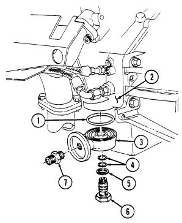
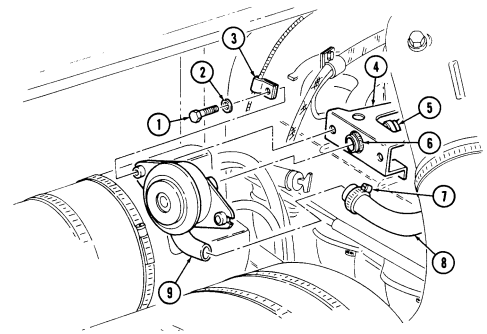
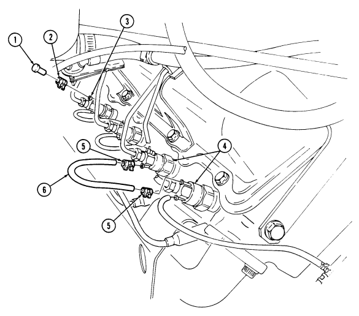
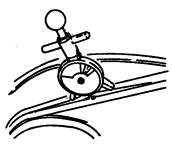

# Chapter 3 - Engine Systems Maintenance

 
| Chapter 3  | Engine Systems Maintenance TASK SUMMARY  
|------------|-------------------------------         
| TASK       | PROCEDURES                             
| [3-1 ](#3-1)        |  Lubrication System Maintenance Task Summary
| [3-2 ](#3-2)        |  Engine Oil Dipstick Tube Replacement
| [3-3 ](#3-3)        |  Engine Oil Filler Tube Replacement
| [3-4 ](#3-4)        |  Engine Oil Filter Adapter Replacement
| [3-5 ](#3-5)        |  Engine Oil Service
| [3-6 ](#3-6)        |  Oil Pan Replacement
| [3-7 ](#3-7)        |  Engine Oil Cooler Supply And Return Lines Maintenance
| [3-8 ](#3-8)        |  Engine And Transmission Oil Cooler Assembly Maintenance
| [3-9 ](#3-9)        |  Crankcase Depression Regulator (Cdr) Valve And Bracket Maintenance
| [3-10](#3-10)       |  Cdr Valve Hoses Replacement
| [3-11](#3-11)       |  Section II. Fuel System Maintenance
| [3-12](#3-12)       |  Air Cleaner Assembly And Dust Unloader Maintenance (Cont'D)
| [3-13](#3-13)       |  Air Cleaner Filter Element Servicing (Cont'D)
| [3-14](#3-14)       |  Air Horn Replacement
| [3-15](#3-15)       |  Air Horn-To-Air Cleaner Elbow Replacement
| [3-16](#3-16)       |  Air Horn Support Bracket Replacement
| [3-17](#3-17)       |  Air Restriction Gauge Replacement
| [3-18](#3-18)       |  Weathercap Replacement
| [3-19](#3-19)       |  Air Restriction Gauge Hose Replacement
| [3-20](#3-20)       |  Air Intake And Fuel Pump Vent Lines Replacement
| [3-21](#3-21)       |  Drainage Bracket Replacement
| [3-22](#3-22)       |  Fuel Injection Pump Boot Replacement
| [3-23](#3-23)       |  Fuel Pump Replacement
| [3-24](#3-24)       |  Fuel Tank Maintenance (Cont'D)
| [3-25](#3-25)       |  Fuel Tank Supply And Return Lines Replacement
| [3-26](#3-26)       |  Auxiliary Fuel Pickup And Return Lines Replacement
| [3-27](#3-27)       |  Fuel Tank Vent Line And Filter Replacement
| [3-28](#3-28)       |  Fuel Tank Filler Cap And Spout Maintenance
| [3-29](#3-29)       |  Fuel Tank Filler Spout Vent Line Replacement
| [3-30](#3-30)       |  Filler Spout Hose Replacement
| [3-31](#3-31)       |  Fuel Tank Hangers Replacement
| [3-32](#3-32)       |  Fuel Filter Maintenance
| [3-33](#3-33)       |  Fuel Filter Element Maintenance
| [3-34](#3-34)       |  Fuel Filter Drain Hose And Valve Replacement
| [3-35](#3-35)       |  Fuel Injection Pump Return Hose Check Valve Maintenance
| [3-36](#3-36)       |  Fuel Injection Return Hoses Replacement
| [3-37](#3-37)       |  Fuel Drain Back Tube Replacement
| [3-38](#3-38)       |  Glow Plug Replacement
| [3-39](#3-39)       |  Right Fuel Injection Lines Bracket Replacement
| [3-40](#3-40)       |  Left Fuel Injection Lines Bracket Replacement
| [3-41](#3-41)       |  Accelerator System Maintenance Task Summary
| [3-42](#3-42)       |  Accelerator Linkage Maintenance
| [3-43](#3-43)       |  Accelerator Pedal Replacement
| [3-44](#3-44)       |  Engine Idle Speed Adjustment
| [3-45](#3-45)       |  Hand Throttle Control Cable And Bracket Replacement
| [3-46](#3-46)       |  Exhaust System Maintenance Task Summary
| [3-47](#3-47)       |  Tailpipe Replacement
| [3-48](#3-48)       |  Muffler And Insulator Replacement (All Models Except M1123 And "A2" Vehicles)
| [3-49](#3-49)       |  Muffler And Catalytic Converter Replacement (M1123 And "A2" Vehicles Only)
| [3-50](#3-50)       |  Crossover Pipe Replacement
| [3-51](#3-51)       |  Tailpipe Hanger Replacement
| [3-52](#3-52)       |  Tailpipe Insulator Replacement
| [3-53](#3-53)       |  Muffler Support Bracket Maintenance
| [3-54](#3-54)       |  Right Exhaust Manifold Rear Heat Shield Replacement
| [3-55](#3-55)       |  Right Exhaust Manifold Heat Shield Replacement
| [3-56](#3-56)       |  Left Exhaust Manifold Replacement
| [3-57](#3-57)       |  Right Exhaust Manifold Replacement
| [3-58](#3-58)       |  Muffler Hanger Replacement
| [3-59](#3-59)       |  Cooling System Maintenance Task Summary
| [3-60](#3-60)       |  Cooling System Servicing
| [3-61](#3-61)       |  Radiator And Fan Shroud Assembly Maintenance
| [3-62](#3-62)       |  Airlift To Shroud Shield Assembly Replacement
| [3-63](#3-63)       |  Radiator Support Replacement
| [3-64](#3-64)       |  Surge Tank Replacement
| [3-65](#3-65)       |  Surge Tank-To-Radiator Vent Hose Replacement
| [3-66](#3-66)       |  Surge Tank-To-Water Crossover Vent Hose Replacement
| [3-67](#3-67)       |  Thermostat Bypass Hose Replacement
| [3-68](#3-68)       |  Fan Drive Hose And Quick-Disconnect Replacement
| [3-69](#3-69)       |  Radiator Inlet Hose Replacement
| [3-70](#3-70)       |  Radiator Lower Tube Assembly Replacement
| [3-71](#3-71)       |  Lower Radiator Hose Replacement
| [3-72](#3-72)       |  Water Pump Inlet Hose Replacement
| [3-73](#3-73)       |  Surge Tank-To-Lower Radiator Tube Hose Replacement
| [3-74](#3-74)       |  Surge Tank Overflow Hose Replacement
| [3-75](#3-75)       |  Thermostat Replacement
| [3-76](#3-76)       |  Water Pump Pulley Replacement
| [3-76](#3-76-1)     |  Water Pump And Adapter Plate Maintenance
| [3-77](#3-77)       |  Water Crossover Maintenance
| [3-78](#3-78)       |  Fan Drive And Fan Blade Maintenance
| [3-79](#3-79)       |  Fan Drive Friction Lining Replacement
| [3-80](#3-80)       |  Power Steering Drivebelt Set Replacement
| [3-81](#3-81)       |  A Lt E R N Ator Drivebelt Set Replacement
| [3-82](#3-82)       |  Drivebelts Adjustment
| [3-83](#3-83)       |  Serpentine Drivebelt Maintenancee Replacement
| [3-84](#3-84)       |  Tensioner, Idler Pulleys, And Mounting Hardwar                       
                                                                       

 
## Section I Lubrication System Maintenance
 

### 3-1 Lubrication System Maintenance Task Summary

 

### 3-2. Engine Oil Dipstick Tube Replacement
This task covers:
INITIAL SETUP:

#### Tools

General mechanic's tool kit:
automotive (Appendix B, Item 1)
Special Tools Hex-head driver, 8 mm
(Appendix B, Item 156)

#### Materials/Parts
- O-ring (Appendix G, Item 209) 
- Plain-assembled nut (Appendix G, Item 201) 
- Sealant (Appendix C, Item 38)

#### a. Removal 
 1. Remove oil dipstick (5) from oil dipstick tube (4). 
 2. Remove plain-assembled nut (3) and capscrew (13) from harness clamp (2) and upper dipstick tube bracket (6). Discard plain-assembled nut (3).
 3. Using hex-head driver, remove socket-head screw (8) and washer (7) from lower dipstick tube bracket (12) and exhaust manifold (11).
 4. Remove two assembled-washer screws (1) from upper dipstick tube bracket (6) and fuel line bracket (14).
 5. Remove oil dipstick tube (4) from engine oil pan (10). Remove and discard O-ring (9).

#### b. Installation
 1. Apply RTV sealant to O-ring (9) and install O-ring (9) on oil dipstick tube (4). 
 2. Install oil dipstick tube (4) in engine oil pan (10). 
 3. Using hex-head driver, secure lower dipstick tube bracket (12) to exhaust manifold (11) with washer (7) and socket-head screw (8). Tighten socket-head screw (8) to 25-33 lb-ft (34-45 N•m).
 4. Secure upper dipstick tube bracket (6) to fuel line bracket (14) with two assembled-washer screws (1). Tighten assembled-washer screws (1) to 3–4 lb-ft (4-5 N•m).
 5. Secure harness clamp (2) to upper dipstick tube bracket (6) with capscrew (13) and plain-assembled nut (3).
 6. Install oil dipstick (5) into oil dipstick tube (4).

a. Removal 
b. Installation

| Manual References   |
|---------------------|
| TM 9-2320-280-1     |
| TM 9-2320-280-10    |
| TM 9-2320-280-24P   |

Equipment Condition Hood raised and secured (TM 9-2320-280-10).

FOLLOW-ON TASKS: 
- Start engine (TM 9-2320-280-10) and check for oil leaks.
- Lower and secure hood (TM 9-2320-280-10).

 

### 3-3. Engine Oil Filler Tube Replacement

This task covers:

INITIAL SETUP:
- Tools 
  - General mechanic's tool kit automotive (Appendix B, Item 1) TM 9-2320-280-10 TM 9-2320-280-24P
- Materials/Parts 
  - Lubricating oil (Appendix C, Item 31) 
- Equipment Condition
  - Hood raised and secured (TM 9-2320-280-10).

A. Removal 
1. Loosen clamp (2) and disconnect CDR valve hose (1) from engine oil filler tube (3).
2. Remove two nuts (4), washers (5), and engine oil filler tube (3) from timing chain cover (7) and studs (8).
3. Inspect grommet (6) for breaks or cracks. Replace if defective.

 

B. Installation
1. Coat grommet (6) with lubricating oil.
2. Install engine oil filler tube (3) into timing chain cover (7) with two washers (5) and nuts (4). Tighten nuts (4) to 13-20 lb-ft (18-27 N.m).
3. Connect CDR valve hose (1) to engine oil filler tube (3) and tighten clamp (2).

FOLLOW-ON TASK: 
- Lower and secure hood (TM 9-2320-280-10).

 

### 3-4. Engine Oil Filter Adapter Replacement

This task covers:
INITIAL SETUP:

#### Tools

General mechanic's tool kit:
automotive (Appendix B, Item 1)
Materials/Parts Gasket (Appendix G, Item 53) Two O-rings (Appendix G, Item 210) O-ring (Appendix G, Item 211)

#### A. Removal

3. Inspect reducer boss (7) for damaged threads or cracks. Replace if defective.

#### B. Installation

1. Install reducer boss (7) into oil filter adapter (3) and tighten to 25 lb-ft (34 N•m).

 2. Install engine oil filter adapter (3) and O-ring (1) on cylinder block (2) with two O-rings (4), 
gasket (5), and adapter bolt (6). Tighten adapter bolt (6) to 50 lb-ft (68 N•m).

FOLLOW-ON TASK: Install engine oil filter (para. 3-5).

a. Removal b. Installation

Manual References TM 9-2320-280-24P
Equipment Condition Engine oil filter removed (para. 3-5).

1. Remove adapter bolt (6), gasket (5), two O-rings (4), engine oil filter adapter (3), and O-ring (1)
from cylinder block (2). Discard O-ring (1), two O-rings (4), and gasket (5).

2. Remove reducer boss (7) from oil adapter (3).

 

### 3-5. Engine Oil Service

This task covers:

a. Draining Oil c. Installing Filter b. Removing Filter d. Replenishing Oil

INITIAL SETUP:
Tools General mechanic's tool kit:
automotive (Appendix B, Item 1)
Oil filter removal tool (Appendix B, Item 2)
Materials/Parts Oil filter (Appendix G, Item 206) (6.2L only) Oil filter (Appendix G, Item 206.1)
(6.5L and 6.5L detuned only)
Lubricating oil (Appendix C, Item 31)
Manual References TM 9-2320-280-10 TM 9-2320-280-24P
Equipment Condition Hood raised and secured (TM 9-2320-280-10).

General Safety Instructions Do not drain oil when engine is hot.

a. Draining Oil

Do not drain oil when engine is hot. Severe injury to personnel will result.

- Park vehicle on a firm, level surface. - Have drainage container ready to catch oil.

1. Remove drainplug (5) and gasket (4) from oil pan (3). Allow oil to drain completely. 2. Install gasket (4) and drainplug (5). Tighten drainplug (5) to 20 lb-ft (27 N•m).

b. Removing Filter

Have drainage container ready to catch oil.

Remove oil filter (1) from filter adapter (2). Discard filter (1).

c. Installing Filter 1. Apply a light coat of oil to filter gasket prior to installation 2. Install oil filter (1) on oil filter adapter (2) and tighten by hand until gasket contacts filter adapter (2). Tighten additional 1/2-3/4 turn by hand.

d. Replenishing Oil

Install a non-vented filler cap only. An incorrect filler cap will not seal properly, causing water to enter and damage engine.

1. Remove filler cap (6) from filler tube (7). Fill with oil according to TM 9-2320-280-10. 2. Install filler cap (6) on filler tube (7).

3-5. ENGINE OIL SERVICE (Cont'd)

FOLLOW-ON   TASKS: -   Lower and secure hood (TM 9-2320-280-10).
•

 

### 3-6. Oil Pan Replacement

This task covers:
INITIAL SETUP:

#### Tools

General mechanic's tool kit:
automotive (Appendix B, Item 1)
Materials/Parts Oil seal retainer (Appendix G, Item 207) Two lockwashers (Appendix G, Item 135) Oil pan gasket (Appendix G, Item 61) 
(optional - used on 6.2 L only)
Sealant (Appendix C, Item 38)
Manual References TM 9-2320-280-10 TM 9-2320-280-24P
a. Removal

#### A. Removal B . Installation Equipment Condition

- Starter removed (para. 4-8). - Oil dipstick tube removed (para. 3-2).

General Safety Instructions Do not drain oil when engine is hot.

Do not drain oil when engine is hot. Severe injury to personnel will result.

Have drainage container ready to catch oil.

1. Remove oil drainplug (8) and gasket (7) and drain oil. Install gasket (7) and oil drainplug (8) after oil is drained.

2. Remove two nuts (9), lockwashers (10), and starter cable support bracket (11) from studs (14).

Discard lockwashers (10).

Optional gasket applies to 6.2 L only.

3. Remove twenty capscrews (6), two large capscrews (13), studs (14), oil pan gasket (4) (if installed),
and oil pan (12) from cylinder block (2). Remove any sealant remains.

4. Remove oil pan rear seal retainer (15) from rear main cap (1). Discard oil pan rear seal retainer (15). b. Installation 1. Apply a bead of sealant to each end of seal retainer (15) and install oil pan rear seal retainer (15) on rear main cap (1).

- Perform step 2 for oil pan gasket (if installed). Perform step 3 for applying sealant.

- Immediately install oil pan after application of sealant.

2. Install oil pan gasket (4) on lip of oil pan (12) and align with bolt holes. 3. Apply a 3/16 in. (5mm) bead of sealant around two large holes (3) on cylinder block (2). Apply a 3/16 in. (5mm) bead of sealant around oil pan sealing surface (5) following sealant diagram shown.

4. Install oil pan (12) on cylinder block (2) with twenty capscrews (6), two large capscrews (13), and studs (14). Tighten capscrews (6) and studs (14) to 4-10 lb-ft (5-14 N•m). Tighten large capscrews (13) to 13-20 lb-ft (18-27 N•m).

5. Install starter cable support bracket (11) on studs (14) with two lockwashers (10) and nuts (9). 6. Tighten oil drainplug (8) to 20 lb-ft (27 N•m).

SEALANT DIAGRAM

FOLLOW-ON TASKS: -  Replenish engine oil (TM 9-2320-280-10).
- • - Install oil dipstick tube (para. 3-2).

· Install starter (para. 4-8).

 

### 3-7. Engine Oil Cooler Supply And Return Lines Maintenance

This task covers:
b. Inspection INITIAL SETUP:
Tools General mechanic's tool kit:
automotive (Appendix B, Item 1)

#### Materials/Parts

Tiedown strap (Appendix G, Item 306) Lockwasher (Appendix G, Item 133) Locknut (Appendix G, Item 72)
Manual References TM 9-2320-280-10 TM 9-2320-280-24P
a. Supply Line Removal c. Supply Line Installation

#### Equipment Condition

- Engine left splash shield removed
(para. 10-17).

- Engine access cover removed (para. 10-15).

General Safety Instructions Do not drain oil when engine is hot.

a. Removal

Do not drain oil when engine is hot. Severe injury to personnel will result.

Cover or plug all hoses and connections immediately after disconnection to prevent contamination. Remove all plugs prior to connection.

- Engine oil cooler supply and return lines are replaced basically the same. This procedure covers supply line replacement.

- Have drainage container ready to catch oil. - Left splash shield can be modified to add engine access cover.

Refer to appendix D, Figs. D-86 and D-87 for installation.

1. Disconnect supply line connector (5) from adapter (4) and allow oil to drain. 2. Disconnect supply line connector (16) from oil cooler port (17). 3. Remove locknut (3), washer (2), capscrew (15), and washer (2) from supply line clamp (14), brake line clamp (1), and frame bracket (13). Discard locknut (3).

4. Remove capscrew (7), lockwasher (8), and clamp (9) from supply line (12) and engine mount bracket
(10). Discard lockwasher (8).

5. Remove tiedown strap (11) from supply line (12) and return line (6). Discard tiedown strap (11). b. Inspection Inspect adapter (4) for damaged threads or cracks. Replace if defective.

c. Installation 1. Position supply line (12) in approximate mounting location along frame. 2. Install supply line clamp (14) and brake line clamp (1) on frame bracket (13) with washer (2),
capscrew (15), washer (2), and locknut (3). Tighten locknut (3) to 6 lb-ft (8 N•m).

3. Connect supply line connector (16) to oil cooler port (17).

 

### 3-7. Engine Oil Cooler Supply And Return Lines Replacement (Cont'D)

4. Connect supply line connector (5) to adapter (4).
 

5. Secure supply line (12) to engine mount bracket (10) with clamp (9), lockwasher (8), and capscrew (7).

6. Secure supply line (12) to return line (6) with tiedown strap (11).

FOLLOW-ON TASKS: Install engine left splash shield (para. 10-17).

Fill oil to proper level (TM 9-2320-280-10). Start engine (TM 9-2320-280-10) and inspect for leaks at engine oil cooler, supply and return lines. Install engine access cover (para. 10-15).

 

# 3-8. Engine And Transmission Oil Cooler Assembly Maintenance

This task covers:
b. Installation INITIAL SETUP:
Tools **Equipment Condition**
a. Removal **c. Cleaning and Inspection**
General mechanic's tool kit: Engine left splash shield removed (para. 10-17).

automotive (Appendix B, Item 1) Power steering cooler removed (para. 8-28).

Manual References **General Safety Instructions**
TM 9-2320-280-10 Do not drain oil when engine is hot.

TM 9-2320-280-24P Compressed air used for cleaning purposes will not exceed 30 psi (207 kPa).

Do not bend transmission oil cooler fins. Damaged fins reduce cooling efficiency, which may damage engine and/or transmission.

a. Removal

Do not drain oil when engine is hot. Severe injury to personnel will result.

Cover or plug all hoses and connections immediately after disconnection to prevent contamination. Remove all plugs prior to connection.

Have drainage container ready to catch oil. Note position of hoses for installation.

1. Disconnect two engine oil cooler supply and return lines (7) from engine oil cooler ports (9).

2. Loosen two hose clamps (2) and disconnect two transmission oil cooler line connector hoses (1) from transmission oil cooler ports (3).

3. Remove four socket-head screw and washer assemblies (5), washers (6) and oil cooler (4) from radiator (8).

1. Install oil cooler (4) on radiator (8) with four washers (6) and socket-head screw and washer assemblies (5).

2. Connect two transmission oil cooler line connector hoses (1) to transmission oil cooler ports (3) and tighten two hose clamps (2). Tighten clamps (2) to 10-20 lb-in. (1-2 N*m).

3. Connect two engine oil cooler supply and return lines (7) to engine oil cooler ports (9).

#### C. Cleaning And Inspection

1. Remove four socket-head screw and washer assemblies (5) and washers (6) securing oil cooler (4) to radiator (8).

2. Make four two-by-four wood blocks, 2-1/2 inches (63 mm) long. Raise oil cooler (4) 1-1/2 inches
(38 mm) and place one block under each comer between oil cooler (4) and radiator (8).

# 3 - 8 . Engine And Transmission Oil Cooler Assembly Maintenance ( Co N T ' D)

Compressed air used for cleaning purposes will not exceed 30 psi (207 kPa). Use only with effective chip guarding and personal protective equipment (goggles/shield, gloves, etc.).

Using high water pressure when cleaning engine and transmission oil cooler and radiator can cause damage. High water pressure should not be directed at oil cooler or radiator.

3. Using water and compressed air, remove dirt, trash, and insects embedded in oil cooler (4) and radiator fins (8).

4. Inspect oil cooler (4) for breaks, punctures, cracks, and splits. Replace oil cooler (4), if damaged. 5. Remove four wood blocks. 6. Install oil cooler (4) on radiator (8) with four washers (6) and socket-head screw and washer

assemblies (5).

FOLLOW-ON TASKS: - Install power steering cooler (para. 8-28).

- Fill transmission oil to proper level (TM 9-2320-280-10). - Fill engine oil to proper level (TM 9-2320-280-10). - Install engine left splash shield (para. 10-17). - Start engine (TM 9-2320-280-10) and check for leaks.

 

# 3-9. Crankcase Depression Regulator (Cdr) Valve And Bracket Maintenance

| This task covers:   |
|---------------------|

b. Removal **d. Installation**

INITIAL SETUP:

Tools **Manual References**

General mechanic's tool kit: TM 9-2320-280-10

automotive (Appendix B, Item 1) TM 9-2320-280-24P

#### A. Testing

a. Testing **c. Cleaning and Inspection**

Test Equipment **Equipment Condition**

Manometer, U-tube Hood raised and secured (TM 9-2320-280-10).

(Appendix B, Section IV, Item L) Engine access cover removed (para. 10-15).

1. Remove engine oil dipstick from oil dipstick tube (para. 3-2).

2. Install manometer in dipstick tube. 3. Connect STE/ICE-R unit to DCA connector.

To read manometer, add amount the water column travels above zero to the amount the water column travels below zero.

4. Start engine and let idle; record water pressure. Pressure should be zero inches of water or a slight vacuum.

5. Increase engine speed to 2,000 rpm; record water pressure. Pressure should be 2-5 inches.

6. If pressures are not within specifications listed in steps 4 and 5, replace CDR valve (9) and repeat test.

7. Install oil dipstick in engine oil dipstick tube (para. 3-2).

CDR valves on vehicles equipped with deep water fording kit contain two additional vent lines.

1. Loosen clamp (7) and discomect CDR valve oil fill tube hose (8) from CDR valve (9). 2. Loosen clamp (6) on CDR valve intake manifold hose (5). 3. Remove two screws (1), washers (2), CDR valve (9), and heater control cable clamp (3) horn CDR
valve bracket (4).

4. Remove two nuts (10) from CDR valve bracket (4) and two intake manifold studs (11). 5. Remove two nuts (13) and CDR valve bracket (4) from two valve cover studs (12).

3-9. CRANKCASE DEPRESSION REGULATOR (CDR) VALVE AND BRACKET
MAINTENANCE (Cont'd)

# 3-9. Crankcase Depression Regulator (Cdr) Valve And Bracket Maintenance (Cont'D)

c Cleaning and Inspection

Do not clean CDR valve with drycleaning solvent. Drycleaing solvent will damage the diaphragm inside the CDR valve.

1. Clean oil and carbon deposits from the CDR valve (9) with a clean, lint-flee cloth.

2. Inspect the CDR valve (9) and lines for leaks, cracks, and restrictions. Replace if damaged.

d. Installation 1. 2.

3.

4.

5.

Connect CDR valve (9) to intake manifold hose (5) and tighten clamp (6). Install CDR valve (9) and heater control cable clamp (3) on CDR valve bracket (4) with two washers (2) and screws (1). Tighten screws (1) to 15 lb-ft (20 N.m).

6.

Connect CDR valve oil fill tube hose (8) to CDR valve (9) and tighten clamp (7).

Install CDR valve bracket (4) on two intake manifold studs (12) and two valve cover studs (13).

Secure CDR valve bracket (4) to intake manifold (11) with two nuts (10). Tighten nuts (10) to 15 lb-ft (20 N.m).

Secure CDR valve bracket (4) to valve cover studa (13) with two nuts (14). Tighten nuts (14) to 10 lb-ft (14 N.m).

3-9. CRANKCASE DEPRESSION REGULATOR (CDR) VALVE AND BRACKET
MAINTENANCE (Cont'd)

FOLLOW-ON TASKS: - Lower and secure hood (TM 9-2320-280-10).

· Install engine access cover (para. 10-15).

 

## 3-10. Cdr Valve Hoses Replacement

This task covers:
INITIAL SETUP:
Manual References TM 9-2320-280-10 TM 9-2320-280-24P

#### A. Removal **B. Installation**

Tools **Equipment Condition**
General mechanic's tool kit: Hood raised and secured (TM 9-2320-280-10).

automotive (Appendix B, Item 1) Engine access cover removed (para. 10-15).

CDR valve and bracket removed (para. 3-9).

1. Loosen clamp (2) and disconnect CDR valve intake manifold hose (1) from intake manifold (7).

2. Inspect adapter (3) for breaks or cracks. Replace if defective.

3. Loosen clamp (5) and disconnect CDR valve oil fill tube hose (4) from oil fill tube (6).

1. Connect CDR valve oil fill tube hose (4) to oil fill tube (6) and tighten clamp (5).

2. Connect to CDR valve intake manifold hose (1) to intake manifold (7) and tighten clamp (2).

FOLLOW-ON TASKS:
Install CDR valve and bracket (para. 3-9).

Lower and secure hood (TM 9-2320-280-10).

Install engine access cover (para. 10-15).

 

## Section II. Fuel System Maintenance

| b. Installation a. Removal                                                                                                                           |                     |
|------------------------------------------------------------------------------------------------------------------------------------------------------|---------------------|
| Tools  Manual References                                                                                                                             |                     |
| General mechanic's tool kit                                                                                                                          | TM 9\-2320\-280\-10 |
| automotive (Appendix B, Item 1) TM 9\-2320\-280\-24P                                                                                                 |                     |
| Materials/Parts  Equipment Condition                                                                                                                 |                     |
| Lubricating oil (Appendix C, Item 31) Hood raised and secured (TM 9\-2320\-280\-10).                                                                 |                     |
| 1. Loosen clamp (2) and disconnect CDR valve hose (1) from engine oil filler tube (3).                                                               |                     |
| 2. Remove two nuts (4), washers (5), and engine oil filler tube (3) from timing chain cover (7) and                                                  |                     |
| studs (8).                                                                                                                                           |                     |
| 3. Inspect grommet (6) for breaks or cracks. Replace if defective.                                                                                   |                     |
| 1. Coat grommet (6) with lubricating oil.                                                                                                            |                     |
| 2. Install engine oil filler tube (3) into timing chain cover (7) with two washers (5) and nuts (4). Tighten nuts (4) to 13\-20 lb\-ft (18\-27 N.m). |                     |
| 3. Connect CDR valve hose (1) to engine oil filler tube (3) and tighten clamp (2).                                                                   |                     |
| FOLLOW\-ON TASK: Lower and secure hood (TM 9\-2320\-280\-10).                                                                                        |                     |

 

# 3 - 1 2 . Air Cleaner Assembly And Dust Unloader Maintenance

This task covers:
a. Removal c . Installation b. Inspection INITIAL SETUP:
Tools General mechanic's tool kit:
automotive (Appendix B, Item 1)
Equipment Condition Hood raised and secured (TM 9-2320-280-10).

Manual Refere n c e s TM 9-2320-280-10 TM 9-2320-280-24P

> Note

For dust unloader replacement, perform steps 1 and 2 only.

a. Removal 1. Remove four screws (18) and dust unloader cover (17) from support brackets (4). 2. Loosen clamp (15) and remove dust unloader (16) from air cleaner assembly (9). 3. Loosen clamp (5) and disconnect elbow (6) from air cleaner assembly (9). 4. Disconnect air restriction gauge hose (7) from fitting (8). 5. Remove outer strap clamps (10) and (12) securing air cleaner assembly (9) to support brackets (4). 6. Disconnect vent line (3) from elbow (2). 7. Remove air cleaner assembly (9) from support bracket (4). 8. Remove elbow (2) from air cleaner assembly (9). 9. Remove adapter (14) and tube (13) from air cleaner assembly (9).

10. Remove fitting (8) from air cleaner assembly (9).

11. Remove clamp (11) from air cleaner assembly (9).

b. Inspection 1. Inspect gasket (1) for cracks or brakes. Replace gasket (1) if defective. 2. Inspect elbow (2), fitting (8), and adapter (14) for damaged threads or cracks. Replace if defective.

c. Installation

> Note

For dust unloader replacement, perform steps 10 and 11 only.

1. Install clamp (11) on air cleaner assembly (9). 2. Install fitting (8) on air cleaner assembly (9). 3. Install tube (13) on adapter (14). 4. Install tube (13) and adapter (14) on air cleaner assembly (9). 5. Install elbow (2) to air cleaner assembly (9). 6. Install air cleaner assembly (9) on support brackets (4) with strap clamps (10) and (12). Make sure clamp tabs are facing downward away from cab before tightening. Tighten the following clamps in sequence as follows: (10), (11), and (12).

7. Connect elbow (6) to air cleaner assembly (9) and tighten clamp (5). 8. Connect air restriction gauge hose (7) to fitting (8). 9. Connect vent line (3) to elbow (2).

## 3-12. Air Cleaner Assembly And Dust Unloader Maintenance (Cont'D)

10. Install dust unloader (16) on air cleaner assembly (9) and tighten clamp (15) to 45-50 lb-in.

(5-6 N.m).

FOLLOW-ON TASK: Lower and secure hood (TM 9-2320-280-10).

 

# 3 - 1 3 . Air Cleaner Filter Element Serv I C I N G

This task covers:
a. Removal **d. Cleaning** b. Inspection **e. Installation** c. Emergency Cleaning INITIAL SETUP:
Tools General mechanic's tool kit:
automotive (Appendix B, Item 1)
Materials/Parts Detergent (Appendix C, Item 17)
Manual References TM 9-2320-280-10 TM 9-2320-280-24P
Equipment Condition Hood raised and secured (TM 9-2320-280-10).

General Safety Instructions
- Compressed air used for cleaning purposes will not exceed 30 psi (207 kPa).

- If NBC contamination is suspected, consult NBC
officer or NBC NCO for appropriate handling instructions.

- Improper cleaning methods and use of unauthorized cleaning liquids can injure personnel and cause damage to equipment. Do not use anything other than compressed air, water, and detergent to clean elements.

- If NBC contamination is suspected, consult NBC officer or NBC
NCO for appropriate handling instructions.

a. Removal 1. Loosen bolt (8), and remove ring clamp (1), cover (2), and gasket (3) from air cleaner assembly (6). 2. Remove nut and washer assembly (7) and filter element (4) from stud (5) and air cleaner assembly (6).

3. Cover housing opening with screen or rag to prevent contaminants from entering the air intake system and damaging your engine.

#### B. Inspection

1. Check gasket (3) for dents, tears, rips, and other damage. Make sure the gasket has not taken a set.

Make sure there are no hard dirt ridges on the sealing surfaces.

2. Inspect filter element (4) for holes and tears by looking through the element toward a bright light. If pinpoints of light shine through, replace the element. Holes that are large enough to let light through are large enough to let contaminants through. Another way to check for leaks or damage is to look for uneven dirt patterns. Make sure there is no rust or flaking paint on metal parts of the filter. If the filter has already been cleaned three times, or if you find damage, replace it.

3. Check air cleaner assembly (6) for holes, dents, rust, or any other damage that will interfere with proper sealing and allow unfiltered air to enter and destroy engine.

c. Emergency Cleaning

Do not strike ends of filter element on hard surface or damage to filter element may result.

Remove dust or sand from filter element (4) by holding it so neither end faces ground. Gently tap around filter element (4) to free dust and sand.

# 3-13. Air Cleaner Filter Element Servicing (Cont'D)

# 3-13. Air Cleaner Filter Element Servicing (Cont'D)

Compressed air used for cleaning purpose will not exceed 30 psi (207 kPa). Use only with effective chip guarding and personnel protective equipment (goggles/shield, gloves, etc.).

Hold nozzle at least one inch away from element (1) and direct compressed air against clean side of element (1) (in direction opposite to normal air flow). Move air stream up and down length of pleats until you can not see dust being blown out.

1.

2.

Prepare a solution of five gallons warm water (80-110° F (26.7-43.3° C)) and approximately one cup of non-sudsing detergent in a container large enough to submerge the element (1). Never use gasoline or solvents of any kind to clean elements. Immerse the element (1) completely in the cleaning solution. Swish for two minutes. Soak the element in the cleaning solution for 15 to 20 minutes, then swish it around again to remove contaminants.

3.

Remove the element (1) from the solution and let it drain.

Rinse the element with cool water (35-80° F (1.7-26.7° C)) from clean side to dirty side (in direction opposite to normal air flow) with a gentle stream of water (no more than 40 psi (275.8 kpa)). If the clean side was contaminated during the soak cycle, rinse the element from both sides.

4.

5.

Air dry the element (1) at normal room temperature until completely dry. Usually overnight is adequate, but temperature and humidity will effect drying time. If you use circulating air, do not exceed 180° F (82.2° C). Do not use compressed air to speed drying time, you will damage your element. Reinspect the element (1) and discard if damaged. If it checks out O.K., mark the date of cleaning on it.

6.

7.

#### E. Installation

1. Remove screen or rag from housing opening. 2. Install filter element (1) into air cleaner assembly (6) and on stud (5) with nut and washer assembly (7). Tighten nut and washer assembly (7) to 20-40 lb-in (2-4 N-m).

When cover clamp is secured to end of filter body assembly, ensure the clamp bolt is between the three and six o'clock position to prevent damaging hood when hood is closed.

3. Install cover (3) and gasket (4) on air cleaner assembly (6) with ring clamp (2) as shown. Tighten bolt (8) to 35-40 lb-in (3-4 N-m).

# 3-13. Air Cleaner Filter Element Servicing (Cont'D)

FOLLOW-ON TASKS: - Lower and secure hood (TM 9-2320-280-10).

- Start engine (TM 9-2320-280-10) and ensure air restriction gauge on instrument panel does not show red.

 

## 3-14. Air Horn Replacement

This task covers:
INITIAL SETUP:

#### Tools

General mechanic's tool kit:
automotive (Appendix B, Item 1)
Materials/Parts Two flat washers (Appendix G, Item 37) Gasket (Appendix G, Item 41) Sealing compound (Appendix C, Item 40)

a. Removal b. Installation

| Equipment Condition   |
|-----------------------|
| Hood raised and se    |

| Manual References    |
|----------------------|
| TM 9\-2320\-280\-24P |

Hood raised and secured (TM 9-2320-280-10).

a. Removal 1. Remove two screws (2), washers (3), and flat washers (4) securing air horn (5) to intake manifold (7). Discard flat washers (4).

2. Loosen clamp (10) and disconnect air intake elbow (9) from air horn (5).

Cover opening of intake manifold to prevent foreign material from entering engine.

3. Loosen clamp (1) securing air horn (5) to engine lift bracket (8) and slide clamp (1) from engine lift bracket (8). Remove air horn (5) from intake manifold (7).

4. Remove gasket (6) from intake manifold (7). Discard gasket (6). 5. Remove clamp (1) from air horn (5).

#### B. Installation

1. Install clamp (1) on air horn (5). 2. Install gasket (6) on intake manifold (7). 3. Coat threads of screws (2) with sealing compound. Install air horn (5) on intake manifold (7) with two flat washers (4), washers (3), and screws (2). Tighten screws (2) to 40-45 lb-in. (5-6 N•m).

4. Connect elbow (9) to air horn (5) and tighten clamp (10) to 45-50 lb-in. (5-6 N•m). 5. Slide clamp (1) on engine lift bracket (8) and air horn (5) and tighten clamp (1) to 40-45 lb-in. 

(5-6 N•m).

FOLLOW-ON TASK: Lower and secure hood (TM 9-2320-280-10).

 

# 3 - 1 5 . Air Horn-To-Air Cleaner Elbow Replacement

This task covers:
a. Removal b. Installation INITIAL SETUP:
Tools General mechanic's tool kit:
automotive (Appendix B, Item 1)
Equipment Condition Hood raised and secured (TM 9-2320-280-10).

Manual References TM 9-2320-280-10 TM 9-2320-280-24P
a. Removal 1. Loosen two clamps (3) and remove elbow (4) from air cleaner assembly (1) and air horn (2). 2. Remove two clamps (3) from elbow (4).

b. Installation 1. Install two clamps (3) on elbow (4). 2. Connect elbow (4) to air cleaner assembly (1) and air horn (2) and tighten two clamps (3). Tighten

clamps (3) to 40-45 lb-in. (5-6 N•m).

FOLLOW-ON TASK: Lower and secure hood (TM 9-2320-280-10).

 

# 3-16. Air Horn Support Bracket Replacement

This task covers:
INITIAL SETUP:
Applicable Models All models except M997, M997A1, M997A2, M1036, M1037, M1042 Tools General mechanic's tool kit:
automotive (Appendix B, Item 1)

#### Materials/Parts

a. Removal b. Installation Manual References TM 9-2320-280-24P
Equipment Condition Air horn removed (para. 3-14).

Lockwasher (Appendix G, Item 191)
a. Removal 1. Remove nut (5), lockwasher (4), two clamps (3), washer (2.1), and stud (2) from air horn support bracket (1) and cylinder head (7). Discard lockwasher (4).

2. Remove capscrew (6) and support bracket (1) from cylinder head (7). 

b. Installation 1. Install air horn support bracket (1) on cylinder head (7) with stud (2). 2. Secure air horn support bracket (1) to cylinder head (7) with capscrew (6). Tighten capscrew (6) and stud (2) to 40 lb-ft (54 N•m).

3. Install washer (2.1) and two clamps (3) on stud (2) with lockwasher (4) and nut (5).

FOLLOW-ON TASK: Install air horn (para. 3-14).

 

# 3-17. Air Restriction Gauge Replacement

This task covers:
INITIAL SETUP:

a. Removal b. Installation

| Tools                        | Manual References   |
|------------------------------|---------------------|
| General mechanic's tool kit: | TM 9\-2320\-280\-10 |

a. Removal 1. Remove two screws (2) and bezel (1) from air restriction gauge (4), and remove gauge (4) and gasket (3) from behind dash panel (6).

2. Disconnect air restriction gauge hose (5) from gauge (4) and remove gauge (4).

b. Installation 1. Connect hose (5) to gauge (4). 2. Position gauge (4) and gasket (3) behind dash panel (6) and secure to bezel (1) with two screws (2).

FOLLOW-ON TASK: Start engine (TM 9-2320-280-10) and check operation of air restriction gauge.

 

### 3-18. Weathercap Replacement

This task covers:

| a. Testing   | c. Cleaning and Inspection   |
|--------------|------------------------------|
| b. Removal   | d. Installation              |
| Tools        | Manual References            |

automotive (Appendix B, Item 1)
Loosen clamp (2) and remove weathercap (1) from air intake duct (3).

b. Installation Install weathercap (1) on air intake duct (3) with clamp (2). Tighten clamp (2) to 45-50 lb-in. (5-6 Nom).

 

# 3-19. Air Restriction Gauge Hose Replacement

This task covers:
INITIAL SETUP:
Manual References TM 9-2320-280-10 TM 9-2320-280-24P
1. Loosen three clamps (2) from air restriction gauge hose (6) and "A" beam (1).

2. Disconnect hose (6) from air cleaner assembly (7). 3. Disconnect hose (6) from air restriction gauge (4) located behind instrument panel (5).

4. Remove hose (6) by routing out from three clamps (2) through two grommets (3) in "A" beam (1).

b. Installation 1. Route hose (6) through three clamps (2) and two grommets (3) in "A" beam (1) to air cleaner assembly (7) and gauge (4).

2. Connect hose (6) to air cleaner assembly (7). 3. Connect hose (6) to gauge (4).

4. Tighten three clamps (2) on hose (6) and "A" beam (1).

FOLLOW-ON TASKS: Install engine access cover (para. 10-15).

Lower and secure hood (TM 9-2320-280-10).

a. Removal **b. Installation**
Tools **Equipment Condition**
General mechanic's tool kit: Engine access cover removed (para. 10-15).

automotive (Appendix B, Item 1) Hood raised and secured (TM 9-2320-280-10).

 

# 3-20. Air Intake And Fuel Pump Vent Lines Replacement

This task covers:
a. Removal **b. Installation**
INITIAL SETUP:
Tools **Equipment Condition**
automotive (Appendix B, Item 1)
General mechanic's tool kit: Hood raised and secured (TM 9-2320-280-10).

Manual References TM 9-2320-280-10 TM 9-2320-280-24P

For fuel pump vent line replacement, perform steps 2, 3, and 4 only.

a. Removal 1. Remove vent line (2) from air cleaner fitting (1) and tee fitting (7).

2. Loosen clamp (3) and disconnect vent line (4) from fuel pump (6). 3. Loosen clamp (3) and remove vent line (4) from tee fitting (5). 4. Remove two clamps (3) from vent line (4).

b. Installation

For fuel pump vent line replacement, perform steps 2 and 3.

1. Connect vent line (2) to tee fitting (7) and air cleaner fitting (1). 2. Install two clamps (3) to vent line (4).

 3. Install vent line (4) on tee fitting (5) and fuel pump (6) and tighten two clamps (3).

FOLLOW-ON TASK: Lower and secure hood (TM 9-2320-280-10).

 

## 3-21. Drainage Bracket Replacement

This task covers:
a. Removal **b. Installation**
INITIAL SETUP:
Tools General mechanic's tool kit:
automotive (Appendix B, Item 1)
Equipment Condition Air cleaner assembly removed (para. 3-12).

Manual References TM 9-2320-280-24P
a. Removal Remove three screws (2) and drainage bracket (3) from body (1).

b. Installation Install drainage bracket (3) on body (1) with three screws (2).

FOLLOW-ON TASK: Install air cleaner assembly (para. 3-12).

 

# 3-22. Fuel Injection Pump Boot Replacement

This task covers:
a. Removal **b. Installation**
INITIAL SETUP:
automotive (Appendix B, Item 1)
Tools **Equipment Condition**
General mechanic's tool kit: Hood raised and secured (TM 9-2320-280-10).

Manual References TM 9-2320-280-10 TM 9-2320-280-24P
Remove clamp (3) and boot (2) from injection pump (1).

Install boot (2) on injection pump (1) with clamp (3).

FOLLOW-ON TASK: Lower and secure hood (TM 9-2320-280-10)

 

# 3-23. Fuel Pump Replacement

This task covers:
INITIAL SETUP:

#### Tools

General mechanic's tool kit:
automotive (Appendix B, Item 1)
Materials/Parts Mounting plate gasket (Appendix G, Item 198) Fuel pump gasket (Appendix G, Item 40) Grease (Appendix C, Item 22)
Manual References TM 9-2320-280-10 TM 9-2320-280-24P

a. Removal b. Installation

#### Equipment Condition

Battery ground cable disconnected (para. 4-73).

General Safety Instructions - Do not perform this procedure near fire, flames, or sparks.

- Gaskets installed on some 6.2L engines assembled prior to 1991 may contain asbestos. Gaskets should be disposed of IAW current directives.

Diesel fuel is highly flammable. Do not perform this procedure near fire, flames, or sparks. Severe injury or death will result.

a. Removal

Cover or plug all open hoses and connections immediately after disconnection to prevent contamination. Remove all plugs prior to connection.

Have drainage container ready to catch fuel.

1. Loosen clamp (14) and disconnect fuel inlet line (13) from fuel pump (2) and allow fuel to drain into container.

2. Disconnect fuel outlet line (12) from fuel pump (2) and allow fuel to drain into container. 3. Loosen clamp (3) and disconnect vent line (4) from fuel pump (2).

Gaskets installed on some 6.2L engines assembled prior to 1991 may contain asbestos. Gaskets should be removed with a scraper or putty knife and then be disposed of IAW current directives. Inhalation of asbestos fibers can cause respiratory ailments.

4. Remove two capscrews (1), fuel pump (2) and gasket (6) from fuel pump mounting plate (7). Discard gasket (6).

5. Remove two capscrews (11), fuel pump mounting plate (7) and gasket (8) from cylinder block (10).

Discard gasket (8).

6. Remove pushrod (9) from cylinder block (10).

 

# 3-23. Fuel Pump Replacement (Cont'D)

b. Installation

Place GAA grease on pushrod to retain in cylinder block during installation.

1. Insert pushrod (9) into cylinder block (10). 2. Install gasket (8) and mounting plate (7) into block (10) with two capscrews (1) for alignment of pump (2) to cylinder block (10).

3. Secure gasket (8) and mounting plate (7) to cylinder block (10) with two capscrews (11). Tighten capscrews (11) to 4-7 lb-ft (5-10 N•m) then remove two capscrews (1).

4. Install gasket (6) and fuel pump (2) on fuel pump mounting plate (7) and block (10), ensuring alignment of lever (5) to pushrod (9) with two capscrews (1). Tighten capscrews (1) to 20-30 lb-ft (27-41 N•m).

5. Connect vent line (4) to fuel pump (2) and tighten clamp (3) to 10-20 lb-in. (1-2 N•m). 6. Connect fuel outlet line (12) to fuel pump (2). 7. Connect fuel inlet line (13) to fuel pump (2) and tighten clamp (14).

FOLLOW-ON TASKS: - Connect battery ground cable (para 4-73).

- Start engine (TM 9-2320-280-10) and check fuel pump and hoses for fuel leaks.

 

# 3-24. Fuel Tank Maintenance (Cont'D)

This task covers:
c. Disassembly **f. Installation**
INITIAL SETUP:

#### Tools

General mechanic's tool kit:
automotive (Appendix B, Item 1)

#### Materials/Parts

Access cover gasket (Appendix G, Item 1)
Fifteen locknuts (Appendix G, Item 70)
Adhesive (Appendix C, Item 1)
Sealing compound (Appendix C, Item 46) Drycleaning solvent (Appendix C, Item 18) Twelve O-rings (Appendix G, Item 215)
Personnel Required One mechanic One assistant a. Draining d. Cleaning and Inspection b. Removal e. Assembly

#### Manual References

TM 9-2320-280-10 TM 9-2320-280-24P

#### Equipment Condition

- Battery ground cable disconnected (para. 4-73).

- Rear propeller shaft removed (para. 6-4).

#### General Safety Instructions

- Do not perform this procedure near fire, flames, or sparks.

- Cleaning will be done in a well-ventilated area and a fire extinguisher will be kept nearby when solvent is used.

Diesel fuel is highly flammable. Do not perform this procedure near fire, flames, or sparks. Severe injury or death will result.

Have drainage container ready to catch fuel.

#### A. Draining

1. Remove fuel tank filler cap (1). 2. Remove drainplug (3) from fuel tank (2). Allow fuel to completely drain into container.

Do not overtighten drainplug. Drainplug must not turn in hole. Sharp edge of hole may cut rubber.

3. Install drainplug (3) flush with bottom of fuel tank (2) and tighten.

b. Removal 1. Disconnect large vent line (4) from filler spout (5). 2. Remove locknut (15), washer (12), capscrew (11), washer (12), and clamp (13) from vent line (4) and body (14).

Discard locknut (15).

3. Remove locknut (16), washer (7), capscrew (8), washer (7) and clamp (6) from filler spout (5). Discard locknut
(16).

4. Loosen clamp (9) and remove hose (10) from filler spout (5).

 

# 3-24. Fuel Tank Maintenance (Cont'D)

## 3-24. Fuel Tank Maintenance (Cont'D)

5.

Remove two nuts (15), washers (14), and capscrews (7) from fuel tank support straps (6) and (12) and remove lower straps (13).

6.

Loosen two clamps (3) and disconnect fuel supply hoses (1) and (2) from fuel return line (4) and supply line (5).

Perform step 7 if vehicle is equipped with an arctic heater and/or troop/cargo wintenzation kit.

7.

Loosen clamp (17) and disconnect fuel supply hose (18) from arctic heater and/or troop/cargo heater fuel supply line (16).

8.

Disconnect vent line (20) from tee (19).

9.

10.

11. 12.

13.

14.

Remove capscrew (22) and clamp (23) securing vent line (20) to body (24). Remove locknut (8), washer (9), capscrew (10) and rear strap (12) from strap bracket (11). Discard locknut (8). Lower fuel tank (21) for access to vent line (29) and clamp (28).

Disconnect vent line (20) from fitting (25) on fuel tank (21). Remove locknut (26) and washer (27) securing clamp (28) and vent line (29) to fuel tank (21). Discard locknut (26).

Disconnect vent line (29) from vent line housing (30).

Prior to removal, tag leads for installation.

Disconnect jumper leads 58J (33) and 28B (35) from body wiring harness (34).

15.

16.

Bend clamp (32) down and remove jumper harness (31).

17.

# 3-24. Fuel Tank Maintenance (Cont'D)

# 3-24. Fuel Tank Maintenance (Cont'D)

c. Disassembly 1. Thoroughly clean outside of tank (17) to prevent dirt contamination. 2. Disconnect fuel supply line (26) from fuel supply tube (12) and fuel return line (25) from fuel return tube (29).

> Note

Perform step 3 if vehicle is equipped with an arctic heater.

3. Disconnect arctic heater fuel supply line (20) from arctic heater fuel supply tube (13). 4. Remove capscrew (22) and clamp (24) securing fuel supply line (26), fuel return line (25), and shield (21) to fuel tank (17). Remove arctic heater fuel supply line (20), and clamp (23) if installed.

5. Remove two locknuts (6) and washers (7) securing two clamps (8) and jumper harness (5) to access cover (11). Discard locknuts (6).

> Note

Prior to removal, tag leads for installation.

6. Disconnect jumper harness leads 28B (1) and 58J (2) from fuel level sender (30) and remove jumper harness (5).

> Note

Perform steps 7 and 8 for vehicles with fuel tank P/N 12358588.

7. Remove nine locknuts (9) and washers (10) securing access cover (11), gasket (28), and retainer (27)
to fuel tank (17). Discard locknuts (9).

8. Remove access cover (11), gasket (28), and retainer (27) from fuel tank (17). Discard gasket (28).

> Note

Perform steps 8.1 through 8.5 for vehicles with fuel tank P/N 12460105.

8.1. Remove nine locknuts (9), washers (10), access cover (11), gasket (28), and retainer (19.2) from fuel tank (17). Discard locknuts (9) and gasket (28).

8.2. Remove eight capscrews (19.4), washers (19.3), and retainer (19.2) from support baffle (19.8). 8.3. Remove twelve O-rings (19.1) from retainer (19.2). Discard O-rings (19.1). 8.4. Remove four locknuts (19.6), washers (19.7), and support baffle (19.8) from fuel tank baffle (19.5).

Discard locknuts (19.6).

8.5. Remove support baffle (19.8) and fuel tank baffle (19.5) from fuel tank (17).

9. Match mark position of elbow fittings on access cover (11).

> Note

Note position of fuel strainer for installation.

10. Remove fuel strainer (14) from fuel supply tube (12).

11. Remove fuel supply tube (12) from access cover (11).

12. Remove fuel return tube (29) from access cover (11).

> Note

- Perform step 13 if vehicle is equipped with an arctic heater. - Vehicles not equipped with an arctic winterization kit will have a plug instead of an arctic heater fuel supply tube.

13. Remove arctic heater fuel supply tube (13) from access cover (11). 14. Remove vent valve (4) and grommet (3) from access cover (11). 15. Remove vent line (18) from tee (19). 16. Loosen clamp (15) and remove filler spout hose (16) from tank (17).

# 3-24.  Fuel Tank Maintenance(Cont'D)

## 3-24. Fuel Tank Maintenance (Cont'D)

d. Cleaning and Inspection

## ________ Warning

Drycleaning solvent is flammable and will not be used near an open flame. A fire extinguisher will be kept nearby when the solvent is used. Use only in well-ventilated places. Failure to do this may result in injury to personnel or damage to equipment.

1. Use drycleaning solvent to clean access cover (3), fuel supply line (11), fuel return line (10), arctic heater fuel supply line (9), fuel supply tube (4), fuel return tube (13), arctic heater fuel supply tube (5), and inside fuel tank (7).

2. Inspect access cover (3), fuel supply line (11), fuel return line (10), fuel supply tube (4), fuel return tube (13), strainer (6), tee (8), fitting (12), vent line housing (2), and grommet (1) for cracks, wear, and breaks. Replace if cracked, worn, or broken.

3. Inspect arctic heater fuel supply line (9) and arctic heater fuel supply tube (5) for cracks, wear, and breaks, if installed. Replace if cracked, worn, or broken.

4. Inspect sending unit (14) for damage. Replace if damaged.

## ________

# 3-24.  Fuel Tank Maintenance(Cont'D)

1

## 3-24. Fuel Tank Maintenance (Cont'D)

e. Assembly

> Note

- Use pipe sealant on all vent line and fuel line connector threads before installation.

- Use fittings from old tank if installing new tank.

1. Install vent line (18) to tee fitting (19). 2. Install filler spout hose (16) on tank (17) and secure with clamp (15). 3. Apply sealing compound to threads of fuel supply tube (12), and install and align fuel supply tube (12) on access cover (11).

4. Apply sealing compound to threads of fuel return tube (29), and install and align fuel return tube (29) on access cover (11).

> Note

Perform step 5 only if vehicle has an arctic heater installed.

5. Apply sealing compound to threads of arctic heater fuel supply line (13), and install and align arctic heater fuel supply line (13) on access cover (11).

6. Install grommet (3) and vent valve (4) to access cover (11). 7. Install fuel strainer (14) on fuel supply tube (12).

> Note

Perform steps 7.1 through 7.4 for vehicles with fuel tank P/N 12460105.

7.1 Insert fuel tank baffle (19.5) and support baffle (19.8) into fuel tank (17). 7.2 Secure support baffle (19.8) to fuel tank baffle (19.5) with four washers (19.7) and locknuts (19.6). 7.3 Install twelve O-rings (19.1) on retainer (19.2), and secure retainer (19.2) to support baffle (19.8)
with eight washers (19.3) and capscrews (19.4).

7.4 Apply adhesive to threads of nine locknuts (9), and install retainer (19.2), gasket (28), and access cover (11) on fuel tank (17) and with nine washers (10) and locknuts (9). Tighten locknuts (9) to 72 lb-in. (8 N•m).

 Note
Perform step 8 for vehicles with fuel tank P/N 12358588.

8. Apply adhesive to threads of nine locknuts (9), and install retainer (27), gasket (28), and access cover (11) on fuel tank (17) with nine washers (10) and locknuts (9). Tighten locknuts (9) to 72 lb-in. (8 N•m).

9. Connect jumper harness leads 28B (1) and 58J (2) to fuel level sender (30).

10. Apply adhesive to threads of two locknuts (6) and secure jumper harness (5) to fuel tank (17) with two clamps (8), washers (7), and locknuts (6). Tighten locknuts (6) to 72 lb-in. (8 N•m).

11. Connect fuel supply line (26) to fuel supply tube (12), and fuel return line (25) to fuel return tube (29).

> Note

Perform step 12 if vehicle has an arctic heater installed.

12. Connect arctic heater fuel supply line (20) to arctic heater fuel supply tube (13). 13. Secure shield (21), return line (25), supply line (26), clamp (24), and arctic heater fuel supply line (20) and clamp (23) if installed, to fuel tank (17) with capscrew (22).

3-24.  FUEL TANK MAINTENANCE(Cont'd)

## 3-24. Fuel Tank Maintenance (Cont'D)

f. Installation 1. Position fuel tank (5) under vehicle. 2. Install jumper harness (6) on clamp (7) and bend clamp (7) up. 3. Connect jumper harness leads 58J (8) and 28B (10) to body wiring harness (9).

Use sealing compound on all vent line connector threads before installation.

3.1. Connect vent line (4) to vent line housing (4.1).

4. Connect vent line (4) to fuel tank (5) with clamp (3), washer (2), and locknut (1). Tighten locknut (1) to 6 lb-ft (8 N•m).

5. Connect vent line (12) on fitting (11) on fuel tank (5).

Apply adhesive to threads of capscrews.

6. Install rear strap (23) on strap bracket (22) with capscrew (21), washer (20), and locknut (19). Tighten locknut (19) to 37 lb-ft (50 N•m).

Ensure front straps are flush with fuel tank and to right side of dimple in slot.

7. Raise fuel tank (5) and install two support straps (24) to straps (17) and (23) with two capscrews (18), washers
(25), and locknuts (26). Do not tighten locknuts (26).

8. Connect vent line (12) to tee (31) on vent line (38). 9. Secure vent line (12) to body (34) with clamp (33) and screw (32).

10. Connect fuel supply hoses (13) and (30) to fuel return and supply lines (16) and (15) and secure with clamps (14).

Perform step 11 if vehicle is equipped with an arctic heater and/or troop/cargo winterization kit.

11. Connect fuel supply hose (29) to arctic heater and/or troop/cargo heater fuel supply line (27) and secure with clamp
(28).

Ensure upper and lower straps are 1/2 in. (12 mm) apart after tightening nuts. Straps should not touch when properly installed. Straps must be replaced if upper or lower straps touch.

12. Tighten locknuts (26) to 23-27 lb-ft (31-37 N•m).

13. Connect vent line (38) to filler spout (39). 14. Secure vent line (38) to body (34) with clamp (35), washer (36), capscrew (47), washer (36), and locknut (37).

## 3-24. Fuel Tank Maintenance (Cont'D)

15. Install filler spout (39) into hose (46) and tighten clamp (45).

16. Install filler spout (39) to body (34) with clamp (42), washer (43), capscrew (44), washer (41), and

· Connect battery ground cable (para. 4-73). · Fill fuel tank (TM 9-2320-280-10) and check for leaks.

 

# 3-25. Fuel Tank Supply And Return Lines Replacement

This task covers:
INITIAL SETUP:
Tools General mechanic's tool kit:
automotive (Appendix B,Item 1)

a. Removal b. Installation

Equipment Condition Engine right splash shield removed (para. 10-20).

General Safety Instructions Do not perform this procedure near fire, flames, or sparks.

Materials/Parts Two locknuts (Appendix G, Item 70)
Manual References TM 9-2320-280-10 TM 9-2320-280-24P

## ________ _W__A_**Rn_I_N_G_**

Diesel fuel is highly flammable. Do not perform this procedure near fire, flames, or sparks. Severe injury or death will result.

a. Removal

## _Ca_U_T_Io_N_

Cover or plug all open hoses and connections immediately after disconnection to prevent contamination. Remove all plugs prior to connection.

Have drainage container ready to catch fuel.

1. Loosen clamps (7) and disconnect hoses (6) from fuel tank return and supply lines (8). 2. Remove two locknuts (1), capscrews (5), washers (4), clamps (3) and return and supply lines (8)
from front body bracket (2) and rear body bracket (10). Discard locknuts (1).

3. Remove three clips (9) securing lines together.

#### B. Installation

1. Install return and supply lines (8) on front body bracket (2) and rear body bracket (10) with two clamps (3), washers (4), capscrews (5), and locknuts (1).

2. Connect supply and return lines (8) to hoses (6) and tighten clamps (7). 3. Secure fuel supply and return lines (8) together with three clips (9).

FOLLOW-ON TASKS: - • Install engine right splash shield (para. 10-20).
- • - • - Fill fuel tank (TM 9-2320-280-10) and check for fuel leaks.

 

### 3-26. Auxiliary Fuel Pickup And Return Lines Replacement

This task covers:
INITIAL SETUP:
Applicable Models M1097, M1097A1, M1097A2, M1123 Tools General mechanic's tool kit:
automotive (Appendix B, Item 1)
Materials/Parts Sealing compound (Appendix C, Item 44) Tiedown strap (Appendix G, Item 311)

a. Removal b. Installation

Manual References TM 9-2320-280-24P
Equipment Condition Fuel tank removed (para. 3-24).

General Safety Instructions Do not perform this procedure near fire, flames, or sparks.

Diesel fuel is highly flammable. Do not perform this procedure near fire, flames, or sparks. Severe injury or death will result.

a. Removal

Cover or plug all open hoses and connections immediately after disconnection to prevent contamination. Remove all plugs prior to connection.

Have drainage container ready to catch fuel.

1. Remove screw (5) and clamp (7), securing fuel return line (6) and fuel pickup line (4) to fuel line clamp (8).

2. Remove fuel pickup line (4) from supply tube (3) on fuel tank (1). 3. Remove fuel return line (6) from supply tube (2).

b. Installation

Substitute tiedown strap for spring clamp when clamp is not available.

1. Apply sealing compound to threads of fuel return line (6) and fuel pickup line (4). 2. Install fuel return line (6) to supply tube (2) on fuel tank (1). 3. Install fuel pickup line (4) to supply tube (3). 4. Install clamp (7) on fuel return line (6) and fuel pickup line (4) and secure to fuel line clamp (8) 
with screw (5).

# 3-26. Auxiliary Fuel Pickup And Return Lines Replacement (Cont'D)

 

# 3-27. Fuel Tank Vent Line And Filter Replacement

This task covers:
INITIAL SETUP:
Tools General mechanic's tool kit:
automotive (Appendix B, Item 1)
Materials/Parts Tiedown strap (Appendix G, Item 312) Locknut (Appendix G, Item 70)

a. Removal b. Installation

Manual References TM 9-2320-280-10 TM 9-2320-280-24P
Equipment Condition
- Fuel tank removed (para. 3-24). - Hood raised and secured (TM 9-2320-280-10).

Cover or plug all open hoses and connections immediately after disconnection to prevent contamination. Remove all plugs prior to connection.

For fuel tank vent line filter replacement, perform steps 5, 8, and 9 only.

#### A. Removal

1. Remove clip (9) securing fuel tank vent line (3) to vent line (6). 2. Remove two capscrews (2) securing clamps (1) and (7) and vent lines (3) and (6) to brackets (8). 3. Remove tiedown strap (4) securing vent line (6) and fuel lines (5). Discard tiedown strap (4). 4. Disconnect vent line (3) from elbow (16). 5. Loosen two clamps (14) and remove vent line (15) from vent line filter (13) and elbow (16). 6. Remove two clamps (14) from vent line (15). 7. Remove two clamps (1) from vent line (3).

Perform step 8 only when deep water fording kit is installed.

8. Disconnect deep water fording vent line (19) from vent line filter (13). 9. Remove capscrew (18), washer (11), locknut (12) clamp (10) and vent line filter (13) from body bracket (17). Discard locknut (12).

b. Installation

For fuel tank vent line filter replacement, perform steps 1, 2, and 5 only.

1. Install clamp (10) and vent line filter (13) to body bracket (17) with washer (11), capscrew (18), and locknut (12).

Perform step 2 only when deep water fording kit is installed.

2. Connect deep water fording vent line (19) to vent line filter (13).

# 3-27. Fuel Tank Vent Line And Filter Replacement (Cont'D)

3. Install two clamps (1) on vent line (3).

4. Install two clamps (14) on vent line (15).

5. Install vent line (15) to vent line filter (13) and elbow (16) and tighten two clamps (14).

6. Connect vent line (3) to elbow (16).

7. Install vent line (3) to vent line (6) and fuel lines (5) with tiedown strap (4).

8. Install vent lines (3) and (6) and two clamps (1) and (7) to brackets (8) with two capscrews (2).

9. Secure vent line (3) to vent line (6) with clip (9).

FOLLOW-ON TASKS: - Install fuel tank (para. 3-24).

· Lower and secure hood (TM 9-2320-280-10).

 

# 3-28. Fuel Tank Filler Cap And Spout Maintenance

This task covers:
c. Installation INITIAL SETUP:

#### Tools

General mechanic's tool kit:
automotive (Appendix B, Item 1)
Materials/Parts Four locknuts (Appendix G, Item 70) Sealing compound (Appendix C, Item 44)
Manual References TM 9-2320-280-10 TM 9-2320-280-24P
a. Removal d. Fuel Filler Chain Removal b. Inspection e. Fuel Filler Chain Installation Equipment Condition Fuel tank drained (para. 3-24).

General Safety Instructions Do not perform this procedure near fire, flames, or sparks.

Diesel fuel is highly flammable. Do not perform this procedure near fire, flames, or sparks. Severe injury or death will result.

#### A. Removal

b. Inspection 1. Unscrew filler cap "T" handle (7) and remove filler cap (6) from filler spout (12). 2. Detach cap chain clip (8) from filler spout (12) and remove filler cap (6). 3. Disconnect vent line (1) from fitting (2). 4. Remove three locknuts (3), washers (4), capscrews (5), and washers (4) from spout mounting ring (9).

Discard locknuts (3).

5. Loosen clamp (17) securing filler spout (12) to hose (18). 6. Remove locknut (13), washer (14), capscrew (16), washer (14), and clamp (15) from filler spout (12).

Discard locknut (13).

7. Push filler spout (12) out of spout mounting ring (9) and remove filler spout (12) from hose (18). 8. Remove fitting (2) from filler spout (12). 9. Using handle (10), remove screen (11) from filler spout (12).

Inspect screen (11) for damage, debris, or blockage. Replace if damaged or if debris or blockage is detected.

#### C. Installation

1. Apply sealing compound to fitting (2) and install fitting (2) on filler spout (12). 2. Align filler spout (12) with hose (18) and push filler spout (12) into hose (18). 3. Install filler spout mounting ring (9) to body with three washers (4), capscrews (5), washers (4), and locknuts (3).

4. Secure hose (18) to filler spout (12) and tighten clamp (17). 5. Secure filler spout (12) to body with clamp (15), washer (14), capscrew (16), washer (14), and locknut (13).

Tighten locknut (13) to 6 lb-ft (8 N•m).

6. Apply sealing compound to fitting (2) and connect vent line (1) to fitting (2).

# 3 - 2 8 . Fuel Tank Filler Cap And Spout Maintenance ( C O N T ' D )

7. Using handle (10), install screen (11) in filler spout (12). 8. Attach filler cap chain clip (8) to filler spout (12). 9. Install filler cap (6) to filler spout (12) and secure with "T" handle (7).

d. Fuel Filler Chain Removal

> Note

Replacement chain manufacturing instructions can be found in appendix D, figure 15.1.

1. Unscrew "T" handle (7) and remove filler cap (6) from filler spout (12). 2. Detach cap chain clip (8) from filler spout (12) and remove chain clip (8) from chain (5.1). 3. Pry open link holding chain (5.1) to cap (6), and remove chain (5.1) from cap (6).

e. Fuel Filler Chain Installation 1. Pry open link on end of chain (5.1) and attach to filler cap (6). Close link.

 2. Hook chain clip (8) through last link at opposite end of chain (5.1) and attach to filler spout (12). 3. Install filler cap (6) to filler spout (12) and secure with "T" handle (7).

FOLLOW-ON TASK: Fill fuel tank (TM 9-2320-280-10) and check filler spout for fuel leaks.

 

# 3-29. Fuel Tank Filler Spout Vent Line Replacement

This task covers:

| Tools   |
|---------|

INITIAL SETUP:

a. Removal b. Installation

Equipment Condition Rear propeller shaft removed (para. 6-4).

| Manual References    |
|----------------------|
| TM 9\-2320\-280\-24P |

Materials/Parts Locknut (Appendix G, Item 70) Adhesive (Appendix C, Item 1) Sealing compound (Appendix C, Item 46)

#### A. Removal

1. Disconnect vent line (2) from fuel filler spout elbow (3). 2. Remove locknut (7), washer (5), capscrew (4), and washer (5) securing vent line (2) and clamp (6) to body (1). Discard locknut (7).

3. Disconnect and remove vent line (2) from tee (12). 4. Disconnect vent line (10) from tee (12). 5. Remove capscrew (15) securing vent line (10) and clamp (11) to body (1). 6. Loosen two nuts (13) to allow access to elbow (8). 7. Disconnect vent line (10) from elbow (8) on fuel tank (9), cut vent line (10), and remove vent line
(10) from crossmember (14).

b. Installation

Use sealing compound on all vent line connector threads before installation.

1. Install vent line (10) and connect to elbow (8) on fuel tank (9).

Upper and lower straps should be approximately 1/2 in. (12 mm) apart after tightening locknuts. Straps should not touch when properly installed. Straps must be replaced if upper and lower straps touch.

2. Apply adhesive to threads of nuts (13) and tighten nuts (13) to 23-27 lb-in. (3-5 N•m). 3. Install clamp (11) and vent line (10) to body (1) with capscrew (15). 4. Route vent line (10) through crossmember (14). 5. Connect vent line (10) to tee (12). 6. Install vent line (2) and connect to tee (12). 7. Install vent line (2) and clamp (6) on body (1) with washer (5), capscrew (4), washer (5), and locknut (7). Tighten locknut (7) to 6 lb-ft (8 N•m).

8. Connect vent line (2) to fuel filler spout elbow (3).

3-29. FUEL TANK FILLER SPOUT VENT LINE REPLACEMENT (Cont'd)

FOLLOW-ON TASK: Install rear propeller shaft (para. 6-4).

 

# 3-30. Filler Spout Hose Replacement

This task covers:
a. Removal **b. Installation**
INITIAL SETUP:
General mechanic's tool kit: Fuel tank drained (para. 3-24).

automotive (Appendix B, Item 1) General Safety Instructions TM 9-2320-280-10 sparks.

TM 9-2320-280-24P
Tools **Equipment Condition**
Manual References Do not perform this procedure near fire, flames, or

Diesel fuel is highly flammable. Do not perform this procedure near fire, flames, or sparks. Severe injury or death will result.

a. Removal 1. Loosen clamps (4) and (3) securing hose (1) to fuel tank (5) and to filler spout (2).

2. Slide hose (1) on to filler spout (2) until disconnected from fuel tank (5). Remove hose (1) from filler spout (2).

b. Installation

Position clamps attaching filler hose to fuel tank as shown.

1. Install hose (1) on filler spout (2) and slide on filler spout (2) until the hose (1) clears fuel tank (5). 2. Connect hose (1) to fuel tank (5) and tighten clamps (3) and (4).

FOLLOW-ON TASK: Fill fuel tank (TM 9-2320-280-10) and check for leaks.

 

# 3-31. Fuel Tank Hangers Replacement

This task covers:
INITIAL SETUP:
Tools General mechanic's tool kit:
automotive (Appendix B, Item 1)
Materials/Parts Adhesive (Appendix C, Item 1)
a. Removal

a. Removal b. Installation

| Manual References                |
|----------------------------------|
| TM 9\-2320\-280\-24P             |
| Equipment Condition              |
| Fuel tank removed (para. 3\-24). |

1. Remove two nuts (3), washers (4), screws (5), and rear hangers (7) from supports (6). 2. Twist two front hangers (9) until tee handles (2) clear slots (11) in supports (1) and remove front hangers (9).

Perform step 3 for "A2" vehicles only.

3. Inspect four insulators (8) on front and rear hangers (9) and (7). Remove insulators (8) if damaged.

b. Installation

Perform step 1 for "A2" vehicles only.

1. Install four insulators (8) on front and rear hangers (9) and (7) (if removed.) 2. Install two front hangers (9) by inserting tee handles (2) up through slots (11) in supports (1). Twist hangers (9) so that tee handles (2) are resting across slots (11) against side of ridge (10).

NOTE
Apply adhesive to threads of screws.

3. Install two rear hangers (7) on supports (6) with screws (5), washers (4), and nuts (3).

Tighten nuts (3) to 37 lb-ft (50 N•m).

FOLLOW-ON TASK: Install fuel tank (para. 3-24).

 

# 3-32. Fuel Filter Maintenance

This task covers:
a. Removal c. Bleeding b. Installation INITIAL SETUP:

#### Tools

General mechanic's tool kit:
automotive (Appendix B, Item 1)

#### Materials/Parts

Two lockwashers (Appendix G, Item 134) Sealing compound (Appendix C, Item 44) Fuel filter bleeder tool (Appendix D, Figure D-63)
(optional)
Manual References TM 9-2320-280-10 TM 9-2320-280-24P
a. Removal

#### Equipment Condition

- Hood raised and secured (TM 9-2320-280-10). - Engine access cover removed (para. 10-15). - Fuel pressure transducer removed (para. 4-26).

General Safety Instructions Do not perform this procedure near fire, flames, or sparks.

Diesel fuel is highly flammable. Do not perform this procedure near fire, flames, or sparks. Severe injury or death will result.

Cover or plug all hoses and connections immediately after disconnection to prevent contamination. Remove all plugs prior to connection.

Have drainage container ready to catch fuel.

1. Loosen two hose clamps (2) and disconnect fuel inlet hose (1) and fuel outlet hose (13) from fuel filter (8).

2. Loosen hose clamp (9) and disconnect fuel filter drain hose (10) from fuel filter (8). 3. Pull back insulation to allow access to capscrews (3) and remove two capscrews (3), lockwashers (4),
and fuel filter bracket (11) from body (12). Discard lockwashers (4).

4. Loosen capscrew (7) and remove fuel filter (8) from fuel filter bracket (11). 5. Remove three fittings (5) from fuel filter (8).

#### B. Installation

1. Apply sealing compound to threads of three fittings (5). Install three fittings (5) to fuel filter (8). 2. Install fuel filter (8) in fuel filter bracket (11) and tighten capscrew (7). 3. Install fuel filter bracket (11) on body (12) with two capscrews (3) and lockwashers (4). Tighten capscrews (3) to 15 lb-ft (20 N•m).

4. Connect drain hose (10) to fuel filter (8) and tighten clamp (9) to 10-20 lb-in. (1-2 N•m). 5. Connect fuel inlet hose (1) and fuel outlet hose (13) to fuel filter (8) with two hose clamps (2).

Tighten clamps (2) to 10-20 lb-in. (1-2 N•m).

# 3 - 3 2 . Fuel Filter Maintenance (Co N T ' D)

c. Bleeding

> Note

The bleeder tool described in 2, 3, and 5 is optional. The tool prevents fuel spilling on engine.

1. Install fuel pressure transducer (para. 4-26). 2. Remove fuel filter bleed screw (6) and install bleeder tool into the hole. 3. Place open end of bleeder tool hose in clean, clear container. 4. Disconnect lead 54A (14) from solenoid (15).

## ______ Caution

Do not operate starter continuously for more than 20 seconds, wait 10 to 15 seconds between periods of operation. Failure to do this will result in damage to the starter.

5. Crank engine and watch fuel. When air bubbles stop coming through the line, remove bleeder tool and replace bleed screw (6). Dispose of fuel in accordance with local SOP.

6. Tighten bleed screw (6) to 40-50 lb-in. (4-6 N•m).

FOLLOW-ON TASKS: - Start engine (TM 9-2320-280-10) and check for fuel leaks.

- Lower and secure hood (TM 9-2320-280-10). - Install engine access cover (para. 10-15).

 

# 3-33. Fuel Filter Element Maintenance

This task covers:
a. Element Removal c. Element Installation b. Cleaning and Inspection INITIAL SETUP:
Tools General mechanic's tool kit:
automotive (Appendix B, Item 1)
Materials/Parts Filter element kit
(Appendix G, Item 32)

#### Equipment Condition

Fuel pressure transducer removed (para. 4-26).

General Safety Instructions
- Do not perform this procedure near fire, flames, or sparks.

- Cleaning will be done in a well-ventilated area and a fire extinguisher will be kept nearby when solvent is used.

Diesel fuel is highly flammable. Do not perform this procedure near fire, flames, or sparks. Severe injury or death will result.

CAUTION
Cover or plug all hoses and connections immediately after disconnection to prevent contamination. Remove all plugs prior to connection.

#### A. Element Removal

1. Loosen two hose clamps (2), and disconnect fuel inlet hose (1) and fuel outlet hose (15) from fuel filter cover (3).

2. Loosen hose clamp (7) and disconnect fuel filter drain hose (8) from filter housing (6). 3. Remove capscrew (9), nut (11), and filter housing (6) from fuel filter bracket (10). 4. Remove three capscrews (4) washers (5) and cover (3) from filter housing (6). 5. Remove O-ring seal (14) from filter housing (6). Discard O-ring seal (14). 6. Remove filter element (12) and separator (13) from filter housing (6). 7. Remove separator (13) from filter element (12). Discard filter element (12).

#### B. Cleaning And Inspection Warning

Drycleaning solvent is flammable and will not be used near an open flame. A fire extinguisher will be kept nearby when the solvent is used. Use only in well-ventilated places. Failure to do this may result in injury to personnel and/or damage to equipment.

1. Use drycleaning solvent to clean all metallic parts. 2. Inspect filter housing (6) and cover (3) for distortion or damage. Replace if damaged. 3. Inspect separator (13) for dirt, contamination, or damage. Replace if dirty, contaminated, or damaged.

Manual References TM 9-2320-280-24P

#### 3-33. Fuel Filter Element Maintenance (Cont'D) C. Element Installation

1.

2.

Install filter element (12) into filter housing (6). Install separator (13) on filter element (12).

3. 4.

5. 6.

Install O-ring seal (14) into filter housing (6). Install cover (3) on filter housing (6) with three washers (5) and capscrews (4). Tighten capscrews (4) to 50-60 lb-in. (6-7 N*m). Install filter housing (6) in fuel filter bracket (10) with capscrew (9) and nut (11). Connect fuel filter drain hose (8) to filter hosing (6) and tighten clamp (7) to 10-20 lb-in. (1-2 Nero).

Connect fuel inlet hose (1) and fuel outlet hose (15) to fuel filter cover (3) and tighthen clamps (2) to 10-20 lb-in. (1-2 Nom).

7.

FOLLOW-ON TASK: Bleed fuel filter (para. 3-32).

 

# 3-34. Fuel Filter Drain Hose And Valve Replacement

This task covers:
INITIAL SETUP:

#### Tools

General mechanic's tool kit:
automotive (Appendix B, Item 1)
Materials/Parts Plain-assembled nut (Appendix G, Item 201)
Manual References TM 9-2320-280-10 TM 9-2320-280-24P

a. Removal **b. Installation**

| Manual References   |
|---------------------|

One assistant Equipment Condition Hood raised and secured (TM 9-2320-280-10).

General Safety Instructions Do not perform this procedure near fire, flames, or sparks.

Diesel fuel is highly flammable. Do not perform this procedure near fire, flames, or sparks. Severe injury or death will result.

a. Removal

Cover or plug all open hoses and connections immediately after disconnection to prevent contamination. Remove all plugs prior to connection.

- For fuel filter drain valve replacement, perform steps 5 and 6 only.

- Have drainage container ready to catch fuel.

1. Loosen clamp (2) and disconnect fuel filter drain hose (8) from fuel filter assembly (1). 2. Loosen clamp (7) and disconect drain hose (8) from fuel filter drain valve (6). 3. Remove plain-assembled nut (5), capscrew (11), clamp (4), and drain hose (8) from cowl panel (3).

Discard plain-assembled nut (5).

4. Remove capscrew (10), drain hose (8), and clamp (9) from panel (3). 5. Remove nut (13) and fuel filter drain valve (6) from bracket (12). 

b. Installation

For fuel filter drain valve replacement, perform steps 5 and 6 only.

1. Install drain hose (8) and clamp (4) to cowl panel (3) with capscrew (11) and plain-assembled nut (5).

2. Install clamp (9) and drain hose (8) to panel (3) with capscrew (10). 3. Connect drain hose (8) to fuel filter drain valve (6) with clamp (7). 4. Connect drain hose (8) to fuel filter assembly (1) with clamp (2). 5. Install fuel filter drain valve (6) to bracket (12) with nut (13).

# 3-34. Fuel Filter Drain Hose And Valve Replacement (Cont'D)

FOLLOW-ON TASKS: - Start engine (TM 9-2320-280-10) and check for oil leaks.
- Start en

 

# 3-35. Fuel Injection Pump Return Hose Check Valve Maintenance

This task covers:
a. Removal c. Installation b. Cleaning and Inspection INITIAL SETUP:
automotive (Appendix B, Item 1) Air horn removed (para. 3-14).

TM 9-2320-280-24P or sparks.

Tools **Equipment Condition**
General mechanic's tool kit: Hood raised and secured (TM 9-2320-280-10).

Manual References **General Safety Instructions**
TM 9-2320-280-10 Do not perform this procedure near fire, flames, Compressed air used for cleaning purposes will not exceed 30 psi (207 kPa).

#### Warnin G

Diesel fuel is highly flammable. Do not perform this procedure near fire, flames, or sparks. Severe injury or death will result.

Cover or plug all hoses and connections immediately after disconnection to prevent contamination. Remove all plugs prior to connection.

#### A. Removal

1. Loosen clamp (2) and disconnect hose (1) from injection pump check valve (3). 2. Remove check valve (3) from injection pump (4).

#### Warnin G

Compressed air used for cleaning purposes will not exceed 30 psi (207 kPa). Use only with effective chip guarding and personal protective equipment (goggles/shield, gloves, etc).

#### B. Cleaning And Inspection

Examine the lower end of the check valve (3) where the ball seats for evidence of debris. If debris is present, blow compressed air through the check valve. Replace check valve (3) if debris remains or if check valve (3) fails to function properly.

c. Installation 1. Install check valve (3) on injection pump (4). 2. Connect hose (1) on check valve (3) with clamp (2).

# 3-35. Fuel Injection Pump Return Hose Check Valve Maintenance (Cont'D)

 FOLLOW-ON TASKS: - Install air horn assembly (para. 3-14).

· Lower and secure hood (TM 9-2320-280-10).

 

# 3-36. Fuel Injection Return Hoses Replacement

This task covers:
a. Fuel Drain Back Hose Removal **e. Nozzle to Nozzle Hose Removal**
c. Tube to Nozzle Hose Removal g. Nozzle Cap Removal d. Tube to Nozzle Hose Installation **h. Nozzle Cap Installation**
INITIAL SETUP:
b. Fuel Drain Back Hose Installation f. Nozzle to Nozzle Hose Installation

#### Tools **Equipment Condition**

General mechanic's tool kit: Engine access cover removed (para. 10-15).

automotive (Appendix B, Item 1) Air horn removed (para. 3-14).

TM 9-2320-280-24P sparks.

Manual References **General Safety Instructions**
TM 9-2320-280-10 Do not perform this procedure near fire, flames, or

#### Warnin G

Diesel fuel is highly flammable. Do not perform this procedure near fire, flames, or sparks. Severe injury or death will result.

CAUTION
Cover or plug all hoses and connections immediately after disconnection to prevent contamination. Remove all plugs prior to connection.

> Note
Have drainage container ready to catch fuel.

a. Fuel Drain Back Hose Removal 1. Loosen two clamps (2) and remove hose (3) from injection pump (4) and fuel drain back tube (1).

2. Remove two clamps (2) from hose (3).

b. Fuel Drain Back Hose Installation 1. Install two clamps (2) to hose (3).

2. Connect hose (3) to injection pump (4) and fuel drain back tube (1) with two clamps (2).

c. Tube to Nozzle Hose Removal 1. Loosen two clamps (5) and remove hose (6) from nozzle (7) and fuel drain back tube (1).

2. Remove two clamps (5) from hose (6).

#### D. Tbbe To Nozzle Hose Installation

1. Install two clamps (5) to hose (6). 2. Connect hose (6) to nozzle (7) and fuel drain back tube (1)with two clamps (5).

# 3-36.  Fuel Injection Return Hoses Replacement(Cont'D)

## 3-36. Fuel Injection Return Hoses Replacement (Cont'D)

e. Nozzle to Nozzle Hose Removal 1. Loosen two clamps (5) and disconnect hose (6) from two nozzles (4). 2. Remove two clamps (5) from hose (6).

f. Nozzle to Nozzle Hose Installation 1. Install two clamps (5) to hose (6). 2. Connect hose (6) to two nozzles (4) with two clamps (5).

g. Nozzle Cap Removal Loosen clamp (2) and remove cap (1) from rear nozzle nipple (3).

h. Nozzle Cap Installation Install cap (1) on rear nozzle nipple (3) with clamp (2).

# 3-36. Fuel Injection Return Replacement (Cont'D)

FOLLOW-ON TASKS: - Install air horn (para. 3-14).

- Install engine access cover (para. 10-15).
- Start engine (TM 9-2320-280-10) and check for fuel leaks.

 

# 3-37. Fuel Drain Back Tube Replacement

This task covers:
INITIAL SETUP:
Tools General mechanic's tool kit:
automotive (Appendix B, Item 1)
Materials/Parts Lockwasher (Appendix G, Item 191)
Manual References TM 9-2320-280-10 TM 9-2320-280-24P

a. Removal b. Installation

Equipment Condition Air horn removed (para. 3-14).

General Safety Instructions Do not perform this procedure near fire, flames, or sparks.

Diesel fuel is highly flammable. Do not perform this procedure near fire, flames, or sparks. Severe injury or death will result.

a. Removal

Cover or plug all hoses and connections immediately after disconnection to prevent contamination. Remove all plugs prior to reconnection.

1. Remove nut (17), lockwasher (18), and engine wiring harness clamp (15) from stud (19). Discard lockwasher (18).

2. Remove stud (19) fuel drain back tube (5), clamp (20) fuel supply line (14), and clamp (16) from cylinder head (23).

3. Loosen two clamps (10) and disconnect two hoses (11) from fuel drain back tube (5). 4. Loosen clamp (22) and disconnect fuel return hose (21) from fuel drain back tube (5). 5. Loosen clamp (4) and disconnect fuel drain back hose (3) from fuel drain back tube (5). 6. Remove nut (7), washer (8), clamp (9), and fuel drain back tube (5) from valve cover stud (6). 7. Remove capscrew (1), washer (24), and clamp (12) from front engine cover (13). 8. Remove drain back tube (5).

#### B. Installation

1. Position fuel drain back tube (5) in front of injection pump (2). 2. Connect fuel return hose (21) to fuel drain back tube (5) with clamp (22). 3. Connect two hoses (11) to fuel drain back tube (5) with two clamps (10). 4. Connect fuel drain back hose (3) to fuel drain back tube (5) with clamp (4). 5. Install fuel drain back tube (5) on valve cover stud (6) with clamp (9), washer (8), and nut (7).

Tighten nut (7) to 13-20 lb-ft (18-27 N•m).

6. Install fuel drain back tube (5) on front engine cover (13) with clamp (12), washer (24), and capscrew (1). Tighten capscrew (1) to 40 lb-ft (54 N•m).

7. Install fuel supply line (14), clamp (16), fuel drain back tube (5), and clamp (20) on cylinder head (23) with stud (19).

8. Install wiring harness clamp (15) on stud (19) with lockwasher (18) and nut (17).

# 3-37. Fuel Drain Back Tube Replacement (Cont'D)

FOLLOW-ON TASKS: - Install air horn (para. 3-14).
- Start engine ()

 

# 3-38 Glow Plug Replacement

This task covers:
INITIAL SETUP:
Tools General mechanic's tool kit:
automotive (Appendix B, Item 1)

a. Removal **b. Installation**

| Manual References   |
|---------------------|
| TM 9\-2320\-280\-10 |
| TM 9\-2320\-280\-24 |

Special Tools Socket, 3/8 in. (Appendix B, Item 155)
Equipment Condition
- Battery ground cable disconnected (para. 4-73). - Hood raised and secured (TM 9-2320-280-10).

a. Removal 1. Disconnect electrical lead 575 (3) from glow plug (2).

> Note

- If glow plug is damaged or broken, notify unit commander.

Damaged or broken glow plugs are removed at DS maintenance.

- To help remove swollen glow plugs, fabricate tool as shown in appendix D, figure 63.1.

- Other tools can be used to aid in glow plug removal. This procedure pertains to tool in appendix D, figure 63.1.

2. Insert forked end of glow plug tool behind hex-head of glow plug (2) and remove glow plug (2) from cylinder head (1).

b. Installation

> Note

HMMWV glow plugs have bullet-shaped tips, not flat tips.

1. Install glow plug (2) in cylinder head (1). Tighten-glow plug (2) to 8-12 lb-ft (11-16 N•m). 2. Connect electrical lead 575 (3) to glow plug (2).

FOLLOW-ON TASKS: - Connect battery ground cable (para. 4-73).

- Lower and secure hood (TM 9-2320-280-10).

 

# 3-39. Right Fuel Injection Lines Bracket Replacement

This task covers:
INITIAL SETUP:
automotive (Appendix B, Item 1) Air horn removed (para. 3-14).

Manual References TM 9-2320-280-24P

#### A. Removal A. Removal **B. Installation**

Tools **Equipment Condition**
General mechanic's tool kit: Engine access cover removed (para. 10-15).

1. Remove two screw-assembled washers (6), clamps (5), and clamp (7) from bracket (1). 2. Remove two clamps (5) and inspect for cracks or breaks. Replace if defective. 3. Remove two nuts (3), washers (2), and bracket (1) from valve cover studs (4).

#### B. Installation

1. Install bracket (1) to valve cover studs (4) with two washers (2) and nuts (3). Tighten nuts (3) to 13-20 lb-ft (18-27 Nom).

2. Install two clamps (5) and clamp (7) to bracket (1) with two screw-assembled washers (6). Tighten

screw-assembled washers (6) to 3-4 lb-ft (4-5 N.m).

FOLLOW-ON TASKS: Install air horn (para. 3-14).

Install engine access cover (para. 10-15).

 

# 3-40. Left Fuel Injection Lines Bracket Replacement

This task covers:
INITIAL SETUP:
a. Removal **b. Installation**
Tools **Equipment Condition**
General mechanic's tool kit: Hood raised and secured (TM 9-2320-280-10).

automotive (Appendix B, Item 1) Engine access cover removed (para. 10-15).

Manual References TM 9-2320-280-10 TM 9-2320-280-24P
a. Removal 1. Remove screw-assembled washer (2) and clamp (1) from bracket (5).

2. Remove screw-assembled washer (8) and clamp (9) from bracket (5). 3. Remove two screw-assembled washers (3) and oil dipstick tube (4) from bracket (5). 4. Remove two nuts (6), washers (7) and bracket (5) from valve cover studs (10).

b. Installation 1. Install bracket (5) to valve cover studs (10) with two washers (7) and nuts (6). Tighten nuts (6) to 13-20 lb-ft (18-27 N.m).

2. Secure oil dipstick tube (4) to bracket (5) with two screw-assembled washers (3). Tighten screwassembled washers (3) to 3-4 lb-ft (4-5 N.m).

3. Install clamp (9) to bracket (5) with screw-assembled washer (8). Tighten screw-assembled washer (8) to 3-4 lb-ft (4-5 N.m).

4. Install clamp (1) to bracket (5) with screw-assembled washer (2). Tighten screw-assembled

Lower and secure hood (TM 9-2320-280-10).

## Section Ill. Accelerator System Maintenance 

 

### 3-41. Accelerator System Maintenance Task Summary

| INITIAL SETUP:                  |                                  |
|---------------------------------|----------------------------------|
| Tools                           | Manual References                |
| General mechanic's tool kit:    | TM 9\-2320\-280\-24P             |
| automotive (Appendix B, Item 1) |                                  |
|                                 | Equipment Condition              |
| Materials/Parts                 | Fuel tank removed (para. 3\-24). |
| Adhesive (Appendix C, Item 1)   |                                  |
| a. Removal                      |                                  |

 

# 3-42. Accelerator Linkage Maintenance

This task covers:
INITIAL SETUP:

| automotive (Appendix B, Item 1)   |
|-----------------------------------|

#### Tools Materials/Parts

Four locknuts (Appendix G, Item 70) Cotter pin (Appendix G, Item 11) Assembled locknut (Appendix G, Item 131) Lubricating oil, seasonal grade of OE
(Appendix C, Item 32)

a. Removal c. Installation b. Inspection d. Adjustment

| sparks.   |
|-----------|

Manual References TM 9-2320-280-10 TM 9-2320-280-24P

| One mechanic   |
|----------------|
| One assistant  |

- Hood raised and secured (TM 9-2320-280-10). - Engine access cover removed (para. 10-15).

#### A. Removal

1. Remove cotter pin (15) and washer (16) and disconnect accelerator cable clevis (18) from accelerator pedal rod (14). Discard cotter pin (15).

2. Remove hitch pin (1) and washer (2) and disconnect hand throttle clevis (3) from accelerator pedal rod (14).

3. Remove assembled locknut (19) and harness clamp (21) from lower capscrew (25). Discard assembled locknut (19).

4. Remove three locknuts (22), washers (23), capscrews (25), washers (23) and accelerator rod retainers (24) from cowl (20). Discard locknuts (22).

Bushing halves may detach from accelerator pedal rod during removal.

5. Pull accelerator pedal rod (14) forward through gasket (5) in cowl (20) and remove accelerator pedal rod (14).

6. Remove accelerator rod retainers (24) and bushing halves (4) from accelerator pedal rod (14). 7. Remove gasket (5) from cowl (20). 8. Remove locknut (11), washer (12), capscrew (17), and accelerator cable clevis (18) from body bracket (13). Discard locknut (11).

9. Remove nut (10), capscrew (7), and clamps (6) and (9) from A-beam (8).

10. Loosen two nuts (27) and disconnect accelerator cable (28) from engine bracket (31). 11. Disconnect throttle return spring (29) from engine bracket (31). 12. Remove accelerator cable clip (26) and accelerator cable (28) from injection pump throttle shaft (30).

# 3-42. Accelerator Linkage Maintenance (Cont'D)

b.  Inspection Inspect throttle return spring (29) for damage. Replace if defective.

# 3-42. Accelerator Linkage Maintenance (Cont'D)

#### C. Installation

1. Connect accelerator cable (3) to injection pump throttle shaft (6). 2. Position throttle shaft lever (5) to full throttle position and install accelerator cable (3) with accelerator cable clip (1) to injection pump throttle shaft (6).

3. Connect throttle return spring (4) to engine bracket (7). 4. Install cable assembly (3) to engine bracket (7) and tighten two nuts (2). 5. Install clamp (17) to cable assembly (3) and install clamps (14) and (17) to "A" beam (16) with capscrew (15) and nut (18).

6. Install accelerator cable clevis (26) to body bracket (21) with capscrew (25), washer (20), and nut (19). 7. Position gasket (13) to cowl (28). 8. Lubricate accelerator bushing halves (12) and accelerator pedal rod (22) at accelerator rod retainer (32)
with lubricating oil.

9. Position accelerator rod retainers (32) and bushing halves (12) onto accelerator pedal rod (22)
ensuring retainers (32) are properly seated over bushing halves (12).

10. Install accelerator rod retainers (32), accelerator pedal rod (22), and gasket (13) to cowl (28) with three capscrews (33), washers (31), washers (31), and locknuts (30). Install clamp (29) to bottom capscrew (33) with assembled locknut (27).

11. Connect hand throttle clevis (11) to accelerator pedal rod (22) with washer (10) and hitch pin (9). 12. Connect accelerator cable clevis (26) to accelerator pedal rod (22) with washer (24) and cotter pin (23).

#### D. Adjustment

1. Loosen accelerator cable nuts (2) on engine bracket (7). 2. Fully depress accelerator pedal. 3. Hold throttle shaft lever (5) in full throttle position. 4. Adjust accelerator cable nuts (2) up or down so cable end (8) holds throttle shaft lever (5) in full throttle position.

5. Tighten nuts (2) securing accelerator cable (3) to engine bracket (7). 6. Release accelerator pedal and ensure throttle shaft lever (5) returns all the way to idle position.

# 3-42. Accelerator Linkage Maintenance (Cont'D)

FOLLOW-ON TASKS: - Install engine access cover (para. 10-15).

-  Lower and secure hood (TM 9-2320-280-10).
-  Start engine (TM 9-2320-280-10) and check for proper accelerator operation.

 

# 3-43. Accelerator Pedal Replacement

This task covers:
INITIAL SETUP:

#### Tools

General mechanic's tool kit:
automotive (Appendix B, Item 1)

#### Materials/Parts

Cotter pin (Appendix G, Item 11)
a. Removal

a. Removal b. Installation

| Equipment Condition   |
|-----------------------|

TM 9-2320-280-24P
Remove cotter pin (5), washer (6), and pin (3) from accelerator rod (1), and remove accelerator pedal (4) and spring (2). Discard cotter pin (5).

b. Installation Install accelerator pedal (4) and spring (2) on accelerator rod (1) with pin (3), washer (6), and cotter pin (5).

FOLLOW-ON TASK: Start engine (TM 9-2320-280-10) and check for proper accelerator operation.

 

# 3-44. Engine Idle Speed Adjustment

This task covers:
Engine Idle Speed Adjustment INITIAL SETUP:
Tools General mechanic's tool kit:
automotive (Appendix B, Item 1)
Test Equipment STE/ICE-R

| Manual References   |
|---------------------|
| TM 9\-2320\-280\-10 |

Equipment Condition Hood raised and secured (TM 9-2320-280-10).

General Safety Instructions Keep hands and arms away from fan blade and drivebelts while engine is running.

#### Engine Idle Speed Adjustment

1. Start engine (TM 9-2320-280-10) and bring engine to operating temperature. 2. Note idle speed and disconnect lead 569B (2) from injection pump (4). If change in idle speed is noted, refer to para. 2-22, Fuel System Tests. If no change in idle speed is noted, connect lead 569B (2) to injection pump (4) and proceed to step 3.

Keep hands and arms away from fan blade and drivebelts while engine is running or serious injury may result.

3. Set engine idle speed to 650 rpm (± 25 rpm) for the 6.2L engine or 700 rpm (± 25 rpm) for the 6.5L
engine by turning idle speed adjusting screw (1) on throttle shaft lever (3).

FOLLOW-ON TASK: Lower and secure hood (TM 9-2320-280-10).

 

# 3-45. Hand Throttle Control Cable And Bracket Replacement

This task covers:
INITIAL SETUP:

#### Tools

General mechanic's tool kit:
automotive (Appendix B, Item 1)
Materials/Parts Four locknuts (Appendix G, Item 70) O-ring (Appendix G, Item 212)
a. Removal

a. Removal b. Installation

| Personnel Required   |
|----------------------|
| One mechanic         |
| One assistant        |

Manual References TM 9-2320-280-24P
1. Remove four screws (6) and instrument cluster (7) from instrument panel (3) and pull instrument cluster (7) away to allow access to speedometer cable (4).

2. Loosen nut (5) and disconnect speedometer cable (4) from speedometer (1). 3. Remove hitch pin (19) and washer (18) and disconnect hand throttle clevis (16) from accelerator rod (17).

4. Remove locknut (8), washer (9), screw (10), washer (9), and hand throttle cable (11) from bracket
(12). Discard locknut (8).

5. Remove two locknuts (13), washers (14), capscrews (20), washers (14), and bracket (12) from cowl (15) Discard locknuts (13).

6. Loosen nut (25) and hand throttle cable (11) from bracket (23). 7. Remove locknut (21), washer (28), capscrew (27), and washer (28) from bracket (23) and instrument panel (3). Discard locknut (21).

8. Remove nut (22), screw (24), and bracket (23) from instrument panel (3). 9. Remove setscrew (30) and handle (31) from hand throttle cable (11).

10. Remove nut (25), O-ring (33), and nut (26) from hand throttle cable (11). Discard O-ring (33).

# 3-45. Hand Throttle Control Cable And Bracket Replacement (Cont'D)

#### B. Installation

1. Install nut (26), O-ring (33), and nut (25) on hand throttle cable (11). 2. Install handle (31) on hand throttle cable (11) with setscrew (30). 3. Install bracket (23) on instrument panel (3) with screw (24) and nut (22). Do not tighten. 4. Align holes in bracket (23), instrument panel (3), and steering column bracket (29) with washer (28), capscrew (27), washer (28) and locknut (21).

5. Tighten screw (24) and nut (22). 6. Install hand throttle cable (11) on bracket (23) with nut (25). 7. Install bracket (12) on cowl (15) with two washers (14), capscrews (20), washers (14), and locknuts (13).

8. Install hand throttle cable (11) on bracket (12) with washer (9), screw (10), washer (9), and locknut (8).

9. Connect clevis (16) to accelerator rod (17) with washer (18) and hitch pin (19).

10. Connect speedometer cable (4) to speedometer (1), ensuring core (2) engages with square hole in speedometer (1), and tighten nut (5).

11. Install instrument cluster (7) in instrument panel (3) with four screws (6).

## Section Iv. **Exhaust System Maintenance**

| b.  Inspection                                                                 | d.  Adjustment                                                                                       |
|--------------------------------------------------------------------------------|------------------------------------------------------------------------------------------------------|
| INITIAL SETUP:                                                                 |                                                                                                      |
| Tools                                                                          | Personnel Required                                                                                   |
| General mechanic's tool kit:                                                   | One mechanic                                                                                         |
| automotive (Appendix B, Item 1)                                                | One assistant                                                                                        |
| Materials/Parts                                                                | Manual References                                                                                    |
| Four locknuts (Appendix G, Item 70)                                            | TM 9\-2320\-280\-10                                                                                  |
| Cotter pin (Appendix G, Item 11)                                               | TM 9\-2320\-280\-24P                                                                                 |
| Assembled locknut (Appendix G, Item 131) Lubricating oil, seasonal grade of OE | Equipment Condition                                                                                  |
| (Appendix C, Item 32)                                                          | - Hood raised and secured (TM 9\-2320\-280\-10).                                                     |
|                                                                                | - Engine access cover removed (para. 10\-15).                                                        |
| a. Removal                                                                     |                                                                                                      |
| 1.                                                                             | Remove cotter pin (15) and washer (16) and disconnect accelerator cable clevis (18) from accelerator |
| pedal rod (14). Discard cotter pin (15).                                       |                                                                                                      |
| 2.                                                                             | Remove hitch pin (1) and washer (2) and disconnect hand throttle clevis (3) from accelerator pedal   |
| rod (14).                                                                      |                                                                                                      |
| 3.                                                                             | Remove assembled locknut (19) and harness clamp (21) from lower capscrew (25). Discard               |

 

## 3-46. Exhaust System Maintenance Task Summary 

 

### 3-47. Tailpipe Replacement

|    | retainers (24) from cowl (20). Discard locknuts (22).                                                |
|----|------------------------------------------------------------------------------------------------------|
|    | NOTE                                                                                                 |
|    | Bushing halves may detach from accelerator pedal rod during removal.                                 |
| 5. | Pull accelerator pedal rod (14) forward through gasket (5) in cowl (20) and remove accelerator pedal |
|    | rod (14).                                                                                            |
| 6. | Remove accelerator rod retainers (24) and bushing halves (4) from accelerator pedal rod (14).        |
| 7. | Remove gasket (5) from cowl (20).                                                                    |
| 8. | Remove locknut (11), washer (12), capscrew (17), and accelerator cable clevis (18) from body         |
|    | bracket (13). Discard locknut (11).                                                                  |
| 9. | Remove nut (10), capscrew (7), and clamps (6) and (9) from A\-beam (8).                              |

This task covers:

Do not touch hot exhaust system components with bare hands. Severe injury will result.

a. Removal 1. Remove three locknuts (9), washers (6), capscrews (5), and washers (6) from tailpipe (1) and muffler (7). Discard locknuts (9).

2. Remove two nuts (3), lockwashers (4), and U-bolt (10) from tailpipe (1) and hanger (2). 

Discard lockwashers (4).

3. Remove tailpipe (1) and gasket (8) from muffler (7). Discard gasket (8).

## 3-47. Tailpipe Replacement (Cont'D)

b. Installation Install gasket (8) and tailpipe (1) on muffler (7) with three washers (6), capscrews (5), washers (6),
1.

and locknuts (9). Tighten locknuts (9) to 26 lb-ft (35 N.m).

Install tailpipe (1) on hanger (2) with U-bolt (10), two washers (4), and nuts (3).

2.

FOLLOW-ON TASK: Start engine (TM 9-2320-280-10 and check for exhaust leaks.

 

# 3-48. Muffler And Insulator Replacement (All Models Except M1123 And "A2" Vehicles)

This task covers:
INITIAL SETUP:
Applicable Models All except: M997A2, M1025A2, M1035A2, M1043A2, M1045A2, M1097A2, M1123 Tools General mechanic's tool kit:
automotive (Appendix B, Item 1)
Materials/Parts Nine locknuts (Appendix G, Item 128) Gasket (Appendix G, Item 42) Two lockwashers (Appendix G, Item 133)

#### A. Removal B. Installation

Manual References TM 9-2320-280-24P
Equipment Condition Tailpipe removed (para. 3-47).

General Safety Instructions Do not touch hot exhaust system components with bare hands.

Do not touch hot exhaust system components with bare hands. Severe injury will result.

#### A. Removal

1. Remove three locknuts (10), washers (9), capscrews (12), and washers (9) from muffler (7) and crossover pipe (8). Discard locknuts (10).

2. Remove two nuts (16), lockwashers (15), and U-bolt (13) from muffler (7) and support bracket (14).

Discard lockwashers (15).

3. Remove gasket (11) by pulling muffler (7) towards rear of vehicle. Discard gasket (11).

NOTE
It may be necessary to lower rear propeller shaft (para. 6-5) to gain access to locknuts on muffler hanger.

4. Remove four locknuts (3), washers (2), capscrews (6), and washers (2) securing insulator (4) and retaining plates (5) to muffler hanger (1) and remove muffler (7). Discard locknuts (3).

5. Remove two locknuts (17), washers (18), capscrews (20), washers (18), insulator (4), and retaining plate (19) from muffler (7). Discard locknuts (17).

#### B. Installation

1. Install insulator (4) and retaining plate (19) to muffler (7) with two washers (18), capscrews (20),
washers (18), and locknuts (17). Tighten locknuts (17) to 10 lb-ft (14 N•m).

2. Install muffler (7), insulator (4), and retaining plates (5) to muffler hanger (1) with four washers (2), capscrews (6), washers (2), and locknuts (3).

3. Install muffler (7) on bracket (14) with U-bolt (13), two lockwashers (15), and nuts (16). 4. Install gasket (11) and muffler (7) on crossover pipe (8) with three washers (9), capscrews (12), 
washers (9), and locknuts (10). Tighten locknuts (10) to 26 lb-ft (35 N•m).

3-48.   MUFFLER AND INSULATOR REPLACEMENT (ALL MODELS EXCEPT M1123 AND
"A2″ VEHICLES)

FOLLOW-ON TASK:   Install tailpipe (para. 3-47).

 

# 3-49. Muffler And Catalytic Converter Replacement (M1123 And "A2" Vehicles Only)

This task covers:
INITIAL SETUP:
Applicable Models M997A2, M1025A2, M1035A2, M1043A2, M1045A2, M1097A2, M1123 Tools General mechanic's tool kit:
automotive (Appendix B, Item 1)
Materials/Parts Nine locknuts (Appendix G, Item 128)
Manifold seal assembly (Appendix G, Item 197)
Two lockwashers (Appendix G, Item 167)
a. Removal b. Installation Manual References TM 9-2320-280-24P
Equipment Condition Tailpipe removed (para. 3-47).

General Safety Instructions Do not touch hot exhaust system components with bare hands.

Do not touch hot exhaust system components with bare hands. Severe injury will result.

a. Removal

Support muffler and catalytic converter during replacement. Failure to do so may result in damage to equipment.

1. Remove two clamps (12) and heat shield (13) from crossover pipe (14). 2. Remove four nuts (7) and U-bolt (25) from heat shield (11), support bracket (24), and muffler (26). 3. Loosen clamp (8) and remove heat shield (11) from catalytic converter (18). 4. Remove two nuts (10) and heat shield (4) from muffler (26). 5. Remove three locknuts (16), washers (15), capscrews (23), and washers (15) from catalytic converter (18) and crossover pipe (14). Discard locknuts (16).

6. Remove two nuts (21), lockwashers (20), and U-bolt (17) from catalytic converter (18) and support bracket (19). Discard lockwashers (20).

7. Remove manifold seal assembly (22) by pulling catalytic converter (18) towards rear of vehicle.

Discard manifold seal assembly (22).

It may be necessary to lower rear propeller shaft (para. 6-5) to gain access to locknuts on muffler hanger.

8. Remove four locknuts (2), washers (3), capscrews (27), washers (3), two retaining plates (28), and muffler (26) from muffler hanger (1). Discard locknuts (2).

9. Remove two locknuts (34), washers (31), capscrews (32), washers (31) insulator (29), retaining plate (33), and bracket (30) from muffler (26). Discard locknuts (34).

#### B. Installation

1. Install bracket (30), insulator (29) and retaining plate (33) on muffler (26) with two washers (31),
capscrews (32), washers (31), and locknuts (34). Tighten locknuts (34) to 10 lb-ft (14 N•m).

2. Install muffler (26) and two retaining plates (28) on muffler hanger (1) with four washers (3),
capscrews (27), washers (3), and locknuts (2).

3. Install catalytic converter (18) on bracket (19) with U-bolt (17), two lockwashers (20), and nuts (21).

# 3-49. Muffler And Catalytic Converter Replacement (M1123 And "A2" Vehicles Only) (Cont'D)

4. Install manifold seal assembly (22) and catalytic converter (18) on crossover pipe (14) with three washers (15), capscrews (23), washers (15), and locknuts (16). Tighten locknuts (16) to 26 lb-ft (35 N•m).

5. Install heat shield (4) on muffler (26) with two nuts (10). 6. Install heat shield (11) on catalytic converter (18) with clamp (8). 7. Install heat shield (11) on bracket (24) and muffler (26) with U-bolt (25) and four nuts (7).

FOLLOW-ON TASK: [Install tailpipe](#3-47).

 

# 3-50. Crossover Pipe Replacement

This task covers:
INITIAL SETUP:

#### Tools

General mechanic's tool kit:
automotive (Appendix B, Item 1)
Materials/Parts Nine locknuts (Appendix G, Item 128) Two manifold seals (Appendix G, Item 197) Gasket (Appendix G, Item 42)
Manual References TM 9-2320-280-10 TM 9-2320-280-24P

#### A. Removal B. Installation Equipment Condition

- [Engine access cover removed](#10-15)

- [Right exhaust manifold rear heat shield removed](#3-54)

General Safety Instructions Do not touch hot exhaust system components with bare hands.

Do not touch hot exhaust system components with bare hands. Severe injury will result.

a. Removal 1. Remove two clamps (17) and heat shield (18) from crossover pipe (3). 2. Remove three locknuts (1), washers (2), capscrews (4), washers (2), and crossover pipe (3) from right exhaust manifold (5). Discard locknuts (1).

3. Remove three locknuts (14), washers (13), capscrews (16), washers (13) , and crossover pipe (3) from muffler (12). Discard locknuts (14).

4. Remove three locknuts (10), washers (8), capscrews (7), washers (8), and crossover pipe (3) from left exhaust manifold (9). Discard locknuts (10).

5. Remove and discard two manifold seals (6) and (11) and gasket (15).

#### B. Installation

1. Install manifold seal (11) and crossover pipe (3) on left exhaust manifold (9) with three washers (8), 
capscrews (7), washers (8), and locknuts (10).

2. Install gasket (15) and crossover pipe (3) on muffler (12) with three washers (13), capscrew (16),
washers (13), and locknuts (14).

3. Install manifold seal (6) and crossover pipe (3) on right exhaust manifold (5) with three washers (2),
capscrews (4), washers (2), and locknuts (1).

4. Tighten locknuts (1), (10), and (14) to 26 lb-ft (35 N•m). 5. Install heat shield (18) on crossover pipe (3) with two clamps (17).

# 3-50.  Crossover Pipe Replacement(Cont'D)

FOLLOW-ON TASKS: - Start engine (TM 9-2320-280-10) and check for exhaust leaks.

- Install right exhaust manifold rear heat shield (para. 3-54).

- Install engine access cover (para. 10-15).

 

# 3-51. Tailpipe Hanger Replacement

This task covers:
INITIAL SETUP:

#### Tools

General mechanic's tool kit:
automotive (Appendix B, Item 1)
Materials/Parts Six locknuts (Appendix G, Item 128)
a. Removal

a. Removal b. Installation

| Manual References   |
|---------------------|
| TM 9\-2320\-280\-10 |

General Safety Instructions Do not touch hot exhaust system components with bare hands.

Do not touch hot exhaust system components with bare hands. Severe injury will result.

1. Remove four locknuts (5), washers (4), capscrews (9), washers (4) two insulator reinforcement plates (10) and insulator (8) from tailpipe hanger (6). Discard locknuts (5).

2. Remove two locknuts (1), washers (2), capscrews (7), washers (2) and tailpipe hanger (6) from frame (3). Discard locknuts (1).

#### B. Installation

1. Install insulator (8) and insulator reinforcement plates (10) to tailpipe hanger (6) with four washers (4), capscrews (9), washers (4), and locknuts (5).

2. Install tailpipe hanger (6) to frame (3) with two washers (2), capscrews (7), washers (2), and

locknuts (1). Tighten capscrews (7) to 26 lb-ft (35 N•m).

 

# 3-52. Tailpipe Insulator Replacement

This task covers:
INITIAL SETUP:

#### Tools

General mechanic's tool kit:
automotive (Appendix B, Item 1)
Materials/Parts Four locknuts (Appendix G, Item 128) Two lockwashers (Appendix G, Item 133)
Manual References TM 9-2320-280-24P
a. Removal b. Installation Equipment Condition Tailpipe removed (para. 3-47).

General Safety Instructions Do not touch hot exhaust system components with bare hands.

Do not touch hot exhaust system components with bare hands. Severe injury will result.

a. Removal 1. Remove four locknuts (5), washers (6), capscrews (9), washers (8) reinforcement plates (7) and insulator (11) from tailpipe hanger (4). Discard locknuts (5).

2. Remove two capscrews (3), lockwashers (2), reinforcement plate (1) and U-bolt clamp (10) from insulator (11). Discard lockwashers (2).

#### B. Installation

1. Install reinforcement plate (1) and U-bolt clamp (10) to insulator (11) with two lockwashers (2) and capscrews (3). Tighten capscrews (3) to 10 lb-ft (14 N•m).

2. Install insulator (11) and reinforcement plate (7) to tailpipe hanger (4) with four washers (8),

capscrews (9), washers (6), and locknuts (5). Tighten locknuts (5) to 10 lb-ft (14 N•m).

FOLLOW-ON TASK: Install tailpipe (para. 3-47).

 

# 3-53. Muffler Support Bracket Maintenance

This task covers:

a. Removal c. Assembly b. Disassembly d. Installation

INITIAL SETUP:
Tools General mechanic's tool kit:
automotive (Appendix B, Item 1)
Materials/Parts Four locknuts (Appendix G, Item 128)
Manual References TM 9-2320-280-24P
a. Removal

#### Equipment Condition

- Muffler and insulator removed (all models except M1123 and "A2" series vehicles) (para. 3-48).

- Muffler and catalytic converter removed (M1123 and "A2" vehicles only) (para. 3-49).

Hold bolt heads on transfer case secure to prevent changing torque or damaging transfer case seal.

Remove two locknuts (1), washers (2), and support bracket assembly (3) from transfer case (4). Discard locknuts (1).

#### B. Disassembly

1. Remove two locknuts (9), washers (8), capscrews (5), washers (6), mounting bracket (11), and washers (6) from support plate (10). Discard locknuts (9).

2. Remove two insulators (7) from mounting plate (11).

#### C. Assembly

1. Install two insulators (7) in mounting bracket (11). 2. Install two washers (6) between mounting bracket (11) and support plate (10) with two washers (6),
capscrews (5), washers (8), and locknuts (9). Tighten locknuts (9) to 15 lb-ft (20 N•m).

d. Installation

Hold bolt heads on transfer case secure to prevent changing torque or damaging transfer case seal.

Install support bracket assembly (3) to transfer case (4) with two washers (2) and locknuts (1). Tighten locknuts (1) to 15 lb-ft (20 N•m).

# 3-53.  Muffler Support Bracket Maintenance(Cont'D)

FOLLOW-ON TASKS: - • Install muffler and catalytic converter (M1123 and "A2" vehicles only) (para. 3-49).

-  Install muffler and insulator (all models except M1123 and "A2" series vehicles)
(para. 3-48).

 

# 3-54. Right Exhaust Manifold Rear Heat Shield Replacement

This task covers:
INITIAL SETUP:
Tools General mechanic's tool kit:
automotive (Appendix B, Item 1)

a. Removal b. Installation

Equipment Condition Engine access cover removed (para. 10-15).

General Safety Instructions Do not touch hot exhaust system components with bare hands.

Materials/Parts Locknut (Appendix G, Item 72)
Manual References TM 9-2320-280-24P

Do not touch hot exhaust system components with bare hands. Severe injury will result.

#### A. Removal

1. Remove locknut (6), capscrew (2), and clamp (1) from rear heat shield (7) and transmission dipstick tube (3). Discard locknut (6).

2. Remove capscrew (5) and rear heat shield (7) from heat shield (4).

b. Installation 1. Install rear heat shield (7) on heat shield (4) with capscrew (5). 2. Install clamp (1) and rear heat shield (7) on transmission dipstick tube (3) with capscrew (2) and locknut (6).

# 3-54.  Right Exhaust Manifold Rear Heat Shield Replacement(Cont'D)

FOLLOW-ON TASK:   Install engine access cover (para. 10-15).

 

# 3-55. Right Exhaust Manifold Heat Shield Replacement

| Special Tools   |
|-----------------|

| Tools                           |
|---------------------------------|
| General mechanic's tool kit:    |
| automotive (Appendix B, Item 1) |

This task covers:

| INITIAL SETUP:   |
|------------------|

Hex-head driver, 8mm (Appendix B, Item 156)
Materials/Parts Locknut (Appendix G, Item 128)
Personnel Required One mechanic One assistant

a. Removal b. Installation

Equipment Condition

| Manual References    |
|----------------------|
| TM 9\-2320\-280\-10  |
| TM 9\-2320\-280\-24P |

- Right exhaust manifold rear heat shield removed
(para. 3-54).

- Hood raised and secured (TM 9-2320-280-10). - Engine access cover removed (para. 10-15).

#### General Safety Instructions

Do not touch hot exhaust system components with bare hands.

Do not touch hot exhaust system components with bare hands. Severe injury will result.

a. Removal 1. Using hex-head driver, loosen three socket head screws (3) on heat shield (4), exhaust manifold (2),
and cylinder head (1).

2. Remove locknut (7), washer (6), capscrew (5), washer (6) and heat shield (4) from crossover pipe (8)
and exhaust manifold (2). Discard locknut (7).

#### B. Installation

1. Position heat shield (4) on exhaust manifold (2) and crossover pipe (8). 2. Using hex-head driver, secure heat shield (4) and exhaust manifold (2) to cylinder head (1) with three socket-head screws (3). Tighten socket-head screws (3) to 25-33 lb-ft (34-45 N•m).

3. Install heat shield (4) on exhaust manifold (2) and crossover pipe (8) with washer (6), capscrew (5),
washer (6), and locknut (7). Tighten locknut (7) to 37 lb-ft (50 N•m).

# 3-55. Right Exhaust Manifold Heat Shield Replacement (Cont'D)

FOLOW-ON   TASK:  - Install right exhaust manifold rear heat shield (para. 3-54).
- • Install engine access cover (para. 10-15).

· Start engine (TM 9-2320-280-10) and check for exhaust leaks. - Lower and secure hood (TM 9-2320-280-10).

 

# 3-56. Left Exhaust Manifold Replacement

This task covers:
INITIAL SETUP:

#### Tools

General mechanic's tool kit:
automotive (Appendix B, Item 1)
Special Tools Hex-head driver, 8mm, (Appendix B, Item 156)
Materials/Parts Gasket (Appendix G, Item 50) Four locknuts (Appendix G, Item 128) Manifold seal (Appendix G, Item 197)
Manual References TM 9-2820-280-24P

#### A. Removal B. Installation Equipment Condition

- Engine access cover removed (para. 10-15). - Oil dipstick tube removed (para. 3-2). - 60 ampere alternator removed (para. 4-2). - 100 ampere alternator removed (para. 12-23 or 12-24).

- 200 ampere alternator removed (para. 4-109 or 4-110). 

#### General Safety Instructions

- Do not touch hot exhaust system components with bare hands.

- Place used gaskets in a plastic, leakproof, sealed bag or container.

Do not touch hot exhaust system components with bare hands. Severe injury will result.

a. Removal 1. Remove three locknuts (8), washers (9), capscrews (11), and washers (9) from crossover pipe (7) and exhaust manifold (4). Discard locknuts (8).

Some vehicles may have a socket-head screw in place of stud to secure alternator support bracket and exhaust manifold to cylinder head.

2. Remove locknut (14), washer (15) and alternator support bracket (1) from exhaust manifold (4) and stud (2). Discard locknut (14).

3. Remove stud (2) and washer (3) from exhaust manifold (4) and cylinder head (6). 4. Using hex-head driver, remove seven socket-head screws (12) and washers (13) from exhaust manifold (4) and cylinder head (6).

- Vehicles with serial numbers USBL Eff. 1 through 118767 have manifold gaskets containing asbestos fibers. When performing manifold maintenance, place used gaskets in a plastic, leakproof, sealed bag or container and contact the local health and safety department for further disposal instructions.

- Failure to observe above warning may result in an environmental hazard.

5. Remove exhaust manifold (4), gasket (5), and manifold seal (10). Discard gasket (5) and manifold seal (10).

6. Clean all gasket material from head mounting surface and manifold mating surface.

# 3-56. Left Exhaust Manifold Replacement (Cont'D)

b. Installation

Alternate screw and stud tightening. Flanges often break when each screw is tightened completely before others are snugged up.

Ensure replacement gasket has a silver, shiny surface, not a dull, dark surface, which is characteristic of a gasket containing asbestos.

1. Install gasket (5) and exhaust manifold (4) on cylinder head (6) with seven washers (13), sockethead screws (12), washer (3), and stud (2).

2. Using hex-head driver, tighten seven socket-head screws (12) and stud (2) to 25-33 lb-ft (34-45 N.m).

3. Install alternator support bracket (1) on exhaust manifold (4) and stud (2) with washer (15) and locknut (14). Tighten locknut (14) to 31-39 lb-ft (42-53 N.m).

4. Install manifold seal (10) and crossover pipe (7) on exhaust manifold (4) with three washers (9), 

capscrews (11), washers (9), and locknuts (8). Tighten locknuts (8) to 37 lb-ft (50 N.m).

FOLLOW-ON TASKS: - Install 200 ampere alternator (para. 4-109 or 4-110).

- Install 100 ampere alternator (para. 12-23 or 12-24). - Install 60 ampere alternator (para. 4-2). - Install oil dipstick tube (para. 3-2). - Install engine access cover (para. 10-15).

 

# 3-57. Right Exhaust Manifold Replacement

This task covers:
INITIAL SETUP:

#### Tools

General mechanic's tool kit:
automotive (Appendix B, Item 1)
Special Tools Hex head driver, 8mm, (Appendix B, Item 156)
Materials/Parts Gasket (Appendix G, Item 50) Three locknuts (Appendix G, Item 128) Manifold seal (Appendix G, Item 197)
Manual References TM 9-2820-280-24P

#### A. Removal B. Installation Equipment Condition

- Air horn and elbow removed (para. 3-14). - Right exhaust manifold heat shield removed
(para. 3-55).

General Safety Instructions
- Do not touch hot exhaust system components with bare hands.

- Place used gaskets in a plastic, leakproof, sealed bag or container.

Do not touch hot exhaust system components with bare hands. Severe injury will result.

#### A. Removal

1. Remove three locknuts (10), washers (7), capscrews (6), and washers (7) from exhaust manifold (3) and crossover pipe (9). Discard locknuts (10).

2. Using hex head driver, remove eight socket-head screws (5) and washers (4) from exhaust manifold (3)
and cylinder head (1).

- Vehicles with serial numbers USBL Eff. 1 through 118767 have manifold gaskets containing asbestos fibers. When performing manifold maintenance, place used gaskets in a plastic, leakproof sealed bag or container and contact the local health and safety department for further disposal instructions.

- Failure to observe above warning may result in an environmental hazard.

3. Remove exhaust manifold (3), gasket (2), and manifold seal (8). Discard gasket (2) and manifold seal (8).

4. Clean all gasket material from head mounting surface and manifold mating surface.

b. Installation

Alternate screw tightening. Flanges often break when each screw is tightened completely before others are snugged up.

NOTE
Ensure replacement gasket has a silver, shiny surface, not a dull, dark surface, which is characteristic of a gasket containing asbestos.

1. Install gasket (2) and exhaust manifold (3) to cylinder head (1) with eight socket-head screws (5) and washers (4). Tighten socket-head screws (5) to 25-33 lb-ft (34-45 N.m).

2. Install exhaust manifold (3) to crossover pipe (9) with manifold seal (8), three washers (7), capscrews
(6), washers (7), and locknuts (10). Tighten locknuts (10) to 37 lb-ft (50 N.m).

# 3-57. Right Exhaust Manifold Replacement (Cont'D)

FOLLOW-ON TASKS: - Install air horn and elbow (para. 3-14).
- • - Install right exhaust manifold heat shield (para. 3-55).

 

# 3-58. Muffler Hanger Replacement

This task covers:
INITIAL SETUP:
Tools General mechanic's tool kit:
automotive (Appendix B, Item 1)

a. Removal b. Installation

| General Safety Instructions                     |
|-------------------------------------------------|
| Do not touch hot exhaust system components with |

| Manual References    |
|----------------------|
| TM 9\-2320\-280\-24P |

Materials/Parts Three locknuts (Appendix G, Item 114)
a. Removal Remove three locknuts (4), washers (3), and muffler hanger (1) from frame rail (2) Discard locknuts (4).

b. Installation Install muffler hanger (1) to frame rail (2) with three washers (3) and locknuts (4). Tighten locknuts (4) to 75 lb-ft (102 N•m).

FOLLOW-ON TASK: Install muffler and insulator (para. 3-48).

# Section V. Cooling System Maintenance 

 

# 3-59. Cooling System Maintenance Task Summary

| INITIAL SETUP:                                                                                           |
|----------------------------------------------------------------------------------------------------------|
| Tools  Equipment Condition                                                                               |
| General mechanic's tool kit: - Muffler and insulator removed (all models except                          |
| automotive (Appendix B, Item 1) M1123 and "A2" series vehicles) (para. 3\-48).                           |
| - Muffler and catalytic converter removed (M1123 Materials/Parts                                         |
| Four locknuts (Appendix G, Item 128)                                                                     |
| Manual References                                                                                        |
| TM 9\-2320\-280\-24P                                                                                     |
| a. Removal                                                                                               |
| NOTE                                                                                                     |
| Hold bolt heads on transfer case secure to prevent changing                                              |
| torque or damaging transfer case seal.                                                                   |
| Remove two locknuts (1), washers (2), and support bracket assembly (3) from transfer case (4). Discard   |
| locknuts (1).                                                                                            |
| b. Disassembly                                                                                           |
| 1.  Remove two locknuts (9), washers (8), capscrews (5), washers (6), mounting bracket (11), and         |
| washers (6) from support plate (10). Discard locknuts (9).                                               |
| 2.  Remove two insulators (7) from mounting plate (11).                                                  |
| c. Assembly                                                                                              |
| 1.  Install two insulators (7) in mounting bracket (11).                                                 |
| 2.  Install two washers (6) between mounting bracket (11) and support plate (10) with two washers (6),   |
| capscrews (5), washers (8), and locknuts (9). Tighten locknuts (9) to 15 lb\-ft (20 N•m).                |
| d. Installation                                                                                          |
| Hold bolt heads on transfer case secure to prevent changing                                              |
| torque or damaging transfer case seal.                                                                   |
| Install support bracket assembly (3) to transfer case (4) with two washers (2) and locknuts (1). Tighten |
| and "A2" vehicles only) (para. 3\-49). NOTE  locknuts (1) to 15 lb\-ft (20 N•m).                         |

 

# 3-60. Cooling System Servicing

This task covers:
INITIAL SETUP:
General mechanic's tool kit: TM 9-2320-280-10 automotive (Appendix B, Item 1) TM 9-2320-280-24P
Test Equipment TB 750-651 Radiator tester (Appendix B, Item 66) Equipment Condition Antifreeze (Appendix C, Item 12) **General Safety Instructions**

a. Depressurizing c. Preventive Cleaning

b. Draining System **d. Fillng System**

Tools **Manual References**
TM 750-254 Materials/Parts Hood raised and secured (TM 9-2320-280-10).

Do not remove surge tank filler cap before releasing internal pressure.

#### A. Depressurizing Warnin G

Do not remove surge tank filler cap before depressurizing system when engine temperature is above 190°F (88°C). Steam or hot coolant under pressure will cause severe burns.

1. If engine is hot, remove surge tank filler cap (1) by placing a thick cloth over cap (l). Press down and turn counterclockwise to its first stop to release internal pressure.

2. After pressure has escaped, press down and turn cap (1) counterclockwise again and remove.

b. Draining System 1. If engine is hot, repressurize system (see a. of this task).

> Note

Have drainage container ready to catch coolant.

2. Open draincock (4) and allow system to drain. 3. Close draincock (4).

c. Preventive Cleaning 1. For preventive cleaning, refer to TB 750-651.

2. Test surge tank filler cap (1), refer to TM 750-254.

d. Filling System

> Note

The cooling system for the vehicles covered in this manual has a 26 qt (25 l) capacity. Continue filling and allow air to escape. Ensure surge tank coolant level is 3/4 full before securing filler cap.

1. Ensure radiator draincock (4) is closed and heater control valve (3) is open (pull "TEMP" knob on dash to "MAX" position).

2. Fill system with proper antifreeze solution. See table 3-1 for preparation of antifreeze solutions.

## 3-60. Cooling System Servicing (Cont'D)

3. 4.

5.

6.

7.

Secure filler cap (1) to surge tank (2). Run engine at fast idle (approximately 1500 rpm) until engine temperature reaches 190°F (88°C), opening thermostat to circulate coolant. Depressurize system (see a. of this task). Fill with proper antifreeze solution until surge tank (2) is 3/4 full. See table 3-1 for preparation of antifreeze solutions. Secure filler cap (1) to surge tank (2). Run engine at fast idle (approximately 1500 rpm) until temperature reaches 190°F (88°C), opening thermostat, and stop engine.

Depressurize system (see task a. of this paragraph). Use tester to ensure proper coolant protection is provided.

8.

9.

Secure filler cap (1) to surge tank (2).

10.

| 1.  Position heat shield (4) on exhaust manifold (2) and crossover pipe (8).                                                                                                                        |
|-----------------------------------------------------------------------------------------------------------------------------------------------------------------------------------------------------|
| 2.  Using hex\-head driver, secure heat shield (4) and exhaust manifold (2) to cylinder head (1) with three socket\-head screws (3). Tighten socket\-head screws (3) to 25\-33 lb\-ft (34\-45 N•m). |
| 3.  Install heat shield (4) on exhaust manifold (2) and crossover pipe (8) with washer (6), capscrew (5),                                                                                           |
| washer (6), and locknut (7). Tighten locknut (7) to 37 lb\-ft (50 N•m).                                                                                                                             |

Table 3-1. Guide for Preparation of Antifreeze Solutions.

FOLLOW-ON TASKS: Start engine (TM 9-2320-280-10) and check cooling system for leaks.

Lower and secure hood (TM 9-2320-280-10).

 

# 3-61. Radiator And Fan Shroud Assembly Maintenance

This task covers:
a. Removal c. Installation b. Cleaning and Inspection INITIAL SETUP:
Tools General mechanic's tool kit:
automotive (Appendix B, Item 1)

#### Materials/Parts

Locknut (Appendix G, Item 99) Six locknuts (Appendix G, Item 128) Eight lockwashers (Appendix G, Item 135) Rivet (Appendix G, Item 254) (optional) Repair kit (Appendix C, Item 37) (optional)
Personnel Required One mechanic One assistant Manual References TM 9-2320-280-10 TM 9-2320-280-24P
Equipment Condition
- Hood removed (para. 10-5). - Cooling system drained (para. 3-60). - Oil cooler removed (para. 3-8).

General Safety Instructions Compressed air used for cleaning purposes will not exceed 30 psi (207 kPa).

Do not bend transmission oil cooler fins. Damaged fins reduce cooling efficiency, which may damage engine.

a. Removal

The radiator and fan shroud are removed as a unit.

1. Loosen clamp (2) and disconnect radiator inlet hose (1) from radiator (3). 2. Loosen clamp (6) and disconnect surge tank-to-radiator vent hose (5) from adapter (7). 3. Loosen clamp (16) and disconnect control valve hose (15) from shroud bulkhead adapter (17)

M1123 and "A2" vehicles have a quick-disconnect on fan drive hose.

4. Disconnect fan drive hose (18) from fan drive (19). 5. Loosen clamp (10) and disconnect lower radiator front hose (11) from radiator (3).

Perform step 6 only if shroud has to be removed from radiator.

6. Remove rivet (3.1) (if installed) and strap (4) securing fan shroud (33) to radiator (3). 7. Remove locknut (24), washer (25), capscrew (29), large washer (28), washer (25), and lower mount (26)
from radiator (3) and frame bracket (27). Discard locknut (24).

8. Remove four locknuts (14), washers (13), and capscrews (12) from two rear support brackets (9) and airlift brackets (8). Discard locknuts (14).

9. Lift radiator (3) up and remove from vehicle.

10. Remove eight capscrews (30), lockwashers, (31), two retaining strips (32) and fan shroud (33) from radiator (3). Discard lockwashers (31).

11. Remove two locknuts (20), washers (21), large washers (22), insulators (23), and brackets (9) from radiator (3). Discard locknuts (20).

3-61. RADIATOR AND FAN SHROUD ASSEMBLY MAINTENANCE (6nt'd)

# 3 - 6 1 . R A D I Ator And Fan Shroud Assembly Maintenance (Co N T ' D)

b. Cleaning and Inspection

Compressed air used for cleaning purposes will not exceed 30 psi (207 kPa). Use only with effective chip guarding and personal protective equipment (goggles/shield, gloves, etc).

#### C A U T I O N

Using high water pressure when cleaning engine and transmission oil cooler and radiator can cause damage. High water pressure should not be directed at cooler or radiator.

1. Remove dirt, trash, and insects embedded in radiator fins, using water and compressed air. 2. Inspect radiator adapter (19) for damage. Replace adapter (19) if damaged. 3. Inspect radiator (6) for breaks, punctures, cracks, and splits. Replace radiator (6) if broken, punctured, cracked, or split.

4. Inspect shroud bulkhead adapter (20) for damage. Replace bulkhead adapter (20) if damaged.

> Note

For on vehicle fan shroud repair only, use repair kit listed in Appendix C.

5. Inspect fan shroud (16) for cracks, splits, and breaks. Repair fan shroud (16) if cracked, split, or broken.

Replace fan shroud if damaged beyond repair.

6. Inspect fan drive hose (21) for cracks or damage. Replace if defective.

c. Installation

#### C A U T I O N

To ensure proper cooling of engine, upper edge of shroud must align with radiator top tank seam or damage to equipment may result.

1. Install fan shroud (16) to radiator (6) so fan shroud edge (17) aligns with tank seam (18) and secure with two retaining strips (15), eight washers (14), and capscrews (13). Tighten capscrews (13) to 6 lb-ft (8 N•m ) .

2. Install two support brackets (4) and insulators (5) to radiator (6) with two large washers (3), 
washers (2), and locknuts (1). Tighten locknuts (1) to 20 lb-ft (27 N•m ) .

3. Align radiator (6) to frame bracket (10), and align rear support brackets (4) to airlift brackets (22). 4. Install rear support brackets (4) to airlift brackets (22) with four capscrews (25), washers (24), and locknuts (23). Do not tighten locknuts (23).

5. Install radiator (6) and mount (9) on frame bracket (10) with large washer (11), washer (8), capscrew (12),
washer (8), and locknut (7). Do not tighten capscrew (12).

# 3-61. Radiator And Fan Shroud Assembly Maintenance (Cont'D)

# 3 - 6 1 . R A D I Ator And Fan Shroud Assembly Maintenance (Co N T ' D)

> Note

- Fan shroud should be aligned so the following dimensions are maintained. Adjustments may be made by sliding the radiator/ shroud assembly. Distance "A" from the edge of shroud ring and rear edge of fan must be 1-1/2 ± 1/8 in. (38.1 ± 3 mm). Measure distance "A" at the 2, 4, 8, and 10 o'clock positions.

- Fan blade to fan shroud clearance, the distance between the top of the fan blade and fan shroud, must not be less than 1/4 in. (6 mm) at any p o s i t i o n .

6. Tighten locknuts (12) to 26 lb-ft (35 N•m). Tighten capscrew (9) to 30 lb-ft (41N•m).

> Note

- To secure strap to shroud, use of rivet is optional. - Perform steps 7.1 and 7.2 if retaining strap was not connected to radiator shroud with rivet.

7. Secure radiator (3) to shroud (13) with strap (5). Secure strap (5) to shroud (13) with rivet (4).

7.1. Locate, mark, and drill 0.129-in. (3 mm) diameter hole (using \#30 drill bit) in strap (5) and fan shroud (13). Remove burrs and sharp edges.

7.2. Secure radiator (3) to fan shroud (13) with rivet (4).

8. Connect lower radiator front hose (11) to radiator (3) with clamp (10).

> Note

- M1123 and "A2" vehicles have a quick-disconnect on fan drive hose.

- The fan drive hose may be modified to add the quick-disconnect.

Refer to appendix D, Fig. D-94 for installation.

9. Connect fan drive hose (17) to fan drive (18).

10. Connect control valve hose (14) to bulkhead adapter (16) with clamp (15).

> Note
For vehicles equipped with a 200 amp alternator, it is recommended that the inlet hose be installed with the hose twisted counterclockwise, and upward until a kink in the hose starts to form.

11. Connect radiator inlet hose (1) to radiator (3) with clamp (2).

12. Connect surge tank-to-radiator vent hose (6) to adapter (8) with clamp (7).

# 3-61.  Radiator And Fan Shroud Assembly Maintenance (6Nt'D)

FOLLOW-ON TASKS: - Fill cooling system (para. 3-60).

· Install oil cooler (para. 3-8).

- Start engine (TM 9-2320-280-10) and check cooling system for leaks.

- Install hood (para. 10-5). · Bleed power steering system (para. 8-29).

 

# 3-62. Airlift To Shroud Shield Assembly Replacement

This task covers:

| a.  Removal                     | b.  Installation                             |
|---------------------------------|----------------------------------------------|
| INITIAL SETUP:                  |                                              |
| Tools                           | Manual References                            |
| General mechanic's tool kit:    | TM 9\-2320\-280\-24P                         |
| automotive (Appendix B, Item 1) | Equipment Condition                          |
| Materials/Parts                 | Muffler and insulator removed (para. 3\-48). |

a. Removal Remove three screws (3) and shield assembly (2) from airlift bracket (1).

b. Installation Install shield assembly (2) on airlift bracket (1) with three screws (3).

FOLLOW-ON TASK: Install radiator and fan shroud (para. 3-61).

 

# 3-63. Radiator Support Replacement

This task covers:
INITIAL SETUP:

#### Tools

General mechanic's tool kit:
automotive (Appendix B, Item 1)
Materials/Parts Three locknuts (Appendix G, Item 128)
a. Removal a. Removal **b. Installation**
Manual References TM 9-2320-280-24P
Equipment Condition
- Left splash shield removed (para. 10-17). - Right splash shield removed (para. 10-20).

1. Remove locknut (1), washer (2), large washer (3), radiator support (4), and insulator (5) from radiator (6). Discard locknut (1).

2. Remove two locknuts (10), washers (8), capscrews (7), and support (4) from airlift bracket (9).

Discard locknuts (10).

#### B. Installation

1. Install support (4) on airlift bracket (9) with two capscrews (7), washers (8), and locknuts (10). 2. Install insulator (5) and support (4) on radiator (6) with large washer (3), washer (2), and locknut (1). Tighten locknut (1) to 26 lb-ft (35 N•m).

3. Tighten locknuts (10) to 26 lb-ft (35 N•m).

FOLLOW-ON TASKS: - Install left splash shield (para. 10-17).

- Install right splash shield (para. 10-20).

 

# 3-64. Surge Tank Replacement

This task covers:
INITIAL SETUP:
General mechanic's tool kit: TM 9-2320-280-24P
automotive (Appendix B, Item 1)

a. Removal **b. Installation**

Tools **Manual References**

| Manual References                                 |
|---------------------------------------------------|
| TM 9\-2320\-280\-24P                              |
| Equipment Condition                               |
| Cooling system drained as required (para. 3\-60). |

Tag hoses prior to disconnection. When current stocks of the four-quart surge tank (12340062) are exhausted, the four and one-half quart surge tank (12340061) will be provided in ita place. When replacing the four-quart surge tank (12340062) with the four and one-half quart surge tank (12340061), the existing surge-tank-to-lower-radiator tube hose (12339163) can be used by cutting approximately four inches from surge tank end of hose.

#### A. Removal

1. Loosen clamp (3) and disconnect surge tank-to-radiator vent hose (6) from surge tank (2).

2. Loosen clamp (4) and disconnect surge tank-to-water crossover vent hose (5) from surge tank (2).

3. Loosen clamp (9) and disconnect surge tank-to-lower radiator hose (8) from surge tank (2). 4. Open two clamps (1) on surge tank (2) and bracket (10). 5. Disconnect surge tank overflow hose (7) and remove surge tank (2).

#### B. Installation

1. Install surge tank (2) on bracket (10) with two clamps (1). 2. Connect surge tank-to-lower radiator hose (8) to surge tank (2) with clamp (9). 3. Connect surge tank-to-water crossover vent hose (5) to surge tank (2) with clamp (4). Tighten

clamp (4) to 10-20 lb-in. (1-2 Nom)
4. Connect surge tank-to-radiator vent hose (6) to surge tank (2) with clamp (3). Tighten clamp (3) to 10-20 lb-in. (1-2 N*m).

5. Connect surge tank overflow hose (7) to surge tank (2).

FOLLOW-ON TASK Fill cooling system (para. 3-60).

 

# 3-65. Surge Tank-To-Radiator Vent Hose Replacement

This task covers:
INITIAL SETUP:
automotive (Appendix B, Item 1)
Manual References TM 9-2320-280-24P
a. Removal 1. Loosen two clamps (2) and remove vent hose (3) from radiator (4) and surge tank (1).

2. Remove two clamps (2) from vent hose (3).

b. Installation 1. Install two clamps (2) on vent hose (3). 2. Install vent hose (3) on surge tank (1)

10-20 lb-in. (1-2 N*m).

and radiator (4) with two clamps (2). Tighten clamps to FOLLOW-ON TASK: Tighten coolant filler cap (para. 3-60).

a. Removal **b. Installation**
Tools **Equipment Condition**
General mechanic's tool kit: Cooling system depressurized (para. 3-60).

 

# 3-66. Surge Tank-To-Water Crossover Vent Hose Replacement

This task covers:
a. Removal **b. Installation**
INITIAL SETUP:
automotive (Appendix B, Item 1)
Tools **Equipment Condition**
General mechanic's tool kit: Cooling system depressurized (para. 3-60).

Manual References TM 9-2320-280-24P
a. Removal 1. Loosen two clamps (2) and remove vent hose (3) from water crossover (4) and surge tank (1).

2. Remove two clamps (2) from vent hose (3).

b. Installation 1. Install two clamps (2) to vent hose (3).

2. Install vent hose (3) on surge tank (1) and water crossover (4) with two clamps (2). Tighten clamps

to 10-20 lb in. (1-2 N*m).

FOLLOW-ON TASK: Tighten coolant filler cap (para. 3-60).

 

# 3-67. Thermostat Bypass Hose Replacement

This task covers:
INITIAL SETUP:
automotive (Appendix B, Item 1)
Manual References TM 9-2320-280-24P

#### A. Removal

1. Loosen two clamps (2) and remove hose (3) from water pump (4) and water crossover (1).

2. Remove two clamps (2) from hose (3).

b. Installation 1. Install two clamps (2) on hose (3).

 2. Install hose (3) on water pump (4) and water crossover (1) with two clamps (2).

FOLLOW-ON TASK: Fill cooling system (para. 3-60).

a. Removal **b. Installation**
Tools **Equipment Condition**
General mechanic's tool kit: Cooling system drained as required (para. 3-60).

 

# 3-68. Fan Drive Hose And Quick-Disconnect Replacement

This task covers:
INITIAL SETUP:

Applicable Models **Personnel Required**

M997A2, M1025A2, M1035A2, One mechanic

M1043A2, M1045A2, M1097A2 One assistant

General mechanic's tool kit: TM 9-2320-280-24P
automotive (Appendix B, Item 1)
Sealing compound (Appendix C, Item 44)
a. Removal

#### A. Removal **B. Installation**

Tools **Manual References**

| Equipment Condition   |
|-----------------------|

Material/Parts Hood raised and secured (TM 9-2320-280-10).

> Note
Have container ready to catch fluid.

Loosen clamp (10) and remove control valve hose (9) from bulkhead adapter (5).

Remove bulkhead adapter (5) from bulkhead adapter bushing (8). Remove nut (6), washer (7), bulkhead adapter bushing (8) and bulkhead adapter (11) from shroud (4).

1.

2. 3.

4. 5.

6.

7. 8.

Release fan drive hose quick-disconnect (2) and remove hose (1) from fan drive (3).

Remove bulkhead adapter bushing (8) from bulkhead adapter (11). Remove bulkhead adapter (11) from fan drive hose (1). Remove female end of quick-disconnect (2) from fan drive hose (1). Remove male end of quick-disconnect (12) from fan drive (3).

b. Installation

> Note

Apply sealing compound to all pipe threads during installation.

1. Install male end of quick-disconnect (12) on fan drive (3). 2. Install female end of quick-disconnect (2) on fan drive hose (1). 3. Install bulkhead adapter (11) on fan drive hose (1) 4. Install bulkhead adapter bushing (8) on bulkhead adapter (11). 5. Install bulkhead adapter (11) and bulkhead adapter bushing (8) on shroud (4) with washer (7) and nut (6).

6. Install hose (1) and fan drive hose quick-disconnect (2) on fan drive (3). 7. Install bulkhead adapter (5) on bulkhead adapter bushing (8). 8. Install control valve hose (9) on bulkhead adapter (5) with clamp (10).

3-68. FAN DRIVE HOSE AND QUICK-DISCONNECT REPLACEMENT (Cont'd)

09

FOLLOW-ON TASK: Lower and secure hood (TM 9-2320-280-10).

 

# 3-69. Radiator Inlet Hose Replacement

This task covers:
a. Removal INITIAL SETUP:
Tools General mechanic's tool kit:
automotive (Appendix B, Item 1 Manual References TM 9-2320-280-24P

#### A. Removal

1. Loosen two clamps (2) and remove hose (3) from radiator (1) and water crossover (4).

2. Remove two clamps (2) from hose (3).

1. Install two clamps (2) to hose (3).

> Note
For vehicles equipped with a 200 amp alternator, it is recommended that the inlet hose be installed with the hose twisted counterclockwise and upward until a kink in the hose starts to form.

2. Install hose (3) on water crossover (4) and radiator (1) with two clamps (2).

FOLLOW-ON TASK: Tighten coolant filler cap (para. 3-60).

| b. Installation   |
|-------------------|

Equipment Condition Cooling system depressurized (para. 3-60).

3-124

 

# 3-70. Radiator Lower Tube Assembly Replacement

This task covers:
INITIAL SETUP:

#### Tools

General mechanic's tool kit:
automotive (Appendix B, Item 1)
Materials/Parts Two locknuts (Appendix G, Item 72) Tape (Appendix C, Item 50)

#### A. Removal

1. Remove draincock (11) from radiator lower tube assembly (10).

#### B. Installation

1. Install radiator lower tube assembly (10) on frame bracket (4) with two washers (3), capscrews (2),
washers (3), and locknuts (5). Tighten locknuts (5) to 6 lb-ft (8 N•m).

2. Remove two locknuts (5), washers (3), capscrews (2), and washers (3) from radiator lower tube assembly (10) and frame bracket (4). Discard locknuts (5).

3. Loosen clamp (7) and disconnect water pump inlet hose (6) from radiator lower tube assembly (10). 4. Loosen clamp (8) and disconnect surge tank to lower radiator hose (9) from radiator lower tube assembly (10).

5. Loosen clamp (12) and disconnect lower radiator hose (1) from radiator lower tube assembly (10). 6. Remove radiator lower tube assembly (10).

2. Connect lower radiator hose (6) to radiator lower tube assembly (10) with clamp (7). 3. Connect surge tank to lower radiator hose (9) to radiator lower tube assembly (10) with clamp (8). 4. Connect water pump inlet hose (1) to radiator lower tube assembly (10) with clamp (12).

 5. Apply sealant type tape to threads of draincock (11) and install draincock (11) on radiator lower tube assembly (10).

FOLLOW-ON TASK: Fill cooling system (para. 3-60).

a. Removal b. Installation

Manual References TM 9-2320-280-24P
Equipment Condition Cooling system drained (para. 3-60).

 

# 3-71. Lower Radiator Hose Replacement

This task covers:
a. Removal b. Installation INITIAL SETUP:
Tools General mechanic's tool kit:
automotive (Appendix B, Item 1)
Equipment Condition Cooling system drained (para. 3-60).

Manual References TM 9-2320-280-24P
a. Removal 1. Loosen two clamps (2) and remove lower radiator hose (3) from radiator (1) and lower tube assembly ( 4 ) . 2. Remove two clamps (2) from hose (3).

b. Installation 1. Install two clamps (2) to hose (3). 2. Install lower radiator hose (3) on lower tube assembly (4) and radiator (1) with two clamps (2).

> Note

Vehicles may be equipped with either spring clamps and/or

 conventional clamps.

3. Tighten spring clamps (2) to 90 lb-in. (10 N•m). Tighten conventional clamps (2) to 40 lb-in. (5 N•m ) .

FOLLOW-ON TASK: Fill cooling system (para. 3-60).

 

# 3-72. Water Pump Inlet Hose Replacement

This task covers:
a. Removal **b. Installation**
INITIAL SETUP:
Tools General mechanic's tool kit:
automotive (Appendix B, Item 1)
Equipment Condition Cooling system drained (para. 3-60).

Manual References TM 9-2320-280-24P
a. Removal 1 . Loosen two clamps (2) and remove water pump inlet hose (3) from water pump (1) and lower tube assembly (4).

2. Remove two clamps (2) from hose (3).

b. Installation 1. Install two clamps (2) to hose (3). 2 . Install water pump inlet hose (3) on lower tube assembly (4) and water pump (1) with two clamps (2).

 3. Tighten clamps (2) to 40 lb-in. (5 N•m).

FOLLOW-ON TASK: Fill cooling system (para. 3-60).

 

# 3-73. Surge Tank-To-Lower Radiator Tube Hose Replacement

This task covers:
a. Removal **b. Installation**
INITIAL SETUP:
Tools General mechanic's tool kit:
automotive (Appendix B, Item 1)
Equipment Condition Cooling system drained (para. 3-60).

Manual References TM 9-2320-280-24P

> Note

If the vehicle is equipped with surge tank (12340061) and surge tank-to-lower-radiator tube hose (12339163) is received, cut approximately four inches from surge tank end of hose prior to installation.

a. Removal 1. Loosen two clamps (2) and remove hose (3) from surge tank (1) and tube assembly (4). 2. Remove two clamps (2) from hose (3).

b. Installation 1. Install two clamps (2) on hose (3). 2. Install hose (3) on surge tank (1) and tube assembly (4) with two clamps (2).

 3. Tighten clamps (2) to 40 lb-in. (5 N•m).

FOLLOW-ON TASK: Fill cooling system (para. 3-60).

 

## 3-74. Surge Tank Overflow Hose Replacement

This task covers:
a. Removal **b. Installation**
INITIAL SETUP:
Tools **Equipment Condition**
General mechanic's tool kit: Hood raised and secured (TM 9-2320-280-10).

automotive (Appendix B, Item 1)
Manual References TM 9-2320-280-10 TM 9-2320-280-24P
a. Removal 1. Remove overflow hose (2) from surge tank filler neck (1).

2. Loosen clamp (3) and remove hose (2) from body (4).

b. Installation 1. Connect hose (2) to surge tank filler neck (1).

2. Install hose (2) on body (4) with clamp (3).

FOLLOW-ON TASK: Lower and secure hood (TM 9-2320-280-10).

 

# 3-75. Thermostat Replacement

This task covers:
a. Removal b. Installation INITIAL SETUP:

#### Tools

General mechanic's tool kit:
automotive (Appendix B, Item 1)
Materials/Parts Gasket (Appendix G, Item 54) Sealing compound (Appendix C, Item 44)
a. Removal 1. Remove capscrew (5), stud (4), thermostat housing (3), thermostat (2), and gasket (6) from water crossover (1). Discard gasket (6).

2. Clean gasket surface on water crossover (1) and thermostat housing (3).

#### B. Installation

1. Install thermostat (2) into water crossover (1) ensuring valve sensor (7) points toward crossover (1). 2. Position gasket (6) on thermostat housing (3). Apply sealing compound to fastener threads and insert capscrew (5) and stud (4) to align gasket (6).

3. Install thermostat housing (3) over thermostat (2) on water crossover (1) with capscrew (5) and stud (4). Tighten capscrew (5) and stud (4) to align gasket (6).

FOLLOW-ON TASK: Fill cooling system (para. 3-60). 

Manual References TM 9-2320-280-24P
Equipment Condition Cooling system drained as required (para. 3-60).

 

# 3-76. Water Pump Pulley Replacement

This task covers:
a. Removal b. Installation INITIAL SETUP:
Tools General mechanic's tool kit:
automotive (Appendix B, Item 1)
Maintenance and repair shop equipment:
automotive (Appendix B, Item 2)
Special Tools Hex head driver, 6 mm
(Appendix B, Item 157)

#### Materials/Parts

Sealing compound (Appendix C, Item 44)
Manual Refer ________________ **e n c e s**
TM 9-2320-280-24P
__________________ **Equipment Condition**
- Fan drive and fan blade removed (para. 3-78). - Power steering drivebelt set removed (para. 3-80). - Serpentine drivebelt removed (M1123 and
" A 2 " vehicles) (para. 3-83).

a. Removal Remove four socket-head screws (1) and water pump pulley (2) from water pump (3).

b. Installation 1. Apply sealing compound to four socket-head screws (1). 2. Install water pump pulley (2) on water pump (3) with four socket-head screws (1). Tighten socket-

head screws (1) to 15-20 lb-ft (20-27 N•m).

FOLLOW-ON TASKS: - Install serpentine belt (M1123 and "A2" vehicles) (para. 3-83).

- Install fan drive and fan blade (para. 3-78). - Install power steering drivebelt set (para. 3-80).

 

# 3-76.1. Water Pump And Adapter Plate Maintenance

This task covers:
a. Removal **c. Installation** b. Inspection

#### Initial Setup: Tools

General mechanic's tool kit:
automotive (Appendix B, Item 1)

#### Materials/Parts

Water pump gasket (Appendix G, Item 62)
(6.2 L only)
Water pump gasket (Appendix G, Item 62.1) 
(6.5 L only)
Pipe sealing compound (Appendix C, Item 44)
Sealing compound (Appendix C, Item 45)
Anaerobic gasket sealer 
(Appendix C, Item 39)
Manual References TM 9-2320-280-24P

#### Equipment Condition

- Engine oil filler tube removed (para. 3-3). - Water pump inlet hose removed (para. 3-72). - Water pump pulley removed (para. 3-76). - Thermostat bypass hose removed (para. 3-67). - Fan drive hose disconnected (para. 3-68). - Tensioner, idler pulleys, and mounting hardware removed (para. 3-84).

- Power steering pump removed (para. 8-24).

Water pump is different on M1123 and A2 series vehicles.

a. Removal 1. Remove bypass nipple (13) from water crossover (12). 2. Remove studs (1), (11), (6), and (5), four capscrews (9), washers (10), two capscrews (7),
capscrew (8), water pump (4), and adapter plate (3) from timing gear cover (2).

3. Remove seven capscrews (15), adapter plate (3), and gasket (14) from water pump (4). Discard gasket (14).

4. Clean remaining gasket material and sealing compound from sealing surfaces of adapter plate (3),
water pump (4), and timing gear cover (2).

5. Remove heater hose nipple (17), elbow (16), and bypass hose adapter (19) from water pump (4). b. Inspection 1. Inspect water pump (4) for cracks, breaks, or loose impeller. Replace if cracked, broken, or impeller is loose.

2. Inspect adapter plate (3) for corrosion. If adapter plate (3) is excessively corroded, replace. 3. Inspect elbow (16), heater hose nipple (17), and bypass hose adapter (19) for stripped threads and breaks. If damaged, replace.

4. Inspect rivet (18) for damage or looseness. Replace if damaged or loose. Apply sealing compound to replacement rivet (18) prior to installation.

3-76.1.  WATER PUMP AND ADAPTER PLATE MAINTENANCE (Cont'd)

# 3-76.1. Water Pump And Adapter Plate Maintenance (Cont'D)

c. Installation

## _Ca_U_T_Io_N_

- Ensure water pump P/N 251-591 is used on 6.2L engines, or damage to equipment will result.

- Ensure water pump P/N 12534772 is used on 6.5L and 6.5L
detuned engines, or damage to equipment will result.

1. Install gasket (6) and adapter plate (7) on water pump (5) with seven capscrews (8). Tighten capscrews (8) 13-20 lb-ft (18-27 N•m).

Perform step 2 if a new water pump is being installed.

2. Apply sealing compound to rivet (3) and install in water pump (5). 3. Apply anaerboic gasket sealer to sealing surfaces on adapter plate (7), following diagram shown. 4. Apply pipe sealing compound to capscrew (14). 5. Install adapter plate (7) and water pump (5) on timing gear cover (10) with two long studs (17),
stud (12), stud with thick hex (11), and capscrew (14).

6. Secure adapter plate (7) to timing gear cover (10) with two capscrews (13), studs (9), four washers (16), and capscrews (15). Tighten studs (9) and capscrews (13) and (15) to 13-20 lb-ft (18-27 N•m). Tighten studs (17), (12), and (11) to 25-37 lb-ft (34-50 N•m).

7. Apply pipe sealing compound to threads of elbow (1), heater hose nipple (2), and bypass hose adapter (4) and install in water pump (5).

8. Coat threads of bypass nipple (19) with pipe sealing compound and install in water crossover (18).

# 3 - 7 6 . 1 . Water Pump And Adapter Plate Maintenance (Cont'D)

FOLLOW-ON TASKS: - Install power steering pump (para. 8-24).

- Install tensioner, idler pulleys, and mounting hardware (para. 3-84). - Connect fan drive hose (para. 3-68). - Install water pump pulley (para. 3-76). - Install water pump inlet hose (para. 3-72). - Install engine oil filler tube (para. 3-3). - Install thermostat bypass hose (para. 3-67).

 

# 3-77. Water Crossover Maintenance

This task covers:
a. Removal c. Installation b. Inspection INITIAL SETUP:
Tools General mechanic's tool kit:
automotive (Appendix B, Item 1)
Materials/Parts Two gaskets (Appendix G, Item 51)
Manual References TM 9-2320 280-24P

#### Equipment Condition

•Cooling system drained (para. 3-60). •Fan temperature switch removed (para. 4-30). •Glow plug controller removed (para. 4-29). •Thermostat removed (para. 3-75).

#### General Safety Instructions

Gaskets installed on some 6.2L engines assembled prior to 1991 may contain asbestos. Gaskets should be disposed of IAW current directives.

a. Removal 1. Loosen three clamps (2) and disconnect hoses (1) from water crossover (4). 2. Remove four capscrews (6) from water crossover (4) and cylinder head (8).

Gaskets installed on some 6.2L engines assembled prior to 1991 may contain asbestos. Gaskets should be removed with a scraper or putty knife and then be disposed of IAW current directives. Inhalation of asbestos fibers can cause respiratory ailments.

3. Remove water crossover (4) and two gaskets (7). Discard gaskets (7). 4. Clean gasket surface on water crossover (4) and cylinder head (8).

#### B. Inspection

Inspect thermostat by-pass nipple (3), surge tank hose nipple (5) and water pump hose adapter (9) for cracks or breaks. Replace if defective.

c. Installation 1. Install two gaskets (7) and water crossover (4) on cylinder head (8). 2. Secure water crossover (4) to cylinder head (8) with four capscrews (6). Tighten capscrews (6) to 25-35 lb-ft (34-50 N•m).

3. Connect three hoses (1) to water crossover (4) with clamps (2).

# 3-77. Water Crossover Maintenance (Cont'D)

FOLLOW-ON TASKS:

 

# 3-78. Fan Drive And Fan Blade Maintenance

This task covers:
a. Removal c. Installation b. Inspection INITIAL SETUP:

#### Tools

General mechanic's tool kit:
automotive (Appendix B, Item 1)
Special Tools Hex head driver, 8 mm
(Appendix B, Item 156)

#### Materials/Parts

Four lockwashers (Appendix G, Item 133) Sealing compound (Appendix C, Item 43)
a. Removal 1. Disconnect fan drive hose (9) from fan drive (10).

- Mark position of fan blade for installation. - It may be necessary to apply compressed air to clutch adapter.

This disengages fan drive clutch to allow access to socket head screws.

- The fan drive hose may be modified to add a quick-disconnect at commander's discretion. Refer to appendix D, Fig. D-94 for installation.

2. Using hex head driver, remove four socket-head screws (1) and fan drive assembly (3) from water pump pulley (2).

3. Remove four nuts (5), lockwashers (6) and fan blade (7) from fan drive (8). Discard lockwashers (6).

b. Inspection Inspect clutch adapter (4) and fan blade (7) for damaged threads, cracks, bent blades, or breaks. Replace if defective.

c. Installation 1. Align fan blade (7) onto fan drive (8) with four lockwashers (6) and nuts (5). Tighten nuts (5) to 26 lb-ft (35 N•m).

3. Connect fan drive hose (9) to fan drive (10).

#### Manual References

TM 9-2320-280-10 TM 9-2320-280-24P
Equipment Condition - Hood raised and secured (TM 9-2320-280-10). - Radiator and shroud removed (optional)
(para. 3-61).

2. Apply sealing compound to four socket-head screws (1) and install fan drive assembly (3) to water pump (2). Tighten socket-head screws (1) to 45 lb-ft (61 N•m).

# 3-78.  Fan Drive And Fan Blade Maintenance (Cont'D)

FOLLOW-ON TASKS: - Install radiator and shroud (if removed) (para. 3-61).

- Bleed power steering system (para. 8-29) (if radiator and shroud were not removed).

-  Lower and secure hood (TM 9-2320-280-10).

 

# 3-79. Fan Drive Friction Lining Replacement

This task covers:
INITIAL SETUP:
Tools General mechanic's tool kit:
automotive (Appendix B, Item 1

a. Removal **b. Installation**

| Equipment Condition   |
|-----------------------|

| Manual References    |
|----------------------|
| TM 9\-2320\-280\-24P |

Disconnect battery ground cable (para. 4-73).

Prior to loosening screws on fan drive retaining plates, disconnect fan drive hose from fan drive. Failure to do so may result in injury to personnel or damage to equipment.

NOTE
It maybe necessary to apply compressed air to clutch adapter. This disengages fan drive clutch to allow access to friction lining screws.

The fan drive hose may be modified to add the quick-disconnect.

Refer to Appendix D, Fig. D-94 for installation.

1. Remove six screws (1) and three retaining plates (2) from fan drive (3).

2. Remove friction lining (4) from fan drive (3).

1. Install friction lining (4) on fan drive (3). 2. Install three retaining plates (2) on on drive (3) with six screws (1). Tighten screws 1) to 22 lb-in. (2.5 Nom).

FOLLOW ON TASK: Connect battery ground cable (para. 4-73).

 

# 3 - 8 0 . Power Steering Drivebelt Set Replacement

This task covers:
INITIAL SETUP:
Applicable Models All vehicles except: M997A2, M1025A2, M1035A2, M1043A2, M1045A2, M1097A2, M1123 Tools General mechanic's tool kit:
automotive (Appendix B, Item 1)

a. Removal b. Installation

Manual References TM 9-2320-280-24P
Equipment Condition Alternator drivebelts removed (para. 3-81).

> Note

Replace power steering drivebelts in matched sets only.

a. Removal 1. Loosen three capscrews (6) from power steering pump mounting bracket (7) and support brackets. 2. Push power steering pump (1) towards engine and remove drivebelts (4) from power steering pump pulley (2), water pump pulley (5) and crankshaft pulley (3).

b. Installation Feed belt set (4) into grooves on crankshaft pulley (3), water pump pulley (5), and power steering pump

 pulley (2).

FOLLOW-ON TASK: Install alternator drivebelts (para. 3-81).

 

## 3-81. A Lt E R N Ator Drivebelt Set Replacement

This task covers:
INITIAL SETUP:
Applicable Models All vehicles except: M997A2, M1025A2, M1035A2, M1043A2, M1045A2, M1097A2, M1123 Tools General mechanic's tool kit:
automotive (Appendix B, Item 1)
a. Removal b. Installation Manual References TM 9-2320-280-10 TM 9-2320-280-24P
Equipment Condition
- Hood raised and secured (TM 9-2320-280-10). - Battery ground cable disconnected (para. 4-73).

> Note

Replace alternator drivebelts in matched sets only.

a. Removal 1. Loosen two capscrews (8) securing alternator (2) to bottom mounting bracket (9). 2. Loosen adjusting bracket capscrew (1) and push alternator (2) toward engine

> Note

Some vehicles have a quick-disconnect on fan drive hose.

3. Disconnect fan drive hose assembly (11) from fan drive assembly (10). 4. Remove belt set (5) from power steering pump pulley (4), alternator pulley (3), water pump pulley (7), and crankshaft pulley (6).

b. Installation 1. Feed belt set (5) into grooves on crankshaft pulley (6), water pump pulley (7), alternator pulley (3),
and power steering pump pulley (4).

> Note

Some vehicles have a quick-disconnect on fan drive hose.

2. Connect fan drive hose assembly (11) to fan drive assembly (10).

 

# 3-81. Alternator Drivebelt Set Replacement (Gnt'D)

 

# 3-82. Drivebelts Adjustment

This task covers:
a. Power Steering Belt Adjustment b. Alternator Belt Adjustment INITIAL SETUP:
Applicable Models All vehicles except: M997A2, M1025A2, M1035A2, M1043A2, M1045A2, M1097A2, M1123 Tools General mechanic's tool kit:
automotive (Appendix B, Item 1)
Special Tools Belt tension gauge (Appendix B, Item 67)
Materials/Parts Locknut (Appendix G, Item 70)
Personnel Required One mechanic One assistant Manual References TM 9-2320-280-10 TM 9-2320-280-24P
Equiment Condition
- Hood raised and secured (TM 9-2320-280-10). - Battery ground cable disconnected (para. 4-73).

Prior to making any belt adjustments, check belt tension with belt tension gage. Drivebelt adjustment should only be done if belt tension is below 70 lbs (32 kg). Check alternator belts from above engine; power steering belts from under vehicle. Adjusting power steering belts can affect alternator belt tension. Always check alternator belt tension after adjusting power steering belts. To adjust air-conditioning belt, refer to para. 11-202.

#### A. Power Steering Belt Adjustment

1. Remove locknut (5), washer (6), capscrew (2), spacer (4), and two clamps (3) from return and control valve hoses (7) and (8) and alternator bracket (1). Discard locknut (5).

2. Loosen three capscrews (15) from power steering pump bracket (16) and support brackets.

Do not pry against power steering pump housing with pry bar when adjusting belt tension. Pump could be damaged.

There are two square holes in the power steering pump bracket, one in front, accessible from above; and one in back, accessible from under the vehicle. Either can be used to adjust belt tension.

3. Adjust power steering belt set (9) using 1/2-inch breaker bar in square hole of power steering bracket (16). Apply force until belt set (9) appears tight and tighten capscrews (15).

4. Using belt tension gauge, check each belt individually for proper tension, refer to table 3-2, Belt Tension Requirements.

5. If belt set (9) tension is correct, tighten three capscrews (15) on power steering pump bracket (16) to 40 lb-ft (54 N•m). If not, repeat steps 2 through 5. If tension cannot be properly adjusted, replace belt set (9) (para. 3-80).

6. Install return and control valve hoses (7) and (8) to alternator bracket (1) with spacer (4), two clamps (3), capscrew (2), washer (6), and locknut (5). Tighten locknut (5) to 8 lb-ft (11 N•m).

b. Alternator Belt Adjustment 1. Loosen capscrew (11) and two capscrews (13.1) on alternator (13) and alternator bracket (14).

## 3 - 8 2 . D R I V E B E Lts Adjustment (Cont'D)

2 . Adjust alternator belt set (10) by inserting 1/2-inch drive ratchet and extension in square hole (12) of alternator adjusting bracket (11.1). Turn until belt set (10) appears tight, and tighten capscrew ( 11 ) and two capscrews (13.1) securing alternator (13).

3. Using belt tension gauge, check each belt of belt set (10) individually for proper tension. Refer to table 3-2, Belt Tension Requirements.

4. If belt set (10) tension is correct, tighten alternator adjusting bracket (11.1) and capscrew (11) to 40 lb-ft (54 N.m). Tighten two capscrews (13.1) to 60 lb-ft (81 N.m). If tension is not, repeat steps 2 through 4. If tension cannot be properly adjusted, replace belt set (10) (para. 3-81).

Table 3-2. Belt Tension Requirements

> Note

A used belt is one that has been run at least 15 min. or 15 mi.

 (24 km.). Tension variance of not more than 20 lbs (90 N) between belts of the same set is acceptable.

| APPLICATION   | NEW BELT     | USED BELT    |
|---------------|--------------|--------------|
| All belts     | 105 ± 5 lbs  | 90 ± 5 lbs   |
|               | (467 ± 22 N) | (400 ± 22 N) |

FOLLOW-ON TASKS: - Connect battery ground cable (para. 4-73). FOLLOW-ON TASK - Lower and secure hood (TM 9-2320-280-10).

 

# 3-83. Serpentine Drivebelt Maintenance

This task covers:

b. Inspection d. Alignment

#### Initial Setup:

Applicable Models M997A2, M1025A2, M1035A2, M1043A2, M1045A2, M1097A2, M1123 Tools General mechanic's tool kit:
automotive (Appendix B, Item 1)
Breaker bar, 3/8 in. (Appendix B, Item 2) Breaker bar, 1/2 in. (Appendix B, Item 2) Pulley alignment tool 
(Appendix D, Fig. D-120)
a. Removal c. Installation Personnel Required One mechanic One assistant Manual References TM 9-2320-280-10 Equipment Condition Hood raised and secured (TM 9-2320-280-10).

a. Removal 1. Position 3/8 or 1/2 in. breaker bar as appropriate on belt tensioner (7) and move tensioner (7)
clockwise to loosen belt (9).

2. Remove belt (9) from power steering pump pulley (3), alternator pulley (2), water pump pulley (4),
crankshaft pulley (5), air conditioning compressor or idler pulley (8), two upper idler pulleys (1), and tensioner pulley (6). Release belt tensioner (7).

b. Inspection Clean and check pulleys and pulley groves to ensure a smooth surface.

c. Installation 1. Position 3/8 or 1/2 in. breaker bar as appropriate on belt tensioner (7) and move tensioner (7)
clockwise to allow installation of belt (9).

2. Feed belt (9) into grooves on crankshaft pulley (5), air conditioning compressor or idler pulley (8), two upper idler pulleys (1), alternator pulley (2), power steering pump pulley (3), water pump pulley (4), and tensioner pulley (6). Release belt tensioner (7).

# 3-83.  Serpentine Drivebelt Maintenance Çont'D)

# 3 - 8 3 . Serpentine Drivebelt Maintenance (Co N T ' D)

d. Alignment

Serpentine belt failure (abnormal wear or belt dislodgement) can be caused by misalignment of pulleys, improper installation, or foreign objects introduced into belt path. Damage to equipment may result NOTE
Ensure tab of pulley alignment tool seats flush against back side of crankshaft pulley.

1. Position tab (1) of pulley alignment tool (5) behind crankshaft pulley (6) and straight edge portion
(4) of pulley alignment tool (5) across power steering pump pulley (2) and alternator pulley (3). Tab (1) on pulley alignment tool (5) should seat flush against back side of crankshaft pulley (6). Straight edge portion (4) of pulley alignment tool (5) should seat flush against power steering pump pulley (2) and alternator pulley (3). If pulley alignment is not flush, rotate engine and recheck alignment in several locations. Proceed to step 3 if pulleys are out of alignment.

2. Position straight edge portion (4) of pulley alignment tool (5) against idler pulleys (7) and check for bent mounting bracket (8). If mounting bracket (8) is bent, refer to para. 8-24 for replacement.

If any adjustments are made while performing steps 3 through 8, start engine and check for proper tracking of belt.

3. Check all pulleys (2), (3), (6), and (7) for mud or foreign objects lodged in grooves.

Power steering pump pulley must be flush with end of shaft.

4. Check power steering pump pulley (2) for proper installation. Refer to para. 8-24. 5. Check power steering pump (11) and power steering/alternator mounting bracket (9) for proper installation and security of mounting hardware. Refer to para. 8-24.

6. Check alternator pulley (3) for proper installation. Refer to para. 4-3. 7. Check alternator (10) for proper installation and security of mounting hardware. Refer to para. 4-2. 8. Check idler pulleys (7) and mounting bracket (8) for proper installation and security of mounting hardware. Refer to para. 8-24.

3-83.  SERPENTINE DRIVEBELT MAINTENANCE Çont'd)

 

# 3-84. Tensioner, Idler Pulleys, And Mounting Hardware Replacement

This task covers:

| INITIAL SETUP:   |
|------------------|

|                                                             | Manual References                                                   |
|-------------------------------------------------------------|---------------------------------------------------------------------|
| General mechanic's tool kit: automotive (Appendix B, Item 1 | TM 9\-2320\-280\-24P                                                |
|                                                             | Equipment Condition  Disconnect battery ground cable (para. 4\-73). |

a. Removal b. Installation

a. Removal 1. Remove capscrew (12) and tensioner (11) from mounting bracket (8).

On M997A2 vehicles equipped with A/C, the compressor pulley is in place of the lower idler pulley.

2. Remove three nuts (6), lockwashers (5), washers (4), capscrews (1), washers (2), and idler pulleys
(3) from mounting bracket (8). Discard lockwashers (5).

3. Remove two capscrews (10), lockwashers (9), and mounting bracket (8) from water pump (7).

Discard lockwashers (9).

b. Installation 1. Install mounting bracket (8) on water pump (7) with two lockwashers (9) and capscrews (10).

- On M997A2 vehicles equipped with A/C, the compressor pulley is in place of the lower idler pulley.

- Pulley will turn if it is installed correctly. If pulley does not turn, it may be installed backwards.

2. Install three idler pulleys (3) on mounting bracket (8) with three washers (2), capscrews (1),
washers (4), lockwashers (5), and nuts (6).

3. Install tensioner (11) on mounting bracket (8) with capscrew (12).

3-84.  TENSIONER, IDLER PULLEYS, AND MOUNTING HARDWARE REPLACEMENT
(Cont'd)

 FOLLOW-ON TASKS: - Install serpentine drivebelt (para. 3-83).

- Install fan drive and fan blade (para. 3-78).
