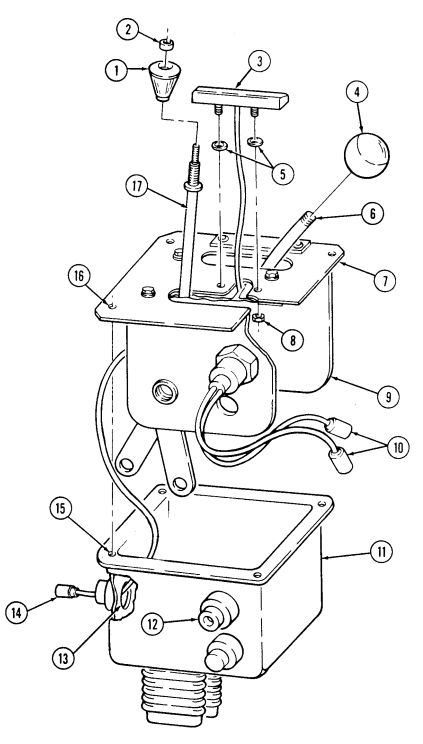

## Chapter 5 Transmission And Transfer Case Maintenance

| Chapter 5  |  Transmission And Transfer Case Maintenance TASK SUMMARY 
|------------|-------------------------------
| TASK       | PROCEDURES
| [5-1 ](#5-1)          | 
| [5-2 ](#5-2)          | 
| [5-3 ](#5-3)          | 
| [5-4 ](#5-4)          | 
| [5-5 ](#5-5)          | 
| [5-6 ](#5-6)          | 
| [5-7 ](#5-7)          | 
| [5-8 ](#5-8)          | 
| [5-9 ](#5-9)          | 
| [5-10](#5-10)         | 
| [5-11](#5-11)         | 
| [5-12](#5-12)         | 
| [5-13](#5-13)         | 
| [5-14](#5-14)         | 
| [5-15](#5-15)         | 
| [5-16](#5-16)         | 
| [5-17](#5-17)         | 
| [5-18](#5-18)         | 
| [5-19](#5-19)         | 
| [5-20](#5-20)         | 
| [5-21](#5-21)         | 
| [5-22](#5-22)         | 
| [5-23](#5-23)         | 
| [5-24](#5-24)         | 
| [5-25](#5-25)         | 
| [5-26](#5-26)         | 
| [5-27](#5-27)         | 
| [5-28](#5-28)         | 
| [5-29](#5-29)         | 
| [5-30](#5-30)         | 
| [5-31](#5-31)         | 
| [5-32](#5-32)         | 
| [5-33](#5-33)         | 
| [5-34](#5-34)         | 
| [5-35](#5-35)         | 
| [5-36](#5-36)         | 
| [5-37](#5-37)         | 
| [5-38](#5-38)         | 
| [5-39](#5-39)         | 
| [5-40](#5-40)         | 
| [5-41](#5-41)         | 
| [5-42](#5-42)         | 
| [5-43](#5-43)         | 
| [5-44](#5-44)         | 
| [5-45](#5-45)         | 
| [5-46](#5-46)         | 
| [5-47](#5-47)         | 
| [5-48](#5-48)         | 
| [5-49](#5-49)         | 
| [5-50](#5-50)         | 
| [5-51](#5-51)         | 
| [5-52](#5-52)         | 
| [5-53](#5-53)         | 
| [5-54](#5-54)         | 
| [5-55](#5-55)         | 
| [5-56](#5-56)         | 
| [5-57](#5-57)         | 
| [5-58](#5-58)         | 
| [5-59](#5-59)         | 
| [5-60](#5-60)         | 
| [5-61](#5-61)         | 
| [5-62](#5-62)         | 
| [5-63](#5-63)         | 
| [5-64](#5-64)         | 
| [5-65](#5-65)         | 
| [5-66](#5-66)         | 
| [5-67](#5-67)         | 
| [5-68](#5-68)         | 
| [5-69](#5-69)         | 
| [5-70](#5-70)         | 
| [5-71](#5-71)         | 
| [5-72](#5-72)         | 
| [5-73](#5-73)         | 
| [5-74](#5-74)         | 
| [5-75](#5-75)         | 
| [5-76](#5-76)         | 
| [5-77](#5-77)         | 
| [5-78](#5-78)         | 
| [5-79](#5-79)         | 
| [5-80](#5-80)         | 
| [5-81](#5-81)         | 
| [5-82](#5-82)         | 
| [5-83](#5-83)         | 
| [5-84](#5-84)         | 
| [5-85](#5-85)         | 
| [5-86](#5-86)         | 
| [5-87](#5-87)         | 
| [5-88](#5-88)         | 
| [5-89](#5-89)         | 
| [5-90](#5-90)         | 
| [5-91](#5-91)         | 
| [5-92](#5-92)         | 
| [5-93](#5-93)         | 
| [5-94](#5-94)         | 
| [5-95](#5-95)         | 
| [5-96](#5-96)         | 
| [5-97](#5-97)         | 
| [5-98](#5-98)         | 
| [5-99](#5-99)         | 
| [5-100](5-100)       | 
| [5-101](5-101)       | 
| [5-102](5-102)       | 
| [5-103](5-103)       | 
| [5-104](5-104)       | 
| [5-105](5-105)       | 
| [5-106](5-106)       | 
| [5-107](5-107)       | 
| [5-108](5-108)       | 
| [5-109](5-109)       | 
| [5-110](5-110)       | 
| [5-111](5-111)       | 
| [5-112](5-112)       | 
| [5-113](5-113)       | 
| [5-114](5-114)       | 
| [5-115](5-115)       | 
| [5-116](5-116)       | 
| [5-117](5-117)       | 
| [5-118](5-118)       | 
| [5-119](5-119)       | 
| [5-120](5-120)       | 
| [5-121](5-121)       | 
| [5-122](5-122)       | 
| [5-123](5-123)       | 
| [5-124](5-124)       | 
| [5-125](5-125)       | 
| [5-126](5-126)       | 
| [5-127](5-127)       | 
| [5-128](5-128)       | 
| [5-129](5-129)       | 

### Section I. Transmission Maintenance 
### 5-1. Transmission Maintenance Task Summary

| Equipment Condition  Tools                                                                               |
|----------------------------------------------------------------------------------------------------------|
| Battery ground cable disconnected (para. 4\-73) General mechanic's tool kit:                             |
| (receptacle only).  automotive (Appendix B, Item 1)                                                      |
| 1. Turn and pull plug (4) from receptacle (3).                                                           |
| 2. Remove two screws (5) from plug (4). Open plug (4) and ensure positive (10), negative (12), and       |
| ground (11) leads for plug (4) are properly installed.                                                   |
| b. Plug Installation                                                                                     |
| 1. Close plug (4) and install two screws (5) on plug (4).                                                |
| 2.  Insert plug (4) on receptacle (3).                                                                   |
| c. Receptacle Removal                                                                                    |
| For instructions on replacement of rivets, refer to para. 10\-66.                                        |
| 1. Remove two rivets (6) and receptacle (3) from control box (1). Pull receptacle (3) away for access to |
| leads (2).                                                                                               |
| > Note                                                                                                    |
| Prior to removal, tag leads for installation.                                                            |
| 2.  Loosen screw (8) and push shield (9) away for access to leads (2).                                   |
| 3. Remove two screws (7), and leads (2) from receptacle (3).                                             |
| d. Receptacle Installation                                                                               |
| 1. Install two leads (2) on receptacle (3) with two screws (7). Position shield (9) over screws (7) and  |
| tighten screw (8).                                                                                       |
| 2.  Install receptacle (3) on control box (1) with two rivets (6).                                       |
| a. Plug Removal   Note                                                                                   |

## 5-2. Transmission Service

This task covers:
b. Transmission Filter Removal **d. Replenishing Fluid**

#### Initial Setup: Tools

General mechanic's tool kit:
automotive (Appendix B, Item 1)

#### Materials/Parts

a. Draining Fluid c. Transmission Filter Installation

#### Manual References

TM 9-2320-280-10 TM 9-2320-280-24P
General Safety Instructions Drycleaning solvent is flammable and will not be used near an open flame.

Nonmetallic round seal (Appendix G, Item 286) Filter assembly (Appendix G, Item 31) (3L80) Gasket (Appendix G, Item 48) (3L80)
Filter element kit (Appendix G, Item 33) (4L80-E)
Gasket (Appendix G, Item 58) (4L80-E) Two locknuts (Appendix G, Item 103) Transmission fluid (Appendix C, Item 26 or 27) Drycleaning solvent (Appendix C, Item 18)

#### A. Draining Fluid Note

- Transmission service for the 3L80 and 4L80-E transmissions is basically the same. Differences are noted.

- Do not shift through driving gear ranges when warming transmission fluid for removal. Shifting through driving gear ranges is a procedure used only when refilling transmission fluid.

- Transmission should be warm when draining fluid. - Have drainage container ready to catch fluid.

1. Remove drainplug (1) and gasket (2) from oil pan (3). Allow fluid to drain.

Inspect fluid for grit, foaminess, and/or milkiness. If present, notify DS maintenance.

2. Install gasket (2) and drainplug (1) in oil pan (3) and tighten drain plug (1) to 20 lb-ft (27 N•m).

b. Transmission Filter Removal

Perform steps 1 through 5 for 3L80 transmissions only.

1. Remove thirteen capscrews (6), oil pan (3), and gasket (5) from transmission (4). Discard gasket (5). 2. Clean gasket (5) material from transmission (4) and oil pan (3) mating surfaces. 3. Remove capscrew (11), oil filter (10), and spacer (9) from transmission (4). 4. Pull suction tube (8) from oil filter (10) and remove seal (7). Discard seal (7).

Drycleaning solvent is flammable and will not be used near an open flame. A fire extinguisher will be kept nearby when the solvent is used. Use only in well ventilated places. Failure to do this may result in injury to personnel and/or damage equipment.

5. Clean suction tube (8) and oil pan (3) thoroughly with drycleaning solvent.

5-2 Change 3

5-2. TRANSMISSION SERVICE (Cont'd)

# 5-2. Transmission Service (Cont'D)

Perform steps 6 through 9 for 4L80-E transmissions only.

Transfer case must be supported during removal and installation of crossmember for access to oil pan capscrew and to prevent damage to equipment.

6. Place support under transfer case and remove two locknuts (3), washers (2), capscrews (6), and crossmember (4) from support brackets (1) and (5). Discard locknuts (3). 

Oil pan gasket is reusable. Discard only if damaged.

7. Remove seventeen capscrews (12), oil pan (11), and gasket (10) from transmission (7). 8. Remove magnet (9) from oil pan (11). Remove filter (8) from transmission (7).

Drycleaning solvent is flammable and will not be used near an open flame. A fire extinguisher will be kept nearby when the solvent is used Use only in well-ventilated places. Failure to do this may result in injury to personnel and/or damage to equipment.

9. Clean oil pan (11) thoroughly with drycleaning solvent.

c. Transmission Filter Installation

Perform steps 1 through 4 for 4L80-E transmissions only. 

1. Install filter (8) in transmission (7). Install magnet (9) in oil pan (11). 2. Install gasket (10) and oil pan (11) on transmission (7) with seventeen capscrews (12). Tighten capscrews (12) to 18 lb-ft (24 N•m).

3. Install crossmember (4) on support brackets (1) and (5) with two capscrews (6), washers (2), and locknuts (3). Tighten locknuts (3) to 90 lb-ft (122 N•m).

4. Remove support from transfer case.

# 5-2. Transmission Service (Cont'D)

# 5-2. Transmission Service (Cont'D)

Perform steps 5 through 9 for 3L80 transmissions only.

5. Insert end of suction tube (3) marked "filter'' into oil filter (5). 6. Install seal (7) onto upper end of suction tube (3) marked "case'' and slide downward. 7. Position oil filter (5) on transmission (1) inserting suction tube (3) into oil input port (2). 8. Install oil filter (5) and spacer (4) on transmission (1) with capscrew (6). Tighten capscrew (6) 
to 10-15 lb-ft (14-20 N•m).

9. Install gasket (8) and oil pan (9) on transmission (1) with thirteen capscrews (10). Tighten capscrews (10) to 12 lb-ft (16 N•m).

5-2. TRANSMISSION SERVICE (Cont'd)

#### D. Replenishing Fluid

1. Remove transmission oil dipstick (12) from dipstick tube (11).

2. Check transmission fluid and fill to proper level (TM 9-2320-280-10). 3. Install transmission oil dipstick (12) in dipstick tube (11).

FOLLOW-ON TASK: Operate vehicle (TM 9-2320-280-10) and check for leaks.

# 5-3. Transmission Oil Cooler Lines Replacement

This task covers:
INITIAL SETUP:

#### Tools

General mechanic's tool kit:
automotive (Appendix B, Item 1)
Materials/Parts Four locknuts (Appendix G, Item 70) Locknut (Appendix G, Item 99)
Manual References TM 9-2320-280-10 TM 9-2320-280-24P

a. Removal b. Installation

Equipment Condition
- Right splash shield removed (oil cooler lines to oil cooler only) (para. 10-20).

- Left splash shield access cover removed
(para. 10-18).

General Safety Instructions Allow transmission to cool before performing this task.

Allow transmission to cool before performing this task. Severe injury to personnel may result.

- Removal and installation procedures are the same for all lines, regardless of function, size or location. All oil cooler ports should be plugged to prevent contamination. Remove plugs prior to connection.

- Left splash shield can be modified to add engine access cover. Refer to appendix D, Fig. D-86 and D-87 for installation.

#### A. Removal

1. Remove retaining clamps (3) from cooler lines (4). 2. Loosen hose clamps (1) on rubber hoses (2) and cooler lines (4). 3. Loosen hose clamps (5) on cooler lines (4).

Have drainage container ready to catch fluid.

4. Disconnect cooler lines (4) at each end and allow to drain.

Perform step 5 for M997A2, M1025A2, M1035A2, M1043A2, M1045A2, M1097A2, and M1123 vehicles only.

5. Disconnect two cooler lines (4) from by-pass valve (6).

NOTE
Perform steps 6 and 7 to allow access only if removing oil cooler lines from oil cooler.

6. Remove four locknuts (9), washers (10), and capscrews (11) from radiator supports (7) and airlift brackets (8). Discard locknuts (9).

7. Remove locknut (12), washer (13), capscrew (17), washer (13), large washer (16), and mount (15) from radiator (14) and front mounting bracket (18). Discard locknut (12).

8. Remove cooler lines (4) and rubber hoses (2) from vehicle.

# 5-3. Transmission Oil Cooler Lines Replacement (Corítl)

## 5 - 3 . Transmission Oil Cooler Lines Replacement (Cont' D )

b. Installation 1. Position rubber hoses (2) and cooler lines (4) in proper position.

Perform step 3 for M997A2, M1025A2, M1035A2, M1043A2, M1045A2, M1097A2, and M1123 vehicles only.

2. Connect two cooler lines (4) to by-pass valve (6) and hoses (2). 3. Tighten hose clamps (1) on rubber hoses (2) to cooler lines (4). 4. Tighten hose clamps (5) on cooler lines (4).

Perform steps 5 and 6 only if installing oil cooler lines to oil cooler.

5. Install radiator (9) to front mounting bracket (13) with mount (10), large washer (11), washer (8),
capscrew (12), washer (8), and locknut (7). Tighten capscrew (12) to 30 lb-ft (41 N•m).

6. Install radiator supports (14) to airlift brackets (15) with four capscrews (18), washers (17), and

locknuts (16). Tighten locknuts (16) to 31 lb-ft (42 N•m).

7. Install retaining clamps (3) on cooler lines (4).

# 5-3. Transmission Oil Cooler Lines Replacement (Corítb)

FOLLOW-ON TASKS:  - Fill transmission to proper level (TM 9-2320-280-10).

- Start engine (TM 9-2320-280-10) and check for leaks.

- Install right splash shield, if removed (para 10-20).

· Install left splash shield access cover, if removed (para. 10-18).

# 5 - 4 . Transmission Bypass Va Lve Replacement

This task covers:

a. Removal b. Installation

INITIAL SETUP:
Applicable Models M997A2, M1025A2, M1035A2, M1043A2, M1045A2, M1097A2, M1123

| Manual References                                  |
|----------------------------------------------------|
| TM 9\-2320\-280\-10                                |
| TM 9\-2320\-280\-24P                               |
| Equipment Condition                                |
| - Battery ground cable disconnected (para. 4\-73). |

Tools General mechanic's tool kit:
automotive (Appendix B, Item 1)

Allow transmission to cool before performing this task. Severe injury to personnel may result.

Cover or plug all open lines and connections immediately after disconnection to prevent contamination. Remove all plugs prior to connection.

a. Removal 1. Loosen hose clamps (1) and (8) on rubber hoses (2) and (9).

Have drainage container ready to catch fluid.

2. Disconnect rubber hoses (2) and (9) from bypass valve (3). 3 . Remove nut (7), washer (5), capscrew (4), washer (5), and bypass valve (3) from transmission crossmember (6).

#### B. Installation

1. Install bypass valve (3) on transmission crossmember (6) with washer (5), capscrew (4), washer (5),
and nut (7). Tighten nut (7) to 28 lb-ft (38 N•m).

2. Connect hoses (2) and (9) to bypass valve (3) and tighten clamps (1) and (8).

## 5-4. Transmission Bypass Valve Replacement (Cont'D)

FOLLOW-ON TASKS:  - Fill transmission to proper level (TM 9-2320-280-10).

- Start engine (TM 9-2320-280-10) and check for leaks.

- …

# 5-5. Transmission Oil Dipstick Tube Replacement

This task covers:
INITIAL SETUP:
Tools General mechanic's tool kit:
automotive (Appendix B, Item 1)

#### A. Removal **B. Installation**

Manual References TM 9-2320-280-10 TM 9-2320-280-24P
Materials/Parts Packing (3L80) (Appendix G, Item 224)
Seal (4L80-E) (Appendix G, Item 288)
Equipment Condition
- Hood raised and secured (TM 9-2320-280-10). - Right exhaust manifold rear heat shield removed
(para. 3-54).

- Plug open transmission port to prevent contamination. Remove plug prior to installation of oil dipstick tube.

- Have drainage container ready to catch fluid.

#### A. Removal

1. Remove transmission oil dipstick (2) from dipstick tube (1). 2. Remove capscrew (7) from dipstick tube (1) and cylinder head (3). 3. Remove dipstick tube (1) from transmission (4). 4. Remove packing (6) from dipstick tube (1). Discard packing (6).

b. Installation 1. Install packing (6) on dipstick tube (1). 2. Push dipstick tube (1) into opening (5) in transmission (4).

3. Install dipstick tube (1) on cylinder head (3) with capscrew (7). Tighten capscrew (7) 
to 25-37 lb-ft (34-50 N•m).

4. Install transmission oil dipstick (2) into dipstick tube (1).

# 5-5. Transmission Oil Dipstick Tube Replacement (Cont'D)

FOLLOW-ON TASKS: Install right exhaust manifold rear heat shield (para. 3-54).

Fill transmission to proper level (TM 9-2320-280-10).

Lower and secure hood (TM 9-2320-280-10).

Start engine (TM 9-2320-280-10) and check for leaks.

# 5-6. Neutral Start Switch Replacement

This task covers:
INITIAL SETUP:

#### Tools

General mechanic's tool kit:
automotive (Appendix B, Item 1)

a. Removal **b. Installation**

| Manual References   |
|---------------------|

TM 9-2320-280-10 TM 9-2320-280-24P
Materials/Parts Tiedown strap (Appendix G, Item 305) Sealing compound (Appendix C, Item 44)
Equipment Conditioin Shift controls housing removed (para. 5-7 or 5-10).

a. Removal

- Prior to removal, tag leads for installation. - Perform steps 3 through 5 for M997A2, M1025A2, M1035A2, M1043A2, M1045A2, M1097A2, and M1123 vehicles only. Perform steps 1 and 2 for all other vehicles.

1. Remove rubber boot (4) from shift control housing assembly (1). 2. Remove neutral start switch (2) from shift control housing assembly (1). 3. Remove boot (10) from shift controls housing (6). 4. Remove two screws (8) and neutral start switch (7) from housing (6). 5. Remove tiedown strap (11) and neutral start switch leads (9) from backup light switch leads (12).

Discard tiedown strap (11).

b. Installation

Perform steps 1 through 3 for M997A2, M1025A2, M1035A2, M1043A2, M1045A2, M1097A2, and M1123 vehicles only. Perform steps 4 and 5 for all other vehicles.

1. Install neutral start switch (7) on shift control housing (6) with two screws (8). 2. Install neutral start switch leads (9) on backup light switch leads (12) with tiedown strap (11). 3. Position neutral start switch leads (9), backup light switch leads (12), and light lead (13) through boot (10), and install boot (10) on housing (6).

4. Apply sealing compound to threads of neutral switch (2), install neutral switch into shift control housing assembly (1). Tighten neutral start switch (2) to 27-30 lb-ft (37-42 N•m).

5. Install leads from neutral start switch (2) and shift selector indicator lead (5) through nipples (3) on rubber boot (4) and install rubber boot (4) on shift control housing assembly (1).

# 5-6.  Neutral Start Switch Replacement (Cont'D)

FOLLOW-ON TASKS: - Install shift controls housing (para. 5-7 or 5-10).

· Check neutral start switch for proper operation (TM 9-2320-280-10).

# 5-7. Shift Controls Housing Assembly (Sf-5583581) Replacement

This task covers:

a. Removal b. Installation

| 5\-1.   | TRANSMISSION MAINTENANCE TASK SUMMARY     |       |
|---------|-------------------------------------------|-------|
| TASK    |                                           | PAGE  |
| PARA.   | PROCEDURES                                | NO.   |
| 5\-2.   | Transmission Service                      | 5\-2  |
| 5\-3.   | Transmission Oil Cooler Lines Replacement | 5\-8  |
| 5\-4.   | Transmission Bypass Valve Replacement     | 5\-12 |
| 5\-5.   | Transmission Oil Dipstick Tube            | 5\-14 |

a. Removal

If shift controls housing assembly is to be reinstalled, tape trunnions to shift rod to prevent loss of adjustment. Transfer case shift rod trunnion is removed from shift rod only if damaged or shift rods are replaced.

1. Remove cotter pin (5), washer (6), trunnion (9), and rub strip (8) from transmission shift lever arm (10). Discard cotter pin (5).

2. Remove cotter pin (2), washer (3), trunnion (4), and rub strip (7) from transfer case shift arm (1). Discard cotter pin (2).

Tag leads for installation.

3. Disconnect two body harness leads 14A/14B (14) from neutral start switch leads 14 (19). 4. Disconnect body harness lead (17) from shift selector indicator lead 17J (18). 5. Remove four locknuts (15), washers (16), capscrews (20), and shift controls housing assembly (12)
from body (13). Discard locknuts (15).

#### B. Installation

1. Position shift controls housing assembly (12) in body (13) with transmission lever (11) on right, and install with four capscrews (20), washers (16), and locknuts (15). Tighten locknuts (15) to 6 lb-ft (8 N•m).

2. Connect two body harness leads 14A/14B (14) to neutral start switch leads 14 (19). 3. Connect body harness lead (17) to shift selector indicator lead 17J (18). 4. Install rub strip (7) and trunnion (4) on transfer case shift arm (1) with washer (3) and cotter pin
(2).

5. Install rub strip (8) and trunnion (9) on transmission shift lever arm (10) with washer (6) and cotter pin (5).

5-7.  SHIFT CONTROLS HOUSING ASSEMBLY (SF-5583581)  REPLACEMENT (Conrd)
FOLLOW-ON TASKS: - • Connect battery ground cables (para. 4-73).
- • - • - • - • - • Start engine (TM 9-2320-280-10), check shift controls for proper operation, and adjust as needed (paras. 5-12 and 5-23).

# 5 - 8 . Shift Controls Housing Assembly (Sf-5583581) Maintenance

This task covers:
INITIAL SETUP:

a. Disassembly b. Assembly

Applicable Models All vehicles except: M997A2, M1025A2, M1035A2, M1043A2, M1045A2, M1097A2, M1123

| Equipment Condition   |
|-----------------------|

Equipment Condition Shift controls housing assembly removed (para. 5-7).

#### Tools

General mechanic's tool kit:
automotive (Appendix B, Item 1)

#### A. Disassembly

1. Remove knob (4) from transfer shift tube (6). 2. Remove button (2) from transmission shift knob (1). 3. Remove knob (1) from transmission shift tube (17). 4. Remove neutral start switch leads (10) from openings (12) in boot (11). 5. Slide rubber boot (11) off shift controls housing assembly (9). 6. Remove two nuts (8), washers (5), and shift selector indicator (3) from bezel (7).

#### B. Assembly

5. Install knob (1) on transmission shift tube (17).

1. Install shift selector indicator (3) and two washers (5) on bezel (7) with two nuts (8). 2. Install rubber boot (11) on shift controls housing assembly (9), placing neutral start switch leads (10)
through openings (12) in boot (11).

3. Place shift indicator lead (14) through opening (13) in boot (11). 4 . Slide rubber boot (11) onto shift controls housing assembly (9). Ensure that mounting screw holes (16)
in shift control housing assembly (9) align with holes (15) in boot (11 ) .

6. Install button (2) on transmission shift knob (1). 7. Install knob (4) on transfer shift tube (6).

# 5-8. Shift Controls Housing Assembly (Sf-5583581) Maintenance (Cont'D)

FOLLOW-ON TASK: Install shift control housing assembly (para. 5-7).

# 5-9. Shift Controls Housing Assembly (Sf-5583581) Repair

This task covers:

a. Disassembly c. Inspection b. Cleaning d. Assembly

#### Initial Setup:

Applicable Models All vehicles except: M997A2, M1025A2, M1035A2, M1043A2, M1045A2, M1097A2 Tools General mechanic's tool kit:
automotive (Appendix B, Item 1)
Materials/Parts Spring pin (Appendix G, Item 299) Retaining ring (Appendix G, Item 232)

| TM 9\-2320\-280\-24P        |
|-----------------------------|
| General Safety Instructions |

| TM 9\-2320\-280\-24P                         |
|----------------------------------------------|
| Equipment Condition                          |
| Shift controls housing assembly disassembled |
| (para. 5\-8).                                |

Manual References

#### A. Disassembly

1. Remove retaining ring (12) from shift control shaft (23) and shift controls housing (7). Discard retaining ring (12). 2. Remove spring pin (16) from spring retaining collar (15) and shift control shaft (23). Discard spring pin (16). 3. Remove shift control shaft (23), spring retaining collar (15), and shift control compression spring (17)
from shift controls housing (7).

4. Remove transfer shift lever (10) by sliding down and out from shift controls housing (7). 5. Remove two nylon flanged bearings (13) from transfer shift lever arm (14). 6. Remove spring pin (11) from transfer shift lever arm (14) and remove transfer shift lever (10) from transfer shift lever arm (14).

7. Remove transmission shift tube (28) by sliding down and out from shift controls housing (7).

Note position of transmission shift lever for installation.

8. Remove four nuts (26), washers (27), capscrews (18), washers (19), transmission shift tube (28), shift lever latch spring (24), and transmission shift lever (20) from bracket and shaft assembly (21).

9. Remove nylon flanged bearing (22) from bracket and shaft assembly (21).

10. Remove shift lever latch rod (25) by sliding out from transmission shift tube (28). 11. Remove three locknuts (9), washers (8), capscrews (2), washers (3), and bezel (1) from wiper (5) and shift controls housing (7). Discard three locknuts (9).

12. Remove three washers (4) and wiper (5) from shift controls housing (7). 13. Remove bearing (6) from shift controls housing (7).

b. Cleaning 1. Clean all shift control housing assembly parts in accordance with para. 2-10.

5-9. SHIFT CONTROLS HOUSING ASSEMBLY (SF-5583581) REPAIR (Cont'd)

# 5-9. Shift Controls Housing Assembly (Sf-5583581) Repair (Cont'D)

c. Inspection 1. Inspect shift controls housing (7) for damage. Replace shift controls housing assembly if damaged. 2. Inspect transmission shift tube (28), bracket and shaft assembly (21), transmission shift lever (20),
bezel (1), and shift lever latch rod (25) for damage. Replace if damaged.

3. Inspect wiper (5) for tears. Replace if torn. 4. Inspect shift lever latch spring (24) and shift control compression spring (17) for distortion or damage. Replace if distorted or damaged.

5. Inspect nylon flanged bearings (22) and (13) for damage. Replace if damaged. 6. Inspect shift control shaft (23), spring retaining collar (15) and shift lever (14) for damage. Replace if damaged.

d. Assembly 1. Install bearing (6) in shift controls housing (7). 2. Apply thin coat of adhesive between shift controls housing assembly (7) and wiper (5). 3. Position wiper (5) and three washers (4) on shift controls housing (7). 4. Install bezel (1) on shift controls housing (7) with three washers (3), capscrews (2), washers (8), 
and locknuts (9).

5. Install shift lever latch rod (25) by pushing up into transmission shift tube (28). 6. Position transmission shift lever (20), shift lever latch spring (24), and transmission shift tube (28)
to bracket and shaft assembly (21) and secure with four washers (19), capscrews (18), washers (27), and nuts (26).

7. Install transmission shift tube (28) by pushing up through shift controls housing (7) and install nylon flanged bearing (22) into bracket and shaft assembly (21).

8. Install transfer shift lever (10) in transfer shift lever arm (14) with spring pin (11). 9. Install transfer shift lever (10) by pushing up through shift controls housing (7) and install two nylon flanged bearings (13) in transfer shift lever arm (14).

10. Position shift control compression spring (17) and spring retaining collar (15) into shift controls housing (7).

11. Install shift control shaft (23) through shift controls housing (7), bracket and shaft assembly (21),
com-pression spring (17), spring retaining collar (15), transfer shift lever arm (14), and out of shift controls housing (7).

12. Secure shift control shaft (23) in shift controls housing (7) with retaining ring (12). 13. Secure spring retaining collar (15) on shift control shaft (23) with spring pin (16).

5-9. SHIFT CONTROLS HOUSING ASSEMBLY (SF-5583581) REPAIR (Cont'd)
FOLLOW-ON TASK: Assemble shift controls housing assembly (para 5-8).

# 5-10. Shift Controls Housing Assembly (12460111/12460112) Replacement (4L80-E)

This task covers:
INITIAL SETUP:
Applicable Models M997A2, M1025A2, M1035A2, M1043A2, M1045A2, M1097A2, M1123 Tools General mechanic's tool kit:
automotive (Appendix B, Item 1)
Materials/Parts Two cotter pins (Appendix G, Item 12) Four locknuts (Appendix G, Item 70)
a. Removal a. Removal b. Installation Manual References TM 9-2320-280-10 TM 9-2320-280-24P
Personnel Required One mechanic One assistant Equipment Condition Battery ground cable disconnected (para. 4-73).

If shift controls housing assembly is to be reinstalled, tape trunnions to shift rods to prevent loss of adjustment. Shift rod trunnions are removed from shift rods only if damaged or shift rods are replaced.

1. Remove cotter pin (5), washer (6), trunnion (7), and rub strip (6.1) from transmission shift lever arm (8). Discard cotter pin (5).

2. Remove cotter pin (2), washer (3), trunnion (4), and rub strip (3.1) from transfer case shift arm (1). Discard cotter pin (2).

- Tag leads for installation. - Perform step 3 for M997A2 and M1035A2 only.

3. Disconnect two body harness leads (12) from backup light switch leads (11). 4. Disconnect two body harness leads 14A/14B (14) from neutral start switch leads 14 (19). 5. Disconnect body harness lead (17) from shift selector indicator lead 17J (18). 6. Remove four locknuts (15), washers (16), capscrews (9), and shift controls housing assembly (10) from body (13). Discard locknuts (15).

7. Slide boot (20) off shift controls housing assembly (10).

#### B. Installation

1. Slide boot (20) onto shift controls housing assembly (10). 2. Position shift controls housing assembly (10) in body (13) with transmission lever on right and install with four capscrews (9), washers (16), and locknuts (15). Tighten locknuts (15) to 6 lb-ft (8 N•m).

NOTE
Perform step 3 for M997A2 and M1035A2 only.

3. Connect two body harness leads (12) to backup light switch leads (11). 4. Connect two body harness leads 14A/14B (14) to neutral start switch leads 14 (19). 5. Connect body harness lead (17) to shift selector indicator lead 17J (18). 6. Install rub strip (3.1) and trunnion (4) on transfer case shift arm (1) with washer (3) and cotter pin (2).

7. Install rub strip (6.1) and trunnion (7) on transmission shift lever arm (8) with washer (6) and cotter pin (5).

5-10. SHIFT CONTROLS HOUSING ASSEMBLY (12460111/12460112) REPLACEMENT
(4L80-E) (Cont'd)

FOLLOW-ON-TASKS: - Connect battery ground cable (para. 4-73).

-  Start engine (TM 9-2320-280-10), check shift controls for proper operation, and adjust as needed (paras. 5-13 and 5-23).

# 5-11. Shift Controls Housing Assembly (12460111/12460112) Maintenance

This task covers:
INITIAL SETUP:

| Tools                                  | Manual References                                     |
|----------------------------------------|-------------------------------------------------------|
| General mechanic's tool kit:           | TM 9\-2320\-280\-10                                   |
| automotive (Appendix B, Item 1)        | TM 9\-2320\-280\-24P                                  |
| Materials/Parts                        | Equipment Conditioin                                  |
| Tiedown strap (Appendix G, Item 305)   | Shift controls housing removed (para. 5\-7 or 5\-10). |
| Sealing compound (Appendix C, Item 44) |                                                       |
| a. Removal                             |                                                       |

a. Disassembly b. Assembly

#### A. Disassembly

1. Remove pin (4) and knob (3) from transfer case shift tube (2). 2. Remove pin (6) and knob (5) from transmission shift tube (7). 3. Remove neutral start and backup switch leads (10) and (12) from openings in boot (8). 4. Remove shift indicator lead (11) from opening in boot (8). 5. Slide boot (8) off shift controls housing assembly (13). 6. Remove two transmission selector lens covers (1). 7. Remove two fiber optic indicator strips (19) from bulbs (18). 8. Remove two bulbs (18) from sockets (17). 9. Remove four screws (16), cover plate (15), and gasket (14) from shift controls housing assembly (13).

10. Remove tiedown strap (9) from leads (10), (12), and (11). Discard strap (9).

b. Assembly 1. Install gasket (14) and cover plate (15) on shift controls housing assembly (13) with four screws (16). 2. Install two bulbs (18) in sockets (17). 3. Install two fiber optic indicator strips (19) on bulbs (18). 4. Install two transmission selector lens covers (1).

4.1. Apply heat shrink to transmission shift lever arm (12.1) and transfer shift arm (12.2) if not already installed.

5. Install boot (8) on shift controls housing assembly (13), placing neutral start, backup light switch, and shift indicator leads (10), (12), and (11) through openings in boot (8).

6. Complete sliding boot (8) onto shift controls housing assembly (13), ensuring mounting screw holes align. 7. Install knob (5) on transmission shift tube (7) with pin (6). 8. Install knob (3) on transfer case shift tube (2) with pin (4). 9. Install tiedown strap (9) on leads (10), (11), and (12).

5-11. SHIFT CONTROLS HOUSING ASSEMBLY (12460111/12460112) MAINTENANCEConr'd)

FOLLOW-ON TASK: Install shift control housing assembly (para. 5-10).

# 5-12. Transmission Shift Rod Maintenance (3L80)

This task covers:

a. Removal c. Adjustment b. Installation

#### Initial Setup:

Applicable Models All vehicles except: M997A2, M1025A2, M1035A2, M1043A2, M1045A2, M1097A2, M1123 Tools General mechanic's tool kit:
automotive (Appendix B, Item 1)

#### A. Removal B. Installation

c. Adjustment

If the manual control linkage arm is not in the proper detent for each transmission selector lever position, transmission will be damaged.

1. Place transmission shift lever arm (7) to "N'' (neutral) position. 2. Remove cotter pin (9) and washer (8) from shift rod trunnion (6) and shift lever arm (7). Discard cotter pin (9).

3. Remove cotter pin (1) and washer (2) from shift rod trunnion (4) and transmission selector lever (3)
and disconnect shift rod (5). Discard cotter pin (1).

4. Remove shift rod trunnion (6) from shift rod (5).

1. Install shift rod trunnion (6) to shift rod (5). 2. Connect shift rod trunnion (4) to transmission selector lever (3) with washer (2) and cotter pin (1). 3. Adjust shift rod (para. c).

1. Move shifter (10) into "1'' position and ensure transmission selector lever (3) is in the forward position, "1''.

2. Turn shift rod trunnion (6) so that it slips easily into hole in the shift lever arm (7). 3. Secure shift rod (5) and trunnion (6) to shift lever arm (7) with washer (8) and cotter pin (9).

#### Materials/Parts

Two cotter pins (Appendix G, Item 12)
Manual References TM 9-2320-280-10 TM 9-2320-280-24P

# 5-12. Transmission Shift Rod Maintenance (3L80) Cont'D)

FOLLOW-ON  TASK:  Operate vehicle (TM 9-2320-280-10) and test transmission shift lever for
 

# 5-13. Transmission Shift Rod Maintenance (4L80-E)

This task covers:
a. Removal c. Adjustment b. Installation INITIAL SETUP:
Applicable Models M997A2, M1025A2, M1035A2, M1043A2, M1045A2, M1097A2 Tools General mechanic's tool kit:
automotive (Appendix B, Item 1)
Materials/Parts Four cotter pins (Appendix G, Item 12)

| Equipment Condition   |
|-----------------------|

a. Removal 2. Remove cotter pin (5), washer (6), and trunnion (3) from shift arm (4). Discard cotter pin (5). 3. Remove cotter pin (13) and washer (12) from rear trunnion (9). Remove trunnion (9) and shift rod
(8) from relay lever (11). Discard cotter pin (13).

Mark positions of trunnions on shift rod for installation.

4. Remove cotter pins (2) and (10) and trunnion (9) from shift rod (8). Discard cotter pins (2) and (10).

b. Installation 1. Install trunnion (9) on shift rod (8) on position marked with cotter pins (2) and (10). 2. Install trunnion (9) on relay lever (11) with washer (12) and cotter pin (13). Do not spread cotter pin (13). 3. Install trunnion (3) on shift arm (4) with washer (6) and cotter pin (5). Do not spread cotter pin (5). 4. Check shift rod (8) adjustment (para. c).

c. Adjustment

If the manual control linkage is not in proper detent for selector lever position, transmission will be damaged.

Proper adjustment makes end of shift rod movement parallel to relay lever movement.

1. Move shifter (7) to "1" position and ensure lever (1) is in forward detent position "1" or LOW. If not, remove cotter pin (5) and washer (6). Turn trunnion (3) until trunnion (3) aligns with shift arm (4).

2. To align shift rod (8), turn trunnion (3) in one direction and trunnion (9) same amount in opposite direction.

3. When adjustment is correct spread both cotter pins (5) and (13).

1. Place transmission shift lever (7) in neutral.

# 5-13. Transmission Shift Rod Maintenance (4L80-E) (Cont'D)

FOLLOW-ON TASK:
 Operate vehicle (TM 9-2320-280-10) and test transmission shift lever for proper operation.

# 5-14. Modulator Assembly Replacement (3L80)

This task covers:

#### Initial Setup:

Applicable Models All vehicles except: M997A2, M1025A2, M1035A2, M1043A2, M1045A2, M1097A2 Tools General mechanic's tool kit:
automotive (Appendix B, Item 1)

#### Materials/Parts

Packing retainer (Appendix G, Item 230)
Manual References TM 9-2320-280-10 TM 9-2320-280-24P
a. Removal **b. Installation**
Equipment Condition
- Hood raised and secured (TM 9-2320-280-10). - Engine access cover removed (para. 10-15).

General Safety Instructions Allow transmission to cool before performing this task.

a. Removal

Allow transmission to cool before performing this task. Failure to do this may cause injury.

1. Pull off cable clip (6) from modulator control rod head (3). 2. Loosen mounting nuts (8) and (4) on cable bracket (1) and remove cable (7) and washer (5) from bracket (1).

3. Underneath vehicle, remove capscrew (11) and modulator retaining clip (12) from transmission (13).

Have drainage container ready to catch fluid.

4. Remove modulator (10) and packing retainer (14) from transmission (13). Discard packing retainer (14).

b. Installation 1. Install packing retainer (14) on modulator (10) and install modulator (10) in transmission (13). 2. Install modulator retaining clip (12) on transmission (13) with capscrew (11). Tighten capscrew (11)
to 18 lb-ft (24 N•m).

Do not tighten mounting nuts.

3. Position modulator cable (7) through cable bracket (1) and install washer (5) and start mounting nut (4).

Ensure cable is clear of exhaust system or other sources of extreme heat to prevent damage to equipment.

4. Pull modulator control rod (2) to the rear until stop is engaged and hold in position. 5. With modulator cable core (9) in idle position (cable core (9) is extended), adjust modulator mounting nuts (4) and (8) until modulator control rod head (3) and cable clip (6) align.

NOTE

## 5-14. Modulator Assembly Replacement (3L80) (Cont'D)

6. Tighten mounting nuts (4) and (8) and recheck alignment. Readjust if alignment has changed. 7. Pull modulator cable core (9) outward and connect cable clip (6) to modulator control rod head (3).

8. Check modulator cable (7) for ease and smoothness of operation and ensure cable core (9) returns to the idle position.

FOLLOW-ON TASKS:
· Install engine access cover (para. 10-15).

· Fill transmission to proper fluid level (TM 9-2320-280-10).

· Lower and secure hood (TM 9-2320-280-10).

· Road test and check for proper operation (para. 5-21).

# 5-15. Modulator Link Replacement (3L80)

This task covers:
INITIAL SETUP:
Applicable Models All vehicles except: M997A2, M1025A2, M1035A2, M1043A2, M1045A2, M1097A2 Tools General mechanic's tool kit:
automotive (Appendix B, Item 1)
Materials/Parts Gasket (Appendix G, Item 51)

#### A. Removal **B. Installation**

| Materials/Parts (Cont'd)   |
|----------------------------|

- Engine access cover removed (para. 10-15). - Cooling system drained (para. 3-60).

#### A. Removal

1. Pull off cable clip (6) from modulator link pin (5). 2. Remove two capscrews (1) and bracket (2) from cylinder head (10). 3. Loosen rear cable nut (8) and remove front cable nut (3), modulator cable (9), and washer (7) from bracket (2).

4. Slide modulator link (4) forward and disconnect from fuel injection pump (11).

Note orientation of modulator link and bracket for installation.

5. Remove bracket (2), modulator link (4), water jacket cover (12), and gasket (13) from cylinder head
(10). Discard gasket (13).

6. Spread slot (14) and remove modulator link (4) from bracket (2).

#### B. Installation

1. Install modulator link (4) in bracket (2) and crimp slot (14). 2. Slide modulator link (4) forward and connect to fuel injection pump (11). 3. Install gasket (13), cover (12), modulator link (4), and bracket (2) on cylinder head (10) with two capscrews (1).

4. Position modulator cable (9) through bracket (2), install washer (7), and start front cable nut (3). 5. Pull cable clip (6) out and connect to modulator link pin (5). Tighten rear cable nut (8).

# 5-15. Modulator Link Replacement (3L80) (Cont'D)

FOLLOW-ON TASKS: - Install engine access cover (para. 10-15).
- • - Fill cooling system (para. 3-60).

# 5-16. Transmission Vent Line Replacement

This task covers:
a. Removal b. Installation INITIAL SETUP:
Tools General mechanic's tool kit:
automotive (Appendix B, Item 1)

| Manual References    |
|----------------------|
| TM 9\-2320\-280\-24P |

Materials/Parts Adhesive sealant (Appendix C, Item 9)

#### A. Removal

1. Remove vent line (2) from transmission (3) and tee fitting (1). 2. Remove vent line (12) from tee fittings (1) and (11). 3. Remove capscrew (5), clamp (7), and vent line (10) from engine mount bracket (6). 4. Remove capscrew (4), clamp (8), and vent line (10) from bracket (9). 5. Remove vent line (10) from tee fittings (11) and (13). 6. Remove clamps (7) and (8) from vent line (10).

#### B. Installation

1. Install clamps (7) and (8) on vent line (10). 2. Install vent line (10) on tee fittings (11) and (13). 3. Install vent line (10) and clamp (7) on engine mount bracket (6) with capscrew (5). 4. Install vent line (10) and clamp (8) on bracket (9) with capscrew (4). 5. Install vent line (12) on tee fittings (11) and (1). 6. Install vent line (2) on tee fittings (1) and transmission (3). 7. Apply adhesive sealant around fittings (1), (11), and (13).

# 5-16. Transmission Vent Line Replacement (Cont'D)

# 5-17. Sealed Lower Converter Housing Cover Maintenance

This task covers:
a. Removal c. Installation b. Inspection

#### Initial Setup: Tools

General mechanic's tool kit:
automotive (Appendix B, Item 1)
Materials/Parts Gasket (Appendix G, Item 43) 
(Basic/A1 Series)
Gasket (Appendix G, Item 57) 
(M1123 and A2 Series)
Adhesive (Appendix C, Item 5) Drycleaning solvent (Appendix C, Item 18)
Manual References TM 9-2320-280-24P
a. Removal

#### Equipment Condition

- Battery ground cables disconnected (para. 4-73). - Crossover pipe removed (para. 3-50). - Sealed upper converter housing cover removed
(para. 5-18).

#### General Safety Instructions

Drycleaning solvent is flammable and will not be used near an open flame.

3. Remove gasket (4) from converter housing cover (3). Discard gasket (4).

b. Inspection 1. Inspect converter housing cover (3) for pitting, cracking, and excessive wear. Replace if pitted, cracked, or excessively worn.

#### .Warning.

Drycleaning solvent is flammable and will not be used near an open flame. A fire extinguisher will be kept nearby when the solvent is used. Use only in well-ventilated places. Failure to do this may result in injury to personnel and/or damage to equipment.

2. Remove gasket material and sealant from converter housing cover (3) and transmission (1) with drycleaning solvent.

c. Installation

- For M1123 and A2 series vehicles, gasket must be bent over edge of converter housing cover to ensure gasket seats properly.

- For basic and A1 series vehicles, bend gasket over edge of converter housing if required to ensure gasket seats properly.

1. Apply adhesive to gasket (4) and install on converter housing cover (3).

- Step 1 applies to all vehicles except M1123 and A2 series. - Step 2 applies to M1123 and A2 series vehicles.

1. Remove four capscrews (2) and converter housing cover (3) from transmission (1). 2. Remove three capscrews (2) and converter housing cover (3) from transmission (1) and oil pan flange (5).

5-40 Change 3

# 5 - 1 7 . Sealed Lower Converter Housing Cover Maintenance (Cont'D)

For M1123 and A2 series vehicles, ensure converter housing cover is seated on oil pan flange to prevent converter housing cover from hitting flywheel and damaging converter housing cover.

> Note

- Step 2 applies to all vehicles except M1123 and A2 series. - Step 3 applies to M1123 and A2 series vehicles.

2. Apply adhesive to converter housing gasket (4). Install converter housing cover (3) on transmission (1)
with four capscrews (2).

3. Install converter housing cover (3) on oil pan flange (5) and transmission (1) with three capscrews (2).

FOLLOW-ON TASKS: - Connect battery ground cables (para. 4-73).
- Install crossover pipe (para. 3-50). - Install sealed upper converter housing cover (para. 5-18).

# 5-18. Sealed Upper Converter Housing Cover (2-Piece) Maintenance

This task covers:
a. Removal c. Installation b. Inspection INITIAL SETUP
Tools General mechanic's tool kit:
automotive (Appendix B, Item 1)
Materials/Parts Gasket (Appendix G, Item 44) Adhesive (Appendix C, Item 5) Drycleaning solvent (Appendix C, Item 18)
Manual References TM 9-2320-280-24P
Equipment Condition Battery ground cable disconnected (para. 4-73).

General Safety Instructions Drycleaning solvent is flammable and will not be used near an open flame.

a. Removal 1. Remove two capscrews (3) and converter housing cover (4) from transmission (1) . 2. Remove gasket (5) from converter housing cover (4). Discard gasket (5).

b. Inspection

Drycleaning solvent is flammable and will not be used near an open flame. A fire extinguisher will be kept nearby when the solvent is used. Use only in well-ventilated places. Failure to do this may result in injury to personnel and/or damage to equipment.

1. Inspect converter housing cover (4) for pitting, cracking, and excessive wear. Replace if pitted, cracked, or excessively worn.

2. Remove gasket material and sealant from converter housing cover (4) and transmission (1) with drycleaning solvent.

#### C. Installation

1. Apply adhesive to gasket (5) and install on converter housing cover (3).

Gasket may require bending over edge of converter housing cover to make gasket seat properly.

2. Apply adhesive to converter housing cover edge (5) and install converter housing cover (4) on transmission (1) with two capscrews (3).

3. Apply adhesive to fill any gaps between housing cover (4).

5-18. SEALED UPPER CONVERTER HOUSING COVER (2-PIECE) MAINTENANCE (Cont'd)

FOLLOW-ON TASK: Connect battery ground cable (para. 4-73).

## 5-19. Converter Housing Cover Replacement

This task covers:

#### A. Removal **B. Installation**

INITIAL SETUP:

#### Tools **Equipment Condition**

General mechanic's tool kit: Battery ground cable disconnected (para. 4-73).

automotive (Appendix B, Item 1) Crossover pipe removed (para. 3-50).

Manual References TM 9-2320-280-24P

For two-piece torque converter housing cover replacement, refer to paragraphs 5-17 and 5-18.

a. Removal Remove six capscrews (2) and converter housing cover (3) from transmission (1).

b. Installation Install converter housing cover (3) on transmission (1) with six capscrews (2).

FOLLOW-ON TASKS: Install crossover pipe (para. 3-50).

Connect battery ground cable (para. 4-73).

# 5-20. Transmission Mount Replacement

| Applicable Models                     | Materials/Parts                       |
|---------------------------------------|---------------------------------------|
| All vehicles except: M997A2, M1025A2, | Two cotter pins (Appendix G, Item 12) |
| M1035A2, M1043A2, M1045A2, M1097A2,   |                                       |
| M1123                                 | Manual References                     |
|                                       | TM 9\-2320\-280\-10                   |
| Tools                                 |                                       |

| This task covers:   |
|---------------------|

a. Removal **b. Installation**

a. Removal Remove two capscrews (4), lockwashers (3), and transmission mount (2) from adapter (1). Discard lockwashers (3).

b. Installation Install transmission mount (2) on adapter (1) with two lockwashers (3) and capscrews (4). Tighten capscrews (4) to 65 lb-ft (88 N•m).

FOLLOW-ON TASK: Install transmission mount crossmember (para. 9-15).

## 5-21. Transmission Road Test

This task covers:

| a.  Removal                        | c.  Adjustment                         |
|------------------------------------|----------------------------------------|
| b.  Installation                   |                                        |
| INITIAL SETUP:                     |                                        |
| Applicable Models                  | Materials/Parts                        |
| M997A2, M1025A2, M1035A2, M1043A2, | Four cotter pins (Appendix G, Item 12) |
| M1045A2, M1097A2                   |                                        |
|                                    | Manual References                      |
| Tools                              | TM 9\-2320\-280\-10                    |

#### A. Road Test (3L80)

1.

2.

3.

4.

5.

6.

#### B. Road Test (4L80-E)

1.

2.

3.

4.

Position transmission shift lever in "D" (drive) and accelerate vehicle from 0 mph. A 1-2 and 2-3 shift should occur at all throttle openings. Shift points will vary with throttle openings. Allow vehicle to decrease in speed to 0 mph and 3-2 and 2-1 shifts should occur.

Position transmission shift lever in "2" (low 2) and accelerate vehicle from 0 mph. A 1-2 shift should occur at all throttle openings (no 2-3 shift can be obtained in this range). The 1-2 shift in "2"
(low 2) is somewhat firmer than in "D" (drive). This is normal.

Position transmission shift lever in "1" (low 1) and accelerate the vehicle from 0 mph. No upshift should occur in this range. Position transmission shift lever in "D" (drive) and with the vehicle speed at approximately 35 mph, close throttle and move transmission shift lever to "2" (low 2). Transmission should downshift to 2nd gear. An increase in engine rpm and an engine braking effect should be noticed.

Position transmission shift lever in "2" (low 2) and with vehicle speed at approximately 25 mph, close throttle and move transmission shift lever to "1" (low 1). Transmission should downshift to 1st gear. An increase in engine rpm and engine braking effect should be noticed. Position transmission shift lever in "R" (reverse) and check for reverse operation.

Position shift lever in (overdrive) and accelerate vehicle from 0 mph. A 1-2, 2-3, and 3-4 shift should occur at all throttle openings. Allow vehicle to coast down to about 0 mph and 4-3, 3-2, and 2-1 shifts should occur.

Position transmission shift lever in "D" (drive) and accelerate vehicle from 0 mph. A 1-2 and 2-3 shift should occur at all throttle openings. Allow vehicle to coast down to about 0 mph and 3-2 and 2-1 shifts should occur.

Position transmission shift lever in "2" (low two) and accelerate vehicle from o mph. A 1-2 shift should occur at all throttle openings. No 2-3 shift can be obtained in this range. A 1-2 shift in 2 is somewhat firmer than in "D". This is normal.

Position shift lever in "1" and accelerate the vehicle from 0 mph. No upshifts should occur in this range.

5.

Position shift lever in and with the vehicle speed at approximately 45 mph, close throttle and move lever to '3". Transmission should downshift to 3rd gear. An increase in engine rpm and engine braking effect should be noticed.

6.

Position shift lever in "D" and with the vehicle speed at approximately 35 mph, close throttle and move lever to '2". Transmission should downshift to 2nd gear. An increase in engine rpm and engine braking effect should be noticed.

## 5 - 2 1 . Transmission Road Test (Cont'D)

7. Position shift lever "2" and with the vehicle speed at approximately 25 mph (40 km), close the throttle and move lever to "1". Transmission should downshift to 1st gear. An increase in engine RPM and engine braking effect should be noticed.

8. Position shift lever in "R" and check for reverse operation. 9. Hard shifting may indicate an underfilled or clogged system.

## Section Ii. Transfer Case Maintenance 5-22. Transfer Case Maintenance Task Summary

| 3.   | Install gasket (13), cover (12), modulator link (4), and bracket (2) on cylinder head (10) with two  capscrews (1).   |
|------|-----------------------------------------------------------------------------------------------------------------------|
| 4.   | Position modulator cable (9) through bracket (2), install washer (7), and start front cable nut (3).                  |
| 5.   | Pull cable clip (6) out and connect to modulator link pin (5). Tighten rear cable nut (8).                            |

# 5-23. Transfer Case Shift Rod Maintenance

This task covers:
a. Removal c. Adjustment b. Installation INITIAL SETUP:
Tools General mechanic's tool kit:
automotive (Appendix B, Item 1)
Materials/Parts Two cotter pins (Appendix G, Item 17) 
(Basic/A1 Series)
Two cotter pins (Appendix G, Item 18) 
(A2 Series)
Manual References TM 9-2320-280-10 TM 9-2320-280-24P

#### A. Removal

b. Installation c. Adjustment

The shift rod must be adjusted so that the detents of the transfer case lever correspond with the positions on the transfer case name plate.

1. Make sure parking brake lever (9) is engaged and place transmission shift lever (11) in "D'' (drive)
position.

2. Place transfer case shift lever (12) all the way forward in "HL'' (high lock) position.

1. Install shift rod trunnion (4) on shift rod (5). 2. Install shift rod (5) into transfer case range lever (6) with washer (7) and cotter pin (8). 3. Adjust shift rod (para. c).

3. Place long screwdriver in front of parking brake lever (9) and transmission shift lever (11), and behind knob (10) on transfer case shift lever (12) to hold transfer case shift lever (12) forward.

4. Place transfer case range lever (6) in the rearward position, "HL''. 5. Turn shift rod trunnion (4) so that it slips easily into the hole in bearing and arm assembly (1). 6. Secure shift rod trunnion (4) to bearing and arm assembly (1) with washer (2) and cotter pin (3). 7. Remove screwdriver from transfer case shift lever (12) and place transmission shift lever (11) 
in "N'' (neutral) position.

1. Remove cotter pin (8) and washer (7) from transfer case range rod (5) and transfer case range lever (6). Discard cotter pin (8).

2. Remove cotter pin (3), washer (2), and shift rod trunnion (4) from bearing and arm assembly (1).

Discard cotter pin (8).

3. Remove shift rod trunnion (4) from shift rod (5).

FOLLOW-ON TASK: Operate vehicle (TM 9-2320-280-10) and check for proper shifter operation.

# 5-23. Transfer Case Shift Rod Maintenance (Cont'D)

# 5-24. Speedometer Driven Gear Maintenance

This task covers:
b. Inspection

#### Initial Setup:

Tools General mechanic's tool kit: 
automotive (Appendix B, Item 1)
Special Tools Mirror, inspection (Appendix B, Item 107)
a. Removal a. Removal c. Installation

| Manual References   | TM 9\-2320\-280\-24P   |
|---------------------|------------------------|

1. Disconnect flex drive shaft (1) from correction adapter (2). 2. Loosen nut (3) and remove correction adapter (2) from pinion adapter (6).

NOTE
Perform step 2.1 only if drive tip is broken.

2.1. Remove drive tip (10) from correction adapter (2).

3. Remove screw (4) and clamp (5) securing pinion adapter (6) to transfer case (8). 4. Pull pinion adapter (6) out of transfer case (8). 5. Remove O-ring (7) from pinion adapter (6). Discard O-ring (7). 6. Remove driven gear (9) from transfer case (8).

b. Inspection Inspect driven gear (9) and drive tip (10) for damage or wear. Replace if broken or worn.

c. Installation 1. Install O-ring (7) on pinion adapter (6).

Note number stamped on driven gear.

2. Install driven gear (9) into pinion adapter (6).

NOTE
Numbers on pinion adapter represent number stamped on driven gear. When installing adapter, numbers on adapter must match with numbers on transfer case housing.

3. Install and align pinion adapter (6) into transfer case (8) and secure with clamp (5) and capscrew (4).

Tighten capscrew (4) to 15 lb-ft (20 N•m).

NOTE
Perform step 3.1 only if drive tip was removed.

3.1. Install drive tip (10) in correction adapter (2).

4. Install correction adapter (2) on pinion adapter (6) and tighten nut (3). 5. Connect flex drive shaft (1) to correction adapter (2).

# 5-24.  Speedometer Driven Gear Maintenance(Cont'D)

FOLLOW-ON TASK: Operate vehicle (TM 9-2320-280-10) and check speedometer for proper operation.

## 5-25. Transfer Case Vent Line Replacement

This task covers:
a. Removal **b. Installation**
INITIAL SETUP:
Tools General mechanic's tool kit:
automotive (Appendix B, Item 1)
Manual References TM 9-2320-280-24P
a. Removal

- Perform steps 1 through 5 for old configuration. - Perform steps 6 through 20 for new configuration.

1. Disconnect vent line (2) from elbow (1). 2. Remove elbow (1) from transfer case (3). 3. Remove two capscrews (5), clamps (4), and vent line (2) from bracket (8) and transmission governor cover (6).

4. Disconnect three vent lines (2) from tee (7). 5. Remove clamps (4) from vent line (2). 6. Disconnect vent line (11) from elbow (10). 7. Remove elbow (10) and pipe nipple (9) from transfer case (3). 8. Remove two capscrews (5), clamps (4), and vent line (11) from bracket (8) and transmission governor cover (6).

9. Deleted.

10. Disconnect vent lines (11) and (13) from elbow (16). 11. Remove clamps (4) from vent line (11). 12. Disconnect vent line (13) from elbow (14). 

# 5-25. Transfer Case Vent Line Replacement (Cont'D)

OLD CONFIGURATION

NEW CONFIGURATION

## 5-25. Transfer Case Vent Line Replacement (Cont'D)

13. Remove capscrew (1) from bracket (2) on frame rail (3). 14. Remove capscrew (4) and clamp (5) from bracket (2) and remove clamp (5) from hose (6) and vent line (7).

15. Deleted. 16. Disconnect vent lines (8) and (12) from elbow (10). 17. Disconnect vent line (15) from elbow (13) on air cleaner (14) and tee (16). 18. Remove elbow (13) from air cleaner (14) 19. Remove vent lines (17) and (18) from tee (16). 20. Deleted.

b. Installation

- Perform steps 1 through 14 for new configuration. - Perform steps 15 through 19 for old configuration.

1. Install vent lines (17) and (18) on tee (16). 2. Deleted. 3. Install elbow (13) on air cleaner (14). 4. Connect vent line (15) to elbow (13) and tee (16). 5. Connect vent lines (8) and (12) to elbow (10). 6. Deleted. 7. Position bracket (2) on frame rail (3) and secure with capscrew (1). 8. Route existing hose (6) and vent line hose (7) through clamp (5) and secure to bracket (2) with capscrew (4).

# 5-25. Transfer Case Vent Line Replacement (Cont'D)

## 5-25. Transfer Case Vent Line Replacement (Cont'D)

9. Connect vent line (13) to elbow (14) and elbow (16).

10. Install vent line (11) on transmission governor cover (6) and bracket (8) with two clamps (4) and capscrews (5). Tighten capscrews (5) to 15 lb-ft (20 N•m).

11. Connect vent line (11) to elbow (16). 12. Deleted. 13. Install pipe nipple (9) and elbow (10) to transfer case (3). 14. Connect vent line (11) to elbow (10). 15. Install two clamps (4) on vent line (2). 16. Connect three vent lines (2) to tee (7). 17. Install two clamps (4) and capscrews (5) on bracket (8) and transmission governor cover (6).

Tighten capscrews (5) to 15 lb-ft (20 N•m).

18. Install elbow (1) in transfer case (3). 19. Connect vent line (2) to elbow (1).

OLD CONFIGURATION

5-52.4 Change 3

# 5-26. Transfer Case Oil Seals Replacement

This task covers:
a. Front Oil Seal Removal c. Rear Oil Seal Removal b. Front Oil Seal Installation **d. Rear Oil Seal Installation**

#### Initial Setup: Tools

General mechanic's tool kit:
automotive (Appendix B, Item 1)
Special Tools Yoke seal installer (Model 218) 
(Appendix B, Item 94)
Output shaft seal installer (Model 242)
(Appendix B, Item 112)
Seal installer (Model 242)
(Appendix B, Item 116.1)
Special Tools (Cont'd)
Seal installer (Model 242)
(Appendix B, Item 116.2)
Drive handle (Model 242)
(Appendix B, Item 116.3)
Materials/Parts Washer seal (Appendix G, Item 292)
Manual References TM 9-2320-280-10 TM 9-2320-280-24P

#### A. Front Oil Seal Removal Note

Removal and installation procedures are basically the same for model 218 front and rear oil seals and model 242 front oil seal. This procedure covers the front oil seal. For replacement of rear oil seal for model 242, refer to para. 5-26.c.

1. Remove four capscrews (4), two straps (3), and front propeller shaft (1) from output yoke (2).

Have drainage container ready to catch fluid.

2. Remove nut (5), washer seal (6), and output yoke (2) from transfer case (8). Discard washer seal (6). 3. Remove output oil seal (7) from transfer case (8).

# 5-26. Transfer Case Oil Seals Replacement (Cont'D)

b. Front Oil Seal Installation

- Ensure rubber surface of seal faces yoke seal installer. - Ensure depth of seal is .07-.10 mm below casting surface.

1. Using seal installer, install oil seal (7) on transfer case (8). 2. Install output yoke (2) and washer seal (6) on transfer case (8) with nut (5). Tighten nut (5) to 110 lb-ft (149 N.m).

3. Connect front propeller shaft (1) to output yoke (2) with two straps (3) and four capscrews (4).

Tighten capscrews (4) to 13-18 lb-ft (18-24 N.m).

# 5-26. Transfer Case Oil Seals Replacement (Cont'D)

c. Rear Oil Seal Removal

The following procedure applies to model 242 transfer case rear oil seal.

1. Remove rear propeller shaft (para. 6-5).

2. Remove oil seal (9) from transfer case extension (10).

d. Rear Oil Seal Installation 1. Using output shaft seal installer, install oil

2. Install rear propeller shaft (para. 6-5).

seal (9) on transfer case extension (10).

FOLLOW-ON TASK: Fill fluid to proper level (TM 9-2320-280-10).
