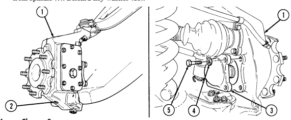

## Chapter 6 Propeller Shafts, Axles, And Suspension Maintenance

| Chapter 6             |  TASK SUMMARY 
|------------           |-------------------------------
| TASK                  | PROCEDURES
| [6-1 ](#6-1)          | PROPELLER SHAFTS MAINTENANCE TASK SUMMARY
| [6-2 ](#6-2)          | Front Propeller Shaft Assembly Maintenance
| [6-3 ](#6-3)          | Front Propeller Shaft Assembly Repair
| [6-4 ](#6-4)          | Rear Propeller Shaft Maintenance
| [6-5 ](#6-5)          | Rear Propeller Shaft Maintenance (1330 Series)
| [6-6 ](#6-6)          | Rear Propeller Shaft Repair
| [6-7 ](#6-7)          | Universal Joint Repair
| [6-8 ](#6-8)          | Front And Rear Axles Maintenance Task Summary
| [6-9 ](#6-9)          | Halfshaft Maintenance
| [6-10](#6-10)         | Geared Hub Side Cover Replacement
| [6-11](#6-11)         | Geared Hub Replacement
| [6-12](#6-12)         | Geared Hub Input Seal Replacement
| [6-13](#6-13)         | Geared Hub Spindle Seal Replacement
| [6-14](#6-14)         | Geared Hub Spindle Bearing Adjustment
| [6-15](#6-15)         | Wheel Stud Replacement
| [6-16](#6-16)         | Differential Vent Line Replacement
| [6-17](#6-17)         | Rear Geared Hub Vent Line Replacement
| [6-18](#6-18)         | Front Geared Hub Vent Line Replacement
| [6-19](#6-19)         | Steering Stop Maintenance
| [6-20](#6-20)         | Air Lifting Bracket Replacement
| [6-21](#6-21)         | Differential Cover Maintenance
| [6-22](#6-22)         |
| [6-23](#6-23)         | Stabilizer Bar Replacement
| [6-24](#6-24)         | Stabilizer Bar Link Replacement
| [6-25](#6-25)         | Radius Rod Replacement
| [6-26](#6-26)         | Upper Ball Joint Replacement
| [6-27](#6-27)         | Lower Ball Joint Replacement
| [6-28](#6-28)         | Upper Control Arm Replacement
| [6-29](#6-29)         | Lower Control Arm Replacement
| [6-30](#6-30)         | Coil Spring Replacement
| [6-31](#6-31)         | Shock Absorber Replacement

### Section I. Propeller Shafts Maintenance

#### 6-1. PROPELLER SHAFTS MAINTENANCE TASK SUMMARY

| Equipment Condition Materials/Parts                                                               | automotive (Appendix B, Item 1)   |
|---------------------------------------------------------------------------------------------------|-----------------------------------|
| Transmission mount crossmember removed Two lockwashers (Appendix G, Item 178) (para. 9\-15).      |                                   |
|                                                                                                   | a. Removal                        |
| Remove two capscrews (4), lockwashers (3), and transmission mount (2) from adapter (1).           |                                   |
| Discard lockwashers (3).                                                                          |                                   |
| b. Installation                                                                                   |                                   |
| Install transmission mount (2) on adapter (1) with two lockwashers (3) and capscrews (4). Tighten |                                   |

##### 6-2. Front Propeller Shaft Assembly Maintenance

This task covers:
b. Inspection INITIAL SETUP:

#### Tools

General mechanic's tool kit:
automotive (Appendix B, Item 1)
Materials/Parts Cotter pin (Appendix G, Item 17)
(Basic/A1 Series)
Cotter pin (Appendix G, Item 18)
(A2 Series)
a. Removal c. Installation Manual References TM 9-2320-280-10 TM 9-2320-280-24P

Propeller shaft bearing caps should be taped together to prevent loss of bearings.

a. Removal 1. Remove four capscrews (3) and two bearing straps (2) from front propeller shaft assembly (4) and differential pinion yoke (1).

Step 2 applies to all vehicles except M1097, "A1" and "A2" series. Step 3 applies to M1097, "A1" and "A2" series.

2. Remove four capscrews (10) and two bearing straps (9) from front propeller shaft assembly (4) and transfer case output yoke (7).

3. Remove four nuts (14), washers (15), and two U-bolts (16) from front propeller shaft assembly (4) and transfer case output yoke (7).

4. Remove cotter pin (13), washer (12), and transfer case shift rod (11) from transfer case shift lever (6).

Discard cotter pin (13).

5. Remove two nuts (17), washers (18), capscrews (20), washers (18), and center bearing (19) from engine mount (21).

6. Move front propeller shaft assembly (4) forward, then rearward over top of transfer case (5) and pipe (8), and remove front propeller shaft assembly (4).

#### B. Inspection

1. Inspect drive shaft (23) and coupling shaft (24) for cracks and damage. Replace either (para. 6-3) if cracked or damaged.

2. Inspect grease fittings (25) and universal joints (22) for serviceability. Replace universal joints (22)
(para. 6-7) or grease fittings (25) if unserviceable.

3. Inspect center bearing (19) for roughness or damage. Replace coupling shaft (24) (para. 6-3) if center bearing (19) is rough or damaged.

6-2. FRONT PROPELLER SHAFT ASSEMBLY MAINTENANCE (Cont'd)

## 6-2. Front Propeller Shaft Assembly Maintenance (Cont'D)

1. Install front propeller shaft assembly (4) over exhaust pipe (8) and over top of transfer case (5).

2. Install front propeller shaft assembly (4) on differential pinion yoke (1) with two bearing straps (2)
and four capscrews (3). Tighten capscrews (3) to 13-18 lb-ft (18-24 N m).

3. Install center bearing (19) on engine mount (21) with two washers (18), capscrews (20), washers (18),
and nuts (17). Tighten capscrews (20) to 60 lb-ft (81 N m).

4. Install transfer case shift rod (11) on transfer case shift lever (6) with washer (12) and cotter pin (13).

NOTE
Step 5 applies to all vehicles except M1097, "A1" and "A2" series.

 Step 6 applies to M1097, "A1" and "A2" series.

5. Install front propeller shaft assembly (4) on transfer case output yoke (7) with two bearing straps (9)
and four capscrews (10). Tighten capscrews (10) to 13-18 lb-ft (18-24 N m).

6. Install front propeller shaft assembly (4) on transfer case output yoke (7) with two U-bolts ( 16), four washers (15), and nuts (14). Tighten nuts (14) to 13-18, lb-ft (18-24 N m).

# 6-2.  Front Propeller Shaft Assembly Maintenance (Cont'D)

FOLLOW-ON TASK:  Lubricate propeller shaft assembly (TM 9-2320-280-10).

# 6-3. Front Propeller Shaft Assembly Repair

This task covers:
a. Disassembly c. Assembly b. Cleaning and Inspection INITIAL SETUP:
Tools General mechanic's tool kit:
automotive (Appendix B, Item 1)
Materials/Parts Dust cap (Appendix G, Item 29) Grease (Appendix C, Item 22) Drycleaning solvent (Appendix C, Item 18)
Manual References TM 9-2320-280-24P
a. Disassembly

#### Equipment Condition

Front propeller shaft assembly removed (para. 6-2).

General Safety Instructions Cleaning will be done in a well-ventilated area and a fire extinguisher will be kept nearby when drycleaning solvent is used.

Prior to disassembly, mark slip yoke and coupling shaft for assembly.

1. Place slip yoke (2) in vise. 2. Pull coupling shaft (4) apart from slip yoke (2). 3. Pry dust cap (3) off slipyoke (2). Discard dust cap (3).

b. Cleaning and Inspection

Drycleaning solvent is flammable and will not be used near an open flame. A fire extinguisher will be kept nearby when the solvent is used. Use only in well-ventilated places. Failure to do this may result in injury to personnel and/or damage to equipment.

Do not allow drycleaning solvent to come into contact with U-joint. Damage to equipment will result.

1. Use drycleaning solvent to clean all metallic parts. 2. Inspect drive shaft (1), coupling shaft (4), and slip yoke (2) for cracks or dents. Replace if cracked or dented.

3. Inspect splined end of coupling shaft (4) and slip yoke (2) for damage. Replace either if damaged. 4. Inspect center bearing (5) for looseness, vibration damage, rubber separation from bearing surface, and abnormal wear. If damaged, replace coupling shaft (4).

# 6-3. Front Propeller Shaft Assembly Repair (Cont'D)

Ensure grease fitting on dust cap is aligned with wide spline in slip yoke.

1. Install dust cap (3) on coupling shaft (4).

2. Coat splines on coupling shaft (4) and slip yoke (2) with grease.

NOTE
Ensure wide spline on coupling shaft is aligned with grease fitting on slip yoke.

3. Install coupling shaft (4) and dust cap (3) into slip yoke (2).

FOLLOW-ON TASK: Install front propeller shaft assembly (para. 6-2).

# 6-4. Rear Propeller Shaft Maintenance

This task covers:
b. Inspection INITIAL SETUP:
Applicable Models All except M1097, "A1" and "A2" series Tools General mechanic's tool kit:
automotive (Appendix B, Item 1)
a. Removal c. Installation

#### Materials/Parts

Four lockwashers (Appendix G, Item 134) Four lockwashers (Appendix G, Item 170)
Manual References TM 9-2320-280-10 TM 9-2320-280-24P

Prior to towing vehicle, parking brake rotor must be removed.

a. Removal

On vehicles with serial numbers USBL Eff. 44825 and above, the propeller shaft is attached to the differential yoke instead of the parking brake rotor. Lockwashers and U-bolts are not used.

1. Chock wheels and release parking brake (TM 9-2320-280-10). 2. Remove four nuts (1), lockwashers (2), and two U-bolts (4) from rear propeller shaft (5) and transfer case output yoke (3). Discard lockwashers (2).

3. Remove four capscrews (8), lockwashers (7), and rear propeller shaft (5) from parking brake rotor (6). Discard lockwashers (7).

b. Inspection 1. Inspect propeller shaft (5) for cracks and dents. Replace if cracked or dented. 2. Inspect grease fittings and universal joints for serviceability. Replace universal joints (para. 6-7)
or grease fittings if unserviceable.

c. Installation 1. Install rear propeller shaft (5) on parking brake rotor (6) with four lockwashers (7) and capscrews (8). Tighten capscrews (8) to 60 lb-ft (81 N•m).

2. Install rear propeller shaft (5) on transfer case output yoke (3) with two U-bolts (4), four lockwashers (2), and nuts (1). Tighten nuts (1) to 21 lb-ft (28 N•m).

3. Apply parking brake (TM 9-2320-280-10) and remove wheel chocks.

# 6-4. Rear Propeller Shaft Maintenance (Cont'D)

# 6-5. Rear Propeller Shaft Maintenance (1330 Series)

This task covers:
a. Removal c. Installation b. Inspection INITIAL SETUP:
Applicable Models **Manual References**
M1097, "A1" and "A2" series TM 9-2320-280-10 Tools General mechanic's tool kit:
automotive (Appendix B, Item 1)

| Manual References    |
|----------------------|
| TM 9\-2320\-280\-10  |
| TM 9\-2320\-280\-24P |

1. Chock wheels and release parking brake (TM 9-2320-280-10).

2. Remove four capscrews (6), two straps (5), and disconnect propeller shaft (3) from differential pinion yoke (4).

3. Slide propeller shaft end yoke (1) out of transfer case extension (2) and remove propeller shaft (3).

b. Inspection 1. Inspect propeller shaft (3) for cracks and dents. Replace if cracked or dented. 2. Inspect grease fittings and universal joints for serviceability. Replace universal joints (para. 6-6) or grease fittings if unserviceable.

3. Inspect splined end of end yoke (1) for damage. Replace end yoke (1) if damaged (para. 6-6).

c. Installation 1. Slide propeller shaft end yoke (1) on transfer case extension (2) and install propeller shaft (3). 2. Connect propeller shaft (3) to differential pinion yoke (4) with two straps (5) and four capscrews (6).

Tighten capscrews (6) to 13-18 lb-ft (18-24 N m).

3. Apply parking brake (TM 9-2320-280-10) and remove wheel chocks.

# 6-5. Rear Propeller Shaft Maintenance (1330 Series) (Cont'D)

FOLLOW-ON TASK: Lubricate propeller shaft (TM 9-2320-280-10).

# 6-6. Rear Propeller Shaft Repair

This task covers:
a. Disassembly c. Assembly b. Cleaning and Inspection INITIAL SETUP:
Tools General mechanic's tool kit:
automotive (Appendix B, item 1)
Universal joint bearing kit
(Appendix B, Item 171)
Materials/Parts Dust cap (Appendix G, Item 29) Grease (Appendix C, Item 22) Drycleaning solvent (Appendix C, Item 18)
a. Disassembly

| Manual References                                    |
|------------------------------------------------------|
| TM 9\-2320\-280\-24P                                 |
| Equipment Condition                                  |
| Rear propeller shaft removed (para. 6\-4 or 6\-5).   |
| General Safety Instructions                          |
| Cleaning will be done in well\-ventilated area and a |
| fire extinguisher will be kept nearby when solvent   |
| is used.                                             |

Prior to disassembly, mark slip yoke and propeller shaft for assembly.

1. Pull slip yoke (3) from propeller shaft (1). 2. Place slip yoke (3) into vise. 3. Pry dust cap (2) off of slip yoke (3). Discard dust cap (2).

b. Cleaning and Inspection

Drycleaning solvent is flammable and will not be used near an open flame. A fire extinguisher will be kept nearby when solvent is used. Use only in well-ventilated area. Failure to do this may result in injury to personnel and/or damage to equipment.

Do not allow drycleaning solvent to come into contact with U-joint. Damage to equipment will result.

1. Use drycleaning solvent to clean all metallic parts. 2. Inspect propeller shaft (1) and slip yoke (3) for cracks and damage. Replace if cracked or damaged. 3. Inspect splined end of propeller shaft (1) and splined end of slip yoke (3) for damage. Replace either if damaged.

c. Assembly 1. Install dust cap (2) on propeller shaft (1). 2. Coat spline on propeller shaft (1) and slip yoke (3) with grease. 3. Insert propeller shaft (1) into slip yoke (3) and install dust cap (2).

6-6. REAR PROPELLER SHAFT REPAIR (Cont'd)

FOLLOW-ON TASK: Install rear propeller shaft (para. 6-4).

## 6-7. Universal Joint Repair

This task covers:
a. Disassembly b. Assembly INITIAL SETUP:
Tools General mechanic's tool kit:
automotive (Appendix B, Item 1)
Universal joint bearing kit
(Appendix B, Item 171)

| Materials/Parts   |
|-------------------|

Manual References TM 9-2320-280-24P
Materials/Parts Universal parts kit (Appendix G, Item 66)
Equipment Condition Propeller shaft removed (para. 6-2 or 6-4).

All universal joint replacement procedures are basically the same. This procedure covers the rear universal joint.

a. Disassembly

Do not drop bearing cups. Needle bearings can be easily lost.

1. Remove grease fitting (6) from cross (4). 2. Remove two bearing cups (1) from cross (4). 3. Remove two snaprings (2) from yoke (5). 4. Position propeller shaft (3) in vise with 1-1/8 in. socket between vise jaw and bearing cup (1) being removed. Ensure open end of socket is facing bearing cup (1).

5. Place 11/16 in. socket between opposite bearing cup (1) and vise jaw. Ensure open end of socket is facing vise jaw.

6. Press bearing cup (1) out of yoke (5) and remove bearing cup (1) from cross (4). 7. Reverse position of sockets and press remaining bearing cup (1) out of yoke (5). 8. Remove cross (4) from yoke (5).

b. Assembly

Ensure grease fitting on cross faces yoke. Damage to equipment will result if improperly installed.

1. Install cross (4) into yoke (5). 2. Install bearing cup (1) into yoke (5).

Ensure bearing cup is aligned with yoke before pressing in with vise. Damage to cross and bearing cups will result if forced into yoke.

3. Place yoke (5) in vise with 11/16 in. socket between vise jaw and bearing cup (1). 4. Press bearing cup (1) into yoke (5) far enough to install snapring (2) and install snapring (2) into yoke (5).

5. Install bearing cup (1) into yoke (5). 6. Place yoke (5) in vise with 11/16 in. socket between bearing cup (1) and vise jaw. 7. Press bearing cup (1) into yoke (5) far enough to install snapring (2) and install snapring (2) into yoke (5).

8. Install two bearing cups (1) on cross (4). 9. Install grease fitting (6) into cross (4).

6-14 Change 3

FOLLOW-ON TASK: Install propeller shaft (para. 6-2 or 6-4).

# Section Ii. Front And Rear Axles Maintenance

# 6-8. Front And Rear Axles Maintenance Task Summary

| 6\-1.   | PROPELLER SHAFTS MAINTENANCE TASK SUMMARY      |       |
|---------|------------------------------------------------|-------|
| TASK    | PROCEDURES                                     | PAGE  |
| PARA.   |                                                | NO.   |
| 6\-2.   | Front Propeller Shaft Assembly                 | 6\-2  |
|         | Maintenance                                    |       |
| 6\-3.   | Front Propeller Shaft Assembly Repair          | 6\-6  |
| 6\-4.   | Rear Propeller Shaft Maintenance               | 6\-8  |
| 6\-5.   | Rear Propeller Shaft Maintenance (1330 series) | 6\-10 |
| 6\-6.   | Rear Propeller Shaft Repair                    | 6\-12 |
| 6\-7.   | Universal Joint Repair                         | 6\-14 |

## 6-9. Halfshaft Maintenance

This task covers:
a. Removal **d. Assembly** b. Disassembly e. Installation c. Cleaning and Inspection

#### Initial Setup: Tools

General mechanic's tool kit:
automotive (Appendix B, Item 1)

#### Materials/Parts

Boot service kit (fixed) (Appendix G, Item 7) Boot service kit (plunged) (Appendix G, Item 7) Retaining ring (Appendix G, Item 231) Cotter pin (Appendix G, Item 12) Six lockwashers (Appendix G, Item 145) Lockwasher (Appendix G, Item 146) Drycleaning solvent (Appendix C, Item 18) Lithium grease (Appendix C, Item 25) Sealing compound (Appendix C, Item 41)
Manual References TM 9-2320-280-24P
Equipment Condition Wheel removed (para. 8-3).

General Safety Instructions Drycleaning solvent is flammable and will not be used near an open flame.

#### A. Removal

1. Remove access plug (8) and washer (7) from geared hub (4). 2. Remove halfshaft retaining capscrew (6) and lockwasher (5) from halfshaft (9) and geared hub (4).

Discard lockwasher (5).

3. Remove six capscrews (3), lockwashers (2), and halfshaft (9) from rotor (1) and output flange (10).

Discard lockwashers (2).

Perform steps 4 and 5 for rear halfshafts only.

4. Remove cotter pin (15), washer (16), and clevis pin (18) from parking brake clevis (17) and lever (14). Discard cotter pin (15).

5. Remove retaining ring (13) and disconnect cable (11) from caliper cable bracket (12). Discard retaining ring (13).

## 6 - 9 . Halfshaft Maintenance (Cont'D)

b. Disassembly 1 . Loosen two clamps (7) and (8) securing inner boot (6) to inner joint (1) and shaft (5). 2 . Clamp shaft (5) in soft-jawed vise. 3 . Remove inner boot (6) from inner joint (1) and slide up on shaft (5). 4 . Remove retainer clip (2) from inner joint (1). 5 . Remove inner joint (1), retainer clip (2), and six ball bearings (3) from bearing assembly (4).

> Note

Perform steps 5.1 through 5.3 for M1123 and "A2" series vehicles.

5 . 1 . Remove inner boot (6) from insert (9) and slide up on shaft (5). 5 . 2 . Remove inner joint (1) and insert (9) from spider assembly (10) and shaft (5).

# 6-9. Halfshaft Maintenance (Cont'D)

Remove excess grease from bearing assembly and separate ball race from inner race.

Perform steps 6 through 8 for all models except the M1097, "A1" and "A2" vehicles.

Peform steps 9 and 10 for M1097, "A1" and "A2" series vehicles.

6.

7.

Pry spacer (3) from groove on shaft (5) and slide spacer (3) and inner race (2) up on shaft (5).

Remove retainer ring (1) from shaft (5). Discard retainer ring (1).

8.

Remove inner race (2), spacer (3), and ball race (4) from shaft (5). Discard spacer (3).

9.

Remove retainer ring (6) from shaft (5). Discard retainer ring (6).

 Remove inner race (2) and ball race (4) from shaft (5).

10.

## 6-9. Halfshaft Maintenance (Cont'D)

11. Remove inner boot (1) and clamps (2) and (3) from shaft (7). Discard boot (1) and clamps (2) and (3). 12. Remove shaft (7) from soft-jawed vise.

13. Loosen two boot clamps (4) and (5) securing outer boot (6) to outer joint (8) and shaft (7). 14. Remove outer boot (6) and clamps (5) and (4) from shaft (7). Discard boot (6) and clamps (5) and (4).

NOTE
Perform steps 15 through 17 for all models except the M1097 and "A1" and "A2" series vehicles.

15. Remove slinger (11) from outer joint (8). 16. Remove outer joint (8) from shaft (7) using slide hammer. 17. Remove retainer ring (10) and spacer (9) from shaft (7). Discard retainer ring (10).

c. Cleaning and Inspection

#### Warning

Drycleaning solvent is flammable and will not be used near an open flame. A fire extinguisher will be kept nearby when the solvent is used. Use only in well-ventilated places. Failure to do this may result in injury to personnel and/or damage to equipment.

1. Clean all metallic parts with drycleaning solvent.

2. Inspect shaft (7) for cracks and distortion. Replace shaft (7) if cracked or distorted.

3. Inspect splined end of shaft (7) for damage. Replace shaft (7) if damaged.

 4. Inspect inner joint ( 12) for pitting or rough joint operation. Replace inner joint (12) if pitted or unserviceable.

## 6-9. Halfshaft Maintenance (Cont'D)

Perform steps 1 through 3 for all models except the M1097 and "A1" and "A2" series vehicles.

Install spacer (9) and retainer ring (10) on shaft (7). Align splines on shaft (7) to outer joint (8) and push outer joint (8) onto shaft (7) until it snaps in place.

1.

2.

Install slinger (11) on outer joint (8).

Pack outer joint (8) with lithium grease.

3.

4.

Install outer boot (6) on shaft (7). Ensure boot (6) seats in groove of shaft (7).

5.

Secure outer boot (6) on shaft (7) with clamp (4).

6.

Install outer boot (6) on joint (8). Ensure boot (6) seats in groove of joint (8).

7.

Secure outer boot (6) on joint (8) with clamp (5).

8.

Clamp shaft (7) in soft-jawed vise.

9.

Position clamps (3) and (2) on shaft (7).

10.

Install inner boot (1) on shaft (7). Push boot (1) past groove on shaft (7).

Position ball race (13) on shaft (7).

11.

12.

6 - 9 . HALFSHAFT MAINTENANCE (Cont'd)

> Note

- Perform steps 13 and 14 for all models except M1097, M1123, and "A1" and "A2" series vehicles.

- Perform steps 15 and 16 for M1097 and "A1" series vehicles. - Perform steps 16.1 through 16.5 for M1123 and "A2" series vehicles.

1 3 . Install spacer (3) and retainer ring (2) on shaft (4). 1 4 . Align splines of inner race (1) with open spline of shaft (4). Use press to install inner race (1) until it snaps in place.

1 5 . Align splines of inner race (1) with open spline on shaft (4). Use press to install inner race (1) on shaft (4) until inner race (1) seats into place.

1 6 . Install retainer ring (6) in upper groove of shaft (4) behind inner race (1).

# 6 - 9 . Halfshaft Maintenance (Cont'D)

> Note

Coat spider assembly with lithium grease before installing on shaft.

1 6 . 1 . Align splines of spider assembly (15) with open spline on shaft (4). Use press to install spider a s s e m b l y (15) on shaft (4) until spider assembly (15) seats into place.

1 6 . 2 . Install retainer ring (14) in pupper groove of shaft (4) behind spider assembly (15). 1 6 . 3 . Pack inner joint (16) with lithium grease. 1 6 . 4 . Install insert (17) on inner joint (15). 1 6 . 5 . Install inner joint (16) and insert (17) on spider assembly (15) and shaft (4).

1 7 . Position ball race (5) and six ball bearings (9) on inner race (1) and retain with lithium grease. 1 8 . Position retainer clip (8) and inner joint (7) over bearing assembly (13).

> Note

Ensure ball bearings are retained in ball race.

1 9 . Secure retainer clip (8) in groove of inner joint (7). 2 0 . Pack inner joint (7) with lithium grease. 2 1 . Move inner boot (10) on shaft (4) until boot (10) seats in groove of shaft (4). 2 2 . Secure inner boot (10) on shaft (4) with clamp (12). 2 3 . Install inner boot (10) on inner joint (7). Ensure boot (10) seats in groove of joint (7). 2 4 . Secure inner boot (10) on inner joint (7) with clamp (11 ) .

## 6-9. Halfshaft Maintenance (Cont'D)

e. Installation 1. Install halfshaft (9) into geared hub (4). 2. Apply sealing compound to halfshaft retaining capscrew (6) and install halfshaft (9) to geared hub (4) with lockwasher (5) and halfshaft retaining capscrew (6). Tighten halfshaft retaining capscrew (6) to 37 lb-ft (50 N•m).

3. Install washer (7) and access plug (8) into geared hub (4). Tighten access plug (8) to 8-13 lb-ft 
(11-18 N•m).

Ensure all six capscrew holes in the rotor align with holes in output flange.

4. Apply sealing compound to six capscrews (3). Install halfshaft (9) to rotor (1) and output flange (10),
with six lockwashers (2) and capscrews (3). Tighten capscrews (3) to 48 lb-ft (65 N•m).

Perform steps 5 through 7 for rear halfshafts only.

5. Install parking brake cable (11) to caliper cable bracket (12) with retaining ring (13).

- Ensure lever is in contact with caliper cable bracket stop.

Damage to equipment and poor performance will result if not aligned properly.

- Ensure that the clevis and clevis pin are aligned in the lever. 

Do not move the lever to accommodate misadjusted clevis. Damage to equipment and poor performance may result.

6. Install parking brake clevis (17) to lever (14) with clevis pin (18), washer (16), and cotter pin (15).

Check position of lever (13) and ensure it is in contact with caliper cable bracket stop (13.1).

7. If lever (14) is not in contact with caliper cable bracket stop (13.1), adjust rear dual service parking brake (para. 7-26).

# 6-9.  Halfshaft Maintenance (Cont'D)

FOLLOW-ON TASK:    Install wheel (para. 8-3).

## 6-10. Geared Hub Side Cover Replacement

This task covers:
a. Removal c. Installation b. Cleaning and Inspection INITIAL SETUP:
General mechanic's tool kit: Wheel removed (para. 8-3).

automotive (Appendix B, Item 1) General Safety Instructions Drycleaning solvent, (Appendix C, Item 18) in well-ventilated places.

Manual References TM 9-2320-280-10 TM 9-2320-280-24P
Tools **Equipment Condition**
Materials/Parts Drycleaning solvent is flammable and will not be Sealing compound (Appendix C, Item 46) used near an open flame. A fire extinguisher will Sealant (Appendix C, Item 38) be kept nearby when the solvent is used. Use only

Have drainage container ready to catch oil. Geared hub side cover replacement procedures are basically the same for front and rear covers. This procedure deals with the front side cover.

#### A. Removal

1. Remove drainplug (5) from geared hub (1) and drain geared hub (1).

2. Install drainplug (5) in geared hub (1). 3. Remove eight capscrews (4), washers (3), and side cover (2) from geared hub (1).

b. Cleaning and Inspection

Drycleaning solvent is flammable and will not be used near an open flame. A fire extinguisher will be kept nearby when the solvent is used. Use only in well-ventilated places. Failure to do this may result in injury to personnel and/or damage to equipment.

1. Using drycleaning solvent, clean side cover (2). 2. Inspect side cover (2) for damage. If damaged replace.

1. Apply sealant (RTV) to side cover (2) and install side cover (2) on geared hub (1).

2. Apply sealing compound to capscrews (4) and install eight washers (3) and capscrews (4) on side cover (2). Tighten capscrews (4) to 15 lb-ft (20 N·m).

# 6-10. Geared Hub Side Cover Replacement (Corítd)

FOLLOW-ON TASKS: - Fill geared hub to proper level (para. 2-11).

- Install wheel (para. 8-3).

■

# 6-11. Geared Hub Replacement

This task covers:
INITIAL SETUP:

#### Tools

General mechanic's tool kit:
automotive (Appendix B, Item 1)
Puller kit (Appendix B, Item 167)

#### Materials/Parts

Three cotter pins (Appendix G, Item 14) Lockwasher (Appendix G, Item 146) Four locknuts (Appendix G, Item 79)
(Basic/A1 Series)
Four locknuts (Appendix G, Item 128)
(Basic/A1 Series)
Four locknuts (Appendix G, Item 104) 
(A2 Series)
Four locknuts (Appendix G, Item 105) 
(A2 Series)
Sealing compound (Appendix C, Item 45) Sealer (Appendix C, Item 39)

#### A. Removal B. Installation

Personnel Required One mechanic One assistant Manual References TM 9-2320-280-10 TM 9-2320-280-24P
Equipment Condition
- Wheel removed (para. 8-3). - Steering stop removed (para. 6-19). - Air lifting bracket removed, rear only 
(para. 6-20).

General Safety Instructions Geared hub must be supported during removal and installation.

Use of a pickle fork in lieu of the puller kit may damage serviceable components (boots).

NOTE
- Have drainage container ready to catch drained fluid. - Removal and installation procedures are basically the same for front and rear geared hubs. This procedure covers the front geared hub.

#### A. Removal

1. Remove drainplug (29) from geared hub (9) and drain geared hub (9). 2. Install drainplug (29) in geared hub (9). 3. Remove capscrew (22), washer (23), vent line bracket and clamp (24) from geared hub (9). 4. Loosen clamp (10) and disconnect vent line (1) from geared hub fitting (11). 5. Remove cotter pin (25), slotted nut (26), and washer (27) from tie rod end (28) and geared hub (9).

Discard cotter pin (25).

6. Using puller, disconnect tie rod end (28) from geared hub (9). 7. Remove access plug (14), washer (15), axle halfshaft retaining capscrew (13), lockwasher (12) and disconnect halfshaft (20) from geared hub (9). Discard lockwasher (12).

Geared hub must be supported during removal and installation. Failure to support geared hub may cause injury to personnel or damage to equipment.

Note direction of outer capscrew for installation.

8. Remove four locknuts (21), washers (16), capscrews (17), and washers (16) from lower ball joint (18)
and lower control arm (19). Discard locknuts (21).

## 6-11. Geared Hub Replacement (Cont'D)

 Remove four locknuts (7), washers (3), capscrews (2), and washers (3) from boot retainer (8), ball 9.

joint retainer (5), upper ball joint (6) and upper control arm (4). Discard locknuts (7).

10.

Lower support and remove geared hub (9).

## 6 - 1 1 . Geared Hub Replacement (Cont'D)

b. Installation 11. Place geared hub (3) in vise.

12. Remove cotter pin (8), slotted nut (9), and upper ball joint (10) from geared hub (3). Discard cotter pin (8).

13. Remove cotter pin (1), slotted nut (2), and lower ball joint (4) from geared hub (3). Discard cotter pin (1).

> Note

Upper ball joint has grease fitting.

1. Install upper ball joint (10) to geared hub (3) with slotted nut (9), but do not tighten. 2. Install lower ball joint (4) to geared hub (3) with slotted nut (2), but do not tighten.

 Note
- If geared hub received is P/N 5598766 and left front or right rear installation is required, replace steering arm cover P/N 5591279 with P/N 5591280 for basic and A1 vehicles and P/N 6005121 for M 1123 and A2 vehicles.

- If geared hub received is P/N 5598767 and right front or left rear installation is required, replace steering arm cover P/N 5591280 with P/N 5591279 for basic and A1 vehicles and P/N 6005120 for M 1123 and A2 vehicles.

- Use existing steering arm cover if serviceable. - Perform steps 3 through 5 for replacement of steering arm cover.

Proceed to step 6 for geared hub installation.

3. Remove four capscrews (7), washers (6), and steering arm cover (5) from geared hub (3).

> Note

Immediately install steering arm cover after application of sealant.

4. Clean sealing surfaces on geared hub (3) and steering arm cover (5). Apply anaerobic sealant to steering arm cover (5).

5. Apply sealing compound to threads on capscrews (7) and install steering arm cover (5) to geared hub (3) with four washers (6) and capscrews (7). Tighten capscrews (7) to 65 lb-ft (88 N•m).

Geared hub must be supported during removal and installation. Failure to support geared hub may cause injury to personnel or damage to equipment.

6. Install geared hub (3) and upper ball joint (10) on upper control arm (13) ensuring upper ball joint (10) is placed above upper control arm (13), and boot (16) and ball joint retainer (14) are placed below upper control arm (13).

> Note

Ensure outer capscrews on front ball joints are installed from top down, and inner capscrews are installed from bottom up for M1123 and "A2" series vehicles only.

7. Install upper ball joint (10) and ball joint retainer (14) to upper control arm (13) with four washers ( 1 2 ) ,
capscrews (11), washers (12), and locknuts (15). Tighten locknuts (15) to 252 lb-in. (28 N•m ) .

Do not loosen slotted nut to install cotter pin. Doing this may result in damage to equipment.

8. Tighten slotted nut (9) on upper ball joint (10) to 65 lb-ft (88 N•m). Install cotter pin (8). 9. Apply sealing compound to halfshaft retaining capscrew (18) and install halfshaft (24) to geared hub (3) with lockwasher (17) and halfshaft retaining capscrew (18). Tighten halfshaft retaining capscrew (18) to 37 lb-ft (50 N•m).

## 6 - 1 1 . Geared Hub Replacement (Cont'D)

10. Install washer (20) and access plug (19) to geared hub (3). Tighten access plug (19) to 8-13 lb-ft 
(11-18 N•m).

11. Install lower ball joint (4) and geared hub (3) on lower control arm (23). Ensure lower ball joint (4) is below lower control arm (23).

> Note

Ensure outer capscrews on front ball joints are installed from top down, and inner capscrews are installed from bottom up for M1123 and "A2" series vehicles only.

12. Secure lower ball joint (4) to lower control arm (23) with four washers (21), capscrews (22),
washers (21), and locknuts (25). Tighten locknuts (25) to 35 lb-ft (47 N•m).

Do not loosen slotted nut to install cotter pin. Doing this may result in damage to equipment.

13. Tighten slotted nut (2) on lower ball joint (4) to 73 lb-ft (99 N•m). Install cotter pin (1).

## 6 - 1 1 . Geared Hub Replacement (Cont'D)

14. Install tie rod end (4) into geared hub (5) with washer (3) and slotted nut (2). Tighten slotted nut (2)
to 70 lb-ft (95 N•m). Install cotter pin (1).

15. Connect vent line (6) to geared hub fitting (8) with clamp (7). 16. Install vent line (6) and clamp (9) to geared hub (5) with washer (10) and capscrew (11). Tighten capscrew (11) to 38 lb-ft (52 N•m).

17. Tighten drainplug (14) to 8-13 lb-ft (18-18 N•m). 18. Remove fill plug (13) and washer (12) from geared hub (5). 19. Fill geared hub (5) to proper level (para. 2-11).

2 0 . Install washer (12) and fill plug (13) to geared hub (5). Tighten fill plug (13) to 8-13 lb-ft (11-18 N•m ) .

6-11. GEARED HUB REPLACEMENT (Cont'd)

FOLLOW-ON TASKS: - Install steering stop (para. 6-19).

· Install wheel (para. 8-3).

- Install air lifting bracket, rear only (para. 6-20).

· Check alignment (paras. 8-10 and 8-11).

# 6-12. Geared Hub Input Seal Replacement

This task covers:
INITIAL SETUP:

#### Tools

General mechanic's tool kit:
automotive (Appendix B, Item 1)
Vise insert (Appendix B, Item 170)
Special Tools Installer (Appendix B, Item 126) Driver handle (Appendix B, Item 75)
a. Removal

a. Removal b. Installation

#### Materials/Parts

Plain seal (Appendix G, Item 290) Lubricating oil (Appendix C, Item 26)

| Manual References               |
|---------------------------------|
| TM 9\-2320\-280\-24P            |
| Equipment Condition             |
| Halfshaft removed (para. 6\-9). |

Shim gaskets must be reused to maintain proper drive gear bearing adjustment.

1. Remove capscrew (1), washer (2), and vent line bracket (3) from drive gear retainer (4). 2. Remove three capscrews (1), washers (2), drive gear retainer (4), and shim gasket(s) (5) from geared hub (6).

3. Install drive gear retainer (4) in vise with inserts and remove seal (7). Discard seal (7).

b. Installation 1. Using driver handle and input seal installer, install seal (7) in drive gear retainer (4). Ensure radius on outer diameter of seal (7) faces toward inside of geared hub (6).

2. Install shim gasket(s) (5) and drive gear retainer (4) to geared hub (6) with three washers (2) and capscrews (1). Tighten capscrews (1) to 38 lb-ft (52 N.m).

3. Install vent line bracket (3) to drive gear retainer (4) with washer (2) and capscrew (1). Tighten capscrew (1) to 38 lb-ft (52 N.m).

4. Coat lip of seal (7) with lubricating oil.

# 6-12. Geared Hub Input Seal Replacement (Cont'D)

FOLLOW-ON TASK: Install halfshaft (para. 6-9).

# 6-13. Geared Hub Spindle Seal Replacement

This task covers:
INITIAL SETUP

#### Tools

General mechanic's tool kit:
automotive (Appendix B, Item 1)
Special Tools Wrench (Appendix B, Item 127) Installer (Appendix B, Item 128) Driver handle (Appendix B, Item 75)
Materials/Parts Key washer (Appendix G, Item 65) Plain encased seal (Appendix G, Item 291) Grease (Appendix C, Item 22) Sealer (Appendix C, Item 39) Lubricating oil (Appendix C, Item 29) Sealing compound (Appendix C, Item 45)

#### A. Removal B. Installation

Manual References TM 9-2320-280-10 TM 9-2320-280-24P
Equipment Condition Wheel removed (para. 8-3).

General Safety Instructions Ensure locktab on key washer is bent completely into slot on retaining nut.

a. Removal

Have drainage container ready to catch oil.

1. Remove drainplug (2) from geared hub (1) and drain geared hub (1). Install drainplug (2) in geared hub (1). Tighten drainplug (2) to 8-13 lb-ft (11-18 N•m).

2. Remove four capscrews (5), washers (4), and steering arm cover (3) from geared hub (1).

NOTE
For new configuration, two locktabs on key washer must be bent away from retaining nut for removal.

3. Bend locktab on key washer (13) away from retaining nut (14).

If four-slotted retaining nut TN-07 is present, it is recommended to replace it with eight-slotted retaining nut 12342680.

4. Using retaining nut wrench, remove retaining nut (14 ), key washer (13), and keyed washer (12)

from spindle (7). Discard key washer (13).

## 6-13. Geared Hub Spindle Seal Replacement (Cont'D)

5. Remove spindle (7), spacer (6), bearing(11), and spacer (10) from geared hub (1).

6. Remove spindle seal (15) from geared hub (1). Discard spindle seal (15).

7. Inspect spindle (7) for rough or corroded sealing surface (8). Replace geared hub (1) (para. 6-11) if spindle (7) is damaged.

8. Inspect bearings (9) and (11) for damage. Replace geared hub (1) (para. 6-11) if bearing (9) or (11) is

# 6-13. Geared Hub Spindle Seal Replacement (Cont'D)

#### B. Installation

1. Using driver handle and spindle seal installer, install spindle seal (1) in geared hub (2). 2. Coat spindle seal (1) with lubricating oil. 3. Install spacer (3) and spindle (4) in geared hub (2). 4. Apply grease to face of retaining nut (9).

- If four-slotted retaining nut TN-07 is present, it is recommended to replace it with eight-slotted retaining nut 12342680.

- Ensure lip of spacer faces the bearing for a proper fit.

5. Install spacer (5), bearing (6), keyed washer (7), key washer (8), and retaining nut (9) on spindle (4). 6. Using retaining nut wrench, tighten retaining nut (9) to 35-45 lb-ft (47-61 N•m). 7. Rotate spindle (4) five full rotations clockwise and five full rotations counter clockwise to properly seat bearings.

8. Loosen retaining nut (9) until it is finger tight, then retighten nut to 23-27 lb-ft (31-37 N•m).

Ensure locktab on key washer is bent completely into slot on retaining nut. Eight-slotted retaining nut provides additional security by enabling two locktabs on key washer to be bent into slots on retaining nut. Failure to do this may cause injury to personnel or damage to equipment.

- For new configuration, two locktabs on key washer must be bent into slots on retaining nut.

- It may be necessary to slightly loosen or tighten retaining nut to gain proper alignment with locktabs.

9. Determine which locktab (10) on key washer (8) aligns with slot (11) in retaining nut (9). Bend locktab (10) into slot (11) on retaining nut (9).

Immediately install steering arm cover after application of sealant. 

10. Clean sealing surfaces on geared hub (2) and steering arm cover (14). Apply anaerobic sealant to steering arm cover (14) and install steering arm cover (14) on geared hub (2).

11. Apply sealing compound to threads of capscrews (12) and install steering arm cover (14) on geared hub (2) with four washers (13) and capscrews (12). Tighten capscrews (12) to 65 lb-ft (88 N•m).

12. Remove fill plug (15) and washer (16) from geared hub (2). 13. Fill geared hub (2) to proper oil level (para. 2-11). 14. Install washer (16) and fill plug (15) on geared hub (2). Tighten fill plug (15) to 8-13 lb-ft (11-18 N•m).

# 6-13. Geared Hub Spindle Seal Replacement (Cont'D)

FOLLOW-ON TASK: Install wheel (para. 8-3).

# 6-14. Geared Hub Spindle Bearing Adjustment

This task covers:
Adjustment INITIAL SETUP:

#### Tools

General mechanic's tool kit:
automotive (Appendix B, Item 1)
Special Tools Wrench (Appendix B, Item 127)
Materials/Parts Key washer (Appendix G, Item 65) Sealer (Appendix C, Item 39) Sealing compound (Appendix C, Item 45) Grease (Appendix C, Item 22)

#### Adjustment

Manual References TM 9-2320-280-10 TM 9-2320-280-24P
Equipment Condition Wheel removed (para. 8-3).

General Safety Instructions Ensure locktab on key washer is bent completely into slot on retaining nut.

key washer (9).

Ensure locktab on key washer is bent completely into slot on retaining nut. Eight-slotted retaining nut provides additional security by enabling two locktabs on key washer to be bent into slots on retaining nut. Failure to do this may cause injury to personnel or damage to equipment.

NOTE
- For new configuration, two locktabs must be bent into slots on retaining nut.

- It may be necessary to slightly loosen or tighten retaining nut to gain proper alignment with locktabs.

9. Determine which locktab (12) on key washer (9) aligns with slot (11) in retaining nut (10). Bend locktab (12) into slot (11) on retaining nut (10).

Have drainage container ready to catch oil.

1. Remove drainplug (4), and drain geared hub (1). Install drainplug (4) into geared hub (1). Tighten drainplug (4) to 8-13 lb-ft (11-18 N•m).

2. Remove four capscrews (7), washers (6), and steering arm cover (5) from geared hub (1).

NOTE
For new configuration, two locktabs must be bent away from retaining nut for removal.

3. Bend locktab (12) on key washer (9) away from retaining nut (10). 4. Using retaining nut wrench, remove retaining nut (10) and key washer (9) from spindle (8). Discard

If four-slotted retaining nut TN-07 is present, it is recommended to replace it with eight-slotted retaining nut 12342680.

5. Apply grease to face of retaining nut (10) and install key washer (9) and retaining nut (10) on spindle (8).

6. Using retaining nut wrench, tighten retaining nut (10) to 35-45 lb-ft (47-61 N•m). 7. Rotate spindle (8) five full rotations clockwise and five full rotations counter clockwise to properly seat bearings.

8. Loosen retaining nut (10) until it is finger tight, then retighten nut to 23-27 lb-ft (31-37 N•m).

WARNING

# 6-14. Geared Hub Spindle Bearing Adjustment (Cont'D)

Immediately install steering arm cover after application of sealant.

10. Clean sealing surfaces on geared hub (1) and steering arm cover (5). Apply anaerobic sealant to steering arm cover (5) and install steering arm cover (5) on geared hub (1).

11. Apply sealing compound to threads of capscrew (7) and install steering arm cover (5) on geared hub (1) with four washers (6) and capscrews (7). Tighten capscrews (7) to 65 lb-ft (88 N•m).

12. Remove fill plug (2) and washer (3) from geared hub (1). 13. Fill geared hub (1) to proper oil level (TM 9-2320-280-10). 14. Install washer (3) and fill plug (2) on geared hub (1). Tighten fill plug (2) to 8-13 lb-ft (11-18 N•m).

# 6-15. Wheel Stud Replacement

This task covers:
INITIAL SETUP:

#### Tools

General mechanic's tool kit:
automotive (Appendix B, Item 1))
Materials/Parts Three washers (Appendix G, Item 35) Hex nut (Appendix G, Item 64)
Manual References TM 9-2320-280-24P
a. Removal b. Installation Equipment Condition Wheel removed (para. 8-3).

General Safety Instructions Always wear eye protection when replacing wheel studs.

Always wear eye protection when replacing wheel studs. Severe eye injury may result if metal chips contact eyes.

a. Removal 1. Rotate spindle (3) to allow clearance for removal of stud (4) from spindle (3). 2. Drive stud (4) from spindle (3). Discard stud (4).

b. Assembly 1. Align splines on stud (4) with splines in spindle (3) and install stud (4) in spindle (3). 2. Install three flat washers (2) and hex nut (1) on stud (4). 3. Tighten hex nut (1) until head on stud (4) seats against spindle (3). 4. Remove and discard hex nut (1) and three flat washers (2).

FOLLOW-ON TASK: Install wheel (para. 8-3).

6-40 Change 3

# 6-16. Differential Vent Line Replacement

This task covers:

#### A. Removal **B. Installation**

INITIAL SETUP:
General mechanic's tool kit: TM 9-2320-280-24P
automotive (Appendix B, Item 1)
Tools **Manual References**

Differential vent line replacement procedures are basically the same. This procedure covers the rear differential vent line.

#### A. Removal

1. Remove vent line (7) from differential fitting (6) and tee fitting (1). 2. Remove two line clips (2) from vent line (3) and brake line (5). 3. Remove vent line (3) from two tee fittings (1) and (4).

#### B. Installation

1. Install vent line (3) on tee fittings (1) and (4).

2. Install two line clips (2) on vent line (3) and brake line (5).

3. Install vent line (7) on differential fitting (6) and tee fitting (1).

# 6-17. Rear Geared Hub Vent Line Replacement

This task covers:

a. Removal **b. Installation**

INITIAL SETUP:

General mechanic's tool kit: TM 9-2320-280-24P

Tools **Manual References**

automotive (Appendix B, Item 1)

Rear geared hub vent line replacement procedures are basically the same. This procedure covers the right rear geared hub vent line.

1. Disconnect vent line (4) from geared hub fitting (3).

2. Remove capscrew (7), clamp (6), and vent line (4) from bracket (5). 3. Remove capscrew (8), clamp (1), and vent line (4) from control arm (2).

4. Remove capscrew (10), clamp (9), and vent line (4) from bracket (11).

5. Remove capscrew (15), clamp (14), and vent line (4) from frame (13). 6. Remove vent line (4) from tee fitting (12).

#### B. Installation

1. Install vent line (4) to tee fitting (12) and geared hub fitting (3). 2. Install vent line (4) to frame (13) with clamp (14) and capscrew (15).

3. Install vent line (4) to bracket (11) with clamp (9) and capscrew (10).

4. Install vent line (4) to control arm (2) with clamp (1) and capscrew (8).

NOTE
Position clamp at a 45° angle toward the wheel before securing with capscrew.

5. Install vent line (4) to bracket (5) with clamp (6) and capscrew (7).

6-17. REAR GEARED HUB VENT LINE REPLACEMENT (Cont'd)

# 6-18. Front Geared Hub Vent Line Replacement

This task covers:
a. Right Side Removal c. Left Side Removal b. Right Side Installation **d. Left Side Installation**
INITIAL SETUP:
General mechanic's tool kit: Wheel removed (para. 8-3).

automotive (Appendix B, Item 1)
Tools **Equipment Condition**
Manual References TM 9-2320-280-24P
a. Right Side Removal

Mark clamp position before loosening to ensure clamps are properly positioned during installation.

1. Loosen four screws (7) and clamps (3) from front control arm (2) and geared hub (8). 2. Remove two hose clamps (6) and front vent line hose (4) from elbow (5) and tee fitting (1).

b. Right Side Installation

Step 1 is necessary to prevent vent line damage. If new clamp has

 been previously installed, perform steps 3 through 5.

1. Locate, mark, and drill 0.266 in. (6.76 mm) diameter hole (9) in front control arm (2).

## 6-18. Front Geared Hub Vent Line Replacement (Cont'D)

2. To fabricate front vent line hose (4), cut 33.63 in. (85.42 cm) piece of hose from bulk.

3. Route front vent line hose (4) through four existing clamps (3), and secure with two hose clamps (6)
to tee fitting (1) and elbow (5).

4. Position 9.0 to 10.0 in. (22.9 to 25.4 cm) of hose (4) between two existing clamps (3). Secure existing clamps (3), as noted in removal, with screws (7).

5. Install new clamp (3) on front vent line (4), and control arm (2) at hole (9) with screw (10),

washer (11), and nut (12).

# 6-18. Front Geared Hub Vent Line Replacement (Cont'D)

c. Left Side Removal 1. Loosen three screws (3) and clamps (2) from front control arm (8) and geared hub (7).

2. Remove two hose clamps (5) and vent line hose (1) from elbow (6) and union on tube (4).

d. Left Side Installation

Step 1 is necessary to prevent vent line damage. If new clamp has been previously installed, perform steps 3 through 5.

1. Locate, mark, and drill 0.266 in. (6.75 mm) diameter hole (9) in left front control arm (8).

2. To fabricate front side vent line hose (1), cut a 28.2 in. (71.6 cm) piece from hose (1).

removed in para. c, step 2. If hose (1) is unserviceable cut anew piece from bulk3. Route vent line hose (1). fabricated in step 2 through three existing clamps (2), and secure

hose (1) with two hose clamps (5) to union on tube (4) and elbow (6) on geared hub (7).

## 6-18. Front Geared Hub Vent Line Replacement (Cont'D)

4. Position 11.5 to 12.5 inches (29.2 to 31.8 cm) of hose (1) between two existing outer clamps (2) and secure existing clamps (2) with screws (3). Ensure center clamp (2) is positioned as shown.

5. Bend 90° bracket (14) on geared hub (7) 30° outward as shown.

Do not close loop on clamps installed on control arms. Hose lines should move freely through control arm clamp loops.

6. Install new clamp (13) on vent line hose (1), and control arm (8) with screw (10), washer

nut (11).

(12), and FOLLOW-ON TASK: Install wheel (para. 8-3).

#### 6-19. Steering Stop Maintenance

This task covers:
a. Removal **c. Adjustment**
b. Installation INITIAL SETUP:

| Tools General mechanic's tool kit:        | Personnel Required         |
|-------------------------------------------|----------------------------|
| automotive (Appendix B, Item 1)           | One mechanic One assistant |
| Universal joint bearing kit               |                            |
| (Appendix B, Item 171)                    | Manual References          |
| Materials/Parts                           | TM 9\-2320\-280\-24P       |
| Universal parts kit (Appendix G, Item 66) | Equipment Condition        |

1. Loosen jamnut (2) and remove steering stop capscrew (3) and jamnut (2) from geared hub (1).

2. Remove jamnut (2) from capscrew (3).

1. Apply sealing compound to capscrew (3). 2. Install jamnut (2) on capscrew (3). 3. Install capscrew (3) and jamnut (2) on geared hub (1). Tighten capscrew (3) finger tight.

c. Adjustment

Prior to adjustment ensure length of each tie rod is the same. If tie rod lengths are not the same ± 1/8 in. (3 mm), check toe-in alignment (para. 8-10).

Draw a reference chalk line (6)30 feet long. Mark this line "A". Position vehicle so that center of left rear and left front tires are positioned directly on reference line
"A" (6).

Using a protractor, draw a second reference line "B" (5) at 34°. Mark this line "B". Again, using a protractor, draw a third reference line "C" (4) at 36°. Mark this line "C". Roll vehicle forward until center of left front tire is over intersection of lines "A", "B", and "C".

Turn steering wheel full left.

If the centerline of front and rear of left front tire (7) is over area between lines "B" and "C", no adjustment is necessary.

If centerline of front and rear of left front is not over area between lines "B" and "C", loosen jamnut (2) and turn capscrew (3) all the way in.

9.

10.

11.

12.

Repeat adjustment procedure for opposite side.

1.

2.

3. 4. 5. 6. 7.

8.

Turn steering wheel until centerline of front and rear of tire (7) is over area between lines "B" and
"C". Unscrew capscrew (3) until head makes contact with wheel stop (9) on lower control arm (8). Secure capscrew (3) with jamnut (2).

6-19. STEERING STOP MAINTENANCE (Cont'd)

## 6-20. Air Lifting Bracket Replacement

This task covers:
a. Removal b. Installation INITIAL SETUP:

#### Tools

General mechanic's tool kit:
automotive (Appendix B, Item 1)
Manual References TM 9-2320-280-24P

#### Materials/Parts

Four lockwashers (Appendix G, Item 188)
a. Removal Remove four capscrews (4), lockwashers (3), and lifting bracket (2) from geared hub (1). Discard lockwashers (3).

b. Installation Install lifting bracket (2) to geared hub (1) with four lockwashers (3) and capscrews (4). Tighten capscrews (4) to 43 lb-ft (58 N•m).

# 6-20. Air Lifting Bracket Replacement (Cont'D)

# 6-21. Differential Cover Maintenance

This task covers:
a Removal **c. Installation**
b. Cleaning and Inspection INITIAL SETUP:
General mechanic's tool kit: TM 9-2320-280-10 automotive (Appendix B, Item 1) TM 9-2320-280-24P
Drycleaning solvent (Appendix C, Item 18) used near an open flame.

Tools **Manual References**

Materials/Parts **General Safety Instructions**

Sealant (Appendix C, Item 38) Drycleaning solvent is flammable and will not be

The following procedure applies to vehicles with new brake adapters, P/N 10453002. These brakes are cut away, which allows access to left center capscrews.

Have drainage container ready to catch fluid.

a. Removal 1. Remove drainplug (3) from differential assembly (4) and drain differential. 2. Remove twelve capscrews (2) and cover (1) from differential assembly (4).

b. Cleaning and Inspection

Drycleaning solvent is flammable and will not be used near an open flame. A fire extinguisher will be kept nearby when the solvent is used. Use only in well-ventilated places. Failure to do this may result in injury to personnel and/or damage to equipment.

1. Use drycleaning solvent to clean differential cover (1), capscrews (2), and differential assembly (4). 2. Inspect differential cover (1) for cracks, wear, or breaks. Replace cover (1) if cracked, worn, or broken.

1. Apply RTV sealant to cover (1) sealing surface and install cover (1) on housing (4) with twelve capscrews (2). Tighten capscrews (2) to 16 lb-ft (22 N m).

2. Install drain plug (3) into differential assembly (4) and tighten to 13-18 lb-ft (18-25 N m).

# 6-21. Differential Cover Maintenance (Cont'D)

FOLLOW-ON TASK:  Fill differential to proper level (para. 2-11).

| This task covers:                | a.                                    | Removal                             | b.                                | Installation   |
|----------------------------------|---------------------------------------|-------------------------------------|-----------------------------------|----------------|
| INITIAL SETUP:                   |                                       |                                     |                                   |                |
| Tools                            | Materials/Parts                       | General mechanic's tool kit:        | Plain seal (Appendix G, Item 290) |                |
| automotive (Appendix B, Item 1)  | Lubricating oil (Appendix C, Item 26) | Vise insert (Appendix B, Item 170)  |                                   |                |
| Manual References                | Special Tools                         | TM 9\-2320\-280\-24P                |                                   |                |
| Installer (Appendix B, Item 126) | Equipment Condition                   | Driver handle (Appendix B, Item 75) |                                   |                |
| Halfshaft removed (para. 6\-9).  |                                       |                                     |                                   |                |
| a. Removal                       |                                       |                                     |                                   |                |

# Section Iii. Suspension Maintenance

## 6-23. Stabilizer Bar Replacement

This task covers:
a. Removal **b. Installation**
INITIAL SETUP:

#### Tools

General mechanic's tool kit:
automotive (Appendix B, Item 1)
Manual References TM 9-2320-280-24P
Materials/Parts Two locknuts (Appendix G, Item 80)

#### A. Removal

1. Remove two locknuts (10), nuts (7), and six washers (8) from bar links (11) and stabilizer bar (9).

Discard locknuts (10). Remove bar links (11) and pins (1) from stabilizer bar (9).

2. Remove four nuts (5), washers (6), two clamps (4), and stabilizer bar (9) from frame brackets (2). 3. Remove stabilizer bar bushings (3) from stabilizer bar (9).

b. Installation 1. Install stabilizer bar bushings (3) on stabilizer bar (9). 2. Install stabilizer bar (9) on frame brackets (2) with two clamps (4), four washers (6), and nuts (5).

Tighten nuts (5) to 60 lb-ft (81 N•m).

3. Install pins (1) in bar links (11). 4. Install bar links (11) to stabilizer bar (9) with six washers (8), two nuts (7), and locknuts (10).

Tighten locknuts (10) to 75 lb-ft (102 N•m).

## 6-24. Stabilizer Bar Link Replacement

This task covers:
INITIAL SETUP:

#### Tools

General mechanic's tool kit:
automotive (Appendix B, Item 1)
a. Removal b. Installation Manual References TM 9-2320-280-24P

#### Materials/Parts

Locknut (Appendix G, Item 80) Sealing compound (Appendix C, Item 46)
a. Removal 1. Remove locknut (1) and two washers (2) from bar link (3) and stabilizer bar (4). Discard locknut (1). 2. Remove capscrew (5), two washers (6), and bar link (3) from lower control arm (7).

b. Installation 1. Apply sealing compound to threads of capscrew (5). Install bar link (3) to lower control arm (7) with two washers (6) and capscrew (5). Tighten capscrew (5) to 70 lb-ft (95 N•m).

2. Install bar link (3) to stabilizer bar (4) with two washers (2) and locknut (1). Tighten locknut (1) 

to 75 lb-ft (102 N•m).

# 6-25. Radius Rod Replacement

This task covers:
INITIAL SETUP:

#### Tools

General mechanic's tool kit:
automotive (Appendix B, Item 1)
Materials/Parts Cotter pin (Appendix G, Item 14) Locknut (Appendix G, Item 89)

a. Removal **b. Installation**

| Equipment Condition   |
|-----------------------|
| Wheel removed (pa     |

| Manual References    |
|----------------------|
| TM 9\-2320\-280\-10  |
| TM 9\-2320\-280\-24P |

Wheel removed (para. 8-3).

#### A. Removal

1. Remove cotter pin (7), slotted nut (6), and washer (5) from radius rod (4) and geared hub (8).

Discard cotter pin (7).

2. Remove locknut (9), washer (2), capscrew (1), washer (2), and radius rod (4) from bracket (3) and geared hub (8). Discard locknut (9).

b. Installation 1. Install radius rod (4) to bracket (3) with washer (2), capscrew (1), washer (2), and locknut (9).

Do not loosen slotted nut to install cotter pin. Doing this may result in damage to equipment.

2. Install radius rod (4) to geared hub (8) with washer (5) and slotted nut (6). Tighten slotted nut (6)
to 70 lb-ft (95 N•m). Install cotter pin (7).

3. Tighten locknut (9) to 260 lb-ft (353 N•m).

FOLLOW-ON TASKS: - Lubricate radius rod (TM 9-2320-280-10).

- Install wheel (para. 8-3). - Adjust rear wheel toe-out alignment (para. 8-11).

# 6-26. Upper Ball Joint Replacement

This task covers:
a. Inspection c. Installation b. Removal

#### Initial Setup:

Tools General mechanic's tool kit:
automotive (Appendix B, Item 1)
Pickle fork (Appendix B, Item 129)
Special Tools Socket adapter (Appendix B, Item 146) Crowfoot 15/16 in. (Appendix B, Item 151)
Materials/Parts Cotter pin (Appendix G, Item 14) Four locknuts (Appendix G, Item 79)
(Basic/A1 Series)
Four locknuts (Appendix G, Item 104) 
(A2 Series)
Personnel Required One mechanic One assistant

| Manual References   |
|---------------------|

TM 9-2320-280-10 TM 9-2320-280-24P
Equipment Condition Wheel removed (para. 8-3)
a. Inspection 1. Chock rear wheels. 2. Raise and support front wheels 2 in. (5.1 cm) off ground. 3. Grasp top of tire and attempt to move tire in and out. 4. Measure any movement at top outer edge of tire. Replace the upper ball joint (4) if tire movement is 3/8 in. (10 mm) or more.

b. Removal 1. Raise and support lower control arm. 2. Remove cotter pin (8) and slotted nut (7) from upper ball joint (4) and geared hub (6). Discard cotter pin (8).

3. Remove four locknuts (3), washers (2), capscrews (9), washers (2), and upper ball joint (4) from boot retainer (5), ball joint retainer (10), and upper control arm (1). Discard locknuts (3).

4. Using puller, remove ball joint (4) from geared hub (6).

#### C. Installation

1. Install ball joint (4) to upper control arm (1), ensuring upper ball joint (4) is placed above upper control arm (1), and boot retainer (5) and ball joint retainer (10) are placed below upper control arm (1).

2. Secure upper ball joint (4) to upper control arm (1) with four washers (2), capscrews (9), 
washers (2), and locknuts (3). Tighten locknuts (3) to 37 lb-ft (50 N•m).

Do not loosen slotted nut to install cotter pin. Doing this may result in damage to equipment.

3. Install ball joint (4) to geared hub (6) with slotted nut (7). Using crowfoot and adapter, tighten slotted nut (7) to 73 lb-ft (99 N•m). Install cotter pin (8) in slotted nut (7).

6-26.  UPPER BALL JOINT REPLACEMENT (Cont'd)

FOLLOW-ON TASKS: - Lubricate upper ball joint (M1123 and A2 only) (TM 9-2320-280-10).
•
■

# 6-27. Lower Ball Joint Replacement

This task covers:
a. Inspection c. Installation b. Removal INITIAL SETUP:
Tools General mechanic's tool kit:
automotive (Appendix B, Item 1)
Pickle fork (Appendix B, Item 129)

#### Materials/Parts

Cotter pin (Appendix G, Item 14) Four locknuts (Appendix G, Item 128) 
(Basic/A1 Series)
Four locknuts (Appendix G, Item 105) 
(A2 Series)

#### A. Inspection

Personnel Required One mechanic One assistant Manual References TM 9-2320-280-10 TM 9-2320-280-24P
Equipment Condition Wheel removed (para. 8-3)
1. Chock rear wheels. 2. Raise and support front wheels 2 in. (5.1 cm) off ground. 3. Mark a line across the top screw (11) of steering arm cover (10). Mark should be parallel with lower control arm (9).

4. Set a 6-in. (15.3 cm) ruler upright between lower control arm (9) and marked screw (11). 5. Install prybar between lower control arm (9) and geared hub (5). Push down on prybar and try to move geared hub (5).

6. Measure any movement in the geared hub (5). Replace lower ball joint (3) if any movement is more than 1/8 in. (3.2 mm).

b. Removal c. Installation 1. Raise and support lower control arm (9). 2. Remove cotter pin (7) and slotted nut (6) from lower ball joint (3) and geared hub (5). Discard cotter pin (7).

NOTE
Note direction of outer capscrews for installation.

3. Remove four locknuts (2), washers (1), capscrews (8), and washers (1) from lower ball joint (3) and lower control arm (9). Discard locknuts (2).

4. Using puller, remove ball joint (3) with boot retainer (4) from geared hub (5).

- Lower ball joint replacement procedures are the same for all models, except M996, M997, M1037, M1042, M1097, M1123, and "A1" and "A2" series vehicles. These have heavy duty rear lower ball joints and the locknuts securing ball joints to rear lower control arms on these vehicles must be tightened to 60 lb-ft (81 N•m).

- Ensure outer capscrews on front ball joints are installed from top down and inner capscrews are installed from bottom up for M1123 and "A2" series vehicles only.

1. Install ball joint (3) with boot retainer (4) to lower control arm (9), ensuring ball joint (3) is placed below lower control arm (9) with four washers (1), capscrews (8), washers (1), and locknuts (2). Tighten locknuts (2) to 35 lb-ft (47 N•m).

# 6-27. Lower Ball Joint Replacement (Cont'D)

 Do not loosen slotted nut to install cotter pin. Doing this may result in damage to equipment.

2.

Install ball joint (3) to geared hub (5) with slotted nut (6). Tighten slotted nut (6) to 73 lb-ft (99 N-m).

Install cotter pin (7) in slotted nut (6).

FOLLOW-ON TASKS: - Lubricate lower ball joint (TM 9-2320-280-10).

- Install wheel (para. 8-3).

# 6-28. Upper Control Arm Replacement

This task covers:
INITIAL SETUP
Tools General mechanic's tool kit:
automotive (Appendix B, Item 1)
a. Removal b. Installation Materials/Parts Four locknuts (Appendix G, Item 79)
(Basic/A1 Series)
Four locknuts (Appendix G, Item 104) 
(A2 Series)
Two locknuts (Appendix G, Item 89) Cotter pin (Appendix G, Item 14) Lockwasher (Appendix G, Item 146) Sealing compound (Appendix C, Item 40)
Manual References TM 9-2320-280-10 TM 9-2320-280-24P
Equipment Condition
- Wheel removed (para. 8-3). - Hood raised and secured (TM 9-2320-28010), (front upper control arms only).

The procedures for removing and installing the front and rear upper control arms are basically the same. This procedure covers the left front upper control arm.

#### A. Removal

1. Remove capscrew (1), washer (2), and vent line bracket (3) from geared hub (4). 2. Loosen clamp (6) and disconnect vent line (5) from fitting (7). 3. Remove capscrew (23), clamp (21), and vent line (5) from upper control arm (16). 4. Remove capscrew (24), washer (25), nut (27), clamp (26), and vent line (5) from upper control arm (16). 5. Remove cotter pin (31), slotted nut (32), washer (30), and disconnect tie rod end (29) from geared hub (4). Discard cotter pin (31).

6. Remove access plug (8), washer (33), halfshaft retaining capscrew (9), and lockwasher (10) from halfshaft (28) and geared hub (4). Discard lockwasher (10).

Not direction of outer capscrews for installation.

7. Remove four locknuts (15), washers (14), capscrews (11), and washers (14) from upper ball joint
(13), boot retainer (12), ball joint retainer (22), and upper control arm (16). Discard locknuts (15).

8. Remove two locknuts (17), washers (18), capscrews (20), washers (18), and upper control arm (16)
from brackets (19). Discard locknuts (17).

b. Installation

On front control arms, capscrew head is toward rear of vehicle. On rear control arms, capscrew head is toward front of vehicle.

1. Install upper control arm (16) to brackets (19) with two washers (18), capscrews (20), washers (18),
and locknuts (17).

Ensure outer capscrews on front ball joints are installed from top down and inner capscrews are installed from bottom up for M1123 and "A2" vehicles only.

2. Install upper ball joint (13) to upper control arm (16) ensuring upper ball joint (13) is placed above upper control arm (16), and boot retainer (12) and ball joint retainer (22) are placed below upper control arm (16). Secure with four washers (14), capscrews (11), washers (14), and locknuts (15). Tighten locknuts (15) to 21 lb-ft (28 N•m).

3. Tighten locknuts (17) to 260 lb-ft (353 N•m). 4. Apply sealing compound to halfshaft retaining capscrew (9) and install halfshaft (28) to geared hub (4)
with lockwasher (10) and halfshaft retaining capscrew (9). Tighten capscrew (9) to 37 lb-ft (50 N•m).

6-62 Change 3

## 6 - 2 8 . Upper Control Arm Replacement (Cont'D)

5. Install washer (33) and access plug (8) to geared hub (4). Tighten access plug (8) to 8-13 lb-ft
(11-18 N•m).

Do not loosen slotted nut to install cotter pin. Doing this may result in damage to equipment.

6. Install tie rod end (29) into geared hub (4) with washer (30) and slotted nut (32). Tighten slotted nut (32) to 70 lb-ft (95 N•m). Install cotter pin (31).

7. Connect vent line (5) to fitting (7) with clamp (6).

> Note

If installing new vent line bracket on left front geared hub, bend bracket 30° (from standard 90° angle to 120°) before installation.

8. Install vent line bracket (3) to geared hub (4) with washer (2) and capscrew (1). Tighten capscrew (1) to 38 lb-ft (52 N•m).

9. Install clamp (21) and vent line (5) to control arm (16) with capscrew (23).

10. Install clamp (26) and vent line (5) to upper control arm (16) with screw (24), washer (25), and nut (27).

FOLLOW-ON TASKS: - Install wheel (para. 8-3).

- Lower and secure hood (TM 9-2320-280-10), (front upper control arm only). - Check wheel alignment (paras. 8-10 and 8-11 ) .

# 6-29. Lower Control Arm Replacement

This task covers:
INITIAL SETUP:
Tools General mechanic's tool kit:
automotive (Appendix B, Item 1)
Materials/Parts Four locknuts (Appendix G, Item 128)
(Basic/A1 Series)
Four locknuts (Appendix G, Item 105) (A2 Series) Two locknuts (Appendix G, Item 89) Sealing compound (Appendix C, Item 40)
Personnel Required One mechanic One assistant

#### A. Removal B. Installation

Manual References TM 9-2320-280-24P
Equipment Condition
- Wheel removed (para. 8-3). - Shock absorber removed (para. 6-31).

General Safety Instructions Lower control arm must be supported during removal and installation.

The procedures for removing and installing the front and rear lower control arms are basically the same. This procedure covers the left front lower control arm.

a. Removal

Lower control arm must be supported during removal and installation. Failure to support lower control arm may cause injury to personnel or damage to equipment.

Note direction of outer capscrews for installation.

1. Remove four locknuts (7), washers (6), capscrews (9), and washers (6) from lower ball joint (5),
geared hub (4) and lower control arm (8). Discard locknuts (7).

2. Remove capscrew (14), two washers (12), and bar link (13) from lower control arm (8). 3. Raise and support lower control arm (8) and pull geared hub (4) away. 4. Lower the lower control arm (8) and remove coil spring (10). 5. Remove two locknuts (3), washers (2), capscrews (1), washers (2), and lower control arm (8) from brackets (11). Discard locknuts (3).

b. Installation

On lower control arms, capscrew heads are toward front of vehicle.

1. Install lower control arm (8) on brackets (11) with two washers (2), capscrews (1), washers (2), and locknuts (3).

2. Install coil spring (10) on lower control arm (8) ensuring end of coil spring (10) fits in spring pocket of lower control arm (8).

Lower control arm must be supported during removal and installation. Failure to support lower control arm may cause injury to personnel or damage to equipment.

3. Raise lower control arm (8) to align with geared hub (4) and ball joint (5) ensuring lower ball joint (5) is placed below lower control arm (8).

6-64 Change 3

# 6 - 2 9 . Lower Control Arm Replacement ( C O N T ' D )

> Note

Ensure outer capscrews on front ball joints are installed from top down and inner capscrews are installed from bottom up for M1123 and "A2" series.

4. Install geared hub (4) and ball joint (5) on lower control arm (8) with four washers (6), capscrews (9),
washers (6), and locknuts (7). Tighten locknuts (7) to 35 lb-ft (47 N•m).

5. Tighten locknuts (3) to 260 lb-ft (352 N•m). 6. Install wheel (para. 8-3). 7. Apply sealing compound to threads of capscrew (14). Install bar link (13) to lower control arm (8),

with two washers (12) and capscrew (14). Tighten capscrew (14) to 70 lb-ft ( 95 N•m).

FOLLOW-ON TASKS: - Install shock absorber (para. 6-31).

- Check wheel alignment (paras. 8-10 and 8-11).

# 6-30. Coil Spring Replacement

This task covers:
INITIAL SETUP:

#### Tools

General mechanic's tool kit:
automotive (Appendix B, Item 1)
Materials/Parts Four locknuts (Appendix G, Item 128)
(Basic/A1 Series)
Four locknuts (Appendix G,Item 105) 
(A2 Series)
Locknut (Appendix G,Item 106) Sealing compound (Appendix C, Item 40)

#### A. Removal B. Installation

| Manual References                               |
|-------------------------------------------------|
| TM 9\-2320\-280\-10                             |
| TM 9\-2320\-280\-24P                            |
| Equipment Condition                             |
| · Hood raised and secured                       |
| (TM 9\-2320\-280\-20\-10) (front springs only). |
| M1037 and M1042 only:                           |
| · Shelter removed (para. 11\-120)               |
| (rear shock absorbers only).                    |
| · Lower control arm supported (para. 6\-29)     |
| (rear shock absorbers only).                    |

The procedure for removing and installing all four coil springs are basically the same. This procedure covers the left front coil spring.

a. Removal

For rear coil spring replacement on M1037 and M1042 models, it may be necessary to spread frame from body by positioning prybar between hinge mount bracket and rear bumper to gain access to shock absorber retaining pin nut.

1. Remove capscrew (13), two washers (14), and stabilizer bar link (15) from lower control arm (12). 2. Remove wheel (para. 8-3).

Note direction of outer capscrews for installation.

3. Remove four locknuts (9), washers (8), capscrews (10), and washers (8) from lower ball joint (7),
geared hub (6) and lower control arm (12). Discard locknuts (9).

4. Place jack under lower control arm (12) and raise lower control arm (12) slightly to relieve tension 5. Remove locknut (5), pin (2), washer (3), and shock absorber (11) from spring seat (4) and collapse on shock pin (2).

shock absorber (11). Discard locknut (5).

It may be necessary to loosen lower control arm capscrews to allow lower control arm to be lowered.

6. Pull geared hub (6) and ball joint (7) away from control arm (12), lower control arm (12), and remove coil spring (1) from lower control arm (12) and shock absorber (11).

b. Installation 1. Install coil spring (1) over shock absorber (11) and onto lower control arm (12) ensuring end of coil spring (1) fits in spring pocket of lower control arm (12).

2. Ensure coil spring (1) is aligned with spring seat (4) flange, and raise lower control arm (12). 3. Extend shock absorber (11) into spring seat (4) and install washer (3), pin (2), and locknut (5).

Tighten locknut (5) to 300 lb-ft (407 N.m).

# 6 - 3 0 . Coil Spring Replacement (Cont'D)

> Note

Ensure outer capscrews on front ball joints are installed from top down for M1123 and "A2" series vehicles only.

4. Install lower ball joint (7) and geared hub (6) to lower control arm (12) ensuring lower ball joint (7) is placed below lower control arm (12). Secure with four washers (8), capscrews (10), washers (8), and locknuts (9). Tighten locknuts (10) to 35 lb-ft (47 N.m).

5. Install wheel (para. 8-3). 6. Apply sealing compound to threads of capscrew (13). Install stabilizer bar link (15) to lower control

arm (12) with two washers (14) and capscrew (13). Tighten capscrew (13) to 70 lb-ft (95 N.m).

FOLLOW-ON TASKS: - Lower and secure hood (TM 9-2320-280-10).

M1037 and M1042 only: - Install shelter (if removed) (para. 11-120). - Remove lower control arm supports (para. 6-29).

# 6-31. Shock Absorber Replacement

This task covers:
INITIAL SETUP:
Tools General mechanic's tool kit:
automotive (Appendix B, Item 1)
Drive socket (Appendix B, Item 168)
Materials/Parts Two locknuts (Appendix G, Item 106) Eight locknuts (Appendix G, Item 81) Two lockwashers (Appendix G, Item 147)
Personnel Required One mechanic One assistant

a. Removal b. Installation

Manual References TM 9-2320-280-10 TM 9-2320-280-24P
Equipment Condition
- Hood raised and secured (TM 9-2320-280-10)
(front shock absorbers only).

M1037 and M1042 only: - Shelter removed (para. 11-120) (rear shock absorbers only).

- Lower control arm supported (para. 6-29) (rear shock absorbers only).

The procedures for removing and installing all shock absorbers are the same except rear lower shock pins must be installed with head of pin facing rearward. This procedure covers the left front shock absorber.

a. Removal

For rear shock absorber replacement on M1037 and M1042 models, it may be necessary to spread frame from body by positioning prybar between hinge mount bracket and rear bumper to gain access to shock absorber retaining pin nut. Perform steps 1 through 3 only if required.

1. Remove four locknuts (6), washers (5), capscrews (4), and washers (5) from bumper bracket (3),
plate (2), and frame (1). Discard locknuts (6).

2. Remove two locknuts (12), washers (10), capscrews (9), washers (10), and tiedown bracket (8) from body mount bracket (11) and rear bumper (7). Discard locknuts (12).

3. Remove two locknuts (12), washers (10), capscrews (9), and washers (10) from body mount bracket (11) and rear bumper (7). Discard locknuts (12).

6-31. SHOCK ABSORBER REPLACEMENT (Cont'd)

4. Remove two capscrews (10), lockwashers (9), and washers (8) from bracket (11) and lower control arm (6). Discard lockwashers (9).
5. Remove locknut (5), pin (2), and washer (3) from shock absorber (1) and spring seat (4). Note position of pin (2) for installation. Discard locknut (5).
6. Compress shock absorber (1) and remove shock absorber (1) and bracket (11).
Note alignment of shock absorber and bracket for installation reference.
7. Position shock absorber (1) in vice, and remove locknut (7), pin (13), washer (12), and bracket (11) from shock absorber (1). Discard locknut (7).

b. Installation

> Note

It may be necessary to spread spring seat to allow installation of shock absorber.

Shock absorbers are marked "FRONT" or "REAR" to aid identification.

1. Position shock absorber (1) in vice, and install bracket (11) to shock absorber (1), with washer (12),
pin (13), and locknut (7). Tighten locknut (7) to 300 lb-ft (407 Nom).

#### Cautio N

Do not pry or use sharp tools on shock absorber position rod. A
damaged rod will cause shock failure.

2. Install shock absorber (1) and bracket (11) through lower control arm (6). 3. Extend shock absorber (1) and install piston rod end of shock absorber (1) on spring seat (4) with washer (3), pin (2), and locknut (5). Tighten locknut (5) to 300 lb-ft (407 Nom).

4. Install bracket (11) to lower control arm (6) with two washers (8), lockwashers (9), and capscrews (10). Tighten capscrews (10) to 178 lb-ft (241 N.m).

 Note
Perform steps 5 through 8 if necessary to reassemble body mount bracket to frame and rear bumper.

Install tiedown bracket (3) and body mount bracket (6) on rear bumper (2) with two washerS (5), capscrews (4), washers (5), and locknuts (7).

5.

Secure body mount bracket (6) to rear bumper (2) with two washers (5), capscrews (4), washers (5), and locknuts (7). Secure bumper bracket (9) and plate (8) to frame (1) with four washers (11), capscrews (10), washers (11), and locknuts (12). Tighten capscrews (10) and locknuts (7) to 90 lb-ft (122 N-m).

6.

7.

8.

FOLLOW-ON TASKS: Lower and secure hood (TM 9-2320-280-10), (front shock absorbers only)
M1037 and M1042 only:
Install shelter (para. 11-120), (rear shock absorbers only).

Remove support from lower control arm (para. 6-29).

Install rear wheel (para. 8-3), (rear shock absorbers only).
