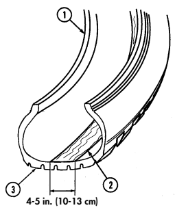
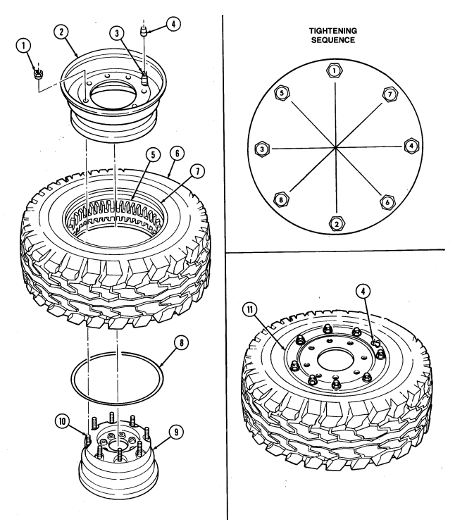
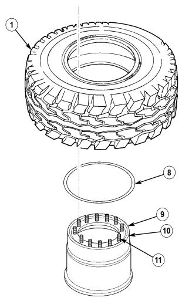
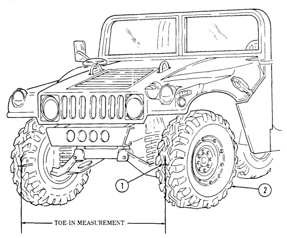

# Chapter 8 Wheels And Steering Maintenance Section I. Wheel And Runflat System Maintenance

| Chapter 8  |  TASK SUMMARY 
|------------|-------------------------------
| TASK       | PROCEDURES
| [8-1 ](#8-1)          | 
| [8-2 ](#8-2)          | 
| [8-3 ](#8-3)          | 
| [8-4 ](#8-4)          | 
| [8-5 ](#8-5)          | 
| [8-6 ](#8-6)          | 
| [8-7 ](#8-7)          | 
| [8-8 ](#8-8)          | 
| [8-9 ](#8-9)          | 
| [8-10](#8-10)         | 
| [8-11](#8-11)         | 
| [8-12](#8-12)         | 
| [8-13](#8-13)         | 
| [8-14](#8-14)         | 
| [8-15](#8-15)         | 
| [8-16](#8-16)         | 
| [8-17](#8-17)         | 
| [8-18](#8-18)         | 
| [8-19](#8-19)         | 
| [8-20](#8-20)         | 
| [8-21](#8-21)         | 
| [8-22](#8-22)         | 
| [8-23](#8-23)         | 
| [8-24](#8-24)         | 
| [8-25](#8-25)         | 
| [8-26](#8-26)         | 
| [8-27](#8-27)         | 
| [8-28](#8-28)         | 
| [8-29](#8-29)         | 
| [8-30](#8-30)         | 
| [8-31](#8-31)         | 

| General mechanic's tool kit:                                          | TM 9\-2320\-280\-10                                            |
|-----------------------------------------------------------------------|----------------------------------------------------------------|
| automotive (Appendix B, Item 1)                                       | TM 9\-2320\-280\-24P                                           |
| Materials/Parts                                                       | Equipment Condition                                            |
| Locknut (Appendix G, Item 128)                                        | - Battery ground cable disconnected (para. 4\-73).             |
| Lubricating oil (Appendix C, Item 33)                                 | - Hood raised and secured (TM 9\-2320\-280\-10).               |
| a. Removal                                                            |                                                                |
|                                                                       | CAUTION                                                        |
| -                                                                     | Prior to removal, tag brake lines for installation.            |
| -                                                                     | Cover or plug all open lines and connections immediately after |
| disconnection to prevent contamination. Remove all plugs prior to     |                                                                |
| connection.                                                           |                                                                |
| -                                                                     | Do not attempt to disassemble proportioning valve. Damage to   |
| equipment will result.                                                |                                                                |
|                                                                       | NOTE                                                           |
| Have drainage container ready to catch brake fluid.                   |                                                                |
| 1.  Disconnect electrical connector (1) from proportioning valve (6). |                                                                |

# 8 - 1 . Wheel And Runflat System Maintenance Task Summary

## 8-2. Jacking Instructions

This task covers:
a. Raising Corner of Vehicle e. Raising Rear of Vehicle b. Lowering Corner of Vehicle **f. Lowering Rear of Vehicle** c. Raising Front of Vehicle g. Raising Entire Vehicle d. Lowering Front of Vehicle **h. Lowering Entire Vehicle**
INITIAL SETUP:
Tools **General Safety Instructions**
General mechanic's tool kit: Never work under vehicle unless wheels are automotive (Appendix B, Item 1) blocked and it is properly supported.

Hydraulic jacks are used for raising and lowering, and are not used to support vehicle. Never work under vehicle unless wheels are blocked and it is properly supported. Injury or damage to equipment may result if vehicle suddenly shifts or moves.

#### A. Raising Corner Of Vehicle

1. Block wheels (2) or (4).

2. Place jack under lower control arm (5) on corner to be raised.

3. Raise vehicle (1) high enough to place trestle (3).

4. Place trestle (3) under flat portion of frame rail (7) and lower jack until weight is supported by trestle (3).

#### B. Lowering Corner Of Vehicle

1. Raise vehicle (1) and remove trestle (3). 2. Lower vehicle (1).

3. Remove blocks from wheels (2) or (4).

#### C. Raising Front Of Vehicle

1. Block rear wheels (2).

2. Center jack under front suspension front crossmember (6). Use a wood block between jack and crossmember (6).

3. Raise vehicle (1) high enough to place trestles (3). 4. Place trestles (3) under flat portion of frame rails (7) and lower jack until weight is supported by trestles (3).

#### D. Lowering Front Of Vehicle

1. Raise vehicle (1) and remove trestles (3).

2. Lower vehicle (1). 3. Remove blocks from rear wheels (2).

8-2. JACKING INSTRUCTIONS (Cont'd)

## 8 - 2 . Jacking Instructions( C O N T ' D )

#### E. Raising Rear Of Vehicle

1. Block front wheels (4). 2. Center jack under rear suspension rear crossmember (6). Use a wood block between jack and crossmember (6).

3. Raise vehicle (1) high enough to place trestles (3).

For vehicles with a heavy load such as S250 shelter carrier, an additional trestle should be placed in the rear for added stability.

4. Place trestles (3) under flat portion of frame rails (5) and lower jack until weight is supported by trestles (3).

f. Lowering Rear of Vehicle 1. Raise vehicle (1) and remove trestles (3). 2. Lower vehicle (1). 3. Remove blocks from front wheels (4).

#### G. Raising Entire Vehicle

1. Raise front of vehicle (task c). 2. Center jack under rear suspension rear crossmember (6). Use a wood block between jack and crossmember (6).

For vehicles with a heavy load such as S250 shelter carrier, an additional trestle should be placed in the rear for added stability.

3. Raise vehicle (1) high enough to place trestles (3). 4. Place trestles (3) under flat portion of frame rails (5) and lower jack until weight is supported by trestles (3).

5. Move blocks aside.

#### H. Lowering Entire Vehicle

1. Raise rear of vehicle (1) and remove trestles (3). 2. Lower rear of vehicle (1) and block rear wheels (2). 3. Lower front of vehicle (task d).

# 8-2. Jacking Instructions (Cont'D)

## 8-3. Wheel Replacement

This task covers:
INITIAL SETUP:

#### A. Removal **B. Installation** Tools **General Safety Instructions**

General mechanic's tool kit: Always apply parking brake and chock opposite automotive (Appendix B, item 1) wheel before removing wheel.

Remove only the inner group of nuts when Manual References removing a wheel from the vehicle.

TM 9-2320-280-24P Never mix radial tires and bias ply tires.

Always apply parking brake and chock opposite wheel before removing wheel. Avoid removing wheel when vehicle is on sloping terrain. Injury to personnel or damage to equipment may result.

Remove only the inner group of nuts when removing a wheel from the vehicle. Removing the outer nuts which hold the rim together while the assembly is inflated could result in serious injury or death.

Radial and Bias ply tires should not be mixed on the same vehicle. Injury to personnel or damage to equipment may result.

Check tire size designator on sidewall for tire construction identification:
36 X 12.50-16 .5 LT-Bias ply 37 X 12.50R16.5LT-Radial

#### A. Removal

1. Lumen eight lug nuts (2), but do not remove. 2. Raise and support corner of vehicle (para. 8-2). 3. Remove eight lug nuts (2) securing wheel (1) to geared hub (3) and remove wheel (1).

Ib. Installation**NOTE**
Install lug nuts with fingers to full engagement. If nuts resist finger tightening, discard nuts. Examine studs for damage and replace if damaged (para. 6-14). The radial tire is nondirectional and can be used in either position.

1. Install wheel (1) on geared hub (3) with eight lug nuts (2). 2. Remove support and lower corner of vehicle (para. 8-2). 3. Tighten eight lug nuts (2) to 90-110 lb-ft. (122-149 N m) in tightening sequence shown.

# 8-3. Wheel Replacement (Cont'D)

# 8-4. Tire, Wheel, And Runflat Maintenance

This task covers:
a. Disassembly c. Repair b. Inspection and Cleaning d. Assembly

#### Initial Setup:

Tools General mechanic's tool kit:
automotive (Appendix B, Item 1)
General mechanic's tool kit:
automotive, common No. 2 (Appendix B, Item 4)
Special Tools Torque adapter, 9/16 in.

(Appendix B, Item 144)
Socket adapter (Appendix B, Item 146)

#### Materials/Parts

Eight locknuts (Appendix G, Item 115) Four locknuts (Appendix G, Item 116) Lubricant (Appendix G, Item 196) O-ring (Appendix G, Item 214) Detergent (Appendix C, Item 17)
Manual References TM 9-2320-280-10 TM 9-2320-280-24P TM 9-2610-200-14

#### Equipment Condition

Wheel removed (para. 8-3).

#### General Safety Instructions

- Do not use tire machine. - Ensure tire is totally deflated before removing wheel locknuts.

- Never use tubes in wheel assemblies. - Rim surfaces must be kept clean and free of rust and dirt.

- Never use wheel assemblies with damaged studs.

- Never inflate a wheel assembly with the wheel locknuts removed.

- Never inflate a wheel assembly without first checking wheel locknut torques.

- Use only replacement parts specified in TM 9-2320-280-24P.

- Do not exceed recommended tire inflation pressure.

- Always use a tire inflation cage and a clip-on air chuck for tire inflation.

Do not use tire machine. Injury to personnel or damage to equipment may result.

NOTE
The following maintenance procedure applies to vehicles using bias ply tires and two-piece magnesium runflats. Refer to paras. 8-4.1, 8-5, and 8-5.1 for maintenance instructions on radial tires and rubber runflats.

#### A. Disassembly

1. Place wheel assembly in a tire inflation cage.

In all disassembly operations, ensure the tire is totally deflated before removing wheel locknuts. Failure to follow proper safety precautions could cause serious injury or death.

2. Remove valve core (4) from valve stem (3) and deflate tire (6). Run a piece of wire through valve stem (3) to make sure it is not plugged.

3. When tire (6) is fully deflated, remove wheel assembly from tire inflation cage and place flat on floor with valve stem (3) facing up.

4. Using a circular pattern, loosen eight wheel locknuts (1) securing rim halves (2) and (8) together. If you hear escaping air, do not proceed. Wait until the sound stops and recheck valve stem (3). When you are certain the tire (6) is fully deflated, proceed to remove wheel locknuts (1). Discard locknuts (1).

# 8-4. Tire, Wheel, And Runflat Maintenance (Cont'D)

Never inflate a wheel assembly with the wheel locknuts removed in an attempt to separate inner and outer rim halves. The assembly will separate under pressure, resulting in serious injury or death.

5. Remove rim half (2) from tire (6). 6. Remove tire (6) from rim half (8). 7. Remove O-ring (7) from rim half (8). Cut O-ring (7) in two, to make sure that it cannot be reused.

Discard O-ring (7).

8. Remove four locknuts (11), flange bolts (9), and runflat halves (10) from tire (6). Discard locknuts (11).

9. Remove balance weights (5) from rim halves (2) and (8) (if present). Discard balance weights (5).

# 8 - 4 . Tire, Wheel, And Runflat Maintenance (Cont'D)

b. Inspection and Cleaning

Do not reuse a tire which has been run flat without thoroughly inspecting for damage. Failure to follow these instructions may result in injury to personnel or damage to equipment.

1. Inspect inside of tire (1) for cord or belt separation, and inner liner damage. Replace tire (1) if damaged.

2. Inspect tire bead (2) for abrasions caused from runflat halves (3). Replace tire (1) if damaged. 3. Check for protruding objects inside tire (1) which may not be visible from outside. Repair tire (1) if damaged.

4. Check tread depth on tire (1). Tread should not be worn below level of wear bars (4). Replace tire (1) if tread is worn below wear bars (4).

5. Remove filament tape (7), lubricant packet (6), and adhesive tape (5) from runflat halves (3) if

installed. Discard lubricant packet (6), filament tape (7), and adhesive tape (5).

6. Clean lubricant from tire (1) and runflat halves (3) with soap and water and allow to air dry.

# 8 - 4 . Tire, Wheel, And Runflat Maintenance (Cont'D)

7. Inspect inside diameter fins (9) and center section fins (10) of runflat halves (8) for cracks or broken sections. Replace runflat halves (8) if cracked or broken.

8. Inspect outside diameter (11) of runflat halves (8) for total penetration cracks. Replace runflat halves (8) if cracked.

O-ring sealing surfaces and pressure relief grooves must be kept clean and free of rust and dirt. Failure to do so could cause the wheel assembly to separate under pressure if improperly disassembled, causing serious injury or death.

9. Using wire brush, clean studs (16). Clean all dirt and foreign material from rim halves (12) and (14)
with soap and water and allow to air dry. Ensure O-ring sealing surfaces (17) and pressure relief grooves (15) on rim halves (12) and (14) are not cracked, bent, and do not have oversized mounting holes.

10. Inspect rim halves (12) and (14) for cracks, bent sealing surfaces, or oversized mounting holes.

Replace rim halves (12) or (14) if cracked, bent, or if mounting holes are oversized. 

Never use wheel assemblies with studs which are damaged, loose, or have damaged threads. Damaged studs can cause improper assembly, which could cause individual fasteners to fail. Any of these situations could cause serious injury or death.

11. Inspect rim half (14) for cracked, broken, rusted, pitted, bent, or loose studs (16).

11.1. Inspect studs (16) for damaged or deformed threads. Replace studs (16) if threads are damaged or if studs (16) are damaged or loose (para. 8-8).

12. Inspect valve stem (13) for cracks or deterioration. Replace valve stem (13) if cracked or deteriorated.

## 8 - 4 . Tire, Wheel, And Runflat Maintenance (Cont'D)

c. Repair Refer to TM 9-2610-200-14 for maintenance and repair of tires.

d. Assembly

- Never use tubes in wheel assemblies. Use of a tube defeats builtin safety features, and could allow the wheel to come apart under pressure, resulting in serious injury or death.

- Use only replacement parts specified in TM 9-2320-280-24P for bias tires. Eight bolt rims were designed for use with bias tire components only. Wheels assembled with components not specified for bias tires could cause the assembly to separate under pressure, resulting in serious injury or death.

Magnesium runflats are going to be phased out of the military supply system. They will be replaced by a rubber runflat kit. If rubber runflat kit is received for use with bias tires, follow assembly instructions in para. 8-5.

1. Apply one 11-ounce tube of gel lubricant (2) around inside of tire (1) at crown area (3). 2. Evenly spread gel lubricant (2) 4-5 in. (10-13 cm) wide on tire crown (3). 3. Install two runflat halves (4) inside tire (1) with four flange bolts (5) and locknuts (6). 

Using torque adapter, tighten locknuts (6) to 18-22 lb-ft (24-30 N•m).

8-4.  TIRE, WHEEL, AND RUNFLAT MAINTENANCE (Cont'd)

## 8-4. Tire, Wheel, And Runflat Maintenance (Cont'D)

4. Lubricate O-ring (8) with tire soap and install O-ring (8) on first ledge of rim half (9). Make sure O-
ring (8) is not twisted and is uniformly positioned 1 in. (25.4 mm) below studs (10). Do not overstretch O-ring (8).

5. Position inner rim half (9) on a raised stand (or another inner rim half) to ensure tire (6) sidewall will not contact floor when installed.

6. Lubricate tire bead (7) and rim bead seat areas with tire soap.

Before installing tire on inner rim half, inspect tire sidewalls for a "paint dot". Paint dots are often painted on tires to indicate the tire's light spot, for balancing purposes. If paint dot is present, position tire on rim halves so that paint dot is 180° from valve stem on outer rim half.

7. Center runflat (5) in tire (6). Carefully lower tire (6) over rim half (9). Check to ensure O-ring (8) has not been disturbed.

8. Ensure runflat (5) is not binding flat portion of rim half (9). Runflat (5) should clear inner rim half (9).

9. Install rim half (2) in tire (6).

Tighten locknuts gradually to avoid bent and broken studs, or damage to wheel components.

10. Install rim half (2) to rim half (9) with eight locknuts (1). Tighten locknuts (1) in sequence shown until rim half (2) is nearly touching rim half (9).

11. Tighten locknuts (1) to 55 lb-ft (75 N•m) in sequence shown. 12. Tighten locknuts (1) to 65 lb-ft (88 N•m) in sequence shown. 13. Check wheel assembly for gaps at each stud (10) between rim half (2) and rim half (9). Use a 0.0015 in. (0.038 mm) thickness gauge to detect gaps. If gaps are detected, disassemble and reassemble wheel assembly and recheck for gaps. If gaps are still detected, replace rim half (2).

14. Install valve core (4) in valve stem (3).

- Never inflate a wheel assembly without having checked wheel locknut torques to ensure the wheel locknuts are tightened to specifications. An assembly with improperly tightened locknuts could separate under pressure resulting in serious injury or death.

- Always use a tire inflation cage for inflation purposes. Stand on one side of cage, during inflation, never directly in front. Keep hands out of the cage during inflation. Inflate assembly to recommended pressure, using a clip-on air chuck. Do not exceed 30 psi (207 kPa) cold inflation pressure. Failure to follow these instructions may result in serious injury or death.

15. Place assembly in safety cage and inflate tire (6) to 30 psi (207 kPa) to seat tire bead. 16. Deflate tire (6) to recommended tire pressure (TM 9-2320-280-10). 17. Check for leaks around rim edges (11) and valve stem (4) with soapy solution.

# 8-4.  Tire, Wheel, And Runflat Maintenance (Cont'D)

FOLLOW-ON TASK: Balance tire (para. 8-9).

# 8-4.1. Bias Tire, Wheel, And Rubber Runflat Maintenance

This task covers:
a. Disassembly c. Repair b. Inspection and cleaning d. Assembly

#### Initial Setup:

Applicable Models All except M997A2, M1025A2, M1035A2, M1043A2, M1045A2, M1097A2, and M1123 Tools General mechanic's tool kit:
automotive (Appendix B, Item 1)
General mechanic's tool kit:
automotive, common No. 2 (Appendix B, Item 4)

#### Special Tools

Runflat compressor (Appendix B, Item 131) Torque adapter, 9/16 in. 

(Appendix B, Item 144)

#### Materials/Parts

Twelve locknuts (Appendix G, Item 115) O-ring (Appendix G, Item 214) Detergent (Appendix C, Item 17) Lubricant (Appendix G, Item 196) Locknut (Appendix G, Item 82) O-ring (Appendix G, Item 219) Sealing compound, if required 
(Appendix C, Item 44)
Personnel Required One mechanic Manual References TM 9-2320-280-10 TM 9-2320-280-24P TM 9-2610-200-14

#### Equipment Condition

Wheel removed (para. 8-3).

General Safety Instructions
- Do not use tire machine. - Ensure tire is totally deflated before removing wheel locknuts.

- Never use tubes in wheel assemblies. - Rim surfaces must be kept clean and free of rust and dirt.

- Never use wheel assemblies with damaged studs.

- Never inflate a wheel assembly with the wheel locknuts removed.

- Never inflate a wheel assembly without first checking wheel locknut torques.

- Do not exceed recommended tire inflation pressure.

- Always use a tire inflation cage and a clipon air chuck for tire inflation.

- Ensure runflat compressor strap is centered around runflat.

- Never intermix bias and radial tires on the same vehicle.

- Use only replacement parts specified in TM 9-2320-280-24P.

- Do not use runflat compressor if compressor strap is frayed or damaged.

#### .Warning.

Do not use tire machine. Injury to personnel or damage to equipment may result.

The following maintenance procedure applies to vehicles using bias ply tires and one-piece rubber runflats. Refer to para. 8-4 for maintenance instructions on bias tires and magnesium runflats, and paras. 8-5 and 8-5.1 for maintenance instructions on radial tires and rubber runflats.

a. Disassembly 1. Place wheel assembly in a tire inflation cage.

# 8-4.1. Bias Tire, Wheel, And Rubber Runflat Maintenance (Cont'D)

In all disassembly operations, ensure the tire is totally deflated before removing wheel locknuts. Failure to follow proper safety precautions could cause serious injury or death.

2. Remove valve core (8) from valve bore (9) and deflate tire (6). Run a piece of wire through valve bore (9) to make sure it is not plugged.

3. When tire (6) is fully deflated, use a circular pattern and loosen twelve wheel locknuts (2) securing rim halves (1) and (4) together. If you hear escaping air, do not proceed. Wait until the sound stops and recheck valve bore (9). When you are certain the tire (6) is fully deflated, proceed to remove wheel locknuts (2). Discard locknuts (2).

4. Remove outer rim half (1) from tire (6).

Perform steps 5 and 6 only if damage to valve bore, insert, or O-ring is evident.

5. Remove valve bore (9) from insert (10). Remove insert (10) and locknut (12) from outer rim (1).

Discard locknut (12).

6. Remove O-ring (11) from insert (10). Discard O-ring (11). 7. Remove O-ring (5) from inner rim half (4). Cut O-ring (5) in two, to make sure it cannot be reused.

Discard O-ring (5).

8. Remove tire (6) from inner rim half (4). 9. Remove balance weights (3) from rim halves (1) and (4), if present. Discard balance weights (3).

# 8-4.1. Bias Tire, Wheel, And Rubber Runflat Maintenance (Cont'D)

11. Lay tire (1) flat.

#### .Warning.

Do not use runflat compressor if compressor strap is frayed or damaged. Inspect the tool's pivot points and bearings and ensure runflat is free of grease and runflat compressor strap is centered around runflat. Failure to do so could cause injury to personnel.

NOTE
•Perform steps 10 and 11 when using runflat compressor P/N J39250. 

•Perform steps 12 and 13 when using runflat compressor P/N 528236.

and strap (5) is centered around runflat (2).

12. Position runflat compressor (3) on runflat (2) so that runflat compressor hex drive (4) is facing up NOTE
Compress runflat by rotating hex drive in either direction. Rotate hex drive opposite to loosen.

13. Using runflat compressor (3), compress runflat (2). 14. Position runflat compressor (6) on an outer edge of runflat (2) with handle assembly (7) facing up and strap (8) centered around runflat (2).

Compress runflat by rotating the handle assembly in a clockwise direction. Rotate handle assembly counterclockwise to loosen.

15. Using runflat compressor (6), compress runflat (2).

•It may be necessary to use a tire spoon and tire soap to remove runflat from tire.

•When using runflat compressor P/N 528236, handle may need to be removed before removing runflat.

16. Remove runflat (2) from tire (1) and remove runflat compressor (3) or (6) from runflat (2). 17. Remove two lubricant packets (9) and adhesive tape (10) from runflat (2) if installed. Discard

lubricant packets (9) and adhesive tape (10).

# 8-4.1. Bias Tire, Wheel, And Rubber Runflat Maintenance (Cont'D)

b. Inspection and Cleaning

#### .Warning.

Do not reuse a tire which has been run flat without thoroughly inspecting for damage. Failure to follow these instructions may result in injury to personnel or damage to equipment.

1. Inspect inside of tire (1) for cord or belt separation, and inner liner damage. Replace tire (1) if damaged.

2. Inspect tire bead (12) for abrasions caused from runflat (2). Replace tire (1) if damaged. 3. Check for protruding objects inside tire (1) which may not be visible from outside. Repair tire (1) if damaged.

4. Check tread depth on tire (1). Tread should not be worn below level of wear bars (13). Replace tire (1) if tread is worn below wear bars (13) or 3/32 in. (2.38 mm).

5. Inspect runflat spacer (11) for splitting, wear, or excessive chafing. Replace runflat spacer (11) if damaged.

6. Inspect runflat (2) for splitting, wear, or excessive chafing. Replace runflat (2) if damaged.

# 8-4.1. Bias Tire, Wheel, And Rubber Runflat Maintenance (Cont'D)

O-ringing surfaces and pressure relief grooves must be kept clean and free of rust and dirt. Failure to do so could cause the wheel assembly to separate under pressure, causing serious injury or death.

7. Using wire brush, clean studs (4). Clean all dirt and foreign material from rim halves (1) and (2)
with soap and water and allow to air dry. Ensure O-ringing surfaces (5) and pressure relief grooves (3) on rim halves (1) and (2) are smooth and clean.

8. Inspect rim halves (1) and (2) for cracks, bent sealing surfaces (5), or oversized mounting holes.

Replace rim halves (1) or (2) if cracked, bent, or if mounting holes are oversized.

Never use wheel assemblies with studs which are damaged, loose, or have damaged threads. Damaged studs can cause improper assembly, which could cause individual fasteners to fail. Any of these situations could cause serious injury or death.

9. Inspect inner rim half (2) for cracked, broken, rusted, pitted, bent, or loose studs (4).

10. Inspect valve core (6) for cracks or deterioration. Replace valve core (6) if cracked or deteriorated. 11. Inspect studs (4) for damaged or deformed threads. Replace studs (4) if threads are damaged or if studs (4) are damaged or loose (para. 8-8).

NOTE
Perform steps 11 and 12 only if valve core and insert were removed.

12. Inspect valve bore (7) for cracks or deterioration. Replace valve bore (7) if cracked or deteriorated. 13. Inspect insert (8) for damage. Replace insert (8) if damaged.

c. Repair Refer to TM 9-2610-200-14 for maintenance and repair of tires.

8-14.6 Change 3

# 8-4.1. Bias Tire, Wheel, And Rubber Runflat Maintenance (Cont'D)

d. Assembly

#### .Warning.

- Never use tubes in wheel assemblies. Use of a tube defeats built-in safety features, and could allow the wheel to come apart under pressure, resulting in serious injury or death.

- Use only replacement parts specified in TM 9-2320-280-24P.

Wheels assembled with components which do not meet specifications could cause the assembly to separate under pressure, resulting in serious injury or death.

- Do not use runflat compressor if compressor strap is frayed or damaged. Ensure runflat is free of grease and runflat compressor strap is centered on runflat. Failure to do so could cause injury to personnel.

- Any oil on runflat compressor belt could result in personnel injury or damage to equipment. Wipe any oil off from belt or handle.

> Note

Perform steps 1 and 2 when using runflat compressor P/N J39250. Perform steps 3 and 4 when using runflat compressor P/N 528236.

1. Position runflat compressor (9) on runflat (8) so that runflat compressor hex drive (10) is facing up and strap (11) is centered around runflat (8).

 Note
Compress runflat by rotating hex drive in either direction. Rotate hex drive opposite to loosen.

2. Using runflat compressor (9), compress runflat (8). 3. Position runflat compressor (12) on an outer edge of runflat (8) with handle assembly (13) facing up and strap (14) centered around runflat (8).

> Note

Compress runflat by rotating the handle assembly in a clockwise

 direction. Rotate handle assembly counterclockwise to loosen.

4. Using runflat compressor (12), compress runflat (8).

# 8-4.1. Bias Tire, Wheel, And Rubber Runflat Maintenance (Cont'D)

5. Stand tire (1) up and lubricate tire bead (3) with tire soap.

NOTE
It may be necessary to remove the handle assembly on runflat compressor P/N 528236 before inserting runflat into tire.

6. Insert runflat (2), compressor side first, as far as possible into tire (1). 7. Lay tire (1) flat on protruding runflat side. Loosen compressor (4). Runflat (2) should insert itself inside tire (1). If not, repeat steps 5 through 7 and/or use a tire spoon to assist in installation.

If required, clean and lubricate bearing assembly on runflat compressor P/N 528236 after removal.

8. Loosen runflat compressor (4) and remove from tire (1). 9. Apply one 11-ounce tube of gel lubricant (5) around inside of tire (1) at crown area (6).

10. Evenly spread gel lubricant (5) 4-5 in. (10-13 cm) wide on the tire crown (6).

NOTE
- Ensure longer lip of runflat faces inner rim of tire. - Ensure runflat spacer butts up against flat side of runflat.

11. Install runflat spacer (7) inside tire (1) and position on valve side of tire (1). 12. Lubricate O-ring (8) with tire soap and install O-ring (8) in groove (10) on top of inner rim (9),
around studs (11). Ensure O-ring (8) is not twisted and that it is uniformly positioned in groove (10). Do not overstretch O-ring (8).

13. Lubricate tire bead (3) and rim bead seat areas with tire soap.

8-4.1. BIAS TIRE, WHEEL, AND RUBBER RUNFLAT MAINTENANCE (Cont'd)

# 8-4.1. Bias Tire, Wheel, And Rubber Runflat Maintenance (Cont'D)

Never intermix bias and radial rim assemblies. Damage to equipment may result causing injury to personnel.

NOTE
Before installing tire on inner rim half, inspect tire sidewalls for a "paint dot". Paint dots are often painted on tires to indicate the tire's light spot, for balancing purposes. If paint dot is present, position tire on rim halves so that paint dot is aligned with insert hole on outer rim half.

14. Center runflat (6) and runflat spacer (5) in tire (1). Carefully lower tire (1) over inner rim half (8). Check to ensure O-ring (7) has not been disturbed.

15. Ensure runflat (6) and runflat spacer (5) are not binding on flat portion of inner rim half (8).

Runflat (6) and runflat spacer (5) should clear inner rim half (8).

16. Install valve core (9) in valve bore (10).

Perform step 17 only if valve bore and insert were removed.

17. Install insert (11), O-ring (12), and locknut (13) on outer rim (3). Apply sealing compound to valve bore (10) and install valve bore (10) on insert (11). Tighten locknut (13) to 40-60 lb-in. (5-7 N•m). Tighten valve bore (10) to 25-30 lb-ft (34-41 N•m).

18. Install outer rim half (3) on inner rim half (8).

Tighten locknuts gradually to avoid bent and broken studs, or damage to wheel components.

19. Install outer rim half (3) to inner rim half (8) with twelve locknuts (2).

8-14.10 Change 3

# 8-4.1. Bias Tire, Wheel, And Rubber Runflat Maintenance (Cont'D)

20. Tighten locknuts (2) to 85 lb-ft (115 N•m) in tightening sequence shown. 21. Tighten locknuts (2) to 125 lb-ft (170 N•m) in tightening sequence shown. 22. Check wheel assembly for gaps at each stud (14). Use a 0.0015 in. (0.038 mm) thickness gauge to detect gaps. If gaps are detected, disassemble and reassemble wheel assembly and recheck for gaps. If gaps are still detected, replace outer rim half (3).

- Never inflate a wheel assembly without having checked wheel locknut torques to ensure the wheel locknuts are tightened to specifications. An assembly with improperly tightened locknuts could separate under pressure, resulting in serious injury or death.

- Always use a tire inflation cage for inflation purposes. Stand on one side of the cage, during inflation, never directly in front. Keep hands out of the cage during inflation. Inflate assembly to recommended pressure, using a clip-on air chuck. Do not exceed 50 psi (345 kPa) cold inflation pressure. Failure to follow these instructions may result in serious injury or death.

23. Place assembly in safety cage and inflate front and rear tires to recommended tire pressure
(TM 9-2320-280-10).

24. Check for leaks around rim edges (4), insert (6), and valve bore (10) with soapy solution.

FOLLOW-ON TASK: Balance tire (para. 8-9).

# 8-5. Radial Tire, Wheel, And Rubber Runflat Maintenance (All Except M1123 And "A2" Vehicles)

This task covers:
a. Disassembly c. Repair b. Inspection and Cleaning d. Assembly INITIAL SETUP:

| automotive (Appendix B, Item 1)                                                                       | TM 9\-2320\-280\-24P   |
|-------------------------------------------------------------------------------------------------------|------------------------|
| Materials/Parts  Equipment Condition                                                                  |                        |
| Cotter pins (Appendix G, Item 12) - Muffler and insulator removed (all models except                  |                        |
| Two lockwashers (Appendix G, Item 163) M1123 and "A2" vehicles) (para. 3\-48).                        |                        |
| Two retaining rings (Appendix G, Item 231) - Muffler and catalytic converter removed (M1123           |                        |
| Two locknuts (Appendix G, Item 71) and "A2" vehicles only) (para. 3\-49).                             |                        |
| Lockwasher (Appendix G, Item 135) - Wheels chocked and parking brake released                         |                        |
| (TM 9\-2320\-280\-10).                                                                                |                        |
| NOTE                                                                                                  |                        |
| -  The following procedure applies to vehicles with serial numbers                                    |                        |
| USBL Eff. 44825 and above.                                                                            |                        |
| -  If cables are chafing or crushed, use new cable clamp bracket.                                     |                        |
| a. Removal                                                                                            |                        |
| 1.  Remove cotter pin (21), washer (20), clevis pin (18), and brake clevis (19) from rear caliper     |                        |
| lever (22). Discard cotter pin (21).                                                                  |                        |
| 2.  Remove brake cable retaining ring (1) and parking brake cable sleeve (17) from rear caliper cable |                        |
| bracket (2) and remove cable assembly (4) from caliper cable bracket (2). Discard cable retaining     |                        |
| ring (1).                                                                                             |                        |
| 3.  Slide parking brake cable (11) through parking brake cable assembly (4). Remove parking brake     |                        |
| cable retaining ring (8) from parking brake cable sleeve (7) and "C" beam (10). Disconnect parking    |                        |
| brake cable (4) from parking brake equalizer bar (9). Discard cable retaining ring (8).               |                        |
| 4.  Remove two capscrews (5), parking brake cable clamps (6), and parking brake cable assembly (4)    |                        |
| from body (12).                                                                                       |                        |

Do not use tire machine. Injury to personnel or damage to equipment may result.

NOTE
The following maintenance procedure applies to vehicles using load range "D" tires and one-piece rubber runflats. Refer to paras. 8-4 and 8-4.1 for maintenance instructions on bias tires and magnesium runflats.

a. Disassembly 1. Place wheel assembly in a tire inflation cage.

In all disassembly operations, ensure the tire is totally deflated before removing wheel locknuts. Failure to follow proper safety precautions could cause serious injury or death.

2. Remove valve core (8) from valve bore (9) and deflate tire (6). Run a piece of wire through valve bore (9) to make sure it is not plugged.

3. When tire (6) is fully deflated, use a circular pattern and loosen twelve wheel locknuts (2) securing rim halves (1) and (4) together. If you hear escaping air, do not proceed. Wait until the sound stops and recheck valve bore (9). When you are certain the tire (6) is fully deflated, proceed to remove wheel locknuts (2). Discard locknuts (2).

# 8-5. Radial Tire, Wheel, And Rubber Runflat Maintenance (All Except M1123 And "A2" Vehicles) (Cont'D)

Never inflate a wheel assembly with the wheel locknuts removed in an attempt to separate inner and outer rim halves. The assembly will separate under pressure resulting in serious injury or death.

4. Remove outer rim half (1) from tire (6).

Perform steps 5 and 6 only if damage to valve bore, insert, or O-ring is evident.

5. Remove valve bore (9) from insert (10). Remove insert (10) and locknut (12) from outer rim (1).

Discard locknut (12).

6. Remove O-ring (11) from insert (10). Discard O-ring (11). 7. Remove O-ring (5) from inner rim half (4). Cut O-ring (5) in two, to make sure it cannot be reused.

Discard O-ring (5).

8. Remove tire (6) from inner rim half (4). 9. Remove balance weights (3) from rim halves (1) and (4), if present. Discard balance weights (3).

# 8 - 5 . Radial Tire, Wheel, And Rubber Runflat Maintenance (All Except M1123 And "A2" Vehicles) (Co N T ' D )

11. Lay tire (1) flat.

- Do not use runflat compressor if compressor strap is frayed or damaged.

Inspect the tool's pivot points and bearings and ensure runflat is free of grease and runflat compressor strap is centered around runflat. Failure to do so could cause injury to personnel.

- Any oil on runflat compressor belt or handle could result in personnel injury or damage to equipment. Wipe any oil off from belt or handle.

 Note
Perform steps 12 and 13 when using runflat compressor P/N J39250. Perform steps 14 and 15 when using runflat compressor P/N 528236.

11.1. Make sure gears and pivot points on runflat compressor (3) or (6) have a light coat of oil to ensure ease of operation and prevent from rust.

12. Position runflat compressor (3) on runflat (2) so that runflat compressor hex drive (4) is facing up and strap (5) is centered around runflat (2).

> Note

Compress runflat by rotating hex drive in either direction. Rotate hex drive opposite to loosen.

13. Using runflat compressor (3), compress runflat (2). 14. Position runflat compressor (6) on an outer edge of runflat (2) with handle assembly (7) facing up and strap (8) centered around runflat (2).

 Note
Compress runflat by rotating the handle assembly in a clockwise direction. Rotate handle assembly counterclockwise to loosen.

15. Using runflat compressor (6), compress runflat (2).

 Note
- It may be necessary to use a tire spoon and tire soap to remove runflat from tire.

- When using runflat compressor P/N 528236, handle may need to be

removed before removing runflat.

16. Remove runflat (2) from tire (1) and remove runflat compressor (3) or (6) from runflat (2). 17. Remove two lubricant packets (9) and adhesive tape (10) from runflat (2) if installed.

RUNFLAT COMPRESSOR (P/N J39250) RUNFLAT COMPRESSOR (P/N 528236)
8 - 5 . RADIAL TIRE, WHEEL, AND RUBBER RUNFLAT MAINTENANCE (ALL EXCEPT M1123

# And "A2" Vehicles) (Co N T ' D )

b. Inspection and Cleaning

Do not reuse a tire which has been run flat without thoroughly inspecting for damage. Failure to follow these instructions may result in injury to personnel or damage to equipment.

1. Inspect inside of tire (1) for cord or belt separation, and inner liner damage. Replace tire (1) if damaged.

2. Inspect tire bead (12) for abrasions caused from runflat (2). Replace tire (1) if damaged. 3. Check for protruding objects inside tire (1) which may not be visible from outside. Repair tire (1) if damaged.

4. Check tread depth on tire (1). Tread should not be worn below level of wear bars (13). Replace tire (1) if tread is worn below wear bars (13) or 3/32 in. (2.38 mm).

5. Inspect runflat spacer (11) for splitting, wear, or excessive chafing. Replace runflat spacer (11) if damaged.

6. Clean all grease, dirt, and foreign material from the runflat (2) with soap and water and allow to air

dry. Inspect runflat (2) for splitting, wear, or excessive chafing. Replace runflat (2) if damaged.

# 8 - 5 . Radial Tire, Wheel, And Rubber Runflat Maintenance (All Except M1123 And "A2" Vehicles) (Co N T ' D )

O-ring sealing surfaces and pressure relief grooves must be kept clean and free of rust and dirt. Failure to do so could cause the wheel assembly to separate under pressure, causing serious injury or death.

7. Using wire brush, clean studs (4). Clean all dirt and foreign material from rim halves (1) and (2)
with soap and water and allow to air dry. Ensure O-ring sealing surfaces (5) and pressure relief grooves (3) on rim halves (1) and (2) are smooth and clean.

8. Inspect rim halves (1) and (2) for cracks, bent sealing surfaces (5), or oversized mounting holes.

Replace rim halves (1) or (2) if cracked, bent, or if mounting holes are oversized.

Never use wheel assemblies with studs which are damaged, loose, or have damaged threads. Damaged studs can cause improper assembly, which could cause individual fasteners to fail. Any of these situations could cause serious injury or death.

9. Inspect inner rim half (2) for cracked, broken, rusted, pitted, bent, or loose studs (4).

10. Inspect valve core (6) for cracks or deterioration. Replace valve core (6) if cracked or deteriorated.

10.1. Inspect studs (4) for damaged or deformed threads. Replace studs (4) if threads are damaged or if studs (4) are damaged or loose (para. 8-8).

> Note

Perform steps 11 and 12 only if valve core and insert were removed.

11. Inspect valve bore (7) for cracks or deterioration. Replace valve bore (7) if cracked or deteriorated.

12. Inspect insert (8) for damage. Replace insert (8) if damaged.

c. Repair Refer to TM 9-2610-200-14 for maintenance and repair of tires.

8 - 5 . RADIAL TIRE, WHEEL, AND RUBBER RUNFLAT MAINTENANCE (ALL EXCEPT M1123

# And "A2" Vehicles) (Co N T ' D )

d. Assembly

- Never use tubes in wheel assemblies. Use of a tube defeats built-in safety features, and could allow the wheel to come apart under pressure, resulting in serious injury or death.

- Use only replacement parts specified in TM 9-2320-280-24P for radial tires. Never install radial tire components on eight bolt rims. Wheels assembled with components not specified for radial tires could cause the assembly to separate under pressure, resulting in serious injury or death.

- Radial and bias tires should not be mixed on the same vehicle. Injury to personnel or damage to equipment may result.

- Do not use if compressor strap is frayed or damaged. Ensure runflat is free of grease and runflat compressor strap is centered on runflat. Failure to do so could cause injury to personnel.

- Any oil on runflat compressor belt or handle could result in personnel injury or damage to equipment. Wipe any oil off from belt or handle.

 Note
Perform steps 1 and 2 when using runflat compressor P/N J39250. Perform steps 3 and 4 when using runflat compressor P/N 528236.

1. Make sure gears and pivot points on runflat compressor (10) or (13) have a light coat of oil to ensure ease of operation and prevent from rust.

1.1. Position runflat compressor (10) on runflat (9) so that runflat compressor hex drive (11) is facing up and strap (12) is centered around runflat (9).

 Note
Compress runflat by rotating hex drive in either direction. Rotate hex drive opposite to loosen.

2. Using runflat compressor (10), compress runflat (9). 3. Position runflat compressor (13) on an outer edge of runflat (9) with handle assembly (14) facing up and strap (15) centered around runflat (9).

> Note

Compress runflat by rotating the handle assembly in a clockwise direction. Rotate handle assembly counterclockwise to loosen.

4. Using runflat compressor (13), compress runflat (9).

RUNFLAT COMPRESSOR (P/N J39250) RUNFLAT COMPRESSOR (P/N 528236)
# 8-5. Radial Tire, Wheel, And Rubber Runflat Maintenance (All Except M1123 And "A2" Vehicles) (Cont'D)

The radial tire is a bidirectional tire and the tread may be positioned in either direction.

5. Stand tire (1) up and lubricate tire bead (3) with tire soap.

NOTE
It may be necessary to remove the handle assembly on runflat compressor (P/N 528236) before inserting runflat into tire.

6. Insert runflat (2), compressor side first, as far as possible into tire (1). 7. Lay tire (1) flat on protruding runflat side. Loosen compressor (4). Runflat (2) should insert itself inside tire (1). If not, repeat steps 5 through 7 and/or use a tire spoon to assist in installation.

NOTE
If required, clean and lubricate bearing assembly on runflat compressor P/N 528236 after removal.

8. Loosen runflat compressor (4) and remove from tire (1). 9. Apply one 11-ounce tube of gel lubricant (6) around inside of tire (1) at crown area (7).

10. Evenly spread gel lubricant (6) 4-5 in. (10-13 cm) wide on tire crown (7).

NOTE
- Ensure longer lip of runflat faces inner rim of tire. - Ensure square cut edge of runflat spacer butts up against flat side of runflat.

11. Install flat spacer (5) inside tire (1) and position on valve side of tire (1). 12. Lubricate O-ring (10) with tire soap. Install O-ring (10) in groove (11.1) on top of inner rim (11),
around studs (12). Ensure O-ring (10) is not twisted and that it is uniformly positioned in groove (11.1). Do not overstretch O-ring (10).

13. Lubricate tire bead (3) and rim bead seat areas with tire soap.

# 8-5. Radial Tire, Wheel, And Rubber Runflat Maintenance (All Except M1123 And "A2" Vehicles) (Cont'D)

- Never install radial tire on eight bolt wheel. Damage to equipment may result causing injury to personnel.

- Ensure that during assembly indexing hole on inner and outer rim halves is aligned. Failure to do so may cause damage to equipment or injury to personnel.

Before installing tire on inner rim half, inspect tire sidewalls for a "paint dot". Paint dots are often painted on tires to indicate the tire's light spot, for balancing purposes. If paint dot is present, position tire on rim halves so that paint dot is aligned with insert hole on outer rim half.

14. Center runflat (2) and runflat spacer (5) in tire (1). Carefully lower tire (1) over inner rim half (11). Check to ensure O-ring (10) has not been disturbed.

15. Ensure runflat (2) and runflat spacer (5) are not binding on flat portion of inner rim half (11).

Runflat (2) and runflat spacer (5) should clear inner rim half (11).

16. Install valve core (13) in valve bore (14).

Perform step 17 only if valve bore and insert were removed.

17. Install insert (15), O-ring (16), and locknut (17) on outer rim (9). Apply sealing compound to valve bore (14) and install valve bore (14) on insert (15). Tighten locknut (17) to 40-60 lb-in. (5-7 N•m). Tighten valve bore (14) to 25-30 lb-ft (34-41 N•m).

18. Install outer rim half (9) on inner rim half (11).

Tighten locknuts gradually to avoid bent and broken studs, or

 damage to wheel components.

19. Install outer rim half (9) to inner rim half (11) with twelve locknuts (8).

Change 3 8-23

## 8 - 5 . Radial Tire, Wheel, And Rubber Runflat Maintenance (All Except M1123 And "A2" Vehicles) (Co N T ' D )

20. Tighten locknuts (1) to 85 lb-ft (115 N•m) in tightening sequence shown. 21. Tighten locknuts (1) to 125 lb-ft (170 N•m) in tightening sequence shown. 22. Check wheel assembly for gaps at each stud (2). Use a 0.0015 in. (0.038 mm) thickness gauge to detect gaps. If gaps are detected, disassemble and reassemble wheel assembly and recheck for gaps. If gaps are still detected, replace outer rim half (3).

- Never inflate a wheel assembly without having checked wheel locknut torques to ensure the wheel locknuts are tightened to specifications. An assembly with improperly tightened locknuts could separate under pressure, resulting in serious injury or death.

- Always use a tire inflation cage for inflation purposes. Stand on one side of the cage, during inflation, never directly in front. Keep hands out of the cage during inflation. Inflate assembly to recommended pressure, using a clip-on air chuck. Do not exceed 50 psi (345 kPa) cold inflation pressure. Failure to follow these instructions may result in serious injury or death.

23. Place assembly in safety cage and inflate front and rear tires to recommended tire pressure
(TM 9-2320-280-10).

24. Check for leaks around rim edges (4), insert (6), and valve bore (5) with soapy solution.

8 - 5 . RADIAL TIRE, WHEEL, AND RUBBER RUNFLAT MAINTENANCE (ALL EXCEPT M1123

AND "A2" VEHICLES) (Co n t ' d )

# 8-5.1. Radial Tire, Wheel, And Rubber Runflat Maintenance (M1123 And "A2" Vehicles)

This task covers:
a. Disassembly c. Repair b. Inspection and Cleaning d. Assembly INITIAL SETUP:

| General mechanic's tool kit:                                    | - Muffler and insulator removed (all models except                                                  |
|-----------------------------------------------------------------|-----------------------------------------------------------------------------------------------------|
| automotive (Appendix B, Item 1)                                 | M1123 and "A2" vehicles) (para. 3\-48).                                                             |
| - Muffler and catalytic converter removed (M1123                | Materials/Parts                                                                                     |
| and "A2" vehicles only) (para. 3\-49).                          |                                                                                                     |
| Three cotter pins (Appendix G, Item 12)                         | - Wheels chocked and parking brake released                                                         |
| Locknut (Appendix G, Item 79)                                   | (TM 9\-2320\-280\-10).                                                                              |
| Locknut (Appendix G, Item 86)                                   |                                                                                                     |
| Manual References                                               |                                                                                                     |
| TM 9\-2320\-280\-10                                             |                                                                                                     |
| TM 9\-2320\-280\-24P                                            |                                                                                                     |
| CAUTION                                                         |                                                                                                     |
| The following procedure applies to vehicles with serial numbers |                                                                                                     |
| USBLEff. 44825 and above.                                       |                                                                                                     |
| a. Removal                                                      |                                                                                                     |
| 1.                                                              | Remove two cotter pins (left and right) (23), washers (22), clevis pins (20), and brake clevis (21) |
| from caliper levers (24). Discard cotter pins (23).             |                                                                                                     |
| 2.                                                              | Remove clip (5) and spread boot (6) to allow access to cotter pin (12).                             |
| 3.                                                              | Remove cotter pin (12), washer (11), clevis pin (8), and clevis (9) from brake rod (14) and         |
| bellcrank (7). Discard cotter pin (12).                         |                                                                                                     |
| 4.                                                              | Remove locknut (17), washer (16), spacer (15), washer (3), capscrew (4), and spring (2) from        |

Do not use tire machine. Injury to personnel or damage to equipment may result.

The following maintenance procedure applies to vehicles using load range "D" tires and one-piece rubber runflats. Refer to paras. 8-4 and 8-4.1 for maintenance instructions on bias tires and magnesium runflats.

#### A. Disassembly

1. Place wheel assembly in a tire inflation cage.

In all disassembly operations, ensure the tire is totally deflated before removing wheel locknuts. Failure to follow proper safety precautions could cause serious injury or death.

2. Remove valve core (8) from valve bore (7) and deflate tire (6). Run a piece of wire through valve bore (7) to make sure it is not plugged.

3. When tire (6) is fully deflated, use a circular pattern and loosen twelve wheel locknuts (2) securing rim halves (1) and (4) together. If you hear escaping air, do not proceed. Wait until the sound stops and recheck valve bore (7). When you are certain the tire (6) is fully deflated, proceed to remove wheel locknuts (2). Discard locknuts (2).

# 8-5.1. Radial Tire, Wheel, And Rubber Runflat Maintenance (M1123 And "A2" Vehicles) (Cont'D)

Never inflate a wheel assembly with the wheel locknuts removed in an attempt to separate inner and outer rim halves. The assembly will separate under pressure resulting in serious injury or death.

4. Remove outer rim half (1) from tire (6).

Perform steps 5 and 6 only if damage to valve bore, insert, or O-ring is evident.

5. Remove valve bore (7) from insert (10). Remove insert (10) and locknut (11) from outer rim (1).

Discard locknut (11).

6. Remove O-ring (9) from insert (10). Discard O-ring (9). 7. Remove O-ring (5) from inner rim half (4). Cut O-ring (5) in two, to make sure it cannot be reused.

Discard O-ring (5).

8. Remove tire (6) from inner rim half (4). 9. Remove balance weights (3) from rim halves (1) and (4), if present. Discard balance weights (3).

# 8-5.1. Radial Tire, Wheel, And Rubber Runflat Maintenance (M1123 And "A2" Vehicles) (Cont'D)

10. Lay tire (1) flat.

- Do not use runflat compressor if compressor strap is frayed or damaged. Inspect tool's pivot points and bearings and ensure runflat is free of grease and runflat compressor strap is centered around runflat. Failure to do so could cause injury to personnel.

- Any oil on runflat compressor belt or handle could result in personnel injury or damage to equipment. Wipe any oil off from belt or handle.

Perform steps 11 and 12 when using runflat compressor P/N J39250. Perform steps 13 and 14 when using runflat compressor P/N 528236.

10.1. Make sure gear and pivot points on runflat compressor (6) or (3) have a light coat of oil to ensure ease of operation and protect from rust.

11. Position runflat compressor (3) on runflat (2) so that runflat compressor hex drive (4) is facing up and strap (5) is centered around runflat (2).

NOTE
Compress runflat by rotating hex drive in either direction. Rotate hex drive opposite to loosen.

12. Using runflat compressor (3), compress runflat (2).

and strap (8) centered around runflat (2).

13. Position runflat compressor (6) on an outer edge of runflat (2) with handle assembly (7) facing up

Compress runflat by rotating the handle assembly in a clockwise direction. Rotate handle assembly counterclockwise to loosen.

14. Using runflat compressor (6), compress runflat (2).

NOTE
- It may be necessary to use a tire spoon and tire soap to remove runflat from tire.

- When using runflat compressor P/N 528236, handle may need to be

removed before removing runflat.

15. Remove runflat (2) from tire (1) and remove runflat compressor (3) or (6) from runflat (2).

RUNFLAT COMPRESSOR (P/N J39250) **RUNFLAT COMPRESSOR (P/N 528236)**
8-24.4 Change 2

# "A2" Vehicles) (Cont'D)

8-5.1. RADIAL TIRE, WHEEL, AND RUBBER RUNFLAT MAINTENANCE (M1123 AND
b. Inspection and Cleaning

Do not reuse a tire which has been run flat without thoroughly inspecting for damage. Failure to follow these instructions may result in injury to personnel or damage to equipment.

1. Inspect inside of tire (1) for cord or belt separation, and inner liner damage. Replace tire (1) if damaged.

2. Inspect tire bead (9) for abrasions caused from runflat (2). Replace tire (1) if damaged. 3. Check for protruding objects inside tire (1) which may not be visible from outside. Repair tire (1) if damaged.

4. Check tread depth on tire (1). Tread should not be worn below level of wear bars (10). Replace tire (1) if tread is worn below wear bars (10) or 3/32 in. (2.38 mm).

5. Clean all grease, dirt, and foreign material from the runflat (2) with soap and water and allow to

air dry. Inspect runflat (2) for splitting, wear, or excessive chafing. Replace runflat (2) if damaged.

# 8 - 5 . 1 . Radial Tire, Wheel, And Rubber Runflat Maintenance (M1123 And " A 2 " Vehicles) (Co N T ' D )

O-ring sealing surfaces and pressure relief grooves must be kept clean and free of rust and dirt. Failure to do so could cause the wheel assembly to separate under pressure, causing serious injury or death.

6. Using wire brush, clean studs (4). Clean all dirt and foreign material from rim halves (1) and (2)
with soap and water and allow to air dry. Ensure O-ring sealing surfaces (5) and pressure relief grooves (3) on rim halves (1) and (2) are smooth and clean.

7. Inspect rim halves (1) and (2) for cracks, bent sealing surfaces (5), or oversized mounting holes.

Replace rim halves (1) or (2) if cracked, bent, or if mounting holes are oversized.

Never use wheel assemblies with studs which are damaged, loose, or have damaged threads. Damaged studs can cause improper assembly, which could cause individual fasteners to fail. Any of these situations could cause serious injury or death.

8. Inspect inner rim half (2) for cracked, broken, rusted, pitted, bent, or loose studs (4).

8.1. Inspect studs (4) for damaged or deformed threads. Replace studs (4) if threads are damaged or if studs (4) are damaged or loose (para. 8-8).

9. Inspect valve core (6) for cracks or deterioration. Replace valve core (6) if cracked or deteriorated.

> Note

Perform steps 10 and 11 only if valve bore and insert were removed.

10. Inspect valve bore (7) for cracks or deterioration. Replace valve bore (7) if cracked or deteriorated.

11. Inspect insert (8) for damage. Replace insert (8) if damaged.

c. Repair Refer to TM 9-2610-200-14 for maintenance and repair of tires.

8 - 5 . 1 . RADIAL TIRE, WHEEL, AND RUBBER RUNFLAT MAINTENANCE (M1123 AND

# " A 2 " Vehicles) (Co N T ' D )

d. Assembly

- Never use tubes in wheel assemblies. Use of a tube defeats built-in safety features, and could allow the wheel to come apart under pressure, resulting in serious injury or death.

- Use only replacement parts specified in TM 9-2320-280-24P for radial tires. Never install radial tire components on eight bolt rims. Wheels assembled with components not specified for radial tires could cause the assembly to separate under pressure, resulting in serious injury or death.

- Radial and bias tires should not be mixed on the same vehicle. Injury to personnel or damage to equipment may result.

- Do not use if compressor strap is frayed or damaged. Ensure runflat is free of grease and runflat compressor strap is centered on runflat. Failure to do so could cause injury to personnel.

- Any oil on runflat compressor belt or handle could result in personnel injury or damage to equipment. Wipe any oil off from belt or handle.

 Note
Perform steps 1 and 2 when using runflat compressor P/N J39250. Perform steps 3 and 4 when using runflat compressor P/N 528236.

1. Make sure gears and pivot points on runflat compressor (13) or (10) have a light coat of oil to ensure ease of operation and prevent from rust.

1.1. Position runflat compressor (10) on runflat (9) so that runflat compressor hex drive (11) is facing up and strap (12) is centered around runflat (9).

 Note
Compress runflat by rotating hex drive in either direction. Rotate hex drive opposite to loosen.

2. Using runflat compressor (10), compress runflat (9). 3. Position runflat compressor (13) on an outer edge of runflat (9) with handle assembly (14) facing up and strap (15) centered around runflat (9).

> Note

Compress runflat by rotating the handle assembly in a clockwise

 direction. Rotate handle assembly counterclockwise to loosen.

4. Using runflat compressor (13), compress runflat (9).

RUNFLAT COMPRESSOR (P/N J39250) RUNFLAT COMPRESSOR (P/N 528236)
# 8-5.1. Radial Tire, Wheel, And Rubber Runflat Maintenance (M1123 And "A2" Vehicles) (Cont'D)

4.1. Apply one 11-ounce tube of gel lubricant (5.1) around inside of tire (1) at crown area (5.2). 4.2. Evenly spread gel lubricant (5.1) 4-5 in. (10-13 cm) wide on tire crown (5.2).

NOTE
The radial tire is a bidirectional tire and the tread may be positioned in either direction.

5. Stand tire (1) up and lubricate tire bead (4) with tire soap.

It may be necessary to remove the handle assembly on runflat compressor (P/N 528236) before inserting runflat into tire.

6. Insert runflat (3), compressor side first, as far as possible into tire (1). 7. Lay tire (1) flat on protruding runflat side. Loosen compressor (5). Runflat (3) should insert itself inside tire (1). If not, repeat steps 5 through 7 and/or use a tire spoon to assist in installation.

If required, clean and lubricate bearing assembly on runflat compressor P/N 528236 after removal.

8. Loosen runflat compressor (5) and remove from tire (1).

- Never install radial tire on eight bolt wheel. Damage to equipment may result causing injury to personnel.

- Ensure that during assembly indexing hole on inner and outer rim halves is aligned. Failure to do so may cause damage to equipment or injury to personnel.

Before installing tire on inner rim half, inspect tire sidewalls for a "paint dot". Paint dots are often painted on tires to indicate the tire's light spot, for balancing purposes. If paint dot is present, position tire on rim halves so that paint dot is aligned with insert hole on outer rim half.

9. Lubricate tire bead (4) and rim bead seat areas with tire soap.

10. Center runflat (3) in tire (1). Carefully lower tire (1) over inner rim half (9). 11. Ensure runflat (3) is not binding on flat portion of inner rim half (9). Runflat (3) should clear inner

# 8-5.1. Radial Tire, Wheel, And Rubber Runflat Maintenance (M1123 And "A2" Vehicles) (Cont'D)

Ensure longer lip of runflat faces outer rim half.

12. Lubricate O-ring (8) with tire soap. Install O-ring (8) in groove (10) on top of inner rim (9), around studs (11). Ensure O-ring (8) is not twisted and that it is uniformly positioned in groove (10). Do not overstretch O-ring (8).

13. Install valve core (12) in valve bore (13).

Perform step 14 only if valve bore and insert were removed.

14. Install insert (14), O-ring (15), and locknut (16) on outer rim (7). Apply sealing compound to valve bore (13) and install valve bore (13) on insert (14). Tighten locknut (16) to 40-60 lb-in. (5-7 N•m). Tighten valve bore (13) to 25-30 lb-ft (34-41 N•m).

15. Install outer rim half (7) on inner rim half (9).

Tighten locknuts gradually to avoid bent and broken studs, or

 damage to wheel components.

16. Install outer rim half (7) on inner rim half (9) with twelve locknuts (6).

# 8 - 5 . 1 . Radial Tire, Wheel, And Rubber Runflat Maintenance (M1123 And " A 2 " Vehicles) (Co N T ' D )

17. Tighten locknuts (1) to 85 lb-ft (115 N•m) in tightening sequence shown. 18. Tighten locknuts (1) to 125 lb-ft (170 N•m) in sequence shown. 19. Check wheel assembly for gaps at each stud (2). Use a 0.0015 in. (0.038 mm) thickness gauge to detect gaps. If gaps are detected, disassemble and reassemble wheel assembly and recheck for gaps. If gaps are still detected, replace outer rim half (3).

- Never inflate a wheel assembly without having checked wheel locknut torques to ensure the wheel locknuts are tightened to specifications. An assembly with improperly tightened locknuts could separate under pressure, resulting in serious injury or d e a t h .

- Always use a tire inflation cage for inflation purposes. Stand on one side of the cage, during inflation, never directly in front. Keep hands out of the cage during inflation. Inflate assembly to recommended pressure, using a clip-on air chuck. Do not exceed 50 psi (345 kPa) cold inflation pressure. Failure to follow these instructions may result in serious injury or death.

20. Place assembly in safety cage and inflate front and rear tires to recommended tire pressure
(TM 9-2320-280-10).

21. Check for leaks around rim edges (4), insert (6), and valve bore (5) with soapy solution.

FOLLOW-ON TASK: Balance tire (para. 8-9).

# 8-6. Runflat Compressor (P/N J39250) Belt Replacement

This task covers:
INITIAL SETUP:
Tools General mechanic's tool kit:
automotive (Appendix B, Item 1)
Materials/Parts Runflat belt repair kit
(Appendix G, Item 276)
a. Removal a. Removal b. Installation Manual References TM 9-2320-280-24P

Note position of belt for installation.

1. Remove small pin (8) from belt (4) and worm gear shaft assembly (1). Discard small pin (8). 2. Remove shaft pin (7) and worm gear shaft assembly (1) from compressor assembly (6). Discard shaft pin (7).

3. Remove two locknuts (5), sockethead screws (2), spacers (3), and belt (4) from compressor assembly (6). Discard locknuts (5).

b. Installation

Belt overlap is to be positioned so that you have equal amount of belt on each side of worm gear shaft assembly.

1. Install belt (4) on compressor assembly (6) with two spacers (3), sockethead screws (2), and locknuts (5).

2. Install worm gear shaft assembly (1) on compressor assembly (6) with shaft pin (7). 3. Install belt (4) to worm gear shaft assembly (1) with small pin (8).

# 8-7. Runflat Compressor (P/N 528236) Belt Replacement

This task covers:
a. Removal b. Installation INITIAL SETUP:
Tools General mechanic's tool kit:
automotive (Appendix B, Item 1)
Manual References TM 9-2320-280-24P
Materials/Parts Runflat belt repair kit
(Appendix G, Item 277)
a. Removal

Note position of belt for installation.

Remove locknut (1), capscrew (2) and belt (3) from compressor (4). Discard locknut (1).

b. Installation 1. Install belt (3) on compressor (4) with capscrew (2) and locknut (1). 2. Loop free end of belt (3) around retaining bracket (5) as shown.

# 8-8. Inner Rim Stud Maintenance

This task covers:
a. Removal c. Installation b. Cleaning and Inspection INITIAL SETUP:
Tools General mechanic's tool kit:
automotive (Appendix B, Item 1)
Manual References TM 9-2320-280-24P
Equipment Condition Wheel removed (para. 8-3).

#### General Safety Instructions

Always wear eye protection when replacing wheel studs.

Ensure tire is totally deflated before removing wheel locknuts.

Never use wheel assemblies with damaged studs.

Never inflate a wheel assembly without first checking wheel locknut torques.

Always use a tire inflation cage and a clip-on air chuck for tire inflation.

Always wear eye protection when replacing wheel studs. Severe eye injury may result if metal chips contact eyes.

Perform steps 1 through 4 for stud removal without disassembly of wheel. Perform steps 5 and 6 for stud removal with disassembled wheel.

1. Place wheel assembly in tire inflation cage.

#### Warnin G

In all assembly operations, ensure the tire is totally deflated before

 removing wheel locknuts. Failure to follow proper safety precautions may result in serious injury or death.

2.

3.

Remove valve core (3) from valve bore (4) and deflate tire (1). Run a wire through valve bore (4) to ensure it is not plugged. When tire (1) is fully deflated, loosen wheel locknut (2) from each side of the broken stud(s) (5). If you hear escaping air, do not proceed. Wait until the sound stops and recheck valve bore (4). When you are certain tire is fully deflated, proceed to remove wheel locknut (2). Discard locknut (2).

# 8-8. Inner Rim Stud Maintenance (Cont'D)

When replacing broken rim stud(s), replace studs on both sides of the broken stud(s).

4. Drive studs (1) out of inner rim (2). Discard studs (1).

5. Disassemble wheel and runflat (para. 8-4 or 8-5.)
6. Drive stud (3) out of inner rim half (4). Discard stud (3).

#### B. Cleaning And Inspection

1. Using wire brush, clean studs. Clean all dirt and foreign material from rim with soap and water and allow to air dry.

Never use wheel assemblies with studs which are damaged, loose, or have damaged threads. Damaged studs can cause improper assembly, which could cause individual fasteners to fail. Any of these situations may result in serious injury or death.

2. Inspect inner rim (4) for cracked, broken, rusted, pitted, bent, or loose studs (3), and studs (3) with damaged, mutilated, or deformed threads.

#### C. Installation Note

Perform steps 1 and 2 for stud installation with disassembled wheel. Perform steps 3 through 11 for stud installation without disassembly of wheel.

Align splines on stud (3) with splines in inner rim (4) and drive stud (3) into inner rim (4) until stud shoulder seats against inner rim (4).

1.

2.

3.

4.

Repeat step 3 for all studs (1) being replaced.

Tighten locknuts gradually to avoid bent and broken studs, or damage to wheel components will result.

5.

Install locknuts (6) on studs (1).

After replacing broken stud(s), all rim nuts must be retorqued.

6. 7. 8.

9.

Assemble wheel and runflat (para. 8-4 or 8-5.). Align splines on stud (1) with splines in inner rim (2) and drive stud (1) into rim (2) until shoulder of stud (1) seats against inner rim (2).

Tighten locknuts (6) to 85 lb-ft (115 N m) in sequence shown.

Tighten locknuts (6) to 125 lb-ft ( 170 N m) in sequence shown.

Check wheel assembly for gaps at each stud. Use a 0.0015 in. (0.038 mm) thickness gauge to detect gaps. If gaps are detected, disassemble and reassemble wheel assembly and recheck for gaps. If gaps are still detected, replace outer rim half (para. 8-4 or 8-5). Install valve core (7) in valve bore (8).

# 8-8. Inner Rim Stud Maintenance (Cont'D)

Never inflate a wheel assembly before checking wheel locknut torques to ensure the wheel locknuts are tightened to specifications. An assembly with improperly tightened locknuts could separate under pressure, resulting in serious injury or death.

Always use a tire inflation cage for inflation purposes. Stand on one side of the cage during inflation, never directly in front. Keep hands out of cage during inflation. Inflate assembly to recommended pressure, using a clip-on air chuck. Do not exceed 50 psi (345 kPa) cold inflation pressure. Failure to follow these instructions may result in serious injury or death.

10. Place tire assembly (5) in safety cage and inflate front and rear tires to recommended tire pressure
(TM 9-2320-280-10).

and valve bore (8) with soapy solution.

11. Check for leaks around rim edges, insert,

FOLLOW-ON TASK: Install wheel (para.

8-3).

## 8-9. Tire Balancing

This task covers:
Balancing INITIAL SETUP:
Tools General mechanic's tool kit:
automotive (Appendix B, item 1)
Test Equipment Bubble balancer (Appendix B, Item 130)
Materials/Parts Wheel balance weights (as required)
(Appendix G, Item 2)
Chalk (Appendix C, Item 15)
Personnel Required One mechanic One assistant Manual References TM 9-2320-280-24P
Equipment Condition Wheel removed (para. 8-3).

Balancing

•Wheel and tire must be clean and free of foreign material. •Wheel must be centered on balancer utilizing lug nut mounting holes.

1. Mount tire (1) and wheel (2) on balancer, curb side up. 2. Locate and mark light spot (5) on tire (1).

NOTE
•If more than 29 oz. of weight is required to balance tire, wheel and runflat must be disassembled and tire rotated 180° on wheel.

•Tires can be balanced using either adhesive backed or clip on type weights. Follow steps 3 through 10 if using adhesive backed weights, or steps 11 through 15 for clip on type weights.

3. Add 6 oz. of weight (4) to center of light spot (5) between wheel (2) and clamp ring (3) until weight required to balance tire (1) is met or exceeded. Do not permanently attach weights (4) at this time.

10. Repeat step 1 to ensure tire (1) is properly balanced. 11. Place a 6 oz. weight (6) on edge of wheel (2) with clip (7) centered on light spot (5). Do not permanently attach weight (6) at this time.

12. Check wheel (2) and tire (1) for proper balance. If necessary, add weights (6), or replace 6 oz.

weight (6) with a lighter weight (6), making sure weight clips (7) are centered on light spot (5) and weight (6) are not permanently attached.

4. If weight requirement is exceeded, evenly remove weights (4) in 1/2 oz. increments from each side of light spot (5) until tire (1) and wheel (2) are properly balanced.

5. Record amount of weights (4) used, and remove tire (1) and wheel (2) from balancer. 6. Working from light spot (5) on front side of tire (1), mark rear side of tire (1) and inside of wheel (2)
for light spot (5) identification.

7. Temporarily attach weights (4) with tape to inside of wheel (2), in a radial direction, following weight placement diagram.

8. Repeat step 1 and add or subtract weights (4) until tire (1) is properly balanced.

NOTE
Wheel must be smooth and clean before attaching wheel weights.

9. Remove adhesive backing from weights (4) and attach to inside of wheel (2) following weight placement diagram.

# 8-9. Tire Balancing (Cont'D)

13. Repeat step 12 until wheel (2) and tire (1) are properly balanced. 14. Record total amount of weight (6) on wheel (2), and remove weights(s) from wheel (2) and wheel (2)
from balancer.

Total amount of weight must be split "50/50" between imer and outer edges of wheel rim. For example, if 6 oz. of total weight was required to balance wheel, attach 3 oz. to outer edge of rim and 3 oz. to inner edge of rim.

15. Attach weights (6) to inner and outer edges of wheel (2), ensuring weight clips (7) are centered on

light spot (5), or weights (6) are placed evenly to sides of light spot (5) if more than one weight (6) is used. Using small hammer or clip claw-hammer tool, tap weights to conform to wheel (2) edge contour.

WEIGHT PLACEMENT DIAGRAM

FOLLOW-ON TASK: Install wheel (para. 8-3).

# 8 - 1 0 . Front Wheel Toe-In Alignment

This task covers:
a. Preliminary Inspection c. Toe-in Adjustment b. Toe-in Check INITIAL SETUP:
Tools General mechanic's tool kit:
automotive (Appendix B, Item 1)
General mechanic's tool kit:
automotive, common No. 2 (Appendix B, Item 4)
Materials/Parts Chalk (Appendix C, Item 15)
Personnel Required One mechanic One assistant Manual References TM 9-2320-280-10 TM 9-2320-280-24P
Equipment Condition
•Tires inflated to proper pressure (TM 9-2320-280-10). •Vehicle on level ground.

#### N Ot E

- It is not necessary to perform front wheel toe-in alignment prior to the scheduled semiannual or 3,000 mile (4,827 km) maintenance interval unless abnormal vehicle handling or control is reported, or it is directed by another maintenance task.

- Front wheel alignment adjustments other than toe-in are performed by DS maintenance.

- Make sure models M1037 and M1042 have S250 shelter installed before performing front wheel toe-in alignment.

#### A. Preliminary Inspection

1. Check all tires (6) for uniform tread wear. 2. Raise vehicle and place support under lower control arms (9). 3 . Check geared hubs (4) for output spindle end play by grasping edges of tires (6) and attempting to move tires (6) up and down. Adjust spindle bearings if any spindle movement is apparent (para. 6-14).

4 . Check for looseness of upper ball joints (3) by grasping top of tires (6), and attempting to move tires (6)
in and out. Replace upper ball joints (3) if tire (6) movement at top outer edge of tires (6) is 3/8 in. ( 9 mm) or more (para. 6-26).

5 . Check for looseness of lower ball joints (7) by grasping bottom of tires (6), and attempting to move tires (6)
in and out. Replace lower ball joints (7) if tire (6) movement at bottom outer edge of tires (6) is 1/2 in. ( 1 3 mm) or more (para. 6-27).

6. Lower vehicle. 7. Check for looseness of tie rod ends (5) by attempting to move tie rods (8) vertically and horizontally.

Replace tie rod end(s) (5) if any movement is apparent (para. 8-16).

8 . Check for damaged control arm bushings (1). Replace upper control arms (2) (para. 6-28) or lower control arms (9) if bushings (1) are damaged (para. 6-29).

8-10. FRONT WHEEL TOE-IN ALIGNMENT (Cont'd)

# 8-10. Front Wheel Toe-In Alignment (Cont'D)

b. Toe-in Check

Vehicle must be on level ground with wheels set straight ahead.

Steps 1 through 3 will determine centerline of tire.

"Point of Measurement" for checking toe-in will be where lines marked in steps 1 and 3 intersect.

Mark line (4) on center tread (1) of tire (2) 16-1/2 in. (42 cm) from ground. Measure total width of tire tread (3) and record. Mark line (5) on center tread (1) at one-half total tread width (3).

1.

2. 3. 4.

5. 6.

7.

Repeat steps 1 through 3 for opposite tire. Measure distance between "Points of Measurement" on front side of tires (2) and record.

Rotate tires (2) by moving vehicle forward until "Points of Measurement" are 16-1/2 in. (42 cm) above the ground at rear side of tires (2). Measure distance between "Points of Measurement" on rear side of tires (2) and record.

If measurement is larger on front side of tires than measurement on rear side of tires, tires have toe-out.

If toe-in alignment does not meet specifications, repeat checking procedures to eliminate any possible reading errors.

Subtract measurement from front side of tires (2), obtained in step 5, from measurement from rear side of tires (2), obtained in step 7. The result of this subtraction represents inches of toe-in. Refer to table 8-1 for toe-in specifications. If toe-in does not meet specifications, adjust toe-in (task c). Refer to table 81 for toe-in adjustment specifications.

8.

9. If toe-in is within specifications, refer to task c and perform step 5.

Vehicles should be at curb weight to ensure proper alignment. Refer to table 8-1(a.) for adjustment specifications.

Table 8-1(b.) is optional and can be used when the vehicle's average operation is at less than gross vehicle weight. Vehicle is to be loaded to its average operating weight when using this table.

Table 8-1. Toe-In Alignment Adjustment Specifications.

|                     |                | TOE\-IN (FRONT) ADJUSTMENT SPECIFICATIONS   |                                                  |                 |                                     |
|---------------------|----------------|---------------------------------------------|--------------------------------------------------|-----------------|-------------------------------------|
|                     | BIAS TIRE      |                                             | RADIAL TIRE                                      |                 |                                     |
|                     | MODELS:        | MODELS:                                     | MODELS: M996, M996A1,                            | MODELS          | MODELS:                             |
| VEHICLE             | M998,          | M966,                                       | M998, M998A1, M1025,                             | M997.           | M1097,                              |
|                     | M1025, M1026,  | M996, M997.                                 | M1025A1, M1025A2, M1026,                         | M997A1,         | M1097A1,                            |
| PAYLOAD             | M1035, M1038,  | M1036, M1037.                               | M1026A1. M1035. M1035A2.                         | M997A2,         | M1097A2                             |
|                     | M1043, M1044   | M1042, M1045,                               | M1035A1. M1036. M1038.                           | M1037           |                                     |
|                     |                | M1046                                       | M1038A1, M1043, M1043A1, M1043A2, M1044, M1044A1 | M1042           |                                     |
|                     |                |                                             | M1045, M1045A1, M1045A2,                         |                 |                                     |
|                     |                |                                             | M1046, M1046A1                                   |                 |                                     |
| a. Vehicle @ curb   | 7/16 ± 1/8 in. | 5/16 ± 1/8 in.                              | 1/4 ± 1/16 in.                                   | 5/16 ± 1/16 in. | 1/8 ± 1/16 in.                      |
| weight              | (11 mm ± 3 mm) | (8 mm ± 3mm                                 | (6 mm ± 1.5 mm)                                  | (8 mm ± 1.5 mm) | (9.5 mm ± 1.5 mm                    |
| b. Vehicle @ normal | 1/4 ± 1/8 in.  | 1/4 ± 1/8 in.                               | 1/16 ± 1/16 in.                                  | 1/16 ± 1/16 in. | 1/16 ± 1/16 in.                     |
| operating weight    | (6mm ± 3 mm)   | (6 mm ± 3 mm)                               | (1.5 mm ± 1.5 mm)                                |                 | (1.5 mm ± 1.5 mm) (1.5 mm ± 1.5 mm) |
| (optional)          |                |                                             |                                                  |                 |                                     |

# 8-10. Front Wheel Toe-In Alignment (Cont'D)

# 8-10. Front Wheel Toe-In Alignment (Cont'D)

#### C. Toe-In Adjustment

1. Loosen two locknuts (3) from clamps (1) on each adjusting sleeve (2).

Toe-in can be increased or decreased by changing length of tie rods. A threaded sleeve is provided for this purpose. Both tie rods must be the same length ± 1/8 inch (3 mm) after adjustment.

2. Turn each adjusting sleeve (2) equally but in opposite directions. 3. Roll vehicle rearward then forward to original position. 4. Repeat toe-in check and adjustment procedures until correct adjustment is indicated.

Ensure bolt and nut on adjusting sleeve clamp nearest to geared hub is facing halfshaft. Bolt and nut on adjusting sleeve clamp nearest to frame must be facing away (180°) from stabilizer bar, to prevent damage to equipment.

5. Secure two clamps 30 lb-f-t (40 N·m).

(1) on each adjusting sleeve (2) with two locknuts (3). Tighten locknuts (3) to

# 8-10. Front Wheel Toe-In Alignment (Cont'D)

FOLLOW-ON TASK: Operate vehicle (TM 9-2320-280-10) and check for pull or wander.

# 8-11. Rear Wheel Toe-Out Alignment

This task covers:
a. Preliminary Inspection c. Toe-out Adjustment b. Toe-in Check INITIAL SETUP:
General mechanic's tool kit: TM 9-2320-280-10 automotive (Appendix B, Item 1) TM 9-2320-280-24P
Tape (Appendix C, Item 50) (TM 9-2320-280-10). Twine (Appendix C, Item 53) Vehicle on level ground.

Personnel Required One mechanic One assistant Tools **Manual References**
Materials/Parts **Equipment Condition**
Chalk (Appendix C, Item 15) Tires inflated to proper pressure

It is not necessary to perform rear wheel toe-out alignment prior to the scheduled semiannual or 3,000 mile (4,827 km) maintenance interval unless abnormal vehicle handling or control is reported, or it is directed by another maintenance task.

Rear wheel alignment adjustments other than toe-out are performed by DS maintenance.

Make sure models M1037 and M1042 have S250 shelter installed before performing rear wheel toe-out alignment.

#### A. Preliminary Inspection

1.

2. 3.

4.

5.

6.

7.

8.

9.

10.

11.

Check all tires (7) for uniform tread wear.

Raise vehicle and place support under lower control arms (11). Check geared hubs (5) for output spindle end play by grasping edges of tires (7) and attempting to move tires (7) up and down. Adjust spindle bearings (para. 6-14) if any spindle movement is apparent. Check for looseness of upper ball joints (4) by grasping top of tires (7), and attempting to move tires (7) in and out. Replace upper ball jointa (4) (para. 6-26) if tire (7) movement at top outer edge of tires (7) is 3/8 in. (9 mm) or more. Check for looseness of lower ball joints (8) by grasping bottom of tires (7), and attempting to move tires (7) in and out. Replace lower ball joints (8) (para. 6-27) if tire (7) movement at bottom outer edge of tires (7) is 1./2 in. (13 mm) or more. Lower vehicle. Check for looseness of radius rod ends (6) by attempting to move adjusting sleeves (10) vertically and horizontally. Replace radius rod end(s) (6) (para. 6-25) if any movement is apparent. Check for damaged control arm bushings (1). Replace upper control arms (3) (para. 6-28) or lower control arms (11) (para. 6-29) if bushings (1) are damaged. Set front wheels in straight ahead position. This can be checked by driving vehicle a short distance on a flat surface to determine steering wheel position at which vehicle follows a straight path.

Tape one end of a piece of string (12) to inner wall of front tire (7).

Ensure front tire (7) is straight. Pull string (12) to rear tire (7) until string (12) touches front of rear tire (7). Measure distance between string (12) and rear side wall of rear tire (7).

## 8-11. Rear Wheel Toe-Out Alignment (Cont'D)

12.

Measurement must be 0-118 in. (0-3 mm). If measurement is not within specifications, perform step 13. If measurement is within specifications. proceed to step 14.

13.

Loosen two locknuts (2) securing clamps (9). Turn adjusting sleeve (10) until measurement is within specifications. Roll vehicle forward then rearward and repeat steps 10 through 12 to ensure correct adjustment.

14.

Repeat steps 10 through 12 for opposite side.

15. Proceed to task b.

# 8-11. Rear Wheel Toe-Out Alignment (Cont'D)

#### B. Toe-Out Check Note

Vehicle must be on level ground with wheels set straight ahead.

Steps 1 through 3 will determine centerline of tire.

"Point of Measurement" for checking toe-out will be where lines marked in steps 1 and 3 intersect.

1.

Mark line (4) on center tread (1) of tire (2) 16-3/2 in. (42 cm) from ground.

2.

Measure total width of tire tread (3) and record.

3.

Mark line (5) on center tread (1) at one-half total tread width (3).

4.

Repeat steps 1 through 3 for opposite tire.

5. 6.

7.

Measure distance between "Points of Measurement" on front side of tires (2) and record. Rotate tires (2) by moving vehicle forward until "Points of Measurement" are 16-1/2 in. (42 cm)
above the ground at rear side of tires (2).

Measure distance between "Points of Measurement" on rear side of tires (2) and record.

NOTE
If measurement is larger on rear side of tires than measurement on front side of tires, tires have toe-in.

If toe-out alignment does not meet specifications, repeat checking procedures to eliminate any possible reading errors.

Subtract measurement from rear side of tires (2) step 7, from measurement from front side of tires (2) step 5. The result of this subtraction represents inches of toe-out. Refer to table 8-2 for toeout specifications. If toe-out does not meet specifications, adjust toe-out (task c). Refer to table 8-2 for toe-out adjustment specifications.

8.

9.

If toe-out is within specifications, refer to (task c), and perform step 5.

Vehicles should be at curb weight to ensure proper alignment. Refer to table 8-2(a.) for adjustment specifications. Table 8-2(b.) is optional and can be used when the vehicle's average operation is at less than gross vehicle weight. Vehicle is to be loaded to its average operating weight when using this table.

| a. Disassembly                                                                                     |                                                                                                                                            |
|----------------------------------------------------------------------------------------------------|--------------------------------------------------------------------------------------------------------------------------------------------|
| 1.  Place wheel assembly in a tire inflation cage.                                                 |                                                                                                                                            |
| WARNING                                                                                            | In all disassembly operations, ensure the tire is totally deflated                                                                         |
| before removing wheel locknuts. Failure to follow proper safety                                    | precautions could cause serious injury or death.                                                                                           |
| 2.                                                                                                 | Remove valve core (4) from valve stem (3) and deflate tire (6). Run a piece of wire through valve stem (3) to make sure it is not plugged. |
| 3.                                                                                                 | When tire (6) is fully deflated, remove wheel assembly from tire inflation cage and place flat on                                          |
| floor with valve stem (3) facing up.                                                               |                                                                                                                                            |
| 4.                                                                                                 | Using a circular pattern, loosen eight wheel locknuts (1) securing rim halves (2) and (8) together. If                                     |
| you hear escaping air, do not proceed. Wait until the sound stops and recheck valve stem (3). When |                                                                                                                                            |
| you are certain the tire (6) is fully deflated, proceed to remove wheel locknuts (1). Discard      |                                                                                                                                            |
| locknuts (1).                                                                                      |                                                                                                                                            |

Table 8-2. Toe-Out Alignment Adjustment Specifications.

# 8-11. Rear Wheel Toe-Out Alignment (Cont'D)

# 8-11. Rear Wheel Toe-Out Alignment (Cont'D)

#### C. Toe-Out Adjustment

1. Loosen two locknuts (1) securing two clamps (3) on each adjusting sleeve (2).

Toe-out can be increased or decreased by changing length of radius rods. A threaded sleeve is provided for this purpose.

2. Turn each adjusting sleeve (2) equally but in opposite directions. 3. Roll vehicle rearward then forward to original position. 4. Repeat toe-out check and adjustment procedures until correct adjustment is indicated.

 5. Secure two clamps (3) on each adjusting sleeve (2) with two locknuts (1). Tighten locknuts (1).

to 30 lb-ft (40 N m).

FOLLOW-ON TASK: Operate vehicle (TM 9-2320-280-10) and check for pull or wander.

# Section Ii. Steering Components Maintenance 8-12. Steering Components Maintenance Task Summary

| a.                                                                  | Disassembly                               | c.                                                    | Repair                                         | b.   | Inspection and Cleaning   | d.   | Assembly   |
|---------------------------------------------------------------------|-------------------------------------------|-------------------------------------------------------|------------------------------------------------|------|---------------------------|------|------------|
| INITIAL SETUP:                                                      | Tools                                     | Equipment Condition                                   |                                                |      |                           |      |            |
| General mechanic's tool kit:                                        | Wheel removed (para. 8\-3).               | automotive, (Appendix B, Item 1)                      | General Safety Instructions                    |      |                           |      |            |
| General mechanic's tool kit:                                        | - Do not use tire machine.                | automotive, common No. 2                              |                                                |      |                           |      |            |
| - Ensure tire is totally deflated before removing                   | (Appendix B, Item 4)                      | wheel locknuts.                                       | Special Tools                                  |      |                           |      |            |
| - Never use tubes in wheel assemblies.                              | Runflat compressor (Appendix B, Item 131) | - Rim surfaces must be kept clean and free of rust    |                                                |      |                           |      |            |
| Torque adapter, 9/16 in. (Appendix B, Item 144)                     | and dirt.                                 | Socket adapter (Appendix B, Item 146)                 | - Never use wheel assemblies with damaged      |      |                           |      |            |
| studs.                                                              | Materials/Parts                           | - Never inflate a wheel assembly with the wheel       | Lubricant (Appendix G, Item 196)               |      |                           |      |            |
| locknuts removed.                                                   | Twelve locknuts (Appendix G, Item 115)    | - Never inflate a wheel assembly without first        | Locknut (Appendix G, Item 82)                  |      |                           |      |            |
| checking wheel locknut torques.                                     | O\-ring (Appendix G, Item 217)            | - Do not exceed recommended tire inflation            | O\-ring (Appendix G, Item 219)                 |      |                           |      |            |
| pressure.                                                           | Detergent (Appendix C, Item 17)           | - Always use a tire inflation cage and a clip\-on air | Sealing compound, if required                  |      |                           |      |            |
| chuck for tire inflation.                                           | (Appendix C, Item 44)                     | - Ensure runflat compressor strap is centered         | Lubricating oil (Appendix C, Item 33)          |      |                           |      |            |
| around runflat.                                                     | Manual References                         | - Never install radial tire on eight bolt wheel.      |                                                |      |                           |      |            |
| TM 9\-2320\-280\-10                                                 | - Do not mix radial and bias tires.       | TM 9\-2320\-280\-24P                                  | - Ensure that during assembly indexing hole on |      |                           |      |            |
| TM 9\-2610\-200\-14                                                 | inner and outer rim halves is aligned.    |                                                       |                                                |      |                           |      |            |
| WARNING                                                             |                                           |                                                       |                                                |      |                           |      |            |
| Do not use tire machine. Injury to personnel or damage to equipment | may result.                               |                                                       |                                                |      |                           |      |            |

## 8-13. Steering Wheel Replacement

This task covers:
INITIAL SETUP:
Tools General mechanic's tool kit:
automotive (Appendix B, Item 1)
Steering wheel puller (Appendix B, Item 169)
Manual References TM 9-2320-280-24P

#### A. Removal B. Installation Equipment Condition

- Horn switch removed (para. 4-20). - Directional signal control removed (para. 4-65). - Directional signal control cancelling ring removed (para. 4-66).

a. Removal 1. Remove nut (2) from steering steering wheel (1) and shaft (3). 2. Using puller, remove steering wheel (1).

b. Installation 1. Align splines on steering wheel (1) with splines on shaft (3). 2. Install steering wheel (1) on shaft (3) with nut (2). Tighten nut (2) to 35 lb-ft (47 N•m). 3. Peen nut (2).

# 8 - 1 3 . Steering Wheel Replacement (C O N T ' D )

FOLLOW-ON TASKS: - Install directional signal control cancelling ring (para. 4-66).

- Install directional signal control (para. 4-65). - Install horn switch (para. 4-20).

# 8-14. Pitman Arm Replacement

This task covers:
INITIAL SETUP:
Tools General mechanic's tool kit:
automotive (Appendix B, Item 1)
Puller kit (Appendix B, Item 167)
Materials/Parts Cotter pin (Appendix G, Item 14) Lockwasher (Appendix G, Item 192)

a. Removal b. Installation

Manual References TM 9-2320-280-10 TM 9-2320-280-24P
Equipment Condition Front of vehicle raised and supported (para. 8-2).

Ensure front wheels are in straight ahead position while pitman arm is removed and installed.

a. Removal 1. Remove nut (1), lockwasher (2), and pitman arm (3) from steering gear shaft (4). Discard lockwasher (2).

2. Remove cotter pin (6) and slotted nut (7) from pitman arm (3) and center link (5). Discard cotter pin (6).

3. Using puller, remove pitman arm (3) from center link (5).

#### B. Installation

1. Install pitman arm (3) on steering gear shaft (4) with lockwasher (2) and nut (1). 2. Install pitman arm (3) on center link (5) with slotted nut (7). Tighten slotted nut (7) 
to 80 lb-ft (108 N•m).

3. Tighten nut (1) to 185 lb-ft (251 N•m).

Do not loosen slotted nut to install cotter pin. Doing this may result in damage to equipment.

4. Install cotter pin (6) in slotted nut (7).

# 8-14. Pitman Arm Replacement (Cont'D)

FOLLOW-ON TASKS: - Lubricate pitman arm (TM 9-2320-280-10).

- Remove supports and lower front of vehicle (para. 8-2).

## 8-15. Center Link Replacement

This task covers:
INITIAL SETUP:
Tools General mechanic's tool kit:
automotive (Appendix B, Item 1)
Puller kit (Appendix B, Item 167)

#### Materials/Parts

Four cotter pins (Appendix G, Item 14)
a. Removal **b. Installation**
Manual References TM 9-2320-280-24P Equipment Condition Front of vehicle raised and supported (para. 8-2).

Use of a pickle fork in lieu of puller kit may damage serviceable components (boots).

#### A. Removal

1. Remove cotter pin (5) and slotted nut (4) from idler arm (8) and center link (3). Discard cotter pin (5).

2. Remove cotter pin (9) and slotted nut (10) from pitman arm (2) and center link (3). Discard cotter pin (9).

3. Remove two cotter pins (1) and slotted nuts (6) from two tie rods (7) and center link (3). Discard cotter pins (1).

4. Using puller, remove center link (3) from two tie rods (7), idler arm (8), and pitman arm (2). b. Installation

Do not loosen slotted nut to install cotter pin. Doing this may result in damage to equipment.

1. Install center link (3) on pitman arm (2) and idler arm (8) with slotted nuts (4) and (10). Tighten slotted nuts (4) and (10) to 80 lb-ft (108 N•m).

2. Install cotter pins (5) and (9) in slotted nuts (4) and (10). 3. Install two tie rods (7) to center link (3) with two slotted nuts (6). Tighten slotted nuts (6) to 70 lb-ft
(95 N•m).

4. Install two cotter pins (1) in slotted nuts (6).

8-15. CENTER LINK REPLACEMENT (Cont'd)

FOLLOW-ON TASK: Remove supports and lower front of vehicle (para. 8-2).

# 8-16. Tie Rod Maintenance

This task covers:

a. Removal c. Assembly b. Disassemblyd. Installation

INITIAL SETUP:
Tools General mechanic's tool kit:
automotive (Appendix B, Item 1)
Puller kit (Appendix B, Item 167)

#### Materials/Parts

Two cotter pins (Appendix G, Item 14)
Manual References TM 9-2320-280-10 TM 9-2320-280-24P
Equipment Condition Front of vehicle raised and supported (para. 8-2).

Use of a pickle fork in lieu of puller kit may damage serviceable components (boots).

a. Removal 1. Remove cotter pin (8), and slotted nut (7) from tie rod (2) and center link (1). Discard cotter pin (8). 2. Remove cotter pin (6), slotted nut (5), washer (4), and tie rod (2) from geared hub (3). Discard cotter pin (6).

b. Disassembly 1. Loosen two capscrews (10), nuts (13), and clamps (11) securing tie rod ends (9) to adjusting sleeve (12).

Note number of threads exposed on each tie rod end for installation. Approximately the same number of threads should be exposed on each tie rod end.

2. Remove two tie rod ends (9) from adjusting sleeve (12). 3. Remove two nuts (13), capscrews (10), and clamps (11) from adjusting sleeve (12). 

c. Assembly 1. Install two clamps (11), capscrews (10), and nuts (13) on adjusting sleeve (12). 2. Install two tie rod ends (9) into adjusting sleeve (12), turning tie rod ends (9) equally but in opposite directions.

d. Installation 1. Install tie rod (2) to center link (1) with slotted nut (7). Tighten slotted nut (7) to 70 lb-ft (95 N•m).

Do not loosen slotted nut to install cotter pin. Doing this may result in damage to equipment.

2. Install tie rod (2) to geared hub (3) with washer (4) and slotted nut (5). Tighten slotted nut (5) to 70 lb-ft (95 N•m).

3. Install cotter pin (8) in slotted nut (7). 4. Install cotter pin (6) in slotted nut (5).

# 8-16. Tie Rod Maintenance (Cont'D)

Ensure the outboard clamp faces the halfshaft and the inboard

 clamp faces away from the stabilizer bar (front only) or damage to equipment may result.

5. Tighten two locknuts (13).

FOLLOW-ON TASKS: - Lubricate tie rod end (TM 9-2320-280-10).

- Remove supports and lower front of vehicle (para. 8-2). - Align toe-in (para. 8-10).

# 8-17. Tie Rod End Replacement

This task covers:
INITIAL SETUP:

#### Tools

General mechanic's tool kit:
automotive (Appendix B, Item 1)
Pickle fork (Appendix B, Item 129)
Materials/Parts Cotter pin (Appendix G, Item 14)
a. Removal

a. Removal b. Installation

| Manual References    |
|----------------------|
| TM 9\-2320\-280\-10  |
| TM 9\-2320\-280\-24P |

Equipment Condition Front of vehicle raised and supported (para. 8-2).

1. Remove cotter pin (8), slotted nut (7), and washer (6) from tie rod end (4) and geared hub (5).

Discard cotter pin (8).

2. Using puller, remove tie rod end (4) from geared hub (5).

Note number of threads exposed on each tie rod end for installation. Approximately the same number of threads should be exposed on each tie rod end.

3. Loosen nut (9), capscrew (2), clamp (3), and tie rod end (4) from adjusting sleeve (1).

b. Installation

Ensure flange side of clamp faces halfshaft or damage to equipment may result.

1. Install tie rod end (4) on adjusting sleeve (1) with clamp (3), capscrew (2), and nut (9).

Do not loosen slotted nut to install cotter pin. Doing this may result in damage to equipment.

2. Install tie rod end (4) on geared hub (5) with washer (6) and slotted nut (7). Tighten slotted nut (7)
to 70 lb-ft (95 N•m).

3. Install cotter pin (8) on tie rod end (4) and slotted nut (7).

# 8-17.  Tie Rod End Replacement (Cont'D)

FOLLOW-ON TASKS: - Lubricate tie rod end (TM 9-2320-280-10).

· Remove supports and lower front of vehicle (para. 8-2).

-  Align toe-in (para. 8-10).

## 8-18. Idler Arm Maintenance

This task covers:
a. Removal **c. Inspection** b. Installation

#### Initial Setup:

Tools General mechanic's tool kit:
automotive (Appendix B, Item 1)
Pickle fork (Appendix B, Item 129) Spring scale, dial indicating
(Appendix B, Item 2)

#### Materials/Parts

Cotter pin (Appendix G, Item 14)
a. Removal

#### B. Installation

Manual References TM 9-2320-280-10 TM 9-2320-280-24P
Equipment Condition Front of vehicle raised and supported (para. 8-2).

1. Remove cotter pin (1) and slotted nut (8) from idler arm (7) and center link (2). Discard cotter pin (1).

2. Using puller, disconnect center link (2) from idler arm (7). 3. Remove two nuts (6), washers (4), capscrews (3), washers (4), and idler arm (7) from frame (5). 

1. Install idler arm (7) to frame (5) with two washers (4), capscrews (3), washers (4), and nuts (6).

Tighten nuts (6) to 60 lb-ft (81 N•m).

2. Install idler arm (7) to center link (2) with slotted nut (8). Tighten slotted nut (8) to 80 lb-ft (108 N•m).

Do not loosen slotted nut to install cotter pin. Doing this may result in damage to equipment.

3. Install cotter pin (1) in slotted nut (8).

8-18. IDLER ARM MAINTENANCE (Cont'd)

## 8-18. Idler Arm Maintenance (Cont'D)

Set front wheels in a straight ahead position.

1.

2.

Check idler arm (5) for visible damage, such as breaks and cracks. If damaged, replace idler arm (5). Check capscrews (4) for looseness of idler arm bracket (3) on frame (6). Tighten capscrews (4) if loose.

A flat steelplate or piece of scrap metal is required for step 3.

3. 4. 5.

6.

Secure a flat steelplate or piece of scrap metal to front crossmember (2).

Pull center link (1) downward to seat ball and socket of idler arm (5). as shown in figure A. reading on spring scale (7).

Using flat surface on center link (1) as a guide, mark first reference line on steelplate or scrap metal, Position spring scale (7) on center link (1) and pull in an upward direction to obtain a 25 lb (11Kg)

Maintain 25 lb (11 Kg) reading on spring scale (7) to perform step 7.

7.

8. 9.

10.

Using flat surface on center link (1) as a guide, mark second reference line on steel plate or scrap metal, as shown in figure B. Remove spring scale (7) from center link (1). Remove clamp and steelplate or scrap metal from front crossmember (2). Measure distance between first and second reference line on steel plate or scrap metal. If measurement exceeds 0.25 inch (6mm), replace idler arm (5).

8-18. IDLER ARM MAINTENANCE (Cont'd)

FOLLOW-ON TASKS:• Lubricate idler arm (TM 9-2320-280-10).

- Remove supports and lower front of vehicle (para. 8-2).

# 8-19. Steering Column Replacement

This task covers:

#### Initial Setup: Tools

General mechanic's tool kit:
automotive (Appendix B, Item 1)
Materials/Parts Two locknuts (Appendix G, Item 70) Lockwasher (Appendix G, Item 133) Plain-assembled nut (Appendix G, Item 201) Two locknuts (Appendix G, Item 79) (A2 Series) Locknut (Appendix G, Item 100) Locknut (Appendix G, Item 126) Locknut (Appendix G, Item 128)

#### A. Removal Note

- Only vehicles with serial number 99,999 and below, using steering column part number 1419, are equipped with spacers as indicated in step 1.

#### A. Removal **B. Installation**

Manual References TM 9-2320-280-24P
Equipment Condition
- Steering wheel removed (para. 8-13). - Directional signal control removed 
(para. 4-64 or 4-65).

- Steering column part number 1419 is no longer available and is being replaced with part number 1493.

1. Remove locknut (1), lockwasher (2), washer (3), pin (6), and two spacers (5) from steering column (7)
and mounting bracket (4). Discard lockwasher (2) and locknut (1).

2. Remove plain-assembled nut (18), screw (9), and ground 57C (15) from steering column (7). Discard plain-assembled nut (18).

Perform step 3 for vehicles with serial numbers 100,000 and above only.

3. Remove locknut (10), washer (11), capscrew (12), washer (11), and two brackets (8) from steering column (7). Discard locknut (10).

4. Disconnect lead 25A (21) from steering column (7).

When performing step 5, temporarily install steering wheel and turn steering column to gain access to steering column intermediate shaft mounting hardware.

5. Remove locknut (14), washer (13), capscrew (16), and washer (13) and disconnect intermediate shaft
(17) from steering column (7). Discard locknut (14).

Perform step 6 for "A2" series vehicles only.

6. Remove two locknuts (22), washers (23), screws (24), washers (23), and steering column (7) from mounting bracket (4). Discard locknuts (22).

7. Remove two locknuts (19), washers (20), shoulder bolts (9), and steering column (7) from mounting bracket (4). Discard locknuts (19).

8-19. STEERING COLUMN REPLACEMENT (Cont'd)

## 8-19. Steering Column Replacement (Cont'D)

b. Installation NOTE
Perform step 1 for "A2" series vehicles only.

1. Install steering column (7) on mounting bracket (4) with two washers (23), screws (24), washers
(23) and locknuts (22). Tighten locknuts (22) finger tight.

2. Install steering column (7) on mounting bracket (4) with two shoulder bolts (9), washers (20), and locknuts (19). Tighten locknuts (19) finger tight 3. Install intermediate shaft (17) on steering column (7) with washer (13), capscrew (16), washer (13),
and locknut (14). Tighten locknut (14) to 40-50 lb-ft (54-68 N•m).

4. Connect lead 25A (21) to steering column (7). 5. Install two brackets (8) on steering column (7) with washer (11), capscrew (12), washer (11), and locknut (10).

6. Install ground 57C (15) on steering column (7) with screw (9) and plain-assembled nut (18).

- Only vehicles with serial number 99,999 and below using steering column part number 1419, are equipped with spacers as indicated in step 7.

- Insert washer and pin with locking tabs in the "up" position.

7. Secure steering column (7) to mounting bracket (4) with two spacers (5), pin (6), washer (3),
lockwasher (2), and locknut (1). Tighten locknut (1) finger tight.

8. Position steering column (7) in upright position and tighten locknut (1) to 12-15 lb-ft (16-20 N•m). 9. Tighten locknuts (22) and (19) to 9-11 lb-ft (12-15 N•m).

# 8-19. Steering Column Replacement (Cont'D)

FOLLOW-ON TASKS: •Install directional signal control (para. 4-64 or 4-65).
- • Install steering wheel (para. 8-13).

# 8-20. Intermediate Steering Shaft Replacement

This task covers:
a. Removal b. Installation INITIAL SETUP:
Tools Manual References

| TM 9\-2320\-280\-10   |
|-----------------------|
| TM 9\-2320\-280\-24P  |

General mechanic's tool kit:
automotive (Appendix B, Item 1)
Materials/Parts Two locknuts (Appendix G, Item 100)

Ensure front wheels are in straight-ahead position while removing and installing intermediate steering shaft.

#### A. Removal

1. Remove locknut (6), washer (5), capscrew (8), and washer (5) from intermediate steering shaft (4)
and steering gear (7). Discard locknut (6).

2. Remove locknut (2), washer (3), capscrew (9), washer (3), and steering shaft (4) from steering column (1).

Discard locknut (2).

b. Installation 1. Install intermediate steering shaft (4) on steering gear (7) with washer (5), capscrew (8), washer (5),
and locknut (6). Tighten locknut (6) to 40-50 lb-ft (54-68 N•m).

2. Install steering shaft (4) on steering column (1) with washer (3), capscrew (9), washer (3), and locknut (2).

Tighten locknut (2) to 40-50 lb-ft (54-68 N•m).

# 8-20. Intermediate Steering Shaft Replacement (Cont'D)

FOLLOW-ON TASK: Lubricate steering shaft (TM 9-2320-280-10).

# 8-21. Steering Gear Replacement

This task covers:
INITIAL SETUP:
Tools General mechanic's tool kit:
automotive (Appendix B, Item 1)
Materials/Parts Locknut (Appendix G, Item 100) Lockwasher (Appendix G, Item 192)
Three lockwashers (Appendix G, Item 188)

a. Removal b. Installation

Manual References TM 9-2320-280-10 TM 9-2320-280-24P
Equipment Condition
- Hood raised and secured (TM 9-2320-280-10). - Battery ground cable disconnected (para. 4-73).

a. Removal

Cover or plug all open lines and connections immediately after disconnection to prevent contamination. Remove all plugs prior to connection.

- Make sure front wheels are in the straight ahead position. - Have drainage container ready to catch fluid.

1. Disconnect two power steering lines (4) from steering gear (10). 2. Turn steering wheel left and right several times to bleed off power steering fluid. 3. Remove intermediate shaft locknut (1), washer (2), capscrew (5), and washer (2) and disconnect intermediate shaft (3) from steering gear (10). Discard locknut (1).

4. Remove nut (14) and lockwasher (13) from pitman arm (12). Discard lockwasher (13). 5. Remove pitman arm (12) from shaft (11). 6. Remove three capscrews (8), lockwashers (7), washers (6), and steering gear (10) from frame (9).

Discard lockwashers (7).

# 8-21. Steering Gear Replacement (Cont'D)

# 8-21. Steering Gear Replacement (Cont'D)

#### B. Installation

1.

Install steering gear (12) on frame (11) with three washers (8), lockwashers (9), and capscrews (10).

Tighten capscrews (1) to 54-66 lb-ft (73-89 N m).

2.

3.

Align hole in yoke (3) with notch on steering gear splines (7) and slide intermediate shaft (4) on steering gear splines (7). Install intermediate shaft (4) to steering gear splines (7) with washer (2), capscrew (6), washer (2), and locknut (1). Tighten locknut (1) to 40-50 lb-ft (54-68 N m).

4.

Connect two power steering lines (5) to steering gear (12).

Make sure front wheels are in the straight-ahead position.

5.

Install pitman arm (14) on shaft (13) with lockwasher (15) and nut (16). Tighten nut (16) to 167-203

 lb-ft (227-275 N m).

# 8-21. Steering Gear Replacement (Cont'D)

FOLLOW-ON TASKS: - Fill power steering reservoir (TM 9-2320-280-10).

-  Connect battery ground cable (para. 4-73).
-  Bleed power steering system (para. 8-29).

# 8-22. Steering Shaft U-Joint Replacement

This task covers:
INITIAL SETUP:
Tools a. Removal b. Installation General mechanic's tool kit:
automotive (Appendix B, Item 1)
Universal joint bearing kit
(Appendix B, Item 171)

#### Materials/Parts

Universal joint spider (Appendix G, Item 297)
a. Removal Manual References TM 9-2320-280-24P
Equipment Condition Intermediate steering shaft removed (para. 8-20).

Do not drop bearing cups. Needle bearings can be easily lost.

Removal and installation procedures are basically the same for both U-joints. This procedure covers the U-joint attached to steering gear.

1. Remove grease fitting (6) from cross (1). 2. Remove two snaprings (3) from bearing cups (4) in steering gear yoke (5). 3. Position steering gear yoke (5) in vise with 1-1/8-in. (29 mm) socket between vise jaw and bearing cup (4) being removed. Ensure open end of socket is facing bearing cup (4).

4. Place 11/16-in. (17 mm) socket between opposite bearing cup (4) and vise jaw. Ensure open end of socket is facing vise jaw.

5. Press bearing cup (4) out of steering gear yoke (5) and remove bearing cup (4) from cross (1). 6. Reverse position of sockets and press remaining bearing cup (4) out of steering gear yoke (5). 7. Remove steering gear yoke (5) from cross (1). 8. Repeat steps 2 through 6 for steering shaft yoke (2). 9. Remove cross (1) from steering shaft yoke (2).

#### B. Installation

1. Install cross (1) into steering shaft yoke (2). 2. Install bearing cup (4) into steering shaft yoke (2).

Ensure bearing cup is aligned with steering shaft yoke before pressing in with vise. Damage to cross and bearing cups will result if forced into yoke.

3. Place steering shaft yoke (2) in vise with 11/16-in. (17 mm) socket between vise jaw and bearing cup (4).

4. Press bearing cup (4) into steering shaft yoke (2) far enough to install snapring (3) and install snapring (3) on bearing cup (4).

5. Install other bearing cup (4) into steering shaft yoke (2). 6. Place steering shaft yoke (2) in vise with 11/16-in. (17 mm) socket between bearing cup (4) and vise jaw.

7. Press bearing cup (4) into steering shaft yoke (2) far enough to install snapring (3) and install snapring (3) on bearing cup (4).

# 8 - 2 2 . Steering Shaft U-Joint Replacement (Cont'D)

8. Repeat steps 2 through 7 to install steering gear yoke (5) on cross (1).

CAUTION
Ensure grease fitting on cross faces yoke. Damage to equipment will result if improperly installed.

9. Install grease fitting (6) into cross (1).

FOLLOW-ON TASK: Install intermediate steering shaft (para. 8-20).

# 8-23. Intermediate Steering Shaft Close-Off And Retainer Replacement

This task covers:
INITIAL SETUP:

| Materials/Parts   |
|-------------------|

| Tools                        |
|------------------------------|
| General mechanic's tool kit: |

Tools Four locknuts (Appendix G, Item 70) Locknut (Appendix G, Item 100)

a. Removal b. Installation

Manual References TM 9-2320-280-24P

| Manual References   |
|---------------------|
| TM 9\-2320\-280\-10 |

Perform steps a.1 and b.2 only when replacing close-off retainer. Close-off may be replaced without disconnecting intermediate steering shaft.

a. Removal 1. Remove locknut (8), washer (9), capscrew (11), and washer (9) and disconnect intermediate steering shaft (10) from steering column (2). Discard locknut (8).

2. Remove four locknuts (12), washers (6), capscrews (5), and washers (6) from hand throttle bracket
(7), close-off retainer (4), close-off (3), and cowl panel (1). Remove close-off retainer (4) and close-off (3) from steering shaft (10). Discard locknuts (12).

b. Installation 1. Install close-off (3), close-off retainer (4) on cowl panel (1) and hand throttle bracket (7) with four washers (6), capscrews (5), washers (6), and locknuts (12). Tighten locknuts (12) to 8 lb-ft (11 N•m).

2. Install intermediate steering shaft (10) through close-off (3) on steering column (2) with washer (9),
capscrew (11), washer (9), and locknut (8). Tighten locknut (8) to 40-50 lb-ft (54-68 N•m).

 8-23. INTERMEDIATE STEERING SHAFT CLOSE-OFF AND RETAINER REPLACEMENT (Cont'd)

# 8-24. Power Steering Pump, Pulley, And Bracket Maintenance (6.2L)

This task covers:

b.Disassembly **d.Installation**

INITIAL SETUP:

#### Applicable Models

All vehicle models except M1123 and "A2" series Tools General mechanic's tool kit:
automotive (Appendix B, Item 1)
Special Tools Pulley installer (Appendix B, Item 137)

a.Removal c.Assembly

#### Materials/Parts

Lockwasher (Appendix G, Item 133) Lockwasher (Appendix G, Item 191) Lockwasher (Appendix G, Item 188) O-ring (Appendix G, Item 208) Sealing compound (Appendix C, Item 45)
Manual References TM 9-2320-280-10 TM 9-2320-280-24P
Equipment Condition Hood raised and secured (TM 9-2320-280-10).

Cover or plug all hoses and connections immediately after disconnection to prevent contamination. Remove all plugs prior to connection.

a.Removal

Have drainage container ready to catch fluid.

Perform step 10 if support bracket is defective.

9. Inspect support bracket (23) for breaks or cracks. 

10. Remove two nuts (24) and steering support bracket (23) from studs (20).

b.Disassembly 1. Remove screw (8), washer (9), and pulley (10) from power steering pump (3). 2. Remove capscrew (25), capscrew (13), two capscrews (26), and power steering pump (3) from power steering bracket (14).

1. Loosen two clamps (2) and disconnect two return lines (1) and high pressure line (5) from power steering pump (3). Remove O-ring (4) from high pressure line (5). Discard O-ring (4).

2. Loosen alternator adjusting capscrew (6), two alternator mounting capscrews (16), and push alternator (7) toward engine. Remove two drivebelts (22) from power steering pump pulley (10).

3. Loosen adjusting capscrews (29) and (17) from front of power steering bracket (14). 4. Loosen engine mounting capscrew (11) and push power steering bracket (14) toward engine.

Remove two drivebelts (21) from power steering pump pulley (10).

5. Remove capscrew (11) and lockwasher (12) from power steering bracket (14) and alternator bracket (15). Discard lockwasher (12).

6. Remove adjusting capscrew (17), lockwasher (18), and washer (19) from power steering bracket (14)
and alternator bracket (15). Discard lockwasher (18).

7. Remove adjusting capscrew (29), lockwasher (28), and washer (27) from power steering bracket (14)
and power steering front support bracket (23). Discard lockwasher (28).

8. Remove power steering pump (3), pulley (10), and power steering bracket (14).

NOTE

8-24. POWER STEERING PUMP, PULLEY, AND BRACKET MAINTENANCE (6.2L)(Cont'd)

# 8-24. Power Steering Pump, Pulley, And Bracket Maintenance (6.2L) (Cont'D)

c. Assembly 1. Apply sealing compound adhesive to threads of capscrews (6), (20), (21), and (1). 2. Install power steering pump (8) on power steering bracket (7) with capscrew (6), short capscrew (20),
and two long capscrews (21). Tighten capscrews (6), (20), and (21) to 40 lb-ft (54 N•m).

3. Using pulley installer, install pulley (3) on power steering pump (8) with washer (2) and capscrew (1). Tighten capscrew (1) to 37 lb-ft (50 N•m).

d. Installation

Perform step 1 if support bracket was removed.

1. Apply sealing compound to studs (15) and install support bracket (18) to studs (15) with two nuts (19). Tighten nuts (19) to 45 lb-ft (61 N•m).

2. Install power steering pump (8), pulley (3), and power steering bracket (7) on alternator bracket (9)
with washer (14), lockwasher (13), and capscrew (12).

3. Install power steering bracket (7) to support bracket (18) with washer (22), lockwasher (23), and capscrew (24).

4. Install four drivebelts (16) and (17) onto pulley (3). 5. Install power steering bracket (7) to alternator bracket (9) with lockwasher (5) and capscrew (4). 6. Pull alternator (10) away from engine. Tighten alternator adjusting capscrew (29) and two alternator mounting capscrews (11) finger tight.

7. Connect two return lines (25) to power steering pump (8) and secure with two clamps (26). 8. Install O-ring (27) on high pressure line (28) and connect high pressure line (28) to power steering pump (8).

# 8-24.  Power Steering Pump, Pulley, And Bracket Maintenance (6.2L)(Cont'D)

FOLLOW-ON TASKS: -  Adjust drivebelts (para. 3-82).

· Bleed power steering system (para. 8-29).

# 8-24.1. Power Steering Pump And Pulley Replacement (6.5L)

This task covers:
INITIAL SETUP:
Applicable Models All M1123 and "A2" series vehicles Tools General mechanic's tool kit:
automotive (Appendix B, Item 1)
Maintenance and repair shop equipment:
automotive (Appendix B, Item 2)
Special Tools Pulley installer (Appendix B, Item 137)

a.Removal **b.Installation**

#### Materials/Parts

O-ring (Appendix G, Item 208) Lockwasher (Appendix G, Item 190)
Manual References TM 9-2320-280-10 TM 9-2320-280-24P
Equipment Condition
- Hood raised and secured (TM 9-2320-280-10). - Serpentine drivebelt removed (para. 3-83).

a.Removal

Cover or plug all hoses and connections immediately after disconnection to prevent contamination. Remove all plugs prior to connection.

1. Loosen two clamps (2) and disconnect return lines (1) and high-pressure line (5) from power steering pump (3). Remove O-ring (4) from high-pressure line (5). Discard O-ring (4).

2. Remove nut (7), clamp (8), and wiring harness (6) from power steering pump (3). 3. Remove nut (15), lockwasher (14), capscrew (9), washer (10), and idler pulley (11) from bracket (12).

Discard lockwasher (14).

4. Remove two capscrews (17), capscrew (18), and power steering pump (3) from mounting bracket (16). 5. Remove capscrew (19), washer (20), and power steering pulley (21) from power steering pump (3).

b.Installation

Ensure flat surface of pulley is facing out and is flush with pump shaft.

1. Using pulley installer, install pulley (21) on power steering pump (3). 2. Secure pulley (21) to power steering pump (3) with washer (20) and capscrew (19). Tighten capscrew (19) to 37 lb-ft (50 N•m).

3. Install power steering pump (3) on mounting bracket (16) with capscrew (18) and two capscrews (17). 4. Install idler pulley (11) on bracket (12) with washer (10), capscrew (9), lockwasher (14), and nut (15). 5. Install O-ring (4) on high-pressure line (5) and install high-pressure line (5) on power steering pump (3).

6. Install two return lines (1) on power steering pump (3) and tighten clamps (2). 7. Install wiring harness (6) and clamp (8) on power steering pump (3) with nut (7).

CAUTION
Serpentine belt failure (abnormal wear and belt dislodgement) can be caused by misalignment of pulleys, improper installation, or foreign objects introduced into belt path. For pulley alignment procedures, refer to para. 3-83.

# 8-24.1. Power Steering Pump And Pulley Replacement (6.5L) (Cont'D)

FOLLOW-ON TASKS: - Install serpentine drivebelt (para. 3-83).
- Bleed power steering system (para. 8-29).

## 8-24.2. Power Steering Pump Repair

This task covers:

a. Disassembly c. Inspection b. Cleaning d. Assembly

#### Initial Setup:

| General mechanic's tool kit:             | TM 9\-2320\-280\-10                                |
|------------------------------------------|----------------------------------------------------|
| automotive (Appendix B, Item 1)          | TM 9\-2320\-280\-24P                               |
| Materials/Parts                          | Equipment Condition                                |
| Locknut (Appendix G, Item 100)           | - Hood raised and secured (TM 9\-2320\-280\-10).   |
| Lockwasher (Appendix G, Item 192)        | - Battery ground cable disconnected (para. 4\-73). |
| Three lockwashers (Appendix G, Item 188) |                                                    |

a. Disassembly

Have drainage container ready to catch fluid.

1. Remove reservoir filler cap (1) and drain fluid from pump assembly (8). 2. Remove two mounting studs (2) from pump assembly (8).

NOTE
Fitting assembly is spring loaded. Remove carefully to avoid losing parts.

3. Remove fitting assembly (6) and O-ring seal (5) from pump body (7). Discard O-ring seal (5). 4. Remove flow control valve (4) and valve spring (3) from pump body (7).

Do not overtighten vise as pump body could be distorted.

5. Place pump body (7) in vise so pump shaft (11) is pointing down. 6. Tap lightly around edge of reservoir (9). 7. Remove reservoir (9) and O-ring seal (10) from pump body (7). Discard O-ring seal (10). 8. Remove two O-ring seals (14) from pump body (7). Discard O-ring seals (14). 9. Remove magnet (13) from pump body (7). Discard magnet (13).

10. Remove O-ring seal (15) from pump body (7). Discard O-ring seal (12). 11. Remove shaft seal (12) from pump body (7).

# 8-24.2. Power Steering Pump Repair (Cont'D)

b. Cleaning Clean all power steering pump components (refer to TM 9-2320-280-10). c. Inspection

For general inspection instructions, refer to para. 2-5.

1. Inspect external surface of flow control valve (12) for burrs, nicks, or damage. Inspect flow control valve (12) bore and screen for damage or debris. Inspect valve spring (11) for damage. Replace both flow control valve (12) and valve spring (11) if either is damaged.

2. Inspect studs (10) for damage. Replace if damaged. 3. Inspect fitting (14) for damage. Replace if damaged. 4. Inspect reservoir filler cap (16) for damage. Replace if damaged. 5. Inspect pump body (2) for damage. Replace power steering pump assembly (15) if pump body (2)
is damaged.

6. Inspect pump shaft (8) for burrs, nicks, or damage. Replace pump assembly (15) if damaged.

#### D. Assembly

1. Install shaft seal (9) on pump shaft (8) and in pump body (2). Use care not to damage pump seal (9)
when installing on pump shaft (8).

2. Install magnet (4) in pump body (2). 3. Install O-ring seal (1) into control valve cavity and two O-ring seals (5) into threaded holes (3). 4. Install O-ring seal (7) on pump body (2). 5. Install reservoir (6) on pump body (2). 6. Install two studs (10) on pump assembly (15). Tighten studs (10) to 26 lb-ft (35 N•m). 7. Install valve spring (11) and flow control valve (12) in pump assembly (15). 8. Install O-ring seal (13) and fitting (14) in pump assembly (15). Tighten fitting (14) in pump assembly (15) to 37 lb-ft (50 N•m).

9. Install reservoir filler cap (16) on pump assembly (15).

# 8-24.2. Power Steering Pump Repair (Cont'D)

FOLLOW-ON TASK:
Install power steering pump, pulley, and bracket
(para 8-24 (6.2L)), (para 8-24.1 (6.5L)).

# 8-25. Power Steering Hydraulic System Pressure And Return Hose Replacement

This task covers:
a. Removal b. Installation INITIAL SETUP:
Tools General mechanic's tool kit:
automotive (Appendix B, Item 1)
Materials/Parts Three locknuts (Appendix G, Item 70) Two O-rings (Appendix G, Item 218) Tiedown strap (Appendix G, Item 308)
Manual References TM 9-2320-280-10 TM 9-2320-280-24P
Equipment Condition
- Hood raised and secured (TM 9-2320-280-10). - Battery ground cable disconnected (para. 4-73).

General Safety Instructions Do not drain fluid when engine is hot.

Removal and installation procedures are basically the same for all hydraulic system pressure and return hoses. This procedure covers the power steering pump to hydro-boost return hose and the steering gear to hydro-boost pressure hose.

a. Removal

Do not drain fluid when engine is hot. Severe injury to personnel will result

Cover or plug all hoses and connections immediately after disconnection to prevent contamination. Remove all plugs prior to connection.

Have drainage container ready to catch fluid.

1. Loosen two clamps (3) and disconnect return hose (8) from power steering pump (9) and hydro-boost (19).

2. Remove two locknuts (12), washers (13), and capscrews (14) from clamps (15) and control valve hose (16). Remove two clamps (15) from return hose (8). Discard locknuts (12).

Perform step 4 for vehicles with new alternator support bracket configuration.

3. Remove locknut (6), washer (7), capscrew (2), spacer (4), two clamps (5), clamp (10), and return hose (8) from alternator bracket (1). Remove clamp (5) from return hose (8). Discard locknut (6).

4. Remove locknut (6), two washers (7), capscrew (2), two clamps (5), harness clamp (10), and return hose (8) from power steering lines bracket (11). Remove clamp (5) and tiedown strap (11.1) from return hose (8). Discard locknut (6) and tiedown strap (11.1).

5. Remove pressure hose (17) from hydro-boost (19) and steering gear (20). Remove two O-rings (18)
from pressure hose (17). Discard O-rings (18).

b. Installation 1. Install two O-rings (18) on pressure hose (17) and connect pressure hose (17) to steering gear (20) and hydro-boost (19).

2. Connect return hose (8) to power steering pump (9) and hydro-boost (19) with two clamps (3).

# 8 - 2 5 . Power Steering Hydraulic System Presure And Return Hose Replacement (Cont'D)

3. Position two clamps (15) and clamp (5) on return hose (8) and install control valve hose (16) and two clamps (15) with two capscrews (14), washers (13), and locknuts (12). 

 Note
Perform step 5 for vehicles with new alternator support bracket configuration.

4. Install clamp (10), spacer (4), and two clamps (5) to alternator bracket (1) with capscrew (2),
washer (7), and locknut (6).

5. Install harness clamp (10) and two clamps (5) to power steering lines bracket (11) with capscrew (2),

two washers (7), and locknut (6). Install tiedown strap (11.1) on return hose (8).

- Bleed power steering system (para. 8-29).
# 8-26. Power Steering System Hydraulic Control Valve Maintenance

This task covers:
a. Removal b. Back Flush Procedure INITIAL SETUP:
TM 9-2320-280-24P
c. Inspection d. Installation Tools **Equipment Condition**
General mechanic's tool kit: Battery ground cable disconnected (para. 4-73).

automotive (Appendix B, Item 1) Hood raised and secured (TM 9-2320-280-10).

Manual References **General Safety Instructions**
TM 9-2320-280-10 Do not drain fluid when engine is hot.

If referred here from TM 9-2320-280-20-1 troubleshooting instructions to perform back flush procedure, follow steps 1 through 4 and then proceed to b.

Do not drain fluid when engine is hot. Severe injury to personnel will result.

Cover or plug all hoses and connections immediately after disconnection to prevent contamination. Remove all plugs prior to connection.

Note location of hoses for installation.

Have drainage container ready to catch fluid.

1. Loosen clamp (2) and disconnect power steering return line hose (1) from control valve elbow (4). 2. Loosen clamp (11) and disconnect fan clutch hose (12) from control valve fitting (10). 3. Loosen clamp (14) and disconnect steering gear hose (13) from control valve elbow (3). 4. Disconnect time delay module connector (6) from control valve connector (7). 5. Loosen clamp (5) and remove control valve (8) from bracket (9).

#### B. Back Flush Procedure

1. Connect battery ground cable (para. 4-73).

2. Install steering gear hose (13) on control valve fitting (10). 3. Remove control valve elbow (4) from control valve (8) and install pipe plug (15) (NSN 4730-00-0112578) on control valve (8).

4. Install drain hose (16) (make from NSN 4720-01-186-2358,36 in. (91.4 cm) long) on control valve elbow (3).

5. Place drainage container underneath drain hose
(16) to catch fluid.

8-26. POWER STEERING SYSTEM HYDRAULIC CONTROL VALVE MAINTENANCE (Cont'd)

# 8-26. Power Steering System Hydraulic Control Valve Maintenance (Cont'D)

To ensure there is no load on the steering gear, position front wheels straight ahead before starting engine. Failure to do this may cause damage to the control valve.

Maintain power steering fluid level at all times while performing back flush procedure to prevent air from entering power steering system. Failure to do this may result in damage to equipment.

6.

Start engine and allow to run for about two or three seconds and stop, check, and fill power steering reservoir. Repeat the process once.

7.

Remove pipe plug (2) from control valve (7).

8.

Install control valve elbow (1) on control valve (7).

9.

Remove steering gear hose (4) from control valve fitting (3) and install on control valve elbow (1). Remove control valve fitting (3) from control valve (7) and install pipe plug (2) on control valve (7).

10.

To ensure there is no load on the steering gear, position front wheels straight ahead before starting engine. Failure to do this may cause damage to the control valve. Maintain power steering fluid level at all times while performing back flush procedure to prevent air from entering power steering system. Failure to do this may result in damage to equipment.

fill power steering Start engine and allow to run for about two to three seconds and stop, check, and reservoir. Repeat the process once.

11.

Remove drain hose (5) from control valve elbow (6). Remove steering gear hose (4) from control valve elbow (1).

12.

13.

Remove pipe plug (2) from control valve (7).

14.

Install control valve fitting (3) on control valve (7). Disconect battery ground cable (para. 4-73).

15.

16.

1. Inspect elbows (6) and (1) for damage. Replace elbows (6) or (1) if damaged.

2. Inspect valve fitting (3) for damage. Replace valve fitting (3) if damaged.

d. Installation

Perform step 1 only if control valve was removed.

Install control valve (7) on bracket (13) with clamp (10).

1.

2.

3.

Connect steering gear hose (4) to control valve elbow (6) and tighten clamp (16) to 10-20 lb-in.

(1-2 N m).

Connect fan clutch hose (15) to control valve fitting (3) and tighten clamp (14) to 10-20 lb-in.

(1-2 N m).

4.

5.

Connect power steering return line hose (8) to control valve elbow (1) and tighten clamp (9) to 10-20lb-in. (1-2 N m). Connect time delay module connector (11) to control valve connector (12).

# 8-26. Power Steering System Hydraulic Control Valve Maintenance (Cont'D)

FOLLOW-ON TASK:
- Connect battery ground cable (para. 4-73).

· Bleed power steering system (para. 8-29).

# 8-27. Power Steering Cooler Hose Replacement

This task covers:
INITIAL SETUP:

#### Tools

General mechanic's tool kit:
automotive (Appendix B, Item 1)
Materials/Parts Two locknuts (Appendix G, Item 70) Tiedown strap (Appendix G, Item 308)
Manual References TM 9-2320-280-10 TM 9-2320-280-24P
a. Removal

a. Removal b. Installation

Equipment Condition Hood raised and secured (TM 9-2320-280-10).

General Safety Instructions Do not drain fluid when engine is hot.

Do not drain fluid when engine is hot. Severe injury to personnel will result.

Cover or plug all hoses and connections immediately after disconnection to prevent contamination. Remove all plugs prior to connection.

Have drainage container ready to catch fluid.

1. Loosen two clamps (14) and disconnect hoses (7) and (10) from cooler (13). 2. Remove tiedown strap (11) from oil cooler lines (12) and hoses (7) and (10). Discard tiedown strap (11).

3. Loosen clamp (9) and remove hose (10) from steering gear (8). 4. Remove two locknuts (6), washers (5), and capscrews (1) from four clamps on hoses (7) and (15).

Discard locknuts (6).

5. Loosen clamp (2) and remove hose (7) from control valve elbow (3) and remove hose (7).

# 8-27. Power Steering Cooler Hose Replacement (Cont'D)

1.

2.

3. 4. 5.

Connect hose (7) to control elbow (3) and secure with clamp (2). Position hoses (7) and (15) with four clamps (4) and install two capscrews (1), washers (5), and locknuts (6).

Connect hose (10) to steering gear (8) with clamp (9).

Connect hoses (7) and (10) to cooler (13) with two clamps (14).

Install tiedown strap (11) to oil cooler lines (12) and hoses (7) and (10).

FOLLOW-ON TASK: Bleed power steering system (para. 8-29).

# 8-28. Power Steering Cooler Replacement

This task covers:
a. Removal b. Installation INITIAL SETUP:
Tools General mechanic's tool kit:
automotive (Appendix B, Item 1)
Equipment Condition Hood raised and secured (TM 9-2320-280-10).

General Safety Instructions Do not drain fluid when engine is hot.

Materials/Parts Two lockwashers (Appendix G, Item 134)
Manual References TM 9-2320-280-10 TM 9-2320-280-24P

Do not bend power steering oil cooler fins. Damaged fins reduce cooling efficiency, which may damage power steering pump and/or gear.

a. Removal

Do not drain fluid when engine is hot. Severe injury to personnel will result.

Cover or plug all hoses and connections immediately after disconnection to prevent contamination. Remove all plugs prior to connection.

Have drainage container ready to catch fluid.

1. Loosen two clamps (4) and disconnect hoses (2) and (3) from cooler (8). 2. Remove two screws (5), lockwashers (6), washers (7), and cooler (8) from oil cooler (1). Discard lockwashers (6).

# 8-28. Power Steering Cooler Replacement (Cont'D)

1. Install cooler (8) to oil cooler (1) with two washers (7), lockwashers (6) and screws (5). Tighten

screws (5) to 125-155 lb-in. (14-18 N·m).

2. Connect two hoses (2) and (3) to cooler (8) with two clamps (4). Tighten clamps (4) 35-45 lb-in.

(4-5 N·m).

FOLLOW-ON TASK: Bleed power steering system (para. 8-29).

# 8 - 2 9 . Power Steering System Bleeding

This task covers:
Bleeding INITIAL SETUP:
Tools General mechanic's tool kit:
automotive (Appendix B, Item 1)
Personnel Required One mechanic One assistant

#### Bleeding

1. Make sure engine is shut off (TM 9-2320-280-10) and turn wheels all the way to the left. 2. Add power steering fluid (TM 9-2320-280-10) to "FULL COLD" level on reservoir. Leave reservoir cap off.

3. Raise front wheels off ground (para. 8-2). 4. Turn steering wheel left and right, holding wheels at steering stops for five seconds for at least 40 times.

> Note

- Power steering fluid must be free of bubbles and foam. If bubbles or foam are noted, it could be an indication of a loose connection or leaky O-ring.

- Fluid with air in it will have a milky appearance. Air must be eliminated from system before normal steering action can be o b t a i n e d .

5. Check power steering fluid level (TM 9-2320-280-10). If any bubbles are seen, repeat step 4. 6. Start engine (TM 9-2320-280-10) and with engine idling, add power steering fluid (TM 9-2320280-10) if necessary. Install reservoir cap.

7. Turn wheels to center, shut off engine, and lower front wheels to ground (para. 8-2). 8. Start engine (TM 9-2320-280-10) and run engine for two or three minutes, turning wheels left and right.

> Note

If pump is noisy, recheck hoses for possible contact with vehicle body or engine. If no contact is found and noise continues, turn engine off and repressurize system by following steps 9 and/or 10.

9. Remove reservoir cap. Wait for system to cool. Reinstall reservoir cap. Start engine (TM 9-2320280-10) and check pump for noise, if noise is still present continue to step 10. If noise stopped, proceed to step 11.

10. Turn engine off (TM 9-220-280-10). Remove fluid from reservoir using a suction device. Refill reservoir with clean, cool fluid. Install reservoir cap. Start engine (TM 9-2320-280-10) and check pump for noise. If noise is still present, replace power steering pump (para. 8-24 or 8-24.1).

11. Turn engine off (TM 9-2320-280-10).

FOLLOW-ON TASKS: - Check power steering fluid level (TM 9-2320-280-10).

- Lower and secure hood (TM 9-2320-280-10). - Operate vehicle and check for proper steering operation (TM 9-2320-280-10).

Manual References TM 9-2320-280-10 TM 9-2320-280-24P
Equipment Condition Hood raised and secured (TM 9-2320-280-10).

# 8-30. Power Steering Relief Valve Cartridge Maintenance

This task covers:
a. Removal c. Installation b. Inspection INITIAL SETUP:
Tools General mechanic's tool kit:
automotive (Appendix B, Item 1)
Materials/Parts O-ring (Appendix G, Item 218) Gasket (Appendix G, Item 60)
Manual References TM 9-2320-280-10 TM 9-2320-280-24P
a. Removal Equipment Condition
- Hood raised and secured (TM 9-2320-280-10). - Battery ground cables disconnected (para. 4-73).

Cover or plug all hoses and connections immediately after disconnection to prevent contamination. Remove all covers or plugs prior to connection.

Have drainage container ready to catch fluid.

1. Disconnect high-pressure line (1) from power steering pump (7). Remove O-ring (2) from highpressure line (1). Discard O-ring (2).

NOTE
Fitting assembly is spring-loaded. Remove carefully to avoid 

 losing parts.

2. Remove fitting assembly (3) and gasket (4) from pump (7). Discard gasket (4). 3. Remove relief valve (5) and valve spring (6) from pump (7).

# 8 - 3 0 . Power Steering Relief Va Lve Cartridge Maintenance (Cont'D)

b. Inspection Inspect external surface of relief valve (5) for burrs, nicks, or damage. Inspect relief valve (5) bore and screen for damage or debris. Inspect valve spring (6) for damage. Replace both relief valve (5) and valve spring (6) if either is damaged.

c. Installation 1. Install valve spring (6) and relief valve (5) in pump (7).

 2. Install gasket (4) and fitting (3) in pump (7). Tighten fitting (3) in pump (7) to 37 lb-ft (50 N•m). 3. Install O-ring (2) on high-pressure line (1) and install high-pressure line (1) on pump (7).

FOLLOW-ON TASKS: - Connect battery ground cables (para. 4-73).

- Bleed power steering system (para. 8-29).
