| [9-1 ](#9-1)          | Frame Maintenance Task Summary
| [9-2 ](#9-2)          | Front Bumper And Towing Brackets Replacement
| [9-3 ](#9-3)          | Front Bumper And Towing Brackets Replacement
| [9-4 ](#9-4)          | Front Bumper And Towing Brackets Replacement
| [9-5 ](#9-5)          | Frame Extension Replacement
| [9-6 ](#9-6)          | Tiedown Ring Replacement
| [9-7 ](#9-7)          | Radiator Front Mount Bracket Replacement
| [9-8 ](#9-8)          | Rear Bumper Brace Replacement
| [9-9 ](#9-9)          | Rear Crossmember Brace Replacement
| [9-10](#9-10)         | Rear Bumper Replacement
| [9-11](#9-11)         | Rear Bumper Inner Mounting Bracket Replacement
| [9-12](#9-12)         | Towing Pintle Maintenance
| [9-13](#9-13)         | Lifting Shackle Replacement
| [9-14](#9-14)         | Receptacle Mounting Bracket Replacement
| [9-15](#9-15)         | Transmission Mount Crossmember Replacement
| [9-16](#9-16)         | Rear Crossmember Replacement

# Chapter 9 Frame Maintenance 

## 9-1. Frame Maintenance Task Summary
| Chapter 9  |  TASK SUMMARY 
|------------|-------------------------------
| TASK       | PROCEDURES
| [9-1 ](#9-1)          | Frame Maintenance Task Summary
| [9-2 ](#9-2)          | Front Bumper And Towing Brackets Replacement
| [9-3 ](#9-3)          | Front Bumper And Towing Brackets Replacement
| [9-4 ](#9-4)          | Front Bumper And Towing Brackets Replacement
| [9-5 ](#9-5)          | Frame Extension Replacement
| [9-6 ](#9-6)          | Tiedown Ring Replacement
| [9-7 ](#9-7)          | Radiator Front Mount Bracket Replacement
| [9-8 ](#9-8)          | Rear Bumper Brace Replacement
| [9-9 ](#9-9)          | Rear Crossmember Brace Replacement
| [9-10](#9-10)         | Rear Bumper Replacement
| [9-11](#9-11)         | Rear Bumper Inner Mounting Bracket Replacement
| [9-12](#9-12)         | Towing Pintle Maintenance
| [9-13](#9-13)         | Lifting Shackle Replacement
| [9-14](#9-14)         | Receptacle Mounting Bracket Replacement
| [9-15](#9-15)         | Transmission Mount Crossmember Replacement
| [9-16](#9-16)         | Rear Crossmember Replacement
 

| Applicable Models                                                                              | Materials/Parts                                                                                   |
|------------------------------------------------------------------------------------------------|---------------------------------------------------------------------------------------------------|
| All vehicle models except M1123 and                                                            | Lockwasher (Appendix G, Item 133)                                                                 |
| "A2" series                                                                                    | Lockwasher (Appendix G, Item 191)                                                                 |
| Tools                                                                                          | Lockwasher (Appendix G, Item 188)                                                                 |
|                                                                                                | O\-ring (Appendix G, Item 208)                                                                    |
| General mechanic's tool kit:                                                                   | Sealing compound (Appendix C, Item 45)                                                            |
| automotive (Appendix B, Item 1)                                                                | Manual References                                                                                 |
| Special Tools                                                                                  | TM 9\-2320\-280\-10                                                                               |
| Pulley installer (Appendix B, Item 137)                                                        | TM 9\-2320\-280\-24P                                                                              |
| Equipment Condition                                                                            |                                                                                                   |
|                                                                                                | Hood raised and secured (TM 9\-2320\-280\-10).                                                    |
| CAUTION                                                                                        |                                                                                                   |
| Cover or plug all hoses and connections immediately after                                      |                                                                                                   |
| disconnection to prevent contamination. Remove all plugs prior to                              |                                                                                                   |
| connection.                                                                                    |                                                                                                   |
| a.Removal                                                                                      |                                                                                                   |
| NOTE                                                                                           |                                                                                                   |
| Have drainage container ready to catch fluid.                                                  |                                                                                                   |
| 1.                                                                                             | Loosen two clamps (2) and disconnect two return lines (1) and high pressure line (5) from power   |
| steering pump (3). Remove O\-ring (4) from high pressure line (5). Discard O\-ring (4).        |                                                                                                   |
| 2.                                                                                             | Loosen alternator adjusting capscrew (6), two alternator mounting capscrews (16), and push        |
| alternator (7) toward engine. Remove two drivebelts (22) from power steering pump pulley (10). |                                                                                                   |
| 3.                                                                                             | Loosen adjusting capscrews (29) and (17) from front of power steering bracket (14).               |
| 4.                                                                                             | Loosen engine mounting capscrew (11) and push power steering bracket (14) toward engine.          |
| Remove two drivebelts (21) from power steering pump pulley (10).                               |                                                                                                   |
| 5.                                                                                             | Remove capscrew (11) and lockwasher (12) from power steering bracket (14) and alternator          |
| bracket (15). Discard lockwasher (12).                                                         |                                                                                                   |
| 6.                                                                                             | Remove adjusting capscrew (17), lockwasher (18), and washer (19) from power steering bracket (14) |
| and alternator bracket (15). Discard lockwasher (18).                                          |                                                                                                   |
| 7.                                                                                             | Remove adjusting capscrew (29), lockwasher (28), and washer (27) from power steering bracket (14) |
| and power steering front support bracket (23). Discard lockwasher (28).                        |                                                                                                   |
| 8.                                                                                             | Remove power steering pump (3), pulley (10), and power steering bracket (14).                     |

# 9-2. Front Bumper And Towing Brackets Replacement

This task covers:
INITIAL SETUP:

#### Applicable Models

M966, M966A1, M996, M996A1, M997, M997A1, M998, M998A1, M1025, M1025A1, M1035, M1035A1, M1037, M1043, M1043A1, M1045, M1045A1

#### Tools

General mechanic's tool kit:
automotive (Appendix B, Item 1)
a. Removal b. Installation Materials/Parts Four locknuts (Appendix G, Item 81)
Manual References TM 9-2320-280-24P

#### A. Removal

Remove four locknuts (3), washers (4), capscrews (6), washers (4), bumper (1), and two towing brackets (5) from mounting brackets (2). Discard locknuts (3). 

b. Installation Install bumper (1) and two towing brackets (5) on mounting brackets (2) with four washers (4), 

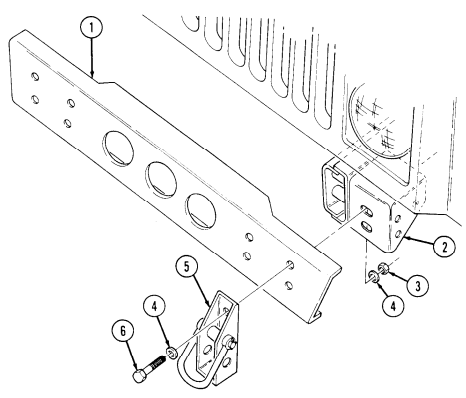 capscrews (6), washers (4), and locknuts (3). Tighten locknuts (3) to 90 lb-ft (122 N•m).

# 9-3. Front Bumper And Towing Brackets Replacement

This task covers:
INITIAL SETUP:

#### Applicable Models

M1026, M1026A1, M1036, M1038, M1038A1, M1042, M1044, M1044A1, M1046, M1046A1 Tools General mechanic's tool kit:
automotive (Appendix B, Item 1)

a. Removal b. Installation

Materials/Parts Five locknuts (Appendix G, Item 81)
Manual References TM 9-2320-280-24P
Equipment Condition Winch removed (para. 10-107).

#### A. Removal

1. Remove three locknuts (3), washers (4), capscrews (5), washers (4), and two towing brackets (6)
from front bumper (1) and two frame extensions (2). Discard locknuts (3).

2. Remove two locknuts (3), washers (4), capscrews (5), and washers (4) from front bumper (1) and frame extensions (2). Discard locknuts (3).

3. Remove two capscrews (7), washers (8), and front bumper (1) from frame extensions (2).

#### B. Installation

1. Install front bumper (1) on two frame extensions (2) with two washers (8) and capscrews (7).

Tighten capscrews (7) to 90 lb-ft (122 N•m).

2. Install front bumper (1) on two frame extensions (2) with two washers (4), capscrews (5),
washers (4), and locknuts (3). Tighten locknuts (3) to 90 lb-ft (122 N•m).

3. Install two towing brackets (6) on front bumper (1) with three washers (4), capscrews (5), 
washers (4), and locknuts (3). Tighten locknuts (3) to 90 lb-ft (122 N•m).

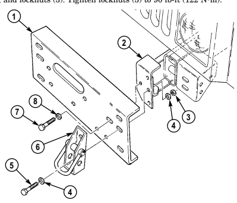

FOLLOW-ON TASK: Install winch (para. 10-107).

# 9-4. Front Bumper And Towing Brackets Replacement

This task covers:
INITIAL SETUP:

a. Removal b. Installation

| Tools                                  | Manual References                     |
|----------------------------------------|---------------------------------------|
| General mechanic's tool kit:           | TM 9\-2320\-280\-10                   |
| automotive (Appendix B, Item 1)        | TM 9\-2320\-280\-24P                  |
| Maintenance and repair shop equipment: | Equipment Condition                   |
| automotive (Appendix B, Item 2)        | Power steering pump, pulley, and      |
| Materials/Parts                        | bracket removed (para 8\-24 (6.2 L)), |

Perform steps 1 and 2 for bumpers with winch. Proceed to step 3 for bumpers without winch.

a. Removal 1. Remove four locknuts (5), washers (6), capscrews (8), washers (6), and two towing brackets (7) from bumper (1). Discard locknuts (5).

2. Remove six locknuts (3), washers (4), capscrews (9), washers (4), and front bumper (1) from two mounting brackets (2). Discard locknuts (3).

3. Remove four locknuts (5), washers (6), capscrews (8), washers (6), bumper (1), and two towing brackets (7) from mounting brackets (2). Discard locknuts (5).

b. Installation

Perform step 1 for bumpers without winch. Proceed to step 2 for bumpers with winch.

1. Install bumper (1) and two towing brackets (7) on two mounting brackets (2) with four washers (6),
capscrews (8), washers (6), and locknuts (5). Tighten locknuts (5) to 90 lb-ft (122 N•m).

2. Install front bumper (1) on two mounting brackets (2) with six washers (4), capscrews (9), 
washers (4), and locknuts (3). Tighten locknuts (3) to 90 lb-ft (122 N•m).

3. Install two towing brackets (7) on bumper (1) with four washers (6), capscrews (8), washers (6) and locknuts (5). Tighten locknuts (5) to 90 lb-ft (122 N•m).

9-4. FRONT BUMPER AND TOWING BRACKETS REPLACEMENT (Cont'd)

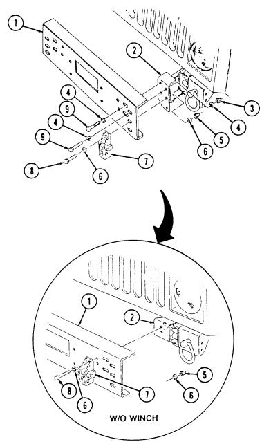

# 9-5. Frame Extension Replacement

This task covers:
INITIAL SETUP:
Applicable Models M997A2, M1025A2, M1026, M1026A1, M1035A1, M1035A2, M1036, M1038, M1038A1, M1042, M1043A2, M1044, M1044A1, M1045A2, M1046, M1046A1, M1097A2 Tools General mechanic's tool kit:
automotive (Appendix B, Item 1)

#### A. Removal B. Installation

Materials/Parts Three locknuts (Appendix G, Item 80)
Manual References TM 9-2320-280-24P
Equipment Condition
- Front bumper removed (para. 9-2, 9-3, or 9-4). - Hood and hinge removed (para. 10-5).

a. Removal

- Note position of winch cable bracket for installation. - M997A2, M1025A2, M1035A2, M1043A2, M1045A2, and M1097A2 vehicles are not equipped with a winch cable bracket as indicated in step 1.

1. Remove two locknuts (2), washers (3), capscrews (5), washers (3), and winch cable bracket (6) from frame extension (8). Discard locknuts (2).

2. Remove locknut (2), washer (3), capscrew (7), washer (3), frame extension (8), and bumper mounting bracket (1) from frame (4). Discard locknut (2).

b. Installation

M997A2, M1025A2, M1035A2, M1043A2, M1045A2, and M1097A2, vehicles are not equipped with a winch cable bracket as indicated in step 1.

1. Install bumper mounting bracket (1), frame extension (8), and winch cable bracket (6) on frame (4)
with two washers (3), capscrews (5), washers (3), and locknuts (2).

2. Install mounting bracket (1) and frame extension (8) on frame (4) with washer (3), capscrew (7), washer (3),
and locknut (2). Tighten locknuts (2) to 90 lb-ft (122 N•m).

## 9-5. Frame Extension Replacement

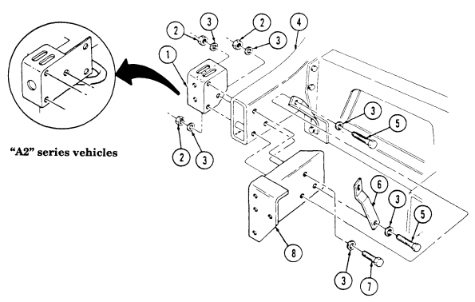

FOLLOW-ON TASKS: - Install hood and hinge (para. 10-5).
- Install front bumper (para. 9-3 or 9-4).

# 9-6. Tiedown Ring Replacement

This task covers:
INITIAL SETUP:
Applicable Models M997A, M1025A2, M1035A2, M1043A2, M1045A2, M1097A2 Tools General mechanic's tool kit:
automotive (Appendix B, Item 1)

a. Removal b. Installation

| Materials/Parts   |
|-------------------|

Cotter pin (Appendix G, Item 20)
Manual References TM 9-2320-280-24P
a. Removal Remove cotter pin (2), nut (3), and tiedown ring (1) from mounting bracket (4). Discard cotter pin (2).

b. Installation Install tiedown ring (1) on mounting bracket (4) with nut (3). Tighten nut (3) to 16 lb-ft (22 N•m), back off to the nearest cotter pin slot, and install cotter pin (2).

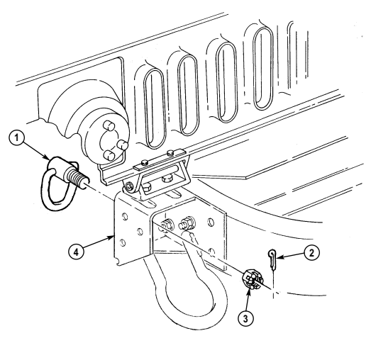

# 9-7. Radiator Front Mount Bracket Replacement

This task covers:

| General mechanic's tool kit:    |
|---------------------------------|
| automotive (Appendix B, Item 1) |
| Materials/Parts                 |
| . .                             |

INITIAL SETUP:

#### Tools

Two locknuts (Appendix G, Item 81) Locknut (Appendix G, Item 99)
a. Removal 1. Remove locknut (3), washer (2), capscrew (10), washer (2), and spacer (9) from radiator (4) and front mount bracket (11). Discard locknut (3).

2. Remove two locknuts (7), washers (8), capscrews (1), washers (8), bracket (11), and mount (6) from front suspension crossmember (5). Discard locknuts (7).

#### B. Installation

1. Install mount (6) and bracket (11) on front suspension crossmember (5) with two washers (8),
capscrews (1), washers (8), and locknuts (7). Tighten locknuts (7) to 90 lb-ft (122 N•m).

2. Install radiator (4) on bracket (11) with spacer (9), washer (2), capscrew (10), washer (2), and locknut (3). Tighten locknut (3) to 30 lb-ft (41 N•m).

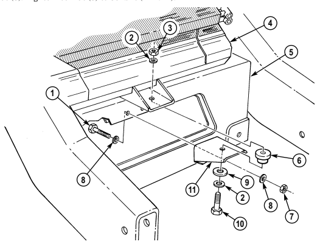

FOLLOW-ON TASK: Lower and secure hood (TM 9-2320-280-10).

a. Removal **b. Installation**

| PAGE  PROCEDURES   |
|--------------------|

# 9-8. Rear Bumper Brace Replacement

This task covers:
INITIAL SETUP:

#### Applicable Models

M996, M996A1, M997, M997A1, M997A2, M1037,M1042, M1097, M1097A1, M1097A2 Tools General mechanic's tool kit:
automotive (Appendix B, Item 1)
a. Removal b. Installation Materials/Parts Three locknuts (Appendix G, Item 81)
Manual References TM 9-2320-280-24P

#### A. Removal

1. Remove locknut (5), washer (2), capscrew (1), and washer (2), from rear bumper brace (3) and frame rail (4). Discard locknut (5).

2. Remove two locknuts (9), washers (7), capscrews (6), washers (7), and rear bumper brace (3) from rear bumper (8). Discard locknuts (9).

b. Installation 1. Install rear bumper brace (3) on rear bumper (8) with two washers (7), capscrews (6), washers (7),
and locknuts (9).

2. Install rear bumper brace (3) on frame rail (4) with washer (2), capscrew (1), washer (2), and locknut (5). Tighten locknuts (5) and (9) to 90 lb-ft (122 N•m).

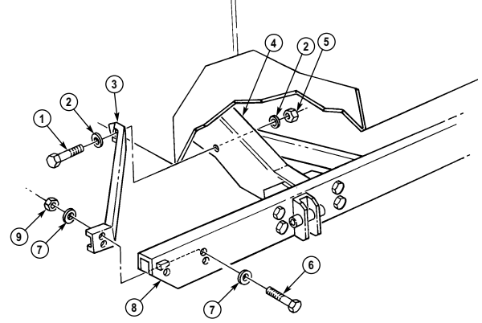

# 9-9. Rear Crossmember Brace Replacement

This task covers:

a. Removal b. Installation

| INITIAL SETUP:                         |                                     |
|----------------------------------------|-------------------------------------|
| Applicable Models                      | Materials/Parts                     |
| M1026, M1026A1, M1036, M1038, M1038A1, | Five locknuts (Appendix G, Item 81) |
| M1042, M1044, M1044A1, M1046, M1046A1  |                                     |
|                                        | Manual References                   |
| Tools                                  | TM 9\-2320\-280\-24P                |

Locknut (Appendix G, Item 81)

#### A. Removal

Remove locknut (5), washer (2), capscrew (3), washer (2), and rear crossmember brace (4) from frame rail (1). Discard locknut (5).

b. Installation Install rear crossmember brace (4) on frame rail (1) with washer (2), capscrew (3), washer (2), and

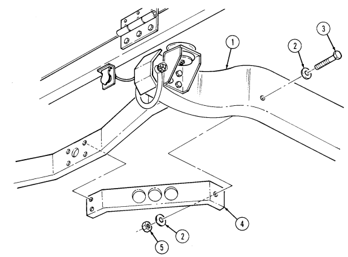 locknut (5). Tighten locknut (5) to 90 lb-ft (122 N•m).

FOLLOW-ON TASK: Install towing pintle (para. 9-12).

# 9-10. Rear Bumper Replacement

This task covers:
INITIAL SETUP:
Applicable Models M996, M996A1, M997, M997A1, M997A2, M1025A2, M1035A2, M1043A2, M1045A2, M1037, M1042, M1097, M1097A1, M1097A2 Tools General mechanic's tool kit:
automotive (Appendix B, Item 1)
Materials/Parts Sixteen locknuts (Appendix G, Item 81) Six assembled locknuts (Appendix G, Item 130)

a. Removal b. Installation

Personnel Required One mechanic One assistant Manual References TM 9-2320-280-24P
Equipment Condition Towing pintle removed (para. 9-12).

a. Removal 6. Remove four locknuts (3), washers (4), capscrews (18), washers (4), and two tiedown brackets (19)
from rear bumper (12) and two mounting brackets (5). Discard locknuts (3).

7. Remove four locknuts (3), washers (4), capscrews (18), and washers (4) from rear bumper (12) and mounting brackets (5). Discard locknuts (3).

8. Remove four locknuts (6), washers (7), capscrews (17), washers (7), and rear bumper (12) from two inner mounting brackets (8). Discard locknuts (6).

Perform step 9 only if bumper is being replaced.

9. Remove lifting shackles (para. 9-13).

b. Installation

Perform step 1 only if bumper was replaced.

1. Install lifting shackles (para. 9-13).

2. Remove two assembled locknuts (11), capscrews (14), plate (13), and trailer receptacle (10) from rear bumper (12) and remove plate (13) from rear bumper (12). Discard assembled locknuts (11).

3. Remove four locknuts (1), washers (2), capscrews (20), and washers (2) from rear bumper (12) and two braces (21). Discard locknuts (1).

Perform steps 4 and 5 for M997A2, M1025A2, M1035A2, M1043A2, M1045A2, and M1097A2 vehicles only.

4. Remove two cotter pins (22), nuts (23), and two tiedown rings (24) from rear bumper (12) and two mounting brackets (5). Discard cotter pins (22).

5. Remove eight locknuts (27), washers (26), capscrews (25), and washers (26) from rear bumper (12)
and two mounting brackets (5). Discard locknuts (27).

1. Remove four assembled locknuts (9), capscrew (15), and trailer receptacle cover (16) from trailer receptacle (10). Discard assembled locknuts (9).

## 9-10. Rear Bumper Replacement (Cont'D)

2. Install rear bumper (12) on inner mounting brackets (8) with four washers (7), capscrews (17),
washers (7), and locknuts (6). Tighten locknuts (6) to 90 lb-ft (122 N•m).

3. Install rear bumper (12) on mounting brackets (5) with four washers (4), capscrews (18), 
washers (4), and locknuts (3). Tighten locknuts (3) to 90 lb-ft (122 N•m).

Perform steps 4 and 5 for M997A2, M1025A2, M1035A2, M1043A2, M1045A2, and M1097A2 vehicles only.

4. Secure rear bumper (12) to two mounting brackets (5) with eight washers (26), capscrews (25),
washers (26), and locknuts (27). Tighten locknuts (27) to 90 lb-ft (122 N•m).

5. Install two tiedown rings (24) on rear bumper (12) and two brackets (5) with two nuts (23). Tighten nuts (23) to 16 lb-ft (22 N•m), back off to the nearest cotter pin slot, and install two cotter pins (22).

6. Install two tiedown brackets (19) on rear bumper (12) with four washers (4), capscrews (18),
washers (4), and locknuts (3). Tighten locknuts (3) to 90 lb-ft (122 N•m).

7. Install rear bumper (12) on braces (21) with four washers (2), capscrews (20), washers (2), and locknuts (1). Tighten locknuts (1) to 90 lb-ft (122 N•m).

8. Position trailer receptacle (10) through rear bumper (12) and install plate (13) and trailer receptacle (10) on rear bumper (12) with two capscrews (14) and assembled locknuts (11). Tighten assembled locknuts (11) to 8 lb-ft (11 N•m).

9. Install trailer receptacle cover (16) on plate (13) and rear bumper (12) with four capscrews (15) and

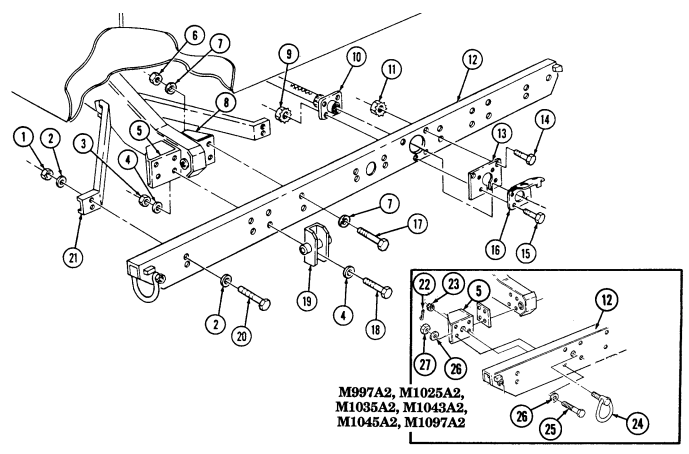

assembled locknuts (9). Tighten assembled locknuts (9) to 8 lb-ft (11 N•m).

FOLLOW-ON TASK: Install towing pintle (para. 9-12).

# 9-11. Rear Bumper Inner Mounting Bracket Replacement

This task covers:
INITIAL SETUP:
Applicable Models M996, M996A1, M997, M997A1, M997A2, M1037, M1042, M1097, M1097A1, M1097A2 Tools General mechanic's tool kit:
automotive (Appendix B, Item 1)
a. Removal b. Installation Materials/Parts Six locknuts (Appendix G, Item 81)
Manual References TM 9-2320-280-24P
a. Removal 1. Remove two locknuts (3), washers (4), capscrews (9), and washers (4) from bracket (7) and rear bumper (1). Discard locknuts (3).

2. Remove four locknuts (10), washers (6), capscrews (5), washers (6), spacer (8), and bracket (7) 
from frame rail (2). Discard locknuts (10).

b. Installation

Ensure spacer on outer side of frame rail is in position before installing

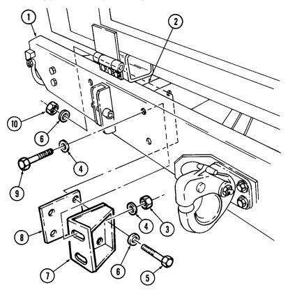 spacer and bracket.

1. Install spacer (8) and bracket (7) on frame rail (2) with four washers (6), capscrews (5), washers (6),
and locknuts (10). Tighten capscrews (5) to 90 lb-ft (122 N•m).

2. Install bracket (7) on rear bumper (1) with two washers (4), capscrews (9), washers (4), and locknuts (3). Tighten locknuts (3) to 90 lb-ft (122 N•m).

# 9-11.1. Towing Pintle Replacement (M1123)

This task covers:
INITIAL SETUP:

a. Removal **b. Installation**

| Applicable Models                 | Materials/Parts                  |
|-----------------------------------|----------------------------------|
| M997A, M1025A2, M1035A2, M1043A2, | Cotter pin (Appendix G, Item 20) |
| M1045A2, M1097A2                  |                                  |
|                                   | Manual References                |
| Tools                             | TM 9\-2320\-280\-24P             |
| General mechanic's tool kit:      |                                  |
| automotive (Appendix B, Item 1)   |                                  |

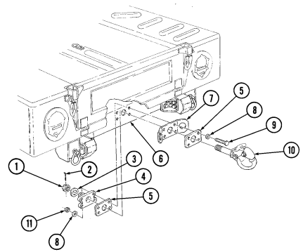

a. Removal 1. Remove cotter pin (2), slotted nut (1), washer (3), and towing pintle (10) from rear crossmember (6).

Discard cotter pin (2).

2. Remove four locknuts (11), washers (8), capscrews (9), washers (8), two support plates (5), backing plate (4), and safety chain plate (7) from rear crossmember (6). Discard locknuts (11).

#### B. Installation

1. Install safety chain plate (7), backing plate (4), and two support plates (5) on rear crossmember (6)
with four washers (8), capscrews (9), washers (8), and locknuts (11).

2. Install towing pintle (10) on crossmember (6) with washer (3) and slotted nut (1). 3. Tighten slotted nut (1) until towing pintle (10) is tight. Back off nut (1) until towing pintle (10)
rotates freely and hole in towing pintle (10) shaft aligns with slot in nut (1). Install cotter pin (2).

# 9-12. Towing Pintle Maintenance

This task covers:
b. Disassembly e. Installation c. Cleaning

#### Initial Setup: Tools

General mechanic's tool kit:
automotive (Appendix B, Item 1)

#### Materials/Parts

Two cotter pins (Appendix G, Item 22) Drive screw (Appendix G, Item 28) Two locknuts (Appendix G, Item 82) Four locknuts (Appendix G, Item 93.1) Drycleaning solvent (Appendix C, Item 18)
a. Removal d. Assembly Manual References TM 9-2320-280-10 TM 9-2320-280-24P
General Safety Instructions Cleaning will be done in a well-ventilated area and a fire extinguisher will be kept nearby when drycleaning solvent is used.

Contact DS maintenance for fabrication instructions of optional towing pintle.

a. Removal

- Perform steps 1 and 2 for rear-mounted towing pintle. - Perform steps 3 and 4 for optional towing pintle mounted to the front bumper.

1. Remove cotter pin (3), slotted nut (2), washer (4), and towing pintle (9) from rear crossmember (7).

Discard cotter pin (3).

2. Remove four nuts (1), washers (11), capscrews (10), washers (11), two support plates (6), backing

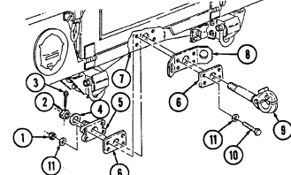

plate (5), and safety chain plate (8) from rear crossmember (7).

## 9-12. Towing Pintle Maintenance

Remove cotter pin (4), slotted nut (6), washer (5), and towing pintle (3) from front bumper (1).

3.

Discard cotter pin (4).

Remove four locknuts (9), washers (8), capscrews (10), washers (8), front plate (2), and 4.

back plate (7) from front bumper (1). Discard locknuts (9).

OPTIONAL

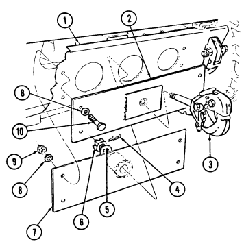

# 9-12. Towing Pintle Maintenance (Cont'D)

b. Disassembly

Perform step 1 for rear-mounted towing pintle only.

Remove grease fitting (12) from backing plate (11).

1.

Remove cotter pin (15) from towing pintle latch (20). Remove locknut (21), capscrew (19), pintle latch lock (17), and spring (16) from towing pintle latch (20). Discard locknut (21).

Remove locknut (24), capscrew (18), and towing pintle latch (20) from towing pintle hook (22). Discard locknut (24).

2. 3.

4.

Remove cotter pin (15) from pintle lock chain hook (14). Discard cotter pin (15).

Remove drivescrew (23) and pintle lock chain (13) from towing pintle hook (22). Discard drivescrew (23).

5. 6.

#### Warnin G

Drycleaning solvent is flammable and will not be used near an open flame. A fire extinguisher will be kept nearby when the solvent is used. Use only in well-ventilated places. Failure to do this may result in injury to personnel and/or damage to equipment.

Clean all metallic parts with drycleaning solvent.

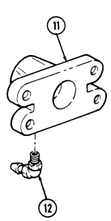

## 9-12. Towing Pintle Maintenance (Cont'D)

1.

2.

Install pintle lock chain (1) on towing pintle hook (10) with drivescrew (11). Install cotter pin (3) on pintle lock chain (1) with pintle lock chain hook (2).

3.

Install towing pintle latch (8) on towing pintle hook (10) with capscrew (6) and locknut (12). Tighten locknut (12) to 15 lb-ft (20 N m). Install spring (4) and pintle latch lock (5) on towing pintle latch (8) with capscrew (7) and locknut (9). Tighten locknut (9) to 15 lb-ft (20 N·m).

4.

Install cotter pin (3) in pintle latch (8).

5.

Perform step 6 for rear-mounted towing pintle only.

Install grease fitting (14) in backing plate (13).

6.

e. Installation

#### Note

Perform steps 1 through 3 for rear-mounted towing pintle.

Perform steps 4 through 6 for optional towing pintle mounted to the front bumper.

Grease fitting on backing plate must face downward.

1. Install safety chain plate (22), support plates (20), and backing plate (13) on rear crossmember (21)

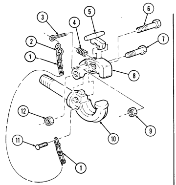

with four washers (16), capscrews (24), washers (16), and nuts (15).

2. Install towing pintle (23) and tighten nuts (15) to 90 lb-ft (122 N m). 3. Install towing pintle (23) with washer (19) and slotted nut (17). Loosen slotted nut (17) slightly if towing pintle (23) will not rotate easily. Install cotter pin (18) in slotted nut (17).

## 9-12. Towing Pintle Maintenance (Cont'D)

4.

Install front plate (26) and back plate (31) on front bumper (25) with four washers (32), capscrews (34),
washers (32), and locknuts (33). Tighten locknuts (33) to 90 lb-ft (122 N-m).

5.

Install towing pintle (27) with washer (29) and slotted nut (30).

Tighten slotted nut (30) until towing pintle (27) is tight. Back off nut (30) until towing pintle (27)
6.

rotates freely and hole in towing pintle (27) shaft aligns with slot in nut (30). Install cotter pin (28).

n

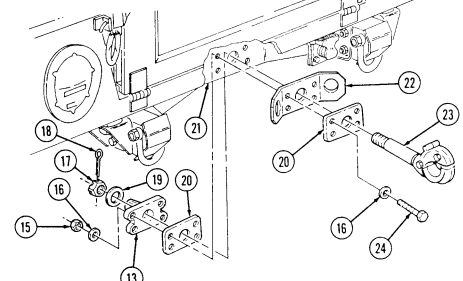

OPTIONAL

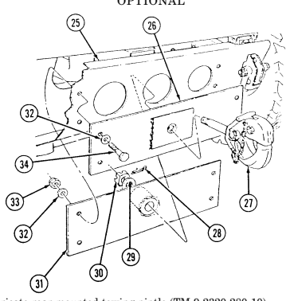

FOLLOW-ON TASKS: Lubricate rear-mounted towing pintle (TM 9-2320-280-10).

# 9-13. Lifting Shackle Replacement

This task covers:
INITIAL SETUP:

#### Tools

General mechanic's tool kit:
automotive (Appendix B, Item 1)

a. Removal b. Installation

| Materials/Parts   |
|-------------------|
| Cotter pin (A     |

Cotter pin (Appendix G, Item 14)
Manual References TM 9-2320-280-24P

- All lifting shackles are replaced basically the same. This procedure covers the rear lifting shackle on all vehicles except M996, M996A1, M997, M997A1, M997A2, M1037, and M1042.

- Vehicles with serial numbers 100,000 and above have new, reinforced lifting shackles. Previous models lifting shackles will be used on vehicles with serial numbers 99,999 and below only. Refer to vehicle serial number before ordering replacement parts.

a. Removal Remove cotter pin (1), slotted nut (2), capscrew (5), spring washer (4), and shackle (6) from frame (3). Discard cotter pin (1).

b. Installation 1.Install shackle (6) on frame (3) with spring washer (4), capscrew (5), and slotted nut (2). Tighten slotted nut (2) enough to allow movement of shackle (6). Torque slotted nut (2) to 15-20 lb-ft (20-27 N•m).

2.Back off slotted nut (2) to align with hole in capscrew (5) and install cotter pin (1) in slotted nut (2).

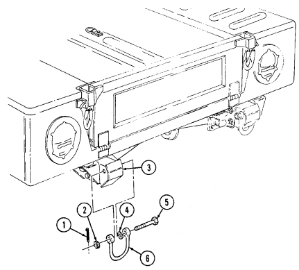

# 9-14. Receptacle Mounting Bracket Replacement

This task covers:
INITIAL SETUP:

#### Applicable Models

All vehicles except M996, M996A1, M997, M997A1, M997A2, M1037, M1042 Tools General mechanic's tool kit:
automotive (Appendix B, Item 1)

a. Removal **b. Installation**

| Manual References   |
|---------------------|

| Manual References    |
|----------------------|
| TM 9\-2320\-280\-24P |

Two locknuts (Appendix G, Item 79) Four assembled locknuts (Appendix G, Item 130)
a. Removal 1. Remove four assembled locknuts (9), capscrews (6), cover (5), and receptacle (1) from bracket (4).

Discard assembled locknuts (9).

NOTE
- If bracket is held on to "D" beam with rivets, proceed to step 2. If not, proceed to step 3.

- For instructions on removal of rivets, refer to para. 10-66.

2. Remove two rivets and bracket (4) from "D" beam (3). 3. Remove two locknuts (2) capscrews (8), washers (7), and bracket (4) from "D" beam (3). 

Discard locknuts (2).

b. Installation

If bracket was held on to "D" beam with rivets, do step 1. If not, do step 2.

1. With a 0.3125-in. drill bit, enlarge existing rivet holes on bracket (4) and "D" beam (3).

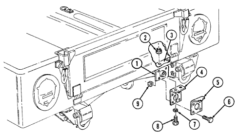 2. Install bracket (4) on "D" beam (3) with two washers (7), capscrews (8), and locknuts (2). 3. Install receptacle (1) and cover (5) on bracket (4) with four capscrews (6) and assembled locknuts (9).

# 9-15. Transmission Mount Crossmember Replacement

This task covers:
a. Removal b. Installation INITIAL SETUP:
Tools General mechanic's tool kit:
automotive (Appendix B, Item 1)
Manual References TM 9-2320-280-24P
Materials/Parts Two locknuts (Appendix G, Item 128)

Transmission must be supported during removal and installation of transmission mount crossmember to prevent damage to equipment.

a. Removal

Perform step 1 and 2 for all vehicles except "A2" series. Perform steps 3 and 4 for "A2" series only.

4. Remove two locknuts (15), washers (14), and crossmember (13) from transmission mount (9).

Discard locknuts (15).

b. Installation

Perform step 1 and 2 for all vehicles except "A2" series. Perform steps 3 and 4 for "A2" series only.

1. Install crossmember (5) on two support brackets (1) with washers (2), capscrews (3), washers (2),
and nuts (8). Tighten nuts (8) to 90 lb-ft (122 N•m).

4. Install crossmember (13) on transmission mount (9) with two washers (14) and locknuts (15).

Tighten locknuts (15) to 28 lb-ft (38 N•m).

5. Remove support.

1. Place support under transmission and remove two nuts (8), washers (2), capscrews (3), and washers (2) from transmission mount crossmember (5) and two transmission support brackets (1). 

2. Remove two locknuts (7), washers (6), and crossmember (5) from transmission mount (4). Discard locknuts (7).

3. Place support under transmission and remove two nuts (12), washers (11), capscrew (10), and washer (11) from crossmember (13) and two support brackets (1).

2. Install crossmember (5) on transmission mount (4) with two washers (6) and locknuts (7). Tighten locknuts (7) to 29 lb-ft (38 N•m).

3. Install crossmember (13) on two support brackets (1) with washer (11), capscrew (10), two washers (11), and nuts (12). Tighten nuts (12) to 90 lb-ft (122 N•m).

9-15. TRANSMISSION MOUNT CROSSMEMBER REPLACEMENT (Cont'd)

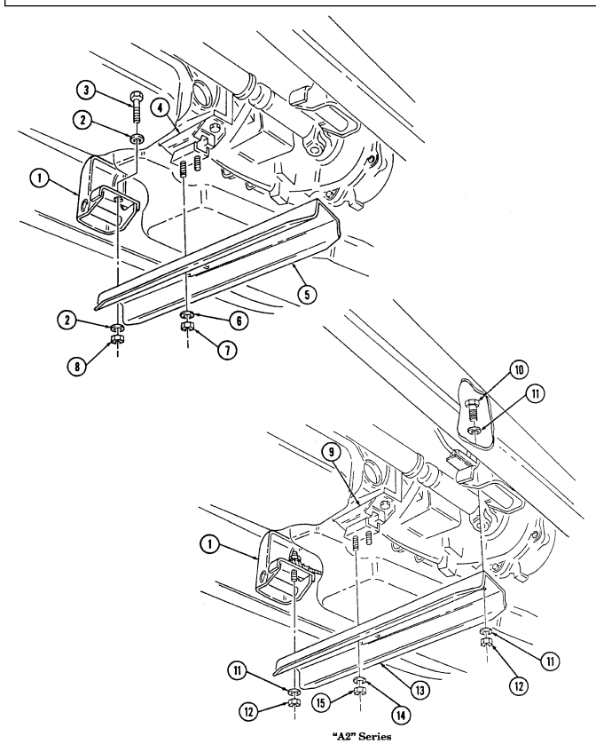

## 9-16. Rear Crossmember Replacement

| This task covers:   |
|---------------------|

| INITIAL SETUP:                        |                      |
|---------------------------------------|----------------------|
| Applicable Models                     | Personnel Required   |
| M996, M996A1, M997, M997A1, M997A2,   | One mechanic         |
| M1025A2, M1035A2, M1043A2, M1045A2,   | One assistant        |
| M1037, M1042, M1097, M1097A1, M1097A2 |                      |
|                                       | Manual References    |
| Tools                                 | TM 9\-2320\-280\-24P |

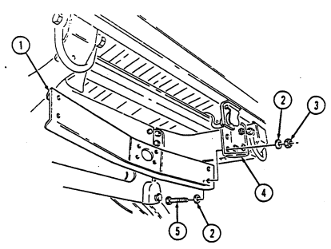

a. Removal **b. Installation**

#### A. Removal

Remove four locknuts (3), washers (2), capscrews (5), washers (2), and rear crossmember (1) from two rear crossmember mounting brackets (4). Discard locknuts (3).

#### B. Installation

Install rear crossmember (1) on two rear crossmember mounting brackets (4) with four washers (2), capscrews (5), washers (2), and locknuts (3). Tighten locknuts (3) to 90 lb-ft (122 N•m).

FOLLOW-ON TASK: Install rear crossmember braces (para. 9-9).

INDEX VOLUME II

| This task covers:                                                                                        | a.                                                                                                    | Removal                                                                                 | b.                                                                                                   | Installation   |
|----------------------------------------------------------------------------------------------------------|-------------------------------------------------------------------------------------------------------|-----------------------------------------------------------------------------------------|------------------------------------------------------------------------------------------------------|----------------|
| INITIAL SETUP:                                                                                           |                                                                                                       |                                                                                         |                                                                                                      |                |
| Applicable Models                                                                                        | Materials/Parts                                                                                       | M1123                                                                                   | Cotter pin (Appendix G, Item 22)                                                                     |                |
| Four locknuts (Appendix G, Item 81)                                                                      | Tools                                                                                                 |                                                                                         |                                                                                                      |                |
| Manual References                                                                                        | General mechanic's tool kit:                                                                          | automotive (Appendix B, Item 1)                                                         | TM 9\-2320\-280\-10                                                                                  |                |
| TM 9\-2320\-280\-24P                                                                                     |                                                                                                       |                                                                                         |                                                                                                      |                |
| a. Removal                                                                                               |                                                                                                       |                                                                                         |                                                                                                      |                |
| 1.                                                                                                       | Remove cotter pin (2), slotted nut (1), washer (3), and towing pintle (10) from rear crossmember (6). | Discard cotter pin (2).                                                                 |                                                                                                      |                |
| 2.                                                                                                       | Remove four locknuts (11), washers (8), capscrews (9), washers (8), two support plates (5), backing   | plate (4), and safety chain plate (7) from rear crossmember (6). Discard locknuts (11). |                                                                                                      |                |
| b. Installation                                                                                          |                                                                                                       |                                                                                         |                                                                                                      |                |
| 1.                                                                                                       | Install safety chain plate (7), backing plate (4), and two support plates (5) on rear crossmember (6) | with four washers (8), capscrews (9), washers (8), and locknuts (11).                   |                                                                                                      |                |
| 2.                                                                                                       | Install towing pintle (10) on crossmember (6) with washer (3) and slotted nut (1).                    | 3.                                                                                      | Tighten slotted nut (1) until towing pintle (10) is tight. Back off nut (1) until towing pintle (10) |                |
| rotates freely and hole in towing pintle (10) shaft aligns with slot in nut (1). Install cotter pin (2). |                                                                                                       |                                                                                         |                                                                                                      |                |

INDEX (Cont'd)

| This task covers: a.  Removal  b.  Installation                                                                                                                                                               |                         |
|---------------------------------------------------------------------------------------------------------------------------------------------------------------------------------------------------------------|-------------------------|
| INITIAL SETUP: Tools Materials/Parts                                                                                                                                                                          |                         |
| General mechanic's tool kit:  Cotter pin (Appendix G, Item 14) automotive (Appendix B, Item 1)  Manual References                                                                                             |                         |
| TM 9\-2320\-280\-24P                                                                                                                                                                                          |                         |
| NOTE - All lifting shackles are replaced basically the same. This procedure covers the rear lifting shackle on all vehicles except                                                                            |                         |
| M996, M996A1, M997, M997A1, M997A2, M1037, and M1042.                                                                                                                                                         |                         |
| - Vehicles with serial numbers 100,000 and above have new, reinforced lifting shackles. Previous models lifting shackles will be used on vehicles with serial numbers 99,999 and below only. Refer            |                         |
| to vehicle serial number before ordering replacement parts.                                                                                                                                                   | a. Removal              |
| Remove cotter pin (1), slotted nut (2), capscrew (5), spring washer (4), and shackle (6) from frame (3).                                                                                                      | Discard cotter pin (1). |
| Install shackle (6) on frame (3) with spring washer (4), capscrew (5), and slotted nut (2). Tighten                                                                                                           | b. Installation  1.     |
| slotted nut (2) enough to allow movement of shackle (6). Torque slotted nut (2) to 15\-20 lb\-ft   Back off slotted nut (2) to align with hole in capscrew (5) and install cotter pin (1) in slotted nut (2). | (20\-27 N•m).  2.       |

INDEX (Cont'd)

| This task covers:               | a.                                                                                                 | Removal                                                                                     | b.                                                                                                      | Installation   |
|---------------------------------|----------------------------------------------------------------------------------------------------|---------------------------------------------------------------------------------------------|---------------------------------------------------------------------------------------------------------|----------------|
| INITIAL SETUP:                  |                                                                                                    |                                                                                             |                                                                                                         |                |
| Applicable Models               | Materials/Parts                                                                                    | All vehicles except M996, M996A1, M997,                                                     | Two locknuts (Appendix G, Item 79)                                                                      |                |
| M997A1, M997A2, M1037, M1042    | Four assembled locknuts (Appendix G, Item 130)                                                     |                                                                                             |                                                                                                         |                |
| Tools                           | Manual References                                                                                  | General mechanic's tool kit:                                                                | TM 9\-2320\-280\-24P                                                                                    |                |
| automotive (Appendix B, Item 1) |                                                                                                    |                                                                                             |                                                                                                         |                |
| a. Removal                      |                                                                                                    |                                                                                             |                                                                                                         |                |
| 1.                              | Remove four assembled locknuts (9), capscrews (6), cover (5), and receptacle (1) from bracket (4). | Discard assembled locknuts (9).                                                             |                                                                                                         |                |
| NOTE                            | -                                                                                                  | If bracket is held on to "D" beam with rivets, proceed to step 2. If                        |                                                                                                         |                |
| not, proceed to step 3.         | -                                                                                                  | For instructions on removal of rivets, refer to para. 10\-66.                               |                                                                                                         |                |
| 2.                              | Remove two rivets and bracket (4) from "D" beam (3).                                               | 3.                                                                                          | Remove two locknuts (2) capscrews (8), washers (7), and bracket (4) from "D" beam (3).                  |                |
| Discard locknuts (2).           |                                                                                                    |                                                                                             |                                                                                                         |                |
| b. Installation                 |                                                                                                    |                                                                                             |                                                                                                         |                |
| NOTE                            | If bracket was held on to "D" beam with rivets, do step 1. If not,                                 |                                                                                             |                                                                                                         |                |
| do step 2.                      | 1.                                                                                                 | With a 0.3125\-in. drill bit, enlarge existing rivet holes on bracket (4) and "D" beam (3). |                                                                                                         |                |
| 2.                              | Install bracket (4) on "D" beam (3) with two washers (7), capscrews (8), and locknuts (2).         | 3.                                                                                          | Install receptacle (1) and cover (5) on bracket (4) with four capscrews (6) and assembled locknuts (9). |                |

INDEX (Cont'd)

| This task covers:                                                                                    |                           |                                 |       |                      |               |
|------------------------------------------------------------------------------------------------------|---------------------------|---------------------------------|-------|----------------------|---------------|
| a.                                                                                                   | Removal  b.  Installation |                                 |       |                      |               |
| INITIAL SETUP:                                                                                       |                           |                                 |       |                      |               |
| Manual References                                                                                    |                           |                                 | Tools |                      |               |
| General mechanic's tool kit:                                                                         |                           |                                 |       | TM 9\-2320\-280\-24P |               |
| Equipment Condition                                                                                  |                           |                                 |       |                      |               |
| a. Removal                                                                                           |                           |                                 |       |                      |               |
| Four locknuts (Appendix G, Item 81)                                                                  |                           |                                 |       |                      | (para. 9\-9). |
| Remove four locknuts (3), washers (2), capscrews (5), washers (2), and rear crossmember (1) from two |                           |                                 |       |                      |               |
| b. Installation                                                                                      |                           |                                 |       |                      |               |
| rear crossmember mounting brackets (4). Discard locknuts (3).                                        |                           |                                 |       |                      |               |
| Materials/Parts                                                                                      |                           | Rear crossmember braces removed |       |                      |               |
| Install rear crossmember (1) on two rear crossmember mounting brackets (4) with four washers (2),    |                           |                                 |       |                      |               |
| capscrews (5), washers (2), and locknuts (3). Tighten locknuts (3) to 90 lb\-ft (122 N•m).           |                           |                                 |       |                      |               |
| FOLLOW\-ON TASK: Install rear crossmember braces (para. 9\-9).                                       |                           |                                 |       |                      |               |
| automotive (Appendix B, Item 1)                                                                      |                           |                                 |       |         