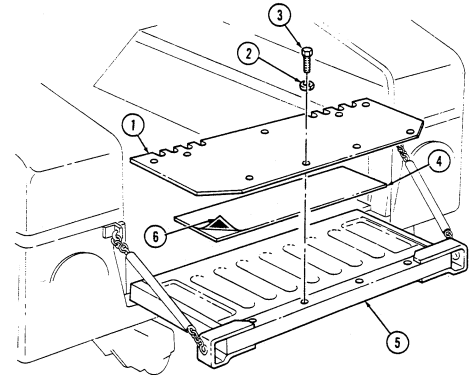
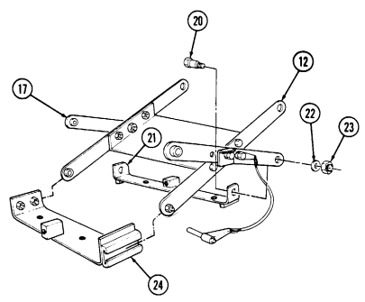
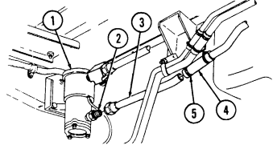
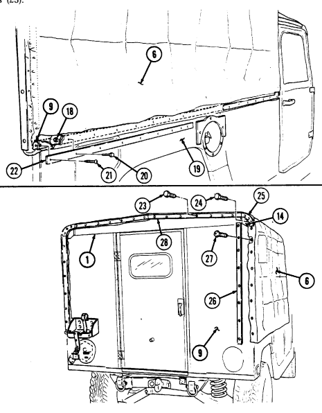
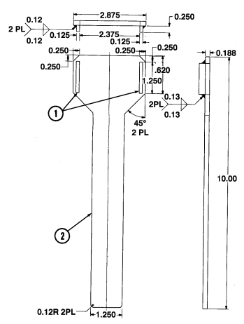
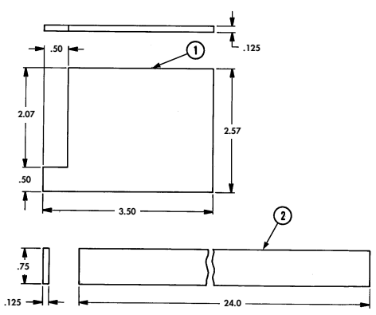
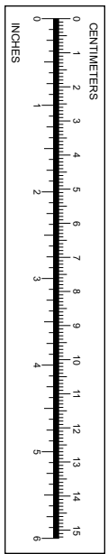

Volume No. 3

# Technical Manual Unit Maintenance
ARMY TM 9-2320-280-20-3 AIR FORCE TO 36A12-1A-2092-1-3 MARINE CORPS TM 2320-20/7C
<!--
TRUCK, UTILITY: CARGO/TROOP CARRIER, 1-1/4 TON, 4X4, M998
(2320-01-107-7155) (EIC: BBD); M998A1 (2320-01-371-9577) (EIC: BBN);
TRUCK, UTILITY: CARGO/TROOP CARRIER, 1-1/4 TON, 4X4, W/WINCH, 
M1038 (2320-01-107-7156) (EIC: BBE); M1038A1 (2320-01-371-9578) (EIC: BBP);
BODY AND ACCESSORIES
M A I N T E N A N C E 10-1 TRUCK, UTILITY: HEAVY VARIANT, 4X4, M1097 (2320-01-346-9317) (EIC: BBM);
M1097A1 (2320-01-371-9583) (EIC: BBU); M1097A2 (2320-01-380-8604) (EIC: BB6);
M1123 (2320-01-455-9593) (EIC: B6G); 
TRUCK, UTILITY: TOW CARRIER, ARMORED, 1-1/4 TON, 4X4, M966 (2320-01-107-7153) (EIC: BBC); M966A1 (2320-01-372-3932) (EIC: BBX);
M1121 (2320-01-456-1282) (EIC: B6H);
TRUCK, UTILITY: TOW CARRIER, ARMORED, 1-1/4 TON, 4X4, W/WINCH,
M1036 (2320-01-107-7154) (EIC: BBH);
SPECIAL PURPOSE
BODIES MAINTENANCE 11-1 TRUCK, UTILITY: TOW CARRIER, W/SUPPLEMENTAL ARMOR, 1-1/4 TON, 4X4, M1045 (2320-01-146-7191); M1045A1 (2320-01-371-9580) (EIC: BBR);
M1045A2 (2320-01-380-8229) (EIC: BB5);
TRUCK, UTILITY: TOW CARRIER, W/SUPPLEMENTAL ARMOR, 1-1/4 TON, 4X4, W/WINCH,
M1046 (2320-01-146-7188); M1046A1 (2320-01-371-9582) (EIC: BBT);
TRUCK, UTILITY: ARMAMENT CARRIER, ARMORED, 1-1/4 TON, 4X4, M1025
(2320-01-128-9551) (EIC: BBF); M1025A1 (2320-01-371-9584) (EIC: BBV); 
M1025A2 (2320-01-380-8233) (EIC: BB3);
TRUCK, UTILITY: ARMAMENT CARRIER, ARMORED, 1-1/4 TON, 4X4, W/WINCH,
M1026 (2320-01-128-9552) (EIC: BBG); M1026A1 (2320-01-371-9579) (EIC: BBQ);
TRUCK, UTILITY: ARMAMENT CARRIER, W/SUPPLEMENTAL ARMOR, 1-1/4 TON, 4X4, M1043 (2320-01-146-7190); M1043A1 (2320-01-372-3933) (EIC: BBY); 
M1043A2 (2320-01-380-8213) (EIC: BB4);
SPECIAL PURPOSE KITS
M A I N T E N A N C E 12-1 TRUCK, UTILITY: ARMAMENT CARRIER, W/SUPPLEMENTAL ARMOR, 1-1/4 TON, 4X4, W/WINCH, M1044 (2320-01-146-7189); M1044A1 (2320-01-371-9581) (EIC: BBS);
TRUCK, UTILITY: S250 SHELTER CARRIER, 4X4, M1037 (2320-01-146-7193) (EIC: BBK); TRUCK, UTILITY: S250 SHELTER CARRIER, 4X4, W/WINCH, M1042 (2320-01-146-7187);
P R E PA R ATION FOR
STORAGE OR SHIPMENT 13-1 TRUCK, AMBULANCE, 2-LITTER, ARMORED, 4X4, M996 (2310-01-111-2275)
(EIC: BBB); M996A1 (2310-01-372-3935) (EIC: BB2);
TRUCK, AMBULANCE, 4-LITTER, ARMORED, 4X4, M997 (2310-01-111-2274) (EIC: BBA);
M997A1 (2310-01-372-3934) (EIC: BBZ); M997A2 (2310-01-380-8225) (EIC: BB8);
TRUCK, AMBULANCE, 2-LITTER, SOFT TOP, 4X4, M1035 (2310-01-146-7194);
M1035A1 (2310-01-371-9585) (EIC: BBW); M1035A2 (2310-01-380-8290) (EIC: BB9).

Approved for public release; distribution is unlimited.

HEADQUARTERS, DEPARTMENTS OF THE ARMY, 
THE AIR FORCE, AND MARINE CORPS
JANUARY 1996

# Warning

# Exhaust Gases Can Kill

Brain damage or death can result from heavy exposure. Precautions must be followed to ensure crew safety when the personnel heater, main, or auxiliary engine of any vehicle is operated for any purpose.

1. Do not operate your vehicle engine in enclosed areas. 2. Do not idle vehicle engine with vehicle windows closed. 3. Be alert at all times for exhaust odors. 4. Be alert for exhaust poisoning symptoms. they are:
- Headache - Dizziness - Sleepiness - Loss of muscular control 5. If you see another person with exhaust poisoning symptoms:
- Remove person from area - Expose to open air - Keep person warm - Do not permit physical exercise - Administer artificial respiration, if necessary* - Notify a medic
*For artificial respiration, refer to FM 21-11.

6. BE AWARE, the field protective mask for nuclear, biological or chemical (NBC) protection will not protect you from carbon monoxide poisoning. THE BEST DEFENSE AGAINST EXHAUST POISONING IS ADEQUATE VENTILATION.

## Warning Summary

- Hood must be supported during removal and installation and hood prop rod and bracket replacement.

Failure to support hood may cause injury to personnel or damage to equipment.

- Diesel fuel is highly flammable. Do not perform this procedure near fire, flames, or sparks. Severe injury or death will result.

- Do not touch hot exhaust system components with bare hands. Severe injury will result. - Windshield must be supported during removal and installation. Failure to support windshield may cause injury to personnel or damage to equipment.

- Winch must be supported during removal and installation. Failure to support winch may cause severe injury to personnel or damage to equipment.

- Gloves must be worn whenever handling winch cable. Severe injury may result. - Opening one end of cargo door before ensuring opposite end is securely closed will cause both ends to open simultaneously, resulting in injury to personnel or damage to equipment.

- Rear steps must be raised before disconnecting retractor lever from rear steps. Failure to do this may cause injury to personnel and damage to equipment.

- NBC contaminated filters must be handled and disposed of only by authorized and trained personnel.

The unit commander or senior officer in charge of maintenance personnel must ensure that prescribed protective clothing (FM 3-4) is used, and prescribed safety measures and decontamination procedures (FM 3-5) are followed. The local unit SOP is responsible for final disposal of contaminated air filters. Failure to do this may cause severe injury to personnel.

- Seatbelts are to be replaced as a set. Failure to do this may cause injury to personnel or damage to equipment.

- Use eyeshields and gloves when removing and installing windshield. Glass could shatter causing injury. - One assistant will be required to hold the cargo door open when either one or both gas springs are being removed and installed. Failure to do so may result in injury to personnel or damage to equipment.

- Direct all personnel to stand clear during any hoisting operations. A heavy, swinging load can be extremely dangerous. Failure to do so may cause injury to personnel or damage to equipment.

HEADQUARTERS, 
CHANGE **DEPARTMENTS OF THE ARMY,** NO. 2 THE AIR FORCE, AND MARINE CORPS
WASHINGTON, D.C., 15 July *2004*

# Technical Manual Volume 3 Of 3

## Unit Maintenance

TRUCK, UTILITY: CARGO/TROOP CARRIER, 1-1/4 TON, 4X4, M998 (2320-01-107-7155) (EIC: BBD); M998A1 (2320-01-371-9577) (EIC: BBN);
TRUCK, UTILITY: CARGO/TROOP CARRIER, 1-1/4 TON, 4X4, W/WINCH,
M1038 (2320-01-107-7156) (EIC: BBE); M1038A1 (2320-01-371-9578) (EIC: BBP);
TRUCK, UTILITY: HEAVY VARIANT, 4X4, M1097 (2320-01-346-9317) (EIC: BBM); 
M1097A1 (2320-01-371-9583) (EIC: BBU); M1097A2 (2320-01-380-8604) (EIC: BB6); M1123 (2320-01-455-9593) (EIC: B6G);
TRUCK, UTILITY: TOW CARRIER, ARMORED, 1-1/4 TON, 4X4, M966 (2320-01-107-7153) (EIC: BBC); M966A1 (2320-01-372-3932) (EIC: BBX); M1121 (2320-01-456-1282) (EIC: B6H);
TRUCK, UTILITY: TOW CARRIER, ARMORED, 1-1/4 TON, 4X4, W/WINCH,
M1036 (2320-01-107-7154) (EIC: BBH);
TRUCK, UTILITY: TOW CARRIER, W/SUPPLEMENTAL ARMOR, 1-1/4 TON, 4X4, M1045 (2320-01-146-7191); M1045A1 (2320-01-371-9580) (EIC: BBR); M1045A2 (2320-01-380-8229) (EIC: BB5);
TRUCK, UTILITY: TOW CARRIER, W/SUPPLEMENTAL ARMOR, 1-1/4 TON, 4X4, W/WINCH,
M1046 (2320-01-146-7188); M1046A1 (2320-01-371-9582) (EIC: BBT);
TRUCK, UTILITY: ARMAMENT CARRIER, ARMORED, 1-1/4 TON, 4X4, M1025 (2320-01-128-9551) (EIC: BBF); M1025A1 (2320-01-371-9584) (EIC: BBV); M1025A2 (2320-01-380-8233) (EIC: BB3); 
TRUCK, UTILITY: ARMAMENT CARRIER, ARMORED, 1-1/4 TON, 4X4, W/WINCH,
M1026 (2320-01-128-9552) (EIC: BBG); M1026A1 (2320-01-371-9579) (EIC: BBQ);
TRUCK, UTILITY: ARMAMENT CARRIER, W/SUPPLEMENTAL ARMOR, 1-1/4 TON, 4X4, M1043 (2320-01-146-7190); M1043A1 (2320-01-372-3933) (EIC: BBY); M1043A2 (2320-01-380-8213) (EIC: BB4); 
TRUCK, UTILITY: ARMAMENT CARRIER, W/SUPPLEMENTAL ARMOR, 1-1/4 TON, 4X4, W/WINCH,
M1044 (2320-01-146-7189); M1044A1 (2320-01-371-9581) (EIC: BBS);
TRUCK, UTILITY: S250 SHELTER CARRIER, 4X4, M1037 (2320-01-146-7193) (EIC: BBK);
TRUCK, UTILITY: S250 SHELTER CARRIER, 4X4, W/WINCH, M1042 (2320-01-146-7187);
TRUCK, AMBULANCE, 2-LITTER, ARMORED, 4X4, M996 (2310-01-111-2275) (EIC: BBB); M996A1 (2310-01-372-3935) (EIC: BB2);
TRUCK, AMBULANCE, 4-LITTER, ARMORED, 4X4, M997 (2310-01-111-2274) (EIC: BBA); 
M997A1 (2310-01-372-3934) (EIC: BBZ); M997A2 (2310-01-380-8225) (EIC: BB8);
TRUCK, AMBULANCE, 2-LITTER, SOFT TOP, 4X4, M1035 (2310-01-146-7194); M1035A1 (2310-01-371-9585) (EIC: BBW); M1035A2 (2310-01-380-8290) (EIC: BB9).

TM 9-2320-280-20-3, 31 January 1996, is changed as follows:
1. Remove old pages and insert new pages as indicated below. 2. New or changed material is indicated by a vertical bar in the margin of the page.

| Remove pages              | Insert pages              |
|---------------------------|---------------------------|
| A and B                   | A through D               |
| i and ii                  | i and ii                  |
| 10\-3 through 10\-8       | 10\-3 through 10\-8       |
| 10\-11 through 10\-22     | 10\-11 through 10\-22     |
| 10\-27 through 10\-30     | 10\-27 through 10\-30     |
| 10\-33 and 10\-34         | 10\-33 and 10\-34         |
| 10\-43 through 10\-48     | 10\-43 through 10\-48     |
| 10\-51 through 10\-72     | 10\-51 through 10\-72     |
| 10\-83 and 10\-84         | 10\-83 and 10\-84         |
| 10\-87 through 10\-102    | 10\-87 through 10\-102    |
| 10\-111 and 10\-112       | 10\-111 and 10\-112       |
| 10\-114.1 through 10\-120 | 10\-114.1 through 10\-120 |
| 10\-123 through 10\-134   | 10\-123 through 10\-134   |
| 10\-143 through 10\-146   | 10\-143 through 10\-146   |
| 10\-151 through 10\-154.2 | 10\-151 through 10\-154.2 |
| 10\-159 and 10\-160       | 10\-159 and 10\-160       |
| 10\-165 and 10\-166       | 10\-165 and 10\-166       |
| 10\-167 through 10\-170   | 10\-167 through 10\-170   |

| Remove pages                            | Insert pages                     |
|-----------------------------------------|----------------------------------|
| 10\-175 through 10\-195/(10\-196 blank) | 10\-175 through 10\-204          |
| 11\-5 through 11\-22                    | 11\-5 through 11\-22             |
| 11\-25 through 11\-48                   | 11\-25 through 11\-48            |
| 11\-49 and 11\-50                       | 11\-49 and 11\-50                |
| 11\-53 through 11\-96                   | 11\-53 through 11\-96            |
| 11\-99 through 11\-108                  | 11\-99 through 11\-108           |
| 11\-113 and 11\-114                     | 11\-113 and 11\-114              |
| 11\-117 through 11\-134                 | 11\-117 through 11\-134          |
| 11\-135 through 11\-154                 | 11\-135 through 11\-154          |
| 11\-157 through 11\-172                 | 11\-157 through 11\-172          |
| 11\-175 through 11\-202                 | 11\-175 through 11\-202          |
| 11\-207 through 11\-216                 | 11\-207 through 11\-216          |
| 11\-221 through 11\-224                 | 11\-221 through 11\-224          |
| 11\-227 and 11\-228                     | 11\-227 and 11\-228              |
| 11\-231 through 11\-242                 | 11\-231 through 11\-242          |
| 11\-245 through 11\-248                 | 11\-245 through 11\-248          |
| 11\-251 through 11\-254                 | 11\-251 through 11\-254          |
| 11\-257 through 11\-274                 | 11\-257 through 11\-274          |
| 11\-277 through 11\-282                 | 11\-277 through 11\-282          |
| 11\-285 and 11\-286                     | 11\-285 and 11\-286              |
| 11\-291 through 11\-298                 | 11\-291 through 11\-298          |
| 11\-301 through 11\-304                 | 11\-301 through 11\-304          |
| 11\-313 through 11\-324                 | 11\-313 through 11\-324          |
| 12\-1 through 12\-4                     | 12\-1 through 12\-4              |
| 12\-9 through 12\-24                    | 12\-9 through 12\-24             |
| 12\-27 through 12\-32                   | 12\-27 through 12\-32            |
| 12\-34.1 and 12\-34.2                   | 12\-34.1 and 12\-34.2            |
| 12\-37 and 12\-38                       | 12\-37 and 12\-38                |
| 12\-57 through 12\-62.2                 | 12\-57 through 12\-62.2          |
| 12\-65 through 12\-72                   | 12\-65 through 12\-72            |
| 12\-75 and 12\-76                       | 12\-75 and 12\-76                |
| 12\-85 through 12\-90                   | 12\-85 through 12\-90            |
| 12\-93 through 12\-104                  | 12\-93 through 12\-104           |
| 12\-107 through 12\-110                 | 12\-107 through 12\-110          |
| 12\-115 and 12\-116                     | 12\-115 and 12\-116              |
| 12\-119 and 12\-120                     | 12\-119 and 12\-120              |
| 12\-135 through 12\-138                 | 12\-135 through 12\-138          |
| 12\-141 through 12\-146                 | 12\-141 through 12\-146          |
| 12\-149 and 12\-150                     | 12\-149 and 12\-150              |
| 12\-153 and 12\-154                     | 12\-153 and 12\-154              |
| 12\-157 and 12\-158                     | 12\-157 and 12\-158              |
| 12\-161 and 12\-162                     | 12\-161 and 12\-162              |
| 12\-165 through 12\-172                 | 12\-165 through 12\-172          |
| 12\-175 and 12\-176                     | 12\-175 and 12\-176              |
| 12\-179 through 12\-186                 | 12\-179 through 12\-186          |
| 12\-189 and 12\-190                     | 12\-189 and 12\-190              |
| 12\-193 through 12\-198                 | 12\-193 through 12\-198          |
| 12\-202.1 through 12\-204.2             | 12\-202.1 through 12\-204.2      |
| 12\-205 through 12\-222                 | 12\-205 through 12\-222          |
| 12\-223 through 12\-232                 | 12\-223 through 12\-232          |
| 12\-235 and 12\-236                     | 12\-235 and 12\-236              |
| 12\-239 through 12\-242                 | 12\-239 through 12\-242          |
| 12\-247 through 12\-252                 | 12\-247 through 12\-252          |
| 12\-255 through 12\-274                 | 12\-255 through 12\-274          |
| 12\-277 and 12\-278                     | 12\-277 and 12\-278              |
| 12\-281 and 12\-282                     | 12\-281 and 12\-282              |
| 12\-295 through 12\-298                 | 12\-295 through 12\-298          |
| 12\-301 and 12\-302                     | 12\-301 and 12\-302              |
| 12\-305 and 12\-306                     | 12\-305 and 12\-306              |
| 12\-309 through 12\-312                 | 12\-309 through 12\-312          |
| A\-1 and A\-2                           | A\-1 and A\-2                    |
| B\-3 through B\-27/(B\-28 blank)        | B\-3 through B\-29/(B\-30 blank) |
| D\-23 through D\-26                     | D\-23 through D\-26              |
| D\-46.1 and D\-46.2                     | D\-46.1 and D\-46.2              |
| D\-69 through D\-72                     | D\-69 through D\-72              |
| G\-1 through G\-9/(G\-10 blank)         | G\-1 through G\-12               |
| Index 7 through Index 35/               | Index 7 through Index 35/        |
| (Index 36 blank)                        | (Index 36 blank)                 |

3. File this change sheet in front of the publication for reference purposes.

By Order of the Secretary of the Army:
Peter J. Schoomaker General, United States Army Chief of Staff Official:
JOEL B. HUDSON
Administrative Assistant to the Secretary of the Army 0223406 By Order of the Secretary of the Air Force:
RONALD R. FOGLEMAN
General, United States Air Force Chief of Staff Official:
HENRY VICCELLIO, JR.

General, United States Air Force Commander, Air Force Materiel Command By Order of the Marine Corps:
R. P. SHOCKEY
Director, Program Support Marine Corps Systems Command Distribution:
To be distributed in accordance with the initial distribution number (IDN) 380900, requirements for TM 9-2320-280-20-3.

ARMY TM 9-2320-280-20-3 AIR FORCE TO 36A12-1A-2092-1-3 MARINE CORPS TM 2320-20/7C
CHANGE NO. 1 HEADQUARTERS, 
DEPARTMENTS OF THE ARMY,
THE AIR FORCE, AND MARINE CORPS
WASHINGTON, D.C., *30 JUNE 1999* TECHNICAL MANUAL
VOLUME 3 OF 3 UNIT MAINTENANCE
TRUCK, UTILITY: CARGO/TROOP CARRIER, 1-1/4 TON, 4X4, M998 (2320-01-107-7155) (EIC: BBD); M998A1 (2320-01-371-9577) (EIC: BBN);
TRUCK, UTILITY: CARGO/TROOP CARRIER, 1-1/4 TON, 4X4, W/WINCH,
M1038 (2320-01-107-7156) (EIC: BBE); M1038A1 (2320-01-371-9578) (EIC: BBP);
TRUCK, UTILITY: HEAVY VARIANT, 4X4, M1097 (2320-01-346-9317) (EIC: BBM); 
M1097A1 (2320-01-371-9583) (EIC: BBU); M1097A2 (2320-01-380-8604) (EIC: BB6); M1123 (2320-01-455-9593) (EIC: B6G);
TRUCK, UTILITY: TOW CARRIER, ARMORED, 1-1/4 TON, 4X4, M966 (2320-01-107-7153) (EIC: BBC); M966A1 (2320-01-372-3932) (EIC: BBX); M1121 (2320-01-456-1282) (EIC: B6H);
TRUCK, UTILITY: TOW CARRIER, ARMORED, 1-1/4 TON, 4X4, W/WINCH,
M1036 (2320-01-107-7154) (EIC: BBH);
TRUCK, UTILITY: TOW CARRIER, W/SUPPLEMENTAL ARMOR, 1-1/4 TON, 4X4, M1045 (2320-01-146-7191); M1045A1 (2320-01-371-9580) (EIC: BBR); M1045A2 (2320-01-380-8229) (EIC: BB5);
TRUCK, UTILITY: TOW CARRIER, W/SUPPLEMENTAL ARMOR, 1-1/4 TON, 4X4, W/WINCH,
M1046 (2320-01-146-7188); M1046A1 (2320-01-371-9582) (EIC: BBT);
TRUCK, UTILITY: ARMAMENT CARRIER, ARMORED, 1-1/4 TON, 4X4, M1025 (2320-01-128-9551) (EIC: BBF); M1025A1 (2320-01-371-9584) (EIC: BBV); M1025A2 (2320-01-380-8233) (EIC: BB3); 
TRUCK, UTILITY: ARMAMENT CARRIER, ARMORED, 1-1/4 TON, 4X4, W/WINCH,
M1026 (2320-01-128-9552) (EIC: BBG); M1026A1 (2320-01-371-9579) (EIC: BBQ);
TRUCK, UTILITY: ARMAMENT CARRIER, W/SUPPLEMENTAL ARMOR, 1-1/4 TON, 4X4, M1043 (2320-01-146-7190); M1043A1 (2320-01-372-3933) (EIC: BBY); M1043A2 (2320-01-380-8213) (EIC: BB4); 
TRUCK, UTILITY: ARMAMENT CARRIER, W/SUPPLEMENTAL ARMOR, 1-1/4 TON, 4X4, W/WINCH,
M1044 (2320-01-146-7189); M1044A1 (2320-01-371-9581) (EIC: BBS);
TRUCK, UTILITY: S250 SHELTER CARRIER, 4X4, M1037 (2320-01-146-7193) (EIC: BBK);
TRUCK, UTILITY: S250 SHELTER CARRIER, 4X4, W/WINCH, M1042 (2320-01-146-7187);
TRUCK, AMBULANCE, 2-LITTER, ARMORED, 4X4, M996 (2310-01-111-2275) (EIC: BBB); M996A1 (2310-01-372-3935) (EIC: BB2);
TRUCK, AMBULANCE, 4-LITTER, ARMORED, 4X4, M997 (2310-01-111-2274) (EIC: BBA); 
M997A1 (2310-01-372-3934) (EIC: BBZ); M997A2 (2310-01-380-8225) (EIC: BB8);
TRUCK, AMBULANCE, 2-LITTER, SOFT TOP, 4X4, M1035 (2310-01-146-7194); M1035A1 (2310-01-371-9585) (EIC: BBW); M1035A2 (2310-01-380-8290) (EIC: BB9).

TM 9-2320-280-20-3, 31 January 1996, is changed as follows:
1. Two new models have been added to the front cover. The new cover, located at the end of the change package, replaces the existing cover.

2. Remove old pages and insert new pages as indicated below. 3. New or changed material is indicated by a vertical bar in the margin of the page.

| Remove pages         | Insert pages                    |
|----------------------|---------------------------------|
| None                 | A and B (after Warning d blank) |
| i and ii             | i and ii                        |
| 10\-1 and 10\-2      | 10\-1 and 10\-2                 |
| 10\-7 through 10\-10 | 10\-7 through 10\-10            |
| None                 | 10\-14.1/(10\-14.2 blank)       |
| 10\-15 and 10\-16    | 10\-15 and 10\-16               |
| 10\-33 and 10\-34    | 10\-33 and 10\-34               |

Approved for public release; distribution is unlimited.

| Remove pages                            | Insert pages                                |
|-----------------------------------------|---------------------------------------------|
| 10\-37 and 10\-38                       | 10\-37 and 10\-38                           |
| 10\-45 and 10\-46                       | 10\-45 and 10\-46                           |
| 10\-57 and 10\-58                       | 10\-56.1 through 10\-58                     |
| 10\-81 through 10\-84                   | 10\-80.1 through 10\-84                     |
| 10\-93 and 10\-94                       | 10\-93 and 10\-94                           |
| 10\-111 and 10\-112                     | 10\-111 and 10\-112                         |
| 10\-115 and 10\-116                     | 10\-114.1/(10\-114.2 blank) through 10\-116 |
| 10\-123 through 10\-128                 | 10\-123 through 10\-128                     |
| 10\-145 and 10\-146                     | 10\-145 and 10\-146                         |
| 10\-149 through 10\-156                 | 10\-149 through 10\-156                     |
| 10\-159 through 10\-168                 | 10\-159 through 10\-168                     |
| 10\-171 through 10\-176                 | 10\-171 through 10\-176.2                   |
| 10\-179 and 10\-180                     | 10\-179 and 10\-180                         |
| 10\-187 and 10\-188                     | 10\-186.1 through 10\-188                   |
| 10\-191 through 10\-193/(10\-194 blank) | 10\-190.1 through 10\-195/(10\-196 blank)   |
| 11\-1 through 11\-4                     | 11\-1 through 11\-4                         |
| 11\-49 and 11\-50                       | 11\-48.1/(11\-48.2 blank) through 11\-50    |
| 11\-69 and 11\-70                       | 11\-69 and 11\-70                           |
| 11\-75 through 11\-82                   | 11\-75 through 11\-82                       |
| 11\-131 through 11\-134                 | 11\-131 through 11\-134.1/(11\-134.2 blank) |
| 11\-157 through 11\-160                 | 11\-156.1 through 11\-160                   |
| 11\-173 and 11\-174                     | 11\-173 and 11\-174                         |
| 11\-201 through 11\-206                 | 11\-201 through 11\-206                     |
| 11\-213 and 11\-214                     | 11\-212.1 through 11\-214                   |
| None                                    | 11\-262.1/(11\-262.2 blank)                 |
| 11\-307 and 11\-308                     | 11\-307 and 11\-308                         |
| 12\-1 and 12\-2                         | 12\-1 and 12\-2                             |
| 12\-7 and 12\-8                         | 12\-7 and 12\-8                             |
| 12\-23 through 12\-40                   | 12\-23 through 12\-40                       |
| 12\-57 and 12\-58                       | 12\-57 and 12\-58                           |
| 12\-63 and 12\-64                       | 12\-62.1 through 12\-64                     |
| 12\-69 through 12\-72                   | 12\-69 through12\-72.1/(12\-72.2 blank)     |
| 12\-109 through 12\-112                 | 12\-109 through 12\-112                     |
| 12\-201 and 12\-206                     | 12\-201 through 12\-206                     |
| 12\-221 and 12\-222                     | 12\-221 through 12\-222.1/(12\-222.2 blank) |
| 12\-281 and 12\-282                     | 12\-281 and 12\-282                         |
| 12\-295/(12\-296 blank)                 | 12\-295 through 12\-317/(12\-318 blank)     |
| A\-1 and A\-2                           | A\-1 and A\-2                               |
| B\-3 through B\-27/(B\-28 blank)        | B\-3 through B\-27/(B\-28 blank)            |
| C\-1 through C\-7/(C\-8 blank)          | C\-1 through C\-7/(C\-8 blank)              |
| D\-1 and D\-2                           | D\-1 and D\-2                               |
| D\-9 and D\-10                          | D\-9 and D\-10                              |
| D\-47 and D\-48                         | D\-46.1 through D\-48                       |
| D\-65 and D\-66                         | D\-65 and D\-66                             |
| D\-71 and D\-72                         | D\-71 and D\-72                             |
| D\-77 through D\-106                    | D\-77 through D\-116                        |
| F\-1 and F\-2                           | F\-1 and F\-2                               |
| G\-1 through G\-8                       | G\-1 through G\-9/ (G\-10 blank)            |
| Index 1 through Index 33                | Index 1 through Index 35/(Index 36 blank)   |
| cover                                   | cover                                       |

4. File this change sheet in front of the publication for reference purposes.

By Order of the Secretary of the Army:
ERIC K. SHINSEKI
General, United States Army Chief of Staff O f f i c i a l :
JOEL B. HUDSON
Administrative Assistant to the Secretary of the Army 05692 By Order of the Secretary of the Air Force:
RONALD R. FOGLEMAN
General, United States Air Force Chief of Staff O f f i c i a l :
H E N RY VICCELLIO, JR.

General, United States Air Force C o m m a n d e r, Air Force Materiel Command By Order of the Marine Corps:
D.R. BLOOMER
Colonel, USMC
Director, Program Support Marine Corps Systems Command Distribution:
To be distributed in accordance with the initial distribution number (IDN) 380900, requirements for TM 9-2320-280-20-3.

TM 9-2320-280-20-3

# List Of Effective Pages

NOTE: The portion of the text affected by the changes is indicated by a vertical line in the outer margins of the page. 

Dates of issue for original and changed pages of volume 3 are: Original ........ 0 ......31 January 1996 Change ........ 1 ............30 June 1999 Change ........ 2 .......... **15 July** 2004 OTOTAL NUMBER OF PAGES IN THIS PUBLICATION IS 1,170. CONSISTING OF THE FOLLOWING:

| Page No *Change No.   | Page No *Change No.    | Page No *Change No.      |
|-----------------------|------------------------|--------------------------|
| VOLUME 3              | 10\-55 0               | 10\-103 \- 10\-110 0     |
| a \- b 0              | 10\-56 2               | 10\-111 2                |
| A \- B 2              | 10\-56.1 1             | 10\-112 1                |
| C \- D Added 2        | 10\-56.2 2             | 10\-113 \- 10\-114 0     |
| i 2                   | 10\-57 1               | 10\-114.1 2              |
| ii 1                  | 10\-58 2               | 10\-114.2 Blank 1        |
| 10\-1 \- 10\-2 1      | 10\-59 0               | 10\-115 1                |
| 10\-3 0               | 10\-60 \- 10\-61 2     | 10\-116 \- 10\-118 2     |
| 10\-4 2               | 10\-62 0               | 10\-119 0                |
| 10\-5 0               | 10\-63 2               | 10\-120 2                |
| 10\-6 2               | 10\-64 0               | 10\-121 \- 10\-123 0     |
| 10\-7 0               | 10\-65 \- 10\-66 2     | 10\-124 \- 10\-125 2     |
| 10\-8 2               | 10\-67 0               | 10\-126 1                |
| 10\-9 1               | 10\-68 2               | 10\-127 0                |
| 10\-10 \- 10\-11 0    | 10\-69 0               | 10\-128 2                |
| 10\-12 2              | 10\-70 2               | 10\-129 0                |
| 10\-13 0              | 10\-71 0               | 10\-130 \- 10\-133 2     |
| 10\-14 2              | 10\-72 2               | 10\-134 \- 10\-143 0     |
| 10\-14.1 2            | 10\-73 \- 10\-80 0     | 10\-144 2                |
| 10\-14.2 Blank 1      | 10\-80.1 \- 10\-80.2 1 | 10\-145 0                |
| 10\-15 2              | 10\-81 1               | 10\-146 2                |
| 10\-16 1              | 10\-82 0               | 10\-147 \- 10\-149 0     |
| 10\-17 \- 10\-18 2    | 10\-82.1 \- 10\-82.2 1 | 10\-150 1                |
| 10\-19 \- 10\-20 0    | 10\-83 1               | 10\-151 0                |
| 10\-21 \- 10\-22 2    | 10\-84 2               | 10\-152 2                |
| 10\-23 \- 10\-26 0    | 10\-85 \- 10\-86 0     | 10\-153 1                |
| 10\-27 \- 10\-28 2    | 10\-87 \- 10\-88 2     | 10\-154 2                |
| 10\-29 0              | 10\-89 0               | 10\-154.1 1              |
| 10\-30 2              | 10\-90 2               | 10\-154.2 2              |
| 10\-31 \- 10\-32 0    | 10\-91 0               | 10\-155 \- 10\-156 1     |
| 10\-33 \- 10\-34 2    | 10\-92 \- 10\-93 2     | 10\-157 \- 10\-159 0     |
| 10\-35 \- 10\-36 0    | 10\-94 0               | 10\-160 2                |
| 10\-37 \- 10\-38 1    | 10\-95 \- 10\-96 2     | 10\-161 1                |
| 10\-39 \- 10\-43 0    | 10\-97 0               | 10\-162 Blank 1          |
| 10\-44 \- 10\-47 2    | 10\-98 2               | 10\-163 \- 10\-164 1     |
| 10\-48 \- 10\-50 0    | 10\-99 0               | 10\-164.1 \- 10\-164.6 1 |
| 10\-51 \- 10\-52 2    | 10\-100 2              | 10\-165 1                |
| 10\-53 0              | 10\-101 0              | 10\-166 2                |
| 10\-54 2              | 10\-102 2              | 10\-166.1 1              |

*Zero in this column indicates original page.

TM 9-2320-280-20-3

# List Of Effective Pages (Contd)

| Page No *Change No.            | Page No *Change No.   | Page No *Change No.            |
|--------------------------------|-----------------------|--------------------------------|
| 10\-166.2 Blank 1              | 11\-40 \- 11\-41 2    | 11\-144 \- 11\-149 2           |
| 10\-167 \- 10\-170 2           | 11\-42 0              | 11\-150 0                      |
| 10\-171 0                      | 11\-43 \- 11\-49 2    | 11\-151 2                      |
| 10\-172 1                      | 11\-50 1              | 11\-152 0                      |
| 10\-172.1 \- 10\-172.4 1       | 11\-51 \- 11\-52 0    | 11\-153 \- 11\-154 2           |
| 10\-173 1                      | 11\-53 \- 11\-58 2    | 11\-155 \- 11\-156 0           |
| 10\-174 0                      | 11\-59 0              | 11\-156.1 \- 11\-156.6 1       |
| 10\-175 2                      | 11\-60 \- 11\-65 2    | 11\-157 1                      |
| 10\-176 1                      | 11\-66 0              | 11\-158 2                      |
| 10\-176.1 2                    | 11\-67 2              | 11\-159 1                      |
| 10\-176.2 1                    | 11\-68 0              | 11\-160 2                      |
| 10\-177 2                      | 11\-69 \- 11\-70 2    | 11\-160.1 \- 11\-160.2 Added 2 |
| 10\-178 0                      | 11\-71 0              | 11\-161 0                      |
| 10\-179 \- 10\-186 2           | 11\-72 \- 11\-80 2    | 11\-162 \- 11\-166 2           |
| 10\-186.1 \- 10\-186.4 2       | 11\-81 1              | 11\-167 0                      |
| 10\-186.5 \- 10\-186.6 Added 2 | 11\-82 \- 11\-83 2    | 11\-168 \- 11\-170 2           |
| 10\-187 \- 10\-190 2           | 11\-84 \- 11\-85 0    | 11\-171 0                      |
| 10\-190.1 \- 10\-190.2 2       | 11\-86 2              | 11\-172 2                      |
| 10\-191 \- 10\-195 2           | 11\-87 0              | 11\-173 \- 11\-174 1           |
| 10\-196 \- 10\-204 Added 2     | 11\-88 2              | 11\-175 0                      |
| 11\-1 0                        | 11\-89 0              | 11\-176 2                      |
| 11\-2 1                        | 11\-90 \- 11\-92 2    | 11\-177 0                      |
| 11\-3 0                        | 11\-93 0              | 11\-178 2                      |
| 11\-4 1                        | 11\-94 2              | 11\-179 0                      |
| 11\-5 2                        | 11\-95 0              | 11\-180 2                      |
| 11\-6 \- 11\-7 0               | 11\-96 2              | 11\-181 0                      |
| 11\-8 2                        | 11\-97 \- 11\-98 0    | 11\-182 \- 11\-183 2           |
| 11\-9 0                        | 11\-99 \- 11\-100 2   | 11\-184 0                      |
| 11\-10 \- 11\-12 2             | 11\-101 0             | 11\-185 \- 11\-190 2           |
| 11\-13 0                       | 11\-102 \- 11\-104 2  | 11\-191 0                      |
| 11\-14 2                       | 11\-105 0             | 11\-192 \- 11\-193 2           |
| 11\-15 0                       | 11\-106 \- 11\-108 2  | 11\-194 \- 11\-195 0           |
| 11\-16 2                       | 11\-109 \- 11\-113 0  | 11\-196 2                      |
| 11\-17 0                       | 11\-114 2             | 11\-197 0                      |
| 11\-18 \- 11\-20 2             | 11\-115 \- 11\-116 0  | 11\-198 2                      |
| 11\-21 0                       | 11\-117 \- 11\-118 2  | 11\-199 0                      |
| 11\-22 2                       | 11\-119 0             | 11\-200 2                      |
| 11\-23 \- 11\-25 0             | 11\-120 \- 11\-130 2  | 11\-201 0                      |
| 11\-26 \- 11\-30 2             | 11\-131 0             | 11\-202 2                      |
| 11\-31 0                       | 11\-132 \- 11\-134 2  | 11\-202.1 \- 11\-202.2 1       |
| 11\-32 2                       | 11\-134.1 Added 1     | 11\-203 \- 11\-205 1           |
| 11\-33 0                       | 11\-134.2 Blank 1     | 11\-206 \- 11\-207 0           |
| 11\-34 \- 11\-35 2             | 11\-135 2             | 11\-208 2                      |
| 11\-36 0                       | 11\-136 0             | 11\-209 0                      |
| 11\-37 \- 11\-38 2             | 11\-137 \- 11\-142 2  | 11\-210 \- 11\-212 2           |
| 11\-39 0                       | 11\-143 0             | 11\-212.1 2                    |

*Zero in this column indicates original page.

B Change 2 TM 9-2320-280-20-3

# List Of Effective Pages (Contd)

| Page No *Change No.   | Page No *Change No.    | Page No *Change No.   |
|-----------------------|------------------------|-----------------------|
| 11\-212.2 1           | 11\-304 2              | 12\-57 \- 12\-59 2    |
| 11\-213 1             | 11\-305 \- 11\-306 0   | 12\-60 0              |
| 11\-214 \- 11\-216 2  | 11\-307 1              | 12\-61 \- 12\-62 2    |
| 11\-217 \- 11\-220 0  | 11\-308 \- 11\-312 0   | 12\-62.1 1            |
| 11\-221 \- 11\-222 2  | 11\-313 \- 11\-314 2   | 12\-62.2 2            |
| 11\-223 0             | 11\-315 0              | 12\-63 1              |
| 11\-224 2             | 11\-316 2              | 12\-64 \- 12\-65 0    |
| 11\-225 \- 11\-227 0  | 11\-317 0              | 12\-66 2              |
| 11\-228 2             | 11\-318 \- 11\-319 2   | 12\-67 0              |
| 11\-229 \- 11\-231 0  | 11\-320 0              | 12\-68 \- 12\-70 2    |
| 11\-232 2             | 11\-321 \- 11\-323 2   | 12\-70.1 1            |
| 11\-233 0             | 11\-324 \- 11\-325 0   | 12\-70.2 2            |
| 11\-234 \- 11\-236 2  | 11\-326 Blank 0        | 12\-70.3 1            |
| 11\-237 0             | 12\-1 1                | 12\-70.4 2            |
| 11\-238 \- 11\-241 2  | 12\-2 2                | 12\-71 1              |
| 11\-242 \- 11\-245 0  | 12\-3 0                | 12\-72 2              |
| 11\-246 2             | 12\-4 2                | 12\-72.1 1            |
| 11\-247 0             | 12\-5 \- 12\-6 0       | 12\-72.2 Blank 1      |
| 11\-248 2             | 12\-7 \- 12\-8 1       | 12\-73 \- 12\-74 0    |
| 11\-249 \- 11\-251 0  | 12\-9 \- 12\-11 2      | 12\-75 2              |
| 11\-252 \- 11\-254 2  | 12\-12 0               | 12\-76 \- 12\-84 0    |
| 11\-255 \- 11\-256 0  | 12\-13 \- 12\-15 2     | 12\-85 2              |
| 11\-257 \- 11\-261 2  | 12\-16 0               | 12\-86 \- 12\-87 0    |
| 11\-262 0             | 12\-17 \- 12\-20 2     | 12\-88 \- 12\-90 2    |
| 11\-262.1 2           | 12\-21 0               | 12\-91 \- 12\-92 0    |
| 11\-262.2 Blank 1     | 12\-22 2               | 12\-93 2              |
| 11\-263 \- 11\-264 2  | 12\-23 1               | 12\-94 0              |
| 11\-265 0             | 12\-24 2               | 12\-95 2              |
| 11\-266 2             | 12\-25 0               | 12\-96 0              |
| 11\-267 0             | 12\-26 1               | 12\-97 \- 12\-103 2   |
| 11\-268 \- 11\-273 2  | 12\-27 0               | 12\-104 \- 12\-106 0  |
| 11\-274 \- 11\-277 0  | 12\-28 2               | 12\-107 \- 12\-110 2  |
| 11\-278 2             | 12\-28.1 1             | 12\-111 1             |
| 11\-279 0             | 12\-28.2 2             | 12\-112 \- 12\-115 0  |
| 11\-280 \- 11\-281 2  | 12\-29 \- 12\-30 2     | 12\-116 2             |
| 11\-282 \- 11\-285 0  | 12\-31 0               | 12\-117 \- 12\-118 0  |
| 11\-286 2             | 12\-32 2               | 12\-119 2             |
| 11\-287 \- 11\-291 0  | 12\-33 \- 12\-34 1     | 12\-120 \- 12\-134 0  |
| 11\-292 \- 11\-293 2  | 12\-34.1 1             | 12\-135 \- 12\-138 2  |
| 11\-294 \- 11\-295 0  | 12\-34.2 2             | 12\-139 \- 12\-140 0  |
| 11\-296 2             | 12\-34.3 \- 12\-34.8 1 | 12\-141 \- 12\-142 2  |
| 11\-297 0             | 12\-35 \- 12\-36 1     | 12\-143 0             |
| 11\-298 2             | 12\-37 0               | 12\-144 2             |
| 11\-299 \- 11\-301 0  | 12\-38 2               | 12\-145 0             |
| 11\-302 2             | 12\-39 1               | 12\-146 2             |
| 11\-303 0             | 12\-40 \- 12\-56 0     | 12\-147 \- 12\-149 0  |

*Zero in this column indicates original page.

TM 9-2320-280-20-3 LIST OF EFFECTIVE PAGES (Contd)

| Page No *Change No.      | Page No *Change No.    | Page No *Change No.     |
|--------------------------|------------------------|-------------------------|
| 12\-150 2                | 12\-230 2              | D\-1 \- D\-2 1          |
| 12\-151 \- 12\-152 0     | 12\-231 0              | D\-3 \- D\-9 0          |
| 12\-153 2                | 12\-232 2              | D\-10 1                 |
| 12\-154 \- 12\-157 0     | 12\-233 \- 12\-235 0   | D\-11 \- D\-22 0        |
| 12\-158 2                | 12\-236 2              | D\-23 2                 |
| 12\-159 \- 12\-161 0     | 12\-237 \- 12\-239 0   | D\-24 0                 |
| 12\-162 2                | 12\-240 2              | D\-25 2                 |
| 12\-163 \- 12\-164 0     | 12\-241 0              | D\-26 \- D\-46 0        |
| 12\-165 \- 12\-168 2     | 12\-242 2              | D\-46.1 \- D\-46.2 2    |
| 12\-169 0                | 12\-243 \- 12\-246 0   | D\-47 \- D\-48 1        |
| 12\-170 2                | 12\-247 \- 12\-250 2   | D\-49 \- D\-64 0        |
| 12\-171 0                | 12\-251 0              | D\-65 \- D\-66 1        |
| 12\-172 2                | 12\-252 2              | D\-67 \- D\-69 0        |
| 12\-173 \- 12\-175 0     | 12\-253 \- 12\-254 0   | D\-70 \- D\-71 2        |
| 12\-176 2                | 12\-255 \- 12\-266 2   | D\-72 \- D\-77 0        |
| 12\-177 \- 12\-179 0     | 12\-267 0              | D\-78 \- D\-116 1       |
| 12\-180 2                | 12\-268 2              | E\-1 \- E\-4 0          |
| 12\-181 0                | 12\-269 0              | F\-1 1                  |
| 12\-182 2                | 12\-270 \- 12\-274 2   | F\-2 \- F\-12 0         |
| 12\-183 0                | 12\-275 \- 12\-276 0   | G\-1 0                  |
| 12\-184 2                | 12\-277 \- 12\-278 2   | G\-2 \- G\-9 2          |
| 12\-185 0                | 12\-279 \- 12\-281 0   | G\-10 \- G\-12 Added 2  |
| 12\-186 2                | 12\-282 2              | Index\-1 \- Index\-7 1  |
| 12\-187 \- 12\-189 0     | 12\-283 \- 12\-294 0   | Index\-8 \- Index\-35 2 |
| 12\-190 2                | 12\-295 1              | Index\-36 Blank 1       |
| 12\-191 \- 12\-193 0     | 12\-296 2              | FP\-1 0                 |
| 12\-194 \- 12\-197 2     | 12\-297 1              | FP\-2 Blank 0           |
| 12\-198 \- 12\-200 0     | 12\-298 2              | FP\-3 0                 |
| 12\-201 \- 12\-202 1     | 12\-299 \- 12\-301 1   | FP\-4 Blank 0           |
| 12\-202.1 2              | 12\-302 2              | FP\-5 0                 |
| 12\-202.2 1              | 12\-303 \- 12\-305 1   | FP\-6 Blank 0           |
| 12\-203 1                | 12\-306 2              | FP\-7 0                 |
| 12\-204 2                | 12\-307 \- 12\-309 1   | FP\-8 Blank 0           |
| 12\-204.1 1              | 12\-310 \- 12\-312 2   | FP\-9 0                 |
| 12\-204.2 2              | 12\-313 \- 12\-317 1   | FP\-10 Blank 0          |
| 12\-204.3 \- 12\-204.4 1 | 12\-318 Blank 1        | FP\-11 0                |
| 12\-205 1                | 13\-1 \- 13\-3 0       | FP\-12 Blank 0          |
| 12\-206 \- 12\-214 2     | 13\-4 Blank 0          | FP\-13 0                |
| 12\-215 0                | A\-1 \- A\-2 2         | FP\-14 Blank 0          |
| 12\-216 \- 12\-222 2     | B\-1 \- B\-3 0         | FP\-15 0                |
| 12\-222.1 1              | B\-4 \- B\-27 2        | FP\-16 Blank 0          |
| 12\-222.2 Blank 1        | B\-28 \- B\-29 Added 2 | FP\-17 0                |
| 12\-223 \- 12\-225 2     | B\-30 Blank Added 2    | FP\-18 Blank 0          |
| 12\-226 \- 12\-227 0     | C\-1 0                 |                         |
| 12\-228 2                | C\-2 \- C\-7 1         |                         |
| 12\-229 0                | C\-8 Blank 0           |                         |

*Zero in this column indicates original page.

D Change 2 TECHNICAL ORDER NO. 36A12-1A-2092-1-3
*ARMY TM 9-2320-280-20-3 AIR FORCE TO 36A12-1A-2092-1-3 MARINE CORPS TM 2320-20/7C
TECHNICAL MANUAL **HEADQUARTERS,** NO. 9-2320-280-20-3 DEPARTMENTS OF THE ARMY, NO. 2320-20/7C THE AIR FORCE, AND MARINE CORPS
WASHINGTON, D.C., *31 JANUARY 1996* TECHNICAL MANUAL
VOLUME 3 OF 3 UNIT MAINTENANCE
TRUCK, UTILITY: CARGO/TROOP CARRIER, 1-1/4 TON, 4X4, M998 (2320-01-107-7155) (EIC: BBD); 
M998A1 (2320-01-371-9577) (EIC: BBN);
TRUCK, UTILITY: CARGO/TROOP CARRIER, 1-1/4 TON, 4X4, W/WINCH, M1038 (2320-01-107-7156) (EIC: BBE); 
M1038A1 (2320-01-371-9578) (EIC: BBP);
TRUCK, UTILITY: HEAVY VARIANT, 4X4, M1097 (2320-01-346-9317) (EIC: BBM); M1097A1 (2320-01-371-9583) (EIC: BBU); 
M1097A2 (2320-01-380-8604) (EIC: BB6); M1123 (2320-01-455-9593) (EIC: B6G); 
TRUCK, UTILITY: TOW CARRIER, ARMORED, 1-1/4 TON, 4X4, M966 (2320-01-107-7153) (EIC: BBC); 
M966A1 (2320-01-372-3932) (EIC: BBX); M1121 (2320-01-456-1282) (EIC: B6H);
TRUCK, UTILITY: TOW CARRIER, ARMORED, 1-1/4 TON, 4X4, W/WINCH, M1036 (2320-01-107-7154) (EIC: BBH);
TRUCK, UTILITY: TOW CARRIER, W/SUPPLEMENTAL ARMOR, 1-1/4 TON, 4X4, M1045 (2320-01-146-7191); M1045A1 (2320-01-371-9580) (EIC: BBR); M1045A2 (2320-01-380-8229) (EIC: BB5);
TRUCK, UTILITY: TOW CARRIER, W/SUPPLEMENTAL ARMOR, 1-1/4 TON, 4X4, W/WINCH, M1046 (2320-01-146-7188); 
M1046A1 (2320-01-371-9582) (EIC: BBT);
TRUCK, UTILITY: ARMAMENT CARRIER, ARMORED, 1-1/4 TON, 4X4, M1025 (2320-01-128-9551) (EIC: BBF); 
M1025A1 (2320-01-371-9584) (EIC: BBV); M1025A2 (2320-01-380-8233) (EIC: BB3);
TRUCK, UTILITY: ARMAMENT CARRIER, ARMORED, 1-1/4 TON, 4X4, W/WINCH, M1026 (2320-01-128-9552) (EIC: BBG);
M1026A1 (2320-01-371-9579) (EIC: BBQ);
TRUCK, UTILITY: ARMAMENT CARRIER, W/SUPPLEMENTAL ARMOR, 1-1/4 TON, 4X4, M1043 (2320-01-146-7190); 
M1043A1 (2320-01-372-3933); M1043A2 (2320-01-380-8213) (EIC: BB4);
TRUCK, UTILITY: ARMAMENT CARRIER, W/SUPPLEMENTAL ARMOR, 1-1/4 TON, 4X4, W/WINCH, M1044 (2320-01-1467189); M1044A1 (2320-01-371-9581);
TRUCK, UTILITY: S250 SHELTER CARRIER, 4X4, M1037 (2320-01-146-7193) (EIC: BBK); TRUCK, UTILITY: S250 SHELTER CARRIER, 4X4, W/WINCH, M1042 (2320-01-146-7187);
TRUCK, AMBULANCE, 2-LITTER, ARMORED, 4X4, M996 (2310-01-111-2275)
(EIC: BBB); M996A1 (2310-01-372-3935) (EIC: BB2);
TRUCK, AMBULANCE, 4-LITTER, ARMORED, 4X4, M997 (2310-01-111-2274) (EIC: BBA);
M997A1 (2310-01-372-3934) (EIC: BBZ); M997A2 (2310-01-380-8225) (EIC: BB8);
TRUCK, AMBULANCE, 2-LITTER, SOFT TOP, 4X4, M1035 (2310-01-146-7194);
M1035A1 (2310-01-371-9585) (EIC: BBW); M1035A2 (2310-01-380-8290) (EIC: BB9).

Approved for public release; distribution is unlimited.

REPORTING ERRORS AND RECOMMENDING IMPROVEMENTS
You can help improve this publication. If you find any mistakes or if you know of a way to improve the procedures, please let us know. Submit your DA Form 2028 (Recommended Changes to Publications and Blank Forms), through the Internet, on the Army Electronic Product Support (AEPS) website. The Internet address is http://aeps.ria.army.mil. If you need a password, scroll down and click on "ACCESS REQUEST FORM." The DA Form 2028 is located in the ONLINE FORMS PROCESSING section of the AEPS. Fill out the form and click on SUBMIT. Using this form on the AEPS will enable us to respond quicker to your comments and better manage the DA Form 2028 program. You may also mail, fax or E-mail your letter or DA Form 2028 direct to: AMSTA-LC-CI Tech Pubs, TACOM-RI, 1 Rock Island Arsenal, Rock Island, IL 61299-7630. The E-mail address is TACOM-TECH- PUBS@ria.army.mil. The fax number is DSN 793-0726 or Commercial (309) 782-0726. (Marine Corps) Submit NAVMC 10772 to the Commanding General (826), MCLB, 814 Radford Blvd., Albany, GA 31704-1128.

This manual is published in three parts. TM 9-2320-280-20-1 contains chapters 1 and 2, TM 9-2320-280-20-2 contains chapters 3 through 9, and TM 9-2320-280-20-3 contains chapters 10 through 13 and Appendices A through G. This manual contains a table of contents and alphabetized index for chapters 10 through 13. * This publication supersedes TM 9-2320-280-20-3 dated 1 November 1993 and all changes.
-->
|            | VOLUME 3 OF 3                                                             | Page    |
|------------|---------------------------------------------------------------------------|---------|
| CHAPTER 10 | BODY AND ACCESSORIES MAINTENANCE                                          | 10\-1   |
| Section I. | Body Maintenance                                                          | 10\-1   |
| II.        | Body Accessories Maintenance                                              | 10\-115 |
| III.       | Winch Maintenance                                                         | 10\-179 |
| CHAPTER 11 | SPECIAL PURPOSE BODIES MAINTENANCE                                        | 11\-1   |
| Section I. | Weapon Carrier Body Maintenance                                           | 11\-1   |
| II.        | S250 Shelter Carrier Body Maintenance                                     | 11\-161 |
| III.       | Ambulance Body Maintenance                                                | 11\-173 |
| CHAPTER 12 | SPECIAL PURPOSE KITS MAINTENANCE                                          | 12\-1   |
| Section I. | Deep Water Fording Kit Maintenance                                        | 12\-1   |
| II.        | Troop Seat Kit Maintenance                                                | 12\-19  |
| III.       | 100 Ampere Alternator Kit Maintenance                                     | 12\-23  |
| IV.        | Arctic Winterization Kits Maintenance                                     | 12\-36  |
| V.         | Arctic Winterization Crew Top Kits Maintenance                            | 12\-104 |
| VI.        | Troop/Cargo Winterization Kit Maintenance                                 | 12\-114 |
| VII.       | Communications Kits Maintenance                                           | 12\-201 |
| VIII.      | 81 MM Mortar Kit Maintenance                                              | 12\-235 |
| IX.        | Traversing Bar Kit Maintenance                                            | 12\-251 |
| X.         | M1097, M1097A1, M1097A2, and M1123 Special Purpose Kits Maintenance . . . | 12\-254 |
| XI.        | Accessory Kits Installation                                               | 12\-282 |
| XII.       | Cargo Barrier and Net Kit Maintenance                                     | 12\-314 |
| CHAPTER 13 | PREPARATION FOR STORAGE OR SHIPMENT                                       | 13\-1   |
| Section I. | General Instructions                                                      | 13\-1   |
| II.        | Preparation for Storage and Shipment                                      | 13\-2   |
| APPENDIX A | REFERENCES                                                                | A\-1    |
| APPENDIX B | MAINTENANCE ALLOCATION CHART                                              | B\-1    |
| APPENDIX C | EXPENDABLE/DURABLE SUPPLIES AND MATERIALS LIST                            | C\-1    |
| APPENDIX D | ILLUSTRATED LIST OF MANUFACTURED ITEMS                                    | D\-1    |
| APPENDIX E | TORQUE LIMITS                                                             | E\-1    |
| APPENDIX F | WIRING DIAGRAMS AND SCHEMATIC                                             | F\-1    |
| APPENDIX G | MANDATORY REPLACEMENT PARTS                                               | G\-1    |
| INDEX      |                                                                           | Index 1 |

# Chapter 10 Body And Accessories Maintenance Section I. Body Maintenance

| 1 0 \- 1 .   | BODY MAINTENANCE TASK SUMMARY                                      |          |
|--------------|--------------------------------------------------------------------|----------|
| TA S K       | P R O C E D U R E S                                                | PA G E   |
| PA R A .     |                                                                    | N O .    |
| 10\-2.       | Fuel Filler Housing Replacement                                    | 10\-3    |
| 10\-3.       | Hood Latch and Bracket Replacement                                 | 10\-4    |
| 10\-4.       | Hood Prop Rod and Bracket Maintenance                              | 10\-6    |
| 10\-5.       | Hood and Hinge Replacement                                         | 10\-8    |
| 10\-6.       | Outer Hood Seal Replacement                                        | 10\-11   |
| 10\-7.       | Side Hood Stop Replacement                                         | 10\-12   |
| 10\-8.       | Center Hood Stop Replacement                                       | 10\-13   |
| 10\-9.       | Footman Loop and Strap Replacement                                 | 10\-14   |
| 10\-9.1.     | Jack Retaining Strap Replacement                                   | 10\-14.1 |
| 10\-10.      | Center Hood Stop Guide Replacement                                 | 10\-15   |
| 10\-11.      | Front Hood Screen Replacement                                      | 10\-16   |
| 10\-12.      | Hood Grille and Screen Replacement                                 | 10\-17   |
| 10\-13.      | Door Handle Assembly Maintenance                                   | 10\-18   |
| 10\-14.      | Fixed Rear Door Replacement                                        | 10\-21   |
| 10\-15.      | Engine Access Cover Maintenance                                    | 10\-22   |
| 10\-16.      | Engine Access Cover Flexible Latch and Holddown Strike Replacement | 10\-27   |
| 10\-17.      | Engine Left Splash Shield Maintenance                              | 10\-28   |
| 10\-18.      | Engine Left Splash Shield Access Cover Replacement                 | 10\-32   |
| 10\-19.      | 3.5\-Ton Jack Stowage Bracket and Cover Replacement                | 10\-33   |
| 10\-20.      | Engine Right Splash Shield Maintenance                             | 10\-34   |
| 10\-21.      | Windshield Glass and Weatherstrip Replacement                      | 10\-38   |
| 10\-22.      | Windshield Ballistic Glass Replacement                             | 10\-40   |
| 10\-23.      | Windshield Assembly Maintenance                                    | 10\-42   |
| 10\-24.      | Windshield Retention Bracket Replacement                           | 10\-44   |
| 10\-25.      | Left Outer Cowl Insulation Replacement                             | 10\-45   |
| 10\-26.      | Left Front Cowl Insulation Replacement                             | 10\-46   |
| 10\-27.      | Right Front Cowl Insulation Replacement                            | 10\-47   |
| 10\-28.      | Tunnel Interior Side Insulation Replacement                        | 10\-48   |
| 10\-29.      | Rear Seat Floor Insulation Replacement                             | 10\-50   |
| 10\-30.      | Right Inner Cowl Insulation Panel Replacement                      | 10\-51   |
| 10\-31.      | Left Inner Cowl Insulation Panel Replacement                       | 10\-52   |
| 10\-31.1.    | Cargo Floor Access Cover Maintenance (M1123)                       | 10\-56.2 |
| 10\-32.      | Driver's Seat Frame Replacement                                    | 10\-58   |
| 10\-33.      | Driver's Seat and Seat Back Cushions Replacement                   | 10\-60   |

| 1 0 \- 1 .   | BODY MAINTENANCE TASK SUMMARY (Cont'd)                                             |          |
|--------------|------------------------------------------------------------------------------------|----------|
| TASK         | P R O C E D U R E S                                                                | PA G E   |
| PARA.        |                                                                                    | N O .    |
| 10\-34.      | Companion Seat Back Replacement                                                    | 10\-61   |
| 10\-35.      | Companion Seat and Battery Box Cover Replacement                                   | 10\-62   |
| 10\-36.      | Battery Box Cover Latch Replacement                                                | 10\-63   |
| 10\-37.      | Companion Seat and Seat Back Cushions Replacement                                  | 10\-64   |
| 10\-38.      | Driver's Seat Assembly Replacement                                                 | 10\-65   |
| 10\-39.      | Driver's Seat Assembly Maintenance                                                 | 10\-66   |
| 10\-40.      | Battery Box Cover Catch Replacement                                                | 10\-68   |
| 10\-41.      | Companion Seat Assembly and Battery Box Cover Replacement                          | 10\-69   |
| 10\-42.      | Companion Seat Assembly Maintenance                                                | 10\-70   |
| 10\-43.      | Passenger Seat and Storage Compartment Cover Replacement                           | 10\-71   |
| 10\-44.      | Passenger Seat and Storage Compartment Latch Replacement                           | 10\-72   |
| 10\-45.      | Passenger Seat Back Replacement                                                    | 10\-73   |
| 10\-46.      | Passenger Seat and Seat Back Cushions Replacement                                  | 10\-74   |
| 10\-47.      | Seatbelt Assembly Replacement                                                      | 10\-75   |
| 10\-48.      | Three Point Seatbelt Maintenance                                                   | 10\-76   |
| 10\-48.1.    | Three Point Seatbelt Maintenance (M996, M996A1, M997, M997A1, and M997A2)          | 10\-80.2 |
| 10\-49.      | Three Point Seatbelt Brackets Replacement                                          | 10\-82   |
| 10\-49.1.    | Three Point Seatbelt Brackets Replacement (M996, M996A1, M997, M997A1, and M997A2) | 10\-82.2 |
| 10\-50.      | Pioneer Tool Stowage Tray Maintenance                                              | 10\-84   |
| 10\-51.      | Pioneer Tool Stowage Tray Mounting Bracket Replacement                             | 10\-86   |
| 10\-52.      | Pioneer Tool Stowage Tray Latch Striker Replacement                                | 10\-87   |
| 10\-53.      | Cargo Bulkhead Replacement                                                         | 10\-88   |
| 10\-54.      | Cargo Bulkhead Mounting Brackets Replacement                                       | 10\-89   |
| 10\-55.      | Cargo Barrier Extension Maintenance                                                | 10\-90   |
| 10\-56.      | Cargo Tiedown Replacement                                                          | 10\-92   |
| 10\-57.      | Fire Extinguisher Bracket Replacement                                              | 10\-93   |
| 10\-58.      | Fire Extinguisher Support Replacement                                              | 10\-94   |
| 10\-59.      | Driver's Seat Retainer Plate Assembly Replacement                                  | 10\-95   |
| 10\-60.      | Tailgate Chain and Brackets Replacement                                            | 10\-96   |
| 10\-61.      | Tailgate Replacement                                                               | 10\-98   |
| 10\-62.      | Tailgate Upper Hinge Replacement                                                   | 10\-100  |
| 10\-63.      | Mud Flap Installation                                                              | 10\-102  |
| 10\-64.      | Body Hinge Mount Replacement                                                       | 10\-103  |
| 10\-65.      | Airlift Bracket to Hood Seal Replacement                                           | 10\-104  |
| 10\-66.      | Body Repair                                                                        | 10\-105  |
| 10\-67.      | "B" Pillar Replacement                                                             | 10\-111  |
| 10\-68.      | M11 Decontamination Brackets Installation                                          | 10\-112  |

## 10-2. Fuel Filler Housing Replacement
| This task covers:                                            |                      |
|--------------------------------------------------------------|----------------------|
| a. Removal                                                   | b. Installation      |
| INITIAL SETUP                                                |                      |
|                                                              | Manual Reference     |
| General mechanic's tool kit  automotive (Appendix B, Item 1) | TM 9-2320-280-24P    |

1. Remove filler cap "T" handle (1) and filler cap (2) from filler spout (6).
2. Remove three nuts (7), washers (4), capscrews (3), and washers (4) from filler housing (5) and filler spout (6).
3. Remove six screws (11) and washers (10) from fuel filler housing (5) and right outer wheelhouse panel (8). 4. Push filler cap (2) through filler housing (5) and remove filler housing (5). 5. Inspect speed nuts (9) for presence or damage. Replace if defective or missing.

1. Pull filler cap (2) through filler housing (5) and install housing (5) on right outer wheelhouse panel (8).
2. Secure filler housing (5) to right outer wheelhouse panel (8) with six washers (10) and screw (11). Tighten screws (11) to 20 lb-in. (2 N.m).
3. Secure filler housing (5) to filler spout (6) with three washers (4), capscrews (3), washers (4), and nuts (7).
4. Install filler cap (2) on filler spout (6) with "T" bade (1).

# 10-3. Hood Latch And Bracket Replacement

This task covers:

a. Removal c. Assembly b. Disassembly **d. Installation**

### Initial Setup: Tools

| General mechanic's tool kit:   |
|--------------------------------|

| Materials/Parts   |
|-------------------|

automotive (Appendix B, Item 1)
Seven locknuts (Appendix G, Item 70) Cotter pin (Appendix G, Item 16) Spring pin (Appendix G, Item 298)
Manual References TM 9-2320-280-10 TM 9-2320-280-24P
Equipment Condition **_________________**
Hood raised and secured (TM 9-2320-280-10).

a. Removal

If only the rubber latch is to be replaced, the spring pin does not have to be completely out of base.

1. Remove two locknuts (6), washers (4), capscrews (3), and washers (4) from base (7) and body (5).

Discard locknuts (6).

2. Remove spring pin (2) from latch (10) and base (7). 3. Remove two locknuts (16), washers (17), capscrews (12), and latch bracket (13) from hood (15).

Discard locknuts (16).

4. Remove three locknuts (18), washers (19), capscrews (21), latch stop bracket (20), and latch plate (14)
from hood (15). Discard locknuts (18).

### B. Disassembly

Remove cotter pin (1), pin (8), two rollers (9), and hood latch (11) from latch (10). Discard cotter pin (1).

c. Assembly Install hood latch (11) on latch (10) with two rollers (9), pin (8), and cotter pin (1).

d. Installation 1. Install latch plate (14) and latch stop bracket (20) on hood (15) with three capscrews (21), washers
(19), and locknuts (18).

2. Install latch bracket (13) on latch plate (14) with two capscrews (12), washers (17), and locknuts (16).

Tighten locknuts (16) and (18) to 10 lb-ft (14 Nm).

3. Install latch (10) on base (7) with spring pin (2). 4. Install base (7) on body (5) with two washers (4), capscrews (3), washers (4), and locknuts (6). Tighten capscrews (3) to 6 lb-ft (8 Nm).

# 10-3. Hood Latch And Bracket Replacement (Cont'D)

FOLLOW-ON   TASK:  Lower and secure  hood  (TM  9-2320-280-10).

# 10-4. Hood Prop Rod And Bracket Maintenance

This task covers:
b. Disassembly e. Installation c. Inspection INITIAL SETUP:
Tools General mechanic's tool kit:
automotive (Appendix B, Item 1)
Materials/Parts Four lockwashers (Appendix G, Item 135) Locknut (Appendix G, Item 79) Cotter pin (Appendix G, Item 12)
Manual References TM 9-2320-280-10 TM 9-2320-280-24P
a. Removal d Assembly Equipment Condition Hood raised and secured (TM 9-2320-280-10).

General Safety Instructions Hood must be supported during hood prop rod and bracket replacement.

### Warning

Hood must be supported during hood prop rod and bracket replacement. Failure to support hood may cause injury to personnel or damage to equipment.

a. Removal 1. Remove cotter pin (4), washer (3), hood prop rod (2), and washer (3) from hood (1). Discard cotter pin (4).

2. Remove four screws (8), lockwashers (7), bracket (6), and hood prop rod (2) from airlift bracket (5).

Discard lockwashers (7).

### B. Disassembly

1. Remove hood prop rod (2) from eyebolt (15). 2. Remove locknut (9), washer (10), bushing (16), spring (11), eyebolt (15), and washer (14) from bracket (6). Discard locknut (9).

3. Remove snapring (12) and bushing (13) from bracket (6).

### C. Inspection

Inspect bushing (13), bushing (16), and spring (11) for cracks, wear, or distortion. Replace bushing (13), (16), or spring (11) if cracked, worn, or distorted.

d. Assembly 1. Install bushing (13) on bracket (6) with snapring (12).

Length of spring with bracket assembled is 2-1/4 in. (5.7 cm).

2. Install washer (14), eyebolt (15), and spring (11) on bracket (6) with bushing (16), washer (10), and locknut (9).

3. Install hood prop rod (2) into eyebolt (15).

10-6 Change 2

# 10-4. Hood Prop Rod And Bracket Maintenance (Cont'D)

e..  Installation 1. Install hood prop rod (2) and bracket (6) on airlift bracket (5) with four lockwashers (7) and screws (8).

Tighten screws (8) to 6 lb-ft (8 N.m).

2. Install washer (3) and hood prop rod (2) on hood (1) with washer (3) and rotter pin (4).

FOLLOW-ON TASK: Lower and secure hood (TM 9-2320-280-10).

# 10-5. Hood And Hinge Replacement

This task covers:
a. Removal c. Alignment b. Installation INITIAL SETUP:
Tools General mechanic's tool kit:
automotive (Appendix B, Item 1)

### Materials/Parts

Sealing compound (Appendix C, Item 45) Three cotter pins (Appendix G, Item 12) Four locknuts (Appendix G, Item 98)
Personnel Required One mechanic One assistant Manual References TM 9-2320-280-10 TM 9-2320-280-24P TM 43-0139 Equipment Condition
- Battery ground cable disconnected (para. 4-73). - Hood raised and secured (TM 9-2320-280-10).

General Safety Instructions Hood must be supported during removal and installation.

### Warning

Hood must be supported during removal and installation. Failure to support hood may cause injury to personnel and damage to equipment.

NOTE
Hood surface has a thin layer of gel coat that can seem cracked, in a spiderweb pattern, due to hood flexing. No repair is necessary. Any other cracks should be repaired to prevent further damage.

a. Removal 1. Disconnect connector plug (11) from connector receptacle (7). 2. Remove two cotter pins (1), washers (2), hinge pins (13), and washers (2) from two upper hinge halves (14) and lower hinge halves (12). Discard cotter pins (1).

3. Remove cotter pin (17), washer (18), hood prop rod (19), and washer (18) from hood (15). Discard cotter pin (17).

4. Remove hood (15).

- Perform steps 5 and 6 if replacing hinges. - Note position of hinge halves prior to removal, for installation.

5. Remove four capscrews (4), washers (3), two upper hinge halves (14), and hinge plates (16) from hood (15).

6. Remove four locknuts (9), two hinge plates (8), four capscrews (5), washers (6), and two lower hinge halves (12) from brackets (10). Discard locknuts (9).

b. Installation

Perform steps 1 through 3 if hinges were removed.

1. Install two lower hinge halves (12) on brackets (10) with four washers (6), capscrews (5), two plates (8), and four locknuts (9). Do not tighten locknuts (9).

2. Apply sealing compound to hinge plates (16) and install hinge plates (16) to hood (15).

## 10-5. Hood And Hinge Replacement (Contd)

3.

Install two upper hinge halves (14) on hood (15) with four washers (3) and capscrews (4). Tighten capscrews to 28 lb-ft (38 N.m).

4. 5.

Install hood (15) and align two upper hinge halves (14) with lower hinge halves (12).

Secure two upper hinge halves (14) to lower hinge halves (12) with washers (2), hinge pins (13),
washers (2), and cotter pins (1).

6.

Connect connector plug (11) to connector receptacle (7).

7.

Install washer (18) and hood prop rod (19) on hood (15) with washer (18) and cotter pin (17).

## 10-5. Hood And Hinge Replacement **(Cont'D)**

c. Alignment 1. Lower hood (4) and check alignment of hood stop guide (3) with center hood stop (2) on "A"
pillar (1), and hood catch (5) with body latch (6).

NOTE
Upper and lower hinge halves contain slotted mounting holes to allow for adjustment.

2. With hood (4) lowered and secured and alignment correct, tighten four lower hinge half attaching locknuts (7) to 60 lb-ft (81 Nom).

NOTE

After hood alignment is completed, some contact may occur between hood and left mirror bracket. If contact exists, use file and trim about 1/4 in. (6.4 mm) off left comer and edge of hood. Trim until hood closes without hitting left mirror bracket. Touch up trim with paint (refer to TM 43-0139).

FOLLOW-ON TASKS: .

Lower and secure hood (TM 9-2320-280-10). Connect battery ground cable (para. 4-73).

## 10-6. Outer Hood Seal Replacement

This task covers:
a. Removal b. Installation INITIAL SETUP:
Tools General mechanic's tool kit:
automotive (Appendix B, Item 1)
Equipment Condition Hood raised and secured (TM 9-2320-280-10).

TM 9-2320-280-10 TM 9-2320-280-24P
a. Removal Remove two capscrews (4), seal retainer (3), and hood seal (2) from body (1).

Install hood seal (2) on body (1) with seal retainer (3) and two capscrews (4).

FOLLOW-ON TASK Lower and secure hood (TM 9-2320-280-10).

# 10-7. Side Hood Stop Replacement

This task covers:
INITIAL SETUP:
Tools General mechanic's tool kit:
automotive (Appendix B, Item 1)
Materials/Parts Two locknuts (Appendix G, Item 70)
a. Removal

a. Removal b. Installation

| Manual References                              |
|------------------------------------------------|
| TM 9\-2320\-280\-10                            |
| TM 9\-2320\-280\-24P                           |
| Equipment Condition                            |
| Hood raised and secured (TM 9\-2320\-280\-10). |

Remove two locknuts (6), washers (5), capscrews (3), washers (2), and side hood stop (1) from body (4). Discard locknuts (6).

b. Installation Install side hood stop (1) on body (4) with two washers (2), capscrews (3), washers (5), and locknuts (6). Tighten capscrews (3) to 6 lb-ft (8 Nm).

FOLLOW-ON TASK: Lower and secure hood (TM 9-2320-280-10).

# 10-8. Center Hood Stop Replacement

This task covers:
INITIAL SETUP:
Tools General mechanic's tool kit:
automotive (Appendix B, Item 1)
Manual References TM 9-2320-280-10 TM 9-2320-280-24P

a. Removal b. Installation

Equipment Condition Hood raised and secured (TM 9-2320-280-10).

a. Removal Remove two capscrews (1), washers (2), center hood stop (3), and plate (4) from "A" beam (5).

I **b. Installation**
Install center hood stop (3) and plate (4) on "A" beam (5) with two washers (2) and

capscrews (1) to 12 lb-ft (16 N.m).

capscrews (1). Tighten

FOLLOW-ON TASK Lower and secure hood (TM 9-2320-280-10).

# 10-9. Footman Loop And Strap Replacement

This task covers:
INITIAL SETUP:
Tools General mechanic's tool kit:
automotive (Appendix B, Item 1)
Materials/Parts Two locknuts (Appendix G, Item 74)

a. Removal b. Installation

Manual References TM 9-2320-280-10 TM 9-2320-280-24P
Equipment Condition Rear end of cargo shell door raised (TM 9-2320-280-10).

All footman loops and straps for stowage and tiedowns are replaced basically the same. This procedure covers the night sight battery case footman loop and strap.

a. Removal 1. Remove two locknuts (4), screws (1), and footman loop (2) from wheelhouse (3). Discard locknuts (4). 2. Remove strap (5) from footman loop (2).

Install strap (5) on footman loop (2) and wheelhouse (3) with two screws (1) and locknuts (4). Tighten locknuts (4) to 16-30 lb-in. (2-3 Nm).

FOLLOW-ON TASK: Close cargo shell door (TM 9-2320-280-10).

10-14 Change 2

# 10-9.1. Jack Retaining Strap Replacement

| a.  Removal                     | b.   | Installation                        |
|---------------------------------|------|-------------------------------------|
| INITIAL SETUP:                  |      |                                     |
| Applicable Models               |      | Materials/Parts                     |
| M1097A1, M1097A2, M1123         |      | Four locknuts (Appendix G, Item 97) |
| Tools                           |      |                                     |
| General mechanic's tool kit:    |      | Manual References                   |
| automotive (Appendix B, Item 1) |      | TM 9\-2320\-280\-24P                |

| This task covers:   |
|---------------------|

1. Slide driver's seat (1) forward. 2. Remove four locknuts (7), washers (6), screws (4), two footman loops (2), and jack retaining strap
(3) from vehicle floor (5). Discard locknuts (7).

1. Install jack retaining strap (3) and two footman loops (2) on vehicle floor (5) with four screws (4),
washers (6), and locknuts (7).

2. Slide driver's seat (1) backward.

# 10-10. Center Hood Stop Guide Replacement

This task covers:
INITIAL SETUP:
Tools General mechanic's tool kit:
automotive (Appendix B, Item 1)
Materials/Parts Six locknuts (Appendix G, Item 70)

a. Removal b. Installation

| Manual References                   |
|-------------------------------------|
| TM 9\-2320\-280\-10                 |
| TM 9\-2320\-280\-24P                |
| Equipment Condition                 |
| Rear end of cargo shell door raised |
| (TM 9\-2320\-280\-10).              |

a. Removal Remove six locknuts (5), washers (2), capscrews (1), washers (2), two guide plates (3), and guide brackets (4) from hood (6). Discard locknuts (5).

b. Installation Install two guide plates (3) and guide brackets (4) on hood (6) with six washers (2), capscrews (1),

 washers (2), and locknuts (5). Tighten locknuts (5) to 10 lb-ft (14 Nm).

FOLLOW-ON TASK: Lower and secure hood (TM 9-2320-280-10).

# 1 0 - 1 1 . Front Hood Screen Replacement

This task covers:
INITIAL SETUP:
Applicable Models M998, M998A1, M1035, M1035A1, M1035A2, M1037, M1038, M1038A1, M1042 Tools General mechanic's tool kit:
automotive (Appendix B, Item 1)

### Materials/Parts

Sealant (Appendix C, Item 38)
a. Removal 1. Remove three nuts (7), washers (6), and carriage bolts (8) from front hood screen (5) and hood (1). 2. Remove three capscrews (2), harness clamps (3), washers (4), and front hood screen (5) from hood (1).

b. Installation 1. Apply sealant to threads of capscrews (2). 2. Install front hood screen (5) on hood (1) with three washers (4), harness clamps (3), and capscrews (2).

Tighten capscrews (2) to 20-30 lb-in. (2-3 Nm ) .

3. Secure front hood screen (5) to hood (1) with three carriage bolts (8), washers (6), and nuts (7).

Tighten nuts (7) to 21 lb-ft (29 Nm).

FOLLOW-ON TASK: Lower and secure hood (TM 9-2320-280-10).

a. Removal b. Installation Manual References TM 9-2320-280-10 TM 9-2320-280-24P
Equipment Condition Hood raised and secured (TM 9-2320-280-10).

# 10-12. Hood Grille And Screen Replacement

This task covers:
INITIAL SETUP:
Applicable Models M998, M998A1, M1035, M1035A1, M1035A2, M1037, M1038, M1038A1, M1042 Tools General mechanic's tool kit:
automotive (Appendix B, Item 1)

### A. Removal B. Installation

Materials/Parts Six locknuts (Appendix G, Item 70) Six locknuts (Appendix G, Item 107)
Manual References TM 9-2320-280-10 TM 9-2320-280-24P
Equipment Condition Hood raised and secured (TM 9-2320-280-10).

1. Remove six locknuts (5), washers (2), capscrews (1), washers (2), and grille (3) from hood (4).

Discard locknuts (5).

2. Remove six locknuts (7), washers (8), screws (10), washers (9), and screen (6) from grille (3).

Discard locknuts (7).

b. Installation 1. Install screen (6) on grille (3) with six washers (9), screws (10), washers (8), and locknuts (7).

Tighten locknuts (7) to 6 lb-ft (8 Nm).

2. Install grille (3) on hood (4) with six washers (2), capscrews (1), washers (2), and locknuts (5).

Tighten locknuts (5) to 7 lb-ft (10 Nm).

FOLLOW-ON TASK: Lower and secure hood (TM 9-2320-280-10).

# 10-13. Door Handle Assembly Maintenance

This task covers:

| b.  Repair   |
|--------------|

INITIAL SETUP:
Applicable Models M998, M998A1, M1035, M1035A1, M1035A2, M1037, M1038, M1038A1, M1042 Tools General mechanic's tool kit:
automotive (Appendix B, Item 1)

### A. Removal C. Installation

Materials/Parts Adhesive (Appendix C, Item 7) Spring pin (Appendix G, Item 299)
Manual References TM 9-2320-280-24P

Some door handle assemblies may separate. To prevent or fix door handle assembly separation, perform step b.

a. Removal 1. Remove screw (5), inside door handle (4), and door handle spring (6) from door frame (7) and outside door handle (1).

2. Remove outside door handle (1) and washer (3) from door frame (7).

b. Repair

Repair procedures for all door handle assemblies are basically the same. This procedure covers the left front door handle assembly.

1. Tighten screw (5) on inside door handle (4) to 15 lb-in. (1.7 Nm).

NOTE
- If screw will secure inside door handle, perform steps 2 and 3. - If screw will not secure inside door handle, perform steps 4 through 10.

2. Locate, mark, and drill 0.125-in. (3.2-mm) diameter hole (9) through inside door handle (4) and outside door handle (1).

3. Install spring pin (8) through inside door handle (4) and outside door handle (1).

Inside door handle can separate from outside door handle without removing screw.

4. Remove inside door handle (4) and door handle spring (6) from outside door handle (1) and door frame (7).

5. Remove outside door handle (1) and washer (3) from door frame (7). 6. Remove screw (5) and insert (2) from inside door handle (4). 7. Apply adhesive to outside of insert (2) and install insert (2) in outside door handle (1). Allow adhesive to cure for five minutes.

8. Install outside door handle (1) and washer (3) on door frame (7). 9. Install inside door handle spring (6) and inside door handle (4) on outside door handle (1) and door frame (7) with screw (5). Tighten screw (5) to 15 lb-in. (1.7 Nm).

10. Perform steps 2 and 3.

10-13. DOOR HANDLE ASSEMBLY MAINTENANCE (Cont'd)

## 10-13. Door Handle Assembly Maintenance (Cont'D)

c. Installation 1. Install washer (2) and outside door handle (1) on door frame (6).

 2. Install door handle spring (5) and inside door handle (3) on outside door handle (1) in door frame (6).

3. Place outside door handle (1) in horizontal position, and place inside door handle (3) in vertical position with grip end of handle pointing to top of door.

4. Install inside door handle (3) on screw (4) to 15 lb-in. (1.7 Nom).

outside door handle (1) and door frame (6) with screw (4). Tighten

# 10-14. Fixed Rear Door Replacement

This task covers:
INITIAL SETUP:
Applicable Models M998, M998A1, M1037, M1038, M1038A1, M1042, M1097, M1097A1, M1097A2 Tools General mechanic's tool kit:
automotive (Appendix B, Item 1)

### Materials/Parts

Door seals (Appendix G, Item 27)
a. Removal b. Installation Manual References TM 9-2320-280-24P
Equipment Condition Troop seat removed, if installed (para. 12-18).

a. Removal 1. Remove four capscrews (6) and washers (7) from fixed rear door (4) and "B" pillar (1). 2. Remove locking pin (3) and fixed rear door (4) from body (2). 3. Remove seals (5) from fixed rear door (4). Discard seals (5).

b. Installation 1. Install seals (5) on fixed rear door (4). 2. Install fixed rear door (4) on body (2) with locking pin (3). 3. Install fixed rear door (4) on "B" pillar (1) with four washers (7) and capscrews (6). Tighten capscrews (6) to 6 lb-ft (8 Nm).

FOLLOW-ON TASK: Install troop seat, if removed (para. 12-18).

# 10-15. Engine Access Cover Maintenance

This task covers:

a. Removal c. Assembly b. Disassembly d. Installation

INITIAL SETUP:
Tools General mechanic's tool kit:
automotive (Appendix B, Item 1)

### Materials/Parts

Two locknuts (Appendix G, Item 79) Seven rivets (Appendix G, Item 236) Two rivets (Appendix G, Item 238) Two rivets (Appendix G, Item 249) Four rivets (Appendix G, Item 266)
Manual References TM 9-2320-280-24P
Equipment Condition Front radio rack removed (para. 12-132).

a. Removal 1. Unlatch two flexible latches (1) from keepers (2) on engine access cover holddown brackets (3). 2. Unlatch two engine access cover holddown latches (6) from two engine access cover holddown strikes (7).

3. Turn two ring studs (5) and remove engine access cover (4).

b. Disassembly

For rivet replacement instructions, refer to para. 10-66.

1. Remove seven rivets (10) and retainers (9) and remove insulation (11). 2. Remove seal (8) from access cover (4).

10-15. ENGINE ACCESS COVER MAINTENANCE (cont'd)

## I **10-15. Engine Access Cover Maintenance** (Cont'D)

3. Remove four retaining rings (8), two washers (7), ring studs (6), and washers (7) from access cover (5).

4. Remove two locknuts (9), shoulder bolts (13), and latches (14) from access cover (5). Discard locknuts (9).

5. Remove two rivets (12), backing plates (10), and guide plates (11) from access rover (5). 6. Remove two rivets (1) and keepers (2) from holddown brackets (3).

7. Remove four rivets (4), nuts (15), washers (16), capscrews (18), two holddown brackets (3), and backing plates (17) from access cover (5).

I **c. Assembly** I
1. Install two holddown brackets (3) and backing plates (17) on access cover (5) with four rivets (4),
capscrews (18), washers (16), and nuts (15).

2. Install two keepers (2) on holddown brackets (3) with rivets (1). 3. Install two backing plates (10) and guide plates (11) on access cover (5) with rivets (12).

4. Install two latches (14) on plates (11) and access cover (5) with shoulder bolts (13) and locknuts (9). 5. Install two washers (7) and ring studs (6) on access cover (5) with washers (7) and four retaining rings (8).

6. Install seal (19) on access cover (5). 7. Install insulation (22) on access cover (5) with seven retainers (20) and rivets (21).

10-15. ENGINE ACCESS COVER MAINTENANCE (Cont'd)

### 10-15. Engine Access Cover Maintenance (Cont'D)

1. Install access cover (4) with two ring studs (5).

2. Install two holddown latches (6) on holddown strikes (7).

3. Latch two flexible latches (1) to keepers (2) on access cover holddown brackets (3).

FOLLOW-ON TASK: Install front radio rack (para. 12-132).

10-26

# 10-16. Engine Access Cover Flexible Latch And Holddown Strike Replacement

This task covers:
INITIAL SETUP:
Tools General mechanic's tool kit:
automotive (Appendix B, Item 1)
Materials/Parts Two rivets (Appendix G, Item 248) Rivet (Appendix G, Item 240) Rivet (Appendix G, Item 238)
a. Removal b. Installation Manual References TM 9-2320-280-24P
Equipment Condition Engine access cover removed (para. 10-15).

a. Removal

For rivet replacement instructions, refer to para. 10-66.

1. Remove two rivets (5) and holddown strike (4) from body (3). 2. Remove two rivets (1) and flexible latch (2) from cargo floor (6).

b. Installation 1. Install flexible latch (2) on cargo floor (6) with two rivets (1). 2. Install holddown strike (4) on body (3) with two rivets (5).

FOLLOW-ON TASK: Install engine access cover (para. 10-15).

# 10-17. Engine Left Splash Shield Maintenance

This task covers:

a. Removal c. Assembly b. Disassembly **d. Installation**

Tools

| Materials/Parts   |
|-------------------|

General mechanic's tool kit:
automotive (Appendix B, Item 1)
Seven locknuts (Appendix G, Item 107) Four lockwashers (Appendix G, Item 143) Assembled locknut (Appendix G, Item 131) Three locknuts (Appendix G, Item 79) Two locknuts (Appendix G, Item 70) Locknut (Appendix G, Item 128) Lockwasher (Appendix G, Item 134) Four rivets (Appendix G, Item 239)
Equipment Condition

| Manual References   | TM 9\-2320\-280\-24P   |
|---------------------|------------------------|

- Battery ground cable disconnected 
(para. 4-73).

- Hood prop rod and bracket removed 
(para. 10-4).

General Safety Instructions Hood must be supported during removal and installation.

### Warning

Hood must be supported during removal and installation. Failure to support hood may cause injury to personnel and damage to equipment.

- Left splash shield maintenance is the same for all vehicles, except M998, M998A1, M1035, M1035A1, M1035A2, M1037, M1038, M1038A1, and M1042 vehicles do not have an armor plate attached to side of shield.

- The left splash shield can be modified with an access cover which will provide easier access to transmission oil cooler lines, at commander's discretion. Refer to appendix D, Figs. D-86 and D-87.

b. Disassembly

Perform step 1 only if vehicle has an armor plate.

1. Remove locknut (33), washer (34), capscrew (36), washer (34), and armor plate (35) from splash shield (15). Discard locknut (31).

10-28 Change 2 1. Disconnect hood harness (27) from connector receptacle (30). 2. Remove locknut (3), washer (2), capscrew (24), and washer (2) from splash shield (15) and support bracket (1). Discard locknut (3).

3. Remove locknut (10), washer (11), washer (12), capscrew (20), and washer (11) from splash shield (15) and airlift bracket (9). Discard locknut (10).

4. Remove capscrew (21), lockwasher (22), and washer (23) from splash shield (15) and airlift bracket (9). Discard lockwasher (22).

5. Remove four screws (28) , lockwashers (29), and connector receptacle (30) from bracket (32).

Discard lockwashers (29).

6. Remove assembled locknut (39) and screw (37) from harness and clamp (38) and splash shield (15).Discard assembled locknut (39).

7. Remove locknut (13), washer (14), capscrew (19), washer (14), and splash shield (15) from bracket (16). Discard locknut (13).

# 10-17. Engine Left Splash Shield Maintenance (Cont'D)

2.

Remove seven locknuts (8), washers (7), capscrews (6), seal retainers (4), and seal (5) from splash shield (15). Discard locknuts (8).

Remove two locknuts (25), washers (26), capscrews (31), washers (26), and bracket (32) from splash
shield (15). Discard locknuts (25).

3.

NOTE
For rivet replacement instructions refer to para. 10-66.

4.

## 10-17. Engine Left Splash Shield Maintenance (Cont'D)

c. Assembly 1. Install bushing (17) on splash shield (15) with four rivets (18). 2. Install bracket (32) on splash shield (15) with two washers (26), capscrews (31), 
washers (26), and locknuts (25). Tighten locknuts (25) to 6 lb-ft (8 Nm).

3. Install seal (5) and seal retainers (4) on splash shield (15) with seven capscrews (6), washers (7),
and locknuts (8).

Perform step 4 only if vehicle has an armor plate.

4. Install armor plate (35) on splash shield (15) with washer (34), capscrew (36),
washer (34), and locknut (33). Tighten locknut (33) to 15 lb-ft (20 Nm).

1. Install splash shield (15) on bracket (16) with washer (14), capscrew (19), washer (14), and locknut (13).

2. Install harness and clamp (38) on splash shield (15) with screw (37) and assembled locknut (39). 3. Install connector receptacle (30) on bracket (32) with four lockwashers (29) and screws (28).

4. Install splash shield (15) to airlift bracket (9) with washer (23), lockwasher (22), and capscrew (21).

Tighten capscrew (21) to 10 lb-ft (14 Nm).

5. Install splash shield (15) on airlift bracket (9) with washer (11), capscrew (20), washer (12), 
washer (11), and locknut (10). Tighten capscrew (20) to 10 lb-ft (14 Nm).

6. Install splash shield (15) on support bracket (1) with washer (2), capscrew (24), washer (2), and locknut (3). Tighten capscrew (24) to 6 lb-ft (8 Nm).

7. Connect hood harness (27) to connector receptacle (30).

# 10-17. Engine Left Splash Shield Maintenance (Cont'D)

FOLLOW-ON TASKS: Install hood prop rod and bracket (para. 10-4)

 Connect battery ground cable (para. 4-73).

# 10-18. Engine Left Splash Shield Access Cover Replacement

This task covers:
INITIAL SETUP:
Applicable Models **Manual References**
M997A2, M1025A2, M1035A2, M1043A2, TM 9-2320-280-10 M1045A2, M1097A2 (or modified vehicles) TM 9-2320-280-24P
automotive (Appendix B, Item 1)

a. Removal b. Installation

Tools **Equipment Condition**
General mechanic's tool kit: Hood raised and secured (TM 9-2320-280-10).

1. Remove three capscrews (4), washers (3), and splash shield access cover (5) from engine left splash shield (1).

2. Inspect spring nuts (2) for damage. Replace, if damaged.

b. Installation Install splash shield access cover (5) to engine left splash shield (1) with three capscrews

washers (3).

(4) and FOLLOW-ON TASK Lower and secure hood (TM 9-2320-280-10).

# 10-19. 3.5-Ton Jack Stowage Bracket And Cover Replacement

This task covers:
INITIAL SETUP: Applicable Models M997A2, M1025A2, M1035A2, M1043A2, M1045A2, M1097A2, M1123 Tools General mechanic's tool kit:
automotive (Appendix B, Item 1)

a. Removal b. Installation

Material/Parts Two lockwashers (Appendix G, Item 135)
Manual References TM 9-2320-280-10 TM 9-2320-280-24P
Equipment Condition Hood raised and secured (TM 9-2320-280-10).

The tools for the jack are stored behind the driver's seat.

a. Removal 1. Lift two latches (9) on cover (10) and remove cover (10) from bracket (5). 2. Remove two wing nuts (14), spacers (13), washers (12), and jack (11) from bracket (5). 3. Remove nut (6), washer (7), capscrew (8), and washer (7) from bracket (5). 4. Remove two capscrews (4), lockwashers (3), washers (2), and bracket (5) from splash shield (1).

Discard lockwashers (3).

1. Install bracket (5) on splash shield (1) with two washers (2), lockwashers (3), and capscrews (4). 2. Install washer (7), capscrew (8), washer (7), and nut (6) on bracket (5). 3. Install jack (11) on bracket (5) with two washers (12), spacers (13), and wing nuts (14). 4. Install cover (10) on bracket (5).

# 10-20. Engine Right Splash Shield Maintenance

This task covers:

a. Removal c. Assembly b. Disassembly d. Installation

### Initial Setup:

| Materials/Parts                          |
|------------------------------------------|
| Four locknuts (Appendix G, Item 79)      |
| Three lockwashers (Appendix G, Item 134) |
| Seven locknuts (Appendix G, Item 107)    |

| General mechanic's tool kit:    |
|---------------------------------|
| automotive (Appendix B, Item 1) |

### Tools

Three lockwashers (Appendix G, Item 134) Locknut (Appendix G, Item 70)
Equipment Condition - Hood raised and secured (TM 9-2320-280-10). - 3.5-ton jack stowage bracket and cover removed 
(M1123 and "A2" series only) (para. 10-19).

| Manual References    |
|----------------------|
| TM 9\-2320\-280\-10  |
| TM 9\-2320\-280\-24P |

Right splash shield maintenance is the same for all vehicles, except M998, M998A1, M1035, M1035A1, M1035A2, M1037, M1038, M1038A1, and M1042 vehicles do not have an armor plate attached to side of shield.

1. Remove locknut (7), washer (6), capscrew (8), and washer (6) from splash shield (1) and support bracket (5). Discard locknut (7).

2. Remove locknut (15), washer (16), washer (17), capscrew (19), lockwasher (18), and washer (16)
from splash shield (1) and airlift bracket (4). Discard locknut (15) and lockwasher (18).

3. Remove locknut (21), washer (20), capscrew (10), and fuel line clamp (22) from splash shield (1).

Discard locknut (21).

4. Remove two screws (2), lockwashers (3), washers (9) (vehicles without armor plate), and splash shield (1) from airlift bracket (4). Discard lockwashers (3).

### B. Disassembly

1. Remove locknut (14), washer (12), capscrew (11), washer (12), and support plate (13) from splash shield (1). Discard locknut (14).

# 10-20. Engine Right Splash Shield Maintenance (Cont'D)

20
# 10-20. Engine Right Splash Shield Maintenance (Cont'D)

Perform step 2 only if vehicle has an armor plate.

2. Remove locknut (2), washer (3), capscrew (4), washer (3), and armor plate (1) from splash shield (5).

Discard locknut (2).

3. Remove seven locknuts (10), washers (9), capscrews (7), seal retainers (6), and seal (8) from splash shield (5). Discard locknuts (10).

1. Install seal (8) and seal retainers (6) on splash shield (5) with seven capscrews (7), washers (9), and locknuts (10).

Perform step 2 only if vehicle has an armor plate.

2. Install armor plate (1) on splash shield (5), ensuring capscrew holes align, and secure with washer (3),
capscrew (4), washer (3), and locknut (2). Tighten locknut (2) to 15 lb-ft (20 Nom).

3. Install support plate (15) on splash shield (5), ensuring capscrew holes align, and secure with washer (14), capscrew (13), washer (14), and locknut (16).

1. Install splash shield (5) on airlift bracket (12) with two washers (31) (vehicles without armor plate),

lockwashers (26), and screws (25).

2. Install fuel line clamp (24) on splash shield (5) with capscrew (11), washer (22), and lochnut (23). 3. Secure splash shield (5) to airlift bracket (12) with lockwasher (20), washer (18), capscrew (21),
washer (19), washer (18), and locknut (17). Tighten capscrew (21) to 10 lb-ft (14 Nom).

4. Secure splash shield (5) to support bracket (27) with washer (28), capscrew (30), washer (28), and locknut (29). Tighten capscrew (30) to 15 lb-ft (20 N.m).

# 10-20. Engine Right Splash Shield Maintenance (Cont'D)

FOLLOW-ON TASKS:
- Install 3.5-ton jack stowage bracket and cover (M1123 and "A2" series only)
(para. 10-19).

-  Lower and secure hood (TM 9-2320-280-10).

# 1 0 - 2 1 . Windshield Glass And Weatherstrip Replacement

This task covers:

| INITIAL SETUP:   |
|------------------|

| Applicable Models                      | Manual References                                  |
|----------------------------------------|----------------------------------------------------|
| M998, M998A1, M1035, M1035A1, M1035A2, | TM 9\-2320\-280\-24P                               |
| M1037, M1038, M1038A1, M1042           |                                                    |
|                                        | Equipment Condition                                |
| Tools                                  | Windshield wiper blade and arm removed             |
| General mechanic's tool kit:           | (para. 10\-70).                                    |
| automotive (Appendix B, Item 1)        | General Safety Instructions                        |
| Materials/Parts                        | Eyeshields and gloves are required when installing |
| Sealant (Appendix C, Item 38)          | and removing windshield glass.                     |

a. Removal b. Installation

### Warning

Use eyeshields and gloves when removing and installing windshield. Glass could shatter causing injury.

1. Remove six capscrews (7) and upper retainer (3) from windshield frame (5). 2. Remove four capscrews (1) and center retainer (2) from windshield frame (5). 3. Remove weatherstrip (4) and glass (6) from windshield frame (5). 4. Clean sealant from windshield frame (5).

1. Apply a 1/8 inch (3 mm) bead of sealing compound to edge of glass (6) and to windshield frame (5). 2. Install weatherstrip (4) on glass (6). 3. Install glass (6) and weatherstrip (4) on windshield frame (5) with center retainer (2) and four capscrews (1).

4. Apply a thin bead of sealant to top edge of outside weatherstrip (4). 5. Install upper retainer (3) on windshield frame (5) with six capscrews (7).

# 10-21. Windshield Glass And Weatherstrip Replacement (Cont'D)

FOLLOW-ON TASK: Install windshield wiper blade and arm (para. 10-70).

# 10-22. Windshield Ballistic Glass Replacement I

This task covers:

| Applicable Models   |
|---------------------|

INITIAL SETUP:
All except M998, M998A1, M1035, M1035A1, M1035A2, M1037, M1038, M1038A1, M1042

| Materials/Parts   |
|-------------------|

Tools General mechanic's tool kit:
automotive (Appendix B, Item 1)
Sealing compound (Appendix C, Item 47)
Manual References TM 9-2320-280-24P

| and removing windshield glass.   |
|----------------------------------|

a. Removal b. Installation

General Safety Instructions Eyeshields and gloves are required when installing Use eyeshields and gloves when removing and installing windshield glass. Glass could shatter causing injury.

| Personnel Required                     |
|----------------------------------------|
| One mechanic                           |
| One assistant                          |
| Equipment Condition                    |
| Windshield wiper blade and arm removed |
| (para. 10\-70).                        |

1. Remove six screws (6) and upper retainer (5) from windshield frame (4).

2. Remove four screws (1) and center retainer (2) from windshield frame (4). 3. Remove ballistic glass (3) from windshield frame (4). 4. Clean sealing compound from windshield frame (4).

1. Apply a 1/8 in. (3 mm) bead of sealing compound around windshield frame (4). 2. Position ballistic glass (3) to windshield frame (4) with marking on weatherstrip facing inward. 3. Install center retainer (2) on windshield frame (4) with four screws (1). 4. Install upper retainer (5) on windshield frame (4) with six screws (6).

# 10-22. Windshield Ballistic Glass Replacement (Cont'D)

FOLLOW-ON TASK: Install windshield wiper blade and arm (para. 10-70).

# 10-23. Windshield Assembly Maintenance I

This task covers:

a. Removal c. Assembly

b. Disassembly d. Installation

INITIAL SETUP:
Applicable Models M998, M998A1, M1035, M1035A1, M1035A2, M1037, M1038, M1038A1, M1042 ToolS
General mechanic's tool kit:
automotive (Appendix B, Item 1)
Personnel Required One mechanic One assistant Manual References TM 9-2320-280-10 TM 9-2320-280-24P
- Soft top enclosure removed, if install.

(TM 9-2320-280-10).

s Windshield wiper blade and arm removed
(para. 10-70).

. Windshield wiper linkage removed (para. 10-73).

l Windshield wiper arm pivots removed
(para. 10-74).

#### General Safety Instructions

Windshield must be supported during removal and installation.

Windshield must be supported during removal and installation. Failure to support windshield may cause injury to personnel or damage to equipment.

1. Remove five hitch pins (5) from five hinge pins (6).

2. Remove five hinge pins (6) from upper hinge halves (2) and lower hinge halves (4). 3. Remove grommet (11) from "A" pillar (12) and remove jumper harness (10). 4. Remove windshield assembly (1) from "A" pillar (12). 5. Remove two seals (3) from windshield assembly (1). 6. Clean remains of seal (3) from windshield assembly (1).

### B. Disassembly

1. Remove thirteen screws (9), former (8), and seal (7) from windshield assembly (1). 2. Clean remains of seal (7) from windshield assembly (1).

1. Peel paper backing from seal (7) and install seal (7) on windshield assembly (1). 2. Install former (8) on seal (7) and windshield assembly (1) with thirteen screws (9).

1. Peel paper backing from two seals (3) and install seals (3) on windshield assembly (1). 2. Install windshield assembly (1) on "A" pillar (12).

3. Install jumper harness (10) on windshield center piller (13) and install grommet (11) on "A" pillar (12).

4. Install upper hinge halves (2) on lower hinge halves (4) with five hinge pins (6). 5. Install five hitch pins (5) in hinge pins (6).

# 10-23. Windshield Assembly Maintenance (Cont'D)

FOLLOW-ON TASKS: - Install windshield wiper linkage (para. 10-74).
- Install windshield windshield wiper linkage (para. 10-73).
- Install windshield windshield wiper blade an

# 10-24. Windshield Retention Bracket Replacement

This task covers:
INITIAL SETUP:
Applicable Models M997A2, M1025A2, M1035A2, M1043A2, M1045A2, M1097A2 Tools General mechanic's tool kit:
automotive (Appendix B, Item 1)

a. Removal b. Installation

Materials/Parts Four lockwashers (Appendix G, Item 139)
Manual References TM 9-2320-280-24P
a. Removal 1. Remove four capscrews (2), lockwashers (3), and retention bracket (1) from windshield frame (5).

Discard lockwashers (3).

2. Inspect four nut inserts (4) for damage. Replace if damaged.

b. Installation Install retention bracket (1) on windshield (5) with four lockwashers (3) and capscrews (2).

# 10-25. Left Outer Cowl Insulation Replacement

This task covers:
a. Removal b. Installation

### Initial Setup:

Tools General mechanic's tool kit:
automotive (Appendix B, Item 1)

| Manual References    |
|----------------------|
| TM 9\-2320\-280\-24P |

a. Removal Remove nut (4), capscrew (1), washer (2), clamp (6), wiring harness (7), and insulation (3) from cowl (5). 

b. Installation Install insulation (3) and wiring harness (7) on cowl (5) with clamp (6), washer (2), capscrew (1), and nut (4).

# 10-26. Left Front Cowl Insulation Replacement

This task covers:

| INITIAL SETUP:   |
|------------------|

### Tools

General mechanic's tool kit:
automotive (Appendix B, Item 1)

| Manual References    |
|----------------------|
| TM 9\-2320\-280\-24P |

| Equipment Condition                    |
|----------------------------------------|
| Headlight beam selector switch removed |
| (para. 4\-58).                         |

a. Removal b. Installation

Materials/Parts Four locknuts (Appendix G, Item 71)
a. Removal 1. Remove two nuts (1), capscrews (5), washers (1.1), and clamps (3) from wiring harness (2),
insulation (9), and body (6). 

2. Remove four locknuts (12), capscrews (7), washers (8), retainer (10), and insulation (9) from floor (11). Discard locknuts (12).

1. Install insulation (9) and retainer (10) on floor (11) with four washers (8), capscrews (7), and locknuts (12). Tighten locknuts (12) to 6 lb-ft (8 Nm).

2. Install wiring harness (2) and insulation (9) on body (6) with two clamps (3), capscrews (5), 
washers (1.1), and nuts (1).

FOLLOW-ON TASK: Install headlight beam selector switch (para. 4-58).

# 10-27. Right Front Cowl Insulation Replacement

This task covers:
INITIAL SETUP:
Tools General mechanic's tool kit:
automotive (Appendix B, Item 1)
Materials/Parts Four locknuts (Appendix G, Item 71)

a. Removal b. Installation

| Equipment Condition   |
|-----------------------|

| Manual References  TM 9\-2320\-280\-24P   |
|-------------------------------------------|

Heater assembly removed (para. 10-87).

a. Removal Remove four locknuts (6), capscrews (3), washers (2), retainer (1), and insulation (5) from floor (7). Discard locknuts (6).

1. Install insulation (5) and retainer (1) on floor (7) with four washers (2), capscrews (3), and locknuts (6). Tighten locknuts (6) to 6 lb-ft (8 Nm).

2. Press insulation (5) into place on cowl (4).

FOLLOW-ON TASK: Install heater assembly (para. 10-87).

## 10-28. Tunnel Interior Side Insulation Replacement

This task covers:
INITIAL SETUP:
a. Removal b. Installation Tools **Equipment Condition**
General mechanic's tool kit: s Left front cowl insulation removed (para. 10-26).

automotive (Appendix B, Item 1) - Front floorboard removed (para. 11-154).

Manual References TM 9-2320-280-24P

Removal and installation procedures for all tunnel interior side insulation are basically the same. This procedure covers the left front insulation.

1. Remove two screws (4) from retaining rod (5) and cargo floor (6).

2. Remove two screws (2) from retaining rod (3) and cargo floor (6). 3. Remove three screws (1) and retaining rod (8) from tunnel (7) and cargo floor (6). 4. Remove two screws (9) from retaining rod (10) and tunnel (7). 5. Remove two screws (14), retainer (12), and insulation (11) from floor (13). 6. Remove retaining rods (3), (5), and (10) from insulation (11).

1. Install retaining rods (10), (3), and (5) on insulation (11).

2. Position insulation (11) into place against floor (13), tunnel (7), and cargo floor (6).

3. Install insulation (11) and retainer (12) on floor (13) with two screws (14).

4. Install retaining rod (10) on tunnel (7) with two screws (9).

5. Install retaining rod (8) on tunnel (7) with three screws (1). 6. Install retaining rod (3) on cargo floor (6) with two screws (2).

7. Install retaining rod (5) on cargo floor (6) with two screws (4).

FOLLOW-ON TASKS: - Install left front cowl insulation (para. 10-26).
-  Install front floorboard (para. 11-154).

10-28. TUNNEL INTERIOR SIDE INSULATION REPLACEMENT (Cont'd)
I **10-29. REAR SEAT FLOOR INSULATION REPLACEMENT** I
This task covers:

a. Removal b. Installation

INITIAL SETUP:
Tools General mechanic's tool kit automotive (Appendix B, Item 1)

| Manual References    |
|----------------------|
| TM 9\-2320\-280\-24P |

Remove insulation (1) from floor (2).

I b. **Installation**
Install insulation (1) on floor (2).

# 10-30. Right Inner Cowl Insulation Panel Replacement

This task covers:

| Tools                                 | Manual References                              |
|---------------------------------------|------------------------------------------------|
| General mechanic's tool kit:          | TM 9\-2320\-280\-10                            |
| automotive (Appendix B, Item 1)       | TM 9\-2320\-280\-24P                           |
| Materials/Parts                       | Equipment Condition                            |
| Three locknuts (Appendix G, Item 108) | Hood raised and secured (TM 9\-2320\-280\-10). |

a. Removal b. Installation

Remove three locknuts (7), washers (4), capscrews (5), washers (4), retainer (3), insulation (2), and drain hose clamp (6) from cowl (1). Discard locknuts (7).

Install drain hose clamp (6), insulation (2), and retainer (3) on cowl (1) with three washers (4), cap-

FOLLOW-ON TASK: Lower and secure hood (TM 9-2320-280-10).

# 10-31. Left Inner Cowl Insulation Panel Replacement

This task covers:

a. Removal b. Installation

| INITIAL SETUP:                       |                                                |
|--------------------------------------|------------------------------------------------|
| Tools                                | Personnel Required                             |
| General mechanic's tool kit:         | One mechanic                                   |
| automotive (Appendix B, Item 1)      | One assistant                                  |
| Materials/Parts                      | Manual References                              |
| Cotter pin (Appendix G, Item 11)     | TM 9\-2320\-280\-10                            |
| Four locknuts (Appendix G, Item 112) | TM 9\-2320\-280\-24P                           |
| Three assembled locknuts             |                                                |
| (Appendix G, Item 131)               | Equipment Condition                            |
| O\-ring (Appendix G, Item 216)       | Hood raised and secured (TM 9\-2320\-280\-10). |

1. Remove four locknuts (5), washers (3), capscrews (2), and washers (3) from harness clamp (4), brake harness (8), retainer (1), and cowl (7). Discard locknuts (5).

2. Remove assembled locknut (10), capscrew (12), and harness clamp (9) from body harness (11), brake harness (8), and cowl (7). Discard assembled locknut (10).

3. Remove assembled locknut (15) and capscrew (13) from harness clamp (14) and cowl (7) and disconnect body harness (11) from cowl (7). Discard assembled locknut (15).

4. Remove upper insulation panel (6) by sliding up and out from between retainer (1) and cowl (7). 5. Remove assembled locknut (19) and capscrew (17) from clamp (18) and cowl (7). Discard assembled locknut (19).

6. Remove lower insulation panel (16) by sliding down between retainer (1) and cowl (7).

10-31. LEFT INNER COWL INSULATION PANEL REPLACEMENT (Cont'd)

## 10-31. Left Inner Cowl Insulation Panel Replacement (Cont'D)

7. Remove four screws (8) from instrument cluster (3) and dash panel (7) and pull instrument cluster (3) away for access to speedometer cable (2).

8. Remove speedometer cable (2) and O-ring (4) from speedometer (1). Discard O-ring (4). 9. Remove grommet (6) from cowl (5) and route speedometer cable (2) through cowl (5).

10. Remove cotter pin (14), washer (13), and accelerator cable (15) from linkage (12). Discard cotter pin (14).

11. Pull retainer (9) clear of linkage (12) and remove retainer (9) from between splash shield (10) and frame rail (11) by pulling forward and then down.

1. Install retainer (9) by sliding up between splash shield (10) and frame rail (11) forward of cowl (5),
and then sliding back to mounting position on cowl (5).

2. Connect accelerator cable (15) to linkage (12) with washer (13) and cotter pin (14). 3. Route speedometer cable (2) through cowl (5). Install O-ring (4) into end of speedometer cable (2) and connect speedometer cable (2) to speedometer (1).

4. Install instrument cluster (3) on dash panel (7) with four screws (8). 5. Install grommet (6) on speedometer cable (2) in cowl (5).

10-31. LEFT INNER COWL INSULATION PANEL REPLACEMENT (Cont'd)

## 10-31. Left Inner Cowl Insulation Panel Replacement (Cont'D)

6. Install lower insulation panel (14) by sliding up into position between retainer (2) and cowl (9). 7. Install clamp (19) on cowl (9) with capscrew (18) and assembled locknut (20). 8. Install upper insulation panel (8) by sliding down into position between retainer (2) and cowl (9). 9. Install clamp (15) and body harness (17) on cowl (9) with screw (13) and assembled locknut (16).

10. Install clamp (11) on brake harness (7) and body harness (17) on cowl (9) with capscrew (12) and assembled locknut (10).

11. Install retainer (2) and brake harness (7) on cowl (9), ensuring rear ends of retainer (2) are inserted in body holes (1), with harness clamp (5), four washers (4), capscrews (3), washers (4), and locknuts (6).

# 10-31. Left Inner Cowl Insulation Panel Replacement (Cont'D)

FOLLOW-ON TASK:  Lower and secure hood (TM 9-2320-280-10).

# 10-31.1. Cargo Floor Access Cover Maintenance (M1123)

This task covers:
b. Inspection

### Initial Setup:

Tools General mechanic's tool kit:
automotive (Appendix B, Item 1)

### Materials/Parts

Four lockwashers (Appendix G, Item 139) Adhesive sealant (Appendix C, Item 9.1)
Manual References TM 9-2320-280-24P
a. Removal **c. Installation**

### Equipment Condition

- Mortar ammo container removed, if equipped

| (para. 12\-149).                                     |
|------------------------------------------------------|
| - Rear radio rack removed, if equipped               |
| (para. 12\-144).                                     |
| - Troop/cargo winterization heater assembly          |
| removed, if equipped (para. 12\-95).                 |
| - Troop/cargo winterization front cargo floor cover  |
| removed, if equipped (para. 12\-110).                |
| - S250 shelter removed, if equipped (para. 11\-120). |
| - Ammo box tray (40 mm and 50 cal.) removed, if      |
| equipped (para. 11\-105).                            |
| - Soft top ambulance litter assembly removed, if     |
| equipped (para. 11\-124).                            |

1. Remove four screws (2), lockwashers (3), washers (1), and cargo floor access cover (4) from cargo floor (5). Discard lockwashers (3).

2. Remove adhesive sealant from cargo floor access cover (4) and cargo floor (5).

b. Inspection Inspect for missing or damaged insert nuts (6). Replace missing or damaged insert nuts (6) (para. 10-66).

c. Installation 1. Apply adhesive sealant to cargo floor (5) and cargo floor access cover (4). 2. Install cargo floor access cover (4) on cargo floor (5) with four washers (1), lockwashers (3), and screws (2).

# 1 0 - 3 1 . 1 . Cargo Floor Access Cover Maintenance (M1123) (Co N T ' D )

FOLLOW-ON TASKS: - Install soft top ambulance litter, if removed (para. 11-124).

- Install ammo box tray (40 mm and 50 cal.), if removed (para. 11-105). - Install S250 shelter, if removed (para. 11-120). - Install troop/cargo winterization front floor cover, if removed (para. 12-110). - Install troop/cargo winterization heater assembly, if removed (para. 12-95). - Install rear radio rack, if removed (para. 12-144). - Install mortar ammo container, if removed (para. 12-149).

# 10-32. Driver'S Seat Frame Replacement

This task covers:
INITIAL SETUP:

| Applicable Models                     | Materials/Parts                              |
|---------------------------------------|----------------------------------------------|
| M966, M996, M997, M998, M1025, M1026, | Sixteen locknuts (Appendix G, Item 79)       |
| M1035, M1036, M1037, M1038, M1042,    |                                              |
| M1043, M1044, M1045, M1046, M1097     | Manual References                            |
|                                       | TM 9\-2320\-280\-24P                         |
| Tools                                 |                                              |
| General mechanic's tool kit:          | Equipment Condition                          |
| automotive (Appendix B, Item 1)       | Driver's seat and seat back cushions removed |
|                                       | (para. 10\-33).                              |

Ensure P/N 12338503-1 is used for replacement of driver's seat frame on vehicles equipped with three-point seatbelt.

a. Removal 1. Place driver's seat (1) in full forward position. 2. Remove sixteen locknuts (7), washers (4), capscrews (3), washers (4), and four adjuster brackets (5)
from driver's seat bracket (8). Discard locknuts (7).

3. Lift up on driver's seat frame (2) and remove from driver's seat bracket (8). 4. Remove two spring pins (10) from inside retainers (9) and two rod and bushing assemblies (6) in seat frame (2) by sliding rod and bushing assemblies out from seat frame (2).

1. Install two rod and bushing assemblies (6) on seat frame (2) with two inside retainers (9) and spring pins (10).

2. Install driver's seat frame (2) on driver's seat bracket (8) with four adjuster brackets (5), sixteen washers (4), capscrews (3), washers (4), and locknuts (7). Tighten locknuts (7) to 21 lb-ft (29 Nm).

3. Adjust driver's seat (1) for desired position.

a. Removal b. Installation

# 10-32. Driver'S Seat Frame Replacement (Cont'D)

FOLLOW-ON TASK: Install driver's seat and seat back cushions (para. 10-33).

# 10-33. Driver'S Seat And Seat Back Cushions Replacement

This task covers:
INITIAL SETUP:
Applicable Models M966, M996, M997, M998, M1025, M1026, M1035, M1036, M1037, M1038, M1042, M1043, M1044, M1045, M1046, M1097 Tools General mechanic's tool kit:
automotive (Appendix B, Item 1)
a. Removal b. Installation Materials/Parts Four lock pins (Appendix G, Item 132)
Manual References TM 9-2320-280-24P

1. Remove four lock pins (2) from seat holddown pins (5). Discard lock pins (2). 2. Remove four seat back cushion flaps (4) from holddown pins (5) and remove seat back cushion (3)
from seat frame (7).

3. Remove two seat cushion straps (6) from holddown pins (5). 4. Remove front retainer strip (8) from seat frame (7) and remove seat cushion (1).

b. Installation 1. Install seat cushion (1) on seat frame (7) and install retainer strip (8) on seat frame (7). 2. Install two seat cushion straps (6) on holddown pins (5). 3. Install seat back cushion (3) on seat frame (7) and four flaps (4) on holddown pins (5). 4. Install four lock pins (2) on holddown pins (5).

# 10-34. Companion Seat Back Replacement

This task covers:
INITIAL SETUP:
a. Removal b. Installation Applicable Models M966, M996, M997, M998, M1025, M1026, M1035, M1036, M1037, M1038, M1042, M1043, M1044, M1045, M1046, M1097 Tools General mechanic's tool kit:
automotive (Appendix B, Item 1)
Equipment Condition Companion seat and battery box cover removed (para. 10-35).

a. Removal 1. Remove four nuts (7), washers (5), capscrews (4), washers (5), and seat back (2) from body (6). 2. Remove four nuts (1), washers (8), and seat back cushion (3) from seat back (2).

b. Installation 1. Install seat back cushion (3) on seat back (2) with four washers (8) and nuts (1). Tighten nuts (1) 
to 15 lb-ft (20 Nm).

2. Install seat back (2) on body (6) with four washers (5), capscrews (4), washers (5), and nuts (7).

Tighten capscrews (4) to 21 lb-ft (29 Nm).

FOLLOW-ON TASK: Install companion seat and battery box cover (para. 10-35).

# 10-35. Companion Seat And Battery Box Cover Replacement

This task covers:
INITIAL SETUP

a. Removal b. Installation

Applicable Models **Tools**
M966, M996, M997, M998, M1025, M1026, _General mechanic's tools kit: M1035, M1036, M1037, M1038, M1042, automotive (Appendix B, Item 1)
M1043, M1044, M1045, M1046, M1097 **Manual References**
TM 9-2320-280-24P
1. Release two latches (3) from companion seat and battery box cover (1). 2. Lift up and pull forward on companion seat and battery box cover (1) and remove from battery box (2).

b. Installation Install companion seat and battery box cover (1) on battery box (2) with two latches (3).

# 10-36. Battery Box Cover Latch Replacement

This task covers:
INITIAL SETUP:
Applicable Models M966, M996, M997, M998, M1025, M1026, M1035, M1036, M1037, M1038, M1042, M1043, M1044, M1045, M1046, M1097 Tools General mechanic's tool kit:
automotive (Appendix B, Item 1)

### A. Removal B. Installation Materials/Parts

Two rivets (Appendix G, Item 240) Two rivets (Appendix G, Item 241)
Manual References TM 9-2320-280-24P
Equipment Condition Batteries removed (para. 4-79).

For instruction on replacement of rivets, refer to para. 10-66.

a. Removal 1. Remove two rivets (1) and striker latch (2) from battery box cover (3). 2. Remove two rivets (6) and tension latch (5) from battery box (4).

b. Installation 1. Install tension latch (5) on battery box (4) with two rivets (6). 2. Install striker latch (2) on battery box cover (3) with two rivets (1).

FOLLOW-ON TASK: Install batteries (para. 4-79).

# 10-37. Companion Seat And Seat Back Cushions Replacement

This task covers:
INITIAL SETUP
M966, M996, M997, M998, M1025, M1026, TM 9-2320-280-24P
M1035, M1036, M1037, M1038, M1042, M1043, M1044, M1045, M1046, M1097 **Equipment Condition**
Tools (para. 10-35).

General mechanic's tool kit automotive (Appendix B, Item 1)
a Removal b. Installation Applicable Models **Manual References**
Companion seat and battery box cover removed a. Removal 1. Remove four nuts (7) and cushion (5) from battery box cover (6).

2. Remove four nuts (1), washers (2), and cushion (4) from seat back (3).

b. Installation 1. Install cushion (4) on seat back (3) with four washers (2) and nuts (1). Tighten nuts (1) to 15 lb-ft

(20 N.m).

2. Install cushion (5) on battery box cover (6) with four nuts (7). Tighten nuts (7) to 15 lb-ft (20 N.m).

FOLLOW-ON TASK: Install companion seat and battery box cover (para. 10-35).

# 10-38. Driver'S Seat Assembly Replacement

This task covers:
INITIAL SETUP:

### Applicable Models

M966A1, M996A1, M997A1, M997A2, M998A1, M1025A1, M1025A2, M1026A1, M1035A1, M1035A2, M1038A1, M1043A1, M1043A2, M1044A1, M1045A1, M1045A2, M1046A1, M1097A1, M1097A2

### Tools

General mechanic's tool kit:
automotive (Appendix B, Item 1)
a. Removal b. Installation Materials/Parts Four lockwashers (Appendix G, Item 134)
Manual References TM 9-2320-280-24P

1. Spread cover (6) to allow access to capscrews (2). 2. Remove four capscrews (2), lockwashers (3), spacers (4), cover (6), and seat assembly (1) from floor (5) .

b. Installation Install cover (6) and seat assembly (1) on floor (5) with four spacers (4), lockwashers (3), and capscrews (2).

# 10-39. Driver'S Seat Assembly Maintenance

This task covers:
a. Disassembly b. Assembly INITIAL SETUP:
Applicable Models M966A1, M996A1, M997A1, M997A2, M998A1, M1025A1, M1025A2, M1026A1, M1035A1, M1035A2, M1038A1, M1043A1 M1043A2, M1044A1, M1045A1, M1045A2, M1046A1, M1097A1, M1097A2

### Tools

General mechanic's tool kit:
automotive (Appendix B, Item 1)

### Materials/Parts

Eight lockwashers (Appendix G, Item 149) Four lockwashers (Appendix G, Item 134)
Manual References TM 9-2320-280-24P
Equipment Condition Driver's seat assembly removed (para. 10-38).

Slide seat back and forth to gain access to slide set hardware.

### A. Disassembly

1. Remove four nuts (12), lockwashers (11), capscrews (9), height adjuster (13), and cover (14) from slide set (10). Discard lockwashers (11).

2. Remove four nuts (8), lockwashers (16), and seat (2) from riser (6). Discard lockwashers (16). 3. Remove four nuts (3), lockwashers (4), capscrews (15), riser (6), and tray (5) from slide set (10). Discard lockwashers (4).

4. Remove two nuts (17), capscrews (19), loop (18), and strap (1) from riser (6). 5. Inspect velcro strip (7) on riser (6) for damage and replace if damaged.

### B. Assembly

1. Install strap (1) and loop (18) on riser (6) with two capscrews (19) and nuts (17). 2. Install tray (5) and riser (6) on slide set (10) with four capscrews (15), lockwashers (4), and nuts (3). 3. Install seat (2) on riser (6) with four lockwashers (16) and nuts (8). 4. Install height adjuster (13) and cover (14) on slide set (10) with four capscrews (9), lockwashers (11),
and nuts (12).

10-39. DRIVER'S SEAT ASSEMBLY MAINTENANCE (Cont'd)

# 10-40. Battery Box Cover Catch Replacement

This task covers:
INITIAL SETUP:

### Applicable Models

M966A1, M996A1, M997A1, M997A2, M998A1, M1025A1, M1025A2, M1026A1, M1035A1, M1035A2, M1038A1, M1043A1, M1043A2, M1044A1, M1045A1, M1045A2, M1046A1, M1097A1, M1097A2 Tools General mechanic's tool kit:
automotive (Appendix B, Item 1)
a. Removal **b. Installation**

### Materials/Parts

Two rivets (Appendix G, Item 240) Two rivets (Appendix G, Item 241)
Manual References TM 9-2320-280-24P
Equipment Condition Batteries removed (para. 4-79).

For instruction on replacement of rivets, refer to para. 10-66.

a. Removal 1. Remove two rivets (1) and striker catch (2) from battery box cover (3) and bracket (7). 2. Remove two rivets (6) and clamping catch (5) from battery box (4).

b. Installation 1. Install clamping catch (5) on battery box (4) with two rivets (6). 2. Install striker catch (2) on battery box cover (3) and bracket (7) with two rivets (1).

FOLLOW-ON TASK: Install batteries (para. 4-79).

10-68 Change 2

# 10-41. Companion Seat Assembly And Battery Box Cover Replacement

This task covers:
INITIAL SETUP:
a Removal b. Installation Applicable Models **Tools**

| Applicable Models                   | Tools                        |
|-------------------------------------|------------------------------|
| M966A1, M996A1, M997A1, M997A2,     | General mechanic's tool kit: |
| M998A1, M1025A1, M1025A2, M1026A1,  |                              |
| M1035A1, M1035A2, M1038A1, M1043A1, |                              |
| M1043A2, M1044A1, M1045A1, M1045A2, | Manual References            |
| M1046A1, M1097A1, M1097A2           | TM 9\-2320\-280\-24P         |

automotive (Appendix B, Item 1)
1. Release two latches (3) from companion seat and battery box cover (1).

2. Lift up and pull forward on companion seat and battery box cover (1) and remove from battery box (2).

Install companion seat and battery box cover (1) on battery box (2) with two latches (3)

#### 10-69

# 10-42. Companion Seat Assembly Maintenance

This task covers:
a. Disassembly b. Assembly INITIAL SETUP:

### Applicable Models

M966A1, M996A1, M997A1, M997A2, M998A1, M1025A1, M1025A2, M1026A1, M1035A1, M1035A2, M1038A1, M1043A1, M1043A2, M1044A1, M1045A1, M1045A2, M1046A1, M1097A1, M1097A2 Tools General mechanic's tool kit:
automotive (Appendix B, Item 1)
Materials/Parts Four lockwashers (Appendix G, Item 134)
Manual References TM 9-2320-280-24P
Equipment Condition Companion seat assembly and battery box cover removed (para. 10-41).

a. Disassembly Remove four nuts (6), lockwashers (5), spacers (4), seat (1), and plate (2) from battery box cover (3). b. Assembly Install plate (2) and seat (1) on battery box cover (3) with four spacers (4), lockwashers (5), and nuts (6). Tighten nuts (6) to 15 lb-ft (20 Nm).

FOLLOW-ON TASK: Install companion seat assembly and battery box cover (para. 10-41).

10-70 Change 2

# 10-43. Passenger Seat And Storage Compartment Cover Replacement

This task covers:

a Removal b. Installation

INITIAL SETUP:
Applicable Models **Manual References**
All except M996, M996A1, M997, M997A1, TM 9-2320-280-24P
M997A2, M1037, M1042 Tools General mechanic's tool kit automotive (Appendix B, Item 1)
Release two latches (3) and remove passenger seat and storage compartment cover (1) from storage compartment box (2).

Install passenger seat and storage compartment cover (1) on storage compartment box (2) with two

 latches (3).

# 10-44. Passenger Seat And Storage Compartment Latch Replacement

This task covers:
INITIAL SETUP:
Applicable Models All except M996, M996A1, M997, M997A1, M997A2, M1037, M1042 Tools General mechanic's tool kit:
automotive (Appendix B, Item 1)
Materials/Parts Two rivets (Appendix G, Item 240) Two rivets (Appendix G, Item 241)
a. Removal b. Installation Manual References TM 9-2320-280-24P
Equipment Condition Passenger seat and storage compartment cover removed (para. 10-43).

For instructions on replacement of rivets, refer to para. 10-66.

a. Removal 1. Remove two rivets (1) and striker latch (2) from passenger seat and storage compartment cover (3). 2. Remove two rivets (6) and tension latch (5) from storage compartment box (4). 

b. Installation 1. Install tension latch (5) on storage compartment box (4) with two rivets (6). 2. Install striker latch (2) on passenger seat and storage compartment cover (3) with two rivets (1).

FOLLOW-ON TASK: Install passenger seat and storage compartment cover (para. 10-43).

10-72 Change 2

# 10-45. Passenger Seat Back Replacement I

This task covers:
a. Removal b. Installation INITIAL SETUP
Applicable Models **Manual References**
All except M996, M996A1, M997, M997A1, TM 9-2320-280-24P
M997A2, M1037, M1042 Tools General mechanic's tool kit:
automotive (Appendix B, Item 1)
a. Removal Remove two locking pins (1) and passenger seat back (2) from body (3).

b. Installation Install passenger seat back (2) on body (3) with two locking pins (1).

# 10-46. Passenger Seat And Seat Back Cushions Replacement

| This task covers:   |
|---------------------|

| INITIAL SETUP:                         |                                                |
|----------------------------------------|------------------------------------------------|
| Applicable Models                      | Manual References                              |
| All except M996, M996A1, M997, M997A1, | TM 9\-2320\-280\-24P                           |
| M997A2, M1037, M1042                   | Equipment Condition                            |
| Tools                                  | - Passenger seat and storage compartment cover |
| General mechanic's tool kit            | removed (para. 10\-43).                        |
| automotive (Appendix B, Item 1)        | - Passenger seat back removed (para. 10\-45).  |

a. Removal b. Installation

a. Removal 1. Remove four nuts (7) and seat cushion (5) from storage compartment cover (6).

2. Remove four nuts (3), eight spacers (4), and seat back cushion (1) from seat back (2).

1. Install seat back cushion (1) on seat back (2) with eight spacers (4) and four nuts (3). Tighten nuts (3)
to 15 lb-ft (20 N.m).

2. Install seat cushion (5) on storage compartment cover (6) with four nuts (7). Tighten nuts (7) to 15 lb-ft (20 N.m).

FOLLOW-ON TASKS: . Install passenger seat and storage compartment cover (para. 10-43).

s Install passenger seat back (para. 10-45).

# I**10-47. Seatbelt Assembly Replacement** I

This task covers:
INITIAL SETUP:

a Removal b. Installation

Tools **Equipment Condition**

General mechanic's tool kit - Passenger seat back removed, rear seatbelt only (para. 10-45).

automotive (Appendix B, Item 1) - Companion seat and battery box cover removed, Manual References companion seatbelt only (para- 10-35).

TM 9-2320-280-24P **General Safety Instructions**
Seatbelts are to be replaced as a set.

### Warning

Seatbelts are to be replaced as a set. Failure to do this may cause injury to personnel or damage to equipment.

NOTE
- This procedure applies to all vehicles with serial numbers USBL
Eff. 99,999 and below.

- All seatbelt removal and installation procedures are basically the same. This procedure covers the driver's seatbelt.

1. Remove anchor bolt (8), buckle assembly (7), and washer (6) from bracket (5). 2. Remove anchor bolt (4), connector assembly (3), and washer (2) from body (1).

I **b. Installation**
1. Install washer (2) and connector assembly (3) on body (1) with anchor bolt (4). Tighten anchor bolt (4)

to 35-40 lb-ft (47-54 Nom).

2. Install washer (6) and buckle assembly (7) on bracket (5) with anchor bolt (8). Tighten anchor bolt (8)
to 35-40 lb-ft (47-54 Nom).

FOLLOW-ON TASKS: . Install passenger seat back, rear seatbelt only (Pam. 10-45).

- Install companion seal battery box cover, companion seatbelt only (para. 10-35).

# 10-48. Three Point Seatbelt Maintenance

This task covers:
a. Front Seatbelt Removal d. Rear Seatbelt Removal c. Front Seatbelt Installation f. Rear Seatbelt Installation INITIAL SETUP:
Applicable Models All models except M996, M996A1, M997, M997A1, M997A2 Tools General mechanic's tool kit:
automotive (Appendix B, Item 1)
Manual References TM 9-2320-280-10 TM 9-2320-280-24P
b. Front Seatbelt Bracket Inspection e. Rear Seatbelt Bracket Inspection

#### Equipment Condition

l Passenger seat back removed, rear seatbelt only
(para. 10-45).

l Companion seat and battery box cover removed, companion seatbelt only (para. 10-35).

l Four-man soft top curtain removed, rear seatbelt only (TM 9-2320-280-10).

l Rear doors removed, armament vehicles only
(para. 11-2).

General Safety Instructions Seatbelts are to be replaced as a set.

### Warning

Seatbelts are to be replaced as a set. Failure to do this may cause injury to personnel or damage to equipment.

Left and right seatbelt maintenance procedures are basically the same. This procedure covers the left seatbelt.

#### A. Front Seatbelt Removal

1. 2.

Remove capscrew (26), buckle assembly (25), and washer (24) from body (23). Remove capscrew (22), connector assembly (21), and washer (20) from bracket (19).

Steps 3 and 4 apply to all armament vehicles.

Remove two screws (7) and washers (8) from "B" pillar cover (12) and roof (6).

Remove two screws (14), washers (13), and "B" pillar cover (12) from "B" pillar (11).

3. 4.

Step 5 applies to armament vehicles with serial numbers USBL Eff. 100,000 through 134,152 only.

Remove nut (9), washer (10), capscrew (1), "D" ring (2), washer (3), and bracket half (4) from 5.

"B" pillar (11).

Step 6 applies to armament vehicles with serial numbers USBL Eff. 134,153 and above only. Steps 7 and 8 apply to all other vehicles.

6. 7.

Remove capscrew (1), "D" ring (2), washer (3), and bracket halves (4) and (5) from "B" pillar (11).

Remove capscrew (15), "D" ring (16), and washer (17) from upper bracket (18).

Remove capscrew (27), washer (28), and retractor (29) from lower bracket (30).

8.

# 10-48. Three Point Seatbelt Maintenance (Cont'D)

 ARMAMENT VEHICLES NEW CONFIGURATION

# 10-48. Three Point Seatbelt Maintenance (Cont'D)

#### B. Front Seatbelt Bracket Inspection

Step 1 applies to armament vehicles only. Step 2 applies to all other vehicles.

1. Inspect bracket halves (4) and (5) for bends, or cracls. Replace if broken, bent or cracked.

2. Inspect upper bracket (18) for breaks, bends, or cracks. Replace if broken, bent, or cracked, refer to 3. Inspect lower bracket (30) for breaks, bends, or cracks. Replace if broken, bent, or cracked, refer to para. 10-49.

para. 10-49.

#### C. Front Seatbelt Installation

1. Install retractor (29) on lower bracket (30) with washer (28) and capscrew (27). Tighten capscrew (27)
to 43-60 lb-ft (58-81 N~m).

NOTE
Step 2 applies to armament vehicles with serial numbers USBL Eff. 134,153 and above only.

2. Install "D" ring (2) and bracket halves (4) and (5) to "B" pillar (11) with washer (3) and capscrew (1).

Step 3 applies to armament vehicles with serial numbers USBL Eff. 100,000 through 134,152 only.

3. Install bracket half (4), washer (3), and "D" ring (2) on "B" pillar (11) with capscrew (1), washer (10),
and nut (9). Tighten nut (9) to 35-40 lb-ft (47-54 N.m).

NOTE
Steps 4 and 5 apply to all armament vehicles.

4. Install "B" pillar cover (12) on roof (6) with two washers (8) and screws (7).

5. Install "B" pillar cover (12) on "B" pillar (11) with two washers (13) and screws (14). 6. Install washer (17) and "D" ring (16) on upper bracket (18) with capscrew (15). Tighten capscrew (15) to 35-40 lb-ft (47-54 N~m).

7. Install washer (20) and connector assembly (21) on bracket (19) with capscrew (22). Tighten capscrew (22) to 35-40 lb-ft (47-54 N.m).

8. Install washer (24) and buckle assembly (25) on body (23) with capscrew (26). Tighten capscrew (26)
to 35-40 lb-ft. (47-54 N.m).

# 10-48. Three Point Seatbelt Maintenance (Cont'D)

ARMAMENT VEHICLES NEW CONFIGURATION

# 10-48. Three Point Seatbelt Maintenance (Cont'D) I

I **d. Rear Seatbelt Removal**

Left and right seatbelt maintenance procedures are basically the same. This procedure covers the right seatbelt.

1. Remove capscrew (22), buckle assembly (25), and washer (23) from body (24).

2. Remove capscrew (21), connector assembly (26), and washer (20) from bracket (27).

Steps 3 and 4 apply to armament vehicles only. Steps 5 and 6 apply to all other vehicles.

3. Remove capscrew (4), "D" ring (5), and washer (6) from bracket (7). 4. Remove capscrew (1), washer (2), and retractor (3) from bracket (7). 5. Remove nut (17), washer (16), capscrew (12), "D" ring (13), and washer (14) from bracket (11).

6. Remove nut (18), washer (19), capscrew (8), washer (9), and retractor (10) from bracket (11).

e. Rear Seatbelt Bracket Inspection

Rear seatbelt bracket inspection applies to all vehicles except armament vehicles.

1. Inspect bracket (11) for breaks, bends, or cracks. Replace if broken, bent, or cracked (refer to para. 10-49).

2. Inspect turnbutton (15) for bends, corrosion, or damage. Replace if bent, corroded, or damaged (refer to para. 10-66 for rivet removal).

## I**F. Rear Seatbelt Installation**

Steps 1 and 2 apply to armament vehicles only. Steps 3 and 4 apply to all other vehicles.

Install retractor (3) on bracket (7) with washer (2) and capscrew (1). Tighten capscrew (1) to 35-40 lb-ft (47-54 N.m). Install washer (6) and "D" ring (5) on bracket (7) with capscrew (4). Tighten capscrew (4) to 35-40 Ib-ft (47-54 N.m). Install retractor (10) on bracket (11) with washer (9), capscrew (8), washer (19), and nut (18). Tighten capscrew (8) to 43-60 lb-ft (58-81 Nom).

Install washer (14) and 'n" ring (13) on bracket (11) with capscrew (12), washer (16), and nut (17).

Tighten nut (17) to 35-40 lb-ft (47-54 N.m). Install washer (20) and connector assembly (26) on bracket (27) with capscrew (21). Tighten capscrew (21) to 35-40 lb-ft (47-54 N.m). Install washer (23) and buckle assembly (25) on body (24) with capscrew (22). Tighten capscrew (22)
to 35-40 lb-ft (47-54 N.m).

1.

2.

3.

4.

5.

6.

I 

# 10-48.  Three Point Seatbelt Maintenance (Cont'D)

FOLLOW-ON TASKS: - Install passenger seat back, rear seatbelt only (para. 10-45).

 Install companion seat and battery box cover, companion seatbelt only (para. 10-35).

 Install four-man soft top curtain, rear seatbelt only (TM 9-2320-280-10).

 Install rear doors, armament vehicles only (para. 11-2).

1 0 - 4 8 . 1 . THREE POINT SEAT B E LT MAINTENANCE (M996, M996A1, M997, M997A1,

# And M997A2)

This task covers:
a. Seatbelt Removal **c. Seatbelt Installation** b. Seatbelt Bracket Inspection

### Initial Setup:

Applicable Models M996, M996A1, M997, M997A1, M997A2 Tools General mechanic's tool kit:
automotive (Appendix B, Item 1)
Manual References TM 9-2320-280-24P
Equipment Condition Companion seat and battery box cover removed, (companion seatbelt only) (para. 10-35).

### Warning

Seatbelts are to be replaced as a set. Failure to do this may cause injury to personnel or damage to equipment.

Left and right seatbelt maintenance procedures are basically the same. This procedure covers the left seatbelt.

### A. Seatbelt Removal

1. Remove capscrew (4), buckle assembly (3), and washer (2) from bracket (1). 2. Remove capscrew (8), connector assembly (5), and washer (7) from body (6). 3. Remove capscrew (9), D-ring (11), and washer (10) from bulkhead (12). 4 . Remove capscrew (16), retractor (15), and washer (14) from bracket (13).

### B. Seatbelt Bracket Inspection

Inspect brackets (1) and (13) for breaks, bends, or cracks. Replace if broken, bent, or cracked (para. 10-49.1).

c. Seatbelt Installation 1. Install washer (14) and retractor (15) on bracket (13) with capscrew (16). Tighten capscrew (16) to 35-40 lb-ft (47-54 Nm).

2. Install washer (10) and D-ring (11) on bulkhead (12) with capscrew (9). Tighten capscrew (9) to 35-40 lb-ft (47-54 Nm).

3. Install washer (7) and connector assembly (5) on body (6) with capscrew (8). Tighten capscrew (8) to 35-40 lb-ft (47-54 Nm).

4. Install washer (2) and buckle assembly (3) on bracket (1) with capscrew (4). Tighten capscrew (4) to 35-40 lb-ft (47-54 Nm).

10-48.1. THREE POINT SEATBELT MAINTENANCE (M996, M996A1, M997, M997A1, AND M997A2) (Cont'd)

FOLLOW-ON TASK:  Install companion seat and battery box cover (companion seatbelt only) (para. 10-35).

# 10-49. Three Point Seatbelt Brackets Replacement

This task covers:
a. Front Seatbelt Bracket Removal c. Rear Seatbelt Bracket Removal b. Front Seatbelt Bracket Installation d. Rear Seatbelt Bracket Installation INITIAL SETUP:
Applicable Models **Manual References**
All models except M996, M996A1, M997, TM 9-2320-280-24P
M997A1, M997A2 Equipment Condition Tools Three point seatbelt removed (para. 10-48).

General mechanic's tool kit:
automotive (Appendix B, Item 1)

Left and right seatbelt brackets replacement procedures are basically the same. This procedure covers the left seatbelt bracket.

#### A. Front Seatbelt Bracket Removal

1. Remove four capscrews (3), washers (2), and upper bracket (1) from "B" pillar (4). 2. Remove four capscrews (6), washers (5), and lower bracket (7) from "B" pillar (4).

#### B. Front Seatbelt Bracket Installation

1. Install lower bracket (7) on "B" pillar (4) with four washers (5) and capscrews (6). Tighten capscrews (6)
to 15-21 lb-n (20-29 N.m).

2. Install upper bracket (1) on "B" pillar (4) with four washers (2) and capscrews (3). Tighten capscrews (3)
to 15-21 lb-ft (20-29 N.m).

c. Rear Seatbelt Bracket Removal

Left and right seatbelt brackets replacement procedures are basically the same. This procedure covers the right seatbelt bracket.

1. Remove two nuts (15), washers (14), capscrews (12), and washers (13) from bracket (10) and wheelhouse (16).

2. Remove two nuts (18), washers (17), capscrews (9), washers (8), and bracket (10) from wheelhouse (16).

3. Inspect turnbutton (11) for bends, corrosion, or damage. Replace if damaged, refer to para. 10-66 for rivet removal.

#### D. Rear Seatbelt Bracket Installation

1. Install bracket (10) on wheelhouse (16) with two washers (8), capscrews (9), washers (17), and nuts (18).

Tighten capscrews (9) to 43-60 Ib-ft (58-81 N.m).

2. Secure bracket (10) to wheelhouse (16) with two washers (13), capscrews (12), washers (14), and nuts (15). Tighten capscrews (12) to 43-60 lb-ft (58-81 Nom).

# 10-49.  Three Point Seatbelt Brackets Replacement (Cont'D)

FOLLOW-ON TASK:  Install three point seatbelt (para. 10-48).

1 0 - 4 9 . 1 . THREE POINT SEAT B E LT BRACKETS REPLACEMENT (M996, M996A1, M997,

# M997A1, And M997A2)

This task covers:
INITIAL SETUP:
Applicable Models M996, M996A1, M997, M997A1, M997A2 Tools General mechanic's tool kit:
automotive (Appendix B, Item 1)
a. Removal **b. Installation**
Manual References TM 9-2320-280-24P
Equipment Condition Three point seatbelt removed (para. 10-48.1).

### Not E

Left and right seatbelt bracket replacement procedures are basically the same. This procedure covers the left seatbelt bracket.

a. Removal 1. Remove two nuts (6), capscrews (4) and (5), four washers (3), and bracket (2) from body (7) and
"B" pillar (1).

2. Remove capscrew (11), washer (10), and bracket (8) from mount (9).

b. Installation 1 . Install bracket (8) on mount (9) with washer (10) and capscrew (11). Tighten capscrew (11) to 

90-95 lb-ft (122-129 Nm ) .

2 . Install bracket (2) on body (7) and "B" pillar (1) with four washers (3), two capscrews (4) and (5), and nuts (6). Tighten capscrews (4) to 9-11 lb-ft (12-15 Nm) and capscrews (5) to 20-22 lb-ft (27-30 Nm ) .

1 0 - 4 9 . 1 . THREE POINT SEAT B E LT BRACKETS REPLACEMENT (M996, M996A1, M997,

M997A1, AND M997A2) (Co n t ' d )
FOLLOW-ON TASK: Install three point seatbelt (para. 10-48.1).

# 10-50. Pioneer Tool Stowage Tray Maintenance

This task covers:
INITIAL SETUP:
Tools General mechanic's tool kit:
automotive (Appendix B, Item 1)

a. Disassembly b. Assembly

Manual References TM 9-2320-280-10 TM 9-2320-280-24P
Materials/Parts Two lockwashers (Appendix G, Item 135) Twelve lockwashers (Appendix G, Item 178)
Equipment Condition Pioneer tool stowage tray removed (TM 9-2320-280-10).

- The procedures for disassembly and assembly of pioneer tool stowage trays for all vehicles are basically the same. The tray for M1037 and M1042 has tension latches mounted on angle brackets.

- Note position of straps for assembly.

### A. Disassembly

1. Remove retainer (1) from pioneer tool stowage tray (14). 2. Remove eight nuts (5), lockwashers (4), screws (2), four footman loops (3), and two strap assemblies (6) from pioneer tool stowage tray (14). Discard lockwashers (4).

3. Remove two nuts (11), lockwashers (10), and two bumpers (13) from tool stowage tray (14). Discard lockwashers (10).

4. Remove four nuts (9), lockwashers (8), capscrews (12), and two latches (7) from pioneer tool stowage tray (14). Discard lockwashers (8).

b. Assembly 1. Install two latches (7) on pioneer tool stowage tray (14) with four capscrews (12), lockwashers (8),
and nuts (9). Tighten nuts (9) to 16-30 lb-in. (2-3 Nm).

2. Install two bumpers (13) on pioneer tool stowage tray (14) with lockwashers (10) and nuts (11). 3. Install two strap assemblies (6) on pioneer tool stowage tray (14) with four footman loops (3), eight screws (2), lockwashers (4), and nuts (5). Tighten nuts (5) to 16-30 lb-in. (2-3 Nm).

4. Install retainer (1) on pioneer tool stowage tray (14).

10-50. PIONEER TOOL STOWAGE TRAY MAINTENANCE (Cont'd)

FOLLOW-ON TASK: Install pioneer tool stowage tray (TM 9-2320-280-10).

# 10-51. Pioneer Tool Stowage Tray Mounting Bracket Replacement

This task covers:
INITIAL SETUP
automotive (Appendix B, Item 1) (TM 9-2320-280-10).

Tools **Equipment Condition**
General mechanic's tool kit: Pioneer tool stowage tray removed Manual References TM 9-2320-280-10 TM 9-2320-280-24P
Remove two capscrews (2), washers (3), and mounting bracket (1) from rear crossmember (4).

b. Installation I

a. Removal b. Installation

Install bracket (1) on rear crossmember (4) with two washers (3) and capscrews (2). Tighten capscrews (2)

to 37 lb-ft (50 N.m).

FOLLOW-ON TASK: Install pioneer tool stowage tray (TM 9-2320-280-10).

# 10-52. Pioneer Tool Stowage Tray Latch Striker Replacement

This task covers:
INITIAL SETUP:

### Tools

General mechanic's tool kit:
automotive (Appendix B,Item 1)
Two lockwashers (Appendix G, Item 178)

a. Removal b. Installation

| Equipment Condition               |
|-----------------------------------|
| Pioneer tool stowage tray removed |
| (TM 9\-2320\-280\-10).            |

| Manual References    |
|----------------------|
| TM 9\-2320\-280\-10  |
| TM 9\-2320\-280\-24P |

Remove two nuts (5), lockwashers (4), capscrews (3), and tool tray latch striker (2) from frame (1). Discard lockwashers (4).

b. Installation Install tool tray latch striker (2) on frame (1) with two capscrews (3), lockwashers (4), and nuts (5). Tighten nuts (5) to 16-30 lb-in. (2-3 Nm).

FOLLOW-ON TASK: Install pioneer tool stowage tray (TM 9-2320-280-10).

# 10-53. Cargo Bulkhead Replacement

This task covers:
a. Removal b. Installation INITIAL SETUP:
Applicable Models M998, M998A1, M1038, M1038A1, M1097, M1097A1, M1097A2 Tools General mechanic's tool kit:
automotive (Appendix B, Item 1)
a. Removal 1. Remove two capscrews (7), lockwashers (8), washers (9), and cargo bulkhead bracket (10) from cargo floor (11). Discard lockwashers (8).

2. Remove two nuts (1), lockwashers (2), washers (3), capscrews (5), and washers (3) from cargo bulkhead (6) and "B" pillar (4). Discard lockwashers (2).

3. Remove cargo bulkhead (6) from vehicle. 4. Inspect anti-noise pads (12) for damage. Replace if damaged.

1. Install cargo bulkhead (6) on cargo floor (11). 2. Install cargo bulkhead (6) on "B" pillar (4) with two washers (3), capscrews (5), washers (3),
lockwashers (2), and nuts (1).

3. Install cargo bulkhead bracket (10) on cargo floor (11) with two washers (9), lockwashers (8), and capscrews (7). Tighten capscrews (7) to 65 lb-ft (88 Nm).

4. Tighten nuts (1) to 15 lb-ft (20 Nm).

Materials/Parts Four lockwashers (Appendix G, Item 152)
Manual References TM 9-2320-280-24P

# 10-54. Cargo Bulkhead Mounting Brackets Replacement

This task covers:
lNITIAL SETUP:
Applicable Models **Manual References**
M998, M998A1, M1038, M1038A1, M1097, TM 9-2320-280-24P
M1097A1, M1097A2 Equipment Condition

a. Removal b. Installation

Tools Cargo bulkhead removed (para. 10-53). General mechanic's tool kit:
automotive (Appendix B, Item 1)
1. Remove nut (6), washer (7), capscrew (10), washer (7), cargo bracket (9), and tiedown (8) from cargo floor (5).

NOTE
Note position of latch on "B" pillar for installation.

2. Remove two capscrews (4), latch (3), and latch retainer (2) from "B" pillar (1).

1.

2.

Install latch (3) and latch retainer (2) on "B" pillar (1) with two capscrews (4). Tighten capscrews (4) to 6 lb-ft (8 N.m)
Install tiedovvn (8) and bracket (9) on cargo floor (5) with washer (7), capscrew (10), washer (7), and

FOLLOW-ON TASK: Install cargo bulkhead (para. 10-53).
# 10-55. Cargo Barrier Extension Maintenance

This task covers:
a. Removal c. Assembly

b. Disassembly d. Installation

INITIAL SETUP:
Applicable Models M998, M998A1, M1038, M1038A1, M1097, M1097A1, M1097A2 Tools General mechanic's tool kit:
automotive (Appendix B, Item 1)
Materials/Parts Eight locknuts (Appendix G, Item 86)
Manual References TM 9-2320-280-24P
a. Removal Remove quick release pin (12) from post assembly (4) and remove cargo barrier extension (5) from cargo bulkhead (13).

### B. Disassembly

1. Remove screw (6) and lanyard (7) from post assembly (4). 2. Remove twenty-four screws (1), nut and washer assemblies (3), and three backboards (2) from four post assemblies (4).

3. Remove eight locknuts (11), washers (9), capscrews (8), washers (9), and four mounting brackets (10)
from cargo bulkhead (13). Discard locknuts (11).

c. Assembly 1. Install lanyard (7) on post assembly (4) with screw (6). 2. Install three backboards (2) on post four assemblies (4) with twenty-four screws (1) and nut and washer assemblies (3).

3. Install four mounting brackets (10) on cargo bulkhead (13) with eight washers (9), capscrews (8), 
washers (9), and locknuts (11).

d. Installation

When installing cargo barrier extension, ensure side rack pins on post assemblies slide into holes of cargo bulkhead.

Install cargo barrier extension (5) to cargo bulkhead (13) with quick release pin (12).

# 10-55. Cargo Barrier Extension Maintenance (Cont'D)

# 10-56. Cargo Tiedown Replacement

This task covers:
INITIAL SETUP:

### Applicable Models

All except M996, M996A1, M997, M997A1, M997A2, M1037, M1042 Tools General mechanic's tool kit:
automotive (Appendix B, Item 1)

a. Removal b. Installation

Materials/Parts Locknut (Appendix G, Item 79)
Manual References TM 9-2320-280-24P
Personnel Required One mechanic One assistant a. Removal

- For removal of rear cargo tiedown, one assistant will be needed. - Early production vehicles will have a capscrew in place of a hex head screw.

1. Remove hex head screw (1) and front cargo tiedown (2) from cargo floor (3). 2. Remove locknut (7), washer (6), hex head screw (4), and rear cargo tiedown (5) from cargo floor (3).

Discard locknut (7).

b. Installation

For installation of rear cargo tiedown, one assistant will be needed.

1. Install front cargo tiedown (2) on cargo floor (3) with hex head screw (1). Tighten hex head screw (1)
to 65 lb-ft (88 N.m).

2. Install rear cargo tiedown (5) on cargo floor (3) with hex head screw (4), washer (6), and locknut (7).

Tighten locknut (7) to 65 lb-ft (88 N.m).

# 10-57. Fire Extinguisher Bracket Replacement

This task covers:
a. Removal b. Installation INITIAL SETUP:
Tools General mechanic's tool kit:
automotive (Appendix B, Item 1)
Manual References TM 9-2320-280-24P
Materials/Parts Four locknuts (Appendix G, Item 70)

M1097A1, M1097A2, and M1123 models fire extinguisher bracket and retainer plate is mounted on the floor, left side of driver's seat, with capscrews securing retainer plate instead of wing head studs.

a. Removal 1. Turn two wing head studs (4) and remove driver's seat base retainer plate (7) from driver's seat base (3).

2. Remove four locknuts (1), washers (2), capscrews (6), washers (2), and fire extinguisher bracket (5)
from driver's seat base retainer plate (7). Discard locknuts (1).

1. Install fire extinguisher bracket (5) on driver's seat base retainer plate (7) with four washers (2),
capscrews (6), washers (2), and locknuts (1). Tighten locknuts (1) to 6 lb-ft (8 Nm).

2. Install driver's seat base retainer plate (7) on driver's seat base (3) with two wing head studs (4).

# 10-58. Fire Extinguisher Support Replacement

This task covers:
INITIAL SETUP:
Applicable Models **Manual References**
M966, M996, M997, M998, M1025, M1026, TM 9-2320-280-24P M1035, M1036, M1037, M1038, M1042, M1043, M1044, M1045, M1046 **Equipment Condition**
General mechanic's tool kit automotive (Appendix B, Item 1)

a. Removal b. Installation

Fire extinguisher bracket removed (para. 10-57).

Remove two nuts (4), washers (3), capscrews (1), washers (6), and fire extinguisher support (2) from driver's seat base retainer plate (5).

Ib. Installation I
Install the extinguisher support (2) on driver's seat base retainer plate (5) with two washers (6),

capscrews (1), washers (3), and nuts (4). Tighten nuts (4) to 21 lb-in. (2 N=m).

FOLLOW-ON TASK: Install fire extinguisher bracket (para. 10-57).

# 10-59. Driver'S Seat Retainer Plate Assembly Replacement

This task covers:
a. Removal b. Installation INITIAL SETUP:
Applicable Models M966, M996, M997, M998, M1025, M1026, M1035, M1036, M1037, M1038, M1042, M1043, M1044, M1045, M1046 Tools General mechanic's tool kit:
automotive (Appendix B, Item 1)
Materials/Parts Rivet (Appendix G, Item 253)
Manual References TM 9-2320-280-24P
Equipment Condition Fire extinguisher support removed (para. 10-58).

For instructions on replacement of rivets, refer to para. 10-66.

a. Removal Remove rivet (3) and retaining cable (2) from seat base (1) and remove driver's seat base retainer plate (4) and retaining cable (2).

b. Installation Install driver's seat base retainer plate (4) and retaining cable (2) on driver's seat base (1) with rivet (3).

FOLLOW-ON TASK: Install fire extinguisher support (para. 10-58).

# 10-60. Tailgate Chain And Brackets Replacement

This task covers:
a. Removal b. Installation INITIAL SETUP:
Applicable Models All models except M996, M996A1, M997, M997A1, M997A2 Tools General mechanic's tool kit:
automotive (Appendix B, Item 1)
Manual References TM 9-2320-280-10 TM 9-2320-280-24P
Equipment Condition Tailgate lowered (TM 9-2320-280-10).

### Materials/Parts

Four locknuts (Appendix G, Item 79)
a. Removal 1. Open tailgate chain cap link (6) and disconnect tailgate chain (7) from bracket (9). 2. Unhook tailgate chain (7) from tailgate chain bracket (4) and remove tailgate chain (7). 3. Remove four locknuts (1), washers (2), capscrews (5), washers (2), angle bracket (10), chain bracket (9), and latch bracket (4) from body (3). Discard locknuts (1).

Perform step 4 only if tailgate chain cover is damaged.

4. Remove cover (8) from tailgate chain (7).

b. Installation

Perform step 1 only if tailgate chain cover was removed.

1. Install cover (8) on tailgate chain (7). 2. Install angle bracket (10), chain bracket (9), and latch bracket (4) on body (3) with four washers (2),
capscrews (5), washers (2), and locknuts (1). Tighten locknuts (1) to 15 lb-ft (20 N.m).

3. Hook tailgate chain (7) to tailgate chain bracket (4). 4. Connect tailgate chain cap link (6) to bracket (9) by closing chain cap link (6).

# 10-60. Tailgate Chain And Brackets Replacement (Cont'D)

FOLLOW-ON TASK: Raise and secure tailgate (TM-9-2320-280-10).

## 10-61. Tailgate Replacement

This task covers:
INITIAL SETUP:

### Applicable Models

All models except M996, M996A1, M997, M997A1, M997A2, M1037, M1042 Tools General mechanic's tool kit:
automotive (Appendix B, Item 1)
Materials/Parts Six locknuts (Appendix G, Item 128)
Personnel Required One mechanic One assistant

a. Removal b. Installation

| Manual References   |
|---------------------|

TM 9-2320-280-24P
Equipment Condition M1025, M1025A1, M1025A2, M1026, M1026A1, M1036, M1043, M1043A1, M1043A2, M1044, M1044A1, M1045, M1045A1, M1045A2, M1046, and M1046A1 only: Camouflage pack stowage straps removed (para. 10-9).

1. Remove six locknuts (10), washers (9), and capscrews (7) from tailgate (3) and body (2). Discard locknuts (10).

2. Disconnect two tailgate chains (1) from tailgate (3) and remove tailgate (3) and shims (8).

- Perform step 3 if replacing seal(s). - Seal across bottom of tailgate is used on TOW and armament carrier vehicles only.

- Vehicles equipped with tailgate upper hinge kit, P/N 12342446 will have a three-piece seal.

3. Remove seals (4) and (6) from tailgate (3). 4. Clean adhesive from tailgate (3).

b. Installation

- Perform step 1 if replacing seal(s). - Seal across bottom of tailgate is used on TOW and armament carrier vehicles only.

- Vehicles equipped with tailgate upper hinge kit, P/N 12342446, will have a three-piece seal.

1. Peel paper backing (5) from seals (4) and (6) and install seals (4) and (6) on tailgate (3). 2. Install shims (8) and tailgate (3) on body (2) with six capscrews (7), washers (9), and locknuts (10).

Tighten locknuts (10) to 26 lb-ft (35 Nm).

3. Connect two tailgate chains (1) to tailgate (3).

# 10-61. Tailgate Replacement (Cont'D)

FOLLOW-ON TASK: M1025, M1025A2, M1085, M1085A1, M1036, M1086A1, M1036, M1043A1, M1043A2,
 M1044, M1044A1, M1044A1, M1045, M1045A1, M1045A1, M1045A2, M1046, and M1046A1 only
I

# 10-62. Tailgate Upper Hinge Replacement

This task covers:
a. Removal b. Installation INITIAL SETUP:
Applicable Models All models except M996, M996A1, M997, M997A1, M997A2, M1037, M1042 Tools General mechanic's tool kit:
automotive (Appendix B, Item 1)

### Materials/Parts

Eight locknuts (Appendix G, Item 122)
a. Removal Personnel Required One mechanic One assistant Manual References TM 9-2320-280-24P
Equipment Condition Tailgate removed (para. 10-61).

- Left and right tailgate upper hinge replacement procedures are basically the same. This procedure covers the left tailgate upper hinge.

- Seal across bottom of tailgate is used on TOW and armament carrier vehicles only. For access to capscrews, a small portion of the seal has to be removed.

- The upper hinge is installed with rivets during manufacturing.

A kit has been developed to repair the upper hinge. Use kit P/N 57K0107 for installation.

1. Remove seal (10) from tailgate (6) behind upper hinge (7).

- Perform step 2 for TOW and armament carrier vehicles only.

Perform step 3 for all other vehicles.

- Note direction of capscrews for installation.

2. Remove two locknuts (8), washers (4), spacers (5), capscrews (3), and washers (4) from upper hinge (7) and tailgate (6). Discard locknuts (8).

3. Remove three locknuts (8), washers (4), spacers (5), capscrews (3), and washers (4) from upper hinge (7) and tailgate (6). Discard locknuts (8).

4. Remove three locknuts (9), washers (1), capscrews (2), washers (1), and upper hinge (7) from tailgate (6). Discard locknuts (9).

5. Remove pin (12) and lower hinge (11) from upper hinge (7).

b. Installation 1. Install lower hinge (11) on upper hinge (7) with pin (12). 2. Install upper hinge (7) on tailgate (6) with three washers (1), capscrews (2), washers (1), and locknuts (9). Tighten locknuts (9) to 8 lb-ft (11 Nm).

Perform step 3 for TOW and armament carrier vehicles only. Perform step 4 for all other vehicles.

3. Secure upper hinge (7) to tailgate (6) with two washers (4), capscrews (3), spacers (5), washers (4),
and locknuts (8). Tighten locknuts (8) to 8 lb-ft (11 Nm).

# 10-62. Tailgate Upper Hinge Replacement (Cont'D)

4. Secure upper hinge (7) to tailgate (6) with three washers (4), capscrews (3), spacers (5), washers (4),
       and locknuts (8). Tighten locknuts (8) to 8 lb-ft (11 N-m).

5. Install seal (10) on tailgate (6) behind upper hinge (7).

FOLLOW-ON TASK: Install tailgate (para. 10-61).

## 10-63. Mud Flap Installation

This task covers:
Installation INITIAL SETUP:
Tools General mechanic's tool kit:
automotive (Appendix B, Item 1)
Manual References TM 9-2320-280-24P
Installation

Mud flap installation will prevent stones thrown by tires from hitting other vehicles. Installation is at commander's discretion. Refer to appendix D, Fig. D-88.

1. Remove two capscrews (4) and washers (3) from shield (5) and body (1). 2. Install mud flap assembly (2) on shield (5) and body (1) with two washers (3) and capscrews (4). 3. Repeat steps 1 and 2 for opposite side.

# 10-64. Body Hinge Mount Replacement

This task covers:

INITIAL SETUP:

Tools **Equipment Condition**

a Removal b. Installation

General mechanic's tool kit: M998, M998A1, M1035, M1035A1, M1035A2,

automotive (Appendix B, Item 1) M1037, M1038, M1038A1, M1042 only:

- Soft top door removed (TM 9-2320-280-10).

Manual References M966, M966A1, M996, M996A1, M1025, M1025A1,

TM 9-2320-280-10 M1025A2, M1026, M1026A1, M1043, M1043A1,

TM 9-2320-280-24P M1043A2, M1044, M1044A1, M1045, M1045A1,

M1045A2, M1046 and M1046A1 only

- Ballistic crew door removed (para. 11-2).

Perform step 1 for upper front body hinge removal.

1. Remove two nuts (1), washers (2), twelve-point screws (5), washers (4), and upper front body hinge mount (3) from body (6).**NOTE**
Perform step 2 for lower front body hinge removal.

2. Remove two twelve-point screws (9), washers (8), and lower front body hinge mount (7) from body (6). b. Installation

Perform step 1 for lower and rear body hinge mount installation.

1. Install lower body hinge mount (7) on body (6) with two washers (8) and twelve-point screw (9).

Tighten twelve-point screws (9) to 8 lb-ft (11 Nom).

NOTE
Perform step 2 for upper front body hinge installation.

2. Install upper body hinge mount (3) on body (6) with two washers (4), twelve-point screws (5),
washers (2), and nuts (1). Tighten twelve-point screws (5) to 8 lb-ft (11 N-m).

FOLLOW-ON TASKS: M998, M998A1, M1035, M1035A1, M1035A2, M1037, M1038, M1038A1, M1042 only
- Install soft top door (TM 9-2320-280-10).

M966, M966A1, M996, M996A1, M1025, M1025A1, M1025A2, M1026, M1026A1, M1043, M1043A1, M1043A2, M1044, M1044A1, M1045, M1045A1, M1045A2, M1046 and M1046A1 only:
- Install ballistic crew door (para. 11-2). - Adjust soft top door (para. 10-102).

# 10-65. Airlift Bracket To Hood Seal Replacement

This task covers:

a. Removal b. Installation

INITIAL SETUP:
Tools Equipment Condition Hood raised and secured (TM 9-2320-280-10).

General mechanic's tool kit automotive (Appendix B, Item 1)
Manual References TM 9-2320-280-10 TM 9-2320-280-24P
Remove protector (1) and seal (2) from airlift bracket (3).

Install seal (2) and protector (1) on airlift bracket (3).

FOLLOW-ON TASK: Lower and secure hood (TM 9-2320-280-10).

## 10-66. Body Repair

This task covers:
b. Inspection lNITIAL SETUP:
Special Tools TM 9-2320-280-24P
'Tool kit, riveter (Appendix B, Item 139)
a. General c. Rivet Replacement

Tools **Materials/Parts**

General mechanic's tool kit Sealing compound (Appendix C, Item 40)

automotive (Appendix B, Item 1) **Manual References**

The M998 series body is constructed from aluminum alloys that have been heat treated to obtain high strength. Welding cannot be used to make body repairs. Heat generated in welding will reverse the heat treatment process and cause a great reduction in strength of material. Solid 3/16 inch diameter aluminum rivets are the primary method of joining body components. Rivets are inserted into a hole through two pieces of metal and a second head is formed by manual or pneumatic impacting. or by squeezing the rivet. A bucking bar is used to backup the rivet to form rivet head. When making repairs, use blind rivets of the same size or oversize diameter with the appropriate grip length. Blind structural aluminum rivets of 3/16 inch diameter are used in applications where there is access from only one side of the part. Blind rivets are installed using a tool that pulls on the rivet stem causing a bulbed head to form on the back side of the part. Fastening is complete when stem breaks off. High strength is obtained in blind structural rivets by mechanically locking the remaining stem inside rivet body. Blind pop rivets are used in locations where non-structural attachments such as latches, striker plates, etc., are attached to the body.

1.

2.

3.

Steel pull-type lockbolt fasteners in 3/16 and 1/4-inch diameter are used where tension or high shear loads exist. Lockbolts are two-piece unthreaded fasteners. One part is a high-strength, steel-headed bolt-like part with aberrations on its shank. The mating part is a collar which is swaged over the serrations causing the fastener to be locked in place. Rivnut/plusnut fasteners are tubular rivets with internal threads. Rivnut/plusnut fasteners are installed using a tool that engages the threads of the fastener and extends a pull, causing the shank to expand tightly against the material being fastened. This process is called "upsetting" a rivnut/plusnut.

4.

5.

6.

Rivet and Lockbolt replacement. To facilitate repairs to body, it is acceptable to replace lockbolts and rivets with 1/4 inch AN4 series bolts. Do not replace lockbolts with rivets. Standard threaded fasteners should not be used, as these will quickly wear the aluminum structure. Bolt lengths should be chosen so that the cylindrical portion of bolt is bearing on all members being joined. Bolts are designated as AN4-XX or AN4C-XX where XX defines grip length. Tighten all bolts to 70-75 lb-in. (8-9 N.m).

Fatigue strength of riveted joints and seams is increased by one part epoxy adhesive. This adhesive requires special material storage and metal preparation along with a low temperature heat cycle for curing. Because of its impracticality in field repairs, epoxy adhesive will not be used. Where possible, extra rivets and thicker metal gages should be used instead of adhesives. When making repairs, note epoxy exists and that parts may be difficult to separate, even after rivets are removed.

7.

### 10-66. Body Repair (Cont'D)

1. The damaged area should be thoroughly cleaned and inspected to determine cause and extent of damage. Body parts should be inspected for holes, cracks, dents, distortion, or breaks. Fasteners should be inspected for breaks, stretching, looseness, cocked heads, or hole elongation. Seams, flanges, and joints should be inspected for straightness or local deformation as an indication that fasteners may have been stretched or holes elongated. It is possible for this to happen and fasteners still appear to be tight in their holes. In addition, make thorough inspection of adjacent areas to determine if high loads have been transmitted from the damaged area to other areas. This can result in secondary damage in the form of distorted panels or seams, loosened or sheared fasteners, elongated fastener holes, and cracks.

2. Signs of rivet failure include tipped heads, looseness, and sometimes chipped or cracked paint. If heads are tipped in the same direction and rivets are loose in consecutive groups, the joint has undergone excessive load. Rivet heads which are tipped in different directions and are not in groups may be improperly installed. With chipped or cracked paint, it may be necessary to remove paint to check true condition of rivets. Rivets subjected to critical loads but showing no distortion, should be inspected if failure is suspected. The head should be drilled off, and the shank should be carefully punched out. Failure is indicated by notched rivet shank and misaligned holes. Flush rivets showing head slippage within the dimple or countersink indicate either sheet bearing or rivet shear failure and must be removed for inspection and replacement. If failure of rivets cannot be detected by visual inspection, the joint can be checked by drilling and punching out several rivets. If rivet shanks are notched, rivets should be replaced with next larger size rivets. If rivet holes show elongation due to local failure in tearing of the sheet, next larger size rivet must be used in replacement. Any deformation of the sheet around the rivet, tear outs, or cracks between rivets usually indicates partially failed or damaged rivets. Complete repair of the joint will require replacement by next larger size rivets. Use the next 1/32 inch larger diameter rivet to obtain a tight joint when original hole has been enlarged. If original size rivet is installed, the rivet would not be able to carry its share of the shear load, and the joint would not meet its strength requirement.

### C. Rivet Replacement Note

When removing rivets, care should be taken to not enlarge rivet hole as this would require use of an oversize or larger rivet for replacement.

### 1. Solid Rivet Removal.

(a)
File a flat surface on the manufactured head if accessible, It is always preferable to work on manufactured head rather than the one that is bucked over, since the former will always be more symmetrical about the shank.

Indent center of the filed surface with a center punch. Drill through rivet head. Be sure to use a drill slightly smaller than diameter of rivet shank to avoid making rivet hole oversized. Shear weakened rivet head off with a sharp chisel. For this operation, support back side of rivet and cut rivet head along direction of rivet line or panel edge. This will prevent distortion of the panel.

Firmly support the panel from the opposite side and drive out shank with a pin punch. If rivet is unduly tight because of swelling between sheets, drill rivet shank out with an undersize drill.

2. Blind Rivet Removal.

(b) (c)
(d)
(e)
(a) File a small flat on rivet head.

(b) Center punch the flat. Support rivet backside, if possible.

(c) Using a small drill about the size of rivet pin, drill off tapered end of pin which forms the lock.

## 10-66. Body Repair (Cont'D)

(d) Shear lock using a pin punch to drive out pin.

(e) Pry out remainder of locking collar.

(f) Using a drill slightly smaller than rivet shank, drill almost through rivet head.

(g) Pry off rivet head with a pin punch.

(h) Tap out rivet shank with a pin punch.

3. Rivnut/Plusnut Removal.

(a) Drill through rivnut head. (b) Punch out shank.

4. Rivet Hole Drilling.

(a) Center punch all new rivet locations. Center punch mark must be large enough to prevent drill from slipping out of position, yet it must not dent the surface of the material. To prevent denting, place a bucking bar behind material during punching.

(b) Make sure drill is the correct size (tables 10-1 and 10-2) and point is properly ground. A no. 10 drill is used to install standard 3/16-inch blind rivets.

| RIVET           |            | DRILL           |
|-----------------|------------|-----------------|
| DIAMETER (INCH) | DRILL SIZE | DIAMETER (INCH) |
| 1/16            | #21        | 0.0670          |
| 3/32            | #41        | 0.0960          |
| 1/8             | #30        | 0.1285          |
| 5/32            | #21        | 0.1590          |
| 3/16            | #10        | 0.1910          |
| 1/4             | F          | 0.2570          |
| 5/16            | P          | 0.3230          |
| 3/8             | W          | 0.3860          |

Table 10-1. Drill Sues for Solid Shank Rivets

|                |            | NOMINAL DIAMETER (INCH)   |         |                | OVERSIZE DIAMETER (INCH)   |         |         |
|----------------|------------|---------------------------|---------|----------------|----------------------------|---------|---------|
| RIVET DIAMETER | DRILL SIZE | MINIMUM                   | MAXIMUM | RIVET DIAMETER | DRILL SIZE                 | MINIMUM | MAXIMUM |
| 1/8            | #30        | 0.129                     | 0.132   | 1/8            | #27                        | 0.143   | 0.146   |
| 5/32           | #20        | 0.160                     | 0.164   | 5/32           | #16                        | 0.176   | 0.180   |
| 3/16           | #10        | 0.192                     | 0.196   | 3/16           | #5                         | 0.205   | 0.209   |

Table 10-2. Drill Sizes for Blind Rivets
(c) Place drill in center mark for new rivet locations, or align drill with old hole when replacing old rivets with oversize rivets. When using a power drill, give the bit a few turns with fingers before starting motor. This will help assure that drill does not jump out of position when motor is started.

# 10-66. Body Repair (Cont'D) I

- While drilling, hold drill at 90 degree angle to material surface.

Avoid letting drill wobble, marking oblong holes.

- Avoid excessive pressure. Let drill bit do the cutting.

- Do not push drill through material.

Remove all burrs with a metal countersink or file.

Clean away all drill chips. Care must be taken to assure that no chips are trapped between sheets of metal.

Apply sealing compound to hole and surrounding area.

(d)
(e)
(f)
5. Hole Countersinking.

Some rivet installations in the body require that rivet head be flush with the material surface. In these instances, countersunk or flush head rivets are used.

When using countersunk rivets, rivet holes must be countersunk with a tool having a 100" taper so rivet head will fit flush with surface.

When using a hand-operated countersink, the hole must be tried with a rivet so the recess will not be too deep or too shallow. It is best to use a countersink with a stop on it so depth of countersink can be controlled. Typical countersinking dimensions for blind rivets are shown in table 10-3. The minimum sheet thickness that can be machined for 100 countersink rivets is given in table 10-4.

Do not remove edge of hole on blind side of joint.

(a)
(b)
(c)

Table 10-3. Countersinking Dimensions for 100 Countersunk Blind Rivets

Table 10-4. Minimum Sheet Gage& 100 Machine Countersink

## 10-66. Body Repair (Cont'D)

6. Blind Rivet Driving Practices and Precautions.

(a) Rivets should be inspected for proper installation. The grip length of each rivet is marked on top of its head to provide positive identification. Use of proper grip length will produce a rivet installation where locking collar is flush with top surface of rivet head. Tolerance limit on flushness is 0.020 in. (0.5 mm).

(b) For proper rivet installation, it is imperative that holes be properly prepared, tools be in good working order, and rivets properly applied. When problems occur, the source of trouble could be in any of these areas.

7. Blind Rivet Installation.

- Prior to installing blind rivets, the hole must be prepared, the parts aligned and clamped firmly in place. These steps are the same as for solid riveting operations. Proper drill sizes for standard and oversized blind rivets are given in table 10-2.

Countersinking dimensions and minimum sheet gage for countersunk blind rivets are shown in tables 10-3 and 10-4.

. It is very important that the proper length rivet is selected for each application. Rivet lengths are sized by the range of material thickness that the rivet will grip. Selecting the proper rivet length is critical because rivets can tolerate only 1/16 inch variation in material thickness for each particular rivet length.

Rivet grip lengths are called out as a "dash number" at the end of the manufacturer's part number. Grip lengths are determined as shown in table 10-5.

- For double dimpled sheets, add countersunk head height to materials thickness.

- Use rivet installation tool kit for all blind rivets.

Table 10-5. Rivet Grip Length Determination

## 10-66. Body Repair (Cont'D)

(a) Insert rivet stem into pulling head of rivet gun. (b) Hold rivet gun in line with axis of rivet as accurately as possible. (c) Apply a shady firm pressure against rivet head.

(d) Squeeze handles of manual gun. The rivet clamping action will pull sheets together, seat rivet head, and break stem flush with head of rivet.

8. Rivnut/Plusnut/Insertnut Installation.

(a) Thread rivnut onto mandrel of installation tool.

(b) Insert rivnut into hole for installation. (c) Apply steady firm pressure against rivnut head. (d) Squeeze hades of tool to clinch rivnut shank against material. (e) Remove mandrel from rivnut.

# 10-67. "B" **Pillar Replacement**

This task covers:
a. Removal b. Installation INITIAL SETUP:
Applicable Models M998, M998A1, M1035, M1035A1, M1035A2, M1037, M1038, M1038A1, M1042 Tools General mechanic's tool kit:
automotive (Appendix B, Item 1)
Materials/Parts Twelve locknuts (Appendix G, Item 86)
a. Removal Manual References TM 9-2320-280-10 TM 9-2320-280-24P
Equipment Condition
- Soft top removed, if installed (TM 9-2320-280-10). - Soft top door strikers removed, if installed
(para. 10-103).

- Three point seatbelt removed (para. 10-48 or 10-48.1).

Remove twelve locknuts (5), washers (4), capscrews (2), and "B" pillar (1) from body (3). Discard locknuts (5).

b. Installation Install "B" pillar (1) on body (3) with twelve capscrews (2), washers (4), and locknuts (5). Tighten

 locknuts (5) to 15 lb-ft (20 Nm).

FOLLOW-ON TASKS: - Install soft top, if removed (TM 9-2320-280-10).

- Install soft top door strikers, if removed (para. 10-103). - Install three point seatbelt (para. 10-48 or 10-48.1).

# 1 0 - 6 8 . M11 Deconta M I N Ation Brackets Insta L L At I O N

This task covers:
Installation INITIAL SETUP:
Applicable Models M966, M966A1, M998, M998A1, M1025, M1025A1, M1025A2, M1026, M1026A1, M1036, M1037, M1038, M1038A1, M1042, M1121 Tools General mechanic's tool kit:
automotive (Appendix B, Item 1)
Manual References TM 9-2320-280-10 TM 9-2320-280-24P

### Not E

The following procedure is for initial installation of apparatus (P/N D551-269). This apparatus is not included in TM 9-2320-280-24P.

Installation

### Not E

Perform steps 1 and 2 for models M966, M966A1, and M1036 vehicles only. 

1. Using bracket (2) as a template, locate, mark, and drill four 0.281-inch (7.14 mm) diameter holes (1)
in right wheel housing (4).

2. Install bracket (2) on right wheel housing (4) with four washers (3), screws (5), washers (3), and nuts (6).

### Not E

Perform steps 3 and 4 for models M998, M998A1, M1038, and M1038A1 vehicles only. 

3. Using bracket (9) as a template, locate, mark, and drill four 0.281-inch (7.14 mm) diameter 

holes (10) in left wheel housing (11).

4. Install bracket (9) on left wheel housing (11) with four washers (7), screws (8), washers (7), and nuts (12).

# 10-68. M11 Decontamination Brackets Installation (Cont'D)

Perform steps 5 through 10 for models M1025, M1025A1, M1025A2, M1026, and M1026A1 vehicles only.

Using bracket (17) as a template, locate, mark, and drill a 0.281-inch (7.14 mm) diameter hole (22)
through armor panel (13) and left wheel housing (25).

Install bracket (17) on armor panel (13) and left wheel housing (25) with washer (21), screw (20),
washer (21), and nut (24). Do not tighten nut (24).

Position M11 decontaminating apparatus (19) in bracket (17) with handle (18) toward rear of vehicle.

Place top of M11 decontaminating apparatus (19) and bracket (17) between rear seat (16) and M13 decontamination mount bracket (23) in an upright position. Using bracket (17) as a template, scribe a reference line (14) on armor panel (13). Remove M11 decontaminating apparatus (19) from bracket (17). Using marked reference line (14) on armor panel (13) and bracket (17) as a template, locate, mark, and drill two 0.281-inch (7.14mm) diameter holes (15).

5.

6.

7.

8.

9.

10.

Install bracket (17) on armor panel (13) with two washers (21), screws (20), washers (21), and

nuts (24). Tighten screw (20) and nut (24) installed in step 6.

# 10-68. M11 Decontamination Brackets Installation (Cont'D) I

Perform steps 11 through 14 for model M1037 and M1042 vehicles only.

11.

12.

13.

14.

Remove left rear fixed door (1) (para. 10-14).

Using bracket (4) as a template, locate, mark, and drill four 0.281-inch (7.14 mm) diameter holes (5)
in left rear fixed door (1). Install bracket (4) on left rear fixed door (1) with four washers (2), screws (6), washers (2), and nuts (3). Install left rear fixed door (1) (para. 10-14).

# Section Ii. Body Accessories Maintenance 10-69. Body Accessories Maintenance Task Summary

| of its head to provide positive identification. Use of proper grip length will produce a rivet   | installation where locking collar is flush with top surface of rivet head. Tolerance limit on         |
|--------------------------------------------------------------------------------------------------|-------------------------------------------------------------------------------------------------------|
| flushness is 0.020 in. (0.5 mm).                                                                 | (b) For proper rivet installation, it is imperative that holes be properly prepared, tools be in good |
| working order, and rivets properly applied. When problems occur, the source of trouble could be  | in any of these areas.                                                                                |
| 7. Blind Rivet Installation.                                                                     |                                                                                                       |
| NOTE                                                                                             | - Prior to installing blind rivets, the hole must be prepared, the                                    |
| parts aligned and clamped firmly in place. These steps are the                                   | same as for solid riveting operations. Proper drill sizes for                                         |
| standard and oversized blind rivets are given in table 10\-2.                                    | Countersinking dimensions and minimum sheet gage for                                                  |
| countersunk blind rivets are shown in tables 10\-3 and 10\-4.                                    | . It is very important that the proper length rivet is selected for                                   |
| each application. Rivet lengths are sized by the range of material                               | thickness that the rivet will grip. Selecting the proper rivet                                        |
| length is critical because rivets can tolerate only 1/16 inch                                    | variation in material thickness for each particular rivet length.                                     |
| Rivet grip lengths are called out as a "dash number" at the end                                  | of the manufacturer's part number. Grip lengths are determined                                        |
| as shown in table 10\-5.                                                                         | - For double dimpled sheets, add countersunk head height to                                           |
| materials thickness.                                                                             | - Use rivet installation tool kit for all blind rivets.                                               |
| Table 10\-5. Rivet Grip Length Determination                                                     |                                                                                                       |

| 10\-69.   | BODY ACCESSORIES MAINTENANCE TASK SUMMARY            |         |
|-----------|------------------------------------------------------|---------|
| TASK      | PROCEDURES                                           | PAGE    |
| PARA.     |                                                      | NO.     |
| 10\-70.   | Windshield Wiper Blade and Arm Replacement           | 10\-116 |
| 10\-71.   | Windshield Wiper Motor (SF5578716) Replacement       | 10\-118 |
| 10\-72.   | Windshield Wiper Switch/Motor (12342501) Replacement | 10\-120 |
| 10\-73.   | Windshield Wiper Linkage Replacement                 | 10\-122 |
| 10\-74.   | Windshield Wiper Arm Pivot Replacement               | 10\-123 |

1 0 - 6 9 . BODY ACCESSORIES MAINTENANCE TASK SUMMARY (Cont'd)

# 10-70. Windshield Wiper Blade And Arm Maintenance

This task covers:
a. Removal c. Installation b. Repair (Optional)
INITIAL SETUP:
Tools General mechanic's tool kit:
automotive (Appendix B, Item 1)
Materials/Parts Spring (Appendix G, Item 299.1)

| Manual References    |
|----------------------|
| TM 9\-2320\-280\-10  |
| TM 9\-2320\-280\-24P |

Ensure windshield wiper motor switch is in OFF position. Note position of wiper arm for installation.

a. Removal

Perform only if wiper blade and arm assembly is to be replaced.

1. Remove screw (1), nut (10), and blade assembly (8) from wiper arm (2). 2. Lift wiper arm (2) away from windshield (9). 3. Lift up latch (3) at base of wiper arm (2) and remove wiper arm (2) from splined shaft (4).

b. Repair (Optional)

If spring inside wiper arm looses its tension, it can be replaced with spring as an alternate to replacing the wiper arm.

1. Remove wiper arm (2) and blade assembly (8). See task a. 2. Remove spring (7) from wiper arm (2). Discard spring (7). 3. Install spring (7) in second hole (6) of wiper arm tabs (5). 4. Install wiper arm (2) and blade assembly (8). See task c.

c. Installation

- Perform only if wiper blade and arm assembly was removed. - With motor switched OFF (parked position), mount wiper arm approximately 60 to vertical centerline, so that a sweep of approximately 120 will be achieved in operation.

1. Ensure wiper arm latch (3) is unlocked. 2. Install wiper arm (2) on splined shaft (4). 3. Install blade assembly (8) on wiper arm (2) with screw (1) and nut (10).

# 10-70.  Windshield Wiper Blade And Arm Maintenance (Cont'D)

FOLLOW-ON TASK:  Check windshield wiper for proper operation (TM 9-2320-280-10).

# 10-71. Windshield Wiper Motor (Sf5578716) Replacement

This task covers:
INITIAL SETUP:

### Tools

General mechanic's tool kit:
automotive (Appendix B, Item 1)
Materials/Parts Adhesive-sealant (Appendix C, Item 10) Two lockwashers (Appendix G, Item 175) Gasket (Appendix G, Item 40.1)

a. Removal b. Installation

Manual References TM 9-2320-280-10 TM 9-2320-280-24P
Equipment Condition Battery ground cable disconnected (para. 4-73).

a. Removal

The windshield wiper motor for this application is no longer available. For replacement of a defective windshield wiper motor, refer to para. 10-72.

1. Disconnect connector (20) from wiper motor (15). 2. Remove screw (16) and washer (17) from wiper motor bracket (18) and windshield frame (1). 3. Remove screw (12), lockwasher (11), and ground lead 57G (10) from wiper motor (15). Discard lockwasher (11).

4. Remove three capscrews (9) and washers (8) from antenna cable clamp (7) (M996, M996A1, M997, M997A1, and M997A2 only), wiper motor mounting plate (4), and windshield frame (1).

5. Pull wiper motor mounting plate (4) and wiper motor (15) away from windshield frame (1) for access to capscrew (2).

6. Remove screw (14) and lockwasher (13) from wiper motor (15) and motor mounting plate (4), and separate wiper motor (15) and gasket (19) from motor mounting plate (4). Discard lockwasher (13) and gasket (19).

7. Remove capscrew (2) from motor drive lever assembly (3) and wiper motor (15), and remove wiper motor (15) and wiper motor mounting plate (4) from windshield frame (1).

8. Remove right access cover (6) from windshield frame (1).

b. Installation

- Coat wiper motor and both sides of mounting plate with adhesivesealant. Allow to dry approximately 2 hours.

- To ease future wiper/motor removal and installation, the twelve point screws used in steps 1 and 3 may be discarded and replaced with hex head screws (NSN 5305-00-071-2505).

1. Install wiper motor (15) and gasket (19) on wiper motor mounting plate (4) with lockwasher (13)
and screw (14).

2. Position wiper motor mounting plate (4), gasket (19), and wiper motor (15) in windshield frame (1)
and install motor drive lever assembly (3) on wiper motor (15) with capscrew (2).

3. Install ground lead 57G (10) and wiper motor (15) on wiper motor mounting plate (4) with lockwasher (11) and screw (12).

# 10-71. Windshield Wiper Motor (Sf5578716) Replacement (Cont'D)

8. Install wiper motor bracket (18) on windshield frame (1) with washer (17) and screw (16).

9. Install right access cover (6) on windshield frame (1).

FOLLOW-ON TASKS: Connect battery ground cable (para 4-73).

 Check wiper motor for proper operation (TM 9-2320-280-10).

# 10-72. Windshield Wiper Switch/Motor (12342501) Replacement

This task covers:
INITIAL SETUP:

### Tools

General mechanic's tool kit:
automotive (Appendix B, Item 1)
Materials/Parts Lockwasher (Appendix G, Item 176) Lockwasher (Appendix G, Item 193) Lockwasher (Appendix G, Item 175)

a. Removal b. Installation

Manual References TM 9-2320-280-10 TM 9-2320-280-24P
Equipment Condition Battery ground cable disconnected (para. 4-73).

a. Removal

Perform steps 1 through 4 for removal of wiper motor switch. Proceed to step 5 for removal of wiper motor assembly.

1. Disconnect lead (12) from wiper switch (11). 2. Depress retaining clip on back of knob (15) and remove knob (15) from wiper switch (11). 3. Remove nut (14) and lockwasher (13) from wiper switch (11) and wiper motor mounting plate (10).

Discard lockwasher (13).

4. Disconnect switch connector (9) from wiper motor (5) and remove wiper switch (11). 5. Remove screw (16) and lockwashers (17) and (19) from ground lead 57G (18) and wiper motor mounting plate (10). Discard lockwashers (17) and (19).

6. Remove three capscrews (8) and washers (7) from antenna cable clamp (6) (M996 and M997 only),
wiper motor (5), and windshield frame (2).

7. Pull wiper motor (5) away from windshield frame (2) for access to clip (3). 8. Remove clip (3) and disconnect connecting links (1) and (4) from wiper motor (5) and remove wiper motor (5) from windshield frame (2).

b. Installation

Perform steps 1 through 4 for installation of wiper motor switch. Proceed to step 5 for installation of wiper motor assembly.

1. Install wiper switch (11) on wiper motor mounting plate (10) with lockwasher (13) and nut (14). 2. Depress retaining clip on back of knob (15) and install knob (15) on wiper switch (11). 3. Connect switch connector (9) to wiper motor (5). 4. Connect lead (12) to wiper switch (11). 5. Position wiper motor (5) in windshield frame (2) install connecting links (4) and (1) on wiper motor (5) with clip (3).

6. Install wiper motor (5) and antenna cable clamp (6) (M996 and M997 only) on windshield frame (2)
with three washers (7) and capscrews (8).

7. Install ground lead 57G (18) on wiper motor mounting plate (10) with lockwashers (19) and (17)
and screw (16).

# 10-72. Windshield Wiper Switch/Motor (12342501) Replacement (Cont'D)

FOLLOW-ON TASKS: - Connect battery ground cable (para 4-73),
- Check wiper motor - Check wiper motor for proper operation (TM 9-2320-280-10).

# 10-73. Windshield Wiper Linkage Replacement

This task covers:
lNITIAL SETUP:
automotive (Appendix B, Item 1) removed (para. 10-72).

Manual References TM 9-2320-280-24P

a Removal b. Installation

Tools **Equipment Condition**
General mechanic's tool kit: - Windshield wiper switch/motor (12342501)
- Windshield wiper motor (SF5578716) removed
(para. 10-71).

1. Remove two access covers (7) nom windshield frame (1).

2. Pull connector arm retainer (3) from ball stud (5) and remove motor drive lever (6) from connector arms (4).

3. Disconnect connector arms (4) from wiper arm pivots (2) and remove connector arms (4) through center access in windshield frame (1).

### Cautlon

Install the left (driver's) side connector arm first or damage to equipment will result.

1. Install connector arms (4) through center access on windshield frame (1) and connect connector arms (4) to wiper arm pivots (2).

2. Connect connector arms (4) together with motor drive lever (6) and connector arm retainer (3) on ball stud (5).

3. Install access covers (7) on windshield frame (1). /

FOLLOW-ON TASK: - Install windshield wiper switch/motor (12342501) (para. 10-72).

- Install windshield wiper motor (SF5578716) (para. 10-71).

# 10-74. Windshield Wiper Arm Pivot Replacement

This task covers:
a. Repair (Optional) c Installation b. Removal INITIAL SETUP
Manual References TM 9-2320-280-24P

### A. Repair (Optional)

Tools Equipment Condition General mechanic's tool kit - Windshield wiper linkage removed (para. 10-73).

automotive (Appendix B, Item 1) - Windshield wiper blade and arm removed
(para. 10-70). 

Steps 1 through 3 is an alternative repair for the windshield wiper arm pivot. The repair can be done at commander's discretion. For easy handling, use of an old wiper arm as a hole guide is recommended. This will also protect the splined surface of the pivot.

Use roll pin (5315-01-027-4759) for repair.

1. Center punch the side of the wiper arm (1). Position the wiper arm (1) so it is horizontal for drilling 2. Drill a 3/32 in. hole halfway through the center shaft (2). remove the old wiper arm (1), and continue drilling all the way through the shaft (2) and cap.

3. Using a small hammer or punch drive a roll pin (3) into the hole until it is flush with the surface.

Replace the original wiper arm.

Remove nut (4), washer (5), seal (6), and pivot (8) from windshield frame (7).

c Installation Install pivot (8) on windshield frame (7) with seal (6), washer (5), and nut (4).

FOLLOW-ON TASKS: . Install windshield wiper blade and arm (para. 10-73).

. Install windshield wiper linkage (para. 10-70).

#### 10-123

# 10-75. Windshield Washer Reservoir And Pump Assembly Replacement

This task covers:

| INITIAL SETUP:   |
|------------------|

### Tools

General mechanic's tool kit:
automotive (Appendix B, Item 1)
Materials/Parts Two lockwashers (Appendix G, Item 135) Lockwasher (Appendix G, Item 138) Plain-assembled nut (Appendix G, Item 201) Packing retainer (Appendix G, Item 229)
a. Removal b. Installation 3.Install reservoir (18) and pump assembly (4) on cowl (10) with two washers (9), capscrews (8),
lockwashers (11), and nuts (12). Tighten nuts (12) to 8 lb-ft (11 Nm).

4.Install reservoir and pump assembly (4) on cowl (10) with two washers (9), capscrews (8),
lockwashers (11), and nuts (12). Tighten nuts (12) to 8 lb-ft (11 Nm).

5. Install capscrew (1.1), washer (1.2), and plain-assembled nut (4.1) on reservoir and pump assembly (4) and cowl (10).

6.Connect windshield washer hose (1) to reservoir and pump assembly (4) and tighten clamp (2). 7.Connect harness leads 71C (6) and 57D (7) to pump leads (5) and install grommet (3) in cowl (10).

| Manual References    |
|----------------------|
| TM 9\-2320\-280\-10  |
| TM 9\-2320\-280\-24P |

a. Removal b. Installation

### Equipment Condition

Battery ground cable disconnected (para. 4-73). Hood raised and secured (TM 9-2320-280-10).

1.Disconnect harness leads 71C (6) and 57D (7) from pump leads (5) under dash panel and remove grommet (3) from cowl (10).

2.Loosen clamp (2) and disconnect windshield washer hose (1) from reservoir and pump assembly (4).

NOTE
Perform steps 3 and 4 for windshield washer reservoir with nonremovable pump assembly only. Perform steps 5 through 7 for windshield washer reservoir with removable pump assembly only.

3. Remove plain-assembled nut (4.1), capscrew (1.1), and washer (1.2) from reservoir and pump assembly (4) and cowl (10). Discard plain-assembled nut (4.1).

4.Remove two nuts (12), lockwashers (11), capscrews (8), washers (9), and reservoir and pump assembly (4) from cowl (10). Discard lockwashers (11).

5.Remove two nuts (12), lockwashers (11), capscrews (8), washers (9), and reservoir (18) with pump assembly (4) from cowl (10). Discard lockwashers (11).

6.Remove nut (16), lockwasher (15), washer (14), capscrew (13), washer (14), and pump assembly (4)
from reservoir (18). Discard lockwasher (15).

7.Remove packing retainer (17) from reservoir (18). Discard packing retainer (17).

Perform steps 1 through 3 for windshield washer reservoir with removable pump assembly only. Perform steps 4 and 5 for windshield washer reservoir with non-removable pump assembly only.

1.Install packing retainer (17) on reservoir (18). 2.Install pump assembly (4) on windshield washer reservoir (18) with washer (14), capscrew (13),
washer (14), lockwasher (15), and nut (16). Tighten nut (16) to 6-10 lb-ft (8-14 Nm).

# 10-75.

WINDSHIELD WASHER RESERVOIR AND PUMP ASSEMBLY REPLACEMENT (Cont'd)

FOLLOW-ON TASKS: - Fill reservoir (TM 9-2320-280-10).

 Lower and secure hood (TM 9-2320-280-10).  Connect battery ground cable (para. 4-73).

# 1 0 - 7 6 . Windshield Washer Hoses Replacement

This task covers:
a. Removal b. Installation INITIAL SETUP:
Tools General mechanic's tool kit:
automotive (Appendix B, Item 1)
Equipment Condition Hood raised and secured (TM 9-2320-280-10).

Manual References TM 9-2320-280-10 TM 9-2320-280-24P
a. Removal 1. Remove nut (18), washer (4), capscrew (5), and washer (4) from clamp (3), and remove washer hose (1) from body hood rail (13).

2. Remove two nuts (11), washers (10), capscrews (16), and washers (10) from clamps (9), and remove washer hose (12) from top of body hood rail (13).

3. Loosen clamp (14) and disconnect washer hose (12) from pump (15) and tee (6), and remove through clamp (17).

4. Disconnect washer hose (7) from tee (6) and nozzle (8) and remove through clamp (17). 5. Disconnect washer hose (1) from tee (6) and nozzle (2) and remove through clamp (17).

1. Install washer hose (1) through clamp (17) and connect to nozzle (2) and tee (6). 2. Install washer hose (7) through clamp (17) and connect to nozzle (8) and tee (6). 3. Install washer hose (12) through clamp (17) and connect to tee (6) and pump (15) and tighten clamp (14).

When mounting the clamps, ensure they are positioned below the hood rest, so when the hood is closed it does not interfere with the clamps or hose.

4. Install washer hose (1) on body hood rail (13) and secure with clamp (3), washer (4), capscrew (5),
washer (4), and nut (18).

5. Install washer hose (12) under body hood rail (13) and secure with two clamps (9), washers (10),
capscrews (16), washers (10), and nuts (11).

# 10-76. Windshield Washer Hoses Replacement (Cont'D)

# 10-77. Sun Visor Replacement

This task covers:
a. Removal b. Installation INITIAL SETUP:
Applicable Models M997A2, M1025A2, M1035A2, M1043A2, M1045A2, M1097A2, M1123 Tools General mechanic's tool kit:
automotive (Appendix B, Item 1)
Materials/Parts Four lockwashers (Appendix G, Item 133)
Manual References TM 9-2320-280-24P

The procedure for left and right sun visors is basically the same. This procedure covers the left sun visor.

a. Removal 1. Remove four capscrews (4), lockwashers (3), and sun visor (1) from windshield frame (2). Discard lockwashers (3).

2. Inspect four nut inserts (5) for damage. Replace if damaged.

b. Installation Install sun visor (1) on windshield frame (2) with four lockwashers (3) and capscrews (4).

10-128 Change 2
# I **10-78. Windshield Washer Nozzle Replacement**

This task covers:
lNITIAL SETUP:
Tools **Equipment Condition**
General mechanic's tool kit: Hood raised and secured (TM 9-2320-280-10).

automotive (Appendix B, Item 1)
a. Removal b. Installation Manual References TM 9-2320-280-10 TM 9-2320-280-24P
a. Removal 1. Disconnect hose (2) from nozzle (3).

2. Remove screw (1) and nozzle (3) from body (4).

1. Install nozzle (3) on body (4) with screw (1).

 2. Connect hose (2) to nozzle (3).

FOLLOW-ON TASK: Lower and secure hood (TM 9-2320-280-10).

# 10-79. Mirror Replacement

This task covers:
INITIAL SETUP:
Tools General mechanic's tool kit:
automotive (Appendix B, Item 1)
a. Removal b. Installation Manual References TM 9-2320-280-24P

### Materials/Parts

Locknut (Appendix G, Item 84)
a. Removal Remove locknut (4), washer (3), and mirror (1) from arm assembly (2). Discard locknut (4).

b. Installation Install mirror (1) on arm assembly (2) with washer (3) and locknut (4). Tighten locknut (4) to 6 lb-ft (8 Nm).

# 10-80. Mirror Arm Assembly Replacement

This task covers:
a. Removal b. Installation INITIAL SETUP:

### Tools

General mechanic's tool kit:
automotive (Appendix B, Item 1)
Materials/Parts Lockwasher (Appendix G, Item 134) Lockwasher (Appendix G, Item 133) Flat washer (Appendix G, Item 39)
Manual References TM 9-2320-280-24P
Equipment Condition Mirror removed (para. 10-79).

1. Remove special nut (1), lockwasher (2), and washer (3) from pivot bracket (4) and mounting bracket (5). Discard lockwasher (2).

2. Remove mirror arm (7), pivot bracket (4), and flat washer (6) from mounting bracket (5). Discard flat washer (6).

3. Remove nut (10), lockwasher (11), capscrew (8), two spacers (9), and mirror arm (7) from pivot bracket (4). Discard lockwasher (11).

1. Install two spacers (9) and mirror arm (7) on pivot bracket (4) with capscrew (8), lockwasher (11),
and nut (10). Tighten nut (10) to 15 lb-ft (20 Nm).

2. Install flat washer (6), pivot bracket (4), and mirror arm (7) on mounting bracket (5) with washer (3), lockwasher (2), and special nut (1).

FOLLOW-ON TASK: Install mirror (para. 10-79).

# 10-81. Mirror Mounting Bracket Replacement

This task covers:
INITIAL SETUP:
Tools General mechanic's tool kit:
automotive (Appendix B, Item 1)

a. Removal b. Installation

| Manual References   |
|---------------------|
| TM 9\-2320\-280\-10 |

TM 9-2320-280-24P
Materials/Parts Four locknuts (Appendix G, Item 79)
Equipment Condition Mirror arm assembly removed (para. 10-80).

a. Removal Remove four locknuts (5), capscrews (1), washers (2), and mounting bracket (3) from body (4) Discard locknuts (5).

b. Installation Install mounting bracket (3) on body (4) with four washers (2), capscrews (1), and locknuts (5). Tighten capscrews (1) to 15 lb-ft (20 Nm).

FOLLOW-ON TASK: Install mirror arm assembly (para. 10-80).

# 10-82. Rearview Mirror Maintenance

This task covers:
c. Disassembly INITIAL SETUP:

### Tools

General mechanic's tool kit:
automotive (Appendix B, Item 1)
Materials/Parts Three locknuts (Appendix G, Item 128) Four lockwashers (Appendix G, Item 134) Two locknuts (Appendix G, Item 79)
a. Removal d. Assembly b. Inspection e. Installation Manual References TM 9-2320-280-24P

Left and right rearview mirror removal procedures are basically the same. However, the left side rearview mirror upper mounting bracket may be mounted on the top (All A2 Series or M1123) or bottom (Basic/A1 Series) of the mirror assembly. This procedure covers the left rearview mirror.

a. Removal Remove two capscrews (3), lockwashers (4), washers (5), upper mounting bracket (1), lower mounting bracket (6), and mirror assembly (2) from windshield frame (7). Discard lockwashers (4).

b. Inspection

For inspection and removal of blind rivet or insertnut, refer to para. 10-66.

Inspect blind rivet or insertnut (8) for damage. Replace with insertnut if damaged.

### 10-82. Rearview Mirror Maintenance (Cont'D)

## C. Disassembly I

1. Remove two capscrews (10), lockwashers (9), washers (8), spacers (6), and mirror head (5) from mirror brackets (7). Discard lockwashers (9).

2. Remove locknut (21), washer (22), nylon washers (23) and (2), capscrew (4) and upper mounting bracket (1) from mirror arm assembly (3). Discard locknut (21).

3. Remove locknut (20), washer (19), and lower mounting bracket (18) from mirror lock (17). Discard locknut (20).

4. Remove locknut (15), washer (16), and mirror lock (17) from arm assembly (3). Discard locknut (15).

NOTE
To remove clamps, slide clamps off mirror arm assembly.

5. Remove two locknuts (11), washers (12), capscrews (14), two clamps (13), and brackets (7) from mirror arm assembly (3). Discard locknuts (11).

- To install clamps, slide clamps on mirror arm assembly,
- Ensure clamps are positioned on mirror arm assembly to align with center of mirror head.

Install two clamps (13) and mirror brackets (7) on mirror arm assembly (3). Install mirror brackets (7) between clamps (13) with two capscrews (14), washers (12), and locknuts (11).

Install mirror lock (17) on mirror arm assembly (3) with washer (16) and locknut (15). Install lower mounting bracket (18) on mirror lock (17) with washer (19) and locknut (20). Install upper mounting bracket (1) on mirror arm assembly (3) with capscrew (4), nylon washers (2) and (23), washer (22), and locknut (21).

1.

2.

3.

4.

Spacers must be positioned between mirror head and mirror brackets for proper installation, Install mirror head (5) and two spacers (6) on mirror brackets (7) with washers (8), lockwashers (9), and capscrews (10).

5.

# 10-82. Rearview Mirror Maintenance (Cont'D)

10-82. REARVIEW MIRROR MAINTENANCE (Cont'd)
e.  Installation Install mirror assembly (5) on windshield frame (1) with two washers (2), lockwashers (3), and
capscrews (4).

FOLLOW-ON TASK: Adjust rearview mirror (TM 9-2320-280-10).

# 10-83. Heater Shutoff Valve Replacement

This task covers:
INITIAL SETUP:
automotive (Appendix B, Item 1)
Tools **Equipment Condition**
General mechanic's tool kit Cooling system drained as required (para. 3-60).

Manual References TM 9-2320-280-10 TM 9-2320-280-24P
1. Remove screw (6) and clip (5) from shutoff valve (8). 2. Disconnect control wire (4) of heater control cable (7) from pin (3) of shutoff valve (8). 3. Loosen two clamps (2) and remove shutoff valve (8) from hoses (1).

### B. Inspection

1. Connect shutoff valve (8) to two hoses (1) and tighten clamps (2).

2. Connect control wire (4) of heater control cable (7) to pin (3) of shutoff valve (8) with clip (5) and screw (6).

FOLLOW-ON TASKS: 

Fill cooling system (para. 3-60). Start engine (TM 9-2320-280-10) and check shutoff valve for leaks.

a. Removal b Installation

# 10-84. Heater Outlet/Lnlet Piping Maintenance

This task covers:
b. Inspection a. Removal c. Installation INITIAL SETUP:
automotive (Appendix B, Item 1)
Tools Equipment Condition General mechanic's tool kit: Cooling system drained as required (para. 3-60).

Manual References TM 9-2320-280-10 TM 9-2320-280-24P

Procedures for installing and removing inlet and outlet piping are basically the same. This procedure covers the outlet piping.

1. Loosen clamp (9) from heater outlet hose (10) and water pump nipple (8) and disconnect outlet hose (10).

2. Remove nut (12), washer (7), capscrew (6), and washer (7) from inlet hose clamp (5) and outlet hose clamp (13).

3. Loosen clamp (2) and remove heater outlet hoses (3) and (10), and heater outlet tube (11) from vehicle.

4. Loosen two clamps (4) and remove heater outlet tube (11) from heater outlet hoses (3) and (10). 5. Remove clamps (2), (4), (13), and (9) from hoses (3) and (10).

Inspect heater outlet port (1) and water pump nipple (8) for damage. Replace if damaged.

1. Install clamps (2), (4), (13), and (9) on hoses (3) and (10).

2. Connect two heater outlet hoses (3) and (10) to heater outlet tube (11) and tighten two Clamps (4).

3. Install heater outlet hoses (3) and (10) and heater outlet tube (11) between heater outlet port (1) and water pump nipple (8).

4. Connect heater outlet hose (3) to heater outlet port (1) and tighten clamp (2). 5. Install outlet hose clamp (13) on inlet hose clamp (5) with washer (7), capscrew (6), washer (7), and nut (12).

6. Connect heater outlet hose (10) to water pump nipple (8) and tighten clamp (9).

# 10-84.  Heater Outlet/Inlet Piping Maintenance (Cont'D)

FOLLOW-ON TASKS: - Fill cooling system (para. 3-60).

 Start engine (TM 9-2320-280-10) and check outlet piping for leaks.

# 10-85. Heater Fan Switch Replacement

This task covers:
lNITIAL SETUP:
a. Removal b. Installation Tools **Equipment Condition**
automotive (Appendix B, Item 1)
General mechanic's tool kit Battery ground cable disconnected (para. 4-73).

Manual References TM 9-2320-280-10 TM 9-2320-280-24P
1. Remove four capscrews (8) from instrument cluster (1) and instrument panel (6), and pull instrument cluster (1) away from panel (6) for access to fan switch (2).

2. Remove two screws (7) from fan switch (2) and panel (6). 3. Pull fan switch (2) out from behind panel (6).

NOTE
Prior to removal, tag leads for installation.

4. Disconnect leads 399 (3), 27D (4), and 400 (5) from fan switch (2) and remove fan switch (2).

1. Connect leads 399 (3), 27D (4), and 400 (5) to fan switch (2).

2. Install fan switch (2) on panel (6) with two screws (7). 3. Install instrument cluster (1) on panel (6) with four capscrews (8).

# 10-85. Heater Fan Switch Replacement (Cont'D)

FOLLOW-ON TASKS: - Connect battery ground cable (para 4-73).
- Check heater fan for proper operation (TM 9-2320-280-10).

# 10-86. Heater Fan Motor Resistor Assembly Replacement

This task covers:
INITIAL SETUP
Tools **Equipment Condition**
automotive (Appendix B, Item 1)

a. Removal b. Installation

General mechanic's tool kit Battery ground cable disconnected (para. 4-73).

Manual References TM 9-2320-280-10 TM 9-2320-280-24P
1. Remove four capscrews (12) from instrument cluster (1) and instrument panel (2), and pull instrument cluster (1) away from panel (2) for access to resistor assembly (5).

2. Remove two screws (11) and heater fan switch (8) from panel (2). Pull heater fan switch (8) out from behind panel (2).

NOTE
Prior to removal, tag leads for installation.

3. Disconnect leads 399 (3) and 400 (6) from heater fan switch (8). Disconnect lead 400 (4) from harness lead 400D (7).

4. Loosen two screws (9) and nuts (10) and remove resistor assembly (5) from panel (2).

I **b. Installation** I
1. Connect lead 400 (4) to harness lead 400D (7). Connect leads 400 (6) and 399 (3) to heater fan switch (8).

2. Install resistor assembly (5) on panel (2) and tighten two screws (9) and nuts (10). 3. Install heater fan switch (8) on panel (2) with two screws (11). 4. Install instrument cluster (1) on panel (2) with four capscrews (12).

# 10-86. Heater Fan Motor Resistor Assembly Replacement (Cont'D)

FOLLOW-ON TASKS: - Connect battery ground cable (para. 4-73).
- Check heater fan for proper operation (TM 9-2320-280-10).

# 10-87. Heater Assembly Replacement

| Materials/Parts   |
|-------------------|

This task covers:

| automotive (Appendix B, Item 1)   |
|-----------------------------------|

| INITIAL SETUP:   |
|------------------|

### Tools

Four locknuts (Appendix G, Item 79) Plain-assembled nut (Appendix G, Item 201) Tiedown strap (Appendix G, Item 307)

| Equipment Condition                                |
|----------------------------------------------------|
|  Battery ground cable disconnected (para. 4\-73). |
|  Cooling system drained as required (para. 3\-60) |
|  Weathercap removed (para. 3\-18).                |
|  Air cleaner assembly removed (para. 3\-12).      |

a. Removal b. Installation

1. Remove tiedown strap (11) from cable (12) and clamp (10). Discard tiedown strap (11). 2. Loosen clamp (10) and disconnect diverter box duct (8) from heater assembly (9). 3. Disconnect harness lead 400D (13) from heater assembly lead (14). 4. Remove plain-assembled nut (18) and lead 57E (19) from heater assembly (9). Discard plain-assembled nut (18).

5. Loosen two clamps (1) and disconnect heater inlet hose (2) and heater outlet hose (16) from inlet port (3) and outlet port (15).

6. Loosen clamp (21) and remove hose (20) from clamp (21) on heater assembly (9). 7. Remove three screws (23) and washers (24) from air intake neck (22) and cowl (25). Remove neck (22) for access to heater mounting hardware.

8. Remove four locknuts (4), washers (5), capscrews (6), and washers (5) from heater assembly (9) and body (7). Discard locknuts (4).

9. Remove ten clips (26) from heater boot (27) and heater assembly (9).

10. Slide heater assembly(9) right and away from firewall (17) to allow heater inlet port (3) and outlet port (15) to clear grommet openings in firewall (17) and remove heater assembly (9).

| Manual References    |
|----------------------|
| TM 9\-2320\-280\-10  |
| TM 9\-2320\-280\-24P |

1. Install heater assembly (9) on firewall (17) and insert heater inlet port (3) and heater outlet port (15) through grommet openings in firewall (17).

2. Install heater boot (27) on heater assembly (9) with ten clips (26). 3. Install heater assembly (9) on body (7) with four washers (5), capscrews (6), washers (5), and locknuts (4). Tighten locknuts (4) to 15 lb-ft (20 Nm).

4. Install air intake neck (22) on cowl (25) with three washers (24) and capscrews (23). Tighten capscrews (23) to 6 lb-ft (8 Nm).

5. Connect heater inlet hose (2) and heater outlet hose (16) to heater assembly (9) inlet port (3) and outlet port (15) and tighten two clamps (1).

6. Install lead 57E (19) to heater assembly (9) with plain-assembled nut (18). 7. Connect harness lead 400D (13) to heater assembly lead (14). 8. Connect diverter box duct (8) to heater assembly (9) and tighten clamp (10). 9. Install hose (20) in clamp (21) on heater assembly (9) and tighten clamp (21).

10. Install cable (12) on clamp (10) with tiedown strap (11).

10-87. HEATER ASSEMBLY REPLACEMENT (Cont'd)

- Interall air cleane por assembly (para. 4-73).
- Connect battery grassembly (para. 4-73).
- Fill cooling system (para. 3-60).
- Fill cooling system (para. 3-60).
- Check he

| General mechanic's tool kit:    |
|---------------------------------|
| automotive (Appendix B, Item 1) |

# 10-88. Defrost Control Replacement

This task covers:

| INITIAL SETUP:   |
|------------------|

| Tools                                       | Manual References                                   |
|---------------------------------------------|-----------------------------------------------------|
| General mechanic's tool kit:                | TM 9\-2320\-280\-10                                 |
| automotive (Appendix B, Item 1)             | TM 9\-2320\-280\-24P                                |
| Materials/Parts                             | Equipment Condition                                 |
| Four locknuts (Appendix G, Item 79)         | - Battery ground cable disconnected (para. 4\-73).  |
| Plain\-assembled nut (Appendix G, Item 201) | - Cooling system drained as required (para. 3\-60). |

### Tools

a. Removal b. Installation

Lockwasher (Appendix G, Item 143)

1. Remove four capscrews (2) from instrument cluster (5) and instrument panel (3). 2. Pull instrument cluster (5) away from panel (3). 3. Remove nut (15), lockwasher (16), screw (9), clamp (14), and control cable (6) from diverter box bracket (10). Discard lockwasher (16).

4. Remove plug button (12) from control wire (13) and baffle pin (11). Discard plug button (12). 5. Disconnect control wire (13) from baffle pin (11) on diverter box bracket (10). 6. Remove tiedown strap (18) from control cable (6) and hose clamp (17). Discard tiedown strap (18). 7. Pull control cable (6) through firewall (19) and three clamps (7) on "A" beam (8) and firewall (19). 8. Remove nut (4) from threaded shaft (1) and instrument panel (3) and pull control cable (6) through panel (3).

b. Installation 1. Feed control cable (6) through instrument panel (3) and install threaded shaft (1) on panel (3) with nut (4).

2. Route control cable (6) through three clamps (7) on "A" beam (8) and firewall (19). 3. Connect control wire (13) to baffle pin (11) on diverter box bracket (10) with plug button (12).

Control wire and knob must be pushed in, and baffle pin must be in the upward position before securing control cable to diverter box.

4. Install clamp (14) on control cable (6) and diverter box bracket (10) with screw (9), lockwasher (16),
and nut (15).

5. Install control cable (6) on hose clamp (17) with tiedown strap (18). 6. Install instrument cluster (5) on panel (3) with four capscrews (2).

# 10-88. Defrost Control Replacement (Cont'D)

FOLLOW-ON TASKS: - T.ower and secure hood (TM 9-2320-280-10).
- Install engine access cover (para. 10-15).
- Check  - Check  - Check  defroster  control  for  proper  operati

## I **10-89. Heater Control Replacement**

This **task covers:**
lNITIAL SETUP:
Tools **Equipment Condition**
Manual References TM 9-2320-280-10 TM 9-2320-280-24P
a. Removal b. Installation General mechanic's tool kit: - Hood raised and secured (TM 9-2320-280-10).

automotive (Appendix B, Item 1) - Engine access cover removed (pars. 10-15).

1. Remove screw (12) and clamp (11) from cable (7) and heater shutoff valve (15).

2. Remove control wire (10) from pin (9) on heater shutoff valve (15). 3. Carefully work cable (7) through three clips (13) along "A" beam (14). 4. Remove four capscrews (2) from instrument cluster (6) and instrument panel (3). 5. Pull instrument cluster (6) away from instrument panel (3). 6. Loosen nut (4) and slide along cable (7).

7. Pull cable (7) through nut (4) and instrument panel (3).

1. Feed cable (7) through instrument panel (3) and seat threaded shaft (1) in grommet (5).

2. Place nut (4) over cable (7) and secure threaded shaft (1) on instrument panel (3) by tightening nut (4).

3. Install instrument cluster (6) oninstrument panel (3) with four capscrews (2).

4. Feed cable (7) carefully through three clips (13) along "A" beam (14).

5. Slip coiled end of control wire (10) over pin (9).

Control wire and knob must be pushed in, and pin and lever rotated toward heater before anchoring cable to shutoff valve.

6. With control wire (10) and knob all the way in and pin (9) moved as close to heater (8) as possible, install cable (7) on shutoff valve (15) with clamp (11) and screw (12).

# 10-89. Heater Control Replacement (Cont'D)

FOLLOW-ON TASKS: Lower and secure hood (TM 9-2320-280-10).

- Install engine access cover (para. 10-15).
- Check heater control for proper operation (TM 9-2320-280-10).

# 1 0 - 9 0 . H E Ater Control Cable And Shutoff Va Lve Adjustment

This task covers:
Adjustment INITIAL SETUP:
Tools General mechanic's tool kit:
automotive (Appendix B, Item 1)
Materials/Parts Lubricating oil (Appendix C, Item 32)
Manual References TM 9-2320-280-10 TM 9-2320-280-24P
General Safety Instructions Ensure engine is cool prior to performing this procedure. 

### Not E

Perform the following procedure if the heater temperature control assembly is difficult to operate. The repositioning of the heater temperature control cable and heater shutoff valve will reduce cable bends and allow access for lubrication.

Adjustment 1. Push heater control knob (18) to "OFF'' position.

### Warning

Ensure engine is cool prior to performing this procedure. Steam or hot coolant under pressure can cause injury to personnel.

2. Loosen two clamps (3) on hoses (4). 3. Rotate heater shutoff valve (1) and position heater shutoff valve lever (5) in the upward position. 4. Tighten two clamps (3) on hoses (4). 5. Loosen screw (14) and clip (13) and remove cable assembly (2) from heater shutoff valve (1). 6. Remove screw (8), washer (9), clamp (10), and crankcase depression regulator valve (11) from mounting bracket (12).

7. Install crankcase depression regulator valve (11) on mounting bracket (12) with screw (8) and washer (9). 8. Cut loop end (6) from spring wire (7). Cut as close to loop end (6) as possible. 9. Remove spring wire (7) from steel casing (16) and tube (15) by pulling heater control knob (18).

Remove any kinks in spring wire (7).

If control cable is 47.5 in. (1207 mm) in length, perform step 10.

10. Remove a 5 in. (127.0 mm) section from steel casing (16).

11. Route steel casing (16) through clamp (20).

12. Install spring wire (7) into steel casing (16) and tube (15). 13. Position end of steel casing (16) 0.75 in. (19.0 mm) from clip (13) and install steel casing (16) on heater shutoff valve (1) with clip (13) and screw (14).

14. Position heater control knob (18) 0.125 in. (3.18 mm) from instrument panel (17). 15. Turn spring wire (7) three turns around heater shutoff valve pin (21). Cut off any excess spring wire (7). 16. Pull out heater control knob (18) to "ON" position. 17. Apply lubricating oil to heater shutoff valve lever (5) and shutoff valve pin (21). 18. Apply lubricating oil to plunger (19). 19. Move heater control knob (18) to "OFF" and "ON" several times to distribute oil. 20. Check engine coolant level (TM 9-2320-280-10). 21. Start engine (TM 9-2320-280-10) and check heater shutoff valve (1) connections for leaks.

10-90. HEATER CONTROL CABLE AND SHUTOFF VALVE ADJUSTMENT (Cont'd)

# 10-91. Heater Ducting Replacement

This task covers:
INITIAL SETUP:

### Tools

General mechanic's tool kit:
automotive (Appendix B, Item 1)
Materials/Parts Two locknuts (Appendix G, Item 70)
a. Removal

### A. Removal B. Installation

Manual References TM 9-2320-280-10 TM 9-2320-280-24P
Equipment Condition
- Engine access cover removed (para. 10-15). - Front radio rack assembly removed, if equipped 
(para. 12-132).

- Perform steps 1 and 2 for vehicles with new configuration. - Proceed to step 3 for vehicles with old configuration.

1. Remove two capscrews (8.1) and washers (8.2) securing two radio rack upper mounting brackets (8.3) to plenum (7).

2. Remove nine screws (8) securing plenum (7) to "A" beam (4). 3. Remove nine screws (8), two capscrews (6), and washers (5) securing plenum (7) to "A" beam (4). 4. Disconnect connector (23) from light switch (10). 5. Remove two locknuts (25), washers (11), capscrews (12), and washers (11) securing instrument panel (9) to firewall (24). Discard locknuts (25).

6. Remove nut (19), washer (18), capscrew (17), and washer (18) securing panel (9) and hand throttle bracket (15) to steering column bracket (20).

7. Remove nut (13) and screw (16) securing hand throttle bracket (15) to instrument panel (9). 8. Remove screw (14) securing panel (9) to firewall (24) and pull panel (9) away from "A" beam (4) 
for access to heat flex duct (1).

9. Remove clamp (2) securing heat flex duct (1) to "A" beam (4) and plenum bracket (3).

10. Remove clamp (22) securing heat flex duct (1) to steering column mount (21) and remove heat flex duct (1).

1. Install heat flex duct (1) to steering column mount (21) and secure with clamp (22). 2. Secure heat flex duct (1) to "A" beam (4) and plenum bracket (3) with clamp (2). 3. Place panel (9) back to "A" beam (4). Secure panel (9) to firewall (24) with screw (14). 4. Secure panel (9) and hand throttle bracket (15) to steering column bracket (20) with washer (18),
capscrew (17), washer (18), and nut (19).

5. Secure hand throttle bracket (15) to instrument panel (9) with screw (16) and nut (13). 6. Secure panel (9) to firewall (24) with two washers (11), capscrews (12), washers (11), and locknuts (25).

7. Connect connector (23) to light switch (10).

- Perform steps 8 and 9 for vehicles with new configuration. - Proceed to step 10 for vehicles with old configuration.

8. Install plenum (7) on "A" beam (4) with nine screws (8). 9. Install two radio rack upper mounting brackets (8.3) to plenum (7) with two washers (8.2) and capscrews (8.1).

10. Install plenum (7) on "A" beam (4) with nine screws (8), two washers (5), and capscrews (6).

# 10-91. Heater Ducting Replacement(Cont'D)

 Install front radio rack assembly, if equipped (para. 12-132).

# 10-92. Diverter Box Replacement (All Except M998A2)

This task covers:

a. Removal b. Installation

INITIAL SETUP:

| Tools                                | Manual References    |
|--------------------------------------|----------------------|
| General mechanic's tool kit:         | TM 9\-2320\-280\-10  |
| automotive (Appendix B, Item 1)      | TM 9\-2320\-280\-24P |
| Materials/Parts                      | Equipment Condition  |
| Tiedown strap (Appendix G, Item 307) |                      |

1. Loosen clamp (12) and disconnect heater flex duct (11) from bottom of diverter box (16). 2. Loosen clamp (15) and disconnect heater flex duct (14) from diverter box (16). 3. Remove nut (8), lockwasher (9), screw (13), and clip (10) from diverter box (16). Discard lockwasher (9).

4. Remove plug button (7) and disconnect cable core (6) from baffle pin (5). Discard plug button (7). 5. Remove three screws (17) from diverter box (16), right mounting bracket (3), and "A" beam (1). 6. Pull diverter box (16) away from "A" beam (1) and loosen two clamps (4) on defroster flex ducts (2)
and remove diverter box (16).

1. Position diverter box (16) under "A" beam (1) and connect two defroster flex ducts (2) to diverter box (16) and tighten clamps (4).

2. Install diverter box (16) on "A" beam (1) and right mounting bracket (3) with three screws (17). 3. Connect defroster cable core (6) to baffle pin (5) with plug button (7).

NOTE
Control cable must be pushed in, and baffle pin must be in the upward position before installing control cable on diverter box.

4. Install clip (10) on diverter box (16) with screw (13), lockwasher (9), and nut (8). 5. Connect heater flex duct (11) to bottom of diverter box (16) and tighten clamp (12). 6. Connect heater flex duct (14) to diverter box (16) and tighten clamp (15).

# 10-92.  Diverter Box Replacement (All Except M998A2) (Cont'D)

# 10-92.1. Diverter Manifold And Housing Replacement

This task covers:

a. Removal b. Installation

INITIAL SETUP:
Applicable Models M997A2, M1025A2, M1035A2, M1043A2, M1045A2, M1097A2, M1123 Tools General mechanic's tool kit:
automotive (Appendix B, Item 1)

| Materials/Parts                   |
|-----------------------------------|
| Lockwasher (Appendix G, Item 143) |
| Plug button (Appendix G, Item 8)  |
| Manual References                 |
| TM 9\-2320\-280\-24P              |

1. Remove four screws (16) and panel assembly (15) from right mounting bracket (3) and "A" beam (1). 2. Remove four rivets (14) from manifold and housing (9) and duct (13). 3. Remove two screws (8) from manifold and housing (9) and heater (7). 4. Remove screw (6) from clip (5) and manifold and housing (9).

1. Position manifold and housing (9) under "A" beam (1) and connect two defroster flex ducts (2) to manifold and housing (9) with two clamps (4).

2. Connect defroster cable core (12) to baffle pin (11) and install plug button (10). 3. Install duct (13) on manifold and housing (9) with four rivets (14).

NOTE
Ensure diverter control knob is pushed into cowl and baffle pin is in the downward position before securing control cable to diverter box.

4. Install clip (5) on manifold and housing (9) with screw (6). 5. Install manifold and housing (9) on heater (7) with two screws (8). 6. Install panel assembly (15) on "A" beam (1) and right mounting bracket (3) with four screws (16).

5. Remove plug button (10) and disconnect defroster cable core (12) from baffle pin (11). Discard plug button (10).

6. Pull manifold and housing (9) away from "A" beam (1) and loosen two clamps (4) securing defroster flex ducts (2) to manifold and housing (9).

7. Remove manifold and housing (9) from heater (7).

10-92.1. DIVERTER MANIFOLD AND HOUSING REPLACEMENT (Cont'd)

# 1 0 - 9 3 . Defroster Ducting Replacement (All Except M1097A2, M1123)

This task covers:
INITIAL SETUP:

a. Removal b. Installation

| Applicable Models                  | Materials/Parts                    |
|------------------------------------|------------------------------------|
| M997A2, M1025A2, M1035A2, M1043A2, | Plug button (Appendix G, Item 8)   |
| M1045A2, M1097A2, M1123            | Four rivets (Appendix G, Item 258) |
| Tools                              | Manual References                  |
| General mechanic's tool kit:       | TM 9\-2320\-280\-24P               |
| automotive (Appendix B, Item 1)    |                                    |

1. Remove eight screws (6) and retainer (7) from closeout panel (5) and "A" beam (4). 2. Remove three nuts (12), washers (9), capscrews (8), washers (9), clamps (10), and cable clamp (11)
from closeout panel (5) and "A" beam (4).

3. Remove two screws (13) and closeout panel (5) from "A" beam (4). 4. Loosen clamp (2) and disconnect left flex duct (3) from left defroster nozzle (1). 5. Remove three screws (19) from diverter box (18) and "A" beam (4), and pull diverter box (18) away from "A" beam (4) for access to right defroster nozzle (14).

6. Loosen clamp (15) and disconnect right flex duct (16) from right defroster nozzle (14). 7. Loosen two clamps (17) and disconnect left flex duct (3) and right flex duct (16) from diverter box (18).

10-93. DEFROSTER DUCTING REPLACEMENT (Cont'd)

### 10-93. Defroster Ducting Replacement (Cont'D)

1. Connect left flex duct (2) and right flex duct (5) to diverter box (7) and tighten two clamps (6). 2. Connect right flex duct (5) to right defroster nozzle (3) and tighten clamp (4). 3. Install diverter box (7) on "A" beam (1) with three screws (8). 4. Connect left flex duct (2) to left defroster nozzle (9) and tighten clamp (10). 5. Install closeout panel (11) retainer (13) on "A" beam (1) with eight screws (12).

 6. Secure closeout panel (11) to "A" beam (1) with two screws (19).

7. Install three clamps (16) and cable clamp (17) on closeout panel (11) and "A" beam (1) with three washers (15), capscrews (14), washers (15), and nuts (18).

#### I

# 10-93. Defroster Ducting Replacement (Cont'D)

FOLLOW-ON TASKS: - Install engine access cover (para. 10-15).

- Lower and secure hood (TM 9-2320-280-10).

# 10-94. Left Defroster Nozzle Replacement

This task covers:
INITIAL SETUP:
Tools General mechanic's tool kit:
automotive (Appendix B, Item 1)
Materials/Parts Lockwasher (Appendix G, Item 183) Locknut (Appendix G, Item 128) Locknut (Appendix G, Item 126) Adhesive sealant (Appendix C, Item 10)

a. Removal b. Installation

Manual References TM 9-2320-280-10 TM 9-2320-280-24P

### Equipment Condition

- Hood raised and secured (TM 9-2320-280-10). - Engine access cover removed (para. 10-15).

a. Removal 1. Remove eight capscrews (5) and retainer (6) from closeout panel (4) and "A" beam (7). 2. Remove three nuts (20), washers (17), capscrews (16), and washers (17) from three clamps (18),
cable clamp (19), closeout panel (4), and "A" beam (7).

3. Remove three screws (21) and closeout panel (4) from "A" beam (7). 4. Loosen clamp (2.1) and disconnect defroster duct (3) from defroster nozzle (2). 5. Remove locknut (9), lockwasher (10), washer (11), and pin (14) from steering column (15) and bracket (13), and lower steering column (15). Discard locknut (9) and lockwasher (10).

Perform steps 5.1 and 5.2 for M1097A2 and M1123 series vehicles only.

5.1. Remove nut (15.1), screw (15.3), and ground wire 57C (15.2) from steering column (15). 5.2. Remove locknut (15.5), washer (15.6), capscrew (15.8), washer (15.7), and two brackets (15.4) from steering column (15). Discard locknut (15.5).

6. Remove retaining pin (12) from defroster nozzle (2) and bracket (13).

Note position of defroster nozzle for installation.

7. Turn defroster nozzle (2) counterclockwise and remove from "A" beam (7).

1. Install defroster nozzle (2) on "A" beam (7). 2. Turn defroster nozzle (2) clockwise until defroster nozzle outlets (8) align with windshield frame louvers (1).

3. Install defroster nozzle (2) on bracket (13) with retaining pin (12).

Perform steps 3.1 and 3.2 for M1097A2 and M1123 series vehicles only.

3.1. Install two brackets (15.4) on steering column (15) with washer (15.7), capscrew (15.8),
washer (15.6), and locknut (15.5).

3.2. Install ground wire 57C (15.2), screw (15.3), and nut (15.1) on steering column (15).

4. Place steering column (15) in desired position, and install on bracket (13) with pin (14),
washer (11), lockwasher (10), and locknut (9). Tighten locknut (9) to 31 lb-ft (42 Nm).

5. Apply adhesive and connect defroster duct (3) to defroster nozzle (2) and tighten clamp (2.1).

## 10-94.  Left Defroster Nozzle Replacement (Cont'D)

Install retainer (6) and closeout panel (4) on "A" beam (7) with eight capscrews (5).

6.

7.

Secure closeout panel (4) to A-beam (7) with three capscrews (21).

8.

Install closeout panel (4), three clamps (18), and cable clamp (19) on "A" beam (7) with three washers (17), capscrews (16), washers (17), and nuts (20).

FOLLOW-ON TASKS: - Lower and secure hood (TM 9-2320-280-10).

 Install engine access cover (para. 10-15).

# 1 0 - 9 4 . 1 . H E Ater Nozzle Deflector Replacement

This task covers:

a. Removal b. Installation

INITIAL SETUP:
Applicable Models M1097A2, M1123

| Manual References   |
|---------------------|
| TM 9\-2320\-280\-10 |

Tools General mechanic's tool kit:
automotive (Appendix B, Item 1)
a. Removal Remove capscrews (3) and (4) and nozzle deflector (2) from left duct (1).

b. Installation Install nozzle deflector (2) on left duct (1) with capscrews (3) and (4).

# 1 0 - 9 5 . Right Defroster Nozzle Replacement

This task covers:

a. Removal b. Installation

INITIAL SETUP:
Tools General mechanic's tool kit:
automotive (Appendix B, Item 1)
Equipment Condition Defroster ducting removed (para. 10-93), M1097A2 and M1123 (para. 10-96.1).

Manual References TM 9-2320-280-24P
a. Removal

### Not E

Note position of defroster nozzle for installation.

Turn defroster nozzle (2) counterclockwise and remove from "A" beam (4).

Install defroster nozzle (2) on "A" beam (4) and turn defroster nozzle (2) clockwise until defroster nozzle

 outlets (1) align with windshield frame louvers (3).

FOLLOW-ON TASK: Install defroster ducting (para. 10-93), M1097A2 and M1123 (para. 10-96.1).

# 1 0 - 9 6 . H E Ater Boot Replacement

This task covers:
a. Removal **b. Installation**
INITIAL SETUP:
Tools General mechanic's tool kit:
automotive (Appendix B, Item 1)

| Equipment Condition   |
|-----------------------|

a. Removal 1. Remove ten clips (2) from heater boot (5) and heater assembly (1). 2. Remove six clips (4) and heater boot (5) from air duct retainer (3).

1. Install heater boot (5) on air duct retainer (3) with six clips (4).

 2. Install heater boot (5) on heater assembly (1) with ten clips (2).

# 1 0 - 9 6 . 1 . Defroster Ducting Replacement (M1097A2, M1123)

| INITIAL SETUP:                  |
|---------------------------------|
| Tools                           |
| General mechanic's tool kit:    |
| automotive (Appendix B, Item 1) |
| a. Removal                      |

| Manual References    |
|----------------------|
| TM 9\-2320\-280\-24P |

| Materials/Parts   |
|-------------------|

| This task covers:   |
|---------------------|

a. Removal b. Installation

Hood raised and secured (TM 9-2320-280-10). Engine access cover removed (para. 10-15).

Adhesive sealant (Appendix C, Item 3)

1. Remove eight screws (6), retainer (7), and closeout panel (5) from "A" beam (4). 2. Remove three nuts (12), washers (9), capscrews (8), and washers (9) from three clamps (10), cable clamp (11), closeout panel (5), and "A" beam (4).

3. Remove three screws (13) from closeout panel (5) and "A" beam (4). 4. Loosen clamp (2) and disconnect left flex duct (3) from left defroster nozzle (1). 5. Remove four screws (19) and diverter cover (18) from "A" beam (4). 6. Disconnect right flex duct (15) from right defroster nozzle (14). 7. Loosen two clamps (16) and disconnect left flex duct (3) and right flex duct (15) from diverter housing (17).

3. Install diverter cover (18) on "A" beam (4) with four screws (19).

1. Connect left flex duct (3) and right flex duct (15) to diverter housing (17) and tighten two clamps (16). 2. Apply adhesive sealant and connect right flex duct (15) to right defroster nozzle (14).

4. Apply adhesive and connect left flex duct (3) to left defroster nozzle (1) and tighten clamp (2). 5. Install closeout panel (5) and retainer (7) on "A" beam (4) with eight screws (6). 6. Secure closeout panel (5) to "A" beam (4) with three screws (13). 7. Install three clamps (10), cable clamp (11), and closeout panel (5) on "A" beam (4) with three washers (9), capscrews (8), washers (9), and nuts (12).

# 10-96.1. Defroster Ducting Replacement (M1097A2, M1123) (Cont'D)

FOLLOW-ON TASKS: - Install engine access cover (para. 10-15).

- Lower and secure hood (TM 9-2320-280-10).

## 1 0 - 9 6 . 2 . H E Ater Hose Replacement

This task covers:
INITIAL SETUP:
Applicable Models M1097A2, M1123

General mechanic's tool kit:
automotive (Appendix B, Item 1)
Materials/Parts Adhesive (Appendix C, Item 10)

a. Removal b. Installation

Manual References TM 9-2320-280-10 TM 9-2320-280-24P
Equipment Condition
Hood raised and secured (TM 9-2320-280-10). Engine access cover removed (para. 10-15).

a. Removal Disconnect heater hose (2) from left duct (1) and right duct (3), and remove heater hose (2).

b. Installation Apply adhesive and connect heater hose (2) to left duct (1) and right duct (3).

FOLLOW-ON TASKS: - Install engine access cover (para. 10-15).

- Lower and secure hood (TM 9-2320-280-10).

# 1 0 - 9 6 . 3 . D I V E Rter Box Cover Replacement

This task covers:

a. Removal b. Installation

INITIAL SETUP:
Applicable Models M1097A2, M1123

| Manual References   |
|---------------------|
| TM 9\-2320\-280\-10 |

Tools General mechanic's tool kit:
automotive (Appendix B, Item 1)
a. Removal Remove four screws (4) and diverter box cover (3) from right mounting bracket (2) and "A" beam (1).

b. Installation Install diverter box cover (3) on right mounting bracket (2) and "A" beam (1) with four screws (4).

## 1 0 - 9 6 . 4 . D I V E Rter Ducting Replacement

| Tools                           |
|---------------------------------|
| General mechanic's tool kit:    |
| automotive (Appendix B, Item 1) |

| This task covers:   |
|---------------------|

INITIAL SETUP:

a. Removal **b. Installation**

Diverter box cover removed (para. 10-96.3).

| Manual References    |
|----------------------|
| TM 9\-2320\-280\-24P |

a. Removal Loosen clamp (1) and remove diverter ducting (2) from diverter duct (3).

b. Installation Install diverter ducting (2) on diverter duct (3) and tighten clamp (1).

FOLLOW-ON TASK: Install diverter box cover (para. 10-96.3).

# 1 0 - 9 7 . Air Duct Assembly Replacement

This task covers:
a. Removal b. Installation INITIAL SETUP:
Tools Equipment Condition General mechanic's tool kit:
automotive (Appendix B, Item 1)
- Arctic heater removed, if installed (para. 12-41). - Heater boot removed (para. 10-96).

Manual References TM 9-2320-280-24P
a. Removal Remove four speed nuts (2), screws (5), air duct retainer (1), and grille assembly (3) from body (4).

b. Installation Install grille assembly (3) and air duct retainer (1) on body (4) with four screws (5) and speed nuts (2).

FOLLOW-ON TASKS: - Install arctic heater, if removed (para. 12-41).

- Install heater boot (para. 10-96).

# 10-97.1. Diverter Box Replacement (M998A2 Series)

This task covers:
a. Removal b. Installation

### Initial Setup:

| Applicable Models   |
|---------------------|
| M1097A2, M1123      |

| a. Removal   |
|--------------|

Tools General mechanic's tool kit:
automotive (Appendix B, Item 1)

### Materials/Parts

Two clips (Appendix G, Item 10) Four rivets (Appendix G, Item 258) Two rivets (Appendix G, Item 253) Push on nut (Appendix G, Item 226)

| Equipment Condition   |
|-----------------------|
|  Diverter box cov    |

- Diverter box cover removed (para. 10-96.3). - Diverter ducting removed (para. 10-96.4).

1. Remove two clips (14) from transition diverter (12) and transition (13). Discard two clips (14). 2. Remove two screws (8) from diverter (9) and heater (7). 3. Remove screw (5) and clamp (4) from diverter (9). 4. Remove push on nut (11) and disconnect cable core (6) from baffle pin (10). Discard push on nut (11).

5. Pull diverter (9) away from "A" beam (1) and loosen two clamps (3) on defroster flex ducts (2) and remove diverter (9).

6. Remove four rivets (21) and transition diverter (15) from diverter (17). 7. Remove louver (16) from transition diverter (15). 8. Remove two rivets (19), flap (20), and bracket (18) from diverter (17).

1. Install flap (20) and bracket (18) on diverter (17) with two rivets (19). 2. Install louver (16) on transition diverter (15). 3. Install transition diverter (15) on diverter (17) with four rivets (21). 4. Position diverter (9) under "A" beam (1), connect two defroster flex ducts (2) to diverter (9), and tighten clamps (3).

5. Connect defroster cable core (6) to baffle pin (10) and install push on nut (11). 6. Install transition diverter (12) on transition (13) with two clips (14).

Control cable must be pushed in, and baffle pin must be in the upward position before securing control cable to diverter box.

7. Install clamp (4) on diverter (9) with screw (5). 8. Install diverter (9) on heater (7) with two screws (8).

# 10-97.1. Diverter Box Replacement (M998A2 Series) (Gnt'D)

FOLLOW-ON TASKS: - Install diverter ducting (para. 10-96.4).
- Install diverter box cover (para. 10-96.3).

# 10-98. "A" **Pillar Former Assembly Replacement**

This task covers:
INITIAL SETUP:
Applicable Models M998, M998A1, M1035, M1035A1, M1035A2, M1037, M1038, M1038A1, M1042 Tools General mechanic's tool kit:
automotive (Appendix B, Item 1)
Materials/Parts Turnbutton stud (Appendix G, Item 303)
a. Removal 1. Remove thirteen screws (3) and "A" pillar former (2) from "A" pillar (1). 2. Clean weatherstrip from "A" pillar (1). 3. Inspect turnbutton stud (4) for damage. Replace if damaged.

1. Peel backing paper from "A" pillar former (2).

 2. Install "A" pillar former (2) on "A" pillar (1) with thirteen screws (3).

FOLLOW-ON TASK: Install soft top (TM 9-2320-280-10).

a. Removal b. Installation Manual References TM 9-2320-280-10 TM 9-2320-280-24P
Equipment Condition Soft top removed (TM 9-2320-280-10).

# 10-99. "C" Pillar Replacement

This task covers:
a. Removal b. Installation INITIAL SETUP:
Applicable Models M998, M998A1, M1035, M1035A1, M1038, M1038A1 Tools General mechanic's tool kit:
automotive (Appendix B, Item 1)

### Materials/Parts

Four locknuts (Appendix G, Item 119) Four locknuts (Appendix G, Item 71) Eight rivets (Appendix G, Item 256)
Manual References TM 9-2320-280-10 TM 9-2320-280-24P
Equipment Condition Soft top removed (TM 9-2320-280-10).

a. Removal 1. Remove four locknuts (6), washers (5), capscrews (4), washers (5), eight rivets (2), and two braces (3)
from "C" pillar (1) and wheelhouses (7). Discard locknuts (6).

2. Remove four locknuts (8), washers (9), capscrews (11), washers (9), two plates (10), and "C" pillar (1)
from wheelhouses (7). Discard locknuts (8).

3. Inspect rivnut (12) for damage. Replace if damaged.

b. Installation 1. Install "C" pillar (1) on wheelhouses (7) with two plates (10), four washers (9), capscrews (11), washers (9),
and locknuts (8). Tighten locknuts (8) to 6 lb-ft (8 Nm).

2. Install two braces (3) on wheelhouses (7) and "C" pillar (1) with four washers (5), capscrews (4),

washers (5), locknuts (6), and eight rivets (2).

FOLLOW-ON TASK: Install soft top (TM 9-2320-280-10). 10-168 Change 2

# 10-100. Rear Bow Pivot Bracket Replacement

This task covers:
a. Removal b. Installation INITIAL SETUP:
Applicable Models M998, M998A1, M1035, M1035A1, M1035A2, M1038, M1038A1, M1097, M1097A1, M1097A2 Tools General mechanic's tool kit:
automotive (Appendix B, Item 1)
Materials/Parts Two locknuts (Appendix G, Item 70)
Manual References TM 9-2320-280-10 TM 9-2320-280-24P
Equipment Condition Bows removed (TM 9-2320-280-10).

a. Removal Remove two locknuts (6), washers (5), capscrews (1), washers (2), bow pivot bracket (3), and plate (7) from body(4). Discard locknuts (6).

b. Installation Install plate (7) and bow pivot bracket (3) on body (4) with two washers (2), capscrews (1), washers (5), and locknuts (6). Align bow pivot bracket (3) flush with side of body(4) and tighten two locknuts (6) to 6 lb-ft (8 Nm).

FOLLOW-ON TASK: Install bows (TM 9-2320-280-10).

# 10-101. Soft Top Door Hinge Replacement

This task covers:
INITIAL SETUP:
Applicable Models M998, M998A1, M1035, M1035A1, M1035A2, M1037, M1038, M1038A1, M1042, M1097, M1097A1, M1097A2 a. Removal b. Installation Manual References TM 9-2320-280-10 TM 9-2320-280-24P
Tools General mechanic's tool kit:
automotive (Appendix B, Item 1)
Equipment Condition Soft top door removed (TM 9-2320-280-10).

Doorstrap brackets are attached to upper hinges only. This procedure covers the left door upper hinge.

a. Removal Remove two nuts (2), screws (5), hinge (4), and bracket (1) from door (3). Discard nuts (2).

b. Installation Install hinge (4) and bracket (1) on door (3) with two screws (5) and nuts (2). Tighten nuts (2) to 6 lb-ft (8 Nm).

# 10-101. Soft Top Door Hinge Replacement (Cont'D)

FOLLOW-ON TASKS: - Install door (TM 9-2320-280-10).

- Adjust soft top door (para. 10-102).

# 1 0 - 1 0 2 . Soft Top Door Adjustment

This task covers:
Adjustment INITIAL SETUP:
Applicable Models M998, M998A1, M1035, M1035A1, M1035A2, M1037, M1038, M1038A1, M1042, M1097, M1097A1, M1097A2, M1123 Tools General mechanic's tool kit:
automotive (Appendix B, Item 1)

### Adjustment

| Equipment Condition   |
|-----------------------|

| Manual References    |
|----------------------|
| TM 9\-2320\-280\-10  |
| TM 9\-2320\-280\-24P |

1. Open and close door (1) to check fit of door seal (2) to body (3). Door seal (2) should fit inside and contact door outline on body (3).

2. For vertical and horizontal adjustment of door (1), loosen four screws (4) on two hinges (5) and door (1). Slide door (1) to fit door outline on body (3). Hold door (1) in position, and tighten four screws (4) on two door hinges (5) and door (1).

### Not E

If additional vertical adjustment is needed, follow step 3. If no additional vertical adjustment is needed, go to step 4.

3. For additional vertical adjustment of door (1), remove door (1) from body (3) (TM 9-2320-280-10).

Loosen four capscrews (7) on two body hinge mounts (6) and body (3) and slide body hinge mounts (6) up or down for adjustment. Hold body hinge mounts (6) in position, and tighten four capscrews (7) to 8 lb-ft (11 Nm). Install door (TM 9-2320-280-10).

4. For in and out adjustment of door (1), loosen two capscrews (8) on striker (10) and
"B" pillar (11). With door (1) closed and door seal (2) pressed against body (3), slide striker (10) against inner door handle latch (9) and tighten two capscrews (8). Open door (1) and tighten two capscrews (8) to 15 lb-ft (20 Nm).

5. Close door (1) and check for fit of door seal (2) to door outline on body (3) and inner door handle latch (9) operation. Readjust door (1) if necessary.

10-102.   SOFT TOP DOOR ADJUSTMENT (Cont'd)

# 1 0 - 1 0 2 . 1 . Soft Top Door Handle Repa I R

This task covers:
b. Repair a. Removal c. Installation

### Initial Setup:

Applicable Models M998, M998A1, M1035, M1035A1, M1035A2, M1037, M1038, M1038A1, M1042, M1097, M1097A1, M1097A2, M1123 Manual References TM 9-2320-280-24P
Tools General mechanic's tool kit:
automotive (Appendix B, Item 1)
a. Removal 1. Remove screw (5), inner (4) and outer (1) door handles, washer (7), and spring (6) from door (3). 2. Remove insert (2) from outer door handle (1) if present.

b. Repair 1. Drill 0.250-in. (6.35 mm) diameter hole through outer door handle (1).

NOTE
Countersink hole deep enough so screw is flush with surface of handle.

2. Using a 0.500-in. (12.7 mm) diameter drill bit, countersink outer handle (1).

### Caution

Use tape or drill stop to ensure the proper depth is not exceeded when counterboring, or inner door handle may be damaged.

3. Counterbore inner door handle (4) to 0.238-in. (6.04 mm) diameter, 0.531-in. (13.49 mm) depth.

# 10-102.1. Soft Top Door Handle Repair (Cont'D)

## 1 0 - 1 0 2 . 1 . Soft Top Door Handle Repair (C O N T ' D )

5. Measure length of screw (4) from insert (2). 6. Remove screw (4) and cut to measurement. 7. Install washer (7), outer handle (8), spring (6), and inner handle (1) on door (9) with screw (4). 8. Check door handle for proper operation.

1. Install two nuts (5), washers (3), and insert (2) on screw (4). 2. Install insert (2) with screw (4) into inner handle (1). Seat bottom washer (3) against handle surface (1).

3. Loosen two nuts (5) and remove screw (4), two nuts (5), and washers (3) from insert (2). 4. Assemble inner handle (1), washer (7), spring (6), and outer handle (8) with screw (4).

10-102.1. SOFT TOP DOOR HANDLE REPAIR (Cont'd)

# 10-103. Soft Top Door Striker Replacement

This task covers:
a. Removal b. Installation INITIAL SETUP:
Applicable Models **Manual References**
M998, M998A1, M1035, M1035A1, M1035A2, TM 9-2320-280-24P
M1037, M1038, M1038A1, M1042, M1097, M1097A1, M1097A2 Tools General mechanic's tool kit automotive (Appendix B, Item 1)
NOTE
Front door strikers are installed with washers and capscrews. Rear door strikers are installed with star washers and capscrews. This procedure covers a front door striker.

Remove two nuts (4), washers (2), capscrews (1), washers (2), and door striker (3) from body (5).

Install door striker (3) on body (5) with two washers (2), capscrews (1), washers (2), and nuts (4).

Tighten capscrews (1) to 15 lb-ft (20 N-m).

FOLLOW-ON TASK: Adjust soft top door (para. 10-102).

# 10-104. Soft Top Repair

This task covers:
b. Soft Top Material Repair e. Soft Top Canvas Repair c. Soft Top Window Repair

### Initial Setup:

Applicable Models M998, M998A1, M1035, M1035A1, M1035A2, M1037, M1038, M1038A1, M1042, M1097, M1097A1, M1097A2, M1123 Tools General mechanic's tool kit:
automotive (Appendix B, Item 1)
a. Inspection and Cleaning d. Soft Top Window Zipper Repair (Temporary)
Manual Reference FM 10-16 TM 9-2320-280-10 TM 9-2320-280-24P
Equipment Condition Soft top enclosure removed, as required (TM 9-2320-280-10).

### Materials/Parts

Sealing compound (Appendix C, Item 42) Hook and pile material (Appendix C, Item 52) Two plastic sheets (Appendix D, Figure D-64) Green plastic canvas
(Appendix D, Figure D-114)
Six socket turnbuttons (Appendix G, Item 293) Six grommets (Appendix G, Item 63) Twelve clinch plate turnbuttons
(Appendix G, Item 316)

### A. Inspection And Cleaning

1. Inspect soft top doors and tops for pin holes and leaks around the seam areas. 2. Using soapy water solution and stiff brush, clean area to be sealed on the outer side of the canvas.

Allow to dry.

### B. Soft Top Material Repair

1. Apply sealing compound to cleaned area where leak occurred. Ensure sealing compound is pressed into stitching of seams.

2. Allow 20 minutes for sealing compound to cure.

## 1 0 - 1 0 4 . Soft Top Repair (Cont'D)

c. Soft Top Window Repair

### Not E

The use of pressure-sensitive, adhesive-coated plastic sheets for temporary repair of small window cracks and holes should only be utilized if it does not hinder operator's vision. If damaged area is large enough so that plastic sheets will hinder operator's vision, door assembly should be replaced.

1. Ensure damaged area of window (1) is clean and dry. 2. Peel backing off plastic sheet (2) and apply to damaged area of window (1).

 3. Peel backing off plastic sheet (3) and apply to other side of damaged area of window (1).

d. **Soft Top Window Zipper Repair (Temporary)**

Use hook and pile material as a temporary measure to secure

 window with failed zipper until zipper or door can be replaced.

1. Apply half (5) of the self-adhesive hook and pile material on inside of door (4) around window (1). 2. Put mating half (6) of hook and pile material on window (1). Apply strips as required to firmly secure window.

# 10-104. Soft Top Repair (Cont'D)

e. Soft Top Canvas Repair

Since these procedures are a reinforcement guide, you can modify them to meet individual needs. These reinforcement procedures are helpful because: - The securing straps reinforce the enclosure and reduce its
"ballooning" action.

- The extra wear, damage, and holes in the enclosure are reduced.

- Any enclosure can be returned to a serviceable condition at a significantly lower cost than replacing the enclosure.

1. Secure six socket turnbuttons and grommets to canvas straps (2), (3), and (4) using twelve clinch plate turnbuttons, follow procedures found in FM 10-16, General Fabric Repair.

2. Sew the eight canvas straps (2), (3), and (4) to inside of soft top enclosure (1). Follow procedures for sewing on straps as found in FM 10-16, General Fabric Repair. Attach straps in the following locations: (a) Strap A (4) - On top front corners of soft top enclosure (1). (b) Strap B (3) - Where the corners of second and third bows make contact with the enclosure (1).

 (c) Strap C (2) - On the soft top enclosure (1) where second and third bows make contact with soft top enclosure (1). 

1 0 - 1 0 4 . SOFT TOP REPAIR (Cont'd)

FOLLOW-ON TASK: Install soft top enclosure, as required, (TM 9-2320-280-10), ensuring straps are fastened around bows.

# 10-105. "C" Pillar Reinforcement Brackets Installation

This task covers:
Installation INITIAL SETUP:
Tools General mechanic's tool kit:
automotive (Appendix B, Item 1)
Materials/Parts Two brackets (Appendix D, Fig. D-89) Two locknuts (Appendix G, Item 119) Eight rivets (Appendix G, Item 256)

| Personnel Required   |
|----------------------|
| One mechanic         |
| One assistant        |

TM 9-2320-280-10 TM 9-2320-280-24P TM 43-0139 Equipment Condition Soft top removed as required (TM 9-2320-280-10).

Installation

- The following procedure can be performed to prevent fatigue cracking of the "C" pillar mount brackets. Installation is at commander's discretion.

- For instructions on replacement of rivets, refer to para. 10-66.

1. Using 0.187-inch drill bit, remove rivet (5) from wheelhousing (4). 2. Scribe two reference lines (3) on "C" pillar (2). 3. Align reinforcement bracket (1) with reference lines (3) on "C" pillar (2). 4. Scribe hole location (5) on wheelhousing (4) onto reinforcement bracket (1). 5. Using reinforcement bracket as template, drill four 0.187-inch diameter holes through reinforcement bracket (1) and "C" pillar (2). Remove bracket (1).

6. Using 0.281-inch drill bit, enlarge hole (5) in wheelhousing (4). 7. Using hole location marked in step 4, drill 0.281-inch diameter hole in reinforcement bracket (1). 8. Spot paint reinforcement bracket (refer to TM 43-0139).

10-105. "C" **PILLAR REINFORCEMENT BRACKETS INSTALLATION**
9. Install reinforcement bracket (1) on "C" pillar (2) with four rivets (3).

10. Align mount hole (7) in reinforcement bracket (1) and hole in wheelhousing (4) and install washer (6), screw (8), washer (6), and locknut (5).

11. Spot paint as necessary (refer to TM 43-0139).

FOLLOW-ON TASK: Install soft top as required (TM 9-2320-280-10).

| This task covers:                                             |                                                     |
|---------------------------------------------------------------|-----------------------------------------------------|
| Installation                                                  |                                                     |
| INITIAL SETUP:                                                |                                                     |
| Tools                                                         | Manual Reference                                    |
| General mechanic's tool kit:  automotive (Appendix B, Item 1) | TM 9\-2320\-280\-10                                 |
|                                                               | TM 9\-2320\-280\-24P                                |
| Materials/Parts                                               | TM 43\-0139                                         |
| Two brackets (Appendix D, Fig. D\-89)                         | Equipment Condition                                 |
| Two locknuts (Appendix G, Item 119)                           | Soft top removed as required (TM 9\-2320\-280\-10). |
| Eight rivets (Appendix G, Item 256)                           |                                                     |
| Installation                                                  |                                                     |
|                                                               | NOTE                                                |
| - The following procedure can be performed to prevent fatigue |                                                     |
| cracking of the "C" pillar mount brackets. Installation is at |                                                     |
| commander's discretion.                                       |                                                     |

# Section Iii. Winch Maintenance 10-107. 6,000 Lb Electric Winch Replacement

This task covers:
INITIAL SETUP:
Applicable Models M1026, M1026A1, M1036, M1038, M1038A1, M1042, M1044, M1044A1, M1046, M1046A1 Tools General mechanic's tool kit:
automotive (Appendix B, Item 1)

### Materials/Parts

Two lockwashers (Appendix G, Item 135) Three tiedown straps (Appendix G, Item 307) Assembled locknut (Appendix G, Item 131) Lockwasher (Appendix G, Item 133) Lockwasher (Appendix G, Item 137)

a. Removal b. Installation

Personnel Required One mechanic One assistant Manual References TM 9-2320-280-10 TM 9-2320-280-24P

### Equipment Condition

- Winch cable removed (para. 10-110). - Battery ground cable disconnected (para. 4-73). - Hood raised and secured (TM 9-2320-280-10).

General Safety Instructions Winch must be supported during removal and installation.

### Warning

Winch must be supported during removal and installation. Failure to support winch may result in injury to personnel or damage to equipment.

a. Removal 1. Remove nut (9) and lockwasher (10) and disconnect lead 7 (11) from starter terminal (8). Discard lockwasher (10).

2. Remove nut (7) and lockwasher (6) and disconnect lead 6 (4) from starter terminal (5). Discard lockwasher (6).

3. Remove assembled locknut (1) and clamp (3) from oil pan bracket screw (2). Discard assembled locknut (1).

4. Remove two capscrews (18), clamp (23), and bracket (19) from airlift bracket (20). 5. Remove nut (12), lockwasher (13), capscrew (15), and clamp (14) from frame bracket (29). Discard lockwasher (13). Pull cables (27) to front of vehicle.

6. Disconnect cable (35) from control cable (36) in winch control box (37) and remove grommet (34)
and cable (35) from control box (37).

7. Disconnect vent line (24) from fitting (25) on winch motor (25.1) and remove three tiedown straps (26) from vent line (24) and power cables (27). Discard tiedown straps (26).

8. Remove four capscrews (30), washers (31), and nuts (32) from winch (33) and front bumper (38).

Lower and remove winch (33) and power cables (27) from vehicle.

9. Measure length of power cables (27) from clamp (28) on winch (33) to clamp (21) on bracket (19) and record. Remove nut (17), lockwasher (16), capscrew (22), clamp (21), and bracket (19) from power cables (27). Discard lockwasher (16).

# 10-107.  6,000 Lb Electric Winch Replacement (Cont'D)

# 10-107. 6,000 Lb Electric Winch Replacement (Cont'D)

b. Installation 1. Install clamp (8) on power cables (15) at same distance from clamp (17) on winch (16) that was recorded in removal.

2. Install clamp (8) and bracket (6) on power cables (15) with capscrew (9), lockwasher (3), and nut (4). 3. Install winch (16) on front bumper (29) with four nuts (23), washers (22), and capscrews (21).

Tighten capscrews (21) to 60 lb-ft (81 Nm).

4. Route cable (24) through opening (28) in control box (27) and connect to control cable (26). Install grommet (25) in opening (28).

5. Route power cables (15) in approximate mounting location in vehicle. 6. Install lead 7 (40) on starter terminal (37) with lockwasher (39) and nut (38). Tighten nut (38) to 15 lb-ft (20 Nm).

7. Install lead 6 (33) on starter terminal (34) with lockwasher (35) and nut (36). Tighten nut (36) to 25 lb-ft (34 Nm).

8. Install clamp (32) and power cables (15) on oil pan bracket screw (31) with assembled locknut (30). 9. Install clamp (10) on power cables (15) and airlift bracket (7) with capscrew (11).

10. Install bracket (6) on airlift bracket (7) with capscrew (5).

11. Install clamp (1) on power cables (15) and frame bracket (18) with capscrew (2), lockwasher (20), and nut (19).

12. Connect vent line (12) to fitting (13) on winch motor (11.1). Install vent line (12) on power cables
(15) with three tiedown straps (14).

# 10-107. 6,000 Lb Electric Winch Replacement (Cont'D)

FOLLOW-ON TASKS: - Connect battery ground cable (para. 4-73).

 Install winch cable (para. 10-110).

- Lower and secure hood (TM 9-2320-280-10).

# 10-108. 9,000 Lb Electric Winch Replacement

This task covers:
INITIAL SETUP:
Applicable Models M997A2, M1025A2, M1035A2, M1043A2, M1045A2, M1097A2 Tools General mechanic's tool kit:
automotive (Appendix B, Item 1)

### Materials/Parts

Two lockwashers (Appendix G, Item 164) Lockwasher (Appendix G, Item 137) Lockwasher (Appendix G, Item 194) Four tiedown straps (Appendix G, Item 308) Assembled locknut (Appendix G, Item 130)
Personnel Required One mechanic One assistant

a. Removal b. Installation

| Personnel Required   |
|----------------------|
| One mechanic         |
| One assistant        |

Equipment Condition
- Battery ground cables disconnected (para. 4-73). - Hood raised and secured (TM 9-2320-280-10). - Engine right splash shield removed (para. 10-20).

General Safety Instructions Winch must be supported during removal and installation.

### Warning

Winch must be supported during removal and installation. Failure to support winch may result in injury to personnel or damage to equipment.

1. Remove nut (9) and lockwasher (10) and disconnect lead 7 (11) from starter terminal (8). Discard lockwasher (10).

2. Remove nut (7) and lockwasher (6) and disconnect lead 6 (4) from starter terminal (5). Discard lockwasher (6).

3. Remove assembled locknut (1) and clamp (3) from oil pan bracket screw (2). Discard assembled locknut (1).

4. Remove two capscrews (18), clamp (23), and bracket (19) from airlift bracket (20). 5. Remove nut (12), lockwasher (13), capscrew (15), and clamp (14) from frame bracket (29). Discard lockwasher (13). 

6. Disconnect vent line (24) from fitting (25) on winch motor (23.1) and remove four tiedown straps (26) and vent line (24) from power cables (27). Pull cables (27) to front of vehicle and discard tiedown straps (26).

7. Remove four retaining rings (35), two shafts (32), and rollers (34) from fairlead roller bracket (33).

Pull cable (38) through bumper (31). 

8. Remove two capscrews (31.2), washers (31.1), and fairlead roller bracket (33) from bumper (31) and winch (30).

9. Remove two capscrews (31.2) and washers (31.1) from winch (30) and front bumper (31). Lower and remove winch (30) and power cables (27) from vehicle.

10. Measure length of power cables (27) from clamp (28) on winch (30) to clamp (21) on bracket (19)
and record. Remove nut (17), lockwasher (16), capscrew (22), clamp (21), and bracket (19) from power cables (27). Discard lockwasher (16).

10-108.  9,000 LB ELECTRIC WINCH REPLACEMENT (Cont'd)

## 10-108. 9,000 Lb Electric Winch Replacement (Cont'D)

b. Installation 1. Position clamp (8) on power cables (15) at same distance from clamp (17) on winch (16) that was recorded in removal.

2. Install clamp (8) on power cables (15) and bracket (6) with capscrew (9), lockwasher (3), and nut (4). 3. Install winch (16) on bumper (21) with two washers (21.1) and capscrews (21.2). Tighten capscrews (21.2) to 35 lb-ft (47 Nm).

4. Install fairlead roller bracket (23) on bumper (21) and winch (16) with two washers (21.1) and capscrews (21.2). Feed cable (26) through bumper (21) and bracket (23). Tighten capscrews (21.2) to 35 lb-ft (47 Nm).

5. Install four rollers (24) and shafts (22) on fairlead roller bracket (23) with eight retaining rings (25). 6. Route power cables (15) in approximate mounting location in vehicle. 7. Install lead 7 (36) on starter terminal (33) with lockwasher (35) and nut (34). Tighten nut (34) to 15 lb-ft (20 Nm).

8. Install lead 6 (29) on starter terminal (30) with lockwasher (31) and nut (32). Tighten nut (32) to 25 lb-ft (34 Nm).

9. Install clamp (28) and power cables (15) on oil pan bracket screw (27) with assembled locknut (37).

10. Install clamp (10) on power cables (15) and airlift bracket (7) with capscrew (11). 11. Install bracket (6) on airlift bracket (7) with capscrew (5).

12. Install clamp (1) on power cables (15) and frame bracket (18) with capscrew (2), lockwasher (20), and nut
(19).

13. Connect vent line (12) to fitting (13) on winch motor (11.1). Install vent line (12) on power cables (15)
with four tiedown straps (14).

# 10-108. 9,000 Lb Electric Winch Replacement (Cont'D)

FOLLOW-ON TASKS: - Install engine right splash shield (para. 10-20).

- Connect battery ground cables (para. 4-73). - Lower and secure hood (TM 9-2320-280-10).

# 10-108.1. 10,500 Lb Hydraulic Winch And Brackets Replacement

This task covers:

### Initial Setup:

Applicable Models:
All vehicles except M996, M996A1, M997, M997A1, M997A2, M1035, M1035A1, M1035A2.

Tools General mechanics tool kit: automotive
(Appendix B, Item 1)
Maintenance and repair shop equipment:
automotive (Appendix B, Item 2)

### Materials/Parts

Locknut (Appendix G, Item 70) Six locknuts (Appendix G, Item 80) Four locknuts (Appendix G, Item 81) Two locknuts (Appendix G, Item 89)
a.Winch Removal c.Brackets Installation b.Brackets Removal d.Winch Installation

### Manual References

TM 9-2320-280-10 TM 9-2320-280-24P

### Equipment Condition

- Parking brake applied (TM 9-2320-280-10) - Battery ground cables disconnected 
(para. 4-73).

- Underbody protection kit removed 
(if applicable) (para. 12-186).

- Brake protection guards removed 
(if applicable) (para. 7-8.1).

General Safety Instructions Support winch and bumper during winch replacement.

Tag all leads prior to removal.

### A.Winch Removal

1. Disconnect controller plug lead 758C (10) from winch lead 758C (9). 2. Disconnect controller plug lead 758A (8) from winch lead 758A (7). 3. Disconnect controller plug lead 758B (6) from lead wire 758B (5). 4. Remove locknut (14), washer (13), screw (11), and two clamps (12) with hydraulic hose assemblies
(1) and (4) from winch and bumper assembly (15). Discard locknut (14).

### Caution

- Tag hoses and connections prior to removal to assist in proper installation.

- Cover or plug hoses and connections immediately after removal to prevent contamination. Remove all plugs prior to connecting hoses.

5. Disconnect hydraulic hose (1) from elbow (2) on bottom winch outlet port on winch (15) . 6. Disconnect hydraulic hose (4) from elbow (3) on top winch inlet port on winch (15).

If vehicle is to be operated with winch assembly removed, perform step 7. 

7. Connect tube assembly (16) to hydraulic hose assemblies (1) and (4). 

10-108.1.  10,500 LB HYDRAULIC WINCH AND BRACKETS REPLACEMENT (Cont'd)

# 10-108.1. 10,500 Lb Hydraulic Winch And Brackets Replacement (Cont'D)

### Warning

Winch and bumper must be supported with a floor jack during winch replacement. Failure to support winch may result in injury to personnel or damage to equipment.

8. Remove four locknuts (14), washers (10), capscrews (11), washers (10), and two tow brackets (9)
from winch and bumper assembly (8) and left and right bracket assemblies (5). Discard locknuts (14).

9. Remove two locknuts (12), washers (13), and winch and bumper assembly (8) from left and right lower control arm screws (1). Discard locknuts (12).

### B. Brackets Removal Note

- Brackets may not require replacement. Replace brackets only when damaged.

- The left and right side brackets are removed the same. This procedure covers the left side.

1. Remove three locknuts (3), washers (2), capscrews (15), and washers (2) from left hand bracket assembly (5) and frame rail (4.1). Discard locknuts (3).

2. Remove capscrew (7), washer (6), and left hand bracket assembly (5) from grille extension (4).

### C. Brackets Installation

1. Install left hand bracket assembly (5) on grille extension (4) with washer (6) and capscrew (7).

Finger tighten capscrew (7).

2. Install left hand bracket assembly (5) on frame rail (4.1) with three washers (2), capscrews (15),
washers (2), and locknuts (3). Tighten locknuts (3) to 225 lb-ft (303 Nm).

### D. Winch Installation Warning

Winch and bumper must be supported with a floor jack during winch replacement. Failure to support winch may result in injury to personnel or damage to equipment.

1. Install winch and bumper assembly (8) on left and right lower control arm screws (1) with two washers (13) and locknuts (12). Finger tighten locknuts (12).

2. Secure winch and bumper assembly (8) and two tow brackets (9) on left and right bracket assemblies (5) with four washers (10), capscrews (11), washers (10), and locknuts (14). 

3. Tighten capscrews (7) installed in step c.1. to 37 lb-ft (50 Nm). 4. Tighten locknuts (12) to 260 lb-ft (353 Nm). 5. Tighten locknuts (14) to 90 lb-ft (122 Nm).

10-108.1.  10,500 LB HYDRAULIC WINCH AND BRACKETS REPLACEMENT (Cont'd)

# 10-108.1. 10,500 Lb Hydraulic Winch And Brackets Replacement (Cont'D)

If tube assembly is installed, perform step 4. 

4. Disconnect tube assembly (16) from hydraulic hose assemblies (1) and (4). 5. Connect hydraulic hose assembly (4) to elbow (3) on top winch inlet port on winch (15). 6. Connect hydraulic hose assembly (1) to elbow (2) on bottom winch outlet port on winch (15). 7. Install hydraulic hose assemblies (1) and (4) on winch and bumper assembly (15) with two clamps
(12), capscrew (11), washer (13), locknut (14).

8. Connect controller plug lead 758B (6) to lead wire 785B (5). 9. Connect controller plug lead 758A (8) to winch lead 758A (7).

10. Connect controller plug lead 758C (10) to winch lead 758C (9).

# 10-108.1. 10,500 Lb Hydraulic Winch And Brackets Replacement (Cont'D)

FOLLOW-ON TASKS: - Install brake protection guards (if applicable) (para. 7-8.1). 

- Install underbody protection kit (if applicable) (para. 12-186). - Connect battery ground cables (para. 4-73). - Bleed power steering system (para. 8-29).

# 10-109. 6,000 Lb And 9,000 Lb Electric Winch Control Box Replacement

This task covers:
a. Removal b. Installation INITIAL SETUP:
Applicable Models M1026, M1026A1, M1036, M1038, M1038A1, M1042, M1044, M1044A1, M1046, M1046A1 Tools General mechanic's tool kit:
automotive (Appendix B, Item 1)
Materials/Parts Lockwasher (Appendix G, Item 177)
Manual References TM 9-2320-280-24P
Equipment Condition Battery ground cable disconnected (para. 4-73).

a. Removal 1. Open winch control box (12) and pull control cable (8) out. 2. Remove capscrew (9), clamp (10), lockwasher (2), and nut (1) from control cable (8) and control box (12). Discard lockwasher (2).

3. Disconnect control cable (8) from cable (11) and remove control cable (8) from control box (12). 4. Remove two nuts (6), washers (5), capscrews (4), washers (5), and control box (12) from mounting bracket (7).

5. Slide cable (11) and grommet (3) out of control box (12).

b. Installation 1. Push cable (11) and grommet (3) into control box (12). 2. Install control box (12) on mounting bracket (7) with two washers (5), capscrews (4), and nuts (6).

Tighten nuts (6) to 90 lb-ft (122 Nm).

3. Connect control cable (8) to cable (11). 4. Install control cable (8) on control box (12) with capscrew (9), clamp (10), lockwasher (2), and nut (1). Tighten nut (1) to 6 lb-ft (8 Nm). Close and secure control box (12).

# 10-109.  6,000 Lb And 9,000 Lb Electric Winch Control Box Replacement (Cont'D)

FOLLOW-ON TASK:  Connect battery ground cable (para. 4-73).

# 10-110. 6,000 Lb And 9,000 Lb Electric Winch Cable Replacement

This task covers:
a. Removal b. Installation INITIAL SETUP:
Applicable Models M997A2, M1025A2, M1026, M1026A1, M1035A2, M1036, M1038, M1038A1, M1042, M1043A2, M1044, M1044A1, M1045A2, M1046, M1046A1, M1097A2 Tools General mechanic's tool kit:
automotive (Appendix B, Item 1)
Materials/Parts Cotter pin (Appendix G, Item 23)
Personnel Required One mechanic One assistant Manual References TM 9-2320-280-10 TM 9-2320-280-24P
General Safety Instruction Wear leather gloves when handling winch cable.

### Warning

Gloves must be worn whenever handling winch cable. Severe injury may result.

a. Removal 1. Unwind winch cable (2) from drum assembly (1) (TM 9-2320-280-10). 2. Remove capscrew (5) and winch cable (2) from drum assembly (1). 3. Remove cotter pin (7), clevis pin (6), and hook (4) from winch cable (2). Discard cotter pin (7).

b. Installation

If thimble is not installed on winch cable, or if wires are shearing or breaking, install thimble on winch cable. Refer to appendix D, fig. D-91 for instructions.

1. Install hook (4) on winch cable (2) with clevis pin (6) and cotter pin (7). 2. Install winch cable (2) on drum assembly (1) with capscrew (5).

### Caution

- The winch cable must be spooled on the drum according to the direction of rotation label on the winch or the brake will not function.

- Winch cable must be installed on drum under a load of at least 500 lbs (227 kg) or outer wraps will draw into inner wraps and damage winch cable.

3. Rewind winch cable (2) (TM 9-2320-280-10).

# 10-110. 6,000 Lb And 9,000 Lb Electric Winch Cable Replacement (Cont'D)

FOLLOW-ON TASKS: - Lubricate winch cable (TM 9-2320-280-10).

- Check winch for proper operation (TM 9-2320-280-10).

# 10-110.1. 10,500 Lb Hydraulic Winch Cable Replacement

This task covers:

| Applicable Models                  |
|------------------------------------|
| M997A2, M1025A2, M1035A2, M1043A2, |
| M1045A2, M1097A2                   |

INITIAL SETUP
M1035A2 Tools General mechanics tool kit: automotive (Appendix B, Item 1)
Materials/Parts Cotter pin (Appendix G, Item 23)

a. Removal b. Installation

General Safety Instructions

| TM 9\-2320\-280\-10   | TM 9\-2320\-280\-24P   |
|-----------------------|------------------------|

Wear leather gloves when handling winch cable.

### Warning

Gloves must be worn when handling winch cable or severe personnel injury may result.

a. Removal 1. Unwind winch cable (2) from drum assembly (1) (TM 9-2320-280-10). 2. Remove capscrew (4), terminal (3), and winch cable (2) from drum assembly (1). 3. Remove cotter pin (7), clevis pin (5), and hook (6) from winch cable (2). Discard cotter pin (7).

b. Installation

### Caution

If wires on winch cable are shearing or breaking around thimble, repair can be performed. Refer to appendix D, fig. D-91 for instructions.

1. Install hook (6) on winch cable (2) with clevis pin (5) and cotter pin (7).

### Caution

When installing cable on drum assembly, route cable in through fairlead assembly, under drum, and install on top of drum. Failure to do so may cause damage to cable and winch.

NOTE
It may be necessary to place the drumlock handles in FREE to route the winch cable through the rear winch mounting bracket, reinforcement plate, and roller assembly. Place drumlock handle back to ENGAGED position to prevent cable from unwrapping from drum.

2. Route winch cable (2) through fairlead assembly (8), under drum assembly (1), and install terminal (3) on drum assembly (1) with capscrew (4).

### Caution

- The winch cable must be spooled on the drum according to the direction of rotation label on the winch or brake will not function. 

- Winch cable must be installed on drum under a load of at least 500 lb (227 kg) or outer wraps will draw into inner wraps and damage winch cable. 

3. Install winch cable (2) on drum assembly (1) (TM 9-2320-280-10).

# 10-110.1.  10,500 Lb Hydraulic Winch Cable Replacement (Cont'D)

FOLLOW ON TASKS: - Lubricate winch cable (TM 9-2320-280-10).

 Check winch for proper operation (TM 9-2320-280-10).

# 10-111. 6,000 Lb And 9,000 Lb Electric Winch Vent Line Replacement

This task covers:
a. Removal b. Installation INITIAL SETUP:
Applicable Models M997A2, M1025A2, M1026, M1026A1, M1035A2, M1036, M1038, M1038A1, M1042, M1043A2, M1044, M1044A1, M1045A2, M1046, M1046A1, M1097A2 Tools General mechanic's tool kit:
automotive (Appendix B, Item 1)
Manual References TM 9-2320-280-10 TM 9-2320-280-24P
Equipment Condition
Hood raised and secured (TM 9-2320-280-10). Engine right splash shield removed (para. 10-20).

### Materials/Parts

Four tiedown straps (Appendix G, Item 308)
a. Removal 1. Disconnect vent line (2) from winch fitting (4). 2. Remove three tiedown straps (5) and tiedown strap (6) (9,000 lb. winch only) from vent line (2) and cables (1). Discard tiedown straps (5) and (6).

3. Disconnect vent line (2) from tee fitting (3) and remove vent line (2).

b. Installation 1. Connect vent line (2) to tee fitting (3) and winch fitting (4).

 2. Install vent line (2) on cables (1) with tiedown strap (6) (9,000 lb. winch only) and three tiedown straps (5).

FOLLOW-ON TASK: - Lower and secure hood (TM 9-2320-280-10).

- Install engine right splash shield (para. 10-20).

# 10-112. Fairlead Roller Bracket Assembly Replacement

This task covers:
a. Removal b. Installation

### Initial Setup Applicable Models

All vehicles except M996, M996A1, M997, M997A1, M997A2, M1035, M1035A1, M1035A2 Tools General mechanics tool kit: automotive (Appendix B, Item 1)
Manual References TM 9-2320-280-24P
General Safety Instructions Winch must be supported during removal and installation.

### Warning

Winch must be supported during removal and installation. Failure to support winch may result in injury to personnel or damage to equipment.

1. Remove four retaining rings (11), two shafts (3), and rollers (5) from bracket (4). 2. Remove four retaining rings (6), two shafts (10), and rollers (7) from bracket (4). 3. Remove two capscrews (8), washers (9), and bracket (4) from bumper (1) and winch (2).

b. Installation 1. Install bracket (4) on bumper (1) and winch (2) with two washers (9) and capscrews (8). Tighten capscrews (8) to 35 lb-ft (47 Nm).

2. Install two rollers (7) and shafts (10) in bracket (4) with four retaining rings (6). 3. Install two rollers (5) and shafts (3) in bracket (4) with four retaining rings (11).

# 10-113. 10,500 Lb Winch Hydraulic Hose Replacement

This task covers:
a. Removal b. Installation

### Initial Setup:

Applicable Models:
All vehicles except M996, M996A1, M997, M997A1, M997A2, M1035, M1035A1, M1035A2 Tools General mechanics tool kit: automotive
(Appendix B, Item 1)
Materials/Parts Lubricant (Appendix C, Item 33) Two O-rings (Appendix G, Item 218)

| One mechanic      |
|-------------------|
| One assistant     |
| Manual References |

Hood raised and secured (TM 9-2320-280-10)
a. Removal

### Caution

Cover or plug power steering gear and hydro-boost connections immediately after removing hoses to prevent contamination. Remove all plugs prior to connecting hoses.

NOTE
Ensure area around power steering port is clean before removing hose.

1. Remove hydraulic hose (2) and O-ring (5) from power steering gear port (6). Discard O-ring (5). 2. Remove hydraulic hose (2) from winch outlet port (1) on winch (8).

NOTE
Ensure area around hydro-boost port is clean before removing hose.

3. Remove hydraulic hose (4) and O-ring (5) from hydro-boost port (3). Discard O-ring (5). 4. Remove hydraulic hose (4) from winch inlet port (7). b. Installation 1. Apply lubricant to O-ring (5) and install O-ring (5) on hydraulic hose (4). 2. Install hydraulic hose (4) on hydro-boost port (3). 3. Route hydraulic hose (4) from hydro-boost port (3) to winch (8) and install hydraulic hose (4) to winch inlet port (7).

4. Apply lubricant to O-ring (5) and install O-ring (5) on hydraulic hose (2). 5. Install hydraulic hose (2) on power steering gear port (6). 6. Route hydraulic hose (2) from power steering gear port (6) along side hydraulic hose (4) and install hydraulic hose (2) on winch outlet port (1).

# 10-113.  10,500 Lb Winch Hydraulic Hose Replacement (Cont'D)

FOLLOW-ON TASK:   Bleed power steering system (para. 8-29).

# 10-114. 10,500 Lb Hydraulic Winch Controller Plug Replacement

This task covers:

### Initial Setup:

Applicable Models All vehicles except M996, M996A1, M997, M997A1, M997A2, M1035, M1035A1, M1035A2 Tools General mechanics tool kit: automotive (Appendix B, Item1)
Materials/Parts Eight tiedown straps (Appendix G, Item 310)
a. Removal

### A. Removal B. Installation Manual References

TM 9-2320-280-10 TM 9-2320-280-24P
Equipment Condition
- Hood raised and secured 
(TM 9-2320-280-10).

- Battery ground cables disconnected 
(para 4-73).

- Engine left splash shield removed
(para 10-17).

1. Remove tiedown strap (5) from controller plug harness (1), body harness (3), lead wire (2), and two hydraulic hose assemblies (4). Discard tiedown strap (5).

5

# 10-114.  10,500 Lb Hydraulic Winch Controller Plug Replacement (Cont'D)

2.

Remove four tiedown straps (5) from controller plug harness (1), lead wire (2), and two hydraulic hose assemblies (4). Discard tiedown straps (5).

# 10-114. 10,500 Lb Hydraulic Winch Controller Plug Replacement (Cont'D)

3. Remove three tiedown straps (8) from controller plug harness (9), lead wire (3), and two hydraulic hose assemblies (1). Discard tiedown straps (8). 

4. Disconnect controller plug lead 785C (7) from winch lead 785C (6). 5. Disconnect controller plug lead 785A (4) from winch lead 785A (5). 6. Disconnect controller plug lead 785B (2) from lead wire 785B (3).

# 10-114.  10,500 Lb Hydraulic Winch Controller Plug Replacement (Cont'D)

7.

Remove four screws (12), controller plug (11), and cap with chain (13) from body panel (10).

# 10-114.  10,500 Lb Hydraulic Winch Controller Plug Replacement (Cont'D)

Move controller plug harness (1) away from frame rail (4) and from around fuel filter (2) and route 8.

controller plug harness (1) back through hole in body panel (3).

# 10-114. 10,500 Lb Hydraulic Winch Controller Plug Replacement (Cont'D)

b. Installation

### Caution

Ensure controller plug harness does not contact any moving parts.

1. Route controller plug harness (1) through hole in body panel (3) into engine compartment (6). 2. Route controller plug harness (1) around fuel filter (2) and along body wiring harness (7) and lead wire (5) to frame rail (4) and then down to winch valve assembly (8).

# 10-114. 10,500 Lb Hydraulic Winch Controller Plug Replacement (Cont'D)

3. Align holes in controller plug (5) with holes (6) in body panel (1) and blind spline (3) at top position and install controller plug (5) and cap with chain (4) on body panel (1) with four screws (2).

# 10-114. 10,500 Lb Hydraulic Winch Controller Plug Replacement (Cont'D)

4. Connect lead wire 785B (9) to controller plug lead (8) 785B. 5. Connect controller plug lead 785A (10) to winch lead 785A (11). 6. Connect controller plug lead 785C (13) to winch lead 785C (12). 7. Secure controller plug harness (15) and lead wire (9) to two hydraulic hose assemblies (7) with three tiedown straps (14).

# 10-114. 10,500 Lb Hydraulic Winch Controller Plug Replacement (Cont'D)

8. Secure lead wire (1) and controller plug harness (4) to two hydraulic hose assemblies (2) with four tiedown straps (3).

FOLLOW-ON TASKS: - Install engine left splash shield. (para. 10-17).

- Connect battery ground cables (para. 4-73). - Lower and secure hood (TM 9-2320-280-10).

10-204 Change 2

# Chapter 11 Special Purpose Bodies Section I. Weapon Carrier Body Maintenance

| INITIAL SETUP:                                                |                                                                                                      |                                                                                                   |                                                             |
|---------------------------------------------------------------|------------------------------------------------------------------------------------------------------|---------------------------------------------------------------------------------------------------|-------------------------------------------------------------|
| Applicable Models:                                            | Manual References                                                                                    | All vehicles except M996, M996A1, M997,                                                           | TM 9\-2320\-280\-10                                         |
| M997A1, M997A2, M1035, M1035A1,                               | TM 9\-2320\-280\-24P                                                                                 | M1035A2                                                                                           | Equipment Condition                                         |
| Tools                                                         | Hood raised and secured (TM 9\-2320\-280\-10)                                                        | General mechanics tool kit: automotive                                                            |                                                             |
| (Appendix B, Item 1)                                          | Materials/Parts                                                                                      |                                                                                                   |                                                             |
| Lubricant (Appendix C, Item 33)                               | Two O\-rings (Appendix G, Item 218)                                                                  |                                                                                                   |                                                             |
| a. Removal                                                    |                                                                                                      |                                                                                                   |                                                             |
| CAUTION                                                       | Cover or plug power steering gear and hydro\-boost connections                                       |                                                                                                   |                                                             |
| immediately after removing hoses to prevent contamination.    | Remove all plugs prior to connecting hoses.                                                          |                                                                                                   |                                                             |
| NOTE                                                          | Ensure area around power steering port is clean before removing                                      |                                                                                                   |                                                             |
| hose.                                                         | 1.                                                                                                   | Remove hydraulic hose (2) and O\-ring (5) from power steering gear port (6). Discard O\-ring (5). |                                                             |
| 2.                                                            | Remove hydraulic hose (2) from winch outlet port (1) on winch (8).                                   | NOTE                                                                                              |                                                             |
| Ensure area around hydro\-boost port is clean before removing | hose.                                                                                                |                                                                                                   |                                                             |
| 3.                                                            | Remove hydraulic hose (4) and O\-ring (5) from hydro\-boost port (3). Discard O\-ring (5).           | 4.                                                                                                | Remove hydraulic hose (4) from winch inlet port (7).        |
| b. Installation                                               |                                                                                                      |                                                                                                   |                                                             |
| 1.                                                            | Apply lubricant to O\-ring (5) and install O\-ring (5) on hydraulic hose (4).                        | 2.                                                                                                | Install hydraulic hose (4) on hydro\-boost port (3).        |
| 3.                                                            | Route hydraulic hose (4) from hydro\-boost port (3) to winch (8) and install hydraulic hose (4) to   | winch inlet port (7).                                                                             |                                                             |
| 4.                                                            | Apply lubricant to O\-ring (5) and install O\-ring (5) on hydraulic hose (2).                        | 5.                                                                                                | Install hydraulic hose (2) on power steering gear port (6). |
| 6.                                                            | Route hydraulic hose (2) from power steering gear port (6) along side hydraulic hose (4) and install | hydraulic hose (2) on winch outlet port (1).                                                      |                                                             |

|            | CHAPTER 11                                                |        |
|------------|-----------------------------------------------------------|--------|
|            | SPECIAL PURPOSE BODIES                                    |        |
| Section I. | WEAPON CARRIER BODY MAINTENANCE                           |        |
| 11\-1.     | WEAPON CARRIER BODY MAINTENANCE TASK SUMMARY              |        |
| TASK       | PROCEDURES                                                | PAGE   |
| PARA.      |                                                           | NO.    |
| 11\-2.     | Ballistic Crew Door Maintenance                           | 11\-5  |
| 11\-3.     | Ballistic Crew Door Hinge Replacement                     | 11\-8  |
| 11\-4.     | Ballistic Crew Door Rear Striker Plate  Replacement       | 11\-9  |
| 11\-5.     | Ballistic Crew Door Front Striker Plate  Maintenance      | 11\-10 |
| 11\-6.     | Ballistic Crew Door Paddle Lock  Replacement              | 11\-11 |
| 11\-7.     | Ballistic Crew Door Window Assembly  Maintenance          | 11\-12 |
| 11\-8.     | Ballistic Crew Door Window Protective  Shield Replacement | 11\-14 |
| 11\-9.     | Ballistic Crew Door Window Stop  Replacement              | 11\-16 |
| 11\-10.    | Ballistic Crew Door Seal Replacement                      | 11\-17 |
| 11\-11.    | Ballistic Crew Door Latch Replacement                     | 11\-18 |
| 11\-12.    | Ballistic Crew Door Latch Tube  Replacement               | 11\-19 |
| 11\-13.    | Cargo Door Shell Door Maintenance                         | 11\-20 |
| 11\-14.    | Cargo Door Shell Door Wire Handle Lock  Replacement       | 11\-26 |
| 11\-15.    | Cargo Door Shell Door Grab Handle  Replacement            | 11\-27 |
| 11\-16.    | Cargo Door Shell Door Handle Latch  Replacement           | 11\-28 |
| 11\-17.    | Cargo Door Shell Door Latch Maintenance                   | 11\-29 |
| 11\-18.    | Cargo Door Shell Door Latch Rod  Maintenance              | 11\-30 |
| 11\-19.    | Cargo Door Shell Door Dovetail Assembly                   | 11\-32 |
|            | Maintenance                                               |        |
| 11\-20.    | Cargo Door Shell Door Retention Cable  Replacement        | 11\-34 |
| 11\-21.    | Cargo Door Shell Door Gas Spring  Maintenance             | 11\-35 |
| 11\-22.    | Cargo Door Shell Door Strap Replacement                   | 11\-40 |
| 11\-23.    | Cargo Door Shell Door Seal Protector  Replacement         | 11\-41 |

| 11\-1.    | WEAPON CARRIER BODY MAINTENANCE TASK SUMMARY (Cont'd)   |        |
|-----------|---------------------------------------------------------|--------|
| TASK      | PROCEDURES                                              | PAGE   |
| PARA.     |                                                         | NO.    |
| 11\-24.   | Cargo Shell Door Seal Replacement                       | 11\-42 |
| 11\-25.   | Cargo Shell Door Front Striker                          | 11\-43 |
|           | Replacement                                             |        |
| 11\-26.   | Cargo Shell Door Rear Striker                           | 11\-44 |
|           | Replacement                                             |        |
| 11\-27.   | Cargo Shell Door Rear Striker Mounting Plate            | 11\-45 |
|           | Replacement                                             |        |
| 11\-28.   | Cargo Shell Door Dovetail Spring                        | 11\-46 |
|           | Replacement                                             |        |
| 11\-29.   | Cargo Shell Door Gas Spring Mounting Bracket            | 11\-47 |
|           | Replacement                                             |        |
| 11\-30.   | Cargo Shell Door Liner Replacement                      | 11\-48 |
| 11\-30.1. | "B" Pillar Padding Replacement                          | 11\-49 |
| 11\-31.   | Cargo Shell Roof Insulation Panel                       | 11\-50 |
|           | Replacement                                             |        |
| 11\-32.   | Hood Side Armor Plate Replacement                       | 11\-51 |
| 11\-33.   | Hood Center Armor Plate Replacement                     | 11\-52 |
| 11\-34.   | Hood Top Armored Grille Replacement                     | 11\-53 |
| 11\-35.   | Hood Front Armored Grille Replacement                   | 11\-54 |
| 11\-36.   | Right Cowl Armor Plate Replacement                      | 11\-55 |
| 11\-37.   | Left Cowl Armor Plate Replacement                       | 11\-56 |
| 11\-38.   | Footwell Armor Plate Replacement                        | 11\-57 |
| 11\-39.   | Right Wheelhouse Armor Plate Replacement                | 11\-58 |
| 11\-40.   | Left Wheelhouse Armor Plate Replacement                 | 11\-60 |
| 11\-41.   | Tailgate Armor Plate Replacement                        | 11\-61 |
| 11\-42.   | Weapon Station Hatch Replacement                        | 11\-62 |
| 11\-43.   | Weapon Station Hatch Handle Replacement                 | 11\-63 |
| 11\-44.   | Weapon Station Hatch Hinge Pin                          | 11\-64 |
|           | Replacement                                             |        |
| 11\-45.   | Weapon Station Hatch Hinge Replacement                  | 11\-65 |
| 11\-46.   | Weapon Station Hatch Holddown Striker                   | 11\-67 |
|           | Replacement                                             |        |
| 11\-47.   | Weapon Station Tray Seal Replacement                    | 11\-68 |
| 11\-48.   | Weapon Station Bumper Pad Replacement                   | 11\-69 |
| 11\-49.   | Weapon Station Tray Lever Replacement                   | 11\-70 |
| 11\-50.   | Weapon Station Hatch Latch Replacement                  | 11\-71 |
| 11\-51.   | Weapon Station Hatch Tube Assembly                      | 11\-72 |
|           | Replacement                                             |        |
| 11\-52.   | Hinge Pivot Bracket and Gunner's Sling                  | 11\-73 |
|           | Replacement                                             |        |
| 11\-53.   | Gunner's Sling Hook Replacement                         | 11\-74 |

| 11\-1.      | WEAPON CARRIER BODY MAINTENANCE TASK SUMMARY (Cont'd)        |          |
|-------------|--------------------------------------------------------------|----------|
| TASK  PARA. | PROCEDURES                                                   | PAGE NO. |
| 11\-56.     | Turret Lock Replacement                                      | 11\-77   |
| 11\-57.     | TOW Mount Pedestal Replacement                               | 11\-78   |
| 11\-58.     | TOW Mount Pedestal Cover Replacement                         | 11\-79   |
| 11\-59.     | TOW Missile Guidance System Pan Replacement                  | 11\-80   |
| 11\-60.     | Weapon Station Inclinometer Replacement                      | 11\-81   |
| 11\-61.     | Armament Mount Panel Replacement                             | 11\-82   |
| 11\-62.     | Armament Cover and Seal Replacement                          | 11\-83   |
| 11\-63.     | Gunner's Platform Replacement                                | 11\-84   |
| 11\-64.     | Gunner's Platform Assembly Maintenance                       | 11\-86   |
| 11\-65.     | Gunner's Platform Assembly Replacement                       | 11\-90   |
| 11\-66.     | Vehicle Power Conditioner (VPC) Mounting Bracket Replacement | 11\-91   |
| 11\-67.     | Tow Wiring Harness Replacement                               | 11\-92   |
| 11\-68.     | Cable Stowage Cleat Replacement                              | 11\-98   |
| 11\-69.     | Field Glasses Bracket Replacement                            | 11\-99   |
| 11\-70.     | Stowage Mount Bracket Replacement                            | 11\-100  |
| 11\-71.     | Stowage Pedestal Replacement                                 | 11\-102  |
| 11\-72.     | Transversing Unit Mount Adapter                              | 11\-103  |
| 11\-74.     | M16 Ammo Rack Assembly Replacement                           | 11\-106  |
| 11\-75.     | TOW Missile Rack Maintenance                                 | 11\-107  |
| 11\-76.     | Water Can Bumper Replacement                                 | 11\-117  |
| 11\-78.     | Tripod Mounting Bracket Replacement                          | 11\-120  |
| 11\-79.     | Tripod Head Mounting Bracket Replacement                     | 11\-121  |
| 11\-80.     | Fuel Can Tray and Hose Replacement                           | 11\-122  |
| 11\-81.     | Day Sight Stowage Bracket Replacement                        | 11\-123  |
| 11\-82.     | Night Sight Support Replacement                              | 11\-124  |
| 11\-83.     | Night Sight Coolant Base Replacement                         | 11\-125  |
| 11\-84.     | Front Night Sight Battery Bracket Replacement                | 11\-126  |
| 11\-85.     | Rear Night Sight Battery Bracket Replacement                 | 11\-127  |
|             | Maintenance                                                  |          |
| 11\-73.     | Elevation and Depression Stop Assembly                       | 11\-104  |
|             | Maintenance                                                  |          |
| 11\-77.     | Missile Guidance Set (MGS) Battery Rack Assembly Replacement | 11\-118  |
| 11\-86.     | Boresight Collimeter or Night Sight                          | 11\-128  |
|             | Mounting Spacers Replacement                                 |          |
|             |                                                              | 11\-3    |

# 11-2. Ballistic Crew Door Maintenance

This task covers:

a. Removal c. Inspection b. Installation d. Adjustment

INITIAL SETUP:

### Applicable Models

All models except M998, M998A1, M1035, M1035A1, M1035A2, M1037, M1038, M1038A1, M1042, M1097, M1097A1, M1097A2

### Tools

General mechanic's tool kit:
automotive (Appendix B, Item 1)
Materials/Parts Six locknuts (Appendix G, Item 87) Spacer plate, 0.125-in. (3.2-mm) thick
(Appendix G, Item 296)

### Materials/Parts (Cont'D)

Spacer plate, 0.060-in. (1.5-mm) thick
(Appendix G, Item 231)
Spacer plate, hinge (Appendix G, Item 232)
Personnel Required One mechanic One assistant Manual References TM 9-2320-280-24P

1. Slide doorstrap (3) off doorstop bracket (2). 2. Open and hold crew door (1) straight out from vehicle. Lift up crew door (1) to remove door hinge pins (6) from body hinge mounts (5) and remove crew door (1) and washers (4) (if present).

1. Hold crew door (1) straight out from vehicle and insert washers (4) (if removed) and door hinge

## 11-2. Ballistic Crew Door Maintenance (Cont'D)

1. Inspect crew door assembly (2) for proper alignment. Ensure door (2) is centered between pillar (7),
roof (5), cargo shell (10), and lower side rail (8). If out-of-alignment condition exists, perform horizontal or vertical adjustment procedures.

2. Inspect crew door assembly (2) to ensure latch (1) is closing completely on striker (15) without extreme force. If latch (1) is out of adjustment, perform latch (1) adjustment procedures.

3. Inspect hinge (4) and latch (1) for adjustment. Insert a piece of paper (9) between crew door assembly (2) and pillar (7), and close door (2). Perform this test at four or five locations around the door (2). Door seals should offer some resistance when paper is pulled out. If door seal does not offer resistance, or resistance is excessive, perform hinge and latch adjustment procedures.

4. Inspect latch (1), hinge (4), and door handle (3) for loose, missing, or unserviceable parts.

I **d. Adjustment**

Perform steps 1 and 2 for horizontal adjustment. Perform steps 3 through 6 for vertical adjustment. Perform steps 7 through 18 for hinge adjustment and steps 19 through 23 for latch adjustment.

Loosen six screws (6) from two hinges (4) and crew door assembly (2).

Align and center crew door assembly (2) between pillar (7), roof (5), cargo shell (10), and lower side rail (8). Tighten six screws (6) to 6 lb-ft (8 N-m). Remove door strap (11) from doorstop bracket (12). Open crew door assembly (2) to approximately 45, and lift and remove door (2) from body hinge mounts (14). Install washer (13) on each door hinge (4), and install crew door assembly (2) on body hinge mounts (14). Check vertical adjustment and repeat steps if necessary. Remove door strap (11) from doorstop bracket (12).

1.

2.

3.

4.

5.

6. 7. 8.

9.

10.

Open crew door assembly (2) to approximately 45, and lift door (2) and remove washers (13) (if installed) from body hinge mounts (14). Remove locknut (19), washer (17), screw (16), washer (17), and doorstop bracket (12) from crew door assembly (2). Discard locknut (19). Remove five locknuts (20), washers (21), screws (23), washers (21), two hinges (4), and spacer plates (18) (if installed) from crew door assembly (2). Discard locknuts (20).

11.

12.

13.

14.

15. 16.

To increase resistance to that portion of the door seal (22), install two hinge spacer plates (18) between door hinge (4) and outer side of crew door assembly (2). To decrease resistance to that portion of the door seal (22), discard hinge spacer plate (18) between door hinge (4) and outer side of crew door assembly (2). Install two spacer plates (18) (if required) and door hinges (4) on crew door assembly (2) with five washers (21), screws (23), washers (21), and locknuts (20).

Install doorstop bracket (12) on crew door assembly (2) with washer (17), screw (16), washer (17),
and locknut (19). Tighten locknuts (19) and (20) installed in steps 13 and 14 to 6 lb-ft (8 Nom). Install two door hinge washers (13) (if removed), position crew assembly door (2) to approximately 45, and install door hinges (4) on body hinge mounts (14).

17. 18.

Check hinge (4) adjustment and repeat steps if necessary.

Install door strap (11) on doorstop bracket (12).

# 11-2. Ballistic Crew Door Maintenance (Cont'D)

19.

Remove crew door latch (para. 11-11).

s To increase resistance to door seal and adjust rear of crew door assembly, perform step 20.

- To decrease resistance to door seal and adjust rear of crew door assembly, perform step 21.

Discard spacer plate(s) (24) from crew door (2). Add spacer plate (24) 0.125-in. (3.2-mm) thick or spacer plate (24) 0.060-in. (1.5-mm) thick to crew door (2).

20. 21.

22. 23.

Install crew door latch (para. 11-11). Check door latch adjustment and repeat steps if necessary.

# 11-3. Ballistic Crew Door Hinge Replacement

This task covers:
INITIAL SETUP:

### Applicable Models

All models except M998, M998A1, M1035, M1035A1, M1035A2, M1037, M1038, M1038A1, M1042, M1097, M1097A1, M1097A2 Tools General mechanic's tool kit:
automotive (Appendix B, Item 1)
a. Removal b. Installation Materials/Parts Three locknuts (Appendix G, Item 87)
Manual References TM 9-2320-280-24P
Equipment Condition Ballistic crew door removed (para. 11-2).

- M966, M966A1, M996, M996A1, M997, M997A1, M997A2, M1025, M1025A1, M1025A2, M1026, M1026A1, and M1036 vehicles have one additional hinge shim on the inner door side of each door hinge mounting hardware.

- On top hinges, note position of doorstop bracket.

a. Removal Remove three locknuts (5), washers (2), screws (1), washers (2), hinge (3), and shim(s) (4) from crew door (6). Discard locknuts (5).

Install shim(s) (4) and hinge (3) on crew door (6) with three washers (2), capscrews (1), washers (2), and

 locknuts (5). Tighten locknuts (5) to 6 lb-ft (8 Nm).

FOLLOW-ON TASK: Install ballistic crew door (para. 11-2).

11-8 Change 2

# 11-4. Ballistic Crew Door Rear Striker Plate Replacement I

This task covers:
INITIAL SETUP:
Applicable Models **Materials/Parts**
All models except M998, M998A1, M1035, Tape (Appendix C, Item 50)
M1035A1, M1035A2, M1037, M1038, M1038A1, M1042, M1097, M1097A1, M1097A2 **Manual References**
Tools Gereral mechanic's tool kit:
automotive (Appendix B, Item 1)
a. Removal b. Installation

| Materials/Parts (Cont'd)   |
|----------------------------|
| (Appendix G, Item 231)     |

Remove two capscrews (4), washers (3), and rear striker plate (2) from body (1). Remove tape from rear striker plate (2) and discard tape.

I **b. Installation**
Apply tape to rear striker plate (2) mounting surface. Install rear striker plats (2) on body (1) with two

 washers (3) and capscrews (4). Tighten capscrews (4) to 8 lb-ft (11 Nom).

# 11-5. Ballistic Crew Door Front Striker Plate Maintenance

This task covers:
a. Removal c. Adjustment b. Installation

### Initial Setup:

Applicable Models All models except M998, M998A1, M1035, M1035A1, M1035A2, M1037, M1038, M1038A1, M1042, M1097, M1097A1, M1097A2 Tools General mechanic's tool kit:
automotive (Appendix B, Item 1)
a. Removal Materials/Parts Tape (Appendix C, Item 50) Two locknuts (Appendix G, Item 86)
Manual References TM 9-2320-280-24P
Remove two locknuts (5), door strap (4), two capscrews (1), and front striker plate (2) from "B" pillar (3). Discard locknuts (5). Remove tape from front striker plate (2) and discard tape.

Apply tape to front striker plate (2) mounting surface. Install front striker plate (2) on "B" pillar (3) with two capscrews (1), door strap (4), and two locknuts (5). Finger tighten locknuts (5).

### C. Adjustment

1. Close door (6) ensuring latch (7) latches on front striker plate (2).

Front striker plates are slotted for vertical adjustment.

2. Press crew door (6) slightly inward and upward until seal (9) contacts body (8). Tighten locknuts (5)
to 19 lb-ft (26 Nm).

3. Open and close crew door (6) several times to ensure proper latch (7) and front striker plate (2)
alignment. If front striker plate (2) cannot be adjusted to align with latch (7), adjust crew door (6)

# 11-6. Ballistic Crew Door Paddle Lock Replacement

This task covers:
INITIAL SETUP:
Applicable Models All models except M998, M998A1, M1035, M1035A1, M1035A2, M1037, M1038, M1038A1, M1042, M1097, M1097A1, M1097A2 Tools General mechanic's tool kit:
automotive (Appendix B, Item 1)
a. Removal b. Installation Materials/Parts Four locknuts (Appendix G, Item 85)
Manual References TM 9-2320-280-24P
a. Removal 1. Release clevis clip (3) from hook (4) and remove hook (4) and clevis clip (3) from paddle lock (2). 2. Remove four locknuts (7), washers (6), screws (5), and paddle lock (2) from crew door (1). Discard locknuts (7).

b. Installation 1. Install paddle lock (2) on crew door (1) with four screws (5), washers (6), and locknuts (7). Tighten locknuts (7) to 12-17 lb-in. (1-2 Nm).

2. Connect hook (4) to paddle lock (2) with clevis clip (3).

# 11-7. Ballistic Crew Door Window Assembly Maintenance

This task covers:

a. Removal c. Assembly b. Disassembly d. Installation

### Initial Setup:

Applicable Models All models except M998, M998A1, M1035, M1035A1, M1035A2, M1037, M1038, M1038A1, M1042, M1097, M1097A1, M1097A2 Tools General mechanic's tool kit:
automotive (Appendix B, Item 1)

### Materials/Parts

Sealing compound (Appendix C, Item 43) Retaining ring (Appendix G, Item 231)
Manual References TM 9-2320-280-24P
Equipment Condition
- Window stops removed (para. 11-9). - Latch tube removed (para. 11-12).

a. Removal Pull out on window latch knob (4) and slide window (5) down and out from door side rails (1) and guide channel (2).

b. Disassembly 1. Remove latch knob (4) from pin (6).

4. Remove four guide pins (7) from window (5).

c. Assembly 3. Apply sealing compound to threads of pin (6) and install latch knob (4) onto pin (6). 4. Install four rollers (8) on guide pins (7).

2. Remove retaining ring (9), pin (6), and spring (10) from window latch (3). Discard retaining ring (9). 3. Remove four rollers (8) from guide pins (7).

1. Apply sealing compound to threads of guide pins (7) and install guide pins (7) on window (5) frame. 2. Install spring (10) and pin (6) on window latch (3) with retaining ring (9).

Align window latch (3) with window guide channel (2) and push window (5) up into guide channel (2) and door side rails (1).

11-7. BALLISTIC CREW DOOR WINDOW ASSEMBLY MAINTENANCE Cont'd)

FOLLOW-ON TASKS: - Install latch tubs (para. 11-12).
-  Install window stops (para. 11-9).

# 11-8. Ballistic Crew Door Window Protective Shield Replacement

This task covers:
a. Initial Installation c. Installation b. Removal INITIAL SETUP:
Applicable Models All models except M998, M998A1, M1035, M1035A1, M1035A2, M1037, M1038, M1038A1, M1042, M1097, M1097A1, M1097A2

### Materials/Parts (Cont'D)

Protective shield (Appendix D, Fig. D-65) Two blind rivets (Appendix G, Item 253) Two blind rivets (Appendix G, Item 251)
Tools General mechanic's tool kit:
automotive (Appendix B, Item 1)
Manual References TM 43-0139 TM 9-2320-280-24P

- The following procedure can be performed to prevent damage to door glass. This task can be accomplished with the approval of the unit commander.

- Procedures for initial installation and replacement of the protective shields are basically the same for all windows. This procedure covers the left front protective shield.

a. Initial Installation

Initial installation steps apply only to vehicles that have not been previously retrofitted with protective shields.

1. Position protective shield (3) on inside of ballistic door (1). 2. Using protective shield (3) as a template, locate and mark three top holes (2) and two bottom holes (5) on inside of ballistic door (1).

Ensure window is closed tightly before drilling holes for the protective shield.

3. Drill three 0.156-in. (0.396-cm) diameter holes (8) through ballistic door frame (9). 4. Drill two 0.193-in. (0.490-cm) diameter holes (6) through ballistic door (1). 5. Install protective shield (3) on ballistic door fame (9) with three screws (4).

Perform step 6 for M966, M966A1, M996, M996A1, M997, M997A1, M997A2, M1025, M1025A1, M1025A2, M1026, M1026A1, and M1036 vehicles. Perform step 7 for M1043, M1043A1, M1043A2, M1044, M1044A1, M1045, M1045A1, M1045A2, M1046, and M1046A1 vehicles.

6. Install protective shield (3) on ballistic door (1) with two 5/32-in. blind rivets (7). 7. Secure protective shield (3) to ballistic door (1) with two 3/16-in. blind rivets (7). 8. Spot paint ballistic door (1) and protective shield (3) as necessary. Refer to TM 43-0139.

# 11-8. Ballistic Crew Door Window Protective Shield Replacement **(Cont'D)**

For instructions on replacement of rivets, refer to para. 11-66.

1. Remove two rivets (7) from protective shield (3) and ballistic door 1l). 2. Remove three screws (4) and protective shield (3) from ballistic door frame (9).

1. Install protective shield (3) on ballistic doorframe (9) with three screws (4).

NOTE
Perform step 2 for M966, M966A1, M996, M996A1, M997, M997A1, M997A2, M1025, M1025A1, M1025A2, M1026, M1026A1, and M1036 vehicles. Perform step 3 for M1043, M1043A1, M1043A2, M1044, M1044A1, M1045, M1045A1, M1045A2, M1046, and M1046A1 vehicles, 2. Install protective shield (3) on ballistic door (1) with two 5/32-in. blind rivets (7). 3. Install protective shield (3) on ballistic door (1) with two 3/16-in. blind rivets (7).

# 11-9. Ballistic Crew Door Window Stop Replacement

This task covers:
INITIAL SETUP

### Applicable Models

All models except M998, M998A1, M1035, M1035A1, M1035A2, M1037, M1038, M1038A1, M1042, M1097, M1097A1, M1097A2 Tools General mechanic's tool kit:
automotive (Appendix B, Item 1)
a. Removal b. Installation Materials/Parts Two locknuts (Appendix G, Item 87) Locknut (Appendix G, Item 88)
Manual References TM 9-2320-280-24P

### Caution

If both window stops are being replaced, ensure ballistic window is locked in the full up position to prevent damage to window.

a. Removal 1. Remove two locknuts (2), screws (5), washers (4), and window stop bracket (6) from side rail (3).

Discard locknuts (2).

2. Remove locknut (7), washer (8), screw (1), and pad (9) from window stop bracket (6). Discard locknut (7).

b. Installation 1. Install pad (9) on window stop bracket (6) with screw (1), washer (8), and locknut (7).

 2. Install window stop bracket (6) on side rail (3) with two washers (4), screws (5), and locknuts (2).

# 11-10. Ballistic Crew Door Seal Replacement

This task covers:
a.Removal b. Installation INITIAL SETUP:
Applicable Models **Materials/Parts**
All models except M998, M998A1, M1035, Detergent (Appendix C, Item 17)
M1035A1, M1035A2, M1037, M1038, M1038A1, M1042, M1097, M1097A1, M1097A2 Manual References TM 9-2320-280-24P
Tools General mechanic's tool kit:
automotive (Appendix B, Item 1)
1. Slide door strap (5) off doorstop bracket (4).

2. Start at end of-seal (2) and pry seal (2) from seal retainer (3) around crew door (1).

1. Coat seal (2) with liquid detergent. Start at one end of seal (2) and press seal (2) into retainer (3)

around door (1).

2. Slide door strap (5) on door stop bracket (4).

# 11-11. Ballistic Crew Door Latch Replacement

This task covers:
INITIAL SETUP:

### Applicable Models

All models except M998, M998A1, M1035, M1035A1, M1035A2, M1037, M1038, M1038A1, M1042, M1097, M1097A1, M1097A2 Tools General mechanic's tool kit:
automotive (Appendix B, Item 1)

### A. Removal B. Installation Materials/Parts

Lockbolt (Appendix G, Item 68) Four locknuts (Appendix G, Item 87)
Manual References TM 9-2320-280-24P
a. Removal 1. Remove clevis clip (6) and hook (7) from paddle lock (10) and disconnect hook (7) from door latch (14). 2. Disconnect spring (13) from top of latch (14). 3. Remove lockbolt (1), wave washer (2), latch tube (3), and washer (4) from latch arm (5). Discard lockbolt (1).

4. Remove four locknuts (15), washer (8), screws (9), latch (14), and spacer (12) from crew door (11)
Discard locknuts (15).

1. Install spacer (12) and latch (14) on crew door (11) with four washers (8), screws (9), and locknuts (15).

Tighten locknuts (15) to 6 lb-ft (8 Nm).

2. Connect spring (13) to top of latch (14). 3. Install washer (4) and latch tube (3) on latch arm (5) with wave washer (2) and lockbolt (1).

Tighten lockbolt (1) to 6 lb-ft (8 Nm).

4. Install hook (7) on latch (14) and connect other end of hook (7) to paddle lock (10) with clevis clip (6).

# 11-12. Ballistic Crew Door Latch Tube Replacement

This task covers:
INITIAL SETUP:

### Applicable Models

All models except M998, M998A1, M1035, M1035A1, M1035A2, M1037, M1038, M1038A1, M1042, M1097, M1097A1, M1097A2 Tools General mechanic's tool kit:
automotive (Appendix B, Item 1)
a. Removal 1. Remove lockbolt (9), wave washer (8), latch tube (7), and washer (3) from latch arm (4). Discard lockbolt (9).

2. Remove four screws (6), washers (5), and bracket (1) from side rails (2). Discard screws (6). 3. Remove two screws (12), washers (13), and guide (11) from bracket (1). 4. Slide latch tube (7) out of bracket (1). 5. Remove protector (10) from bracket (1).

1. Install protector (10) on bracket (1). 2. Slide latch tube (7) into bracket (1). 3. Install guide (11) on bracket (1) with two washers (13) and screws (12). 4. Install bracket (1) on side rails (2) with four washers (5) and screws (6). 5. Install washer (3) and latch tube (7) on latch arm (4) with wave washer (8) and lockbolt (9).

### A. Removal B. Installation Materials/Parts

Lockbolt (Appendix G, Item 68) Four screws (Appendix G, Item 282)
Manual References TM 9-2320-280-24P

# 11-13. Cargo Shell Door Maintenance

This task covers:
b. Installation

### Initial Setup:

Applicable Models All models except M996, M996A1, M997, M997A1, M997A2, M998, M998A1, M1035, M1035A1, M1035A2, M1037, M1038, M1038A1, M1042, M1097, M1097A1, M1097A2 Tools General mechanic's tool kit:
automotive (Appendix B, Item 1)
Materials/Parts Two locknuts (Appendix G, Item 70) Two assembled washer screws
(Appendix G, Item 279)
Two locknuts (Appendix G, Item 79)
a. Removal c. Adjustment

### Personnel Required

One mechanic One assistant Manual References TM 9-2320-280-10 TM 9-2320-280-24P
Equipment Condition Rear end of cargo shell door raised (TM 9-2320-280-10).

General Safety Instructions Never open one end of cargo shell door before ensuring opposite end is securely closed.

a. Removal

### Warning

Opening one end of cargo door before ensuring opposite end is fully closed will cause both ends to open simultaneously, resulting in injury to personnel or damage to equipment.

1. Remove two assembled washer screws (2) and footman loop (3) from strap (1) and cargo door (4). Discard assembled washer screws (2).

2. Lower cargo door (4) slightly, and remove two locknuts (5), washers (6), shoulder bolts (8), and retention cable (9) from two retention cable brackets (7). Discard locknuts (5).

3. Slowly raise cargo door (4) as far as possible to allow removal of gas springs (10) from cargo door (4).

4. Remove two locknuts (12), washers (11), and gas springs (10) from cargo door (4) and lay gas springs (10) inside vehicle. Discard locknuts (12).

5. Lower cargo door (4), release handle latch (13), and remove cargo door (4).

1 1-13.  CARGO SHELL DOOR MAINTENANCE (Cont'd)

## 11-13. Cargo Shell Door Maintenance (Cont'D)

b. Installation 1. Install front latches (5) on front striker pins (6). 2. Push down on cargo door (4) edge to ensure front striker pins (6) are locked in front latches (5). 3. Slowly raise cargo door (4) as far as possible to allow installation of gas springs (1) on cargo door (4).

4. Connect two gas springs (1) to cargo door (4) with two washers (2) and locknuts (3). Tighten locknuts (3) to 15-20 lb-ft (20-27 Nm).

5. Connect two retention cables (14) to retention cable brackets (12) with two shoulder bolts (13), 
washers (11), and locknuts (10). Tighten locknuts (10) to 85-110 lb-in. (10-12 Nm).

6. Install strap (7) on cargo door (4) with footman loop (9) and two assembled washer screws (8).

To assist closing cargo shell door, a grab loop may be added. Refer to cargo shell door strap replacement (para. 11-22).

7. Close cargo door (4), and ensure cargo door (4) is securely latched on rear striker pins (15).

# 11-13. Cargo Shell Door Maintenance (Cont'D)

# 11-13. Cargo Shell Door Maintenance (Cont'D)

### I **C. Adjustment** I

Pull rear wire handle (2) and raise rear end of cargo shell door (1). Perform steps 1 through 4 of a., Removal.

1.

2.

Close cargo door (1).

3.

Release handle latch (3) and push cargo door (1) open. Loosen two front striker pin mounting nuts (5). Loosen two countersunk screws (11) and nuts (10) to allow movement of male dovetail (9).

Close cargo door (1). Ensure front striker pins (7) are secured and centered in front latches (6). Ensure male dovetail (9) is aligned with female dovetail (8).

4. 5. 6.

7.

8.

It maybe necessary to shim front striker pins for proper door alignment and operation.

Pull down on handle (4) to ensure cargo door (1) properly seals to cargo shell (12). With striker pins (7) properly adjusted, tighten striker pin mounting nuts (5) to 35-45 lb-ft (47-61 N.m). Release handle latch (3) and push cargo door (1) open. Tighten two nuts (10) on male dovetail (9) to 85-110 lb-in. (10-12 N.m).

9.

10. 11. 12.

13. 14.

Lower cargo door (1). Ensure front striker pins (7) are secured and centered in front latches (6).

Raise cargo door (1) from rear wire handle (2) and perform steps 3 through 6 of b., Installation.

Insert a piece of paper between door seals and door opening. With cargo door closed, seals should offer resistance when pulling out paper. If door seals do not offer resistance, readjust cargo door.

11-13. CARGO SHELL DOOR MAINTENANCE (Cont'd)

# 11-14. Cargo Shell Door Wire Handle Lock Replacement

This task covers:
INITIAL SETUP:

### Applicable Models

All models except M996, M996A1, M997, M997A1, M997A2, M998, M998A1, M1035, M1035A1, M1035A2, M1037, M1038, M1038A1, M1042, M1097, M1097A1, M1097A2 Tools General mechanic's tool kit:
automotive (Appendix B, Item 1)

### A. Removal B. Installation Materials/Parts

Sealing compound (Appendix C, Item 45)
Two push on nuts (Appendix G, Item 228)
Manual References TM 9-2320-280-10 TM 9-2320-280-24P
Equipment Condition Tailgate lowered (TM 9-2320-280-10).

a. Removal 1. Remove two push on nuts (1), rod end clips (2), and latch rods (3) from wire handle lock pivot arms (4). Discard push on nuts (1).

2. Remove four nuts (5), washers (6), capscrews (8), washers (6), and wire handle lock (9) from cargo door (7). 

b. Installation 1. Apply sealing compound to threads of capscrews (8). 2. Install wire handle lock (9) on cargo door (7) with four washers (6), capscrews (8), washers (6), and nuts (5).

3. Install two latch rods (3) on wire handle lock pivot arms (4) with rod end clips (2) and push on 

nuts (1).

FOLLOW-ON TASKS: - Raise and secure tailgate (TM 9-2320-280-10).

- Check cargo shell door for proper operation (TM 9-2320-280-10).

# 11-15. Cargo Shell Door Grab Handle Replacement

This task covers:
INITIAL SETUP:

### Applicable Models

All models except M996, M996A1, M997, M997A1, M997A2, M998, M998A1, M1035, M1035A1, M1035A2, M1037, M1038, M1038A1, M1042, M1097, M1097A1, M1097A2 Tools General mechanic's tool kit:
automotive (Appendix B, Item 1)

### A. Removal B. Installation Materials/Parts

Sealing compound (Appendix C, Item 45) Four lockwashers (Appendix G, Item 173)
Manual References TM 9-2320-280-10 TM 9-2320-280-24P
Equipment Condition Forward end of cargo shell door raised (TM 9-2320-280-10).

Remove four nuts (1), lockwashers (2), washers (3), countersunk screws (6), and grab handle (5) from cargo door (4). Discard lockwashers (3).

1. Apply sealing compound to threads of countersunk screw (6). 2. Install grab handle (5) on cargo door (4) with four countersunk screws (6), washers (3),

lockwashers (2), and nuts (1).

FOLLOW-ON TASK: Close cargo shell door (TM 9-2320-280-10).

# 11-16. Cargo Shell Door Handle Latch Replacement

This task covers:
INITIAL SETUP:

### Applicable Models

All models except M996, M996A1, M997, M997A1, M997A2, M998, M998A1, M1035, M1035A1, M1035A2, M1037, M1038, M1038A1, M1042, M1097, M1097A1, M1097A2 Tools General mechanic's tool kit:
automotive (Appendix B, Item 1)
a. Removal b. Installation

### Materials/Parts

Two push on nuts (Appendix G, Item 228)
Manual References TM 9-2320-280-10 TM 9-2320-280-24P
Equipment Condition Forward end of cargo shell door raised (TM 9-2320-280-10).

a. Removal 1. Remove four nuts (4), washers (3), capscrews (5), and washers (3) from handle latch lock (1) and cargo door (2).

2. Pull handle latch (1) out and down until latch rods (6) are visible. 3. Remove two push on nuts (9), rod end clips (7), latch rods (6), and handle latch (1) from pivot arms (8). Discard push on nuts (9).

b. Installation 1. Position handle latch (1) to cargo door (2) until latch rods (6) can be connected to handle latch pivot

arms (8) and secure latch rods (6) on pivot arms (8) with two rod end clips (7) and push on nuts (9).

2. Install handle latch (1) on cargo door (2) with four washers (3), capscrews (5), washers (3), and nuts (4).

FOLLOW-ON TASK: Check cargo shell door for proper operation (TM 9-2320-280-10).

# 11-17. Cargo Shell Door Latch Maintenance

This task covers:
a. Removal c. Adjustment b. Installation

### Initial Setup:

Applicable Models All models except M996, M996A1, M997, M997A1, M997A2, M998, M998A1, M1035, M1035A1, M1035A2, M1037, M1038, M1038A1, M1042, M1097, M1097A1, M1097A2 Tools General mechanic's tool kit:
automotive (Appendix B, Item 1)

### Materials/Parts

Three lockwashers (Appendix G, Item 134) Push on nut (Appendix G, Item 228)
Manual References TM 9-2320-280-10 TM 9-2320-280-24P
Equipment Condition Rear end of cargo shell door raised (TM 9-2320-280-10).

a. Removal 1. Remove push on nut (6), rod end clip (7), and rod (8) from door latch (4). Discard push on nut (6). 2. Remove three nuts (1), lockwashers (2), capscrews (5), and door latch (4) from cargo door (3).

Discard lockwashers (2).

Install door latch (4) on cargo door (3) with three capscrews (5), lockwashers (2), and nuts (1). Do not tighten nuts (1) all the way.

### C. Adjustment

1. Loosen three nuts (1) from door latch (4) and cargo door (3). 2. Close cargo door (3) ensuring latch (4) is fully engaged on door striker pins (9). 3. Tighten three nuts (1) to 17 lb-ft (23 Nm). 4. Install rod (8) on latch (4) with rod end clip (7) and push on nut (6).

FOLLOW-ON TASKS: - Lubricate door latch (TM 9-2320-280-10).

- Check cargo shell door for proper operation (TM 9-2320-280-10).

# 11-18. Cargo Shell Door Latch Rod Maintenance

This task covers:

| MI AND AND I MA   |
|-------------------|
| b. Installation   |

### Initial Setup:

Applicable Models All models except M996, M996A1, M997, M997A1, M997A2, M998, M998A1, M1035, M1035A1, M1035A2, M1037, M1038, M1038A1, M1042, M1097, M1097A1, M1097A2 Tools General mechanic's tool kit:
automotive (Appendix B, Item 1)
a. Removal **c. Adjustment**

### Materials/Parts

Two push on nuts (Appendix G, Item 228)
Manual References TM 9-2320-280-10 TM 9-2320-280-24P
Equipment Condition Forward end of cargo shell door raised (TM 9-2320-280-10).

Maintenance procedures for all cargo shell door latch rods are basically the same. This procedure covers the left rear latch rod.

a. Removal 1. Remove push on nut (1), rod end clip (3), and latch rod (4) from pivot arm (2) on wire handle lock (5). Discard push on nut (1).

2. Remove push on nut (7), rod end clip (6), and latch rod (4) from door latch (8). Discard push on nut (7).

1. Connect latch rod (4) to door latch (8) with rod end clip (6). 2. Connect latch rod (4) to pivot arm (2) on wire handle lock (5) with rod end clip (3) and push on nut (1). 3. Close forward end of cargo door.

### C. Adjustment

1. Open rear end of cargo door. 2. Close both rear door latches (8) to check latch action. 3. Gently pull wire handle lock (5) and observe movement of door latches (8). If both door latches (8)
unlatch at the same time, install push on nut (7) on latch rod (4), no adjustment is necessary. If door latches (8) do not unlatch at the same time, go to step 4.

4. Remove rod end clip (6) from rod (4) and door latch (8). Rotate rod adjuster (9) in, if door latch (8)
unlatches after opposite latch (8), or rotate rod adjuster (9) out, if door latch (8) unlatches before opposite door latch (8).

5. Repeat step 4 until door latches (8) unlatch at the same time. 6. Install latch rod (4) on door latch (8) with rod end clip (6) and push on nut (7).

# 11-18. Cargo Shell Door Latch Rod Maintenance (Cont'D)

FOLLOW-ON TASK: Check cargo shell door for proper operation (TM 9-2320-280-10).

# 11-19. Cargo Shell Door Dovetail Assembly Maintenance

This task covers:
b. Installation

### Initial Setup:

Applicable Models All models except M996, M996A1, M997, M997A1, M997A2, M998, M998A1, M1035, M1035A1, M1035A2, M1037, M 1038, M1038A1,M1042, M1097, M1097A1, M1097A2 Tools General mechanic's tool kit:
automotive (Appendix B, Item 1)
a. Removal c. Adjustment

### Materials/Parts

Two locknuts (Appendix G, Item 70) Two lockwashers (Appendix G, Item 175)
Manual References TM 9-2320-280-24P
Equipment Condition Rear end of cargo shell door raised (TM 9-2320-280-10).

The cargo shell door dovetail assembly is of two-piece construction. The female half is mounted on the cargo door. The male half is mounted on a bracket attached to the left cargo shell. Both halves are adjustable and function as a door alignment device.

a. Removal 1. Remove two capscrews (1), lockwashers (2), washers (3), and female dovetail (4) from cargo door (5).

Discard lockwashers (2).

2. Remove two locknuts (6), washers (7), countersunk screws (11), male dovetail (10), and shim (9)
from cargo shell bracket (8). Discard locknuts (6).

1. Install shim (9) and male dovetail (10) on cargo shell bracket (8) with two countersunk screws (11),
washers (7), and locknuts (6). Leave male dovetail (10) loose enough to allow movement from left to right.

2. Install female dovetail (4) on cargo door (5) with two washers (3), lockwashers (2), and capscrews (1). Leave dovetail (4) loose enough to allow movement up and down.

3. Close rear end of cargo door (5).

c. Adjustment 1. Open forward end of cargo door (5). 2. Loosen two capscrews (1) from female dovetail (4) and cargo door (5) until female dovetail (4) will slide up and down.

3. Loosen two countersunk screws (11) and locknuts (6) from male dovetail (10) and cargo shell bracket (8) until male dovetail (10) can be moved from left to right.

4. Gently close cargo door (5) until male dovetail (10) and female dovetail (4) fully seat without interference. Once this condition exists, tighten mounting hardware of dovetails (4) and (10).

5. Open and close cargo door (5) several times to ensure proper dovetail (4) and (10) adjustment. 6. Tighten two capscrews (1) on female dovetail (4) to 10 lb-ft (14 Nm). 7. Tighten two locknuts (6) on male dovetail (10) to 85-100 lb-in. (10-11 Nm).

11-19. CARGO SHELL DOOR DOVETAIL ASSEMBLY MAINTENANCE (Cont'd)

FOLLOW-ON TASK: Close cargo shell door (TM 9-2320-280-10).

# 11-20. Cargo Shell Door Retention Cable Replacement

This task covers:
INITIAL SETUP:

### Applicable Models

All models except M996, M996A1, M997, M997A1, M997A2, M998, M998A1, M1035, M1035A1, M1035A2, M1037, M1038, M1038A1, M1042, M1097, M1097A1, M1097A2 Tools General mechanic's tool kit:
automotive (Appendix B, Item 1)
a. Removal b. Installation

### Materials/Parts

Two locknuts (Appendix G, Item 70)
Manual References TM 9-2320-280-10 TM 9-2320-280-24P
Equipment Condition Forward end of cargo shell door raised (TM 9-2320-280-10).

a. Removal

It will be necessary to lower cargo shell door slightly to relieve cable tension during step 1.

1. Remove locknut (1), washer (2), shoulder bolt (4), and spring end of cable (5) from cargo door bracket (3). Discard locknut (1).

2. Remove locknut (8), washer (9), shoulder bolt (6), and cable (5) from left cargo shell bracket (7).

Discard locknut (8).

b. Installation 1. Install cable (5) on cargo shell bracket (7) with shoulder bolt (6), washer (9), and locknut (8).

Tighten locknut (8) to 85-110 lb-in. (10-12 Nm).

2. Install spring end of cable (5) on cargo door bracket (3) with shoulder bolt (4), washer (2), and 

FOLLOW-ON TASK: Close cargo shell door (TM 9-2320-280-10).
11-34 Change 2

# 11-21. Cargo Shell Door Gas Spring Maintenance

This task covers:
c. Disassembly

### Initial Setup: Applicable Models

All models except M996, M996A1, M997, M997A1, M997A2, M998, M998A1, M1035, M1035A1, M1035A2, M1037, M1038, M1038A1, M1042, M1097, M1097A1, M1097A2

### Tools

General mechanic's tool kit:
automotive (Appendix B, Item 1)

### Materials/Parts

Grease (Appendix C, Item 22) Two locknuts (Appendix G, Item 70) Two retaining rings (Appendix G, Item 234) Two assembled washer screws
(Appendix G, Item 279)
Two locknuts (Appendix G, Item 79)
a. Rotating d. Assembly b. Removal e. Installation Personnel Required One mechanic One assistant Manual References ________________
TM 9-2320-280-10 TM 9-2320-280-24P
Equipment Condition **_________________**
Rear end of cargo shell door raised
(TM 9-2320-280-10).

General Safety Instructions **______________________**
- Do not attempt to remove gas cylinders from spring rods.

- One assistant will be required to hold the cargo door open when either one or both gas springs are being removed or installed.

### A. Rotating Note

- Prior to starting any maintenance, ensure forward end of cargo shell door is locked.

- A 2 x 4 x 79.25 inch long board can used to support cargo door in the open position.

1. Remove cargo shell door strap (para. 11-22). 2. Remove cargo shell door retention cable (para. 11-20). 3. Secure rear cargo door (1) in full open position.

## 11-21. Cargo Shell Door Gas Spring Maintenance (Cont'D)

4. Remove four retaining rings (1) from rod sockets (2) on two gas spring assemblies (5).

### Warning

Do not attempt to remove gas spring assemblies from ball stubs until cargo door is supported in full open position. Failure to do so may result in injury to personnel or damage to equipment.

5. Remove left and right gas spring assemblies (5) from ball studs (3) on cargo door (4) and body bracket (6).

6. Invert left gas spring assembly (5) 180 degrees and position to right side of vehicle.

7. Invert right gas spring assembly (5) 180 degrees and position to left aide of vehicle. 8. Install left and right gas spring assemblies (5) over ball studs (3) on cargo door (4) and body brackets (6).

9. Install four retaining rings (1) in rod sockets (2) on two gas springs (5).

10. Remove cargo door support.

11. Install cargo shell retention cable (para. 11-20).

12. Install cargo shell door strap (pars.. 11-22).

 13. Check operation of cargo shell door (TM 9-2320-280-10).

# 11-21. Cargo Shell Door Gas Spring Maintenance (Cont'D)

### Warning

One assistant will be required to hold the cargo door open when either one or both gas springs are being removed or installed. Failure to do so may result in injury to personnel or damage to equipment.

b. Removal 1. Remove two locknuts (1), washers (2), shoulder bolts (4), and retention cables (5) from cargo door
(3). Discard locknuts (1).

2. Remove two assembled washer screws (6), footman loop (7), and cargo door strap (8) from cargo

door (3). Discard assembled washer screws (6).

## 11-21. Cargo Shell Door Gas Spring Maintenance (Cont'D)

3. Remove two locknuts (1), washers (2), and gas spring assembly (4) from cargo door (3) and body bracket (5). Discard locknuts (1).

c. Disassembly 1. Remove inner spring tube (6) from outer spring tube (13). 2. Remove two retaining rings (8) from ball studs (11) and rod sockets (12). Remove two ball studs (11) from rod sockets (12). Discard retaining rings (8).

3. Remove two clamps (10) from bushings (9) and spring rods (7) and (14). Pull spring rods (7) 
and (14) out of tubes (6) and (13) 1-inch (2.54 cm), and remove two bushings (9).

### Warning

Do not attempt to remove gas cylinders from inner spring rod or outer spring rod. High internal pressure will cause cylinder to explode, resulting in injury to personnel.

4. Pull inner spring rod (7) from inner tube (6) and outer spring rod (14) from outer tube (13).

d. Assembly 1. Install longer outer spring rod (14) on outer tube (13), leaving about 1-inch (2.54 cm) of the small diameter portion of the rod (14) exposed to install bushing (9).

2. Install bushing (9) on outer spring rod (14). Ensure bushing (9) is fully seated on outer tube (13) and rod socket (12) end is fully seated on bushing (9). Install and tighten clamp (10).

3. Place grease in rod end socket (12), and install ball stud (11) on socket (12) with retaining ring (8). 4. Repeat steps 1-3 for inner tube (6) and inner spring rod (7). 5. Install inner tube (6) into outer tube (13).

e. Installation 1. Install gas spring (4) on body bracket (5) and cargo door (3) with two washers (2) and locknuts (1).

Tighten locknuts (1) to 15-20 lb-ft (20-27 Nm).

2. Install footman loop (16) and cargo door strap (17) on cargo door (3) with two assembled washer screws (15).

3. Install two retention cables (21) on cargo door (3) with two shoulder bolts (20), washers (19), and 

locknuts (18). Tighten locknuts (18) to 85-110 lb-in. (10-12 Nm).

# 11-21. Cargo Shell Door Gas Spring Maintenance (Cont'D)

FOLLOW-ON TASK: Check cargo shell door for proper operation (TM 9-2320-280-10).

# 11-22. Cargo Shell Door Strap Replacement

This task covers:
INITIAL SETUP:

### Applicable Models

All models except M996, M996A1, M997, M997A1, M997A2, M998, M998A1, M1035, M1035A1, M1035A2, M1037, M1038, M1038A1, M1042, M1097, M1097A1, M1097A2 Tools General mechanic's tool kit:
automotive (Appendix B, Item 1)
a. Removal b. Installation Materials/Parts Locknut (Appendix G, Item 128) Two assembled washer screws
(Appendix G, Item 279)
Manual References TM 9-2320-280-10 TM 9-2320-280-24P
Equipment Condition Rear end of cargo shell door raised (TM 9-2320-280-10).

a. Removal 1. Remove two assembled washer screws (3), footman loop (2), and strap (1) from cargo door (4).

Discard assembled washer screws (3).

2. Remove locknut (5), washer (6), capscrew (7), and strap (1) from left striker mounting plate (8).

Discard locknut (5).

b. Installation

To assist closing cargo shell door, a grab loop may be added. Refer to appendix D, figure D-83.

1. Install strap (1) on left striker mounting plate (8) with capscrew (7), washer (6), and locknut (5).

Tighten locknut (5) to 25-30 lb-ft (34-41 Nm).

2. Install strap (1) and footman loop (2) on cargo door (4) with two assembled washer screws (3).

FOLLOW-ON TASK: Close cargo shell door (TM 9-2320-280-10).

11-40 Change 2

# 11-23. Cargo Shell Door Seal Protector Replacement

This task covers:
INITIAL SETUP:

### Applicable Models

All models except M996, M996A1, M997, M997A1, M997A2, M998, M998A1, M1035, M1035A1, M1035A2, M1037, M1038, M1038A1,M1042, M1097, M1097A1, M1097A2 Tools General mechanic's tool kit:
automotive (Appendix B, Item 1)
a. Removal b. Installation

### Materials/Parts

Thirteen locknuts (Appendix G, Item 70)
Manual References

| Equipment Condition                    |
|----------------------------------------|
| Forward end of cargo shell door raised |

| Manual References   |
|---------------------|
| TM 9\-2320\-280\-10 |

a. Removal Remove thirteen locknuts (4), washers (5), capscrews (2), washers (5), and seal protector (1) from cargo door (3). Discard locknuts (4).

Install seal protector (1) on cargo door (3) with thirteen washers (5), capscrews (2), washers (5), and

 locknuts (4). Tighten locknuts (4) to 85-100 lb-in. (10-12 Nm).

FOLLOW-ON TASK: Close cargo shell door (TM 9-2320-280-10).

## I **11-24. Cargo Shell Door Seal Replacement**

This task covers:
lNITIAL SETUP:
Applicable Models **Materals/Parts** .

All models except M998, M998A1, M997, Sealing compound (Appendix C, Item 40)
M997A1, M997A2, M998, M998A1, M1035, M1035A1, M1035A2, M1037, M1038, **Manual References** M1038A1, M1042, M1097, M1097A1, TM 9-2320-280-24P
M1097A2 General mechanic's tool kit: (para. 11-23).

automotive (Appendix B, Item 1)
a. Removal b. Installation Equipment Condition Tools Cargo shell door seal protector removed Remove seal (1) from cargo door (2). Clean edge around cargo door (2) to remove dirt, corrosion, or remaining adhesive.

1. Install seal (1) on cargo door (2), making sure seal (1) is fully seated.

2. Detach seal (1) at rear edge of cargo door (2) only, and apply sealing compound in seal (1) channel the entire length of rear edge of cargo door (2).

3. Install seal (1) on rear edge of cargo door (2), making sure seal (1) is fully seated.

FOLLOW-ON TASK: Install cargo shell door seal protector (para. 11-23).

# 11-25. Cargo Shell Door Front Striker Replacement

This task covers:
INITIAL SETUP:
Applicable Models All models except M996, M996A1, M997, M997A1, M997A2, M998, M998A1, M1035, M1035A1, M1035A2, M1037, M1038, M1038A1, M1042, M1097, M1097A1, M1097A2 Tools General mechanic's tool kit:
automotive (Appendix B, Item 1)
a. Removal b. Installation

| Equipment Condition                 |
|-------------------------------------|
| Rear end of cargo shell door raised |
| (TM 9\-2320\-280\-10).              |

| Materials/Parts                          |
|------------------------------------------|
| Thirteen locknuts (Appendix G, Item 70)  |
| Manual References                        |
| TM 9\-2320\-280\-10 TM 9\-2320\-280\-24P |

Remove locknut (4), washer (2), front striker (3), and washer (2) from body bracket (1). Discard locknut (4).

Install washer (2) and front striker (3) on body bracket (1) with washer (2) and locknut (4). Tighten

 locknut (4) to 35-45 lb-ft (47-61 Nm).

FOLLOW-ON TASK: Adjust cargo shell door (para. 11-13).

# 11-26. Cargo Shell Door Rear Striker Replacement

This task covers:
INITIAL SETUP:

### Applicable Models

All models except M996, M996A1, M997, M997A1, M997A2, M998, M998A1, M1035, M1035A1, M1035A2, M1037, M1038, M1038A1, M1042, M1097, M1097A1, M1097A2 Tools General mechanic's tool kit:
automotive (Appendix B, Item 1)
Materials/Parts Locknut (Appendix G, Item 105)
a. Removal b. Installation

| Materials/Parts   |
|-------------------|

Manual References TM 9-2320-280-10 TM 9-2320-280-24P
Equipment Condition
- Tailgate lowered (TM 9-2320-280-10). - Rear end of cargo shell door raised
(TM 9-2320-280-10).

a. Removal Remove locknut (4), washer (3), striker (1), and spacer (2) from striker plate (6) and wheelhouse (5). Discard locknut (4).

b. Installation Install spacer (2) and striker (1) on striker plate (6) and wheelhouse (5) with washer (3) and 

 locknut (4). Tighten locknut (4) to 190-210 lb-ft (258-285 Nm).

FOLLOW-ON TASKS: - Raise and secure tailgate (TM 9-2320-280-10).

- Close cargo shell door (TM 9-2320-280-10).

# 11-27. Cargo Shell Door Rear Striker Mounting Plate Replacement

This task covers:
INITIAL SETUP:

### Applicable Models

All models except M996, M996A1, M997, M997A1, M997A2 M998, M998A1, M1035, M1035A1, M1035A2, M1037, M1038, M1038A1, M1042, M1097, M1097A1, M1097A2

### Tools

General mechanic's tool kit:
automotive (Appendix B, Item 1)
Materials/Parts Six locknuts (Appendix G, Item 128)
a. Removal b. Installation

### Personnel Required

One mechanic One assistant Manual References TM 9-2320-280-10 TM 9-2320-280-24P
Equipment Condition
- Rear striker removed (para. 11-26). - Cargo shell door strap removed (left side only)
(para. 11-22).

1. Remove locknut (5), washer (4), and socket head screw (2) from striker mounting plate (3) and wheelhouse (8). Discard locknut (5).

2. Remove five locknuts (6), washers (7), capscrews (1), washers (9), and striker mounting plate (3)
from wheelhouse (8). Discard locknuts (6).

b. Installation 1. Install striker mounting plate (3) on wheelhouse (8) with five washers (9), capscrews (1), washers (7),
and locknuts (6).

2. Secure striker mounting plate (3) to wheelhouse (8) with socket head screw (2), washer (4), and

locknut (5). Tighten locknuts (5) and (6) to 25-30 lb-ft (34-41 Nm).

FOLLOW-ON TASKS: - Install cargo shell door strap (left side only) (para. 11-22).

- Install rear striker (para. 11-26).

# 11-28. Cargo Shell Door Dovetail Spring Replacement

This task covers:
INITIAL SETUP:

### Applicable Models

All models except M996, M996A1, M997, M997A1, M997A2, M998, M998A1, M1035, M1035A1, M1035A2, M1037, M1038, M1038A1, M1042, M1097, M1097A1, M1097A2 Tools General mechanic's tool kit:
automotive (Appendix B, Item 1)

### Materials/Parts

Two locknuts (Appendix G, Item 101) Lockwasher (Appendix G, Item 178)

### A. Removal B. Installation

Manual References TM 9-2320-280-10 TM 9-2320-280-24P
Equipment Condition
- Rear end of cargo shell door raised
(TM 9-2320-280-10).

- Tailgate lowered (TM 9-2320-280-10).

Remove locknut (8), lockwasher (7), washer (6), cup (9), spring (3), locknut (2), retainer (10), and head bolt (1) from cargo shell dovetail (5). Discard locknuts (2) and (8) and lockwasher (7).

1. Install retainer (10) and locknut (2) on head bolt (1) and position locknut (2) to end of threads on head bolt (1).

2. Install cup (9) and head bolt (1) on dovetail (5). 3. Lower cargo door. 4. Hold locknut (2) and adjust head bolt (1) up until head bolt (1) touches bottom of cargo door (4). 5. Raise cargo door. 6. Remove head bolt (1) from dovetail (5). 7. Install spring (3), cup (9), and head bolt (1) on dovetail (5) with washer (6), lockwasher (7), and

locknut (8). Tighten locknut (8) to 55 lb-ft (75 Nm).

FOLLOW-ON TASKS: - Close cargo shell door (TM 9-2320-280-10).

- Raise and secure tailgate (TM 9-2320-280-10).

11-46 Change 2

# 11-29. Cargo Shell Door Gas Spring Mounting Bracket Replacement

This task covers:
INITIAL SETUP:

### Applicable Models

All models except M996, M996A1, M997, M997A1, M997A2, M998, M998A1, M1035, M1035A1, M1035A2, M1037, M1038, M1038A1, M1042, M1097, M1097A1, M1097A2

### Tools

General mechanic's tool kit:
automotive (Appendix B, Item 1)
Materials/Parts Tape (Appendix C, Item 50) Four locknuts (Appendix G, Item 70)

### A. Removal B. Installation Personnel Required

One mechanic One assistant Manual References TM 9-2320-280-10 TM 9-2320-280-24P
Equiment Condition
- Tailgate lowered (TM 9-2320-280-10). - Gas spring removed (para. 11-21).

1. Remove two locknuts (9), washers (1), capscrews (2), and washers (1) from bracket (3) and wheelhouse (6). Discard locknuts (9).

2. Remove two locknuts (8), washers (4), backing plate (7), capscrews (5), washers (4), and bracket (3)
from wheelhouse (6). Discard locknuts (8). Remove tape from bracket (3) and discard tape.

1. Apply tape to bracket (3) mounting surfaces. Install bracket (3) on wheelhouse (6) with two washers (4), capscrews (5), backing plate (7), washers (4), and locknuts (8). Tighten locknuts (8) to 8 lb-ft (11 Nm).

2. Secure bracket (3) to wheelhouse (6) with two washers (1), capscrews (2), washers (1), and

locknuts (9). Tighten locknuts (9) to 8 lb-ft (11 Nm).

FOLLOW-ON TASKS: - Install gas spring (para. 11-21).

- Raise and secure tailgate (TM 9-2320-280-10).

# 11-30. Cargo Shell Door Liner Replacement

This task covers:
INITIAL SETUP:

a. Removal b. Installation

| Applicable Models                       | Personnel Required                                                              |
|-----------------------------------------|---------------------------------------------------------------------------------|
| All models except M996, M996A1, M997,   | One mechanic                                                                    |
| M997A1, M997A2, M998, M998A1, M1035,    | One assistant                                                                   |
| M1035A1, M1035A2, M1037, M1038,         |                                                                                 |
| M1038A1, M1042, M1097, M1097A1, M1097A2 | Manual References                                                               |
| Tools                                   | TM 9\-2320\-280\-10                                                             |
|                                         | TM 9\-2320\-280\-24P                                                            |
| General mechanic's tool kit:            |                                                                                 |
| automotive (Appendix B, Item 1)         | Equipment Condition                                                             |
| Materials/Parts                         | - Tailgate lowered (TM 9\-2320\-280\-10). - Rear end of cargo shell door raised |

a. Removal 1. Remove ten screws (6), washers (5), clips (4), and two retainers (7) from cargo shell door (1). 2. Remove twelve spring tension fasteners (8) from liner (3) and door (1). Discard spring tension fasteners (8).

3. Remove liner (3) and three sound dampeners (2) from door (1). 4. Clean cargo door (1) to remove adhesive.

b. Installation

Ensure surface is free of dirt and oil before applying adhesive backing.

1. Apply three sound dampeners (2) to door (1). 2. Place four spring tension fasteners (8) in two top and two bottom holes of liner (3). Ensure heads of spring tension fasteners (8) are on side of liner (3) without adhesive.

3. Peel paper backing (9) from liner (3). 4. Align liner (3) with door (1), ensuring top and bottom spring tension fasteners (8) in liner (3) align with top and bottom holes in door (1), and install liner (3) on door (1) with top and bottom spring tension fasteners (8). Press entire surface of liner (3) to ensure adhesion.

5. Install eight remaining spring tension fasteners (8) through liner (3) into door (1). 6. Install two retainers (7) on door (1) with ten clips (4), washers (5), and screws (6).

# 11-30. Cargo Shell Door Liner Replacement(Cont'D)

 FOLLOW-ON TASK:  Close cargo shell door (TM 9-2320-280-10).

# 11-30.1. "B" **Pillar Padding Replacement**

This task covers:

INITIAL SETUP:
Applicable Models M966, M1025, M1026, M1036, M1043, M1044, M1045, M1046, M1121 Two locknuts (Appendix G, Item 122)

a. Removal b. Installation

a. Removal

| Personnel Required   |
|----------------------|
| One mechanic         |
| One assistant        |
| Manual References    |
| TM 9\-2320\-280\-10  |

1. Remove locknut (8), washer (7), capscrew (6), and washer (7) from padding (3) and "B" pillar (11).

Discard locknut (8).

2. Remove locknut (10), washer (4), capscrew (5), and washer (4) from padding (3) and "B" pillar (11).

Discard locknut (10).

3. Remove screw (1), washer (2), and padding (3) from"B" pillar (11). 4. Remove edge trim (9) from "B" pillar (11).

1. Install edge trim (9) on "B" pillar (11). 2. Install padding (3) on "B" pillar (11) with washer (2) and screw (1). 3. Secure padding (3) to "B" pillar (11) with washer (4), capscrew (5), washer (4), and locknut (10). 4. Secure padding (3) to "B" pillar (11) with washer (7), capscrew (6), washer (7), and locknut (8).

FOLLOW-ON TASK: Install rifle mounting clamp bracket (if removed) (para. 11-92).

# 1 1 - 3 1 . Cargo Shell Roof Insulation Panel Replacement

This task covers:
INITIAL SETUP:
Applicable Models M966, M966A1, M1025, M1025A1, M1025A2, M1026, M1026A1, M1036, M1121 Tools General mechanic's tool kit:
automotive (Appendix B, Item 1)
a. Removal 1. Remove insulation panel (2) from roof (1). 2. Clean roof (1) surface to remove adhesive.

b. Installation 1. Spray primer adhesive on roof (1), peel paper backing (3) from panel (2), and install panel (2) 
on roof (1).

2. Press panel (2) surface to ensure adhesion.

### A. Removal B. Installation

Materials/Parts Primer adhesive (Appendix C, Item 35)
Manual References TM 9-2320-280-24P

# 11-32. Hood Side Armor Plate Replacement

This task covers:

a. Removal b. Installation

INITIAL SETUP:
Applicable Models **Manual References**
All models except M998, M998A1, M1035, TM 9-2320-280-10 M1035A1, M1035A2, M1037, M1038, TM 9-2320-280-24P
M1038A1, M1042, M1097, M1097A1, M1097A2 **Equipment Condition**
Tools Hood raised and secured (TM 9-2320-280-10).

General mechanic's tool kit:
automotive (Appendix B, Item 1)
Remove four capscrews (4), washers (5), and armor plate (1) from hood (2).

Slide narrow end of armor plate (1) between radiator-to-hood seal (3) and hood (2) until holes align, and

install on hood (2) with four washers (5) and capscrews (4). Tighten capscrews (4) to 15-20 lb-in. (2 N.m).

FOLLOW-ON TASK: Lower and secure hood (TM 9-2320-280-10).

# 11-33. Hood Center Armor Plate Replacement

This task covers:
INITIAL SETUP:
Applicable Models **Manual References**
All models except M998, M998A1, M1035, TM 9-2320-280-10 M1035A1, M1035A2, M1037, M1038, TM 9-2320-280-24P
M1038A1, M1042, M1097, M1097A1, M1097A2 a. Removal b. Installation Equipment Condition Tools Hood raised and secured (TM 9-2320-280-10).

General mechanic's tool kit:
automotive (Appendix B, Item 1)

Remove nine capscrews (5), washers (6), hood seal retainer (4), hood-to-radiator seal (3), and armor plate (2) from hood (1).

## I**B. Installation**

Install armor plate (2), hood-to-radiator seal (3), and hood seal retainer (4) on hood (1) with nine washers (6) and capscrews (5). Tighten capscrews (5) to 15-20 lb-in. (2 N.m).

# 11-34. Hood Top Armored Grille Replacement

This task covers:
INITIAL SETUP:
Applicable Models All models except M998, M998A1, M1035, M1035A1, M1035A2, M1037, M1038, M1038A1, M1042, M1097, M1097A1, M1097A2 Tools General mechanic's tool kit:
automotive (Appendix B, Item 1)
Materials/Parts Four locknuts (Appendix G, Item 70)
a. Removal b. Installation Personnel Required One mechanic One assistant Manual References TM 9-2320-280-10 TM 9-2320-280-24P
Equipment Condition Hood raised and secured (TM 9-2320-280-10).

a. Removal Remove four locknuts (5), washers (2), capscrews (3), washers (2), and top grille (1) from hood (4). Discard locknuts (5).

b. Installation Install grille (1) on hood (4) with four washers (2), capscrews (3), washers (2), and locknuts (5).

 Tighten locknuts (5) to 6 lb-ft (8 Nm).

FOLLOW-ON TASK: Lower and secure hood (TM 9-2320-280-10).

# 11-35. Hood Front Armored Grille Replacement

This task covers:
INITIAL SETUP:

### Applicable Models

All models except M998, M998A1, M1035, M1035A1, M1035A2, M1037, M1038, M1038A1, M1042, M1097, M1097A1, M1097A2 Tools General mechanic's tool kit:
automotive ( Appendix B, Item 1)
a. Removal b. Installation

### Materials/Parts

Three locknuts (Appendix G, Item 83) Three lockwashers (Appendix G, Item 157)
Manual References TM 9-2320-280-10 TM 9-2320-280-24P
Equipment Condition Hood raised and secured (TM 9-2320-280-10).

1. Remove three locknuts (5), washers (4), and carriage bolts (2) from front grille (3) and hood (1).

Discard locknuts (5).

2. Remove three capscrews (6), harness clamps (7), lockwashers (8), washers (9), and grille (3) from hood (1). Discard lockwashers (8).

b. Installation 1. Install front grille (3) on hood (1) with three washers (9), lockwashers (8), harness clamps (7), and capscrews (6).

2. Secure grille (3) to hood (1) with three carriage bolts (2), washers (4), and locknuts (5).

 3. Tighten locknuts (5) to 21 lb-ft (29 Nm). Tighten capscrews (6) to 20-30 lb-in. (2-3 Nm).

FOLLOW-ON TASK: Lower and secure hood (TM 9-2320-280-10).

# 11-36. Right Cowl Armor Plate Replacement

This task covers:
INITIAL SETUP:
Applicable Models All models except M998, M998A1, M1035, M1035A1, M1035A2, M1037, M1038, M1038A1, M1042, M1097, M1097A1, M1097A2 Tools General mechanic's tool kit:
automotive (Appendix B, Item 1)

a. Removal b. Installation

| Materials/Parts   |
|-------------------|
| Four locknuts (   |

| Equipment Condition                        |
|--------------------------------------------|
| Ballistic crew door removed (para. 11\-2). |

| Manual References    |
|----------------------|
| TM 9\-2320\-280\-24P |

Four locknuts (Appendix G, Item 70)
a. Removal Remove four locknuts (2), washers (1), screws (5), washers (4), and armor plate (6) from cowl (3). Discard locknuts (2).

b. Installation Install armor plate (6) on cowl (3) with four washers (4), screws (5), washers (1), and locknuts (2).

 Tighten locknuts (2) to 6 lb-ft (8 Nm).

FOLLOW-ON TASK: Install ballistic crew door (para. 11-2).

# 11-37. Left Cowl Armor Plate Replacement

This task covers:
INITIAL SETUP:

### Applicable Models

All models except M998, M998A1, M1035, M1035A1, M1035A2, M1037, M1038, M1038A1, M1042, M1097, M1097A1, M1097A2 Tools General mechanic's tool kit:
automotive (Appendix B, Item 1)

a. Removal b. Installation

| Materials/Parts   |
|-------------------|

Seven locknuts (Appendix G, Item 70)
Manual References TM 9-2320-280-24P
Equipment Condition Ballistic crew door removed (para. 11-2).

a. Removal Remove seven locknuts (1), washers (2), screws (4), washers (5), and armor plate (3) from cowl (6) Discard locknuts (1).

Install armor plate (3) on cowl (6) with seven washers (5), screws (4), washers (2), and locknuts (1).

 Tighten locknuts (1) to 6 lb-ft (8 Nm).

FOLLOW-ON TASK: Install ballistic crew door (para. 11-2).

# 11-38. Footwell Armor Plate Replacement

This task covers:
INITIAL SETUP:

### Applicable Models

All models except M998, M998A1, M1035, M1035A1, M1035A2, M1037, M1038, M1038A1, M1042, M1097, M1097A1, M1097A2 

### Tools

General mechanic's tool kit:
automotive (Appendix B, Item 1)
a. Removal b. Installation Materials/Parts Four locknuts (Appendix G, Item 70)
Manual References TM 9-2320-280-24P

Remove four locknuts (3), washers (2), screws (6), washers (5), armor plate (1), and four spacers (7) from body (4). Discard locknuts (3).

Install four spacers (7) and armor plate (1) on body (4) with four washers (5), screws (6), washers (2),

 and locknuts (3). Tighten locknuts (3) to 6 lb-ft (8 Nm).

# 11-39. Right Wheelhouse Armor Plate Replacement

This task covers:
INITIAL SETUP:
Applicable Models M1025, M1025A1, M1025A2, M1026, M1026A1, M1043, M1043A1, M1043A2, M1044, M1044A1, M1045, M1045A1, M1045A2, M1046, M1046A1 Tools General mechanic's tool kit:
automotive (Appendix B, Item 1)

### Materials/Parts

Fourteen locknuts (Appendix G, Item 70) Sound dampener (Appendix G, Item 294)

### A. Removal B. Installation Personnel Required

One mechanic One assistant

| Equipment Condition                   |
|---------------------------------------|
|  Rear end of cargo shell door raised |
| (TM 9\-2320\-280\-10).                |
| M1045, M1045A1, M1045A2, M1046        |

| TM 9\-2320\-280\-24P   |
|------------------------|
| Equipment Condition    |

M1045, M1045A1, M1045A2, M1046, and M1046A1 only:
- Night sight support assembly removed (para. 1182).

M1043, M1043A1, M1043A2, M1044, and M1044A1 only:
- Machine gun stop removed (para. 11-100).

a. Removal 1. Remove four locknuts (7), washers (6), screws (9), and two footman loops (8) from wheelhouse (3).

Discard locknuts (7).

2. Remove ten locknuts (5), washers (4), capscrews (10), washers (4), armor plate (1), and sound dampener (2) from wheelhouse (3). Discard locknuts (5) and sound dampener (2).

3. Clean armor plate (1) to remove adhesive.

1. Peel paper backing (11) from sound dampener (2) and install sound dampener (2) on armor plate
(1).

2. Install armor plate (1) on wheelhouse (3) with ten washers (4), capscrews (10), washers (4), and locknuts (5). Tighten capscrews (10) to 6 lb-ft (8 Nm).

3. Install two footman loops (8) on wheelhouse (3) with four screws (9), washers (6), and locknuts (7).

# 11-39. Right Wheelhouse Armor Plate Replacement (Cont'D)

FOLLOW-ON TASKS: M1043, M1043A1, M1043A2, M1044, and M1044A1 only:
- Install machine gun stop (para. 11-100).

M1045, M1045A1, M1045A2, M1046, and M1046A1 only
- Install night sight support assembly (para. 11-82).
- Close cargo shell door (TM 9-2320-280-10).

# 11-40. Left Wheelhouse Armor Plate Replacement

This task covers:
INITIAL SETUP:
Applicable Models M1025, M1025A1, M1025A2, M1026, M1026A1, M1043, M1043A1, M1043A2, M1044, M1044A1, M1045, M1045A1, M1045A2, M1046, M1046A1

### Tools

General mechanic's tool kit:
automotive (Appendix B, Item 1)

### Materials/Parts

Ten locknuts (Appendix G, Item 70) Sound dampener (Appendix G, Item 294)
Personnel Required One mechanic One assistant

1. Remove ten locknuts (2), washers (3), capscrews (7), washers (3), armor plate (5), and sound dampener (4) from wheelhouse (1). Discard locknuts (2) and sound dampener (4).

2. Clean armor plate (5) to remove adhesive.

1. Peel paper backing (6) from sound dampener (4) and install sound dampener (4) on armor plate (5).

 2. Install armor plate (5) on wheelhouse (1) with ten washers (3), capscrews (7), washers (3), and locknuts (2). Tighten capscrews (7) to 6 lb-ft (8 Nm).

FOLLOW-ON TASKS: M1043, M1043A1, M1043A2, M1044, and M1044A1 only:
- Install water can bumper (para. 11-109). M1045, M1045A1, M1045A2, M1046, and M1046A1 only: - Install tripod head mounting bracket (para. 11-79) - Close cargo shell door (TM 9-2320-280-10).

### A. Removal B. Installation Manual References

TM 9-2320-280-10 TM 9-2320-280-24P

### Equiment Condition

- Rear end of cargo shell door raised
(TM 9-2320-280-10).

M1045, M1045A1, M1045A2, M1046, and M1046A1 only:
- Tripod head mounting bracket removed
(para. 11-79).

M1043, M1043A1, M1043A2, M1044, and M1044A1 only:
- Water can bumper removed (para. 11-109).

11-60 Change 2

# 11-41. Tailgate Armor Plate Replacement

This task covers:
INITIAL SETUP:

### Applicable Models

All models except M996, M996A1, M997, M997A1, M997A2, M998, M998A1, M1035, M1035A1, M1035A2, M1037, M1038, M1038A1, M1042, M1097, M1097A1, M1097A2 Tools General mechanic's tool kit:
automotive (Appendix B, Item 1)

### A. Removal B. Installation Materials/Parts

Nine lockwashers (Appendix G, Item 135) Sound dampener (Appendix G, Item 295)
Manual References TM 9-2320-280-10 TM 9-2320-280-24P
Equipment Condition Tailgate lowered (TM 9-2320-280-10).

a. Removal 1. Remove nine capscrews (3), lockwashers (2), armor plate (1), and sound dampener (4) from tailgate (5). Discard lockwashers (2) and sound dampener (4).

2. Clean armor plate (1) to remove adhesive.

b. Installation 1. Peel paper backing (6) from sound dampener (4) and install sound dampener (4) on armor plate (1).

 2. Install armor plate (1) on tailgate (5) with nine lockwashers (2) and capscrews (3). Tighten capscrews (3) to 6 lb-ft (8 Nm).

FOLLOW-ON TASK: Raise and secure tailgate (TM 9-2320-280-10).

# 11-42. Weapon Station Hatch Replacement

This task covers:
INITIAL SETUP:

### Applicable Models

a. Removal b. Installation

### Materials/Parts

RTV Sealant (Appendix C, Item 38) Locknut (Appendix G, Item 128)
All models except M996, M996A1, M997, M997A1, M997A2, M998, M998A1, M1035, M1035A1, M1035A2, M1037, M1038, M1038A1, M1042, M1097, M1097A1, M1097A2 Tools Manual References TM 9-2320-280-24P
General mechanic's tool kit:
automotive (Appendix B, Item 1)

1. Remove capscrew (6) and washer (7) from hatch pivot bracket (9) and weapon station (1). 2. Remove locknut (10), washer (5), capscrew (4), washer (5), and hatch pivot bracket (9) from weapon station (1). Discard locknut (10).

3. Slide hatch hinge pin (3) out from hatch pivot bracket (2) and remove weapon station hatch (8).

b. Installation

Some hatches may leak water. To prevent water leaks, install NSN 5330-01-190-2227 seal on hatch with RTV sealant.

1. Install weapon station hatch (8) with hatch hinge pin (3) in hatch pivot bracket (2). 2. Install hatch pivot bracket (9) on weapon station (1) with washer (5), capscrew (4), washer (5), 
and locknut (10).

3. Install hatch pivot bracket (9) on weapon station (1) with washer (7) and capscrew (6). Tighten

locknut (10) and capscrew (6) to 37 lb-ft (50 Nm).

# 11-43. Weapon Station Hatch Handle Replacement

This task covers:
INITIAL SETUP:

### Applicable Models

All models except M996, M996A1, M997, M997A1, M997A2, M998, M998A1, M1035, M1035A1, M1035A2, M1037, M1038, M1038A1, M1042, M1097, M1097A1, M1097A2

### Tools

General mechanic's tool kit:
automotive (Appendix B, Item 1)
a. Removal b. Installation Materials/Parts Two locknuts (Appendix G, Item 107)
Manual References TM 9-2320-280-24P

Remove two locknuts (1), washers (2), capscrews (5), large washers (4), and handle (6) from hatch (3). Discard locknuts (1). b. Installation Install handle (6) on hatch (3) with two large washers (4), capscrews (5), washers (2), and locknuts (1).

 Tighten locknuts to 6 lb-ft (8 Nm).

# 11-44. Weapon Station Hatch Hinge Pin Replacement

This task covers:
a. Removal b. Installation INITIAL SETUP:

### Applicable Models

All models except M996, M996A1, M997, M997A1, M997A2, M998, M998A1, M1035, M1035A1, M1035A2, M1037, M1038, M1038A1, M1042, M1097, M1097A1, M1097A2

### Tools

General mechanic's tool kit:
automotive (Appendix B, Item 1)
Materials/Parts Two locknuts (Appendix G, Item 70)
Manual References TM 9-2320-280-24P

1. Remove two locknuts (3), washers (4), capscrews (7), and washers (4) from hatch hinge pin (5) and hatch panel (1). Discard locknuts (3).

NOTE
Spacer not required on M1043, M1043A1, M1043A2, M1044, M1044A1, M1045, M1045A1, M1045A2, M1046, and M1046A1 vehicles.

2. Remove hatch hinge pin (5) and two spacers (2) from hinge pivot bracket (6) and hatch panel (1).

b. Installation 1. Install hatch hinge pin (5) on hatch panel (1) and slide into hinge pivot bracket (6). Slide two spacers (2) between hatch panel (1) and hinge pin (5) on top side of hatch panel (1).

2. Secure hatch hinge pin (5) to hatch panel (1) with two washers (4), capscrews (7), washers (4), and

# 11-45. Weapon Station Hatch Hinge Replacement

This task covers:
INITIAL SETUP:

### Applicable Models

All models except M996, M996A1, M997, M997A1, M997A2, M998, M998A1, M1035, M1035A1, M1035A2, M1037, M1038, M1038A1, M1042, M1097, M1097A1, M1097A2

### Tools

General mechanic's tool kit:
automotive (Appendix B, Item 1)
a. Removal b. Installation Materials/Parts Sixteen locknuts (Appendix G, Item 70)
Manual References TM 9-2320-280-24P
a. Removal 1. Remove seven locknuts (5), washers (2), capscrews (3), washers (2), right hatch panel (1),
and hinge (4) from left hatch panel (6). Discard locknuts (5).

2. Remove nine locknuts (11), washers (7), capscrews (8), washers (7), retainer (10), seal (9),
and hinge (4) from right hatch panel (1). Discard locknuts (11).

3. Inspect seal (9) for damage. Replace if damaged.

# 11-45. Weapon Station Hatch Hinge Replacement (Cont'D)

1. Install hinge (4), seal (5), and retainer (6) on right hatch panel (1) with nine washers (2), capscrews (3),
washers (2), and locknuts (7). Tighten locknuts (7) to 6 lb-ft (8 N-m).

2. Install hinge (4) and right hatch panel (1) on left hatch panel (11) with seven washers (8), capscrews (9),
       washers (8), and locknuts (10). Tighten locknuts (10) to

# 11-46. Weapon Station Hatch Holddown Striker Replacement

This task covers:
INITIAL SETUP:

### Applicable Models

All models except M996, M996A1, M997, M997A1, M997A2, M998, M998A1, M1035, M1035A1, M1035A2, M1037, M1038, M1038A1, M1042, M1097, M1097A1, M1097A2

### Tools

General mechanic's tool kit:
automotive (Appendix B, Item 1)
a. Removal b. Installation

### Materials/Parts

Two locknuts (Appendix G, Item 70) Two locknuts (Appendix G, Item 107)
Manual References TM 9-2320-280-24P
a. Removal

This task covers the left hatch panel holddown striker. The right hatch panel holddown striker is mounted directly on the panel.

1. Remove two locknuts (5), washers (4), screws (1), and holddown striker (2) from bracket (3). Discard locknuts (5).

2. Remove two locknuts (7), washers (8), capscrews (9), washers (8), and bracket (3) from left hatch panel (6). Discard locknuts (7).

b. Installation 1. Install striker (2) on bracket (3) with two screws (1), washers (4), and locknuts (5). 2. Install bracket (3) on left hatch panel (6) with two washers (8), capscrews (9), washers (8),

and locknuts (7). Tighten locknuts (7) to 6 lb-ft (8 Nm).

## 11-47. Weapon Station Tray Seal Replacement

This task covers:
INITAL SETUP:
Applicable Models **Materials/Parts**
All models except M996, M996A1, M997, Adhesive (Appendix C, Item 3)
M997A1 M997A2, M998, M998A1, M1035, M1035A1, M1035A2, M1037, M1038, M1038A1, **Manual References** M1042, M1097, M1097A1, M1097A2 TM 9-2320-280-24P
Tools General mechanic's tool kit:
automotive (Appendix B, Item 1)
1. Remove seal (1) from weapon station (2).

2. Thoroughly clean the edge of weapon station (2).

a. Removal b. Installation 1. Measure and cut required length of seal (1).

2. Apply a 1/16-in. (1.6 mm) to 1/8-in. (3.2 mm) bead of adhesive to seal (1) lip. 3. Starting somewhere other than at a corner, press seal over the lip of the weapon station (2) tray hatch opening.

4. Allow seal (1) to set and cure undisturbed, for about one hour.

# 11-48. Weapon Station Bumper Pad Replacement

This task covers:
INITIAL SETUP:

### Applicable Models

All models except M996, M996A1, M997, M997A1, M997A2, M998, M998A1, M1035, M1035A1, M1035A2, M1037, M1038, M1038A1, M1042, M1097, M1097A1, M1097A2, M1123 a. Removal b. Installation Tools General mechanic's tool kit:
automotive (Appendix B, Item 1)
Materials/Parts Locknut (Appendix G, Item 107)
Manual References TM 9-2320-280-24P

Bumper pads for both sides of hatch are installed basically the same. This procedure covers the right side.

a. Removal Remove locknut (5), washer (4), screw (3), and bumper pad (2) from hatch (1). Discard locknut (5).

b. Installation Install bumper pad (2) on hatch (1) with screw (3), washer (4), and locknut (5).

# 11-49. Weapon Station Tray Lever Replacement

This task covers:
INITIAL SETUP:
Applicable Models All models except M996, M996A1, M997, M997A1, M997A2, M998, M998A1, M1035, M1035A1, M1035A2, M1037, M1038, M1038A1, M1042, M1097, M1097A1, M1097A2, M1123 Tools General mechanic's tool kit:
automotive (Appendix B, Item 1)
a. Removal **b. Installation**
Materials/Parts Four spring tension washers 
(Appendix G, Item 320)
Sealing compound (Appendix C, Item 40)
Manual References TM 9-2320-280-24P
a. Removal Remove capscrew (4), washer (3), two spring tension washers (2), tray lever (1), two spring tension washers (2), and washer (3) from weapon station (5). Discard spring tension washers (2). b. Installation

Apply sealing compound to threads on capscrew.

Install washer (3), two spring tension washers (2), and tray lever (1) on weapon station (5) with two spring tension washers (2), washer (3), and capscrew (4). Tighten capscrew (4) to 6 lb-ft (8 Nm).

# 11-50. Weapon Station Hatch Latch Replacement

This task covers:
lNITIAL SETUP:
Applicable Models **Tools**
All models except M996, M996A1, M997, General mechanic's tool kit M997A1, M997A2, M998, M998A1, M1035, automotive (Appendix B, Item 1)
M1035A1, M1035A2, M1037, M1038, M1038A1, M1042, M1097, M1097A1, M1097A2 **Manual References**

### A. Removal B. Installation

TM 9-2320-280-24P

- Procedures for replacing the three hatch latches are basically the same, except the hatch latch opposite the backrest side of weapon station has a spacer. This procedure covers the hatch latch with spacer.

- To increase latch tension, 3/8-in. (9.5 mm) flat washers may be added between bottom of weapon station and any of the three hatch latches.

Remove capscrew (2), washer(1), hatch latch (5), and spacer (4) from weapon station (3).

Install spacer (4) and hatch latch (5) on weapon station (3) with washer (1) and capscrew (2). Tighten

capscrew (2) to 37 lb-ft (50 N-m).

# 11-51. Weapon Station Hatch Tube Assembly Replacement

This task covers:
INITIAL SETUP:
Applicable Models All models except M996, M996A1, M997, M997A1, M997A2, M998, M998A1, M1035, M1035A1, M1035A2, M1037, M1038, M1038A1, M1042, M1097, M1097A1, M1097A2 a. Removal b. Installation Tools General mechanic's tool kit:
automotive (Appendix B, Item 1)
Materials/Parts Ten locknuts (Appendix G, Item 128)
Manual References TM 9-2320-280-24P
a. Removal

- Note locations of capscrews for installation. - Later production vehicles are equipped with spacers.

Remove ten locknuts (5), washers (1), capscrews (2), washers (1), hatch tube (4), and five spacers (6), if installed, from weapon station (3). Discard locknuts (5).

b. Installation

TOW mount pedestal and TOW MGS pan/armament cover and armament mount panel must be in place prior to installing weapon station hatch tube assembly.

Install five spacers (6), if removed, and hatch tube (4) on weapon station (3) with ten washers (1),

 capscrews (2), washers (1), and locknuts (5). Tighten locknuts (5) to 37 lb-ft (50 Nm).

# 11-52. Hinge Pivot Bracket And Gunner'S Sling Replacement

This task covers:
INITIAL SETUP:

### Applicable Models

All models except M996, M996A1, M997, M997A1, M997A2, M998, M998A1, M1035, M1035A1, M1035A2, M1037, M1038, M1038A1, M1042, M1097, M1097A1, M1097A2

### Tools

General mechanic's tool kit:
automotive (Appendix B, Item 1)
a. Removal b. Installation Materials/Parts Locknut (Appendix G, Item 128) Manual References TM 9-2320-280-24P

1. Remove locknut (8), washer (2), capscrew (3), washer (2), gunner's sling (9), and hinge pivot bracket (6) from weapon station (1). Discard locknut (8).

2. Remove capscrew (4), washer (5), and hinge pivot bracket (6) from weapon station (1) and rear hinge pin (7).

1. Install hinge pivot bracket (6) on rear hinge pin (7). 2. Install hinge pivot bracket (6) on weapon station (1) with washer (5) and capscrew (4). Tighten capscrew (4) to 37 lb-ft (50 Nm).

3. Install hinge pivot bracket (6) and gunner's sling (9) on weapon station (1) with washer (2),

capscrew (3), washer (2), and locknut (8). Tighten locknut (8) to 37 lb-ft (50 Nm).

# 11-53. Gunner'S Sling Hook Replacement

This task covers:
INITIAL SETUP:

### Applicable Models

All models except M996, M996A1, M997, M997A1, M997A2, M998, M998A1, M1035, M1035A1, M1035A2, M1037, M1038, M1038A1, M1042, M1097, M1097A1, M1097A2

### Tools

General mechanic's tool kit:
automotive (Appendix B, Item 1)
a. Removal b. Installation Materials/Parts Locknut (Appendix G, Item 128)
Manual References TM 9-2320-280-24P

Remove locknut (5), washer (2), capscrew (1), washer (2), and gunner's sling hook (4) from weapon station (3). Discard locknut (5).

b. Installation Install gunner's sling hook (4) on weapon station (3) with washer (2), capscrew (1), washer (2), and

 locknut (5). Tighten locknut (5) to 37 lb-ft (50 Nm).

# 11-54. Weapon Station Backrest Pad Replacement

This task covers:
INITIAL SETUP:

### Applicable Models

All models except M996, M996A1, M997, M997A1, M997A2, M998, M998A1, M1035, M1035A1, M1035A2, M1037, M1038, M1038A1, M1042, M1097, M1097A1,1097A2, M1123 Tools General mechanic's tool kit:
automotive (Appendix B, Item 1)
a. Removal b. Installation Materials/Parts Three locknuts (Appendix G, Item 128)
Manual References TM 9-2320-280-24P

The procedure for removing and installing left and right backrest pads is the same. This procedure covers right backrest pad.

a. Removal Remove three locknuts (4), washers (2), capscrews (3), washers (2), and backrest pad (5) from weapon station (1). Discard locknuts (4).

b. Installation Install backrest pad (5) on weapon station (1) with three washers (2), capscrews (3), washers (2),

 and locknuts (4). Tighten locknuts (4) to 37 lb-ft (50 Nm).

# 11-55. Turret Handle Replacement

This task covers:
INITIAL SETUP:

### Applicable Models

All models except M996, M996A1, M997, M997A1, M997A2, M998, M998A1, M1035, M1035A1, M1035A2, M1037, M1038, M1038A1, M1042, M1097, M1097A1, M1097A2, M1123

### Tools

General mechanic's tool kit:
automotive (Appendix B, Item 1)
a. Removal **b. Installation**
Materials/Parts Four locknuts (Appendix G, Item 86)
Manual References TM 9-2320-280-24P

- Fabrication instructions are available to replace the turret handle. Refer to appendix D (fig. D-95).

- The following procedure is for replacement of turret handle that has been previously removed and installed in accordance with the fabrication instructions.

a. Removal Remove four locknuts (4), washers (2), capscrews (1), washers (2), and turret handle (3) from weapon station tray (5). Discard locknuts (4).

b. Installation Install turret handle (3) on weapon station tray (5) with four washers (2), capscrews (1), washers (2), 

 and locknuts (4).

# 11-56. Turret Lock Replacement

This task covers:
INITIAL SETUP:
Applicable Models All models except M996, M996A1, M997, M997A1, M997A2, M998, M998A1, M1035, M1035A1, M1035A2, M1037, M1038, M1038A1, M1042, M1097, M1097A1, M1097A2

### Tools

General mechanic's tool kit:
automotive (Appendix B, Item 1)
a. Removal b. Installation Materials/Parts Two locknuts (Appendix G, Item 128)
Manual References TM 9-2320-280-24P
a. Removal Remove two locknuts (6), washers (1), capscrews (2), washers (1), turret lock (5), and spacer(s) (4) from weapon station (3). Discard locknuts (6). b. Installation

Install same amount of spacers that were removed between bottom

 of weapon station and turret lock. Amount of spacers may be adjusted to correct lock handle binding. Refer to TM 9-2320-28024P if more spacers are needed.

Install spacer(s) (4) and turret lock (5) on weapon station (3) with two washers (1), capscrews (2), washers (1), and locknuts (6). Tighten locknuts (6) to 37 lb-ft (50 Nm).

# 11-57. Tow Mount Pedestal Replacement

This task covers:
INITIAL SETUP:

### Applicable Models

M966, M966A1, M1036, M1045, M1045A1, M1045A2, M1046, M1046A1, M1121 Tools General mechanic's tool kit:
automotive (Appendix B, Item 1)
a. Removal b. Installation Materials/Part Eight locknuts (Appendix G, Item 128)
Manual References TM 9-2320-280-24P
a. Removal

Note locations of capscrews for installation.

Remove eight locknuts (4), washers (2), capscrews (3), washers (2), and pedestal mount (1) from weapon station (5). Discard locknuts (4).

Install pedestal mount (1) on weapon station (5) with eight washers (2), capscrews (3), washers (2), and

 locknuts (4). Tighten locknuts (4) to 37 lb-ft (50 Nm).

# 11-58. Tow Mount Pedestal Cover Replacement

This task covers:
INITIAL SETUP:
Applicable Models M966, M966A1, M1036, M1045, M1045A1, M1045A2, M1046, M1046A1, M1121 Tools General mechanic's tool kit: 
automotive (Appendix B, Item 1)
a. Removal b. Installation Materials/Parts Two locknuts (Appendix G, Item 70)
Manual References TM 9-2320-280-20P

Remove two locknuts (5), washers (1), capscrews (2), washers (1), and TOW mount pedestal cover (3) from weapon station (4). Discard locknuts (5).

Install TOW mount pedestal cover (3) on weapon station (4) with two washers (1), capscrews (2),

 washers (1), and locknuts (5). Tighten locknuts (5) to 65 lb-in. (7 Nm).

# 11-59. Tow Missile Guidance System Pan Replacement

This task covers:
INITIAL SETUP:
Applicable Models M966, M966A1, M1036, M1045, M1045A1, M1045A2, M1046, M1046A1, M1121 Tools General mechanic's tool kit:
automotive (Appendix B, Item 1)
a. Removal b. Installation Materials/Parts Five locknuts (Appendix G, Item 128)
Manual References TM 9-2320-280-24P
a. Removal

Note locations of capscrews for installation.

1. Remove locknut (7), washer (6), washer (5), capscrew (4), and washer (3) from TOW MGS 
pan (12) and weapon station (8). Discard locknut (7).

2. Remove four locknuts (9), washers (10), capscrews (2), washers (1), TOW MGS pan (12), and three washers (11) from weapon station (8). Discard locknuts (9).

b. Installation 1. Install three washers (11) and TOW MGS pan (12) on weapon station (8) with four washers (1),
capscrews (2), washers (10), and locknuts (9).

2. Secure TOW MGS pan (12) to weapon station (8) with washer (3), capscrew (4), washer (5), 
washer (6), and locknut (7).

3. Tighten locknuts (9) and (7) to 12 lb-ft (16 Nm).

# 1 1 - 6 0 . Weapon Station Inclinometer Replacement

This task covers:

a. Removal b. Installation

INITIAL SETUP:
Applicable Models M966, M966A1, M1036, M1045, M1045A1, M1045A2, M1046, M1046A1, M1121

| Personnel Required   |
|----------------------|
| One mechanic         |

### Tools

General mechanic's tool kit:
automotive (Appendix B, Item 1)
a. Removal Remove two screws (4), washers (3), and inclinometer (1) from weapon station (2). 

b. Installation Install inclinometer (1) on weapon station (2) with two washers (3) and screws (4).

# 11-61. Armament Mounting Assembly Replacement

This task covers:
INITIAL SETUP:
a. Removal b. Installation Applicable Models M1025, M1025A1, M1025A2, M1026, M1026A1, M1043, M1043A1, M1043A2, M1044, M1044A1 Tools Materials/Parts Six locknuts (Appendix G, Item 128)
Manual References TM 9-2320-280-24P
General mechanic's tool kit:
automotive (Appendix B, Item 1)
a. Removal

- Note locations of capscrews for installation. - Later production vehicles are equipped with a spacer.

1. Remove pin (7) and adapter (3) from armament mounting assembly (4). 2. Remove six locknuts (5), washers (1), capscrews (2), washers (1), armament mounting assembly (4),
and spacers (6), if installed, from weapon station (8). Discard locknuts (5).

b. Installation 1. Install six spacers (6), if removed, and armament mounting assembly (4) on weapon station (8) with six

washers (1), capscrews (2), washers (1), and locknuts (5). Tighten locknuts (5) to 37 lb-ft (50 Nm).

2. Install adapter (3) on armament mounting assembly (4) with pin (7).

# 11-62. Armament Cover And Seal Replacement

This task covers:
INITIAL SETUP:
Applicable Models M1025, M1025A1, M1025A2, M1026, M1026A1, M1043, M1043A1, M1043A2, M1044, M1044A1 Tools General mechanic's tool kit:
automotive (Appendix B, Item 1)
a. Removal

### A. Removal B. Installation Materials/Parts

Three locknuts (Appendix G, Item 128) Locknut (Appendix G, Item 70)
Manual References TM 9-2320-280-24P

Note locations of capscrews for installation.

1. Remove locknut (6), washer (4), capscrew (3), and washer (4) from armament cover (5) and weapon station (8). Discard locknut (6).

2. Remove three locknuts (7), washers (1), capscrews (2), washers (1), and armament cover (5) from weapon station (8). Discard locknuts (7).

3. Remove seal (10) from armament cover (5). Clean armament cover (5) to remove adhesive.

1. Peel paper backing (9) from seal (10) and apply seal (10) to armament cover (5). 2. Install armament cover (5) on weapon station (8) with three washers (1), capscrews (2), washers (1),
and locknuts (7).

3. Secure armament cover (5) to weapon station (8) with washer (4), capscrew (3), washer (4), and locknut (6).

4. Tighten locknut (6) to 65 lb-in. (7 Nm). Tighten locknuts (7) to 12 lb-ft (16 Nm).

## 11-63. Gunner'S Platform Replacement

This task covers:
INITIAL SETUP:
Applicable Models **Manual References**
All models except M996, M996A1, M997, TM 9-2320-280-10 M997A1, M997A2, M998, M998A1, M1035, TM 9-2320-280-24P
M1035A1, M1035A2, M1037, M1038, M1038A1, M1042, M1097, M1097A1, M1097A2

a. Removal b. Installation

Tools General mechanic's tool kit:
automotive (Appendix B, Item 1)
1.

2.

Remove four capscrews (3) and washers (2) from two guides (7) and remove four channel nuts (6) from gunner's platform (1). Remove two pins (4) from gunner's platform (1).

NOTE
Tag location of guides for installation.

Slowly lift front of gunner's platform (1) and remove two guides (7) and four channel nuts (6) from pin receptacles (8) on forward risers (5). Tilt gunner's platform (1) all the way back. Remove two nuts (10), washers (11), and shoulder bolts (13) from rear brackets (12) and rear risers (9) and remove gunner's platform (1).

Remove footman loops and straps (para. 10-9) from gunner's platform (1).

6.

1.

2.

3. 4.

5. 6.

7.

3.

4. 5.

Install footman loops and straps (para. 10-9) on gunner's platform (1). Install rear brackets (12) on rear risers (9) and install gunner's platform (1) with two shoulder bolts (13), washers (11), and nuts (10). Tighten nuts (10) to 10-15 lb-ft (14-20 N-m).

Slide two channel nuts (6) in guides (7), align with front hole in guide (7), and hold in place.

Align two guides (7) with front holes in gunner's platform (1). Place two washers (2) on capscrews (3) and install capscrews (3) through front holes in gunner's platform (1) and guides (7) into channel nuts (6). Tighten capscrews (3) finger tight.

Slide two pin receptacles (8) into guides (7). Slide two rear channel nuts (6) into rear of guides (7), align with rear holes in gunner's platform (1) by moving front of gunner's platform (1) slightly up and down, and install washers (2) and capscrews (3) in channel nuts (6). Install two pins (4) on rear side holes, and tighten four capscrews (3) to 6 lb-ft (8 N.m).

11-63. GUNNER'S PLATFORM REPLACEMENT (Cont'd)

FOLLOW-ON TASK: Check operation of gunner's platform (TM 9-2320-280-10).

# 11-64. Gunner'S Platform Assembly Maintenance

This task covers:
a. Disassembly b. Assembly INITIAL SETUP:

### Applicable Models

All models except M996, M996A1, M997, M997A1, M997A2, M998, M998A1, M1035, M1035A1, M1035A2, M1037, M1038, M1038A1, M1042, M1097, M1097A1, M1097A2

### Tools

General mechanic's tool kit:
automotive (Appendix B, Item 1)

### Materials/Parts

Six locknuts (Appendix G, Item 111) Four locknuts (Appendix G, Item 109) Two locknuts (Appendix G, Item 110)
Personnel Required One mechanic One assistant Manual References TM 9-2320-280-24P
Equipment Condition
- Gunner's platform removed (para. 11-63). - Gunner's platform assembly removed 
(para. 11-65).

### A. Disassembly

1. Remove two locknuts (5), washers (4), shoulder bolts (2), and outer risers (3) from rear mounting bracket (6). Discard locknuts (5).

2. Remove riser assembly (1) from front mounting bracket (7). 3. Remove two locknuts (9), washers (10), capscrews (17), spacers (12), outer risers (3), and latches (18) from inner risers (11). Discard locknuts (9).

4. Remove two locknuts (13), washers (14), capscrews (16), and two pin-and-lanyard assemblies (15)
from outer risers (3). Discard locknuts (13).

5. Remove four locknuts (24), washers (23), capscrews (19), and inner risers (11) from stiffener plate (8). Discard locknuts (24).

6. Remove two locknuts (20), washers (21), and guide pin bolts (22) from inner risers (11). Discard

locknuts (20).

# 11-64.  Gunner'S Platform Assembly Maintenance (Cont'D)

## 11-64. Gunner'S Platform Assembly Maintenance (Cont'D)

b. Assembly 1. Install two guide pin bolts (17) on inner risers (4) with two washers (16) and locknuts (15). Tighten locknuts (15) to 10-15 lb-ft (14-20 Nm).

Make sure heads of guide pin bolts are installed inward, facing each other.

2. Install inner risers (4) on stiffener plate (1) with four capscrews (14), washers (18), and locknuts (19). Tighten locknuts (19) to 6 lb-ft (8 Nm).

3. Install two pin-and-lanyard assemblies (8) on outer risers (12), on same side as pin receptacles (13),
with two capscrews (9), washers (7), and locknuts (6). Tighten locknuts (6) to 6 lb-ft (8 Nm).

4. Install two spacers (5), outer risers (12), and latches (11) on inner risers (4) ensuring pin receptacles (13) are facing outward, with two capscrews (10), washers (3), and locknuts (2). Tighten locknuts (2) to 6 lb-ft (8 Nm), then back off locknuts 1/4 to 1/2 turn to allow outer risers (12) to pivot freely.

5. Install guide pin bolts (17) on front mounting bracket (24) tracks, and install outer risers (12) on

rear mounting bracket (21) with two shoulder bolts (20), washers (22), and locknuts (23). Tighten locknuts (23) to 10-15 lb-ft (14-20 Nm).

# 11-64. Gunner'S Platform Assembly Maintenance (Cont'D)

FOLLOW-ON TASKS: - Install gunner's platform (para. 11-63).
- Install gunner's platform assembly (para. 11-65).

# 11-65. Gunner'S Platform Assembly Replacement

This task covers:
INITIAL SETUP:

### Applicable Models

All models except M996, M996A1, M997, M997A1, M997A2, M998, M998A1, M1035, M1035A1, M1035A2, M1037, M1038, M1038A1, M1042, M1097, M1097A1, M1097A2 Tools General mechanic's tool kit:
automotive (Appendix B, Item 1)
a. Removal b. Installation Materials/Parts Five locknuts (Appendix G, Item 90)
Personnel Required One mechanic One assistant Manual References TM 9-2320-280-24P

1. Remove two locknuts (11), washers (9), reinforcement brackets (10), capscrews (8), and washers (9)
from front gunner's platform bracket (7) and cargo floor (5). Discard locknuts (11).

2. Remove three locknuts (6), washers (3), capscrews (2), washers (3), gunner's platform assembly (1),
and rear gunner's bracket (4) from cargo floor (5). Discard locknuts (6).

b. Installation 1. Install gunner's platform assembly (1) and rear gunner's platform bracket (4) on cargo floor with three washers (3), capscrews (2), washers (3), and locknuts (6).

2. Install front bracket (7) on cargo floor (5) with two washers (9), capscrews (8), reinforcement

brackets (10), washers (9), and locknuts (11). Tighten capscrews (2) and (8) to 21 lb-ft (29 Nm).

11-90 Change 2
# 11-66. Vehicle Power Conditioner (Vpc) Mounting Bracket Replacement

This task covers:
a. Removal b. Installation INITIAL SETUP:
Applicable Models M966, M966A1, M1036, M1045, M1045A1, M1045A2, M1046, M1046A1 Tools General mechanic's tool kit:
automotive (Appendix B, Item 1)
Materials/Parts Four locknuts (Appendix G, Item 96)
Manual References TM 9-2320-280-24P

Remove four locknuts (5), washers (4), screws (1), and vehicle power conditioner (VPC) mounting bracket (3) from underside of radio rack (2). Discard locknuts (5).

Install VPC mounting bracket (3) on underside of radio rack (2) with four screws (1), washers (4), and

 locknuts (5). Tighten locknuts (5) to 6 lb-ft (8 Nm).

# 11-67. Tow Wiring Harness Replacement

This task covers:
a. Removal b. Installation INITIAL SETUP:
Applicable Models M966, M966A1, M1036, M1045, M1045A1, M1045A2, M1046, M1046A1 Tools General mechanic's tool kit:
automotive (Appendix B, Item 1)
a. Removal

### Materials/Parts

Grease (Appendix C, Item 24) Two lockwashers (Appendix G, Item 133) Eight plain-assembled nuts (Appendix G, Item 201) Lockwasher (Appendix G, Item 148) Lockwasher (Appendix G, Item 141) Four plain-assembled nuts (Appendix G, Item 202)
Manual References TM 43-0139 TM 9-2320-280-24P
Equipment Condition Battery ground cable disconnected (para. 4-73).

Perform steps 1 through 3 for vehicles with serial numbers 99,999 and below and step 4 for vehicles with serial numbers 100,000 and above.

1. Uncoil TOW wiring harness (9) and MGS power cable (7) from cable stowage cleat (10).

 2. Remove plain-assembled nut (3) and clamp (2) from TOW wiring harness (9), MGS power cable (7),
and support assembly (4). Discard plain-assembled nut (3).

3. Remove two plain-assembled nuts (6), screws (1), and clamps (5) from TOW wiring harness (9), MGS power cable (7), and "B" pillar (8). Discard plain-assembled nuts (6).

4. Uncoil TOW wiring harness (9) and MGS power cable (7) from cable stowage cleat (10). 5. Disconnect VPC cable (11) from connector receptacle (12). 6. Remove four plain-assembled nuts (13), screws (16), cover (15), and connector receptacle (12) from bracket (14). Discard plain-assembled nuts (13).

7. Remove two plain-assembled nuts (17), screws (19), and clamps (18) from TOW wiring harness (9)
and battery box (20). Discard plain-assembled nuts (17).

11-67. TOW WIRING HARNESS REPLACEMENT (Cont'd)

# 11-67. Tow Wiring Harness Replacement (Cont'D)

Perform steps 8 through 10 and 14 and 15 for vehicles with serial numbers 99,999 and below, and steps 11 through 15 for vehicles with serial numbers 100,000 and above with kits 5705623 and 5705624 installed.

8. Slide rubber boot (9) back to allow access to slave receptacle (3) connections. 9. Remove capscrew (1), lockwasher (2), slave positive cable (10), and lead 49B (11) from slave receptacle (3). Discard lockwasher (2).

10. Remove capscrew (5), lockwasher (4), slave negative cable (6), and lead 50B (7) from slave receptacle (3). Remove TOW wiring harness (8) from vehicle. Discard lockwasher (4).

11. Remove plain-assembled nut (21), screw (23), and clamp (22) from TOW wiring harness (8) and battery box (18). Discard plain-assembled nut (21).

12. Remove capscrew (12), lockwasher (13), lead 50B (7), slave negative cable (6), and battery negative cable (14) from shunt (15). Discard lockwasher (13).

13. Remove nut (20), lockwasher (19), lead 49B (11), cables (17), and slave positive cable (10) from power stud (16). Discard lockwasher (19).

14. Remove two plain-assembled nuts (32), screws (24), and clamps (25) from MGS power cable (26),
VPC cable (31), and body (27). Discard plain-assembled nuts (32).

15. Remove two screws (29) from retainer (30) and body (27) and pull back insulation (28). Remove MGS power cable (26) and VPC cable (31) from vehicle.

1. Install MGS power cable (26) and VPC cable (31) on approximate mounting location in vehicle. 2. Install insulation (28) over MGS power cable (26) and VPC cable (31) and install retainer (30) to body (27) with two screws (29).

3. Install VPC cable (31) and MGS power cable (26) on body (27) with two clamps (25), screws (24),
and plain-assembled nuts (32).

4. Install TOW wiring harness (8) in approximate mounting location on vehicle.

NOTE
Perform steps 5 through 7 and 11 for vehicles with serial numbers 99,999 and below, and steps 8 through 10 for vehicles with serial numbers 100,000 and above with kits 5705623 and 5705624 installed.

5. Connect lead 50B (7) and slave negative cable (6) to slave receptacle (3) with lockwasher (4)
and capscrew (5).

6. Connect lead 49B (11) and slave positive cable (10) to slave receptacle (3) with lockwasher (2) and capscrew (1).

7. Using grease, coat receptacle (3) terminals and all exposed metal on rear of receptacle (3) and area under cap on front of receptacle (3).

8. Install lead 49B (11), slave positive cable (10), and cables (17) on power stud (16) with lockwasher (19) and nut (20). Apply grease to power stud (16) and all exposed metal.

9. Install battery negative cable (14), slave negative cable (6), and lead 50B (7) on shunt (15) with lockwasher (13) and capscrew (12).

10. Install TOW wiring harness (8) on battery box (18) with clamp (22), screw (23), and plainassembled nut (21).

11. Slide rubber boot (9) to cover slave receptacle (3) connections.

11-67. TOW WIRING HARNESS REPLACEMENT (Cont'd)

# 11-67. Tow Wiring Harness Replacement (Cont'D)

### Warning

The battery box on some HMMWV TOW carrier models M966, M966A1, M1045, M1045A1, M1045A2, M1046, or M1046A1 with serial numbers 1 through 19,410 has cut through the TOW power cable. A cut TOW power cable can cause a fire or battery explosion.

12. Inspect battery box (5) at corner where TOW wiring harness (2) exits battery box (5). 13. If the top edge of battery box (5) forms two "points" where the wiring harness (2) exits battery box (5), (before), cut off the pointed corners and file round. Spot paint, if necessary (refer to TM 43-0139). Battery box (5) should resemble (after) illustration when completed.

14. Install TOW wiring harness (2) on battery box (5) with two clamps (3), screws (4), and plainassembled nuts (1).

Cover chain is installed under lower right screw.

15. Install connector receptacle (7) and cover (15) on bracket (13) with four screws (16) and plainassembled nuts (8).

16. Connect VPC cable (6) to connector receptacle (7).

Perform steps 18 through 20 for vehicles with serial numbers 99,999 and below and step 17 for vehicles with serial numbers 100,000 and above.

17. Coil TOW wiring harness (2) and MGS power cable (10) around cable cleat (20). 18. Install TOW wiring harness (2) and MGS power cable (10) on "B" pillar (14) with two clamps (11),
screws (9), and plain-assembled nuts (12).

19. Install TOW wiring harness (2) and MGS power cable (10) on support assembly (19) with clamp (17) and plain-assembled nut (18).

20. Coil TOW wiring harness (2) and MGS power cable (10) around cable stowage cleat (20).

# 11-67. Tow Wiring Harness Replacement (Cont'D)

FOLLOW-ON TASK: Connect battery ground cable (para. 4-73).

# 11-68. Cable Stowage Cleat Replacement

This task covers:
INITIAL SETUP:
a. Removal b. Installation Applicable Models **Manual References**
M966, M966A1, M1036, M1045, M1045A1, TM 9-2320-280-24P
M1045A2, M1046, M1046A1 Tools General mechanic's tool kit:
automotive (Appendix B, Item 1)

The cable stowage cleat for vehicles with serial numbers 100,000 and above is located behind the companion seat. Removal and installation procedures are basically the same.

1. Uncoil TOW wiring harness (1) and MGS power cable (2) from cable stowage cleat (6).

2. Remove two capscrews (4), washers (5), and cable stowage cleat (6) from support assembly (3).

1. Install cable stowage cleat (6) on support assembly (3) with twO washers (5) and capscrews (4).

Tighten capscrews (4) to 6 lb-ft (8 N.m).

2. Coil TOW wiring harness (1) and MGS power cable (2) around cable stowage cleat (6).

# 11-69. Field Glasses Bracket Replacement

This task covers:
a. Removal b. Installation INITIAL SETUP:

### Applicable Models

M966, M966A1, M1036, M1045, M1045A1, M1045A2, M1046, M1046A1 Tools General mechanic's tool kit:
automotive (Appendix B, Item 1)

| Materials/Parts   |
|-------------------|

Three locknuts (Appendix G, Item 96)
Manual References TM 9-2320-280-24P

Remove three locknuts (4), washers (5), screws (2), and field glasses bracket (1) from radio rack assembly (3). Discard locknuts (4).

b. Installation Install field glasses bracket (1) on radio rack assembly (3) with three screws (2), washers (5), and

 locknuts (4). Tighten locknuts (4) to 6 lb-ft (8 Nm).

# 11-70. Stowage Mount Bracket Replacement

This task covers:

| a.  Removal                                                                                       |                                      | b.  Installation     |
|---------------------------------------------------------------------------------------------------|--------------------------------------|----------------------|
| INITIAL SETUP:                                                                                    |                                      |                      |
| Applicable Models                                                                                 |                                      | Materials/Parts      |
| M966, M966A1, M1036, M1045, M1045A1,                                                              | Three locknuts (Appendix G, Item 96) |                      |
| M1045A2, M1046, M1046A1                                                                           |                                      | Manual References    |
| Tools                                                                                             |                                      | TM 9\-2320\-280\-24P |
| General mechanic's tool kit:                                                                      |                                      |                      |
| automotive (Appendix B, Item 1)                                                                   |                                      |                      |
| a. Removal                                                                                        |                                      |                      |
| Remove three locknuts (4), washers (5), screws (2), and field glasses bracket (1) from radio rack |                                      |                      |

1. Remove two locknuts (5), washers (4), capscrews (17), and washers (4) from stowage mount bracket (3) and support bracket (12). Discard locknuts (5).

2. Remove capscrew (8), washer (9), and tiedown (10) from stowage bracket (3) and cargo floor (16). 3. Slide plate (18) in "B" beam (14) to allow access to nut (13). 4. Remove nut (13), capscrew (6), and washer (7) from stowage bracket (3), spacer (11), and cargo floor (16).

5. Remove nut (15), capscrew (2), washer (1), stowage bracket (3), and spacer (11) from cargo floor (16).

1. Install spacer (11) and stowage bracket (3) on cargo floor (16) with washer (1), capscrew (2),
and nut (15). Tighten capscrew (2) to 37 lb-ft (50 Nm).

2. Install stowage bracket (3) on cargo floor (16) with washer (7), capscrew (6), and nut (13). Tighten capscrew (6) to 37 lb-ft (50 Nm).

3. Close plate (18) in "B" beam (14). 4. Secure stowage bracket (3) and tiedown (10) to cargo floor (16) with washer (9) and capscrew (8).

Tighten capscrew (8) to 75 lb-ft (102 Nm).

5. Install stowage bracket (3) on support bracket (12) with two washers (4), capscrews (17),
washers (4), and locknuts (5). Tighten locknuts (5) to 6 lb-ft (8 Nm).

FOLLOW-ON TASKS: - Install fuel tank (para. 3-24).

- Install stowage pedestal (para. 11-71).

# 11-71. Stowage Pedestal Replacement

This task covers:
INITIAL SETUP:
Applicable Models M966, M966A1, M1036, M1045, M1045A1, M1045A2, M1046, M1046A1 Tools:
General mechanic's tool kit:
automotive (Appendix B, Item 1)

### Materials/Parts

Eight locknuts (Appendix G, Item 128)
a. Removal

a. Removal b. Installation

| TM 9\-2320\-280\-24P   |
|------------------------|
| Equipment Condition    |

| Personnel Required   |
|----------------------|
| One mechanic         |
| One assistant        |

Remove eight locknuts (5), washers (3), capscrews (2), washers (3), and stowage pedestal (1) from stowage mount bracket (4). Discard locknuts (5).

b. Installation Install stowage pedestal (1) on stowage mount bracket (4) with eight washers (3), capscrews (2),

 washers (3), and locknuts (5). Tighten capscrews (2) to 31 lb-ft (42 Nm).

FOLLOW-ON TASK: Install traversing unit mount adapter (TM 9-1425-450-12, TM 9-1425-472-12).

# 11-72. Traversing Unit Mount Adapter Maintenance

This task covers:
a. Disassembly b. Assembly INITIAL SETUP:
Applicable Models M966, M966A1, M1036, M1045, M1045A1, M1045A2, M1046, M1046A1 Tools General mechanic's tool kit:
automotive (Appendix B, Item 1)
Materials/Parts Six locknuts (Appendix G, Item 70)

| Manual References    |
|----------------------|
| TM 9\-1425\-450\-12  |
| TM 9\-1425\-472\-12  |
| TM 9\-2320\-280\-24P |

Equipment Condition Traversing unit mount adapter removed
(TM 9-1425-450-12, TM 9-1425-472-12).

- Upper coupling clamp and lower coupling clamp are removed and installed the same. This procedure covers the upper coupling clamp.

- Note position of coupling clamp for installation.

a. Disassembly Remove six locknuts (3), washers (4), capscrews (5), three retainers (6), and coupling clamp (1) from traversing unit mount adapter (2). Discard locknuts (3).

### B. Assembly

Install coupling clamp (1) on traversing unit mount adapter (2) with three retainers (6), capscrews (5),

 washers (4), and locknuts (3). Tighten locknuts (3) to 6 lb-ft (8 Nm).

FOLLOW-ON TASK: Install traversing unit mount adapter (TM 9-1425-450-12, TM 9-1425-472-12).

# 11-73. Elevation And Depression Stop Assembly Maintenance

This task covers:
INITIAL SETUP:

a. Disassembly b. Assembly

Applicable Models M966, M966A1, M1036, M1045, M1045A1, M1045A2, M1046, M1046A1 Tools General mechanic's tool kit:
automotive (Appendix B, Item 1)

### Materials/Parts

Three retaining rings (Appendix G, Item 235)
Manual References TM 9-2320-280-24P
General Safety Instructions Note position of downward stop and upward stop for assembly.

### Warning

Note position of elevation and depression downward stop and upward stop for assembly. Injury to personnel and/or damage to equipment will result if stops are not properly assembled.

### A. Disassembly

1. Remove retaining ring (3), clevis pin (15), cable end of pin assembly (14), and return spring (1) from upward stop strap (4). Discard retaining ring (3).

2. Remove pin assembly (14) and upward stop bracket (2) from upward stop strap (4). 3. Remove retaining ring (6), clevis pin (9), cable end of pin assembly (10), and return spring (8) from downward stop strap (11). Discard retaining ring (6).

4. Remove pin assembly (10) and downward stop bracket (7) from downward stop strap (11). 5. Remove retaining ring (16), clevis pin (5), socket head screw (12), and washer (13) from stop straps (4) and (11). Discard retaining ring (16).

b. Assembly 1. Install stop straps (4) and (11) together with clevis pin (5), retaining ring (16), washer (13), and socket head screw (12).

2. Install downward stop bracket (7) on downward stop strap (11) with pin assembly (10) through upper holes of downward stop bracket (7) and downward stop strap (11).

3. Install return spring (8), downward stop bracket (7), and cable end of pin assembly (10) on downward stop strap (11) with clevis pin (9) and retaining ring (6).

4. Install upward stop bracket (2) on upward stop strap (4) with pin assembly (14) through upper holes of upward stop bracket (2) and upward stop strap (4).

5. Install return spring (1), upward stop bracket (2), and cable end of pin assembly (14) on upward stop strap (4) with clevis pin (15) and retaining ring (3).

11-73. ELEVATION AND DEPRESSION STOP ASSEMBLY MAINTENANCE (Cont'd)

# 11-74. M16 Ammo Rack Assembly Replacement

This task covers:
INITIAL SETUP:
Applicable Models M966, M966A1, M1036, M1045, M1045A1, M1045A2, M1046, M1046A1 Tools General mechanic's tool kit:
automotive (Appendix B, Item 1)
Materials/Parts Four locknuts (Appendix G, Item 70) Two locknuts (Appendix G, Item 74)
a. Removal 1. Remove four locknuts (7), washers (6), two reinforcement brackets (5), and four screws (4) from M16 ammo rack (2) and wheelhouse (1). Discard locknuts (7).

2. Remove two locknuts (8), washers (9), reinforcement brackets (10), screws (3), and M16 ammo rack (2) from wheelhouse (1). Discard locknuts (8).

b. Installation 1. Install M16 ammo rack (2) on wheelhouse (1) with two screws (3), reinforcement brackets (10),
washers (9), and locknuts (8).

2. Secure M16 ammo rack (2) to wheelhouse (1) with four screws (4), two reinforcement brackets (5),
four washers (6), and locknuts (7).

a. Removal b. Installation

| Manual References   |
|---------------------|

One mechanic One assistant Manual References TM 9-2320-280-10 TM 9-2320-280-24P
Equipment Condition Rear end of cargo shell door raised
(TM 9-2320-280-10).

FOLLOW-ON TASK: Close cargo shell door (TM 9-2320-280-10).

# 11-75. Tow Missile Rack Maintenance

This task covers:
b. Disassembly e. Installation c. Inspection

### Initial Setup: Applicable Models

M966, M966A1, M1036, M1045, M1045A1, M1045A2, M1046, M1046A1

### Tools

General mechanic's tool kit:
automotive (Appendix B, Item 1)

### Materials/Parts

Adhesive (Appendix C, Item 1) Eight cotter pins (Appendix G, Item 16) Eighteen locknuts (Appendix G, Item 70) Three locknuts (Appendix G, Item 81) Sixteen locknuts (Appendix G, Item 107) Eight cotter pins (Appendix G, Item 12) Two locknuts (Appendix G, Item 79)
a. Removal d. Assembly Personnel Required One mechanic One assistant Manual References TM 9-2320-280-10 TM 9-2320-280-24P

### Equipment Condition

- Rear end of cargo shell door raised
(TM 9-2320-280-10).

- Tailgate lowered (TM 9-2320-280-10). - Footman loop and strap removed (para. 10-9).

1. Remove two locknuts (16), washers (1), capscrews (2), and washers (1) from MGS battery

rack (3) and missile rack (4). Discard locknuts (16).

2. Remove three locknuts (7), washers (6), capscrews (5), and washers (6) from missile rack (4) and cargo floor (8). Discard locknuts (7).

3. Remove two locknuts (13), washers (14), reinforcements (12), capscrews (15), and washers (14) from missile rack (4) and cargo floor (8). Discard locknuts (13).

4. Remove capscrew (9), washer (10), missile rack (4), and tiedown (11) from cargo floor (8). 

Change 2 11-107

## 11-75. Tow Missile Rack Maintenance (Cont'D)

b. Disassembly 1. Remove eight cotter pins (7), washers (8), pins (10), and four strap assemblies (9) from upper rack assembly (4). Discard cotter pins (7).

2. Remove two locknuts (11), washers (12), capscrews (15), washers (12), spacers (13), and lanyard (24) from upper rack assembly (4) and base assembly (21). Discard locknuts (11).

3. Release two tension latches (30) and raise upper rack assembly (4). Remove two cotter pins (17),
washers (18), pins (20), washers (18), torsion springs (19), washers (18), four washers (14), and upper rack assembly (4) from base assembly (21). Discard cotter pins (17).

Shims are installed under each bumper on front end of missile rack, but only as needed under bumpers on rear end of missile rack.

4. Remove four locknuts (6), washers (5), capscrews (31), washers (5), four bumpers (41), and shims (42) from upper rack assembly (4). Discard locknuts (6).

5. Remove four locknuts (43), washers (2), screws (1), washers (2), and two latch strikes (3) from upper rack assembly (4). Discard locknuts (43).

6. Remove two cotter pins (32), washers (33), pins (40), and washers (33) from extension springs (35)
and base assembly (21). Disconnect extension springs (35) from spring brackets (34). Discard cotter pins (32).

7. Remove two cotter pins (36), washers (39), pins (37), and upper supports (29) from intermediate rack assemblies (25). Discard cotter pins (36).

8. Remove four locknuts (28), washers (23), screws (22), washers (23), and two tension latches (30)
from upper supports (29) Discard locknuts (28).

9. Remove two locknuts (26), washers (27), capscrews (16), washers (27), and connector bar (38)
from upper supports (29). Discard locknuts (26).

# 11-75. Tow Missile Rack Maintenance (Cont'D)

## I **11-75. Tow Missile Rack Maintenance (Cont'D)**

10.

Remove two cotter pins (16), washers (17), and pins (18) from intermediate supports (6). Release two tension latches (21) and remove intermediate supports (6) and washers (13) from base assembly (27). Discard cotter pins (16).

NOTE
Shims are installed under each bumper on front end of missile rack, but only as needed under bumpers on rear end of missile rack.

11.

12.

13.

14.

15.

Remove four locknuts (7), washers (8), capscrews (12), washers (8), bumpers (11), shims (10), and two spring brackets (9) (outer side only) from intermediate supports (6). Discard locknuts (7). Remove four locknuts (29), washers (2), screws (1), washers (2), and two latch strikes (3) from intermediate rack assemblies (6). Discard locknuts (29). Remove two locknuts (14), washers (5), capscrews (4), washers (5), and connector bar (15) from intermediate rack assemblies (6). Discard locknuts (14).

Remove two locknuts (26), washers (24), capscrews (23), washers (24), and bracket (22) from base assembly (27). Discard locknuts (26). Remove four locknuts (19), washers (20), screws (25), washers (20), and two tension latches (21) from base assembly (27) and bracket (22). Discard locknuts (19).

. Perform steps b. 16 and d. 1 if replacing missile pads.

- Procedures for replacing all missile pads are the same. Steps b. 16 and d. 1 cover replacement of one base assembly missile pad, 16.

Remove pad (28) from base assembly (27), and clean remaining adhesive from base assembly (27)
mounting surface.

#### C. Inspection

1. Inspect base assembly (27), intermediate rack assemblies (6), and connector bars (15) for cracks, broken welds, and damage. Replace any component if damaged.

2. Inspect bumpers (11) and missile pads (28) for cracks, tears, and deterioration. Replace any component if damaged.

# 11-75. Tow Missile Rack Maintenance (Cont'D)

11-75. TOW MISSILE RACK MAINTENANCE (Cont'd)
3. Inspect upper rack assembly (1) and upper supports (2) for cracks, broken welds, and damage.

Replace any component if damaged.

### D. Assembly

1. Apply adhesive to base assembly (29) pad mounting surface and install missile pad (28) on base assembly (29).

2. Install two tension latches (22) on base assembly (29) and bracket (23) with four washers (21),
screws (26), washers (21), and locknuts (20).

3. Install bracket (23) on base assembly (29) with two washers (25), capscrews (24), washers (25),
and locknuts (27). Tighten locknuts (27) to 6 lb-ft (8 N.m).

4. Install connector bar (16) on two intermediate rack assemblies (8) with washers (7), capscrews (6),
washers (7), and locknuts (15). Tighten locknuts (15) to 6 lb-ft (8 Nom).

5. Install two latch strikes (5) on intermediate rack assemblies (8) with four washers (4), screws (3),
washers (4), and locknuts (30).

Shims are installed under each bumper on front end of missile rack, but only as needed under bumpers on rear end of missile rack.

6. Install shims (12), four bumpers (13), and two spring brackets (9) (outer side only) on intermediate rack assemblies (8) with four washers (11), capscrews (31), washers (11), and locknuts (10).

7. Install intermediate rack assemblies (8) and four washers (14) on base assembly (29) with two pins (19), washers (18), and cotter pins (17). It maybe necessary to slowly install pins (19) while installing washers (14) between intermediate rack assembly (8) sides and base assembly (29) channels.

# 11-75. Tow Missile Rack Maintenance (Cont'D)

## 11-75. Tow Missile Rack Maintenance (Cont'D)

8. Connect two extension springs (36) to spring brackets (35). Extend springs (36) to base assembly (21) and install with two washers (34), pins (41), washers (34), and cotter pins (33). Install intermediate supports (25) on base assembly (21) with two lower tension latches (30).

9. Install connector bar (37) on upper supports (29) with two washers (27), capscrews (31),
washers (27), and locknuts (26). Tighten locknuts (26) to 6 lb-ft (8 Nm).

10. Install two tension latches (30) on upper supports (29) with four washers (23), screws (22),
washers (23), and locknuts (28).

11. Install upper supports (29) on intermediate rack assemblies (25) with two pins (38), washers (40),
and cotter pins (39).

Shims are installed under each bumper on front end of missile rack, but only as needed under bumpers on rear end of missile rack.

12. Install shims (43) and four bumpers (42) on upper rack assembly (4) with four washers (5),
capscrews (32), washers (5), and locknuts (6).

13. Install two latch strikes (3) on upper rack assembly (4) with four washers (2), screws (1),
washers (2), and locknuts (44).

14. Install upper rack assembly (4) and four washers (12) on base assembly (21) with two washers (18),
pins (20), torsion springs (19), washers (18), and cotter pins (17). It may be necessary to slowly install pins (20) while installing washers (12) between upper rack assembly (4) sides and base assembly (21) channels.

15. Install lanyard (24) on upper rack assembly (4) and base assembly (21) with two washers (14),
capscrews (16), spacers (15), washers (14), and locknuts (13).

16. Install four strap assemblies (9) on upper rack assembly (4) with eight pins (10), washers (8),
and cotter pins (7).

17. Lift upper rack assembly (4) all the way up, and place one end of torsion springs (19) underneath pad supports (11), and other end of torsion springs (19) on inner rack side of pins (41), ensuring washers (34) are on outside of spring (19) ends. Lower upper rack assembly (4) and secure with two tension latches (30).

# 11-75. Tow Missile Rack Maintenance (Cont'D)

## 11-75. Tow Missile Rack Maintenance (Cont'D)

1. Install tiedown (11) and missile rack (4) on cargo floor (8) with washer (10) and capscrew (9). Do not

tighten cascrew (9).

2. Secure missile rack (4) to cargo floor (8) with three washers (6), capscrews (5), washers (6), and locknuts (7). Do not tighten capscrews (5).

3. Secure missile rack (4) to cargo floor (8) with two washers (13), capscrews (15), reinforcements (12),
washers (13), and locknuts (14). Do not tighten capscrews (15).

4. Install MGS battery rack (3) on missile rack (4) with two washers (1), capscrews (2), washers (1),
and locknuts (16). Tighten capscrews (2) to 6 lb-ft (8 N.m).

5. Tighten capscrews (5) and (15) to 21 lb-ft (28 N.m). Tighten capscrew (9) to 90 lb-ft (122 N.m).

FOLLOW-ON TASKS: - Install footman loop and strap (para. 10-9).

- Raise and secure tailgate (TM 9-2320-280-10). - Close cargo shell door (TM 9-2320-280-10).

# 11-76. Water Can Bumper Replacement

This task covers:
INITIAL SETUP:
Applicable Models M966, M966A1, M1036, M1045, M1045A1, M1045A2, M1046, M1046A1 Tools General mechanic's tool kit:
automotive (Appendix B, Item 1)
Materials/Parts Two locknuts (Appendix G, Item 70)
a. Removal b. Installation Manual References TM 9-2320-280-10 TM 9-2320-280-24P
Equipment Condition Rear end of cargo shell door raised (TM 9-2320-280-10).

a. Removal Remove two locknuts (2), washers (3), capscrews (6), washers (3), water can bumper (5), and water can bumper bracket (4) from MGS battery rack assembly (1). Discard locknuts (2).

b. Installation Install water can bumper bracket (4) and water can bumper (5) on MGS battery rack assembly (1) with

 two washers (3), capscrews (6), washers (3), and locknuts (2). Tighten locknuts (2) to 6 lb-ft (8 Nm).

FOLLOW-ON TASK: Close cargo shell door (TM 9-2320-280-10).

# 11-77. Missile Guidance Set (Mgs) Battery Rack Assembly Replacement

This task covers:

a. Removal b. Installation

| INITIAL SETUP:                       |                                     |
|--------------------------------------|-------------------------------------|
| Applicable Models                    | Personnel Required                  |
| M966, M966A1, M1036, M1045, M1045A1, | One mechanic                        |
| M1045A2, M1046, M1046A1              | One assistant                       |
| Tools                                | Manual References                   |
| General mechanic's tool kit:         | TM 9\-2320\-280\-10                 |
| automotive (Appendix B, Item 1)      | TM 9\-2320\-280\-24P                |
| Materials/Parts                      | Equipment Condition                 |
| Four locknuts (Appendix G, Item 70)  | Rear end of cargo shell door raised |
| Two locknuts (Appendix G, Item 74)   | (TM 9\-2320\-280\-10).              |

a. Removal 1. Remove two locknuts (11), washers (2), capscrews (3), and washers (2) from MGS battery rack (4) and missile rack (1). Discard locknuts (11).

2. Remove four locknuts (9), washers (5), reinforcement brackets (8) and (10), capscrews (6),
washers (5), and MGS battery rack (4) from wheelhouse (7). Discard locknuts (9).

3. Remove footman loop and strap (para. 10-9) from MGS battery rack (4).

1. Install footman loop and strap (para. 10-9) on MGS battery rack (4). 2. Install MGS battery rack (4) on wheelhouse (7) with four washers (5), capscrews (6), reinforcement brackets (8) and (10), washers (5), and locknuts (9).

3. Install MGS battery rack (4) on missile rack (1) with two washers (2), capscrews (3), washers (2),
and locknuts (11). Tighten capscrews (3) and locknuts (9) to 6 lb-ft (8 Nm).

11-77. MISSILE GUIDANCE SET (MGS) BATTERY RACK ASSEMBLY REPLACEMENT (Cont'd)

FOLLOW-ON TASKS: - Close cargo shell door (TM 9-2320-280-10).
-  Install water can bumper (para. 11-76).

# 11-78. Tripod Leg Mounting Bracket Replacement

This task covers:
INITIAL SETUP:
Applicable Models M966, M966A1, M1036, M1045, M1045A1, M1045A2, M1046, M1046A1 Tools General mechanic's tool kit:
automotive (Appendix B, Item 1)
Materials/Parts Three locknuts (Appendix G, Item 70)

a. Removal b. Installation

| Personnel Required   |
|----------------------|

One mechanic One assistant Manual References TM 9-2320-280-10 TM 9-2320-280-24P
Equipment Condition
- Rear end of cargo shell door raised
(TM 9-2320-280-10).

- Pioneer tool rack removed (TM 9-2320-280-10).

a. Removal 1. Remove three locknuts (9), washers (5), capscrews (6), washers (5), tripod leg bracket (4), and spacers (10) from cargo floor (7). Discard locknuts (9).

2. Remove two nuts (11), washers (2), capscrews (1), washers (2), strap bracket (8), and strap (3) from tripod leg bracket (4).

1. Install strap bracket (8) and strap (3) on tripod leg bracket (4) with two washers (2), capscrews (1),
washers (2), and nuts (11).

2. Install three spacers (10) and tripod leg bracket (4) on cargo floor (7) with three washers (5),
capscrews (6), washers (5), and locknuts (9).

3. Tighten front and rear locknuts (9) and center capscrew (6) to 6 lb-ft (8 Nm).

FOLLOW-ON TASKS: - Close cargo shell door (TM 9-2320-280-10).

- Install pioneer tool rack (TM 9-2320-280-10).

# 11-79. Tripod Head Mounting Bracket Replacement

This task covers:
INITIAL SETUP:
Applicable Models M966, M966A1, M1036, M1045, M1045A1, M1045A2, M1046, M1046A1 Tools General mechanic's tool kit:
automotive (Appendix B, Item 1)
Materials/Parts Three locknuts (Appendix G, Item 70)
a. Removal a. Removal b. Installation Manual References TM 9-2320-280-10 TM 9-2320-280-24P
Equipment Condition
- Rear end of cargo shell door raised
(TM 9-2320-280-10).

- Tailgate lowered (TM 9-2320-280-10).

On M1045, M1045A1, M1045A2, M1046, and M1046A1 models, there is an additional washer between the wheelhouse and the wheelhouse armor.

1. Remove three locknuts (7), washers (6), and plate assembly (5) from wheelhouse (8). Discard locknuts (7).

2. Remove three capscrews (1), washers (2), tripod head bracket (3), and three spacers (4) from wheelhouse (8) 

1. Install three spacers (4) and tripod head bracket (3) on wheelhouse (8) with three washers (2) and capscrews (1).

2. Install plate assembly (5) on wheelhouse (8) with three washers (6) and locknuts (7). Tighten

locknuts (7) to 6 lb-ft (8 Nm).

FOLLOW-ON TASKS: - Raise and secure tailgate (TM 9-2320-280-10).

- Close cargo shell door (TM 9-2320-280-10).

# 11-80. Fuel Can Tray And Hose Replacement

This task covers:
INITIAL SETUP:
Applicable Models M966, M966A1, M1036, M1045, M1045A1, M1045A2, M1046, M1046A1 Tools General mechanic's tool kit:
automotive (Appendix B, Item 1)

### Materials/Parts

Screw (Appendix G, Item 284)
a. Removal a. Removal b. Installation Manual References TM 9-2320-280-10 TM 9-2320-280-24P
Equipment Condition Rear of cargo shell door raised (TM 9-2320-280-10).

1. Remove screw (8) and hose clamp (6) from frame (5) and remove hose (7) from fuel can tray (3).

Discard screw (8).

2. Remove four screws (1), washers (2), and fuel can tray (3) from cargo floor (4).

b. Installation 1. Install fuel can tray (3) on cargo floor (4) with four washers (2) and screws (1). Tighten screws (1) 
to 6 lb-ft (8 Nm).

2. Connect hose (7) to fuel can tray (3). 3. Install hose (7) on frame (5) with clamp (6) and screw (8). Tighten screw (8) to 7 lb-ft (10 Nm).

FOLLOW-ON TASK: Close cargo shell door (TM 9-2320-280-10).

11-122 Change 2

# 11-81. Day Sight Stowage Bracket Replacement

This task covers:
INITIAL SETUP:
Applicable Models M966, M966A1, M1036, M1045, M1045A1, M1045A2, M1046, M1046A1 Tools General mechanic's tool kit:
automotive (Appendix B, Item 1))

### Materials/Parts

Detergent (Appendix C, Item 17) Four locknuts (Appendix G, Item 70) Seven locknuts (Appendix G, Item 76)

a. Removal b. Installation

| Personnel Required   |
|----------------------|

One assistant Manual References TM 9-2320-280-10 TM 9-2320-280-24P
Equipment Condition Rear end of cargo shell door raised (TM 9-2320-280-10).

1. Remove four locknuts (6), washers (5), capscrews (10), and bracket (2) from cargo floor (9). Discard locknuts (6).

2. Remove seven locknuts (3), washers (4), capscrews (8), and two pads (1) from bracket (2). Discard locknuts (3).

3. Inspect four spacers (7) in cargo floor (9) for damage. Replace any spacer (7) if damaged.

1. Lubricate pads (1) with detergent and install on bracket (2) with seven capscrews (8), washers (4),
and locknuts (3). Tighten locknuts (3) to 6 lb-ft (8 Nm).

2. Install bracket (2) on cargo floor (9) with four capscrews (10), washers (5), and locknuts (6).

Tighten locknuts (6) to 6 lb-ft (8 Nm).

FOLLOW-ON TASK: Close cargo shell door (TM 9-2320-280-10).

# 11-82. Night Sight Support Replacement

This task covers:
INITIAL SETUP:
Applicable Models M966, M966A1, M1036, M1045, M1045A1, M1045A2, M1046, M1046A1 Tools General mechanic's tool kit:
automotive (Appendix B, Item 1)
Materials/Parts Two locknuts (Appendix G, Item 70)

a. Removal b. Installation

| Equipment Condition    |
|------------------------|
| (TM 9\-2320\-280\-10). |

| Manual References    |
|----------------------|
| TM 9\-2320\-280\-10  |
| TM 9\-2320\-280\-24P | | Personnel Required   |
|----------------------|
| One mechanic         |
| One assistant        |

Rear end of cargo shell door raised a. Removal Remove two locknuts (2), washers (3), capscrews (5), washers (3), and night sight support (4) from wheelhouse (1). Discard locknuts (2).

b. Installation Install night sight support (4) on wheelhouse (1) with two washers (3), capscrews (5), washers (3), and

 locknuts (2). Tighten locknuts (2) to 6 lb-ft (8 Nm).

FOLLOW-ON TASK: Close cargo shell door (TM 9-2320-280-10).

# 11-83. Night Sight Coolant Base Replacement

This task covers:
INITIAL SETUP:
Applicable Models M966, M966A1, M1036, M1045, M1045A1, M1045A2, M1046, M1046A1 Tools General mechanic's tool kit:
automotive (Appendix B, Item 1)
Materials/Parts Six locknuts (Appendix G, Item 70)

a. Removal b. Installation

| Equipment Condition    |
|------------------------|
| (TM 9\-2320\-280\-10). |

| Manual References    |
|----------------------|
| TM 9\-2320\-280\-10  |
| TM 9\-2320\-280\-24P | | Personnel Required   |
|----------------------|
| One mechanic         |
| One assistant        |

Rear end of cargo shell door raised

1. Remove two locknuts (9), washers (6), spacers (8), capscrews (5), and washers (6) from night sight coolant base (4) and cargo floor (7). Discard locknuts (9).

2. Remove two locknuts (10), washers (11), and screws (3) from coolant base (4) and cargo floor (7).

Discard locknuts (10).

3. Remove two locknuts (12), washers (1), capscrews (2), washers (1), and coolant base (4) from cargo floor (7). Discard locknuts (12).

1. Install coolant base (4) on cargo floor (7) with two washers (1), capscrews (2), washers (1), and locknuts (12).

2. Secure coolant base (4) to cargo floor (7) with two screws (3), washers (11), and locknuts (10).

 3. Secure coolant base (4) to cargo floor (7) with two washers (6), capscrews (5), spacers (8),
washers (6), and locknuts (9).

4. Tighten locknuts (10) to 50 lb-in. (6 Nm). Tighten locknuts (9) and (12) to 72 lb-in. (8 Nm).

FOLLOW-ON TASK: Close cargo shell door (TM 9-2320-280-10).

# 11-84. Front Night Sight Battery Bracket Replacement

This task covers:
INITIAL SETUP:
Applicable Models M966, M966A1, M1036, M1045, M1045A1, M1045A2, M1046, M1046A1 Tools General mechanic's tool kit:
automotive (Appendix B, Item 1)
Materials/Parts Locknut (Appendix G, Item 70) Lockwasher (Appendix G, Item 177)
a. Removal 1. Remove locknut (8), washer (1), reinforcement bracket (7), capscrew (2), and washer (1) from bracket (5) and cargo floor (6). Discard locknut (8).

2. Remove capscrew (4), lockwasher (3), and bracket (5) from cargo floor (6) Discard lockwasher (3).

1. Install bracket (5) on cargo floor (6) with washer (1), capscrew (2), reinforcement bracket (7), washer (1), and locknut (8).

2. Secure bracket (5) to cargo floor (6) with lockwasher (3) and capscrew (4).

 3. Tighten capscrew (4) to 4 lb-ft (5 Nm). Tighten locknut (8) to 6 lb-ft (8 Nm).

FOLLOW-ON TASK: Close cargo shell door (TM 9-2320-280-10).

a. Removal b. Installation

| Personnel Required   |
|----------------------|

One assistant Manual References TM 9-2320-280-10 TM 9-2320-280-24P
Equipment Condition Rear end of cargo shell door raised (TM 9-2320-280-10).

# 11-85. Rear Night Sight Battery Bracket Replacement

This task covers:

| INITIAL SETUP:   |
|------------------|

Applicable Models M966, M966A1, M1036, M1045, M1045A1, M1045A2, M1046, M1046A1 Tools General mechanic's tool kit:
automotive (Appendix B, Item 1)
Materials/Parts Two locknuts (Appendix G, Item 70)

| Equipment Condition                 |
|-------------------------------------|
| Rear end of cargo shell door raised |
| (TM 9\-2320\-280\-10).              |

| Manual References    |
|----------------------|
| TM 9\-2320\-280\-10  |
| TM 9\-2320\-280\-24P |

| Personnel Required   |
|----------------------|
| One mechanic         |
| One assistant        |

a. Removal b. Installation

1. Remove locknut (7), washer (4), large washer (6), capscrew (3), and washer (4) from bracket (5) and cargo floor (9). Discard locknut (7).

2. Remove locknut (8), washer (1), capscrew (2), washer (1), and bracket (5) from cargo floor (9).

Discard locknut (8).

b. Installation 1. Install bracket (5) on cargo floor (9) with washer (1), capscrew (2), washer (1), and locknut (8).

 2. Secure bracket (5) to cargo floor (9) with washer (4), capscrew (3), large washer (6), washer (4), and locknut (7). Tighten locknuts (7) and (8) to 6 lb-ft (8 Nm).

FOLLOW-ON TASK: Close cargo shell door (TM 9-2320-280-10).

# 11-86. Boresight Collimator Or Night Sight Mounting Spacers Replacement

This task covers:
INITIAL SETUP:
Applicable Models M966, M966A1, M1036, M1045, M1045A1, M1045A2, M1046, M1046A1 Tools General mechanic's tool kit:
automotive (Appendix B, Item 1)
Materials/Parts Four locknuts (Appendix G, Item 70)
a. Removal **b. Installation**
Personnel Required One mechanic One assistant Manual References TM 9-2320-280-10 TM 9-2320-280-24P
Equipment Condition Rear end of cargo shell door raised (TM 9-2320-280-10).

Boresight collimator mounting spacers and night sight support assembly mounting spacers are replaced the same. This procedure covers the boresight collimator mounting spacers.

a. Removal Remove four locknuts (5), washers (4), screws (1), and boresight collimator mounting spacers (2) from wheelhouse (3). Discard locknuts (5).

b. Installation Install four boresight collimator mounting spacers (2) on wheelhouse (3) with screws (1), washers (4),

 and locknuts (5). Tighten locknuts (5) to 6 lb-ft (8 Nm).

FOLLOW-ON TASK: Close cargo shell door (TM 9-2320-280-10).

11-128 Change 2

# 11-87. Launch Tube Stowage Brackets Replacement

This task covers:
INITIAL SETUP:
Applicable Models M966, M966A1, M1036, M1045, M1045A1, M1045A2, M1046, M1046A1 Tools General mechanic's tool kit:
automotive (Appendix B, Item 1)

### Materials/Parts

Sealing compound (Appendix C, Item 45) Four lockwashers (Appendix G, Item 134) Two cotter pins (Appendix G, Item 23) Four locknuts (Appendix G, Item 79)
a. Removal 1. Remove two cotter pins (5), pins (8), and strap (6) from front launch tube bracket (7) Discard cotter pins (5).

2. Remove four locknuts (4), washers (3), front launch tube bracket (7), and plate (2) from cargo door (1). Discard locknuts (4).

3. Remove four capscrews (9), lockwashers (10), and rear launch tube bracket (11) from cargo door (1). Discard lockwashers (10).

1. Apply sealing compound to threads of four capscrews (9). Install rear launch tube bracket (11) on cargo door (1) with four lockwashers (10) and capscrews (9). Tighten capscrews (9) to10 lb-ft (14 Nm).

2. Install plate (2) and front launch tube bracket (7) on cargo door (1) with four washers (3) and locknuts (4). Tighten locknuts (4) to 10 lb-ft (14 Nm).

FOLLOW-ON TASK: Close cargo shell door (TM 9-2320-280-10).

a. Removal b. Installation Manual References TM 9-2320-280-10 TM 9-2320-280-24P
Equipment Condition Rear end of cargo shell door raised (TM 9-2320-280-10).

# 11-88. Antenna Blast Shield Replacement

This task covers:
INITIAL SETUP:
Applicable Models M966, M966A1, M1036, M1045, M1045A1, M1045A2, M1046, M1046A1 Tools General mechanic's tool kit:
automotive (Appendix B, Item 1)
a. Removal b. Installation Manual References TM 9-2320-280-10 TM 9-2320-280-24P
Equipment Condition Rear end of cargo shell door raised (TM 9-2320-280-10).

### Materials/Parts

Four locknuts (Appendix G, Item 70)
a. Removal Remove four locknuts (5), washers (4), capscrews (2), washers (3), and blast shield (1) from cargo shell (6). Discard locknuts (5).

Install blast shield (1) on cargo shell (6) with four washers (3), capscrews (2), washers (4), and

 locknuts (5). Tighten locknuts (5) to 85-110 lb-in. (10-12 Nm).

FOLLOW-ON TASK: Close cargo shell door (TM 9-2320-280-10).

# 11-89. Gasoline Cook Stove Bracket Assembly Replacement

This task covers:
INITIAL SETUP:
Applicable Models M966, M966A1, M1025, M1025A1, M1025A2, Sealing compound (Appendix C, Item 45)
M1026, M1026A1, M1036, M1045, M1045A1, M1045A2, M1046, M1046A1 **Manual References**
Tools General mechanic's tool kit: **Equipment Condition**

a. Removal b. Installation

TM 9-2320-280-24P 
automotive (Appendix B, Item 1) Remove engine right splash shield (para. 10-20).

Remove two capscrews (3), washers (2), and bracket assembly (1) from right airlift bracket (4).

1. Apply sealing compound to threads of two capscrews (3).

2. Install bracket assembly (1) on right airlift bracket (4) with two washers (2) and capscrews (3).

Tighten capscrews (3) to 6 lb-ft (8 Nom).

FOLLOW-ON TASK: Install engine right splash shield (para. 10-20).

# 11-90. Rifle Support Replacement

This task covers:
INITIAL SETUP:

### Applicable Models

All models except M996, M996A1, M997, M997A1, M997A2, M998, M998A1, M1035, M1035A1, M1035A2, M1037, M1038, M1038A1, M1042, M1097, M1097A1, M1097A2, M1123

### Tools

General mechanic's tool kit:
automotive (Appendix B, Item 1)
a. Removal b. Installation Materials/Parts Three locknuts (Appendix G, Item 79)
Personnel Required One mechanic One assistant Manual References TM 9-2320-280-24P

Remove three locknuts (5), washers (2), capscrews (1), washers (2), and rifle support (3) from floor panel (4). Discard locknuts (5).

Install rifle support (3) on floor panel (4) with three washers (2), capscrews (1), washers (2), and

 locknuts (5). Tighten locknuts (5) to 12-17 lb-ft (16-23 Nm).

# 11-91. Rifle Mounting Clamp Replacement

This task covers:
INITIAL SETUP:

### Applicable Models

All models except M996, M996A1, M997, M997A1, M997A2, M998, M998A1, M1035, M1035A1, M1035A2, M1037, M1038, M1038A1, M1042, M1097, M1097A1, M1097A2, M1123

### Tools

General mechanic's tool kit:
automotive (Appendix B, Item 1)
a. Removal b. Installation

### Materials/Parts

Two locknuts (Appendix G, Item 91) Two locknuts (new configuration) 
(Appendix G, Item 92)
Manual References TM 9-2320-280-24P

- Procedures for replacing the left and right rifle mounting clamps are basically the same. This procedure covers the right rifle mounting clamp.

- Vehicle may be equipped with new rifle mounting clamp bracket configuration for M16 rifle or M203 grenade launcher.

a. Removal Remove two locknuts (2), washers (3), screws (4), washers (3), and clamp (5) from clamp bracket (1). Discard locknuts (2).

b. Installation Install clamp (5) on clamp bracket (1), with moveable finger (6) inboard, with two washers (3),

 screws (4), washers (3), and locknuts (2).

# 11-92. Rifle Mounting Clamp Bracket Replacement

This task covers:
INITIAL SETUP:
Applicable Models All models except M996, M996A1, M997, M997A1, M997A2, M998, M998A1, M1035, M1035A1, M1035A2, M1037, M1038, M1038A1, M1042, M1097, M1097A1, M1097A2, M1123 Tools General mechanic's tool kit:
automotive (Appendix B, Item 1)

### A. Removal B. Installation Materials/Parts

Two locknuts (Appendix G, Item 70) Two locknuts (Appendix G, Item 122)
Manual References TM 9-2320-280-24P
Equipment Condition Rifle mounting clamp removed (para. 11-91).

Replacement procedures for the front and rear (rear bracket installed on M1025, M1025A1, M1025A2, M1026, M1026A1, M1043, M1043A1, M1043A2, M1044, and M1044A1 vehicles only) rifle mounting clamp brackets are basically the same. This procedure covers the right front and right rear bracket (M1025A2 only).

a. Removal 1. Remove two locknuts (5), washers (3), capscrews (4), washers (3), and clamp bracket (2) 
from "A" beam (1). Discard locknuts (5).

Perform step 2 for M1025A2 vehicles only.

2. Remove two locknuts (6), washers (7), capscrews (9), washers (7), and clamp bracket (8) 
from "B" pillar (10). Discard locknuts (6).

1. Install clamp bracket (2) on "A" beam (1) with two washers (3), capscrews (4), washers (3), and locknuts (5).

Perform step 2 for M1025A2 vehicles only.

2. Install clamp bracket (8) on "B" pillar (10) with two washers (7), capscrews (9), washers (7), and locknuts (6).

11-92.  RIFLE MOUNTING CLAMP BRACKET REPLACEMENT (Cont'd)

FOLLOW-ON TASK:  Install rifle mounting clamp (para. 11-91).

# 11-93. Rifle Mounting Clamp Bracket Replacement (M16 A1 Rifle/M203 Grenade Launcher)

This task covers:

### Initial Setup:

Applicable Models All models except M996, M996A1, M997, M997A1, M997A2, M998, M998A1, M1035, M1035A1, M1035A2, M1037, M1038, M1038A1, M1042, M1097, M1097A1, M1097A2 Tools General mechanic's tool kit:
automotive (Appendix B, Item 1)
a. Removal b. Installation

### Materials/Parts

Cotter pin (Appendix G, Item 24) Lockwasher (Appendix G, Item 135) Two locknuts (Appendix G, Item 70)
Manual References TM 9-2320-280-24P
Equipment Condition Rifle mounting clamp removed (para. 11-91).

Replacement procedures for left and right rifle mounting clamp brackets are basically the same. This procedure covers the right rifle mounting clamp bracket.

a. Removal 1. Remove cotter pin (7) from handle (5). Discard cotter pin (7). 2. Remove handle (5), lockwasher (4), washer (3), and clamp bracket (2) from mounting bracket (6).

Discard lockwasher (4).

3. Remove two locknuts (10), washers (8), capscrews (9), washers (8), and mounting bracket (6)
from "A" beam (1). Discard locknuts (10).

1. Install mounting bracket (6) on "A" beam (1) with two washers (8), capscrews (9), washers (8), and locknuts (10).

2. Install clamp bracket (2) on mounting bracket (6) with washer (3), lockwasher (4), and handle (5).

3. Install cotter pin (7) on handle (5).
FOLLOW-ON TASK: Install rifle mounting clamp (para. 11-91).

# 11-94. Lower Rifle Mount Bracket Replacement

This task covers:
lNITIAL SETUP:
Applicable Models M1025, M1025A1, M1025A2, M1026, M1026A1, M1043, M1043A1, M1043A2, M1044, M1044A1,

a. Removal b. Installation

| TM 9\-2320\-280\-24P   |
|------------------------|

automotive (Appendix B, Item 1)
Remove two screws (4), washers (3), and lower rifle mount bracket (2) from "B" beam (1).

Install rifle mount bracket (2) on "B" beam (1) with two washers (3) and screws (4).

# 11-95. Gun Adapter Plate Assembly Replacement

This task covers:
INITIAL SETUP:
Applicable Models M1043, M1043A1, M1043A2, M1044, M1044A1 Tools General mechanic's tool kit:
automotive (Appendix B, Item 1)

### Materials/Parts

Two locknuts (Appendix G, Item 70)

a. Removal b. Installation

| Personnel Required   |
|----------------------|

One mechanic One assistant Manual References TM 9-2320-280-24P
a. Removal 1. Remove two capscrews (2) and washers (1) from adapter plate (5) and cargo floor (11). 2. Remove locknut (14), washer (4), capscrew (3), and washer (4) from adapter plate (5) and cargo floor (11). Discard locknut (14).

3. Remove locknut (12), washer (6), reinforcement bracket (13), capscrew (7), and washer (6) from adapter plate (5) and cargo floor (11). Discard locknut (12).

4. Remove capscrew (8), washer (9), adapter plate (5), and cargo tiedown (10) from cargo floor (11). 

1. Install cargo tiedown (10) and adapter plate (5) on cargo floor (11) with washer (9) and capscrew (8).

2. Install adapter plate (5) on cargo floor (11) with washer (6), capscrew (7), reinforcement bracket (13), washer (6), and locknut (12).

3. Secure adapter plate (5) to cargo floor (11) with washer (4), capscrew (3), washer (4), and locknut (14).

4. Secure adapter plate (5) to cargo floor (11) with two washers (1) and capscrews (2).

 5. Tighten capscrews (2), (7), and (3) to 6 lb-ft (8 Nm). Tighten capscrew (8) to 75 lb-ft (102 Nm).

# 11-96. Front Gun Mount Plate Assembly Replacement

This task covers:
INITIAL SETUP:
Applicable Models M1025, M1025A1, M1025A2, M1026, M1026A1, M1043, M1043A1, M1043A2, M1044, M1044A1 Tools General mechanic's tool kit:
automotive (Appendix B, Item 1)
Materials/Parts Five locknuts (Appendix G, Item 128)
a. Removal 1. Remove five locknuts (5), washers (2), capscrews (1), washers (2), and front plate assembly (3) from cargo floor (4) Discard locknuts (5).

a. Removal **b. Installation**

Personnel Required One mechanic One assistant Manual References TM 9-2320-280-10 TM 9-2320-280-24P
Equipment Condition
- Rear end of cargo shell door raised
(TM 9-2320-280-10).

- Fuel tank removed (para 3-24).

2. Remove 40 mm gun mount support (para. 11-99) and caliber .50 gun mount support (para. 11-98)
from front plate assembly (3).

1. Install caliber .50 gun mount support (para. 11-98) and 40 mm gun mount support (para. 11-99) on front plate assembly (3).

2. Install front plate assembly (3) on cargo floor (4) with five washers (2), capscrews (1), washers (2),

and locknuts (5). Tighten capscrews (1) to 26 lb-ft (35 Nm).

FOLLOW-ON TASKS: - Close cargo shell door (TM 9-2320-280-10).

- Install fuel tank (para. 3-24).

11-138 Change 2

# 11-97. Rear Gun Mount Plate Assembly Replacement

This task covers:
INITIAL SETUP:
Applicable Models M1025, M1025A1, M1025A2, M1026, M1026A1, M1043, M1043A1, M1043A2, M1044, M1044A1 Tools General mechanic's tool kit:
automotive (Appendix B, Item 1)
Materials/Parts Six locknuts (Appendix G, Item 128)
a. Removal b. Installation

| Personnel Required   |
|----------------------|

One mechanic One assistant Manual References TM 9-2320-280-10 TM 9-2320-280-24P
Equipment Condition Rear end of cargo shell door raised (TM 9-2320-280-10).

1. Remove three locknuts (7), washers (3), reinforcement brackets (6), capscrews (2), and washers (3)
from rear plate assembly (4) and cargo floor (5). Discard locknuts (7).

2. Remove three locknuts (8), washers (9), capscrews (1), washers (9), and rear plate assembly (4) from cargo floor (5). Discard locknuts (8).

3. Remove 40 mm gun mount support (para. 11-99) and caliber .50 gun mount support (para. 11-98)
from rear plate assembly (4).

1. Install caliber .50 gun mount support (para. 11-98) and 40 mm gun mount support (para. 11-99) on rear plate assembly (4).

2. Install rear plate assembly (4) on cargo floor (5) with three washers (3), capscrews (2),
reinforcement brackets (6), washers (3), and locknuts (7).

3. Secure rear plate assembly (4) to cargo floor (5) with three washers (9), capscrews (1), washers (9),

and locknuts (8). Tighten capscrews (1) and (2) to 26 lb-ft (35 Nm).

FOLLOW-ON TASK: Close cargo shell door (TM 9-2320-280-10).

# 11-98. Gun Mount Support (Caliber .50) Replacement

This task covers:
INITIAL SETUP:
Applicable Models M1025, M1025A1, M1025A2, M1026, M1026A1, M1043, M1043A1, M1043A2, M1044, M1044A1 Tools General mechanic's tool kit:
automotive (Appendix B, Item 1)

a. Removal b. Installation

### Materials/Parts

Two locknuts (Appendix G, Item 70)
Manual References TM 9-2320-280-10 TM 9-2320-280-24P
Equipment Condition Rear end of cargo shell door raised (TM 9-2320-280-10).

a. Removal 1. Remove two locknuts (1), washers (2), capscrews (7), washers (2), and pad (3) from bracket (6).

Discard locknuts (1).

2. Remove four capscrews (5), washers (4), and bracket (6) from mounting plate (8).

b. Installation 1. Install bracket (6) on mounting plate (8) with four washers (4) and capscrews (5). Tighten capscrews (5) to 26 lb-ft (35 Nm).

2. Install pad (3) on bracket (6) with two washers (2), capscrews (7), washers (2), and locknuts (1).

Tighten locknuts (1) to 6 lb-ft (8 Nm).

FOLLOW-ON TASK: Close cargo shell door (TM 9-2320-280-10).

11-140 Change 2

# 11-99. Gun Mount Support (40 Mm) Replacement

This task covers:
INITIAL SETUP:
Applicable Models M1025, M1025A1, M1025A2, M1026, M1026A1, M1043, M1043A1, M1043A2, M1044, M1044A1 Tools General mechanic's tool kit:
automotive (Appendix B, Item 1)

### A. Removal B. Installation Materials/Parts

Four locknuts (Appendix G, Item 70)
Manual References TM 9-2320-280-10 TM 9-2320-280-24P

| Equipment Condition   |
|-----------------------|

Rear end of cargo shell door raised (TM 9-2320-280-10).

1. Remove four capscrews (11), washers (10), and bracket (12) from mounting plate (7). 2. Remove two locknuts (8), washers (3), capscrews (4), washers (3), and pad (1) from brace (9) and bracket (12). Discard locknuts (8).

3. Remove two locknuts (2), washers (6), screws (5), and brace (9) from bracket (12). Discard locknuts (2).

1. Install brace (9) on bracket (12) with two screws (5), washers (6), and locknuts (2). Tighten locknuts (2) to 6 lb-ft (8 Nm).

2. Install pad (1) on bracket (12) and brace (9) with two washers (3), capscrews (4), washers (3), and locknuts (8). Tighten locknuts (8) to 6 lb-ft (8 Nm).

3. Install bracket (12) on mounting plate (7) with four washers (10) and capscrews (11). Tighten

capscrews (11) to 26 lb-ft (35 Nm).

FOLLOW-ON TASK: Close cargo shell door (TM 9-2320-280-10).

# 11-100. Machine Gun Stop Replacement

This task covers:
INITIAL SETUP:
Applicable Models M1025, M1025A1, M1025A2, M1026, M1026A1, M1043, M1043A1, M1043A2, M1044, M1044A1 Tools General mechanic's tool kit:
automotive (Appendix B, Item 1)
Materials/Parts Two locknuts (Appendix G, Item 70)

a. Removal b. Installation

| Materials/Parts   |
|-------------------|

One assistant

| (TM 9\-2320\-280\-10).   |
|--------------------------|

Manual References TM 9-2320-280-10 TM 9-2320-280-24P
Rear end of cargo shell door raised a. Removal Remove two locknuts (4), washers (2), capscrews (1), washers (2), and stop (3) from wheelhouse (5). Discard locknuts (4). b. Installation Install stop (3) on wheelhouse (5) with two washers (2), capscrews (1), washers (2), and locknuts (4).

 Tighten locknuts (4) to 6 lb-ft (8 Nm).

FOLLOW-ON TASK: Close cargo shell door (TM 9-2320-280-10).

# I **11-101. Night Sight Retainer Replacement**

This task covers:
lNITIAL SETUP:

a. Removal b. Installation

|                                   | Personnel Required   |
|-----------------------------------|----------------------|
| M1025, M1025A1, M1025A2, M1026,   | One mechanic         |
| M1026A1, M1043, M1043A1, M1043A2, | One assistant        |
|                                   | Manual References    |
|                                   | TM 9\-2320\-280\-10  |
| General mechanic's tool kit:      | TM 9\-2320\-280\-24P |

automotive (Appendix B, Item 1)
Remove two screws (3), footman loop (2), and retainer (1) from wheelhouse (4).

Install retainer (1) and footman loop (2) on wheelhouse (4) with two screws (3).

FOLLOW-ON TASK: Close cargo shell door (TM 9-2320-280-10).

# 11-102. Tripod Bracket Replacement

This task covers:
INITIAL SETUP:
Applicable Models M1025, M1025A1, M1025A2, M1026, M1026A1, M1043, M1043A1, M1043A2, M1044, M1044A1 Tools General mechanic's tool kit:
automotive (appendix B, Item 1)
Materials/Parts Two locknuts (Appendix G, Item 70)

a. Removal b. Installation

Personnel Required One mechanic One assistant Manual References TM 9-2320-280-10 TM 9-2320-280-24P
Equipment Condition Rear end of cargo shell door raised (TM 9-2320-280-10).

1. Remove locknut (8), washer (4), large washer (7), capscrew (3), and washer (4) from tripod bracket (5) and cargo floor (6). Discard locknut (8).

2. Remove locknut (9), washer (1), capscrew (2), washer (1), and tripod bracket (5) from cargo floor (6).

Discard locknut (9).

1. Install tripod bracket (5) on cargo floor (6) with washer (1), capscrew (2), washer (1), and locknut (9).

2. Secure tripod bracket (5) to cargo floor (6) with washer (4), capscrew (3), large washer (7), 

washer (4), and locknut (8). Tighten locknuts (8) and (9) to 6 lb-ft (8 Nm).

FOLLOW-ON TASK: Close cargo shell door (TM 9-2320-280-10).

11-144 Change 2

# 11-103. Double Ammo Box Tray (Caliber .50) Replacement

This task covers:
INITIAL SETUP:
Applicable Models M1025, M1025A1, M1025A2, M1026, M1026A1, M1043, M1043A1, M1043A2, M1044, M1044A1 Tools General mechanic's tool kit:
automotive (Appendix B, Item 1)
Materials/Parts Four locknuts (Appendix G, Item 70)

a. Removal b. Installation

| Personnel Required   |
|----------------------|

One mechanic One assistant

| Equipment Condition   |
|-----------------------|

Manual References TM 9-2320-280-10 TM 9-2320-280-24P
Rear end of cargo shell door raised (TM 9-2320-280-10).

1. Remove two locknuts (9), washers (2), capscrews (3), and washers (2) from ammo box tray (1) and wheelhouse (6). Discard locknuts (9).

2. Remove two locknuts (8), washers (5), reinforcement brackets (7), capscrews (4), washers (5), and ammo box tray (1) from wheelhouse (6). Discard locknuts (8).

b. Installation 1. Install ammo box tray (1) on wheelhouse (6) with two washers (5), capscrews (4), reinforcement brackets (7), washers (5), and locknuts (8).

2. Secure ammo box tray (1) to wheelhouse (6) with two washers (2), capscrews (3), washers (2), and

FOLLOW-ON TASK: Close cargo shell door (TM 9-2320-280-10).

# 11-104. Ammo Box Tray (Caliber .50) Replacement

This task covers:
INITIAL SETUP:
Applicable Models M1025, M1025A1, M1025A2, M1026, M1026A1, M1043, M1043A1, M1043A2, M1044, M1044A1 Tools General mechanic's tool kit:
automotive (Appendix B, Item 1)
Materials/Parts Four locknuts (Appendix G, Item 70)

a. Removal b. Installation

Personnel Required One mechanic One assistant Manual References TM 9-2320-280-10 TM 9-2320-280-24P
Equipment Condition Rear end of cargo shell door raised (TM 9-2320-280-10).

a. Removal Remove four locknuts (6), washers (3), reinforcement brackets (5), capscrews (4), washers (3), and ammo box tray (2) from wheelhouse (1). Discard locknuts (6).

Install ammo box tray (2) on wheelhouse (1) with four washers (3), capscrews (4), reinforcement

 brackets (5), washers (3), and locknuts (6). Tighten capscrews (4) to 6 lb-ft (8 Nm).

FOLLOW-ON TASK: Close cargo shell door (TM 9-2320-280-10).

11-146 Change 2

# 11-105. Ammo Box Tray (40 Mm And Caliber .50) Replacement

This task covers:
INITIAL SETUP:
Applicable Models M1025, M1025A1, M1025A2, M1026, M1026A1, M1043, M1043A1, M1043A2, M1044, M1044A1 Tools General mechanic's tool kit:
automotive (appendix B, item 1)
Materials/Parts Four locknuts (Appendix G, Item 70)
a. Removal b. Installation Personnel Required One mechanic One assistant Manual References TM 9-2320-280-10 TM 9-2320-280-24P
Equipment Condition Rear end of cargo shell door raised (TM 9-2320-280-10).

a. Removal 1. Remove locknut (7), washer (2), reinforcement bracket (8), capscrew (3), and washer (2) from ammo box tray (1) and cargo floor (9). Discard locknut (7).

2. Remove three locknuts (6), washers (5), capscrews (4), washers (5), and ammo box tray (1) 
from cargo floor (9). Discard locknuts (6).

b. Installation

Longer capscrews go in right side mounting holes.

1. Install ammo box tray (1) on cargo floor (9) with washer (2), capscrew (3), reinforcement bracket (8),
washer (2), and locknut (7).

2. Secure ammo box tray (1) to cargo floor (9) with three washers (5), capscrews (4), washers (5), and

locknuts (6). Tighten capscrews (4) and (3) to 6 lb-ft (8 Nm).

FOLLOW-ON TASK: Close cargo shell door (TM 9-2320-280-10).

# 11-106. Double Ammo Box Tray (40 Mm) Replacement

This task covers:
INITIAL SETUP:
Applicable Models M1025, M1025A1, M1025A2, M1026, M1026A1, M1043, M1043A1, M1043A2, M1044, M1044A1 Tools General mechanic's tool kit:
automotive (Appendix B, Item 1)
Materials/Parts Eight locknuts (Appendix G, Item 70)

a. Removal b. Installation

Personnel Required One mechanic One assistant Manual References TM 9-2320-280-10 TM 9-2320-280-24P
Equipment Condition Rear end of cargo shell door raised (TM 9-2320-280-10).

a. Removal Remove eight locknuts (5), washers (2), reinforcement brackets (4), capscrews (3), washers (2), and ammo box tray (1) from cargo floor (6). Discard locknuts (5).

b. Installation Install ammo box tray (1) on cargo floor (6) with eight washers (2), capscrews (3), reinforcement

 brackets (4), washers (2), and locknuts (5). Tighten capscrews (3) to 6 lb-ft (8 Nm).

FOLLOW-ON TASK: Close cargo shell door (TM 9-2320-280-10).

11-148 Change 2

# 11-107. Triple Ammo Box Tray (40 Mm) Replacement

This task covers:
INITIAL SETUP:
Applicable Models M1025, M1025A1, M1025A2, M1026, M1026A1, M1043, M1043A1, M1043A2, M1044, M1044A1 Tools General mechanic's tool kit:
automotive (Appendix B, Item 1)
Materials/Parts Six locknuts (Appendix G, Item 70)

a. Removal b. Installation

| Personnel Required   |
|----------------------|
| One mechanic         |
| One assistant        |

| Equipment Condition   |
|-----------------------|

Manual References TM 9-2320-280-10 TM 9-2320-280-24P
Rear end of cargo shell door raised (TM 9-2320-280-10).

a. Removal 1. Remove three locknuts (8), washers (2), capscrews (3), and washers (2) from ammo box tray (1) and cargo floor (9). Discard locknuts (8).

2. Remove three locknuts (7), washers (4), reinforcement brackets (6), capscrews (5), washers (4), and ammo box tray (1) from cargo floor (9). Discard locknuts (7).

b. Installation 1. Install ammo box tray (1) on cargo floor (9) with three washers (4), capscrews (5), reinforcement brackets (6), washers (4), and locknuts (7).

2. Secure ammo box tray (1) to cargo floor (9) with three washers (2), capscrews (3), washers (2), and

locknuts (8). Tighten capscrews (3) and (5) to 6 lb-ft (8 Nm).

FOLLOW-ON TASK: Close cargo shell door (TM 9-2320-280-10).

# 11-108. Water Can Tray Replacement

This task covers:
INITIAL SETUP:
Applicable Models **Manual References**
M1025, M1025A1, M1025A2, M1026, TM 9-2320-280-10 M1026A1, M1043, M1043A1, M1043A2, TM 9-2320-280-24P
M1044, M1044A1 **Equipment Condition**
Tools Rear of cargo shell door raised General mechanic's tool kit: (TM 9-2320-280-10).

automotive (Appendix B, Item 1)
Personnel Required One mechanic One assistant a. Removal b. Installation NOTE
For M1025; M1025A1, M1025A2, M1026, and M1026A1 vehicles, go to step 2.

1. Remove four screws (2), washers (3), and water can tray (1) from cargo floor (5).

2. Remove three screws (2), washers (3), and water can tray (1) from cargo floor (5).

3. Inspect rivnuts (4) for damage. Replace if damaged.

b. Installation

For M1025, M1025A1, M1025A2, M1026, and M1026A1 vehicles,

go to step 2.

1. Install water can tray (1) on cargo floor (5) with four washers (3) and screws (2). Tighten screws (2)
to 6 lb-ft (8 N.m).

2. Install water can tray (1) on cargo floor (5) with three washers (3) and screws (2). Tighten screws (2)
to 6 lb-ft (8 N=m).

FOLLOW-ON TASK: Close cargo shell door (TM 9-2320-280-10).

# 11-109. Water Can/M13 Decon Can Bumper Replacement

This task covers:
INITIAL SETUP:
Applicable Models M1025, M1025A1, M1025A2, M1026, M1026A1, M1043, M1043A1, M1043A2, M1044, M1044A1 Tools General mechanic's tool kit:
automotive (appendix B, Item 1)
Materials/Parts Two plain-assembled nuts 
(Appendix G, Item 201)
a. Removal b. Installation Personnel Required One mechanic One assistant Manual References TM 9-2320-280-24P TM 9-2320-280-10 Equipment Condition Rear of cargo shell door raised (TM 9-2320-280-10).

- M1025, M1025A1, M1025A2, M1026, and M1026A1 vehicles have both a water can and M13 decon can bumpers.

- M1043, M1043A1, M1043A2, M1044, and M1044A1 vehicles have only a water can bumper.

a. Removal Remove two plain-assembled nuts (4), screws (3), and water can bumper (2) from wheelhouse (1). Discard plain-assembled nuts (4). b. Installation Install water can bumper (2) on wheelhouse (1) with two screws (3) and plain-assembled nuts (4).

FOLLOW-ON TASK: Close cargo shell door (TM 9-2320-280-10).

# I **11-110. Rear Seat Stowage Compartment Net Brackets Replacement**

| This task covers:   |
|---------------------|

| INITIAL SETUP:                    |                      |
|-----------------------------------|----------------------|
| Applicable Models                 | Personnel Required   |
| M1025, M1025A1, M1025A2, M1026,   | One mechanic         |
| M1026A1, M1043, M1043A1, M1043A2, | One assistant        |
| M1044, M1044A1                    |                      |
|                                   | Manual References    |
| Tools                             | TM 9\-2320\-280\-10  |
| General mechanic's tool kit:      | TM 9\-2320\-280\-24P |
| automotive (Appendix B, Item 1)   |                      |

a. Removal b. Installation

1. Remove two nuts (5), capscrews (7), and bracket (6) from support (4). 2. Remove two nuts (8), capscrews (3), washers (2), and bracket (1) from support (4).

I b. Installation 1. Install bracket (1) on support (4) with two washers (2), capscrews (3), and nuts (8). 2. Install bracket (6) on support (4) with two capscrews (7) and nuts (5).

FOLLOW-ON TASK: Install rear seat stowage compartment net (TM-9-2320-280-10).

# 11-111. Cargo Bulkhead Replacement

This task covers:
INITIAL SETUP:
Applicable Models M1025A2, M1043A2 Tools General mechanic's tool kit:
automotive (Appendix B, Item 1)
Materials/Parts Four locknuts (Appendix G, Item 128)
a. Removal 1. Remove cargo bulkhead (4) from two channels (5).

b. Installation

a. Removal b. Installation

| Manual References   |
|---------------------|
| TM 9\-2320\-280\-1  |
| TM 9\-2320\-280\-2  |

TM 9-2320-280-10 Equipment Condition Stowage compartment net removed (TM 9-2320-280-10).

2. Remove four locknuts (2), hex head screws (3), and two channels (5) from wheel housings (1).

Discard locknuts (2).

1. Install two channels (5) on wheel housings (1) with four hex head screws (3) and locknuts (2). 2. Tighten locknuts (2) to 15 lb-ft (20 Nm).

FOLLOW-ON TASK: Install stowage compartment net (TM 9-2320-280-10).

# 11-112. Weapon Station Tray And Bearing Seals Maintenance

This task covers:
b. Installation

#### Initial Setup:

Applicable Models All models except M996, M996A1, M997, M997A1, M997A2, M998, M998A1, M1035, M1035A1, M1035A2, M1037, M1038, M1038A1, M1042, M1097, M1097A1, M1097A2

### Tools

General mechanic's tool kit:
automotive (Appendix B, Item 1)

### Materials/Parts

Adhesive (Appendix C, Item 3) Three locknuts (Appendix G, Item 128) Seal (Appendix G, Item 285)

### Personnel Required

One mechanic One assistant Manual References TM 9-2320-280-10 TM 9-2320-280-24P
a. Removal c. Adjustment

### Equipment Condition

- Weapon station hatch removed (para. 11-42). - Hinge pivot bracket and gunner's sling removed
(para. 11-52).

- Gunner's sling hook removed (para. 11-53). - Weapon station backrest pads removed 
(para. 11-54).

- Weapon station hatch latch removed (para. 11-50). - Weapon station hatch tube removed (para. 11-51). - Turret lock removed (para. 11-56).

M966, M966A1, M1036, M1045, M1045A1, M1045A2, M1046, and M1046A1 Only:
- TOW mount pedestal removed (para. 11-57). - TOW mount pedestal cover removed (para. 11-58). - Weapon station inclinometer removed 
(para. 11-60).

- TOW MGS pan removed (para. 11-59).

M1025, M1025A1, M1025A2, M1026, M1026A1, M1043, M1043A1, M1043A2, M1044, and M1044A1 only:
- Armament cover and seal removed (para. 11-62). - Armament mount panel removed (para. 11-61).

M1043, M1043A1, M1043A2, M1044, and M1044A1 only:
- Traversing bar removed (para. 12-161).

Note location of attaching hardware for installation.

a. Removal 1. Remove three locknuts (7), washers (3), capscrews (2), washers (3), and weapon station tray (1) from bearing (5). Discard locknuts (7).

- The upper and lower turret bearing seals are basically the same. Steps 2 and 3 apply to the lower bearing seal.

- Replace turret bearing seals that are damaged, separated, or peeled out.

2. Remove eighteen capscrews (10), washers (11), and three turret lockring sections (9) from support assembly (8).

3. Remove turret bearing seal (12) from support assembly (8) and remove remains of adhesive from grooves in support assembly (8).

# 11-112. Weapon Station Tray And Bearing Seals Maintenance (Cont'D)

b. Installation

- Perform steps 1 and 2 only if installing new turret bearing seals.

. New seal broad side fits into groove.

1.

2.

3. 4.

5.

Apply adhesive to grooves in support assembly (8) and install turret bearing seal (12) into support assembly (8). Install three turret lockring sections (9) on support assembly (8) with eighteen washers (11) and capscrews (10). Tighten capscrews (10) to 37 lb-ft (50 N-m).

Install weapon station tray (1) on bearing (5). Ensure all mounting hardware capscrew holes (4) in weapon station tray (1) are aligned with mounting hardware capscrew holes (6) in bearing (5).

Install weapon station tray (1) on bearing (5) with three washers (3), capscrews (2), washers (3), and locknuts (7). Tighten locknuts (7) to 37 lb-ft (50 N-m).

# 11-112. Weapon Station Tray And Bearing Seals Maintenance (Cont'D)

c. Adjustment

- Do not adjust weapon station tray if loose or damaged.

. Weapon station tray needs adjustment if it binds, sticks, or does not rotate freely.

1.

Loosen capscrew (6) securing support ring (1) to "C" pillar support bracket (7).

Check the gap between "C" pillar support bracket (7) and support ring (1).

2.

NOTE
- If gap is the thickness of a slotted washer or greater, proceed to step 4.

- If no gap exists, proceed to step 3.

Remove one slotted washer (8) at a time, as required, and rotate weapon station tray (9) to check for binding. If there is no improvement, proceed to step 5.

Add one slotted washer (8) at a time, as required, and rotate weapon station tray (9) to check for binding. If there is no improvement, proceed to step 5. Loosen eight capscrews (3) securing two clevises (5) to windshield (2). Rotate weapon station tray (9) to check for binding.

If weapon station tray (9) rotation has improved, position adjustment slots (4) in clevises (5) where weapon station tray (9) operated freely and tighten eight capscrews (3) and capscrew (6).

NOTE
If weapon station tray rotation has not improved after adjustment procedures, remove turret bearing assembly.

Install primary weapon system and check operation of weapon station tray (10). Refer to TM 9-2320280-10.

3.

4.

5.

6.

7.

# 1 1 - 1 1 2 . Weapon Station Tray And Bearing Seals Maintenance (Cont'D)

FOLLOW-ON TASKS: - Install weapon station hatch tube (para. 11-51).

- Install weapon station hatch latch (para. 11-50). - Install weapon station backrest pads (para. 11-54). - Install gunner's sling hook (para. 11-53). - Install hinge pivot bracket and gunner's sling (para. 11-52). - Install weapon station hatch (para. 11-42). - Install turret lock (para. 11-56). - Check weapon station for proper operation (TM 9-2320-280-10). M966, M966A1, M1036, M1045, M1045A1, M1045A2, M1046, M1046A1, and M1121 Only: - Install TOW mount pedestal (para. 11-57). - Install TOW mount pedestal cover (para. 11-58). - Install TOW MGS pan (para. 11-59). - Install weapon station inclinometer (para. 11-60). M1025, M1025A1, M1025A2, M1026, M1026A1, M1043, M1043A1, M1043A2, M1044, and M1044A1 Only: - Install armament cover and seal (para. 11-62). - Install armament mount panel (para. 11-61). M1043, M1043A1, M1043A2, M1044, and M1044A1 Only: - Install traversing bar (para. 12-161).

## 1 1 - 1 1 2 . 1 . Turret Cleaning

This task covers:
a. Turret Modification b. Cleaning

### Initial Setup:

Applicable Models All models except M996, M996A1, M997, M997A1, M997A2, M998, M998A1, M1035, M1035A1, M1035A2, M1037, M1038, M1038A1, M1042, M1097, M1097A1, M1097A2, M1123 Tools General mechanic's tool kit:
automotive (Appendix B, Item 1)
Materials/Parts Hose (Appendix D, Fig. D-119) Fixture (Appendix D, Fig. D-117) Bushing (Appendix D, Fig. D-118)
Manual References TM 9-2320-280-24P

### Not E

If not previously accomplished, perform task a. to allow use of hose to clean turret.

a. Turret Modification

The following optional procedure will aid in turret cleaning. Have your commander's concurrence before performing any modification to the vehicle.

1. Locate and mark the position to drill hole (2) in inner bearing (1). 2. Remove weapon station tray and seal (para. 11-112). 3. Secure fixture (3) to inner bearing (1) with centerline of hole (4) aligned with mark on inner bearing (1). 4. Position 0.339-in. drill bit (5) (letter R drill bit) four inches from drill chuck jaws (6). 

# 11-112.1. Turret Cleaning (Cont'D)

Change 1

## 1 1 - 1 1 2 . 1 . Turret Cleaning (Cont'D)

5. Using fixture (2), drill 0.339-in. (8.611mm) diameter hole (3) in inner bearing (1). 6. Remove fixture (2) from inner bearing (1).

### Caution

Ensure bearings are spread apart where drill bit will come through inner bearing, or drill bit may damage bearing 7. Using hole drilled in step 5, drill 0.234-in. (5.944 mm) diameter hole (4) through inner bearing (1) only.

NOTE
After threading inner bearing hole, clean metal shavings 8. Using 0.125-27 NPT standard tap, thread hole (5).

# 1 1 - 1 1 2 . 1 . Turret Cleaning (Cont'D)

9. Remove tapered end (6) on 0.125-27 NPT standard tap (7).

10. Using modified 0.125-27 NPT tap, finish threading hole (5).

11. Install weapon station tray and seal (para. 11-112).

# 1 1 - 1 1 2 . 1 . Turret Cleaning (Cont'D)

b. Cleaning 1. Install hose (4) in hole (2) on inner bearing (1). 2. Connect low-pressure water hose (5) to hose (4). 3. Turn water on and rotate weapon station tray (3) several full rotations.

### Not E

Allow water to force out any dirt or grit within turret bearing.

4. Turn water off when cleaning is completed. 5. Disconnect low-pressure water hose (5) from hose (4).

### Not E

Hose assembly may either be stowed in place on weapon station tray or removed.

6. Remove hose (4) from hole (2) on inner bearing (1).

# 11-112.1. Turret Cleaning (Cont'D)

## 11-113. Turret Bearing Maintenance

This task covers:
a.Removal c.Installation b.Cleaning and Inspection **d.Adjustment**
INITIAL SETUP:

### Applicable Models

All vehicles except: M996, M996A1, M997, M997A1, M997A2, M998, M998A1, M1035, M1035A1, M1035A2, M1037, M1038, M1038A1, M1042, M1097, M1097A1, M1097A2, M1123

### Tools

General mechanic's tool kit:
automotive (Appendix B, Item 1)
Materials/Parts Drycleaning solvent (Appendix C, Item 18) Sealant (Appendix C, Item 38) Detergent (Appendix C, Item 17) Two turret bearing seals 
(Appendix D, Fig. D-90)
Twelve locknuts (Appendix G, Item 128) Seal (Appendix G, Item 285)

### Personnel Required

One mechanic One assistant Manual References TM 9-2320-280-24P

### Equipment Condition

Weapon station tray and bearing seals removed (para. 11-112).

### General Safety Instructions

- Drycleaning solvent is flammable and will not be used near an open flame. A fire extinguisher will be kept nearby when the solvent is used. Use only in well-ventilated places.

- Compressed air used for cleaning purposes will not exceed 30 psi (207 kPa). Use only with effective chip guarding and personal protective equipment (goggles/shield, gloves, etc.).

### Warning

Drycleaning solvent is flammable and will not be used near an open flame. A fire extinguisher will be kept nearby when the solvent is used. Use only in well-ventilated places. Failure to do this will result in injury to personnel and/or damage to equipment.

Drycleaning solvent may be used to assist in loosening the sealant

 during removal.

1. Remove twelve locknuts (4), washers (5), and capscrews (2) from roof retainers (1), bearing assembly
(3), and support ring (6). Discard locknuts (4).

2. Remove twelve roof retainers (1) and bearing assembly (3) from support ring (6).

# 1 1 - 1 1 3 . Turret Bearing Maintenance (Cont'D)

### B. Cleaning And Inspection

1. Remove two seals (7) from grooves (8) in bearing assembly (3). Discard seals (7). 2. Remove old sealant from grooves (8) and surface of races (9) on bearing assembly (3). 3. Using high pressure water or steam directed between races (9), clean ball bearings (10) in bearing assembly (3) with mild detergent.

### Warning

Compressed air used for cleaning purposes will not exceed 30 psi (207 kPa). Use only with effective chip guarding and personal protective equipment (goggles/shield, gloves, etc.).

4. Using compressed air, blow out moisture from ball bearings (10) in bearing assembly (3). 5. Place and rotate bearing assembly (3) on a flat surface, and ensure it rotates freely with a maximum of 6 lb pull on the outer race (9).

6. If bearing assembly (3) does not rotate freely, send bearing assembly (3) to direct support maintenance. 7. If bearing assembly (3) rotates freely, proceed to step 8. 8. Cut an 11-foot piece of seal (7).

- Stretch seal during installation to ensure seal is fully installed in groove.

- The broad side of new seal fits into the groove. - Ensure sealant is not used on ball bearings or races.

10. Apply sealant to ends of seal (7) on bearing assembly (3).

9. Place bearing assembly (3) on a flat surface, apply sealant into groove (8), and install seal (7).

Allow to dry approximately 15 minutes before handling bearing assembly.

11. Turn bearing assembly (3) over, apply sealant into groove (8), and install second seal (7).

## 11-113. Turret Bearing Maintenance (Cont'D)

c. Installation 1. Install bearing assembly (3) on support ring (9).

Step 2 is to prevent roof leaks.

2. Using sealant, fill front and rear roof seams (6) and (4) (where left and right roof halves join together and overlap).

3. Secure bearing assembly (3) to support ring (9) with twelve roof retainers (1), capscrews (2), washers
(8), and locknuts (7). Tighten locknuts (7) to 37 lb-ft (50 Nm).

4. Inside vehicle, apply sealant along area where support ring (9) and roof (5) meet.

# 11-113. Turret Bearing Maintenance (Cont'D)

### D. Adjustment

1. Inspect, tighten, or replace any loose, missing, or damaged parts on weapon station turret (1) area.

2. If weapon station turret rotation has not improved, loosen bolt (4), securing rear of support ring (2)
to "C" pillar support bracket (3).

3. Check gap between "C" pillar support bracket (3) and rear support ring (2).

If no gap exists, proceed to step 4. If gap is the thickness of a slotted washer or greater, proceed to step 5.

4. Remove slotted washers (1), one at a time, as required, and rotate turret to check for binding. If there is no improvement, proceed to step 6.

5. Add slotted washers (1), one at a time, as required, and rotate turret to check to see if it rotates freely. If there is no improvement, proceed to step 6.

NOTE

## 11-113. Turret Bearing Maintenance (Cont'D)

6. Loosen eight clevis retaining bolts (3), securing front ring assembly supports (1) to windshield assembly (2). Rotate turret and check to see if it rotates freely.

7. If turret rotation has improved, position adjustment slots (4) in clevis (5) where turret operates freely, and tighten eight clevis retaining bolts (3) and rear support ring bolt (6).

8. Install weapon station tray and bearing seals (para. 11-112). 9. Install primary weapon system and check operation of weapon station turret (TM 9-2320-280-10).

10. If turret rotation has not improved as a result of adjustment, replace turret bearing assembly.

# Section Ii. S250 Shelter Carrier Body Maintenance

## 11-114. S250 Shelter Carrier Body Maintenance Task Summary

| Applicable Models                                                              | Personnel Required                                 |
|--------------------------------------------------------------------------------|----------------------------------------------------|
| All vehicles except: M996, M996A1, M997,  M997A1, M997A2, M998, M998A1, M1035, | One mechanic  One assistant                        |
| M1035A1, M1035A2, M1037, M1038,                                                |                                                    |
| M1038A1, M1042, M1097, M1097A1,                                                | Manual References                                  |
| M1097A2, M1123                                                                 | TM 9\-2320\-280\-24P                               |
| Tools                                                                          | Equipment Condition                                |
| General mechanic's tool kit:                                                   | Weapon station tray and bearing seals removed      |
| automotive (Appendix B, Item 1)                                                | (para. 11\-112).                                   |
| Materials/Parts                                                                | General Safety Instructions                        |
| Drycleaning solvent (Appendix C, Item 18)                                      | - Drycleaning solvent is flammable and will not be |
| Sealant (Appendix C, Item 38)                                                  | used near an open flame. A fire extinguisher will  |
| Detergent (Appendix C, Item 17)                                                | be kept nearby when the solvent is used. Use only  |
| Two turret bearing seals                                                       | in well\-ventilated places.                        |
| (Appendix D, Fig. D\-90)                                                       | - Compressed air used for cleaning purposes will   |
| Twelve locknuts (Appendix G, Item 128)                                         | not exceed 30 psi (207 kPa). Use only with         |
| Seal (Appendix G, Item 285)                                                    | effective chip guarding and personal protective    |

# 11-115. Shelter Support Reinforcement Replacement

This task covers:
INITIAL SETUP:
Applicable Models M1037, M1042, M1097, M1097A1, M1097A2 Tools General mechanic's tool kit:
automotive (Appendix B, Item 1)
Materials/Parts Two lockbolts (Appendix G, Item 69)
Two lockwashers (Appendix G, Item 179)
a. Removal a. Removal b. Installation Manual References TM 9-2320-280-10 TM 9-2320-280-24P
Equipment Condition Tailgate lowered (TM 9-2320-280-10).

It may be necessary to detach cab rear panel straps and turnbuttons and roll cab rear panel upward to gain access to front support reinforcements.

Remove two lockbolts (7), lockwashers (6), washers (5), reinforcement (4), and shims (3) (if installed) from mounting bracket (2). Discard lockbolts (7) and lockwashers (6).

b. Installation

Ensure correct positioning of shims, if installed, upon installation

 of lockbolts.

Install shims (3) (if installed) and reinforcement (4) on support assembly (1) and mounting bracket (2) with two lockbolts (7), lockwashers (6), and washers (5). Tighten lockbolts (7) to 90 lb-ft (122 Nm).

FOLLOW-ON TASK: Raise and secure tailgate (TM 9-2320-280-10).

11-162 Change 2

# 11-116. Shelter Mounting Bracket Replacement

This task covers:

### Initial Setup:

Applicable Models M1037, M1042, M1097, M1097A1, M1097A2 Tools General mechanic's tool kit: automotive
(Appendix B, Item 1)
Materials/Parts Bolt (Appendix G, Item 6) Lockwasher (Appendix G, Item 180)
a. Removal a. Removal b. Installation Manual References TM 9-2320-280-24P
Equipment Condition Shelter removed (para. 11-120).

Remove bolt (5), lockwasher (4), washer (3), and mounting bracket (1) from shelter (2). Discard bolt (5) and lockwasher (4).

b. Installation Install mounting bracket (1) on shelter (2) with bolt (5), lockwasher (4), and washer (3). Do not tighten

 bolt (5) until shelter (2) is installed.

FOLLOW-ON TASK: Install shelter (para. 11-120).

# 11-117. Shelter Carrier Tailgate Replacement

This task covers:
INITIAL SETUP:
Applicable Models M1037, M1042, M1097, M1097A1, M1097A2 Tools General mechanic's tool kit:
automotive (Appendix B, Item 1)
Materials/Parts Four locknuts (Appendix G, Item 79)
a. Removal b. Installation Personnel Required One mechanic One assistant Manual References TM 9-2320-280-24P

1. Remove four locknuts (9), washers (2), capscrews (1), and washers (2) from right and left tailgate chain assemblies (10) and tailgate (8). Discard locknuts (9).

2. Remove six nuts (3), washers (4), capscrews (7), tailgate (8), and shims (6) from tailgate mounting brackets (5). 

b. Installation 1. Install shims (6) and tailgate (8) on tailgate mounting brackets (5) with six capscrews (7),
washers (4), and nuts (3). Tighten capscrews (7) to 26 lb-ft (35 Nm).

2. Install right and left tailgate chain assemblies (10) on tailgate (8) with four washers (2), cap-

screws (1), washers (2), and locknuts (9). Tighten capscrews (1) to 15 lb-ft (20 Nm).

# 11-118. Shelter Carrier Tailgate Bracket Replacement

This task covers:
INITIAL SETUP:
Applicable Models M1037, M1042, M1097, M1097A1, M1097A2 Tools General mechanic's tool kit:
automotive (Appendix B, Item 1)
Materials/Parts Three locknuts (Appendix G, Item 128)
a. Removal b. Installation Manual References TM 9-2320-280-24P
Equipment Condition Shelter carrier tailgate removed (para. 11-117).

The procedure for replacement of right and left tailgate brackets is basically the same. This procedure covers the right bracket.

a. Removal 1. Remove nut (7), washer (6), capscrew (5), and washer (6) from tailgate bracket (8) and shelter support assembly (3). 

2. Remove three locknuts (4), washers (2), capscrews (1), washers (2), and tailgate bracket (8) from shelter support assembly (3). Discard locknuts (4).

1. Install tailgate bracket (8) on shelter support assembly (3) with three washers (2), capscrews (1),
washers (2), and locknuts (4).

2. Secure tailgate bracket (8) to shelter support assembly (3) with washer (6), capscrew (5), 

 to 26 lb-ft (35 Nm).
FOLLOW-ON TASK: Install shelter carrier tailgate (para. 11-117).

# 11-119. Shelter Carrier Tailgate Chain Maintenance

This task covers:

a. Removal c. Assembly b. Disassembly d. Installation

### Initial Setup:

Applicable Models M1037, M1042, M1097, M1097A1, M1097A2 Tools General mechanic's tool kit:
automotive (Appendix B, Item 1)
Manual References TM 9-2320-280-10 TM 9-2320-280-24P
Equipment Condition Tailgate lowered (TM 9-2320-280-10).

### Materials/Parts

Four locknuts (Appendix G, Item 79)

The procedure for replacement of right and left tailgate chain assemblies is basically the same. This procedure covers the left tailgate assembly.

a. Removal 1. Remove two locknuts (1), washers (2), capscrews (5), washers (2), reinforcing bracket (3), and tailgate chain assembly (10) from body (11). Discard locknuts (1).

2. Remove two locknuts (9), washers (7), capscrews (6), washers (7), and tailgate chain assembly (10)
from tailgate (8). Discard locknuts (9).

b. Disassembly 1. Pry two chain links (12) apart and remove two chain mounting brackets (4) from chain (16). 2. Pry apart "S" hook (15) and remove "S" hook (15) from chain (14). 3. Pry apart chain link (13) and remove chain (14) from chain (16).

c. Assembly 1. Install chain (14) on chain (16) with chain link (13). 2. Install "S" hook (15) on chain (14) and bend "S" hook (15) closed. 3. Install two chain mounting brackets (4) to chain (16) with two chain links (12).

d. Installation 1. Install tailgate chain assembly (10) and reinforcing bracket (3) on body (11) with two washers (2),
capscrews (5), washers (2), and locknuts (1). Tighten locknuts (1) to 15 lb-ft (20 Nm).

2. Install tailgate chain assembly (10) on tailgate (8) with two washers (7), capscrews (6), washers (7),
and locknuts (9). Tighten capscrews (6) to 15 lb-ft (20 Nm).

11-119. SHELTER CARRIER TAILGATE CHAIN MAINTENANCE (Cont'd)

FOLLOW-ON TASK: Raise and secure tailgate (TM 9-2320-280-10).

# 11-120. Shelter Replacement

This task covers:
INITIAL SETUP:
Applicable Models M1037, M1042, M1097, M1097A1, M1097A2 Tools General mechanic's tool kit:
automotive (Appendix B, Item 1)
Materials/Parts Eight lockbolts (Appendix G, Item 69) Eight lockwashers (Appendix G, Item 179)
Personnel Required One mechanic One assistant a. Removal

### Warning

Direct all personnel to stand clear during hoisting operations. A heavy, swinging load can be extremely dangerous.

1. Position chain hoist (2) over top of shelter (3). 2. Connect lifting chains (1) to chain hoist (2) and four corners of shelter (3).

It may be necessary to detach cab rear panel straps and turnbuttons and roll cab rear panel upward to gain access to front mounting brackets.

3. Remove eight lockbolts (12), lockwashers (11), washers (10), and four reinforcements (9) from four mounting brackets (6) and support assembly (4), and remove shims (7), if present. Discard lockbolts (12) and lockwashers (11).

4. Remove shelter (3) from support assembly (4) and vehicle body with chain hoist (2). 5. Remove mounting brackets (para. 11-116). b. Installation

### Warning

Direct all personnel to stand clear during hoisting operations. A heavy, swinging load can be extremely dangerous.

1. Install mounting brackets (para. 11-116). 2. Install shelter (3) over support assembly (4) and gradually lower shelter (3) into position on support assembly (4).

Shelter should be tightly fitted to front of support assembly and centered from side to side. Shims should only be added to rear shelter mounts.

3. Position shelter (3) on support assembly (4) and front mounting points (5) and install front of shelter (3) on front of support assembly (4) with two reinforcements (9), four washers (10), lockwashers (11), and lockbolts (12). Tighten lockbolts (12) to 90 lb-ft (122 Nm) and bolts (8) to 60 lb-ft (81 Nm).

### A. Removal B. Installation

Manual References TM 9-2320-280-10 TM 9-2320-280-24P
Equipment Condition Tailgate lowered (TM 9-2320-280-10).

General Safety Instructions Direct all personnel to stand clear during hoisting operations.

## 11-120. Shelter Replacement (Cont'D)

Install rear of shelter (3) on support assembly (4) with two reinforcements (9), four washers (10),
4.

lockwashers (11), and lockbolts (12). Do not tighten lockbolts (12).

100 million and the many of th Add shims (7), as necessary, to rear shelter mounts to ensure snug fit between mounting 5.

brackets (6) and support assembly (4). Tighten lockbolts (12) to 90 lb-ft (122 N-m) and bolts (8)
to 60 lb-ft (81 Nm).

100 million and the many of th 6.

FOLLOW-ON TASK:  Raise and secure tailgate (TM 9-2320-280-10).

# 11-121. Shelter Support Assembly Replacement

This task covers:

| INITIAL SETUP:   |
|------------------|

Tools General mechanic's tool kit:
automotive (Appendix B, Item 1)

### Materials/Parts

Locknut (Appendix G, Item 70) Thirteen locknuts (Appendix G, Item 81) Four locknuts (Appendix G, Item 128)

| Equipment Condition   | Tailgate lowered (TM 9\-2320\-280\-10).   |
|-----------------------|-------------------------------------------|

| INITIAL SETUP:                        |                     |
|---------------------------------------|---------------------|
| Applicable Models                     | Manual References   |
| M1037, M1042, M1097, M1097A1, M1097A2 | TM 9\-2320\-280\-10 |

a. Removal b. Installation

8. Remove locknut (18), washer (12), capscrew (11), washer (12), and support assembly (27) 
from cargo floor (22) and "D" beam (17). Discard locknut (18).

1. Install support assembly (27) on cargo floor (22) and "D" beam (17) with washer (12), capscrew (11),
washer (12), and locknut (18).

5. Install support assembly (27) on "B" beam (26) with six spacers (1), washers (2), capscrews (3), two reinforcement plates (23) and (25), six washers (2), and locknuts (24).

1. Remove two locknuts (24), washers (2), capscrews (4), washers (5), and spacers (6) from support assembly (27) and cargo floor (22). Discard locknuts (24)
2. Remove six locknuts (24), washers (2), reinforcement plates (23) and (25), six capscrews (3),
washers (2), and spacers (1) from support assembly (27) and "B" beam (26). Discard locknuts (24).

3. Remove two locknuts (21), washers (7), capscrews (9), and washers (10) from support assembly (27) and cargo floor (22). Discard locknuts (21).

4. Remove locknut (34), washer (33), capscrew (29), washer (30), clamp (32), and fuel filler spout (28)
from body (31) and pull fuel filler spout (28) away for access to locknut (21). Discard locknut (34).

5. Remove two locknuts (21), washers (7), capscrews (8), and washers (7) from support assembly (27)
and cargo floor (22). Discard locknuts (21).

6. Remove four locknuts (19), washers (14), capscrews (13), and washers (14) from support assembly and cargo floor (22). Discard locknuts (19).

7. Remove three nuts (20), washers (15), capscrews (16), and washers (15) from support assembly (27) and "D" beam (17). 

2. Secure support assembly (27) to "D" beam (17) with three washers (15), capscrews (16),
washers (15), and nuts (20).

3. Secure support assembly (27) to cargo floor (22) with four washers (14), capscrews (13),
washers (14), and locknuts (19).

4. Secure support assembly (27) to cargo floor (22) with two washers (7), capscrews (8), washers (7),
and locknuts (21).

## 11-121. Shelter Support Assembly Replacement (Cont'D)

Secure support assembly (27) to cargo floor (22) with two spacers (6), washers (5), capscrews (4),
6.

washers (2), and locknuts (24).

7.

Secure support assembly (27) to cargo floor (22) with two washers (10), capscrews (9), washers (7),
and locknuts (21).

8.

Tighten four locknuts (19) to 26 lb-ft (35 N.m).

10.

9.

Tighten capscrews (3), (4), (8), (9), (11), and (16) to 65 lb-ft (88 N-m).

Install fuel filler spout (28) and clamp (32) on body (31) with washer (30), capscrew (29), washer (33),
and locknut (34).

FOLLOW-ON TASKS: - Install cab enclosure panels (para. 11-122).

 Install shelter carrier tailgate brackets (para. 11-118).  Install fuel filler housing (para. 10-2).

 Roll down rear soft top curtain (TM 9-2320-280-10).

 Install shelter (para. 11-120).

# 11-122. Cab Enclosure Panel Replacement

This task covers:
INITIAL SETUP:

a. Removal b. Installation

| Applicable Models                     | Personnel Required   |
|---------------------------------------|----------------------|
| M1037, M1042, M1097, M1097A1, M1097A2 | One mechanic         |
|                                       | One assistant        |
| Tools                                 |                      |
| General mechanic's tool kit:          | Manual References    |
| automotive (Appendix B, Item 1)       | TM 9\-2320\-280\-10  |

Materials/Parts

| TM 9\-2320\-280\-24P   |
|------------------------|
| Equipment Condition    |

Three lockwashers (Appendix G, Item 113)
a. Removal 1. Remove three nuts (5), lockwashers (4), and capscrews (7) from panel (1) and footwell (6). Discard lockwashers (4).

2. Remove three screws (2) and panel (1) from "B" beam (3).

b. Installation 1. Install panel (1) on "B" beam (3) with three screws (2). 2. Install panel (1) on footwell (6) with three capscrews (7), lockwashers (4), and nuts (5). Tighten

nuts (5) to 15-20 lb-in. (2 Nm).

FOLLOW-ON TASK: Install fixed rear door (para. 10-14).

# Section Iii. Ambulance Body Maintenance 1 1 - 1 2 3 . Ambulance Body Maintenance Task Summary

| a.                                  | Removal                                                                                            | b.                                       | Installation                                                                                       |
|-------------------------------------|----------------------------------------------------------------------------------------------------|------------------------------------------|----------------------------------------------------------------------------------------------------|
| INITIAL SETUP:                      |                                                                                                    |                                          |                                                                                                    |
| Applicable Models                   | Personnel Required                                                                                 | M1037, M1042, M1097, M1097A1, M1097A2    | One mechanic                                                                                       |
| One assistant                       | Tools                                                                                              |                                          |                                                                                                    |
| Manual References                   | General mechanic's tool kit:                                                                       | automotive (Appendix B, Item 1)          | TM 9\-2320\-280\-24P                                                                               |
| Materials/Parts                     | Equipment Condition                                                                                | Three lockwashers (Appendix G, Item 113) | Fixed rear door removed (para. 10\-14).                                                            |
| a. Removal                          |                                                                                                    |                                          |                                                                                                    |
| 1.                                  | Remove three nuts (5), lockwashers (4), and capscrews (7) from panel (1) and footwell (6). Discard | lockwashers (4).                         |                                                                                                    |
| 2.                                  | Remove three screws (2) and panel (1) from "B" beam (3).                                           |                                          |                                                                                                    |
| b. Installation                     |                                                                                                    |                                          |                                                                                                    |
| 1.                                  | Install panel (1) on "B" beam (3) with three screws (2).                                           | 2.                                       | Install panel (1) on footwell (6) with three capscrews (7), lockwashers (4), and nuts (5). Tighten |
| nuts (5) to 15\-20 lb\-in. (2 Nm). |                                                                                                    |                                          |                                                                                                    |
| FOLLOW\-ON TASK:                    | Install fixed rear door (para. 10\-14).                                                            |                                          |                                                                                                    |

Change 1 1 1 - 1 7 3 1 1 - 1 2 3 . AMBULANCE BODY MAINTENANCE TASK SUMMARY (Cont'd)

| 1 1 \- 1 2 3 .   | AMBULANCE BODY MAINTENANCE TASK SUMMARY                     |           |
|------------------|-------------------------------------------------------------|-----------|
| TA S K           | P R O C E D U R E S                                         | PA G E    |
| PA R A .         |                                                             | N O .     |
| 11\-124.         | Soft Top Ambulance Litter Assembly Maintenance              | 11\-176   |
| 11\-125.         | Rear Door Maintenance                                       | 11\-183   |
| 11\-126.         | Rear Door Hinge Replacement                                 | 11\-185   |
| 11\-127.         | Rear Door Handles Replacement                               | 11\-186   |
| 11\-128.         | Rear Door Latch Assembly and Guide Replacement              | 11\-187   |
| 11\-129.         | Rear Door Seal Protector Replacement                        | 11\-188   |
| 11\-130.         | Rear Door Seals Replacement                                 | 11\-189   |
| 11\-131.         | Rear Door Latch Rod Striker Guides and Brackets Maintenance | 11\-190   |
| 11\-132.         | Rear Door Holder Assembly Replacement                       | 11\-192   |
| 11\-133.         | Rear Steps Hinge Replacement                                | 11\-193   |
| 11\-134.         | Rear Steps Striker and Bracket Maintenance                  | 11\-194   |
| 11\-135.         | Rear Steps Latch Assembly Replacement                       | 11\-196   |
| 11\-136.         | Rear Steps Retaining Cable Maintenance                      | 11\-198   |
| 11\-137.         | Rear Steps Retractor Replacement                            | 11\-200   |
| 11\-138.         | Rear Steps Maintenance                                      | 11\-202   |
| 11\-139.         | Upper Litter Rack Striker Replacement                       | 11\-206   |
| 11\-140.         | Upper Litter Rack Replacement                               | 11\-207   |
| 11\-141.         | Upper Litter Rack Striker Support Brackets                  | 11\-208   |
|                  | Replacement                                                 |           |
| 11\-142.         | Upper Litter Rack Latch Replacement                         | 11\-210   |
| 11\-143.         | Upper Litter Rack Latch Bracket Replacement                 | 11\-211   |
| 11\-144.         | Upper Litter Rack Support Bracket Replacement               | 11\-212   |
| 11\-145.         | Upper Litter Rack Strap and Ring Replacement                | 11\-212.1 |
| 11\-145.1.       | Litter Skid Tracks Edge Trim Replacement                    | 11\-212.2 |
| 11\-146.         | Litter Skid Pad Replacement                                 | 11\-214   |
| 11\-147.         | Litter Handle Bumper Replacement                            | 11\-215   |
| 11\-148.         | Spineboard Mounting Bracket Replacement                     | 11\-216   |
| 11\-149.         | IV Bag Strap Replacement                                    | 11\-218   |
| 11\-150.         | IV Bag Hook Replacement                                     | 11\-219   |
| 11\-151.         | Stowage Box Turnbutton Replacement                          | 11\-220   |
| 11\-152.         | Stowage Door Replacement                                    | 11\-221   |
| 11\-153.         | Ambulance Compartment Mat Replacement                       | 11\-222   |
| 11\-154.         | Front Floorboard Replacement                                | 11\-223   |
| 11\-155.         | Bulkhead Door Replacement                                   | 11\-224   |
| 11\-156.         | Bulkhead Door Latch Replacement                             | 11\-228   |
| 11\-157.         | Attendant Seat Maintenance                                  | 11\-232   |
| 11\-158.         | Attendant Seat Guide Rail Replacement                       | 11\-234   |
| 11\-159.         | Litter Stowage Door Replacement                             | 11\-235   |
| 11\-160.         | Litter Stowage Tray Support and Strap Replacement           | 11\-236   |

| TA S K   | P R O C E D U R E S                                    | PA G E   |
|----------|--------------------------------------------------------|----------|
| PA R A . |                                                        | N O .    |
| 11\-161. | Litter Rail Extension Replacement                      | 11\-238  |
| 11\-162. | NBC Compartment Door Replacement                       | 11\-240  |
|          | (M997, M997A1, M997A2)                                 |          |
| 11\-163. | NBC Compartment Door Latch Replacement                 | 11\-241  |
| 11\-164. | NBC Heater Replacement                                 | 11\-242  |
| 11\-165. | NBC Heater Brackets Replacement                        | 11\-243  |
| 11\-166. | NBC Air Line Piping Maintenance                        | 11\-244  |
| 11\-167. | NBC Gas Filter and Bracket Replacement                 | 11\-246  |
| 11\-168. | NBC Precleaner, Particulate Filter Assembly,           | 11\-248  |
|          | and Bracket Replacement                                |          |
| 11\-169. | Intercom and Brackets Replacement                      | 11\-250  |
| 11\-170. | Rear Drip Rail Replacement                             | 11\-252  |
| 11\-171. | Radio Antenna Mount Replacement (M996, M996A1)         | 11\-253  |
| 11\-172. | Radio Antenna Mount Replacement (M997, M997A1, M997A2) | 11\-254  |
| 11\-173. | Stowage Net Assembly Replacement                       | 11\-255  |
| 11\-174. | Red Cross Placard Retaining Clip Replacement           | 11\-256  |
| 11\-175. | Red Cross Placard Replacement                          | 11\-257  |
| 11\-176. | Exterior Stowage Door Replacement                      | 11\-258  |
| 11\-177. | Attendant Seat Stowage Brackets Replacement            | 11\-259  |
| 11\-178. | Rear Door Vent Assembly Replacement                    | 11\-260  |
| 11\-179. | Medical Stowage Cover and Latch Replacement            | 11\-261  |

1 1 - 1 2 3 . AMBULANCE BODY MAINTENANCE TASK SUMMARY (Cont'd)

# 11-124. Soft Top Ambulance Litter Assembly Maintenance

This task covers:
b. Disassembly e. Installation c. Inspection INITIAL SETUP:
Applicable Models M1035, M1035A1, M1035A2 Tools General mechanic's tool kit:
automotive (Appendix B, Item 1)
Special Tools Torque adapter (Appendix B, Item 145)

### Materials/Parts

Eleven locknuts (Appendix G, Item 70) Twenty-two locknuts (Appendix G, Item 128) Six lockwashers (Appendix G, Item 133) Eight locknuts (Appendix G, Item 112) Eight blind rivets (Appendix G, Item 245) Two lockwashers (Appendix G, Item 135)
a. Removal d. Assembly Personnel Required One mechanic One assistant Manual References TM 9-2320-280-10 TM 9-2320-280-24P
Equipment Condition Tailgate lowered (TM 9-2320-280-10).

For instructions on replacement of rivets, refer to para. 10-66.

a. Removal 1. Remove two capscrews (22) and washers (21) from litter assembly (1), spacers (20), and cargo floor (26).

2. Remove two locknuts (11), washers (12), capscrews (24), and washers (12) from litter assembly (1), spacers (25), and cargo floor (26). Discard locknuts (11).

3. Remove four locknuts (13), washers (14), capscrews (19), washers (14), and shims (17) from litter assembly (1) and wheelhouses (10). Discard locknuts (13).

4. Remove four locknuts (15), washers (16), capscrews (23), washers (16), and shims (18) from litter assembly (1) and wheelhouses (10). Discard locknuts (15).

5. Remove two nuts (9), washers (5), capscrews (4), and washers (5) from spacers (6), litter assembly (1), and cargo floor (26). 

6. Remove two locknuts (8), washers (3), capscrews (2), and washers (3) from spacers (7), litter assembly (1), and cargo floor (26). Discard locknuts (8).

7. Remove litter assembly (1) from vehicle.

Note position of spacers for installation.

8. Remove spacers (6), (7), (20), and (25) from cargo floor (26).

# 11-124. Soft Top Ambulance Litter Assembly Maintenance (Cont'D)

# 11-124. Soft Top Ambulance Litter Assembly Maintenance (Cont'D)

### B. Disassembly

5. Remove litter tray (4) from track assemblies (47). 6. Remove two camrols (6) and washers (5) from litter tray (4).

8. Remove four screws (3) and two bumper support plates (40) from litter tray (4). 9. Remove two capscrews (30), lockwashers (31), washers (32), round support (11), and tube roller (10)
from track assemblies (47). Discard lockwashers (31).

10. Remove eight screws (44) and two shields (45) from tray assembly bumper (46) and track assemblies (47).

11. Remove three locknuts (52), washers (51), capscrews (50), and stop (49) from track assembly (47)
(right side only). Discard locknuts (52).

12. Remove two capscrews (35), lockwashers (36), washers (37), and tray assembly bumper (46) from track assemblies (47). Discard lockwashers (36).

13. Remove four locknuts (33), washers (34), capscrews (38), washers (34), and cross gusset bracket (39)
from track assemblies (47). Discard locknuts (33).

14. Remove eight rivets (8), four footman loops (9), and straps (7) from litter tray (4). 15. Remove eight locknuts (15), screws (22), four footman loops (21), and straps (24) from track assemblies (47). Discard locknuts (15).

### C. Inspection

1. Inspect litter tray (4), track assemblies (47), rear gusset supports (20), and wheelhouse gusset supports (28) for cracks, broken welds, and distortion. Replace any component if damaged.

2. Inspect tube roller (10), round support (11), and camrols (6) for warping and damage. Replace any component if damaged.

3. Inspect torsion springs (2), socket head shoulder bolts (1), footman loops (9) and (21), and straps
(24) and (7) for damage. Replace any component if damaged.

1. Remove six locknuts (17), washers (16), capscrews (25), and washers (16) from rear gusset supports (20) and track assemblies (47). Discard locknuts (17).

2. Remove two locknuts (23), washers (19), capscrews (18), washers (19), and rear gusset supports (20)
from track assemblies (47). Discard locknuts (23).

3. Remove six locknuts (29), washers (27), capscrews (26), washers (27), and two wheelhouse gusset supports (28) from track assemblies (47). Discard locknuts (29).

4. Remove two capscrews (14), lockwashers (13), and washers (12) from camrol stops (48) and track assemblies (47). Unlatch and raise litter tray (4) to remove camrol stops (48) from track assemblies (47). Discard lockwashers (13).

7. Remove two nuts (43), lockwashers (42), washers (41), socket head shoulder bolts (1), and torsion springs (2) from bumper support plates (40). Discard lockwashers (42).

# 11-124. Soft Top Ambulance Litter Assembly Maintenance (Cont'D)

# 11-124. Soft Top Ambulance Litter Assembly Maintenance (Cont'D)

d. Assembly 1. Install four straps (24) and footman loops (21) on two track assemblies (47) with eight screws (22)
and locknuts (15).

2. Install four straps (7) and footman loops (9) on litter tray (4) with eight rivets (8). 3. Install cross gusset bracket (39) on two track assemblies (47) with four washers (34), capscrews
(38), washers (34), and locknuts (33). Tighten capscrews (38) to 31 lb-ft (42 Nm).

4. Install tray assembly bumper (46) on two track assemblies (47) with two washers (37), lockwashers (36), and capscrews (35). Tighten capscrews (35) to 31 lb-ft (42 Nm).

5. Install stop (49) on track assembly (47) (right side only) with three capscrews (50), washers (51),
and locknuts (52). Tighten capscrews (50) to 6 lb-ft (8 Nm).

6. Install two shields (45) on track assemblies (47) and tray assembly bumper (46) with eight screws (44).

7. Install tube roller (10) on round support (11). Install round support (11) on two track assemblies (47) with washers (32), lockwashers (31), and capscrews (30). Tighten capscrews (30) to 31 lb-ft (42 Nm).

8. Install two wheelhouse gusset supports (28) on track assemblies (47) with six washers (27),
capscrews (26), washers (27), and locknuts (29). Tighten locknuts (29) to 31 lb-ft (42 Nm).

9. Install two rear gusset supports (20) on track assemblies (47) with six washers (16), capscrews (25),
washers (16), and locknuts (17). Do not tighten locknuts (17).

10. Secure rear gusset supports (20) to track assemblies (47) with two washers (19), capscrews (18),
washers (19), and locknuts (23). Tighten capscrews (18) and locknuts (17) to 31 lb-ft (42 Nm).

11. Install two bumper support plates (40) on litter tray (4) with four screws (3).

### Caution

Do not overtighten shoulder bolts.

12. Install two torsion springs (2) on socket head shoulder bolts (1) and install two socket head shoulder bolts (1) on bumper support plates (40) with two washers (41), lockwashers (42), and nuts (43). Tighten nuts (43) to end threads on socket head shoulder bolts (1).

13. Install two washers (5) and camrols (6) on litter tray (4). 14. Install litter tray (4) on track assembly (47) channels, and slide litter tray (4) toward tray assembly bumper (46) until camrols (6) are past wheelhouse gusset supports (28).

15. Raise litter tray (4) to install two camrol stops (48) on track assemblies (47) and install camrol stops (48) with two washers (12), lockwashers (13), and capscrews (14). Tighten capscrews (14) to 6 lb-ft (8 Nm).

11-124. SOFT TOP AMBULANCE LITTER ASSEMBLY MAINTENANCE (Cont'd)

(

# 11-124. Soft Top Ambulance Litter Assembly Maintenance (Cont'D)

e. Installation 1. Install litter assembly (1) in vehicle and install spacers (25), (20), (7), and (6) on mounting locations between cargo floor (26) and litter assembly (1).

2. Secure litter assembly (1) to cargo floor (26) with two washers (3), capscrews (2), washers (3), and locknuts (8). Do not tighten capscrews (2).

3. Secure litter assembly (1) to cargo floor (26) with two washers (5), capscrews (4), washers (5), and nuts (9). Do not tighten capscrews (4).

4. Secure litter assembly (1) to cargo floor (26) with two washers (12), capscrews (24), washers (12),
and locknuts (11). Do not tighten capscrews (24).

5. Install shims (18) between litter assembly (1) and side of wheelhouses (10) and install litter assembly (1) on wheelhouses (10) with four washers (16), capscrews (23), washers (16), and locknuts (15). Do not tighten capscrews (23).

6. Install shims (17) between litter assembly (1) and top of wheelhouses (10) and install litter assembly (1) on wheelhouses (10) with four washers (14), capscrews (19), washers (14), and locknuts (13). Do not tighten capscrews (19).

7. Secure litter assembly (1) to cargo floor (26) with two washers (21) and capscrews (22). Tighten capscrews (22) to 75 lb-ft (102 Nm).

8. Tighten capscrews (19) and (23) to 6 lb-ft (8 Nm). Tighten capscrews (24) and (2) to 31 lb-ft
(42 Nm). Using torque adapter, tighten capscrews (4) to 75 lb-ft (102 Nm).

FOLLOW-ON TASK: Raise and secure tailgate (TM 9-2320-280-10). 11-182 Change 2

# 11-125. Rear Door Maintenance

This task covers:

a. Removal c. Adjustment b. Installation

### Initial Setup:

Applicable Models M996, M996A1, M997, M997A1, M997A2

Tools General mechanic's tool kit:
automotive (Appendix B, Item 1)

| Equipment Condition                      |
|------------------------------------------|
| Rear doors opened (TM 9\-2320\-280\-10). |

Six locknuts (Appendix G, Item 79)
a. Removal

| Manual References    |
|----------------------|
| TM 9\-2320\-280\-10  |
| TM 9\-2320\-280\-24P |

| Personnel Required   |
|----------------------|
| One mechanic         |
| One assistant        |

Remove six locknuts (2), washers (3), capscrews (6), washers (3), door (5), and shims (4), if present, from hinges (1). Discard locknuts (2). b. Installation Install door (5) and shims (4), if removed, on two hinges (1) with six washers (3), capscrews (6), washers (3), and locknuts (2). Tighten locknuts (2) to 15 lb-ft (20 Nm).

# 11-125. Rear Door Maintenance (Cont'D)

Check adjustment and sealing of door (9) by inserting a sheet of paper between bottom edge of door (9) and seal (3) on door frame (4), and closing both doors (9). Door seal (3) should offer resistance when pulling out paper. If door seal (3) does not offer resistance, proceed to step 3. Open door (9). Repeat step 1 for top edge and both side edges of door (9). If door seal (3) offers resistance at all four sides of door (9), doors are adjusted correctly.

1.

2.

For vertical adjustment of door (9), loosen eight capscrews (12) securing hinges (1) to body (2). Slide door (9) and hinges (1) up or down as required, hold door (9) in place, and tighten capscrews (12) to 15 lb-ft (20 Nom).

3.

4.

5.

6.

For outer edge of door (9) adjustment, loosen six locknuts (5) and capscrews (11) and remove or add shims (6) as required between door (9) and hinge (1). Tighten locknuts (5) to 15 lb-ft (20 N-m). If inner edges of doors (9) do not seal properly check for worn or damaged latch assembly rods (8),
left door seal (7), or latch rod catches (10). Replace latch rod catches (10) (para. 11-131), door seal (7)
(para. 11-130), or latch assembly (8) (para. 11-128) if damaged or worn. Repeat steps 1 and 2 to ensure proper adjustment and sealing.

FOLLOW-ON TASKS: . Adjust latch rod catches (para. 11-131).

. Close rear doors (TM 9-2320-280-10).

# 11-126. Rear Door Hinge Replacement

This task covers:
INITIAL SETUP:
Applicable Models M996, M996A1, M997, M997A1, M997A2 Tools General mechanic's tool kit:
automotive (Appendix B, Item 1)
Materials/Parts Four lockwashers (Appendix G, Item 134)
a. Removal b. Installation Manual References TM 9-2320-280-24P
Equipment Condition Rear door removed (para. 11-125).

a. Removal Remove four capscrews (4), lockwashers (3), and hinge (2) from body (1). Discard lockwashers (3).

b. Installation Install hinge (2) on body (1) with four lockwashers (3) and capscrews (4). Tighten capscrews (4)

 to 15 lb-ft (20 Nm).

FOLLOW-ON TASK: Install rear door (para. 11-125).

# 11-127. Rear Door Handles Replacement

This task covers:
INITIAL SETUP:
Applicable Models M996, M996A1, M997, M997A1, M997A2 Tools General mechanic's tool kit:
automotive (Appendix B, Item 1)
Materials/Parts Grease (Appendix C, Item 25) Sealing compound (Appendix C, Item 41) Four locknuts (Appendix G, Item 70)
a. Removal 1. Remove setscrew (9) and inner handle (1) from outer handle assembly (3) and door (5). 2. Remove four locknuts (8), washers (7), capscrews (4), and outer handle assembly (3) from latch assembly (6). Discard locknuts (8).

1. Apply a thin bead of sealing compound around inner plate of outer handle assembly (3). 2. Lubricate outer handle shaft (2) with grease. 3. Install outer handle assembly (3) on door (5) and latch assembly (6) with four capscrews (4),
washers (7), and locknuts (8). Tighten locknuts (8) to 10 lb-ft (14 Nm).

4. Install inner handle (1) on outer handle assembly (3) with setscrew (9).

FOLLOW-ON TASK: Close rear door (TM 9-2320-280-10).
a. Removal b. Installation Manual References TM 9-2320-280-10 TM 9-2320-280-24P
Equipment Condition Rear door opened (TM 9-2320-280-10).

11-186 Change 2

# 11-128. Rear Door Latch Assembly And Guide Replacement

This task covers:
INITIAL SETUP:
Applicable Models M996, M996A1, M997, M997A1, M997A2 Tools General mechanic's tool kit:
automotive (Appendix B, Item 1)
Materials/Parts Four solid rivets (Appendix G, Item 269)
a. Removal b. Installation Manual References TM 9-2320-280-24P
Equipment Condition Rear door handles removed (para. 11-127).

For instructions in replacement of rivets, refer to para. 10-66.

a. Removal 1. Slide latch assembly (7) down until upper latch rod (8) is out of upper guide (2). Slide latch assembly (7) up until lower latch rod (6) is out of lower guide (5).

2. Remove four rivets (1), latch guide (2), and shims (3), if present, from door (4).

b. Installation 1. Install latch guide (2) and shims (3), if removed, on door (4) with four rivets (1). 2. Slide lower latch rod (6) into lower guide (5). 3. Insert upper latch rod (8) into upper guide (2) and slide latch assembly (7) up to mounting position.

FOLLOW-ON TASKS: - Install rear door handles (para. 11-127).

- Adjust latch rod brackets (para. 11-131).

# 11-129. Rear Door Seal Protector Replacement

This task covers:
INITIAL SETUP:
Applicable Models M996, M996A1, M997, M997A1, M997A2 Tools General mechanic's tool kit:
automotive (Appendix B, Item 1)
a. Removal b. Installation Manual References TM 9-2320-280-10 TM 9-2320-280-24P
Equipment Condition Rear doors opened (TM 9-2320-280-10).

Materials/Parts Five blind rivets (Appendix G, Item 242)

For instructions on replacement of rivets, refer to para. 10-66.

a. Removal Remove five rivets (2) and seal protector (3) from body (1).

b. Installation Install seal protector (3) on body (1) with five rivets (2).

FOLLOW-ON TASK: Close rear doors (TM 9-2320-280-10).

11-188 Change 2

# 11-130. Rear Door Seals Replacement

This task covers:
INITIAL SETUP:
Applicable Models M996, M996A1, M997, M997A1, M997A2 Tools General mechanic's tool kit:
automotive (Appendix B, Item 1)
Materials/Parts Two blind rivets (Appendix G, Item 257)

### A. Removal B. Installation

Manual References TM 9-2320-280-10 TM 9-2320-280-24P
Equipment Condition
- Rear steps lowered (TM 9-2320-280-10). - Rear door seal protector removed (para. 11-129).

For instructions on replacement of rivets, refer to para. 10-66.

a. Removal 1. Pry seal (1) from body channel (2) and remove seal (1). 2. Remove two rivets (5), step seal (3), and retainer (4) from body (6). 3. Pry seal (8) from door (7) and remove plug (9) from seal (8).

b. Installation 1. Install plug (9) into seal (8) and install seal (8) on door (7). 2. Install step seal (3) and retainer (4) on body (6) with two rivets (5).

 3. Install seal (1) by seating seal (1) into body channel (2).

FOLLOW-ON TASKS: - Raise rear steps (TM 9-2320-280-10).

- Install rear door seal protector (para. 11-129). - Adjust rear door (para. 11-125).

# 11-131. Rear Door Latch Rod Striker Guides And Brackets Maintenance

This task covers:
a. Striker Guide Removal d. Bracket Installation b. Striker Guide Installation e. Striker Guide Adjustment c. Bracket Removal INITIAL SETUP:
Applicable Models M996, M996A1, M997, M997A1, M997A2 Tools General mechanic's tool kit:
automotive (Appendix B, Item 1)
Materials/Parts Three blind rivets (Appendix G, Item 259)
Manual References TM 9-2320-280-10 TM 9-2320-280-24P
Equipment Condition
- Rear doors opened (TM 9-2320-280-10). - Rear door blackout switch bracket removed
(para. 4-93).

Upper and lower striker guides and brackets are replaced basically the same. This procedure covers the upper striker guide and bracket.

a. Striker Guide Removal Remove two nuts (7), washers (5), screws (4), washers (5), and striker guide (6) from bracket (2). 

b. Striker Guide Installation 1. Install striker guide (6) on bracket (2) with two washers (5), screws (4), washers (5), and nuts (7).

Do not tighten nuts (7).

2. Proceed to Adjustment, e.2. c. Bracket Removal

For instructions on replacement of rivets, refer to para. 10-66.

1. Remove striker guide (step a. above). 2. Remove three rivets (3) and bracket (2) from body (1). d. Bracket Installation 1. Install bracket (2) on body (1) with three rivets (3). 2. Install striker guide (step b. above). e. Striker Guide Adjustment 1. Check all four striker guides (6) for proper clearance from latch rods (8). Clearance should be 1/8 in.

(3 mm) from end of latch rods (8) to surface of striker guides (6). If clearance of any striker guide (6) is not within specifications, loosen two locknuts (7) from striker guide (6) and bracket (2).

2. Install striker guide (6) 1/8 in. (3 mm) from end of latch rod (8), hold in place, and tighten two nuts (7).

11-131. REAR DOOR LATCH ROD STRIKER GUIDES AND BRACKETS
MAINTENANCE (Cont'd)

FOLLOW-ON TASKS - Install rear door blackout light switch bracket (para. 4-93).
- Close rear doors (TM 9-2320-280-10).

# 11-132. Rear Door Holder Assembly Replacement

This task covers:

### A. Removal B. Installation

INITIAL SETUP:
Applicable Models M996, M996A1, M997, M997A1, M997A2

### Materials/Parts

Two solid rivets (Appendix G, Item 269) (M996 series) Two blind rivets (Appendix G, Item 260) (M997 series)
Manual References Tools General mechanic's tool kit:
automotive (Appendix B, Item 1)
TM 9-2320-280-24P

For instructions on replacement of rivets, refer to para. 10-66. Holder and guide must be replaced together; both parts are considered to be one assembly.

a. Removal 1. Remove two rivets (1) and guide (2) from door (3). 2. Remove screw (5) and holder (4) from body (6). 

b. Installation 1. Install holder (4) on body (6) with screw (5). 2. Install guide (2) on door (3) with two rivets (1).

# 11-133. Rear Steps Hinge Replacement

This task covers:
INITIAL SETUP:
Applicable Models M996, M996A1, M997, M997A1, M997A2 Tools General mechanic's tool kit:
automotive (Appendix B, Item 1)
Materials/Parts Two locknuts (Appendix G, Item 79)

a. Removal b. Installation

| Manual References   |
|---------------------|
| TM 9\-2320\-280\-1  |

TM 9-2320-280-10 TM 9-2320-280-24P
Equipment Condition Rear steps lowered (TM 9-2320-280-10).

a. Removal 1. Remove two locknuts (1), washers (2), capscrews (8), and washers (2) from hinge (5) and rear steps (3). Discard locknuts (1).

2. Remove two capscrews (7), washers (6), and hinge (5) from doorsill (4). 

b. Installation 1. Install hinge (5) on doorsill (4) with two capscrews (7) and washers (6). Tighten capscrews (7) 
to 15 lb-ft (20 Nm).

2. Install hinge (5) on rear steps (3) with two washers (2), capscrews (8), washers (2), and locknuts (1).

Tighten locknuts (1) to 15 lb-ft (20 Nm).

FOLLOW-ON TASK: Raise rear steps (TM 9-2320-280-10).

# 11-134. Rear Steps Striker And Bracket Maintenance

This task covers:
b. Striker Installation e. Bracket Adjustment c. Bracket Removal INITIAL SETUP:
Applicable Models **Manual References**
M996, M996A1, M997, M997A1, M997A2 TM 9-2320-280-10 Tools General mechanic's tool kit: **Equipment Condition**
Personnel Required One mechanic One assistant a. Striker Removal Remove striker (5) from bracket (4).

b. Striker Installation a. Striker Removal d. Bracket Installation TM 9-2320-280-24P
automotive (Appendix B, Item 1) Rear steps lowered (TM 9-2320-280-10).

Install striker (5) on bracket (4). Tighten striker (5) to 60 lb-ft (81 N.m).

### C. Bracket Removal

Remove four capscrews (1), washers (2), and bracket (4) from body (3).

#### D. Bracket Installation

Install bracket (4) on body (3) with four capscrews (1) and washers (2). Do not tighten capscrews (1).

## I**E. Bracket Adjustment**

1. Loosen four capscrews (1) from bracket (4) and body (3) on opposite bracket (4) replaced.

2. Raise rear steps (TM 9-2320-280-10) and ensure rear step latches are engaged on strikers (5).

3. Press rear step assembly firmly against body (3), hold in place, and tighten eight capscrews (1) on two brackets (4) and body (3).

4. Lower rear steps (TM 9-2320-280-10). Tighten eight capscrews (1) to 6 lb-ft (8 N.m).

# 11-134. Rear Steps Striker And Bracket Maintenance (Cont'D)

FOLLOW-ON TASK: Raise rear steps (TM 9-2320-280-10).

# 11-135. Rear Steps Latch Assembly Maintenance

This task covers:
b. Installation

### Initial Setup:

Applicable Models M996, M996A1, M997, M997A1, M997A2 Tools General mechanic's tool kit:
automotive (Appendix B, Item 1)
a. Removal c. Adjustment Manual References TM 9-2320-280-10 TM 9-2320-280-24P
Equipment Condition Rear steps lowered (TM 9-2320-280-10).

Materials/Parts Three locknuts (Appendix G, Item 70)

The procedure for replacing left and right latch assemblies is basically the same. This procedure covers the right latch assembly.

a. Removal 1. Open split ring (7) from release cable (8) and latch (5). 2. Remove three locknuts (2), washers (3), capscrews (6), shim (4), and latch (5) from step frame (9).

Discard locknuts (2).

b. Installation 1. Install shim (4) and latch (5) on step frame (9) with three capscrews (6), washers (3), and locknuts (2).

Tighten locknuts (2) to 6 lb-ft (8 Nm).

2. Install release cable (8) on latch (5) with split ring (7) and close split ring (7).

c. Adjustment 1. Loosen six locknuts (2) on latch (5) from step frame (9). 2. Raise rear steps (TM 9-2320-280-10) and ensure step latches (5) are engaged on strikers (1). 3. Press rear step assembly firmly against body (10), hold in place, and tighten six locknuts (2) on latches (5) and step frame (9).

4. Lower rear steps (TM 9-2320-280-10) and tighten six locknuts (2) to 6 lb-ft (8 Nm). 5. If latches (5) do not center on strikers (1), add or remove shims (4).

# 11-135. Rear Steps Latch Assembly Maintenance (Cont'D)

FOLLOW-ON TASK: Raise rear steps (TM 9-2320-280-10).

# 11-136. Rear Steps Retaining Cable Replacement

This task covers:

| Applicable Models   |
|---------------------|

| INITIAL SETUP:   |
|------------------|

M996, M996A1, M997, M997A1, M997A2 Tools

| Manual References   |
|---------------------|
| TM 9\-2320\-280\-10 |

General mechanic's tool kit:
automotive (Appendix B, Item 1)

a. Removal b. Installation

TM 9-2320-280-24P
Equipment Condition
- Rear steps raised (TM 9-2320-280-10). - Litter stowage door open (TM 9-2320-280-10).

Materials/Parts Two locknuts (Appendix G, Item 128)
General Safety Instructions Rear steps must be raised before disconnecting retractor lever from rear steps.

### Warning

Rear steps must be raised before disconnecting retractor lever from rear steps. Failure to do this may cause injury to personnel and damage to equipment.

The procedure for replacing left and right retaining cables are basically the same. This procedure covers the left retaining cable.

a. Removal 1. Remove locknut (6), washer (7), socket head screw (11), large washer (10), retaining cable (3), and retractor lever (9) from rear steps (8). Discard locknut (6).

2. Lower rear steps (TM 9-2320-280-10). 3. Remove locknut (1), washer (2), socket head screw (5), large washer (4), and retaining cable (3) from body (12). Discard locknut (1).

1. Install retaining cable (3) on body (12) with large washer (4), socket head screw (5), washer (2), and locknut (1). Tighten screw (5) to 37 lb-ft (50 Nm).

2. Raise rear steps (TM 9-2320-280-10). 3. Install retractor lever (9) and retaining cable (3) on rear steps (8) with large washer (10), socket head screw (11), washer (7), and locknut (6). Tighten screw (11) to 31 lb-ft (42 Nm).

# 11-136. Rear Steps Retaining Cable Replacement (Cont'D)

FOLLOW-ON TASK: Close litter stowage door (TM 9-2320-280-10).

# 11-137. Rear Steps Retractor Replacement

This task covers:
INITIAL SETUP:
Applicable Models M996, M996A1, M997, M997A1, M997A2 Tools General mechanic's tool kit:
automotive (Appendix B, Item 1)
Materials/Parts Two locknuts (Appendix G, Item 128)

a. Removal b. Installation

Manual References TM 9-2320-280-10 TM 9-2320-280-24P
Equipment Condition
- Rear steps raised (TM 9-2320-280-10). M997, M997A1, and M997A2 only: - Litter rail extension and litters removed from stowage compartment (TM 9-2320-280-10).

General Safety Instructions Rear steps must be raised before disconnecting retractor lever from rear steps.

### Warning

Rear steps must be raised before disconnecting retractor lever from rear steps. Failure to do this may cause injury to personnel and damage to equipment.

The procedure for replacing rear steps retractor is similar for M996, M996A1, M997, M997A1, and M997A2 ambulances.

a. Removal 1. Remove locknut (9), washer (11), socket head screw (1), large washer (2), retractor (8), and retaining cable (3) from rear steps (10). Discard locknut (9).

2. Lower rear steps (TM 9-2320-280-10). 3. Remove locknut (5), washer (6), capscrew (7), and retractor (8) from body (4). Discard locknut (5).

1. Install retractor (8) and retaining cable (3) on rear steps (10) with large washer (2), socket head screw (1), washer (11), and locknut (9). Tighten screw (1) to 31 lb-ft (42 Nm).

2. Raise rear steps (TM 9-2320-280-10). 3. Install retractor (8) on body (4) with capscrew (7), washer (6), and locknut (5). Tighten capscrew (7)
to 37 lb-ft (50 Nm).

# 11-137. Rear Steps Retractor Replacement (Cont'D)

FOLLOW-ON TASK: M997, M997A1, and M997A2 only

# 11-138. Rear Steps Maintenance

This task covers:

a. Removal c. Assembly b. Disassembly d. Installation

### Initial Setup:

Applicable Models M996, M996A1, M997, M997A1, M997A2 Tools General mechanic's tool kit:
automotive (Appendix B, Item 1)

### Materials/Parts

Adhesive (Appendix C, Item 3) Ten locknuts (Appendix G, Item 128) Four locknuts (Appendix G, Item 79) Three cotter pins (Appendix G, Item 16) Cotter pin (Appendix G, Item 25) Six blind rivets (Appendix G, Item 259) Two blind rivets (Appendix G, Item 250)

| TM 9\-2320\-280\-10   |
|-----------------------|
| TM 9\-2320\-280\-24P  |

One mechanic One assistant Manual References TM 9-2320-280-10 TM 9-2320-280-24P
Equipment Condition Rear steps raised (TM 9-2320-280-10).

General Safety Instructions Rear steps must be raised before disconnecting retractor lever from rear steps.

### Warning

Rear steps must be raised before disconnecting retractor lever from rear steps. Failure to do this may cause injury to personnel and damage to equipment.

1. Remove two locknuts (5), washers (4), socket head screws (6), large washers (7), retaining cables (8), and retractor lever (9) from rear step (3). Discard locknuts (5).

2. Lower rear steps (TM 9-2320-280-10). 3. Remove rear steps latches (para. 11-135). 4. Remove four locknuts (1), washers (2), capscrews (11), washers (12), and rear step (3) from two hinges (10). Discard locknuts (1).

# 11-138.  Rear Steps Maintenance(Cont'D)

# 1 1 - 1 3 8 . Rear Steps Maintenance (Cont'D)

### Not E

For instructions on replacement of rivets, refer to para. 10-66.

### B. Disassembly

1. If damaged, remove two rubber seals (25), from sides of step frame (2). 2. Remove two seals (1) from edges of step frame (2). 3. Remove four screws (20) from seat (18) and lower tread plate (19), and pry up on seat (18) to remove from tread plate (19). Clean remaining adhesive from lower tread plate (19).

4. Remove four locknuts (6), washers (5), capscrews (12), washers (5), and upper tread plate (21) from step frame (2). Discard locknuts (6).

5. Remove four locknuts (14), washers (15), capscrews (17), washers (15), and lower tread plate (19)
from step frame (2) and two side plates (16). Discard locknuts (14).

Cotter pins and washers may not be installed on all vehicles.

6. Remove cotter pin (23), washer (24), and knob (22) from side plate (16) and step frame (2). Discard cotter pin (23).

7. Remove three cotter pins (7), washers (9), spring washers (10), clevis pins (13), and washers (9) from two side plates (16) and step frame (2). Discard cotter pins (7).

8. Remove two rivets (3) and angle bracket (4) from step frame (2). 9. Remove six rivets (11) and two latch striker guide support brackets (8) from step frame (2).

### C. Assembly

1. Install two latch striker guide support brackets (8) on step frame (2) with six rivets (11). 2. Install angle bracket (4) on step frame (2) with two rivets (3).

Cotter pins and washers may not be installed on all vehicles.

3. Install two side plates (16) on step frame (2) with three washers (9), clevis pins (13), spring washers (10), washers (9), and cotter pins (7).

4. Install side plate (16) on step frame (2) with knob (22), washer (24), and cotter pin (23). 5. Install upper tread plate (21) on step frame (2) with four washers (5), capscrews (12), washers (5),
and locknuts (6). Tighten locknuts (6) to 26 lb-ft (35 Nm).

6. Install lower tread plate (19) on side plates (16) with four washers (15), capscrews (17), washers (15),
and locknuts (14). Tighten locknuts (14) to 26 lb-ft (35 Nm).

7. Apply adhesive to back of seat (18). Install seat (18) on lower tread plate (19) with four screws (20). 8. Install two seals (1) on edges of step frame (2). 9. Install two rubber seals (25) on step frame (2) sides, if removed.

# 11-138.  Rear Steps Maintenance (Cont'D)

## 1 1 - 1 3 8 . Rear Steps Maintenance (Cont'D)

d. Installation 1. Install rear step (6) on two hinges (11) with four washers (5), capscrews (4), washers (8), and locknuts (7). Raise steps and push in and down on steps while tightening capscrews (4).

2. Lower steps (TM 9-2320-280-10) and tighten locknuts (7) to 15 lb-ft (20 Nm). 3. Install and adjust rear step latches (para. 11-135). 4. Raise rear steps (TM 9-2320-280-10). 5. Install retractor lever (3) and two retaining cables (2) on rear step (6) with two large washers (1),
socket-head screws (12), washers (9), and locknuts (10). Tighten screws (12) to 31 lb-ft (42 Nm ) .

# 11-138. Rear Steps Maintenance (Cont'D)

# 11-139. Upper Litter Rack Striker Replacement

| This task covers:   |
|---------------------|

| INITIAL SETUP:                     |                      |
|------------------------------------|----------------------|
| Applicable Models                  | Personnel Required   |
| M996, M996A1, M997, M997A1, M997A2 | One mechanic         |
|                                    | One assistant        |
| Tools                              |                      |
| General mechanic's tool kit:       | Manual References    |
| automotive (Appendix B, Item 1)    | TM 9\-2320\-280\-10  |
|                                    | TM 9\-2320\-280\-24P |

a. Removal b. Installation

a. Removal Remove nut (1) and striker (2) from support (3).

Install striker (2) on support (3) with nut (1).

FOLLOW-ON TASK: Raise upper litter rack (TM 9-2320-280-10).

# 11-140. Upper Litter Rack Replacement

| Applicable Models               | Manual References                             |
|---------------------------------|-----------------------------------------------|
| M997, M997A1, M997A2            | TM 9\-2320\-280\-10                           |
| Tools                           | TM 9\-2320\-280\-24P                          |
|                                 | Equipment Condition                           |
| General mechanic's tool kit     |                                               |
| automotive (Appendix B, Item 1) | Upper litter rack placed in backrest position |
|                                 | (TM 9\-2320\-280\-10).                        |

| This task covers:   |
|---------------------|
| a. Removal          |

a. Removal b. Installation

1. Remove two hitch pins (4), washers (5), retaining pins (2), four nylon washers (6), and upper litter rack (1) from front and middle support brackets (3).

2. Release latch lock (8) and latch (9), and remove upper litter rack (1) from rear litter bracket (7) and ambulance body (10).

1. Install upper litter rack (1) on ambulance body (10) and rear litter bracket (7) by locking latch (9)

and latch lock (8).

2. Install upper litter rack (1) on front and middle support brackets (3) with four nylon washers (6),
two retaining pins (2), washers (5), and hitch pins (4).

FOLLOW-ON TASK: Raise upper litter rack (TM 9-2320-280-10).

# 11-141. Upper Litter Rack Striker Support Brackets Replacement

This task covers:
INITIAL SETUP:
Applicable Models M997, M997A1, M997A2 Tools General mechanic's tool kit:
automotive (Appendix B, Item 1)
Materials/Parts Two blind rivets (Appendix G, Item 260) Four blind rivets (Appendix G, Item 259) Eight blind rivets (Appendix G, Item 244)

a. Removal b. Installation

Manual References TM 9-2320-280-24P
Equipment Condition Upper litter rack striker removed (para. 11-139).

For instructions on replacement of rivets, refer to para. 10-66.

1. Remove two rivets (8) from upper bracket (1) and roof (2). 2. Remove four rivets (5) and support (3) with brackets (1) and (6) from roof (2) and body (4). 3. Remove four rivets (9) and upper bracket (1) from support (3). 4. Remove four rivets (7) and lower bracket (6) from support (3). 

1. Install lower bracket (6) on support (3) with four rivets (7). 2. Install upper bracket (1) on support (3) with four rivets (9). 3. Install upper bracket (1) and support (3) on roof (2) with two rivets (8). 4. Install lower bracket (6) and support (3) on body (4) with four rivets (5).

# 11-141. Upper Litter Rack Striker Support Brackets Replacement (Cont'D)

FOLLOW-ON TASK: Install upper litter rack striker (para. 11-139).

# 11-142. Upper Litter Rack Latch Maintenance

This task covers:

a. Removal c. Adjustment b. Installation

### Initial Setup:

Applicable Models M997, M997A1, M997A2 Tools General mechanic's tool kit:
automotive (Appendix B, Item 1)

### Materials/Parts

Three locknuts (Appendix G, Item 70)
Manual References TM 9-2320-280-10 TM 9-2320-280-24P
Equipment Condition Upper litter rack placed in backrest position (TM 9-2320-280-10).

a. Removal Remove three locknuts (4), capscrews (3), and latch (2) from litter rack (1). Discard locknuts (4).

b. Installation Install latch (2) on litter rack (1) with three capscrews (3) and locknuts (4). Do not tighten capscrews (3).

c. Adjustment 1. Raise upper litter rack (1) (TM 9-2320-280-10), and ensure latch (2) is engaged on striker.

 2. Hold litter rack (1) in place, and tighten three capscrews (3) to 10 lb-ft (14 Nm).

# 11-143. Upper Litter Rack Latch Bracket Replacement

This task covers:
INITIAL SETUP:
Applicable Models M997, M997A1, M997A2 Tools General mechanic's tool kit:
automotive (Appendix B, Item 1)
Materials/Parts Four blind rivets (Appendix G, Item 244)
a. Removal b. Installation Manual References TM 9-2320-280-24P
Equipment Condition Upper litter rack latch removed (para. 11-142).

For instructions on replacement of rivets, refer to para. 10-66.

a. Removal Remove four rivets (2) and bracket (1) from upper litter tray (3).

b. Installation Install bracket (1) on upper litter tray (3) with four rivets (2).

FOLLOW-ON TASK: Install upper litter rack latch (para. 11-142).

# 11-144. Upper Litter Rack Support Bracket Replacement

This task covers:
INITIAL SETUP:
Applicable Models M997, M997A1, M997A2 Tools General mechanic's tool kit:
automotive (Appendix B, Item 1)
Materials/Parts Four lockwashers (Appendix G, Item 134)
a. Removal 1. Remove hitch pin (5), washer (7), retaining pin (9), two nylon washers (6), and litter rack (8) from support bracket (3).

2. Remove four capscrews (1), lockwashers (2), and support bracket (3) from body (4). Discard lockwashers (2).

b. Installation 1. Install support bracket (3) on body (4) with four lockwashers (2) and capscrews (1). Tighten capscrews (1) to 21 lb-ft (29 Nm).

washer (7), and hitch pin (5).

FOLLOW-ON TASK: Raise litter rack (TM 9-2320-280-10).

a. Removal b. Installation

Manual References TM 9-2320-280-10 TM 9-2320-280-24P
Equipment Condition Upper litter rack placed in backrest position (TM 9-2320-280-10).

11-212 Change 2

# 11-145. Upper Litter Rack Strap And Ring Replacement

This task covers:
INITIAL SETUP:

| Applicable Models    |
|----------------------|
| M997, M997A1, M997A2 |

Tools General mechanic's tool kit:
automotive (Appendix B, Item 1)
Materials/Parts Two lockwashers (Appendix G, Item 135)

| Equipment Condition   |
|-----------------------|
| Remove duct assen     |

| (TM 9\-2320\-280\-10).   |
|--------------------------|

| Manual References    |
|----------------------|
| TM 9\-2320\-280\-10  |
| TM 9\-2320\-280\-24P |

a. Removal b. Installation

Remove duct assembly (para. 4-103).

a. Removal 1. Remove two capscrews (4), lockwashers (3), and strap bracket (2) from roof (1). Discard lockwashers (3).

2. Remove strap (5) from upper litter rack (6).

- Some vehicles may have capscrews and plain-assembled nuts instead of rivets securing the ring assembly.

- For replacement of rivets, refer to para. 10-66.

3. Remove two rivets (8) and ring assembly (9) from upper litter rack (6).

1. Install ring assembly (9) on upper litter rack (6) with two capscrews (7) and plain-assembled nuts (10).

 2. Install strap bracket (2) on roof (1) with two lockwashers (3) and capscrews (4). Tighten capscrews (4) to 10 lb-ft (14 Nm).

3. Connect strap (5) to upper litter rack (6) and tighten strap (5) to support upper litter rack (6).

FOLLOW-ON TASK: Install duct assembly (para. 4-103).

# 1 1 - 1 4 5 . 1 . Litter Skid Tracks Edge Trim Replacement

This task covers:
a. Removal **b. Installation**
INITIAL SETUP:
Applicable Models M996, M996A1, M997, M997A1, M997A2, M1035, M1035A1, M1035A2 Materials/Parts Sealant, RTV (Appendix C, Item 3)
Manual References TM 9-2320-280-24P
Tools General mechanic's tool kit:
automotive (Appendix B, Item 1)

- No NSN is assigned to edge trim. It will need to be ordered directly from the vendor (2L480). The part number (SD1276) is for 500-feet (150 m) bulk edging. When ordering, specify how many feet are needed.

- M996 and M996A1 vehicles require approximately 30 ft (19 m)
of trim; M997, M997A1, and M997A2 vehicles require approximately 58 ft (18 m) of trim; and M1035, M1035A1, and M1035A2 vehicles require approximately 59 ft (18 m) of trim.

a. Removal 1. Remove edge trim (2) from track edge (3). 2. Clean any remaining adhesive from track edge (3).

b. Installation

- Edge trim must be cut to alow for interferences along tracks. - Edge trim length must be shortened .50 in. (12.7 mm) at each end to allow room for adhesive sealant application.

1. Measure length of skid track (1) and cut edge trim (2) to size.

To prevent drying of adhesive sealant before edge trim can be installed, install edge trim to only one track at a time.

2. Apply thin bead of adhesive sealant along full length of litter skid track edge (3).

When installing edge trim sections on litter track edges, ensure grip is positioned on outside of track edge to prevent edge trim from loosening when litter is being used.

3. Install edge trim (2) on track edge (3). 4. Apply adhesive sealant to ends of edge trim (2) and smooth between track (1) and edge trim (2).

# 1 1 - 1 4 5 . 1 . Litter Skid Tracks Edge Trim Replacement (Co N T ' D)

# 11-146. Litter Skid Pad Replacement

This task covers:
INITIAL SETUP:
Applicable Models M996, M996A1, M997, M997A1, M997A2 Tools General mechanic's tool kit:
automotive (Appendix B, Item 1)
a. Removal b. Installation Manual References TM 9-2320-280-24P
Equipment Condition Litter strap removed (para. 11-160).

Materials/Parts Nineteen blind rivets (Appendix G, Item 261)

- Skid pads are removed and installed basically the same for both M996, M996A1, M997, M997A1, and M997A2 ambulances. This procedure covers lower skid pad replacement for M997, M997A1, and M997A2 ambulances.

- For instructions on replacement of rivets, refer to para. 10-66.

a. Removal Remove nineteen rivets (2) and skid pad (3) from body (1). b. Installation Install skid pad (3) on body (1) with nineteen rivets (2).

FOLLOW-ON TASK: Install litter strap (para. 11-160).

# 11-147. Litter Handle Bumper Replacement

This task covers:
INITIAL SETUP:
Applicable Models M996, M996A1, M997, M997A1, M997A2 Tools General mechanic's tool kit:
automotive (Appendix B, Item 1)
Materials/Parts Two blind rivets (Appendix G, Item 258)
a. Removal b. Installation Manual References TM 9-2320-280-10 TM 9-2320-280-24P
Equipment Condition Rear door opened (TM 9-2320-280-10).

- The procedure for replacing litter handle bumpers are basically the same for M996, M996A1, M997, M997A1, and M997A2 ambulances. This procedure covers the rear door litter handle bumpers replacement for M997, M997A1, and M997A2 ambulances.

- For instructions on replacement of rivets, refer to para. 10-66.

a. Removal 1. Remove two rivets (1) and upper bumper (2) from rear door (3). 2. Remove two screws (5) and lower bumper (4) from rear door (3).

b. Installation 1. Install lower bumper (4) on rear door (3) with two screws (5).

 2. Install upper bumper (2) on rear door (3) with two rivets (1).

FOLLOW-ON TASK: Close rear door (TM 9-2320-280-10).

# 11-148. Spineboard Mounting Bracket Replacement

This task covers:
INITIAL SETUP:

a. Removal b. Installation

Applicable Models M996, M996A1, M997, M997A1, M997A2 Tools General mechanic's tool kit:
automotive (Appendix B, Item 1)

| Manual References    |
|----------------------|
| TM 9\-2320\-280\-24P | | Materials/Parts (Cont'd)                         |
|--------------------------------------------------|
| Two plain\-assembled nuts (Appendix G, Item 201) |

The procedure for replacing the left and right spineboard mounting brackets are basically the same for M996, M996A1, M997, M997A1, and M997A2 ambulances. This procedure covers replacement of a right spineboard bracket on M997, M997A1, and M997A2 ambulances.

a. Removal 1. Remove spineboard from stowage position. 2. Remove six screws (1), footman loops (3) and (6), and vertical strap assembly (4) from body (2). 3. Remove four screws (11), washers (10), washers (9), and two brackets (8) from body (2). 4. Remove two nuts (7), lockwashers (14), screws (13), footman loop (12), and horizontal strap assembly (5) from bracket (8). Discard lockwashers (14).

1. Install horizontal strap assembly (5) and footman loop (12) on bracket (8) with two screws (13),
lockwashers (14), and nuts (7).

2. Install two brackets (8) on body (2) with four screws (11), washers (10), and washers (9). 3. Install vertical strap (4), footman loop (6), and footman loop (3) on body (2) with six screws (1). 4. Install spineboard and adjust brackets (8) by loosening screws (11) and sliding brackets (8) so that spineboard is held securely and tighten screws (11). Install and tighten strap assemblies (5) and (4) on spineboard.

# 11-148. Spineboard Mounting Bracket Replacement (Cont'D)

## 11-149. Iv Bag Strap Replacement

This task covers:
a. Removal b. Installation INITIAL SETUP:
Applicable Models **Manual References**
M996, M996A1, M997, M997A1, M997A2 TM 9-2320-280-24P
Tools General mechanic's tool kit:
automotive (Appendix B, Item 1)
Remove screw (3) and strap (2) from body (1).

Install strap (2) on body (1) with screw (3).

# 11-150. Iv Bag Hook Replacement

This task covers:
a. Removal b. Installation INITIAL SETUP:
Applicable Models **Manual References**
M996, M996A1, M997, M997A1, M997A2 TM 9-2320-280-24P
Tools General mechanic's tool kit:
automotive (Appendix B, Item 1)

Remove eyebolt (1) from body (2) and remove hook (3) from eyebolt (1).

b. Installation Install hook (3) on eyebolt (1) and install eyebolt (1) into body (2).

# 11-151. Stowage Box Turnbutton Replacement

This task covers:
INITIAL SETUP:
Applicable Models M997, M997A1, M997A2 Manual References TM 9-2320-280-24P
Tools General mechanic's tool kit:
automotive (Appendix B, Item 1)
a. Removal 1. Remove curtain eyelet (1) from turnbutton (2) on stowage box (3).

2. Remove turnbutton (2) from stowage box (3).

1. Install turnbutton (2) on stowage box (3).

2. Install curtain eyelet (1) on turnbutton (2) on stowage box (3).

a. Removal b. Installation

# 11-152. Stowage Door Replacement

This task covers:
INITIAL SETUP:
Applicable Models M997, M997A1, M997A2 Tools General mechanic's tool kit:
automotive (Appendix B, Item 1)

### A. Removal B. Installation Materials/Parts

Five solid rivets (Appendix G, Item 271) Three blind rivets (Appendix G, Item 260) Four solid rivets (Appendix G, Item 272)
Manual References TM 9-2320-280-24P

- Upper and lower stowage doors are removed and installed basically the same. This procedure covers the lower stowage door.

- For instructions on replacement of rivets, refer to para. 10-66.

1. Remove seal (4), if damaged, from door (8). 2. Remove three rivets (3) and door (8) from hinge (2). 3. Remove three rivets (1) and hinge (2) from bulkhead (6). 4. Remove two rivets (5) and hasp (7) from bulkhead (6). 5. Remove four rivets (10) and staple (9) from door (8).

1. Install hasp (7) on bulkhead (6) with two rivets (5). 2. Install staple (9) on door (8) with four rivets (10). 3. Install hinge (2) on bulkhead (6) with three rivets (1). 4. Install door (8) on hinge (2) with three rivets (3). 5. Install seal (4) on door (8), if removed.

# 11-153. Ambulance Compartment Mat Replacement

This task covers:
INITIAL SETUP:
Applicable Models M996, M996A1, M997, M997A1, M997A2 Tools General mechanic's tool kit:
automotive (Appendix B, Item 1)
Materials/Parts Nine blind rivets (Appendix G, Item 244) Nine blind rivets (Appendix G, Item 254)
a. Removal b. Installation Manual References TM 9-2320-280-10 TM 9-2320-280-24P
Equipment Condition Rear steps lowered (TM 9-2320-280-10).

For instructions on replacement of rivets, refer to para. 10-66.

a. Removal 1. Remove nine rivets (6) and front mat retainer (5) from mat (1) and floor (4) . 2. Remove nine rivets (3), rear mat retainer (2), and floor mat (1) from floor (4).

b. Installation 1. Install floor mat (1) and front mat retainer (5) on floor (4) with nine rivets (6).

 2. Install rear mat retainer (2) on floor (4) with nine rivets (3).

FOLLOW-ON TASK: Raise rear steps (TM 9-2320-280-10).

11-222 Change 2

# 11-154. Front Floorboard Replacement

This task covers:
a. Removal b. Installation INITIAL SETUP:
Applicable Models **Manual References**
M996, M996A1, M997, M997A1, M997A2, TM 9-2320-280-24P
M998, M998A1, M1038, M1038A1 Tools General mechanic's tool kit:
automotive (Appendix B, Item 1)

The procedure to remove and instill the front and rear floorboards are basically the same. The following procedure is for the front floorboard.

Remove four screws (2) and floorboard (1) from floor (3).

b. Installation

# 11-155. Bulkhead Door Replacement

This task covers:
INITIAL SETUP:
Applicable Models M996, M996A1, M997, M997A1, M997A2 Tools General mechanic's tool kit:
automotive (Appendix B, Item 1)

a. Removal b. Installation

### Materials/Parts

Twenty blind rivets (Appendix G, Item 237) Twenty-four blind rivets (Appendix G, Item 257) Twelve blind rivets (Appendix G, Item 243) Fourteen blind rivets (Appendix G, Item 250) Twenty blind rivets (Appendix G, Item 244)
Manual References TM 9-2320-280-24P

- For instructions on replacement of rivets, refer to para. 10-66. - M996, M996A1, M997, M997A1, and M997A2 bulkhead doors are replaced basically the same, except for the following:
- Forty-eight rivets are used to mount M996 and M996A1 bulkhead doors to bulkhead.

- Ten rivets are used to mount M996 and M996A1 door retainer to door.

- Bulkhead door striker placement is different for M996, M996A1, M997, M997A1, and M997A2 ambulances.

- This procedure covers M997, M997A1, and M997A2 bulkhead door replacement.

a. Removal 1. Starting at top of door opening (1), pry seal (2) from around door opening (1) and remove seal (2). 2. Pry seal (37) from right door retainer (36) and remove seal (37).

Step 3 applies to M996 and M996A1 vehicles only.

3. Remove two screws (34) from strap assembly (35) and right door (29). 4. Remove thirty-four rivets (11), two hinges (12), and doors (4) and (29) from body (3). 5. Remove thirty-four rivets (11) and two hinges (12) from doors (4) and (29). 6. Remove two screws (8), doughnut washers (7), handle (5), and doughnut washers (6) from left door (4). 7. Remove eight rivets (10) and two strikers (9) from doors (4) and (29). 8. Remove fourteen rivets (33) and door retainer (36) from right door (29). 9. Remove four screws (22), washers (23), two rod guide cover plates (24), and plusnuts (25) from right door (29). 

10. Remove screw (28), washer (27), and blackout switch pin (26) from right door (29). 11. Remove setscrew (31), handle (32), and washer (30) from right door (29). 12. Remove four screws (39), washers (38), and handle cover plate (19) from right door (29) . 13. Remove three nuts (21), washers (20), screws (16), washers (17), and handle (18) from cover plate (19). 

14. Remove four rivets (13) and two catch assemblies (14) from stowage shelves (15).

# 11-155. Bulkhead Door Replacement (Cont'D)

 
# 11-155. Bulkhead Door Replacement **(Cont'D)**

1.

2.

3. 4. 5.

6. 7. 8.

9.

Install handle (18) on handle cover plate (19) with three washers (17), screws (16), washers (20, and nuts (21). Install handle cover plate (19) on right door (29) with four washers (38) and screws (39).

Install washer (30) and handle (32) on right door (29) with setscrew (31). Install blackout switch pin (26) on right door (29) with washer (27) and screw (28).

Install two plusnuts (25) and rod guide cover plates (24) on right door (29) with four washers (23) and screws (22). Install door retainer (36) on right door (29) with fourteen rivets (33). Install two strikers (9) on doors (4) and (29) with eight rivets (10). Install handle (5) and two doughnut washers (6) on left door (4) with two screws (8) and doughnut washers (7).

Install two hinges (12) on doors (4) and (29) with thirty-four rivets (11).

10.

11.

12. 13.

14.

Step 10 applies to M996 and M996A1 vehicles only.

Install strap assembly (35) on right door (29) with two screws (34).

Install hinges (12) on body (3) with thirty-four rivets (11).

Install two catch assemblies (14) on stowage shelves (15) with four rivets (13). Install seal (37) on right door retainer (36) by pushing into place. Install seal (2) by starting at top of door opening (1) and pushing seal (2) into place around door opening (1).

11-155. BULKHEAD DOOR REPLACEMENT (Cont'd)

# 11-156. Bulkhead Door Latch Replacement

This task covers:
INITIAL SETUP:
Applicable Models M996, M996A1, M997, M997A1, M997A2 Tools General mechanic's tool kit:
automotive (Appendix B, Item 1)
a. Removal b. Installation Materials/Parts Twelve blind rivets (Appendix G, Item 243)
Manual References TM 9-2320-280-24P
a. Removal

- For instructions on replacement of rivets, refer to para. 10-66. - Perform step 1 for M996 and M996A1 vehicles.

1. Remove twelve rivets (3) and right bulkhead door (1) from hinge (2). 2. Remove four screws (9), washers (10), and two rod guide cover plates (8) from door (1). 3. Remove four nuts (7), washers (6), screws (4), washers (6), and two rod guides (5) from door (1).

# 11-156. Bulkhead Door Latch Replacement (Cont'D)

4. Remove setscrew (11), handle (12), and washer (13) from door (1). 5. Remove four screws (16), washers (15), cover plate (14), and handle (17) from door (1). 6. Remove four nuts (23), washers (20), screws (19), and washers (20) from latch assembly (22) and door (1).

7. Rotate latch assembly (22) to horizontal position and disconnect rods (21) and (24), then remove latch assembly (22).

Perform step 8 for M996 and M996A1 vehicles. Perform step 9 for M997, M997A1, and M997A2 vehicles.

8. Remove upper rod (21) through rod opening (18) at top of door (1), and lower rod (24) through rod opening (26) at bottom of door (1).

9. Remove upper rod (21) and lower rod (24) through latch opening (25) in door (1),

# 11-156. Bulkhead Door Latch Replacement (Cont'D)

b. Installation

Perform step 1 for M996 and M996A1 vehicles. Perform step 2 for M997, M997A1, and M997A2 vehicles.

1.

Install upper rod (5) through rod opening (2) at top of bulkhead door (1), and lower rod (8) through rod opening (10) at bottom of door (1).

2.

Install upper rod (5) and lower rod (8) through latch opening (9) in door (1). Install latch assembly (6) through latch opening in door (1), rotate latch assembly (6) to a horizontal 3.

position, and connect rods (5) and (8) to latch assembly (6).

Rotate latch assembly (6) to a vertical position and install two washers (4), screws (3), washers (4),
4.

and nuts (7).

Install cover plate (14) and handle (17) on door (1) with four washers (15) and screws (16).

5.

Install washer (13) and handle (12), on handle (17) with setscrew (11).

6.

# 11-156. Bulkhead Door Latch Replacement (Cont'D)

7. Install two rod guides (19) on door (1) with four washers (20), screws (18), washers (20), and nuts (21).

8. Install two rod guide cover plates (22) on door (1) with four washers (24) and screws (23).

NOTE
Perform step 9 for M996 and M996A1 vehicles.

9. Install door (1) on hinge (25) with twelve rivets (26).

# 11-157. Attendant Seat Maintenance

This task covers:

a. Removal c. Assembly b. Disassembly d. Installation

INITIAL SETUP:
Applicable Models M996, M996A1, M997, M997A1, M997A2 Tools General mechanic's tool kit:
automotive (Appendix B, Item 1)

| Two cotter pi                |
|------------------------------|
| Materials/Parts Two locknuts |

| Manual References    |
|----------------------|
| TM 9\-2320\-280\-24P |

Two cotter pins (Appendix G, Item 24) Two locknuts (Appendix G, Item 93)
a. Removal

- The attendant seat assemblies are similar for M996, M996A1, M997, M997A1, and M997A2 ambulances with the following exceptions: - The M996 and M996A1 ambulance attendant seat must be removed from forward ends of attendant seat rails.

- The M997, M997A1, and M997A2 ambulance attendant seat must be removed from rearward ends of attendant seat rails.

Push seat latch (3) to release locking mechanism and slide seat (1) to end of seat rails (2). Remove seat (1) from rails (2).

### B. Disassembly

1. Remove two locknuts (7), capscrews (6), and seatbelt (4) from seat base (8). Discard locknuts (7). 2. Remove socket head screw (15), washer (16), washer (17), handle (18), and nylon washer (11) from seat base (8).

3. Remove two cotter pins (12), washers (14), clevis pins (10), and handle (18) from latch rods (9).

Discard cotter pins (12).

4. Disconnect spring (13) from handle (18) and seat base (8) and remove spring (13). 5. Remove four screws (19) and cushion (5) from seat base (8). 

c. Assembly 1. Install cushion (5) on seat base (8) with four screws (19). 2. Install latch rods (9) on seat base (8). 3. Connect latch rods (9) to handle (18) with two clevis pins (10), washers (14), and cotter pins (12). 4. Install handle (18) and nylon washer (11) on seat base (8) with washer (17), washer (16), and socket head screw (15).

5. Connect spring (13) to handle (18) and seat base (8). 6. Install seatbelt (4) on seat base (8) with two capscrews (6) and locknuts (7). Tighten locknuts (7) to 60 lb-ft (81 Nm).

# 11-157. Attendant Seat Maintenance (Cont'D)

d. Installation

- The M996 and M996A1 ambulance attendant seat must be installed at forward ends of attendant seat rails.

- The M997, M997A1, and M997A2 ambulance attendant seat must be installed at rearward ends of attendant seat rails.

Install seat (1) on ends of seat rails (2) and slide seat (1) onto seat rails (2).

# 11-158. Attendant Seat Guide Rail Replacement

This task covers:
INITIAL SETUP:
Applicable Models M996, M996A1, M997, M997A1, M997A2 Tools General mechanic's tool kit:
automotive (Appendix B, Item 1)
a. Removal b. Installation Manual References TM 9-2320-280-24P
Equipment Condition Attendant seat removed (para. 11-157).

Materials/Parts Twenty solid rivets (Appendix G, Item 271)

- For instructions on replacement of rivets, refer to para. 10-66. - The procedures for replacing the left and right attendant seat guide rails are basically the same for M996, M996A1, M997, M997A1, and M997A2 ambulances. This procedure covers replacement of the left attendant seat guide rail on M997, M997A1, and M997A2 ambulance.

- M996 and M996A1 have seventeen rivets securing guide rail.

a. Removal Remove twenty rivets (1) and guide rail (2) from ambulance body (3). b. Installation Install guide rail (2) on ambulance body (3) with twenty rivets (1).

FOLLOW-ON TASK: Install attendant seat (para. 11-157).

11-234 Change 2

# 11-159. Litter Stowage Door Replacement

This task covers:
INITIAL SETUP:

| Tools   |
|---------|

Applicable Models M996, M996A1, M997, M997A1, M997A2 automotive (Appendix B, Item 1)

a. Removal b. Installation

| Manual References   |
|---------------------|

### Materials/Parts Note

| Materials/Parts                       |
|---------------------------------------|
| Two cotter pins (Appendix G, Item 24) |

For instructions on replacement of rivets, refer to para. 10-66.

a. Removal 1. Remove five rivets (6) and door (9) from hinge (8). 2. Remove two rivets (5) and latch (4) from door (9). 3. Remove five rivets (7) and hinge (8) from body (1). . 4. Remove two rivets (3) and catch (2) from body (1) . 5. Remove seal (10), if damaged, from body (1).

b. Installation 1. Install seal (10), if removed, on body (1). 2. Install catch (2) on body (1) with two rivets (3). 3. Install hinge (8) on body (1) with five rivets (7). 4. Install latch (4) on door (9) with two rivets (5). 5. Install door (9) on hinge (8) with five rivets (6).

# 11-160. Litter Stowage Tray Support And Strap Replacement

This task covers:
INITIAL SETUP:
Applicable Models M996, M996A1, M997, M997A1, M997A2 Tools General mechanic's tool kit:
automotive (Appendix B, Item 1)

### Materials/Parts

Four blind rivets (Appendix G, Item 257)
a. Leg Removal c. Straps Removal b. Leg Installation **d. Straps Installation**
Manual References TM 9-2320-280-10 TM 9-2320-280-24P
Equipment Condition Litter stowage door opened (TM 9-2320-280-10).

Steps a. and b. apply to M997, M997A1, and M997A2 vehicles only.

a. Leg Removal 1. Remove spring (5) from litter tray support (3) and litter tray (2).

For instruction on replacement of rivets, refer to para. 10-66.

2. Remove four rivets (1), two brackets (4), and litter tray support (3) from litter tray (2). b. Leg Installation 1. Install litter tray support (3) and two brackets (4) on litter tray (2) with four rivets (1). 2. Install spring (5) on litter tray (2) and support (3).

Steps c. and d. apply to M996 and M996A1 vehicles only.

c. Straps Removal Remove two screws (7), footman loop (9), and straps (8) from body (6).

NOTE
If rivnuts are damaged, refer to para. 10-66 for replacement.

d. Straps Installation Install straps (8) and footman loop (9) on body (6) with two screws (7).

FOLLOW-ON TASK:   Close litter stowage door (TM 9-2320-280-10).

11-160. LITTER STOWAGE TRAY SUPPORT AND STRAP REPLACEMENT (Cont'd)

# 11-161. Litter Rail Extension Replacement

This task covers:

| Applicable Models   |
|---------------------|

| Tools   |
|---------|

| Materials/Parts   |
|-------------------|

INITIAL SETUP:
M996, M996A1, M997, M997A1, M997A2 General mechanic's tool kit:
automotive (Appendix B, Item 1)
Four locknuts (Appendix G, Item 128) Eight locknuts (Appendix G, Item 70) Twenty-two solid rivets (Appendix G, Item 267) Four solid rivets (Appendix G, Item 268) Four locknuts (Appendix G, Item 79) Eight blind rivets (Appendix G, Item 261) Eight solid rivets (Appendix G, Item 273)

a. Disassembly b. Assembly

TM 9-2321-280-10 TM 9-2320-280-24P
Equipment Condition Litter rail extension removed from stowage compartment (TM 9-2320-280-10).

| Materials/Parts   |
|-------------------|

For instructions on replacement of rivets, refer to para. 10-66.

### A. Disassembly

1. Remove two locknuts (18), washers (15), capscrews (14), washers (15), support feet (17), and tubes (16) from support legs (12). Discard locknuts (18).

2. Remove four locknuts (21), washers (22), capscrews (24), washers (22), and strap assembly (23) 
from two support legs (12). Discard locknuts (21).

Note locations of capscrews for installation.

3. Remove four locknuts (20), washers (19), capscrews (26), washers (19), and hinge braces (25) from support legs (12). Discard locknuts (20).

4. Remove four locknuts (30), washers (29), capscrews (27), and two hinges (28) from four hinge braces (25). Discard locknuts (30).

5. Remove two locknuts (10), washers (8), capscrews (7), washers (8), support legs (12), and tubes (9)
from rails (6). Discard locknuts (10).

6. Remove four rivets (13) and two leg stops (11) from support legs (12). 7. Remove eight rivets (1) from ends of two extension rail skids (2). Remove twenty-two rivets (3) and two skids (2) from extension rails (6).

8. Remove eight rivets (5) and two hooks (4) from extension rails (6).

### B. Assembly

1. Install two hooks (4) and ends of skids (2) on extension rails (6) with eight rivets (5). 2. Install two skids (2) to extension rails (6) and secure to ends with eight rivets (1). 3. Install skids (2) on extension rails (6) with twenty-two rivets (3). 4. Install two leg stops (11) on support legs (12) with four rivets (13). 5. Install two support legs (12) and tubes (9) on rails (6) with two washers (8), capscrews (7),
washers (8), and locknuts (10). Tighten locknuts (10) to 6 lb-ft (8 Nm).

## 11-161. Litter Rail Extension Replacement (Cont'D)

6. Install four hinge braces (25) on two hinges (28) with four capscrews (27), washers (29), and locknuts (30).

7. Install four hinge braces (25) on two support legs (12) with four washers (19), capscrews (26),
washers (19), and locknuts (20). Tighten locknuts (20) to 15 lb-ft (20 Nm).

8. Install strap assembly (23) on two support legs (12) with four washers (22), capscrews (24),
washers (22), and locknuts (21). Tighten locknuts (21) to 6 lb-ft (8 Nm).

9. Install two support feet (17) and tubes (16) on support legs (12) with two washers (15), 
capscrews (14), washers (15), and locknuts (18). Tighten locknuts (18) to 6 lb-ft (8 Nm).

FOLLOW-ON TASK: Install litter rail extension in stowage compartment (TM 9-2320-280-10).

# 11-162. Nbc Compartment Door Replacement (M997, M997A1, M997A2)

This task covers:
INITIAL SETUP:
Applicable Models M997, M997A1, M997A2 Tools General mechanic's tool kit:
automotive (Appendix B, Item 1)

a. Removal b. Installation

Materials/Parts Lockwasher (Appendix G, Item 144) Eighteen blind rivets (Appendix G, Item 250)
Manual References TM 9-2320-280-24P

For instructions on replacement of rivets, refer to para. 10-66.

a. Removal 1. Remove nine rivets (3) and door (4) from hinge (2). 2. Remove nine rivets (1) and hinge (2) from body (5). 3. Remove nut (6), lockwasher (8), retainer (9), and paddle lock (11) from door (4). Discard lockwasher (8).

4. Remove jamnut (10) from paddle lock (11).

b. Installation 1. Install jamnut (10) on paddle lock (11). 2. Install paddle lock (11) on door (4) with retainer (9), lockwasher (8), and nut (6). 3. Install hinge (2) on body (5) with nine rivets (1). 4. Install door (4) on hinge (2) with nine rivets (3).

8 9
# 11-163. Nbc Compartment Door Latch Replacement

This task covers:

| Applicable Models               | Materials/Parts                   |
|---------------------------------|-----------------------------------|
| M997, M997A1, M997A2            | Lockwasher (Appendix G, Item 144) |
| Tools                           |                                   |
| General mechanic's tool kit:    | Manual References                 |
| automotive (Appendix B, Item 1) | TM 9\-2320\-280\-24P              |

a. Removal b. Installation

a. Removal Remove four assembled washer screws (3) and latch (1) from ceiling (2). Discard assembled washer screws (3).

Install latch (1) on ceiling (2) with four assembled washer screws (3).

## I **11-164. Nbc Heater Replacement**

This task covers:
INITIAL SETUP:
Applicable Models **Manual References**
M996, M996A1, M997, M997A1, M997A2 TM 9-2320-280-10 Tools General mechanic's tool kit **Equipment Condition**

a. Removal b. Installation

| Materials/Parts   |
|-------------------|
| Manual References |

automotive (Appendix B, Item 1) Battery ground cable disconnected (para. 4-73).

NOTE
- The procedure for replacing NBC heaters in M996, M996A1, M997, M997A1, and M997A2 ambulances is basically the same. This procedure covers the driver's NBC heater in the M997, M997A1, and M997A2 ambulances.

- Prior to removal, tag all leads for installation.

a. Removal 1. Disconnect lead 786 (10)from heater (1).

2. Loosen clamp (6) on heater (1) and NBC pipe connector (5).

3. Remove four nuts (9), washers (8), capscrews (4), washers (3), heater (1), and ground lead (7) from body (2).

1. Install heater (1) and ground lead (7) on body (2) with four washers (3), capscrews (4), washers (8),

and nuts (9).

2. Install NBC pipe connector (5) to heater (1) with clamp (6). 3. Install lead 786 (10) to heater (1).

FOLLOW-ON TASKS: 

Check operation of NBC heater (TM 9-2320-280-10).

Connect battery ground cable (para. 4-73).

# 11-165. Nbc Heater Brackets Replacement I

This task covers:
INITIAL SETUP:

Applicable Models **Manual References**

M997, M997A1, M997A2 TM 9-2320-280-24P

Tools **Equipment Condition**

General mechanic's tool kit: NBC heaters removed (para. 11-164).

automotive (Appendix B, Item 1)

a. Removal b. Installation

NOTE
Left and right NBC heater brackets are replaced basically the same. This procedure covers replacement of left heater brackets.

1. Remove NBC piping (6) from two clamps (7).

2. Remove four capscrews (9), washers (8), and NBC heater mounting bracket (5) from bulkhead brackets (1).

3. Remove four capscrews (4), washers (3), and two bulkhead brackets (1) from bulkhead (2).

#### I **B. Installation**

1. Install two bulkhead brackets (1) on bulkhead (2) with four washers (3) and capscrews (4).

2. Install NBC heater mounting bracket (5) on two bulkhead brackets (1) with four washers (8) and capscrews (9).

FOLLOW-ON TASK: Install NBC heaters (para. 11-164).

# I **11-166. Nbc Air Line Piping Maintenance**

This task covers:
a. Removal c. Installation b. Air Line Piping Fabrication INITIAL SETUP:
Applicable Models **Materials/Parts**
M996, M996A1, M997, M997A1, M997A2 Adhesive (Appendix C, Item 6)
Tools **Manual References**
General mechanic's tool kit: TM 9-2320-280-10 automotive (Appendix B, Item 1) TM 9-2320-280-24P

- Replacement and repair for NBC air lines in M996, M996A1, M997, M997A1, and M997A2 ambulances are basically the same. This procedure gives general guidelines for repair or replacement of PVC pipe.

c The PVC pipe used in ambulance NBC air lines is made up of tees, elbows, connecters, and miscellaneous lengths of straight pipe. All of these are connected and sealed with PVC adhesive. Before beginning a repair or replacement procedure, ensure that you have all necessary pipe, connectors, and PVC adhesive.

Remove section of damaged pipe (6). Damaged pipe section (6) will have to be cut from system because pipe joints cannot be separated without damaging components.

b. Air Line Piping Fabrication 1.

Cut a section of new pipe (2) 1/16 in. (1.6 mm) smaller than damaged pipe section (6).

NOTE
Perform steps 2 and 3 before applying PVC adhesive.

Install two connectors (3) on new pipe section (2).

2. 3.

connectors (3) and new pipe section (2).

Install connectors (3) and new pipe section (2) on pipe ends (4) to ensure correct fit and then remove NOTE
Clean ends of pipe with emery cloth before applying adhesive.

Apply PVC adhesive to one end of connectors (3) and both ends of new pipe section (2).

Install two connectors (3) with PVC adhesive coated ends inward, to new pipe section (2) and twist components 70-90. If an elbow (1) or tee (5) is being installed, twist components together 70-90
and then turn components to their proper orientation. Allow PVC adhesive to dry. Apply PVC adhesive to connectors (3) and pipe ends (4).

4. 5.

6.

Install connectors (3) and new pipe section (2) on pipe ends (4) and twist 70-90. Allow PVC adhesive to dry.

11-166. NBC AIR LINE PIPING MAINTENANCE (Cont'd)

FOLLOW-ON TASK: Operate NBC system and check for leaks (TM 9-2320-280-10).

# 11-167. Nbc Gas Filter And Bracket Replacement

This task covers:
INITIAL SETUP:
Applicable Models M996, M996A1, M997, M997A1, M997A2 Tools General mechanic's tool kit:
automotive (Appendix B, Item 1)

### Materials/Parts

Four lockwashers (Appendix G, Item 135) Four blind rivets (Appendix G, Item 251)

a. Removal b. Installation

| Manual References    |
|----------------------|
| TM 9\-2320\-280\-10  |
| TM 9\-2320\-280\-24P |
| FM 3\-4              |
| FM 3\-5              |

Equipment Condition NBC access door opened (TM 9-2320-280-10).

General Safety Instructions If filter has been used in a nuclear, biological, or chemical (NBC) environment, special precautions must be taken.

### Warning

NBC contaminated filters must be handled and disposed of only by authorized and trained personnel. The unit commander or senior officer in charge of maintenance personnel must ensure that prescribed protective clothing (FM 3-4) is used, and prescribed safety measures and decontamination procedures (FM 3-5) are followed. The local unit SOP is responsible for final disposal of contaminated air filters.

- For instructions on replacement of rivets, refer to para. 10-66. - The procedures for replacing the NBC gas filter and bracket are basically the same for M996, M996A1, M997, M997A1, and M997A2 ambulances. This procedure covers NBC filter and bracket in M997, M997A1, and M997A2 ambulances. The basic differences in M996 and M996A1 ambulances are: - PVC air line is replaced by flex tube. - Bracket is installed on NBC door and secured with four rivets and eight washers.

- Note direction of gas filter air flow arrow for installation.

a. Removal 1. Loosen two clamps (1) on ends of gas filter (9) and connectors (2). 2. Unhook two latches (8) from bracket (5) on gas filter (9). 3. Remove gas filter (9) from connectors (2) and bracket (5).

Perform step 4 for M997, M997A1, and M997A2 vehicles only.

4. Remove four capscrews (7), lockwashers (6), bracket (5), and two spacers (4) from body (3). Discard lockwashers (6).

# 11-167. Nbc Gas Filter And Bracket Replacement **(Cont'D)**

NOTE
Perform step 5 for M996 and M996A1 vehicles only.

5. Remove four rivets (10), eight washers (11), and bracket (5) from NBC door (12).

I **b. Installation**

Perform step 1 for M996 and M996A1 vehicles only.

1. Install bracket (5) on NBC door (12) with eight washers (11) and four rivets (10).

NOTE
Perform step 2 for M997, M997A1, and M997A2 vehicles only.

2. Intall two spacers (4) and bracket (5) on body (3) with four lockwashers (6) and capscrews (7).

3. Install gas filter (9) on connectors (2) and bracket (5) with latches (8). 4. Install ends of gas filter (9) on connectors (2) and tighten two clamps (1).

FOLLOW-ON TASK: Close NBC access door (TM 9-2320-280-10).

# 11-168. Nbc Precleaner, Particulate Filter Assembly, And Bracket Replacement

This task covers:
INITIAL SETUP:
Applicable Models M996, M996A1, M997, M997A1, M997A2 Tools General mechanic's tool kit:
automotive (Appendix B, Item1 )
Materials/Parts Four lockwashers (Appendix G, Item 181) Four lockwashers (Appendix G, Item 135) Four lockwashers (Appendix G, Item 185) Filter (Appendix G, Item 34)
a. Removal b. Installation Manual References TM 9-2320-280-10 TM 9-2320-280-24P FM 3-4 FM 3-5 Equipment Condition NBC access door opened (TM 9-2320-280-10).

General Safety Instructions NBC contaminated filters must be handled and disposed of only by trained personnel.

### Warning

MNBC contaminated filters must be handled and disposed of only by authorized and trained personnel. The unit commander or senior officer in charge of maintenance personnel must ensure that prescribed protective clothing (FM 34) is used, and prescribed safety measures and decontamination procedures (FM 3-5) are followed. The local unit SOP is responsible for final disposal of contaminated air filters.

The procedures for replacing precleaner and particulate filter and filter assembly and bracket are basically the same for M996, M996A1, M997, M997A1, and M997A2 ambulances. This procedure covers precleaner and particulate filter and bracket in M997, M997A1, and M997A2 ambulances. The basic differences in M996 and M996A1 ambulance are:
- The rigid PVC air line is replaced by flex tube and plastic clamps. - Bracket is mounted on the floor of the NBC compartment and is secured by four capscrews, washers, lockwashers, and nuts.

1. Disconnect lead and connector (para. 4-101). 2. Loosen two clamps (1) on precleaner and particulate filter assembly (7) and connectors (2). 3. Remove latch (9) and arms (10) on precleaner and particulate filter assembly (7) from bracket (6).

4. Remove precleaner and particulate filter assembly (7) from connectors (2) and bracket (6).

Perform step 5 for M997, M997A1, and M997A2 vehicles only. 

5. Remove four capscrews (5), lockwashers (4), and bracket (6) from body (3). Discard lockwashers (4).

Perform step 6 for M996 and M996A1 vehicles only. 

6. Remove four nuts (11), lockwashers (12), capscrews (14), washers (13), and bracket (6) from floor
(15) of NBC compartment. Discard lockwashers (12).

7. For shipping or decontamination purposes, slide clip (8) over intake holes in precleaner and particulate filter assembly (7).

# 11-168. Nbc Precleaned, Particulate Filter Assembly, And Bracket Replacement (Cont'D)

8. Remove four screws (19), lockwashers (20), and manifold (16) from housing (18). Discard lockwashers (20).

9. Remove filter (17) from filter housing (18).

Perform step 1 for M997, M997A1, and M997A2 vehicles only.

Install bracket (6) on body (3) with four lockwashers (4) and capscrews (5).

1.

NOTE
Perform step 2 for M996 and M996A1 vehicles only.

Install bracket (6) on floor (15) of NBC compliment with four washers (13), capscrews (14), lockwashers (12), and nuts (11).

2.

3.

Install filter (17) into filter housing (18).

Install manifold (16) on filter housing (18) with four lockwashers (20) and screws (19).

Slide clip (8) away from air intake holes in precleaned and particulate filter assembly (7).

Install precleaned and particulate filter assembly (7) on connectors (2) and bracket (6) with arms (10) and latch (9).

Tighten two clamps (1) on precleaned and particulate assembly (7) and connectors (2).

4. 5. 6.

7.

FOLLOW-ON TASK: Close NBC access door (TM 9-2320-280-10).

# I**11-169. Intercom And Brackets Replacement**

This task covers:
INITIAL SETUP:
Applicable Models **Manual References**
M996, M996A1, M997, M997A1, M997A2 TM 9-2320-280-24P

a. Removal b. Installation

Tools General mechanic's tool kit:
automotive (Appendix B, Item 1)

Disconnect intercom cable (11) from intercom control (10).

Remove two nuts (17), washers (16), capscrews (12), washers (13), and intercom control (10) from intercom mounting bracket (6).

Disconnect cable (7) from audio amplifier (8).

Remove four nuts (3), washers (4), capscrews (9), washers (4), and audio amplifier (8) from intercom mounting bracket (6). Remove two nuts (14), washers (15), capscrews (20), and washers (21) from intercom mounting bracket (6) and radio rack support (5).

Remove two nuts (18), washers (19), screws (2), and intercom mounting bracket (6) from radio rack (1).

NOTE
Perform step 7 for M996 and M996A1 vehicles only.

1. 2.

3. 4.

5.

6.

Disconnect intercom cable (11) from intercom control (22). Remove two capscrews (24), washers (25),
and intercom control (22) from wall (23).

NOTE
Perform step 8 for M997, M997A1, and M997A2 vehicles only.

7.

Disconnect intercom cable (11) from intercom control (26). Remove two nuts (29), washers (28),

 reinforcement bracket (27), two capscrews (32), washers (31), and intercom control (26) from body (30).

8.

# 11-169. Intercom And Brackets Replacement (Cont'D)

b. Installation

Perform step 1 for M997, M997A1, and M997A2 vehicles only.

Install intercom control (26) and reinforcement bracket (27) on body (30) with two washers (31), capscrews (32), washers (28), and nuts (29). Connect intercom cable (11) tO intercom control (26).

1.

NOTE
Perform step 2 for M996 and M996A1 vehicles only.

Install intercom control (22) on body (23) with two washers (25) and capscrews (24). Connect intercom cable (11) to intercom control (22).

2.

Install intercom mounting bracket (6) on radio rack support (5) with two washers (21), capscrews (20), washers (15), and nuts (14).

Install intercom mounting bracket (6) on radio rack (1) with two screws (2), washers (19), and nuts (18).

Install audio amplifier (8) on intercom mounting bracket (6) with four washers (4), capscrews (9), washers (4), and nuts (3). Connect cable (7) to audio amplifier (8). Install intercom control (10) on intercom mounting bracket (6) with two washers (13), capscrews (12), washers (16), and nuts (17). Connect intercom cable (11) to intercom control (10).

3.

4.

5.

6.

# 11-170. Rear Drip Rail Replacement

This task covers:
INITIAL SETUP:
Applicable Models M996, M996A1, M997, M997A1, M997A2 Tools General mechanic's tool kit:
automotive (Appendix B, Item 1)

a. Removal b. Installation

Materials/Parts Sealant (Appendix C, Item 38) Nine blind rivets (Appendix G, Item 254)
Manual References TM 9-2320-280-24P

For instructions on replacement of rivets, refer to para. 10-66.

a. Removal Remove nine rivets (2) and drip rail (3) from body (1). 

b. Installation Apply sealant to drip rail (3) and install drip rail (3) on body (1) with nine rivets (2).

# 11-171. Radio Antenna Mount Replacement (M996, M996A1)

This task covers:
INITIAL SETUP:
Applicable Models M996, M996A1 Tools General mechanic's tool kit:
automotive (Appendix B, Item 1)
Materials/Parts Six lockwashers (Appendix G, Item 134)
a. Removal b. Installation Manual References TM 9-2320-280-24P
Equipment Condition Antenna removed (para. 12-137).

a. Removal Remove six capscrews (2), lockwashers (1), antenna mount (3), and seal (4) from roof (5). Discard lockwashers (1).

b. Installation Install seal (4) and antenna mount (3) on roof (5) with six lockwashers (1) and capscrews (2).

FOLLOW-ON TASK: Install antenna (para. 12-137).

# 11-172. Radio Antenna Mount Replacement (M997, M997A1, M997A2)

This task covers:
INITIAL SETUP:
Applicable Models M997, M997A1, M997A2 Tools General mechanic's tool kit:
automotive (Appendix B, Item 1)
Materials/Parts Two lockwashers (Appendix G, Item 158) Lockwasher (Appendix G, Item 144)

a. Removal b. Installation

Manual References TM 9-2320-280-24P
Equipment Condition Antenna removed (para. 12-137).

a. Removal 1. Remove capscrew (7), lockwasher (8), seal (2), cable clip (9), and ground strap (6) from antenna mount (1) and roof (10). Discard lockwasher (8).

2. Remove two capscrews (5), lockwashers (4), washers (3), antenna mount (1), and seal (2) from roof (10). Discard lockwashers (4).

b. Installation

Clean ground strap at point of interior body contact to bare metal

 to ensure good antenna ground.

1. Install seal (2) and antenna mount (1) on roof (10) with two washers (3), lockwashers (4), and capscrews (5).

2. Install cable clip (9), ground strap (6), seal (2), and antenna mount (1) on roof (10) with lockwasher (8) and capscrew (7).

FOLLOW-ON TASK: Install antenna (para. 12-137).

11-254 Change 2

# 11-173. Stowage Net Assembly Replacement

This task covers:
INITIAL SETUP:
Applicable Models **Manual References**

M997, M997A1, M997A2 TM 9-2320-280-24P

Tools General mechanic's tool kit:
automotive (Appendix B, Item 1)
1. Slide two spring-loaded caps (4) on front support bar (7) inward, away from wall mounts (5), and slide flange (8) up and out of wall mounts (5).

2. Remove five stowage strap hooks (1) from footman loops (6) and remove stowage net (2) and front support bar (7).

3. Unfasten two straps (3) and remove stowage net (2) from front support bar (7).

# I **B. Installation**

Install stowage net (2) on front support bar (7) with two straps (3).

Install five stowage strap hooks (1) on footman loops (6).

1.

2.

Slide two spring-loaded caps (4) inward, along front support bar (7), and install flange (8) on wall

mounts (5).

3.

a. Removal b. Installation

# 11-174. Red Cross Placard Retaining Clip Replacement

This task covers:
a. Removal b. Installation INITIAL SETUP:
Applicable Models **Manual References**
M996, M996A1, M997, M997A1, M997A2 TM 9-2320-280-24P
Tools General mechanic's tool kit:
automotive (Appendix B, Item 1)
Remove two capscrews (1) and retaining clip (2) from body (3).

Install retaining clip (2) on body (3) with two capscrews (1).

# 11-175. Red Cross Placard Replacement

This task covers:
INITIAL SETUP:
Applicable Models M996, M996A1, M997, M997A1, M997A2 Tools General mechanic's tool kit:
automotive (Appendix B, Item 1)

### A. Removal B. Installation Materials/Parts

Seven blind rivets (Appendix G, Item 251) Five blind rivets (Appendix G, Item 250)
Manual References TM 9-2320-280-24P

- Rear door, body side, body top, and front red cross placards are removed and installed basically the same. This procedure covers an M997, M997A1, and M997A2 rear door red cross placard.

- For instructions on replacement of rivets, refer to para. 10-66.

a. Removal Remove twelve rivets (1) and red cross placard (2) from rear door (3). 

b. Installation Install red cross placard (2) to rear door (3) with twelve rivets (1).

Change 2 11-257
# 11-176. Exterior Stowage Door Replacement

This task covers:
INITIAL SETUP:
Applicable Models M996, M996A1, M997, M997A1, M997A2 Tools General mechanic's tool kit:
automotive (Appendix B, Item 1)

### A. Removal B. Installation Materials/Parts

Adhesive (Appendix C, Item 3) Fourteen blind rivets (Appendix G, Item 250) Twelve blind rivets (Appendix G, Item 253)
Manual References TM 9-2320-280-24P

- For instructions on replacement of rivets, refer to para. 10-66. - Replacement procedures for left and right exterior stowage doors are basically the same. This procedure covers the left stowage door.

1. Remove seven rivets (2), hinge (6), and door (8) from body (5). 2. Remove seven rivets (1) and hinge (6) from door (8). 3. Remove four rivets (11) and two rubber latches (10) from door (8). 4. Remove four rivets (9) and two brushguards (12) from door (8). 5. Remove four rivets (3) and two catches (4) from body (5). 6. Remove seal (7) from door (8). Discard seal (7) if damaged.

1. Apply adhesive to seal (7) and install seal (7) on door (8). 2. Install two catches (4) on body (5) with four rivets (3). 3. Install two brushguards (12) on door (8) with four rivets (9). 4. Install two rubber latches (10) on door (8) with four rivets (11). 5. Install hinge (6) on door (8) with seven rivets (1). 6. Install hinge (6) and door (8) on body (5) with seven rivets (2).

11-258 Change 2

# 11-177. Attendant Seat Stowage Brackets Replacement

This task covers:
INITIAL SETUP:
Applicable Models M996, M996A1, M997, M997A1, M997A2 Tools General mechanic's tool kit:
automotive (Appendix B, Item 1)
Materials/Parts Eight blind rivets (Appendix G, Item 251)

a. Removal b. Installation

Manual References TM 9-2320-280-10 TM 9-2320-280-24P
Equipment Condition Attendant seat removed from stowed position (TM 9-2320-280-10).

- For instructions on replacement of rivets, refer to para. 10-66. - Replacement procedures for attendant seat stowage brackets are basically the same for M996, M996A1, M997, M997A1, and M997A2 ambulances, with the exception of the strap assembly. The strap assembly is mounted in a vertical position on the body of the M996 and M996A1 ambulance. This procedure covers the attendant seat stowage brackets in the M997, M997A1, and M997A2 ambulances.

a. Removal 1. Remove four screws (3) and two footman loops (5) from body (1), and remove strap assembly (2)
from footman loops (5).

2. Remove eight rivets (6) and two brackets (7) from body (1). 3. Inspect blind rivet (4) for damage. Replace if damaged.

1. Install two brackets (7) on body (1) with eight rivets (6). 2. Install strap assembly (2) on two footman loops (5) and install footman loops (5) on body (1) with

four screws (3).

FOLLOW-ON TASK: Stow attendant seat (TM 9-2320-280-10).

# 11-178. Rear Door Vent Assembly Replacement

This task covers:
INITIAL SETUP:
Applicable Models M996, M996A1 Tools General mechanic's tool kit:
automotive (Appendix B, Item 1)

a. Removal b. Installation

| Manual References                           |
|---------------------------------------------|
| TM 9\-2320\-280\-10                         |
| TM 9\-2320\-280\-24P                        |
| Equipment Condition                         |
| Attendant seat removed from stowed position |
| (TM 9\-2320\-280\-10).                      |

For instructions on replacement of rivets, refer to para. 10-66.

a. Removal 1. Remove two rivets (1) and retaining clip (2) from door (3). 2. Remove fourteen rivets (5) and vent assembly (4) from door (3).

b. Installation 1. Install vent assembly (4) on door (3) with fourteen rivets (5).

 2. Install retaining clip (2) on door (3) with two rivets (1).

11-260 Change 2
# 11-179. Medical Stowage Cover And Latch Replacement

This task covers:

| Applicable Models               |
|---------------------------------|
| M996, M996A1                    |
| Tools                           |
| General mechanic's tool kit:    |
| automotive (Appendix B, Item 1) |

INITIAL SETUP:

| Manual References    |
|----------------------|
| TM 9\-2320\-280\-24P |

a. Removal b. Installation

| Materials/Parts                              |
|----------------------------------------------|
| Fourteen blind rivets (Appendix G, Item 250) |
| Blind rivet (Appendix G, Item 257)           |
| Blind rivet (Appendix G, Item 253)           |

For instructions on replacement of rivets, refer to para. 10-66.

a. Removal 1. Remove nine rivets (7) and cover and hinge assembly (1) from body (6). 2. Remove two rivets (3) and catch (2) from body (6). 3. Remove two rivets (5) and latch (4) from cover and hinge assembly (1).

b. Installation 1. Install latch (4) on cover and hinge assembly (1) with two rivets (5). 2. Install catch (2) on body (6) with two rivets (3). 3. Install cover and hinge assembly (1) on body (6) with nine rivets (7).

## 11-180. Edge Protector Replacement

This task covers:

a. Removal b. Installation

INITIAL SETUP:
Applicable Models **Manual References**
M996, M996A1, M997, M997A1, M997A2 TM 9-2320-280-24P
Tools General mechanic's tool kit:
automotive (Appendix B, Item 1)
Pry edge protector (2) from bulkhead (1) and remove edge protector (2).

b. Installation Install edge protector (2) by pressing edge protector (2) onto bulkhead (1).

# 11-180.1. Spreader Bar Tiedown Replacement

This task covers:
a. Removal **b. Installation**
INITIAL SETUP:
Applicable Models **_______________**
M996, M996A1, M997, M997A1, M997A2 Tools General mechanic's tool kit automotive (Appendix B, Item 1)
Materials/Parts Lockwasher (Appendix G, Item 140) Adhesive sealant (Appendix C, Item 38)
a. Removal Remove capscrew (4), lockwasher (3), and spreader bar tiedown (2) from body (1). Discard lockwasher (3).

b. Installation Apply adhesive sealant to capscrew (4) and install spreader bar tiedown (2) on body (1) with lock-

 washer (3) and capscrew (4). Tighten capscrew (4) to 45-55 lb-ft (61-75 Nm).

# 11-181. Ambulatory Patient Seat Replacement

This task covers:
INITIAL SETUP:
Applicable Models M996, M996A1 Tools General mechanic's tool kit:
automotive (Appendix B, Item 1)

### Materials/Parts

Four blind rivets (Appendix G, Item 252) Two locknuts (Appendix G, Item 70) Two solid rivets (Appendix G, Item 271) Blind rivnut (Appendix G, Item 274)
a. Removal b. Installation Manual References TM 9-2320-280-10 TM 9-2320-280-24P
Equipment Condition Ambulatory patient seat opened 
(TM 9-2320-280-10).

For instructions on replacement of rivets, refer to para. 10-66.

1. Remove two screws (6) from seat brace (2) and seat frame (1). 2. Remove two locknuts (5), screws (3), and seat brace (2) from seatback (4). Discard locknuts (5). 3. Inspect blind rivnut (7) for damage. Replace if damaged. 4. Remove four blind rivets (12) and seat support (8) from seatback (4). 5. Remove two solid rivets (11), latch (9), and shim (10) from seat support (8). 

# 11-181. Ambulatory Patient Seat Replacement (Cont'D)

6. Remove eight screws (8) and two end cushions (2) from seatback (1). 7. Remove four screws (8) and two middle cushions (3) from seatback (1). 8. Remove twelve nuts (5), washers (6), and seat cushion (4) from seat base (7). 

b. Installation 1. Install seat cushion (4) on seat base (7) with twelve washers (6) and nuts (5). 2. Install two middle cushions (3) on seatback (1) with four screws (8). 3. Install two end cushions (2) on seatback (1) with eight screws (8). 4. Install latch (15) and shim (16) on seat support (14) with two solid rivets (17). 5. Install seat support (14) on seatback (1) with four blind rivets (18). 6. Install seat brace (10) on seatback (1) with two screws (11) and locknuts (12). 7. Install seat brace (10) on seat frame (9) with two screws (13).

FOLLOW-ON TASK: Close ambulatory patient seat (TM 9-2320-280-10). 11-264 Change 2

# 11-182. Ambulatory Patlent Seat Rear Closeout Panel Replacement

This task covers:
INITIAL SETUP:

a. Removal b. Installation

Applicable Models **Manual References**

M996, M996A1 TM 9-2320-280-24P

Tools General mechanic's tool kit:
automotive (Appendix B, Item 1)
1. Remove two screws (9) from seat brace assembly (1) and closeout panel (4). Push seat brace assembly (1) up and out of way.

2. Remove two screws (7), washers (6), and seat stop (5) from closeout panel (4) and litter rack (2).

3. Remove three screws (8) and (3) and closeout panel (4) from litter rack (2).

1.

2.

3.

Install closeout panel (4) on litter rack (2) with three screws (8) and (3).

Install seat stop (5) on closeout panel (4) with two washers (6) and screws (7). Install seat brace (1) on closeout panel (4) with two screws (9).

# 11-183. Nbc Door Replacement (M996, M996A1)

This task covers:
INITIAL SETUP:
Applicable Models M996, M996A1 Tools General mechanic's tool kit:
automotive (Appendix B, Item 1)
Materials/Parts Ten blind rivets (Appendix G, Item 250)

a. Removal b. Installation

Manual References TM 9-2320-280-24P
Equipment Condition NBC gas filters and brackets removed (para. 11-167).

For instructions on replacement of rivets, refer to para. 10-66.

1. Remove five rivets (13), door (10), and hinge (12) from body (1). 2. Remove five rivets (11) and hinge (12) from door (10). 3. Remove two screws (7), nut (3), footman loop (9), and strap (8) from door (10). 4. Remove two wing head screws (6) and retainers (4) from door (10). Inspect retainers (4) for damage, replace if damaged.

5. Remove seals (2) and (5) from door (10).

1. Install seals (2) and (5) on door (10). 2. Install two wing head screws (6) on door (10) with retainers (4). 3. Install strap (8) and footman loop (9) on door (10) with two screws (7) and nut (3). 4. Install hinge (12) on door (10) with five rivets (11). 5. Install door (10) and hinge (12) on body (1) with five rivets (13).

# 11-183. Nbc Door Replacement (M996, M996A1) (Cont'D)

FOLLOW-ON TASK: Install NBC gas filters and brackets (para. 11-167).

# 11-184. Air Intake Compartment Panels Replacement

This task covers:

### Initial Setup:

Applicable Models M997, M997A1, M997A2 Tools General mechanic's tool kit:
automotive (Appendix B, Item 1)
Materials/Parts Two lockwashers (Appendix G, Item 182) Two tapping screws (Appendix G, Item 283)

a. Removal b. Installation Manual References TM 9-2320-280-24P
Equipment Condition
- Blower housing opened (para. 11-198). - Front cover panel removed (para. 11-187).

1. Remove six screws (2) from panel (3) and condenser fan housing (4). 2. Remove three screws (5) and panel (3) from panel (7). 3. Remove two tapping screws (1) from panel (7) and air intake assembly (14). Discard tapping screws (1). 4. Remove two nuts (13), washers (12), screws (8), washers (10), lockwashers (9), and panel (7) from body (11). Discard lockwashers (9).

1. Install panel (7) on body (11) and air intake assembly (14) with two washers (10), lockwashers (9),
screws (8), washers (12), and nuts (13).

2. Install panel (7) on air intake assembly (14) with two tapping screws (1). 3. Install panel (3) on panel (7) and fan housing (4) with three screws (5). 4. Secure panel (3) to fan housing (4) with six screws (2).

FOLLOW-ON TASKS: - Close blower housing (para. 11-198).

- Install front cover panel (para. 11-187).

11-268 Change 2

# 11-185. Air Intake Duct Door Replacement

This task covers:
INITIAL SETUP:
Applicable Models M997, M997A1, M997A2 Tools General mechanic's tool kit:
automotive (Appendix B, Item 1)
Materials/Parts Push on nut (Appendix G, Item 227) Two lockwashers (Appendix G, Item 134)
a. Removal b. Installation Manual References TM 9-2320-280-10 TM 9-2320-280-24P
Equipment Condition
- Air intake filter removed (TM 9-2320-280-10). - Blower housing opened (para. 11-198).

Evaporator intake duct door and heater intake duct door are replaced basically the same. This procedure covers the evaporator duct door.

a. Removal 1. Remove push on nut (6) and slide control cable (5) off arm (7). Discard push on nut (6). 2. Remove two capscrews (4) and lockwashers (3) from duct door (2) and intake duct (8). Discard lockwashers (3).

3. Slide duct door (2) right, and remove duct door (2) and bushing (1) from intake duct (8) and bracket (9).

1. Install bushing (1) on bracket (9). 2. Install arm (7) through intake duct (8) and slide duct door (2) left into bushing (1). 3. Install duct door (2) on intake duct (8) with two lockwashers (3) and capscrews (4).

 4. Slide control cable (5) onto arm (7) with push on nut (6).

FOLLOW-ON TASKS: - Install air intake filter (TM 9-2320-280-10).

- Adjust duct door control cable (para. 11-199).

# 11-186. Air Inlet/Outlet Grille Replacement

This task covers:
INITIAL SETUP:
Applicable Models M997, M997A1, M997A2 Tools General mechanic's tool kit:
automotive (Appendix B, Item 1)

a. Removal b. Installation

| Materials/Parts           |
|---------------------------|
| Adhesive (Ap              |
| Gasket (Appe Ten lockwash |

Adhesive (Appendix C, Item 3) Gasket (Appendix G, Item 49) Ten lockwashers (Appendix G, Item 144)
Manual References TM 9-2320-280-24P

Procedures for replacing inlet and outlet grilles are basically the same. This procedure covers the outlet grille.

a. Removal Remove ten screws (3), lockwashers (4), washers (5), grille (6), and gasket (1) from body (2). Discard gasket (1) and lockwashers (4). Clean grille (6) to remove remaining adhesive.

b. Installation

Ensure outer louvers on grille are angled downward for

 installation.

Apply adhesive to grille (6) at gasket (1) mating surface. Install gasket (1) and grille (6) on body (2) with ten washers (5), lockwashers (4), and screws (3).

# 11-187. Front Cover Panel Replacement

This task covers:
INITIAL SETUP:

a. Removal b. Installation

| Applicable Models               | Materials/Parts                        |
|---------------------------------|----------------------------------------|
| M997, M997A1, M997A2            | Adhesive (Appendix C, Item 3)          |
|                                 | Gasket (Appendix G, Item 49)           |
| Tools                           | Ten lockwashers (Appendix G, Item 144) |
| General mechanic's tool kit:    |                                        |
| automotive (Appendix B, Item 1) | Manual References                      |

a. Removal 1. Remove two capscrews (1), lockwashers (2), and washers (3) from panel (9) and panel (4). Discard lockwashers (2).

2. Remove four screws (8), lockwashers (7), washers (6), and panel (9) from body (5). Discard lockwashers (7).

b. Installation 1. Install panel (9) on body (5) with four washers (6), lockwashers (7), and screws (8). 2. Install panel (9) on panel (4) with two washers (3), lockwashers (2), and capscrews (1).

# 11-188. Rear Cover Panel Replacement

This task covers:
INITIAL SETUP:

a. Removal b. Installation

Applicable Models M997, M997A1, M997A2 General mechanic's tool kit:
automotive (Appendix B, Item 1)
Nine lockwashers (Appendix G, Item 144)

| Materials/Parts                        |
|----------------------------------------|
| Manual References TM 9\-2320\-280\-24P |

1. Remove four capscrews (7) and washers (8) from panel (1) and blower housing (6). 2. Remove nine screws (5), lockwashers (4), washers (3), and panel (1) from body (2). Discard lockwashers (4).

b. Installation 1. Install panel (1) on body (2) with nine washers (3), lockwashers (4), and screws (5). 2. Install panel (1) on blower housing (6) with four washers (8) and capscrews (7).

# 11-189. Heater Exhaust Pipe Replacement (M997, M997A1, M997A2)

This task covers:
a. Removal b. Installation INITIAL SETUP:
Applicable Models M997, M997A1, M997A2 Tools General mechanic's tool kit:
automotive (Appendix B, Item 1)
Materials/Parts Two blind rivets (Appendix G, Item 250)
Manual References TM 9-2320-280-24P
General Safety Instructions Do not touch hot exhaust system with bare hands.

### Warning

Do not touch hot exhaust system components with bare hands. Severe injury will result.

For instructions on replacement of rivets, refer to para. 10-66.

a. Removal 1. Remove two rivets (5) from exhaust pipe (1) and body (2). 2. Remove exhaust pipe (1) from opening (3) in body (2) b. Installation 1. Install exhaust pipe (1) on opening (3) in body (2) and onto heater exhaust outlet (4).

 2. Install exhaust pipe (1) on body (2) with two rivets (5).

# 11-190. Heater Replacement (M997, M997A1, M997A2)

This task covers:
INITIAL SETUP:
Applicable Models M997, M997A1, M997A2 Tools General mechanic's tool kit:
automotive (Appendix B, Item 1)
Personnel Required One mechanic One assistant

a. Removal b. Installation

Manual **References**
TM 9-2320-280-24P
Equipment Condition
- Blower housing open (para. 11-198).

- Battery ground cable disconnected (para. 4-73).

General Safety Instructions Diesel fuel is highly flammable. Do not perform this procedure near fire, flames, or sparks.

### Warning

Diesel fuel is highly flammable. Do not perform this procedure near fire, flames, or sparks. Severe injury or death may result.

NOTE
- Have drainage container ready to catch fuel.

- Cover or plug all open connections immediately after disconnection to prevent contamination. Remove all covers or plugs prior to connection.

1. Disconnect plug (11) from heater receptacle (12).

2. Loosen clamp (8) and disconnect hose (9) from heater outlet (7). 3. Disconnect fuel line (13) from heater (14) and allow fuel to drain into container. 4. Remove two clamps (2) from heater (14) and mounting brackets (4). 5. Turn two dzus fasteners (16) and remove cover (15) from heater (14). 6. Remove heater (14) by lifting rear of heater (14) up and pulling heater (14) out from exhaust pipe (6)
and sliding heater (14) to the right and out of intake assembly (1).

7. Inspect seal (5) for presence and damage. Replace if missing or damaged. 8. Remove four screws (10) and outlet (7) from heater (14).

#### I **B. Installation**

1. Install outlet (7) on heater (14) with four screws (10).

2. Install two clamps (2) on mounting brackets (4). 3. Install heater (14) on mounting brackets (4), ensuring heater exhaust outlet (3) is installed into exhaust pipe (6), and clamps (2) are wrapped around heater (14).

4. Slide heater (14) into intake assembly (1) opening and on mounting brackets (4) with two clamps (2). 5. Connect fuel line (13) to heater (14).

6. Connect hose (9) to heater outlet (7) and tighten clamp (8). 7. Connect plug (11) to heater receptacle (12). 8. Install cover (15) on heater (14) with two dzus fasteners (16).

# 11-190. Heater Replacement (M997, M997A1, M997A2) (Cont'D)

FOLLOW-ON TASKS: - Close blower housing (para 11-198).
- Connect battery ground cable (para. 4-73).

# 11-191. Heater Outlet Hose Replacement (M997, M997A1, M997A2)

| This task covers:   |
|---------------------|

lNITIAL SETUP:

Applicable Models **Manual References**

M997, M997A1, M997A2 TM 9-2320-280-24P

Tools **Equipment Condition**

General mechanic's tool kit: Blower housing open (para. 11-198).

automotive (Appendix B, Item 1)

a. Removal b. Installation

1. Loosen clamp (5) and disconnect hose (4) from heater outlet (1).

2. Loosen clamp (2) and disconnect hose (4) from heat duct (3). 3. Remove hose (4) by pulling out from behind and over top of heater (6). 4. Remove clamps (2) and (5) from hose (4).

1. Install clamps (2) and (5) on hose (4).

2. Route hose (4) over top of and behind heater (6) in mounting position.

3. Connect hose (4) to heat duct (3) and tighten clamp (2).

4. Connect hose (4) to heater outlet (1) and tighten clamp (5).

# I

# 11-191. Heater Outlet Hose Replacement (M997, M997A1, M997A2) (Cont'D)

# 11-192. Heater Fuel Filter Replacement

This task covers:
a. Removal b. Installation INITIAL SETUP:
Applicable Models M996, M996A1, M997, M997A1, M997A2 Tools General mechanic's tool kit:
automotive (Appendix B, Item 1)

### Materials/Parts

Sealing compound (Appendix C, Item 44) Two lockwashers (Appendix G, Item 138)
Manual Reference TM 9-2320-280-10 TM 9-2320-280-24P

### Equipment Condition

- Stowage compartment door open
(TM 9-2320-280-10).

- Close fuel shut-off valve
(TM 9-2320-280-10).

### General Safety Instructions

Diesel fuel is highly flammable. Do not perform this procedure near fire, flames, or sparks.

### Warning

Diesel fuel is highly flammable. Do not perform this procedure near fire, flames, or sparks. Severe injury or death will result.

- Have drainage container ready to catch fuel. - Cover or plug all open connections immediately after disconnection to prevent contamination. Remove all covers or plugs prior to connection.

a. Removal 1. Disconnect two fuel lines (5) from filter (7) and allow fuel to drain. 2. Remove two nuts (4), lockwashers (3), washers (2), screws (8), filter (7), and spacers (1) from panel (6). Discard lockwashers (3).

b. Installation

Apply sealing compound to threads of all fuel line joints before installation.

1. Install two spacers (1) and filter (7) on panel (6) with two screws (8), washers (2), lockwashers (3),
and nuts (4).

2. Connect two fuel lines (5) to filter (7).

# 11-192. Heater Fuel Filter Replacement (Cont'D)

FOLLOW-ON TASKS: - Open fuel shut-off valve (TM 9-2320-280-10).
-  -  - Bleed heater fuel system (para. 11-195).
-  -  -  -  Close stowage compartment door (TM 9-2320-2

# 11-193. Heater Fuel Lines Replacement

This task covers:
a. Heater Fuel Line Replacement f. Bulkhead Coupling Replacement b. Cab Fuel Line Replacement g. Bulkhead Fuel Line Replacement c. Shutoff Valve Replacement h. Pump Fuel Line Replacement e. Filter Fuel Line Replacement

### Initial Setup:

Applicable Models M996, M996A1, M997, M997A1, M997A2 Tools General mechanic's tool kit:
automotive (Appendix B, Item 1)

### Materials/Parts

d. "B" Beam Fuel Line Replacement i. Tank Fuel Line and Supply Tube Replacement Manual References TM 9-2320-280-24P
General Safety Instructions Do not perform this procedure near fire, flames, or sparks.

Sealing compound (Appendix C, Item 44) Tiedown strap (Appendix G, Item 308)

### Warning

Diesel fuel is highly flammable. Do not perform this procedure near fire, flames, or sparks. Severe injury or death will result.

- Fuel line replacement is basically the same on M996, M996A1, M997, M997A1, and M997A2 vehicles. This procedure covers M997, M997A1, and M997A2 vehicles.

- Have drainage container ready to catch fuel. - Apply sealing compound to threads of all fuel line joints before installation.

- Cover or plug all open connections immediately after removal to prevent contamination. Remove all covers or plugs prior to connection.

### A. Heater Fuel Line Replacement

1. Open blower housing (para. 11-198). 2. Disconnect fuel line (1) from heater (2) and allow fuel to drain. Remove tiedown strap (3) from fuel line (1) and control cables (4). Discard tiedown strap (3).

3. Disconnect fuel line (1) from cab fuel line (8), allow fuel to drain, and remove fuel line (1). 4. Install fuel line (1) through grommet (14) and connect to cab fuel line (8). 5. Connect fuel line (1) to heater (2). 6. Install fuel line (1) on control cables (4) with tiedown strap (3). 7. Close blower housing (para. 11-198).

### B. Cab Fuel Line Replacement

1. Remove capscrew (11), harness clamp (12), and clamp (6) from A/C lines (5), body (13), and fuel line (8). 

2. Disconnect fuel line (8) from shutoff valve (7) and allow fuel to drain. 3. Disconnect fuel line (8) from heater fuel line (1) and remove fuel line (8) from vehicle. 4. Install fuel line (8) in vehicle and connect to heater fuel line (1).

# 11-193.  Heater Fuel Lines Replacement (Cont'D)

Connect fuel line (8) to shutoff valve (7).

5.

 6.

 Install clamp (6) on A/C lines (5), fuel line (8), and body (13) with harness clamp (12) and capscrew (11).

# 11-193. Heater Fuel Lines Replacement (Cont'D) I

#### C. **Shutoff Valve Replacement**

1. Disconnect cab fuel line (1) from shutoff valve (2) and allow fuel to drain.

2. Close shutoff valve (2), disconnect "B" beam fuel line (3) from shutoff valve (2), and remove shutoff valve (2).

3. Connect "B" beam fuel line (3) to shutoff valve (2). 4. Connect cab fuel line (1) to shutoff valve (2) and open valve (2).

#### D. "B" Beam Fuel Line Replacement

L Close shutoff valve (2) and disconnect fuel line (3) from shutoff valve (2).

2. Disconnect fuel line (3) from filter (6), allow fuel to drain, and remove fuel line (3). 3. Connect fuel line (3) between "B" beam (5) and seal (4) and connect to filter (6). 4. Connect fuel line (3) to shutoff valve (2) and open valve (2).

#### E. Filter Fuel Line Replacement

1. Disconnect fuel line (7) from filter (6) and allow fuel to drain.

2. Disconnect fuel line (7) from bulkhead connector (13). 3. Connect fuel line (7) to bulkhead connector (13). 4. Connect fuel line (7) to filter (6).

#### F. Bulkhead Coupling Replacement

Remove fuel tank (para. 3-24). Disconnect filter fuel line (7) from bulkhead connector (13) and allow fuel to drain. Disconnect bulkhead fuel line (8) from elbow (9).

1.

2. 3.

Remove elbow (9) from coupling half (12). Remove coupling nut (10), washer (11), and coupling half (12) from tunnel (14). Remove bulkhead connector (13) from coupling half (12). Install bulkhead connector (13) on coupling half (12).

4. 5. 6. 7.

Install coupling half (12) to tunnel (14) with washer (11) and coupling nut (10). Install elbow (9) on coupling half (12).

8. 9.

10.

Connect bulkhead fuel line (8) to elbow (9).

11.

Connect filter fuel line (7) to bulkhead connector (13).

12.

Install fuel tank (para. 3-24).

# 11-193. Heater Fuel Lines Replacement (Cont'D)

## 11-193. Heater Fuel Lines Replacement (Cont'D) 1

#### G. Bulkhead Fuel Line Replacement

1. Remove fuel tank (para. 3-24). 2. Disconnect fuel line (2) from elbow (6) and allow fuel to drain. 3. Disconnect fuel line (2) from pump (1) and remove fuel line (2). 4. Connect fuel line (2) to pump (1). 5. Connect fuel line (2) to elbow (6). 6. Install fuel tank (para. 3-24).

#### H. Pump Fuel Line Replacement

1. Loosen clamp (4) and disconnect hose (5) from fuel line (3). Allow fuel to drain. 2. Disconnect fuel line (3) from pump (1). 3. Connect fuel line (3) to pump (1). 4. Connect hose (5) to fuel line (3) and tighten clamp (4).

i. Tank Fuel Line and Supply Tube Replacement 1. Remove fuel tank (para. 3-24).

2. Remove capscrew (10) clamp (11) and fuel line (9) from tank (8). 3. Remove fuel line (9) from supply tube (7).

4. Remove supply tube (7) from tank (8).

5. Install supply tube (7) on tank (8).

6. Connect fuel line (9) to supply tube (7).

7. Install clamp (11) on fuel line (9) and tank (8) with capscrew (10). 8. Install fuel tank (para. 3-24).

# 11-193. Heater Fuel Lines Replacement (Cont'D)

FOLLOW-ON TASK: Bleed heater fuel system (para. 11-195).

# 11-194. Heater Fuel Pump Replacement

This task covers:
INITIAL SETUP:
Applicable Models M996, M996A1, M997, M997A1, M997A2 Tools General mechanic's tool kit:
automotive (Appendix B, Item 1)
Materials/Parts Sealing compound (Appendix C, Item 44) Two locknuts (Appendix G, Item 70) Tiedown strap (Appendix G, Item 308)

a. Removal b. Installation

| Manual References    |
|----------------------|
| TM 9\-2320\-280\-24P |

Equipment Condition Battery ground cable disconnected (para. 4-73).

General Safety Instructions Do not perform this procedure near fire, flames, or sparks.

### Warning

Diesel fuel is highly flammable. Do not perform this procedure near fire, flames, or sparks. Severe injury or death will result.

- Have drainage container ready to catch fuel. - Cover or plug all open connections immediately after disconnection to prevent contamination. Remove covers or plugs prior to connection.

- Apply sealing compound to threads of all fuel line joints before installation.

1. Disconnect two fuel lines (8) from elbow (7) and fitting (9) and allow fuel to drain. 2. Remove tiedown strap (1) from fuel pump lead (13) and dipstick tube (2). Discard tiedown strap (1).

3. Disconnect fuel pump lead (13) from control box lead (12). 4. Remove two locknuts (11), washers (3), capscrews (4), washers (3), fuel pump (6), and ground terminal (5) from capacitor clamp (14) and bracket (10). Discard locknuts (11).

5. Remove elbow (7) and fitting (9) from fuel pump (6).

1. Install elbow (7) and fitting (9) on fuel pump (6). 2. Install fuel pump (6) on bracket (10) and capacitor clamp (14) with ground terminal (5), two washers (3), capscrews (4), washers (3), and locknuts (11).

3. Connect two fuel lines (8) to elbow (7) and fitting (9). 4. Connect fuel pump lead (13) to control box lead (12) and install fuel pump lead (13) on dipstick tube (2) with tiedown strap (1).

# 11-194. Heater Fuel Pump Replacement (Cont'D)

FOLLOW-ON TASKS: - Connect battery ground cable (para. 4-73).
- Bleed heater fuel system (para. 11-195).

## 11-195. Heater Fuel System Bleeding

This task covers:
Bleeding INITIAL SETUP:
Applicable Models **Manual References**
M997, M997A1, M997A2 TM 9-2320-280-24P
General mechanic's tool kit: Blower housing open (para. 11-198).

Sealing compound (Appendix C, Item 45) sparks.

Personnel Required One mechanic One assistant Tools **Equipment Condition**
automotive (Appendix B, Item 1) General Safety Instructions Materials/Parts Do not perform this procedure near fire, flames, or

### Warning

Diesel fuel is highly flammable. Do not perform this procedure near fire, flames, or sparks. Severe injury or death will result.

NOTE
Q Have drainage container ready to catch fuel.

Q Apply compound to threads of all fuel line joints before 1. Disconnect heater fuel line (4) from heater (3).

2. Place end of fuel line (4) in drainage container.

3. Place heater rotary switch (1) on control box (2) to "RUN" position. Hold switch (1) in 'RUN" position until fuel flows free of air bubbles.

4. Place switch (1) to "OFF" position. 5. Connect fuel line (4) to heater (3).

# 11-195. Heater Fuel System Bleeding (Cont'D)

FOLLOW-ON TASK: Close blower housing (para. 11-198).

11-196. FLOOR HEAT DUCT LOUVER REPLACEMENT
This task covers:
INITIAL SETUP:
Applicable Models M997, M997A1, M997A2 **Manual Reference**
a. Removal b. Installation TM 9-2320-280-24P
Tools General mechanic's tool kit:
automotive (Appendix B, Item 1)
Remove four screws (3) and louver (2) from floor heat duct (1).

Install louver (2) on floor heat duct (1) with four screws (3).

# 11-197. Blower Motor Resistor Replacement

This task covers:
INITIAL SETUP:
Applicable Models **Equipment Condition**
automotive (Appendix B, Item 1)
Manual References TM 9-2320-280-24P
a. Removal b. Installation M996, M996A1, M997, M997A1, M997A2 l Battery ground cable disconnected (para. 4-73).

l Blower housing open (para. 11-198). 

Tools . Heater compartment panel removed General mechanic's tool kit: (M996 and M996A1 vehicles only) (para. 11-204).

NOTE
M996, M996A1, M997, M997A1, and M997A2 blower motor resistors are replaced basically the same. This procedure covers M997, M997A1, and M997A2 vehicles only.

1. Disconnect plug (1) from resistor (3).

2. Remove two screws (4) and resistor (3) from blower housing (2).

1. Install resistor (3) on blower housing (2) with two screws (4).

2. Connect plug (1) to resistor (3).

FOLLOW-ON TASKS: lll Close blower housing (para. 11-198). Connect battery ground cable (para. 4-73). Heater compartment panel installed (M996 and M996A1 vehicles only)
(para. 11-204).

### 11-291

# 11-198. Blower Motor And Housing Maintenance

This task covers:
b. Closing Blower Housing e. Blower Motor Removal INITIAL SETUP:
Applicable Models M997, M997A1, M997A2 Tools General mechanic's tool kit:
automotive (Appendix B, Item 1)

### Materials/Parts

Six lockwashers (Appendix G, Item 159) Plain-assembled nut (Appendix G, Item 201) Plain-assembled nut (Appendix G, Item 204)

### A. Opening Blower Housing

a. Opening Blower Housing d. Blower Housing Installation c. Blower Housing Removal f. Blower Motor Installation Manual References TM 9-2320-280-24P
Equipment Condition
- Rear cover panel removed (para. 11-188). - Battery ground cable disconnected (para. 4-73).

1. Remove plain-assembled nut (3) and capscrew (11) from blower housing (2) and body (13). Discard plain-assembled nut (3).

2. Release two latches (14) from blower housing (2) and evaporator duct (1) and swing blower housing (2) open.

### B. Closing Blower Housing

1. Swing blower housing (2) closed and secure to evaporator duct (1) with two latches (14). 2. Install blower housing (2) on body (13) with capscrew (11) and plain-assembled nut (3). c. Blower Housing Removal 1. Perform step a.

Prior to removal, tag leads for installation.

### D. Blower Housing Installation

1. Install blower housing (2) on evaporator duct (1) with four lockwashers (17) and capscrews (16). 2. Install plate (20) on blower housing (2) and evaporator duct (1) with two lockwashers (15) and screws (21).

3. Install plate (20) on evaporator duct (1) with two lockwashers (18) and capscrews (19). 4. Install clamp (7) and control box harness (12) on blower housing (2) with capscrew (10) and plainassembled nut (12.1).

2. Disconnect four control box leads (6) from blower motor leads (5). 3. Remove plain-assembled nut (12.1), capscrew (10), and clamp (7) from blower housing (2). Discard plain-assembled nut (12.1).

4. Remove two capscrews (19) and lockwashers (18) from plate (20) and evaporator duct (1). Discard lockwashers (18).

5. Remove two screws (21), lockwashers (15), and plate (20) from blower housing (2) and evaporator duct (1). Discard lockwashers (15).

6. Remove four capscrews (16), washers (17), and blower housing (2) from evaporator duct (1). 

# 11-198.  Blower Motor And Housing Maintenance (Cont'D)

5.

6.

Perform step b.

Connect four control box leads (6) to blower motor leads (5).

l I

# 11-198. Blower Motor And Housing Maintenance (Cont'D)

a Blower Motor Removal 1. Perform step a.

NOTE
Prior to removal, tag leads for installation.

2. Disconnect two blower motor leads (10) from leads (1). 3. Remove five screws (8), blower motor (9), and bracket (7) from housing (2). 4. Remove setscrew (4) and fan (3) from motor (9).

5. Remove two nuts (5), lockwashers (6), and motor (9) from motor bracket (7). Discard lockwashers (6).

f. Blower **Motor Installation**
1. Install motor (9) on motor bracket (7) with two lockwashers (6) and nuts (5).

2. Install fan (3) on motor (9) with setscrew (4).

NOTE
Ensure fan rotates freely before securing.

3. Install blower motor (9) on housing (2) with five screws (8). 4. Connect two blower motor leads (10) to leads (1).

5. Perform step b.

# 11-198. Blower Motor And Housing Maintenance (Cont'D)

FOLLOW-ON TASKS: - Install rear cover panel (para. 11-188).
- Connect battery ground cable (para. 4-73).

# 11-199. Duct Door Control Cables Maintenance

This task covers:
a. Evaporator Intake Cable Removal e. Heater Intake Cable Removal b. Evaporator Intake Cable Installation f. Heater Intake Cable Installation c. Heater/Air-Conditioning Outlet Cable Removal g. Cable Adjustment d. Heater/Air-Conditioning Outlet Cable Installation

### Initial Setup:

Applicable Models M997, M997A1, M997A2 Tools General mechanic's tool kit:
automotive (Appendix B, Item 1)

### Manual References

TM 9-2320-280-10 TM 9-2320-280-24P

### Equipment Condition

- Blower housing open (para. 11-198). - Battery ground cable disconnected (para. 4-73). - Control box levers positioned to UNIT OFF and A/C-VENT (TM 9-2320-280-10).

### Materials/Parts

Six lockwashers (Appendix G, Item 138) Two push on nuts (Appendix G, Item 226) Four lockwashers (Appendix G, Item 159) Four push on nuts (Appendix G, Item 227)

### A. Evaporator Intake Cable Removal

1. Remove push on nut (3) and disconnect cable loop (5) from duct door arm (6). Discard push on nut (3).

4. Remove screw (12), lockwasher (13), and cable (7) from control box bracket (11), and disconnect cable loop (8) from control lever pin (10). Discard lockwasher (13).

### B. Evaporator Intake Cable Installation

1. Connect cable loop (8) on control lever pin (10) with push on nut (9).

It may be necessary to adjust turnbuckle on cable to align control cable clamp with control box bracket.

2. Install cable (7) on control box bracket (11) with lockwasher (13) and screw (12). 3. Connect cable loop (5) on duct door arm (6) with push on nut (3). 4. Install cable (7) on intake assembly (4) with lockwasher (2) and screw (1).

2. Remove screw (1), lockwasher (2), and cable (7) from intake assembly (4). Discard lockwasher (2). 3. Remove push on nut (9) from cable loop (8) and control lever pin (10). Discard push on nut (9).

5. Proceed to Cable Adjustment, g. 2.

# 11-199. Duct Door Control Cables Maintenance (Cont'D)

# 11-199. Duct Door Control Cables Maintenance (Cont'D)

### C. Heater/Air-Conditioning Outlet Cable Removal

1. Remove two screws (4) and lockwashers (3) from plate (2) and evaporator duct (1). Discard lockwashers (3).

2. Remove two capscrews (7), lockwashers (8), and plate (2) from evaporator duct (1). Discard lockwashers (8).

3. Remove screw (6) and lockwasher (9) from cable (10) and evaporator duct (1). Discard lockwasher (9).

4. Remove push on nut (5) and cable loop (11) from duct door arm (12). Discard push on nut (5). 5. Remove push on nut (23) from cable loop (22) and control lever pin (21). Discard push on nut (23). 6. Remove screw (25) and lockwasher (24) from cable (10) and control box bracket (20), and disconnect cable loop (22) from control lever pin (21). Discard lockwasher (24).

### D. Heater/Air-Conditioning Outlet Cable Installation

1. Connect cable loop (22) on control lever pin (21) with push on nut (23).

NOTE
It may be necessary to adjust turnbuckle on cable to align control cable clamp with control box bracket.

2. Install cable (10) on control box bracket (20) with lockwasher (24) and screw (25). 3. Install cable (10) on evaporator duct (1) with lockwasher (9) and screw (6). 4. Connect cable loop (11) on duct door arm (12) with push on nut (5). 5. Proceed to Cable Adjustment, g. 3 (c).

### E. Heater Intake Cable Removal

1. Remove push on nut (13) and cable loop (14) from duct door arm (15). Discard push on nut (13). 2. Remove screw (19), lockwasher (18), and cable (17) from intake assembly (16). Discard lockwasher (18).

3. Remove push on nut (23) and cable loop (22) from control lever pin (21). Discard push on nut (23). 4. Remove screw (25), lockwasher (24), and cables (10) and (17) from control box bracket (20) and disconnect cable loop (22) from control lever pin (21). Discard lockwasher (24).

5. Disconnect cable loop (26) from control lever pin (21) and slide cable (17) out from bracket (20).

### F. Heater Intake Cable Installation

1. Slide cable (17) through bracket (20) and connect cable loop (26) on control lever pin (21). 2. Connect cable loop (22) to control lever pin (21) with push on nut (23).

NOTE
It may be necessary to adjust turnbuckle on cable to align control cable clamp with control box bracket.

3. Install cable (10) on control box bracket (20) and install cables (10) and (17) with lockwasher (24)
and screw (25).

4. Connect cable loop (14) on duct door arm (15) with push on nut (13). 5. Install cable (17) on intake assembly (16) with lockwasher (18) and screw (19). 6. Proceed to Cable Adjustment, g. 1.

# 11-199. Duct Door Control Cables Maintenance (Cont'D)

# 11-199. Duct Door Control Cables Maintenance (Cont'D)

#### G. Cable Adjustment

1. Heater intake cable adjustment.

(a) Place top lever (2) on control box (1) in A/C-VENT position.

(b) Adjust turnbuckle (6) on cable (7) until duct door arm (5) is all the way up (duct door fully 2. Evaporator intake cable adjustment.

(a) Place bottom lever (3) on control box (1) in UNIT OFF position.

(b) Adjust tumbuckle (8) on cable (9) until duct door arm (4) is all the way up (duct door fully 3. Heater/air-conditioning outlet cable adjustment.

(a)
(b)
(c)
(d)
(e) (f)
(g) (h)
Remove two screws (13) and lockwashers (12) from plate (11) and evaporator duct (10). Discard lockwashers (12). Remove two capscrews (14), lockwashers (15), and plate (11) from evaporator duct (10). Discard lockwashers (15).

Place top lever (2) on control box (1) in HEAT position. Adjust turnbuckle (17) on control cable (16) until duct door arm (18) is all the way down (duct door all the way up).

Place top lever (2) on control box (1) in A/C-VENT position. Adjust turnbuckle (17) on control cable (16) until duct door arm (18) is all the way up (duct door all the way down). Install plate (11) on evaporator duct (10) with two lockwashers (15) and capscrews (14).

Install plate (11) on evaporator duct (10) with two lockwashers (12) and screws (13).

# 11-199. Duct Door Control Cables Maintenance (Cont'D)

FOLLOW-ON TASKS: - Close blower housing (para. 11-198).
- Connect battery ground cable (para. 4-73).

# 11-200. Evaporator Drain Tube Replacement

This task covers:
INITIAL SETUP:

| Tools   |
|---------|

Applicable Models M997, M997A1, M997A2 General mechanic's tool kit:
automotive (Appendix B, Item 1)

| Equipment Condition   |
|-----------------------|

a. Removal b. Installation

Equipment Condition Blower housing open (para. 11-198).

| Manual References    |
|----------------------|
| TM 9\-2320\-280\-24P |

a. Removal

Perform steps 1 through 3 for old configuration only.

1. Disconnect flex tube (2) from evaporator drain pan (1). 2. Disconnect flex tube (2) from nipple (3). 3. Remove clamp (4) and nipple (3) from drain tube (5).

Perform steps 4 through 8 for new configuration only.

4. Remove clamp (10) from drain tube (5). 5. Remove elbow (9) from drain tube (5). 6. Remove clamps (6) and (7) from hose (8). 7. Remove elbow (9) from hose (8). 8. Disconnect hose (8) from evaporator drain pan (1). 9. Remove tiedown strap (12) from harness (13) and drain tube (5). Discard tiedown strap (12).

10. Remove screw (14), clamp (17), and drain tube (5) from body (15). 11. Pull drain tube (5) through cab ceiling grommet (11) and cab floor grommet (16).

1. Install drain tube (5) through cab floor grommet (16) and cab ceiling grommet (11). Allow approximately 2 in. (5 cm) of drain tube (5) to extend through cab floor grommet (16).

2. Install drain tube (5) on body (15) with clamp (17) and screw (14). 3. Install drain tube (5) on harness (13) with tiedown strap (12).

Perform steps 4 through 6 for new configuration only.

4. Connect hose (8) to evaporator drain pan (1) with clamp (7). 5. Install elbow (9) on hose (8) with clamp (6). 6. Install elbow (9) on drain tube (5) with clamp (10).

Perform steps 7 through 9 for old configuration only.

7. Install nipple (3) in drain tube (5) with clamp (4). 8. Connect flex tube (2) to nipple (3). 9. Connect flex tube (2) to evaporator drain pan (1).

# 11-200. Evaporator Drain Tube Replacement (Cont'D)

FOLLOW-ON TASK: Close blower housing (para. 11-198).
# 11-201. Condenser Cooling Fan Replacement

This task covers:
a. Removal b. Installation INITIAL SETUP:
Applicable Models M997, M997A1, M997A2 Tools General mechanic's tool kit:
automotive (Appendix B, Item 1)
Materials/Parts Lockwasher (Appendix G, Item 182)

### Manual References

TM 9-2320-280-24P
Equipment Condition
- Air intake compartment panels removed
(para. 11-184).

- Battery ground cable disconnected (para. 4-73).

a. Removal

Prior to removal, tag leads for installation.

1. Disconnect two harness leads (5) from fan motor leads (6). 2. Remove nut (8), capscrew (2), lockwasher (3), motor clamp (4), and fan motor (11) from bracket (7).

Discard lockwasher (3).

3. Remove rubber mount (12) from fan motor (11). 4. Remove set screw (9) and fan blade (1) from motor shaft (10). 

1. Install fan blade (1) on motor shaft (10) with set screw (9). 2. Install rubber mount (12) on fan motor (11). 3. Install fan motor (11) on bracket (7) so that rubber mount (12) is centered on bracket (7), and further-most corner edges of fan blades (1) are approximately 0.4 in. (10 mm) from fan shroud facing (13).

4. Install motor clamp (4) to bracket (7) and fan motor (11) with lockwasher (3), capscrew (2), and nut (8).

5. Connect two harness leads (5) to fan motor leads (6).

# 11-201. Condenser Cooling Fan Replacement (Cont'D)

FOLLOW-ON TASKS: - Install air intake compartment panels (para. 11-184).
-  Connect battery ground cable (para. 4-73).

# 11-202. Compressor Belt Maintenance

This task covers:
a. Removal c. Adjustment b. Installation INITIAL SETUP:

| M997, M997A1, M997A2   |
|------------------------|
| Tools                  |

General mechanic's tool kit:
automotive (Appendix B, Item 1)

| Manual References TM 9\-2320\-280\-24P   |
|------------------------------------------|
| Equipment Condition                      |
| NOTE                                     |

Special Tools Belt tension gauge (Appendix B, Item 67) Crowfoot, 14 mm (Appendix B, Item 152)
- Engine right splash shield removed (para. 10-20).

- Engine access cover removed (para. 10-15). - Serpentine drivebelt removed ("A2" series only)
1. Loosen two capscrews (10) from compressor (11) and support bracket (12).

2. Loosen two nuts (1) and capscrew (7) from adjusting bracket (5) and mounting ears (6).

3. Loosen nut (2) on adjusting bracket (5) and timing cover bolt (3), and push compressor (11) toward timing chain cover (4) to loosen belt (9).

4. Disconnect fan drive hose (15) from fan drive assembly (17).

5. Remove belt (9) from compressor pulley (8), water pump pulley (14), crankshaft pulley (16), and over fan blades (13).

Install belt (9) over fan blades (13) and place belt (9) on crankshaft pulley (16), water pump pulley (14),
and compressor pulley (8).

If belt was replaced, go to step 2.

1. Perform Removal, steps a.1 through a.4.

| NOTE                                                  |
|-------------------------------------------------------|
| Perform steps 7 through 9 for old configuration only. |

#### Caution

DO not pry against compressor housing with pry bar when adjusting belt tension. Compressor may be damaged.

2. Pull compressor (11) away from timing chain cover (4) and position pry bar between rear mounting ear (6) and support bracket (12) to adjust belt tension.

3. Using belt tension gauge, check belt (9) for proper tension (refer to table 11-1).

Table 11-1. Compressor Belt Tension Requirements

## 1 1 - 2 0 2 . Compressor Belt Maintenance (Cont'D)

4. If belt (9) tension is correct, tighten nut (2), two capscrews (10), capscrew (7), and two nuts (1).

 5. Repeat step (3). If belt (9) tension cannot be properly adjusted, replace belt (9). 6. Tighten nut (2) to 40 lb-ft (54 Nm). Using crowfoot on front capscrew (10), tighten two capscrews (10) to 26 lb-ft (35 Nm). Tighten two nuts (1) to 26 lb-ft (35 Nm). 

7. Connect fan drive hose (15) to fan drive assembly (17).

FOLLOW-ON TASKS: - Install engine right splash shield (para. 10-20).

- Install engine access cover (para. 10-15). - Install serpentine drivebelt (A2 series only) (para. 3-83).

# 11-203. Air-Conditioning Duct Louver Replacement

This task covers:
INITIAL SETUP:
Applicable Models **Manual References**
M997, M997A1, M997A2 TM 9-2320-280-24P
Tools General mechanic's tool kit:
automotive (Appendix B, Item 1)
a Removal b. Installation Pry duct louver (2) from air-conditioning duct (1) and remove duct louver (2).

I **b. Installation**
Push duct louver (2) into opening in air-conditioning duct (1).

# 11-204. Heater Compartment Panel Replacement (M996, M996A1)

This task covers:
lNITIAL SETUP:
Applicable Models M996, M996A1 Tools General mechanic's tool kit:
automotive (Appendix B, Item 1)

a. Removal b. Installation

| Manual References    |
|----------------------|
| TM 9\-2320\-280\-24P |

a. Removal 1. Loosen seven wing bolts (1) and remove panel (2) from body (3).

2. Inspect seven retaining washers (4) on wing bolts (1) for presence and damage. Replace retaining washers (4) if missing or damaged.

I

# 11-205. Air Intake Filter Maintenance

This task **covers**
Applicable Models M996, M996A1, M997, M997A1, M997A2 Detergent (Appendix C, Item (17)
Took **Equipment Condition**
General mechanic's tool kit: Air intake filters removed (TM 9-2320-280-10).

automotive (Appendix B, Item 1) 
FM 3-5 General Safety Instructions Manual References . NBC contaminated filters must be handled and TM 9-2320-280-10 disposed of only by trained personnel.

TM 9-2320-280-24P - Compressed air used for cleaning purposes will FM 3-4 not exceed 30 psi (207 kPa).

### Warning

NBC contaminated filters must be handled and disposed of only by authorized and trained personnel. The unit commander or senior officer in charge of maintenance personnel must ensure that prescribed protective clothing (FM 3-4) is used, and prescribed safety measures and decontamination procedures (FM 3-5) are followed. The local unit SOP is responsible for final disposal of contaminated air filters, Inspect filters (1) for tears, rips, contaminants, or other damage. Inspect filter frames (2) and supports (3)
for cracks, bends, or other damage. If filters (1), frames (2), or support (3) are damaged, replace.

1. Cleaning with detergent.

Remove oily dirt from filter (1) by gently hand washing in warm water and non-sudsing detergent.

Gently rinse filter (1) with warm water. Allow filter to dry.

2. Cleaning with compressed air.

### Warning

Compressed air used for cleaning purposes will not exceed 30 psi (207 kPa). Use only with effective chip guarding and personnel protective equipment (goggles/shield, gloves, etc.).

Remove oily dirt and dust from filter (1) by directing air stream at an angle and approximately 6 in.

(152.4 mm) from filter (1). Blow away loosened dirt or dust from both sides of filter (1).

# 11-205. Air Intake Filter Maintenance (Cont'D)

 M996, M996A1 ONLY

M997, M997A1, M997A2 ONLY

FOLLOW-ON TASK: Install air intake filter (TM 9-2320-280-10).

# 11-206. Heater Outlet/Blower Fan Hose Replacement (M996, M996A1)

This task covers:
INITIAL SETUP:

Applicable Models **Manual References**

M996, M996A1 TM 9-2320-280-24P

Tools **Equipment condition**

General mechanic's tool kit: Heater compartment panel removed (para. 11-204).

automotive (Appendix B, Item 1)

a. Removal b. Installation

NOTE
Heater outlet hose and blower fan hose replacement procedures are basically the same. This procedure covers the heater outlet hose.

Loosen two clamps (3) and remove hose (2) from heater (1) and blower duct (4).

Install hose (2) on blower duct (4) and heater (1) and tighten two clamps (3).

FOLLOW-ON TASK: Install heater compartment panel (para. 11-204).

# 11-207. Heater Exhaust Pipe Replacement (M996, M996A1)

This task covers:
INITIAL SETUP:
Applicable Models M996, M996A1 Tools General mechanic's tool kit:
automotive (Appendix B, Item)
Materials/Parts Two lockwashers (Appendix G, Item 144)
a. Removal b. Installation Manual References TM 9-2320-280-24P
General Safety Instructions Do not touch hot exhaust system components with bare hands.

### Warning

Do not touch hot exhaust system components with bare hands. Severe injury will result.

a. Removal 1. Remove two screws (1) from exhaust pipe bracket (2) and body (7). 2. Remove two capscrews (5) and lockwashers (6) from support bracket (4) and body (7). Discard lockwashers (6).

3. Remove exhaust pipe (3) and support bracket (4) by sliding out of exhaust outlet (8). 4. Remove two nuts (9), U-bolt (10), clamp (11), and support bracket (4) from exhaust pipe (3).

b. Installation 1. Install support bracket (4) and clamp (11) on exhaust pipe (3) with U-bolt (10) and two nuts (9). Do not tighten nuts (9).

2. Install exhaust pipe (3) and support bracket (4) on body (7), ensuring end of exhaust pipe (3) is fully seated on exhaust outlet (8).

3. Install exhaust pipe bracket (2) on body (7) with two screws (1). 4. Install support bracket (4) on body (7) with two lockwashers (6) and capscrews (5). Tighten capscrews (5) to 15 lb-ft (20 Nm).

5. Tighten two nuts (9) to 15 lb-ft (20 Nm).

# 11-208. Heater Mounting Bracket Assembly Replacement (M996, M996A1)

This task covers:
a. Removal b. Installation INITIAL SETUP:
Applicable Models M996, M996A1 Tools General mechanic's tool kit:
automotive (Appendix B, Item 1)
Materials/Parts Eight blind rivets (Appendix G, Item 241)
Manual References TM 9-2320-280-24P
Equipment Condition Heater removed (para. 11-209).

For instructions on replacement of rivets, refer to para. 10-66.

a. Removal 1. Remove two screws (1), clamps (2), and fuel line (3) from bracket (4). 2. Remove six screws (8) from NBC control box (9) and body (7), and pull control box (9) away for access.

3. Remove eight rivets (6) and bracket (4) from body (5). 

b. Installation 1. Install bracket (4) on body (5) with eight rivets (6). 2. Install fuel line (3) and two clamps (2) on bracket (4) with two screws (1). 3. Install NBC control box (9) on body (7) with six screws (8).

 11-208. HEATER MOUNTING BRACKET ASSEMBLY REPLACEMENT (M996, M996A1) (Cont'd)

FOLLOW-ON TASK: Install heater (para. 11-209).

# 11-209. Heater Replacement (M996, M996A1)

This task covers:
INITIAL SETUP:
Applicable Models M996, M996A1 Tools General mechanic's tool kit:
automotive (Appendix B, Item 1)
Materials/Parts Sealing compound (Appendix C, Item 44) Two assembled washer screws
(Appendix G, Item 280)
Personnel Required One mechanic One assistant

a. Removal b. Installation

### Manual References

TM 9-2320-280-24P
Equipment Condition
- Blower assembly removed (para. 11-212). - Heater outlet hose removed (para. 11-206).

General Safety Instructions Do not perform this procedure near fire, flames, or sparks.

### Warning

Diesel fuel is highly flammable. Do not perform this procedure near fire, flames, or sparks. Severe injury or death will result.

NOTE
- Have drainage container ready to catch fuel. - Cover or plug all open connections immediately after disconnection to prevent contamination. Remove all covers or plugs prior to connection.

- Apply sealing compound to threads of all fuel line joints before installation.

a. Removal 1. Disconnect fuel line (11) from heater (2) and allow fuel to drain. 2. Disconnect control box plug (7) from heater receptacle (1). 3. Remove two clamps (9) and heater (2) from mounting brackets (10). 4. Remove four screws (8) and outlet (5) from heater (2). 5. Remove two assembled washer screws (6), exhaust tube (4), and seal (3) from heater (2). Discard assembled washer screws (6).

6. Inspect seal (3) for damage, replace if damaged.

1. Install seal (3) and exhaust tube (4) on heater (2) with two assembled washer screws (6). 2. Install outlet (5) on heater (2) with four screws (8). 3. Install two clamps (9) on mounting brackets (10).

Have assistant guide exhaust outlet into exhaust pipe from outside of vehicle. Install heater exhaust outlet in first for proper clearance.

4. Install heater (2) on mounting brackets (10) with clamps (9).

# 11-209. Heater Replacement (M996, M996A1) (Cont'D)

5. Connect fuel line (11) to heater (2).

6. Connect control box plug (7) to heater receptacle (1).

FOLLOW-ON TASKS: - Install heater outlet hose (para. 11-206).
-  Install blower assembly (para. 11-212).

# 11-210. Blower Outlet Deflector Replacement

This task covers:
INITIAL SETUP:

a. Removal b. Installation

Applicable Models M996, M996A1 Materials/Parts Nineteen blind rivets (Appendix G, Item 250)
Manual References TM 9-2320-280-24P
Tools General mechanic's tool kit:
automotive (Appendix B, Item 1)

For instructions on replacement of rivets, refer to para. 10-66.

a. Removal 1. Remove two rivets (3) from deflector (1) and bracket (4). 2. Remove seventeen rivets (5) and deflector (1) from body (2). 

b. Installation 1. Install deflector (1) on body (2) with seventeen rivets (5). 2. Install deflector (1) on bracket (4) with two rivets (3). 

# 11-211. Heat/Air-Conditioning Duct Maintenance

This task covers:

a. Removal c. Assembly b. Disassembly d. Installation

### Initial Setup:

Applicable Models M997, M997A1, M997A2 Tools General mechanic's tool kit:
automotive (Appendix B, Item 1)

### Materials/Parts

Fourteen blind rivets (Appendix G, Item 250) Twenty blind rivets (Appendix G, Item 251) Eight blind rivets (Appendix G, Item 237) Six blind rivets (Appendix G, Item 262)

### Manual References

TM 9-2320-280-24P
Equipment Condition
- Control box assembly removed (para. 4-96). - Upper and lower stowage doors removed
(para. 11-152).

- NBC heater bracket removed (para. 11-165).

For instructions on replacement of rivets, refer to para. 10-66.

a. Removal 1. Remove two screws (8), clamps (3), and light harness (18), from duct (17). 2. Remove eight rivets (7) and three stowage shelves (6) from duct (17). 3. Remove twenty rivets (9) from duct (17) and body (4). 4. Remove eight screws (14) and floor duct (13) from duct (17) and floor tunnel (11). 5. Remove eight rivets (1) and duct (17) from air-conditioning outlet (2).

b. Disassembly 1. Remove six rivets (12), washers (15), and guard (5) from duct (17).

 2. Remove six rivets (10) and three reinforcement plates (16) from duct (17). 

# 11-211. Heat/Air-Conditioning Duct Maintenance (Cont'D)

1. Install three reinforcement plates (16) on duct (17) with six rivets (10).

2. Install guard (5) on duct (17) with six washers (15) and rivets (12).

### D.Hmal.Lation

1. Install duct (17) on air-conditioning outlet (2) with eight rivets (1).

2. Install floor duct (13) on duct (17) and floor tunnel (11) with eight screws (14). 3. Install duct (17) on body (4) with twenty rivets (9). 4. Install three stowage shelves (6) on duct (17) with eight rivets (7). 5. Install two clamps (3) and light harness (18) on duct (17) with two screws (8).

FOLLOW-ON TASKS: . Install NBC heater bracket (para. 11-165).

. Install upper and lower stowage doors (para. 11-152). . Install control box assembly (para. 4-96).

# 11-212. Blower Assembly Replacement

This task covers:
INITIAL SETUP:
Applicable Models M996, M996A1 Tools General mechanic's tool kit:
automotive (Appendix B, Item 1)
Materials/Parts Four blind rivnuts (Appendix G, Item 274) Push on nut (Appendix G, Item 227) Four blind rivets (Appendix G, Item 264)

### A. Removal B. Installation

Manual References TM 9-2320-280-10 TM 9-2320-280-24P

### Equipment Condition

- Battery ground cable disconnected (para. 4-73). - Heater compartment panel removed 
(para. 11-204).

For instructions on replacement of rivets, refer to para. 10-66.

a. Removal 1. Loosen two clamps (5) and disconnect hose ducts (2) from diverter box (8). 2. Remove push on nut (3) and disconnect control linkage (4) from diverter box arm (17). Discard push on nut (3).

Prior to removal tag leads for installation.

3. Disconnect harness leads 770 (12), 771 (13), and 772 (14) from blower motor leads (11). 4. Remove four rivnuts (10), capscrews (6), washers (7), harness clamp (9), two ground terminals (15),

and blower assembly (1) from bracket (16). Discard rivnuts (10).

5. Remove four rivets (20), diverter box (9), and foot (19) from blower assembly (1).

# 11-212. Blower Assembly Replacement (Cont'D)

b. Installation 1. Install diverter box (9) and foot (19) on blower assembly (1) with four rivets (20). 2. Install blower assembly (1), harness clamp (10), and two ground terminals (16) on bracket (17) with four washers (8), capscrews (7), and rivnuts (11).

3. Connect leads 770 (13), 771 (14), and 772 (15) to blower motor leads (12). 4. Place lever on heat/vent control panel in UNIT OFF position (TM 9-2320-280-10). Turn adjustable end (3) of control linkage (5) so that diverter box arm (18) is installed all the way forward (toward blower motor) when adjustable end (3) is installed on diverter box arm (18).

5. Install control linkage (5) on diverter box arm (18) with push on nut (4). 6. Install two hose ducts (2) on diverter box (9) and tighten clamps (6).

FOLLOW-ON TASKS: - Install heater compartment panel (para. 11-204).

- Connect battery ground cable (para. 4-73). - Check blower for proper operation (TM 9-2320-280-10).

# 11-213. Air Diverter Replacement (M996, M996A1)

This task covers:
INITIAL SETUP:
Applicable Models M996, M996A1 Tools General mechanic's tool kit:
automotive (Appendix B, Item 1)
Materials/Parts Nine blind rivets (Appendix G, Item 265) Lockwasher (Appendix G, Item 160)
a. Removal b. Installation Manual References TM 9-2320-280-24P
Equipment Condition Blower assembly removed (para. 11-212).

For instructions on replacement of rivets, refer to para. 10-66.

a. Removal 1. Remove lockwasher (4) and control linkage (5) from diverter door arm (6). Discard lockwasher (4). 2. Remove nine rivets (1) and diverter (3) from body (2). b. Installation 1. Install diverter (3) on body (2) with nine rivets (1). 2. Connect control linkage (5) on diverter door arm (6) with lockwasher (4).

FOLLOW-ON TASK: Install blower assembly (para. 11-212).

# 11-214. Panel Insulation Replacement

This task covers:
lNITIAL SETUP:

Applicable Models **Manual References**

M997, M997A1 M997A2 TM 9-2320-280-24P

automotive (Appendix B, Item 1)

a. Removal b. Installation

| Manual References   |
|---------------------|
| Equipment Condition |

General mechanic's tool kit: Blower housing opened (para. 11-198).

NOTE
Replacement of all air-conditioning insulation panels is basically the same. This procedure covers the air intake compartment insulation panel.

Remove insulation (3) from air intake compartment panel (1). Clean panel (1) to remove remaining adhesive.

Peel paper backing (2) from insulation (3) and install insulation (3) on air intake compartment panel (1).

FOLLOW-ON TASK: Close blower housing (para. 11-198).

# I **11-215. Ambulance Spreader Bar Maintenance**

This task covers:
a. Removal c. Assembly

b. Disassembly d. Installation

INITIAL SETUP:
Applicable Models Manual References M996, M996A1, M997, M997A1, M997A2 TM 9-2320-280-24P
General mechanic's tool kit:
automotive (Appendix B, Item 1)
1. Remove three pins (3) and extension bar (1) from ambulance. 2. Remove two links (7) from extension bar (1).

b. Disassembly 1. Remove six ferrules (2) and three cables (4) from extension bar (1) and three pins (3).

2. Disconnect two cable assemblies (6) from links (7).

3. Disconnect two snap hooks (5) from cable assemblies (6).

c. Assembly 1. Connect two snap hooks (5) to cable assemblies (6). 2. Connect two cable assemblies (6) to links (7).

3. Install six ferrules (2) and three cables (4) on extension bar (1) and three pins (3).

1. Install two links (7) on extension bar (1).

# Chapter 12 Special Purpose Kits Maintenance Section I. Deep Water Fording Kit Maintenance

## 1 2 - 1 . Deep Water Fording Kit Maintenance Task Summary

| General mechanic's tool kit:                                                               | automotive (Appendix B, Item 1)                        |
|--------------------------------------------------------------------------------------------|--------------------------------------------------------|
| 1. Remove three pins (3) and extension bar (1) from ambulance.                             | 2. Remove two links (7) from extension bar (1).        |
| b. Disassembly                                                                             |                                                        |
| 1. Remove six ferrules (2) and three cables (4) from extension bar (1) and three pins (3). | 2. Disconnect two cable assemblies (6) from links (7). |
| 3. Disconnect two snap hooks (5) from cable assemblies (6).                                |                                                        |
| c. Assembly                                                                                |                                                        |
| 1. Connect two snap hooks (5) to cable assemblies (6).                                     | 2. Connect two cable assemblies (6) to links (7).      |
| 3. Install six ferrules (2) and three cables (4) on extension bar (1) and three pins (3).  |                                                        |

# 12-2. Deep Water Fording Kit Exhaust Assembly Maintenance

This task covers:
a. Removal c. Installation b. Inspection INITIAL SETUP:
Applicable Models All models except M966, M966A1, M1025, M1025A1, M1025A2, M1026, M1026A1 Tools General mechanic's tool kit:
automotive (Appendix B, Item 1)
Manual References TM 9-2320-280-10 TM 9-2320-280-24P
General Safety Instructions Do not touch hot exhaust system components with bare hands.

Materials/Parts Gasket (Appendix G, Item 42) Five locknuts (Appendix G, Item 128) Locknut (Appendix G, Item 79)

### Warning

Do not touch hot exhaust system components with bare hands. Severe injury will result.

a. Removal 1. Remove three locknuts (1), washers (2), capscrews (10), washers (2), exhaust assembly (9), and gasket (11) from muffler (3). Discard locknuts (1) and gasket (11).

2. Remove two locknuts (4), washers (5), exhaust assembly (9), and two spacers (8) from wheel house (7). Discard locknuts (4).

Perform steps 3 through 5 for M997, M997A1, and M997A2 models only.

3. Remove two bolts (18), washers (16), and exhaust extension (17) from upper body (25). 4. Remove locknut (19), washer (20), noise damper (21), exhaust reinforcement bracket (24), 
isolator (22), noise damper (23), and bolt (13) from exhaust extension (17). Discard locknut (19).

5. Remove two isolators (15) and spacers (14) from bracket (24).

b. Inspection 1. Inspect two insulators (6) for breaks, cracks, or deterioration. Replace if damaged.

NOTE
Perform step 2 for M997, M997A1, and M997A2 models only.

2. Inspect two rivnuts (12) for thread damage or deterioration. Replace if damaged.

# 12-2. Deep Water Fording Kit Exhaust Assembly Maintenance (Cont'D)

c. Installation

Perform steps 1 through 3 for M997, M997A1, and M997A2 models only.

1.

2.

3.

4.

5.

Install two spacers (14) and isolators (15) on bracket (24). Install bolt (13), bracket (24), isolator (22), and noise damper (23) on exhaust extension (17) with noise damper (21), washer (20), and locknut (19). Tighten locknut (19) to 17 lb-ft (23 N=m).

Install exhaust extension (17) on upper body (25) with two washers (16) and bolts (18).

Install two spacers (8) and exhaust assembly (9) on wheelhouse (7) with two washers (5) and locknuts (4). Tighten locknuts (4) to 37 lb-ft (50 N*m).

Install exhaust assembly (9) and gasket (11) on muffler (3) with three washers (2), capscrews (10),
washers (2), and locknuts (1). Tighten locknuts (1) to 26 lb-ft (35 N.m).

FOLLOW-ON TASK: Start engine (TM 9-2320-280-10) and check for exhaust leaks.

# 12-3. Deep Water Fording Kit Air Intake Assembly Replacement

This task covers:
INITIAL SETUP:

### Applicable Models

All models except M966, M966A1, M1025, M1025A1, M1025A2, M1026, M1026A1 Tools General mechanic's tool kit:
automotive (Appendix B, Item 1)

### Materials/Parts

Locknut (Appendix G, Item 105)
a. Removal b. Installation Manual References TM 9-2320-280-24P
Equipment Condition
- Weathercap removed (para. 3-18). - Fuel tank vent stack tube removed (para. 12-8).

1. Remove locknut (5), washer (3), capscrew (2), and washer (3) from air intake assembly (1) and windshield mounting bracket (4). Discard locknut (5).

2. Loosen clamp (6) and remove air intake assembly (1) from air cleaner extension elbow (7).

b. Installation 1. Install air intake assembly (1) into air cleaner extension elbow (7) with clamp (6). Tighten clamp (6)
to 45-50 lb-in. (5-6 Nm).

2. Install air intake assembly (1) on windshield mounting bracket (4) with washer (3), capscrew (2),
washer (3), and locknut (5). Tighten capscrew (2) to 43 lb-ft (58 Nm).

FOLLOW-ON-TASKS: - Install weather cap (para. 3-18).

- Install fuel tank vent stack tube (para. 12-8).

# 12-4. Air Cleaner Extension Elbow Maintenance

This task covers:
a. Removal c. Installation b. Inspection INITIAL SETUP:
Applicable Models **Manual References**
All models except M966, M966A1, M1025, TM 9-2320-280-24P
M1025A1, M1025A2, M1026, M1026A1 Tools General mechanic's tool kit automotive (Appendix B, Item 1)
Equipment Condition Deep water fording kit removed (para. 12-3).

1. Loosen clamp (3) and disconnect air horn-to-air cleaner elbow (4) from air cleaner assembly (6).

2. Disconnect air cleaner-to-selector valve vent line (2) from air cleaner assembly (6). 3. Disconnect air restriction gauge hose (5) from air cleaner assembly (6). 4. Loosen two outer clamps (7) from air cleaner assembly (6) and support brackets (11). 5. Remove air cleaner assembly (6), gasket (8), and air cleaner extension elbow (10) from air induction box (1).

6. Loosen clamp (9) and remove air cleaner extension elbow (10) from air cleaner assembly (6).

### 12-4. Air Cleaner Extension Elbow Maintenance (Cont'D)

b. Inspection Inspect gasket (8) for breaks or cracks. Replace if broken or cracked.

1. Install air cleaner extension elbow (10) on air cleaner assembly (6). Tighten clamp (9) to 45-50 lb-in.

(5-6 N.m).

2. Install air cleaner extension elbow (10) on air induction box (1),
3. Install air cleaner assembly (6) on support brackets (11) with two outer clamps (7). Tighten clamps (7) to 35-40 lb-in. (4-5 N.m).

4. Connect air restriction gauge hose (5) to air cleaner assembly (6). 5. Connect air cleaner-to-selector valve vent line (2) to air cleaner assembly (6).

6. Connect air horn-to-air cleaner elbow (4) to air cleaner assembly (6). Tighten clamp (3) to 45-50 lb-

in. (5-6 N=m).

FOLLOW-ON TASK: Install air intake assembly (para. 12-3).

# 1 2 - 5 . Windshield Mounting Bracket Replacement

This task covers:
INITIAL SETUP:
Applicable Models All models except M966, M966A1, M1025, M1025A1, M1025A2, M1026, M1026A1, M1121 Tools General mechanic's tool kit:
automotive (Appendix B, Item 1)

a. Removal **b. Installation**

| Manual References   |
|---------------------|
| TM 9\-2320\-280\-2  |

Equipment Condition Deep water fording kit removed (para. 12-3).

a. Removal Remove two capscrews (1), washers (2), and windshield mounting bracket (3) from windshield (4). 

b. Installation Install windshield mounting bracket (3) on windshield (4) with two washers (2) and capscrews (1).

 Tighten capscrews (1) to 6 lb-ft (8 Nm).

FOLLOW-ON TASK: Install air intake assembly (para. 12-3).

## 1 2 - 6 . Air Cleaner Dust Cap Maintenance

This task covers:
a. Removal **c. Installation** b. Inspection

### Initial Setup:

Applicable Models All models except M966, M966A1, M1025, M1025A1, M1025A2, M1026, M1026A1, M1121 Tools General mechanic's tool kit:
automotive (Appendix B, Item 1)
a. Removal 1. Remove four screws (5) and dust unloader cover plate (4) from air cleaner bracket (6). 2. Remove clamp (2) and air cleaner dust cap (3) from air cleaner assembly (1).

b. Inspection Inspect air cleaner dust cap (3) for cuts, tears, obstructions, or enlarged gap. Replace if cut, torn, worn, missing, or if center opening exceeds 0.125 in. (3.18 mm).

c. Installation 1. Install dust cap (3) on air cleaner assembly (1) with clamp (2). Tighten clamp (2) to 45-50 lb-in.

(5-6 Nm).

2. Install dust unloader cover plate (4) on air cleaner bracket (6) with four screws (5).

FOLLOW-ON TASK: Lower and secure hood (TM 9-2320-280-10).

Manual References TM 9-2320-280-10 TM 9-2320-280-24P
Equipment Condition Hood raised and secured (TM 9-2320-280-10).

# 12-7. Air Cleaner To Selector Valve Vent Line Replacement

This task covers:
INITIAL SETUP:

### Applicable Models

All models except M966, M966A1, M1025, M1025A1, M1025A2, M1026, M1026A1 Tools General mechanic's tool kit:
automotive (Appendix B, Item 1)
Materials/Parts Three tiedown straps (Appendix G, Item 314)
a. Removal b. Installation Manual References TM 9-2320-280-10 TM 9-2320-280-24P
Equipment Condition Hood raised and secured (TM 9-2320-280-10).

a. Removal 1. Disconnect air cleaner-to-selector valve vent line (2) from air cleaner assembly fitting (1). 2. Remove three tiedown straps (3) and vent line (2) from existing hoses (4) on "A" beam (5). 

Discard tiedown straps (3).

3. Remove air cleaner-to-selector valve vent line (2) from selector valve (6). 

b. Installation 1. Connect air cleaner-to-selector valve vent line (2) to selector valve (6). 2. Route vent line (2) along "A" beam (5) and secure to existing hoses (4) with three tiedown straps (3).

 3. Connect air cleaner-to-selector vent line (2) to air cleaner assembly fitting (1).

FOLLOW-ON TASK: Lower and secure hood (TM 9-2320-280-10).

# 12-8. Fuel Tank Vent Stack Tube Replacement

This task covers:
INITIAL SETUP:
Applicable Models All models except M966, M966A1, M1025, M1025A1, M1025A2, M1026, M1026A1, M1097, M1097A1, M1097A2 Tools General mechanic's tool kit:
automotive (Appendix B, Item 1)
Materials/Parts Two lockwashers (Appendix G, Item 183)
a. Removal b. Installation Manual References TM 9-2320-280-10 TM 9-2320-280-24P
Equipment Condition Hood raised and secured (TM 9-2320-280-10).

a. Removal 1. Disconnect fuel tank vent line (8) from fuel tank vent stack tube (2). 2. Remove nut (10), lockwasher (9), screw (7), and clamp (6) from fuel tank vent stack tube (2) and air intake assembly (1). Discard lockwasher (9).

3. Remove screw (5), lockwasher (4), fuel tank vent stack tube (2), and clamp (3) from air intake assembly (1). Discard lockwasher (4).

b. Installation 1. Install fuel tank vent stack tube (2) and clamp (3) on air intake assembly (1) with lockwasher (4)
and screw (5).

2. Install fuel tank vent stack tube (2) and clamp (6) on air intake assembly (1) with lockwasher (9),
screw (7), and nut (10).

3. Connect vent line (8) to vent stack tube (2).

FOLLOW-ON TASK: Lower and secure hood (TM 9-2320-280-10).

# 12-9. Selector Valve Replacement

This task covers:
INITIAL SETUP:

### Applicable Models

All models except M966, M966A1, M1025, M1025A1, M1025A2, M1026, M1026A1, M1097, M1097A1, M1097A2 Tools General mechanic's tool kit:
automotive (Appendix B, Item 1)
Materials/Parts Two locknuts (Appendix G, Item 70)
a. Removal b. Installation Manual References TM 9-2320-280-10 TM 9-2320-280-24P
Equipment Condition
- Hood raised and secured (TM 9-2320-280-10). - Engine access cover removed (para. 10-15).

1. Remove screw (1) and selector control (2) from selector valve (4). 2. Remove two locknuts (9), washers (13), capscrews (14), and washers (13) from selector valve (4) and body (3). Discard locknuts (9).

Prior to removal, tag vent lines for installation.

3. Disconnect air cleaner-to-selector valve vent line (6) from elbow (5). 4. Disconnect selector valve-to-union tee vent line (8) from connector (7). 5. Loosen clamp (11) and disconnect CDR valve vent line (10) from elbow (12).

## 12-9. Selector Valve Replacement (Cont'D)

3. Connect selector valve-to-union tee vent line (8) to connector (7).

4. Connect air cleaner-to-selector valve vent line (6) to elbow (5).

1. Install elbow (12), connector (7), and elbow (5) on selector valve (4).

2. Connect CDR valve vent line (10) to selector elbow (12) with clamp (11).

5. Install selector valve (4) on body (3) with two washers (13), capscrews (14), washers (13), and

locknuts (9). Tighten locknuts (9) to 10 lb-ft (14 N.m).

6. Install selector control (2) on selector valve (4) with screw (1).

FOLLOW-ON TASKS: - Install engine access cover (para. 10-15).

. Lower and secure hood (TM 9-2320-280-10).

# 12-10. Cdr Valve Vent Line Replacement

This task covers:
INITIAL SETUP:

### Applicable Models

All models except M966, M966A1, M1025, M1025A1, M1025A2, M1026, M1026A1, M1097, M1097A1, M1097A2 Tools General mechanic's tool kit:
automotive (Appendix B, Item 1)
Materials/Parts Two tiedown straps (Appendix G, Item 314)
a. Removal b. Installation Manual References TM 9-2320-280-10 TM 9-2320-280-24P
Equipment Condition Hood raised and secured (TM 9-2320-280-10).

1. Loosen clamp (2) and disconnect CDR valve vent line (3) from CDR valve (1). 2. Remove two tiedown straps (5) from vent line (3) and existing hoses (6) on "A" beam (4). 

Discard tiedown straps (5).

3. Loosen clamp (2) and remove vent line (3) from elbow (8) on selector valve (7). 4. Remove clamps (2) from vent line (3).

b. Installation 1. Install clamps (2) on vent line (3). 2. Connect vent line (3) to elbow (8) on selector valve (7) with clamp (2). 3. Install vent line (3) along "A" beam (4) on existing hoses (6) with two tiedown straps (5). 4. Connect vent line (3) to CDR valve (1) with clamp (2).

FOLLOW-ON TASK: Lower and secure hood (TM 9-2320-280-10).

# 12-11. Hydro-Boost Vent Line Replacement

This task covers:
INITIAL SETUP:
Applicable Models All models except M966, M966A1, M1025, M1025A1, M1025A2, M1026, M1026A1, M1097, M1097A1, M1097A2 Tools General mechanic's tool kit:
automotive (Appendix B, Item 1)
Materials/Parts Locknut (Appendix G, Item 70) Plain-assembled nut
(Appendix G, Item 201)

### A. Removal B. Installation

Manual References TM 9-2320-280-24P
Equipment Condition Engine left splash shield removed (para. 10-17).

a. Removal 1. Disconnect hydro-boost vent line (2) from hydro-boost (1).

2. Remove plain-assembled nut (3), capscrew (10), clamp (4), harness clamp (9), and vent line (2) from body (11). Discard plain-assembled nut (3).

3. Remove locknut (6), washer (7), capscrew (8), washer (7), clamp (5), and vent line (2) from body (11).

Discard locknut (6).

4. Remove two clamps (4) and (5) from vent line (2).

1. Install two clamps (4) and (5) on vent line (2). 2. Install vent line (2) and clamp (5) on body (11) with washer (7), capscrew (8), washer (7), and locknut (6). Tighten capscrew (8) to 6 lb-ft (8 Nm).

3. Install vent line (2), harness clamp (9), and clamp (4) on body (11) with capscrew (10) and plainassembled nut (3).

4. Connect vent line (2) to hydro-boost (1).

FOLLOW-ON TASK: Install engine left splash shield (para. 10-17).

12-14 Change 2

# 12-12. Deep Water Fording Sensor Cup Replacement

This task covers:
INITIAL SETUP:

### Applicable Models

All models except M966, M966A1, M1025, M1025A1, M1025A2, M1026, M1026A1 Tools General mechanic's tool kit:
automotive (Appendix B, Item 1)
Materials/Parts Two locknuts (Appendix G, Item 70)
a. Removal b. Installation Manual References TM 9-2320-280-24P
Equipment Condition Engine access cover removed (para. 10-15).

a. Removal 1. Loosen clamp (3) and disconnect sensor cup vent line (2) from sensor cup (4). 2. Remove two locknuts (1), washers (6), capscrews (5), washers (6), and sensor cup (4) from body (7). Discard locknuts (1).

b. Installation 1. Install sensor cup (4) on body (7) with two washers (6), capscrews (5), washers (6), and locknuts (1).

Tighten locknuts (1) to 6 lb-ft (8 Nm).

2. Connect sensor cup vent line (2) to sensor cup (4) with clamp (3).

FOLLOW-ON TASK: Install engine access cover (para. 10-15).

## 12-13. Sensor Cup Vent Line Replacement

This task covers:
INITIAL SETUP:
Manual References TM 9-2320-280-10 TM 9-2320-20-24P
1. Loosen clamp (3) and disconnect sensor cup vent line (1) from CDR valve (2). 2. Loosen clamp (6) and remove vent line (1) from sensor cup (5). 3. Remove two clamps (3) and (6) from vent line (1).

1. Install two clamps (3) and (6) on vent line (1).

2. Route vent line (1) through "A" beam (4). 3. Connect vent line (1) to sensor cup (5) with clamp (6).

 4. Connect vent line (1) to CDR valve (2) with clamp (3).

FOLLOW-ON TASKS: . Install engine access cover (para. 10-15).

. Lower and secure hood (TM 9-2320-280-10).

Tools **Equipment Condition**
General mechanic's tol kit: - Hood raised and secured (TM 9-2320-280-10).

automotive (Appendix B, Item 1) - Egine access cover removed (paa. 10-15).

a. Removal b. Installation

# 12-14. Power Steering Vent Line Replacement

This task covers:
INITIAL SETUP:
Applicable Models All models except M966, M966A1, M1025, M1025A1, M1025A2, M1026, M1026A1, M1097, M1097A1, M1097A2 Tools General mechanic's tool kit:
automotive (Appendix B, Item 1)
a. Removal b. Installation Manual References TM 9-2320-280-10 TM 9-2320-280-24P
Equipment Condition Hood raised and secured (TM 9-2320-280-10).

a. Removal Loosen two clamps (3) and remove power steering vent line (1) from power steering pump cap (4) and tee fitting (2). 

b. Installation Connect vent line (1) to power steering cap (4) and tee fitting (2) with two clamps (3).

FOLLOW-ON TASK: Lower and secure hood (TM 9-2320-280-10).
# 12-15. Exhaust Reinforcement Bracket Replacement

This task covers:
INITIAL SETUP:
Tools General mechanic's tool kit:
automotive (Appendix B, Item 1)

a. Removal b. Installation

| Manual References    |
|----------------------|
| TM 9\-2320\-280\-24P |

| Equipment Condition                           |
|-----------------------------------------------|
| Deep water fording kit removed (para. 12\-3). |

Materials/Parts Eight locknuts (Appendix G, Item 70)
a. Removal 1. Remove two isolators (4) from wheelhouse (3) and reinforcement bracket (5). 2. Remove eight locknuts (6), washers (1), capscrews (2), washers (1), and reinforcement bracket (5)
from wheelhouse (3). Discard locknuts (6).

b. Installation 1. Install reinforcement bracket (5) on wheelhouse (3) with eight washers (1), capscrews (2),
washers (1), and locknuts (6). Tighten capscrews (2) to 6 lb-ft (8 Nm).

2. Install two isolators (4) on wheelhouse (3) and reinforcement bracket (5).

FOLLOW-ON TASK: Install deep water fording kit exhaust assembly (para. 12-2).

# Section Ii. Troop Seat Kit Maintenance

## 12-16. Troop Seat Kit Maintenance Task Summary

| INITIAL SETUP:                       |                                                 |
|--------------------------------------|-------------------------------------------------|
| Tools                                | Manual References                               |
| General mechanic's tool kit:         | TM 9\-2320\-280\-24P                            |
| automotive (Appendix B, Item 1)      |                                                 |
|                                      | Equipment Condition                             |
| Materials/Parts                      | Deep water fording kit exhaust assembly removed |
| Eight locknuts (Appendix G, Item 70) | (para. 12\-2).                                  |

## 12-17. Seat Support Replacement

This task covers:

a. Removal b. Installation

INITIAL SETUP:
Applicable Models M998, M998A1, M1038, M1038A1, M1097, M1097A1, M1097A2 Tools

| Materials/Parts                         |
|-----------------------------------------|
| Three cotter pins (Appendix G, Item 19) |
| Manual References                       |
| TM 9\-2320\-280\-24P                    |

General mechanic's tool kit:
automotive (Appendix B, Item 1)
a. Removal 1. Remove two lockpins (1) from troop seat (2). 2. Lower seat support (4). 3. Remove three cotter pins (6), clevis pins (5), and seat support (4) from back support (3). Discard cotter pins (6).

b. Installation 1. Install seat support (4) on back support (3) with three clevis pins (5) and cotter pins (6). 2. Raise seat support (4) and install two lockpins (1) on troop seat (2).

# 12-18. Troop Seat Kit Replacement

This task covers:
INITIAL SETUP:
Applicable Models M998, M998A1, M1038, M1038A1, M1097, M1097A1, M1097A2 Tools General mechanic's tool kit:
automotive (Appendix B, Item 1)

### Materials/Parts

Nine locknuts (Appendix G, Item 70) Two locknuts (Appendix G, Item 71) Three locknuts (Appendix G, Item 86)

a. Removal b. Installation

| Personnel Required   |
|----------------------|
| One mechanic         |
| One assistant        |

Manual References TM 9-2320-280-24P

1. Remove three locknuts (16), washers (2), capscrews (3), washers (2), and rear angle bracket (18) from wheelhouse (1). Discard locknuts (16).

2. Remove two locknuts (13), washers (14), capscrews (17), washers (14), and rear bracket retainer plate (15) from wheelhouse (1). Discard locknuts (13).

3. Remove two nuts (9), washers (7), capscrews (8), washers (7), and support bracket (6) 
from wheelhouse (1).

4. Remove six locknuts (12), washers (5), capscrews (4), washers (5), three reinforcement plates (11), and main channel (10) from wheelhouse (1). Discard locknuts (12).

5. Remove troop seat (19). 6. Remove three locknuts (22), washers (21), capscrews (24), and channel support (23) from
"B" pillar (20). Discard locknuts (22).

1. Install channel support (23) on "B" pillar (20) with three capscrews (24), washers (21), and locknuts (22). Tighten locknuts (22) to 15 lb-ft (20 Nm).

2. Install troop seat (19) on wheelhouse (1). 3. Install main channel (10) and three reinforcement plates (11) on wheelhouse (1) with six washers (5),
capscrews (4), washers (5), and locknuts (12). Tighten capscrews (4) to 15 lb-ft (20 Nm).

4. Install support bracket (6) on wheelhouse (1) with two washers (7), capscrews (8), washers (7), and nuts (9). Tighten nuts (9) to 43 lb-ft (58 Nm).

5. Install rear bracket retainer plate (15) on wheelhouse (1) with two washers (14), capscrews (17),
washers (14), and locknuts (13). Tighten locknuts (13) to 6 lb-ft (8 Nm).

6. Install rear angle bracket (18) on wheelhouse (1) with three washers (2), capscrews (3), washers (2),
and locknuts (16). Tighten locknuts (16) to 6 lb-ft (8 Nm).

12-18. TROOP SEAT KIT REPLACEMENT (Cont'd)
8

(15

## 12-19. Troop Seat Board Replacement

This task covers:
INITIAL SETUP:
Applicable Models M998, M998A1, M1038, M1038A1, M1097, M1097A1, M1097A2 Tools General mechanic's tool kit:
automotive (Appendix B, Item 1)

a. Removal b. Installation

| Materials/Parts   |
|-------------------|

Three plain-assembled nuts
(Appendix G, Item 205)
Manual References TM 9-2320-280-24P

The procedure for replacing seat boards and back boards is basically the same. This procedure covers seat boards.

a. Removal Remove three carriage bolts (1), plain-assembled nuts (3), and seat board (2) from channel assembly (4). Discard plain-assembled nuts (3).

b. Installation Install seat board (2) on channel assembly (4) with three carriage bolts (1) and plain-assembled nuts (3).

# Section Iii. 100 Ampere Alt E R N Ator Kit Maintenance

## 1 2 - 2 0 . 100 Ampere Alt E R N Ator Maintenance Task Summary

| INITIAL SETUP:                                             |                             |
|------------------------------------------------------------|-----------------------------|
| Applicable Models                                          | Materials/Parts             |
| M998, M998A1, M1038, M1038A1, M1097,                       | Three plain\-assembled nuts |
| M1097A1, M1097A2                                           | (Appendix G, Item 205)      |
| Tools                                                      | Manual References           |
| General mechanic's tool kit:                               | TM 9\-2320\-280\-24P        |
| automotive (Appendix B, Item 1)                            |                             |
|                                                            | NOTE                        |
| The procedure for replacing seat boards and back boards is |                             |

# 12-21. 100 Ampere Regulator (R027096300) Replacement

This task covers:

a. Removal b. Installation

| INITIAL SETUP:   |
|------------------|

Applicable Models All models except M996, M996A1, M1026, M1026A1, M1097, M1097A1, M1097A2, M1123 Tools General mechanic's tool kit:
automotive (Appendix B, Item 1)

### Materials/Parts

Antiseize compound (Appendix C, Item 13) Adhesive sealant (Appendix C, Item 9) Silicone (Appendix C, Item 48) Six lockwashers (Appendix G, Item 184) Two lockwashers (Appendix G, Item 142) Lockwasher (Appendix G, Item 134)
Manual References TM 9-2320-280-10 TM 9-2320-280-24P

### Equipment Condition

- Battery ground cable disconnected (para. 4-73). - Hood raised and secured (TM 9-2320-280-10).

- Prior to removal, tag leads for installation. - Older model regulators have two screws securing regulator cover and terminals are sealed with sealant. Newer model regulators have four screws securing regulator cover and no sealant. Identify which type is on vehicle and follow particular model steps as noted.

a. Removal 1. Remove capscrew (11), lockwasher (10), and lead 3B (8) from regulator (9). Discard lockwasher (10).

Perform steps 2 and 3 for older model regulators and step 4 for newer models.

2. Remove two screws (3), lockwashers (2), and cover (1) from regulator (9). Discard lockwashers (2). 3. Remove sealant from cover (1), leads (4), (5), and (7), and regulator (9). 4. Remove four screws (3), lockwashers (2), cover (18), gasket (17) and sealing wedge (16) from regulator (9) and leads (4), (5), and (7). Discard lockwashers (2).

5. Remove nut (13), lockwasher (12), and lead 5A (4) from regulator (9). Discard lockwasher (12). 6. Remove nut (15), lockwasher (14), and lead 2A (5) from regulator (9). Discard lockwasher (14). 7. Disconnect regulator lead 568 (7) from engine harness lead 568A (6). 8. Loosen two clamp nuts (23) and remove clamp pins (22) and guard (21) from regulator slots (19). 9. Unscrew connector plug (24) and remove regulator (9) from alternator (20).

12-21. 100 AMPERE REGULATOR (R027096300) REPLACEMENT (Cont'd)

## 1 2 - 2 1 . 100 Ampere Regulator (R027096300) Replacement ( C O N T ' D )

b. Installation 1. Fill alternator receptacle (8) with silicone. Install regulator (1) on alternator (3) and tighten connector plug (9) between alternator (3) and regulator (1).

2. Ensure guard (4) is positioned in rear clamp (5). Install clamp pins (7) into regulator slots (2).

Tighten two clamp nuts (6) to 35-45 lb-in. (4-5 Nm).

### Not E

Ensure terminals are clean before connections are made.

3. Connect engine harness lead 568A (15) to regulator lead 568 (16). 4. Connect lead 2A (14) to regulator (1) with lockwasher (23) and nut (24). Tighten nut (24) to 20 lb-in.

(2.3 Nm).

5. Connect lead 5A (13) to regulator (1) with lockwasher (21) and nut (22). Tighten nut (22) to 50 lb-in.

(5.6 Nm).

### Not E

Perform steps 6 and 7 for older model regulators, and steps 8 and 9 for newer model regulators.

6. Completely fill regulator cavity (18) with sealant to form a water tight seal. Sealant should extrude from side of cover (10) when installed.

7. Install cover (10) to regulator (1) and secure with two lockwashers (11) and screws (12). 8. Insert leads (13), (14), and (17) into sealing wedge (29) and install sealing wedge (29) in regulator cavity (18).

9. Install gasket (25) and cover (26) on regulator (1) with four lockwashers (28) and screws (27).

10. Apply antiseize compound to contact surface of lead 3B (17). Install lead 3B (17) on regulator (1) 
with lockwasher (19) and capscrew (20). Tighten capscrew (20) to 90 lb-in. (10 Nm).

12-21. 100 AMPERE REGULATOR (R027096300) REPLACEMENT (Cont'd)

- Connect battery ground cable (para. 4-73).
 Start engine (TM 9-2320-280-10) and observe voltmeter for proper reading.

# 12-22. 100 Ampere Regulator (12342944, N3106) Replacement

This task covers:
INITIAL SETUP:
Applicable Models All models except M996, M996A1, M1026, M1026A1, M1097, M1097A1, M1097A2, M1123

### Tools

General mechanic's tool kit:
automotive (Appendix B, Item 1)

### Materials/Parts

Sealing compound (Appendix C, Item 45) Three lockwashers (Appendix G, Item 138)
a. Removal Manual References TM 9-2320-280-10 TM 9-2320-280-24P
Equipment Condition
- Battery ground cables disconnected (para. 4-73). - Hood raised and secured (TM 9-2320-280-10).

Prior to removal, tag leads for installation.

1. Disconnect regulator plug (1) from voltage regulator (4). 2. Slide back rubber boot (21) and remove nut (22), lead 5A (23), and washer (24) from red (energize)
terminal (25).

3. Slide back rubber boot (18) and remove nut (17), lead 2A (16), and washer (15) from yellow (AC)
terminal (14).

Perform steps 4 and 5 for M1025A2, M1035A2, M1043A2, and M1045A2 vehicles only.

4. Slide back rubber boot (12) and remove nut (11), lead (10), and washer (9) from terminal (8). 5. Disconnect regulator connector (20) from alternator connector (19). 6. Remove two screws (5), lockwashers (6), and washers (7) securing voltage regulator (4) to alternator (13). Discard lockwashers (6).

7. Remove capscrew (3), lockwasher (2), and voltage regulator (4) from alternator (13). Discard lockwasher (2).

1. Apply sealing compound to threads of capscrew (3). 2. Install voltage regulator (4) on alternator (13) with lockwasher (2) and capscrew (3). Tighten capscrew (3) to 88-94 lb-in. (10-11 Nm).

3. Install two washers (7), lockwashers (6), and screws (5) on voltage regulator (4) and alternator (13).

Tighten screws (5) to 30-34 lb-in. (3-4 Nm).

Perform steps 4 and 5 for M1025A2, M1035A2, M1043A2, and M1045A2 vehicles only.

4. Install washer (9), lead (10), and nut (11) on terminal (8). Tighten nut (11) to 18-22 lb-in. 

(2.0-2.5 Nm). Slide rubber boot (12) over terminal (8).

5. Connect regulator connector (20) to alternator connector (19). 6. Install washer (24), lead 5A (23), and nut (22) on red (energize) terminal (25). Tighten nut (22) to 23-27 lb-in. (2.6-3.0 Nm). Slide rubber boot (21) over terminal (25).

### A. Removal B. Installation

12-22.  100 AMPERE REGULATOR (12342944, N3106) REPLACEMENT (Gnt'd)
7.

Install washer (15), lead 2A (16), and nut (17) on yellow (AC) terminal (14). Tighten nut (17) to 18-22 lb-in. (2.0-2.5 N.m). Slide rubber boot (18) over terminal (14).

8.

Connect regulator plug (1) to voltage regulator (4).

FOLLOW-ON TASKS: - Lower and secure hood (TM 9-2320-280-10).

- Connect battery ground cables (para. 4-73).

# 12-22.1. 100 Ampere Alternator Cable (12446821-2) Replacement

This task covers:
INITIAL SETUP:
Applicable Models All models except M996, M996A1, M1026, M1026A1, M1097, M1097A1, M1097A2, M1123 Tools General mechanic's tool kit:
automotive (Appendix B, Item 1)
Materials/Parts Lockwasher (Appendix G, Item 150) Adhesive sealant (Appendix C, Item 9)
a. Removal

### A. Removal B. Installation

Manual References TM 9-2320-280-10 TM 9-2320-280-24P

### Equipment Condition

- Battery ground cables disconnected (para. 4-73). - Hood raised and secured (TM 9-2320-280-10). - Engine access cover removed (para. 10-15).

1. Slide back rubber boot (1) and remove nut (3), washer (5), fuse (2), insulator (6), cable (7), and bushing (8) from positive stud (9). 

2. Remove capscrew (11), clamp (12), and cable (7) from bracket (10). 3. Remove nut (17), lockwasher (16), washer (15), and cable (7) from buss bar (14). Discard lockwasher (16).

4. Remove cable (7) through grommet (18) and from battery box (13).

b. Installation

Ensure terminals are clean before connections are made.

1. Route cable (7) through grommet (18) on battery box (13), and install cable (7) on buss bar (14) with washer (15), lockwasher (16), and nut (17).

2. Route cable (7) in approximate mounting location over heat shield, and secure cable (7) and clamp (12) on bracket (10) with capscrew (11).

3. Apply sealant to positive stud (9) and cable (7) so all exposed metallic surfaces are coated. 4. Install bushing (8), cable (7), fuse (2), and insulator (6) on positive stud (9) with washer (5) and nut (3). Tighten nut (3) to 10-15 lb-ft (14-20 Nm). Slide rubber boot (1) over nut (3).

# 12-22.1.  100 Ampere Alternator Cable (12446821-2) Replacement (Cont'D)

- Lower and secure hood (TM 9-2320-280-10).  Connect battery ground cables (para. 4-73).

- Start engine and check operation of voltmeter gauge (TM 9-2320-280-10).

# 12-23. 100 Ampere Alternator (12340912) Replacement

This task covers:

| INITIAL SETUP:   |
|------------------|

| M1123   |
|---------|

Tools General mechanic's tool kit:
automotive (Appendix B, Item 1)
Silicone (Appendix C, Item 48) Two lockwashers (Appendix G, Item 188) Lockwasher (Appendix G, Item 133)
Personnel Required One mechanic One assistant

a. Removal b. Installation

| Manual References                                | TM 9\-2320\-280\-10                                |
|--------------------------------------------------|----------------------------------------------------|
| TM 9\-2320\-280\-24P                             |                                                    |
| Equipment Condition                              | - Battery ground cable disconnected (para. 4\-73). |
| - Hood raised and secured (TM 9\-2320\-280\-10). |                                                    |

1. Loosen two clamp nuts (12) and remove clamp pins (7) from regulator slots (6). 2. Loosen connector plug (4) and remove regulator (5) from alternator (13) and position regulator (5) out of the way.

3. Loosen capscrew (20) on alternator adjusting bracket (19), and two capscrews (10) on alternator mounting bracket (18) and support bracket (17).

4. Remove two drivebelts (1) from alternator pulley (2).

### Warning

Alternator must be supported during removal and installation. Failure to do this may cause injury to personnel or damage to equipment.

5. Remove capscrew (14), lockwasher (15), and washer (16) from alternator (13) and adjusting bracket (19). Discard lockwasher (15).

NOTE
- Perform step 7 for vehicles with new alternator support bracket configuration.

- In some cases, a thru-bolt and nut may be present on mounting bracket instead of standard capscrews and washers.

6. Remove two capscrews (10), lockwashers (11), and alternator (13) from mounting bracket (18) and support bracket (17). Discard lockwashers (11).

7. Remove two capscrews (10), lockwashers (11), washer (22), spacer (24), and alternator (13) from power steering lines bracket (23), support bracket (17), and mounting bracket (18). Discard lockwashers (11).

8. Remove guard (9) and two clamp straps (8) from alternator (13). 9. Remove alternator pulley (2) (para. 4-3).

1. Install alternator pulley (2) (para. 4-3). 2. Install two clamp straps (8) and guard (9) on alternator (13).

NOTE
- Perform step 4 for vehicles with new alternator support bracket configuration.

- In some cases, a thru-bolt and nut may be present on mounting bracket instead of standard capscrews and washers.

3. Install alternator (13) on mounting bracket (18) and support bracket (17) with two lockwashers (11)
and capscrews (10). Tighten capscrews (10) finger tight.

# 12-23. 100 Ampere Alternator (12340912) Replacement (Cont'D)

4.

Position alternator (13) on mounting bracket (18) (with support bracket (17) and power steering lines bracket (23) on the outside of alternator mounting flange (21)) and install spacer (24),
washer (22), two lockwashers (11), and capscrews (10).

5.

6.

Align alternator (13) with hole in adjusting bracket (19), and install washer (16), lockwasher (15),
and capscrew (14). Tighten capscrew (14) finger tight. Install two drivebelts (1) on alternator pulley (2). Fill alternator receptacle (3) with silicone.

Install regulator (5) on alternator (13) and secure connector plug (4) between alternator (13) and regulator (5).

Ensure guard (9) is positioned in rear clamp (8). Install clamp pins (7) into regulator slots (6).

7. 8.

9.

 Connect battery ground cable (para. 4-73).

# 12-24. 100 Ampere Alternator (12342944) Replacement

This task covers:
INITIAL SETUP:

### Applicable Models

All models except M996, M996A1, M1026, M1026A1, M1097, M1097A1, M1097A2, M1123 Tools General mechanic's tool kit:
automotive (Appendix B, Item 1)
Breaker bar, 3/8 in. (Appendix B, Item 2)
Materials/Parts Lockwasher (Appendix G, Item 133) Lockwasher (Appendix G, Item 186) Lockwasher (Appendix G, Item 187) Two lockwashers (Appendix G, Item 188)

### A. Removal B. Installation

Personnel Required One mechanic One assistant Manual References TM 9-2320-280-10 TM 9-2320-280-24P
Equipment Condition - Battery ground cable removed (para. 4-73). - Hood raised and secured (TM 9-2320-280-10). - Voltage regulator removed (para. 12-22). General Safety Instructions Alternator must be supported during removal and installation.

a. Removal

Prior to removal, tag leads for installation.

1. Slide back rubber boot (4) and remove capscrew (1), lockwasher (2), washer (3), and ground cable (5) from alternator (6). Discard lockwasher (2).

2. Slide back rubber boot (18) and remove nut (21), lockwasher (20), washer (19), alternator positive cable (17), nut (16.2), and washer (16.1) from positive stud (16). Discard lockwasher (20).

- Perform steps 3 and 4 for 6.2 L engine only. - Perform step 5 for 6.5 L engine only. - In some cases, a thru-bolt and nut may be present on mounting bracket instead of standard capscrews and washers.

3. Loosen capscrews (11) and (13) on alternator adjusting bracket (8) and two capscrews (23) from alternator (6), alternator mounting bracket (25), and support bracket (24).

All "A2" models except the M997A2 are equipped with serpentine belts.

4. Remove two drivebelts (7) from alternator pulley (14). 5. Position 3/8-inch breaker bar on belt tensioner (22), move tensioner (22) clockwise, and remove drivebelt (7) from alternator pulley (14).

### Warning

Alternator must be supported during removal and installation. Failure to support alternator may cause injury to personnel or damage to equipment.

6. Remove capscrew (11), lockwasher (10), and washer (9) from alternator (6) and adjusting bracket (8). Discard lockwasher (10).

12-24.  100 AMPERE ALTERNATOR (12342944) REPLACEMENT (Gnt'd)

## 1 2 - 2 4 . 100 Ampere Alt E R N Ator (12342944) Replacement (Co N T ' D )

7. Remove capscrew (13), washer (12), and alternator adjusting bracket (8) from alternator mounting bracket (25).

8. Remove two capscrews (4), lockwashers (5), washers (6), and spacer (10) from alternator (12), power steering lines bracket (7), support bracket (8), and alternator mounting bracket (11). Discard lockwashers (5).

9. Remove alternator (12).

1 0 . Remove three capscrews (1), washers (2), bushings (13), and fan guard assembly (3) from alternator (12). 11 . Remove alternator pulley (25) (para. 4-3).

1. Install alternator pulley (25) (para. 4-3). 2 . Install fan guard assembly (3) on alternator (12) with three bushings (13), washers (2), and capscrews (1).

### Not E

In some cases, a thru-bolt and nut may be present on mounting bracket instead of standard capscrews and washers.

3. Position alternator (12) on alternator mounting bracket (11) (with support bracket (8) and power steering lines bracket (7) on the outside of alternator mounting flange (9) and install spacer (10), two washers (6), lockwashers (5), and capscrews (4).

4. Install alternator adjusting bracket (19) on alternator mounting bracket (11) with washer (20),
lockwasher (21), and capscrew (22).

### Not E

Perform step 4.1 for 6.2L only.

4.1. Tighten capscrew (22) to 40 lb-ft (54 Nm).

### Not E

Perform step 5 for 6.2L only.

5. Align alternator (12) with adjusting bracket (19) and install washer (23), and capscrew (24). Do not tighten capscrew (24) on 6.2 L only. On 6.5 L tighten capscrew (24) to 40 lb-ft (54 Nm).

NOT E
Ensure terminals are clean before connections are made.

6. Install washer (26.1), nut (26.2), and positive cable (27) on positive stud (26) with washer (29),
lockwasher (30), and nut (31). Tighten nut (31) to 10-15 lb-ft (14-20 Nm).

7. Install ground cable (17) on alternator (12) with washer (15), lockwasher (14), and capscrew (32).

Tighten capscrew (32) to 8-12 lb-ft (11-16 Nm).

### Not E

- Perform step 8 for 6.2L only. - Perform step 9 for 6.5L only.

8. Install two drivebelts (18) on alternator pulley (25). 9. Position 3/8-in. breaker bar on belt tensioner (33), move tensioner (33) clockwise and install belt (18)
on alternator pulley (25).

10. Install rubber boots (16) and (28) over cables (17) and (27).

# 12-24.  100 Ampere Alternator (12342944) Replacement (Gnt'D)

FOLLOW-ON TASKS:   Install voltage regulator (para. 12-22).

 Adjust alternator belts (para. 3-81) (ll except "A2" vehicles).
 Battery ground cable installed (para. 4-73).

.

-   Lower and secure hood (TM 9-2320-280-10).

# 12-24.1. 100/200 Ampere Dual Voltage Alternator And Regulator Conversion

This task covers:
b. 100 Ampere Dual Voltage Alternator and **Installation**
and Regulator Installation

### Initial Setup:

Tools General mechanic's tool kit:
automotive (Appendix B, Item 1)
Materials/Parts Grease (Appendix C, Item 25) Sealant (Appendix C, Item 38) Alternator (NSN 2920-01-907-0532) Lockwasher (Appendix G, Item 134) Lockwasher (Appendix G, Item 185) Lockwasher (Appendix G, Item 186) Lockwasher (Appendix G, Item 187) Tiedown strap (Appendix G, Item 313)
a. Part Fabrication c. 200 Ampere Dual Voltage Alternator and Regulator 

### Manual References

TM 9-2320-280-10 TM 9-2320-280-24P
Equipment Condition
- Battery ground cable disconnected (para. 4-73). - Hood raised and secured (TM 9-2320-280-10). - Regulator removed (para. 12-22). - Alternator removed (para. 12-23).

This task is for single voltage vehicle systems (basic and "A1" models) only.

a. Part Fabrication Refer to appendix D, figure D-121.

### B. 100 Ampere Dual Voltage Alternator And Regulator Installation

1. Remove nut (1), washer (2), and pulley (3) from shaft (6) on alternator assembly (5). 2. Remove nut (1) and washer (2) from shaft (6) of replacement 100 ampere alternator assembly (5). 3. Install previously removed pulley (3) on woodruff key (4) and shaft (6) with washer (2) and nut (1). 4. Place alternator assembly (5) in a soft-jawed vise and tighten nut (1) to 120 lb-ft (163 Nm).

Remove alternator assembly (5) from vise.

12-24.1.  100/200 AMPERE DUAL VOLTAGE ATERNATOR AND REGULATOR

# 1 2 - 2 4 . 1 100/200 Ampere Dual Voltage Alt E R N Ator And Regulat O R Conversion (Co N T ' D )

### Not E

Do not connect electrical connections when performing step 5.

5. Install alternator assembly (para. 12-23). 6. Remove screw (3), lockwasher (2), and washer (1) from regulator (16). Discard lockwasher (2). 7. Install ground wire (6), washer (1), lockwasher (2), and screw (3) on regulator (16). Tighten screw (3)
to 88-94 lb-in. (10-11 Nm).

8. Route ground wire (6) around regulator (16) to 14-volt stud (7), remove nut (8) from stud (7), and install ground wire (6) on stud (7) with nut (8). Tighten nut (8) to 45-55 lb-ft (5-6 Nm).

9. Apply sealant to nut (8) and stud (7).

10. Remove screw (24), lockwasher (23), and washer (22) from ground point (25) on alternator assembly (17). Discard lockwasher (23).

11. Install lead 3B (5), washer (22), lockwasher (23), and screw (24) to ground point (25) on alternator assembly (17). Tighten screw (24) to 75-85 lb-in. (8-10 Nm).

12. Remove nut (21) and washer (20) from positive terminal (18) on alternator assembly (17). 13. Install red boot (19) on lead 5A (4). 14. Install lead 5A (4) on positive terminal (18) on alternator assembly (17) with washer (20) and nut (21). Tighten nut (21) to 65-70 lb-in. (7-8 Nm).

15. Apply grease to positive terminal (18) and lead 5A (4), and slide boot (19) over positive terminal (18). 16. Remove nut (13) from IGN terminal (9). 17. Install black boot (12) on lead 568A (11). 18. Install lead 568A (11) and nut (13) on IGN terminal (9). Tighten nut (13) to 23-27 lb-in. (2-3 Nm). 19. Apply grease to IGN terminal (9), lead 568A (11), and inside of boot (12), and slide boot (12) over IGN terminal (9).

20. Remove nut (14) from AC terminal (15). 21. Install black boot (12) on lead 2A (10). 22. Install lead 2A (10) and nut (14) on AC terminal (15). Tighten nut (14) to 18-22 lb-in. (2-3 Nm). 23. Apply grease to AC terminal (15), lead 2A (10), and inside of black boot (12), and slide boot (12) over AC terminal (15).

24. Connect battery ground cable (para. 4-73).

12-24.1.  100/200 AMPERE DUAL VOLTAGE ATERNATOR AND REGULATOR

## 1 2 - 2 4 . 1 . 100/200 Ampere Dual Voltage Alt E R N Ator And Regulat O R Conversion (Co N T ' D )

c. **200 Ampere Dual Voltage Alternator and Regulator Installation**
1. Remove nut (1) and washer (2) from shaft (6) of alternator assembly (5).

 2. Install previously removed pulley (3) on woodruff key (4) and shaft (6) with washer (2) and nut (1). 3. Place alternator assembly (5) in a soft-jawed vise, and tighten nut (1) to 115-125 lb-ft (156-170 Nm).

# 1 2 - 2 4 . 1 . 100/200 Ampere Dual Voltage Alt E R N Ator And Regulat O R Conversion (Co N T ' D )

### Not E

Do not connect electrical connections when performing step 4.

4. Install alternator assembly (para. 12-23).

 5. Remove screw (13), lockwasher (14), and washer (15) from regulator (19). Discard lockwasher (14). 6. Install ground wire (16), washer (15), lockwasher (14), and screw (13) on regulator (19). Tighten screw (13) to 88-94 lb-in. (10-11 Nm).

7. Route ground wire (16) around regulator (19) to 14-volt stud (18), remove nut (17) from stud (18),
and install ground wire (16) on stud (18) with nut (17). Tighten nut (17) to 45-55 lb-in. (5-6 Nm).

8. Apply sealant to nut (17) and stud (18). 9. Assemble dummy plug (7) by installing plug (8) in shell (9).

10. Remove lead 568 (20) from lead 568A (11). Discard lead 568 (20).

11. Install dummy plug assembly (7) in lead 568A (11).

12. Secure lead 568A (11) to electrical harness (12) with tiedown strap (10).

## 1 2 - 2 4 . 1 . 100/200 Ampere Dual Voltage Alt E R N Ator And Regulat O R Conversion (Co N T ' D )

13. Remove nut (12), lockwasher (11), and washer (10) from ground stud (7) on alternator assembly (6).

Discard lockwasher (11).

14. Install ground strap (8), lead 3B (9), washer (10), lockwasher (11), and nut (12) on alternator assembly (6).

15. Remove nut (2) and washer (3) from positive terminal (5). 16. Install lead 6 (4), washer (3), and nut (2) to positive terminal (5) on alternator assembly (6). 17. Apply grease to positive terminal (5), lead 6 (4), and inside of boot (1), and slide boot (1) over positive terminal (5).

# 1 2 - 2 4 . 1 . 100/200 Ampere Dual Voltage Alt E R N Ator And Regulat O R Conversion (Co N T ' D )

18. Remove nut (15) from IGN terminal (14) on regulator (13). 19. Install boot (17) on lead 5A (16). 20. Install lead 5A (16) to IGN terminal (14) on regulator (13) with nut (15). Tighten nut (15) to 23-27 lb-in. (2-3 Nm).

21. Apply grease to IGN terminal (14), lead 5A (16), and inside of boot (17), and slide boot (17) over IGN
terminal (2).

22. Remove nut (18) from AC terminal (21) on regulator (13). 23. Install boot (20) on lead 2A (19).

 24. Install lead 2A (19) to AC terminal (21) on regulator (13) with nut (18). Tighten nut (18) to 18-22 lb-in. (2-3 Nm).

25. Apply grease to AC terminal (21), lead 2A (19), and inside of boot (20), and slide boot (20) over AC
terminal (21).

FOLLOW-ON TASKS: - Connect battery ground cable (para. 4-73).

- Lower and secure hood (TM 9-2320-280-10).

# Section Iv. Arctic Winterization Kits Maintenance 1 2 - 2 5 . Arctic Winterization Kits Maintenance Task Summary

| INITIAL SETUP:                                                                                          |                                                                                                       |
|---------------------------------------------------------------------------------------------------------|-------------------------------------------------------------------------------------------------------|
| Tools                                                                                                   | Manual References                                                                                     |
| General mechanic's tool kit:                                                                            | TM 9\-2320\-280\-10                                                                                   |
| automotive (Appendix B, Item 1)                                                                         | TM 9\-2320\-280\-24P                                                                                  |
| Materials/Parts                                                                                         | Equipment Condition                                                                                   |
| Silicone (Appendix C, Item 48)                                                                          | - Battery ground cable disconnected (para. 4\-73).                                                    |
| Two lockwashers (Appendix G, Item 188)                                                                  | - Hood raised and secured (TM 9\-2320\-280\-10).                                                      |
| Lockwasher (Appendix G, Item 133)                                                                       | General Safety Instructions                                                                           |
| Personnel Required                                                                                      | Alternator must be supported during removal                                                           |
| One mechanic                                                                                            | and installation. One assistant                                                                       |
| a. Removal                                                                                              |                                                                                                       |
| 1.                                                                                                      | Loosen two clamp nuts (12) and remove clamp pins (7) from regulator slots (6).                        |
| 2.                                                                                                      | Loosen connector plug (4) and remove regulator (5) from alternator (13) and position                  |
| regulator (5) out of the way.                                                                           |                                                                                                       |
| 3.                                                                                                      | Loosen capscrew (20) on alternator adjusting bracket (19), and two capscrews (10) on alternator       |
| mounting bracket (18) and support bracket (17).                                                         |                                                                                                       |
| 4.                                                                                                      | Remove two drivebelts (1) from alternator pulley (2).                                                 |
| WARNING                                                                                                 |                                                                                                       |
| Alternator must be supported during removal and installation.                                           |                                                                                                       |
| Failure to do this may cause injury to personnel or damage to                                           |                                                                                                       |
| equipment.                                                                                              |                                                                                                       |
| 5.                                                                                                      | Remove capscrew (14), lockwasher (15), and washer (16) from alternator (13) and adjusting             |
| bracket (19). Discard lockwasher (15).                                                                  |                                                                                                       |
| NOTE                                                                                                    |                                                                                                       |
| - Perform step 7 for vehicles with new alternator support bracket                                       | configuration.                                                                                        |
| - In some cases, a thru\-bolt and nut may be present on mounting                                        |                                                                                                       |
| bracket instead of standard capscrews and washers.                                                      |                                                                                                       |
| 6.                                                                                                      | Remove two capscrews (10), lockwashers (11), and alternator (13) from mounting bracket (18) and       |
| support bracket (17). Discard lockwashers (11).                                                         |                                                                                                       |
| 7.                                                                                                      | Remove two capscrews (10), lockwashers (11), washer (22), spacer (24), and alternator (13) from power |
| steering lines bracket (23), support bracket (17), and mounting bracket (18). Discard lockwashers (11). |                                                                                                       |
| 8.                                                                                                      | Remove guard (9) and two clamp straps (8) from alternator (13).                                       |
| 9.                                                                                                      | Remove alternator pulley (2) (para. 4\-3).                                                            |
| b. Installation                                                                                         |                                                                                                       |
| 1.                                                                                                      | Install alternator pulley (2) (para. 4\-3).                                                           |
| 2.                                                                                                      | Install two clamp straps (8) and guard (9) on alternator (13).                                        |
| NOTE                                                                                                    |                                                                                                       |
| - Perform step 4 for vehicles with new alternator support bracket                                       | configuration.                                                                                        |

# Section Iv. Arctic Winterization Kits Maintenance

| TA S K    | P R O C E D U R E S                                             | PA G E   |
|-----------|-----------------------------------------------------------------|----------|
| PA R A .  |                                                                 | N O .    |
| 12\-26.   | Arctic Heater Fuel Pump Replacement                             | 12\-38   |
| 12\-27.   | Arctic Heater Fuel Filter Assembly Replacement                  | 12\-40   |
| 12\-28.   | Arctic Heater Fuel Supply Tube Assembly Replacement             | 12\-42   |
| 12\-29.   | Arctic Heater Tank\-to\-Hose Fuel Supply Line Replacement       | 12\-43   |
| 12\-30.   | Arctic Heater Fuel Supply Hose Replacement                      | 12\-44   |
| 12\-31.   | Arctic Heater Pump\-to\-Hose Fuel Supply Line Replacement       | 12\-45   |
| 12\-32.   | Arctic Heater Pump\-to\-Bulkhead Fuel Supply Line Replacement   | 12\-46   |
| 12\-33.   | Arctic Heater Fuel Supply Line Bulkhead Coupling Replacement    | 12\-48   |
| 12\-34.   | Arctic Heater Filter\-to\-Bulkhead Fuel Supply Line Replacement | 12\-50   |
| 12\-35.   | Arctic Heater Filter\-to\-Heater Fuel Supply Hose Replacement   | 12\-52   |
| 12\-36.   | Arctic Heater CDR Valve Tube Assembly Replacement               | 12\-53   |
| 12\-37.   | Arctic Heater Plenum Assembly Replacement                       | 12\-55   |
| 12\-38.   | Arctic Heater Plenum Hose Replacement                           | 12\-56   |
| 12\-39.   | Arctic Heater Plenum Cover Replacement                          | 12\-57   |
| 12\-40.   | Arctic Heater Regulator Replacement                             | 12\-58   |
| 12\-41.   | Arctic Heater Assembly Replacement                              | 12\-59   |
| 12\-42.   | Arctic Heater Control Box Assembly Replacement                  | 12\-61   |
| 12\-42.1. | Arctic Heater Control Cable Maintenance                         | 12\-62.2 |

12-25. ARCTIC WINTERIZATION KITS MAINTENANCE TASK SUMMARY (Cont'd)

# 12-26. Arctic Heater Fuel Pump Replacement

This task covers:
a. Removal b. Installation INITIAL SETUP:
Applicable Models M966, M966A1, M996, M996A1, M997, M997A1, M997A2, M998, M998A1, M1025, M1025A1, M1025A2, M1037, M1038, M1038A1, M1121 Tools General mechanic's tool kit:
automotive (Appendix B, Item 1)
Materials/Parts Sealing compound (Appendix C, Item 44) Two locknuts (Appendix G, Item 70) Lockwasher (Appendix G, Item 175)
Manual References TM 9-2320-280-10 TM 9-2320-280-24P
Equipment Condition Battery ground cable disconnected (para. 4-73).

General Safety Instructions Do not perform this procedure near fire, flames, or sparks.

### Warning

Diesel fuel is highly flammable. Do not perform this procedure near fire, flames, or sparks. Severe injury or death will result.

a. Removal

### Caution

Cover or plug all open hoses and connections immediately after disconnection to prevent contamination. Remove all covers or plugs prior to connection.

- Have drainage container ready to catch fuel. - Prior to removal, tag leads for installation. - Fuel pump is located under right rear passenger seat floor along frame.

1. Disconnect lead 402A (13) from wiring harness lead (14). 2. Disconnect pump-to-tank fuel supply line (11) from connector (12). 3. Remove connector (12) from fuel pump inlet (11.1).

Proceed to step 5 for M996, M996A1, M997, M997A1, M997A2, M998, M998A1, M1038, and M1038A1 models only. Perform step 4 for all other models.

4. Remove cap (7) and connector (6) from fuel pump tee (5). 5. Remove fuel supply line (8) and connector (6) from fuel pump tee (5). 6. Disconnect tube assembly (10) from connector (9). 7. Remove connector (9) from fuel pump tee (5). 8. Remove two locknuts (17), washers (2), ground lead 416A (16), lockwasher (15), clamp (18), two capscrews (3), washers (2), and fuel pump (4) from mounting bracket (1). Discard locknuts (17) and lockwasher (15).

9. Remove fuel pump tee (5) from fuel pump outlet (4.1). 

10. Inspect connectors (6), (9), and (12) for damaged threads or cracks. Replace if cracked or damaged.

# 1 2 - 2 6 . Arctic Heater Fuel Pump Replacement ( C O N T ' D )

1. Install fuel pump (4) and ground lead 416A (16) on mounting bracket (1) with washer (2), capscrew (3),
lockwasher (15), washer (2), and locknut (17). Tighten locknut (17) to 8 lb-ft (11 Nm ) .

2. Install fuel pump (4) on mounting bracket (1) with washer (2), capscrew (3), clamp (18), washer (2),
and locknut (17). Tighten locknut (17) to 8 lb-ft (11 Nm).

3. Apply sealing compound to threads of fuel pump inlet (11.1) and install connector (12) on fuel pump inlet (11.1).

4. Apply sealing compound to threads of connector (12) and connect pump-to-tank fuel supply line (11) 
to connector (12).

5. Connect lead 402A (13) to wiring harness lead (14). 6. Apply sealing compound to threads of fuel pump outlet (4.1) and install fuel pump tee (5) on fuel pump outlet (4.1).

7. Apply sealing compound to threads of fuel pump tee (5) and install connector (9) on fuel pump tee (5). 8 . Apply sealing compound to threads of connector (9) and install tube assembly (10) on connector (9).

### Not E

Proceed to step 11 for M996, M996A1, M997, M997A1, M997A2, M998, M998A1, M1038, and M1038A1 models. Perform steps 9 and 10 for all other models.

9. Apply sealing compound to threads of connector (6) and install connector (6) on fuel pump tee (5).

10. Install cap (7) on connector (6).

11. Apply sealing compound to threads of connector (6) and install connector (6) on fuel pump tee (5) 
and fuel supply line (8).

FOLLOW-ON TASKS: - Connect battery ground cable (para. 4-73).

- Operate arctic heater (TM 9-2320-280-10) and check for fuel leaks.

# 12-27. Arctic Heater Fuel Filter Assembly Replacement

This task covers

| TASK    |                                           |
|---------|-------------------------------------------|
| 12\-57. | Swingfire Heater Water Jacket Replacement |
| 12\-58. | Swingfire Heater U\-Clamps Replacement    |
| 12\-59. |                                           |
| 12\-60. |                                           |

Sealing compound (Appendix C, Item 44) Do not perform this procedure near fire, flames, or sparks.

#### Warning

Diesel fuel is highly flammable. Do not perform this procedure near fire, flames, or sparks. Severe injury or death will result.

a. Removal

### Caution

Cover or plug all open hoses and connections immediately after disconnection to prevent contamination. Remove all covers or plugs prior to connection.

NOTE
Have drainage container ready to catch fuel.

Disconnect fuel supply line (12) from elbow (9). Loosen clamp (2) and disconnect filter-to-heater fuel supply hose (1) from connector (7). Remove two nuts (11), capscrews (3), washers (4), shield (10), filter assembly (8), and spacer (5) from body (6).

Remove elbow (9) and connector (7) from filter assembly (8).

Inspect elbow (9) and connector (7) for damaged threads or cracks. Replace if cracked or damaged.

1. 2. 3.

4. 5.

1. Apply sealing compound to threaded ends of elbow (9) and connector (7) and install elbow (9) and connector (7) on filter assembly (8).

2. Install spacer (5), filter assembly (8), and shield (10) on body (6) with two washers (4), capscrews (3),
and nuts (11). Tighten nuts (11) to 16-30 lb-in. (2-3 Nm).

3. Connect filter-to-heater fuel supply hose (1) to connector (7) with clamp (2). 4. Connect fuel supply line (12) to elbow (9).

# 12-27. Arctic Heater Fuel Filter Assembly Replacement (Cont'D)

FOLLOW-ON TASK: Operate arctic heater (TM 9-2320-280-10) and check for fuel leaks.

| This task covers                       |                                                  |
|----------------------------------------|--------------------------------------------------|
| a. Removal                             | b. Installation                                  |
| lNITIAL SETUP:                         |                                                  |
| Tools                                  | Manual References                                |
| General mechanic's tool kit:           | TM 9\-2320\-280\-10                              |
| automotive (Appendix B, Item 1)        | TM 9\-2320\-280\-24P                             |
| Materials/Parts                        | General Safety Instructions                      |
| Sealing compound (Appendix C, Item 44) | Do not perform this procedure near fire, flames, |

# 12-28. Arctic Heater Fuel Supply Tube Assembly Replacement

a. Removal 1. Mark position of fuel supply tube assembly (2) on access cover (3).

2. Disconnect arctic fuel supply line (4) from fuel supply tube assembly (2).

3. Remove tube assembly (2) from fuel tank (1).

b. Installation 1. Apply sealing compound to threads of fuel supply tube assembly (2) and install fuel supply tube assembly (2) on fuel tank (1).

2. Apply sealing compound to fuel supply line (4) and connect fuel supply line (4) to fuel supply tube

FOLLOW-ON TASKS:  Install fuel tank (para. 3-24).

 Operate arctic heater (TM 9-2320-280-10) and check for fuel leaks.

# 12-29. Arctic Heater Tank-To-Hose Fuel Supply Line Replacement

| This task covers:   |
|---------------------|

a. Removal b. Installation

INITIAL SETUP:

Tools **Equipment Condition**

General mechanic's tool kit: Fuel tank removed (para. 3-24).

automotive (Appendix B, Item 1) **General Safety Instructions**

Sealing compound (Appendix C, Item 44) or sparks.

Manual References TM 9-2320-280-10 TM 9-2320-280-24P
Materials/Parts Do not perform this procedure near fire, flames,

### Warning

Diesel fuel is highly flammable. Do not perform this procedure near fire, flames, or sparks. Severe injury or death will result.

a. Removal

### Caution

Cover or plug all open hoses and connections immediately after disconnection to prevent contamination. Remove all covers or plugs prior to connection.

Have drainage container ready to catch fuel.

1. Disconnect tank-to-hose fuel supply line (3) from fuel supply tube assembly (2). 2. Remove capscrew (4), clamp (5), and tank-to-hose fuel supply line (3) from fuel tank (1).

1. Apply sealing compound to threads of tank-to-hose fuel supply line (3) and connect fuel supply to fuel supply tube assembly (2).

line (3)
2. Install tank-to-hose fuel supply line (3) on fuel tank (1) with clamp (5) and capscrew (4).

FOLLOW-ON TASKS:  Install fuel tank (para. 3-24).

 Operate arctic heater (TM 9-2320-280-10) and check for fuel leaks.

# 12-30. Arctic Heater Fuel Supply Hose Replacement

This task covers:
lNITIAL SETUP:
automotive (Appendix B, Item 1) or sparks.

Manual References TM 9-2320-280-10 TM 9-2320-280-24P

a. Removal b. Installation

Tools **General Safety Instructions**
General mechanic's tool kit: Do not perform this procedure near fire, flames,

### Warning

Diesel fuel is highly flammable. Do not perform this procedure near fire, flames, or sparks. Severe injury or death will result.

a. Removal

### Caution

Cover or plug all open hoses and connections immediately after disconnection to prevent contamination. Remove all covers or plugs prior to connection.

NOTE
Have drainage container ready to catch fuel.

Loosen two clamps (4) and remove fuel supply hose (3) from tank-to-hose fuel supply line (2) and pumpto-hose fuel supply line (1).

b. Installation

1. Connect hose (3) to tank-to-hose fuel supply line (2) with clamp (4).

2. Connect hose (3) to pump-to-hose fuel supply line (1) with clamp (4).

FOLLOW-ON TASKS: Operate arctic heater (TM 9-2320-280-10) and check for fuel leaks.

| a. Removal                      | b. Installation                                  |
|---------------------------------|--------------------------------------------------|
| Tools                           | General Safety Instructions                      |
| General mechanic's tool kit:    | Do not perform this procedure near fire, flames, |
| automotive (Appendix B, Item 1) | or sparks.                                       |
| TM 9\-2320\-280\-10             |                                                  |
| TM 9\-2320\-280\-24P            |                                                  |

# 12-31. Arctic Heater Pump-To-Hose Fuel Supply Line Replacement

#### Warning

Diesel fuel is highly flammable. Do not perform this procedure near fire, flames, or sparks. Severe injury or death will result.

a. Removal

### Caution

Cover or plug all open hoses and connections immediately after disconnection to prevent contamination. Remove all covers or plugs prior to connection.

Have drainage container ready to catch fuel.

1. Loosen clamp (5) and disconnect fuel supply hose (4) from pump-to-hose fuel supply line (3).

2. Remove pump-to-hose fuel supply line (3) from connector (2) on fuel pump (1). 3. Inspect connector (2) for damaged threads or cracks. Replace if cracked or damaged.

b. Installation 1. Apply sealing compound to threads of connector (2) and connect pump-to-hose fuel supply line (3) to

connector (2) on fuel pump (1).

2. Connect fuel supply hose (4) to pump-to-hose fuel supply line (3) with clamp (5).

FOLLOW-ON TASK: Operate arctic heater (TM 9-2320-280-10) and check for fuel leaks.

# 12-32. Arctic Heater Pump-To-Bulkhead Fuel Supply Line Replacement

This task covers:

a. Removal b. Installation

| INITIAL SETUP:                         |                                                  |
|----------------------------------------|--------------------------------------------------|
| Tools                                  | Manual References                                |
| General mechanic's tool kit            | TM 9\-2320\-280\-10                              |
| automotive (Appendix B, Item 1)        | TM 9\-2320\-280\-24P                             |
| Materials/Parts                        | General Safety Instructions                      |
| Sealing compound (Appendix C, Item 44) | Do not perform this procedure near fire, flames, |

### Warning

Diesel fuel is highly flammable. Do not perform this procedure near fire, flames, or sparks. Severe injury or death will result.

a. Removal

#### Caution

Cover or plug all open hoses and connections immediately after disconnection to prevent contamination. Remove all covers or plugs prior to connection.

NOTE
Have drainage container ready to catch fuel.

1. Disconnect pump-to-bulkhead fuel supply line (2) from connector (1).

2. Remove pump-to-bulkhead fuel supply line (2) from bulkhead coupling elbow (3).

Perform steps 3 and 4 for M996, M996A1, M997, M997A1, M997A2, M998, M998A1, M1038, and M1038A1 models only.

3. Disconnect rear pump-to-bulkhead fuel supply line (5) from connector (4). 4. Remove rear pump-to-bulkhead fuel supply line (5) from rear bulkhead coupling elbow (6). 5. Inspect connectors (1) and (4) and bulkhead coupling elbows (3) and (6) for damaged threads or cracks. Replace if cracked or damaged.

b. Installation

Perform steps 1 and 2 for M996, M996A1, M997, M997A1, M997A2, M998, M998A1, M1038 and M1038A1 models only.

1. Apply sealing compound to threads of connector (4) and install rear pump-to-bulkhead fuel supply line (5) on connector (4).

2. Apply sealing compound to threads of rear bulkhead coupling elbow (6) and connect rear pump-tobulkhead fuel supply line (5) to rear bulkhead coupling elbow (6).

3. Apply sealing compound to threads of connector (1) and install pump-to-bulkhead fuel supply line (2)
on connector (1).

4. Apply sealing compound to threads of bulkhead Coupling elbow (3) and connect pump-to-bulkhead fuel supply line (2) to bulkhead coupling elbow (3).

# 12-32. Arctic Heater Pump-To-Bulkhead Fuel Supply Line Replacement (Cont'D)

FOLLOW-ON TASK: Operate arctic heater (TM 9-2320-280-10) and check for fuel leaks.

# 12-33. Arctic Heater Fuel Supply Line Bulkhead Coupling Replacement

This task covers:
INITIAL SETUP:

Tools **Manual References**

General mechanic's tool kit: TM 9-2320-280-10 

automotive (Appendix B, Item 1) TM 9-2320-280-24P
or sparks.

### Warning

Diesel fuel is highly flammable. Do not perform this procedure near fire, flames, or sparks. Severe injury or death will result.

a. Removal

#### Caution

Cover or plug all open hoses and connections immediately after disconnection to prevent contamination. Remove all covers or plugs prior to connection.

Have drainage container ready to catch fuel.

1. Disconnect pump-to-bulkhead fuel supply line (1) from elbow (2).

2. Disconnect elbow (2) from coupling half (5).

3. Remove coupling nut (3) and washer (4) from bulkhead (8) and coupling half (5).

4. Disconnect filter-to-bulkhead fuel supply line (7) from elbow (6).

5. Remove coupling half (5) from elbow (6).

6. Inspect elbows (2) and (6) and coupling half (5) for damaged threads or cracks. Replace if cracked or damaged.

b. Installation 1. Apply sealing compound to threads of elbows (2) and (6).

2. Connect elbow (6) to coupling half (5).

3. Connect filter-to-bulkhead fuel supply line (7) to elbow (6). 4. Install coupling half (5) on bulkhead (8) with washer (4) and coupling nut (3). 5. Connect elbow (2) to coupling half (5).

6. Connect pump-to-bulkhead fuel supply line (1) to elbow (2).

a. Removal b. Installation

Materials/Parts **General Safety Instructions**

Sealing compound (Appendix C, Item 44) Do not perform this procedure near fire, flames,

# 12-33. Arctic Heater Fuel Supply Line Bulkhead Coupling Replacement (Cont'D)

FOLLOW-ON TASK: Operate arctic heater (TM 9-2320-280-10) and check for fuel leaks.

| This task covers:                      |                                                  |
|----------------------------------------|--------------------------------------------------|
| a. Removal                             | b. Installation                                  |
| INITIAL SETUP:                         |                                                  |
| Tools  General mechanic's tool kit:    | Manual References                                |
|                                        | TM 9\-2320\-280\-10                              |
| automotive (Appendix B, Item 1)        | TM 9\-2320\-280\-24P                             |
| Materials/Parts                        | General Safety Instructions                      |
| Sealing compound (Appendix C, Item 44) | Do not perform this procedure near fire, flames, |
|                                        | or sparks.                                       |

# 12-34. Arctic Heater Filter-To-Bulkhead Fuel Supply Line Replacement

### Warning

Diesel fuel is highly flammable. Do not perform this procedure near fire, flames, or sparks. Severe injury or death will result.

a. Removal

### Caution

Cover or plug all open hoses and connections immediately after disconnection to prevent contamination. Remove all covers or plugs prior to connection.

Have drainage container ready to catch fuel.

1. Disconnect filter-to-bulkhead fuel supply line (2) from bulkhead elbow (8).

2. Disconnect fuel supply line (2) from filter elbow (3). 3. Remove nut (7), washer (5), capscrew (4), washer (5), clamp (6), and fuel supply line (2) from plenum (1).

4. Inspect filter elbow (3) and bulkhead elbow (8) for damaged threads or cracks. Replace if cracked or damaged.

b. Installation 1. Apply sealing compound to threads of filter elbow (3) and install fuel supply line (2) on filter elbow (3).

2. Apply sealing compound to threads of bulkhead elbow (8) and connect fuel supply line (2) to bulkhead elbow (8).

3. Connect fuel supply line (2) to plenum (1) with clamp (6), washer (5), capscrew (4), washer (5),
and nut (7). Tighten capscrew (4) to 8 lb-ft (11 Nm).

12-34. ARCTIC HEATER FILTER-TO-BULKHEAD FUEL SUPPLY LINE REPLACEMENT (Cont'd)

FOLLOW-ON TASK: Operate arctic heater (TM 9-2320-280-10) and check for fuel leaks.

# 12-35. Arctic Heater Filter-To-Heater Fuel Supply Hose Replacement

This task covers:
INITIAL SETUP:
Tools **General Safety Instructions**
automotive (Appendix B, Item 1) or sparks.

Manual References TM 9-2320-280-10 TM 9-2320-280-24P

a. Removal b. Installation

General mechanic's tool kit: Do not perform this procedure near fire, flames,

### Warning

Diesel fuel is highly flammable. Do not perform this procedure near fire, flames, or sparks. Severe injury or death will result.

a. Removal

### Caution

Cover or plug all open hoses and connections immediately after disconnection to prevent contamination. Remove all plugs prior to connection.

Have drainage container ready to catch fuel.

1. Remove two clamps (2) and hose (3) from filter connector (4) and heater connector (1).

2. Inspect filter connector (4) and heater connector (1) for damage. Replace if damaged.

#### B. Installation

1. Install clamps (2) on hose (3). 2. Install hose (3) on heater connector (4) and heater connector (1) with clamps (2).

FOLLOW-ON TASK: Operate arctic heater (TM 9-2320-280-10) and check for fuel leaks.

# 12-36. Arctic Heater Cdr Valve Tube Assembly Replacement

This task covers:
INITIAL SETUP:
Manual References TM 9-2320-280-24P

a. Removal b. Installation

Tools **Equipment Condition**
General mechanic's tool kit:  Cooling system drained, as required (para. 3-60).

automotive (Appendix B, Item 1)  Air horn removed (para. 3-14).

1.

 2. 3. 4.

5.

6.

Remove clamp (1) and disconnect heater inlet elbow hose (2) from CDR valve tube assembly (19). Remove clamp (4) and disconnect hose (5) from CDR valve (3). Remove clamp (12) and disconnect hose (13) from oil filter tube (11).

Remove clamp (9) and disconnect hose (14) from water pump fitting (10). Remove tube assembly (15). Remove nut (18), two washers (6), clamps (17), and capscrew (7) from heater inlet tube (16) and tube assembly (19). Remove three clamps (8) and hoses (5), (14), and (13) from tube assembly (15).

# 12-36. Arctic Heater Cdr Valve Tube Assembly Replacement (Cont'D)

b. Installation 1. Install three clamps (8) on hoses (5), (14), and (13). Install three hoses (5), (14), and (13) on tube

assembly (15) with three clamps (8).

2. Install two clamps (17) on heater inlet tube (16) and tube assembly (19) with two washers (6),
capscrew (7), and nut (18).

3. Install clamp (9) on hose (14), and connect hose (14) to water pump fitting (10) with clamp (9).

4. Install clamp (12) on hose (13), and connect hose (13) to oil filler tube (11) with hose (13) and clamp (12).

5. Install clamp (4) on hose (5) and connect hose (5) to CDR valve (3) with clamp (4). 6. Install clamp (1) on heater inlet elbow hose (2) and connect heater inlet elbow hose (2) to tube assembly (19) with clamp (1).

FOLLOW-ON TASKS:  Install air horn (para. 3-14).

 Fill cooling system (para. 3-60).

# 12-37. Arctic Heater Plenum Assembly Replacement

This task covers:
INITIAL SETUP:
General mechanic's tool kit: Arctic heater assembly removed (para. 12-41).

automotive (Appendix B, Item 1)

a. Removal b. Installation

Tools **Equipment Condition**

Manual References TM 9-2320-280-24P

1. Remove nut (9), washer (10), capscrew (11), washer (10), and clamp (12) from fuel supply line (13) and plenum (15).

2. Loosen nut (8) and remove knob (1) and nut (8) from cable assembly core (4).

3. Remove nut (7), washer (6), and cable assembly core (4) from plenum bracket (5).

4. Loosen clamp (3) and remove hose (2) from plenum (15).

5. Remove plenum (15) from receptacle assembly (14).

Slide plenum (15) into receptacle assembly (14). Connect hose (2) to plenum (15) with clamp (3).

1.

2. 3. 4. 5.

Connect cable assembly core (4) to plenum bracket (5) with washer (6) and nut (7).

Install nut (8) and knob (1) on cable assembly core (4).

Install clamp (12) and fuel supply line (13) on plenum (15) with washer (10), capscrew (11),

washer (10), and nut (9).

FOLLOW-ON TASKS:  Install arctic heater assembly (para. 12-41).

 Adjust exhaust diverter cable (para. 12-48).

| This task covers:               |                                                |
|---------------------------------|------------------------------------------------|
| a. Removal                      | b. Installation                                |
| INITIAL SETUP:                  |                                                |
| Tools                           | Equipment Condition                            |
| General mechanic's tool kit:    | Arctic heater assembly removed (para. 12\-41). |
| automotive (Appendix B, Item 1) |                                                |

12-38. ARCTIC HEATER PLENUM HOSE REPLACEMENT

Remove two clamps (2) and plenum hose (1) from adapter (3) and plenum (4).

b. Installation Connect plenum hose (1) to plenum (4) and adapter (3) with two clamps (2).

# 12-39. Arctic Heater Plenum Cover Replacement

This task covers:
INITIAL SETUP:
Tools General mechanic's tool kit:
automotive (Appendix B, Item 1)
Materials/Parts Six blind rivets (Appendix G, Item 255)

a. Removal b. Installation

| Manual References    |
|----------------------|
| TM 9\-2320\-280\-24P |

1. Remove three rivets (1) and retainer (2) from plenum (6). 2. Remove three rivets (5) and retainer (4) from plenum (6). 3. Peel cover (3) back and remove from plenum (6). 4. Clean remaining adhesive from surface of plenum (6).

b. Installation

Ensure surface is free of dirt and oil before applying adhesive backed cover.

1. Peel backing paper from adhesive-backed cover (3).

Ensure cover is attached to all bends and corners.

2. Install cover (3) on plenum (6) by pressing cover (3) firmly in place.

Refer to para. 10-66 for rivet installation.

3. Install retainer (4) on plenum (6) with three rivets (5).

 4. Install retainer (2) on plenum (6) with three rivets (1).

# 12-40. Arctic Heater Regulator Replacement

This task covers:

| INITIAL SETUP:   |
|------------------|

Tools General mechanic's tool kit:
automotive (Appendix B, Item 1)
Materials/Parts Seal (Appendix G, Item 287) Four locknuts (Appendix G, Item 79)

| Manual References   | TM 9\-2320\-280\-24P   |
|---------------------|------------------------|

a. Removal b. Installation

Arctic heater diverter box cover removed

1. Loosen clamp (15) and disconnect plenum hose (14) from regulator (1). 2. Remove four locknuts (9), washers (10), capscrews (11), and washers (10) from heater assembly (13)
and cowl panel (12) and pull heater assembly (13) away from cowl panel (12). Discard locknuts (9).

3. Loosen two clamps (5) and remove two heater pipes (7) from inlet hose (4), outlet hose (3), and two cowl grommets (6).

4. Disconnect regulator (1) from heat duct (8) and remove regulator (1) from heater assembly (13). 5. Remove seal (2) from regulator (1). Discard seal (2).

1. Install seal (2) on regulator (1). 2. Install regulator (1) on heat duct (8) and heater assembly (13). 3. Route two heater pipes (7) through two cowl grommets (6). 4. Install heater assembly (13) on cowl panel (12) with four capscrews (11), washers (10), locknuts (9),
and washers (10). Tighten locknuts (9) to 17 lb-ft (23 Nm).

5. Install inlet hose (4) and outlet hose (3) on heater pipes (7) with two clamps (5).

 6. Install plenum hose (14) on regulator (1) with clamp (15).

FOLLOW-ON TASK: Install arctic heater diverter box cover (para. 12-47).

12-58 Change 2

# 12-41. Arctic Heater Assembly Replacement

This task covers:
INITIAL SETUP:
Tools General mechanic's tool kit:
automotive (Appendix B, Item 1)
Materials/Parts Thermaseal (Appendix G, Item 304) Four locknuts (Appendix G, Item 78) Cotter pin (Appendix G, Item 13)
Manual References TM 9-2320-280-24P

### A. Removal **B. Installation** Equipment Condition

- Heater boot removed (para. 10-96). - Arctic heater fuel filter removed (para. 12-27). - Arctic heater filter-to-heater fuel supply hose removed (para. 12-35).

General Safety Instructions Do not perform this procedure near fire, flames, or sparks.

### Warning

Diesel fuel is highly flammable. Do not perform this procedure near fire, flames, or sparks. Severe injury or death will result.

a. Removal

### Caution

Cover or plug all open hoses and connections immediately after disconnection to prevent contamination. Remove all covers or plugs prior to connection.

Have drainage container ready to catch fuel.

1. Disconnect electrical connector (6) from heater assembly (3). 2. Remove setscrew (8) from heater assembly (3) and plenum assembly input port (9). 3. Open two clamps (5) and slide heater assembly (3) from plenum assembly (7) and exhaust pipe (1) 
from cowl flange (2). Remove heater assembly (3) and exhaust pipe (1) from mounting bracket assemblies (4).

4. Remove three capscrews (16) and dust unloader cover plate (15) from air cleaner bracket (17). 5. Remove cotter pin (12) from elbow (11) and exhaust pipe elbow (14). Discard cotter pin (12). 6. Remove four locknuts (13), elbow (11), and thermaseal (10) from cowl (18). Discard thermaseal (10)
and locknuts (13).

## 12-41. Arctic Heater Assembly Replacement (Cont'D)

b. Installation 1.

2.

3.

Install heater assembly (4) and exhaust pipe (2) on mounting bracket assemblies (5) with two clamps (6) finger tight.

Align heater assembly outlet port (1) with plenum assembly input port (9) and exhaust pipe (2) with cowl flange (3). Install heater assembly (4) on plenum assembly input port (9) with setscrew (8).

Connect electrical connector (7) to heater assembly (4).

4. 5. 6.

7.

8.

Tighten two clamps (6).

Install elbow (11) on exhaust pipe elbow (14) with cotter pin (12). Install thermaseal (10) on exhaust pipe (2). Install elbow (11) on cowl (18) with four locknuts (13).

Install dust unloader cover plate (15) on air cleaner bracket (17) with three capscrews (16).

FOLLOW-ON TASKS:  Install arctic heater fuel filter (para. 12-27).

 Install arctic heater filter-to-heater fuel supply hose (para. 12-35).  Install heater boot (para. 10-96).

# 12-42. Arctic Heater Control Box Assembly Replacement

| Tools   |
|---------|

This task covers:

| INITIAL SETUP:   |
|------------------|

General mechanic's tool kit:
automotive (Appendix B, Item 1)
Locknut (Appendix G, Item 70) Lockwasher (Appendix G, Items 175) Two lockwashers (Appendix G, Item 178)

a. Removal b. Installation

| Manual References   | TM 9\-2320\-280\-24P                     |
|---------------------|------------------------------------------|
| Equipment Condition | Arctic heater diverter box cover removed |
| (para. 12\-47).     |                                          |

1. Remove nut (6), washer (7), capscrew (11), and washer (7) and disconnect ground lead 416A (9)
from fuel pump bracket (10).

Perform step 2 for vehicles not equipped with troop/cargo winterization kit. Perform step 3 for vehicles equipped with troop/cargo winterization kit.

2. Disconnect lead 402 (4) from fuel pump lead 402A (5). 3. Disconnect lead 402 (26) from fuel pump jumper lead (25). 4. Remove nut (19), lockwasher (18), and washer (17) and disconnect leads 6B (20), 6C (21), and 400 (22) from power stud (8). Discard lockwasher (18).

5. Remove nut (12) and lockwasher (13), and disconnect leads 416 (15) and 416A (14) from shunt (16).

Discard lockwasher (13).

6. Remove locknut (23), capscrew (1), and clamp (2) from heater control box cable (3) and tunnel (24).

Discard locknut (23).

# 12-42. Arctic Heater Control Box Assembly Replacement (Cont'D)

7. Remove grommets (25) and (40) from tunnel (24) and battery box (39), and pull heater control box cable (3) through tunnel (24) and battery box (39).

8. Remove two screws (37) and clamps (38) from heater control box cable (3) and retainer (41). 9. Disconnect electrical connector (36) from heater (35).

10. Remove screw (34), retaining rod (33), and heater control box cable (3) from tunnel (24). 11. Remove two screws (30), lockwasher (31), heater control box (28), and ground lead 416B (29) from cowl (32). Discard lockwasher (31).

1. Install heater control box (28) and ground lead 416B (29) on cowl (32) with lockwasher (31) and two screws (30).

2. Connect electrical connector (36) to heater (35). 3. Install heater control box cable (3) on retainer (41) with two clamps (38) and screws (37). 4. Install heater control box cable (3) on tunnel (24) with retaining rod (33) and screw (34). 5. Push heater control box cable (3) through battery box (39) and tunnel (24), and install grommets (25)
and (40).

6. Install heater control box cable (3) on tunnel (24) with clamp (2), capscrew (1), and locknut (23). 7. Connect leads 416 (15) and 416A (14) to shunt (16) with lockwasher (13) and nut (12). 8. Connect leads 6B (20), 6C (21), and 400 (22) to power stud (8) with washer (17), lockwasher (18),
and nut (19).

Perform step 9 for vehicles not equipped with troop/cargo winterization kit. Perform step 10 for vehicles equipped with troop/cargo winterization kit.

9. Connect lead 402 (4) to fuel pump lead 402A (5).

10. Connect lead 402 (27) to fuel pump jumper lead (26). 11. Connect ground lead 416A (9) to fuel pump bracket (10) with washer (7), capscrew (11), washer (7),
and nut (6).

# 12-42.  Arctic Heater Control Box Assembly Replacement(Cont'D)

FOLLOW-ON TASK:    Connect battery ground cable (para. 4-73).

# 12-42.1. Arctic Heater Control Cable Maintenance

This task covers:
a. Removal c. Adjustment b. Installation

### Initial Setup:

Tools General mechanic's tool kit:
automotive (Appendix B, Item 1)
Materials/Parts Cotter pin (Appendix G, Item 26)
Manual References

### Equipment Condition

- Hood raised and secured (TM 9-2320-280-10). - Engine right splash shield removed (para. 10-20). - Arctic heater assembly removed (para. 12-41).

TM 9-2320-280-10 TM 9-2320-280-24P

### A. Removal B. Installation C. Adjustment

1. Install control cable pin (13) on exhaust diverter lever (12) with washer (10) and cotter pin (11). 2. Install control cable bracket (17) on diverter box (18) with washer (16) and capscrew (15). 3. Push control cable (9) through cowl opening (7) and install grommet (8) on cowl opening (7). 4. Connect control cable (9) to plenum bracket (5) with washer (4) and nut (3). 5. Install nut (2) and knob (1) on control cable core (6) and tighten nut (2).

1. Loosen screw (14) on control cable pin (13).

3. Remove grommet (8) from cowl opening (7) and push control cable (9) through cowl opening (7). 4. Remove capscrew (15), washer (16), and control cable bracket (17) from diverter box (18). 5. Remove cotter pin (11) and washer (10) from control cable pin (13) and exhaust diverter lever (12).

Discard cotter pin (11).

6. Disconnect cable pin (13) from exhaust diverter lever (12) and remove control cable (9).

2. Ensure knob (1) is pushed all the way in (exhaust position). 3. Ensure exhaust diverter lever (12) on diverter box (18) is in the full vertical position 
(exhaust position).

4. Tighten screw (14) on control cable pin (13).

1. Loosen nut (2) and remove knob (1) and nut (2) from control cable core (6). 2. Remove nut (3), washer (4), and control cable (9) from plenum bracket (5).

# 12-42.1 Arctic Heater Control Cable MaintenancCont'D)

FOLLOW-ON TASKS: - Install arctic heater assembly (para. 12-41).

-  Install engine right splash shield (para. 10-20).

-  Lower and secure hood (TM 9-2320-280-10).

# 12-43. Arctic Heater Control Box Assembly Maintenance

This task covers:
INITIAL SETUP:
Tools General mechanic's tool kit:
automotive (Appendix B, Item 1)
Manual References TM 9-2320-280-24P
a. Disassembly

a. Disassembly b. Assembly

| Personnel Required   |
|----------------------|
| One mechanic         |
| One assistant        |
| Manual References    |

Prior to removal, tag all leads for installation.

1. Remove nut (6), washer (4), and toggle switch (5) from control box (9). Disconnect leads (16), (19),
and (22) from toggle switch (5).

2. Remove two screws (21) and circuit breaker (20) from control box (9). Disconnect leads (15), (14),
and (13) from circuit breaker (20).

3. Remove nut (8), washer (7), and toggle switch (10) from control box (9). Disconnect leads (22), (12) (13), (24), and (23) from toggle switch (10).

4. Remove grommet (18) and harness (17) from control box (9).

5. Remove two screws (2) and LED assembly (1) from control box (9).

6. Remove name plate (3) from control box (9).

#### B. Assembly

1. 2. 3.

4.

5.

6.

Install name plate (3) on control box (9). Install LED assembly (1) on control box (9) with two screws (2). Install grommet (18) and harness (17) on control box (9). Ensure lead (11) and LED assembly (1) are installed through grommet (18) and out of control box (9).

Connect leads (12), (24), (13), (22), and (23) to toggle switch (10). Install toggle switch (10) on control box (9) with washer (7) and nut (8).

Connect leads (15), (14), and (13) to circuit breaker (20). Install circuit breaker (20) on control box (9) with two screws (21). Connect leads (16), (19), and (22) to toggle switch (5). Install toggle switch (5) on control box (9) with washer (4) and nut (6).

12-43. ARCTIC HEATER CONTROL BOX ASSEMBLY MAINTENANCE (Cont'd)

FOLLOW-ON TASK: Install arctic heater control box assembly (para. 12-42).

# 12-44. Arctic Heater Bracket Assembly Replacement

This task covers:
INITIAL SETUP:
Tools General mechanic's tool kit:
automotive (Appendix B, Item 1)

### Materials/Parts

Two lockwashers (Appendix G, Item 135)
Manual References TM 9-2320-280-10 TM 9-2320-280-24P

a. Removal b. Installation

Personnel Required One mechanic One assistant Equipment Condition
- Hood raised and secured (TM 9-2320-280-10). - Arctic heater assembly removed (para. 12-41).

a. Removal 1. Remove two capscrews (5), lockwashers (4), washers (3), and bracket assembly (2) from cowl (6).

Discard lockwashers (4).

2. Remove clamp (1) from bracket assembly (2).

b. Installation 1. Install clamp (1) on bracket assembly (2). 2. Install bracket assembly (2) on cowl (6) with two washers (3), lockwashers (4), and capscrews (5).

Tighten capscrews (5) to 8 lb-ft (11 Nm).

FOLLOW-ON TASKS: - Install arctic heater (para. 12-41).

- Lower and secure hood (TM 9-2320-280-10).

# 12-45. Arctic Heater Battery Box Plugs Replacement

This task covers:
INITIAL SETUP:
General mechanic's tool kit Battery box cover removed (TM 9-2320-280-10). automotive (Appendix B, Item 1)
Manual References TM 9-2320-280-10 TM 9-2320-280-24P
a. Removal Remove three plugs (2) from openings (1) in battery box (3).

b. Installation

Install three plugs (2) on openings (1) in battery box (3).

FOLLOW-ON TASK: Install battery box cover (TM 9-2320-280-10).

a. Removal b. Installation

Tools **Equipment Condition**

# 12-46. Arctic Heater Front Cowl Insulation Replacement

This task covers:
INITIAL SETUP:
Tools General mechanic's tool kit:
automotive (Appendix B, Item 1)

a. Removal b. Installation

Manual References TM 9-2320-280-24P
Materials/Parts Eight locknuts (Appendix G, Item 70)

Right and left front cowl insulation is removed and installed basically the same. This procedure covers the right front cowl insulation.

a. Removal 1. Remove four locknuts (11), washers (9), capscrews (8), and retainer (10) from cowl (4). Discard locknuts (11).

2. Remove four locknuts (7), washers (6), capscrews (5), washers (6), and retainer (3) from cowl (4).

Discard locknuts (7).

3. Starting at base of battery box (1), peel back insulation (2) and work forward. 4. Remove insulation (2) from cowl (4). 5. Clean remaining adhesive from cowl (4).

b. Installation

Ensure surface is free of dirt and oil before applying adhesive backing.

1. Peel backing paper from adhesive-backed insulation (2). 2. Install insulation (2) on cowl (4) and work toward battery box (1), pressing insulation (2) firmly 

in place.

3. Install retainer (10) on cowl (4) with four washers (9), capscrews (8), and locknuts (11). 4. Install retainer (3) on cowl (4) with four washers (6), capscrews (5), washers (6), and locknuts (7).

# 12-47. Arctic Heater Diverter Box Cover Replacement

This task covers:
INITIAL SETUP:
Tools General mechanic's tool kit:
automotive (Appendix B, Item 1)
Materials/Parts Adhesive (Appendix C, Item 3) Five blind rivets (Appendix G, Item 254)
a. Removal b. Installation Manual References TM 9-2320-280-24P

For rivet replacement instructions, refer to para. 10-66.

a. Removal 1. Remove five rivets (4) and washers (3) from cover (1) and diverter box (2). 2. Peel back cover (1) and remove from diverter box (2). 3. Clean remaining adhesive, dirt, and oil from diverter box (2).

b. Installation 1. Apply adhesive to surface of diverter box (2) and rough surface of cover (1). 2. Install cover (1) on diverter box (2), pressing firmly in place. 3. Secure cover (1) to diverter box (2) with five washers (3) and rivets (4). 4. Ensure cover (1) is attached at all bends and corners of diverter box (2). 5. Remove backing from two data plates (6) and install data plates (6) on cover (1).

 6. Remove backing from warning plate (5) and install warning plate (5) on cover (1).

# 12-48. Arctic Heater Exhaust Diverter Cable Assembly Maintenance

This task covers:
a. Removal c. Adjustment b. Installation INITIAL SETUP:

| Materials/Parts   |
|-------------------|

Tools General mechanic's tool kit:
automotive (Appendix B, Item 1)
Cotter pin (Appendix G, Item 26)

| TM 9\-2320\-280\-24P   |
|------------------------|

1. Loosen nut (2) and remove knob (1) and nut (2) from cable assembly core (6). 2. Remove nut (3), washer (4), and cable assembly (9) from plenum bracket (5). 3. Remove grommet (8) from cowl opening (7) and pull cable assembly (9) through cowl opening (7). 4. Remove capscrew (15), washer (16), and cable bracket (17) from diverter box (18). 5. Remove cotter pin (11) and washer (10) from cable pin (13) and exhaust diverter lever (12). Disconnect cable pin (13) from exhaust diverter lever (12) and remove cable assembly (9). Discard cotter pin (11).

c. Adjustment 1. Install cable pin (13) on exhaust diverter lever (12) with washer (10) and cotter pin (11). 2. Install cable bracket (17) on diverter box (18) with washer (16) and capscrew (15). 3. Push cable assembly (9) through cowl opening (7) and install grommet (8) on cowl opening (7). 4. Connect cable assembly (9) to plenum bracket (5) with washer (4) and nut (3). 5. Install nut (2) and knob (1) on cable assembly core (6) and tighten nut (2) on knob (1).

1. Loosen screw (14) on cable assembly core (6) to cable pin (13). 2. Ensure knob (1) is pushed all the way in (exhaust position). 3. Ensure exhaust diverter lever (12) on diverter box (18) is in the full vertical position 
(exhaust position).

4. Tighten screw (14) on cable assembly core (6) on cable pin (13).

12-48.  ARCTIC HEATER EXHAUST DIVERTER CABLE ASSEMBLY MAINTENANCConr'd)

D

FOLLOW-ON TASKS: - Install arctic heater assembly (para. 12-41).
-  Install engine right splash shield engine right splash shield (para. 10-20).

 Lower and secure hood (TM 9-2320-280-10).

# 12-48.1 Arctic Heater Ducting Replacement

This task covers:
INITIAL SETUP:
Applicable Models M997A2, M1025A2, M1043A2, M1045A2, M1097A2, M1123 Tools General mechanic's tool kit:
automotive (Appendix B, Item 1)
Materials/Parts Two locknuts (Appendix G, Item 70) Two blind rivets (Appendix G, Item 264)

a. Removal b. Installation

| TM 9\-2320\-280\-24P   |
|------------------------|

| Manual References   |
|---------------------|

- Engine access cover removed (para. 10-15). - Front radio rack assembly removed, if equipped 
(para. 12-132).

b. Installation 1. Remove two capscrews (4), washers (5), and two radio rack mounting brackets (6) from plenum panel (7).

2. Remove nine screws (9), retainer (8), and plenum panel (7) from "A" beam (2). 3. Disconnect connector (25) from light switch (12). 4. Remove two locknuts (27), washers (13), capscrews (14), and washers (13) securing instrument panel (11) to firewall (26). Discard locknuts (27).

5. Remove nut (21), washer (20), capscrew (19), washer (20) from hand throttle bracket (17), steering column bracket (22), and instrument panel (11).

6. Remove nut (15), screw (18), and hand throttle bracket (17) from instrument panel (11). 7. Remove screw (16) securing panel (11) to firewall (26) and pull panel (11) away from "A" beam (2) 
for access to air duct (1).

Refer to para. 10-66 for rivet removal.

8. Remove two rivets (10) securing air duct (1) to diverter assembly (3). 9. Remove clamp (24) and air duct (1) from steering column mount (23).

1. Install air duct (1) on steering column mount (23) with clamp (24).

Refer to para. 10-66 for rivet installation.

2. Install air duct (1) on diverter assembly (3) with two rivets (10). 3. Install panel (11) on firewall (26) with screw (16). 4. Secure panel (11) and hand throttle bracket (17) to steering column bracket (22) with washer (20),
capscrew (19), washer (20), and nut (21).

5. Install hand throttle bracket (17) on instrument panel (11) with screw (18) and nut (15). 6. Secure panel (11) to firewall (26) with two washers (13), capscrews (14), washers (13), and locknuts (27).

7. Connect connector (25) to light switch (12). 8. Install plenum panel (7) and retainer on "A" beam (2) with nine screws (9). 9. Install two radio rack mounting brackets (6) on plenum panel (7) with two washers (5) and capscrews (4).

# 12-48.1.

# Arctic Heater Ducting Replacement(Cont'D)

 FOLLOW-ON TASKS:  - Install engine access cover (para. 10-15).
 - Install front radio rack assembly, if equipped (para. 12-132).

# 12-48.2. Arctic Heater Oil Pan Shroud Replacement

This task covers:
INITIAL SETUP:
Applicable Models **_______________**
M966, M966A1, M997, M997A1, M997A2, M998, M998A1, M1025, M1025A1, M1025A2, M1037, M1038, M1038A1, M1121 Tools ____
General mechanic's tool kit:
automotive (Appendix B, Item 1)
Materials/Parts _____________
Cotter pin (Appendix G, Item 13) Nine locknuts (Appendix G, Item 129)
a. Removal **b. Installation**
Manual References ________________
TM 9-2320-280-20 TM 9-2320-280-24P
General Safety Instructions **______________________**
Do not touch hot exhaust system with bare hands.

### Warning

Do not touch hot exhaust system components with bare hands. Severe injury may result.

a. Removal 1. Remove cotter pin (8) and flex tube (7) from oil pan shroud (6). Discard cotter pin (8). 2. Remove two locknuts (5), washers (4), starter cable bracket (3), and washer (2) from oil pan (1). Discard locknuts (5).

3. Remove seven locknuts (9), washers (10), and oil pan shroud (6) from oil pan (1). Discard locknuts (9).

1. Install oil pan shroud (6) on oil pan (1) with seven washers (10) and locknuts (9). 2. Install washer (2) and starter cable bracket (3) on oil pan (1) with two washers (4) and locknuts (5). 3. Connect flex tube (7) to oil pan shroud (6) with cotter pin (8).

12-48.2.  ARCTIC HEATER OIL PAN SHROUD REPLACEMENT(Cont'd)

# 12-49. **Arctic Diverter Box Maintenance**

This task covers:

a. Removal c. Assembly b. Disassembly d. Installation

INITIAL SETUP:
Applicable Models M997A2, M1025A2, M1035A2, M1043A2, M1045A2, M1097A2, M1123 Tools General mechanic's tool kit:
automotive (Appendix B, Item 1)

| Materials/Parts   |
|-------------------|

| Equipment Condition                              |
|--------------------------------------------------|
| - Engine access cover removed (para. 10\-15).    |
| - Front radio rack assembly removed, if equipped |
| (para. 12\-132).                                 |

Plug button (Appendix G, Item 8)
1. Remove two screws (14) from transition diverter (12) and transition (13). 2. Remove two screws (8) from diverter (9) and heater (7). 3. Remove screw (5) and clamp (4) from diverter (9) 4. Remove plug button (11) and disconnect defroster cable core (6) from baffle pin (10). Discard plug button (11).

5. Pull diverter (9) away from "A" beam (1), loosen two clamps (3), and remove diverter (9) from defroster flex ducts (2).

b. Disassembly

Refer to para. 10-66 for rivet removal.

1. Remove four rivets (21) and transition diverter (12) from diverter (9). 2. Remove screw (15), spring (16), and louver (17) from transition diverter (12). 3. Remove two rivets (19), flap (20), and bracket (18) from diverter (9).

c. Assembly

Refer to para. 10-66 for rivet installation.

1. Install flap (20) and bracket (18) on diverter (9) with two rivets (19). 2. Install louver (17) on transition diverter (12) with spring (16) and screw (15). 3. Install transition diverter (12) on diverter (9) with four rivets (21).

1. Position diverter (9) under "A" beam (1) and connect two defroster flex ducts (2) on diverter (9). 2. Secure flex ducts (2) to diverter (9) with two clamps (3). 3. Connect defroster cable core (6) on baffle pin (10) with plug button (11). 4. Install transition diverter (12) on transition (13) with two screws (14).

NOTE
Control cable must be pushed in, and baffle pin must be in the upward position before securing control cable to diverter box.

5. Install clamp (4) on diverter (9) with screw (5). 6. Install diverter (9) on heater (7) with two screws (8).

12-72 Change 2

12-49.  ARCTIC DIVERTER BOX MAINTENANCE (Cont'd)

FOLLOW-ON TASK:  Install arctic diverter ducting (para. 12-56).

# 12-50. Arctic Defroster Ducting Replacement

This task covers:
INITIAL SETUP:
Applicable Models **Manual References**
M997A2, M1025A2, M1035A2, TM 9-2320-280-10 M1043A2, M1045A2, M1097A2 TM 9-2320-280-24P
Materials/Parts Adhesive sealant (Appendix C, Item 10)

#### A. Removal B. Installation

Tools **Equipment Condition**
General mechanic's tool kit  Hood raised and secured (TM 9-2320-280-10).

automotive (Appendix B, Item 1)  Engine access cover removed (para. 10-15).

1.

2.

3. 4.

Remove six screws (5), retainer (6), and closeout panel (4) from "A" beam (3).

Remove three nuts (11), washers (8), capscrews (7), and washers (8) from three clamps (9), cable clamp (10), closeout panel (4), and "A" beam (3). Remove three screws (12) from closeout panel (4) and "A" beam (3). Disconnect left flex duct (2) from left defroster nozzle (1).

5.

6.

7.

Remove four screws (18) from panel assembly (17) and "A" beam (3) and pull panel assembly (17)
away from "A" beam (3) for access to right defroster nozzle (13). Disconnect right flex duct (14) from right defroster nozzle (13).

Loosen two clamps (15) and disconnect left flex duct (2) and right flex duct (14) from diverter housing (16).

## 12-50. Arctic Defroster Ducting Replacement (Cont'D) B. Installation

1. Connect left flex duct (2) and right flex duct (4) to diverter housing (6) with two clamps (5).

2. Apply adhesive sealant and connect right flex duct (4) to right defroster nozzle (3).

3. Install panel assembly (7) on "A" beam (1) with four screws (8). 4. Apply adhesive sealant and connect left flex duct (2) to left defroster nozzle (9). 5. Install retainer (12) and closeout panel (10) on "A" beam (1) with six screws (11).

6. Secure closeout panel (10) to "A" beam (1) with three screws (18).

7. Install three clamps (15), cable clamp (16), and closeout panel (10) on "A" beam (1) with three

washers (14), capscrews (13), washers (14), and nuts (17).

FOLLOW-ON TASKS:  Install engine access cover (para. 10-15).

# 12-51. Arctic Left Defroster Nozzle Replacement

This task covers:
INITIAL SETUP:
Applicable Models M997A2, M1025A2, M1035A2, M1043A2, M1045A2, M1097A2

### Tools

General mechanic's tool kit:
automotive (Appendix B, Item 1)
Materials/Parts Adhesive sealant (Appendix C, Item 10) Lockwasher (Appendix G, Item 133) Locknut (Appendix G, Item 128)

### A. Removal B. Installation

Manual References TM 9-2320-280-10 TM 9-2320-280-24P

### Equipment Condition

- Hood raised and secured (TM 9-2320-280-10). - Engine access cover removed (para. 10-15).

1. Remove six screws (4) and retainer (5) from closeout panel (3) and "A" beam (6). 2. Remove three nuts (11), washers (8), capscrews (7), and washers (8) from three clamps (9), cable clamp (10), closeout panel (3) and "A" beam (6).

3. Remove three screws (12) and closeout panel (3) from "A" beam (6). 4. Disconnect defroster duct (2) from defroster nozzle (1).

## 12-51. Arctic Left Defroster Nozzle Replacement (Cont'D)

5. Remove locknut (9), lockwasher (10), washer (11), and pin (14) from steering column (15) and bracket (13), and lower steering column (15). Discard locknut (9) and lockwasher (10).

6. Remove retaining pin (12) from defroster nozzle (2) and bracket (13).

NOTE
Note position of defroster nozzle for installation.

7. Turn defroster nozzle (2) counterclockwise and remove from "A" beam (7).

Install defroster nozzle (2) on "A" beam (7).

Turn defroster nozzle (2) clockwise until defroster nozzle outlets (8) align with windshield frame louvers (1).

Install defroster nozzle (2) on steering column bracket (13) with retaining pin (12). Place steering column (15) in desired position, and install on bracket (13) with pin (14), washer (11),
lockwasher (10), and locknut (9). Tighten locknut (9) to 31 lb-ft (42 Nm).

Apply adhesive sealant and connect defroster duct (3) to defroster nozzle (2).

Install retainer (6) and closeout panel (4) on "A" beam (7) with six screws (5). Secure closeout panel (4) to "A" beam (7) with three screws (22).

1.

2.

3. 4.

5.

6.

7.

Install closeout panel (4), three clamps (18), and cable clamp (19) on "A" beam (7) with three washers (17), capscrews (16), washers (17), and nuts (20).

8.

# 12-51. Arctic Left Defroster Nozzle Replacement (Cont'D)

FOLLOW-ON TASKS:  Lower and secure hood (TM 9-2320-280-10).
 

## 12-52. Arctic Right Defroster Nozzle Replacement

This task covers:
INITIAL SETUP:
Applicable Models **Manual References**
M997A2, M1025A2, M1035A2, TM 9-2320-280-24P M1043A2, M1045A2, M1097A2 General mechanic's tool kit:
automotive (Appendix B, Item 1)
a. Removal a. Removal b. Installation Equipment Condition Tools Defroster ducting removed (para. 12-50).

Note position of defroster nozzle for installation.

Turn defroster nozzle (2) counterclockwise and remove from "A" beam (4).

#### B. Installation

Install defroster nozzle (2) on "A" beam (4) and turn defroster nozzle (2) clockwise until defroster nozzle outlets (1) align with windshield frame louvers (3).

FOLLOW-ON TASK: Install defroster ducting (para. 12-50).

#### 12-53. Artic Heater Nozzle Replacement

This task covers:
INITIAL SETUP:
Applicable Models **Manual References**
M997A2, M1025A2, M1035A2, TM 9-2320-280-24P M1043A2, M1045A2, M1097A2 Tools General mechanic's tool kit automotive (Appendix B, Item 1)

a. Removal b. Installation

a. Removal Remove capscrews (3) and (4) and nozzle (2) from left transition (1).

b. Installation Install nozzle (2) on left transition (1) with capscrews (3) and (4).

# 12-54. Arctic Heater Hose Replacement

This task covers:
INITIAL SETUP:
Applicable Models **Manual References**
M997A2, M1025A2, M1035A2, TM 9-2320-280-10 M1043A2, M1045A2, M1097A2 TM 9-2320-280-24P
Tools General mechanic's tool kit:
automotive (Appendix B, Item 1)
Materials/Parts Adhesive sealant (Appendix C, Item 9)

a. Removal b. Installation

Equipment Condition  Hood raised and secured (TM 9-2320-280-10).

 Engine access cover removed (pars. 10-15).

a. Removal Disconnect heater hose (2) from left transition (1) and right transition (3), and remove heater hose (2).

b. Installation Apply adhesive sealant and connect heater hose (2) to left transition (1) and right transition (3).

FOLLOW-ON TASKS:  Install engine access cover (para. 10-15).

 Lower and secure hood (TM 9-2320-280-10).

## 12-55. Arctic Diverter Box Cover Replacement

This task covers:
INITIAL SETUP:
Applicable Models **Manual References**
M997A2, M1025A2, M1035A2, TM 9-2320-280-24P
M1043A2, M1045A2, M1097A2 Tools General mechanic's tool kit automotive (Appendix B, Item 1)
a. Removal Remove three capscrews (4) and diverter box cover (3) from right mounting bracket (2) and "A" beam (1).

b. Installation

Install diverter box cover (3) on right mounting bracket (2) and "A" beam (1) with three capscrews (4).

a. Removal b. Installation

# 12-56. Arctic Diverter Ducting Replacement

This task covers:
INITIAL SETUP:
Applicable Models **Manual References**
M997A2, M1025A2, M1035A2, TM 9-2320-280-24P M1043A2, M1045A2, M1097A2 General mechanic's tool kit:
automotive (Appendix B, Item 1)

a. Removal b. Installation

Manual Reference Diverter box cover removed (para. 12-55). **Tools**
a. Removal Loosen clamp (1) and remove diverter ducting (2) from diverter transition (3).

b. Installation Install diverter ducting (2) to diverter transition (3) and tighten clamp (1).

FOLLOW-ON TASK: Install diverter box cover (para. 12-55).

# 12-57. Swingfire Heater Water Jacket Replacement

This task covers:
a. Removal b. Installation INITIAL SETUP:
Applicable Models **Manual References**
M966, M966A1, M996, M996A1, M997, TM 9-2320-280-24P
M997A1, M997A2, M998, M998A1, M1025, M1025A1, M1025A2, M1037, M1038, M1038A1 **Equipment Condition**
General mechanic's tool kit:  Cooling system drained as required (para. 3-60).

automotive (Appendix B, Item 1)
Tools  Battery ground cable disconnected (para. 4-73).

1. Remove clamp (2) and inlet hose (1) from water jacket (3).

2. Remove clamp (6) and outlet hose (4) from water jacket (3).

3. Remove nut (10), washer (9), washer (11) and chain retainer (8) from U-clamp assembly (7).

4. Remove three nuts (12), washers (13), two U-bolts (5), and water jacket (3) from two U-clamp

12-57. SWINGFIRE HEATER WATER JACKET REPLACEMENT (Cont'd)
b. Installation 1. Install water jacket (3) on two U-clamp assemblies (7) with two U-bolts (5), three washers (13), and

nuts (12).

2. Install chain retainer (8) on U-clamp assembly (7) with washer (11), washer (9), and nut (10).

3. Install outlet hose (4) on water jacket (3) with clamp (6).

4. Install inlet hose (1) on water jacket (3) with clamp (2).

FOLLOW-ON TASKS:  Fill cooling system (para. 3-60).

 Connect battery ground cable (para. 4-73).

# 12-58. Swingfire Heater U-Clamps Replacement

This task covers:
INITIAL SETUP:

### Applicable Models

M966, M966A1, M996, M996A1, M997, M997A1, M997A2, M998, M998A1, M1025, M1025A1, M1025A2, M1037, M1038, M1038A1 Tools General mechanic's tool kit:
automotive (Appendix B, Item 1)
Materials/Parts Four lockwashers (Appendix G, Item 133)

### A. Removal B. Installation

Personnel Required One mechanic One assistant Manual References TM 9-2320-280-24P
Equipment Condition
- Water jacket removed (para. 12-57). - Wiring harness and relay disconnected
(para. 12-67).

a. Removal 1. Remove two capscrews (8), lockwashers (7), bracket (5), and U-clamp assembly (6) from cowl (9).

Discard lockwashers (7).

2. Remove two capscrews (1), lockwashers (2), plate (4), and U-clamp assembly (3) from cowl (9).

Discard lockwashers (2).

1. Install U-clamp assembly (3) and plate (4) on cowl (9) with two lockwashers (2) and capscrews (1). 2. Install U-clamp assembly (6) and bracket (5) on cowl (9) with two lockwashers (7) and capscrews (8).

FOLLOW-ON TASKS: - Connect wiring harness and relay (para. 12-67).

- Install water jacket (para. 12-57).

# 12-59. Swingfire Heater Brushguard And Shield Assembly Replacement

This task covers:
INITIAL SETUP:
Applicable Models **Personnel Required**
M966, M966A1, M996, M996A1, M997, One mechanic M997A1, M997A2, M998, M998A1, M1025, One assistant M1025A1, M1025A2, M1037, M1038, M1038A1 General Safety Instructions General mechanic's tool kit: with bare hands.

automotive (Appendix B, Item 1)
Manual References TM 9-2320-280-24P
a. Removal b. Installation Tools Do not touch hot exhaust system components

### Warning

Do not touch hot exhaust system components with bare hands. Severe injury will result.

a. Removal Remove eight nuts (3), capscrews (1), washers (2), and brushguard and shield assembly (4) from cowl (5).

b. Installation

Install brushguard and shield assembly (4) on cowl (5) with eight washers (2), capscrews (1), and nuts (3).

# 12-60. Swingfire Heater Exhaust Pipe Assembly Replacement

This task covers:
INITIAL SETUP:
Applicable Models **Equipment Condition**
M997A1, M997A2, M998, M998A1, M1025, (para. 12-59).

M1025A1, M1025A2, M1037, M1038, M1038A1  Battery ground cable disconnected (para. 4-73).

Tools **General Safety Instructions**
automotive (Appendix B, Item 1) with bare hands.

Manual References TM 9-2320-280-24P

a. Removal b. Installation

M966, M966A1, M996, M996A1, M997,  Brushguard and shield assembly removed General mechanic's tool kit: Do not touch hot exhaust system components

### Warning

Do not touch hot exhaust system components with bare hands. Severe injury will result.

1. Remove two screws (6) and harness leads 81B (5) and 81E (4) from thermal switch (7).

2. Remove four nuts (3), washers (2), capscrews (1), and exhaust pipe (8) from cowl (9). 3. Remove thermal switch (7) from exhaust pipe (8).

#### B. Installation

1. Install thermal switch (7) on exhaust pipe (8). 2. Install exhaust pipe (8) on cowl (9) with four capscrews (1), washers (2), and nuts (3). 3. Connect harness leads 81E (4) and 81B (5) to thermal switch (7) with two screws (6).

FOLLOW-ON TASKS:  Install brushguard and shield assembly (para. 12-59).

 Connect battery ground cable (para. 4-73).

# 12-61. Swingfire Heater Windshield Washer Reservoir Plate Replacement

This task covers:
INITIAL SETUP:
Applicable Models M966, M966A1, M996, M996A1, M997, M997A1, M997A2, M998, M998A1, M1025, M1025A1, M1025A2, M1037, M1038, M1038A1 Tools General mechanic's tool kit:
automotive (Appendix B, Item 1)
Materials/Parts Two blind rivets (Appendix G, Item 257)
a. Removal b. Installation Manual References TM 9-2320-280-24P
Equipment Condition
- Protective control box removed (para. 4-5). - Windshield washer reservoir removed
(para. 10-75).

For instructions on replacement of rivets, refer to para. 10-66.

a. Removal Remove two rivets (1) and plate (2) from cowl (3). 

b. Installation Install plate (2) on cowl (3) with two rivets (1).

FOLLOW-ON TASKS: - Install windshield washer reservoir (para. 10-75).

- Install protective control box (para. 4-5).

# 12-62. Swingfire Heater Hood Guard Replacement

This task covers:
INITIAL SETUP:
Applicable Models M966, M966A1, M996, M996A1, M997, M997A1, M997A2, M998, M998A1, M1025, M1025A1, M1025A2, M1037, M1038, M1038A1 Tools General mechanic's tool kit:
automotive (Appendix B, Item 1)
a. Removal b. Installation Materials/Parts Eleven blind rivets (Appendix G, Item 258)
Manual References TM 9-2320-280-24P

For instructions on replacement of rivets, refer to para. 10-66.

a. Removal Remove eleven rivets (1) and guard (2) from hood (3). 

b. Installation Install guard (2) on hood (3) with eleven rivets (1).

# 12-63. Swingfire Heater Radiator Lower Tube Assembly Replacement

This task covers:
INITIAL SETUP:

a. Removal b. Installation

| Applicable Models                                                      | Equipment Condition                                |
|------------------------------------------------------------------------|----------------------------------------------------|
|                                                                        |  Brushguard and shield assembly removed           |
| M966, M966A1, M996, M996A1, M997, M997A1, M997A2, M998, M998A1, M1025, | (para. 12\-59).                                    |
|                                                                        |  Battery ground cable disconnected (para. 4\-73). |
| M1025A1, M1025A2, M1037, M1038, M1038A1                                |                                                    |

Tools General mechanic's tool kit:
automotive (Appendix B, Item 1)

### Materials/Parts

Two locknuts (Appendix G, Item 70)

1. Remove two locknuts (5), washers (3), capscrews (2), and washers (3) from radiator lower tube assembly (12) and frame bracket (4). Discard locknuts (5).

2. Loosen clamp (9) and disconnect water pump inlet hose (8) from radiator lower tube assembly (12). 3. Loosen clamp (6) and disconnect swingfire heater pump hose (7) from radiator lower tube assembly (12).

4. Loosen clamp (11) and disconnect surge tank hose (10) from radiator lower tube assembly (12). 5. Loosen clamp (13) and disconnect lower radiator hose (1) from radiator lower tube assembly (12). 6. Remove radiator lower tube assembly (12). 7. Remove clamps (9), (6), (11), and (13) from water pump inlet hose (8), swingfire heater pump hose
(7), surge tank hose (10), and lower radiator hose (1).

1. Install clamps (9), (6), (11), and (13) on water pump inlet hose (8), swingfire heater pump hose (7),
surge tank hose (10), and lower radiator hose (1).

2. Connect lower radiator hose (1) to radiator lower tube assembly (12) with clamp (13). 3. Connect surge tank hose (10) to radiator lower tube assembly (12) with clamp (11). 4. Connect swingfire heater pump hose (7) to radiator lower tube assembly (12) with clamp (6). 5. Connect water pump inlet hose (8) to radiator lower tube assembly (12) with clamp (9). 6. Connect radiator lower tube assembly (12) to bracket (4) with two washers (3), capscrews (2),
washers (3), and locknuts (5).

12-63. SWINGFIRE HEATER RADIATOR LOWER TUBE ASSEMBLY REPLACEMENT (Cont'd)

# 12-64. Swingfire Heater Inlet Hose And Tee Replacement

This task covers:
INITIAL SETUP:
Applicable Models **Manual References**
M966, M966A1, M996, M996A1, M997, TM 9-2320-280-24P
M997A1, M997A2, M998, M998A1, M1025, M1025A1, M1025A2, M1037, M1038, M1038A1 **Equipment Condition**
Tools  Air horn removed (para. 3-14).

General mechanic's tool kit:  Cooling system drained as required (para. 3-60).

automotive (Appendix B, Item 1)

a. Removal b. Installation

 Battery ground cable disconnected (para. 4-73).

1. Loosen clamp (2) and disconnect heater inlet hose (1) from tee (3).

2. Loosen clamps (11) and (4) and remove tee (3) from connector hose (10) and hose (5).

3. Loosen clamp (9) and disconnect connector hose (10) from CDR valve tube (8).

4. Loosen clamp (6) and disconnect hose (5) from water crossover nipple (7). 5. Remove clamps (9), (11), (4), (2), and (6) from connector hose (10), hose (5), and inlet hose (1).

b. Installation 1. Install clamps (9), (11), (4), (2), and (6) on connector hose (10), hose (5), and inlet hose (1).

2. Install connector hose (10) on CDR valve tube (8) with clamp (9). 3. Install hose (5) on water crossover nipple (7) with clamp (6). 4. Install tee (3) on connector hose (10) and hose (5) with clamps (4) and (11).

5. Install heater inlet hose (1) on tee (3) with clamp (2).

FOLLOW-ON TASKS: 
 
Install air horn (para. 3-14).

Fill cooling system (para. 3-60).

Connect battery ground cable (para. 4-73).

# 12-65. Swingfire Heater Pump Assembly, Bracket, And Lower Hose Replacement

This task covers:
INITIAL SETUP:
Applicable Models M966, M966A1, M996, M996A1, M997, M997A1, M997A2, M998, M998A1, M1025, M1025A1, M1025A2, M1037, M1038, M1038A1 Tools General mechanic's tool kit:
automotive (Appendix B, Item 1)
Materials/Parts Two lockwashers (Appendix G, Item 191)

### A. Removal B. Installation

Manual References TM 9-2320-280-24P
Equipment Condition
- Battery ground cable disconnected (para. 4-73). - Cooling system drained as required (para. 3-60).

Prior to removal, tag leads for installation.

1. Disconnect lead 81G (2) and ground wire lead (1) from heater pump leads (3). 2. Loosen clamp (9) and disconnect outlet hose (10) from heater pump (4). 3. Loosen clamps (5) and (7) and disconnect inlet hose (6) from heater pump (4) and radiator lower tube assembly (8).

4. Remove clamps (5) and (7) from inlet hose (6). 5. Remove clamp (11) and heater pump (4) from bracket (15). 6. Remove two nuts (14), lockwashers (13), and bracket (15) from water pump studs (12). Discard lockwashers (13).

12-65. SWINGFIRE HEATER PUMP ASSEMBLY, BRACKET, AND LOWER HOSE
REPLACEMENT (Cont'd)
b. Installation 1. Install bracket (5) on water pump studs (1) with two lockwashers (2) and nuts (3). 2. Install heater pump (4) on bracket (5) with clamp (6).

3. Install clamps (9) and (11) on inlet hose (10).

 4. Install inlet hose (10) on radiator lower tube assembly (12) and heater pump (4) with clamps (9)
and (11).

5. Install clamp (14) on outlet hose (13). Connect outlet hose (13) to heater pump (4) with clamp (14). 6. Connect ground wire lead (15) and lead 81G (7) to heater pump leads (8).

FOLLOW-ON TASKS: 
Fill cooling system (para. 3-60). Connect battery ground cable (para. 4-73).

# 12-66. Swingfire Heater Water Jacket To Pump And Tee Hoses Replacement

This task covers:
INITIAL SETUP:

### Applicable Models

M966, M966A1, M996, M996A1, M997, M997A1, M997A2, M998, M998A1, M1025, M1025A1, M1025A2, M1037, M1038, M1038A1 Tools General mechanic's tool kit:
automotive (Appendix B, Item 1)

### Materials/Parts

Three tiedown straps (Appendix G, Item 312)
a. Removal b. Installation Manual References TM 9-2320-280-24P
Equipment Condition
- Cooling system drained as required (para. 3-60). - Air horn removed (para. 3-14).

a. Removal 1. Remove three tiedown straps (5) from inlet hose (8) and outlet hose (6). Discard tiedown straps (5).

4. Remove clamp (7) and outlet hose (6) from water jacket (10). 5. Remove clamp (9) and inlet hose (8) from water jacket (10). 6. Remove clamp (12) and outlet hose (6) from tee (11). 7. Remove clamp (14) and inlet hose (8) from heater pump (13). 8. Remove clamps (9), (12), (7), (14), and (16) from inlet and outlet hoses (6) and (8).

2. Remove nut (15) and screw (4) from two clamps (16), inlet hose (8), outlet hose (6) and support (2). 3. Remove screw (3) and support (2) from "A" beam (1).

12-66. SWINGFIRE HEATER WATER JACKET TO PUMP AND TEE HOSES REPLACEMENT
(Cont'd)
b. Installation 1. Install clamps (16), (14), (7), (12), and (9) on inlet and outlet hoses (6) and (8). 2. Install outlet hose (8) on heater pump (13) with clamp (14).

3. Install inlet hose (6) on tee (11) with clamp (12).

4. Connect inlet hose (6) to water jacket (10) with clamp (7). 5. Connect outlet hose (8) to water jacket (10) with clamp (9).

6. Install support (2) on "A" beam (1) with screw (3).

7. Connect inlet and outlet hoses (6) and (8) with clamps (16) on support (2) with screw (4) and nut (15).

 Install air horn (para. 3-14).
# 12-67. Swingfire Relay And Harness Assembly Replacement

This task covers:
INITIAL SETUP:
Applicable Models M966, M966A1, M996, M996A1, M997, M997A1, M997A2, M998, M998A1, M1025, M1025A1, M1025A2, M1037, M1038, M1038A1 Tools General mechanic's tool kit:
automotive (Appendix B, Item 1)
Materials/Parts Lockwasher (Appendix G, Item 161)
a. Removal b. Installation

### Manual References

TM 9-2320-280-24P
Equipment Condition
- Battery ground cable disconnected (para. 4-73). - Brushguard and shield assembly removed
(para. 12-59).

a. Removal

### Caution

Use care when removing harness. Failure to do so will cause damage to harness.

Prior to removal, tag leads for installation.

1. Remove screw (16) and body wiring harness (17) from bracket (15). 2. Remove two screws (6) and leads 81E (8) and 81B (10) from relay (7). 3. Remove two screws (12) and leads 81B (11) and GND (9) from relay (7). 4. Remove two nuts (5) and relay (7) from bracket (15). 5. Remove two screws (1) and leads 81E (26) and 81B (2) from thermal switch (3). 6. Disconnect lead 81B (18) from connector (20). 7. Disconnect lead 81B (13) from lead 81A (14) and remove harness assembly (4). 8. Remove nipple (19) from lead 81B (18). 9. Remove nut (21), lockwasher (22), and connector (20) from cover (25). Discard lockwasher (22).

10. Remove grommet (23) from cowl (24).

# 12-67. Swingfire Relay And Harness Assembly Replacement (Cont'D)

b. Installation 1.Install grommet (23) to cowl (24). 2.Install cover (25) and connector (20) with lockwasher (22) and nut (21). 3.Install nipple (19) on lead 81B (18).

### Caution

Use care when routing harness. Failure to do so will cause damage to harness.

4.Install harness assembly (4) inside cowl (24) and connect lead 81B (13) to 81A (14). 5.Route leads 81E (26) and 81B (2) through cowl (24). 6.Connect lead 81B (18) to connector (20). 7.Connect leads 81B (2) and 81E (26) to thermal switch (3) with two screws (1). 8.Install relay (7) on bracket (15) with two nuts (5). 9.Connect leads 81G (11) and GND (9) to relay (7) with two screws (12).

10.Connect leads 81B (10) and 81E (8) to relay (7) with two screws (6). 11.Connect body wiring harness (17) to bracket (15) with screw (16).

FOLLOW-ON TASKS: - Install brushguard and shield assembly (para. 12-59).

- Connect battery ground cable (para. 4-73).

12-98 Change 2

# 12-68. Swingfire Heater Harness Assembly Replacement

This task covers:
INITIAL SETUP:

### Applicable Models

M966, M966A1, M996, M996A1, M997, M997A1, M997A2, M998, M998A1, M1025, M1025A1, M1025A2, M1037, M1038, M1038A1 Tools General mechanic's tool kit:
automotive (Appendix B,Item 1)
a. Removal b. Installation Materials/Parts Four tiedown straps (Appendix G, Item 312)
Manual References TM 9-2320-280-24P
Equipment Condition
- Battery ground cable disconnected (para. 4-73). - Air horn removed (para. 3-14).

a. Removal

### Caution

Use care when removing harness. Failure to do so will cause damage to harness.

Prior to removal, tag leads for installation.

1. Remove two screws (9) and disconnect lead 81G (8) and GND (4) from relay (1). 2. Disconnect lead 81A (6) from lead 81B (7). 3. Pull harness assembly (5) out through cowl (2). 4. Remove grommet (3) from cowl (2). 5. Remove three tiedown straps (10) from harness assembly (5) and "A" beam (11). Discard tiedown straps (10).

6. Remove tiedown strap (14) from harness assembly (5) and air horn bracket (13). Discard tiedown strap (14).

7. Disconnect lead 81G (8) and GND (4) from heater pump leads (12).

## 12-68. Swingfire Heater Harness Assembly Replacement (Cont'D)

8. Deleted. 9. Remove nut (19) from lead GND (4) and negative battery terminal (18) inside battery box (17).

10. Disconnect GND (4) from negative battery terminal (18) and lead 81A (6) from circuit breaker (20). 11. Guide harness assembly (5) out through hole in battery box (17) and remove harness assembly (5)
from vehicle.

b. Installation

### Caution

Use care when routing harness. Failure to do so will cause damage to harness.

1. Position harness assembly (5) on right hand cowl (16) along right hand frame rail and vent line. 2. Guide harness assembly (5) through hole in battery box (17) and connect lead 81A (6) to circuit breaker (20) inside battery box (17).

3. Connect GND (4) to negative battery terminal (18) with nut (19). 4. Connect GND (4) and lead 81G (8) to heater pump leads (12). 5. Install harness assembly (5) under air horn bracket (13) with tiedown strap (14). 6. Install harness assembly (5) across "A" beam (11) with three tiedown straps (10). 7. Install grommet (3) to cowl (2). 8. Guide harness assembly (5) through grommet (3). 9. Connect lead 81A (6) to lead 81B (7).

10. Connect GND (4) and lead 81G (8) to relay (1) with two screws (9).

# 12-68. Swingfire Heater Harness Assembly Replacement (Cont'D)

FOLLOW-ON TASKS: - Install air horn (para. 3-14).
- FOLLOW-ON TASKS: - Install air horn (para. 3-14).
-  -  Lower and secure hood (TM 9-2320-280-10).

- Connect battery ground cable (para. 4-73).

# 12-69. Swingfire Circuit Breaker And Harness Lead Replacement

This task covers:
INITIAL SETUP:
Applicable Models M966, M966A1, M996, M996A1, M997, M997A1, M997A2, M998, M998A1, M1025, M1025A1, M1025A2, M1037, M1038, M1038A1 Tools General mechanic's tool kit:
automotive (Appendix B, Item 1)

### A. Removal B. Installation Materials/Parts

Two lockwashers (Appendix G, Item 136) Lockwasher (Appendix G, Item 141)
Manual References TM 9-2320-280-24P
Equipment Condition Battery ground cable disconnected (para. 4-73).

Prior to removal, tag leads for installation.

a. Removal 1. Disconnect harness leads 81A (3) and 81A (4) from circuit breaker (1) inside battery box (9). 2. Remove two nuts (11), lockwashers (10), screws (2), and circuit breaker (1) from battery box (9).

Discard lockwashers (10).

3. Remove nut (7), lockwasher (6), washer (5) and harness lead 81A (3) from power feed through stud (8). Discard lockwashers (6).

1. Install harness lead 81A (3) on power feed through stud (8) with washer (5), lockwasher (6), and nut (7).

2. Install circuit breaker (1) on battery box (9) with two screws (2), lockwashers (10), and nuts (11). 3. Connect harness leads 81A (3) and 81A (4) to circuit breaker (1).

FOLLOW-ON TASK: Connect battery ground cable (para. 4-73).

# 12-70. Swingfire Windshield Washer Pump Harness Extension Replacement

This task covers:
INITIAL SETUP:

### Applicable Models

M966, M966A1, M996, M996A1, M997, M997A1, M997A2, M998, M998A1, M1025, M1025A1, M1025A2, M1037, M1038, M1038A1 Tools General mechanic's tool kit:
automotive (Appendix B, Item 1)
Materials/Parts Tiedown strap (Appendix G, Item 312)

### A. Removal B. Installation

Manual References TM 9-2320-280-10 TM 9-2320-280-24P
Equipment Condition
- Battery ground cable disconnected (para. 4-73). - Hood raised and secured (TM 9-2320-280-10).

a. Removal

Prior to removal, tag leads for installation.

1. Guide harness extension (7) through cowl (5). 2. Connect leads 71C (3) and 57D (6) to body wiring harness (4) under dash panel.

1. Remove tiedown strap (8) from harness extension (7) and protective control box wiring harness (9). Discard tiedown strap (8).

2. Disconnect leads 71C (3) and 57D (6) from windshield washer pump leads 71C (2) and 57D (1). 3. Disconnect leads 71C (3) and 57D (6) from body wiring harness (4) under dash panel. 4. Pull harness extension (7) out through cowl (5) and remove harness extension (7) from vehicle.

3. Connect leads 57D (6) and 71C (3) to windshield washer pump leads 71C (2) and 57D (1). 4. Install harness extension (7) on protective control box wiring harness (9) with tiedown strap (8).

FOLLOW-ON TASKS: - Lower and secure hood (TM 9-2320-280-10).

- Connect battery ground cable (para. 4-73).

# Section V. Arctic Winterization Crew Top Kits Maintenance

12-71. ARCTIC WINTERIZATION CREW TOP KITS MAINTENANCE TASK SUMMARY

| INITIAL SETUP:                                                         |                                                                                      |
|------------------------------------------------------------------------|--------------------------------------------------------------------------------------|
| Applicable Models                                                      | Manual References                                                                    |
| M966, M966A1, M996, M996A1, M997,                                      | TM 9\-2320\-280\-24P                                                                 |
| M997A1, M997A2, M998, M998A1, M1025,                                   | Equipment Condition                                                                  |
| M1025A1, M1025A2, M1037, M1038, M1038A1                                |                                                                                      |
| Tools                                                                  |  Battery ground cable disconnected (para. 4\-73).  Air horn removed (para. 3\-14). |
| General mechanic's tool kit:                                           |  Cooling system drained as required (para. 3\-60).                                  |
| automotive (Appendix B, Item 1)                                        |                                                                                      |
| a. Removal                                                             |                                                                                      |
| 1. Loosen clamp (2) and disconnect heater inlet hose (1) from tee (3). |                                                                                      |

# 12-72. Arctic Top Cover Assembly Replacement

This task covers:
a. Removal b. Installation INITIAL SETUP:
Applicable Models **Manual References**
M998, M998A1, M1037, M1038, M1038A1, TM 9-2320-280-24P M1097, M1097A1, M1097A2 Tools General mechanic's tool kit:
automotive (Appendix B, Item 1)

1. Unfasten eleven turnbuttons (8) from top cover (6) and "B" pillar (7).

2. Unfasten two turnbuttons (9) from top cover flaps (2) and "B" pillar (7).

3. Unfasten six turnbuttons (10) from top cover flaps (2) and horizontal rails (11).

4. Unfasten two turnbuttons (3) from top cover flaps (2) and windshield frame (4). 5. Fold top cover (6) toward front of vehicle and slide front bead (1) of top cover (6) from "A" pillar former assembly (5) and remove top cover (6).

b. Installation 1. Install top cover (6) by sliding front bead (1) of top cover (6) into "A" pillar former assembly (5).

2. Unfold top cover (6) toward rear of vehicle.

3. Install top cover flaps (2) on horizontal rails (11) with six turnbuttons (10).

4. Install top cover flaps (2) on "B" pillar (7) with two turnbuttons (9).

5. Install top cover (6) on "B" pillar (7) with eleven turnbuttons (8).

# 12-73. Arctic Curtain Assembly Replacement

This task covers:
INITIAL SETUP:
a. Removal b. Installation Applicable Models **Manual References**
M998, M998A1, M1037, M1038, M1038A1, TM 9-2320-280-24P
M1097, M1097A1, M1097A2 automotive (Appendix B, Item 1)
Equipment Condition Tools  Companion seat back removed (para. 10-34).

General mechanic's tool kit:  Arctic top cover assembly removed (para. 12-72).

1. Peel curtain (3) back from fastener tape (4) on angle assembly (6).

2. Release two straps (7), remove curtain (3) from channel assembly (8), and peel curtain (3) back from fastener tape (4) on channel assembly (8).

3. Peel curtain (3) back from fastener tape (4) on tunnel (5) and "B" pillar (1).

4. Unfasten twelve turnbuttons (2) and remove curtain (3) from "B" pillar (1).

b. Installation 1. Install curtain (3) on "B" pillar (1) with twelve turnbuttons (2).

2. Attach curtain (3) to fastener tape (4) on "B" pillar (1) and tunnel (5).

3. Attach curtain (3) to fastener tape (4) on channel assembly (8) with two straps (7). 4. Attach curtain (3) to fastener tape (4) on angle assembly (6).

FOLLOW-ON TASKS:  Install arctic top cover assembly (para. 12-72).

 Install companion seat back (para. 10-34).

# 12-74. Arctic Curtain Angle Assembly Replacement

This task covers:
INITIAL SETUP:
Applicable Models M998, M998A1, M1037, M1038, M1038A1, M1097, M1097A1, M1097A2 Tools General mechanic's tool kit:
automotive (Appendix B, Item 1)

### Materials/Parts

Adhesive-sealant (Appendix C, Item 10) Three locknuts (Appendix G, Item 94)
a. Removal b. Installation Personnel Required One mechanic One assistant Manual References TM 9-2320-280-24P
a. Removal 1. Peel curtain (2) back from fastener tape (1) on angle assembly (4). 2. Remove three locknuts (8), washers (9), capscrews (5), washers (6), and angle assembly (4) from cargo floor (7). Discard locknuts (8).

3. Peel fastener tape (1) from angle assembly (4). 4. Clean remaining adhesive from angle assembly (4) surface.

b. Installation

Ensure surface is free of dirt and oil before applying adhesive backing.

1. Peel paper backing (3) from fastener tape (1) and install fastener tape (1) to angle assembly (4). 2. Install angle assembly (4) on cargo floor (7) with three washers (6), capscrews (5), washers (9), and locknuts (8). Tighten locknuts (8) to 17 lb-ft (23 Nm).

3. Attach curtain (2) to fastener tape (1) on angle assembly (4).

# 12-75. Arctic Window Replacement

This task covers:
INITIAL SETUP:
Applicable Models M998, M998A1, M1037, M1038, M1038A1, M1042, M1097, M1097A1, M1097A2 Tools General mechanic's tool kit:
automotive (Appendix B, Item 1)

### Materials/Parts

Adhesive-sealant (Appendix C, Item 10) Eighteen locknuts (Appendix G, Item 95)
a. Removal b. Installation Personnel Required One mechanic One assistant Manual References TM 9-2320-280-24P
a. Removal 1. Remove eighteen locknuts (1), screws (7), two retainers (2), inner window (3), and outer window (6)
from arctic curtain (4). Discard locknuts (1).

2. Remove adhesive-sealant from edge of outer window (6).

b. Installation 1. Apply adhesive-sealant around edge of outer window (6) between screw holes. 2. Insert outer window (6) into curtain flaps (5), ensuring surface without adhesive-sealant faces outside of vehicle.

3. Insert inner window (3) into curtain flaps (5) from inside of vehicle, and align inner window (3) and outer window (6) screw holes.

4. Secure inner window (3) and outer window (6) to arctic curtain flaps (5) with two retainers (2),

eighteen screws (7), and locknuts (1).

# 12-76. Arctic Curtain Channel Assembly Replacement (2-Man Crew)

This task covers:
a. Removal b. Installation INITIAL SETUP:
Applicable Models M998, M998A1, M1037, M1038, M1038A1, M1097, M1097A1, M1097A2 Manual References TM 9-2320-280-24P
Tools General mechanic's tool kit:
automotive (Appendix B, Item 1)
a. Removal 1. Peel curtain (13) back from fastener tape (7) on channel assembly (8). 2. Open two straps (1) from curtain (13) and channel assembly (8).

4. Peel and remove fastener tape (7) from channel assembly (8). 5. Remove seal (9) from channel assembly (8). 6. Remove four nuts (11), washers (10), screws (3), and two footman loops (2) from channel assembly (8). 

b. Installation

Ensure surface is free of dirt and oil before applying adhesive backing.

1. Install two footman loops (2) on channel assembly (8) with four screws (3), washers (10), and nuts (11).

2. Install seal (9) into channel assembly (8). 3. Peel paper backing (6) from fastener tape (7) and install fastener tape (7) on channel assembly (8). 4. Install channel assembly (8) on cargo floor (12) with four washers (5) and capscrews (4). 5. Install curtain (13) on channel assembly (8) with two straps (1).

 6. Secure curtain (13) to channel assembly (8) with fastener tape (7).

3. Remove four capscrews (4), washers (5), and channel assembly (8) from cargo floor (12).

# 12-77. Arctic Curtain Channel Assembly Maintenance (4-Man Crew)

This task covers:

a. Removal c. Installation b. Inspection

INITIAL SETUP:
Applicable Models M998, M998A1, M1038, M1038A1, M1097, M1097A1, M1097A2, M1123 Tools General mechanic's tool kit:
automotive (Appendix B, Item 1)

| Materials/Parts                        |
|----------------------------------------|
| Twelve locknuts (Appendix G, Item 118) |
| Ten locknuts (Appendix G, Item 71)     |
| Manual References                      |
| TM 9\-2320\-280\-24P                   |

1. Release two straps (2) from curtain (3) and wheelhousing channel assemblies (1) and (22). 2. Release four straps (4) from curtain (3) and cargo floor channel assembly (11). 3. Pull curtain (3) back from fastener tape (10) on wheelhousing channel assemblies (1) and (22), and cargo floor channel assembly (11).

4. Remove six capscrews (8), washers (9), and cargo floor channel assembly (11) from cargo floor (14). 5. Remove seal (12) from cargo floor channel assembly (11). 6. Remove eight locknuts (13), washers (12.1), screws (7), and four footman loops (6) from cargo floor channel assembly (11). Discard locknuts (13).

7. Remove ten locknuts (21), twenty washers (16), ten capscrews (15), and wheelhousing channel assemblies (1) and (22) from wheelhousings (20). Discard locknuts (21).

8. Remove four locknuts (19), screws (17), and two footman loops (18) from wheelhousing channel assemblies (1) and (22). Discard locknuts (19).

### B. Inspection

1. Inspect thirty-one turnbuttons (23) on soft top for bends, corrosion, or damage. Replace if bent, corroded, or damaged (refer to para. 10-66).

2. Inspect six rivnuts (5) on cargo floor for looseness, cracks, wearing, or damage. Replace if loose, cracked, worn, or damaged (refer to para. 10-66).

3. Inspect fastener tape (10) on wheelhousing channel assemblies (1) and (22) and cargo floor channel assembly (11) for tearing or damage. Replace if torn or damaged (refer to para. 12-78).

1. Install two footman loops (18) on wheelhousing channel assemblies (1) and (22) with four screws (17)
and locknuts (19).

2. Install wheelhousing channel assemblies (1) and (22) on wheelhousings (20) with twenty washers (16),
ten capscrews (15), and locknuts (21).

3. Install four footman loops (6) on cargo floor channel assembly (11) with eight screws (7),
washers (12.1), and locknuts (13).

4. Install seal (12) in cargo floor channel assembly (11). 5. Install cargo floor channel assembly (11) on cargo floor (14) with six washers (9) and capscrews (8). 6. Install curtain (3) on wheelhousing channel assemblies (1) and (22) and cargo floor channel assembly (11) with fastener tape (10).

7. Secure curtain (3) to cargo floor channel assembly (11) with four straps (4). 8. Secure curtain (3) to wheelhousing channel assemblies (1) and (22) with two straps (2).

12-77.  ARCTIC CURTAIN CHANNEL ASSEMBLY REPLACEMENT (4-MAN CREW)Conr'd)

# 12-78. Arctic Curtain Fastener Tape Hook Replacement

This task covers:
INITIAL SETUP:
Applicable Models **Manual References**
M998, M998A1, M1037, M1038, M1038A1, TM 9-2320-280-24P
M1097, M1097A1, M1097A2 Tools General mechanic's tool kit:
automotive (Appendix B, Item 1)

a. Removal b. Installation

Equipment Condition Arctic curtain assembly removed (para. 12-73).

All fastener tape is removed and installed the same. This procedure covers the "B" pillar fastener tape.

a. Removal 1. Peel fastener tape (3) from "B" pillar (2).

2. Clean remaining adhesive from "B" pillar (2).

b. Installation 1. Ensure "B" pillar surface (2) is free of dirt and oil.

2. Peel paper backing (1) from fastener tape (3). 3. Apply fastener tape (3) to "B" pillar (2) and press firmly in place.

FOLLOW-ON TASK: Install arctic curtain assembly (para. 12-73).

# 12-79. Arctic Foam Insulation Strip Replacement

This task covers:
a. Removal b. Installation INITIAL SETUP:
Applicable Models **Manual References**
M998, M998A1, M1037, M1038, M1038A1, TM 9-2320-280-24P
M1097, M1097A1, M1097A2 Tools General mechanic's tool kit:
automotive (Appendix B, Item 1)

1. Peel foam insulation strip (3) from "A" pillar (1).

2. Clean remaining adhesive from "A" pillar surface (1).

b. Installation

Ensure "A" pillar surface is free of dirt and oil before applying

 foam insulation strip.

1. Peel paper backing (2) from foam insulation strip (3). 2. Install foam insulation strip (3) on "An pillar (1) and press firmly in place.

# Section Vi. Troop/Cargo **Winterization Kit Maintenance**

12-80. TROOP/CARGO WINTERIZATION KIT MAINTENANCE TASK SUMMARY

| INITIAL SETUP:                                                                    |                                                                   |                      |                                      |
|-----------------------------------------------------------------------------------|-------------------------------------------------------------------|----------------------|--------------------------------------|
| Manual References                                                                 | Applicable Models                                                 | TM 9\-2320\-280\-24P | M998, M998A1, M1037, M1038, M1038A1, |
| M1097, M1097A1, M1097A2                                                           |                                                                   |                      |                                      |
| Tools                                                                             | General mechanic's tool kit:                                      |                      |                                      |
| automotive (Appendix B, Item 1)                                                   |                                                                   |                      |                                      |
| a. Removal                                                                        |                                                                   |                      |                                      |
| 1. Peel foam insulation strip (3) from "A" pillar (1).                            | 2. Clean remaining adhesive from "A" pillar surface (1).          |                      |                                      |
| b. Installation                                                                   |                                                                   |                      |                                      |
| NOTE                                                                              | Ensure "A" pillar surface is free of dirt and oil before applying |                      |                                      |
| foam insulation strip.                                                            | 1. Peel paper backing (2) from foam insulation strip (3).         |                      |                                      |
| 2. Install foam insulation strip (3) on "An pillar (1) and press firmly in place. |                                                                   |                      |                                      |

12-80. TROOP/CARGO WINTERIZATION KIT MAINTENANCE TASK SUMMARY
(Cont'd)

| 12\-80. TROOP/CARGO WINTERIZATION KIT MAINTENANCE TASK SUMMARY   |         |
|------------------------------------------------------------------|---------|
| PROCEDURES                                                       | PAGE    |
| PARA.                                                            | NO.     |
| Troop/Cargo Winterization Heater Fuel Pump Replacement           | 12\-116 |
| Troop/Cargo Winterization Heater Fuel Filter Assembly            | 12\-119 |
| Replacement                                                      |         |
| Troop/Cargo Winterization Heater Fuel Supply Tube                | 12\-121 |
| Assembly Replacement                                             |         |
| Troop/Cargo Winterization Heater Tank\-to\-Hose Fuel Supply      | 12\-122 |
| Line Replacement                                                 |         |
| Troop/Cargo Winterization Heater Fuel Supply Hose Replacement    | 12\-123 |
| Troop/Cargo Winterization Heater Pump\-to\-Hose Fuel Supply      | 12\-124 |
| Line Replacement                                                 |         |
| Troop/Cargo Winterization Heater Pump\-to\-Bulkhead Fuel         | 12\-125 |
| Supply Line Replacement                                          |         |
| Troop/Cargo Winterization Heater Bulkhead Fuel Supply            | 12\-127 |
| Hose Replacement                                                 |         |
| Troop/Cargo Winterization Heater Bulkhead Hose\-to\-Bulkhead     | 12\-128 |
| Coupling Fuel Supply Line Replacement                            |         |
| Troop/Cargo Winterization Heater Fuel Supply Line Bulkhead       | 12\-129 |
| Coupling  Replacement                                            |         |
| Troop/Cargo Winterization Heater Filter\-to\-Bulkhead Coupling   | 12\-131 |
| Fuel Supply Hose Replacement                                     |         |
| Troop/Cargo Winterization Heater Filter\-to\-Heater Fuel Supply  | 12\-133 |
| Hose Replacement                                                 |         |
| Troop/Cargo Winterization Heater Guard Assembly Replacement      | 12\-135 |
| Troop/Cargo Winterization Heat Deflector Replacement             | 12\-136 |
| Troop/Cargo Winterization Heater Assembly Replacement            | 12\-137 |
| Troop/Cargo Winterization Heater Diverter Assembly Replacement   | 12\-140 |
| Troop/Cargo Winterization Heater Air Intake Assembly             | 12\-141 |
| Replacement                                                      |         |
| Troop/Cargo Winterization Heater Base Assembly Replacement       | 12\-142 |
| Troop/Cargo Winterization Floor Bracket Replacement              | 12\-143 |
| Troop/Cargo Winterization Heater Control Box and Angle           | 12\-144 |
| Bracket  Replacement                                             |         |

# 12-81. Troop/Cargo Winterization Heater Fuel Pump Replacement

This task covers:
INITIAL SETUP:
Applicable Models M998, M998A1, M1038, M1038A1 Tools General mechanic's tool kit:
automotive (Appendix B, Item 1)
Materials/Parts Sealing compound (Appendix C, Item 44) Two locknuts (Appendix G, Item 70) Lockwasher (Appendix G, Item 175) Four blind rivets (Appendix G, Item 257)

a. Removal b. Installation

Manual References TM 9-2320-280-10 TM 9-2320-280-24P
Equipment Condition Battery ground cable disconnected (para. 4-73).

General Safety Instructions Do not perform this procedure near fire, flames, or sparks.

### Warning

Diesel fuel is highly flammable. Do not perform this procedure near fire, flames, or sparks. Severe injury or death will result.

a. Removal

### Caution

Cover or plug all open hoses and connections immediately after disconnection to prevent contamination. Remove all plugs prior to connection.

- Have drainage container ready to catch fuel. - Prior to removal, tag leads for installation.

1. Disconnect fuel pump lead (2) from electrical connector (3). 2. Disconnect pump-to-hose fuel supply line (6) from connector (7). 3. Remove connector (7) from fuel pump (1). 4. Disconnect pump-to-bulkhead fuel supply line (8) from connector (9).

Perform step 5 if vehicle is equipped with front arctic heater. Perform step 6 if vehicle is not equipped with front arctic heater.

5. Disconnect arctic heater fuel supply line (5) from connector (4). 6. Remove cap (11) from connector (4). 7. Remove two locknuts (15), washers (14), lockwasher (12), two capscrews (17), washers (14), fuel pump (1), and ground lead 799B (13) from bracket (16). Discard locknuts (15) and lockwasher (12).

For instructions on replacement of rivets, refer to para. 10-66.

8. Inspect four rivets (19) on bracket (16) and crossmember (18) and replace rivets (19),
if damaged.

9. Remove connectors (9) and (4) and tee (10) from fuel pump (1).

12-81. TROOP/CARGO WINTERIZATION HEATER FUEL PUMP REPLACEMENT (Cont'd)

# 12-81. Troop/Cargo Winterization Heater Fuel Pump Replacement (Cont'D)

b. Installation 1. Apply sealing compound to threads of connectors (9) and (4) and install connectors (9) and (4)
on tee (10).

2. Apply sealing compound to threads of fuel pump (1) and install connector (7) and tee (10) on fuel pump (1).

3. Install fuel pump (1) and ground lead 799B (13) on bracket (16) with two washers (14),
capscrews (17), lockwasher (12), two washers (14), and locknuts (15).

4. Apply sealing compound to threads of connector (9) and connect pump-to-bulkhead fuel supply line (8) to connector (9).

Perform step 5 if vehicle is equipped with front arctic heater.

 Perform step 6 if vehicle is not equipped with front arctic heater.

5. Apply sealing compound to threads of connector (4) and connect arctic heater fuel supply line (5)
to connector (4).

6. Apply sealing compound to threads of connector (4) and install cap (11) on connector (4).

7. Apply sealing compound to threads of connector (7) and connect pump-to-hose fuel supply line (6)
to connector (7).

8. Connect fuel pump lead (2) to electrical connector (3).

FOLLOW-ON TASKS:  Connect battery ground cable (para. 4-73).

 Operate troop/cargo heater (TM 9-2320-280-10) and check for fuel leaks.

# 12-82. Troop/Cargo Winterization Heater Fuel Filter Assembly Replacement

This task covers:
INITIAL SETUP:
Applicable Models M998, M998A1, M1038, M1038A1 Tools General mechanic's tool kit:
automotive (Appendix B, Item 1)
Materials/Parts Sealing compound (Appendix C, Item 44) Two locknuts (Appendix G, Item 117)

### A. Removal B. Installation

Manual References TM 9-2320-280-10 TM 9-2320-280-24P
Equipment Condition Heater guard assembly removed (para. 12-93).

General Safety Instructions Do not perform this procedure near fire, flames, or sparks.

### Warning

Diesel fuel is highly flammable. Do not perform this procedure near fire, flames, or sparks. Severe injury or death will result.

a. Removal

### Caution

Cover or plug all open hoses and connections immediately after disconnection to prevent contamination. Remove all plugs prior to connection.

Have drainage container ready to catch fuel.

1. Loosen clamp (3) and disconnect filter-to-heater fuel supply hose (2) from filter elbow (4). 2. Loosen clamp (9) and disconnect filter-to-bulkhead coupling fuel supply hose (8) from filter connector (10).

3. Remove two locknuts (1) and capscrews (7) from filter assembly (5), spacers (11), and heater base assembly (6). Discard locknuts (1).

4. Remove filter elbow (4) and connector (10) from filter assembly (5).

## 12-82. Troop/Cargo Winterization Heater Fuel Filter Assembly

# Replacement (Cont'D)

1. Apply sealing compound to threads of filter elbow (4) and connector (10) and install filter elbow (4)

and connector (10) on filter assembly (5).

2. Install two spacers (11) and filter assembly (5) on heater base assembly (6) with two capscrews (7)
and locknuts (1).

3. Connect filter-to-bulkhead coupling fuel supply hose (8) to filter connector (10) with clamp (9). 4. Connect filter-to-heater fuel supply hose (2) to filter elbow (4) with clamp (3).

FOLLOW-ON TASKS: 

Install heater guard assembly (para. 12-93).

Operate troop/cargo heater (TM 9-2320-280-10) and check for fuel leaks.

# 12-83. Troop/Cargo Winterization Heater Fuel Supply Tube Assembly Replacement

This task covers:

a. Removal b. Installation

| M998, M998A1, M1038, M1038A1                                         | TM 9\-2320\-280\-10                              |
|----------------------------------------------------------------------|--------------------------------------------------|
|                                                                      | TM 9\-2320\-280\-24P                             |
| General mechanic's tool kit:                                         | Equipment Condition                              |
| automotive (Appendix B, Item 1)                                      | Battery ground cable disconnected (para. 4\-73). |
|                                                                      | General Safety Instructions                      |
| Sealing compound (Appendix C, Item 44)                               | Do not perform this procedure near fire, flames, |
| Two locknuts (Appendix G, Item 70) Lockwasher (Appendix G, Item 175) | or sparks.                                       |

| INITIAL SETUP:   |
|------------------|

### Warning

Diesel fuel is highly flammable. Do not perform this procedure near firs, flames, or sparks. Severe injury or death will result.

a. Removal 1. Mark position of fuel supply tube assembly (2) on access cover (3).

### Caution

Cover or plug all open hoses and connections immediately after disconnection to prevent contamination. Remove all plugs prior to connection.

Have drainage container ready to catch fuel.

2. Disconnect tank-to-hose fuel supply line (4) from fuel supply tube assembly (2).

3. Remove fuel supply tubs assembly (2) from fuel tank (1).

b. Installation 1. Apply sealing compound to threads of fuel supply tube assembly (2) and install tube assembly (2) on fuel tank (1).

2. Apply sealing compound to tank-to-hose fuel supply line (4) and connect fuel supply line (4) to fuel supply tube assembly (2).

FOLLOW-ON TASKS:  Install fuel tank (para. 3-24).

 Operate troop/cargo heater (TM 9-2320-280-10) and check for fuel leaks.

# 12-84. Troop/Cargo Winterization Heater Tank-To-Hose Fuel Supply Line Replacement

This task covers:
lNITIAL SETUP:
Applicable Models **Manual References**
M998, M998A1, M1038, M1038A1 TM 9-2320-280-10 Tools General mechanic's tool kit: **Equipment Condition**
automotive (Appendix B, Item 1) Fuel tank removed (para. 3-24).

Materials/Parts **General Safety Instructions**
a. Removal b. Installation TM 9-2320-280-24P
Sealing compound (Appendix C, Item 44) Do not perform this procedure near fire, flames, or sparks.

### Warning

Diesel fuel is highly flammable. Do not perform this procedure near fire, flames, or sparks. Severe injury or death will result.

a. Removal

### Caution

Cover or plug all open hoses and connections immediately after disconnection to prevent contamination. Remove all plugs prior to connection.

NOTE
Have drainage container ready to catch fuel.

1. Disconnect tank-to-hose fuel supply line (3) from tube assembly (2). 2. Remove capscrew (4), clamp (5), and tank-to-hose fuel supply line (3) from fuel tank (1).

1. Apply sealing compound to threads of tank-to-hose fuel supply line (3) and connect tank-to-hose fuel supply line (3) to tube assembly (2).

2. Install tank-to-hose fuel supply line (3) on fuel tank (1) with clamp (5) and capscrew (4).

Operate troop/cargo heater (TM 9-2320-280-10) and check for fuel leaks.

FOLLOW-ON TASKS: 

# 12-85. Troop/Cargo Winterization Heater Fuel Supply Hose Replacement

| This task covers:   |
|---------------------|

INITIAL SETUP:
Applicable Models M998, M998A1, M1038, M1038A1 Tools

| Manual References                |
|----------------------------------|
| TM 9\-2320\-280\-10              |
| TM 9\-2320\-280\-24P             |
| Equipment Condition              |
| Fuel tank removed (para. 3\-24). |

a. Removal b. Installation

### Warning

Diesel fuel is highly flammable. Do not perform this procedure near fire, flames, or sparks. Severe injury or death will result.

a. Removal

### Caution

Cover or plug all open hoses and connections immediately after disconnection to prevent contamination. Remove all plugs prior to connection.

Have drainage container ready to catch fuel.

Remove two clamps (4) and fuel supply hose (3) from tank-to-hose fuel supply line (2) and pump-to-hose fuel supply line (1).

b. Installation 1. Connect fuel supply hose (3) to tank-to-hose fuel supply line (2) with clamp (4).

2. Connect fuel supply hose (3) to pump-to-hose fuel supply line (1) with clamp (4).

FOLLOW-ON TASK: Operate troop/cargo heater (TM 9-2320-280-10) and check for fuel leaks.

12-86. TROOP/CARGO WINTERIZATION HEATER PUMP-TO-HOSE FUEL SUPPLY LINE

## Replacement

This task covers:
INITIAL SETUP:
Applicable Models **Manual References**
M998, M998A1, M1038, M1038A1 TM 9-2320-280-10 General mechanic's tool kit: **General Safety Instructions**
Materials/Parts or sparks.

Sealing compound (Appendix C, Item 44)
a Removal b. Installation Tools TM 9-2320-280-24P
automotive (Appendix B, Item 1) Do not perform this procedure near fire, flames,

### Warning

Diesel fuel is highly flammable. Do not perform this procedure near fire, flames, or sparks. Severe injury or death will result.

a. Removal

### Caution

Cover or plug all open hoses and connections immediately after disconnection to prevent contamination. Remove all plugs prior to connection.

Have drainage container ready to catch fuel.

1. Loosen clamp (5) and disconnect fuel supply hose (4) from pump-to-hose fuel supply line (3). 2. Disconnect pump-to-hose fuel supply line (3) from connector (2) on fuel pump (1).

3. Inspect connector (2) for damaged threads or cracks. Replace if cracked or damaged.

b. Installation 1. Apply sealing compound to threads of connector (2) and connect pump-to-hose fuel supply line (3)

to connector (2) on fuel pump (1).

2. Connect fuel supply hose (4) to pump-to-hose fuel supply line (3) with clamp (5).

FOLLOW-ON TASK: Operate troop/cargo heater (TM 9-2320-280-10) and check for fuel leaks.

# 12-87. Troop/Cargo Winterization Heater Pump-To-Bulkhead Fuel Supply Line Replacement

This task covers:
INITIAL SETUP:
Applicable Models **Manual References**
M998, M998A1, M1038, M1038A1 TM 9-2320-280-10 Tools General mechanic's tool kit: **General Safety Instructions**
Materials/Parts Sealing compound (Appendix C, Item 44)
a. Removal b. Installation TM 9-2320-280-24P
automotive (Appendix B, Item 1) Do not perform this procedure near fire, flames, or sparks.

### Warning

Diesel fuel is highly flammable. Do not perform this procedure near fire, flames, or sparks. Severe injury or death will result.

a. Removal

### Caution

Cover or plug all open hoses and connections immediately after disconnection to prevent contamination. Remove all plugs prior to connection.

Have drainage container ready to catch fuel.

Disconnect pump-to-bulkhead fuel supply line (3) from connector (2). Remove clamp (5) and bulkhead hose (4) from pump-to-bulkhead fuel supply line (3).

1.

2.

NOTE
If vehicle is equipped with front arctic heater unit, cap will not be

 installed on connector.

3.

Inspect connector (2), tee (1), connector (6), and cap (7) for damaged threads or cracks. Replace if cracked or damaged 12-87. TROOP/CARGO WINTERIZATION HEATER PUMP-TO-BULKHEAD FUEL SUPPLY
LINE REPLACEMENT (Cont'd)
b. Installation 1. Connect bulkhead hose (4) to pump-to-bulkhead fuel supply line (3) with clamp (5).

2. Apply sealing compound to threads of connector (2) on tee (1) and connect pump-to-bulkhead fuel supply line (3) to connector (2).

FOLLOW-ON TASK: Operate troop/cargo heater (TM 9-2320-280-10) and check for fuel leaks.

# 12-88. Troop/Cargo Winterization Heater Bulkhead Fuel Supply Hose Replacement

This task covers:

a. Removal b. Installation

| Applicable Models               | Manual References                                |
|---------------------------------|--------------------------------------------------|
| M998, M998A1, M1038, M1038A1    | TM 9\-2320\-280\-10                              |
|                                 | TM 9\-2320\-280\-24P                             |
| Tools                           |                                                  |
| General mechanic's tool kit:    | General Safety Instructions                      |
| automotive (Appendix B, Item 1) | Do not perform this procedure near fire, flames, |
|                                 | or sparks.                                       |

| INITIAL SETUP:   |
|------------------|

### Warning

Diesel fuel is highly flammable. Do not perform this procedure near fire, flames, or sparks. Severe injury or death will result.

a. Removal

### Caution

Cover or plug all open hoses and connections immediately after disconnection to prevent contamination. Remove all plugs prior to connection.

Have drainage container ready to catch fuel.

Remove two clamps (2) and bulkhead fuel supply hose (4) from pump-to-bulkhead fuel supply line (1) and bulkhead hose-to-bulkhead coupling supply line (3).

Connect bulkhead fuel supply hose (4) to pump-to-bulkhead fuel supply line (1) and bulkhead hose-tobulkhead coupling supply line (3) with two clamps (2).

FOLLOW-ON TASK: Operate troop/cargo heater (TM 9-2320-280-10) and check for fuel leaks.

# 12-89. Troop/Cargo Winterization Heater Bulkhead Hose-To-Bulkhead Coupling Fuel Supply Line Replacement

This task covers:
INITIAL SETUP:
Applicable Models **Manual References**
M998, M998A1, M1038, M1038A1 TM 9-2320-280-10 Tools General mechanic's tool kit: **General Safety Instructions**
Materials/Parts Sealing compound (Appendix C, Item 44)
a. Removal b. Installation TM 9-2320-280-24P 
automotive (Appendix B, Item 1) Do not perform this procedure near fire, flames, or sparks.

### Warning

Diesel fuel is highly flammable. Do not perform this procedure near fire, flames, or sparks. Severe injury or death will result.

a. Removal

### Caution

Cover or plug all open hoses and connections immediately after disconnection to prevent contamination. Remove all plugs prior to connection.

Have drainage container ready to catch fuel.

1. Loosen clamp (2) and disconnect bulkhead hose (1) from bulkhead hose-to-bulkhead coupling fuel supply line (3).

2. Disconnect bulkhead hose-to-bulkhead coupling fuel supply line (3) from elbow (4) and remove bulkhead hose-to-bulkhead coupling fuel supply line (3).

b. Installation

1. Apply sealing compound to threads of elbow (4) and connect bulkhead hose-to-bulkhead coupling fuel supply line (3) to elbow (4).

2. Connect bulkhead hose (1) to bulkhead hose-to-bulkhead coupling fuel supply line (3) with clamp (2).

FOLLOW-ON TASK: Operate troop/cargo heater (TM 9-2320-280-10) and check for fuel leaks.

# 12-90. Troop/Cargo Winterization Heater Fuel Supply Line Bulkhead Coupling Replacement

This task covers:
INITIAL SETUP:
Applicable Models **Manual References**
M998, M998A1, M1038, M1038A1 TM 9-2320-280-10 Tools General mechanic's tool kit: **General Safety Instructions**
Materials/Parts or sparks.

Sealing compound (Appendix C, Item 44)

### A. Removal B. Installation

TM 9-2320-280-24P 
automotive (Appendix B, Item 1) Do not perform this procedure near fire, flames,

### Warning

Diesel fuel is highly flammable. Do not perform this procedure near fire, flames, or sparks. Severe injury or death will result.

a. Removal

### Caution

Cover or plug all open hoses and connections immediately after disconnection to prevent contamination. Remove all plugs prior to connection.

### Note

1. 2.

Have drainage container ready to catch fuel.

Disconnect bulkhead hose-to-bulkhead coupling fuel supply line (7) from elbow (8).

3.

4.

5.

6. 7.

8.

Remove elbow (8) from nipple (9). Remove nut (10) and washers (11) and (6) from coupling half (12) and cargo floor (5).

Pull remaining fittings up through cargo floor (5).

Loosen clamp (1) and disconnect filter-to-bulkhead Remove connector (3) from adapter (4).

Remove adapter (4) from coupling half (12). Remove nipple (9) from coupling half (12).

coupling fuel supply hose (2) from connector (3).

12-90. TROOP/CARGO WINTERIZATION HEATER FUEL SUPPLY LINE BULKHEAD

# Coupling Replacement (Cont'D)

1.

2. 3. 4. 5. 6.

7.

8.

Apply sealing compound to threads of nipple (9) and install nipple (9) on coupling half (12). Apply sealing compound to threads of adapter (4) and install adapter (4) on coupling half (12). Apply sealing compound to threads of connector (3) and install connector (3) on adapter (4).

Connect filter-to-bulkhead coupling fuel supply hose (2) to connector (3) with clamp (1). Insert nipple (9), coupling half (12), adapter (4), and connector (3) through cargo floor (5).

Secure coupling half (12) to cargo floor (5) with washers (6) and (11) and nut (10). Apply sealing compound to threads of nipple (9) and install elbow (8) on nipple (9). Apply sealing compound to threads of elbow (8) and connect bulkhead hose-to-bulkhead coupling fuel supply line (7) to elbow (8).

FOLLOW-ON TASK:
Operate troop/cargo heater (TM 9-2320-280-10) and check for fuel leaks.

# 12-91. Troop/Cargo Winterization Heater Filter-To-Bulkhead Coupling Fuel Supply Hose Replacement

This task covers:
INITIAL SETUP:
Applicable Models M998, M998A1, M1038, M1038A1 Tools General mechanic's tool kit:
automotive (Appendix B, Item 1)
Materials/Parts Sealing compound (Appendix C, Item 44)

### A. Removal B. Installation

Manual References TM 9-2320-280-10 TM 9-2320-280-24P
Equipment Condition Heater guard assembly removed
(para. 12-93).

General Safety Instructions Do not perform this procedure near tire, flames, or sparks.

### Warning

Diesel fuel is highly flammable. Do not perform this procedure near fire, flames, or sparks. Severe injury or death will result.

a. Removal

### Caution

Cover or plug all open hoses and connections immediately after disconnection to prevent contamination. Remove all plugs prior to connection.

### Note

Have drainage container ready to catch fuel.

1. Loosen clamp (2) and disconnect filter-to-bulkhead coupling fuel supply hose (1) from filter connector (3).

2. Loosen clamp (4) and remove filter-to-bulkhead coupling fuel supply hose (1) from bulkhead coupling connector (5).

3. Inspect filter connector (3) and bulkhead coupling connector (5) for damage. Replace if cracked or damaged.

12-91. TROOP/CARGO WINTERIZATION HEATER FILTER-TO-BULKHEAD COUPLING

# Fuel Supply Hose Replacement (Cont'D)

b. Installation 1. Connect filter-to-bulkhead coupling fuel supply hose (1) to bulkhead coupling connector (5) with

clamp (4).

2. Connect filter-to-bulkhead coupling fuel supply hose (1) to filter connector (3) with clamp (2).

FOLLOW-ON TASKS:  Install heater guard assembly (para. 12-93).

 Operate troop/cargo heater (TM 9-2320-280-10) and check for fuel leaks.

# 12-92. Troop/Cargo Winterization Heater Filter-To-Heater Fuel Supply Hose Replacement

This task covers:
INITIAL SETUP:
Applicable Models M998, M998A1, M1038, M1038A1 Tools General mechanic's tool kit:
automotive (Appendix B, Item 1)
Materials/Parts Sealing compound (Appendix C, Item 44)

a. Removal b. Installation

| or sparks.   |
|--------------|

Do not perform this procedure near fire, flames, or sparks.

### Warning

Diesel fuel is highly flammable. Do not perform this procedure near fire, flames, or sparks. Severe injury or death will result.

a. Removal

### Caution

Cover or plug all open hoses and connections immediately after disconnection to prevent contamination. Remove all plugs prior to connection.

Have drainage container ready to catch fuel.

1. Loosen clamp (4) and disconnect filter-to-heater fuel supply hose (1) from filter elbow (5). 2. Loosen clamp (2) and disconnect filter-to-heater fuel supply hose (1) from heater connector (3).

3.

Inspect filter elbow (5) and heater connector (3) for damage. Replace if damaged.

12-92. TROOP/CARGO WINTERIZATION HEATER FILTER-TO-HEATER FUEL SUPPLY
HOSE REPLACEMENT (Cont'dl b. Installation 1. Connect filter-to-heater fuel supply hose (1) to heater connector (3) with clamp (2).

2. Install filter-to-heater fuel supply hose (1) on filter elbow (5) with clamp (4).

FOLLOW-ON TASKS:  Install heater guard assembly (para. 12-93).

 Operate troop/cargo heater (TM 9-2320-280-10) and check for fuel leaks.

# 12-93. Troop/Cargo Winterization Heater Guard Assembly Replacement

This task covers:

INITIAL SETUP:
Applicable Models M998, M998A1, M1038, M1038A1 General mechanic's tool kit:
automotive (Appendix B, Item 1)

a. Removal b. Installation

Four lockwashers (Appendix G, Item 162)

| Materials/Parts   |
|-------------------|
| Four lockwashe    |

| Manual References    |
|----------------------|
| TM 9\-2320\-280\-24P |

a. Removal Remove four capscrews (3), lockwashers (2), and guard assembly (1) from heater base assembly (4). Discard lockwashers (2).

b. Installation Install guard assembly (1) on heater base assembly (4) with four lockwashers (2) and capscrews (3).

# 12-94. Troop/Cargo Winterization Heat Deflector Replacement

This task covers:
INITIAL SETUP:
Applicable Models M998, M998A1, M1038, M1038A1 Tools General mechanic's tool kit:
automotive (Appendix B, Item 1)
Materials/Parts Four lockwashers (Appendix G, Item 163)

a. Removal b. Installation

Manual References TM 9-2320-280-24P
Equipment Condition Heater guard assembly removed (para. 12-93).

a. Removal Remove four capscrews (3), lockwashers (4), and heat deflector (1) from heater base assembly (2). Discard lockwashers (4).

b. Installation Install heat deflector (1) on heater base assembly (2) with four lockwashers (4) and capscrews (3).

FOLLOW-ON TASK: Install heater guard assembly (para. 12-93).

# 12-95. Troop/Cargo Winterization Heater Assembly Replacement

This task covers:
INITIAL SETUP:
Applicable Models M998, M998A1, M1038, M1038A1 Tools General mechanic's tool kit:
automotive (Appendix B, Item 1)

### Materials/Parts

Adhesive sealant (Appendix C, Item 10) Sealing compound (Appendix C, Item 42) O-ring (Appendix G, Item 222)

### A. Removal B. Installation

Manual References TM 9-2320-280-10 TM 9-2320-280-24P
Equipment Condition
- Battery ground cable disconnected (para. 4-73). - Heater guard assembly removed (para. 12-93).

General Safety Instructions
- Do not perform this procedure near fire, flames or sparks.

- Ensure handle on diverter assembly is facing toward left side of vehicle.

### Warning

Diesel fuel is highly flammable. Do not perform this procedure near fire, flames, or sparks. Severe injury or death will result.

a. Removal

### Caution

Cover or plug all open hoses and connections immediately after disconnection to prevent contamination. Remove all plugs prior to connection.

### Note

Have drainage container ready to catch fuel.

1. Loosen clamp (2) and disconnect filter-to-heater fuel supply hose (1) from connector (3). 2. Remove connector (3) from heater inlet port (4).

 3. Remove clamp (6) and diverter assembly (7) from air inlet adapter (5).

# 12-95. Troop/Cargo Winterization Heater Assembly Replacement (Cont'D)

4. Disconnect cannon plug (2) from heater (3). 5. Remove two clamps (1) and heater (3) from heater base assembly (4) . 6. Remove air inlet adapter (5) from heater (3). 7. Remove O-ring (6) and washer (7) from heater (3). Discard O-ring (6). 8. Remove exhaust extension (8) from heater base assembly (4).

b. Installation

When installing exhaust extension into heater base assembly, ensure tab on exhaust extension and notch in heater base assembly are aligned.

1. Apply sealant to underside surface of flange on exhaust extension (8), and install exhaust extension (8) on heater base assembly (4).

2. Install washer (7) and O-ring (6) on heater (3). 3. Install air inlet adapter (5) on heater (3). 4. Install heater (3) on heater base assembly (4) with two clamps (1). 5. Connect cannon plug (2) to heater (3).

### Warning

Ensure handle on diverter assembly is facing toward left side of vehicle. Improper installation of the diverter assembly may cause serious injury to personnel.

6. Install diverter assembly (10) on air inlet adapter (5) with clamp (9). 7. Apply sealing compound to threads of connector (13) and install connector (13) on heater inlet port (14).

8. Connect filter-to-heater fuel supply hose (11) to connector (13) with clamp (12).

 Install heater guard assembly (para. 12-93).
 Connect battery ground cable (para. 4-73).
 Operate troop/cargo heater (TM 9-2320-280-10) and check for fuel leaks.
12-95. TROOP/CARGO WINTERIZATION HEATER ASSEMBLY REPLACEMENT (Cont'd)

# 12-96. Troop/Cargo Winterization Heater Diverter Assembly Replacement

This task covers:
INITIAL SETUP:
Applicable Models **Manual References**
M998, M998A1, M1038, M1038A1 TM 9-2320-280-24P
Tools **General Safety Instructions**
automotive (Appendix B, Item 1) toward left side of vehicle.

a. Removal b. Installation General mechanic's tool kit: Ensure handle on diverter assembly is facing a. Removal 1. Remove clamp (2) and flex duct (3) from diverter assembly (1).

2. Remove clamp (5) and diverter assembly (1) from air inlet adapter (4).

b. Installation

### Warning

Ensure handle on diverter assembly is facing toward left side of vehicle. Improper installation of the diverter assembly may cause serious injury to personnel.

1. Install diverter assembly (1) on air inlet adapter (4) with clamp (5).

# 12-97. Troop/Cargo Winterization Heater Air Intake Assembly Replacement

This task covers:
INITIAL SETUP:
Applicable Models M998, M998A1, M1038, M1038A1 Tools General mechanic's tool kit:
automotive (Appendix B, Item 1)

### A. Removal B. Installation

| Materials/Parts   |
|-------------------|
| ml 1 . . 1        |

| Manual References    |
|----------------------|
| TM 9\-2320\-280\-24P |

Three locknuts (Appendix G, Item 78) Four locknuts (Appendix G, Item 117)

1. Remove two clamps (9) and flex duct (11) from diverter assembly (10) and adapter (7). 2. Remove three locknuts (5), capscrews (3), and hood (2), from top cover assembly (1) and plate (4).

Discard locknuts (5).

3. Remove four locknuts (8), screws (12), adapter (7), and screen (6) from plate (4). Discard locknuts (8).

b. Installation 1. Install screen (6) and adapter (7) on plate (4) with four screws (12) and locknuts (8).

 2. Install hood (2) on top cover assembly (1) and plate (4) with three capscrews (3) and locknuts (5). 3. Install flex duct (11) on adapter (7) and diverter assembly (10) with two clamps (9).

# 12-98. Troop/Cargo Winterization Heater Base Assembly Replacement

This task covers:
INITIAL SETUP:
Applicable Models M998, M998A1, M1038, M1038A1 Tools General mechanic's tool kit:
automotive (Appendix B, Item 1)
Materials/Parts Gasket (Appendix G, Item 52) Six lockwashers (Appendix G, Item 163)
a. Removal 1. Remove six capscrews (2), lockwashers (1), and heater base assembly (3) from cargo floor cover (4).

Discard lockwashers (1).

2. Remove gasket (5) from heater base assembly (3). Discard gasket (5).

b. Installation 1. Install gasket (5) on heater base assembly (3).

 2. Install heater base assembly (3) on cargo floor cover (4) with six lockwashers (1) and capscrews (2).

FOLLOW-ON TASKS: - Install heat deflector (para. 12-94).

- Install fuel filter assembly (para. 12-82). - Install heater assembly (para. 12-95).

a. Removal b. Installation Manual References TM 9-2320-280-24P
Equipment Condition
- Heater assembly removed (para. 12-95). - Heater fuel filter assembly removed
(para. 12-82).

- Heat deflector removed (para. 12-94).

# 12-99. Troop/Cargo Winterization Floor Bracket Replacement

This task covers:

a. Removal b. Installation

INITIAL SETUP:
Applicable Models M998, M998A1, M1038, M1038A1

| Manual References    |
|----------------------|
| TM 9\-2320\-280\-24P |

Tools General mechanic's tool kit:
automotive (Appendix B, Item 1)
a. Removal Remove eight screws (2) and floor bracket (1) from front cargo floor cover (3).

b. Installation Install floor bracket (1) on front cargo floor cover (3) with eight screws (2).

# 12-100. Troop/Cargo Winterization Heater Control Box And Angle Bracket Replacement

This task covers:
INITIAL SETUP:
Applicable Models M998, M998A1, M1038, M1038A1 Tools General mechanic's tool kit:
automotive (Appendix B, Item 1)
Materials/Parts Adhesive (Appendix C, Item 7) Two locknuts (Appendix G, Item 78) Two lockwashers (Appendix G, Item 189) Tiedown strap (Appendix G, Item 313)
a. Removal b. Installation Manual References TM 9-2320-280-10 TM 9-2320-280-24P
Equipment Condition Battery ground cable disconnected (para. 4-73).

### A. Removal B. Installation

6. Connect control box lead 400 (7) to harness lead 1C (8).

1. Disconnect control box lead 400 (7) from harness lead 1C (8). 2. Remove tiedown strap (6) from ground lead 2C (3), ground lead (2), control box lead 400 (7), and heater wiring harness (10). Discard tiedown strap (6).

3. Disconnect cannon plug (11) from inner shell (13). 4. Remove two screws (12) and control box inner shell (13) from outer shell (14), 5. Remove two crown nuts (4), nuts (5), lockwashers (1), capscrews (9), ground lead 2C (3), ground lead (2), and outer shell (14) from angle bracket (15). Discard lockwashers (1).

6. Remove two locknuts (18), washers (17), capscrews (19), and angle bracket (15) from cargo bulkhead (16). Discard locknuts (18).

1. Install angle bracket (15) on cargo bulkhead (16) with two capscrews (19), washers (17), and locknuts (18).

2. Install outer shell (14), ground lead (2), and ground lead 2C (3) to angle bracket (15) with two capscrews (9), lockwashers (1), and nuts (5).

3. Apply adhesive to exposed threads of two capscrews (9) and install two crown nuts (4) on capscrews (9).

4. Install inner shell (13) on outer shell (14) with two screws (12). 5. Connect cannon plug (11) to inner shell (13).

7. Install tiedown strap (6) on ground lead 2C (3), ground lead (2), control box lead 400 (7), and heater wiring harness (10).

12-100. TROOP/CARGO WINTERIZATION HEATER CONTROL BOX AND ANGLE
BRACKET REPLACEMENT (Cont'd)

FOLLOW-ON TASKS:

 Connect battery ground cable (para. 4-73).
 Check for proper operation of troop/cargo heater (TM 9-2320-280-10).

# 12-101. Troop/Cargo Winterization Heater Wiring Harness Replacement

This task covers:
INITIAL SETUP:
Applicable Models M998, M998A1, M1038, M1038A1 Tools General mechanic's tool kit:
automotive (Appendix B, Item 1)

### Materials/Parts

Adhesive (Appendix C, Item 7) Two lockwashers (Appendix G, Item 178) Lockwasher (Appendix G, Item 189) Tiedown strap (Appendix G, Item 309) Tiedown strap (Appendix G, Item 313)

a. Removal b. Installation

Manual References TM 9-2320-280-10 TM 9-2320-280-24P
Equipment Condition Battery ground cable disconnected (para. 4-73).

a. Removal

- Depending on what kits are installed on the vehicle, there may be unidentified leads on the shunt stud and power stud. These leads must remain on the studs.

- Prior to removal, tag leads for installation.

1. Remove nut (6), lockwasher (7), fuel pump ground lead 799B (10) and lead 2A (8) from shunt stud (9). Discard lockwasher (7).

2. Remove nut (15), lockwasher (14), starter cable (13), and lead 1A (12) from power stud (11). Discard lockwasher (14).

3. Disconnect lead FP (1) from adapter (2). 4. Remove tiedown strap (4) and heater wiring harness (3) from transmission vacuum line (5). Discard tiedown strap (4).

5. Disconnect cannon plug (25) from control box inner shell (27). 6. Remove two screws (26) and control box inner shell (27) from outer shell (28). 7. Remove crown nut (19), nut (20), lockwasher (16), capscrew (24), ground lead 2C (18), and ground lead (17) from angle bracket (29). Discard lockwasher (16).

8. Disconnect lead 1C (23) from control box lead 400 (22). 9. Remove tiedown strap (21) from ground lead 2C (18), ground lead (17), control box lead 400 (22),
and heater wiring harness (3). Discard tiedown strap (21).

10. Disconnect lead 2B (31) from lead 2A (30). 11. Disconnect lead 1B (36) from circuit breaker (35). 12. Disconnect cannon plug (32) from heater (33) and remove heater wiring harness (3). 13. Remove plastic sleeve (34) from heater wiring harness (3).

12-101. TROOPICARGO WINTERIZATION HEATER WIRING HARNESS REPLACEMENT
(Cont'd)

12-101. TROOP/CARGO WINTERIZATION HEATER WIRING HARNESS REPLACEMENT
(Cont'd)

Install heater wiring harness (3) through cargo floor (7), and position plastic sleeve (6) around harness (3). Insert plastic sleeve (6) into cargo floor (7).

1.

2.

3. 4.

Connect cannon plug (4) to heater (5).

Connect lead 1B (9) to circuit breaker (8). Connect lead 2B (2) to lead 2A (1). Connect lead 1C (17) to control box lead 400 (16).

Install ground lead (11) and ground lead 2C (12) on angle bracket (23) with capscrew (18), lockwasher (10), and nut (14).

5. 6.

Apply adhesive to exposed threads of capscrew (18) and install crown nut (13) on capscrew (18).

Install control box inner shell (21) on outer shell (22) with two screws (20).

7.

8.

Connect cannon plug (19) to control box inner shell (21). Install tiedown strap (15) on ground lead 2C (12), ground lead (11), control box lead 400 (16), and heater wiring harness (3). Connect lead FP (24) to adapter (25). Install lead 1A (34) and starter cable (35) on power stud (33) with lockwasher (36) and nut (37).

Install lead 2A (30) and fuel pump ground lead 799B (32) on shunt stud (31) with lockwasher (29) and nut (28). Install heater wiring harness (3) to transmission vacuum line (27) with tiedown strap (26).

9.

10.

11.

12. 13.

14.

FOLLOW-ON TASKS:
 Connect battery ground cable (para. 4-73).
 Check for proper operation of troop/cargo heater (TM 9-2320-280-10).

12-101. TROOP/CARGO WINTERIZATION HEATER WIRING HARNESS REPLACEMENT
(Cont'd)

# 12-102. Troop/Cargo Winterization Heater Wiring Harness Adapter Replacement

This task covers:
INITIAL SETUP:
Applicable Models M998, M998A1, M1038, M1038A1 Tools General mechanic's tool kit:
automotive (Appendix B, Item 1)
a. Removal b. Installation Manual References TM 9-2320-280-10 TM 9-2320-280-24P
Equipment Condition Battery ground cable disconnected (para. 4-73).

### Materials/Parts

Locknut (Appendix G, Item 70)

1. Disconnect fuel pump lead (11) from connector (5). 2. Disconnect connector (5) from adapter (4). 3. Disconnect lead FP (1) from adapter (4).

Perform step 4 if vehicle is equipped with front arctic heater. Perform step 5 if vehicle is not equipped with front arctic heater.

4. Disconnect fuel pump jumper lead (6) from adapter (4). 5. Disconnect plug (2) and plug shell (3) from adapter (4). 6. Remove locknut (13), washer (14), capscrew (9), washer (8), fuel pump (10), clamp (12), and adapter (4) from bracket (7). Discard locknut (13).

7. Remove clamp (12) from adapter (4).

b. Installation 1. Install clamp (12) on adapter (4). 2. Install fuel pump (10), clamp (12), and adapter (4) on bracket (7) with washer (8), capscrew (9),
washer (14), and locknut (13).

Perform step 3 if vehicle is equipped with front arctic heater. Perform step 4 if vehicle is not equipped with front arctic heater.

3. Connect fuel pump jumper lead (6) to adapter (4). 4. Connect plug shell (3) and plug (2) to adapter (4). 5. Connect lead FP (1) to adapter (4). 6. Connect connector (5) to adapter (4). 7. Connect fuel pump lead (11) to connector (5).

12-102. TROOP/CARGO WINTERIZATION HEATER WIRING HARNESS ADAPTER
REPLACEMENT (Cont'd)

FOLLOW-ON TASKS:
 Connect battery ground cable (para. 4-73).
 Check for proper operation of troop/cargo heater (TM 9-2320-280-10).

# 12-103. Troop/Cargo Winterization Circuit Breaker Replacement

This task covers:
INITIAL SETUP:
Applicable Models **Manual References**
M998, M998A1, M1038, M1038A1 TM 9-2320-280-10 Tools General mechanic's tool kit: **Equipment Condition**

a. Removal b. Installation

| Manual References    |
|----------------------|
| TM 9\-2320\-280\-10  |
| TM 9\-2320\-280\-24P |
| Equipment Condition  |

automotive (Appendix B, Item 1) Battery ground cable disconnected (para. 4-73).

Prior to removal, tag leads for installation.

1. Disconnect heater harness lead 1B (2) from circuit breaker (4).

2. Disconnect blackout/dome light harness lead 1A (1) from circuit breaker (4). 3. Remove two screws (3) and circuit breaker (4) from front cargo floor cover (5).

b. Installation 1. Install circuit breaker (4) on front cargo floor cover (5) with two screws (3).

 2. Connect blackout/dome light harness lead 1A (1) to circuit breaker (4). 3. Connect heater harness lead 1B (2) to circuit breaker (4).

FOLLOW-ON TASKS:  Connect battery ground cable (para. 4-73).

 Check for proper operation of troop/cargo heater (TM 9-2320-280-10).

12-152

# 12-104. Troop/Cargo Winterization Blackout Curtain Replacement

This task covers:
INITIAL SETUP:

a. Removal b. Installation

| Applicable Models               | Manual References                                |
|---------------------------------|--------------------------------------------------|
| M998, M998A1, M1038, M1038A1    | TM 9\-2320\-280\-10                              |
|                                 | TM 9\-2320\-280\-24P                             |
| General mechanic's tool kit:    | Equipment Condition                              |
| automotive (Appendix B, Item 1) | Battery ground cable disconnected (para. 4\-73). |

There are two blackout curtains located in the driver's compartment. There is also a blackout curtain located above the driver's compartment on the troop/cargo enclosure assembly. This blackout curtain opens from inside the enclosure assembly. The replacement procedures for all blackout curtains are basically the same. The following replacement instructions cover the right blackout curtain in the driver's compartment.

a. Removal Remove eighteen locknuts (2), blackout curtain (3), and retainer (1) from arctic curtain (4). Discard locknuts (2).

b. Installation Install blackout curtain (3) and retainer (1) on arctic curtain (4) with eighteen locknuts (2).

12-105. TROOP/CARGO WINTERIZATION BLACKOUT/DOME LIGHT WIRING HARNESS
REPLACEMENT
This task covers:
INITIAL SETUP:
Applicable Models **Equipment Condition**
General mechanic's tool kit: (para. 12-106).

(para. 12-107). **Manual References**
TM 9-2320-280-10 TM 9-2320-280-24P

### A. Removal B. Installation

M998, M998A1, M1038, M1038A1  Battery ground cable disconnected (para. 4-73).

 Cargo floor cover removed (para. 12-110). 

Tools  Blackout/dome light switch removed automotive (Appendix B, Item 1)  Blackout/dome light door switch removed

Prior to removal, tag leads for installation.

1. Remove four screws (22) and upper side channel (23) from left end closure (24).

2. Remove ten screws (26) and lower side channel (25) from left end closure (24). 3. Remove four screws (19) and right blackout/dome light assembly (1) from right end closure (27). 4. Disconnect harness leads 712C (7) and 719C (6) from dome light leads 711/712 (8) and 719 (9). 5. Disconnect harness leads 711C (2) and 2C (3) from blackout light leads 711/712 (5) and 717 (4).

6. Remove four screws (21) and left blackout/dome light assembly (10) from left end closure (24).

7. Disconnect harness leads 712B (13) and 719B (14) from dome light leads 711/712 (12) and 719 (11). 8. Disconnect harness leads 711B (16) and 2B (15) from blackout light leads 711/712 (17) and 717 (18)
and remove wiring harness (20).

1. 2. 3. 4. 5. 6.

7.

8.

Connect harness leads 711B (16) and 2B (15) to blackout light leads 711/712 (17) and 717 (18). Connect harness leads 712B (13) and 719B (14) to dome light leads 711/712 (12) and 719 (11).

Install left blackout/dome light assembly (10) on left end closure (24) with four screws (21).

Connect harness leads 711C (2) and 2C (3) to blackout light leads 711/712 (5) and 717 (4). Connect harness leads 712C (7) and 719C (6) to dome light leads 711/712 (8) and 719 (9). Install right blackout/dome light assembly (1) on right end closure (27) with four screws (19).

Install wiring harness (20) under lower side channel (25) and install lower side channel (25) to left end closure (24) with ten screws (26). Install wiring harness (20) under upper side channel (23) and install upper side channel (23) to left end closure (24) with four screws (22).

12-105. TROOP/CARGO WINTERIZATION BLACKOUT/DOME LIGHT WIRING HARNESS
REPLACEMENT (Cont'd)

FOLLOW-ON TASKS:  Install blackout/dome light door switch (para. 12-107).

  Install  blackout/dome  light  switch  (para.  12-106).
   Install  cargo  floara.  12-110).
   Connect  battery  ground  cable  (para.  4-73).
   Check  blackout  ligh

# 12-106. Troop/Cargo Winterization Blackout/Dome Light Switch Replacement

This task covers:
a. Removal b. Installation INITIAL SETUP:

| M998, M998A1, M1038, M1038A1    | Eighteen locknuts (Appendix G, Item 95)   |
|---------------------------------|-------------------------------------------|
| Tools                           | Manual References                         |
| General mechanic's tool kit:    | TM 9\-2320\-280\-10                       |
| automotive (Appendix B, Item 1) | TM 9\-2320\-280\-24P                      |
|                                 | NOTE                                      |

a. Removal 1. Remove nut (7) from box (3). 2. Remove two screws (2), box (3), and switch (9) from upper side channel (1) and lower side channel (4).

3. Inspect decal (8) and remove from box (3) if decal (8) is damaged or illegible.

NOTE
Prior to removal, tag leads for installation.

4. Remove three screws (5), washers (11), and leads 711A (6), 1B (12), and 712A (10)
from switch (9).

b. Installation

Ensure lead 711A is positioned on top switch contact, and keyway 1. Install leads 711A (6), 1B (12), and 712A (10) on switch (9) with three washers (11) and screws (5).

is on bottom of switch.

Do not tighten screws (5).

2. Install decal (8) on box (3), if removed.

Ensure keyway in switch is toward the "BLACKOUT" position on box when installed.

3. Install switch (9) on box (3) with nut (7). 4. Tighten three screws (5) installed in step 1.

NOTE
Ensure electrical harness lead are not binding during box installation.

5. Install box (3) on upper side channel (1) and lower side channel (4) with two screws (2).

12-106. TROOP/CARGO WINTERIZATION BLACKOUT/DOME LIGHT SWITCH
REPLACEMENT (Cont'd)

 Connect battery ground cable (para. 4-73).
 Check blackout light and dome light for proper operation (TM 9-2320-280-10).

FOLLOW-ON TASKS:

# 12-107. Troop/Cargo Winterization Blackout/Dome Light Door Switch Replacement

This task covers:
INITIAL SETUP:
Applicable Models M998, M998A1, M1038, M1038A1 Tools General mechanic's tool kit:
automotive (Appendix B, Item 1)

### Materials/Parts

Four locknuts (Appendix G, Item 117)
a. Removal a. Removal b. Installation Manual References TM 9-2320-280-10 TM 9-2320-280-24P
Equipment Condition Battery ground cable disconnected (para. 4-73).

1. Remove six screws (2) and top channel (1) from left end closure (3) and right end closure (4). 2. Remove four screws (7), locknuts (5), four clamps (6), and wiring harness (11) from top channel (1).

Discard locknuts (5).

3. Remove two screws (12), nuts (8), washers (9), and switch (10) from top channel (1).

Prior to removal, tag leads for installation.

4. Remove two screws (16), washers (15), and leads 719A (14) and 2D (13) from switch (10).

b. Installation 1. Install leads 719A (14) and 2D (13) on switch (10) with two washers (15) and screws (16). 2. Install switch (10) on top channel (1) with two screws (12), washers (9), and nuts (8). 3. Install four clamps (6) and wiring harness (11) on top channel (1) with four screws (7) and locknuts (5).

4. Install top channel (1) on left end closure (3) and right end closure (4) with six screws (2).

12-107. 

TROOP/CARGO WINTERIZATION BLACKOUT/DOME LIGHT DOOR SWITCH
REPLACEMENT (Cont'd)

FOLLOW-ON TASKS:  Connect battery ground cable (para. 4-73).
Z Check blackout light and dome light and dome light for proper operation (TM 9-2320-280-10).

12-108. TROOP/CARGO WINTERIZATION BLACKOUT/DOME LIGHT ASSEMBLY
REPLACEMENT
This task covers:
INITIAL SETUP:
Applicable Models **Manual References**
M998, M998A1, M1038, M1038A1 TM 9-2320-280-10 Tools General mechanic's tool kit: **Equipment Condition**

a Removal b. Installation

| TM 9\-2320\-280\-24P   |
|------------------------|
| Equipment Condition    |

automotive (Appendix B, Item 1) Battery ground cable disconnected (para. 4-73).

 Replacement instructions for left and right blackout/dome light assemblies are the same. This procedure covers right blackout/dome light assembly.

 Prior to removal, tag leads for installation.

a. Removal 1. Remove four screws (1) from blackout/dome light assembly (3) and right end closure (2).

2. Disconnect blackout light leads 717 (8) and 711/712 (9) from leads 2C (7) and 711C (6).

3. Disconnect dome light leads 719 (5) and 711/712 (4) from leads 719C (10) and 712C (11) and remove blackout/dome light assembly (3).

b. Installation 1. Connect dome light leads 719 (5) and 711/712 (4) to leads 719C (10) and 712C (11).

2. Connect blackout light leads 717 (8) and 711/712 (9) to leads 2C (7) and 711C (6). 3. Install blackout/dome light assembly (3) on right end closure (2) with four screws (1).

FOLLOW-ON TASKS: 

Connect battery ground cable (para. 4-73).

Check blackout light and dome light for proper operation (TM 9-2320-280-10).

# 12-109. Troop/Cargo Winterization Blackout/Dome Light Lamp Replacement

This task covers:

a Removal b. Installation

INITIAL SETUP:
Applicable Models **Manual References**
M998, M998A1, M1038, M1038A1 TM 9-2320-280-10 Tools General mechanic's tool kit: **Equipment Condition**

| Manual References                                |
|--------------------------------------------------|
| TM 9\-2320\-280\-10                              |
| TM 9\-2320\-280\-24P                             |
| Equipment Condition                              |
| Battery ground cable disconnected (para. 4\-73), |

automotive (Appendix B, Item 1) Battery ground cable disconnected (para. 4-73).

a. Removal

Perform steps 1 and 2 for blackout light lamp removal. Perform steps 3 and 4 for dome light lamp removal.

1. Remove four screws (5) and blackout light cover and lens assembly (3) from light body (2). 2. Remove lamp (4) from light body (2). 3. Remove two screws (7) and dome light cover and lens assembly (6) from light body (1). 4. Remove lamp (8) from light body(1).

b. Installation

### Note

Perform steps 1 and 2 for blackout light lamp installation. Perform steps 3 and 4 for dome light lamp installation.

1. Install lamp (4) in light body (2).

2. Install blackout light cover and lens assembly (3) on light body (2) with four screws (5). 3. Install lamp (8) in light body (1). 4. Install dome light cover and lens assembly (6) on light body (1) with two screws (7).

FOLLOW-ON TASKS: 

Connect battery ground cable (para. 4-73). Check blackout light and dome light for proper operation (TM 9-2320-280-10).

# 12-110. Troop/Cargo Winterization Front And Rear Cargo Floor Cover Replacement

This task covers:
INITIAL SETUP:
Applicable Models M998, M998A1, M1038, M1038A1 Tools General mechanic's tool kit:
automotive (Appendix B, Item 1)
Materials/Parts Four locknuts (Appendix G, Item 120) Six platenuts (Appendix G, Item 225) Nine rivnuts (Appendix G, Item 275)
a. Removal b. Installation

### Manual References

TM 9-2320-280-24P

| Equipment Condition   |     |
|-----------------------|-----|
| . TT \-               |   |

| NOTE   |
|--------|

- Heater base assembly removed (para. 12-98). - Heater wiring harness removed (para. 12-101). - Circuit breaker removed (para. 12-103).

a. Removal 1. Remove screw (1) and clamp (2) from blackout/dome light wiring harness (3) and front cargo floor cover (4).

2. Remove two locknuts (11), washers (10), and screws (8) from door and frame assembly (9), rear cargo floor cover (7), cargo floor (15), and "D" beam (14). Discard locknuts (11).

3. Remove two locknuts (12), washers (13), and capscrews (16) from door and frame assembly (9), rear cargo floor cover (7), cargo floor (15), and "D" beam (14). Discard locknuts (12).

4. Remove two screws (5) and step latch strip (6) from rear cargo floor cover (7).

6. Inspect nine rivnuts (18) for damage. Replace if damaged. 7. Inspect six platenuts (19) for damage. Replace if damaged.

### B. Installation Note

Ensure position markers on blackout/dome light wiring harness extend beyond the front and rear cargo floor covers.

1. Install front cargo floor cover (4) and rear cargo floor cover (7) on cargo floor (15) with nine screws (17).

2. Install step latch strip (6) on rear cargo floor cover (7) with two screws (5). 3. Install door and frame assembly (9) and rear cargo floor cover (7) on cargo floor (15) and
"D" beam (14) with two capscrews (16), washers (13), and locknuts (12).

4. Secure door and frame assembly (9) and rear cargo floor cover (7) to cargo floor (15) and
"D" beam (14) with two screws (8), washers (10), and locknuts (11).

5. Install blackout/dome light wiring harness (3) on front cargo floor (4) with clamp (2) and screw (1).

5. Remove nine screws (17), front cargo floor cover (4), and rear cargo floor cover (7) from cargo floor (15). 

12-110. TROOP/CARGO WINTERIZATION FRONT AND REAR CARGO FLOOR COVER
REPLACEMENT (Cont'd)

FOLLOW-ON TASKS:
 Install side wheelhousing covers (para. 12-115).
 Install skid strips (para. 12-111).

 Install circuit breaker (para. 12-103).
 Install heater wiring harness (para. 12-101).
 Install heater wiring harness (para. 12-101).
 Install heater base assembly (para

# 12-111. Troop/Cargo Winterization Cargo Floor Skid Strips Replacement

This task covers:
INITIAL SETUP:
Applicable Models **Manual References**
M998, M998A1, M1038, M1038A1 TM 9-2320-280-24P
Tools **Equipment Condition**
automotive (Appendix B, Item 1)

a. Removal b. Installation

General mechanic's tool kit: Floor bracket removed (para. 12-99).

1. Remove fourteen screws (4) and two skid strips (3) from front cargo floor cover (1) and rear cargo floor cover (6).

2. Remove five screws (2) and skid strip (5) from rear cargo floor cover (6).

b. Installation 1. Install skid strip (5) on rear cargo floor cover (6) with five screws (2).

2. Install two skid strips (3) to front cargo floor cover (1) and rear cargo floor cover (6) with fourteen screws (4).

FOLLOW-ON TASK: Install floor bracket (para. 12-99).

# 12-112. Troop/Cargo Winterization Seat Back Cover Replacement

This task covers:
INITIAL SETUP:
Applicable Models M998, M998A1, M1038, M1038A1 Tools General mechanic's tool kit:
automotive (Appendix B, Item 1)

a. Removal b. Installation

| Manual References    |
|----------------------|
| TM 9\-2320\-280\-24P | | Materials/Parts   | Four locknuts (Appendix G, Item 120)   |
|-------------------|----------------------------------------|

Replacement instructions for left and right seat back covers are the same. This procedure covers right seat back cover.

a. Removal 1. Remove two turnscrews (1) and seat back (4) from body (7). 2. Remove four locknuts (6), washers (5), screws (2), and seat back cover (3) from seat back (4).

Discard locknuts (6).

b. Installation 1. Install seat back cover (3) on seat back (4) with four screws (2), washers (5), and locknuts (6).

2. Install seat back (4) on body (7) with two turnscrews (1).
# 12-113. Troop/Cargo Winterization Fixed Door Cover Replacement

This task covers:
INITIAL SETUP:
Applicable Models M998, M989A1, M1038, M1038A1 Materials/Parts Two locknuts (Appendix G, Item 119)
Tools General mechanic's tool kit:
automotive (Appendix B, Item 1)

| Manual References    |
|----------------------|
| TM 9\-2320\-280\-24P |

Replacement instructions for left and right fixed door covers are the same. This procedure covers right fixed door cover.

a. Removal Remove two locknuts (3), washers (2), screws (4), and fixed door cover (1) from fixed door (5). Discard locknuts (3).

b. Installation Install fixed door cover (1) on fixed door (5) with two screws (4), washers (2), and locknuts (3).

a. Removal b. Installation

# 12-114. Troop/Cargo Winterization Side Floor Cover Replacement

This task covers:
INITIAL SETUP:

Applicable Models M998, M998A1, M1038, M1038A1 General mechanic's tool kit:
automotive (Appendix B, Item 1)

a. Removal b. Installation

| Manual References    |
|----------------------|
| TM 9\-2320\-280\-24P |

Four locknuts (Appendix G, Item 120)

| Materials/Parts   |
|-------------------|

Replacement instructions for left and right side floor covers are the same. This procedure covers right side floor cover.

a. Removal 1. Remove two turnscrews (1) and seat back (2) from body (8). 2. Remove four locknuts (6), washers (7), screws (4), and side floor cover (3) from cargo floor (5).

Discard locknuts (6).

b. Installation 1. Install side floor cover (3) on cargo floor (5) with four screws (4), washers (7), and locknuts (6). 2. Install seat back (2) on body (8) with two turnscrews (1).

# 12-115. Troop/Cargo Winterization Wheelhousing Covers Replacement

This task covers:
INITIAL SETUP:
Applicable Models M998, M998A1, M1038, M1038A1 Tools General mechanic's tool kit:
automotive (Appendix B, Item 1)

a. Removal b. Installation

Manual References TM 9-2320-280-24P
Equipment Condition Troop seat removed (para. 12-121).

Materials/Parts Twenty-two locknuts (Appendix G, Item 119)

Replacement instructions for left and right wheelhousing covers are the same. This procedure covers right wheelhousing covers.

1. Remove four locknuts (2), washers (3), screws (5), and front cover (1) from wheelhousing (4).

Discard locknuts (2).

2. Remove twelve locknuts (7), washers (6), screws (9), and side cover (8) from wheelhousing (4).

Discard locknuts (7).

3. Remove six locknuts (12), washers (13), screws (11), and top cover (10) from wheelhousing (4).

Discard locknuts (12).

4. Remove six screws (14) and six spacers (15) from top cover (10).

1. Install six spacers (15) on top cover (10) with six screws (14). 2. Install top cover (10) on wheelhousing (4) with six screws (11), washers (13), and locknuts (12). 3. Install side cover (8) on wheelhousing (4) with twelve screws (9), washers (6), and locknuts (7). 4. Install front cover (1) on wheelhousing (4) with four screws (5), washers (3), and locknuts (2).

12-115. TROOP/CARGO WINTERIZATION WHEELHOUSING COVERS REPLACEMENT
              (Cont'd)

FOLLOW-ON TASK: Install troop seat (para. 12-121).

# 12-116. Troop/Cargo Winterization Door Adjustment

This task covers:
Adjustment INITIAL SETUP:
Applicable Models M998, M998A1, M1038, M1038A1 Tools General mechanic's tool kit:
automotive (Appendix B, Item 1)
Materials/Parts Eight locknuts (Appendix G, Item 121)
Personnel Required One mechanic One assistant Manual References TM 9-2320-280-10 TM 9-2320-280-24P
Adjustment

- Adjustment of door and frame assembly may be required if door is not centered or binds during opening or closing.

- Ensure door has an equal distance around frame assembly in both vertical and horizontal directions.

- For vertical or horizontal door adjustment, perform step 1. - For lateral door adjustment, perform steps 2 and 3. - For dome light on/off adjustment, perform steps 4 through 10.

1. Loosen eight nuts (14) and capscrews (11) from two hinges (2) and frame assembly (3) and lift or lower door (1) as required. Tighten nuts (14) to 85-90 lb-ft (115-122 Nm).

2. Remove eight locknuts (13) from door (1) and two hinges (2). Discard locknuts (13). 3. Add or remove shims (12) from door (1), as required. Install and tighten locknuts (13) to 50-55 lb-ft
(68-75 Nm).

4. Place dome light switch in "DOME LIGHT" position (TM 9-2320-280-10). 5. With door (1) in open position, loosen upper jamnut (6) and lower jamnut (7) to maximum outward position on control rod (8).

6. Close and fasten door (1). 7. Align rod (10) of actuator light control (9) with center of control arm (5) on door switch assembly (4). 8. Engage control arm (5) by adjusting lower jamnut (7) upward on control arm (5) and actuator light control (9) until dome lights are on.

9. Adjust lower jamnut (7) 0.25 in. (6.4 mm) beyond initial adjustment made in step 8.

10. Adjust upper jamnut (6) on control rod (8) down on actuator light control (9) and tighten jamnut (6).

# 12-116. Troop/Cargo Winterization Door Adjustment (Cont'D)

# 12-117. Troop/Cargo Winterization Door And Frame Assembly Replacement

This task covers: a. Removal b. Installation INITIAL SETUP:
Applicable Models M998, M998A1, M1038, M1038A1 Tools General mechanic's tool kit:
automotive (Appendix B, Item 1)
Materials/Parts Twelve locknuts (Appendix G, Item 119) Four locknuts (Appendix G, Item 120) Twelve locknuts (Appendix G, Item 121)
Personnel Required One mechanic One assistant Manual References TM 9-2320-280-24P
Equipment Condition
- End closures removed (para. 12-118). - Rear step assembly removed (para. 12-122).

1.Shut door (1) and close latch (2). 2.Remove eight nuts (6) capscrews (5), and shims (if installed) from two hinges (3) and frame assembly (4).

3.Open latch (2) and remove door (1) and two hinges (3) from frame assembly (4). 4.Remove two locknuts (17) and screws (15) from channel (9) and top enclosure plate support (16).

Discard locknuts (17).

5.Remove eight locknuts (21), screws (19), and washers (18) from channel (9) and top enclosure assembly (20). Discard locknuts (21).

6.Remove two locknuts (26), washers (27), and capscrews (22) from frame assembly (4), rear floor cover (30), cargo floor (29), and "D" beam (28). Discard locknuts (26).

7.Remove two locknuts (25), washers (24), and screws (23) from frame assembly (4), rear floor cover (30), cargo floor (29), and "D" beam (28). Discard locknuts (25).

8.Remove four locknuts (11), washers (12), capscrews (14), washers (13), and frame assembly (4) from support (10). Discard locknuts (11).

9.Remove two locknuts (35) and capscrews (34) from trailer mount bracket (36) and support (10).

Discard locknuts (35).

10.Remove four locknuts (31), washers (32), capscrews (33), and support (10) from "D" beam (28).

Discard locknuts (31).

11.Remove four locknuts (8), capscrews (7), and frame assembly (4) from channel (9). Discard locknuts (8).

12-117. TROOP/CARGO WINTERIZATION DOOR AND FRAME ASSEMBLY
REPLACEMENT (Cont'd)

# 12-117. Troop/Cargo Winterization Door And Frame Assembly Replacement (Cont'D)

Install support (4) on "D" beam (5) with four capscrews (3), washers (2), and locknuts (1).

Install trailer mount bracket (8) on support (4) with two capscrews (6) and locknuts (7).

Install frame assembly (11) on channel (20) with four capscrews (18) and locknuts (19).

Install frame assembly (11) and channel (20) on support (4) with four washers (23), capscrews (24), washers (22), and locknuts (21).

Install frame assembly (11) on rear floor cover (17), cargo floor (16), and "D" beam (5) with two screws (10), washers (12), and locknuts (13).

1.

2.

3.

4.

5.

6.

7.

8.

Secure frame assembly (11) to rear floor cover (17), cargo floor (16), and "D" beam (5) with two capscrews (9), washers (15), and locknuts (14). Install channel (20) on top enclosure assembly (30) with eight washers (28), screws (29), and locknuts (31). Install channel (20) on top enclosure plate support (26) with two screws (25) and locknuts (27).

Ensure shims are added as required.

Install door (32) and two hinges (33) on frame assembly (11) with eight capscrews (34) and nuts (35).

Tighten nuts (35) to 85-90 lb-ft (115-122 Nm).

9.

12-117. TROOP/CARGO WINTERIZATION DOOR AND FRAME ASSEMBLY
REPLACEMENT (Cont'd)

FOLLOW-ON  TASKS:   Install  rear  step  assembly  (para.  12-122).
 

# 12-118. Troop/Cargo Winterization End Closure Replacement

This task covers:
INITIAL SETUP:
Applicable Models M998, M998A1, M1038, M1038A1 Tools General mechanic's tool kit:
automotive (Appendix B, Item 1)
Materials/Parts Twelve locknuts (Appendix G, Item 121)
Personnel Required One mechanic One assistant a. Removal

### A. Removal B. Installation

Manual References TM 9-2320-280-24P
Equipment Condition
- Rear reflector removed (para. 12-126). - Rear composite light housing removed para. 12-127). - Handle assembly removed (right end closure only) (para. 12-123).

- Antenna mounting bracket removed (right end closure only) (para. 12-125).

- Fuel can mounting bracket removed (left end closure only) (para. 12-124).

- Blackout/dome light wiring harness removed
(para. 12-105).

Replacement instructions for left and right end closures are basically the same. This procedure covers right end closure.

1. Remove seven screws (1) and clamping strip (9) from top cover assembly (5), channel (10), and right end closure (6).

2. Remove three screws (2) and clamping strip (3) from top cover assembly (5), outside corner plate (4), and right end closure (6).

3. Remove eight screws (8) and clamping strip (7) from top cover assembly (5), and right end closure (6). 4. Remove screw (14) from clamping strip (15), top cover assembly (5) and right end closure (6). 5. Remove eight nuts (11), capscrews (13), clamping strip (15), and top cover assembly (5) from right

12-118. TROOP/CARGO WINTERIZATION END CLOSURE REPLACEMENT (Cont'd)
6.

7.

8.

9.

10.

Remove three locknuts (27), screws (26), and outside corner plate (4) from inside corner bracket (28), and right end closure (6). Discard locknuts (27). Remove locknut (18) and screw (17) from right end closure (6) and channel (10). Discard locknut (18).

Remove two locknuts (19) and capscrews (16) from right end closure (6) and channel (10). Discard locknuts (19). Remove four locknuts (21) and capscrews (25) from right end closure (6) and door and frame assembly (20). Discard locknuts (21). Remove two locknuts (23), capscrews (24), and right end closure (6) from support assembly (22).

Discard locknuts (23).

# 12-118. Troop/Cargo Winterization End Closure Replacement (Cont'D)

b. Installation

Ensure lower right corner of end closure is flush with support assembly.

Position right end closure (9) on support assembly (10), door and frame assembly (7), and channel (1).

Secure right end closure (9) to support assembly (10) with two capscrews (12) and locknuts (11). Install right end closure (9) on door and frame assembly (7) with four capscrews (13) and locknuts (8). Install right end closure (9) on channel (1) with two capscrews (2) and locknuts (5). Secure right end closure (9) to channel (1) with screw (3) and locknut (4).

1.

2. 3.

4. 5. 6.

Install outside corner plate (14) on right end closure (9) and inside corner bracket (16) with three screws (17) and locknuts (15).

## 12-118. Troop/Cargo Winterization End Closure Replacement (Cont'D)

7. Install top cover assembly (6) on right rear vehicle body (19) with strip (22), eight capscrews (20),

and nuts (18).

8. Install top cover assembly (6) on right end closure (9) with strip (22) and screw (21). 9. Secure top cover assembly (6) to right end closure (9) with strip (26) and eight screws (27).

10. Install top cover assembly (6) on outside corner plate (14) and right end closure (9) with strip (25)
and three screws (24).

11. Install top cover assembly (6) on channel (1) and right end closure (9) with strip (28) and seven screws (23).

FOLLOW-ON TASKS:  Install blackout/dome light wiring harness (para. 12-105).

 Install fuel can mounting bracket (left end closure only) (para. 12-124).

 Install antenna mounting bracket (right end closure only) (para. 12-125).

 Install handle assembly (right end closure only) (para. 12-123).

 Install rear composite light housing (para. 12-127).  Install rear reflector (para. 12-126).

# 12-119. Troop/Cargo Winterization Top Cover Assembly Replacement

This task covers:
INITIAL SETUP:

| Applicable Models               |
|---------------------------------|
| M998, M998A1, M1038, M1038A1    |
| Tools                           |
| General mechanic's tool kit:    |
| automotive (Appendix B, Item 1) |
| Materials/Parts                 |

Adhesive spray (Appendix C, Item 8) Adhesive sealant (Appendix C, Item 10) Two rubber strips (Appendix G, Item 300) Two rubber strips (Appendix G, Item 301) Two rubber strips (Appendix G, Item 302) Two seals (Appendix G, Item 289)

| Manual References    |
|----------------------|
| TM 9\-2320\-280\-24P |

a. Removal b. Installation

Manual References TM 9-2320-280-24P
Equipment Condition Air intake assembly removed (para. 12-97).

a. Removal 13. Remove fourteen screws (39), two clamping strips (38), and rubber strips (41) from channel (40), top cover (5), and two rear end closure assemblies (45). Discard rubber strips (41).

14. Detach eight fastener straps (3) from bow assemblies (4). 15. Detach top cover assembly fastener strip (21) from cab top cover strip (20).

1. Remove nut (2) and capscrew (1) from clamping strip (16), top cover assembly (5), rubber strip (13),
and left rear fixed door (12).

2. Remove six nuts (14), capscrews (15), and clamping strip (16) from top cover assembly (5), rubber strip(13), and left rear fixed door (12).

3. Remove screw (9) from clamping strip (11), top cover assembly (5), rubber strip (13), and left end closure (7).

4. Remove ten nuts (6), capscrews (10), and clamping strip (11) from top cover assembly (5), rubber strip (13), and left rear vehicle body (8).

5. Remove and discard rubber strip (13). 6. Remove nut (19) and capscrew (22) from clamping strip (23), top cover assembly (5), rubber strip (35), and right rear fixed door (24).

7. Remove six nuts (18), capscrews (25), and clamping strip (23) from top cover assembly (5), rubber strip (35), and right rear fixed door (24).

8. Remove three screws (26), spring nuts (17), (if damaged) and plate assembly (27) from top cover assembly (5), rubber strip (35), fuel tank filler (28), and right rear vehicle body (32).

9. Remove screw (31) from clamping strip (29), top cover assembly (5), rubber strip (35), and right end closure (33).

10. Remove eight nuts (34), capscrews (30), clamping strip (29), top cover assembly (5), and rubber strip(35) from right rear vehicle body (32). Discard rubber strip (35).

11. Remove sixteen screws (47), two clamping strips (46), and two rubber strips (44) from rear end closure assembly (45) and top cover (5). Discard rubber strips (44).

12. Remove six screws (36), two clamping strips (37), seals (43), and outside corner plates (42) from rear end closure assembly (45) and top cover (5). Discard seals (43).

16. Remove top cover assembly (5).

12-119. TROOP/CARGO WINTERIZATION TOP COVER ASSEMBLY REPLACEMENT
(Cont'd)

# 12-119. Troop/Cargo Winterization Top Cover Assembly Replacement

(Cont'd)
b. Installation 1. Apply adhesive spray to channel (3) and mating surfaces of two rubber strips (2) and install rubber strips (2) on channel (3).

2. Apply adhesive spray to outside corner plates (4) and mating surfaces of two seals (1) and install seals (1) on outside corner plates (4).

3. Apply adhesive spray to two rear end closure assemblies (6) and mating surfaces of rubber strips (5) and install rubber strips (5) on rear end closure assembly (6).

4. Apply adhesive spray to right side of vehicle (8) and mating surface of rubber strip (7) and install rubber strip (7) on right side of vehicle (8).

5. Apply adhesive spray to left side of vehicle (10) and mating surface of rubber strip (9) and install rubber strip (9) on left side of vehicle (10).

6. Apply an even coat of sealant to two top enclosure assemblies (13), rear end closure assemblies (17),
corner edges (19), and other shaded areas.

7. Apply sealant to top enclosure assembly clamps (11), plates (14), and screws (12).

If raised edges or gaps exist around areas of outside corner plates and rear end closure assembly, fill with sealant.

8. Apply sealant to outside corner plates (15) and channel assembly (16). 9. Apply sealant to any open gaps on rear end closure assembly (17) and vehicle body (18).

12-119. TROOP/CARGO WINTERIZATION TOP COVER ASSEMBLY REPLACEMENT
(Cont'd)

# 12-119. Troop/Cargo Winterization Top Cover Assembly Replacement (Cont'D)

When installing top cover assembly, ensure fastener straps are installed on inside of enclosure.

10. Center and install top cover assembly (6) over top enclosure assembly (7), rear end closure assemblies (13), and vehicle body (12).

11. Attach top cover assembly fastener strip (20) to cab top cover strip (19). 12. Install eight fastener straps (37) on bow assemblies (38).

Top cover assembly is oversized to allow for shrinkage for proper fit.

13. Install top cover assembly (6) and two clamping strips (3) on two rubber strips (8), channel (5), and rear end closure assemblies (13) with fourteen screws (4).

14. Install top cover assembly (6) and two clamping strips (2) on two seals (10), outside corner plates (9), and rear end closure assemblies (13) with six screws (1).

15. Install top cover assembly (6) and two clamping strips (14) on two rubber strips (11) and rear end closure assemblies (13) with sixteen screws (15).

16. Install top cover assembly (6) and clamping strip (28) on rubber strip (34) and right rear vehicle body (31) with eight capscrews (29) and nuts (33).

17. Secure top cover assembly (6) and clamping strip (28) to rubber strip (34) and right end closure (32)
with screw (30).

18. Install top cover assembly (6) and plate assembly (26) on rubber strip (34), fuel tank filler (27), and right rear vehicle body (31) with three screws (25) and spring nuts (16) (if removed).

19. Install top cover assembly (6) and clamping strip (22) on rubber strip (34) and right rear fixed door (23) with six capscrews (24) and nuts (17).

20. Secure top cover assembly (6) and clamping strip (22) to rubber strip (34) and right rear fixed door (23) with capscrew (21) and nut (18).

21. Install top cover assembly (6) and clamping strip (44) on rubber strip (46) and left rear vehicle body (41) with ten capscrews (43) and nuts (39).

22. Install top cover assembly (6) and clamping strip (44) on rubber strip (46) and left end closure (40)
with screw (42).

23. Install top cover assembly (6) and clamping strip (49) on rubber strip (46) and left rear fixed door (45) with six capscrews (48) and nuts (47).

24. Secure top cover assembly (6) and clamping strip (49) to rubber strip (46) and left rear fixed door (45) with capscrew (35) and nut (36).

12-119.  TROOP/CARGO WINTERIZATION TOP COVER ASSEMBLY REPLACEMENT
(Cont'd)
FOLLOW-ON TASK: Install air intake assembly (para. 12-97).

# 12-120. Troop/Cargo Winterization Top Enclosure Assembly Replacement

This task covers:
INITIAL SETUP:

a. Removal b. Installation

| Applicable Models                      | Personnel Required                          |
|----------------------------------------|---------------------------------------------|
| M998, M998A1, M1038, M1038A1           | One mechanic                                |
|                                        | One assistant                               |
| Tools                                  |                                             |
| General mechanic's tool kit:           | Manual References                           |
| automotive (Appendix B, Item 1)        | TM 9\-2320\-280\-24P                        |
| Materials/Parts                        | Equipment Condition                         |
| Adhesive spray (Appendix C, Item 8)    | Air intake assembly removed (para. 12\-97). |
| Adhesive sealant (Appendix C, Item 10) |                                             |

Six locknuts (Appendix G, Item 121)
a. Removal 1. Remove safety caps (2) as required from top enclosure assembly mounting screws (1). 2. Remove six locknuts (9) and screws (5), and two outside plates (4) from inside corner brackets (6),
and end enclosures (8). Discard locknuts (9).

For installation, note size and location of inside corner bracket mounting screws.

3. Remove four locknuts (7) and screws (11) from two inside corner brackets (6) and supports (3).

Discard locknuts (7).

4. Remove four locknuts (10) and screws (12) from two inside corner brackets (6) and supports (3).

Discard locknuts (10).

5. Remove two locknuts (17) and screws (15) from plate (14), channel (13), and two supports (16).

Discard locknuts (17).

6. Remove eight locknuts (20), screws (19), and washers (18) from two supports (3) and channel (13).

Discard locknuts (20).

7. Remove sixteen nuts (38), screws (40), and eight clamps (39) from two supports (21), supports (3),
rear bow (24), and middle bow (23).

8. Remove four nuts (35), screws (37), clamps (36), two supports (21), and supports (3) from front bow (22).

9. Remove sixteen nuts (31), screws (28), eight support plates (29), and clamps (30) from two supports (16), rear bow (24), and middle bow (23).

10. Remove six nuts (34), screws (32), and clamps (33) from two supports (16), plate (14), and front bow (22).

11. Remove eight nuts (27), screws (25), four clamps (26), two supports (16), and plate (14) from rear bow (24) and middle bow (23). 

12-120. TROOP/CARGO WINTERIZATION TOP ENCLOSURE ASSEMBLY REPLACEMENT
(Cont'd)

12-120. TROOP/CARGO WINTERIZATION TOP ENCLOSURE ASSEMBLY REPLACEMENT

# (Cont'D)

1.

2.

3.

4.

5.

6.

7.

8.

9.

10.

11.

Install plate (2) and two supports (3) on front bow (5), middle bow (6), and rear bow (7) with four clamps (9), eight screws (8) and nuts (10).

Secure plate (2) and two supports (3) to front bow (5) with six clamps (16), screws (15), and nuts (17).

Install two supports (3) on rear bow (7) and middle bow (6) with eight clamps (13), support plates (12), sixteen screws (11), and nuts (14).

Install two supports (4) and supports (1) on front bow (5), middle bow (6), and rear bow (7) with four clamps (19), screws (20), and nuts (18). Install two supports (4) and supports (1) on rear bow (7) and middle bow (6) with eight clamps (22),
sixteen screws (23), and nuts (21).

Install two supports (1) on channel (33) with eight washers (36), screws (37), and locknuts (38). Install plate (2) on channel (33) and two supports (16) with two screws (34) and locknuts (35). Install two outside plates (24) and inside corner brackets (26) on two end closures (28) with six screws (25) and locknuts (29).

Install two inside corner brackets (26) on two supports (1) with four screws (32) and locknuts (30). Secure two inside corner brackets (26) to two supports (1) with four screws (31) and locknuts (27).

Apply adhesive to exposed threads of top enclosure assembly mounting screws (39) and install safety caps (40) on screws (39) as required.

12-120. TROOP/CARGO WINTERIZATION TOP ENCLOSURE ASSEMBLY REPLACEMENT

(Cont'd)

FOLLOW-ON TASK: Install top cover assembly (para. 12-119).

# 12-121. Troop/Cargo Winterization Troop Seat Assembly And Bow Replacement

This task covers:
a. Removal b. Installation INITIAL SETUP:
Applicable Models M998, M998A1, M1038, M1038A1 Tools General mechanic's tool kit:
automotive (Appendix B, Item 1)
Materials/Parts Nine locknuts (Appendix G, Item 122) Two locknuts (Appendix G, Item 123) Two locknuts (Appendix G, Item 119) Three locknuts (Appendix G, Item 86)
Personnel Required One mechanic One assistant Manual References TM 9-2320-280-24P
Equipment Condition Top enclosure assembly removed (para. 12-120).

Replacement instructions for left and right troop seat assemblies are the same. This procedure covers left troop seat assembly.

a. Removal 1. Remove plate (1) from front bow (20). 2. Remove front bow (20), middle bow (2), and rear bow (3) from troop seat assembly (9). 3. Remove six locknuts (11), washers (10), capscrews (13), and washers (12) from troop seat assembly (9) and wheelhousing (14). Discard locknuts (11).

4. Remove three locknuts (25), washers (26), capscrews (28), and washers (27) from rear corner troop seat bracket (29) and wheelhousing (14). Discard locknuts (25).

5. Remove two locknuts (24), washers (23), and capscrews (21) from front wheelhousing bracket (22)
and wheelhousing (14). Discard locknuts (24).

6. Remove troop seat assembly (9) from wheelhousing (14) and support assembly (16). 7. Remove three locknuts (19), washers (18), and capscrews (15) from support assembly (16) and
"B" pillar (17). Discard locknuts (19).

8. Remove two locknuts (8), washers (7), screws (5), and block (6) from cargo bulkhead (4).

12-121. TROOP/CARGO WINTERIZATION TROOP SEAT ASSEMBLY AND BOW
REPLACEMENT (Cont'd)

# 12-121. Troop/Cargo Winterization Troop Seat Assembly And Bow Replacement (Cont'D)

b. Installation Install block (6) on cargo bulkhead (4) with two screws (5), washers (7), and locknuts (8).

1.

Support assembly must be installed with narrow offset to outside of vehicle and rounded side up.

Install support assembly (16) on "B" pillar (17) with three capscrews (15), washers (18), and locknuts (19). Install troop seat assembly (9), folded in stowed position, into support assembly (16) and on wheelhousing (14).

Install front wheelhousing bracket (22) on wheelhousing (14) with two capscrews (21), washers (23), and locknuts (24). Tighten locknuts (24) to 49 lb-ft (66 Nm).

Install rear corner troop seat bracket (29) on wheelhousing (14) with three washers (27), capscrews (28), washers (26), and locknuts (25). Tighten locknuts (25) to 96 lb-in. (11 Nm).

2.

3.

4.

5.

Install troop seat assembly (9) on wheelhousing (14) with six washers (12), capscrews (13),
washers (10), and locknuts (11). Tighten locknuts (11) to 96 lb-in. (11 Nm).

Install front bow (20), middle bow (2), and rear bow (3) on slots on outside of troop seat assembly (9). Install plate (1) on front bow (20).

6.

7.

8.

12-121. TROOP/CARGO WINTERIZATION TROOP SEAT ASSEMBLY AND BOW

REPLACEMENT (Cont'd)

FOLLOW-ON TASK: Install top enclosure assembly (para. 12-120).

# 12-122. Troop/Cargo Winterization Rear Step Assembly Replacement

| This task covers:   |
|---------------------|

INITIAL SETUP:

a. Removal b. Installation

Applicable Models M998, M998A1, M1038, M1038A1 Tools

| One assistant     |
|-------------------|
| Manual References |

| Personnel Required   |
|----------------------|
| One mechanic         |

General mechanic's tool kit:
automotive (Appendix B, Item 1)
a. Removal 1.Remove two cotter pins (7), clevis pins (6), and step assembly (5) from door and frame assembly (4).

Discard cotter pins (7).

2.Remove two screws (1) and step latch strip (2) from cargo floor cover (3).

1.Install step latch strip (2) on cargo floor cover (3) with two screws (1).

 2.Install step assembly (5) on door and frame assembly (4) with two clevis pins (6) and cotter pins (7).

# 12-123. Troop/Cargo Winterization Handle Assembly Replacement

| This task covers:   |
|---------------------|

INITIAL SETUP:

| Applicable Models               | Materials/Parts                       |
|---------------------------------|---------------------------------------|
| M998, M998A1, M1038, M1038A1    | Two cotter pins (Appendix G, Item 12) |
| Tools                           | Manual References                     |
| General mechanic's tool kit:    | TM 9\-2320\-280\-24P                  |
| automotive (Appendix B, Item 1) |                                       |

a. Removal b. Installation

a. Removal Remove two safety caps (4), locknuts (3), washers (2), handle assembly (6) and two washers (1) from right end closure (5). Discard locknuts (3).

1. Install two washers (1) and handle assembly (6) on right end closure (5) with two washers (2) and locknuts (3).

2. Apply adhesive to exposed threads of handle assembly (6) and install two safety caps (4) on handle assembly (6).

# 12-124. Troop/Cargo Winterization Fuel Can Mounting Bracket Replacement

| INITIAL SETUP:   |
|------------------|

| This task covers:   |
|---------------------|

### Applicable Models

M998, M998A1, M1038, M1038A1 automotive (Appendix B, Item 1)

| Materials/Parts                     |
|-------------------------------------|
| Adhesive (Appendix C, Item 7)       |
| Two locknuts (Appendix G, Item 124) |
| Manual References                   |

a. Removal b. Installation

1. Remove two locknuts (1), plate (2), and two capscrews (4) from fuel can mounting bracket (5) and left end closure (7). Discard locknuts (1).

2. Remove two locknuts (10), washers (9), capscrews (6), and fuel can mounting bracket (5) from left end closure (7). Discard locknuts (10).

3. Remove two spacers (8) from lower mounting holes (3) in left end closure (7).

1. Install two spacers (8) in lower mounting holes (3) in left end closure (7). 2. Install fuel can mounting bracket (5) on left end closure (7) with two capscrews (6), washers (9),
and locknuts (10).

3. Secure fuel can mounting bracket (5) and plate (2) to left end closure (7) with two capscrews (4) and locknuts (1).

4. Tighten two locknuts (1) and locknuts (10) to 34 lb-ft (46 Nm).

# 12-125. Troop/Cargo Winterization Antenna Mounting Bracket Replacement

This task covers:
INITIAL SETUP:
Applicable Models M998, M998A1, M1038, M1038A1 Tools General mechanic's tool kit:
automotive (Appendix B, Item 1)
Materials/Parts Three locknuts (Appendix G, Item 125)

a. Removal b. Installation

Manual References TM 9-2320-280-24P
Equipment Condition
- AS 1729/VRC antenna removed 
(para. 12-137), if installed.

- AB-652/GR antenna removed (para. 12-139),
if installed.

1.Remove three locknuts (4), washers (3), capscrews (8), washers (6), and antenna mounting bracket (2) from right end closure (7). Discard locknuts (4).

2.Remove three spacers (5) from right end closure (7). 3.Remove grommet (1) from antenna mounting bracket (2).

b. Installation 1.Install grommet (1) on antenna mounting bracket (2). 2.Install three spacers (5) on right end closure (7). 3.Install antenna mounting bracket (2) on right end closure (7) with three washers (6), capscrews (8),

washers (3), and locknuts (4). Tighten locknuts (4) to 15 lb-ft (20 Nm).

FOLLOW-ON TASKS: - Install AS 1729/VRC antenna (para. 12-137), if removed.

- Install AB-652/GR antenna (para. 12-139), if removed.

# 12-126. Troop/Cargo Winterization Rear Reflector Replacement

This task covers:
a. Removal b. Installation lNITIAL SETUP:
Applicable Models **Manual References**
M998, M998A1, M1038, M1038A1 TM 9-2320-280-24P
Tools General mechanic's tool kit:
automotive (Appendix B, Item 1)

Replacement instructions for left and right rear reflectors are the

 same. This procedure covers right rear reflector.

a. Removal Remove two screws (3) and reflector (2) from right end closure (1).

b. Installation Install reflector (2) on right end closure (1) with two screws (3).

| a.  Removal                     | b.  Installation                              |
|---------------------------------|-----------------------------------------------|
| Applicable Models               | Manual References                             |
| M998, M998A1, M1038, M1038A1    | TM 9\-2320\-280\-24P                          |
|                                 | Equipment Condition                           |
| General mechanic's tool kit:    | - AS 1729/VRC antenna removed                 |
| automotive (Appendix B, Item 1) | (para. 12\-137), if installed.                |
|                                 | - AB\-652/GR antenna removed (para. 12\-139), |

# 12-127. Troop/Cargo Winterization Rear Composite Light Housing Replacement

Replacement instructions for left and right rear composite light housings are the same. This procedure covers right rear composite light housing.

a. Removal Remove eight screws (3) and rear composite light housing (1) from right end closure (2).

b. Installation

Install rear composite light housing (1) on right end closure (2) with eight screws (3).

FOLLOW-ON TASK: Install rear composite light housing (para. 4-56).

# 12-128. Troop/Cargo Winterization Data Plate Replacement

This task covers:
a. Removal b. Installation INITIAL SETUP:
Applicable Models **Manual References**
M998, M998A1, M1038, M1038A1 TM 9-2320-280-24P
Tools General mechanic's tool kit:
automotive (Appendix B, Item 1)
a. Removal Remove four screws (3) and data plate (1) from left end closure (2).

b. Installation Install data plate (1) on left end closure (2) with four screws (3).

# Section Vii. Communications Kits Maintenance 1 2 - 1 2 9 . C O M M U N I C Ations Kits Maintenance Task Summary

| TM 9\-2320\-280\-24P                                                                     | M998, M998A1, M1038, M1038A1                                     |                              |                                       |
|------------------------------------------------------------------------------------------|------------------------------------------------------------------|------------------------------|---------------------------------------|
| Equipment Condition                                                                      | Tools                                                            | General mechanic's tool kit: | Rear composite light assembly removed |
| automotive (Appendix B, Item 1)                                                          | (para. 4\-56).                                                   |                              |                                       |
| NOTE                                                                                     | Replacement instructions for left and right rear composite light |                              |                                       |
| housings are the same. This procedure covers right rear composite                        | light housing.                                                   |                              |                                       |
| a. Removal                                                                               |                                                                  |                              |                                       |
| Remove eight screws (3) and rear composite light housing (1) from right end closure (2). |                                                                  |                              |                                       |
| b. Installation                                                                          |                                                                  |                              |                                       |
| Install rear composite light housing (1) on right end closure (2) with eight screws (3). |                                                                  |                              |                                       |

# 1 2 - 1 3 0 . Front Radio Rack Mounting Bracket Replacement

This task covers:
a. Removal **b. Installation**
INITIAL SETUP:
Applicable Models All models except M996, M996A1, M997, M997A1, M997A2, M1037, M1042, M1097, M1097A1, M1097A2, M1123 Tools General mechanic's tool kit:
automotive (Appendix B, Item 1)

| Personnel Required   |
|----------------------|

One mechanic One assistant Manual References TM 9-2320-280-24P
Equipment Condition Radio rack assembly removed (para. 12-132).

a. Removal

### Not E

Brace is attached under the floor and secured by four capscrews holding the two radio rack mounting brackets to the cargo floor.

1. Remove two capscrews (2), washers (1), and radio rack mounting bracket (3) from cargo floor (4).

### Not E

Perform step 2 for vehicles with new configuration.

2. Remove two capscrews (7), washers (6), and radio rack mounting bracket (5) from cargo floor (4).

b. Installation Tighten capscrews (2) to 96 lb-in. (11 Nm).

1. Install radio rack mounting bracket (3) on cargo floor (4) with two washers (1) and capscrews (2).

### Not E

Perform step 2 for vehicles with new configuration.

2. Install radio rack mounting bracket (5) on cargo floor (4) with two washers (6) and capscrews (7).

Tighten capscrews (7) to 96 lb-in. (11 Nm).

NEW CONFIGURATION
FOLLOW-ON TASK: Install radio rack assembly (para. 12-132).

# 12-131. Auxiliary Shelf Replacement

This task covers:
INITIAL SETUP:
Applicable Models M998, M998A1, M1038, M1038A1 Tools General mechanic's tool kit:
automotive (Appendix B, Item 1)

a. Removal b. Installation

| Personnel Required   |
|----------------------|
| One mechanic         |
| One assistant        |
| Manual References    |
| TM 9\-2320\-280\-24P |
| Equipment Condition  |

Four locknuts (Appendix G, Item 70)
Speaker stop removed (para. 12-135).

a. Removal 1. Remove two locknuts (7), washers (8), screws (2), from auxiliary shelf (6) and radio rack (1). Discard locknuts (7).

2. Remove two locknuts (5), washers (4), capscrews (3), and auxiliary shelf (6) from radio rack (1).

Discard locknuts (5).

b. Installation 1. Install auxiliary shelf (6) on radio rack (1) with two capscrews (3), washers (4), and locknuts (5).

 2. Install radio rack (1) on auxiliary shelf (6) with two screws (2), washers (8), and locknuts (7).

FOLLOW-ON TASK: Install speaker stop (para. 12-135).

# 1 2 - 1 3 1 . 1 . Front Radio Rack Upper Mounting Brackets Replacement

This task covers:
INITIAL SETUP:

| Applicable Models   |
|---------------------|

M966, M998, M1025, M1026, M1036, M1038, M1043, M1044, M1045, M1046, M1121 Tools General mechanic's tool kit:
automotive (Appendix B, Item 1)
Personnel Required One mechanic One assistant a. Removal

| Materials/Parts   |
|-------------------|

a. Removal b. Installation

Equipment Condition Radio rack assembly removed (para. 12-132).

1. Remove two capscrews (4), washers (5), and radio rack mounting brackets (6) from plenum (7). 2. Remove nine screws (9), retainer (8), and plenum (7) from "A" beam (10). 3. Remove four capscrews (3), washers (2), and two radio rack upper mounting brackets (1) from
"A" beam (10).

1. Install two radio rack upper mounting brackets (1) on "A" beam (10) with four washers (2) and capscrews (3).

2. Install retainer (8) and plenum (7) on "A" beam (10) with nine screws (9). 3. Install two radio rack mounting brackets (6) on plenum (7) with two washers (5) and capscrews (4).

# 12-131.1. Front Radio Rack Upper Mounting Brackets Replacement (6Nr'D)

FOLLOW-ON TASK:   Install radio rack assembly (para. 12-132).

# 12-132. Front Radio Rack Replacement

This task covers:
a. Removal b. Installation INITIAL SETUP:

### Applicable Models

All models except M996, M996A1, M997, M997A1, M997A2, M1037, M1042, M1097, M1097A1, M1097A2, M1123

### Tools

General mechanic's tool kit:
automotive (Appendix B, Item 1)

### Materials/Parts

Antiseize compound (Appendix C, Item 13) Four locknuts (Appendix G, Item 78) Two plain-assembled nuts
(Appendix G, Item 201)
Two locknuts (Appendix G, Item 128)

### Manual References

TM 9-2320-280-24P
Equipment Condition
- Headphone mounting bracket removed
(para. 12-142).

- Dual TSEC/KY-57 mounting bracket and control switch bracket removed (para. 12-134) if installed.

- Auxiliary shelf removed (para. 12-131) if installed.

M966, M966A1, M1036, M1045, M1045A1, M1045A2, M1046, M1046A1, M1121 only:
- Vehicle power conditioner (VPC) mounting bracket removed (para. 11-66).

- Field glasses bracket removed (para. 11-69).

Perform steps 2.1 and 2.2 for vehicles with new configuration.

2.1. Remove two locknuts (15) and washers (14) from radio rack (4) and two radio rack upper brackets (13). Discard locknuts (15).

2.2. Remove two locknuts (18), washers (17), capscrews (16), and radio rack (4) from two radio rack mounting brackets (19) and remove radio rack (4). Discard locknuts (18).

3. Remove two locknuts (12), washers (11), capscrews (9), and radio rack (4) from radio rack mounting brackets (10). Discard locknuts (12).

b. Installation 1. Install radio rack (4) on radio rack mounting brackets (10) with two capscrews (9), washers (11),
and locknuts (12). Tighten locknuts (12) to 8-10 lb-ft (11-14 Nm).

Perform steps 1.1 and 1.2 for vehicles with new configuration.

1.1. Install radio rack (4) on two radio rack mounting brackets (19) with capscrews (16), washers (17),
and locknuts (18). Tighten locknuts (18) to 8-10 lb-ft (11-14 Nm).

1.2. Install radio rack (4) on two radio rack upper brackets (13) with washers (14) and locknuts (15).

Tighten locknuts (15) to 8-10 lb-ft (11-14 Nm).

2. Install radio rack (4) on "A" beam (3) with two washers (2) and capscrews (1). Tighten capscrews (1)
to 6 lb-ft (8 Nm).

3. Install cables (7) and two clamps (6) on radio rack (4) with two screws (5) and plain-assembled nuts (8).

1. Remove two plain-assembled nuts (8), screws (5), two clamps (6), and cables (7) from radio rack (4).

Discard plain-assembled nuts (8).

2. Remove two capscrews (1) and washers (2) from radio rack (4) and "A" beam (3).

NOTE

# 12-132. Front Radio Rack Replacement(Cont'D)

FOLLOW-ON TASKS: - Install headphone mounting bracket (para. 12-142).

 Install dual TSEC/KY-57 mounting bracket and control switch bracket,
(para. 12-134) if removed.

 Install auxiliary shelf (para. 12-131) if removed.

M966, M966A1, M1036, M1045, M1045A1, M1045A2, M1046, M1046A1, and M1121 only.

- Install vehicle power conditioner (VPC) mounting bracket (para. 11-66).

 Install field glasses bracket (para. 11-69).

# 12-132.1. Installation Of New Configuration Front Radio Rack Bracket

This task covers:
a. Vehicle Preparation b. Installation INITIAL SETUP:

### Applicable Models

All models except M996, M996A1, M997, M997A1, M997A2, M1037, M1042, M1097, M1097A1, M1097A2, M1123

### Tools

General mechanic's tool kit:
automotive (Appendix B, Item 1)

### Materials/Parts

Four locknuts (Appendix G, Item 71) Four locknuts (Appendix G, Item 128) Two blind rivets (Appendix G, Item 237) Sealant (Appendix C, Item 38)

### A. Vehicle Preparation Note

Refer to para. 10-66 for rivet removal.

### Manual References

TM 9-2320-280-24P
Equipment Condition
- Front radio rack removed (para. 12-132). - Front floorboard removed (para. 11-154). - Front radio rack mounting bracket removed
(para. 12-130).

- Engine access cover removed (para. 10-15).

1. Remove nine screws (7), plenum panel (11), and engine shroud mount (6) from "A" beam (1).

 2. Remove four nuts (5), washers (4), screws (2), and two mounting brackets (3) from "A" beam (1). 3. Remove two rivets (10) and radio rack brace (8) from tunnel floor (9).

# 12-132.1. Installation Of New Configuration Front Radio Rack Bracket (Cont'D)

b. Installation 1. Locate, mark, and drill two 0.440-in. (11.18 mm) diameter holes (12) in plenum panel (11). 2. Locate, mark, and drill four 0.281-in. (7.1 mm) diameter holes (13) in "A" beam (1). 3. Cut two 0.75-in. (2 mm) square holes (15) in floor mat (14) on top of tunnel floor (9). 4. Using two radio rack mounting brackets (17) as a template, locate, mark, and drill two 0.313-in. 

(8 mm) diameter holes (16) in top of tunnel floor (9).

5. Apply sealant to two holes (12) and two existing holes on plenum panel (11) and four holes (13) on
"A" beam (1).

## 12-132.1. Installation Of New Configuration Front Radio Rack Bracket (Cont'D)

6. Position radio rack brace (13) under tunnel floor (15) and two radio rack mounting brackets (12) on tunnel floor (15).

7. Install radio rack brace (13) and two radio rack mounting brackets (12) on tunnel floor (15) with four screws (17) and washers (16).

8. Install plenum panel (1) and engine shroud mount (11) on "A" beam (5) with nine screws (10). 9. Using two holes (14) in tunnel floor (15) as a template, drill two 0.172-inch (4.3 mm) diameter holes through radio rack brace (13).

Refer to para. 10-66 for rivet installation.

10. Install two rivets (27) in tunnel floor (15) and radio rack brace (13). 11. Install front floorboard (para. 11-154). 12. Install engine access cover (para. 10-15). 13. Install two radio mounting brackets (7) on "A" beam (5) with four screws (6), washers (8), and locknuts (9).

14. Install two upper radio rack brackets (2) on plenum panel (1) with two screws (3) and washers (4). 15. Install front radio rack (26) on two radio rack mounting brackets (12) with two screws (23), 
washers (24), and locknuts (25).

16. Install front radio rack (26) on plenum panel (1) and upper radio rack brackets (2) with two

washers (19) and locknuts (18).

17. Install two screws (20) and nuts (21) through "P" clamps (22) and front radio rack (26).

12-132.1. INSTALLATION OF NEW CONFIGURATION FRONT RADIO RACK BRACKET (Cont'd)

# 12-133. Front Lower Radio Rack Replacement

This task covers:
INITIAL SETUP:
Applicable Models M998, M998A1, M1038, M1038A1 Tools General mechanic's tool kit:
automotive (Appendix B, Item 1)

a. Removal b. Installation

| Manual References    |
|----------------------|
| TM 9\-2320\-280\-24P |

| Manual References    |
|----------------------|
| TM 9\-2320\-280\-24P |

Six locknuts (Appendix G, Item 70) Four locknuts (Appendix G, Item 128)

1. Remove two capscrews (2) and washers (3) from upper radio rack (1) and plenum (4). 2. Remove two locknuts (6), washers (5), and screws (12) from lower radio rack (8) and upper radio rack (1). Discard locknuts (6).

3. Remove two locknuts (11), washers (10), capscrews (7), and upper radio rack (1) from mounting brackets (9). Discard locknuts (11).

4. Remove four locknuts (19), washers (14), capscrews (13), washers (14), and mounting brackets (9)
from lower radio rack (8). Discard locknuts (19).

5. Remove two locknuts (18), washers (15), capscrews (16), and lower radio rack (8) from mounting brackets (17). Discard locknuts (18).

1. Install lower radio rack (8) on mounting brackets (17) with two capscrews (16), washers (15), and locknuts (18). Tighten locknuts (18) to 8-10 lb-ft (11-14 Nm).

2. Install two mounting brackets (9) on lower radio rack (8) with four washers (14), capscrews (13),
washers (14), and locknuts (19). Finger tighten locknuts (19).

3. Install upper radio rack (1) on mounting brackets (9) with two capscrews (7), washers (10), and locknuts (11). Tighten locknuts (11) to 8-10 lb-ft (11-14 Nm).

4. Install upper radio rack (1) on lower radio rack (8) with two screws (12), washers (5), and locknuts (6).

5. Install upper radio rack (1) on plenum (4) with two washers (3) and capscrews (2). Tighten capscrews (2) to 6 lb-ft (8 Nm).

6. Tighten four locknuts (19) on mounting brackets (9) and lower radio rack (8).

12-206 Change 2
# 12-134. Dual Tsec/Ky-57 Mounting Bracket And Control Switch Bracket Replacement

This task covers:
INITIAL SETUP:
Applicable Models M998, M998A1, M1038, M1038A1, M1097, M1097A1, M1097A2 Tools General mechanic's tool kit:
automotive (Appendix B, Item 1)
a. Removal b. Installation Materials/Parts Four locknuts (Appendix G, Item 86)
Manual References TM 9-2320-280-24P
a. Removal Remove four locknuts (6), washers (3), capscrews (2), washers (3), dual TSEC/KY-57 mounting bracket (4) and control switch bracket (5) from radio rack (1). Discard locknuts (6).

b. Installation Install switch bracket (5) and mounting bracket (4) on radio rack (1) with four washers (3), capscrews (2),

 washers (3), and locknuts (6).

# 12-135. Speaker Stop Replacement

This task covers:
INITIAL SETUP:
Applicable Models M998, M998A1, M1038, M1038A1 Tools General mechanic's tool kit:
automotive (Appendix B, Item 1)
a. Removal

a. Removal b. Installation

| Materials/Parts   |
|-------------------|

| Manual References   |
|---------------------|

Two locknuts (Appendix G, Item 70)
Remove two locknuts (4), washers (2), capscrews (1), washers (2), and speaker stop (3) from auxiliary shelf (5). Discard locknuts (4). b. Installation Install speaker stop (3) on auxiliary shelf (5) with two washers (2), capscrews (1), washers (2), and

 locknuts (4).

# 12-136. Antenna Ground Strap Replacement

This task covers:
INITIAL SETUP:

### Applicable Models

All models except M996, M996A1, M997, M997A1, M997A2, M1036, M1037, M1042, M1097, M1097A1, M1097A2

### Tools

General mechanic's tool kit:
automotive (Appendix B, Item 1)

### Materials/Parts

Antiseize compound (Appendix C, Item 13) Two lockwashers (Appendix G, Item 138) Locknut (Appendix G, Item 128) Plain-assembled nut (Appendix G, Item 201)
a. Removal b. Installation Manual References TM 9-2320-280-10 TM 9-2320-280-24P

### Equipment Condition

- Battery ground cable disconnected (para. 4-73). M966, M966A1, M1025, M1025A1, M1025A2, M1026, M1026A1, M1043, M1043A1, M1043A2, M1044, M1044A1, M1045, M1045A1, M1045A2, M1046, and M1046A1 only: - Cargo shell door raised (TM 9-2320-280-10).

a. Removal 1. Remove screw (6), lockwasher (7), and ground strap (3) from antenna base (2). Discard lockwasher (7).

NOTE
Perform step 2 for M998, M998A1, M1035, M1035A1, M1035A2 M1038, and M1038A1 models only.

2. Remove plain-assembled nut (4), lockwasher (5), screw (8), and ground strap (3) from antenna mounting bracket assembly (1). Discard plain-assembled nut (4) and lockwasher (5).

### Note

Perform step 3 for M966, M966A1, M1025, M1025A1, M1025A2, M1026, M1026A1, M1043, M1043A1, M1043A2, M1044, M1044A1, M1045, M1045A1, M1045A2, M1046, and M1046A1 models only.

3. Remove locknut (13), washer (10), capscrew (9), washer (10), ground strap (3), and lockwasher (12)

from cargo shell (11). Discard locknut (13) and lockwasher (12).

# 12-136. Antenna Ground Strap Replacement (Cont'D)

b. Installation

Perform step 1 for M966, M966A1, M1025, M1025A1, M1025A2, M1026, M1026A1, M1045A2, M1043, M1043A1, M1043A2, M1044, M1044A1, M1045, M1045A1, M1046, and M1046A1 models only.

1. Install lockwasher (12) and ground strap (3) on cargo shell (11) with washer (10), capscrew (9),
washer (10), and locknut (13). Tighten locknut (13) to 31 lb-ft (42 Nm).

NOTE
Perform steps 2 and 3 for M998, M998A1, M1035, M1035A1, M1035A2, M1038, and M1038A1 models only.

2. Apply antiseize compound to screw (8) threads. 3. Install lockwasher (5) and ground strap (3) on antenna mounting bracket assembly (1) with screw (8) and plain-assembled nut (4).

4. Install ground strap (3) on antenna base (2) with lockwasher (7) and screw (6).

FOLLOW-ON TASKS: - Connect battery ground cable (para. 4-73).

M966, M966A1, M1025, M1025A1, M1025A2, M1026, M1026A1, M1043, M1043A1, M1043A2, M1044, M1044A1, M1045, M1045A1, M1045A2, M1046, and M1046A1 only: - Lower cargo shell door (TM 9-2320-280-10).

# 12-137. As 1729/Vrc Antenna Replacement

This task covers:
INITIAL SETUP:

### Applicable Models

All models except M996, M996A1, M1036, M1037, M1042, M1097, M1097A1, M1097A2 Tools General mechanic's tool kit:
automotive (Appendix B, Item 1)

### Materials/Parts

Three locknuts (Appendix G, Item 128)
a. Removal b. Installation Manual References TM 9-2320-280-24P
Equipment Condition Antenna ground strap removed (para. 12-136) (except M997, M997A1, M997A2)

Antenna replacement is basically the same for all models except the M998, M998A1, M1038, and M1038A1 which use an external antenna mounting bracket. This procedure covers the M966, M966A1, M997, M997A1, M997A2, M1025, M1025A1, M1025A2, M1026, M1026A1, M1035, M1035A1, M1035A2, M1043, M1043A1, M1043A2, M1044, M1044A1, M1045, M1045A1, M1045A2, M1046, and M1046A1 models.

1. Disconnect radio antenna cable (3) and antenna control cable (2) from antenna (1). 2. Remove three locknuts (6), washers (5), capscrews (4), washers (5), and antenna (1) from cargo shell (7). Discard locknuts (6).

b. Installation 1. Install antenna (1) on cargo shell (7) with three washers (5), capscrews (4), and locknuts (6).

Tighten locknuts (6) to 26 lb-ft (35 Nm).

2. Connect antenna control cable (2) and radio antenna cable (3) on antenna (1).

FOLLOW-ON TASK: Install antenna ground strap (para. 12-136).

# 12-138. Rear Antenna Mounting Bracket Replacement

This task covers:
INITIAL SETUP:
Applicable Models M998, M998A1, M1038, M1038A1 Tools General mechanic's tool kit:
automotive (Appendix B, Item 1)
Special Tools Crowfoot, 3/8 in. (Appendix B, Item 151) Socket adapter, 3/8 in. (Appendix B, Item 146)
a. Removal 1. Remove grommet (3).

a. Removal b. Installation

Materials/Parts Three locknuts (Appendix G, Item 113)
Manual References TM 9-2320-280-24P
Equipment Condition
- AS 1729/VRC antenna removed (para. 12-137) 
if installed.

- AB-652/GR antenna removed (para. 12-139) 
if installed.

Note position of washers and clamp for installation.

2. Remove three locknuts (8), washers (7), capscrews (4), washers (5), antenna mounting bracket (2),
and clamp (6) from body (1). Discard locknuts (8).

b. Installation 1. Install antenna mounting bracket (2) and clamp (6) on body (1) with three washers (5),
capscrews (4), washers (7), and locknuts (8). Using crowfoot, tighten locknuts (8) to 15 lb-ft (20 Nm).

2. Install grommet (3).

FOLLOW-ON TASKS: - Install AS 1729/VRC antenna (para. 12-137) if removed.

- Install AB-652/GR antenna (para. 12-139) if removed.

# 12-139. Ab-652/Gr Antenna Replacement

This task covers:
INITIAL SETUP:
Applicable Models M998, M998A1, M1038, M1038A1 Tools General mechanic's tool kit:
automotive (Appendix B, Item 1)
Materials/Parts Four locknuts (Appendix G, Item 128)
a. Removal b. Installation Manual References TM 9-2320-280-24P
Equipment Condition Battery ground cable disconnected
(para. 4-73).

1. Disconnect antenna cable (7) from adapter (8). 2. Loosen ground clamp (9) and remove from adapter (8). 3. Remove adapter (8) from lower insulator (10). 4. Remove antenna (1), rubber washer (13), ground ring (12), rubber washer (11), and lower insulator (10) from antenna mounting bracket (5).

5. Remove four locknuts (6), washers (3), capscrews (2), washers (3), and adapter (4) from antenna mounting bracket (5). Discard locknuts (6).

1. Install adapter (4) on antenna mounting bracket (5) with four washers (3), capscrews (2),
washers (3), and locknuts (6).

2. Install lower insulator (10), rubber washer (11), ground ring (12), rubber washer (13), and antenna (1) on mounting bracket (5).

3. Install adapter (8) on lower insulator (10).

 4. Install ground clamp (9) on adapter (8) and tighten. 5. Connect antenna cable (7) to adapter (8).

FOLLOW-ON TASK: Connect battery ground cable (para. 4-73).

# 12-140. Rear Antenna Cables Replacement

This task covers:
INITIAL SETUP:

### Applicable Models

All models except M996, M996A1, M997, M997A1, M997A2, M1037, M1042, M1097, M1097A1, M1097A2

### Tools

General mechanic's tool kit:
automotive (Appendix B, Item 1)

### Materials/Parts

Two tiedown straps (Appendix G, Item 307) Nine plain-assembled nuts
(Appendix G, Item 201)
Four assembled locknuts (Appendix G, Item 130)
Two lockwashers (Appendix G, Item 146) Locknut (Appendix G, Item 70)
Personnel Required One mechanic One assistant

### Manual References

TM 9-2320-280-10 TM 9-2320-280-24P

### Equipment Condition

- Battery ground cable disconnected (para. 4-73). - Right rear passenger seat back removed
(para. 10-45).

- Dual TSEC/KY-57 mounting bracket and control switch bracket removed (para. 12-134) if installed.

- Front floorboard removed (para. 11-154). M966, M966A1, M1025, M1025A1,M1025A2, M1026, M1026A1, M1043, M1043A1, M1043A2, M1044, M1044A1, M1045, M1045A1, M1045A2, M1046, and M1046A1 models only: - Cargo shell door raised (TM 9-2320-280-10).

- Left and right rear antenna cables are replaced basically the same, except the left antenna cables have an additional six clamps securing cables across rear of vehicle. This procedure covers the right rear antenna cables.

- Perform steps 1 through 5 for front radio rack, and steps 6 and 7 for rear radio rack.

a. Removal 1. Remove two tiedown straps (6) from antenna cables (4). Discard tiedown straps (6). 2. Remove two plain-assembled nuts (5), screws (2), two clamps (3), and antenna cables (4) from front radio rack (1). Discard plain-assembled nuts (5).

3. Remove plain-assembled nut (11), capscrew (8), clamp (9) from two antenna cables (4), and grommet (10). Discard plain-assembled nut (11).

4. Remove two screws (12) and insulation retainer (13) from cargo floor (7) and pull away from cargo floor (7).

5. Remove three screws (26), clamps (27), and two antenna cables (4) from body (19). 6. Remove two capscrews (23), washers (24), clamps (25), and antenna cables (18) from rear radio rack (22) and cargo floor (7). 

7. Remove two screws (20), clamps (21), and antenna cables (18) from body (19) and remove clamps (21) from antenna cables (18).

8. Remove plain-assembled nut (28), screw (17), and clamp (29) from two antenna cables (4) and body (19). Discard plain-assembled nut (28).

9. Remove two assembled locknuts (14), capscrews (30), antenna cables (4), grommet (16), and retainer (15) from body (19). Discard assembled locknuts (14).

### A. Removal B. Installation

# 12-140. Rear Antenna Cables Replacement (Cont'D)

## 12-140. Rear Antenna Cables Replacement (Cont'D)

10. Remove five screws (7), clamps (3), and two antenna cables (1) from underbody (2). 11. Remove locknut (5), washer (4), capscrew (9), washer (4), and filler pipe clamp (8) from underbody (2) and filler pipe (6). Discard locknut (5).

NOTE
Perform steps 12 through 15 for M966, M966A1, M1025, M1025A1, M1025A2, M1026, M1026A1, M1043, M1043A1, M1043A2, M1044, M1044A1, M1045, M1045A1, M1045A2, M1046, and M1046A1 models only.

12. Remove two plain-assembled nuts (10), screws (12), clamps (11), and antenna cables (1) from wheelhouse (13). Discard plain-assembled nuts (10).

13. Remove two assembled locknuts (18), capscrews (15), two antenna cables (1), grommet (17), and retainer (16) from wheelhouse (13). Discard assembled locknuts (18).

14. Disconnect two antenna cables (1) from antenna base (14) and remove antenna cables (1).

 15. Remove ten clamps (3) and two clamps (11) from antenna cables (1).

12-216 Change 2

# 12-140. Rear Antenna Cables Replacement (Cont'D)

Perform steps 16 through 22 for M998, M998A1, M1038, and M1038A1 models only.

16. Remove plain-assembled nut (23), capscrew (25), clamp (26), two antenna cables (1), and body harness (24) from body (22). Discard plain-assembled nut (23).

17. Remove two capscrews (28) and lockwashers (27) from cable shield (21) and body (22). Pull cable shield (21) away from body (22) to allow access to clamps (30). Discard lockwashers (27).

18. Remove two plain-assembled nuts (29), capscrews (20), clamps (30), antenna cables (1), and body harness (24) from cable shield (21). Discard plain-assembled nuts (29).

Note position of clamp for installation.

19. Remove nut (18), clamp (31), and two antenna cables (1) from antenna mounting bracket capscrew (19). 

20. Disconnect two antenna cables (1) from antenna base (14), and push grommet (33) and antenna cables (1) through grommet opening (32) in body (22). Remove grommet (33) from antenna cables (1).

21. Remove antenna cables (1). 22. Remove clamps from two antenna cables (1) and body harness (24) as required.

b. Installation 1. Install two antenna cables (1) in approximate mounting location. 2. Install clamps and grommet (33) on two antenna cables (1) and body harness (24) as required.

NOTE
Perform steps 3 through 8 for M998, M998A1, M1038, and M1038A1 models only.

5. Install two antenna cables (1) on antenna mounting bracket capscrew (19) with clamp (31) and nut (18). 6. Install two antenna cables (1) and body harness (24) on shield (21) with two clamps (30), 
capscrews (20), and plain-assembled nuts (29).

7. Install shield (21) on body (22) with two lockwashers (27) and capscrews (28).

 8. Secure two antenna cables (1) and body harness (24) to body (22) with clamp (26), capscrew (25),
and plain-assembled nut (23).

3. Insert antenna cables (1) through grommet opening (32) and install grommet (33) in body (22). 4. Connect antenna cables (1) to antenna base (14).

# 12-140. Rear Antenna Cables Replacement (Cont'D)

Perform steps 9 through 12 for M966, M966A1, M1025, M1025A1, M1025A2, M1026, M1026A1, M1043, M1043A1, M1043A2, M1044, M1044A1, M1045, M1045A1, M1045A2, M1046, and M1046A1 models only.

9. Connect two antenna cables (4) to antenna base (1).

10. Install grommet (5) and retainer (7) on antenna cables (4). 11. Install two antenna cables (4), grommet (5), and retainer (7) on wheelhouse (6) with two capscrews (2) and assembled locknuts (3).

12. Install two antenna cables (4) on wheelhouse (6) with two clamps (9), screws (10), and plainassembled nuts (8).

13. Install two antenna cables (4) on underbody (12) with clamp (11) and screw (23). 14. Position clamp (20) over yellow locator tape (22) on two antenna cables (4) and install on underbody (12) with screw (21).

15. Secure two antenna cables (4) to underbody (12) with three clamps (16) and screws (15).

 16. Install clamp (17) on filler spout (19) and underbody (12) with washer (13), capscrew (18),
washer (13), and locknut (14).

# 12-140. Rear Antenna Cables Replacement (Cont'D)

17. Install grommet (25) and retainer (24) on two antenna cables (4). 18. Install two antenna cables (4), grommet (25), and retainer (24) on body (28) with two capscrews (40)
and assembled locknuts (41).

19. Install two antenna cables (4) on body (28) with clamp (26), screw (27), and plain-assembled nut (39).

Perform steps 20 and 21 for rear radio rack, and steps 22 through

 27 for front radio rack.

20. Install antenna cables (29) and (32) on body (28) with two clamps (31) and screws (30). 21. Install antenna cables (29) and (32) on rear radio rack (36) with two clamps (35), washers (34), and capscrews (33). Tighten capscrews (33) to 15 lb-ft (20 Nm).

22. Secure two antenna cables (4) to body (28) with three clamps (38) and screws (37).

## 12-140. Rear Antenna Cables Replacement (Cont'D)

23. Route two antenna cables (9) under insulation (6) along cargo floor (1). 24. Install insulation retainer (8) on cargo floor (1) with two screws (7). 25. Install two antenna cables (9) and grommet (4) on cargo floor (1) with clamp (2), capscrew (3), and plain-assembled nut (5).

26. Install two antenna cables (9) and power cable (14) on front radio rack (10) with two clamps (12),
screws (11), and plain-assembled nuts (13).

27. Secure two antenna cables (9) to radio power cable (14) with two tiedown straps (15).

FOLLOW-ON TASKS: - Install right rear passenger seat back (para. 10-45).

- Connect battery ground cable (para. 4-73). - Install dual TSEC/KY-57 mounting bracket and control switch bracket
(para. 12-134), if removed.

- Install front floorboard (para. 11-154).

M966, M966A1, M1025, M1025A1, M1025A2, M1026, M1026A1, M1043, M1043A1, M1043A2, M1044, M1044A1, M1045, M1045A1, M1045A2, M1046, and M1046A1 models only:
- Lower cargo shell door (TM 9-2320-280-10).

# 12-141. Front Radio Rack Power Cable Replacement

This task covers:
INITIAL SETUP:
Applicable Models All models except M996, M996A1, M997, M997A1, M997A2, M1037, M1042, M1097, M1097A1, M1097A2, M1123

### Tools

General mechanic's tool kit:
automotive (Appendix B, Item 1)

a. Removal b. Installation

### Materials/Parts

Two plain-assembled nuts (Appendix G, Item 201) Lockwasher (Appendix G, Item 165) Two tiedown straps (Appendix G,Item 307) Two locknuts (Appendix G, Item 78) Lockwasher (Appendix G, Item 178) Two assembled locknuts (Appendix G, Item 130)
Manual References TM 9-2320-280-24P
Equipment Condition Battery ground cable disconnected (para. 4-73).

1. Remove two tiedown straps (16) from power cable (9) and antenna cables (4). Discard tiedown straps (16).

2. Remove two plain-assembled nuts (8), screws (5) clamps (7), and power cable (9) from radio rack (1).

Discard plain-assembled nuts (8).

3. Remove two capscrews (2) and washers (3) from radio rack (1) and "A" beam (6). Pull radio rack (1) away from "A" beam (6).

Perform step 3.1 for vehicles with new configuration.

3.1. Remove two locknuts (29), washers (28), radio rack (1), capscrews (26), washers (27), and radio rack upper brackets (30) from "A" beam (6). Discard locknuts (29).

4. Remove engine access cover (para. 10-15). 5. Remove two assembled locknuts (12) and capscrews (15) from clamp (14), retainer (11), 
grommet (10), power cable (9), and body (13). Discard assembled locknuts (12).

6. Remove nut (20), lockwasher (19), washer (18), and positive lead (17) from stud (25). Discard lockwasher (19).

7. Remove nut (21), lockwasher (22), and negative lead (23) from shunt (24). Discard lockwasher (22). 8. Remove power cable (9).

# 12-141. Front Radio Rack Power Cable Replacement (Cont'D)

b. Installation 1. Position power cable (9) in approximate location. 2. Install negative lead (23) to shunt (24) with lockwasher (22) and nut (21). Tighten nut (21) to 75 lb-ft (102 Nm).

3. Install positive lead (17) on power stud (25) with washer (18), lockwasher (19), and nut (20).

Tighten nut (20) to 26 lb-ft (35 Nm).

4. Install grommet (10), retainer (11), clamp (14), and power cable (9) on body (13) with two capscrews (15) and assembled locknuts (12). Tighten capscrews (15) to 5 lb-ft (7 Nm).

5. Install engine access cover (para. 10-15).

Perform step 5.1 for vehicles with new configuration.

5.1. Install radio rack (1) and two radio rack upper brackets (30) on "A" beam (6) with two washers (28), 
locknuts (29), washers (27), and capscrew (26).

6. Install radio rack (1) on "A" beam (6) with two washers (3) and capscrews (2). Tighten capscrews (2)
to 6 lb-ft (8 Nm).

7. Install power cable (9) on antenna cables (4) with two tiedown straps (16). 8. Install power cable (9) on radio rack (1) with two clamps (7), screws (5), and plain-assembled nuts (8).

12-222 Change 2

# 12-141. Front Radio Rack Power Cable Replacement (6Nt'D)

FOLLOW-ON TASK: 
 Connect battery ground cable (para. 4-73).

# 12-142. Headphone Mounting Bracket Replacement

This task covers:
a. Removal b. Installation INITIAL SETUP:
Tools General mechanic's tool kit:
automotive (Appendix B, Item 1)
Manual References TM 9-2320-280-24P
Materials/Parts Two locknuts (Appendix G, Item 70)
a. Removal Remove two locknuts (4), washers (3), screws (1), and headphone mounting bracket (5) from radio rack (2). Discard locknuts (4).

b. Installation Install headphone mounting bracket (5) on radio rack (2) with two screws (1), washers (3), and

 locknuts (4). Tighten locknuts (4) to 6 lb-ft (8 Nm).

# 12-143. Handset Bracket Replacement

This task covers:
INITIAL SETUP:

### Applicable Models

M998, M998A1, M1038, M1038A1 Tools General mechanic's tool kit:
automotive (Appendix B, Item 1)

a. Removal b. Installation

| Materials/Parts   |
|-------------------|

| Manual References    |
|----------------------|
| TM 9\-2320\-280\-24P |

Two locknuts (Appendix G, Item 70)

Remove two locknuts (5), washers (3), capscrews (2), washers (3), and handset bracket (4) from upper shelf (1). Discard locknuts (5).

Install handset bracket (4) on upper shelf (1) with two washers (3), capscrews (2), washers (3), and

 locknuts (5). Tighten locknuts (5) to 8 lb-ft (11 Nm).

# 12-144. Rear Radio Rack Maintenance

This task covers:

a. Removal c. Assembly b. Disassembly d. Installation

### Initial Setup:

Applicable Models M998, M998A1, M1038, M1038A1 Tools General mechanic's tool kit:
automotive (Appendix B, Item 1)

### Materials/Parts

Fifteen locknuts (Appendix G, Item 79) Three locknuts (Appendix G, Item 70)
Manual References TM 9-2320-280-24P
Equipment Condition
- Speaker stop removed (para. 12-135) if installed. - Handset brackets removed (para. 12-143).

a. Removal 1. Remove two locknuts (9), washers (10), capscrews (12), washers (10), and insulation retainer (11)
from radio rack (2). Discard locknuts (9).

2. Remove two screws (16), retainer (15), and insulation (14) from cargo floor (8) and left brace (13),
and pull insulation (14) and two left antenna cables (1), if present, away from radio rack (2).

3. Remove two locknuts (7), washers (4), capscrews (5), washers (4), power cable (3), and two clamps

(6) from radio rack (2). Discard locknuts (7).

## 12-144. Rear Radio Rack Maintenance (Cont'D)

4. Remove two capscrews (36), washers (37), antenna cables (14), clamps (38), and radio rack (17) from cargo floor (23).

5. Remove two capscrews (35), washers (34), cargo tiedowns (33), and radio rack braces (29) from cargo floor (23).

6. Remove two capscrews (16), washers (15), and radio rack (17) from cargo floor (23).

#### B. Disassembly

1. Remove four locknuts (7), washers (8), capscrews (10), washers (8), and two braces (9) from supports (6). Discard locknuts (7).

2. Remove three locknuts (12), washers (4), capscrews (3), washers (4), and two braces (13) from shelves (5). Discard locknuts (12).

3. Remove seven locknuts (11), washers (1), capscrews (2), washers (1), and two shelves (5) from supports (6). Discard locknuts (11).

c. Assembly

Assemble shelves to supports with holes designated "A" facing in

the same direction.

Install two shelves (5) on supports (6) with seven washers (1), capscrews (2), washers (1), and locknuts (11). Tighten locknuts (11) to 15 lb-ft (20 Nm). Install two braces (13) on shelves (5) with three washers (4), capscrews (3), washers (4), and locknuts (12). Tighten locknuts (12) to 8 lb-ft (11 Nm). Install two braces (9) on supports (6) with four washers (8), capscrews (10), washers (8), and locknuts (7). Do not tighten locknuts (7).

1.

2.

3.

## 12-144. Rear Radio Rack Maintenance (Cont'D)

Install radio rack (17) on cargo floor (23) with two washers (15) and capscrews (16). Do not tighten capscrews (16). Secure two radio rack braces (29) to cargo floor (23) with two cargo tiedowns (33), washers (34), and capscrews (35). Do not tighten capscrews (35).

1.

2.

Install two clamps (38) and antenna cables (14) on radio rack (17) with two washers (37) and

capscrews (36).

Tighten capscrews (36) and (16) securely. Tighten capscrews (26) to 15 lb-ft (20 Nm). Tighten capscrews (35) to 65 lb-ft (88 Nm). Install two clamps (21) and power cable (18) on radio rack (17) with two washers (19), capscrews (20), washers (19), and locknuts (22). Tighten capscrews (20) to 15 lb-ft (20 Nm).

Ensure left antenna cable(s) (14), if present, are routed under insulation (30). Install retainer (31) and insulation (30) on cargo floor (23) and left brace (29) with two screws (32). Install insulation retainer (27) on radio rack (17) with two washers (25), capscrews (28),
washers (25), and locknuts (24). Tighten capscrews (28) to 15 lb-ft (20 Nm).

3.

4.

5.

6.

7.

FOLLOW-ON TASK:  Install handset brackets (para. 12-143).

 Install speaker stop (para. 12-135) if removed.

# 12-145. Rear Radio Rack Antenna Tower Maintenance

This task covers:

a. Removal c. Assembly b. Disassembly d. Installation

### Initial Setup:

Applicable Models M998, M998A1, M1038, M1038A1 Tools General mechanic's tool kit:
automotive (Appendix B, Item 1)

### Materials/Parts

Ten lockwashers (Appendix G, Item 135)
Manual References TM 9-2320-280-24P
Equipment Condition Antenna removed (para. 12-137 or 12-139).

a. Removal 1. Remove three nuts (12), lockwashers (13), three clamps (14), and two antenna cables (17) from capscrews (2). Discard lockwashers (13).

If cargo soft top is installed, it will be necessary to unfasten and roll up side for access to antenna tower mounting hardware.

2. Remove three nuts (11), washers (10), capscrews (18), washers (10), from tower (4) and wheelhouse (7).

3. Remove two nuts (9), washers (6), half moon washers (8), capscrews (5), washers (6), and tower (4)
from wheelhouse (7). 

### B. Disassembly

Remove seven nuts (15), lockwashers (16), washers (3), capscrews (2), washers (3), and reinforcement (1) from tower (4). Discard lockwashers (16).

c. Assembly Install reinforcement (1) on tower (4) with seven washers (3), capscrews (2), washers (3), lockwashers (16), and nuts (15). Tighten nuts (15) to 5 lb-ft (7 Nm).

1. Install antenna tower (4) on wheelhouse (7) with two washers (6), capscrews (5), half moon washers (8), washers (6), and nuts (9). Tighten nuts (9) to 5 lb-ft (7 Nm).

2. Secure antenna tower (4) to wheelhouse (7) with three washers (10), capscrews (18), washers (10),
and nuts (11). Tighten nuts (11) to 45 lb-ft (61 Nm).

3. Install two antenna cables (17) on wheelhouse (7) and capscrews (2) with three clamps (14),
lockwashers (13), and nuts (12).

12-145. REAR RADIO RACK ANTENNA TOWER MAINTENANCE (Cont'd)
FOLLOW-ON TASK: Install antenna (para. 12-137 or 12-139).

# 12-146. Rear Radio Rack To Tower Antenna Cables Replacement

This task covers:
INITIAL SETUP:

a. Removal b. Installation

| INITIAL SETUP:               |                                             |
|------------------------------|---------------------------------------------|
| Applicable Models            | Manual References                           |
| M998, M998A1, M1038, M1038A1 | TM 9\-2320\-280\-24P                        |
| Tools                        | Equipment Condition                         |
| General mechanic's tool kit: | Antenna removed (para. 12\-137 or 12\-139). |

a. Removal

Antenna cables from rear radio rack to left or right antenna towers are replaced basically the same. This procedure covers the left antenna cables.

1. Remove two locknuts (7), washers (8), capscrews (10), washers (8), and insulation retainer (9) from radio rack (5). Discard locknuts (7).

5. Disconnect two antenna cables (4) from antenna (12). 

3. Install three clamps (14) on two antenna cables (4) and install three clamps (14) on wheelhouse (16)
with screws (13).

4. Route antenna cables (4) under insulation (3) and install insulation (3) and retainer (2) on cargo floor (6) and left brace (11) with two screws (1).

2. Remove two screws (1) and retainer (2) from cargo floor (6) and left brace (11) and pull insulation (3) away from radio rack (5).

3. Remove three screws (13), clamps (14), and two antenna cables (4) from wheelhouse (16) and cargo floor (6). 

4. Remove three nuts (17), lockwashers (18), clamps (15), and two antenna cables (4) from tower capscrews (19). Discard lockwashers (18).

1. Connect two antenna cables (4) to antenna (12) and route in approximate mounting location. 2. Install three clamps (15) and antenna cables (4) on tower capscrews (19) with three lockwashers (18) and nuts (17).

5. Install insulation retainer (9) on radio rack (5) with two washers (8), capscrews (10) washers (8),
and locknuts (7). Tighten capscrews (10) to 15 lb-ft (20 Nm).

12-146. REAR RADIO RACK TO TOWER ANTENNA CABLES REPLACEMENT (Cont'd)

# 12-147. Rear Radio Rack Power Cable Replacement

This task covers:
INITIAL SETUP:
Applicable Models M998, M998A1, M1038, M1038A1 Tools General mechanic's tool kit:
automotive (Appendix B, Item 1)
Materials/Parts Two lockwashers (Appendix G, Item 178) Two locknuts (Appendix G, Item 79) Lockwasher (Appendix G, Item 141)
a. Removal 1. Remove two locknuts (6), washers (4), capscrews (3), washers (4), power cable (1), and clamps (2)
from radio rack (5). Discard locknuts (6).

2. Remove two screws (8), clamps (7), power cable (1), and two antenna cables (12), if present, from tunnel (11) .

3. Remove grommet (9) from body (10) and power cable (1).

It may be necessary to loosen front shunt mounting bolt to remove capscrew from shunt.

4. Remove nut (13), lockwasher (14), negative starter cable (15), nut (16), lockwasher (17),
capscrew (24), and power cable negative terminal (19) from shunt (18). Discard lockwashers (14) and (17).

5. Remove nut (23), lockwasher (22), and power cable positive terminal (21) from power stud (20).

Discard lockwasher (22).

12-232 Change 2

a. Removal b. Installation

Personnel Required One mechanic One assistant Manual References TM 9-2320-280-24P
Equipment Condition Battery ground cable disconnected (para. 4-73).

12-147. REAR RADIO RACK POWER CABLE REPLACEMENT (Cont'd)

12-147. REAR RADIO RACK POWER CABLE REPLACEMENT (Cont'd)
b. Installation Install power cable (1) on approximate mounting location. Install locator tape (5) on power cable (1)
in grommet (4), and install grommet (4) on body (6). Install positive terminal (17) on power stud (16) with lockwasher (18) and nut (19). Tighten nut (19)
to 26 lb-ft (35 Nm).

1.

2.

3.

4.

5.

Install negative terminal (15) on shunt (14) with capscrew (20), lockwasher (13), and nut (12). Tighten nut (12) to 75 lb-ft (102 Nm). Install negative starter cable (11) to capscrew (20) with lockwasher (10) and nut (9). Tighten nut (9)
to 75 lb-ft (102 Nm). Install two clamps (2) on power cable (1) and two antenna cables (8), if present, and install on tunnel (7) with two screws (3). Install two clamps (21) on power cable (1) and install on radio rack (24) with two washers (23),
capscrews (22), washers (23), and locknuts (25). Tighten capscrews (22) to 15 lb-ft (20 Nm).

6.

# Section Viii. 81 Mm Mortar Kit Maintenance

| M998, M998A1, M1038, M1038A1                                                                          | One mechanic                                     |
|-------------------------------------------------------------------------------------------------------|--------------------------------------------------|
| Tools                                                                                                 | One assistant                                    |
| General mechanic's tool kit:                                                                          | Manual References                                |
| automotive (Appendix B, Item 1)                                                                       | TM 9\-2320\-280\-24P                             |
| Materials/Parts                                                                                       | Equipment Condition                              |
| Two lockwashers (Appendix G, Item 178)                                                                | Battery ground cable disconnected (para. 4\-73). |
| Two locknuts (Appendix G, Item 79)                                                                    |                                                  |
| Lockwasher (Appendix G, Item 141)                                                                     |                                                  |
| 1.  Remove two locknuts (6), washers (4), capscrews (3), washers (4), power cable (1), and clamps (2) |                                                  |
| from radio rack (5). Discard locknuts (6).                                                            |                                                  |
| 2.  Remove two screws (8), clamps (7), power cable (1), and two antenna cables (12), if present, from |                                                  |
| tunnel (11) .                                                                                         |                                                  |
| 3.  Remove grommet (9) from body (10) and power cable (1).                                            |                                                  |
| NOTE                                                                                                  |                                                  |

# 12-148. 81 Mm Mortar Kit Maintenance Task Summary 12-149. Mortar Ammo Container Maintenance

This task covers:

a. Removal c. Assembly b. Disassembly d. Installation

### Initial Setup:

Applicable Models M998, M998A1, M1038, M1038A1 Tools General mechanic's tool kit:
automotive (Appendix B, Item 1)

### Materials/Parts

Tape (Appendix C, Item 50) Sixteen locknuts (Appendix G, Item 79) Twenty-six locknuts (Appendix G, Item 81) Thirty locknuts (Appendix G, Item 70)
Personnel Required One mechanic One assistant Manual References TM 9-2320-280-10 TM 9-2320-280-24P

### Equipment Condition

- Ready rack straps removed (para. 12-154). - Base plate strap removed (para. 12-150). - Tailgate lowered (TM 9-2320-280-10). - Cargo bulkhead removed (para. 10-53).

a. Removal 1. Remove four capscrews (3) and washers (4) from ammo container (2) and cargo floor (6). 2. Remove two locknuts (7), washers (8), capscrews (1), and washers (8) from ammo container (2) and cargo floor (6). Discard locknuts (7).

3. Remove ammo container (2) and twenty-four washers (5) from cargo floor (6).

 4. Remove tape from ammo container (2).

# 12-149. Mortar Ammo Container Maintenance (Cont'D)

#### B. Disassembly

1.

2.

3.

4.

Remove twelve locknuts (23), washers (21), capscrews (20), washers (21), and six footman loops (19)
from ammo container supports (17). Discard locknuts (23). Remove twelve locknuts (15), washers (16), capscrews (18), washers (16), six ammo container supports (17), and three straps (19) from ammo container (2). Discard locknuts (15).

Remove two locknuts (38), washers (37), capscrews (35), and strap bracket (36) from ammo container (2). Discard locknuts (38).

Remove four locknuts (31), washers (32), capscrews (34), and two base plate brackets (33) from ammo container (2). Discard locknuts (31).

5.

6.

7.

Remove four locknuts (30), washers (29), capscrews (27), and four tiedown brackets (28) from ammo container base (25). Discard locknuts (30). Remove twenty locknuts (10), washers (11), capscrews (24), and two ammo container reinforcements (9) from ammo container (2). Discard locknuts (10). Remove sixteen locknuts (26), washers (13), capscrews (12), washers (13), ammo container

# 12-149. Mortar Ammo Container Maintenance (Cont'D)

#### C. Assembly

1.

2.

3.

4.

5.

Install ammo container (29) and ammo container floor (6) on ammo container base (16) with sixteen washers (5), capscrews (4), washers (5), and locknuts (17). Tighten locknuts (17) to 15 lb-ft (20 Nm). Install two ammo container reinforcements (1) on ammo container (29) with twenty capscrews (7), washers (3), and locknuts (2). Tighten locknuts (2) to 6 lb-ft (8 Nm).

Install four tiedown brackets (19) on ammo container base (16) with four washers (20),
capscrews (18), and locknuts (21).

Install two base plate brackets (24) on ammo container (29) with two capscrews (25), washers (23), and locknuts (22). Tighten locknuts (22) to 6 lb-ft (8 Nm).

Install strap bracket (27) on ammo container (29) with two capscrews (26), washers (30), and locknuts (31). Tighten locknuts (31) to 6 lb-ft (8 Nm). Install three straps (14) and ammo container supports (8) on ammo container (29) with twelve washers (9), capscrews (10), washers (9), and locknuts (28). Tighten locknuts (28) to 6 lb-ft (8 Nm). Install six footman loops (13) and three straps (14) on ammo container supports (8) with twelve washers (12), capscrews (11), washers (12), and locknuts (15). Tighten locknuts (15) tO
6.

7.

# 12-149. Mortar Ammo Container Maintenance (Cont'D)

1. Install twenty-four washers (36) and ammo container (33) on vehicle.

 2. Install two washers (39), capscrews (32), washers (39), locknuts (38), and ammo container (33) on cargo floor (37). Tighten capscrews (32) to 65 lb-ft (88 Nm).

3. Install four washers (35), capscrews (34), and ammo container (33) on cargo floor (37). Tighten capscrews (34) to 65 lb-ft (88 Nm).

FOLLOW-ON TASKS: 
  
Install cargo bulkhead (para. 10-53). Install base plate strap (para. 12-150). Install ready rack straps (para. 12-154). Raise tailgate (TM 9-2320-280-10).

# 12-150. Base Plate Strap Replacement

This task covers:
INITIAL SETUP:
Applicable Models M998, M998A1, M1038, M1038A1 Tools General mechanic's tool kit:
automotive (Appendix B, Item 1)
Materials/Parts Two locknuts (Appendix G, Item 70)

a. Removal b. Installation

Manual References TM 9-2320-280-10 TM 9-2320-280-24P
Equipment Condition Tailgate lowered (TM 9-2320-280-10).

a. Removal 1. Unlatch strap (7) from bracket (6). 2. Remove two locknuts (4), washers (2), capscrews (1), washers (2), footman loop (3), and strap (7)
from ammo rack container (5). Discard locknuts (4).

b. Installation 1. Install footman loop (3) and strap (7) on ammo rack container (5) with two washers (2),

capscrews (1), washers (2), and locknuts (4). Tighten locknuts (4) to 6 lb-ft (8 Nm).

2. Latch strap (7) to bracket (6).

FOLLOW-ON TASK: Raise tailgate (TM 9-2320-280-10).

# 12-151. Cleaning Staff Stowage Clip Replacement

This task covers:
INITIAL SETUP:
Applicable Models **Manual References**
M998, M998A1, M1038, M1038A1 TM 9-2320-280-10 Tools General mechanic's tool kit: **Equipment Condition**
Materials/Parts Tape (Appendix C, Item 50)

a. Removal b. Installation

TM 9-2320-280-24P
automotive (Appendix B, Item 1) Tailgate lowered (TM 9-2320-280-10).

A shim is installed under front stowage clip.

a. Removal 1. Remove two screws (1) and clip (2) from cargo floor (3).

2. Remove tape from bottom of clip (2) (or bottom of shim for front clip).

b. Installation 1. Apply tape on bottom of clip (2) (or bottom of shim for front clip). 2. Install clip (2) on cargo floor (3) with two screws (1).

# 12-152. Bipod Stowage Tray Maintenance

This task covers:

a. Removal c. Assembly b. Disassembly d. Installation

| Tools   |
|---------|

### Initial Setup: Materials/Parts

Tape (Appendix C, Item 50) Thirteen locknuts (Appendix G, Item 88) Six locknuts (Appendix G, Item 70) Three lockwashers (Appendix G, Item 135)

1. Remove five locknuts (7), washers (8), capscrews (1), and washers (8) from bipod stowage tray (2) and wheelhouse (3). Discard locknuts (7).

2. Remove three capscrews (6), lockwashers (5), washers (4), and bipod stowage tray (2) from wheelhouse (3). Discard lockwashers (5).

3. Remove tape from bipod stowage tray (2).

### B. Disassembly

4. Remove four locknuts (19), washers (20), screws (22), and two footman loops (21) from tray (16).

Discard locknuts (19).

### C. Assembly

1. Install two footman loops (21) on tray (16) with four screws (22), washers (20), and locknuts (19). 2. Install two footman loops (10) on two straps (9) and tray (16) with four screws (11), washers (17),
and locknuts (18).

3. Latch straps (9) to footman loops (21). 4. Install support bracket (14) on tray (16) with six washers (13), capscrews (12), washers (13), and locknuts (15). Tighten locknuts (15) to 6 lb-ft (8 Nm).

1. Apply tape to bipod stowage tray (2).

| Manual References    |
|----------------------|
| TM 9\-2320\-280\-24P |

2. Install bipod stowage tray (2) on wheelhouse (3) with three washers (4), lockwashers (5), and capscrews (6). Tighten capscrews (6) to 6 lb-ft (8 Nm).

3. Secure bipod stowage tray (2) to wheelhouse (3) with five washers (8), capscrews (1), washers (8),
and locknuts (7). Tighten locknuts (7) to 6 lb-ft (8 Nm).

1. Remove six locknuts (15), washers (13), capscrews (12), washers (13), and support bracket (14) from tray (16). Discard locknuts (15).

2. Unlatch straps (9) from footman loops (21). 3. Remove four locknuts (18), washers (17), screws (11), two footman loops (10), and straps (9) from tray (16). Discard locknuts (18).

| Personnel Required   |
|----------------------|
| One mechanic         |
| One assistant        |

# 12-152. Bipod Stowage Tray Maintenance (Cont'D)

# 12-153. Ready Rack Replacement

This task covers:
a. Removal b. Installation INITIAL SETUP:
Applicable Models M998, M998A1, M1038, M1038A1 Manual References TM 9-2320-280-24P
Tools General mechanic's tool kit:
automotive (Appendix B, Item 1)
a. Removal Unlatch two straps (2) and remove ready rack (1) from cargo floor (3).

b. Installation

Install ready rack (1) on cargo floor (3) with two straps (2).

# 12-154. Ready Rack Strap Replacement

| a.  Removal                  | c.  Assembly       |
|------------------------------|--------------------|
| b.  Disassembly              | d.  Installation   |
| Applicable Models            | Personnel Required |
| M998, M998A1, M1038, M1038A1 | One mechanic       |
|                              | One assistant      |
| General mechanic's tool kit: | Manual References  |

| This task covers:   |
|---------------------|

a. Removal Remove two screws (2) securing footman loop (4) and strap (1) to ammo container (3) and remove footman loop (4) from strap (1).

b. Installation

Install footman loop (4) and strap (1) on ammo container (3) with two screws (2).

FOLLOW-ON TASK: Install ready rack (para. 12-153).

## 12-155. Ready Rack Hand Guard Replacement

This task covers:
INITIAL SETUP:
Applicable Models **Manual References**
M998, M998A1, M1038, M1038A1 TM 9-2320-280-24P
General mechanic's tool kit: Ready rack removed (para. 12-153).

automotive (Appendix B, Item 1)
Materials/Parts Adhesive (Appendix C, Item 2)
a. Removal 1. Remove hand guard (2) from ready rack (1).

2. Clean adhesive from ready rack (1).

b. Installation

a. Removal b. Installation Tools **Equipment Condition**
Apply adhesive to hand guard (2) and ready rack (1). Install hand guard (2) on ready rack (1).

FOLLOW-ON TASK: Install ready rack (para. 12-153).

# 12-156. Equipment Rack Replacement

This task covers:
INITIAL SETUP:
Applicable Models M998, M998A1, M1038, M1038A1 Tools General mechanic's tool kit:
automotive (Appendix B, Item 1)
Materials/Parts Tape (Appendix C, Item 50) Six lockwashers (Appendix G, Item 134) Two locknuts (Appendix G, Item 88)
a. Removal b. Installation

### Manual References

TM 9-2320-280-24P
Equipment Condition
- Tool chest straps removed (para. 12-157). - Troop seat support pad removed (para. 12-158).

a. Removal 1. Remove six capscrews (3), lockwashers (4), and equipment rack (5) from cargo floor (6). Discard lockwashers (4).

2. Remove two locknuts (1), washers (8), screws (7), and retainer bracket (2) from equipment rack (5). Discard locknuts (1).

3. Remove tape from equipment rack (5).

1. Apply tape to equipment rack (5).

 2. Install retainer bracket (2) on equipment rack (5) with two washers (8), screws (7), and locknuts (1). 3. Install equipment rack (5) on cargo floor (6) with six lockwashers (4) and capscrews (3). Tighten capscrew (3) to 15 lb-ft (20 Nm).

FOLLOW-ON TASKS: - Install troop seat support pad (para. 12-158).

- Install tool chest straps (para. 12-157).

# 12-157. Tool Chest Strap Replacement

This task covers:
INITIAL SETUP:
Applicable Models M998, M998A1, M1038, M1038A1 Tools General mechanic's tool kit:
automotive (Appendix B, Item 1)
Materials/Parts Four locknuts (Appendix G, Item 88)

a. Removal b. Installation

Manual References TM 9-2320-280-10 TM 9-2320-280-24P
Equipment Condition Right troop seat raised (TM 9-2320-280-10).

a. Removal

### Mnote

The tool chest strap, M14 chest strap, and M166 chest strap are replaced basically the same. This procedure covers tool chest strap replacement.

Remove four locknuts (5), screws (4), two footman loops (3), and strap (2) from equipment rack (1). Discard locknuts (5).

Install two footman loops (3) and strap (2) on equipment rack (1) with four screws (4) and locknuts (5).

FOLLOW-ON TASK: Lower right troop seat (TM 9-2320-280-10).

12-248 Change 2

# 12-158. Troop Seat Support Pad Replacement

This task covers:
INITIAL SETUP:
Applicable Models M998, M998A1, M1038, M1038A1 Tools General mechanic's tool kit:
automotive (Appendix B, Item 1)
Materials/Parts Two locknuts (Appendix G, Item 70)

a. Removal b. Installation

Manual References TM 9-2320-280-10 TM 9-2320-280-24P
Equipment Condition Right troop seat raised (TM 9-2320-280-10).

a. Removal Remove two locknuts (5), washers (3), capscrews (4), washers (3), and pad (2) from wheelhouse (1). Discard locknuts (5).

b. Installation Install pad (2) on wheelhouse (1) with two washers (3), capscrews (4), washers (3), and locknuts (5).

FOLLOW-ON TASK: Lower right troop seat (TM 9-2320-280-10).
# 12-159. Mortar Barrel Stowage Bracket Replacement

This task covers:
INITIAL SETUP:
Applicable Models M998, M998A1, M1038, M1038A1 Tools General mechanic's tool kit:
automotive (Appendix B, Item 1)
Materials/Parts Tape (Appendix C, Item 50) Three locknuts (Appendix G, Item 70)

1. Unlatch strap (1) from bracket (6). 2. Remove three locknuts (4), washers (3), capscrews (7), washers (3), bracket (6), and washer (5) from wheelhouse (2). Discard locknuts (4).

3. Remove tape from bracket (6).

a. Removal b. Installation

| Equipment Condition   |
|-----------------------|
| Tailgate lowered ('   |

| Equipment Condition   |
|-----------------------| | Manual References    |
|----------------------|
| TM 9\-2320\-280\-10  |
| TM 9\-2320\-280\-24P |

Tailgate lowered (TM 9-2320-280-10).

1. Apply tape to bracket (6).

 2. Install washer (5) and bracket (6) on wheelhouse (2) with three washers (3), capscrews (7),
washers (3), and locknuts (4). Tighten locknuts (4) to 6 lb-ft (8 Nm).

3. Latch strap (1) to bracket (6).

FOLLOW-ON TASK: Raise tailgate (TM 9-2320-280-10).

12-250 Change 2

# Section Ix. Traversing Bar Kit Maintenance 12-160. Traversing Bar Kit Maintenance Task Summary

| Tools                           | One assistant        |
|---------------------------------|----------------------|
| General mechanic's tool kit:    | Manual References    |
| automotive (Appendix B, Item 1) | TM 9\-2320\-280\-10  |
|                                 | TM 9\-2320\-280\-24P |

# 12-161. Traversing Bar Kit Maintenance

This task covers:
INITIAL SETUP:
Applicable Models M1043, M1043A1, M1043A2, M1044, M1044A1 Tools General mechanic's tool kit:
automotive (Appendix B, Item 1)
a. Removal b. Installation Manual References TM 9-2320-280-24P
Equipment Condition Hatch opened (TM 9-2320-280-10).

### Materials/Parts

Six locknuts (Appendix G, Item 128)

- This task covers the MK64 tri-mount and the .50 cal. machine gun mount.

- Perform steps 1 and 2 for the MK64 mount only.

a. Removal 1. Remove two locknuts (12), washers (13), capscrews (1), washers (13), and traversing bar (2) from upper mounts (6). Discard locknuts (12).

2. Remove four locknuts (3), washers (4), capscrews (7), washers (4), and upper mounts (6) from lower mount (5). Discard locknuts (3).

Perform steps 3 and 4 for the .50 cal. machine gun mount only.

3. Remove two locknuts (12), washers (13), capscrews (1), washers (13), and traversing bar (2) from lower mount (5). Discard locknuts (12).

4. Remove three locknuts (9), washers (10), capscrews (11), washers (10), and lower mount (5) from armament panel (8). Discard locknuts (9).

b. Installation

Perform steps 1 and 2 for the .50 cal. machine gun mount only.

1. Install lower mount (5) on armament panel (8) with three washers (10), capscrews (11),
washers (10), and locknuts (9). Tighten locknuts (9) to 37 lb-ft (50 Nm).

2. Install traversing bar (2) on lower mount (5) with two washers (13), capscrews (1), washers (13),
and locknuts (12). Tighten locknuts (12) to 37 lb-ft (50 Nm).

Perform steps 3 and 4 for the MK64 mount only.

3. Install upper mounts (6) on lower mount (5) with four washers (4), capscrews (7), washers (4), and locknuts (3). Tighten locknuts (3) to 37 lb-ft (50 Nm).

4. Install traversing bar (2) on upper mount (6) with two washers (13), capscrews (1), washers (13),
and locknuts (12). Tighten locknuts (12) to 37 lb-ft (50 Nm).

12-161. TRAVERSING BAR KIT MAINTENANCE (Cont'd)

| TASK                           | PAGE    | PROCEDURES   | PARA.   |
|--------------------------------|---------|--------------|---------|
| Traversing Bar Kit Maintenance | 12\-252 | 12\-161.     |         |

# Section X. M1097, M1097A1, And M1097A2 Special Purpose Kits Maintenance

12-162. M1097, M1097A1, AND M1097A2 SPECIAL PURPOSE KITS MAINTENANCE
TASK SUMMARY

# 12-163. Trailer Connector And Wiring Harness Replacement (L119)

This task covers:
INITIAL SETUP:
Applicable Models M1097, M1097A1, M1097A2 Tools General mechanic's tool kit:
automotive (Appendix B, Item 1)
Materials/Parts Four assembled locknuts
(Appendix G, Item 130)

a. Removal b. Installation

Manual References TM 9-2320-280-24P
Equipment Condition Battery ground cable disconnected (para. 4-73).

Prior to removal, tag leads for installation.

a. Removal 1. Remove four assembled locknuts (13), capscrews (1), and receptacle cover (2) from mounting bracket (4). Discard assembled locknuts (13). 

2. Remove screw (11) and clamp (9) from D-beam (6). 3. Disconnect receptacle assembly (3) from body wiring harness (10) and remove receptacle assembly (3). 4. Deleted.

# 12-163. Trailer Connector And Wiring Harness Replacement (L119) (Cont'D)

b. Installation 1. Feed receptacle assembly (3) leads through bracket (4) and connect receptacle assembly (3) to body wiring harness (10).

2. Install clamp (9) on D-beam (6) with screw (11). 3. Install receptacle assembly (3) and receptacle cover (2) on mounting bracket (4) with four capscrews (1) and assembled locknuts (13).

# 12-164. Rear Bumper Replacement (L119)

This task covers:
INITIAL SETUP:
Applicable Models M1097, M1097A1, M1097A2 Tools General mechanic's tool kit:
automotive (Appendix B, Item 1)
a. Removal b. Installation Materials/Parts Four locknuts (Appendix G, Item 81)
Equipment Condition - Towing pintle removed (para 9-12). - Rear tiedown brackets (L119) removed
(para 12-172).

a. Removal Remove four locknuts (6), washers (5), capscrews (3), washers (2), and bumper (4) from two inner mounting brackets (1). Discard locknuts (6).

b. Installation Install bumper (4) on two inner mounting brackets (1) with four washers (2), capscrews (3),

washers (5), and locknuts (6). Tighten locknuts (6) to 90 lb-ft (122 N.m).

FOLLOW-ON TASKS: - Install rear tiedown brackets (L119) (para 12-172).

- Install towing pintle (para 9-12).

# 12-165. Rear Bumper Brace Bracket Replacement (L119)

This task covers:
INITIAL SETUP:
Applicable Models M1097, M1097A1, M1097A2 Tools General mechanic's tool kit:
automotive (Appendix B, Item 1)
Materials/Parts Four locknuts (Appendix G, Item 81)

a. Removal b. Installation

Manual References TM 9-2320-280-10 Equipment Condition
- Pioneer tool stowage rack removed
(TM 9-2320-280-10).

- Towing pintle removed (para 9-12).

a. Removal Remove four locknuts (6), washers (5), capscrews (3), washers (2) and brace bracket (4) from rear bumper (7) and two inner braces (1). Discard locknuts (6).

b. Installation 1. Install brace bracket (4) on rear bumper (7) and two inner braces (1). 2. Secure brace bracket (4) to two inner braces (1) with four washers (2), capscrews (3), washers (5),

and locknuts (6). Tighten locknuts (6) to 90 lb-ft (122 N.m).

FOLLOW-ON TASKS: - Install towing pintle (para 9-12).

- Install pioneer tool stowage rack (TM 9-2320-280-10).

# 12-166. Rear Bumper Outer Brace Replacement (L119)

This task covers:

INITIAL SETUP:
Applicable Models General mechanic's tool kit:
automotive (Appendix B, Item 1)

a. Removal b. Installation

Three locknuts (Appendix G, Item 81)
a. Removal

| Manual References   |
|---------------------|
| TM 9\-2320\-280\-10 |
| Equipment Condition |

1. Remove locknut (7), washer (8), capscrew (10), and washer (9) from outer brace (4) and frame (11).

Discard locknut (7).

2. Remove two locknuts (2), washers (3), capscrews (6), washers (5), and outer brace (4) from outer mounting bracket (1). Discard locknuts (2).

1. Install outer brace (4) on outer mounting bracket (1) with two washers (5), capscrews (6),
washers (3), and locknuts (2). Tighten locknuts (2) to 90 lb-ft (122 N.m).

2. Install outer brace (4) on frame (11) with washer (9), capscrew (10), washer (8), and locknut (7).

Tighten locknut (7) to 90 lb-ft (122 N.m).

# 12-167. Rear Bumper Outer Mounting Bracket Replacement (L119)

This task covers:
INITIAL SETUP:
Applicable Models M1097, M1097A1, M1097A2 Tools General mechanic's tool kit:
automotive (Appendix B, Item 1)
Materials/Parts Six locknuts (Appendix G, Item 81)

a. Removal b. Installation

Manual References TM 9-2320-280-24P
Equipment Condition Rear tiedown bracket removed (para 12-172).

a. Removal 1. Remove two locknuts (2), washers (3), capscrews (7), and washers (6) from outer mounting bracket (1) and outer brace (9). Discard locknuts (2).

2. Loosen locknut (8) from outer brace (9) and frame (10). 3. Remove four locknuts (11), washers (12), capscrews (4), washers (5), outer mounting bracket (1) and spacer (13) from frame (10). Discard locknuts (11).

1. Install outer mounting bracket (1) and spacer (13) on frame (10) with four washers (5),
capscrews (4), washers (12), and locknuts (11). Tighten locknuts (11) to 90 lb-ft (122 N.m).

2. Install outer mounting bracket (1) on outer brace (9) with two washers (6), capscrews (7),washers (3),
and locknuts (2). Tighten locknuts (2) to 90 lb-ft (122 N.m).

3. Tighten locknut (8) on outer brace (9) to 90 lb-ft (122 N.m).

FOLLOW-ON TASKS: Install rear tiedown bracket (para 12-172).

12-260 Change 2

# 12-168. Rear Bumper Inner Brace Replacement (L119)

This task covers:
a. Removal b. Installation INITIAL SETUP:
Applicable Models M1097, M1097A1, M1097A2 Tools General mechanic's tool kit:
automotive (Appendix B, Item 1)
Materials/Parts Three locknuts (Appendix G, Item 81)
Manual References TM 9-2320-280-10 TM 9-2320-280-24P
Equipment Condition
- Pioneer tool stowage rack removed 
(TM 9-2320-280-10).

- Pioneer tool stowage rack latch strike removed
(para. 12-170).

1. Remove locknut (5), washer (4), capscrew (8), and washer (7) from inner brace (9) and frame (6).

Discard locknut (5).

2. Remove two locknuts (3), washers (2), capscrews (10), washers (11), and inner brace (9) from brace bracket (1). Discard locknuts (3).

1. Install inner brace (9) on brace bracket (1) with two washers (11), capscrews (10), washers (2), and locknuts (3). Tighten locknuts (3) to 90 lb-ft (122 N.m).

2. Install inner brace (9) on frame (6) with washer (7), capscrew (8), washer (4), and locknut (5).

Tighten locknut (5) to 90 lb-ft (122 N.m).

FOLLOW-ON TASKS: - Install pioneer tool stowage rack latch strike (para. 12-170).

- Install pioneer tool stowage rack (TM 9-2320-280-10).

# 12-169. Rear Bumper Inner Mounting Bracket Replacement (L119)

This task covers:
INITIAL SETUP:
Applicable Models M1097, M1097A1, M1097A2 Tools General mechanic's tool kit:
automotive (Appendix B, Item 1)
Materials/Parts Six locknuts (Appendix G, Item 81)

a. Removal b. Installation

| Manual References   |
|---------------------|

TM 9-2320-280-10 TM 9-2320-280-24P
Equipment Condition Pioneer tool stowage rack removed 
(TM 9-2320-280-10).

a. Removal 1. Remove two locknuts (7), washers (8), capscrews (1), and washers (2) from inner mounting bracket (10) and bumper (13). Discard locknuts (7).

2. Remove four locknuts (11), washers (12), capscrews (4), washers (3), inner mounting bracket (10),
and spacers (9) and (6) from frame (5). 

1. Install inner mounting bracket (10) and spacers (9) and (6) on frame (5) with four washers (3),
capscrews (4), washers (12), and locknuts (11). Tighten locknuts (11) to 90 lb-ft (122 N.m).

2. Install inner mounting bracket (10) on bumper (13) with two washers (2), capscrews (1), washers

(8), and locknuts (7). Tighten locknuts (7) to 90 lb-ft (122 N.m).

FOLLOW-ON TASK: Install pioneer stowage rack (TM 9-2320-280-10).

# 12-170. Pioneer Tool Stowage Rack Latch Strike Replacement (L119)

This task covers:
a. Removal b. Installation INITIAL SETUP:
Applicable Models M1097, M1097A1, M1097A2 Tools General mechanic's tool kit:
automotive (Appendix B, Item 1)
Materials/Parts Two lockwashers (Appendix G, Item 138)
Manual References TM 9-2320-280-10 TM 9-2320-280-24P
Equipment Condition Pioneer tool stowage rack removed (TM 9-2320-280-10).

a. Removal Remove two nuts (5), lockwashers (4), screws (2), and latch strike (3) from rear bumper inner brace (1). Discard lockwashers (4).

b. Installation Install latch strike (3) on rear bumper inner brace (1) with two screws (2), lockwashers (4), and nut (5).

FOLLOW-ON TASK: Install pioneer tool stowage rack (TM 9-2320-280-10).

# 12-171. Rear Bumper Lifting Shackle Replacement (L119)

This task covers:
INITIAL SETUP:

a. Removal b. Installation

Applicable Models M1097, M1097A1, M1097A2 General mechanic's tool kit:
automotive (Appendix B, Item 1)
Cotter pin (Appendix G, Item 14)

| Manual References   |
|---------------------|
| TM 9\-2320\-280\-10 | | TM 9\-2320\-280\-24P   |
|------------------------|
| Equipment Condition    |

Remove cotter pin (6), slotted nut (1), spring washer (5), capscrew (3), and shackle (4) from tiedown bracket (2). Discard cotter pin (6).

b. Installation 1. Install shackle (4) on tiedown bracket (2) with capscrew (3), spring washer (5), and slotted nut (1).

Tighten slotted nut (1) enough to allow movement of shackle (4).

2. Install cotter pin (6) on slotted nut (1).

# 12-172. Rear Tiedown Bracket Replacement (L119)

This task covers:

INITIAL SETUP:
automotive (Appendix B, Item 1)

a. Removal b. Installation

a. Removal

| Materials/Parts   | Cotter pin (Appendix G, Item 14)   |
|-------------------|------------------------------------|
| Manual References | TM 9\-2320\-280\-24P               |

Remove two locknuts (4), washers (3), capscrews (6), washers (5), and tiedown bracket (2) from rear bumper (1). 

Install tiedown bracket (2) on rear bumper (1) with two washers (5), capscrews (6), washers (3), and locknuts (4). Tighten locknuts (4) to 90 lb-ft (122 N.m).

FOLLOW-ON TASK: Install rear bumper lifting shackle (L119) (para. 12-171).

# 12-173. Ammo Tiedown Strap Replacement (L119)

This task covers:
a. Removal b. Installation INITIAL SETUP:
Applicable Models M1097, M1097A1, M1097A2 Tools General mechanic's tool kit:
automotive (Appendix B, Item 1)
Materials/Parts Two locknuts (Appendix G, Item 70)
Manual References TM 9-2320-280-24P
Personnel Required One mechanic One assistant a. Removal 1. Remove two locknuts (1), washers (9), reinforcement (11), screws (8), washers (9), and footman loop (10) from strap (5) and wheelhouse (2). Discard locknuts (1).

2. Slide strap (5) through footman loop (3) on wedge (4). 3. Remove strap hook (6) from slot in ammo rack assembly (7) and remove strap (5).

1. Slide strap (5) on footman loop (10). Install footman loop (10) and strap (5) on wheelhouse (2) with two washers (9), screws (8), reinforcement (11), washers (9), and locknuts (1).

2. Install strap (5) through footman loop (3) on wedge (4). 3. Attach strap hook (6) to slot in ammo rack assembly (7).

# 12-174. Ammo Divider Replacement (L119)

| This task covers:   |
|---------------------|
| a. Removal          |

| Applicable Models                                            | Materials/Parts                    |
|--------------------------------------------------------------|------------------------------------|
| M1097, M1097A1, M1097A2                                      | Two locknuts (Appendix G, Item 70) |
|                                                              | Manual References                  |
| General mechanic's tool kit: automotive (Appendix B, Item 1) | TM 9\-2320\-280\-24P               |

a. Removal b. Installation

a. Removal Remove two capscrews (2), washers (1), and ammo divider (3) from cargo floor (4).

b. Installation Install ammo divider (3) on cargo floor (4) with two washers (1) and capscrews (2).

FOLLOW-ON TASK: Install ammo tiedown strap (para. 12-173).

#### 12-267

# 12-175. Telephone Strap Replacement (L119)

This task covers:
a. Removal b. Installation INITIAL SETUP:
Applicable Models M1097, M1097A1, M1097A2 Tools General mechanic's tool kit:
automotive (Appendix B, Item 1)
Materials/Parts Two locknuts (Appendix G, Item 96)
Personnel Required One mechanic One assistant Manual References TM 9-2320-280-10 TM 9-2320-280-24P
Equipment Condition Troop seat (R.H.) raised (TM 9-2320-280-10).

The telephone strap, remote strap, and cable reel strap are replaced basically the same. This procedure covers the telephone strap replacement.

a. Removal 1. Remove two locknuts (8), washers (7), and screws (4) footman loop (5), and strap (3) from fixed door (6). Discard locknuts (8).

2. Remove strap hook (1) from footman loop (2) and remove strap (3).

b. Installation 1. Slide strap (3) onto footman loop (5). Install footman loop (5) and strap (3) on fixed door (6) with two screws (4), washers (7), and locknuts (8).

2. Attach strap hook (1) on footman loop (2).

FOLLOW-ON TASK: Lower right troop seat (TM 9-2320-280-10).

12-268 Change 2

# 12-176. Section Chest Strap Replacement (L119)

This task covers:

a. Removal b. Installation

INITIAL SETUP:
Applicable Models **Manual References**
M1097, M1097A1, M1097A2 TM 9-2320-280-24P
Tools General mechanic's tool kit:
automotive (Appendix B, Item 1)

The section chest straps, aiming post straps, and spade straps are replaced basically the same. This procedure covers the section chest strap.

Remove two screws (1), footman loop (2), and strap (4) from body (3) and remove footman loop (2) from strap (4).

b. Installation Slide strap (4) onto footman loop (2). Install footman loop (2) and strap (4) on body (3) with two screw (1).

# 12-177. Tripod Strap Replacement (L119)

This task covers:
INITIAL SETUP:
Applicable Models M1097, M1097A1, M1097A2 Tools General mechanic's tool kit:
automotive (Appendix B, Item 1)
Materials/Parts Four locknuts (Appendix G, Item 97)

a. Removal b. Installation

Manual References TM 9-2320-280-10 TM 9-2320-280-24P
Equipment Condition Troop seat (R.H.) raised (TM 9-2320-280-10).

a. Removal 1. Remove strap hook (7) from strap buckle (5). 2. Remove four locknuts (4), screws (1), two footman loops (3), and straps (6) from troop seat (2).

Discard locknuts (4).

1. Slide straps (6) onto two footman loops (3). Install footman loops (3) and straps (6) on troop seat (2) 
with four screws (1) and locknuts (4).

2. Attach strap hook (7) on strap buckle (5).

FOLLOW-ON TASK: Lower right troop seat (TM 9-2320-280-10).

12-270 Change 2

# 12-178. Gun Display Unit Battery Strap Replacement (L119)

This task covers:
INITIAL SETUP:

| Applicable Models   |
|---------------------|

M1097, M1097A1, M1097A2 General mechanic's tool kit:
automotive (Appendix B, Item 1)
Materials/Parts Four locknuts (Appendix G, Item 97)

a. Removal b. Installation

| Manual References    |
|----------------------|
| TM 9\-2320\-280\-10  |
| TM 9\-2320\-280\-24P |

Manual References TM 9-2320-280-10 TM 9-2320-280-24P
Equipment Condition Left troop seat raised (TM 9-2320-280-10).

The G.D.U. battery strap and G.D.U. strap are replaced basically the same. This procedure covers the G.D.U. battery strap.

a. Removal 1. Remove strap hook (3) from strap buckle (2). 2. Remove two locknuts (7), screws (5), washers (4), footman loop (6), and strap (1) from fixed door (8).

Discard locknuts (7).

3. Remove two locknuts (9), screws (11), footman loop (10), and strap (1) from fixed door (8). Discard locknuts (9).

1. Slide strap (1) onto footman loop (6). Install footman loop (6) and strap (1) on fixed door (8) with two washers (4), screws (5), and locknuts (7).

2. Slide strap (1) onto footman loop (10). Install footman loop (10) and strap (1) on fixed door (8) with two screws (11) and locknuts (9).

3. Attach strap hook (3) to strap buckle (2).

FOLLOW-ON TASK: Lower left troop seat (TM 9-2320-280-10).

# 12-179. Sight Box Straps Replacement (L119)

This task covers:

| Tools                           |
|---------------------------------|
| General mechanic's tool kit:    |
| automotive (Appendix B, Item 1) |

INITIAL SETUP:
Applicable Models **_______________**
M1097, M1097A1, M1097A2

a. Removal b. Installation

Six locknuts (Appendix G, Item 97)

| Materials/Parts   |
|-------------------|
| Six locknuts      |

| Manual References   |
|---------------------|

The sight box \#1 straps and the sight box \#2 strap are replaced basically the same. This procedure covers the sight box \#1 straps.

a. Removal 1. Remove strap hooks (5) from strap buckles (6). 2. Remove four locknuts (4), screws (1), two footman loops (3), and straps (7) and (16) from ammo rack (2). Discard locknuts (4).

3. Remove two locknuts (10), screws (8), footman loop (9), and strap (7) from "C" beam (11). Discard locknuts (10).

4. Remove two screws (15), washers (14), flat footman loop (13), and strap (16) from cargo floor (12).

Remove strap (16).

1. Slide strap (16) onto flat footman loop (13). Install flat footman loop (13) and strap (16) on cargo floor (12) with two screws (15) and washers (14).

2. Slide strap (7) onto footman loop (9). Install footman loop (9) and strap (7) on "C" beam (11) with two screws (8) and locknuts (10).

3. Slide straps (7) and (16) onto two footman loops (3). Install footman loops (3) and straps (7) and (16)
on ammo rack (2) with four screws (1) and locknuts (4).

4. Attach strap hooks (5) on strap buckles (6).

12-272 Change 2
# 12-180. Water/Fuel Can Strap Replacement (L119)

This task covers:
INITIAL SETUP:
Applicable Models M1097, M1097A1, M1097A2 Tools General mechanic's tool kit:
automotive (Appendix B, Item 1)
a. Removal b. Installation

### Materials/Parts

Two locknuts (Appendix G, Item 97)

| Manual References    |
|----------------------|
| TM 9\-2320\-280\-24P |

Personnel Required One mechanic One assistant a. Removal 1. Remove two locknuts (7), washers (6), screws (4), footman loop (5), and strap (3) from footwell (8).

Discard locknuts (7).

2. Remove strap hook (2) from flat footman loop (1). 

1. Slide strap (3) onto footman loop (5). Install footman loop (5) and strap (3) on footwell (8) with two screws (4), washers (6), and locknuts (7).

2. Attach strap hook (2) to flat footman loop (1).

Change 2 12-273
# 12-181. Ammo Rack Maintenance (L119)

This task covers:

a. Removal c. Assembly b. Disassembly d. Installation

### Initial Setup:

Applicable Models M1097, M1097A1, M1097A2 Tools General mechanic's tool kit:
automotive (Appendix B, Item 1)

### Materials/Parts

Twelve locknuts (Appendix G, Item 70) Twelve locknuts (Appendix G, Item 97) Locknut (Appendix G, Item 81) Four lockwashers (Appendix G, Item 135)
Personnel Required One mechanic One assistant Manual References TM 9-2320-280-10 TM 9-2320-280-24P
Equipment Condition
- Tailgate lowered (TM 9-2320-280-10). - Troop seat (L.H.) raised (TM 9-2320-280-10). - Sight box straps removed (para. 12-179). - M60 machine gun straps removed (para. 12-182).

1. Remove twelve locknuts (9), washers (8), capscrews (5), and washers (6) from ammo rack assembly
(3), two plates (7), and wheelhouse (10). Discard locknuts (9).

2. Remove locknut (14), washer (15), capscrew (2), and washer (1) from ammo rack assembly (3) and
"D" beam (16). Discard locknut (14).

3. Remove six capscrews (12) and washers (13) from ammo rack assembly (3) and cargo floor (11). 4. Remove ammo tiedown strap hook (4) from ammo rack assembly (3). 5. Remove ammo rack assembly (3).

12-181. AMMO RACK MAINTENANCE (L119) (Cont'd)

#### B. Disassembly

1. Remove four locknuts (28), washers (29), screws (18), and two strut spring clips (17) from ammo rack top tray (21). Discard locknuts (28).

2. Remove eight locknuts (26), washers (27), screws (19), and four spike spring clips (20) from ammo rack top tray (21). Discard locknuts (26).

3. Remove four capscrews (22), lockwashers (23), washers (24), and ammo rack top tray (21) from ammo rack (25). Discard lockwashers (23).

#### C. Assembly

1. Install ammo rack top tray (21) on ammo rack (25) with four washers (24), lockwashers (23), and capscrews (22).

2. Install four spike spring clips (20) on ammo rack top tray (21) with eight screws (19), washers (27),
and locknuts (26).

3. Install two strut spring clips (17) on ammo rack top tray (21) with four screws (18), washers (29),

and locknuts (28).

12-181. AMMO RACK MAINTENANCE (L119) (Cont'd)

1. Install ammo rack assembly (3) on cargo floor (11) with six washers (13) and capscrews (12).

2. Install ammo rack assembly (3) on "D" beam (16) with washer (1), capscrew (2), washer (15), and locknut (14).

3. Install ammo rack assembly (3) and two plates (7) on wheelhouse (10) with twelve washers (6),

capscrews (5), washers (8), and locknuts (9).

4. Attach ammo tiedown strap hook (4) to ammo rack assembly (3).

FOLLOW-ON TASKS:  Install M60 machine gun straps (para. 12-182).

 Install sight box straps (para. 12-179).  Lower troop seat (L. H.) (TM 9-2320-280-10).  Raise tailgate (TM 9-2320-280-10).

# 12-182. M60 Machine Gun Strap Replacement (L119)

This task covers:
INITIAL SETUP:

a. Removal b. Installation

automotive (Appendix B, Item 1)
a. Removal

| Personnel Required   |
|----------------------|
| One mechanic         |
| One assistant        |

1. Remove strap hook (4) from footman loop (3). 2. Remove two locknuts (7), washers (8), screws (2), footman loops (3) and (6), and strap (5) from ammo rack top tray (1). Remove strap (5) from loop (6). Discard locknuts (7).

b. Installation 1. Install strap (5) on loop (6) and footman loops (3) and (6) on ammo rack top tray (1) with two screws (2), washers (8), and locknuts (7).

# 12-183. Camouflage Rack Maintenance

This task covers:

a. Removal c. Assembly b. Disassembly d. Installation

INITIAL SETUP:
Applicable Models M1097, M1097A1, M1097A2 Tools General mechanic's tool kit:
automotive (Appendix B, Item 1)

### Materials/Parts

Twelve locknuts (Appendix G, Item 70) Eight locknuts (Appendix G, Item 79) Six locknuts (Appendix G, Item 128)
Manual References TM 9-2320-280-24P
Personnel Required One mechanic One assistant a. Removal 1. Remove two access covers (17) from windshield (10). 2. Disconnect connector arms (16) from wiper arm pivots (15). 3. Remove four locknuts (7), washers (6), two brackets (9), lower front mounting brackets (5), and spacers (8) from windshield (10). Discard locknuts (7).

4. Remove two capscrews (12), washers (11), locknuts (2), washers (3), and two rear mounting brackets (1) and plates (13) from "B" pillar (14). Discard locknuts (2).

## 12-183. Camouflage Rack Maintenance (Cont'D)

#### B. Disassembly

1. Remove two locknuts (38), washers (37), capscrews (26), washers (27), snubber plates (35),
mounts (34), spacers (30), mounts (29), snubber plates (28), and two lower front mounting brackets (36) from upper front mounting brackets (31). Discard locknuts (38).

2. Remove four locknuts (42), washers (41), capscrews (33), washers (32), and two upper front mounting brackets (31) from camouflage rack (4). Discard locknuts (42).

3. Remove two locknuts (47), washers (46), capscrews (19), washers (18), and two rear mounting brackets (1) from camouflage rack (4). Discard locknuts (47).

4. Remove six locknuts (24), washers (23), capscrews (20), washers (21), three rear footman loops (22),
and three straps (24) from camouflage rack (4). Discard locknuts (24).

5. Remove six locknuts (46), washers (45), capscrews (39), washers (40), three front footman loops (43),

and six washers (44) from camouflage rack (4). Discard locknuts (46).

## 12-183. Camouflage Rack Maintenance (Cont'D)

#### C. Assembly

1.

Install two rear mounting brackets (33) on camouflage rack (9) with two washers (1), capscrews (2), washers (32), and locknuts (31). Tighten locknuts (31) to 37 lb-ft (50 Nm).

Install two upper front mounting brackets (15) on camouflage rack (9) with four washers (16), capscrews (17), washers (25), and locknuts (26). Tighten locknuts (26) to 21 lb-ft (29 Nm).

2.

3.

Install two snubber plates (12), mounts (13), spacers (14), mounts (18), snubber plates (19), and lower front mounting brackets (20) on upper front mounting bracket (15) with two washers (11), capscrews (10), washers (21), and locknuts (22). Tighten locknuts (22) to 37 lb-ft (50 Nm).

4.

Install three rear footman loops (5) and three straps (8) on camouflage rack (9) with six washers (4), capscrews (3), washers (6), and locknuts (7). Tighten locknuts (7) to 6 lb-ft (8 Nm).

5.

Install six washers (28) and three front footman loops (27) on camouflage rack (9) with six washers (24),

capscrews (23), washers (29), and locknuts (30). Tighten locknuts (30) to 6 lb-ft (8 Nm).

# 12-183. Camouflage Rack Maintenance

1. Install camouflage rack (9) on vehicle. 2. Install two rear mounting brackets (33) and plates (44) on "B" pillar (45) with two washers (42),
capscrews (43), washers (35), and locknuts (34). Tighten locknuts (34) to 37 lb-ft (50 Nm).

3. Install two brackets (40), lower front mounting brackets (36), and spacers (39) on windshield (41)
with four washers (37) and locknuts (38). Tighten locknuts (38) to 15 lb-ft (20 Nm).

4. Connect connector arms (47) on wiper arm pivots (46).

 5. Install access covers (48) on windshield (41).

# Section Xi. Accessory Kits Installation

## 12-184. Accessory Kits Installation Task Summary

| b.  Disassembly                                              | d.  Installation                      |
|--------------------------------------------------------------|---------------------------------------|
| INITIAL SETUP:                                               |                                       |
| Applicable Models                                            | Materials/Parts                       |
| M1097, M1097A1, M1097A2                                      | Twelve locknuts (Appendix G, Item 70) |
| Tools                                                        | Eight locknuts (Appendix G, Item 79)  |
|                                                              | Six locknuts (Appendix G, Item 128)   |
| General mechanic's tool kit: automotive (Appendix B, Item 1) | Manual References                     |

## 12-185. Siren And Warning Light Installation

This task covers:
e. Siren and Warning Light Switch and Installation

### Initial Setup:

Applicable Models M1025, M1025A1, M1025A2, M1026, M1026A1 Tools General mechanic's tool kit:
automotive (Appendix B, Item 1)
Materials/Parts Adhesive (Appendix C, Item 1) Adhesive-sealant (Appendix C, Item 10) Siren mounting bracket (Appendix D, Fig. 68) Warning light mounting bracket
(Appendix D, Fig. 69)
Wire "D" (Appendix D, Fig. 70) Wire "F" (Appendix D, Fig. 71) Wire "G" (Appendix D, Fig. 72) Wire "L" (Appendix D, Fig. 73) Wire "K" (Appendix D, Fig. 74) Wire "I" (Appendix D, Fig. 75) Wire "N" (Appendix D, Fig. 76) Wire "H" (Appendix D, Fig. 77) Wire "J" (Appendix D, Fig. 78)
a. Manufactured Items **f. Siren Electrical Wires Installation** b. Warning Light Assembly Installation g. Passenger's Side Siren Switch and Driver's Side c. Siren Assembly Installation **Siren Switch Installation** d. Circuit Breaker and Relay Installation h. Warning Light Assembly Electrical Wires

| Material/Parts (Cont'd)                         |
|-------------------------------------------------|
| Wire "A" (Appendix D, Fig. 79)                  |
| Wire "B" (Appendix D, Fig. 80)                  |
| Wire "M" (Appendix D, Fig. 81)                  |
| Relay Connector (Appendix D, Fig. 82)           |
| Locknut (Appendix G, Item 126)                  |
| September 1998 \- 1992 \- 1992 \- 1992 \- . . . |

Indicator Installation **i. Siren Battery Wires Installation**
Two lockwashers (Appendix G, Item 189) Eight lockwashers (Appendix G, Item 136) Ten locknuts (Appendix G, Item 127) Lockwasher (Appendix G, Item 141) Six lockwashers (Appendix G, Item 176) Lockwasher (Appendix G, Item 178) Packing (Appendix G, Item 223) Ten tiedown straps (Appendix G, Item 310)
Manual References TM 9-2320-280-24P
Equipment Condition
- Batteries removed (para. 4-79). - Engine access cover removed (para. 10-15).

a. Manufactured Items NOTE
Prior to installing the siren and warning light, assemble required materials listed in "Materials/Parts".

## 12-185. Siren And Warning Light Installation (Cont'D)

#### B. Warning Light Assembly Installation

1.

2. 3.

Using fabricated warning light bracket (1) as a template, locate, mark, and drill four 0.343-in. (8.7-mm) diameter holes (5) in left side of roof (7).

Locate, mark, and drill 0.750-in. (19.1-mm) diameter hole (6) in left side of roof (7). Cut roof panel insulation (8) away for access to mounting hardware.

4. 5. 6.

7.

Install warning light bracket (1) on roof (7) with four washers (3), screws (4), and locknuts (2). Install shell (21), washer (20), and terminal (19) on red lead (22) of warning light assembly (9). Install shell (17), sleeve (16), and terminal (15) on black lead (18) of warning light assembly (9). Install nipple (14) on plate (11).

8.

9.

Align studs (10) of warning light assembly (9) to holes in plate (11) and install three washers (12)

 and nuts (13). Install warning light assembly (9) on warning light bracket (1).

# 12-185. Siren And Warning Light Installation (Cont'D)

#### C. Siren Assembly Installation

Using fabricated siren bracket (1) as a template, locate, mark, and drill six 0.343-in. (8.7-mm)
diameter holes (2) in right side of roof (3). Locate, mark, and drill 0.75-in. (19-mm) diameter hole (4) in right side of roof (3).

1.

2.

Cut roof panel insulation (5) away for access to mounting hardware. Cut siren lead (28) to a length of 5.0 in. (12.7 cm).

3. 4.

Install shell (27), sleeve (26), and terminal (25) on siren lead (28).

Install gasket (11), plate (10), and panel (15) on siren bracket (1) with four capscrews (16), lockwashers (8), and nuts (7).

5.

6.

Install siren assembly (6) and fabricated ground wire "I" (9) on siren bracket (1) with two capscrews (16), lockwashers (8), and nuts (7).

Install siren bracket assembly (1) on roof (3) with four screws (14), two screws (18), six washers (13), and locknuts (12).

7.

8.

Connect connector (24) of fabricated wire "H" (23) to siren lead (28) and route wire "H" (23) and ground wire "I" (9) through hole (4).

9.

10.

Split grommet (20) and install grommet (20) in hole (4). Install siren wires (23) and (9) on siren bracket (1) with clamp (19), washer (22), screw (21), and 11.

# 12-185. Siren And Warning Light Installation (Cont'D)

#### D. Circuit Breaker And Relay Installation

1. Locate, mark, and drill two 0.187-in. (4.8-mm) diameter holes (2) in battery box panel (1).

2. Install circuit breaker (5) on battery box panel (1) with two screws (6), lockwashers (3), and nuts (4). 3. Locate, mark and drill two 0.281-in (7.1-mm) diameter holes (7) in body side panel (8).

NOTE
Note location of external-tooth lockwashers to top relay mounting screw when installing wires "I", "J", and "K" to relay mounting ground.

4. Install relay (18) on body side panel (8) with two washers (17), screws (19), lockwashers (20), and nuts (16). Finger tighten top nut (16).

5. Cut lead 467(A) (9) from main light switch connector (21) and install two shells (10),
sleeves (11), and terminals (12) on ends of cut leads 467(A) (9).

6. Connect adapter connector "C" (15) to two leads 467(A) (9).

7. Connect relay connector (14) to relay (18). 

# 12-185. Siren And Warning Light Installation (Cont'D)

## E.  Siren And Warning Light Switch And Indicator Installation

1. Loosen nut (1) and lower steering column (2).

2. Locate, mark, and drill six 0.187-in. (4.8-mm) diameter holes (3) in dash panel (5). 3. Locate, mark, and drill three 0.750-in. (19-mm) diameter holes (4) in dash panel (5).

4. Install warning light switch (11) on dash panel (5) with two lockwashers (10) and screws (9).

5. Install lamp (13) on indicator lamp assembly (12) and install indicator lamp assembly (12) on dash panel (5) with two screws (6).

## 12-185. Siren And Warning Light Installation (Cont'D)

#### F. Siren And Electrical Wires Installation

1. Locate, mark, and drill 0.625-in. (15.9-mm) diameter hole (1) in left side of dash panel (2).

2. Route siren wires "H" (4) and "I" (5) along top, and down left side, of windshield frame (3). 3. Route siren wires "H" (4) "I" (5) through hole (1) in left side of dash panel (2).

4. Split grommet (6) and install grommet (6) in hole (1).

5. Connect siren wire "H" (4) to adapter connector "E" (7). 6. Remove top nut (8) and lockwasher (11) from relay (9) and install siren wire "I" (5) on top mounting

## 12-185. Siren And Warning Light Installation (Cont'D)

g. Passenger's Side Siren Switch and Driver's Side Siren Switch Installation 1. Install two shells (3), washers (4), and terminals (5) on leads (2) of passenger's side siren switch (1).

2. Tape and secure two unused leads (6) of passenger's siren switch (1).

NOTE
Passenger's side and driver's side siren switch are the same. Repeat steps 1 and 2 for driver's side switch.

3. Locate, mark, and drill two 0.187-in. (4.8-mm) diameter holes (8) and 0.750-in.

hole (7) on "A" beam (9).

4. Install passenger's side siren switch (1) on "A" beam (9) with two lockwashers
(19-mm) diameter 10) and screws (11).

## 12-185. Siren And Warning Light Installation (Cont'D)

5.

6.

7. 8.

Install driver's side siren switch (15) on dash panel (14) with two lockwashers (12) and screws (13). Route fabricated wire "G" (17) along tunnel (27) and connect connector (24) to lead (22) of passenger's side siren switch.

On driver's side, connect wire "G" (17) connector (30) to adapter connector "E" (28). Connect lead (29) of driver's side siren switch (15) to adapter connector "E" (28).

9.

10.

11.

12.

13. 14.

Connect lead (31) of driver's side siren switch (15) to adapter connector "B" (32). On driver's side, connect one end of fabricated wire "D" (33) to adapter "B" (32), and the other end to adapter connector "A" (34). On driver's side, connect lead "B" (35) of relay (36) to adapter "A" (34). Route fabricated wire "F" (16) along tunnel (27), and connect connector (25) to lead (23) of passenger's side siren switch (21).

On driver's side, connect wire "F" (16) to adapter connector "B" (32). Locate, mark, and drill three 0.146-in. (3.7-mm) diameter holes (20) in right side engine panel (19)
and vehicle tunnel (27).

Install wires "F" (16) and "G" (17) on panel (19) with clamp (26) and screw (18). Install wires "F" (16) and "G" (17) on tunnel (27) with five clamps (26) and screws (18).

15. 16.

Tuck exposed wires under vehicle insulation on tunnel (27).

## 12-185. Siren And Warning Light Installation (Cont'D) H. Warning Light Assembly Electrical Wires Installation

1. Install and connect fabricated wire "M" (11) to red lead (10), and wire "J" (1) to black lead (2) of warning light assembly (3).

2. Install fabricated wires "M" (11) and "J" (1) on bracket (4) with clamp (5), washer (7), screw (6), and locknut (8).

3. Route fabricated wires "M" (11) and "J" (1) in roof (9). 4. Route fabricated wires "M" (11) and "J" (1) downward along windshield frame (12).

## 12-185. Siren And Warning Light Lnstallation (Cont'D)

5.

6.

7. 8.

9.

10.

Route fabricated wires "M" (11) and "J" (1) through grommet (14) and hole in left side dash panel (13). Connect fabricated wire "M" (11) to adapter (15). Install fabricated wire "J" (1) on top mounting screw (23) of relay (22).

Connect indicator light lead (17) to adapter "D" (15). Connect fabricated wire "A" (16) to adapter "D" (15) and connector (19) to light switch (20). Connect fabricated wire "B" (18) to adapter "A" (21) and warning light switch (20).

# 12-185. Siren And Warning Light Installation (Cont'D)

#### I. Siren Battery Wires Installation

1. Install fabricated wire "K" (1) on top mounting screw (6) of relay (5) with washer (7) and nut (2).

2. Install fabricated wire "L" (3) on lead "C" (4) of relay (5).

3. Route wires "K" (1) and "L" (3) through grommet opening (8) in firewall (9). 4. Route wires (10) along cable harness (11) in engine compartment (12).

5. Raise steering column (14) and tighten nut (13).

### 12-185. Siren And Warning Light Installation (Cont'D)

6. Route wire "L" (3) through grommet (16) in battery box (15). 7. Connect wire "L" (3) to circuit breaker (25).

8. Remove nut (19) and lockwasher (20) from ground stud (18). Discard lockwasher (20). Connect

fabricated wire "K" (1) to ground stud (18) on vehicle body (17) and install wire "K" (1) with lockwasher (20) and nut (19).

9. Remove nut (24) and lockwasher (23) from positive power stud (21). Discard lockwasher (23).

Connect fabricated wire "N" (22) to circuit breaker (25) and power stud (21). Install wire "N" (22) on stud (21) with lockwasher (23) and nut (24).

### 12-293

## 12-185. Siren And Warning Light Installation (Cont'D)

10. Locate, mark, and drill two 0.146-in. (3.7-mm) diameter holes (6), equally spaced, in left side windshield frame (8) and four 0.146-in. (3.7-mm) diameter holes (5), equally spaced, along top of windshield frame (3).

11. Install wires (4) and warning light wires (9) on left side windshield frame (8) and along top of windshield frame (3) with six clamps (2) and screws (1).

12. Install warning light wires (9) on wiring harness under dash (7) and engine compartment (10) with ten tiedown straps (11).

13. Apply adhesive to right and left side roof panel insulation (12), and install on roof (13).

# 12-185. Siren And Warning Light Insallation (Cont'D)

FOLLOW-ON TASKS:  - Install engine access cover (para. 10-15).
- Install batteries (para. - Check siren and warning light for proper operation.

# 12-186. Underbody Protection Kit Replacement

This task covers:

### Initial Setup: Applicable Models

M997A2, M1025A2, M1035A2, M1043A2, M1045A2, M1097A2, M1123

### Tools

General mechanic's tool kit: automotive
(Appendix B, Item 1)

### Materials/Parts

a. Front Skid Plate Removal g. Fuel Tank Shield Installation b. Front Shield Removal **h. Rear Shield Installation** c. Intermediate Shield Removal i. Transfer Case Shield Installation d. Transfer Case Shield Removal **j. Intermediate Shield Installation** e. Rear Shield Removal **k. Front Shield Installation** f. Fuel Tank Shield Removal l. Front Skid Plate Installation

### Manual References

TM 9-2320-280-10 TM 9-2320-280-24P

### General Safety Instructions

- Do not perform this procedure near fire, flames or sparks.

- Fuel tank must be supported during removal and installation.

Four flat washers (Appendix G, Item 36) Twenty-five locknuts (Appendix G, Item 128) Two locknuts (Appendix G, Item 81) Seventeen locknuts (Appendix G, Item 79)

### A. Front Skid Plate Removal

1. Remove three locknuts (9), six washers (2), three capscrews (7), and front skid plate (6) from front shield (8). Discard locknuts (9).

2. Remove three locknuts (5), six washers (3), three capscrews (4), and front skid plate (6) from front 

bumper (1). Discard locknuts (5).

# 12-186. Underbody Protection Kit Replacement (Gnt'D)

## B.  Front Shield Removal

Remove three locknuts (16), six washers (17), and three capscrews (18) from front shield (14), front 1.

crossmember (15), and intermediate shield (19). Discard locknuts (16).

Remove three locknuts (13), six washers (12), three capscrews (11), and front shield (14) from front 2.

skid plate (10). Discard locknuts (13).

## 12-186. Underbody Protection Kit Replacement (Cont'D)

### C. Intermediate Shield Removal

1. Remove six locknuts (6), twelve washers (2), six capscrews (3), four flat washers (5), and two transmission support brackets (4) from intermediate shield (1) and transmission mount crossmember (7). Discard locknuts (6) and flat washers (5).

2. Remove locknut (8), two washers (9), and capscrew (10) from right support bracket (15) and right side frame rail (16). Discard locknut (8).

3. Remove locknut (22), two washers (19), and capscrew (18) from left support bracket (24), engine mount bracket (17), and left side frame rail (23). Discard locknut (22).

4. Remove four locknuts (14), eight washers (12), four capscrews (11), and right side support bracket (15) from right side mounting bracket (13). Discard locknuts (14).

5. Remove four locknuts (26), eight washers (21), four capscrews (20), and left side support bracket (24)
from left side mounting bracket (25). Discard locknuts (26).

6. Remove two locknuts (29), four washers (30), two capscrews (31), and intermediate shield (1) from

front crossmember (27) and front shield (28). Discard locknuts (29).

12-186. UNDERBODY PROTECTION KIT REPLACEMENT (Gnt'd)

## 1 2 - 1 8 6 . Underbody Protection Kit Replacement (Co N T ' D )

d. Transfer Case Shield Removal Remove two locknuts (1), four washers (2), two capscrews (4), and transfer case shield (5) from crossmember (3). Discard locknuts (1).

# 1 2 - 1 8 6 . Underbody Protection Kit Replacement (Co N T ' D )

### E. Rear Shield Removal

1. Remove three locknuts (18), six washers (16), three capscrews (15), and spacers (17) from rear shield (19) and rear-front crossmember (14). Discard locknuts (18).

2. Remove three locknuts (10), six washers (11), three capscrews (13), and rear shield (19) from three mounting brackets (12). Discard locknuts (19).

3. Remove six locknuts (9), twelve washers (7), six capscrews (6), spacers (20), and three mounting

brackets (12) from rear-rear crossmember (8). Discard locknuts (9).

# 12-186. Underbody Protection Kit Replacement (Cont'D)

f. Fuel Tank Shield Removal

### .Warning.

- Fuel tank must be supported during removal and installation; failure to do so may cause damage to fuel tank or injury to personnel.

- Diesel fuel is highly flammable. Do not perform this task near fire, flames, or sparks. Severe injury or death may result.

1. Drain fuel tank (1) (refer to para. 3-24). 2. Remove two nuts (6), four washers (2), two capscrews (3), and support straps (5) from upper straps (4). 

3. Swing support straps (5) down and remove fuel tank shield (7).

g. Fuel Tank Shield Installation

### .Warning.

- Fuel tank must be supported during removal and installation; failure to do so may cause damage to fuel tank or injury to personnel.

- Diesel fuel is highly flammable. Do not perform this task near fire, flames, or sparks. Severe injury or death may result.

1. Position fuel tank shield (7) on fuel tank (1) and raise support straps (5).

Maintain 0.50 in. (13mm) clearance between upper and lower straps when tightening locknuts.

2. Install support straps (5) to upper straps (4) with two capscrews (3), four washers (2), and two nuts (6). Tighten nuts (6) to 37 lb-ft (50 Nm).

3. Fill fuel tank (1) (refer to TM 9-2320-280-10).

# 12-186. Underbody Protection Kit Replacement (Gnt'D)

## 12-186. Underbody Protection Kit Replacement (Gnt'D) H.  Rear Shield Installation

Install rear shield (14) to rear-front crossmember (9) with three spacers (12), capscrews (10), six 1.

washers (11), and three locknuts (13). Tighten locknuts (13) to 44 lb-ft (60 N-m).

Install rear shield (14) on three mounting brackets (7) with three capscrews (8), six washers (6), and 2.

three locknuts (5). Do not tighten locknuts (5).

Install three mounting brackets (7) on rear-rear crossmember (3) with six spacers (15), capscrews (1),
3.

twelve washers (2), and six locknuts (4). Tighten locknuts (4) to 24 lb-ft (33 Nom). Tighten three locknuts (5) to 24 lb-ft (33 N.m).

4.

## 1 2 - 1 8 6 . Underbody Protection Kit Replacement (Co N T ' D )

### I. Transfer Case Shield Installation

Install transfer case shield (20) on crossmember (18) with two capscrews (19), four washers (17), and two

 locknuts (16). 

# 12-186. Underbody Protection Kit Replacement (Cont'D)

### J. Intermediate Shield Installation

1. Install intermediate shield (6) and front shield (2) on front crossmember (1) with four washers (4),
two capscrews (5), and locknuts (3). Tighten locknuts (3) to 44 lb-ft (60 Nm).

2. Install left side support bracket (14) on left side mounting bracket (15) with eight washers (11), four capscrews (10), and locknuts (16). Do not tighten locknuts (16).

3. Install right side support bracket (24) on right side mounting bracket (22) with eight washers (21),
four capscrews (20), and locknuts (23). Do not tighten locknuts (23).

4. Install left side support bracket (14) on engine mount bracket (7) and left side frame rail (13) with two washers (9), capscrew (8), and locknut (12). Tighten locknut (12) to 105 lb-ft (142 Nm).

5. Install right side support bracket (24) on right side frame rail (25) with two washers (18), capscrew (19),
and locknut (17). Tighten locknut (17) to 105 lb-ft (142 Nm).

6. Install two transmission support brackets (28) on intermediate shield (6) and transmission mount

crossmember (31) with twelve washers (26), four flat washers (29), six capscrews (27), and locknuts (30). Tighten locknuts (30) to 30 lb-in. (3 Nm).

7. Tighten locknuts (16) and (23) to 24 lb-ft (33 Nm).

12-186. UNDERBODY PROTECTION KIT REPLACEMENT (Gnt'd)

## 12-186. Underbody Protection Kit Replacement (Gnt'D) K.  Front Shield Installation

Install front shield (5) on front skid plate (1) with six washers (3), three capscrews (2), and 1.

locknuts (4). Do not tighten locknuts (4).

Install front shield (5) on front crossmember (6) and intermediate shield (9) with six washers (8),
2.

three capscrews (10), and locknuts (7).

Tighten locknuts (4) and (7) to 44 lb-ft (60 N.m).

3.

## 1 2 - 1 8 6 . Underbody Protection Kit Replacement (Co N T ' D )

### L. Front Skid Plate Installation

1. Install front skid plate (16) on front bumper (11) with six washers (13), three capscrews (14), and

locknuts (15). Tighten locknuts (15) to 24 lb-ft (33 Nm).

2. Install front skid plate (16) on front shield (18) with six washers (12), three capscrews (17), and locknuts (19). Tighten locknuts (19) to 44 lb-ft (60 Nm).

# 12-187. Brushguard Assembly Replacement

This task covers:
b. Tube Assembly Replacement e. Lanyard Replacement c. Pivot Brace Replacement

### Initial Setup:

Applicable Models M997A2, M1025A2, M1035A2, M1043A2, M1045A2, M1097A2, M1123 Tools General mechanic's tool kit:
automotive (Appendix B, Item 1)
a. Brushguard Assembly Replacement **d. Quick-Release Brace Replacement**
Manual References TM 9-2320-280-24P

### A. Brushguard Assembly Replacement

1. Remove two nuts (15), washers (16), capscrews (20), and washers (16) from pivot brace (13). 2. Remove two pins (18) from brushguard assembly (4) and quick-release brace (19) and remove brushguard assembly (4) from pivot brace (13).

3. Position brushguard assembly (4) on pivot brace (13) and install two pins (18) through brushguard assembly (4) on quick-release brace (19).

4. Install two washers (16), capscrews (20), washers (16), and nuts (15) on pivot brace (13).

b. Tube Assembly Replacement

Perform these steps for three-piece brushguard only.

1. Remove two nuts (22), washers (2), capscrews (3), washers (2), and tube assembly (1) from brushguard assembly (4). Repeat step for other side.

2. Install tube assembly (1) on brushguard assembly (4) with two washers (2), capscrews (3), 
washers (2), and nuts (22). Repeat step for other side.

### C. Pivot Brace Replacement D. Quick-Release Brace Replacement

1. Remove two pins (18) from brushguard assembly (4) and quick-release brace (13) and lower brushguard assembly (4).

Vehicles equipped with winch will not have nuts and washers as indicated in steps 2 and 3.

2. Remove two nuts (9), washers (10), capscrews (17), washers (10), and brace (19) from bumper (8). 3. Install brace (19) on bumper (8) with two washers (10), capscrews (17), washers (10), and nuts (9). 4. Raise brushguard assembly (4) and install two pins (18) through brushguard assembly (4) and brace
(19).

1. Remove brushguard assembly (4) (task a). 2. Remove two nuts (11), washers (12), capscrews (14), washers (12), and pivot brace (13) from bumper (8).

3. Install pivot brace (13) on bumper (8) with two washers (12), capscrews (14), washers (12), and nuts
(11).

4. Install brushguard assembly (4) (task a).

## 12-187. Brushguard Assembly Replacement (Cont'D) E.  Lanyard Replacement

Remove nut (21), screw (7), washer (6), lanyard (5), and pin (18) from brushguard assembly (4),
1.

Repeat step for other side.

2.

Install pin (18) and lanyard (5) on brushguard assembly (4) with washer (6), screw (7), and nut (21).

Repeat step for other side.

## 12-188. Floor Drain Hole Plate Installation

This task covers:
Installation INITIAL SETUP:
Tools General mechanic's tool kit:
automotive (Appendix B, Item 1)
Materials/Parts Adhesive sealant (Appendix C, Item 2.1) Blind rivet (Appendix G, Item 243) Blind rivet (Appendix G, Item 244)
Manual References TM 9-2320-280-24P TM 43-0139 Installation

All drain hole plates are installed basically the same. This procedure covers one drain hole plate.

1.Mark on outline at drain hole (3) on floor panel (4). 2.Cut and remove drain hole material (1) from floor panel (4), and remove sharp edges and burrs from floor panel (4).

3.Mark underside of floor panel (4) with two lines centered over damaged floor drain area. 4.Using a 0.187-inch diameter drill, remove rivet (2) securing floor panel (4) to side body panel (6).

- It may be necessary to bend or shape the drain hole plate to the contour of the floor panel.

- When installed, the drain hole plate opening faces toward the center of the vehicle.

5.Position drain hole plate (5) to underside of floor panel (4). Bend or shape drain hole plate (5) to the contour of the floor panel (4).

6. Using drain hole plate (5) as a template, locate, mark, and drill seven 0.187-in (4.8 mm) diameter holes on floor panel (4).

7. Apply approximately 0.125 in. (3.175 mm) thickness of adhesive sealant to shaded mating surface on drain hole plate (5).

8. Apply approximately 0.125 in. (3.175 mm) thickness of adhesive sealant to shaded mating surface on underside of floor panel (4) and side body panel (6).

9.Position drain hole plate (5) to underside of floor panel (4) and install seven rivets (2) on floor panel (4) and drain hole plate (5).

10. Using rivet hole drilled in step 4 as a template, drill 0.187-in. diamter hole through drain hole plate (5).

11.Install rivet (2) on floor panel (4), side body panel (6), and drain hole plate (5). 12.Remove adhesive and clean edges on floor panel (4) and drain hole plate (5). 13.Spot paint floor panel (4) and drain hole plate (5) (TM 43-0139).

# 12-188.  Floor Drain Hole Plate Installation (Contd)

# Section Xii. Cargo Barrier And Net Kit Maintenance

## 1 2 - 1 8 9 . Cargo Barrier And Net Kit Maintenance Task Summary

| TASK     | PROCEDURES                           | PAGE    |
|----------|--------------------------------------|---------|
| PARA.    |                                      | NO.     |
| 12\-185. | Siren and Warning Light Installation | 12\-282 |
| 12\-186. | Underbody Protection Kit Replacement | 12\-296 |
| 12\-187. | Brushguard Assembly Replacement      | 12\-310 |

## 1 2 - 1 9 0 . Cargo Barrier Channel Replacement

This task covers:
a. Removal **b. Installation**

| b.   | Warning Light Assembly Installation    | g.  Passenger's Side Siren Switch and Driver's Side   |
|------|----------------------------------------|-------------------------------------------------------|
| c.   | Siren Assembly Installation            | Siren Switch Installation                             |
| d.   | Circuit Breaker and Relay Installation | h.  Warning Light Assembly Electrical Wires           |
| e.   | Siren and Warning Light Switch and     | Installation                                          |
|      | Indicator Installation                 | i.  Siren Battery Wires Installation                  |

INITIAL SETUP:

### Not E

Replacement procedure for left and right cargo barrier channels are the same. This procedure covers the left cargo barrier channel.

a. Removal Remove two nuts (2), washers (3), screws (5), and channel (4) from armor plate (6) and wheelhouse ( 1 ) .

b. Installation Install channel (4) on armor plate (6) and wheelhouse (1) with two screws (5), washers (3), and nuts (2).

# 12-190.  Cargo Barrier Channel Replacement (Cont'D)

FOLLOW-ON TASK: Install cargo barrier and net (TM 9-2320-280-10).

## 1 2 - 1 9 1 . Antiskid Strip Replacement

| This task covers:   |
|---------------------|

| TA S K            | PA G E  P R O C E D U R E S               |
|-------------------|-------------------------------------------|
| PA R A .          | N O .                                     |
| 12\-190.          | Cargo Barrier Channel Replacement 12\-314 |
| 12\-191.          | Antiskid Strip Replacement 12\-316        |
| 1 2 \- 1 9 0 .    | CARGO BARRIER CHANNEL REPLACEMENT         |
| This task covers: |                                           |

a. Removal **b. Installation**
a. Removal 1. Remove antiskid strip (4) from cargo floor (3). 2. Clean remaining adhesive from cargo floor (3). 3. Inspect plugs (1) in cargo floor (3) and right wheelhouse (2), and replace plugs (1) if damaged.

b. Installation 1. Ensure surface of cargo floor (3) is free of dirt and oil. 2. Peel paper backing (5) from antiskid strip (4) and press antiskid strip (4) firmly onto cargo floor (3).

# 1 2 - 1 9 1 . Antiskid Strip Replacement (Cont'D)

F O L L O W-ON TA S K : Install stowage compartment net (TM 9-2320-280-10).

# Chapter 13 Preparation For Storage Or Shipment

Section I. GENERAL INSTRUCTIONS

## 13-1. Scope

a. This chapter describes requirements for preparation of M998 series vehicles and components for shipment and limited storage.

b. When vehicles are shipped or stored, the officer in charge is responsible for preparing the vehicles in a properly maintained and serviceable condition. Vehicles must be properly cleaned, preserved, painted, and lubricated. Vehicles, componentry, and BII must be prepared and protected to prevent corrosion, deterioration, and physical damage.

## 13-2. Administrative Storage

a. Administrative storage is the placement of a unit's organic material in a limited care and preservation status for shoft periods of time.

b. Instructions and requirements pertaining to administrative storage are found in DA PAM 738-750.

## 13-3. Security

a. Equipment and vehicle security requirements are covered in AR 190-13 and AR 190-51. b. Cryptographic materials or COMSEC equipment will not be shipped with vehicles or remain in vehicles in storage. Refer to (C) AR 380-40 for information concerning COMSEC materials.

c. Access to materiel in storage should be strictly controlled to prevent unauthorized cannibalization or pilferage. Refer to AR 750-1.

## 13-4. Special Packaging And Shipping Requirements

a. When required, wrap, pack, mark, and stow uninstalled government furnished equipment and BII in accordance with MIL-B-12841, MIL-STD-129, MIL-V-62038, and TM 746-10.

b. Height and width of vehicles prepared for rail transportation must not exceed the limitations of AR 700-15. Whenever possible, local transportation personnel must be consulted about limitations of particular railroad lines to be used for movement in order to avoid delays, dangerous conditions, or damage to equipment.

c. Loading and blocking procedures must be in accordance with pamphlet no. MD-7, Rules Governing the Loading of Defense Material on Open-Top Cars, of Association of American Railroads.

d. Loading and blocking of vehicles for highway shipment must be in accordance with Interstate Commerce Commission Publication "Motor Carrier Safety Regulations."
e. For specific instructions concerning loading and blocking of M998 series vehicles for air, land, or sea shipment, refer to TM 55-2320-280-14.

# Section Ii. Preparation For Storage And Shipment

## 13-5. General Storage And Shipping Information

a. Storage procedures will be such that the vehicle can be returned to service and operated with minimum delay. Disassembly should be limited to that necessary to clean and preserve exposed surfaces and equipment and to the maximum extent consistent with safe storage. The vehicle will be placed in storage in as nearly a completely assembled condition as practical.

b. Storage site selection should offer maximum protection from the environment and provide access for inspection, maintenance, and vehicle exercise if necessary.

c. For long term storage refer to MIL-V-62038 for information concerning preparation of vehicles and components.

## 13-6. Cleaning

a. Before applying preservatives, thoroughly clean all vehicle surfaces of corrosion, soil, grease, damaged paint, or other foreign materials. Refer to TM 9-2320-280-10 for M998 series vehicles cleaning instructions.________

## _W__A_**Rn_I_N_G_**

- Drycleaning solvent is flammable and will not be used near an open flame. A fire extinguisher will be kept nearby when the solvent is used. Use only in well-ventilated places. Failure to do this may result in injury to personnel and/or damage to equipment.

- Protective gloves, clothing, and/or respiratory equipment must be worn whenever caustic, toxic, or flammable cleaning solutions are used. Failure to do this may result in injury to personnel and/or damage to equipment.

## _Ca_U_T_Io_N_

- Do not allow cleaning compounds to come into contact with rubber, leather, vinyl, or canvas materials. Damage to equipment will result.

- Do not use compressed air when cleaning vehicle interiors.

Damage to equipment can result.

b. Descriptions and uses of cleaning compounds, solvents, drycleaning solutions, and corrosion removing compounds are found in TM 9-247. Refer to TM 9-2320-280-10 as a general guide of cleaning materials used in removing contaminants from M998 series vehicles.

## 13-7. Inspections, Stowage, And Inventory

a. Perform a semiannual (S) PMCS on vehicles intended for limited storage or shipment. (See table 2-1 in chapter 2.)
b. Apply all urgent MWO's to vehicle and equipment (DA PAM 25-30). c. Inventory the vehicle and components (TM 9-2320-280-10-HR) and ensure proper stowage of components and BII (TM 9-2320-280-10).

d. Prepare uninstalled BII and government furnished equipment in accordance with para. 13-4a.

## 13-8. Repair, Painting, And Preservation

a. All equipment deficiencies noted during inspections should be repaired in accordance with vehicle TM's.

b. All unpainted metal surfaces must be protected during storage or shipment. Inspect, clean, and spot paint metal surfaces as required in TM 9-2320-280-10. Unpainted exposed machined surfaces must be prepared with corrosion-preventive compounds or oil and grease as referenced in TM 9-2320-280-10. Be sure to select preservatives that will not harm vehicle interior components.

c. Sunlight, heat, moisture, and dirt accelerate deterioration. Install all covers authorized for the equipment. Close and secure all openings except those required for venting and drainage. Seal all openings to prevent the entry of rain, snow, or dust.

d. Inflate tires to a maximum of 30 psi (207 kPa).

## 13-9. Lubrication

Lubricate vehicles in accordance with TM 9-2320-280-10 and TM 9-2320-280-20-1 before shipment or storage.

## 13-10. Records And Reports

Maintenance records required by AR 750-1 will be maintained and reports submitted in accordance with DA PAM 738-750 and AR 220-1.

# Appendix A References

## A-1. Scope

This appendix lists all forms, field manuals, technical manuals, and other publications required for use with this manual.

## A-2. Publications Index

The following index should be consulted frequently for latest changes or revisions and for new publications relating to materiel covered in this manual.

Consolidated Index of Army Publications and Blank Forms . . . . . . . . . . . . . DA PAM 25-30

## A-3. Forms

| 1.              | Remove antiskid strip (4) from cargo floor (3).                                                                                                                      |
|-----------------|----------------------------------------------------------------------------------------------------------------------------------------------------------------------|
| 2.              | Clean remaining adhesive from cargo floor (3).                                                                                                                       |
| 3.              | Inspect plugs (1) in cargo floor (3) and right wheelhouse (2), and replace plugs (1) if damaged.                                                                     |
| b. Installation |                                                                                                                                                                      |
| 1. 2.           | Ensure surface of cargo floor (3) is free of dirt and oil.  Peel paper backing (5) from antiskid strip (4) and press antiskid strip (4) firmly onto cargo floor (3). |

| A\-4. FIELD MANUALS                                                                     |
|-----------------------------------------------------------------------------------------|
| NBC Protection                                                                          |
| NBC Decontamination                                                                     |
| Operation and Maintenance of Ordnance Materiel in Cold Weather (0 to \-65F) FM 9\-207 |
| First Aid for Soldiers                                                                  |
| Manual for the Wheeled Vehicle Driver                                                   |
| Browning Machinegun Caliber .50 HB, M2 FM 23\-65                                        |
| Machinegun 7.62\-MM, M60 FM 23\-67                                                      |
| Basic Cold Weather Manual                                                               |
| Northern Operations                                                                     |
| Army Motor Transport Units and Operations                                               |
| Mountain Operations                                                                     |
| General Fabric Repair !!!                                                            |

| Inspection, Care and Maintenance of Antifriction Bearings                 | . . TM 9\-214           |
|---------------------------------------------------------------------------|-------------------------|
| Materials Used for Cleaning, Preserving, Abrading, and Cementing Ordnance |                         |
| Materiel and Related Materials (Including Chemicals)                      | TM 9\-247               |
| Operator's Manual for Machinegun, Caliber .50 Browning, M2                | . TM 9\-1005\-213\-10   |
| Operator's Manual for M60, 7.62\-MM Machinegun                            | . . TM 9\-1005\-224\-10 |

## A-4. Field Manuals A-5. Technical Manuals A-5. Technical Manuals (Cont'D)

| REFERENCES                                                                                                  |
|-------------------------------------------------------------------------------------------------------------|
| A\-1. SCOPE                                                                                                 |
| This appendix lists all forms, field manuals, technical manuals, and other publications required for use    |
| with this manual.                                                                                           |
| A\-2. PUBLICATIONS INDEX                                                                                    |
| The following index should be consulted frequently for latest changes or revisions and for new publications |
| relating to materiel covered in this manual.                                                                |
| Consolidated Index of Army Publications and Blank Forms DA PAM 25\-30                                       |
| A\-3. FORMS                                                                                                 |
| Recommended Changes to Publications and Blank Forms DA Form 2028                                            |
| Recommended Changes to Equipment Technical Publications DA Form 2028\-2                                     |
| Hand Receipt/Annex Number DA Form 2062                                                                      |
| Exchange Tag DA Form 2402                                                                                   |
| Equipment Inspection and Maintenance Worksheet DA Form 2404                                                 |

| The Army Maintenance Management System (TAMMS) DA PAM 738\-750   |
|------------------------------------------------------------------|
| Preventive Maintenance Schedule and Record DD Form 314           |
| Processing and Deprocessing Record for Shipping, Storage,        |
| and Issue of Vehicles and Spare Engines DD Form 1397             |
| Quality Deficiency Report Standard Form 368                      |
| A\-4. FIELD MANUALS                                              |

| NBC Decontamination FM 3\-5                                                             |
|-----------------------------------------------------------------------------------------|
| Operation and Maintenance of Ordnance Materiel in Cold Weather (0 to \-65F) FM 9\-207 |
| First Aid for Soldiers FM 21\-11                                                        |

| Machinegun 7.62\-MM, M60 FM 23\-67                                             |
|--------------------------------------------------------------------------------|
| Basic Cold Weather Manual FM 31\-70                                            |
| Northern Operations FM 31\-71                                                  |
| Army Motor Transport Units and Operations FM 55\-30                            |
| Mountain Operations FM 90\-6                                                   |
| General Fabric Repair FM 10\-16                                                |
| A\-5. TECHNICAL MANUALS                                                        |
| Inspection, Care and Maintenance of Antifriction Bearings TM 9\-214            |
| Materials Used for Cleaning, Preserving, Abrading, and Cementing Ordnance      |
| Materiel and Related Materials (Including Chemicals) TM 9\-247                 |
| Operator's Manual for Machinegun, Caliber .50 Browning, M2 TM 9\-1005\-213\-10 |
| Operator's Manual for M60, 7.62\-MM Machinegun TM 9\-1005\-224\-10             |

## A-6. Technical Bulletins A-7. Army Regulations A-8. Other Publications

# Appendix B Maintenance Allocation Chart

Section I. INTRODUCTION

## B-1. The Army Maintenance System (Mac)

a. This section provides a general explanation of all maintenance and repair functions authorized at various maintenance levels under the standard Army Maintenance System Concept.

b. The Maintenance Allocation Chart (MAC) in section II designates overall authority and responsibility for the performance of maintenance functions on the identified end item or component. The application of the maintenance functions to the end item or component will be consistent with the capacities and capabilities of the designated maintenance levels, which are shown on the MAC in column (4) as:
Unit - includes two subcolumns, C (operator/crew ) and O 
(unit) maintenance.

Direct Support - includes an F subcolumn. General Support - includes an H subcolumn. Depot - includes a D subcolumn.

c. Section III lists the tools and test equipment (both special tools and common tool sets) required for each maintenance function as referenced from section II.

d. Section IV contains supplemental instructions and explanatory notes for a particular maintenance function.

## B-2. Maintenance Functions

Maintenance functions will be limited to and defined as follows:
a. Inspect. To determine the serviceability of an item by comparing its physical, mechanical, and/or electrical characteristics with established standards through examination (e.g., by sight, sound, or feel).

b. Test. To verify serviceability by measuring the mechanical, pneumatic, hydraulic, or electrical characteristics of an item and comparing those characteristics with prescribed standards.

c. Service. Operations required periodically to keep an item in proper operating condition, i.e., to clean
(includes decontaminate, when required), to preserve, to drain, to paint, or to replenish fuel, lubricants, chemical fluids, or gases.

d. Adjust. To maintain or regulate, within prescribed limits, by bringing into proper or exact position, or by setting the operating characteristics to specified parameters.

e. Align. To adjust specified variable elements of an item to bring about optimum or desired performance.

f. Calibrate. To determine and cause corrections to be made or to be adjusted on instruments or test, measuring, and diagnostic equipment used in precision measurement. Consists of comparisons of two instruments, one of which is a certified standard of known accuracy, to detect and adjust any discrepancy in the accuracy of the instrument being compared.

g. Remove/Install. To remove and install the same item when required to perform service or other maintenance functions. Install may be the act of emplacing, seating, or fixing into position a spare, repair part, or module (component or assembly) in a manner to allow the proper functioning of an equipment or system.

h. Replace. To remove an unserviceable item and install a serviceable counterpart in its place.

"Replace" is authorized by the MAC and is shown as the 3d position code of the SMR code.

i. Repair. The application of maintenance services, including fault location/troubleshooting, removal/installation, and disassembly/assembly procedures, and maintenance actions to identify troubles and restore serviceability to an item by correcting specific damage, fault, malfunction, or failure in a part, subassembly, module (component or assembly), end item, or system.

j. Overhaul. That maintenance effort (service/action) prescribed to restore an item to a completely serviceable/operational condition as required by maintenance standards in appropriate technical publications (i.e., DMWR). Overhaul is normally the highest degree of maintenance performed by the Army. Overhaul does not normally return an item to like-new condition.

k. Rebuild. Consists of those services/actions necessary for the restoration of unserviceable equipment to a like-new condition in accordance with original manufacturing standards. Rebuild is the highest degree of materiel maintenance applied to Army equipment. The rebuild operation includes the act of returning to zero those age measurements (hours/ miles, etc.) considered in classifying Army equipment/components.

## B-3. Explanation Of Columns In The Mac, Section Ii

a. Column (1)-Group Number. Column 1 lists functional group code numbers, the purpose of which is to identify maintenance significant components, assemblies, subassemblies, and modules with the next higher assembly.

b. Column (2)-Component/Assembly. Column 2 contains the names of components, assemblies, subassemblies, and modules for which maintenance is authorized.

c. Column (3)-Maintenance Function. Column 3 lists the functions to be performed on the item listed in Column 2. (For detailed explanation of these functions, see para. B-2.)
d. Column (4)-Maintenance Category. Column 4 specifies, by the listing of a work time figure in the appropriate subcolumn(s), the category of maintenance authorized to perform the function listed in Column 3. This figure represents the active time required to perform that maintenance function at the indicated category of maintenance. If the number of complexity of the tasks within the listed maintenance function vary at different maintenance categories, appropriate work time figures will be shown for each category. The work time figure represents the average time required to restore an item (assembly, subassembly, component, module, end item, or system) to a serviceable condition under typical field operating conditions. This time includes preparation time (including any necessary disassembly/assembly time) troubleshooting/fault location time, and quality assurance/quality control time in addition to the time required to perform the specific tasks identified for the maintenance functions authorized in the maintenance allocation chart. The symbol designations for the various maintenance categories are as follows:
NOTE
When a complete replace or repair task performed at higher level maintenance includes lower level maintenance tasks (equipment condition/follow-on tasks), the lower level work time figures in the MAC must be added to the higher level work time shown in the MAC to determine the total time to accomplish that maintenance function.

| Policy for Safeguarding and Controlling Comsec Material AR 380\-40          |
|-----------------------------------------------------------------------------|
| Prevention of Motor Vehicle Accidents AR 385\-55                            |
| Packaging of Material AR 700\-15                                            |
| Army Material Maintenance Policy and Retail Maintenance Operation AR 750\-1 |

e. Column (5)-Tools and Equipment. Column 5 specifies, by code, those common tool sets (not individual tools) and special tools, TMDE, and support equipment required to perform the designated function.

f. Column (6)-Remarks. This column shall, when applicable, contain a letter code, in alphabetic order, which shall be keyed to the remarks contained in Section IV.

## B-4. Explanation Of Columns In Tool And Test Equipment Requirements, Section Iii

a. Column (1)-Reference Code. The tool and test equipment reference code correlates with a code used in the MAC, Section II, Column 5.

b. Column (2)-Maintenance Category. The lowest category of maintenance authorized to use the tool or test equipment.

c. Column (3)-Nomenclature. Name or identification of the tool or test equipment. d. Column (4)-National Stock Number. The National stock number of the tool or test equipment. e. Column (5)-Tool Number. The manufacturer's part number.

## B-5. Explanation Of Columns In Remarks, Section Iv

a. Column (1)-Remarks Code. The code recorded in column 6, Section II. b. Column (2)-Remarks. This column lists information pertinent to the maintenance function being performed as indicated in the MAC, Section II.

TM 9-2320-280-20-3

| i. Repair. The application of maintenance services, including fault location/troubleshooting,                             |
|---------------------------------------------------------------------------------------------------------------------------|
| removal/installation, and disassembly/assembly procedures, and maintenance actions to identify troubles                   |
| and restore serviceability to an item by correcting specific damage, fault, malfunction, or failure in a part,            |
| subassembly, module (component or assembly), end item, or system.                                                         |
| j. Overhaul. That maintenance effort (service/action) prescribed to restore an item to a completely                       |
| serviceable/operational condition as required by maintenance standards in appropriate technical                           |
| publications (i.e., DMWR). Overhaul is normally the highest degree of maintenance performed by the                        |
| Army. Overhaul does not normally return an item to like\-new condition.                                                   |
| k. Rebuild. Consists of those services/actions necessary for the restoration of unserviceable equipment                   |
| to a like\-new condition in accordance with original manufacturing standards. Rebuild is the highest degree               |
| of materiel maintenance applied to Army equipment. The rebuild operation includes the act of returning to                 |
| zero those age measurements (hours/ miles, etc.) considered in classifying Army equipment/components.                     |
| B\-3. EXPLANATION OF COLUMNS IN THE MAC, SECTION II                                                                       |
| a.  Column (1)\-Group Number. Column 1 lists functional group code numbers, the purpose of which                          |
| is to identify maintenance significant components, assemblies, subassemblies, and modules with the next  higher assembly. |
| b.  Column (2)\-Component/Assembly. Column 2 contains the names of components, assemblies,                                |
| subassemblies, and modules for which maintenance is authorized.                                                           |
| c.  Column (3)\-Maintenance Function. Column 3 lists the functions to be performed on the item                            |
| listed in Column 2. (For detailed explanation of these functions, see para. B\-2.)                                        |
| d.  Column (4)\-Maintenance Category. Column 4 specifies, by the listing of a work time figure in                         |
| the appropriate subcolumn(s), the category of maintenance authorized to perform the function listed in                    |
| Column 3. This figure represents the active time required to perform that maintenance function at the                     |
| indicated category of maintenance. If the number of complexity of the tasks within the listed maintenance                 |
| function vary at different maintenance categories, appropriate work time figures will be shown for each                   |
| category. The work time figure represents the average time required to restore an item (assembly,                         |
| subassembly, component, module, end item, or system) to a serviceable condition under typical field                       |
| operating conditions. This time includes preparation time (including any necessary disassembly/assembly                   |
| time) troubleshooting/fault location time, and quality assurance/quality control time in addition to the time             |
| required to perform the specific tasks identified for the maintenance functions authorized in the                         |
| maintenance allocation chart. The symbol designations for the various maintenance categories are as                       |
| follows:                                                                                                                  |
| NOTE                                                                                                                      |
| When a complete replace or repair task performed at higher                                                                |
| level maintenance includes lower level maintenance tasks                                                                  |
| (equipment condition/follow\-on tasks), the lower level work                                                              |
| time figures in the MAC must be added to the higher level                                                                 |
| work time shown in the MAC to determine the total time to                                                                 |
| accomplish that maintenance function.                                                                                     |
| C Operator or crew                                                                                                        |
| O Unit maintenance                                                                                                        |
| F Direct Support maintenance                                                                                              |
| H General Support maintenance                                                                                             |
| D Depot maintenance                                                                                                       |
| e.  Column (5)\-Tools and Equipment. Column 5 specifies, by code, those common tool sets (not                             |
| individual tools) and special tools, TMDE, and support equipment required to perform the designated                       |
| function.                                                                                                                 |
| f.  Column (6)\-Remarks. This column shall, when applicable, contain a letter code, in alphabetic                         |

Section II. MAINTENANCE ALLOCATION CHART (Cont'd) Section II. MAINTENANCE ALLOCATION CHART (Cont'd)

| (1)    | (2)                          | (3)         |      |     | (4)               |                  |       | (5)           | (6)     |
|--------|------------------------------|-------------|------|-----|-------------------|------------------|-------|---------------|---------|
|        |                              |             |      |     | Maintenance Level |                  |       | Tools and     |         |
| Group  |                              | Maintenance | Unit |     | Direct  Support   | General  Support | Depot | Equipment     | Remarks |
| Number | Component/Assembly           | Function    |      |     |                   |                  |       | Ref Code      | Code    |
|        |                              |             | C    | O   | F                 | H                | D     |               |         |
| 01     | ENGINE                       |             |      |     |                   |                  |       |               |         |
| 0100   | Engine Assembly              | Inspect     | 0.2  | 0.7 |                   |                  |       |               |         |
|        |                              | Test        |      |     | 1.0               |                  |       | 1,20,21,22,26 | G       |
|        |                              | Service     |      | 0.5 |                   |                  |       | 1,2           |         |
|        |                              | Adjust      |      |     | 1.0               |                  |       | 41,42         |         |
|        |                              | Replace     |      |     | 32.7              |                  |       | 25,145        |         |
|        |                              | Repair      |      |     |                   | 16.0             |       | 1,7,10,43\-45 |         |
|        | Mount, Engine                | Inspect     |      | 0.1 |                   |                  |       | 2,144,145     |         |
|        |                              | Replace     |      |     | 1.6               |                  |       | 1,2,144\-     |         |
|        |                              |             |      |     |                   |                  |       | 146,149       |         |
| 0101   | Cylinder Head                | Replace     |      |     | 3.0               |                  |       | 1,6           |         |
|        |                              | Repair      |      |     |                   | 5.0              |       | 1,6,8,12\-18  |         |
|        | Block, Cylinder              | Repair      |      |     |                   | 10.0             |       | 1,6\-8,12\-18 |         |
| 0102   | Crankshaft                   | Replace     |      |     |                   | 4.0              |       | 1             |         |
|        | Pulley, Crankshaft           | Replace     |      |     | 0.5               |                  |       | 1,6           |         |
|        | Damper, Vibration            | Replace     |      |     | 0.5               |                  |       | 1,6           |         |
|        | Bearings, Crankshaft         | Replace     |      |     |                   | 4.0              |       | 1             |         |
|        | Oil Seals, Crankshaft, Front | Replace     |      |     | 2.0               |                  |       | 1             |         |
|        | Oil Seals, Crankshaft, Rear  | Replace     |      |     | 2.0               |                  |       | 1,6,46        |         |
| 0103   | Flywheel                     | Replace     |      |     | 3.5               |                  |       | 1,6           |         |
| 0104   | Pistons, Connecting Rods     |             |      |     |                   |                  |       |               |         |
|        | Rods, Connecting             | Replace     |      |     |                   | 8.0              |       | 1,6           |         |
|        | Bearings, Connecting Rod     | Replace     |      |     |                   | 2.0              |       | 1,6           |         |
|        | Pistons                      | Replace     |      |     |                   | 8.0              |       | 1,6           |         |
|        | Rings, Piston                | Replace     |      |     |                   | 7.0              |       | 1,6,10        |         |
| 0105   | Valves, Camshaft, and Timing |             |      |     |                   |                  |       |               |         |
|        | System                       |             |      |     |                   |                  |       |               |         |
|        | Cover, Rocker Arm            | Replace     |      |     | 1.0               |                  |       | 1,6           |         |
|        | Valves, Intake and Exhaust   | Replace     |      |     |                   | 3.0              |       | 6             |         |
|        |                              | Repair      |      |     |                   | 3.0              |       | 6,8           |         |
|        | Rocker Arm Assembly          | Replace     |      |     | 2.1               |                  |       | 1,6           |         |
|        | Springs, Valve               | Test        |      |     | 0.5               |                  |       | 1,8           |         |
|        |                              | Replace     |      |     | 2.3               |                  |       | 1,6           |         |
|        | Rods, Push                   | Replace     |      |     | 3.0               |                  |       | 1             |         |
|        | Lifters                      | Replace     |      |     | 6.0               |                  |       | 1             |         |

TM 9-2320-280-20-3

| (1)    | (2)                         | (3)         |      |     | (4)               |                  |       | (5)         | (6)     |
|--------|-----------------------------|-------------|------|-----|-------------------|------------------|-------|-------------|---------|
|        |                             |             |      |     | Maintenance Level |                  |       | Tools and   |         |
| Group  |                             | Maintenance | Unit |     | Direct  Support   | General  Support | Depot | Equipment   | Remarks |
| Number | Component/Assembly          | Function    | C    | O   | F                 | H                | D     | Ref Code    | Code    |
|        | Gears and Chain, Timing     | Replace     |      |     | 4.0               |                  |       | 1,6,10      |         |
|        | Camshaft                    | Replace     |      |     |                   | 4.0              |       | 1,6,10      |         |
|        | Bearings, Camshaft          | Replace     |      |     |                   | 4.0              |       | 1,6,45,47   |         |
| 0106   | Engine Lubrication System   |             |      |     |                   |                  |       |             |         |
|        | Pan, Oil                    | Replace     |      | 2.0 |                   |                  |       | 1,2         |         |
|        | Pump, Oil                   | Replace     |      |     | 2.5               |                  |       | 1,6         |         |
|        | Filter, Oil                 | Replace     |      | 0.5 |                   |                  |       | 1,2         |         |
|        | Dipstick and Tube           | Replace     |      | 0.2 |                   |                  |       | 1,2,156     |         |
|        | Oil Cooler Assembly         | Inspect     |      | 0.1 |                   |                  |       |             |         |
|        |                             | Replace     |      | 0.5 |                   |                  |       | 1,2         |         |
|        |                             | Repair      |      |     | 1.0               |                  |       | 1           |         |
|        | Lines, Oil Cooler           | Inspect     |      | 0.2 |                   |                  |       |             |         |
|        |                             | Replace     |      | 1.8 |                   |                  |       | 1           |         |
|        | Valve, Crankcase Depression | Inspect     |      | 0.1 |                   |                  |       |             |         |
|        | Regulator                   | Test        |      | 0.3 |                   |                  |       |             | L       |
|        |                             | Service     |      | 0.3 |                   |                  |       | 1           |         |
|        |                             | Replace     |      | 0.3 |                   |                  |       | 1,2         |         |
| 0108   | Manifold, Intake            | Replace     |      |     | 3.0               |                  |       | 1,6         |         |
|        | Manifold, Exhaust           | Replace     |      | 3.0 |                   |                  |       | 1,146,      |         |
|        |                             |             |      |     |                   |                  |       | 150,156     |         |
| 03     | FUEL SYSTEM                 |             |      |     |                   |                  |       |             |         |
| 0301   | Injector Nozzle, Fuel       | Test        |      |     | 0.5               |                  |       | 1,9         |         |
|        |                             | Replace     |      |     | 0.7               |                  |       | 1,6,49,134, |         |
|        |                             |             |      |     |                   |                  |       | 146,153     |         |
| 0302   | Lines, Injection Pump       | Inspect     |      | 0.1 |                   |                  |       |             |         |
|        |                             | Replace     |      |     | 2.0               |                  |       | 1,147,148   |         |
|        | Pump, Injection             | Inspect     |      | 0.1 |                   |                  |       |             |         |
|        |                             | Calibrate   |      |     |                   | A                |       | 1,9,59\-65  | A       |
|        |                             | Replace     |      |     | 4.0               |                  |       | 1,147       |         |
|        |                             | Repair      |      |     | 0.6               | 5.0              |       | 1,9,50\-57, | O       |
|        |                             |             |      |     |                   |                  |       | 158\-161    |         |
|        | Fuel Pump                   | Test        |      | 0.3 |                   |                  |       | 1,2         |         |
|        |                             | Replace     |      | 1.0 |                   |                  |       | 1,2         |         |
| 0304   | Cleaner Assembly, Air       | Inspect     | 0.2  |     |                   |                  |       |             |         |
|        |                             | Service     | 0.2  | 0.5 |                   |                  |       | 1           |         |
|        |                             | Replace     |      | 0.2 |                   |                  |       | 1           |         |
|        | Horn, Air Induction         | Inspect     | 0.1  |     |                   |                  |       |             |         |
|        |                             | Replace     |      | 0.3 |                   |                  |       | 1,2         |         |
| 0306   | Lines and Fittings, Fuel    | Inspect     |      | 0.2 |                   |                  |       |             |         |
|        |                             | Replace     |      | 3.2 |                   |                  |       | 1           |         |
|        | Tank, Fuel                  | Inspect     |      | 0.1 |                   |                  |       |             |         |
|        |                             | Replace     |      | 2.6 |                   |                  |       | 1,2         |         |

Section II. MAINTENANCE ALLOCATION CHART (Cont'd)

| (1)    | (2)                      | (3)         |      |     | (4)               |                  |       | (5)        | (6)     |
|--------|--------------------------|-------------|------|-----|-------------------|------------------|-------|------------|---------|
|        |                          |             |      |     | Maintenance Level |                  |       | Tools and  |         |
| Group  |                          | Maintenance | Unit |     | Direct  Support   | General  Support | Depot | Equipment  | Remarks |
| Number | Component/Assembly       | Function    |      |     |                   |                  |       | Ref Code   | Code    |
|        |                          |             | C    | O   | F                 | H                | D     |            |         |
| 0309   | Filter Assembly, Fuel    | Inspect     |      | 0.1 |                   |                  |       |            |         |
|        |                          | Service     | 0.1  | 0.5 |                   |                  |       | 1          | B       |
|        |                          | Replace     |      | 0.5 |                   |                  |       | 2          |         |
| 0311   | Glow Plugs               | Test        |      | 0.3 |                   |                  |       | 2          |         |
|        |                          | Replace     |      | 0.7 |                   |                  |       | 1,2,48,155 |         |
| 0312   | Accelerator Linkage      | Inspect     |      | 0.2 |                   |                  |       |            |         |
|        |                          | Adjust      |      | 0.2 |                   |                  |       | 1          |         |
|        |                          | Replace     |      | 0.8 |                   |                  |       | 1,2        |         |
|        | Hand Throttle            | Inspect     | 0.1  | 0.1 |                   |                  |       |            |         |
|        |                          | Adjust      |      | 0.2 |                   |                  |       | 1          |         |
|        |                          | Replace     |      | 0.5 |                   |                  |       | 1,2        |         |
| 04     | EXHAUST SYSTEM           |             |      |     |                   |                  |       |            |         |
| 0401   | Muffler                  | Inspect     |      | 0.2 |                   |                  |       |            |         |
|        |                          | Replace     |      | 1.9 |                   |                  |       | 1,2        |         |
|        | Crossover Pipe           | Inspect     |      | 0.2 |                   |                  |       |            |         |
|        |                          | Replace     |      | 1.2 |                   |                  |       | 1,2,145,   |         |
|        |                          |             |      |     |                   |                  |       | 150        |         |
|        | Tailpipe                 | Inspect     |      | 0.2 |                   |                  |       |            |         |
|        |                          | Replace     |      | 0.5 |                   |                  |       | 1,2        |         |
| 05     | COOLING SYSTEM           |             |      |     |                   |                  |       |            |         |
| 0501   | Radiator                 | Inspect     | 0.1  | 0.2 |                   |                  |       |            |         |
|        |                          | Test        |      | 0.5 |                   |                  |       | 2,66       |         |
|        |                          | Replace     |      | 4.3 |                   |                  |       | 1          |         |
|        |                          | Repair      |      |     | 3.0               |                  |       | 1          |         |
|        | Surge Tank               | Inspect     | 0.1  |     |                   |                  |       |            |         |
|        |                          | Service     | 0.1  | 0.5 |                   |                  |       | 1,2        | C       |
|        |                          | Replace     |      | 0.6 |                   |                  |       | 1          |         |
| 0502   | Shroud, Fan              | Inspect     |      | 0.1 |                   |                  |       |            |         |
|        |                          | Replace     |      | 4.4 |                   |                  |       | 1          |         |
|        |                          | Repair      |      | F   |                   |                  |       |            | F,M     |
| 0503   | Hoses, Lines, and Clamps | Inspect     | 0.1  | 0.1 |                   |                  |       |            |         |
|        |                          | Replace     |      | 2.5 |                   |                  |       | 1          |         |
|        | Thermostat               | Test        |      | 0.2 |                   |                  |       |            |         |
|        |                          | Replace     |      | 0.3 |                   |                  |       | 1,2        |         |
| 0504   | Pump, Water              | Replace     |      | 3.5 |                   |                  |       | 1,6        |         |
| 0505   | Fan                      | Inspect     | 0.1  | 0.1 |                   |                  |       |            |         |
|        |                          | Replace     |      | 1.0 |                   |                  |       | 1,2,161    |         |
|        | Fan Drive                | Repair      |      |     | 4.7               |                  |       | 1,6        |         |
|        | Pulley, Water Pump       | Replace     |      | 4.8 |                   |                  |       | 1,157      |         |

Section II. MAINTENANCE ALLOCATION CHART (Cont'd)
TM 9-2320-280-20-3

| (1)    | (2)                         | (3)         |      |     | (4)               |                  |       | (5)       | (6)     |
|--------|-----------------------------|-------------|------|-----|-------------------|------------------|-------|-----------|---------|
|        |                             |             |      |     | Maintenance Level |                  |       | Tools and |         |
| Group  |                             | Maintenance | Unit |     | Direct  Support   | General  Support | Depot | Equipment | Remarks |
| Number | Component/Assembly          | Function    | C    | O   | F                 | H                | D     | Ref Code  | Code    |
|        | Belts, Drive                | Inspect     | 0.1  |     |                   |                  |       |           |         |
|        |                             | Adjust      |      | 0.5 |                   |                  |       | 1,2,67    |         |
|        |                             | Replace     |      | 1.0 |                   |                  |       | 1,2,67    |         |
| 06     | ELECTRICAL SYSTEM           |             |      |     |                   |                  |       |           |         |
| 0601   | Alternator (60 Ampere)      | Inspect     |      | 0.1 |                   |                  |       |           |         |
|        |                             | Test        |      | 0.3 |                   |                  |       | 2,166     |         |
|        |                             | Adjust      |      | 0.3 |                   |                  |       | 1,163     |         |
|        |                             | Replace     |      | 1.0 |                   |                  |       | 1,2       |         |
|        | Pulley, Alternator          | Replace     |      | 1.2 |                   |                  |       | 1,2,67    |         |
| 0603   | Starter                     | Inspect     |      | 0.2 |                   |                  |       |           |         |
|        |                             | Test        |      | 0.3 |                   |                  | 2     |           |         |
|        |                             | Replace     |      | 1.9 |                   |                  |       | 1,2,145,  |         |
|        |                             |             |      |     |                   |                  |       | 146,149   |         |
|        |                             | Repair      |      |     | 8.3               |                  |       | 1,9       |         |
| 0607   | Instrument Panel            |             |      |     |                   |                  |       |           |         |
|        | Switches                    | Replace     |      | 0.3 |                   |                  | 1     |           |         |
|        | Instruments, Gages          | Inspect     | 0.1  |     |                   |                  |       |           |         |
|        |                             | Replace     |      | 0.5 |                   |                  | 1     |           |         |
|        | Circuit Breakers            | Replace     |      | 0.5 |                   |                  | 1     |           |         |
| 0608   | Control, Directional Signal | Inspect     | 0.1  |     |                   |                  |       |           |         |
|        |                             | Replace     |      | 0.3 |                   |                  | 1     |           |         |
|        | Protective Control Box      | Inspect     |      | 0.1 |                   |                  |       |           |         |
|        |                             | Replace     |      | 0.3 |                   |                  | 1     |           |         |
| 0609   | Headlight                   | Inspect     | 0.1  |     |                   |                  |       |           |         |
|        |                             | Adjust      |      | 0.2 |                   |                  |       | 1,2       |         |
|        |                             | Replace     |      | 0.5 |                   |                  | 1     |           |         |
|        | Lights, Composite, Front    | Inspect     | 0.1  |     |                   |                  |       |           |         |
|        | and Rear                    | Replace     |      | 0.1 |                   |                  | 1     |           |         |
| 0610   | Sending Units and Warning   | Test        |      | 0.1 |                   |                  | 2     |           |         |
|        | Switches                    | Replace     |      | 0.1 |                   |                  | 1     |           |         |
| 0611   | Horn Assembly               | Inspect     | 0.1  |     |                   |                  |       |           |         |
|        |                             | Test        |      | 0.2 |                   |                  | 2     |           |         |
|        |                             | Replace     |      | 0.3 |                   |                  | 1     |           |         |
|        | Switch, Horn                | Test        |      | 0.2 |                   |                  | 2     |           |         |
|        |                             | Replace     |      | 0.2 |                   |                  | 1     |           |         |
| 0612   | Battery                     | Inspect     | 0.1  |     |                   |                  |       |           |         |
|        |                             | Test        |      | 0.5 |                   |                  | 2     |           |         |
|        |                             | Service     |      | 0.2 |                   |                  | 1     |           |         |
|        |                             | Replace     |      | 1.6 |                   |                  | 1     |           |         |
|        | Cables, Battery             | Inspect     | 0.2  |     |                   |                  |       |           |         |
|        |                             | Replace     |      | 0.8 |                   |                  | 1     |           |         |
|        |                             | Repair      |      | 0.5 |                   |                  |       | 1,2       |         |

Section II. MAINTENANCE ALLOCATION CHART (Cont'd)

| (1)    | (2)                        | (3)         |      |     | (4)               |                  |       | (5)       | (6)     |
|--------|----------------------------|-------------|------|-----|-------------------|------------------|-------|-----------|---------|
|        |                            |             |      |     | Maintenance Level |                  |       | Tools and |         |
| Group  |                            | Maintenance | Unit |     | Direct  Support   | General  Support | Depot | Equipment | Remarks |
| Number | Component/Assembly         | Function    |      |     |                   |                  |       | Ref Code  | Code    |
|        |                            |             | C    | O   | F                 | H                | D     |           |         |
| 0613   | Wiring Harnesses           |             |      |     |                   |                  |       |           |         |
|        | Wiring Harness, Engine     | Inspect     |      | 0.3 |                   |                  |       |           |         |
|        |                            | Replace     |      |     | 4.5               |                  |       | 1,6       |         |
|        |                            | Repair      |      | 0.5 |                   |                  |       | 1,2       |         |
|        | Wiring Harness, STE/ICE\-R | Inspect     |      | 0.3 |                   |                  |       |           |         |
|        |                            | Replace     |      |     | 3.7               |                  |       | 1,6       |         |
|        |                            | Repair      |      | 0.5 |                   |                  |       | 1,2       |         |
|        | Wiring Harness, Body       | Inspect     |      | 0.4 |                   |                  |       |           |         |
|        |                            | Replace     |      |     | 3.5               |                  |       | 1,6       |         |
|        |                            | Repair      |      | 0.5 |                   |                  |       | 1,2       |         |
|        | Wiring Harness, Hood       | Inspect     |      | 0.2 |                   |                  |       |           |         |
|        |                            | Replace     |      | 1.0 |                   |                  |       | 1         |         |
|        |                            | Repair      |      | 0.5 |                   |                  |       | 2         |         |
| 0615   | Ambulance Electrical       |             |      |     |                   |                  |       |           |         |
|        | System                     |             |      |     |                   |                  |       |           |         |
|        | Spotlight and Ceiling      | Inspect     | 0.1  |     |                   |                  |       |           |         |
|        | Light Bulbs                | Replace     |      | 0.1 |                   |                  |       | 1         |         |
|        | Spotlight and Ceiling      | Inspect     | 0.1  |     |                   |                  |       |           |         |
|        | Light Assemblies           | Replace     |      | 0.2 |                   |                  |       | 1         |         |
|        | Blackout Light Switches    | Inspect     | 0.1  |     |                   |                  |       |           |         |
|        |                            | Replace     |      | 0.2 |                   |                  |       | 1         |         |
|        | Backup Lights              | Replace     |      | 0.3 |                   |                  |       | 1         |         |
|        | Control Box                | Inspect     | 0.1  |     |                   |                  |       |           |         |
|        |                            | Replace     |      | 2.5 |                   |                  |       | 1         |         |
|        | Control Box Relays,        | Replace     |      | 0.3 |                   |                  |       | 1         |         |
|        | Switches, Fuse Blocks      |             |      |     |                   |                  |       |           |         |
|        | Heat/Vent Control          | Replace     |      | 0.3 |                   |                  |       | 1         |         |
|        | Panel (M996)               |             |      |     |                   |                  |       |           |         |
|        | Heat, Vent, and            | Replace     |      |     | 10.0              |                  |       | 1         |         |
|        | A/C Control Box (M997)     |             |      |     |                   |                  |       |           |         |
|        | Heat, Vent, and            | Replace     |      | 0.3 |                   |                  |       | 1         |         |
|        | A/C Switches and Relays    |             |      |     |                   |                  |       |           |         |
|        | 200 Ampere Alternator      | Inspect     |      | 0.2 |                   |                  |       |           |         |
|        |                            | Test        |      | 0.3 |                   |                  |       | 2,166     |         |
|        |                            | Replace     |      | 1.1 |                   |                  |       | 1         |         |
|        |                            | Adjust      |      | 0.3 |                   |                  |       |           |         |
|        |                            | Repair      |      |     | 4.0               |                  |       |           |         |
|        | Lighting Wiring Harness    | Replace     |      | 3.5 |                   |                  |       | 1         |         |
|        | NBC Control Box and        | Replace     |      | 4.3 |                   |                  |       |           |         |
|        | Wiring Harness             |             |      |     |                   |                  |       |           |         |

Section II. MAINTENANCE ALLOCATION CHART (Cont'd)
TM 9-2320-280-20-3

| (4)              | (1)                    | (2)          | (3)                       | (5)                      | (6)              | Maintenance Level   |            |       |         |         |
|------------------|------------------------|--------------|---------------------------|--------------------------|------------------|---------------------|------------|-------|---------|---------|
| Tools and        | Group                  | Maintenance  | Remarks                   | Direct                   | General          | Unit                | Equipment  | Depot | Support | Support |
| Number           | Component/Assembly     | Function     | Code                      | Ref Code                 | F                | H                   | C          | O     | D       |         |
| 07               | TRANSMISSION (3L80)    | 0705         | Shift Control and Linkage | Inspect                  | 0.1              | 0.2                 |            |       |         |         |
| Adjust           | 0.5                    | 1            | Replace                   | 1.5                      | 1,2              |                     |            |       |         |         |
| Repair           | 1.0                    | 6            | Modulator, Mechanical     | Adjust                   | 0.1              | 2                   |            |       |         |         |
| Replace          | 0.6                    | 2            | Switch Neutral Start      | Replace                  | 0.5              | 1                   |            |       |         |         |
| Detent Solenoid  | Replace                | 1.7          | 1,2                       | 0708                     | Torque Converter | Replace             | 3.3        | 1,2   |         |         |
| 0710             | Transmission Assembly  | Inspect      | 0.1                       | D                        | Test             | 0.5                 | 2,6,145    |       |         |         |
| Service          | 0.2                    | 1,2          | Replace                   | 5.8                      | 1,6,144          |                     |            |       |         |         |
| Repair           | 4.0                    | 1,6,70,80    | Transmission Mount        | Inspect                  | 0.2              |                     |            |       |         |         |
| Replace          | 1.0                    | 1,6          | Gear Unit                 | Replace                  | 1.5              | 1,6,70\-73          |            |       |         |         |
| Repair           | 1.3                    | 1,6,72\-75   | 0713                      | Forward Clutch           | Replace          | 2.0                 | 1,6,70\-73 |       |         |         |
| Repair           | 0.6                    | 1,6,76,77    | Direct Clutch             | Replace                  | 2.0              | 1,6,70\-73,79       |            |       |         |         |
| Repair           | 0.8                    | 1,6,76,77    | Intermediate Clutch       | Replace                  | 2.0              | 1,6,70\-73          |            |       |         |         |
| Repair           | 0.8                    | 1,6,74,75,79 | 0714                      | Rear Servo               | Replace          | 1.0                 | 1,6,78     |       |         |         |
| Repair           | 0.3                    | 1,6,78       | Front Servo               | Replace                  | 1.0              | 1,6                 |            |       |         |         |
| Repair           | 1.0                    | 1,6          | Band, Front and Rear      | Replace                  | 2.5              | 1,6,70\-73,79       |            |       |         |         |
| Governor         | Inspect                | 0.2          | Replace                   | 0.5                      | 1,6              |                     |            |       |         |         |
| Control Valve    | Replace                | 1.3          | 1,6                       | Repair                   | 1.0              | 1,6,10              |            |       |         |         |
| 0721             | Oil Pump, Transmission | Replace      | 1.0                       | 1,6,70,71,73,80          | Repair           | 1.6                 | 1,6,73\-75 |       |         |         |
| Seal, Oil Pump   | Replace                | 0.3          | 1,6,80                    | Oil Filter, Transmission | Replace          | 1.5                 | 1,2        |       |         |         |
| Oil Cooler Lines | Inspect                | 0.2          | Replace                   | 1.0                      | 1                |                     |            |       |         |         |

Section II. MAINTENANCE ALLOCATION CHART (Cont'd) Section II. MAINTENANCE ALLOCATION CHART (Cont'd)

| (1)    | (2)                       | (3)            |      |     | (4)               |         |       | (5)                      | (6)     |
|--------|---------------------------|----------------|------|-----|-------------------|---------|-------|--------------------------|---------|
|        |                           |                |      |     | Maintenance Level |         |       | Tools and                |         |
| Group  |                           | Maintenance    | Unit |     | Direct            | General | Depot | Equipment                | Remarks |
| Number | Component/Assembly        | Function       |      |     | Support           | Support |       | Ref Code                 | Code    |
|        |                           |                | C    | O   | F                 | H       | D     |                          |         |
|        | TRANSMISSION (4L80\-E)    |                |      |     |                   |         |       |                          |         |
| 0705   | Shift Control and Linkage | Inspect        | 0.1  | 0.2 |                   |         |       |                          |         |
|        |                           | Adjust         |      | 0.5 |                   |         |       | 1                        |         |
|        |                           | Replace        |      | 1.5 |                   |         |       | 1,2                      |         |
|        |                           | Repair         |      | 1.0 |                   |         |       | 1,2                      |         |
|        | Throttle Position Sensor  | Adjust         |      | 0.1 |                   |         |       | 1,63,166,173             |         |
|        |                           | Replace        |      | 0.6 |                   |         |       | 1,63,166,173             |         |
|        | Switch, Neutral Start     | Replace        |      | 0.5 |                   |         |       | 1                        |         |
| 0708   | Torque Converter          | Replace        |      |     | 3.3               |         |       | 1,2                      |         |
| 0710   | Transmission Assembly     | Inspect        | 0.1  |     |                   |         |       |                          | D       |
|        |                           | Test           |      |     | 0.5               |         |       | 1,2,6,                   |         |
|        |                           |                |      |     |                   |         |       | 93.1,93.2,               |         |
|        |                           |                |      |     |                   |         |       | 145,166,173              |         |
|        |                           | Service        |      | 0.2 |                   |         |       | 1,2                      |         |
|        |                           | Replace Repair |      |     | 5.8               | 4.0     |       | 1,2,6,144   1,6,70,71,81 |         |
|        |                           | Overhaul       |      |     |                   | 13.5    |       | 1,6,70\-73,              |         |
|        |                           |                |      |     |                   |         |       | 79,81\-84,               |         |
|        |                           |                |      |     |                   |         |       | 92,93,95,172             |         |
|        | Transmission Mount        | Inspect        |      | 0.2 |                   |         |       |                          |         |
|        |                           | Replace        |      | 1.0 |                   |         |       | 1,2                      |         |
|        | Gear Unit                 | Replace        |      |     |                   | 1.5     |       | 1,6,84                   |         |
|        |                           | Repair         |      |     |                   | 1.3     |       | 1,6,84                   |         |
| 0713   | Forward Clutch            | Replace        |      |     |                   | 2.0     |       | 1,6,85,                  |         |
|        |                           |                |      |     |                   |         |       | 87,88,172                |         |
|        |                           | Repair         |      |     |                   | 0.6     |       | 1,6,85\-88,              |         |
|        |                           |                |      |     |                   |         |       | 172                      |         |
|        | Direct Clutch             | Replace        |      |     |                   | 2.0     |       | 1,6,79,                  |         |
|        |                           |                |      |     |                   |         |       | 87,88,                   |         |
|        |                           |                |      |     |                   |         |       | 172                      |         |
|        |                           | Repair         |      |     |                   | 0.8     |       | 1,6,79,                  |         |
|        |                           |                |      |     |                   |         |       | 86\-88                   |         |
|        | Intermediate Clutch       | Replace        |      |     |                   | 2.0     |       | 1,6,84                   |         |
|        |                           | Repair         |      |     |                   | 0.8     |       | 1,6,79,84                |         |
|        | Fourth Clutch             | Replace        |      |     |                   | 2.0     |       | 1,6,86\-88               |         |
|        |                           | Repair         |      |     |                   | 0.8     |       | 1,6,87\-89               |         |
|        | Turbine Shaft and         | Replace        |      |     |                   | 2.0     |       | 1,6                      |         |
|        | Overdrive Carrier         | Repair         |      |     |                   | 0.8     |       | 1,6,79,86,90             |         |
| 0714   | Rear Servo                | Replace        |      |     |                   | 1.0     |       | 1,6                      |         |
|        |                           | Repair         |      |     |                   | 0.3     |       | 1,6                      |         |
|        | Front Servo               | Replace        |      |     |                   | 1.0     |       | 1,6                      |         |
|        |                           | Repair         |      |     |                   | 1.0     |       | 1,6                      |         |
|        | Band, Front and Rear      | Replace        |      |     |                   | 2.5     |       | 1,6,92,93                |         |
|        | Governor                  | Inspect        |      |     | 0.2               |         |       |                          |         |
|        |                           | Replace        |      |     | 0.5               |         |       | 1,6                      |         |
|        | Control Valve             | Replace        |      |     |                   | 1.3     |       | 1,6                      |         |
|        |                           | Repair         |      |     |                   | 1.0     |       | 1,6,10                   |         |

TM 9-2320-280-20-3

| (1)    | (2)                         | (3)         |      |     | (4)               |                  |       | (5)            | (6)     |
|--------|-----------------------------|-------------|------|-----|-------------------|------------------|-------|----------------|---------|
|        |                             |             |      |     | Maintenance Level |                  |       | Tools and      |         |
| Group  |                             | Maintenance | Unit |     | Direct  Support   | General  Support | Depot | Equipment      | Remarks |
| Number | Component/Assembly          | Function    |      |     |                   |                  |       | Ref Code       | Code    |
|        |                             |             | C    | O   | F                 | H                | D     |                |         |
| 0721   | Oil Pump, Transmission      | Replace     |      |     |                   | 1.0              |       | 1,6,83         |         |
|        |                             | Repair      |      |     |                   | 1.6              |       | 1,6,83,91      |         |
|        | Seal, Oil Pump              | Replace     |      |     | 0.3               |                  |       | 1,6,80         |         |
|        | Oil Filter, Transmission    | Replace     |      | 1.5 |                   |                  |       | 1,2            |         |
|        | Lines, Oil Cooler           | Inspect     |      | 0.2 |                   |                  |       |                |         |
|        |                             | Replace     |      | 1.0 |                   |                  |       | 1,2            |         |
| 08     | TRANSFER                    |             |      |     |                   |                  |       |                |         |
| 0801   | Transfer Case               | Inspect     |      | 0.1 |                   |                  |       |                |         |
|        |                             | Service     |      | 0.5 |                   |                  |       | 2              |         |
|        |                             | Replace     |      |     | 5.2               |                  |       | 1,6,144        |         |
|        |                             | Repair      |      |     |                   | 5.7              |       | 1,6,75,94\-106 | P       |
|        |                             | Overhaul    |      |     |                   | 10.0             |       | 1,6,10,75      |         |
|        |                             |             |      |     |                   |                  |       | 94,106,144     |         |
|        | Seal, Oil, Input and Output | Replace     |      | 1.3 |                   |                  |       | 1,2,94         |         |
|        | Shaft                       |             |      |     |                   |                  |       |                |         |
|        | Yokes, Front and Rear       | Replace     |      | 1.2 |                   |                  |       | 1,2            |         |
|        | Bearings, Output Shaft      | Replace     |      |     |                   | 3.0              |       | 1,2,75,95\-100 |         |
|        | Gear, Speedometer Driven    | Replace     |      | 0.5 |                   |                  |       | 1,2,107        |         |
| 0803   | Shift Control and Linkage   | Inspect     | 0.1  | 0.2 |                   |                  |       |                | D       |
|        |                             | Adjust      |      | 0.5 |                   |                  |       | 1              |         |
|        |                             | Replace     |      | 1.0 |                   |                  |       | 1,2            |         |
|        |                             | Repair      |      |     | 1.0               |                  |       | 1,2            |         |
| 09     | PROPELLER SHAFTS            |             |      |     |                   |                  |       |                |         |
| 0900   | Shafts, Propeller, Front    | Service     |      | 0.2 |                   |                  |       | 1,2            |         |
|        |                             | Replace     |      | 1.0 |                   |                  |       | 1,2            |         |
|        |                             | Repair      |      | 0.5 | 1.2               |                  |       | 1,2,6          | E       |
|        | Shaft, Propeller, Rear      | Service     |      | 0.2 |                   |                  |       | 1,2            |         |
|        |                             | Replace     |      | 1.0 |                   |                  |       | 1,2            |         |
|        |                             | Repair      |      | 1.2 |                   |                  |       | 1,2            |         |
|        | Joints, Universal           | Inspect     |      | 0.1 |                   |                  |       |                |         |
|        |                             | Service     |      | 0.3 |                   |                  |       | 2              |         |
|        |                             | Replace     |      | 1.5 |                   |                  |       | 1,2            |         |
| 10     | FRONT AXLE                  |             |      |     |                   |                  |       |                |         |
| 1000   | Halfshaft                   | Inspect     |      | 0.2 |                   |                  |       |                |         |
|        |                             | Replace     |      | 2.2 |                   |                  |       | 1,2            |         |
|        |                             | Repair      |      | 1.0 |                   |                  |       | 1,2            |         |

Section II. MAINTENANCE ALLOCATION CHART (Cont'd)

| (1)    | (2)                              | (3)         |      |     | (4)               |                  |       | (5)            | (6)     |
|--------|----------------------------------|-------------|------|-----|-------------------|------------------|-------|----------------|---------|
|        |                                  |             |      |     | Maintenance Level |                  |       | Tools and      |         |
| Group  |                                  | Maintenance | Unit |     | Direct  Support   | General  Support | Depot | Equipment      | Remarks |
| Number | Component/Assembly               | Function    |      |     |                   |                  |       | Ref Code       | Code    |
|        |                                  |             | C    | O   | F                 | H                | D     |                |         |
| 1002   | Differential Assembly            | Inspect     |      | 0.1 |                   |                  |       |                |         |
|        |                                  | Service     |      | 0.5 |                   |                  |       | 1,2            |         |
|        |                                  | Replace     |      |     | 5.0               |                  |       | 1,2            |         |
|        |                                  | Repair      |      |     |                   | 10.2             |       | 1,7,75,94,     |         |
|        |                                  |             |      |     |                   |                  |       | 117\-124       |         |
|        | Seal, Output Shaft, Differential | Replace     |      |     | 1.0               |                  |       | 1,6,117        |         |
|        | Seal, Pinion, Differential       | Replace     |      |     | 0.3               |                  |       | 1,6,94         |         |
|        | Differential Cover               | Replace     |      | 0.5 |                   |                  |       | 1,2            | H       |
| 1004   | Knuckle and Geared Hub           | Inspect     |      | 0.1 |                   |                  |       |                |         |
|        |                                  | Service     |      | 0.5 |                   |                  |       | 1,2            |         |
|        |                                  | Replace     |      |     | 2.0               |                  |       | 1,2,167        |         |
|        |                                  | Repair      |      |     | 1.2               |                  |       | 1,2,6,75,      | K       |
|        |                                  |             |      |     |                   |                  |       | 126\-128,129   |         |
|        | Bearing, Spindle, Geared Hub     | Adjust      |      | 0.9 |                   |                  |       | 1,2,127        |         |
|        | Seal, Input, Geared Hub          | Replace     |      | 2.0 |                   |                  |       | 1,2,75,126     |         |
|        | Seal, Spindle, Geared Hub        | Replace     |      | 1.0 |                   |                  |       | 1,2,75,127,128 | I       |
|        | Steering Stop                    | Adjust      |      | 0.5 |                   |                  |       | 2              |         |
|        |                                  | Replace     |      | 0.3 |                   |                  |       | 2              |         |
|        | Upper Control Arm                | Inspect     |      | 0.1 |                   |                  |       |                |         |
|        |                                  | Replace     |      | 1.0 |                   |                  |       | 1,2            |         |
|        |                                  | Repair      |      |     | 1.0               |                  |       | 1,2            |         |
|        | Lower Control Arm                | Inspect     |      | 0.1 |                   |                  |       |                |         |
|        |                                  | Replace     |      | 2.6 |                   |                  |       | 1,2            |         |
|        |                                  | Repair      |      |     | 1.0               |                  |       | 1,2            |         |
|        | Ball Joint, Upper and Lower      | Replace     |      | 0.6 |                   |                  |       | 1,2,129,146,   |         |
|        |                                  |             |      |     |                   |                  |       | 151            |         |
| 11     | REAR AXLE                        |             |      |     |                   |                  |       |                |         |
| 1100   | Halfshaft                        | Inspect     |      | 0.2 |                   |                  |       |                |         |
|        |                                  | Replace     |      | 1.8 |                   |                  |       | 1,2            |         |
|        |                                  | Repair      |      | 1.0 |                   |                  |       | 1,2            |         |
| 1102   | Differential Assembly            | Inspect     |      | 0.1 |                   |                  |       |                |         |
|        |                                  | Service     |      | 0.5 |                   |                  |       | 1,2            |         |
|        |                                  | Replace     |      |     | 5.0               |                  |       | 1,2            |         |
|        |                                  | Repair      |      |     |                   | 10.0             |       | 1,7,75,94,     |         |
|        |                                  |             |      |     |                   |                  |       | 117\-124       |         |
|        | Seal, Output Shaft, Differential | Replace     |      |     | 1.0               |                  |       | 1,6,117        |         |
|        | Seal, Pinion, Differential       | Replace     |      |     | 0.3               |                  |       | 1,6,94         |         |

Section II. MAINTENANCE ALLOCATION CHART (Cont'd)
TM 9-2320-280-20-3

| (1)    | (2)                          | (3)         |      |     | (4)               |                  |       | (5)          | (6)     |
|--------|------------------------------|-------------|------|-----|-------------------|------------------|-------|--------------|---------|
|        |                              |             |      |     | Maintenance Level |                  |       | Tools and    |         |
| Group  |                              | Maintenance | Unit |     | Direct  Support   | General  Support | Depot | Equipment    | Remarks |
| Number | Component/Assembly           | Function    |      |     |                   |                  |       | Ref Code     | Code    |
|        |                              |             | C    | O   | F                 | H                | D     |              |         |
| 1104   | Knuckle and Geared Hub       | Inspect     |      | 0.1 |                   |                  |       |              |         |
|        |                              | Service     |      | 0.5 |                   |                  |       |              |         |
|        |                              | Replace     |      |     | 2.0               |                  |       | 2,167        |         |
|        |                              | Repair      |      |     | 1.2               |                  |       | 1,2,75,126,  |         |
|        |                              |             |      |     |                   |                  |       | 128,129      | K       |
|        | Bearing, Spindle, Geared Hub | Adjust      |      | 0.9 |                   |                  |       | 1,2,127      |         |
|        | Seal, Input, Geared Hub      | Replace     |      |     | 2.0               |                  |       | 1,2,75,126   |         |
|        | Seal, Spindle, Geared Hub    | Replace     |      | 1.0 |                   |                  |       | 1,2,75,127,  |         |
|        |                              |             |      |     |                   |                  |       | 128          |         |
|        | Upper Control Arm            | Inspect     |      | 0.1 |                   |                  |       |              |         |
|        |                              | Replace     |      | 1.0 |                   |                  |       | 1,2          |         |
|        |                              | Repair      |      |     | 1.0               |                  |       | 1,2          |         |
|        | Lower Control Arm            | Inspect     |      | 0.1 |                   |                  |       |              |         |
|        |                              | Replace     |      | 2.6 |                   |                  |       | 1,2          |         |
|        |                              | Repair      |      |     | 1.0               |                  |       | 1,2          |         |
|        | Ball Joint, Upper and Lower  | Replace     |      | 0.6 |                   |                  |       | 1,2,129,146, |         |
|        |                              |             |      |     |                   |                  |       | 151          |         |
| 12     | BRAKES                       |             |      |     |                   |                  |       |              |         |
| 1201   | Parking Brake Lever          | Adjust      | 0.3  |     |                   |                  |       |              |         |
|        |                              | Replace     |      | 1.0 |                   |                  |       | 1,2          |         |
|        | Parking Brake Cable          | Adjust      |      | 0.5 |                   |                  |       | 1,2          |         |
|        |                              | Replace     |      | 1.0 |                   |                  |       | 1,2          |         |
|        | Parking Disc Brake Pad       | Inspect     |      | 0.2 |                   |                  |       |              |         |
|        |                              | Replace     |      | 1.0 |                   |                  |       | 1,2          |         |
|        | Dual Service/Parking         | Adjust      |      | 0.5 |                   |                  |       | 1,2          |         |
|        | Brake Cable, Right Rear      | Replace     |      | 0.7 |                   |                  |       | 1,2          |         |
|        | Dual Service/Parking         | Adjust      |      | 0.5 |                   |                  |       | 1,2          |         |
|        | Brake Cable, Left Rear       | Replace     |      | 0.5 |                   |                  |       | 1,2          |         |
|        | Dual Service/Parking         | Inspect     | 0.1  |     |                   |                  |       |              |         |
|        | Calipers, Rear               | Replace     |      | 1.0 |                   |                  |       | 1,2,162      |         |
|        | Dual Service/Parking         | Inspect     |      | 0.2 |                   |                  |       |              |         |
|        | Pads, Rear                   | Replace     |      | 1.0 |                   |                  |       | 1,2          |         |
| 1202   | Service Brakes               | Test        | 0.1  |     |                   |                  |       |              |         |
|        | Calipers, Front and Rear     | Replace     |      | 1.0 |                   |                  |       | 1,2,152,162  |         |
|        |                              | Repair      |      |     | 0.5               |                  |       | 1,6          |         |
|        | Pads, Front and Rear         | Inspect     |      | 0.2 |                   |                  |       |              |         |
|        |                              | Replace     |      | 1.0 |                   |                  |       | 1,2,152      |         |
|        | Rotor, Front and Rear        | Inspect     |      | 0.1 |                   |                  |       | 1            |         |
|        |                              | Replace     |      | 1.2 |                   |                  |       | 1,2          |         |
|        |                              | Repair      |      |     | 1.5               |                  |       | 1,6          |         |

Section II. MAINTENANCE ALLOCATION CHART (Cont'd)

| (1)    | (2)                          | (3)         |      |     | (4)               |                  |       | (5)         | (6)     |
|--------|------------------------------|-------------|------|-----|-------------------|------------------|-------|-------------|---------|
|        |                              |             |      |     | Maintenance Level |                  |       | Tools and   |         |
| Group  |                              | Maintenance | Unit |     | Direct  Support   | General  Support | Depot | Equipment   | Remarks |
| Number | Component/Assembly           | Function    |      |     |                   |                  |       | Ref Code    | Code    |
|        |                              |             | C    | O   | F                 | H                | D     |             |         |
| 1204   | Master Cylinder              | Inspect     | 0.1  |     |                   |                  |       |             |         |
|        |                              | Service     |      | 0.2 |                   |                  |       | 2           |         |
|        |                              | Replace     |      | 0.5 |                   |                  |       | 1,2         |         |
|        | Brake Lines                  | Inspect     |      | 0.2 |                   |                  |       |             |         |
|        |                              | Replace     |      | 1.5 |                   |                  |       | 1           |         |
|        | Proportioning Valve          | Replace     |      | 0.6 |                   |                  |       | 1,2         |         |
| 1205   | Hydro\-Boost                 | Replace     |      | 1.3 |                   |                  |       | 1,2         |         |
| 1206   | Pedal, Brake                 | Replace     |      | 1.0 |                   |                  |       | 1,2,146,153 |         |
| 13     | WHEELS AND TIRES             |             |      |     |                   |                  |       |             |         |
| 1301   | Front Wheel Toe\-In          | Align       |      | 0.5 |                   |                  |       | 1           |         |
|        | Rear Wheel Toe\-Out          | Align       |      | 0.5 |                   |                  |       | 1           |         |
| 1311   | Wheel and Tire Assembly      | Inspect     | 0.1  | 0.1 |                   |                  |       |             |         |
|        |                              | Service     | 0.2  |     |                   |                  |       |             |         |
|        |                              | Replace     | 0.4  | 0.1 |                   |                  |       | 1,2         | N       |
|        |                              | Repair      |      | 0.5 |                   |                  |       | 1,2,130     |         |
|        | Runflat Assembly             | Replace     |      | 2.2 |                   |                  |       | 1,2,4,144,  |         |
|        |                              |             |      |     |                   |                  |       | 154,131     | J       |
| 14     | STEERING                     |             |      |     |                   |                  |       |             |         |
| 1401   | Mechanical Steering          |             |      |     |                   |                  |       |             |         |
|        | Wheel, Steering              | Replace     |      | 0.7 |                   |                  |       | 1,2         |         |
|        | Column, Steering             | Inspect     |      | 0.1 |                   |                  |       |             |         |
|        |                              | Replace     |      | 1.8 |                   |                  |       | 1,2         |         |
|        | Intermediate Shaft, Steering | Service     |      | 0.2 |                   |                  |       | 1,2         |         |
|        |                              | Replace     |      | 0.5 |                   |                  |       | 1,2         |         |
|        | Tie Rod Assembly             | Inspect     |      | 0.1 |                   |                  |       |             |         |
|        |                              | Service     |      | 0.2 |                   |                  |       | 1,2         |         |
|        |                              | Adjust      |      | 0.5 |                   |                  |       | 1,2,167     |         |
|        |                              | Replace     |      | 0.5 |                   |                  |       | 1,2,129     |         |
|        | Center Link                  | Inspect     |      | 0.1 |                   |                  |       | 1,2         |         |
|        |                              | Replace     |      | 0.3 |                   |                  |       | 1,2,167     |         |
|        | Pitman Arm                   | Inspect     |      | 0.1 |                   |                  |       |             |         |
|        |                              | Replace     |      | 1.0 |                   |                  |       | 1,2,129     |         |
|        | Idler Arm                    | Inspect     |      | 0.1 |                   |                  |       |             |         |
|        |                              | Replace     |      | 0.3 |                   |                  |       | 1,2,129     |         |
|        | Camber/castor                | Adjustment  |      |     |                   | 2.2              |       | 1,138.1     |         |
| 1407   | Gear, Power Steering         | Inspect     |      | 0.2 |                   |                  |       |             |         |
|        |                              | Replace     |      | 0.5 |                   |                  |       | 1,2         |         |
|        |                              | Repair      |      |     | 3.7               |                  |       | 1,6,132,    |         |
|        |                              |             |      |     |                   |                  |       | 133,135     |         |

Section II. MAINTENANCE ALLOCATION CHART (Cont'd)
TM 9-2320-280-20-3

| (1)    | (2)                          | (3)         |      |     | (4)               |                  |       | (5)         | (6)     |
|--------|------------------------------|-------------|------|-----|-------------------|------------------|-------|-------------|---------|
|        |                              |             |      |     | Maintenance Level |                  |       | Tools and   |         |
| Group  |                              | Maintenance | Unit |     | Direct  Support   | General  Support | Depot | Equipment   | Remarks |
| Number | Component/Assembly           | Function    |      |     |                   |                  |       | Ref Code    | Code    |
|        |                              |             | C    | O   | F                 | H                | D     |             |         |
| 1410   | Pump, Power Steering         | Inspect     | 0.1  | 0.1 |                   |                  |       |             |         |
|        |                              | Test        |      | 0.5 |                   |                  |       | 1,2,        |         |
|        |                              |             |      |     |                   |                  |       | 136\-138    |         |
|        |                              | Service     |      | 0.2 |                   |                  |       | 1,2         |         |
|        |                              | Replace     |      | 1.0 |                   |                  |       | 1,2         |         |
|        |                              | Repair      |      | 1.0 |                   |                  |       | 1,2         |         |
|        | Pulley, Power Steering Pump  | Replace     |      | 0.5 |                   |                  |       | 1,2,137     |         |
| 1411   | Hoses, Lines, and Fittings   | Inspect     |      | 0.2 |                   |                  |       |             |         |
|        | Power Steering               | Replace     |      | 1.0 |                   |                  |       | 1           |         |
| 15     | FRAME                        |             |      |     |                   |                  |       |             |         |
| 1501   | Frame Assembly               | Inspect     |      | 0.5 |                   |                  |       |             |         |
|        |                              | Repair      |      |     |                   | F                |       | 1,5         | F       |
|        | Crossmember, Transmission    | Replace     |      | 2.0 |                   |                  |       | 1           |         |
|        | Crossmember, Suspension,     | Inspect     |      | 0.2 |                   |                  |       |             |         |
|        | Front, Brackets, and         | Replace     |      |     | 4.5               |                  |       | 1,6         |         |
|        | Supports                     | Repair      |      |     | 2.0               |                  |       | 1,5         |         |
|        | Crossmember, Rear            | Replace     |      | 2.0 |                   |                  |       | 1,2         |         |
|        | Bumpers                      | Replace     |      | 0.5 |                   |                  |       | 1,2         |         |
| 1503   | Pintle, Towing               | Inspect     | 0.1  |     |                   |                  |       |             |         |
|        |                              | Service     |      | 0.1 |                   |                  |       | 1           |         |
|        |                              | Replace     |      | 1.0 |                   |                  |       | 1,2         |         |
|        |                              | Repair      |      | 0.2 |                   |                  |       | 1,2         |         |
| 16     | SPRINGS AND SHOCK  ABSORBERS |             |      |     |                   |                  |       |             |         |
| 1601   | Springs                      | Inspect     |      | 0.1 |                   |                  |       |             |         |
|        |                              | Replace     |      | 1.0 |                   |                  |       | 1,2         |         |
| 1604   | Absorbers, Shock             | Inspect     | 0.1  | 0.1 |                   |                  |       |             |         |
|        |                              | Replace     |      | 0.8 |                   |                  |       | 1,2         |         |
| 1605   | Rod, Stabilizer              | Replace     |      | 1.5 |                   |                  |       | 1,2         |         |
|        | Rod, Radius                  | Inspect     |      | 0.1 |                   |                  |       |             |         |
|        |                              | Replace     |      | 1.0 |                   |                  |       | 1,2         |         |
|        |                              | Repair      |      | 0.5 |                   |                  |       | 1,2         |         |
| 18     | BODY AND HOOD                |             |      |     |                   |                  |       |             |         |
| 1801   | Body                         | Inspect     | 0.1  |     |                   |                  |       |             |         |
|        |                              | Service     |      | 1.0 |                   |                  |       | 1           |         |
|        |                              | Replace     |      |     |                   | F                |       | 1,6         | F       |
|        |                              | Repair      |      |     |                   | F                |       | 1,2,139,140 | F       |
|        | Hood                         | Inspect     | 0.1  |     |                   |                  |       |             |         |
|        |                              | Replace     |      | 1.3 |                   |                  |       | 1,2         |         |
|        |                              | Repair      |      |     | F                 |                  |       | 1,6         | F       |

Section II. MAINTENANCE ALLOCATION CHART (Cont'd)

| (1)    | (2)                          | (3)         |      |     | (4)               |                  |       | (5)       | (6)     |
|--------|------------------------------|-------------|------|-----|-------------------|------------------|-------|-----------|---------|
|        |                              |             |      |     | Maintenance Level |                  |       | Tools and |         |
| Group  |                              | Maintenance | Unit |     | Direct  Support   | General  Support | Depot | Equipment | Remarks |
| Number | Component/Assembly           | Function    |      |     |                   |                  |       | Ref Code  | Code    |
|        |                              |             | C    | O   | F                 | H                | D     |           |         |
|        | Doors, Rear                  | Inspect     | 0.1  |     |                   |                  |       |           |         |
|        |                              | Replace     |      | 0.2 |                   |                  | 1     |           |         |
|        |                              | Repair      |      |     | F                 |                  |       | 1,5,139   | F       |
|        | Cover, Engine Access         | Inspect     | 0.1  |     |                   |                  |       |           |         |
|        |                              | Replace     |      | 0.1 |                   |                  | 1     |           |         |
|        |                              | Repair      |      |     | F                 |                  |       | 1,5,139   | F       |
| 1802   | Windshield Assembly, Folding | Inspect     | 0.1  |     |                   |                  |       |           |         |
|        |                              | Replace     |      | 2.0 |                   |                  |       | 1,2       |         |
|        |                              | Repair      |      |     | F                 |                  |       | 1,5,139   | F       |
|        | Windshield Assembly, Fixed   | Inspect     | 0.1  |     |                   |                  |       |           |         |
|        |                              | Replace     |      |     | 2.0               |                  |       | 1,6       |         |
|        |                              | Repair      |      |     | F                 |                  |       | 1,5,139   | F       |
|        | Windshield Glass             | Inspect     | 0.1  |     |                   |                  |       |           |         |
|        |                              | Replace     |      | 1.0 |                   |                  |       |           |         |
| 1806   | Seats                        | Inspect     | 0.1  |     |                   |                  |       |           |         |
|        |                              | Replace     |      | 1.0 |                   |                  |       | 1,2       |         |
|        |                              | Repair      |      | 1.0 |                   |                  |       | 1,2       |         |
|        | Seatbelts                    | Inspect     | 0.1  |     |                   |                  |       |           |         |
|        |                              | Replace     |      | 0.8 |                   |                  |       | 1,2       |         |
| 1808   | Stowage Racks, Boxes,        | Inspect     | 0.1  |     |                   |                  |       |           |         |
|        | and Straps                   | Replace     |      | F   |                   |                  |       | 1,2       | F       |
|        |                              | Repair      |      | F   |                   |                  |       | 1,2       | F       |
|        | Tailgate                     | Inspect     | 0.1  |     |                   |                  |       |           |         |
|        |                              | Replace     |      | 0.4 |                   |                  |       | 1,2       |         |
|        |                              | Repair      |      |     | 1.0               |                  |       | 1,5,139   |         |
| 1812   | TOW Carrier and Armament     |             |      |     |                   |                  |       |           |         |
|        | Carrier (M966, M966A1,       |             |      |     |                   |                  |       |           |         |
|        | M1025, M1025A1, M1025A2,     |             |      |     |                   |                  |       |           |         |
|        | M1026, M1026A1, M1036,       |             |      |     |                   |                  |       |           |         |
|        | M1043, M1043A1, M1043A2,     |             |      |     |                   |                  |       |           |         |
|        | M1044, M1044A1, M1045,       |             |      |     |                   |                  |       |           |         |
|        | M1045A1, M1045A2, M1046,     |             |      |     |                   |                  |       |           |         |
|        | M1046A1, M1121)              |             |      |     |                   |                  |       |           |         |
|        | Doors, Crew                  | Inspect     | 0.1  |     |                   |                  |       |           |         |
|        |                              | Adjust      |      | 0.3 |                   |                  |       | 1,2       |         |
|        |                              | Replace     |      | 0.2 |                   |                  | 1     |           |         |
|        |                              | Repair      |      |     | F                 |                  |       | 1,5,139   | F       |
|        | Door, Cargo Shell            | Inspect     | 0.1  |     |                   |                  |       |           |         |
|        |                              | Adjust      |      | 0.3 |                   |                  |       | 1,2       |         |
|        |                              | Replace     |      | 2.5 |                   |                  |       | 1,2       |         |
|        |                              | Repair      |      | F   |                   |                  |       | 1,2,139   | F       |
|        | Glass, Door                  | Inspect     | 0.1  |     |                   |                  |       |           |         |
|        |                              | Replace     |      | 1.0 |                   |                  | 1     |           |         |
|        | Weapon Station               | Inspect     | 0.1  |     |                   |                  |       |           |         |
|        |                              | Replace     |      | 1.5 |                   |                  |       | 1,6       |         |
|        | Gunners Platform             | Inspect     | 0.1  |     |                   |                  |       |           |         |
|        |                              | Replace     |      | 0.5 |                   |                  | 1     |           |         |

Section II. MAINTENANCE ALLOCATION CHART (Cont'd)
TM 9-2320-280-20-3

| (1)    | (2)                      | (3)         |      |     | (4)               |                  |       |         | (5)       | (6)     |
|--------|--------------------------|-------------|------|-----|-------------------|------------------|-------|---------|-----------|---------|
|        |                          |             |      |     | Maintenance Level |                  |       |         | Tools and |         |
| Group  |                          | Maintenance | Unit |     | Direct  Support   | General  Support | Depot |         | Equipment | Remarks |
| Number | Component/Assembly       | Function    | C    | O   | F                 | H                | D     |         | Ref Code  | Code    |
|        | S250 Shelter Carrier     |             |      |     |                   |                  |       |         |           |         |
|        | (M1037, M1042)           |             |      |     |                   |                  |       |         |           |         |
|        | Support, Shelter         | Inspect     | 0.1  |     |                   |                  |       |         |           |         |
|        |                          | Replace     |      | 2.0 |                   |                  |       | 1,2     |           |         |
|        | Sling, Tiedown           | Inspect     | 0.1  |     |                   |                  |       |         |           |         |
|        |                          | Replace     |      | 0.3 |                   |                  |       | 1       |           |         |
|        | Soft Top Ambulance       |             |      |     |                   |                  |       |         |           |         |
|        | (M1035, M1035A1)         |             |      |     |                   |                  |       |         |           |         |
|        | Rack, Litter             | Inspect     | 0.1  |     |                   |                  |       |         |           |         |
|        |                          | Replace     |      | 1.5 |                   |                  |       | 1,2,    |           |         |
|        | Ambulance - 2\-Litter    |             |      |     |                   |                  |       |         |           |         |
|        | (M996, M996A1),          |             |      |     |                   |                  |       |         |           |         |
|        | 4\-Litter (M997, M997A1  |             |      |     |                   |                  |       |         |           |         |
|        | M997A2)                  |             |      |     |                   |                  |       |         |           |         |
|        | Door, Rear               | Inspect     | 0.1  |     |                   |                  |       |         |           |         |
|        |                          | Adjust      |      | 0.4 |                   |                  |       | 1,2     |           |         |
|        |                          | Replace     |      | 0.3 |                   |                  |       | 1,2     |           |         |
|        | Door Latch and Handles,  | Inspect     | 0.1  |     |                   |                  |       |         |           |         |
|        | Rear                     | Replace     | 0.5  |     |                   |                  |       |         |           |         |
|        | Steps, Rear              | Inspect     | 0.1  |     |                   |                  |       |         |           |         |
|        |                          | Replace     |      | 0.5 |                   |                  |       | 1,2     |           |         |
|        |                          | Repair      |      | 0.6 |                   |                  |       | 1,2     |           |         |
|        | Litter Rack, Upper       | Inspect     | 0.1  |     |                   |                  |       |         |           |         |
|        |                          | Replace     |      | 1.5 |                   |                  |       | 1,2     |           |         |
|        | Doors, Stowage           | Inspect     | 0.1  |     |                   |                  |       |         |           |         |
|        |                          | Replace     |      | 1.0 |                   |                  |       | 1,2,139 |           |         |
|        | Doors, Bulkhead          | Inspect     | 0.1  |     |                   |                  |       |         |           |         |
|        |                          | Replace     |      | 2.0 |                   |                  |       | 1,2,139 |           |         |
|        | Extension Rails, Litter  | Repair      |      | 1.2 |                   |                  |       | 1,2     |           |         |
|        | NBC Heaters and Brackets | Inspect     | 0.1  |     |                   |                  |       |         |           |         |
|        |                          | Replace     |      | 0.8 |                   |                  |       | 1,2     |           |         |
|        | NBC Filters and Brackets | Inspect     | 0.1  |     |                   |                  |       |         |           |         |
|        |                          | Replace     |      | 0.7 |                   |                  |       | 1,2     |           |         |
|        | Ambulatory Patient Seat  | Inspect     | 0.1  |     |                   |                  |       |         |           |         |
|        |                          | Replace     |      | 0.6 |                   |                  |       | 1,2     |           |         |
|        | Heat/Vent Panel (M996,   |             |      |     |                   |                  |       |         |           |         |
|        | M996A1)                  | Replace     |      | 0.3 |                   |                  |       | 1,2     |           |         |
|        | Heater (M996, M996A1)    | Adjust      |      | 1.5 |                   |                  |       | 1,6     |           |         |
|        |                          | Replace     |      | 0.8 |                   |                  |       | 1,2     |           |         |
|        |                          | Repair      |      | 3.5 |                   |                  |       | 1,6     |           |         |
|        | Heater (M997, M997A1,    | Adjust      |      | 1.5 |                   |                  |       | 1,6     |           |         |
|        | M997A2)                  | Replace     |      | 0.8 |                   |                  |       | 1,2     |           |         |
|        |                          | Repair      |      | 3.5 |                   |                  |       | 1,6     |           |         |

Section II. MAINTENANCE ALLOCATION CHART (Cont'd)

| (1)    | (2)                     | (3)         |      |     | (4)               |                  |       | (5)       | (6)     |
|--------|-------------------------|-------------|------|-----|-------------------|------------------|-------|-----------|---------|
|        |                         |             |      |     | Maintenance Level |                  |       | Tools and |         |
| Group  |                         | Maintenance | Unit |     | Direct  Support   | General  Support | Depot | Equipment | Remarks |
| Number | Component/Assembly      | Function    |      |     | F                 | H                |       | Ref Code  | Code    |
|        |                         |             | C    | O   |                   |                  | D     |           |         |
| 20     | WINCH                   |             |      |     |                   |                  |       |           |         |
| 2001   | Winch Assembly          | Service     |      | 0.2 |                   |                  |       |           |         |
|        |                         | Replace     |      | 0.6 |                   |                  |       | 1,2       |         |
|        |                         | Repair      |      |     | 4.0               |                  |       | 1,9,159   |         |
|        | Cable, Winch            | Inspect     | 0.5  |     |                   |                  |       |           |         |
|        |                         | Service     |      | 0.5 |                   |                  |       | 1         |         |
|        |                         | Replace     |      | 0.4 |                   |                  |       | 1,2       |         |
|        | Control Assembly, Winch | Inspect     | 0.1  |     |                   |                  |       |           |         |
|        |                         | Replace     |      | 0.1 |                   |                  |       | 1,2       |         |
| 22     | BODY ACCESSORY ITEMS    |             |      |     |                   |                  |       |           |         |
| 2201   | Bows                    | Inspect     |      | 0.1 |                   |                  |       |           |         |
|        |                         | Service     | 0.5  |     |                   |                  |       |           |         |
|        |                         | Replace     |      | 1.0 |                   |                  |       | 1         |         |
|        |                         | Repair      |      | 0.5 |                   |                  |       | 1         |         |
|        | Cover, 2\-Door Cab      | Inspect     |      | 0.1 |                   |                  |       | 1         |         |
|        |                         | Service     | 0.5  |     |                   |                  |       |           |         |
|        |                         | Replace     |      | 0.5 |                   |                  |       | 1         |         |
|        |                         | Repair      |      |     | F                 |                  |       | 1,7       | F       |
|        | Cover, 4\-Door Cab      | Inspect     |      | 0.1 |                   |                  |       | 1         |         |
|        |                         | Service     | 0.5  |     |                   |                  |       |           |         |
|        |                         | Replace     |      | 1.5 |                   |                  |       | 1         |         |
|        |                         | Repair      |      |     | F                 |                  |       | 1,7       | F       |
|        | Cover, 2\-Door Cargo    | Inspect     |      | 0.1 |                   |                  |       |           |         |
|        |                         | Service     | 0.5  |     |                   |                  |       |           |         |
|        |                         | Replace     |      | 1.0 |                   |                  |       | 1         |         |
|        |                         | Repair      |      |     | F                 |                  |       | 1,7       | F       |
|        | Cover, 4\-Door Cargo    | Inspect     |      | 0.1 |                   |                  |       |           |         |
|        |                         | Service     | 0.5  |     |                   |                  |       |           |         |
|        |                         | Replace     |      | 1.0 |                   |                  |       | 1         |         |
|        |                         | Repair      |      |     | F                 |                  |       | 1,7       | F       |
|        | Door, Front             | Inspect     | 0.1  |     |                   |                  |       |           |         |
|        |                         | Service     | 0.1  |     |                   |                  |       |           |         |
|        |                         | Adjust      |      | 0.4 |                   |                  |       | 1,2       |         |
|        |                         | Replace     |      | 0.2 |                   |                  |       | 1         | F       |
|        |                         | Repair      |      |     | F                 |                  |       | 1,7       | F       |
|        | Cover, Rear Door        | Inspect     | 0.1  |     |                   |                  |       |           |         |
|        |                         | Service     | 0.1  |     |                   |                  |       |           |         |
|        |                         | Replace     |      | 0.2 |                   |                  |       | 1         |         |
|        |                         | Repair      |      |     | F                 |                  |       | 1,7       | F       |
|        | Curtain, Body Cover     | Inspect     |      | 0.1 |                   |                  |       |           |         |
|        |                         | Service     | 0.5  |     |                   |                  |       |           |         |
|        |                         | Replace     |      | 1.0 |                   |                  |       | 1         |         |
|        |                         | Repair      |      |     | F                 |                  |       | 1,7       | F       |

Section II. MAINTENANCE ALLOCATION CHART (Cont'd)
TM 9-2320-280-20-3

| (1)    | (2)                            | (3)         |      |     | (4)               |                  |       | (5)        | (6)     |
|--------|--------------------------------|-------------|------|-----|-------------------|------------------|-------|------------|---------|
|        |                                |             |      |     | Maintenance Level |                  |       | Tools and  |         |
| Group  |                                | Maintenance | Unit |     | Direct  Support   | General  Support | Depot | Equipment  | Remarks |
| Number | Component/Assembly             | Function    |      |     |                   |                  |       | Ref Code   | Code    |
|        |                                |             | C    | O   | F                 | H                | D     |            |         |
| 2202   | Motor, Windshield Wiper        | Test        |      | 0.3 |                   |                  |       | 2          |         |
|        |                                | Replace     |      | 0.5 |                   |                  |       | 1,2        |         |
|        | Arm Assembly, Wiper            | Inspect     | 0.1  |     |                   |                  |       |            |         |
|        |                                | Replace     |      | 0.2 |                   |                  |       | 1,2        |         |
|        | Linkage, Wiper                 | Replace     |      | 0.5 |                   |                  |       | 1          |         |
|        | Motor and Reservoir            | Test        |      | 0.2 |                   |                  |       | 2          |         |
|        | Assembly, Washer               | Service     |      | 0.2 |                   |                  |       | 1          |         |
|        |                                | Replace     |      | 0.1 |                   |                  |       | 1,2        |         |
|        | Nozzle, Washer                 | Replace     |      | 0.5 |                   |                  |       | 1          |         |
|        | Mirror, Rearview               | Inspect     | 0.1  |     |                   |                  |       |            |         |
|        |                                | Adjust      | 0.1  |     |                   |                  |       |            |         |
|        |                                | Replace     |      | 0.2 |                   |                  |       | 1,2        |         |
|        | Reflectors                     | Replace     |      | 0.2 |                   |                  |       | 1          |         |
|        | Steering Wheel Lock            | Replace     |      | 1.0 |                   |                  |       | 1,139      |         |
| 2207   | Ducting, Defroster and Heater  | Replace     |      | 1.0 |                   |                  |       | 1          |         |
|        | Controls, Defroster and Heater | Replace     |      | 1.0 |                   |                  |       | 1          |         |
|        | Heater Assembly                | Replace     |      | 1.4 |                   |                  |       | 1,2        |         |
| 2210   | Data Plates                    | Replace     |      | 0.5 |                   |                  |       | 1,139      |         |
| 33     | SPECIAL PURPOSE KITS           |             |      |     |                   |                  |       |            |         |
| 3303   | Arctic Winterization Kit       | Install     |      |     | 8.0               |                  |       | 6,139\-142 |         |
|        | Arctic Heater Kit              | Install     |      |     | 8.0               |                  |       | 6,139\-142 |         |
|        | Pump and Lines, Fuel           | Inspect     | 0.1  | 0.2 |                   |                  |       |            |         |
|        |                                | Replace     |      | 1.0 |                   |                  |       | 1,2        |         |
|        | Heater                         | Inspect     | 0.1  |     |                   |                  |       |            |         |
|        |                                | Replace     |      | 0.2 |                   |                  |       | 1          |         |
|        | Control, Heater                | Replace     |      | 0.5 |                   |                  |       | 1          |         |
|        |                                | Repair      |      | 1.0 |                   |                  |       | 1          |         |
|        | 2\-Man Crew Top Kit            | Install     |      |     | 2.0               |                  |       | 139        |         |
|        | Cover, 2\-Door Cab             | Inspect     | 0.1  |     |                   |                  |       |            |         |
|        |                                | Replace     |      | 0.5 |                   |                  |       | 1          |         |
|        |                                | Repair      |      |     | F                 |                  |       | 7          | F       |
|        | Curtain, Body Cover            | Inspect     | 0.1  |     |                   |                  |       |            |         |
|        |                                | Replace     |      | 0.5 |                   |                  |       | 1          |         |
|        |                                | Repair      |      |     | F                 |                  |       | 7          | F       |
| 3305   | Deep Water Fording Kit         | Install     |      | 4.0 |                   |                  |       | 1,2        |         |
|        | Snorkel, Intake and Exhaust    | Inspect     | 0.2  | 0.2 |                   |                  |       |            |         |
|        |                                | Install     | 2.0  |     |                   |                  |       |            |         |
|        |                                | Replace     |      | 1.5 |                   |                  |       | 2          |         |
|        | Venting                        | Inspect     | 0.1  | 0.1 |                   |                  |       |            |         |
|        |                                | Replace     |      | 1.0 |                   |                  |       | 1          |         |

Section II. MAINTENANCE ALLOCATION CHART (Cont'd)

| (1)    | (2)                      | (3)         |      |                                    | (5)                 | (6)     |
|--------|--------------------------|-------------|------|------------------------------------|---------------------|---------|
| Group  |                          | Maintenance |      | Maintenance Level  Direct  General | Tools and           | Remarks |
| Number | Component/Assembly       | Function    | Unit | Support  Support  Depot            | Equipment  Ref Code | Code    |
|        |                          | C           | O    | F  H  D                            |                     |         |
| 3307   | 100 AMP Alternator Kit   | Inspect     | 0.2  |                                    |                     |         |
|        |                          | Test        | 0.3  |                                    | 4                   |         |
|        |                          | Install     | 2.5  |                                    | 2                   |         |
|        |                          | Replace     | 1.0  |                                    | 2                   |         |
|        |                          | Repair      |      | 1.0                                | 9                   |         |
|        | Troop Seat Kit           | Inspect     | 0.1  |                                    |                     |         |
|        |                          | Install     | 2.0  |                                    | 1,2                 |         |
|        |                          | Replace     | 0.8  |                                    | 2                   |         |
|        |                          | Repair      | 1.0  |                                    | 4                   |         |
|        | Communications Kit       | Install     | 3.0  |                                    | 1,2                 |         |
|        |                          | Replace     | F    |                                    | 1                   | F       |
| 47     | GAGES (NON\-ELECTRICAL)  |             |      |                                    |                     |         |
| 4701   | Speedometer              | Replace     | 0.2  |                                    | 1                   |         |
|        | Cable and Housing        | Replace     | 0.5  |                                    | 1                   |         |
| 4702   | Gage, Air Restriction    | Inspect     | 0.1  |                                    |                     |         |
|        |                          | Replace     | 0.1  |                                    | 1                   |         |
| 52     | AIR CONDITIONER          |             |      |                                    |                     |         |
|        | Ambulance (M997, M997A1, |             |      |                                    |                     |         |
|        | M997A2)                  |             |      |                                    |                     |         |
| 5203   | Compressor, A/C          | Replace     |      | 1.5                                | 1,2,19,19.1         |         |
|        |                          | Repair      |      | 3.0                                | 1,2,143             |         |
|        | Bracket Mounting,        | Replace     |      | 0.4                                | 1                   |         |
|        | Compressor               |             |      |                                    |                     |         |
| 5205   | Service Valve, A/C       | Replace     |      | 0.6                                | 2,19,19.1           |         |
| 5217   | A/C Lines and Fittings   | Inspect     | 0.1  |                                    |                     |         |
|        |                          | Replace     |      | 1.5                                | 1,6,19,19.1         |         |
|        | Air Conditioner          | Inspect     | 0.1  |                                    |                     |         |
|        |                          | Test        | 0.3  |                                    |                     |         |
|        |                          | Service     |      | 1.6                                | 2,19,19.1,143       |         |
| 5230   | Coil, Condensor          | Replace     |      | 1.6                                | 2,19                |         |
| 5241   | Coil, Evaporator         | Replace     |      | 2.0                                | 2,19                |         |
|        |                          | Repair      |      | 0.4                                | 2                   |         |
| 5243   | Blower Motor, Condenser  | Replace     | 0.8  |                                    | 1                   |         |
|        | Blower Motor, Evaporator | Replace     | 1.0  |                                    | 1                   |         |
|        |                          | Repair      | 0.6  |                                    |                     |         |
| 5246   | Bottle, Dryer            | Replace     |      | 0.3                                | 1                   |         |

# Section Iii. Tool And Test Equipment Requirements

| (1) Reference Code   | (2)   Maintenance   Category   | (3)  Nomenclature                                         | (4)  National/NATO  Stock Number   | (5)  Tool  Number   |
|----------------------|--------------------------------|-----------------------------------------------------------|------------------------------------|---------------------|
| 1                    | O                              | Tool Kit, General Mechanic's                              | 5180\-00\-177\-7033                | SC5180\-90\-CL\-N26 |
|                      |                                | Automotive                                                |                                    |                     |
| 2                    | O                              | Shop Equipment, Automotive  Maintenance and Repair:       | 4910\-00\-754\-0654                | SC4910\-95\-CLA74   |
|                      |                                | Organizational Maintenance,                               |                                    |                     |
|                      |                                | Common #1, Less Power                                     |                                    |                     |
| 3                    | O                              | Shop Equipment, Automotive                                | 4910\-00\-754\-0653                | SC4910\-95\-CLA73   |
|                      |                                | Maintenance and Repair:                                   |                                    |                     |
|                      |                                | Organizational Maintenance,                               |                                    |                     |
|                      |                                | Supplemental #1, Less Power                               |                                    |                     |
| 4                    | O                              | Shop Equipment, Automotive                                | 4910\-00\-754\-0650                | SC4910\-95\-CLA72   |
|                      |                                | Maintenance and Repair:                                   |                                    |                     |
|                      |                                | Organizational Maintenance,                               |                                    |                     |
|                      |                                | Common #2, Less Power                                     |                                    |                     |
| 5                    | O                              | Tool Kit, Body and Fender                                 | 5180\-00\-754\-0643                | SC5180\-90\-N34     |
| 6                    | F                              | Shop Equipment, Automotive                                | 4910\-00\-754\-0705                | SC4910\-95\-CLA31   |
|                      |                                | Maintenance and Repair: Field                             |                                    |                     |
|                      |                                | Maintenance, Basic, Less Power                            |                                    |                     |
| 7                    | F                              | Shop Equipment, Automotive                                | 4910\-00\-754\-0706                | SC4910\-95\-CLA62   |
|                      |                                | Maintenance and Repair: Field                             |                                    |                     |
|                      |                                | Maintenance, Supplemental #1,                             |                                    |                     |
|                      |                                | Less Power                                                |                                    |                     |
| 8                    | F                              | Shop Equipment, Automotive  Maintenance and Repair: Field | 4910\-00\-754\-0707                | SC4910\-95\-CLA63   |
|                      |                                | Maintenance, Supplemental #2,                             |                                    |                     |
|                      |                                | Less Power                                                |                                    |                     |
| 9                    | F                              | Shop Equipment, Fuel and Electrical                       | 4940\-00\-754\-0714                | SC4910\-95\-CLA01   |
|                      |                                | System Engine: Field Maintenance,                         |                                    |                     |
|                      |                                | Basic, Less Power                                         |                                    |                     |
| 10                   | F                              | Shop Equipment, Automotive                                | 4910\-00\-348\-7696                | SC4910\-95\-CLA02   |
|                      |                                | Maintenance and Repair: Field                             |                                    |                     |
|                      |                                | Maintenance, Wheeled Vehicles, Post,                      |                                    |                     |
|                      |                                | Camp and Station, Set A                                   |                                    |                     |
| 11                   | O                              | Special Tool Kit, Organizational                          | 5180\-01\-387\-5455                | 57K0267             |
| 11.1                 | O                              | Special Tool Kit, Organizational,                         | 5180\-01\-410\-8467                | 57K3219             |
|                      |                                | Supplemental ("A2" series only)                           |                                    |                     |
| 12                   | F                              | Special Tool Kit, Direct Support                          | 5180\-01\-389\-7560                | 57K0268             |
| 13                   | H                              | Special Tool Kit, General Support                         | 5180\-01\-389\-7561                | 57K0266             |
| 13.1                 | H                              | Special Tool Kit, General Support,                        | 5180\-01\-408\-7050                | 57K3218             |
|                      |                                | Supplemental ("A2" series only)                           |                                    |                     |
| 13.2                 | H                              | Special Tool Kit, General Support,                        | 5180\-01\-357\-9692                | 57K0236             |
|                      |                                | Supplemental Transmission                                 |                                    |                     |

# Section Iii. Tool And Test Equipment Requirements

| (1) Reference   | (2)   Maintenance   | (3)                                                                              | (4)  National/NATO   | (5)  Tool           |
|-----------------|---------------------|----------------------------------------------------------------------------------|----------------------|---------------------|
| Code            | Category            | Nomenclature                                                                     | Stock Number         | Number              |
|                 |                     | NOTE                                                                             |                      |                     |
|                 |                     | The optional metric tool sets listed below  are required for maintenance of this |                      |                     |
|                 |                     | vehicle.                                                                         |                      |                     |
| 14              | O                   | Metric Wrench Set, 10\-32 mm,                                                    | 5120\-01\-119\-0010  | OEXM719K            |
|                 |                     | Open End/Box End                                                                 |                      |                     |
| 15              | O                   | Metric Socket Set, 6\-26 mm, Std., 6 pt.,                                        | 5120\-01\-117\-3876  | 221FSMY             |
|                 |                     | 3/8 in. Drive                                                                    |                      |                     |
| 16              | F                   | Metric Socket Set, Std., 6 pt.,                                                  | 5120\-01\-112\-9543  | B107.5              |
|                 |                     | 3/8 in. Drive, Deep Reach                                                        |                      |                     |
| 17              | F                   | Metric Allen Wrench Kit                                                          | 5120\-01\-046\-5079  | B18.3.2M            |
| 18              | F                   | Metric Tap and Die Kit                                                           | 5136\-01\-119\-0005  | TDM99117            |
| 19              | F                   | Tool Kit, Service Refrigeration Unit                                             | 5180\-00\-596\-1474  | SC5180\-90\-CL\-N18 |
| 19.1            | F                   | Parts Kit, FR\-12 Refrigerant                                                    | 4130\-01\-452\-8773  | 57K3534             |
|                 |                     | 01 ENGINE                                                                        |                      |                     |
| 20              | F                   | Adapter, Compression Gage                                                        | 4910\-01\-238\-2551  | J 26999\-30         |
| 21              | F                   | Quick Disconnect                                                                 | 4730\-01\-842\-5266  | J 25209             |
| 22              | F                   | 90 Elbow                                                                        | 4730\-00\-985\-4804  | MS51815\-4P         |
| 23              | F                   | Remover, Hydraulic Valve Lifter                                                  | 5120\-01\-209\-6870  | J 29834             |
| 24              |                     | DELETED                                                                          |                      |                     |
| 25              | F                   | Engine Lifting Sling                                                             | 4910\-01\-193\-7808  | J 33139             |
| 26              | F                   | Tester, Engine Compression                                                       | 4910\-00\-785\-6437  | J 6692A             |
| 27              |                     | DELETED                                                                          |                      |                     |
| 28              |                     | DELETED                                                                          |                      |                     |
| 29              |                     | DELETED                                                                          |                      |                     |
| 30              |                     | DELETED                                                                          |                      |                     |
| 31              |                     | DELETED                                                                          |                      |                     |
| 32              |                     | DELETED                                                                          |                      |                     |
| 33              |                     | DELETED                                                                          |                      |                     |
| 34              |                     | DELETED                                                                          |                      |                     |
| 35              |                     | DELETED                                                                          |                      |                     |
| 36              |                     | DELETED                                                                          |                      |                     |
| 37              |                     | DELETED                                                                          |                      |                     |

# Section Iii. Tool And Test Equipment Requirements

| (1) Reference Code   | (2)   Maintenance   Category   | (3)  Nomenclature                           | (4)  National/NATO  Stock Number   | (5)  Tool  Number   |
|----------------------|--------------------------------|---------------------------------------------|------------------------------------|---------------------|
| 38                   |                                | DELETED                                     |                                    |                     |
| 39                   |                                | DELETED                                     |                                    |                     |
| 40                   |                                | DELETED                                     |                                    |                     |
| 41                   | F                              | Gauge, Timing                               | 6620\-01\-231\-3671                | MT95                |
| 42                   | F                              | Meter, Dynamic Timing                       | 5180\-01\-186\-3114                | J 33127             |
| 43                   |                                | DELETED                                     |                                    |                     |
| 44                   | H                              | Stand - Engine Repair                       | 4910\-00\-506\-0037                | 1725A               |
| 45                   |                                | DELETED                                     |                                    |                     |
| 46                   | H                              | Installer, Crankshaft Rear Oil  Seal (6.2L) | 5120\-01\-210\-8792                | J 33153             |
|                      | H                              | Installer, Crankshaft Rear Oil  Seal (6.5L) | 5120\-01\-422\-0334                | J 39084             |
| 47                   | H                              | Remover and Installer, Camshaft Bearings    | 5120\-01\-206\-3818                | J 35178             |
| 48                   | O                              | Pliers, Needle Nose, 90                    | 5120\-01\-174\-4496                | 497ACP              |
|                      |                                | 03 FUEL SYSTEM                              |                                    |                     |
| 49                   | F                              | Remover, Fuel Injection Nozzle              | 5120\-01\-171\-5233                | J 29873             |
| 50                   | H                              | Installer, Drive Shaft Bearing              | 5120\-01\-208\-7771                | 23805               |
| 51                   | H                              | Installer, Drive Shaft Seal                 | 5120\-01\-208\-7752                | 22727               |
| 52                   | H                              | Kit, Throttle and Shutoff Shaft Bushing     | 5180\-01\-189\-0448                | 18411               |
| 53                   | H                              | Socket, Torx Drive, T27                     | 5120\-01\-367\-3534                | FTX27A              |
| 54                   | H                              | Support, Governor Weight                    | 5120\-01\-197\-0236                | 16313               |
| 55                   | H                              | Wrench, End Cap                             | 5120\-01\-207\-5563                | 20548               |
| 56                   | H                              | Roller to Roller Setting Tool               | 5120\-01\-200\-4526                | 19969               |
| 57                   | H                              | Fixture, Holding                            | 5120\-01\-208\-7753                | 23615               |
| 58                   | H                              | Mandrel, Pilot Tube                         | 5120\-01\-208\-1767                | 16314               |
| 59                   | H                              | Extractor, Delivery Valve Test Set          | 5120\-00\-816\-7059                | 26081               |
| 60                   |                                | DELETED                                     |                                    |                     |
| 61                   | H                              | Linkage Gap Tool                            | 5210\-01\-249\-0370                | 23080               |
| 62                   | H                              | Indicator, Automatic Advance                | 5210\-01\-249\-0368                | 23745               |
| 63                   | O                              | Block, Throttle Lever Gauge                 | 4820\-01\-179\-4869                | J 33043             |
| 64                   | H                              | Protractor                                  | 6675\-01\-247\-2286                | 22089               |

# Section Iii. Tool And Test Equipment Requirements Section Iii. Tool And Test Equipment Requirements

| Reference                                        | (2)   Maintenance   | (3)                                                | (4)  National/NATO   | (5)  Tool   |
|--------------------------------------------------|---------------------|----------------------------------------------------|----------------------|-------------|
| Code                                             | Category            | Nomenclature                                       | Stock Number         | Number      |
|                                                  | H                   | Gage, Air Timing                                   | 5220\-01\-247\-0361  | 23715       |
|                                                  |                     | 05 COOLING SYSTEM                                  |                      |             |
| 66                                               | O                   | Tester, Radiator                                   | 4910\-00\-728\-8227  | ST255A      |
|                                                  | O                   | Gage, Belt Tension                                 | 6635\-01\-093\-3710  | J 23600B    |
|                                                  |                     | 06 ELECTRICAL SYSTEM                               |                      |             |
|                                                  | F                   | Socket, Torx                                       | 5120\-01\-227\-3159  | TLE60       |
|                                                  | O                   | Starter Pinion Core Shaft Nut Driver               | 9530\-00\-236\-7723  | MS14267C001 |
|                                                  |                     | 07 TRANSMISSION (3L80)                             |                      |             |
|                                                  | H                   | Fixture, Transmission Holding                      | 5120\-01\-198\-7583  | J 8763\-02  |
| 71                                               | H                   | Base, Transmission Holding Fixture                 | 5120\-01\-144\-4484  | J 3289\-20  |
|                                                  | H                   | Holding Tool, Transmission Gear Unit Assembly      | 4910\-01\-178\-8865  | J 21795\-02 |
| 73                                               | H                   | Adapter, Slide Hammer, 3/8\-16                     | 5120\-01\-130\-8865  | J 6471\-2   |
| 74                                               | H                   | Bushing Service Set                                | 5180\-01\-195\-9777  | J 21465\-01 |
|                                                  | O                   | Driver Handle                                      | 5120\-00\-677\-2259  | J8092       |
|                                                  | H                   | Compressor, Clutch Spring                          | 5120\-01\-210\-8793  | J 4670\-01  |
|                                                  | H                   | Adapter, Clutch Spring Compressor                  | 4910\-01\-210\-1318  | J 21664     |
| 78                                               | H                   | Gage, Band Apply Selector                          | 4910\-01\-178\-0722  | J 21370     |
|                                                  | H                   | Alignment Tool, Intermediate  Clutch Pack          | 4910\-01\-209\-0729  | J 24396     |
|                                                  | F                   | Installer, Oil Pump Seal                           | 5120\-01\-176\-1845  | J 21359A    |
|                                                  |                     | 07 TRANSMISSION (4L80\-E)                          |                      |             |
|                                                  | H                   | Adapter, Holding Tool,  Use W/J 8763\-02           | 5120\-01\-422\-1326  | J 38655     |
|                                                  | H                   | Adapter, Torque, 3/8                               | 5120\-01\-367\-3536  | FTX40A      |
| 83                                               | H                   | Removal/Installer Tool, Oil Pump                   | 5120\-01\-422\-1308  | J 37789\-A  |
|                                                  | H                   | Installer/Remover, Gear Unit                       | 5120\-01\-422\-1300  | J 38868\-A  |
|                                                  | H                   | Adapter, Clutch Compressor  Spring , Use W/J 23327 | 5120\-01\-422\-1329  | J 38734     |
| (1) 65 67 68 69 70 72 75 76 77 79 80 81 82 84 85 |                     |                                                    |                      |             |

| (1) Reference Code   | (2)   Maintenance   Category   | (3)  Nomenclature                                                                                                       | (4)  National/NATO  Stock Number   | (5)  Tool  Number   |
|----------------------|--------------------------------|-------------------------------------------------------------------------------------------------------------------------|------------------------------------|---------------------|
| 86                   | H                              | Seal Protectors, Forward Clutch Piston, Kit Includes J 38732\-1 and J 21362\-1                                          | 5120\-01\-422\-1301                | J 38732             |
| 87                   | H                              | Compressor, Clutch Spring                                                                                               | 4910\-01\-178\-0724                | J 23327             |
| 88                   | H                              | Adapter, Compressor, Clutch Spring, Use W/J 23327                                                                       | 5120\-01\-410\-8216                | J 25018\-A          |
| 89                   | H                              | Seal Piston and Housing, Fourth Clutch, Includes J38731\-1, J38731\-2,  J38731\-3                                       | 5180\-01\-422\-0138                | J 38731             |
| 90                   | H                              | Installer/Sizer/Pusher, Turbine Shaft Seal, Includes J38736\-1, J38736\-2,   J38736\-3, J38736\-4, J38736\-5, J38736\-6 | 5120\-01\-422\-7051                | J 38736             |
| 91                   | H                              | Installer/Sizer/Pusher, Oil Pump Seal Ring J 38739\-1, J 38739\-2,  J 38739\-3                                          | 5180\-01\-422\-1294                | J 38739             |
| 92                   | H                              | Gauge Pin, Band Apply, Use W/J 38737                                                                                    | 5120\-01\-422\-0032                | J 21370\-10         |
| 93                   | H                              | Tool Pin Checking, Band Apply                                                                                           | 5120\-01\-422\-1313                | J 38737             |
| 93.1                 | O                              | Jumper, Throttle Position Sensor Adjustment                                                                             | 6150\-01\-412\-7774                | 12460120            |
| 93.2                 | O                              | Case, Transmission Diagnostic Cable                                                                                     | 5120\-01\-408\-8173                | 12460136            |
| 93.3                 | O                              | Diagnostic Switch Cable                                                                                                 | 6150\-01\-410\-8215                | 12460137            |
|                      |                                | 08 TRANSFER (218)                                                                                                       |                                    |                     |
| 94                   | O                              | Installer, Yoke Seal                                                                                                    | 4910\-01\-179\-5530                | J 29162             |
| 95                   | H                              | Adapter, Slide Hammer                                                                                                   | 5120\-01\-391\-5131                | J 6471\-8           |
| 96                   | H                              | Installer, Front Output Shaft  Rear Bearing                                                                             | 5120\-01\-195\-2721                | J 29163             |
| 97                   | H                              | Installer, Rear Output Shaft Bearing                                                                                    | 5120\-01\-196\-0084                | J 29166             |
| 98                   | H                              | Installer, Front Output Shaft  Front Bearing                                                                            | 5120\-01\-170\-3278                | J 29167             |
| 99                   | H                              | Remover, Front Output Shaft  Front Bearing                                                                              | 5120\-01169\-4876                  | J 29168             |
| 100                  | H                              | Remover, Universal Bearing and Bushing                                                                                  | 5120\-01\-201\-7857                | J 29369             |
| 101                  | H                              | Remover, Input Gear Bearing                                                                                             | 5120\-01\-195\-4551                | J 29170             |
| 102                  | H                              | Installer, Input Gear Bearing                                                                                           | 5120\-01\-185\-7955                | J 29169             |

Section III. TOOL AND TEST EQUIPMENT REQUIREMENTS

# Section Iii. Tool And Test Equipment Requirements

| (1)            | (2)                    | (3)                                   | (4)                         | (5)          |
|----------------|------------------------|---------------------------------------|-----------------------------|--------------|
| Reference Code | Maintenance   Category | Nomenclature                          | National/NATO  Stock Number | Tool  Number |
| 103            | H                      | Installer, Rear Retainer Bearing      | 5120\-01\-185\-8024         | J 7818       |
| 104            | H                      | Installer, Main Shaft Bearing         | 5120\-01\-265\-4872         | J 36307      |
| 105            | H                      | Remover, Annulus Gear Bushing         | 5120\-01\-185\-7956         | J 29185      |
| 106            | H                      | Installer, Annulus Gear Bushing       | 5120\-01\-247\-6629         | J 29185\-2   |
| 107            | O                      | Mirror, Inspection                    | 5120\-00\-618\-6902         | J 35219      |
|                |                        | 08 TRANSFER (242)                     |                             |              |
| 108            | H                      | Installer, Bushing Remover/Bearing    | 5120\-01\-357\-3633         | J 33826      |
| 109            | H                      | Installer, Mainshaft Pilot Bearing    | 5120\-01\-389\-9992         | J 39636      |
| 110            | H                      | Installer, Input Gear Seal            | 5120\-01\-357\-3632         | J 33831      |
| 111            | H                      | Installer, Output Shaft Front Bearing | 5120\-01\-357\-3630         | J 33833      |
| 112            | H                      | Installer, Output Shaft Seal          | 5120\-01\-227\-1680         | J 22661      |
| 113            | H                      | Remover, Extension Housing Bushing    | 5120\-01\-357\-3631         | J 33839      |
| 114            | H                      | Bearing Tool                          | 5120\-01\-357\-9123         | J 9276\-3    |
| 115            | H                      | Installer, Extension Housing Seal     | 5120\-01\-361\-3101         | J 33843      |
| 116            | H                      | Installer, Bearing and Bushing        | 5120\-01\-185\-7960         | J 29174      |
| 116.1          | O                      | Installer, Inserter                   | 5120\-01\-144\-1849         | J 38869      |
| 116.2          | O                      | Installer, Seal                       | 5120\-01\-437\-0480         | 6888         |
| 116.3          | O                      | Handle, Drive                         | 5120\-01\-026\-1666         | C\-4171      |
| 116.4          | H                      | Installer, Output Shaft, Rear Bearing | 5120\-01\-477\-6860         | J 33832 or   |
|                |                        |                                       |                             | 5742628      |
|                |                        | 10 AND 11 FRONT AND REAR AXLE         |                             |              |
| 117            | F                      | Installer, Axle Shaft and Seal        | 5120\-01\-187\-3659         | J 33142      |
| 118            | H                      | Adapters, Axle Holding Fixture        | 5120\-01\-218\-8235         | J 33149\-A   |
| 119            | H                      | Spreader, Differential Housing        | 4910\-00\-105\-2823         | W129         |
| 120            | H                      | Remover, Pinion Rear Bearing Cup      | 5120\-01\-185\-7957         | J 21786      |
| 121            | H                      | Remover, Pinion Front Bearing Cup     | 5120\-01\-187\-3660         | J21787       |
| 122            | H                      | Installer, Pinion Rear Bearing Cup    | 5120\-01\-185\-7962         | J 8608       |
| 123            | H                      | Installer, Pinion Front Bearing Cup   | 5120\-01\-185\-7964         | J 8611\-01   |
| 124            | H                      | Set, Pinion Setting Gage              | 5180\-01\-216\-8643         | J 35199      |
| 125            | H                      | Set, Pinion Setting Gauge             | 5180\-01\-363\-8079         | J 39524      |
| 126            | O                      | Installer, Geared Hub Input Seal      | 5120\-01\-187\-3607         | J 33143      |

| (1) Reference Code   | (2)   Maintenance   Category   | (3)  Nomenclature                            | (4)  National/NATO  Stock Number   | (5)  Tool  Number   |
|----------------------|--------------------------------|----------------------------------------------|------------------------------------|---------------------|
| 127                  | O                              | Wrench, Geared Hub Locknut                   | 5120\-01\-185\-7963                | J 33144             |
| 128                  | O                              | Installer, Geared Hub Spindle Seal           | 5120\-01\-229\-0842                | J 35184             |
| 129                  | O                              | Pickle Fork                                  | 5120\-00\-880\-4268                | 11595179            |
|                      |                                | 13 WHEELS AND TIRES                          |                                    |                     |
| 130                  | O                              | Bubble Balancer                              | 4910\-01\-093\-0167                | MIL\-B\-45989       |
| 131                  | O                              | Runflat Compressor                           | 5120\-01\-335\-5847                | J 39250 or          |
|                      |                                |                                              |                                    | 528236              |
|                      |                                | 14 STEERING SYSTEM                           |                                    |                     |
| 132                  | F                              | Remover and Installer, Adjuster Plug Bearing | 5120\-01\-185\-7965                | J 6221              |
| 133                  | F                              | Remover and Installer, Pitman Shaft Bearing  | 5120\-01\-082\-6447                | J 6278              |
| 134                  | F                              | Wrench, Spanner                              | 5120\-01\-082\-6436                | J 7624              |
| 135                  | F                              | Arbor, Rack Piston                           | 5120\-01\-179\-1032                | J 21552             |
| 136                  | O                              | Analyzer, Power Steering                     | 4910\-01\-185\-7966                | 12342943            |
| 137                  | O                              | Installer, Power Steering Pump Pulley        | 4910\-01\-179\-2517                | J 25033\-B          |
| 138                  | O                              | Adapter                                      | 5120\-01\-231\-1709                | J 33141             |
| 138.1                | H                              | Equipment, Alignment                         | 4910\-01\-154\-1820                | DFP 134             |
|                      |                                | 18 BODY AND HOOD                             |                                    |                     |
| 139                  | O                              | Tool Kit, Riveter                            | 5180\-01\-201\-4978                | D\-100\-MIL\-1      |
| 140                  | F                              | Puller, Head, Right Angle                    | 5130\-01\-044\-7196                | H763\-456           |
| 141                  | F                              | Puller, Head, Offset                         | 5130\-01\-329\-0509                | H781\-456           |
| 142                  | F                              | Puller, Head, Straight                       | 5130\-01\-104\-5370                | H749A\-456          |
|                      |                                | 52 AIR CONDITIONER                           |                                    |                     |
| 143                  | F                              | Tool Kit, Compressor                         | 5180\-01\-267\-2907                | J 29642\-C          |
|                      |                                | MULTIPURPOSE TOOLS                           |                                    |                     |
| 144                  | O                              | Adapter, Torque, 9/16 in.                    | 5120\-01\-367\-3582                | SRES 18             |

Section III. TOOL AND TEST EQUIPMENT REQUIREMENTS

## Section Iv. Remarks

| (1)       | (2)         | (3)                                       | (4)                        | (5)         |
|-----------|-------------|-------------------------------------------|----------------------------|-------------|
| Reference | Maintenance |                                           | National/NATO              | Tool        |
| Code      | Category    | Nomenclature                              | Stock Number               | Number      |
| 145       | O           | Adapter, Torque, 3/4 in.                  | 5120\-01\-367\-3585        | SRES 24     |
| 146       | O           | Adapter, Socket, 3/8 in. to 1/2 in. Drive | 5120\-00\-240\-8702        | 11655788\-2 |
| 147       | F           | Crowfoot, 3/8 in. Drive, 16 mm            | 5120\-01\-242\-8165        | J 35159     |
| 148       | F           | Crowfoot, 1/2 in. Drive, 19 mm            | 5120\-01\-230\-9421        | J 35160     |
| 149       | O           | Crowfoot, 3/8 in. Drive, 5/8 in.          | 5120\-00\-184\-8398  FC20  |             |
| 150       | O           | Crowfoot, 3/8 in. Drive, 9/16 in.         | 5120\-01\-335\-1094        | FC 18A      |
| 151       | O           | Crowfoot, 3/8 in. Drive, 15/16 in.        | 5120\-01\-335\-1100        | FC\-30A     |
| 152       | O           | Crowfoot, 3/8 in. Drive, 14 mm            | 5120\-01\-079\-8023        | FCOM14      |
| 153       | O           | Crowfoot, 3/8 in. Drive, 7/8 in.          | 5120\-01\-335\-1099        | FC\-28A     |
| 154       | O           | Crowfoot, 3/8 in. Drive, 11/16 in.        | 5120\-01\-335\-1096        | FC\-22A     |
| 155       | O           | Socket, Deep Well, 12 pt., 3/8 in.        | 5120\-00\-277\-1463        | FVS121      |
| 156       | O           | Driver, Hex\-Head, 8 mm                   | 5120\-01\-053\-4159        | FAM8A       |
| 157       | O           | Driver, Hex\-Head, 6 mm                   | 5120\-01\-055\-1308        | FAM6A       |
| 158       | O           | Driver, Hex\-Head, 1/8 in.                | 5120\-01\-016\-9202        | J 35171     |
| 159       | F           | Driver, Hex\-Head, 5/32 in.               | 5120\-01\-367\-3456  FA5A  |             |
| 160       | O           | Driver, Hex\-Head, 1/4 in.                | 5120\-00\-596\-8508  FA8A  |             |
| 161       | O           | Driver, Hex\-Head, 5/16 in.               | 5120\-00\-683\-8602        | FA10B       |
| 162       | O           | Driver, Hex\-Head, 7 mm                   | 5120\-01\-437\-3658  FAM 7 |             |
| 163       | O           | Driver, Hex\-Head, 3/16 in.               | 5120\-00\-683\-8597  FA6A  |             |
| 164       | O           | "C" Clamp                                 | 5120\-01\-180\-0908        | A\-A\-429   |
| 165       | O           | Connector Repair Kit                      | 5180\-00\-876\-9336        | 7550526     |
| 166       | O           | Multimeter                                | 6625\-01\-139\-2512        | AN/PSM\-45  |

# Appendix C Expendable/Durable Supplies And Materials List

SECTION I. INTRODUCTION

## C-1. Scope

This appendix lists expendable/durable supplies and materials you will need to maintain the M998 series vehicles. These items are authorized to you by CTA 50-970, Expendable Items (Except Medical, Class V, Repair Parts, and Heraldic Items).

## C-2. Explanation Of Columns

a. Column (1)-Item Number. This number is assigned to each entry in the listing and is referenced in "Initial Setup" of applicable tasks under the heading of "Materials/Parts." b. Column (2)-Level. This column identifies the lowest level of maintenance that requires the listed item.

C - Operator/Crew O - Unit Maintenance c. Column (3) - National Stock Number. This is the National stock number assigned to the item; use it to request or requisition the item. d. Column (4) - Description. Indicates the Federal item name and, if required, a description to identify the item. The last line for each item listing indicates the Commercial and Government Entity Code (CAGEC) in parentheses followed by the part number. e. Column (5) - Unit of Measure (U/M). Indicates the measure used in performing the actual maintenance function. This measure is expressed by an alphabetical abbreviation (QT, GAL.). If the unit of measure differs from the unit of issue, requisition the lowest unit of issue that will satisfy your requirements.

| (1)                                                       | REMARKS                                                                                 | (2)                                                                                    |                                                                                       |
|-----------------------------------------------------------|-----------------------------------------------------------------------------------------|----------------------------------------------------------------------------------------|---------------------------------------------------------------------------------------|
| CODE                                                      | REMARKS                                                                                 |                                                                                        |                                                                                       |
| A                                                         | Calibration time will be established when support equipment requirements are            | identified.                                                                            |                                                                                       |
| B                                                         | Operator drains water from fuel filter assembly. All other service is performed at      | unit level.                                                                            |                                                                                       |
| C                                                         | Operator replenishes coolant. All other service is performed at unit level.             | D                                                                                      | Operator inspects shift lever. All other inspections are performed at unit level.     |
| E                                                         | Direct support maintenance repairs coupling shaft by replacing center bearing. All      | other repair is performed at unit level.                                               |                                                                                       |
| F                                                         | In this category, no specific times can be established. Time required for repair will   | depend on the extent of repair required for damaged components.                        |                                                                                       |
| G                                                         | Simplified test equipment/internal combustion engine (STE/ICE\-R) testing times         | may vary depending on the type of tests being performed.                               |                                                                                       |
| H                                                         | For vehicles with new brake adapters, P/N 10453002.                                     | I                                                                                      | It is authorized to remove spindle to replace the seal. All other repair is performed |
| at direct support level.                                  | J                                                                                       | Runflat compressor to be used with rubber runflat.                                     |                                                                                       |
| K                                                         | If the puller kit is not available at unit level, it can be found in the GSA catalogue, | Blind Hole Puller Set, NSN 5120\-00\-140\-3557.                                        |                                                                                       |
| L                                                         | This tool can be found in the MCRL or GSA catalogue,                                    | Manometer, U\-Tube, NSN 6685\-00\-857\-4895.                                           |                                                                                       |
| M                                                         | Fan shroud repair is limited to repairs that can be made using fiberglass repair kit    | (Appendix C, Item 50). Only these repairs that can be made while the shroud is         |                                                                                       |
| installed on the vehicle are authorized.                  | N                                                                                       | Operator can remove and replace wheel assembly, but must notify unit maintenance       |                                                                                       |
| to tighten lug nuts to proper torque as soon as possible. | O                                                                                       | Direct support replaces fuel injection pump governor cover gasket, shut\-off solenoid, |                                                                                       |
| and cold advance solenoid.                                | P                                                                                       | Direct support can reseal transfer case and rear transfer case housing with silicone   |                                                                                       |
| sealant (RTV), NSN 6850\-01\-159\-4844.                   |                                                                                         |                                                                                        |                                                                                       |

Section II. EXPENDABLE/DURABLE SUPPLIES AND MATERIALS LIST

## Section Ii. Expendable/Durable Supplies And Materials List (Cont'D)

| (1)    | (2)   | (3)                 | (4)                                              | (5)   |
|--------|-------|---------------------|--------------------------------------------------|-------|
| ITEM   |       | NATIONAL  STOCK     |                                                  |       |
| NUMBER | LEVEL | NUMBER              | DESCRIPTION                                      | U/M   |
| 1      | O     |                     | ADHESIVE: plastic cement                         |       |
|        |       |                     | (04963) 1099                                     |       |
|        |       | 8040\-01\-126\-1422 | 1 Quart Can                                      | QT    |
| 2      | O     |                     | ADHESIVE: ethyl\-2\-cyanoacrylate, low viscosity |       |
|        |       |                     | (81349) MIL\-A\-46050C                           |       |
|        |       | 8040\-00\-826\-3535 | 1 Ounce Bottle                                   | OZ    |
| 2.1    | O     |                     | ADHESIVE: sealant, gray, Uniroyal                |       |
|        |       |                     | (89619) SILAPRENE M6325\-11                      |       |
|        |       | 8030\-01\-347\-0964 | 11 Ounce Cartridge                               | OZ    |
| 3      | O     |                     | ADHESIVE: silicone, black                        |       |
|        |       |                     | (01139) RTV\-103                                 |       |
|        |       | 8040\-00\-865\-8991 | 12 Ounce Cartridge                               | OZ    |
| 4      | O     |                     | ADHESIVE: synthetic, rubber                      |       |
|        |       |                     | (GA100AJ1)                                       |       |
|        |       | 8040\-00\-165\-8614 | 1 Quart Can                                      | QT    |
| 5      | O     |                     | ADHESIVE: silicone, RTV                          |       |
|        |       |                     | (81349) MIL\-A\-46164                            |       |
|        |       | 8040\-00\-938\-1535 | 12 Ounce Cartridge                               | OZ    |
| 6      | O     |                     | ADHESIVE: plumbing, solvent cement               |       |
|        |       |                     | (81349) MIL\-A\-22010                            |       |
|        |       | 8040\-00\-573\-1502 | 1 Pint Container                                 | PT    |
| 7      | O     |                     | ADHESIVE: type II, class II                      |       |
|        |       |                     | (80244) MIL\-A\-46050\-C                         |       |
|        |       | 8040\-01\-167\-2613 | 5 Ounce Tube                                     | OZ    |
|        |       | 8040\-01\-090\-9320 | 1 Pint                                           | PT    |
| 8      | O     |                     | ADHESIVE: general trim, spray                    |       |
|        |       |                     | (04963) 051135 08080                             |       |
|        |       | 8040\-01\-215\-3426 | 24 Ounce Can                                     | OZ    |
| 9      | O     |                     | ADHESIVE SEALANT: RTV silicone rubber, clear     |       |
|        |       |                     | (71984) SILASTIC 737 RTV                         |       |
|        |       | N/A                 | 3 Ounce Tube                                     | OZ    |
|        |       | N/A                 | 10.3 Ounce Cartridge                             | OZ    |
|        |       | N/A                 | 5.5 Gallon Pail                                  | GAL.  |
| 9.1    | O     |                     | ADHESIVE:                                        |       |
|        |       |                     | (71984) 732 RTV                                  |       |
|        |       | 8040\-00\-078\-9774 | 6 Ounce Cartridge                                | OZ    |

| (1)    | (2)   | (3)                 | (4)                                                                          | (5)   |
|--------|-------|---------------------|------------------------------------------------------------------------------|-------|
| ITEM   |       | NATIONAL  STOCK     |                                                                              |       |
| NUMBER | LEVEL | NUMBER              | DESCRIPTION                                                                  | U/M   |
| 10     | O     |                     | ADHESIVE\-SEALANT: silicone, RTV, general purpose                            |       |
|        |       | 8040\-00\-833\-9563 | (80244) MIL\-A\-46106, type I  5 Ounce Tube                                  | OZ    |
| 11     | C     |                     | ANTIFREEZE: arctic\-type                                                     |       |
|        |       |                     | (81349) MIL\-A\-11755                                                        |       |
|        |       | 6850\-00\-174\-1806 | 55 Gallon Drum                                                               | GAL.  |
| 12     | C     |                     | ANTIFREEZE: ethylene glycol, inhibited heavy\-duty, single package           |       |
|        |       |                     | (81349) MIL\-A\-46153                                                        |       |
|        |       | 6850\-00\-181\-7929 | 1 Gallon Container                                                           | GAL.  |
|        |       | 6850\-00\-181\-7933 | 5 Gallon Container                                                           | GAL.  |
| 13     | O     |                     | ANTISEIZE COMPOUND: conductive (81349) MIL\-A\-907                           |       |
|        |       | 8030\-00\-059\-2761 | 1 Pound Can                                                                  | LB    |
| 14     | C     |                     | BRAKE FLUID: silicone, automotive, all weather, operational and preservative |       |
|        |       |                     | (81349) MIL\-B\-46176                                                        |       |
|        |       | 9150\-01\-102\-9455 | 1 Gallon Can                                                                 | GAL.  |
|        |       | 9150\-01\-123\-3152 | 5 Gallon Can                                                                 | GAL.  |
| 15     |       |                     | CHALK, MARKING:  (81348) SS\-C\-255                                          |       |
|        |       | 7510\-00\-223\-6701 | 1 Gross                                                                      | GR.   |
| 16     | O     |                     | CLEANING AND LUBRICATING COMPOUND: electrical (81349) MIL\-C\-83360          |       |
|        |       | 6850\-00\-003\-5295 | 16 Ounce Can                                                                 | OZ    |
| 17     | C     |                     | DETERGENT: general purpose, liquid  (81349) MIL\-D\-16791                    |       |
|        |       | 7930\-00\-282\-9699 | 1 Gallon Container                                                           | GAL.  |
| 17.1   | C     |                     | DETERGENT: laundry (81348) PD\-245                                           |       |
|        |       | 7930\-00\-985\-6904 | 20 oz. box                                                                   | OZ    |
| 18     | C     |                     | DRYCLEANING SOLVENT:  (81348) P\-D\-680, type II                             |       |
|        |       | 6850\-00\-110\-4498 | 1 Pint Can                                                                   | PT    |
|        |       | 6850\-00\-274\-5421 | 5 Gallon Drum                                                                | GAL.  |
|        |       | 6850\-00\-285\-8011 | 55 Gallon Drum                                                               | GAL.  |
|        |       | 6850\-00\-637\-6135 | Bulk                                                                         | GAL.  |

# Section Ii. Expendable/Durable Supplies And Materials List (Cont'D)

## Section Ii. Expendable/Durable Supplies And Materials List (Cont'D)

| (1)          | (2)   | (3)                      | (4)                                                         | (5)   |
|--------------|-------|--------------------------|-------------------------------------------------------------|-------|
| ITEM  NUMBER | LEVEL | NATIONAL  STOCK   NUMBER | DESCRIPTION                                                 | U/M   |
| 19           | C     |                          | FUEL OIL: diesel, regular, DF\-2 (81348) VV\-F\-800         |       |
|              |       | 9140\-00\-286\-5295      | 5 Gallon Can                                                | GAL.  |
|              |       | 9140\-00\-286\-5296      | 55 Gallon Drum                                              | GAL.  |
| 20           | C     |                          | FUEL OIL: diesel, winter, DF\-1 (81348) VV\-F\-800          |       |
|              |       | 9140\-00\-286\-5287      | 5 Gallon Drum                                               | GAL.  |
|              |       | 9140\-00\-286\-5288      | 55 Gallon Drum                                              | GAL.  |
| 21           | C     |                          | FUEL OIL: diesel, arctic, DF\-A (81348) VV\-F\-800          |       |
|              |       | 9140\-00\-286\-5282      | 5 Gallon Can                                                | GAL.  |
|              |       | 9140\-00\-286\-5284      | 55 Gallon Drum                                              | GAL.  |
| 22           | C     |                          | GREASE: automotive and artillery (81349) MIL\-G\-10924      |       |
|              |       | 9150\-00\-935\-1017      | 14 Ounce Cartridge                                          | OZ    |
|              |       | 9150\-00\-190\-0904      | 1\-3/4 Pound Can                                            | LB    |
|              |       | 9150\-00\-190\-0905      | 6\-1/2 Pound Can                                            | LB    |
| 23           | O     |                          | GREASE: ball and roller bearing (73219) 18901               |       |
|              |       | 9150\-01\-095\-5512      | Case, 24/14 Ounce Cans                                      | OZ    |
| 24           | O     |                          | GREASE: dielectric colloid (72872) 112X                     |       |
|              |       | N/A                      | 1 Gallon Container                                          | GAL.  |
| 25           | O     |                          | GREASE: lithium base w/molybdenum  disulfide (60218) LS2267 |       |
|              |       | 9150\-01\-015\-1542      | 14.5 Ounce Cartridge                                        | OZ    |
| 26           | C     |                          | HYDRAULIC FLUID: transmission (24617) Dexron II            |       |
|              |       | 9150\-00\-698\-2382      | 1 Quart Can                                                 | QT    |
|              |       | 9150\-00\-657\-4959      | 5 Gallon Can                                                | GAL.  |
| 27           | C     |                          | HYDRAULIC FLUID: transmission (24617) Dexron III           |       |
|              |       | 9150\-01\-353\-4799      | 1 Quart Can                                                 | QT    |
|              |       | 1950\-01\-114\-9968      | 55 Gallon Drum                                              | GAL.  |
| 27.1         | O     |                          | LUBRICANT: run flat (62161) 12460308\-1 55 Gallon Drum      | GAL.  |

### Change 1 C-5

|        | Section II.   |                     | EXPENDABLE/DURABLE SUPPLIES AND MATERIALS LIST (Cont'd)   |      |
|--------|---------------|---------------------|-----------------------------------------------------------|------|
| (1)    | (2)           | (3)                 | (4)                                                       | (5)  |
| ITEM   |               | NATIONAL  STOCK     |                                                           |      |
| NUMBER | LEVEL         | NUMBER              | DESCRIPTION                                               | U/M  |
| 28     | C             |                     | LUBRICATING OIL: gear, multipurpose, GO 75                |      |
|        |               |                     | (81349) MIL\-L\-2105                                      |      |
|        |               | 9150\-01\-035\-5390 | 1 Quart Can                                               | QT   |
|        |               | 9150\-01\-035\-5391 | 5 Gallon Drum                                             | GAL. |
| 29     | C             |                     | LUBRICATING OIL: gear, multipurpose, GO 80/90             |      |
|        |               |                     | (81349) MIL\-L\-2105                                      |      |
|        |               | 9150\-01\-035\-5392 | 1 Quart Can                                               | QT   |
|        |               | 9150\-01\-035\-5393 | 5 Gallon Drum                                             | GAL. |
| 30     | C             |                     | LUBRICATING OIL: internal combustion                      |      |
|        |               |                     | engine, arctic, OEA                                       |      |
|        |               |                     | (81349) MIL\-L\-46167                                     |      |
|        |               | 9150\-00\-402\-4478 | 1 Quart Can                                               | QT   |
|        |               | 9150\-00\-402\-2372 | 5 Gallon Drum                                             | GAL. |
|        |               | 9150\-00\-491\-7197 | 55 Gallon Drum                                            | GAL. |
| 31     | C             |                     | LUBRICATING OIL: internal combustion                      |      |
|        |               |                     | engine, tactical service, OE/HDO 10                       |      |
|        |               |                     | (81349) MIL\-L\-2104                                      |      |
|        |               | 9150\-00\-189\-6727 | 1 Quart Can                                               | QT   |
|        |               | 9150\-00\-186\-6668 | 5 Gallon Can                                              | GAL. |
|        |               | 9150\-00\-191\-2772 | 55 Gallon Drum                                            | GAL. |
| 32     | C             |                     | LUBRICATING OIL: internal combustion                      |      |
|        |               |                     | engine, tactical service, OE/HDO 30                       |      |
|        |               |                     | (81349) MIL\-L\-2104                                      |      |
|        |               | 9150\-00\-186\-6681 | 1 Quart Can                                               | QT   |
|        |               | 9150\-00\-188\-9858 | 5 Gallon Drum                                             | GAL. |
|        |               | 9150\-00\-189\-6729 | 55 Gallon Drum                                            | GAL. |
| 33     | O             |                     | LUBRICATING OIL: general purpose,                         |      |
|        |               |                     | corrosion resistant and oxidation resistant               |      |
|        |               |                     | (92895) PQRUSTPREVENTIVENO172                             |      |
|        |               | 9150\-00\-273\-2389 | 4 Ounce Can                                               | OZ   |
| 34     | C             |                     | LUBRICATING OIL: internal combustion                      |      |
|        |               |                     | engine, tactical service, OE/HDO 15/40                    |      |
|        |               |                     | (81349) MIL\-L\-2104                                      |      |
|        |               | 9150\-01\-152\-4117 | 1 Quart Can                                               | QT   |
|        |               | 9150\-01\-152\-4118 | 5 Gallon Drum                                             | GAL. |
|        |               | 9150\-01\-152\-4119 | 55 Gallon Drum                                            | GAL. |

## Section Ii. Expendable/Durable Supplies And Materials List (Cont'D)

| (1)    | (2)   | (3)                 | (4)                                           | (5)   |
|--------|-------|---------------------|-----------------------------------------------|-------|
| ITEM   |       | NATIONAL  STOCK     |                                               |       |
| NUMBER | LEVEL | NUMBER              | DESCRIPTION                                   | U/M   |
| 35     | C     |                     | PRIMER, ADHESIVE: spray                       |       |
|        |       |                     | (81349) MIL\-A\-46050C                        |       |
|        |       | 8010\-01\-826\-3535 | 15 Ounce Can                                  | OZ    |
| 36     | C     |                     | RAG: wiping, cotton and                       |       |
|        |       |                     | cotton\-synthetic                             |       |
|        |       |                     | (58536) A\-A\-531                             |       |
|        |       | 7920\-00\-205\-1711 | 50 Pound Bale                                 | LB    |
| 37     | O     |                     | REPAIR KIT, Glass Reinforcement               |       |
|        |       |                     | Plastic Laminate                              |       |
|        |       |                     | (81349) MIL\-R\-19907D                        |       |
|        |       | 2090\-00\-372\-6064 | 1 Kit                                         | KT    |
| 38     | O     |                     | SEALANT: silicone, RTV                        |       |
|        |       |                     | (11862) 1052734                               |       |
|        |       | 6850\-01\-159\-4844 | 8\-1/2 Ounce Tube                             | OZ    |
| 39     | O     |                     | SEALING COMPOUND                              |       |
|        |       |                     | (05972) 51831                                 |       |
|        |       | 8030\-01\-374\-3504 | 50 Milliliter Tube                            | ML    |
|        |       | 8030\-01\-374\-2338 | 300 Milliliter Cartridge                      | ML    |
| 40     | O     |                     | SEALING COMPOUND: adhesive, elastomeric       |       |
|        |       |                     | (00333) M6325\-11OZ                           |       |
|        |       | 8030\-01\-347\-0964 | 11 Ounce Cartridge                            | OZ    |
| 41     | O     |                     | SEALING COMPOUND: anaerobic, adhesive/sealant |       |
|        |       |                     | (05972) 272\-40                               |       |
|        |       | 8030\-01\-171\-7628 | 50 CC Bottle                                  | CC    |
| 42     | O     |                     | SEALING COMPOUND: canvas                      |       |
|        |       |                     | (81349) MIL\-A\-46106                         |       |
|        |       | 8040\-01\-010\-8758 | 1 Quart                                       | QT    |
| 43     | O     |                     | SEALING COMPOUND: corrosion\-resistant        |       |
|        |       |                     | (81349) MIL\-S\-81733, type II                |       |
|        |       | 8030\-00\-009\-5023 | Kit                                           | EA    |
| 44     | O     |                     | SEALING COMPOUND: pipe,                       |       |
|        |       |                     | anaerobic, with teflon                        |       |
|        |       |                     | (05972) 59231                                 |       |
|        |       | 8030\-01\-054\-0740 | 50 Milliliter Tube                            | ML    |
| 45     | O     |                     | SEALING COMPOUND:                             |       |
|        |       |                     | thread\-locking, high strength                |       |
|        |       |                     | (80244) MIL\-S\-46163, type I, grade K        |       |
|        |       | 8030\-00\-148\-9833 | 10 CC Bottle                                  | CC    |

# Appendix D Illustrated List Of Manufactured Items

## Section I. Introduction D - 1 . S C O P E

This appendix includes complete instructions for making items authorized to be manufactured or fabricated at unit maintenance.

## D - 2 . G E N E R A L

a . A part number index in alphanumeric order is provided for cross-referencing the part number of the item to be manufactured to the figure which covers fabrication criteria.

b . All bulk materials needed for manufacture of an item are listed by part number or specification number in a tabular list on the illustration.

Table D-1. Manufactured Items Part Number Index.

| 48   | O                   | SILICONE COMPOUND: dielectric colloid,                               |    |
|------|---------------------|----------------------------------------------------------------------|----|
|      |                     | non\-melting, heat stable, NATO code no. S\-736 (81349) MIL\-S\-8660 |    |
|      | 6850\-00\-880\-7616 | 8 Ounce Tube                                                         | OZ |
|      | 6850\-00\-295\-7685 | 10 Pound Can                                                         | LB |
| 49   | O                   | SODIUM BICARBONATE:                                                  |    |
|      |                     | technical (baking soda)                                              |    |
|      |                     | (81348) O\-S\-576                                                    |    |
|      | 6810\-00\-264\-6618 | 1 Pound Box                                                          | LB |
|      | 6810\-00\-290\-5574 | 100 Pound Bag                                                        | LB |
| 50   | O                   | TAPE: pressure\-sensitive adhesive,                                  |    |
|      |                     | polyester film, transparent, 1 in. wide, 2 mil thick                 |    |
|      |                     | (80063) SMA597833\-3                                                 |    |
|      | 7510\-00\-149\-0732 | 72 Yard Roll                                                         | YD |
| 51   | O                   | TAPE: pressure\-sensitive adhesive,                                  |    |
|      |                     | masking, flat, 1 in. width                                           |    |
|      |                     | (19203) 8790710                                                      |    |
|      | 7510\-00\-283\-0612 | 60 Yard Roll                                                         | YD |
| 52   | O                   | TAPE: hook and pile material                                         |    |
|      |                     | (81349) MIL\-F\-211840                                               |    |
|      | 8315\-01\-115\-7617 |                                                                      | YD |
| 53   | O                   | TWINE: fibrous, cotton                                               |    |
|      |                     | (string) 16\-ply                                                     |    |
|      |                     | (81348) T\-T\-871                                                    |    |
|      | 4020\-00\-291\-5901 | 375 Yard Spool                                                       | YD |

|                                                                          |            |            | APPENDIX D                                                                                                |              |            |
|--------------------------------------------------------------------------|------------|------------|-----------------------------------------------------------------------------------------------------------|--------------|------------|
|                                                                          |            |            | ILLUSTRATED LIST OF MANUFACTURED ITEMS                                                                    |              |            |
|                                                                          |            | Section I. | INTRODUCTION                                                                                              |              |            |
| D \- 1 .  S C O P E                                                      |            |            |                                                                                                           |              |            |
|                                                                          |            |            | This appendix includes complete instructions for making items authorized to be manufactured or fabricated |              |            |
| at unit maintenance.                                                     |            |            |                                                                                                           |              |            |
| D \- 2 .  G E N E R A L                                                  |            |            |                                                                                                           |              |            |
| a .                                                                      |            |            | A part number index in alphanumeric order is provided for cross\-referencing the part number of the       |              |            |
| item to be manufactured to the figure which covers fabrication criteria. |            |            |                                                                                                           |              |            |
| b .                                                                      |            |            | All bulk materials needed for manufacture of an item are listed by part number or specification number    |              |            |
| in a tabular list on the illustration.                                   |            |            |                                                                                                           |              |            |
|                                                                          |            |            | Table D\-1. Manufactured Items Part Number Index.                                                         |              |            |
| PART NO.                                                                 | FIGURE NO. | PART NO.   | FIGURE NO.                                                                                                | PART NO.     | FIGURE NO. |
| MS51331\-1                                                               | D\-88      | 5573534    | D\-35                                                                                                     | 5584373      | D\-37      |
| MT161A                                                                   | D\-90      | 5574986    | D\-21                                                                                                     | 5584383      | D\-15      |
| M23053/1\-204\-0                                                         | D\-61      | 5575468    | D\-24                                                                                                     | 5584707      | D\-21      |
| M23053/7\-204\-2                                                         | D\-61      | 5577552    | D\-35                                                                                                     | 5584813      | D\-22      |
| M23053/4\-303\-0                                                         | D\-1       | 5578874    | D\-39                                                                                                     | 5584836      | D\-22      |
| M23053/4\-303\-2                                                         | D\-1       | 5578875    | D\-39                                                                                                     | 5584892      | D\-39      |
| M232053/4\-304\-2                                                        | D\-2       | 5578876    | D\-39                                                                                                     | 5584893      | D\-39      |
| RR\-C\-271                                                               | D\-15.1    | 5578877    | D\-39                                                                                                     | 5588617\-7.5 | D\-33      |
| RR\-C\-271\-6                                                            | D\-3       | 5578878    | D\-39                                                                                                     | 5588618\-13  | D\-32      |
| SF5575898                                                                | D\-7       | 5578887    | D\-9                                                                                                      | 5588698      | D\-8       |
| SF5585243                                                                | D\-16      | 5578910    | D\-10                                                                                                     | 5588767      | D\-11      |
| SF5585245                                                                | D\-16      | 5578911    | D\-11                                                                                                     | 5589086      | D\-29      |
| SF5585258                                                                | D\-16      | 5578940    | D\-30                                                                                                     | 5589275      | D\-31      |
| SF5589035                                                                | D\-4       | 5578999    | D\-12                                                                                                     | 5590023      | D\-14      |
| SF5589036                                                                | D\-4       | 5579007    | D\-11                                                                                                     | 5590024      | D\-14      |
| SF5589037                                                                | D\-5       | 5579008    | D\-10                                                                                                     | 5590025      | D\-14      |
| SF5590706                                                                | D\-26      | 5579997    | D\-13                                                                                                     | 5591157      | D\-37      |
| SF5591372                                                                | D\-6       | 5581213    | D\-27                                                                                                     | 5591158      | D\-37      |
| SF5591612                                                                | D\-25      | 5581366    | D\-34                                                                                                     | 5591159      | D\-37      |
| SF5592748                                                                | D\-4       | 5582451    | D\-62                                                                                                     | 5591161      | D\-37      |
| 12338591\-1                                                              | D\-94      | 5582479    | D\-14                                                                                                     | 5591168      | D\-37      |
| 12342947                                                                 | D\-94      | 5582641    | D\-37                                                                                                     | 5591180      | D\-15      |
| 12446730                                                                 | D\-95      | 5582642    | D\-37                                                                                                     | 5591210      | D\-36      |
| 12446770                                                                 | D\-86      | 5582643    | D\-37                                                                                                     | 5591253      | D\-37      |
| 12446771                                                                 | D\-87      | 5582645    | D\-37                                                                                                     | 5591482      | D\-37      |
| 12446821                                                                 | D\-62.1    | 5582646    | D\-37                                                                                                     | 5591483      | D\-37      |
| 14066306                                                                 | D\-18      | 5582648    | D\-15                                                                                                     | 5591681      | D\-15      |
| 15667                                                                    | D\-91      | 5582649    | D\-15                                                                                                     | 5591707      | D\-37      |
| 15847                                                                    | D\-38      | 5583183    | D\-14                                                                                                     | 5591937      | D\-14      |
| 15848                                                                    | D\-38      | 5583855    | D\-15                                                                                                     | 5591938      | D\-14      |
| 1775\-826                                                                | D\-17      | 5584173    | D\-37                                                                                                     | 5592085      | D\-58      |
| 23500024                                                                 | D\-11      | 5584188    | D\-28                                                                                                     | 5594083      | D\-36      |
| 23500084                                                                 | D\-19      | 5584372    | D\-15                                                                                                     | 5594278      | D\-23      |

Table D-1. Manufactured Items Part Number Index (Cont'd).

|                 | MATERIAL BLOCK       |               |
|-----------------|----------------------|---------------|
| STOCK SIZE      | DESCRIPTION          | SPECIFICATION |
| 0.470 IN.       | INSULATION SLEEVING. | MIL\-I\-23053 |
| INSIDE DIAMETER | HEAT SHRINK          |               |

|                  | HEAT SHRINK INSULATION SLEEVING   |                          |
|------------------|-----------------------------------|--------------------------|
| INSULATION       | CUT                               | MANUFACTURED FROM        |
| PART NUMBER      | LENGTH                            | PART NUMBER (CAGEC)      |
|                  | (INCHES)                          |                          |
| M23053/4\-303\-0 | 1.5                               | M23053/4\-303\-0 (81349) |
| M23053/4\-303\-2 | 1.5                               | M23053/4\-303\-2 (81349) |

# Section Ii. Illustrated Manufacturing Instructions

|                  | HEAT SHRINK INSULATION SLEEVING   |                          |
|------------------|-----------------------------------|--------------------------|
| INSULATION       | CUT                               | MANUFACTURED FROM        |
| PART NUMBER      | LENGTH                            | PART NUMBER (CAGEC)      |
|                  | (INCHES)                          |                          |
| M23053/4\-304\-2 | 2.0                               | M23053/4\-304\-2 (81349) |

| MATERIAL BLOCK   |                      |               |
|------------------|----------------------|---------------|
| STOCK SIZE       | DESCRIPTION          | SPECIFICATION |
| 0.940 IN.        | INSULATION SLEEVING. | MIL\-I\-23053 |
| INSIDE DIAMETER  | HEAT SHRINK          |               |

Figure D-1. Heat Shrink Insulation Sleeving INSTRUCTIONS:
Cut insulation to length shown.

Figure D-2. Heat Shrink Insulation Sleeving INSTRUCTIONS:
Cut insulation to length shown.

# Section Ii. Illustrated Manufacturing Instructions (Cont'D)

| TOWING PINTLE LOCK CHAIN   |         |                     |
|----------------------------|---------|---------------------|
| CHAIN                      | CUT     | MANUFACTURED        |
| PART NUMBER                | LENGTH  | FROM NSN            |
| RR\-C\-271\-6              | 6 LINKS | 4010\-00\-129\-3321 |

|            | MATERIAL BLOCK   |                              |
|------------|------------------|------------------------------|
| STOCK SIZE | DESCRIPTION      | SPECIFICATION                |
| 10 LINKS   | CHAIN, WELDLESS  | RR\-C\-271. TYPE II. CLASS 2 |

|      |             | DEFROSTER FLEX DUCTING   |                           |
|------|-------------|--------------------------|---------------------------|
| ITEM | DUCTING     | CUT                      | MANUFACTURED FROM         |
| NO.  | PART NUMBER | LENGTH                   | PART NUMBER (CAGEC)       |
|      |             | (INCHES)                 |                           |
|      | SF5589035   | 37                       | FLX4001\-16057600 (16632) |
| N    | SF5589036   | 7                        | FLX4001\-16057600 (16632) |
| 8    | SF5592748   | 19                       | FLX4001\-16057600 (16632) |

|                        | MATERIAL BLOCK   |               |
|------------------------|------------------|---------------|
| STOCK SIZE             | DESCRIPTION      | SPECIFICATION |
| 20 IN. INSIDE DIAMETER | DUCT. FLEX       | ASTM D 1149   |

Figure D-3. Towing Pintle Lock Chain INSTRUCTIONS:
Cut chain to length shown.

Figure D-4. Defroster Flex Ducting

## Instructions:

Determine ducting part number needed from RPSTL and cut ducting to length shown.

# Section Ii. Illustrated Manufacturing Instructions (Cont'D)

| DEFROSTER FLEX DUCTING   |                           |
|--------------------------|---------------------------|
| DUCTING CUT              | MANUFACTURED FROM         |
| PART NUMBER  TENGTH      | PART NUMBER (CAGEC)       |
| (INCHES)                 |                           |
| SF5589037 33\-1/2        | FLX4001\-12057600 (16632) |

|                                    | MATERIAL BLOCK   |                  |
|------------------------------------|------------------|------------------|
| STOCK SIZE                         | DESCRIPTION      | SPECIFICATION    |
| 1.50 IN. INSIDE DIAMETER           | DUCT. FLEX       | ASTM D1149       |
| \-\-\-\-\-\-\-\-\-\-\-\-\-\-\-\-\- |                  | \-\-\-\-\-\-\-\- |

|             | DEFROSTER FLEX DUCTING   |                           |
|-------------|--------------------------|---------------------------|
| DUCTING     | CUT                      | MANUFACTURED FROM         |
| PART NUMBER | LENGTH                   | PART NUMBER (CAGEC)       |
|             | (INCHES)                 |                           |
| SF5591372   | 8.50                     | FLX4001\-24057600 (16632) |

|                                                                                                                                                                                           | MATERIAL BLOCK   |               |
|-------------------------------------------------------------------------------------------------------------------------------------------------------------------------------------------|------------------|---------------|
| STOCK SIZE CONSULER COLLECTION COLLECTION COLLEGION COLLEGION COLLEGION COLLEGION COLLEGION COLLEGION COLLEGION COLLEGION COLLEGION COLLEGION COLLEGION COLLECTION CONTRACT COLLECTION CO | DESCRIPTION      | SPECIFICATION |
| 3.00 IN. INSIDE DIAMETER                                                                                                                                                                  | DUCT FLEX        | ASTM D1149    |

Figure D-5. Defroster Flex Ducting INSTRUCTIONS:
Cut duct to length shown.

Figure D-6. Defroster Flex Ducting INSTRUCTIONS:
Cut duct to length shown.

# Section Ii. Illustrated Manufacturing Instructions (Cont'D)

|                | BATTERY CABLE EDGE PROTECTOR   |                     |
|----------------|--------------------------------|---------------------|
| EDGE PROTECTOR | CUT                            | MANUFACTURED        |
| PART NUMBER    | LENGTH                         | FROM NSN            |
|                | (INCHES)                       |                     |
| SF5575898      | 3\-7/8                         | 5325\-00\-074\-3301 |

|                   | MATERIAL BLOCK       |               |
|-------------------|----------------------|---------------|
| STOCK SIZE        | DESCRIPTION          | SPECIFICATION |
| 0.200 IN. HEIGHT  | GROMMET, NONMETALLIC | ASTM D\-4066  |
| 0.162 IN. WIDTH   |                      |               |
| 0.085 IN. OPENING |                      |               |

Figure D-7. Battery Cable Edge Protector

|             | ARCTIC/AMBULANCE HEATER FUEL SUPPLY HOSE   |                     |
|-------------|--------------------------------------------|---------------------|
| HOSE        | CUT                                        | MANUFACTURED FROM:  |
| PART NUMBER | LENGTH                                     | PART NUMBER (CAGEC) |
|             | (INCHES)                                   |                     |
| 5588698     | 2\-13/16                                   | 9438306 (11862)     |

| MATERIAL BLOCK                         |             |               |
|----------------------------------------|-------------|---------------|
| STOCK SIZE                             | DESCRIPTION | SPECIFICATION |
| 0.312 IN.  0.016 IN. INSIDE DIAMETER  | HOSE        | GM\-6165\-M   |
| 0.562 IN.  0.023 IN. OUTSIDE DIAMETER |             |               |

## Instructions:

Cut edge protector to length shown.

Figure D-8. Arctic/Ambulance Heater Fuel Supply Hose INSTRUCTIONS:
Cut hose to length shown.

# Section Ii. Illustrated Manufacturing Instructions (Cont'D)

| FUEL CAN DRAIN HOSE   |         |                     |
|-----------------------|---------|---------------------|
| HOSE                  | CUT     | MANUFACTURED FROM   |
| PART NUMBER           | LENGTH  | PART NUMBER (CAGEC) |
| (INCHES)              |         |                     |
| 5578887               | 10\-1/2 | 9436581 (11862)     |

|                                                       | MATERIAL BLOCK    |               |
|-------------------------------------------------------|-------------------|---------------|
| STOCK SIZE                                            | DESCRIPTION       | SPECIFICATION |
| 0.500 IN. INSIDE DIAMETER  0.750 IN. OUTSIDE DIAMETER | HOSE, NONMETALLIC | GM06147\-M    |

Figure D-9 Fuel Can Drain Hose

|           |                   | FUEL SUPPLY HOSE   |                       |
|-----------|-------------------|--------------------|-----------------------|
| ITEM  NO. | HOSE  PART NUMBER | CUT LENGTH         | MANUFACTURED FROM NSN |
|           |                   | (INCHES)           |                       |
|           | 5578910           | 6\-1/2             | 4720\-01\-159\-5796   |
|          | 5579008           | 2\-13/16           | 4720\-01\-159\-5796   |
| 3         | 5740702           | 10                 | 4720\-01\-185\-9473   |

| MATERIAL BLOCK                                                                |                   |               |
|-------------------------------------------------------------------------------|-------------------|---------------|
| STOCK SIZE                                                                    | DESCRIPTION       | SPECIFICATION |
| 0.375 IN.  0.016 IN. INSIDE DIAMETER  0.625 IN.  0.023 IN. OUTSIDE DIAMETER | HOSE. NONMETALLIC | GM\-6165\-M   |

INSTRUCTIONS:
Cut hose to length shown.

Figure D-10. Fuel Supply Hose

## Instructions:

Determine hose part number needed from RPSTL and cut hose to length shown.

# Section Ii.  Illustrated Manufacturing Instructions (Cont'D)

|          |                  | FUEL HOSE           |                       |
|----------|------------------|---------------------|-----------------------|
| ITEM NO. | HOSE PART NUMBER | CUT LENGTH (INCHES) | MANUFACTURED FROM HSN |
| 1        | 23500024         |                   | 4720\-01\-155\-7784   |
| 2        | 5578911          | 9                   | 4720\-01\-155\-7784   |
| 3        | 5579007          | 2\-13/16            | 4720\-01\-155\-7784   |
|        | 5588767          | 26                  | 4720\-01\-155\-7784   |

| MATERIAL BLOCK                          |                   |               |
|-----------------------------------------|-------------------|---------------|
| STOCK SIZE                              | DESCRIPTION       | SPECIFICATION |
| 0250 IN.  0.016 IN. INSIDE DIAMETER    | HOSE, NONMETALLIC | GM\-6165\-M   |
| 0.500 IN. + 0.023 IN. 0141SIDE DIAMETER |                   |               |

Figure D-11. Fuel Hose

|             | OVERFLOW HOSE   |                     |
|-------------|-----------------|---------------------|
| HOSE        | CUT             | MANUFACTURED        |
| PART NUMBER | LENGTH          | EROW HSN            |
|             | (INCHES)        |                     |
| 5578999     | 18\-5/16        | 4720\-01\-185\-6673 |

|                                       | MATERIAL BLOCK    |               |
|---------------------------------------|-------------------|---------------|
| STOCK SIZE                            | DESCRIPTION       | SPECIFICATION |
| 0.290 IN.  0.040 IN. INSIDE DIAMETER | HOSE, NONMETALLIC | ASTM D2000    |

## Instructions:

Determine hose part number needed from RPSTL and cut hose to length shown.

Figure D-12. Overflow Hose

## Instructions:

Cut hose to length shown.

# Section Ii. Illustrated Manufacturing Instructions (Cont'D)

| HEATER HOSE   |        |                     |
|---------------|--------|---------------------|
| HOSE          | CUT    | MANUFACTURED        |
| PART NUMBER   | LENGTH | FROM NSN            |
| (INCHES)      |        |                     |
| 5579997       | 2\-1/2 | 4720\-00\-241\-4435 |

| MATERIAL BLOCK                                      |                   |                      |
|-----------------------------------------------------|-------------------|----------------------|
| STOCK SIZE                                          | DESCRIPTION       | SPECIFICATION        |
| 0.62 IN. INSIDE DIAMETER  0.94 IN. OUTSIDE DIAMETER | HOSE, NONMETALLIC | SAE 20R3, CLASS D\-1 |

|           |                  | CONNECTOR HOSES     |                       |
|-----------|------------------|---------------------|-----------------------|
| IIIEM NO. | HOSE PART NUMBER | CUT LENGTH (INCHES) | MANUFACTURED FROM NSN |
|           | 5582479          | 3                   | 4720\-01\-186\-2358   |
|           | 5583183          | 19                  | 4720\-01\-186\-2358   |
|           | 5590023          | 23                  | 4720\-01\-186\-2358   |
|           | 5590024          | 41                  | 4720\-01\-297\-0255   |
| 5         | 5590025          | 27                  | 4720\-01\-271\-6955   |
| 6         | 5591937          | 7\-1/4              | 4720\-01\-186\-2358   |
| 7         | 5591938          | 10                  | 4720\-01\-186\-2358   |

| MATERIAL BLOCK                                                                |                   |               |
|-------------------------------------------------------------------------------|-------------------|---------------|
| STOCK SIZE                                                                    | DESCRIPTION       | SPECIFICATION |
| 0.367 IN.  0.023 IN. INSIDE DIAMETER  0.656 IN.  0.031 IN. OUTSIDE DIAMETER | HOSE, NONMETALLIC | GM\-6210\-M   |

Figure D-13. Heater Hose INSTRUCTIONS:
Cut hose to length shown.

Figure D-14. Transmission Cooling Lines Connector Hoses and Steering Hydraulic System Hoses

## Instructions:

Determine hose part number needed from RPSTL and cut hose to length shown.

# Section Ii. I L L U S T R Ated Manufacturing Instructions (Cont'D)

| 5597223   | D\-60   | 5598034   | D\-59   | 5598828   | D\-65   |
|-----------|---------|-----------|---------|-----------|---------|
| 5597224   | D\-60   | 5598035   | D\-59   | 5598829   | D\-66   |
| 5597225   | D\-60   | 5598036   | D\-59   | 5598830   | D\-67   |
| 5597226   | D\-60   | 5598061   | D\-59   | 5598832   | D\-68   |
| 5597227   | D\-60   | 5598062   | D\-59   | 5598833   | D\-69   |
| 5597228   | D\-60   | 5598063   | D\-59   | 5598834   | D\-70   |
| 5597229   | D\-60   | 5598064   | D\-59   | 5598835   | D\-71   |
| 5597230   | D\-60   | 5598065   | D\-59   | 5598836   | D\-72   |
| 5597231   | D\-60   | 5598132   | D\-60   | 5598837   | D\-73   |
| 5597232   | D\-60   | 5598133   | D\-60   | 5598838   | D\-74   |
| 5597722   | D\-60   | 5598134   | D\-60   | 5598839   | D\-75   |
| 5597723   | D\-60   | 5598236   | D\-44   | 5598840   | D\-76   |
| 5597724   | D\-60   | 5598237   | D\-43   | 5598841   | D\-77   |
| 5597725   | D\-60   | 5598238   | D\-40   | 5598842   | D\-78   |

| 5595995   | D\-23   | 5597995   | D\-59   | 5598815   | D\-54   |
|-----------|---------|-----------|---------|-----------|---------|
| 5597214   | D\-60   | 5597997   | D\-59   | 5598816   | D\-45   |
| 5597215   | D\-60   | 5597998   | D\-59   | 5598817   | D\-46   |
| 5597216   | D\-60   | 5597999   | D\-59   | 5598818   | D\-48   |
| 5597217   | D\-60   | 5598000   | D\-59   | 5598819   | D\-41   |
| 5597218   | D\-60   | 5598029   | D\-59   | 5598820   | D\-47   |

Figure D-15. *Vent Line Hose.*

| FUEL CAP CHAIN   |          |                     |
|------------------|----------|---------------------|
| PART NUMBER      | CUT      | MANUFACTURED        |
| LENGTH           | (INCHES) | FROM NSN            |
| RR\-C\-271       | 8        | 4010\-00\-958\-0633 |

|            | MATERIAL BLOCK   |                                     |
|------------|------------------|-------------------------------------|
| STOCK SIZE | DESCRIPTION      | SPECIFICATION                       |
| BULK       | CHAIN, WELDLESS  | RR\-C\-271, TYPE II, CLASS 7\-16 \| |

### Instructions:

Determine hose part number needed from RPSTL and cut hose to length shown.

Figure D-15.1. Fuel Cap Chain.

INSTRUCTIONS:
Cut chain to length shown.

|                           | MATERIAL BLOCK    |               |
|---------------------------|-------------------|---------------|
| STOCK SIZE                | DESCRIPTION       | SPECIFICATION |
| 0.190 IN. INSIDE DIAMETER | HOSE, NONMETALLIC | ASTM D1149    |

|           |                  | WINDSHIELD WASHER HOSE   |                                       |
|-----------|------------------|--------------------------|---------------------------------------|
| ITEM  NO. | HOSE PART NUMBER | CUT LENGTH               | MANUFACTURED FROM PART NUMBER (CAGEC) |
|           |                  | (INCHES)                 |                                       |
|           | SF5585243        | 16                       | 846\-50 (11288)                       |
| 2         | SF5585245        | 36                       | 846\-50 (11288)                       |
| 3         | SF5585258        | 27                       | 846\-50 (11288)                       |

# Section Ii. Illustrated Manufacturing  Instructions  (Cont'D)

Figure D-16. Windshield Washer Hose

|             | AIR RESTRICTION HOSE   |                     |
|-------------|------------------------|---------------------|
| HOSE        | CUT                    | MANUFACTURED        |
| PART NUMBER | LENGTH                 | FROM NSN            |
|             | (INCHES)               |                     |
| 1775\-826   | 84                     | 4720\-01\-188\-3190 |

| MATERIAL BLOCK                                     |                   |               |
|----------------------------------------------------|-------------------|---------------|
| STOCK SIZE                                         | DESCRIPTION       | SPECIFICATION |
| 0.125 IN. INSIDE DIAMETER 0.25 IN. INSIDE DIAMETER | HOSE, NONMETALLIC | N/A           |

## Instructions:

Determine hose part number needed from RPSTL and cut hose to length shown.

Figure D-17. Air Restriction Hose INSTRUCTIONS:
Cut hose to length shown.

# Section Ii. Illustrated Manufacturing  Instructions  (Cont'D)

|             | FUEL DRAIN BACK HOSE   |                     |
|-------------|------------------------|---------------------|
| HORE        | CUT                    | MANUFACTURED        |
| PART NUMBER | ITENGTH                | FROM NSN            |
|             | (INCHES)               |                     |
| 14066306    |                        | 4720\-01\-184\-0432 |

|                                                      | MATERIAL BLOCK    |               |
|------------------------------------------------------|-------------------|---------------|
| STOCK SIZE                                           | DESCRIPTION       | SPECIFICATION |
| 0.156 IN. INSIDE DIAMETER 0.281 IN. OUTSIDE DIAMETER | HOSE, NONMETALLIC | N/A           |

|             | THERMOSTAT BYPASS HOSE   |                     |
|-------------|--------------------------|---------------------|
| HOSE        | CUT                      | MANUFACTURED        |
| PART NUMBER | LENGTH                   | FROM NSM            |
|             | (INCHES)                 |                     |
| 23500084    |                          | 4720\-01\-845\-9211 |

|                                                     | MATERIAL BLOCK    |               |
|-----------------------------------------------------|-------------------|---------------|
| STOCK SIZE                                          | DESCRIPTION       | SPECIFICATION |
| 0.750 IN. INSIDE DIAMETER 1.00 IN. OUTSIDE DIAMETER | HOSE. NONMETALLIC | N/A           |

Figure D-18. Fuel Drain Back Hose INSTRUCTIONS:
Cut hose to length shown.

Figure D-19. Thermostat Bypass Hose INSTRUCTIONS:
Cut hose to length shown.

| MATERIAL BLOCK                                      |                   |               |
|-----------------------------------------------------|-------------------|---------------|
| STOCK SIZE                                          | DESCRIPTION       | SPECIFICATION |
| 0.25 IN. INSIDE DIAMETER  0.50 IN. OUTSIDE DIAMETER | HOSE. NONMETALLIC | GM\-6163\-M   |

|             | FUEL DRAIN BACK HOSE   |                     |
|-------------|------------------------|---------------------|
| HOSE        | CUT                    | MANUFACTURED        |
| PART NUMBER | LENGTH                 | FROM NSN            |
|             | (INCHES)               |                     |
| 9439363     |                        | 4720\-01\-163\-7833 |

# Section Ii. Illustrated Manufacturing Instructions (Cont'D)

Figure D-20. Fuel Drain Back Hose

|      |                | EDGE PROTECTOR   |                     |
|------|----------------|------------------|---------------------|
| ITEM | EDGE PROTECTOR | CUT              | MANUFACTURED        |
| NO.  | PART NUMBER    | LENGTH           | FROM NSN            |
|      |                | (INCHES)         |                     |
|      | 5574986        | 5\-11/16         | 2590\-01\-196\-7281 |
|      | 5584707        | 8\-7/8           | 2590\-01\-196\-7281 |

| MATERIAL BLOCK                    |                 |               |
|-----------------------------------|-----------------|---------------|
| STOCK SIZE                        | DESCRIPTION     | SPECIFICATION |
| 0.280 IN. WIDTH  0.370 IN. HEIGHT | PAD, CUSHIONING | N/A           |

INSTRUCTIONS:
Cut hose to length shown.

Figure D-21. Handle Edge Protector

## Instructions:

Determine edge protector part number needed from RPSTL and cut edge protector to length shown.

# Section Ii. Illustrated Manufacturing Instructions (Cont'D)

|      |             | FIXED DOOR SEAL   |                     |
|------|-------------|-------------------|---------------------|
| ITEM | SEAL        | CUT               | MANUFACTURED FROM   |
| NO.  | PART NUMBER | LENGTH            | PART NUMBER (CAGEC) |
|      |             | (INCHES)          |                     |
|      | 5584813     | 49\-7/16          | R\-421\-N (82942)   |
|      | 5584836     | 21\-15/16         | R\-421\-N (82942)   |

|                            | MATERIAL BLOCK   |               |
|----------------------------|------------------|---------------|
| STOCK SIZE                 | DESCRIPTION      | SPECIFICATION |
| 0.75 IN.  0.09 IN. SQUARE | RUBBER, NEOPRENE | N/A           |

Figure D-22. Fixed Door Seal

|      |                | EDGE PROTECTOR   |                     |
|------|----------------|------------------|---------------------|
| ITEM | EDGE PROTECTOR | CUT              | MANUFACTURED FROM   |
| NO.  | PART NUMBER    | LENGTH           | PART NUMBER (CAGEC) |
|      |                | (INCHES)         |                     |
|      | 5594278        | 6\-1/2           |                     |
|      | 5595995        | 8\-1/2           | ZX\-4295 (76385)    |

|                 | MATERIAL BLOCK      |               |
|-----------------|---------------------|---------------|
| STOCK SIZE      | DESCRIPTION         | SPECIFICATION |
| 0.56 IN. WIDTH  | CHANNEL NONMETALLIC | N/A           |
| 1.00 IN. HEIGHT |                     |               |

## Instructions:

Determine seal part number needed from RPSTL and cut seal to length shown.

Figure D-23. Handle Edge Protector

## Instructions:

Determine edge protector part number needed from RPSTL and cut edge protector to length shown.

# Section Ii. Illustrated Manufacturing Instructions (Cont'D)

| ANTI\-NOISE PAD   |                  |                     |
|-------------------|------------------|---------------------|
| PAD PART NUMBER   | CUT              | MANUFACTURED        |
| (INCHES)          |                  | FROM NSN            |
| 5575468           | 1\-1/2 X 1\-3/16 | 5330\-01\-198\-3521 |

|                | MATERIAL BLOCK   |               |
|----------------|------------------|---------------|
| STOCK SIZE     | DESCRIPTION      | SPECIFICATION |
| 0.10 IN. THICK | RUBBER STRIP     | N/A           |

Figure D-24. Anti-Noise Pad

|             | WINDSHIELD LOWER SEAL   |                       |
|-------------|-------------------------|-----------------------|
| SEAL        | CUT                     | MANUFACTURED FROM     |
| PART NUMBER | LENGTH                  | PART NUMBER (CAGEC)   |
|             | (INCHES)                |                       |
| SF5591612   | 83\-1/2                 | 68\-412121\-2 (82942) |

| MATERIAL BLOCK   |             |               |
|------------------|-------------|---------------|
| STOCK SIZE       | DESCRIPTION | SPECIFICATION |
| 0.250 IN. THICK  | SEAL        | ASTM D 1056   |
| 0.50 IN. WIDTH   |             | ASTM D\-903   |

INSTRUCTIONS:
Cut pad to size shown.

Figure D-25. Windshield Lower Seal INSTRUCTIONS:
Cut seal to length shown.

# Section Ii. Illustrated Manufacturing Instructions (Cont'D)

|                  | WINDSHIELD LOWER SEAL   |                                       |
|------------------|-------------------------|---------------------------------------|
| SEAL PART NUMBER | CUT LENGTH              | MANUFACTURED FROM PART NUMBER (CAGEC) |
|                  | (INCHES)                |                                       |
| SF5590706        | 80\-1/2                 | 68\-412121\-1 (82942)                 |

|                 | MATERIAL BLOCK   |               |
|-----------------|------------------|---------------|
| STOCK SIZE      | DESCRIPTION      | SPECIFICATION |
| 0.188 IN. THICK | SEAL             | ASTM D\-1056  |
| 0.50 IN. WIDTH  |                  | ASTM D\-903   |

|             | RUBBER LOWER SEAL   |                     |
|-------------|---------------------|---------------------|
| SEAL        | CUT                 | MANUFACTURED        |
| PART NUMBER | LENGTH              | FROM NSN            |
|             | (INCHES)            |                     |
| 5581213     | 17\-1/4             | 5330\-01\-288\-7822 |

|            | MATERIAL BLOCK   |               |
|------------|------------------|---------------|
| SIOCK SIZE | DESCRIPTION      | SPECIFICATION |
| N/A        | SEAL RUBBER      | N/A           |

Figure D-26. Windshield Lower Seal INSTRUCTIONS:
Cut seal to length shown.

Figure D-27. Rubber Lower Seal

## Instructions:

Determine seal part number needed from RPSTL and cut seal to length shown.

# Section Ii. Illustrated Manufacturing Instructions (Cont'D)

|             | TRAY ASSEMBLY SEAL   |                     |
|-------------|----------------------|---------------------|
| SEAL        | CUT                  | MANUFACTURED        |
| PART NUMBER | LENGTH               | FROM NSN            |
|             | (INCHES)             |                     |
| 5584188     | 100                  | 5330\-01\-202\-8360 |

|                                  | MATERIAL BLOCK    |               |
|----------------------------------|-------------------|---------------|
| STOCK SIZE                       | DESCRIPTION       | SPECIFICATION |
| 0.520 IN. THICK  1.136 IN. WIDTH | SEAL, NONMETALLIC | ASTM D 1056   |

|             | ARCTIC CURTAIN SEAL   |                     |
|-------------|-----------------------|---------------------|
| SEAL        | CUT                   | MANUFACTURED FROM   |
| PART NUMBER | LENGTH                | PART NUMBER (CAGEC) |
|             | (INCHES)              |                     |
| 5589086     | 30                    | 1C\-100\-01 (55674) |

|                               | MATERIAL BLOCK   |                |
|-------------------------------|------------------|----------------|
| STOCK SIZE                    | DESCRIPTION      | SPECIFICATION  |
| 1.00 IN. THICK 1.75 IN. WIDTH | SEAL, RUBBER     | MIL\-I\-14511B |

Figure D-28. Tray Assembly Seal INSTRUCTIONS:
Cut seal to length shown.

Figure D-29. Arctic Curtain Seal INSTRUCTIONS:
Cut seal to length shown.

Section II. ILLUSTRATED MANUFACTURING  INSTRUCTIONS  (Cont'd)

|             | SPIRAL WRAP CHAFE GUARD   |                               |
|-------------|---------------------------|-------------------------------|
| GUARD       | CUT                       | MANUFACTURED FROM             |
| PART NUMBER | LENGTH                    | PART NUMBER (CAGEC)           |
|             | (INCHES)                  |                               |
| 5578940     |                           | 25FT2661\-16P\-120.00 (98441) |

|                          | MATERIAL BLOCK           |               |
|--------------------------|--------------------------|---------------|
| STOCK SIZE               | DESCRIPTION              | SPECIFICATION |
| 0.50 IN. INSIDE DIAMETER | CHAFE GUARD, SPIRAL WRAP | N/A           |

|             | FOAM INSULATION STRIP   |                     |
|-------------|-------------------------|---------------------|
| INSULATION  | CUT                     | MANUFACTURED FROM   |
| PART NUMBER | LENGTH                  | PART NUMBER (CAGEC) |
|             | (INCHES)                |                     |
| 5589275     | 12                      | 1C\-025\-02 (55674) |

|                | MATERIAL BLOCK         |                |
|----------------|------------------------|----------------|
| STOCK SIZE     | DESCRIPTION            | SPECIFICATION  |
| 0.25 IN. THICK | STRIP FOAM, INSULATION | MIL\-I\-14511B |
| 0.50 IN. WIDTH |                        |                |

Figure D-30. Spiral Wrap Chafe Guard INSTRUCTIONS:
Cut chafe guard to length shown.

Figure D-31. Foam Insulation Strip INSTRUCTIONS:
Cut insulation to length shown.

|             | RUN FLAT LUBE PACKAGE TAPE   |                     |
|-------------|------------------------------|---------------------|
| TAPE        | CUT                          | MANUFACTURED FROM   |
| PART NUMBER | LENGTH                       | PART NUMBER (CAGEC) |
|             | (INCHES)                     |                     |
| 5588618\-13 | 13                           | Y\-9485 (04963)     |

|               | MATERIAL BLOCK   |               |
|---------------|------------------|---------------|
| STOCK SIZE    | DESCRIPTION      | SPECIFICATION |
| 3.0 IN. WIDTH | TAPE, ADHESIVE   | N/            |

Section II. ILLUSTRATED MANUFACTURING INSTRUCTIONS (Cont'd)
Figure D-32. Run Flat Lube Package Tape INSTRUCTIONS:
Cut tape to length shown.

| FILAMENT TAPE   |        |                     |
|-----------------|--------|---------------------|
| TAPE            | CUT    | MANUFACTURED        |
| PART NUMBER     | TENGTH | FROM NSN            |
| (INCHES)        |        |                     |
| 5588617\-7.5    | 7.5    | 7510\-00\-802\-8311 |

| MATERIAL BLOCK   |               |               |
|------------------|---------------|---------------|
| STOCK SIZE       | DESCRIPTION   | SPECIFICATION |
| 0.75 IN. WIDE    | TAPE FILAMENT | N/A           |

Section II. ILLUSTRATED MANUFACTURING INSTRUCTIONS [Cont'd)

| FOAM TAPE   |         |                     |
|-------------|---------|---------------------|
| TAPE        | CUT     | MANUFACTURED        |
| PART NUMBER | LENGTH  | FROM NSN            |
| (INCHES)    |         |                     |
| 5581366     | 81\-1/2 | 9320\-01\-155\-2369 |

|                 | MATERIAL BLOCK   |               |
|-----------------|------------------|---------------|
| STOCK SIZE      | DESCRIPTION      | SPECIFICATION |
| 0.75 IN. WIDTH  | TAPE, FOAM       | N/A           |
| 0.045 IN. THICK |                  |               |

Figure D-33. Filament Tape INSTRUCTIONS:
Cut tape to length shown, Figure D-34. Foam Tape INSTRUCTIONS:
Cut tape to length shown.

# Section Ii. Illustrated Manufacturing Instructions (Cont'D)

|      |             | FUEL SYSTEM VENT LINE   |                     |
|------|-------------|-------------------------|---------------------|
| ITEM | VENT LINE   | CUT                     | MANUFACTURED        |
| NO.  | PART NUMBER | LENGTH                  | FROM NSN            |
|      |             | (INCHES)                |                     |
|      | 5573534     | 27                      | 4720\-01\-003\-6706 |
|      | 5577552     | 43                      | 4720\-01\-003\-6706 |

|                                                     | MATERIAL BLOCK      |               |
|-----------------------------------------------------|---------------------|---------------|
| STOCK SIZE                                          | DESCRIPTION         | SPECIFICATION |
| 0.375 IN. INSIDE DIAMETER 0.50 IN. OUTSIDE DIAMETER | TUBING. NONMETALLIC | SAE J844      |

Figure D-35. Fuel System Vent Line

|      |             | FUEL SYSTEM VENT LINE   |                     |
|------|-------------|-------------------------|---------------------|
| ITEM | VENT LINE   | CUT                     | MANUFACTURED FROM   |
| NO.  | PART NUMBER | LENGTH                  | PART NUMBER (CAGEC) |
|      |             | (INCHES)                |                     |
|      | 5591210     | 11                      | PFT\-6B (87373)     |
|      | 5594083     | 91                      | PFT\-6B (87373)     |

| MATERIAL BLOCK                                       |                     |               |
|------------------------------------------------------|---------------------|---------------|
| STOCK SIZE                                           | DESCRIPTION         | SPECIFICATION |
| 0.312 IN. INSIDE DIAMETER 0.375 IN. OUTSIDE DIAMETER | TUBING, NONMETALLIC | SAE J844      |

## Instructions:

Determine vent line part number needed from RPSTL and cut vent line to length shown.

Figure D-36. Fuel Tank Vent Line INSTRUCTIONS:
Cut vent line to length shown.

# Section Ii. Illustrated Manufacturing Instructions (Cont'D)

|          |                  | VENT LINE TUBE      |                       |
|----------|------------------|---------------------|-----------------------|
| ITEM NO. | TUBE PART NUMBER | CUT LENGTH (INCHES) | MANUFACTURED FROM NSN |
| 1        | 5582641          | 4                   | 4720\-01\-071\-4042   |
| 2        | 5582642          | 11                  | 4720\-01\-071\-4042   |
| 3        | 5582643          | 15                  | 4720\-01\-071\-4042   |
| 4        | 5582645          |                   | 4720\-01\-071\-4042   |
| 5        | 5582646          | 32                  | 4710\-01\-347\-6368   |
| 6        | 5584173          | 8                   | 4720\-01\-071\-4042   |
| 7        | 5584373          | 26                  | 4720\-01\-071\-4042   |
| 8        | 5591157          | 40                  | 4720\-01\-071\-4042   |
| 9        | 5591158          | 35\-1/2             | 4720\-01\-071\-4042   |
| 10       | 5591159          | 7                   | 4720\-01\-071\-4042   |
| 11       | 5591161          | 10                  | 4720\-01\-071\-4042   |
| 12       | 5591168          |                   | 4720\-01\-071\-4042   |
| 13       | 5591253          | 41                  | 4720\-01\-071\-4042   |
| 14       | 5591482          | 12                  | 4720\-01\-071\-4042   |
| 15       | 5591483          | 14                  | 4720\-01\-071\-4042   |
| 16       | 5591707          | 70                  | 4120\-01\-071\-4042   |

|                            | MATERIAL BLOCK      |                  |
|----------------------------|---------------------|------------------|
| STOCK SIZE                 | DESCRIPTION         | SPECIFICATION    |
| 0.180 IN. INSIDE DIAMETER  | TUBING. NONMETALLIC | SAE J844. TYPE A |
| 0.250 IN. OUTSIDE DIAMETER |                     |                  |

Figure D-37. Vent Line Tube

## Instructions:

Determine tube part number needed from RPSTL and cut tube to length shown.

|                             | MATERIAL BLOCK   |               |
|-----------------------------|------------------|---------------|
| STOCK SIZE                  | DESCRIPTION      | SPECIFICATION |
| 4 IN. GAGE, TYPE 1, CLASS A | WIRE, ELECTRICAL | MIL\-C\-13486 |

|      |            |            | WINCH BATTERY CABLE   |                     |               |
|------|------------|------------|-----------------------|---------------------|---------------|
| ITEM | CABLE PART | CUT LENGTH | MANUFACTURED          | END TERMINALS       | END INSULATOR |
| NO.  | NUMBER     | (INCHES)   | FROM NSW              |                  |               |
|      | 15847      | 74         | 6145\-00\-538\-8219   | 5940\-00\-520\-2447 | M23053/03\-0  |
|      |            |            |                       | 5940\-00\-197\-3664 | (81349)       |
| 2    | 15848      | 87\-1/2    | 6145\-00\-538\-8219   | 5940\-00\-520\-2447 | M23053/03\-0  |
|      |            |            |                       | 5940\-00\-197\-3664 | (81349)       |

# Section Ii. Illustrated Manufacturing Instructions (Cont'D)

Figure D-38. Winch Battery Cable

### Instructions:

1. Determine cable number needed from RPSTL and cut cable 6145-00-538-8219 to length as shown. 2. Select and solder proper end terminals to cable ends as shown. (Refer to TC 9-237 for soldering instructions.)
3. Install insulator as shown. 4. Cut 14 inches of spiral wrap from bulk 25 FT 2661-8P (98441) and install as shown. Spiral wrap is held in position with black tape at both ends.

5. Mark and install identification band using old cable as reference.

Section II. ILLUSTRATED MANUFACTURING INSTRUCTIONS (Cont'd)

|     |            |            | BATTERY CABLE ASSEMBLY   |                     |                     |
|-----|------------|------------|--------------------------|---------------------|---------------------|
| TEM | CABLE PART | CUT LENGTH | MANUFACTURED             | END TERMINALS       | END INSULATORS      |
| NO. | NUMBER     | (INCHES)   | FROM NSN                 |                  | NSN                 |
| 1   | 5578874    | 21         | 6145\-00\-705\-6674      | 5940\-00\-705\-6732 | 5970\-01\-174\-9449 |
|     |            |            |                          | 5940\-00\-705\-6732 | 5970\-01\-174\-9449 |
| 2   | 5578875    | 25         | 6145\-00\-705\-6674      | 5940\-00\-735\-5520 | 5970\-01\-174\-9449 |
|     |            |            |                          | 5940\-00\-705\-6732 | 5970\-01\-174\-9449 |
| 3   | 5578876    | 13         | 6145\-00\-705\-6674      | 5940\-00\-705\-6732 | 5970\-01\-174\-9449 |
|     |            |            |                          | 5940\-00\-705\-6732 | 5970\-01\-174\-9449 |
| 4   | 5578877    |         | 6145\-00\-705\-6674      | 5940\-00\-735\-5520 | 5970\-01\-174\-9449 |
|     |            |            |                          | 5940\-00\-705\-6732 | 5970\-01\-174\-9449 |
| 5   | 5578878    | 32         | 6145\-00\-705\-6674      | 5940\-00\-705\-6732 | 5970\-01\-174\-9449 |
|     |            |            |                          | 5940\-00\-705\-6732 | 5970\-01\-174\-9449 |
| 6   | 5584892    | 31         | 6145\-00\-705\-6674      | 5940\-00\-735\-5520 | 5970\-01\-174\-9449 |
|     |            |            |                          | 5940\-00\-735\-5520 | 5975\-01\-208\-9618 |
| 7   | 5584893    | 31         | 6145\-00\-705\-6674      | 5940\-00\-735\-5520 | 5970\-01\-174\-9449 |
|     |            |            |                          | 5940\-00\-705\-6732 | 5970\-01\-174\-9449 |

|            | MATERIAL BLOCK   |               |
|------------|------------------|---------------|
| STOCK SIZE | DESCRIPTION      | SPECIFICATION |
| "0" GAGE   | WIRE ELECTRICAL  | MIL\-C\-13486 |

# Section Ii. Illustrated Manufacturing Instructions (Cont'D)

Figure D-39. Battery Cable Assembly

### Instructions:

1. Determine cable number needed from RPSTL and cut wire 6154-00-705-6674 to length as shown.

NOTE
- Items 1, 4, 5, 6, and 7: flat of terminals to be 90 offset as shown without wire twist.

- Item 6: one terminal end is bent 30.

2. Select and solder proper end terminals to cable ends as shown. (Refer to TC 9-237 for soldering instructions.)

Insulator boot 5582481 is installed on 30 bent terminal end of item 6.

3. Select and install proper insulators as shown. 4. Mark and install circuit number identification band and part number identification band using old cable as reference.

# Section Ii. Illustrated Manufacturing Instructions (Cont'D)

| AIR CONDITIONING COMPARTMENT INSULATION   |                     |
|-------------------------------------------|---------------------|
| INSULATION CUT                            | MANUFACTURED FROM   |
| PART NUMBER (INCHES)                      | PART NUMBER (CAGEC) |
| 5598238 13 X 10.55                        | C 540 B H52 (28818) |

| MATERIAL BLOCK   |                |               |
|------------------|----------------|---------------|
| STOCK SIZE       | DESCRIPTION    | SPECIFICATION |
| 1.00 THICK       | FOAM, ACOUSTIC | ASTM D\-903   |
|                  |                | UL 94 HF\-1   |

Figure D-40. A/C Compartment Side Front Insulation INSTRUCTIONS:
Cut insulation to dimensions shown.

# Section Ii. Illustrated Manufacturing Instructions (Cont'D)

|             | AIR CONDITIONING COMPARTMENT INSULATION   |                     |
|-------------|-------------------------------------------|---------------------|
| INSULATION  | CUT                                       | MANUFACTURED FROM   |
| PART NUMBER | (INCHES)                                  | PART NUMBER (CAGEC) |
| 5598819     | 21.80 X 29.50                             | C 540 B H52 (28818) |

|            | MATERIAL BLOCK   |               |
|------------|------------------|---------------|
| STOCK SIZE | DESCRIPTION      | SPECIFICATION |
| 1.00 THICK | FOAM, ACOUSTIC   | ASTM D\-903   |
|            |                  | UL 94 HF\-1   |

SHOWN WITH

ADHESIVE SIDE UP
Figure D-41. A/C Compartment Passenger Side Ceiling Insulation

INSTRUCTIONS:
Cut insulation to dimensions shown.

# Section Ii. Illustrated Manufacturing Instructions (Cont'D)

|             | AIR CONDITIONING COMPARTMENT INSULATION   |                     |
|-------------|-------------------------------------------|---------------------|
| INSULATION  | CUT                                       | MANUFACTURED FROM   |
| PART NUMBER | (INCHES)                                  | PART NUMBER (CAGEC) |
| 5598813     | 24.55 X 13.50                             | C 540 B H52 (28818) |

| MATERIAL BLOCK   |                |               |
|------------------|----------------|---------------|
|            | DESCRIPTION    | SPECIFICATION |
| 1.00 THICK       | FOAM, ACOUSTIC | ASTM D\-903   |
|                  |                | UL 94 HF\-1   |

SHOWN WITH
ADHESIVE SIDE UP
Figure D-42. A/C Compartment Bulkhead Outboard Insulation INSTRUCTIONS:
Cut insulation to dimensions shown.

|            | MATERIAL BLOCK   |               |
|------------|------------------|---------------|
| RIOCK SIZE | DESCRIPTION      | SPECIFICATION |
| 1.00 THICK | FOAM, ACOUSTIC   | ASTM D\-903   |
|            |                  | UL 94 HF\-1   |

|             | AIR CONDITIONING COMPARTMENT INSULATION   |                     |
|-------------|-------------------------------------------|---------------------|
| INSULATION  | CUT                                       | MANUFACTURED FROM   |
| PART NUMBER | (INCHES)                                  | PART NUMBER (CAGEC) |
| 5598237     | 28.90 X 12.00                             | C 540 B H52 (28818) |

# Section Ii. Illustrated Manufacturing Instructions (Cont'D)

SHOWN WITH ADHESIVE SIDE UP
Figure D-43. A/C Compartment Side Rear Insulation

INSTRUCTIONS:
Cut insulation to dimensions shown.

# Section Ii. Illustrated Manufacturing Instructions (Cont'D)

|             | AIR CONDITIONING COMPARTMENT INSULATION   |                     |
|-------------|-------------------------------------------|---------------------|
| INSULATION  | CUT                                       | MANUFACTURED FROM   |
| PART NUMBER | (INCHES)                                  | PART NUMBER (CAGEC) |
| 5598236     | 28.50 X 22.00                             | C 540 B H52 (28818) |

|            | MATERIAL BLOCK   |               |
|------------|------------------|---------------|
| STOCK SIZE | DESCRIPTION      | SPECIFICATION |
| 1.00 THICK | FOAM, ACOUSTIC   | ASTM D\-903   |
|            |                  | UL 94 HF\-1   |

SHOWN WITH
ADHESIVE SIDE UP

Figure D-44. A/C Compartment Roof Insulation

INSTRUCTIONS:
Cut insulation to dimensions shown.

| MATERIAL BLOCK   |               |            |             |
|------------------|---------------|------------|-------------|
| DESCRIPTION      | SPECIFICATION | STOCK SIZE |             |
| FOAM. ACOUSTIC   | ASTM D\-903   | 1.00 THICK | UL 94 HF\-1 |

|             | AIR CONDITIONING COMPARTMENT INSULATION   |                     |
|-------------|-------------------------------------------|---------------------|
| INSULATION  | CUT                                       | MANUFACTURED FROM   |
| PART NUMBER | (INCHES)                                  | PART NUMBER (CAGEC) |
| 5598816     | 12.80 X 10.75                             | C 540 B H52 (28818) |

# Section Ii. Illustrated Manufacturing Instructions (Cont'D)

|             | AIR CONDITIONING COMPARTMENT INSULATION   |                     |
|-------------|-------------------------------------------|---------------------|
| INSULATION  | CUT                                       | MANUFACTURED FROM   |
| PART NUMBER | (INCHES)                                  | PART NUMBER (CAGEC) |
| 5598817     | 23.70 X 18.50                             | C 540 B H52 (28818) |

|            | MATERIAL BLOCK   |               |
|------------|------------------|---------------|
| STOCK SIZE | DESCRIPTION      | SPECIFICATION |
| 1.00 THICK | FOAM, ACOUSTIC   | ASTM D\-903   |
|            |                  | UL 94 HF\-1   |

Figure D-45. A/C Compartment Front Closeout Insulation INSTRUCTIONS:
Cut insulation to dimensions shown.

Figure D-46. A/C Compartment Front Ceiling Insulation INSTRUCTIONS:
Cut insulation to dimensions shown.

# Section Ii. Illustrated Manufacturing Instructions (Cont'D)

|             | AIR CONDITIONING COMPARTMENT INSULATION   |                     |
|-------------|-------------------------------------------|---------------------|
| INSULATION  | CUT                                       | MANUFACTURED FROM   |
| PART NUMBER | (INCHES)                                  | PART NUMBER (CAGEC) |
| 5598820     | 9.40 X 33.70                              | C 540 B H52 (28818) |

|            | MATERIAL BLOCK   |                         |
|------------|------------------|-------------------------|
| SLOCK SIZE | DESCRIPTION      | SPECIFICATION           |
| 1.00 THICK | FOAM, ACOUSTIC   | ASTM D\-903 UL 94 HF\-1 |

Figure D-47. A/C Compartment Driver Compartment Above Door Insulation INSTRUCTIONS:
Cut insulation to dimensions shown.

# Section Ii. Illustrated Manufacturing Instructions (Cont'D)

|             | AIR CONDITIONING COMPARTMENT INSULATION   |                     |
|-------------|-------------------------------------------|---------------------|
| INSULATION  | CUT                                       | MANUFACTURED FROM   |
| PART NUMBER | (INCHES)                                  | PART NUMBER (CAGEC) |
| 5598818     | 32.90 X 24.80                             | C 540 B H52 (28818) |

|            | MATERIAL BLOCK   |               |
|------------|------------------|---------------|
| STOCK SIZE | DESCRIPTION      | SPECIFICATION |
| 1.00 THICK | FOAM, ACOUSTIC   | ASTM D\-903   |
|            |                  | UL 94 HF\-1   |

SHOWN WITH
ADHESIVE SIDE UP
Figure D-48. A/C Compartment Driver Side Ceiling Insulation

INSTRUCTIONS:
Cut insulation to dimensions shown.

# Section Ii. Illustrated Manufacturing Instructions (Cont'D)

|             | AIR CONDITIONING COMPARTMENT INSULATION   |                     |
|-------------|-------------------------------------------|---------------------|
| INSULATION  | CUI                                       | MANUFACTURED FROM   |
| PART NUMBER | (INCHES)                                  | PART NUMBER (CAGEC) |
| 5598241     | 14.75 X 4.20                              | C 540 B H52 (28818) |

|            | MATERIAL BLOCK   |               |
|------------|------------------|---------------|
| STOCK SIZE | DESCRIPTION      | SPECIFICATION |
| 1.00 THICK | FOAM. ACOUSTIC   | ASTM D\-903   |
|            |                  | UL 94 HF\-1   |

SHOWN WITH
ADHESIVE SIDE UP
Figure D-49. A/C Compartment Condenser Top Outer Insulation INSTRUCTIONS:
Cut insulation to dimensions shown.

# Section Ii. Illustrated Manufacturing Instructions (Cont'D)

|             | AIR CONDITIONING COMPARTMENT INSULATION   |                     |
|-------------|-------------------------------------------|---------------------|
| INSULATION  | CUT                                       | MANUFACTURED FROM   |
| PART NUMBER | (INCHES)                                  | PART NUMBER (CAGEC) |
| 5598242     | 12.50 X 19.80                             | C 540 B H52 (28818) |

|            | MATERIAL BLOCK   |                         |
|------------|------------------|-------------------------|
| STOCK SIZE | DESCRIPTION      | SPECIFICATION           |
| 1.00 THICK | FOAM, ACOUSTIC   | ASTM D\-903 UL 94 HF\-1 |

Figure D-50. A/C Compartment Condenser Top Inner Insulation

INSTRUCTIONS:
Cut insulation to dimensions shown.

# Section Ii. Illustrated Manufacturing Instructions (Cont'D)

|             | AIR CONDITIONING COMPARTMENT INSULATION   |                     |
|-------------|-------------------------------------------|---------------------|
| INSULATION  | CUT                                       | MANUFACTURED FROM   |
| PART NUMBER | (INCHES)                                  | PART NUMBER (CAGEC) |
| 5598814     | 10.00 X 13.50                             | C 540 B H52 (28818) |

|            | MATERIAL BLOCK   |               |
|------------|------------------|---------------|
| STOCK SIZE | DESCRIPTION      | SPECIFICATION |
| 1.00 THICK | FOAM, ACOUSTIC   | ASTM D\-903   |
|            |                  | UL 94 HF\-1   |

SHOWN WITH
ADHESIVE SIDE UP

Figure D-51. A/C Compartment Bulkhead Upper Inboard Insulation INSTRUCTIONS:
Cut insulation to dimensions shown.

# Section Ii. Illustrated Manufacturing Instructions (Cont'D)

|             | AIR CONDITIONING COMPARTMENT INSULATION   |                     |
|-------------|-------------------------------------------|---------------------|
| INSULATION  | CUT                                       | MANUFACTURED FROM   |
| PART NUMBER | (INCHES)                                  | PART NUMBER (CAGEC) |
| 5598245     | 22.62 X 26.20                             | C 540 B H52 (28818) |

|            | MATERIAL BLOCK   |               |
|------------|------------------|---------------|
| STOCK SIZE | DESCRIPTION      | SPECIFICATION |
| 1.00 THICK | FOAM, ACOUSTIC   | ASTM D\-903   |
|            |                  | UL 94 HF\-1   |

SHOWN WITH ADHESIVE SIDE UP
Figure D-52. A/C Compartment Access Door Insulation

INSTRUCTIONS:
Cut insulation to dimensions shown.

# Section Ii. Illustrated Manufacturing  Instructions  (Cont'D)

|             | AIR CONDITIONING COMPARTMENT INSULATION   |                     |
|-------------|-------------------------------------------|---------------------|
| INSULATION  | CUT                                       | MANUFACTURED FROM   |
| PART NUMBER | (INCHES)                                  | PART NUMBER (CAGEC) |
| 5598821     | 7.80 X 5.60                               | C 540 B H52 (28818) |

|            | MATERIAL BLOCK   |               |
|------------|------------------|---------------|
| STOCK SIZE | DESCRIPTION      | SPECIFICATION |
| 1.00 THICK | FOAM, ACOUSTIC   | ASTM D\-903   |
|            |                  | UL 94 HF\-1   |

Figure D-53. A/C Compartment Access Door Insulation INSTRUCTIONS:
Cut insulation to dimensions shown.

|             | AIR CONDITIONING COMPARTMENT INSULATION   |                     |
|-------------|-------------------------------------------|---------------------|
| INSULATION  | CUT                                       | MANUFACTURED FROM   |
| PART NUMBER | (INCHES)                                  | PART NUMBER (CAGEC) |
| 5598815     | 5.70 X 12.30                              | C 540 B H52 (28818) |

|            | MATERIAL BLOCK   |               |
|------------|------------------|---------------|
| STOCK SIZE | DESCRIPTION      | SPECIFICATION |
| 1.00 THICK | FOAM, ACOUSTIC   | ASTM D\-903   |
|            |                  | UL 94 HF\-1   |

SHOWN WITH
ADHESIVE SIDE UP
Figure D-54. A/C Compartment Condenser Side Inner Insulation INSTRUCTIONS:
Cut insulation to dimensions shown.

# Section Ii. Illustrated Manufacturing Instructions (Cont'D) Section Ii. Illustrated Manufacturing Instructions (Cont'D)

|             | AIR CONDITIONING COMPARTMENT INSULATION   |                     |
|-------------|-------------------------------------------|---------------------|
| INSULATION  | CUI                                       | MANUFACTURED FROM   |
| PART NUMBER | (INCHES)                                  | PART NUMBER (CAGEC) |
| 5598240     | 6.50 X 12.10                              | C 540 B H52 (28818) |

|            | MATERIAL BLOCK   |               |
|------------|------------------|---------------|
| STOCK SIZE | DESCRIPTION      | SPECIFICATION |
| 1.00 THICK | FOAM, ACOUSTIC   | ASTM D\-903   |
|            |                  | UL 94 HF\-1   |

SHOWN WITH
ADHESIVE SIDE UP
Figure D-55. A/C Compartment Condenser Side Insulation INSTRUCTIONS:
Cut insulation to dimensions shown.

# Section Ii. Illustrated Manufacturing Instructions (Cont'D)

|             | AIR CONDITIONING COMPARTMENT INSULATION   |                     |
|-------------|-------------------------------------------|---------------------|
| INSULATION  | CUT                                       | MANUFACTURED FROM   |
| PART NUMBER | (INCHES)                                  | PART NUMBER (CAGEC) |
| 5598243     | 8.75 X 11.25                              | C 540 B H52 (28818) |

|            | MATERIAL BLOCK   |               |
|------------|------------------|---------------|
| STOCK SIZE | DESCRIPTION      | SPECIFICATION |
| 1.00 THICK | FOAM, ACOUSTIC   | ASTM D\-903   |
|            |                  | UL 94 HF\-1   |

SHOWN WITH
ADHESIVE SIDE UP
Figure D-56. A/C Compartment Condenser Closeout Panel Insulation

INSTRUCTIONS:
Cut insulation to dimensions shown.

# Section Ii. Illustrated Manufacturing Instructions (Cont'D)

|             | AIR CONDITIONING COMPARTMENT INSULATION   |                     |
|-------------|-------------------------------------------|---------------------|
| INSULATION  | CUT                                       | MANUFACTURED FROM   |
| PART NUMBER | (INCHES)                                  | PART NUMBER (CAGEC) |
| 5598239     | 11 X 10.50                                | C 540 B H52 (28818) |

|            | MATERIAL BLOCK   |               |
|------------|------------------|---------------|
| SIOCK SIZE | DESCRIPTION      | SPECIFICATION |
| 1.00 THICK | FOAM, ACOUSTIC   | ASTM D\-903   |
|            |                  | UL 94 HF\-1   |

SHOWN WITH
ADHESIVE SIDE UP

Figure D-57. A/C Compartment Condenser Side Insulation

INSTRUCTIONS:
Section II. ILLUSTRATED MANUFACTURING INSTRUCTIONS (Cont'd)

|             | LITTER STOWAGE DOOR SEAL   |                     |
|-------------|----------------------------|---------------------|
| INSULATION  | CUT                        | MANUFACTURED FROM   |
| PART NUMBER | LENGTH                     | PART NUMBER (CAGEC) |
|             | (INCHES)                   |                     |
| 5592085     | 48                         | ZX\-2004 (76385)    |

|            | MATERIAL BLOCK   |                |
|------------|------------------|----------------|
| STOCK SIZE | DESCRIPTION      | SPECIFICATION  |
| 0.38 THICK | WEATHERSEAL      | MIL\-STD\-1180 |
| 0.42 WIDE  |                  |                |

Figure D-58. Litter Stowage Door Seal INSTRUCTIONS:

Section II. ILLUSTRATED MANUFACTURING INSTRUCTIONS (Cont'd)

|      |             | NBC DOOR AND ACCESS PANEL SEALS   |                     |
|------|-------------|-----------------------------------|---------------------|
| TTEM | SEAL        | CUT                               | MANUFACTURED FROM   |
| NO.  | PART NUMBER | LENGTH                            | PART NUMBER (CAGEC) |
|      |             | (INCHES)                          |                     |
| 1    | 5597994     | 14.70                             | R\-495\-T (79101)   |
| 2    | 5597995     | 16.98                             | R\-495\-T (79101)   |
| 3    | 5597997     | 33.56                             | R\-495\-T (79101)   |
| 4    | 5597998     | 4.72                              | R\-495\-T (79101)   |
| 5    | 5597999     | 31.28                             | R\-495\-T (79101)   |
| 6    | 5598000     | 11.56                             | R\-495\-T (79101)   |
| 7    | 5598029     | 10.62                             | R\-495\-T (79101)   |
| 8    | 5598030     | 18.92                             | R\-495\-T (79101)   |
| 9    | 5598031     | 16.66                             | R\-495\-T (79101)   |
| 10   | 5598032     | 13.76                             | R\-495\-T (79101)   |
| 11   | 5598033     | 4.38                              | R\-495\-T (79101)   |
| 12   | 5598034     | 29.86                             | R\-495\-T (79101)   |
| 13   | 5598035     | 29.42                             | R\-495\-T (79101)   |
| 14   | 5598036     | 24.50                             | R\-495\-T (79101)   |
| 15   | 5598061     | 5.56                              | R\-495\-T (79101)   |
| 16   | 5598062     | 7.56                              | R\-495\-T (79101)   |
| 17   | 5598063     | 3.28                              | R\-495\-T (79101)   |
| 18   | 5598064     | 2.50                              | R\-495\-T (79101)   |
| 19   | 5598065     | 3.72                              | R\-495\-T (79101)   |

|             | MATERIAL BLOCK   |                |
|-------------|------------------|----------------|
| STOCK SIZE  | DESCRIPTION      | SPECIFICATION  |
| 0.060 THICK | SEAL, RUBBER     | ASTM D 1056    |
| 0.50 WIDE   |                  | MIL\-STD\-1180 |

Figure D-59. NBC Door and Access Panel Seals INSTRUCTIONS:

Determine seal part number needed from RPSTL and cut seal to length shown.
Section II. ILLUSTRATED MANUFACTURING INSTRUCTIONS (Cont'd)

|      |             | NBC SYSTEM PVC TUBING   |                     |
|------|-------------|-------------------------|---------------------|
| ITEM | TUBING      | CUT                     | MANUFACTURED FROM   |
| NO.  | PART NUMBER | LENGTH                  |                  |
|      |             | (INCHES)                |                     |
| 1    | 5597214     | 1.62                    | 4710\-00\-112\-8626 |
| 2    | 5597215     | 1.81                    | 4710\-00\-112\-8626 |
| 3    | 5597216     | 2.00                    | 4710\-00\-112\-8626 |
| 4    | 5597217     | 2.12                    | 4710\-00\-112\-8626 |
| 5    | 5597218     | 2.38                    | 4710\-00\-112\-8626 |
| 6    | 5597219     | 3.75                    | 4710\-00\-112\-8626 |
| 7    | 5597220     | 3.25                    | 4710\-00\-112\-8626 |
| 8    | 5597221     | 4.62                    | 4710\-00\-112\-8626 |
| 9    | 5597222     | 4.25                    | 4710\-00\-112\-8626 |
| 10   | 5597223     | 4.38                    | 4710\-00\-112\-8626 |
| 11   | 5597224     | 4.75                    | 4710\-00\-112\-8626 |
| 12   | 5597225     | 5.25                    | 4710\-00\-112\-8626 |
| 13   | 5597226     | 6.87                    | 4710\-00\-112\-8626 |
| 14   | 5597227     | 10.62                   | 4710\-00\-112\-8626 |
| 15   | 5597228     | 15.31                   | 4710\-00\-112\-8626 |
| 16   | 5597229     | 15.88                   | 4710\-00\-112\-8626 |
| 17   | 5597230     | 30.12                   | 4710\-00\-112\-8626 |
| 18   | 5597231     | 31.38                   | 4710\-00\-112\-8626 |
| 19   | 5597232     | 6.81                    | 4710\-00\-112\-8626 |
| 20   | 5597722     | 1.31                    | 4710\-00\-112\-8626 |
| 21   | 5597723     | 8.75                    | 4710\-00\-112\-8626 |
| 22   | 5597724     | 5.80                    | 4710\-00\-112\-8626 |
| 23   | 5597725     | 1.38                    | 4710\-00\-112\-8626 |
|   | 5597726     | 1.75                    | 4710\-00\-112\-8626 |
| 25   | 5597727     | 4.65                    | 4710\-00\-112\-8626 |
| 26   | 5597728     | 7.45                    | 4710\-00\-112\-8626 |
| 27   | 5597730     | 6.12                    | 4710\-00\-112\-8626 |
| 28   | 5597957     | 2.70                    | 4710\-00\-112\-8626 |

|                      | MATERIAL BLOCK   |               |
|----------------------|------------------|---------------|
| STOCK SIZE           | DESCRIPTION      | SPECIFICATION |
| 0.75 INSIDE DIAMETER | TUBING. PVC      | ASTM 1784     |
|                      |                  | ASTM D 2846   |
|                      |                  | FMVSS\-302    |

Figure D-60. NBC System PVC Tubing

|           |                    | NBC SYSTEM PVC TUBING (Cont'd)   |                       |
|-----------|--------------------|----------------------------------|-----------------------|
| IIIEM NO. | TUBING PART NUMBER | CUT LENGTH (INCHES)              | MANUFACTURED FROM NSN |
| 29        | 5597958            | 7.50                             | 4710\-00\-112\-8626   |
| 30        | 5597970            | 14.12                            | 4710\-00\-112\-8626   |
| 31        | 5598132            | 10.28                            | 4710\-00\-112\-8626   |
| 32        | 5598133            | 2.88                             | 4710\-00\-112\-8626   |
| 33        | 5598134            | 3.03                             | 4710\-00\-112\-8626   |

# Section Ii. Illustrated Manufacturing Instructions (Cont'D)

Figure D-60. NBC System PVC Tubing (Cont'd)
INSTRUCTIONS:
NOTE

|                  | HEAT SHRINK INSULATION SLEEVING   |                          |
|------------------|-----------------------------------|--------------------------|
| INSULATION       | CUT                               | MANUFACTURED FROM        |
| PART NUMBER      | LENGTH                            | PART NUMBER (CAGEC)      |
|                  | (INCHES)                          |                          |
| M23053/1\-204\-0 | 2.0                               | M23053/1\-204\-0 (81349) |
| M23053/1\-204\-2 | 2.0                               | M23053/1\-204\-2 (81349) |

|                 | MATERIAL BLOCK       |               |
|-----------------|----------------------|---------------|
| STOCK SIZE      | DESCRIPTION          | SPECIFICATION |
| 0.625 IN.       | INSULATION SLEEVING. | MIL\-I\-23053 |
| INSIDE DIAMETER | HEAT SHRINK          |               |

Make sure tubing is cut square at ends, and ends are free of nicks, burrs, and cracks.

Determine tubing part number needed from RPSTL and cut tube to length shown.

Figure D-61. Heat Shrink Insulation Sleeving INSTRUCTIONS:
Cut insulation to length shown.

# Section Ii. Illustrated Manufacturing Instructions (Cont'D)

|                      | 200 AMP ALTERNATOR CABLE ASSEMBLY   |                     |                     |
|----------------------|-------------------------------------|---------------------|---------------------|
| CABLE CUT LENGTH     | MANUFACTURED                        | END TERMINAL        | END INSULATOR       |
| PART NUMBER (INCHES) | FROM NSN                            | Nav                 |                  |
| 5582451 58           | 6145\-00\-705\-6674                 | 5940\-00\-735\-5520 | 5970\-00\-174\-9449 |

|            | MATERIAL BLOCK   |               |
|------------|------------------|---------------|
| STOCK SIZE | DESCRIPTION      | SPECIFICATION |
| "O" GAGE   | WIRE, ELECTRICAL | MIL\-C\-13486 |

Figure D-62. 200 Amp Alternator Cable Assembly.

### Instructions:

1. Cut cable to length as shown. 2. Cut 14 inches of spiral wrap from bulk and install as shown. Secure spiral wrap in position with black tape at both ends.

3. Select and solder proper end terminals to cable ends as shown. (Refer to TC 9-237 for soldering instructions.)
4. Install insulator and insulator boot to cable ends as shown. 5. Mark and install identification bands using old cable as reference.

# Section Ii. Illustrated Manufacturing Instructions (Cont'D)

| Figure D\-5. Defroster Flex Ducting   |
|---------------------------------------|

|            | MATERIAL BLOCK   |               |
|------------|------------------|---------------|
| STOCK SIZE | DESCRIPTION      | SPECIFICATION |
| "O" GAGE   | WIRE, ELECTRICAL | MIL\-C\-13486 |

Figure D-62.1. 12 Volt Alternator Cable Assembly.

### Instructions:

1. Cut cable to length as shown. 2. Cut of 92.50 inches spiral wrap from bulk and install as shown. Secure spiral wrap in position with tape at both ends.

3. Select and solder proper end terminals to cable ends as shown. (Refer to TC 9-237 for soldering instructions.)
4. Install insulator and insulator boot to cable ends as shown. 5. Mark and install identification bands using old cable as reference.

# Section Ii. I L L U S T R Ated Manufacturing Instructions (Cont'D)

| Figure D\-7. Battery Cable Edge Protector   |
|---------------------------------------------|

|                     | MATERIAL BLOCK    |               |
|---------------------|-------------------|---------------|
| STOCK SIZE          | DESCRIbLION       | SPECIFICATION |
| 0.250\-IN. DIAMETER | TUBE, METALLIC    | MIL\-T\-6845  |
| 0.250\-IN. (NOM)    |                   |               |
| INSIDE DIAMETER     | HOSE, NONMETALLIC | MIL\-H\-13444 |
| 0.438\-IN. (NOM)    |                   |               |
| OUTSIDE DIAMETER    |                   |               |

Figure D-63. Fuel Filter Bleeder Tool.

### Instructions:

1. Cut steel tube, NSN 4710-00-825-5894, to length as shown. 2. Thread one end of the tube 5/8 inch. 3. Install nut, NSN 5310-00-997-1888, and O-ring, NSN 5330-00-966-8657, on threaded end of tube. 4. Install 24-inch rubber hose, NSN 4720-00-542-3304, to the other end of the tube.

| MATERIAL BLOCK       |             |               |
|----------------------|-------------|---------------|
| STOCK SIZE           | DESCRIPTION | SPECIFICATION |
| 1. .125 IN. THICK    | FLAT STEEL  | N/A           |
| 2. .375 IN. DIAMETER | ROUND STEEL | N/A           |

| Figure D\-9 Fuel Can Drain Hose   |
|-----------------------------------|

# Section Ii. I L L U S T R Ated Manufacturing Instructions (Cont'D)

Figure D-63.1. Glow Plug Tool Assembly.

### Instructions:

1. Cut steel to lengths as shown. 2. Weld flat steel and round steel together at angle as shown. 3. Forked end (dimension F) must fit behind hex-head of glow plug. Thickness may have to be ground down from .125 inch to .0625 inch to insure proper fit.

# Section Ii. Illustrated Manufacturing Instructions (Cont'D)

| PLASTIC SHEET             |             |                       |
|---------------------------|-------------|-----------------------|
| PLASTIC SHEET PART NUMBER | CUT LENGTH  | MANUFACTURED FROM NSN |
| (INCHES)                  |             |                       |
| 5598827                   | AS REQUIRED | 9330\-00\-618\-7214   |

| MATERIAL BLOCK                              |                      |               |
|---------------------------------------------|----------------------|---------------|
| STOCK SIZE                                  | DESCRIPTION          | SPECIFICATION |
| 0.002\-IN. (NOM) THICK  26\-IN. (NOM) WIDTH | PLASTIC SHEET, PRESS | N/A           |

Figure D-64. Plastic Sheet

## Instructions:

Cut two pieces of plastic large enough to cover small hole or crack with enough to overlap about 1/4 in.

around damaged area of window.

# Section Ii. Illustrated Manufacturing Instructions (Cont'D)

|                  | MATERIAL BLOCK   |                |
|------------------|------------------|----------------|
| STOCK SIZE       | DESCRIPTION      | SPECIFICATION  |
| 12 x 4\-FT SHEET | ALUMINUM ALLOY   | ASTM B 209\-90 |
| 0.060 THICK      | TEMPER T\-4      |                |

Figure D-65. Protective Shield

## Instructions:

1. Cut aluminum sheet metal to size as shown.

Locate, mark, and drill two 0.193-in. diameter holes in protective shield (1).

2.

Locate, mark, and drill three 0.203-in. diameter holes in protective shield (1).

3.

Make two 0.50-in. relief cuts in sides of protective shield (1).

4.

5. Bend edges (90 bend along dotted lines) on protective shield (1).

Remove all burrs and sharp edges.

6. 7. 

Paint protective shield (1) as required. Refer to TM 43-0139.

# Section Ii. Illustrated Manufacturing Instructions (Cont'D)

| PROTECTIVE ENGINE COVER   |              |                                   |
|---------------------------|--------------|-----------------------------------|
| COVER PART NUMBER         | CUT (INCHES) | MANUFACTURED FROM PART NUMBER NSN |
| 5598829                   | 34 X 60      | N/A                               |

|                  | MATERIAL BLOCK           |                |
|------------------|--------------------------|----------------|
| STOCK SIZE       | DESCRIPTION              | SPECIFICATION  |
| 0.750\-IN. THICK | PLYWOOD, 4 X 8 FT. SHEET | MIL\-STD\-731A |

Figure D-66. Protective Engine Cover

## Instructions:

1. Cut plywood to dimensions shown. If necessary, modify plywood for proper fit.

2. Paint cover and outline with yellow safety boarder, 4-inches wide on outside edges.

3. Stencil "NO STEP AREA" caution on outside edges.

4. Prior to installing protective engine cover, remove both plate covers and seals from airlift brackets. 5. Store flat or hang on wall to prevent warpage.

# Section Ii. Illustrated Manufacturing Instructions (Cont'D)

| PROTECTIVE ENGINE COVER   |             |                   |
|---------------------------|-------------|-------------------|
| COVER                     | CUT         | MANUFACTURED FROM |
| PART NUMBER               | (INCHES)    | PART NUMBER NSN   |
| 5598830                   | 40.0 x 46.5 | N/A               |

|                  | MATERIAL BLOCK           |                |
|------------------|--------------------------|----------------|
| STOCK SIZE       | DESCRIPTION              | SPECIFICATION  |
| 0.750\-IN. THICK | PLYWOOD, 4 X 8 FT. SHEET | MIL\-STD\-731A |

Figure D-67. Cooler Fin Protective Cover

## Instructions:

1. Cut plywood to dimensions shown. If necessary, modify plywood for proper fit.

2. Never use cover with engine running; engine damage will occur.

3. Stencil "NO STEP" caution to top of cover.

4. Prior to installing cooler fin protective cover, remove both plate covers and seals from airlift bracket.

5. Store flat or hang on wall to prevent warpage.

# Section Ii. Illustrated Manufacturing Instructions (Cont'D)

| MATERIAL BLOCK   |             |                  |             |
|------------------|-------------|------------------|-------------|
| SPECIFICATION    | DESCRIPTION | STOCK SIZE       |             |
| STEEL. CARBON    | ASTM A569   | .1196\-IN. THICK | HR. CQ. P&O |

Figure D-68. Siren Mounting Bracket

## Instructions:

1. Fabricate siren mounting bracket according to dimensions shown. 2. Remove all burrs and sharp edges.

3. Clean per SPEC TT-C-490. Treat per SPEC Type I or II, or SPEC TT-C-490. 4. Prime per SPEC MIL-P-52192, MIL-P-53022, or MIL-P-53030. 5. Finish-paint per SPEC MIL-C-46168.

# Section Ii. Illustrated Manufacturing Instructions (Cont'D)

|             | SHEET      |                       |
|-------------|------------|-----------------------|
| PART NUMBER | CUT LENGTH | MANUFACTURED FROM NSN |
|             | (INCHES)   |                       |
| 5598833     | AS SHOWN   | N/A                   |

|                  | MATERIAL BLOCK   |               |
|------------------|------------------|---------------|
| STOCK SIZE       | DESCRIPTION      | SPECIFICATION |
| .1196\-IN. THICK | STEEL, CARBON    | ASTM A569     |
|                  | HR, CQ, P&O      |               |

## Instructions:

1. Fabricate warning light mounting bracket according to dimensions shown.

2. Weld sizes are minimum. Weld per SPEC MIL-STD-1261.

3. Remove all burrs and sharp edges.

4. Clean per SPEC TT-C-490. Treat per SPEC Type I or II, or SPEC TT-C-490.

5. Prime per SPEC MIL-P-52192, MIL-P-53022, or MIL-P-53030. 6. Finish-paint per SPEC MIL-C-46168.

Section II. ILLUSTRATED MANUFACTURING INSTRUCTIONS (Cont'd)

| MATERIAL BLOCK                                    |                        |                        |
|---------------------------------------------------|------------------------|------------------------|
| STOCK SIZE                                        | DESCRIPTION            | SPECIFICATION          |
| 12 AWG                                            | WIRE, ELECTRICAL       | MIL\-C\-13486          |
| WIRE "D"                                          |                        |                        |
| WIRE PART NUMBER                                  | CUT LENGTH (INCHES)    | MANUFACTURED FROM NSN  |
| 5598834                                           | 5.0                    | 2. 6145\-00\-705\-6678 |
|                                             | TERMINAL INSULATOR  | WASHER NSN             |
| 1. 2590\-00\-695\-9076 (2 EACH) (2 EACH) (2 EACH) | 4. 5940\-00\-399\-6676 | 3. 5310\-00\-298\-8903 |

|                        | WIRE "F"               |                        |
|------------------------|------------------------|------------------------|
| WIRE PART NUMBER       | CUT LENGTH             | MANUFACTURED           |
|                        | (INCHES)               | FROM NSN               |
| 5598835                | 123.0                  | 4. 6145\-00\-705\-6678 |
| SHELL NSN              | TERMINAL INSULATOR  | WASHER NSN             |
| 1. 5935\-00\-695\-9077 | 3. 5999\-00\-925\-6495 | 2. 5310\-00\-595\-7044 |
| 5. 2590\-00\-695\-9076 | 7. 5940\-00\-399\-6676 | 6. 5310\-00\-298\-8903 |

|            | MATERIAL BLOCK   |               |
|------------|------------------|---------------|
| STOCK SIZE | DESCRIPTION      | SPECIFICATION |
| 12 AWG     | WIRE, ELECTRICAL | MIL\-C\-13486 |

Figure D-70. Wire "D" - Adapter "A" to Adapter Connector "B"

2

Figure D-71. Wire "F" - Passenger Side Siren Switch to Adapter Connector "B"

|                        | MATERIAL BLOCK         |                        |
|------------------------|------------------------|------------------------|
| STOCK SIZE             | DESCRIPTION            | SPECIFICATION          |
| 12 AWG                 | WIRE, ELECTRICAL       | MIL\-C\-13486          |
|                        | WIRE "G"               |                        |
| WIRE PART NUMBER       | CUT LENGTH             | MANUFACTURED           |
|                        | (INCHES)               | FROM NSN               |
| 2598836                | 117.0                  | 4. 6145\-00\-705\-6678 |
| SHELL NSN              | TERMINAL INSULATOR     | WASHER NSN             |
|                        |                     |                        |
| 1. 5935\-00\-695\-9077 | 3. 5999\-00\-925\-6495 | 2. 5310\-00\-595\-7044 |
| 5. 2590\-00\-695\-9076 | 7. 5940\-00\-399\-6676 | 6. 5310\-00\-298\-8903 |

Section II. ILLUSTRATED MANUFACTURING INSTRUCTIONS (Cont'd)

|                        | MATERIAL BLOCK         |                        |
|------------------------|------------------------|------------------------|
| STOCK SIZE             | DESCRIPTION            | SPECIFICATION          |
| 12 AWG                 | WIRE, ELECTRICAL       | MIL\-C\-13486          |
|                        | WIRE "L"               |                        |
| WIRE PART NUMBER       | CUT LENGTH             | MANUFACTURED           |
|                        | (INCHES)               | FROM NSN               |
| 5598837                | 113.0                  | 4. 6145\-00\-705\-6678 |
| SHELL NSW              | TERMINAL INSULATOR     | WASHER NSN             |
|                        | NSN                    |                        |
| 1. 5935\-00\-695\-9077 | 3. 5999\-00\-925\-6495 | 2. 5310\-00\-595\-7044 |
| 5. 2590\-00\-695\-9076 | 7. 5940\-00\-399\-6676 | 6. 5310\-00\-298\-8903 |

Figure D-72. Wire "G" - Passenger Side Siren Switch Adapter Connector "E"

Figure D-73. Wire "L" - Relay Lead "C" to Circuit Breaker in Battery Box

# Section Ii. Illustrated Manufacturing Instructions (Cont'D)

|                  | MATERIAL BLOCK         |                        |
|------------------|------------------------|------------------------|
| STOCK SIZE       | DESCRIPTION            | SPECIFICATION          |
| 12 AWG           | WIRE, ELECTRICAL       | MIL\-C\-13486          |
|                  | WIRE "K"               |                        |
| WIRE PART NUMBER | CUT LENGTH             | MANUFACTURED           |
|                  | (INCHES)               | FROM NSN               |
| 2598838          | 104.0                  | 2. 6145\-00\-705\-6678 |
|                  | TERMINAL INSULATOR     |                        |
|                  |                     |                        |
|                  | 1. 5940\-00\-682\-2445 |                        |
|                  | 3. 5940\-00\-113\-8183 |                        |

|                  | MATERIAL BLOCK         |                        |
|------------------|------------------------|------------------------|
| STOCK SIZE       | DESCRIPTION            | SPECIFICATION          |
| 12 AWG           | WIRE, ELECTRICAL       | MIL\-C\-13486          |
|                  | WIRE "I"               |                        |
| WIRE PART NUMBER | CUT LENGTH             | MANUFACTURED           |
|                  | (INCHES)               | EBOW HSH               |
| 5598839          | 127.0                  | 2. 6145\-00\-705\-6678 |
|                  | TERMINAL INSULATOR     |                        |
|                  |                     |                        |
|                  | 1. 5940\-00\-113\-8183 |                        |
|                  | (2 EACH)               |                        |

Figure D-74. Wire "K" - Battery Ground Stud by Relay Mounting Ground

Figure D-75. Wire "I" - Siren Assembly Mount to Relay Mounting Ground

Section II. ILLUSTRATED MANUFACTURING INSTRUCTIONS (Cont'd)

| MATERIAL BLOCK         |                                               |                        |
|------------------------|-----------------------------------------------|------------------------|
| STOCK SIZE             | DESCRIPTION                                   | SPECIFICATION          |
| 12 AWG                 | WIRE, ELECTRICAL                              | MIL\-C\-13486          |
| WIRE "N"               |                                               |                        |
| WIRE PART NUMBER       | CUT LENGTH (INCHES)                           | MANUFACTURED FROM NSN  |
| 5598840                | 22.0                                          | 2. 6145\-00\-705\-6678 |
|                  | TERMINAL INSULATOR                         | WASHER NSN             |
| 3. 2590\-00\-695\-9076 | 1. 5940\-00\-682\-2445 5. 5940\-00\-399\-6676 | 4. 5310\-00\-298\-8903 |

|                        | MATERIAL BLOCK         |                        |
|------------------------|------------------------|------------------------|
| STOCK SIZE             | DESCRIPTION            | SPECIFICATION          |
| 14 AWG                 | WIRE, ELECTRICAL       | MIL\-C\-13486          |
|                        | WIRE "H"               |                        |
| WIRE PART NUMBER       | CUT LENGTH             | MANUFACTURED           |
|                        | (INCHES)               | FROM NSN               |
| 5598841                | 120.0                  | 4. 6145\-00\-152\-6499 |
| SHELL NSW              | TERMINAL INSULATOR     | SLEEVE/WASHER NSN      |
|                        |                     |                        |
| 1. 5970\-00\-906\-0159 | 3. 5995\-00\-057\-2929 | 2. 5310\-00\-833\-8567 |
| 5. 5935\-00\-833\-8561 | 7. 1015\-00\-798\-2997 | 6. 5970\-00\-833\-8562 |

Figure D-76. Wire "N" - Circuit Breaker to Battery Stud (Positive)

Figure D-77. Wire "H" - Siren Hot Side to Adapter Connector "E" .

Section II. ILLUSTRATED MANUFACTURING INSTRUCTIONS (Cont'd)

|                        | MATERIAL BLOCK          |                        |
|------------------------|-------------------------|------------------------|
| OCK                | DESCRIPTION             | SPECIFICATION          |
| 14 AWG                 | WIRE, ELECTRICAL        | MIL\-C\-13486          |
|                        | WIRE "J"                |                        |
| WIRE PART NUMBER       | CUT LENGTH              | MANUFACTURED           |
|                        | (INCHES)                | FROM ASN               |
| 5598842                | 57.0                    | 4. 6145\-00\-152\-6499 |
|                  | TERMINAL INSULATOR  | WASHER NSN             |
| 1. 5970\-00\-906\-0159 | 5. 5940\-00\-283\-5281  | 2. 5310\-00\-833\-8567 |
|                        | 3. 5995\-00\-057\-2929  |                        |

5

|                        | MATERIAL BLOCK         |                        |
|------------------------|------------------------|------------------------|
|                 | DESCRIPTION            | SPECIFICATION          |
| 14 AWG                 | WIRE, ELECTRICAL       | MIL\-C\-13486          |
|                        | WIRE "A"               |                        |
| WIRE PART NUMBER       | CUT LENGTH             | MANUFACTURED           |
|                        | (INCHES)               | FROM NSN               |
| 5598843                | 6.75                   | 1. 6145\-00\-152\-6499 |
|                  | TERMINAL INSULATOR     |                |
|                        |                     |                        |
| 2. 5933\-00\-833\-8561 | 4. 1015\-00\-748\-2997 | 3. 5970\-00\-833\-8562 |
| (2 EACH)               | (2 EACH)               | (2 EACH)               |

Figure D-78. Wire "J" -  Warning Light Black Lead to Relay Mounting Ground

Figure D-79. Wire "A" - Light Toggle Switch to Adapter Connector "D"
Section II. ILLUSTRATED MANUFACTURING INSTRUCTIONS (Cont'd)

|                        | MATERIAL BLOCK         |                        |
|------------------------|------------------------|------------------------|
| STOCK SIZE             | DESCRIPTION            | SPECIFICATION          |
| 14 AWG                 | WIRE, ELECTRICAL       | MIL\-C\-13486          |
|                        | WIRE "B"               |                        |
| WIRE PART NUMBER       | CUT LENGTH             | MANUFACTURED           |
|                        | (INCHES)               | FROM NSN               |
| 5598844                | 9.50                   | 1. 6145\-00\-152\-6499 |
|                 | TERMINAL INSULATOR     | EAE HSM              |
|                        | NSN                    |                        |
| 2. 5933\-00\-833\-8561 | 4. 1015\-00\-748\-2997 | 3. 5970\-00\-833\-8562 |
| (2 EACH)               | (2 EACH)               | (2 EACH)               |

|                        | WIRE "M"               |                        |
|------------------------|------------------------|------------------------|
| WIRE PART NUMBER       | CUT LENGTH             | MANUFACTURED           |
|                        | (INCHES)               | FROM ASN               |
| 5598845                | 47.0                   | 1. 6145\-00\-152\-6499 |
| SHEIT HSN              | TERMINAL INSULATOR     | STEEAE HSM             |
|                        | NSN                    |                        |
| 2. 5933\-00\-833\-8561 | 4. 1015\-00\-748\-2997 | 3. 5970\-00\-833\-8562 |
| (2 EACH)               | (2 EACH)               | (2 EACH)               |

|                                                                                                                                                                                                                                                                |                                                                                                                                                                                              |                                                                              |               |                                                                                           |
|----------------------------------------------------------------------------------------------------------------------------------------------------------------------------------------------------------------------------------------------------------------|----------------------------------------------------------------------------------------------------------------------------------------------------------------------------------------------|------------------------------------------------------------------------------|---------------|-------------------------------------------------------------------------------------------|
|                                                                                                                                                                                                                                                                |                                                                                                                                                                                              | MATEDIAI I BLOCK                                                             |               |                                                                                           |
| \-\-                                                                                                                                                                                                                                                           | a desires of the call and a comments of the color of the color of the control of the control of the consistence of the consistence of the consistences and FOR AND A BRIDGE OF CONSULTION OF | ANNUAL A SHORE AND AT CHARLE AN LE LE SELL AN                                |               | \-\-                                                                                      |
| STOCK SIZE                                                                                                                                                                                                                                                     |                                                                                                                                                                                              | RIPTION                                                                      | SPECIFICATION |                                                                                           |
| 14 AWG                                                                                                                                                                                                                                                         | \-\- WIRR                                                                                                                                                                                    | ELECTRICAL                                                                   | MIL           | \-C\-13486                                                                                |
| A STATUS AND AND AND AND AND AND AND OF COLLECTION OF CLASS OF HOUSE OR HE I S MARALLA LE LE MARK OF Children & Children Children Children Children Children Children Children Children Children Children Children Children Children Children Children Charles | Acres of the controllers of the control of                                                                                                                                                   | \-\-\-\-\-\-\-\-\-\-\-\-\-\-\-\-\-\- \-\-  A proper a control and control of |               | LEASE LEASE CONSULER COLLECTION COLLECTION COLLECTION COLLECTION COLLECTION COLLECTION OF |

Figure D-80. Wire "B" - Light Toggle Switch Adapter Connector "A"

Figure D-81. Wire "M" - Warning Light Red Lead to Adapter Connector "D"

Section II. ILLUSTRATED MANUFACTURING INSTRUCTIONS (Cont'd)

|                                               | MATERIAL BLOCK                   |                                               |
|-----------------------------------------------|----------------------------------|-----------------------------------------------|
| STOCK SIZE                                    | DESCRIPTION                      | SPECIFICATION                                 |
| A=14 AWG. B=12 AWG                            | WIRE, ELECTRICAL                 | MIL\-C\-13486                                 |
|                                               | RELAY CONNECTOR                  |                                               |
| WIRE PART NUMBER                              | CUT LENGTH (INCHES)              | MANUFACTURED FROM NSN                         |
| 5598846                                       | 5. A 17.0 6. B 15.0. AND 10.0    | 6. 6145\-00\-705\-6678 5. 6145\-00\-152\-6499 |
| SHELL ASSEMBLY/SHELL NSN                      | TERMINAL INSULATOR            | SLEEVE/WASHER NSN                             |
| 1. 5935\-00\-686\-2609                        | 9. 1015\-00\-798\-2997           | 8. 5970\-00\-833\-8562                        |
| 7. 5935\-00\-833\-8561                        | 10. 5940\-00\-399\-6676 (2 EACH) | 11. 5310\-00\-298\-8903 (2 EACH)              |
| 12. 2590\-00\-695\-9076 (2 EACH)              |                                  |                                               |
| NUT NSN                                       |                                  | GROMMET                                       |
| 3. 5310\-00\-655\-9860 4. 5935\-00\-335\-9414 |                                  | 2. 5365\-00\-752\-7633                        |

Section II. ILLUSTRATED MANUFACTURING INSTRUCTIONS (Cont'd)

|             | GRAB LOOP   |                     |
|-------------|-------------|---------------------|
| GRAB LOOP   | CUT LENGTH  | MANUFACTURED        |
| PART NUMBER | (INCHES)    | FROM NSN            |
| 5598847     | 12 in.      | 8315\-00\-634\-3304 |

|            | MATERIAL BLOCK   |               |
|------------|------------------|---------------|
| STOCK SIZE | DESCRIPTION      | SPECIFICATION |
|            | STRAP WEBBING    | N/A           |
| N/A        | THREAD           | N/A           |

## Instructions:

1. Remove cargo shell door strap from vehicle. Refer to para. 11-22.

2. Position grab loop one-third of the way down strap. Fold strap into thirds and mark top fold. 3. Secure grab loop to strap with thread using box stitch and string. Refer to FM 10-16. 4. Install cargo shell door strap on vehicle with grab loop facing the rear. Refer to para. 11-22.

# Section Ii. Illustrated Manufacturing Instructions (Cont'D)

|            | MATERIAL BLOCK   |                |
|------------|------------------|----------------|
| STOCK SIZE | DESCRIPTION      | SPECIFICIATION |
| 100 FT.    | FELT, MECHANICAL | MILG20241      |

NOTE: ALL DIMENSIONS ARE IN INCHES

Figure D-84. Felt Sheet INSTRUCTIONS:
Cut felt to dimensions shown.

# Section Ii. Illustrated Manufacturing Instructions (Cont'D)

|            | MATERIAL BLOCK   |                |
|------------|------------------|----------------|
| STOCK SIZE | DESCRIPTION      | SPECIFICIATION |
| 0.63 THICK | HEAT SHIELD      | N/A            |

NOTE:

All dimensions are in inches.

Figure D-85. Heat Shield Extension INSTRUCTIONS:
All inside bend radius to 6.12 unless otherwise specified.

# Section Ii. I L L U S T R Ated Manufacturing Instructions (Cont'D)

| LEFT SPLASH SHIELD ACCESS COVER   |             |                     |
|-----------------------------------|-------------|---------------------|
| ACCESS COVER                      | CUT TO SIZE | MANUFACTURED FROM   |
| PART NUMBER                       | (INCHES)    |                   |
| 12446770                          | AS SHOWN    | 9530\-01\-071\-2140 |

|                    | MATERIAL BLOCK   |                  |
|--------------------|------------------|------------------|
| STOCK SIZE         | DESCRIPTION      | SPECIFICIATION   |
| 10 X 12\-FT SHEET. | ALUMINUM ALLOY   | IAW QQ\-A\-225/8 |
| 0.08 IN. THICK     | 6061\-T6         |                  |

Figure D-86. Left Splash Shield Access Cover.

### Instructions:

1. Cut aluminum sheet metal to size as shown. 2. Locate, mark, and drill two .313-.375-in. diameter holes in left splash shield access cover as shown. 3. Locate, mark, and drill one .406-.466-in. diameter hole in left splash shield access cover as shown. 4. Remove all burrs and sharp edges. 5. Paint left splash shield access cover as required. (Refer to TM 43-0139.)

# Section Ii. I L L U S T R Ated Manufacturing Instructions (Cont'D)

| LEFT SPLASH SHIELD   |          |                   |
|----------------------|----------|-------------------|
| SPLASH SHIELD        | CUT      | MANUFACTURED FROM |
| PART NUMBER          | (INCHES) | PART NUMBER       |
| 12446771             | AS SHOWN | 12340361          |

Figure D-87. Left Splash Shield.

### Instructions:

1. Remove left splash shield. (Refer to para. 10-17.) 2. Cut hole (2) in left splash shield (1) as shown. 3. Using fabricated access cover (6) as a template, locate, mark, and drill a 0.312-inch diameter hole (5)
through left splash shield (1) as shown.

Existing mounting hardware is used to secure bottom right-hand hole.

4. Secure top two holes of access cover (6) to left splash shield (1) with two NSN 5306-00-225-8499 washers (4), NSN 5306-00-225-8499 screws (7), NSN 5310-00-087-7493 washers (4), and NSN 5310-00-814-0673 nuts (3) as shown.

5. Install modified left splash shield. (Refer to para. 10-17.)

# Section Ii. Illustrated Manufacturing Instructions (Cont'D)

| VEHICULAR SPLASH GUARD NSN \|     | CAPSCREWS NSN                     | WASHERS NSN                     |
|-----------------------------------|-----------------------------------|---------------------------------|
| 1. 2540\-00\-843\-7043 (2 EACH)   | 6.  5305\-00\-269\-3241  (4 EACH) | 3. 5310\-00\-087\-7493 (4 EACH) |
| LOCKNUTS NSN                      | 90 ANGLE BRACKET NSN             |                                 |
| 4.  5310\-00\-959\-1488  (4 EACH) | 5. 9540\-00\-140\-2417 (2 EACH)   |                                 |

|                 | MATERIAL BLOCK              |                |
|-----------------|-----------------------------|----------------|
| STOCK SIZE      | DESCRIPTION                 | SPECIFICIATION |
| 0.125 IN. THICK | ALUMINUM ALLOY  TEMPER 6061 | QQ\-A\-250/11  |

## Instructions:

1. Cut aluminum sheet metal to size as shown.

2. Locate, mark, and drill two .75 X .40 in. slots in mud flap plate.

3. Locate, mark, and drill two .40 in. diameter holes in mud flap plate.

4. Remove all burrs and sharp edges. 5. Locate, mark, and drill eight holes in angle bracket (5) as shown. 6. Paint as required. Refer to TM 43-0139.

7. Install mud flap (1) between mounting bracket (2) and angle bracket plate (5) with four washers (3),
capscrews (6), washers (3), and locknuts (4).

# Section Ii. Illustrated Manufacturing Instructions (Cont'D)

| REINFORCEMENT BRACKET   |             |                       |
|-------------------------|-------------|-----------------------|
| PART NUMBER             | CUT TO SIZE | MANUFACTURED EROW NSN |
| (INCHES)                |             |                       |
| N/A                     | AS SHOWN    | 9535\-00\-541\-7194   |

|                  | MATERIAL BLOCK        |               |
|------------------|-----------------------|---------------|
| STOCK SIZE       | DESCRIPTION           | SPECIFICATION |
| 0.0500 IN. THICK | ALUMINUM ALLOY TEMPER | QQ\-A\-250/11 |

Figure D-89. "C" Pillar Reinforcement Bracket.

## Instructions:

1. Cut two pieces of aluminum sheet metal to size as shown.

2. Locate, mark, and drill four 0.125-inch diameter holes in reinforcement brackets (1).

3. Bend left reinforcement bracket (1). 4. Bend right reinforcement bracket (1) in opposite direction.

| \-\-                                             | Book and Company of Children and Company of the in     |                                                              | Annual Access of Children Company                                                       |      | BALL BOOK COLLEGION COLLEGION COLLECTION COLLECTION COLLECTION COLLECTION COLLEGION COLLECTION COLLEGION COLLECTION COLLEGION COLL   | A SEEN AND L I                                                                                                                                                                 |
|--------------------------------------------------|--------------------------------------------------------|--------------------------------------------------------------|-----------------------------------------------------------------------------------------|------|--------------------------------------------------------------------------------------------------------------------------------------|--------------------------------------------------------------------------------------------------------------------------------------------------------------------------------|
|                                                  |                                                        |                                                              | ALATPRIAL BLACK                                                                         |      |                                                                                                                                      |                                                                                                                                                                                |
| \-\-\-\-\-\-\-\-\-\-\-\-\-\-\-\-                 |                                                        | Market                                                       |                                                                                         | I    | A conce a                                                                                                                            | LAND RESERVED OF COLLECTION OF COLLECTION OF COLLECTION OF COLLECTION OF COLLECTION OF COLLECTION OF COLLECTION OF COLLECTION OF COLLECTION OF COLLECTION OF CONSULTION OF CON |
| would need and the dr. and a subs on anywood and |                                                        |                                                              |                                                                                         |      |                                                                                                                                      |                                                                                                                                                                                |
|                                                  | \-\-\-\-\-\-\-\-\-\-\-\-\-\-\-\-\-\-\-\-\-\-\-\-\-\-\- | \-\-                                                         | \-\-\-\-                                                                                | .    | \-\-                                                                                                                                 | \-\-\-\-\-\-\-\-\-\-\-\-\-\-\-\-\-\-\-\-                                                                                                                                       |
| 1                                                |                                                        |                                                              |                                                                                         |      |                                                                                                                                      |                                                                                                                                                                                |
| STATISTICS OF CONSUL                             | \-\-                                                   | AN AND REAL PARK RESERVED LE IN \-\-\-\-\-\-\-\-\-\-\-\-\-\- | . Married All Property of Children ANNUAL BOOK OF CHILIP OF No. of course a consider of | \-\- | MONE RESERVEN A LINE IN RESEARCE A R . L I STATUTE AND LEASE OF CHARGE                                                               |                                                                                                                                                                                |

|             | TURRET BEARING SEAL   |                     |
|-------------|-----------------------|---------------------|
| SEAT        | CUT                   | MANUFACTURED        |
| PART NUMBER | LENGTH (FEE))         | FROM NSN            |
| MT161A      | 22                    | 5330\-01\-282\-2213 |

Section II. ILLUSTRATED MANUFACTURING INSTRUCTIONS (Cont'd)
11 FT
Figure D-90. Turret Bearing Seal.

INSTRUCTIONS:

|                                      | MATERIAL BLOCK                 |                   |
|--------------------------------------|--------------------------------|-------------------|
| STOCK SIZE 0.250 IN. INSIDE DIAMETER | DESCRIPTION  HOSE, NONMETALLIC | SPECIFICATION N/A |
| 0.500 IN. OUTSIDE DIAMETER           |                                |                   |

# Section Ii. Illustrated Manufacturing Instructions (Cont'D)

Figure D-91, Winch Wire Rope Assembly

### Instructions:

1. (a) Properly seize wire rope end before cutting. To seize wire rope end, follow these instructions.

- Ensure each wrap is tight to the preceding wrap. - Ensure the length of the seizing is not less than the diameter of the wire rope.

(1) Wrap the seizing wire around the wire rope as tight as possible. (2) Twist the ends of the seizing together by hand counterclockwise so that the twist is near the middle of the seizing.

NOTE
Do not try to tighten the seizing by twisting.

(3) Tighten the twist just enough to take up the slack. (4) Tighten the seizing by prying the twist away from the axis of the wire rope. (5) Tighten the twist again as described in step (3). (6) Repeat the process until the seizing can not be pryed away from the axis of the wire rope. (7) Cut off wire ends and pound the twist into contact with the seizing.

(b) Cut wire rope to length as shown and install part of clamp with nut on wire rope.

# Section Ii. Illustrated Manufacturing Instructions (Cont'D)

2. Position rope after seizing in a suitable fixture to make a loop, leaving enough rope to wrap around thimble and enclose in clamp.

3. Insert thimble and close jaws of fixture to enable rope to conform to groove of thimble. 4. Place one half of clamp in position and adjust rope accordingly. The seized portion of the wire rope should equal one rope diameter and protrude entirely beyond the threaded end of the clamp half.

5. Install clamp nut. Holding both threaded halves in position, push the nut into both halves through the first two threads. Ensure proper alignment of both threaded halves, and that there is no crossthreading.

6. Remove rope, clamp and thimble while still connected. 7. Hold opposing flats of clamp halves in suitable fixture and properly lubricate exposed threads with high-viscosity lubricating oil.

8. Using a permanent marker, mark one flat nut to ensure the same opposing flats are checked before and after tightening the clamp.

9. Using calipers, measure 1/8 inch across the flat nut from the bottom and note measurement.

10. Check to make sure clamp halves are properly secured in fixture, and tighten with appropriate wrench.

11. Using calipers, again take measurement of the same flat nuts as was done before tightening of the nut. If the increment dilation is between 0.004 and 0.007 inches, clamp is tight.

Change 2 D-71

|                     | MATERIAL BLOCK          |               |
|---------------------|-------------------------|---------------|
| SIOCK SIZE          | DESCRIPTION             | SPECIFICATION |
| .050 X 36 IN. THICK | ALUMINUM ALLOY 6061\-T6 | QQ\-A\-250/11 |

|             | RETAINER   |                     |
|-------------|------------|---------------------|
| SEAL        | CUT        | MANUFACTURED        |
| PART NUMBER | LENGTH     | FROM NSN            |
|             | (FEED)     |                     |
| N/A         |            | 9535\-00\-250\-6503 |

# Section Ii. Illustrated Manufacturing Instructions (Cont'D)

.53 R

Figure D-92. Ambulance Bulkhead Door Retainer.

INSTRUCTIONS:
1. Cut retainer to length shown.

2. Remove all burrs and sharp edges.

# Section Ii. Illustrated Manufacturing Instructions (Cont'D)

Figure D-93. Parking Brake Lever.

INSTRUCTIONS:

### Caution

When drilling through the transmission cowl, be careful not to drill into the transmission housing.

The location of the mounting hole will vary depending on vehicle configuration. Locate the hole in a suitable place, near the driver's seat 1.

2.

3.

4.

5 Drill a 1/4-in. hole in the transmission cowl (7), near the driver's seat (10).

Cut chain (4) to desired length and install the clamp (1) on chain (4) with capscrew (5), lockwasher (2),
and nut (3). Install chain (4) on transmission cowl (7) with capscrew (6), lockwasher (9), and nut (8). With the parking brake applied, slip clamp (1) over lever (11) to lock it in place. When not in use, stow the chain lock out of the way.

Paint chain lock red for easy identification.

# Section Ii. Illustrated Manufacturing Instructions (Cont'D)

#### Instructions:

Disconnect battery ground cable (Refer to para. 4-73).

1.

NOTE
Have container availabe to catch fluid drainage from hydraulic hoses.

Remove clamp (4) and hydraulic hose (5) from elbow fitting (2).

Disconnect fan drive hydraulic hose (11) from fitting (12). Remove elbow fitting (2) from adapter bushing (9). Remove nut (3), washer (6), and washer (8) securing adapter bushing (9) to fan shroud (7).

Remove fan drive hydraulic hose (11) from elbow fitting (10).

Remove fitting (12) from fan drive (1).

2.

3. 4. 5. 6.

7.

Apply sealing compound (appendix C, item 44) to all pipe threads during installation.

8. 9.

10.

11. 12.

13. 14.

15. 16.

Install hose (13) on elbow fitting (10).

Install quick-disconnect (14) on fitting (15).

Install fan drive hydraulic hose (13) in quick-disconnect (14).

Install fitting (15) in fan drive (1).

Install adapter bushing (9) and washer (8) in fan shroud (7) with washer (6) and nut (3). Install elbow fitting (2) in adapter bushing (9). Install hydraulic hose (5) on elbow fitting (2) with clamp (4). Connect battery ground cable (para. 4-73). Bleed power steering system (para. 8-29).

Figure D-94. Fan Drive Quick-Disconnect.

Section II. ILLUSTRATED MANUFACTURING INSTRUCTIONS (Cont'd)

# Section Ii. Illustrated Manufacturing Instructions (Cont'D)

#### Lnstructlons:

1. Using existing turret handle (1) as a template, scribe two reference lines (2) on weapon station (4). 2. Locate and mark the center of six spot welds (3) on turret handle (1).

Ensure drill does not penetrate weapon station.

3. Using 0.313-inch diameter drill bit, drill out six spot welds (3) in turret handle (1).

4. Using chisel, remove turret handle (1) from weapon station (4).

NOTE
When grinding weapon station, ensure that the two reference lines are not removed.

5. Grind off any remaining spot weld (3) material flush with weapon station (4). 6. Using two reference lines (2) marked in step 1, position turret handle (5) on weapon station (4). 7. Using turret handle (5) as a template, drill four 0.344-inch diameter holes (6) in weapon station (4). 8. Spot paint weapon station (4) (refer to TM 43-0139). 9. Install turret handle (5) on weapon station (4) with four washers (8), capscrews (7), washers (8), and locknuts (9).

10. Spot paint capscrews (7) and locknuts (9) (refer to TM 43-0139).

# Section Ii. Illustrated Manufacturing Instructions (Cont'D)

Figure D-95. Turret Handle Replacement.

# Section Ii. I L L U S T R Ated Manufacturing Instructions (Cont'D)

| ITEM   |       | MATERIALS                  |                     |
|--------|-------|----------------------------|---------------------|
| NO.    | REQ'D | DESCRIPTION                | NSN/PART NUMBER     |
|        | 8     | Insulation Sleeving: 2 in. | 5970\-01\-815\-1295 |
|      | 8     | Electrical Wire:  48 in.   | 6145\-00\-152\-6499 |
|        | 8     | Wire Marker                | 46F5981             |
| 4 5    | 5     | Tiedown Strap              | 5975\-00\-074\-2072 |
|        | 1     | Receptacle                 | 5935\-00\-738\-8328 |

|            | MATERIAL BLOCK      |                 |
|------------|---------------------|-----------------|
| STOCK SIZE | DESCRIPTION         | SPECIFICATION   |
| 14 AWG     | WIRE, ELECTRICAL    | MIL\-C\-13486   |
| N/A        | INSULATION SLEEVING | MIL\-I\-23053/2 |

Figure D-96. Body Harness Receptacle Fabrication.

### Instructions: Note

When connecting electrical wire to connector pins on engine harness plug connector, use NSN 3439-00-133-1108 solder. (Refer to TB SIG-222 for soldering.)
1. Cut eight sections of wire (2) to length as shown. 2. Cut eight sections of insulation sleeving (1) as shown. 3. Position eight sections of insulation sleeving (1) on wires (2). 4. Connect eight sections of wire (2) to receptacle pins marked A, B, C, D, E, F, G, and H on receptacle (5). Place insulation sleeving (1) over wires (2) and receptacle pins and into position as shown.

5. Apply sealant NSN 8040-00-225-4918 to receptacle pins, wires, and sleeving. 6. Use wire markers (3) on eight sections of wire (2) to locate and mark wires. Secure eight sections of wire (2) with five tiedown straps (4).

# Section Ii. I L L U S T R Ated Manufacturing Instructions (Cont'D)

| Figure D\-24. Anti\-Noise Pad   |
|---------------------------------|

Figure D-97. Body Harness Connector Fabrication.

INSTRUCTIONS:

When connecting electrical wires to connector pins on body harness connector, use NSN 3439-00-133-1108 solder. (Refer to TB SIG-222 for soldering.)
1. Cut eight sections of wire (2) to length as shown. 2. Place grommet retaining nut (5) over eight sections of wire (2). 3. Position eight sections of wire (2) in grommet (1). 4. Place coupling nut (6) over plug shell assembly (7). 5. Connect eight sections of wire (2) to receptacle pins marked A, B, C, D, E, F, G, and H on plug shell assembly (7).

6. Position grommet (1) in plug shell assembly (7) and secure with grommet retaining nut (5). 7. Use wire markers (3) on eight sections of wire (2) to locate and mark wires. Secure eight sections of wire (2) with five tiedown straps (4).

# Section Ii. I L L U S T R Ated Manufacturing Instructions (Cont'D)

| Figure D\-26. Windshield Lower Seal   |
|---------------------------------------|

Figure D-98. Engine Harness Plug Connector Fabrication.

# Section Ii. I L L U S T R Ated Manufacturing Instructions (Cont'D)

### Instructions: Note

When connecting electrical wire to connector pins on engine harness plug connector, use NSN 3439-00-133-1108 solder. (Refer to TB SIG-222 for soldering.)
14. Using plug connector (1) and wire markers (3), locate and mark nine wires. Secure nine wires with six tiedown straps (4).

1. Cut three sections of electrical wire (6) to length as shown. 2. Remove 3-in. (76.2 mm) section of electrical insulation from electrical wire (6). 3. Cut three sections of insulation sleeving (7) to length as shown. 4. Position three sections of insulation sleeving (7) over wires (6). 5. Using plug connector (1), disassemble shell, coupling nut (5), ferrule, and grommet. 6. Place coupling nut (5) and ferrule over three wires (6). 7. Place three wires (6) in holes marked D, E, and F in grommet. 8. Connect three wires (6) to receptacle pins marked D, E, and F on shell. 9. Cut six sections of electrical wire (2) to length as shown.

10. Place six wires (2) in coupling nut (5), ferrule, and holes marked A, B, C, G, H, and I on grommet.

11. Connect six wires (2) to receptacle pins marked A, B, C, G, H, and I on shell.

12. Position grommet and ferrule in shell and secure with coupling nut (5). Using three wires (6) with insulation, heat-shrink sleeving (7) in position.

13. Apply sealant NSN 8040-00-225-4918 to three wires (6) and insulation sleeving (7) on plug connector (1).

# Section Ii. I L L U S T R Ated Manufacturing Instructions (Cont'D)

| Figure D\-28. Tray Assembly Seal   |                           |
|------------------------------------|---------------------------|
| INSTRUCTIONS:                      | Cut seal to length shown. |

|            | MATERIAL BLOCK      |                 |
|------------|---------------------|-----------------|
| STOCK SIZE | DESCRIPTION         | SPECIFICATION   |
| 14 AWG     | WIRE, ELECTRICAL    | MIL\-C\-13486   |
| 14 AWG     | WIRE, ELECTRICAL    | MIL\-C\-13486/1 |
| N/A        | INSULATION SLEEVING | MIL\-I\-23053/2 |
| N/A        | INSULATION SLEEVING | MIL\-I\-23053/5 |

Figure D-99. Engine Harness Receptacle Fabrication.

# Section Ii. I L L U S T R Ated Manufacturing Instructions (Cont'D)

### Instructions: Not E

When connecting electrical wire to connector pins on engine harness receptacle, use NSN 3439-00-133-1108 solder. (Refer to TB SIG-222 for soldering.)
1. Cut three sections of electrical wire (2) to length as shown. 2. Cut three sections insulation sleeving (1) to length as shown. 3. Position three sections of insulation sleeving (1) on wires (2). 4. Connect three wires (2) to receptacle pins marked D, E, and F on receptacle connector (7). Place insulation sleeving (1) over wires (2) and receptacle pins and heat-shrink insulation sleeving (1) into position.

5. Apply sealant NSN 8040-00-225-4918 to three wires (2) and insulation sleeving (1) on receptacle connector (7).

6. Cut six sections of electrical wire (5) to length as shown. 7. Cut six sections of insulation sleeving (6) to length as shown. 8. Position six sections of insulation sleeving (6) on wires (5). 9. Connect six wires (5) to receptacle pins marked A, B, C, G, H, and I on receptacle connector (7).

Place electrical insulating sleeving (6) over wires (5) and receptacle pins and heat-shrink insulation sleeving (6) into position.

10. Use wire markers (3) on nine sections of wire to locate and mark wires. Secure wires with six tiedown straps (4).

# Section Ii. I L L U S T R Ated Manufacturing Instructions (Cont'D)

| ITEM   |       | MATERIALS                  |                     |
|--------|-------|----------------------------|---------------------|
| NO.    | REQ'D | DESCRIPTION                | NSN/PART NUMBER     |
| 4      | 1     | Mini\-box (bottom section) | 5999\-00\-971\-8848 |
| 7      | 6     | Screw                      | 5305\-00\-958\-4353 |
| 8      | 6     | Washer                     | 5310\-00\-880\-5976 |
| 9      | 6     | Non\-metallic Bumper       | 5340\-01\-219\-6733 |
| 10     | 6     | Nut                        | 5310\-00\-934\-9753 |

Figure D-100. Mini-box Bottom Section Drill Procedure.

Figure D-100. Mini-box Bottom Section Drill Procedure (Cont'd).

### Instructions:

1. Locate, mark, and drill 0.138-in. diameter hole (1) in mini-box bottom section (4) as shown. 2. Locate, mark, and drill two 1.250-in. diameter holes (2) in mini-box bottom section (4) as shown. 3. Locate, mark, and drill four 0.190-in. diameter holes (3) in mini-box bottom section (4) as shown. 4. Locate, mark, and drill fourteen 0.138-in. diameter holes (5) in mini-box bottom section (4) as shown. 5. Locate, mark, and drill two 0.750-in. diameter holes (6) in mini-box bottom section (4) as shown. 6. Install six non-metallic bumpers (9) on mount holes on mini-box bottom section (4) with washers (8),
screws (7), and nuts (10) as shown.

# Section Ii. I L L U S T R Ated Manufacturing Instructions (Cont'D)

| PRE\-PUNCHED CHANNEL   |            |              |
|------------------------|------------|--------------|
| CHANNEL                | CUT LENGTH | MANUFACTURED |
| PART NUMBER            |            | FROM NSN     |
| 67                     | AS SHOWN   | N/A          |

|            | MATERIAL BLOCK   |               |
|------------|------------------|---------------|
| STOCK SIZE | DESCRIPTION      | SPECIFICATION |
| 3 ft       | CHANNEL          | N/A           |

Figure D-101. Pre-punched Channel.

INSTRUCTIONS:
Cut two channels to length shown.

# Section Ii. I L L U S T R Ated Manufacturing Instructions (Cont'D)

| ITEM      | MATERIALS                     |             |
|-----------|-------------------------------|-------------|
| NO. REQ'D | DESCRIPTION                   | PART NUMBER |
|  1       | Channel, Pre\-punched:  7 in. | 67          |
| 6 2 3     | Terminal Block                | 0621        |
| 3         | Terminal Block                | 0624        |
| 4 1       | End Section                   | 0630        |
| 5 2       | Channel Clamp                 |           |

Figure D-102. Channel, 7.00-in. and Terminal Block Assembly.

### Instructions:

Install three terminal blocks (2), terminal blocks (3), terminal blocks (2), and end section (4) on channel (1) with two channel clamps (5).

# Section Ii. I L L U S T R Ated Manufacturing Instructions (Cont'D)

| MATERIALS   | ITEM                          | DESCRIPTION   | NO.   | REQ'D          | PART NUMBER   |    |
|-------------|-------------------------------|---------------|-------|----------------|---------------|----|
|            |                               |               |       |                |               |    |
| 1           | Channel, Pre\-punched:  6 in. | 67            | 8     | Terminal Block | 0621          |    |
| 1           | End Section                   | 0630          | 4     | 2              | Channel Clamp |  |

Figure D-103. Channel, 6.00-in. and Terminal Block Assembly.

INSTRUCTIONS:
Install eight terminal blocks (2) and end section (3) on channel (1) with two channel clamps (4).

| ITEM   |       | MATERIALS                  |                     |
|--------|-------|----------------------------|---------------------|
| NO.    | REQ'D | DESCRIPTION                | NSN/PART NUMBER     |
| 1      | 2     | Grommet, Non\-metallic     | 5325\-00\-270\-8890 |
| 2      |     | Cable Tie Holder           | MB4A                |
| 3      | 8     | Screw                      | 5305\-00\-958\-4353 |
| 4      |     | Screw                      | 5305\-00\-984\-6210 |
| 5      | 1     | Mini\-box (bottom section) | 5999\-00\-971\-8848 |
| 6      | 2     | Grommet, Non\-metallic     | 5325\-00\-309\-7164 |
| 7      | 1     | Wire Marker                | 46F5981             |
| 8      |     | Nut                        | 5310\-00\-934\-9758 |
| 9      | 4     | Washer                     | 5310\-00\-883\-9384 |
| 10     | 8     | Washer                     | 5310\-00\-880\-5976 |
| 11     | 8     | Nut                        | 5310\-00\-934\-9753 |

# Section Ii. I L L U S T R Ated Manufacturing Instructions (Cont'D)

Figure D-104. *Terminal Block Assemblies and Cable Tie Holder Installation.*

### Instructions:

1. Using wire marker (7) and 6-in. and 7-in. terminal block assemblies, locate and mark sections as shown.

2. Install 6-in.and 7-in. terminal block assemblies in mini-box bottom section (5) with four screws (4),
washers (9), and nuts (8).

3. Install four cable tie holders (2) in mini-box bottom section (5) with eight screws (3), washers (10), and nuts (11).

4. Install two non-metallic grommets (1) in holes A on mini-box bottom section (5). 5. Install two non-metallic grommets (6) in holes B on mini-box bottom section (5).

# Section Ii. I L L U S T R Ated Manufacturing Instructions (Cont'D)

|      |        |          | WINCH BATTERY CABLE   |                     |               |
|------|--------|----------|-----------------------|---------------------|---------------|
|      | CABLE  | CUT      |                       |                     |               |
| ITEM | PART   | LENGTH   | MANUFACTURED          | END TERMINALS       | END INSULATOR |
| NO.  | NUMBER | (INCHES) | FROM NSN              | NSN                 |               |
| 1    | 15847  | 74       | 6145\-00\-538\-8219   | 5940\-00\-520\-2447 | M23053/03\-0  |
|      |        |          |                       | 5940\-00\-197\-3664 | (81349)       |
| 2    | 15848  | 87\-1/2  | 6145\-00\-538\-8219   | 5940\-00\-520\-2447 | M23053/03\-0  |
|      |        |          |                       | 5940\-00\-197\-3664 | (81349)       |

|                             | MATERIAL BLOCK   |               |
|-----------------------------|------------------|---------------|
| STOCK SIZE                  | DESCRIPTION      | SPECIFICATION |
| 4 IN. GAGE, TYPE 1, CLASS A | WIRE, ELECTRICAL | MIL\-C\-13486 |

Figure D-105. Receptacle Plug and Pin Assemblies.

# Section Ii. I L L U S T R Ated Manufacturing Instructions (Cont'D)

Figure D-105. Receptacle Plug and Pin Assemblies (Cont'd).

### Instructions:

1. Cut fourteen sections of electrical wire (2) to length as shown. 2. Install fourteen receptacle pins (1) on wires (2) as shown. 3. Using fourteen wire markers, mark wires (2) with numbers 1 through 13 and 16 as shown. 4. Install eleven terminal lugs (4) on wires (2) marked 2, 3, 4, 5, 6, 7, 9, 10, 12, 13, and 16 as shown. 5. Install two receptacle pins (1) (without wires) in slotted positions marked 14 and 15 on receptacle plug (5).

6. Install fourteen receptacle pins (1) (with wires connected) in slotted positions marked 1, 2, 3, 4, 5, 6, 7, 8, 9, 10, 11, 12, 13, and 16 on receptacle plug (5).

# Section Ii. I L L U S T R Ated Manufacturing Instructions (Cont'D)

| ITEM   | MATERIALS       |             |                     |
|--------|-----------------|-------------|---------------------|
| NO.    | REQ'D           | DESCRIPTION | NSN                 |
|       | 28 Terminal Lug |             | 5940\-00\-283\-5280 |

### Instructions: Note

- Ensure wire markers match letter identification for connector and receptacle harness assemblies.

- Trim excess wire to required length when installing wire and terminal lugs to terminal block assembly.

1. Route wires (5) from body harness receptacle (6) through grommet (7). 2. Install eight terminal lugs (3) on wires (5) from body harness receptacle (6). 3. Install wires (5) marked A, B, C, D, E, F, G, and H on body harness receptacle (6) to matching letters on terminal block assembly (4).

4. Route wires (10) from body harness connector (8) through grommet (9). 5. Install eight terminal lugs (3) on wires (10) from body harness connector (8). 6. Install wires (10) marked A, B, C, D, E, F, G, and H on body harness connector (8) to matching letters on terminal block assembly (4).

7. Route wires (13) on engine harness connector (14) through grommet (15). 8. Connect three wires (12) marked D, E, and F on engine harness connector (14) to matching letters on terminal block assembly (11). Do not tighten screws.

9. Install six terminal lugs (3) on wires (13) from engine harness connector (14)
10. Install wires (13) marked A, B, C, G, H, and I on engine harness connector (14) to matching letters on terminal block assembly (11).

11. Route wires (2) on engine harness receptacle (1) through grommet (16).

12. Connect three wires (12) marked D, E, and F on engine harness receptacle (1) to matching letters on terminal block assembly (11).

13. Install six terminal lugs (3) on wires (2) from engine harness receptacle (1). 14. Install wires (2) marked A, B, C, G, H, and I on engine harness receptacle (1) to matching letters on terminal block assembly (11).

# Section Ii.  Illustrated Manufacturing Instructions (Cont'D)

 Figure D-106.  Body, Engine Harness Connector, and Receptacle Installation.

# Section Ii. I L L U S T R Ated Manufacturing Instructions (Cont'D)

Figure D-107. Receptacle Plug Installation.

INSTRUCTIONS:

- Ensure wire markers match letter identification for connector and receptacle harness assemblies.

- Trim excess wire to required length when installing wire and terminal lugs to terminal block assembly.

1. Connect wires (3) marked 2, 3, 4, 6, 7, and 16 on receptacle plug (4) to terminal strip (2) marked H, F,
G, C, D, and B.

2. Connect wire (3) marked 13 on receptacle plug (4) to terminal strip (2) marked E. 3. Connect wires (5) marked 1, 8, 11 on receptacle plug (4) to terminal strip (1) marked E, F, D. 4. Connect wires (3) marked 5, 9, 10, and 12 on receptacle plug (4) to terminal strip (1) marked A, H, I,
and G.

| ITEM   |       | MATERIALS                   |                     |
|--------|-------|-----------------------------|---------------------|
| NO.    | REQ'D | DESCRIPTION                 | NSN/PART NUMBER     |
| 3      |     | Screw                       | 5305\-00\-984\-6210 |
| 4      | 2     | Loop Clamp                  | 5340\-00\-057\-2904 |
| 5      | 2     | Conduit Insulation:  48 in. | 68240               |
|       | AR    | Tape                        | 7510\-00\-802\-8311 |
| 8      |     | Washer                      | 5310\-00\-883\-9384 |
| 9      |     | Nut                         | 5310\-00\-934\-9758 |
| 11     |     | Tiedown Strap               | 5975\-00\-074\-2072 |
| 12     | 2     | Loop Clamp                  | 5434\-00\-724\-7038 |
| 13     | 2     | Conduit Insulation:  54 in. | 68243               |

# Section Ii. I L L U S T R Ated Manufacturing Instructions (Cont'D)

Figure D-108. Terminal Strip Installation.

### Instructions:

1. Install four tiedown straps (11) in cable tie holders (10) and secure wires (2) to cable tie holders (10)
with tiedown straps (11).

2. Install two loop clamps (4) on wires (2) of body harness connector and receptacle with screws (3),
washers (8), and nuts (9).

3. Install two loop clamps (12) on wires (2) of engine harness connector and receptacle with screws (3),
washers (8), and nuts (9).

4. Cut two 48-in. (1,219.2 mm) sections of conduit insulation (5). 5. Remove ten tiedown straps (7) from wires (2) of body harness connector and receptacle. 6. Position two sections of conduit insulation (5) over wires (2) of body harness connector and receptacle and secure with tape (6).

7. Cut two 54-in. (1,371.6 mm) sections of conduit insulation (13). 8. Remove twelve tiedown straps (7) from wires on engine harness connector and receptacle. 9. Position sections of conduit insulation (13) over wires (2) on engine harness connector and receptacle and secure with tape (6).

# Section Ii. I L L U S T R Ated Manufacturing Instructions (Cont'D)

| ITEM   |    | MATERIALS                  |                     |
|--------|----|----------------------------|---------------------|
| NO.    |    | REQ'D DESCRIPTION          | NSN                 |
| I      | 5  | Electrical Wire:  12 in.   | 6145\-00\-152\-6499 |
| 2      | 5  | Tip Jack                   | 5935\-00\-683\-7651 |
| :3     | 5  | Insulation Sleeving: 1 in. | 5970\-00\-815\-1295 |

| MATERIAL BLOCK   |                     |                 |
|------------------|---------------------|-----------------|
| STOCK SIZE       | DESCRIPTION         | SPECIFICATION   |
| 14 AWG           | WIRE, ELECTRICAL    | MIL\-C\-13486/1 |
| N/A              | INSULATION SLEEVING | MIL\-I\-23053/5 |

Figure D-109. *Tip Jack Lead Assembly.*

INSTRUCTIONS:

### Not E

When connecting electrical wire to receptacle pins on tip jacks, use NSN 3493-00-133-1108 solder. (Refer to TB SIG-222 for soldering.)
1. Cut wire (1) into five 12-in. sections as shown. 2. Cut insulation sleeving (3) into five 1-in. sections as shown. 3. Connect five wires (1) to receptacle pins on tip jacks (2). 4. Place insulation sleeving (3) over wires (1) and receptacle pins and heat-shrink insulation sleeving (3)
into position.

# Section Ii.  Illustrated Manufacturing Instructions (Cont'D)

Figure D-110. Mini-box Top Section Drill Procedure.

## Instructions:

Locate, mark, and drill thirteen 0.156-in. diameter holes (1) in mini-box top section (4).

1.

2.

Locate, mark, and drill six 0.205-in. diameter holes (3) in mini-box top section (4).

3.

Locate, mark, and drill four 0.138-in. diameter holes (2) in mini-box top section (4).

| ITEM   |       | MATERIALS                             |                     |
|--------|-------|---------------------------------------|---------------------|
| NO.    | REQ'D | DESCRIPTION                           |                   |
|        | 1     | Data Mark Set                         | 7510\-01\-040\-7110 |
|        | 1     | Data Mark Set                         | 7510\-01\-158\-1037 |
| 2      | 13    | Led                                   | 5980\-01\-288\-0188 |
| 3      | 1     | Mini\-Box (top section)               | 5999\-00\-971\-8848 |
|      | 5     | Tip Jack (assembled in figure D\-109) | 5935\-00\-683\-7651 |
| 7      | 5     | Terminal Lug                          | 5940\-00\-283\-5280 |
| 10     | 1     | Tip Jack                              | 5935\-00\-683\-7651 |
| 13     | 25    | Insulation Sleeving: 1 in.            | 5970\-00\-812\-2974 |

# Section Ii. I L L U S T R Ated Manufacturing Instructions (Cont'D)

Figure D-110. Mini-box Top Section Drill Procedure (Cont'd).

### Instructions (Cont'D):

4. Using data mark set, mark location of thirteen holes (1) on mini-box top section (3). 5. Using data mark set, mark location of six holes (9) on mini-box top section (3). 6. Install tip jack (10) and nut (8) in hole (9) marked 2 on mini-box top section (3). 7. Install five tip jacks (4) with wires (5) and nuts (6) in holes (9) marked 1, 3, 4, 5, and 6 on mini-box top section (3).

8. Install five terminal lugs (7) to wires (5) on tip jacks (4). 9. Install thirteen LEDs (2) in holes (1) marked 1 through 13 on mini-box top section (3).

10. Cut electrical insulation sleeving (13) into twenty-five sections as shown.

11. Place twelve sections of electrical insulation sleeving (13) over red (+) wires (11) marked 2, 3, 4, 5, 6, 7, 8, 9, 10, 11, 12, and 13 on LEDs (2).

12. Place thirteen sections of electrical insulation sleeving (13) over black () wires (12) marked 1, 2, 3, 4, 5, 6, 7, 8, 9, 10, 11, 12, and 13 on LEDs (2).

# Section Ii. I L L U S T R Ated Manufacturing Instructions (Cont'D)

| ITEM   | MATERIALS   |                         |             |                     |
|--------|-------------|-------------------------|-------------|---------------------|
| NO.    | REQ'D       |                         | DESCRIPTION | NSN/PART NUMBER     |
|        |             | Punch Board:  2 x 3 in. |             | 64P44EP             |
| 2      | 31          | Electrical Wire: 5 in.  |             | 6145\-00\-808\-4849 |

|            | MATERIAL BLOCK   |                 |
|------------|------------------|-----------------|
| STOCK SIZE | DESCRIPTION      | SPECIFICATION   |
| N/A        | WIRE, ELECTRICAL | MIL\-W\-16878/4 |
| N/A        | PUNCH BOARD      | 64P44EP         |

Figure D-111. Punch Board and Electrical Wire.

### Instructions:

1. Cut punch board (1) to size as shown. 2. Locate, mark, and drill four 0.375-in. diameter holes in punch board (1) as shown. 3. Cut thirty-one 5-in. sections of electrical wire (2) as shown.

| ITEM   |       | MATERIALS                                |                     |
|--------|-------|------------------------------------------|---------------------|
| NO.    | REQ'D | DESCRIPTION                              | NSN/PART NUMBER     |
| 1      | 1     | Plug Connector                           | 5935\-01\-230\-9304 |
| 2      | 1     | Punch Board (fabricated in figure D\-99) | 64P44EP             |
| 3      | 1     | Isolated Resistor Network                | 13F170              |
| 4\-6   | 3     | Diode                                    | ECG125              |
| 7      | 1     | Bussed Resistor Network                  | 13F171              |
| 31     |       | Wire (cut in figure D\-99)               |                     |

# Section Ii. I L L U S T R Ated Manufacturing Instructions (Cont'D)

Figure D-112. Punch Board Assembly.

### Instructions:

5 . Install bussed resistor network (7) on punch board (2). 6 . Install eleven wires to pins (8) marked 1, 2, 3, 4, 5, 8, 9, 10, 11, 12, and 14 on bussed resistor network (7).

7 . Install diodes (4), (5), and (6) on punch board (2).

1. Install plug connector (1) on punch board (2). 2. Install fourteen wires to pins (8) marked 1, 2, 3, 4, 5, 6, 7, 8, 9, 10, 11, 12, 13, and 16 on plug connector (1).

3. Install insulated resistor network (3) on punch board (2). 4. Install six wires to pins (8) marked 1, 4, 7, 8, 11, and 14 on isolated resistor network (3).

# Section Ii. I L L U S T R Ated Manufacturing Instructions (Cont'D)

Figure D-113. Test Module Assembly.

### Instructions:

1 . Connect wire marked 6 on plug connector to banded end of diode R1. 2 . Connect wire marked 14 on isolated resistor network to bandless end of diode R1. 3 . Connect wire marked 7 on plug connector and wire marked 14 on bussed resistor network to banded end of diode R2.

4 . Connect wire marked 13 on plug connector to bandless end of diode R3. 5 . Connect wire marked 11 on isolated resistor network to bandless end of diode R2. 6 . Connect wire marked 8 on isolated resistor network bandless end of diode R3. 7. Connect wire marked 1 on isolated resistor network to black (-) wire marked 6 on LED on mini-box top section.

8. Connect wire marked 4 on isolated resistor network to black (-) wire marked 7 on LED. 9. Connect wire marked 7 on isolated resistor network to black (-) wire marked 13 on LED.

# Section Ii.  Illustrated Manufacturing Instructions (Cont'D)

Figure D-113.  Test Module Assembly (Cont'd).

## Instructions (Cont'D):

10.

Connect wire marked 16 on plug connector to red (+) wire marked 13 on LED.

Connect wire marked 1 on plug connector to three red (+) wires marked 1, 6, and 7 on LED.

11.

12.

Connect wire marked 2 on plug connector to red (+) wire marked 2 on LED.

13.

Connect wire marked 3 on plug connector to red (+) wire marked 3 on LED.

14.

Connect wire marked 4 on plug connector to red (+) wire marked 4 on LED.

Connect wire marked 5 on plug connector to red (+) wire marked 5 on LED.

15.

# Section Ii. I L L U S T R Ated Manufacturing Instructions (Cont'D)

Figure D-113. Test Module Assembly (Cont'd).

### Instructions (Cont'D):

16. Connect wire marked 8 on plug connector to red (+) wire marked 8 on LED. 17. Connect wire marked 9 on plug connector to red (+) wire marked 9 on LED. 18. Connect wire marked 10 on plug connector to red (+) wire marked 10 on LED. 19. Connect wire marked 11 on plug connector to red (+) wire marked 11 on LED. 20. Connect wire marked 12 on plug connector to red (+) wire marked 12 on LED.

# Section Ii. I L L U S T R Ated Manufacturing Instructions (Cont'D)

Figure D-113. Test Module Assembly (Cont'd).

### Instructions (Cont'D):

27. Connect wire marked 9 on bussed resistor network to black () wire marked 9 on LED. 28. Connect wire marked 10 on bussed resistor network to black () wire marked 10 on LED. 29. Connect wire marked 11 on bussed resistor network to black () wire marked 11 on LED. 30. Connect wire marked 12 on bussed resistor network to black () wire marked 12 on LED.

21. Connect wire marked 1 on bussed resistor network to black () wire marked 1 on LED. 22. Connect wire marked 2 on bussed resistor network to black () wire marked 2 on LED. 23. Connect wire marked 3 on bussed resistor network to black () wire marked 3 on LED. 24. Connect wire marked 4 on bussed resistor network to black () wire marked 4 on LED. 25. Connect wire marked 5 on bussed resistor network to black () wire marked 5 on LED. 26. Connect wire marked 8 on bussed resistor network to black () wire marked 8 on LED.

# Section Ii. I L L U S T R Ated Manufacturing Instructions (Cont'D)

| ITEM   |       |        | MATERIALS                                      |                     |
|--------|-------|--------|------------------------------------------------|---------------------|
| NO.    | REQ'D |        | DESCRIPTION                                    | NSN/PART NUMBER     |
| 2      |      | Spacer |                                                | 313\-1437\-024      |
| 3      | 25    |        | Insulation Sleeving (install in figure D\-110) | 5970\-00\-812\-2974 |
|       |     | Screw  |                                                | 5305\-00\-928\-9021 |
| 8      |     | Washer |                                                | 5310\-00\-880\-5976 |
| 9      |     | Nut    |                                                | 5310\-00\-934\-9753 |

Figure D-113. Test Module Assembly (Cont'd).

### Instructions (Cont'D):

31. Place electrical insulation sleeving (3) over wire (10) marked 1 on plug connector. 32. Place twenty-four sections of insulation sleeving (3) over connected wires (6) and (11) on LEDs (5) and heat-shrink into position.

33. Install four screws (4) in mount holes (12) on mini-box top section (1) and position four spacers (2) and punch board (7) on screws (4) and secure with four washers (8) and nuts (9).

# Section Ii. I L L U S T R Ated Manufacturing Instructions (Cont'D)

|      |            |                         | MATERIAL BLOCK   |                     |
|------|------------|-------------------------|------------------|---------------------|
|      | STOCK SIZE |                         | DESCRIPTION      | SPECIFICATION       |
|      | 14 AWG     |                         | WIRE ELECTRICAL  | MIL\-C\-13486/1     |
| ITEM |            |                         | MATERIALS        |                     |
| NO.  | REQ'D      |                         | DESCRIPTION      | NSN                 |
| 1    | 2          | Terminal Lug            |                  | 5940\-00\-577\-3807 |
|      | 1          | Electrical Wire: 12 in. |                  | 6145\-00\-808\-4849 |
| \-1  | 1          | Screw                   |                  | 5305\-00\-984\-6210 |
| 8    | 1          | Nut                     |                  | 5310\-00\-934\-9758 |
| 11   | 1          | Washer                  |                  | 5310\-00\-883\-9384 |

Figure D-113. Test Module Assembly (Cont'd).

# Section Ii. I L L U S T R Ated Manufacturing Instructions (Cont'D)

Figure D-113. Test Module Assembly (Cont'd).

### Instructions (Cont'D):

34. Cut electrical wire (2) to length as shown. 35. Connect two terminal lugs (1) on wire (2). 36. Install wire (2) and tip jack lead (3) marked 5 on mount hole (10) on mini-box bottom section (9) with washer (11), screw (7), and nut (8).

37. Connect wire (2) to terminal strip (4) marked D with screw (5). 38. Connect tip jack lead (3) marked 1 to terminal strip (6) marked H with screw (5). 39. Connect tip jack lead (3) marked 3 to terminal strip (6) marked B with screw (5). 40. Connect tip jack lead (3) marked 4 to terminal strip (6) marked C with screw (5). 41. Connect tip jack lead (3) marked 6 to terminal strip (6) marked A with screw (5). 42. Using existing drive pin, punch out four screw mount holes (14) in mini-box top section (12). 43. Install plug (16) and connector (15) as shown. 44. Install mini-box top (12) on bottom section (9) with four existing screws (13).

# Section Ii. I L L U S T R Ated Manufacturing Instructions (Cont'D)

|         | GREEN RUBBER CANVAS   |                     |
|---------|-----------------------|---------------------|
| PART    | CUT                   | MANUFACTURED        |
| NO.     | LENGTH                | FROM NSN            |
|         | (INCHES)              |                     |
| 8434398 | 2 at 3X12             | 8305\-00\-616\-0022 |
|         | 4 at 4X15             |                     |
|         | 2 at 36X6             |                     |

|                   | MATERIAL BLOCK                         |                     |
|-------------------|----------------------------------------|---------------------|
| STOCK SIZE        | DESCRIPTION                            | SPECIFICATION       |
| 39.00 IN. MINIMUM | CLOTH,COATED PLASTIC, VINYL BOTH SIDES | 11 TYPE AND 2 CLASS |

Figure D-114. Green Rubber Canvas Straps.

### Instructions:

1. Cut canvas, NSN 8305-00-616-0022, into eight reinforcement straps for lengths shown. 2. Secure six grommets, NSN 5325-00-281-8643, and six stud turn buttons, NSN 5325-00-930-7607, to canvas straps using twelve clinch plate turn buttons, NSN 5325-00-371-8108.

# Section Ii. I L L U S T R Ated Manufacturing Instructions (Cont'D)

| HEX WRENCH   |          |                     |
|--------------|----------|---------------------|
| PART         | CUT      | MANUFACTURED        |
| NO.          | LENGTH   | FROM NSN            |
| (INCHES)     |          |                     |
| N/A          | as shown | 9515\-00\-814\-7316 |

|                 | MATERIAL BLOCK   |               |
|-----------------|------------------|---------------|
| STOCK SIZE      | DESCRIPTION      | SPECIFICATION |
| 0.188 IN. THICK | STRIP, METAL     | ASTM\-A569    |

Figure D-115. Hex Wrench.

### Instructions:

1. Cut piece of steel sheet metal to size as shown. 2. Remove all burrs and sharp edges.

# Section Ii. I L L U S T R Ated Manufacturing Instructions (Cont'D)

| MATERIAL BLOCK                  |              |                     |
|---------------------------------|--------------|---------------------|
| STOCK SIZE                      | DESCRIPTION  | SPECIFICATION       |
| 0.125 IN. THICK 0.188 IN. THICK | STRIP, METAL | ASTM\-A569          |
| OPEN END WRENCHS                |              |                     |
| PART                            | CUT          | MANUFACTURED        |
| NO.                             | LENGTH       | FROM NSN            |
| (INCHES)                        |              |                     |
| N/A                             | as shown     | 9515\-00\-814\-7316 |
|                                 |              | 9515\-00\-596\-2044 |

Figure D-116. Open End Wrench.

### Instructions:

1. Cut piece of 0.188 in. steel sheet metal to make handle (2) as shown. 2. Cut two 0.125 in. pieces of sheet metal to make two jaws (1) as shown. 3. Weld two jaws (1) to handle (2). 4. Remove all burrs and sharp edges.

# Section Ii. I L L U S T R Ated Manufacturing Instructions (Cont'D)

| SHEET    |          |                     |
|----------|----------|---------------------|
| PART     | CUT      | MANUFACTURED        |
| NO.      | LENGTH   | FROM NSN            |
| (INCHES) |          |                     |
| N/A      | as shown | 9530\-00\-226\-0380 |

|                 | MATERIAL BLOCK   |               |
|-----------------|------------------|---------------|
| STOCK SIZE      | DESCRIPTION      | SPECIFICATION |
| 0.700 IN. THICK | ALUMINUM ALLOY   | N/A           |

Figure D-117. Fixture Fabrication.

### Instructions:

1. Fabricate fixture according to dimensions as shown. 2. Remove all burrs and sharp edges.

# Section Ii. I L L U S T R Ated Manufacturing Instructions (Cont'D)

| SHEET    |          |                     |
|----------|----------|---------------------|
| PART     | CUT      | MANUFACTURED        |
| NO.      | LENGTH   | FROM NSN            |
| (INCHES) |          |                     |
| N/A      | as shown | 9510\-00\-229\-4822 |

|            | MATERIAL BLOCK   |               |
|------------|------------------|---------------|
| STOCK SIZE | DESCRIPTION      | SPECIFICATION |
| N/A        | BAR, METAL       | ASTM A108     |

Figure D-118. Bushing Fabrication.

### Instructions:

1. Using NSN 9510-00-229-4822 metal bar, fabricate bushing (1) as shown. 2. Remove all burrs and sharp edges. 3. Press bushing (1) into fixture hole (2) (fixture fabricated in figure D-117).

# Section Ii. I L L U S T R Ated Manufacturing Instructions (Cont'D)

| Figure D\-53. A/C Compartment Access Door Insulation   |
|--------------------------------------------------------|

|                                                      | MATERIAL BLOCK     |               |
|------------------------------------------------------|--------------------|---------------|
| STOCK SIZE                                           | DESCRIPTION        | SPECIFICATION |
| 0.375 IN. INSIDE DIAMETER 0.625 IN. OUTSIDE DIAMETER | HOSE, WIRE BRAIDED | N/A           |

Figure D-119. Hose.

INSTRUCTIONS:

### Not E

Do not apply sealing compound to first two threads of straight a d a p t e r.

1. Connect clamp (3), straight adapter (2), and straight swivel adapter (1) to hose (4). Tighten clamp (3). 2. Connect clamp (3), straight adapter (5), pipe coupling (6), and pipe nipple (7) to hose (4). Tighten clamp (3).

# Section Ii. I L L U S T R Ated Manufacturing Instructions (Cont'D)

|                         | MATERIAL BLOCK      |                |
|-------------------------|---------------------|----------------|
| STOCK SIZE              | DESCRIPTION         | SPECIFICATION  |
| 0.125 X 2.57 X 3.50 IN. | ALUMINUM FLAT SHEET | IAW ASTM B 209 |
| 0.125 X 0.75 X 24.0 IN. | ALUMINUM RECTANGLE  | IAW ASTM B 211 |

Figure D-120. Pulley Alignment Tool Fabrication.

INSTRUCTIONS:

### Not E

- Remove all burrs and sharp edges from aluminum sheet and rectangle.

- Pulley alignment tool can be assembled using nuts, bolts, rivets, or by welding.

1. Cut aluminum sheet (1) to size as shown. 2. Position aluminum rectangle (2) on top of aluminum sheet (1) as shown in figure D-130.

NOT E
Check all measurements before welding, riveting, or bolting pulley alignment tool together.

3. Assemble pulley alignment tool as shown in figure D-130.

# Section Ii. I L L U S T R Ated Manufacturing Instructions (Cont'D)

Figure D-120. Pulley Alignment Tool Fabrication (Cont'd).

| ITEM   | MATERIALS         |                          |                     |
|--------|-------------------|--------------------------|---------------------|
| NO.    | DESCRIPTION REQ'D |                          | NSN/PART NUMBER     |
|        |                   | Terminal Lug             | 5940\-00\-113\-8184 |
| 2      |                   | Terminal Lug             | 5940\-00\-504\-4703 |
| 3      |                   | Electrical Wire: 9.7 in. | 6145\-00\-570\-0516 |

| MATERIAL BLOCK   |                                    |               |
|------------------|------------------------------------|---------------|
| STOCK SIZE       | DESCRIPTION                        | SPECIFICATION |
| 18 AWG           | WIRE, ELECTRICAL (WITH INSULATION) | MIL\-C\-13486 |

Figure D-121. Grounding Jumper Wire.

### Instructions:

1. Cut a electrical wire (3) to length as shown. 2. Install terminal lugs (1) and (2) as shown.

# Appendix E Torque Limits

#### E-1. General

This section provides general torque limits for screws used on the M998 series vehicles. Special torque limits are indicated in the maintenance procedures for applicable components. The general torque limits given in this appendix shall be used when specific torque limits are not indicated in the maintenance procedure.

Unless otherwise specified, standard torque tolerance shall be  10%. These general torque limits cannot be applied to screws that retain rubber components. The rubber components will be damaged before the correct torque limit is reached. If a special torque limit is not given in the maintenance instructions, tighten the screw or nut until it touches the metal bracket, then tighten it one more turn.

#### E-2. Torque Limits

Table E-1 lists dry torque limits. Dry torque limits are used on screws that do not have lubricants applied to the threads. Table E-2 lists wet torque limits. Wet torque limits are used on screws that have high pressure lubricants applied to the threads.

#### E-3. How To Use Torque Table

a. Measure the diameter of the screw

you are installing.

b. Count the number of threads per inch.

c. Under the heading SIZE, look down the left-hand column until you find the diameter of the screw you are installing (there will usually be two lines beginning with the same size).

d. In the second column under SIZE, find the number of threads per inch that matches the number of threads you counted in step b.

CAPSCREW HEAD MARKINGS
Manufacturer's marks may vary.

These are all SAE Grade 5
(3-line).

e.

f.

To find the grade screw you are installing, match

 the markings on the head to the correct picture of CAPSCREW HEAD MARKINGS on the torque table.

Look down the column under the picture you found in step e. until you find the torque limit (in lb-ft or Nm) for the diameter and threads per inch of the screw you are installing.

Table E-1. Torque Limits for Dry Fasteners

CAPSCREW HEAD MARKINGS

|             |                  |            |             |                      |            | TORQUE          |            |                      |                 |                 |
|-------------|------------------|------------|-------------|----------------------|------------|-----------------|------------|----------------------|-----------------|-----------------|
|             |               |            |             | SAE GRADE NO. 1 or 2 |            | SAE GRADE NO. 5 |            | SAE GRADE NO. 6 or 7 | SAE GRADE NO. 8 |                 |
| DIA. INCHES | THREADS PER INCH | MILUMETERS | POUND  FEET | NEWTON METERS        | POUND FEET | NEWTON METERS   | POUND FEET | NEWTON METERS        | POUND FEET      | NEWTON METERS   |
| 1/4         | 20               | 6.35       | 5           | 6.78                 | 8          | 10.85           | 10         | 13.56                | 12              | 16.27           |
| 1/4         | 28               | 6.35       | 6           | 8.14                 | 10         | 13.56           |          |                    | 14              | 18.98           |
| 5/16        | 18               | 7.94       | 11          | 14.92                | 17         | 23.05           | 19         | 25.76                |              | 32.52           |
| 5/16        |                | 7.94       | 13          | 17.63                | 19         | 25.76           | l          | l                    | 27              | 36.61           |
| 3/8         | 16               | 9.53       | 18          | 24.41                | 31         | 42.04           | 34         | 46.10                |             | 59.66           |
| 3/8         | 24               | 9.53       | 20          | 27.12                | 35         | 47.46           | l          | l                    | 49              | 66.44           |
| 7/16        | 14               | 11.11      | 28          | 37.97                |          | 66.44           |          | 74.58                | 70              | 94.92           |
| 7/16        | 20               | l          | 30          | 40.68                | 55         | 74.58           |          | l                    | 78              | 105.77          |
| 1/2         | I 3              | 12.70      | 39          | 52.88                | 75         | 101.70          | 8         | 115.26               | 105             | 142.38          |
| 1/2         | 20               |          | 1         | 55.60                | 85         | 115.26          |          |                     | 120             | 162.72          |
| 9/16        | 12               | 14.29      |           | 69.16                | 110        | 149.16          | 120        | 162.72               | 155             | 210.18          |
| 9/16        | 18               | l          |           | 74.58                | 120        | 162.72          | \-         |                    | 170             | 230.52          |
|           | 11               | 15.88      | 63          | 85.43                | 150        | 203.40          | 167        | 226.45               | 210             | 284.76          |
| 5/8         | 18               | \-         |           | 128.82               | 170        | 230.52          |          | l                    | 240             | 325.44          |
| 3/4         | 10               | 19.05      | 105         | 142.38               | 270        | 366.12          | 280        | 379.68               | 375             | 508.50          |
| 3/4         | 16               | l          | 112         | 155.94               | 295        | 400.02          | -          | \|                   | 420             | 569.52          |
| 7/8         | 9                | 22.23      | 160         | 216.96               |        | 535.62          | 440        | 596.64               | 605             | 820.38          |
| 7/8         | 14               |          | 175         | 237.30               | 435        | 589.86          | \-\-       | \-                   | 675             | 915.30          |
| 1           | 8                | 25.40      | 235         | 318.66               | 590        | 800.04          |         | 894.96               | 910             | 1233.96         |
| 1           | 14               |          | 250         | 339.00               | 660        | 894.96          |          |                    | 990             | 1342.44         |
| 1\-1/8      |                | 25.58      |           | 1                    | 800\-      | 1084.8\-        | l          | \-                   | 1280\-          | 1735.7\-        |
|             |                  |            |             |                      | 880        | 1193.3          |            |                      | 1440            | 1952.8          |
| 1\-1/4      |                | 31.75      | \-          | l                    | -          | l               |          |                    | 1820\-          | 2467.9\-        |
| 1\-3/8      |                  |            |             |                      | 1460\-     | 1979.8          | \-         |                      | 2000 2380\-     | 2712.0 3227.3\- |
|             |                | 34.93      | \-          | \-                   | 1680       | 2278.1          |            | -                    | 2720            | 3688.3          |
| 1\-1/2      |                | 38.10      | \-          | \|                   | 1940\-     | 2630.6\-        |          | \-                   | 3160\-          | 4285.0\-        |
|             |                  |            |             |                      | 2200       | 2983.2          |            |                      | 3560            | 4827.4          |

Table E-2. Torque Limits for Wet Fasteners

CAPSCREW HEAD MARKINGS

|        |          |            |       | SAE GRADE    |                    | TORQUE   |       | SAE GRADE   |           |           |
|--------|----------|------------|-------|--------------|--------------------|----------|-------|-------------|-----------|-----------|
|        | SIZE     |            |       |              | SAE GRADE          |          |       |             | SAE GRADE |           |
|        |          |            |       | NO. 1 or 2   | NO. 5              |          |       | NO. 6 or 7  | NO. 8     |           |
| DIA.   | THREADS  | MILUMETERS |       | POUND NEWTON | POUND NEWTON       |          | POUND | NEWTON      | POUND     | NEWTON    |
| INCHES | PER INCH |            | FEET  | METERS       | FEET               | METERS   | FEET  | METERS      | FEET      | METERS    |
| 1/4    | 20       | 6.35       | 4.5   | 6.10         | 7.2                | 9.76     | 9.0   | 12.20       | 10.8      | 14.64     |
| 1/4    | 28       | 6.35       | 5.4   | 7.33         | 9.0                | 12.20    | \-    | l           | 12.6      | 17.08     |
| 5/16   | 18       | 7.94       | 9.9   | 13.43        | 15.3               | 20.75    | 17.1  | 23.18       | 21.6      | 29.27     |
| 5/16   | 24       | 7.94       | 11.7  | 15.87        | 17.1               | 23.18    | \-    |           | 24.3      | 32.95     |
| 3/8    | 16       | 9.53       | 16.2  | 21.97        | 27.9               | 37.84    | 30.6  | 41.49       | 39.6      | 53.69     |
| 3/8    | 24       | 9.53       | 18.0  | 24.41        | 31.5               | 42.71    | \-    | l           | 44.1      | 59.80     |
| 7/16   | 14       | 11.11      | 25.2  | 34.17        | 44.1               | 59.80    | 49.5  | 67.12       | 63.0      | 85.42     |
| 7/16   | 20       | \-         | 27.0  | 36.61        | 49.5               | 67.12    | \-    | l           | 70.2      | 95.19     |
| 1/2    | 13       | 12.70      | 35.1  | 47.59        | 67.5               | 91.53    | 76.5  | 103.73      | 94.5      | 128.14    |
| 1/2    | 20       | \-         | 36.9  | 50.04        | 76.5               | 103.73   | \-    | l           | 108.0     | 146.45    |
| 8/16   | 12       | 14.29      | 45.9  | 62.24        | 99.0               | 134.24   | 108.0 | 146.45      | 139.5     | 189.16    |
| 9/16   | 18       | \|         | 49.5  | 67.12        | 108.0              | 146.45   | \-    | l           | 153.0     | 207.47    |
| 5/8    | 11       | 15.88      | 56.7  | 76.89        | 135.0              | 183.06   | 150.3 | 203.80      | 189.0     | 256.28    |
| 5/8    | 18       | \-         | 85.5  | 115.94       | 153.0              | 207.47   | l     |           | 216.0     | 296.90    |
| 3/4    | 10       | 19.05      | 94.5  | 128.14       | 243.0              | 329.51   | 252.0 | 341.71      | 337.5     | 457.65    |
| 3/4    | 16       | \-         | 103.5 | 140.35       | 265.5              | 360.02   | \-    | \-          | 378.0     | 536.87    |
| 7/8    | 9        | 22.23      | 144.0 | 195.26       | 355.5              | 482.06   | 396.0 | 536.98      | 544.5     | 738.34    |
| 7/8    | 14       | \-         | 157.5 | 213.57       | 391.5              | 530.87   | l     | l           | 607.5     | 823.77    |
| I      | 8        | 25.40      | 211.5 | 286.79       | 531.0              | 720.04   | 594.0 | 805.46      | 819.0     | 1110.56   |
| 1      | 14       | l          | 225.0 | 305.10       | 594.0              | 805.46   | \-    | l           | 891.0     | 1208.20   |
| 1\-18  |        | 25.58      | l     | l            | 720.0\-            | 976.32\- | \-    | \-          | 1152.0\-  | 1562.13\- |
|        |          |            |       |              | 792.0              | 1073.97  |       |             | 1296.0    | 1757.52   |
| 1\-1/4 | \-       | 31.75      | \-    | \-           | l                  | \-       | \-    | \-          | 1638\-    | 2221.11\- |
|        |          |            |       |              |                    |          |       |             | 1800      | 2440.80   |
| 1\-3/8 |        | 34.93      | \-    |            | 1314.0\- 1781.82\- |          | l     | \-          | 2142.0\-  | 2904.57\- |
|        |          |            |       |              | 1512.0             | 2050.29  |       |             | 2448.0    | 3319.47   |
| 1\-1/2 |        | 38.10      | \-    | \-           | 1746.0\- 2367.54\- |          | \-    |           | 2844.0    | 3856.5\-  |
|        |          |            |       |              | 1980.0 2684.88     |          |       |             | 3204.0    | 4344.66   |

# Appendix E (Cont'D)

## E-5. Conversion Formula

| Corrected   | ll   | 19 lb\-ft (25.8 N\-m)   |    |
|-------------|------|-------------------------|----|
| reading     |      |                         |    |
| Corrected   | =    | 19 lb\-ft (25.8 N.m)    | +  |
| reading     |      |                         |    |
| Corrected   |      | 19 lb\-ft (25.8 N.m)    | +  |
| reading     |      |                         |    |
| Corrected   |      | 17 lb\-ft (23.1 N.m)    |    |
| reading     |      |                         |    |

Corrected dial or scale readings are determined by the use of the following formula:

| Corrected   | Required     | Length of torque wrench + Length of adapter   |
|-------------|--------------|-----------------------------------------------|
| reading     | torque value | Length of Torque Wrench                       |

The length of the torque wrench is measured from the center of the handle to the center of the drive. The length of the adapter is measured from the center of the drive to the center of the winch.

Example:

| 1.14   |
|--------|

In this example, the torque wrench measures 22 in. (55.9 cm) and the adapter is 3 in. (7.6 cm). The required torque is 19 lb-ft (25.8 Nm).

|    | 22 in. (55.9 cm) + 3 in. (7.6 cm)   |
|----|-------------------------------------|
| +  | 22 in. (55.9 cm)                    |
|    | 25 in. (63.5 cm)                    |
|    | 22 in. (55.9 cm)                    |

# Appendix F Wiring Diagrams And Schemat I C

## F-1. General

This appendix contains wiring diagrams of special vehicle equipment and an overall vehicle electrical system schematic you will need to maintain M998 series vehicles.

| FIGURE   | TITLES                                                                       | PAGE   |
|----------|------------------------------------------------------------------------------|--------|
| NO.      |                                                                              | NO.    |
| F\-1     | Winch Wiring Diagram                                                         | F\-2   |
| F\-2     | Arctic Winterization Kit Wiring Diagram                                      | F\-3   |
| F\-3     | AN/GRC\-160 Communications Kit Wiring Diagram                                | F\-4   |
| F\-4     | Slave Receptacle and TOW Harness Wiring Diagram                              | F\-5   |
| F\-5     | M1097, "A1", and "A2" Series Vehicles, Switch and                            | F\-6   |
|          | Lamp Transfer Case Low Lock Indicator Wiring Diagram                         |        |
| F\-6     | M1097, "A1", and "A2" Series Vehicles, Auxiliary Power Supply Wiring Diagram | F\-7   |
| F\-7     | Siren and Warning Light Wiring Diagram                                       | F\-8   |
| F\-8     | Glow Plug Control Functional Logic Diagram                                   | F\-9   |
| F\-9     | Protective Control Box ("A2" Series Vehicles)                                | F\-10  |
| F\-10    | Buss Bar and 12 Volt Transmission Power ("A2" Series Vehicles)               | F\-11  |
| FO\-1    | Electrical System Wiring Diagram                                             | FP\-1  |
| FO\-2    | Electrical System Wiring Diagram (M996 and M996A1)                           | FP\-3  |
| FO\-3    | Electrical System Wiring Diagram (M997 and M997A1)                           | FP\-7  |
| FO\-4    | Electrical System Wiring Diagram (M1025A2, M1035A2, M1043A2, and M1045A2)    | FP\-11 |
| FO\-5    | Electrical System Wiring Diagram (M1097A2)                                   | FP\-13 |
| FO\-6    | Electrical System Wiring Diagram (M997A2)                                    | FP\-15 |

## F-2. Wiring Diagram And Schematic Index

Figure 3. AN/GRC-160 Communications Kit Wiring Diagram.

The following applies to vehicles with serial number 100,000 and above and vehicles with kits 5705623 and 5705624 installed.

Figure 4. Slave Receptacle and TOW Harness Wiring Diagram.

Figure F-5. M1097, "A1", and "A2" Series Vehicles, Switch and Lamp
Transfer Case Low Lock Indicator Wiring Diagram.

Figure F-6. M1097, "A1", and "A2" Series Vehicles, Auxiliary
Power  Supply  Wiring  Diagram.

SIREN ASSEMBLY

Figure F-7. Siren and Warning Light Wiring Diagram.

Figure  F-8.  Glow  Plug  Control  Functional  Logic  Diagram.

Figure F-9. Protective Control Box ("A2" Series Vehicles).

Figure F-10. Buss Bar & 12 Volt Transmission Power ("A2" Series Vehicles).

Figure FO-1. Electrical System Wiring Diagram
(Located at Back of Manual).

# Appendix G Mandatory Replacement Parts

Section I. INTRODUCTION

## G-1. Scope

This appendix lists mandatory replacement parts you will need to maintain M998 series vehicles.

## G-2. Explanation Of Columns

a. Column (1) - Item Number. This number is assigned to each entry in the listing and is referenced in the "Initial Setup" of applicable tasks under the heading of "Materials/Parts".

b. Column (2) - Nomenclature. Name or identification of the part. c. Column (3) - Part Number. The manufacturer's part number.

d. Column (4) - National Stock Number. The national stock number of the part.

| Section II. ILLUSTRATED MANUFACTURING INSTRUCTIONS (Cont'd) Figure D\-57. A/C Compartment Condenser Side Insulation   |
|-----------------------------------------------------------------------------------------------------------------------|

| Figure D\-58. Litter Stowage Door Seal   |                           |
|------------------------------------------|---------------------------|
| INSTRUCTIONS:                            | Cut seal to length shown. |

Section II. MANDATORY REPLACEMENT PARTS

| Section II. ILLUSTRATED MANUFACTURING INSTRUCTIONS (Cont'd) Figure D\-59. NBC Door and Access Panel Seals Determine seal part number needed from RPSTL and cut seal to length shown.   |
|----------------------------------------------------------------------------------------------------------------------------------------------------------------------------------------|

| Figure D\-60. NBC System PVC Tubing   |
|---------------------------------------|

Section II. MANDATORY REPLACEMENT PARTS (Cont'd)

| Section II. ILLUSTRATED MANUFACTURING INSTRUCTIONS (Cont'd)                  |                                            |
|------------------------------------------------------------------------------|--------------------------------------------|
| Figure D\-60. NBC System PVC Tubing (Cont'd)                                 |                                            |
| NOTE                                                                         |                                            |
| Make sure tubing is cut square at ends, and                                  | ends are free of nicks, burrs, and cracks. |
| Determine tubing part number needed from RPSTL and cut tube to length shown. |                                            |
| Figure D\-61. Heat Shrink Insulation Sleeving                                |                                            |

| MATERIAL BLOCK                                   | STOCK SIZE                                                          | DESCRIPTION                                                                                      | SPECIFICATION                                                                                    |              |               |    |                     |                     |                     |
|--------------------------------------------------|---------------------------------------------------------------------|--------------------------------------------------------------------------------------------------|--------------------------------------------------------------------------------------------------|--------------|---------------|----|---------------------|---------------------|---------------------|
| "O" GAGE                                         | WIRE, ELECTRICAL                                                    | MIL\-C\-13486                                                                                    |                                                                                                  |              |               |    |                     |                     |                     |
| 200 AMP ALTERNATOR CABLE ASSEMBLY                | CABLE                                                               | CUT LENGTH                                                                                       | MANUFACTURED                                                                                     | END TERMINAL | END INSULATOR |    |                     |                     |                     |
| PART NUMBER                                      | (INCHES)                                                            | FROM NSN                                                                                         | NSN                                                                                              | NSN          | 5582451       | 58 | 6145\-00\-705\-6674 | 5940\-00\-735\-5520 | 5970\-00\-174\-9449 |
| Figure D\-62. 200 Amp Alternator Cable Assembly. |                                                                     |                                                                                                  |                                                                                                  |              |               |    |                     |                     |                     |
| 1.                                               | Cut cable to length as shown.                                       | 2.                                                                                               | Cut 14 inches of spiral wrap from bulk and install as shown. Secure spiral wrap in position with |              |               |    |                     |                     |                     |
| black tape at both ends.                         | 3.                                                                  | Select and solder proper end terminals to cable ends as shown. (Refer to TC 9\-237 for soldering |                                                                                                  |              |               |    |                     |                     |                     |
| instructions.)                                   | 4.                                                                  | Install insulator and insulator boot to cable ends as shown.                                     |                                                                                                  |              |               |    |                     |                     |                     |
| 5.                                               | Mark and install identification bands using old cable as reference. |                                                                                                  |                                                                                                  |              |               |    |                     |                     |                     |

Section II. MANDATORY REPLACEMENT PARTS (Cont'd)

| MATERIAL BLOCK                                     | STOCK SIZE                                                          | DESCRIPTION                                                                                      | SPECIFICATION                                                                                       |              |               |     |             |              |          |
|----------------------------------------------------|---------------------------------------------------------------------|--------------------------------------------------------------------------------------------------|-----------------------------------------------------------------------------------------------------|--------------|---------------|-----|-------------|--------------|----------|
| "O" GAGE                                           | WIRE, ELECTRICAL                                                    | MIL\-C\-13486                                                                                    |                                                                                                     |              |               |     |             |              |          |
| 12 VOLT ALTERNATOR CABLE ASSEMBLY                  | CABLE                                                               | CUT LENGTH                                                                                       | MANUFACTURED                                                                                        | END TERMINAL | END INSULATOR |     |             |              |          |
| PART NUMBER                                        | (INCHES)                                                            | FROM P/N                                                                                         | PART NUMBER                                                                                         | PART NUMBER  | 12446821      | 102 | M13486/1\-9 | MS20659\-108 | 12460417 |
| Figure D\-62.1. 12 Volt Alternator Cable Assembly. |                                                                     |                                                                                                  |                                                                                                     |              |               |     |             |              |          |
| 1.                                                 | Cut cable to length as shown.                                       | 2.                                                                                               | Cut of 92.50 inches spiral wrap from bulk and install as shown. Secure spiral wrap in position with |              |               |     |             |              |          |
| tape at both ends.                                 | 3.                                                                  | Select and solder proper end terminals to cable ends as shown. (Refer to TC 9\-237 for soldering |                                                                                                     |              |               |     |             |              |          |
| instructions.)                                     | 4.                                                                  | Install insulator and insulator boot to cable ends as shown.                                     |                                                                                                     |              |               |     |             |              |          |
| 5.                                                 | Mark and install identification bands using old cable as reference. |                                                                                                  |                                                                                                     |              |               |     |             |              |          |

Section II. MANDATORY REPLACEMENT PARTS

|             | MATERIAL BLOCK                                                                                                                                                                                                                                                                                                                                        |
|-------------|-------------------------------------------------------------------------------------------------------------------------------------------------------------------------------------------------------------------------------------------------------------------------------------------------------------------------------------------------------|
|             | STOCK SIZE DESCRIPTION SPECIFICATION                                                                                                                                                                                                                                                                                                                  |
|             | 0.250\-IN. DIAMETER TUBE, METALLIC MIL\-T\-6845                                                                                                                                                                                                                                                                                                       |
|             | 0.250\-IN. (NOM)                                                                                                                                                                                                                                                                                                                                      |
|             | INSIDE DIAMETER HOSE, NONMETALLIC MIL\-H\-13444                                                                                                                                                                                                                                                                                                       |
|             | 0.438\-IN. (NOM)                                                                                                                                                                                                                                                                                                                                      |
|             | OUTSIDE DIAMETER                                                                                                                                                                                                                                                                                                                                      |
|             | FUEL FILTER BLEEDER TOOL                                                                                                                                                                                                                                                                                                                              |
|             | CUT                                                                                                                                                                                                                                                                                                                                                   |
|             | ITEM TOOL MANUFACTURED LENGTH                                                                                                                                                                                                                                                                                                                         |
|             | NO. PART NUMBER FROM NSN (INCHES)                                                                                                                                                                                                                                                                                                                     |
|             | 1 5598825 1\-1/2  4710\-00\-825\-5894                                                                                                                                                                                                                                                                                                                 |
|             | 2 5598826 24 4720\-00\-542\-3304                                                                                                                                                                                                                                                                                                                      |
| 1. 2. 3. 4. | Figure D\-63. Fuel Filter Bleeder Tool. INSTRUCTIONS:  Cut steel tube, NSN 4710\-00\-825\-5894, to length as shown.  Thread one end of the tube 5/8 inch.  Install nut, NSN 5310\-00\-997\-1888, and O\-ring, NSN 5330\-00\-966\-8657, on threaded end of tube.  Install 24\-inch rubber hose, NSN 4720\-00\-542\-3304, to the other end of the tube. |

Section II. MANDATORY REPLACEMENT PARTS

| MATERIAL BLOCK                           | STOCK SIZE                                                                                       | DESCRIPTION                                             | SPECIFICATION                                               |             |                     |
|------------------------------------------|--------------------------------------------------------------------------------------------------|---------------------------------------------------------|-------------------------------------------------------------|-------------|---------------------|
| 1. .125 IN. THICK                        | FLAT STEEL                                                                                       | N/A                                                     | 2. .375 IN. DIAMETER                                        | ROUND STEEL | N/A                 |
| GLOW PLUG TOOL                           | ITEM                                                                                             | CUT                                                     | MANUFACTURED FROM                                           |             |                     |
| NO.                                      | LENGTH                                                                                           | PART NUMBER (FSCM)                                      | (INCHES)                                                    |             |                     |
| 1                                        | as shown                                                                                         | 9515\-00\-204\-3994                                     | 2                                                           | as shown    | 9510\-00\-189\-0652 |
| DIMENSIONS:                              | A.                                                                                               | 7\-1/2"                                                 | F. 11/32"                                                   |             |                     |
| B.                                       | 5\-1/2"                                                                                          | G. 45                                                  | C.                                                          | 2"          | H. 1/8" Flat Steel  |
| D.                                       | 1/2"                                                                                             | I.                                                      | 3/8" Rod                                                    | E.          | 3/4"                |
| Figure D\-63.1. Glow Plug Tool Assembly. |                                                                                                  |                                                         |                                                             |             |                     |
| 1.                                       | Cut steel to lengths as shown.                                                                   | 2.                                                      | Weld flat steel and round steel together at angle as shown. |             |                     |
| 3.                                       | Forked end (dimension F) must fit behind hex\-head of glow plug. Thickness may have to be ground | down from .125 inch to .0625 inch to insure proper fit. |                                                             |             |                     |

Section II. MANDATORY REPLACEMENT PARTS

| Figure D\-64. Plastic Sheet    |                                                                                                          |
|--------------------------------|----------------------------------------------------------------------------------------------------------|
| INSTRUCTIONS:                  | Cut two pieces of plastic large enough to cover small hole or crack with enough to overlap about 1/4 in. |
| around damaged area of window. |                                                                                                          |

Section II. MANDATORY REPLACEMENT PARTS

| Figure D\-65. Protective Shield                                                   |                                                                                 |
|-----------------------------------------------------------------------------------|---------------------------------------------------------------------------------|
| Cut aluminum sheet metal to size as shown.                                        | Locate, mark, and drill two 0.193\-in. diameter holes in protective shield (1). |
| Locate, mark, and drill three 0.203\-in. diameter holes in protective shield (1). | Make two 0.50\-in. relief cuts in sides of protective shield (1).               |
| 5. Bend edges (90 bend along dotted lines) on protective shield (1).             | Remove all burrs and sharp edges.                                               |
| Paint protective shield (1) as required. Refer to TM 43\-0139.                    |                                                                                 |

INDEX VOLUME III

| Figure D\-66. Protective Engine Cover                                                                     |                                                                                  |
|-----------------------------------------------------------------------------------------------------------|----------------------------------------------------------------------------------|
| INSTRUCTIONS:                                                                                             | 1. Cut plywood to dimensions shown. If necessary, modify plywood for proper fit. |
| 2. Paint cover and outline with yellow safety boarder, 4\-inches wide on outside edges.                   | 3. Stencil "NO STEP AREA" caution on outside edges.                              |
| 4. Prior to installing protective engine cover, remove both plate covers and seals from airlift brackets. | 5. Store flat or hang on wall to prevent warpage.                                |

INDEX (Cont'd)

| Figure D\-67. Cooler Fin Protective Cover                                                                    |                                                                                  |
|--------------------------------------------------------------------------------------------------------------|----------------------------------------------------------------------------------|
| INSTRUCTIONS:                                                                                                | 1. Cut plywood to dimensions shown. If necessary, modify plywood for proper fit. |
| 2. Never use cover with engine running; engine damage will occur.                                            | 3. Stencil "NO STEP" caution to top of cover.                                    |
| 4. Prior to installing cooler fin protective cover, remove both plate covers and seals from airlift bracket. | 5. Store flat or hang on wall to prevent warpage.                                |

INDEX (Cont'd)

| Figure D\-68. Siren Mounting Bracket                                        |    |                                                                |                                   |
|-----------------------------------------------------------------------------|----|----------------------------------------------------------------|-----------------------------------|
| INSTRUCTIONS:                                                               |    |                                                                |                                   |
| Fabricate siren mounting bracket according to dimensions shown.             | 1. | 2.                                                             | Remove all burrs and sharp edges. |
| Clean per SPEC TT\-C\-490. Treat per SPEC Type I or II, or SPEC TT\-C\-490. | 3. | Prime per SPEC MIL\-P\-52192, MIL\-P\-53022, or MIL\-P\-53030. | 4.                                |
| Finish\-paint per SPEC MIL\-C\-46168.                                       | 5. |                                                                |                                   |

INDEX (Cont'd)

| Figure D\-69. Warning Light Mounting Bracket                                   |                                                                            |
|--------------------------------------------------------------------------------|----------------------------------------------------------------------------|
| INSTRUCTIONS:                                                                  | 1. Fabricate warning light mounting bracket according to dimensions shown. |
| 2. Weld sizes are minimum. Weld per SPEC MIL\-STD\-1261.                       | 3. Remove all burrs and sharp edges.                                       |
| 4. Clean per SPEC TT\-C\-490. Treat per SPEC Type I or II, or SPEC TT\-C\-490. | 5. Prime per SPEC MIL\-P\-52192, MIL\-P\-53022, or MIL\-P\-53030.          |
| 6. Finish\-paint per SPEC MIL\-C\-46168.                                       |                                                                            |

INDEX (Cont'd)

| Figure D\-70. Wire "D" \- Adapter "A" to Adapter Connector "B"   |
|------------------------------------------------------------------|

INDEX (Cont'd)

| Figure D\-72. Wire "G" - Passenger Side Siren Switch Adapter Connector "E"   |
|------------------------------------------------------------------------------|

INDEX (Cont'd)

| Figure D\-74. Wire "K" \- Battery Ground Stud by Relay Mounting Ground   |
|--------------------------------------------------------------------------|

INDEX (Cont'd)

| Figure D\-76. Wire "N" - Circuit Breaker to Battery Stud (Positive)   |
|-----------------------------------------------------------------------|

INDEX (Cont'd)

| Figure D\-78. Wire "J" \- Warning Light Black Lead to Relay Mounting Ground   |
|-------------------------------------------------------------------------------|

INDEX (Cont'd)

| Figure D\-80. Wire "B" \- Light Toggle Switch Adapter Connector "A"   |
|-----------------------------------------------------------------------|

INDEX (Cont'd)

| Figure D\-82. \- Relay Connector   |
|------------------------------------|

INDEX (Cont'd)

| 1. Remove cargo shell door strap from vehicle. Refer to para. 11\-22.                     | 2. Position grab loop one\-third of the way down strap. Fold strap into thirds and mark top fold.   |
|-------------------------------------------------------------------------------------------|-----------------------------------------------------------------------------------------------------|
| 3. Secure grab loop to strap with thread using box stitch and string. Refer to FM 10\-16. | 4. Install cargo shell door strap on vehicle with grab loop facing the rear. Refer to para. 11\-22. |
| Figure D\-83. Grab Loop                                                                   |                                                                                                     |

INDEX (Cont'd)

| Figure D\-84. Felt Sheet   |                               |
|----------------------------|-------------------------------|
| INSTRUCTIONS:              | Cut felt to dimensions shown. |

INDEX (Cont'd)

| Figure D\-85. Heat Shield Extension  All inside bend radius to 6.12 unless otherwise specified.   |
|---------------------------------------------------------------------------------------------------|

INDEX (Cont'd)

| MATERIAL BLOCK                                                                                              |                |                     |
|-------------------------------------------------------------------------------------------------------------|----------------|---------------------|
| STOCK SIZE                                                                                                  | DESCRIPTION    | SPECIFICIATION      |
| 10 X 12\-FT SHEET.                                                                                          | ALUMINUM ALLOY | IAW QQ\-A\-225/8    |
| 0.08 IN. THICK                                                                                              | 6061\-T6       |                     |
| LEFT SPLASH SHIELD ACCESS COVER                                                                             |                |                     |
| ACCESS COVER                                                                                                | CUT TO SIZE    | MANUFACTURED FROM   |
| PART NUMBER                                                                                                 | (INCHES)       | NSN                 |
| 12446770                                                                                                    | AS SHOWN       | 9530\-01\-071\-2140 |
| Figure D\-86. Left Splash Shield Access Cover. INSTRUCTIONS:                                                |                |                     |
| 1.  Cut aluminum sheet metal to size as shown.                                                              |                |                     |
| 2.  Locate, mark, and drill two .313\-.375\-in. diameter holes in left splash shield access cover as shown. |                |                     |
| 3.  Locate, mark, and drill one .406\-.466\-in. diameter hole in left splash shield access cover as shown.  |                |                     |
| 4.  Remove all burrs and sharp edges.                                                                       |                |                     |
| 5.  Paint left splash shield access cover as required. (Refer to TM 43\-0139.)                              |                |                     |

INDEX (Cont'd)

| LEFT SPLASH SHIELD                                                                        |                                                                                                             |                   |             |          |             |
|-------------------------------------------------------------------------------------------|-------------------------------------------------------------------------------------------------------------|-------------------|-------------|----------|-------------|
| SPLASH SHIELD                                                                             | CUT                                                                                                         | MANUFACTURED FROM | PART NUMBER | (INCHES) | PART NUMBER |
| 12446771                                                                                  | AS SHOWN                                                                                                    | 12340361          |             |          |             |
| Figure D\-87. Left Splash Shield.                                                         |                                                                                                             |                   |             |          |             |
| INSTRUCTIONS:                                                                             | 1. Remove left splash shield. (Refer to para. 10\-17.)                                                      |                   |             |          |             |
| 2. Cut hole (2) in left splash shield (1) as shown.                                       | 3. Using fabricated access cover (6) as a template, locate, mark, and drill a 0.312\-inch diameter hole (5) |                   |             |          |             |
| through left splash shield (1) as shown.                                                  | NOTE                                                                                                        |                   |             |          |             |
| Existing mounting hardware is used to secure bottom right\-hand hole.                     | 4. Secure top two holes of access cover (6) to left splash shield (1) with two NSN 5306\-00\-225\-8499      |                   |             |          |             |
| washers (4), NSN 5306\-00\-225\-8499 screws (7), NSN 5310\-00\-087\-7493 washers (4), and | NSN 5310\-00\-814\-0673 nuts (3) as shown.                                                                  |                   |             |          |             |
| 5. Install modified left splash shield. (Refer to para. 10\-17.)                          |                                                                                                             |                   |             |          |             |

INDEX (Cont'd)

| Figure D\-88. Mud Flap.                       |                                                                    |                                                                                                      |                                                                    |
|-----------------------------------------------|--------------------------------------------------------------------|------------------------------------------------------------------------------------------------------|--------------------------------------------------------------------|
| INSTRUCTIONS:                                 | Cut aluminum sheet metal to size as shown.                         | 1.                                                                                                   |                                                                    |
| 2.                                            | Locate, mark, and drill two .75 X .40 in. slots in mud flap plate. | Locate, mark, and drill two .40 in. diameter holes in mud flap plate.                                | 3.                                                                 |
| 4.                                            | Remove all burrs and sharp edges.                                  | 5.                                                                                                   | Locate, mark, and drill eight holes in angle bracket (5) as shown. |
| 6.                                            | Paint as required. Refer to TM 43\-0139.                           | Install mud flap (1) between mounting bracket (2) and angle bracket plate (5) with four washers (3), | 7.                                                                 |
| capscrews (6), washers (3), and locknuts (4). |                                                                    |                                                                                                      |                                                                    |

INDEX (Cont'd)

| Figure D\-89. "C" Pillar Reinforcement Bracket.             |                                                                                           |
|-------------------------------------------------------------|-------------------------------------------------------------------------------------------|
| 1. Cut two pieces of aluminum sheet metal to size as shown. | 2. Locate, mark, and drill four 0.125\-inch diameter holes in reinforcement brackets (1). |
| 3. Bend left reinforcement bracket (1).                     | 4. Bend right reinforcement bracket (1) in opposite direction.                            |

INDEX (Cont'd)

| Figure D\-90. Turret Bearing Seal.   |                              |
|--------------------------------------|------------------------------|
| INSTRUCTIONS:                        | 1. Cut seal to length shown. |

INDEX (Cont'd)

| WINCH WIRE ROPE ASSEMBLY                                                                                |
|---------------------------------------------------------------------------------------------------------|
| ASSEMBLY  CUT  MANUFACTURED  TERMINAL  CLAMP  THIMBLE                                                   |
| PART  LENGTH  FROM  PART NUMBER  PART NUMBER  PART NUMBER                                               |
| NUMBER  (INCHES)  PART NUMBER  (CAGEC)  (CAGEC)  (CAGEC)                                                |
| (CAGEC)                                                                                                 |
| 15667  1200.0  21451 (27647)  16464 (27647)  MS16843\-5 (96906)  G\-408\-3/8 (75535)                    |
| 4.0 INCH  WIRE  TERMINAL  LOOP  CLAMP  ROPE  Figure D\-91, Winch Wire Rope Assembly                     |
| INSTRUCTIONS:                                                                                           |
| 1.  (a) Properly seize wire rope end before cutting. To seize wire rope end, follow these instructions. |
| NOTE                                                                                                    |
| - Ensure each wrap is tight to the preceding wrap.                                                      |
| - Ensure the length of the seizing is not less than the diameter                                        |
| of the wire rope.                                                                                       |
| (1) Wrap the seizing wire around the wire rope as tight as possible.                                    |
| (2) Twist the ends of the seizing together by hand counterclockwise so that the twist is near the       |
| middle of the seizing.                                                                                  |
| NOTE                                                                                                    |
| Do not try to tighten the seizing by twisting.                                                          |
| (3) Tighten the twist just enough to take up the slack.                                                 |
| (4) Tighten the seizing by prying the twist away from the axis of the wire rope.                        |
| (5) Tighten the twist again as described in step (3).                                                   |
| (6) Repeat the process until the seizing can not be pryed away from the axis of the wire rope.          |
| (7) Cut off wire ends and pound the twist into contact with the seizing.                                |
| (b) Cut wire rope to length as shown and install part of clamp with nut on wire rope.                   |

INDEX (Cont'd)

| Figure D\-92. Ambulance Bulkhead Door Retainer.   |                                  |
|---------------------------------------------------|----------------------------------|
| lNSTRUCTIONS:                                     | 1. Cut retainer to length shown. |

INDEX (Cont'd)

| Figure D\-93. Parking Brake Lever.                                               | INSTRUCTIONS:                                                                                             |                                                                                                           |    |
|----------------------------------------------------------------------------------|-----------------------------------------------------------------------------------------------------------|-----------------------------------------------------------------------------------------------------------|----|
| CAUTION                                                                          | When drilling through the transmission cowl, be careful not to drill                                      |                                                                                                           |    |
| into the transmission housing.                                                   | NOTE                                                                                                      |                                                                                                           |    |
| The location of the mounting hole will vary depending on vehicle                 | configuration. Locate the hole in a suitable place, near the driver's                                     |                                                                                                           |    |
| seat                                                                             |                                                                                                           |                                                                                                           |    |
| Drill a 1/4\-in. hole in the transmission cowl (7), near the driver's seat (10). | 1.                                                                                                        | Cut chain (4) to desired length and install the clamp (1) on chain (4) with capscrew (5), lockwasher (2), | 2. |
| and nut (3).                                                                     | Install chain (4) on transmission cowl (7) with capscrew (6), lockwasher (9), and nut (8).                | 3.                                                                                                        |    |
| 4.                                                                               | With the parking brake applied, slip clamp (1) over lever (11) to lock it in place. When not in use, stow | the chain lock out of the way.                                                                            |    |
| Paint chain lock red for easy identification.                                    | 5                                                                                                         |                                                                                                           |    |

INDEX (Cont'd)

| Disconnect battery ground cable (Refer to para. 4\-73).                                   | 1.                                                               | NOTE                                                                                       |                                         |
|-------------------------------------------------------------------------------------------|------------------------------------------------------------------|--------------------------------------------------------------------------------------------|-----------------------------------------|
| Have container availabe to catch fluid drainage from hydraulic                            | hoses.                                                           |                                                                                            |                                         |
| Remove clamp (4) and hydraulic hose (5) from elbow fitting (2).                           | 2.                                                               | Disconnect fan drive hydraulic hose (11) from fitting (12).                                | 3.                                      |
| Remove elbow fitting (2) from adapter bushing (9).                                        | 4.                                                               | Remove nut (3), washer (6), and washer (8) securing adapter bushing (9) to fan shroud (7). | 5.                                      |
| Remove fan drive hydraulic hose (11) from elbow fitting (10).                             | 6.                                                               | 7.                                                                                         | Remove fitting (12) from fan drive (1). |
| NOTE                                                                                      | Apply sealing compound (appendix C, item 44) to all pipe threads |                                                                                            |                                         |
| during installation.                                                                      |                                                                  |                                                                                            |                                         |
| 8.                                                                                        | Install hose (13) on elbow fitting (10).                         | Install quick\-disconnect (14) on fitting (15).                                            | 9.                                      |
| Install fan drive hydraulic hose (13) in quick\-disconnect (14).                          | Install fitting (15) in fan drive (1).                           |                                                                                            |                                         |
| Install adapter bushing (9) and washer (8) in fan shroud (7) with washer (6) and nut (3). | Install elbow fitting (2) in adapter bushing (9).                |                                                                                            |                                         |
| Install hydraulic hose (5) on elbow fitting (2) with clamp (4).                           | Connect battery ground cable (para. 4\-73).                      |                                                                                            |                                         |
| Bleed power steering system (para. 8\-29).                                                |                                                                  |                                                                                            |                                         |

INDEX (Cont'd)

| lNSTRUCTlONS:                                                                                              | 1. Using existing turret handle (1) as a template, scribe two reference lines (2) on weapon station (4).   |
|------------------------------------------------------------------------------------------------------------|------------------------------------------------------------------------------------------------------------|
| 2. Locate and mark the center of six spot welds (3) on turret handle (1).                                  | NOTE                                                                                                       |
| Ensure drill does not penetrate weapon station.                                                            |                                                                                                            |
| 3. Using 0.313\-inch diameter drill bit, drill out six spot welds (3) in turret handle (1).                | 4. Using chisel, remove turret handle (1) from weapon station (4).                                         |
| NOTE                                                                                                       | When grinding weapon station, ensure that the two reference lines                                          |
| are not removed.                                                                                           |                                                                                                            |
| 5. Grind off any remaining spot weld (3) material flush with weapon station (4).                           | 6. Using two reference lines (2) marked in step 1, position turret handle (5) on weapon station (4).       |
| 7. Using turret handle (5) as a template, drill four 0.344\-inch diameter holes (6) in weapon station (4). | 8. Spot paint weapon station (4) (refer to TM 43\-0139).                                                   |
| 9. Install turret handle (5) on weapon station (4) with four washers (8), capscrews (7), washers (8), and  | locknuts (9).                                                                                              |
| 10. Spot paint capscrews (7) and locknuts (9) (refer to TM 43\-0139).                                      |                                                                                                            |

INDEX (Cont'd)

| MATERIAL BLOCK                                                                                        |             |       |
|-------------------------------------------------------------------------------------------------------|-------------|-------|
| STOCK SIZE DESCRIPTION SPECIFICATION                                                                  |             |       |
| 14 AWG WIRE, ELECTRICAL MIL\-C\-13486                                                                 |             |       |
| M AT E R I A L S I T E M                                                                              |             |       |
| R E Q ' D D E S C R I P T I O N N S N / PA RT NUMBER                                                  |             | N O . |
| 1  8  Insulation Sleeving: 2 in.  5970\-01\-815\-1295                                                 |             |       |
| 2  8  Electrical Wire: 48 in.  6145\-00\-152\-6499                                                    |             |       |
| NOTE When connecting electrical wire to connector pins on engine harness plug connector, use NSN 3439\-00\-133\-1108 solder. (Refer to TB SIG\-222 for soldering.)  Cut eight sections of wire (2) to length as shown.  Cut eight sections of insulation sleeving (1) as shown.  Position eight sections of insulation sleeving (1) on wires (2). Connect eight sections of wire (2) to receptacle pins marked A, B, C, D, E, F, G, and H on recep tacle (5). Place insulation sleeving (1) over wires (2) and receptacle pins and into position as shown.                                                                                                       | 1. 2. 3. 4. |       |
| 4  5  Tiedown Strap 5975\-00\-074\-2072                                                               |             |       |
| 5  1  Receptacle 5935\-00\-738\-8328                                                                  |             |       |
| Apply sealant NSN 8040\-00\-225\-4918 to receptacle pins, wires, and sleeving.                        | 5.          |       |
| Use wire markers (3) on eight sections of wire (2) to locate and mark wires. Secure eight sections of | 6.          |       |
| wire (2) with five tiedown straps (4).                                                                |             |       |
| Figure D\-96. Body Harness Receptacle Fabrication. INSTRUCTIONS:                                      |             |       |
| 3  8  Wire Marker 46F5981                                                                             |             |       |
| N/A INSULATION SLEEVING MIL\-I\-23053/2                                                               |             |       |

INDEX (Cont'd)

|                           |                                                                                                                                                                                                                                                                                                                                                                                                                                                 | MATERIAL BLOCK   |
|---------------------------|-------------------------------------------------------------------------------------------------------------------------------------------------------------------------------------------------------------------------------------------------------------------------------------------------------------------------------------------------------------------------------------------------------------------------------------------------|------------------|
| STOCK SIZE                | DESCRIPTION SPECIFICATION                                                                                                                                                                                                                                                                                                                                                                                                                       |                  |
| 14 AWG                    | WIRE, ELECTRICAL  MIL\-C\-13486                                                                                                                                                                                                                                                                                                                                                                                                                 |                  |
| I T E M                   | M AT E R I A L S                                                                                                                                                                                                                                                                                                                                                                                                                                |                  |
| N O .  R E Q ' D          | D E S C R I P T I O N N S N / PA RT NUMBER                                                                                                                                                                                                                                                                                                                                                                                                      |                  |
| 1  1                      | Grommet 5365\-00\-772\-2322                                                                                                                                                                                                                                                                                                                                                                                                                     |                  |
| 2  8                      | Electrical Wire: 48 in.  6145\-00\-152\-6499                                                                                                                                                                                                                                                                                                                                                                                                    |                  |
| 3  8                      | Wire Marker 46F5981                                                                                                                                                                                                                                                                                                                                                                                                                             |                  |
| 4  5                      | Tiedown Strap 5975\-00\-074\-2072                                                                                                                                                                                                                                                                                                                                                                                                               |                  |
| 5  1                      | Grommet Retaining Nut 5935\-00\-333\-9414                                                                                                                                                                                                                                                                                                                                                                                                       |                  |
| 6  1                      | Coupling Nut 5310\-00\-655\-9860                                                                                                                                                                                                                                                                                                                                                                                                                |                  |
| 7  1                      | Plug Shell Assembly 5935\-00\-686\-2608                                                                                                                                                                                                                                                                                                                                                                                                         |                  |
| INSTRUCTIONS: 1. 2. 3. 4. | Figure D\-97. Body Harness Connector Fabrication. NOTE When connecting electrical wires to connector pins on body harness connector, use NSN 3439\-00\-133\-1108 solder. (Refer to TB SIG\-222 for soldering.)  Cut eight sections of wire (2) to length as shown.  Place grommet retaining nut (5) over eight sections of wire (2).  Position eight sections of wire (2) in grommet (1).  Place coupling nut (6) over plug shell assembly (7). |                  |
| 5.                        | Connect eight sections of wire (2) to receptacle pins marked A, B, C, D, E, F, G, and H on plug shell                                                                                                                                                                                                                                                                                                                                           |                  |
| assembly (7).             |                                                                                                                                                                                                                                                                                                                                                                                                                                                 |                  |
| 6.                        | Position grommet (1) in plug shell assembly (7) and secure with grommet retaining nut (5).                                                                                                                                                                                                                                                                                                                                                      |                  |
| 7.                        | Use wire markers (3) on eight sections of wire (2) to locate and mark wires. Secure eight sections of                                                                                                                                                                                                                                                                                                                                           |                  |

INDEX (Cont'd)

|                  |                            | MATERIAL BLOCK                                           |                       |                      |
|------------------|----------------------------|----------------------------------------------------------|-----------------------|----------------------|
| STOCK SIZE       |                            | DESCRIPTION                                              |                       | SPECIFICATION        |
| 14 AWG           |                            |                                                          | WIRE, ELECTRICAL      | MIL\-C\-13486        |
| 8 AWG            |                            |                                                          | WIRE, ELECTRICAL      | MIL\-C\-13486/1      |
| N/A              |                            | INSULATION SLEEVING                                      |                       | MIL\-I\-23053/2      |
| I T E M          |                            | M AT E R I A L S                                         |                       |                      |
| N O .  R E Q ' D |                            |                                                          | D E S C R I P T I O N | N S N / PA RT NUMBER |
| 1  1             | Plug Connector             |                                                          |                       | 5935\-01\-173\-7654  |
| 2  6             | Electrical Wire: 60 in.    |                                                          |                       | 6145\-00\-538\-8222  |
| 3  9             | Wire Marker                |                                                          |                       | 46F5981              |
| 4  6             | Tiedown Strap              |                                                          |                       | 5975\-00\-074\-2072  |
| 5  1             | Coupling Nut               |                                                          |                       | 5310\-00\-655\-9860  |
| 6  3             | Electrical Wire: 60 in.    |                                                          |                       | 6145\-00\-152\-6499  |
| 7  3             | Insulation Sleeving: 3 in. |                                                          |                       | 5970\-00\-812\-2967  |
|                  |                            | Figure D\-98. Engine Harness Plug Connector Fabrication. |                       |                      |

INDEX (Cont'd)

|                  |                                                                 | MATERIAL BLOCK                                       |                                         |
|------------------|-----------------------------------------------------------------|------------------------------------------------------|-----------------------------------------|
| STOCK SIZE       | DESCRIPTION                                                     |                                                      | SPECIFICATION                           |
| 14 AWG           | WIRE, ELECTRICAL                                                |                                                      | MIL\-C\-13486                           |
| 14 AWG           | WIRE, ELECTRICAL                                                |                                                      | MIL\-C\-13486/1                         |
| N/A              | INSULATION SLEEVING                                             |                                                      | MIL\-I\-23053/2                         |
| N/A              | INSULATION SLEEVING                                             |                                                      | MIL\-I\-23053/5                         |
| I T E M          |                                                                 | M AT E R I A L S                                     |                                         |
| N O .  R E Q ' D | D E S C R I P T I O N                                           |                                                      | N S N / PA RT NUMBER                    |
| 1  3             | Insulation Sleeving: 1\-1/2 in. (38.1 mm)                       |                                                      | 5970\-00\-812\-2967                     |
| 2  3             | Electrical Wire: 60 in. (1,524 mm)                              |                                                      | 6145\-00\-538\-8222                     |
| 3  9             | Wire Marker                                                     |                                                      | 46F5981                                 |
| 4  6             | Tiedown Strap                                                   |                                                      | 5975\-00\-074\-2072                     |
| 5  6             | Electrical Wire: 60 in. (1,524 mm)                              |                                                      | 6145\-00\-152\-6499                     |
| 6  6 7  1        | Insulation Sleeving: 1\-1/2 in. (38.1 mm)  Receptacle Connector |                                                      | 5970\-00\-815\-1295 5935\-01\-149\-5163 |
|                  |                                                                 | Figure D\-99. Engine Harness Receptacle Fabrication. |                                         |

INDEX 28 Change 2 INDEX (Cont'd)

| M AT E R I A L S                                         | I T E M   | N O .                      | R E Q ' D           | D E S C R I P T I O N   | N S N / PA RT NUMBER   |                      |                     |
|----------------------------------------------------------|-----------|----------------------------|---------------------|-------------------------|------------------------|----------------------|---------------------|
| 4                                                        | 1         | Mini\-box (bottom section) | 5999\-00\-971\-8848 | 7                       | 6                      | Screw                | 5305\-00\-958\-4353 |
| 8                                                        | 6         | Washer                     | 5310\-00\-880\-5976 | 9                       | 6                      | Non\-metallic Bumper | 5340\-01\-219\-6733 |
| 10                                                       | 6         | Nut                        | 5310\-00\-934\-9753 |                         |                        |                      |                     |
| Figure D\-100. Mini\-box Bottom Section Drill Procedure. |           |                            |                     |                         |                        |                      |                     |

INDEX (Cont'd)

| MATERIAL BLOCK                                  |               |
|-------------------------------------------------|---------------|
| STOCK SIZE DESCRIPTION                          | SPECIFICATION |
| 3 ft  CHANNEL                                   | N/A           |
| PRE\-PUNCHED CHANNEL                            |               |
| CHANNEL CUT LENGTH                              | MANUFACTURED  |
| PART NUMBER 67 AS SHOWN                         | FROM NSN N/A  |
| Figure D\-101. Pre\-punched Channel.            |               |
| INSTRUCTIONS: Cut two channels to length shown. |               |

INDEX (Cont'd)

| I T E M          |                                |                                                                                                     | M AT E R I A L S                                               |      |              |
|------------------|--------------------------------|-----------------------------------------------------------------------------------------------------|----------------------------------------------------------------|------|--------------|
| N O .  R E Q ' D |                                | D E S C R I P T I O N                                                                               |                                                                |      | PA RT NUMBER |
| 1  1             | Channel, Pre\-punched: 7 in.   |                                                                                                     |                                                                | 67   |              |
| 4  1             | End Section                    |                                                                                                     |                                                                |      | 0630         |
|                  |                                |                                                                                                     | Figure D\-102. Channel, 7.00\-in. and Terminal Block Assembly. |      |              |
| 2  6 3  3        | Terminal Block  Terminal Block |                                                                                                     |                                                                | 0621 | 0624         |
| 5  2             | Channel Clamp                  |                                                                                                     |                                                                | 68   |              |
| INSTRUCTIONS:    |                                | Install three terminal blocks (2), terminal blocks (3), terminal blocks (2), and end section (4) on |                                                                |      |              |

INDEX (Cont'd)

| I T E M          |                              |                                                                                                   | M AT E R I A L S                                               |              |
|------------------|------------------------------|---------------------------------------------------------------------------------------------------|----------------------------------------------------------------|--------------|
| N O .  R E Q ' D |                              | D E S C R I P T I O N                                                                             |                                                                | PA RT NUMBER |
| 1  1             | Channel, Pre\-punched: 6 in. |                                                                                                   |                                                                | 67           |
| 2  8             | Terminal Block               |                                                                                                   |                                                                | 0621         |
| 3  1             | End Section                  |                                                                                                   |                                                                | 0630         |
| 4  2             | Channel Clamp                |                                                                                                   |                                                                | 68           |
|                  |                              |                                                                                                   | Figure D\-103. Channel, 6.00\-in. and Terminal Block Assembly. |              |
| INSTRUCTIONS:    |                              | Install eight terminal blocks (2) and end section (3) on channel (1) with two channel clamps (4). |                                                                |              |

INDEX (Cont'd)
Para Page Para Page

| M AT E R I A L S           | I T E M                                                                            | N O .                                                                                                       | R E Q ' D           | D E S C R I P T I O N   | N S N / PA RT NUMBER   |                        |                     |
|----------------------------|------------------------------------------------------------------------------------|-------------------------------------------------------------------------------------------------------------|---------------------|-------------------------|------------------------|------------------------|---------------------|
| 1                          | 2                                                                                  | Grommet, Non\-metallic                                                                                      | 5325\-00\-270\-8890 | 2                       | 4                      | Cable Tie Holder       | MB4A                |
| 3                          | 8                                                                                  | Screw                                                                                                       | 5305\-00\-958\-4353 | 4                       | 4                      | Screw                  | 5305\-00\-984\-6210 |
| 5                          | 1                                                                                  | Mini\-box (bottom section)                                                                                  | 5999\-00\-971\-8848 | 6                       | 2                      | Grommet, Non\-metallic | 5325\-00\-309\-7164 |
| 7                          | 1                                                                                  | Wire Marker                                                                                                 | 46F5981             | 8                       | 4                      | Nut                    | 5310\-00\-934\-9758 |
| 9                          | 4                                                                                  | Washer                                                                                                      | 5310\-00\-883\-9384 | 10                      | 8                      | Washer                 | 5310\-00\-880\-5976 |
| 11                         | 8                                                                                  | Nut                                                                                                         | 5310\-00\-934\-9753 |                         |                        |                        |                     |
| Figure D\-104.             | Terminal Block Assemblies and Cable Tie Holder Installation.                       |                                                                                                             |                     |                         |                        |                        |                     |
| INSTRUCTIONS:              | 1.                                                                                 | Using wire marker (7) and 6\-in. and 7\-in. terminal block assemblies, locate and mark sections as          |                     |                         |                        |                        |                     |
| shown.                     | 2.                                                                                 | Install 6\-in.and 7\-in. terminal block assemblies in mini\-box bottom section (5) with four screws (4),    |                     |                         |                        |                        |                     |
| washers (9), and nuts (8). | 3.                                                                                 | Install four cable tie holders (2) in mini\-box bottom section (5) with eight screws (3), washers (10), and |                     |                         |                        |                        |                     |
| nuts (11).                 | 4.                                                                                 | Install two non\-metallic grommets (1) in holes A on mini\-box bottom section (5).                          |                     |                         |                        |                        |                     |
| 5.                         | Install two non\-metallic grommets (6) in holes B on mini\-box bottom section (5). |                                                                                                             |                     |                         |                        |                        |                     |

INDEX (Cont'd)

| MATERIAL BLOCK   |             |                 |             |                       |                      |                         |                     |
|------------------|-------------|-----------------|-------------|-----------------------|----------------------|-------------------------|---------------------|
| STOCK SIZE       | DESCRIPTION | SPECIFICATION   | 14 AWG      | WIRE, ELECTRICAL      | MIL\-C\-13486/1      |                         |                     |
| M AT E R I A L S | I T E M     | N O .           | R E Q ' D   | D E S C R I P T I O N | N S N / PA RT NUMBER |                         |                     |
| 1                | 16          | Receptacle Pin  | 1\-87756\-6 | 2                     | 14                   | Electrical Wire: 12 in. | 6145\-00\-808\-4849 |
| 3                | 14          | Wire Marker     | 46F5981     | 4                     | 11                   | Terminal Lug            | 5940\-00\-577\-3807 |
| 5                | 1           | Receptacle Plug | 103308\-8   |                       |                      |                         |                     |

INDEX

| M AT E R I A L S                                        | I T E M   |
|---------------------------------------------------------|-----------|
| INSTRUCTIONS:                                           |           |
| and receptacle harness assemblies.                      |           |
| on terminal block assembly (4).                         |           |
| letters on terminal block assembly (4).                 |           |
| on terminal block assembly (11). Do not tighten screws. |           |
| on terminal block assembly (11).                        |           |
| terminal block assembly (11).                           |           |
| terminal block assembly (11).                           |           |

By Order of the Secretary of the Army:
DENNIS J. REIMER
General, United States Army Chief of Staff Official:
m. 8 YVONNE M. HARRISON
Administrative Assistant to the Secretary of the Army 01702 By Order of the Secretary of the Air Force:
RONALD R. FOGLEMAN
General, United States Air Force Chief of Staff Official:
HENRY VICCELLIO, JR.

General, United States Air Force Commander, Air Force Materiel Command By Order of the Marine Corps:
D. R. BLOOMER
Colonel, USMC
Director, Program Support Marine Corps Systems Command DISTRIUBTION:
 To be distributed in accordance with DA Form 12-38-E, block 0900, requirements for TM 9-2320-280-20-3.

DA FORM 2028, FEB 74
TO: (Forward direct to addressee listed in publication)

| FROM: (Activity and location)   |
|---------------------------------|
| (include ZIP code)              |

DATE:
AMSTA-LC-CI Tech Pubs, TACOM-RI
1 Rock Island Arsenal

Rock Island, IL 61299-7630

TYPED NAME, GRADE, OR TITLE
TELEPHONE EXCHANGE/AUTOVON,

| SIGNATURE   |
|-------------|

PLUS EXTENSION

TM 9-2320-280-20-3

PO-4. Electrical System Wiring Diagram (M 1025A2, M 1035A2, M 1043A2, M 1045A2).

FP-1 1/(FP-12 blank)

FO-6. Electrical System Wiring Diagram (M997A2) (Cont'd).

# The Metric System And Equivalents

#### Linear Measure

1 Centimeter = 10 Millimeters = 0.01 Meters = 
0.3937 Inches 1 Meter = 100 Centimeters = 1,000 Millimeters = 
39.37 Inches 1 Kilometer = 1,000 Meters = 0.621 Miles SQUARE MEASURE
1 Sq Centimeter = 100 Sq Millimeters = 0.155 Sq Inches 1 Sq Meter = 10,000 Sq Centimeters = 10.76 Sq Feet 1 Sq Kilometer = 1,000,000 Sq Meters = 0.386 Sq Miles

#### Cubic Measure

1 Cu Centimeter = 1,000 Cu Millimeters = 0.06 Cu Inches 1 Cu Meter = 1,000,000 Cu Centimeters = 35.31 Cu Feet LIQUID MEASURE 1 Milliliter = 0.001 Liters = 0.0338 Fluid Ounces 1 Liter = 1,000 Milliliters = 33.82 Fluid Ounces TEMPERATURE Degrees Fahrenheit (F) = C - 9  5 + 32 Degrees Celsius (C) = F - 32 - 5  9 212 Fahrenheit is equivalent to 100 Celsius 90 Fahrenheit is equivalent to 32.2 Celsius 32 Fahrenheit is equivalent to 0 Celsius WEIGHTS
1 Gram = 0.001 Kilograms = 1,000 Milligrams =
0.035 Ounces 1 Kilogram = 1,000 Grams = 2.2 Lb 1 Metric Ton = 1,000 Kilograms = 1 Megagram = 1.1 Short Tons

| 13  2  Conduit Insulation: 54 in.  68243                              |
|-----------------------------------------------------------------------|
| Figure D\-108. Terminal Strip Installation.                           |
| INSTRUCTIONS:                                                         |
| with tiedown straps (11).                                             |
| washers (8), and nuts (9).                                            |
| washers (8), and nuts (9).                                            |
| 4.  Cut two 48\-in. (1,219.2 mm) sections of conduit insulation (5).  |
| and secure with tape (6).                                             |
| 7.  Cut two 54\-in. (1,371.6 mm) sections of conduit insulation (13). |
| and secure with tape (6).                                             |

### Approximate Conversion Factors
