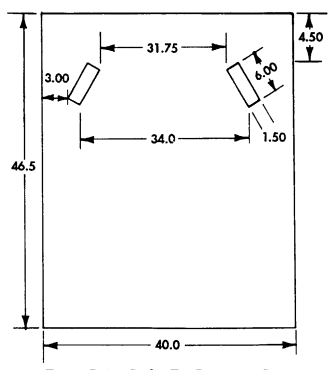

# Appendix A References

## A-1. Scope

This appendix lists all forms, field manuals, technical manuals, and other publications required for use with this manual.

## A-2. Publications Index

The following index should be consulted frequently for latest changes or revisions and for new publications relating to materiel covered in this manual.

Consolidated Index of Army Publications and Blank Forms . . . . . . . . . . . . . DA PAM 25-30

## A-3. Forms

| 1.              | Remove antiskid strip (4) from cargo floor (3).                                                                                                                      |
|-----------------|----------------------------------------------------------------------------------------------------------------------------------------------------------------------|
| 2.              | Clean remaining adhesive from cargo floor (3).                                                                                                                       |
| 3.              | Inspect plugs (1) in cargo floor (3) and right wheelhouse (2), and replace plugs (1) if damaged.                                                                     |
| b. Installation |                                                                                                                                                                      |
| 1. 2.           | Ensure surface of cargo floor (3) is free of dirt and oil.  Peel paper backing (5) from antiskid strip (4) and press antiskid strip (4) firmly onto cargo floor (3). |

| A\-4. FIELD MANUALS                                                                     |
|-----------------------------------------------------------------------------------------|
| NBC Protection                                                                          |
| NBC Decontamination                                                                     |
| Operation and Maintenance of Ordnance Materiel in Cold Weather (0° to \-65°F) FM 9\-207 |
| First Aid for Soldiers                                                                  |
| Manual for the Wheeled Vehicle Driver                                                   |
| Browning Machinegun Caliber .50 HB, M2 FM 23\-65                                        |
| Machinegun 7.62\-MM, M60 FM 23\-67                                                      |
| Basic Cold Weather Manual                                                               |
| Northern Operations                                                                     |
| Army Motor Transport Units and Operations                                               |
| Mountain Operations                                                                     |
| General Fabric Repair !!!                                                            |

| Inspection, Care and Maintenance of Antifriction Bearings                 | . . TM 9\-214           |
|---------------------------------------------------------------------------|-------------------------|
| Materials Used for Cleaning, Preserving, Abrading, and Cementing Ordnance |                         |
| Materiel and Related Materials (Including Chemicals)                      | TM 9\-247               |
| Operator's Manual for Machinegun, Caliber .50 Browning, M2                | . TM 9\-1005\-213\-10   |
| Operator's Manual for M60, 7.62\-MM Machinegun                            | . . TM 9\-1005\-224\-10 |

## A-4. Field Manuals A-5. Technical Manuals A-5. Technical Manuals (Cont'D)

| REFERENCES                                                                                                  |
|-------------------------------------------------------------------------------------------------------------|
| A\-1. SCOPE                                                                                                 |
| This appendix lists all forms, field manuals, technical manuals, and other publications required for use    |
| with this manual.                                                                                           |
| A\-2. PUBLICATIONS INDEX                                                                                    |
| The following index should be consulted frequently for latest changes or revisions and for new publications |
| relating to materiel covered in this manual.                                                                |
| Consolidated Index of Army Publications and Blank Forms DA PAM 25\-30                                       |
| A\-3. FORMS                                                                                                 |
| Recommended Changes to Publications and Blank Forms DA Form 2028                                            |
| Recommended Changes to Equipment Technical Publications DA Form 2028\-2                                     |
| Hand Receipt/Annex Number DA Form 2062                                                                      |
| Exchange Tag DA Form 2402                                                                                   |
| Equipment Inspection and Maintenance Worksheet DA Form 2404                                                 |

| The Army Maintenance Management System (TAMMS) DA PAM 738\-750   |
|------------------------------------------------------------------|
| Preventive Maintenance Schedule and Record DD Form 314           |
| Processing and Deprocessing Record for Shipping, Storage,        |
| and Issue of Vehicles and Spare Engines DD Form 1397             |
| Quality Deficiency Report Standard Form 368                      |
| A\-4. FIELD MANUALS                                              |

| NBC Decontamination FM 3\-5                                                             |
|-----------------------------------------------------------------------------------------|
| Operation and Maintenance of Ordnance Materiel in Cold Weather (0° to \-65°F) FM 9\-207 |
| First Aid for Soldiers FM 21\-11                                                        |

| Machinegun 7.62\-MM, M60 FM 23\-67                                             |
|--------------------------------------------------------------------------------|
| Basic Cold Weather Manual FM 31\-70                                            |
| Northern Operations FM 31\-71                                                  |
| Army Motor Transport Units and Operations FM 55\-30                            |
| Mountain Operations FM 90\-6                                                   |
| General Fabric Repair FM 10\-16                                                |
| A\-5. TECHNICAL MANUALS                                                        |
| Inspection, Care and Maintenance of Antifriction Bearings TM 9\-214            |
| Materials Used for Cleaning, Preserving, Abrading, and Cementing Ordnance      |
| Materiel and Related Materials (Including Chemicals) TM 9\-247                 |
| Operator's Manual for Machinegun, Caliber .50 Browning, M2 TM 9\-1005\-213\-10 |
| Operator's Manual for M60, 7.62\-MM Machinegun TM 9\-1005\-224\-10             |

## A-6. Technical Bulletins A-7. Army Regulations A-8. Other Publications

# Appendix B Maintenance Allocation Chart

Section I. INTRODUCTION

## B-1. The Army Maintenance System (Mac)

a. This section provides a general explanation of all maintenance and repair functions authorized at various maintenance levels under the standard Army Maintenance System Concept.

b. The Maintenance Allocation Chart (MAC) in section II designates overall authority and responsibility for the performance of maintenance functions on the identified end item or component. The application of the maintenance functions to the end item or component will be consistent with the capacities and capabilities of the designated maintenance levels, which are shown on the MAC in column (4) as:
Unit - includes two subcolumns, C (operator/crew ) and O 
(unit) maintenance.

Direct Support - includes an F subcolumn. General Support - includes an H subcolumn. Depot - includes a D subcolumn.

c. Section III lists the tools and test equipment (both special tools and common tool sets) required for each maintenance function as referenced from section II.

d. Section IV contains supplemental instructions and explanatory notes for a particular maintenance function.

## B-2. Maintenance Functions

Maintenance functions will be limited to and defined as follows:
a. Inspect. To determine the serviceability of an item by comparing its physical, mechanical, and/or electrical characteristics with established standards through examination (e.g., by sight, sound, or feel).

b. Test. To verify serviceability by measuring the mechanical, pneumatic, hydraulic, or electrical characteristics of an item and comparing those characteristics with prescribed standards.

c. Service. Operations required periodically to keep an item in proper operating condition, i.e., to clean
(includes decontaminate, when required), to preserve, to drain, to paint, or to replenish fuel, lubricants, chemical fluids, or gases.

d. Adjust. To maintain or regulate, within prescribed limits, by bringing into proper or exact position, or by setting the operating characteristics to specified parameters.

e. Align. To adjust specified variable elements of an item to bring about optimum or desired performance.

f. Calibrate. To determine and cause corrections to be made or to be adjusted on instruments or test, measuring, and diagnostic equipment used in precision measurement. Consists of comparisons of two instruments, one of which is a certified standard of known accuracy, to detect and adjust any discrepancy in the accuracy of the instrument being compared.

g. Remove/Install. To remove and install the same item when required to perform service or other maintenance functions. Install may be the act of emplacing, seating, or fixing into position a spare, repair part, or module (component or assembly) in a manner to allow the proper functioning of an equipment or system.

h. Replace. To remove an unserviceable item and install a serviceable counterpart in its place.

"Replace" is authorized by the MAC and is shown as the 3d position code of the SMR code.

i. Repair. The application of maintenance services, including fault location/troubleshooting, removal/installation, and disassembly/assembly procedures, and maintenance actions to identify troubles and restore serviceability to an item by correcting specific damage, fault, malfunction, or failure in a part, subassembly, module (component or assembly), end item, or system.

j. Overhaul. That maintenance effort (service/action) prescribed to restore an item to a completely serviceable/operational condition as required by maintenance standards in appropriate technical publications (i.e., DMWR). Overhaul is normally the highest degree of maintenance performed by the Army. Overhaul does not normally return an item to like-new condition.

k. Rebuild. Consists of those services/actions necessary for the restoration of unserviceable equipment to a like-new condition in accordance with original manufacturing standards. Rebuild is the highest degree of materiel maintenance applied to Army equipment. The rebuild operation includes the act of returning to zero those age measurements (hours/ miles, etc.) considered in classifying Army equipment/components.

## B-3. Explanation Of Columns In The Mac, Section Ii

a. Column (1)-Group Number. Column 1 lists functional group code numbers, the purpose of which is to identify maintenance significant components, assemblies, subassemblies, and modules with the next higher assembly.

b. Column (2)-Component/Assembly. Column 2 contains the names of components, assemblies, subassemblies, and modules for which maintenance is authorized.

c. Column (3)-Maintenance Function. Column 3 lists the functions to be performed on the item listed in Column 2. (For detailed explanation of these functions, see para. B-2.)
d. Column (4)-Maintenance Category. Column 4 specifies, by the listing of a work time figure in the appropriate subcolumn(s), the category of maintenance authorized to perform the function listed in Column 3. This figure represents the active time required to perform that maintenance function at the indicated category of maintenance. If the number of complexity of the tasks within the listed maintenance function vary at different maintenance categories, appropriate work time figures will be shown for each category. The work time figure represents the average time required to restore an item (assembly, subassembly, component, module, end item, or system) to a serviceable condition under typical field operating conditions. This time includes preparation time (including any necessary disassembly/assembly time) troubleshooting/fault location time, and quality assurance/quality control time in addition to the time required to perform the specific tasks identified for the maintenance functions authorized in the maintenance allocation chart. The symbol designations for the various maintenance categories are as follows:
NOTE
When a complete replace or repair task performed at higher level maintenance includes lower level maintenance tasks (equipment condition/follow-on tasks), the lower level work time figures in the MAC must be added to the higher level work time shown in the MAC to determine the total time to accomplish that maintenance function.

| Policy for Safeguarding and Controlling Comsec Material AR 380\-40          |
|-----------------------------------------------------------------------------|
| Prevention of Motor Vehicle Accidents AR 385\-55                            |
| Packaging of Material AR 700\-15                                            |
| Army Material Maintenance Policy and Retail Maintenance Operation AR 750\-1 |

e. Column (5)-Tools and Equipment. Column 5 specifies, by code, those common tool sets (not individual tools) and special tools, TMDE, and support equipment required to perform the designated function.

f. Column (6)-Remarks. This column shall, when applicable, contain a letter code, in alphabetic order, which shall be keyed to the remarks contained in Section IV.

## B-4. Explanation Of Columns In Tool And Test Equipment Requirements, Section Iii

a. Column (1)-Reference Code. The tool and test equipment reference code correlates with a code used in the MAC, Section II, Column 5.

b. Column (2)-Maintenance Category. The lowest category of maintenance authorized to use the tool or test equipment.

c. Column (3)-Nomenclature. Name or identification of the tool or test equipment. d. Column (4)-National Stock Number. The National stock number of the tool or test equipment. e. Column (5)-Tool Number. The manufacturer's part number.

## B-5. Explanation Of Columns In Remarks, Section Iv

a. Column (1)-Remarks Code. The code recorded in column 6, Section II. b. Column (2)-Remarks. This column lists information pertinent to the maintenance function being performed as indicated in the MAC, Section II.

TM 9-2320-280-20-3

| i. Repair. The application of maintenance services, including fault location/troubleshooting,                             |
|---------------------------------------------------------------------------------------------------------------------------|
| removal/installation, and disassembly/assembly procedures, and maintenance actions to identify troubles                   |
| and restore serviceability to an item by correcting specific damage, fault, malfunction, or failure in a part,            |
| subassembly, module (component or assembly), end item, or system.                                                         |
| j. Overhaul. That maintenance effort (service/action) prescribed to restore an item to a completely                       |
| serviceable/operational condition as required by maintenance standards in appropriate technical                           |
| publications (i.e., DMWR). Overhaul is normally the highest degree of maintenance performed by the                        |
| Army. Overhaul does not normally return an item to like\-new condition.                                                   |
| k. Rebuild. Consists of those services/actions necessary for the restoration of unserviceable equipment                   |
| to a like\-new condition in accordance with original manufacturing standards. Rebuild is the highest degree               |
| of materiel maintenance applied to Army equipment. The rebuild operation includes the act of returning to                 |
| zero those age measurements (hours/ miles, etc.) considered in classifying Army equipment/components.                     |
| B\-3. EXPLANATION OF COLUMNS IN THE MAC, SECTION II                                                                       |
| a.  Column (1)\-Group Number. Column 1 lists functional group code numbers, the purpose of which                          |
| is to identify maintenance significant components, assemblies, subassemblies, and modules with the next  higher assembly. |
| b.  Column (2)\-Component/Assembly. Column 2 contains the names of components, assemblies,                                |
| subassemblies, and modules for which maintenance is authorized.                                                           |
| c.  Column (3)\-Maintenance Function. Column 3 lists the functions to be performed on the item                            |
| listed in Column 2. (For detailed explanation of these functions, see para. B\-2.)                                        |
| d.  Column (4)\-Maintenance Category. Column 4 specifies, by the listing of a work time figure in                         |
| the appropriate subcolumn(s), the category of maintenance authorized to perform the function listed in                    |
| Column 3. This figure represents the active time required to perform that maintenance function at the                     |
| indicated category of maintenance. If the number of complexity of the tasks within the listed maintenance                 |
| function vary at different maintenance categories, appropriate work time figures will be shown for each                   |
| category. The work time figure represents the average time required to restore an item (assembly,                         |
| subassembly, component, module, end item, or system) to a serviceable condition under typical field                       |
| operating conditions. This time includes preparation time (including any necessary disassembly/assembly                   |
| time) troubleshooting/fault location time, and quality assurance/quality control time in addition to the time             |
| required to perform the specific tasks identified for the maintenance functions authorized in the                         |
| maintenance allocation chart. The symbol designations for the various maintenance categories are as                       |
| follows:                                                                                                                  |
| NOTE                                                                                                                      |
| When a complete replace or repair task performed at higher                                                                |
| level maintenance includes lower level maintenance tasks                                                                  |
| (equipment condition/follow\-on tasks), the lower level work                                                              |
| time figures in the MAC must be added to the higher level                                                                 |
| work time shown in the MAC to determine the total time to                                                                 |
| accomplish that maintenance function.                                                                                     |
| C Operator or crew                                                                                                        |
| O Unit maintenance                                                                                                        |
| F Direct Support maintenance                                                                                              |
| H General Support maintenance                                                                                             |
| D Depot maintenance                                                                                                       |
| e.  Column (5)\-Tools and Equipment. Column 5 specifies, by code, those common tool sets (not                             |
| individual tools) and special tools, TMDE, and support equipment required to perform the designated                       |
| function.                                                                                                                 |
| f.  Column (6)\-Remarks. This column shall, when applicable, contain a letter code, in alphabetic                         |

Section II. MAINTENANCE ALLOCATION CHART (Cont'd) Section II. MAINTENANCE ALLOCATION CHART (Cont'd)

| (1)    | (2)                          | (3)         |      |     | (4)               |                  |       | (5)           | (6)     |
|--------|------------------------------|-------------|------|-----|-------------------|------------------|-------|---------------|---------|
|        |                              |             |      |     | Maintenance Level |                  |       | Tools and     |         |
| Group  |                              | Maintenance | Unit |     | Direct  Support   | General  Support | Depot | Equipment     | Remarks |
| Number | Component/Assembly           | Function    |      |     |                   |                  |       | Ref Code      | Code    |
|        |                              |             | C    | O   | F                 | H                | D     |               |         |
| 01     | ENGINE                       |             |      |     |                   |                  |       |               |         |
| 0100   | Engine Assembly              | Inspect     | 0.2  | 0.7 |                   |                  |       |               |         |
|        |                              | Test        |      |     | 1.0               |                  |       | 1,20,21,22,26 | G       |
|        |                              | Service     |      | 0.5 |                   |                  |       | 1,2           |         |
|        |                              | Adjust      |      |     | 1.0               |                  |       | 41,42         |         |
|        |                              | Replace     |      |     | 32.7              |                  |       | 25,145        |         |
|        |                              | Repair      |      |     |                   | 16.0             |       | 1,7,10,43\-45 |         |
|        | Mount, Engine                | Inspect     |      | 0.1 |                   |                  |       | 2,144,145     |         |
|        |                              | Replace     |      |     | 1.6               |                  |       | 1,2,144\-     |         |
|        |                              |             |      |     |                   |                  |       | 146,149       |         |
| 0101   | Cylinder Head                | Replace     |      |     | 3.0               |                  |       | 1,6           |         |
|        |                              | Repair      |      |     |                   | 5.0              |       | 1,6,8,12\-18  |         |
|        | Block, Cylinder              | Repair      |      |     |                   | 10.0             |       | 1,6\-8,12\-18 |         |
| 0102   | Crankshaft                   | Replace     |      |     |                   | 4.0              |       | 1             |         |
|        | Pulley, Crankshaft           | Replace     |      |     | 0.5               |                  |       | 1,6           |         |
|        | Damper, Vibration            | Replace     |      |     | 0.5               |                  |       | 1,6           |         |
|        | Bearings, Crankshaft         | Replace     |      |     |                   | 4.0              |       | 1             |         |
|        | Oil Seals, Crankshaft, Front | Replace     |      |     | 2.0               |                  |       | 1             |         |
|        | Oil Seals, Crankshaft, Rear  | Replace     |      |     | 2.0               |                  |       | 1,6,46        |         |
| 0103   | Flywheel                     | Replace     |      |     | 3.5               |                  |       | 1,6           |         |
| 0104   | Pistons, Connecting Rods     |             |      |     |                   |                  |       |               |         |
|        | Rods, Connecting             | Replace     |      |     |                   | 8.0              |       | 1,6           |         |
|        | Bearings, Connecting Rod     | Replace     |      |     |                   | 2.0              |       | 1,6           |         |
|        | Pistons                      | Replace     |      |     |                   | 8.0              |       | 1,6           |         |
|        | Rings, Piston                | Replace     |      |     |                   | 7.0              |       | 1,6,10        |         |
| 0105   | Valves, Camshaft, and Timing |             |      |     |                   |                  |       |               |         |
|        | System                       |             |      |     |                   |                  |       |               |         |
|        | Cover, Rocker Arm            | Replace     |      |     | 1.0               |                  |       | 1,6           |         |
|        | Valves, Intake and Exhaust   | Replace     |      |     |                   | 3.0              |       | 6             |         |
|        |                              | Repair      |      |     |                   | 3.0              |       | 6,8           |         |
|        | Rocker Arm Assembly          | Replace     |      |     | 2.1               |                  |       | 1,6           |         |
|        | Springs, Valve               | Test        |      |     | 0.5               |                  |       | 1,8           |         |
|        |                              | Replace     |      |     | 2.3               |                  |       | 1,6           |         |
|        | Rods, Push                   | Replace     |      |     | 3.0               |                  |       | 1             |         |
|        | Lifters                      | Replace     |      |     | 6.0               |                  |       | 1             |         |

TM 9-2320-280-20-3

| (1)    | (2)                         | (3)         |      |     | (4)               |                  |       | (5)         | (6)     |
|--------|-----------------------------|-------------|------|-----|-------------------|------------------|-------|-------------|---------|
|        |                             |             |      |     | Maintenance Level |                  |       | Tools and   |         |
| Group  |                             | Maintenance | Unit |     | Direct  Support   | General  Support | Depot | Equipment   | Remarks |
| Number | Component/Assembly          | Function    | C    | O   | F                 | H                | D     | Ref Code    | Code    |
|        | Gears and Chain, Timing     | Replace     |      |     | 4.0               |                  |       | 1,6,10      |         |
|        | Camshaft                    | Replace     |      |     |                   | 4.0              |       | 1,6,10      |         |
|        | Bearings, Camshaft          | Replace     |      |     |                   | 4.0              |       | 1,6,45,47   |         |
| 0106   | Engine Lubrication System   |             |      |     |                   |                  |       |             |         |
|        | Pan, Oil                    | Replace     |      | 2.0 |                   |                  |       | 1,2         |         |
|        | Pump, Oil                   | Replace     |      |     | 2.5               |                  |       | 1,6         |         |
|        | Filter, Oil                 | Replace     |      | 0.5 |                   |                  |       | 1,2         |         |
|        | Dipstick and Tube           | Replace     |      | 0.2 |                   |                  |       | 1,2,156     |         |
|        | Oil Cooler Assembly         | Inspect     |      | 0.1 |                   |                  |       |             |         |
|        |                             | Replace     |      | 0.5 |                   |                  |       | 1,2         |         |
|        |                             | Repair      |      |     | 1.0               |                  |       | 1           |         |
|        | Lines, Oil Cooler           | Inspect     |      | 0.2 |                   |                  |       |             |         |
|        |                             | Replace     |      | 1.8 |                   |                  |       | 1           |         |
|        | Valve, Crankcase Depression | Inspect     |      | 0.1 |                   |                  |       |             |         |
|        | Regulator                   | Test        |      | 0.3 |                   |                  |       |             | L       |
|        |                             | Service     |      | 0.3 |                   |                  |       | 1           |         |
|        |                             | Replace     |      | 0.3 |                   |                  |       | 1,2         |         |
| 0108   | Manifold, Intake            | Replace     |      |     | 3.0               |                  |       | 1,6         |         |
|        | Manifold, Exhaust           | Replace     |      | 3.0 |                   |                  |       | 1,146,      |         |
|        |                             |             |      |     |                   |                  |       | 150,156     |         |
| 03     | FUEL SYSTEM                 |             |      |     |                   |                  |       |             |         |
| 0301   | Injector Nozzle, Fuel       | Test        |      |     | 0.5               |                  |       | 1,9         |         |
|        |                             | Replace     |      |     | 0.7               |                  |       | 1,6,49,134, |         |
|        |                             |             |      |     |                   |                  |       | 146,153     |         |
| 0302   | Lines, Injection Pump       | Inspect     |      | 0.1 |                   |                  |       |             |         |
|        |                             | Replace     |      |     | 2.0               |                  |       | 1,147,148   |         |
|        | Pump, Injection             | Inspect     |      | 0.1 |                   |                  |       |             |         |
|        |                             | Calibrate   |      |     |                   | A                |       | 1,9,59\-65  | A       |
|        |                             | Replace     |      |     | 4.0               |                  |       | 1,147       |         |
|        |                             | Repair      |      |     | 0.6               | 5.0              |       | 1,9,50\-57, | O       |
|        |                             |             |      |     |                   |                  |       | 158\-161    |         |
|        | Fuel Pump                   | Test        |      | 0.3 |                   |                  |       | 1,2         |         |
|        |                             | Replace     |      | 1.0 |                   |                  |       | 1,2         |         |
| 0304   | Cleaner Assembly, Air       | Inspect     | 0.2  |     |                   |                  |       |             |         |
|        |                             | Service     | 0.2  | 0.5 |                   |                  |       | 1           |         |
|        |                             | Replace     |      | 0.2 |                   |                  |       | 1           |         |
|        | Horn, Air Induction         | Inspect     | 0.1  |     |                   |                  |       |             |         |
|        |                             | Replace     |      | 0.3 |                   |                  |       | 1,2         |         |
| 0306   | Lines and Fittings, Fuel    | Inspect     |      | 0.2 |                   |                  |       |             |         |
|        |                             | Replace     |      | 3.2 |                   |                  |       | 1           |         |
|        | Tank, Fuel                  | Inspect     |      | 0.1 |                   |                  |       |             |         |
|        |                             | Replace     |      | 2.6 |                   |                  |       | 1,2         |         |

Section II. MAINTENANCE ALLOCATION CHART (Cont'd)

| (1)    | (2)                      | (3)         |      |     | (4)               |                  |       | (5)        | (6)     |
|--------|--------------------------|-------------|------|-----|-------------------|------------------|-------|------------|---------|
|        |                          |             |      |     | Maintenance Level |                  |       | Tools and  |         |
| Group  |                          | Maintenance | Unit |     | Direct  Support   | General  Support | Depot | Equipment  | Remarks |
| Number | Component/Assembly       | Function    |      |     |                   |                  |       | Ref Code   | Code    |
|        |                          |             | C    | O   | F                 | H                | D     |            |         |
| 0309   | Filter Assembly, Fuel    | Inspect     |      | 0.1 |                   |                  |       |            |         |
|        |                          | Service     | 0.1  | 0.5 |                   |                  |       | 1          | B       |
|        |                          | Replace     |      | 0.5 |                   |                  |       | 2          |         |
| 0311   | Glow Plugs               | Test        |      | 0.3 |                   |                  |       | 2          |         |
|        |                          | Replace     |      | 0.7 |                   |                  |       | 1,2,48,155 |         |
| 0312   | Accelerator Linkage      | Inspect     |      | 0.2 |                   |                  |       |            |         |
|        |                          | Adjust      |      | 0.2 |                   |                  |       | 1          |         |
|        |                          | Replace     |      | 0.8 |                   |                  |       | 1,2        |         |
|        | Hand Throttle            | Inspect     | 0.1  | 0.1 |                   |                  |       |            |         |
|        |                          | Adjust      |      | 0.2 |                   |                  |       | 1          |         |
|        |                          | Replace     |      | 0.5 |                   |                  |       | 1,2        |         |
| 04     | EXHAUST SYSTEM           |             |      |     |                   |                  |       |            |         |
| 0401   | Muffler                  | Inspect     |      | 0.2 |                   |                  |       |            |         |
|        |                          | Replace     |      | 1.9 |                   |                  |       | 1,2        |         |
|        | Crossover Pipe           | Inspect     |      | 0.2 |                   |                  |       |            |         |
|        |                          | Replace     |      | 1.2 |                   |                  |       | 1,2,145,   |         |
|        |                          |             |      |     |                   |                  |       | 150        |         |
|        | Tailpipe                 | Inspect     |      | 0.2 |                   |                  |       |            |         |
|        |                          | Replace     |      | 0.5 |                   |                  |       | 1,2        |         |
| 05     | COOLING SYSTEM           |             |      |     |                   |                  |       |            |         |
| 0501   | Radiator                 | Inspect     | 0.1  | 0.2 |                   |                  |       |            |         |
|        |                          | Test        |      | 0.5 |                   |                  |       | 2,66       |         |
|        |                          | Replace     |      | 4.3 |                   |                  |       | 1          |         |
|        |                          | Repair      |      |     | 3.0               |                  |       | 1          |         |
|        | Surge Tank               | Inspect     | 0.1  |     |                   |                  |       |            |         |
|        |                          | Service     | 0.1  | 0.5 |                   |                  |       | 1,2        | C       |
|        |                          | Replace     |      | 0.6 |                   |                  |       | 1          |         |
| 0502   | Shroud, Fan              | Inspect     |      | 0.1 |                   |                  |       |            |         |
|        |                          | Replace     |      | 4.4 |                   |                  |       | 1          |         |
|        |                          | Repair      |      | F   |                   |                  |       |            | F,M     |
| 0503   | Hoses, Lines, and Clamps | Inspect     | 0.1  | 0.1 |                   |                  |       |            |         |
|        |                          | Replace     |      | 2.5 |                   |                  |       | 1          |         |
|        | Thermostat               | Test        |      | 0.2 |                   |                  |       |            |         |
|        |                          | Replace     |      | 0.3 |                   |                  |       | 1,2        |         |
| 0504   | Pump, Water              | Replace     |      | 3.5 |                   |                  |       | 1,6        |         |
| 0505   | Fan                      | Inspect     | 0.1  | 0.1 |                   |                  |       |            |         |
|        |                          | Replace     |      | 1.0 |                   |                  |       | 1,2,161    |         |
|        | Fan Drive                | Repair      |      |     | 4.7               |                  |       | 1,6        |         |
|        | Pulley, Water Pump       | Replace     |      | 4.8 |                   |                  |       | 1,157      |         |

Section II. MAINTENANCE ALLOCATION CHART (Cont'd)
TM 9-2320-280-20-3

| (1)    | (2)                         | (3)         |      |     | (4)               |                  |       | (5)       | (6)     |
|--------|-----------------------------|-------------|------|-----|-------------------|------------------|-------|-----------|---------|
|        |                             |             |      |     | Maintenance Level |                  |       | Tools and |         |
| Group  |                             | Maintenance | Unit |     | Direct  Support   | General  Support | Depot | Equipment | Remarks |
| Number | Component/Assembly          | Function    | C    | O   | F                 | H                | D     | Ref Code  | Code    |
|        | Belts, Drive                | Inspect     | 0.1  |     |                   |                  |       |           |         |
|        |                             | Adjust      |      | 0.5 |                   |                  |       | 1,2,67    |         |
|        |                             | Replace     |      | 1.0 |                   |                  |       | 1,2,67    |         |
| 06     | ELECTRICAL SYSTEM           |             |      |     |                   |                  |       |           |         |
| 0601   | Alternator (60 Ampere)      | Inspect     |      | 0.1 |                   |                  |       |           |         |
|        |                             | Test        |      | 0.3 |                   |                  |       | 2,166     |         |
|        |                             | Adjust      |      | 0.3 |                   |                  |       | 1,163     |         |
|        |                             | Replace     |      | 1.0 |                   |                  |       | 1,2       |         |
|        | Pulley, Alternator          | Replace     |      | 1.2 |                   |                  |       | 1,2,67    |         |
| 0603   | Starter                     | Inspect     |      | 0.2 |                   |                  |       |           |         |
|        |                             | Test        |      | 0.3 |                   |                  | 2     |           |         |
|        |                             | Replace     |      | 1.9 |                   |                  |       | 1,2,145,  |         |
|        |                             |             |      |     |                   |                  |       | 146,149   |         |
|        |                             | Repair      |      |     | 8.3               |                  |       | 1,9       |         |
| 0607   | Instrument Panel            |             |      |     |                   |                  |       |           |         |
|        | Switches                    | Replace     |      | 0.3 |                   |                  | 1     |           |         |
|        | Instruments, Gages          | Inspect     | 0.1  |     |                   |                  |       |           |         |
|        |                             | Replace     |      | 0.5 |                   |                  | 1     |           |         |
|        | Circuit Breakers            | Replace     |      | 0.5 |                   |                  | 1     |           |         |
| 0608   | Control, Directional Signal | Inspect     | 0.1  |     |                   |                  |       |           |         |
|        |                             | Replace     |      | 0.3 |                   |                  | 1     |           |         |
|        | Protective Control Box      | Inspect     |      | 0.1 |                   |                  |       |           |         |
|        |                             | Replace     |      | 0.3 |                   |                  | 1     |           |         |
| 0609   | Headlight                   | Inspect     | 0.1  |     |                   |                  |       |           |         |
|        |                             | Adjust      |      | 0.2 |                   |                  |       | 1,2       |         |
|        |                             | Replace     |      | 0.5 |                   |                  | 1     |           |         |
|        | Lights, Composite, Front    | Inspect     | 0.1  |     |                   |                  |       |           |         |
|        | and Rear                    | Replace     |      | 0.1 |                   |                  | 1     |           |         |
| 0610   | Sending Units and Warning   | Test        |      | 0.1 |                   |                  | 2     |           |         |
|        | Switches                    | Replace     |      | 0.1 |                   |                  | 1     |           |         |
| 0611   | Horn Assembly               | Inspect     | 0.1  |     |                   |                  |       |           |         |
|        |                             | Test        |      | 0.2 |                   |                  | 2     |           |         |
|        |                             | Replace     |      | 0.3 |                   |                  | 1     |           |         |
|        | Switch, Horn                | Test        |      | 0.2 |                   |                  | 2     |           |         |
|        |                             | Replace     |      | 0.2 |                   |                  | 1     |           |         |
| 0612   | Battery                     | Inspect     | 0.1  |     |                   |                  |       |           |         |
|        |                             | Test        |      | 0.5 |                   |                  | 2     |           |         |
|        |                             | Service     |      | 0.2 |                   |                  | 1     |           |         |
|        |                             | Replace     |      | 1.6 |                   |                  | 1     |           |         |
|        | Cables, Battery             | Inspect     | 0.2  |     |                   |                  |       |           |         |
|        |                             | Replace     |      | 0.8 |                   |                  | 1     |           |         |
|        |                             | Repair      |      | 0.5 |                   |                  |       | 1,2       |         |

Section II. MAINTENANCE ALLOCATION CHART (Cont'd)

| (1)    | (2)                        | (3)         |      |     | (4)               |                  |       | (5)       | (6)     |
|--------|----------------------------|-------------|------|-----|-------------------|------------------|-------|-----------|---------|
|        |                            |             |      |     | Maintenance Level |                  |       | Tools and |         |
| Group  |                            | Maintenance | Unit |     | Direct  Support   | General  Support | Depot | Equipment | Remarks |
| Number | Component/Assembly         | Function    |      |     |                   |                  |       | Ref Code  | Code    |
|        |                            |             | C    | O   | F                 | H                | D     |           |         |
| 0613   | Wiring Harnesses           |             |      |     |                   |                  |       |           |         |
|        | Wiring Harness, Engine     | Inspect     |      | 0.3 |                   |                  |       |           |         |
|        |                            | Replace     |      |     | 4.5               |                  |       | 1,6       |         |
|        |                            | Repair      |      | 0.5 |                   |                  |       | 1,2       |         |
|        | Wiring Harness, STE/ICE\-R | Inspect     |      | 0.3 |                   |                  |       |           |         |
|        |                            | Replace     |      |     | 3.7               |                  |       | 1,6       |         |
|        |                            | Repair      |      | 0.5 |                   |                  |       | 1,2       |         |
|        | Wiring Harness, Body       | Inspect     |      | 0.4 |                   |                  |       |           |         |
|        |                            | Replace     |      |     | 3.5               |                  |       | 1,6       |         |
|        |                            | Repair      |      | 0.5 |                   |                  |       | 1,2       |         |
|        | Wiring Harness, Hood       | Inspect     |      | 0.2 |                   |                  |       |           |         |
|        |                            | Replace     |      | 1.0 |                   |                  |       | 1         |         |
|        |                            | Repair      |      | 0.5 |                   |                  |       | 2         |         |
| 0615   | Ambulance Electrical       |             |      |     |                   |                  |       |           |         |
|        | System                     |             |      |     |                   |                  |       |           |         |
|        | Spotlight and Ceiling      | Inspect     | 0.1  |     |                   |                  |       |           |         |
|        | Light Bulbs                | Replace     |      | 0.1 |                   |                  |       | 1         |         |
|        | Spotlight and Ceiling      | Inspect     | 0.1  |     |                   |                  |       |           |         |
|        | Light Assemblies           | Replace     |      | 0.2 |                   |                  |       | 1         |         |
|        | Blackout Light Switches    | Inspect     | 0.1  |     |                   |                  |       |           |         |
|        |                            | Replace     |      | 0.2 |                   |                  |       | 1         |         |
|        | Backup Lights              | Replace     |      | 0.3 |                   |                  |       | 1         |         |
|        | Control Box                | Inspect     | 0.1  |     |                   |                  |       |           |         |
|        |                            | Replace     |      | 2.5 |                   |                  |       | 1         |         |
|        | Control Box Relays,        | Replace     |      | 0.3 |                   |                  |       | 1         |         |
|        | Switches, Fuse Blocks      |             |      |     |                   |                  |       |           |         |
|        | Heat/Vent Control          | Replace     |      | 0.3 |                   |                  |       | 1         |         |
|        | Panel (M996)               |             |      |     |                   |                  |       |           |         |
|        | Heat, Vent, and            | Replace     |      |     | 10.0              |                  |       | 1         |         |
|        | A/C Control Box (M997)     |             |      |     |                   |                  |       |           |         |
|        | Heat, Vent, and            | Replace     |      | 0.3 |                   |                  |       | 1         |         |
|        | A/C Switches and Relays    |             |      |     |                   |                  |       |           |         |
|        | 200 Ampere Alternator      | Inspect     |      | 0.2 |                   |                  |       |           |         |
|        |                            | Test        |      | 0.3 |                   |                  |       | 2,166     |         |
|        |                            | Replace     |      | 1.1 |                   |                  |       | 1         |         |
|        |                            | Adjust      |      | 0.3 |                   |                  |       |           |         |
|        |                            | Repair      |      |     | 4.0               |                  |       |           |         |
|        | Lighting Wiring Harness    | Replace     |      | 3.5 |                   |                  |       | 1         |         |
|        | NBC Control Box and        | Replace     |      | 4.3 |                   |                  |       |           |         |
|        | Wiring Harness             |             |      |     |                   |                  |       |           |         |

Section II. MAINTENANCE ALLOCATION CHART (Cont'd)
TM 9-2320-280-20-3

| (4)              | (1)                    | (2)          | (3)                       | (5)                      | (6)              | Maintenance Level   |            |       |         |         |
|------------------|------------------------|--------------|---------------------------|--------------------------|------------------|---------------------|------------|-------|---------|---------|
| Tools and        | Group                  | Maintenance  | Remarks                   | Direct                   | General          | Unit                | Equipment  | Depot | Support | Support |
| Number           | Component/Assembly     | Function     | Code                      | Ref Code                 | F                | H                   | C          | O     | D       |         |
| 07               | TRANSMISSION (3L80)    | 0705         | Shift Control and Linkage | Inspect                  | 0.1              | 0.2                 |            |       |         |         |
| Adjust           | 0.5                    | 1            | Replace                   | 1.5                      | 1,2              |                     |            |       |         |         |
| Repair           | 1.0                    | 6            | Modulator, Mechanical     | Adjust                   | 0.1              | 2                   |            |       |         |         |
| Replace          | 0.6                    | 2            | Switch Neutral Start      | Replace                  | 0.5              | 1                   |            |       |         |         |
| Detent Solenoid  | Replace                | 1.7          | 1,2                       | 0708                     | Torque Converter | Replace             | 3.3        | 1,2   |         |         |
| 0710             | Transmission Assembly  | Inspect      | 0.1                       | D                        | Test             | 0.5                 | 2,6,145    |       |         |         |
| Service          | 0.2                    | 1,2          | Replace                   | 5.8                      | 1,6,144          |                     |            |       |         |         |
| Repair           | 4.0                    | 1,6,70,80    | Transmission Mount        | Inspect                  | 0.2              |                     |            |       |         |         |
| Replace          | 1.0                    | 1,6          | Gear Unit                 | Replace                  | 1.5              | 1,6,70\-73          |            |       |         |         |
| Repair           | 1.3                    | 1,6,72\-75   | 0713                      | Forward Clutch           | Replace          | 2.0                 | 1,6,70\-73 |       |         |         |
| Repair           | 0.6                    | 1,6,76,77    | Direct Clutch             | Replace                  | 2.0              | 1,6,70\-73,79       |            |       |         |         |
| Repair           | 0.8                    | 1,6,76,77    | Intermediate Clutch       | Replace                  | 2.0              | 1,6,70\-73          |            |       |         |         |
| Repair           | 0.8                    | 1,6,74,75,79 | 0714                      | Rear Servo               | Replace          | 1.0                 | 1,6,78     |       |         |         |
| Repair           | 0.3                    | 1,6,78       | Front Servo               | Replace                  | 1.0              | 1,6                 |            |       |         |         |
| Repair           | 1.0                    | 1,6          | Band, Front and Rear      | Replace                  | 2.5              | 1,6,70\-73,79       |            |       |         |         |
| Governor         | Inspect                | 0.2          | Replace                   | 0.5                      | 1,6              |                     |            |       |         |         |
| Control Valve    | Replace                | 1.3          | 1,6                       | Repair                   | 1.0              | 1,6,10              |            |       |         |         |
| 0721             | Oil Pump, Transmission | Replace      | 1.0                       | 1,6,70,71,73,80          | Repair           | 1.6                 | 1,6,73\-75 |       |         |         |
| Seal, Oil Pump   | Replace                | 0.3          | 1,6,80                    | Oil Filter, Transmission | Replace          | 1.5                 | 1,2        |       |         |         |
| Oil Cooler Lines | Inspect                | 0.2          | Replace                   | 1.0                      | 1                |                     |            |       |         |         |

Section II. MAINTENANCE ALLOCATION CHART (Cont'd) Section II. MAINTENANCE ALLOCATION CHART (Cont'd)

| (1)    | (2)                       | (3)            |      |     | (4)               |         |       | (5)                      | (6)     |
|--------|---------------------------|----------------|------|-----|-------------------|---------|-------|--------------------------|---------|
|        |                           |                |      |     | Maintenance Level |         |       | Tools and                |         |
| Group  |                           | Maintenance    | Unit |     | Direct            | General | Depot | Equipment                | Remarks |
| Number | Component/Assembly        | Function       |      |     | Support           | Support |       | Ref Code                 | Code    |
|        |                           |                | C    | O   | F                 | H       | D     |                          |         |
|        | TRANSMISSION (4L80\-E)    |                |      |     |                   |         |       |                          |         |
| 0705   | Shift Control and Linkage | Inspect        | 0.1  | 0.2 |                   |         |       |                          |         |
|        |                           | Adjust         |      | 0.5 |                   |         |       | 1                        |         |
|        |                           | Replace        |      | 1.5 |                   |         |       | 1,2                      |         |
|        |                           | Repair         |      | 1.0 |                   |         |       | 1,2                      |         |
|        | Throttle Position Sensor  | Adjust         |      | 0.1 |                   |         |       | 1,63,166,173             |         |
|        |                           | Replace        |      | 0.6 |                   |         |       | 1,63,166,173             |         |
|        | Switch, Neutral Start     | Replace        |      | 0.5 |                   |         |       | 1                        |         |
| 0708   | Torque Converter          | Replace        |      |     | 3.3               |         |       | 1,2                      |         |
| 0710   | Transmission Assembly     | Inspect        | 0.1  |     |                   |         |       |                          | D       |
|        |                           | Test           |      |     | 0.5               |         |       | 1,2,6,                   |         |
|        |                           |                |      |     |                   |         |       | 93.1,93.2,               |         |
|        |                           |                |      |     |                   |         |       | 145,166,173              |         |
|        |                           | Service        |      | 0.2 |                   |         |       | 1,2                      |         |
|        |                           | Replace Repair |      |     | 5.8               | 4.0     |       | 1,2,6,144   1,6,70,71,81 |         |
|        |                           | Overhaul       |      |     |                   | 13.5    |       | 1,6,70\-73,              |         |
|        |                           |                |      |     |                   |         |       | 79,81\-84,               |         |
|        |                           |                |      |     |                   |         |       | 92,93,95,172             |         |
|        | Transmission Mount        | Inspect        |      | 0.2 |                   |         |       |                          |         |
|        |                           | Replace        |      | 1.0 |                   |         |       | 1,2                      |         |
|        | Gear Unit                 | Replace        |      |     |                   | 1.5     |       | 1,6,84                   |         |
|        |                           | Repair         |      |     |                   | 1.3     |       | 1,6,84                   |         |
| 0713   | Forward Clutch            | Replace        |      |     |                   | 2.0     |       | 1,6,85,                  |         |
|        |                           |                |      |     |                   |         |       | 87,88,172                |         |
|        |                           | Repair         |      |     |                   | 0.6     |       | 1,6,85\-88,              |         |
|        |                           |                |      |     |                   |         |       | 172                      |         |
|        | Direct Clutch             | Replace        |      |     |                   | 2.0     |       | 1,6,79,                  |         |
|        |                           |                |      |     |                   |         |       | 87,88,                   |         |
|        |                           |                |      |     |                   |         |       | 172                      |         |
|        |                           | Repair         |      |     |                   | 0.8     |       | 1,6,79,                  |         |
|        |                           |                |      |     |                   |         |       | 86\-88                   |         |
|        | Intermediate Clutch       | Replace        |      |     |                   | 2.0     |       | 1,6,84                   |         |
|        |                           | Repair         |      |     |                   | 0.8     |       | 1,6,79,84                |         |
|        | Fourth Clutch             | Replace        |      |     |                   | 2.0     |       | 1,6,86\-88               |         |
|        |                           | Repair         |      |     |                   | 0.8     |       | 1,6,87\-89               |         |
|        | Turbine Shaft and         | Replace        |      |     |                   | 2.0     |       | 1,6                      |         |
|        | Overdrive Carrier         | Repair         |      |     |                   | 0.8     |       | 1,6,79,86,90             |         |
| 0714   | Rear Servo                | Replace        |      |     |                   | 1.0     |       | 1,6                      |         |
|        |                           | Repair         |      |     |                   | 0.3     |       | 1,6                      |         |
|        | Front Servo               | Replace        |      |     |                   | 1.0     |       | 1,6                      |         |
|        |                           | Repair         |      |     |                   | 1.0     |       | 1,6                      |         |
|        | Band, Front and Rear      | Replace        |      |     |                   | 2.5     |       | 1,6,92,93                |         |
|        | Governor                  | Inspect        |      |     | 0.2               |         |       |                          |         |
|        |                           | Replace        |      |     | 0.5               |         |       | 1,6                      |         |
|        | Control Valve             | Replace        |      |     |                   | 1.3     |       | 1,6                      |         |
|        |                           | Repair         |      |     |                   | 1.0     |       | 1,6,10                   |         |

TM 9-2320-280-20-3

| (1)    | (2)                         | (3)         |      |     | (4)               |                  |       | (5)            | (6)     |
|--------|-----------------------------|-------------|------|-----|-------------------|------------------|-------|----------------|---------|
|        |                             |             |      |     | Maintenance Level |                  |       | Tools and      |         |
| Group  |                             | Maintenance | Unit |     | Direct  Support   | General  Support | Depot | Equipment      | Remarks |
| Number | Component/Assembly          | Function    |      |     |                   |                  |       | Ref Code       | Code    |
|        |                             |             | C    | O   | F                 | H                | D     |                |         |
| 0721   | Oil Pump, Transmission      | Replace     |      |     |                   | 1.0              |       | 1,6,83         |         |
|        |                             | Repair      |      |     |                   | 1.6              |       | 1,6,83,91      |         |
|        | Seal, Oil Pump              | Replace     |      |     | 0.3               |                  |       | 1,6,80         |         |
|        | Oil Filter, Transmission    | Replace     |      | 1.5 |                   |                  |       | 1,2            |         |
|        | Lines, Oil Cooler           | Inspect     |      | 0.2 |                   |                  |       |                |         |
|        |                             | Replace     |      | 1.0 |                   |                  |       | 1,2            |         |
| 08     | TRANSFER                    |             |      |     |                   |                  |       |                |         |
| 0801   | Transfer Case               | Inspect     |      | 0.1 |                   |                  |       |                |         |
|        |                             | Service     |      | 0.5 |                   |                  |       | 2              |         |
|        |                             | Replace     |      |     | 5.2               |                  |       | 1,6,144        |         |
|        |                             | Repair      |      |     |                   | 5.7              |       | 1,6,75,94\-106 | P       |
|        |                             | Overhaul    |      |     |                   | 10.0             |       | 1,6,10,75      |         |
|        |                             |             |      |     |                   |                  |       | 94,106,144     |         |
|        | Seal, Oil, Input and Output | Replace     |      | 1.3 |                   |                  |       | 1,2,94         |         |
|        | Shaft                       |             |      |     |                   |                  |       |                |         |
|        | Yokes, Front and Rear       | Replace     |      | 1.2 |                   |                  |       | 1,2            |         |
|        | Bearings, Output Shaft      | Replace     |      |     |                   | 3.0              |       | 1,2,75,95\-100 |         |
|        | Gear, Speedometer Driven    | Replace     |      | 0.5 |                   |                  |       | 1,2,107        |         |
| 0803   | Shift Control and Linkage   | Inspect     | 0.1  | 0.2 |                   |                  |       |                | D       |
|        |                             | Adjust      |      | 0.5 |                   |                  |       | 1              |         |
|        |                             | Replace     |      | 1.0 |                   |                  |       | 1,2            |         |
|        |                             | Repair      |      |     | 1.0               |                  |       | 1,2            |         |
| 09     | PROPELLER SHAFTS            |             |      |     |                   |                  |       |                |         |
| 0900   | Shafts, Propeller, Front    | Service     |      | 0.2 |                   |                  |       | 1,2            |         |
|        |                             | Replace     |      | 1.0 |                   |                  |       | 1,2            |         |
|        |                             | Repair      |      | 0.5 | 1.2               |                  |       | 1,2,6          | E       |
|        | Shaft, Propeller, Rear      | Service     |      | 0.2 |                   |                  |       | 1,2            |         |
|        |                             | Replace     |      | 1.0 |                   |                  |       | 1,2            |         |
|        |                             | Repair      |      | 1.2 |                   |                  |       | 1,2            |         |
|        | Joints, Universal           | Inspect     |      | 0.1 |                   |                  |       |                |         |
|        |                             | Service     |      | 0.3 |                   |                  |       | 2              |         |
|        |                             | Replace     |      | 1.5 |                   |                  |       | 1,2            |         |
| 10     | FRONT AXLE                  |             |      |     |                   |                  |       |                |         |
| 1000   | Halfshaft                   | Inspect     |      | 0.2 |                   |                  |       |                |         |
|        |                             | Replace     |      | 2.2 |                   |                  |       | 1,2            |         |
|        |                             | Repair      |      | 1.0 |                   |                  |       | 1,2            |         |

Section II. MAINTENANCE ALLOCATION CHART (Cont'd)

| (1)    | (2)                              | (3)         |      |     | (4)               |                  |       | (5)            | (6)     |
|--------|----------------------------------|-------------|------|-----|-------------------|------------------|-------|----------------|---------|
|        |                                  |             |      |     | Maintenance Level |                  |       | Tools and      |         |
| Group  |                                  | Maintenance | Unit |     | Direct  Support   | General  Support | Depot | Equipment      | Remarks |
| Number | Component/Assembly               | Function    |      |     |                   |                  |       | Ref Code       | Code    |
|        |                                  |             | C    | O   | F                 | H                | D     |                |         |
| 1002   | Differential Assembly            | Inspect     |      | 0.1 |                   |                  |       |                |         |
|        |                                  | Service     |      | 0.5 |                   |                  |       | 1,2            |         |
|        |                                  | Replace     |      |     | 5.0               |                  |       | 1,2            |         |
|        |                                  | Repair      |      |     |                   | 10.2             |       | 1,7,75,94,     |         |
|        |                                  |             |      |     |                   |                  |       | 117\-124       |         |
|        | Seal, Output Shaft, Differential | Replace     |      |     | 1.0               |                  |       | 1,6,117        |         |
|        | Seal, Pinion, Differential       | Replace     |      |     | 0.3               |                  |       | 1,6,94         |         |
|        | Differential Cover               | Replace     |      | 0.5 |                   |                  |       | 1,2            | H       |
| 1004   | Knuckle and Geared Hub           | Inspect     |      | 0.1 |                   |                  |       |                |         |
|        |                                  | Service     |      | 0.5 |                   |                  |       | 1,2            |         |
|        |                                  | Replace     |      |     | 2.0               |                  |       | 1,2,167        |         |
|        |                                  | Repair      |      |     | 1.2               |                  |       | 1,2,6,75,      | K       |
|        |                                  |             |      |     |                   |                  |       | 126\-128,129   |         |
|        | Bearing, Spindle, Geared Hub     | Adjust      |      | 0.9 |                   |                  |       | 1,2,127        |         |
|        | Seal, Input, Geared Hub          | Replace     |      | 2.0 |                   |                  |       | 1,2,75,126     |         |
|        | Seal, Spindle, Geared Hub        | Replace     |      | 1.0 |                   |                  |       | 1,2,75,127,128 | I       |
|        | Steering Stop                    | Adjust      |      | 0.5 |                   |                  |       | 2              |         |
|        |                                  | Replace     |      | 0.3 |                   |                  |       | 2              |         |
|        | Upper Control Arm                | Inspect     |      | 0.1 |                   |                  |       |                |         |
|        |                                  | Replace     |      | 1.0 |                   |                  |       | 1,2            |         |
|        |                                  | Repair      |      |     | 1.0               |                  |       | 1,2            |         |
|        | Lower Control Arm                | Inspect     |      | 0.1 |                   |                  |       |                |         |
|        |                                  | Replace     |      | 2.6 |                   |                  |       | 1,2            |         |
|        |                                  | Repair      |      |     | 1.0               |                  |       | 1,2            |         |
|        | Ball Joint, Upper and Lower      | Replace     |      | 0.6 |                   |                  |       | 1,2,129,146,   |         |
|        |                                  |             |      |     |                   |                  |       | 151            |         |
| 11     | REAR AXLE                        |             |      |     |                   |                  |       |                |         |
| 1100   | Halfshaft                        | Inspect     |      | 0.2 |                   |                  |       |                |         |
|        |                                  | Replace     |      | 1.8 |                   |                  |       | 1,2            |         |
|        |                                  | Repair      |      | 1.0 |                   |                  |       | 1,2            |         |
| 1102   | Differential Assembly            | Inspect     |      | 0.1 |                   |                  |       |                |         |
|        |                                  | Service     |      | 0.5 |                   |                  |       | 1,2            |         |
|        |                                  | Replace     |      |     | 5.0               |                  |       | 1,2            |         |
|        |                                  | Repair      |      |     |                   | 10.0             |       | 1,7,75,94,     |         |
|        |                                  |             |      |     |                   |                  |       | 117\-124       |         |
|        | Seal, Output Shaft, Differential | Replace     |      |     | 1.0               |                  |       | 1,6,117        |         |
|        | Seal, Pinion, Differential       | Replace     |      |     | 0.3               |                  |       | 1,6,94         |         |

Section II. MAINTENANCE ALLOCATION CHART (Cont'd)
TM 9-2320-280-20-3

| (1)    | (2)                          | (3)         |      |     | (4)               |                  |       | (5)          | (6)     |
|--------|------------------------------|-------------|------|-----|-------------------|------------------|-------|--------------|---------|
|        |                              |             |      |     | Maintenance Level |                  |       | Tools and    |         |
| Group  |                              | Maintenance | Unit |     | Direct  Support   | General  Support | Depot | Equipment    | Remarks |
| Number | Component/Assembly           | Function    |      |     |                   |                  |       | Ref Code     | Code    |
|        |                              |             | C    | O   | F                 | H                | D     |              |         |
| 1104   | Knuckle and Geared Hub       | Inspect     |      | 0.1 |                   |                  |       |              |         |
|        |                              | Service     |      | 0.5 |                   |                  |       |              |         |
|        |                              | Replace     |      |     | 2.0               |                  |       | 2,167        |         |
|        |                              | Repair      |      |     | 1.2               |                  |       | 1,2,75,126,  |         |
|        |                              |             |      |     |                   |                  |       | 128,129      | K       |
|        | Bearing, Spindle, Geared Hub | Adjust      |      | 0.9 |                   |                  |       | 1,2,127      |         |
|        | Seal, Input, Geared Hub      | Replace     |      |     | 2.0               |                  |       | 1,2,75,126   |         |
|        | Seal, Spindle, Geared Hub    | Replace     |      | 1.0 |                   |                  |       | 1,2,75,127,  |         |
|        |                              |             |      |     |                   |                  |       | 128          |         |
|        | Upper Control Arm            | Inspect     |      | 0.1 |                   |                  |       |              |         |
|        |                              | Replace     |      | 1.0 |                   |                  |       | 1,2          |         |
|        |                              | Repair      |      |     | 1.0               |                  |       | 1,2          |         |
|        | Lower Control Arm            | Inspect     |      | 0.1 |                   |                  |       |              |         |
|        |                              | Replace     |      | 2.6 |                   |                  |       | 1,2          |         |
|        |                              | Repair      |      |     | 1.0               |                  |       | 1,2          |         |
|        | Ball Joint, Upper and Lower  | Replace     |      | 0.6 |                   |                  |       | 1,2,129,146, |         |
|        |                              |             |      |     |                   |                  |       | 151          |         |
| 12     | BRAKES                       |             |      |     |                   |                  |       |              |         |
| 1201   | Parking Brake Lever          | Adjust      | 0.3  |     |                   |                  |       |              |         |
|        |                              | Replace     |      | 1.0 |                   |                  |       | 1,2          |         |
|        | Parking Brake Cable          | Adjust      |      | 0.5 |                   |                  |       | 1,2          |         |
|        |                              | Replace     |      | 1.0 |                   |                  |       | 1,2          |         |
|        | Parking Disc Brake Pad       | Inspect     |      | 0.2 |                   |                  |       |              |         |
|        |                              | Replace     |      | 1.0 |                   |                  |       | 1,2          |         |
|        | Dual Service/Parking         | Adjust      |      | 0.5 |                   |                  |       | 1,2          |         |
|        | Brake Cable, Right Rear      | Replace     |      | 0.7 |                   |                  |       | 1,2          |         |
|        | Dual Service/Parking         | Adjust      |      | 0.5 |                   |                  |       | 1,2          |         |
|        | Brake Cable, Left Rear       | Replace     |      | 0.5 |                   |                  |       | 1,2          |         |
|        | Dual Service/Parking         | Inspect     | 0.1  |     |                   |                  |       |              |         |
|        | Calipers, Rear               | Replace     |      | 1.0 |                   |                  |       | 1,2,162      |         |
|        | Dual Service/Parking         | Inspect     |      | 0.2 |                   |                  |       |              |         |
|        | Pads, Rear                   | Replace     |      | 1.0 |                   |                  |       | 1,2          |         |
| 1202   | Service Brakes               | Test        | 0.1  |     |                   |                  |       |              |         |
|        | Calipers, Front and Rear     | Replace     |      | 1.0 |                   |                  |       | 1,2,152,162  |         |
|        |                              | Repair      |      |     | 0.5               |                  |       | 1,6          |         |
|        | Pads, Front and Rear         | Inspect     |      | 0.2 |                   |                  |       |              |         |
|        |                              | Replace     |      | 1.0 |                   |                  |       | 1,2,152      |         |
|        | Rotor, Front and Rear        | Inspect     |      | 0.1 |                   |                  |       | 1            |         |
|        |                              | Replace     |      | 1.2 |                   |                  |       | 1,2          |         |
|        |                              | Repair      |      |     | 1.5               |                  |       | 1,6          |         |

Section II. MAINTENANCE ALLOCATION CHART (Cont'd)

| (1)    | (2)                          | (3)         |      |     | (4)               |                  |       | (5)         | (6)     |
|--------|------------------------------|-------------|------|-----|-------------------|------------------|-------|-------------|---------|
|        |                              |             |      |     | Maintenance Level |                  |       | Tools and   |         |
| Group  |                              | Maintenance | Unit |     | Direct  Support   | General  Support | Depot | Equipment   | Remarks |
| Number | Component/Assembly           | Function    |      |     |                   |                  |       | Ref Code    | Code    |
|        |                              |             | C    | O   | F                 | H                | D     |             |         |
| 1204   | Master Cylinder              | Inspect     | 0.1  |     |                   |                  |       |             |         |
|        |                              | Service     |      | 0.2 |                   |                  |       | 2           |         |
|        |                              | Replace     |      | 0.5 |                   |                  |       | 1,2         |         |
|        | Brake Lines                  | Inspect     |      | 0.2 |                   |                  |       |             |         |
|        |                              | Replace     |      | 1.5 |                   |                  |       | 1           |         |
|        | Proportioning Valve          | Replace     |      | 0.6 |                   |                  |       | 1,2         |         |
| 1205   | Hydro\-Boost                 | Replace     |      | 1.3 |                   |                  |       | 1,2         |         |
| 1206   | Pedal, Brake                 | Replace     |      | 1.0 |                   |                  |       | 1,2,146,153 |         |
| 13     | WHEELS AND TIRES             |             |      |     |                   |                  |       |             |         |
| 1301   | Front Wheel Toe\-In          | Align       |      | 0.5 |                   |                  |       | 1           |         |
|        | Rear Wheel Toe\-Out          | Align       |      | 0.5 |                   |                  |       | 1           |         |
| 1311   | Wheel and Tire Assembly      | Inspect     | 0.1  | 0.1 |                   |                  |       |             |         |
|        |                              | Service     | 0.2  |     |                   |                  |       |             |         |
|        |                              | Replace     | 0.4  | 0.1 |                   |                  |       | 1,2         | N       |
|        |                              | Repair      |      | 0.5 |                   |                  |       | 1,2,130     |         |
|        | Runflat Assembly             | Replace     |      | 2.2 |                   |                  |       | 1,2,4,144,  |         |
|        |                              |             |      |     |                   |                  |       | 154,131     | J       |
| 14     | STEERING                     |             |      |     |                   |                  |       |             |         |
| 1401   | Mechanical Steering          |             |      |     |                   |                  |       |             |         |
|        | Wheel, Steering              | Replace     |      | 0.7 |                   |                  |       | 1,2         |         |
|        | Column, Steering             | Inspect     |      | 0.1 |                   |                  |       |             |         |
|        |                              | Replace     |      | 1.8 |                   |                  |       | 1,2         |         |
|        | Intermediate Shaft, Steering | Service     |      | 0.2 |                   |                  |       | 1,2         |         |
|        |                              | Replace     |      | 0.5 |                   |                  |       | 1,2         |         |
|        | Tie Rod Assembly             | Inspect     |      | 0.1 |                   |                  |       |             |         |
|        |                              | Service     |      | 0.2 |                   |                  |       | 1,2         |         |
|        |                              | Adjust      |      | 0.5 |                   |                  |       | 1,2,167     |         |
|        |                              | Replace     |      | 0.5 |                   |                  |       | 1,2,129     |         |
|        | Center Link                  | Inspect     |      | 0.1 |                   |                  |       | 1,2         |         |
|        |                              | Replace     |      | 0.3 |                   |                  |       | 1,2,167     |         |
|        | Pitman Arm                   | Inspect     |      | 0.1 |                   |                  |       |             |         |
|        |                              | Replace     |      | 1.0 |                   |                  |       | 1,2,129     |         |
|        | Idler Arm                    | Inspect     |      | 0.1 |                   |                  |       |             |         |
|        |                              | Replace     |      | 0.3 |                   |                  |       | 1,2,129     |         |
|        | Camber/castor                | Adjustment  |      |     |                   | 2.2              |       | 1,138.1     |         |
| 1407   | Gear, Power Steering         | Inspect     |      | 0.2 |                   |                  |       |             |         |
|        |                              | Replace     |      | 0.5 |                   |                  |       | 1,2         |         |
|        |                              | Repair      |      |     | 3.7               |                  |       | 1,6,132,    |         |
|        |                              |             |      |     |                   |                  |       | 133,135     |         |

Section II. MAINTENANCE ALLOCATION CHART (Cont'd)
TM 9-2320-280-20-3

| (1)    | (2)                          | (3)         |      |     | (4)               |                  |       | (5)         | (6)     |
|--------|------------------------------|-------------|------|-----|-------------------|------------------|-------|-------------|---------|
|        |                              |             |      |     | Maintenance Level |                  |       | Tools and   |         |
| Group  |                              | Maintenance | Unit |     | Direct  Support   | General  Support | Depot | Equipment   | Remarks |
| Number | Component/Assembly           | Function    |      |     |                   |                  |       | Ref Code    | Code    |
|        |                              |             | C    | O   | F                 | H                | D     |             |         |
| 1410   | Pump, Power Steering         | Inspect     | 0.1  | 0.1 |                   |                  |       |             |         |
|        |                              | Test        |      | 0.5 |                   |                  |       | 1,2,        |         |
|        |                              |             |      |     |                   |                  |       | 136\-138    |         |
|        |                              | Service     |      | 0.2 |                   |                  |       | 1,2         |         |
|        |                              | Replace     |      | 1.0 |                   |                  |       | 1,2         |         |
|        |                              | Repair      |      | 1.0 |                   |                  |       | 1,2         |         |
|        | Pulley, Power Steering Pump  | Replace     |      | 0.5 |                   |                  |       | 1,2,137     |         |
| 1411   | Hoses, Lines, and Fittings   | Inspect     |      | 0.2 |                   |                  |       |             |         |
|        | Power Steering               | Replace     |      | 1.0 |                   |                  |       | 1           |         |
| 15     | FRAME                        |             |      |     |                   |                  |       |             |         |
| 1501   | Frame Assembly               | Inspect     |      | 0.5 |                   |                  |       |             |         |
|        |                              | Repair      |      |     |                   | F                |       | 1,5         | F       |
|        | Crossmember, Transmission    | Replace     |      | 2.0 |                   |                  |       | 1           |         |
|        | Crossmember, Suspension,     | Inspect     |      | 0.2 |                   |                  |       |             |         |
|        | Front, Brackets, and         | Replace     |      |     | 4.5               |                  |       | 1,6         |         |
|        | Supports                     | Repair      |      |     | 2.0               |                  |       | 1,5         |         |
|        | Crossmember, Rear            | Replace     |      | 2.0 |                   |                  |       | 1,2         |         |
|        | Bumpers                      | Replace     |      | 0.5 |                   |                  |       | 1,2         |         |
| 1503   | Pintle, Towing               | Inspect     | 0.1  |     |                   |                  |       |             |         |
|        |                              | Service     |      | 0.1 |                   |                  |       | 1           |         |
|        |                              | Replace     |      | 1.0 |                   |                  |       | 1,2         |         |
|        |                              | Repair      |      | 0.2 |                   |                  |       | 1,2         |         |
| 16     | SPRINGS AND SHOCK  ABSORBERS |             |      |     |                   |                  |       |             |         |
| 1601   | Springs                      | Inspect     |      | 0.1 |                   |                  |       |             |         |
|        |                              | Replace     |      | 1.0 |                   |                  |       | 1,2         |         |
| 1604   | Absorbers, Shock             | Inspect     | 0.1  | 0.1 |                   |                  |       |             |         |
|        |                              | Replace     |      | 0.8 |                   |                  |       | 1,2         |         |
| 1605   | Rod, Stabilizer              | Replace     |      | 1.5 |                   |                  |       | 1,2         |         |
|        | Rod, Radius                  | Inspect     |      | 0.1 |                   |                  |       |             |         |
|        |                              | Replace     |      | 1.0 |                   |                  |       | 1,2         |         |
|        |                              | Repair      |      | 0.5 |                   |                  |       | 1,2         |         |
| 18     | BODY AND HOOD                |             |      |     |                   |                  |       |             |         |
| 1801   | Body                         | Inspect     | 0.1  |     |                   |                  |       |             |         |
|        |                              | Service     |      | 1.0 |                   |                  |       | 1           |         |
|        |                              | Replace     |      |     |                   | F                |       | 1,6         | F       |
|        |                              | Repair      |      |     |                   | F                |       | 1,2,139,140 | F       |
|        | Hood                         | Inspect     | 0.1  |     |                   |                  |       |             |         |
|        |                              | Replace     |      | 1.3 |                   |                  |       | 1,2         |         |
|        |                              | Repair      |      |     | F                 |                  |       | 1,6         | F       |

Section II. MAINTENANCE ALLOCATION CHART (Cont'd)

| (1)    | (2)                          | (3)         |      |     | (4)               |                  |       | (5)       | (6)     |
|--------|------------------------------|-------------|------|-----|-------------------|------------------|-------|-----------|---------|
|        |                              |             |      |     | Maintenance Level |                  |       | Tools and |         |
| Group  |                              | Maintenance | Unit |     | Direct  Support   | General  Support | Depot | Equipment | Remarks |
| Number | Component/Assembly           | Function    |      |     |                   |                  |       | Ref Code  | Code    |
|        |                              |             | C    | O   | F                 | H                | D     |           |         |
|        | Doors, Rear                  | Inspect     | 0.1  |     |                   |                  |       |           |         |
|        |                              | Replace     |      | 0.2 |                   |                  | 1     |           |         |
|        |                              | Repair      |      |     | F                 |                  |       | 1,5,139   | F       |
|        | Cover, Engine Access         | Inspect     | 0.1  |     |                   |                  |       |           |         |
|        |                              | Replace     |      | 0.1 |                   |                  | 1     |           |         |
|        |                              | Repair      |      |     | F                 |                  |       | 1,5,139   | F       |
| 1802   | Windshield Assembly, Folding | Inspect     | 0.1  |     |                   |                  |       |           |         |
|        |                              | Replace     |      | 2.0 |                   |                  |       | 1,2       |         |
|        |                              | Repair      |      |     | F                 |                  |       | 1,5,139   | F       |
|        | Windshield Assembly, Fixed   | Inspect     | 0.1  |     |                   |                  |       |           |         |
|        |                              | Replace     |      |     | 2.0               |                  |       | 1,6       |         |
|        |                              | Repair      |      |     | F                 |                  |       | 1,5,139   | F       |
|        | Windshield Glass             | Inspect     | 0.1  |     |                   |                  |       |           |         |
|        |                              | Replace     |      | 1.0 |                   |                  |       |           |         |
| 1806   | Seats                        | Inspect     | 0.1  |     |                   |                  |       |           |         |
|        |                              | Replace     |      | 1.0 |                   |                  |       | 1,2       |         |
|        |                              | Repair      |      | 1.0 |                   |                  |       | 1,2       |         |
|        | Seatbelts                    | Inspect     | 0.1  |     |                   |                  |       |           |         |
|        |                              | Replace     |      | 0.8 |                   |                  |       | 1,2       |         |
| 1808   | Stowage Racks, Boxes,        | Inspect     | 0.1  |     |                   |                  |       |           |         |
|        | and Straps                   | Replace     |      | F   |                   |                  |       | 1,2       | F       |
|        |                              | Repair      |      | F   |                   |                  |       | 1,2       | F       |
|        | Tailgate                     | Inspect     | 0.1  |     |                   |                  |       |           |         |
|        |                              | Replace     |      | 0.4 |                   |                  |       | 1,2       |         |
|        |                              | Repair      |      |     | 1.0               |                  |       | 1,5,139   |         |
| 1812   | TOW Carrier and Armament     |             |      |     |                   |                  |       |           |         |
|        | Carrier (M966, M966A1,       |             |      |     |                   |                  |       |           |         |
|        | M1025, M1025A1, M1025A2,     |             |      |     |                   |                  |       |           |         |
|        | M1026, M1026A1, M1036,       |             |      |     |                   |                  |       |           |         |
|        | M1043, M1043A1, M1043A2,     |             |      |     |                   |                  |       |           |         |
|        | M1044, M1044A1, M1045,       |             |      |     |                   |                  |       |           |         |
|        | M1045A1, M1045A2, M1046,     |             |      |     |                   |                  |       |           |         |
|        | M1046A1, M1121)              |             |      |     |                   |                  |       |           |         |
|        | Doors, Crew                  | Inspect     | 0.1  |     |                   |                  |       |           |         |
|        |                              | Adjust      |      | 0.3 |                   |                  |       | 1,2       |         |
|        |                              | Replace     |      | 0.2 |                   |                  | 1     |           |         |
|        |                              | Repair      |      |     | F                 |                  |       | 1,5,139   | F       |
|        | Door, Cargo Shell            | Inspect     | 0.1  |     |                   |                  |       |           |         |
|        |                              | Adjust      |      | 0.3 |                   |                  |       | 1,2       |         |
|        |                              | Replace     |      | 2.5 |                   |                  |       | 1,2       |         |
|        |                              | Repair      |      | F   |                   |                  |       | 1,2,139   | F       |
|        | Glass, Door                  | Inspect     | 0.1  |     |                   |                  |       |           |         |
|        |                              | Replace     |      | 1.0 |                   |                  | 1     |           |         |
|        | Weapon Station               | Inspect     | 0.1  |     |                   |                  |       |           |         |
|        |                              | Replace     |      | 1.5 |                   |                  |       | 1,6       |         |
|        | Gunners Platform             | Inspect     | 0.1  |     |                   |                  |       |           |         |
|        |                              | Replace     |      | 0.5 |                   |                  | 1     |           |         |

Section II. MAINTENANCE ALLOCATION CHART (Cont'd)
TM 9-2320-280-20-3

| (1)    | (2)                      | (3)         |      |     | (4)               |                  |       |         | (5)       | (6)     |
|--------|--------------------------|-------------|------|-----|-------------------|------------------|-------|---------|-----------|---------|
|        |                          |             |      |     | Maintenance Level |                  |       |         | Tools and |         |
| Group  |                          | Maintenance | Unit |     | Direct  Support   | General  Support | Depot |         | Equipment | Remarks |
| Number | Component/Assembly       | Function    | C    | O   | F                 | H                | D     |         | Ref Code  | Code    |
|        | S250 Shelter Carrier     |             |      |     |                   |                  |       |         |           |         |
|        | (M1037, M1042)           |             |      |     |                   |                  |       |         |           |         |
|        | Support, Shelter         | Inspect     | 0.1  |     |                   |                  |       |         |           |         |
|        |                          | Replace     |      | 2.0 |                   |                  |       | 1,2     |           |         |
|        | Sling, Tiedown           | Inspect     | 0.1  |     |                   |                  |       |         |           |         |
|        |                          | Replace     |      | 0.3 |                   |                  |       | 1       |           |         |
|        | Soft Top Ambulance       |             |      |     |                   |                  |       |         |           |         |
|        | (M1035, M1035A1)         |             |      |     |                   |                  |       |         |           |         |
|        | Rack, Litter             | Inspect     | 0.1  |     |                   |                  |       |         |           |         |
|        |                          | Replace     |      | 1.5 |                   |                  |       | 1,2,    |           |         |
|        | Ambulance - 2\-Litter    |             |      |     |                   |                  |       |         |           |         |
|        | (M996, M996A1),          |             |      |     |                   |                  |       |         |           |         |
|        | 4\-Litter (M997, M997A1  |             |      |     |                   |                  |       |         |           |         |
|        | M997A2)                  |             |      |     |                   |                  |       |         |           |         |
|        | Door, Rear               | Inspect     | 0.1  |     |                   |                  |       |         |           |         |
|        |                          | Adjust      |      | 0.4 |                   |                  |       | 1,2     |           |         |
|        |                          | Replace     |      | 0.3 |                   |                  |       | 1,2     |           |         |
|        | Door Latch and Handles,  | Inspect     | 0.1  |     |                   |                  |       |         |           |         |
|        | Rear                     | Replace     | 0.5  |     |                   |                  |       |         |           |         |
|        | Steps, Rear              | Inspect     | 0.1  |     |                   |                  |       |         |           |         |
|        |                          | Replace     |      | 0.5 |                   |                  |       | 1,2     |           |         |
|        |                          | Repair      |      | 0.6 |                   |                  |       | 1,2     |           |         |
|        | Litter Rack, Upper       | Inspect     | 0.1  |     |                   |                  |       |         |           |         |
|        |                          | Replace     |      | 1.5 |                   |                  |       | 1,2     |           |         |
|        | Doors, Stowage           | Inspect     | 0.1  |     |                   |                  |       |         |           |         |
|        |                          | Replace     |      | 1.0 |                   |                  |       | 1,2,139 |           |         |
|        | Doors, Bulkhead          | Inspect     | 0.1  |     |                   |                  |       |         |           |         |
|        |                          | Replace     |      | 2.0 |                   |                  |       | 1,2,139 |           |         |
|        | Extension Rails, Litter  | Repair      |      | 1.2 |                   |                  |       | 1,2     |           |         |
|        | NBC Heaters and Brackets | Inspect     | 0.1  |     |                   |                  |       |         |           |         |
|        |                          | Replace     |      | 0.8 |                   |                  |       | 1,2     |           |         |
|        | NBC Filters and Brackets | Inspect     | 0.1  |     |                   |                  |       |         |           |         |
|        |                          | Replace     |      | 0.7 |                   |                  |       | 1,2     |           |         |
|        | Ambulatory Patient Seat  | Inspect     | 0.1  |     |                   |                  |       |         |           |         |
|        |                          | Replace     |      | 0.6 |                   |                  |       | 1,2     |           |         |
|        | Heat/Vent Panel (M996,   |             |      |     |                   |                  |       |         |           |         |
|        | M996A1)                  | Replace     |      | 0.3 |                   |                  |       | 1,2     |           |         |
|        | Heater (M996, M996A1)    | Adjust      |      | 1.5 |                   |                  |       | 1,6     |           |         |
|        |                          | Replace     |      | 0.8 |                   |                  |       | 1,2     |           |         |
|        |                          | Repair      |      | 3.5 |                   |                  |       | 1,6     |           |         |
|        | Heater (M997, M997A1,    | Adjust      |      | 1.5 |                   |                  |       | 1,6     |           |         |
|        | M997A2)                  | Replace     |      | 0.8 |                   |                  |       | 1,2     |           |         |
|        |                          | Repair      |      | 3.5 |                   |                  |       | 1,6     |           |         |

Section II. MAINTENANCE ALLOCATION CHART (Cont'd)

| (1)    | (2)                     | (3)         |      |     | (4)               |                  |       | (5)       | (6)     |
|--------|-------------------------|-------------|------|-----|-------------------|------------------|-------|-----------|---------|
|        |                         |             |      |     | Maintenance Level |                  |       | Tools and |         |
| Group  |                         | Maintenance | Unit |     | Direct  Support   | General  Support | Depot | Equipment | Remarks |
| Number | Component/Assembly      | Function    |      |     | F                 | H                |       | Ref Code  | Code    |
|        |                         |             | C    | O   |                   |                  | D     |           |         |
| 20     | WINCH                   |             |      |     |                   |                  |       |           |         |
| 2001   | Winch Assembly          | Service     |      | 0.2 |                   |                  |       |           |         |
|        |                         | Replace     |      | 0.6 |                   |                  |       | 1,2       |         |
|        |                         | Repair      |      |     | 4.0               |                  |       | 1,9,159   |         |
|        | Cable, Winch            | Inspect     | 0.5  |     |                   |                  |       |           |         |
|        |                         | Service     |      | 0.5 |                   |                  |       | 1         |         |
|        |                         | Replace     |      | 0.4 |                   |                  |       | 1,2       |         |
|        | Control Assembly, Winch | Inspect     | 0.1  |     |                   |                  |       |           |         |
|        |                         | Replace     |      | 0.1 |                   |                  |       | 1,2       |         |
| 22     | BODY ACCESSORY ITEMS    |             |      |     |                   |                  |       |           |         |
| 2201   | Bows                    | Inspect     |      | 0.1 |                   |                  |       |           |         |
|        |                         | Service     | 0.5  |     |                   |                  |       |           |         |
|        |                         | Replace     |      | 1.0 |                   |                  |       | 1         |         |
|        |                         | Repair      |      | 0.5 |                   |                  |       | 1         |         |
|        | Cover, 2\-Door Cab      | Inspect     |      | 0.1 |                   |                  |       | 1         |         |
|        |                         | Service     | 0.5  |     |                   |                  |       |           |         |
|        |                         | Replace     |      | 0.5 |                   |                  |       | 1         |         |
|        |                         | Repair      |      |     | F                 |                  |       | 1,7       | F       |
|        | Cover, 4\-Door Cab      | Inspect     |      | 0.1 |                   |                  |       | 1         |         |
|        |                         | Service     | 0.5  |     |                   |                  |       |           |         |
|        |                         | Replace     |      | 1.5 |                   |                  |       | 1         |         |
|        |                         | Repair      |      |     | F                 |                  |       | 1,7       | F       |
|        | Cover, 2\-Door Cargo    | Inspect     |      | 0.1 |                   |                  |       |           |         |
|        |                         | Service     | 0.5  |     |                   |                  |       |           |         |
|        |                         | Replace     |      | 1.0 |                   |                  |       | 1         |         |
|        |                         | Repair      |      |     | F                 |                  |       | 1,7       | F       |
|        | Cover, 4\-Door Cargo    | Inspect     |      | 0.1 |                   |                  |       |           |         |
|        |                         | Service     | 0.5  |     |                   |                  |       |           |         |
|        |                         | Replace     |      | 1.0 |                   |                  |       | 1         |         |
|        |                         | Repair      |      |     | F                 |                  |       | 1,7       | F       |
|        | Door, Front             | Inspect     | 0.1  |     |                   |                  |       |           |         |
|        |                         | Service     | 0.1  |     |                   |                  |       |           |         |
|        |                         | Adjust      |      | 0.4 |                   |                  |       | 1,2       |         |
|        |                         | Replace     |      | 0.2 |                   |                  |       | 1         | F       |
|        |                         | Repair      |      |     | F                 |                  |       | 1,7       | F       |
|        | Cover, Rear Door        | Inspect     | 0.1  |     |                   |                  |       |           |         |
|        |                         | Service     | 0.1  |     |                   |                  |       |           |         |
|        |                         | Replace     |      | 0.2 |                   |                  |       | 1         |         |
|        |                         | Repair      |      |     | F                 |                  |       | 1,7       | F       |
|        | Curtain, Body Cover     | Inspect     |      | 0.1 |                   |                  |       |           |         |
|        |                         | Service     | 0.5  |     |                   |                  |       |           |         |
|        |                         | Replace     |      | 1.0 |                   |                  |       | 1         |         |
|        |                         | Repair      |      |     | F                 |                  |       | 1,7       | F       |

Section II. MAINTENANCE ALLOCATION CHART (Cont'd)
TM 9-2320-280-20-3

| (1)    | (2)                            | (3)         |      |     | (4)               |                  |       | (5)        | (6)     |
|--------|--------------------------------|-------------|------|-----|-------------------|------------------|-------|------------|---------|
|        |                                |             |      |     | Maintenance Level |                  |       | Tools and  |         |
| Group  |                                | Maintenance | Unit |     | Direct  Support   | General  Support | Depot | Equipment  | Remarks |
| Number | Component/Assembly             | Function    |      |     |                   |                  |       | Ref Code   | Code    |
|        |                                |             | C    | O   | F                 | H                | D     |            |         |
| 2202   | Motor, Windshield Wiper        | Test        |      | 0.3 |                   |                  |       | 2          |         |
|        |                                | Replace     |      | 0.5 |                   |                  |       | 1,2        |         |
|        | Arm Assembly, Wiper            | Inspect     | 0.1  |     |                   |                  |       |            |         |
|        |                                | Replace     |      | 0.2 |                   |                  |       | 1,2        |         |
|        | Linkage, Wiper                 | Replace     |      | 0.5 |                   |                  |       | 1          |         |
|        | Motor and Reservoir            | Test        |      | 0.2 |                   |                  |       | 2          |         |
|        | Assembly, Washer               | Service     |      | 0.2 |                   |                  |       | 1          |         |
|        |                                | Replace     |      | 0.1 |                   |                  |       | 1,2        |         |
|        | Nozzle, Washer                 | Replace     |      | 0.5 |                   |                  |       | 1          |         |
|        | Mirror, Rearview               | Inspect     | 0.1  |     |                   |                  |       |            |         |
|        |                                | Adjust      | 0.1  |     |                   |                  |       |            |         |
|        |                                | Replace     |      | 0.2 |                   |                  |       | 1,2        |         |
|        | Reflectors                     | Replace     |      | 0.2 |                   |                  |       | 1          |         |
|        | Steering Wheel Lock            | Replace     |      | 1.0 |                   |                  |       | 1,139      |         |
| 2207   | Ducting, Defroster and Heater  | Replace     |      | 1.0 |                   |                  |       | 1          |         |
|        | Controls, Defroster and Heater | Replace     |      | 1.0 |                   |                  |       | 1          |         |
|        | Heater Assembly                | Replace     |      | 1.4 |                   |                  |       | 1,2        |         |
| 2210   | Data Plates                    | Replace     |      | 0.5 |                   |                  |       | 1,139      |         |
| 33     | SPECIAL PURPOSE KITS           |             |      |     |                   |                  |       |            |         |
| 3303   | Arctic Winterization Kit       | Install     |      |     | 8.0               |                  |       | 6,139\-142 |         |
|        | Arctic Heater Kit              | Install     |      |     | 8.0               |                  |       | 6,139\-142 |         |
|        | Pump and Lines, Fuel           | Inspect     | 0.1  | 0.2 |                   |                  |       |            |         |
|        |                                | Replace     |      | 1.0 |                   |                  |       | 1,2        |         |
|        | Heater                         | Inspect     | 0.1  |     |                   |                  |       |            |         |
|        |                                | Replace     |      | 0.2 |                   |                  |       | 1          |         |
|        | Control, Heater                | Replace     |      | 0.5 |                   |                  |       | 1          |         |
|        |                                | Repair      |      | 1.0 |                   |                  |       | 1          |         |
|        | 2\-Man Crew Top Kit            | Install     |      |     | 2.0               |                  |       | 139        |         |
|        | Cover, 2\-Door Cab             | Inspect     | 0.1  |     |                   |                  |       |            |         |
|        |                                | Replace     |      | 0.5 |                   |                  |       | 1          |         |
|        |                                | Repair      |      |     | F                 |                  |       | 7          | F       |
|        | Curtain, Body Cover            | Inspect     | 0.1  |     |                   |                  |       |            |         |
|        |                                | Replace     |      | 0.5 |                   |                  |       | 1          |         |
|        |                                | Repair      |      |     | F                 |                  |       | 7          | F       |
| 3305   | Deep Water Fording Kit         | Install     |      | 4.0 |                   |                  |       | 1,2        |         |
|        | Snorkel, Intake and Exhaust    | Inspect     | 0.2  | 0.2 |                   |                  |       |            |         |
|        |                                | Install     | 2.0  |     |                   |                  |       |            |         |
|        |                                | Replace     |      | 1.5 |                   |                  |       | 2          |         |
|        | Venting                        | Inspect     | 0.1  | 0.1 |                   |                  |       |            |         |
|        |                                | Replace     |      | 1.0 |                   |                  |       | 1          |         |

Section II. MAINTENANCE ALLOCATION CHART (Cont'd)

| (1)    | (2)                      | (3)         |      |                                    | (5)                 | (6)     |
|--------|--------------------------|-------------|------|------------------------------------|---------------------|---------|
| Group  |                          | Maintenance |      | Maintenance Level  Direct  General | Tools and           | Remarks |
| Number | Component/Assembly       | Function    | Unit | Support  Support  Depot            | Equipment  Ref Code | Code    |
|        |                          | C           | O    | F  H  D                            |                     |         |
| 3307   | 100 AMP Alternator Kit   | Inspect     | 0.2  |                                    |                     |         |
|        |                          | Test        | 0.3  |                                    | 4                   |         |
|        |                          | Install     | 2.5  |                                    | 2                   |         |
|        |                          | Replace     | 1.0  |                                    | 2                   |         |
|        |                          | Repair      |      | 1.0                                | 9                   |         |
|        | Troop Seat Kit           | Inspect     | 0.1  |                                    |                     |         |
|        |                          | Install     | 2.0  |                                    | 1,2                 |         |
|        |                          | Replace     | 0.8  |                                    | 2                   |         |
|        |                          | Repair      | 1.0  |                                    | 4                   |         |
|        | Communications Kit       | Install     | 3.0  |                                    | 1,2                 |         |
|        |                          | Replace     | F    |                                    | 1                   | F       |
| 47     | GAGES (NON\-ELECTRICAL)  |             |      |                                    |                     |         |
| 4701   | Speedometer              | Replace     | 0.2  |                                    | 1                   |         |
|        | Cable and Housing        | Replace     | 0.5  |                                    | 1                   |         |
| 4702   | Gage, Air Restriction    | Inspect     | 0.1  |                                    |                     |         |
|        |                          | Replace     | 0.1  |                                    | 1                   |         |
| 52     | AIR CONDITIONER          |             |      |                                    |                     |         |
|        | Ambulance (M997, M997A1, |             |      |                                    |                     |         |
|        | M997A2)                  |             |      |                                    |                     |         |
| 5203   | Compressor, A/C          | Replace     |      | 1.5                                | 1,2,19,19.1         |         |
|        |                          | Repair      |      | 3.0                                | 1,2,143             |         |
|        | Bracket Mounting,        | Replace     |      | 0.4                                | 1                   |         |
|        | Compressor               |             |      |                                    |                     |         |
| 5205   | Service Valve, A/C       | Replace     |      | 0.6                                | 2,19,19.1           |         |
| 5217   | A/C Lines and Fittings   | Inspect     | 0.1  |                                    |                     |         |
|        |                          | Replace     |      | 1.5                                | 1,6,19,19.1         |         |
|        | Air Conditioner          | Inspect     | 0.1  |                                    |                     |         |
|        |                          | Test        | 0.3  |                                    |                     |         |
|        |                          | Service     |      | 1.6                                | 2,19,19.1,143       |         |
| 5230   | Coil, Condensor          | Replace     |      | 1.6                                | 2,19                |         |
| 5241   | Coil, Evaporator         | Replace     |      | 2.0                                | 2,19                |         |
|        |                          | Repair      |      | 0.4                                | 2                   |         |
| 5243   | Blower Motor, Condenser  | Replace     | 0.8  |                                    | 1                   |         |
|        | Blower Motor, Evaporator | Replace     | 1.0  |                                    | 1                   |         |
|        |                          | Repair      | 0.6  |                                    |                     |         |
| 5246   | Bottle, Dryer            | Replace     |      | 0.3                                | 1                   |         |

# Section Iii. Tool And Test Equipment Requirements

| (1) Reference Code   | (2)   Maintenance   Category   | (3)  Nomenclature                                         | (4)  National/NATO  Stock Number   | (5)  Tool  Number   |
|----------------------|--------------------------------|-----------------------------------------------------------|------------------------------------|---------------------|
| 1                    | O                              | Tool Kit, General Mechanic's                              | 5180\-00\-177\-7033                | SC5180\-90\-CL\-N26 |
|                      |                                | Automotive                                                |                                    |                     |
| 2                    | O                              | Shop Equipment, Automotive  Maintenance and Repair:       | 4910\-00\-754\-0654                | SC4910\-95\-CLA74   |
|                      |                                | Organizational Maintenance,                               |                                    |                     |
|                      |                                | Common #1, Less Power                                     |                                    |                     |
| 3                    | O                              | Shop Equipment, Automotive                                | 4910\-00\-754\-0653                | SC4910\-95\-CLA73   |
|                      |                                | Maintenance and Repair:                                   |                                    |                     |
|                      |                                | Organizational Maintenance,                               |                                    |                     |
|                      |                                | Supplemental #1, Less Power                               |                                    |                     |
| 4                    | O                              | Shop Equipment, Automotive                                | 4910\-00\-754\-0650                | SC4910\-95\-CLA72   |
|                      |                                | Maintenance and Repair:                                   |                                    |                     |
|                      |                                | Organizational Maintenance,                               |                                    |                     |
|                      |                                | Common #2, Less Power                                     |                                    |                     |
| 5                    | O                              | Tool Kit, Body and Fender                                 | 5180\-00\-754\-0643                | SC5180\-90\-N34     |
| 6                    | F                              | Shop Equipment, Automotive                                | 4910\-00\-754\-0705                | SC4910\-95\-CLA31   |
|                      |                                | Maintenance and Repair: Field                             |                                    |                     |
|                      |                                | Maintenance, Basic, Less Power                            |                                    |                     |
| 7                    | F                              | Shop Equipment, Automotive                                | 4910\-00\-754\-0706                | SC4910\-95\-CLA62   |
|                      |                                | Maintenance and Repair: Field                             |                                    |                     |
|                      |                                | Maintenance, Supplemental #1,                             |                                    |                     |
|                      |                                | Less Power                                                |                                    |                     |
| 8                    | F                              | Shop Equipment, Automotive  Maintenance and Repair: Field | 4910\-00\-754\-0707                | SC4910\-95\-CLA63   |
|                      |                                | Maintenance, Supplemental #2,                             |                                    |                     |
|                      |                                | Less Power                                                |                                    |                     |
| 9                    | F                              | Shop Equipment, Fuel and Electrical                       | 4940\-00\-754\-0714                | SC4910\-95\-CLA01   |
|                      |                                | System Engine: Field Maintenance,                         |                                    |                     |
|                      |                                | Basic, Less Power                                         |                                    |                     |
| 10                   | F                              | Shop Equipment, Automotive                                | 4910\-00\-348\-7696                | SC4910\-95\-CLA02   |
|                      |                                | Maintenance and Repair: Field                             |                                    |                     |
|                      |                                | Maintenance, Wheeled Vehicles, Post,                      |                                    |                     |
|                      |                                | Camp and Station, Set A                                   |                                    |                     |
| 11                   | O                              | Special Tool Kit, Organizational                          | 5180\-01\-387\-5455                | 57K0267             |
| 11.1                 | O                              | Special Tool Kit, Organizational,                         | 5180\-01\-410\-8467                | 57K3219             |
|                      |                                | Supplemental ("A2" series only)                           |                                    |                     |
| 12                   | F                              | Special Tool Kit, Direct Support                          | 5180\-01\-389\-7560                | 57K0268             |
| 13                   | H                              | Special Tool Kit, General Support                         | 5180\-01\-389\-7561                | 57K0266             |
| 13.1                 | H                              | Special Tool Kit, General Support,                        | 5180\-01\-408\-7050                | 57K3218             |
|                      |                                | Supplemental ("A2" series only)                           |                                    |                     |
| 13.2                 | H                              | Special Tool Kit, General Support,                        | 5180\-01\-357\-9692                | 57K0236             |
|                      |                                | Supplemental Transmission                                 |                                    |                     |

# Section Iii. Tool And Test Equipment Requirements

| (1) Reference   | (2)   Maintenance   | (3)                                                                              | (4)  National/NATO   | (5)  Tool           |
|-----------------|---------------------|----------------------------------------------------------------------------------|----------------------|---------------------|
| Code            | Category            | Nomenclature                                                                     | Stock Number         | Number              |
|                 |                     | NOTE                                                                             |                      |                     |
|                 |                     | The optional metric tool sets listed below  are required for maintenance of this |                      |                     |
|                 |                     | vehicle.                                                                         |                      |                     |
| 14              | O                   | Metric Wrench Set, 10\-32 mm,                                                    | 5120\-01\-119\-0010  | OEXM719K            |
|                 |                     | Open End/Box End                                                                 |                      |                     |
| 15              | O                   | Metric Socket Set, 6\-26 mm, Std., 6 pt.,                                        | 5120\-01\-117\-3876  | 221FSMY             |
|                 |                     | 3/8 in. Drive                                                                    |                      |                     |
| 16              | F                   | Metric Socket Set, Std., 6 pt.,                                                  | 5120\-01\-112\-9543  | B107.5              |
|                 |                     | 3/8 in. Drive, Deep Reach                                                        |                      |                     |
| 17              | F                   | Metric Allen Wrench Kit                                                          | 5120\-01\-046\-5079  | B18.3.2M            |
| 18              | F                   | Metric Tap and Die Kit                                                           | 5136\-01\-119\-0005  | TDM99117            |
| 19              | F                   | Tool Kit, Service Refrigeration Unit                                             | 5180\-00\-596\-1474  | SC5180\-90\-CL\-N18 |
| 19.1            | F                   | Parts Kit, FR\-12 Refrigerant                                                    | 4130\-01\-452\-8773  | 57K3534             |
|                 |                     | 01 ENGINE                                                                        |                      |                     |
| 20              | F                   | Adapter, Compression Gage                                                        | 4910\-01\-238\-2551  | J 26999\-30         |
| 21              | F                   | Quick Disconnect                                                                 | 4730\-01\-842\-5266  | J 25209             |
| 22              | F                   | 90° Elbow                                                                        | 4730\-00\-985\-4804  | MS51815\-4P         |
| 23              | F                   | Remover, Hydraulic Valve Lifter                                                  | 5120\-01\-209\-6870  | J 29834             |
| 24              |                     | DELETED                                                                          |                      |                     |
| 25              | F                   | Engine Lifting Sling                                                             | 4910\-01\-193\-7808  | J 33139             |
| 26              | F                   | Tester, Engine Compression                                                       | 4910\-00\-785\-6437  | J 6692A             |
| 27              |                     | DELETED                                                                          |                      |                     |
| 28              |                     | DELETED                                                                          |                      |                     |
| 29              |                     | DELETED                                                                          |                      |                     |
| 30              |                     | DELETED                                                                          |                      |                     |
| 31              |                     | DELETED                                                                          |                      |                     |
| 32              |                     | DELETED                                                                          |                      |                     |
| 33              |                     | DELETED                                                                          |                      |                     |
| 34              |                     | DELETED                                                                          |                      |                     |
| 35              |                     | DELETED                                                                          |                      |                     |
| 36              |                     | DELETED                                                                          |                      |                     |
| 37              |                     | DELETED                                                                          |                      |                     |

# Section Iii. Tool And Test Equipment Requirements

| (1) Reference Code   | (2)   Maintenance   Category   | (3)  Nomenclature                           | (4)  National/NATO  Stock Number   | (5)  Tool  Number   |
|----------------------|--------------------------------|---------------------------------------------|------------------------------------|---------------------|
| 38                   |                                | DELETED                                     |                                    |                     |
| 39                   |                                | DELETED                                     |                                    |                     |
| 40                   |                                | DELETED                                     |                                    |                     |
| 41                   | F                              | Gauge, Timing                               | 6620\-01\-231\-3671                | MT95                |
| 42                   | F                              | Meter, Dynamic Timing                       | 5180\-01\-186\-3114                | J 33127             |
| 43                   |                                | DELETED                                     |                                    |                     |
| 44                   | H                              | Stand - Engine Repair                       | 4910\-00\-506\-0037                | 1725A               |
| 45                   |                                | DELETED                                     |                                    |                     |
| 46                   | H                              | Installer, Crankshaft Rear Oil  Seal (6.2L) | 5120\-01\-210\-8792                | J 33153             |
|                      | H                              | Installer, Crankshaft Rear Oil  Seal (6.5L) | 5120\-01\-422\-0334                | J 39084             |
| 47                   | H                              | Remover and Installer, Camshaft Bearings    | 5120\-01\-206\-3818                | J 35178             |
| 48                   | O                              | Pliers, Needle Nose, 90°                    | 5120\-01\-174\-4496                | 497ACP              |
|                      |                                | 03 FUEL SYSTEM                              |                                    |                     |
| 49                   | F                              | Remover, Fuel Injection Nozzle              | 5120\-01\-171\-5233                | J 29873             |
| 50                   | H                              | Installer, Drive Shaft Bearing              | 5120\-01\-208\-7771                | 23805               |
| 51                   | H                              | Installer, Drive Shaft Seal                 | 5120\-01\-208\-7752                | 22727               |
| 52                   | H                              | Kit, Throttle and Shutoff Shaft Bushing     | 5180\-01\-189\-0448                | 18411               |
| 53                   | H                              | Socket, Torx Drive, T27                     | 5120\-01\-367\-3534                | FTX27A              |
| 54                   | H                              | Support, Governor Weight                    | 5120\-01\-197\-0236                | 16313               |
| 55                   | H                              | Wrench, End Cap                             | 5120\-01\-207\-5563                | 20548               |
| 56                   | H                              | Roller to Roller Setting Tool               | 5120\-01\-200\-4526                | 19969               |
| 57                   | H                              | Fixture, Holding                            | 5120\-01\-208\-7753                | 23615               |
| 58                   | H                              | Mandrel, Pilot Tube                         | 5120\-01\-208\-1767                | 16314               |
| 59                   | H                              | Extractor, Delivery Valve Test Set          | 5120\-00\-816\-7059                | 26081               |
| 60                   |                                | DELETED                                     |                                    |                     |
| 61                   | H                              | Linkage Gap Tool                            | 5210\-01\-249\-0370                | 23080               |
| 62                   | H                              | Indicator, Automatic Advance                | 5210\-01\-249\-0368                | 23745               |
| 63                   | O                              | Block, Throttle Lever Gauge                 | 4820\-01\-179\-4869                | J 33043             |
| 64                   | H                              | Protractor                                  | 6675\-01\-247\-2286                | 22089               |

# Section Iii. Tool And Test Equipment Requirements Section Iii. Tool And Test Equipment Requirements

| Reference                                        | (2)   Maintenance   | (3)                                                | (4)  National/NATO   | (5)  Tool   |
|--------------------------------------------------|---------------------|----------------------------------------------------|----------------------|-------------|
| Code                                             | Category            | Nomenclature                                       | Stock Number         | Number      |
|                                                  | H                   | Gage, Air Timing                                   | 5220\-01\-247\-0361  | 23715       |
|                                                  |                     | 05 COOLING SYSTEM                                  |                      |             |
| 66                                               | O                   | Tester, Radiator                                   | 4910\-00\-728\-8227  | ST255A      |
|                                                  | O                   | Gage, Belt Tension                                 | 6635\-01\-093\-3710  | J 23600B    |
|                                                  |                     | 06 ELECTRICAL SYSTEM                               |                      |             |
|                                                  | F                   | Socket, Torx                                       | 5120\-01\-227\-3159  | TLE60       |
|                                                  | O                   | Starter Pinion Core Shaft Nut Driver               | 9530\-00\-236\-7723  | MS14267C001 |
|                                                  |                     | 07 TRANSMISSION (3L80)                             |                      |             |
|                                                  | H                   | Fixture, Transmission Holding                      | 5120\-01\-198\-7583  | J 8763\-02  |
| 71                                               | H                   | Base, Transmission Holding Fixture                 | 5120\-01\-144\-4484  | J 3289\-20  |
|                                                  | H                   | Holding Tool, Transmission Gear Unit Assembly      | 4910\-01\-178\-8865  | J 21795\-02 |
| 73                                               | H                   | Adapter, Slide Hammer, 3/8\-16                     | 5120\-01\-130\-8865  | J 6471\-2   |
| 74                                               | H                   | Bushing Service Set                                | 5180\-01\-195\-9777  | J 21465\-01 |
|                                                  | O                   | Driver Handle                                      | 5120\-00\-677\-2259  | J8092       |
|                                                  | H                   | Compressor, Clutch Spring                          | 5120\-01\-210\-8793  | J 4670\-01  |
|                                                  | H                   | Adapter, Clutch Spring Compressor                  | 4910\-01\-210\-1318  | J 21664     |
| 78                                               | H                   | Gage, Band Apply Selector                          | 4910\-01\-178\-0722  | J 21370     |
|                                                  | H                   | Alignment Tool, Intermediate  Clutch Pack          | 4910\-01\-209\-0729  | J 24396     |
|                                                  | F                   | Installer, Oil Pump Seal                           | 5120\-01\-176\-1845  | J 21359A    |
|                                                  |                     | 07 TRANSMISSION (4L80\-E)                          |                      |             |
|                                                  | H                   | Adapter, Holding Tool,  Use W/J 8763\-02           | 5120\-01\-422\-1326  | J 38655     |
|                                                  | H                   | Adapter, Torque, 3/8                               | 5120\-01\-367\-3536  | FTX40A      |
| 83                                               | H                   | Removal/Installer Tool, Oil Pump                   | 5120\-01\-422\-1308  | J 37789\-A  |
|                                                  | H                   | Installer/Remover, Gear Unit                       | 5120\-01\-422\-1300  | J 38868\-A  |
|                                                  | H                   | Adapter, Clutch Compressor  Spring , Use W/J 23327 | 5120\-01\-422\-1329  | J 38734     |
| (1) 65 67 68 69 70 72 75 76 77 79 80 81 82 84 85 |                     |                                                    |                      |             |

| (1) Reference Code   | (2)   Maintenance   Category   | (3)  Nomenclature                                                                                                       | (4)  National/NATO  Stock Number   | (5)  Tool  Number   |
|----------------------|--------------------------------|-------------------------------------------------------------------------------------------------------------------------|------------------------------------|---------------------|
| 86                   | H                              | Seal Protectors, Forward Clutch Piston, Kit Includes J 38732\-1 and J 21362\-1                                          | 5120\-01\-422\-1301                | J 38732             |
| 87                   | H                              | Compressor, Clutch Spring                                                                                               | 4910\-01\-178\-0724                | J 23327             |
| 88                   | H                              | Adapter, Compressor, Clutch Spring, Use W/J 23327                                                                       | 5120\-01\-410\-8216                | J 25018\-A          |
| 89                   | H                              | Seal Piston and Housing, Fourth Clutch, Includes J38731\-1, J38731\-2,  J38731\-3                                       | 5180\-01\-422\-0138                | J 38731             |
| 90                   | H                              | Installer/Sizer/Pusher, Turbine Shaft Seal, Includes J38736\-1, J38736\-2,   J38736\-3, J38736\-4, J38736\-5, J38736\-6 | 5120\-01\-422\-7051                | J 38736             |
| 91                   | H                              | Installer/Sizer/Pusher, Oil Pump Seal Ring J 38739\-1, J 38739\-2,  J 38739\-3                                          | 5180\-01\-422\-1294                | J 38739             |
| 92                   | H                              | Gauge Pin, Band Apply, Use W/J 38737                                                                                    | 5120\-01\-422\-0032                | J 21370\-10         |
| 93                   | H                              | Tool Pin Checking, Band Apply                                                                                           | 5120\-01\-422\-1313                | J 38737             |
| 93.1                 | O                              | Jumper, Throttle Position Sensor Adjustment                                                                             | 6150\-01\-412\-7774                | 12460120            |
| 93.2                 | O                              | Case, Transmission Diagnostic Cable                                                                                     | 5120\-01\-408\-8173                | 12460136            |
| 93.3                 | O                              | Diagnostic Switch Cable                                                                                                 | 6150\-01\-410\-8215                | 12460137            |
|                      |                                | 08 TRANSFER (218)                                                                                                       |                                    |                     |
| 94                   | O                              | Installer, Yoke Seal                                                                                                    | 4910\-01\-179\-5530                | J 29162             |
| 95                   | H                              | Adapter, Slide Hammer                                                                                                   | 5120\-01\-391\-5131                | J 6471\-8           |
| 96                   | H                              | Installer, Front Output Shaft  Rear Bearing                                                                             | 5120\-01\-195\-2721                | J 29163             |
| 97                   | H                              | Installer, Rear Output Shaft Bearing                                                                                    | 5120\-01\-196\-0084                | J 29166             |
| 98                   | H                              | Installer, Front Output Shaft  Front Bearing                                                                            | 5120\-01\-170\-3278                | J 29167             |
| 99                   | H                              | Remover, Front Output Shaft  Front Bearing                                                                              | 5120\-01169\-4876                  | J 29168             |
| 100                  | H                              | Remover, Universal Bearing and Bushing                                                                                  | 5120\-01\-201\-7857                | J 29369             |
| 101                  | H                              | Remover, Input Gear Bearing                                                                                             | 5120\-01\-195\-4551                | J 29170             |
| 102                  | H                              | Installer, Input Gear Bearing                                                                                           | 5120\-01\-185\-7955                | J 29169             |

Section III. TOOL AND TEST EQUIPMENT REQUIREMENTS

# Section Iii. Tool And Test Equipment Requirements

| (1)            | (2)                    | (3)                                   | (4)                         | (5)          |
|----------------|------------------------|---------------------------------------|-----------------------------|--------------|
| Reference Code | Maintenance   Category | Nomenclature                          | National/NATO  Stock Number | Tool  Number |
| 103            | H                      | Installer, Rear Retainer Bearing      | 5120\-01\-185\-8024         | J 7818       |
| 104            | H                      | Installer, Main Shaft Bearing         | 5120\-01\-265\-4872         | J 36307      |
| 105            | H                      | Remover, Annulus Gear Bushing         | 5120\-01\-185\-7956         | J 29185      |
| 106            | H                      | Installer, Annulus Gear Bushing       | 5120\-01\-247\-6629         | J 29185\-2   |
| 107            | O                      | Mirror, Inspection                    | 5120\-00\-618\-6902         | J 35219      |
|                |                        | 08 TRANSFER (242)                     |                             |              |
| 108            | H                      | Installer, Bushing Remover/Bearing    | 5120\-01\-357\-3633         | J 33826      |
| 109            | H                      | Installer, Mainshaft Pilot Bearing    | 5120\-01\-389\-9992         | J 39636      |
| 110            | H                      | Installer, Input Gear Seal            | 5120\-01\-357\-3632         | J 33831      |
| 111            | H                      | Installer, Output Shaft Front Bearing | 5120\-01\-357\-3630         | J 33833      |
| 112            | H                      | Installer, Output Shaft Seal          | 5120\-01\-227\-1680         | J 22661      |
| 113            | H                      | Remover, Extension Housing Bushing    | 5120\-01\-357\-3631         | J 33839      |
| 114            | H                      | Bearing Tool                          | 5120\-01\-357\-9123         | J 9276\-3    |
| 115            | H                      | Installer, Extension Housing Seal     | 5120\-01\-361\-3101         | J 33843      |
| 116            | H                      | Installer, Bearing and Bushing        | 5120\-01\-185\-7960         | J 29174      |
| 116.1          | O                      | Installer, Inserter                   | 5120\-01\-144\-1849         | J 38869      |
| 116.2          | O                      | Installer, Seal                       | 5120\-01\-437\-0480         | 6888         |
| 116.3          | O                      | Handle, Drive                         | 5120\-01\-026\-1666         | C\-4171      |
| 116.4          | H                      | Installer, Output Shaft, Rear Bearing | 5120\-01\-477\-6860         | J 33832 or   |
|                |                        |                                       |                             | 5742628      |
|                |                        | 10 AND 11 FRONT AND REAR AXLE         |                             |              |
| 117            | F                      | Installer, Axle Shaft and Seal        | 5120\-01\-187\-3659         | J 33142      |
| 118            | H                      | Adapters, Axle Holding Fixture        | 5120\-01\-218\-8235         | J 33149\-A   |
| 119            | H                      | Spreader, Differential Housing        | 4910\-00\-105\-2823         | W129         |
| 120            | H                      | Remover, Pinion Rear Bearing Cup      | 5120\-01\-185\-7957         | J 21786      |
| 121            | H                      | Remover, Pinion Front Bearing Cup     | 5120\-01\-187\-3660         | J21787       |
| 122            | H                      | Installer, Pinion Rear Bearing Cup    | 5120\-01\-185\-7962         | J 8608       |
| 123            | H                      | Installer, Pinion Front Bearing Cup   | 5120\-01\-185\-7964         | J 8611\-01   |
| 124            | H                      | Set, Pinion Setting Gage              | 5180\-01\-216\-8643         | J 35199      |
| 125            | H                      | Set, Pinion Setting Gauge             | 5180\-01\-363\-8079         | J 39524      |
| 126            | O                      | Installer, Geared Hub Input Seal      | 5120\-01\-187\-3607         | J 33143      |

| (1) Reference Code   | (2)   Maintenance   Category   | (3)  Nomenclature                            | (4)  National/NATO  Stock Number   | (5)  Tool  Number   |
|----------------------|--------------------------------|----------------------------------------------|------------------------------------|---------------------|
| 127                  | O                              | Wrench, Geared Hub Locknut                   | 5120\-01\-185\-7963                | J 33144             |
| 128                  | O                              | Installer, Geared Hub Spindle Seal           | 5120\-01\-229\-0842                | J 35184             |
| 129                  | O                              | Pickle Fork                                  | 5120\-00\-880\-4268                | 11595179            |
|                      |                                | 13 WHEELS AND TIRES                          |                                    |                     |
| 130                  | O                              | Bubble Balancer                              | 4910\-01\-093\-0167                | MIL\-B\-45989       |
| 131                  | O                              | Runflat Compressor                           | 5120\-01\-335\-5847                | J 39250 or          |
|                      |                                |                                              |                                    | 528236              |
|                      |                                | 14 STEERING SYSTEM                           |                                    |                     |
| 132                  | F                              | Remover and Installer, Adjuster Plug Bearing | 5120\-01\-185\-7965                | J 6221              |
| 133                  | F                              | Remover and Installer, Pitman Shaft Bearing  | 5120\-01\-082\-6447                | J 6278              |
| 134                  | F                              | Wrench, Spanner                              | 5120\-01\-082\-6436                | J 7624              |
| 135                  | F                              | Arbor, Rack Piston                           | 5120\-01\-179\-1032                | J 21552             |
| 136                  | O                              | Analyzer, Power Steering                     | 4910\-01\-185\-7966                | 12342943            |
| 137                  | O                              | Installer, Power Steering Pump Pulley        | 4910\-01\-179\-2517                | J 25033\-B          |
| 138                  | O                              | Adapter                                      | 5120\-01\-231\-1709                | J 33141             |
| 138.1                | H                              | Equipment, Alignment                         | 4910\-01\-154\-1820                | DFP 134             |
|                      |                                | 18 BODY AND HOOD                             |                                    |                     |
| 139                  | O                              | Tool Kit, Riveter                            | 5180\-01\-201\-4978                | D\-100\-MIL\-1      |
| 140                  | F                              | Puller, Head, Right Angle                    | 5130\-01\-044\-7196                | H763\-456           |
| 141                  | F                              | Puller, Head, Offset                         | 5130\-01\-329\-0509                | H781\-456           |
| 142                  | F                              | Puller, Head, Straight                       | 5130\-01\-104\-5370                | H749A\-456          |
|                      |                                | 52 AIR CONDITIONER                           |                                    |                     |
| 143                  | F                              | Tool Kit, Compressor                         | 5180\-01\-267\-2907                | J 29642\-C          |
|                      |                                | MULTIPURPOSE TOOLS                           |                                    |                     |
| 144                  | O                              | Adapter, Torque, 9/16 in.                    | 5120\-01\-367\-3582                | SRES 18             |

Section III. TOOL AND TEST EQUIPMENT REQUIREMENTS

## Section Iv. Remarks

| (1)       | (2)         | (3)                                       | (4)                        | (5)         |
|-----------|-------------|-------------------------------------------|----------------------------|-------------|
| Reference | Maintenance |                                           | National/NATO              | Tool        |
| Code      | Category    | Nomenclature                              | Stock Number               | Number      |
| 145       | O           | Adapter, Torque, 3/4 in.                  | 5120\-01\-367\-3585        | SRES 24     |
| 146       | O           | Adapter, Socket, 3/8 in. to 1/2 in. Drive | 5120\-00\-240\-8702        | 11655788\-2 |
| 147       | F           | Crowfoot, 3/8 in. Drive, 16 mm            | 5120\-01\-242\-8165        | J 35159     |
| 148       | F           | Crowfoot, 1/2 in. Drive, 19 mm            | 5120\-01\-230\-9421        | J 35160     |
| 149       | O           | Crowfoot, 3/8 in. Drive, 5/8 in.          | 5120\-00\-184\-8398  FC20  |             |
| 150       | O           | Crowfoot, 3/8 in. Drive, 9/16 in.         | 5120\-01\-335\-1094        | FC 18A      |
| 151       | O           | Crowfoot, 3/8 in. Drive, 15/16 in.        | 5120\-01\-335\-1100        | FC\-30A     |
| 152       | O           | Crowfoot, 3/8 in. Drive, 14 mm            | 5120\-01\-079\-8023        | FCOM14      |
| 153       | O           | Crowfoot, 3/8 in. Drive, 7/8 in.          | 5120\-01\-335\-1099        | FC\-28A     |
| 154       | O           | Crowfoot, 3/8 in. Drive, 11/16 in.        | 5120\-01\-335\-1096        | FC\-22A     |
| 155       | O           | Socket, Deep Well, 12 pt., 3/8 in.        | 5120\-00\-277\-1463        | FVS121      |
| 156       | O           | Driver, Hex\-Head, 8 mm                   | 5120\-01\-053\-4159        | FAM8A       |
| 157       | O           | Driver, Hex\-Head, 6 mm                   | 5120\-01\-055\-1308        | FAM6A       |
| 158       | O           | Driver, Hex\-Head, 1/8 in.                | 5120\-01\-016\-9202        | J 35171     |
| 159       | F           | Driver, Hex\-Head, 5/32 in.               | 5120\-01\-367\-3456  FA5A  |             |
| 160       | O           | Driver, Hex\-Head, 1/4 in.                | 5120\-00\-596\-8508  FA8A  |             |
| 161       | O           | Driver, Hex\-Head, 5/16 in.               | 5120\-00\-683\-8602        | FA10B       |
| 162       | O           | Driver, Hex\-Head, 7 mm                   | 5120\-01\-437\-3658  FAM 7 |             |
| 163       | O           | Driver, Hex\-Head, 3/16 in.               | 5120\-00\-683\-8597  FA6A  |             |
| 164       | O           | "C" Clamp                                 | 5120\-01\-180\-0908        | A\-A\-429   |
| 165       | O           | Connector Repair Kit                      | 5180\-00\-876\-9336        | 7550526     |
| 166       | O           | Multimeter                                | 6625\-01\-139\-2512        | AN/PSM\-45  |

# Appendix C Expendable/Durable Supplies And Materials List

SECTION I. INTRODUCTION

## C-1. Scope

This appendix lists expendable/durable supplies and materials you will need to maintain the M998 series vehicles. These items are authorized to you by CTA 50-970, Expendable Items (Except Medical, Class V, Repair Parts, and Heraldic Items).

## C-2. Explanation Of Columns

a. Column (1)-Item Number. This number is assigned to each entry in the listing and is referenced in "Initial Setup" of applicable tasks under the heading of "Materials/Parts." b. Column (2)-Level. This column identifies the lowest level of maintenance that requires the listed item.

C - Operator/Crew O - Unit Maintenance c. Column (3) - National Stock Number. This is the National stock number assigned to the item; use it to request or requisition the item. d. Column (4) - Description. Indicates the Federal item name and, if required, a description to identify the item. The last line for each item listing indicates the Commercial and Government Entity Code (CAGEC) in parentheses followed by the part number. e. Column (5) - Unit of Measure (U/M). Indicates the measure used in performing the actual maintenance function. This measure is expressed by an alphabetical abbreviation (QT, GAL.). If the unit of measure differs from the unit of issue, requisition the lowest unit of issue that will satisfy your requirements.

| (1)                                                       | REMARKS                                                                                 | (2)                                                                                    |                                                                                       |
|-----------------------------------------------------------|-----------------------------------------------------------------------------------------|----------------------------------------------------------------------------------------|---------------------------------------------------------------------------------------|
| CODE                                                      | REMARKS                                                                                 |                                                                                        |                                                                                       |
| A                                                         | Calibration time will be established when support equipment requirements are            | identified.                                                                            |                                                                                       |
| B                                                         | Operator drains water from fuel filter assembly. All other service is performed at      | unit level.                                                                            |                                                                                       |
| C                                                         | Operator replenishes coolant. All other service is performed at unit level.             | D                                                                                      | Operator inspects shift lever. All other inspections are performed at unit level.     |
| E                                                         | Direct support maintenance repairs coupling shaft by replacing center bearing. All      | other repair is performed at unit level.                                               |                                                                                       |
| F                                                         | In this category, no specific times can be established. Time required for repair will   | depend on the extent of repair required for damaged components.                        |                                                                                       |
| G                                                         | Simplified test equipment/internal combustion engine (STE/ICE\-R) testing times         | may vary depending on the type of tests being performed.                               |                                                                                       |
| H                                                         | For vehicles with new brake adapters, P/N 10453002.                                     | I                                                                                      | It is authorized to remove spindle to replace the seal. All other repair is performed |
| at direct support level.                                  | J                                                                                       | Runflat compressor to be used with rubber runflat.                                     |                                                                                       |
| K                                                         | If the puller kit is not available at unit level, it can be found in the GSA catalogue, | Blind Hole Puller Set, NSN 5120\-00\-140\-3557.                                        |                                                                                       |
| L                                                         | This tool can be found in the MCRL or GSA catalogue,                                    | Manometer, U\-Tube, NSN 6685\-00\-857\-4895.                                           |                                                                                       |
| M                                                         | Fan shroud repair is limited to repairs that can be made using fiberglass repair kit    | (Appendix C, Item 50). Only these repairs that can be made while the shroud is         |                                                                                       |
| installed on the vehicle are authorized.                  | N                                                                                       | Operator can remove and replace wheel assembly, but must notify unit maintenance       |                                                                                       |
| to tighten lug nuts to proper torque as soon as possible. | O                                                                                       | Direct support replaces fuel injection pump governor cover gasket, shut\-off solenoid, |                                                                                       |
| and cold advance solenoid.                                | P                                                                                       | Direct support can reseal transfer case and rear transfer case housing with silicone   |                                                                                       |
| sealant (RTV), NSN 6850\-01\-159\-4844.                   |                                                                                         |                                                                                        |                                                                                       |

Section II. EXPENDABLE/DURABLE SUPPLIES AND MATERIALS LIST

## Section Ii. Expendable/Durable Supplies And Materials List (Cont'D)

| (1)    | (2)   | (3)                 | (4)                                              | (5)   |
|--------|-------|---------------------|--------------------------------------------------|-------|
| ITEM   |       | NATIONAL  STOCK     |                                                  |       |
| NUMBER | LEVEL | NUMBER              | DESCRIPTION                                      | U/M   |
| 1      | O     |                     | ADHESIVE: plastic cement                         |       |
|        |       |                     | (04963) 1099                                     |       |
|        |       | 8040\-01\-126\-1422 | 1 Quart Can                                      | QT    |
| 2      | O     |                     | ADHESIVE: ethyl\-2\-cyanoacrylate, low viscosity |       |
|        |       |                     | (81349) MIL\-A\-46050C                           |       |
|        |       | 8040\-00\-826\-3535 | 1 Ounce Bottle                                   | OZ    |
| 2.1    | O     |                     | ADHESIVE: sealant, gray, Uniroyal                |       |
|        |       |                     | (89619) SILAPRENE M6325\-11                      |       |
|        |       | 8030\-01\-347\-0964 | 11 Ounce Cartridge                               | OZ    |
| 3      | O     |                     | ADHESIVE: silicone, black                        |       |
|        |       |                     | (01139) RTV\-103                                 |       |
|        |       | 8040\-00\-865\-8991 | 12 Ounce Cartridge                               | OZ    |
| 4      | O     |                     | ADHESIVE: synthetic, rubber                      |       |
|        |       |                     | (GA100AJ1)                                       |       |
|        |       | 8040\-00\-165\-8614 | 1 Quart Can                                      | QT    |
| 5      | O     |                     | ADHESIVE: silicone, RTV                          |       |
|        |       |                     | (81349) MIL\-A\-46164                            |       |
|        |       | 8040\-00\-938\-1535 | 12 Ounce Cartridge                               | OZ    |
| 6      | O     |                     | ADHESIVE: plumbing, solvent cement               |       |
|        |       |                     | (81349) MIL\-A\-22010                            |       |
|        |       | 8040\-00\-573\-1502 | 1 Pint Container                                 | PT    |
| 7      | O     |                     | ADHESIVE: type II, class II                      |       |
|        |       |                     | (80244) MIL\-A\-46050\-C                         |       |
|        |       | 8040\-01\-167\-2613 | 5 Ounce Tube                                     | OZ    |
|        |       | 8040\-01\-090\-9320 | 1 Pint                                           | PT    |
| 8      | O     |                     | ADHESIVE: general trim, spray                    |       |
|        |       |                     | (04963) 051135 08080                             |       |
|        |       | 8040\-01\-215\-3426 | 24 Ounce Can                                     | OZ    |
| 9      | O     |                     | ADHESIVE SEALANT: RTV silicone rubber, clear     |       |
|        |       |                     | (71984) SILASTIC 737 RTV                         |       |
|        |       | N/A                 | 3 Ounce Tube                                     | OZ    |
|        |       | N/A                 | 10.3 Ounce Cartridge                             | OZ    |
|        |       | N/A                 | 5.5 Gallon Pail                                  | GAL.  |
| 9.1    | O     |                     | ADHESIVE:                                        |       |
|        |       |                     | (71984) 732 RTV                                  |       |
|        |       | 8040\-00\-078\-9774 | 6 Ounce Cartridge                                | OZ    |

| (1)    | (2)   | (3)                 | (4)                                                                          | (5)   |
|--------|-------|---------------------|------------------------------------------------------------------------------|-------|
| ITEM   |       | NATIONAL  STOCK     |                                                                              |       |
| NUMBER | LEVEL | NUMBER              | DESCRIPTION                                                                  | U/M   |
| 10     | O     |                     | ADHESIVE\-SEALANT: silicone, RTV, general purpose                            |       |
|        |       | 8040\-00\-833\-9563 | (80244) MIL\-A\-46106, type I  5 Ounce Tube                                  | OZ    |
| 11     | C     |                     | ANTIFREEZE: arctic\-type                                                     |       |
|        |       |                     | (81349) MIL\-A\-11755                                                        |       |
|        |       | 6850\-00\-174\-1806 | 55 Gallon Drum                                                               | GAL.  |
| 12     | C     |                     | ANTIFREEZE: ethylene glycol, inhibited heavy\-duty, single package           |       |
|        |       |                     | (81349) MIL\-A\-46153                                                        |       |
|        |       | 6850\-00\-181\-7929 | 1 Gallon Container                                                           | GAL.  |
|        |       | 6850\-00\-181\-7933 | 5 Gallon Container                                                           | GAL.  |
| 13     | O     |                     | ANTISEIZE COMPOUND: conductive (81349) MIL\-A\-907                           |       |
|        |       | 8030\-00\-059\-2761 | 1 Pound Can                                                                  | LB    |
| 14     | C     |                     | BRAKE FLUID: silicone, automotive, all weather, operational and preservative |       |
|        |       |                     | (81349) MIL\-B\-46176                                                        |       |
|        |       | 9150\-01\-102\-9455 | 1 Gallon Can                                                                 | GAL.  |
|        |       | 9150\-01\-123\-3152 | 5 Gallon Can                                                                 | GAL.  |
| 15     |       |                     | CHALK, MARKING:  (81348) SS\-C\-255                                          |       |
|        |       | 7510\-00\-223\-6701 | 1 Gross                                                                      | GR.   |
| 16     | O     |                     | CLEANING AND LUBRICATING COMPOUND: electrical (81349) MIL\-C\-83360          |       |
|        |       | 6850\-00\-003\-5295 | 16 Ounce Can                                                                 | OZ    |
| 17     | C     |                     | DETERGENT: general purpose, liquid  (81349) MIL\-D\-16791                    |       |
|        |       | 7930\-00\-282\-9699 | 1 Gallon Container                                                           | GAL.  |
| 17.1   | C     |                     | DETERGENT: laundry (81348) PD\-245                                           |       |
|        |       | 7930\-00\-985\-6904 | 20 oz. box                                                                   | OZ    |
| 18     | C     |                     | DRYCLEANING SOLVENT:  (81348) P\-D\-680, type II                             |       |
|        |       | 6850\-00\-110\-4498 | 1 Pint Can                                                                   | PT    |
|        |       | 6850\-00\-274\-5421 | 5 Gallon Drum                                                                | GAL.  |
|        |       | 6850\-00\-285\-8011 | 55 Gallon Drum                                                               | GAL.  |
|        |       | 6850\-00\-637\-6135 | Bulk                                                                         | GAL.  |

# Section Ii. Expendable/Durable Supplies And Materials List (Cont'D)

## Section Ii. Expendable/Durable Supplies And Materials List (Cont'D)

| (1)          | (2)   | (3)                      | (4)                                                         | (5)   |
|--------------|-------|--------------------------|-------------------------------------------------------------|-------|
| ITEM  NUMBER | LEVEL | NATIONAL  STOCK   NUMBER | DESCRIPTION                                                 | U/M   |
| 19           | C     |                          | FUEL OIL: diesel, regular, DF\-2 (81348) VV\-F\-800         |       |
|              |       | 9140\-00\-286\-5295      | 5 Gallon Can                                                | GAL.  |
|              |       | 9140\-00\-286\-5296      | 55 Gallon Drum                                              | GAL.  |
| 20           | C     |                          | FUEL OIL: diesel, winter, DF\-1 (81348) VV\-F\-800          |       |
|              |       | 9140\-00\-286\-5287      | 5 Gallon Drum                                               | GAL.  |
|              |       | 9140\-00\-286\-5288      | 55 Gallon Drum                                              | GAL.  |
| 21           | C     |                          | FUEL OIL: diesel, arctic, DF\-A (81348) VV\-F\-800          |       |
|              |       | 9140\-00\-286\-5282      | 5 Gallon Can                                                | GAL.  |
|              |       | 9140\-00\-286\-5284      | 55 Gallon Drum                                              | GAL.  |
| 22           | C     |                          | GREASE: automotive and artillery (81349) MIL\-G\-10924      |       |
|              |       | 9150\-00\-935\-1017      | 14 Ounce Cartridge                                          | OZ    |
|              |       | 9150\-00\-190\-0904      | 1\-3/4 Pound Can                                            | LB    |
|              |       | 9150\-00\-190\-0905      | 6\-1/2 Pound Can                                            | LB    |
| 23           | O     |                          | GREASE: ball and roller bearing (73219) 18901               |       |
|              |       | 9150\-01\-095\-5512      | Case, 24/14 Ounce Cans                                      | OZ    |
| 24           | O     |                          | GREASE: dielectric colloid (72872) 112X                     |       |
|              |       | N/A                      | 1 Gallon Container                                          | GAL.  |
| 25           | O     |                          | GREASE: lithium base w/molybdenum  disulfide (60218) LS2267 |       |
|              |       | 9150\-01\-015\-1542      | 14.5 Ounce Cartridge                                        | OZ    |
| 26           | C     |                          | HYDRAULIC FLUID: transmission (24617) Dexron® II            |       |
|              |       | 9150\-00\-698\-2382      | 1 Quart Can                                                 | QT    |
|              |       | 9150\-00\-657\-4959      | 5 Gallon Can                                                | GAL.  |
| 27           | C     |                          | HYDRAULIC FLUID: transmission (24617) Dexron® III           |       |
|              |       | 9150\-01\-353\-4799      | 1 Quart Can                                                 | QT    |
|              |       | 1950\-01\-114\-9968      | 55 Gallon Drum                                              | GAL.  |
| 27.1         | O     |                          | LUBRICANT: run flat (62161) 12460308\-1 55 Gallon Drum      | GAL.  |

### Change 1 C-5

|        | Section II.   |                     | EXPENDABLE/DURABLE SUPPLIES AND MATERIALS LIST (Cont'd)   |      |
|--------|---------------|---------------------|-----------------------------------------------------------|------|
| (1)    | (2)           | (3)                 | (4)                                                       | (5)  |
| ITEM   |               | NATIONAL  STOCK     |                                                           |      |
| NUMBER | LEVEL         | NUMBER              | DESCRIPTION                                               | U/M  |
| 28     | C             |                     | LUBRICATING OIL: gear, multipurpose, GO 75                |      |
|        |               |                     | (81349) MIL\-L\-2105                                      |      |
|        |               | 9150\-01\-035\-5390 | 1 Quart Can                                               | QT   |
|        |               | 9150\-01\-035\-5391 | 5 Gallon Drum                                             | GAL. |
| 29     | C             |                     | LUBRICATING OIL: gear, multipurpose, GO 80/90             |      |
|        |               |                     | (81349) MIL\-L\-2105                                      |      |
|        |               | 9150\-01\-035\-5392 | 1 Quart Can                                               | QT   |
|        |               | 9150\-01\-035\-5393 | 5 Gallon Drum                                             | GAL. |
| 30     | C             |                     | LUBRICATING OIL: internal combustion                      |      |
|        |               |                     | engine, arctic, OEA                                       |      |
|        |               |                     | (81349) MIL\-L\-46167                                     |      |
|        |               | 9150\-00\-402\-4478 | 1 Quart Can                                               | QT   |
|        |               | 9150\-00\-402\-2372 | 5 Gallon Drum                                             | GAL. |
|        |               | 9150\-00\-491\-7197 | 55 Gallon Drum                                            | GAL. |
| 31     | C             |                     | LUBRICATING OIL: internal combustion                      |      |
|        |               |                     | engine, tactical service, OE/HDO 10                       |      |
|        |               |                     | (81349) MIL\-L\-2104                                      |      |
|        |               | 9150\-00\-189\-6727 | 1 Quart Can                                               | QT   |
|        |               | 9150\-00\-186\-6668 | 5 Gallon Can                                              | GAL. |
|        |               | 9150\-00\-191\-2772 | 55 Gallon Drum                                            | GAL. |
| 32     | C             |                     | LUBRICATING OIL: internal combustion                      |      |
|        |               |                     | engine, tactical service, OE/HDO 30                       |      |
|        |               |                     | (81349) MIL\-L\-2104                                      |      |
|        |               | 9150\-00\-186\-6681 | 1 Quart Can                                               | QT   |
|        |               | 9150\-00\-188\-9858 | 5 Gallon Drum                                             | GAL. |
|        |               | 9150\-00\-189\-6729 | 55 Gallon Drum                                            | GAL. |
| 33     | O             |                     | LUBRICATING OIL: general purpose,                         |      |
|        |               |                     | corrosion resistant and oxidation resistant               |      |
|        |               |                     | (92895) PQRUSTPREVENTIVENO172                             |      |
|        |               | 9150\-00\-273\-2389 | 4 Ounce Can                                               | OZ   |
| 34     | C             |                     | LUBRICATING OIL: internal combustion                      |      |
|        |               |                     | engine, tactical service, OE/HDO 15/40                    |      |
|        |               |                     | (81349) MIL\-L\-2104                                      |      |
|        |               | 9150\-01\-152\-4117 | 1 Quart Can                                               | QT   |
|        |               | 9150\-01\-152\-4118 | 5 Gallon Drum                                             | GAL. |
|        |               | 9150\-01\-152\-4119 | 55 Gallon Drum                                            | GAL. |

## Section Ii. Expendable/Durable Supplies And Materials List (Cont'D)

| (1)    | (2)   | (3)                 | (4)                                           | (5)   |
|--------|-------|---------------------|-----------------------------------------------|-------|
| ITEM   |       | NATIONAL  STOCK     |                                               |       |
| NUMBER | LEVEL | NUMBER              | DESCRIPTION                                   | U/M   |
| 35     | C     |                     | PRIMER, ADHESIVE: spray                       |       |
|        |       |                     | (81349) MIL\-A\-46050C                        |       |
|        |       | 8010\-01\-826\-3535 | 15 Ounce Can                                  | OZ    |
| 36     | C     |                     | RAG: wiping, cotton and                       |       |
|        |       |                     | cotton\-synthetic                             |       |
|        |       |                     | (58536) A\-A\-531                             |       |
|        |       | 7920\-00\-205\-1711 | 50 Pound Bale                                 | LB    |
| 37     | O     |                     | REPAIR KIT, Glass Reinforcement               |       |
|        |       |                     | Plastic Laminate                              |       |
|        |       |                     | (81349) MIL\-R\-19907D                        |       |
|        |       | 2090\-00\-372\-6064 | 1 Kit                                         | KT    |
| 38     | O     |                     | SEALANT: silicone, RTV                        |       |
|        |       |                     | (11862) 1052734                               |       |
|        |       | 6850\-01\-159\-4844 | 8\-1/2 Ounce Tube                             | OZ    |
| 39     | O     |                     | SEALING COMPOUND                              |       |
|        |       |                     | (05972) 51831                                 |       |
|        |       | 8030\-01\-374\-3504 | 50 Milliliter Tube                            | ML    |
|        |       | 8030\-01\-374\-2338 | 300 Milliliter Cartridge                      | ML    |
| 40     | O     |                     | SEALING COMPOUND: adhesive, elastomeric       |       |
|        |       |                     | (00333) M6325\-11OZ                           |       |
|        |       | 8030\-01\-347\-0964 | 11 Ounce Cartridge                            | OZ    |
| 41     | O     |                     | SEALING COMPOUND: anaerobic, adhesive/sealant |       |
|        |       |                     | (05972) 272\-40                               |       |
|        |       | 8030\-01\-171\-7628 | 50 CC Bottle                                  | CC    |
| 42     | O     |                     | SEALING COMPOUND: canvas                      |       |
|        |       |                     | (81349) MIL\-A\-46106                         |       |
|        |       | 8040\-01\-010\-8758 | 1 Quart                                       | QT    |
| 43     | O     |                     | SEALING COMPOUND: corrosion\-resistant        |       |
|        |       |                     | (81349) MIL\-S\-81733, type II                |       |
|        |       | 8030\-00\-009\-5023 | Kit                                           | EA    |
| 44     | O     |                     | SEALING COMPOUND: pipe,                       |       |
|        |       |                     | anaerobic, with teflon                        |       |
|        |       |                     | (05972) 59231                                 |       |
|        |       | 8030\-01\-054\-0740 | 50 Milliliter Tube                            | ML    |
| 45     | O     |                     | SEALING COMPOUND:                             |       |
|        |       |                     | thread\-locking, high strength                |       |
|        |       |                     | (80244) MIL\-S\-46163, type I, grade K        |       |
|        |       | 8030\-00\-148\-9833 | 10 CC Bottle                                  | CC    |

# Appendix D Illustrated List Of Manufactured Items

## Section I. Introduction D - 1 . S C O P E

This appendix includes complete instructions for making items authorized to be manufactured or fabricated at unit maintenance.

## D - 2 . G E N E R A L

a . A part number index in alphanumeric order is provided for cross-referencing the part number of the item to be manufactured to the figure which covers fabrication criteria.

b . All bulk materials needed for manufacture of an item are listed by part number or specification number in a tabular list on the illustration.

Table D-1. Manufactured Items Part Number Index.

| 48   | O                   | SILICONE COMPOUND: dielectric colloid,                               |    |
|------|---------------------|----------------------------------------------------------------------|----|
|      |                     | non\-melting, heat stable, NATO code no. S\-736 (81349) MIL\-S\-8660 |    |
|      | 6850\-00\-880\-7616 | 8 Ounce Tube                                                         | OZ |
|      | 6850\-00\-295\-7685 | 10 Pound Can                                                         | LB |
| 49   | O                   | SODIUM BICARBONATE:                                                  |    |
|      |                     | technical (baking soda)                                              |    |
|      |                     | (81348) O\-S\-576                                                    |    |
|      | 6810\-00\-264\-6618 | 1 Pound Box                                                          | LB |
|      | 6810\-00\-290\-5574 | 100 Pound Bag                                                        | LB |
| 50   | O                   | TAPE: pressure\-sensitive adhesive,                                  |    |
|      |                     | polyester film, transparent, 1 in. wide, 2 mil thick                 |    |
|      |                     | (80063) SMA597833\-3                                                 |    |
|      | 7510\-00\-149\-0732 | 72 Yard Roll                                                         | YD |
| 51   | O                   | TAPE: pressure\-sensitive adhesive,                                  |    |
|      |                     | masking, flat, 1 in. width                                           |    |
|      |                     | (19203) 8790710                                                      |    |
|      | 7510\-00\-283\-0612 | 60 Yard Roll                                                         | YD |
| 52   | O                   | TAPE: hook and pile material                                         |    |
|      |                     | (81349) MIL\-F\-211840                                               |    |
|      | 8315\-01\-115\-7617 |                                                                      | YD |
| 53   | O                   | TWINE: fibrous, cotton                                               |    |
|      |                     | (string) 16\-ply                                                     |    |
|      |                     | (81348) T\-T\-871                                                    |    |
|      | 4020\-00\-291\-5901 | 375 Yard Spool                                                       | YD |

|                                                                          |            |            | APPENDIX D                                                                                                |              |            |
|--------------------------------------------------------------------------|------------|------------|-----------------------------------------------------------------------------------------------------------|--------------|------------|
|                                                                          |            |            | ILLUSTRATED LIST OF MANUFACTURED ITEMS                                                                    |              |            |
|                                                                          |            | Section I. | INTRODUCTION                                                                                              |              |            |
| D \- 1 .  S C O P E                                                      |            |            |                                                                                                           |              |            |
|                                                                          |            |            | This appendix includes complete instructions for making items authorized to be manufactured or fabricated |              |            |
| at unit maintenance.                                                     |            |            |                                                                                                           |              |            |
| D \- 2 .  G E N E R A L                                                  |            |            |                                                                                                           |              |            |
| a .                                                                      |            |            | A part number index in alphanumeric order is provided for cross\-referencing the part number of the       |              |            |
| item to be manufactured to the figure which covers fabrication criteria. |            |            |                                                                                                           |              |            |
| b .                                                                      |            |            | All bulk materials needed for manufacture of an item are listed by part number or specification number    |              |            |
| in a tabular list on the illustration.                                   |            |            |                                                                                                           |              |            |
|                                                                          |            |            | Table D\-1. Manufactured Items Part Number Index.                                                         |              |            |
| PART NO.                                                                 | FIGURE NO. | PART NO.   | FIGURE NO.                                                                                                | PART NO.     | FIGURE NO. |
| MS51331\-1                                                               | D\-88      | 5573534    | D\-35                                                                                                     | 5584373      | D\-37      |
| MT161A                                                                   | D\-90      | 5574986    | D\-21                                                                                                     | 5584383      | D\-15      |
| M23053/1\-204\-0                                                         | D\-61      | 5575468    | D\-24                                                                                                     | 5584707      | D\-21      |
| M23053/7\-204\-2                                                         | D\-61      | 5577552    | D\-35                                                                                                     | 5584813      | D\-22      |
| M23053/4\-303\-0                                                         | D\-1       | 5578874    | D\-39                                                                                                     | 5584836      | D\-22      |
| M23053/4\-303\-2                                                         | D\-1       | 5578875    | D\-39                                                                                                     | 5584892      | D\-39      |
| M232053/4\-304\-2                                                        | D\-2       | 5578876    | D\-39                                                                                                     | 5584893      | D\-39      |
| RR\-C\-271                                                               | D\-15.1    | 5578877    | D\-39                                                                                                     | 5588617\-7.5 | D\-33      |
| RR\-C\-271\-6                                                            | D\-3       | 5578878    | D\-39                                                                                                     | 5588618\-13  | D\-32      |
| SF5575898                                                                | D\-7       | 5578887    | D\-9                                                                                                      | 5588698      | D\-8       |
| SF5585243                                                                | D\-16      | 5578910    | D\-10                                                                                                     | 5588767      | D\-11      |
| SF5585245                                                                | D\-16      | 5578911    | D\-11                                                                                                     | 5589086      | D\-29      |
| SF5585258                                                                | D\-16      | 5578940    | D\-30                                                                                                     | 5589275      | D\-31      |
| SF5589035                                                                | D\-4       | 5578999    | D\-12                                                                                                     | 5590023      | D\-14      |
| SF5589036                                                                | D\-4       | 5579007    | D\-11                                                                                                     | 5590024      | D\-14      |
| SF5589037                                                                | D\-5       | 5579008    | D\-10                                                                                                     | 5590025      | D\-14      |
| SF5590706                                                                | D\-26      | 5579997    | D\-13                                                                                                     | 5591157      | D\-37      |
| SF5591372                                                                | D\-6       | 5581213    | D\-27                                                                                                     | 5591158      | D\-37      |
| SF5591612                                                                | D\-25      | 5581366    | D\-34                                                                                                     | 5591159      | D\-37      |
| SF5592748                                                                | D\-4       | 5582451    | D\-62                                                                                                     | 5591161      | D\-37      |
| 12338591\-1                                                              | D\-94      | 5582479    | D\-14                                                                                                     | 5591168      | D\-37      |
| 12342947                                                                 | D\-94      | 5582641    | D\-37                                                                                                     | 5591180      | D\-15      |
| 12446730                                                                 | D\-95      | 5582642    | D\-37                                                                                                     | 5591210      | D\-36      |
| 12446770                                                                 | D\-86      | 5582643    | D\-37                                                                                                     | 5591253      | D\-37      |
| 12446771                                                                 | D\-87      | 5582645    | D\-37                                                                                                     | 5591482      | D\-37      |
| 12446821                                                                 | D\-62.1    | 5582646    | D\-37                                                                                                     | 5591483      | D\-37      |
| 14066306                                                                 | D\-18      | 5582648    | D\-15                                                                                                     | 5591681      | D\-15      |
| 15667                                                                    | D\-91      | 5582649    | D\-15                                                                                                     | 5591707      | D\-37      |
| 15847                                                                    | D\-38      | 5583183    | D\-14                                                                                                     | 5591937      | D\-14      |
| 15848                                                                    | D\-38      | 5583855    | D\-15                                                                                                     | 5591938      | D\-14      |
| 1775\-826                                                                | D\-17      | 5584173    | D\-37                                                                                                     | 5592085      | D\-58      |
| 23500024                                                                 | D\-11      | 5584188    | D\-28                                                                                                     | 5594083      | D\-36      |
| 23500084                                                                 | D\-19      | 5584372    | D\-15                                                                                                     | 5594278      | D\-23      |

Table D-1. Manufactured Items Part Number Index (Cont'd).

|                 | MATERIAL BLOCK       |               |
|-----------------|----------------------|---------------|
| STOCK SIZE      | DESCRIPTION          | SPECIFICATION |
| 0.470 IN.       | INSULATION SLEEVING. | MIL\-I\-23053 |
| INSIDE DIAMETER | HEAT SHRINK          |               |

|                  | HEAT SHRINK INSULATION SLEEVING   |                          |
|------------------|-----------------------------------|--------------------------|
| INSULATION       | CUT                               | MANUFACTURED FROM        |
| PART NUMBER      | LENGTH                            | PART NUMBER (CAGEC)      |
|                  | (INCHES)                          |                          |
| M23053/4\-303\-0 | 1.5                               | M23053/4\-303\-0 (81349) |
| M23053/4\-303\-2 | 1.5                               | M23053/4\-303\-2 (81349) |

# Section Ii. Illustrated Manufacturing Instructions

|                  | HEAT SHRINK INSULATION SLEEVING   |                          |
|------------------|-----------------------------------|--------------------------|
| INSULATION       | CUT                               | MANUFACTURED FROM        |
| PART NUMBER      | LENGTH                            | PART NUMBER (CAGEC)      |
|                  | (INCHES)                          |                          |
| M23053/4\-304\-2 | 2.0                               | M23053/4\-304\-2 (81349) |

| MATERIAL BLOCK   |                      |               |
|------------------|----------------------|---------------|
| STOCK SIZE       | DESCRIPTION          | SPECIFICATION |
| 0.940 IN.        | INSULATION SLEEVING. | MIL\-I\-23053 |
| INSIDE DIAMETER  | HEAT SHRINK          |               |

Figure D-1. Heat Shrink Insulation Sleeving INSTRUCTIONS:
Cut insulation to length shown.

Figure D-2. Heat Shrink Insulation Sleeving INSTRUCTIONS:
Cut insulation to length shown.

# Section Ii. Illustrated Manufacturing Instructions (Cont'D)

| TOWING PINTLE LOCK CHAIN   |         |                     |
|----------------------------|---------|---------------------|
| CHAIN                      | CUT     | MANUFACTURED        |
| PART NUMBER                | LENGTH  | FROM NSN            |
| RR\-C\-271\-6              | 6 LINKS | 4010\-00\-129\-3321 |

|            | MATERIAL BLOCK   |                              |
|------------|------------------|------------------------------|
| STOCK SIZE | DESCRIPTION      | SPECIFICATION                |
| 10 LINKS   | CHAIN, WELDLESS  | RR\-C\-271. TYPE II. CLASS 2 |

|      |             | DEFROSTER FLEX DUCTING   |                           |
|------|-------------|--------------------------|---------------------------|
| ITEM | DUCTING     | CUT                      | MANUFACTURED FROM         |
| NO.  | PART NUMBER | LENGTH                   | PART NUMBER (CAGEC)       |
|      |             | (INCHES)                 |                           |
|      | SF5589035   | 37                       | FLX4001\-16057600 (16632) |
| N    | SF5589036   | 7                        | FLX4001\-16057600 (16632) |
| 8    | SF5592748   | 19                       | FLX4001\-16057600 (16632) |

|                        | MATERIAL BLOCK   |               |
|------------------------|------------------|---------------|
| STOCK SIZE             | DESCRIPTION      | SPECIFICATION |
| 20 IN. INSIDE DIAMETER | DUCT. FLEX       | ASTM D 1149   |

Figure D-3. Towing Pintle Lock Chain INSTRUCTIONS:
Cut chain to length shown.

Figure D-4. Defroster Flex Ducting

## Instructions:

Determine ducting part number needed from RPSTL and cut ducting to length shown.

# Section Ii. Illustrated Manufacturing Instructions (Cont'D)

| DEFROSTER FLEX DUCTING   |                           |
|--------------------------|---------------------------|
| DUCTING CUT              | MANUFACTURED FROM         |
| PART NUMBER  TENGTH      | PART NUMBER (CAGEC)       |
| (INCHES)                 |                           |
| SF5589037 33\-1/2        | FLX4001\-12057600 (16632) |

|                                    | MATERIAL BLOCK   |                  |
|------------------------------------|------------------|------------------|
| STOCK SIZE                         | DESCRIPTION      | SPECIFICATION    |
| 1.50 IN. INSIDE DIAMETER           | DUCT. FLEX       | ASTM D1149       |
| \-\-\-\-\-\-\-\-\-\-\-\-\-\-\-\-\- |                  | \-\-\-\-\-\-\-\- |

|             | DEFROSTER FLEX DUCTING   |                           |
|-------------|--------------------------|---------------------------|
| DUCTING     | CUT                      | MANUFACTURED FROM         |
| PART NUMBER | LENGTH                   | PART NUMBER (CAGEC)       |
|             | (INCHES)                 |                           |
| SF5591372   | 8.50                     | FLX4001\-24057600 (16632) |

|                                                                                                                                                                                           | MATERIAL BLOCK   |               |
|-------------------------------------------------------------------------------------------------------------------------------------------------------------------------------------------|------------------|---------------|
| STOCK SIZE CONSULER COLLECTION COLLECTION COLLEGION COLLEGION COLLEGION COLLEGION COLLEGION COLLEGION COLLEGION COLLEGION COLLEGION COLLEGION COLLEGION COLLECTION CONTRACT COLLECTION CO | DESCRIPTION      | SPECIFICATION |
| 3.00 IN. INSIDE DIAMETER                                                                                                                                                                  | DUCT FLEX        | ASTM D1149    |

Figure D-5. Defroster Flex Ducting INSTRUCTIONS:
Cut duct to length shown.

Figure D-6. Defroster Flex Ducting INSTRUCTIONS:
Cut duct to length shown.

# Section Ii. Illustrated Manufacturing Instructions (Cont'D)

|                | BATTERY CABLE EDGE PROTECTOR   |                     |
|----------------|--------------------------------|---------------------|
| EDGE PROTECTOR | CUT                            | MANUFACTURED        |
| PART NUMBER    | LENGTH                         | FROM NSN            |
|                | (INCHES)                       |                     |
| SF5575898      | 3\-7/8                         | 5325\-00\-074\-3301 |

|                   | MATERIAL BLOCK       |               |
|-------------------|----------------------|---------------|
| STOCK SIZE        | DESCRIPTION          | SPECIFICATION |
| 0.200 IN. HEIGHT  | GROMMET, NONMETALLIC | ASTM D\-4066  |
| 0.162 IN. WIDTH   |                      |               |
| 0.085 IN. OPENING |                      |               |

Figure D-7. Battery Cable Edge Protector

|             | ARCTIC/AMBULANCE HEATER FUEL SUPPLY HOSE   |                     |
|-------------|--------------------------------------------|---------------------|
| HOSE        | CUT                                        | MANUFACTURED FROM:  |
| PART NUMBER | LENGTH                                     | PART NUMBER (CAGEC) |
|             | (INCHES)                                   |                     |
| 5588698     | 2\-13/16                                   | 9438306 (11862)     |

| MATERIAL BLOCK                         |             |               |
|----------------------------------------|-------------|---------------|
| STOCK SIZE                             | DESCRIPTION | SPECIFICATION |
| 0.312 IN. ± 0.016 IN. INSIDE DIAMETER  | HOSE        | GM\-6165\-M   |
| 0.562 IN. ± 0.023 IN. OUTSIDE DIAMETER |             |               |

## Instructions:

Cut edge protector to length shown.

Figure D-8. Arctic/Ambulance Heater Fuel Supply Hose INSTRUCTIONS:
Cut hose to length shown.

# Section Ii. Illustrated Manufacturing Instructions (Cont'D)

| FUEL CAN DRAIN HOSE   |         |                     |
|-----------------------|---------|---------------------|
| HOSE                  | CUT     | MANUFACTURED FROM   |
| PART NUMBER           | LENGTH  | PART NUMBER (CAGEC) |
| (INCHES)              |         |                     |
| 5578887               | 10\-1/2 | 9436581 (11862)     |

|                                                       | MATERIAL BLOCK    |               |
|-------------------------------------------------------|-------------------|---------------|
| STOCK SIZE                                            | DESCRIPTION       | SPECIFICATION |
| 0.500 IN. INSIDE DIAMETER  0.750 IN. OUTSIDE DIAMETER | HOSE, NONMETALLIC | GM06147\-M    |

Figure D-9 Fuel Can Drain Hose

|           |                   | FUEL SUPPLY HOSE   |                       |
|-----------|-------------------|--------------------|-----------------------|
| ITEM  NO. | HOSE  PART NUMBER | CUT LENGTH         | MANUFACTURED FROM NSN |
|           |                   | (INCHES)           |                       |
|           | 5578910           | 6\-1/2             | 4720\-01\-159\-5796   |
| ટ         | 5579008           | 2\-13/16           | 4720\-01\-159\-5796   |
| 3         | 5740702           | 10                 | 4720\-01\-185\-9473   |

| MATERIAL BLOCK                                                                |                   |               |
|-------------------------------------------------------------------------------|-------------------|---------------|
| STOCK SIZE                                                                    | DESCRIPTION       | SPECIFICATION |
| 0.375 IN. ± 0.016 IN. INSIDE DIAMETER  0.625 IN. ± 0.023 IN. OUTSIDE DIAMETER | HOSE. NONMETALLIC | GM\-6165\-M   |

INSTRUCTIONS:
Cut hose to length shown.

Figure D-10. Fuel Supply Hose

## Instructions:

Determine hose part number needed from RPSTL and cut hose to length shown.

# Section Ii.  Illustrated Manufacturing Instructions (Cont'D)

|          |                  | FUEL HOSE           |                       |
|----------|------------------|---------------------|-----------------------|
| ITEM NO. | HOSE PART NUMBER | CUT LENGTH (INCHES) | MANUFACTURED FROM HSN |
| 1        | 23500024         | হ্ন                  | 4720\-01\-155\-7784   |
| 2        | 5578911          | 9                   | 4720\-01\-155\-7784   |
| 3        | 5579007          | 2\-13/16            | 4720\-01\-155\-7784   |
| র্ব       | 5588767          | 26                  | 4720\-01\-155\-7784   |

| MATERIAL BLOCK                          |                   |               |
|-----------------------------------------|-------------------|---------------|
| STOCK SIZE                              | DESCRIPTION       | SPECIFICATION |
| 0250 IN. ± 0.016 IN. INSIDE DIAMETER    | HOSE, NONMETALLIC | GM\-6165\-M   |
| 0.500 IN. + 0.023 IN. 0141SIDE DIAMETER |                   |               |

Figure D-11. Fuel Hose

|             | OVERFLOW HOSE   |                     |
|-------------|-----------------|---------------------|
| HOSE        | CUT             | MANUFACTURED        |
| PART NUMBER | LENGTH          | EROW HSN            |
|             | (INCHES)        |                     |
| 5578999     | 18\-5/16        | 4720\-01\-185\-6673 |

|                                       | MATERIAL BLOCK    |               |
|---------------------------------------|-------------------|---------------|
| STOCK SIZE                            | DESCRIPTION       | SPECIFICATION |
| 0.290 IN. ± 0.040 IN. INSIDE DIAMETER | HOSE, NONMETALLIC | ASTM D2000    |

## Instructions:

Determine hose part number needed from RPSTL and cut hose to length shown.

Figure D-12. Overflow Hose

## Instructions:

Cut hose to length shown.

# Section Ii. Illustrated Manufacturing Instructions (Cont'D)

| HEATER HOSE   |        |                     |
|---------------|--------|---------------------|
| HOSE          | CUT    | MANUFACTURED        |
| PART NUMBER   | LENGTH | FROM NSN            |
| (INCHES)      |        |                     |
| 5579997       | 2\-1/2 | 4720\-00\-241\-4435 |

| MATERIAL BLOCK                                      |                   |                      |
|-----------------------------------------------------|-------------------|----------------------|
| STOCK SIZE                                          | DESCRIPTION       | SPECIFICATION        |
| 0.62 IN. INSIDE DIAMETER  0.94 IN. OUTSIDE DIAMETER | HOSE, NONMETALLIC | SAE 20R3, CLASS D\-1 |

|           |                  | CONNECTOR HOSES     |                       |
|-----------|------------------|---------------------|-----------------------|
| IIIEM NO. | HOSE PART NUMBER | CUT LENGTH (INCHES) | MANUFACTURED FROM NSN |
|           | 5582479          | 3                   | 4720\-01\-186\-2358   |
|           | 5583183          | 19                  | 4720\-01\-186\-2358   |
|           | 5590023          | 23                  | 4720\-01\-186\-2358   |
|           | 5590024          | 41                  | 4720\-01\-297\-0255   |
| 5         | 5590025          | 27                  | 4720\-01\-271\-6955   |
| 6         | 5591937          | 7\-1/4              | 4720\-01\-186\-2358   |
| 7         | 5591938          | 10                  | 4720\-01\-186\-2358   |

| MATERIAL BLOCK                                                                |                   |               |
|-------------------------------------------------------------------------------|-------------------|---------------|
| STOCK SIZE                                                                    | DESCRIPTION       | SPECIFICATION |
| 0.367 IN. ± 0.023 IN. INSIDE DIAMETER  0.656 IN. ± 0.031 IN. OUTSIDE DIAMETER | HOSE, NONMETALLIC | GM\-6210\-M   |

Figure D-13. Heater Hose INSTRUCTIONS:
Cut hose to length shown.

Figure D-14. Transmission Cooling Lines Connector Hoses and Steering Hydraulic System Hoses

## Instructions:

Determine hose part number needed from RPSTL and cut hose to length shown.

# Section Ii. I L L U S T R Ated Manufacturing Instructions (Cont'D)

| 5597223   | D\-60   | 5598034   | D\-59   | 5598828   | D\-65   |
|-----------|---------|-----------|---------|-----------|---------|
| 5597224   | D\-60   | 5598035   | D\-59   | 5598829   | D\-66   |
| 5597225   | D\-60   | 5598036   | D\-59   | 5598830   | D\-67   |
| 5597226   | D\-60   | 5598061   | D\-59   | 5598832   | D\-68   |
| 5597227   | D\-60   | 5598062   | D\-59   | 5598833   | D\-69   |
| 5597228   | D\-60   | 5598063   | D\-59   | 5598834   | D\-70   |
| 5597229   | D\-60   | 5598064   | D\-59   | 5598835   | D\-71   |
| 5597230   | D\-60   | 5598065   | D\-59   | 5598836   | D\-72   |
| 5597231   | D\-60   | 5598132   | D\-60   | 5598837   | D\-73   |
| 5597232   | D\-60   | 5598133   | D\-60   | 5598838   | D\-74   |
| 5597722   | D\-60   | 5598134   | D\-60   | 5598839   | D\-75   |
| 5597723   | D\-60   | 5598236   | D\-44   | 5598840   | D\-76   |
| 5597724   | D\-60   | 5598237   | D\-43   | 5598841   | D\-77   |
| 5597725   | D\-60   | 5598238   | D\-40   | 5598842   | D\-78   |

| 5595995   | D\-23   | 5597995   | D\-59   | 5598815   | D\-54   |
|-----------|---------|-----------|---------|-----------|---------|
| 5597214   | D\-60   | 5597997   | D\-59   | 5598816   | D\-45   |
| 5597215   | D\-60   | 5597998   | D\-59   | 5598817   | D\-46   |
| 5597216   | D\-60   | 5597999   | D\-59   | 5598818   | D\-48   |
| 5597217   | D\-60   | 5598000   | D\-59   | 5598819   | D\-41   |
| 5597218   | D\-60   | 5598029   | D\-59   | 5598820   | D\-47   |

Figure D-15. *Vent Line Hose.*

| FUEL CAP CHAIN   |          |                     |
|------------------|----------|---------------------|
| PART NUMBER      | CUT      | MANUFACTURED        |
| LENGTH           | (INCHES) | FROM NSN            |
| RR\-C\-271       | 8        | 4010\-00\-958\-0633 |

|            | MATERIAL BLOCK   |                                     |
|------------|------------------|-------------------------------------|
| STOCK SIZE | DESCRIPTION      | SPECIFICATION                       |
| BULK       | CHAIN, WELDLESS  | RR\-C\-271, TYPE II, CLASS 7\-16 \| |

### Instructions:

Determine hose part number needed from RPSTL and cut hose to length shown.

Figure D-15.1. Fuel Cap Chain.

INSTRUCTIONS:
Cut chain to length shown.

|                           | MATERIAL BLOCK    |               |
|---------------------------|-------------------|---------------|
| STOCK SIZE                | DESCRIPTION       | SPECIFICATION |
| 0.190 IN. INSIDE DIAMETER | HOSE, NONMETALLIC | ASTM D1149    |

|           |                  | WINDSHIELD WASHER HOSE   |                                       |
|-----------|------------------|--------------------------|---------------------------------------|
| ITEM  NO. | HOSE PART NUMBER | CUT LENGTH               | MANUFACTURED FROM PART NUMBER (CAGEC) |
|           |                  | (INCHES)                 |                                       |
|           | SF5585243        | 16                       | 846\-50 (11288)                       |
| 2         | SF5585245        | 36                       | 846\-50 (11288)                       |
| 3         | SF5585258        | 27                       | 846\-50 (11288)                       |

# Section Ii. Illustrated Manufacturing  Instructions  (Cont'D)

Figure D-16. Windshield Washer Hose

|             | AIR RESTRICTION HOSE   |                     |
|-------------|------------------------|---------------------|
| HOSE        | CUT                    | MANUFACTURED        |
| PART NUMBER | LENGTH                 | FROM NSN            |
|             | (INCHES)               |                     |
| 1775\-826   | 84                     | 4720\-01\-188\-3190 |

| MATERIAL BLOCK                                     |                   |               |
|----------------------------------------------------|-------------------|---------------|
| STOCK SIZE                                         | DESCRIPTION       | SPECIFICATION |
| 0.125 IN. INSIDE DIAMETER 0.25 IN. INSIDE DIAMETER | HOSE, NONMETALLIC | N/A           |

## Instructions:

Determine hose part number needed from RPSTL and cut hose to length shown.

Figure D-17. Air Restriction Hose INSTRUCTIONS:
Cut hose to length shown.

# Section Ii. Illustrated Manufacturing  Instructions  (Cont'D)

|             | FUEL DRAIN BACK HOSE   |                     |
|-------------|------------------------|---------------------|
| HORE        | CUT                    | MANUFACTURED        |
| PART NUMBER | ITENGTH                | FROM NSN            |
|             | (INCHES)               |                     |
| 14066306    |                        | 4720\-01\-184\-0432 |

|                                                      | MATERIAL BLOCK    |               |
|------------------------------------------------------|-------------------|---------------|
| STOCK SIZE                                           | DESCRIPTION       | SPECIFICATION |
| 0.156 IN. INSIDE DIAMETER 0.281 IN. OUTSIDE DIAMETER | HOSE, NONMETALLIC | N/A           |

|             | THERMOSTAT BYPASS HOSE   |                     |
|-------------|--------------------------|---------------------|
| HOSE        | CUT                      | MANUFACTURED        |
| PART NUMBER | LENGTH                   | FROM NSM            |
|             | (INCHES)                 |                     |
| 23500084    |                          | 4720\-01\-845\-9211 |

|                                                     | MATERIAL BLOCK    |               |
|-----------------------------------------------------|-------------------|---------------|
| STOCK SIZE                                          | DESCRIPTION       | SPECIFICATION |
| 0.750 IN. INSIDE DIAMETER 1.00 IN. OUTSIDE DIAMETER | HOSE. NONMETALLIC | N/A           |

Figure D-18. Fuel Drain Back Hose INSTRUCTIONS:
Cut hose to length shown.

Figure D-19. Thermostat Bypass Hose INSTRUCTIONS:
Cut hose to length shown.

| MATERIAL BLOCK                                      |                   |               |
|-----------------------------------------------------|-------------------|---------------|
| STOCK SIZE                                          | DESCRIPTION       | SPECIFICATION |
| 0.25 IN. INSIDE DIAMETER  0.50 IN. OUTSIDE DIAMETER | HOSE. NONMETALLIC | GM\-6163\-M   |

|             | FUEL DRAIN BACK HOSE   |                     |
|-------------|------------------------|---------------------|
| HOSE        | CUT                    | MANUFACTURED        |
| PART NUMBER | LENGTH                 | FROM NSN            |
|             | (INCHES)               |                     |
| 9439363     |                        | 4720\-01\-163\-7833 |

# Section Ii. Illustrated Manufacturing Instructions (Cont'D)

Figure D-20. Fuel Drain Back Hose

|      |                | EDGE PROTECTOR   |                     |
|------|----------------|------------------|---------------------|
| ITEM | EDGE PROTECTOR | CUT              | MANUFACTURED        |
| NO.  | PART NUMBER    | LENGTH           | FROM NSN            |
|      |                | (INCHES)         |                     |
|      | 5574986        | 5\-11/16         | 2590\-01\-196\-7281 |
|      | 5584707        | 8\-7/8           | 2590\-01\-196\-7281 |

| MATERIAL BLOCK                    |                 |               |
|-----------------------------------|-----------------|---------------|
| STOCK SIZE                        | DESCRIPTION     | SPECIFICATION |
| 0.280 IN. WIDTH  0.370 IN. HEIGHT | PAD, CUSHIONING | N/A           |

INSTRUCTIONS:
Cut hose to length shown.

Figure D-21. Handle Edge Protector

## Instructions:

Determine edge protector part number needed from RPSTL and cut edge protector to length shown.

# Section Ii. Illustrated Manufacturing Instructions (Cont'D)

|      |             | FIXED DOOR SEAL   |                     |
|------|-------------|-------------------|---------------------|
| ITEM | SEAL        | CUT               | MANUFACTURED FROM   |
| NO.  | PART NUMBER | LENGTH            | PART NUMBER (CAGEC) |
|      |             | (INCHES)          |                     |
|      | 5584813     | 49\-7/16          | R\-421\-N (82942)   |
|      | 5584836     | 21\-15/16         | R\-421\-N (82942)   |

|                            | MATERIAL BLOCK   |               |
|----------------------------|------------------|---------------|
| STOCK SIZE                 | DESCRIPTION      | SPECIFICATION |
| 0.75 IN. ± 0.09 IN. SQUARE | RUBBER, NEOPRENE | N/A           |

Figure D-22. Fixed Door Seal

|      |                | EDGE PROTECTOR   |                     |
|------|----------------|------------------|---------------------|
| ITEM | EDGE PROTECTOR | CUT              | MANUFACTURED FROM   |
| NO.  | PART NUMBER    | LENGTH           | PART NUMBER (CAGEC) |
|      |                | (INCHES)         |                     |
|      | 5594278        | 6\-1/2           |                     |
|      | 5595995        | 8\-1/2           | ZX\-4295 (76385)    |

|                 | MATERIAL BLOCK      |               |
|-----------------|---------------------|---------------|
| STOCK SIZE      | DESCRIPTION         | SPECIFICATION |
| 0.56 IN. WIDTH  | CHANNEL NONMETALLIC | N/A           |
| 1.00 IN. HEIGHT |                     |               |

## Instructions:

Determine seal part number needed from RPSTL and cut seal to length shown.

Figure D-23. Handle Edge Protector

## Instructions:

Determine edge protector part number needed from RPSTL and cut edge protector to length shown.

# Section Ii. Illustrated Manufacturing Instructions (Cont'D)

| ANTI\-NOISE PAD   |                  |                     |
|-------------------|------------------|---------------------|
| PAD PART NUMBER   | CUT              | MANUFACTURED        |
| (INCHES)          |                  | FROM NSN            |
| 5575468           | 1\-1/2 X 1\-3/16 | 5330\-01\-198\-3521 |

|                | MATERIAL BLOCK   |               |
|----------------|------------------|---------------|
| STOCK SIZE     | DESCRIPTION      | SPECIFICATION |
| 0.10 IN. THICK | RUBBER STRIP     | N/A           |

Figure D-24. Anti-Noise Pad

|             | WINDSHIELD LOWER SEAL   |                       |
|-------------|-------------------------|-----------------------|
| SEAL        | CUT                     | MANUFACTURED FROM     |
| PART NUMBER | LENGTH                  | PART NUMBER (CAGEC)   |
|             | (INCHES)                |                       |
| SF5591612   | 83\-1/2                 | 68\-412121\-2 (82942) |

| MATERIAL BLOCK   |             |               |
|------------------|-------------|---------------|
| STOCK SIZE       | DESCRIPTION | SPECIFICATION |
| 0.250 IN. THICK  | SEAL        | ASTM D 1056   |
| 0.50 IN. WIDTH   |             | ASTM D\-903   |

INSTRUCTIONS:
Cut pad to size shown.

Figure D-25. Windshield Lower Seal INSTRUCTIONS:
Cut seal to length shown.

# Section Ii. Illustrated Manufacturing Instructions (Cont'D)

|                  | WINDSHIELD LOWER SEAL   |                                       |
|------------------|-------------------------|---------------------------------------|
| SEAL PART NUMBER | CUT LENGTH              | MANUFACTURED FROM PART NUMBER (CAGEC) |
|                  | (INCHES)                |                                       |
| SF5590706        | 80\-1/2                 | 68\-412121\-1 (82942)                 |

|                 | MATERIAL BLOCK   |               |
|-----------------|------------------|---------------|
| STOCK SIZE      | DESCRIPTION      | SPECIFICATION |
| 0.188 IN. THICK | SEAL             | ASTM D\-1056  |
| 0.50 IN. WIDTH  |                  | ASTM D\-903   |

|             | RUBBER LOWER SEAL   |                     |
|-------------|---------------------|---------------------|
| SEAL        | CUT                 | MANUFACTURED        |
| PART NUMBER | LENGTH              | FROM NSN            |
|             | (INCHES)            |                     |
| 5581213     | 17\-1/4             | 5330\-01\-288\-7822 |

|            | MATERIAL BLOCK   |               |
|------------|------------------|---------------|
| SIOCK SIZE | DESCRIPTION      | SPECIFICATION |
| N/A        | SEAL RUBBER      | N/A           |

Figure D-26. Windshield Lower Seal INSTRUCTIONS:
Cut seal to length shown.

Figure D-27. Rubber Lower Seal

## Instructions:

Determine seal part number needed from RPSTL and cut seal to length shown.

# Section Ii. Illustrated Manufacturing Instructions (Cont'D)

|             | TRAY ASSEMBLY SEAL   |                     |
|-------------|----------------------|---------------------|
| SEAL        | CUT                  | MANUFACTURED        |
| PART NUMBER | LENGTH               | FROM NSN            |
|             | (INCHES)             |                     |
| 5584188     | 100                  | 5330\-01\-202\-8360 |

|                                  | MATERIAL BLOCK    |               |
|----------------------------------|-------------------|---------------|
| STOCK SIZE                       | DESCRIPTION       | SPECIFICATION |
| 0.520 IN. THICK  1.136 IN. WIDTH | SEAL, NONMETALLIC | ASTM D 1056   |

|             | ARCTIC CURTAIN SEAL   |                     |
|-------------|-----------------------|---------------------|
| SEAL        | CUT                   | MANUFACTURED FROM   |
| PART NUMBER | LENGTH                | PART NUMBER (CAGEC) |
|             | (INCHES)              |                     |
| 5589086     | 30                    | 1C\-100\-01 (55674) |

|                               | MATERIAL BLOCK   |                |
|-------------------------------|------------------|----------------|
| STOCK SIZE                    | DESCRIPTION      | SPECIFICATION  |
| 1.00 IN. THICK 1.75 IN. WIDTH | SEAL, RUBBER     | MIL\-I\-14511B |

Figure D-28. Tray Assembly Seal INSTRUCTIONS:
Cut seal to length shown.

Figure D-29. Arctic Curtain Seal INSTRUCTIONS:
Cut seal to length shown.

Section II. ILLUSTRATED MANUFACTURING  INSTRUCTIONS  (Cont'd)

|             | SPIRAL WRAP CHAFE GUARD   |                               |
|-------------|---------------------------|-------------------------------|
| GUARD       | CUT                       | MANUFACTURED FROM             |
| PART NUMBER | LENGTH                    | PART NUMBER (CAGEC)           |
|             | (INCHES)                  |                               |
| 5578940     |                           | 25FT2661\-16P\-120.00 (98441) |

|                          | MATERIAL BLOCK           |               |
|--------------------------|--------------------------|---------------|
| STOCK SIZE               | DESCRIPTION              | SPECIFICATION |
| 0.50 IN. INSIDE DIAMETER | CHAFE GUARD, SPIRAL WRAP | N/A           |

|             | FOAM INSULATION STRIP   |                     |
|-------------|-------------------------|---------------------|
| INSULATION  | CUT                     | MANUFACTURED FROM   |
| PART NUMBER | LENGTH                  | PART NUMBER (CAGEC) |
|             | (INCHES)                |                     |
| 5589275     | 12                      | 1C\-025\-02 (55674) |

|                | MATERIAL BLOCK         |                |
|----------------|------------------------|----------------|
| STOCK SIZE     | DESCRIPTION            | SPECIFICATION  |
| 0.25 IN. THICK | STRIP FOAM, INSULATION | MIL\-I\-14511B |
| 0.50 IN. WIDTH |                        |                |

Figure D-30. Spiral Wrap Chafe Guard INSTRUCTIONS:
Cut chafe guard to length shown.

Figure D-31. Foam Insulation Strip INSTRUCTIONS:
Cut insulation to length shown.

|             | RUN FLAT LUBE PACKAGE TAPE   |                     |
|-------------|------------------------------|---------------------|
| TAPE        | CUT                          | MANUFACTURED FROM   |
| PART NUMBER | LENGTH                       | PART NUMBER (CAGEC) |
|             | (INCHES)                     |                     |
| 5588618\-13 | 13                           | Y\-9485 (04963)     |

|               | MATERIAL BLOCK   |               |
|---------------|------------------|---------------|
| STOCK SIZE    | DESCRIPTION      | SPECIFICATION |
| 3.0 IN. WIDTH | TAPE, ADHESIVE   | N/            |

Section II. ILLUSTRATED MANUFACTURING INSTRUCTIONS (Cont'd)
Figure D-32. Run Flat Lube Package Tape INSTRUCTIONS:
Cut tape to length shown.

| FILAMENT TAPE   |        |                     |
|-----------------|--------|---------------------|
| TAPE            | CUT    | MANUFACTURED        |
| PART NUMBER     | TENGTH | FROM NSN            |
| (INCHES)        |        |                     |
| 5588617\-7.5    | 7.5    | 7510\-00\-802\-8311 |

| MATERIAL BLOCK   |               |               |
|------------------|---------------|---------------|
| STOCK SIZE       | DESCRIPTION   | SPECIFICATION |
| 0.75 IN. WIDE    | TAPE FILAMENT | N/A           |

Section II. ILLUSTRATED MANUFACTURING INSTRUCTIONS [Cont'd)

| FOAM TAPE   |         |                     |
|-------------|---------|---------------------|
| TAPE        | CUT     | MANUFACTURED        |
| PART NUMBER | LENGTH  | FROM NSN            |
| (INCHES)    |         |                     |
| 5581366     | 81\-1/2 | 9320\-01\-155\-2369 |

|                 | MATERIAL BLOCK   |               |
|-----------------|------------------|---------------|
| STOCK SIZE      | DESCRIPTION      | SPECIFICATION |
| 0.75 IN. WIDTH  | TAPE, FOAM       | N/A           |
| 0.045 IN. THICK |                  |               |

Figure D-33. Filament Tape INSTRUCTIONS:
Cut tape to length shown, Figure D-34. Foam Tape INSTRUCTIONS:
Cut tape to length shown.

# Section Ii. Illustrated Manufacturing Instructions (Cont'D)

|      |             | FUEL SYSTEM VENT LINE   |                     |
|------|-------------|-------------------------|---------------------|
| ITEM | VENT LINE   | CUT                     | MANUFACTURED        |
| NO.  | PART NUMBER | LENGTH                  | FROM NSN            |
|      |             | (INCHES)                |                     |
|      | 5573534     | 27                      | 4720\-01\-003\-6706 |
|      | 5577552     | 43                      | 4720\-01\-003\-6706 |

|                                                     | MATERIAL BLOCK      |               |
|-----------------------------------------------------|---------------------|---------------|
| STOCK SIZE                                          | DESCRIPTION         | SPECIFICATION |
| 0.375 IN. INSIDE DIAMETER 0.50 IN. OUTSIDE DIAMETER | TUBING. NONMETALLIC | SAE J844      |

Figure D-35. Fuel System Vent Line

|      |             | FUEL SYSTEM VENT LINE   |                     |
|------|-------------|-------------------------|---------------------|
| ITEM | VENT LINE   | CUT                     | MANUFACTURED FROM   |
| NO.  | PART NUMBER | LENGTH                  | PART NUMBER (CAGEC) |
|      |             | (INCHES)                |                     |
|      | 5591210     | 11                      | PFT\-6B (87373)     |
|      | 5594083     | 91                      | PFT\-6B (87373)     |

| MATERIAL BLOCK                                       |                     |               |
|------------------------------------------------------|---------------------|---------------|
| STOCK SIZE                                           | DESCRIPTION         | SPECIFICATION |
| 0.312 IN. INSIDE DIAMETER 0.375 IN. OUTSIDE DIAMETER | TUBING, NONMETALLIC | SAE J844      |

## Instructions:

Determine vent line part number needed from RPSTL and cut vent line to length shown.

Figure D-36. Fuel Tank Vent Line INSTRUCTIONS:
Cut vent line to length shown.

# Section Ii. Illustrated Manufacturing Instructions (Cont'D)

|          |                  | VENT LINE TUBE      |                       |
|----------|------------------|---------------------|-----------------------|
| ITEM NO. | TUBE PART NUMBER | CUT LENGTH (INCHES) | MANUFACTURED FROM NSN |
| 1        | 5582641          | 4                   | 4720\-01\-071\-4042   |
| 2        | 5582642          | 11                  | 4720\-01\-071\-4042   |
| 3        | 5582643          | 15                  | 4720\-01\-071\-4042   |
| 4        | 5582645          | তৰ                  | 4720\-01\-071\-4042   |
| 5        | 5582646          | 32                  | 4710\-01\-347\-6368   |
| 6        | 5584173          | 8                   | 4720\-01\-071\-4042   |
| 7        | 5584373          | 26                  | 4720\-01\-071\-4042   |
| 8        | 5591157          | 40                  | 4720\-01\-071\-4042   |
| 9        | 5591158          | 35\-1/2             | 4720\-01\-071\-4042   |
| 10       | 5591159          | 7                   | 4720\-01\-071\-4042   |
| 11       | 5591161          | 10                  | 4720\-01\-071\-4042   |
| 12       | 5591168          | ୧୬                  | 4720\-01\-071\-4042   |
| 13       | 5591253          | 41                  | 4720\-01\-071\-4042   |
| 14       | 5591482          | 12                  | 4720\-01\-071\-4042   |
| 15       | 5591483          | 14                  | 4720\-01\-071\-4042   |
| 16       | 5591707          | 70                  | 4120\-01\-071\-4042   |

|                            | MATERIAL BLOCK      |                  |
|----------------------------|---------------------|------------------|
| STOCK SIZE                 | DESCRIPTION         | SPECIFICATION    |
| 0.180 IN. INSIDE DIAMETER  | TUBING. NONMETALLIC | SAE J844. TYPE A |
| 0.250 IN. OUTSIDE DIAMETER |                     |                  |

Figure D-37. Vent Line Tube

## Instructions:

Determine tube part number needed from RPSTL and cut tube to length shown.

|                             | MATERIAL BLOCK   |               |
|-----------------------------|------------------|---------------|
| STOCK SIZE                  | DESCRIPTION      | SPECIFICATION |
| 4 IN. GAGE, TYPE 1, CLASS A | WIRE, ELECTRICAL | MIL\-C\-13486 |

|      |            |            | WINCH BATTERY CABLE   |                     |               |
|------|------------|------------|-----------------------|---------------------|---------------|
| ITEM | CABLE PART | CUT LENGTH | MANUFACTURED          | END TERMINALS       | END INSULATOR |
| NO.  | NUMBER     | (INCHES)   | FROM NSW              | મરેશ                 |               |
|      | 15847      | 74         | 6145\-00\-538\-8219   | 5940\-00\-520\-2447 | M23053/03\-0  |
|      |            |            |                       | 5940\-00\-197\-3664 | (81349)       |
| 2    | 15848      | 87\-1/2    | 6145\-00\-538\-8219   | 5940\-00\-520\-2447 | M23053/03\-0  |
|      |            |            |                       | 5940\-00\-197\-3664 | (81349)       |

# Section Ii. Illustrated Manufacturing Instructions (Cont'D)

Figure D-38. Winch Battery Cable

### Instructions:

1. Determine cable number needed from RPSTL and cut cable 6145-00-538-8219 to length as shown. 2. Select and solder proper end terminals to cable ends as shown. (Refer to TC 9-237 for soldering instructions.)
3. Install insulator as shown. 4. Cut 14 inches of spiral wrap from bulk 25 FT 2661-8P (98441) and install as shown. Spiral wrap is held in position with black tape at both ends.

5. Mark and install identification band using old cable as reference.

Section II. ILLUSTRATED MANUFACTURING INSTRUCTIONS (Cont'd)

|     |            |            | BATTERY CABLE ASSEMBLY   |                     |                     |
|-----|------------|------------|--------------------------|---------------------|---------------------|
| TEM | CABLE PART | CUT LENGTH | MANUFACTURED             | END TERMINALS       | END INSULATORS      |
| NO. | NUMBER     | (INCHES)   | FROM NSN                 | મરેશ                 | NSN                 |
| 1   | 5578874    | 21         | 6145\-00\-705\-6674      | 5940\-00\-705\-6732 | 5970\-01\-174\-9449 |
|     |            |            |                          | 5940\-00\-705\-6732 | 5970\-01\-174\-9449 |
| 2   | 5578875    | 25         | 6145\-00\-705\-6674      | 5940\-00\-735\-5520 | 5970\-01\-174\-9449 |
|     |            |            |                          | 5940\-00\-705\-6732 | 5970\-01\-174\-9449 |
| 3   | 5578876    | 13         | 6145\-00\-705\-6674      | 5940\-00\-705\-6732 | 5970\-01\-174\-9449 |
|     |            |            |                          | 5940\-00\-705\-6732 | 5970\-01\-174\-9449 |
| 4   | 5578877    | રે રેણ       | 6145\-00\-705\-6674      | 5940\-00\-735\-5520 | 5970\-01\-174\-9449 |
|     |            |            |                          | 5940\-00\-705\-6732 | 5970\-01\-174\-9449 |
| 5   | 5578878    | 32         | 6145\-00\-705\-6674      | 5940\-00\-705\-6732 | 5970\-01\-174\-9449 |
|     |            |            |                          | 5940\-00\-705\-6732 | 5970\-01\-174\-9449 |
| 6   | 5584892    | 31         | 6145\-00\-705\-6674      | 5940\-00\-735\-5520 | 5970\-01\-174\-9449 |
|     |            |            |                          | 5940\-00\-735\-5520 | 5975\-01\-208\-9618 |
| 7   | 5584893    | 31         | 6145\-00\-705\-6674      | 5940\-00\-735\-5520 | 5970\-01\-174\-9449 |
|     |            |            |                          | 5940\-00\-705\-6732 | 5970\-01\-174\-9449 |

|            | MATERIAL BLOCK   |               |
|------------|------------------|---------------|
| STOCK SIZE | DESCRIPTION      | SPECIFICATION |
| "0" GAGE   | WIRE ELECTRICAL  | MIL\-C\-13486 |

# Section Ii. Illustrated Manufacturing Instructions (Cont'D)

Figure D-39. Battery Cable Assembly

### Instructions:

1. Determine cable number needed from RPSTL and cut wire 6154-00-705-6674 to length as shown.

NOTE
- Items 1, 4, 5, 6, and 7: flat of terminals to be 90° offset as shown without wire twist.

- Item 6: one terminal end is bent 30°.

2. Select and solder proper end terminals to cable ends as shown. (Refer to TC 9-237 for soldering instructions.)

Insulator boot 5582481 is installed on 30° bent terminal end of item 6.

3. Select and install proper insulators as shown. 4. Mark and install circuit number identification band and part number identification band using old cable as reference.

# Section Ii. Illustrated Manufacturing Instructions (Cont'D)

| AIR CONDITIONING COMPARTMENT INSULATION   |                     |
|-------------------------------------------|---------------------|
| INSULATION CUT                            | MANUFACTURED FROM   |
| PART NUMBER (INCHES)                      | PART NUMBER (CAGEC) |
| 5598238 13 X 10.55                        | C 540 B H52 (28818) |

| MATERIAL BLOCK   |                |               |
|------------------|----------------|---------------|
| STOCK SIZE       | DESCRIPTION    | SPECIFICATION |
| 1.00 THICK       | FOAM, ACOUSTIC | ASTM D\-903   |
|                  |                | UL 94 HF\-1   |

Figure D-40. A/C Compartment Side Front Insulation INSTRUCTIONS:
Cut insulation to dimensions shown.

# Section Ii. Illustrated Manufacturing Instructions (Cont'D)

|             | AIR CONDITIONING COMPARTMENT INSULATION   |                     |
|-------------|-------------------------------------------|---------------------|
| INSULATION  | CUT                                       | MANUFACTURED FROM   |
| PART NUMBER | (INCHES)                                  | PART NUMBER (CAGEC) |
| 5598819     | 21.80 X 29.50                             | C 540 B H52 (28818) |

|            | MATERIAL BLOCK   |               |
|------------|------------------|---------------|
| STOCK SIZE | DESCRIPTION      | SPECIFICATION |
| 1.00 THICK | FOAM, ACOUSTIC   | ASTM D\-903   |
|            |                  | UL 94 HF\-1   |

SHOWN WITH

ADHESIVE SIDE UP
Figure D-41. A/C Compartment Passenger Side Ceiling Insulation

INSTRUCTIONS:
Cut insulation to dimensions shown.

# Section Ii. Illustrated Manufacturing Instructions (Cont'D)

|             | AIR CONDITIONING COMPARTMENT INSULATION   |                     |
|-------------|-------------------------------------------|---------------------|
| INSULATION  | CUT                                       | MANUFACTURED FROM   |
| PART NUMBER | (INCHES)                                  | PART NUMBER (CAGEC) |
| 5598813     | 24.55 X 13.50                             | C 540 B H52 (28818) |

| MATERIAL BLOCK   |                |               |
|------------------|----------------|---------------|
| રાંભર્સ રાટિં          | DESCRIPTION    | SPECIFICATION |
| 1.00 THICK       | FOAM, ACOUSTIC | ASTM D\-903   |
|                  |                | UL 94 HF\-1   |

SHOWN WITH
ADHESIVE SIDE UP
Figure D-42. A/C Compartment Bulkhead Outboard Insulation INSTRUCTIONS:
Cut insulation to dimensions shown.

|            | MATERIAL BLOCK   |               |
|------------|------------------|---------------|
| RIOCK SIZE | DESCRIPTION      | SPECIFICATION |
| 1.00 THICK | FOAM, ACOUSTIC   | ASTM D\-903   |
|            |                  | UL 94 HF\-1   |

|             | AIR CONDITIONING COMPARTMENT INSULATION   |                     |
|-------------|-------------------------------------------|---------------------|
| INSULATION  | CUT                                       | MANUFACTURED FROM   |
| PART NUMBER | (INCHES)                                  | PART NUMBER (CAGEC) |
| 5598237     | 28.90 X 12.00                             | C 540 B H52 (28818) |

# Section Ii. Illustrated Manufacturing Instructions (Cont'D)

SHOWN WITH ADHESIVE SIDE UP
Figure D-43. A/C Compartment Side Rear Insulation

INSTRUCTIONS:
Cut insulation to dimensions shown.

# Section Ii. Illustrated Manufacturing Instructions (Cont'D)

|             | AIR CONDITIONING COMPARTMENT INSULATION   |                     |
|-------------|-------------------------------------------|---------------------|
| INSULATION  | CUT                                       | MANUFACTURED FROM   |
| PART NUMBER | (INCHES)                                  | PART NUMBER (CAGEC) |
| 5598236     | 28.50 X 22.00                             | C 540 B H52 (28818) |

|            | MATERIAL BLOCK   |               |
|------------|------------------|---------------|
| STOCK SIZE | DESCRIPTION      | SPECIFICATION |
| 1.00 THICK | FOAM, ACOUSTIC   | ASTM D\-903   |
|            |                  | UL 94 HF\-1   |

SHOWN WITH
ADHESIVE SIDE UP

Figure D-44. A/C Compartment Roof Insulation

INSTRUCTIONS:
Cut insulation to dimensions shown.

| MATERIAL BLOCK   |               |            |             |
|------------------|---------------|------------|-------------|
| DESCRIPTION      | SPECIFICATION | STOCK SIZE |             |
| FOAM. ACOUSTIC   | ASTM D\-903   | 1.00 THICK | UL 94 HF\-1 |

|             | AIR CONDITIONING COMPARTMENT INSULATION   |                     |
|-------------|-------------------------------------------|---------------------|
| INSULATION  | CUT                                       | MANUFACTURED FROM   |
| PART NUMBER | (INCHES)                                  | PART NUMBER (CAGEC) |
| 5598816     | 12.80 X 10.75                             | C 540 B H52 (28818) |

# Section Ii. Illustrated Manufacturing Instructions (Cont'D)

|             | AIR CONDITIONING COMPARTMENT INSULATION   |                     |
|-------------|-------------------------------------------|---------------------|
| INSULATION  | CUT                                       | MANUFACTURED FROM   |
| PART NUMBER | (INCHES)                                  | PART NUMBER (CAGEC) |
| 5598817     | 23.70 X 18.50                             | C 540 B H52 (28818) |

|            | MATERIAL BLOCK   |               |
|------------|------------------|---------------|
| STOCK SIZE | DESCRIPTION      | SPECIFICATION |
| 1.00 THICK | FOAM, ACOUSTIC   | ASTM D\-903   |
|            |                  | UL 94 HF\-1   |

Figure D-45. A/C Compartment Front Closeout Insulation INSTRUCTIONS:
Cut insulation to dimensions shown.

Figure D-46. A/C Compartment Front Ceiling Insulation INSTRUCTIONS:
Cut insulation to dimensions shown.

# Section Ii. Illustrated Manufacturing Instructions (Cont'D)

|             | AIR CONDITIONING COMPARTMENT INSULATION   |                     |
|-------------|-------------------------------------------|---------------------|
| INSULATION  | CUT                                       | MANUFACTURED FROM   |
| PART NUMBER | (INCHES)                                  | PART NUMBER (CAGEC) |
| 5598820     | 9.40 X 33.70                              | C 540 B H52 (28818) |

|            | MATERIAL BLOCK   |                         |
|------------|------------------|-------------------------|
| SLOCK SIZE | DESCRIPTION      | SPECIFICATION           |
| 1.00 THICK | FOAM, ACOUSTIC   | ASTM D\-903 UL 94 HF\-1 |

Figure D-47. A/C Compartment Driver Compartment Above Door Insulation INSTRUCTIONS:
Cut insulation to dimensions shown.

# Section Ii. Illustrated Manufacturing Instructions (Cont'D)

|             | AIR CONDITIONING COMPARTMENT INSULATION   |                     |
|-------------|-------------------------------------------|---------------------|
| INSULATION  | CUT                                       | MANUFACTURED FROM   |
| PART NUMBER | (INCHES)                                  | PART NUMBER (CAGEC) |
| 5598818     | 32.90 X 24.80                             | C 540 B H52 (28818) |

|            | MATERIAL BLOCK   |               |
|------------|------------------|---------------|
| STOCK SIZE | DESCRIPTION      | SPECIFICATION |
| 1.00 THICK | FOAM, ACOUSTIC   | ASTM D\-903   |
|            |                  | UL 94 HF\-1   |

SHOWN WITH
ADHESIVE SIDE UP
Figure D-48. A/C Compartment Driver Side Ceiling Insulation

INSTRUCTIONS:
Cut insulation to dimensions shown.

# Section Ii. Illustrated Manufacturing Instructions (Cont'D)

|             | AIR CONDITIONING COMPARTMENT INSULATION   |                     |
|-------------|-------------------------------------------|---------------------|
| INSULATION  | CUI                                       | MANUFACTURED FROM   |
| PART NUMBER | (INCHES)                                  | PART NUMBER (CAGEC) |
| 5598241     | 14.75 X 4.20                              | C 540 B H52 (28818) |

|            | MATERIAL BLOCK   |               |
|------------|------------------|---------------|
| STOCK SIZE | DESCRIPTION      | SPECIFICATION |
| 1.00 THICK | FOAM. ACOUSTIC   | ASTM D\-903   |
|            |                  | UL 94 HF\-1   |

SHOWN WITH
ADHESIVE SIDE UP
Figure D-49. A/C Compartment Condenser Top Outer Insulation INSTRUCTIONS:
Cut insulation to dimensions shown.

# Section Ii. Illustrated Manufacturing Instructions (Cont'D)

|             | AIR CONDITIONING COMPARTMENT INSULATION   |                     |
|-------------|-------------------------------------------|---------------------|
| INSULATION  | CUT                                       | MANUFACTURED FROM   |
| PART NUMBER | (INCHES)                                  | PART NUMBER (CAGEC) |
| 5598242     | 12.50 X 19.80                             | C 540 B H52 (28818) |

|            | MATERIAL BLOCK   |                         |
|------------|------------------|-------------------------|
| STOCK SIZE | DESCRIPTION      | SPECIFICATION           |
| 1.00 THICK | FOAM, ACOUSTIC   | ASTM D\-903 UL 94 HF\-1 |

Figure D-50. A/C Compartment Condenser Top Inner Insulation

INSTRUCTIONS:
Cut insulation to dimensions shown.

# Section Ii. Illustrated Manufacturing Instructions (Cont'D)

|             | AIR CONDITIONING COMPARTMENT INSULATION   |                     |
|-------------|-------------------------------------------|---------------------|
| INSULATION  | CUT                                       | MANUFACTURED FROM   |
| PART NUMBER | (INCHES)                                  | PART NUMBER (CAGEC) |
| 5598814     | 10.00 X 13.50                             | C 540 B H52 (28818) |

|            | MATERIAL BLOCK   |               |
|------------|------------------|---------------|
| STOCK SIZE | DESCRIPTION      | SPECIFICATION |
| 1.00 THICK | FOAM, ACOUSTIC   | ASTM D\-903   |
|            |                  | UL 94 HF\-1   |

SHOWN WITH
ADHESIVE SIDE UP

Figure D-51. A/C Compartment Bulkhead Upper Inboard Insulation INSTRUCTIONS:
Cut insulation to dimensions shown.

# Section Ii. Illustrated Manufacturing Instructions (Cont'D)

|             | AIR CONDITIONING COMPARTMENT INSULATION   |                     |
|-------------|-------------------------------------------|---------------------|
| INSULATION  | CUT                                       | MANUFACTURED FROM   |
| PART NUMBER | (INCHES)                                  | PART NUMBER (CAGEC) |
| 5598245     | 22.62 X 26.20                             | C 540 B H52 (28818) |

|            | MATERIAL BLOCK   |               |
|------------|------------------|---------------|
| STOCK SIZE | DESCRIPTION      | SPECIFICATION |
| 1.00 THICK | FOAM, ACOUSTIC   | ASTM D\-903   |
|            |                  | UL 94 HF\-1   |

SHOWN WITH ADHESIVE SIDE UP
Figure D-52. A/C Compartment Access Door Insulation

INSTRUCTIONS:
Cut insulation to dimensions shown.

# Section Ii. Illustrated Manufacturing  Instructions  (Cont'D)

|             | AIR CONDITIONING COMPARTMENT INSULATION   |                     |
|-------------|-------------------------------------------|---------------------|
| INSULATION  | CUT                                       | MANUFACTURED FROM   |
| PART NUMBER | (INCHES)                                  | PART NUMBER (CAGEC) |
| 5598821     | 7.80 X 5.60                               | C 540 B H52 (28818) |

|            | MATERIAL BLOCK   |               |
|------------|------------------|---------------|
| STOCK SIZE | DESCRIPTION      | SPECIFICATION |
| 1.00 THICK | FOAM, ACOUSTIC   | ASTM D\-903   |
|            |                  | UL 94 HF\-1   |

Figure D-53. A/C Compartment Access Door Insulation INSTRUCTIONS:
Cut insulation to dimensions shown.

|             | AIR CONDITIONING COMPARTMENT INSULATION   |                     |
|-------------|-------------------------------------------|---------------------|
| INSULATION  | CUT                                       | MANUFACTURED FROM   |
| PART NUMBER | (INCHES)                                  | PART NUMBER (CAGEC) |
| 5598815     | 5.70 X 12.30                              | C 540 B H52 (28818) |

|            | MATERIAL BLOCK   |               |
|------------|------------------|---------------|
| STOCK SIZE | DESCRIPTION      | SPECIFICATION |
| 1.00 THICK | FOAM, ACOUSTIC   | ASTM D\-903   |
|            |                  | UL 94 HF\-1   |

SHOWN WITH
ADHESIVE SIDE UP
Figure D-54. A/C Compartment Condenser Side Inner Insulation INSTRUCTIONS:
Cut insulation to dimensions shown.

# Section Ii. Illustrated Manufacturing Instructions (Cont'D) Section Ii. Illustrated Manufacturing Instructions (Cont'D)

|             | AIR CONDITIONING COMPARTMENT INSULATION   |                     |
|-------------|-------------------------------------------|---------------------|
| INSULATION  | CUI                                       | MANUFACTURED FROM   |
| PART NUMBER | (INCHES)                                  | PART NUMBER (CAGEC) |
| 5598240     | 6.50 X 12.10                              | C 540 B H52 (28818) |

|            | MATERIAL BLOCK   |               |
|------------|------------------|---------------|
| STOCK SIZE | DESCRIPTION      | SPECIFICATION |
| 1.00 THICK | FOAM, ACOUSTIC   | ASTM D\-903   |
|            |                  | UL 94 HF\-1   |

SHOWN WITH
ADHESIVE SIDE UP
Figure D-55. A/C Compartment Condenser Side Insulation INSTRUCTIONS:
Cut insulation to dimensions shown.

# Section Ii. Illustrated Manufacturing Instructions (Cont'D)

|             | AIR CONDITIONING COMPARTMENT INSULATION   |                     |
|-------------|-------------------------------------------|---------------------|
| INSULATION  | CUT                                       | MANUFACTURED FROM   |
| PART NUMBER | (INCHES)                                  | PART NUMBER (CAGEC) |
| 5598243     | 8.75 X 11.25                              | C 540 B H52 (28818) |

|            | MATERIAL BLOCK   |               |
|------------|------------------|---------------|
| STOCK SIZE | DESCRIPTION      | SPECIFICATION |
| 1.00 THICK | FOAM, ACOUSTIC   | ASTM D\-903   |
|            |                  | UL 94 HF\-1   |

SHOWN WITH
ADHESIVE SIDE UP
Figure D-56. A/C Compartment Condenser Closeout Panel Insulation

INSTRUCTIONS:
Cut insulation to dimensions shown.

# Section Ii. Illustrated Manufacturing Instructions (Cont'D)

|             | AIR CONDITIONING COMPARTMENT INSULATION   |                     |
|-------------|-------------------------------------------|---------------------|
| INSULATION  | CUT                                       | MANUFACTURED FROM   |
| PART NUMBER | (INCHES)                                  | PART NUMBER (CAGEC) |
| 5598239     | 11 X 10.50                                | C 540 B H52 (28818) |

|            | MATERIAL BLOCK   |               |
|------------|------------------|---------------|
| SIOCK SIZE | DESCRIPTION      | SPECIFICATION |
| 1.00 THICK | FOAM, ACOUSTIC   | ASTM D\-903   |
|            |                  | UL 94 HF\-1   |

SHOWN WITH
ADHESIVE SIDE UP

Figure D-57. A/C Compartment Condenser Side Insulation

INSTRUCTIONS:
Section II. ILLUSTRATED MANUFACTURING INSTRUCTIONS (Cont'd)

|             | LITTER STOWAGE DOOR SEAL   |                     |
|-------------|----------------------------|---------------------|
| INSULATION  | CUT                        | MANUFACTURED FROM   |
| PART NUMBER | LENGTH                     | PART NUMBER (CAGEC) |
|             | (INCHES)                   |                     |
| 5592085     | 48                         | ZX\-2004 (76385)    |

|            | MATERIAL BLOCK   |                |
|------------|------------------|----------------|
| STOCK SIZE | DESCRIPTION      | SPECIFICATION  |
| 0.38 THICK | WEATHERSEAL      | MIL\-STD\-1180 |
| 0.42 WIDE  |                  |                |

Figure D-58. Litter Stowage Door Seal INSTRUCTIONS:

Section II. ILLUSTRATED MANUFACTURING INSTRUCTIONS (Cont'd)

|      |             | NBC DOOR AND ACCESS PANEL SEALS   |                     |
|------|-------------|-----------------------------------|---------------------|
| TTEM | SEAL        | CUT                               | MANUFACTURED FROM   |
| NO.  | PART NUMBER | LENGTH                            | PART NUMBER (CAGEC) |
|      |             | (INCHES)                          |                     |
| 1    | 5597994     | 14.70                             | R\-495\-T (79101)   |
| 2    | 5597995     | 16.98                             | R\-495\-T (79101)   |
| 3    | 5597997     | 33.56                             | R\-495\-T (79101)   |
| 4    | 5597998     | 4.72                              | R\-495\-T (79101)   |
| 5    | 5597999     | 31.28                             | R\-495\-T (79101)   |
| 6    | 5598000     | 11.56                             | R\-495\-T (79101)   |
| 7    | 5598029     | 10.62                             | R\-495\-T (79101)   |
| 8    | 5598030     | 18.92                             | R\-495\-T (79101)   |
| 9    | 5598031     | 16.66                             | R\-495\-T (79101)   |
| 10   | 5598032     | 13.76                             | R\-495\-T (79101)   |
| 11   | 5598033     | 4.38                              | R\-495\-T (79101)   |
| 12   | 5598034     | 29.86                             | R\-495\-T (79101)   |
| 13   | 5598035     | 29.42                             | R\-495\-T (79101)   |
| 14   | 5598036     | 24.50                             | R\-495\-T (79101)   |
| 15   | 5598061     | 5.56                              | R\-495\-T (79101)   |
| 16   | 5598062     | 7.56                              | R\-495\-T (79101)   |
| 17   | 5598063     | 3.28                              | R\-495\-T (79101)   |
| 18   | 5598064     | 2.50                              | R\-495\-T (79101)   |
| 19   | 5598065     | 3.72                              | R\-495\-T (79101)   |

|             | MATERIAL BLOCK   |                |
|-------------|------------------|----------------|
| STOCK SIZE  | DESCRIPTION      | SPECIFICATION  |
| 0.060 THICK | SEAL, RUBBER     | ASTM D 1056    |
| 0.50 WIDE   |                  | MIL\-STD\-1180 |

Figure D-59. NBC Door and Access Panel Seals INSTRUCTIONS:

Determine seal part number needed from RPSTL and cut seal to length shown.
Section II. ILLUSTRATED MANUFACTURING INSTRUCTIONS (Cont'd)

|      |             | NBC SYSTEM PVC TUBING   |                     |
|------|-------------|-------------------------|---------------------|
| ITEM | TUBING      | CUT                     | MANUFACTURED FROM   |
| NO.  | PART NUMBER | LENGTH                  | મિટીન                 |
|      |             | (INCHES)                |                     |
| 1    | 5597214     | 1.62                    | 4710\-00\-112\-8626 |
| 2    | 5597215     | 1.81                    | 4710\-00\-112\-8626 |
| 3    | 5597216     | 2.00                    | 4710\-00\-112\-8626 |
| 4    | 5597217     | 2.12                    | 4710\-00\-112\-8626 |
| 5    | 5597218     | 2.38                    | 4710\-00\-112\-8626 |
| 6    | 5597219     | 3.75                    | 4710\-00\-112\-8626 |
| 7    | 5597220     | 3.25                    | 4710\-00\-112\-8626 |
| 8    | 5597221     | 4.62                    | 4710\-00\-112\-8626 |
| 9    | 5597222     | 4.25                    | 4710\-00\-112\-8626 |
| 10   | 5597223     | 4.38                    | 4710\-00\-112\-8626 |
| 11   | 5597224     | 4.75                    | 4710\-00\-112\-8626 |
| 12   | 5597225     | 5.25                    | 4710\-00\-112\-8626 |
| 13   | 5597226     | 6.87                    | 4710\-00\-112\-8626 |
| 14   | 5597227     | 10.62                   | 4710\-00\-112\-8626 |
| 15   | 5597228     | 15.31                   | 4710\-00\-112\-8626 |
| 16   | 5597229     | 15.88                   | 4710\-00\-112\-8626 |
| 17   | 5597230     | 30.12                   | 4710\-00\-112\-8626 |
| 18   | 5597231     | 31.38                   | 4710\-00\-112\-8626 |
| 19   | 5597232     | 6.81                    | 4710\-00\-112\-8626 |
| 20   | 5597722     | 1.31                    | 4710\-00\-112\-8626 |
| 21   | 5597723     | 8.75                    | 4710\-00\-112\-8626 |
| 22   | 5597724     | 5.80                    | 4710\-00\-112\-8626 |
| 23   | 5597725     | 1.38                    | 4710\-00\-112\-8626 |
| মৰ্ব  | 5597726     | 1.75                    | 4710\-00\-112\-8626 |
| 25   | 5597727     | 4.65                    | 4710\-00\-112\-8626 |
| 26   | 5597728     | 7.45                    | 4710\-00\-112\-8626 |
| 27   | 5597730     | 6.12                    | 4710\-00\-112\-8626 |
| 28   | 5597957     | 2.70                    | 4710\-00\-112\-8626 |

|                      | MATERIAL BLOCK   |               |
|----------------------|------------------|---------------|
| STOCK SIZE           | DESCRIPTION      | SPECIFICATION |
| 0.75 INSIDE DIAMETER | TUBING. PVC      | ASTM 1784     |
|                      |                  | ASTM D 2846   |
|                      |                  | FMVSS\-302    |

Figure D-60. NBC System PVC Tubing

|           |                    | NBC SYSTEM PVC TUBING (Cont'd)   |                       |
|-----------|--------------------|----------------------------------|-----------------------|
| IIIEM NO. | TUBING PART NUMBER | CUT LENGTH (INCHES)              | MANUFACTURED FROM NSN |
| 29        | 5597958            | 7.50                             | 4710\-00\-112\-8626   |
| 30        | 5597970            | 14.12                            | 4710\-00\-112\-8626   |
| 31        | 5598132            | 10.28                            | 4710\-00\-112\-8626   |
| 32        | 5598133            | 2.88                             | 4710\-00\-112\-8626   |
| 33        | 5598134            | 3.03                             | 4710\-00\-112\-8626   |

# Section Ii. Illustrated Manufacturing Instructions (Cont'D)

Figure D-60. NBC System PVC Tubing (Cont'd)
INSTRUCTIONS:
NOTE

|                  | HEAT SHRINK INSULATION SLEEVING   |                          |
|------------------|-----------------------------------|--------------------------|
| INSULATION       | CUT                               | MANUFACTURED FROM        |
| PART NUMBER      | LENGTH                            | PART NUMBER (CAGEC)      |
|                  | (INCHES)                          |                          |
| M23053/1\-204\-0 | 2.0                               | M23053/1\-204\-0 (81349) |
| M23053/1\-204\-2 | 2.0                               | M23053/1\-204\-2 (81349) |

|                 | MATERIAL BLOCK       |               |
|-----------------|----------------------|---------------|
| STOCK SIZE      | DESCRIPTION          | SPECIFICATION |
| 0.625 IN.       | INSULATION SLEEVING. | MIL\-I\-23053 |
| INSIDE DIAMETER | HEAT SHRINK          |               |

Make sure tubing is cut square at ends, and ends are free of nicks, burrs, and cracks.

Determine tubing part number needed from RPSTL and cut tube to length shown.

Figure D-61. Heat Shrink Insulation Sleeving INSTRUCTIONS:
Cut insulation to length shown.

# Section Ii. Illustrated Manufacturing Instructions (Cont'D)

|                      | 200 AMP ALTERNATOR CABLE ASSEMBLY   |                     |                     |
|----------------------|-------------------------------------|---------------------|---------------------|
| CABLE CUT LENGTH     | MANUFACTURED                        | END TERMINAL        | END INSULATOR       |
| PART NUMBER (INCHES) | FROM NSN                            | Nav                 | તિર્થ                 |
| 5582451 58           | 6145\-00\-705\-6674                 | 5940\-00\-735\-5520 | 5970\-00\-174\-9449 |

|            | MATERIAL BLOCK   |               |
|------------|------------------|---------------|
| STOCK SIZE | DESCRIPTION      | SPECIFICATION |
| "O" GAGE   | WIRE, ELECTRICAL | MIL\-C\-13486 |

Figure D-62. 200 Amp Alternator Cable Assembly.

### Instructions:

1. Cut cable to length as shown. 2. Cut 14 inches of spiral wrap from bulk and install as shown. Secure spiral wrap in position with black tape at both ends.

3. Select and solder proper end terminals to cable ends as shown. (Refer to TC 9-237 for soldering instructions.)
4. Install insulator and insulator boot to cable ends as shown. 5. Mark and install identification bands using old cable as reference.

# Section Ii. Illustrated Manufacturing Instructions (Cont'D)

| Figure D\-5. Defroster Flex Ducting   |
|---------------------------------------|

|            | MATERIAL BLOCK   |               |
|------------|------------------|---------------|
| STOCK SIZE | DESCRIPTION      | SPECIFICATION |
| "O" GAGE   | WIRE, ELECTRICAL | MIL\-C\-13486 |

Figure D-62.1. 12 Volt Alternator Cable Assembly.

### Instructions:

1. Cut cable to length as shown. 2. Cut of 92.50 inches spiral wrap from bulk and install as shown. Secure spiral wrap in position with tape at both ends.

3. Select and solder proper end terminals to cable ends as shown. (Refer to TC 9-237 for soldering instructions.)
4. Install insulator and insulator boot to cable ends as shown. 5. Mark and install identification bands using old cable as reference.

# Section Ii. I L L U S T R Ated Manufacturing Instructions (Cont'D)

| Figure D\-7. Battery Cable Edge Protector   |
|---------------------------------------------|

|                     | MATERIAL BLOCK    |               |
|---------------------|-------------------|---------------|
| STOCK SIZE          | DESCRIbLION       | SPECIFICATION |
| 0.250\-IN. DIAMETER | TUBE, METALLIC    | MIL\-T\-6845  |
| 0.250\-IN. (NOM)    |                   |               |
| INSIDE DIAMETER     | HOSE, NONMETALLIC | MIL\-H\-13444 |
| 0.438\-IN. (NOM)    |                   |               |
| OUTSIDE DIAMETER    |                   |               |

Figure D-63. Fuel Filter Bleeder Tool.

### Instructions:

1. Cut steel tube, NSN 4710-00-825-5894, to length as shown. 2. Thread one end of the tube 5/8 inch. 3. Install nut, NSN 5310-00-997-1888, and O-ring, NSN 5330-00-966-8657, on threaded end of tube. 4. Install 24-inch rubber hose, NSN 4720-00-542-3304, to the other end of the tube.

| MATERIAL BLOCK       |             |               |
|----------------------|-------------|---------------|
| STOCK SIZE           | DESCRIPTION | SPECIFICATION |
| 1. .125 IN. THICK    | FLAT STEEL  | N/A           |
| 2. .375 IN. DIAMETER | ROUND STEEL | N/A           |

| Figure D\-9 Fuel Can Drain Hose   |
|-----------------------------------|

# Section Ii. I L L U S T R Ated Manufacturing Instructions (Cont'D)

Figure D-63.1. Glow Plug Tool Assembly.

### Instructions:

1. Cut steel to lengths as shown. 2. Weld flat steel and round steel together at angle as shown. 3. Forked end (dimension F) must fit behind hex-head of glow plug. Thickness may have to be ground down from .125 inch to .0625 inch to insure proper fit.

# Section Ii. Illustrated Manufacturing Instructions (Cont'D)

| PLASTIC SHEET             |             |                       |
|---------------------------|-------------|-----------------------|
| PLASTIC SHEET PART NUMBER | CUT LENGTH  | MANUFACTURED FROM NSN |
| (INCHES)                  |             |                       |
| 5598827                   | AS REQUIRED | 9330\-00\-618\-7214   |

| MATERIAL BLOCK                              |                      |               |
|---------------------------------------------|----------------------|---------------|
| STOCK SIZE                                  | DESCRIPTION          | SPECIFICATION |
| 0.002\-IN. (NOM) THICK  26\-IN. (NOM) WIDTH | PLASTIC SHEET, PRESS | N/A           |

Figure D-64. Plastic Sheet

## Instructions:

Cut two pieces of plastic large enough to cover small hole or crack with enough to overlap about 1/4 in.

around damaged area of window.

# Section Ii. Illustrated Manufacturing Instructions (Cont'D)

|                  | MATERIAL BLOCK   |                |
|------------------|------------------|----------------|
| STOCK SIZE       | DESCRIPTION      | SPECIFICATION  |
| 12 x 4\-FT SHEET | ALUMINUM ALLOY   | ASTM B 209\-90 |
| 0.060 THICK      | TEMPER T\-4      |                |

Figure D-65. Protective Shield

## Instructions:

1. Cut aluminum sheet metal to size as shown.

Locate, mark, and drill two 0.193-in. diameter holes in protective shield (1).

2.

Locate, mark, and drill three 0.203-in. diameter holes in protective shield (1).

3.

Make two 0.50-in. relief cuts in sides of protective shield (1).

4.

5. Bend edges (90° bend along dotted lines) on protective shield (1).

Remove all burrs and sharp edges.

6. 7. 

Paint protective shield (1) as required. Refer to TM 43-0139.

# Section Ii. Illustrated Manufacturing Instructions (Cont'D)

| PROTECTIVE ENGINE COVER   |              |                                   |
|---------------------------|--------------|-----------------------------------|
| COVER PART NUMBER         | CUT (INCHES) | MANUFACTURED FROM PART NUMBER NSN |
| 5598829                   | 34 X 60      | N/A                               |

|                  | MATERIAL BLOCK           |                |
|------------------|--------------------------|----------------|
| STOCK SIZE       | DESCRIPTION              | SPECIFICATION  |
| 0.750\-IN. THICK | PLYWOOD, 4 X 8 FT. SHEET | MIL\-STD\-731A |

Figure D-66. Protective Engine Cover

## Instructions:

1. Cut plywood to dimensions shown. If necessary, modify plywood for proper fit.

2. Paint cover and outline with yellow safety boarder, 4-inches wide on outside edges.

3. Stencil "NO STEP AREA" caution on outside edges.

4. Prior to installing protective engine cover, remove both plate covers and seals from airlift brackets. 5. Store flat or hang on wall to prevent warpage.

# Section Ii. Illustrated Manufacturing Instructions (Cont'D)

| PROTECTIVE ENGINE COVER   |             |                   |
|---------------------------|-------------|-------------------|
| COVER                     | CUT         | MANUFACTURED FROM |
| PART NUMBER               | (INCHES)    | PART NUMBER NSN   |
| 5598830                   | 40.0 x 46.5 | N/A               |

|                  | MATERIAL BLOCK           |                |
|------------------|--------------------------|----------------|
| STOCK SIZE       | DESCRIPTION              | SPECIFICATION  |
| 0.750\-IN. THICK | PLYWOOD, 4 X 8 FT. SHEET | MIL\-STD\-731A |

Figure D-67. Cooler Fin Protective Cover

## Instructions:

1. Cut plywood to dimensions shown. If necessary, modify plywood for proper fit.

2. Never use cover with engine running; engine damage will occur.

3. Stencil "NO STEP" caution to top of cover.

4. Prior to installing cooler fin protective cover, remove both plate covers and seals from airlift bracket.

5. Store flat or hang on wall to prevent warpage.

# Section Ii. Illustrated Manufacturing Instructions (Cont'D)

| MATERIAL BLOCK   |             |                  |             |
|------------------|-------------|------------------|-------------|
| SPECIFICATION    | DESCRIPTION | STOCK SIZE       |             |
| STEEL. CARBON    | ASTM A569   | .1196\-IN. THICK | HR. CQ. P&O |

Figure D-68. Siren Mounting Bracket

## Instructions:

1. Fabricate siren mounting bracket according to dimensions shown. 2. Remove all burrs and sharp edges.

3. Clean per SPEC TT-C-490. Treat per SPEC Type I or II, or SPEC TT-C-490. 4. Prime per SPEC MIL-P-52192, MIL-P-53022, or MIL-P-53030. 5. Finish-paint per SPEC MIL-C-46168.

# Section Ii. Illustrated Manufacturing Instructions (Cont'D)

|             | SHEET      |                       |
|-------------|------------|-----------------------|
| PART NUMBER | CUT LENGTH | MANUFACTURED FROM NSN |
|             | (INCHES)   |                       |
| 5598833     | AS SHOWN   | N/A                   |

|                  | MATERIAL BLOCK   |               |
|------------------|------------------|---------------|
| STOCK SIZE       | DESCRIPTION      | SPECIFICATION |
| .1196\-IN. THICK | STEEL, CARBON    | ASTM A569     |
|                  | HR, CQ, P&O      |               |

## Instructions:

1. Fabricate warning light mounting bracket according to dimensions shown.

2. Weld sizes are minimum. Weld per SPEC MIL-STD-1261.

3. Remove all burrs and sharp edges.

4. Clean per SPEC TT-C-490. Treat per SPEC Type I or II, or SPEC TT-C-490.

5. Prime per SPEC MIL-P-52192, MIL-P-53022, or MIL-P-53030. 6. Finish-paint per SPEC MIL-C-46168.

Section II. ILLUSTRATED MANUFACTURING INSTRUCTIONS (Cont'd)

| MATERIAL BLOCK                                    |                        |                        |
|---------------------------------------------------|------------------------|------------------------|
| STOCK SIZE                                        | DESCRIPTION            | SPECIFICATION          |
| 12 AWG                                            | WIRE, ELECTRICAL       | MIL\-C\-13486          |
| WIRE "D"                                          |                        |                        |
| WIRE PART NUMBER                                  | CUT LENGTH (INCHES)    | MANUFACTURED FROM NSN  |
| 5598834                                           | 5.0                    | 2. 6145\-00\-705\-6678 |
| ટમદાા પરંત                                           | TERMINAL INSULATOR મરત | WASHER NSN             |
| 1. 2590\-00\-695\-9076 (2 EACH) (2 EACH) (2 EACH) | 4. 5940\-00\-399\-6676 | 3. 5310\-00\-298\-8903 |

|                        | WIRE "F"               |                        |
|------------------------|------------------------|------------------------|
| WIRE PART NUMBER       | CUT LENGTH             | MANUFACTURED           |
|                        | (INCHES)               | FROM NSN               |
| 5598835                | 123.0                  | 4. 6145\-00\-705\-6678 |
| SHELL NSN              | TERMINAL INSULATOR મરેન | WASHER NSN             |
| 1. 5935\-00\-695\-9077 | 3. 5999\-00\-925\-6495 | 2. 5310\-00\-595\-7044 |
| 5. 2590\-00\-695\-9076 | 7. 5940\-00\-399\-6676 | 6. 5310\-00\-298\-8903 |

|            | MATERIAL BLOCK   |               |
|------------|------------------|---------------|
| STOCK SIZE | DESCRIPTION      | SPECIFICATION |
| 12 AWG     | WIRE, ELECTRICAL | MIL\-C\-13486 |

Figure D-70. Wire "D" - Adapter "A" to Adapter Connector "B"

2

Figure D-71. Wire "F" - Passenger Side Siren Switch to Adapter Connector "B"

|                        | MATERIAL BLOCK         |                        |
|------------------------|------------------------|------------------------|
| STOCK SIZE             | DESCRIPTION            | SPECIFICATION          |
| 12 AWG                 | WIRE, ELECTRICAL       | MIL\-C\-13486          |
|                        | WIRE "G"               |                        |
| WIRE PART NUMBER       | CUT LENGTH             | MANUFACTURED           |
|                        | (INCHES)               | FROM NSN               |
| 2598836                | 117.0                  | 4. 6145\-00\-705\-6678 |
| SHELL NSN              | TERMINAL INSULATOR     | WASHER NSN             |
|                        | 夕夕겯ぞ夕                    |                        |
| 1. 5935\-00\-695\-9077 | 3. 5999\-00\-925\-6495 | 2. 5310\-00\-595\-7044 |
| 5. 2590\-00\-695\-9076 | 7. 5940\-00\-399\-6676 | 6. 5310\-00\-298\-8903 |

Section II. ILLUSTRATED MANUFACTURING INSTRUCTIONS (Cont'd)

|                        | MATERIAL BLOCK         |                        |
|------------------------|------------------------|------------------------|
| STOCK SIZE             | DESCRIPTION            | SPECIFICATION          |
| 12 AWG                 | WIRE, ELECTRICAL       | MIL\-C\-13486          |
|                        | WIRE "L"               |                        |
| WIRE PART NUMBER       | CUT LENGTH             | MANUFACTURED           |
|                        | (INCHES)               | FROM NSN               |
| 5598837                | 113.0                  | 4. 6145\-00\-705\-6678 |
| SHELL NSW              | TERMINAL INSULATOR     | WASHER NSN             |
|                        | NSN                    |                        |
| 1. 5935\-00\-695\-9077 | 3. 5999\-00\-925\-6495 | 2. 5310\-00\-595\-7044 |
| 5. 2590\-00\-695\-9076 | 7. 5940\-00\-399\-6676 | 6. 5310\-00\-298\-8903 |

Figure D-72. Wire "G" - Passenger Side Siren Switch Adapter Connector "E"

Figure D-73. Wire "L" - Relay Lead "C" to Circuit Breaker in Battery Box

# Section Ii. Illustrated Manufacturing Instructions (Cont'D)

|                  | MATERIAL BLOCK         |                        |
|------------------|------------------------|------------------------|
| STOCK SIZE       | DESCRIPTION            | SPECIFICATION          |
| 12 AWG           | WIRE, ELECTRICAL       | MIL\-C\-13486          |
|                  | WIRE "K"               |                        |
| WIRE PART NUMBER | CUT LENGTH             | MANUFACTURED           |
|                  | (INCHES)               | FROM NSN               |
| 2598838          | 104.0                  | 2. 6145\-00\-705\-6678 |
|                  | TERMINAL INSULATOR     |                        |
|                  | 夕夕겯夕                    |                        |
|                  | 1. 5940\-00\-682\-2445 |                        |
|                  | 3. 5940\-00\-113\-8183 |                        |

|                  | MATERIAL BLOCK         |                        |
|------------------|------------------------|------------------------|
| STOCK SIZE       | DESCRIPTION            | SPECIFICATION          |
| 12 AWG           | WIRE, ELECTRICAL       | MIL\-C\-13486          |
|                  | WIRE "I"               |                        |
| WIRE PART NUMBER | CUT LENGTH             | MANUFACTURED           |
|                  | (INCHES)               | EBOW HSH               |
| 5598839          | 127.0                  | 2. 6145\-00\-705\-6678 |
|                  | TERMINAL INSULATOR     |                        |
|                  | 夕夕겯夕                    |                        |
|                  | 1. 5940\-00\-113\-8183 |                        |
|                  | (2 EACH)               |                        |

Figure D-74. Wire "K" - Battery Ground Stud by Relay Mounting Ground

Figure D-75. Wire "I" - Siren Assembly Mount to Relay Mounting Ground

Section II. ILLUSTRATED MANUFACTURING INSTRUCTIONS (Cont'd)

| MATERIAL BLOCK         |                                               |                        |
|------------------------|-----------------------------------------------|------------------------|
| STOCK SIZE             | DESCRIPTION                                   | SPECIFICATION          |
| 12 AWG                 | WIRE, ELECTRICAL                              | MIL\-C\-13486          |
| WIRE "N"               |                                               |                        |
| WIRE PART NUMBER       | CUT LENGTH (INCHES)                           | MANUFACTURED FROM NSN  |
| 5598840                | 22.0                                          | 2. 6145\-00\-705\-6678 |
| રમદાા પરંત                | TERMINAL INSULATOR  પરંત                       | WASHER NSN             |
| 3. 2590\-00\-695\-9076 | 1. 5940\-00\-682\-2445 5. 5940\-00\-399\-6676 | 4. 5310\-00\-298\-8903 |

|                        | MATERIAL BLOCK         |                        |
|------------------------|------------------------|------------------------|
| STOCK SIZE             | DESCRIPTION            | SPECIFICATION          |
| 14 AWG                 | WIRE, ELECTRICAL       | MIL\-C\-13486          |
|                        | WIRE "H"               |                        |
| WIRE PART NUMBER       | CUT LENGTH             | MANUFACTURED           |
|                        | (INCHES)               | FROM NSN               |
| 5598841                | 120.0                  | 4. 6145\-00\-152\-6499 |
| SHELL NSW              | TERMINAL INSULATOR     | SLEEVE/WASHER NSN      |
|                        | 夕夕겯ぞ夕                    |                        |
| 1. 5970\-00\-906\-0159 | 3. 5995\-00\-057\-2929 | 2. 5310\-00\-833\-8567 |
| 5. 5935\-00\-833\-8561 | 7. 1015\-00\-798\-2997 | 6. 5970\-00\-833\-8562 |

Figure D-76. Wire "N" - Circuit Breaker to Battery Stud (Positive)

Figure D-77. Wire "H" - Siren Hot Side to Adapter Connector "E" .

Section II. ILLUSTRATED MANUFACTURING INSTRUCTIONS (Cont'd)

|                        | MATERIAL BLOCK          |                        |
|------------------------|-------------------------|------------------------|
| ટાOCK ટાટદ               | DESCRIPTION             | SPECIFICATION          |
| 14 AWG                 | WIRE, ELECTRICAL        | MIL\-C\-13486          |
|                        | WIRE "J"                |                        |
| WIRE PART NUMBER       | CUT LENGTH              | MANUFACTURED           |
|                        | (INCHES)                | FROM ASN               |
| 5598842                | 57.0                    | 4. 6145\-00\-152\-6499 |
| રમદાા પરંત                | TERMINAL INSULATOR મર્ટેશ | WASHER NSN             |
| 1. 5970\-00\-906\-0159 | 5. 5940\-00\-283\-5281  | 2. 5310\-00\-833\-8567 |
|                        | 3. 5995\-00\-057\-2929  |                        |

5

|                        | MATERIAL BLOCK         |                        |
|------------------------|------------------------|------------------------|
| રાંભરત રાટેદ               | DESCRIPTION            | SPECIFICATION          |
| 14 AWG                 | WIRE, ELECTRICAL       | MIL\-C\-13486          |
|                        | WIRE "A"               |                        |
| WIRE PART NUMBER       | CUT LENGTH             | MANUFACTURED           |
|                        | (INCHES)               | FROM NSN               |
| 5598843                | 6.75                   | 1. 6145\-00\-152\-6499 |
| ટેનિટા પરંત                | TERMINAL INSULATOR     | ટાદિશ્ર્ટ મિટેન              |
|                        | 夕夕겯ぞ夕                    |                        |
| 2. 5933\-00\-833\-8561 | 4. 1015\-00\-748\-2997 | 3. 5970\-00\-833\-8562 |
| (2 EACH)               | (2 EACH)               | (2 EACH)               |

Figure D-78. Wire "J" -  Warning Light Black Lead to Relay Mounting Ground

Figure D-79. Wire "A" - Light Toggle Switch to Adapter Connector "D"
Section II. ILLUSTRATED MANUFACTURING INSTRUCTIONS (Cont'd)

|                        | MATERIAL BLOCK         |                        |
|------------------------|------------------------|------------------------|
| STOCK SIZE             | DESCRIPTION            | SPECIFICATION          |
| 14 AWG                 | WIRE, ELECTRICAL       | MIL\-C\-13486          |
|                        | WIRE "B"               |                        |
| WIRE PART NUMBER       | CUT LENGTH             | MANUFACTURED           |
|                        | (INCHES)               | FROM NSN               |
| 5598844                | 9.50                   | 1. 6145\-00\-152\-6499 |
| ટેમદાર પરિત               | TERMINAL INSULATOR     | ટાદEAE HSM              |
|                        | NSN                    |                        |
| 2. 5933\-00\-833\-8561 | 4. 1015\-00\-748\-2997 | 3. 5970\-00\-833\-8562 |
| (2 EACH)               | (2 EACH)               | (2 EACH)               |

|                        | WIRE "M"               |                        |
|------------------------|------------------------|------------------------|
| WIRE PART NUMBER       | CUT LENGTH             | MANUFACTURED           |
|                        | (INCHES)               | FROM ASN               |
| 5598845                | 47.0                   | 1. 6145\-00\-152\-6499 |
| SHEIT HSN              | TERMINAL INSULATOR     | STEEAE HSM             |
|                        | NSN                    |                        |
| 2. 5933\-00\-833\-8561 | 4. 1015\-00\-748\-2997 | 3. 5970\-00\-833\-8562 |
| (2 EACH)               | (2 EACH)               | (2 EACH)               |

|                                                                                                                                                                                                                                                                |                                                                                                                                                                                              |                                                                              |               |                                                                                           |
|----------------------------------------------------------------------------------------------------------------------------------------------------------------------------------------------------------------------------------------------------------------|----------------------------------------------------------------------------------------------------------------------------------------------------------------------------------------------|------------------------------------------------------------------------------|---------------|-------------------------------------------------------------------------------------------|
|                                                                                                                                                                                                                                                                |                                                                                                                                                                                              | MATEDIAI I BLOCK                                                             |               |                                                                                           |
| \-\-                                                                                                                                                                                                                                                           | a desires of the call and a comments of the color of the color of the control of the control of the consistence of the consistence of the consistences and FOR AND A BRIDGE OF CONSULTION OF | ANNUAL A SHORE AND AT CHARLE AN LE LE SELL AN                                |               | \-\-                                                                                      |
| STOCK SIZE                                                                                                                                                                                                                                                     |                                                                                                                                                                                              | RIPTION                                                                      | SPECIFICATION |                                                                                           |
| 14 AWG                                                                                                                                                                                                                                                         | \-\- WIRR                                                                                                                                                                                    | ELECTRICAL                                                                   | MIL           | \-C\-13486                                                                                |
| A STATUS AND AND AND AND AND AND AND OF COLLECTION OF CLASS OF HOUSE OR HE I S MARALLA LE LE MARK OF Children & Children Children Children Children Children Children Children Children Children Children Children Children Children Children Children Charles | Acres of the controllers of the control of                                                                                                                                                   | \-\-\-\-\-\-\-\-\-\-\-\-\-\-\-\-\-\- \-\-  A proper a control and control of |               | LEASE LEASE CONSULER COLLECTION COLLECTION COLLECTION COLLECTION COLLECTION COLLECTION OF |

Figure D-80. Wire "B" - Light Toggle Switch Adapter Connector "A"

Figure D-81. Wire "M" - Warning Light Red Lead to Adapter Connector "D"

Section II. ILLUSTRATED MANUFACTURING INSTRUCTIONS (Cont'd)

|                                               | MATERIAL BLOCK                   |                                               |
|-----------------------------------------------|----------------------------------|-----------------------------------------------|
| STOCK SIZE                                    | DESCRIPTION                      | SPECIFICATION                                 |
| A=14 AWG. B=12 AWG                            | WIRE, ELECTRICAL                 | MIL\-C\-13486                                 |
|                                               | RELAY CONNECTOR                  |                                               |
| WIRE PART NUMBER                              | CUT LENGTH (INCHES)              | MANUFACTURED FROM NSN                         |
| 5598846                                       | 5. A 17.0 6. B 15.0. AND 10.0    | 6. 6145\-00\-705\-6678 5. 6145\-00\-152\-6499 |
| SHELL ASSEMBLY/SHELL NSN                      | TERMINAL INSULATOR મરાત           | SLEEVE/WASHER NSN                             |
| 1. 5935\-00\-686\-2609                        | 9. 1015\-00\-798\-2997           | 8. 5970\-00\-833\-8562                        |
| 7. 5935\-00\-833\-8561                        | 10. 5940\-00\-399\-6676 (2 EACH) | 11. 5310\-00\-298\-8903 (2 EACH)              |
| 12. 2590\-00\-695\-9076 (2 EACH)              |                                  |                                               |
| NUT NSN                                       |                                  | GROMMET                                       |
| 3. 5310\-00\-655\-9860 4. 5935\-00\-335\-9414 |                                  | 2. 5365\-00\-752\-7633                        |

Section II. ILLUSTRATED MANUFACTURING INSTRUCTIONS (Cont'd)

|             | GRAB LOOP   |                     |
|-------------|-------------|---------------------|
| GRAB LOOP   | CUT LENGTH  | MANUFACTURED        |
| PART NUMBER | (INCHES)    | FROM NSN            |
| 5598847     | 12 in.      | 8315\-00\-634\-3304 |

|            | MATERIAL BLOCK   |               |
|------------|------------------|---------------|
| STOCK SIZE | DESCRIPTION      | SPECIFICATION |
|            | STRAP WEBBING    | N/A           |
| N/A        | THREAD           | N/A           |

## Instructions:

1. Remove cargo shell door strap from vehicle. Refer to para. 11-22.

2. Position grab loop one-third of the way down strap. Fold strap into thirds and mark top fold. 3. Secure grab loop to strap with thread using box stitch and string. Refer to FM 10-16. 4. Install cargo shell door strap on vehicle with grab loop facing the rear. Refer to para. 11-22.

# Section Ii. Illustrated Manufacturing Instructions (Cont'D)

|            | MATERIAL BLOCK   |                |
|------------|------------------|----------------|
| STOCK SIZE | DESCRIPTION      | SPECIFICIATION |
| 100 FT.    | FELT, MECHANICAL | MILG20241      |

NOTE: ALL DIMENSIONS ARE IN INCHES

Figure D-84. Felt Sheet INSTRUCTIONS:
Cut felt to dimensions shown.

# Section Ii. Illustrated Manufacturing Instructions (Cont'D)

|            | MATERIAL BLOCK   |                |
|------------|------------------|----------------|
| STOCK SIZE | DESCRIPTION      | SPECIFICIATION |
| 0.63 THICK | HEAT SHIELD      | N/A            |

NOTE:

All dimensions are in inches.

Figure D-85. Heat Shield Extension INSTRUCTIONS:
All inside bend radius to 6.12 unless otherwise specified.

# Section Ii. I L L U S T R Ated Manufacturing Instructions (Cont'D)

| LEFT SPLASH SHIELD ACCESS COVER   |             |                     |
|-----------------------------------|-------------|---------------------|
| ACCESS COVER                      | CUT TO SIZE | MANUFACTURED FROM   |
| PART NUMBER                       | (INCHES)    | મરા                  |
| 12446770                          | AS SHOWN    | 9530\-01\-071\-2140 |

|                    | MATERIAL BLOCK   |                  |
|--------------------|------------------|------------------|
| STOCK SIZE         | DESCRIPTION      | SPECIFICIATION   |
| 10 X 12\-FT SHEET. | ALUMINUM ALLOY   | IAW QQ\-A\-225/8 |
| 0.08 IN. THICK     | 6061\-T6         |                  |

Figure D-86. Left Splash Shield Access Cover.

### Instructions:

1. Cut aluminum sheet metal to size as shown. 2. Locate, mark, and drill two .313-.375-in. diameter holes in left splash shield access cover as shown. 3. Locate, mark, and drill one .406-.466-in. diameter hole in left splash shield access cover as shown. 4. Remove all burrs and sharp edges. 5. Paint left splash shield access cover as required. (Refer to TM 43-0139.)

# Section Ii. I L L U S T R Ated Manufacturing Instructions (Cont'D)

| LEFT SPLASH SHIELD   |          |                   |
|----------------------|----------|-------------------|
| SPLASH SHIELD        | CUT      | MANUFACTURED FROM |
| PART NUMBER          | (INCHES) | PART NUMBER       |
| 12446771             | AS SHOWN | 12340361          |

Figure D-87. Left Splash Shield.

### Instructions:

1. Remove left splash shield. (Refer to para. 10-17.) 2. Cut hole (2) in left splash shield (1) as shown. 3. Using fabricated access cover (6) as a template, locate, mark, and drill a 0.312-inch diameter hole (5)
through left splash shield (1) as shown.

Existing mounting hardware is used to secure bottom right-hand hole.

4. Secure top two holes of access cover (6) to left splash shield (1) with two NSN 5306-00-225-8499 washers (4), NSN 5306-00-225-8499 screws (7), NSN 5310-00-087-7493 washers (4), and NSN 5310-00-814-0673 nuts (3) as shown.

5. Install modified left splash shield. (Refer to para. 10-17.)

# Section Ii. Illustrated Manufacturing Instructions (Cont'D)

| VEHICULAR SPLASH GUARD NSN \|     | CAPSCREWS NSN                     | WASHERS NSN                     |
|-----------------------------------|-----------------------------------|---------------------------------|
| 1. 2540\-00\-843\-7043 (2 EACH)   | 6.  5305\-00\-269\-3241  (4 EACH) | 3. 5310\-00\-087\-7493 (4 EACH) |
| LOCKNUTS NSN                      | 90° ANGLE BRACKET NSN             |                                 |
| 4.  5310\-00\-959\-1488  (4 EACH) | 5. 9540\-00\-140\-2417 (2 EACH)   |                                 |

|                 | MATERIAL BLOCK              |                |
|-----------------|-----------------------------|----------------|
| STOCK SIZE      | DESCRIPTION                 | SPECIFICIATION |
| 0.125 IN. THICK | ALUMINUM ALLOY  TEMPER 6061 | QQ\-A\-250/11  |

## Instructions:

1. Cut aluminum sheet metal to size as shown.

2. Locate, mark, and drill two .75 X .40 in. slots in mud flap plate.

3. Locate, mark, and drill two .40 in. diameter holes in mud flap plate.

4. Remove all burrs and sharp edges. 5. Locate, mark, and drill eight holes in angle bracket (5) as shown. 6. Paint as required. Refer to TM 43-0139.

7. Install mud flap (1) between mounting bracket (2) and angle bracket plate (5) with four washers (3),
capscrews (6), washers (3), and locknuts (4).

# Section Ii. Illustrated Manufacturing Instructions (Cont'D)

| REINFORCEMENT BRACKET   |             |                       |
|-------------------------|-------------|-----------------------|
| PART NUMBER             | CUT TO SIZE | MANUFACTURED EROW NSN |
| (INCHES)                |             |                       |
| N/A                     | AS SHOWN    | 9535\-00\-541\-7194   |

|                  | MATERIAL BLOCK        |               |
|------------------|-----------------------|---------------|
| STOCK SIZE       | DESCRIPTION           | SPECIFICATION |
| 0.0500 IN. THICK | ALUMINUM ALLOY TEMPER | QQ\-A\-250/11 |

Figure D-89. "C" Pillar Reinforcement Bracket.

## Instructions:

1. Cut two pieces of aluminum sheet metal to size as shown.

2. Locate, mark, and drill four 0.125-inch diameter holes in reinforcement brackets (1).

3. Bend left reinforcement bracket (1). 4. Bend right reinforcement bracket (1) in opposite direction.

| \-\-                                             | Book and Company of Children and Company of the in     |                                                              | Annual Access of Children Company                                                       |      | BALL BOOK COLLEGION COLLEGION COLLECTION COLLECTION COLLECTION COLLECTION COLLEGION COLLECTION COLLEGION COLLECTION COLLEGION COLL   | A SEEN AND L I                                                                                                                                                                 |
|--------------------------------------------------|--------------------------------------------------------|--------------------------------------------------------------|-----------------------------------------------------------------------------------------|------|--------------------------------------------------------------------------------------------------------------------------------------|--------------------------------------------------------------------------------------------------------------------------------------------------------------------------------|
|                                                  |                                                        |                                                              | ALATPRIAL BLACK                                                                         |      |                                                                                                                                      |                                                                                                                                                                                |
| \-\-\-\-\-\-\-\-\-\-\-\-\-\-\-\-                 |                                                        | Market                                                       |                                                                                         | I    | A conce a                                                                                                                            | LAND RESERVED OF COLLECTION OF COLLECTION OF COLLECTION OF COLLECTION OF COLLECTION OF COLLECTION OF COLLECTION OF COLLECTION OF COLLECTION OF COLLECTION OF CONSULTION OF CON |
| would need and the dr. and a subs on anywood and |                                                        |                                                              |                                                                                         |      |                                                                                                                                      |                                                                                                                                                                                |
|                                                  | \-\-\-\-\-\-\-\-\-\-\-\-\-\-\-\-\-\-\-\-\-\-\-\-\-\-\- | \-\-                                                         | \-\-\-\-                                                                                | .    | \-\-                                                                                                                                 | \-\-\-\-\-\-\-\-\-\-\-\-\-\-\-\-\-\-\-\-                                                                                                                                       |
| 1                                                |                                                        |                                                              |                                                                                         |      |                                                                                                                                      |                                                                                                                                                                                |
| STATISTICS OF CONSUL                             | \-\-                                                   | AN AND REAL PARK RESERVED LE IN \-\-\-\-\-\-\-\-\-\-\-\-\-\- | . Married All Property of Children ANNUAL BOOK OF CHILIP OF No. of course a consider of | \-\- | MONE RESERVEN A LINE IN RESEARCE A R . L I STATUTE AND LEASE OF CHARGE                                                               |                                                                                                                                                                                |

|             | TURRET BEARING SEAL   |                     |
|-------------|-----------------------|---------------------|
| SEAT        | CUT                   | MANUFACTURED        |
| PART NUMBER | LENGTH (FEE))         | FROM NSN            |
| MT161A      | 22                    | 5330\-01\-282\-2213 |

Section II. ILLUSTRATED MANUFACTURING INSTRUCTIONS (Cont'd)
11 FT
Figure D-90. Turret Bearing Seal.

INSTRUCTIONS:

|                                      | MATERIAL BLOCK                 |                   |
|--------------------------------------|--------------------------------|-------------------|
| STOCK SIZE 0.250 IN. INSIDE DIAMETER | DESCRIPTION  HOSE, NONMETALLIC | SPECIFICATION N/A |
| 0.500 IN. OUTSIDE DIAMETER           |                                |                   |

# Section Ii. Illustrated Manufacturing Instructions (Cont'D)

Figure D-91, Winch Wire Rope Assembly

### Instructions:

1. (a) Properly seize wire rope end before cutting. To seize wire rope end, follow these instructions.

- Ensure each wrap is tight to the preceding wrap. - Ensure the length of the seizing is not less than the diameter of the wire rope.

(1) Wrap the seizing wire around the wire rope as tight as possible. (2) Twist the ends of the seizing together by hand counterclockwise so that the twist is near the middle of the seizing.

NOTE
Do not try to tighten the seizing by twisting.

(3) Tighten the twist just enough to take up the slack. (4) Tighten the seizing by prying the twist away from the axis of the wire rope. (5) Tighten the twist again as described in step (3). (6) Repeat the process until the seizing can not be pryed away from the axis of the wire rope. (7) Cut off wire ends and pound the twist into contact with the seizing.

(b) Cut wire rope to length as shown and install part of clamp with nut on wire rope.

# Section Ii. Illustrated Manufacturing Instructions (Cont'D)

2. Position rope after seizing in a suitable fixture to make a loop, leaving enough rope to wrap around thimble and enclose in clamp.

3. Insert thimble and close jaws of fixture to enable rope to conform to groove of thimble. 4. Place one half of clamp in position and adjust rope accordingly. The seized portion of the wire rope should equal one rope diameter and protrude entirely beyond the threaded end of the clamp half.

5. Install clamp nut. Holding both threaded halves in position, push the nut into both halves through the first two threads. Ensure proper alignment of both threaded halves, and that there is no crossthreading.

6. Remove rope, clamp and thimble while still connected. 7. Hold opposing flats of clamp halves in suitable fixture and properly lubricate exposed threads with high-viscosity lubricating oil.

8. Using a permanent marker, mark one flat nut to ensure the same opposing flats are checked before and after tightening the clamp.

9. Using calipers, measure 1/8 inch across the flat nut from the bottom and note measurement.

10. Check to make sure clamp halves are properly secured in fixture, and tighten with appropriate wrench.

11. Using calipers, again take measurement of the same flat nuts as was done before tightening of the nut. If the increment dilation is between 0.004 and 0.007 inches, clamp is tight.

Change 2 D-71

|                     | MATERIAL BLOCK          |               |
|---------------------|-------------------------|---------------|
| SIOCK SIZE          | DESCRIPTION             | SPECIFICATION |
| .050 X 36 IN. THICK | ALUMINUM ALLOY 6061\-T6 | QQ\-A\-250/11 |

|             | RETAINER   |                     |
|-------------|------------|---------------------|
| SEAL        | CUT        | MANUFACTURED        |
| PART NUMBER | LENGTH     | FROM NSN            |
|             | (FEED)     |                     |
| N/A         |            | 9535\-00\-250\-6503 |

# Section Ii. Illustrated Manufacturing Instructions (Cont'D)

.53 R

Figure D-92. Ambulance Bulkhead Door Retainer.

INSTRUCTIONS:
1. Cut retainer to length shown.

2. Remove all burrs and sharp edges.

# Section Ii. Illustrated Manufacturing Instructions (Cont'D)

Figure D-93. Parking Brake Lever.

INSTRUCTIONS:

### Caution

When drilling through the transmission cowl, be careful not to drill into the transmission housing.

The location of the mounting hole will vary depending on vehicle configuration. Locate the hole in a suitable place, near the driver's seat 1.

2.

3.

4.

5 Drill a 1/4-in. hole in the transmission cowl (7), near the driver's seat (10).

Cut chain (4) to desired length and install the clamp (1) on chain (4) with capscrew (5), lockwasher (2),
and nut (3). Install chain (4) on transmission cowl (7) with capscrew (6), lockwasher (9), and nut (8). With the parking brake applied, slip clamp (1) over lever (11) to lock it in place. When not in use, stow the chain lock out of the way.

Paint chain lock red for easy identification.

# Section Ii. Illustrated Manufacturing Instructions (Cont'D)

#### Instructions:

Disconnect battery ground cable (Refer to para. 4-73).

1.

NOTE
Have container availabe to catch fluid drainage from hydraulic hoses.

Remove clamp (4) and hydraulic hose (5) from elbow fitting (2).

Disconnect fan drive hydraulic hose (11) from fitting (12). Remove elbow fitting (2) from adapter bushing (9). Remove nut (3), washer (6), and washer (8) securing adapter bushing (9) to fan shroud (7).

Remove fan drive hydraulic hose (11) from elbow fitting (10).

Remove fitting (12) from fan drive (1).

2.

3. 4. 5. 6.

7.

Apply sealing compound (appendix C, item 44) to all pipe threads during installation.

8. 9.

10.

11. 12.

13. 14.

15. 16.

Install hose (13) on elbow fitting (10).

Install quick-disconnect (14) on fitting (15).

Install fan drive hydraulic hose (13) in quick-disconnect (14).

Install fitting (15) in fan drive (1).

Install adapter bushing (9) and washer (8) in fan shroud (7) with washer (6) and nut (3). Install elbow fitting (2) in adapter bushing (9). Install hydraulic hose (5) on elbow fitting (2) with clamp (4). Connect battery ground cable (para. 4-73). Bleed power steering system (para. 8-29).

Figure D-94. Fan Drive Quick-Disconnect.

Section II. ILLUSTRATED MANUFACTURING INSTRUCTIONS (Cont'd)

# Section Ii. Illustrated Manufacturing Instructions (Cont'D)

#### Lnstructlons:

1. Using existing turret handle (1) as a template, scribe two reference lines (2) on weapon station (4). 2. Locate and mark the center of six spot welds (3) on turret handle (1).

Ensure drill does not penetrate weapon station.

3. Using 0.313-inch diameter drill bit, drill out six spot welds (3) in turret handle (1).

4. Using chisel, remove turret handle (1) from weapon station (4).

NOTE
When grinding weapon station, ensure that the two reference lines are not removed.

5. Grind off any remaining spot weld (3) material flush with weapon station (4). 6. Using two reference lines (2) marked in step 1, position turret handle (5) on weapon station (4). 7. Using turret handle (5) as a template, drill four 0.344-inch diameter holes (6) in weapon station (4). 8. Spot paint weapon station (4) (refer to TM 43-0139). 9. Install turret handle (5) on weapon station (4) with four washers (8), capscrews (7), washers (8), and locknuts (9).

10. Spot paint capscrews (7) and locknuts (9) (refer to TM 43-0139).

# Section Ii. Illustrated Manufacturing Instructions (Cont'D)

Figure D-95. Turret Handle Replacement.

# Section Ii. I L L U S T R Ated Manufacturing Instructions (Cont'D)

| ITEM   |       | MATERIALS                  |                     |
|--------|-------|----------------------------|---------------------|
| NO.    | REQ'D | DESCRIPTION                | NSN/PART NUMBER     |
|        | 8     | Insulation Sleeving: 2 in. | 5970\-01\-815\-1295 |
| เง     | 8     | Electrical Wire:  48 in.   | 6145\-00\-152\-6499 |
|        | 8     | Wire Marker                | 46F5981             |
| 4 5    | 5     | Tiedown Strap              | 5975\-00\-074\-2072 |
|        | 1     | Receptacle                 | 5935\-00\-738\-8328 |

|            | MATERIAL BLOCK      |                 |
|------------|---------------------|-----------------|
| STOCK SIZE | DESCRIPTION         | SPECIFICATION   |
| 14 AWG     | WIRE, ELECTRICAL    | MIL\-C\-13486   |
| N/A        | INSULATION SLEEVING | MIL\-I\-23053/2 |

Figure D-96. Body Harness Receptacle Fabrication.

### Instructions: Note

When connecting electrical wire to connector pins on engine harness plug connector, use NSN 3439-00-133-1108 solder. (Refer to TB SIG-222 for soldering.)
1. Cut eight sections of wire (2) to length as shown. 2. Cut eight sections of insulation sleeving (1) as shown. 3. Position eight sections of insulation sleeving (1) on wires (2). 4. Connect eight sections of wire (2) to receptacle pins marked A, B, C, D, E, F, G, and H on receptacle (5). Place insulation sleeving (1) over wires (2) and receptacle pins and into position as shown.

5. Apply sealant NSN 8040-00-225-4918 to receptacle pins, wires, and sleeving. 6. Use wire markers (3) on eight sections of wire (2) to locate and mark wires. Secure eight sections of wire (2) with five tiedown straps (4).

# Section Ii. I L L U S T R Ated Manufacturing Instructions (Cont'D)

| Figure D\-24. Anti\-Noise Pad   |
|---------------------------------|

Figure D-97. Body Harness Connector Fabrication.

INSTRUCTIONS:

When connecting electrical wires to connector pins on body harness connector, use NSN 3439-00-133-1108 solder. (Refer to TB SIG-222 for soldering.)
1. Cut eight sections of wire (2) to length as shown. 2. Place grommet retaining nut (5) over eight sections of wire (2). 3. Position eight sections of wire (2) in grommet (1). 4. Place coupling nut (6) over plug shell assembly (7). 5. Connect eight sections of wire (2) to receptacle pins marked A, B, C, D, E, F, G, and H on plug shell assembly (7).

6. Position grommet (1) in plug shell assembly (7) and secure with grommet retaining nut (5). 7. Use wire markers (3) on eight sections of wire (2) to locate and mark wires. Secure eight sections of wire (2) with five tiedown straps (4).

# Section Ii. I L L U S T R Ated Manufacturing Instructions (Cont'D)

| Figure D\-26. Windshield Lower Seal   |
|---------------------------------------|

Figure D-98. Engine Harness Plug Connector Fabrication.

# Section Ii. I L L U S T R Ated Manufacturing Instructions (Cont'D)

### Instructions: Note

When connecting electrical wire to connector pins on engine harness plug connector, use NSN 3439-00-133-1108 solder. (Refer to TB SIG-222 for soldering.)
14. Using plug connector (1) and wire markers (3), locate and mark nine wires. Secure nine wires with six tiedown straps (4).

1. Cut three sections of electrical wire (6) to length as shown. 2. Remove 3-in. (76.2 mm) section of electrical insulation from electrical wire (6). 3. Cut three sections of insulation sleeving (7) to length as shown. 4. Position three sections of insulation sleeving (7) over wires (6). 5. Using plug connector (1), disassemble shell, coupling nut (5), ferrule, and grommet. 6. Place coupling nut (5) and ferrule over three wires (6). 7. Place three wires (6) in holes marked D, E, and F in grommet. 8. Connect three wires (6) to receptacle pins marked D, E, and F on shell. 9. Cut six sections of electrical wire (2) to length as shown.

10. Place six wires (2) in coupling nut (5), ferrule, and holes marked A, B, C, G, H, and I on grommet.

11. Connect six wires (2) to receptacle pins marked A, B, C, G, H, and I on shell.

12. Position grommet and ferrule in shell and secure with coupling nut (5). Using three wires (6) with insulation, heat-shrink sleeving (7) in position.

13. Apply sealant NSN 8040-00-225-4918 to three wires (6) and insulation sleeving (7) on plug connector (1).

# Section Ii. I L L U S T R Ated Manufacturing Instructions (Cont'D)

| Figure D\-28. Tray Assembly Seal   |                           |
|------------------------------------|---------------------------|
| INSTRUCTIONS:                      | Cut seal to length shown. |

|            | MATERIAL BLOCK      |                 |
|------------|---------------------|-----------------|
| STOCK SIZE | DESCRIPTION         | SPECIFICATION   |
| 14 AWG     | WIRE, ELECTRICAL    | MIL\-C\-13486   |
| 14 AWG     | WIRE, ELECTRICAL    | MIL\-C\-13486/1 |
| N/A        | INSULATION SLEEVING | MIL\-I\-23053/2 |
| N/A        | INSULATION SLEEVING | MIL\-I\-23053/5 |

Figure D-99. Engine Harness Receptacle Fabrication.

# Section Ii. I L L U S T R Ated Manufacturing Instructions (Cont'D)

### Instructions: Not E

When connecting electrical wire to connector pins on engine harness receptacle, use NSN 3439-00-133-1108 solder. (Refer to TB SIG-222 for soldering.)
1. Cut three sections of electrical wire (2) to length as shown. 2. Cut three sections insulation sleeving (1) to length as shown. 3. Position three sections of insulation sleeving (1) on wires (2). 4. Connect three wires (2) to receptacle pins marked D, E, and F on receptacle connector (7). Place insulation sleeving (1) over wires (2) and receptacle pins and heat-shrink insulation sleeving (1) into position.

5. Apply sealant NSN 8040-00-225-4918 to three wires (2) and insulation sleeving (1) on receptacle connector (7).

6. Cut six sections of electrical wire (5) to length as shown. 7. Cut six sections of insulation sleeving (6) to length as shown. 8. Position six sections of insulation sleeving (6) on wires (5). 9. Connect six wires (5) to receptacle pins marked A, B, C, G, H, and I on receptacle connector (7).

Place electrical insulating sleeving (6) over wires (5) and receptacle pins and heat-shrink insulation sleeving (6) into position.

10. Use wire markers (3) on nine sections of wire to locate and mark wires. Secure wires with six tiedown straps (4).

# Section Ii. I L L U S T R Ated Manufacturing Instructions (Cont'D)

| ITEM   |       | MATERIALS                  |                     |
|--------|-------|----------------------------|---------------------|
| NO.    | REQ'D | DESCRIPTION                | NSN/PART NUMBER     |
| 4      | 1     | Mini\-box (bottom section) | 5999\-00\-971\-8848 |
| 7      | 6     | Screw                      | 5305\-00\-958\-4353 |
| 8      | 6     | Washer                     | 5310\-00\-880\-5976 |
| 9      | 6     | Non\-metallic Bumper       | 5340\-01\-219\-6733 |
| 10     | 6     | Nut                        | 5310\-00\-934\-9753 |

Figure D-100. Mini-box Bottom Section Drill Procedure.

Figure D-100. Mini-box Bottom Section Drill Procedure (Cont'd).

### Instructions:

1. Locate, mark, and drill 0.138-in. diameter hole (1) in mini-box bottom section (4) as shown. 2. Locate, mark, and drill two 1.250-in. diameter holes (2) in mini-box bottom section (4) as shown. 3. Locate, mark, and drill four 0.190-in. diameter holes (3) in mini-box bottom section (4) as shown. 4. Locate, mark, and drill fourteen 0.138-in. diameter holes (5) in mini-box bottom section (4) as shown. 5. Locate, mark, and drill two 0.750-in. diameter holes (6) in mini-box bottom section (4) as shown. 6. Install six non-metallic bumpers (9) on mount holes on mini-box bottom section (4) with washers (8),
screws (7), and nuts (10) as shown.

# Section Ii. I L L U S T R Ated Manufacturing Instructions (Cont'D)

| PRE\-PUNCHED CHANNEL   |            |              |
|------------------------|------------|--------------|
| CHANNEL                | CUT LENGTH | MANUFACTURED |
| PART NUMBER            |            | FROM NSN     |
| 67                     | AS SHOWN   | N/A          |

|            | MATERIAL BLOCK   |               |
|------------|------------------|---------------|
| STOCK SIZE | DESCRIPTION      | SPECIFICATION |
| 3 ft       | CHANNEL          | N/A           |

Figure D-101. Pre-punched Channel.

INSTRUCTIONS:
Cut two channels to length shown.

# Section Ii. I L L U S T R Ated Manufacturing Instructions (Cont'D)

| ITEM      | MATERIALS                     |             |
|-----------|-------------------------------|-------------|
| NO. REQ'D | DESCRIPTION                   | PART NUMBER |
| ل 1       | Channel, Pre\-punched:  7 in. | 67          |
| 6 2 3     | Terminal Block                | 0621        |
| 3         | Terminal Block                | 0624        |
| 4 1       | End Section                   | 0630        |
| 5 2       | Channel Clamp                 | ୧୫          |

Figure D-102. Channel, 7.00-in. and Terminal Block Assembly.

### Instructions:

Install three terminal blocks (2), terminal blocks (3), terminal blocks (2), and end section (4) on channel (1) with two channel clamps (5).

# Section Ii. I L L U S T R Ated Manufacturing Instructions (Cont'D)

| MATERIALS   | ITEM                          | DESCRIPTION   | NO.   | REQ'D          | PART NUMBER   |    |
|-------------|-------------------------------|---------------|-------|----------------|---------------|----|
| ພ           |                               |               |       |                |               |    |
| 1           | Channel, Pre\-punched:  6 in. | 67            | 8     | Terminal Block | 0621          |    |
| 1           | End Section                   | 0630          | 4     | 2              | Channel Clamp | ୧୫ |

Figure D-103. Channel, 6.00-in. and Terminal Block Assembly.

INSTRUCTIONS:
Install eight terminal blocks (2) and end section (3) on channel (1) with two channel clamps (4).

| ITEM   |       | MATERIALS                  |                     |
|--------|-------|----------------------------|---------------------|
| NO.    | REQ'D | DESCRIPTION                | NSN/PART NUMBER     |
| 1      | 2     | Grommet, Non\-metallic     | 5325\-00\-270\-8890 |
| 2      | র্ব    | Cable Tie Holder           | MB4A                |
| 3      | 8     | Screw                      | 5305\-00\-958\-4353 |
| 4      | র্ব    | Screw                      | 5305\-00\-984\-6210 |
| 5      | 1     | Mini\-box (bottom section) | 5999\-00\-971\-8848 |
| 6      | 2     | Grommet, Non\-metallic     | 5325\-00\-309\-7164 |
| 7      | 1     | Wire Marker                | 46F5981             |
| 8      | র্ব    | Nut                        | 5310\-00\-934\-9758 |
| 9      | 4     | Washer                     | 5310\-00\-883\-9384 |
| 10     | 8     | Washer                     | 5310\-00\-880\-5976 |
| 11     | 8     | Nut                        | 5310\-00\-934\-9753 |

# Section Ii. I L L U S T R Ated Manufacturing Instructions (Cont'D)

Figure D-104. *Terminal Block Assemblies and Cable Tie Holder Installation.*

### Instructions:

1. Using wire marker (7) and 6-in. and 7-in. terminal block assemblies, locate and mark sections as shown.

2. Install 6-in.and 7-in. terminal block assemblies in mini-box bottom section (5) with four screws (4),
washers (9), and nuts (8).

3. Install four cable tie holders (2) in mini-box bottom section (5) with eight screws (3), washers (10), and nuts (11).

4. Install two non-metallic grommets (1) in holes A on mini-box bottom section (5). 5. Install two non-metallic grommets (6) in holes B on mini-box bottom section (5).

# Section Ii. I L L U S T R Ated Manufacturing Instructions (Cont'D)

|      |        |          | WINCH BATTERY CABLE   |                     |               |
|------|--------|----------|-----------------------|---------------------|---------------|
|      | CABLE  | CUT      |                       |                     |               |
| ITEM | PART   | LENGTH   | MANUFACTURED          | END TERMINALS       | END INSULATOR |
| NO.  | NUMBER | (INCHES) | FROM NSN              | NSN                 |               |
| 1    | 15847  | 74       | 6145\-00\-538\-8219   | 5940\-00\-520\-2447 | M23053/03\-0  |
|      |        |          |                       | 5940\-00\-197\-3664 | (81349)       |
| 2    | 15848  | 87\-1/2  | 6145\-00\-538\-8219   | 5940\-00\-520\-2447 | M23053/03\-0  |
|      |        |          |                       | 5940\-00\-197\-3664 | (81349)       |

|                             | MATERIAL BLOCK   |               |
|-----------------------------|------------------|---------------|
| STOCK SIZE                  | DESCRIPTION      | SPECIFICATION |
| 4 IN. GAGE, TYPE 1, CLASS A | WIRE, ELECTRICAL | MIL\-C\-13486 |

Figure D-105. Receptacle Plug and Pin Assemblies.

# Section Ii. I L L U S T R Ated Manufacturing Instructions (Cont'D)

Figure D-105. Receptacle Plug and Pin Assemblies (Cont'd).

### Instructions:

1. Cut fourteen sections of electrical wire (2) to length as shown. 2. Install fourteen receptacle pins (1) on wires (2) as shown. 3. Using fourteen wire markers, mark wires (2) with numbers 1 through 13 and 16 as shown. 4. Install eleven terminal lugs (4) on wires (2) marked 2, 3, 4, 5, 6, 7, 9, 10, 12, 13, and 16 as shown. 5. Install two receptacle pins (1) (without wires) in slotted positions marked 14 and 15 on receptacle plug (5).

6. Install fourteen receptacle pins (1) (with wires connected) in slotted positions marked 1, 2, 3, 4, 5, 6, 7, 8, 9, 10, 11, 12, 13, and 16 on receptacle plug (5).

# Section Ii. I L L U S T R Ated Manufacturing Instructions (Cont'D)

| ITEM   | MATERIALS       |             |                     |
|--------|-----------------|-------------|---------------------|
| NO.    | REQ'D           | DESCRIPTION | NSN                 |
| ਤੋਂ      | 28 Terminal Lug |             | 5940\-00\-283\-5280 |

### Instructions: Note

- Ensure wire markers match letter identification for connector and receptacle harness assemblies.

- Trim excess wire to required length when installing wire and terminal lugs to terminal block assembly.

1. Route wires (5) from body harness receptacle (6) through grommet (7). 2. Install eight terminal lugs (3) on wires (5) from body harness receptacle (6). 3. Install wires (5) marked A, B, C, D, E, F, G, and H on body harness receptacle (6) to matching letters on terminal block assembly (4).

4. Route wires (10) from body harness connector (8) through grommet (9). 5. Install eight terminal lugs (3) on wires (10) from body harness connector (8). 6. Install wires (10) marked A, B, C, D, E, F, G, and H on body harness connector (8) to matching letters on terminal block assembly (4).

7. Route wires (13) on engine harness connector (14) through grommet (15). 8. Connect three wires (12) marked D, E, and F on engine harness connector (14) to matching letters on terminal block assembly (11). Do not tighten screws.

9. Install six terminal lugs (3) on wires (13) from engine harness connector (14)
10. Install wires (13) marked A, B, C, G, H, and I on engine harness connector (14) to matching letters on terminal block assembly (11).

11. Route wires (2) on engine harness receptacle (1) through grommet (16).

12. Connect three wires (12) marked D, E, and F on engine harness receptacle (1) to matching letters on terminal block assembly (11).

13. Install six terminal lugs (3) on wires (2) from engine harness receptacle (1). 14. Install wires (2) marked A, B, C, G, H, and I on engine harness receptacle (1) to matching letters on terminal block assembly (11).

# Section Ii.  Illustrated Manufacturing Instructions (Cont'D)

 Figure D-106.  Body, Engine Harness Connector, and Receptacle Installation.

# Section Ii. I L L U S T R Ated Manufacturing Instructions (Cont'D)

Figure D-107. Receptacle Plug Installation.

INSTRUCTIONS:

- Ensure wire markers match letter identification for connector and receptacle harness assemblies.

- Trim excess wire to required length when installing wire and terminal lugs to terminal block assembly.

1. Connect wires (3) marked 2, 3, 4, 6, 7, and 16 on receptacle plug (4) to terminal strip (2) marked H, F,
G, C, D, and B.

2. Connect wire (3) marked 13 on receptacle plug (4) to terminal strip (2) marked E. 3. Connect wires (5) marked 1, 8, 11 on receptacle plug (4) to terminal strip (1) marked E, F, D. 4. Connect wires (3) marked 5, 9, 10, and 12 on receptacle plug (4) to terminal strip (1) marked A, H, I,
and G.

| ITEM   |       | MATERIALS                   |                     |
|--------|-------|-----------------------------|---------------------|
| NO.    | REQ'D | DESCRIPTION                 | NSN/PART NUMBER     |
| 3      | র্ব    | Screw                       | 5305\-00\-984\-6210 |
| 4      | 2     | Loop Clamp                  | 5340\-00\-057\-2904 |
| 5      | 2     | Conduit Insulation:  48 in. | 68240               |
| દ      | AR    | Tape                        | 7510\-00\-802\-8311 |
| 8      | র্ব    | Washer                      | 5310\-00\-883\-9384 |
| 9      | র্ব    | Nut                         | 5310\-00\-934\-9758 |
| 11     | র্ব    | Tiedown Strap               | 5975\-00\-074\-2072 |
| 12     | 2     | Loop Clamp                  | 5434\-00\-724\-7038 |
| 13     | 2     | Conduit Insulation:  54 in. | 68243               |

# Section Ii. I L L U S T R Ated Manufacturing Instructions (Cont'D)

Figure D-108. Terminal Strip Installation.

### Instructions:

1. Install four tiedown straps (11) in cable tie holders (10) and secure wires (2) to cable tie holders (10)
with tiedown straps (11).

2. Install two loop clamps (4) on wires (2) of body harness connector and receptacle with screws (3),
washers (8), and nuts (9).

3. Install two loop clamps (12) on wires (2) of engine harness connector and receptacle with screws (3),
washers (8), and nuts (9).

4. Cut two 48-in. (1,219.2 mm) sections of conduit insulation (5). 5. Remove ten tiedown straps (7) from wires (2) of body harness connector and receptacle. 6. Position two sections of conduit insulation (5) over wires (2) of body harness connector and receptacle and secure with tape (6).

7. Cut two 54-in. (1,371.6 mm) sections of conduit insulation (13). 8. Remove twelve tiedown straps (7) from wires on engine harness connector and receptacle. 9. Position sections of conduit insulation (13) over wires (2) on engine harness connector and receptacle and secure with tape (6).

# Section Ii. I L L U S T R Ated Manufacturing Instructions (Cont'D)

| ITEM   |    | MATERIALS                  |                     |
|--------|----|----------------------------|---------------------|
| NO.    |    | REQ'D DESCRIPTION          | NSN                 |
| I      | 5  | Electrical Wire:  12 in.   | 6145\-00\-152\-6499 |
| 2      | 5  | Tip Jack                   | 5935\-00\-683\-7651 |
| :3     | 5  | Insulation Sleeving: 1 in. | 5970\-00\-815\-1295 |

| MATERIAL BLOCK   |                     |                 |
|------------------|---------------------|-----------------|
| STOCK SIZE       | DESCRIPTION         | SPECIFICATION   |
| 14 AWG           | WIRE, ELECTRICAL    | MIL\-C\-13486/1 |
| N/A              | INSULATION SLEEVING | MIL\-I\-23053/5 |

Figure D-109. *Tip Jack Lead Assembly.*

INSTRUCTIONS:

### Not E

When connecting electrical wire to receptacle pins on tip jacks, use NSN 3493-00-133-1108 solder. (Refer to TB SIG-222 for soldering.)
1. Cut wire (1) into five 12-in. sections as shown. 2. Cut insulation sleeving (3) into five 1-in. sections as shown. 3. Connect five wires (1) to receptacle pins on tip jacks (2). 4. Place insulation sleeving (3) over wires (1) and receptacle pins and heat-shrink insulation sleeving (3)
into position.

# Section Ii.  Illustrated Manufacturing Instructions (Cont'D)

Figure D-110. Mini-box Top Section Drill Procedure.

## Instructions:

Locate, mark, and drill thirteen 0.156-in. diameter holes (1) in mini-box top section (4).

1.

2.

Locate, mark, and drill six 0.205-in. diameter holes (3) in mini-box top section (4).

3.

Locate, mark, and drill four 0.138-in. diameter holes (2) in mini-box top section (4).

| ITEM   |       | MATERIALS                             |                     |
|--------|-------|---------------------------------------|---------------------|
| NO.    | REQ'D | DESCRIPTION                           | મરા                  |
|        | 1     | Data Mark Set                         | 7510\-01\-040\-7110 |
|        | 1     | Data Mark Set                         | 7510\-01\-158\-1037 |
| 2      | 13    | Led                                   | 5980\-01\-288\-0188 |
| 3      | 1     | Mini\-Box (top section)               | 5999\-00\-971\-8848 |
| র্ব     | 5     | Tip Jack (assembled in figure D\-109) | 5935\-00\-683\-7651 |
| 7      | 5     | Terminal Lug                          | 5940\-00\-283\-5280 |
| 10     | 1     | Tip Jack                              | 5935\-00\-683\-7651 |
| 13     | 25    | Insulation Sleeving: 1 in.            | 5970\-00\-812\-2974 |

# Section Ii. I L L U S T R Ated Manufacturing Instructions (Cont'D)

Figure D-110. Mini-box Top Section Drill Procedure (Cont'd).

### Instructions (Cont'D):

4. Using data mark set, mark location of thirteen holes (1) on mini-box top section (3). 5. Using data mark set, mark location of six holes (9) on mini-box top section (3). 6. Install tip jack (10) and nut (8) in hole (9) marked 2 on mini-box top section (3). 7. Install five tip jacks (4) with wires (5) and nuts (6) in holes (9) marked 1, 3, 4, 5, and 6 on mini-box top section (3).

8. Install five terminal lugs (7) to wires (5) on tip jacks (4). 9. Install thirteen LEDs (2) in holes (1) marked 1 through 13 on mini-box top section (3).

10. Cut electrical insulation sleeving (13) into twenty-five sections as shown.

11. Place twelve sections of electrical insulation sleeving (13) over red (+) wires (11) marked 2, 3, 4, 5, 6, 7, 8, 9, 10, 11, 12, and 13 on LEDs (2).

12. Place thirteen sections of electrical insulation sleeving (13) over black (–) wires (12) marked 1, 2, 3, 4, 5, 6, 7, 8, 9, 10, 11, 12, and 13 on LEDs (2).

# Section Ii. I L L U S T R Ated Manufacturing Instructions (Cont'D)

| ITEM   | MATERIALS   |                         |             |                     |
|--------|-------------|-------------------------|-------------|---------------------|
| NO.    | REQ'D       |                         | DESCRIPTION | NSN/PART NUMBER     |
|        |             | Punch Board:  2 x 3 in. |             | 64P44EP             |
| 2      | 31          | Electrical Wire: 5 in.  |             | 6145\-00\-808\-4849 |

|            | MATERIAL BLOCK   |                 |
|------------|------------------|-----------------|
| STOCK SIZE | DESCRIPTION      | SPECIFICATION   |
| N/A        | WIRE, ELECTRICAL | MIL\-W\-16878/4 |
| N/A        | PUNCH BOARD      | 64P44EP         |

Figure D-111. Punch Board and Electrical Wire.

### Instructions:

1. Cut punch board (1) to size as shown. 2. Locate, mark, and drill four 0.375-in. diameter holes in punch board (1) as shown. 3. Cut thirty-one 5-in. sections of electrical wire (2) as shown.

| ITEM   |       | MATERIALS                                |                     |
|--------|-------|------------------------------------------|---------------------|
| NO.    | REQ'D | DESCRIPTION                              | NSN/PART NUMBER     |
| 1      | 1     | Plug Connector                           | 5935\-01\-230\-9304 |
| 2      | 1     | Punch Board (fabricated in figure D\-99) | 64P44EP             |
| 3      | 1     | Isolated Resistor Network                | 13F170              |
| 4\-6   | 3     | Diode                                    | ECG125              |
| 7      | 1     | Bussed Resistor Network                  | 13F171              |
| 31     |       | Wire (cut in figure D\-99)               |                     |

# Section Ii. I L L U S T R Ated Manufacturing Instructions (Cont'D)

Figure D-112. Punch Board Assembly.

### Instructions:

5 . Install bussed resistor network (7) on punch board (2). 6 . Install eleven wires to pins (8) marked 1, 2, 3, 4, 5, 8, 9, 10, 11, 12, and 14 on bussed resistor network (7).

7 . Install diodes (4), (5), and (6) on punch board (2).

1. Install plug connector (1) on punch board (2). 2. Install fourteen wires to pins (8) marked 1, 2, 3, 4, 5, 6, 7, 8, 9, 10, 11, 12, 13, and 16 on plug connector (1).

3. Install insulated resistor network (3) on punch board (2). 4. Install six wires to pins (8) marked 1, 4, 7, 8, 11, and 14 on isolated resistor network (3).

# Section Ii. I L L U S T R Ated Manufacturing Instructions (Cont'D)

Figure D-113. Test Module Assembly.

### Instructions:

1 . Connect wire marked 6 on plug connector to banded end of diode R1. 2 . Connect wire marked 14 on isolated resistor network to bandless end of diode R1. 3 . Connect wire marked 7 on plug connector and wire marked 14 on bussed resistor network to banded end of diode R2.

4 . Connect wire marked 13 on plug connector to bandless end of diode R3. 5 . Connect wire marked 11 on isolated resistor network to bandless end of diode R2. 6 . Connect wire marked 8 on isolated resistor network bandless end of diode R3. 7. Connect wire marked 1 on isolated resistor network to black (-) wire marked 6 on LED on mini-box top section.

8. Connect wire marked 4 on isolated resistor network to black (-) wire marked 7 on LED. 9. Connect wire marked 7 on isolated resistor network to black (-) wire marked 13 on LED.

# Section Ii.  Illustrated Manufacturing Instructions (Cont'D)

Figure D-113.  Test Module Assembly (Cont'd).

## Instructions (Cont'D):

10.

Connect wire marked 16 on plug connector to red (+) wire marked 13 on LED.

Connect wire marked 1 on plug connector to three red (+) wires marked 1, 6, and 7 on LED.

11.

12.

Connect wire marked 2 on plug connector to red (+) wire marked 2 on LED.

13.

Connect wire marked 3 on plug connector to red (+) wire marked 3 on LED.

14.

Connect wire marked 4 on plug connector to red (+) wire marked 4 on LED.

Connect wire marked 5 on plug connector to red (+) wire marked 5 on LED.

15.

# Section Ii. I L L U S T R Ated Manufacturing Instructions (Cont'D)

Figure D-113. Test Module Assembly (Cont'd).

### Instructions (Cont'D):

16. Connect wire marked 8 on plug connector to red (+) wire marked 8 on LED. 17. Connect wire marked 9 on plug connector to red (+) wire marked 9 on LED. 18. Connect wire marked 10 on plug connector to red (+) wire marked 10 on LED. 19. Connect wire marked 11 on plug connector to red (+) wire marked 11 on LED. 20. Connect wire marked 12 on plug connector to red (+) wire marked 12 on LED.

# Section Ii. I L L U S T R Ated Manufacturing Instructions (Cont'D)

Figure D-113. Test Module Assembly (Cont'd).

### Instructions (Cont'D):

27. Connect wire marked 9 on bussed resistor network to black (–) wire marked 9 on LED. 28. Connect wire marked 10 on bussed resistor network to black (–) wire marked 10 on LED. 29. Connect wire marked 11 on bussed resistor network to black (–) wire marked 11 on LED. 30. Connect wire marked 12 on bussed resistor network to black (–) wire marked 12 on LED.

21. Connect wire marked 1 on bussed resistor network to black (–) wire marked 1 on LED. 22. Connect wire marked 2 on bussed resistor network to black (–) wire marked 2 on LED. 23. Connect wire marked 3 on bussed resistor network to black (–) wire marked 3 on LED. 24. Connect wire marked 4 on bussed resistor network to black (–) wire marked 4 on LED. 25. Connect wire marked 5 on bussed resistor network to black (–) wire marked 5 on LED. 26. Connect wire marked 8 on bussed resistor network to black (–) wire marked 8 on LED.

# Section Ii. I L L U S T R Ated Manufacturing Instructions (Cont'D)

| ITEM   |       |        | MATERIALS                                      |                     |
|--------|-------|--------|------------------------------------------------|---------------------|
| NO.    | REQ'D |        | DESCRIPTION                                    | NSN/PART NUMBER     |
| 2      | ব     | Spacer |                                                | 313\-1437\-024      |
| 3      | 25    |        | Insulation Sleeving (install in figure D\-110) | 5970\-00\-812\-2974 |
| ব      | র্ব    | Screw  |                                                | 5305\-00\-928\-9021 |
| 8      | র্ব    | Washer |                                                | 5310\-00\-880\-5976 |
| 9      | র্ব    | Nut    |                                                | 5310\-00\-934\-9753 |

Figure D-113. Test Module Assembly (Cont'd).

### Instructions (Cont'D):

31. Place electrical insulation sleeving (3) over wire (10) marked 1 on plug connector. 32. Place twenty-four sections of insulation sleeving (3) over connected wires (6) and (11) on LEDs (5) and heat-shrink into position.

33. Install four screws (4) in mount holes (12) on mini-box top section (1) and position four spacers (2) and punch board (7) on screws (4) and secure with four washers (8) and nuts (9).

# Section Ii. I L L U S T R Ated Manufacturing Instructions (Cont'D)

|      |            |                         | MATERIAL BLOCK   |                     |
|------|------------|-------------------------|------------------|---------------------|
|      | STOCK SIZE |                         | DESCRIPTION      | SPECIFICATION       |
|      | 14 AWG     |                         | WIRE ELECTRICAL  | MIL\-C\-13486/1     |
| ITEM |            |                         | MATERIALS        |                     |
| NO.  | REQ'D      |                         | DESCRIPTION      | NSN                 |
| 1    | 2          | Terminal Lug            |                  | 5940\-00\-577\-3807 |
|      | 1          | Electrical Wire: 12 in. |                  | 6145\-00\-808\-4849 |
| \-1  | 1          | Screw                   |                  | 5305\-00\-984\-6210 |
| 8    | 1          | Nut                     |                  | 5310\-00\-934\-9758 |
| 11   | 1          | Washer                  |                  | 5310\-00\-883\-9384 |

Figure D-113. Test Module Assembly (Cont'd).

# Section Ii. I L L U S T R Ated Manufacturing Instructions (Cont'D)

Figure D-113. Test Module Assembly (Cont'd).

### Instructions (Cont'D):

34. Cut electrical wire (2) to length as shown. 35. Connect two terminal lugs (1) on wire (2). 36. Install wire (2) and tip jack lead (3) marked 5 on mount hole (10) on mini-box bottom section (9) with washer (11), screw (7), and nut (8).

37. Connect wire (2) to terminal strip (4) marked D with screw (5). 38. Connect tip jack lead (3) marked 1 to terminal strip (6) marked H with screw (5). 39. Connect tip jack lead (3) marked 3 to terminal strip (6) marked B with screw (5). 40. Connect tip jack lead (3) marked 4 to terminal strip (6) marked C with screw (5). 41. Connect tip jack lead (3) marked 6 to terminal strip (6) marked A with screw (5). 42. Using existing drive pin, punch out four screw mount holes (14) in mini-box top section (12). 43. Install plug (16) and connector (15) as shown. 44. Install mini-box top (12) on bottom section (9) with four existing screws (13).

# Section Ii. I L L U S T R Ated Manufacturing Instructions (Cont'D)

|         | GREEN RUBBER CANVAS   |                     |
|---------|-----------------------|---------------------|
| PART    | CUT                   | MANUFACTURED        |
| NO.     | LENGTH                | FROM NSN            |
|         | (INCHES)              |                     |
| 8434398 | 2 at 3X12             | 8305\-00\-616\-0022 |
|         | 4 at 4X15             |                     |
|         | 2 at 36X6             |                     |

|                   | MATERIAL BLOCK                         |                     |
|-------------------|----------------------------------------|---------------------|
| STOCK SIZE        | DESCRIPTION                            | SPECIFICATION       |
| 39.00 IN. MINIMUM | CLOTH,COATED PLASTIC, VINYL BOTH SIDES | 11 TYPE AND 2 CLASS |

Figure D-114. Green Rubber Canvas Straps.

### Instructions:

1. Cut canvas, NSN 8305-00-616-0022, into eight reinforcement straps for lengths shown. 2. Secure six grommets, NSN 5325-00-281-8643, and six stud turn buttons, NSN 5325-00-930-7607, to canvas straps using twelve clinch plate turn buttons, NSN 5325-00-371-8108.

# Section Ii. I L L U S T R Ated Manufacturing Instructions (Cont'D)

| HEX WRENCH   |          |                     |
|--------------|----------|---------------------|
| PART         | CUT      | MANUFACTURED        |
| NO.          | LENGTH   | FROM NSN            |
| (INCHES)     |          |                     |
| N/A          | as shown | 9515\-00\-814\-7316 |

|                 | MATERIAL BLOCK   |               |
|-----------------|------------------|---------------|
| STOCK SIZE      | DESCRIPTION      | SPECIFICATION |
| 0.188 IN. THICK | STRIP, METAL     | ASTM\-A569    |

Figure D-115. Hex Wrench.

### Instructions:

1. Cut piece of steel sheet metal to size as shown. 2. Remove all burrs and sharp edges.

# Section Ii. I L L U S T R Ated Manufacturing Instructions (Cont'D)

| MATERIAL BLOCK                  |              |                     |
|---------------------------------|--------------|---------------------|
| STOCK SIZE                      | DESCRIPTION  | SPECIFICATION       |
| 0.125 IN. THICK 0.188 IN. THICK | STRIP, METAL | ASTM\-A569          |
| OPEN END WRENCHS                |              |                     |
| PART                            | CUT          | MANUFACTURED        |
| NO.                             | LENGTH       | FROM NSN            |
| (INCHES)                        |              |                     |
| N/A                             | as shown     | 9515\-00\-814\-7316 |
|                                 |              | 9515\-00\-596\-2044 |

Figure D-116. Open End Wrench.

### Instructions:

1. Cut piece of 0.188 in. steel sheet metal to make handle (2) as shown. 2. Cut two 0.125 in. pieces of sheet metal to make two jaws (1) as shown. 3. Weld two jaws (1) to handle (2). 4. Remove all burrs and sharp edges.

# Section Ii. I L L U S T R Ated Manufacturing Instructions (Cont'D)

| SHEET    |          |                     |
|----------|----------|---------------------|
| PART     | CUT      | MANUFACTURED        |
| NO.      | LENGTH   | FROM NSN            |
| (INCHES) |          |                     |
| N/A      | as shown | 9530\-00\-226\-0380 |

|                 | MATERIAL BLOCK   |               |
|-----------------|------------------|---------------|
| STOCK SIZE      | DESCRIPTION      | SPECIFICATION |
| 0.700 IN. THICK | ALUMINUM ALLOY   | N/A           |

Figure D-117. Fixture Fabrication.

### Instructions:

1. Fabricate fixture according to dimensions as shown. 2. Remove all burrs and sharp edges.

# Section Ii. I L L U S T R Ated Manufacturing Instructions (Cont'D)

| SHEET    |          |                     |
|----------|----------|---------------------|
| PART     | CUT      | MANUFACTURED        |
| NO.      | LENGTH   | FROM NSN            |
| (INCHES) |          |                     |
| N/A      | as shown | 9510\-00\-229\-4822 |

|            | MATERIAL BLOCK   |               |
|------------|------------------|---------------|
| STOCK SIZE | DESCRIPTION      | SPECIFICATION |
| N/A        | BAR, METAL       | ASTM A108     |

Figure D-118. Bushing Fabrication.

### Instructions:

1. Using NSN 9510-00-229-4822 metal bar, fabricate bushing (1) as shown. 2. Remove all burrs and sharp edges. 3. Press bushing (1) into fixture hole (2) (fixture fabricated in figure D-117).

# Section Ii. I L L U S T R Ated Manufacturing Instructions (Cont'D)

| Figure D\-53. A/C Compartment Access Door Insulation   |
|--------------------------------------------------------|

|                                                      | MATERIAL BLOCK     |               |
|------------------------------------------------------|--------------------|---------------|
| STOCK SIZE                                           | DESCRIPTION        | SPECIFICATION |
| 0.375 IN. INSIDE DIAMETER 0.625 IN. OUTSIDE DIAMETER | HOSE, WIRE BRAIDED | N/A           |

Figure D-119. Hose.

INSTRUCTIONS:

### Not E

Do not apply sealing compound to first two threads of straight a d a p t e r.

1. Connect clamp (3), straight adapter (2), and straight swivel adapter (1) to hose (4). Tighten clamp (3). 2. Connect clamp (3), straight adapter (5), pipe coupling (6), and pipe nipple (7) to hose (4). Tighten clamp (3).

# Section Ii. I L L U S T R Ated Manufacturing Instructions (Cont'D)

|                         | MATERIAL BLOCK      |                |
|-------------------------|---------------------|----------------|
| STOCK SIZE              | DESCRIPTION         | SPECIFICATION  |
| 0.125 X 2.57 X 3.50 IN. | ALUMINUM FLAT SHEET | IAW ASTM B 209 |
| 0.125 X 0.75 X 24.0 IN. | ALUMINUM RECTANGLE  | IAW ASTM B 211 |

Figure D-120. Pulley Alignment Tool Fabrication.

INSTRUCTIONS:

### Not E

- Remove all burrs and sharp edges from aluminum sheet and rectangle.

- Pulley alignment tool can be assembled using nuts, bolts, rivets, or by welding.

1. Cut aluminum sheet (1) to size as shown. 2. Position aluminum rectangle (2) on top of aluminum sheet (1) as shown in figure D-130.

NOT E
Check all measurements before welding, riveting, or bolting pulley alignment tool together.

3. Assemble pulley alignment tool as shown in figure D-130.

# Section Ii. I L L U S T R Ated Manufacturing Instructions (Cont'D)

Figure D-120. Pulley Alignment Tool Fabrication (Cont'd).

| ITEM   | MATERIALS         |                          |                     |
|--------|-------------------|--------------------------|---------------------|
| NO.    | DESCRIPTION REQ'D |                          | NSN/PART NUMBER     |
|        |                   | Terminal Lug             | 5940\-00\-113\-8184 |
| 2      |                   | Terminal Lug             | 5940\-00\-504\-4703 |
| 3      |                   | Electrical Wire: 9.7 in. | 6145\-00\-570\-0516 |

| MATERIAL BLOCK   |                                    |               |
|------------------|------------------------------------|---------------|
| STOCK SIZE       | DESCRIPTION                        | SPECIFICATION |
| 18 AWG           | WIRE, ELECTRICAL (WITH INSULATION) | MIL\-C\-13486 |

Figure D-121. Grounding Jumper Wire.

### Instructions:

1. Cut a electrical wire (3) to length as shown. 2. Install terminal lugs (1) and (2) as shown.

# Appendix E Torque Limits

#### E-1. General

This section provides general torque limits for screws used on the M998 series vehicles. Special torque limits are indicated in the maintenance procedures for applicable components. The general torque limits given in this appendix shall be used when specific torque limits are not indicated in the maintenance procedure.

Unless otherwise specified, standard torque tolerance shall be ± 10%. These general torque limits cannot be applied to screws that retain rubber components. The rubber components will be damaged before the correct torque limit is reached. If a special torque limit is not given in the maintenance instructions, tighten the screw or nut until it touches the metal bracket, then tighten it one more turn.

#### E-2. Torque Limits

Table E-1 lists dry torque limits. Dry torque limits are used on screws that do not have lubricants applied to the threads. Table E-2 lists wet torque limits. Wet torque limits are used on screws that have high pressure lubricants applied to the threads.

#### E-3. How To Use Torque Table

a. Measure the diameter of the screw

you are installing.

b. Count the number of threads per inch.

c. Under the heading SIZE, look down the left-hand column until you find the diameter of the screw you are installing (there will usually be two lines beginning with the same size).

d. In the second column under SIZE, find the number of threads per inch that matches the number of threads you counted in step b.

CAPSCREW HEAD MARKINGS
Manufacturer's marks may vary.

These are all SAE Grade 5
(3-line).

e.

f.

To find the grade screw you are installing, match

 the markings on the head to the correct picture of CAPSCREW HEAD MARKINGS on the torque table.

Look down the column under the picture you found in step e. until you find the torque limit (in lb-ft or NŽm) for the diameter and threads per inch of the screw you are installing.

Table E-1. Torque Limits for Dry Fasteners

CAPSCREW HEAD MARKINGS

|             |                  |            |             |                      |            | TORQUE          |            |                      |                 |                 |
|-------------|------------------|------------|-------------|----------------------|------------|-----------------|------------|----------------------|-----------------|-----------------|
|             | ડાટદ              |            |             | SAE GRADE NO. 1 or 2 |            | SAE GRADE NO. 5 |            | SAE GRADE NO. 6 or 7 | SAE GRADE NO. 8 |                 |
| DIA. INCHES | THREADS PER INCH | MILUMETERS | POUND  FEET | NEWTON METERS        | POUND FEET | NEWTON METERS   | POUND FEET | NEWTON METERS        | POUND FEET      | NEWTON METERS   |
| 1/4         | 20               | 6.35       | 5           | 6.78                 | 8          | 10.85           | 10         | 13.56                | 12              | 16.27           |
| 1/4         | 28               | 6.35       | 6           | 8.14                 | 10         | 13.56           | ー         | 一                   | 14              | 18.98           |
| 5/16        | 18               | 7.94       | 11          | 14.92                | 17         | 23.05           | 19         | 25.76                | ર્ડવે             | 32.52           |
| 5/16        | তৰ্               | 7.94       | 13          | 17.63                | 19         | 25.76           | l          | l                    | 27              | 36.61           |
| 3/8         | 16               | 9.53       | 18          | 24.41                | 31         | 42.04           | 34         | 46.10                | イダ            | 59.66           |
| 3/8         | 24               | 9.53       | 20          | 27.12                | 35         | 47.46           | l          | l                    | 49              | 66.44           |
| 7/16        | 14               | 11.11      | 28          | 37.97                | ਕੰਰੇ         | 66.44           | રેર         | 74.58                | 70              | 94.92           |
| 7/16        | 20               | l          | 30          | 40.68                | 55         | 74.58           | ー         | l                    | 78              | 105.77          |
| 1/2         | I 3              | 12.70      | 39          | 52.88                | 75         | 101.70          | 8 ર        | 115.26               | 105             | 142.38          |
| 1/2         | 20               | 一         | イ1         | 55.60                | 85         | 115.26          | ー         | ﺴ                    | 120             | 162.72          |
| 9/16        | 12               | 14.29      | २ ।         | 69.16                | 110        | 149.16          | 120        | 162.72               | 155             | 210.18          |
| 9/16        | 18               | l          | ર્ફ          | 74.58                | 120        | 162.72          | \-         | ー                   | 170             | 230.52          |
| રાજ          | 11               | 15.88      | 63          | 85.43                | 150        | 203.40          | 167        | 226.45               | 210             | 284.76          |
| 5/8         | 18               | \-         | તેર          | 128.82               | 170        | 230.52          | ー         | l                    | 240             | 325.44          |
| 3/4         | 10               | 19.05      | 105         | 142.38               | 270        | 366.12          | 280        | 379.68               | 375             | 508.50          |
| 3/4         | 16               | l          | 112         | 155.94               | 295        | 400.02          | -          | \|                   | 420             | 569.52          |
| 7/8         | 9                | 22.23      | 160         | 216.96               | રૂત્રેસ       | 535.62          | 440        | 596.64               | 605             | 820.38          |
| 7/8         | 14               | 一         | 175         | 237.30               | 435        | 589.86          | \-\-       | \-                   | 675             | 915.30          |
| 1           | 8                | 25.40      | 235         | 318.66               | 590        | 800.04          | ୧୧୦        | 894.96               | 910             | 1233.96         |
| 1           | 14               | 一         | 250         | 339.00               | 660        | 894.96          | ー         | ー                   | 990             | 1342.44         |
| 1\-1/8      | ー               | 25.58      | ー          | 1                    | 800\-      | 1084.8\-        | l          | \-                   | 1280\-          | 1735.7\-        |
|             |                  |            |             |                      | 880        | 1193.3          |            |                      | 1440            | 1952.8          |
| 1\-1/4      | ー               | 31.75      | \-          | l                    | -          | l               | ー         | 一                   | 1820\-          | 2467.9\-        |
| 1\-3/8      |                  |            |             |                      | 1460\-     | 1979.8          | \-         |                      | 2000 2380\-     | 2712.0 3227.3\- |
|             | ー               | 34.93      | \-          | \-                   | 1680       | 2278.1          |            | -                    | 2720            | 3688.3          |
| 1\-1/2      | ー               | 38.10      | \-          | \|                   | 1940\-     | 2630.6\-        | ー         | \-                   | 3160\-          | 4285.0\-        |
|             |                  |            |             |                      | 2200       | 2983.2          |            |                      | 3560            | 4827.4          |

Table E-2. Torque Limits for Wet Fasteners

CAPSCREW HEAD MARKINGS

|        |          |            |       | SAE GRADE    |                    | TORQUE   |       | SAE GRADE   |           |           |
|--------|----------|------------|-------|--------------|--------------------|----------|-------|-------------|-----------|-----------|
|        | SIZE     |            |       |              | SAE GRADE          |          |       |             | SAE GRADE |           |
|        |          |            |       | NO. 1 or 2   | NO. 5              |          |       | NO. 6 or 7  | NO. 8     |           |
| DIA.   | THREADS  | MILUMETERS |       | POUND NEWTON | POUND NEWTON       |          | POUND | NEWTON      | POUND     | NEWTON    |
| INCHES | PER INCH |            | FEET  | METERS       | FEET               | METERS   | FEET  | METERS      | FEET      | METERS    |
| 1/4    | 20       | 6.35       | 4.5   | 6.10         | 7.2                | 9.76     | 9.0   | 12.20       | 10.8      | 14.64     |
| 1/4    | 28       | 6.35       | 5.4   | 7.33         | 9.0                | 12.20    | \-    | l           | 12.6      | 17.08     |
| 5/16   | 18       | 7.94       | 9.9   | 13.43        | 15.3               | 20.75    | 17.1  | 23.18       | 21.6      | 29.27     |
| 5/16   | 24       | 7.94       | 11.7  | 15.87        | 17.1               | 23.18    | \-    | ー          | 24.3      | 32.95     |
| 3/8    | 16       | 9.53       | 16.2  | 21.97        | 27.9               | 37.84    | 30.6  | 41.49       | 39.6      | 53.69     |
| 3/8    | 24       | 9.53       | 18.0  | 24.41        | 31.5               | 42.71    | \-    | l           | 44.1      | 59.80     |
| 7/16   | 14       | 11.11      | 25.2  | 34.17        | 44.1               | 59.80    | 49.5  | 67.12       | 63.0      | 85.42     |
| 7/16   | 20       | \-         | 27.0  | 36.61        | 49.5               | 67.12    | \-    | l           | 70.2      | 95.19     |
| 1/2    | 13       | 12.70      | 35.1  | 47.59        | 67.5               | 91.53    | 76.5  | 103.73      | 94.5      | 128.14    |
| 1/2    | 20       | \-         | 36.9  | 50.04        | 76.5               | 103.73   | \-    | l           | 108.0     | 146.45    |
| 8/16   | 12       | 14.29      | 45.9  | 62.24        | 99.0               | 134.24   | 108.0 | 146.45      | 139.5     | 189.16    |
| 9/16   | 18       | \|         | 49.5  | 67.12        | 108.0              | 146.45   | \-    | l           | 153.0     | 207.47    |
| 5/8    | 11       | 15.88      | 56.7  | 76.89        | 135.0              | 183.06   | 150.3 | 203.80      | 189.0     | 256.28    |
| 5/8    | 18       | \-         | 85.5  | 115.94       | 153.0              | 207.47   | l     | 一          | 216.0     | 296.90    |
| 3/4    | 10       | 19.05      | 94.5  | 128.14       | 243.0              | 329.51   | 252.0 | 341.71      | 337.5     | 457.65    |
| 3/4    | 16       | \-         | 103.5 | 140.35       | 265.5              | 360.02   | \-    | \-          | 378.0     | 536.87    |
| 7/8    | 9        | 22.23      | 144.0 | 195.26       | 355.5              | 482.06   | 396.0 | 536.98      | 544.5     | 738.34    |
| 7/8    | 14       | \-         | 157.5 | 213.57       | 391.5              | 530.87   | l     | l           | 607.5     | 823.77    |
| I      | 8        | 25.40      | 211.5 | 286.79       | 531.0              | 720.04   | 594.0 | 805.46      | 819.0     | 1110.56   |
| 1      | 14       | l          | 225.0 | 305.10       | 594.0              | 805.46   | \-    | l           | 891.0     | 1208.20   |
| 1\-18  | ー       | 25.58      | l     | l            | 720.0\-            | 976.32\- | \-    | \-          | 1152.0\-  | 1562.13\- |
|        |          |            |       |              | 792.0              | 1073.97  |       |             | 1296.0    | 1757.52   |
| 1\-1/4 | \-       | 31.75      | \-    | \-           | l                  | \-       | \-    | \-          | 1638\-    | 2221.11\- |
|        |          |            |       |              |                    |          |       |             | 1800      | 2440.80   |
| 1\-3/8 | 一       | 34.93      | \-    | ー           | 1314.0\- 1781.82\- |          | l     | \-          | 2142.0\-  | 2904.57\- |
|        |          |            |       |              | 1512.0             | 2050.29  |       |             | 2448.0    | 3319.47   |
| 1\-1/2 | 一       | 38.10      | \-    | \-           | 1746.0\- 2367.54\- |          | \-    | 一          | 2844.0    | 3856.5\-  |
|        |          |            |       |              | 1980.0 2684.88     |          |       |             | 3204.0    | 4344.66   |

# Appendix E (Cont'D)

## E-5. Conversion Formula

| Corrected   | ll   | 19 lb\-ft (25.8 N\-m)   |    |
|-------------|------|-------------------------|----|
| reading     |      |                         |    |
| Corrected   | =    | 19 lb\-ft (25.8 N.m)    | +  |
| reading     |      |                         |    |
| Corrected   |      | 19 lb\-ft (25.8 N.m)    | +  |
| reading     |      |                         |    |
| Corrected   |      | 17 lb\-ft (23.1 N.m)    |    |
| reading     |      |                         |    |

Corrected dial or scale readings are determined by the use of the following formula:

| Corrected   | Required     | Length of torque wrench + Length of adapter   |
|-------------|--------------|-----------------------------------------------|
| reading     | torque value | Length of Torque Wrench                       |

The length of the torque wrench is measured from the center of the handle to the center of the drive. The length of the adapter is measured from the center of the drive to the center of the winch.

Example:

| 1.14   |
|--------|

In this example, the torque wrench measures 22 in. (55.9 cm) and the adapter is 3 in. (7.6 cm). The required torque is 19 lb-ft (25.8 NŽm).

|    | 22 in. (55.9 cm) + 3 in. (7.6 cm)   |
|----|-------------------------------------|
| +  | 22 in. (55.9 cm)                    |
|    | 25 in. (63.5 cm)                    |
|    | 22 in. (55.9 cm)                    |

# Appendix F Wiring Diagrams And Schemat I C

## F-1. General

This appendix contains wiring diagrams of special vehicle equipment and an overall vehicle electrical system schematic you will need to maintain M998 series vehicles.

| FIGURE   | TITLES                                                                       | PAGE   |
|----------|------------------------------------------------------------------------------|--------|
| NO.      |                                                                              | NO.    |
| F\-1     | Winch Wiring Diagram                                                         | F\-2   |
| F\-2     | Arctic Winterization Kit Wiring Diagram                                      | F\-3   |
| F\-3     | AN/GRC\-160 Communications Kit Wiring Diagram                                | F\-4   |
| F\-4     | Slave Receptacle and TOW Harness Wiring Diagram                              | F\-5   |
| F\-5     | M1097, "A1", and "A2" Series Vehicles, Switch and                            | F\-6   |
|          | Lamp Transfer Case Low Lock Indicator Wiring Diagram                         |        |
| F\-6     | M1097, "A1", and "A2" Series Vehicles, Auxiliary Power Supply Wiring Diagram | F\-7   |
| F\-7     | Siren and Warning Light Wiring Diagram                                       | F\-8   |
| F\-8     | Glow Plug Control Functional Logic Diagram                                   | F\-9   |
| F\-9     | Protective Control Box ("A2" Series Vehicles)                                | F\-10  |
| F\-10    | Buss Bar and 12 Volt Transmission Power ("A2" Series Vehicles)               | F\-11  |
| FO\-1    | Electrical System Wiring Diagram                                             | FP\-1  |
| FO\-2    | Electrical System Wiring Diagram (M996 and M996A1)                           | FP\-3  |
| FO\-3    | Electrical System Wiring Diagram (M997 and M997A1)                           | FP\-7  |
| FO\-4    | Electrical System Wiring Diagram (M1025A2, M1035A2, M1043A2, and M1045A2)    | FP\-11 |
| FO\-5    | Electrical System Wiring Diagram (M1097A2)                                   | FP\-13 |
| FO\-6    | Electrical System Wiring Diagram (M997A2)                                    | FP\-15 |

## F-2. Wiring Diagram And Schematic Index

Figure 3. AN/GRC-160 Communications Kit Wiring Diagram.

The following applies to vehicles with serial number 100,000 and above and vehicles with kits 5705623 and 5705624 installed.

Figure 4. Slave Receptacle and TOW Harness Wiring Diagram.

Figure F-5. M1097, "A1", and "A2" Series Vehicles, Switch and Lamp
Transfer Case Low Lock Indicator Wiring Diagram.

Figure F-6. M1097, "A1", and "A2" Series Vehicles, Auxiliary
Power  Supply  Wiring  Diagram.

SIREN ASSEMBLY

Figure F-7. Siren and Warning Light Wiring Diagram.

Figure  F-8.  Glow  Plug  Control  Functional  Logic  Diagram.

Figure F-9. Protective Control Box ("A2" Series Vehicles).

Figure F-10. Buss Bar & 12 Volt Transmission Power ("A2" Series Vehicles).

Figure FO-1. Electrical System Wiring Diagram
(Located at Back of Manual).

# Appendix G Mandatory Replacement Parts

Section I. INTRODUCTION

## G-1. Scope

This appendix lists mandatory replacement parts you will need to maintain M998 series vehicles.

## G-2. Explanation Of Columns

a. Column (1) - Item Number. This number is assigned to each entry in the listing and is referenced in the "Initial Setup" of applicable tasks under the heading of "Materials/Parts".

b. Column (2) - Nomenclature. Name or identification of the part. c. Column (3) - Part Number. The manufacturer's part number.

d. Column (4) - National Stock Number. The national stock number of the part.

| Section II. ILLUSTRATED MANUFACTURING INSTRUCTIONS (Cont'd) Figure D\-57. A/C Compartment Condenser Side Insulation   |
|-----------------------------------------------------------------------------------------------------------------------|

| Figure D\-58. Litter Stowage Door Seal   |                           |
|------------------------------------------|---------------------------|
| INSTRUCTIONS:                            | Cut seal to length shown. |

Section II. MANDATORY REPLACEMENT PARTS

| Section II. ILLUSTRATED MANUFACTURING INSTRUCTIONS (Cont'd) Figure D\-59. NBC Door and Access Panel Seals Determine seal part number needed from RPSTL and cut seal to length shown.   |
|----------------------------------------------------------------------------------------------------------------------------------------------------------------------------------------|

| Figure D\-60. NBC System PVC Tubing   |
|---------------------------------------|

Section II. MANDATORY REPLACEMENT PARTS (Cont'd)

| Section II. ILLUSTRATED MANUFACTURING INSTRUCTIONS (Cont'd)                  |                                            |
|------------------------------------------------------------------------------|--------------------------------------------|
| Figure D\-60. NBC System PVC Tubing (Cont'd)                                 |                                            |
| NOTE                                                                         |                                            |
| Make sure tubing is cut square at ends, and                                  | ends are free of nicks, burrs, and cracks. |
| Determine tubing part number needed from RPSTL and cut tube to length shown. |                                            |
| Figure D\-61. Heat Shrink Insulation Sleeving                                |                                            |

| MATERIAL BLOCK                                   | STOCK SIZE                                                          | DESCRIPTION                                                                                      | SPECIFICATION                                                                                    |              |               |    |                     |                     |                     |
|--------------------------------------------------|---------------------------------------------------------------------|--------------------------------------------------------------------------------------------------|--------------------------------------------------------------------------------------------------|--------------|---------------|----|---------------------|---------------------|---------------------|
| "O" GAGE                                         | WIRE, ELECTRICAL                                                    | MIL\-C\-13486                                                                                    |                                                                                                  |              |               |    |                     |                     |                     |
| 200 AMP ALTERNATOR CABLE ASSEMBLY                | CABLE                                                               | CUT LENGTH                                                                                       | MANUFACTURED                                                                                     | END TERMINAL | END INSULATOR |    |                     |                     |                     |
| PART NUMBER                                      | (INCHES)                                                            | FROM NSN                                                                                         | NSN                                                                                              | NSN          | 5582451       | 58 | 6145\-00\-705\-6674 | 5940\-00\-735\-5520 | 5970\-00\-174\-9449 |
| Figure D\-62. 200 Amp Alternator Cable Assembly. |                                                                     |                                                                                                  |                                                                                                  |              |               |    |                     |                     |                     |
| 1.                                               | Cut cable to length as shown.                                       | 2.                                                                                               | Cut 14 inches of spiral wrap from bulk and install as shown. Secure spiral wrap in position with |              |               |    |                     |                     |                     |
| black tape at both ends.                         | 3.                                                                  | Select and solder proper end terminals to cable ends as shown. (Refer to TC 9\-237 for soldering |                                                                                                  |              |               |    |                     |                     |                     |
| instructions.)                                   | 4.                                                                  | Install insulator and insulator boot to cable ends as shown.                                     |                                                                                                  |              |               |    |                     |                     |                     |
| 5.                                               | Mark and install identification bands using old cable as reference. |                                                                                                  |                                                                                                  |              |               |    |                     |                     |                     |

Section II. MANDATORY REPLACEMENT PARTS (Cont'd)

| MATERIAL BLOCK                                     | STOCK SIZE                                                          | DESCRIPTION                                                                                      | SPECIFICATION                                                                                       |              |               |     |             |              |          |
|----------------------------------------------------|---------------------------------------------------------------------|--------------------------------------------------------------------------------------------------|-----------------------------------------------------------------------------------------------------|--------------|---------------|-----|-------------|--------------|----------|
| "O" GAGE                                           | WIRE, ELECTRICAL                                                    | MIL\-C\-13486                                                                                    |                                                                                                     |              |               |     |             |              |          |
| 12 VOLT ALTERNATOR CABLE ASSEMBLY                  | CABLE                                                               | CUT LENGTH                                                                                       | MANUFACTURED                                                                                        | END TERMINAL | END INSULATOR |     |             |              |          |
| PART NUMBER                                        | (INCHES)                                                            | FROM P/N                                                                                         | PART NUMBER                                                                                         | PART NUMBER  | 12446821      | 102 | M13486/1\-9 | MS20659\-108 | 12460417 |
| Figure D\-62.1. 12 Volt Alternator Cable Assembly. |                                                                     |                                                                                                  |                                                                                                     |              |               |     |             |              |          |
| 1.                                                 | Cut cable to length as shown.                                       | 2.                                                                                               | Cut of 92.50 inches spiral wrap from bulk and install as shown. Secure spiral wrap in position with |              |               |     |             |              |          |
| tape at both ends.                                 | 3.                                                                  | Select and solder proper end terminals to cable ends as shown. (Refer to TC 9\-237 for soldering |                                                                                                     |              |               |     |             |              |          |
| instructions.)                                     | 4.                                                                  | Install insulator and insulator boot to cable ends as shown.                                     |                                                                                                     |              |               |     |             |              |          |
| 5.                                                 | Mark and install identification bands using old cable as reference. |                                                                                                  |                                                                                                     |              |               |     |             |              |          |

Section II. MANDATORY REPLACEMENT PARTS

|             | MATERIAL BLOCK                                                                                                                                                                                                                                                                                                                                        |
|-------------|-------------------------------------------------------------------------------------------------------------------------------------------------------------------------------------------------------------------------------------------------------------------------------------------------------------------------------------------------------|
|             | STOCK SIZE DESCRIPTION SPECIFICATION                                                                                                                                                                                                                                                                                                                  |
|             | 0.250\-IN. DIAMETER TUBE, METALLIC MIL\-T\-6845                                                                                                                                                                                                                                                                                                       |
|             | 0.250\-IN. (NOM)                                                                                                                                                                                                                                                                                                                                      |
|             | INSIDE DIAMETER HOSE, NONMETALLIC MIL\-H\-13444                                                                                                                                                                                                                                                                                                       |
|             | 0.438\-IN. (NOM)                                                                                                                                                                                                                                                                                                                                      |
|             | OUTSIDE DIAMETER                                                                                                                                                                                                                                                                                                                                      |
|             | FUEL FILTER BLEEDER TOOL                                                                                                                                                                                                                                                                                                                              |
|             | CUT                                                                                                                                                                                                                                                                                                                                                   |
|             | ITEM TOOL MANUFACTURED LENGTH                                                                                                                                                                                                                                                                                                                         |
|             | NO. PART NUMBER FROM NSN (INCHES)                                                                                                                                                                                                                                                                                                                     |
|             | 1 5598825 1\-1/2  4710\-00\-825\-5894                                                                                                                                                                                                                                                                                                                 |
|             | 2 5598826 24 4720\-00\-542\-3304                                                                                                                                                                                                                                                                                                                      |
| 1. 2. 3. 4. | Figure D\-63. Fuel Filter Bleeder Tool. INSTRUCTIONS:  Cut steel tube, NSN 4710\-00\-825\-5894, to length as shown.  Thread one end of the tube 5/8 inch.  Install nut, NSN 5310\-00\-997\-1888, and O\-ring, NSN 5330\-00\-966\-8657, on threaded end of tube.  Install 24\-inch rubber hose, NSN 4720\-00\-542\-3304, to the other end of the tube. |

Section II. MANDATORY REPLACEMENT PARTS

| MATERIAL BLOCK                           | STOCK SIZE                                                                                       | DESCRIPTION                                             | SPECIFICATION                                               |             |                     |
|------------------------------------------|--------------------------------------------------------------------------------------------------|---------------------------------------------------------|-------------------------------------------------------------|-------------|---------------------|
| 1. .125 IN. THICK                        | FLAT STEEL                                                                                       | N/A                                                     | 2. .375 IN. DIAMETER                                        | ROUND STEEL | N/A                 |
| GLOW PLUG TOOL                           | ITEM                                                                                             | CUT                                                     | MANUFACTURED FROM                                           |             |                     |
| NO.                                      | LENGTH                                                                                           | PART NUMBER (FSCM)                                      | (INCHES)                                                    |             |                     |
| 1                                        | as shown                                                                                         | 9515\-00\-204\-3994                                     | 2                                                           | as shown    | 9510\-00\-189\-0652 |
| DIMENSIONS:                              | A.                                                                                               | 7\-1/2"                                                 | F. 11/32"                                                   |             |                     |
| B.                                       | 5\-1/2"                                                                                          | G. 45°                                                  | C.                                                          | 2"          | H. 1/8" Flat Steel  |
| D.                                       | 1/2"                                                                                             | I.                                                      | 3/8" Rod                                                    | E.          | 3/4"                |
| Figure D\-63.1. Glow Plug Tool Assembly. |                                                                                                  |                                                         |                                                             |             |                     |
| 1.                                       | Cut steel to lengths as shown.                                                                   | 2.                                                      | Weld flat steel and round steel together at angle as shown. |             |                     |
| 3.                                       | Forked end (dimension F) must fit behind hex\-head of glow plug. Thickness may have to be ground | down from .125 inch to .0625 inch to insure proper fit. |                                                             |             |                     |

Section II. MANDATORY REPLACEMENT PARTS

| Figure D\-64. Plastic Sheet    |                                                                                                          |
|--------------------------------|----------------------------------------------------------------------------------------------------------|
| INSTRUCTIONS:                  | Cut two pieces of plastic large enough to cover small hole or crack with enough to overlap about 1/4 in. |
| around damaged area of window. |                                                                                                          |

Section II. MANDATORY REPLACEMENT PARTS

| Figure D\-65. Protective Shield                                                   |                                                                                 |
|-----------------------------------------------------------------------------------|---------------------------------------------------------------------------------|
| Cut aluminum sheet metal to size as shown.                                        | Locate, mark, and drill two 0.193\-in. diameter holes in protective shield (1). |
| Locate, mark, and drill three 0.203\-in. diameter holes in protective shield (1). | Make two 0.50\-in. relief cuts in sides of protective shield (1).               |
| 5. Bend edges (90° bend along dotted lines) on protective shield (1).             | Remove all burrs and sharp edges.                                               |
| Paint protective shield (1) as required. Refer to TM 43\-0139.                    |                                                                                 |

INDEX VOLUME III

| Figure D\-66. Protective Engine Cover                                                                     |                                                                                  |
|-----------------------------------------------------------------------------------------------------------|----------------------------------------------------------------------------------|
| INSTRUCTIONS:                                                                                             | 1. Cut plywood to dimensions shown. If necessary, modify plywood for proper fit. |
| 2. Paint cover and outline with yellow safety boarder, 4\-inches wide on outside edges.                   | 3. Stencil "NO STEP AREA" caution on outside edges.                              |
| 4. Prior to installing protective engine cover, remove both plate covers and seals from airlift brackets. | 5. Store flat or hang on wall to prevent warpage.                                |

INDEX (Cont'd)

| Figure D\-67. Cooler Fin Protective Cover                                                                    |                                                                                  |
|--------------------------------------------------------------------------------------------------------------|----------------------------------------------------------------------------------|
| INSTRUCTIONS:                                                                                                | 1. Cut plywood to dimensions shown. If necessary, modify plywood for proper fit. |
| 2. Never use cover with engine running; engine damage will occur.                                            | 3. Stencil "NO STEP" caution to top of cover.                                    |
| 4. Prior to installing cooler fin protective cover, remove both plate covers and seals from airlift bracket. | 5. Store flat or hang on wall to prevent warpage.                                |

INDEX (Cont'd)

| Figure D\-68. Siren Mounting Bracket                                        |    |                                                                |                                   |
|-----------------------------------------------------------------------------|----|----------------------------------------------------------------|-----------------------------------|
| INSTRUCTIONS:                                                               |    |                                                                |                                   |
| Fabricate siren mounting bracket according to dimensions shown.             | 1. | 2.                                                             | Remove all burrs and sharp edges. |
| Clean per SPEC TT\-C\-490. Treat per SPEC Type I or II, or SPEC TT\-C\-490. | 3. | Prime per SPEC MIL\-P\-52192, MIL\-P\-53022, or MIL\-P\-53030. | 4.                                |
| Finish\-paint per SPEC MIL\-C\-46168.                                       | 5. |                                                                |                                   |

INDEX (Cont'd)

| Figure D\-69. Warning Light Mounting Bracket                                   |                                                                            |
|--------------------------------------------------------------------------------|----------------------------------------------------------------------------|
| INSTRUCTIONS:                                                                  | 1. Fabricate warning light mounting bracket according to dimensions shown. |
| 2. Weld sizes are minimum. Weld per SPEC MIL\-STD\-1261.                       | 3. Remove all burrs and sharp edges.                                       |
| 4. Clean per SPEC TT\-C\-490. Treat per SPEC Type I or II, or SPEC TT\-C\-490. | 5. Prime per SPEC MIL\-P\-52192, MIL\-P\-53022, or MIL\-P\-53030.          |
| 6. Finish\-paint per SPEC MIL\-C\-46168.                                       |                                                                            |

INDEX (Cont'd)

| Figure D\-70. Wire "D" \- Adapter "A" to Adapter Connector "B"   |
|------------------------------------------------------------------|

INDEX (Cont'd)

| Figure D\-72. Wire "G" - Passenger Side Siren Switch Adapter Connector "E"   |
|------------------------------------------------------------------------------|

INDEX (Cont'd)

| Figure D\-74. Wire "K" \- Battery Ground Stud by Relay Mounting Ground   |
|--------------------------------------------------------------------------|

INDEX (Cont'd)

| Figure D\-76. Wire "N" - Circuit Breaker to Battery Stud (Positive)   |
|-----------------------------------------------------------------------|

INDEX (Cont'd)

| Figure D\-78. Wire "J" \- Warning Light Black Lead to Relay Mounting Ground   |
|-------------------------------------------------------------------------------|

INDEX (Cont'd)

| Figure D\-80. Wire "B" \- Light Toggle Switch Adapter Connector "A"   |
|-----------------------------------------------------------------------|

INDEX (Cont'd)

| Figure D\-82. \- Relay Connector   |
|------------------------------------|

INDEX (Cont'd)

| 1. Remove cargo shell door strap from vehicle. Refer to para. 11\-22.                     | 2. Position grab loop one\-third of the way down strap. Fold strap into thirds and mark top fold.   |
|-------------------------------------------------------------------------------------------|-----------------------------------------------------------------------------------------------------|
| 3. Secure grab loop to strap with thread using box stitch and string. Refer to FM 10\-16. | 4. Install cargo shell door strap on vehicle with grab loop facing the rear. Refer to para. 11\-22. |
| Figure D\-83. Grab Loop                                                                   |                                                                                                     |

INDEX (Cont'd)

| Figure D\-84. Felt Sheet   |                               |
|----------------------------|-------------------------------|
| INSTRUCTIONS:              | Cut felt to dimensions shown. |

INDEX (Cont'd)

| Figure D\-85. Heat Shield Extension  All inside bend radius to 6.12 unless otherwise specified.   |
|---------------------------------------------------------------------------------------------------|

INDEX (Cont'd)

| MATERIAL BLOCK                                                                                              |                |                     |
|-------------------------------------------------------------------------------------------------------------|----------------|---------------------|
| STOCK SIZE                                                                                                  | DESCRIPTION    | SPECIFICIATION      |
| 10 X 12\-FT SHEET.                                                                                          | ALUMINUM ALLOY | IAW QQ\-A\-225/8    |
| 0.08 IN. THICK                                                                                              | 6061\-T6       |                     |
| LEFT SPLASH SHIELD ACCESS COVER                                                                             |                |                     |
| ACCESS COVER                                                                                                | CUT TO SIZE    | MANUFACTURED FROM   |
| PART NUMBER                                                                                                 | (INCHES)       | NSN                 |
| 12446770                                                                                                    | AS SHOWN       | 9530\-01\-071\-2140 |
| Figure D\-86. Left Splash Shield Access Cover. INSTRUCTIONS:                                                |                |                     |
| 1.  Cut aluminum sheet metal to size as shown.                                                              |                |                     |
| 2.  Locate, mark, and drill two .313\-.375\-in. diameter holes in left splash shield access cover as shown. |                |                     |
| 3.  Locate, mark, and drill one .406\-.466\-in. diameter hole in left splash shield access cover as shown.  |                |                     |
| 4.  Remove all burrs and sharp edges.                                                                       |                |                     |
| 5.  Paint left splash shield access cover as required. (Refer to TM 43\-0139.)                              |                |                     |

INDEX (Cont'd)

| LEFT SPLASH SHIELD                                                                        |                                                                                                             |                   |             |          |             |
|-------------------------------------------------------------------------------------------|-------------------------------------------------------------------------------------------------------------|-------------------|-------------|----------|-------------|
| SPLASH SHIELD                                                                             | CUT                                                                                                         | MANUFACTURED FROM | PART NUMBER | (INCHES) | PART NUMBER |
| 12446771                                                                                  | AS SHOWN                                                                                                    | 12340361          |             |          |             |
| Figure D\-87. Left Splash Shield.                                                         |                                                                                                             |                   |             |          |             |
| INSTRUCTIONS:                                                                             | 1. Remove left splash shield. (Refer to para. 10\-17.)                                                      |                   |             |          |             |
| 2. Cut hole (2) in left splash shield (1) as shown.                                       | 3. Using fabricated access cover (6) as a template, locate, mark, and drill a 0.312\-inch diameter hole (5) |                   |             |          |             |
| through left splash shield (1) as shown.                                                  | NOTE                                                                                                        |                   |             |          |             |
| Existing mounting hardware is used to secure bottom right\-hand hole.                     | 4. Secure top two holes of access cover (6) to left splash shield (1) with two NSN 5306\-00\-225\-8499      |                   |             |          |             |
| washers (4), NSN 5306\-00\-225\-8499 screws (7), NSN 5310\-00\-087\-7493 washers (4), and | NSN 5310\-00\-814\-0673 nuts (3) as shown.                                                                  |                   |             |          |             |
| 5. Install modified left splash shield. (Refer to para. 10\-17.)                          |                                                                                                             |                   |             |          |             |

INDEX (Cont'd)

| Figure D\-88. Mud Flap.                       |                                                                    |                                                                                                      |                                                                    |
|-----------------------------------------------|--------------------------------------------------------------------|------------------------------------------------------------------------------------------------------|--------------------------------------------------------------------|
| INSTRUCTIONS:                                 | Cut aluminum sheet metal to size as shown.                         | 1.                                                                                                   |                                                                    |
| 2.                                            | Locate, mark, and drill two .75 X .40 in. slots in mud flap plate. | Locate, mark, and drill two .40 in. diameter holes in mud flap plate.                                | 3.                                                                 |
| 4.                                            | Remove all burrs and sharp edges.                                  | 5.                                                                                                   | Locate, mark, and drill eight holes in angle bracket (5) as shown. |
| 6.                                            | Paint as required. Refer to TM 43\-0139.                           | Install mud flap (1) between mounting bracket (2) and angle bracket plate (5) with four washers (3), | 7.                                                                 |
| capscrews (6), washers (3), and locknuts (4). |                                                                    |                                                                                                      |                                                                    |

INDEX (Cont'd)

| Figure D\-89. "C" Pillar Reinforcement Bracket.             |                                                                                           |
|-------------------------------------------------------------|-------------------------------------------------------------------------------------------|
| 1. Cut two pieces of aluminum sheet metal to size as shown. | 2. Locate, mark, and drill four 0.125\-inch diameter holes in reinforcement brackets (1). |
| 3. Bend left reinforcement bracket (1).                     | 4. Bend right reinforcement bracket (1) in opposite direction.                            |

INDEX (Cont'd)

| Figure D\-90. Turret Bearing Seal.   |                              |
|--------------------------------------|------------------------------|
| INSTRUCTIONS:                        | 1. Cut seal to length shown. |

INDEX (Cont'd)

| WINCH WIRE ROPE ASSEMBLY                                                                                |
|---------------------------------------------------------------------------------------------------------|
| ASSEMBLY  CUT  MANUFACTURED  TERMINAL  CLAMP  THIMBLE                                                   |
| PART  LENGTH  FROM  PART NUMBER  PART NUMBER  PART NUMBER                                               |
| NUMBER  (INCHES)  PART NUMBER  (CAGEC)  (CAGEC)  (CAGEC)                                                |
| (CAGEC)                                                                                                 |
| 15667  1200.0  21451 (27647)  16464 (27647)  MS16843\-5 (96906)  G\-408\-3/8 (75535)                    |
| 4.0 INCH  WIRE  TERMINAL  LOOP  CLAMP  ROPE  Figure D\-91, Winch Wire Rope Assembly                     |
| INSTRUCTIONS:                                                                                           |
| 1.  (a) Properly seize wire rope end before cutting. To seize wire rope end, follow these instructions. |
| NOTE                                                                                                    |
| - Ensure each wrap is tight to the preceding wrap.                                                      |
| - Ensure the length of the seizing is not less than the diameter                                        |
| of the wire rope.                                                                                       |
| (1) Wrap the seizing wire around the wire rope as tight as possible.                                    |
| (2) Twist the ends of the seizing together by hand counterclockwise so that the twist is near the       |
| middle of the seizing.                                                                                  |
| NOTE                                                                                                    |
| Do not try to tighten the seizing by twisting.                                                          |
| (3) Tighten the twist just enough to take up the slack.                                                 |
| (4) Tighten the seizing by prying the twist away from the axis of the wire rope.                        |
| (5) Tighten the twist again as described in step (3).                                                   |
| (6) Repeat the process until the seizing can not be pryed away from the axis of the wire rope.          |
| (7) Cut off wire ends and pound the twist into contact with the seizing.                                |
| (b) Cut wire rope to length as shown and install part of clamp with nut on wire rope.                   |

INDEX (Cont'd)

| Figure D\-92. Ambulance Bulkhead Door Retainer.   |                                  |
|---------------------------------------------------|----------------------------------|
| lNSTRUCTIONS:                                     | 1. Cut retainer to length shown. |

INDEX (Cont'd)

| Figure D\-93. Parking Brake Lever.                                               | INSTRUCTIONS:                                                                                             |                                                                                                           |    |
|----------------------------------------------------------------------------------|-----------------------------------------------------------------------------------------------------------|-----------------------------------------------------------------------------------------------------------|----|
| CAUTION                                                                          | When drilling through the transmission cowl, be careful not to drill                                      |                                                                                                           |    |
| into the transmission housing.                                                   | NOTE                                                                                                      |                                                                                                           |    |
| The location of the mounting hole will vary depending on vehicle                 | configuration. Locate the hole in a suitable place, near the driver's                                     |                                                                                                           |    |
| seat                                                                             |                                                                                                           |                                                                                                           |    |
| Drill a 1/4\-in. hole in the transmission cowl (7), near the driver's seat (10). | 1.                                                                                                        | Cut chain (4) to desired length and install the clamp (1) on chain (4) with capscrew (5), lockwasher (2), | 2. |
| and nut (3).                                                                     | Install chain (4) on transmission cowl (7) with capscrew (6), lockwasher (9), and nut (8).                | 3.                                                                                                        |    |
| 4.                                                                               | With the parking brake applied, slip clamp (1) over lever (11) to lock it in place. When not in use, stow | the chain lock out of the way.                                                                            |    |
| Paint chain lock red for easy identification.                                    | 5                                                                                                         |                                                                                                           |    |

INDEX (Cont'd)

| Disconnect battery ground cable (Refer to para. 4\-73).                                   | 1.                                                               | NOTE                                                                                       |                                         |
|-------------------------------------------------------------------------------------------|------------------------------------------------------------------|--------------------------------------------------------------------------------------------|-----------------------------------------|
| Have container availabe to catch fluid drainage from hydraulic                            | hoses.                                                           |                                                                                            |                                         |
| Remove clamp (4) and hydraulic hose (5) from elbow fitting (2).                           | 2.                                                               | Disconnect fan drive hydraulic hose (11) from fitting (12).                                | 3.                                      |
| Remove elbow fitting (2) from adapter bushing (9).                                        | 4.                                                               | Remove nut (3), washer (6), and washer (8) securing adapter bushing (9) to fan shroud (7). | 5.                                      |
| Remove fan drive hydraulic hose (11) from elbow fitting (10).                             | 6.                                                               | 7.                                                                                         | Remove fitting (12) from fan drive (1). |
| NOTE                                                                                      | Apply sealing compound (appendix C, item 44) to all pipe threads |                                                                                            |                                         |
| during installation.                                                                      |                                                                  |                                                                                            |                                         |
| 8.                                                                                        | Install hose (13) on elbow fitting (10).                         | Install quick\-disconnect (14) on fitting (15).                                            | 9.                                      |
| Install fan drive hydraulic hose (13) in quick\-disconnect (14).                          | Install fitting (15) in fan drive (1).                           |                                                                                            |                                         |
| Install adapter bushing (9) and washer (8) in fan shroud (7) with washer (6) and nut (3). | Install elbow fitting (2) in adapter bushing (9).                |                                                                                            |                                         |
| Install hydraulic hose (5) on elbow fitting (2) with clamp (4).                           | Connect battery ground cable (para. 4\-73).                      |                                                                                            |                                         |
| Bleed power steering system (para. 8\-29).                                                |                                                                  |                                                                                            |                                         |

INDEX (Cont'd)

| lNSTRUCTlONS:                                                                                              | 1. Using existing turret handle (1) as a template, scribe two reference lines (2) on weapon station (4).   |
|------------------------------------------------------------------------------------------------------------|------------------------------------------------------------------------------------------------------------|
| 2. Locate and mark the center of six spot welds (3) on turret handle (1).                                  | NOTE                                                                                                       |
| Ensure drill does not penetrate weapon station.                                                            |                                                                                                            |
| 3. Using 0.313\-inch diameter drill bit, drill out six spot welds (3) in turret handle (1).                | 4. Using chisel, remove turret handle (1) from weapon station (4).                                         |
| NOTE                                                                                                       | When grinding weapon station, ensure that the two reference lines                                          |
| are not removed.                                                                                           |                                                                                                            |
| 5. Grind off any remaining spot weld (3) material flush with weapon station (4).                           | 6. Using two reference lines (2) marked in step 1, position turret handle (5) on weapon station (4).       |
| 7. Using turret handle (5) as a template, drill four 0.344\-inch diameter holes (6) in weapon station (4). | 8. Spot paint weapon station (4) (refer to TM 43\-0139).                                                   |
| 9. Install turret handle (5) on weapon station (4) with four washers (8), capscrews (7), washers (8), and  | locknuts (9).                                                                                              |
| 10. Spot paint capscrews (7) and locknuts (9) (refer to TM 43\-0139).                                      |                                                                                                            |

INDEX (Cont'd)

| MATERIAL BLOCK                                                                                        |             |       |
|-------------------------------------------------------------------------------------------------------|-------------|-------|
| STOCK SIZE DESCRIPTION SPECIFICATION                                                                  |             |       |
| 14 AWG WIRE, ELECTRICAL MIL\-C\-13486                                                                 |             |       |
| M AT E R I A L S I T E M                                                                              |             |       |
| R E Q ' D D E S C R I P T I O N N S N / PA RT NUMBER                                                  |             | N O . |
| 1  8  Insulation Sleeving: 2 in.  5970\-01\-815\-1295                                                 |             |       |
| 2  8  Electrical Wire: 48 in.  6145\-00\-152\-6499                                                    |             |       |
| NOTE When connecting electrical wire to connector pins on engine harness plug connector, use NSN 3439\-00\-133\-1108 solder. (Refer to TB SIG\-222 for soldering.)  Cut eight sections of wire (2) to length as shown.  Cut eight sections of insulation sleeving (1) as shown.  Position eight sections of insulation sleeving (1) on wires (2). Connect eight sections of wire (2) to receptacle pins marked A, B, C, D, E, F, G, and H on recep tacle (5). Place insulation sleeving (1) over wires (2) and receptacle pins and into position as shown.                                                                                                       | 1. 2. 3. 4. |       |
| 4  5  Tiedown Strap 5975\-00\-074\-2072                                                               |             |       |
| 5  1  Receptacle 5935\-00\-738\-8328                                                                  |             |       |
| Apply sealant NSN 8040\-00\-225\-4918 to receptacle pins, wires, and sleeving.                        | 5.          |       |
| Use wire markers (3) on eight sections of wire (2) to locate and mark wires. Secure eight sections of | 6.          |       |
| wire (2) with five tiedown straps (4).                                                                |             |       |
| Figure D\-96. Body Harness Receptacle Fabrication. INSTRUCTIONS:                                      |             |       |
| 3  8  Wire Marker 46F5981                                                                             |             |       |
| N/A INSULATION SLEEVING MIL\-I\-23053/2                                                               |             |       |

INDEX (Cont'd)

|                           |                                                                                                                                                                                                                                                                                                                                                                                                                                                 | MATERIAL BLOCK   |
|---------------------------|-------------------------------------------------------------------------------------------------------------------------------------------------------------------------------------------------------------------------------------------------------------------------------------------------------------------------------------------------------------------------------------------------------------------------------------------------|------------------|
| STOCK SIZE                | DESCRIPTION SPECIFICATION                                                                                                                                                                                                                                                                                                                                                                                                                       |                  |
| 14 AWG                    | WIRE, ELECTRICAL  MIL\-C\-13486                                                                                                                                                                                                                                                                                                                                                                                                                 |                  |
| I T E M                   | M AT E R I A L S                                                                                                                                                                                                                                                                                                                                                                                                                                |                  |
| N O .  R E Q ' D          | D E S C R I P T I O N N S N / PA RT NUMBER                                                                                                                                                                                                                                                                                                                                                                                                      |                  |
| 1  1                      | Grommet 5365\-00\-772\-2322                                                                                                                                                                                                                                                                                                                                                                                                                     |                  |
| 2  8                      | Electrical Wire: 48 in.  6145\-00\-152\-6499                                                                                                                                                                                                                                                                                                                                                                                                    |                  |
| 3  8                      | Wire Marker 46F5981                                                                                                                                                                                                                                                                                                                                                                                                                             |                  |
| 4  5                      | Tiedown Strap 5975\-00\-074\-2072                                                                                                                                                                                                                                                                                                                                                                                                               |                  |
| 5  1                      | Grommet Retaining Nut 5935\-00\-333\-9414                                                                                                                                                                                                                                                                                                                                                                                                       |                  |
| 6  1                      | Coupling Nut 5310\-00\-655\-9860                                                                                                                                                                                                                                                                                                                                                                                                                |                  |
| 7  1                      | Plug Shell Assembly 5935\-00\-686\-2608                                                                                                                                                                                                                                                                                                                                                                                                         |                  |
| INSTRUCTIONS: 1. 2. 3. 4. | Figure D\-97. Body Harness Connector Fabrication. NOTE When connecting electrical wires to connector pins on body harness connector, use NSN 3439\-00\-133\-1108 solder. (Refer to TB SIG\-222 for soldering.)  Cut eight sections of wire (2) to length as shown.  Place grommet retaining nut (5) over eight sections of wire (2).  Position eight sections of wire (2) in grommet (1).  Place coupling nut (6) over plug shell assembly (7). |                  |
| 5.                        | Connect eight sections of wire (2) to receptacle pins marked A, B, C, D, E, F, G, and H on plug shell                                                                                                                                                                                                                                                                                                                                           |                  |
| assembly (7).             |                                                                                                                                                                                                                                                                                                                                                                                                                                                 |                  |
| 6.                        | Position grommet (1) in plug shell assembly (7) and secure with grommet retaining nut (5).                                                                                                                                                                                                                                                                                                                                                      |                  |
| 7.                        | Use wire markers (3) on eight sections of wire (2) to locate and mark wires. Secure eight sections of                                                                                                                                                                                                                                                                                                                                           |                  |

INDEX (Cont'd)

|                  |                            | MATERIAL BLOCK                                           |                       |                      |
|------------------|----------------------------|----------------------------------------------------------|-----------------------|----------------------|
| STOCK SIZE       |                            | DESCRIPTION                                              |                       | SPECIFICATION        |
| 14 AWG           |                            |                                                          | WIRE, ELECTRICAL      | MIL\-C\-13486        |
| 8 AWG            |                            |                                                          | WIRE, ELECTRICAL      | MIL\-C\-13486/1      |
| N/A              |                            | INSULATION SLEEVING                                      |                       | MIL\-I\-23053/2      |
| I T E M          |                            | M AT E R I A L S                                         |                       |                      |
| N O .  R E Q ' D |                            |                                                          | D E S C R I P T I O N | N S N / PA RT NUMBER |
| 1  1             | Plug Connector             |                                                          |                       | 5935\-01\-173\-7654  |
| 2  6             | Electrical Wire: 60 in.    |                                                          |                       | 6145\-00\-538\-8222  |
| 3  9             | Wire Marker                |                                                          |                       | 46F5981              |
| 4  6             | Tiedown Strap              |                                                          |                       | 5975\-00\-074\-2072  |
| 5  1             | Coupling Nut               |                                                          |                       | 5310\-00\-655\-9860  |
| 6  3             | Electrical Wire: 60 in.    |                                                          |                       | 6145\-00\-152\-6499  |
| 7  3             | Insulation Sleeving: 3 in. |                                                          |                       | 5970\-00\-812\-2967  |
|                  |                            | Figure D\-98. Engine Harness Plug Connector Fabrication. |                       |                      |

INDEX (Cont'd)

|                  |                                                                 | MATERIAL BLOCK                                       |                                         |
|------------------|-----------------------------------------------------------------|------------------------------------------------------|-----------------------------------------|
| STOCK SIZE       | DESCRIPTION                                                     |                                                      | SPECIFICATION                           |
| 14 AWG           | WIRE, ELECTRICAL                                                |                                                      | MIL\-C\-13486                           |
| 14 AWG           | WIRE, ELECTRICAL                                                |                                                      | MIL\-C\-13486/1                         |
| N/A              | INSULATION SLEEVING                                             |                                                      | MIL\-I\-23053/2                         |
| N/A              | INSULATION SLEEVING                                             |                                                      | MIL\-I\-23053/5                         |
| I T E M          |                                                                 | M AT E R I A L S                                     |                                         |
| N O .  R E Q ' D | D E S C R I P T I O N                                           |                                                      | N S N / PA RT NUMBER                    |
| 1  3             | Insulation Sleeving: 1\-1/2 in. (38.1 mm)                       |                                                      | 5970\-00\-812\-2967                     |
| 2  3             | Electrical Wire: 60 in. (1,524 mm)                              |                                                      | 6145\-00\-538\-8222                     |
| 3  9             | Wire Marker                                                     |                                                      | 46F5981                                 |
| 4  6             | Tiedown Strap                                                   |                                                      | 5975\-00\-074\-2072                     |
| 5  6             | Electrical Wire: 60 in. (1,524 mm)                              |                                                      | 6145\-00\-152\-6499                     |
| 6  6 7  1        | Insulation Sleeving: 1\-1/2 in. (38.1 mm)  Receptacle Connector |                                                      | 5970\-00\-815\-1295 5935\-01\-149\-5163 |
|                  |                                                                 | Figure D\-99. Engine Harness Receptacle Fabrication. |                                         |

INDEX 28 Change 2 INDEX (Cont'd)

| M AT E R I A L S                                         | I T E M   | N O .                      | R E Q ' D           | D E S C R I P T I O N   | N S N / PA RT NUMBER   |                      |                     |
|----------------------------------------------------------|-----------|----------------------------|---------------------|-------------------------|------------------------|----------------------|---------------------|
| 4                                                        | 1         | Mini\-box (bottom section) | 5999\-00\-971\-8848 | 7                       | 6                      | Screw                | 5305\-00\-958\-4353 |
| 8                                                        | 6         | Washer                     | 5310\-00\-880\-5976 | 9                       | 6                      | Non\-metallic Bumper | 5340\-01\-219\-6733 |
| 10                                                       | 6         | Nut                        | 5310\-00\-934\-9753 |                         |                        |                      |                     |
| Figure D\-100. Mini\-box Bottom Section Drill Procedure. |           |                            |                     |                         |                        |                      |                     |

INDEX (Cont'd)

| MATERIAL BLOCK                                  |               |
|-------------------------------------------------|---------------|
| STOCK SIZE DESCRIPTION                          | SPECIFICATION |
| 3 ft  CHANNEL                                   | N/A           |
| PRE\-PUNCHED CHANNEL                            |               |
| CHANNEL CUT LENGTH                              | MANUFACTURED  |
| PART NUMBER 67 AS SHOWN                         | FROM NSN N/A  |
| Figure D\-101. Pre\-punched Channel.            |               |
| INSTRUCTIONS: Cut two channels to length shown. |               |

INDEX (Cont'd)

| I T E M          |                                |                                                                                                     | M AT E R I A L S                                               |      |              |
|------------------|--------------------------------|-----------------------------------------------------------------------------------------------------|----------------------------------------------------------------|------|--------------|
| N O .  R E Q ' D |                                | D E S C R I P T I O N                                                                               |                                                                |      | PA RT NUMBER |
| 1  1             | Channel, Pre\-punched: 7 in.   |                                                                                                     |                                                                | 67   |              |
| 4  1             | End Section                    |                                                                                                     |                                                                |      | 0630         |
|                  |                                |                                                                                                     | Figure D\-102. Channel, 7.00\-in. and Terminal Block Assembly. |      |              |
| 2  6 3  3        | Terminal Block  Terminal Block |                                                                                                     |                                                                | 0621 | 0624         |
| 5  2             | Channel Clamp                  |                                                                                                     |                                                                | 68   |              |
| INSTRUCTIONS:    |                                | Install three terminal blocks (2), terminal blocks (3), terminal blocks (2), and end section (4) on |                                                                |      |              |

INDEX (Cont'd)

| I T E M          |                              |                                                                                                   | M AT E R I A L S                                               |              |
|------------------|------------------------------|---------------------------------------------------------------------------------------------------|----------------------------------------------------------------|--------------|
| N O .  R E Q ' D |                              | D E S C R I P T I O N                                                                             |                                                                | PA RT NUMBER |
| 1  1             | Channel, Pre\-punched: 6 in. |                                                                                                   |                                                                | 67           |
| 2  8             | Terminal Block               |                                                                                                   |                                                                | 0621         |
| 3  1             | End Section                  |                                                                                                   |                                                                | 0630         |
| 4  2             | Channel Clamp                |                                                                                                   |                                                                | 68           |
|                  |                              |                                                                                                   | Figure D\-103. Channel, 6.00\-in. and Terminal Block Assembly. |              |
| INSTRUCTIONS:    |                              | Install eight terminal blocks (2) and end section (3) on channel (1) with two channel clamps (4). |                                                                |              |

INDEX (Cont'd)
Para Page Para Page

| M AT E R I A L S           | I T E M                                                                            | N O .                                                                                                       | R E Q ' D           | D E S C R I P T I O N   | N S N / PA RT NUMBER   |                        |                     |
|----------------------------|------------------------------------------------------------------------------------|-------------------------------------------------------------------------------------------------------------|---------------------|-------------------------|------------------------|------------------------|---------------------|
| 1                          | 2                                                                                  | Grommet, Non\-metallic                                                                                      | 5325\-00\-270\-8890 | 2                       | 4                      | Cable Tie Holder       | MB4A                |
| 3                          | 8                                                                                  | Screw                                                                                                       | 5305\-00\-958\-4353 | 4                       | 4                      | Screw                  | 5305\-00\-984\-6210 |
| 5                          | 1                                                                                  | Mini\-box (bottom section)                                                                                  | 5999\-00\-971\-8848 | 6                       | 2                      | Grommet, Non\-metallic | 5325\-00\-309\-7164 |
| 7                          | 1                                                                                  | Wire Marker                                                                                                 | 46F5981             | 8                       | 4                      | Nut                    | 5310\-00\-934\-9758 |
| 9                          | 4                                                                                  | Washer                                                                                                      | 5310\-00\-883\-9384 | 10                      | 8                      | Washer                 | 5310\-00\-880\-5976 |
| 11                         | 8                                                                                  | Nut                                                                                                         | 5310\-00\-934\-9753 |                         |                        |                        |                     |
| Figure D\-104.             | Terminal Block Assemblies and Cable Tie Holder Installation.                       |                                                                                                             |                     |                         |                        |                        |                     |
| INSTRUCTIONS:              | 1.                                                                                 | Using wire marker (7) and 6\-in. and 7\-in. terminal block assemblies, locate and mark sections as          |                     |                         |                        |                        |                     |
| shown.                     | 2.                                                                                 | Install 6\-in.and 7\-in. terminal block assemblies in mini\-box bottom section (5) with four screws (4),    |                     |                         |                        |                        |                     |
| washers (9), and nuts (8). | 3.                                                                                 | Install four cable tie holders (2) in mini\-box bottom section (5) with eight screws (3), washers (10), and |                     |                         |                        |                        |                     |
| nuts (11).                 | 4.                                                                                 | Install two non\-metallic grommets (1) in holes A on mini\-box bottom section (5).                          |                     |                         |                        |                        |                     |
| 5.                         | Install two non\-metallic grommets (6) in holes B on mini\-box bottom section (5). |                                                                                                             |                     |                         |                        |                        |                     |

INDEX (Cont'd)

| MATERIAL BLOCK   |             |                 |             |                       |                      |                         |                     |
|------------------|-------------|-----------------|-------------|-----------------------|----------------------|-------------------------|---------------------|
| STOCK SIZE       | DESCRIPTION | SPECIFICATION   | 14 AWG      | WIRE, ELECTRICAL      | MIL\-C\-13486/1      |                         |                     |
| M AT E R I A L S | I T E M     | N O .           | R E Q ' D   | D E S C R I P T I O N | N S N / PA RT NUMBER |                         |                     |
| 1                | 16          | Receptacle Pin  | 1\-87756\-6 | 2                     | 14                   | Electrical Wire: 12 in. | 6145\-00\-808\-4849 |
| 3                | 14          | Wire Marker     | 46F5981     | 4                     | 11                   | Terminal Lug            | 5940\-00\-577\-3807 |
| 5                | 1           | Receptacle Plug | 103308\-8   |                       |                      |                         |                     |

INDEX

| M AT E R I A L S                                        | I T E M   |
|---------------------------------------------------------|-----------|
| INSTRUCTIONS:                                           |           |
| and receptacle harness assemblies.                      |           |
| on terminal block assembly (4).                         |           |
| letters on terminal block assembly (4).                 |           |
| on terminal block assembly (11). Do not tighten screws. |           |
| on terminal block assembly (11).                        |           |
| terminal block assembly (11).                           |           |
| terminal block assembly (11).                           |           |

By Order of the Secretary of the Army:
DENNIS J. REIMER
General, United States Army Chief of Staff Official:
m. 8 YVONNE M. HARRISON
Administrative Assistant to the Secretary of the Army 01702 By Order of the Secretary of the Air Force:
RONALD R. FOGLEMAN
General, United States Air Force Chief of Staff Official:
HENRY VICCELLIO, JR.

General, United States Air Force Commander, Air Force Materiel Command By Order of the Marine Corps:
D. R. BLOOMER
Colonel, USMC
Director, Program Support Marine Corps Systems Command DISTRIUBTION:
 To be distributed in accordance with DA Form 12-38-E, block 0900, requirements for TM 9-2320-280-20-3.

DA FORM 2028, FEB 74
TO: (Forward direct to addressee listed in publication)

| FROM: (Activity and location)   |
|---------------------------------|
| (include ZIP code)              |

DATE:
AMSTA-LC-CI Tech Pubs, TACOM-RI
1 Rock Island Arsenal

Rock Island, IL 61299-7630

TYPED NAME, GRADE, OR TITLE
TELEPHONE EXCHANGE/AUTOVON,

| SIGNATURE   |
|-------------|

PLUS EXTENSION

TM 9-2320-280-20-3

PO-4. Electrical System Wiring Diagram (M 1025A2, M 1035A2, M 1043A2, M 1045A2).

FP-1 1/(FP-12 blank)

FO-6. Electrical System Wiring Diagram (M997A2) (Cont'd).

# The Metric System And Equivalents

#### Linear Measure

1 Centimeter = 10 Millimeters = 0.01 Meters = 
0.3937 Inches 1 Meter = 100 Centimeters = 1,000 Millimeters = 
39.37 Inches 1 Kilometer = 1,000 Meters = 0.621 Miles SQUARE MEASURE
1 Sq Centimeter = 100 Sq Millimeters = 0.155 Sq Inches 1 Sq Meter = 10,000 Sq Centimeters = 10.76 Sq Feet 1 Sq Kilometer = 1,000,000 Sq Meters = 0.386 Sq Miles

#### Cubic Measure

1 Cu Centimeter = 1,000 Cu Millimeters = 0.06 Cu Inches 1 Cu Meter = 1,000,000 Cu Centimeters = 35.31 Cu Feet LIQUID MEASURE 1 Milliliter = 0.001 Liters = 0.0338 Fluid Ounces 1 Liter = 1,000 Milliliters = 33.82 Fluid Ounces TEMPERATURE Degrees Fahrenheit (F) = °C - 9 ÷ 5 + 32 Degrees Celsius (C) = F° - 32 - 5 ÷ 9 212° Fahrenheit is equivalent to 100° Celsius 90° Fahrenheit is equivalent to 32.2° Celsius 32° Fahrenheit is equivalent to 0° Celsius WEIGHTS
1 Gram = 0.001 Kilograms = 1,000 Milligrams =
0.035 Ounces 1 Kilogram = 1,000 Grams = 2.2 Lb 1 Metric Ton = 1,000 Kilograms = 1 Megagram = 1.1 Short Tons

| 13  2  Conduit Insulation: 54 in.  68243                              |
|-----------------------------------------------------------------------|
| Figure D\-108. Terminal Strip Installation.                           |
| INSTRUCTIONS:                                                         |
| with tiedown straps (11).                                             |
| washers (8), and nuts (9).                                            |
| washers (8), and nuts (9).                                            |
| 4.  Cut two 48\-in. (1,219.2 mm) sections of conduit insulation (5).  |
| and secure with tape (6).                                             |
| 7.  Cut two 54\-in. (1,371.6 mm) sections of conduit insulation (13). |
| and secure with tape (6).                                             |

### Approximate Conversion Factors
