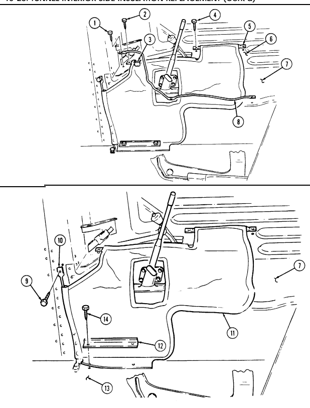
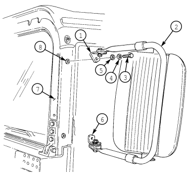

# Chapter 10 Body And Accessories Maintenance Section I. Body Maintenance

| 10-1        | BODY MAINTENANCE TASK SUMMARY                                       
|-------------|-------------------------------------------------------------------- 
| TASK        | PROCEDURES                                                          
| PARA        |                                                                     
| 10-2.       | Fuel Filler Housing Replacement                                    
| 10-3.       | Hood Latch and Bracket Replacement                                 
| 10-4.       | Hood Prop Rod and Bracket Maintenance                              
| 10-5.       | Hood and Hinge Replacement                                         
| 10-6.       | Outer Hood Seal Replacement                                        
| 10-7.       | Side Hood Stop Replacement                                         
| 10-8.       | Center Hood Stop Replacement                                       
| 10-9.       | Footman Loop and Strap Replacement                                 
| 10-9.1.     | Jack Retaining Strap Replacement                                   
| 10-10.      | Center Hood Stop Guide Replacement                                 
| 10-11.      | Front Hood Screen Replacement                                      
| 10-12.      | Hood Grille and Screen Replacement                                 
| 10-13.      | Door Handle Assembly Maintenance                                   
| 10-14.      | Fixed Rear Door Replacement                                        
| 10-15.      | Engine Access Cover Maintenance                                    
| 10-16.      | Engine Access Cover Flexible Latch and Holddown Strike Replacement 
| 10-17.      | Engine Left Splash Shield Maintenance                              
| 10-18.      | Engine Left Splash Shield Access Cover Replacement                 
| 10-19.      | 3.5\-Ton Jack Stowage Bracket and Cover Replacement                
| 10-20.      | Engine Right Splash Shield Maintenance                             
| 10-21.      | Windshield Glass and Weatherstrip Replacement                      
| 10-22.      | Windshield Ballistic Glass Replacement                             
| 10-23.      | Windshield Assembly Maintenance                                    
| 10-24.      | Windshield Retention Bracket Replacement                           
| 10-25.      | Left Outer Cowl Insulation Replacement                             
| 10-26.      | Left Front Cowl Insulation Replacement                             
| 10-27.      | Right Front Cowl Insulation Replacement                            
| 10-28.      | Tunnel Interior Side Insulation Replacement                        
| 10-29.      | Rear Seat Floor Insulation Replacement                             
| 10-30.      | Right Inner Cowl Insulation Panel Replacement                      
| 10-31.      | Left Inner Cowl Insulation Panel Replacement                       
| 10-31.1.    | Cargo Floor Access Cover Maintenance (M1123)                       
| 10-32.      | Driver's Seat Frame Replacement                                    
| 10-33.      | Driver's Seat and Seat Back Cushions Replacement                   
| 10-34.      | Companion Seat Back Replacement                                                    
| 10-35.      | Companion Seat and Battery Box Cover Replacement                                   
| 10-36.      | Battery Box Cover Latch Replacement                                                
| 10-37.      | Companion Seat and Seat Back Cushions Replacement                                  
| 10-38.      | Driver's Seat Assembly Replacement                                                 
| 10-39.      | Driver's Seat Assembly Maintenance                                                 
| 10-40.      | Battery Box Cover Catch Replacement                                                
| 10-41.      | Companion Seat Assembly and Battery Box Cover Replacement                          
| 10-42.      | Companion Seat Assembly Maintenance                                                
| 10-43.      | Passenger Seat and Storage Compartment Cover Replacement                           
| 10-44.      | Passenger Seat and Storage Compartment Latch Replacement                           
| 10-45.      | Passenger Seat Back Replacement                                                    
| 10-46.      | Passenger Seat and Seat Back Cushions Replacement                                  
| 10-47.      | Seatbelt Assembly Replacement                                                      
| 10-48.      | Three Point Seatbelt Maintenance                                                   
| 10-48.1.    | Three Point Seatbelt Maintenance (M996, M996A1, M997, M997A1, and M997A2)          
| 10-49.      | Three Point Seatbelt Brackets Replacement                                          
| 10-49.1.    | Three Point Seatbelt Brackets Replacement (M996, M996A1, M997, M997A1, and M997A2) 
| 10-50.      | Pioneer Tool Stowage Tray Maintenance                                              
| 10-51.      | Pioneer Tool Stowage Tray Mounting Bracket Replacement                             
| 10-52.      | Pioneer Tool Stowage Tray Latch Striker Replacement                                
| 10-53.      | Cargo Bulkhead Replacement                                                         
| 10-54.      | Cargo Bulkhead Mounting Brackets Replacement                                       
| 10-55.      | Cargo Barrier Extension Maintenance                                                
| 10-56.      | Cargo Tiedown Replacement                                                          
| 10-57.      | Fire Extinguisher Bracket Replacement                                              
| 10-58.      | Fire Extinguisher Support Replacement                                              
| 10-59.      | Driver's Seat Retainer Plate Assembly Replacement                                  
| 10-60.      | Tailgate Chain and Brackets Replacement                                            
| 10-61.      | Tailgate Replacement                                                               
| 10-62.      | Tailgate Upper Hinge Replacement                                                   
| 10-63.      | Mud Flap Installation                                                              
| 10-64.      | Body Hinge Mount Replacement                                                       
| 10-65.      | Airlift Bracket to Hood Seal Replacement                                           
| 10-66.      | Body Repair                                                                        
| 10-67.      | "B" Pillar Replacement                                                             
| 10-68.      | M11 Decontamination Brackets Installation                                          

## 10-2. Fuel Filler Housing Replacement
| This task covers:                                            |                      |
|--------------------------------------------------------------|----------------------|
| a. Removal                                                   | b. Installation      |
| INITIAL SETUP                                                |                      |
|                                                              | Manual Reference     |
| General mechanic's tool kit  automotive (Appendix B, Item 1) | TM 9-2320-280-24P    |

1. Remove filler cap "T" handle (1) and filler cap (2) from filler spout (6).
2. Remove three nuts (7), washers (4), capscrews (3), and washers (4) from filler housing (5) and filler spout (6).
3. Remove six screws (11) and washers (10) from fuel filler housing (5) and right outer wheelhouse panel (8). 4. Push filler cap (2) through filler housing (5) and remove filler housing (5). 5. Inspect speed nuts (9) for presence or damage. Replace if defective or missing.

1. Pull filler cap (2) through filler housing (5) and install housing (5) on right outer wheelhouse panel (8).
2. Secure filler housing (5) to right outer wheelhouse panel (8) with six washers (10) and screw (11). Tighten screws (11) to 20 lb-in. (2 N.m).
3. Secure filler housing (5) to filler spout (6) with three washers (4), capscrews (3), washers (4), and nuts (7).
4. Install filler cap (2) on filler spout (6) with "T" bade (1).

# 10-3. Hood Latch And Bracket Replacement

This task covers:

a. Removal c. Assembly b. Disassembly **d. Installation**

### Initial Setup: Tools

| General mechanic's tool kit:   |
|--------------------------------|

| Materials/Parts   |
|-------------------|

automotive (Appendix B, Item 1)
Seven locknuts (Appendix G, Item 70) Cotter pin (Appendix G, Item 16) Spring pin (Appendix G, Item 298)
Manual References TM 9-2320-280-10 TM 9-2320-280-24P
Equipment Condition **_________________**
Hood raised and secured (TM 9-2320-280-10).

a. Removal

If only the rubber latch is to be replaced, the spring pin does not have to be completely out of base.

1. Remove two locknuts (6), washers (4), capscrews (3), and washers (4) from base (7) and body (5).

Discard locknuts (6).

2. Remove spring pin (2) from latch (10) and base (7). 3. Remove two locknuts (16), washers (17), capscrews (12), and latch bracket (13) from hood (15).

Discard locknuts (16).

4. Remove three locknuts (18), washers (19), capscrews (21), latch stop bracket (20), and latch plate (14)
from hood (15). Discard locknuts (18).

### B. Disassembly

Remove cotter pin (1), pin (8), two rollers (9), and hood latch (11) from latch (10). Discard cotter pin (1).

c. Assembly Install hood latch (11) on latch (10) with two rollers (9), pin (8), and cotter pin (1).

d. Installation 1. Install latch plate (14) and latch stop bracket (20) on hood (15) with three capscrews (21), washers
(19), and locknuts (18).

2. Install latch bracket (13) on latch plate (14) with two capscrews (12), washers (17), and locknuts (16).

Tighten locknuts (16) and (18) to 10 lb-ft (14 N•m).

3. Install latch (10) on base (7) with spring pin (2). 4. Install base (7) on body (5) with two washers (4), capscrews (3), washers (4), and locknuts (6). Tighten capscrews (3) to 6 lb-ft (8 N•m).

# 10-3. Hood Latch And Bracket Replacement (Cont'D)

FOLLOW-ON   TASK:  Lower and secure  hood  (TM  9-2320-280-10).

# 10-4. Hood Prop Rod And Bracket Maintenance

This task covers:
b. Disassembly e. Installation c. Inspection INITIAL SETUP:
Tools General mechanic's tool kit:
automotive (Appendix B, Item 1)
Materials/Parts Four lockwashers (Appendix G, Item 135) Locknut (Appendix G, Item 79) Cotter pin (Appendix G, Item 12)
Manual References TM 9-2320-280-10 TM 9-2320-280-24P
a. Removal d Assembly Equipment Condition Hood raised and secured (TM 9-2320-280-10).

General Safety Instructions Hood must be supported during hood prop rod and bracket replacement.

### Warning

Hood must be supported during hood prop rod and bracket replacement. Failure to support hood may cause injury to personnel or damage to equipment.

a. Removal 1. Remove cotter pin (4), washer (3), hood prop rod (2), and washer (3) from hood (1). Discard cotter pin (4).

2. Remove four screws (8), lockwashers (7), bracket (6), and hood prop rod (2) from airlift bracket (5).

Discard lockwashers (7).

### B. Disassembly

1. Remove hood prop rod (2) from eyebolt (15). 2. Remove locknut (9), washer (10), bushing (16), spring (11), eyebolt (15), and washer (14) from bracket (6). Discard locknut (9).

3. Remove snapring (12) and bushing (13) from bracket (6).

### C. Inspection

Inspect bushing (13), bushing (16), and spring (11) for cracks, wear, or distortion. Replace bushing (13), (16), or spring (11) if cracked, worn, or distorted.

d. Assembly 1. Install bushing (13) on bracket (6) with snapring (12).

Length of spring with bracket assembled is 2-1/4 in. (5.7 cm).

2. Install washer (14), eyebolt (15), and spring (11) on bracket (6) with bushing (16), washer (10), and locknut (9).

3. Install hood prop rod (2) into eyebolt (15).

10-6 Change 2

# 10-4. Hood Prop Rod And Bracket Maintenance (Cont'D)

e..  Installation 1. Install hood prop rod (2) and bracket (6) on airlift bracket (5) with four lockwashers (7) and screws (8).

Tighten screws (8) to 6 lb-ft (8 N.m).

2. Install washer (3) and hood prop rod (2) on hood (1) with washer (3) and rotter pin (4).

FOLLOW-ON TASK: Lower and secure hood (TM 9-2320-280-10).

# 10-5. Hood And Hinge Replacement

This task covers:
a. Removal c. Alignment b. Installation INITIAL SETUP:
Tools General mechanic's tool kit:
automotive (Appendix B, Item 1)

### Materials/Parts

Sealing compound (Appendix C, Item 45) Three cotter pins (Appendix G, Item 12) Four locknuts (Appendix G, Item 98)
Personnel Required One mechanic One assistant Manual References TM 9-2320-280-10 TM 9-2320-280-24P TM 43-0139 Equipment Condition
- Battery ground cable disconnected (para. 4-73). - Hood raised and secured (TM 9-2320-280-10).

General Safety Instructions Hood must be supported during removal and installation.

### Warning

Hood must be supported during removal and installation. Failure to support hood may cause injury to personnel and damage to equipment.

NOTE
Hood surface has a thin layer of gel coat that can seem cracked, in a spiderweb pattern, due to hood flexing. No repair is necessary. Any other cracks should be repaired to prevent further damage.

a. Removal 1. Disconnect connector plug (11) from connector receptacle (7). 2. Remove two cotter pins (1), washers (2), hinge pins (13), and washers (2) from two upper hinge halves (14) and lower hinge halves (12). Discard cotter pins (1).

3. Remove cotter pin (17), washer (18), hood prop rod (19), and washer (18) from hood (15). Discard cotter pin (17).

4. Remove hood (15).

- Perform steps 5 and 6 if replacing hinges. - Note position of hinge halves prior to removal, for installation.

5. Remove four capscrews (4), washers (3), two upper hinge halves (14), and hinge plates (16) from hood (15).

6. Remove four locknuts (9), two hinge plates (8), four capscrews (5), washers (6), and two lower hinge halves (12) from brackets (10). Discard locknuts (9).

b. Installation

Perform steps 1 through 3 if hinges were removed.

1. Install two lower hinge halves (12) on brackets (10) with four washers (6), capscrews (5), two plates (8), and four locknuts (9). Do not tighten locknuts (9).

2. Apply sealing compound to hinge plates (16) and install hinge plates (16) to hood (15).

## 10-5. Hood And Hinge Replacement (Contd)

3.

Install two upper hinge halves (14) on hood (15) with four washers (3) and capscrews (4). Tighten capscrews to 28 lb-ft (38 N.m).

4. 5.

Install hood (15) and align two upper hinge halves (14) with lower hinge halves (12).

Secure two upper hinge halves (14) to lower hinge halves (12) with washers (2), hinge pins (13),
washers (2), and cotter pins (1).

6.

Connect connector plug (11) to connector receptacle (7).

7.

Install washer (18) and hood prop rod (19) on hood (15) with washer (18) and cotter pin (17).

## 10-5. Hood And Hinge Replacement **(Cont'D)**

c. Alignment 1. Lower hood (4) and check alignment of hood stop guide (3) with center hood stop (2) on "A"
pillar (1), and hood catch (5) with body latch (6).

NOTE
Upper and lower hinge halves contain slotted mounting holes to allow for adjustment.

2. With hood (4) lowered and secured and alignment correct, tighten four lower hinge half attaching locknuts (7) to 60 lb-ft (81 Nom).

NOTE

After hood alignment is completed, some contact may occur between hood and left mirror bracket. If contact exists, use file and trim about 1/4 in. (6.4 mm) off left comer and edge of hood. Trim until hood closes without hitting left mirror bracket. Touch up trim with paint (refer to TM 43-0139).

FOLLOW-ON TASKS: .

●
Lower and secure hood (TM 9-2320-280-10). Connect battery ground cable (para. 4-73).

## 10-6. Outer Hood Seal Replacement

This task covers:
a. Removal b. Installation INITIAL SETUP:
Tools General mechanic's tool kit:
automotive (Appendix B, Item 1)
Equipment Condition Hood raised and secured (TM 9-2320-280-10).

TM 9-2320-280-10 TM 9-2320-280-24P
a. Removal Remove two capscrews (4), seal retainer (3), and hood seal (2) from body (1).

Install hood seal (2) on body (1) with seal retainer (3) and two capscrews (4).

FOLLOW-ON TASK Lower and secure hood (TM 9-2320-280-10).

# 10-7. Side Hood Stop Replacement

This task covers:
INITIAL SETUP:
Tools General mechanic's tool kit:
automotive (Appendix B, Item 1)
Materials/Parts Two locknuts (Appendix G, Item 70)
a. Removal

a. Removal b. Installation

| Manual References                              |
|------------------------------------------------|
| TM 9\-2320\-280\-10                            |
| TM 9\-2320\-280\-24P                           |
| Equipment Condition                            |
| Hood raised and secured (TM 9\-2320\-280\-10). |

Remove two locknuts (6), washers (5), capscrews (3), washers (2), and side hood stop (1) from body (4). Discard locknuts (6).

b. Installation Install side hood stop (1) on body (4) with two washers (2), capscrews (3), washers (5), and locknuts (6). Tighten capscrews (3) to 6 lb-ft (8 N•m).

FOLLOW-ON TASK: Lower and secure hood (TM 9-2320-280-10).

# 10-8. Center Hood Stop Replacement

This task covers:
INITIAL SETUP:
Tools General mechanic's tool kit:
automotive (Appendix B, Item 1)
Manual References TM 9-2320-280-10 TM 9-2320-280-24P

a. Removal b. Installation

Equipment Condition Hood raised and secured (TM 9-2320-280-10).

a. Removal Remove two capscrews (1), washers (2), center hood stop (3), and plate (4) from "A" beam (5).

I **b. Installation**
Install center hood stop (3) and plate (4) on "A" beam (5) with two washers (2) and

capscrews (1) to 12 lb-ft (16 N.m).

capscrews (1). Tighten

FOLLOW-ON TASK Lower and secure hood (TM 9-2320-280-10).

# 10-9. Footman Loop And Strap Replacement

This task covers:
INITIAL SETUP:
Tools General mechanic's tool kit:
automotive (Appendix B, Item 1)
Materials/Parts Two locknuts (Appendix G, Item 74)

a. Removal b. Installation

Manual References TM 9-2320-280-10 TM 9-2320-280-24P
Equipment Condition Rear end of cargo shell door raised (TM 9-2320-280-10).

All footman loops and straps for stowage and tiedowns are replaced basically the same. This procedure covers the night sight battery case footman loop and strap.

a. Removal 1. Remove two locknuts (4), screws (1), and footman loop (2) from wheelhouse (3). Discard locknuts (4). 2. Remove strap (5) from footman loop (2).

Install strap (5) on footman loop (2) and wheelhouse (3) with two screws (1) and locknuts (4). Tighten locknuts (4) to 16-30 lb-in. (2-3 N•m).

FOLLOW-ON TASK: Close cargo shell door (TM 9-2320-280-10).

10-14 Change 2

# 10-9.1. Jack Retaining Strap Replacement

| a.  Removal                     | b.   | Installation                        |
|---------------------------------|------|-------------------------------------|
| INITIAL SETUP:                  |      |                                     |
| Applicable Models               |      | Materials/Parts                     |
| M1097A1, M1097A2, M1123         |      | Four locknuts (Appendix G, Item 97) |
| Tools                           |      |                                     |
| General mechanic's tool kit:    |      | Manual References                   |
| automotive (Appendix B, Item 1) |      | TM 9\-2320\-280\-24P                |

| This task covers:   |
|---------------------|

1. Slide driver's seat (1) forward. 2. Remove four locknuts (7), washers (6), screws (4), two footman loops (2), and jack retaining strap
(3) from vehicle floor (5). Discard locknuts (7).

1. Install jack retaining strap (3) and two footman loops (2) on vehicle floor (5) with four screws (4),
washers (6), and locknuts (7).

2. Slide driver's seat (1) backward.

# 10-10. Center Hood Stop Guide Replacement

This task covers:
INITIAL SETUP:
Tools General mechanic's tool kit:
automotive (Appendix B, Item 1)
Materials/Parts Six locknuts (Appendix G, Item 70)

a. Removal b. Installation

| Manual References                   |
|-------------------------------------|
| TM 9\-2320\-280\-10                 |
| TM 9\-2320\-280\-24P                |
| Equipment Condition                 |
| Rear end of cargo shell door raised |
| (TM 9\-2320\-280\-10).              |

a. Removal Remove six locknuts (5), washers (2), capscrews (1), washers (2), two guide plates (3), and guide brackets (4) from hood (6). Discard locknuts (5).

b. Installation Install two guide plates (3) and guide brackets (4) on hood (6) with six washers (2), capscrews (1),

 washers (2), and locknuts (5). Tighten locknuts (5) to 10 lb-ft (14 N•m).

FOLLOW-ON TASK: Lower and secure hood (TM 9-2320-280-10).

# 1 0 - 1 1 . Front Hood Screen Replacement

This task covers:
INITIAL SETUP:
Applicable Models M998, M998A1, M1035, M1035A1, M1035A2, M1037, M1038, M1038A1, M1042 Tools General mechanic's tool kit:
automotive (Appendix B, Item 1)

### Materials/Parts

Sealant (Appendix C, Item 38)
a. Removal 1. Remove three nuts (7), washers (6), and carriage bolts (8) from front hood screen (5) and hood (1). 2. Remove three capscrews (2), harness clamps (3), washers (4), and front hood screen (5) from hood (1).

b. Installation 1. Apply sealant to threads of capscrews (2). 2. Install front hood screen (5) on hood (1) with three washers (4), harness clamps (3), and capscrews (2).

Tighten capscrews (2) to 20-30 lb-in. (2-3 N•m ) .

3. Secure front hood screen (5) to hood (1) with three carriage bolts (8), washers (6), and nuts (7).

Tighten nuts (7) to 21 lb-ft (29 N•m).

FOLLOW-ON TASK: Lower and secure hood (TM 9-2320-280-10).

a. Removal b. Installation Manual References TM 9-2320-280-10 TM 9-2320-280-24P
Equipment Condition Hood raised and secured (TM 9-2320-280-10).

# 10-12. Hood Grille And Screen Replacement

This task covers:
INITIAL SETUP:
Applicable Models M998, M998A1, M1035, M1035A1, M1035A2, M1037, M1038, M1038A1, M1042 Tools General mechanic's tool kit:
automotive (Appendix B, Item 1)

### A. Removal B. Installation

Materials/Parts Six locknuts (Appendix G, Item 70) Six locknuts (Appendix G, Item 107)
Manual References TM 9-2320-280-10 TM 9-2320-280-24P
Equipment Condition Hood raised and secured (TM 9-2320-280-10).

1. Remove six locknuts (5), washers (2), capscrews (1), washers (2), and grille (3) from hood (4).

Discard locknuts (5).

2. Remove six locknuts (7), washers (8), screws (10), washers (9), and screen (6) from grille (3).

Discard locknuts (7).

b. Installation 1. Install screen (6) on grille (3) with six washers (9), screws (10), washers (8), and locknuts (7).

Tighten locknuts (7) to 6 lb-ft (8 N•m).

2. Install grille (3) on hood (4) with six washers (2), capscrews (1), washers (2), and locknuts (5).

Tighten locknuts (5) to 7 lb-ft (10 N•m).

FOLLOW-ON TASK: Lower and secure hood (TM 9-2320-280-10).

# 10-13. Door Handle Assembly Maintenance

This task covers:

| b.  Repair   |
|--------------|

INITIAL SETUP:
Applicable Models M998, M998A1, M1035, M1035A1, M1035A2, M1037, M1038, M1038A1, M1042 Tools General mechanic's tool kit:
automotive (Appendix B, Item 1)

### A. Removal C. Installation

Materials/Parts Adhesive (Appendix C, Item 7) Spring pin (Appendix G, Item 299)
Manual References TM 9-2320-280-24P

Some door handle assemblies may separate. To prevent or fix door handle assembly separation, perform step b.

a. Removal 1. Remove screw (5), inside door handle (4), and door handle spring (6) from door frame (7) and outside door handle (1).

2. Remove outside door handle (1) and washer (3) from door frame (7).

b. Repair

Repair procedures for all door handle assemblies are basically the same. This procedure covers the left front door handle assembly.

1. Tighten screw (5) on inside door handle (4) to 15 lb-in. (1.7 N•m).

NOTE
- If screw will secure inside door handle, perform steps 2 and 3. - If screw will not secure inside door handle, perform steps 4 through 10.

2. Locate, mark, and drill 0.125-in. (3.2-mm) diameter hole (9) through inside door handle (4) and outside door handle (1).

3. Install spring pin (8) through inside door handle (4) and outside door handle (1).

Inside door handle can separate from outside door handle without removing screw.

4. Remove inside door handle (4) and door handle spring (6) from outside door handle (1) and door frame (7).

5. Remove outside door handle (1) and washer (3) from door frame (7). 6. Remove screw (5) and insert (2) from inside door handle (4). 7. Apply adhesive to outside of insert (2) and install insert (2) in outside door handle (1). Allow adhesive to cure for five minutes.

8. Install outside door handle (1) and washer (3) on door frame (7). 9. Install inside door handle spring (6) and inside door handle (4) on outside door handle (1) and door frame (7) with screw (5). Tighten screw (5) to 15 lb-in. (1.7 N•m).

10. Perform steps 2 and 3.

10-13. DOOR HANDLE ASSEMBLY MAINTENANCE (Cont'd)

## 10-13. Door Handle Assembly Maintenance (Cont'D)

c. Installation 1. Install washer (2) and outside door handle (1) on door frame (6).

 2. Install door handle spring (5) and inside door handle (3) on outside door handle (1) in door frame (6).

3. Place outside door handle (1) in horizontal position, and place inside door handle (3) in vertical position with grip end of handle pointing to top of door.

4. Install inside door handle (3) on screw (4) to 15 lb-in. (1.7 Nom).

outside door handle (1) and door frame (6) with screw (4). Tighten

# 10-14. Fixed Rear Door Replacement

This task covers:
INITIAL SETUP:
Applicable Models M998, M998A1, M1037, M1038, M1038A1, M1042, M1097, M1097A1, M1097A2 Tools General mechanic's tool kit:
automotive (Appendix B, Item 1)

### Materials/Parts

Door seals (Appendix G, Item 27)
a. Removal b. Installation Manual References TM 9-2320-280-24P
Equipment Condition Troop seat removed, if installed (para. 12-18).

a. Removal 1. Remove four capscrews (6) and washers (7) from fixed rear door (4) and "B" pillar (1). 2. Remove locking pin (3) and fixed rear door (4) from body (2). 3. Remove seals (5) from fixed rear door (4). Discard seals (5).

b. Installation 1. Install seals (5) on fixed rear door (4). 2. Install fixed rear door (4) on body (2) with locking pin (3). 3. Install fixed rear door (4) on "B" pillar (1) with four washers (7) and capscrews (6). Tighten capscrews (6) to 6 lb-ft (8 N•m).

FOLLOW-ON TASK: Install troop seat, if removed (para. 12-18).

# 10-15. Engine Access Cover Maintenance

This task covers:

a. Removal c. Assembly b. Disassembly d. Installation

INITIAL SETUP:
Tools General mechanic's tool kit:
automotive (Appendix B, Item 1)

### Materials/Parts

Two locknuts (Appendix G, Item 79) Seven rivets (Appendix G, Item 236) Two rivets (Appendix G, Item 238) Two rivets (Appendix G, Item 249) Four rivets (Appendix G, Item 266)
Manual References TM 9-2320-280-24P
Equipment Condition Front radio rack removed (para. 12-132).

a. Removal 1. Unlatch two flexible latches (1) from keepers (2) on engine access cover holddown brackets (3). 2. Unlatch two engine access cover holddown latches (6) from two engine access cover holddown strikes (7).

3. Turn two ring studs (5) and remove engine access cover (4).

b. Disassembly

For rivet replacement instructions, refer to para. 10-66.

1. Remove seven rivets (10) and retainers (9) and remove insulation (11). 2. Remove seal (8) from access cover (4).

10-15. ENGINE ACCESS COVER MAINTENANCE (cont'd)

## I **10-15. Engine Access Cover Maintenance** (Cont'D)

3. Remove four retaining rings (8), two washers (7), ring studs (6), and washers (7) from access cover (5).

4. Remove two locknuts (9), shoulder bolts (13), and latches (14) from access cover (5). Discard locknuts (9).

5. Remove two rivets (12), backing plates (10), and guide plates (11) from access rover (5). 6. Remove two rivets (1) and keepers (2) from holddown brackets (3).

7. Remove four rivets (4), nuts (15), washers (16), capscrews (18), two holddown brackets (3), and backing plates (17) from access cover (5).

I **c. Assembly** I
1. Install two holddown brackets (3) and backing plates (17) on access cover (5) with four rivets (4),
capscrews (18), washers (16), and nuts (15).

2. Install two keepers (2) on holddown brackets (3) with rivets (1). 3. Install two backing plates (10) and guide plates (11) on access cover (5) with rivets (12).

4. Install two latches (14) on plates (11) and access cover (5) with shoulder bolts (13) and locknuts (9). 5. Install two washers (7) and ring studs (6) on access cover (5) with washers (7) and four retaining rings (8).

6. Install seal (19) on access cover (5). 7. Install insulation (22) on access cover (5) with seven retainers (20) and rivets (21).

10-15. ENGINE ACCESS COVER MAINTENANCE (Cont'd)

### 10-15. Engine Access Cover Maintenance (Cont'D)

1. Install access cover (4) with two ring studs (5).

2. Install two holddown latches (6) on holddown strikes (7).

3. Latch two flexible latches (1) to keepers (2) on access cover holddown brackets (3).

FOLLOW-ON TASK: Install front radio rack (para. 12-132).

10-26

# 10-16. Engine Access Cover Flexible Latch And Holddown Strike Replacement

This task covers:
INITIAL SETUP:
Tools General mechanic's tool kit:
automotive (Appendix B, Item 1)
Materials/Parts Two rivets (Appendix G, Item 248) Rivet (Appendix G, Item 240) Rivet (Appendix G, Item 238)
a. Removal b. Installation Manual References TM 9-2320-280-24P
Equipment Condition Engine access cover removed (para. 10-15).

a. Removal

For rivet replacement instructions, refer to para. 10-66.

1. Remove two rivets (5) and holddown strike (4) from body (3). 2. Remove two rivets (1) and flexible latch (2) from cargo floor (6).

b. Installation 1. Install flexible latch (2) on cargo floor (6) with two rivets (1). 2. Install holddown strike (4) on body (3) with two rivets (5).

FOLLOW-ON TASK: Install engine access cover (para. 10-15).

# 10-17. Engine Left Splash Shield Maintenance

This task covers:

a. Removal c. Assembly b. Disassembly **d. Installation**

Tools

| Materials/Parts   |
|-------------------|

General mechanic's tool kit:
automotive (Appendix B, Item 1)
Seven locknuts (Appendix G, Item 107) Four lockwashers (Appendix G, Item 143) Assembled locknut (Appendix G, Item 131) Three locknuts (Appendix G, Item 79) Two locknuts (Appendix G, Item 70) Locknut (Appendix G, Item 128) Lockwasher (Appendix G, Item 134) Four rivets (Appendix G, Item 239)
Equipment Condition

| Manual References   | TM 9\-2320\-280\-24P   |
|---------------------|------------------------|

- Battery ground cable disconnected 
(para. 4-73).

- Hood prop rod and bracket removed 
(para. 10-4).

General Safety Instructions Hood must be supported during removal and installation.

### Warning

Hood must be supported during removal and installation. Failure to support hood may cause injury to personnel and damage to equipment.

- Left splash shield maintenance is the same for all vehicles, except M998, M998A1, M1035, M1035A1, M1035A2, M1037, M1038, M1038A1, and M1042 vehicles do not have an armor plate attached to side of shield.

- The left splash shield can be modified with an access cover which will provide easier access to transmission oil cooler lines, at commander's discretion. Refer to appendix D, Figs. D-86 and D-87.

b. Disassembly

Perform step 1 only if vehicle has an armor plate.

1. Remove locknut (33), washer (34), capscrew (36), washer (34), and armor plate (35) from splash shield (15). Discard locknut (31).

10-28 Change 2 1. Disconnect hood harness (27) from connector receptacle (30). 2. Remove locknut (3), washer (2), capscrew (24), and washer (2) from splash shield (15) and support bracket (1). Discard locknut (3).

3. Remove locknut (10), washer (11), washer (12), capscrew (20), and washer (11) from splash shield (15) and airlift bracket (9). Discard locknut (10).

4. Remove capscrew (21), lockwasher (22), and washer (23) from splash shield (15) and airlift bracket (9). Discard lockwasher (22).

5. Remove four screws (28) , lockwashers (29), and connector receptacle (30) from bracket (32).

Discard lockwashers (29).

6. Remove assembled locknut (39) and screw (37) from harness and clamp (38) and splash shield (15).Discard assembled locknut (39).

7. Remove locknut (13), washer (14), capscrew (19), washer (14), and splash shield (15) from bracket (16). Discard locknut (13).

# 10-17. Engine Left Splash Shield Maintenance (Cont'D)

2.

Remove seven locknuts (8), washers (7), capscrews (6), seal retainers (4), and seal (5) from splash shield (15). Discard locknuts (8).

Remove two locknuts (25), washers (26), capscrews (31), washers (26), and bracket (32) from splash
shield (15). Discard locknuts (25).

3.

NOTE
For rivet replacement instructions refer to para. 10-66.

4.

## 10-17. Engine Left Splash Shield Maintenance (Cont'D)

c. Assembly 1. Install bushing (17) on splash shield (15) with four rivets (18). 2. Install bracket (32) on splash shield (15) with two washers (26), capscrews (31), 
washers (26), and locknuts (25). Tighten locknuts (25) to 6 lb-ft (8 N•m).

3. Install seal (5) and seal retainers (4) on splash shield (15) with seven capscrews (6), washers (7),
and locknuts (8).

Perform step 4 only if vehicle has an armor plate.

4. Install armor plate (35) on splash shield (15) with washer (34), capscrew (36),
washer (34), and locknut (33). Tighten locknut (33) to 15 lb-ft (20 N•m).

1. Install splash shield (15) on bracket (16) with washer (14), capscrew (19), washer (14), and locknut (13).

2. Install harness and clamp (38) on splash shield (15) with screw (37) and assembled locknut (39). 3. Install connector receptacle (30) on bracket (32) with four lockwashers (29) and screws (28).

4. Install splash shield (15) to airlift bracket (9) with washer (23), lockwasher (22), and capscrew (21).

Tighten capscrew (21) to 10 lb-ft (14 N•m).

5. Install splash shield (15) on airlift bracket (9) with washer (11), capscrew (20), washer (12), 
washer (11), and locknut (10). Tighten capscrew (20) to 10 lb-ft (14 N•m).

6. Install splash shield (15) on support bracket (1) with washer (2), capscrew (24), washer (2), and locknut (3). Tighten capscrew (24) to 6 lb-ft (8 N•m).

7. Connect hood harness (27) to connector receptacle (30).

# 10-17. Engine Left Splash Shield Maintenance (Cont'D)

FOLLOW-ON TASKS: •Install hood prop rod and bracket (para. 10-4)

రాలా

· Connect battery ground cable (para. 4-73).

# 10-18. Engine Left Splash Shield Access Cover Replacement

This task covers:
INITIAL SETUP:
Applicable Models **Manual References**
M997A2, M1025A2, M1035A2, M1043A2, TM 9-2320-280-10 M1045A2, M1097A2 (or modified vehicles) TM 9-2320-280-24P
automotive (Appendix B, Item 1)

a. Removal b. Installation

Tools **Equipment Condition**
General mechanic's tool kit: Hood raised and secured (TM 9-2320-280-10).

1. Remove three capscrews (4), washers (3), and splash shield access cover (5) from engine left splash shield (1).

2. Inspect spring nuts (2) for damage. Replace, if damaged.

b. Installation Install splash shield access cover (5) to engine left splash shield (1) with three capscrews

washers (3).

(4) and FOLLOW-ON TASK Lower and secure hood (TM 9-2320-280-10).

# 10-19. 3.5-Ton Jack Stowage Bracket And Cover Replacement

This task covers:
INITIAL SETUP: Applicable Models M997A2, M1025A2, M1035A2, M1043A2, M1045A2, M1097A2, M1123 Tools General mechanic's tool kit:
automotive (Appendix B, Item 1)

a. Removal b. Installation

Material/Parts Two lockwashers (Appendix G, Item 135)
Manual References TM 9-2320-280-10 TM 9-2320-280-24P
Equipment Condition Hood raised and secured (TM 9-2320-280-10).

The tools for the jack are stored behind the driver's seat.

a. Removal 1. Lift two latches (9) on cover (10) and remove cover (10) from bracket (5). 2. Remove two wing nuts (14), spacers (13), washers (12), and jack (11) from bracket (5). 3. Remove nut (6), washer (7), capscrew (8), and washer (7) from bracket (5). 4. Remove two capscrews (4), lockwashers (3), washers (2), and bracket (5) from splash shield (1).

Discard lockwashers (3).

1. Install bracket (5) on splash shield (1) with two washers (2), lockwashers (3), and capscrews (4). 2. Install washer (7), capscrew (8), washer (7), and nut (6) on bracket (5). 3. Install jack (11) on bracket (5) with two washers (12), spacers (13), and wing nuts (14). 4. Install cover (10) on bracket (5).

# 10-20. Engine Right Splash Shield Maintenance

This task covers:

a. Removal c. Assembly b. Disassembly d. Installation

### Initial Setup:

| Materials/Parts                          |
|------------------------------------------|
| Four locknuts (Appendix G, Item 79)      |
| Three lockwashers (Appendix G, Item 134) |
| Seven locknuts (Appendix G, Item 107)    |

| General mechanic's tool kit:    |
|---------------------------------|
| automotive (Appendix B, Item 1) |

### Tools

Three lockwashers (Appendix G, Item 134) Locknut (Appendix G, Item 70)
Equipment Condition - Hood raised and secured (TM 9-2320-280-10). - 3.5-ton jack stowage bracket and cover removed 
(M1123 and "A2" series only) (para. 10-19).

| Manual References    |
|----------------------|
| TM 9\-2320\-280\-10  |
| TM 9\-2320\-280\-24P |

Right splash shield maintenance is the same for all vehicles, except M998, M998A1, M1035, M1035A1, M1035A2, M1037, M1038, M1038A1, and M1042 vehicles do not have an armor plate attached to side of shield.

1. Remove locknut (7), washer (6), capscrew (8), and washer (6) from splash shield (1) and support bracket (5). Discard locknut (7).

2. Remove locknut (15), washer (16), washer (17), capscrew (19), lockwasher (18), and washer (16)
from splash shield (1) and airlift bracket (4). Discard locknut (15) and lockwasher (18).

3. Remove locknut (21), washer (20), capscrew (10), and fuel line clamp (22) from splash shield (1).

Discard locknut (21).

4. Remove two screws (2), lockwashers (3), washers (9) (vehicles without armor plate), and splash shield (1) from airlift bracket (4). Discard lockwashers (3).

### B. Disassembly

1. Remove locknut (14), washer (12), capscrew (11), washer (12), and support plate (13) from splash shield (1). Discard locknut (14).

# 10-20. Engine Right Splash Shield Maintenance (Cont'D)

ಳಿ
20
# 10-20. Engine Right Splash Shield Maintenance (Cont'D)

Perform step 2 only if vehicle has an armor plate.

2. Remove locknut (2), washer (3), capscrew (4), washer (3), and armor plate (1) from splash shield (5).

Discard locknut (2).

3. Remove seven locknuts (10), washers (9), capscrews (7), seal retainers (6), and seal (8) from splash shield (5). Discard locknuts (10).

1. Install seal (8) and seal retainers (6) on splash shield (5) with seven capscrews (7), washers (9), and locknuts (10).

Perform step 2 only if vehicle has an armor plate.

2. Install armor plate (1) on splash shield (5), ensuring capscrew holes align, and secure with washer (3),
capscrew (4), washer (3), and locknut (2). Tighten locknut (2) to 15 lb-ft (20 Nom).

3. Install support plate (15) on splash shield (5), ensuring capscrew holes align, and secure with washer (14), capscrew (13), washer (14), and locknut (16).

1. Install splash shield (5) on airlift bracket (12) with two washers (31) (vehicles without armor plate),

lockwashers (26), and screws (25).

2. Install fuel line clamp (24) on splash shield (5) with capscrew (11), washer (22), and lochnut (23). 3. Secure splash shield (5) to airlift bracket (12) with lockwasher (20), washer (18), capscrew (21),
washer (19), washer (18), and locknut (17). Tighten capscrew (21) to 10 lb-ft (14 Nom).

4. Secure splash shield (5) to support bracket (27) with washer (28), capscrew (30), washer (28), and locknut (29). Tighten capscrew (30) to 15 lb-ft (20 N.m).

# 10-20. Engine Right Splash Shield Maintenance (Cont'D)

FOLLOW-ON TASKS:
- Install 3.5-ton jack stowage bracket and cover (M1123 and "A2" series only)
(para. 10-19).

-  Lower and secure hood (TM 9-2320-280-10).

# 1 0 - 2 1 . Windshield Glass And Weatherstrip Replacement

This task covers:

| INITIAL SETUP:   |
|------------------|

| Applicable Models                      | Manual References                                  |
|----------------------------------------|----------------------------------------------------|
| M998, M998A1, M1035, M1035A1, M1035A2, | TM 9\-2320\-280\-24P                               |
| M1037, M1038, M1038A1, M1042           |                                                    |
|                                        | Equipment Condition                                |
| Tools                                  | Windshield wiper blade and arm removed             |
| General mechanic's tool kit:           | (para. 10\-70).                                    |
| automotive (Appendix B, Item 1)        | General Safety Instructions                        |
| Materials/Parts                        | Eyeshields and gloves are required when installing |
| Sealant (Appendix C, Item 38)          | and removing windshield glass.                     |

a. Removal b. Installation

### Warning

Use eyeshields and gloves when removing and installing windshield. Glass could shatter causing injury.

1. Remove six capscrews (7) and upper retainer (3) from windshield frame (5). 2. Remove four capscrews (1) and center retainer (2) from windshield frame (5). 3. Remove weatherstrip (4) and glass (6) from windshield frame (5). 4. Clean sealant from windshield frame (5).

1. Apply a 1/8 inch (3 mm) bead of sealing compound to edge of glass (6) and to windshield frame (5). 2. Install weatherstrip (4) on glass (6). 3. Install glass (6) and weatherstrip (4) on windshield frame (5) with center retainer (2) and four capscrews (1).

4. Apply a thin bead of sealant to top edge of outside weatherstrip (4). 5. Install upper retainer (3) on windshield frame (5) with six capscrews (7).

# 10-21. Windshield Glass And Weatherstrip Replacement (Cont'D)

FOLLOW-ON TASK: Install windshield wiper blade and arm (para. 10-70).

# 10-22. Windshield Ballistic Glass Replacement I

This task covers:

| Applicable Models   |
|---------------------|

INITIAL SETUP:
All except M998, M998A1, M1035, M1035A1, M1035A2, M1037, M1038, M1038A1, M1042

| Materials/Parts   |
|-------------------|

Tools General mechanic's tool kit:
automotive (Appendix B, Item 1)
Sealing compound (Appendix C, Item 47)
Manual References TM 9-2320-280-24P

| and removing windshield glass.   |
|----------------------------------|

a. Removal b. Installation

General Safety Instructions Eyeshields and gloves are required when installing Use eyeshields and gloves when removing and installing windshield glass. Glass could shatter causing injury.

| Personnel Required                     |
|----------------------------------------|
| One mechanic                           |
| One assistant                          |
| Equipment Condition                    |
| Windshield wiper blade and arm removed |
| (para. 10\-70).                        |

1. Remove six screws (6) and upper retainer (5) from windshield frame (4).

2. Remove four screws (1) and center retainer (2) from windshield frame (4). 3. Remove ballistic glass (3) from windshield frame (4). 4. Clean sealing compound from windshield frame (4).

1. Apply a 1/8 in. (3 mm) bead of sealing compound around windshield frame (4). 2. Position ballistic glass (3) to windshield frame (4) with marking on weatherstrip facing inward. 3. Install center retainer (2) on windshield frame (4) with four screws (1). 4. Install upper retainer (5) on windshield frame (4) with six screws (6).

# 10-22. Windshield Ballistic Glass Replacement (Cont'D)

FOLLOW-ON TASK: Install windshield wiper blade and arm (para. 10-70).

# 10-23. Windshield Assembly Maintenance I

This task covers:

a. Removal c. Assembly

b. Disassembly d. Installation

INITIAL SETUP:
Applicable Models M998, M998A1, M1035, M1035A1, M1035A2, M1037, M1038, M1038A1, M1042 ToolS
General mechanic's tool kit:
automotive (Appendix B, Item 1)
Personnel Required One mechanic One assistant Manual References TM 9-2320-280-10 TM 9-2320-280-24P
- Soft top enclosure removed, if install.

(TM 9-2320-280-10).

s Windshield wiper blade and arm removed
(para. 10-70).

. Windshield wiper linkage removed (para. 10-73).

l Windshield wiper arm pivots removed
(para. 10-74).

#### General Safety Instructions

Windshield must be supported during removal and installation.

Windshield must be supported during removal and installation. Failure to support windshield may cause injury to personnel or damage to equipment.

1. Remove five hitch pins (5) from five hinge pins (6).

2. Remove five hinge pins (6) from upper hinge halves (2) and lower hinge halves (4). 3. Remove grommet (11) from "A" pillar (12) and remove jumper harness (10). 4. Remove windshield assembly (1) from "A" pillar (12). 5. Remove two seals (3) from windshield assembly (1). 6. Clean remains of seal (3) from windshield assembly (1).

### B. Disassembly

1. Remove thirteen screws (9), former (8), and seal (7) from windshield assembly (1). 2. Clean remains of seal (7) from windshield assembly (1).

1. Peel paper backing from seal (7) and install seal (7) on windshield assembly (1). 2. Install former (8) on seal (7) and windshield assembly (1) with thirteen screws (9).

1. Peel paper backing from two seals (3) and install seals (3) on windshield assembly (1). 2. Install windshield assembly (1) on "A" pillar (12).

3. Install jumper harness (10) on windshield center piller (13) and install grommet (11) on "A" pillar (12).

4. Install upper hinge halves (2) on lower hinge halves (4) with five hinge pins (6). 5. Install five hitch pins (5) in hinge pins (6).

# 10-23. Windshield Assembly Maintenance (Cont'D)

FOLLOW-ON TASKS: - Install windshield wiper linkage (para. 10-74).
- Install windshield windshield wiper linkage (para. 10-73).
- Install windshield windshield wiper blade an

# 10-24. Windshield Retention Bracket Replacement

This task covers:
INITIAL SETUP:
Applicable Models M997A2, M1025A2, M1035A2, M1043A2, M1045A2, M1097A2 Tools General mechanic's tool kit:
automotive (Appendix B, Item 1)

a. Removal b. Installation

Materials/Parts Four lockwashers (Appendix G, Item 139)
Manual References TM 9-2320-280-24P
a. Removal 1. Remove four capscrews (2), lockwashers (3), and retention bracket (1) from windshield frame (5).

Discard lockwashers (3).

2. Inspect four nut inserts (4) for damage. Replace if damaged.

b. Installation Install retention bracket (1) on windshield (5) with four lockwashers (3) and capscrews (2).

# 10-25. Left Outer Cowl Insulation Replacement

This task covers:
a. Removal b. Installation

### Initial Setup:

Tools General mechanic's tool kit:
automotive (Appendix B, Item 1)

| Manual References    |
|----------------------|
| TM 9\-2320\-280\-24P |

a. Removal Remove nut (4), capscrew (1), washer (2), clamp (6), wiring harness (7), and insulation (3) from cowl (5). 

b. Installation Install insulation (3) and wiring harness (7) on cowl (5) with clamp (6), washer (2), capscrew (1), and nut (4).

# 10-26. Left Front Cowl Insulation Replacement

This task covers:

| INITIAL SETUP:   |
|------------------|

### Tools

General mechanic's tool kit:
automotive (Appendix B, Item 1)

| Manual References    |
|----------------------|
| TM 9\-2320\-280\-24P |

| Equipment Condition                    |
|----------------------------------------|
| Headlight beam selector switch removed |
| (para. 4\-58).                         |

a. Removal b. Installation

Materials/Parts Four locknuts (Appendix G, Item 71)
a. Removal 1. Remove two nuts (1), capscrews (5), washers (1.1), and clamps (3) from wiring harness (2),
insulation (9), and body (6). 

2. Remove four locknuts (12), capscrews (7), washers (8), retainer (10), and insulation (9) from floor (11). Discard locknuts (12).

1. Install insulation (9) and retainer (10) on floor (11) with four washers (8), capscrews (7), and locknuts (12). Tighten locknuts (12) to 6 lb-ft (8 N•m).

2. Install wiring harness (2) and insulation (9) on body (6) with two clamps (3), capscrews (5), 
washers (1.1), and nuts (1).

FOLLOW-ON TASK: Install headlight beam selector switch (para. 4-58).

# 10-27. Right Front Cowl Insulation Replacement

This task covers:
INITIAL SETUP:
Tools General mechanic's tool kit:
automotive (Appendix B, Item 1)
Materials/Parts Four locknuts (Appendix G, Item 71)

a. Removal b. Installation

| Equipment Condition   |
|-----------------------|

| Manual References  TM 9\-2320\-280\-24P   |
|-------------------------------------------|

Heater assembly removed (para. 10-87).

a. Removal Remove four locknuts (6), capscrews (3), washers (2), retainer (1), and insulation (5) from floor (7). Discard locknuts (6).

1. Install insulation (5) and retainer (1) on floor (7) with four washers (2), capscrews (3), and locknuts (6). Tighten locknuts (6) to 6 lb-ft (8 N•m).

2. Press insulation (5) into place on cowl (4).

FOLLOW-ON TASK: Install heater assembly (para. 10-87).

## 10-28. Tunnel Interior Side Insulation Replacement

This task covers:
INITIAL SETUP:
a. Removal b. Installation Tools **Equipment Condition**
General mechanic's tool kit: s Left front cowl insulation removed (para. 10-26).

automotive (Appendix B, Item 1) - Front floorboard removed (para. 11-154).

Manual References TM 9-2320-280-24P

Removal and installation procedures for all tunnel interior side insulation are basically the same. This procedure covers the left front insulation.

1. Remove two screws (4) from retaining rod (5) and cargo floor (6).

2. Remove two screws (2) from retaining rod (3) and cargo floor (6). 3. Remove three screws (1) and retaining rod (8) from tunnel (7) and cargo floor (6). 4. Remove two screws (9) from retaining rod (10) and tunnel (7). 5. Remove two screws (14), retainer (12), and insulation (11) from floor (13). 6. Remove retaining rods (3), (5), and (10) from insulation (11).

1. Install retaining rods (10), (3), and (5) on insulation (11).

2. Position insulation (11) into place against floor (13), tunnel (7), and cargo floor (6).

3. Install insulation (11) and retainer (12) on floor (13) with two screws (14).

4. Install retaining rod (10) on tunnel (7) with two screws (9).

5. Install retaining rod (8) on tunnel (7) with three screws (1). 6. Install retaining rod (3) on cargo floor (6) with two screws (2).

7. Install retaining rod (5) on cargo floor (6) with two screws (4).

FOLLOW-ON TASKS: - Install left front cowl insulation (para. 10-26).
- • Install front floorboard (para. 11-154).

10-28. TUNNEL INTERIOR SIDE INSULATION REPLACEMENT (Cont'd)
I **10-29. REAR SEAT FLOOR INSULATION REPLACEMENT** I
This task covers:

a. Removal b. Installation

INITIAL SETUP:
Tools General mechanic's tool kit automotive (Appendix B, Item 1)

| Manual References    |
|----------------------|
| TM 9\-2320\-280\-24P |

Remove insulation (1) from floor (2).

I b. **Installation**
Install insulation (1) on floor (2).

# 10-30. Right Inner Cowl Insulation Panel Replacement

This task covers:

| Tools                                 | Manual References                              |
|---------------------------------------|------------------------------------------------|
| General mechanic's tool kit:          | TM 9\-2320\-280\-10                            |
| automotive (Appendix B, Item 1)       | TM 9\-2320\-280\-24P                           |
| Materials/Parts                       | Equipment Condition                            |
| Three locknuts (Appendix G, Item 108) | Hood raised and secured (TM 9\-2320\-280\-10). |

a. Removal b. Installation

Remove three locknuts (7), washers (4), capscrews (5), washers (4), retainer (3), insulation (2), and drain hose clamp (6) from cowl (1). Discard locknuts (7).

Install drain hose clamp (6), insulation (2), and retainer (3) on cowl (1) with three washers (4), cap-

FOLLOW-ON TASK: Lower and secure hood (TM 9-2320-280-10).

# 10-31. Left Inner Cowl Insulation Panel Replacement

This task covers:

a. Removal b. Installation

| INITIAL SETUP:                       |                                                |
|--------------------------------------|------------------------------------------------|
| Tools                                | Personnel Required                             |
| General mechanic's tool kit:         | One mechanic                                   |
| automotive (Appendix B, Item 1)      | One assistant                                  |
| Materials/Parts                      | Manual References                              |
| Cotter pin (Appendix G, Item 11)     | TM 9\-2320\-280\-10                            |
| Four locknuts (Appendix G, Item 112) | TM 9\-2320\-280\-24P                           |
| Three assembled locknuts             |                                                |
| (Appendix G, Item 131)               | Equipment Condition                            |
| O\-ring (Appendix G, Item 216)       | Hood raised and secured (TM 9\-2320\-280\-10). |

1. Remove four locknuts (5), washers (3), capscrews (2), and washers (3) from harness clamp (4), brake harness (8), retainer (1), and cowl (7). Discard locknuts (5).

2. Remove assembled locknut (10), capscrew (12), and harness clamp (9) from body harness (11), brake harness (8), and cowl (7). Discard assembled locknut (10).

3. Remove assembled locknut (15) and capscrew (13) from harness clamp (14) and cowl (7) and disconnect body harness (11) from cowl (7). Discard assembled locknut (15).

4. Remove upper insulation panel (6) by sliding up and out from between retainer (1) and cowl (7). 5. Remove assembled locknut (19) and capscrew (17) from clamp (18) and cowl (7). Discard assembled locknut (19).

6. Remove lower insulation panel (16) by sliding down between retainer (1) and cowl (7).

10-31. LEFT INNER COWL INSULATION PANEL REPLACEMENT (Cont'd)

## 10-31. Left Inner Cowl Insulation Panel Replacement (Cont'D)

7. Remove four screws (8) from instrument cluster (3) and dash panel (7) and pull instrument cluster (3) away for access to speedometer cable (2).

8. Remove speedometer cable (2) and O-ring (4) from speedometer (1). Discard O-ring (4). 9. Remove grommet (6) from cowl (5) and route speedometer cable (2) through cowl (5).

10. Remove cotter pin (14), washer (13), and accelerator cable (15) from linkage (12). Discard cotter pin (14).

11. Pull retainer (9) clear of linkage (12) and remove retainer (9) from between splash shield (10) and frame rail (11) by pulling forward and then down.

1. Install retainer (9) by sliding up between splash shield (10) and frame rail (11) forward of cowl (5),
and then sliding back to mounting position on cowl (5).

2. Connect accelerator cable (15) to linkage (12) with washer (13) and cotter pin (14). 3. Route speedometer cable (2) through cowl (5). Install O-ring (4) into end of speedometer cable (2) and connect speedometer cable (2) to speedometer (1).

4. Install instrument cluster (3) on dash panel (7) with four screws (8). 5. Install grommet (6) on speedometer cable (2) in cowl (5).

10-31. LEFT INNER COWL INSULATION PANEL REPLACEMENT (Cont'd)

## 10-31. Left Inner Cowl Insulation Panel Replacement (Cont'D)

6. Install lower insulation panel (14) by sliding up into position between retainer (2) and cowl (9). 7. Install clamp (19) on cowl (9) with capscrew (18) and assembled locknut (20). 8. Install upper insulation panel (8) by sliding down into position between retainer (2) and cowl (9). 9. Install clamp (15) and body harness (17) on cowl (9) with screw (13) and assembled locknut (16).

10. Install clamp (11) on brake harness (7) and body harness (17) on cowl (9) with capscrew (12) and assembled locknut (10).

11. Install retainer (2) and brake harness (7) on cowl (9), ensuring rear ends of retainer (2) are inserted in body holes (1), with harness clamp (5), four washers (4), capscrews (3), washers (4), and locknuts (6).

# 10-31. Left Inner Cowl Insulation Panel Replacement (Cont'D)

FOLLOW-ON TASK:  Lower and secure hood (TM 9-2320-280-10).

# 10-31.1. Cargo Floor Access Cover Maintenance (M1123)

This task covers:
b. Inspection

### Initial Setup:

Tools General mechanic's tool kit:
automotive (Appendix B, Item 1)

### Materials/Parts

Four lockwashers (Appendix G, Item 139) Adhesive sealant (Appendix C, Item 9.1)
Manual References TM 9-2320-280-24P
a. Removal **c. Installation**

### Equipment Condition

- Mortar ammo container removed, if equipped

| (para. 12\-149).                                     |
|------------------------------------------------------|
| - Rear radio rack removed, if equipped               |
| (para. 12\-144).                                     |
| - Troop/cargo winterization heater assembly          |
| removed, if equipped (para. 12\-95).                 |
| - Troop/cargo winterization front cargo floor cover  |
| removed, if equipped (para. 12\-110).                |
| - S250 shelter removed, if equipped (para. 11\-120). |
| - Ammo box tray (40 mm and 50 cal.) removed, if      |
| equipped (para. 11\-105).                            |
| - Soft top ambulance litter assembly removed, if     |
| equipped (para. 11\-124).                            |

1. Remove four screws (2), lockwashers (3), washers (1), and cargo floor access cover (4) from cargo floor (5). Discard lockwashers (3).

2. Remove adhesive sealant from cargo floor access cover (4) and cargo floor (5).

b. Inspection Inspect for missing or damaged insert nuts (6). Replace missing or damaged insert nuts (6) (para. 10-66).

c. Installation 1. Apply adhesive sealant to cargo floor (5) and cargo floor access cover (4). 2. Install cargo floor access cover (4) on cargo floor (5) with four washers (1), lockwashers (3), and screws (2).

# 1 0 - 3 1 . 1 . Cargo Floor Access Cover Maintenance (M1123) (Co N T ' D )

FOLLOW-ON TASKS: - Install soft top ambulance litter, if removed (para. 11-124).

- Install ammo box tray (40 mm and 50 cal.), if removed (para. 11-105). - Install S250 shelter, if removed (para. 11-120). - Install troop/cargo winterization front floor cover, if removed (para. 12-110). - Install troop/cargo winterization heater assembly, if removed (para. 12-95). - Install rear radio rack, if removed (para. 12-144). - Install mortar ammo container, if removed (para. 12-149).

# 10-32. Driver'S Seat Frame Replacement

This task covers:
INITIAL SETUP:

| Applicable Models                     | Materials/Parts                              |
|---------------------------------------|----------------------------------------------|
| M966, M996, M997, M998, M1025, M1026, | Sixteen locknuts (Appendix G, Item 79)       |
| M1035, M1036, M1037, M1038, M1042,    |                                              |
| M1043, M1044, M1045, M1046, M1097     | Manual References                            |
|                                       | TM 9\-2320\-280\-24P                         |
| Tools                                 |                                              |
| General mechanic's tool kit:          | Equipment Condition                          |
| automotive (Appendix B, Item 1)       | Driver's seat and seat back cushions removed |
|                                       | (para. 10\-33).                              |

Ensure P/N 12338503-1 is used for replacement of driver's seat frame on vehicles equipped with three-point seatbelt.

a. Removal 1. Place driver's seat (1) in full forward position. 2. Remove sixteen locknuts (7), washers (4), capscrews (3), washers (4), and four adjuster brackets (5)
from driver's seat bracket (8). Discard locknuts (7).

3. Lift up on driver's seat frame (2) and remove from driver's seat bracket (8). 4. Remove two spring pins (10) from inside retainers (9) and two rod and bushing assemblies (6) in seat frame (2) by sliding rod and bushing assemblies out from seat frame (2).

1. Install two rod and bushing assemblies (6) on seat frame (2) with two inside retainers (9) and spring pins (10).

2. Install driver's seat frame (2) on driver's seat bracket (8) with four adjuster brackets (5), sixteen washers (4), capscrews (3), washers (4), and locknuts (7). Tighten locknuts (7) to 21 lb-ft (29 N•m).

3. Adjust driver's seat (1) for desired position.

a. Removal b. Installation

# 10-32. Driver'S Seat Frame Replacement (Cont'D)

FOLLOW-ON TASK: Install driver's seat and seat back cushions (para. 10-33).

# 10-33. Driver'S Seat And Seat Back Cushions Replacement

This task covers:
INITIAL SETUP:
Applicable Models M966, M996, M997, M998, M1025, M1026, M1035, M1036, M1037, M1038, M1042, M1043, M1044, M1045, M1046, M1097 Tools General mechanic's tool kit:
automotive (Appendix B, Item 1)
a. Removal b. Installation Materials/Parts Four lock pins (Appendix G, Item 132)
Manual References TM 9-2320-280-24P

1. Remove four lock pins (2) from seat holddown pins (5). Discard lock pins (2). 2. Remove four seat back cushion flaps (4) from holddown pins (5) and remove seat back cushion (3)
from seat frame (7).

3. Remove two seat cushion straps (6) from holddown pins (5). 4. Remove front retainer strip (8) from seat frame (7) and remove seat cushion (1).

b. Installation 1. Install seat cushion (1) on seat frame (7) and install retainer strip (8) on seat frame (7). 2. Install two seat cushion straps (6) on holddown pins (5). 3. Install seat back cushion (3) on seat frame (7) and four flaps (4) on holddown pins (5). 4. Install four lock pins (2) on holddown pins (5).

# 10-34. Companion Seat Back Replacement

This task covers:
INITIAL SETUP:
a. Removal b. Installation Applicable Models M966, M996, M997, M998, M1025, M1026, M1035, M1036, M1037, M1038, M1042, M1043, M1044, M1045, M1046, M1097 Tools General mechanic's tool kit:
automotive (Appendix B, Item 1)
Equipment Condition Companion seat and battery box cover removed (para. 10-35).

a. Removal 1. Remove four nuts (7), washers (5), capscrews (4), washers (5), and seat back (2) from body (6). 2. Remove four nuts (1), washers (8), and seat back cushion (3) from seat back (2).

b. Installation 1. Install seat back cushion (3) on seat back (2) with four washers (8) and nuts (1). Tighten nuts (1) 
to 15 lb-ft (20 N•m).

2. Install seat back (2) on body (6) with four washers (5), capscrews (4), washers (5), and nuts (7).

Tighten capscrews (4) to 21 lb-ft (29 N•m).

FOLLOW-ON TASK: Install companion seat and battery box cover (para. 10-35).

# 10-35. Companion Seat And Battery Box Cover Replacement

This task covers:
INITIAL SETUP

a. Removal b. Installation

Applicable Models **Tools**
M966, M996, M997, M998, M1025, M1026, _General mechanic's tools kit: M1035, M1036, M1037, M1038, M1042, automotive (Appendix B, Item 1)
M1043, M1044, M1045, M1046, M1097 **Manual References**
TM 9-2320-280-24P
1. Release two latches (3) from companion seat and battery box cover (1). 2. Lift up and pull forward on companion seat and battery box cover (1) and remove from battery box (2).

b. Installation Install companion seat and battery box cover (1) on battery box (2) with two latches (3).

# 10-36. Battery Box Cover Latch Replacement

This task covers:
INITIAL SETUP:
Applicable Models M966, M996, M997, M998, M1025, M1026, M1035, M1036, M1037, M1038, M1042, M1043, M1044, M1045, M1046, M1097 Tools General mechanic's tool kit:
automotive (Appendix B, Item 1)

### A. Removal B. Installation Materials/Parts

Two rivets (Appendix G, Item 240) Two rivets (Appendix G, Item 241)
Manual References TM 9-2320-280-24P
Equipment Condition Batteries removed (para. 4-79).

For instruction on replacement of rivets, refer to para. 10-66.

a. Removal 1. Remove two rivets (1) and striker latch (2) from battery box cover (3). 2. Remove two rivets (6) and tension latch (5) from battery box (4).

b. Installation 1. Install tension latch (5) on battery box (4) with two rivets (6). 2. Install striker latch (2) on battery box cover (3) with two rivets (1).

FOLLOW-ON TASK: Install batteries (para. 4-79).

# 10-37. Companion Seat And Seat Back Cushions Replacement

This task covers:
INITIAL SETUP
M966, M996, M997, M998, M1025, M1026, TM 9-2320-280-24P
M1035, M1036, M1037, M1038, M1042, M1043, M1044, M1045, M1046, M1097 **Equipment Condition**
Tools (para. 10-35).

General mechanic's tool kit automotive (Appendix B, Item 1)
a Removal b. Installation Applicable Models **Manual References**
Companion seat and battery box cover removed a. Removal 1. Remove four nuts (7) and cushion (5) from battery box cover (6).

2. Remove four nuts (1), washers (2), and cushion (4) from seat back (3).

b. Installation 1. Install cushion (4) on seat back (3) with four washers (2) and nuts (1). Tighten nuts (1) to 15 lb-ft

(20 N.m).

2. Install cushion (5) on battery box cover (6) with four nuts (7). Tighten nuts (7) to 15 lb-ft (20 N.m).

FOLLOW-ON TASK: Install companion seat and battery box cover (para. 10-35).

# 10-38. Driver'S Seat Assembly Replacement

This task covers:
INITIAL SETUP:

### Applicable Models

M966A1, M996A1, M997A1, M997A2, M998A1, M1025A1, M1025A2, M1026A1, M1035A1, M1035A2, M1038A1, M1043A1, M1043A2, M1044A1, M1045A1, M1045A2, M1046A1, M1097A1, M1097A2

### Tools

General mechanic's tool kit:
automotive (Appendix B, Item 1)
a. Removal b. Installation Materials/Parts Four lockwashers (Appendix G, Item 134)
Manual References TM 9-2320-280-24P

1. Spread cover (6) to allow access to capscrews (2). 2. Remove four capscrews (2), lockwashers (3), spacers (4), cover (6), and seat assembly (1) from floor (5) .

b. Installation Install cover (6) and seat assembly (1) on floor (5) with four spacers (4), lockwashers (3), and capscrews (2).

# 10-39. Driver'S Seat Assembly Maintenance

This task covers:
a. Disassembly b. Assembly INITIAL SETUP:
Applicable Models M966A1, M996A1, M997A1, M997A2, M998A1, M1025A1, M1025A2, M1026A1, M1035A1, M1035A2, M1038A1, M1043A1 M1043A2, M1044A1, M1045A1, M1045A2, M1046A1, M1097A1, M1097A2

### Tools

General mechanic's tool kit:
automotive (Appendix B, Item 1)

### Materials/Parts

Eight lockwashers (Appendix G, Item 149) Four lockwashers (Appendix G, Item 134)
Manual References TM 9-2320-280-24P
Equipment Condition Driver's seat assembly removed (para. 10-38).

Slide seat back and forth to gain access to slide set hardware.

### A. Disassembly

1. Remove four nuts (12), lockwashers (11), capscrews (9), height adjuster (13), and cover (14) from slide set (10). Discard lockwashers (11).

2. Remove four nuts (8), lockwashers (16), and seat (2) from riser (6). Discard lockwashers (16). 3. Remove four nuts (3), lockwashers (4), capscrews (15), riser (6), and tray (5) from slide set (10). Discard lockwashers (4).

4. Remove two nuts (17), capscrews (19), loop (18), and strap (1) from riser (6). 5. Inspect velcro strip (7) on riser (6) for damage and replace if damaged.

### B. Assembly

1. Install strap (1) and loop (18) on riser (6) with two capscrews (19) and nuts (17). 2. Install tray (5) and riser (6) on slide set (10) with four capscrews (15), lockwashers (4), and nuts (3). 3. Install seat (2) on riser (6) with four lockwashers (16) and nuts (8). 4. Install height adjuster (13) and cover (14) on slide set (10) with four capscrews (9), lockwashers (11),
and nuts (12).

10-39. DRIVER'S SEAT ASSEMBLY MAINTENANCE (Cont'd)
ﻟﺴ

# 10-40. Battery Box Cover Catch Replacement

This task covers:
INITIAL SETUP:

### Applicable Models

M966A1, M996A1, M997A1, M997A2, M998A1, M1025A1, M1025A2, M1026A1, M1035A1, M1035A2, M1038A1, M1043A1, M1043A2, M1044A1, M1045A1, M1045A2, M1046A1, M1097A1, M1097A2 Tools General mechanic's tool kit:
automotive (Appendix B, Item 1)
a. Removal **b. Installation**

### Materials/Parts

Two rivets (Appendix G, Item 240) Two rivets (Appendix G, Item 241)
Manual References TM 9-2320-280-24P
Equipment Condition Batteries removed (para. 4-79).

For instruction on replacement of rivets, refer to para. 10-66.

a. Removal 1. Remove two rivets (1) and striker catch (2) from battery box cover (3) and bracket (7). 2. Remove two rivets (6) and clamping catch (5) from battery box (4).

b. Installation 1. Install clamping catch (5) on battery box (4) with two rivets (6). 2. Install striker catch (2) on battery box cover (3) and bracket (7) with two rivets (1).

FOLLOW-ON TASK: Install batteries (para. 4-79).

10-68 Change 2

# 10-41. Companion Seat Assembly And Battery Box Cover Replacement

This task covers:
INITIAL SETUP:
a Removal b. Installation Applicable Models **Tools**

| Applicable Models                   | Tools                        |
|-------------------------------------|------------------------------|
| M966A1, M996A1, M997A1, M997A2,     | General mechanic's tool kit: |
| M998A1, M1025A1, M1025A2, M1026A1,  |                              |
| M1035A1, M1035A2, M1038A1, M1043A1, |                              |
| M1043A2, M1044A1, M1045A1, M1045A2, | Manual References            |
| M1046A1, M1097A1, M1097A2           | TM 9\-2320\-280\-24P         |

automotive (Appendix B, Item 1)
1. Release two latches (3) from companion seat and battery box cover (1).

2. Lift up and pull forward on companion seat and battery box cover (1) and remove from battery box (2).

Install companion seat and battery box cover (1) on battery box (2) with two latches (3)

#### 10-69

# 10-42. Companion Seat Assembly Maintenance

This task covers:
a. Disassembly b. Assembly INITIAL SETUP:

### Applicable Models

M966A1, M996A1, M997A1, M997A2, M998A1, M1025A1, M1025A2, M1026A1, M1035A1, M1035A2, M1038A1, M1043A1, M1043A2, M1044A1, M1045A1, M1045A2, M1046A1, M1097A1, M1097A2 Tools General mechanic's tool kit:
automotive (Appendix B, Item 1)
Materials/Parts Four lockwashers (Appendix G, Item 134)
Manual References TM 9-2320-280-24P
Equipment Condition Companion seat assembly and battery box cover removed (para. 10-41).

a. Disassembly Remove four nuts (6), lockwashers (5), spacers (4), seat (1), and plate (2) from battery box cover (3). b. Assembly Install plate (2) and seat (1) on battery box cover (3) with four spacers (4), lockwashers (5), and nuts (6). Tighten nuts (6) to 15 lb-ft (20 N•m).

FOLLOW-ON TASK: Install companion seat assembly and battery box cover (para. 10-41).

10-70 Change 2

# 10-43. Passenger Seat And Storage Compartment Cover Replacement

This task covers:

a Removal b. Installation

INITIAL SETUP:
Applicable Models **Manual References**
All except M996, M996A1, M997, M997A1, TM 9-2320-280-24P
M997A2, M1037, M1042 Tools General mechanic's tool kit automotive (Appendix B, Item 1)
Release two latches (3) and remove passenger seat and storage compartment cover (1) from storage compartment box (2).

Install passenger seat and storage compartment cover (1) on storage compartment box (2) with two

 latches (3).

# 10-44. Passenger Seat And Storage Compartment Latch Replacement

This task covers:
INITIAL SETUP:
Applicable Models All except M996, M996A1, M997, M997A1, M997A2, M1037, M1042 Tools General mechanic's tool kit:
automotive (Appendix B, Item 1)
Materials/Parts Two rivets (Appendix G, Item 240) Two rivets (Appendix G, Item 241)
a. Removal b. Installation Manual References TM 9-2320-280-24P
Equipment Condition Passenger seat and storage compartment cover removed (para. 10-43).

For instructions on replacement of rivets, refer to para. 10-66.

a. Removal 1. Remove two rivets (1) and striker latch (2) from passenger seat and storage compartment cover (3). 2. Remove two rivets (6) and tension latch (5) from storage compartment box (4). 

b. Installation 1. Install tension latch (5) on storage compartment box (4) with two rivets (6). 2. Install striker latch (2) on passenger seat and storage compartment cover (3) with two rivets (1).

FOLLOW-ON TASK: Install passenger seat and storage compartment cover (para. 10-43).

10-72 Change 2

# 10-45. Passenger Seat Back Replacement I

This task covers:
a. Removal b. Installation INITIAL SETUP
Applicable Models **Manual References**
All except M996, M996A1, M997, M997A1, TM 9-2320-280-24P
M997A2, M1037, M1042 Tools General mechanic's tool kit:
automotive (Appendix B, Item 1)
a. Removal Remove two locking pins (1) and passenger seat back (2) from body (3).

b. Installation Install passenger seat back (2) on body (3) with two locking pins (1).

# 10-46. Passenger Seat And Seat Back Cushions Replacement

| This task covers:   |
|---------------------|

| INITIAL SETUP:                         |                                                |
|----------------------------------------|------------------------------------------------|
| Applicable Models                      | Manual References                              |
| All except M996, M996A1, M997, M997A1, | TM 9\-2320\-280\-24P                           |
| M997A2, M1037, M1042                   | Equipment Condition                            |
| Tools                                  | - Passenger seat and storage compartment cover |
| General mechanic's tool kit            | removed (para. 10\-43).                        |
| automotive (Appendix B, Item 1)        | - Passenger seat back removed (para. 10\-45).  |

a. Removal b. Installation

a. Removal 1. Remove four nuts (7) and seat cushion (5) from storage compartment cover (6).

2. Remove four nuts (3), eight spacers (4), and seat back cushion (1) from seat back (2).

1. Install seat back cushion (1) on seat back (2) with eight spacers (4) and four nuts (3). Tighten nuts (3)
to 15 lb-ft (20 N.m).

2. Install seat cushion (5) on storage compartment cover (6) with four nuts (7). Tighten nuts (7) to 15 lb-ft (20 N.m).

FOLLOW-ON TASKS: . Install passenger seat and storage compartment cover (para. 10-43).

s Install passenger seat back (para. 10-45).

# I**10-47. Seatbelt Assembly Replacement** I

This task covers:
INITIAL SETUP:

a Removal b. Installation

Tools **Equipment Condition**

General mechanic's tool kit - Passenger seat back removed, rear seatbelt only (para. 10-45).

automotive (Appendix B, Item 1) - Companion seat and battery box cover removed, Manual References companion seatbelt only (para- 10-35).

TM 9-2320-280-24P **General Safety Instructions**
Seatbelts are to be replaced as a set.

### Warning

Seatbelts are to be replaced as a set. Failure to do this may cause injury to personnel or damage to equipment.

NOTE
- This procedure applies to all vehicles with serial numbers USBL
Eff. 99,999 and below.

- All seatbelt removal and installation procedures are basically the same. This procedure covers the driver's seatbelt.

1. Remove anchor bolt (8), buckle assembly (7), and washer (6) from bracket (5). 2. Remove anchor bolt (4), connector assembly (3), and washer (2) from body (1).

I **b. Installation**
1. Install washer (2) and connector assembly (3) on body (1) with anchor bolt (4). Tighten anchor bolt (4)

to 35-40 lb-ft (47-54 Nom).

2. Install washer (6) and buckle assembly (7) on bracket (5) with anchor bolt (8). Tighten anchor bolt (8)
to 35-40 lb-ft (47-54 Nom).

FOLLOW-ON TASKS: . Install passenger seat back, rear seatbelt only (Pam. 10-45).

- Install companion seal battery box cover, companion seatbelt only (para. 10-35).

# 10-48. Three Point Seatbelt Maintenance

This task covers:
a. Front Seatbelt Removal d. Rear Seatbelt Removal c. Front Seatbelt Installation f. Rear Seatbelt Installation INITIAL SETUP:
Applicable Models All models except M996, M996A1, M997, M997A1, M997A2 Tools General mechanic's tool kit:
automotive (Appendix B, Item 1)
Manual References TM 9-2320-280-10 TM 9-2320-280-24P
b. Front Seatbelt Bracket Inspection e. Rear Seatbelt Bracket Inspection

#### Equipment Condition

l Passenger seat back removed, rear seatbelt only
(para. 10-45).

l Companion seat and battery box cover removed, companion seatbelt only (para. 10-35).

l Four-man soft top curtain removed, rear seatbelt only (TM 9-2320-280-10).

l Rear doors removed, armament vehicles only
(para. 11-2).

General Safety Instructions Seatbelts are to be replaced as a set.

### Warning

Seatbelts are to be replaced as a set. Failure to do this may cause injury to personnel or damage to equipment.

Left and right seatbelt maintenance procedures are basically the same. This procedure covers the left seatbelt.

#### A. Front Seatbelt Removal

1. 2.

Remove capscrew (26), buckle assembly (25), and washer (24) from body (23). Remove capscrew (22), connector assembly (21), and washer (20) from bracket (19).

Steps 3 and 4 apply to all armament vehicles.

Remove two screws (7) and washers (8) from "B" pillar cover (12) and roof (6).

Remove two screws (14), washers (13), and "B" pillar cover (12) from "B" pillar (11).

3. 4.

Step 5 applies to armament vehicles with serial numbers USBL Eff. 100,000 through 134,152 only.

Remove nut (9), washer (10), capscrew (1), "D" ring (2), washer (3), and bracket half (4) from 5.

"B" pillar (11).

Step 6 applies to armament vehicles with serial numbers USBL Eff. 134,153 and above only. Steps 7 and 8 apply to all other vehicles.

6. 7.

Remove capscrew (1), "D" ring (2), washer (3), and bracket halves (4) and (5) from "B" pillar (11).

Remove capscrew (15), "D" ring (16), and washer (17) from upper bracket (18).

Remove capscrew (27), washer (28), and retractor (29) from lower bracket (30).

8.

# 10-48. Three Point Seatbelt Maintenance (Cont'D)

 ARMAMENT VEHICLES NEW CONFIGURATION

# 10-48. Three Point Seatbelt Maintenance (Cont'D)

#### B. Front Seatbelt Bracket Inspection

Step 1 applies to armament vehicles only. Step 2 applies to all other vehicles.

1. Inspect bracket halves (4) and (5) for bends, or cracls. Replace if broken, bent or cracked.

2. Inspect upper bracket (18) for breaks, bends, or cracks. Replace if broken, bent, or cracked, refer to 3. Inspect lower bracket (30) for breaks, bends, or cracks. Replace if broken, bent, or cracked, refer to para. 10-49.

para. 10-49.

#### C. Front Seatbelt Installation

1. Install retractor (29) on lower bracket (30) with washer (28) and capscrew (27). Tighten capscrew (27)
to 43-60 lb-ft (58-81 N~m).

NOTE
Step 2 applies to armament vehicles with serial numbers USBL Eff. 134,153 and above only.

2. Install "D" ring (2) and bracket halves (4) and (5) to "B" pillar (11) with washer (3) and capscrew (1).

Step 3 applies to armament vehicles with serial numbers USBL Eff. 100,000 through 134,152 only.

3. Install bracket half (4), washer (3), and "D" ring (2) on "B" pillar (11) with capscrew (1), washer (10),
and nut (9). Tighten nut (9) to 35-40 lb-ft (47-54 N.m).

NOTE
Steps 4 and 5 apply to all armament vehicles.

4. Install "B" pillar cover (12) on roof (6) with two washers (8) and screws (7).

5. Install "B" pillar cover (12) on "B" pillar (11) with two washers (13) and screws (14). 6. Install washer (17) and "D" ring (16) on upper bracket (18) with capscrew (15). Tighten capscrew (15) to 35-40 lb-ft (47-54 N~m).

7. Install washer (20) and connector assembly (21) on bracket (19) with capscrew (22). Tighten capscrew (22) to 35-40 lb-ft (47-54 N.m).

8. Install washer (24) and buckle assembly (25) on body (23) with capscrew (26). Tighten capscrew (26)
to 35-40 lb-ft. (47-54 N.m).

# 10-48. Three Point Seatbelt Maintenance (Cont'D)

ARMAMENT VEHICLES NEW CONFIGURATION

# 10-48. Three Point Seatbelt Maintenance (Cont'D) I

I **d. Rear Seatbelt Removal**

Left and right seatbelt maintenance procedures are basically the same. This procedure covers the right seatbelt.

1. Remove capscrew (22), buckle assembly (25), and washer (23) from body (24).

2. Remove capscrew (21), connector assembly (26), and washer (20) from bracket (27).

Steps 3 and 4 apply to armament vehicles only. Steps 5 and 6 apply to all other vehicles.

3. Remove capscrew (4), "D" ring (5), and washer (6) from bracket (7). 4. Remove capscrew (1), washer (2), and retractor (3) from bracket (7). 5. Remove nut (17), washer (16), capscrew (12), "D" ring (13), and washer (14) from bracket (11).

6. Remove nut (18), washer (19), capscrew (8), washer (9), and retractor (10) from bracket (11).

e. Rear Seatbelt Bracket Inspection

Rear seatbelt bracket inspection applies to all vehicles except armament vehicles.

1. Inspect bracket (11) for breaks, bends, or cracks. Replace if broken, bent, or cracked (refer to para. 10-49).

2. Inspect turnbutton (15) for bends, corrosion, or damage. Replace if bent, corroded, or damaged (refer to para. 10-66 for rivet removal).

## I**F. Rear Seatbelt Installation**

Steps 1 and 2 apply to armament vehicles only. Steps 3 and 4 apply to all other vehicles.

Install retractor (3) on bracket (7) with washer (2) and capscrew (1). Tighten capscrew (1) to 35-40 lb-ft (47-54 N.m). Install washer (6) and "D" ring (5) on bracket (7) with capscrew (4). Tighten capscrew (4) to 35-40 Ib-ft (47-54 N.m). Install retractor (10) on bracket (11) with washer (9), capscrew (8), washer (19), and nut (18). Tighten capscrew (8) to 43-60 lb-ft (58-81 Nom).

Install washer (14) and 'n" ring (13) on bracket (11) with capscrew (12), washer (16), and nut (17).

Tighten nut (17) to 35-40 lb-ft (47-54 N.m). Install washer (20) and connector assembly (26) on bracket (27) with capscrew (21). Tighten capscrew (21) to 35-40 lb-ft (47-54 N.m). Install washer (23) and buckle assembly (25) on body (24) with capscrew (22). Tighten capscrew (22)
to 35-40 lb-ft (47-54 N.m).

1.

2.

3.

4.

5.

6.

I 

# 10-48.  Three Point Seatbelt Maintenance (Cont'D)

FOLLOW-ON TASKS: - Install passenger seat back, rear seatbelt only (para. 10-45).

· Install companion seat and battery box cover, companion seatbelt only (para. 10-35).

· Install four-man soft top curtain, rear seatbelt only (TM 9-2320-280-10).

· Install rear doors, armament vehicles only (para. 11-2).

1 0 - 4 8 . 1 . THREE POINT SEAT B E LT MAINTENANCE (M996, M996A1, M997, M997A1,

# And M997A2)

This task covers:
a. Seatbelt Removal **c. Seatbelt Installation** b. Seatbelt Bracket Inspection

### Initial Setup:

Applicable Models M996, M996A1, M997, M997A1, M997A2 Tools General mechanic's tool kit:
automotive (Appendix B, Item 1)
Manual References TM 9-2320-280-24P
Equipment Condition Companion seat and battery box cover removed, (companion seatbelt only) (para. 10-35).

### Warning

Seatbelts are to be replaced as a set. Failure to do this may cause injury to personnel or damage to equipment.

Left and right seatbelt maintenance procedures are basically the same. This procedure covers the left seatbelt.

### A. Seatbelt Removal

1. Remove capscrew (4), buckle assembly (3), and washer (2) from bracket (1). 2. Remove capscrew (8), connector assembly (5), and washer (7) from body (6). 3. Remove capscrew (9), D-ring (11), and washer (10) from bulkhead (12). 4 . Remove capscrew (16), retractor (15), and washer (14) from bracket (13).

### B. Seatbelt Bracket Inspection

Inspect brackets (1) and (13) for breaks, bends, or cracks. Replace if broken, bent, or cracked (para. 10-49.1).

c. Seatbelt Installation 1. Install washer (14) and retractor (15) on bracket (13) with capscrew (16). Tighten capscrew (16) to 35-40 lb-ft (47-54 N•m).

2. Install washer (10) and D-ring (11) on bulkhead (12) with capscrew (9). Tighten capscrew (9) to 35-40 lb-ft (47-54 N•m).

3. Install washer (7) and connector assembly (5) on body (6) with capscrew (8). Tighten capscrew (8) to 35-40 lb-ft (47-54 N•m).

4. Install washer (2) and buckle assembly (3) on bracket (1) with capscrew (4). Tighten capscrew (4) to 35-40 lb-ft (47-54 N•m).

10-48.1. THREE POINT SEATBELT MAINTENANCE (M996, M996A1, M997, M997A1, AND M997A2) (Cont'd)

FOLLOW-ON TASK:  Install companion seat and battery box cover (companion seatbelt only) (para. 10-35).

# 10-49. Three Point Seatbelt Brackets Replacement

This task covers:
a. Front Seatbelt Bracket Removal c. Rear Seatbelt Bracket Removal b. Front Seatbelt Bracket Installation d. Rear Seatbelt Bracket Installation INITIAL SETUP:
Applicable Models **Manual References**
All models except M996, M996A1, M997, TM 9-2320-280-24P
M997A1, M997A2 Equipment Condition Tools Three point seatbelt removed (para. 10-48).

General mechanic's tool kit:
automotive (Appendix B, Item 1)

Left and right seatbelt brackets replacement procedures are basically the same. This procedure covers the left seatbelt bracket.

#### A. Front Seatbelt Bracket Removal

1. Remove four capscrews (3), washers (2), and upper bracket (1) from "B" pillar (4). 2. Remove four capscrews (6), washers (5), and lower bracket (7) from "B" pillar (4).

#### B. Front Seatbelt Bracket Installation

1. Install lower bracket (7) on "B" pillar (4) with four washers (5) and capscrews (6). Tighten capscrews (6)
to 15-21 lb-n (20-29 N.m).

2. Install upper bracket (1) on "B" pillar (4) with four washers (2) and capscrews (3). Tighten capscrews (3)
to 15-21 lb-ft (20-29 N.m).

c. Rear Seatbelt Bracket Removal

Left and right seatbelt brackets replacement procedures are basically the same. This procedure covers the right seatbelt bracket.

1. Remove two nuts (15), washers (14), capscrews (12), and washers (13) from bracket (10) and wheelhouse (16).

2. Remove two nuts (18), washers (17), capscrews (9), washers (8), and bracket (10) from wheelhouse (16).

3. Inspect turnbutton (11) for bends, corrosion, or damage. Replace if damaged, refer to para. 10-66 for rivet removal.

#### D. Rear Seatbelt Bracket Installation

1. Install bracket (10) on wheelhouse (16) with two washers (8), capscrews (9), washers (17), and nuts (18).

Tighten capscrews (9) to 43-60 Ib-ft (58-81 N.m).

2. Secure bracket (10) to wheelhouse (16) with two washers (13), capscrews (12), washers (14), and nuts (15). Tighten capscrews (12) to 43-60 lb-ft (58-81 Nom).

# 10-49.  Three Point Seatbelt Brackets Replacement (Cont'D)

FOLLOW-ON TASK:  Install three point seatbelt (para. 10-48).

1 0 - 4 9 . 1 . THREE POINT SEAT B E LT BRACKETS REPLACEMENT (M996, M996A1, M997,

# M997A1, And M997A2)

This task covers:
INITIAL SETUP:
Applicable Models M996, M996A1, M997, M997A1, M997A2 Tools General mechanic's tool kit:
automotive (Appendix B, Item 1)
a. Removal **b. Installation**
Manual References TM 9-2320-280-24P
Equipment Condition Three point seatbelt removed (para. 10-48.1).

### Not E

Left and right seatbelt bracket replacement procedures are basically the same. This procedure covers the left seatbelt bracket.

a. Removal 1. Remove two nuts (6), capscrews (4) and (5), four washers (3), and bracket (2) from body (7) and
"B" pillar (1).

2. Remove capscrew (11), washer (10), and bracket (8) from mount (9).

b. Installation 1 . Install bracket (8) on mount (9) with washer (10) and capscrew (11). Tighten capscrew (11) to 

90-95 lb-ft (122-129 N•m ) .

2 . Install bracket (2) on body (7) and "B" pillar (1) with four washers (3), two capscrews (4) and (5), and nuts (6). Tighten capscrews (4) to 9-11 lb-ft (12-15 N•m) and capscrews (5) to 20-22 lb-ft (27-30 N•m ) .

1 0 - 4 9 . 1 . THREE POINT SEAT B E LT BRACKETS REPLACEMENT (M996, M996A1, M997,

M997A1, AND M997A2) (Co n t ' d )
FOLLOW-ON TASK: Install three point seatbelt (para. 10-48.1).

# 10-50. Pioneer Tool Stowage Tray Maintenance

This task covers:
INITIAL SETUP:
Tools General mechanic's tool kit:
automotive (Appendix B, Item 1)

a. Disassembly b. Assembly

Manual References TM 9-2320-280-10 TM 9-2320-280-24P
Materials/Parts Two lockwashers (Appendix G, Item 135) Twelve lockwashers (Appendix G, Item 178)
Equipment Condition Pioneer tool stowage tray removed (TM 9-2320-280-10).

- The procedures for disassembly and assembly of pioneer tool stowage trays for all vehicles are basically the same. The tray for M1037 and M1042 has tension latches mounted on angle brackets.

- Note position of straps for assembly.

### A. Disassembly

1. Remove retainer (1) from pioneer tool stowage tray (14). 2. Remove eight nuts (5), lockwashers (4), screws (2), four footman loops (3), and two strap assemblies (6) from pioneer tool stowage tray (14). Discard lockwashers (4).

3. Remove two nuts (11), lockwashers (10), and two bumpers (13) from tool stowage tray (14). Discard lockwashers (10).

4. Remove four nuts (9), lockwashers (8), capscrews (12), and two latches (7) from pioneer tool stowage tray (14). Discard lockwashers (8).

b. Assembly 1. Install two latches (7) on pioneer tool stowage tray (14) with four capscrews (12), lockwashers (8),
and nuts (9). Tighten nuts (9) to 16-30 lb-in. (2-3 N•m).

2. Install two bumpers (13) on pioneer tool stowage tray (14) with lockwashers (10) and nuts (11). 3. Install two strap assemblies (6) on pioneer tool stowage tray (14) with four footman loops (3), eight screws (2), lockwashers (4), and nuts (5). Tighten nuts (5) to 16-30 lb-in. (2-3 N•m).

4. Install retainer (1) on pioneer tool stowage tray (14).

10-50. PIONEER TOOL STOWAGE TRAY MAINTENANCE (Cont'd)

FOLLOW-ON TASK: Install pioneer tool stowage tray (TM 9-2320-280-10).

# 10-51. Pioneer Tool Stowage Tray Mounting Bracket Replacement

This task covers:
INITIAL SETUP
automotive (Appendix B, Item 1) (TM 9-2320-280-10).

Tools **Equipment Condition**
General mechanic's tool kit: Pioneer tool stowage tray removed Manual References TM 9-2320-280-10 TM 9-2320-280-24P
Remove two capscrews (2), washers (3), and mounting bracket (1) from rear crossmember (4).

b. Installation I

a. Removal b. Installation

Install bracket (1) on rear crossmember (4) with two washers (3) and capscrews (2). Tighten capscrews (2)

to 37 lb-ft (50 N.m).

FOLLOW-ON TASK: Install pioneer tool stowage tray (TM 9-2320-280-10).

# 10-52. Pioneer Tool Stowage Tray Latch Striker Replacement

This task covers:
INITIAL SETUP:

### Tools

General mechanic's tool kit:
automotive (Appendix B,Item 1)
Two lockwashers (Appendix G, Item 178)

a. Removal b. Installation

| Equipment Condition               |
|-----------------------------------|
| Pioneer tool stowage tray removed |
| (TM 9\-2320\-280\-10).            |

| Manual References    |
|----------------------|
| TM 9\-2320\-280\-10  |
| TM 9\-2320\-280\-24P |

Remove two nuts (5), lockwashers (4), capscrews (3), and tool tray latch striker (2) from frame (1). Discard lockwashers (4).

b. Installation Install tool tray latch striker (2) on frame (1) with two capscrews (3), lockwashers (4), and nuts (5). Tighten nuts (5) to 16-30 lb-in. (2-3 N•m).

FOLLOW-ON TASK: Install pioneer tool stowage tray (TM 9-2320-280-10).

# 10-53. Cargo Bulkhead Replacement

This task covers:
a. Removal b. Installation INITIAL SETUP:
Applicable Models M998, M998A1, M1038, M1038A1, M1097, M1097A1, M1097A2 Tools General mechanic's tool kit:
automotive (Appendix B, Item 1)
a. Removal 1. Remove two capscrews (7), lockwashers (8), washers (9), and cargo bulkhead bracket (10) from cargo floor (11). Discard lockwashers (8).

2. Remove two nuts (1), lockwashers (2), washers (3), capscrews (5), and washers (3) from cargo bulkhead (6) and "B" pillar (4). Discard lockwashers (2).

3. Remove cargo bulkhead (6) from vehicle. 4. Inspect anti-noise pads (12) for damage. Replace if damaged.

1. Install cargo bulkhead (6) on cargo floor (11). 2. Install cargo bulkhead (6) on "B" pillar (4) with two washers (3), capscrews (5), washers (3),
lockwashers (2), and nuts (1).

3. Install cargo bulkhead bracket (10) on cargo floor (11) with two washers (9), lockwashers (8), and capscrews (7). Tighten capscrews (7) to 65 lb-ft (88 N•m).

4. Tighten nuts (1) to 15 lb-ft (20 N•m).

Materials/Parts Four lockwashers (Appendix G, Item 152)
Manual References TM 9-2320-280-24P

# 10-54. Cargo Bulkhead Mounting Brackets Replacement

This task covers:
lNITIAL SETUP:
Applicable Models **Manual References**
M998, M998A1, M1038, M1038A1, M1097, TM 9-2320-280-24P
M1097A1, M1097A2 Equipment Condition

a. Removal b. Installation

Tools Cargo bulkhead removed (para. 10-53). General mechanic's tool kit:
automotive (Appendix B, Item 1)
1. Remove nut (6), washer (7), capscrew (10), washer (7), cargo bracket (9), and tiedown (8) from cargo floor (5).

NOTE
Note position of latch on "B" pillar for installation.

2. Remove two capscrews (4), latch (3), and latch retainer (2) from "B" pillar (1).

1.

2.

Install latch (3) and latch retainer (2) on "B" pillar (1) with two capscrews (4). Tighten capscrews (4) to 6 lb-ft (8 N.m)
Install tiedovvn (8) and bracket (9) on cargo floor (5) with washer (7), capscrew (10), washer (7), and

FOLLOW-ON TASK: Install cargo bulkhead (para. 10-53).
# 10-55. Cargo Barrier Extension Maintenance

This task covers:
a. Removal c. Assembly

b. Disassembly d. Installation

INITIAL SETUP:
Applicable Models M998, M998A1, M1038, M1038A1, M1097, M1097A1, M1097A2 Tools General mechanic's tool kit:
automotive (Appendix B, Item 1)
Materials/Parts Eight locknuts (Appendix G, Item 86)
Manual References TM 9-2320-280-24P
a. Removal Remove quick release pin (12) from post assembly (4) and remove cargo barrier extension (5) from cargo bulkhead (13).

### B. Disassembly

1. Remove screw (6) and lanyard (7) from post assembly (4). 2. Remove twenty-four screws (1), nut and washer assemblies (3), and three backboards (2) from four post assemblies (4).

3. Remove eight locknuts (11), washers (9), capscrews (8), washers (9), and four mounting brackets (10)
from cargo bulkhead (13). Discard locknuts (11).

c. Assembly 1. Install lanyard (7) on post assembly (4) with screw (6). 2. Install three backboards (2) on post four assemblies (4) with twenty-four screws (1) and nut and washer assemblies (3).

3. Install four mounting brackets (10) on cargo bulkhead (13) with eight washers (9), capscrews (8), 
washers (9), and locknuts (11).

d. Installation

When installing cargo barrier extension, ensure side rack pins on post assemblies slide into holes of cargo bulkhead.

Install cargo barrier extension (5) to cargo bulkhead (13) with quick release pin (12).

# 10-55. Cargo Barrier Extension Maintenance (Cont'D)

# 10-56. Cargo Tiedown Replacement

This task covers:
INITIAL SETUP:

### Applicable Models

All except M996, M996A1, M997, M997A1, M997A2, M1037, M1042 Tools General mechanic's tool kit:
automotive (Appendix B, Item 1)

a. Removal b. Installation

Materials/Parts Locknut (Appendix G, Item 79)
Manual References TM 9-2320-280-24P
Personnel Required One mechanic One assistant a. Removal

- For removal of rear cargo tiedown, one assistant will be needed. - Early production vehicles will have a capscrew in place of a hex head screw.

1. Remove hex head screw (1) and front cargo tiedown (2) from cargo floor (3). 2. Remove locknut (7), washer (6), hex head screw (4), and rear cargo tiedown (5) from cargo floor (3).

Discard locknut (7).

b. Installation

For installation of rear cargo tiedown, one assistant will be needed.

1. Install front cargo tiedown (2) on cargo floor (3) with hex head screw (1). Tighten hex head screw (1)
to 65 lb-ft (88 N.m).

2. Install rear cargo tiedown (5) on cargo floor (3) with hex head screw (4), washer (6), and locknut (7).

Tighten locknut (7) to 65 lb-ft (88 N.m).

# 10-57. Fire Extinguisher Bracket Replacement

This task covers:
a. Removal b. Installation INITIAL SETUP:
Tools General mechanic's tool kit:
automotive (Appendix B, Item 1)
Manual References TM 9-2320-280-24P
Materials/Parts Four locknuts (Appendix G, Item 70)

M1097A1, M1097A2, and M1123 models fire extinguisher bracket and retainer plate is mounted on the floor, left side of driver's seat, with capscrews securing retainer plate instead of wing head studs.

a. Removal 1. Turn two wing head studs (4) and remove driver's seat base retainer plate (7) from driver's seat base (3).

2. Remove four locknuts (1), washers (2), capscrews (6), washers (2), and fire extinguisher bracket (5)
from driver's seat base retainer plate (7). Discard locknuts (1).

1. Install fire extinguisher bracket (5) on driver's seat base retainer plate (7) with four washers (2),
capscrews (6), washers (2), and locknuts (1). Tighten locknuts (1) to 6 lb-ft (8 N·m).

2. Install driver's seat base retainer plate (7) on driver's seat base (3) with two wing head studs (4).

# 10-58. Fire Extinguisher Support Replacement

This task covers:
INITIAL SETUP:
Applicable Models **Manual References**
M966, M996, M997, M998, M1025, M1026, TM 9-2320-280-24P M1035, M1036, M1037, M1038, M1042, M1043, M1044, M1045, M1046 **Equipment Condition**
General mechanic's tool kit automotive (Appendix B, Item 1)

a. Removal b. Installation

Fire extinguisher bracket removed (para. 10-57).

Remove two nuts (4), washers (3), capscrews (1), washers (6), and fire extinguisher support (2) from driver's seat base retainer plate (5).

Ib. Installation I
Install the extinguisher support (2) on driver's seat base retainer plate (5) with two washers (6),

capscrews (1), washers (3), and nuts (4). Tighten nuts (4) to 21 lb-in. (2 N=m).

FOLLOW-ON TASK: Install fire extinguisher bracket (para. 10-57).

# 10-59. Driver'S Seat Retainer Plate Assembly Replacement

This task covers:
a. Removal b. Installation INITIAL SETUP:
Applicable Models M966, M996, M997, M998, M1025, M1026, M1035, M1036, M1037, M1038, M1042, M1043, M1044, M1045, M1046 Tools General mechanic's tool kit:
automotive (Appendix B, Item 1)
Materials/Parts Rivet (Appendix G, Item 253)
Manual References TM 9-2320-280-24P
Equipment Condition Fire extinguisher support removed (para. 10-58).

For instructions on replacement of rivets, refer to para. 10-66.

a. Removal Remove rivet (3) and retaining cable (2) from seat base (1) and remove driver's seat base retainer plate (4) and retaining cable (2).

b. Installation Install driver's seat base retainer plate (4) and retaining cable (2) on driver's seat base (1) with rivet (3).

FOLLOW-ON TASK: Install fire extinguisher support (para. 10-58).

# 10-60. Tailgate Chain And Brackets Replacement

This task covers:
a. Removal b. Installation INITIAL SETUP:
Applicable Models All models except M996, M996A1, M997, M997A1, M997A2 Tools General mechanic's tool kit:
automotive (Appendix B, Item 1)
Manual References TM 9-2320-280-10 TM 9-2320-280-24P
Equipment Condition Tailgate lowered (TM 9-2320-280-10).

### Materials/Parts

Four locknuts (Appendix G, Item 79)
a. Removal 1. Open tailgate chain cap link (6) and disconnect tailgate chain (7) from bracket (9). 2. Unhook tailgate chain (7) from tailgate chain bracket (4) and remove tailgate chain (7). 3. Remove four locknuts (1), washers (2), capscrews (5), washers (2), angle bracket (10), chain bracket (9), and latch bracket (4) from body (3). Discard locknuts (1).

Perform step 4 only if tailgate chain cover is damaged.

4. Remove cover (8) from tailgate chain (7).

b. Installation

Perform step 1 only if tailgate chain cover was removed.

1. Install cover (8) on tailgate chain (7). 2. Install angle bracket (10), chain bracket (9), and latch bracket (4) on body (3) with four washers (2),
capscrews (5), washers (2), and locknuts (1). Tighten locknuts (1) to 15 lb-ft (20 N.m).

3. Hook tailgate chain (7) to tailgate chain bracket (4). 4. Connect tailgate chain cap link (6) to bracket (9) by closing chain cap link (6).

# 10-60. Tailgate Chain And Brackets Replacement (Cont'D)

FOLLOW-ON TASK: Raise and secure tailgate (TM-9-2320-280-10).

## 10-61. Tailgate Replacement

This task covers:
INITIAL SETUP:

### Applicable Models

All models except M996, M996A1, M997, M997A1, M997A2, M1037, M1042 Tools General mechanic's tool kit:
automotive (Appendix B, Item 1)
Materials/Parts Six locknuts (Appendix G, Item 128)
Personnel Required One mechanic One assistant

a. Removal b. Installation

| Manual References   |
|---------------------|

TM 9-2320-280-24P
Equipment Condition M1025, M1025A1, M1025A2, M1026, M1026A1, M1036, M1043, M1043A1, M1043A2, M1044, M1044A1, M1045, M1045A1, M1045A2, M1046, and M1046A1 only: Camouflage pack stowage straps removed (para. 10-9).

1. Remove six locknuts (10), washers (9), and capscrews (7) from tailgate (3) and body (2). Discard locknuts (10).

2. Disconnect two tailgate chains (1) from tailgate (3) and remove tailgate (3) and shims (8).

- Perform step 3 if replacing seal(s). - Seal across bottom of tailgate is used on TOW and armament carrier vehicles only.

- Vehicles equipped with tailgate upper hinge kit, P/N 12342446 will have a three-piece seal.

3. Remove seals (4) and (6) from tailgate (3). 4. Clean adhesive from tailgate (3).

b. Installation

- Perform step 1 if replacing seal(s). - Seal across bottom of tailgate is used on TOW and armament carrier vehicles only.

- Vehicles equipped with tailgate upper hinge kit, P/N 12342446, will have a three-piece seal.

1. Peel paper backing (5) from seals (4) and (6) and install seals (4) and (6) on tailgate (3). 2. Install shims (8) and tailgate (3) on body (2) with six capscrews (7), washers (9), and locknuts (10).

Tighten locknuts (10) to 26 lb-ft (35 N•m).

3. Connect two tailgate chains (1) to tailgate (3).

# 10-61. Tailgate Replacement (Cont'D)

FOLLOW-ON TASK: M1025, M1025A2, M1085, M1085A1, M1036, M1086A1, M1036, M1043A1, M1043A2,
 M1044, M1044A1, M1044A1, M1045, M1045A1, M1045A1, M1045A2, M1046, and M1046A1 only
I

# 10-62. Tailgate Upper Hinge Replacement

This task covers:
a. Removal b. Installation INITIAL SETUP:
Applicable Models All models except M996, M996A1, M997, M997A1, M997A2, M1037, M1042 Tools General mechanic's tool kit:
automotive (Appendix B, Item 1)

### Materials/Parts

Eight locknuts (Appendix G, Item 122)
a. Removal Personnel Required One mechanic One assistant Manual References TM 9-2320-280-24P
Equipment Condition Tailgate removed (para. 10-61).

- Left and right tailgate upper hinge replacement procedures are basically the same. This procedure covers the left tailgate upper hinge.

- Seal across bottom of tailgate is used on TOW and armament carrier vehicles only. For access to capscrews, a small portion of the seal has to be removed.

- The upper hinge is installed with rivets during manufacturing.

A kit has been developed to repair the upper hinge. Use kit P/N 57K0107 for installation.

1. Remove seal (10) from tailgate (6) behind upper hinge (7).

- Perform step 2 for TOW and armament carrier vehicles only.

Perform step 3 for all other vehicles.

- Note direction of capscrews for installation.

2. Remove two locknuts (8), washers (4), spacers (5), capscrews (3), and washers (4) from upper hinge (7) and tailgate (6). Discard locknuts (8).

3. Remove three locknuts (8), washers (4), spacers (5), capscrews (3), and washers (4) from upper hinge (7) and tailgate (6). Discard locknuts (8).

4. Remove three locknuts (9), washers (1), capscrews (2), washers (1), and upper hinge (7) from tailgate (6). Discard locknuts (9).

5. Remove pin (12) and lower hinge (11) from upper hinge (7).

b. Installation 1. Install lower hinge (11) on upper hinge (7) with pin (12). 2. Install upper hinge (7) on tailgate (6) with three washers (1), capscrews (2), washers (1), and locknuts (9). Tighten locknuts (9) to 8 lb-ft (11 N•m).

Perform step 3 for TOW and armament carrier vehicles only. Perform step 4 for all other vehicles.

3. Secure upper hinge (7) to tailgate (6) with two washers (4), capscrews (3), spacers (5), washers (4),
and locknuts (8). Tighten locknuts (8) to 8 lb-ft (11 N•m).

# 10-62. Tailgate Upper Hinge Replacement (Cont'D)

4. Secure upper hinge (7) to tailgate (6) with three washers (4), capscrews (3), spacers (5), washers (4),
       and locknuts (8). Tighten locknuts (8) to 8 lb-ft (11 N-m).

5. Install seal (10) on tailgate (6) behind upper hinge (7).

FOLLOW-ON TASK: Install tailgate (para. 10-61).

## 10-63. Mud Flap Installation

This task covers:
Installation INITIAL SETUP:
Tools General mechanic's tool kit:
automotive (Appendix B, Item 1)
Manual References TM 9-2320-280-24P
Installation

Mud flap installation will prevent stones thrown by tires from hitting other vehicles. Installation is at commander's discretion. Refer to appendix D, Fig. D-88.

1. Remove two capscrews (4) and washers (3) from shield (5) and body (1). 2. Install mud flap assembly (2) on shield (5) and body (1) with two washers (3) and capscrews (4). 3. Repeat steps 1 and 2 for opposite side.

# 10-64. Body Hinge Mount Replacement

This task covers:

INITIAL SETUP:

Tools **Equipment Condition**

a Removal b. Installation

General mechanic's tool kit: M998, M998A1, M1035, M1035A1, M1035A2,

automotive (Appendix B, Item 1) M1037, M1038, M1038A1, M1042 only:

- Soft top door removed (TM 9-2320-280-10).

Manual References M966, M966A1, M996, M996A1, M1025, M1025A1,

TM 9-2320-280-10 M1025A2, M1026, M1026A1, M1043, M1043A1,

TM 9-2320-280-24P M1043A2, M1044, M1044A1, M1045, M1045A1,

M1045A2, M1046 and M1046A1 only

- Ballistic crew door removed (para. 11-2).

Perform step 1 for upper front body hinge removal.

1. Remove two nuts (1), washers (2), twelve-point screws (5), washers (4), and upper front body hinge mount (3) from body (6).**NOTE**
Perform step 2 for lower front body hinge removal.

2. Remove two twelve-point screws (9), washers (8), and lower front body hinge mount (7) from body (6). b. Installation

Perform step 1 for lower and rear body hinge mount installation.

1. Install lower body hinge mount (7) on body (6) with two washers (8) and twelve-point screw (9).

Tighten twelve-point screws (9) to 8 lb-ft (11 Nom).

NOTE
Perform step 2 for upper front body hinge installation.

2. Install upper body hinge mount (3) on body (6) with two washers (4), twelve-point screws (5),
washers (2), and nuts (1). Tighten twelve-point screws (5) to 8 lb-ft (11 N-m).

FOLLOW-ON TASKS: M998, M998A1, M1035, M1035A1, M1035A2, M1037, M1038, M1038A1, M1042 only
- Install soft top door (TM 9-2320-280-10).

M966, M966A1, M996, M996A1, M1025, M1025A1, M1025A2, M1026, M1026A1, M1043, M1043A1, M1043A2, M1044, M1044A1, M1045, M1045A1, M1045A2, M1046 and M1046A1 only:
- Install ballistic crew door (para. 11-2). - Adjust soft top door (para. 10-102).

# 10-65. Airlift Bracket To Hood Seal Replacement

This task covers:

a. Removal b. Installation

INITIAL SETUP:
Tools Equipment Condition Hood raised and secured (TM 9-2320-280-10).

General mechanic's tool kit automotive (Appendix B, Item 1)
Manual References TM 9-2320-280-10 TM 9-2320-280-24P
Remove protector (1) and seal (2) from airlift bracket (3).

Install seal (2) and protector (1) on airlift bracket (3).

FOLLOW-ON TASK: Lower and secure hood (TM 9-2320-280-10).

## 10-66. Body Repair

This task covers:
b. Inspection lNITIAL SETUP:
Special Tools TM 9-2320-280-24P
'Tool kit, riveter (Appendix B, Item 139)
a. General c. Rivet Replacement

Tools **Materials/Parts**

General mechanic's tool kit Sealing compound (Appendix C, Item 40)

automotive (Appendix B, Item 1) **Manual References**

The M998 series body is constructed from aluminum alloys that have been heat treated to obtain high strength. Welding cannot be used to make body repairs. Heat generated in welding will reverse the heat treatment process and cause a great reduction in strength of material. Solid 3/16 inch diameter aluminum rivets are the primary method of joining body components. Rivets are inserted into a hole through two pieces of metal and a second head is formed by manual or pneumatic impacting. or by squeezing the rivet. A bucking bar is used to backup the rivet to form rivet head. When making repairs, use blind rivets of the same size or oversize diameter with the appropriate grip length. Blind structural aluminum rivets of 3/16 inch diameter are used in applications where there is access from only one side of the part. Blind rivets are installed using a tool that pulls on the rivet stem causing a bulbed head to form on the back side of the part. Fastening is complete when stem breaks off. High strength is obtained in blind structural rivets by mechanically locking the remaining stem inside rivet body. Blind pop rivets are used in locations where non-structural attachments such as latches, striker plates, etc., are attached to the body.

1.

2.

3.

Steel pull-type lockbolt fasteners in 3/16 and 1/4-inch diameter are used where tension or high shear loads exist. Lockbolts are two-piece unthreaded fasteners. One part is a high-strength, steel-headed bolt-like part with aberrations on its shank. The mating part is a collar which is swaged over the serrations causing the fastener to be locked in place. Rivnut/plusnut fasteners are tubular rivets with internal threads. Rivnut/plusnut fasteners are installed using a tool that engages the threads of the fastener and extends a pull, causing the shank to expand tightly against the material being fastened. This process is called "upsetting" a rivnut/plusnut.

4.

5.

6.

Rivet and Lockbolt replacement. To facilitate repairs to body, it is acceptable to replace lockbolts and rivets with 1/4 inch AN4 series bolts. Do not replace lockbolts with rivets. Standard threaded fasteners should not be used, as these will quickly wear the aluminum structure. Bolt lengths should be chosen so that the cylindrical portion of bolt is bearing on all members being joined. Bolts are designated as AN4-XX or AN4C-XX where XX defines grip length. Tighten all bolts to 70-75 lb-in. (8-9 N.m).

Fatigue strength of riveted joints and seams is increased by one part epoxy adhesive. This adhesive requires special material storage and metal preparation along with a low temperature heat cycle for curing. Because of its impracticality in field repairs, epoxy adhesive will not be used. Where possible, extra rivets and thicker metal gages should be used instead of adhesives. When making repairs, note epoxy exists and that parts may be difficult to separate, even after rivets are removed.

7.

### 10-66. Body Repair (Cont'D)

1. The damaged area should be thoroughly cleaned and inspected to determine cause and extent of damage. Body parts should be inspected for holes, cracks, dents, distortion, or breaks. Fasteners should be inspected for breaks, stretching, looseness, cocked heads, or hole elongation. Seams, flanges, and joints should be inspected for straightness or local deformation as an indication that fasteners may have been stretched or holes elongated. It is possible for this to happen and fasteners still appear to be tight in their holes. In addition, make thorough inspection of adjacent areas to determine if high loads have been transmitted from the damaged area to other areas. This can result in secondary damage in the form of distorted panels or seams, loosened or sheared fasteners, elongated fastener holes, and cracks.

2. Signs of rivet failure include tipped heads, looseness, and sometimes chipped or cracked paint. If heads are tipped in the same direction and rivets are loose in consecutive groups, the joint has undergone excessive load. Rivet heads which are tipped in different directions and are not in groups may be improperly installed. With chipped or cracked paint, it may be necessary to remove paint to check true condition of rivets. Rivets subjected to critical loads but showing no distortion, should be inspected if failure is suspected. The head should be drilled off, and the shank should be carefully punched out. Failure is indicated by notched rivet shank and misaligned holes. Flush rivets showing head slippage within the dimple or countersink indicate either sheet bearing or rivet shear failure and must be removed for inspection and replacement. If failure of rivets cannot be detected by visual inspection, the joint can be checked by drilling and punching out several rivets. If rivet shanks are notched, rivets should be replaced with next larger size rivets. If rivet holes show elongation due to local failure in tearing of the sheet, next larger size rivet must be used in replacement. Any deformation of the sheet around the rivet, tear outs, or cracks between rivets usually indicates partially failed or damaged rivets. Complete repair of the joint will require replacement by next larger size rivets. Use the next 1/32 inch larger diameter rivet to obtain a tight joint when original hole has been enlarged. If original size rivet is installed, the rivet would not be able to carry its share of the shear load, and the joint would not meet its strength requirement.

### C. Rivet Replacement Note

When removing rivets, care should be taken to not enlarge rivet hole as this would require use of an oversize or larger rivet for replacement.

### 1. Solid Rivet Removal.

(a)
File a flat surface on the manufactured head if accessible, It is always preferable to work on manufactured head rather than the one that is bucked over, since the former will always be more symmetrical about the shank.

Indent center of the filed surface with a center punch. Drill through rivet head. Be sure to use a drill slightly smaller than diameter of rivet shank to avoid making rivet hole oversized. Shear weakened rivet head off with a sharp chisel. For this operation, support back side of rivet and cut rivet head along direction of rivet line or panel edge. This will prevent distortion of the panel.

Firmly support the panel from the opposite side and drive out shank with a pin punch. If rivet is unduly tight because of swelling between sheets, drill rivet shank out with an undersize drill.

2. Blind Rivet Removal.

(b) (c)
(d)
(e)
(a) File a small flat on rivet head.

(b) Center punch the flat. Support rivet backside, if possible.

(c) Using a small drill about the size of rivet pin, drill off tapered end of pin which forms the lock.

## 10-66. Body Repair (Cont'D)

(d) Shear lock using a pin punch to drive out pin.

(e) Pry out remainder of locking collar.

(f) Using a drill slightly smaller than rivet shank, drill almost through rivet head.

(g) Pry off rivet head with a pin punch.

(h) Tap out rivet shank with a pin punch.

3. Rivnut/Plusnut Removal.

(a) Drill through rivnut head. (b) Punch out shank.

4. Rivet Hole Drilling.

(a) Center punch all new rivet locations. Center punch mark must be large enough to prevent drill from slipping out of position, yet it must not dent the surface of the material. To prevent denting, place a bucking bar behind material during punching.

(b) Make sure drill is the correct size (tables 10-1 and 10-2) and point is properly ground. A no. 10 drill is used to install standard 3/16-inch blind rivets.

| RIVET           |            | DRILL           |
|-----------------|------------|-----------------|
| DIAMETER (INCH) | DRILL SIZE | DIAMETER (INCH) |
| 1/16            | #21        | 0.0670          |
| 3/32            | #41        | 0.0960          |
| 1/8             | #30        | 0.1285          |
| 5/32            | #21        | 0.1590          |
| 3/16            | #10        | 0.1910          |
| 1/4             | F          | 0.2570          |
| 5/16            | P          | 0.3230          |
| 3/8             | W          | 0.3860          |

Table 10-1. Drill Sues for Solid Shank Rivets

|                |            | NOMINAL DIAMETER (INCH)   |         |                | OVERSIZE DIAMETER (INCH)   |         |         |
|----------------|------------|---------------------------|---------|----------------|----------------------------|---------|---------|
| RIVET DIAMETER | DRILL SIZE | MINIMUM                   | MAXIMUM | RIVET DIAMETER | DRILL SIZE                 | MINIMUM | MAXIMUM |
| 1/8            | #30        | 0.129                     | 0.132   | 1/8            | #27                        | 0.143   | 0.146   |
| 5/32           | #20        | 0.160                     | 0.164   | 5/32           | #16                        | 0.176   | 0.180   |
| 3/16           | #10        | 0.192                     | 0.196   | 3/16           | #5                         | 0.205   | 0.209   |

Table 10-2. Drill Sizes for Blind Rivets
(c) Place drill in center mark for new rivet locations, or align drill with old hole when replacing old rivets with oversize rivets. When using a power drill, give the bit a few turns with fingers before starting motor. This will help assure that drill does not jump out of position when motor is started.

# 10-66. Body Repair (Cont'D) I

- While drilling, hold drill at 90 degree angle to material surface.

Avoid letting drill wobble, marking oblong holes.

- Avoid excessive pressure. Let drill bit do the cutting.

- Do not push drill through material.

Remove all burrs with a metal countersink or file.

Clean away all drill chips. Care must be taken to assure that no chips are trapped between sheets of metal.

Apply sealing compound to hole and surrounding area.

(d)
(e)
(f)
5. Hole Countersinking.

Some rivet installations in the body require that rivet head be flush with the material surface. In these instances, countersunk or flush head rivets are used.

When using countersunk rivets, rivet holes must be countersunk with a tool having a 100" taper so rivet head will fit flush with surface.

When using a hand-operated countersink, the hole must be tried with a rivet so the recess will not be too deep or too shallow. It is best to use a countersink with a stop on it so depth of countersink can be controlled. Typical countersinking dimensions for blind rivets are shown in table 10-3. The minimum sheet thickness that can be machined for 100° countersink rivets is given in table 10-4.

Do not remove edge of hole on blind side of joint.

(a)
(b)
(c)

Table 10-3. Countersinking Dimensions for 100° Countersunk Blind Rivets

Table 10-4. Minimum Sheet Gage& 100° Machine Countersink

## 10-66. Body Repair (Cont'D)

6. Blind Rivet Driving Practices and Precautions.

(a) Rivets should be inspected for proper installation. The grip length of each rivet is marked on top of its head to provide positive identification. Use of proper grip length will produce a rivet installation where locking collar is flush with top surface of rivet head. Tolerance limit on flushness is 0.020 in. (0.5 mm).

(b) For proper rivet installation, it is imperative that holes be properly prepared, tools be in good working order, and rivets properly applied. When problems occur, the source of trouble could be in any of these areas.

7. Blind Rivet Installation.

- Prior to installing blind rivets, the hole must be prepared, the parts aligned and clamped firmly in place. These steps are the same as for solid riveting operations. Proper drill sizes for standard and oversized blind rivets are given in table 10-2.

Countersinking dimensions and minimum sheet gage for countersunk blind rivets are shown in tables 10-3 and 10-4.

. It is very important that the proper length rivet is selected for each application. Rivet lengths are sized by the range of material thickness that the rivet will grip. Selecting the proper rivet length is critical because rivets can tolerate only 1/16 inch variation in material thickness for each particular rivet length.

Rivet grip lengths are called out as a "dash number" at the end of the manufacturer's part number. Grip lengths are determined as shown in table 10-5.

- For double dimpled sheets, add countersunk head height to materials thickness.

- Use rivet installation tool kit for all blind rivets.

Table 10-5. Rivet Grip Length Determination

## 10-66. Body Repair (Cont'D)

(a) Insert rivet stem into pulling head of rivet gun. (b) Hold rivet gun in line with axis of rivet as accurately as possible. (c) Apply a shady firm pressure against rivet head.

(d) Squeeze handles of manual gun. The rivet clamping action will pull sheets together, seat rivet head, and break stem flush with head of rivet.

8. Rivnut/Plusnut/Insertnut Installation.

(a) Thread rivnut onto mandrel of installation tool.

(b) Insert rivnut into hole for installation. (c) Apply steady firm pressure against rivnut head. (d) Squeeze hades of tool to clinch rivnut shank against material. (e) Remove mandrel from rivnut.

# 10-67. "B" **Pillar Replacement**

This task covers:
a. Removal b. Installation INITIAL SETUP:
Applicable Models M998, M998A1, M1035, M1035A1, M1035A2, M1037, M1038, M1038A1, M1042 Tools General mechanic's tool kit:
automotive (Appendix B, Item 1)
Materials/Parts Twelve locknuts (Appendix G, Item 86)
a. Removal Manual References TM 9-2320-280-10 TM 9-2320-280-24P
Equipment Condition
- Soft top removed, if installed (TM 9-2320-280-10). - Soft top door strikers removed, if installed
(para. 10-103).

- Three point seatbelt removed (para. 10-48 or 10-48.1).

Remove twelve locknuts (5), washers (4), capscrews (2), and "B" pillar (1) from body (3). Discard locknuts (5).

b. Installation Install "B" pillar (1) on body (3) with twelve capscrews (2), washers (4), and locknuts (5). Tighten

 locknuts (5) to 15 lb-ft (20 N•m).

FOLLOW-ON TASKS: - Install soft top, if removed (TM 9-2320-280-10).

- Install soft top door strikers, if removed (para. 10-103). - Install three point seatbelt (para. 10-48 or 10-48.1).

# 1 0 - 6 8 . M11 Deconta M I N Ation Brackets Insta L L At I O N

This task covers:
Installation INITIAL SETUP:
Applicable Models M966, M966A1, M998, M998A1, M1025, M1025A1, M1025A2, M1026, M1026A1, M1036, M1037, M1038, M1038A1, M1042, M1121 Tools General mechanic's tool kit:
automotive (Appendix B, Item 1)
Manual References TM 9-2320-280-10 TM 9-2320-280-24P

### Not E

The following procedure is for initial installation of apparatus (P/N D551-269). This apparatus is not included in TM 9-2320-280-24P.

Installation

### Not E

Perform steps 1 and 2 for models M966, M966A1, and M1036 vehicles only. 

1. Using bracket (2) as a template, locate, mark, and drill four 0.281-inch (7.14 mm) diameter holes (1)
in right wheel housing (4).

2. Install bracket (2) on right wheel housing (4) with four washers (3), screws (5), washers (3), and nuts (6).

### Not E

Perform steps 3 and 4 for models M998, M998A1, M1038, and M1038A1 vehicles only. 

3. Using bracket (9) as a template, locate, mark, and drill four 0.281-inch (7.14 mm) diameter 

holes (10) in left wheel housing (11).

4. Install bracket (9) on left wheel housing (11) with four washers (7), screws (8), washers (7), and nuts (12).

# 10-68. M11 Decontamination Brackets Installation (Cont'D)

Perform steps 5 through 10 for models M1025, M1025A1, M1025A2, M1026, and M1026A1 vehicles only.

Using bracket (17) as a template, locate, mark, and drill a 0.281-inch (7.14 mm) diameter hole (22)
through armor panel (13) and left wheel housing (25).

Install bracket (17) on armor panel (13) and left wheel housing (25) with washer (21), screw (20),
washer (21), and nut (24). Do not tighten nut (24).

Position M11 decontaminating apparatus (19) in bracket (17) with handle (18) toward rear of vehicle.

Place top of M11 decontaminating apparatus (19) and bracket (17) between rear seat (16) and M13 decontamination mount bracket (23) in an upright position. Using bracket (17) as a template, scribe a reference line (14) on armor panel (13). Remove M11 decontaminating apparatus (19) from bracket (17). Using marked reference line (14) on armor panel (13) and bracket (17) as a template, locate, mark, and drill two 0.281-inch (7.14mm) diameter holes (15).

5.

6.

7.

8.

9.

10.

Install bracket (17) on armor panel (13) with two washers (21), screws (20), washers (21), and

nuts (24). Tighten screw (20) and nut (24) installed in step 6.

# 10-68. M11 Decontamination Brackets Installation (Cont'D) I

Perform steps 11 through 14 for model M1037 and M1042 vehicles only.

11.

12.

13.

14.

Remove left rear fixed door (1) (para. 10-14).

Using bracket (4) as a template, locate, mark, and drill four 0.281-inch (7.14 mm) diameter holes (5)
in left rear fixed door (1). Install bracket (4) on left rear fixed door (1) with four washers (2), screws (6), washers (2), and nuts (3). Install left rear fixed door (1) (para. 10-14).

# Section Ii. Body Accessories Maintenance 10-69. Body Accessories Maintenance Task Summary

| of its head to provide positive identification. Use of proper grip length will produce a rivet   | installation where locking collar is flush with top surface of rivet head. Tolerance limit on         |
|--------------------------------------------------------------------------------------------------|-------------------------------------------------------------------------------------------------------|
| flushness is 0.020 in. (0.5 mm).                                                                 | (b) For proper rivet installation, it is imperative that holes be properly prepared, tools be in good |
| working order, and rivets properly applied. When problems occur, the source of trouble could be  | in any of these areas.                                                                                |
| 7. Blind Rivet Installation.                                                                     |                                                                                                       |
| NOTE                                                                                             | - Prior to installing blind rivets, the hole must be prepared, the                                    |
| parts aligned and clamped firmly in place. These steps are the                                   | same as for solid riveting operations. Proper drill sizes for                                         |
| standard and oversized blind rivets are given in table 10\-2.                                    | Countersinking dimensions and minimum sheet gage for                                                  |
| countersunk blind rivets are shown in tables 10\-3 and 10\-4.                                    | . It is very important that the proper length rivet is selected for                                   |
| each application. Rivet lengths are sized by the range of material                               | thickness that the rivet will grip. Selecting the proper rivet                                        |
| length is critical because rivets can tolerate only 1/16 inch                                    | variation in material thickness for each particular rivet length.                                     |
| Rivet grip lengths are called out as a "dash number" at the end                                  | of the manufacturer's part number. Grip lengths are determined                                        |
| as shown in table 10\-5.                                                                         | - For double dimpled sheets, add countersunk head height to                                           |
| materials thickness.                                                                             | - Use rivet installation tool kit for all blind rivets.                                               |
| Table 10\-5. Rivet Grip Length Determination                                                     |                                                                                                       |

| 10\-69.   | BODY ACCESSORIES MAINTENANCE TASK SUMMARY            |         |
|-----------|------------------------------------------------------|---------|
| TASK      | PROCEDURES                                           | PAGE    |
| PARA.     |                                                      | NO.     |
| 10\-70.   | Windshield Wiper Blade and Arm Replacement           | 10\-116 |
| 10\-71.   | Windshield Wiper Motor (SF5578716) Replacement       | 10\-118 |
| 10\-72.   | Windshield Wiper Switch/Motor (12342501) Replacement | 10\-120 |
| 10\-73.   | Windshield Wiper Linkage Replacement                 | 10\-122 |
| 10\-74.   | Windshield Wiper Arm Pivot Replacement               | 10\-123 |

1 0 - 6 9 . BODY ACCESSORIES MAINTENANCE TASK SUMMARY (Cont'd)

# 10-70. Windshield Wiper Blade And Arm Maintenance

This task covers:
a. Removal c. Installation b. Repair (Optional)
INITIAL SETUP:
Tools General mechanic's tool kit:
automotive (Appendix B, Item 1)
Materials/Parts Spring (Appendix G, Item 299.1)

| Manual References    |
|----------------------|
| TM 9\-2320\-280\-10  |
| TM 9\-2320\-280\-24P |

Ensure windshield wiper motor switch is in OFF position. Note position of wiper arm for installation.

a. Removal

Perform only if wiper blade and arm assembly is to be replaced.

1. Remove screw (1), nut (10), and blade assembly (8) from wiper arm (2). 2. Lift wiper arm (2) away from windshield (9). 3. Lift up latch (3) at base of wiper arm (2) and remove wiper arm (2) from splined shaft (4).

b. Repair (Optional)

If spring inside wiper arm looses its tension, it can be replaced with spring as an alternate to replacing the wiper arm.

1. Remove wiper arm (2) and blade assembly (8). See task a. 2. Remove spring (7) from wiper arm (2). Discard spring (7). 3. Install spring (7) in second hole (6) of wiper arm tabs (5). 4. Install wiper arm (2) and blade assembly (8). See task c.

c. Installation

- Perform only if wiper blade and arm assembly was removed. - With motor switched OFF (parked position), mount wiper arm approximately 60° to vertical centerline, so that a sweep of approximately 120° will be achieved in operation.

1. Ensure wiper arm latch (3) is unlocked. 2. Install wiper arm (2) on splined shaft (4). 3. Install blade assembly (8) on wiper arm (2) with screw (1) and nut (10).

# 10-70.  Windshield Wiper Blade And Arm Maintenance (Cont'D)

FOLLOW-ON TASK:  Check windshield wiper for proper operation (TM 9-2320-280-10).

# 10-71. Windshield Wiper Motor (Sf5578716) Replacement

This task covers:
INITIAL SETUP:

### Tools

General mechanic's tool kit:
automotive (Appendix B, Item 1)
Materials/Parts Adhesive-sealant (Appendix C, Item 10) Two lockwashers (Appendix G, Item 175) Gasket (Appendix G, Item 40.1)

a. Removal b. Installation

Manual References TM 9-2320-280-10 TM 9-2320-280-24P
Equipment Condition Battery ground cable disconnected (para. 4-73).

a. Removal

The windshield wiper motor for this application is no longer available. For replacement of a defective windshield wiper motor, refer to para. 10-72.

1. Disconnect connector (20) from wiper motor (15). 2. Remove screw (16) and washer (17) from wiper motor bracket (18) and windshield frame (1). 3. Remove screw (12), lockwasher (11), and ground lead 57G (10) from wiper motor (15). Discard lockwasher (11).

4. Remove three capscrews (9) and washers (8) from antenna cable clamp (7) (M996, M996A1, M997, M997A1, and M997A2 only), wiper motor mounting plate (4), and windshield frame (1).

5. Pull wiper motor mounting plate (4) and wiper motor (15) away from windshield frame (1) for access to capscrew (2).

6. Remove screw (14) and lockwasher (13) from wiper motor (15) and motor mounting plate (4), and separate wiper motor (15) and gasket (19) from motor mounting plate (4). Discard lockwasher (13) and gasket (19).

7. Remove capscrew (2) from motor drive lever assembly (3) and wiper motor (15), and remove wiper motor (15) and wiper motor mounting plate (4) from windshield frame (1).

8. Remove right access cover (6) from windshield frame (1).

b. Installation

- Coat wiper motor and both sides of mounting plate with adhesivesealant. Allow to dry approximately 2 hours.

- To ease future wiper/motor removal and installation, the twelve point screws used in steps 1 and 3 may be discarded and replaced with hex head screws (NSN 5305-00-071-2505).

1. Install wiper motor (15) and gasket (19) on wiper motor mounting plate (4) with lockwasher (13)
and screw (14).

2. Position wiper motor mounting plate (4), gasket (19), and wiper motor (15) in windshield frame (1)
and install motor drive lever assembly (3) on wiper motor (15) with capscrew (2).

3. Install ground lead 57G (10) and wiper motor (15) on wiper motor mounting plate (4) with lockwasher (11) and screw (12).

# 10-71. Windshield Wiper Motor (Sf5578716) Replacement (Cont'D)

8. Install wiper motor bracket (18) on windshield frame (1) with washer (17) and screw (16).

9. Install right access cover (6) on windshield frame (1).

FOLLOW-ON TASKS: •Connect battery ground cable (para 4-73).

· Check wiper motor for proper operation (TM 9-2320-280-10).

# 10-72. Windshield Wiper Switch/Motor (12342501) Replacement

This task covers:
INITIAL SETUP:

### Tools

General mechanic's tool kit:
automotive (Appendix B, Item 1)
Materials/Parts Lockwasher (Appendix G, Item 176) Lockwasher (Appendix G, Item 193) Lockwasher (Appendix G, Item 175)

a. Removal b. Installation

Manual References TM 9-2320-280-10 TM 9-2320-280-24P
Equipment Condition Battery ground cable disconnected (para. 4-73).

a. Removal

Perform steps 1 through 4 for removal of wiper motor switch. Proceed to step 5 for removal of wiper motor assembly.

1. Disconnect lead (12) from wiper switch (11). 2. Depress retaining clip on back of knob (15) and remove knob (15) from wiper switch (11). 3. Remove nut (14) and lockwasher (13) from wiper switch (11) and wiper motor mounting plate (10).

Discard lockwasher (13).

4. Disconnect switch connector (9) from wiper motor (5) and remove wiper switch (11). 5. Remove screw (16) and lockwashers (17) and (19) from ground lead 57G (18) and wiper motor mounting plate (10). Discard lockwashers (17) and (19).

6. Remove three capscrews (8) and washers (7) from antenna cable clamp (6) (M996 and M997 only),
wiper motor (5), and windshield frame (2).

7. Pull wiper motor (5) away from windshield frame (2) for access to clip (3). 8. Remove clip (3) and disconnect connecting links (1) and (4) from wiper motor (5) and remove wiper motor (5) from windshield frame (2).

b. Installation

Perform steps 1 through 4 for installation of wiper motor switch. Proceed to step 5 for installation of wiper motor assembly.

1. Install wiper switch (11) on wiper motor mounting plate (10) with lockwasher (13) and nut (14). 2. Depress retaining clip on back of knob (15) and install knob (15) on wiper switch (11). 3. Connect switch connector (9) to wiper motor (5). 4. Connect lead (12) to wiper switch (11). 5. Position wiper motor (5) in windshield frame (2) install connecting links (4) and (1) on wiper motor (5) with clip (3).

6. Install wiper motor (5) and antenna cable clamp (6) (M996 and M997 only) on windshield frame (2)
with three washers (7) and capscrews (8).

7. Install ground lead 57G (18) on wiper motor mounting plate (10) with lockwashers (19) and (17)
and screw (16).

# 10-72. Windshield Wiper Switch/Motor (12342501) Replacement (Cont'D)

FOLLOW-ON TASKS: - Connect battery ground cable (para 4-73),
- Check wiper motor - •Check wiper motor for proper operation (TM 9-2320-280-10).

# 10-73. Windshield Wiper Linkage Replacement

This task covers:
lNITIAL SETUP:
automotive (Appendix B, Item 1) removed (para. 10-72).

Manual References TM 9-2320-280-24P

a Removal b. Installation

Tools **Equipment Condition**
General mechanic's tool kit: - Windshield wiper switch/motor (12342501)
- Windshield wiper motor (SF5578716) removed
(para. 10-71).

1. Remove two access covers (7) nom windshield frame (1).

2. Pull connector arm retainer (3) from ball stud (5) and remove motor drive lever (6) from connector arms (4).

3. Disconnect connector arms (4) from wiper arm pivots (2) and remove connector arms (4) through center access in windshield frame (1).

### Cautlon

Install the left (driver's) side connector arm first or damage to equipment will result.

1. Install connector arms (4) through center access on windshield frame (1) and connect connector arms (4) to wiper arm pivots (2).

2. Connect connector arms (4) together with motor drive lever (6) and connector arm retainer (3) on ball stud (5).

3. Install access covers (7) on windshield frame (1). /

FOLLOW-ON TASK: - Install windshield wiper switch/motor (12342501) (para. 10-72).

- Install windshield wiper motor (SF5578716) (para. 10-71).

# 10-74. Windshield Wiper Arm Pivot Replacement

This task covers:
a. Repair (Optional) c Installation b. Removal INITIAL SETUP
Manual References TM 9-2320-280-24P

### A. Repair (Optional)

Tools Equipment Condition General mechanic's tool kit - Windshield wiper linkage removed (para. 10-73).

automotive (Appendix B, Item 1) - Windshield wiper blade and arm removed
(para. 10-70). 

●
Steps 1 through 3 is an alternative repair for the windshield wiper arm pivot. The repair can be done at commander's discretion. For easy handling, use of an old wiper arm as a hole guide is recommended. This will also protect the splined surface of the pivot.

Use roll pin (5315-01-027-4759) for repair.

1. Center punch the side of the wiper arm (1). Position the wiper arm (1) so it is horizontal for drilling 2. Drill a 3/32 in. hole halfway through the center shaft (2). remove the old wiper arm (1), and continue drilling all the way through the shaft (2) and cap.

3. Using a small hammer or punch drive a roll pin (3) into the hole until it is flush with the surface.

Replace the original wiper arm.

●
●
Remove nut (4), washer (5), seal (6), and pivot (8) from windshield frame (7).

c Installation Install pivot (8) on windshield frame (7) with seal (6), washer (5), and nut (4).

FOLLOW-ON TASKS: . Install windshield wiper blade and arm (para. 10-73).

. Install windshield wiper linkage (para. 10-70).

#### 10-123

# 10-75. Windshield Washer Reservoir And Pump Assembly Replacement

This task covers:

| INITIAL SETUP:   |
|------------------|

### Tools

General mechanic's tool kit:
automotive (Appendix B, Item 1)
Materials/Parts Two lockwashers (Appendix G, Item 135) Lockwasher (Appendix G, Item 138) Plain-assembled nut (Appendix G, Item 201) Packing retainer (Appendix G, Item 229)
a. Removal b. Installation 3.Install reservoir (18) and pump assembly (4) on cowl (10) with two washers (9), capscrews (8),
lockwashers (11), and nuts (12). Tighten nuts (12) to 8 lb-ft (11 N•m).

4.Install reservoir and pump assembly (4) on cowl (10) with two washers (9), capscrews (8),
lockwashers (11), and nuts (12). Tighten nuts (12) to 8 lb-ft (11 N•m).

5. Install capscrew (1.1), washer (1.2), and plain-assembled nut (4.1) on reservoir and pump assembly (4) and cowl (10).

6.Connect windshield washer hose (1) to reservoir and pump assembly (4) and tighten clamp (2). 7.Connect harness leads 71C (6) and 57D (7) to pump leads (5) and install grommet (3) in cowl (10).

| Manual References    |
|----------------------|
| TM 9\-2320\-280\-10  |
| TM 9\-2320\-280\-24P |

a. Removal b. Installation

### Equipment Condition

•Battery ground cable disconnected (para. 4-73). •Hood raised and secured (TM 9-2320-280-10).

1.Disconnect harness leads 71C (6) and 57D (7) from pump leads (5) under dash panel and remove grommet (3) from cowl (10).

2.Loosen clamp (2) and disconnect windshield washer hose (1) from reservoir and pump assembly (4).

NOTE
Perform steps 3 and 4 for windshield washer reservoir with nonremovable pump assembly only. Perform steps 5 through 7 for windshield washer reservoir with removable pump assembly only.

3. Remove plain-assembled nut (4.1), capscrew (1.1), and washer (1.2) from reservoir and pump assembly (4) and cowl (10). Discard plain-assembled nut (4.1).

4.Remove two nuts (12), lockwashers (11), capscrews (8), washers (9), and reservoir and pump assembly (4) from cowl (10). Discard lockwashers (11).

5.Remove two nuts (12), lockwashers (11), capscrews (8), washers (9), and reservoir (18) with pump assembly (4) from cowl (10). Discard lockwashers (11).

6.Remove nut (16), lockwasher (15), washer (14), capscrew (13), washer (14), and pump assembly (4)
from reservoir (18). Discard lockwasher (15).

7.Remove packing retainer (17) from reservoir (18). Discard packing retainer (17).

Perform steps 1 through 3 for windshield washer reservoir with removable pump assembly only. Perform steps 4 and 5 for windshield washer reservoir with non-removable pump assembly only.

1.Install packing retainer (17) on reservoir (18). 2.Install pump assembly (4) on windshield washer reservoir (18) with washer (14), capscrew (13),
washer (14), lockwasher (15), and nut (16). Tighten nut (16) to 6-10 lb-ft (8-14 N•m).

# 10-75.

WINDSHIELD WASHER RESERVOIR AND PUMP ASSEMBLY REPLACEMENT (Cont'd)

FOLLOW-ON TASKS: - Fill reservoir (TM 9-2320-280-10).

· Lower and secure hood (TM 9-2320-280-10). · Connect battery ground cable (para. 4-73).

# 1 0 - 7 6 . Windshield Washer Hoses Replacement

This task covers:
a. Removal b. Installation INITIAL SETUP:
Tools General mechanic's tool kit:
automotive (Appendix B, Item 1)
Equipment Condition Hood raised and secured (TM 9-2320-280-10).

Manual References TM 9-2320-280-10 TM 9-2320-280-24P
a. Removal 1. Remove nut (18), washer (4), capscrew (5), and washer (4) from clamp (3), and remove washer hose (1) from body hood rail (13).

2. Remove two nuts (11), washers (10), capscrews (16), and washers (10) from clamps (9), and remove washer hose (12) from top of body hood rail (13).

3. Loosen clamp (14) and disconnect washer hose (12) from pump (15) and tee (6), and remove through clamp (17).

4. Disconnect washer hose (7) from tee (6) and nozzle (8) and remove through clamp (17). 5. Disconnect washer hose (1) from tee (6) and nozzle (2) and remove through clamp (17).

1. Install washer hose (1) through clamp (17) and connect to nozzle (2) and tee (6). 2. Install washer hose (7) through clamp (17) and connect to nozzle (8) and tee (6). 3. Install washer hose (12) through clamp (17) and connect to tee (6) and pump (15) and tighten clamp (14).

When mounting the clamps, ensure they are positioned below the hood rest, so when the hood is closed it does not interfere with the clamps or hose.

4. Install washer hose (1) on body hood rail (13) and secure with clamp (3), washer (4), capscrew (5),
washer (4), and nut (18).

5. Install washer hose (12) under body hood rail (13) and secure with two clamps (9), washers (10),
capscrews (16), washers (10), and nuts (11).

# 10-76. Windshield Washer Hoses Replacement (Cont'D)

# 10-77. Sun Visor Replacement

This task covers:
a. Removal b. Installation INITIAL SETUP:
Applicable Models M997A2, M1025A2, M1035A2, M1043A2, M1045A2, M1097A2, M1123 Tools General mechanic's tool kit:
automotive (Appendix B, Item 1)
Materials/Parts Four lockwashers (Appendix G, Item 133)
Manual References TM 9-2320-280-24P

The procedure for left and right sun visors is basically the same. This procedure covers the left sun visor.

a. Removal 1. Remove four capscrews (4), lockwashers (3), and sun visor (1) from windshield frame (2). Discard lockwashers (3).

2. Inspect four nut inserts (5) for damage. Replace if damaged.

b. Installation Install sun visor (1) on windshield frame (2) with four lockwashers (3) and capscrews (4).

10-128 Change 2
# I **10-78. Windshield Washer Nozzle Replacement**

This task covers:
lNITIAL SETUP:
Tools **Equipment Condition**
General mechanic's tool kit: Hood raised and secured (TM 9-2320-280-10).

automotive (Appendix B, Item 1)
a. Removal b. Installation Manual References TM 9-2320-280-10 TM 9-2320-280-24P
a. Removal 1. Disconnect hose (2) from nozzle (3).

2. Remove screw (1) and nozzle (3) from body (4).

1. Install nozzle (3) on body (4) with screw (1).

 2. Connect hose (2) to nozzle (3).

FOLLOW-ON TASK: Lower and secure hood (TM 9-2320-280-10).

# 10-79. Mirror Replacement

This task covers:
INITIAL SETUP:
Tools General mechanic's tool kit:
automotive (Appendix B, Item 1)
a. Removal b. Installation Manual References TM 9-2320-280-24P

### Materials/Parts

Locknut (Appendix G, Item 84)
a. Removal Remove locknut (4), washer (3), and mirror (1) from arm assembly (2). Discard locknut (4).

b. Installation Install mirror (1) on arm assembly (2) with washer (3) and locknut (4). Tighten locknut (4) to 6 lb-ft (8 N•m).

# 10-80. Mirror Arm Assembly Replacement

This task covers:
a. Removal b. Installation INITIAL SETUP:

### Tools

General mechanic's tool kit:
automotive (Appendix B, Item 1)
Materials/Parts Lockwasher (Appendix G, Item 134) Lockwasher (Appendix G, Item 133) Flat washer (Appendix G, Item 39)
Manual References TM 9-2320-280-24P
Equipment Condition Mirror removed (para. 10-79).

1. Remove special nut (1), lockwasher (2), and washer (3) from pivot bracket (4) and mounting bracket (5). Discard lockwasher (2).

2. Remove mirror arm (7), pivot bracket (4), and flat washer (6) from mounting bracket (5). Discard flat washer (6).

3. Remove nut (10), lockwasher (11), capscrew (8), two spacers (9), and mirror arm (7) from pivot bracket (4). Discard lockwasher (11).

1. Install two spacers (9) and mirror arm (7) on pivot bracket (4) with capscrew (8), lockwasher (11),
and nut (10). Tighten nut (10) to 15 lb-ft (20 N•m).

2. Install flat washer (6), pivot bracket (4), and mirror arm (7) on mounting bracket (5) with washer (3), lockwasher (2), and special nut (1).

FOLLOW-ON TASK: Install mirror (para. 10-79).

# 10-81. Mirror Mounting Bracket Replacement

This task covers:
INITIAL SETUP:
Tools General mechanic's tool kit:
automotive (Appendix B, Item 1)

a. Removal b. Installation

| Manual References   |
|---------------------|
| TM 9\-2320\-280\-10 |

TM 9-2320-280-24P
Materials/Parts Four locknuts (Appendix G, Item 79)
Equipment Condition Mirror arm assembly removed (para. 10-80).

a. Removal Remove four locknuts (5), capscrews (1), washers (2), and mounting bracket (3) from body (4) Discard locknuts (5).

b. Installation Install mounting bracket (3) on body (4) with four washers (2), capscrews (1), and locknuts (5). Tighten capscrews (1) to 15 lb-ft (20 N•m).

FOLLOW-ON TASK: Install mirror arm assembly (para. 10-80).

# 10-82. Rearview Mirror Maintenance

This task covers:
c. Disassembly INITIAL SETUP:

### Tools

General mechanic's tool kit:
automotive (Appendix B, Item 1)
Materials/Parts Three locknuts (Appendix G, Item 128) Four lockwashers (Appendix G, Item 134) Two locknuts (Appendix G, Item 79)
a. Removal d. Assembly b. Inspection e. Installation Manual References TM 9-2320-280-24P

Left and right rearview mirror removal procedures are basically the same. However, the left side rearview mirror upper mounting bracket may be mounted on the top (All A2 Series or M1123) or bottom (Basic/A1 Series) of the mirror assembly. This procedure covers the left rearview mirror.

a. Removal Remove two capscrews (3), lockwashers (4), washers (5), upper mounting bracket (1), lower mounting bracket (6), and mirror assembly (2) from windshield frame (7). Discard lockwashers (4).

b. Inspection

For inspection and removal of blind rivet or insertnut, refer to para. 10-66.

Inspect blind rivet or insertnut (8) for damage. Replace with insertnut if damaged.

### 10-82. Rearview Mirror Maintenance (Cont'D)

## C. Disassembly I

1. Remove two capscrews (10), lockwashers (9), washers (8), spacers (6), and mirror head (5) from mirror brackets (7). Discard lockwashers (9).

2. Remove locknut (21), washer (22), nylon washers (23) and (2), capscrew (4) and upper mounting bracket (1) from mirror arm assembly (3). Discard locknut (21).

3. Remove locknut (20), washer (19), and lower mounting bracket (18) from mirror lock (17). Discard locknut (20).

4. Remove locknut (15), washer (16), and mirror lock (17) from arm assembly (3). Discard locknut (15).

NOTE
To remove clamps, slide clamps off mirror arm assembly.

5. Remove two locknuts (11), washers (12), capscrews (14), two clamps (13), and brackets (7) from mirror arm assembly (3). Discard locknuts (11).

- To install clamps, slide clamps on mirror arm assembly,
- Ensure clamps are positioned on mirror arm assembly to align with center of mirror head.

Install two clamps (13) and mirror brackets (7) on mirror arm assembly (3). Install mirror brackets (7) between clamps (13) with two capscrews (14), washers (12), and locknuts (11).

Install mirror lock (17) on mirror arm assembly (3) with washer (16) and locknut (15). Install lower mounting bracket (18) on mirror lock (17) with washer (19) and locknut (20). Install upper mounting bracket (1) on mirror arm assembly (3) with capscrew (4), nylon washers (2) and (23), washer (22), and locknut (21).

1.

2.

3.

4.

Spacers must be positioned between mirror head and mirror brackets for proper installation, Install mirror head (5) and two spacers (6) on mirror brackets (7) with washers (8), lockwashers (9), and capscrews (10).

5.

# 10-82. Rearview Mirror Maintenance (Cont'D)

10-82. REARVIEW MIRROR MAINTENANCE (Cont'd)
e.  Installation Install mirror assembly (5) on windshield frame (1) with two washers (2), lockwashers (3), and
capscrews (4).

FOLLOW-ON TASK: Adjust rearview mirror (TM 9-2320-280-10).

# 10-83. Heater Shutoff Valve Replacement

This task covers:
INITIAL SETUP:
automotive (Appendix B, Item 1)
Tools **Equipment Condition**
General mechanic's tool kit Cooling system drained as required (para. 3-60).

Manual References TM 9-2320-280-10 TM 9-2320-280-24P
1. Remove screw (6) and clip (5) from shutoff valve (8). 2. Disconnect control wire (4) of heater control cable (7) from pin (3) of shutoff valve (8). 3. Loosen two clamps (2) and remove shutoff valve (8) from hoses (1).

### B. Inspection

1. Connect shutoff valve (8) to two hoses (1) and tighten clamps (2).

2. Connect control wire (4) of heater control cable (7) to pin (3) of shutoff valve (8) with clip (5) and screw (6).

FOLLOW-ON TASKS: ●
●
Fill cooling system (para. 3-60). Start engine (TM 9-2320-280-10) and check shutoff valve for leaks.

a. Removal b Installation

# 10-84. Heater Outlet/Lnlet Piping Maintenance

This task covers:
b. Inspection a. Removal c. Installation INITIAL SETUP:
automotive (Appendix B, Item 1)
Tools Equipment Condition General mechanic's tool kit: Cooling system drained as required (para. 3-60).

Manual References TM 9-2320-280-10 TM 9-2320-280-24P

Procedures for installing and removing inlet and outlet piping are basically the same. This procedure covers the outlet piping.

1. Loosen clamp (9) from heater outlet hose (10) and water pump nipple (8) and disconnect outlet hose (10).

2. Remove nut (12), washer (7), capscrew (6), and washer (7) from inlet hose clamp (5) and outlet hose clamp (13).

3. Loosen clamp (2) and remove heater outlet hoses (3) and (10), and heater outlet tube (11) from vehicle.

4. Loosen two clamps (4) and remove heater outlet tube (11) from heater outlet hoses (3) and (10). 5. Remove clamps (2), (4), (13), and (9) from hoses (3) and (10).

Inspect heater outlet port (1) and water pump nipple (8) for damage. Replace if damaged.

1. Install clamps (2), (4), (13), and (9) on hoses (3) and (10).

2. Connect two heater outlet hoses (3) and (10) to heater outlet tube (11) and tighten two Clamps (4).

3. Install heater outlet hoses (3) and (10) and heater outlet tube (11) between heater outlet port (1) and water pump nipple (8).

4. Connect heater outlet hose (3) to heater outlet port (1) and tighten clamp (2). 5. Install outlet hose clamp (13) on inlet hose clamp (5) with washer (7), capscrew (6), washer (7), and nut (12).

6. Connect heater outlet hose (10) to water pump nipple (8) and tighten clamp (9).

# 10-84.  Heater Outlet/Inlet Piping Maintenance (Cont'D)

FOLLOW-ON TASKS: - Fill cooling system (para. 3-60).

· Start engine (TM 9-2320-280-10) and check outlet piping for leaks.

# 10-85. Heater Fan Switch Replacement

This task covers:
lNITIAL SETUP:
a. Removal b. Installation Tools **Equipment Condition**
automotive (Appendix B, Item 1)
General mechanic's tool kit Battery ground cable disconnected (para. 4-73).

Manual References TM 9-2320-280-10 TM 9-2320-280-24P
1. Remove four capscrews (8) from instrument cluster (1) and instrument panel (6), and pull instrument cluster (1) away from panel (6) for access to fan switch (2).

2. Remove two screws (7) from fan switch (2) and panel (6). 3. Pull fan switch (2) out from behind panel (6).

NOTE
Prior to removal, tag leads for installation.

4. Disconnect leads 399 (3), 27D (4), and 400 (5) from fan switch (2) and remove fan switch (2).

1. Connect leads 399 (3), 27D (4), and 400 (5) to fan switch (2).

2. Install fan switch (2) on panel (6) with two screws (7). 3. Install instrument cluster (1) on panel (6) with four capscrews (8).

# 10-85. Heater Fan Switch Replacement (Cont'D)

FOLLOW-ON TASKS: - Connect battery ground cable (para 4-73).
- Check heater fan for proper operation (TM 9-2320-280-10).

# 10-86. Heater Fan Motor Resistor Assembly Replacement

This task covers:
INITIAL SETUP
Tools **Equipment Condition**
automotive (Appendix B, Item 1)

a. Removal b. Installation

General mechanic's tool kit Battery ground cable disconnected (para. 4-73).

Manual References TM 9-2320-280-10 TM 9-2320-280-24P
1. Remove four capscrews (12) from instrument cluster (1) and instrument panel (2), and pull instrument cluster (1) away from panel (2) for access to resistor assembly (5).

2. Remove two screws (11) and heater fan switch (8) from panel (2). Pull heater fan switch (8) out from behind panel (2).

NOTE
Prior to removal, tag leads for installation.

3. Disconnect leads 399 (3) and 400 (6) from heater fan switch (8). Disconnect lead 400 (4) from harness lead 400D (7).

4. Loosen two screws (9) and nuts (10) and remove resistor assembly (5) from panel (2).

I **b. Installation** I
1. Connect lead 400 (4) to harness lead 400D (7). Connect leads 400 (6) and 399 (3) to heater fan switch (8).

2. Install resistor assembly (5) on panel (2) and tighten two screws (9) and nuts (10). 3. Install heater fan switch (8) on panel (2) with two screws (11). 4. Install instrument cluster (1) on panel (2) with four capscrews (12).

# 10-86. Heater Fan Motor Resistor Assembly Replacement (Cont'D)

FOLLOW-ON TASKS: - Connect battery ground cable (para. 4-73).
- Check heater fan for proper operation (TM 9-2320-280-10).

# 10-87. Heater Assembly Replacement

| Materials/Parts   |
|-------------------|

This task covers:

| automotive (Appendix B, Item 1)   |
|-----------------------------------|

| INITIAL SETUP:   |
|------------------|

### Tools

Four locknuts (Appendix G, Item 79) Plain-assembled nut (Appendix G, Item 201) Tiedown strap (Appendix G, Item 307)

| Equipment Condition                                |
|----------------------------------------------------|
| · Battery ground cable disconnected (para. 4\-73). |
| · Cooling system drained as required (para. 3\-60) |
| · Weathercap removed (para. 3\-18).                |
| · Air cleaner assembly removed (para. 3\-12).      |

a. Removal b. Installation

1. Remove tiedown strap (11) from cable (12) and clamp (10). Discard tiedown strap (11). 2. Loosen clamp (10) and disconnect diverter box duct (8) from heater assembly (9). 3. Disconnect harness lead 400D (13) from heater assembly lead (14). 4. Remove plain-assembled nut (18) and lead 57E (19) from heater assembly (9). Discard plain-assembled nut (18).

5. Loosen two clamps (1) and disconnect heater inlet hose (2) and heater outlet hose (16) from inlet port (3) and outlet port (15).

6. Loosen clamp (21) and remove hose (20) from clamp (21) on heater assembly (9). 7. Remove three screws (23) and washers (24) from air intake neck (22) and cowl (25). Remove neck (22) for access to heater mounting hardware.

8. Remove four locknuts (4), washers (5), capscrews (6), and washers (5) from heater assembly (9) and body (7). Discard locknuts (4).

9. Remove ten clips (26) from heater boot (27) and heater assembly (9).

10. Slide heater assembly(9) right and away from firewall (17) to allow heater inlet port (3) and outlet port (15) to clear grommet openings in firewall (17) and remove heater assembly (9).

| Manual References    |
|----------------------|
| TM 9\-2320\-280\-10  |
| TM 9\-2320\-280\-24P |

1. Install heater assembly (9) on firewall (17) and insert heater inlet port (3) and heater outlet port (15) through grommet openings in firewall (17).

2. Install heater boot (27) on heater assembly (9) with ten clips (26). 3. Install heater assembly (9) on body (7) with four washers (5), capscrews (6), washers (5), and locknuts (4). Tighten locknuts (4) to 15 lb-ft (20 N•m).

4. Install air intake neck (22) on cowl (25) with three washers (24) and capscrews (23). Tighten capscrews (23) to 6 lb-ft (8 N•m).

5. Connect heater inlet hose (2) and heater outlet hose (16) to heater assembly (9) inlet port (3) and outlet port (15) and tighten two clamps (1).

6. Install lead 57E (19) to heater assembly (9) with plain-assembled nut (18). 7. Connect harness lead 400D (13) to heater assembly lead (14). 8. Connect diverter box duct (8) to heater assembly (9) and tighten clamp (10). 9. Install hose (20) in clamp (21) on heater assembly (9) and tighten clamp (21).

10. Install cable (12) on clamp (10) with tiedown strap (11).

10-87. HEATER ASSEMBLY REPLACEMENT (Cont'd)

- Interall air cleane por assembly (para. 4-73).
- Connect battery grassembly (para. 4-73).
- Fill cooling system (para. 3-60).
- Fill cooling system (para. 3-60).
- Check he

| General mechanic's tool kit:    |
|---------------------------------|
| automotive (Appendix B, Item 1) |

# 10-88. Defrost Control Replacement

This task covers:

| INITIAL SETUP:   |
|------------------|

| Tools                                       | Manual References                                   |
|---------------------------------------------|-----------------------------------------------------|
| General mechanic's tool kit:                | TM 9\-2320\-280\-10                                 |
| automotive (Appendix B, Item 1)             | TM 9\-2320\-280\-24P                                |
| Materials/Parts                             | Equipment Condition                                 |
| Four locknuts (Appendix G, Item 79)         | - Battery ground cable disconnected (para. 4\-73).  |
| Plain\-assembled nut (Appendix G, Item 201) | - Cooling system drained as required (para. 3\-60). |

### Tools

a. Removal b. Installation

Lockwasher (Appendix G, Item 143)

1. Remove four capscrews (2) from instrument cluster (5) and instrument panel (3). 2. Pull instrument cluster (5) away from panel (3). 3. Remove nut (15), lockwasher (16), screw (9), clamp (14), and control cable (6) from diverter box bracket (10). Discard lockwasher (16).

4. Remove plug button (12) from control wire (13) and baffle pin (11). Discard plug button (12). 5. Disconnect control wire (13) from baffle pin (11) on diverter box bracket (10). 6. Remove tiedown strap (18) from control cable (6) and hose clamp (17). Discard tiedown strap (18). 7. Pull control cable (6) through firewall (19) and three clamps (7) on "A" beam (8) and firewall (19). 8. Remove nut (4) from threaded shaft (1) and instrument panel (3) and pull control cable (6) through panel (3).

b. Installation 1. Feed control cable (6) through instrument panel (3) and install threaded shaft (1) on panel (3) with nut (4).

2. Route control cable (6) through three clamps (7) on "A" beam (8) and firewall (19). 3. Connect control wire (13) to baffle pin (11) on diverter box bracket (10) with plug button (12).

Control wire and knob must be pushed in, and baffle pin must be in the upward position before securing control cable to diverter box.

4. Install clamp (14) on control cable (6) and diverter box bracket (10) with screw (9), lockwasher (16),
and nut (15).

5. Install control cable (6) on hose clamp (17) with tiedown strap (18). 6. Install instrument cluster (5) on panel (3) with four capscrews (2).

# 10-88. Defrost Control Replacement (Cont'D)

FOLLOW-ON TASKS: - T.ower and secure hood (TM 9-2320-280-10).
- Install engine access cover (para. 10-15).
- Check  - Check  - Check  defroster  control  for  proper  operati

## I **10-89. Heater Control Replacement**

This **task covers:**
lNITIAL SETUP:
Tools **Equipment Condition**
Manual References TM 9-2320-280-10 TM 9-2320-280-24P
a. Removal b. Installation General mechanic's tool kit: - Hood raised and secured (TM 9-2320-280-10).

automotive (Appendix B, Item 1) - Engine access cover removed (pars. 10-15).

1. Remove screw (12) and clamp (11) from cable (7) and heater shutoff valve (15).

2. Remove control wire (10) from pin (9) on heater shutoff valve (15). 3. Carefully work cable (7) through three clips (13) along "A" beam (14). 4. Remove four capscrews (2) from instrument cluster (6) and instrument panel (3). 5. Pull instrument cluster (6) away from instrument panel (3). 6. Loosen nut (4) and slide along cable (7).

7. Pull cable (7) through nut (4) and instrument panel (3).

1. Feed cable (7) through instrument panel (3) and seat threaded shaft (1) in grommet (5).

2. Place nut (4) over cable (7) and secure threaded shaft (1) on instrument panel (3) by tightening nut (4).

3. Install instrument cluster (6) oninstrument panel (3) with four capscrews (2).

4. Feed cable (7) carefully through three clips (13) along "A" beam (14).

5. Slip coiled end of control wire (10) over pin (9).

Control wire and knob must be pushed in, and pin and lever rotated toward heater before anchoring cable to shutoff valve.

6. With control wire (10) and knob all the way in and pin (9) moved as close to heater (8) as possible, install cable (7) on shutoff valve (15) with clamp (11) and screw (12).

# 10-89. Heater Control Replacement (Cont'D)

FOLLOW-ON TASKS: •Lower and secure hood (TM 9-2320-280-10).

- Install engine access cover (para. 10-15).
- Check heater control for proper operation (TM 9-2320-280-10).

# 1 0 - 9 0 . H E Ater Control Cable And Shutoff Va Lve Adjustment

This task covers:
Adjustment INITIAL SETUP:
Tools General mechanic's tool kit:
automotive (Appendix B, Item 1)
Materials/Parts Lubricating oil (Appendix C, Item 32)
Manual References TM 9-2320-280-10 TM 9-2320-280-24P
General Safety Instructions Ensure engine is cool prior to performing this procedure. 

### Not E

Perform the following procedure if the heater temperature control assembly is difficult to operate. The repositioning of the heater temperature control cable and heater shutoff valve will reduce cable bends and allow access for lubrication.

Adjustment 1. Push heater control knob (18) to "OFF'' position.

### Warning

Ensure engine is cool prior to performing this procedure. Steam or hot coolant under pressure can cause injury to personnel.

2. Loosen two clamps (3) on hoses (4). 3. Rotate heater shutoff valve (1) and position heater shutoff valve lever (5) in the upward position. 4. Tighten two clamps (3) on hoses (4). 5. Loosen screw (14) and clip (13) and remove cable assembly (2) from heater shutoff valve (1). 6. Remove screw (8), washer (9), clamp (10), and crankcase depression regulator valve (11) from mounting bracket (12).

7. Install crankcase depression regulator valve (11) on mounting bracket (12) with screw (8) and washer (9). 8. Cut loop end (6) from spring wire (7). Cut as close to loop end (6) as possible. 9. Remove spring wire (7) from steel casing (16) and tube (15) by pulling heater control knob (18).

Remove any kinks in spring wire (7).

If control cable is 47.5 in. (1207 mm) in length, perform step 10.

10. Remove a 5 in. (127.0 mm) section from steel casing (16).

11. Route steel casing (16) through clamp (20).

12. Install spring wire (7) into steel casing (16) and tube (15). 13. Position end of steel casing (16) 0.75 in. (19.0 mm) from clip (13) and install steel casing (16) on heater shutoff valve (1) with clip (13) and screw (14).

14. Position heater control knob (18) 0.125 in. (3.18 mm) from instrument panel (17). 15. Turn spring wire (7) three turns around heater shutoff valve pin (21). Cut off any excess spring wire (7). 16. Pull out heater control knob (18) to "ON" position. 17. Apply lubricating oil to heater shutoff valve lever (5) and shutoff valve pin (21). 18. Apply lubricating oil to plunger (19). 19. Move heater control knob (18) to "OFF" and "ON" several times to distribute oil. 20. Check engine coolant level (TM 9-2320-280-10). 21. Start engine (TM 9-2320-280-10) and check heater shutoff valve (1) connections for leaks.

10-90. HEATER CONTROL CABLE AND SHUTOFF VALVE ADJUSTMENT (Cont'd)

# 10-91. Heater Ducting Replacement

This task covers:
INITIAL SETUP:

### Tools

General mechanic's tool kit:
automotive (Appendix B, Item 1)
Materials/Parts Two locknuts (Appendix G, Item 70)
a. Removal

### A. Removal B. Installation

Manual References TM 9-2320-280-10 TM 9-2320-280-24P
Equipment Condition
- Engine access cover removed (para. 10-15). - Front radio rack assembly removed, if equipped 
(para. 12-132).

- Perform steps 1 and 2 for vehicles with new configuration. - Proceed to step 3 for vehicles with old configuration.

1. Remove two capscrews (8.1) and washers (8.2) securing two radio rack upper mounting brackets (8.3) to plenum (7).

2. Remove nine screws (8) securing plenum (7) to "A" beam (4). 3. Remove nine screws (8), two capscrews (6), and washers (5) securing plenum (7) to "A" beam (4). 4. Disconnect connector (23) from light switch (10). 5. Remove two locknuts (25), washers (11), capscrews (12), and washers (11) securing instrument panel (9) to firewall (24). Discard locknuts (25).

6. Remove nut (19), washer (18), capscrew (17), and washer (18) securing panel (9) and hand throttle bracket (15) to steering column bracket (20).

7. Remove nut (13) and screw (16) securing hand throttle bracket (15) to instrument panel (9). 8. Remove screw (14) securing panel (9) to firewall (24) and pull panel (9) away from "A" beam (4) 
for access to heat flex duct (1).

9. Remove clamp (2) securing heat flex duct (1) to "A" beam (4) and plenum bracket (3).

10. Remove clamp (22) securing heat flex duct (1) to steering column mount (21) and remove heat flex duct (1).

1. Install heat flex duct (1) to steering column mount (21) and secure with clamp (22). 2. Secure heat flex duct (1) to "A" beam (4) and plenum bracket (3) with clamp (2). 3. Place panel (9) back to "A" beam (4). Secure panel (9) to firewall (24) with screw (14). 4. Secure panel (9) and hand throttle bracket (15) to steering column bracket (20) with washer (18),
capscrew (17), washer (18), and nut (19).

5. Secure hand throttle bracket (15) to instrument panel (9) with screw (16) and nut (13). 6. Secure panel (9) to firewall (24) with two washers (11), capscrews (12), washers (11), and locknuts (25).

7. Connect connector (23) to light switch (10).

- Perform steps 8 and 9 for vehicles with new configuration. - Proceed to step 10 for vehicles with old configuration.

8. Install plenum (7) on "A" beam (4) with nine screws (8). 9. Install two radio rack upper mounting brackets (8.3) to plenum (7) with two washers (8.2) and capscrews (8.1).

10. Install plenum (7) on "A" beam (4) with nine screws (8), two washers (5), and capscrews (6).

# 10-91. Heater Ducting Replacement(Cont'D)

· Install front radio rack assembly, if equipped (para. 12-132).

# 10-92. Diverter Box Replacement (All Except M998A2)

This task covers:

a. Removal b. Installation

INITIAL SETUP:

| Tools                                | Manual References    |
|--------------------------------------|----------------------|
| General mechanic's tool kit:         | TM 9\-2320\-280\-10  |
| automotive (Appendix B, Item 1)      | TM 9\-2320\-280\-24P |
| Materials/Parts                      | Equipment Condition  |
| Tiedown strap (Appendix G, Item 307) |                      |

1. Loosen clamp (12) and disconnect heater flex duct (11) from bottom of diverter box (16). 2. Loosen clamp (15) and disconnect heater flex duct (14) from diverter box (16). 3. Remove nut (8), lockwasher (9), screw (13), and clip (10) from diverter box (16). Discard lockwasher (9).

4. Remove plug button (7) and disconnect cable core (6) from baffle pin (5). Discard plug button (7). 5. Remove three screws (17) from diverter box (16), right mounting bracket (3), and "A" beam (1). 6. Pull diverter box (16) away from "A" beam (1) and loosen two clamps (4) on defroster flex ducts (2)
and remove diverter box (16).

1. Position diverter box (16) under "A" beam (1) and connect two defroster flex ducts (2) to diverter box (16) and tighten clamps (4).

2. Install diverter box (16) on "A" beam (1) and right mounting bracket (3) with three screws (17). 3. Connect defroster cable core (6) to baffle pin (5) with plug button (7).

NOTE
Control cable must be pushed in, and baffle pin must be in the upward position before installing control cable on diverter box.

4. Install clip (10) on diverter box (16) with screw (13), lockwasher (9), and nut (8). 5. Connect heater flex duct (11) to bottom of diverter box (16) and tighten clamp (12). 6. Connect heater flex duct (14) to diverter box (16) and tighten clamp (15).

# 10-92.  Diverter Box Replacement (All Except M998A2) (Cont'D)

# 10-92.1. Diverter Manifold And Housing Replacement

This task covers:

a. Removal b. Installation

INITIAL SETUP:
Applicable Models M997A2, M1025A2, M1035A2, M1043A2, M1045A2, M1097A2, M1123 Tools General mechanic's tool kit:
automotive (Appendix B, Item 1)

| Materials/Parts                   |
|-----------------------------------|
| Lockwasher (Appendix G, Item 143) |
| Plug button (Appendix G, Item 8)  |
| Manual References                 |
| TM 9\-2320\-280\-24P              |

1. Remove four screws (16) and panel assembly (15) from right mounting bracket (3) and "A" beam (1). 2. Remove four rivets (14) from manifold and housing (9) and duct (13). 3. Remove two screws (8) from manifold and housing (9) and heater (7). 4. Remove screw (6) from clip (5) and manifold and housing (9).

1. Position manifold and housing (9) under "A" beam (1) and connect two defroster flex ducts (2) to manifold and housing (9) with two clamps (4).

2. Connect defroster cable core (12) to baffle pin (11) and install plug button (10). 3. Install duct (13) on manifold and housing (9) with four rivets (14).

NOTE
Ensure diverter control knob is pushed into cowl and baffle pin is in the downward position before securing control cable to diverter box.

4. Install clip (5) on manifold and housing (9) with screw (6). 5. Install manifold and housing (9) on heater (7) with two screws (8). 6. Install panel assembly (15) on "A" beam (1) and right mounting bracket (3) with four screws (16).

5. Remove plug button (10) and disconnect defroster cable core (12) from baffle pin (11). Discard plug button (10).

6. Pull manifold and housing (9) away from "A" beam (1) and loosen two clamps (4) securing defroster flex ducts (2) to manifold and housing (9).

7. Remove manifold and housing (9) from heater (7).

10-92.1. DIVERTER MANIFOLD AND HOUSING REPLACEMENT (Cont'd)

# 1 0 - 9 3 . Defroster Ducting Replacement (All Except M1097A2, M1123)

This task covers:
INITIAL SETUP:

a. Removal b. Installation

| Applicable Models                  | Materials/Parts                    |
|------------------------------------|------------------------------------|
| M997A2, M1025A2, M1035A2, M1043A2, | Plug button (Appendix G, Item 8)   |
| M1045A2, M1097A2, M1123            | Four rivets (Appendix G, Item 258) |
| Tools                              | Manual References                  |
| General mechanic's tool kit:       | TM 9\-2320\-280\-24P               |
| automotive (Appendix B, Item 1)    |                                    |

1. Remove eight screws (6) and retainer (7) from closeout panel (5) and "A" beam (4). 2. Remove three nuts (12), washers (9), capscrews (8), washers (9), clamps (10), and cable clamp (11)
from closeout panel (5) and "A" beam (4).

3. Remove two screws (13) and closeout panel (5) from "A" beam (4). 4. Loosen clamp (2) and disconnect left flex duct (3) from left defroster nozzle (1). 5. Remove three screws (19) from diverter box (18) and "A" beam (4), and pull diverter box (18) away from "A" beam (4) for access to right defroster nozzle (14).

6. Loosen clamp (15) and disconnect right flex duct (16) from right defroster nozzle (14). 7. Loosen two clamps (17) and disconnect left flex duct (3) and right flex duct (16) from diverter box (18).

10-93. DEFROSTER DUCTING REPLACEMENT (Cont'd)

### 10-93. Defroster Ducting Replacement (Cont'D)

1. Connect left flex duct (2) and right flex duct (5) to diverter box (7) and tighten two clamps (6). 2. Connect right flex duct (5) to right defroster nozzle (3) and tighten clamp (4). 3. Install diverter box (7) on "A" beam (1) with three screws (8). 4. Connect left flex duct (2) to left defroster nozzle (9) and tighten clamp (10). 5. Install closeout panel (11) retainer (13) on "A" beam (1) with eight screws (12).

 6. Secure closeout panel (11) to "A" beam (1) with two screws (19).

7. Install three clamps (16) and cable clamp (17) on closeout panel (11) and "A" beam (1) with three washers (15), capscrews (14), washers (15), and nuts (18).

#### I

# 10-93. Defroster Ducting Replacement (Cont'D)

FOLLOW-ON TASKS: - Install engine access cover (para. 10-15).

- Lower and secure hood (TM 9-2320-280-10).

# 10-94. Left Defroster Nozzle Replacement

This task covers:
INITIAL SETUP:
Tools General mechanic's tool kit:
automotive (Appendix B, Item 1)
Materials/Parts Lockwasher (Appendix G, Item 183) Locknut (Appendix G, Item 128) Locknut (Appendix G, Item 126) Adhesive sealant (Appendix C, Item 10)

a. Removal b. Installation

Manual References TM 9-2320-280-10 TM 9-2320-280-24P

### Equipment Condition

- Hood raised and secured (TM 9-2320-280-10). - Engine access cover removed (para. 10-15).

a. Removal 1. Remove eight capscrews (5) and retainer (6) from closeout panel (4) and "A" beam (7). 2. Remove three nuts (20), washers (17), capscrews (16), and washers (17) from three clamps (18),
cable clamp (19), closeout panel (4), and "A" beam (7).

3. Remove three screws (21) and closeout panel (4) from "A" beam (7). 4. Loosen clamp (2.1) and disconnect defroster duct (3) from defroster nozzle (2). 5. Remove locknut (9), lockwasher (10), washer (11), and pin (14) from steering column (15) and bracket (13), and lower steering column (15). Discard locknut (9) and lockwasher (10).

Perform steps 5.1 and 5.2 for M1097A2 and M1123 series vehicles only.

5.1. Remove nut (15.1), screw (15.3), and ground wire 57C (15.2) from steering column (15). 5.2. Remove locknut (15.5), washer (15.6), capscrew (15.8), washer (15.7), and two brackets (15.4) from steering column (15). Discard locknut (15.5).

6. Remove retaining pin (12) from defroster nozzle (2) and bracket (13).

Note position of defroster nozzle for installation.

7. Turn defroster nozzle (2) counterclockwise and remove from "A" beam (7).

1. Install defroster nozzle (2) on "A" beam (7). 2. Turn defroster nozzle (2) clockwise until defroster nozzle outlets (8) align with windshield frame louvers (1).

3. Install defroster nozzle (2) on bracket (13) with retaining pin (12).

Perform steps 3.1 and 3.2 for M1097A2 and M1123 series vehicles only.

3.1. Install two brackets (15.4) on steering column (15) with washer (15.7), capscrew (15.8),
washer (15.6), and locknut (15.5).

3.2. Install ground wire 57C (15.2), screw (15.3), and nut (15.1) on steering column (15).

4. Place steering column (15) in desired position, and install on bracket (13) with pin (14),
washer (11), lockwasher (10), and locknut (9). Tighten locknut (9) to 31 lb-ft (42 N•m).

5. Apply adhesive and connect defroster duct (3) to defroster nozzle (2) and tighten clamp (2.1).

## 10-94.  Left Defroster Nozzle Replacement (Cont'D)

Install retainer (6) and closeout panel (4) on "A" beam (7) with eight capscrews (5).

6.

7.

Secure closeout panel (4) to A-beam (7) with three capscrews (21).

8.

Install closeout panel (4), three clamps (18), and cable clamp (19) on "A" beam (7) with three washers (17), capscrews (16), washers (17), and nuts (20).

FOLLOW-ON TASKS: - Lower and secure hood (TM 9-2320-280-10).

· Install engine access cover (para. 10-15).

# 1 0 - 9 4 . 1 . H E Ater Nozzle Deflector Replacement

This task covers:

a. Removal b. Installation

INITIAL SETUP:
Applicable Models M1097A2, M1123

| Manual References   |
|---------------------|
| TM 9\-2320\-280\-10 |

Tools General mechanic's tool kit:
automotive (Appendix B, Item 1)
a. Removal Remove capscrews (3) and (4) and nozzle deflector (2) from left duct (1).

b. Installation Install nozzle deflector (2) on left duct (1) with capscrews (3) and (4).

# 1 0 - 9 5 . Right Defroster Nozzle Replacement

This task covers:

a. Removal b. Installation

INITIAL SETUP:
Tools General mechanic's tool kit:
automotive (Appendix B, Item 1)
Equipment Condition Defroster ducting removed (para. 10-93), M1097A2 and M1123 (para. 10-96.1).

Manual References TM 9-2320-280-24P
a. Removal

### Not E

Note position of defroster nozzle for installation.

Turn defroster nozzle (2) counterclockwise and remove from "A" beam (4).

Install defroster nozzle (2) on "A" beam (4) and turn defroster nozzle (2) clockwise until defroster nozzle

 outlets (1) align with windshield frame louvers (3).

FOLLOW-ON TASK: Install defroster ducting (para. 10-93), M1097A2 and M1123 (para. 10-96.1).

# 1 0 - 9 6 . H E Ater Boot Replacement

This task covers:
a. Removal **b. Installation**
INITIAL SETUP:
Tools General mechanic's tool kit:
automotive (Appendix B, Item 1)

| Equipment Condition   |
|-----------------------|

a. Removal 1. Remove ten clips (2) from heater boot (5) and heater assembly (1). 2. Remove six clips (4) and heater boot (5) from air duct retainer (3).

1. Install heater boot (5) on air duct retainer (3) with six clips (4).

 2. Install heater boot (5) on heater assembly (1) with ten clips (2).

# 1 0 - 9 6 . 1 . Defroster Ducting Replacement (M1097A2, M1123)

| INITIAL SETUP:                  |
|---------------------------------|
| Tools                           |
| General mechanic's tool kit:    |
| automotive (Appendix B, Item 1) |
| a. Removal                      |

| Manual References    |
|----------------------|
| TM 9\-2320\-280\-24P |

| Materials/Parts   |
|-------------------|

| This task covers:   |
|---------------------|

a. Removal b. Installation

•Hood raised and secured (TM 9-2320-280-10). •Engine access cover removed (para. 10-15).

Adhesive sealant (Appendix C, Item 3)

1. Remove eight screws (6), retainer (7), and closeout panel (5) from "A" beam (4). 2. Remove three nuts (12), washers (9), capscrews (8), and washers (9) from three clamps (10), cable clamp (11), closeout panel (5), and "A" beam (4).

3. Remove three screws (13) from closeout panel (5) and "A" beam (4). 4. Loosen clamp (2) and disconnect left flex duct (3) from left defroster nozzle (1). 5. Remove four screws (19) and diverter cover (18) from "A" beam (4). 6. Disconnect right flex duct (15) from right defroster nozzle (14). 7. Loosen two clamps (16) and disconnect left flex duct (3) and right flex duct (15) from diverter housing (17).

3. Install diverter cover (18) on "A" beam (4) with four screws (19).

1. Connect left flex duct (3) and right flex duct (15) to diverter housing (17) and tighten two clamps (16). 2. Apply adhesive sealant and connect right flex duct (15) to right defroster nozzle (14).

4. Apply adhesive and connect left flex duct (3) to left defroster nozzle (1) and tighten clamp (2). 5. Install closeout panel (5) and retainer (7) on "A" beam (4) with eight screws (6). 6. Secure closeout panel (5) to "A" beam (4) with three screws (13). 7. Install three clamps (10), cable clamp (11), and closeout panel (5) on "A" beam (4) with three washers (9), capscrews (8), washers (9), and nuts (12).

# 10-96.1. Defroster Ducting Replacement (M1097A2, M1123) (Cont'D)

FOLLOW-ON TASKS: - Install engine access cover (para. 10-15).

- Lower and secure hood (TM 9-2320-280-10).

## 1 0 - 9 6 . 2 . H E Ater Hose Replacement

This task covers:
INITIAL SETUP:
Applicable Models M1097A2, M1123

General mechanic's tool kit:
automotive (Appendix B, Item 1)
Materials/Parts Adhesive (Appendix C, Item 10)

a. Removal b. Installation

Manual References TM 9-2320-280-10 TM 9-2320-280-24P
Equipment Condition
•Hood raised and secured (TM 9-2320-280-10). •Engine access cover removed (para. 10-15).

a. Removal Disconnect heater hose (2) from left duct (1) and right duct (3), and remove heater hose (2).

b. Installation Apply adhesive and connect heater hose (2) to left duct (1) and right duct (3).

FOLLOW-ON TASKS: - Install engine access cover (para. 10-15).

- Lower and secure hood (TM 9-2320-280-10).

# 1 0 - 9 6 . 3 . D I V E Rter Box Cover Replacement

This task covers:

a. Removal b. Installation

INITIAL SETUP:
Applicable Models M1097A2, M1123

| Manual References   |
|---------------------|
| TM 9\-2320\-280\-10 |

Tools General mechanic's tool kit:
automotive (Appendix B, Item 1)
a. Removal Remove four screws (4) and diverter box cover (3) from right mounting bracket (2) and "A" beam (1).

b. Installation Install diverter box cover (3) on right mounting bracket (2) and "A" beam (1) with four screws (4).

## 1 0 - 9 6 . 4 . D I V E Rter Ducting Replacement

| Tools                           |
|---------------------------------|
| General mechanic's tool kit:    |
| automotive (Appendix B, Item 1) |

| This task covers:   |
|---------------------|

INITIAL SETUP:

a. Removal **b. Installation**

Diverter box cover removed (para. 10-96.3).

| Manual References    |
|----------------------|
| TM 9\-2320\-280\-24P |

a. Removal Loosen clamp (1) and remove diverter ducting (2) from diverter duct (3).

b. Installation Install diverter ducting (2) on diverter duct (3) and tighten clamp (1).

FOLLOW-ON TASK: Install diverter box cover (para. 10-96.3).

# 1 0 - 9 7 . Air Duct Assembly Replacement

This task covers:
a. Removal b. Installation INITIAL SETUP:
Tools Equipment Condition General mechanic's tool kit:
automotive (Appendix B, Item 1)
- Arctic heater removed, if installed (para. 12-41). - Heater boot removed (para. 10-96).

Manual References TM 9-2320-280-24P
a. Removal Remove four speed nuts (2), screws (5), air duct retainer (1), and grille assembly (3) from body (4).

b. Installation Install grille assembly (3) and air duct retainer (1) on body (4) with four screws (5) and speed nuts (2).

FOLLOW-ON TASKS: - Install arctic heater, if removed (para. 12-41).

- Install heater boot (para. 10-96).

# 10-97.1. Diverter Box Replacement (M998A2 Series)

This task covers:
a. Removal b. Installation

### Initial Setup:

| Applicable Models   |
|---------------------|
| M1097A2, M1123      |

| a. Removal   |
|--------------|

Tools General mechanic's tool kit:
automotive (Appendix B, Item 1)

### Materials/Parts

Two clips (Appendix G, Item 10) Four rivets (Appendix G, Item 258) Two rivets (Appendix G, Item 253) Push on nut (Appendix G, Item 226)

| Equipment Condition   |
|-----------------------|
| · Diverter box cov    |

- Diverter box cover removed (para. 10-96.3). - Diverter ducting removed (para. 10-96.4).

1. Remove two clips (14) from transition diverter (12) and transition (13). Discard two clips (14). 2. Remove two screws (8) from diverter (9) and heater (7). 3. Remove screw (5) and clamp (4) from diverter (9). 4. Remove push on nut (11) and disconnect cable core (6) from baffle pin (10). Discard push on nut (11).

5. Pull diverter (9) away from "A" beam (1) and loosen two clamps (3) on defroster flex ducts (2) and remove diverter (9).

6. Remove four rivets (21) and transition diverter (15) from diverter (17). 7. Remove louver (16) from transition diverter (15). 8. Remove two rivets (19), flap (20), and bracket (18) from diverter (17).

1. Install flap (20) and bracket (18) on diverter (17) with two rivets (19). 2. Install louver (16) on transition diverter (15). 3. Install transition diverter (15) on diverter (17) with four rivets (21). 4. Position diverter (9) under "A" beam (1), connect two defroster flex ducts (2) to diverter (9), and tighten clamps (3).

5. Connect defroster cable core (6) to baffle pin (10) and install push on nut (11). 6. Install transition diverter (12) on transition (13) with two clips (14).

Control cable must be pushed in, and baffle pin must be in the upward position before securing control cable to diverter box.

7. Install clamp (4) on diverter (9) with screw (5). 8. Install diverter (9) on heater (7) with two screws (8).

# 10-97.1. Diverter Box Replacement (M998A2 Series) (Gnt'D)

FOLLOW-ON TASKS: - Install diverter ducting (para. 10-96.4).
- Install diverter box cover (para. 10-96.3).

# 10-98. "A" **Pillar Former Assembly Replacement**

This task covers:
INITIAL SETUP:
Applicable Models M998, M998A1, M1035, M1035A1, M1035A2, M1037, M1038, M1038A1, M1042 Tools General mechanic's tool kit:
automotive (Appendix B, Item 1)
Materials/Parts Turnbutton stud (Appendix G, Item 303)
a. Removal 1. Remove thirteen screws (3) and "A" pillar former (2) from "A" pillar (1). 2. Clean weatherstrip from "A" pillar (1). 3. Inspect turnbutton stud (4) for damage. Replace if damaged.

1. Peel backing paper from "A" pillar former (2).

 2. Install "A" pillar former (2) on "A" pillar (1) with thirteen screws (3).

FOLLOW-ON TASK: Install soft top (TM 9-2320-280-10).

a. Removal b. Installation Manual References TM 9-2320-280-10 TM 9-2320-280-24P
Equipment Condition Soft top removed (TM 9-2320-280-10).

# 10-99. "C" Pillar Replacement

This task covers:
a. Removal b. Installation INITIAL SETUP:
Applicable Models M998, M998A1, M1035, M1035A1, M1038, M1038A1 Tools General mechanic's tool kit:
automotive (Appendix B, Item 1)

### Materials/Parts

Four locknuts (Appendix G, Item 119) Four locknuts (Appendix G, Item 71) Eight rivets (Appendix G, Item 256)
Manual References TM 9-2320-280-10 TM 9-2320-280-24P
Equipment Condition Soft top removed (TM 9-2320-280-10).

a. Removal 1. Remove four locknuts (6), washers (5), capscrews (4), washers (5), eight rivets (2), and two braces (3)
from "C" pillar (1) and wheelhouses (7). Discard locknuts (6).

2. Remove four locknuts (8), washers (9), capscrews (11), washers (9), two plates (10), and "C" pillar (1)
from wheelhouses (7). Discard locknuts (8).

3. Inspect rivnut (12) for damage. Replace if damaged.

b. Installation 1. Install "C" pillar (1) on wheelhouses (7) with two plates (10), four washers (9), capscrews (11), washers (9),
and locknuts (8). Tighten locknuts (8) to 6 lb-ft (8 N•m).

2. Install two braces (3) on wheelhouses (7) and "C" pillar (1) with four washers (5), capscrews (4),

washers (5), locknuts (6), and eight rivets (2).

FOLLOW-ON TASK: Install soft top (TM 9-2320-280-10). 10-168 Change 2

# 10-100. Rear Bow Pivot Bracket Replacement

This task covers:
a. Removal b. Installation INITIAL SETUP:
Applicable Models M998, M998A1, M1035, M1035A1, M1035A2, M1038, M1038A1, M1097, M1097A1, M1097A2 Tools General mechanic's tool kit:
automotive (Appendix B, Item 1)
Materials/Parts Two locknuts (Appendix G, Item 70)
Manual References TM 9-2320-280-10 TM 9-2320-280-24P
Equipment Condition Bows removed (TM 9-2320-280-10).

a. Removal Remove two locknuts (6), washers (5), capscrews (1), washers (2), bow pivot bracket (3), and plate (7) from body(4). Discard locknuts (6).

b. Installation Install plate (7) and bow pivot bracket (3) on body (4) with two washers (2), capscrews (1), washers (5), and locknuts (6). Align bow pivot bracket (3) flush with side of body(4) and tighten two locknuts (6) to 6 lb-ft (8 N•m).

FOLLOW-ON TASK: Install bows (TM 9-2320-280-10).

# 10-101. Soft Top Door Hinge Replacement

This task covers:
INITIAL SETUP:
Applicable Models M998, M998A1, M1035, M1035A1, M1035A2, M1037, M1038, M1038A1, M1042, M1097, M1097A1, M1097A2 a. Removal b. Installation Manual References TM 9-2320-280-10 TM 9-2320-280-24P
Tools General mechanic's tool kit:
automotive (Appendix B, Item 1)
Equipment Condition Soft top door removed (TM 9-2320-280-10).

Doorstrap brackets are attached to upper hinges only. This procedure covers the left door upper hinge.

a. Removal Remove two nuts (2), screws (5), hinge (4), and bracket (1) from door (3). Discard nuts (2).

b. Installation Install hinge (4) and bracket (1) on door (3) with two screws (5) and nuts (2). Tighten nuts (2) to 6 lb-ft (8 N•m).

# 10-101. Soft Top Door Hinge Replacement (Cont'D)

FOLLOW-ON TASKS: - Install door (TM 9-2320-280-10).

- Adjust soft top door (para. 10-102).

# 1 0 - 1 0 2 . Soft Top Door Adjustment

This task covers:
Adjustment INITIAL SETUP:
Applicable Models M998, M998A1, M1035, M1035A1, M1035A2, M1037, M1038, M1038A1, M1042, M1097, M1097A1, M1097A2, M1123 Tools General mechanic's tool kit:
automotive (Appendix B, Item 1)

### Adjustment

| Equipment Condition   |
|-----------------------|

| Manual References    |
|----------------------|
| TM 9\-2320\-280\-10  |
| TM 9\-2320\-280\-24P |

1. Open and close door (1) to check fit of door seal (2) to body (3). Door seal (2) should fit inside and contact door outline on body (3).

2. For vertical and horizontal adjustment of door (1), loosen four screws (4) on two hinges (5) and door (1). Slide door (1) to fit door outline on body (3). Hold door (1) in position, and tighten four screws (4) on two door hinges (5) and door (1).

### Not E

If additional vertical adjustment is needed, follow step 3. If no additional vertical adjustment is needed, go to step 4.

3. For additional vertical adjustment of door (1), remove door (1) from body (3) (TM 9-2320-280-10).

Loosen four capscrews (7) on two body hinge mounts (6) and body (3) and slide body hinge mounts (6) up or down for adjustment. Hold body hinge mounts (6) in position, and tighten four capscrews (7) to 8 lb-ft (11 N•m). Install door (TM 9-2320-280-10).

4. For in and out adjustment of door (1), loosen two capscrews (8) on striker (10) and
"B" pillar (11). With door (1) closed and door seal (2) pressed against body (3), slide striker (10) against inner door handle latch (9) and tighten two capscrews (8). Open door (1) and tighten two capscrews (8) to 15 lb-ft (20 N•m).

5. Close door (1) and check for fit of door seal (2) to door outline on body (3) and inner door handle latch (9) operation. Readjust door (1) if necessary.

10-102.   SOFT TOP DOOR ADJUSTMENT (Cont'd)

# 1 0 - 1 0 2 . 1 . Soft Top Door Handle Repa I R

This task covers:
b. Repair a. Removal c. Installation

### Initial Setup:

Applicable Models M998, M998A1, M1035, M1035A1, M1035A2, M1037, M1038, M1038A1, M1042, M1097, M1097A1, M1097A2, M1123 Manual References TM 9-2320-280-24P
Tools General mechanic's tool kit:
automotive (Appendix B, Item 1)
a. Removal 1. Remove screw (5), inner (4) and outer (1) door handles, washer (7), and spring (6) from door (3). 2. Remove insert (2) from outer door handle (1) if present.

b. Repair 1. Drill 0.250-in. (6.35 mm) diameter hole through outer door handle (1).

NOTE
Countersink hole deep enough so screw is flush with surface of handle.

2. Using a 0.500-in. (12.7 mm) diameter drill bit, countersink outer handle (1).

### Caution

Use tape or drill stop to ensure the proper depth is not exceeded when counterboring, or inner door handle may be damaged.

3. Counterbore inner door handle (4) to 0.238-in. (6.04 mm) diameter, 0.531-in. (13.49 mm) depth.

# 10-102.1. Soft Top Door Handle Repair (Cont'D)

## 1 0 - 1 0 2 . 1 . Soft Top Door Handle Repair (C O N T ' D )

5. Measure length of screw (4) from insert (2). 6. Remove screw (4) and cut to measurement. 7. Install washer (7), outer handle (8), spring (6), and inner handle (1) on door (9) with screw (4). 8. Check door handle for proper operation.

1. Install two nuts (5), washers (3), and insert (2) on screw (4). 2. Install insert (2) with screw (4) into inner handle (1). Seat bottom washer (3) against handle surface (1).

3. Loosen two nuts (5) and remove screw (4), two nuts (5), and washers (3) from insert (2). 4. Assemble inner handle (1), washer (7), spring (6), and outer handle (8) with screw (4).

10-102.1. SOFT TOP DOOR HANDLE REPAIR (Cont'd)

# 10-103. Soft Top Door Striker Replacement

This task covers:
a. Removal b. Installation INITIAL SETUP:
Applicable Models **Manual References**
M998, M998A1, M1035, M1035A1, M1035A2, TM 9-2320-280-24P
M1037, M1038, M1038A1, M1042, M1097, M1097A1, M1097A2 Tools General mechanic's tool kit automotive (Appendix B, Item 1)
NOTE
Front door strikers are installed with washers and capscrews. Rear door strikers are installed with star washers and capscrews. This procedure covers a front door striker.

Remove two nuts (4), washers (2), capscrews (1), washers (2), and door striker (3) from body (5).

Install door striker (3) on body (5) with two washers (2), capscrews (1), washers (2), and nuts (4).

Tighten capscrews (1) to 15 lb-ft (20 N-m).

FOLLOW-ON TASK: Adjust soft top door (para. 10-102).

# 10-104. Soft Top Repair

This task covers:
b. Soft Top Material Repair e. Soft Top Canvas Repair c. Soft Top Window Repair

### Initial Setup:

Applicable Models M998, M998A1, M1035, M1035A1, M1035A2, M1037, M1038, M1038A1, M1042, M1097, M1097A1, M1097A2, M1123 Tools General mechanic's tool kit:
automotive (Appendix B, Item 1)
a. Inspection and Cleaning d. Soft Top Window Zipper Repair (Temporary)
Manual Reference FM 10-16 TM 9-2320-280-10 TM 9-2320-280-24P
Equipment Condition Soft top enclosure removed, as required (TM 9-2320-280-10).

### Materials/Parts

Sealing compound (Appendix C, Item 42) Hook and pile material (Appendix C, Item 52) Two plastic sheets (Appendix D, Figure D-64) Green plastic canvas
(Appendix D, Figure D-114)
Six socket turnbuttons (Appendix G, Item 293) Six grommets (Appendix G, Item 63) Twelve clinch plate turnbuttons
(Appendix G, Item 316)

### A. Inspection And Cleaning

1. Inspect soft top doors and tops for pin holes and leaks around the seam areas. 2. Using soapy water solution and stiff brush, clean area to be sealed on the outer side of the canvas.

Allow to dry.

### B. Soft Top Material Repair

1. Apply sealing compound to cleaned area where leak occurred. Ensure sealing compound is pressed into stitching of seams.

2. Allow 20 minutes for sealing compound to cure.

## 1 0 - 1 0 4 . Soft Top Repair (Cont'D)

c. Soft Top Window Repair

### Not E

The use of pressure-sensitive, adhesive-coated plastic sheets for temporary repair of small window cracks and holes should only be utilized if it does not hinder operator's vision. If damaged area is large enough so that plastic sheets will hinder operator's vision, door assembly should be replaced.

1. Ensure damaged area of window (1) is clean and dry. 2. Peel backing off plastic sheet (2) and apply to damaged area of window (1).

 3. Peel backing off plastic sheet (3) and apply to other side of damaged area of window (1).

d. **Soft Top Window Zipper Repair (Temporary)**

Use hook and pile material as a temporary measure to secure

 window with failed zipper until zipper or door can be replaced.

1. Apply half (5) of the self-adhesive hook and pile material on inside of door (4) around window (1). 2. Put mating half (6) of hook and pile material on window (1). Apply strips as required to firmly secure window.

# 10-104. Soft Top Repair (Cont'D)

e. Soft Top Canvas Repair

Since these procedures are a reinforcement guide, you can modify them to meet individual needs. These reinforcement procedures are helpful because: - The securing straps reinforce the enclosure and reduce its
"ballooning" action.

- The extra wear, damage, and holes in the enclosure are reduced.

- Any enclosure can be returned to a serviceable condition at a significantly lower cost than replacing the enclosure.

1. Secure six socket turnbuttons and grommets to canvas straps (2), (3), and (4) using twelve clinch plate turnbuttons, follow procedures found in FM 10-16, General Fabric Repair.

2. Sew the eight canvas straps (2), (3), and (4) to inside of soft top enclosure (1). Follow procedures for sewing on straps as found in FM 10-16, General Fabric Repair. Attach straps in the following locations: (a) Strap A (4) - On top front corners of soft top enclosure (1). (b) Strap B (3) - Where the corners of second and third bows make contact with the enclosure (1).

 (c) Strap C (2) - On the soft top enclosure (1) where second and third bows make contact with soft top enclosure (1). 

1 0 - 1 0 4 . SOFT TOP REPAIR (Cont'd)

FOLLOW-ON TASK: Install soft top enclosure, as required, (TM 9-2320-280-10), ensuring straps are fastened around bows.

# 10-105. "C" Pillar Reinforcement Brackets Installation

This task covers:
Installation INITIAL SETUP:
Tools General mechanic's tool kit:
automotive (Appendix B, Item 1)
Materials/Parts Two brackets (Appendix D, Fig. D-89) Two locknuts (Appendix G, Item 119) Eight rivets (Appendix G, Item 256)

| Personnel Required   |
|----------------------|
| One mechanic         |
| One assistant        |

TM 9-2320-280-10 TM 9-2320-280-24P TM 43-0139 Equipment Condition Soft top removed as required (TM 9-2320-280-10).

Installation

- The following procedure can be performed to prevent fatigue cracking of the "C" pillar mount brackets. Installation is at commander's discretion.

- For instructions on replacement of rivets, refer to para. 10-66.

1. Using 0.187-inch drill bit, remove rivet (5) from wheelhousing (4). 2. Scribe two reference lines (3) on "C" pillar (2). 3. Align reinforcement bracket (1) with reference lines (3) on "C" pillar (2). 4. Scribe hole location (5) on wheelhousing (4) onto reinforcement bracket (1). 5. Using reinforcement bracket as template, drill four 0.187-inch diameter holes through reinforcement bracket (1) and "C" pillar (2). Remove bracket (1).

6. Using 0.281-inch drill bit, enlarge hole (5) in wheelhousing (4). 7. Using hole location marked in step 4, drill 0.281-inch diameter hole in reinforcement bracket (1). 8. Spot paint reinforcement bracket (refer to TM 43-0139).

10-105. "C" **PILLAR REINFORCEMENT BRACKETS INSTALLATION**
9. Install reinforcement bracket (1) on "C" pillar (2) with four rivets (3).

10. Align mount hole (7) in reinforcement bracket (1) and hole in wheelhousing (4) and install washer (6), screw (8), washer (6), and locknut (5).

11. Spot paint as necessary (refer to TM 43-0139).

FOLLOW-ON TASK: Install soft top as required (TM 9-2320-280-10).

| This task covers:                                             |                                                     |
|---------------------------------------------------------------|-----------------------------------------------------|
| Installation                                                  |                                                     |
| INITIAL SETUP:                                                |                                                     |
| Tools                                                         | Manual Reference                                    |
| General mechanic's tool kit:  automotive (Appendix B, Item 1) | TM 9\-2320\-280\-10                                 |
|                                                               | TM 9\-2320\-280\-24P                                |
| Materials/Parts                                               | TM 43\-0139                                         |
| Two brackets (Appendix D, Fig. D\-89)                         | Equipment Condition                                 |
| Two locknuts (Appendix G, Item 119)                           | Soft top removed as required (TM 9\-2320\-280\-10). |
| Eight rivets (Appendix G, Item 256)                           |                                                     |
| Installation                                                  |                                                     |
|                                                               | NOTE                                                |
| - The following procedure can be performed to prevent fatigue |                                                     |
| cracking of the "C" pillar mount brackets. Installation is at |                                                     |
| commander's discretion.                                       |                                                     |

# Section Iii. Winch Maintenance 10-107. 6,000 Lb Electric Winch Replacement

This task covers:
INITIAL SETUP:
Applicable Models M1026, M1026A1, M1036, M1038, M1038A1, M1042, M1044, M1044A1, M1046, M1046A1 Tools General mechanic's tool kit:
automotive (Appendix B, Item 1)

### Materials/Parts

Two lockwashers (Appendix G, Item 135) Three tiedown straps (Appendix G, Item 307) Assembled locknut (Appendix G, Item 131) Lockwasher (Appendix G, Item 133) Lockwasher (Appendix G, Item 137)

a. Removal b. Installation

Personnel Required One mechanic One assistant Manual References TM 9-2320-280-10 TM 9-2320-280-24P

### Equipment Condition

- Winch cable removed (para. 10-110). - Battery ground cable disconnected (para. 4-73). - Hood raised and secured (TM 9-2320-280-10).

General Safety Instructions Winch must be supported during removal and installation.

### Warning

Winch must be supported during removal and installation. Failure to support winch may result in injury to personnel or damage to equipment.

a. Removal 1. Remove nut (9) and lockwasher (10) and disconnect lead 7 (11) from starter terminal (8). Discard lockwasher (10).

2. Remove nut (7) and lockwasher (6) and disconnect lead 6 (4) from starter terminal (5). Discard lockwasher (6).

3. Remove assembled locknut (1) and clamp (3) from oil pan bracket screw (2). Discard assembled locknut (1).

4. Remove two capscrews (18), clamp (23), and bracket (19) from airlift bracket (20). 5. Remove nut (12), lockwasher (13), capscrew (15), and clamp (14) from frame bracket (29). Discard lockwasher (13). Pull cables (27) to front of vehicle.

6. Disconnect cable (35) from control cable (36) in winch control box (37) and remove grommet (34)
and cable (35) from control box (37).

7. Disconnect vent line (24) from fitting (25) on winch motor (25.1) and remove three tiedown straps (26) from vent line (24) and power cables (27). Discard tiedown straps (26).

8. Remove four capscrews (30), washers (31), and nuts (32) from winch (33) and front bumper (38).

Lower and remove winch (33) and power cables (27) from vehicle.

9. Measure length of power cables (27) from clamp (28) on winch (33) to clamp (21) on bracket (19) and record. Remove nut (17), lockwasher (16), capscrew (22), clamp (21), and bracket (19) from power cables (27). Discard lockwasher (16).

# 10-107.  6,000 Lb Electric Winch Replacement (Cont'D)

# 10-107. 6,000 Lb Electric Winch Replacement (Cont'D)

b. Installation 1. Install clamp (8) on power cables (15) at same distance from clamp (17) on winch (16) that was recorded in removal.

2. Install clamp (8) and bracket (6) on power cables (15) with capscrew (9), lockwasher (3), and nut (4). 3. Install winch (16) on front bumper (29) with four nuts (23), washers (22), and capscrews (21).

Tighten capscrews (21) to 60 lb-ft (81 N•m).

4. Route cable (24) through opening (28) in control box (27) and connect to control cable (26). Install grommet (25) in opening (28).

5. Route power cables (15) in approximate mounting location in vehicle. 6. Install lead 7 (40) on starter terminal (37) with lockwasher (39) and nut (38). Tighten nut (38) to 15 lb-ft (20 N•m).

7. Install lead 6 (33) on starter terminal (34) with lockwasher (35) and nut (36). Tighten nut (36) to 25 lb-ft (34 N•m).

8. Install clamp (32) and power cables (15) on oil pan bracket screw (31) with assembled locknut (30). 9. Install clamp (10) on power cables (15) and airlift bracket (7) with capscrew (11).

10. Install bracket (6) on airlift bracket (7) with capscrew (5).

11. Install clamp (1) on power cables (15) and frame bracket (18) with capscrew (2), lockwasher (20), and nut (19).

12. Connect vent line (12) to fitting (13) on winch motor (11.1). Install vent line (12) on power cables
(15) with three tiedown straps (14).

# 10-107. 6,000 Lb Electric Winch Replacement (Cont'D)

FOLLOW-ON TASKS: - Connect battery ground cable (para. 4-73).

· Install winch cable (para. 10-110).

- Lower and secure hood (TM 9-2320-280-10).

# 10-108. 9,000 Lb Electric Winch Replacement

This task covers:
INITIAL SETUP:
Applicable Models M997A2, M1025A2, M1035A2, M1043A2, M1045A2, M1097A2 Tools General mechanic's tool kit:
automotive (Appendix B, Item 1)

### Materials/Parts

Two lockwashers (Appendix G, Item 164) Lockwasher (Appendix G, Item 137) Lockwasher (Appendix G, Item 194) Four tiedown straps (Appendix G, Item 308) Assembled locknut (Appendix G, Item 130)
Personnel Required One mechanic One assistant

a. Removal b. Installation

| Personnel Required   |
|----------------------|
| One mechanic         |
| One assistant        |

Equipment Condition
- Battery ground cables disconnected (para. 4-73). - Hood raised and secured (TM 9-2320-280-10). - Engine right splash shield removed (para. 10-20).

General Safety Instructions Winch must be supported during removal and installation.

### Warning

Winch must be supported during removal and installation. Failure to support winch may result in injury to personnel or damage to equipment.

1. Remove nut (9) and lockwasher (10) and disconnect lead 7 (11) from starter terminal (8). Discard lockwasher (10).

2. Remove nut (7) and lockwasher (6) and disconnect lead 6 (4) from starter terminal (5). Discard lockwasher (6).

3. Remove assembled locknut (1) and clamp (3) from oil pan bracket screw (2). Discard assembled locknut (1).

4. Remove two capscrews (18), clamp (23), and bracket (19) from airlift bracket (20). 5. Remove nut (12), lockwasher (13), capscrew (15), and clamp (14) from frame bracket (29). Discard lockwasher (13). 

6. Disconnect vent line (24) from fitting (25) on winch motor (23.1) and remove four tiedown straps (26) and vent line (24) from power cables (27). Pull cables (27) to front of vehicle and discard tiedown straps (26).

7. Remove four retaining rings (35), two shafts (32), and rollers (34) from fairlead roller bracket (33).

Pull cable (38) through bumper (31). 

8. Remove two capscrews (31.2), washers (31.1), and fairlead roller bracket (33) from bumper (31) and winch (30).

9. Remove two capscrews (31.2) and washers (31.1) from winch (30) and front bumper (31). Lower and remove winch (30) and power cables (27) from vehicle.

10. Measure length of power cables (27) from clamp (28) on winch (30) to clamp (21) on bracket (19)
and record. Remove nut (17), lockwasher (16), capscrew (22), clamp (21), and bracket (19) from power cables (27). Discard lockwasher (16).

10-108.  9,000 LB ELECTRIC WINCH REPLACEMENT (Cont'd)

## 10-108. 9,000 Lb Electric Winch Replacement (Cont'D)

b. Installation 1. Position clamp (8) on power cables (15) at same distance from clamp (17) on winch (16) that was recorded in removal.

2. Install clamp (8) on power cables (15) and bracket (6) with capscrew (9), lockwasher (3), and nut (4). 3. Install winch (16) on bumper (21) with two washers (21.1) and capscrews (21.2). Tighten capscrews (21.2) to 35 lb-ft (47 N•m).

4. Install fairlead roller bracket (23) on bumper (21) and winch (16) with two washers (21.1) and capscrews (21.2). Feed cable (26) through bumper (21) and bracket (23). Tighten capscrews (21.2) to 35 lb-ft (47 N•m).

5. Install four rollers (24) and shafts (22) on fairlead roller bracket (23) with eight retaining rings (25). 6. Route power cables (15) in approximate mounting location in vehicle. 7. Install lead 7 (36) on starter terminal (33) with lockwasher (35) and nut (34). Tighten nut (34) to 15 lb-ft (20 N•m).

8. Install lead 6 (29) on starter terminal (30) with lockwasher (31) and nut (32). Tighten nut (32) to 25 lb-ft (34 N•m).

9. Install clamp (28) and power cables (15) on oil pan bracket screw (27) with assembled locknut (37).

10. Install clamp (10) on power cables (15) and airlift bracket (7) with capscrew (11). 11. Install bracket (6) on airlift bracket (7) with capscrew (5).

12. Install clamp (1) on power cables (15) and frame bracket (18) with capscrew (2), lockwasher (20), and nut
(19).

13. Connect vent line (12) to fitting (13) on winch motor (11.1). Install vent line (12) on power cables (15)
with four tiedown straps (14).

# 10-108. 9,000 Lb Electric Winch Replacement (Cont'D)

FOLLOW-ON TASKS: - Install engine right splash shield (para. 10-20).

- Connect battery ground cables (para. 4-73). - Lower and secure hood (TM 9-2320-280-10).

# 10-108.1. 10,500 Lb Hydraulic Winch And Brackets Replacement

This task covers:

### Initial Setup:

Applicable Models:
All vehicles except M996, M996A1, M997, M997A1, M997A2, M1035, M1035A1, M1035A2.

Tools General mechanics tool kit: automotive
(Appendix B, Item 1)
Maintenance and repair shop equipment:
automotive (Appendix B, Item 2)

### Materials/Parts

Locknut (Appendix G, Item 70) Six locknuts (Appendix G, Item 80) Four locknuts (Appendix G, Item 81) Two locknuts (Appendix G, Item 89)
a.Winch Removal c.Brackets Installation b.Brackets Removal d.Winch Installation

### Manual References

TM 9-2320-280-10 TM 9-2320-280-24P

### Equipment Condition

- Parking brake applied (TM 9-2320-280-10) - Battery ground cables disconnected 
(para. 4-73).

- Underbody protection kit removed 
(if applicable) (para. 12-186).

- Brake protection guards removed 
(if applicable) (para. 7-8.1).

General Safety Instructions Support winch and bumper during winch replacement.

Tag all leads prior to removal.

### A.Winch Removal

1. Disconnect controller plug lead 758C (10) from winch lead 758C (9). 2. Disconnect controller plug lead 758A (8) from winch lead 758A (7). 3. Disconnect controller plug lead 758B (6) from lead wire 758B (5). 4. Remove locknut (14), washer (13), screw (11), and two clamps (12) with hydraulic hose assemblies
(1) and (4) from winch and bumper assembly (15). Discard locknut (14).

### Caution

- Tag hoses and connections prior to removal to assist in proper installation.

- Cover or plug hoses and connections immediately after removal to prevent contamination. Remove all plugs prior to connecting hoses.

5. Disconnect hydraulic hose (1) from elbow (2) on bottom winch outlet port on winch (15) . 6. Disconnect hydraulic hose (4) from elbow (3) on top winch inlet port on winch (15).

If vehicle is to be operated with winch assembly removed, perform step 7. 

7. Connect tube assembly (16) to hydraulic hose assemblies (1) and (4). 

10-108.1.  10,500 LB HYDRAULIC WINCH AND BRACKETS REPLACEMENT (Cont'd)

# 10-108.1. 10,500 Lb Hydraulic Winch And Brackets Replacement (Cont'D)

### Warning

Winch and bumper must be supported with a floor jack during winch replacement. Failure to support winch may result in injury to personnel or damage to equipment.

8. Remove four locknuts (14), washers (10), capscrews (11), washers (10), and two tow brackets (9)
from winch and bumper assembly (8) and left and right bracket assemblies (5). Discard locknuts (14).

9. Remove two locknuts (12), washers (13), and winch and bumper assembly (8) from left and right lower control arm screws (1). Discard locknuts (12).

### B. Brackets Removal Note

- Brackets may not require replacement. Replace brackets only when damaged.

- The left and right side brackets are removed the same. This procedure covers the left side.

1. Remove three locknuts (3), washers (2), capscrews (15), and washers (2) from left hand bracket assembly (5) and frame rail (4.1). Discard locknuts (3).

2. Remove capscrew (7), washer (6), and left hand bracket assembly (5) from grille extension (4).

### C. Brackets Installation

1. Install left hand bracket assembly (5) on grille extension (4) with washer (6) and capscrew (7).

Finger tighten capscrew (7).

2. Install left hand bracket assembly (5) on frame rail (4.1) with three washers (2), capscrews (15),
washers (2), and locknuts (3). Tighten locknuts (3) to 225 lb-ft (303 N•m).

### D. Winch Installation Warning

Winch and bumper must be supported with a floor jack during winch replacement. Failure to support winch may result in injury to personnel or damage to equipment.

1. Install winch and bumper assembly (8) on left and right lower control arm screws (1) with two washers (13) and locknuts (12). Finger tighten locknuts (12).

2. Secure winch and bumper assembly (8) and two tow brackets (9) on left and right bracket assemblies (5) with four washers (10), capscrews (11), washers (10), and locknuts (14). 

3. Tighten capscrews (7) installed in step c.1. to 37 lb-ft (50 N•m). 4. Tighten locknuts (12) to 260 lb-ft (353 N•m). 5. Tighten locknuts (14) to 90 lb-ft (122 N•m).

10-108.1.  10,500 LB HYDRAULIC WINCH AND BRACKETS REPLACEMENT (Cont'd)

# 10-108.1. 10,500 Lb Hydraulic Winch And Brackets Replacement (Cont'D)

If tube assembly is installed, perform step 4. 

4. Disconnect tube assembly (16) from hydraulic hose assemblies (1) and (4). 5. Connect hydraulic hose assembly (4) to elbow (3) on top winch inlet port on winch (15). 6. Connect hydraulic hose assembly (1) to elbow (2) on bottom winch outlet port on winch (15). 7. Install hydraulic hose assemblies (1) and (4) on winch and bumper assembly (15) with two clamps
(12), capscrew (11), washer (13), locknut (14).

8. Connect controller plug lead 758B (6) to lead wire 785B (5). 9. Connect controller plug lead 758A (8) to winch lead 758A (7).

10. Connect controller plug lead 758C (10) to winch lead 758C (9).

# 10-108.1. 10,500 Lb Hydraulic Winch And Brackets Replacement (Cont'D)

FOLLOW-ON TASKS: - Install brake protection guards (if applicable) (para. 7-8.1). 

- Install underbody protection kit (if applicable) (para. 12-186). - Connect battery ground cables (para. 4-73). - Bleed power steering system (para. 8-29).

# 10-109. 6,000 Lb And 9,000 Lb Electric Winch Control Box Replacement

This task covers:
a. Removal b. Installation INITIAL SETUP:
Applicable Models M1026, M1026A1, M1036, M1038, M1038A1, M1042, M1044, M1044A1, M1046, M1046A1 Tools General mechanic's tool kit:
automotive (Appendix B, Item 1)
Materials/Parts Lockwasher (Appendix G, Item 177)
Manual References TM 9-2320-280-24P
Equipment Condition Battery ground cable disconnected (para. 4-73).

a. Removal 1. Open winch control box (12) and pull control cable (8) out. 2. Remove capscrew (9), clamp (10), lockwasher (2), and nut (1) from control cable (8) and control box (12). Discard lockwasher (2).

3. Disconnect control cable (8) from cable (11) and remove control cable (8) from control box (12). 4. Remove two nuts (6), washers (5), capscrews (4), washers (5), and control box (12) from mounting bracket (7).

5. Slide cable (11) and grommet (3) out of control box (12).

b. Installation 1. Push cable (11) and grommet (3) into control box (12). 2. Install control box (12) on mounting bracket (7) with two washers (5), capscrews (4), and nuts (6).

Tighten nuts (6) to 90 lb-ft (122 N•m).

3. Connect control cable (8) to cable (11). 4. Install control cable (8) on control box (12) with capscrew (9), clamp (10), lockwasher (2), and nut (1). Tighten nut (1) to 6 lb-ft (8 N•m). Close and secure control box (12).

# 10-109.  6,000 Lb And 9,000 Lb Electric Winch Control Box Replacement (Cont'D)

FOLLOW-ON TASK:  Connect battery ground cable (para. 4-73).

# 10-110. 6,000 Lb And 9,000 Lb Electric Winch Cable Replacement

This task covers:
a. Removal b. Installation INITIAL SETUP:
Applicable Models M997A2, M1025A2, M1026, M1026A1, M1035A2, M1036, M1038, M1038A1, M1042, M1043A2, M1044, M1044A1, M1045A2, M1046, M1046A1, M1097A2 Tools General mechanic's tool kit:
automotive (Appendix B, Item 1)
Materials/Parts Cotter pin (Appendix G, Item 23)
Personnel Required One mechanic One assistant Manual References TM 9-2320-280-10 TM 9-2320-280-24P
General Safety Instruction Wear leather gloves when handling winch cable.

### Warning

Gloves must be worn whenever handling winch cable. Severe injury may result.

a. Removal 1. Unwind winch cable (2) from drum assembly (1) (TM 9-2320-280-10). 2. Remove capscrew (5) and winch cable (2) from drum assembly (1). 3. Remove cotter pin (7), clevis pin (6), and hook (4) from winch cable (2). Discard cotter pin (7).

b. Installation

If thimble is not installed on winch cable, or if wires are shearing or breaking, install thimble on winch cable. Refer to appendix D, fig. D-91 for instructions.

1. Install hook (4) on winch cable (2) with clevis pin (6) and cotter pin (7). 2. Install winch cable (2) on drum assembly (1) with capscrew (5).

### Caution

- The winch cable must be spooled on the drum according to the direction of rotation label on the winch or the brake will not function.

- Winch cable must be installed on drum under a load of at least 500 lbs (227 kg) or outer wraps will draw into inner wraps and damage winch cable.

3. Rewind winch cable (2) (TM 9-2320-280-10).

# 10-110. 6,000 Lb And 9,000 Lb Electric Winch Cable Replacement (Cont'D)

FOLLOW-ON TASKS: - Lubricate winch cable (TM 9-2320-280-10).

- Check winch for proper operation (TM 9-2320-280-10).

# 10-110.1. 10,500 Lb Hydraulic Winch Cable Replacement

This task covers:

| Applicable Models                  |
|------------------------------------|
| M997A2, M1025A2, M1035A2, M1043A2, |
| M1045A2, M1097A2                   |

INITIAL SETUP
M1035A2 Tools General mechanics tool kit: automotive (Appendix B, Item 1)
Materials/Parts Cotter pin (Appendix G, Item 23)

a. Removal b. Installation

General Safety Instructions

| TM 9\-2320\-280\-10   | TM 9\-2320\-280\-24P   |
|-----------------------|------------------------|

Wear leather gloves when handling winch cable.

### Warning

Gloves must be worn when handling winch cable or severe personnel injury may result.

a. Removal 1. Unwind winch cable (2) from drum assembly (1) (TM 9-2320-280-10). 2. Remove capscrew (4), terminal (3), and winch cable (2) from drum assembly (1). 3. Remove cotter pin (7), clevis pin (5), and hook (6) from winch cable (2). Discard cotter pin (7).

b. Installation

### Caution

If wires on winch cable are shearing or breaking around thimble, repair can be performed. Refer to appendix D, fig. D-91 for instructions.

1. Install hook (6) on winch cable (2) with clevis pin (5) and cotter pin (7).

### Caution

When installing cable on drum assembly, route cable in through fairlead assembly, under drum, and install on top of drum. Failure to do so may cause damage to cable and winch.

NOTE
It may be necessary to place the drumlock handles in FREE to route the winch cable through the rear winch mounting bracket, reinforcement plate, and roller assembly. Place drumlock handle back to ENGAGED position to prevent cable from unwrapping from drum.

2. Route winch cable (2) through fairlead assembly (8), under drum assembly (1), and install terminal (3) on drum assembly (1) with capscrew (4).

### Caution

- The winch cable must be spooled on the drum according to the direction of rotation label on the winch or brake will not function. 

- Winch cable must be installed on drum under a load of at least 500 lb (227 kg) or outer wraps will draw into inner wraps and damage winch cable. 

3. Install winch cable (2) on drum assembly (1) (TM 9-2320-280-10).

# 10-110.1.  10,500 Lb Hydraulic Winch Cable Replacement (Cont'D)

FOLLOW ON TASKS: - Lubricate winch cable (TM 9-2320-280-10).

· Check winch for proper operation (TM 9-2320-280-10).

# 10-111. 6,000 Lb And 9,000 Lb Electric Winch Vent Line Replacement

This task covers:
a. Removal b. Installation INITIAL SETUP:
Applicable Models M997A2, M1025A2, M1026, M1026A1, M1035A2, M1036, M1038, M1038A1, M1042, M1043A2, M1044, M1044A1, M1045A2, M1046, M1046A1, M1097A2 Tools General mechanic's tool kit:
automotive (Appendix B, Item 1)
Manual References TM 9-2320-280-10 TM 9-2320-280-24P
Equipment Condition
•Hood raised and secured (TM 9-2320-280-10). •Engine right splash shield removed (para. 10-20).

### Materials/Parts

Four tiedown straps (Appendix G, Item 308)
a. Removal 1. Disconnect vent line (2) from winch fitting (4). 2. Remove three tiedown straps (5) and tiedown strap (6) (9,000 lb. winch only) from vent line (2) and cables (1). Discard tiedown straps (5) and (6).

3. Disconnect vent line (2) from tee fitting (3) and remove vent line (2).

b. Installation 1. Connect vent line (2) to tee fitting (3) and winch fitting (4).

 2. Install vent line (2) on cables (1) with tiedown strap (6) (9,000 lb. winch only) and three tiedown straps (5).

FOLLOW-ON TASK: - Lower and secure hood (TM 9-2320-280-10).

- Install engine right splash shield (para. 10-20).

# 10-112. Fairlead Roller Bracket Assembly Replacement

This task covers:
a. Removal b. Installation

### Initial Setup Applicable Models

All vehicles except M996, M996A1, M997, M997A1, M997A2, M1035, M1035A1, M1035A2 Tools General mechanics tool kit: automotive (Appendix B, Item 1)
Manual References TM 9-2320-280-24P
General Safety Instructions Winch must be supported during removal and installation.

### Warning

Winch must be supported during removal and installation. Failure to support winch may result in injury to personnel or damage to equipment.

1. Remove four retaining rings (11), two shafts (3), and rollers (5) from bracket (4). 2. Remove four retaining rings (6), two shafts (10), and rollers (7) from bracket (4). 3. Remove two capscrews (8), washers (9), and bracket (4) from bumper (1) and winch (2).

b. Installation 1. Install bracket (4) on bumper (1) and winch (2) with two washers (9) and capscrews (8). Tighten capscrews (8) to 35 lb-ft (47 N•m).

2. Install two rollers (7) and shafts (10) in bracket (4) with four retaining rings (6). 3. Install two rollers (5) and shafts (3) in bracket (4) with four retaining rings (11).

# 10-113. 10,500 Lb Winch Hydraulic Hose Replacement

This task covers:
a. Removal b. Installation

### Initial Setup:

Applicable Models:
All vehicles except M996, M996A1, M997, M997A1, M997A2, M1035, M1035A1, M1035A2 Tools General mechanics tool kit: automotive
(Appendix B, Item 1)
Materials/Parts Lubricant (Appendix C, Item 33) Two O-rings (Appendix G, Item 218)

| One mechanic      |
|-------------------|
| One assistant     |
| Manual References |

Hood raised and secured (TM 9-2320-280-10)
a. Removal

### Caution

Cover or plug power steering gear and hydro-boost connections immediately after removing hoses to prevent contamination. Remove all plugs prior to connecting hoses.

NOTE
Ensure area around power steering port is clean before removing hose.

1. Remove hydraulic hose (2) and O-ring (5) from power steering gear port (6). Discard O-ring (5). 2. Remove hydraulic hose (2) from winch outlet port (1) on winch (8).

NOTE
Ensure area around hydro-boost port is clean before removing hose.

3. Remove hydraulic hose (4) and O-ring (5) from hydro-boost port (3). Discard O-ring (5). 4. Remove hydraulic hose (4) from winch inlet port (7). b. Installation 1. Apply lubricant to O-ring (5) and install O-ring (5) on hydraulic hose (4). 2. Install hydraulic hose (4) on hydro-boost port (3). 3. Route hydraulic hose (4) from hydro-boost port (3) to winch (8) and install hydraulic hose (4) to winch inlet port (7).

4. Apply lubricant to O-ring (5) and install O-ring (5) on hydraulic hose (2). 5. Install hydraulic hose (2) on power steering gear port (6). 6. Route hydraulic hose (2) from power steering gear port (6) along side hydraulic hose (4) and install hydraulic hose (2) on winch outlet port (1).

# 10-113.  10,500 Lb Winch Hydraulic Hose Replacement (Cont'D)

FOLLOW-ON TASK:   Bleed power steering system (para. 8-29).

# 10-114. 10,500 Lb Hydraulic Winch Controller Plug Replacement

This task covers:

### Initial Setup:

Applicable Models All vehicles except M996, M996A1, M997, M997A1, M997A2, M1035, M1035A1, M1035A2 Tools General mechanics tool kit: automotive (Appendix B, Item1)
Materials/Parts Eight tiedown straps (Appendix G, Item 310)
a. Removal

### A. Removal B. Installation Manual References

TM 9-2320-280-10 TM 9-2320-280-24P
Equipment Condition
- Hood raised and secured 
(TM 9-2320-280-10).

- Battery ground cables disconnected 
(para 4-73).

- Engine left splash shield removed
(para 10-17).

1. Remove tiedown strap (5) from controller plug harness (1), body harness (3), lead wire (2), and two hydraulic hose assemblies (4). Discard tiedown strap (5).

5

# 10-114.  10,500 Lb Hydraulic Winch Controller Plug Replacement (Cont'D)

2.

Remove four tiedown straps (5) from controller plug harness (1), lead wire (2), and two hydraulic hose assemblies (4). Discard tiedown straps (5).

# 10-114. 10,500 Lb Hydraulic Winch Controller Plug Replacement (Cont'D)

3. Remove three tiedown straps (8) from controller plug harness (9), lead wire (3), and two hydraulic hose assemblies (1). Discard tiedown straps (8). 

4. Disconnect controller plug lead 785C (7) from winch lead 785C (6). 5. Disconnect controller plug lead 785A (4) from winch lead 785A (5). 6. Disconnect controller plug lead 785B (2) from lead wire 785B (3).

# 10-114.  10,500 Lb Hydraulic Winch Controller Plug Replacement (Cont'D)

7.

Remove four screws (12), controller plug (11), and cap with chain (13) from body panel (10).

# 10-114.  10,500 Lb Hydraulic Winch Controller Plug Replacement (Cont'D)

Move controller plug harness (1) away from frame rail (4) and from around fuel filter (2) and route 8.

controller plug harness (1) back through hole in body panel (3).

# 10-114. 10,500 Lb Hydraulic Winch Controller Plug Replacement (Cont'D)

b. Installation

### Caution

Ensure controller plug harness does not contact any moving parts.

1. Route controller plug harness (1) through hole in body panel (3) into engine compartment (6). 2. Route controller plug harness (1) around fuel filter (2) and along body wiring harness (7) and lead wire (5) to frame rail (4) and then down to winch valve assembly (8).

# 10-114. 10,500 Lb Hydraulic Winch Controller Plug Replacement (Cont'D)

3. Align holes in controller plug (5) with holes (6) in body panel (1) and blind spline (3) at top position and install controller plug (5) and cap with chain (4) on body panel (1) with four screws (2).

# 10-114. 10,500 Lb Hydraulic Winch Controller Plug Replacement (Cont'D)

4. Connect lead wire 785B (9) to controller plug lead (8) 785B. 5. Connect controller plug lead 785A (10) to winch lead 785A (11). 6. Connect controller plug lead 785C (13) to winch lead 785C (12). 7. Secure controller plug harness (15) and lead wire (9) to two hydraulic hose assemblies (7) with three tiedown straps (14).

# 10-114. 10,500 Lb Hydraulic Winch Controller Plug Replacement (Cont'D)

8. Secure lead wire (1) and controller plug harness (4) to two hydraulic hose assemblies (2) with four tiedown straps (3).

FOLLOW-ON TASKS: - Install engine left splash shield. (para. 10-17).

- Connect battery ground cables (para. 4-73). - Lower and secure hood (TM 9-2320-280-10).

10-204 Change 2
