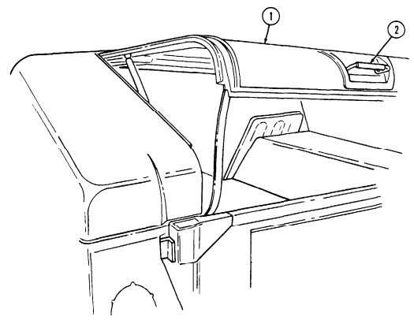
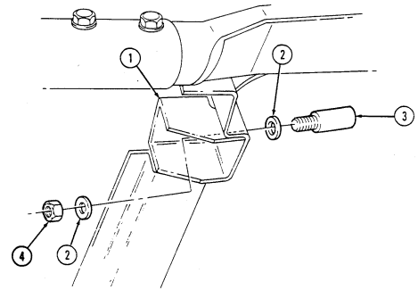
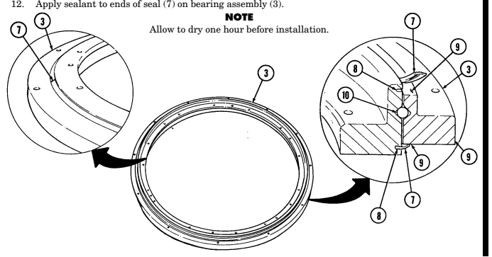
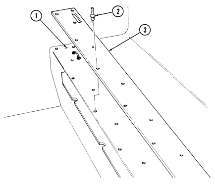

# Chapter 11 Special Purpose Bodies Section I. Weapon Carrier Body Maintenance

| INITIAL SETUP:                                                |                                                                                                      |                                                                                                   |                                                             |
|---------------------------------------------------------------|------------------------------------------------------------------------------------------------------|---------------------------------------------------------------------------------------------------|-------------------------------------------------------------|
| Applicable Models:                                            | Manual References                                                                                    | All vehicles except M996, M996A1, M997,                                                           | TM 9\-2320\-280\-10                                         |
| M997A1, M997A2, M1035, M1035A1,                               | TM 9\-2320\-280\-24P                                                                                 | M1035A2                                                                                           | Equipment Condition                                         |
| Tools                                                         | Hood raised and secured (TM 9\-2320\-280\-10)                                                        | General mechanics tool kit: automotive                                                            |                                                             |
| (Appendix B, Item 1)                                          | Materials/Parts                                                                                      |                                                                                                   |                                                             |
| Lubricant (Appendix C, Item 33)                               | Two O\-rings (Appendix G, Item 218)                                                                  |                                                                                                   |                                                             |
| a. Removal                                                    |                                                                                                      |                                                                                                   |                                                             |
| CAUTION                                                       | Cover or plug power steering gear and hydro\-boost connections                                       |                                                                                                   |                                                             |
| immediately after removing hoses to prevent contamination.    | Remove all plugs prior to connecting hoses.                                                          |                                                                                                   |                                                             |
| NOTE                                                          | Ensure area around power steering port is clean before removing                                      |                                                                                                   |                                                             |
| hose.                                                         | 1.                                                                                                   | Remove hydraulic hose (2) and O\-ring (5) from power steering gear port (6). Discard O\-ring (5). |                                                             |
| 2.                                                            | Remove hydraulic hose (2) from winch outlet port (1) on winch (8).                                   | NOTE                                                                                              |                                                             |
| Ensure area around hydro\-boost port is clean before removing | hose.                                                                                                |                                                                                                   |                                                             |
| 3.                                                            | Remove hydraulic hose (4) and O\-ring (5) from hydro\-boost port (3). Discard O\-ring (5).           | 4.                                                                                                | Remove hydraulic hose (4) from winch inlet port (7).        |
| b. Installation                                               |                                                                                                      |                                                                                                   |                                                             |
| 1.                                                            | Apply lubricant to O\-ring (5) and install O\-ring (5) on hydraulic hose (4).                        | 2.                                                                                                | Install hydraulic hose (4) on hydro\-boost port (3).        |
| 3.                                                            | Route hydraulic hose (4) from hydro\-boost port (3) to winch (8) and install hydraulic hose (4) to   | winch inlet port (7).                                                                             |                                                             |
| 4.                                                            | Apply lubricant to O\-ring (5) and install O\-ring (5) on hydraulic hose (2).                        | 5.                                                                                                | Install hydraulic hose (2) on power steering gear port (6). |
| 6.                                                            | Route hydraulic hose (2) from power steering gear port (6) along side hydraulic hose (4) and install | hydraulic hose (2) on winch outlet port (1).                                                      |                                                             |

|            | CHAPTER 11                                                
|------------|-----------------------------------------------------------
|            | SPECIAL PURPOSE BODIES                                    
| Section I. | WEAPON CARRIER BODY MAINTENANCE                           
| 11\-1.     | WEAPON CARRIER BODY MAINTENANCE TASK SUMMARY              
| TASK       | PROCEDURES                                                
| PARA.      |                                                           
| 11\-2.     | Ballistic Crew Door Maintenance                           
| 11\-3.     | Ballistic Crew Door Hinge Replacement                     
| 11\-4.     | Ballistic Crew Door Rear Striker Plate  Replacement       
| 11\-5.     | Ballistic Crew Door Front Striker Plate  Maintenance      
| 11\-6.     | Ballistic Crew Door Paddle Lock  Replacement              
| 11\-7.     | Ballistic Crew Door Window Assembly  Maintenance          
| 11\-8.     | Ballistic Crew Door Window Protective  Shield Replacement 
| 11\-9.     | Ballistic Crew Door Window Stop  Replacement              
| 11\-10.    | Ballistic Crew Door Seal Replacement                      
| 11\-11.    | Ballistic Crew Door Latch Replacement                     
| 11\-12.    | Ballistic Crew Door Latch Tube  Replacement               
| 11\-13.    | Cargo Door Shell Door Maintenance                         
| 11\-14.    | Cargo Door Shell Door Wire Handle Lock  Replacement       
| 11\-15.    | Cargo Door Shell Door Grab Handle  Replacement            
| 11\-16.    | Cargo Door Shell Door Handle Latch  Replacement           
| 11\-17.    | Cargo Door Shell Door Latch Maintenance                   
| 11\-18.    | Cargo Door Shell Door Latch Rod  Maintenance              
| 11\-19.    | Cargo Door Shell Door Dovetail Assembly                   
|            | Maintenance                                               
| 11\-20.    | Cargo Door Shell Door Retention Cable  Replacement        
| 11\-21.    | Cargo Door Shell Door Gas Spring  Maintenance             
| 11\-22.    | Cargo Door Shell Door Strap Replacement                   
| 11\-23.    | Cargo Door Shell Door Seal Protector  Replacement         
| 11\-24.   | Cargo Shell Door Seal Replacement                       
| 11\-25.   | Cargo Shell Door Front Striker                          
|           | Replacement                                             
| 11\-26.   | Cargo Shell Door Rear Striker                           
|           | Replacement                                             
| 11\-27.   | Cargo Shell Door Rear Striker Mounting Plate            
|           | Replacement                                             
| 11\-28.   | Cargo Shell Door Dovetail Spring                        
|           | Replacement                                             
| 11\-29.   | Cargo Shell Door Gas Spring Mounting Bracket            
|           | Replacement                                             
| 11\-30.   | Cargo Shell Door Liner Replacement                      
| 11\-30.1. | "B" Pillar Padding Replacement                          
| 11\-31.   | Cargo Shell Roof Insulation Panel                       
|           | Replacement                                             
| 11\-32.   | Hood Side Armor Plate Replacement                       
| 11\-33.   | Hood Center Armor Plate Replacement                     
| 11\-34.   | Hood Top Armored Grille Replacement                     
| 11\-35.   | Hood Front Armored Grille Replacement                   
| 11\-36.   | Right Cowl Armor Plate Replacement                      
| 11\-37.   | Left Cowl Armor Plate Replacement                       
| 11\-38.   | Footwell Armor Plate Replacement                        
| 11\-39.   | Right Wheelhouse Armor Plate Replacement                
| 11\-40.   | Left Wheelhouse Armor Plate Replacement                 
| 11\-41.   | Tailgate Armor Plate Replacement                        
| 11\-42.   | Weapon Station Hatch Replacement                        
| 11\-43.   | Weapon Station Hatch Handle Replacement                 
| 11\-44.   | Weapon Station Hatch Hinge Pin                          
|           | Replacement                                             
| 11\-45.   | Weapon Station Hatch Hinge Replacement                  
| 11\-46.   | Weapon Station Hatch Holddown Striker                   
|           | Replacement                                             
| 11\-47.   | Weapon Station Tray Seal Replacement                    
| 11\-48.   | Weapon Station Bumper Pad Replacement                   
| 11\-49.   | Weapon Station Tray Lever Replacement                   
| 11\-50.   | Weapon Station Hatch Latch Replacement                  
| 11\-51.   | Weapon Station Hatch Tube Assembly                      
|           | Replacement                                             
| 11\-52.   | Hinge Pivot Bracket and Gunner's Sling                  
|           | Replacement                                             
| 11\-53.   | Gunner's Sling Hook Replacement                         
| 11\-56.     | Turret Lock Replacement                                      
| 11\-57.     | TOW Mount Pedestal Replacement                               
| 11\-58.     | TOW Mount Pedestal Cover Replacement                         
| 11\-59.     | TOW Missile Guidance System Pan Replacement                  
| 11\-60.     | Weapon Station Inclinometer Replacement                      
| 11\-61.     | Armament Mount Panel Replacement                             
| 11\-62.     | Armament Cover and Seal Replacement                          
| 11\-63.     | Gunner's Platform Replacement                                
| 11\-64.     | Gunner's Platform Assembly Maintenance                       
| 11\-65.     | Gunner's Platform Assembly Replacement                       
| 11\-66.     | Vehicle Power Conditioner (VPC) Mounting Bracket Replacement 
| 11\-67.     | Tow Wiring Harness Replacement                               
| 11\-68.     | Cable Stowage Cleat Replacement                              
| 11\-69.     | Field Glasses Bracket Replacement                            
| 11\-70.     | Stowage Mount Bracket Replacement                            
| 11\-71.     | Stowage Pedestal Replacement                                 
| 11\-72.     | Transversing Unit Mount Adapter                              
| 11\-74.     | M16 Ammo Rack Assembly Replacement                           
| 11\-75.     | TOW Missile Rack Maintenance                                 
| 11\-76.     | Water Can Bumper Replacement                                 
| 11\-78.     | Tripod Mounting Bracket Replacement                          
| 11\-79.     | Tripod Head Mounting Bracket Replacement                     
| 11\-80.     | Fuel Can Tray and Hose Replacement                           
| 11\-81.     | Day Sight Stowage Bracket Replacement                        
| 11\-82.     | Night Sight Support Replacement                              
| 11\-83.     | Night Sight Coolant Base Replacement                         
| 11\-84.     | Front Night Sight Battery Bracket Replacement                
| 11\-85.     | Rear Night Sight Battery Bracket Replacement                 
|             | Maintenance                                                  
| 11\-73.     | Elevation and Depression Stop Assembly                       
|             | Maintenance                                                  
| 11\-77.     | Missile Guidance Set (MGS) Battery Rack Assembly Replacement 
| 11\-86.     | Boresight Collimeter or Night Sight                          
|             | Mounting Spacers Replacement                                 
|             |                                                              

# 11-2. Ballistic Crew Door Maintenance

This task covers:

a. Removal c. Inspection b. Installation d. Adjustment

INITIAL SETUP:

### Applicable Models

All models except M998, M998A1, M1035, M1035A1, M1035A2, M1037, M1038, M1038A1, M1042, M1097, M1097A1, M1097A2

### Tools

General mechanic's tool kit:
automotive (Appendix B, Item 1)
Materials/Parts Six locknuts (Appendix G, Item 87) Spacer plate, 0.125-in. (3.2-mm) thick
(Appendix G, Item 296)

### Materials/Parts (Cont'D)

Spacer plate, 0.060-in. (1.5-mm) thick
(Appendix G, Item 231)
Spacer plate, hinge (Appendix G, Item 232)
Personnel Required One mechanic One assistant Manual References TM 9-2320-280-24P

1. Slide doorstrap (3) off doorstop bracket (2). 2. Open and hold crew door (1) straight out from vehicle. Lift up crew door (1) to remove door hinge pins (6) from body hinge mounts (5) and remove crew door (1) and washers (4) (if present).

1. Hold crew door (1) straight out from vehicle and insert washers (4) (if removed) and door hinge

## 11-2. Ballistic Crew Door Maintenance (Cont'D)

1. Inspect crew door assembly (2) for proper alignment. Ensure door (2) is centered between pillar (7),
roof (5), cargo shell (10), and lower side rail (8). If out-of-alignment condition exists, perform horizontal or vertical adjustment procedures.

2. Inspect crew door assembly (2) to ensure latch (1) is closing completely on striker (15) without extreme force. If latch (1) is out of adjustment, perform latch (1) adjustment procedures.

3. Inspect hinge (4) and latch (1) for adjustment. Insert a piece of paper (9) between crew door assembly (2) and pillar (7), and close door (2). Perform this test at four or five locations around the door (2). Door seals should offer some resistance when paper is pulled out. If door seal does not offer resistance, or resistance is excessive, perform hinge and latch adjustment procedures.

4. Inspect latch (1), hinge (4), and door handle (3) for loose, missing, or unserviceable parts.

I **d. Adjustment**

Perform steps 1 and 2 for horizontal adjustment. Perform steps 3 through 6 for vertical adjustment. Perform steps 7 through 18 for hinge adjustment and steps 19 through 23 for latch adjustment.

Loosen six screws (6) from two hinges (4) and crew door assembly (2).

Align and center crew door assembly (2) between pillar (7), roof (5), cargo shell (10), and lower side rail (8). Tighten six screws (6) to 6 lb-ft (8 N-m). Remove door strap (11) from doorstop bracket (12). Open crew door assembly (2) to approximately 45°, and lift and remove door (2) from body hinge mounts (14). Install washer (13) on each door hinge (4), and install crew door assembly (2) on body hinge mounts (14). Check vertical adjustment and repeat steps if necessary. Remove door strap (11) from doorstop bracket (12).

1.

2.

3.

4.

5.

6. 7. 8.

9.

10.

Open crew door assembly (2) to approximately 45°, and lift door (2) and remove washers (13) (if installed) from body hinge mounts (14). Remove locknut (19), washer (17), screw (16), washer (17), and doorstop bracket (12) from crew door assembly (2). Discard locknut (19). Remove five locknuts (20), washers (21), screws (23), washers (21), two hinges (4), and spacer plates (18) (if installed) from crew door assembly (2). Discard locknuts (20).

11.

12.

13.

14.

15. 16.

To increase resistance to that portion of the door seal (22), install two hinge spacer plates (18) between door hinge (4) and outer side of crew door assembly (2). To decrease resistance to that portion of the door seal (22), discard hinge spacer plate (18) between door hinge (4) and outer side of crew door assembly (2). Install two spacer plates (18) (if required) and door hinges (4) on crew door assembly (2) with five washers (21), screws (23), washers (21), and locknuts (20).

Install doorstop bracket (12) on crew door assembly (2) with washer (17), screw (16), washer (17),
and locknut (19). Tighten locknuts (19) and (20) installed in steps 13 and 14 to 6 lb-ft (8 Nom). Install two door hinge washers (13) (if removed), position crew assembly door (2) to approximately 45°, and install door hinges (4) on body hinge mounts (14).

17. 18.

Check hinge (4) adjustment and repeat steps if necessary.

Install door strap (11) on doorstop bracket (12).

# 11-2. Ballistic Crew Door Maintenance (Cont'D)

19.

Remove crew door latch (para. 11-11).

s To increase resistance to door seal and adjust rear of crew door assembly, perform step 20.

- To decrease resistance to door seal and adjust rear of crew door assembly, perform step 21.

Discard spacer plate(s) (24) from crew door (2). Add spacer plate (24) 0.125-in. (3.2-mm) thick or spacer plate (24) 0.060-in. (1.5-mm) thick to crew door (2).

20. 21.

22. 23.

Install crew door latch (para. 11-11). Check door latch adjustment and repeat steps if necessary.

# 11-3. Ballistic Crew Door Hinge Replacement

This task covers:
INITIAL SETUP:

### Applicable Models

All models except M998, M998A1, M1035, M1035A1, M1035A2, M1037, M1038, M1038A1, M1042, M1097, M1097A1, M1097A2 Tools General mechanic's tool kit:
automotive (Appendix B, Item 1)
a. Removal b. Installation Materials/Parts Three locknuts (Appendix G, Item 87)
Manual References TM 9-2320-280-24P
Equipment Condition Ballistic crew door removed (para. 11-2).

- M966, M966A1, M996, M996A1, M997, M997A1, M997A2, M1025, M1025A1, M1025A2, M1026, M1026A1, and M1036 vehicles have one additional hinge shim on the inner door side of each door hinge mounting hardware.

- On top hinges, note position of doorstop bracket.

a. Removal Remove three locknuts (5), washers (2), screws (1), washers (2), hinge (3), and shim(s) (4) from crew door (6). Discard locknuts (5).

Install shim(s) (4) and hinge (3) on crew door (6) with three washers (2), capscrews (1), washers (2), and

 locknuts (5). Tighten locknuts (5) to 6 lb-ft (8 N•m).

FOLLOW-ON TASK: Install ballistic crew door (para. 11-2).

11-8 Change 2

# 11-4. Ballistic Crew Door Rear Striker Plate Replacement I

This task covers:
INITIAL SETUP:
Applicable Models **Materials/Parts**
All models except M998, M998A1, M1035, Tape (Appendix C, Item 50)
M1035A1, M1035A2, M1037, M1038, M1038A1, M1042, M1097, M1097A1, M1097A2 **Manual References**
Tools Gereral mechanic's tool kit:
automotive (Appendix B, Item 1)
a. Removal b. Installation

| Materials/Parts (Cont'd)   |
|----------------------------|
| (Appendix G, Item 231)     |

Remove two capscrews (4), washers (3), and rear striker plate (2) from body (1). Remove tape from rear striker plate (2) and discard tape.

I **b. Installation**
Apply tape to rear striker plate (2) mounting surface. Install rear striker plats (2) on body (1) with two

 washers (3) and capscrews (4). Tighten capscrews (4) to 8 lb-ft (11 Nom).

# 11-5. Ballistic Crew Door Front Striker Plate Maintenance

This task covers:
a. Removal c. Adjustment b. Installation

### Initial Setup:

Applicable Models All models except M998, M998A1, M1035, M1035A1, M1035A2, M1037, M1038, M1038A1, M1042, M1097, M1097A1, M1097A2 Tools General mechanic's tool kit:
automotive (Appendix B, Item 1)
a. Removal Materials/Parts Tape (Appendix C, Item 50) Two locknuts (Appendix G, Item 86)
Manual References TM 9-2320-280-24P
Remove two locknuts (5), door strap (4), two capscrews (1), and front striker plate (2) from "B" pillar (3). Discard locknuts (5). Remove tape from front striker plate (2) and discard tape.

Apply tape to front striker plate (2) mounting surface. Install front striker plate (2) on "B" pillar (3) with two capscrews (1), door strap (4), and two locknuts (5). Finger tighten locknuts (5).

### C. Adjustment

1. Close door (6) ensuring latch (7) latches on front striker plate (2).

Front striker plates are slotted for vertical adjustment.

2. Press crew door (6) slightly inward and upward until seal (9) contacts body (8). Tighten locknuts (5)
to 19 lb-ft (26 N•m).

3. Open and close crew door (6) several times to ensure proper latch (7) and front striker plate (2)
alignment. If front striker plate (2) cannot be adjusted to align with latch (7), adjust crew door (6)

# 11-6. Ballistic Crew Door Paddle Lock Replacement

This task covers:
INITIAL SETUP:
Applicable Models All models except M998, M998A1, M1035, M1035A1, M1035A2, M1037, M1038, M1038A1, M1042, M1097, M1097A1, M1097A2 Tools General mechanic's tool kit:
automotive (Appendix B, Item 1)
a. Removal b. Installation Materials/Parts Four locknuts (Appendix G, Item 85)
Manual References TM 9-2320-280-24P
a. Removal 1. Release clevis clip (3) from hook (4) and remove hook (4) and clevis clip (3) from paddle lock (2). 2. Remove four locknuts (7), washers (6), screws (5), and paddle lock (2) from crew door (1). Discard locknuts (7).

b. Installation 1. Install paddle lock (2) on crew door (1) with four screws (5), washers (6), and locknuts (7). Tighten locknuts (7) to 12-17 lb-in. (1-2 N•m).

2. Connect hook (4) to paddle lock (2) with clevis clip (3).

# 11-7. Ballistic Crew Door Window Assembly Maintenance

This task covers:

a. Removal c. Assembly b. Disassembly d. Installation

### Initial Setup:

Applicable Models All models except M998, M998A1, M1035, M1035A1, M1035A2, M1037, M1038, M1038A1, M1042, M1097, M1097A1, M1097A2 Tools General mechanic's tool kit:
automotive (Appendix B, Item 1)

### Materials/Parts

Sealing compound (Appendix C, Item 43) Retaining ring (Appendix G, Item 231)
Manual References TM 9-2320-280-24P
Equipment Condition
- Window stops removed (para. 11-9). - Latch tube removed (para. 11-12).

a. Removal Pull out on window latch knob (4) and slide window (5) down and out from door side rails (1) and guide channel (2).

b. Disassembly 1. Remove latch knob (4) from pin (6).

4. Remove four guide pins (7) from window (5).

c. Assembly 3. Apply sealing compound to threads of pin (6) and install latch knob (4) onto pin (6). 4. Install four rollers (8) on guide pins (7).

2. Remove retaining ring (9), pin (6), and spring (10) from window latch (3). Discard retaining ring (9). 3. Remove four rollers (8) from guide pins (7).

1. Apply sealing compound to threads of guide pins (7) and install guide pins (7) on window (5) frame. 2. Install spring (10) and pin (6) on window latch (3) with retaining ring (9).

Align window latch (3) with window guide channel (2) and push window (5) up into guide channel (2) and door side rails (1).

11-7. BALLISTIC CREW DOOR WINDOW ASSEMBLY MAINTENANCE Cont'd)

FOLLOW-ON TASKS: - Install latch tubs (para. 11-12).
- • Install window stops (para. 11-9).

# 11-8. Ballistic Crew Door Window Protective Shield Replacement

This task covers:
a. Initial Installation c. Installation b. Removal INITIAL SETUP:
Applicable Models All models except M998, M998A1, M1035, M1035A1, M1035A2, M1037, M1038, M1038A1, M1042, M1097, M1097A1, M1097A2

### Materials/Parts (Cont'D)

Protective shield (Appendix D, Fig. D-65) Two blind rivets (Appendix G, Item 253) Two blind rivets (Appendix G, Item 251)
Tools General mechanic's tool kit:
automotive (Appendix B, Item 1)
Manual References TM 43-0139 TM 9-2320-280-24P

- The following procedure can be performed to prevent damage to door glass. This task can be accomplished with the approval of the unit commander.

- Procedures for initial installation and replacement of the protective shields are basically the same for all windows. This procedure covers the left front protective shield.

a. Initial Installation

Initial installation steps apply only to vehicles that have not been previously retrofitted with protective shields.

1. Position protective shield (3) on inside of ballistic door (1). 2. Using protective shield (3) as a template, locate and mark three top holes (2) and two bottom holes (5) on inside of ballistic door (1).

Ensure window is closed tightly before drilling holes for the protective shield.

3. Drill three 0.156-in. (0.396-cm) diameter holes (8) through ballistic door frame (9). 4. Drill two 0.193-in. (0.490-cm) diameter holes (6) through ballistic door (1). 5. Install protective shield (3) on ballistic door fame (9) with three screws (4).

Perform step 6 for M966, M966A1, M996, M996A1, M997, M997A1, M997A2, M1025, M1025A1, M1025A2, M1026, M1026A1, and M1036 vehicles. Perform step 7 for M1043, M1043A1, M1043A2, M1044, M1044A1, M1045, M1045A1, M1045A2, M1046, and M1046A1 vehicles.

6. Install protective shield (3) on ballistic door (1) with two 5/32-in. blind rivets (7). 7. Secure protective shield (3) to ballistic door (1) with two 3/16-in. blind rivets (7). 8. Spot paint ballistic door (1) and protective shield (3) as necessary. Refer to TM 43-0139.

# 11-8. Ballistic Crew Door Window Protective Shield Replacement **(Cont'D)**

For instructions on replacement of rivets, refer to para. 11-66.

1. Remove two rivets (7) from protective shield (3) and ballistic door 1l). 2. Remove three screws (4) and protective shield (3) from ballistic door frame (9).

1. Install protective shield (3) on ballistic doorframe (9) with three screws (4).

NOTE
Perform step 2 for M966, M966A1, M996, M996A1, M997, M997A1, M997A2, M1025, M1025A1, M1025A2, M1026, M1026A1, and M1036 vehicles. Perform step 3 for M1043, M1043A1, M1043A2, M1044, M1044A1, M1045, M1045A1, M1045A2, M1046, and M1046A1 vehicles, 2. Install protective shield (3) on ballistic door (1) with two 5/32-in. blind rivets (7). 3. Install protective shield (3) on ballistic door (1) with two 3/16-in. blind rivets (7).

# 11-9. Ballistic Crew Door Window Stop Replacement

This task covers:
INITIAL SETUP

### Applicable Models

All models except M998, M998A1, M1035, M1035A1, M1035A2, M1037, M1038, M1038A1, M1042, M1097, M1097A1, M1097A2 Tools General mechanic's tool kit:
automotive (Appendix B, Item 1)
a. Removal b. Installation Materials/Parts Two locknuts (Appendix G, Item 87) Locknut (Appendix G, Item 88)
Manual References TM 9-2320-280-24P

### Caution

If both window stops are being replaced, ensure ballistic window is locked in the full up position to prevent damage to window.

a. Removal 1. Remove two locknuts (2), screws (5), washers (4), and window stop bracket (6) from side rail (3).

Discard locknuts (2).

2. Remove locknut (7), washer (8), screw (1), and pad (9) from window stop bracket (6). Discard locknut (7).

b. Installation 1. Install pad (9) on window stop bracket (6) with screw (1), washer (8), and locknut (7).

 2. Install window stop bracket (6) on side rail (3) with two washers (4), screws (5), and locknuts (2).

# 11-10. Ballistic Crew Door Seal Replacement

This task covers:
a.Removal b. Installation INITIAL SETUP:
Applicable Models **Materials/Parts**
All models except M998, M998A1, M1035, Detergent (Appendix C, Item 17)
M1035A1, M1035A2, M1037, M1038, M1038A1, M1042, M1097, M1097A1, M1097A2 Manual References TM 9-2320-280-24P
Tools General mechanic's tool kit:
automotive (Appendix B, Item 1)
1. Slide door strap (5) off doorstop bracket (4).

2. Start at end of-seal (2) and pry seal (2) from seal retainer (3) around crew door (1).

1. Coat seal (2) with liquid detergent. Start at one end of seal (2) and press seal (2) into retainer (3)

around door (1).

2. Slide door strap (5) on door stop bracket (4).

# 11-11. Ballistic Crew Door Latch Replacement

This task covers:
INITIAL SETUP:

### Applicable Models

All models except M998, M998A1, M1035, M1035A1, M1035A2, M1037, M1038, M1038A1, M1042, M1097, M1097A1, M1097A2 Tools General mechanic's tool kit:
automotive (Appendix B, Item 1)

### A. Removal B. Installation Materials/Parts

Lockbolt (Appendix G, Item 68) Four locknuts (Appendix G, Item 87)
Manual References TM 9-2320-280-24P
a. Removal 1. Remove clevis clip (6) and hook (7) from paddle lock (10) and disconnect hook (7) from door latch (14). 2. Disconnect spring (13) from top of latch (14). 3. Remove lockbolt (1), wave washer (2), latch tube (3), and washer (4) from latch arm (5). Discard lockbolt (1).

4. Remove four locknuts (15), washer (8), screws (9), latch (14), and spacer (12) from crew door (11)
Discard locknuts (15).

1. Install spacer (12) and latch (14) on crew door (11) with four washers (8), screws (9), and locknuts (15).

Tighten locknuts (15) to 6 lb-ft (8 N•m).

2. Connect spring (13) to top of latch (14). 3. Install washer (4) and latch tube (3) on latch arm (5) with wave washer (2) and lockbolt (1).

Tighten lockbolt (1) to 6 lb-ft (8 N•m).

4. Install hook (7) on latch (14) and connect other end of hook (7) to paddle lock (10) with clevis clip (6).

# 11-12. Ballistic Crew Door Latch Tube Replacement

This task covers:
INITIAL SETUP:

### Applicable Models

All models except M998, M998A1, M1035, M1035A1, M1035A2, M1037, M1038, M1038A1, M1042, M1097, M1097A1, M1097A2 Tools General mechanic's tool kit:
automotive (Appendix B, Item 1)
a. Removal 1. Remove lockbolt (9), wave washer (8), latch tube (7), and washer (3) from latch arm (4). Discard lockbolt (9).

2. Remove four screws (6), washers (5), and bracket (1) from side rails (2). Discard screws (6). 3. Remove two screws (12), washers (13), and guide (11) from bracket (1). 4. Slide latch tube (7) out of bracket (1). 5. Remove protector (10) from bracket (1).

1. Install protector (10) on bracket (1). 2. Slide latch tube (7) into bracket (1). 3. Install guide (11) on bracket (1) with two washers (13) and screws (12). 4. Install bracket (1) on side rails (2) with four washers (5) and screws (6). 5. Install washer (3) and latch tube (7) on latch arm (4) with wave washer (8) and lockbolt (9).

### A. Removal B. Installation Materials/Parts

Lockbolt (Appendix G, Item 68) Four screws (Appendix G, Item 282)
Manual References TM 9-2320-280-24P

# 11-13. Cargo Shell Door Maintenance

This task covers:
b. Installation

### Initial Setup:

Applicable Models All models except M996, M996A1, M997, M997A1, M997A2, M998, M998A1, M1035, M1035A1, M1035A2, M1037, M1038, M1038A1, M1042, M1097, M1097A1, M1097A2 Tools General mechanic's tool kit:
automotive (Appendix B, Item 1)
Materials/Parts Two locknuts (Appendix G, Item 70) Two assembled washer screws
(Appendix G, Item 279)
Two locknuts (Appendix G, Item 79)
a. Removal c. Adjustment

### Personnel Required

One mechanic One assistant Manual References TM 9-2320-280-10 TM 9-2320-280-24P
Equipment Condition Rear end of cargo shell door raised (TM 9-2320-280-10).

General Safety Instructions Never open one end of cargo shell door before ensuring opposite end is securely closed.

a. Removal

### Warning

Opening one end of cargo door before ensuring opposite end is fully closed will cause both ends to open simultaneously, resulting in injury to personnel or damage to equipment.

1. Remove two assembled washer screws (2) and footman loop (3) from strap (1) and cargo door (4). Discard assembled washer screws (2).

2. Lower cargo door (4) slightly, and remove two locknuts (5), washers (6), shoulder bolts (8), and retention cable (9) from two retention cable brackets (7). Discard locknuts (5).

3. Slowly raise cargo door (4) as far as possible to allow removal of gas springs (10) from cargo door (4).

4. Remove two locknuts (12), washers (11), and gas springs (10) from cargo door (4) and lay gas springs (10) inside vehicle. Discard locknuts (12).

5. Lower cargo door (4), release handle latch (13), and remove cargo door (4).

1 1-13.  CARGO SHELL DOOR MAINTENANCE (Cont'd)

## 11-13. Cargo Shell Door Maintenance (Cont'D)

b. Installation 1. Install front latches (5) on front striker pins (6). 2. Push down on cargo door (4) edge to ensure front striker pins (6) are locked in front latches (5). 3. Slowly raise cargo door (4) as far as possible to allow installation of gas springs (1) on cargo door (4).

4. Connect two gas springs (1) to cargo door (4) with two washers (2) and locknuts (3). Tighten locknuts (3) to 15-20 lb-ft (20-27 N•m).

5. Connect two retention cables (14) to retention cable brackets (12) with two shoulder bolts (13), 
washers (11), and locknuts (10). Tighten locknuts (10) to 85-110 lb-in. (10-12 N•m).

6. Install strap (7) on cargo door (4) with footman loop (9) and two assembled washer screws (8).

To assist closing cargo shell door, a grab loop may be added. Refer to cargo shell door strap replacement (para. 11-22).

7. Close cargo door (4), and ensure cargo door (4) is securely latched on rear striker pins (15).

# 11-13. Cargo Shell Door Maintenance (Cont'D)

# 11-13. Cargo Shell Door Maintenance (Cont'D)

### I **C. Adjustment** I

Pull rear wire handle (2) and raise rear end of cargo shell door (1). Perform steps 1 through 4 of a., Removal.

1.

2.

Close cargo door (1).

3.

Release handle latch (3) and push cargo door (1) open. Loosen two front striker pin mounting nuts (5). Loosen two countersunk screws (11) and nuts (10) to allow movement of male dovetail (9).

Close cargo door (1). Ensure front striker pins (7) are secured and centered in front latches (6). Ensure male dovetail (9) is aligned with female dovetail (8).

4. 5. 6.

7.

8.

It maybe necessary to shim front striker pins for proper door alignment and operation.

Pull down on handle (4) to ensure cargo door (1) properly seals to cargo shell (12). With striker pins (7) properly adjusted, tighten striker pin mounting nuts (5) to 35-45 lb-ft (47-61 N.m). Release handle latch (3) and push cargo door (1) open. Tighten two nuts (10) on male dovetail (9) to 85-110 lb-in. (10-12 N.m).

9.

10. 11. 12.

13. 14.

Lower cargo door (1). Ensure front striker pins (7) are secured and centered in front latches (6).

Raise cargo door (1) from rear wire handle (2) and perform steps 3 through 6 of b., Installation.

Insert a piece of paper between door seals and door opening. With cargo door closed, seals should offer resistance when pulling out paper. If door seals do not offer resistance, readjust cargo door.

11-13. CARGO SHELL DOOR MAINTENANCE (Cont'd)

# 11-14. Cargo Shell Door Wire Handle Lock Replacement

This task covers:
INITIAL SETUP:

### Applicable Models

All models except M996, M996A1, M997, M997A1, M997A2, M998, M998A1, M1035, M1035A1, M1035A2, M1037, M1038, M1038A1, M1042, M1097, M1097A1, M1097A2 Tools General mechanic's tool kit:
automotive (Appendix B, Item 1)

### A. Removal B. Installation Materials/Parts

Sealing compound (Appendix C, Item 45)
Two push on nuts (Appendix G, Item 228)
Manual References TM 9-2320-280-10 TM 9-2320-280-24P
Equipment Condition Tailgate lowered (TM 9-2320-280-10).

a. Removal 1. Remove two push on nuts (1), rod end clips (2), and latch rods (3) from wire handle lock pivot arms (4). Discard push on nuts (1).

2. Remove four nuts (5), washers (6), capscrews (8), washers (6), and wire handle lock (9) from cargo door (7). 

b. Installation 1. Apply sealing compound to threads of capscrews (8). 2. Install wire handle lock (9) on cargo door (7) with four washers (6), capscrews (8), washers (6), and nuts (5).

3. Install two latch rods (3) on wire handle lock pivot arms (4) with rod end clips (2) and push on 

nuts (1).

FOLLOW-ON TASKS: - Raise and secure tailgate (TM 9-2320-280-10).

- Check cargo shell door for proper operation (TM 9-2320-280-10).

# 11-15. Cargo Shell Door Grab Handle Replacement

This task covers:
INITIAL SETUP:

### Applicable Models

All models except M996, M996A1, M997, M997A1, M997A2, M998, M998A1, M1035, M1035A1, M1035A2, M1037, M1038, M1038A1, M1042, M1097, M1097A1, M1097A2 Tools General mechanic's tool kit:
automotive (Appendix B, Item 1)

### A. Removal B. Installation Materials/Parts

Sealing compound (Appendix C, Item 45) Four lockwashers (Appendix G, Item 173)
Manual References TM 9-2320-280-10 TM 9-2320-280-24P
Equipment Condition Forward end of cargo shell door raised (TM 9-2320-280-10).

Remove four nuts (1), lockwashers (2), washers (3), countersunk screws (6), and grab handle (5) from cargo door (4). Discard lockwashers (3).

1. Apply sealing compound to threads of countersunk screw (6). 2. Install grab handle (5) on cargo door (4) with four countersunk screws (6), washers (3),

lockwashers (2), and nuts (1).

FOLLOW-ON TASK: Close cargo shell door (TM 9-2320-280-10).

# 11-16. Cargo Shell Door Handle Latch Replacement

This task covers:
INITIAL SETUP:

### Applicable Models

All models except M996, M996A1, M997, M997A1, M997A2, M998, M998A1, M1035, M1035A1, M1035A2, M1037, M1038, M1038A1, M1042, M1097, M1097A1, M1097A2 Tools General mechanic's tool kit:
automotive (Appendix B, Item 1)
a. Removal b. Installation

### Materials/Parts

Two push on nuts (Appendix G, Item 228)
Manual References TM 9-2320-280-10 TM 9-2320-280-24P
Equipment Condition Forward end of cargo shell door raised (TM 9-2320-280-10).

a. Removal 1. Remove four nuts (4), washers (3), capscrews (5), and washers (3) from handle latch lock (1) and cargo door (2).

2. Pull handle latch (1) out and down until latch rods (6) are visible. 3. Remove two push on nuts (9), rod end clips (7), latch rods (6), and handle latch (1) from pivot arms (8). Discard push on nuts (9).

b. Installation 1. Position handle latch (1) to cargo door (2) until latch rods (6) can be connected to handle latch pivot

arms (8) and secure latch rods (6) on pivot arms (8) with two rod end clips (7) and push on nuts (9).

2. Install handle latch (1) on cargo door (2) with four washers (3), capscrews (5), washers (3), and nuts (4).

FOLLOW-ON TASK: Check cargo shell door for proper operation (TM 9-2320-280-10).

# 11-17. Cargo Shell Door Latch Maintenance

This task covers:
a. Removal c. Adjustment b. Installation

### Initial Setup:

Applicable Models All models except M996, M996A1, M997, M997A1, M997A2, M998, M998A1, M1035, M1035A1, M1035A2, M1037, M1038, M1038A1, M1042, M1097, M1097A1, M1097A2 Tools General mechanic's tool kit:
automotive (Appendix B, Item 1)

### Materials/Parts

Three lockwashers (Appendix G, Item 134) Push on nut (Appendix G, Item 228)
Manual References TM 9-2320-280-10 TM 9-2320-280-24P
Equipment Condition Rear end of cargo shell door raised (TM 9-2320-280-10).

a. Removal 1. Remove push on nut (6), rod end clip (7), and rod (8) from door latch (4). Discard push on nut (6). 2. Remove three nuts (1), lockwashers (2), capscrews (5), and door latch (4) from cargo door (3).

Discard lockwashers (2).

Install door latch (4) on cargo door (3) with three capscrews (5), lockwashers (2), and nuts (1). Do not tighten nuts (1) all the way.

### C. Adjustment

1. Loosen three nuts (1) from door latch (4) and cargo door (3). 2. Close cargo door (3) ensuring latch (4) is fully engaged on door striker pins (9). 3. Tighten three nuts (1) to 17 lb-ft (23 N•m). 4. Install rod (8) on latch (4) with rod end clip (7) and push on nut (6).

FOLLOW-ON TASKS: - Lubricate door latch (TM 9-2320-280-10).

- Check cargo shell door for proper operation (TM 9-2320-280-10).

# 11-18. Cargo Shell Door Latch Rod Maintenance

This task covers:

| MI AND AND I MA   |
|-------------------|
| b. Installation   |

### Initial Setup:

Applicable Models All models except M996, M996A1, M997, M997A1, M997A2, M998, M998A1, M1035, M1035A1, M1035A2, M1037, M1038, M1038A1, M1042, M1097, M1097A1, M1097A2 Tools General mechanic's tool kit:
automotive (Appendix B, Item 1)
a. Removal **c. Adjustment**

### Materials/Parts

Two push on nuts (Appendix G, Item 228)
Manual References TM 9-2320-280-10 TM 9-2320-280-24P
Equipment Condition Forward end of cargo shell door raised (TM 9-2320-280-10).

Maintenance procedures for all cargo shell door latch rods are basically the same. This procedure covers the left rear latch rod.

a. Removal 1. Remove push on nut (1), rod end clip (3), and latch rod (4) from pivot arm (2) on wire handle lock (5). Discard push on nut (1).

2. Remove push on nut (7), rod end clip (6), and latch rod (4) from door latch (8). Discard push on nut (7).

1. Connect latch rod (4) to door latch (8) with rod end clip (6). 2. Connect latch rod (4) to pivot arm (2) on wire handle lock (5) with rod end clip (3) and push on nut (1). 3. Close forward end of cargo door.

### C. Adjustment

1. Open rear end of cargo door. 2. Close both rear door latches (8) to check latch action. 3. Gently pull wire handle lock (5) and observe movement of door latches (8). If both door latches (8)
unlatch at the same time, install push on nut (7) on latch rod (4), no adjustment is necessary. If door latches (8) do not unlatch at the same time, go to step 4.

4. Remove rod end clip (6) from rod (4) and door latch (8). Rotate rod adjuster (9) in, if door latch (8)
unlatches after opposite latch (8), or rotate rod adjuster (9) out, if door latch (8) unlatches before opposite door latch (8).

5. Repeat step 4 until door latches (8) unlatch at the same time. 6. Install latch rod (4) on door latch (8) with rod end clip (6) and push on nut (7).

# 11-18. Cargo Shell Door Latch Rod Maintenance (Cont'D)

FOLLOW-ON TASK: Check cargo shell door for proper operation (TM 9-2320-280-10).

# 11-19. Cargo Shell Door Dovetail Assembly Maintenance

This task covers:
b. Installation

### Initial Setup:

Applicable Models All models except M996, M996A1, M997, M997A1, M997A2, M998, M998A1, M1035, M1035A1, M1035A2, M1037, M 1038, M1038A1,M1042, M1097, M1097A1, M1097A2 Tools General mechanic's tool kit:
automotive (Appendix B, Item 1)
a. Removal c. Adjustment

### Materials/Parts

Two locknuts (Appendix G, Item 70) Two lockwashers (Appendix G, Item 175)
Manual References TM 9-2320-280-24P
Equipment Condition Rear end of cargo shell door raised (TM 9-2320-280-10).

The cargo shell door dovetail assembly is of two-piece construction. The female half is mounted on the cargo door. The male half is mounted on a bracket attached to the left cargo shell. Both halves are adjustable and function as a door alignment device.

a. Removal 1. Remove two capscrews (1), lockwashers (2), washers (3), and female dovetail (4) from cargo door (5).

Discard lockwashers (2).

2. Remove two locknuts (6), washers (7), countersunk screws (11), male dovetail (10), and shim (9)
from cargo shell bracket (8). Discard locknuts (6).

1. Install shim (9) and male dovetail (10) on cargo shell bracket (8) with two countersunk screws (11),
washers (7), and locknuts (6). Leave male dovetail (10) loose enough to allow movement from left to right.

2. Install female dovetail (4) on cargo door (5) with two washers (3), lockwashers (2), and capscrews (1). Leave dovetail (4) loose enough to allow movement up and down.

3. Close rear end of cargo door (5).

c. Adjustment 1. Open forward end of cargo door (5). 2. Loosen two capscrews (1) from female dovetail (4) and cargo door (5) until female dovetail (4) will slide up and down.

3. Loosen two countersunk screws (11) and locknuts (6) from male dovetail (10) and cargo shell bracket (8) until male dovetail (10) can be moved from left to right.

4. Gently close cargo door (5) until male dovetail (10) and female dovetail (4) fully seat without interference. Once this condition exists, tighten mounting hardware of dovetails (4) and (10).

5. Open and close cargo door (5) several times to ensure proper dovetail (4) and (10) adjustment. 6. Tighten two capscrews (1) on female dovetail (4) to 10 lb-ft (14 N•m). 7. Tighten two locknuts (6) on male dovetail (10) to 85-100 lb-in. (10-11 N•m).

11-19. CARGO SHELL DOOR DOVETAIL ASSEMBLY MAINTENANCE (Cont'd)

FOLLOW-ON TASK: Close cargo shell door (TM 9-2320-280-10).

# 11-20. Cargo Shell Door Retention Cable Replacement

This task covers:
INITIAL SETUP:

### Applicable Models

All models except M996, M996A1, M997, M997A1, M997A2, M998, M998A1, M1035, M1035A1, M1035A2, M1037, M1038, M1038A1, M1042, M1097, M1097A1, M1097A2 Tools General mechanic's tool kit:
automotive (Appendix B, Item 1)
a. Removal b. Installation

### Materials/Parts

Two locknuts (Appendix G, Item 70)
Manual References TM 9-2320-280-10 TM 9-2320-280-24P
Equipment Condition Forward end of cargo shell door raised (TM 9-2320-280-10).

a. Removal

It will be necessary to lower cargo shell door slightly to relieve cable tension during step 1.

1. Remove locknut (1), washer (2), shoulder bolt (4), and spring end of cable (5) from cargo door bracket (3). Discard locknut (1).

2. Remove locknut (8), washer (9), shoulder bolt (6), and cable (5) from left cargo shell bracket (7).

Discard locknut (8).

b. Installation 1. Install cable (5) on cargo shell bracket (7) with shoulder bolt (6), washer (9), and locknut (8).

Tighten locknut (8) to 85-110 lb-in. (10-12 N•m).

2. Install spring end of cable (5) on cargo door bracket (3) with shoulder bolt (4), washer (2), and 

FOLLOW-ON TASK: Close cargo shell door (TM 9-2320-280-10).
11-34 Change 2

# 11-21. Cargo Shell Door Gas Spring Maintenance

This task covers:
c. Disassembly

### Initial Setup: Applicable Models

All models except M996, M996A1, M997, M997A1, M997A2, M998, M998A1, M1035, M1035A1, M1035A2, M1037, M1038, M1038A1, M1042, M1097, M1097A1, M1097A2

### Tools

General mechanic's tool kit:
automotive (Appendix B, Item 1)

### Materials/Parts

Grease (Appendix C, Item 22) Two locknuts (Appendix G, Item 70) Two retaining rings (Appendix G, Item 234) Two assembled washer screws
(Appendix G, Item 279)
Two locknuts (Appendix G, Item 79)
a. Rotating d. Assembly b. Removal e. Installation Personnel Required One mechanic One assistant Manual References ________________
TM 9-2320-280-10 TM 9-2320-280-24P
Equipment Condition **_________________**
Rear end of cargo shell door raised
(TM 9-2320-280-10).

General Safety Instructions **______________________**
- Do not attempt to remove gas cylinders from spring rods.

- One assistant will be required to hold the cargo door open when either one or both gas springs are being removed or installed.

### A. Rotating Note

- Prior to starting any maintenance, ensure forward end of cargo shell door is locked.

- A 2 x 4 x 79.25 inch long board can used to support cargo door in the open position.

1. Remove cargo shell door strap (para. 11-22). 2. Remove cargo shell door retention cable (para. 11-20). 3. Secure rear cargo door (1) in full open position.

## 11-21. Cargo Shell Door Gas Spring Maintenance (Cont'D)

4. Remove four retaining rings (1) from rod sockets (2) on two gas spring assemblies (5).

### Warning

Do not attempt to remove gas spring assemblies from ball stubs until cargo door is supported in full open position. Failure to do so may result in injury to personnel or damage to equipment.

5. Remove left and right gas spring assemblies (5) from ball studs (3) on cargo door (4) and body bracket (6).

6. Invert left gas spring assembly (5) 180 degrees and position to right side of vehicle.

7. Invert right gas spring assembly (5) 180 degrees and position to left aide of vehicle. 8. Install left and right gas spring assemblies (5) over ball studs (3) on cargo door (4) and body brackets (6).

9. Install four retaining rings (1) in rod sockets (2) on two gas springs (5).

10. Remove cargo door support.

11. Install cargo shell retention cable (para. 11-20).

12. Install cargo shell door strap (pars.. 11-22).

 13. Check operation of cargo shell door (TM 9-2320-280-10).

# 11-21. Cargo Shell Door Gas Spring Maintenance (Cont'D)

### Warning

One assistant will be required to hold the cargo door open when either one or both gas springs are being removed or installed. Failure to do so may result in injury to personnel or damage to equipment.

b. Removal 1. Remove two locknuts (1), washers (2), shoulder bolts (4), and retention cables (5) from cargo door
(3). Discard locknuts (1).

2. Remove two assembled washer screws (6), footman loop (7), and cargo door strap (8) from cargo

door (3). Discard assembled washer screws (6).

## 11-21. Cargo Shell Door Gas Spring Maintenance (Cont'D)

3. Remove two locknuts (1), washers (2), and gas spring assembly (4) from cargo door (3) and body bracket (5). Discard locknuts (1).

c. Disassembly 1. Remove inner spring tube (6) from outer spring tube (13). 2. Remove two retaining rings (8) from ball studs (11) and rod sockets (12). Remove two ball studs (11) from rod sockets (12). Discard retaining rings (8).

3. Remove two clamps (10) from bushings (9) and spring rods (7) and (14). Pull spring rods (7) 
and (14) out of tubes (6) and (13) 1-inch (2.54 cm), and remove two bushings (9).

### Warning

Do not attempt to remove gas cylinders from inner spring rod or outer spring rod. High internal pressure will cause cylinder to explode, resulting in injury to personnel.

4. Pull inner spring rod (7) from inner tube (6) and outer spring rod (14) from outer tube (13).

d. Assembly 1. Install longer outer spring rod (14) on outer tube (13), leaving about 1-inch (2.54 cm) of the small diameter portion of the rod (14) exposed to install bushing (9).

2. Install bushing (9) on outer spring rod (14). Ensure bushing (9) is fully seated on outer tube (13) and rod socket (12) end is fully seated on bushing (9). Install and tighten clamp (10).

3. Place grease in rod end socket (12), and install ball stud (11) on socket (12) with retaining ring (8). 4. Repeat steps 1-3 for inner tube (6) and inner spring rod (7). 5. Install inner tube (6) into outer tube (13).

e. Installation 1. Install gas spring (4) on body bracket (5) and cargo door (3) with two washers (2) and locknuts (1).

Tighten locknuts (1) to 15-20 lb-ft (20-27 N•m).

2. Install footman loop (16) and cargo door strap (17) on cargo door (3) with two assembled washer screws (15).

3. Install two retention cables (21) on cargo door (3) with two shoulder bolts (20), washers (19), and 

locknuts (18). Tighten locknuts (18) to 85-110 lb-in. (10-12 N•m).

# 11-21. Cargo Shell Door Gas Spring Maintenance (Cont'D)

FOLLOW-ON TASK: Check cargo shell door for proper operation (TM 9-2320-280-10).

# 11-22. Cargo Shell Door Strap Replacement

This task covers:
INITIAL SETUP:

### Applicable Models

All models except M996, M996A1, M997, M997A1, M997A2, M998, M998A1, M1035, M1035A1, M1035A2, M1037, M1038, M1038A1, M1042, M1097, M1097A1, M1097A2 Tools General mechanic's tool kit:
automotive (Appendix B, Item 1)
a. Removal b. Installation Materials/Parts Locknut (Appendix G, Item 128) Two assembled washer screws
(Appendix G, Item 279)
Manual References TM 9-2320-280-10 TM 9-2320-280-24P
Equipment Condition Rear end of cargo shell door raised (TM 9-2320-280-10).

a. Removal 1. Remove two assembled washer screws (3), footman loop (2), and strap (1) from cargo door (4).

Discard assembled washer screws (3).

2. Remove locknut (5), washer (6), capscrew (7), and strap (1) from left striker mounting plate (8).

Discard locknut (5).

b. Installation

To assist closing cargo shell door, a grab loop may be added. Refer to appendix D, figure D-83.

1. Install strap (1) on left striker mounting plate (8) with capscrew (7), washer (6), and locknut (5).

Tighten locknut (5) to 25-30 lb-ft (34-41 N•m).

2. Install strap (1) and footman loop (2) on cargo door (4) with two assembled washer screws (3).

FOLLOW-ON TASK: Close cargo shell door (TM 9-2320-280-10).

11-40 Change 2

# 11-23. Cargo Shell Door Seal Protector Replacement

This task covers:
INITIAL SETUP:

### Applicable Models

All models except M996, M996A1, M997, M997A1, M997A2, M998, M998A1, M1035, M1035A1, M1035A2, M1037, M1038, M1038A1,M1042, M1097, M1097A1, M1097A2 Tools General mechanic's tool kit:
automotive (Appendix B, Item 1)
a. Removal b. Installation

### Materials/Parts

Thirteen locknuts (Appendix G, Item 70)
Manual References

| Equipment Condition                    |
|----------------------------------------|
| Forward end of cargo shell door raised |

| Manual References   |
|---------------------|
| TM 9\-2320\-280\-10 |

a. Removal Remove thirteen locknuts (4), washers (5), capscrews (2), washers (5), and seal protector (1) from cargo door (3). Discard locknuts (4).

Install seal protector (1) on cargo door (3) with thirteen washers (5), capscrews (2), washers (5), and

 locknuts (4). Tighten locknuts (4) to 85-100 lb-in. (10-12 N•m).

FOLLOW-ON TASK: Close cargo shell door (TM 9-2320-280-10).

## I **11-24. Cargo Shell Door Seal Replacement**

This task covers:
lNITIAL SETUP:
Applicable Models **Materals/Parts** .

All models except M998, M998A1, M997, Sealing compound (Appendix C, Item 40)
M997A1, M997A2, M998, M998A1, M1035, M1035A1, M1035A2, M1037, M1038, **Manual References** M1038A1, M1042, M1097, M1097A1, TM 9-2320-280-24P
M1097A2 General mechanic's tool kit: (para. 11-23).

automotive (Appendix B, Item 1)
a. Removal b. Installation Equipment Condition Tools Cargo shell door seal protector removed Remove seal (1) from cargo door (2). Clean edge around cargo door (2) to remove dirt, corrosion, or remaining adhesive.

1. Install seal (1) on cargo door (2), making sure seal (1) is fully seated.

2. Detach seal (1) at rear edge of cargo door (2) only, and apply sealing compound in seal (1) channel the entire length of rear edge of cargo door (2).

3. Install seal (1) on rear edge of cargo door (2), making sure seal (1) is fully seated.

FOLLOW-ON TASK: Install cargo shell door seal protector (para. 11-23).

# 11-25. Cargo Shell Door Front Striker Replacement

This task covers:
INITIAL SETUP:
Applicable Models All models except M996, M996A1, M997, M997A1, M997A2, M998, M998A1, M1035, M1035A1, M1035A2, M1037, M1038, M1038A1, M1042, M1097, M1097A1, M1097A2 Tools General mechanic's tool kit:
automotive (Appendix B, Item 1)
a. Removal b. Installation

| Equipment Condition                 |
|-------------------------------------|
| Rear end of cargo shell door raised |
| (TM 9\-2320\-280\-10).              |

| Materials/Parts                          |
|------------------------------------------|
| Thirteen locknuts (Appendix G, Item 70)  |
| Manual References                        |
| TM 9\-2320\-280\-10 TM 9\-2320\-280\-24P |

Remove locknut (4), washer (2), front striker (3), and washer (2) from body bracket (1). Discard locknut (4).

Install washer (2) and front striker (3) on body bracket (1) with washer (2) and locknut (4). Tighten

 locknut (4) to 35-45 lb-ft (47-61 N•m).

FOLLOW-ON TASK: Adjust cargo shell door (para. 11-13).

# 11-26. Cargo Shell Door Rear Striker Replacement

This task covers:
INITIAL SETUP:

### Applicable Models

All models except M996, M996A1, M997, M997A1, M997A2, M998, M998A1, M1035, M1035A1, M1035A2, M1037, M1038, M1038A1, M1042, M1097, M1097A1, M1097A2 Tools General mechanic's tool kit:
automotive (Appendix B, Item 1)
Materials/Parts Locknut (Appendix G, Item 105)
a. Removal b. Installation

| Materials/Parts   |
|-------------------|

Manual References TM 9-2320-280-10 TM 9-2320-280-24P
Equipment Condition
- Tailgate lowered (TM 9-2320-280-10). - Rear end of cargo shell door raised
(TM 9-2320-280-10).

a. Removal Remove locknut (4), washer (3), striker (1), and spacer (2) from striker plate (6) and wheelhouse (5). Discard locknut (4).

b. Installation Install spacer (2) and striker (1) on striker plate (6) and wheelhouse (5) with washer (3) and 

 locknut (4). Tighten locknut (4) to 190-210 lb-ft (258-285 N•m).

FOLLOW-ON TASKS: - Raise and secure tailgate (TM 9-2320-280-10).

- Close cargo shell door (TM 9-2320-280-10).

# 11-27. Cargo Shell Door Rear Striker Mounting Plate Replacement

This task covers:
INITIAL SETUP:

### Applicable Models

All models except M996, M996A1, M997, M997A1, M997A2 M998, M998A1, M1035, M1035A1, M1035A2, M1037, M1038, M1038A1, M1042, M1097, M1097A1, M1097A2

### Tools

General mechanic's tool kit:
automotive (Appendix B, Item 1)
Materials/Parts Six locknuts (Appendix G, Item 128)
a. Removal b. Installation

### Personnel Required

One mechanic One assistant Manual References TM 9-2320-280-10 TM 9-2320-280-24P
Equipment Condition
- Rear striker removed (para. 11-26). - Cargo shell door strap removed (left side only)
(para. 11-22).

1. Remove locknut (5), washer (4), and socket head screw (2) from striker mounting plate (3) and wheelhouse (8). Discard locknut (5).

2. Remove five locknuts (6), washers (7), capscrews (1), washers (9), and striker mounting plate (3)
from wheelhouse (8). Discard locknuts (6).

b. Installation 1. Install striker mounting plate (3) on wheelhouse (8) with five washers (9), capscrews (1), washers (7),
and locknuts (6).

2. Secure striker mounting plate (3) to wheelhouse (8) with socket head screw (2), washer (4), and

locknut (5). Tighten locknuts (5) and (6) to 25-30 lb-ft (34-41 N•m).

FOLLOW-ON TASKS: - Install cargo shell door strap (left side only) (para. 11-22).

- Install rear striker (para. 11-26).

# 11-28. Cargo Shell Door Dovetail Spring Replacement

This task covers:
INITIAL SETUP:

### Applicable Models

All models except M996, M996A1, M997, M997A1, M997A2, M998, M998A1, M1035, M1035A1, M1035A2, M1037, M1038, M1038A1, M1042, M1097, M1097A1, M1097A2 Tools General mechanic's tool kit:
automotive (Appendix B, Item 1)

### Materials/Parts

Two locknuts (Appendix G, Item 101) Lockwasher (Appendix G, Item 178)

### A. Removal B. Installation

Manual References TM 9-2320-280-10 TM 9-2320-280-24P
Equipment Condition
- Rear end of cargo shell door raised
(TM 9-2320-280-10).

- Tailgate lowered (TM 9-2320-280-10).

Remove locknut (8), lockwasher (7), washer (6), cup (9), spring (3), locknut (2), retainer (10), and head bolt (1) from cargo shell dovetail (5). Discard locknuts (2) and (8) and lockwasher (7).

1. Install retainer (10) and locknut (2) on head bolt (1) and position locknut (2) to end of threads on head bolt (1).

2. Install cup (9) and head bolt (1) on dovetail (5). 3. Lower cargo door. 4. Hold locknut (2) and adjust head bolt (1) up until head bolt (1) touches bottom of cargo door (4). 5. Raise cargo door. 6. Remove head bolt (1) from dovetail (5). 7. Install spring (3), cup (9), and head bolt (1) on dovetail (5) with washer (6), lockwasher (7), and

locknut (8). Tighten locknut (8) to 55 lb-ft (75 N•m).

FOLLOW-ON TASKS: - Close cargo shell door (TM 9-2320-280-10).

- Raise and secure tailgate (TM 9-2320-280-10).

11-46 Change 2

# 11-29. Cargo Shell Door Gas Spring Mounting Bracket Replacement

This task covers:
INITIAL SETUP:

### Applicable Models

All models except M996, M996A1, M997, M997A1, M997A2, M998, M998A1, M1035, M1035A1, M1035A2, M1037, M1038, M1038A1, M1042, M1097, M1097A1, M1097A2

### Tools

General mechanic's tool kit:
automotive (Appendix B, Item 1)
Materials/Parts Tape (Appendix C, Item 50) Four locknuts (Appendix G, Item 70)

### A. Removal B. Installation Personnel Required

One mechanic One assistant Manual References TM 9-2320-280-10 TM 9-2320-280-24P
Equiment Condition
- Tailgate lowered (TM 9-2320-280-10). - Gas spring removed (para. 11-21).

1. Remove two locknuts (9), washers (1), capscrews (2), and washers (1) from bracket (3) and wheelhouse (6). Discard locknuts (9).

2. Remove two locknuts (8), washers (4), backing plate (7), capscrews (5), washers (4), and bracket (3)
from wheelhouse (6). Discard locknuts (8). Remove tape from bracket (3) and discard tape.

1. Apply tape to bracket (3) mounting surfaces. Install bracket (3) on wheelhouse (6) with two washers (4), capscrews (5), backing plate (7), washers (4), and locknuts (8). Tighten locknuts (8) to 8 lb-ft (11 N•m).

2. Secure bracket (3) to wheelhouse (6) with two washers (1), capscrews (2), washers (1), and

locknuts (9). Tighten locknuts (9) to 8 lb-ft (11 N•m).

FOLLOW-ON TASKS: - Install gas spring (para. 11-21).

- Raise and secure tailgate (TM 9-2320-280-10).

# 11-30. Cargo Shell Door Liner Replacement

This task covers:
INITIAL SETUP:

a. Removal b. Installation

| Applicable Models                       | Personnel Required                                                              |
|-----------------------------------------|---------------------------------------------------------------------------------|
| All models except M996, M996A1, M997,   | One mechanic                                                                    |
| M997A1, M997A2, M998, M998A1, M1035,    | One assistant                                                                   |
| M1035A1, M1035A2, M1037, M1038,         |                                                                                 |
| M1038A1, M1042, M1097, M1097A1, M1097A2 | Manual References                                                               |
| Tools                                   | TM 9\-2320\-280\-10                                                             |
|                                         | TM 9\-2320\-280\-24P                                                            |
| General mechanic's tool kit:            |                                                                                 |
| automotive (Appendix B, Item 1)         | Equipment Condition                                                             |
| Materials/Parts                         | - Tailgate lowered (TM 9\-2320\-280\-10). - Rear end of cargo shell door raised |

a. Removal 1. Remove ten screws (6), washers (5), clips (4), and two retainers (7) from cargo shell door (1). 2. Remove twelve spring tension fasteners (8) from liner (3) and door (1). Discard spring tension fasteners (8).

3. Remove liner (3) and three sound dampeners (2) from door (1). 4. Clean cargo door (1) to remove adhesive.

b. Installation

Ensure surface is free of dirt and oil before applying adhesive backing.

1. Apply three sound dampeners (2) to door (1). 2. Place four spring tension fasteners (8) in two top and two bottom holes of liner (3). Ensure heads of spring tension fasteners (8) are on side of liner (3) without adhesive.

3. Peel paper backing (9) from liner (3). 4. Align liner (3) with door (1), ensuring top and bottom spring tension fasteners (8) in liner (3) align with top and bottom holes in door (1), and install liner (3) on door (1) with top and bottom spring tension fasteners (8). Press entire surface of liner (3) to ensure adhesion.

5. Install eight remaining spring tension fasteners (8) through liner (3) into door (1). 6. Install two retainers (7) on door (1) with ten clips (4), washers (5), and screws (6).

# 11-30. Cargo Shell Door Liner Replacement(Cont'D)

 FOLLOW-ON TASK:  Close cargo shell door (TM 9-2320-280-10).

# 11-30.1. "B" **Pillar Padding Replacement**

This task covers:

INITIAL SETUP:
Applicable Models M966, M1025, M1026, M1036, M1043, M1044, M1045, M1046, M1121 Two locknuts (Appendix G, Item 122)

a. Removal b. Installation

a. Removal

| Personnel Required   |
|----------------------|
| One mechanic         |
| One assistant        |
| Manual References    |
| TM 9\-2320\-280\-10  |

1. Remove locknut (8), washer (7), capscrew (6), and washer (7) from padding (3) and "B" pillar (11).

Discard locknut (8).

2. Remove locknut (10), washer (4), capscrew (5), and washer (4) from padding (3) and "B" pillar (11).

Discard locknut (10).

3. Remove screw (1), washer (2), and padding (3) from"B" pillar (11). 4. Remove edge trim (9) from "B" pillar (11).

1. Install edge trim (9) on "B" pillar (11). 2. Install padding (3) on "B" pillar (11) with washer (2) and screw (1). 3. Secure padding (3) to "B" pillar (11) with washer (4), capscrew (5), washer (4), and locknut (10). 4. Secure padding (3) to "B" pillar (11) with washer (7), capscrew (6), washer (7), and locknut (8).

FOLLOW-ON TASK: Install rifle mounting clamp bracket (if removed) (para. 11-92).

# 1 1 - 3 1 . Cargo Shell Roof Insulation Panel Replacement

This task covers:
INITIAL SETUP:
Applicable Models M966, M966A1, M1025, M1025A1, M1025A2, M1026, M1026A1, M1036, M1121 Tools General mechanic's tool kit:
automotive (Appendix B, Item 1)
a. Removal 1. Remove insulation panel (2) from roof (1). 2. Clean roof (1) surface to remove adhesive.

b. Installation 1. Spray primer adhesive on roof (1), peel paper backing (3) from panel (2), and install panel (2) 
on roof (1).

2. Press panel (2) surface to ensure adhesion.

### A. Removal B. Installation

Materials/Parts Primer adhesive (Appendix C, Item 35)
Manual References TM 9-2320-280-24P

# 11-32. Hood Side Armor Plate Replacement

This task covers:

a. Removal b. Installation

INITIAL SETUP:
Applicable Models **Manual References**
All models except M998, M998A1, M1035, TM 9-2320-280-10 M1035A1, M1035A2, M1037, M1038, TM 9-2320-280-24P
M1038A1, M1042, M1097, M1097A1, M1097A2 **Equipment Condition**
Tools Hood raised and secured (TM 9-2320-280-10).

General mechanic's tool kit:
automotive (Appendix B, Item 1)
Remove four capscrews (4), washers (5), and armor plate (1) from hood (2).

Slide narrow end of armor plate (1) between radiator-to-hood seal (3) and hood (2) until holes align, and

install on hood (2) with four washers (5) and capscrews (4). Tighten capscrews (4) to 15-20 lb-in. (2 N.m).

FOLLOW-ON TASK: Lower and secure hood (TM 9-2320-280-10).

# 11-33. Hood Center Armor Plate Replacement

This task covers:
INITIAL SETUP:
Applicable Models **Manual References**
All models except M998, M998A1, M1035, TM 9-2320-280-10 M1035A1, M1035A2, M1037, M1038, TM 9-2320-280-24P
M1038A1, M1042, M1097, M1097A1, M1097A2 a. Removal b. Installation Equipment Condition Tools Hood raised and secured (TM 9-2320-280-10).

General mechanic's tool kit:
automotive (Appendix B, Item 1)

Remove nine capscrews (5), washers (6), hood seal retainer (4), hood-to-radiator seal (3), and armor plate (2) from hood (1).

## I**B. Installation**

Install armor plate (2), hood-to-radiator seal (3), and hood seal retainer (4) on hood (1) with nine washers (6) and capscrews (5). Tighten capscrews (5) to 15-20 lb-in. (2 N.m).

# 11-34. Hood Top Armored Grille Replacement

This task covers:
INITIAL SETUP:
Applicable Models All models except M998, M998A1, M1035, M1035A1, M1035A2, M1037, M1038, M1038A1, M1042, M1097, M1097A1, M1097A2 Tools General mechanic's tool kit:
automotive (Appendix B, Item 1)
Materials/Parts Four locknuts (Appendix G, Item 70)
a. Removal b. Installation Personnel Required One mechanic One assistant Manual References TM 9-2320-280-10 TM 9-2320-280-24P
Equipment Condition Hood raised and secured (TM 9-2320-280-10).

a. Removal Remove four locknuts (5), washers (2), capscrews (3), washers (2), and top grille (1) from hood (4). Discard locknuts (5).

b. Installation Install grille (1) on hood (4) with four washers (2), capscrews (3), washers (2), and locknuts (5).

 Tighten locknuts (5) to 6 lb-ft (8 N•m).

FOLLOW-ON TASK: Lower and secure hood (TM 9-2320-280-10).

# 11-35. Hood Front Armored Grille Replacement

This task covers:
INITIAL SETUP:

### Applicable Models

All models except M998, M998A1, M1035, M1035A1, M1035A2, M1037, M1038, M1038A1, M1042, M1097, M1097A1, M1097A2 Tools General mechanic's tool kit:
automotive ( Appendix B, Item 1)
a. Removal b. Installation

### Materials/Parts

Three locknuts (Appendix G, Item 83) Three lockwashers (Appendix G, Item 157)
Manual References TM 9-2320-280-10 TM 9-2320-280-24P
Equipment Condition Hood raised and secured (TM 9-2320-280-10).

1. Remove three locknuts (5), washers (4), and carriage bolts (2) from front grille (3) and hood (1).

Discard locknuts (5).

2. Remove three capscrews (6), harness clamps (7), lockwashers (8), washers (9), and grille (3) from hood (1). Discard lockwashers (8).

b. Installation 1. Install front grille (3) on hood (1) with three washers (9), lockwashers (8), harness clamps (7), and capscrews (6).

2. Secure grille (3) to hood (1) with three carriage bolts (2), washers (4), and locknuts (5).

 3. Tighten locknuts (5) to 21 lb-ft (29 N•m). Tighten capscrews (6) to 20-30 lb-in. (2-3 N•m).

FOLLOW-ON TASK: Lower and secure hood (TM 9-2320-280-10).

# 11-36. Right Cowl Armor Plate Replacement

This task covers:
INITIAL SETUP:
Applicable Models All models except M998, M998A1, M1035, M1035A1, M1035A2, M1037, M1038, M1038A1, M1042, M1097, M1097A1, M1097A2 Tools General mechanic's tool kit:
automotive (Appendix B, Item 1)

a. Removal b. Installation

| Materials/Parts   |
|-------------------|
| Four locknuts (   |

| Equipment Condition                        |
|--------------------------------------------|
| Ballistic crew door removed (para. 11\-2). |

| Manual References    |
|----------------------|
| TM 9\-2320\-280\-24P |

Four locknuts (Appendix G, Item 70)
a. Removal Remove four locknuts (2), washers (1), screws (5), washers (4), and armor plate (6) from cowl (3). Discard locknuts (2).

b. Installation Install armor plate (6) on cowl (3) with four washers (4), screws (5), washers (1), and locknuts (2).

 Tighten locknuts (2) to 6 lb-ft (8 N•m).

FOLLOW-ON TASK: Install ballistic crew door (para. 11-2).

# 11-37. Left Cowl Armor Plate Replacement

This task covers:
INITIAL SETUP:

### Applicable Models

All models except M998, M998A1, M1035, M1035A1, M1035A2, M1037, M1038, M1038A1, M1042, M1097, M1097A1, M1097A2 Tools General mechanic's tool kit:
automotive (Appendix B, Item 1)

a. Removal b. Installation

| Materials/Parts   |
|-------------------|

Seven locknuts (Appendix G, Item 70)
Manual References TM 9-2320-280-24P
Equipment Condition Ballistic crew door removed (para. 11-2).

a. Removal Remove seven locknuts (1), washers (2), screws (4), washers (5), and armor plate (3) from cowl (6) Discard locknuts (1).

Install armor plate (3) on cowl (6) with seven washers (5), screws (4), washers (2), and locknuts (1).

 Tighten locknuts (1) to 6 lb-ft (8 N•m).

FOLLOW-ON TASK: Install ballistic crew door (para. 11-2).

# 11-38. Footwell Armor Plate Replacement

This task covers:
INITIAL SETUP:

### Applicable Models

All models except M998, M998A1, M1035, M1035A1, M1035A2, M1037, M1038, M1038A1, M1042, M1097, M1097A1, M1097A2 

### Tools

General mechanic's tool kit:
automotive (Appendix B, Item 1)
a. Removal b. Installation Materials/Parts Four locknuts (Appendix G, Item 70)
Manual References TM 9-2320-280-24P

Remove four locknuts (3), washers (2), screws (6), washers (5), armor plate (1), and four spacers (7) from body (4). Discard locknuts (3).

Install four spacers (7) and armor plate (1) on body (4) with four washers (5), screws (6), washers (2),

 and locknuts (3). Tighten locknuts (3) to 6 lb-ft (8 N•m).

# 11-39. Right Wheelhouse Armor Plate Replacement

This task covers:
INITIAL SETUP:
Applicable Models M1025, M1025A1, M1025A2, M1026, M1026A1, M1043, M1043A1, M1043A2, M1044, M1044A1, M1045, M1045A1, M1045A2, M1046, M1046A1 Tools General mechanic's tool kit:
automotive (Appendix B, Item 1)

### Materials/Parts

Fourteen locknuts (Appendix G, Item 70) Sound dampener (Appendix G, Item 294)

### A. Removal B. Installation Personnel Required

One mechanic One assistant

| Equipment Condition                   |
|---------------------------------------|
| · Rear end of cargo shell door raised |
| (TM 9\-2320\-280\-10).                |
| M1045, M1045A1, M1045A2, M1046        |

| TM 9\-2320\-280\-24P   |
|------------------------|
| Equipment Condition    |

M1045, M1045A1, M1045A2, M1046, and M1046A1 only:
- Night sight support assembly removed (para. 1182).

M1043, M1043A1, M1043A2, M1044, and M1044A1 only:
- Machine gun stop removed (para. 11-100).

a. Removal 1. Remove four locknuts (7), washers (6), screws (9), and two footman loops (8) from wheelhouse (3).

Discard locknuts (7).

2. Remove ten locknuts (5), washers (4), capscrews (10), washers (4), armor plate (1), and sound dampener (2) from wheelhouse (3). Discard locknuts (5) and sound dampener (2).

3. Clean armor plate (1) to remove adhesive.

1. Peel paper backing (11) from sound dampener (2) and install sound dampener (2) on armor plate
(1).

2. Install armor plate (1) on wheelhouse (3) with ten washers (4), capscrews (10), washers (4), and locknuts (5). Tighten capscrews (10) to 6 lb-ft (8 N•m).

3. Install two footman loops (8) on wheelhouse (3) with four screws (9), washers (6), and locknuts (7).

# 11-39. Right Wheelhouse Armor Plate Replacement (Cont'D)

FOLLOW-ON TASKS: M1043, M1043A1, M1043A2, M1044, and M1044A1 only:
- Install machine gun stop (para. 11-100).

M1045, M1045A1, M1045A2, M1046, and M1046A1 only
- Install night sight support assembly (para. 11-82).
- Close cargo shell door (TM 9-2320-280-10).

# 11-40. Left Wheelhouse Armor Plate Replacement

This task covers:
INITIAL SETUP:
Applicable Models M1025, M1025A1, M1025A2, M1026, M1026A1, M1043, M1043A1, M1043A2, M1044, M1044A1, M1045, M1045A1, M1045A2, M1046, M1046A1

### Tools

General mechanic's tool kit:
automotive (Appendix B, Item 1)

### Materials/Parts

Ten locknuts (Appendix G, Item 70) Sound dampener (Appendix G, Item 294)
Personnel Required One mechanic One assistant

1. Remove ten locknuts (2), washers (3), capscrews (7), washers (3), armor plate (5), and sound dampener (4) from wheelhouse (1). Discard locknuts (2) and sound dampener (4).

2. Clean armor plate (5) to remove adhesive.

1. Peel paper backing (6) from sound dampener (4) and install sound dampener (4) on armor plate (5).

 2. Install armor plate (5) on wheelhouse (1) with ten washers (3), capscrews (7), washers (3), and locknuts (2). Tighten capscrews (7) to 6 lb-ft (8 N•m).

FOLLOW-ON TASKS: M1043, M1043A1, M1043A2, M1044, and M1044A1 only:
- Install water can bumper (para. 11-109). M1045, M1045A1, M1045A2, M1046, and M1046A1 only: - Install tripod head mounting bracket (para. 11-79) - Close cargo shell door (TM 9-2320-280-10).

### A. Removal B. Installation Manual References

TM 9-2320-280-10 TM 9-2320-280-24P

### Equiment Condition

- Rear end of cargo shell door raised
(TM 9-2320-280-10).

M1045, M1045A1, M1045A2, M1046, and M1046A1 only:
- Tripod head mounting bracket removed
(para. 11-79).

M1043, M1043A1, M1043A2, M1044, and M1044A1 only:
- Water can bumper removed (para. 11-109).

11-60 Change 2

# 11-41. Tailgate Armor Plate Replacement

This task covers:
INITIAL SETUP:

### Applicable Models

All models except M996, M996A1, M997, M997A1, M997A2, M998, M998A1, M1035, M1035A1, M1035A2, M1037, M1038, M1038A1, M1042, M1097, M1097A1, M1097A2 Tools General mechanic's tool kit:
automotive (Appendix B, Item 1)

### A. Removal B. Installation Materials/Parts

Nine lockwashers (Appendix G, Item 135) Sound dampener (Appendix G, Item 295)
Manual References TM 9-2320-280-10 TM 9-2320-280-24P
Equipment Condition Tailgate lowered (TM 9-2320-280-10).

a. Removal 1. Remove nine capscrews (3), lockwashers (2), armor plate (1), and sound dampener (4) from tailgate (5). Discard lockwashers (2) and sound dampener (4).

2. Clean armor plate (1) to remove adhesive.

b. Installation 1. Peel paper backing (6) from sound dampener (4) and install sound dampener (4) on armor plate (1).

 2. Install armor plate (1) on tailgate (5) with nine lockwashers (2) and capscrews (3). Tighten capscrews (3) to 6 lb-ft (8 N•m).

FOLLOW-ON TASK: Raise and secure tailgate (TM 9-2320-280-10).

# 11-42. Weapon Station Hatch Replacement

This task covers:
INITIAL SETUP:

### Applicable Models

a. Removal b. Installation

### Materials/Parts

RTV Sealant (Appendix C, Item 38) Locknut (Appendix G, Item 128)
All models except M996, M996A1, M997, M997A1, M997A2, M998, M998A1, M1035, M1035A1, M1035A2, M1037, M1038, M1038A1, M1042, M1097, M1097A1, M1097A2 Tools Manual References TM 9-2320-280-24P
General mechanic's tool kit:
automotive (Appendix B, Item 1)

1. Remove capscrew (6) and washer (7) from hatch pivot bracket (9) and weapon station (1). 2. Remove locknut (10), washer (5), capscrew (4), washer (5), and hatch pivot bracket (9) from weapon station (1). Discard locknut (10).

3. Slide hatch hinge pin (3) out from hatch pivot bracket (2) and remove weapon station hatch (8).

b. Installation

Some hatches may leak water. To prevent water leaks, install NSN 5330-01-190-2227 seal on hatch with RTV sealant.

1. Install weapon station hatch (8) with hatch hinge pin (3) in hatch pivot bracket (2). 2. Install hatch pivot bracket (9) on weapon station (1) with washer (5), capscrew (4), washer (5), 
and locknut (10).

3. Install hatch pivot bracket (9) on weapon station (1) with washer (7) and capscrew (6). Tighten

locknut (10) and capscrew (6) to 37 lb-ft (50 N•m).

# 11-43. Weapon Station Hatch Handle Replacement

This task covers:
INITIAL SETUP:

### Applicable Models

All models except M996, M996A1, M997, M997A1, M997A2, M998, M998A1, M1035, M1035A1, M1035A2, M1037, M1038, M1038A1, M1042, M1097, M1097A1, M1097A2

### Tools

General mechanic's tool kit:
automotive (Appendix B, Item 1)
a. Removal b. Installation Materials/Parts Two locknuts (Appendix G, Item 107)
Manual References TM 9-2320-280-24P

Remove two locknuts (1), washers (2), capscrews (5), large washers (4), and handle (6) from hatch (3). Discard locknuts (1). b. Installation Install handle (6) on hatch (3) with two large washers (4), capscrews (5), washers (2), and locknuts (1).

 Tighten locknuts to 6 lb-ft (8 N•m).

# 11-44. Weapon Station Hatch Hinge Pin Replacement

This task covers:
a. Removal b. Installation INITIAL SETUP:

### Applicable Models

All models except M996, M996A1, M997, M997A1, M997A2, M998, M998A1, M1035, M1035A1, M1035A2, M1037, M1038, M1038A1, M1042, M1097, M1097A1, M1097A2

### Tools

General mechanic's tool kit:
automotive (Appendix B, Item 1)
Materials/Parts Two locknuts (Appendix G, Item 70)
Manual References TM 9-2320-280-24P

1. Remove two locknuts (3), washers (4), capscrews (7), and washers (4) from hatch hinge pin (5) and hatch panel (1). Discard locknuts (3).

NOTE
Spacer not required on M1043, M1043A1, M1043A2, M1044, M1044A1, M1045, M1045A1, M1045A2, M1046, and M1046A1 vehicles.

2. Remove hatch hinge pin (5) and two spacers (2) from hinge pivot bracket (6) and hatch panel (1).

b. Installation 1. Install hatch hinge pin (5) on hatch panel (1) and slide into hinge pivot bracket (6). Slide two spacers (2) between hatch panel (1) and hinge pin (5) on top side of hatch panel (1).

2. Secure hatch hinge pin (5) to hatch panel (1) with two washers (4), capscrews (7), washers (4), and

# 11-45. Weapon Station Hatch Hinge Replacement

This task covers:
INITIAL SETUP:

### Applicable Models

All models except M996, M996A1, M997, M997A1, M997A2, M998, M998A1, M1035, M1035A1, M1035A2, M1037, M1038, M1038A1, M1042, M1097, M1097A1, M1097A2

### Tools

General mechanic's tool kit:
automotive (Appendix B, Item 1)
a. Removal b. Installation Materials/Parts Sixteen locknuts (Appendix G, Item 70)
Manual References TM 9-2320-280-24P
a. Removal 1. Remove seven locknuts (5), washers (2), capscrews (3), washers (2), right hatch panel (1),
and hinge (4) from left hatch panel (6). Discard locknuts (5).

2. Remove nine locknuts (11), washers (7), capscrews (8), washers (7), retainer (10), seal (9),
and hinge (4) from right hatch panel (1). Discard locknuts (11).

3. Inspect seal (9) for damage. Replace if damaged.

# 11-45. Weapon Station Hatch Hinge Replacement (Cont'D)

1. Install hinge (4), seal (5), and retainer (6) on right hatch panel (1) with nine washers (2), capscrews (3),
washers (2), and locknuts (7). Tighten locknuts (7) to 6 lb-ft (8 N-m).

2. Install hinge (4) and right hatch panel (1) on left hatch panel (11) with seven washers (8), capscrews (9),
       washers (8), and locknuts (10). Tighten locknuts (10) to

# 11-46. Weapon Station Hatch Holddown Striker Replacement

This task covers:
INITIAL SETUP:

### Applicable Models

All models except M996, M996A1, M997, M997A1, M997A2, M998, M998A1, M1035, M1035A1, M1035A2, M1037, M1038, M1038A1, M1042, M1097, M1097A1, M1097A2

### Tools

General mechanic's tool kit:
automotive (Appendix B, Item 1)
a. Removal b. Installation

### Materials/Parts

Two locknuts (Appendix G, Item 70) Two locknuts (Appendix G, Item 107)
Manual References TM 9-2320-280-24P
a. Removal

This task covers the left hatch panel holddown striker. The right hatch panel holddown striker is mounted directly on the panel.

1. Remove two locknuts (5), washers (4), screws (1), and holddown striker (2) from bracket (3). Discard locknuts (5).

2. Remove two locknuts (7), washers (8), capscrews (9), washers (8), and bracket (3) from left hatch panel (6). Discard locknuts (7).

b. Installation 1. Install striker (2) on bracket (3) with two screws (1), washers (4), and locknuts (5). 2. Install bracket (3) on left hatch panel (6) with two washers (8), capscrews (9), washers (8),

and locknuts (7). Tighten locknuts (7) to 6 lb-ft (8 N•m).

## 11-47. Weapon Station Tray Seal Replacement

This task covers:
INITAL SETUP:
Applicable Models **Materials/Parts**
All models except M996, M996A1, M997, Adhesive (Appendix C, Item 3)
M997A1 M997A2, M998, M998A1, M1035, M1035A1, M1035A2, M1037, M1038, M1038A1, **Manual References** M1042, M1097, M1097A1, M1097A2 TM 9-2320-280-24P
Tools General mechanic's tool kit:
automotive (Appendix B, Item 1)
1. Remove seal (1) from weapon station (2).

2. Thoroughly clean the edge of weapon station (2).

a. Removal b. Installation 1. Measure and cut required length of seal (1).

2. Apply a 1/16-in. (1.6 mm) to 1/8-in. (3.2 mm) bead of adhesive to seal (1) lip. 3. Starting somewhere other than at a corner, press seal over the lip of the weapon station (2) tray hatch opening.

4. Allow seal (1) to set and cure undisturbed, for about one hour.

# 11-48. Weapon Station Bumper Pad Replacement

This task covers:
INITIAL SETUP:

### Applicable Models

All models except M996, M996A1, M997, M997A1, M997A2, M998, M998A1, M1035, M1035A1, M1035A2, M1037, M1038, M1038A1, M1042, M1097, M1097A1, M1097A2, M1123 a. Removal b. Installation Tools General mechanic's tool kit:
automotive (Appendix B, Item 1)
Materials/Parts Locknut (Appendix G, Item 107)
Manual References TM 9-2320-280-24P

Bumper pads for both sides of hatch are installed basically the same. This procedure covers the right side.

a. Removal Remove locknut (5), washer (4), screw (3), and bumper pad (2) from hatch (1). Discard locknut (5).

b. Installation Install bumper pad (2) on hatch (1) with screw (3), washer (4), and locknut (5).

# 11-49. Weapon Station Tray Lever Replacement

This task covers:
INITIAL SETUP:
Applicable Models All models except M996, M996A1, M997, M997A1, M997A2, M998, M998A1, M1035, M1035A1, M1035A2, M1037, M1038, M1038A1, M1042, M1097, M1097A1, M1097A2, M1123 Tools General mechanic's tool kit:
automotive (Appendix B, Item 1)
a. Removal **b. Installation**
Materials/Parts Four spring tension washers 
(Appendix G, Item 320)
Sealing compound (Appendix C, Item 40)
Manual References TM 9-2320-280-24P
a. Removal Remove capscrew (4), washer (3), two spring tension washers (2), tray lever (1), two spring tension washers (2), and washer (3) from weapon station (5). Discard spring tension washers (2). b. Installation

Apply sealing compound to threads on capscrew.

Install washer (3), two spring tension washers (2), and tray lever (1) on weapon station (5) with two spring tension washers (2), washer (3), and capscrew (4). Tighten capscrew (4) to 6 lb-ft (8 N•m).

# 11-50. Weapon Station Hatch Latch Replacement

This task covers:
lNITIAL SETUP:
Applicable Models **Tools**
All models except M996, M996A1, M997, General mechanic's tool kit M997A1, M997A2, M998, M998A1, M1035, automotive (Appendix B, Item 1)
M1035A1, M1035A2, M1037, M1038, M1038A1, M1042, M1097, M1097A1, M1097A2 **Manual References**

### A. Removal B. Installation

TM 9-2320-280-24P

- Procedures for replacing the three hatch latches are basically the same, except the hatch latch opposite the backrest side of weapon station has a spacer. This procedure covers the hatch latch with spacer.

- To increase latch tension, 3/8-in. (9.5 mm) flat washers may be added between bottom of weapon station and any of the three hatch latches.

Remove capscrew (2), washer(1), hatch latch (5), and spacer (4) from weapon station (3).

Install spacer (4) and hatch latch (5) on weapon station (3) with washer (1) and capscrew (2). Tighten

capscrew (2) to 37 lb-ft (50 N-m).

# 11-51. Weapon Station Hatch Tube Assembly Replacement

This task covers:
INITIAL SETUP:
Applicable Models All models except M996, M996A1, M997, M997A1, M997A2, M998, M998A1, M1035, M1035A1, M1035A2, M1037, M1038, M1038A1, M1042, M1097, M1097A1, M1097A2 a. Removal b. Installation Tools General mechanic's tool kit:
automotive (Appendix B, Item 1)
Materials/Parts Ten locknuts (Appendix G, Item 128)
Manual References TM 9-2320-280-24P
a. Removal

- Note locations of capscrews for installation. - Later production vehicles are equipped with spacers.

Remove ten locknuts (5), washers (1), capscrews (2), washers (1), hatch tube (4), and five spacers (6), if installed, from weapon station (3). Discard locknuts (5).

b. Installation

TOW mount pedestal and TOW MGS pan/armament cover and armament mount panel must be in place prior to installing weapon station hatch tube assembly.

Install five spacers (6), if removed, and hatch tube (4) on weapon station (3) with ten washers (1),

 capscrews (2), washers (1), and locknuts (5). Tighten locknuts (5) to 37 lb-ft (50 N•m).

# 11-52. Hinge Pivot Bracket And Gunner'S Sling Replacement

This task covers:
INITIAL SETUP:

### Applicable Models

All models except M996, M996A1, M997, M997A1, M997A2, M998, M998A1, M1035, M1035A1, M1035A2, M1037, M1038, M1038A1, M1042, M1097, M1097A1, M1097A2

### Tools

General mechanic's tool kit:
automotive (Appendix B, Item 1)
a. Removal b. Installation Materials/Parts Locknut (Appendix G, Item 128) Manual References TM 9-2320-280-24P

1. Remove locknut (8), washer (2), capscrew (3), washer (2), gunner's sling (9), and hinge pivot bracket (6) from weapon station (1). Discard locknut (8).

2. Remove capscrew (4), washer (5), and hinge pivot bracket (6) from weapon station (1) and rear hinge pin (7).

1. Install hinge pivot bracket (6) on rear hinge pin (7). 2. Install hinge pivot bracket (6) on weapon station (1) with washer (5) and capscrew (4). Tighten capscrew (4) to 37 lb-ft (50 N•m).

3. Install hinge pivot bracket (6) and gunner's sling (9) on weapon station (1) with washer (2),

capscrew (3), washer (2), and locknut (8). Tighten locknut (8) to 37 lb-ft (50 N•m).

# 11-53. Gunner'S Sling Hook Replacement

This task covers:
INITIAL SETUP:

### Applicable Models

All models except M996, M996A1, M997, M997A1, M997A2, M998, M998A1, M1035, M1035A1, M1035A2, M1037, M1038, M1038A1, M1042, M1097, M1097A1, M1097A2

### Tools

General mechanic's tool kit:
automotive (Appendix B, Item 1)
a. Removal b. Installation Materials/Parts Locknut (Appendix G, Item 128)
Manual References TM 9-2320-280-24P

Remove locknut (5), washer (2), capscrew (1), washer (2), and gunner's sling hook (4) from weapon station (3). Discard locknut (5).

b. Installation Install gunner's sling hook (4) on weapon station (3) with washer (2), capscrew (1), washer (2), and

 locknut (5). Tighten locknut (5) to 37 lb-ft (50 N•m).

# 11-54. Weapon Station Backrest Pad Replacement

This task covers:
INITIAL SETUP:

### Applicable Models

All models except M996, M996A1, M997, M997A1, M997A2, M998, M998A1, M1035, M1035A1, M1035A2, M1037, M1038, M1038A1, M1042, M1097, M1097A1,1097A2, M1123 Tools General mechanic's tool kit:
automotive (Appendix B, Item 1)
a. Removal b. Installation Materials/Parts Three locknuts (Appendix G, Item 128)
Manual References TM 9-2320-280-24P

The procedure for removing and installing left and right backrest pads is the same. This procedure covers right backrest pad.

a. Removal Remove three locknuts (4), washers (2), capscrews (3), washers (2), and backrest pad (5) from weapon station (1). Discard locknuts (4).

b. Installation Install backrest pad (5) on weapon station (1) with three washers (2), capscrews (3), washers (2),

 and locknuts (4). Tighten locknuts (4) to 37 lb-ft (50 N•m).

# 11-55. Turret Handle Replacement

This task covers:
INITIAL SETUP:

### Applicable Models

All models except M996, M996A1, M997, M997A1, M997A2, M998, M998A1, M1035, M1035A1, M1035A2, M1037, M1038, M1038A1, M1042, M1097, M1097A1, M1097A2, M1123

### Tools

General mechanic's tool kit:
automotive (Appendix B, Item 1)
a. Removal **b. Installation**
Materials/Parts Four locknuts (Appendix G, Item 86)
Manual References TM 9-2320-280-24P

- Fabrication instructions are available to replace the turret handle. Refer to appendix D (fig. D-95).

- The following procedure is for replacement of turret handle that has been previously removed and installed in accordance with the fabrication instructions.

a. Removal Remove four locknuts (4), washers (2), capscrews (1), washers (2), and turret handle (3) from weapon station tray (5). Discard locknuts (4).

b. Installation Install turret handle (3) on weapon station tray (5) with four washers (2), capscrews (1), washers (2), 

 and locknuts (4).

# 11-56. Turret Lock Replacement

This task covers:
INITIAL SETUP:
Applicable Models All models except M996, M996A1, M997, M997A1, M997A2, M998, M998A1, M1035, M1035A1, M1035A2, M1037, M1038, M1038A1, M1042, M1097, M1097A1, M1097A2

### Tools

General mechanic's tool kit:
automotive (Appendix B, Item 1)
a. Removal b. Installation Materials/Parts Two locknuts (Appendix G, Item 128)
Manual References TM 9-2320-280-24P
a. Removal Remove two locknuts (6), washers (1), capscrews (2), washers (1), turret lock (5), and spacer(s) (4) from weapon station (3). Discard locknuts (6). b. Installation

Install same amount of spacers that were removed between bottom

 of weapon station and turret lock. Amount of spacers may be adjusted to correct lock handle binding. Refer to TM 9-2320-28024P if more spacers are needed.

Install spacer(s) (4) and turret lock (5) on weapon station (3) with two washers (1), capscrews (2), washers (1), and locknuts (6). Tighten locknuts (6) to 37 lb-ft (50 N•m).

# 11-57. Tow Mount Pedestal Replacement

This task covers:
INITIAL SETUP:

### Applicable Models

M966, M966A1, M1036, M1045, M1045A1, M1045A2, M1046, M1046A1, M1121 Tools General mechanic's tool kit:
automotive (Appendix B, Item 1)
a. Removal b. Installation Materials/Part Eight locknuts (Appendix G, Item 128)
Manual References TM 9-2320-280-24P
a. Removal

Note locations of capscrews for installation.

Remove eight locknuts (4), washers (2), capscrews (3), washers (2), and pedestal mount (1) from weapon station (5). Discard locknuts (4).

Install pedestal mount (1) on weapon station (5) with eight washers (2), capscrews (3), washers (2), and

 locknuts (4). Tighten locknuts (4) to 37 lb-ft (50 N•m).

# 11-58. Tow Mount Pedestal Cover Replacement

This task covers:
INITIAL SETUP:
Applicable Models M966, M966A1, M1036, M1045, M1045A1, M1045A2, M1046, M1046A1, M1121 Tools General mechanic's tool kit: 
automotive (Appendix B, Item 1)
a. Removal b. Installation Materials/Parts Two locknuts (Appendix G, Item 70)
Manual References TM 9-2320-280-20P

Remove two locknuts (5), washers (1), capscrews (2), washers (1), and TOW mount pedestal cover (3) from weapon station (4). Discard locknuts (5).

Install TOW mount pedestal cover (3) on weapon station (4) with two washers (1), capscrews (2),

 washers (1), and locknuts (5). Tighten locknuts (5) to 65 lb-in. (7 N•m).

# 11-59. Tow Missile Guidance System Pan Replacement

This task covers:
INITIAL SETUP:
Applicable Models M966, M966A1, M1036, M1045, M1045A1, M1045A2, M1046, M1046A1, M1121 Tools General mechanic's tool kit:
automotive (Appendix B, Item 1)
a. Removal b. Installation Materials/Parts Five locknuts (Appendix G, Item 128)
Manual References TM 9-2320-280-24P
a. Removal

Note locations of capscrews for installation.

1. Remove locknut (7), washer (6), washer (5), capscrew (4), and washer (3) from TOW MGS 
pan (12) and weapon station (8). Discard locknut (7).

2. Remove four locknuts (9), washers (10), capscrews (2), washers (1), TOW MGS pan (12), and three washers (11) from weapon station (8). Discard locknuts (9).

b. Installation 1. Install three washers (11) and TOW MGS pan (12) on weapon station (8) with four washers (1),
capscrews (2), washers (10), and locknuts (9).

2. Secure TOW MGS pan (12) to weapon station (8) with washer (3), capscrew (4), washer (5), 
washer (6), and locknut (7).

3. Tighten locknuts (9) and (7) to 12 lb-ft (16 N•m).

# 1 1 - 6 0 . Weapon Station Inclinometer Replacement

This task covers:

a. Removal b. Installation

INITIAL SETUP:
Applicable Models M966, M966A1, M1036, M1045, M1045A1, M1045A2, M1046, M1046A1, M1121

| Personnel Required   |
|----------------------|
| One mechanic         |

### Tools

General mechanic's tool kit:
automotive (Appendix B, Item 1)
a. Removal Remove two screws (4), washers (3), and inclinometer (1) from weapon station (2). 

b. Installation Install inclinometer (1) on weapon station (2) with two washers (3) and screws (4).

# 11-61. Armament Mounting Assembly Replacement

This task covers:
INITIAL SETUP:
a. Removal b. Installation Applicable Models M1025, M1025A1, M1025A2, M1026, M1026A1, M1043, M1043A1, M1043A2, M1044, M1044A1 Tools Materials/Parts Six locknuts (Appendix G, Item 128)
Manual References TM 9-2320-280-24P
General mechanic's tool kit:
automotive (Appendix B, Item 1)
a. Removal

- Note locations of capscrews for installation. - Later production vehicles are equipped with a spacer.

1. Remove pin (7) and adapter (3) from armament mounting assembly (4). 2. Remove six locknuts (5), washers (1), capscrews (2), washers (1), armament mounting assembly (4),
and spacers (6), if installed, from weapon station (8). Discard locknuts (5).

b. Installation 1. Install six spacers (6), if removed, and armament mounting assembly (4) on weapon station (8) with six

washers (1), capscrews (2), washers (1), and locknuts (5). Tighten locknuts (5) to 37 lb-ft (50 N•m).

2. Install adapter (3) on armament mounting assembly (4) with pin (7).

# 11-62. Armament Cover And Seal Replacement

This task covers:
INITIAL SETUP:
Applicable Models M1025, M1025A1, M1025A2, M1026, M1026A1, M1043, M1043A1, M1043A2, M1044, M1044A1 Tools General mechanic's tool kit:
automotive (Appendix B, Item 1)
a. Removal

### A. Removal B. Installation Materials/Parts

Three locknuts (Appendix G, Item 128) Locknut (Appendix G, Item 70)
Manual References TM 9-2320-280-24P

Note locations of capscrews for installation.

1. Remove locknut (6), washer (4), capscrew (3), and washer (4) from armament cover (5) and weapon station (8). Discard locknut (6).

2. Remove three locknuts (7), washers (1), capscrews (2), washers (1), and armament cover (5) from weapon station (8). Discard locknuts (7).

3. Remove seal (10) from armament cover (5). Clean armament cover (5) to remove adhesive.

1. Peel paper backing (9) from seal (10) and apply seal (10) to armament cover (5). 2. Install armament cover (5) on weapon station (8) with three washers (1), capscrews (2), washers (1),
and locknuts (7).

3. Secure armament cover (5) to weapon station (8) with washer (4), capscrew (3), washer (4), and locknut (6).

4. Tighten locknut (6) to 65 lb-in. (7 N•m). Tighten locknuts (7) to 12 lb-ft (16 N•m).

## 11-63. Gunner'S Platform Replacement

This task covers:
INITIAL SETUP:
Applicable Models **Manual References**
All models except M996, M996A1, M997, TM 9-2320-280-10 M997A1, M997A2, M998, M998A1, M1035, TM 9-2320-280-24P
M1035A1, M1035A2, M1037, M1038, M1038A1, M1042, M1097, M1097A1, M1097A2

a. Removal b. Installation

Tools General mechanic's tool kit:
automotive (Appendix B, Item 1)
1.

2.

Remove four capscrews (3) and washers (2) from two guides (7) and remove four channel nuts (6) from gunner's platform (1). Remove two pins (4) from gunner's platform (1).

NOTE
Tag location of guides for installation.

Slowly lift front of gunner's platform (1) and remove two guides (7) and four channel nuts (6) from pin receptacles (8) on forward risers (5). Tilt gunner's platform (1) all the way back. Remove two nuts (10), washers (11), and shoulder bolts (13) from rear brackets (12) and rear risers (9) and remove gunner's platform (1).

Remove footman loops and straps (para. 10-9) from gunner's platform (1).

6.

1.

2.

3. 4.

5. 6.

7.

3.

4. 5.

Install footman loops and straps (para. 10-9) on gunner's platform (1). Install rear brackets (12) on rear risers (9) and install gunner's platform (1) with two shoulder bolts (13), washers (11), and nuts (10). Tighten nuts (10) to 10-15 lb-ft (14-20 N-m).

Slide two channel nuts (6) in guides (7), align with front hole in guide (7), and hold in place.

Align two guides (7) with front holes in gunner's platform (1). Place two washers (2) on capscrews (3) and install capscrews (3) through front holes in gunner's platform (1) and guides (7) into channel nuts (6). Tighten capscrews (3) finger tight.

Slide two pin receptacles (8) into guides (7). Slide two rear channel nuts (6) into rear of guides (7), align with rear holes in gunner's platform (1) by moving front of gunner's platform (1) slightly up and down, and install washers (2) and capscrews (3) in channel nuts (6). Install two pins (4) on rear side holes, and tighten four capscrews (3) to 6 lb-ft (8 N.m).

11-63. GUNNER'S PLATFORM REPLACEMENT (Cont'd)

FOLLOW-ON TASK: Check operation of gunner's platform (TM 9-2320-280-10).

# 11-64. Gunner'S Platform Assembly Maintenance

This task covers:
a. Disassembly b. Assembly INITIAL SETUP:

### Applicable Models

All models except M996, M996A1, M997, M997A1, M997A2, M998, M998A1, M1035, M1035A1, M1035A2, M1037, M1038, M1038A1, M1042, M1097, M1097A1, M1097A2

### Tools

General mechanic's tool kit:
automotive (Appendix B, Item 1)

### Materials/Parts

Six locknuts (Appendix G, Item 111) Four locknuts (Appendix G, Item 109) Two locknuts (Appendix G, Item 110)
Personnel Required One mechanic One assistant Manual References TM 9-2320-280-24P
Equipment Condition
- Gunner's platform removed (para. 11-63). - Gunner's platform assembly removed 
(para. 11-65).

### A. Disassembly

1. Remove two locknuts (5), washers (4), shoulder bolts (2), and outer risers (3) from rear mounting bracket (6). Discard locknuts (5).

2. Remove riser assembly (1) from front mounting bracket (7). 3. Remove two locknuts (9), washers (10), capscrews (17), spacers (12), outer risers (3), and latches (18) from inner risers (11). Discard locknuts (9).

4. Remove two locknuts (13), washers (14), capscrews (16), and two pin-and-lanyard assemblies (15)
from outer risers (3). Discard locknuts (13).

5. Remove four locknuts (24), washers (23), capscrews (19), and inner risers (11) from stiffener plate (8). Discard locknuts (24).

6. Remove two locknuts (20), washers (21), and guide pin bolts (22) from inner risers (11). Discard

locknuts (20).

# 11-64.  Gunner'S Platform Assembly Maintenance (Cont'D)

## 11-64. Gunner'S Platform Assembly Maintenance (Cont'D)

b. Assembly 1. Install two guide pin bolts (17) on inner risers (4) with two washers (16) and locknuts (15). Tighten locknuts (15) to 10-15 lb-ft (14-20 N•m).

Make sure heads of guide pin bolts are installed inward, facing each other.

2. Install inner risers (4) on stiffener plate (1) with four capscrews (14), washers (18), and locknuts (19). Tighten locknuts (19) to 6 lb-ft (8 N•m).

3. Install two pin-and-lanyard assemblies (8) on outer risers (12), on same side as pin receptacles (13),
with two capscrews (9), washers (7), and locknuts (6). Tighten locknuts (6) to 6 lb-ft (8 N•m).

4. Install two spacers (5), outer risers (12), and latches (11) on inner risers (4) ensuring pin receptacles (13) are facing outward, with two capscrews (10), washers (3), and locknuts (2). Tighten locknuts (2) to 6 lb-ft (8 N•m), then back off locknuts 1/4 to 1/2 turn to allow outer risers (12) to pivot freely.

5. Install guide pin bolts (17) on front mounting bracket (24) tracks, and install outer risers (12) on

rear mounting bracket (21) with two shoulder bolts (20), washers (22), and locknuts (23). Tighten locknuts (23) to 10-15 lb-ft (14-20 N•m).

# 11-64. Gunner'S Platform Assembly Maintenance (Cont'D)

FOLLOW-ON TASKS: - Install gunner's platform (para. 11-63).
- Install gunner's platform assembly (para. 11-65).

# 11-65. Gunner'S Platform Assembly Replacement

This task covers:
INITIAL SETUP:

### Applicable Models

All models except M996, M996A1, M997, M997A1, M997A2, M998, M998A1, M1035, M1035A1, M1035A2, M1037, M1038, M1038A1, M1042, M1097, M1097A1, M1097A2 Tools General mechanic's tool kit:
automotive (Appendix B, Item 1)
a. Removal b. Installation Materials/Parts Five locknuts (Appendix G, Item 90)
Personnel Required One mechanic One assistant Manual References TM 9-2320-280-24P

1. Remove two locknuts (11), washers (9), reinforcement brackets (10), capscrews (8), and washers (9)
from front gunner's platform bracket (7) and cargo floor (5). Discard locknuts (11).

2. Remove three locknuts (6), washers (3), capscrews (2), washers (3), gunner's platform assembly (1),
and rear gunner's bracket (4) from cargo floor (5). Discard locknuts (6).

b. Installation 1. Install gunner's platform assembly (1) and rear gunner's platform bracket (4) on cargo floor with three washers (3), capscrews (2), washers (3), and locknuts (6).

2. Install front bracket (7) on cargo floor (5) with two washers (9), capscrews (8), reinforcement

brackets (10), washers (9), and locknuts (11). Tighten capscrews (2) and (8) to 21 lb-ft (29 N•m).

11-90 Change 2
# 11-66. Vehicle Power Conditioner (Vpc) Mounting Bracket Replacement

This task covers:
a. Removal b. Installation INITIAL SETUP:
Applicable Models M966, M966A1, M1036, M1045, M1045A1, M1045A2, M1046, M1046A1 Tools General mechanic's tool kit:
automotive (Appendix B, Item 1)
Materials/Parts Four locknuts (Appendix G, Item 96)
Manual References TM 9-2320-280-24P

Remove four locknuts (5), washers (4), screws (1), and vehicle power conditioner (VPC) mounting bracket (3) from underside of radio rack (2). Discard locknuts (5).

Install VPC mounting bracket (3) on underside of radio rack (2) with four screws (1), washers (4), and

 locknuts (5). Tighten locknuts (5) to 6 lb-ft (8 N•m).

# 11-67. Tow Wiring Harness Replacement

This task covers:
a. Removal b. Installation INITIAL SETUP:
Applicable Models M966, M966A1, M1036, M1045, M1045A1, M1045A2, M1046, M1046A1 Tools General mechanic's tool kit:
automotive (Appendix B, Item 1)
a. Removal

### Materials/Parts

Grease (Appendix C, Item 24) Two lockwashers (Appendix G, Item 133) Eight plain-assembled nuts (Appendix G, Item 201) Lockwasher (Appendix G, Item 148) Lockwasher (Appendix G, Item 141) Four plain-assembled nuts (Appendix G, Item 202)
Manual References TM 43-0139 TM 9-2320-280-24P
Equipment Condition Battery ground cable disconnected (para. 4-73).

Perform steps 1 through 3 for vehicles with serial numbers 99,999 and below and step 4 for vehicles with serial numbers 100,000 and above.

1. Uncoil TOW wiring harness (9) and MGS power cable (7) from cable stowage cleat (10).

 2. Remove plain-assembled nut (3) and clamp (2) from TOW wiring harness (9), MGS power cable (7),
and support assembly (4). Discard plain-assembled nut (3).

3. Remove two plain-assembled nuts (6), screws (1), and clamps (5) from TOW wiring harness (9), MGS power cable (7), and "B" pillar (8). Discard plain-assembled nuts (6).

4. Uncoil TOW wiring harness (9) and MGS power cable (7) from cable stowage cleat (10). 5. Disconnect VPC cable (11) from connector receptacle (12). 6. Remove four plain-assembled nuts (13), screws (16), cover (15), and connector receptacle (12) from bracket (14). Discard plain-assembled nuts (13).

7. Remove two plain-assembled nuts (17), screws (19), and clamps (18) from TOW wiring harness (9)
and battery box (20). Discard plain-assembled nuts (17).

11-67. TOW WIRING HARNESS REPLACEMENT (Cont'd)

# 11-67. Tow Wiring Harness Replacement (Cont'D)

Perform steps 8 through 10 and 14 and 15 for vehicles with serial numbers 99,999 and below, and steps 11 through 15 for vehicles with serial numbers 100,000 and above with kits 5705623 and 5705624 installed.

8. Slide rubber boot (9) back to allow access to slave receptacle (3) connections. 9. Remove capscrew (1), lockwasher (2), slave positive cable (10), and lead 49B (11) from slave receptacle (3). Discard lockwasher (2).

10. Remove capscrew (5), lockwasher (4), slave negative cable (6), and lead 50B (7) from slave receptacle (3). Remove TOW wiring harness (8) from vehicle. Discard lockwasher (4).

11. Remove plain-assembled nut (21), screw (23), and clamp (22) from TOW wiring harness (8) and battery box (18). Discard plain-assembled nut (21).

12. Remove capscrew (12), lockwasher (13), lead 50B (7), slave negative cable (6), and battery negative cable (14) from shunt (15). Discard lockwasher (13).

13. Remove nut (20), lockwasher (19), lead 49B (11), cables (17), and slave positive cable (10) from power stud (16). Discard lockwasher (19).

14. Remove two plain-assembled nuts (32), screws (24), and clamps (25) from MGS power cable (26),
VPC cable (31), and body (27). Discard plain-assembled nuts (32).

15. Remove two screws (29) from retainer (30) and body (27) and pull back insulation (28). Remove MGS power cable (26) and VPC cable (31) from vehicle.

1. Install MGS power cable (26) and VPC cable (31) on approximate mounting location in vehicle. 2. Install insulation (28) over MGS power cable (26) and VPC cable (31) and install retainer (30) to body (27) with two screws (29).

3. Install VPC cable (31) and MGS power cable (26) on body (27) with two clamps (25), screws (24),
and plain-assembled nuts (32).

4. Install TOW wiring harness (8) in approximate mounting location on vehicle.

NOTE
Perform steps 5 through 7 and 11 for vehicles with serial numbers 99,999 and below, and steps 8 through 10 for vehicles with serial numbers 100,000 and above with kits 5705623 and 5705624 installed.

5. Connect lead 50B (7) and slave negative cable (6) to slave receptacle (3) with lockwasher (4)
and capscrew (5).

6. Connect lead 49B (11) and slave positive cable (10) to slave receptacle (3) with lockwasher (2) and capscrew (1).

7. Using grease, coat receptacle (3) terminals and all exposed metal on rear of receptacle (3) and area under cap on front of receptacle (3).

8. Install lead 49B (11), slave positive cable (10), and cables (17) on power stud (16) with lockwasher (19) and nut (20). Apply grease to power stud (16) and all exposed metal.

9. Install battery negative cable (14), slave negative cable (6), and lead 50B (7) on shunt (15) with lockwasher (13) and capscrew (12).

10. Install TOW wiring harness (8) on battery box (18) with clamp (22), screw (23), and plainassembled nut (21).

11. Slide rubber boot (9) to cover slave receptacle (3) connections.

11-67. TOW WIRING HARNESS REPLACEMENT (Cont'd)

# 11-67. Tow Wiring Harness Replacement (Cont'D)

### Warning

The battery box on some HMMWV TOW carrier models M966, M966A1, M1045, M1045A1, M1045A2, M1046, or M1046A1 with serial numbers 1 through 19,410 has cut through the TOW power cable. A cut TOW power cable can cause a fire or battery explosion.

12. Inspect battery box (5) at corner where TOW wiring harness (2) exits battery box (5). 13. If the top edge of battery box (5) forms two "points" where the wiring harness (2) exits battery box (5), (before), cut off the pointed corners and file round. Spot paint, if necessary (refer to TM 43-0139). Battery box (5) should resemble (after) illustration when completed.

14. Install TOW wiring harness (2) on battery box (5) with two clamps (3), screws (4), and plainassembled nuts (1).

Cover chain is installed under lower right screw.

15. Install connector receptacle (7) and cover (15) on bracket (13) with four screws (16) and plainassembled nuts (8).

16. Connect VPC cable (6) to connector receptacle (7).

Perform steps 18 through 20 for vehicles with serial numbers 99,999 and below and step 17 for vehicles with serial numbers 100,000 and above.

17. Coil TOW wiring harness (2) and MGS power cable (10) around cable cleat (20). 18. Install TOW wiring harness (2) and MGS power cable (10) on "B" pillar (14) with two clamps (11),
screws (9), and plain-assembled nuts (12).

19. Install TOW wiring harness (2) and MGS power cable (10) on support assembly (19) with clamp (17) and plain-assembled nut (18).

20. Coil TOW wiring harness (2) and MGS power cable (10) around cable stowage cleat (20).

# 11-67. Tow Wiring Harness Replacement (Cont'D)

FOLLOW-ON TASK: Connect battery ground cable (para. 4-73).

# 11-68. Cable Stowage Cleat Replacement

This task covers:
INITIAL SETUP:
a. Removal b. Installation Applicable Models **Manual References**
M966, M966A1, M1036, M1045, M1045A1, TM 9-2320-280-24P
M1045A2, M1046, M1046A1 Tools General mechanic's tool kit:
automotive (Appendix B, Item 1)

The cable stowage cleat for vehicles with serial numbers 100,000 and above is located behind the companion seat. Removal and installation procedures are basically the same.

1. Uncoil TOW wiring harness (1) and MGS power cable (2) from cable stowage cleat (6).

2. Remove two capscrews (4), washers (5), and cable stowage cleat (6) from support assembly (3).

1. Install cable stowage cleat (6) on support assembly (3) with twO washers (5) and capscrews (4).

Tighten capscrews (4) to 6 lb-ft (8 N.m).

2. Coil TOW wiring harness (1) and MGS power cable (2) around cable stowage cleat (6).

# 11-69. Field Glasses Bracket Replacement

This task covers:
a. Removal b. Installation INITIAL SETUP:

### Applicable Models

M966, M966A1, M1036, M1045, M1045A1, M1045A2, M1046, M1046A1 Tools General mechanic's tool kit:
automotive (Appendix B, Item 1)

| Materials/Parts   |
|-------------------|

Three locknuts (Appendix G, Item 96)
Manual References TM 9-2320-280-24P

Remove three locknuts (4), washers (5), screws (2), and field glasses bracket (1) from radio rack assembly (3). Discard locknuts (4).

b. Installation Install field glasses bracket (1) on radio rack assembly (3) with three screws (2), washers (5), and

 locknuts (4). Tighten locknuts (4) to 6 lb-ft (8 N•m).

# 11-70. Stowage Mount Bracket Replacement

This task covers:

| a.  Removal                                                                                       |                                      | b.  Installation     |
|---------------------------------------------------------------------------------------------------|--------------------------------------|----------------------|
| INITIAL SETUP:                                                                                    |                                      |                      |
| Applicable Models                                                                                 |                                      | Materials/Parts      |
| M966, M966A1, M1036, M1045, M1045A1,                                                              | Three locknuts (Appendix G, Item 96) |                      |
| M1045A2, M1046, M1046A1                                                                           |                                      | Manual References    |
| Tools                                                                                             |                                      | TM 9\-2320\-280\-24P |
| General mechanic's tool kit:                                                                      |                                      |                      |
| automotive (Appendix B, Item 1)                                                                   |                                      |                      |
| a. Removal                                                                                        |                                      |                      |
| Remove three locknuts (4), washers (5), screws (2), and field glasses bracket (1) from radio rack |                                      |                      |

1. Remove two locknuts (5), washers (4), capscrews (17), and washers (4) from stowage mount bracket (3) and support bracket (12). Discard locknuts (5).

2. Remove capscrew (8), washer (9), and tiedown (10) from stowage bracket (3) and cargo floor (16). 3. Slide plate (18) in "B" beam (14) to allow access to nut (13). 4. Remove nut (13), capscrew (6), and washer (7) from stowage bracket (3), spacer (11), and cargo floor (16).

5. Remove nut (15), capscrew (2), washer (1), stowage bracket (3), and spacer (11) from cargo floor (16).

1. Install spacer (11) and stowage bracket (3) on cargo floor (16) with washer (1), capscrew (2),
and nut (15). Tighten capscrew (2) to 37 lb-ft (50 N•m).

2. Install stowage bracket (3) on cargo floor (16) with washer (7), capscrew (6), and nut (13). Tighten capscrew (6) to 37 lb-ft (50 N•m).

3. Close plate (18) in "B" beam (14). 4. Secure stowage bracket (3) and tiedown (10) to cargo floor (16) with washer (9) and capscrew (8).

Tighten capscrew (8) to 75 lb-ft (102 N•m).

5. Install stowage bracket (3) on support bracket (12) with two washers (4), capscrews (17),
washers (4), and locknuts (5). Tighten locknuts (5) to 6 lb-ft (8 N•m).

FOLLOW-ON TASKS: - Install fuel tank (para. 3-24).

- Install stowage pedestal (para. 11-71).

# 11-71. Stowage Pedestal Replacement

This task covers:
INITIAL SETUP:
Applicable Models M966, M966A1, M1036, M1045, M1045A1, M1045A2, M1046, M1046A1 Tools:
General mechanic's tool kit:
automotive (Appendix B, Item 1)

### Materials/Parts

Eight locknuts (Appendix G, Item 128)
a. Removal

a. Removal b. Installation

| TM 9\-2320\-280\-24P   |
|------------------------|
| Equipment Condition    |

| Personnel Required   |
|----------------------|
| One mechanic         |
| One assistant        |

Remove eight locknuts (5), washers (3), capscrews (2), washers (3), and stowage pedestal (1) from stowage mount bracket (4). Discard locknuts (5).

b. Installation Install stowage pedestal (1) on stowage mount bracket (4) with eight washers (3), capscrews (2),

 washers (3), and locknuts (5). Tighten capscrews (2) to 31 lb-ft (42 N•m).

FOLLOW-ON TASK: Install traversing unit mount adapter (TM 9-1425-450-12, TM 9-1425-472-12).

# 11-72. Traversing Unit Mount Adapter Maintenance

This task covers:
a. Disassembly b. Assembly INITIAL SETUP:
Applicable Models M966, M966A1, M1036, M1045, M1045A1, M1045A2, M1046, M1046A1 Tools General mechanic's tool kit:
automotive (Appendix B, Item 1)
Materials/Parts Six locknuts (Appendix G, Item 70)

| Manual References    |
|----------------------|
| TM 9\-1425\-450\-12  |
| TM 9\-1425\-472\-12  |
| TM 9\-2320\-280\-24P |

Equipment Condition Traversing unit mount adapter removed
(TM 9-1425-450-12, TM 9-1425-472-12).

- Upper coupling clamp and lower coupling clamp are removed and installed the same. This procedure covers the upper coupling clamp.

- Note position of coupling clamp for installation.

a. Disassembly Remove six locknuts (3), washers (4), capscrews (5), three retainers (6), and coupling clamp (1) from traversing unit mount adapter (2). Discard locknuts (3).

### B. Assembly

Install coupling clamp (1) on traversing unit mount adapter (2) with three retainers (6), capscrews (5),

 washers (4), and locknuts (3). Tighten locknuts (3) to 6 lb-ft (8 N•m).

FOLLOW-ON TASK: Install traversing unit mount adapter (TM 9-1425-450-12, TM 9-1425-472-12).

# 11-73. Elevation And Depression Stop Assembly Maintenance

This task covers:
INITIAL SETUP:

a. Disassembly b. Assembly

Applicable Models M966, M966A1, M1036, M1045, M1045A1, M1045A2, M1046, M1046A1 Tools General mechanic's tool kit:
automotive (Appendix B, Item 1)

### Materials/Parts

Three retaining rings (Appendix G, Item 235)
Manual References TM 9-2320-280-24P
General Safety Instructions Note position of downward stop and upward stop for assembly.

### Warning

Note position of elevation and depression downward stop and upward stop for assembly. Injury to personnel and/or damage to equipment will result if stops are not properly assembled.

### A. Disassembly

1. Remove retaining ring (3), clevis pin (15), cable end of pin assembly (14), and return spring (1) from upward stop strap (4). Discard retaining ring (3).

2. Remove pin assembly (14) and upward stop bracket (2) from upward stop strap (4). 3. Remove retaining ring (6), clevis pin (9), cable end of pin assembly (10), and return spring (8) from downward stop strap (11). Discard retaining ring (6).

4. Remove pin assembly (10) and downward stop bracket (7) from downward stop strap (11). 5. Remove retaining ring (16), clevis pin (5), socket head screw (12), and washer (13) from stop straps (4) and (11). Discard retaining ring (16).

b. Assembly 1. Install stop straps (4) and (11) together with clevis pin (5), retaining ring (16), washer (13), and socket head screw (12).

2. Install downward stop bracket (7) on downward stop strap (11) with pin assembly (10) through upper holes of downward stop bracket (7) and downward stop strap (11).

3. Install return spring (8), downward stop bracket (7), and cable end of pin assembly (10) on downward stop strap (11) with clevis pin (9) and retaining ring (6).

4. Install upward stop bracket (2) on upward stop strap (4) with pin assembly (14) through upper holes of upward stop bracket (2) and upward stop strap (4).

5. Install return spring (1), upward stop bracket (2), and cable end of pin assembly (14) on upward stop strap (4) with clevis pin (15) and retaining ring (3).

11-73. ELEVATION AND DEPRESSION STOP ASSEMBLY MAINTENANCE (Cont'd)

# 11-74. M16 Ammo Rack Assembly Replacement

This task covers:
INITIAL SETUP:
Applicable Models M966, M966A1, M1036, M1045, M1045A1, M1045A2, M1046, M1046A1 Tools General mechanic's tool kit:
automotive (Appendix B, Item 1)
Materials/Parts Four locknuts (Appendix G, Item 70) Two locknuts (Appendix G, Item 74)
a. Removal 1. Remove four locknuts (7), washers (6), two reinforcement brackets (5), and four screws (4) from M16 ammo rack (2) and wheelhouse (1). Discard locknuts (7).

2. Remove two locknuts (8), washers (9), reinforcement brackets (10), screws (3), and M16 ammo rack (2) from wheelhouse (1). Discard locknuts (8).

b. Installation 1. Install M16 ammo rack (2) on wheelhouse (1) with two screws (3), reinforcement brackets (10),
washers (9), and locknuts (8).

2. Secure M16 ammo rack (2) to wheelhouse (1) with four screws (4), two reinforcement brackets (5),
four washers (6), and locknuts (7).

a. Removal b. Installation

| Manual References   |
|---------------------|

One mechanic One assistant Manual References TM 9-2320-280-10 TM 9-2320-280-24P
Equipment Condition Rear end of cargo shell door raised
(TM 9-2320-280-10).

FOLLOW-ON TASK: Close cargo shell door (TM 9-2320-280-10).

# 11-75. Tow Missile Rack Maintenance

This task covers:
b. Disassembly e. Installation c. Inspection

### Initial Setup: Applicable Models

M966, M966A1, M1036, M1045, M1045A1, M1045A2, M1046, M1046A1

### Tools

General mechanic's tool kit:
automotive (Appendix B, Item 1)

### Materials/Parts

Adhesive (Appendix C, Item 1) Eight cotter pins (Appendix G, Item 16) Eighteen locknuts (Appendix G, Item 70) Three locknuts (Appendix G, Item 81) Sixteen locknuts (Appendix G, Item 107) Eight cotter pins (Appendix G, Item 12) Two locknuts (Appendix G, Item 79)
a. Removal d. Assembly Personnel Required One mechanic One assistant Manual References TM 9-2320-280-10 TM 9-2320-280-24P

### Equipment Condition

- Rear end of cargo shell door raised
(TM 9-2320-280-10).

- Tailgate lowered (TM 9-2320-280-10). - Footman loop and strap removed (para. 10-9).

1. Remove two locknuts (16), washers (1), capscrews (2), and washers (1) from MGS battery

rack (3) and missile rack (4). Discard locknuts (16).

2. Remove three locknuts (7), washers (6), capscrews (5), and washers (6) from missile rack (4) and cargo floor (8). Discard locknuts (7).

3. Remove two locknuts (13), washers (14), reinforcements (12), capscrews (15), and washers (14) from missile rack (4) and cargo floor (8). Discard locknuts (13).

4. Remove capscrew (9), washer (10), missile rack (4), and tiedown (11) from cargo floor (8). 

Change 2 11-107

## 11-75. Tow Missile Rack Maintenance (Cont'D)

b. Disassembly 1. Remove eight cotter pins (7), washers (8), pins (10), and four strap assemblies (9) from upper rack assembly (4). Discard cotter pins (7).

2. Remove two locknuts (11), washers (12), capscrews (15), washers (12), spacers (13), and lanyard (24) from upper rack assembly (4) and base assembly (21). Discard locknuts (11).

3. Release two tension latches (30) and raise upper rack assembly (4). Remove two cotter pins (17),
washers (18), pins (20), washers (18), torsion springs (19), washers (18), four washers (14), and upper rack assembly (4) from base assembly (21). Discard cotter pins (17).

Shims are installed under each bumper on front end of missile rack, but only as needed under bumpers on rear end of missile rack.

4. Remove four locknuts (6), washers (5), capscrews (31), washers (5), four bumpers (41), and shims (42) from upper rack assembly (4). Discard locknuts (6).

5. Remove four locknuts (43), washers (2), screws (1), washers (2), and two latch strikes (3) from upper rack assembly (4). Discard locknuts (43).

6. Remove two cotter pins (32), washers (33), pins (40), and washers (33) from extension springs (35)
and base assembly (21). Disconnect extension springs (35) from spring brackets (34). Discard cotter pins (32).

7. Remove two cotter pins (36), washers (39), pins (37), and upper supports (29) from intermediate rack assemblies (25). Discard cotter pins (36).

8. Remove four locknuts (28), washers (23), screws (22), washers (23), and two tension latches (30)
from upper supports (29) Discard locknuts (28).

9. Remove two locknuts (26), washers (27), capscrews (16), washers (27), and connector bar (38)
from upper supports (29). Discard locknuts (26).

# 11-75. Tow Missile Rack Maintenance (Cont'D)

## I **11-75. Tow Missile Rack Maintenance (Cont'D)**

10.

Remove two cotter pins (16), washers (17), and pins (18) from intermediate supports (6). Release two tension latches (21) and remove intermediate supports (6) and washers (13) from base assembly (27). Discard cotter pins (16).

NOTE
Shims are installed under each bumper on front end of missile rack, but only as needed under bumpers on rear end of missile rack.

11.

12.

13.

14.

15.

Remove four locknuts (7), washers (8), capscrews (12), washers (8), bumpers (11), shims (10), and two spring brackets (9) (outer side only) from intermediate supports (6). Discard locknuts (7). Remove four locknuts (29), washers (2), screws (1), washers (2), and two latch strikes (3) from intermediate rack assemblies (6). Discard locknuts (29). Remove two locknuts (14), washers (5), capscrews (4), washers (5), and connector bar (15) from intermediate rack assemblies (6). Discard locknuts (14).

Remove two locknuts (26), washers (24), capscrews (23), washers (24), and bracket (22) from base assembly (27). Discard locknuts (26). Remove four locknuts (19), washers (20), screws (25), washers (20), and two tension latches (21) from base assembly (27) and bracket (22). Discard locknuts (19).

. Perform steps b. 16 and d. 1 if replacing missile pads.

- Procedures for replacing all missile pads are the same. Steps b. 16 and d. 1 cover replacement of one base assembly missile pad, 16.

Remove pad (28) from base assembly (27), and clean remaining adhesive from base assembly (27)
mounting surface.

#### C. Inspection

1. Inspect base assembly (27), intermediate rack assemblies (6), and connector bars (15) for cracks, broken welds, and damage. Replace any component if damaged.

2. Inspect bumpers (11) and missile pads (28) for cracks, tears, and deterioration. Replace any component if damaged.

# 11-75. Tow Missile Rack Maintenance (Cont'D)

11-75. TOW MISSILE RACK MAINTENANCE (Cont'd)
3. Inspect upper rack assembly (1) and upper supports (2) for cracks, broken welds, and damage.

Replace any component if damaged.

### D. Assembly

1. Apply adhesive to base assembly (29) pad mounting surface and install missile pad (28) on base assembly (29).

2. Install two tension latches (22) on base assembly (29) and bracket (23) with four washers (21),
screws (26), washers (21), and locknuts (20).

3. Install bracket (23) on base assembly (29) with two washers (25), capscrews (24), washers (25),
and locknuts (27). Tighten locknuts (27) to 6 lb-ft (8 N.m).

4. Install connector bar (16) on two intermediate rack assemblies (8) with washers (7), capscrews (6),
washers (7), and locknuts (15). Tighten locknuts (15) to 6 lb-ft (8 Nom).

5. Install two latch strikes (5) on intermediate rack assemblies (8) with four washers (4), screws (3),
washers (4), and locknuts (30).

Shims are installed under each bumper on front end of missile rack, but only as needed under bumpers on rear end of missile rack.

6. Install shims (12), four bumpers (13), and two spring brackets (9) (outer side only) on intermediate rack assemblies (8) with four washers (11), capscrews (31), washers (11), and locknuts (10).

7. Install intermediate rack assemblies (8) and four washers (14) on base assembly (29) with two pins (19), washers (18), and cotter pins (17). It maybe necessary to slowly install pins (19) while installing washers (14) between intermediate rack assembly (8) sides and base assembly (29) channels.

# 11-75. Tow Missile Rack Maintenance (Cont'D)

## 11-75. Tow Missile Rack Maintenance (Cont'D)

8. Connect two extension springs (36) to spring brackets (35). Extend springs (36) to base assembly (21) and install with two washers (34), pins (41), washers (34), and cotter pins (33). Install intermediate supports (25) on base assembly (21) with two lower tension latches (30).

9. Install connector bar (37) on upper supports (29) with two washers (27), capscrews (31),
washers (27), and locknuts (26). Tighten locknuts (26) to 6 lb-ft (8 N•m).

10. Install two tension latches (30) on upper supports (29) with four washers (23), screws (22),
washers (23), and locknuts (28).

11. Install upper supports (29) on intermediate rack assemblies (25) with two pins (38), washers (40),
and cotter pins (39).

Shims are installed under each bumper on front end of missile rack, but only as needed under bumpers on rear end of missile rack.

12. Install shims (43) and four bumpers (42) on upper rack assembly (4) with four washers (5),
capscrews (32), washers (5), and locknuts (6).

13. Install two latch strikes (3) on upper rack assembly (4) with four washers (2), screws (1),
washers (2), and locknuts (44).

14. Install upper rack assembly (4) and four washers (12) on base assembly (21) with two washers (18),
pins (20), torsion springs (19), washers (18), and cotter pins (17). It may be necessary to slowly install pins (20) while installing washers (12) between upper rack assembly (4) sides and base assembly (21) channels.

15. Install lanyard (24) on upper rack assembly (4) and base assembly (21) with two washers (14),
capscrews (16), spacers (15), washers (14), and locknuts (13).

16. Install four strap assemblies (9) on upper rack assembly (4) with eight pins (10), washers (8),
and cotter pins (7).

17. Lift upper rack assembly (4) all the way up, and place one end of torsion springs (19) underneath pad supports (11), and other end of torsion springs (19) on inner rack side of pins (41), ensuring washers (34) are on outside of spring (19) ends. Lower upper rack assembly (4) and secure with two tension latches (30).

# 11-75. Tow Missile Rack Maintenance (Cont'D)

## 11-75. Tow Missile Rack Maintenance (Cont'D)

1. Install tiedown (11) and missile rack (4) on cargo floor (8) with washer (10) and capscrew (9). Do not

tighten cascrew (9).

2. Secure missile rack (4) to cargo floor (8) with three washers (6), capscrews (5), washers (6), and locknuts (7). Do not tighten capscrews (5).

3. Secure missile rack (4) to cargo floor (8) with two washers (13), capscrews (15), reinforcements (12),
washers (13), and locknuts (14). Do not tighten capscrews (15).

4. Install MGS battery rack (3) on missile rack (4) with two washers (1), capscrews (2), washers (1),
and locknuts (16). Tighten capscrews (2) to 6 lb-ft (8 N.m).

5. Tighten capscrews (5) and (15) to 21 lb-ft (28 N.m). Tighten capscrew (9) to 90 lb-ft (122 N.m).

FOLLOW-ON TASKS: - Install footman loop and strap (para. 10-9).

- Raise and secure tailgate (TM 9-2320-280-10). - Close cargo shell door (TM 9-2320-280-10).

# 11-76. Water Can Bumper Replacement

This task covers:
INITIAL SETUP:
Applicable Models M966, M966A1, M1036, M1045, M1045A1, M1045A2, M1046, M1046A1 Tools General mechanic's tool kit:
automotive (Appendix B, Item 1)
Materials/Parts Two locknuts (Appendix G, Item 70)
a. Removal b. Installation Manual References TM 9-2320-280-10 TM 9-2320-280-24P
Equipment Condition Rear end of cargo shell door raised (TM 9-2320-280-10).

a. Removal Remove two locknuts (2), washers (3), capscrews (6), washers (3), water can bumper (5), and water can bumper bracket (4) from MGS battery rack assembly (1). Discard locknuts (2).

b. Installation Install water can bumper bracket (4) and water can bumper (5) on MGS battery rack assembly (1) with

 two washers (3), capscrews (6), washers (3), and locknuts (2). Tighten locknuts (2) to 6 lb-ft (8 N•m).

FOLLOW-ON TASK: Close cargo shell door (TM 9-2320-280-10).

# 11-77. Missile Guidance Set (Mgs) Battery Rack Assembly Replacement

This task covers:

a. Removal b. Installation

| INITIAL SETUP:                       |                                     |
|--------------------------------------|-------------------------------------|
| Applicable Models                    | Personnel Required                  |
| M966, M966A1, M1036, M1045, M1045A1, | One mechanic                        |
| M1045A2, M1046, M1046A1              | One assistant                       |
| Tools                                | Manual References                   |
| General mechanic's tool kit:         | TM 9\-2320\-280\-10                 |
| automotive (Appendix B, Item 1)      | TM 9\-2320\-280\-24P                |
| Materials/Parts                      | Equipment Condition                 |
| Four locknuts (Appendix G, Item 70)  | Rear end of cargo shell door raised |
| Two locknuts (Appendix G, Item 74)   | (TM 9\-2320\-280\-10).              |

a. Removal 1. Remove two locknuts (11), washers (2), capscrews (3), and washers (2) from MGS battery rack (4) and missile rack (1). Discard locknuts (11).

2. Remove four locknuts (9), washers (5), reinforcement brackets (8) and (10), capscrews (6),
washers (5), and MGS battery rack (4) from wheelhouse (7). Discard locknuts (9).

3. Remove footman loop and strap (para. 10-9) from MGS battery rack (4).

1. Install footman loop and strap (para. 10-9) on MGS battery rack (4). 2. Install MGS battery rack (4) on wheelhouse (7) with four washers (5), capscrews (6), reinforcement brackets (8) and (10), washers (5), and locknuts (9).

3. Install MGS battery rack (4) on missile rack (1) with two washers (2), capscrews (3), washers (2),
and locknuts (11). Tighten capscrews (3) and locknuts (9) to 6 lb-ft (8 N•m).

11-77. MISSILE GUIDANCE SET (MGS) BATTERY RACK ASSEMBLY REPLACEMENT (Cont'd)

FOLLOW-ON TASKS: - Close cargo shell door (TM 9-2320-280-10).
- • Install water can bumper (para. 11-76).

# 11-78. Tripod Leg Mounting Bracket Replacement

This task covers:
INITIAL SETUP:
Applicable Models M966, M966A1, M1036, M1045, M1045A1, M1045A2, M1046, M1046A1 Tools General mechanic's tool kit:
automotive (Appendix B, Item 1)
Materials/Parts Three locknuts (Appendix G, Item 70)

a. Removal b. Installation

| Personnel Required   |
|----------------------|

One mechanic One assistant Manual References TM 9-2320-280-10 TM 9-2320-280-24P
Equipment Condition
- Rear end of cargo shell door raised
(TM 9-2320-280-10).

- Pioneer tool rack removed (TM 9-2320-280-10).

a. Removal 1. Remove three locknuts (9), washers (5), capscrews (6), washers (5), tripod leg bracket (4), and spacers (10) from cargo floor (7). Discard locknuts (9).

2. Remove two nuts (11), washers (2), capscrews (1), washers (2), strap bracket (8), and strap (3) from tripod leg bracket (4).

1. Install strap bracket (8) and strap (3) on tripod leg bracket (4) with two washers (2), capscrews (1),
washers (2), and nuts (11).

2. Install three spacers (10) and tripod leg bracket (4) on cargo floor (7) with three washers (5),
capscrews (6), washers (5), and locknuts (9).

3. Tighten front and rear locknuts (9) and center capscrew (6) to 6 lb-ft (8 N•m).

FOLLOW-ON TASKS: - Close cargo shell door (TM 9-2320-280-10).

- Install pioneer tool rack (TM 9-2320-280-10).

# 11-79. Tripod Head Mounting Bracket Replacement

This task covers:
INITIAL SETUP:
Applicable Models M966, M966A1, M1036, M1045, M1045A1, M1045A2, M1046, M1046A1 Tools General mechanic's tool kit:
automotive (Appendix B, Item 1)
Materials/Parts Three locknuts (Appendix G, Item 70)
a. Removal a. Removal b. Installation Manual References TM 9-2320-280-10 TM 9-2320-280-24P
Equipment Condition
- Rear end of cargo shell door raised
(TM 9-2320-280-10).

- Tailgate lowered (TM 9-2320-280-10).

On M1045, M1045A1, M1045A2, M1046, and M1046A1 models, there is an additional washer between the wheelhouse and the wheelhouse armor.

1. Remove three locknuts (7), washers (6), and plate assembly (5) from wheelhouse (8). Discard locknuts (7).

2. Remove three capscrews (1), washers (2), tripod head bracket (3), and three spacers (4) from wheelhouse (8) 

1. Install three spacers (4) and tripod head bracket (3) on wheelhouse (8) with three washers (2) and capscrews (1).

2. Install plate assembly (5) on wheelhouse (8) with three washers (6) and locknuts (7). Tighten

locknuts (7) to 6 lb-ft (8 N•m).

FOLLOW-ON TASKS: - Raise and secure tailgate (TM 9-2320-280-10).

- Close cargo shell door (TM 9-2320-280-10).

# 11-80. Fuel Can Tray And Hose Replacement

This task covers:
INITIAL SETUP:
Applicable Models M966, M966A1, M1036, M1045, M1045A1, M1045A2, M1046, M1046A1 Tools General mechanic's tool kit:
automotive (Appendix B, Item 1)

### Materials/Parts

Screw (Appendix G, Item 284)
a. Removal a. Removal b. Installation Manual References TM 9-2320-280-10 TM 9-2320-280-24P
Equipment Condition Rear of cargo shell door raised (TM 9-2320-280-10).

1. Remove screw (8) and hose clamp (6) from frame (5) and remove hose (7) from fuel can tray (3).

Discard screw (8).

2. Remove four screws (1), washers (2), and fuel can tray (3) from cargo floor (4).

b. Installation 1. Install fuel can tray (3) on cargo floor (4) with four washers (2) and screws (1). Tighten screws (1) 
to 6 lb-ft (8 N•m).

2. Connect hose (7) to fuel can tray (3). 3. Install hose (7) on frame (5) with clamp (6) and screw (8). Tighten screw (8) to 7 lb-ft (10 N•m).

FOLLOW-ON TASK: Close cargo shell door (TM 9-2320-280-10).

11-122 Change 2

# 11-81. Day Sight Stowage Bracket Replacement

This task covers:
INITIAL SETUP:
Applicable Models M966, M966A1, M1036, M1045, M1045A1, M1045A2, M1046, M1046A1 Tools General mechanic's tool kit:
automotive (Appendix B, Item 1))

### Materials/Parts

Detergent (Appendix C, Item 17) Four locknuts (Appendix G, Item 70) Seven locknuts (Appendix G, Item 76)

a. Removal b. Installation

| Personnel Required   |
|----------------------|

One assistant Manual References TM 9-2320-280-10 TM 9-2320-280-24P
Equipment Condition Rear end of cargo shell door raised (TM 9-2320-280-10).

1. Remove four locknuts (6), washers (5), capscrews (10), and bracket (2) from cargo floor (9). Discard locknuts (6).

2. Remove seven locknuts (3), washers (4), capscrews (8), and two pads (1) from bracket (2). Discard locknuts (3).

3. Inspect four spacers (7) in cargo floor (9) for damage. Replace any spacer (7) if damaged.

1. Lubricate pads (1) with detergent and install on bracket (2) with seven capscrews (8), washers (4),
and locknuts (3). Tighten locknuts (3) to 6 lb-ft (8 N•m).

2. Install bracket (2) on cargo floor (9) with four capscrews (10), washers (5), and locknuts (6).

Tighten locknuts (6) to 6 lb-ft (8 N•m).

FOLLOW-ON TASK: Close cargo shell door (TM 9-2320-280-10).

# 11-82. Night Sight Support Replacement

This task covers:
INITIAL SETUP:
Applicable Models M966, M966A1, M1036, M1045, M1045A1, M1045A2, M1046, M1046A1 Tools General mechanic's tool kit:
automotive (Appendix B, Item 1)
Materials/Parts Two locknuts (Appendix G, Item 70)

a. Removal b. Installation

| Equipment Condition    |
|------------------------|
| (TM 9\-2320\-280\-10). |

| Manual References    |
|----------------------|
| TM 9\-2320\-280\-10  |
| TM 9\-2320\-280\-24P | | Personnel Required   |
|----------------------|
| One mechanic         |
| One assistant        |

Rear end of cargo shell door raised a. Removal Remove two locknuts (2), washers (3), capscrews (5), washers (3), and night sight support (4) from wheelhouse (1). Discard locknuts (2).

b. Installation Install night sight support (4) on wheelhouse (1) with two washers (3), capscrews (5), washers (3), and

 locknuts (2). Tighten locknuts (2) to 6 lb-ft (8 N•m).

FOLLOW-ON TASK: Close cargo shell door (TM 9-2320-280-10).

# 11-83. Night Sight Coolant Base Replacement

This task covers:
INITIAL SETUP:
Applicable Models M966, M966A1, M1036, M1045, M1045A1, M1045A2, M1046, M1046A1 Tools General mechanic's tool kit:
automotive (Appendix B, Item 1)
Materials/Parts Six locknuts (Appendix G, Item 70)

a. Removal b. Installation

| Equipment Condition    |
|------------------------|
| (TM 9\-2320\-280\-10). |

| Manual References    |
|----------------------|
| TM 9\-2320\-280\-10  |
| TM 9\-2320\-280\-24P | | Personnel Required   |
|----------------------|
| One mechanic         |
| One assistant        |

Rear end of cargo shell door raised

1. Remove two locknuts (9), washers (6), spacers (8), capscrews (5), and washers (6) from night sight coolant base (4) and cargo floor (7). Discard locknuts (9).

2. Remove two locknuts (10), washers (11), and screws (3) from coolant base (4) and cargo floor (7).

Discard locknuts (10).

3. Remove two locknuts (12), washers (1), capscrews (2), washers (1), and coolant base (4) from cargo floor (7). Discard locknuts (12).

1. Install coolant base (4) on cargo floor (7) with two washers (1), capscrews (2), washers (1), and locknuts (12).

2. Secure coolant base (4) to cargo floor (7) with two screws (3), washers (11), and locknuts (10).

 3. Secure coolant base (4) to cargo floor (7) with two washers (6), capscrews (5), spacers (8),
washers (6), and locknuts (9).

4. Tighten locknuts (10) to 50 lb-in. (6 N•m). Tighten locknuts (9) and (12) to 72 lb-in. (8 N•m).

FOLLOW-ON TASK: Close cargo shell door (TM 9-2320-280-10).

# 11-84. Front Night Sight Battery Bracket Replacement

This task covers:
INITIAL SETUP:
Applicable Models M966, M966A1, M1036, M1045, M1045A1, M1045A2, M1046, M1046A1 Tools General mechanic's tool kit:
automotive (Appendix B, Item 1)
Materials/Parts Locknut (Appendix G, Item 70) Lockwasher (Appendix G, Item 177)
a. Removal 1. Remove locknut (8), washer (1), reinforcement bracket (7), capscrew (2), and washer (1) from bracket (5) and cargo floor (6). Discard locknut (8).

2. Remove capscrew (4), lockwasher (3), and bracket (5) from cargo floor (6) Discard lockwasher (3).

1. Install bracket (5) on cargo floor (6) with washer (1), capscrew (2), reinforcement bracket (7), washer (1), and locknut (8).

2. Secure bracket (5) to cargo floor (6) with lockwasher (3) and capscrew (4).

 3. Tighten capscrew (4) to 4 lb-ft (5 N•m). Tighten locknut (8) to 6 lb-ft (8 N•m).

FOLLOW-ON TASK: Close cargo shell door (TM 9-2320-280-10).

a. Removal b. Installation

| Personnel Required   |
|----------------------|

One assistant Manual References TM 9-2320-280-10 TM 9-2320-280-24P
Equipment Condition Rear end of cargo shell door raised (TM 9-2320-280-10).

# 11-85. Rear Night Sight Battery Bracket Replacement

This task covers:

| INITIAL SETUP:   |
|------------------|

Applicable Models M966, M966A1, M1036, M1045, M1045A1, M1045A2, M1046, M1046A1 Tools General mechanic's tool kit:
automotive (Appendix B, Item 1)
Materials/Parts Two locknuts (Appendix G, Item 70)

| Equipment Condition                 |
|-------------------------------------|
| Rear end of cargo shell door raised |
| (TM 9\-2320\-280\-10).              |

| Manual References    |
|----------------------|
| TM 9\-2320\-280\-10  |
| TM 9\-2320\-280\-24P |

| Personnel Required   |
|----------------------|
| One mechanic         |
| One assistant        |

a. Removal b. Installation

1. Remove locknut (7), washer (4), large washer (6), capscrew (3), and washer (4) from bracket (5) and cargo floor (9). Discard locknut (7).

2. Remove locknut (8), washer (1), capscrew (2), washer (1), and bracket (5) from cargo floor (9).

Discard locknut (8).

b. Installation 1. Install bracket (5) on cargo floor (9) with washer (1), capscrew (2), washer (1), and locknut (8).

 2. Secure bracket (5) to cargo floor (9) with washer (4), capscrew (3), large washer (6), washer (4), and locknut (7). Tighten locknuts (7) and (8) to 6 lb-ft (8 N•m).

FOLLOW-ON TASK: Close cargo shell door (TM 9-2320-280-10).

# 11-86. Boresight Collimator Or Night Sight Mounting Spacers Replacement

This task covers:
INITIAL SETUP:
Applicable Models M966, M966A1, M1036, M1045, M1045A1, M1045A2, M1046, M1046A1 Tools General mechanic's tool kit:
automotive (Appendix B, Item 1)
Materials/Parts Four locknuts (Appendix G, Item 70)
a. Removal **b. Installation**
Personnel Required One mechanic One assistant Manual References TM 9-2320-280-10 TM 9-2320-280-24P
Equipment Condition Rear end of cargo shell door raised (TM 9-2320-280-10).

Boresight collimator mounting spacers and night sight support assembly mounting spacers are replaced the same. This procedure covers the boresight collimator mounting spacers.

a. Removal Remove four locknuts (5), washers (4), screws (1), and boresight collimator mounting spacers (2) from wheelhouse (3). Discard locknuts (5).

b. Installation Install four boresight collimator mounting spacers (2) on wheelhouse (3) with screws (1), washers (4),

 and locknuts (5). Tighten locknuts (5) to 6 lb-ft (8 N•m).

FOLLOW-ON TASK: Close cargo shell door (TM 9-2320-280-10).

11-128 Change 2

# 11-87. Launch Tube Stowage Brackets Replacement

This task covers:
INITIAL SETUP:
Applicable Models M966, M966A1, M1036, M1045, M1045A1, M1045A2, M1046, M1046A1 Tools General mechanic's tool kit:
automotive (Appendix B, Item 1)

### Materials/Parts

Sealing compound (Appendix C, Item 45) Four lockwashers (Appendix G, Item 134) Two cotter pins (Appendix G, Item 23) Four locknuts (Appendix G, Item 79)
a. Removal 1. Remove two cotter pins (5), pins (8), and strap (6) from front launch tube bracket (7) Discard cotter pins (5).

2. Remove four locknuts (4), washers (3), front launch tube bracket (7), and plate (2) from cargo door (1). Discard locknuts (4).

3. Remove four capscrews (9), lockwashers (10), and rear launch tube bracket (11) from cargo door (1). Discard lockwashers (10).

1. Apply sealing compound to threads of four capscrews (9). Install rear launch tube bracket (11) on cargo door (1) with four lockwashers (10) and capscrews (9). Tighten capscrews (9) to10 lb-ft (14 N•m).

2. Install plate (2) and front launch tube bracket (7) on cargo door (1) with four washers (3) and locknuts (4). Tighten locknuts (4) to 10 lb-ft (14 N•m).

FOLLOW-ON TASK: Close cargo shell door (TM 9-2320-280-10).

a. Removal b. Installation Manual References TM 9-2320-280-10 TM 9-2320-280-24P
Equipment Condition Rear end of cargo shell door raised (TM 9-2320-280-10).

# 11-88. Antenna Blast Shield Replacement

This task covers:
INITIAL SETUP:
Applicable Models M966, M966A1, M1036, M1045, M1045A1, M1045A2, M1046, M1046A1 Tools General mechanic's tool kit:
automotive (Appendix B, Item 1)
a. Removal b. Installation Manual References TM 9-2320-280-10 TM 9-2320-280-24P
Equipment Condition Rear end of cargo shell door raised (TM 9-2320-280-10).

### Materials/Parts

Four locknuts (Appendix G, Item 70)
a. Removal Remove four locknuts (5), washers (4), capscrews (2), washers (3), and blast shield (1) from cargo shell (6). Discard locknuts (5).

Install blast shield (1) on cargo shell (6) with four washers (3), capscrews (2), washers (4), and

 locknuts (5). Tighten locknuts (5) to 85-110 lb-in. (10-12 N•m).

FOLLOW-ON TASK: Close cargo shell door (TM 9-2320-280-10).

# 11-89. Gasoline Cook Stove Bracket Assembly Replacement

This task covers:
INITIAL SETUP:
Applicable Models M966, M966A1, M1025, M1025A1, M1025A2, Sealing compound (Appendix C, Item 45)
M1026, M1026A1, M1036, M1045, M1045A1, M1045A2, M1046, M1046A1 **Manual References**
Tools General mechanic's tool kit: **Equipment Condition**

a. Removal b. Installation

TM 9-2320-280-24P 
automotive (Appendix B, Item 1) Remove engine right splash shield (para. 10-20).

Remove two capscrews (3), washers (2), and bracket assembly (1) from right airlift bracket (4).

1. Apply sealing compound to threads of two capscrews (3).

2. Install bracket assembly (1) on right airlift bracket (4) with two washers (2) and capscrews (3).

Tighten capscrews (3) to 6 lb-ft (8 Nom).

FOLLOW-ON TASK: Install engine right splash shield (para. 10-20).

# 11-90. Rifle Support Replacement

This task covers:
INITIAL SETUP:

### Applicable Models

All models except M996, M996A1, M997, M997A1, M997A2, M998, M998A1, M1035, M1035A1, M1035A2, M1037, M1038, M1038A1, M1042, M1097, M1097A1, M1097A2, M1123

### Tools

General mechanic's tool kit:
automotive (Appendix B, Item 1)
a. Removal b. Installation Materials/Parts Three locknuts (Appendix G, Item 79)
Personnel Required One mechanic One assistant Manual References TM 9-2320-280-24P

Remove three locknuts (5), washers (2), capscrews (1), washers (2), and rifle support (3) from floor panel (4). Discard locknuts (5).

Install rifle support (3) on floor panel (4) with three washers (2), capscrews (1), washers (2), and

 locknuts (5). Tighten locknuts (5) to 12-17 lb-ft (16-23 N•m).

# 11-91. Rifle Mounting Clamp Replacement

This task covers:
INITIAL SETUP:

### Applicable Models

All models except M996, M996A1, M997, M997A1, M997A2, M998, M998A1, M1035, M1035A1, M1035A2, M1037, M1038, M1038A1, M1042, M1097, M1097A1, M1097A2, M1123

### Tools

General mechanic's tool kit:
automotive (Appendix B, Item 1)
a. Removal b. Installation

### Materials/Parts

Two locknuts (Appendix G, Item 91) Two locknuts (new configuration) 
(Appendix G, Item 92)
Manual References TM 9-2320-280-24P

- Procedures for replacing the left and right rifle mounting clamps are basically the same. This procedure covers the right rifle mounting clamp.

- Vehicle may be equipped with new rifle mounting clamp bracket configuration for M16 rifle or M203 grenade launcher.

a. Removal Remove two locknuts (2), washers (3), screws (4), washers (3), and clamp (5) from clamp bracket (1). Discard locknuts (2).

b. Installation Install clamp (5) on clamp bracket (1), with moveable finger (6) inboard, with two washers (3),

 screws (4), washers (3), and locknuts (2).

# 11-92. Rifle Mounting Clamp Bracket Replacement

This task covers:
INITIAL SETUP:
Applicable Models All models except M996, M996A1, M997, M997A1, M997A2, M998, M998A1, M1035, M1035A1, M1035A2, M1037, M1038, M1038A1, M1042, M1097, M1097A1, M1097A2, M1123 Tools General mechanic's tool kit:
automotive (Appendix B, Item 1)

### A. Removal B. Installation Materials/Parts

Two locknuts (Appendix G, Item 70) Two locknuts (Appendix G, Item 122)
Manual References TM 9-2320-280-24P
Equipment Condition Rifle mounting clamp removed (para. 11-91).

Replacement procedures for the front and rear (rear bracket installed on M1025, M1025A1, M1025A2, M1026, M1026A1, M1043, M1043A1, M1043A2, M1044, and M1044A1 vehicles only) rifle mounting clamp brackets are basically the same. This procedure covers the right front and right rear bracket (M1025A2 only).

a. Removal 1. Remove two locknuts (5), washers (3), capscrews (4), washers (3), and clamp bracket (2) 
from "A" beam (1). Discard locknuts (5).

Perform step 2 for M1025A2 vehicles only.

2. Remove two locknuts (6), washers (7), capscrews (9), washers (7), and clamp bracket (8) 
from "B" pillar (10). Discard locknuts (6).

1. Install clamp bracket (2) on "A" beam (1) with two washers (3), capscrews (4), washers (3), and locknuts (5).

Perform step 2 for M1025A2 vehicles only.

2. Install clamp bracket (8) on "B" pillar (10) with two washers (7), capscrews (9), washers (7), and locknuts (6).

11-92.  RIFLE MOUNTING CLAMP BRACKET REPLACEMENT (Cont'd)

FOLLOW-ON TASK:  Install rifle mounting clamp (para. 11-91).

# 11-93. Rifle Mounting Clamp Bracket Replacement (M16 A1 Rifle/M203 Grenade Launcher)

This task covers:

### Initial Setup:

Applicable Models All models except M996, M996A1, M997, M997A1, M997A2, M998, M998A1, M1035, M1035A1, M1035A2, M1037, M1038, M1038A1, M1042, M1097, M1097A1, M1097A2 Tools General mechanic's tool kit:
automotive (Appendix B, Item 1)
a. Removal b. Installation

### Materials/Parts

Cotter pin (Appendix G, Item 24) Lockwasher (Appendix G, Item 135) Two locknuts (Appendix G, Item 70)
Manual References TM 9-2320-280-24P
Equipment Condition Rifle mounting clamp removed (para. 11-91).

Replacement procedures for left and right rifle mounting clamp brackets are basically the same. This procedure covers the right rifle mounting clamp bracket.

a. Removal 1. Remove cotter pin (7) from handle (5). Discard cotter pin (7). 2. Remove handle (5), lockwasher (4), washer (3), and clamp bracket (2) from mounting bracket (6).

Discard lockwasher (4).

3. Remove two locknuts (10), washers (8), capscrews (9), washers (8), and mounting bracket (6)
from "A" beam (1). Discard locknuts (10).

1. Install mounting bracket (6) on "A" beam (1) with two washers (8), capscrews (9), washers (8), and locknuts (10).

2. Install clamp bracket (2) on mounting bracket (6) with washer (3), lockwasher (4), and handle (5).

3. Install cotter pin (7) on handle (5).
FOLLOW-ON TASK: Install rifle mounting clamp (para. 11-91).

# 11-94. Lower Rifle Mount Bracket Replacement

This task covers:
lNITIAL SETUP:
Applicable Models M1025, M1025A1, M1025A2, M1026, M1026A1, M1043, M1043A1, M1043A2, M1044, M1044A1,

a. Removal b. Installation

| TM 9\-2320\-280\-24P   |
|------------------------|

automotive (Appendix B, Item 1)
Remove two screws (4), washers (3), and lower rifle mount bracket (2) from "B" beam (1).

Install rifle mount bracket (2) on "B" beam (1) with two washers (3) and screws (4).

# 11-95. Gun Adapter Plate Assembly Replacement

This task covers:
INITIAL SETUP:
Applicable Models M1043, M1043A1, M1043A2, M1044, M1044A1 Tools General mechanic's tool kit:
automotive (Appendix B, Item 1)

### Materials/Parts

Two locknuts (Appendix G, Item 70)

a. Removal b. Installation

| Personnel Required   |
|----------------------|

One mechanic One assistant Manual References TM 9-2320-280-24P
a. Removal 1. Remove two capscrews (2) and washers (1) from adapter plate (5) and cargo floor (11). 2. Remove locknut (14), washer (4), capscrew (3), and washer (4) from adapter plate (5) and cargo floor (11). Discard locknut (14).

3. Remove locknut (12), washer (6), reinforcement bracket (13), capscrew (7), and washer (6) from adapter plate (5) and cargo floor (11). Discard locknut (12).

4. Remove capscrew (8), washer (9), adapter plate (5), and cargo tiedown (10) from cargo floor (11). 

1. Install cargo tiedown (10) and adapter plate (5) on cargo floor (11) with washer (9) and capscrew (8).

2. Install adapter plate (5) on cargo floor (11) with washer (6), capscrew (7), reinforcement bracket (13), washer (6), and locknut (12).

3. Secure adapter plate (5) to cargo floor (11) with washer (4), capscrew (3), washer (4), and locknut (14).

4. Secure adapter plate (5) to cargo floor (11) with two washers (1) and capscrews (2).

 5. Tighten capscrews (2), (7), and (3) to 6 lb-ft (8 N•m). Tighten capscrew (8) to 75 lb-ft (102 N•m).

# 11-96. Front Gun Mount Plate Assembly Replacement

This task covers:
INITIAL SETUP:
Applicable Models M1025, M1025A1, M1025A2, M1026, M1026A1, M1043, M1043A1, M1043A2, M1044, M1044A1 Tools General mechanic's tool kit:
automotive (Appendix B, Item 1)
Materials/Parts Five locknuts (Appendix G, Item 128)
a. Removal 1. Remove five locknuts (5), washers (2), capscrews (1), washers (2), and front plate assembly (3) from cargo floor (4) Discard locknuts (5).

a. Removal **b. Installation**

Personnel Required One mechanic One assistant Manual References TM 9-2320-280-10 TM 9-2320-280-24P
Equipment Condition
- Rear end of cargo shell door raised
(TM 9-2320-280-10).

- Fuel tank removed (para 3-24).

2. Remove 40 mm gun mount support (para. 11-99) and caliber .50 gun mount support (para. 11-98)
from front plate assembly (3).

1. Install caliber .50 gun mount support (para. 11-98) and 40 mm gun mount support (para. 11-99) on front plate assembly (3).

2. Install front plate assembly (3) on cargo floor (4) with five washers (2), capscrews (1), washers (2),

and locknuts (5). Tighten capscrews (1) to 26 lb-ft (35 N•m).

FOLLOW-ON TASKS: - Close cargo shell door (TM 9-2320-280-10).

- Install fuel tank (para. 3-24).

11-138 Change 2

# 11-97. Rear Gun Mount Plate Assembly Replacement

This task covers:
INITIAL SETUP:
Applicable Models M1025, M1025A1, M1025A2, M1026, M1026A1, M1043, M1043A1, M1043A2, M1044, M1044A1 Tools General mechanic's tool kit:
automotive (Appendix B, Item 1)
Materials/Parts Six locknuts (Appendix G, Item 128)
a. Removal b. Installation

| Personnel Required   |
|----------------------|

One mechanic One assistant Manual References TM 9-2320-280-10 TM 9-2320-280-24P
Equipment Condition Rear end of cargo shell door raised (TM 9-2320-280-10).

1. Remove three locknuts (7), washers (3), reinforcement brackets (6), capscrews (2), and washers (3)
from rear plate assembly (4) and cargo floor (5). Discard locknuts (7).

2. Remove three locknuts (8), washers (9), capscrews (1), washers (9), and rear plate assembly (4) from cargo floor (5). Discard locknuts (8).

3. Remove 40 mm gun mount support (para. 11-99) and caliber .50 gun mount support (para. 11-98)
from rear plate assembly (4).

1. Install caliber .50 gun mount support (para. 11-98) and 40 mm gun mount support (para. 11-99) on rear plate assembly (4).

2. Install rear plate assembly (4) on cargo floor (5) with three washers (3), capscrews (2),
reinforcement brackets (6), washers (3), and locknuts (7).

3. Secure rear plate assembly (4) to cargo floor (5) with three washers (9), capscrews (1), washers (9),

and locknuts (8). Tighten capscrews (1) and (2) to 26 lb-ft (35 N•m).

FOLLOW-ON TASK: Close cargo shell door (TM 9-2320-280-10).

# 11-98. Gun Mount Support (Caliber .50) Replacement

This task covers:
INITIAL SETUP:
Applicable Models M1025, M1025A1, M1025A2, M1026, M1026A1, M1043, M1043A1, M1043A2, M1044, M1044A1 Tools General mechanic's tool kit:
automotive (Appendix B, Item 1)

a. Removal b. Installation

### Materials/Parts

Two locknuts (Appendix G, Item 70)
Manual References TM 9-2320-280-10 TM 9-2320-280-24P
Equipment Condition Rear end of cargo shell door raised (TM 9-2320-280-10).

a. Removal 1. Remove two locknuts (1), washers (2), capscrews (7), washers (2), and pad (3) from bracket (6).

Discard locknuts (1).

2. Remove four capscrews (5), washers (4), and bracket (6) from mounting plate (8).

b. Installation 1. Install bracket (6) on mounting plate (8) with four washers (4) and capscrews (5). Tighten capscrews (5) to 26 lb-ft (35 N•m).

2. Install pad (3) on bracket (6) with two washers (2), capscrews (7), washers (2), and locknuts (1).

Tighten locknuts (1) to 6 lb-ft (8 N•m).

FOLLOW-ON TASK: Close cargo shell door (TM 9-2320-280-10).

11-140 Change 2

# 11-99. Gun Mount Support (40 Mm) Replacement

This task covers:
INITIAL SETUP:
Applicable Models M1025, M1025A1, M1025A2, M1026, M1026A1, M1043, M1043A1, M1043A2, M1044, M1044A1 Tools General mechanic's tool kit:
automotive (Appendix B, Item 1)

### A. Removal B. Installation Materials/Parts

Four locknuts (Appendix G, Item 70)
Manual References TM 9-2320-280-10 TM 9-2320-280-24P

| Equipment Condition   |
|-----------------------|

Rear end of cargo shell door raised (TM 9-2320-280-10).

1. Remove four capscrews (11), washers (10), and bracket (12) from mounting plate (7). 2. Remove two locknuts (8), washers (3), capscrews (4), washers (3), and pad (1) from brace (9) and bracket (12). Discard locknuts (8).

3. Remove two locknuts (2), washers (6), screws (5), and brace (9) from bracket (12). Discard locknuts (2).

1. Install brace (9) on bracket (12) with two screws (5), washers (6), and locknuts (2). Tighten locknuts (2) to 6 lb-ft (8 N•m).

2. Install pad (1) on bracket (12) and brace (9) with two washers (3), capscrews (4), washers (3), and locknuts (8). Tighten locknuts (8) to 6 lb-ft (8 N•m).

3. Install bracket (12) on mounting plate (7) with four washers (10) and capscrews (11). Tighten

capscrews (11) to 26 lb-ft (35 N•m).

FOLLOW-ON TASK: Close cargo shell door (TM 9-2320-280-10).

# 11-100. Machine Gun Stop Replacement

This task covers:
INITIAL SETUP:
Applicable Models M1025, M1025A1, M1025A2, M1026, M1026A1, M1043, M1043A1, M1043A2, M1044, M1044A1 Tools General mechanic's tool kit:
automotive (Appendix B, Item 1)
Materials/Parts Two locknuts (Appendix G, Item 70)

a. Removal b. Installation

| Materials/Parts   |
|-------------------|

One assistant

| (TM 9\-2320\-280\-10).   |
|--------------------------|

Manual References TM 9-2320-280-10 TM 9-2320-280-24P
Rear end of cargo shell door raised a. Removal Remove two locknuts (4), washers (2), capscrews (1), washers (2), and stop (3) from wheelhouse (5). Discard locknuts (4). b. Installation Install stop (3) on wheelhouse (5) with two washers (2), capscrews (1), washers (2), and locknuts (4).

 Tighten locknuts (4) to 6 lb-ft (8 N•m).

FOLLOW-ON TASK: Close cargo shell door (TM 9-2320-280-10).

# I **11-101. Night Sight Retainer Replacement**

This task covers:
lNITIAL SETUP:

a. Removal b. Installation

|                                   | Personnel Required   |
|-----------------------------------|----------------------|
| M1025, M1025A1, M1025A2, M1026,   | One mechanic         |
| M1026A1, M1043, M1043A1, M1043A2, | One assistant        |
|                                   | Manual References    |
|                                   | TM 9\-2320\-280\-10  |
| General mechanic's tool kit:      | TM 9\-2320\-280\-24P |

automotive (Appendix B, Item 1)
Remove two screws (3), footman loop (2), and retainer (1) from wheelhouse (4).

Install retainer (1) and footman loop (2) on wheelhouse (4) with two screws (3).

FOLLOW-ON TASK: Close cargo shell door (TM 9-2320-280-10).

# 11-102. Tripod Bracket Replacement

This task covers:
INITIAL SETUP:
Applicable Models M1025, M1025A1, M1025A2, M1026, M1026A1, M1043, M1043A1, M1043A2, M1044, M1044A1 Tools General mechanic's tool kit:
automotive (appendix B, Item 1)
Materials/Parts Two locknuts (Appendix G, Item 70)

a. Removal b. Installation

Personnel Required One mechanic One assistant Manual References TM 9-2320-280-10 TM 9-2320-280-24P
Equipment Condition Rear end of cargo shell door raised (TM 9-2320-280-10).

1. Remove locknut (8), washer (4), large washer (7), capscrew (3), and washer (4) from tripod bracket (5) and cargo floor (6). Discard locknut (8).

2. Remove locknut (9), washer (1), capscrew (2), washer (1), and tripod bracket (5) from cargo floor (6).

Discard locknut (9).

1. Install tripod bracket (5) on cargo floor (6) with washer (1), capscrew (2), washer (1), and locknut (9).

2. Secure tripod bracket (5) to cargo floor (6) with washer (4), capscrew (3), large washer (7), 

washer (4), and locknut (8). Tighten locknuts (8) and (9) to 6 lb-ft (8 N•m).

FOLLOW-ON TASK: Close cargo shell door (TM 9-2320-280-10).

11-144 Change 2

# 11-103. Double Ammo Box Tray (Caliber .50) Replacement

This task covers:
INITIAL SETUP:
Applicable Models M1025, M1025A1, M1025A2, M1026, M1026A1, M1043, M1043A1, M1043A2, M1044, M1044A1 Tools General mechanic's tool kit:
automotive (Appendix B, Item 1)
Materials/Parts Four locknuts (Appendix G, Item 70)

a. Removal b. Installation

| Personnel Required   |
|----------------------|

One mechanic One assistant

| Equipment Condition   |
|-----------------------|

Manual References TM 9-2320-280-10 TM 9-2320-280-24P
Rear end of cargo shell door raised (TM 9-2320-280-10).

1. Remove two locknuts (9), washers (2), capscrews (3), and washers (2) from ammo box tray (1) and wheelhouse (6). Discard locknuts (9).

2. Remove two locknuts (8), washers (5), reinforcement brackets (7), capscrews (4), washers (5), and ammo box tray (1) from wheelhouse (6). Discard locknuts (8).

b. Installation 1. Install ammo box tray (1) on wheelhouse (6) with two washers (5), capscrews (4), reinforcement brackets (7), washers (5), and locknuts (8).

2. Secure ammo box tray (1) to wheelhouse (6) with two washers (2), capscrews (3), washers (2), and

FOLLOW-ON TASK: Close cargo shell door (TM 9-2320-280-10).

# 11-104. Ammo Box Tray (Caliber .50) Replacement

This task covers:
INITIAL SETUP:
Applicable Models M1025, M1025A1, M1025A2, M1026, M1026A1, M1043, M1043A1, M1043A2, M1044, M1044A1 Tools General mechanic's tool kit:
automotive (Appendix B, Item 1)
Materials/Parts Four locknuts (Appendix G, Item 70)

a. Removal b. Installation

Personnel Required One mechanic One assistant Manual References TM 9-2320-280-10 TM 9-2320-280-24P
Equipment Condition Rear end of cargo shell door raised (TM 9-2320-280-10).

a. Removal Remove four locknuts (6), washers (3), reinforcement brackets (5), capscrews (4), washers (3), and ammo box tray (2) from wheelhouse (1). Discard locknuts (6).

Install ammo box tray (2) on wheelhouse (1) with four washers (3), capscrews (4), reinforcement

 brackets (5), washers (3), and locknuts (6). Tighten capscrews (4) to 6 lb-ft (8 N•m).

FOLLOW-ON TASK: Close cargo shell door (TM 9-2320-280-10).

11-146 Change 2

# 11-105. Ammo Box Tray (40 Mm And Caliber .50) Replacement

This task covers:
INITIAL SETUP:
Applicable Models M1025, M1025A1, M1025A2, M1026, M1026A1, M1043, M1043A1, M1043A2, M1044, M1044A1 Tools General mechanic's tool kit:
automotive (appendix B, item 1)
Materials/Parts Four locknuts (Appendix G, Item 70)
a. Removal b. Installation Personnel Required One mechanic One assistant Manual References TM 9-2320-280-10 TM 9-2320-280-24P
Equipment Condition Rear end of cargo shell door raised (TM 9-2320-280-10).

a. Removal 1. Remove locknut (7), washer (2), reinforcement bracket (8), capscrew (3), and washer (2) from ammo box tray (1) and cargo floor (9). Discard locknut (7).

2. Remove three locknuts (6), washers (5), capscrews (4), washers (5), and ammo box tray (1) 
from cargo floor (9). Discard locknuts (6).

b. Installation

Longer capscrews go in right side mounting holes.

1. Install ammo box tray (1) on cargo floor (9) with washer (2), capscrew (3), reinforcement bracket (8),
washer (2), and locknut (7).

2. Secure ammo box tray (1) to cargo floor (9) with three washers (5), capscrews (4), washers (5), and

locknuts (6). Tighten capscrews (4) and (3) to 6 lb-ft (8 N•m).

FOLLOW-ON TASK: Close cargo shell door (TM 9-2320-280-10).

# 11-106. Double Ammo Box Tray (40 Mm) Replacement

This task covers:
INITIAL SETUP:
Applicable Models M1025, M1025A1, M1025A2, M1026, M1026A1, M1043, M1043A1, M1043A2, M1044, M1044A1 Tools General mechanic's tool kit:
automotive (Appendix B, Item 1)
Materials/Parts Eight locknuts (Appendix G, Item 70)

a. Removal b. Installation

Personnel Required One mechanic One assistant Manual References TM 9-2320-280-10 TM 9-2320-280-24P
Equipment Condition Rear end of cargo shell door raised (TM 9-2320-280-10).

a. Removal Remove eight locknuts (5), washers (2), reinforcement brackets (4), capscrews (3), washers (2), and ammo box tray (1) from cargo floor (6). Discard locknuts (5).

b. Installation Install ammo box tray (1) on cargo floor (6) with eight washers (2), capscrews (3), reinforcement

 brackets (4), washers (2), and locknuts (5). Tighten capscrews (3) to 6 lb-ft (8 N•m).

FOLLOW-ON TASK: Close cargo shell door (TM 9-2320-280-10).

11-148 Change 2

# 11-107. Triple Ammo Box Tray (40 Mm) Replacement

This task covers:
INITIAL SETUP:
Applicable Models M1025, M1025A1, M1025A2, M1026, M1026A1, M1043, M1043A1, M1043A2, M1044, M1044A1 Tools General mechanic's tool kit:
automotive (Appendix B, Item 1)
Materials/Parts Six locknuts (Appendix G, Item 70)

a. Removal b. Installation

| Personnel Required   |
|----------------------|
| One mechanic         |
| One assistant        |

| Equipment Condition   |
|-----------------------|

Manual References TM 9-2320-280-10 TM 9-2320-280-24P
Rear end of cargo shell door raised (TM 9-2320-280-10).

a. Removal 1. Remove three locknuts (8), washers (2), capscrews (3), and washers (2) from ammo box tray (1) and cargo floor (9). Discard locknuts (8).

2. Remove three locknuts (7), washers (4), reinforcement brackets (6), capscrews (5), washers (4), and ammo box tray (1) from cargo floor (9). Discard locknuts (7).

b. Installation 1. Install ammo box tray (1) on cargo floor (9) with three washers (4), capscrews (5), reinforcement brackets (6), washers (4), and locknuts (7).

2. Secure ammo box tray (1) to cargo floor (9) with three washers (2), capscrews (3), washers (2), and

locknuts (8). Tighten capscrews (3) and (5) to 6 lb-ft (8 N•m).

FOLLOW-ON TASK: Close cargo shell door (TM 9-2320-280-10).

# 11-108. Water Can Tray Replacement

This task covers:
INITIAL SETUP:
Applicable Models **Manual References**
M1025, M1025A1, M1025A2, M1026, TM 9-2320-280-10 M1026A1, M1043, M1043A1, M1043A2, TM 9-2320-280-24P
M1044, M1044A1 **Equipment Condition**
Tools Rear of cargo shell door raised General mechanic's tool kit: (TM 9-2320-280-10).

automotive (Appendix B, Item 1)
Personnel Required One mechanic One assistant a. Removal b. Installation NOTE
For M1025; M1025A1, M1025A2, M1026, and M1026A1 vehicles, go to step 2.

1. Remove four screws (2), washers (3), and water can tray (1) from cargo floor (5).

2. Remove three screws (2), washers (3), and water can tray (1) from cargo floor (5).

3. Inspect rivnuts (4) for damage. Replace if damaged.

b. Installation

For M1025, M1025A1, M1025A2, M1026, and M1026A1 vehicles,

go to step 2.

1. Install water can tray (1) on cargo floor (5) with four washers (3) and screws (2). Tighten screws (2)
to 6 lb-ft (8 N.m).

2. Install water can tray (1) on cargo floor (5) with three washers (3) and screws (2). Tighten screws (2)
to 6 lb-ft (8 N=m).

FOLLOW-ON TASK: Close cargo shell door (TM 9-2320-280-10).

# 11-109. Water Can/M13 Decon Can Bumper Replacement

This task covers:
INITIAL SETUP:
Applicable Models M1025, M1025A1, M1025A2, M1026, M1026A1, M1043, M1043A1, M1043A2, M1044, M1044A1 Tools General mechanic's tool kit:
automotive (appendix B, Item 1)
Materials/Parts Two plain-assembled nuts 
(Appendix G, Item 201)
a. Removal b. Installation Personnel Required One mechanic One assistant Manual References TM 9-2320-280-24P TM 9-2320-280-10 Equipment Condition Rear of cargo shell door raised (TM 9-2320-280-10).

- M1025, M1025A1, M1025A2, M1026, and M1026A1 vehicles have both a water can and M13 decon can bumpers.

- M1043, M1043A1, M1043A2, M1044, and M1044A1 vehicles have only a water can bumper.

a. Removal Remove two plain-assembled nuts (4), screws (3), and water can bumper (2) from wheelhouse (1). Discard plain-assembled nuts (4). b. Installation Install water can bumper (2) on wheelhouse (1) with two screws (3) and plain-assembled nuts (4).

FOLLOW-ON TASK: Close cargo shell door (TM 9-2320-280-10).

# I **11-110. Rear Seat Stowage Compartment Net Brackets Replacement**

| This task covers:   |
|---------------------|

| INITIAL SETUP:                    |                      |
|-----------------------------------|----------------------|
| Applicable Models                 | Personnel Required   |
| M1025, M1025A1, M1025A2, M1026,   | One mechanic         |
| M1026A1, M1043, M1043A1, M1043A2, | One assistant        |
| M1044, M1044A1                    |                      |
|                                   | Manual References    |
| Tools                             | TM 9\-2320\-280\-10  |
| General mechanic's tool kit:      | TM 9\-2320\-280\-24P |
| automotive (Appendix B, Item 1)   |                      |

a. Removal b. Installation

1. Remove two nuts (5), capscrews (7), and bracket (6) from support (4). 2. Remove two nuts (8), capscrews (3), washers (2), and bracket (1) from support (4).

I b. Installation 1. Install bracket (1) on support (4) with two washers (2), capscrews (3), and nuts (8). 2. Install bracket (6) on support (4) with two capscrews (7) and nuts (5).

FOLLOW-ON TASK: Install rear seat stowage compartment net (TM-9-2320-280-10).

# 11-111. Cargo Bulkhead Replacement

This task covers:
INITIAL SETUP:
Applicable Models M1025A2, M1043A2 Tools General mechanic's tool kit:
automotive (Appendix B, Item 1)
Materials/Parts Four locknuts (Appendix G, Item 128)
a. Removal 1. Remove cargo bulkhead (4) from two channels (5).

b. Installation

a. Removal b. Installation

| Manual References   |
|---------------------|
| TM 9\-2320\-280\-1  |
| TM 9\-2320\-280\-2  |

TM 9-2320-280-10 Equipment Condition Stowage compartment net removed (TM 9-2320-280-10).

2. Remove four locknuts (2), hex head screws (3), and two channels (5) from wheel housings (1).

Discard locknuts (2).

1. Install two channels (5) on wheel housings (1) with four hex head screws (3) and locknuts (2). 2. Tighten locknuts (2) to 15 lb-ft (20 N•m).

FOLLOW-ON TASK: Install stowage compartment net (TM 9-2320-280-10).

# 11-112. Weapon Station Tray And Bearing Seals Maintenance

This task covers:
b. Installation

#### Initial Setup:

Applicable Models All models except M996, M996A1, M997, M997A1, M997A2, M998, M998A1, M1035, M1035A1, M1035A2, M1037, M1038, M1038A1, M1042, M1097, M1097A1, M1097A2

### Tools

General mechanic's tool kit:
automotive (Appendix B, Item 1)

### Materials/Parts

Adhesive (Appendix C, Item 3) Three locknuts (Appendix G, Item 128) Seal (Appendix G, Item 285)

### Personnel Required

One mechanic One assistant Manual References TM 9-2320-280-10 TM 9-2320-280-24P
a. Removal c. Adjustment

### Equipment Condition

- Weapon station hatch removed (para. 11-42). - Hinge pivot bracket and gunner's sling removed
(para. 11-52).

- Gunner's sling hook removed (para. 11-53). - Weapon station backrest pads removed 
(para. 11-54).

- Weapon station hatch latch removed (para. 11-50). - Weapon station hatch tube removed (para. 11-51). - Turret lock removed (para. 11-56).

M966, M966A1, M1036, M1045, M1045A1, M1045A2, M1046, and M1046A1 Only:
- TOW mount pedestal removed (para. 11-57). - TOW mount pedestal cover removed (para. 11-58). - Weapon station inclinometer removed 
(para. 11-60).

- TOW MGS pan removed (para. 11-59).

M1025, M1025A1, M1025A2, M1026, M1026A1, M1043, M1043A1, M1043A2, M1044, and M1044A1 only:
- Armament cover and seal removed (para. 11-62). - Armament mount panel removed (para. 11-61).

M1043, M1043A1, M1043A2, M1044, and M1044A1 only:
- Traversing bar removed (para. 12-161).

Note location of attaching hardware for installation.

a. Removal 1. Remove three locknuts (7), washers (3), capscrews (2), washers (3), and weapon station tray (1) from bearing (5). Discard locknuts (7).

- The upper and lower turret bearing seals are basically the same. Steps 2 and 3 apply to the lower bearing seal.

- Replace turret bearing seals that are damaged, separated, or peeled out.

2. Remove eighteen capscrews (10), washers (11), and three turret lockring sections (9) from support assembly (8).

3. Remove turret bearing seal (12) from support assembly (8) and remove remains of adhesive from grooves in support assembly (8).

# 11-112. Weapon Station Tray And Bearing Seals Maintenance (Cont'D)

b. Installation

- Perform steps 1 and 2 only if installing new turret bearing seals.

. New seal broad side fits into groove.

1.

2.

3. 4.

5.

Apply adhesive to grooves in support assembly (8) and install turret bearing seal (12) into support assembly (8). Install three turret lockring sections (9) on support assembly (8) with eighteen washers (11) and capscrews (10). Tighten capscrews (10) to 37 lb-ft (50 N-m).

Install weapon station tray (1) on bearing (5). Ensure all mounting hardware capscrew holes (4) in weapon station tray (1) are aligned with mounting hardware capscrew holes (6) in bearing (5).

Install weapon station tray (1) on bearing (5) with three washers (3), capscrews (2), washers (3), and locknuts (7). Tighten locknuts (7) to 37 lb-ft (50 N-m).

# 11-112. Weapon Station Tray And Bearing Seals Maintenance (Cont'D)

c. Adjustment

- Do not adjust weapon station tray if loose or damaged.

. Weapon station tray needs adjustment if it binds, sticks, or does not rotate freely.

1.

Loosen capscrew (6) securing support ring (1) to "C" pillar support bracket (7).

Check the gap between "C" pillar support bracket (7) and support ring (1).

2.

NOTE
- If gap is the thickness of a slotted washer or greater, proceed to step 4.

- If no gap exists, proceed to step 3.

Remove one slotted washer (8) at a time, as required, and rotate weapon station tray (9) to check for binding. If there is no improvement, proceed to step 5.

Add one slotted washer (8) at a time, as required, and rotate weapon station tray (9) to check for binding. If there is no improvement, proceed to step 5. Loosen eight capscrews (3) securing two clevises (5) to windshield (2). Rotate weapon station tray (9) to check for binding.

If weapon station tray (9) rotation has improved, position adjustment slots (4) in clevises (5) where weapon station tray (9) operated freely and tighten eight capscrews (3) and capscrew (6).

NOTE
If weapon station tray rotation has not improved after adjustment procedures, remove turret bearing assembly.

Install primary weapon system and check operation of weapon station tray (10). Refer to TM 9-2320280-10.

3.

4.

5.

6.

7.

# 1 1 - 1 1 2 . Weapon Station Tray And Bearing Seals Maintenance (Cont'D)

FOLLOW-ON TASKS: - Install weapon station hatch tube (para. 11-51).

- Install weapon station hatch latch (para. 11-50). - Install weapon station backrest pads (para. 11-54). - Install gunner's sling hook (para. 11-53). - Install hinge pivot bracket and gunner's sling (para. 11-52). - Install weapon station hatch (para. 11-42). - Install turret lock (para. 11-56). - Check weapon station for proper operation (TM 9-2320-280-10). M966, M966A1, M1036, M1045, M1045A1, M1045A2, M1046, M1046A1, and M1121 Only: - Install TOW mount pedestal (para. 11-57). - Install TOW mount pedestal cover (para. 11-58). - Install TOW MGS pan (para. 11-59). - Install weapon station inclinometer (para. 11-60). M1025, M1025A1, M1025A2, M1026, M1026A1, M1043, M1043A1, M1043A2, M1044, and M1044A1 Only: - Install armament cover and seal (para. 11-62). - Install armament mount panel (para. 11-61). M1043, M1043A1, M1043A2, M1044, and M1044A1 Only: - Install traversing bar (para. 12-161).

## 1 1 - 1 1 2 . 1 . Turret Cleaning

This task covers:
a. Turret Modification b. Cleaning

### Initial Setup:

Applicable Models All models except M996, M996A1, M997, M997A1, M997A2, M998, M998A1, M1035, M1035A1, M1035A2, M1037, M1038, M1038A1, M1042, M1097, M1097A1, M1097A2, M1123 Tools General mechanic's tool kit:
automotive (Appendix B, Item 1)
Materials/Parts Hose (Appendix D, Fig. D-119) Fixture (Appendix D, Fig. D-117) Bushing (Appendix D, Fig. D-118)
Manual References TM 9-2320-280-24P

### Not E

If not previously accomplished, perform task a. to allow use of hose to clean turret.

a. Turret Modification

The following optional procedure will aid in turret cleaning. Have your commander's concurrence before performing any modification to the vehicle.

1. Locate and mark the position to drill hole (2) in inner bearing (1). 2. Remove weapon station tray and seal (para. 11-112). 3. Secure fixture (3) to inner bearing (1) with centerline of hole (4) aligned with mark on inner bearing (1). 4. Position 0.339-in. drill bit (5) (letter R drill bit) four inches from drill chuck jaws (6). 

# 11-112.1. Turret Cleaning (Cont'D)

Change 1

## 1 1 - 1 1 2 . 1 . Turret Cleaning (Cont'D)

5. Using fixture (2), drill 0.339-in. (8.611mm) diameter hole (3) in inner bearing (1). 6. Remove fixture (2) from inner bearing (1).

### Caution

Ensure bearings are spread apart where drill bit will come through inner bearing, or drill bit may damage bearing 7. Using hole drilled in step 5, drill 0.234-in. (5.944 mm) diameter hole (4) through inner bearing (1) only.

NOTE
After threading inner bearing hole, clean metal shavings 8. Using 0.125-27 NPT standard tap, thread hole (5).

# 1 1 - 1 1 2 . 1 . Turret Cleaning (Cont'D)

9. Remove tapered end (6) on 0.125-27 NPT standard tap (7).

10. Using modified 0.125-27 NPT tap, finish threading hole (5).

11. Install weapon station tray and seal (para. 11-112).

# 1 1 - 1 1 2 . 1 . Turret Cleaning (Cont'D)

b. Cleaning 1. Install hose (4) in hole (2) on inner bearing (1). 2. Connect low-pressure water hose (5) to hose (4). 3. Turn water on and rotate weapon station tray (3) several full rotations.

### Not E

Allow water to force out any dirt or grit within turret bearing.

4. Turn water off when cleaning is completed. 5. Disconnect low-pressure water hose (5) from hose (4).

### Not E

Hose assembly may either be stowed in place on weapon station tray or removed.

6. Remove hose (4) from hole (2) on inner bearing (1).

# 11-112.1. Turret Cleaning (Cont'D)

## 11-113. Turret Bearing Maintenance

This task covers:
a.Removal c.Installation b.Cleaning and Inspection **d.Adjustment**
INITIAL SETUP:

### Applicable Models

All vehicles except: M996, M996A1, M997, M997A1, M997A2, M998, M998A1, M1035, M1035A1, M1035A2, M1037, M1038, M1038A1, M1042, M1097, M1097A1, M1097A2, M1123

### Tools

General mechanic's tool kit:
automotive (Appendix B, Item 1)
Materials/Parts Drycleaning solvent (Appendix C, Item 18) Sealant (Appendix C, Item 38) Detergent (Appendix C, Item 17) Two turret bearing seals 
(Appendix D, Fig. D-90)
Twelve locknuts (Appendix G, Item 128) Seal (Appendix G, Item 285)

### Personnel Required

One mechanic One assistant Manual References TM 9-2320-280-24P

### Equipment Condition

Weapon station tray and bearing seals removed (para. 11-112).

### General Safety Instructions

- Drycleaning solvent is flammable and will not be used near an open flame. A fire extinguisher will be kept nearby when the solvent is used. Use only in well-ventilated places.

- Compressed air used for cleaning purposes will not exceed 30 psi (207 kPa). Use only with effective chip guarding and personal protective equipment (goggles/shield, gloves, etc.).

### Warning

Drycleaning solvent is flammable and will not be used near an open flame. A fire extinguisher will be kept nearby when the solvent is used. Use only in well-ventilated places. Failure to do this will result in injury to personnel and/or damage to equipment.

Drycleaning solvent may be used to assist in loosening the sealant

 during removal.

1. Remove twelve locknuts (4), washers (5), and capscrews (2) from roof retainers (1), bearing assembly
(3), and support ring (6). Discard locknuts (4).

2. Remove twelve roof retainers (1) and bearing assembly (3) from support ring (6).

# 1 1 - 1 1 3 . Turret Bearing Maintenance (Cont'D)

### B. Cleaning And Inspection

1. Remove two seals (7) from grooves (8) in bearing assembly (3). Discard seals (7). 2. Remove old sealant from grooves (8) and surface of races (9) on bearing assembly (3). 3. Using high pressure water or steam directed between races (9), clean ball bearings (10) in bearing assembly (3) with mild detergent.

### Warning

Compressed air used for cleaning purposes will not exceed 30 psi (207 kPa). Use only with effective chip guarding and personal protective equipment (goggles/shield, gloves, etc.).

4. Using compressed air, blow out moisture from ball bearings (10) in bearing assembly (3). 5. Place and rotate bearing assembly (3) on a flat surface, and ensure it rotates freely with a maximum of 6 lb pull on the outer race (9).

6. If bearing assembly (3) does not rotate freely, send bearing assembly (3) to direct support maintenance. 7. If bearing assembly (3) rotates freely, proceed to step 8. 8. Cut an 11-foot piece of seal (7).

- Stretch seal during installation to ensure seal is fully installed in groove.

- The broad side of new seal fits into the groove. - Ensure sealant is not used on ball bearings or races.

10. Apply sealant to ends of seal (7) on bearing assembly (3).

9. Place bearing assembly (3) on a flat surface, apply sealant into groove (8), and install seal (7).

Allow to dry approximately 15 minutes before handling bearing assembly.

11. Turn bearing assembly (3) over, apply sealant into groove (8), and install second seal (7).

## 11-113. Turret Bearing Maintenance (Cont'D)

c. Installation 1. Install bearing assembly (3) on support ring (9).

Step 2 is to prevent roof leaks.

2. Using sealant, fill front and rear roof seams (6) and (4) (where left and right roof halves join together and overlap).

3. Secure bearing assembly (3) to support ring (9) with twelve roof retainers (1), capscrews (2), washers
(8), and locknuts (7). Tighten locknuts (7) to 37 lb-ft (50 N•m).

4. Inside vehicle, apply sealant along area where support ring (9) and roof (5) meet.

# 11-113. Turret Bearing Maintenance (Cont'D)

### D. Adjustment

1. Inspect, tighten, or replace any loose, missing, or damaged parts on weapon station turret (1) area.

2. If weapon station turret rotation has not improved, loosen bolt (4), securing rear of support ring (2)
to "C" pillar support bracket (3).

3. Check gap between "C" pillar support bracket (3) and rear support ring (2).

If no gap exists, proceed to step 4. If gap is the thickness of a slotted washer or greater, proceed to step 5.

4. Remove slotted washers (1), one at a time, as required, and rotate turret to check for binding. If there is no improvement, proceed to step 6.

5. Add slotted washers (1), one at a time, as required, and rotate turret to check to see if it rotates freely. If there is no improvement, proceed to step 6.

NOTE

## 11-113. Turret Bearing Maintenance (Cont'D)

6. Loosen eight clevis retaining bolts (3), securing front ring assembly supports (1) to windshield assembly (2). Rotate turret and check to see if it rotates freely.

7. If turret rotation has improved, position adjustment slots (4) in clevis (5) where turret operates freely, and tighten eight clevis retaining bolts (3) and rear support ring bolt (6).

8. Install weapon station tray and bearing seals (para. 11-112). 9. Install primary weapon system and check operation of weapon station turret (TM 9-2320-280-10).

10. If turret rotation has not improved as a result of adjustment, replace turret bearing assembly.

# Section Ii. S250 Shelter Carrier Body Maintenance

## 11-114. S250 Shelter Carrier Body Maintenance Task Summary

| Applicable Models                                                              | Personnel Required                                 |
|--------------------------------------------------------------------------------|----------------------------------------------------|
| All vehicles except: M996, M996A1, M997,  M997A1, M997A2, M998, M998A1, M1035, | One mechanic  One assistant                        |
| M1035A1, M1035A2, M1037, M1038,                                                |                                                    |
| M1038A1, M1042, M1097, M1097A1,                                                | Manual References                                  |
| M1097A2, M1123                                                                 | TM 9\-2320\-280\-24P                               |
| Tools                                                                          | Equipment Condition                                |
| General mechanic's tool kit:                                                   | Weapon station tray and bearing seals removed      |
| automotive (Appendix B, Item 1)                                                | (para. 11\-112).                                   |
| Materials/Parts                                                                | General Safety Instructions                        |
| Drycleaning solvent (Appendix C, Item 18)                                      | - Drycleaning solvent is flammable and will not be |
| Sealant (Appendix C, Item 38)                                                  | used near an open flame. A fire extinguisher will  |
| Detergent (Appendix C, Item 17)                                                | be kept nearby when the solvent is used. Use only  |
| Two turret bearing seals                                                       | in well\-ventilated places.                        |
| (Appendix D, Fig. D\-90)                                                       | - Compressed air used for cleaning purposes will   |
| Twelve locknuts (Appendix G, Item 128)                                         | not exceed 30 psi (207 kPa). Use only with         |
| Seal (Appendix G, Item 285)                                                    | effective chip guarding and personal protective    |

# 11-115. Shelter Support Reinforcement Replacement

This task covers:
INITIAL SETUP:
Applicable Models M1037, M1042, M1097, M1097A1, M1097A2 Tools General mechanic's tool kit:
automotive (Appendix B, Item 1)
Materials/Parts Two lockbolts (Appendix G, Item 69)
Two lockwashers (Appendix G, Item 179)
a. Removal a. Removal b. Installation Manual References TM 9-2320-280-10 TM 9-2320-280-24P
Equipment Condition Tailgate lowered (TM 9-2320-280-10).

It may be necessary to detach cab rear panel straps and turnbuttons and roll cab rear panel upward to gain access to front support reinforcements.

Remove two lockbolts (7), lockwashers (6), washers (5), reinforcement (4), and shims (3) (if installed) from mounting bracket (2). Discard lockbolts (7) and lockwashers (6).

b. Installation

Ensure correct positioning of shims, if installed, upon installation

 of lockbolts.

Install shims (3) (if installed) and reinforcement (4) on support assembly (1) and mounting bracket (2) with two lockbolts (7), lockwashers (6), and washers (5). Tighten lockbolts (7) to 90 lb-ft (122 N•m).

FOLLOW-ON TASK: Raise and secure tailgate (TM 9-2320-280-10).

11-162 Change 2

# 11-116. Shelter Mounting Bracket Replacement

This task covers:

### Initial Setup:

Applicable Models M1037, M1042, M1097, M1097A1, M1097A2 Tools General mechanic's tool kit: automotive
(Appendix B, Item 1)
Materials/Parts Bolt (Appendix G, Item 6) Lockwasher (Appendix G, Item 180)
a. Removal a. Removal b. Installation Manual References TM 9-2320-280-24P
Equipment Condition Shelter removed (para. 11-120).

Remove bolt (5), lockwasher (4), washer (3), and mounting bracket (1) from shelter (2). Discard bolt (5) and lockwasher (4).

b. Installation Install mounting bracket (1) on shelter (2) with bolt (5), lockwasher (4), and washer (3). Do not tighten

 bolt (5) until shelter (2) is installed.

FOLLOW-ON TASK: Install shelter (para. 11-120).

# 11-117. Shelter Carrier Tailgate Replacement

This task covers:
INITIAL SETUP:
Applicable Models M1037, M1042, M1097, M1097A1, M1097A2 Tools General mechanic's tool kit:
automotive (Appendix B, Item 1)
Materials/Parts Four locknuts (Appendix G, Item 79)
a. Removal b. Installation Personnel Required One mechanic One assistant Manual References TM 9-2320-280-24P

1. Remove four locknuts (9), washers (2), capscrews (1), and washers (2) from right and left tailgate chain assemblies (10) and tailgate (8). Discard locknuts (9).

2. Remove six nuts (3), washers (4), capscrews (7), tailgate (8), and shims (6) from tailgate mounting brackets (5). 

b. Installation 1. Install shims (6) and tailgate (8) on tailgate mounting brackets (5) with six capscrews (7),
washers (4), and nuts (3). Tighten capscrews (7) to 26 lb-ft (35 N•m).

2. Install right and left tailgate chain assemblies (10) on tailgate (8) with four washers (2), cap-

screws (1), washers (2), and locknuts (9). Tighten capscrews (1) to 15 lb-ft (20 N•m).

# 11-118. Shelter Carrier Tailgate Bracket Replacement

This task covers:
INITIAL SETUP:
Applicable Models M1037, M1042, M1097, M1097A1, M1097A2 Tools General mechanic's tool kit:
automotive (Appendix B, Item 1)
Materials/Parts Three locknuts (Appendix G, Item 128)
a. Removal b. Installation Manual References TM 9-2320-280-24P
Equipment Condition Shelter carrier tailgate removed (para. 11-117).

The procedure for replacement of right and left tailgate brackets is basically the same. This procedure covers the right bracket.

a. Removal 1. Remove nut (7), washer (6), capscrew (5), and washer (6) from tailgate bracket (8) and shelter support assembly (3). 

2. Remove three locknuts (4), washers (2), capscrews (1), washers (2), and tailgate bracket (8) from shelter support assembly (3). Discard locknuts (4).

1. Install tailgate bracket (8) on shelter support assembly (3) with three washers (2), capscrews (1),
washers (2), and locknuts (4).

2. Secure tailgate bracket (8) to shelter support assembly (3) with washer (6), capscrew (5), 

 to 26 lb-ft (35 N•m).
FOLLOW-ON TASK: Install shelter carrier tailgate (para. 11-117).

# 11-119. Shelter Carrier Tailgate Chain Maintenance

This task covers:

a. Removal c. Assembly b. Disassembly d. Installation

### Initial Setup:

Applicable Models M1037, M1042, M1097, M1097A1, M1097A2 Tools General mechanic's tool kit:
automotive (Appendix B, Item 1)
Manual References TM 9-2320-280-10 TM 9-2320-280-24P
Equipment Condition Tailgate lowered (TM 9-2320-280-10).

### Materials/Parts

Four locknuts (Appendix G, Item 79)

The procedure for replacement of right and left tailgate chain assemblies is basically the same. This procedure covers the left tailgate assembly.

a. Removal 1. Remove two locknuts (1), washers (2), capscrews (5), washers (2), reinforcing bracket (3), and tailgate chain assembly (10) from body (11). Discard locknuts (1).

2. Remove two locknuts (9), washers (7), capscrews (6), washers (7), and tailgate chain assembly (10)
from tailgate (8). Discard locknuts (9).

b. Disassembly 1. Pry two chain links (12) apart and remove two chain mounting brackets (4) from chain (16). 2. Pry apart "S" hook (15) and remove "S" hook (15) from chain (14). 3. Pry apart chain link (13) and remove chain (14) from chain (16).

c. Assembly 1. Install chain (14) on chain (16) with chain link (13). 2. Install "S" hook (15) on chain (14) and bend "S" hook (15) closed. 3. Install two chain mounting brackets (4) to chain (16) with two chain links (12).

d. Installation 1. Install tailgate chain assembly (10) and reinforcing bracket (3) on body (11) with two washers (2),
capscrews (5), washers (2), and locknuts (1). Tighten locknuts (1) to 15 lb-ft (20 N•m).

2. Install tailgate chain assembly (10) on tailgate (8) with two washers (7), capscrews (6), washers (7),
and locknuts (9). Tighten capscrews (6) to 15 lb-ft (20 N•m).

11-119. SHELTER CARRIER TAILGATE CHAIN MAINTENANCE (Cont'd)

FOLLOW-ON TASK: Raise and secure tailgate (TM 9-2320-280-10).

# 11-120. Shelter Replacement

This task covers:
INITIAL SETUP:
Applicable Models M1037, M1042, M1097, M1097A1, M1097A2 Tools General mechanic's tool kit:
automotive (Appendix B, Item 1)
Materials/Parts Eight lockbolts (Appendix G, Item 69) Eight lockwashers (Appendix G, Item 179)
Personnel Required One mechanic One assistant a. Removal

### Warning

Direct all personnel to stand clear during hoisting operations. A heavy, swinging load can be extremely dangerous.

1. Position chain hoist (2) over top of shelter (3). 2. Connect lifting chains (1) to chain hoist (2) and four corners of shelter (3).

It may be necessary to detach cab rear panel straps and turnbuttons and roll cab rear panel upward to gain access to front mounting brackets.

3. Remove eight lockbolts (12), lockwashers (11), washers (10), and four reinforcements (9) from four mounting brackets (6) and support assembly (4), and remove shims (7), if present. Discard lockbolts (12) and lockwashers (11).

4. Remove shelter (3) from support assembly (4) and vehicle body with chain hoist (2). 5. Remove mounting brackets (para. 11-116). b. Installation

### Warning

Direct all personnel to stand clear during hoisting operations. A heavy, swinging load can be extremely dangerous.

1. Install mounting brackets (para. 11-116). 2. Install shelter (3) over support assembly (4) and gradually lower shelter (3) into position on support assembly (4).

Shelter should be tightly fitted to front of support assembly and centered from side to side. Shims should only be added to rear shelter mounts.

3. Position shelter (3) on support assembly (4) and front mounting points (5) and install front of shelter (3) on front of support assembly (4) with two reinforcements (9), four washers (10), lockwashers (11), and lockbolts (12). Tighten lockbolts (12) to 90 lb-ft (122 N•m) and bolts (8) to 60 lb-ft (81 N•m).

### A. Removal B. Installation

Manual References TM 9-2320-280-10 TM 9-2320-280-24P
Equipment Condition Tailgate lowered (TM 9-2320-280-10).

General Safety Instructions Direct all personnel to stand clear during hoisting operations.

## 11-120. Shelter Replacement (Cont'D)

Install rear of shelter (3) on support assembly (4) with two reinforcements (9), four washers (10),
4.

lockwashers (11), and lockbolts (12). Do not tighten lockbolts (12).

100 million and the many of th Add shims (7), as necessary, to rear shelter mounts to ensure snug fit between mounting 5.

brackets (6) and support assembly (4). Tighten lockbolts (12) to 90 lb-ft (122 N-m) and bolts (8)
to 60 lb-ft (81 N•m).

100 million and the many of th 6.

FOLLOW-ON TASK:  Raise and secure tailgate (TM 9-2320-280-10).

# 11-121. Shelter Support Assembly Replacement

This task covers:

| INITIAL SETUP:   |
|------------------|

Tools General mechanic's tool kit:
automotive (Appendix B, Item 1)

### Materials/Parts

Locknut (Appendix G, Item 70) Thirteen locknuts (Appendix G, Item 81) Four locknuts (Appendix G, Item 128)

| Equipment Condition   | Tailgate lowered (TM 9\-2320\-280\-10).   |
|-----------------------|-------------------------------------------|

| INITIAL SETUP:                        |                     |
|---------------------------------------|---------------------|
| Applicable Models                     | Manual References   |
| M1037, M1042, M1097, M1097A1, M1097A2 | TM 9\-2320\-280\-10 |

a. Removal b. Installation

8. Remove locknut (18), washer (12), capscrew (11), washer (12), and support assembly (27) 
from cargo floor (22) and "D" beam (17). Discard locknut (18).

1. Install support assembly (27) on cargo floor (22) and "D" beam (17) with washer (12), capscrew (11),
washer (12), and locknut (18).

5. Install support assembly (27) on "B" beam (26) with six spacers (1), washers (2), capscrews (3), two reinforcement plates (23) and (25), six washers (2), and locknuts (24).

1. Remove two locknuts (24), washers (2), capscrews (4), washers (5), and spacers (6) from support assembly (27) and cargo floor (22). Discard locknuts (24)
2. Remove six locknuts (24), washers (2), reinforcement plates (23) and (25), six capscrews (3),
washers (2), and spacers (1) from support assembly (27) and "B" beam (26). Discard locknuts (24).

3. Remove two locknuts (21), washers (7), capscrews (9), and washers (10) from support assembly (27) and cargo floor (22). Discard locknuts (21).

4. Remove locknut (34), washer (33), capscrew (29), washer (30), clamp (32), and fuel filler spout (28)
from body (31) and pull fuel filler spout (28) away for access to locknut (21). Discard locknut (34).

5. Remove two locknuts (21), washers (7), capscrews (8), and washers (7) from support assembly (27)
and cargo floor (22). Discard locknuts (21).

6. Remove four locknuts (19), washers (14), capscrews (13), and washers (14) from support assembly and cargo floor (22). Discard locknuts (19).

7. Remove three nuts (20), washers (15), capscrews (16), and washers (15) from support assembly (27) and "D" beam (17). 

2. Secure support assembly (27) to "D" beam (17) with three washers (15), capscrews (16),
washers (15), and nuts (20).

3. Secure support assembly (27) to cargo floor (22) with four washers (14), capscrews (13),
washers (14), and locknuts (19).

4. Secure support assembly (27) to cargo floor (22) with two washers (7), capscrews (8), washers (7),
and locknuts (21).

## 11-121. Shelter Support Assembly Replacement (Cont'D)

Secure support assembly (27) to cargo floor (22) with two spacers (6), washers (5), capscrews (4),
6.

washers (2), and locknuts (24).

7.

Secure support assembly (27) to cargo floor (22) with two washers (10), capscrews (9), washers (7),
and locknuts (21).

8.

Tighten four locknuts (19) to 26 lb-ft (35 N.m).

10.

9.

Tighten capscrews (3), (4), (8), (9), (11), and (16) to 65 lb-ft (88 N-m).

Install fuel filler spout (28) and clamp (32) on body (31) with washer (30), capscrew (29), washer (33),
and locknut (34).

FOLLOW-ON TASKS: - Install cab enclosure panels (para. 11-122).

· Install shelter carrier tailgate brackets (para. 11-118). · Install fuel filler housing (para. 10-2).

· Roll down rear soft top curtain (TM 9-2320-280-10).

· Install shelter (para. 11-120).

# 11-122. Cab Enclosure Panel Replacement

This task covers:
INITIAL SETUP:

a. Removal b. Installation

| Applicable Models                     | Personnel Required   |
|---------------------------------------|----------------------|
| M1037, M1042, M1097, M1097A1, M1097A2 | One mechanic         |
|                                       | One assistant        |
| Tools                                 |                      |
| General mechanic's tool kit:          | Manual References    |
| automotive (Appendix B, Item 1)       | TM 9\-2320\-280\-10  |

Materials/Parts

| TM 9\-2320\-280\-24P   |
|------------------------|
| Equipment Condition    |

Three lockwashers (Appendix G, Item 113)
a. Removal 1. Remove three nuts (5), lockwashers (4), and capscrews (7) from panel (1) and footwell (6). Discard lockwashers (4).

2. Remove three screws (2) and panel (1) from "B" beam (3).

b. Installation 1. Install panel (1) on "B" beam (3) with three screws (2). 2. Install panel (1) on footwell (6) with three capscrews (7), lockwashers (4), and nuts (5). Tighten

nuts (5) to 15-20 lb-in. (2 N•m).

FOLLOW-ON TASK: Install fixed rear door (para. 10-14).

# Section Iii. Ambulance Body Maintenance 1 1 - 1 2 3 . Ambulance Body Maintenance Task Summary

| a.                                  | Removal                                                                                            | b.                                       | Installation                                                                                       |
|-------------------------------------|----------------------------------------------------------------------------------------------------|------------------------------------------|----------------------------------------------------------------------------------------------------|
| INITIAL SETUP:                      |                                                                                                    |                                          |                                                                                                    |
| Applicable Models                   | Personnel Required                                                                                 | M1037, M1042, M1097, M1097A1, M1097A2    | One mechanic                                                                                       |
| One assistant                       | Tools                                                                                              |                                          |                                                                                                    |
| Manual References                   | General mechanic's tool kit:                                                                       | automotive (Appendix B, Item 1)          | TM 9\-2320\-280\-24P                                                                               |
| Materials/Parts                     | Equipment Condition                                                                                | Three lockwashers (Appendix G, Item 113) | Fixed rear door removed (para. 10\-14).                                                            |
| a. Removal                          |                                                                                                    |                                          |                                                                                                    |
| 1.                                  | Remove three nuts (5), lockwashers (4), and capscrews (7) from panel (1) and footwell (6). Discard | lockwashers (4).                         |                                                                                                    |
| 2.                                  | Remove three screws (2) and panel (1) from "B" beam (3).                                           |                                          |                                                                                                    |
| b. Installation                     |                                                                                                    |                                          |                                                                                                    |
| 1.                                  | Install panel (1) on "B" beam (3) with three screws (2).                                           | 2.                                       | Install panel (1) on footwell (6) with three capscrews (7), lockwashers (4), and nuts (5). Tighten |
| nuts (5) to 15\-20 lb\-in. (2 N•m). |                                                                                                    |                                          |                                                                                                    |
| FOLLOW\-ON TASK:                    | Install fixed rear door (para. 10\-14).                                                            |                                          |                                                                                                    |

Change 1 1 1 - 1 7 3 1 1 - 1 2 3 . AMBULANCE BODY MAINTENANCE TASK SUMMARY (Cont'd)

| 1 1 \- 1 2 3 .   | AMBULANCE BODY MAINTENANCE TASK SUMMARY                     |           |
|------------------|-------------------------------------------------------------|-----------|
| TA S K           | P R O C E D U R E S                                         | PA G E    |
| PA R A .         |                                                             | N O .     |
| 11\-124.         | Soft Top Ambulance Litter Assembly Maintenance              | 11\-176   |
| 11\-125.         | Rear Door Maintenance                                       | 11\-183   |
| 11\-126.         | Rear Door Hinge Replacement                                 | 11\-185   |
| 11\-127.         | Rear Door Handles Replacement                               | 11\-186   |
| 11\-128.         | Rear Door Latch Assembly and Guide Replacement              | 11\-187   |
| 11\-129.         | Rear Door Seal Protector Replacement                        | 11\-188   |
| 11\-130.         | Rear Door Seals Replacement                                 | 11\-189   |
| 11\-131.         | Rear Door Latch Rod Striker Guides and Brackets Maintenance | 11\-190   |
| 11\-132.         | Rear Door Holder Assembly Replacement                       | 11\-192   |
| 11\-133.         | Rear Steps Hinge Replacement                                | 11\-193   |
| 11\-134.         | Rear Steps Striker and Bracket Maintenance                  | 11\-194   |
| 11\-135.         | Rear Steps Latch Assembly Replacement                       | 11\-196   |
| 11\-136.         | Rear Steps Retaining Cable Maintenance                      | 11\-198   |
| 11\-137.         | Rear Steps Retractor Replacement                            | 11\-200   |
| 11\-138.         | Rear Steps Maintenance                                      | 11\-202   |
| 11\-139.         | Upper Litter Rack Striker Replacement                       | 11\-206   |
| 11\-140.         | Upper Litter Rack Replacement                               | 11\-207   |
| 11\-141.         | Upper Litter Rack Striker Support Brackets                  | 11\-208   |
|                  | Replacement                                                 |           |
| 11\-142.         | Upper Litter Rack Latch Replacement                         | 11\-210   |
| 11\-143.         | Upper Litter Rack Latch Bracket Replacement                 | 11\-211   |
| 11\-144.         | Upper Litter Rack Support Bracket Replacement               | 11\-212   |
| 11\-145.         | Upper Litter Rack Strap and Ring Replacement                | 11\-212.1 |
| 11\-145.1.       | Litter Skid Tracks Edge Trim Replacement                    | 11\-212.2 |
| 11\-146.         | Litter Skid Pad Replacement                                 | 11\-214   |
| 11\-147.         | Litter Handle Bumper Replacement                            | 11\-215   |
| 11\-148.         | Spineboard Mounting Bracket Replacement                     | 11\-216   |
| 11\-149.         | IV Bag Strap Replacement                                    | 11\-218   |
| 11\-150.         | IV Bag Hook Replacement                                     | 11\-219   |
| 11\-151.         | Stowage Box Turnbutton Replacement                          | 11\-220   |
| 11\-152.         | Stowage Door Replacement                                    | 11\-221   |
| 11\-153.         | Ambulance Compartment Mat Replacement                       | 11\-222   |
| 11\-154.         | Front Floorboard Replacement                                | 11\-223   |
| 11\-155.         | Bulkhead Door Replacement                                   | 11\-224   |
| 11\-156.         | Bulkhead Door Latch Replacement                             | 11\-228   |
| 11\-157.         | Attendant Seat Maintenance                                  | 11\-232   |
| 11\-158.         | Attendant Seat Guide Rail Replacement                       | 11\-234   |
| 11\-159.         | Litter Stowage Door Replacement                             | 11\-235   |
| 11\-160.         | Litter Stowage Tray Support and Strap Replacement           | 11\-236   |

| TA S K   | P R O C E D U R E S                                    | PA G E   |
|----------|--------------------------------------------------------|----------|
| PA R A . |                                                        | N O .    |
| 11\-161. | Litter Rail Extension Replacement                      | 11\-238  |
| 11\-162. | NBC Compartment Door Replacement                       | 11\-240  |
|          | (M997, M997A1, M997A2)                                 |          |
| 11\-163. | NBC Compartment Door Latch Replacement                 | 11\-241  |
| 11\-164. | NBC Heater Replacement                                 | 11\-242  |
| 11\-165. | NBC Heater Brackets Replacement                        | 11\-243  |
| 11\-166. | NBC Air Line Piping Maintenance                        | 11\-244  |
| 11\-167. | NBC Gas Filter and Bracket Replacement                 | 11\-246  |
| 11\-168. | NBC Precleaner, Particulate Filter Assembly,           | 11\-248  |
|          | and Bracket Replacement                                |          |
| 11\-169. | Intercom and Brackets Replacement                      | 11\-250  |
| 11\-170. | Rear Drip Rail Replacement                             | 11\-252  |
| 11\-171. | Radio Antenna Mount Replacement (M996, M996A1)         | 11\-253  |
| 11\-172. | Radio Antenna Mount Replacement (M997, M997A1, M997A2) | 11\-254  |
| 11\-173. | Stowage Net Assembly Replacement                       | 11\-255  |
| 11\-174. | Red Cross Placard Retaining Clip Replacement           | 11\-256  |
| 11\-175. | Red Cross Placard Replacement                          | 11\-257  |
| 11\-176. | Exterior Stowage Door Replacement                      | 11\-258  |
| 11\-177. | Attendant Seat Stowage Brackets Replacement            | 11\-259  |
| 11\-178. | Rear Door Vent Assembly Replacement                    | 11\-260  |
| 11\-179. | Medical Stowage Cover and Latch Replacement            | 11\-261  |

1 1 - 1 2 3 . AMBULANCE BODY MAINTENANCE TASK SUMMARY (Cont'd)

# 11-124. Soft Top Ambulance Litter Assembly Maintenance

This task covers:
b. Disassembly e. Installation c. Inspection INITIAL SETUP:
Applicable Models M1035, M1035A1, M1035A2 Tools General mechanic's tool kit:
automotive (Appendix B, Item 1)
Special Tools Torque adapter (Appendix B, Item 145)

### Materials/Parts

Eleven locknuts (Appendix G, Item 70) Twenty-two locknuts (Appendix G, Item 128) Six lockwashers (Appendix G, Item 133) Eight locknuts (Appendix G, Item 112) Eight blind rivets (Appendix G, Item 245) Two lockwashers (Appendix G, Item 135)
a. Removal d. Assembly Personnel Required One mechanic One assistant Manual References TM 9-2320-280-10 TM 9-2320-280-24P
Equipment Condition Tailgate lowered (TM 9-2320-280-10).

For instructions on replacement of rivets, refer to para. 10-66.

a. Removal 1. Remove two capscrews (22) and washers (21) from litter assembly (1), spacers (20), and cargo floor (26).

2. Remove two locknuts (11), washers (12), capscrews (24), and washers (12) from litter assembly (1), spacers (25), and cargo floor (26). Discard locknuts (11).

3. Remove four locknuts (13), washers (14), capscrews (19), washers (14), and shims (17) from litter assembly (1) and wheelhouses (10). Discard locknuts (13).

4. Remove four locknuts (15), washers (16), capscrews (23), washers (16), and shims (18) from litter assembly (1) and wheelhouses (10). Discard locknuts (15).

5. Remove two nuts (9), washers (5), capscrews (4), and washers (5) from spacers (6), litter assembly (1), and cargo floor (26). 

6. Remove two locknuts (8), washers (3), capscrews (2), and washers (3) from spacers (7), litter assembly (1), and cargo floor (26). Discard locknuts (8).

7. Remove litter assembly (1) from vehicle.

Note position of spacers for installation.

8. Remove spacers (6), (7), (20), and (25) from cargo floor (26).

# 11-124. Soft Top Ambulance Litter Assembly Maintenance (Cont'D)

# 11-124. Soft Top Ambulance Litter Assembly Maintenance (Cont'D)

### B. Disassembly

5. Remove litter tray (4) from track assemblies (47). 6. Remove two camrols (6) and washers (5) from litter tray (4).

8. Remove four screws (3) and two bumper support plates (40) from litter tray (4). 9. Remove two capscrews (30), lockwashers (31), washers (32), round support (11), and tube roller (10)
from track assemblies (47). Discard lockwashers (31).

10. Remove eight screws (44) and two shields (45) from tray assembly bumper (46) and track assemblies (47).

11. Remove three locknuts (52), washers (51), capscrews (50), and stop (49) from track assembly (47)
(right side only). Discard locknuts (52).

12. Remove two capscrews (35), lockwashers (36), washers (37), and tray assembly bumper (46) from track assemblies (47). Discard lockwashers (36).

13. Remove four locknuts (33), washers (34), capscrews (38), washers (34), and cross gusset bracket (39)
from track assemblies (47). Discard locknuts (33).

14. Remove eight rivets (8), four footman loops (9), and straps (7) from litter tray (4). 15. Remove eight locknuts (15), screws (22), four footman loops (21), and straps (24) from track assemblies (47). Discard locknuts (15).

### C. Inspection

1. Inspect litter tray (4), track assemblies (47), rear gusset supports (20), and wheelhouse gusset supports (28) for cracks, broken welds, and distortion. Replace any component if damaged.

2. Inspect tube roller (10), round support (11), and camrols (6) for warping and damage. Replace any component if damaged.

3. Inspect torsion springs (2), socket head shoulder bolts (1), footman loops (9) and (21), and straps
(24) and (7) for damage. Replace any component if damaged.

1. Remove six locknuts (17), washers (16), capscrews (25), and washers (16) from rear gusset supports (20) and track assemblies (47). Discard locknuts (17).

2. Remove two locknuts (23), washers (19), capscrews (18), washers (19), and rear gusset supports (20)
from track assemblies (47). Discard locknuts (23).

3. Remove six locknuts (29), washers (27), capscrews (26), washers (27), and two wheelhouse gusset supports (28) from track assemblies (47). Discard locknuts (29).

4. Remove two capscrews (14), lockwashers (13), and washers (12) from camrol stops (48) and track assemblies (47). Unlatch and raise litter tray (4) to remove camrol stops (48) from track assemblies (47). Discard lockwashers (13).

7. Remove two nuts (43), lockwashers (42), washers (41), socket head shoulder bolts (1), and torsion springs (2) from bumper support plates (40). Discard lockwashers (42).

# 11-124. Soft Top Ambulance Litter Assembly Maintenance (Cont'D)

# 11-124. Soft Top Ambulance Litter Assembly Maintenance (Cont'D)

d. Assembly 1. Install four straps (24) and footman loops (21) on two track assemblies (47) with eight screws (22)
and locknuts (15).

2. Install four straps (7) and footman loops (9) on litter tray (4) with eight rivets (8). 3. Install cross gusset bracket (39) on two track assemblies (47) with four washers (34), capscrews
(38), washers (34), and locknuts (33). Tighten capscrews (38) to 31 lb-ft (42 N•m).

4. Install tray assembly bumper (46) on two track assemblies (47) with two washers (37), lockwashers (36), and capscrews (35). Tighten capscrews (35) to 31 lb-ft (42 N•m).

5. Install stop (49) on track assembly (47) (right side only) with three capscrews (50), washers (51),
and locknuts (52). Tighten capscrews (50) to 6 lb-ft (8 N•m).

6. Install two shields (45) on track assemblies (47) and tray assembly bumper (46) with eight screws (44).

7. Install tube roller (10) on round support (11). Install round support (11) on two track assemblies (47) with washers (32), lockwashers (31), and capscrews (30). Tighten capscrews (30) to 31 lb-ft (42 N•m).

8. Install two wheelhouse gusset supports (28) on track assemblies (47) with six washers (27),
capscrews (26), washers (27), and locknuts (29). Tighten locknuts (29) to 31 lb-ft (42 N•m).

9. Install two rear gusset supports (20) on track assemblies (47) with six washers (16), capscrews (25),
washers (16), and locknuts (17). Do not tighten locknuts (17).

10. Secure rear gusset supports (20) to track assemblies (47) with two washers (19), capscrews (18),
washers (19), and locknuts (23). Tighten capscrews (18) and locknuts (17) to 31 lb-ft (42 N•m).

11. Install two bumper support plates (40) on litter tray (4) with four screws (3).

### Caution

Do not overtighten shoulder bolts.

12. Install two torsion springs (2) on socket head shoulder bolts (1) and install two socket head shoulder bolts (1) on bumper support plates (40) with two washers (41), lockwashers (42), and nuts (43). Tighten nuts (43) to end threads on socket head shoulder bolts (1).

13. Install two washers (5) and camrols (6) on litter tray (4). 14. Install litter tray (4) on track assembly (47) channels, and slide litter tray (4) toward tray assembly bumper (46) until camrols (6) are past wheelhouse gusset supports (28).

15. Raise litter tray (4) to install two camrol stops (48) on track assemblies (47) and install camrol stops (48) with two washers (12), lockwashers (13), and capscrews (14). Tighten capscrews (14) to 6 lb-ft (8 N•m).

11-124. SOFT TOP AMBULANCE LITTER ASSEMBLY MAINTENANCE (Cont'd)

(

# 11-124. Soft Top Ambulance Litter Assembly Maintenance (Cont'D)

e. Installation 1. Install litter assembly (1) in vehicle and install spacers (25), (20), (7), and (6) on mounting locations between cargo floor (26) and litter assembly (1).

2. Secure litter assembly (1) to cargo floor (26) with two washers (3), capscrews (2), washers (3), and locknuts (8). Do not tighten capscrews (2).

3. Secure litter assembly (1) to cargo floor (26) with two washers (5), capscrews (4), washers (5), and nuts (9). Do not tighten capscrews (4).

4. Secure litter assembly (1) to cargo floor (26) with two washers (12), capscrews (24), washers (12),
and locknuts (11). Do not tighten capscrews (24).

5. Install shims (18) between litter assembly (1) and side of wheelhouses (10) and install litter assembly (1) on wheelhouses (10) with four washers (16), capscrews (23), washers (16), and locknuts (15). Do not tighten capscrews (23).

6. Install shims (17) between litter assembly (1) and top of wheelhouses (10) and install litter assembly (1) on wheelhouses (10) with four washers (14), capscrews (19), washers (14), and locknuts (13). Do not tighten capscrews (19).

7. Secure litter assembly (1) to cargo floor (26) with two washers (21) and capscrews (22). Tighten capscrews (22) to 75 lb-ft (102 N•m).

8. Tighten capscrews (19) and (23) to 6 lb-ft (8 N•m). Tighten capscrews (24) and (2) to 31 lb-ft
(42 N•m). Using torque adapter, tighten capscrews (4) to 75 lb-ft (102 N•m).

FOLLOW-ON TASK: Raise and secure tailgate (TM 9-2320-280-10). 11-182 Change 2

# 11-125. Rear Door Maintenance

This task covers:

a. Removal c. Adjustment b. Installation

### Initial Setup:

Applicable Models M996, M996A1, M997, M997A1, M997A2

Tools General mechanic's tool kit:
automotive (Appendix B, Item 1)

| Equipment Condition                      |
|------------------------------------------|
| Rear doors opened (TM 9\-2320\-280\-10). |

Six locknuts (Appendix G, Item 79)
a. Removal

| Manual References    |
|----------------------|
| TM 9\-2320\-280\-10  |
| TM 9\-2320\-280\-24P |

| Personnel Required   |
|----------------------|
| One mechanic         |
| One assistant        |

Remove six locknuts (2), washers (3), capscrews (6), washers (3), door (5), and shims (4), if present, from hinges (1). Discard locknuts (2). b. Installation Install door (5) and shims (4), if removed, on two hinges (1) with six washers (3), capscrews (6), washers (3), and locknuts (2). Tighten locknuts (2) to 15 lb-ft (20 N•m).

# 11-125. Rear Door Maintenance (Cont'D)

Check adjustment and sealing of door (9) by inserting a sheet of paper between bottom edge of door (9) and seal (3) on door frame (4), and closing both doors (9). Door seal (3) should offer resistance when pulling out paper. If door seal (3) does not offer resistance, proceed to step 3. Open door (9). Repeat step 1 for top edge and both side edges of door (9). If door seal (3) offers resistance at all four sides of door (9), doors are adjusted correctly.

1.

2.

For vertical adjustment of door (9), loosen eight capscrews (12) securing hinges (1) to body (2). Slide door (9) and hinges (1) up or down as required, hold door (9) in place, and tighten capscrews (12) to 15 lb-ft (20 Nom).

3.

4.

5.

6.

For outer edge of door (9) adjustment, loosen six locknuts (5) and capscrews (11) and remove or add shims (6) as required between door (9) and hinge (1). Tighten locknuts (5) to 15 lb-ft (20 N-m). If inner edges of doors (9) do not seal properly check for worn or damaged latch assembly rods (8),
left door seal (7), or latch rod catches (10). Replace latch rod catches (10) (para. 11-131), door seal (7)
(para. 11-130), or latch assembly (8) (para. 11-128) if damaged or worn. Repeat steps 1 and 2 to ensure proper adjustment and sealing.

FOLLOW-ON TASKS: . Adjust latch rod catches (para. 11-131).

. Close rear doors (TM 9-2320-280-10).

# 11-126. Rear Door Hinge Replacement

This task covers:
INITIAL SETUP:
Applicable Models M996, M996A1, M997, M997A1, M997A2 Tools General mechanic's tool kit:
automotive (Appendix B, Item 1)
Materials/Parts Four lockwashers (Appendix G, Item 134)
a. Removal b. Installation Manual References TM 9-2320-280-24P
Equipment Condition Rear door removed (para. 11-125).

a. Removal Remove four capscrews (4), lockwashers (3), and hinge (2) from body (1). Discard lockwashers (3).

b. Installation Install hinge (2) on body (1) with four lockwashers (3) and capscrews (4). Tighten capscrews (4)

 to 15 lb-ft (20 N•m).

FOLLOW-ON TASK: Install rear door (para. 11-125).

# 11-127. Rear Door Handles Replacement

This task covers:
INITIAL SETUP:
Applicable Models M996, M996A1, M997, M997A1, M997A2 Tools General mechanic's tool kit:
automotive (Appendix B, Item 1)
Materials/Parts Grease (Appendix C, Item 25) Sealing compound (Appendix C, Item 41) Four locknuts (Appendix G, Item 70)
a. Removal 1. Remove setscrew (9) and inner handle (1) from outer handle assembly (3) and door (5). 2. Remove four locknuts (8), washers (7), capscrews (4), and outer handle assembly (3) from latch assembly (6). Discard locknuts (8).

1. Apply a thin bead of sealing compound around inner plate of outer handle assembly (3). 2. Lubricate outer handle shaft (2) with grease. 3. Install outer handle assembly (3) on door (5) and latch assembly (6) with four capscrews (4),
washers (7), and locknuts (8). Tighten locknuts (8) to 10 lb-ft (14 N•m).

4. Install inner handle (1) on outer handle assembly (3) with setscrew (9).

FOLLOW-ON TASK: Close rear door (TM 9-2320-280-10).
a. Removal b. Installation Manual References TM 9-2320-280-10 TM 9-2320-280-24P
Equipment Condition Rear door opened (TM 9-2320-280-10).

11-186 Change 2

# 11-128. Rear Door Latch Assembly And Guide Replacement

This task covers:
INITIAL SETUP:
Applicable Models M996, M996A1, M997, M997A1, M997A2 Tools General mechanic's tool kit:
automotive (Appendix B, Item 1)
Materials/Parts Four solid rivets (Appendix G, Item 269)
a. Removal b. Installation Manual References TM 9-2320-280-24P
Equipment Condition Rear door handles removed (para. 11-127).

For instructions in replacement of rivets, refer to para. 10-66.

a. Removal 1. Slide latch assembly (7) down until upper latch rod (8) is out of upper guide (2). Slide latch assembly (7) up until lower latch rod (6) is out of lower guide (5).

2. Remove four rivets (1), latch guide (2), and shims (3), if present, from door (4).

b. Installation 1. Install latch guide (2) and shims (3), if removed, on door (4) with four rivets (1). 2. Slide lower latch rod (6) into lower guide (5). 3. Insert upper latch rod (8) into upper guide (2) and slide latch assembly (7) up to mounting position.

FOLLOW-ON TASKS: - Install rear door handles (para. 11-127).

- Adjust latch rod brackets (para. 11-131).

# 11-129. Rear Door Seal Protector Replacement

This task covers:
INITIAL SETUP:
Applicable Models M996, M996A1, M997, M997A1, M997A2 Tools General mechanic's tool kit:
automotive (Appendix B, Item 1)
a. Removal b. Installation Manual References TM 9-2320-280-10 TM 9-2320-280-24P
Equipment Condition Rear doors opened (TM 9-2320-280-10).

Materials/Parts Five blind rivets (Appendix G, Item 242)

For instructions on replacement of rivets, refer to para. 10-66.

a. Removal Remove five rivets (2) and seal protector (3) from body (1).

b. Installation Install seal protector (3) on body (1) with five rivets (2).

FOLLOW-ON TASK: Close rear doors (TM 9-2320-280-10).

11-188 Change 2

# 11-130. Rear Door Seals Replacement

This task covers:
INITIAL SETUP:
Applicable Models M996, M996A1, M997, M997A1, M997A2 Tools General mechanic's tool kit:
automotive (Appendix B, Item 1)
Materials/Parts Two blind rivets (Appendix G, Item 257)

### A. Removal B. Installation

Manual References TM 9-2320-280-10 TM 9-2320-280-24P
Equipment Condition
- Rear steps lowered (TM 9-2320-280-10). - Rear door seal protector removed (para. 11-129).

For instructions on replacement of rivets, refer to para. 10-66.

a. Removal 1. Pry seal (1) from body channel (2) and remove seal (1). 2. Remove two rivets (5), step seal (3), and retainer (4) from body (6). 3. Pry seal (8) from door (7) and remove plug (9) from seal (8).

b. Installation 1. Install plug (9) into seal (8) and install seal (8) on door (7). 2. Install step seal (3) and retainer (4) on body (6) with two rivets (5).

 3. Install seal (1) by seating seal (1) into body channel (2).

FOLLOW-ON TASKS: - Raise rear steps (TM 9-2320-280-10).

- Install rear door seal protector (para. 11-129). - Adjust rear door (para. 11-125).

# 11-131. Rear Door Latch Rod Striker Guides And Brackets Maintenance

This task covers:
a. Striker Guide Removal d. Bracket Installation b. Striker Guide Installation e. Striker Guide Adjustment c. Bracket Removal INITIAL SETUP:
Applicable Models M996, M996A1, M997, M997A1, M997A2 Tools General mechanic's tool kit:
automotive (Appendix B, Item 1)
Materials/Parts Three blind rivets (Appendix G, Item 259)
Manual References TM 9-2320-280-10 TM 9-2320-280-24P
Equipment Condition
- Rear doors opened (TM 9-2320-280-10). - Rear door blackout switch bracket removed
(para. 4-93).

Upper and lower striker guides and brackets are replaced basically the same. This procedure covers the upper striker guide and bracket.

a. Striker Guide Removal Remove two nuts (7), washers (5), screws (4), washers (5), and striker guide (6) from bracket (2). 

b. Striker Guide Installation 1. Install striker guide (6) on bracket (2) with two washers (5), screws (4), washers (5), and nuts (7).

Do not tighten nuts (7).

2. Proceed to Adjustment, e.2. c. Bracket Removal

For instructions on replacement of rivets, refer to para. 10-66.

1. Remove striker guide (step a. above). 2. Remove three rivets (3) and bracket (2) from body (1). d. Bracket Installation 1. Install bracket (2) on body (1) with three rivets (3). 2. Install striker guide (step b. above). e. Striker Guide Adjustment 1. Check all four striker guides (6) for proper clearance from latch rods (8). Clearance should be 1/8 in.

(3 mm) from end of latch rods (8) to surface of striker guides (6). If clearance of any striker guide (6) is not within specifications, loosen two locknuts (7) from striker guide (6) and bracket (2).

2. Install striker guide (6) 1/8 in. (3 mm) from end of latch rod (8), hold in place, and tighten two nuts (7).

11-131. REAR DOOR LATCH ROD STRIKER GUIDES AND BRACKETS
MAINTENANCE (Cont'd)

FOLLOW-ON TASKS - Install rear door blackout light switch bracket (para. 4-93).
- Close rear doors (TM 9-2320-280-10).

# 11-132. Rear Door Holder Assembly Replacement

This task covers:

### A. Removal B. Installation

INITIAL SETUP:
Applicable Models M996, M996A1, M997, M997A1, M997A2

### Materials/Parts

Two solid rivets (Appendix G, Item 269) (M996 series) Two blind rivets (Appendix G, Item 260) (M997 series)
Manual References Tools General mechanic's tool kit:
automotive (Appendix B, Item 1)
TM 9-2320-280-24P

•For instructions on replacement of rivets, refer to para. 10-66. •Holder and guide must be replaced together; both parts are considered to be one assembly.

a. Removal 1. Remove two rivets (1) and guide (2) from door (3). 2. Remove screw (5) and holder (4) from body (6). 

b. Installation 1. Install holder (4) on body (6) with screw (5). 2. Install guide (2) on door (3) with two rivets (1).

# 11-133. Rear Steps Hinge Replacement

This task covers:
INITIAL SETUP:
Applicable Models M996, M996A1, M997, M997A1, M997A2 Tools General mechanic's tool kit:
automotive (Appendix B, Item 1)
Materials/Parts Two locknuts (Appendix G, Item 79)

a. Removal b. Installation

| Manual References   |
|---------------------|
| TM 9\-2320\-280\-1  |

TM 9-2320-280-10 TM 9-2320-280-24P
Equipment Condition Rear steps lowered (TM 9-2320-280-10).

a. Removal 1. Remove two locknuts (1), washers (2), capscrews (8), and washers (2) from hinge (5) and rear steps (3). Discard locknuts (1).

2. Remove two capscrews (7), washers (6), and hinge (5) from doorsill (4). 

b. Installation 1. Install hinge (5) on doorsill (4) with two capscrews (7) and washers (6). Tighten capscrews (7) 
to 15 lb-ft (20 N•m).

2. Install hinge (5) on rear steps (3) with two washers (2), capscrews (8), washers (2), and locknuts (1).

Tighten locknuts (1) to 15 lb-ft (20 N•m).

FOLLOW-ON TASK: Raise rear steps (TM 9-2320-280-10).

# 11-134. Rear Steps Striker And Bracket Maintenance

This task covers:
b. Striker Installation e. Bracket Adjustment c. Bracket Removal INITIAL SETUP:
Applicable Models **Manual References**
M996, M996A1, M997, M997A1, M997A2 TM 9-2320-280-10 Tools General mechanic's tool kit: **Equipment Condition**
Personnel Required One mechanic One assistant a. Striker Removal Remove striker (5) from bracket (4).

b. Striker Installation a. Striker Removal d. Bracket Installation TM 9-2320-280-24P
automotive (Appendix B, Item 1) Rear steps lowered (TM 9-2320-280-10).

Install striker (5) on bracket (4). Tighten striker (5) to 60 lb-ft (81 N.m).

### C. Bracket Removal

Remove four capscrews (1), washers (2), and bracket (4) from body (3).

#### D. Bracket Installation

Install bracket (4) on body (3) with four capscrews (1) and washers (2). Do not tighten capscrews (1).

## I**E. Bracket Adjustment**

1. Loosen four capscrews (1) from bracket (4) and body (3) on opposite bracket (4) replaced.

2. Raise rear steps (TM 9-2320-280-10) and ensure rear step latches are engaged on strikers (5).

3. Press rear step assembly firmly against body (3), hold in place, and tighten eight capscrews (1) on two brackets (4) and body (3).

4. Lower rear steps (TM 9-2320-280-10). Tighten eight capscrews (1) to 6 lb-ft (8 N.m).

# 11-134. Rear Steps Striker And Bracket Maintenance (Cont'D)

FOLLOW-ON TASK: Raise rear steps (TM 9-2320-280-10).

# 11-135. Rear Steps Latch Assembly Maintenance

This task covers:
b. Installation

### Initial Setup:

Applicable Models M996, M996A1, M997, M997A1, M997A2 Tools General mechanic's tool kit:
automotive (Appendix B, Item 1)
a. Removal c. Adjustment Manual References TM 9-2320-280-10 TM 9-2320-280-24P
Equipment Condition Rear steps lowered (TM 9-2320-280-10).

Materials/Parts Three locknuts (Appendix G, Item 70)

The procedure for replacing left and right latch assemblies is basically the same. This procedure covers the right latch assembly.

a. Removal 1. Open split ring (7) from release cable (8) and latch (5). 2. Remove three locknuts (2), washers (3), capscrews (6), shim (4), and latch (5) from step frame (9).

Discard locknuts (2).

b. Installation 1. Install shim (4) and latch (5) on step frame (9) with three capscrews (6), washers (3), and locknuts (2).

Tighten locknuts (2) to 6 lb-ft (8 N•m).

2. Install release cable (8) on latch (5) with split ring (7) and close split ring (7).

c. Adjustment 1. Loosen six locknuts (2) on latch (5) from step frame (9). 2. Raise rear steps (TM 9-2320-280-10) and ensure step latches (5) are engaged on strikers (1). 3. Press rear step assembly firmly against body (10), hold in place, and tighten six locknuts (2) on latches (5) and step frame (9).

4. Lower rear steps (TM 9-2320-280-10) and tighten six locknuts (2) to 6 lb-ft (8 N•m). 5. If latches (5) do not center on strikers (1), add or remove shims (4).

# 11-135. Rear Steps Latch Assembly Maintenance (Cont'D)

FOLLOW-ON TASK: Raise rear steps (TM 9-2320-280-10).

# 11-136. Rear Steps Retaining Cable Replacement

This task covers:

| Applicable Models   |
|---------------------|

| INITIAL SETUP:   |
|------------------|

M996, M996A1, M997, M997A1, M997A2 Tools

| Manual References   |
|---------------------|
| TM 9\-2320\-280\-10 |

General mechanic's tool kit:
automotive (Appendix B, Item 1)

a. Removal b. Installation

TM 9-2320-280-24P
Equipment Condition
- Rear steps raised (TM 9-2320-280-10). - Litter stowage door open (TM 9-2320-280-10).

Materials/Parts Two locknuts (Appendix G, Item 128)
General Safety Instructions Rear steps must be raised before disconnecting retractor lever from rear steps.

### Warning

Rear steps must be raised before disconnecting retractor lever from rear steps. Failure to do this may cause injury to personnel and damage to equipment.

The procedure for replacing left and right retaining cables are basically the same. This procedure covers the left retaining cable.

a. Removal 1. Remove locknut (6), washer (7), socket head screw (11), large washer (10), retaining cable (3), and retractor lever (9) from rear steps (8). Discard locknut (6).

2. Lower rear steps (TM 9-2320-280-10). 3. Remove locknut (1), washer (2), socket head screw (5), large washer (4), and retaining cable (3) from body (12). Discard locknut (1).

1. Install retaining cable (3) on body (12) with large washer (4), socket head screw (5), washer (2), and locknut (1). Tighten screw (5) to 37 lb-ft (50 N•m).

2. Raise rear steps (TM 9-2320-280-10). 3. Install retractor lever (9) and retaining cable (3) on rear steps (8) with large washer (10), socket head screw (11), washer (7), and locknut (6). Tighten screw (11) to 31 lb-ft (42 N•m).

# 11-136. Rear Steps Retaining Cable Replacement (Cont'D)

FOLLOW-ON TASK: Close litter stowage door (TM 9-2320-280-10).

# 11-137. Rear Steps Retractor Replacement

This task covers:
INITIAL SETUP:
Applicable Models M996, M996A1, M997, M997A1, M997A2 Tools General mechanic's tool kit:
automotive (Appendix B, Item 1)
Materials/Parts Two locknuts (Appendix G, Item 128)

a. Removal b. Installation

Manual References TM 9-2320-280-10 TM 9-2320-280-24P
Equipment Condition
- Rear steps raised (TM 9-2320-280-10). M997, M997A1, and M997A2 only: - Litter rail extension and litters removed from stowage compartment (TM 9-2320-280-10).

General Safety Instructions Rear steps must be raised before disconnecting retractor lever from rear steps.

### Warning

Rear steps must be raised before disconnecting retractor lever from rear steps. Failure to do this may cause injury to personnel and damage to equipment.

The procedure for replacing rear steps retractor is similar for M996, M996A1, M997, M997A1, and M997A2 ambulances.

a. Removal 1. Remove locknut (9), washer (11), socket head screw (1), large washer (2), retractor (8), and retaining cable (3) from rear steps (10). Discard locknut (9).

2. Lower rear steps (TM 9-2320-280-10). 3. Remove locknut (5), washer (6), capscrew (7), and retractor (8) from body (4). Discard locknut (5).

1. Install retractor (8) and retaining cable (3) on rear steps (10) with large washer (2), socket head screw (1), washer (11), and locknut (9). Tighten screw (1) to 31 lb-ft (42 N•m).

2. Raise rear steps (TM 9-2320-280-10). 3. Install retractor (8) on body (4) with capscrew (7), washer (6), and locknut (5). Tighten capscrew (7)
to 37 lb-ft (50 N•m).

# 11-137. Rear Steps Retractor Replacement (Cont'D)

FOLLOW-ON TASK: M997, M997A1, and M997A2 only

# 11-138. Rear Steps Maintenance

This task covers:

a. Removal c. Assembly b. Disassembly d. Installation

### Initial Setup:

Applicable Models M996, M996A1, M997, M997A1, M997A2 Tools General mechanic's tool kit:
automotive (Appendix B, Item 1)

### Materials/Parts

Adhesive (Appendix C, Item 3) Ten locknuts (Appendix G, Item 128) Four locknuts (Appendix G, Item 79) Three cotter pins (Appendix G, Item 16) Cotter pin (Appendix G, Item 25) Six blind rivets (Appendix G, Item 259) Two blind rivets (Appendix G, Item 250)

| TM 9\-2320\-280\-10   |
|-----------------------|
| TM 9\-2320\-280\-24P  |

One mechanic One assistant Manual References TM 9-2320-280-10 TM 9-2320-280-24P
Equipment Condition Rear steps raised (TM 9-2320-280-10).

General Safety Instructions Rear steps must be raised before disconnecting retractor lever from rear steps.

### Warning

Rear steps must be raised before disconnecting retractor lever from rear steps. Failure to do this may cause injury to personnel and damage to equipment.

1. Remove two locknuts (5), washers (4), socket head screws (6), large washers (7), retaining cables (8), and retractor lever (9) from rear step (3). Discard locknuts (5).

2. Lower rear steps (TM 9-2320-280-10). 3. Remove rear steps latches (para. 11-135). 4. Remove four locknuts (1), washers (2), capscrews (11), washers (12), and rear step (3) from two hinges (10). Discard locknuts (1).

# 11-138.  Rear Steps Maintenance(Cont'D)

# 1 1 - 1 3 8 . Rear Steps Maintenance (Cont'D)

### Not E

For instructions on replacement of rivets, refer to para. 10-66.

### B. Disassembly

1. If damaged, remove two rubber seals (25), from sides of step frame (2). 2. Remove two seals (1) from edges of step frame (2). 3. Remove four screws (20) from seat (18) and lower tread plate (19), and pry up on seat (18) to remove from tread plate (19). Clean remaining adhesive from lower tread plate (19).

4. Remove four locknuts (6), washers (5), capscrews (12), washers (5), and upper tread plate (21) from step frame (2). Discard locknuts (6).

5. Remove four locknuts (14), washers (15), capscrews (17), washers (15), and lower tread plate (19)
from step frame (2) and two side plates (16). Discard locknuts (14).

Cotter pins and washers may not be installed on all vehicles.

6. Remove cotter pin (23), washer (24), and knob (22) from side plate (16) and step frame (2). Discard cotter pin (23).

7. Remove three cotter pins (7), washers (9), spring washers (10), clevis pins (13), and washers (9) from two side plates (16) and step frame (2). Discard cotter pins (7).

8. Remove two rivets (3) and angle bracket (4) from step frame (2). 9. Remove six rivets (11) and two latch striker guide support brackets (8) from step frame (2).

### C. Assembly

1. Install two latch striker guide support brackets (8) on step frame (2) with six rivets (11). 2. Install angle bracket (4) on step frame (2) with two rivets (3).

Cotter pins and washers may not be installed on all vehicles.

3. Install two side plates (16) on step frame (2) with three washers (9), clevis pins (13), spring washers (10), washers (9), and cotter pins (7).

4. Install side plate (16) on step frame (2) with knob (22), washer (24), and cotter pin (23). 5. Install upper tread plate (21) on step frame (2) with four washers (5), capscrews (12), washers (5),
and locknuts (6). Tighten locknuts (6) to 26 lb-ft (35 N•m).

6. Install lower tread plate (19) on side plates (16) with four washers (15), capscrews (17), washers (15),
and locknuts (14). Tighten locknuts (14) to 26 lb-ft (35 N•m).

7. Apply adhesive to back of seat (18). Install seat (18) on lower tread plate (19) with four screws (20). 8. Install two seals (1) on edges of step frame (2). 9. Install two rubber seals (25) on step frame (2) sides, if removed.

# 11-138.  Rear Steps Maintenance (Cont'D)

## 1 1 - 1 3 8 . Rear Steps Maintenance (Cont'D)

d. Installation 1. Install rear step (6) on two hinges (11) with four washers (5), capscrews (4), washers (8), and locknuts (7). Raise steps and push in and down on steps while tightening capscrews (4).

2. Lower steps (TM 9-2320-280-10) and tighten locknuts (7) to 15 lb-ft (20 N•m). 3. Install and adjust rear step latches (para. 11-135). 4. Raise rear steps (TM 9-2320-280-10). 5. Install retractor lever (3) and two retaining cables (2) on rear step (6) with two large washers (1),
socket-head screws (12), washers (9), and locknuts (10). Tighten screws (12) to 31 lb-ft (42 N•m ) .

# 11-138. Rear Steps Maintenance (Cont'D)

# 11-139. Upper Litter Rack Striker Replacement

| This task covers:   |
|---------------------|

| INITIAL SETUP:                     |                      |
|------------------------------------|----------------------|
| Applicable Models                  | Personnel Required   |
| M996, M996A1, M997, M997A1, M997A2 | One mechanic         |
|                                    | One assistant        |
| Tools                              |                      |
| General mechanic's tool kit:       | Manual References    |
| automotive (Appendix B, Item 1)    | TM 9\-2320\-280\-10  |
|                                    | TM 9\-2320\-280\-24P |

a. Removal b. Installation

a. Removal Remove nut (1) and striker (2) from support (3).

Install striker (2) on support (3) with nut (1).

FOLLOW-ON TASK: Raise upper litter rack (TM 9-2320-280-10).

# 11-140. Upper Litter Rack Replacement

| Applicable Models               | Manual References                             |
|---------------------------------|-----------------------------------------------|
| M997, M997A1, M997A2            | TM 9\-2320\-280\-10                           |
| Tools                           | TM 9\-2320\-280\-24P                          |
|                                 | Equipment Condition                           |
| General mechanic's tool kit     |                                               |
| automotive (Appendix B, Item 1) | Upper litter rack placed in backrest position |
|                                 | (TM 9\-2320\-280\-10).                        |

| This task covers:   |
|---------------------|
| a. Removal          |

a. Removal b. Installation

1. Remove two hitch pins (4), washers (5), retaining pins (2), four nylon washers (6), and upper litter rack (1) from front and middle support brackets (3).

2. Release latch lock (8) and latch (9), and remove upper litter rack (1) from rear litter bracket (7) and ambulance body (10).

1. Install upper litter rack (1) on ambulance body (10) and rear litter bracket (7) by locking latch (9)

and latch lock (8).

2. Install upper litter rack (1) on front and middle support brackets (3) with four nylon washers (6),
two retaining pins (2), washers (5), and hitch pins (4).

FOLLOW-ON TASK: Raise upper litter rack (TM 9-2320-280-10).

# 11-141. Upper Litter Rack Striker Support Brackets Replacement

This task covers:
INITIAL SETUP:
Applicable Models M997, M997A1, M997A2 Tools General mechanic's tool kit:
automotive (Appendix B, Item 1)
Materials/Parts Two blind rivets (Appendix G, Item 260) Four blind rivets (Appendix G, Item 259) Eight blind rivets (Appendix G, Item 244)

a. Removal b. Installation

Manual References TM 9-2320-280-24P
Equipment Condition Upper litter rack striker removed (para. 11-139).

For instructions on replacement of rivets, refer to para. 10-66.

1. Remove two rivets (8) from upper bracket (1) and roof (2). 2. Remove four rivets (5) and support (3) with brackets (1) and (6) from roof (2) and body (4). 3. Remove four rivets (9) and upper bracket (1) from support (3). 4. Remove four rivets (7) and lower bracket (6) from support (3). 

1. Install lower bracket (6) on support (3) with four rivets (7). 2. Install upper bracket (1) on support (3) with four rivets (9). 3. Install upper bracket (1) and support (3) on roof (2) with two rivets (8). 4. Install lower bracket (6) and support (3) on body (4) with four rivets (5).

# 11-141. Upper Litter Rack Striker Support Brackets Replacement (Cont'D)

FOLLOW-ON TASK: Install upper litter rack striker (para. 11-139).

# 11-142. Upper Litter Rack Latch Maintenance

This task covers:

a. Removal c. Adjustment b. Installation

### Initial Setup:

Applicable Models M997, M997A1, M997A2 Tools General mechanic's tool kit:
automotive (Appendix B, Item 1)

### Materials/Parts

Three locknuts (Appendix G, Item 70)
Manual References TM 9-2320-280-10 TM 9-2320-280-24P
Equipment Condition Upper litter rack placed in backrest position (TM 9-2320-280-10).

a. Removal Remove three locknuts (4), capscrews (3), and latch (2) from litter rack (1). Discard locknuts (4).

b. Installation Install latch (2) on litter rack (1) with three capscrews (3) and locknuts (4). Do not tighten capscrews (3).

c. Adjustment 1. Raise upper litter rack (1) (TM 9-2320-280-10), and ensure latch (2) is engaged on striker.

 2. Hold litter rack (1) in place, and tighten three capscrews (3) to 10 lb-ft (14 N•m).

# 11-143. Upper Litter Rack Latch Bracket Replacement

This task covers:
INITIAL SETUP:
Applicable Models M997, M997A1, M997A2 Tools General mechanic's tool kit:
automotive (Appendix B, Item 1)
Materials/Parts Four blind rivets (Appendix G, Item 244)
a. Removal b. Installation Manual References TM 9-2320-280-24P
Equipment Condition Upper litter rack latch removed (para. 11-142).

For instructions on replacement of rivets, refer to para. 10-66.

a. Removal Remove four rivets (2) and bracket (1) from upper litter tray (3).

b. Installation Install bracket (1) on upper litter tray (3) with four rivets (2).

FOLLOW-ON TASK: Install upper litter rack latch (para. 11-142).

# 11-144. Upper Litter Rack Support Bracket Replacement

This task covers:
INITIAL SETUP:
Applicable Models M997, M997A1, M997A2 Tools General mechanic's tool kit:
automotive (Appendix B, Item 1)
Materials/Parts Four lockwashers (Appendix G, Item 134)
a. Removal 1. Remove hitch pin (5), washer (7), retaining pin (9), two nylon washers (6), and litter rack (8) from support bracket (3).

2. Remove four capscrews (1), lockwashers (2), and support bracket (3) from body (4). Discard lockwashers (2).

b. Installation 1. Install support bracket (3) on body (4) with four lockwashers (2) and capscrews (1). Tighten capscrews (1) to 21 lb-ft (29 N•m).

washer (7), and hitch pin (5).

FOLLOW-ON TASK: Raise litter rack (TM 9-2320-280-10).

a. Removal b. Installation

Manual References TM 9-2320-280-10 TM 9-2320-280-24P
Equipment Condition Upper litter rack placed in backrest position (TM 9-2320-280-10).

11-212 Change 2

# 11-145. Upper Litter Rack Strap And Ring Replacement

This task covers:
INITIAL SETUP:

| Applicable Models    |
|----------------------|
| M997, M997A1, M997A2 |

Tools General mechanic's tool kit:
automotive (Appendix B, Item 1)
Materials/Parts Two lockwashers (Appendix G, Item 135)

| Equipment Condition   |
|-----------------------|
| Remove duct assen     |

| (TM 9\-2320\-280\-10).   |
|--------------------------|

| Manual References    |
|----------------------|
| TM 9\-2320\-280\-10  |
| TM 9\-2320\-280\-24P |

a. Removal b. Installation

Remove duct assembly (para. 4-103).

a. Removal 1. Remove two capscrews (4), lockwashers (3), and strap bracket (2) from roof (1). Discard lockwashers (3).

2. Remove strap (5) from upper litter rack (6).

- Some vehicles may have capscrews and plain-assembled nuts instead of rivets securing the ring assembly.

- For replacement of rivets, refer to para. 10-66.

3. Remove two rivets (8) and ring assembly (9) from upper litter rack (6).

1. Install ring assembly (9) on upper litter rack (6) with two capscrews (7) and plain-assembled nuts (10).

 2. Install strap bracket (2) on roof (1) with two lockwashers (3) and capscrews (4). Tighten capscrews (4) to 10 lb-ft (14 N•m).

3. Connect strap (5) to upper litter rack (6) and tighten strap (5) to support upper litter rack (6).

FOLLOW-ON TASK: Install duct assembly (para. 4-103).

# 1 1 - 1 4 5 . 1 . Litter Skid Tracks Edge Trim Replacement

This task covers:
a. Removal **b. Installation**
INITIAL SETUP:
Applicable Models M996, M996A1, M997, M997A1, M997A2, M1035, M1035A1, M1035A2 Materials/Parts Sealant, RTV (Appendix C, Item 3)
Manual References TM 9-2320-280-24P
Tools General mechanic's tool kit:
automotive (Appendix B, Item 1)

- No NSN is assigned to edge trim. It will need to be ordered directly from the vendor (2L480). The part number (SD1276) is for 500-feet (150 m) bulk edging. When ordering, specify how many feet are needed.

- M996 and M996A1 vehicles require approximately 30 ft (19 m)
of trim; M997, M997A1, and M997A2 vehicles require approximately 58 ft (18 m) of trim; and M1035, M1035A1, and M1035A2 vehicles require approximately 59 ft (18 m) of trim.

a. Removal 1. Remove edge trim (2) from track edge (3). 2. Clean any remaining adhesive from track edge (3).

b. Installation

- Edge trim must be cut to alow for interferences along tracks. - Edge trim length must be shortened .50 in. (12.7 mm) at each end to allow room for adhesive sealant application.

1. Measure length of skid track (1) and cut edge trim (2) to size.

To prevent drying of adhesive sealant before edge trim can be installed, install edge trim to only one track at a time.

2. Apply thin bead of adhesive sealant along full length of litter skid track edge (3).

When installing edge trim sections on litter track edges, ensure grip is positioned on outside of track edge to prevent edge trim from loosening when litter is being used.

3. Install edge trim (2) on track edge (3). 4. Apply adhesive sealant to ends of edge trim (2) and smooth between track (1) and edge trim (2).

# 1 1 - 1 4 5 . 1 . Litter Skid Tracks Edge Trim Replacement (Co N T ' D)

# 11-146. Litter Skid Pad Replacement

This task covers:
INITIAL SETUP:
Applicable Models M996, M996A1, M997, M997A1, M997A2 Tools General mechanic's tool kit:
automotive (Appendix B, Item 1)
a. Removal b. Installation Manual References TM 9-2320-280-24P
Equipment Condition Litter strap removed (para. 11-160).

Materials/Parts Nineteen blind rivets (Appendix G, Item 261)

- Skid pads are removed and installed basically the same for both M996, M996A1, M997, M997A1, and M997A2 ambulances. This procedure covers lower skid pad replacement for M997, M997A1, and M997A2 ambulances.

- For instructions on replacement of rivets, refer to para. 10-66.

a. Removal Remove nineteen rivets (2) and skid pad (3) from body (1). b. Installation Install skid pad (3) on body (1) with nineteen rivets (2).

FOLLOW-ON TASK: Install litter strap (para. 11-160).

# 11-147. Litter Handle Bumper Replacement

This task covers:
INITIAL SETUP:
Applicable Models M996, M996A1, M997, M997A1, M997A2 Tools General mechanic's tool kit:
automotive (Appendix B, Item 1)
Materials/Parts Two blind rivets (Appendix G, Item 258)
a. Removal b. Installation Manual References TM 9-2320-280-10 TM 9-2320-280-24P
Equipment Condition Rear door opened (TM 9-2320-280-10).

- The procedure for replacing litter handle bumpers are basically the same for M996, M996A1, M997, M997A1, and M997A2 ambulances. This procedure covers the rear door litter handle bumpers replacement for M997, M997A1, and M997A2 ambulances.

- For instructions on replacement of rivets, refer to para. 10-66.

a. Removal 1. Remove two rivets (1) and upper bumper (2) from rear door (3). 2. Remove two screws (5) and lower bumper (4) from rear door (3).

b. Installation 1. Install lower bumper (4) on rear door (3) with two screws (5).

 2. Install upper bumper (2) on rear door (3) with two rivets (1).

FOLLOW-ON TASK: Close rear door (TM 9-2320-280-10).

# 11-148. Spineboard Mounting Bracket Replacement

This task covers:
INITIAL SETUP:

a. Removal b. Installation

Applicable Models M996, M996A1, M997, M997A1, M997A2 Tools General mechanic's tool kit:
automotive (Appendix B, Item 1)

| Manual References    |
|----------------------|
| TM 9\-2320\-280\-24P | | Materials/Parts (Cont'd)                         |
|--------------------------------------------------|
| Two plain\-assembled nuts (Appendix G, Item 201) |

The procedure for replacing the left and right spineboard mounting brackets are basically the same for M996, M996A1, M997, M997A1, and M997A2 ambulances. This procedure covers replacement of a right spineboard bracket on M997, M997A1, and M997A2 ambulances.

a. Removal 1. Remove spineboard from stowage position. 2. Remove six screws (1), footman loops (3) and (6), and vertical strap assembly (4) from body (2). 3. Remove four screws (11), washers (10), washers (9), and two brackets (8) from body (2). 4. Remove two nuts (7), lockwashers (14), screws (13), footman loop (12), and horizontal strap assembly (5) from bracket (8). Discard lockwashers (14).

1. Install horizontal strap assembly (5) and footman loop (12) on bracket (8) with two screws (13),
lockwashers (14), and nuts (7).

2. Install two brackets (8) on body (2) with four screws (11), washers (10), and washers (9). 3. Install vertical strap (4), footman loop (6), and footman loop (3) on body (2) with six screws (1). 4. Install spineboard and adjust brackets (8) by loosening screws (11) and sliding brackets (8) so that spineboard is held securely and tighten screws (11). Install and tighten strap assemblies (5) and (4) on spineboard.

# 11-148. Spineboard Mounting Bracket Replacement (Cont'D)

## 11-149. Iv Bag Strap Replacement

This task covers:
a. Removal b. Installation INITIAL SETUP:
Applicable Models **Manual References**
M996, M996A1, M997, M997A1, M997A2 TM 9-2320-280-24P
Tools General mechanic's tool kit:
automotive (Appendix B, Item 1)
Remove screw (3) and strap (2) from body (1).

Install strap (2) on body (1) with screw (3).

# 11-150. Iv Bag Hook Replacement

This task covers:
a. Removal b. Installation INITIAL SETUP:
Applicable Models **Manual References**
M996, M996A1, M997, M997A1, M997A2 TM 9-2320-280-24P
Tools General mechanic's tool kit:
automotive (Appendix B, Item 1)

Remove eyebolt (1) from body (2) and remove hook (3) from eyebolt (1).

b. Installation Install hook (3) on eyebolt (1) and install eyebolt (1) into body (2).

# 11-151. Stowage Box Turnbutton Replacement

This task covers:
INITIAL SETUP:
Applicable Models M997, M997A1, M997A2 Manual References TM 9-2320-280-24P
Tools General mechanic's tool kit:
automotive (Appendix B, Item 1)
a. Removal 1. Remove curtain eyelet (1) from turnbutton (2) on stowage box (3).

2. Remove turnbutton (2) from stowage box (3).

1. Install turnbutton (2) on stowage box (3).

2. Install curtain eyelet (1) on turnbutton (2) on stowage box (3).

a. Removal b. Installation

# 11-152. Stowage Door Replacement

This task covers:
INITIAL SETUP:
Applicable Models M997, M997A1, M997A2 Tools General mechanic's tool kit:
automotive (Appendix B, Item 1)

### A. Removal B. Installation Materials/Parts

Five solid rivets (Appendix G, Item 271) Three blind rivets (Appendix G, Item 260) Four solid rivets (Appendix G, Item 272)
Manual References TM 9-2320-280-24P

- Upper and lower stowage doors are removed and installed basically the same. This procedure covers the lower stowage door.

- For instructions on replacement of rivets, refer to para. 10-66.

1. Remove seal (4), if damaged, from door (8). 2. Remove three rivets (3) and door (8) from hinge (2). 3. Remove three rivets (1) and hinge (2) from bulkhead (6). 4. Remove two rivets (5) and hasp (7) from bulkhead (6). 5. Remove four rivets (10) and staple (9) from door (8).

1. Install hasp (7) on bulkhead (6) with two rivets (5). 2. Install staple (9) on door (8) with four rivets (10). 3. Install hinge (2) on bulkhead (6) with three rivets (1). 4. Install door (8) on hinge (2) with three rivets (3). 5. Install seal (4) on door (8), if removed.

# 11-153. Ambulance Compartment Mat Replacement

This task covers:
INITIAL SETUP:
Applicable Models M996, M996A1, M997, M997A1, M997A2 Tools General mechanic's tool kit:
automotive (Appendix B, Item 1)
Materials/Parts Nine blind rivets (Appendix G, Item 244) Nine blind rivets (Appendix G, Item 254)
a. Removal b. Installation Manual References TM 9-2320-280-10 TM 9-2320-280-24P
Equipment Condition Rear steps lowered (TM 9-2320-280-10).

For instructions on replacement of rivets, refer to para. 10-66.

a. Removal 1. Remove nine rivets (6) and front mat retainer (5) from mat (1) and floor (4) . 2. Remove nine rivets (3), rear mat retainer (2), and floor mat (1) from floor (4).

b. Installation 1. Install floor mat (1) and front mat retainer (5) on floor (4) with nine rivets (6).

 2. Install rear mat retainer (2) on floor (4) with nine rivets (3).

FOLLOW-ON TASK: Raise rear steps (TM 9-2320-280-10).

11-222 Change 2

# 11-154. Front Floorboard Replacement

This task covers:
a. Removal b. Installation INITIAL SETUP:
Applicable Models **Manual References**
M996, M996A1, M997, M997A1, M997A2, TM 9-2320-280-24P
M998, M998A1, M1038, M1038A1 Tools General mechanic's tool kit:
automotive (Appendix B, Item 1)

The procedure to remove and instill the front and rear floorboards are basically the same. The following procedure is for the front floorboard.

Remove four screws (2) and floorboard (1) from floor (3).

b. Installation

# 11-155. Bulkhead Door Replacement

This task covers:
INITIAL SETUP:
Applicable Models M996, M996A1, M997, M997A1, M997A2 Tools General mechanic's tool kit:
automotive (Appendix B, Item 1)

a. Removal b. Installation

### Materials/Parts

Twenty blind rivets (Appendix G, Item 237) Twenty-four blind rivets (Appendix G, Item 257) Twelve blind rivets (Appendix G, Item 243) Fourteen blind rivets (Appendix G, Item 250) Twenty blind rivets (Appendix G, Item 244)
Manual References TM 9-2320-280-24P

- For instructions on replacement of rivets, refer to para. 10-66. - M996, M996A1, M997, M997A1, and M997A2 bulkhead doors are replaced basically the same, except for the following:
- Forty-eight rivets are used to mount M996 and M996A1 bulkhead doors to bulkhead.

- Ten rivets are used to mount M996 and M996A1 door retainer to door.

- Bulkhead door striker placement is different for M996, M996A1, M997, M997A1, and M997A2 ambulances.

- This procedure covers M997, M997A1, and M997A2 bulkhead door replacement.

a. Removal 1. Starting at top of door opening (1), pry seal (2) from around door opening (1) and remove seal (2). 2. Pry seal (37) from right door retainer (36) and remove seal (37).

Step 3 applies to M996 and M996A1 vehicles only.

3. Remove two screws (34) from strap assembly (35) and right door (29). 4. Remove thirty-four rivets (11), two hinges (12), and doors (4) and (29) from body (3). 5. Remove thirty-four rivets (11) and two hinges (12) from doors (4) and (29). 6. Remove two screws (8), doughnut washers (7), handle (5), and doughnut washers (6) from left door (4). 7. Remove eight rivets (10) and two strikers (9) from doors (4) and (29). 8. Remove fourteen rivets (33) and door retainer (36) from right door (29). 9. Remove four screws (22), washers (23), two rod guide cover plates (24), and plusnuts (25) from right door (29). 

10. Remove screw (28), washer (27), and blackout switch pin (26) from right door (29). 11. Remove setscrew (31), handle (32), and washer (30) from right door (29). 12. Remove four screws (39), washers (38), and handle cover plate (19) from right door (29) . 13. Remove three nuts (21), washers (20), screws (16), washers (17), and handle (18) from cover plate (19). 

14. Remove four rivets (13) and two catch assemblies (14) from stowage shelves (15).

# 11-155. Bulkhead Door Replacement (Cont'D)

� �
# 11-155. Bulkhead Door Replacement **(Cont'D)**

1.

2.

3. 4. 5.

6. 7. 8.

9.

Install handle (18) on handle cover plate (19) with three washers (17), screws (16), washers (20, and nuts (21). Install handle cover plate (19) on right door (29) with four washers (38) and screws (39).

Install washer (30) and handle (32) on right door (29) with setscrew (31). Install blackout switch pin (26) on right door (29) with washer (27) and screw (28).

Install two plusnuts (25) and rod guide cover plates (24) on right door (29) with four washers (23) and screws (22). Install door retainer (36) on right door (29) with fourteen rivets (33). Install two strikers (9) on doors (4) and (29) with eight rivets (10). Install handle (5) and two doughnut washers (6) on left door (4) with two screws (8) and doughnut washers (7).

Install two hinges (12) on doors (4) and (29) with thirty-four rivets (11).

10.

11.

12. 13.

14.

Step 10 applies to M996 and M996A1 vehicles only.

Install strap assembly (35) on right door (29) with two screws (34).

Install hinges (12) on body (3) with thirty-four rivets (11).

Install two catch assemblies (14) on stowage shelves (15) with four rivets (13). Install seal (37) on right door retainer (36) by pushing into place. Install seal (2) by starting at top of door opening (1) and pushing seal (2) into place around door opening (1).

11-155. BULKHEAD DOOR REPLACEMENT (Cont'd)

# 11-156. Bulkhead Door Latch Replacement

This task covers:
INITIAL SETUP:
Applicable Models M996, M996A1, M997, M997A1, M997A2 Tools General mechanic's tool kit:
automotive (Appendix B, Item 1)
a. Removal b. Installation Materials/Parts Twelve blind rivets (Appendix G, Item 243)
Manual References TM 9-2320-280-24P
a. Removal

- For instructions on replacement of rivets, refer to para. 10-66. - Perform step 1 for M996 and M996A1 vehicles.

1. Remove twelve rivets (3) and right bulkhead door (1) from hinge (2). 2. Remove four screws (9), washers (10), and two rod guide cover plates (8) from door (1). 3. Remove four nuts (7), washers (6), screws (4), washers (6), and two rod guides (5) from door (1).

# 11-156. Bulkhead Door Latch Replacement (Cont'D)

4. Remove setscrew (11), handle (12), and washer (13) from door (1). 5. Remove four screws (16), washers (15), cover plate (14), and handle (17) from door (1). 6. Remove four nuts (23), washers (20), screws (19), and washers (20) from latch assembly (22) and door (1).

7. Rotate latch assembly (22) to horizontal position and disconnect rods (21) and (24), then remove latch assembly (22).

Perform step 8 for M996 and M996A1 vehicles. Perform step 9 for M997, M997A1, and M997A2 vehicles.

8. Remove upper rod (21) through rod opening (18) at top of door (1), and lower rod (24) through rod opening (26) at bottom of door (1).

9. Remove upper rod (21) and lower rod (24) through latch opening (25) in door (1),

# 11-156. Bulkhead Door Latch Replacement (Cont'D)

b. Installation

Perform step 1 for M996 and M996A1 vehicles. Perform step 2 for M997, M997A1, and M997A2 vehicles.

1.

Install upper rod (5) through rod opening (2) at top of bulkhead door (1), and lower rod (8) through rod opening (10) at bottom of door (1).

2.

Install upper rod (5) and lower rod (8) through latch opening (9) in door (1). Install latch assembly (6) through latch opening in door (1), rotate latch assembly (6) to a horizontal 3.

position, and connect rods (5) and (8) to latch assembly (6).

Rotate latch assembly (6) to a vertical position and install two washers (4), screws (3), washers (4),
4.

and nuts (7).

Install cover plate (14) and handle (17) on door (1) with four washers (15) and screws (16).

5.

Install washer (13) and handle (12), on handle (17) with setscrew (11).

6.

# 11-156. Bulkhead Door Latch Replacement (Cont'D)

7. Install two rod guides (19) on door (1) with four washers (20), screws (18), washers (20), and nuts (21).

8. Install two rod guide cover plates (22) on door (1) with four washers (24) and screws (23).

NOTE
Perform step 9 for M996 and M996A1 vehicles.

9. Install door (1) on hinge (25) with twelve rivets (26).

# 11-157. Attendant Seat Maintenance

This task covers:

a. Removal c. Assembly b. Disassembly d. Installation

INITIAL SETUP:
Applicable Models M996, M996A1, M997, M997A1, M997A2 Tools General mechanic's tool kit:
automotive (Appendix B, Item 1)

| Two cotter pi                |
|------------------------------|
| Materials/Parts Two locknuts |

| Manual References    |
|----------------------|
| TM 9\-2320\-280\-24P |

Two cotter pins (Appendix G, Item 24) Two locknuts (Appendix G, Item 93)
a. Removal

- The attendant seat assemblies are similar for M996, M996A1, M997, M997A1, and M997A2 ambulances with the following exceptions: - The M996 and M996A1 ambulance attendant seat must be removed from forward ends of attendant seat rails.

- The M997, M997A1, and M997A2 ambulance attendant seat must be removed from rearward ends of attendant seat rails.

Push seat latch (3) to release locking mechanism and slide seat (1) to end of seat rails (2). Remove seat (1) from rails (2).

### B. Disassembly

1. Remove two locknuts (7), capscrews (6), and seatbelt (4) from seat base (8). Discard locknuts (7). 2. Remove socket head screw (15), washer (16), washer (17), handle (18), and nylon washer (11) from seat base (8).

3. Remove two cotter pins (12), washers (14), clevis pins (10), and handle (18) from latch rods (9).

Discard cotter pins (12).

4. Disconnect spring (13) from handle (18) and seat base (8) and remove spring (13). 5. Remove four screws (19) and cushion (5) from seat base (8). 

c. Assembly 1. Install cushion (5) on seat base (8) with four screws (19). 2. Install latch rods (9) on seat base (8). 3. Connect latch rods (9) to handle (18) with two clevis pins (10), washers (14), and cotter pins (12). 4. Install handle (18) and nylon washer (11) on seat base (8) with washer (17), washer (16), and socket head screw (15).

5. Connect spring (13) to handle (18) and seat base (8). 6. Install seatbelt (4) on seat base (8) with two capscrews (6) and locknuts (7). Tighten locknuts (7) to 60 lb-ft (81 N•m).

# 11-157. Attendant Seat Maintenance (Cont'D)

d. Installation

- The M996 and M996A1 ambulance attendant seat must be installed at forward ends of attendant seat rails.

- The M997, M997A1, and M997A2 ambulance attendant seat must be installed at rearward ends of attendant seat rails.

Install seat (1) on ends of seat rails (2) and slide seat (1) onto seat rails (2).

# 11-158. Attendant Seat Guide Rail Replacement

This task covers:
INITIAL SETUP:
Applicable Models M996, M996A1, M997, M997A1, M997A2 Tools General mechanic's tool kit:
automotive (Appendix B, Item 1)
a. Removal b. Installation Manual References TM 9-2320-280-24P
Equipment Condition Attendant seat removed (para. 11-157).

Materials/Parts Twenty solid rivets (Appendix G, Item 271)

- For instructions on replacement of rivets, refer to para. 10-66. - The procedures for replacing the left and right attendant seat guide rails are basically the same for M996, M996A1, M997, M997A1, and M997A2 ambulances. This procedure covers replacement of the left attendant seat guide rail on M997, M997A1, and M997A2 ambulance.

- M996 and M996A1 have seventeen rivets securing guide rail.

a. Removal Remove twenty rivets (1) and guide rail (2) from ambulance body (3). b. Installation Install guide rail (2) on ambulance body (3) with twenty rivets (1).

FOLLOW-ON TASK: Install attendant seat (para. 11-157).

11-234 Change 2

# 11-159. Litter Stowage Door Replacement

This task covers:
INITIAL SETUP:

| Tools   |
|---------|

Applicable Models M996, M996A1, M997, M997A1, M997A2 automotive (Appendix B, Item 1)

a. Removal b. Installation

| Manual References   |
|---------------------|

### Materials/Parts Note

| Materials/Parts                       |
|---------------------------------------|
| Two cotter pins (Appendix G, Item 24) |

For instructions on replacement of rivets, refer to para. 10-66.

a. Removal 1. Remove five rivets (6) and door (9) from hinge (8). 2. Remove two rivets (5) and latch (4) from door (9). 3. Remove five rivets (7) and hinge (8) from body (1). . 4. Remove two rivets (3) and catch (2) from body (1) . 5. Remove seal (10), if damaged, from body (1).

b. Installation 1. Install seal (10), if removed, on body (1). 2. Install catch (2) on body (1) with two rivets (3). 3. Install hinge (8) on body (1) with five rivets (7). 4. Install latch (4) on door (9) with two rivets (5). 5. Install door (9) on hinge (8) with five rivets (6).

# 11-160. Litter Stowage Tray Support And Strap Replacement

This task covers:
INITIAL SETUP:
Applicable Models M996, M996A1, M997, M997A1, M997A2 Tools General mechanic's tool kit:
automotive (Appendix B, Item 1)

### Materials/Parts

Four blind rivets (Appendix G, Item 257)
a. Leg Removal c. Straps Removal b. Leg Installation **d. Straps Installation**
Manual References TM 9-2320-280-10 TM 9-2320-280-24P
Equipment Condition Litter stowage door opened (TM 9-2320-280-10).

Steps a. and b. apply to M997, M997A1, and M997A2 vehicles only.

a. Leg Removal 1. Remove spring (5) from litter tray support (3) and litter tray (2).

For instruction on replacement of rivets, refer to para. 10-66.

2. Remove four rivets (1), two brackets (4), and litter tray support (3) from litter tray (2). b. Leg Installation 1. Install litter tray support (3) and two brackets (4) on litter tray (2) with four rivets (1). 2. Install spring (5) on litter tray (2) and support (3).

Steps c. and d. apply to M996 and M996A1 vehicles only.

c. Straps Removal Remove two screws (7), footman loop (9), and straps (8) from body (6).

NOTE
If rivnuts are damaged, refer to para. 10-66 for replacement.

d. Straps Installation Install straps (8) and footman loop (9) on body (6) with two screws (7).

FOLLOW-ON TASK:   Close litter stowage door (TM 9-2320-280-10).

11-160. LITTER STOWAGE TRAY SUPPORT AND STRAP REPLACEMENT (Cont'd)

# 11-161. Litter Rail Extension Replacement

This task covers:

| Applicable Models   |
|---------------------|

| Tools   |
|---------|

| Materials/Parts   |
|-------------------|

INITIAL SETUP:
M996, M996A1, M997, M997A1, M997A2 General mechanic's tool kit:
automotive (Appendix B, Item 1)
Four locknuts (Appendix G, Item 128) Eight locknuts (Appendix G, Item 70) Twenty-two solid rivets (Appendix G, Item 267) Four solid rivets (Appendix G, Item 268) Four locknuts (Appendix G, Item 79) Eight blind rivets (Appendix G, Item 261) Eight solid rivets (Appendix G, Item 273)

a. Disassembly b. Assembly

TM 9-2321-280-10 TM 9-2320-280-24P
Equipment Condition Litter rail extension removed from stowage compartment (TM 9-2320-280-10).

| Materials/Parts   |
|-------------------|

For instructions on replacement of rivets, refer to para. 10-66.

### A. Disassembly

1. Remove two locknuts (18), washers (15), capscrews (14), washers (15), support feet (17), and tubes (16) from support legs (12). Discard locknuts (18).

2. Remove four locknuts (21), washers (22), capscrews (24), washers (22), and strap assembly (23) 
from two support legs (12). Discard locknuts (21).

Note locations of capscrews for installation.

3. Remove four locknuts (20), washers (19), capscrews (26), washers (19), and hinge braces (25) from support legs (12). Discard locknuts (20).

4. Remove four locknuts (30), washers (29), capscrews (27), and two hinges (28) from four hinge braces (25). Discard locknuts (30).

5. Remove two locknuts (10), washers (8), capscrews (7), washers (8), support legs (12), and tubes (9)
from rails (6). Discard locknuts (10).

6. Remove four rivets (13) and two leg stops (11) from support legs (12). 7. Remove eight rivets (1) from ends of two extension rail skids (2). Remove twenty-two rivets (3) and two skids (2) from extension rails (6).

8. Remove eight rivets (5) and two hooks (4) from extension rails (6).

### B. Assembly

1. Install two hooks (4) and ends of skids (2) on extension rails (6) with eight rivets (5). 2. Install two skids (2) to extension rails (6) and secure to ends with eight rivets (1). 3. Install skids (2) on extension rails (6) with twenty-two rivets (3). 4. Install two leg stops (11) on support legs (12) with four rivets (13). 5. Install two support legs (12) and tubes (9) on rails (6) with two washers (8), capscrews (7),
washers (8), and locknuts (10). Tighten locknuts (10) to 6 lb-ft (8 N•m).

## 11-161. Litter Rail Extension Replacement (Cont'D)

6. Install four hinge braces (25) on two hinges (28) with four capscrews (27), washers (29), and locknuts (30).

7. Install four hinge braces (25) on two support legs (12) with four washers (19), capscrews (26),
washers (19), and locknuts (20). Tighten locknuts (20) to 15 lb-ft (20 N•m).

8. Install strap assembly (23) on two support legs (12) with four washers (22), capscrews (24),
washers (22), and locknuts (21). Tighten locknuts (21) to 6 lb-ft (8 N•m).

9. Install two support feet (17) and tubes (16) on support legs (12) with two washers (15), 
capscrews (14), washers (15), and locknuts (18). Tighten locknuts (18) to 6 lb-ft (8 N•m).

FOLLOW-ON TASK: Install litter rail extension in stowage compartment (TM 9-2320-280-10).

# 11-162. Nbc Compartment Door Replacement (M997, M997A1, M997A2)

This task covers:
INITIAL SETUP:
Applicable Models M997, M997A1, M997A2 Tools General mechanic's tool kit:
automotive (Appendix B, Item 1)

a. Removal b. Installation

Materials/Parts Lockwasher (Appendix G, Item 144) Eighteen blind rivets (Appendix G, Item 250)
Manual References TM 9-2320-280-24P

For instructions on replacement of rivets, refer to para. 10-66.

a. Removal 1. Remove nine rivets (3) and door (4) from hinge (2). 2. Remove nine rivets (1) and hinge (2) from body (5). 3. Remove nut (6), lockwasher (8), retainer (9), and paddle lock (11) from door (4). Discard lockwasher (8).

4. Remove jamnut (10) from paddle lock (11).

b. Installation 1. Install jamnut (10) on paddle lock (11). 2. Install paddle lock (11) on door (4) with retainer (9), lockwasher (8), and nut (6). 3. Install hinge (2) on body (5) with nine rivets (1). 4. Install door (4) on hinge (2) with nine rivets (3).

8 9
# 11-163. Nbc Compartment Door Latch Replacement

This task covers:

| Applicable Models               | Materials/Parts                   |
|---------------------------------|-----------------------------------|
| M997, M997A1, M997A2            | Lockwasher (Appendix G, Item 144) |
| Tools                           |                                   |
| General mechanic's tool kit:    | Manual References                 |
| automotive (Appendix B, Item 1) | TM 9\-2320\-280\-24P              |

a. Removal b. Installation

a. Removal Remove four assembled washer screws (3) and latch (1) from ceiling (2). Discard assembled washer screws (3).

Install latch (1) on ceiling (2) with four assembled washer screws (3).

## I **11-164. Nbc Heater Replacement**

This task covers:
INITIAL SETUP:
Applicable Models **Manual References**
M996, M996A1, M997, M997A1, M997A2 TM 9-2320-280-10 Tools General mechanic's tool kit **Equipment Condition**

a. Removal b. Installation

| Materials/Parts   |
|-------------------|
| Manual References |

automotive (Appendix B, Item 1) Battery ground cable disconnected (para. 4-73).

NOTE
- The procedure for replacing NBC heaters in M996, M996A1, M997, M997A1, and M997A2 ambulances is basically the same. This procedure covers the driver's NBC heater in the M997, M997A1, and M997A2 ambulances.

- Prior to removal, tag all leads for installation.

a. Removal 1. Disconnect lead 786 (10)from heater (1).

2. Loosen clamp (6) on heater (1) and NBC pipe connector (5).

3. Remove four nuts (9), washers (8), capscrews (4), washers (3), heater (1), and ground lead (7) from body (2).

1. Install heater (1) and ground lead (7) on body (2) with four washers (3), capscrews (4), washers (8),

and nuts (9).

2. Install NBC pipe connector (5) to heater (1) with clamp (6). 3. Install lead 786 (10) to heater (1).

FOLLOW-ON TASKS: ●
●
Check operation of NBC heater (TM 9-2320-280-10).

Connect battery ground cable (para. 4-73).

# 11-165. Nbc Heater Brackets Replacement I

This task covers:
INITIAL SETUP:

Applicable Models **Manual References**

M997, M997A1, M997A2 TM 9-2320-280-24P

Tools **Equipment Condition**

General mechanic's tool kit: NBC heaters removed (para. 11-164).

automotive (Appendix B, Item 1)

a. Removal b. Installation

NOTE
Left and right NBC heater brackets are replaced basically the same. This procedure covers replacement of left heater brackets.

1. Remove NBC piping (6) from two clamps (7).

2. Remove four capscrews (9), washers (8), and NBC heater mounting bracket (5) from bulkhead brackets (1).

3. Remove four capscrews (4), washers (3), and two bulkhead brackets (1) from bulkhead (2).

#### I **B. Installation**

1. Install two bulkhead brackets (1) on bulkhead (2) with four washers (3) and capscrews (4).

2. Install NBC heater mounting bracket (5) on two bulkhead brackets (1) with four washers (8) and capscrews (9).

FOLLOW-ON TASK: Install NBC heaters (para. 11-164).

# I **11-166. Nbc Air Line Piping Maintenance**

This task covers:
a. Removal c. Installation b. Air Line Piping Fabrication INITIAL SETUP:
Applicable Models **Materials/Parts**
M996, M996A1, M997, M997A1, M997A2 Adhesive (Appendix C, Item 6)
Tools **Manual References**
General mechanic's tool kit: TM 9-2320-280-10 automotive (Appendix B, Item 1) TM 9-2320-280-24P

- Replacement and repair for NBC air lines in M996, M996A1, M997, M997A1, and M997A2 ambulances are basically the same. This procedure gives general guidelines for repair or replacement of PVC pipe.

c The PVC pipe used in ambulance NBC air lines is made up of tees, elbows, connecters, and miscellaneous lengths of straight pipe. All of these are connected and sealed with PVC adhesive. Before beginning a repair or replacement procedure, ensure that you have all necessary pipe, connectors, and PVC adhesive.

Remove section of damaged pipe (6). Damaged pipe section (6) will have to be cut from system because pipe joints cannot be separated without damaging components.

b. Air Line Piping Fabrication 1.

Cut a section of new pipe (2) 1/16 in. (1.6 mm) smaller than damaged pipe section (6).

NOTE
Perform steps 2 and 3 before applying PVC adhesive.

Install two connectors (3) on new pipe section (2).

2. 3.

connectors (3) and new pipe section (2).

Install connectors (3) and new pipe section (2) on pipe ends (4) to ensure correct fit and then remove NOTE
Clean ends of pipe with emery cloth before applying adhesive.

Apply PVC adhesive to one end of connectors (3) and both ends of new pipe section (2).

Install two connectors (3) with PVC adhesive coated ends inward, to new pipe section (2) and twist components 70-90°. If an elbow (1) or tee (5) is being installed, twist components together 70-90°
and then turn components to their proper orientation. Allow PVC adhesive to dry. Apply PVC adhesive to connectors (3) and pipe ends (4).

4. 5.

6.

Install connectors (3) and new pipe section (2) on pipe ends (4) and twist 70-90°. Allow PVC adhesive to dry.

11-166. NBC AIR LINE PIPING MAINTENANCE (Cont'd)

FOLLOW-ON TASK: Operate NBC system and check for leaks (TM 9-2320-280-10).

# 11-167. Nbc Gas Filter And Bracket Replacement

This task covers:
INITIAL SETUP:
Applicable Models M996, M996A1, M997, M997A1, M997A2 Tools General mechanic's tool kit:
automotive (Appendix B, Item 1)

### Materials/Parts

Four lockwashers (Appendix G, Item 135) Four blind rivets (Appendix G, Item 251)

a. Removal b. Installation

| Manual References    |
|----------------------|
| TM 9\-2320\-280\-10  |
| TM 9\-2320\-280\-24P |
| FM 3\-4              |
| FM 3\-5              |

Equipment Condition NBC access door opened (TM 9-2320-280-10).

General Safety Instructions If filter has been used in a nuclear, biological, or chemical (NBC) environment, special precautions must be taken.

### Warning

NBC contaminated filters must be handled and disposed of only by authorized and trained personnel. The unit commander or senior officer in charge of maintenance personnel must ensure that prescribed protective clothing (FM 3-4) is used, and prescribed safety measures and decontamination procedures (FM 3-5) are followed. The local unit SOP is responsible for final disposal of contaminated air filters.

- For instructions on replacement of rivets, refer to para. 10-66. - The procedures for replacing the NBC gas filter and bracket are basically the same for M996, M996A1, M997, M997A1, and M997A2 ambulances. This procedure covers NBC filter and bracket in M997, M997A1, and M997A2 ambulances. The basic differences in M996 and M996A1 ambulances are: - PVC air line is replaced by flex tube. - Bracket is installed on NBC door and secured with four rivets and eight washers.

- Note direction of gas filter air flow arrow for installation.

a. Removal 1. Loosen two clamps (1) on ends of gas filter (9) and connectors (2). 2. Unhook two latches (8) from bracket (5) on gas filter (9). 3. Remove gas filter (9) from connectors (2) and bracket (5).

Perform step 4 for M997, M997A1, and M997A2 vehicles only.

4. Remove four capscrews (7), lockwashers (6), bracket (5), and two spacers (4) from body (3). Discard lockwashers (6).

# 11-167. Nbc Gas Filter And Bracket Replacement **(Cont'D)**

NOTE
Perform step 5 for M996 and M996A1 vehicles only.

5. Remove four rivets (10), eight washers (11), and bracket (5) from NBC door (12).

I **b. Installation**

Perform step 1 for M996 and M996A1 vehicles only.

1. Install bracket (5) on NBC door (12) with eight washers (11) and four rivets (10).

NOTE
Perform step 2 for M997, M997A1, and M997A2 vehicles only.

2. Intall two spacers (4) and bracket (5) on body (3) with four lockwashers (6) and capscrews (7).

3. Install gas filter (9) on connectors (2) and bracket (5) with latches (8). 4. Install ends of gas filter (9) on connectors (2) and tighten two clamps (1).

FOLLOW-ON TASK: Close NBC access door (TM 9-2320-280-10).

# 11-168. Nbc Precleaner, Particulate Filter Assembly, And Bracket Replacement

This task covers:
INITIAL SETUP:
Applicable Models M996, M996A1, M997, M997A1, M997A2 Tools General mechanic's tool kit:
automotive (Appendix B, Item1 )
Materials/Parts Four lockwashers (Appendix G, Item 181) Four lockwashers (Appendix G, Item 135) Four lockwashers (Appendix G, Item 185) Filter (Appendix G, Item 34)
a. Removal b. Installation Manual References TM 9-2320-280-10 TM 9-2320-280-24P FM 3-4 FM 3-5 Equipment Condition NBC access door opened (TM 9-2320-280-10).

General Safety Instructions NBC contaminated filters must be handled and disposed of only by trained personnel.

### Warning

MNBC contaminated filters must be handled and disposed of only by authorized and trained personnel. The unit commander or senior officer in charge of maintenance personnel must ensure that prescribed protective clothing (FM 34) is used, and prescribed safety measures and decontamination procedures (FM 3-5) are followed. The local unit SOP is responsible for final disposal of contaminated air filters.

The procedures for replacing precleaner and particulate filter and filter assembly and bracket are basically the same for M996, M996A1, M997, M997A1, and M997A2 ambulances. This procedure covers precleaner and particulate filter and bracket in M997, M997A1, and M997A2 ambulances. The basic differences in M996 and M996A1 ambulance are:
- The rigid PVC air line is replaced by flex tube and plastic clamps. - Bracket is mounted on the floor of the NBC compartment and is secured by four capscrews, washers, lockwashers, and nuts.

1. Disconnect lead and connector (para. 4-101). 2. Loosen two clamps (1) on precleaner and particulate filter assembly (7) and connectors (2). 3. Remove latch (9) and arms (10) on precleaner and particulate filter assembly (7) from bracket (6).

4. Remove precleaner and particulate filter assembly (7) from connectors (2) and bracket (6).

Perform step 5 for M997, M997A1, and M997A2 vehicles only. 

5. Remove four capscrews (5), lockwashers (4), and bracket (6) from body (3). Discard lockwashers (4).

Perform step 6 for M996 and M996A1 vehicles only. 

6. Remove four nuts (11), lockwashers (12), capscrews (14), washers (13), and bracket (6) from floor
(15) of NBC compartment. Discard lockwashers (12).

7. For shipping or decontamination purposes, slide clip (8) over intake holes in precleaner and particulate filter assembly (7).

# 11-168. Nbc Precleaned, Particulate Filter Assembly, And Bracket Replacement (Cont'D)

8. Remove four screws (19), lockwashers (20), and manifold (16) from housing (18). Discard lockwashers (20).

9. Remove filter (17) from filter housing (18).

Perform step 1 for M997, M997A1, and M997A2 vehicles only.

Install bracket (6) on body (3) with four lockwashers (4) and capscrews (5).

1.

NOTE
Perform step 2 for M996 and M996A1 vehicles only.

Install bracket (6) on floor (15) of NBC compliment with four washers (13), capscrews (14), lockwashers (12), and nuts (11).

2.

3.

Install filter (17) into filter housing (18).

Install manifold (16) on filter housing (18) with four lockwashers (20) and screws (19).

Slide clip (8) away from air intake holes in precleaned and particulate filter assembly (7).

Install precleaned and particulate filter assembly (7) on connectors (2) and bracket (6) with arms (10) and latch (9).

Tighten two clamps (1) on precleaned and particulate assembly (7) and connectors (2).

4. 5. 6.

7.

FOLLOW-ON TASK: Close NBC access door (TM 9-2320-280-10).

# I**11-169. Intercom And Brackets Replacement**

This task covers:
INITIAL SETUP:
Applicable Models **Manual References**
M996, M996A1, M997, M997A1, M997A2 TM 9-2320-280-24P

a. Removal b. Installation

Tools General mechanic's tool kit:
automotive (Appendix B, Item 1)

Disconnect intercom cable (11) from intercom control (10).

Remove two nuts (17), washers (16), capscrews (12), washers (13), and intercom control (10) from intercom mounting bracket (6).

Disconnect cable (7) from audio amplifier (8).

Remove four nuts (3), washers (4), capscrews (9), washers (4), and audio amplifier (8) from intercom mounting bracket (6). Remove two nuts (14), washers (15), capscrews (20), and washers (21) from intercom mounting bracket (6) and radio rack support (5).

Remove two nuts (18), washers (19), screws (2), and intercom mounting bracket (6) from radio rack (1).

NOTE
Perform step 7 for M996 and M996A1 vehicles only.

1. 2.

3. 4.

5.

6.

Disconnect intercom cable (11) from intercom control (22). Remove two capscrews (24), washers (25),
and intercom control (22) from wall (23).

NOTE
Perform step 8 for M997, M997A1, and M997A2 vehicles only.

7.

Disconnect intercom cable (11) from intercom control (26). Remove two nuts (29), washers (28),

 reinforcement bracket (27), two capscrews (32), washers (31), and intercom control (26) from body (30).

8.

# 11-169. Intercom And Brackets Replacement (Cont'D)

b. Installation

Perform step 1 for M997, M997A1, and M997A2 vehicles only.

Install intercom control (26) and reinforcement bracket (27) on body (30) with two washers (31), capscrews (32), washers (28), and nuts (29). Connect intercom cable (11) tO intercom control (26).

1.

NOTE
Perform step 2 for M996 and M996A1 vehicles only.

Install intercom control (22) on body (23) with two washers (25) and capscrews (24). Connect intercom cable (11) to intercom control (22).

2.

Install intercom mounting bracket (6) on radio rack support (5) with two washers (21), capscrews (20), washers (15), and nuts (14).

Install intercom mounting bracket (6) on radio rack (1) with two screws (2), washers (19), and nuts (18).

Install audio amplifier (8) on intercom mounting bracket (6) with four washers (4), capscrews (9), washers (4), and nuts (3). Connect cable (7) to audio amplifier (8). Install intercom control (10) on intercom mounting bracket (6) with two washers (13), capscrews (12), washers (16), and nuts (17). Connect intercom cable (11) to intercom control (10).

3.

4.

5.

6.

# 11-170. Rear Drip Rail Replacement

This task covers:
INITIAL SETUP:
Applicable Models M996, M996A1, M997, M997A1, M997A2 Tools General mechanic's tool kit:
automotive (Appendix B, Item 1)

a. Removal b. Installation

Materials/Parts Sealant (Appendix C, Item 38) Nine blind rivets (Appendix G, Item 254)
Manual References TM 9-2320-280-24P

For instructions on replacement of rivets, refer to para. 10-66.

a. Removal Remove nine rivets (2) and drip rail (3) from body (1). 

b. Installation Apply sealant to drip rail (3) and install drip rail (3) on body (1) with nine rivets (2).

# 11-171. Radio Antenna Mount Replacement (M996, M996A1)

This task covers:
INITIAL SETUP:
Applicable Models M996, M996A1 Tools General mechanic's tool kit:
automotive (Appendix B, Item 1)
Materials/Parts Six lockwashers (Appendix G, Item 134)
a. Removal b. Installation Manual References TM 9-2320-280-24P
Equipment Condition Antenna removed (para. 12-137).

a. Removal Remove six capscrews (2), lockwashers (1), antenna mount (3), and seal (4) from roof (5). Discard lockwashers (1).

b. Installation Install seal (4) and antenna mount (3) on roof (5) with six lockwashers (1) and capscrews (2).

FOLLOW-ON TASK: Install antenna (para. 12-137).

# 11-172. Radio Antenna Mount Replacement (M997, M997A1, M997A2)

This task covers:
INITIAL SETUP:
Applicable Models M997, M997A1, M997A2 Tools General mechanic's tool kit:
automotive (Appendix B, Item 1)
Materials/Parts Two lockwashers (Appendix G, Item 158) Lockwasher (Appendix G, Item 144)

a. Removal b. Installation

Manual References TM 9-2320-280-24P
Equipment Condition Antenna removed (para. 12-137).

a. Removal 1. Remove capscrew (7), lockwasher (8), seal (2), cable clip (9), and ground strap (6) from antenna mount (1) and roof (10). Discard lockwasher (8).

2. Remove two capscrews (5), lockwashers (4), washers (3), antenna mount (1), and seal (2) from roof (10). Discard lockwashers (4).

b. Installation

Clean ground strap at point of interior body contact to bare metal

 to ensure good antenna ground.

1. Install seal (2) and antenna mount (1) on roof (10) with two washers (3), lockwashers (4), and capscrews (5).

2. Install cable clip (9), ground strap (6), seal (2), and antenna mount (1) on roof (10) with lockwasher (8) and capscrew (7).

FOLLOW-ON TASK: Install antenna (para. 12-137).

11-254 Change 2

# 11-173. Stowage Net Assembly Replacement

This task covers:
INITIAL SETUP:
Applicable Models **Manual References**

M997, M997A1, M997A2 TM 9-2320-280-24P

Tools General mechanic's tool kit:
automotive (Appendix B, Item 1)
1. Slide two spring-loaded caps (4) on front support bar (7) inward, away from wall mounts (5), and slide flange (8) up and out of wall mounts (5).

2. Remove five stowage strap hooks (1) from footman loops (6) and remove stowage net (2) and front support bar (7).

3. Unfasten two straps (3) and remove stowage net (2) from front support bar (7).

# I **B. Installation**

Install stowage net (2) on front support bar (7) with two straps (3).

Install five stowage strap hooks (1) on footman loops (6).

1.

2.

Slide two spring-loaded caps (4) inward, along front support bar (7), and install flange (8) on wall

mounts (5).

3.

a. Removal b. Installation

# 11-174. Red Cross Placard Retaining Clip Replacement

This task covers:
a. Removal b. Installation INITIAL SETUP:
Applicable Models **Manual References**
M996, M996A1, M997, M997A1, M997A2 TM 9-2320-280-24P
Tools General mechanic's tool kit:
automotive (Appendix B, Item 1)
Remove two capscrews (1) and retaining clip (2) from body (3).

Install retaining clip (2) on body (3) with two capscrews (1).

# 11-175. Red Cross Placard Replacement

This task covers:
INITIAL SETUP:
Applicable Models M996, M996A1, M997, M997A1, M997A2 Tools General mechanic's tool kit:
automotive (Appendix B, Item 1)

### A. Removal B. Installation Materials/Parts

Seven blind rivets (Appendix G, Item 251) Five blind rivets (Appendix G, Item 250)
Manual References TM 9-2320-280-24P

- Rear door, body side, body top, and front red cross placards are removed and installed basically the same. This procedure covers an M997, M997A1, and M997A2 rear door red cross placard.

- For instructions on replacement of rivets, refer to para. 10-66.

a. Removal Remove twelve rivets (1) and red cross placard (2) from rear door (3). 

b. Installation Install red cross placard (2) to rear door (3) with twelve rivets (1).

Change 2 11-257
# 11-176. Exterior Stowage Door Replacement

This task covers:
INITIAL SETUP:
Applicable Models M996, M996A1, M997, M997A1, M997A2 Tools General mechanic's tool kit:
automotive (Appendix B, Item 1)

### A. Removal B. Installation Materials/Parts

Adhesive (Appendix C, Item 3) Fourteen blind rivets (Appendix G, Item 250) Twelve blind rivets (Appendix G, Item 253)
Manual References TM 9-2320-280-24P

- For instructions on replacement of rivets, refer to para. 10-66. - Replacement procedures for left and right exterior stowage doors are basically the same. This procedure covers the left stowage door.

1. Remove seven rivets (2), hinge (6), and door (8) from body (5). 2. Remove seven rivets (1) and hinge (6) from door (8). 3. Remove four rivets (11) and two rubber latches (10) from door (8). 4. Remove four rivets (9) and two brushguards (12) from door (8). 5. Remove four rivets (3) and two catches (4) from body (5). 6. Remove seal (7) from door (8). Discard seal (7) if damaged.

1. Apply adhesive to seal (7) and install seal (7) on door (8). 2. Install two catches (4) on body (5) with four rivets (3). 3. Install two brushguards (12) on door (8) with four rivets (9). 4. Install two rubber latches (10) on door (8) with four rivets (11). 5. Install hinge (6) on door (8) with seven rivets (1). 6. Install hinge (6) and door (8) on body (5) with seven rivets (2).

11-258 Change 2

# 11-177. Attendant Seat Stowage Brackets Replacement

This task covers:
INITIAL SETUP:
Applicable Models M996, M996A1, M997, M997A1, M997A2 Tools General mechanic's tool kit:
automotive (Appendix B, Item 1)
Materials/Parts Eight blind rivets (Appendix G, Item 251)

a. Removal b. Installation

Manual References TM 9-2320-280-10 TM 9-2320-280-24P
Equipment Condition Attendant seat removed from stowed position (TM 9-2320-280-10).

- For instructions on replacement of rivets, refer to para. 10-66. - Replacement procedures for attendant seat stowage brackets are basically the same for M996, M996A1, M997, M997A1, and M997A2 ambulances, with the exception of the strap assembly. The strap assembly is mounted in a vertical position on the body of the M996 and M996A1 ambulance. This procedure covers the attendant seat stowage brackets in the M997, M997A1, and M997A2 ambulances.

a. Removal 1. Remove four screws (3) and two footman loops (5) from body (1), and remove strap assembly (2)
from footman loops (5).

2. Remove eight rivets (6) and two brackets (7) from body (1). 3. Inspect blind rivet (4) for damage. Replace if damaged.

1. Install two brackets (7) on body (1) with eight rivets (6). 2. Install strap assembly (2) on two footman loops (5) and install footman loops (5) on body (1) with

four screws (3).

FOLLOW-ON TASK: Stow attendant seat (TM 9-2320-280-10).

# 11-178. Rear Door Vent Assembly Replacement

This task covers:
INITIAL SETUP:
Applicable Models M996, M996A1 Tools General mechanic's tool kit:
automotive (Appendix B, Item 1)

a. Removal b. Installation

| Manual References                           |
|---------------------------------------------|
| TM 9\-2320\-280\-10                         |
| TM 9\-2320\-280\-24P                        |
| Equipment Condition                         |
| Attendant seat removed from stowed position |
| (TM 9\-2320\-280\-10).                      |

For instructions on replacement of rivets, refer to para. 10-66.

a. Removal 1. Remove two rivets (1) and retaining clip (2) from door (3). 2. Remove fourteen rivets (5) and vent assembly (4) from door (3).

b. Installation 1. Install vent assembly (4) on door (3) with fourteen rivets (5).

 2. Install retaining clip (2) on door (3) with two rivets (1).

11-260 Change 2
# 11-179. Medical Stowage Cover And Latch Replacement

This task covers:

| Applicable Models               |
|---------------------------------|
| M996, M996A1                    |
| Tools                           |
| General mechanic's tool kit:    |
| automotive (Appendix B, Item 1) |

INITIAL SETUP:

| Manual References    |
|----------------------|
| TM 9\-2320\-280\-24P |

a. Removal b. Installation

| Materials/Parts                              |
|----------------------------------------------|
| Fourteen blind rivets (Appendix G, Item 250) |
| Blind rivet (Appendix G, Item 257)           |
| Blind rivet (Appendix G, Item 253)           |

For instructions on replacement of rivets, refer to para. 10-66.

a. Removal 1. Remove nine rivets (7) and cover and hinge assembly (1) from body (6). 2. Remove two rivets (3) and catch (2) from body (6). 3. Remove two rivets (5) and latch (4) from cover and hinge assembly (1).

b. Installation 1. Install latch (4) on cover and hinge assembly (1) with two rivets (5). 2. Install catch (2) on body (6) with two rivets (3). 3. Install cover and hinge assembly (1) on body (6) with nine rivets (7).

## 11-180. Edge Protector Replacement

This task covers:

a. Removal b. Installation

INITIAL SETUP:
Applicable Models **Manual References**
M996, M996A1, M997, M997A1, M997A2 TM 9-2320-280-24P
Tools General mechanic's tool kit:
automotive (Appendix B, Item 1)
Pry edge protector (2) from bulkhead (1) and remove edge protector (2).

b. Installation Install edge protector (2) by pressing edge protector (2) onto bulkhead (1).

# 11-180.1. Spreader Bar Tiedown Replacement

This task covers:
a. Removal **b. Installation**
INITIAL SETUP:
Applicable Models **_______________**
M996, M996A1, M997, M997A1, M997A2 Tools General mechanic's tool kit automotive (Appendix B, Item 1)
Materials/Parts Lockwasher (Appendix G, Item 140) Adhesive sealant (Appendix C, Item 38)
a. Removal Remove capscrew (4), lockwasher (3), and spreader bar tiedown (2) from body (1). Discard lockwasher (3).

b. Installation Apply adhesive sealant to capscrew (4) and install spreader bar tiedown (2) on body (1) with lock-

 washer (3) and capscrew (4). Tighten capscrew (4) to 45-55 lb-ft (61-75 N•m).

# 11-181. Ambulatory Patient Seat Replacement

This task covers:
INITIAL SETUP:
Applicable Models M996, M996A1 Tools General mechanic's tool kit:
automotive (Appendix B, Item 1)

### Materials/Parts

Four blind rivets (Appendix G, Item 252) Two locknuts (Appendix G, Item 70) Two solid rivets (Appendix G, Item 271) Blind rivnut (Appendix G, Item 274)
a. Removal b. Installation Manual References TM 9-2320-280-10 TM 9-2320-280-24P
Equipment Condition Ambulatory patient seat opened 
(TM 9-2320-280-10).

For instructions on replacement of rivets, refer to para. 10-66.

1. Remove two screws (6) from seat brace (2) and seat frame (1). 2. Remove two locknuts (5), screws (3), and seat brace (2) from seatback (4). Discard locknuts (5). 3. Inspect blind rivnut (7) for damage. Replace if damaged. 4. Remove four blind rivets (12) and seat support (8) from seatback (4). 5. Remove two solid rivets (11), latch (9), and shim (10) from seat support (8). 

# 11-181. Ambulatory Patient Seat Replacement (Cont'D)

6. Remove eight screws (8) and two end cushions (2) from seatback (1). 7. Remove four screws (8) and two middle cushions (3) from seatback (1). 8. Remove twelve nuts (5), washers (6), and seat cushion (4) from seat base (7). 

b. Installation 1. Install seat cushion (4) on seat base (7) with twelve washers (6) and nuts (5). 2. Install two middle cushions (3) on seatback (1) with four screws (8). 3. Install two end cushions (2) on seatback (1) with eight screws (8). 4. Install latch (15) and shim (16) on seat support (14) with two solid rivets (17). 5. Install seat support (14) on seatback (1) with four blind rivets (18). 6. Install seat brace (10) on seatback (1) with two screws (11) and locknuts (12). 7. Install seat brace (10) on seat frame (9) with two screws (13).

FOLLOW-ON TASK: Close ambulatory patient seat (TM 9-2320-280-10). 11-264 Change 2

# 11-182. Ambulatory Patlent Seat Rear Closeout Panel Replacement

This task covers:
INITIAL SETUP:

a. Removal b. Installation

Applicable Models **Manual References**

M996, M996A1 TM 9-2320-280-24P

Tools General mechanic's tool kit:
automotive (Appendix B, Item 1)
1. Remove two screws (9) from seat brace assembly (1) and closeout panel (4). Push seat brace assembly (1) up and out of way.

2. Remove two screws (7), washers (6), and seat stop (5) from closeout panel (4) and litter rack (2).

3. Remove three screws (8) and (3) and closeout panel (4) from litter rack (2).

1.

2.

3.

Install closeout panel (4) on litter rack (2) with three screws (8) and (3).

Install seat stop (5) on closeout panel (4) with two washers (6) and screws (7). Install seat brace (1) on closeout panel (4) with two screws (9).

# 11-183. Nbc Door Replacement (M996, M996A1)

This task covers:
INITIAL SETUP:
Applicable Models M996, M996A1 Tools General mechanic's tool kit:
automotive (Appendix B, Item 1)
Materials/Parts Ten blind rivets (Appendix G, Item 250)

a. Removal b. Installation

Manual References TM 9-2320-280-24P
Equipment Condition NBC gas filters and brackets removed (para. 11-167).

For instructions on replacement of rivets, refer to para. 10-66.

1. Remove five rivets (13), door (10), and hinge (12) from body (1). 2. Remove five rivets (11) and hinge (12) from door (10). 3. Remove two screws (7), nut (3), footman loop (9), and strap (8) from door (10). 4. Remove two wing head screws (6) and retainers (4) from door (10). Inspect retainers (4) for damage, replace if damaged.

5. Remove seals (2) and (5) from door (10).

1. Install seals (2) and (5) on door (10). 2. Install two wing head screws (6) on door (10) with retainers (4). 3. Install strap (8) and footman loop (9) on door (10) with two screws (7) and nut (3). 4. Install hinge (12) on door (10) with five rivets (11). 5. Install door (10) and hinge (12) on body (1) with five rivets (13).

# 11-183. Nbc Door Replacement (M996, M996A1) (Cont'D)

FOLLOW-ON TASK: Install NBC gas filters and brackets (para. 11-167).

# 11-184. Air Intake Compartment Panels Replacement

This task covers:

### Initial Setup:

Applicable Models M997, M997A1, M997A2 Tools General mechanic's tool kit:
automotive (Appendix B, Item 1)
Materials/Parts Two lockwashers (Appendix G, Item 182) Two tapping screws (Appendix G, Item 283)

a. Removal b. Installation Manual References TM 9-2320-280-24P
Equipment Condition
- Blower housing opened (para. 11-198). - Front cover panel removed (para. 11-187).

1. Remove six screws (2) from panel (3) and condenser fan housing (4). 2. Remove three screws (5) and panel (3) from panel (7). 3. Remove two tapping screws (1) from panel (7) and air intake assembly (14). Discard tapping screws (1). 4. Remove two nuts (13), washers (12), screws (8), washers (10), lockwashers (9), and panel (7) from body (11). Discard lockwashers (9).

1. Install panel (7) on body (11) and air intake assembly (14) with two washers (10), lockwashers (9),
screws (8), washers (12), and nuts (13).

2. Install panel (7) on air intake assembly (14) with two tapping screws (1). 3. Install panel (3) on panel (7) and fan housing (4) with three screws (5). 4. Secure panel (3) to fan housing (4) with six screws (2).

FOLLOW-ON TASKS: - Close blower housing (para. 11-198).

- Install front cover panel (para. 11-187).

11-268 Change 2

# 11-185. Air Intake Duct Door Replacement

This task covers:
INITIAL SETUP:
Applicable Models M997, M997A1, M997A2 Tools General mechanic's tool kit:
automotive (Appendix B, Item 1)
Materials/Parts Push on nut (Appendix G, Item 227) Two lockwashers (Appendix G, Item 134)
a. Removal b. Installation Manual References TM 9-2320-280-10 TM 9-2320-280-24P
Equipment Condition
- Air intake filter removed (TM 9-2320-280-10). - Blower housing opened (para. 11-198).

Evaporator intake duct door and heater intake duct door are replaced basically the same. This procedure covers the evaporator duct door.

a. Removal 1. Remove push on nut (6) and slide control cable (5) off arm (7). Discard push on nut (6). 2. Remove two capscrews (4) and lockwashers (3) from duct door (2) and intake duct (8). Discard lockwashers (3).

3. Slide duct door (2) right, and remove duct door (2) and bushing (1) from intake duct (8) and bracket (9).

1. Install bushing (1) on bracket (9). 2. Install arm (7) through intake duct (8) and slide duct door (2) left into bushing (1). 3. Install duct door (2) on intake duct (8) with two lockwashers (3) and capscrews (4).

 4. Slide control cable (5) onto arm (7) with push on nut (6).

FOLLOW-ON TASKS: - Install air intake filter (TM 9-2320-280-10).

- Adjust duct door control cable (para. 11-199).

# 11-186. Air Inlet/Outlet Grille Replacement

This task covers:
INITIAL SETUP:
Applicable Models M997, M997A1, M997A2 Tools General mechanic's tool kit:
automotive (Appendix B, Item 1)

a. Removal b. Installation

| Materials/Parts           |
|---------------------------|
| Adhesive (Ap              |
| Gasket (Appe Ten lockwash |

Adhesive (Appendix C, Item 3) Gasket (Appendix G, Item 49) Ten lockwashers (Appendix G, Item 144)
Manual References TM 9-2320-280-24P

Procedures for replacing inlet and outlet grilles are basically the same. This procedure covers the outlet grille.

a. Removal Remove ten screws (3), lockwashers (4), washers (5), grille (6), and gasket (1) from body (2). Discard gasket (1) and lockwashers (4). Clean grille (6) to remove remaining adhesive.

b. Installation

Ensure outer louvers on grille are angled downward for

 installation.

Apply adhesive to grille (6) at gasket (1) mating surface. Install gasket (1) and grille (6) on body (2) with ten washers (5), lockwashers (4), and screws (3).

# 11-187. Front Cover Panel Replacement

This task covers:
INITIAL SETUP:

a. Removal b. Installation

| Applicable Models               | Materials/Parts                        |
|---------------------------------|----------------------------------------|
| M997, M997A1, M997A2            | Adhesive (Appendix C, Item 3)          |
|                                 | Gasket (Appendix G, Item 49)           |
| Tools                           | Ten lockwashers (Appendix G, Item 144) |
| General mechanic's tool kit:    |                                        |
| automotive (Appendix B, Item 1) | Manual References                      |

a. Removal 1. Remove two capscrews (1), lockwashers (2), and washers (3) from panel (9) and panel (4). Discard lockwashers (2).

2. Remove four screws (8), lockwashers (7), washers (6), and panel (9) from body (5). Discard lockwashers (7).

b. Installation 1. Install panel (9) on body (5) with four washers (6), lockwashers (7), and screws (8). 2. Install panel (9) on panel (4) with two washers (3), lockwashers (2), and capscrews (1).

# 11-188. Rear Cover Panel Replacement

This task covers:
INITIAL SETUP:

a. Removal b. Installation

Applicable Models M997, M997A1, M997A2 General mechanic's tool kit:
automotive (Appendix B, Item 1)
Nine lockwashers (Appendix G, Item 144)

| Materials/Parts                        |
|----------------------------------------|
| Manual References TM 9\-2320\-280\-24P |

1. Remove four capscrews (7) and washers (8) from panel (1) and blower housing (6). 2. Remove nine screws (5), lockwashers (4), washers (3), and panel (1) from body (2). Discard lockwashers (4).

b. Installation 1. Install panel (1) on body (2) with nine washers (3), lockwashers (4), and screws (5). 2. Install panel (1) on blower housing (6) with four washers (8) and capscrews (7).

# 11-189. Heater Exhaust Pipe Replacement (M997, M997A1, M997A2)

This task covers:
a. Removal b. Installation INITIAL SETUP:
Applicable Models M997, M997A1, M997A2 Tools General mechanic's tool kit:
automotive (Appendix B, Item 1)
Materials/Parts Two blind rivets (Appendix G, Item 250)
Manual References TM 9-2320-280-24P
General Safety Instructions Do not touch hot exhaust system with bare hands.

### Warning

Do not touch hot exhaust system components with bare hands. Severe injury will result.

For instructions on replacement of rivets, refer to para. 10-66.

a. Removal 1. Remove two rivets (5) from exhaust pipe (1) and body (2). 2. Remove exhaust pipe (1) from opening (3) in body (2) b. Installation 1. Install exhaust pipe (1) on opening (3) in body (2) and onto heater exhaust outlet (4).

 2. Install exhaust pipe (1) on body (2) with two rivets (5).

# 11-190. Heater Replacement (M997, M997A1, M997A2)

This task covers:
INITIAL SETUP:
Applicable Models M997, M997A1, M997A2 Tools General mechanic's tool kit:
automotive (Appendix B, Item 1)
Personnel Required One mechanic One assistant

a. Removal b. Installation

Manual **References**
TM 9-2320-280-24P
Equipment Condition
- Blower housing open (para. 11-198).

- Battery ground cable disconnected (para. 4-73).

General Safety Instructions Diesel fuel is highly flammable. Do not perform this procedure near fire, flames, or sparks.

### Warning

Diesel fuel is highly flammable. Do not perform this procedure near fire, flames, or sparks. Severe injury or death may result.

NOTE
- Have drainage container ready to catch fuel.

- Cover or plug all open connections immediately after disconnection to prevent contamination. Remove all covers or plugs prior to connection.

1. Disconnect plug (11) from heater receptacle (12).

2. Loosen clamp (8) and disconnect hose (9) from heater outlet (7). 3. Disconnect fuel line (13) from heater (14) and allow fuel to drain into container. 4. Remove two clamps (2) from heater (14) and mounting brackets (4). 5. Turn two dzus fasteners (16) and remove cover (15) from heater (14). 6. Remove heater (14) by lifting rear of heater (14) up and pulling heater (14) out from exhaust pipe (6)
and sliding heater (14) to the right and out of intake assembly (1).

7. Inspect seal (5) for presence and damage. Replace if missing or damaged. 8. Remove four screws (10) and outlet (7) from heater (14).

#### I **B. Installation**

1. Install outlet (7) on heater (14) with four screws (10).

2. Install two clamps (2) on mounting brackets (4). 3. Install heater (14) on mounting brackets (4), ensuring heater exhaust outlet (3) is installed into exhaust pipe (6), and clamps (2) are wrapped around heater (14).

4. Slide heater (14) into intake assembly (1) opening and on mounting brackets (4) with two clamps (2). 5. Connect fuel line (13) to heater (14).

6. Connect hose (9) to heater outlet (7) and tighten clamp (8). 7. Connect plug (11) to heater receptacle (12). 8. Install cover (15) on heater (14) with two dzus fasteners (16).

# 11-190. Heater Replacement (M997, M997A1, M997A2) (Cont'D)

FOLLOW-ON TASKS: - Close blower housing (para 11-198).
- Connect battery ground cable (para. 4-73).

# 11-191. Heater Outlet Hose Replacement (M997, M997A1, M997A2)

| This task covers:   |
|---------------------|

lNITIAL SETUP:

Applicable Models **Manual References**

M997, M997A1, M997A2 TM 9-2320-280-24P

Tools **Equipment Condition**

General mechanic's tool kit: Blower housing open (para. 11-198).

automotive (Appendix B, Item 1)

a. Removal b. Installation

1. Loosen clamp (5) and disconnect hose (4) from heater outlet (1).

2. Loosen clamp (2) and disconnect hose (4) from heat duct (3). 3. Remove hose (4) by pulling out from behind and over top of heater (6). 4. Remove clamps (2) and (5) from hose (4).

1. Install clamps (2) and (5) on hose (4).

2. Route hose (4) over top of and behind heater (6) in mounting position.

3. Connect hose (4) to heat duct (3) and tighten clamp (2).

4. Connect hose (4) to heater outlet (1) and tighten clamp (5).

# I

# 11-191. Heater Outlet Hose Replacement (M997, M997A1, M997A2) (Cont'D)

# 11-192. Heater Fuel Filter Replacement

This task covers:
a. Removal b. Installation INITIAL SETUP:
Applicable Models M996, M996A1, M997, M997A1, M997A2 Tools General mechanic's tool kit:
automotive (Appendix B, Item 1)

### Materials/Parts

Sealing compound (Appendix C, Item 44) Two lockwashers (Appendix G, Item 138)
Manual Reference TM 9-2320-280-10 TM 9-2320-280-24P

### Equipment Condition

- Stowage compartment door open
(TM 9-2320-280-10).

- Close fuel shut-off valve
(TM 9-2320-280-10).

### General Safety Instructions

Diesel fuel is highly flammable. Do not perform this procedure near fire, flames, or sparks.

### Warning

Diesel fuel is highly flammable. Do not perform this procedure near fire, flames, or sparks. Severe injury or death will result.

- Have drainage container ready to catch fuel. - Cover or plug all open connections immediately after disconnection to prevent contamination. Remove all covers or plugs prior to connection.

a. Removal 1. Disconnect two fuel lines (5) from filter (7) and allow fuel to drain. 2. Remove two nuts (4), lockwashers (3), washers (2), screws (8), filter (7), and spacers (1) from panel (6). Discard lockwashers (3).

b. Installation

Apply sealing compound to threads of all fuel line joints before installation.

1. Install two spacers (1) and filter (7) on panel (6) with two screws (8), washers (2), lockwashers (3),
and nuts (4).

2. Connect two fuel lines (5) to filter (7).

# 11-192. Heater Fuel Filter Replacement (Cont'D)

FOLLOW-ON TASKS: - Open fuel shut-off valve (TM 9-2320-280-10).
- • - • - Bleed heater fuel system (para. 11-195).
- • - • - • - • Close stowage compartment door (TM 9-2320-2

# 11-193. Heater Fuel Lines Replacement

This task covers:
a. Heater Fuel Line Replacement f. Bulkhead Coupling Replacement b. Cab Fuel Line Replacement g. Bulkhead Fuel Line Replacement c. Shutoff Valve Replacement h. Pump Fuel Line Replacement e. Filter Fuel Line Replacement

### Initial Setup:

Applicable Models M996, M996A1, M997, M997A1, M997A2 Tools General mechanic's tool kit:
automotive (Appendix B, Item 1)

### Materials/Parts

d. "B" Beam Fuel Line Replacement i. Tank Fuel Line and Supply Tube Replacement Manual References TM 9-2320-280-24P
General Safety Instructions Do not perform this procedure near fire, flames, or sparks.

Sealing compound (Appendix C, Item 44) Tiedown strap (Appendix G, Item 308)

### Warning

Diesel fuel is highly flammable. Do not perform this procedure near fire, flames, or sparks. Severe injury or death will result.

- Fuel line replacement is basically the same on M996, M996A1, M997, M997A1, and M997A2 vehicles. This procedure covers M997, M997A1, and M997A2 vehicles.

- Have drainage container ready to catch fuel. - Apply sealing compound to threads of all fuel line joints before installation.

- Cover or plug all open connections immediately after removal to prevent contamination. Remove all covers or plugs prior to connection.

### A. Heater Fuel Line Replacement

1. Open blower housing (para. 11-198). 2. Disconnect fuel line (1) from heater (2) and allow fuel to drain. Remove tiedown strap (3) from fuel line (1) and control cables (4). Discard tiedown strap (3).

3. Disconnect fuel line (1) from cab fuel line (8), allow fuel to drain, and remove fuel line (1). 4. Install fuel line (1) through grommet (14) and connect to cab fuel line (8). 5. Connect fuel line (1) to heater (2). 6. Install fuel line (1) on control cables (4) with tiedown strap (3). 7. Close blower housing (para. 11-198).

### B. Cab Fuel Line Replacement

1. Remove capscrew (11), harness clamp (12), and clamp (6) from A/C lines (5), body (13), and fuel line (8). 

2. Disconnect fuel line (8) from shutoff valve (7) and allow fuel to drain. 3. Disconnect fuel line (8) from heater fuel line (1) and remove fuel line (8) from vehicle. 4. Install fuel line (8) in vehicle and connect to heater fuel line (1).

# 11-193.  Heater Fuel Lines Replacement (Cont'D)

Connect fuel line (8) to shutoff valve (7).

5.

 6.

 Install clamp (6) on A/C lines (5), fuel line (8), and body (13) with harness clamp (12) and capscrew (11).

■

# 11-193. Heater Fuel Lines Replacement (Cont'D) I

#### C. **Shutoff Valve Replacement**

1. Disconnect cab fuel line (1) from shutoff valve (2) and allow fuel to drain.

2. Close shutoff valve (2), disconnect "B" beam fuel line (3) from shutoff valve (2), and remove shutoff valve (2).

3. Connect "B" beam fuel line (3) to shutoff valve (2). 4. Connect cab fuel line (1) to shutoff valve (2) and open valve (2).

#### D. "B" Beam Fuel Line Replacement

L Close shutoff valve (2) and disconnect fuel line (3) from shutoff valve (2).

2. Disconnect fuel line (3) from filter (6), allow fuel to drain, and remove fuel line (3). 3. Connect fuel line (3) between "B" beam (5) and seal (4) and connect to filter (6). 4. Connect fuel line (3) to shutoff valve (2) and open valve (2).

#### E. Filter Fuel Line Replacement

1. Disconnect fuel line (7) from filter (6) and allow fuel to drain.

2. Disconnect fuel line (7) from bulkhead connector (13). 3. Connect fuel line (7) to bulkhead connector (13). 4. Connect fuel line (7) to filter (6).

#### F. Bulkhead Coupling Replacement

Remove fuel tank (para. 3-24). Disconnect filter fuel line (7) from bulkhead connector (13) and allow fuel to drain. Disconnect bulkhead fuel line (8) from elbow (9).

1.

2. 3.

Remove elbow (9) from coupling half (12). Remove coupling nut (10), washer (11), and coupling half (12) from tunnel (14). Remove bulkhead connector (13) from coupling half (12). Install bulkhead connector (13) on coupling half (12).

4. 5. 6. 7.

Install coupling half (12) to tunnel (14) with washer (11) and coupling nut (10). Install elbow (9) on coupling half (12).

8. 9.

10.

Connect bulkhead fuel line (8) to elbow (9).

11.

Connect filter fuel line (7) to bulkhead connector (13).

12.

Install fuel tank (para. 3-24).

# 11-193. Heater Fuel Lines Replacement (Cont'D)

## 11-193. Heater Fuel Lines Replacement (Cont'D) 1

#### G. Bulkhead Fuel Line Replacement

1. Remove fuel tank (para. 3-24). 2. Disconnect fuel line (2) from elbow (6) and allow fuel to drain. 3. Disconnect fuel line (2) from pump (1) and remove fuel line (2). 4. Connect fuel line (2) to pump (1). 5. Connect fuel line (2) to elbow (6). 6. Install fuel tank (para. 3-24).

#### H. Pump Fuel Line Replacement

1. Loosen clamp (4) and disconnect hose (5) from fuel line (3). Allow fuel to drain. 2. Disconnect fuel line (3) from pump (1). 3. Connect fuel line (3) to pump (1). 4. Connect hose (5) to fuel line (3) and tighten clamp (4).

i. Tank Fuel Line and Supply Tube Replacement 1. Remove fuel tank (para. 3-24).

2. Remove capscrew (10) clamp (11) and fuel line (9) from tank (8). 3. Remove fuel line (9) from supply tube (7).

4. Remove supply tube (7) from tank (8).

5. Install supply tube (7) on tank (8).

6. Connect fuel line (9) to supply tube (7).

7. Install clamp (11) on fuel line (9) and tank (8) with capscrew (10). 8. Install fuel tank (para. 3-24).

# 11-193. Heater Fuel Lines Replacement (Cont'D)

FOLLOW-ON TASK: Bleed heater fuel system (para. 11-195).

# 11-194. Heater Fuel Pump Replacement

This task covers:
INITIAL SETUP:
Applicable Models M996, M996A1, M997, M997A1, M997A2 Tools General mechanic's tool kit:
automotive (Appendix B, Item 1)
Materials/Parts Sealing compound (Appendix C, Item 44) Two locknuts (Appendix G, Item 70) Tiedown strap (Appendix G, Item 308)

a. Removal b. Installation

| Manual References    |
|----------------------|
| TM 9\-2320\-280\-24P |

Equipment Condition Battery ground cable disconnected (para. 4-73).

General Safety Instructions Do not perform this procedure near fire, flames, or sparks.

### Warning

Diesel fuel is highly flammable. Do not perform this procedure near fire, flames, or sparks. Severe injury or death will result.

- Have drainage container ready to catch fuel. - Cover or plug all open connections immediately after disconnection to prevent contamination. Remove covers or plugs prior to connection.

- Apply sealing compound to threads of all fuel line joints before installation.

1. Disconnect two fuel lines (8) from elbow (7) and fitting (9) and allow fuel to drain. 2. Remove tiedown strap (1) from fuel pump lead (13) and dipstick tube (2). Discard tiedown strap (1).

3. Disconnect fuel pump lead (13) from control box lead (12). 4. Remove two locknuts (11), washers (3), capscrews (4), washers (3), fuel pump (6), and ground terminal (5) from capacitor clamp (14) and bracket (10). Discard locknuts (11).

5. Remove elbow (7) and fitting (9) from fuel pump (6).

1. Install elbow (7) and fitting (9) on fuel pump (6). 2. Install fuel pump (6) on bracket (10) and capacitor clamp (14) with ground terminal (5), two washers (3), capscrews (4), washers (3), and locknuts (11).

3. Connect two fuel lines (8) to elbow (7) and fitting (9). 4. Connect fuel pump lead (13) to control box lead (12) and install fuel pump lead (13) on dipstick tube (2) with tiedown strap (1).

# 11-194. Heater Fuel Pump Replacement (Cont'D)

FOLLOW-ON TASKS: - Connect battery ground cable (para. 4-73).
- Bleed heater fuel system (para. 11-195).

## 11-195. Heater Fuel System Bleeding

This task covers:
Bleeding INITIAL SETUP:
Applicable Models **Manual References**
M997, M997A1, M997A2 TM 9-2320-280-24P
General mechanic's tool kit: Blower housing open (para. 11-198).

Sealing compound (Appendix C, Item 45) sparks.

Personnel Required One mechanic One assistant Tools **Equipment Condition**
automotive (Appendix B, Item 1) General Safety Instructions Materials/Parts Do not perform this procedure near fire, flames, or

### Warning

Diesel fuel is highly flammable. Do not perform this procedure near fire, flames, or sparks. Severe injury or death will result.

NOTE
Q Have drainage container ready to catch fuel.

Q Apply compound to threads of all fuel line joints before 1. Disconnect heater fuel line (4) from heater (3).

2. Place end of fuel line (4) in drainage container.

3. Place heater rotary switch (1) on control box (2) to "RUN" position. Hold switch (1) in 'RUN" position until fuel flows free of air bubbles.

4. Place switch (1) to "OFF" position. 5. Connect fuel line (4) to heater (3).

# 11-195. Heater Fuel System Bleeding (Cont'D)

FOLLOW-ON TASK: Close blower housing (para. 11-198).

11-196. FLOOR HEAT DUCT LOUVER REPLACEMENT
This task covers:
INITIAL SETUP:
Applicable Models M997, M997A1, M997A2 **Manual Reference**
a. Removal b. Installation TM 9-2320-280-24P
Tools General mechanic's tool kit:
automotive (Appendix B, Item 1)
Remove four screws (3) and louver (2) from floor heat duct (1).

Install louver (2) on floor heat duct (1) with four screws (3).

# 11-197. Blower Motor Resistor Replacement

This task covers:
INITIAL SETUP:
Applicable Models **Equipment Condition**
automotive (Appendix B, Item 1)
Manual References TM 9-2320-280-24P
a. Removal b. Installation M996, M996A1, M997, M997A1, M997A2 l Battery ground cable disconnected (para. 4-73).

l Blower housing open (para. 11-198). 

Tools . Heater compartment panel removed General mechanic's tool kit: (M996 and M996A1 vehicles only) (para. 11-204).

NOTE
M996, M996A1, M997, M997A1, and M997A2 blower motor resistors are replaced basically the same. This procedure covers M997, M997A1, and M997A2 vehicles only.

1. Disconnect plug (1) from resistor (3).

2. Remove two screws (4) and resistor (3) from blower housing (2).

1. Install resistor (3) on blower housing (2) with two screws (4).

2. Connect plug (1) to resistor (3).

FOLLOW-ON TASKS: lll Close blower housing (para. 11-198). Connect battery ground cable (para. 4-73). Heater compartment panel installed (M996 and M996A1 vehicles only)
(para. 11-204).

### 11-291

# 11-198. Blower Motor And Housing Maintenance

This task covers:
b. Closing Blower Housing e. Blower Motor Removal INITIAL SETUP:
Applicable Models M997, M997A1, M997A2 Tools General mechanic's tool kit:
automotive (Appendix B, Item 1)

### Materials/Parts

Six lockwashers (Appendix G, Item 159) Plain-assembled nut (Appendix G, Item 201) Plain-assembled nut (Appendix G, Item 204)

### A. Opening Blower Housing

a. Opening Blower Housing d. Blower Housing Installation c. Blower Housing Removal f. Blower Motor Installation Manual References TM 9-2320-280-24P
Equipment Condition
- Rear cover panel removed (para. 11-188). - Battery ground cable disconnected (para. 4-73).

1. Remove plain-assembled nut (3) and capscrew (11) from blower housing (2) and body (13). Discard plain-assembled nut (3).

2. Release two latches (14) from blower housing (2) and evaporator duct (1) and swing blower housing (2) open.

### B. Closing Blower Housing

1. Swing blower housing (2) closed and secure to evaporator duct (1) with two latches (14). 2. Install blower housing (2) on body (13) with capscrew (11) and plain-assembled nut (3). c. Blower Housing Removal 1. Perform step a.

Prior to removal, tag leads for installation.

### D. Blower Housing Installation

1. Install blower housing (2) on evaporator duct (1) with four lockwashers (17) and capscrews (16). 2. Install plate (20) on blower housing (2) and evaporator duct (1) with two lockwashers (15) and screws (21).

3. Install plate (20) on evaporator duct (1) with two lockwashers (18) and capscrews (19). 4. Install clamp (7) and control box harness (12) on blower housing (2) with capscrew (10) and plainassembled nut (12.1).

2. Disconnect four control box leads (6) from blower motor leads (5). 3. Remove plain-assembled nut (12.1), capscrew (10), and clamp (7) from blower housing (2). Discard plain-assembled nut (12.1).

4. Remove two capscrews (19) and lockwashers (18) from plate (20) and evaporator duct (1). Discard lockwashers (18).

5. Remove two screws (21), lockwashers (15), and plate (20) from blower housing (2) and evaporator duct (1). Discard lockwashers (15).

6. Remove four capscrews (16), washers (17), and blower housing (2) from evaporator duct (1). 

# 11-198.  Blower Motor And Housing Maintenance (Cont'D)

5.

6.

Perform step b.

Connect four control box leads (6) to blower motor leads (5).

l I

# 11-198. Blower Motor And Housing Maintenance (Cont'D)

a Blower Motor Removal 1. Perform step a.

NOTE
Prior to removal, tag leads for installation.

2. Disconnect two blower motor leads (10) from leads (1). 3. Remove five screws (8), blower motor (9), and bracket (7) from housing (2). 4. Remove setscrew (4) and fan (3) from motor (9).

5. Remove two nuts (5), lockwashers (6), and motor (9) from motor bracket (7). Discard lockwashers (6).

f. Blower **Motor Installation**
1. Install motor (9) on motor bracket (7) with two lockwashers (6) and nuts (5).

2. Install fan (3) on motor (9) with setscrew (4).

NOTE
Ensure fan rotates freely before securing.

3. Install blower motor (9) on housing (2) with five screws (8). 4. Connect two blower motor leads (10) to leads (1).

5. Perform step b.

# 11-198. Blower Motor And Housing Maintenance (Cont'D)

FOLLOW-ON TASKS: - Install rear cover panel (para. 11-188).
- Connect battery ground cable (para. 4-73).

# 11-199. Duct Door Control Cables Maintenance

This task covers:
a. Evaporator Intake Cable Removal e. Heater Intake Cable Removal b. Evaporator Intake Cable Installation f. Heater Intake Cable Installation c. Heater/Air-Conditioning Outlet Cable Removal g. Cable Adjustment d. Heater/Air-Conditioning Outlet Cable Installation

### Initial Setup:

Applicable Models M997, M997A1, M997A2 Tools General mechanic's tool kit:
automotive (Appendix B, Item 1)

### Manual References

TM 9-2320-280-10 TM 9-2320-280-24P

### Equipment Condition

- Blower housing open (para. 11-198). - Battery ground cable disconnected (para. 4-73). - Control box levers positioned to UNIT OFF and A/C-VENT (TM 9-2320-280-10).

### Materials/Parts

Six lockwashers (Appendix G, Item 138) Two push on nuts (Appendix G, Item 226) Four lockwashers (Appendix G, Item 159) Four push on nuts (Appendix G, Item 227)

### A. Evaporator Intake Cable Removal

1. Remove push on nut (3) and disconnect cable loop (5) from duct door arm (6). Discard push on nut (3).

4. Remove screw (12), lockwasher (13), and cable (7) from control box bracket (11), and disconnect cable loop (8) from control lever pin (10). Discard lockwasher (13).

### B. Evaporator Intake Cable Installation

1. Connect cable loop (8) on control lever pin (10) with push on nut (9).

It may be necessary to adjust turnbuckle on cable to align control cable clamp with control box bracket.

2. Install cable (7) on control box bracket (11) with lockwasher (13) and screw (12). 3. Connect cable loop (5) on duct door arm (6) with push on nut (3). 4. Install cable (7) on intake assembly (4) with lockwasher (2) and screw (1).

2. Remove screw (1), lockwasher (2), and cable (7) from intake assembly (4). Discard lockwasher (2). 3. Remove push on nut (9) from cable loop (8) and control lever pin (10). Discard push on nut (9).

5. Proceed to Cable Adjustment, g. 2.

# 11-199. Duct Door Control Cables Maintenance (Cont'D)

# 11-199. Duct Door Control Cables Maintenance (Cont'D)

### C. Heater/Air-Conditioning Outlet Cable Removal

1. Remove two screws (4) and lockwashers (3) from plate (2) and evaporator duct (1). Discard lockwashers (3).

2. Remove two capscrews (7), lockwashers (8), and plate (2) from evaporator duct (1). Discard lockwashers (8).

3. Remove screw (6) and lockwasher (9) from cable (10) and evaporator duct (1). Discard lockwasher (9).

4. Remove push on nut (5) and cable loop (11) from duct door arm (12). Discard push on nut (5). 5. Remove push on nut (23) from cable loop (22) and control lever pin (21). Discard push on nut (23). 6. Remove screw (25) and lockwasher (24) from cable (10) and control box bracket (20), and disconnect cable loop (22) from control lever pin (21). Discard lockwasher (24).

### D. Heater/Air-Conditioning Outlet Cable Installation

1. Connect cable loop (22) on control lever pin (21) with push on nut (23).

NOTE
It may be necessary to adjust turnbuckle on cable to align control cable clamp with control box bracket.

2. Install cable (10) on control box bracket (20) with lockwasher (24) and screw (25). 3. Install cable (10) on evaporator duct (1) with lockwasher (9) and screw (6). 4. Connect cable loop (11) on duct door arm (12) with push on nut (5). 5. Proceed to Cable Adjustment, g. 3 (c).

### E. Heater Intake Cable Removal

1. Remove push on nut (13) and cable loop (14) from duct door arm (15). Discard push on nut (13). 2. Remove screw (19), lockwasher (18), and cable (17) from intake assembly (16). Discard lockwasher (18).

3. Remove push on nut (23) and cable loop (22) from control lever pin (21). Discard push on nut (23). 4. Remove screw (25), lockwasher (24), and cables (10) and (17) from control box bracket (20) and disconnect cable loop (22) from control lever pin (21). Discard lockwasher (24).

5. Disconnect cable loop (26) from control lever pin (21) and slide cable (17) out from bracket (20).

### F. Heater Intake Cable Installation

1. Slide cable (17) through bracket (20) and connect cable loop (26) on control lever pin (21). 2. Connect cable loop (22) to control lever pin (21) with push on nut (23).

NOTE
It may be necessary to adjust turnbuckle on cable to align control cable clamp with control box bracket.

3. Install cable (10) on control box bracket (20) and install cables (10) and (17) with lockwasher (24)
and screw (25).

4. Connect cable loop (14) on duct door arm (15) with push on nut (13). 5. Install cable (17) on intake assembly (16) with lockwasher (18) and screw (19). 6. Proceed to Cable Adjustment, g. 1.

# 11-199. Duct Door Control Cables Maintenance (Cont'D)

# 11-199. Duct Door Control Cables Maintenance (Cont'D)

#### G. Cable Adjustment

1. Heater intake cable adjustment.

(a) Place top lever (2) on control box (1) in A/C-VENT position.

(b) Adjust turnbuckle (6) on cable (7) until duct door arm (5) is all the way up (duct door fully 2. Evaporator intake cable adjustment.

(a) Place bottom lever (3) on control box (1) in UNIT OFF position.

(b) Adjust tumbuckle (8) on cable (9) until duct door arm (4) is all the way up (duct door fully 3. Heater/air-conditioning outlet cable adjustment.

(a)
(b)
(c)
(d)
(e) (f)
(g) (h)
Remove two screws (13) and lockwashers (12) from plate (11) and evaporator duct (10). Discard lockwashers (12). Remove two capscrews (14), lockwashers (15), and plate (11) from evaporator duct (10). Discard lockwashers (15).

Place top lever (2) on control box (1) in HEAT position. Adjust turnbuckle (17) on control cable (16) until duct door arm (18) is all the way down (duct door all the way up).

Place top lever (2) on control box (1) in A/C-VENT position. Adjust turnbuckle (17) on control cable (16) until duct door arm (18) is all the way up (duct door all the way down). Install plate (11) on evaporator duct (10) with two lockwashers (15) and capscrews (14).

Install plate (11) on evaporator duct (10) with two lockwashers (12) and screws (13).

# 11-199. Duct Door Control Cables Maintenance (Cont'D)

FOLLOW-ON TASKS: - Close blower housing (para. 11-198).
- Connect battery ground cable (para. 4-73).

# 11-200. Evaporator Drain Tube Replacement

This task covers:
INITIAL SETUP:

| Tools   |
|---------|

Applicable Models M997, M997A1, M997A2 General mechanic's tool kit:
automotive (Appendix B, Item 1)

| Equipment Condition   |
|-----------------------|

a. Removal b. Installation

Equipment Condition Blower housing open (para. 11-198).

| Manual References    |
|----------------------|
| TM 9\-2320\-280\-24P |

a. Removal

Perform steps 1 through 3 for old configuration only.

1. Disconnect flex tube (2) from evaporator drain pan (1). 2. Disconnect flex tube (2) from nipple (3). 3. Remove clamp (4) and nipple (3) from drain tube (5).

Perform steps 4 through 8 for new configuration only.

4. Remove clamp (10) from drain tube (5). 5. Remove elbow (9) from drain tube (5). 6. Remove clamps (6) and (7) from hose (8). 7. Remove elbow (9) from hose (8). 8. Disconnect hose (8) from evaporator drain pan (1). 9. Remove tiedown strap (12) from harness (13) and drain tube (5). Discard tiedown strap (12).

10. Remove screw (14), clamp (17), and drain tube (5) from body (15). 11. Pull drain tube (5) through cab ceiling grommet (11) and cab floor grommet (16).

1. Install drain tube (5) through cab floor grommet (16) and cab ceiling grommet (11). Allow approximately 2 in. (5 cm) of drain tube (5) to extend through cab floor grommet (16).

2. Install drain tube (5) on body (15) with clamp (17) and screw (14). 3. Install drain tube (5) on harness (13) with tiedown strap (12).

Perform steps 4 through 6 for new configuration only.

4. Connect hose (8) to evaporator drain pan (1) with clamp (7). 5. Install elbow (9) on hose (8) with clamp (6). 6. Install elbow (9) on drain tube (5) with clamp (10).

Perform steps 7 through 9 for old configuration only.

7. Install nipple (3) in drain tube (5) with clamp (4). 8. Connect flex tube (2) to nipple (3). 9. Connect flex tube (2) to evaporator drain pan (1).

# 11-200. Evaporator Drain Tube Replacement (Cont'D)

FOLLOW-ON TASK: Close blower housing (para. 11-198).
# 11-201. Condenser Cooling Fan Replacement

This task covers:
a. Removal b. Installation INITIAL SETUP:
Applicable Models M997, M997A1, M997A2 Tools General mechanic's tool kit:
automotive (Appendix B, Item 1)
Materials/Parts Lockwasher (Appendix G, Item 182)

### Manual References

TM 9-2320-280-24P
Equipment Condition
- Air intake compartment panels removed
(para. 11-184).

- Battery ground cable disconnected (para. 4-73).

a. Removal

Prior to removal, tag leads for installation.

1. Disconnect two harness leads (5) from fan motor leads (6). 2. Remove nut (8), capscrew (2), lockwasher (3), motor clamp (4), and fan motor (11) from bracket (7).

Discard lockwasher (3).

3. Remove rubber mount (12) from fan motor (11). 4. Remove set screw (9) and fan blade (1) from motor shaft (10). 

1. Install fan blade (1) on motor shaft (10) with set screw (9). 2. Install rubber mount (12) on fan motor (11). 3. Install fan motor (11) on bracket (7) so that rubber mount (12) is centered on bracket (7), and further-most corner edges of fan blades (1) are approximately 0.4 in. (10 mm) from fan shroud facing (13).

4. Install motor clamp (4) to bracket (7) and fan motor (11) with lockwasher (3), capscrew (2), and nut (8).

5. Connect two harness leads (5) to fan motor leads (6).

# 11-201. Condenser Cooling Fan Replacement (Cont'D)

FOLLOW-ON TASKS: - Install air intake compartment panels (para. 11-184).
- • Connect battery ground cable (para. 4-73).

# 11-202. Compressor Belt Maintenance

This task covers:
a. Removal c. Adjustment b. Installation INITIAL SETUP:

| M997, M997A1, M997A2   |
|------------------------|
| Tools                  |

General mechanic's tool kit:
automotive (Appendix B, Item 1)

| Manual References TM 9\-2320\-280\-24P   |
|------------------------------------------|
| Equipment Condition                      |
| NOTE                                     |

Special Tools Belt tension gauge (Appendix B, Item 67) Crowfoot, 14 mm (Appendix B, Item 152)
- Engine right splash shield removed (para. 10-20).

- Engine access cover removed (para. 10-15). - Serpentine drivebelt removed ("A2" series only)
1. Loosen two capscrews (10) from compressor (11) and support bracket (12).

2. Loosen two nuts (1) and capscrew (7) from adjusting bracket (5) and mounting ears (6).

3. Loosen nut (2) on adjusting bracket (5) and timing cover bolt (3), and push compressor (11) toward timing chain cover (4) to loosen belt (9).

4. Disconnect fan drive hose (15) from fan drive assembly (17).

5. Remove belt (9) from compressor pulley (8), water pump pulley (14), crankshaft pulley (16), and over fan blades (13).

Install belt (9) over fan blades (13) and place belt (9) on crankshaft pulley (16), water pump pulley (14),
and compressor pulley (8).

If belt was replaced, go to step 2.

1. Perform Removal, steps a.1 through a.4.

| NOTE                                                  |
|-------------------------------------------------------|
| Perform steps 7 through 9 for old configuration only. |

#### Caution

DO not pry against compressor housing with pry bar when adjusting belt tension. Compressor may be damaged.

2. Pull compressor (11) away from timing chain cover (4) and position pry bar between rear mounting ear (6) and support bracket (12) to adjust belt tension.

3. Using belt tension gauge, check belt (9) for proper tension (refer to table 11-1).

Table 11-1. Compressor Belt Tension Requirements

## 1 1 - 2 0 2 . Compressor Belt Maintenance (Cont'D)

4. If belt (9) tension is correct, tighten nut (2), two capscrews (10), capscrew (7), and two nuts (1).

 5. Repeat step (3). If belt (9) tension cannot be properly adjusted, replace belt (9). 6. Tighten nut (2) to 40 lb-ft (54 N•m). Using crowfoot on front capscrew (10), tighten two capscrews (10) to 26 lb-ft (35 N•m). Tighten two nuts (1) to 26 lb-ft (35 N•m). 

7. Connect fan drive hose (15) to fan drive assembly (17).

FOLLOW-ON TASKS: - Install engine right splash shield (para. 10-20).

- Install engine access cover (para. 10-15). - Install serpentine drivebelt (A2 series only) (para. 3-83).

# 11-203. Air-Conditioning Duct Louver Replacement

This task covers:
INITIAL SETUP:
Applicable Models **Manual References**
M997, M997A1, M997A2 TM 9-2320-280-24P
Tools General mechanic's tool kit:
automotive (Appendix B, Item 1)
a Removal b. Installation Pry duct louver (2) from air-conditioning duct (1) and remove duct louver (2).

I **b. Installation**
Push duct louver (2) into opening in air-conditioning duct (1).

# 11-204. Heater Compartment Panel Replacement (M996, M996A1)

This task covers:
lNITIAL SETUP:
Applicable Models M996, M996A1 Tools General mechanic's tool kit:
automotive (Appendix B, Item 1)

a. Removal b. Installation

| Manual References    |
|----------------------|
| TM 9\-2320\-280\-24P |

a. Removal 1. Loosen seven wing bolts (1) and remove panel (2) from body (3).

2. Inspect seven retaining washers (4) on wing bolts (1) for presence and damage. Replace retaining washers (4) if missing or damaged.

I

# 11-205. Air Intake Filter Maintenance

This task **covers**
Applicable Models M996, M996A1, M997, M997A1, M997A2 Detergent (Appendix C, Item (17)
Took **Equipment Condition**
General mechanic's tool kit: Air intake filters removed (TM 9-2320-280-10).

automotive (Appendix B, Item 1) 
FM 3-5 General Safety Instructions Manual References . NBC contaminated filters must be handled and TM 9-2320-280-10 disposed of only by trained personnel.

TM 9-2320-280-24P - Compressed air used for cleaning purposes will FM 3-4 not exceed 30 psi (207 kPa).

### Warning

NBC contaminated filters must be handled and disposed of only by authorized and trained personnel. The unit commander or senior officer in charge of maintenance personnel must ensure that prescribed protective clothing (FM 3-4) is used, and prescribed safety measures and decontamination procedures (FM 3-5) are followed. The local unit SOP is responsible for final disposal of contaminated air filters, Inspect filters (1) for tears, rips, contaminants, or other damage. Inspect filter frames (2) and supports (3)
for cracks, bends, or other damage. If filters (1), frames (2), or support (3) are damaged, replace.

1. Cleaning with detergent.

Remove oily dirt from filter (1) by gently hand washing in warm water and non-sudsing detergent.

Gently rinse filter (1) with warm water. Allow filter to dry.

2. Cleaning with compressed air.

### Warning

Compressed air used for cleaning purposes will not exceed 30 psi (207 kPa). Use only with effective chip guarding and personnel protective equipment (goggles/shield, gloves, etc.).

Remove oily dirt and dust from filter (1) by directing air stream at an angle and approximately 6 in.

(152.4 mm) from filter (1). Blow away loosened dirt or dust from both sides of filter (1).

# 11-205. Air Intake Filter Maintenance (Cont'D)

 M996, M996A1 ONLY

M997, M997A1, M997A2 ONLY

FOLLOW-ON TASK: Install air intake filter (TM 9-2320-280-10).

# 11-206. Heater Outlet/Blower Fan Hose Replacement (M996, M996A1)

This task covers:
INITIAL SETUP:

Applicable Models **Manual References**

M996, M996A1 TM 9-2320-280-24P

Tools **Equipment condition**

General mechanic's tool kit: Heater compartment panel removed (para. 11-204).

automotive (Appendix B, Item 1)

a. Removal b. Installation

NOTE
Heater outlet hose and blower fan hose replacement procedures are basically the same. This procedure covers the heater outlet hose.

Loosen two clamps (3) and remove hose (2) from heater (1) and blower duct (4).

Install hose (2) on blower duct (4) and heater (1) and tighten two clamps (3).

FOLLOW-ON TASK: Install heater compartment panel (para. 11-204).

# 11-207. Heater Exhaust Pipe Replacement (M996, M996A1)

This task covers:
INITIAL SETUP:
Applicable Models M996, M996A1 Tools General mechanic's tool kit:
automotive (Appendix B, Item)
Materials/Parts Two lockwashers (Appendix G, Item 144)
a. Removal b. Installation Manual References TM 9-2320-280-24P
General Safety Instructions Do not touch hot exhaust system components with bare hands.

### Warning

Do not touch hot exhaust system components with bare hands. Severe injury will result.

a. Removal 1. Remove two screws (1) from exhaust pipe bracket (2) and body (7). 2. Remove two capscrews (5) and lockwashers (6) from support bracket (4) and body (7). Discard lockwashers (6).

3. Remove exhaust pipe (3) and support bracket (4) by sliding out of exhaust outlet (8). 4. Remove two nuts (9), U-bolt (10), clamp (11), and support bracket (4) from exhaust pipe (3).

b. Installation 1. Install support bracket (4) and clamp (11) on exhaust pipe (3) with U-bolt (10) and two nuts (9). Do not tighten nuts (9).

2. Install exhaust pipe (3) and support bracket (4) on body (7), ensuring end of exhaust pipe (3) is fully seated on exhaust outlet (8).

3. Install exhaust pipe bracket (2) on body (7) with two screws (1). 4. Install support bracket (4) on body (7) with two lockwashers (6) and capscrews (5). Tighten capscrews (5) to 15 lb-ft (20 N•m).

5. Tighten two nuts (9) to 15 lb-ft (20 N•m).

# 11-208. Heater Mounting Bracket Assembly Replacement (M996, M996A1)

This task covers:
a. Removal b. Installation INITIAL SETUP:
Applicable Models M996, M996A1 Tools General mechanic's tool kit:
automotive (Appendix B, Item 1)
Materials/Parts Eight blind rivets (Appendix G, Item 241)
Manual References TM 9-2320-280-24P
Equipment Condition Heater removed (para. 11-209).

For instructions on replacement of rivets, refer to para. 10-66.

a. Removal 1. Remove two screws (1), clamps (2), and fuel line (3) from bracket (4). 2. Remove six screws (8) from NBC control box (9) and body (7), and pull control box (9) away for access.

3. Remove eight rivets (6) and bracket (4) from body (5). 

b. Installation 1. Install bracket (4) on body (5) with eight rivets (6). 2. Install fuel line (3) and two clamps (2) on bracket (4) with two screws (1). 3. Install NBC control box (9) on body (7) with six screws (8).

 11-208. HEATER MOUNTING BRACKET ASSEMBLY REPLACEMENT (M996, M996A1) (Cont'd)

FOLLOW-ON TASK: Install heater (para. 11-209).

# 11-209. Heater Replacement (M996, M996A1)

This task covers:
INITIAL SETUP:
Applicable Models M996, M996A1 Tools General mechanic's tool kit:
automotive (Appendix B, Item 1)
Materials/Parts Sealing compound (Appendix C, Item 44) Two assembled washer screws
(Appendix G, Item 280)
Personnel Required One mechanic One assistant

a. Removal b. Installation

### Manual References

TM 9-2320-280-24P
Equipment Condition
- Blower assembly removed (para. 11-212). - Heater outlet hose removed (para. 11-206).

General Safety Instructions Do not perform this procedure near fire, flames, or sparks.

### Warning

Diesel fuel is highly flammable. Do not perform this procedure near fire, flames, or sparks. Severe injury or death will result.

NOTE
- Have drainage container ready to catch fuel. - Cover or plug all open connections immediately after disconnection to prevent contamination. Remove all covers or plugs prior to connection.

- Apply sealing compound to threads of all fuel line joints before installation.

a. Removal 1. Disconnect fuel line (11) from heater (2) and allow fuel to drain. 2. Disconnect control box plug (7) from heater receptacle (1). 3. Remove two clamps (9) and heater (2) from mounting brackets (10). 4. Remove four screws (8) and outlet (5) from heater (2). 5. Remove two assembled washer screws (6), exhaust tube (4), and seal (3) from heater (2). Discard assembled washer screws (6).

6. Inspect seal (3) for damage, replace if damaged.

1. Install seal (3) and exhaust tube (4) on heater (2) with two assembled washer screws (6). 2. Install outlet (5) on heater (2) with four screws (8). 3. Install two clamps (9) on mounting brackets (10).

Have assistant guide exhaust outlet into exhaust pipe from outside of vehicle. Install heater exhaust outlet in first for proper clearance.

4. Install heater (2) on mounting brackets (10) with clamps (9).

# 11-209. Heater Replacement (M996, M996A1) (Cont'D)

5. Connect fuel line (11) to heater (2).

6. Connect control box plug (7) to heater receptacle (1).

FOLLOW-ON TASKS: - Install heater outlet hose (para. 11-206).
- • Install blower assembly (para. 11-212).

# 11-210. Blower Outlet Deflector Replacement

This task covers:
INITIAL SETUP:

a. Removal b. Installation

Applicable Models M996, M996A1 Materials/Parts Nineteen blind rivets (Appendix G, Item 250)
Manual References TM 9-2320-280-24P
Tools General mechanic's tool kit:
automotive (Appendix B, Item 1)

For instructions on replacement of rivets, refer to para. 10-66.

a. Removal 1. Remove two rivets (3) from deflector (1) and bracket (4). 2. Remove seventeen rivets (5) and deflector (1) from body (2). 

b. Installation 1. Install deflector (1) on body (2) with seventeen rivets (5). 2. Install deflector (1) on bracket (4) with two rivets (3). 

# 11-211. Heat/Air-Conditioning Duct Maintenance

This task covers:

a. Removal c. Assembly b. Disassembly d. Installation

### Initial Setup:

Applicable Models M997, M997A1, M997A2 Tools General mechanic's tool kit:
automotive (Appendix B, Item 1)

### Materials/Parts

Fourteen blind rivets (Appendix G, Item 250) Twenty blind rivets (Appendix G, Item 251) Eight blind rivets (Appendix G, Item 237) Six blind rivets (Appendix G, Item 262)

### Manual References

TM 9-2320-280-24P
Equipment Condition
- Control box assembly removed (para. 4-96). - Upper and lower stowage doors removed
(para. 11-152).

- NBC heater bracket removed (para. 11-165).

For instructions on replacement of rivets, refer to para. 10-66.

a. Removal 1. Remove two screws (8), clamps (3), and light harness (18), from duct (17). 2. Remove eight rivets (7) and three stowage shelves (6) from duct (17). 3. Remove twenty rivets (9) from duct (17) and body (4). 4. Remove eight screws (14) and floor duct (13) from duct (17) and floor tunnel (11). 5. Remove eight rivets (1) and duct (17) from air-conditioning outlet (2).

b. Disassembly 1. Remove six rivets (12), washers (15), and guard (5) from duct (17).

 2. Remove six rivets (10) and three reinforcement plates (16) from duct (17). 

# 11-211. Heat/Air-Conditioning Duct Maintenance (Cont'D)

1. Install three reinforcement plates (16) on duct (17) with six rivets (10).

2. Install guard (5) on duct (17) with six washers (15) and rivets (12).

### D.Hmal.Lation

1. Install duct (17) on air-conditioning outlet (2) with eight rivets (1).

2. Install floor duct (13) on duct (17) and floor tunnel (11) with eight screws (14). 3. Install duct (17) on body (4) with twenty rivets (9). 4. Install three stowage shelves (6) on duct (17) with eight rivets (7). 5. Install two clamps (3) and light harness (18) on duct (17) with two screws (8).

FOLLOW-ON TASKS: . Install NBC heater bracket (para. 11-165).

. Install upper and lower stowage doors (para. 11-152). . Install control box assembly (para. 4-96).

# 11-212. Blower Assembly Replacement

This task covers:
INITIAL SETUP:
Applicable Models M996, M996A1 Tools General mechanic's tool kit:
automotive (Appendix B, Item 1)
Materials/Parts Four blind rivnuts (Appendix G, Item 274) Push on nut (Appendix G, Item 227) Four blind rivets (Appendix G, Item 264)

### A. Removal B. Installation

Manual References TM 9-2320-280-10 TM 9-2320-280-24P

### Equipment Condition

- Battery ground cable disconnected (para. 4-73). - Heater compartment panel removed 
(para. 11-204).

For instructions on replacement of rivets, refer to para. 10-66.

a. Removal 1. Loosen two clamps (5) and disconnect hose ducts (2) from diverter box (8). 2. Remove push on nut (3) and disconnect control linkage (4) from diverter box arm (17). Discard push on nut (3).

Prior to removal tag leads for installation.

3. Disconnect harness leads 770 (12), 771 (13), and 772 (14) from blower motor leads (11). 4. Remove four rivnuts (10), capscrews (6), washers (7), harness clamp (9), two ground terminals (15),

and blower assembly (1) from bracket (16). Discard rivnuts (10).

5. Remove four rivets (20), diverter box (9), and foot (19) from blower assembly (1).

# 11-212. Blower Assembly Replacement (Cont'D)

b. Installation 1. Install diverter box (9) and foot (19) on blower assembly (1) with four rivets (20). 2. Install blower assembly (1), harness clamp (10), and two ground terminals (16) on bracket (17) with four washers (8), capscrews (7), and rivnuts (11).

3. Connect leads 770 (13), 771 (14), and 772 (15) to blower motor leads (12). 4. Place lever on heat/vent control panel in UNIT OFF position (TM 9-2320-280-10). Turn adjustable end (3) of control linkage (5) so that diverter box arm (18) is installed all the way forward (toward blower motor) when adjustable end (3) is installed on diverter box arm (18).

5. Install control linkage (5) on diverter box arm (18) with push on nut (4). 6. Install two hose ducts (2) on diverter box (9) and tighten clamps (6).

FOLLOW-ON TASKS: - Install heater compartment panel (para. 11-204).

- Connect battery ground cable (para. 4-73). - Check blower for proper operation (TM 9-2320-280-10).

# 11-213. Air Diverter Replacement (M996, M996A1)

This task covers:
INITIAL SETUP:
Applicable Models M996, M996A1 Tools General mechanic's tool kit:
automotive (Appendix B, Item 1)
Materials/Parts Nine blind rivets (Appendix G, Item 265) Lockwasher (Appendix G, Item 160)
a. Removal b. Installation Manual References TM 9-2320-280-24P
Equipment Condition Blower assembly removed (para. 11-212).

For instructions on replacement of rivets, refer to para. 10-66.

a. Removal 1. Remove lockwasher (4) and control linkage (5) from diverter door arm (6). Discard lockwasher (4). 2. Remove nine rivets (1) and diverter (3) from body (2). b. Installation 1. Install diverter (3) on body (2) with nine rivets (1). 2. Connect control linkage (5) on diverter door arm (6) with lockwasher (4).

FOLLOW-ON TASK: Install blower assembly (para. 11-212).

# 11-214. Panel Insulation Replacement

This task covers:
lNITIAL SETUP:

Applicable Models **Manual References**

M997, M997A1 M997A2 TM 9-2320-280-24P

automotive (Appendix B, Item 1)

a. Removal b. Installation

| Manual References   |
|---------------------|
| Equipment Condition |

General mechanic's tool kit: Blower housing opened (para. 11-198).

NOTE
Replacement of all air-conditioning insulation panels is basically the same. This procedure covers the air intake compartment insulation panel.

Remove insulation (3) from air intake compartment panel (1). Clean panel (1) to remove remaining adhesive.

Peel paper backing (2) from insulation (3) and install insulation (3) on air intake compartment panel (1).

FOLLOW-ON TASK: Close blower housing (para. 11-198).

# I **11-215. Ambulance Spreader Bar Maintenance**

This task covers:
a. Removal c. Assembly

b. Disassembly d. Installation

INITIAL SETUP:
Applicable Models Manual References M996, M996A1, M997, M997A1, M997A2 TM 9-2320-280-24P
General mechanic's tool kit:
automotive (Appendix B, Item 1)
1. Remove three pins (3) and extension bar (1) from ambulance. 2. Remove two links (7) from extension bar (1).

b. Disassembly 1. Remove six ferrules (2) and three cables (4) from extension bar (1) and three pins (3).

2. Disconnect two cable assemblies (6) from links (7).

3. Disconnect two snap hooks (5) from cable assemblies (6).

c. Assembly 1. Connect two snap hooks (5) to cable assemblies (6). 2. Connect two cable assemblies (6) to links (7).

3. Install six ferrules (2) and three cables (4) on extension bar (1) and three pins (3).

1. Install two links (7) on extension bar (1).

