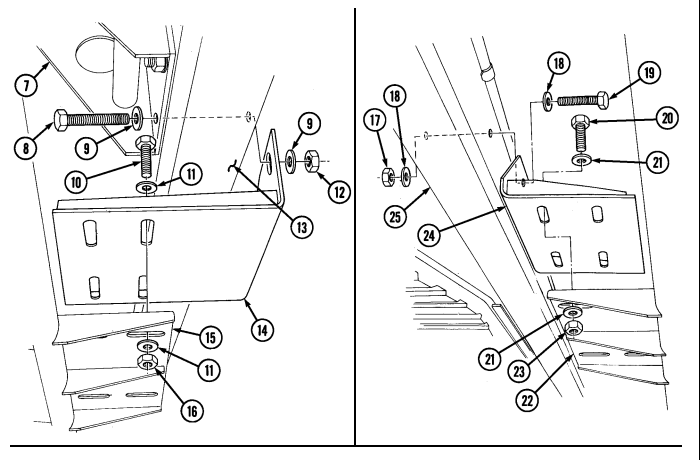

# Chapter 12 Special Purpose Kits Maintenance Section I. Deep Water Fording Kit Maintenance

## 1 2 - 1 . Deep Water Fording Kit Maintenance Task Summary

| General mechanic's tool kit:                                                               | automotive (Appendix B, Item 1)                        |
|--------------------------------------------------------------------------------------------|--------------------------------------------------------|
| 1. Remove three pins (3) and extension bar (1) from ambulance.                             | 2. Remove two links (7) from extension bar (1).        |
| b. Disassembly                                                                             |                                                        |
| 1. Remove six ferrules (2) and three cables (4) from extension bar (1) and three pins (3). | 2. Disconnect two cable assemblies (6) from links (7). |
| 3. Disconnect two snap hooks (5) from cable assemblies (6).                                |                                                        |
| c. Assembly                                                                                |                                                        |
| 1. Connect two snap hooks (5) to cable assemblies (6).                                     | 2. Connect two cable assemblies (6) to links (7).      |
| 3. Install six ferrules (2) and three cables (4) on extension bar (1) and three pins (3).  |                                                        |

# 12-2. Deep Water Fording Kit Exhaust Assembly Maintenance

This task covers:
a. Removal c. Installation b. Inspection INITIAL SETUP:
Applicable Models All models except M966, M966A1, M1025, M1025A1, M1025A2, M1026, M1026A1 Tools General mechanic's tool kit:
automotive (Appendix B, Item 1)
Manual References TM 9-2320-280-10 TM 9-2320-280-24P
General Safety Instructions Do not touch hot exhaust system components with bare hands.

Materials/Parts Gasket (Appendix G, Item 42) Five locknuts (Appendix G, Item 128) Locknut (Appendix G, Item 79)

### Warning

Do not touch hot exhaust system components with bare hands. Severe injury will result.

a. Removal 1. Remove three locknuts (1), washers (2), capscrews (10), washers (2), exhaust assembly (9), and gasket (11) from muffler (3). Discard locknuts (1) and gasket (11).

2. Remove two locknuts (4), washers (5), exhaust assembly (9), and two spacers (8) from wheel house (7). Discard locknuts (4).

Perform steps 3 through 5 for M997, M997A1, and M997A2 models only.

3. Remove two bolts (18), washers (16), and exhaust extension (17) from upper body (25). 4. Remove locknut (19), washer (20), noise damper (21), exhaust reinforcement bracket (24), 
isolator (22), noise damper (23), and bolt (13) from exhaust extension (17). Discard locknut (19).

5. Remove two isolators (15) and spacers (14) from bracket (24).

b. Inspection 1. Inspect two insulators (6) for breaks, cracks, or deterioration. Replace if damaged.

NOTE
Perform step 2 for M997, M997A1, and M997A2 models only.

2. Inspect two rivnuts (12) for thread damage or deterioration. Replace if damaged.

# 12-2. Deep Water Fording Kit Exhaust Assembly Maintenance (Cont'D)

c. Installation

Perform steps 1 through 3 for M997, M997A1, and M997A2 models only.

1.

2.

3.

4.

5.

Install two spacers (14) and isolators (15) on bracket (24). Install bolt (13), bracket (24), isolator (22), and noise damper (23) on exhaust extension (17) with noise damper (21), washer (20), and locknut (19). Tighten locknut (19) to 17 lb-ft (23 N=m).

Install exhaust extension (17) on upper body (25) with two washers (16) and bolts (18).

Install two spacers (8) and exhaust assembly (9) on wheelhouse (7) with two washers (5) and locknuts (4). Tighten locknuts (4) to 37 lb-ft (50 N*m).

Install exhaust assembly (9) and gasket (11) on muffler (3) with three washers (2), capscrews (10),
washers (2), and locknuts (1). Tighten locknuts (1) to 26 lb-ft (35 N.m).

FOLLOW-ON TASK: Start engine (TM 9-2320-280-10) and check for exhaust leaks.

# 12-3. Deep Water Fording Kit Air Intake Assembly Replacement

This task covers:
INITIAL SETUP:

### Applicable Models

All models except M966, M966A1, M1025, M1025A1, M1025A2, M1026, M1026A1 Tools General mechanic's tool kit:
automotive (Appendix B, Item 1)

### Materials/Parts

Locknut (Appendix G, Item 105)
a. Removal b. Installation Manual References TM 9-2320-280-24P
Equipment Condition
- Weathercap removed (para. 3-18). - Fuel tank vent stack tube removed (para. 12-8).

1. Remove locknut (5), washer (3), capscrew (2), and washer (3) from air intake assembly (1) and windshield mounting bracket (4). Discard locknut (5).

2. Loosen clamp (6) and remove air intake assembly (1) from air cleaner extension elbow (7).

b. Installation 1. Install air intake assembly (1) into air cleaner extension elbow (7) with clamp (6). Tighten clamp (6)
to 45-50 lb-in. (5-6 N•m).

2. Install air intake assembly (1) on windshield mounting bracket (4) with washer (3), capscrew (2),
washer (3), and locknut (5). Tighten capscrew (2) to 43 lb-ft (58 N•m).

FOLLOW-ON-TASKS: - Install weather cap (para. 3-18).

- Install fuel tank vent stack tube (para. 12-8).

# 12-4. Air Cleaner Extension Elbow Maintenance

This task covers:
a. Removal c. Installation b. Inspection INITIAL SETUP:
Applicable Models **Manual References**
All models except M966, M966A1, M1025, TM 9-2320-280-24P
M1025A1, M1025A2, M1026, M1026A1 Tools General mechanic's tool kit automotive (Appendix B, Item 1)
Equipment Condition Deep water fording kit removed (para. 12-3).

1. Loosen clamp (3) and disconnect air horn-to-air cleaner elbow (4) from air cleaner assembly (6).

2. Disconnect air cleaner-to-selector valve vent line (2) from air cleaner assembly (6). 3. Disconnect air restriction gauge hose (5) from air cleaner assembly (6). 4. Loosen two outer clamps (7) from air cleaner assembly (6) and support brackets (11). 5. Remove air cleaner assembly (6), gasket (8), and air cleaner extension elbow (10) from air induction box (1).

6. Loosen clamp (9) and remove air cleaner extension elbow (10) from air cleaner assembly (6).

### 12-4. Air Cleaner Extension Elbow Maintenance (Cont'D)

b. Inspection Inspect gasket (8) for breaks or cracks. Replace if broken or cracked.

1. Install air cleaner extension elbow (10) on air cleaner assembly (6). Tighten clamp (9) to 45-50 lb-in.

(5-6 N.m).

2. Install air cleaner extension elbow (10) on air induction box (1),
3. Install air cleaner assembly (6) on support brackets (11) with two outer clamps (7). Tighten clamps (7) to 35-40 lb-in. (4-5 N.m).

4. Connect air restriction gauge hose (5) to air cleaner assembly (6). 5. Connect air cleaner-to-selector valve vent line (2) to air cleaner assembly (6).

6. Connect air horn-to-air cleaner elbow (4) to air cleaner assembly (6). Tighten clamp (3) to 45-50 lb-

in. (5-6 N=m).

FOLLOW-ON TASK: Install air intake assembly (para. 12-3).

# 1 2 - 5 . Windshield Mounting Bracket Replacement

This task covers:
INITIAL SETUP:
Applicable Models All models except M966, M966A1, M1025, M1025A1, M1025A2, M1026, M1026A1, M1121 Tools General mechanic's tool kit:
automotive (Appendix B, Item 1)

a. Removal **b. Installation**

| Manual References   |
|---------------------|
| TM 9\-2320\-280\-2  |

Equipment Condition Deep water fording kit removed (para. 12-3).

a. Removal Remove two capscrews (1), washers (2), and windshield mounting bracket (3) from windshield (4). 

b. Installation Install windshield mounting bracket (3) on windshield (4) with two washers (2) and capscrews (1).

 Tighten capscrews (1) to 6 lb-ft (8 N•m).

FOLLOW-ON TASK: Install air intake assembly (para. 12-3).

## 1 2 - 6 . Air Cleaner Dust Cap Maintenance

This task covers:
a. Removal **c. Installation** b. Inspection

### Initial Setup:

Applicable Models All models except M966, M966A1, M1025, M1025A1, M1025A2, M1026, M1026A1, M1121 Tools General mechanic's tool kit:
automotive (Appendix B, Item 1)
a. Removal 1. Remove four screws (5) and dust unloader cover plate (4) from air cleaner bracket (6). 2. Remove clamp (2) and air cleaner dust cap (3) from air cleaner assembly (1).

b. Inspection Inspect air cleaner dust cap (3) for cuts, tears, obstructions, or enlarged gap. Replace if cut, torn, worn, missing, or if center opening exceeds 0.125 in. (3.18 mm).

c. Installation 1. Install dust cap (3) on air cleaner assembly (1) with clamp (2). Tighten clamp (2) to 45-50 lb-in.

(5-6 N•m).

2. Install dust unloader cover plate (4) on air cleaner bracket (6) with four screws (5).

FOLLOW-ON TASK: Lower and secure hood (TM 9-2320-280-10).

Manual References TM 9-2320-280-10 TM 9-2320-280-24P
Equipment Condition Hood raised and secured (TM 9-2320-280-10).

# 12-7. Air Cleaner To Selector Valve Vent Line Replacement

This task covers:
INITIAL SETUP:

### Applicable Models

All models except M966, M966A1, M1025, M1025A1, M1025A2, M1026, M1026A1 Tools General mechanic's tool kit:
automotive (Appendix B, Item 1)
Materials/Parts Three tiedown straps (Appendix G, Item 314)
a. Removal b. Installation Manual References TM 9-2320-280-10 TM 9-2320-280-24P
Equipment Condition Hood raised and secured (TM 9-2320-280-10).

a. Removal 1. Disconnect air cleaner-to-selector valve vent line (2) from air cleaner assembly fitting (1). 2. Remove three tiedown straps (3) and vent line (2) from existing hoses (4) on "A" beam (5). 

Discard tiedown straps (3).

3. Remove air cleaner-to-selector valve vent line (2) from selector valve (6). 

b. Installation 1. Connect air cleaner-to-selector valve vent line (2) to selector valve (6). 2. Route vent line (2) along "A" beam (5) and secure to existing hoses (4) with three tiedown straps (3).

 3. Connect air cleaner-to-selector vent line (2) to air cleaner assembly fitting (1).

FOLLOW-ON TASK: Lower and secure hood (TM 9-2320-280-10).

# 12-8. Fuel Tank Vent Stack Tube Replacement

This task covers:
INITIAL SETUP:
Applicable Models All models except M966, M966A1, M1025, M1025A1, M1025A2, M1026, M1026A1, M1097, M1097A1, M1097A2 Tools General mechanic's tool kit:
automotive (Appendix B, Item 1)
Materials/Parts Two lockwashers (Appendix G, Item 183)
a. Removal b. Installation Manual References TM 9-2320-280-10 TM 9-2320-280-24P
Equipment Condition Hood raised and secured (TM 9-2320-280-10).

a. Removal 1. Disconnect fuel tank vent line (8) from fuel tank vent stack tube (2). 2. Remove nut (10), lockwasher (9), screw (7), and clamp (6) from fuel tank vent stack tube (2) and air intake assembly (1). Discard lockwasher (9).

3. Remove screw (5), lockwasher (4), fuel tank vent stack tube (2), and clamp (3) from air intake assembly (1). Discard lockwasher (4).

b. Installation 1. Install fuel tank vent stack tube (2) and clamp (3) on air intake assembly (1) with lockwasher (4)
and screw (5).

2. Install fuel tank vent stack tube (2) and clamp (6) on air intake assembly (1) with lockwasher (9),
screw (7), and nut (10).

3. Connect vent line (8) to vent stack tube (2).

FOLLOW-ON TASK: Lower and secure hood (TM 9-2320-280-10).

# 12-9. Selector Valve Replacement

This task covers:
INITIAL SETUP:

### Applicable Models

All models except M966, M966A1, M1025, M1025A1, M1025A2, M1026, M1026A1, M1097, M1097A1, M1097A2 Tools General mechanic's tool kit:
automotive (Appendix B, Item 1)
Materials/Parts Two locknuts (Appendix G, Item 70)
a. Removal b. Installation Manual References TM 9-2320-280-10 TM 9-2320-280-24P
Equipment Condition
- Hood raised and secured (TM 9-2320-280-10). - Engine access cover removed (para. 10-15).

1. Remove screw (1) and selector control (2) from selector valve (4). 2. Remove two locknuts (9), washers (13), capscrews (14), and washers (13) from selector valve (4) and body (3). Discard locknuts (9).

Prior to removal, tag vent lines for installation.

3. Disconnect air cleaner-to-selector valve vent line (6) from elbow (5). 4. Disconnect selector valve-to-union tee vent line (8) from connector (7). 5. Loosen clamp (11) and disconnect CDR valve vent line (10) from elbow (12).

## 12-9. Selector Valve Replacement (Cont'D)

3. Connect selector valve-to-union tee vent line (8) to connector (7).

4. Connect air cleaner-to-selector valve vent line (6) to elbow (5).

1. Install elbow (12), connector (7), and elbow (5) on selector valve (4).

2. Connect CDR valve vent line (10) to selector elbow (12) with clamp (11).

5. Install selector valve (4) on body (3) with two washers (13), capscrews (14), washers (13), and

locknuts (9). Tighten locknuts (9) to 10 lb-ft (14 N.m).

6. Install selector control (2) on selector valve (4) with screw (1).

FOLLOW-ON TASKS: - Install engine access cover (para. 10-15).

. Lower and secure hood (TM 9-2320-280-10).

# 12-10. Cdr Valve Vent Line Replacement

This task covers:
INITIAL SETUP:

### Applicable Models

All models except M966, M966A1, M1025, M1025A1, M1025A2, M1026, M1026A1, M1097, M1097A1, M1097A2 Tools General mechanic's tool kit:
automotive (Appendix B, Item 1)
Materials/Parts Two tiedown straps (Appendix G, Item 314)
a. Removal b. Installation Manual References TM 9-2320-280-10 TM 9-2320-280-24P
Equipment Condition Hood raised and secured (TM 9-2320-280-10).

1. Loosen clamp (2) and disconnect CDR valve vent line (3) from CDR valve (1). 2. Remove two tiedown straps (5) from vent line (3) and existing hoses (6) on "A" beam (4). 

Discard tiedown straps (5).

3. Loosen clamp (2) and remove vent line (3) from elbow (8) on selector valve (7). 4. Remove clamps (2) from vent line (3).

b. Installation 1. Install clamps (2) on vent line (3). 2. Connect vent line (3) to elbow (8) on selector valve (7) with clamp (2). 3. Install vent line (3) along "A" beam (4) on existing hoses (6) with two tiedown straps (5). 4. Connect vent line (3) to CDR valve (1) with clamp (2).

FOLLOW-ON TASK: Lower and secure hood (TM 9-2320-280-10).

# 12-11. Hydro-Boost Vent Line Replacement

This task covers:
INITIAL SETUP:
Applicable Models All models except M966, M966A1, M1025, M1025A1, M1025A2, M1026, M1026A1, M1097, M1097A1, M1097A2 Tools General mechanic's tool kit:
automotive (Appendix B, Item 1)
Materials/Parts Locknut (Appendix G, Item 70) Plain-assembled nut
(Appendix G, Item 201)

### A. Removal B. Installation

Manual References TM 9-2320-280-24P
Equipment Condition Engine left splash shield removed (para. 10-17).

a. Removal 1. Disconnect hydro-boost vent line (2) from hydro-boost (1).

2. Remove plain-assembled nut (3), capscrew (10), clamp (4), harness clamp (9), and vent line (2) from body (11). Discard plain-assembled nut (3).

3. Remove locknut (6), washer (7), capscrew (8), washer (7), clamp (5), and vent line (2) from body (11).

Discard locknut (6).

4. Remove two clamps (4) and (5) from vent line (2).

1. Install two clamps (4) and (5) on vent line (2). 2. Install vent line (2) and clamp (5) on body (11) with washer (7), capscrew (8), washer (7), and locknut (6). Tighten capscrew (8) to 6 lb-ft (8 N•m).

3. Install vent line (2), harness clamp (9), and clamp (4) on body (11) with capscrew (10) and plainassembled nut (3).

4. Connect vent line (2) to hydro-boost (1).

FOLLOW-ON TASK: Install engine left splash shield (para. 10-17).

12-14 Change 2

# 12-12. Deep Water Fording Sensor Cup Replacement

This task covers:
INITIAL SETUP:

### Applicable Models

All models except M966, M966A1, M1025, M1025A1, M1025A2, M1026, M1026A1 Tools General mechanic's tool kit:
automotive (Appendix B, Item 1)
Materials/Parts Two locknuts (Appendix G, Item 70)
a. Removal b. Installation Manual References TM 9-2320-280-24P
Equipment Condition Engine access cover removed (para. 10-15).

a. Removal 1. Loosen clamp (3) and disconnect sensor cup vent line (2) from sensor cup (4). 2. Remove two locknuts (1), washers (6), capscrews (5), washers (6), and sensor cup (4) from body (7). Discard locknuts (1).

b. Installation 1. Install sensor cup (4) on body (7) with two washers (6), capscrews (5), washers (6), and locknuts (1).

Tighten locknuts (1) to 6 lb-ft (8 N•m).

2. Connect sensor cup vent line (2) to sensor cup (4) with clamp (3).

FOLLOW-ON TASK: Install engine access cover (para. 10-15).

## 12-13. Sensor Cup Vent Line Replacement

This task covers:
INITIAL SETUP:
Manual References TM 9-2320-280-10 TM 9-2320-20-24P
1. Loosen clamp (3) and disconnect sensor cup vent line (1) from CDR valve (2). 2. Loosen clamp (6) and remove vent line (1) from sensor cup (5). 3. Remove two clamps (3) and (6) from vent line (1).

1. Install two clamps (3) and (6) on vent line (1).

2. Route vent line (1) through "A" beam (4). 3. Connect vent line (1) to sensor cup (5) with clamp (6).

 4. Connect vent line (1) to CDR valve (2) with clamp (3).

FOLLOW-ON TASKS: . Install engine access cover (para. 10-15).

. Lower and secure hood (TM 9-2320-280-10).

Tools **Equipment Condition**
General mechanic's tol kit: - Hood raised and secured (TM 9-2320-280-10).

automotive (Appendix B, Item 1) - Egine access cover removed (paa. 10-15).

a. Removal b. Installation

# 12-14. Power Steering Vent Line Replacement

This task covers:
INITIAL SETUP:
Applicable Models All models except M966, M966A1, M1025, M1025A1, M1025A2, M1026, M1026A1, M1097, M1097A1, M1097A2 Tools General mechanic's tool kit:
automotive (Appendix B, Item 1)
a. Removal b. Installation Manual References TM 9-2320-280-10 TM 9-2320-280-24P
Equipment Condition Hood raised and secured (TM 9-2320-280-10).

a. Removal Loosen two clamps (3) and remove power steering vent line (1) from power steering pump cap (4) and tee fitting (2). 

b. Installation Connect vent line (1) to power steering cap (4) and tee fitting (2) with two clamps (3).

FOLLOW-ON TASK: Lower and secure hood (TM 9-2320-280-10).
# 12-15. Exhaust Reinforcement Bracket Replacement

This task covers:
INITIAL SETUP:
Tools General mechanic's tool kit:
automotive (Appendix B, Item 1)

a. Removal b. Installation

| Manual References    |
|----------------------|
| TM 9\-2320\-280\-24P |

| Equipment Condition                           |
|-----------------------------------------------|
| Deep water fording kit removed (para. 12\-3). |

Materials/Parts Eight locknuts (Appendix G, Item 70)
a. Removal 1. Remove two isolators (4) from wheelhouse (3) and reinforcement bracket (5). 2. Remove eight locknuts (6), washers (1), capscrews (2), washers (1), and reinforcement bracket (5)
from wheelhouse (3). Discard locknuts (6).

b. Installation 1. Install reinforcement bracket (5) on wheelhouse (3) with eight washers (1), capscrews (2),
washers (1), and locknuts (6). Tighten capscrews (2) to 6 lb-ft (8 N•m).

2. Install two isolators (4) on wheelhouse (3) and reinforcement bracket (5).

FOLLOW-ON TASK: Install deep water fording kit exhaust assembly (para. 12-2).

# Section Ii. Troop Seat Kit Maintenance

## 12-16. Troop Seat Kit Maintenance Task Summary

| INITIAL SETUP:                       |                                                 |
|--------------------------------------|-------------------------------------------------|
| Tools                                | Manual References                               |
| General mechanic's tool kit:         | TM 9\-2320\-280\-24P                            |
| automotive (Appendix B, Item 1)      |                                                 |
|                                      | Equipment Condition                             |
| Materials/Parts                      | Deep water fording kit exhaust assembly removed |
| Eight locknuts (Appendix G, Item 70) | (para. 12\-2).                                  |

## 12-17. Seat Support Replacement

This task covers:

a. Removal b. Installation

INITIAL SETUP:
Applicable Models M998, M998A1, M1038, M1038A1, M1097, M1097A1, M1097A2 Tools

| Materials/Parts                         |
|-----------------------------------------|
| Three cotter pins (Appendix G, Item 19) |
| Manual References                       |
| TM 9\-2320\-280\-24P                    |

General mechanic's tool kit:
automotive (Appendix B, Item 1)
a. Removal 1. Remove two lockpins (1) from troop seat (2). 2. Lower seat support (4). 3. Remove three cotter pins (6), clevis pins (5), and seat support (4) from back support (3). Discard cotter pins (6).

b. Installation 1. Install seat support (4) on back support (3) with three clevis pins (5) and cotter pins (6). 2. Raise seat support (4) and install two lockpins (1) on troop seat (2).

# 12-18. Troop Seat Kit Replacement

This task covers:
INITIAL SETUP:
Applicable Models M998, M998A1, M1038, M1038A1, M1097, M1097A1, M1097A2 Tools General mechanic's tool kit:
automotive (Appendix B, Item 1)

### Materials/Parts

Nine locknuts (Appendix G, Item 70) Two locknuts (Appendix G, Item 71) Three locknuts (Appendix G, Item 86)

a. Removal b. Installation

| Personnel Required   |
|----------------------|
| One mechanic         |
| One assistant        |

Manual References TM 9-2320-280-24P

1. Remove three locknuts (16), washers (2), capscrews (3), washers (2), and rear angle bracket (18) from wheelhouse (1). Discard locknuts (16).

2. Remove two locknuts (13), washers (14), capscrews (17), washers (14), and rear bracket retainer plate (15) from wheelhouse (1). Discard locknuts (13).

3. Remove two nuts (9), washers (7), capscrews (8), washers (7), and support bracket (6) 
from wheelhouse (1).

4. Remove six locknuts (12), washers (5), capscrews (4), washers (5), three reinforcement plates (11), and main channel (10) from wheelhouse (1). Discard locknuts (12).

5. Remove troop seat (19). 6. Remove three locknuts (22), washers (21), capscrews (24), and channel support (23) from
"B" pillar (20). Discard locknuts (22).

1. Install channel support (23) on "B" pillar (20) with three capscrews (24), washers (21), and locknuts (22). Tighten locknuts (22) to 15 lb-ft (20 N•m).

2. Install troop seat (19) on wheelhouse (1). 3. Install main channel (10) and three reinforcement plates (11) on wheelhouse (1) with six washers (5),
capscrews (4), washers (5), and locknuts (12). Tighten capscrews (4) to 15 lb-ft (20 N•m).

4. Install support bracket (6) on wheelhouse (1) with two washers (7), capscrews (8), washers (7), and nuts (9). Tighten nuts (9) to 43 lb-ft (58 N•m).

5. Install rear bracket retainer plate (15) on wheelhouse (1) with two washers (14), capscrews (17),
washers (14), and locknuts (13). Tighten locknuts (13) to 6 lb-ft (8 N•m).

6. Install rear angle bracket (18) on wheelhouse (1) with three washers (2), capscrews (3), washers (2),
and locknuts (16). Tighten locknuts (16) to 6 lb-ft (8 N•m).

12-18. TROOP SEAT KIT REPLACEMENT (Cont'd)
8

(15

## 12-19. Troop Seat Board Replacement

This task covers:
INITIAL SETUP:
Applicable Models M998, M998A1, M1038, M1038A1, M1097, M1097A1, M1097A2 Tools General mechanic's tool kit:
automotive (Appendix B, Item 1)

a. Removal b. Installation

| Materials/Parts   |
|-------------------|

Three plain-assembled nuts
(Appendix G, Item 205)
Manual References TM 9-2320-280-24P

The procedure for replacing seat boards and back boards is basically the same. This procedure covers seat boards.

a. Removal Remove three carriage bolts (1), plain-assembled nuts (3), and seat board (2) from channel assembly (4). Discard plain-assembled nuts (3).

b. Installation Install seat board (2) on channel assembly (4) with three carriage bolts (1) and plain-assembled nuts (3).

# Section Iii. 100 Ampere Alt E R N Ator Kit Maintenance

## 1 2 - 2 0 . 100 Ampere Alt E R N Ator Maintenance Task Summary

| INITIAL SETUP:                                             |                             |
|------------------------------------------------------------|-----------------------------|
| Applicable Models                                          | Materials/Parts             |
| M998, M998A1, M1038, M1038A1, M1097,                       | Three plain\-assembled nuts |
| M1097A1, M1097A2                                           | (Appendix G, Item 205)      |
| Tools                                                      | Manual References           |
| General mechanic's tool kit:                               | TM 9\-2320\-280\-24P        |
| automotive (Appendix B, Item 1)                            |                             |
|                                                            | NOTE                        |
| The procedure for replacing seat boards and back boards is |                             |

# 12-21. 100 Ampere Regulator (R027096300) Replacement

This task covers:

a. Removal b. Installation

| INITIAL SETUP:   |
|------------------|

Applicable Models All models except M996, M996A1, M1026, M1026A1, M1097, M1097A1, M1097A2, M1123 Tools General mechanic's tool kit:
automotive (Appendix B, Item 1)

### Materials/Parts

Antiseize compound (Appendix C, Item 13) Adhesive sealant (Appendix C, Item 9) Silicone (Appendix C, Item 48) Six lockwashers (Appendix G, Item 184) Two lockwashers (Appendix G, Item 142) Lockwasher (Appendix G, Item 134)
Manual References TM 9-2320-280-10 TM 9-2320-280-24P

### Equipment Condition

- Battery ground cable disconnected (para. 4-73). - Hood raised and secured (TM 9-2320-280-10).

- Prior to removal, tag leads for installation. - Older model regulators have two screws securing regulator cover and terminals are sealed with sealant. Newer model regulators have four screws securing regulator cover and no sealant. Identify which type is on vehicle and follow particular model steps as noted.

a. Removal 1. Remove capscrew (11), lockwasher (10), and lead 3B (8) from regulator (9). Discard lockwasher (10).

Perform steps 2 and 3 for older model regulators and step 4 for newer models.

2. Remove two screws (3), lockwashers (2), and cover (1) from regulator (9). Discard lockwashers (2). 3. Remove sealant from cover (1), leads (4), (5), and (7), and regulator (9). 4. Remove four screws (3), lockwashers (2), cover (18), gasket (17) and sealing wedge (16) from regulator (9) and leads (4), (5), and (7). Discard lockwashers (2).

5. Remove nut (13), lockwasher (12), and lead 5A (4) from regulator (9). Discard lockwasher (12). 6. Remove nut (15), lockwasher (14), and lead 2A (5) from regulator (9). Discard lockwasher (14). 7. Disconnect regulator lead 568 (7) from engine harness lead 568A (6). 8. Loosen two clamp nuts (23) and remove clamp pins (22) and guard (21) from regulator slots (19). 9. Unscrew connector plug (24) and remove regulator (9) from alternator (20).

12-21. 100 AMPERE REGULATOR (R027096300) REPLACEMENT (Cont'd)

## 1 2 - 2 1 . 100 Ampere Regulator (R027096300) Replacement ( C O N T ' D )

b. Installation 1. Fill alternator receptacle (8) with silicone. Install regulator (1) on alternator (3) and tighten connector plug (9) between alternator (3) and regulator (1).

2. Ensure guard (4) is positioned in rear clamp (5). Install clamp pins (7) into regulator slots (2).

Tighten two clamp nuts (6) to 35-45 lb-in. (4-5 N•m).

### Not E

Ensure terminals are clean before connections are made.

3. Connect engine harness lead 568A (15) to regulator lead 568 (16). 4. Connect lead 2A (14) to regulator (1) with lockwasher (23) and nut (24). Tighten nut (24) to 20 lb-in.

(2.3 N•m).

5. Connect lead 5A (13) to regulator (1) with lockwasher (21) and nut (22). Tighten nut (22) to 50 lb-in.

(5.6 N•m).

### Not E

Perform steps 6 and 7 for older model regulators, and steps 8 and 9 for newer model regulators.

6. Completely fill regulator cavity (18) with sealant to form a water tight seal. Sealant should extrude from side of cover (10) when installed.

7. Install cover (10) to regulator (1) and secure with two lockwashers (11) and screws (12). 8. Insert leads (13), (14), and (17) into sealing wedge (29) and install sealing wedge (29) in regulator cavity (18).

9. Install gasket (25) and cover (26) on regulator (1) with four lockwashers (28) and screws (27).

10. Apply antiseize compound to contact surface of lead 3B (17). Install lead 3B (17) on regulator (1) 
with lockwasher (19) and capscrew (20). Tighten capscrew (20) to 90 lb-in. (10 N•m).

12-21. 100 AMPERE REGULATOR (R027096300) REPLACEMENT (Cont'd)

- Connect battery ground cable (para. 4-73).
Ž Start engine (TM 9-2320-280-10) and observe voltmeter for proper reading.

# 12-22. 100 Ampere Regulator (12342944, N3106) Replacement

This task covers:
INITIAL SETUP:
Applicable Models All models except M996, M996A1, M1026, M1026A1, M1097, M1097A1, M1097A2, M1123

### Tools

General mechanic's tool kit:
automotive (Appendix B, Item 1)

### Materials/Parts

Sealing compound (Appendix C, Item 45) Three lockwashers (Appendix G, Item 138)
a. Removal Manual References TM 9-2320-280-10 TM 9-2320-280-24P
Equipment Condition
- Battery ground cables disconnected (para. 4-73). - Hood raised and secured (TM 9-2320-280-10).

Prior to removal, tag leads for installation.

1. Disconnect regulator plug (1) from voltage regulator (4). 2. Slide back rubber boot (21) and remove nut (22), lead 5A (23), and washer (24) from red (energize)
terminal (25).

3. Slide back rubber boot (18) and remove nut (17), lead 2A (16), and washer (15) from yellow (AC)
terminal (14).

Perform steps 4 and 5 for M1025A2, M1035A2, M1043A2, and M1045A2 vehicles only.

4. Slide back rubber boot (12) and remove nut (11), lead (10), and washer (9) from terminal (8). 5. Disconnect regulator connector (20) from alternator connector (19). 6. Remove two screws (5), lockwashers (6), and washers (7) securing voltage regulator (4) to alternator (13). Discard lockwashers (6).

7. Remove capscrew (3), lockwasher (2), and voltage regulator (4) from alternator (13). Discard lockwasher (2).

1. Apply sealing compound to threads of capscrew (3). 2. Install voltage regulator (4) on alternator (13) with lockwasher (2) and capscrew (3). Tighten capscrew (3) to 88-94 lb-in. (10-11 N•m).

3. Install two washers (7), lockwashers (6), and screws (5) on voltage regulator (4) and alternator (13).

Tighten screws (5) to 30-34 lb-in. (3-4 N•m).

Perform steps 4 and 5 for M1025A2, M1035A2, M1043A2, and M1045A2 vehicles only.

4. Install washer (9), lead (10), and nut (11) on terminal (8). Tighten nut (11) to 18-22 lb-in. 

(2.0-2.5 N•m). Slide rubber boot (12) over terminal (8).

5. Connect regulator connector (20) to alternator connector (19). 6. Install washer (24), lead 5A (23), and nut (22) on red (energize) terminal (25). Tighten nut (22) to 23-27 lb-in. (2.6-3.0 N•m). Slide rubber boot (21) over terminal (25).

### A. Removal B. Installation

12-22.  100 AMPERE REGULATOR (12342944, N3106) REPLACEMENT (Gnt'd)
7.

Install washer (15), lead 2A (16), and nut (17) on yellow (AC) terminal (14). Tighten nut (17) to 18-22 lb-in. (2.0-2.5 N.m). Slide rubber boot (18) over terminal (14).

8.

Connect regulator plug (1) to voltage regulator (4).

FOLLOW-ON TASKS: - Lower and secure hood (TM 9-2320-280-10).

- Connect battery ground cables (para. 4-73).

# 12-22.1. 100 Ampere Alternator Cable (12446821-2) Replacement

This task covers:
INITIAL SETUP:
Applicable Models All models except M996, M996A1, M1026, M1026A1, M1097, M1097A1, M1097A2, M1123 Tools General mechanic's tool kit:
automotive (Appendix B, Item 1)
Materials/Parts Lockwasher (Appendix G, Item 150) Adhesive sealant (Appendix C, Item 9)
a. Removal

### A. Removal B. Installation

Manual References TM 9-2320-280-10 TM 9-2320-280-24P

### Equipment Condition

- Battery ground cables disconnected (para. 4-73). - Hood raised and secured (TM 9-2320-280-10). - Engine access cover removed (para. 10-15).

1. Slide back rubber boot (1) and remove nut (3), washer (5), fuse (2), insulator (6), cable (7), and bushing (8) from positive stud (9). 

2. Remove capscrew (11), clamp (12), and cable (7) from bracket (10). 3. Remove nut (17), lockwasher (16), washer (15), and cable (7) from buss bar (14). Discard lockwasher (16).

4. Remove cable (7) through grommet (18) and from battery box (13).

b. Installation

Ensure terminals are clean before connections are made.

1. Route cable (7) through grommet (18) on battery box (13), and install cable (7) on buss bar (14) with washer (15), lockwasher (16), and nut (17).

2. Route cable (7) in approximate mounting location over heat shield, and secure cable (7) and clamp (12) on bracket (10) with capscrew (11).

3. Apply sealant to positive stud (9) and cable (7) so all exposed metallic surfaces are coated. 4. Install bushing (8), cable (7), fuse (2), and insulator (6) on positive stud (9) with washer (5) and nut (3). Tighten nut (3) to 10-15 lb-ft (14-20 N•m). Slide rubber boot (1) over nut (3).

# 12-22.1.  100 Ampere Alternator Cable (12446821-2) Replacement (Cont'D)

- Lower and secure hood (TM 9-2320-280-10). · Connect battery ground cables (para. 4-73).

- Start engine and check operation of voltmeter gauge (TM 9-2320-280-10).

# 12-23. 100 Ampere Alternator (12340912) Replacement

This task covers:

| INITIAL SETUP:   |
|------------------|

| M1123   |
|---------|

Tools General mechanic's tool kit:
automotive (Appendix B, Item 1)
Silicone (Appendix C, Item 48) Two lockwashers (Appendix G, Item 188) Lockwasher (Appendix G, Item 133)
Personnel Required One mechanic One assistant

a. Removal b. Installation

| Manual References                                | TM 9\-2320\-280\-10                                |
|--------------------------------------------------|----------------------------------------------------|
| TM 9\-2320\-280\-24P                             |                                                    |
| Equipment Condition                              | - Battery ground cable disconnected (para. 4\-73). |
| - Hood raised and secured (TM 9\-2320\-280\-10). |                                                    |

1. Loosen two clamp nuts (12) and remove clamp pins (7) from regulator slots (6). 2. Loosen connector plug (4) and remove regulator (5) from alternator (13) and position regulator (5) out of the way.

3. Loosen capscrew (20) on alternator adjusting bracket (19), and two capscrews (10) on alternator mounting bracket (18) and support bracket (17).

4. Remove two drivebelts (1) from alternator pulley (2).

### Warning

Alternator must be supported during removal and installation. Failure to do this may cause injury to personnel or damage to equipment.

5. Remove capscrew (14), lockwasher (15), and washer (16) from alternator (13) and adjusting bracket (19). Discard lockwasher (15).

NOTE
- Perform step 7 for vehicles with new alternator support bracket configuration.

- In some cases, a thru-bolt and nut may be present on mounting bracket instead of standard capscrews and washers.

6. Remove two capscrews (10), lockwashers (11), and alternator (13) from mounting bracket (18) and support bracket (17). Discard lockwashers (11).

7. Remove two capscrews (10), lockwashers (11), washer (22), spacer (24), and alternator (13) from power steering lines bracket (23), support bracket (17), and mounting bracket (18). Discard lockwashers (11).

8. Remove guard (9) and two clamp straps (8) from alternator (13). 9. Remove alternator pulley (2) (para. 4-3).

1. Install alternator pulley (2) (para. 4-3). 2. Install two clamp straps (8) and guard (9) on alternator (13).

NOTE
- Perform step 4 for vehicles with new alternator support bracket configuration.

- In some cases, a thru-bolt and nut may be present on mounting bracket instead of standard capscrews and washers.

3. Install alternator (13) on mounting bracket (18) and support bracket (17) with two lockwashers (11)
and capscrews (10). Tighten capscrews (10) finger tight.

# 12-23. 100 Ampere Alternator (12340912) Replacement (Cont'D)

4.

Position alternator (13) on mounting bracket (18) (with support bracket (17) and power steering lines bracket (23) on the outside of alternator mounting flange (21)) and install spacer (24),
washer (22), two lockwashers (11), and capscrews (10).

5.

6.

Align alternator (13) with hole in adjusting bracket (19), and install washer (16), lockwasher (15),
and capscrew (14). Tighten capscrew (14) finger tight. Install two drivebelts (1) on alternator pulley (2). Fill alternator receptacle (3) with silicone.

Install regulator (5) on alternator (13) and secure connector plug (4) between alternator (13) and regulator (5).

Ensure guard (9) is positioned in rear clamp (8). Install clamp pins (7) into regulator slots (6).

7. 8.

9.

Ž Connect battery ground cable (para. 4-73).

# 12-24. 100 Ampere Alternator (12342944) Replacement

This task covers:
INITIAL SETUP:

### Applicable Models

All models except M996, M996A1, M1026, M1026A1, M1097, M1097A1, M1097A2, M1123 Tools General mechanic's tool kit:
automotive (Appendix B, Item 1)
Breaker bar, 3/8 in. (Appendix B, Item 2)
Materials/Parts Lockwasher (Appendix G, Item 133) Lockwasher (Appendix G, Item 186) Lockwasher (Appendix G, Item 187) Two lockwashers (Appendix G, Item 188)

### A. Removal B. Installation

Personnel Required One mechanic One assistant Manual References TM 9-2320-280-10 TM 9-2320-280-24P
Equipment Condition - Battery ground cable removed (para. 4-73). - Hood raised and secured (TM 9-2320-280-10). - Voltage regulator removed (para. 12-22). General Safety Instructions Alternator must be supported during removal and installation.

a. Removal

Prior to removal, tag leads for installation.

1. Slide back rubber boot (4) and remove capscrew (1), lockwasher (2), washer (3), and ground cable (5) from alternator (6). Discard lockwasher (2).

2. Slide back rubber boot (18) and remove nut (21), lockwasher (20), washer (19), alternator positive cable (17), nut (16.2), and washer (16.1) from positive stud (16). Discard lockwasher (20).

- Perform steps 3 and 4 for 6.2 L engine only. - Perform step 5 for 6.5 L engine only. - In some cases, a thru-bolt and nut may be present on mounting bracket instead of standard capscrews and washers.

3. Loosen capscrews (11) and (13) on alternator adjusting bracket (8) and two capscrews (23) from alternator (6), alternator mounting bracket (25), and support bracket (24).

All "A2" models except the M997A2 are equipped with serpentine belts.

4. Remove two drivebelts (7) from alternator pulley (14). 5. Position 3/8-inch breaker bar on belt tensioner (22), move tensioner (22) clockwise, and remove drivebelt (7) from alternator pulley (14).

### Warning

Alternator must be supported during removal and installation. Failure to support alternator may cause injury to personnel or damage to equipment.

6. Remove capscrew (11), lockwasher (10), and washer (9) from alternator (6) and adjusting bracket (8). Discard lockwasher (10).

12-24.  100 AMPERE ALTERNATOR (12342944) REPLACEMENT (Gnt'd)

## 1 2 - 2 4 . 100 Ampere Alt E R N Ator (12342944) Replacement (Co N T ' D )

7. Remove capscrew (13), washer (12), and alternator adjusting bracket (8) from alternator mounting bracket (25).

8. Remove two capscrews (4), lockwashers (5), washers (6), and spacer (10) from alternator (12), power steering lines bracket (7), support bracket (8), and alternator mounting bracket (11). Discard lockwashers (5).

9. Remove alternator (12).

1 0 . Remove three capscrews (1), washers (2), bushings (13), and fan guard assembly (3) from alternator (12). 11 . Remove alternator pulley (25) (para. 4-3).

1. Install alternator pulley (25) (para. 4-3). 2 . Install fan guard assembly (3) on alternator (12) with three bushings (13), washers (2), and capscrews (1).

### Not E

In some cases, a thru-bolt and nut may be present on mounting bracket instead of standard capscrews and washers.

3. Position alternator (12) on alternator mounting bracket (11) (with support bracket (8) and power steering lines bracket (7) on the outside of alternator mounting flange (9) and install spacer (10), two washers (6), lockwashers (5), and capscrews (4).

4. Install alternator adjusting bracket (19) on alternator mounting bracket (11) with washer (20),
lockwasher (21), and capscrew (22).

### Not E

Perform step 4.1 for 6.2L only.

4.1. Tighten capscrew (22) to 40 lb-ft (54 N•m).

### Not E

Perform step 5 for 6.2L only.

5. Align alternator (12) with adjusting bracket (19) and install washer (23), and capscrew (24). Do not tighten capscrew (24) on 6.2 L only. On 6.5 L tighten capscrew (24) to 40 lb-ft (54 N•m).

NOT E
Ensure terminals are clean before connections are made.

6. Install washer (26.1), nut (26.2), and positive cable (27) on positive stud (26) with washer (29),
lockwasher (30), and nut (31). Tighten nut (31) to 10-15 lb-ft (14-20 N•m).

7. Install ground cable (17) on alternator (12) with washer (15), lockwasher (14), and capscrew (32).

Tighten capscrew (32) to 8-12 lb-ft (11-16 N•m).

### Not E

- Perform step 8 for 6.2L only. - Perform step 9 for 6.5L only.

8. Install two drivebelts (18) on alternator pulley (25). 9. Position 3/8-in. breaker bar on belt tensioner (33), move tensioner (33) clockwise and install belt (18)
on alternator pulley (25).

10. Install rubber boots (16) and (28) over cables (17) and (27).

# 12-24.  100 Ampere Alternator (12342944) Replacement (Gnt'D)

FOLLOW-ON TASKS: · · Install voltage regulator (para. 12-22).

 Adjust alternator belts (para. 3-81) (Áll except "A2" vehicles).
 Battery ground cable installed (para. 4-73).

.

-   Lower and secure hood (TM 9-2320-280-10).

# 12-24.1. 100/200 Ampere Dual Voltage Alternator And Regulator Conversion

This task covers:
b. 100 Ampere Dual Voltage Alternator and **Installation**
and Regulator Installation

### Initial Setup:

Tools General mechanic's tool kit:
automotive (Appendix B, Item 1)
Materials/Parts Grease (Appendix C, Item 25) Sealant (Appendix C, Item 38) Alternator (NSN 2920-01-907-0532) Lockwasher (Appendix G, Item 134) Lockwasher (Appendix G, Item 185) Lockwasher (Appendix G, Item 186) Lockwasher (Appendix G, Item 187) Tiedown strap (Appendix G, Item 313)
a. Part Fabrication c. 200 Ampere Dual Voltage Alternator and Regulator 

### Manual References

TM 9-2320-280-10 TM 9-2320-280-24P
Equipment Condition
- Battery ground cable disconnected (para. 4-73). - Hood raised and secured (TM 9-2320-280-10). - Regulator removed (para. 12-22). - Alternator removed (para. 12-23).

This task is for single voltage vehicle systems (basic and "A1" models) only.

a. Part Fabrication Refer to appendix D, figure D-121.

### B. 100 Ampere Dual Voltage Alternator And Regulator Installation

1. Remove nut (1), washer (2), and pulley (3) from shaft (6) on alternator assembly (5). 2. Remove nut (1) and washer (2) from shaft (6) of replacement 100 ampere alternator assembly (5). 3. Install previously removed pulley (3) on woodruff key (4) and shaft (6) with washer (2) and nut (1). 4. Place alternator assembly (5) in a soft-jawed vise and tighten nut (1) to 120 lb-ft (163 N•m).

Remove alternator assembly (5) from vise.

12-24.1.  100/200 AMPERE DUAL VOLTAGE ATERNATOR AND REGULATOR

# 1 2 - 2 4 . 1 100/200 Ampere Dual Voltage Alt E R N Ator And Regulat O R Conversion (Co N T ' D )

### Not E

Do not connect electrical connections when performing step 5.

5. Install alternator assembly (para. 12-23). 6. Remove screw (3), lockwasher (2), and washer (1) from regulator (16). Discard lockwasher (2). 7. Install ground wire (6), washer (1), lockwasher (2), and screw (3) on regulator (16). Tighten screw (3)
to 88-94 lb-in. (10-11 N•m).

8. Route ground wire (6) around regulator (16) to 14-volt stud (7), remove nut (8) from stud (7), and install ground wire (6) on stud (7) with nut (8). Tighten nut (8) to 45-55 lb-ft (5-6 N•m).

9. Apply sealant to nut (8) and stud (7).

10. Remove screw (24), lockwasher (23), and washer (22) from ground point (25) on alternator assembly (17). Discard lockwasher (23).

11. Install lead 3B (5), washer (22), lockwasher (23), and screw (24) to ground point (25) on alternator assembly (17). Tighten screw (24) to 75-85 lb-in. (8-10 N•m).

12. Remove nut (21) and washer (20) from positive terminal (18) on alternator assembly (17). 13. Install red boot (19) on lead 5A (4). 14. Install lead 5A (4) on positive terminal (18) on alternator assembly (17) with washer (20) and nut (21). Tighten nut (21) to 65-70 lb-in. (7-8 N•m).

15. Apply grease to positive terminal (18) and lead 5A (4), and slide boot (19) over positive terminal (18). 16. Remove nut (13) from IGN terminal (9). 17. Install black boot (12) on lead 568A (11). 18. Install lead 568A (11) and nut (13) on IGN terminal (9). Tighten nut (13) to 23-27 lb-in. (2-3 N•m). 19. Apply grease to IGN terminal (9), lead 568A (11), and inside of boot (12), and slide boot (12) over IGN terminal (9).

20. Remove nut (14) from AC terminal (15). 21. Install black boot (12) on lead 2A (10). 22. Install lead 2A (10) and nut (14) on AC terminal (15). Tighten nut (14) to 18-22 lb-in. (2-3 N•m). 23. Apply grease to AC terminal (15), lead 2A (10), and inside of black boot (12), and slide boot (12) over AC terminal (15).

24. Connect battery ground cable (para. 4-73).

12-24.1.  100/200 AMPERE DUAL VOLTAGE ATERNATOR AND REGULATOR

## 1 2 - 2 4 . 1 . 100/200 Ampere Dual Voltage Alt E R N Ator And Regulat O R Conversion (Co N T ' D )

c. **200 Ampere Dual Voltage Alternator and Regulator Installation**
1. Remove nut (1) and washer (2) from shaft (6) of alternator assembly (5).

 2. Install previously removed pulley (3) on woodruff key (4) and shaft (6) with washer (2) and nut (1). 3. Place alternator assembly (5) in a soft-jawed vise, and tighten nut (1) to 115-125 lb-ft (156-170 N•m).

# 1 2 - 2 4 . 1 . 100/200 Ampere Dual Voltage Alt E R N Ator And Regulat O R Conversion (Co N T ' D )

### Not E

Do not connect electrical connections when performing step 4.

4. Install alternator assembly (para. 12-23).

 5. Remove screw (13), lockwasher (14), and washer (15) from regulator (19). Discard lockwasher (14). 6. Install ground wire (16), washer (15), lockwasher (14), and screw (13) on regulator (19). Tighten screw (13) to 88-94 lb-in. (10-11 N•m).

7. Route ground wire (16) around regulator (19) to 14-volt stud (18), remove nut (17) from stud (18),
and install ground wire (16) on stud (18) with nut (17). Tighten nut (17) to 45-55 lb-in. (5-6 N•m).

8. Apply sealant to nut (17) and stud (18). 9. Assemble dummy plug (7) by installing plug (8) in shell (9).

10. Remove lead 568 (20) from lead 568A (11). Discard lead 568 (20).

11. Install dummy plug assembly (7) in lead 568A (11).

12. Secure lead 568A (11) to electrical harness (12) with tiedown strap (10).

## 1 2 - 2 4 . 1 . 100/200 Ampere Dual Voltage Alt E R N Ator And Regulat O R Conversion (Co N T ' D )

13. Remove nut (12), lockwasher (11), and washer (10) from ground stud (7) on alternator assembly (6).

Discard lockwasher (11).

14. Install ground strap (8), lead 3B (9), washer (10), lockwasher (11), and nut (12) on alternator assembly (6).

15. Remove nut (2) and washer (3) from positive terminal (5). 16. Install lead 6 (4), washer (3), and nut (2) to positive terminal (5) on alternator assembly (6). 17. Apply grease to positive terminal (5), lead 6 (4), and inside of boot (1), and slide boot (1) over positive terminal (5).

# 1 2 - 2 4 . 1 . 100/200 Ampere Dual Voltage Alt E R N Ator And Regulat O R Conversion (Co N T ' D )

18. Remove nut (15) from IGN terminal (14) on regulator (13). 19. Install boot (17) on lead 5A (16). 20. Install lead 5A (16) to IGN terminal (14) on regulator (13) with nut (15). Tighten nut (15) to 23-27 lb-in. (2-3 N•m).

21. Apply grease to IGN terminal (14), lead 5A (16), and inside of boot (17), and slide boot (17) over IGN
terminal (2).

22. Remove nut (18) from AC terminal (21) on regulator (13). 23. Install boot (20) on lead 2A (19).

 24. Install lead 2A (19) to AC terminal (21) on regulator (13) with nut (18). Tighten nut (18) to 18-22 lb-in. (2-3 N•m).

25. Apply grease to AC terminal (21), lead 2A (19), and inside of boot (20), and slide boot (20) over AC
terminal (21).

FOLLOW-ON TASKS: - Connect battery ground cable (para. 4-73).

- Lower and secure hood (TM 9-2320-280-10).

# Section Iv. Arctic Winterization Kits Maintenance 1 2 - 2 5 . Arctic Winterization Kits Maintenance Task Summary

| INITIAL SETUP:                                                                                          |                                                                                                       |
|---------------------------------------------------------------------------------------------------------|-------------------------------------------------------------------------------------------------------|
| Tools                                                                                                   | Manual References                                                                                     |
| General mechanic's tool kit:                                                                            | TM 9\-2320\-280\-10                                                                                   |
| automotive (Appendix B, Item 1)                                                                         | TM 9\-2320\-280\-24P                                                                                  |
| Materials/Parts                                                                                         | Equipment Condition                                                                                   |
| Silicone (Appendix C, Item 48)                                                                          | - Battery ground cable disconnected (para. 4\-73).                                                    |
| Two lockwashers (Appendix G, Item 188)                                                                  | - Hood raised and secured (TM 9\-2320\-280\-10).                                                      |
| Lockwasher (Appendix G, Item 133)                                                                       | General Safety Instructions                                                                           |
| Personnel Required                                                                                      | Alternator must be supported during removal                                                           |
| One mechanic                                                                                            | and installation. One assistant                                                                       |
| a. Removal                                                                                              |                                                                                                       |
| 1.                                                                                                      | Loosen two clamp nuts (12) and remove clamp pins (7) from regulator slots (6).                        |
| 2.                                                                                                      | Loosen connector plug (4) and remove regulator (5) from alternator (13) and position                  |
| regulator (5) out of the way.                                                                           |                                                                                                       |
| 3.                                                                                                      | Loosen capscrew (20) on alternator adjusting bracket (19), and two capscrews (10) on alternator       |
| mounting bracket (18) and support bracket (17).                                                         |                                                                                                       |
| 4.                                                                                                      | Remove two drivebelts (1) from alternator pulley (2).                                                 |
| WARNING                                                                                                 |                                                                                                       |
| Alternator must be supported during removal and installation.                                           |                                                                                                       |
| Failure to do this may cause injury to personnel or damage to                                           |                                                                                                       |
| equipment.                                                                                              |                                                                                                       |
| 5.                                                                                                      | Remove capscrew (14), lockwasher (15), and washer (16) from alternator (13) and adjusting             |
| bracket (19). Discard lockwasher (15).                                                                  |                                                                                                       |
| NOTE                                                                                                    |                                                                                                       |
| - Perform step 7 for vehicles with new alternator support bracket                                       | configuration.                                                                                        |
| - In some cases, a thru\-bolt and nut may be present on mounting                                        |                                                                                                       |
| bracket instead of standard capscrews and washers.                                                      |                                                                                                       |
| 6.                                                                                                      | Remove two capscrews (10), lockwashers (11), and alternator (13) from mounting bracket (18) and       |
| support bracket (17). Discard lockwashers (11).                                                         |                                                                                                       |
| 7.                                                                                                      | Remove two capscrews (10), lockwashers (11), washer (22), spacer (24), and alternator (13) from power |
| steering lines bracket (23), support bracket (17), and mounting bracket (18). Discard lockwashers (11). |                                                                                                       |
| 8.                                                                                                      | Remove guard (9) and two clamp straps (8) from alternator (13).                                       |
| 9.                                                                                                      | Remove alternator pulley (2) (para. 4\-3).                                                            |
| b. Installation                                                                                         |                                                                                                       |
| 1.                                                                                                      | Install alternator pulley (2) (para. 4\-3).                                                           |
| 2.                                                                                                      | Install two clamp straps (8) and guard (9) on alternator (13).                                        |
| NOTE                                                                                                    |                                                                                                       |
| - Perform step 4 for vehicles with new alternator support bracket                                       | configuration.                                                                                        |

# Section Iv. Arctic Winterization Kits Maintenance

| TA S K    | P R O C E D U R E S                                             | PA G E   |
|-----------|-----------------------------------------------------------------|----------|
| PA R A .  |                                                                 | N O .    |
| 12\-26.   | Arctic Heater Fuel Pump Replacement                             | 12\-38   |
| 12\-27.   | Arctic Heater Fuel Filter Assembly Replacement                  | 12\-40   |
| 12\-28.   | Arctic Heater Fuel Supply Tube Assembly Replacement             | 12\-42   |
| 12\-29.   | Arctic Heater Tank\-to\-Hose Fuel Supply Line Replacement       | 12\-43   |
| 12\-30.   | Arctic Heater Fuel Supply Hose Replacement                      | 12\-44   |
| 12\-31.   | Arctic Heater Pump\-to\-Hose Fuel Supply Line Replacement       | 12\-45   |
| 12\-32.   | Arctic Heater Pump\-to\-Bulkhead Fuel Supply Line Replacement   | 12\-46   |
| 12\-33.   | Arctic Heater Fuel Supply Line Bulkhead Coupling Replacement    | 12\-48   |
| 12\-34.   | Arctic Heater Filter\-to\-Bulkhead Fuel Supply Line Replacement | 12\-50   |
| 12\-35.   | Arctic Heater Filter\-to\-Heater Fuel Supply Hose Replacement   | 12\-52   |
| 12\-36.   | Arctic Heater CDR Valve Tube Assembly Replacement               | 12\-53   |
| 12\-37.   | Arctic Heater Plenum Assembly Replacement                       | 12\-55   |
| 12\-38.   | Arctic Heater Plenum Hose Replacement                           | 12\-56   |
| 12\-39.   | Arctic Heater Plenum Cover Replacement                          | 12\-57   |
| 12\-40.   | Arctic Heater Regulator Replacement                             | 12\-58   |
| 12\-41.   | Arctic Heater Assembly Replacement                              | 12\-59   |
| 12\-42.   | Arctic Heater Control Box Assembly Replacement                  | 12\-61   |
| 12\-42.1. | Arctic Heater Control Cable Maintenance                         | 12\-62.2 |

12-25. ARCTIC WINTERIZATION KITS MAINTENANCE TASK SUMMARY (Cont'd)

# 12-26. Arctic Heater Fuel Pump Replacement

This task covers:
a. Removal b. Installation INITIAL SETUP:
Applicable Models M966, M966A1, M996, M996A1, M997, M997A1, M997A2, M998, M998A1, M1025, M1025A1, M1025A2, M1037, M1038, M1038A1, M1121 Tools General mechanic's tool kit:
automotive (Appendix B, Item 1)
Materials/Parts Sealing compound (Appendix C, Item 44) Two locknuts (Appendix G, Item 70) Lockwasher (Appendix G, Item 175)
Manual References TM 9-2320-280-10 TM 9-2320-280-24P
Equipment Condition Battery ground cable disconnected (para. 4-73).

General Safety Instructions Do not perform this procedure near fire, flames, or sparks.

### Warning

Diesel fuel is highly flammable. Do not perform this procedure near fire, flames, or sparks. Severe injury or death will result.

a. Removal

### Caution

Cover or plug all open hoses and connections immediately after disconnection to prevent contamination. Remove all covers or plugs prior to connection.

- Have drainage container ready to catch fuel. - Prior to removal, tag leads for installation. - Fuel pump is located under right rear passenger seat floor along frame.

1. Disconnect lead 402A (13) from wiring harness lead (14). 2. Disconnect pump-to-tank fuel supply line (11) from connector (12). 3. Remove connector (12) from fuel pump inlet (11.1).

Proceed to step 5 for M996, M996A1, M997, M997A1, M997A2, M998, M998A1, M1038, and M1038A1 models only. Perform step 4 for all other models.

4. Remove cap (7) and connector (6) from fuel pump tee (5). 5. Remove fuel supply line (8) and connector (6) from fuel pump tee (5). 6. Disconnect tube assembly (10) from connector (9). 7. Remove connector (9) from fuel pump tee (5). 8. Remove two locknuts (17), washers (2), ground lead 416A (16), lockwasher (15), clamp (18), two capscrews (3), washers (2), and fuel pump (4) from mounting bracket (1). Discard locknuts (17) and lockwasher (15).

9. Remove fuel pump tee (5) from fuel pump outlet (4.1). 

10. Inspect connectors (6), (9), and (12) for damaged threads or cracks. Replace if cracked or damaged.

# 1 2 - 2 6 . Arctic Heater Fuel Pump Replacement ( C O N T ' D )

1. Install fuel pump (4) and ground lead 416A (16) on mounting bracket (1) with washer (2), capscrew (3),
lockwasher (15), washer (2), and locknut (17). Tighten locknut (17) to 8 lb-ft (11 N•m ) .

2. Install fuel pump (4) on mounting bracket (1) with washer (2), capscrew (3), clamp (18), washer (2),
and locknut (17). Tighten locknut (17) to 8 lb-ft (11 N•m).

3. Apply sealing compound to threads of fuel pump inlet (11.1) and install connector (12) on fuel pump inlet (11.1).

4. Apply sealing compound to threads of connector (12) and connect pump-to-tank fuel supply line (11) 
to connector (12).

5. Connect lead 402A (13) to wiring harness lead (14). 6. Apply sealing compound to threads of fuel pump outlet (4.1) and install fuel pump tee (5) on fuel pump outlet (4.1).

7. Apply sealing compound to threads of fuel pump tee (5) and install connector (9) on fuel pump tee (5). 8 . Apply sealing compound to threads of connector (9) and install tube assembly (10) on connector (9).

### Not E

Proceed to step 11 for M996, M996A1, M997, M997A1, M997A2, M998, M998A1, M1038, and M1038A1 models. Perform steps 9 and 10 for all other models.

9. Apply sealing compound to threads of connector (6) and install connector (6) on fuel pump tee (5).

10. Install cap (7) on connector (6).

11. Apply sealing compound to threads of connector (6) and install connector (6) on fuel pump tee (5) 
and fuel supply line (8).

FOLLOW-ON TASKS: - Connect battery ground cable (para. 4-73).

- Operate arctic heater (TM 9-2320-280-10) and check for fuel leaks.

# 12-27. Arctic Heater Fuel Filter Assembly Replacement

This task covers

| TASK    |                                           |
|---------|-------------------------------------------|
| 12\-57. | Swingfire Heater Water Jacket Replacement |
| 12\-58. | Swingfire Heater U\-Clamps Replacement    |
| 12\-59. |                                           |
| 12\-60. |                                           |

Sealing compound (Appendix C, Item 44) Do not perform this procedure near fire, flames, or sparks.

#### Warning

Diesel fuel is highly flammable. Do not perform this procedure near fire, flames, or sparks. Severe injury or death will result.

a. Removal

### Caution

Cover or plug all open hoses and connections immediately after disconnection to prevent contamination. Remove all covers or plugs prior to connection.

NOTE
Have drainage container ready to catch fuel.

Disconnect fuel supply line (12) from elbow (9). Loosen clamp (2) and disconnect filter-to-heater fuel supply hose (1) from connector (7). Remove two nuts (11), capscrews (3), washers (4), shield (10), filter assembly (8), and spacer (5) from body (6).

Remove elbow (9) and connector (7) from filter assembly (8).

Inspect elbow (9) and connector (7) for damaged threads or cracks. Replace if cracked or damaged.

1. 2. 3.

4. 5.

1. Apply sealing compound to threaded ends of elbow (9) and connector (7) and install elbow (9) and connector (7) on filter assembly (8).

2. Install spacer (5), filter assembly (8), and shield (10) on body (6) with two washers (4), capscrews (3),
and nuts (11). Tighten nuts (11) to 16-30 lb-in. (2-3 NŽm).

3. Connect filter-to-heater fuel supply hose (1) to connector (7) with clamp (2). 4. Connect fuel supply line (12) to elbow (9).

# 12-27. Arctic Heater Fuel Filter Assembly Replacement (Cont'D)

FOLLOW-ON TASK: Operate arctic heater (TM 9-2320-280-10) and check for fuel leaks.

| This task covers                       |                                                  |
|----------------------------------------|--------------------------------------------------|
| a. Removal                             | b. Installation                                  |
| lNITIAL SETUP:                         |                                                  |
| Tools                                  | Manual References                                |
| General mechanic's tool kit:           | TM 9\-2320\-280\-10                              |
| automotive (Appendix B, Item 1)        | TM 9\-2320\-280\-24P                             |
| Materials/Parts                        | General Safety Instructions                      |
| Sealing compound (Appendix C, Item 44) | Do not perform this procedure near fire, flames, |

# 12-28. Arctic Heater Fuel Supply Tube Assembly Replacement

a. Removal 1. Mark position of fuel supply tube assembly (2) on access cover (3).

2. Disconnect arctic fuel supply line (4) from fuel supply tube assembly (2).

3. Remove tube assembly (2) from fuel tank (1).

b. Installation 1. Apply sealing compound to threads of fuel supply tube assembly (2) and install fuel supply tube assembly (2) on fuel tank (1).

2. Apply sealing compound to fuel supply line (4) and connect fuel supply line (4) to fuel supply tube

FOLLOW-ON TASKS: Ž Install fuel tank (para. 3-24).

Ž Operate arctic heater (TM 9-2320-280-10) and check for fuel leaks.

# 12-29. Arctic Heater Tank-To-Hose Fuel Supply Line Replacement

| This task covers:   |
|---------------------|

a. Removal b. Installation

INITIAL SETUP:

Tools **Equipment Condition**

General mechanic's tool kit: Fuel tank removed (para. 3-24).

automotive (Appendix B, Item 1) **General Safety Instructions**

Sealing compound (Appendix C, Item 44) or sparks.

Manual References TM 9-2320-280-10 TM 9-2320-280-24P
Materials/Parts Do not perform this procedure near fire, flames,

### Warning

Diesel fuel is highly flammable. Do not perform this procedure near fire, flames, or sparks. Severe injury or death will result.

a. Removal

### Caution

Cover or plug all open hoses and connections immediately after disconnection to prevent contamination. Remove all covers or plugs prior to connection.

Have drainage container ready to catch fuel.

1. Disconnect tank-to-hose fuel supply line (3) from fuel supply tube assembly (2). 2. Remove capscrew (4), clamp (5), and tank-to-hose fuel supply line (3) from fuel tank (1).

1. Apply sealing compound to threads of tank-to-hose fuel supply line (3) and connect fuel supply to fuel supply tube assembly (2).

line (3)
2. Install tank-to-hose fuel supply line (3) on fuel tank (1) with clamp (5) and capscrew (4).

FOLLOW-ON TASKS: Ž Install fuel tank (para. 3-24).

Ž Operate arctic heater (TM 9-2320-280-10) and check for fuel leaks.

# 12-30. Arctic Heater Fuel Supply Hose Replacement

This task covers:
lNITIAL SETUP:
automotive (Appendix B, Item 1) or sparks.

Manual References TM 9-2320-280-10 TM 9-2320-280-24P

a. Removal b. Installation

Tools **General Safety Instructions**
General mechanic's tool kit: Do not perform this procedure near fire, flames,

### Warning

Diesel fuel is highly flammable. Do not perform this procedure near fire, flames, or sparks. Severe injury or death will result.

a. Removal

### Caution

Cover or plug all open hoses and connections immediately after disconnection to prevent contamination. Remove all covers or plugs prior to connection.

NOTE
Have drainage container ready to catch fuel.

Loosen two clamps (4) and remove fuel supply hose (3) from tank-to-hose fuel supply line (2) and pumpto-hose fuel supply line (1).

b. Installation

1. Connect hose (3) to tank-to-hose fuel supply line (2) with clamp (4).

2. Connect hose (3) to pump-to-hose fuel supply line (1) with clamp (4).

FOLLOW-ON TASKS: Operate arctic heater (TM 9-2320-280-10) and check for fuel leaks.

| a. Removal                      | b. Installation                                  |
|---------------------------------|--------------------------------------------------|
| Tools                           | General Safety Instructions                      |
| General mechanic's tool kit:    | Do not perform this procedure near fire, flames, |
| automotive (Appendix B, Item 1) | or sparks.                                       |
| TM 9\-2320\-280\-10             |                                                  |
| TM 9\-2320\-280\-24P            |                                                  |

# 12-31. Arctic Heater Pump-To-Hose Fuel Supply Line Replacement

#### Warning

Diesel fuel is highly flammable. Do not perform this procedure near fire, flames, or sparks. Severe injury or death will result.

a. Removal

### Caution

Cover or plug all open hoses and connections immediately after disconnection to prevent contamination. Remove all covers or plugs prior to connection.

Have drainage container ready to catch fuel.

1. Loosen clamp (5) and disconnect fuel supply hose (4) from pump-to-hose fuel supply line (3).

2. Remove pump-to-hose fuel supply line (3) from connector (2) on fuel pump (1). 3. Inspect connector (2) for damaged threads or cracks. Replace if cracked or damaged.

b. Installation 1. Apply sealing compound to threads of connector (2) and connect pump-to-hose fuel supply line (3) to

connector (2) on fuel pump (1).

2. Connect fuel supply hose (4) to pump-to-hose fuel supply line (3) with clamp (5).

FOLLOW-ON TASK: Operate arctic heater (TM 9-2320-280-10) and check for fuel leaks.

# 12-32. Arctic Heater Pump-To-Bulkhead Fuel Supply Line Replacement

This task covers:

a. Removal b. Installation

| INITIAL SETUP:                         |                                                  |
|----------------------------------------|--------------------------------------------------|
| Tools                                  | Manual References                                |
| General mechanic's tool kit            | TM 9\-2320\-280\-10                              |
| automotive (Appendix B, Item 1)        | TM 9\-2320\-280\-24P                             |
| Materials/Parts                        | General Safety Instructions                      |
| Sealing compound (Appendix C, Item 44) | Do not perform this procedure near fire, flames, |

### Warning

Diesel fuel is highly flammable. Do not perform this procedure near fire, flames, or sparks. Severe injury or death will result.

a. Removal

#### Caution

Cover or plug all open hoses and connections immediately after disconnection to prevent contamination. Remove all covers or plugs prior to connection.

NOTE
Have drainage container ready to catch fuel.

1. Disconnect pump-to-bulkhead fuel supply line (2) from connector (1).

2. Remove pump-to-bulkhead fuel supply line (2) from bulkhead coupling elbow (3).

Perform steps 3 and 4 for M996, M996A1, M997, M997A1, M997A2, M998, M998A1, M1038, and M1038A1 models only.

3. Disconnect rear pump-to-bulkhead fuel supply line (5) from connector (4). 4. Remove rear pump-to-bulkhead fuel supply line (5) from rear bulkhead coupling elbow (6). 5. Inspect connectors (1) and (4) and bulkhead coupling elbows (3) and (6) for damaged threads or cracks. Replace if cracked or damaged.

b. Installation

Perform steps 1 and 2 for M996, M996A1, M997, M997A1, M997A2, M998, M998A1, M1038 and M1038A1 models only.

1. Apply sealing compound to threads of connector (4) and install rear pump-to-bulkhead fuel supply line (5) on connector (4).

2. Apply sealing compound to threads of rear bulkhead coupling elbow (6) and connect rear pump-tobulkhead fuel supply line (5) to rear bulkhead coupling elbow (6).

3. Apply sealing compound to threads of connector (1) and install pump-to-bulkhead fuel supply line (2)
on connector (1).

4. Apply sealing compound to threads of bulkhead Coupling elbow (3) and connect pump-to-bulkhead fuel supply line (2) to bulkhead coupling elbow (3).

# 12-32. Arctic Heater Pump-To-Bulkhead Fuel Supply Line Replacement (Cont'D)

FOLLOW-ON TASK: Operate arctic heater (TM 9-2320-280-10) and check for fuel leaks.

# 12-33. Arctic Heater Fuel Supply Line Bulkhead Coupling Replacement

This task covers:
INITIAL SETUP:

Tools **Manual References**

General mechanic's tool kit: TM 9-2320-280-10 

automotive (Appendix B, Item 1) TM 9-2320-280-24P
or sparks.

### Warning

Diesel fuel is highly flammable. Do not perform this procedure near fire, flames, or sparks. Severe injury or death will result.

a. Removal

#### Caution

Cover or plug all open hoses and connections immediately after disconnection to prevent contamination. Remove all covers or plugs prior to connection.

Have drainage container ready to catch fuel.

1. Disconnect pump-to-bulkhead fuel supply line (1) from elbow (2).

2. Disconnect elbow (2) from coupling half (5).

3. Remove coupling nut (3) and washer (4) from bulkhead (8) and coupling half (5).

4. Disconnect filter-to-bulkhead fuel supply line (7) from elbow (6).

5. Remove coupling half (5) from elbow (6).

6. Inspect elbows (2) and (6) and coupling half (5) for damaged threads or cracks. Replace if cracked or damaged.

b. Installation 1. Apply sealing compound to threads of elbows (2) and (6).

2. Connect elbow (6) to coupling half (5).

3. Connect filter-to-bulkhead fuel supply line (7) to elbow (6). 4. Install coupling half (5) on bulkhead (8) with washer (4) and coupling nut (3). 5. Connect elbow (2) to coupling half (5).

6. Connect pump-to-bulkhead fuel supply line (1) to elbow (2).

a. Removal b. Installation

Materials/Parts **General Safety Instructions**

Sealing compound (Appendix C, Item 44) Do not perform this procedure near fire, flames,

# 12-33. Arctic Heater Fuel Supply Line Bulkhead Coupling Replacement (Cont'D)

FOLLOW-ON TASK: Operate arctic heater (TM 9-2320-280-10) and check for fuel leaks.

| This task covers:                      |                                                  |
|----------------------------------------|--------------------------------------------------|
| a. Removal                             | b. Installation                                  |
| INITIAL SETUP:                         |                                                  |
| Tools  General mechanic's tool kit:    | Manual References                                |
|                                        | TM 9\-2320\-280\-10                              |
| automotive (Appendix B, Item 1)        | TM 9\-2320\-280\-24P                             |
| Materials/Parts                        | General Safety Instructions                      |
| Sealing compound (Appendix C, Item 44) | Do not perform this procedure near fire, flames, |
|                                        | or sparks.                                       |

# 12-34. Arctic Heater Filter-To-Bulkhead Fuel Supply Line Replacement

### Warning

Diesel fuel is highly flammable. Do not perform this procedure near fire, flames, or sparks. Severe injury or death will result.

a. Removal

### Caution

Cover or plug all open hoses and connections immediately after disconnection to prevent contamination. Remove all covers or plugs prior to connection.

Have drainage container ready to catch fuel.

1. Disconnect filter-to-bulkhead fuel supply line (2) from bulkhead elbow (8).

2. Disconnect fuel supply line (2) from filter elbow (3). 3. Remove nut (7), washer (5), capscrew (4), washer (5), clamp (6), and fuel supply line (2) from plenum (1).

4. Inspect filter elbow (3) and bulkhead elbow (8) for damaged threads or cracks. Replace if cracked or damaged.

b. Installation 1. Apply sealing compound to threads of filter elbow (3) and install fuel supply line (2) on filter elbow (3).

2. Apply sealing compound to threads of bulkhead elbow (8) and connect fuel supply line (2) to bulkhead elbow (8).

3. Connect fuel supply line (2) to plenum (1) with clamp (6), washer (5), capscrew (4), washer (5),
and nut (7). Tighten capscrew (4) to 8 lb-ft (11 NŽm).

12-34. ARCTIC HEATER FILTER-TO-BULKHEAD FUEL SUPPLY LINE REPLACEMENT (Cont'd)

FOLLOW-ON TASK: Operate arctic heater (TM 9-2320-280-10) and check for fuel leaks.

# 12-35. Arctic Heater Filter-To-Heater Fuel Supply Hose Replacement

This task covers:
INITIAL SETUP:
Tools **General Safety Instructions**
automotive (Appendix B, Item 1) or sparks.

Manual References TM 9-2320-280-10 TM 9-2320-280-24P

a. Removal b. Installation

General mechanic's tool kit: Do not perform this procedure near fire, flames,

### Warning

Diesel fuel is highly flammable. Do not perform this procedure near fire, flames, or sparks. Severe injury or death will result.

a. Removal

### Caution

Cover or plug all open hoses and connections immediately after disconnection to prevent contamination. Remove all plugs prior to connection.

Have drainage container ready to catch fuel.

1. Remove two clamps (2) and hose (3) from filter connector (4) and heater connector (1).

2. Inspect filter connector (4) and heater connector (1) for damage. Replace if damaged.

#### B. Installation

1. Install clamps (2) on hose (3). 2. Install hose (3) on heater connector (4) and heater connector (1) with clamps (2).

FOLLOW-ON TASK: Operate arctic heater (TM 9-2320-280-10) and check for fuel leaks.

# 12-36. Arctic Heater Cdr Valve Tube Assembly Replacement

This task covers:
INITIAL SETUP:
Manual References TM 9-2320-280-24P

a. Removal b. Installation

Tools **Equipment Condition**
General mechanic's tool kit: Ž Cooling system drained, as required (para. 3-60).

automotive (Appendix B, Item 1) Ž Air horn removed (para. 3-14).

1.

 2. 3. 4.

5.

6.

Remove clamp (1) and disconnect heater inlet elbow hose (2) from CDR valve tube assembly (19). Remove clamp (4) and disconnect hose (5) from CDR valve (3). Remove clamp (12) and disconnect hose (13) from oil filter tube (11).

Remove clamp (9) and disconnect hose (14) from water pump fitting (10). Remove tube assembly (15). Remove nut (18), two washers (6), clamps (17), and capscrew (7) from heater inlet tube (16) and tube assembly (19). Remove three clamps (8) and hoses (5), (14), and (13) from tube assembly (15).

# 12-36. Arctic Heater Cdr Valve Tube Assembly Replacement (Cont'D)

b. Installation 1. Install three clamps (8) on hoses (5), (14), and (13). Install three hoses (5), (14), and (13) on tube

assembly (15) with three clamps (8).

2. Install two clamps (17) on heater inlet tube (16) and tube assembly (19) with two washers (6),
capscrew (7), and nut (18).

3. Install clamp (9) on hose (14), and connect hose (14) to water pump fitting (10) with clamp (9).

4. Install clamp (12) on hose (13), and connect hose (13) to oil filler tube (11) with hose (13) and clamp (12).

5. Install clamp (4) on hose (5) and connect hose (5) to CDR valve (3) with clamp (4). 6. Install clamp (1) on heater inlet elbow hose (2) and connect heater inlet elbow hose (2) to tube assembly (19) with clamp (1).

FOLLOW-ON TASKS: Ž Install air horn (para. 3-14).

Ž Fill cooling system (para. 3-60).

# 12-37. Arctic Heater Plenum Assembly Replacement

This task covers:
INITIAL SETUP:
General mechanic's tool kit: Arctic heater assembly removed (para. 12-41).

automotive (Appendix B, Item 1)

a. Removal b. Installation

Tools **Equipment Condition**

Manual References TM 9-2320-280-24P

1. Remove nut (9), washer (10), capscrew (11), washer (10), and clamp (12) from fuel supply line (13) and plenum (15).

2. Loosen nut (8) and remove knob (1) and nut (8) from cable assembly core (4).

3. Remove nut (7), washer (6), and cable assembly core (4) from plenum bracket (5).

4. Loosen clamp (3) and remove hose (2) from plenum (15).

5. Remove plenum (15) from receptacle assembly (14).

Slide plenum (15) into receptacle assembly (14). Connect hose (2) to plenum (15) with clamp (3).

1.

2. 3. 4. 5.

Connect cable assembly core (4) to plenum bracket (5) with washer (6) and nut (7).

Install nut (8) and knob (1) on cable assembly core (4).

Install clamp (12) and fuel supply line (13) on plenum (15) with washer (10), capscrew (11),

washer (10), and nut (9).

FOLLOW-ON TASKS: Ž Install arctic heater assembly (para. 12-41).

Ž Adjust exhaust diverter cable (para. 12-48).

| This task covers:               |                                                |
|---------------------------------|------------------------------------------------|
| a. Removal                      | b. Installation                                |
| INITIAL SETUP:                  |                                                |
| Tools                           | Equipment Condition                            |
| General mechanic's tool kit:    | Arctic heater assembly removed (para. 12\-41). |
| automotive (Appendix B, Item 1) |                                                |

12-38. ARCTIC HEATER PLENUM HOSE REPLACEMENT

Remove two clamps (2) and plenum hose (1) from adapter (3) and plenum (4).

b. Installation Connect plenum hose (1) to plenum (4) and adapter (3) with two clamps (2).

# 12-39. Arctic Heater Plenum Cover Replacement

This task covers:
INITIAL SETUP:
Tools General mechanic's tool kit:
automotive (Appendix B, Item 1)
Materials/Parts Six blind rivets (Appendix G, Item 255)

a. Removal b. Installation

| Manual References    |
|----------------------|
| TM 9\-2320\-280\-24P |

1. Remove three rivets (1) and retainer (2) from plenum (6). 2. Remove three rivets (5) and retainer (4) from plenum (6). 3. Peel cover (3) back and remove from plenum (6). 4. Clean remaining adhesive from surface of plenum (6).

b. Installation

Ensure surface is free of dirt and oil before applying adhesive backed cover.

1. Peel backing paper from adhesive-backed cover (3).

Ensure cover is attached to all bends and corners.

2. Install cover (3) on plenum (6) by pressing cover (3) firmly in place.

Refer to para. 10-66 for rivet installation.

3. Install retainer (4) on plenum (6) with three rivets (5).

 4. Install retainer (2) on plenum (6) with three rivets (1).

# 12-40. Arctic Heater Regulator Replacement

This task covers:

| INITIAL SETUP:   |
|------------------|

Tools General mechanic's tool kit:
automotive (Appendix B, Item 1)
Materials/Parts Seal (Appendix G, Item 287) Four locknuts (Appendix G, Item 79)

| Manual References   | TM 9\-2320\-280\-24P   |
|---------------------|------------------------|

a. Removal b. Installation

Arctic heater diverter box cover removed

1. Loosen clamp (15) and disconnect plenum hose (14) from regulator (1). 2. Remove four locknuts (9), washers (10), capscrews (11), and washers (10) from heater assembly (13)
and cowl panel (12) and pull heater assembly (13) away from cowl panel (12). Discard locknuts (9).

3. Loosen two clamps (5) and remove two heater pipes (7) from inlet hose (4), outlet hose (3), and two cowl grommets (6).

4. Disconnect regulator (1) from heat duct (8) and remove regulator (1) from heater assembly (13). 5. Remove seal (2) from regulator (1). Discard seal (2).

1. Install seal (2) on regulator (1). 2. Install regulator (1) on heat duct (8) and heater assembly (13). 3. Route two heater pipes (7) through two cowl grommets (6). 4. Install heater assembly (13) on cowl panel (12) with four capscrews (11), washers (10), locknuts (9),
and washers (10). Tighten locknuts (9) to 17 lb-ft (23 N•m).

5. Install inlet hose (4) and outlet hose (3) on heater pipes (7) with two clamps (5).

 6. Install plenum hose (14) on regulator (1) with clamp (15).

FOLLOW-ON TASK: Install arctic heater diverter box cover (para. 12-47).

12-58 Change 2

# 12-41. Arctic Heater Assembly Replacement

This task covers:
INITIAL SETUP:
Tools General mechanic's tool kit:
automotive (Appendix B, Item 1)
Materials/Parts Thermaseal (Appendix G, Item 304) Four locknuts (Appendix G, Item 78) Cotter pin (Appendix G, Item 13)
Manual References TM 9-2320-280-24P

### A. Removal **B. Installation** Equipment Condition

- Heater boot removed (para. 10-96). - Arctic heater fuel filter removed (para. 12-27). - Arctic heater filter-to-heater fuel supply hose removed (para. 12-35).

General Safety Instructions Do not perform this procedure near fire, flames, or sparks.

### Warning

Diesel fuel is highly flammable. Do not perform this procedure near fire, flames, or sparks. Severe injury or death will result.

a. Removal

### Caution

Cover or plug all open hoses and connections immediately after disconnection to prevent contamination. Remove all covers or plugs prior to connection.

Have drainage container ready to catch fuel.

1. Disconnect electrical connector (6) from heater assembly (3). 2. Remove setscrew (8) from heater assembly (3) and plenum assembly input port (9). 3. Open two clamps (5) and slide heater assembly (3) from plenum assembly (7) and exhaust pipe (1) 
from cowl flange (2). Remove heater assembly (3) and exhaust pipe (1) from mounting bracket assemblies (4).

4. Remove three capscrews (16) and dust unloader cover plate (15) from air cleaner bracket (17). 5. Remove cotter pin (12) from elbow (11) and exhaust pipe elbow (14). Discard cotter pin (12). 6. Remove four locknuts (13), elbow (11), and thermaseal (10) from cowl (18). Discard thermaseal (10)
and locknuts (13).

## 12-41. Arctic Heater Assembly Replacement (Cont'D)

b. Installation 1.

2.

3.

Install heater assembly (4) and exhaust pipe (2) on mounting bracket assemblies (5) with two clamps (6) finger tight.

Align heater assembly outlet port (1) with plenum assembly input port (9) and exhaust pipe (2) with cowl flange (3). Install heater assembly (4) on plenum assembly input port (9) with setscrew (8).

Connect electrical connector (7) to heater assembly (4).

4. 5. 6.

7.

8.

Tighten two clamps (6).

Install elbow (11) on exhaust pipe elbow (14) with cotter pin (12). Install thermaseal (10) on exhaust pipe (2). Install elbow (11) on cowl (18) with four locknuts (13).

Install dust unloader cover plate (15) on air cleaner bracket (17) with three capscrews (16).

FOLLOW-ON TASKS: Ž Install arctic heater fuel filter (para. 12-27).

Ž Install arctic heater filter-to-heater fuel supply hose (para. 12-35). Ž Install heater boot (para. 10-96).

# 12-42. Arctic Heater Control Box Assembly Replacement

| Tools   |
|---------|

This task covers:

| INITIAL SETUP:   |
|------------------|

General mechanic's tool kit:
automotive (Appendix B, Item 1)
Locknut (Appendix G, Item 70) Lockwasher (Appendix G, Items 175) Two lockwashers (Appendix G, Item 178)

a. Removal b. Installation

| Manual References   | TM 9\-2320\-280\-24P                     |
|---------------------|------------------------------------------|
| Equipment Condition | Arctic heater diverter box cover removed |
| (para. 12\-47).     |                                          |

1. Remove nut (6), washer (7), capscrew (11), and washer (7) and disconnect ground lead 416A (9)
from fuel pump bracket (10).

Perform step 2 for vehicles not equipped with troop/cargo winterization kit. Perform step 3 for vehicles equipped with troop/cargo winterization kit.

2. Disconnect lead 402 (4) from fuel pump lead 402A (5). 3. Disconnect lead 402 (26) from fuel pump jumper lead (25). 4. Remove nut (19), lockwasher (18), and washer (17) and disconnect leads 6B (20), 6C (21), and 400 (22) from power stud (8). Discard lockwasher (18).

5. Remove nut (12) and lockwasher (13), and disconnect leads 416 (15) and 416A (14) from shunt (16).

Discard lockwasher (13).

6. Remove locknut (23), capscrew (1), and clamp (2) from heater control box cable (3) and tunnel (24).

Discard locknut (23).

# 12-42. Arctic Heater Control Box Assembly Replacement (Cont'D)

7. Remove grommets (25) and (40) from tunnel (24) and battery box (39), and pull heater control box cable (3) through tunnel (24) and battery box (39).

8. Remove two screws (37) and clamps (38) from heater control box cable (3) and retainer (41). 9. Disconnect electrical connector (36) from heater (35).

10. Remove screw (34), retaining rod (33), and heater control box cable (3) from tunnel (24). 11. Remove two screws (30), lockwasher (31), heater control box (28), and ground lead 416B (29) from cowl (32). Discard lockwasher (31).

1. Install heater control box (28) and ground lead 416B (29) on cowl (32) with lockwasher (31) and two screws (30).

2. Connect electrical connector (36) to heater (35). 3. Install heater control box cable (3) on retainer (41) with two clamps (38) and screws (37). 4. Install heater control box cable (3) on tunnel (24) with retaining rod (33) and screw (34). 5. Push heater control box cable (3) through battery box (39) and tunnel (24), and install grommets (25)
and (40).

6. Install heater control box cable (3) on tunnel (24) with clamp (2), capscrew (1), and locknut (23). 7. Connect leads 416 (15) and 416A (14) to shunt (16) with lockwasher (13) and nut (12). 8. Connect leads 6B (20), 6C (21), and 400 (22) to power stud (8) with washer (17), lockwasher (18),
and nut (19).

Perform step 9 for vehicles not equipped with troop/cargo winterization kit. Perform step 10 for vehicles equipped with troop/cargo winterization kit.

9. Connect lead 402 (4) to fuel pump lead 402A (5).

10. Connect lead 402 (27) to fuel pump jumper lead (26). 11. Connect ground lead 416A (9) to fuel pump bracket (10) with washer (7), capscrew (11), washer (7),
and nut (6).

# 12-42.  Arctic Heater Control Box Assembly Replacement(Cont'D)

FOLLOW-ON TASK:    Connect battery ground cable (para. 4-73).

# 12-42.1. Arctic Heater Control Cable Maintenance

This task covers:
a. Removal c. Adjustment b. Installation

### Initial Setup:

Tools General mechanic's tool kit:
automotive (Appendix B, Item 1)
Materials/Parts Cotter pin (Appendix G, Item 26)
Manual References

### Equipment Condition

- Hood raised and secured (TM 9-2320-280-10). - Engine right splash shield removed (para. 10-20). - Arctic heater assembly removed (para. 12-41).

TM 9-2320-280-10 TM 9-2320-280-24P

### A. Removal B. Installation C. Adjustment

1. Install control cable pin (13) on exhaust diverter lever (12) with washer (10) and cotter pin (11). 2. Install control cable bracket (17) on diverter box (18) with washer (16) and capscrew (15). 3. Push control cable (9) through cowl opening (7) and install grommet (8) on cowl opening (7). 4. Connect control cable (9) to plenum bracket (5) with washer (4) and nut (3). 5. Install nut (2) and knob (1) on control cable core (6) and tighten nut (2).

1. Loosen screw (14) on control cable pin (13).

3. Remove grommet (8) from cowl opening (7) and push control cable (9) through cowl opening (7). 4. Remove capscrew (15), washer (16), and control cable bracket (17) from diverter box (18). 5. Remove cotter pin (11) and washer (10) from control cable pin (13) and exhaust diverter lever (12).

Discard cotter pin (11).

6. Disconnect cable pin (13) from exhaust diverter lever (12) and remove control cable (9).

2. Ensure knob (1) is pushed all the way in (exhaust position). 3. Ensure exhaust diverter lever (12) on diverter box (18) is in the full vertical position 
(exhaust position).

4. Tighten screw (14) on control cable pin (13).

1. Loosen nut (2) and remove knob (1) and nut (2) from control cable core (6). 2. Remove nut (3), washer (4), and control cable (9) from plenum bracket (5).

# 12-42.1 Arctic Heater Control Cable Maintenanc联Cont'D)

FOLLOW-ON TASKS: - Install arctic heater assembly (para. 12-41).

-  Install engine right splash shield (para. 10-20).

-  Lower and secure hood (TM 9-2320-280-10).

# 12-43. Arctic Heater Control Box Assembly Maintenance

This task covers:
INITIAL SETUP:
Tools General mechanic's tool kit:
automotive (Appendix B, Item 1)
Manual References TM 9-2320-280-24P
a. Disassembly

a. Disassembly b. Assembly

| Personnel Required   |
|----------------------|
| One mechanic         |
| One assistant        |
| Manual References    |

Prior to removal, tag all leads for installation.

1. Remove nut (6), washer (4), and toggle switch (5) from control box (9). Disconnect leads (16), (19),
and (22) from toggle switch (5).

2. Remove two screws (21) and circuit breaker (20) from control box (9). Disconnect leads (15), (14),
and (13) from circuit breaker (20).

3. Remove nut (8), washer (7), and toggle switch (10) from control box (9). Disconnect leads (22), (12) (13), (24), and (23) from toggle switch (10).

4. Remove grommet (18) and harness (17) from control box (9).

5. Remove two screws (2) and LED assembly (1) from control box (9).

6. Remove name plate (3) from control box (9).

#### B. Assembly

1. 2. 3.

4.

5.

6.

Install name plate (3) on control box (9). Install LED assembly (1) on control box (9) with two screws (2). Install grommet (18) and harness (17) on control box (9). Ensure lead (11) and LED assembly (1) are installed through grommet (18) and out of control box (9).

Connect leads (12), (24), (13), (22), and (23) to toggle switch (10). Install toggle switch (10) on control box (9) with washer (7) and nut (8).

Connect leads (15), (14), and (13) to circuit breaker (20). Install circuit breaker (20) on control box (9) with two screws (21). Connect leads (16), (19), and (22) to toggle switch (5). Install toggle switch (5) on control box (9) with washer (4) and nut (6).

12-43. ARCTIC HEATER CONTROL BOX ASSEMBLY MAINTENANCE (Cont'd)

FOLLOW-ON TASK: Install arctic heater control box assembly (para. 12-42).

# 12-44. Arctic Heater Bracket Assembly Replacement

This task covers:
INITIAL SETUP:
Tools General mechanic's tool kit:
automotive (Appendix B, Item 1)

### Materials/Parts

Two lockwashers (Appendix G, Item 135)
Manual References TM 9-2320-280-10 TM 9-2320-280-24P

a. Removal b. Installation

Personnel Required One mechanic One assistant Equipment Condition
- Hood raised and secured (TM 9-2320-280-10). - Arctic heater assembly removed (para. 12-41).

a. Removal 1. Remove two capscrews (5), lockwashers (4), washers (3), and bracket assembly (2) from cowl (6).

Discard lockwashers (4).

2. Remove clamp (1) from bracket assembly (2).

b. Installation 1. Install clamp (1) on bracket assembly (2). 2. Install bracket assembly (2) on cowl (6) with two washers (3), lockwashers (4), and capscrews (5).

Tighten capscrews (5) to 8 lb-ft (11 N•m).

FOLLOW-ON TASKS: - Install arctic heater (para. 12-41).

- Lower and secure hood (TM 9-2320-280-10).

# 12-45. Arctic Heater Battery Box Plugs Replacement

This task covers:
INITIAL SETUP:
General mechanic's tool kit Battery box cover removed (TM 9-2320-280-10). automotive (Appendix B, Item 1)
Manual References TM 9-2320-280-10 TM 9-2320-280-24P
a. Removal Remove three plugs (2) from openings (1) in battery box (3).

b. Installation

Install three plugs (2) on openings (1) in battery box (3).

FOLLOW-ON TASK: Install battery box cover (TM 9-2320-280-10).

a. Removal b. Installation

Tools **Equipment Condition**

# 12-46. Arctic Heater Front Cowl Insulation Replacement

This task covers:
INITIAL SETUP:
Tools General mechanic's tool kit:
automotive (Appendix B, Item 1)

a. Removal b. Installation

Manual References TM 9-2320-280-24P
Materials/Parts Eight locknuts (Appendix G, Item 70)

Right and left front cowl insulation is removed and installed basically the same. This procedure covers the right front cowl insulation.

a. Removal 1. Remove four locknuts (11), washers (9), capscrews (8), and retainer (10) from cowl (4). Discard locknuts (11).

2. Remove four locknuts (7), washers (6), capscrews (5), washers (6), and retainer (3) from cowl (4).

Discard locknuts (7).

3. Starting at base of battery box (1), peel back insulation (2) and work forward. 4. Remove insulation (2) from cowl (4). 5. Clean remaining adhesive from cowl (4).

b. Installation

Ensure surface is free of dirt and oil before applying adhesive backing.

1. Peel backing paper from adhesive-backed insulation (2). 2. Install insulation (2) on cowl (4) and work toward battery box (1), pressing insulation (2) firmly 

in place.

3. Install retainer (10) on cowl (4) with four washers (9), capscrews (8), and locknuts (11). 4. Install retainer (3) on cowl (4) with four washers (6), capscrews (5), washers (6), and locknuts (7).

# 12-47. Arctic Heater Diverter Box Cover Replacement

This task covers:
INITIAL SETUP:
Tools General mechanic's tool kit:
automotive (Appendix B, Item 1)
Materials/Parts Adhesive (Appendix C, Item 3) Five blind rivets (Appendix G, Item 254)
a. Removal b. Installation Manual References TM 9-2320-280-24P

For rivet replacement instructions, refer to para. 10-66.

a. Removal 1. Remove five rivets (4) and washers (3) from cover (1) and diverter box (2). 2. Peel back cover (1) and remove from diverter box (2). 3. Clean remaining adhesive, dirt, and oil from diverter box (2).

b. Installation 1. Apply adhesive to surface of diverter box (2) and rough surface of cover (1). 2. Install cover (1) on diverter box (2), pressing firmly in place. 3. Secure cover (1) to diverter box (2) with five washers (3) and rivets (4). 4. Ensure cover (1) is attached at all bends and corners of diverter box (2). 5. Remove backing from two data plates (6) and install data plates (6) on cover (1).

 6. Remove backing from warning plate (5) and install warning plate (5) on cover (1).

# 12-48. Arctic Heater Exhaust Diverter Cable Assembly Maintenance

This task covers:
a. Removal c. Adjustment b. Installation INITIAL SETUP:

| Materials/Parts   |
|-------------------|

Tools General mechanic's tool kit:
automotive (Appendix B, Item 1)
Cotter pin (Appendix G, Item 26)

| TM 9\-2320\-280\-24P   |
|------------------------|

1. Loosen nut (2) and remove knob (1) and nut (2) from cable assembly core (6). 2. Remove nut (3), washer (4), and cable assembly (9) from plenum bracket (5). 3. Remove grommet (8) from cowl opening (7) and pull cable assembly (9) through cowl opening (7). 4. Remove capscrew (15), washer (16), and cable bracket (17) from diverter box (18). 5. Remove cotter pin (11) and washer (10) from cable pin (13) and exhaust diverter lever (12). Disconnect cable pin (13) from exhaust diverter lever (12) and remove cable assembly (9). Discard cotter pin (11).

c. Adjustment 1. Install cable pin (13) on exhaust diverter lever (12) with washer (10) and cotter pin (11). 2. Install cable bracket (17) on diverter box (18) with washer (16) and capscrew (15). 3. Push cable assembly (9) through cowl opening (7) and install grommet (8) on cowl opening (7). 4. Connect cable assembly (9) to plenum bracket (5) with washer (4) and nut (3). 5. Install nut (2) and knob (1) on cable assembly core (6) and tighten nut (2) on knob (1).

1. Loosen screw (14) on cable assembly core (6) to cable pin (13). 2. Ensure knob (1) is pushed all the way in (exhaust position). 3. Ensure exhaust diverter lever (12) on diverter box (18) is in the full vertical position 
(exhaust position).

4. Tighten screw (14) on cable assembly core (6) on cable pin (13).

12-48.  ARCTIC HEATER EXHAUST DIVERTER CABLE ASSEMBLY MAINTENANCएConr'd)

D

FOLLOW-ON TASKS: - Install arctic heater assembly (para. 12-41).
- • Install engine right splash shield engine right splash shield (para. 10-20).

· Lower and secure hood (TM 9-2320-280-10).

# 12-48.1 Arctic Heater Ducting Replacement

This task covers:
INITIAL SETUP:
Applicable Models M997A2, M1025A2, M1043A2, M1045A2, M1097A2, M1123 Tools General mechanic's tool kit:
automotive (Appendix B, Item 1)
Materials/Parts Two locknuts (Appendix G, Item 70) Two blind rivets (Appendix G, Item 264)

a. Removal b. Installation

| TM 9\-2320\-280\-24P   |
|------------------------|

| Manual References   |
|---------------------|

- Engine access cover removed (para. 10-15). - Front radio rack assembly removed, if equipped 
(para. 12-132).

b. Installation 1. Remove two capscrews (4), washers (5), and two radio rack mounting brackets (6) from plenum panel (7).

2. Remove nine screws (9), retainer (8), and plenum panel (7) from "A" beam (2). 3. Disconnect connector (25) from light switch (12). 4. Remove two locknuts (27), washers (13), capscrews (14), and washers (13) securing instrument panel (11) to firewall (26). Discard locknuts (27).

5. Remove nut (21), washer (20), capscrew (19), washer (20) from hand throttle bracket (17), steering column bracket (22), and instrument panel (11).

6. Remove nut (15), screw (18), and hand throttle bracket (17) from instrument panel (11). 7. Remove screw (16) securing panel (11) to firewall (26) and pull panel (11) away from "A" beam (2) 
for access to air duct (1).

Refer to para. 10-66 for rivet removal.

8. Remove two rivets (10) securing air duct (1) to diverter assembly (3). 9. Remove clamp (24) and air duct (1) from steering column mount (23).

1. Install air duct (1) on steering column mount (23) with clamp (24).

Refer to para. 10-66 for rivet installation.

2. Install air duct (1) on diverter assembly (3) with two rivets (10). 3. Install panel (11) on firewall (26) with screw (16). 4. Secure panel (11) and hand throttle bracket (17) to steering column bracket (22) with washer (20),
capscrew (19), washer (20), and nut (21).

5. Install hand throttle bracket (17) on instrument panel (11) with screw (18) and nut (15). 6. Secure panel (11) to firewall (26) with two washers (13), capscrews (14), washers (13), and locknuts (27).

7. Connect connector (25) to light switch (12). 8. Install plenum panel (7) and retainer on "A" beam (2) with nine screws (9). 9. Install two radio rack mounting brackets (6) on plenum panel (7) with two washers (5) and capscrews (4).

# 12-48.1.

# Arctic Heater Ducting Replacement(Cont'D)

 FOLLOW-ON TASKS:  - Install engine access cover (para. 10-15).
 - Install front radio rack assembly, if equipped (para. 12-132).

# 12-48.2. Arctic Heater Oil Pan Shroud Replacement

This task covers:
INITIAL SETUP:
Applicable Models **_______________**
M966, M966A1, M997, M997A1, M997A2, M998, M998A1, M1025, M1025A1, M1025A2, M1037, M1038, M1038A1, M1121 Tools ____
General mechanic's tool kit:
automotive (Appendix B, Item 1)
Materials/Parts _____________
Cotter pin (Appendix G, Item 13) Nine locknuts (Appendix G, Item 129)
a. Removal **b. Installation**
Manual References ________________
TM 9-2320-280-20 TM 9-2320-280-24P
General Safety Instructions **______________________**
Do not touch hot exhaust system with bare hands.

### Warning

Do not touch hot exhaust system components with bare hands. Severe injury may result.

a. Removal 1. Remove cotter pin (8) and flex tube (7) from oil pan shroud (6). Discard cotter pin (8). 2. Remove two locknuts (5), washers (4), starter cable bracket (3), and washer (2) from oil pan (1). Discard locknuts (5).

3. Remove seven locknuts (9), washers (10), and oil pan shroud (6) from oil pan (1). Discard locknuts (9).

1. Install oil pan shroud (6) on oil pan (1) with seven washers (10) and locknuts (9). 2. Install washer (2) and starter cable bracket (3) on oil pan (1) with two washers (4) and locknuts (5). 3. Connect flex tube (7) to oil pan shroud (6) with cotter pin (8).

12-48.2.  ARCTIC HEATER OIL PAN SHROUD REPLACEMENT(Cont'd)

# 12-49. **Arctic Diverter Box Maintenance**

This task covers:

a. Removal c. Assembly b. Disassembly d. Installation

INITIAL SETUP:
Applicable Models M997A2, M1025A2, M1035A2, M1043A2, M1045A2, M1097A2, M1123 Tools General mechanic's tool kit:
automotive (Appendix B, Item 1)

| Materials/Parts   |
|-------------------|

| Equipment Condition                              |
|--------------------------------------------------|
| - Engine access cover removed (para. 10\-15).    |
| - Front radio rack assembly removed, if equipped |
| (para. 12\-132).                                 |

Plug button (Appendix G, Item 8)
1. Remove two screws (14) from transition diverter (12) and transition (13). 2. Remove two screws (8) from diverter (9) and heater (7). 3. Remove screw (5) and clamp (4) from diverter (9) 4. Remove plug button (11) and disconnect defroster cable core (6) from baffle pin (10). Discard plug button (11).

5. Pull diverter (9) away from "A" beam (1), loosen two clamps (3), and remove diverter (9) from defroster flex ducts (2).

b. Disassembly

Refer to para. 10-66 for rivet removal.

1. Remove four rivets (21) and transition diverter (12) from diverter (9). 2. Remove screw (15), spring (16), and louver (17) from transition diverter (12). 3. Remove two rivets (19), flap (20), and bracket (18) from diverter (9).

c. Assembly

Refer to para. 10-66 for rivet installation.

1. Install flap (20) and bracket (18) on diverter (9) with two rivets (19). 2. Install louver (17) on transition diverter (12) with spring (16) and screw (15). 3. Install transition diverter (12) on diverter (9) with four rivets (21).

1. Position diverter (9) under "A" beam (1) and connect two defroster flex ducts (2) on diverter (9). 2. Secure flex ducts (2) to diverter (9) with two clamps (3). 3. Connect defroster cable core (6) on baffle pin (10) with plug button (11). 4. Install transition diverter (12) on transition (13) with two screws (14).

NOTE
Control cable must be pushed in, and baffle pin must be in the upward position before securing control cable to diverter box.

5. Install clamp (4) on diverter (9) with screw (5). 6. Install diverter (9) on heater (7) with two screws (8).

12-72 Change 2

12-49.  ARCTIC DIVERTER BOX MAINTENANCE (Cont'd)

FOLLOW-ON TASK:  Install arctic diverter ducting (para. 12-56).

# 12-50. Arctic Defroster Ducting Replacement

This task covers:
INITIAL SETUP:
Applicable Models **Manual References**
M997A2, M1025A2, M1035A2, TM 9-2320-280-10 M1043A2, M1045A2, M1097A2 TM 9-2320-280-24P
Materials/Parts Adhesive sealant (Appendix C, Item 10)

#### A. Removal B. Installation

Tools **Equipment Condition**
General mechanic's tool kit Ž Hood raised and secured (TM 9-2320-280-10).

automotive (Appendix B, Item 1) Ž Engine access cover removed (para. 10-15).

1.

2.

3. 4.

Remove six screws (5), retainer (6), and closeout panel (4) from "A" beam (3).

Remove three nuts (11), washers (8), capscrews (7), and washers (8) from three clamps (9), cable clamp (10), closeout panel (4), and "A" beam (3). Remove three screws (12) from closeout panel (4) and "A" beam (3). Disconnect left flex duct (2) from left defroster nozzle (1).

5.

6.

7.

Remove four screws (18) from panel assembly (17) and "A" beam (3) and pull panel assembly (17)
away from "A" beam (3) for access to right defroster nozzle (13). Disconnect right flex duct (14) from right defroster nozzle (13).

Loosen two clamps (15) and disconnect left flex duct (2) and right flex duct (14) from diverter housing (16).

## 12-50. Arctic Defroster Ducting Replacement (Cont'D) B. Installation

1. Connect left flex duct (2) and right flex duct (4) to diverter housing (6) with two clamps (5).

2. Apply adhesive sealant and connect right flex duct (4) to right defroster nozzle (3).

3. Install panel assembly (7) on "A" beam (1) with four screws (8). 4. Apply adhesive sealant and connect left flex duct (2) to left defroster nozzle (9). 5. Install retainer (12) and closeout panel (10) on "A" beam (1) with six screws (11).

6. Secure closeout panel (10) to "A" beam (1) with three screws (18).

7. Install three clamps (15), cable clamp (16), and closeout panel (10) on "A" beam (1) with three

washers (14), capscrews (13), washers (14), and nuts (17).

FOLLOW-ON TASKS: Ž Install engine access cover (para. 10-15).

# 12-51. Arctic Left Defroster Nozzle Replacement

This task covers:
INITIAL SETUP:
Applicable Models M997A2, M1025A2, M1035A2, M1043A2, M1045A2, M1097A2

### Tools

General mechanic's tool kit:
automotive (Appendix B, Item 1)
Materials/Parts Adhesive sealant (Appendix C, Item 10) Lockwasher (Appendix G, Item 133) Locknut (Appendix G, Item 128)

### A. Removal B. Installation

Manual References TM 9-2320-280-10 TM 9-2320-280-24P

### Equipment Condition

- Hood raised and secured (TM 9-2320-280-10). - Engine access cover removed (para. 10-15).

1. Remove six screws (4) and retainer (5) from closeout panel (3) and "A" beam (6). 2. Remove three nuts (11), washers (8), capscrews (7), and washers (8) from three clamps (9), cable clamp (10), closeout panel (3) and "A" beam (6).

3. Remove three screws (12) and closeout panel (3) from "A" beam (6). 4. Disconnect defroster duct (2) from defroster nozzle (1).

## 12-51. Arctic Left Defroster Nozzle Replacement (Cont'D)

5. Remove locknut (9), lockwasher (10), washer (11), and pin (14) from steering column (15) and bracket (13), and lower steering column (15). Discard locknut (9) and lockwasher (10).

6. Remove retaining pin (12) from defroster nozzle (2) and bracket (13).

NOTE
Note position of defroster nozzle for installation.

7. Turn defroster nozzle (2) counterclockwise and remove from "A" beam (7).

Install defroster nozzle (2) on "A" beam (7).

Turn defroster nozzle (2) clockwise until defroster nozzle outlets (8) align with windshield frame louvers (1).

Install defroster nozzle (2) on steering column bracket (13) with retaining pin (12). Place steering column (15) in desired position, and install on bracket (13) with pin (14), washer (11),
lockwasher (10), and locknut (9). Tighten locknut (9) to 31 lb-ft (42 NŽm).

Apply adhesive sealant and connect defroster duct (3) to defroster nozzle (2).

Install retainer (6) and closeout panel (4) on "A" beam (7) with six screws (5). Secure closeout panel (4) to "A" beam (7) with three screws (22).

1.

2.

3. 4.

5.

6.

7.

Install closeout panel (4), three clamps (18), and cable clamp (19) on "A" beam (7) with three washers (17), capscrews (16), washers (17), and nuts (20).

8.

# 12-51. Arctic Left Defroster Nozzle Replacement (Cont'D)

FOLLOW-ON TASKS: Ž Lower and secure hood (TM 9-2320-280-10).
 

## 12-52. Arctic Right Defroster Nozzle Replacement

This task covers:
INITIAL SETUP:
Applicable Models **Manual References**
M997A2, M1025A2, M1035A2, TM 9-2320-280-24P M1043A2, M1045A2, M1097A2 General mechanic's tool kit:
automotive (Appendix B, Item 1)
a. Removal a. Removal b. Installation Equipment Condition Tools Defroster ducting removed (para. 12-50).

Note position of defroster nozzle for installation.

Turn defroster nozzle (2) counterclockwise and remove from "A" beam (4).

#### B. Installation

Install defroster nozzle (2) on "A" beam (4) and turn defroster nozzle (2) clockwise until defroster nozzle outlets (1) align with windshield frame louvers (3).

FOLLOW-ON TASK: Install defroster ducting (para. 12-50).

#### 12-53. Artic Heater Nozzle Replacement

This task covers:
INITIAL SETUP:
Applicable Models **Manual References**
M997A2, M1025A2, M1035A2, TM 9-2320-280-24P M1043A2, M1045A2, M1097A2 Tools General mechanic's tool kit automotive (Appendix B, Item 1)

a. Removal b. Installation

a. Removal Remove capscrews (3) and (4) and nozzle (2) from left transition (1).

b. Installation Install nozzle (2) on left transition (1) with capscrews (3) and (4).

# 12-54. Arctic Heater Hose Replacement

This task covers:
INITIAL SETUP:
Applicable Models **Manual References**
M997A2, M1025A2, M1035A2, TM 9-2320-280-10 M1043A2, M1045A2, M1097A2 TM 9-2320-280-24P
Tools General mechanic's tool kit:
automotive (Appendix B, Item 1)
Materials/Parts Adhesive sealant (Appendix C, Item 9)

a. Removal b. Installation

Equipment Condition Ž Hood raised and secured (TM 9-2320-280-10).

Ž Engine access cover removed (pars. 10-15).

a. Removal Disconnect heater hose (2) from left transition (1) and right transition (3), and remove heater hose (2).

b. Installation Apply adhesive sealant and connect heater hose (2) to left transition (1) and right transition (3).

FOLLOW-ON TASKS: Ž Install engine access cover (para. 10-15).

Ž Lower and secure hood (TM 9-2320-280-10).

## 12-55. Arctic Diverter Box Cover Replacement

This task covers:
INITIAL SETUP:
Applicable Models **Manual References**
M997A2, M1025A2, M1035A2, TM 9-2320-280-24P
M1043A2, M1045A2, M1097A2 Tools General mechanic's tool kit automotive (Appendix B, Item 1)
a. Removal Remove three capscrews (4) and diverter box cover (3) from right mounting bracket (2) and "A" beam (1).

b. Installation

Install diverter box cover (3) on right mounting bracket (2) and "A" beam (1) with three capscrews (4).

a. Removal b. Installation

# 12-56. Arctic Diverter Ducting Replacement

This task covers:
INITIAL SETUP:
Applicable Models **Manual References**
M997A2, M1025A2, M1035A2, TM 9-2320-280-24P M1043A2, M1045A2, M1097A2 General mechanic's tool kit:
automotive (Appendix B, Item 1)

a. Removal b. Installation

Manual Reference Diverter box cover removed (para. 12-55). **Tools**
a. Removal Loosen clamp (1) and remove diverter ducting (2) from diverter transition (3).

b. Installation Install diverter ducting (2) to diverter transition (3) and tighten clamp (1).

FOLLOW-ON TASK: Install diverter box cover (para. 12-55).

# 12-57. Swingfire Heater Water Jacket Replacement

This task covers:
a. Removal b. Installation INITIAL SETUP:
Applicable Models **Manual References**
M966, M966A1, M996, M996A1, M997, TM 9-2320-280-24P
M997A1, M997A2, M998, M998A1, M1025, M1025A1, M1025A2, M1037, M1038, M1038A1 **Equipment Condition**
General mechanic's tool kit: Ž Cooling system drained as required (para. 3-60).

automotive (Appendix B, Item 1)
Tools Ž Battery ground cable disconnected (para. 4-73).

1. Remove clamp (2) and inlet hose (1) from water jacket (3).

2. Remove clamp (6) and outlet hose (4) from water jacket (3).

3. Remove nut (10), washer (9), washer (11) and chain retainer (8) from U-clamp assembly (7).

4. Remove three nuts (12), washers (13), two U-bolts (5), and water jacket (3) from two U-clamp

12-57. SWINGFIRE HEATER WATER JACKET REPLACEMENT (Cont'd)
b. Installation 1. Install water jacket (3) on two U-clamp assemblies (7) with two U-bolts (5), three washers (13), and

nuts (12).

2. Install chain retainer (8) on U-clamp assembly (7) with washer (11), washer (9), and nut (10).

3. Install outlet hose (4) on water jacket (3) with clamp (6).

4. Install inlet hose (1) on water jacket (3) with clamp (2).

FOLLOW-ON TASKS: Ž Fill cooling system (para. 3-60).

Ž Connect battery ground cable (para. 4-73).

# 12-58. Swingfire Heater U-Clamps Replacement

This task covers:
INITIAL SETUP:

### Applicable Models

M966, M966A1, M996, M996A1, M997, M997A1, M997A2, M998, M998A1, M1025, M1025A1, M1025A2, M1037, M1038, M1038A1 Tools General mechanic's tool kit:
automotive (Appendix B, Item 1)
Materials/Parts Four lockwashers (Appendix G, Item 133)

### A. Removal B. Installation

Personnel Required One mechanic One assistant Manual References TM 9-2320-280-24P
Equipment Condition
- Water jacket removed (para. 12-57). - Wiring harness and relay disconnected
(para. 12-67).

a. Removal 1. Remove two capscrews (8), lockwashers (7), bracket (5), and U-clamp assembly (6) from cowl (9).

Discard lockwashers (7).

2. Remove two capscrews (1), lockwashers (2), plate (4), and U-clamp assembly (3) from cowl (9).

Discard lockwashers (2).

1. Install U-clamp assembly (3) and plate (4) on cowl (9) with two lockwashers (2) and capscrews (1). 2. Install U-clamp assembly (6) and bracket (5) on cowl (9) with two lockwashers (7) and capscrews (8).

FOLLOW-ON TASKS: - Connect wiring harness and relay (para. 12-67).

- Install water jacket (para. 12-57).

# 12-59. Swingfire Heater Brushguard And Shield Assembly Replacement

This task covers:
INITIAL SETUP:
Applicable Models **Personnel Required**
M966, M966A1, M996, M996A1, M997, One mechanic M997A1, M997A2, M998, M998A1, M1025, One assistant M1025A1, M1025A2, M1037, M1038, M1038A1 General Safety Instructions General mechanic's tool kit: with bare hands.

automotive (Appendix B, Item 1)
Manual References TM 9-2320-280-24P
a. Removal b. Installation Tools Do not touch hot exhaust system components

### Warning

Do not touch hot exhaust system components with bare hands. Severe injury will result.

a. Removal Remove eight nuts (3), capscrews (1), washers (2), and brushguard and shield assembly (4) from cowl (5).

b. Installation

Install brushguard and shield assembly (4) on cowl (5) with eight washers (2), capscrews (1), and nuts (3).

# 12-60. Swingfire Heater Exhaust Pipe Assembly Replacement

This task covers:
INITIAL SETUP:
Applicable Models **Equipment Condition**
M997A1, M997A2, M998, M998A1, M1025, (para. 12-59).

M1025A1, M1025A2, M1037, M1038, M1038A1 Ž Battery ground cable disconnected (para. 4-73).

Tools **General Safety Instructions**
automotive (Appendix B, Item 1) with bare hands.

Manual References TM 9-2320-280-24P

a. Removal b. Installation

M966, M966A1, M996, M996A1, M997, Ž Brushguard and shield assembly removed General mechanic's tool kit: Do not touch hot exhaust system components

### Warning

Do not touch hot exhaust system components with bare hands. Severe injury will result.

1. Remove two screws (6) and harness leads 81B (5) and 81E (4) from thermal switch (7).

2. Remove four nuts (3), washers (2), capscrews (1), and exhaust pipe (8) from cowl (9). 3. Remove thermal switch (7) from exhaust pipe (8).

#### B. Installation

1. Install thermal switch (7) on exhaust pipe (8). 2. Install exhaust pipe (8) on cowl (9) with four capscrews (1), washers (2), and nuts (3). 3. Connect harness leads 81E (4) and 81B (5) to thermal switch (7) with two screws (6).

FOLLOW-ON TASKS: Ž Install brushguard and shield assembly (para. 12-59).

Ž Connect battery ground cable (para. 4-73).

# 12-61. Swingfire Heater Windshield Washer Reservoir Plate Replacement

This task covers:
INITIAL SETUP:
Applicable Models M966, M966A1, M996, M996A1, M997, M997A1, M997A2, M998, M998A1, M1025, M1025A1, M1025A2, M1037, M1038, M1038A1 Tools General mechanic's tool kit:
automotive (Appendix B, Item 1)
Materials/Parts Two blind rivets (Appendix G, Item 257)
a. Removal b. Installation Manual References TM 9-2320-280-24P
Equipment Condition
- Protective control box removed (para. 4-5). - Windshield washer reservoir removed
(para. 10-75).

For instructions on replacement of rivets, refer to para. 10-66.

a. Removal Remove two rivets (1) and plate (2) from cowl (3). 

b. Installation Install plate (2) on cowl (3) with two rivets (1).

FOLLOW-ON TASKS: - Install windshield washer reservoir (para. 10-75).

- Install protective control box (para. 4-5).

# 12-62. Swingfire Heater Hood Guard Replacement

This task covers:
INITIAL SETUP:
Applicable Models M966, M966A1, M996, M996A1, M997, M997A1, M997A2, M998, M998A1, M1025, M1025A1, M1025A2, M1037, M1038, M1038A1 Tools General mechanic's tool kit:
automotive (Appendix B, Item 1)
a. Removal b. Installation Materials/Parts Eleven blind rivets (Appendix G, Item 258)
Manual References TM 9-2320-280-24P

For instructions on replacement of rivets, refer to para. 10-66.

a. Removal Remove eleven rivets (1) and guard (2) from hood (3). 

b. Installation Install guard (2) on hood (3) with eleven rivets (1).

# 12-63. Swingfire Heater Radiator Lower Tube Assembly Replacement

This task covers:
INITIAL SETUP:

a. Removal b. Installation

| Applicable Models                                                      | Equipment Condition                                |
|------------------------------------------------------------------------|----------------------------------------------------|
|                                                                        | Ž Brushguard and shield assembly removed           |
| M966, M966A1, M996, M996A1, M997, M997A1, M997A2, M998, M998A1, M1025, | (para. 12\-59).                                    |
|                                                                        | Ž Battery ground cable disconnected (para. 4\-73). |
| M1025A1, M1025A2, M1037, M1038, M1038A1                                |                                                    |

Tools General mechanic's tool kit:
automotive (Appendix B, Item 1)

### Materials/Parts

Two locknuts (Appendix G, Item 70)

1. Remove two locknuts (5), washers (3), capscrews (2), and washers (3) from radiator lower tube assembly (12) and frame bracket (4). Discard locknuts (5).

2. Loosen clamp (9) and disconnect water pump inlet hose (8) from radiator lower tube assembly (12). 3. Loosen clamp (6) and disconnect swingfire heater pump hose (7) from radiator lower tube assembly (12).

4. Loosen clamp (11) and disconnect surge tank hose (10) from radiator lower tube assembly (12). 5. Loosen clamp (13) and disconnect lower radiator hose (1) from radiator lower tube assembly (12). 6. Remove radiator lower tube assembly (12). 7. Remove clamps (9), (6), (11), and (13) from water pump inlet hose (8), swingfire heater pump hose
(7), surge tank hose (10), and lower radiator hose (1).

1. Install clamps (9), (6), (11), and (13) on water pump inlet hose (8), swingfire heater pump hose (7),
surge tank hose (10), and lower radiator hose (1).

2. Connect lower radiator hose (1) to radiator lower tube assembly (12) with clamp (13). 3. Connect surge tank hose (10) to radiator lower tube assembly (12) with clamp (11). 4. Connect swingfire heater pump hose (7) to radiator lower tube assembly (12) with clamp (6). 5. Connect water pump inlet hose (8) to radiator lower tube assembly (12) with clamp (9). 6. Connect radiator lower tube assembly (12) to bracket (4) with two washers (3), capscrews (2),
washers (3), and locknuts (5).

12-63. SWINGFIRE HEATER RADIATOR LOWER TUBE ASSEMBLY REPLACEMENT (Cont'd)

# 12-64. Swingfire Heater Inlet Hose And Tee Replacement

This task covers:
INITIAL SETUP:
Applicable Models **Manual References**
M966, M966A1, M996, M996A1, M997, TM 9-2320-280-24P
M997A1, M997A2, M998, M998A1, M1025, M1025A1, M1025A2, M1037, M1038, M1038A1 **Equipment Condition**
Tools Ž Air horn removed (para. 3-14).

General mechanic's tool kit: Ž Cooling system drained as required (para. 3-60).

automotive (Appendix B, Item 1)

a. Removal b. Installation

Ž Battery ground cable disconnected (para. 4-73).

1. Loosen clamp (2) and disconnect heater inlet hose (1) from tee (3).

2. Loosen clamps (11) and (4) and remove tee (3) from connector hose (10) and hose (5).

3. Loosen clamp (9) and disconnect connector hose (10) from CDR valve tube (8).

4. Loosen clamp (6) and disconnect hose (5) from water crossover nipple (7). 5. Remove clamps (9), (11), (4), (2), and (6) from connector hose (10), hose (5), and inlet hose (1).

b. Installation 1. Install clamps (9), (11), (4), (2), and (6) on connector hose (10), hose (5), and inlet hose (1).

2. Install connector hose (10) on CDR valve tube (8) with clamp (9). 3. Install hose (5) on water crossover nipple (7) with clamp (6). 4. Install tee (3) on connector hose (10) and hose (5) with clamps (4) and (11).

5. Install heater inlet hose (1) on tee (3) with clamp (2).

FOLLOW-ON TASKS: Ž
Ž Ž
Install air horn (para. 3-14).

Fill cooling system (para. 3-60).

Connect battery ground cable (para. 4-73).

# 12-65. Swingfire Heater Pump Assembly, Bracket, And Lower Hose Replacement

This task covers:
INITIAL SETUP:
Applicable Models M966, M966A1, M996, M996A1, M997, M997A1, M997A2, M998, M998A1, M1025, M1025A1, M1025A2, M1037, M1038, M1038A1 Tools General mechanic's tool kit:
automotive (Appendix B, Item 1)
Materials/Parts Two lockwashers (Appendix G, Item 191)

### A. Removal B. Installation

Manual References TM 9-2320-280-24P
Equipment Condition
- Battery ground cable disconnected (para. 4-73). - Cooling system drained as required (para. 3-60).

Prior to removal, tag leads for installation.

1. Disconnect lead 81G (2) and ground wire lead (1) from heater pump leads (3). 2. Loosen clamp (9) and disconnect outlet hose (10) from heater pump (4). 3. Loosen clamps (5) and (7) and disconnect inlet hose (6) from heater pump (4) and radiator lower tube assembly (8).

4. Remove clamps (5) and (7) from inlet hose (6). 5. Remove clamp (11) and heater pump (4) from bracket (15). 6. Remove two nuts (14), lockwashers (13), and bracket (15) from water pump studs (12). Discard lockwashers (13).

12-65. SWINGFIRE HEATER PUMP ASSEMBLY, BRACKET, AND LOWER HOSE
REPLACEMENT (Cont'd)
b. Installation 1. Install bracket (5) on water pump studs (1) with two lockwashers (2) and nuts (3). 2. Install heater pump (4) on bracket (5) with clamp (6).

3. Install clamps (9) and (11) on inlet hose (10).

 4. Install inlet hose (10) on radiator lower tube assembly (12) and heater pump (4) with clamps (9)
and (11).

5. Install clamp (14) on outlet hose (13). Connect outlet hose (13) to heater pump (4) with clamp (14). 6. Connect ground wire lead (15) and lead 81G (7) to heater pump leads (8).

FOLLOW-ON TASKS: ŽŽ
Fill cooling system (para. 3-60). Connect battery ground cable (para. 4-73).

# 12-66. Swingfire Heater Water Jacket To Pump And Tee Hoses Replacement

This task covers:
INITIAL SETUP:

### Applicable Models

M966, M966A1, M996, M996A1, M997, M997A1, M997A2, M998, M998A1, M1025, M1025A1, M1025A2, M1037, M1038, M1038A1 Tools General mechanic's tool kit:
automotive (Appendix B, Item 1)

### Materials/Parts

Three tiedown straps (Appendix G, Item 312)
a. Removal b. Installation Manual References TM 9-2320-280-24P
Equipment Condition
- Cooling system drained as required (para. 3-60). - Air horn removed (para. 3-14).

a. Removal 1. Remove three tiedown straps (5) from inlet hose (8) and outlet hose (6). Discard tiedown straps (5).

4. Remove clamp (7) and outlet hose (6) from water jacket (10). 5. Remove clamp (9) and inlet hose (8) from water jacket (10). 6. Remove clamp (12) and outlet hose (6) from tee (11). 7. Remove clamp (14) and inlet hose (8) from heater pump (13). 8. Remove clamps (9), (12), (7), (14), and (16) from inlet and outlet hoses (6) and (8).

2. Remove nut (15) and screw (4) from two clamps (16), inlet hose (8), outlet hose (6) and support (2). 3. Remove screw (3) and support (2) from "A" beam (1).

12-66. SWINGFIRE HEATER WATER JACKET TO PUMP AND TEE HOSES REPLACEMENT
(Cont'd)
b. Installation 1. Install clamps (16), (14), (7), (12), and (9) on inlet and outlet hoses (6) and (8). 2. Install outlet hose (8) on heater pump (13) with clamp (14).

3. Install inlet hose (6) on tee (11) with clamp (12).

4. Connect inlet hose (6) to water jacket (10) with clamp (7). 5. Connect outlet hose (8) to water jacket (10) with clamp (9).

6. Install support (2) on "A" beam (1) with screw (3).

7. Connect inlet and outlet hoses (6) and (8) with clamps (16) on support (2) with screw (4) and nut (15).

Ž Install air horn (para. 3-14).
# 12-67. Swingfire Relay And Harness Assembly Replacement

This task covers:
INITIAL SETUP:
Applicable Models M966, M966A1, M996, M996A1, M997, M997A1, M997A2, M998, M998A1, M1025, M1025A1, M1025A2, M1037, M1038, M1038A1 Tools General mechanic's tool kit:
automotive (Appendix B, Item 1)
Materials/Parts Lockwasher (Appendix G, Item 161)
a. Removal b. Installation

### Manual References

TM 9-2320-280-24P
Equipment Condition
- Battery ground cable disconnected (para. 4-73). - Brushguard and shield assembly removed
(para. 12-59).

a. Removal

### Caution

Use care when removing harness. Failure to do so will cause damage to harness.

Prior to removal, tag leads for installation.

1. Remove screw (16) and body wiring harness (17) from bracket (15). 2. Remove two screws (6) and leads 81E (8) and 81B (10) from relay (7). 3. Remove two screws (12) and leads 81B (11) and GND (9) from relay (7). 4. Remove two nuts (5) and relay (7) from bracket (15). 5. Remove two screws (1) and leads 81E (26) and 81B (2) from thermal switch (3). 6. Disconnect lead 81B (18) from connector (20). 7. Disconnect lead 81B (13) from lead 81A (14) and remove harness assembly (4). 8. Remove nipple (19) from lead 81B (18). 9. Remove nut (21), lockwasher (22), and connector (20) from cover (25). Discard lockwasher (22).

10. Remove grommet (23) from cowl (24).

# 12-67. Swingfire Relay And Harness Assembly Replacement (Cont'D)

b. Installation 1.Install grommet (23) to cowl (24). 2.Install cover (25) and connector (20) with lockwasher (22) and nut (21). 3.Install nipple (19) on lead 81B (18).

### Caution

Use care when routing harness. Failure to do so will cause damage to harness.

4.Install harness assembly (4) inside cowl (24) and connect lead 81B (13) to 81A (14). 5.Route leads 81E (26) and 81B (2) through cowl (24). 6.Connect lead 81B (18) to connector (20). 7.Connect leads 81B (2) and 81E (26) to thermal switch (3) with two screws (1). 8.Install relay (7) on bracket (15) with two nuts (5). 9.Connect leads 81G (11) and GND (9) to relay (7) with two screws (12).

10.Connect leads 81B (10) and 81E (8) to relay (7) with two screws (6). 11.Connect body wiring harness (17) to bracket (15) with screw (16).

FOLLOW-ON TASKS: - Install brushguard and shield assembly (para. 12-59).

- Connect battery ground cable (para. 4-73).

12-98 Change 2

# 12-68. Swingfire Heater Harness Assembly Replacement

This task covers:
INITIAL SETUP:

### Applicable Models

M966, M966A1, M996, M996A1, M997, M997A1, M997A2, M998, M998A1, M1025, M1025A1, M1025A2, M1037, M1038, M1038A1 Tools General mechanic's tool kit:
automotive (Appendix B,Item 1)
a. Removal b. Installation Materials/Parts Four tiedown straps (Appendix G, Item 312)
Manual References TM 9-2320-280-24P
Equipment Condition
- Battery ground cable disconnected (para. 4-73). - Air horn removed (para. 3-14).

a. Removal

### Caution

Use care when removing harness. Failure to do so will cause damage to harness.

Prior to removal, tag leads for installation.

1. Remove two screws (9) and disconnect lead 81G (8) and GND (4) from relay (1). 2. Disconnect lead 81A (6) from lead 81B (7). 3. Pull harness assembly (5) out through cowl (2). 4. Remove grommet (3) from cowl (2). 5. Remove three tiedown straps (10) from harness assembly (5) and "A" beam (11). Discard tiedown straps (10).

6. Remove tiedown strap (14) from harness assembly (5) and air horn bracket (13). Discard tiedown strap (14).

7. Disconnect lead 81G (8) and GND (4) from heater pump leads (12).

## 12-68. Swingfire Heater Harness Assembly Replacement (Cont'D)

8. Deleted. 9. Remove nut (19) from lead GND (4) and negative battery terminal (18) inside battery box (17).

10. Disconnect GND (4) from negative battery terminal (18) and lead 81A (6) from circuit breaker (20). 11. Guide harness assembly (5) out through hole in battery box (17) and remove harness assembly (5)
from vehicle.

b. Installation

### Caution

Use care when routing harness. Failure to do so will cause damage to harness.

1. Position harness assembly (5) on right hand cowl (16) along right hand frame rail and vent line. 2. Guide harness assembly (5) through hole in battery box (17) and connect lead 81A (6) to circuit breaker (20) inside battery box (17).

3. Connect GND (4) to negative battery terminal (18) with nut (19). 4. Connect GND (4) and lead 81G (8) to heater pump leads (12). 5. Install harness assembly (5) under air horn bracket (13) with tiedown strap (14). 6. Install harness assembly (5) across "A" beam (11) with three tiedown straps (10). 7. Install grommet (3) to cowl (2). 8. Guide harness assembly (5) through grommet (3). 9. Connect lead 81A (6) to lead 81B (7).

10. Connect GND (4) and lead 81G (8) to relay (1) with two screws (9).

# 12-68. Swingfire Heater Harness Assembly Replacement (Cont'D)

FOLLOW-ON TASKS: - Install air horn (para. 3-14).
- FOLLOW-ON TASKS: - Install air horn (para. 3-14).
- • - • Lower and secure hood (TM 9-2320-280-10).

- Connect battery ground cable (para. 4-73).

# 12-69. Swingfire Circuit Breaker And Harness Lead Replacement

This task covers:
INITIAL SETUP:
Applicable Models M966, M966A1, M996, M996A1, M997, M997A1, M997A2, M998, M998A1, M1025, M1025A1, M1025A2, M1037, M1038, M1038A1 Tools General mechanic's tool kit:
automotive (Appendix B, Item 1)

### A. Removal B. Installation Materials/Parts

Two lockwashers (Appendix G, Item 136) Lockwasher (Appendix G, Item 141)
Manual References TM 9-2320-280-24P
Equipment Condition Battery ground cable disconnected (para. 4-73).

Prior to removal, tag leads for installation.

a. Removal 1. Disconnect harness leads 81A (3) and 81A (4) from circuit breaker (1) inside battery box (9). 2. Remove two nuts (11), lockwashers (10), screws (2), and circuit breaker (1) from battery box (9).

Discard lockwashers (10).

3. Remove nut (7), lockwasher (6), washer (5) and harness lead 81A (3) from power feed through stud (8). Discard lockwashers (6).

1. Install harness lead 81A (3) on power feed through stud (8) with washer (5), lockwasher (6), and nut (7).

2. Install circuit breaker (1) on battery box (9) with two screws (2), lockwashers (10), and nuts (11). 3. Connect harness leads 81A (3) and 81A (4) to circuit breaker (1).

FOLLOW-ON TASK: Connect battery ground cable (para. 4-73).

# 12-70. Swingfire Windshield Washer Pump Harness Extension Replacement

This task covers:
INITIAL SETUP:

### Applicable Models

M966, M966A1, M996, M996A1, M997, M997A1, M997A2, M998, M998A1, M1025, M1025A1, M1025A2, M1037, M1038, M1038A1 Tools General mechanic's tool kit:
automotive (Appendix B, Item 1)
Materials/Parts Tiedown strap (Appendix G, Item 312)

### A. Removal B. Installation

Manual References TM 9-2320-280-10 TM 9-2320-280-24P
Equipment Condition
- Battery ground cable disconnected (para. 4-73). - Hood raised and secured (TM 9-2320-280-10).

a. Removal

Prior to removal, tag leads for installation.

1. Guide harness extension (7) through cowl (5). 2. Connect leads 71C (3) and 57D (6) to body wiring harness (4) under dash panel.

1. Remove tiedown strap (8) from harness extension (7) and protective control box wiring harness (9). Discard tiedown strap (8).

2. Disconnect leads 71C (3) and 57D (6) from windshield washer pump leads 71C (2) and 57D (1). 3. Disconnect leads 71C (3) and 57D (6) from body wiring harness (4) under dash panel. 4. Pull harness extension (7) out through cowl (5) and remove harness extension (7) from vehicle.

3. Connect leads 57D (6) and 71C (3) to windshield washer pump leads 71C (2) and 57D (1). 4. Install harness extension (7) on protective control box wiring harness (9) with tiedown strap (8).

FOLLOW-ON TASKS: - Lower and secure hood (TM 9-2320-280-10).

- Connect battery ground cable (para. 4-73).

# Section V. Arctic Winterization Crew Top Kits Maintenance

12-71. ARCTIC WINTERIZATION CREW TOP KITS MAINTENANCE TASK SUMMARY

| INITIAL SETUP:                                                         |                                                                                      |
|------------------------------------------------------------------------|--------------------------------------------------------------------------------------|
| Applicable Models                                                      | Manual References                                                                    |
| M966, M966A1, M996, M996A1, M997,                                      | TM 9\-2320\-280\-24P                                                                 |
| M997A1, M997A2, M998, M998A1, M1025,                                   | Equipment Condition                                                                  |
| M1025A1, M1025A2, M1037, M1038, M1038A1                                |                                                                                      |
| Tools                                                                  | Ž Battery ground cable disconnected (para. 4\-73). Ž Air horn removed (para. 3\-14). |
| General mechanic's tool kit:                                           | Ž Cooling system drained as required (para. 3\-60).                                  |
| automotive (Appendix B, Item 1)                                        |                                                                                      |
| a. Removal                                                             |                                                                                      |
| 1. Loosen clamp (2) and disconnect heater inlet hose (1) from tee (3). |                                                                                      |

# 12-72. Arctic Top Cover Assembly Replacement

This task covers:
a. Removal b. Installation INITIAL SETUP:
Applicable Models **Manual References**
M998, M998A1, M1037, M1038, M1038A1, TM 9-2320-280-24P M1097, M1097A1, M1097A2 Tools General mechanic's tool kit:
automotive (Appendix B, Item 1)

1. Unfasten eleven turnbuttons (8) from top cover (6) and "B" pillar (7).

2. Unfasten two turnbuttons (9) from top cover flaps (2) and "B" pillar (7).

3. Unfasten six turnbuttons (10) from top cover flaps (2) and horizontal rails (11).

4. Unfasten two turnbuttons (3) from top cover flaps (2) and windshield frame (4). 5. Fold top cover (6) toward front of vehicle and slide front bead (1) of top cover (6) from "A" pillar former assembly (5) and remove top cover (6).

b. Installation 1. Install top cover (6) by sliding front bead (1) of top cover (6) into "A" pillar former assembly (5).

2. Unfold top cover (6) toward rear of vehicle.

3. Install top cover flaps (2) on horizontal rails (11) with six turnbuttons (10).

4. Install top cover flaps (2) on "B" pillar (7) with two turnbuttons (9).

5. Install top cover (6) on "B" pillar (7) with eleven turnbuttons (8).

# 12-73. Arctic Curtain Assembly Replacement

This task covers:
INITIAL SETUP:
a. Removal b. Installation Applicable Models **Manual References**
M998, M998A1, M1037, M1038, M1038A1, TM 9-2320-280-24P
M1097, M1097A1, M1097A2 automotive (Appendix B, Item 1)
Equipment Condition Tools Ž Companion seat back removed (para. 10-34).

General mechanic's tool kit: Ž Arctic top cover assembly removed (para. 12-72).

1. Peel curtain (3) back from fastener tape (4) on angle assembly (6).

2. Release two straps (7), remove curtain (3) from channel assembly (8), and peel curtain (3) back from fastener tape (4) on channel assembly (8).

3. Peel curtain (3) back from fastener tape (4) on tunnel (5) and "B" pillar (1).

4. Unfasten twelve turnbuttons (2) and remove curtain (3) from "B" pillar (1).

b. Installation 1. Install curtain (3) on "B" pillar (1) with twelve turnbuttons (2).

2. Attach curtain (3) to fastener tape (4) on "B" pillar (1) and tunnel (5).

3. Attach curtain (3) to fastener tape (4) on channel assembly (8) with two straps (7). 4. Attach curtain (3) to fastener tape (4) on angle assembly (6).

FOLLOW-ON TASKS: Ž Install arctic top cover assembly (para. 12-72).

Ž Install companion seat back (para. 10-34).

# 12-74. Arctic Curtain Angle Assembly Replacement

This task covers:
INITIAL SETUP:
Applicable Models M998, M998A1, M1037, M1038, M1038A1, M1097, M1097A1, M1097A2 Tools General mechanic's tool kit:
automotive (Appendix B, Item 1)

### Materials/Parts

Adhesive-sealant (Appendix C, Item 10) Three locknuts (Appendix G, Item 94)
a. Removal b. Installation Personnel Required One mechanic One assistant Manual References TM 9-2320-280-24P
a. Removal 1. Peel curtain (2) back from fastener tape (1) on angle assembly (4). 2. Remove three locknuts (8), washers (9), capscrews (5), washers (6), and angle assembly (4) from cargo floor (7). Discard locknuts (8).

3. Peel fastener tape (1) from angle assembly (4). 4. Clean remaining adhesive from angle assembly (4) surface.

b. Installation

Ensure surface is free of dirt and oil before applying adhesive backing.

1. Peel paper backing (3) from fastener tape (1) and install fastener tape (1) to angle assembly (4). 2. Install angle assembly (4) on cargo floor (7) with three washers (6), capscrews (5), washers (9), and locknuts (8). Tighten locknuts (8) to 17 lb-ft (23 N•m).

3. Attach curtain (2) to fastener tape (1) on angle assembly (4).

# 12-75. Arctic Window Replacement

This task covers:
INITIAL SETUP:
Applicable Models M998, M998A1, M1037, M1038, M1038A1, M1042, M1097, M1097A1, M1097A2 Tools General mechanic's tool kit:
automotive (Appendix B, Item 1)

### Materials/Parts

Adhesive-sealant (Appendix C, Item 10) Eighteen locknuts (Appendix G, Item 95)
a. Removal b. Installation Personnel Required One mechanic One assistant Manual References TM 9-2320-280-24P
a. Removal 1. Remove eighteen locknuts (1), screws (7), two retainers (2), inner window (3), and outer window (6)
from arctic curtain (4). Discard locknuts (1).

2. Remove adhesive-sealant from edge of outer window (6).

b. Installation 1. Apply adhesive-sealant around edge of outer window (6) between screw holes. 2. Insert outer window (6) into curtain flaps (5), ensuring surface without adhesive-sealant faces outside of vehicle.

3. Insert inner window (3) into curtain flaps (5) from inside of vehicle, and align inner window (3) and outer window (6) screw holes.

4. Secure inner window (3) and outer window (6) to arctic curtain flaps (5) with two retainers (2),

eighteen screws (7), and locknuts (1).

# 12-76. Arctic Curtain Channel Assembly Replacement (2-Man Crew)

This task covers:
a. Removal b. Installation INITIAL SETUP:
Applicable Models M998, M998A1, M1037, M1038, M1038A1, M1097, M1097A1, M1097A2 Manual References TM 9-2320-280-24P
Tools General mechanic's tool kit:
automotive (Appendix B, Item 1)
a. Removal 1. Peel curtain (13) back from fastener tape (7) on channel assembly (8). 2. Open two straps (1) from curtain (13) and channel assembly (8).

4. Peel and remove fastener tape (7) from channel assembly (8). 5. Remove seal (9) from channel assembly (8). 6. Remove four nuts (11), washers (10), screws (3), and two footman loops (2) from channel assembly (8). 

b. Installation

Ensure surface is free of dirt and oil before applying adhesive backing.

1. Install two footman loops (2) on channel assembly (8) with four screws (3), washers (10), and nuts (11).

2. Install seal (9) into channel assembly (8). 3. Peel paper backing (6) from fastener tape (7) and install fastener tape (7) on channel assembly (8). 4. Install channel assembly (8) on cargo floor (12) with four washers (5) and capscrews (4). 5. Install curtain (13) on channel assembly (8) with two straps (1).

 6. Secure curtain (13) to channel assembly (8) with fastener tape (7).

3. Remove four capscrews (4), washers (5), and channel assembly (8) from cargo floor (12).

# 12-77. Arctic Curtain Channel Assembly Maintenance (4-Man Crew)

This task covers:

a. Removal c. Installation b. Inspection

INITIAL SETUP:
Applicable Models M998, M998A1, M1038, M1038A1, M1097, M1097A1, M1097A2, M1123 Tools General mechanic's tool kit:
automotive (Appendix B, Item 1)

| Materials/Parts                        |
|----------------------------------------|
| Twelve locknuts (Appendix G, Item 118) |
| Ten locknuts (Appendix G, Item 71)     |
| Manual References                      |
| TM 9\-2320\-280\-24P                   |

1. Release two straps (2) from curtain (3) and wheelhousing channel assemblies (1) and (22). 2. Release four straps (4) from curtain (3) and cargo floor channel assembly (11). 3. Pull curtain (3) back from fastener tape (10) on wheelhousing channel assemblies (1) and (22), and cargo floor channel assembly (11).

4. Remove six capscrews (8), washers (9), and cargo floor channel assembly (11) from cargo floor (14). 5. Remove seal (12) from cargo floor channel assembly (11). 6. Remove eight locknuts (13), washers (12.1), screws (7), and four footman loops (6) from cargo floor channel assembly (11). Discard locknuts (13).

7. Remove ten locknuts (21), twenty washers (16), ten capscrews (15), and wheelhousing channel assemblies (1) and (22) from wheelhousings (20). Discard locknuts (21).

8. Remove four locknuts (19), screws (17), and two footman loops (18) from wheelhousing channel assemblies (1) and (22). Discard locknuts (19).

### B. Inspection

1. Inspect thirty-one turnbuttons (23) on soft top for bends, corrosion, or damage. Replace if bent, corroded, or damaged (refer to para. 10-66).

2. Inspect six rivnuts (5) on cargo floor for looseness, cracks, wearing, or damage. Replace if loose, cracked, worn, or damaged (refer to para. 10-66).

3. Inspect fastener tape (10) on wheelhousing channel assemblies (1) and (22) and cargo floor channel assembly (11) for tearing or damage. Replace if torn or damaged (refer to para. 12-78).

1. Install two footman loops (18) on wheelhousing channel assemblies (1) and (22) with four screws (17)
and locknuts (19).

2. Install wheelhousing channel assemblies (1) and (22) on wheelhousings (20) with twenty washers (16),
ten capscrews (15), and locknuts (21).

3. Install four footman loops (6) on cargo floor channel assembly (11) with eight screws (7),
washers (12.1), and locknuts (13).

4. Install seal (12) in cargo floor channel assembly (11). 5. Install cargo floor channel assembly (11) on cargo floor (14) with six washers (9) and capscrews (8). 6. Install curtain (3) on wheelhousing channel assemblies (1) and (22) and cargo floor channel assembly (11) with fastener tape (10).

7. Secure curtain (3) to cargo floor channel assembly (11) with four straps (4). 8. Secure curtain (3) to wheelhousing channel assemblies (1) and (22) with two straps (2).

12-77.  ARCTIC CURTAIN CHANNEL ASSEMBLY REPLACEMENT (4-MAN CREW)Conr'd)

# 12-78. Arctic Curtain Fastener Tape Hook Replacement

This task covers:
INITIAL SETUP:
Applicable Models **Manual References**
M998, M998A1, M1037, M1038, M1038A1, TM 9-2320-280-24P
M1097, M1097A1, M1097A2 Tools General mechanic's tool kit:
automotive (Appendix B, Item 1)

a. Removal b. Installation

Equipment Condition Arctic curtain assembly removed (para. 12-73).

All fastener tape is removed and installed the same. This procedure covers the "B" pillar fastener tape.

a. Removal 1. Peel fastener tape (3) from "B" pillar (2).

2. Clean remaining adhesive from "B" pillar (2).

b. Installation 1. Ensure "B" pillar surface (2) is free of dirt and oil.

2. Peel paper backing (1) from fastener tape (3). 3. Apply fastener tape (3) to "B" pillar (2) and press firmly in place.

FOLLOW-ON TASK: Install arctic curtain assembly (para. 12-73).

# 12-79. Arctic Foam Insulation Strip Replacement

This task covers:
a. Removal b. Installation INITIAL SETUP:
Applicable Models **Manual References**
M998, M998A1, M1037, M1038, M1038A1, TM 9-2320-280-24P
M1097, M1097A1, M1097A2 Tools General mechanic's tool kit:
automotive (Appendix B, Item 1)

1. Peel foam insulation strip (3) from "A" pillar (1).

2. Clean remaining adhesive from "A" pillar surface (1).

b. Installation

Ensure "A" pillar surface is free of dirt and oil before applying

 foam insulation strip.

1. Peel paper backing (2) from foam insulation strip (3). 2. Install foam insulation strip (3) on "An pillar (1) and press firmly in place.

# Section Vi. Troop/Cargo **Winterization Kit Maintenance**

12-80. TROOP/CARGO WINTERIZATION KIT MAINTENANCE TASK SUMMARY

| INITIAL SETUP:                                                                    |                                                                   |                      |                                      |
|-----------------------------------------------------------------------------------|-------------------------------------------------------------------|----------------------|--------------------------------------|
| Manual References                                                                 | Applicable Models                                                 | TM 9\-2320\-280\-24P | M998, M998A1, M1037, M1038, M1038A1, |
| M1097, M1097A1, M1097A2                                                           |                                                                   |                      |                                      |
| Tools                                                                             | General mechanic's tool kit:                                      |                      |                                      |
| automotive (Appendix B, Item 1)                                                   |                                                                   |                      |                                      |
| a. Removal                                                                        |                                                                   |                      |                                      |
| 1. Peel foam insulation strip (3) from "A" pillar (1).                            | 2. Clean remaining adhesive from "A" pillar surface (1).          |                      |                                      |
| b. Installation                                                                   |                                                                   |                      |                                      |
| NOTE                                                                              | Ensure "A" pillar surface is free of dirt and oil before applying |                      |                                      |
| foam insulation strip.                                                            | 1. Peel paper backing (2) from foam insulation strip (3).         |                      |                                      |
| 2. Install foam insulation strip (3) on "An pillar (1) and press firmly in place. |                                                                   |                      |                                      |

12-80. TROOP/CARGO WINTERIZATION KIT MAINTENANCE TASK SUMMARY
(Cont'd)

| 12\-80. TROOP/CARGO WINTERIZATION KIT MAINTENANCE TASK SUMMARY   |         |
|------------------------------------------------------------------|---------|
| PROCEDURES                                                       | PAGE    |
| PARA.                                                            | NO.     |
| Troop/Cargo Winterization Heater Fuel Pump Replacement           | 12\-116 |
| Troop/Cargo Winterization Heater Fuel Filter Assembly            | 12\-119 |
| Replacement                                                      |         |
| Troop/Cargo Winterization Heater Fuel Supply Tube                | 12\-121 |
| Assembly Replacement                                             |         |
| Troop/Cargo Winterization Heater Tank\-to\-Hose Fuel Supply      | 12\-122 |
| Line Replacement                                                 |         |
| Troop/Cargo Winterization Heater Fuel Supply Hose Replacement    | 12\-123 |
| Troop/Cargo Winterization Heater Pump\-to\-Hose Fuel Supply      | 12\-124 |
| Line Replacement                                                 |         |
| Troop/Cargo Winterization Heater Pump\-to\-Bulkhead Fuel         | 12\-125 |
| Supply Line Replacement                                          |         |
| Troop/Cargo Winterization Heater Bulkhead Fuel Supply            | 12\-127 |
| Hose Replacement                                                 |         |
| Troop/Cargo Winterization Heater Bulkhead Hose\-to\-Bulkhead     | 12\-128 |
| Coupling Fuel Supply Line Replacement                            |         |
| Troop/Cargo Winterization Heater Fuel Supply Line Bulkhead       | 12\-129 |
| Coupling  Replacement                                            |         |
| Troop/Cargo Winterization Heater Filter\-to\-Bulkhead Coupling   | 12\-131 |
| Fuel Supply Hose Replacement                                     |         |
| Troop/Cargo Winterization Heater Filter\-to\-Heater Fuel Supply  | 12\-133 |
| Hose Replacement                                                 |         |
| Troop/Cargo Winterization Heater Guard Assembly Replacement      | 12\-135 |
| Troop/Cargo Winterization Heat Deflector Replacement             | 12\-136 |
| Troop/Cargo Winterization Heater Assembly Replacement            | 12\-137 |
| Troop/Cargo Winterization Heater Diverter Assembly Replacement   | 12\-140 |
| Troop/Cargo Winterization Heater Air Intake Assembly             | 12\-141 |
| Replacement                                                      |         |
| Troop/Cargo Winterization Heater Base Assembly Replacement       | 12\-142 |
| Troop/Cargo Winterization Floor Bracket Replacement              | 12\-143 |
| Troop/Cargo Winterization Heater Control Box and Angle           | 12\-144 |
| Bracket  Replacement                                             |         |

# 12-81. Troop/Cargo Winterization Heater Fuel Pump Replacement

This task covers:
INITIAL SETUP:
Applicable Models M998, M998A1, M1038, M1038A1 Tools General mechanic's tool kit:
automotive (Appendix B, Item 1)
Materials/Parts Sealing compound (Appendix C, Item 44) Two locknuts (Appendix G, Item 70) Lockwasher (Appendix G, Item 175) Four blind rivets (Appendix G, Item 257)

a. Removal b. Installation

Manual References TM 9-2320-280-10 TM 9-2320-280-24P
Equipment Condition Battery ground cable disconnected (para. 4-73).

General Safety Instructions Do not perform this procedure near fire, flames, or sparks.

### Warning

Diesel fuel is highly flammable. Do not perform this procedure near fire, flames, or sparks. Severe injury or death will result.

a. Removal

### Caution

Cover or plug all open hoses and connections immediately after disconnection to prevent contamination. Remove all plugs prior to connection.

- Have drainage container ready to catch fuel. - Prior to removal, tag leads for installation.

1. Disconnect fuel pump lead (2) from electrical connector (3). 2. Disconnect pump-to-hose fuel supply line (6) from connector (7). 3. Remove connector (7) from fuel pump (1). 4. Disconnect pump-to-bulkhead fuel supply line (8) from connector (9).

Perform step 5 if vehicle is equipped with front arctic heater. Perform step 6 if vehicle is not equipped with front arctic heater.

5. Disconnect arctic heater fuel supply line (5) from connector (4). 6. Remove cap (11) from connector (4). 7. Remove two locknuts (15), washers (14), lockwasher (12), two capscrews (17), washers (14), fuel pump (1), and ground lead 799B (13) from bracket (16). Discard locknuts (15) and lockwasher (12).

For instructions on replacement of rivets, refer to para. 10-66.

8. Inspect four rivets (19) on bracket (16) and crossmember (18) and replace rivets (19),
if damaged.

9. Remove connectors (9) and (4) and tee (10) from fuel pump (1).

12-81. TROOP/CARGO WINTERIZATION HEATER FUEL PUMP REPLACEMENT (Cont'd)

# 12-81. Troop/Cargo Winterization Heater Fuel Pump Replacement (Cont'D)

b. Installation 1. Apply sealing compound to threads of connectors (9) and (4) and install connectors (9) and (4)
on tee (10).

2. Apply sealing compound to threads of fuel pump (1) and install connector (7) and tee (10) on fuel pump (1).

3. Install fuel pump (1) and ground lead 799B (13) on bracket (16) with two washers (14),
capscrews (17), lockwasher (12), two washers (14), and locknuts (15).

4. Apply sealing compound to threads of connector (9) and connect pump-to-bulkhead fuel supply line (8) to connector (9).

Perform step 5 if vehicle is equipped with front arctic heater.

 Perform step 6 if vehicle is not equipped with front arctic heater.

5. Apply sealing compound to threads of connector (4) and connect arctic heater fuel supply line (5)
to connector (4).

6. Apply sealing compound to threads of connector (4) and install cap (11) on connector (4).

7. Apply sealing compound to threads of connector (7) and connect pump-to-hose fuel supply line (6)
to connector (7).

8. Connect fuel pump lead (2) to electrical connector (3).

FOLLOW-ON TASKS: Ž Connect battery ground cable (para. 4-73).

Ž Operate troop/cargo heater (TM 9-2320-280-10) and check for fuel leaks.

# 12-82. Troop/Cargo Winterization Heater Fuel Filter Assembly Replacement

This task covers:
INITIAL SETUP:
Applicable Models M998, M998A1, M1038, M1038A1 Tools General mechanic's tool kit:
automotive (Appendix B, Item 1)
Materials/Parts Sealing compound (Appendix C, Item 44) Two locknuts (Appendix G, Item 117)

### A. Removal B. Installation

Manual References TM 9-2320-280-10 TM 9-2320-280-24P
Equipment Condition Heater guard assembly removed (para. 12-93).

General Safety Instructions Do not perform this procedure near fire, flames, or sparks.

### Warning

Diesel fuel is highly flammable. Do not perform this procedure near fire, flames, or sparks. Severe injury or death will result.

a. Removal

### Caution

Cover or plug all open hoses and connections immediately after disconnection to prevent contamination. Remove all plugs prior to connection.

Have drainage container ready to catch fuel.

1. Loosen clamp (3) and disconnect filter-to-heater fuel supply hose (2) from filter elbow (4). 2. Loosen clamp (9) and disconnect filter-to-bulkhead coupling fuel supply hose (8) from filter connector (10).

3. Remove two locknuts (1) and capscrews (7) from filter assembly (5), spacers (11), and heater base assembly (6). Discard locknuts (1).

4. Remove filter elbow (4) and connector (10) from filter assembly (5).

## 12-82. Troop/Cargo Winterization Heater Fuel Filter Assembly

# Replacement (Cont'D)

1. Apply sealing compound to threads of filter elbow (4) and connector (10) and install filter elbow (4)

and connector (10) on filter assembly (5).

2. Install two spacers (11) and filter assembly (5) on heater base assembly (6) with two capscrews (7)
and locknuts (1).

3. Connect filter-to-bulkhead coupling fuel supply hose (8) to filter connector (10) with clamp (9). 4. Connect filter-to-heater fuel supply hose (2) to filter elbow (4) with clamp (3).

FOLLOW-ON TASKS: Ž
Ž
Install heater guard assembly (para. 12-93).

Operate troop/cargo heater (TM 9-2320-280-10) and check for fuel leaks.

# 12-83. Troop/Cargo Winterization Heater Fuel Supply Tube Assembly Replacement

This task covers:

a. Removal b. Installation

| M998, M998A1, M1038, M1038A1                                         | TM 9\-2320\-280\-10                              |
|----------------------------------------------------------------------|--------------------------------------------------|
|                                                                      | TM 9\-2320\-280\-24P                             |
| General mechanic's tool kit:                                         | Equipment Condition                              |
| automotive (Appendix B, Item 1)                                      | Battery ground cable disconnected (para. 4\-73). |
|                                                                      | General Safety Instructions                      |
| Sealing compound (Appendix C, Item 44)                               | Do not perform this procedure near fire, flames, |
| Two locknuts (Appendix G, Item 70) Lockwasher (Appendix G, Item 175) | or sparks.                                       |

| INITIAL SETUP:   |
|------------------|

### Warning

Diesel fuel is highly flammable. Do not perform this procedure near firs, flames, or sparks. Severe injury or death will result.

a. Removal 1. Mark position of fuel supply tube assembly (2) on access cover (3).

### Caution

Cover or plug all open hoses and connections immediately after disconnection to prevent contamination. Remove all plugs prior to connection.

Have drainage container ready to catch fuel.

2. Disconnect tank-to-hose fuel supply line (4) from fuel supply tube assembly (2).

3. Remove fuel supply tubs assembly (2) from fuel tank (1).

b. Installation 1. Apply sealing compound to threads of fuel supply tube assembly (2) and install tube assembly (2) on fuel tank (1).

2. Apply sealing compound to tank-to-hose fuel supply line (4) and connect fuel supply line (4) to fuel supply tube assembly (2).

FOLLOW-ON TASKS: Ž Install fuel tank (para. 3-24).

Ž Operate troop/cargo heater (TM 9-2320-280-10) and check for fuel leaks.

# 12-84. Troop/Cargo Winterization Heater Tank-To-Hose Fuel Supply Line Replacement

This task covers:
lNITIAL SETUP:
Applicable Models **Manual References**
M998, M998A1, M1038, M1038A1 TM 9-2320-280-10 Tools General mechanic's tool kit: **Equipment Condition**
automotive (Appendix B, Item 1) Fuel tank removed (para. 3-24).

Materials/Parts **General Safety Instructions**
a. Removal b. Installation TM 9-2320-280-24P
Sealing compound (Appendix C, Item 44) Do not perform this procedure near fire, flames, or sparks.

### Warning

Diesel fuel is highly flammable. Do not perform this procedure near fire, flames, or sparks. Severe injury or death will result.

a. Removal

### Caution

Cover or plug all open hoses and connections immediately after disconnection to prevent contamination. Remove all plugs prior to connection.

NOTE
Have drainage container ready to catch fuel.

1. Disconnect tank-to-hose fuel supply line (3) from tube assembly (2). 2. Remove capscrew (4), clamp (5), and tank-to-hose fuel supply line (3) from fuel tank (1).

1. Apply sealing compound to threads of tank-to-hose fuel supply line (3) and connect tank-to-hose fuel supply line (3) to tube assembly (2).

2. Install tank-to-hose fuel supply line (3) on fuel tank (1) with clamp (5) and capscrew (4).

Operate troop/cargo heater (TM 9-2320-280-10) and check for fuel leaks.

FOLLOW-ON TASKS: Ž
Ž

# 12-85. Troop/Cargo Winterization Heater Fuel Supply Hose Replacement

| This task covers:   |
|---------------------|

INITIAL SETUP:
Applicable Models M998, M998A1, M1038, M1038A1 Tools

| Manual References                |
|----------------------------------|
| TM 9\-2320\-280\-10              |
| TM 9\-2320\-280\-24P             |
| Equipment Condition              |
| Fuel tank removed (para. 3\-24). |

a. Removal b. Installation

### Warning

Diesel fuel is highly flammable. Do not perform this procedure near fire, flames, or sparks. Severe injury or death will result.

a. Removal

### Caution

Cover or plug all open hoses and connections immediately after disconnection to prevent contamination. Remove all plugs prior to connection.

Have drainage container ready to catch fuel.

Remove two clamps (4) and fuel supply hose (3) from tank-to-hose fuel supply line (2) and pump-to-hose fuel supply line (1).

b. Installation 1. Connect fuel supply hose (3) to tank-to-hose fuel supply line (2) with clamp (4).

2. Connect fuel supply hose (3) to pump-to-hose fuel supply line (1) with clamp (4).

FOLLOW-ON TASK: Operate troop/cargo heater (TM 9-2320-280-10) and check for fuel leaks.

12-86. TROOP/CARGO WINTERIZATION HEATER PUMP-TO-HOSE FUEL SUPPLY LINE

## Replacement

This task covers:
INITIAL SETUP:
Applicable Models **Manual References**
M998, M998A1, M1038, M1038A1 TM 9-2320-280-10 General mechanic's tool kit: **General Safety Instructions**
Materials/Parts or sparks.

Sealing compound (Appendix C, Item 44)
a Removal b. Installation Tools TM 9-2320-280-24P
automotive (Appendix B, Item 1) Do not perform this procedure near fire, flames,

### Warning

Diesel fuel is highly flammable. Do not perform this procedure near fire, flames, or sparks. Severe injury or death will result.

a. Removal

### Caution

Cover or plug all open hoses and connections immediately after disconnection to prevent contamination. Remove all plugs prior to connection.

Have drainage container ready to catch fuel.

1. Loosen clamp (5) and disconnect fuel supply hose (4) from pump-to-hose fuel supply line (3). 2. Disconnect pump-to-hose fuel supply line (3) from connector (2) on fuel pump (1).

3. Inspect connector (2) for damaged threads or cracks. Replace if cracked or damaged.

b. Installation 1. Apply sealing compound to threads of connector (2) and connect pump-to-hose fuel supply line (3)

to connector (2) on fuel pump (1).

2. Connect fuel supply hose (4) to pump-to-hose fuel supply line (3) with clamp (5).

FOLLOW-ON TASK: Operate troop/cargo heater (TM 9-2320-280-10) and check for fuel leaks.

# 12-87. Troop/Cargo Winterization Heater Pump-To-Bulkhead Fuel Supply Line Replacement

This task covers:
INITIAL SETUP:
Applicable Models **Manual References**
M998, M998A1, M1038, M1038A1 TM 9-2320-280-10 Tools General mechanic's tool kit: **General Safety Instructions**
Materials/Parts Sealing compound (Appendix C, Item 44)
a. Removal b. Installation TM 9-2320-280-24P
automotive (Appendix B, Item 1) Do not perform this procedure near fire, flames, or sparks.

### Warning

Diesel fuel is highly flammable. Do not perform this procedure near fire, flames, or sparks. Severe injury or death will result.

a. Removal

### Caution

Cover or plug all open hoses and connections immediately after disconnection to prevent contamination. Remove all plugs prior to connection.

Have drainage container ready to catch fuel.

Disconnect pump-to-bulkhead fuel supply line (3) from connector (2). Remove clamp (5) and bulkhead hose (4) from pump-to-bulkhead fuel supply line (3).

1.

2.

NOTE
If vehicle is equipped with front arctic heater unit, cap will not be

 installed on connector.

3.

Inspect connector (2), tee (1), connector (6), and cap (7) for damaged threads or cracks. Replace if cracked or damaged 12-87. TROOP/CARGO WINTERIZATION HEATER PUMP-TO-BULKHEAD FUEL SUPPLY
LINE REPLACEMENT (Cont'd)
b. Installation 1. Connect bulkhead hose (4) to pump-to-bulkhead fuel supply line (3) with clamp (5).

2. Apply sealing compound to threads of connector (2) on tee (1) and connect pump-to-bulkhead fuel supply line (3) to connector (2).

FOLLOW-ON TASK: Operate troop/cargo heater (TM 9-2320-280-10) and check for fuel leaks.

# 12-88. Troop/Cargo Winterization Heater Bulkhead Fuel Supply Hose Replacement

This task covers:

a. Removal b. Installation

| Applicable Models               | Manual References                                |
|---------------------------------|--------------------------------------------------|
| M998, M998A1, M1038, M1038A1    | TM 9\-2320\-280\-10                              |
|                                 | TM 9\-2320\-280\-24P                             |
| Tools                           |                                                  |
| General mechanic's tool kit:    | General Safety Instructions                      |
| automotive (Appendix B, Item 1) | Do not perform this procedure near fire, flames, |
|                                 | or sparks.                                       |

| INITIAL SETUP:   |
|------------------|

### Warning

Diesel fuel is highly flammable. Do not perform this procedure near fire, flames, or sparks. Severe injury or death will result.

a. Removal

### Caution

Cover or plug all open hoses and connections immediately after disconnection to prevent contamination. Remove all plugs prior to connection.

Have drainage container ready to catch fuel.

Remove two clamps (2) and bulkhead fuel supply hose (4) from pump-to-bulkhead fuel supply line (1) and bulkhead hose-to-bulkhead coupling supply line (3).

Connect bulkhead fuel supply hose (4) to pump-to-bulkhead fuel supply line (1) and bulkhead hose-tobulkhead coupling supply line (3) with two clamps (2).

FOLLOW-ON TASK: Operate troop/cargo heater (TM 9-2320-280-10) and check for fuel leaks.

# 12-89. Troop/Cargo Winterization Heater Bulkhead Hose-To-Bulkhead Coupling Fuel Supply Line Replacement

This task covers:
INITIAL SETUP:
Applicable Models **Manual References**
M998, M998A1, M1038, M1038A1 TM 9-2320-280-10 Tools General mechanic's tool kit: **General Safety Instructions**
Materials/Parts Sealing compound (Appendix C, Item 44)
a. Removal b. Installation TM 9-2320-280-24P 
automotive (Appendix B, Item 1) Do not perform this procedure near fire, flames, or sparks.

### Warning

Diesel fuel is highly flammable. Do not perform this procedure near fire, flames, or sparks. Severe injury or death will result.

a. Removal

### Caution

Cover or plug all open hoses and connections immediately after disconnection to prevent contamination. Remove all plugs prior to connection.

Have drainage container ready to catch fuel.

1. Loosen clamp (2) and disconnect bulkhead hose (1) from bulkhead hose-to-bulkhead coupling fuel supply line (3).

2. Disconnect bulkhead hose-to-bulkhead coupling fuel supply line (3) from elbow (4) and remove bulkhead hose-to-bulkhead coupling fuel supply line (3).

b. Installation

1. Apply sealing compound to threads of elbow (4) and connect bulkhead hose-to-bulkhead coupling fuel supply line (3) to elbow (4).

2. Connect bulkhead hose (1) to bulkhead hose-to-bulkhead coupling fuel supply line (3) with clamp (2).

FOLLOW-ON TASK: Operate troop/cargo heater (TM 9-2320-280-10) and check for fuel leaks.

# 12-90. Troop/Cargo Winterization Heater Fuel Supply Line Bulkhead Coupling Replacement

This task covers:
INITIAL SETUP:
Applicable Models **Manual References**
M998, M998A1, M1038, M1038A1 TM 9-2320-280-10 Tools General mechanic's tool kit: **General Safety Instructions**
Materials/Parts or sparks.

Sealing compound (Appendix C, Item 44)

### A. Removal B. Installation

TM 9-2320-280-24P 
automotive (Appendix B, Item 1) Do not perform this procedure near fire, flames,

### Warning

Diesel fuel is highly flammable. Do not perform this procedure near fire, flames, or sparks. Severe injury or death will result.

a. Removal

### Caution

Cover or plug all open hoses and connections immediately after disconnection to prevent contamination. Remove all plugs prior to connection.

### Note

1. 2.

Have drainage container ready to catch fuel.

Disconnect bulkhead hose-to-bulkhead coupling fuel supply line (7) from elbow (8).

3.

4.

5.

6. 7.

8.

Remove elbow (8) from nipple (9). Remove nut (10) and washers (11) and (6) from coupling half (12) and cargo floor (5).

Pull remaining fittings up through cargo floor (5).

Loosen clamp (1) and disconnect filter-to-bulkhead Remove connector (3) from adapter (4).

Remove adapter (4) from coupling half (12). Remove nipple (9) from coupling half (12).

coupling fuel supply hose (2) from connector (3).

12-90. TROOP/CARGO WINTERIZATION HEATER FUEL SUPPLY LINE BULKHEAD

# Coupling Replacement (Cont'D)

1.

2. 3. 4. 5. 6.

7.

8.

Apply sealing compound to threads of nipple (9) and install nipple (9) on coupling half (12). Apply sealing compound to threads of adapter (4) and install adapter (4) on coupling half (12). Apply sealing compound to threads of connector (3) and install connector (3) on adapter (4).

Connect filter-to-bulkhead coupling fuel supply hose (2) to connector (3) with clamp (1). Insert nipple (9), coupling half (12), adapter (4), and connector (3) through cargo floor (5).

Secure coupling half (12) to cargo floor (5) with washers (6) and (11) and nut (10). Apply sealing compound to threads of nipple (9) and install elbow (8) on nipple (9). Apply sealing compound to threads of elbow (8) and connect bulkhead hose-to-bulkhead coupling fuel supply line (7) to elbow (8).

FOLLOW-ON TASK:
Operate troop/cargo heater (TM 9-2320-280-10) and check for fuel leaks.

# 12-91. Troop/Cargo Winterization Heater Filter-To-Bulkhead Coupling Fuel Supply Hose Replacement

This task covers:
INITIAL SETUP:
Applicable Models M998, M998A1, M1038, M1038A1 Tools General mechanic's tool kit:
automotive (Appendix B, Item 1)
Materials/Parts Sealing compound (Appendix C, Item 44)

### A. Removal B. Installation

Manual References TM 9-2320-280-10 TM 9-2320-280-24P
Equipment Condition Heater guard assembly removed
(para. 12-93).

General Safety Instructions Do not perform this procedure near tire, flames, or sparks.

### Warning

Diesel fuel is highly flammable. Do not perform this procedure near fire, flames, or sparks. Severe injury or death will result.

a. Removal

### Caution

Cover or plug all open hoses and connections immediately after disconnection to prevent contamination. Remove all plugs prior to connection.

### Note

Have drainage container ready to catch fuel.

1. Loosen clamp (2) and disconnect filter-to-bulkhead coupling fuel supply hose (1) from filter connector (3).

2. Loosen clamp (4) and remove filter-to-bulkhead coupling fuel supply hose (1) from bulkhead coupling connector (5).

3. Inspect filter connector (3) and bulkhead coupling connector (5) for damage. Replace if cracked or damaged.

12-91. TROOP/CARGO WINTERIZATION HEATER FILTER-TO-BULKHEAD COUPLING

# Fuel Supply Hose Replacement (Cont'D)

b. Installation 1. Connect filter-to-bulkhead coupling fuel supply hose (1) to bulkhead coupling connector (5) with

clamp (4).

2. Connect filter-to-bulkhead coupling fuel supply hose (1) to filter connector (3) with clamp (2).

FOLLOW-ON TASKS: Ž Install heater guard assembly (para. 12-93).

Ž Operate troop/cargo heater (TM 9-2320-280-10) and check for fuel leaks.

# 12-92. Troop/Cargo Winterization Heater Filter-To-Heater Fuel Supply Hose Replacement

This task covers:
INITIAL SETUP:
Applicable Models M998, M998A1, M1038, M1038A1 Tools General mechanic's tool kit:
automotive (Appendix B, Item 1)
Materials/Parts Sealing compound (Appendix C, Item 44)

a. Removal b. Installation

| or sparks.   |
|--------------|

Do not perform this procedure near fire, flames, or sparks.

### Warning

Diesel fuel is highly flammable. Do not perform this procedure near fire, flames, or sparks. Severe injury or death will result.

a. Removal

### Caution

Cover or plug all open hoses and connections immediately after disconnection to prevent contamination. Remove all plugs prior to connection.

Have drainage container ready to catch fuel.

1. Loosen clamp (4) and disconnect filter-to-heater fuel supply hose (1) from filter elbow (5). 2. Loosen clamp (2) and disconnect filter-to-heater fuel supply hose (1) from heater connector (3).

3.

Inspect filter elbow (5) and heater connector (3) for damage. Replace if damaged.

12-92. TROOP/CARGO WINTERIZATION HEATER FILTER-TO-HEATER FUEL SUPPLY
HOSE REPLACEMENT (Cont'dl b. Installation 1. Connect filter-to-heater fuel supply hose (1) to heater connector (3) with clamp (2).

2. Install filter-to-heater fuel supply hose (1) on filter elbow (5) with clamp (4).

FOLLOW-ON TASKS: Ž Install heater guard assembly (para. 12-93).

Ž Operate troop/cargo heater (TM 9-2320-280-10) and check for fuel leaks.

# 12-93. Troop/Cargo Winterization Heater Guard Assembly Replacement

This task covers:

INITIAL SETUP:
Applicable Models M998, M998A1, M1038, M1038A1 General mechanic's tool kit:
automotive (Appendix B, Item 1)

a. Removal b. Installation

Four lockwashers (Appendix G, Item 162)

| Materials/Parts   |
|-------------------|
| Four lockwashe    |

| Manual References    |
|----------------------|
| TM 9\-2320\-280\-24P |

a. Removal Remove four capscrews (3), lockwashers (2), and guard assembly (1) from heater base assembly (4). Discard lockwashers (2).

b. Installation Install guard assembly (1) on heater base assembly (4) with four lockwashers (2) and capscrews (3).

# 12-94. Troop/Cargo Winterization Heat Deflector Replacement

This task covers:
INITIAL SETUP:
Applicable Models M998, M998A1, M1038, M1038A1 Tools General mechanic's tool kit:
automotive (Appendix B, Item 1)
Materials/Parts Four lockwashers (Appendix G, Item 163)

a. Removal b. Installation

Manual References TM 9-2320-280-24P
Equipment Condition Heater guard assembly removed (para. 12-93).

a. Removal Remove four capscrews (3), lockwashers (4), and heat deflector (1) from heater base assembly (2). Discard lockwashers (4).

b. Installation Install heat deflector (1) on heater base assembly (2) with four lockwashers (4) and capscrews (3).

FOLLOW-ON TASK: Install heater guard assembly (para. 12-93).

# 12-95. Troop/Cargo Winterization Heater Assembly Replacement

This task covers:
INITIAL SETUP:
Applicable Models M998, M998A1, M1038, M1038A1 Tools General mechanic's tool kit:
automotive (Appendix B, Item 1)

### Materials/Parts

Adhesive sealant (Appendix C, Item 10) Sealing compound (Appendix C, Item 42) O-ring (Appendix G, Item 222)

### A. Removal B. Installation

Manual References TM 9-2320-280-10 TM 9-2320-280-24P
Equipment Condition
- Battery ground cable disconnected (para. 4-73). - Heater guard assembly removed (para. 12-93).

General Safety Instructions
- Do not perform this procedure near fire, flames or sparks.

- Ensure handle on diverter assembly is facing toward left side of vehicle.

### Warning

Diesel fuel is highly flammable. Do not perform this procedure near fire, flames, or sparks. Severe injury or death will result.

a. Removal

### Caution

Cover or plug all open hoses and connections immediately after disconnection to prevent contamination. Remove all plugs prior to connection.

### Note

Have drainage container ready to catch fuel.

1. Loosen clamp (2) and disconnect filter-to-heater fuel supply hose (1) from connector (3). 2. Remove connector (3) from heater inlet port (4).

 3. Remove clamp (6) and diverter assembly (7) from air inlet adapter (5).

# 12-95. Troop/Cargo Winterization Heater Assembly Replacement (Cont'D)

4. Disconnect cannon plug (2) from heater (3). 5. Remove two clamps (1) and heater (3) from heater base assembly (4) . 6. Remove air inlet adapter (5) from heater (3). 7. Remove O-ring (6) and washer (7) from heater (3). Discard O-ring (6). 8. Remove exhaust extension (8) from heater base assembly (4).

b. Installation

When installing exhaust extension into heater base assembly, ensure tab on exhaust extension and notch in heater base assembly are aligned.

1. Apply sealant to underside surface of flange on exhaust extension (8), and install exhaust extension (8) on heater base assembly (4).

2. Install washer (7) and O-ring (6) on heater (3). 3. Install air inlet adapter (5) on heater (3). 4. Install heater (3) on heater base assembly (4) with two clamps (1). 5. Connect cannon plug (2) to heater (3).

### Warning

Ensure handle on diverter assembly is facing toward left side of vehicle. Improper installation of the diverter assembly may cause serious injury to personnel.

6. Install diverter assembly (10) on air inlet adapter (5) with clamp (9). 7. Apply sealing compound to threads of connector (13) and install connector (13) on heater inlet port (14).

8. Connect filter-to-heater fuel supply hose (11) to connector (13) with clamp (12).

Ž Install heater guard assembly (para. 12-93).
Ż Connect battery ground cable (para. 4-73).
Ž Operate troop/cargo heater (TM 9-2320-280-10) and check for fuel leaks.
12-95. TROOP/CARGO WINTERIZATION HEATER ASSEMBLY REPLACEMENT (Cont'd)

# 12-96. Troop/Cargo Winterization Heater Diverter Assembly Replacement

This task covers:
INITIAL SETUP:
Applicable Models **Manual References**
M998, M998A1, M1038, M1038A1 TM 9-2320-280-24P
Tools **General Safety Instructions**
automotive (Appendix B, Item 1) toward left side of vehicle.

a. Removal b. Installation General mechanic's tool kit: Ensure handle on diverter assembly is facing a. Removal 1. Remove clamp (2) and flex duct (3) from diverter assembly (1).

2. Remove clamp (5) and diverter assembly (1) from air inlet adapter (4).

b. Installation

### Warning

Ensure handle on diverter assembly is facing toward left side of vehicle. Improper installation of the diverter assembly may cause serious injury to personnel.

1. Install diverter assembly (1) on air inlet adapter (4) with clamp (5).

# 12-97. Troop/Cargo Winterization Heater Air Intake Assembly Replacement

This task covers:
INITIAL SETUP:
Applicable Models M998, M998A1, M1038, M1038A1 Tools General mechanic's tool kit:
automotive (Appendix B, Item 1)

### A. Removal B. Installation

| Materials/Parts   |
|-------------------|
| ml 1 . . 1        |

| Manual References    |
|----------------------|
| TM 9\-2320\-280\-24P |

Three locknuts (Appendix G, Item 78) Four locknuts (Appendix G, Item 117)

1. Remove two clamps (9) and flex duct (11) from diverter assembly (10) and adapter (7). 2. Remove three locknuts (5), capscrews (3), and hood (2), from top cover assembly (1) and plate (4).

Discard locknuts (5).

3. Remove four locknuts (8), screws (12), adapter (7), and screen (6) from plate (4). Discard locknuts (8).

b. Installation 1. Install screen (6) and adapter (7) on plate (4) with four screws (12) and locknuts (8).

 2. Install hood (2) on top cover assembly (1) and plate (4) with three capscrews (3) and locknuts (5). 3. Install flex duct (11) on adapter (7) and diverter assembly (10) with two clamps (9).

# 12-98. Troop/Cargo Winterization Heater Base Assembly Replacement

This task covers:
INITIAL SETUP:
Applicable Models M998, M998A1, M1038, M1038A1 Tools General mechanic's tool kit:
automotive (Appendix B, Item 1)
Materials/Parts Gasket (Appendix G, Item 52) Six lockwashers (Appendix G, Item 163)
a. Removal 1. Remove six capscrews (2), lockwashers (1), and heater base assembly (3) from cargo floor cover (4).

Discard lockwashers (1).

2. Remove gasket (5) from heater base assembly (3). Discard gasket (5).

b. Installation 1. Install gasket (5) on heater base assembly (3).

 2. Install heater base assembly (3) on cargo floor cover (4) with six lockwashers (1) and capscrews (2).

FOLLOW-ON TASKS: - Install heat deflector (para. 12-94).

- Install fuel filter assembly (para. 12-82). - Install heater assembly (para. 12-95).

a. Removal b. Installation Manual References TM 9-2320-280-24P
Equipment Condition
- Heater assembly removed (para. 12-95). - Heater fuel filter assembly removed
(para. 12-82).

- Heat deflector removed (para. 12-94).

# 12-99. Troop/Cargo Winterization Floor Bracket Replacement

This task covers:

a. Removal b. Installation

INITIAL SETUP:
Applicable Models M998, M998A1, M1038, M1038A1

| Manual References    |
|----------------------|
| TM 9\-2320\-280\-24P |

Tools General mechanic's tool kit:
automotive (Appendix B, Item 1)
a. Removal Remove eight screws (2) and floor bracket (1) from front cargo floor cover (3).

b. Installation Install floor bracket (1) on front cargo floor cover (3) with eight screws (2).

# 12-100. Troop/Cargo Winterization Heater Control Box And Angle Bracket Replacement

This task covers:
INITIAL SETUP:
Applicable Models M998, M998A1, M1038, M1038A1 Tools General mechanic's tool kit:
automotive (Appendix B, Item 1)
Materials/Parts Adhesive (Appendix C, Item 7) Two locknuts (Appendix G, Item 78) Two lockwashers (Appendix G, Item 189) Tiedown strap (Appendix G, Item 313)
a. Removal b. Installation Manual References TM 9-2320-280-10 TM 9-2320-280-24P
Equipment Condition Battery ground cable disconnected (para. 4-73).

### A. Removal B. Installation

6. Connect control box lead 400 (7) to harness lead 1C (8).

1. Disconnect control box lead 400 (7) from harness lead 1C (8). 2. Remove tiedown strap (6) from ground lead 2C (3), ground lead (2), control box lead 400 (7), and heater wiring harness (10). Discard tiedown strap (6).

3. Disconnect cannon plug (11) from inner shell (13). 4. Remove two screws (12) and control box inner shell (13) from outer shell (14), 5. Remove two crown nuts (4), nuts (5), lockwashers (1), capscrews (9), ground lead 2C (3), ground lead (2), and outer shell (14) from angle bracket (15). Discard lockwashers (1).

6. Remove two locknuts (18), washers (17), capscrews (19), and angle bracket (15) from cargo bulkhead (16). Discard locknuts (18).

1. Install angle bracket (15) on cargo bulkhead (16) with two capscrews (19), washers (17), and locknuts (18).

2. Install outer shell (14), ground lead (2), and ground lead 2C (3) to angle bracket (15) with two capscrews (9), lockwashers (1), and nuts (5).

3. Apply adhesive to exposed threads of two capscrews (9) and install two crown nuts (4) on capscrews (9).

4. Install inner shell (13) on outer shell (14) with two screws (12). 5. Connect cannon plug (11) to inner shell (13).

7. Install tiedown strap (6) on ground lead 2C (3), ground lead (2), control box lead 400 (7), and heater wiring harness (10).

12-100. TROOP/CARGO WINTERIZATION HEATER CONTROL BOX AND ANGLE
BRACKET REPLACEMENT (Cont'd)

FOLLOW-ON TASKS:

Ž Connect battery ground cable (para. 4-73).
Ž Check for proper operation of troop/cargo heater (TM 9-2320-280-10).

# 12-101. Troop/Cargo Winterization Heater Wiring Harness Replacement

This task covers:
INITIAL SETUP:
Applicable Models M998, M998A1, M1038, M1038A1 Tools General mechanic's tool kit:
automotive (Appendix B, Item 1)

### Materials/Parts

Adhesive (Appendix C, Item 7) Two lockwashers (Appendix G, Item 178) Lockwasher (Appendix G, Item 189) Tiedown strap (Appendix G, Item 309) Tiedown strap (Appendix G, Item 313)

a. Removal b. Installation

Manual References TM 9-2320-280-10 TM 9-2320-280-24P
Equipment Condition Battery ground cable disconnected (para. 4-73).

a. Removal

- Depending on what kits are installed on the vehicle, there may be unidentified leads on the shunt stud and power stud. These leads must remain on the studs.

- Prior to removal, tag leads for installation.

1. Remove nut (6), lockwasher (7), fuel pump ground lead 799B (10) and lead 2A (8) from shunt stud (9). Discard lockwasher (7).

2. Remove nut (15), lockwasher (14), starter cable (13), and lead 1A (12) from power stud (11). Discard lockwasher (14).

3. Disconnect lead FP (1) from adapter (2). 4. Remove tiedown strap (4) and heater wiring harness (3) from transmission vacuum line (5). Discard tiedown strap (4).

5. Disconnect cannon plug (25) from control box inner shell (27). 6. Remove two screws (26) and control box inner shell (27) from outer shell (28). 7. Remove crown nut (19), nut (20), lockwasher (16), capscrew (24), ground lead 2C (18), and ground lead (17) from angle bracket (29). Discard lockwasher (16).

8. Disconnect lead 1C (23) from control box lead 400 (22). 9. Remove tiedown strap (21) from ground lead 2C (18), ground lead (17), control box lead 400 (22),
and heater wiring harness (3). Discard tiedown strap (21).

10. Disconnect lead 2B (31) from lead 2A (30). 11. Disconnect lead 1B (36) from circuit breaker (35). 12. Disconnect cannon plug (32) from heater (33) and remove heater wiring harness (3). 13. Remove plastic sleeve (34) from heater wiring harness (3).

12-101. TROOPICARGO WINTERIZATION HEATER WIRING HARNESS REPLACEMENT
(Cont'd)

12-101. TROOP/CARGO WINTERIZATION HEATER WIRING HARNESS REPLACEMENT
(Cont'd)

Install heater wiring harness (3) through cargo floor (7), and position plastic sleeve (6) around harness (3). Insert plastic sleeve (6) into cargo floor (7).

1.

2.

3. 4.

Connect cannon plug (4) to heater (5).

Connect lead 1B (9) to circuit breaker (8). Connect lead 2B (2) to lead 2A (1). Connect lead 1C (17) to control box lead 400 (16).

Install ground lead (11) and ground lead 2C (12) on angle bracket (23) with capscrew (18), lockwasher (10), and nut (14).

5. 6.

Apply adhesive to exposed threads of capscrew (18) and install crown nut (13) on capscrew (18).

Install control box inner shell (21) on outer shell (22) with two screws (20).

7.

8.

Connect cannon plug (19) to control box inner shell (21). Install tiedown strap (15) on ground lead 2C (12), ground lead (11), control box lead 400 (16), and heater wiring harness (3). Connect lead FP (24) to adapter (25). Install lead 1A (34) and starter cable (35) on power stud (33) with lockwasher (36) and nut (37).

Install lead 2A (30) and fuel pump ground lead 799B (32) on shunt stud (31) with lockwasher (29) and nut (28). Install heater wiring harness (3) to transmission vacuum line (27) with tiedown strap (26).

9.

10.

11.

12. 13.

14.

FOLLOW-ON TASKS:
Ž Connect battery ground cable (para. 4-73).
Ž Check for proper operation of troop/cargo heater (TM 9-2320-280-10).

12-101. TROOP/CARGO WINTERIZATION HEATER WIRING HARNESS REPLACEMENT
(Cont'd)

# 12-102. Troop/Cargo Winterization Heater Wiring Harness Adapter Replacement

This task covers:
INITIAL SETUP:
Applicable Models M998, M998A1, M1038, M1038A1 Tools General mechanic's tool kit:
automotive (Appendix B, Item 1)
a. Removal b. Installation Manual References TM 9-2320-280-10 TM 9-2320-280-24P
Equipment Condition Battery ground cable disconnected (para. 4-73).

### Materials/Parts

Locknut (Appendix G, Item 70)

1. Disconnect fuel pump lead (11) from connector (5). 2. Disconnect connector (5) from adapter (4). 3. Disconnect lead FP (1) from adapter (4).

Perform step 4 if vehicle is equipped with front arctic heater. Perform step 5 if vehicle is not equipped with front arctic heater.

4. Disconnect fuel pump jumper lead (6) from adapter (4). 5. Disconnect plug (2) and plug shell (3) from adapter (4). 6. Remove locknut (13), washer (14), capscrew (9), washer (8), fuel pump (10), clamp (12), and adapter (4) from bracket (7). Discard locknut (13).

7. Remove clamp (12) from adapter (4).

b. Installation 1. Install clamp (12) on adapter (4). 2. Install fuel pump (10), clamp (12), and adapter (4) on bracket (7) with washer (8), capscrew (9),
washer (14), and locknut (13).

Perform step 3 if vehicle is equipped with front arctic heater. Perform step 4 if vehicle is not equipped with front arctic heater.

3. Connect fuel pump jumper lead (6) to adapter (4). 4. Connect plug shell (3) and plug (2) to adapter (4). 5. Connect lead FP (1) to adapter (4). 6. Connect connector (5) to adapter (4). 7. Connect fuel pump lead (11) to connector (5).

12-102. TROOP/CARGO WINTERIZATION HEATER WIRING HARNESS ADAPTER
REPLACEMENT (Cont'd)

FOLLOW-ON TASKS:
Ž Connect battery ground cable (para. 4-73).
Ž Check for proper operation of troop/cargo heater (TM 9-2320-280-10).

# 12-103. Troop/Cargo Winterization Circuit Breaker Replacement

This task covers:
INITIAL SETUP:
Applicable Models **Manual References**
M998, M998A1, M1038, M1038A1 TM 9-2320-280-10 Tools General mechanic's tool kit: **Equipment Condition**

a. Removal b. Installation

| Manual References    |
|----------------------|
| TM 9\-2320\-280\-10  |
| TM 9\-2320\-280\-24P |
| Equipment Condition  |

automotive (Appendix B, Item 1) Battery ground cable disconnected (para. 4-73).

Prior to removal, tag leads for installation.

1. Disconnect heater harness lead 1B (2) from circuit breaker (4).

2. Disconnect blackout/dome light harness lead 1A (1) from circuit breaker (4). 3. Remove two screws (3) and circuit breaker (4) from front cargo floor cover (5).

b. Installation 1. Install circuit breaker (4) on front cargo floor cover (5) with two screws (3).

 2. Connect blackout/dome light harness lead 1A (1) to circuit breaker (4). 3. Connect heater harness lead 1B (2) to circuit breaker (4).

FOLLOW-ON TASKS: Ž Connect battery ground cable (para. 4-73).

Ž Check for proper operation of troop/cargo heater (TM 9-2320-280-10).

12-152

# 12-104. Troop/Cargo Winterization Blackout Curtain Replacement

This task covers:
INITIAL SETUP:

a. Removal b. Installation

| Applicable Models               | Manual References                                |
|---------------------------------|--------------------------------------------------|
| M998, M998A1, M1038, M1038A1    | TM 9\-2320\-280\-10                              |
|                                 | TM 9\-2320\-280\-24P                             |
| General mechanic's tool kit:    | Equipment Condition                              |
| automotive (Appendix B, Item 1) | Battery ground cable disconnected (para. 4\-73). |

There are two blackout curtains located in the driver's compartment. There is also a blackout curtain located above the driver's compartment on the troop/cargo enclosure assembly. This blackout curtain opens from inside the enclosure assembly. The replacement procedures for all blackout curtains are basically the same. The following replacement instructions cover the right blackout curtain in the driver's compartment.

a. Removal Remove eighteen locknuts (2), blackout curtain (3), and retainer (1) from arctic curtain (4). Discard locknuts (2).

b. Installation Install blackout curtain (3) and retainer (1) on arctic curtain (4) with eighteen locknuts (2).

12-105. TROOP/CARGO WINTERIZATION BLACKOUT/DOME LIGHT WIRING HARNESS
REPLACEMENT
This task covers:
INITIAL SETUP:
Applicable Models **Equipment Condition**
General mechanic's tool kit: (para. 12-106).

(para. 12-107). **Manual References**
TM 9-2320-280-10 TM 9-2320-280-24P

### A. Removal B. Installation

M998, M998A1, M1038, M1038A1 Ž Battery ground cable disconnected (para. 4-73).

Ž Cargo floor cover removed (para. 12-110). 

Tools Ž Blackout/dome light switch removed automotive (Appendix B, Item 1) Ž Blackout/dome light door switch removed

Prior to removal, tag leads for installation.

1. Remove four screws (22) and upper side channel (23) from left end closure (24).

2. Remove ten screws (26) and lower side channel (25) from left end closure (24). 3. Remove four screws (19) and right blackout/dome light assembly (1) from right end closure (27). 4. Disconnect harness leads 712C (7) and 719C (6) from dome light leads 711/712 (8) and 719 (9). 5. Disconnect harness leads 711C (2) and 2C (3) from blackout light leads 711/712 (5) and 717 (4).

6. Remove four screws (21) and left blackout/dome light assembly (10) from left end closure (24).

7. Disconnect harness leads 712B (13) and 719B (14) from dome light leads 711/712 (12) and 719 (11). 8. Disconnect harness leads 711B (16) and 2B (15) from blackout light leads 711/712 (17) and 717 (18)
and remove wiring harness (20).

1. 2. 3. 4. 5. 6.

7.

8.

Connect harness leads 711B (16) and 2B (15) to blackout light leads 711/712 (17) and 717 (18). Connect harness leads 712B (13) and 719B (14) to dome light leads 711/712 (12) and 719 (11).

Install left blackout/dome light assembly (10) on left end closure (24) with four screws (21).

Connect harness leads 711C (2) and 2C (3) to blackout light leads 711/712 (5) and 717 (4). Connect harness leads 712C (7) and 719C (6) to dome light leads 711/712 (8) and 719 (9). Install right blackout/dome light assembly (1) on right end closure (27) with four screws (19).

Install wiring harness (20) under lower side channel (25) and install lower side channel (25) to left end closure (24) with ten screws (26). Install wiring harness (20) under upper side channel (23) and install upper side channel (23) to left end closure (24) with four screws (22).

12-105. TROOP/CARGO WINTERIZATION BLACKOUT/DOME LIGHT WIRING HARNESS
REPLACEMENT (Cont'd)

FOLLOW-ON TASKS: Ž Install blackout/dome light door switch (para. 12-107).

Ž  Install  blackout/dome  light  switch  (para.  12-106).
 Ž  Install  cargo  floara.  12-110).
 Ž  Connect  battery  ground  cable  (para.  4-73).
 Ž  Check  blackout  ligh

# 12-106. Troop/Cargo Winterization Blackout/Dome Light Switch Replacement

This task covers:
a. Removal b. Installation INITIAL SETUP:

| M998, M998A1, M1038, M1038A1    | Eighteen locknuts (Appendix G, Item 95)   |
|---------------------------------|-------------------------------------------|
| Tools                           | Manual References                         |
| General mechanic's tool kit:    | TM 9\-2320\-280\-10                       |
| automotive (Appendix B, Item 1) | TM 9\-2320\-280\-24P                      |
|                                 | NOTE                                      |

a. Removal 1. Remove nut (7) from box (3). 2. Remove two screws (2), box (3), and switch (9) from upper side channel (1) and lower side channel (4).

3. Inspect decal (8) and remove from box (3) if decal (8) is damaged or illegible.

NOTE
Prior to removal, tag leads for installation.

4. Remove three screws (5), washers (11), and leads 711A (6), 1B (12), and 712A (10)
from switch (9).

b. Installation

Ensure lead 711A is positioned on top switch contact, and keyway 1. Install leads 711A (6), 1B (12), and 712A (10) on switch (9) with three washers (11) and screws (5).

is on bottom of switch.

Do not tighten screws (5).

2. Install decal (8) on box (3), if removed.

Ensure keyway in switch is toward the "BLACKOUT" position on box when installed.

3. Install switch (9) on box (3) with nut (7). 4. Tighten three screws (5) installed in step 1.

NOTE
Ensure electrical harness lead are not binding during box installation.

5. Install box (3) on upper side channel (1) and lower side channel (4) with two screws (2).

12-106. TROOP/CARGO WINTERIZATION BLACKOUT/DOME LIGHT SWITCH
REPLACEMENT (Cont'd)

Ž Connect battery ground cable (para. 4-73).
Ž Check blackout light and dome light for proper operation (TM 9-2320-280-10).

FOLLOW-ON TASKS:

# 12-107. Troop/Cargo Winterization Blackout/Dome Light Door Switch Replacement

This task covers:
INITIAL SETUP:
Applicable Models M998, M998A1, M1038, M1038A1 Tools General mechanic's tool kit:
automotive (Appendix B, Item 1)

### Materials/Parts

Four locknuts (Appendix G, Item 117)
a. Removal a. Removal b. Installation Manual References TM 9-2320-280-10 TM 9-2320-280-24P
Equipment Condition Battery ground cable disconnected (para. 4-73).

1. Remove six screws (2) and top channel (1) from left end closure (3) and right end closure (4). 2. Remove four screws (7), locknuts (5), four clamps (6), and wiring harness (11) from top channel (1).

Discard locknuts (5).

3. Remove two screws (12), nuts (8), washers (9), and switch (10) from top channel (1).

Prior to removal, tag leads for installation.

4. Remove two screws (16), washers (15), and leads 719A (14) and 2D (13) from switch (10).

b. Installation 1. Install leads 719A (14) and 2D (13) on switch (10) with two washers (15) and screws (16). 2. Install switch (10) on top channel (1) with two screws (12), washers (9), and nuts (8). 3. Install four clamps (6) and wiring harness (11) on top channel (1) with four screws (7) and locknuts (5).

4. Install top channel (1) on left end closure (3) and right end closure (4) with six screws (2).

12-107. 

TROOP/CARGO WINTERIZATION BLACKOUT/DOME LIGHT DOOR SWITCH
REPLACEMENT (Cont'd)

FOLLOW-ON TASKS: Ž Connect battery ground cable (para. 4-73).
Z Check blackout light and dome light and dome light for proper operation (TM 9-2320-280-10).

12-108. TROOP/CARGO WINTERIZATION BLACKOUT/DOME LIGHT ASSEMBLY
REPLACEMENT
This task covers:
INITIAL SETUP:
Applicable Models **Manual References**
M998, M998A1, M1038, M1038A1 TM 9-2320-280-10 Tools General mechanic's tool kit: **Equipment Condition**

a Removal b. Installation

| TM 9\-2320\-280\-24P   |
|------------------------|
| Equipment Condition    |

automotive (Appendix B, Item 1) Battery ground cable disconnected (para. 4-73).

Ž Replacement instructions for left and right blackout/dome light assemblies are the same. This procedure covers right blackout/dome light assembly.

Ž Prior to removal, tag leads for installation.

a. Removal 1. Remove four screws (1) from blackout/dome light assembly (3) and right end closure (2).

2. Disconnect blackout light leads 717 (8) and 711/712 (9) from leads 2C (7) and 711C (6).

3. Disconnect dome light leads 719 (5) and 711/712 (4) from leads 719C (10) and 712C (11) and remove blackout/dome light assembly (3).

b. Installation 1. Connect dome light leads 719 (5) and 711/712 (4) to leads 719C (10) and 712C (11).

2. Connect blackout light leads 717 (8) and 711/712 (9) to leads 2C (7) and 711C (6). 3. Install blackout/dome light assembly (3) on right end closure (2) with four screws (1).

FOLLOW-ON TASKS: Ž
Ž
Connect battery ground cable (para. 4-73).

Check blackout light and dome light for proper operation (TM 9-2320-280-10).

# 12-109. Troop/Cargo Winterization Blackout/Dome Light Lamp Replacement

This task covers:

a Removal b. Installation

INITIAL SETUP:
Applicable Models **Manual References**
M998, M998A1, M1038, M1038A1 TM 9-2320-280-10 Tools General mechanic's tool kit: **Equipment Condition**

| Manual References                                |
|--------------------------------------------------|
| TM 9\-2320\-280\-10                              |
| TM 9\-2320\-280\-24P                             |
| Equipment Condition                              |
| Battery ground cable disconnected (para. 4\-73), |

automotive (Appendix B, Item 1) Battery ground cable disconnected (para. 4-73).

a. Removal

Perform steps 1 and 2 for blackout light lamp removal. Perform steps 3 and 4 for dome light lamp removal.

1. Remove four screws (5) and blackout light cover and lens assembly (3) from light body (2). 2. Remove lamp (4) from light body (2). 3. Remove two screws (7) and dome light cover and lens assembly (6) from light body (1). 4. Remove lamp (8) from light body(1).

b. Installation

### Note

Perform steps 1 and 2 for blackout light lamp installation. Perform steps 3 and 4 for dome light lamp installation.

1. Install lamp (4) in light body (2).

2. Install blackout light cover and lens assembly (3) on light body (2) with four screws (5). 3. Install lamp (8) in light body (1). 4. Install dome light cover and lens assembly (6) on light body (1) with two screws (7).

FOLLOW-ON TASKS: Ž
Ž
Connect battery ground cable (para. 4-73). Check blackout light and dome light for proper operation (TM 9-2320-280-10).

# 12-110. Troop/Cargo Winterization Front And Rear Cargo Floor Cover Replacement

This task covers:
INITIAL SETUP:
Applicable Models M998, M998A1, M1038, M1038A1 Tools General mechanic's tool kit:
automotive (Appendix B, Item 1)
Materials/Parts Four locknuts (Appendix G, Item 120) Six platenuts (Appendix G, Item 225) Nine rivnuts (Appendix G, Item 275)
a. Removal b. Installation

### Manual References

TM 9-2320-280-24P

| Equipment Condition   |     |
|-----------------------|-----|
| . TT \-               | ר ו |

| NOTE   |
|--------|

- Heater base assembly removed (para. 12-98). - Heater wiring harness removed (para. 12-101). - Circuit breaker removed (para. 12-103).

a. Removal 1. Remove screw (1) and clamp (2) from blackout/dome light wiring harness (3) and front cargo floor cover (4).

2. Remove two locknuts (11), washers (10), and screws (8) from door and frame assembly (9), rear cargo floor cover (7), cargo floor (15), and "D" beam (14). Discard locknuts (11).

3. Remove two locknuts (12), washers (13), and capscrews (16) from door and frame assembly (9), rear cargo floor cover (7), cargo floor (15), and "D" beam (14). Discard locknuts (12).

4. Remove two screws (5) and step latch strip (6) from rear cargo floor cover (7).

6. Inspect nine rivnuts (18) for damage. Replace if damaged. 7. Inspect six platenuts (19) for damage. Replace if damaged.

### B. Installation Note

Ensure position markers on blackout/dome light wiring harness extend beyond the front and rear cargo floor covers.

1. Install front cargo floor cover (4) and rear cargo floor cover (7) on cargo floor (15) with nine screws (17).

2. Install step latch strip (6) on rear cargo floor cover (7) with two screws (5). 3. Install door and frame assembly (9) and rear cargo floor cover (7) on cargo floor (15) and
"D" beam (14) with two capscrews (16), washers (13), and locknuts (12).

4. Secure door and frame assembly (9) and rear cargo floor cover (7) to cargo floor (15) and
"D" beam (14) with two screws (8), washers (10), and locknuts (11).

5. Install blackout/dome light wiring harness (3) on front cargo floor (4) with clamp (2) and screw (1).

5. Remove nine screws (17), front cargo floor cover (4), and rear cargo floor cover (7) from cargo floor (15). 

12-110. TROOP/CARGO WINTERIZATION FRONT AND REAR CARGO FLOOR COVER
REPLACEMENT (Cont'd)

FOLLOW-ON TASKS:
Ž Install side wheelhousing covers (para. 12-115).
Ž Install skid strips (para. 12-111).

Ž Install circuit breaker (para. 12-103).
Ž Install heater wiring harness (para. 12-101).
Ž Install heater wiring harness (para. 12-101).
Ž Install heater base assembly (para

# 12-111. Troop/Cargo Winterization Cargo Floor Skid Strips Replacement

This task covers:
INITIAL SETUP:
Applicable Models **Manual References**
M998, M998A1, M1038, M1038A1 TM 9-2320-280-24P
Tools **Equipment Condition**
automotive (Appendix B, Item 1)

a. Removal b. Installation

General mechanic's tool kit: Floor bracket removed (para. 12-99).

1. Remove fourteen screws (4) and two skid strips (3) from front cargo floor cover (1) and rear cargo floor cover (6).

2. Remove five screws (2) and skid strip (5) from rear cargo floor cover (6).

b. Installation 1. Install skid strip (5) on rear cargo floor cover (6) with five screws (2).

2. Install two skid strips (3) to front cargo floor cover (1) and rear cargo floor cover (6) with fourteen screws (4).

FOLLOW-ON TASK: Install floor bracket (para. 12-99).

# 12-112. Troop/Cargo Winterization Seat Back Cover Replacement

This task covers:
INITIAL SETUP:
Applicable Models M998, M998A1, M1038, M1038A1 Tools General mechanic's tool kit:
automotive (Appendix B, Item 1)

a. Removal b. Installation

| Manual References    |
|----------------------|
| TM 9\-2320\-280\-24P | | Materials/Parts   | Four locknuts (Appendix G, Item 120)   |
|-------------------|----------------------------------------|

Replacement instructions for left and right seat back covers are the same. This procedure covers right seat back cover.

a. Removal 1. Remove two turnscrews (1) and seat back (4) from body (7). 2. Remove four locknuts (6), washers (5), screws (2), and seat back cover (3) from seat back (4).

Discard locknuts (6).

b. Installation 1. Install seat back cover (3) on seat back (4) with four screws (2), washers (5), and locknuts (6).

2. Install seat back (4) on body (7) with two turnscrews (1).
# 12-113. Troop/Cargo Winterization Fixed Door Cover Replacement

This task covers:
INITIAL SETUP:
Applicable Models M998, M989A1, M1038, M1038A1 Materials/Parts Two locknuts (Appendix G, Item 119)
Tools General mechanic's tool kit:
automotive (Appendix B, Item 1)

| Manual References    |
|----------------------|
| TM 9\-2320\-280\-24P |

Replacement instructions for left and right fixed door covers are the same. This procedure covers right fixed door cover.

a. Removal Remove two locknuts (3), washers (2), screws (4), and fixed door cover (1) from fixed door (5). Discard locknuts (3).

b. Installation Install fixed door cover (1) on fixed door (5) with two screws (4), washers (2), and locknuts (3).

a. Removal b. Installation

# 12-114. Troop/Cargo Winterization Side Floor Cover Replacement

This task covers:
INITIAL SETUP:

Applicable Models M998, M998A1, M1038, M1038A1 General mechanic's tool kit:
automotive (Appendix B, Item 1)

a. Removal b. Installation

| Manual References    |
|----------------------|
| TM 9\-2320\-280\-24P |

Four locknuts (Appendix G, Item 120)

| Materials/Parts   |
|-------------------|

Replacement instructions for left and right side floor covers are the same. This procedure covers right side floor cover.

a. Removal 1. Remove two turnscrews (1) and seat back (2) from body (8). 2. Remove four locknuts (6), washers (7), screws (4), and side floor cover (3) from cargo floor (5).

Discard locknuts (6).

b. Installation 1. Install side floor cover (3) on cargo floor (5) with four screws (4), washers (7), and locknuts (6). 2. Install seat back (2) on body (8) with two turnscrews (1).

# 12-115. Troop/Cargo Winterization Wheelhousing Covers Replacement

This task covers:
INITIAL SETUP:
Applicable Models M998, M998A1, M1038, M1038A1 Tools General mechanic's tool kit:
automotive (Appendix B, Item 1)

a. Removal b. Installation

Manual References TM 9-2320-280-24P
Equipment Condition Troop seat removed (para. 12-121).

Materials/Parts Twenty-two locknuts (Appendix G, Item 119)

Replacement instructions for left and right wheelhousing covers are the same. This procedure covers right wheelhousing covers.

1. Remove four locknuts (2), washers (3), screws (5), and front cover (1) from wheelhousing (4).

Discard locknuts (2).

2. Remove twelve locknuts (7), washers (6), screws (9), and side cover (8) from wheelhousing (4).

Discard locknuts (7).

3. Remove six locknuts (12), washers (13), screws (11), and top cover (10) from wheelhousing (4).

Discard locknuts (12).

4. Remove six screws (14) and six spacers (15) from top cover (10).

1. Install six spacers (15) on top cover (10) with six screws (14). 2. Install top cover (10) on wheelhousing (4) with six screws (11), washers (13), and locknuts (12). 3. Install side cover (8) on wheelhousing (4) with twelve screws (9), washers (6), and locknuts (7). 4. Install front cover (1) on wheelhousing (4) with four screws (5), washers (3), and locknuts (2).

12-115. TROOP/CARGO WINTERIZATION WHEELHOUSING COVERS REPLACEMENT
              (Cont'd)

FOLLOW-ON TASK: Install troop seat (para. 12-121).

# 12-116. Troop/Cargo Winterization Door Adjustment

This task covers:
Adjustment INITIAL SETUP:
Applicable Models M998, M998A1, M1038, M1038A1 Tools General mechanic's tool kit:
automotive (Appendix B, Item 1)
Materials/Parts Eight locknuts (Appendix G, Item 121)
Personnel Required One mechanic One assistant Manual References TM 9-2320-280-10 TM 9-2320-280-24P
Adjustment

- Adjustment of door and frame assembly may be required if door is not centered or binds during opening or closing.

- Ensure door has an equal distance around frame assembly in both vertical and horizontal directions.

- For vertical or horizontal door adjustment, perform step 1. - For lateral door adjustment, perform steps 2 and 3. - For dome light on/off adjustment, perform steps 4 through 10.

1. Loosen eight nuts (14) and capscrews (11) from two hinges (2) and frame assembly (3) and lift or lower door (1) as required. Tighten nuts (14) to 85-90 lb-ft (115-122 N•m).

2. Remove eight locknuts (13) from door (1) and two hinges (2). Discard locknuts (13). 3. Add or remove shims (12) from door (1), as required. Install and tighten locknuts (13) to 50-55 lb-ft
(68-75 N•m).

4. Place dome light switch in "DOME LIGHT" position (TM 9-2320-280-10). 5. With door (1) in open position, loosen upper jamnut (6) and lower jamnut (7) to maximum outward position on control rod (8).

6. Close and fasten door (1). 7. Align rod (10) of actuator light control (9) with center of control arm (5) on door switch assembly (4). 8. Engage control arm (5) by adjusting lower jamnut (7) upward on control arm (5) and actuator light control (9) until dome lights are on.

9. Adjust lower jamnut (7) 0.25 in. (6.4 mm) beyond initial adjustment made in step 8.

10. Adjust upper jamnut (6) on control rod (8) down on actuator light control (9) and tighten jamnut (6).

# 12-116. Troop/Cargo Winterization Door Adjustment (Cont'D)

# 12-117. Troop/Cargo Winterization Door And Frame Assembly Replacement

This task covers: a. Removal b. Installation INITIAL SETUP:
Applicable Models M998, M998A1, M1038, M1038A1 Tools General mechanic's tool kit:
automotive (Appendix B, Item 1)
Materials/Parts Twelve locknuts (Appendix G, Item 119) Four locknuts (Appendix G, Item 120) Twelve locknuts (Appendix G, Item 121)
Personnel Required One mechanic One assistant Manual References TM 9-2320-280-24P
Equipment Condition
- End closures removed (para. 12-118). - Rear step assembly removed (para. 12-122).

1.Shut door (1) and close latch (2). 2.Remove eight nuts (6) capscrews (5), and shims (if installed) from two hinges (3) and frame assembly (4).

3.Open latch (2) and remove door (1) and two hinges (3) from frame assembly (4). 4.Remove two locknuts (17) and screws (15) from channel (9) and top enclosure plate support (16).

Discard locknuts (17).

5.Remove eight locknuts (21), screws (19), and washers (18) from channel (9) and top enclosure assembly (20). Discard locknuts (21).

6.Remove two locknuts (26), washers (27), and capscrews (22) from frame assembly (4), rear floor cover (30), cargo floor (29), and "D" beam (28). Discard locknuts (26).

7.Remove two locknuts (25), washers (24), and screws (23) from frame assembly (4), rear floor cover (30), cargo floor (29), and "D" beam (28). Discard locknuts (25).

8.Remove four locknuts (11), washers (12), capscrews (14), washers (13), and frame assembly (4) from support (10). Discard locknuts (11).

9.Remove two locknuts (35) and capscrews (34) from trailer mount bracket (36) and support (10).

Discard locknuts (35).

10.Remove four locknuts (31), washers (32), capscrews (33), and support (10) from "D" beam (28).

Discard locknuts (31).

11.Remove four locknuts (8), capscrews (7), and frame assembly (4) from channel (9). Discard locknuts (8).

12-117. TROOP/CARGO WINTERIZATION DOOR AND FRAME ASSEMBLY
REPLACEMENT (Cont'd)

# 12-117. Troop/Cargo Winterization Door And Frame Assembly Replacement (Cont'D)

Install support (4) on "D" beam (5) with four capscrews (3), washers (2), and locknuts (1).

Install trailer mount bracket (8) on support (4) with two capscrews (6) and locknuts (7).

Install frame assembly (11) on channel (20) with four capscrews (18) and locknuts (19).

Install frame assembly (11) and channel (20) on support (4) with four washers (23), capscrews (24), washers (22), and locknuts (21).

Install frame assembly (11) on rear floor cover (17), cargo floor (16), and "D" beam (5) with two screws (10), washers (12), and locknuts (13).

1.

2.

3.

4.

5.

6.

7.

8.

Secure frame assembly (11) to rear floor cover (17), cargo floor (16), and "D" beam (5) with two capscrews (9), washers (15), and locknuts (14). Install channel (20) on top enclosure assembly (30) with eight washers (28), screws (29), and locknuts (31). Install channel (20) on top enclosure plate support (26) with two screws (25) and locknuts (27).

Ensure shims are added as required.

Install door (32) and two hinges (33) on frame assembly (11) with eight capscrews (34) and nuts (35).

Tighten nuts (35) to 85-90 lb-ft (115-122 NŽm).

9.

12-117. TROOP/CARGO WINTERIZATION DOOR AND FRAME ASSEMBLY
REPLACEMENT (Cont'd)

FOLLOW-ON  TASKS: Ž  Install  rear  step  assembly  (para.  12-122).
 

# 12-118. Troop/Cargo Winterization End Closure Replacement

This task covers:
INITIAL SETUP:
Applicable Models M998, M998A1, M1038, M1038A1 Tools General mechanic's tool kit:
automotive (Appendix B, Item 1)
Materials/Parts Twelve locknuts (Appendix G, Item 121)
Personnel Required One mechanic One assistant a. Removal

### A. Removal B. Installation

Manual References TM 9-2320-280-24P
Equipment Condition
- Rear reflector removed (para. 12-126). - Rear composite light housing removed para. 12-127). - Handle assembly removed (right end closure only) (para. 12-123).

- Antenna mounting bracket removed (right end closure only) (para. 12-125).

- Fuel can mounting bracket removed (left end closure only) (para. 12-124).

- Blackout/dome light wiring harness removed
(para. 12-105).

Replacement instructions for left and right end closures are basically the same. This procedure covers right end closure.

1. Remove seven screws (1) and clamping strip (9) from top cover assembly (5), channel (10), and right end closure (6).

2. Remove three screws (2) and clamping strip (3) from top cover assembly (5), outside corner plate (4), and right end closure (6).

3. Remove eight screws (8) and clamping strip (7) from top cover assembly (5), and right end closure (6). 4. Remove screw (14) from clamping strip (15), top cover assembly (5) and right end closure (6). 5. Remove eight nuts (11), capscrews (13), clamping strip (15), and top cover assembly (5) from right

12-118. TROOP/CARGO WINTERIZATION END CLOSURE REPLACEMENT (Cont'd)
6.

7.

8.

9.

10.

Remove three locknuts (27), screws (26), and outside corner plate (4) from inside corner bracket (28), and right end closure (6). Discard locknuts (27). Remove locknut (18) and screw (17) from right end closure (6) and channel (10). Discard locknut (18).

Remove two locknuts (19) and capscrews (16) from right end closure (6) and channel (10). Discard locknuts (19). Remove four locknuts (21) and capscrews (25) from right end closure (6) and door and frame assembly (20). Discard locknuts (21). Remove two locknuts (23), capscrews (24), and right end closure (6) from support assembly (22).

Discard locknuts (23).

# 12-118. Troop/Cargo Winterization End Closure Replacement (Cont'D)

b. Installation

Ensure lower right corner of end closure is flush with support assembly.

Position right end closure (9) on support assembly (10), door and frame assembly (7), and channel (1).

Secure right end closure (9) to support assembly (10) with two capscrews (12) and locknuts (11). Install right end closure (9) on door and frame assembly (7) with four capscrews (13) and locknuts (8). Install right end closure (9) on channel (1) with two capscrews (2) and locknuts (5). Secure right end closure (9) to channel (1) with screw (3) and locknut (4).

1.

2. 3.

4. 5. 6.

Install outside corner plate (14) on right end closure (9) and inside corner bracket (16) with three screws (17) and locknuts (15).

## 12-118. Troop/Cargo Winterization End Closure Replacement (Cont'D)

7. Install top cover assembly (6) on right rear vehicle body (19) with strip (22), eight capscrews (20),

and nuts (18).

8. Install top cover assembly (6) on right end closure (9) with strip (22) and screw (21). 9. Secure top cover assembly (6) to right end closure (9) with strip (26) and eight screws (27).

10. Install top cover assembly (6) on outside corner plate (14) and right end closure (9) with strip (25)
and three screws (24).

11. Install top cover assembly (6) on channel (1) and right end closure (9) with strip (28) and seven screws (23).

FOLLOW-ON TASKS: Ž Install blackout/dome light wiring harness (para. 12-105).

Ž Install fuel can mounting bracket (left end closure only) (para. 12-124).

Ž Install antenna mounting bracket (right end closure only) (para. 12-125).

Ž Install handle assembly (right end closure only) (para. 12-123).

Ž Install rear composite light housing (para. 12-127). Ž Install rear reflector (para. 12-126).

# 12-119. Troop/Cargo Winterization Top Cover Assembly Replacement

This task covers:
INITIAL SETUP:

| Applicable Models               |
|---------------------------------|
| M998, M998A1, M1038, M1038A1    |
| Tools                           |
| General mechanic's tool kit:    |
| automotive (Appendix B, Item 1) |
| Materials/Parts                 |

Adhesive spray (Appendix C, Item 8) Adhesive sealant (Appendix C, Item 10) Two rubber strips (Appendix G, Item 300) Two rubber strips (Appendix G, Item 301) Two rubber strips (Appendix G, Item 302) Two seals (Appendix G, Item 289)

| Manual References    |
|----------------------|
| TM 9\-2320\-280\-24P |

a. Removal b. Installation

Manual References TM 9-2320-280-24P
Equipment Condition Air intake assembly removed (para. 12-97).

a. Removal 13. Remove fourteen screws (39), two clamping strips (38), and rubber strips (41) from channel (40), top cover (5), and two rear end closure assemblies (45). Discard rubber strips (41).

14. Detach eight fastener straps (3) from bow assemblies (4). 15. Detach top cover assembly fastener strip (21) from cab top cover strip (20).

1. Remove nut (2) and capscrew (1) from clamping strip (16), top cover assembly (5), rubber strip (13),
and left rear fixed door (12).

2. Remove six nuts (14), capscrews (15), and clamping strip (16) from top cover assembly (5), rubber strip(13), and left rear fixed door (12).

3. Remove screw (9) from clamping strip (11), top cover assembly (5), rubber strip (13), and left end closure (7).

4. Remove ten nuts (6), capscrews (10), and clamping strip (11) from top cover assembly (5), rubber strip (13), and left rear vehicle body (8).

5. Remove and discard rubber strip (13). 6. Remove nut (19) and capscrew (22) from clamping strip (23), top cover assembly (5), rubber strip (35), and right rear fixed door (24).

7. Remove six nuts (18), capscrews (25), and clamping strip (23) from top cover assembly (5), rubber strip (35), and right rear fixed door (24).

8. Remove three screws (26), spring nuts (17), (if damaged) and plate assembly (27) from top cover assembly (5), rubber strip (35), fuel tank filler (28), and right rear vehicle body (32).

9. Remove screw (31) from clamping strip (29), top cover assembly (5), rubber strip (35), and right end closure (33).

10. Remove eight nuts (34), capscrews (30), clamping strip (29), top cover assembly (5), and rubber strip(35) from right rear vehicle body (32). Discard rubber strip (35).

11. Remove sixteen screws (47), two clamping strips (46), and two rubber strips (44) from rear end closure assembly (45) and top cover (5). Discard rubber strips (44).

12. Remove six screws (36), two clamping strips (37), seals (43), and outside corner plates (42) from rear end closure assembly (45) and top cover (5). Discard seals (43).

16. Remove top cover assembly (5).

12-119. TROOP/CARGO WINTERIZATION TOP COVER ASSEMBLY REPLACEMENT
(Cont'd)

# 12-119. Troop/Cargo Winterization Top Cover Assembly Replacement

(Cont'd)
b. Installation 1. Apply adhesive spray to channel (3) and mating surfaces of two rubber strips (2) and install rubber strips (2) on channel (3).

2. Apply adhesive spray to outside corner plates (4) and mating surfaces of two seals (1) and install seals (1) on outside corner plates (4).

3. Apply adhesive spray to two rear end closure assemblies (6) and mating surfaces of rubber strips (5) and install rubber strips (5) on rear end closure assembly (6).

4. Apply adhesive spray to right side of vehicle (8) and mating surface of rubber strip (7) and install rubber strip (7) on right side of vehicle (8).

5. Apply adhesive spray to left side of vehicle (10) and mating surface of rubber strip (9) and install rubber strip (9) on left side of vehicle (10).

6. Apply an even coat of sealant to two top enclosure assemblies (13), rear end closure assemblies (17),
corner edges (19), and other shaded areas.

7. Apply sealant to top enclosure assembly clamps (11), plates (14), and screws (12).

If raised edges or gaps exist around areas of outside corner plates and rear end closure assembly, fill with sealant.

8. Apply sealant to outside corner plates (15) and channel assembly (16). 9. Apply sealant to any open gaps on rear end closure assembly (17) and vehicle body (18).

12-119. TROOP/CARGO WINTERIZATION TOP COVER ASSEMBLY REPLACEMENT
(Cont'd)

# 12-119. Troop/Cargo Winterization Top Cover Assembly Replacement (Cont'D)

When installing top cover assembly, ensure fastener straps are installed on inside of enclosure.

10. Center and install top cover assembly (6) over top enclosure assembly (7), rear end closure assemblies (13), and vehicle body (12).

11. Attach top cover assembly fastener strip (20) to cab top cover strip (19). 12. Install eight fastener straps (37) on bow assemblies (38).

Top cover assembly is oversized to allow for shrinkage for proper fit.

13. Install top cover assembly (6) and two clamping strips (3) on two rubber strips (8), channel (5), and rear end closure assemblies (13) with fourteen screws (4).

14. Install top cover assembly (6) and two clamping strips (2) on two seals (10), outside corner plates (9), and rear end closure assemblies (13) with six screws (1).

15. Install top cover assembly (6) and two clamping strips (14) on two rubber strips (11) and rear end closure assemblies (13) with sixteen screws (15).

16. Install top cover assembly (6) and clamping strip (28) on rubber strip (34) and right rear vehicle body (31) with eight capscrews (29) and nuts (33).

17. Secure top cover assembly (6) and clamping strip (28) to rubber strip (34) and right end closure (32)
with screw (30).

18. Install top cover assembly (6) and plate assembly (26) on rubber strip (34), fuel tank filler (27), and right rear vehicle body (31) with three screws (25) and spring nuts (16) (if removed).

19. Install top cover assembly (6) and clamping strip (22) on rubber strip (34) and right rear fixed door (23) with six capscrews (24) and nuts (17).

20. Secure top cover assembly (6) and clamping strip (22) to rubber strip (34) and right rear fixed door (23) with capscrew (21) and nut (18).

21. Install top cover assembly (6) and clamping strip (44) on rubber strip (46) and left rear vehicle body (41) with ten capscrews (43) and nuts (39).

22. Install top cover assembly (6) and clamping strip (44) on rubber strip (46) and left end closure (40)
with screw (42).

23. Install top cover assembly (6) and clamping strip (49) on rubber strip (46) and left rear fixed door (45) with six capscrews (48) and nuts (47).

24. Secure top cover assembly (6) and clamping strip (49) to rubber strip (46) and left rear fixed door (45) with capscrew (35) and nut (36).

12-119.  TROOP/CARGO WINTERIZATION TOP COVER ASSEMBLY REPLACEMENT
(Cont'd)
FOLLOW-ON TASK: Install air intake assembly (para. 12-97).

# 12-120. Troop/Cargo Winterization Top Enclosure Assembly Replacement

This task covers:
INITIAL SETUP:

a. Removal b. Installation

| Applicable Models                      | Personnel Required                          |
|----------------------------------------|---------------------------------------------|
| M998, M998A1, M1038, M1038A1           | One mechanic                                |
|                                        | One assistant                               |
| Tools                                  |                                             |
| General mechanic's tool kit:           | Manual References                           |
| automotive (Appendix B, Item 1)        | TM 9\-2320\-280\-24P                        |
| Materials/Parts                        | Equipment Condition                         |
| Adhesive spray (Appendix C, Item 8)    | Air intake assembly removed (para. 12\-97). |
| Adhesive sealant (Appendix C, Item 10) |                                             |

Six locknuts (Appendix G, Item 121)
a. Removal 1. Remove safety caps (2) as required from top enclosure assembly mounting screws (1). 2. Remove six locknuts (9) and screws (5), and two outside plates (4) from inside corner brackets (6),
and end enclosures (8). Discard locknuts (9).

For installation, note size and location of inside corner bracket mounting screws.

3. Remove four locknuts (7) and screws (11) from two inside corner brackets (6) and supports (3).

Discard locknuts (7).

4. Remove four locknuts (10) and screws (12) from two inside corner brackets (6) and supports (3).

Discard locknuts (10).

5. Remove two locknuts (17) and screws (15) from plate (14), channel (13), and two supports (16).

Discard locknuts (17).

6. Remove eight locknuts (20), screws (19), and washers (18) from two supports (3) and channel (13).

Discard locknuts (20).

7. Remove sixteen nuts (38), screws (40), and eight clamps (39) from two supports (21), supports (3),
rear bow (24), and middle bow (23).

8. Remove four nuts (35), screws (37), clamps (36), two supports (21), and supports (3) from front bow (22).

9. Remove sixteen nuts (31), screws (28), eight support plates (29), and clamps (30) from two supports (16), rear bow (24), and middle bow (23).

10. Remove six nuts (34), screws (32), and clamps (33) from two supports (16), plate (14), and front bow (22).

11. Remove eight nuts (27), screws (25), four clamps (26), two supports (16), and plate (14) from rear bow (24) and middle bow (23). 

12-120. TROOP/CARGO WINTERIZATION TOP ENCLOSURE ASSEMBLY REPLACEMENT
(Cont'd)

12-120. TROOP/CARGO WINTERIZATION TOP ENCLOSURE ASSEMBLY REPLACEMENT

# (Cont'D)

1.

2.

3.

4.

5.

6.

7.

8.

9.

10.

11.

Install plate (2) and two supports (3) on front bow (5), middle bow (6), and rear bow (7) with four clamps (9), eight screws (8) and nuts (10).

Secure plate (2) and two supports (3) to front bow (5) with six clamps (16), screws (15), and nuts (17).

Install two supports (3) on rear bow (7) and middle bow (6) with eight clamps (13), support plates (12), sixteen screws (11), and nuts (14).

Install two supports (4) and supports (1) on front bow (5), middle bow (6), and rear bow (7) with four clamps (19), screws (20), and nuts (18). Install two supports (4) and supports (1) on rear bow (7) and middle bow (6) with eight clamps (22),
sixteen screws (23), and nuts (21).

Install two supports (1) on channel (33) with eight washers (36), screws (37), and locknuts (38). Install plate (2) on channel (33) and two supports (16) with two screws (34) and locknuts (35). Install two outside plates (24) and inside corner brackets (26) on two end closures (28) with six screws (25) and locknuts (29).

Install two inside corner brackets (26) on two supports (1) with four screws (32) and locknuts (30). Secure two inside corner brackets (26) to two supports (1) with four screws (31) and locknuts (27).

Apply adhesive to exposed threads of top enclosure assembly mounting screws (39) and install safety caps (40) on screws (39) as required.

12-120. TROOP/CARGO WINTERIZATION TOP ENCLOSURE ASSEMBLY REPLACEMENT

(Cont'd)

FOLLOW-ON TASK: Install top cover assembly (para. 12-119).

# 12-121. Troop/Cargo Winterization Troop Seat Assembly And Bow Replacement

This task covers:
a. Removal b. Installation INITIAL SETUP:
Applicable Models M998, M998A1, M1038, M1038A1 Tools General mechanic's tool kit:
automotive (Appendix B, Item 1)
Materials/Parts Nine locknuts (Appendix G, Item 122) Two locknuts (Appendix G, Item 123) Two locknuts (Appendix G, Item 119) Three locknuts (Appendix G, Item 86)
Personnel Required One mechanic One assistant Manual References TM 9-2320-280-24P
Equipment Condition Top enclosure assembly removed (para. 12-120).

Replacement instructions for left and right troop seat assemblies are the same. This procedure covers left troop seat assembly.

a. Removal 1. Remove plate (1) from front bow (20). 2. Remove front bow (20), middle bow (2), and rear bow (3) from troop seat assembly (9). 3. Remove six locknuts (11), washers (10), capscrews (13), and washers (12) from troop seat assembly (9) and wheelhousing (14). Discard locknuts (11).

4. Remove three locknuts (25), washers (26), capscrews (28), and washers (27) from rear corner troop seat bracket (29) and wheelhousing (14). Discard locknuts (25).

5. Remove two locknuts (24), washers (23), and capscrews (21) from front wheelhousing bracket (22)
and wheelhousing (14). Discard locknuts (24).

6. Remove troop seat assembly (9) from wheelhousing (14) and support assembly (16). 7. Remove three locknuts (19), washers (18), and capscrews (15) from support assembly (16) and
"B" pillar (17). Discard locknuts (19).

8. Remove two locknuts (8), washers (7), screws (5), and block (6) from cargo bulkhead (4).

12-121. TROOP/CARGO WINTERIZATION TROOP SEAT ASSEMBLY AND BOW
REPLACEMENT (Cont'd)

# 12-121. Troop/Cargo Winterization Troop Seat Assembly And Bow Replacement (Cont'D)

b. Installation Install block (6) on cargo bulkhead (4) with two screws (5), washers (7), and locknuts (8).

1.

Support assembly must be installed with narrow offset to outside of vehicle and rounded side up.

Install support assembly (16) on "B" pillar (17) with three capscrews (15), washers (18), and locknuts (19). Install troop seat assembly (9), folded in stowed position, into support assembly (16) and on wheelhousing (14).

Install front wheelhousing bracket (22) on wheelhousing (14) with two capscrews (21), washers (23), and locknuts (24). Tighten locknuts (24) to 49 lb-ft (66 NŽm).

Install rear corner troop seat bracket (29) on wheelhousing (14) with three washers (27), capscrews (28), washers (26), and locknuts (25). Tighten locknuts (25) to 96 lb-in. (11 NŽm).

2.

3.

4.

5.

Install troop seat assembly (9) on wheelhousing (14) with six washers (12), capscrews (13),
washers (10), and locknuts (11). Tighten locknuts (11) to 96 lb-in. (11 NŽm).

Install front bow (20), middle bow (2), and rear bow (3) on slots on outside of troop seat assembly (9). Install plate (1) on front bow (20).

6.

7.

8.

12-121. TROOP/CARGO WINTERIZATION TROOP SEAT ASSEMBLY AND BOW

REPLACEMENT (Cont'd)

FOLLOW-ON TASK: Install top enclosure assembly (para. 12-120).

# 12-122. Troop/Cargo Winterization Rear Step Assembly Replacement

| This task covers:   |
|---------------------|

INITIAL SETUP:

a. Removal b. Installation

Applicable Models M998, M998A1, M1038, M1038A1 Tools

| One assistant     |
|-------------------|
| Manual References |

| Personnel Required   |
|----------------------|
| One mechanic         |

General mechanic's tool kit:
automotive (Appendix B, Item 1)
a. Removal 1.Remove two cotter pins (7), clevis pins (6), and step assembly (5) from door and frame assembly (4).

Discard cotter pins (7).

2.Remove two screws (1) and step latch strip (2) from cargo floor cover (3).

1.Install step latch strip (2) on cargo floor cover (3) with two screws (1).

 2.Install step assembly (5) on door and frame assembly (4) with two clevis pins (6) and cotter pins (7).

# 12-123. Troop/Cargo Winterization Handle Assembly Replacement

| This task covers:   |
|---------------------|

INITIAL SETUP:

| Applicable Models               | Materials/Parts                       |
|---------------------------------|---------------------------------------|
| M998, M998A1, M1038, M1038A1    | Two cotter pins (Appendix G, Item 12) |
| Tools                           | Manual References                     |
| General mechanic's tool kit:    | TM 9\-2320\-280\-24P                  |
| automotive (Appendix B, Item 1) |                                       |

a. Removal b. Installation

a. Removal Remove two safety caps (4), locknuts (3), washers (2), handle assembly (6) and two washers (1) from right end closure (5). Discard locknuts (3).

1. Install two washers (1) and handle assembly (6) on right end closure (5) with two washers (2) and locknuts (3).

2. Apply adhesive to exposed threads of handle assembly (6) and install two safety caps (4) on handle assembly (6).

# 12-124. Troop/Cargo Winterization Fuel Can Mounting Bracket Replacement

| INITIAL SETUP:   |
|------------------|

| This task covers:   |
|---------------------|

### Applicable Models

M998, M998A1, M1038, M1038A1 automotive (Appendix B, Item 1)

| Materials/Parts                     |
|-------------------------------------|
| Adhesive (Appendix C, Item 7)       |
| Two locknuts (Appendix G, Item 124) |
| Manual References                   |

a. Removal b. Installation

1. Remove two locknuts (1), plate (2), and two capscrews (4) from fuel can mounting bracket (5) and left end closure (7). Discard locknuts (1).

2. Remove two locknuts (10), washers (9), capscrews (6), and fuel can mounting bracket (5) from left end closure (7). Discard locknuts (10).

3. Remove two spacers (8) from lower mounting holes (3) in left end closure (7).

1. Install two spacers (8) in lower mounting holes (3) in left end closure (7). 2. Install fuel can mounting bracket (5) on left end closure (7) with two capscrews (6), washers (9),
and locknuts (10).

3. Secure fuel can mounting bracket (5) and plate (2) to left end closure (7) with two capscrews (4) and locknuts (1).

4. Tighten two locknuts (1) and locknuts (10) to 34 lb-ft (46 N•m).

# 12-125. Troop/Cargo Winterization Antenna Mounting Bracket Replacement

This task covers:
INITIAL SETUP:
Applicable Models M998, M998A1, M1038, M1038A1 Tools General mechanic's tool kit:
automotive (Appendix B, Item 1)
Materials/Parts Three locknuts (Appendix G, Item 125)

a. Removal b. Installation

Manual References TM 9-2320-280-24P
Equipment Condition
- AS 1729/VRC antenna removed 
(para. 12-137), if installed.

- AB-652/GR antenna removed (para. 12-139),
if installed.

1.Remove three locknuts (4), washers (3), capscrews (8), washers (6), and antenna mounting bracket (2) from right end closure (7). Discard locknuts (4).

2.Remove three spacers (5) from right end closure (7). 3.Remove grommet (1) from antenna mounting bracket (2).

b. Installation 1.Install grommet (1) on antenna mounting bracket (2). 2.Install three spacers (5) on right end closure (7). 3.Install antenna mounting bracket (2) on right end closure (7) with three washers (6), capscrews (8),

washers (3), and locknuts (4). Tighten locknuts (4) to 15 lb-ft (20 N•m).

FOLLOW-ON TASKS: - Install AS 1729/VRC antenna (para. 12-137), if removed.

- Install AB-652/GR antenna (para. 12-139), if removed.

# 12-126. Troop/Cargo Winterization Rear Reflector Replacement

This task covers:
a. Removal b. Installation lNITIAL SETUP:
Applicable Models **Manual References**
M998, M998A1, M1038, M1038A1 TM 9-2320-280-24P
Tools General mechanic's tool kit:
automotive (Appendix B, Item 1)

Replacement instructions for left and right rear reflectors are the

 same. This procedure covers right rear reflector.

a. Removal Remove two screws (3) and reflector (2) from right end closure (1).

b. Installation Install reflector (2) on right end closure (1) with two screws (3).

| a.  Removal                     | b.  Installation                              |
|---------------------------------|-----------------------------------------------|
| Applicable Models               | Manual References                             |
| M998, M998A1, M1038, M1038A1    | TM 9\-2320\-280\-24P                          |
|                                 | Equipment Condition                           |
| General mechanic's tool kit:    | - AS 1729/VRC antenna removed                 |
| automotive (Appendix B, Item 1) | (para. 12\-137), if installed.                |
|                                 | - AB\-652/GR antenna removed (para. 12\-139), |

# 12-127. Troop/Cargo Winterization Rear Composite Light Housing Replacement

Replacement instructions for left and right rear composite light housings are the same. This procedure covers right rear composite light housing.

a. Removal Remove eight screws (3) and rear composite light housing (1) from right end closure (2).

b. Installation

Install rear composite light housing (1) on right end closure (2) with eight screws (3).

FOLLOW-ON TASK: Install rear composite light housing (para. 4-56).

# 12-128. Troop/Cargo Winterization Data Plate Replacement

This task covers:
a. Removal b. Installation INITIAL SETUP:
Applicable Models **Manual References**
M998, M998A1, M1038, M1038A1 TM 9-2320-280-24P
Tools General mechanic's tool kit:
automotive (Appendix B, Item 1)
a. Removal Remove four screws (3) and data plate (1) from left end closure (2).

b. Installation Install data plate (1) on left end closure (2) with four screws (3).

# Section Vii. Communications Kits Maintenance 1 2 - 1 2 9 . C O M M U N I C Ations Kits Maintenance Task Summary

| TM 9\-2320\-280\-24P                                                                     | M998, M998A1, M1038, M1038A1                                     |                              |                                       |
|------------------------------------------------------------------------------------------|------------------------------------------------------------------|------------------------------|---------------------------------------|
| Equipment Condition                                                                      | Tools                                                            | General mechanic's tool kit: | Rear composite light assembly removed |
| automotive (Appendix B, Item 1)                                                          | (para. 4\-56).                                                   |                              |                                       |
| NOTE                                                                                     | Replacement instructions for left and right rear composite light |                              |                                       |
| housings are the same. This procedure covers right rear composite                        | light housing.                                                   |                              |                                       |
| a. Removal                                                                               |                                                                  |                              |                                       |
| Remove eight screws (3) and rear composite light housing (1) from right end closure (2). |                                                                  |                              |                                       |
| b. Installation                                                                          |                                                                  |                              |                                       |
| Install rear composite light housing (1) on right end closure (2) with eight screws (3). |                                                                  |                              |                                       |

# 1 2 - 1 3 0 . Front Radio Rack Mounting Bracket Replacement

This task covers:
a. Removal **b. Installation**
INITIAL SETUP:
Applicable Models All models except M996, M996A1, M997, M997A1, M997A2, M1037, M1042, M1097, M1097A1, M1097A2, M1123 Tools General mechanic's tool kit:
automotive (Appendix B, Item 1)

| Personnel Required   |
|----------------------|

One mechanic One assistant Manual References TM 9-2320-280-24P
Equipment Condition Radio rack assembly removed (para. 12-132).

a. Removal

### Not E

Brace is attached under the floor and secured by four capscrews holding the two radio rack mounting brackets to the cargo floor.

1. Remove two capscrews (2), washers (1), and radio rack mounting bracket (3) from cargo floor (4).

### Not E

Perform step 2 for vehicles with new configuration.

2. Remove two capscrews (7), washers (6), and radio rack mounting bracket (5) from cargo floor (4).

b. Installation Tighten capscrews (2) to 96 lb-in. (11 N•m).

1. Install radio rack mounting bracket (3) on cargo floor (4) with two washers (1) and capscrews (2).

### Not E

Perform step 2 for vehicles with new configuration.

2. Install radio rack mounting bracket (5) on cargo floor (4) with two washers (6) and capscrews (7).

Tighten capscrews (7) to 96 lb-in. (11 N•m).

NEW CONFIGURATION
FOLLOW-ON TASK: Install radio rack assembly (para. 12-132).

# 12-131. Auxiliary Shelf Replacement

This task covers:
INITIAL SETUP:
Applicable Models M998, M998A1, M1038, M1038A1 Tools General mechanic's tool kit:
automotive (Appendix B, Item 1)

a. Removal b. Installation

| Personnel Required   |
|----------------------|
| One mechanic         |
| One assistant        |
| Manual References    |
| TM 9\-2320\-280\-24P |
| Equipment Condition  |

Four locknuts (Appendix G, Item 70)
Speaker stop removed (para. 12-135).

a. Removal 1. Remove two locknuts (7), washers (8), screws (2), from auxiliary shelf (6) and radio rack (1). Discard locknuts (7).

2. Remove two locknuts (5), washers (4), capscrews (3), and auxiliary shelf (6) from radio rack (1).

Discard locknuts (5).

b. Installation 1. Install auxiliary shelf (6) on radio rack (1) with two capscrews (3), washers (4), and locknuts (5).

 2. Install radio rack (1) on auxiliary shelf (6) with two screws (2), washers (8), and locknuts (7).

FOLLOW-ON TASK: Install speaker stop (para. 12-135).

# 1 2 - 1 3 1 . 1 . Front Radio Rack Upper Mounting Brackets Replacement

This task covers:
INITIAL SETUP:

| Applicable Models   |
|---------------------|

M966, M998, M1025, M1026, M1036, M1038, M1043, M1044, M1045, M1046, M1121 Tools General mechanic's tool kit:
automotive (Appendix B, Item 1)
Personnel Required One mechanic One assistant a. Removal

| Materials/Parts   |
|-------------------|

a. Removal b. Installation

Equipment Condition Radio rack assembly removed (para. 12-132).

1. Remove two capscrews (4), washers (5), and radio rack mounting brackets (6) from plenum (7). 2. Remove nine screws (9), retainer (8), and plenum (7) from "A" beam (10). 3. Remove four capscrews (3), washers (2), and two radio rack upper mounting brackets (1) from
"A" beam (10).

1. Install two radio rack upper mounting brackets (1) on "A" beam (10) with four washers (2) and capscrews (3).

2. Install retainer (8) and plenum (7) on "A" beam (10) with nine screws (9). 3. Install two radio rack mounting brackets (6) on plenum (7) with two washers (5) and capscrews (4).

# 12-131.1. Front Radio Rack Upper Mounting Brackets Replacement (6Nr'D)

FOLLOW-ON TASK:   Install radio rack assembly (para. 12-132).

# 12-132. Front Radio Rack Replacement

This task covers:
a. Removal b. Installation INITIAL SETUP:

### Applicable Models

All models except M996, M996A1, M997, M997A1, M997A2, M1037, M1042, M1097, M1097A1, M1097A2, M1123

### Tools

General mechanic's tool kit:
automotive (Appendix B, Item 1)

### Materials/Parts

Antiseize compound (Appendix C, Item 13) Four locknuts (Appendix G, Item 78) Two plain-assembled nuts
(Appendix G, Item 201)
Two locknuts (Appendix G, Item 128)

### Manual References

TM 9-2320-280-24P
Equipment Condition
- Headphone mounting bracket removed
(para. 12-142).

- Dual TSEC/KY-57 mounting bracket and control switch bracket removed (para. 12-134) if installed.

- Auxiliary shelf removed (para. 12-131) if installed.

M966, M966A1, M1036, M1045, M1045A1, M1045A2, M1046, M1046A1, M1121 only:
- Vehicle power conditioner (VPC) mounting bracket removed (para. 11-66).

- Field glasses bracket removed (para. 11-69).

Perform steps 2.1 and 2.2 for vehicles with new configuration.

2.1. Remove two locknuts (15) and washers (14) from radio rack (4) and two radio rack upper brackets (13). Discard locknuts (15).

2.2. Remove two locknuts (18), washers (17), capscrews (16), and radio rack (4) from two radio rack mounting brackets (19) and remove radio rack (4). Discard locknuts (18).

3. Remove two locknuts (12), washers (11), capscrews (9), and radio rack (4) from radio rack mounting brackets (10). Discard locknuts (12).

b. Installation 1. Install radio rack (4) on radio rack mounting brackets (10) with two capscrews (9), washers (11),
and locknuts (12). Tighten locknuts (12) to 8-10 lb-ft (11-14 N•m).

Perform steps 1.1 and 1.2 for vehicles with new configuration.

1.1. Install radio rack (4) on two radio rack mounting brackets (19) with capscrews (16), washers (17),
and locknuts (18). Tighten locknuts (18) to 8-10 lb-ft (11-14 N•m).

1.2. Install radio rack (4) on two radio rack upper brackets (13) with washers (14) and locknuts (15).

Tighten locknuts (15) to 8-10 lb-ft (11-14 N•m).

2. Install radio rack (4) on "A" beam (3) with two washers (2) and capscrews (1). Tighten capscrews (1)
to 6 lb-ft (8 N•m).

3. Install cables (7) and two clamps (6) on radio rack (4) with two screws (5) and plain-assembled nuts (8).

1. Remove two plain-assembled nuts (8), screws (5), two clamps (6), and cables (7) from radio rack (4).

Discard plain-assembled nuts (8).

2. Remove two capscrews (1) and washers (2) from radio rack (4) and "A" beam (3).

NOTE

# 12-132. Front Radio Rack Replacement(Cont'D)

FOLLOW-ON TASKS: - Install headphone mounting bracket (para. 12-142).

· Install dual TSEC/KY-57 mounting bracket and control switch bracket,
(para. 12-134) if removed.

· Install auxiliary shelf (para. 12-131) if removed.

M966, M966A1, M1036, M1045, M1045A1, M1045A2, M1046, M1046A1, and M1121 only.

- Install vehicle power conditioner (VPC) mounting bracket (para. 11-66).

· Install field glasses bracket (para. 11-69).

# 12-132.1. Installation Of New Configuration Front Radio Rack Bracket

This task covers:
a. Vehicle Preparation b. Installation INITIAL SETUP:

### Applicable Models

All models except M996, M996A1, M997, M997A1, M997A2, M1037, M1042, M1097, M1097A1, M1097A2, M1123

### Tools

General mechanic's tool kit:
automotive (Appendix B, Item 1)

### Materials/Parts

Four locknuts (Appendix G, Item 71) Four locknuts (Appendix G, Item 128) Two blind rivets (Appendix G, Item 237) Sealant (Appendix C, Item 38)

### A. Vehicle Preparation Note

Refer to para. 10-66 for rivet removal.

### Manual References

TM 9-2320-280-24P
Equipment Condition
- Front radio rack removed (para. 12-132). - Front floorboard removed (para. 11-154). - Front radio rack mounting bracket removed
(para. 12-130).

- Engine access cover removed (para. 10-15).

1. Remove nine screws (7), plenum panel (11), and engine shroud mount (6) from "A" beam (1).

 2. Remove four nuts (5), washers (4), screws (2), and two mounting brackets (3) from "A" beam (1). 3. Remove two rivets (10) and radio rack brace (8) from tunnel floor (9).

# 12-132.1. Installation Of New Configuration Front Radio Rack Bracket (Cont'D)

b. Installation 1. Locate, mark, and drill two 0.440-in. (11.18 mm) diameter holes (12) in plenum panel (11). 2. Locate, mark, and drill four 0.281-in. (7.1 mm) diameter holes (13) in "A" beam (1). 3. Cut two 0.75-in. (2 mm) square holes (15) in floor mat (14) on top of tunnel floor (9). 4. Using two radio rack mounting brackets (17) as a template, locate, mark, and drill two 0.313-in. 

(8 mm) diameter holes (16) in top of tunnel floor (9).

5. Apply sealant to two holes (12) and two existing holes on plenum panel (11) and four holes (13) on
"A" beam (1).

## 12-132.1. Installation Of New Configuration Front Radio Rack Bracket (Cont'D)

6. Position radio rack brace (13) under tunnel floor (15) and two radio rack mounting brackets (12) on tunnel floor (15).

7. Install radio rack brace (13) and two radio rack mounting brackets (12) on tunnel floor (15) with four screws (17) and washers (16).

8. Install plenum panel (1) and engine shroud mount (11) on "A" beam (5) with nine screws (10). 9. Using two holes (14) in tunnel floor (15) as a template, drill two 0.172-inch (4.3 mm) diameter holes through radio rack brace (13).

Refer to para. 10-66 for rivet installation.

10. Install two rivets (27) in tunnel floor (15) and radio rack brace (13). 11. Install front floorboard (para. 11-154). 12. Install engine access cover (para. 10-15). 13. Install two radio mounting brackets (7) on "A" beam (5) with four screws (6), washers (8), and locknuts (9).

14. Install two upper radio rack brackets (2) on plenum panel (1) with two screws (3) and washers (4). 15. Install front radio rack (26) on two radio rack mounting brackets (12) with two screws (23), 
washers (24), and locknuts (25).

16. Install front radio rack (26) on plenum panel (1) and upper radio rack brackets (2) with two

washers (19) and locknuts (18).

17. Install two screws (20) and nuts (21) through "P" clamps (22) and front radio rack (26).

12-132.1. INSTALLATION OF NEW CONFIGURATION FRONT RADIO RACK BRACKET (Cont'd)

# 12-133. Front Lower Radio Rack Replacement

This task covers:
INITIAL SETUP:
Applicable Models M998, M998A1, M1038, M1038A1 Tools General mechanic's tool kit:
automotive (Appendix B, Item 1)

a. Removal b. Installation

| Manual References    |
|----------------------|
| TM 9\-2320\-280\-24P |

| Manual References    |
|----------------------|
| TM 9\-2320\-280\-24P |

Six locknuts (Appendix G, Item 70) Four locknuts (Appendix G, Item 128)

1. Remove two capscrews (2) and washers (3) from upper radio rack (1) and plenum (4). 2. Remove two locknuts (6), washers (5), and screws (12) from lower radio rack (8) and upper radio rack (1). Discard locknuts (6).

3. Remove two locknuts (11), washers (10), capscrews (7), and upper radio rack (1) from mounting brackets (9). Discard locknuts (11).

4. Remove four locknuts (19), washers (14), capscrews (13), washers (14), and mounting brackets (9)
from lower radio rack (8). Discard locknuts (19).

5. Remove two locknuts (18), washers (15), capscrews (16), and lower radio rack (8) from mounting brackets (17). Discard locknuts (18).

1. Install lower radio rack (8) on mounting brackets (17) with two capscrews (16), washers (15), and locknuts (18). Tighten locknuts (18) to 8-10 lb-ft (11-14 N•m).

2. Install two mounting brackets (9) on lower radio rack (8) with four washers (14), capscrews (13),
washers (14), and locknuts (19). Finger tighten locknuts (19).

3. Install upper radio rack (1) on mounting brackets (9) with two capscrews (7), washers (10), and locknuts (11). Tighten locknuts (11) to 8-10 lb-ft (11-14 N•m).

4. Install upper radio rack (1) on lower radio rack (8) with two screws (12), washers (5), and locknuts (6).

5. Install upper radio rack (1) on plenum (4) with two washers (3) and capscrews (2). Tighten capscrews (2) to 6 lb-ft (8 N•m).

6. Tighten four locknuts (19) on mounting brackets (9) and lower radio rack (8).

12-206 Change 2
# 12-134. Dual Tsec/Ky-57 Mounting Bracket And Control Switch Bracket Replacement

This task covers:
INITIAL SETUP:
Applicable Models M998, M998A1, M1038, M1038A1, M1097, M1097A1, M1097A2 Tools General mechanic's tool kit:
automotive (Appendix B, Item 1)
a. Removal b. Installation Materials/Parts Four locknuts (Appendix G, Item 86)
Manual References TM 9-2320-280-24P
a. Removal Remove four locknuts (6), washers (3), capscrews (2), washers (3), dual TSEC/KY-57 mounting bracket (4) and control switch bracket (5) from radio rack (1). Discard locknuts (6).

b. Installation Install switch bracket (5) and mounting bracket (4) on radio rack (1) with four washers (3), capscrews (2),

 washers (3), and locknuts (6).

# 12-135. Speaker Stop Replacement

This task covers:
INITIAL SETUP:
Applicable Models M998, M998A1, M1038, M1038A1 Tools General mechanic's tool kit:
automotive (Appendix B, Item 1)
a. Removal

a. Removal b. Installation

| Materials/Parts   |
|-------------------|

| Manual References   |
|---------------------|

Two locknuts (Appendix G, Item 70)
Remove two locknuts (4), washers (2), capscrews (1), washers (2), and speaker stop (3) from auxiliary shelf (5). Discard locknuts (4). b. Installation Install speaker stop (3) on auxiliary shelf (5) with two washers (2), capscrews (1), washers (2), and

 locknuts (4).

# 12-136. Antenna Ground Strap Replacement

This task covers:
INITIAL SETUP:

### Applicable Models

All models except M996, M996A1, M997, M997A1, M997A2, M1036, M1037, M1042, M1097, M1097A1, M1097A2

### Tools

General mechanic's tool kit:
automotive (Appendix B, Item 1)

### Materials/Parts

Antiseize compound (Appendix C, Item 13) Two lockwashers (Appendix G, Item 138) Locknut (Appendix G, Item 128) Plain-assembled nut (Appendix G, Item 201)
a. Removal b. Installation Manual References TM 9-2320-280-10 TM 9-2320-280-24P

### Equipment Condition

- Battery ground cable disconnected (para. 4-73). M966, M966A1, M1025, M1025A1, M1025A2, M1026, M1026A1, M1043, M1043A1, M1043A2, M1044, M1044A1, M1045, M1045A1, M1045A2, M1046, and M1046A1 only: - Cargo shell door raised (TM 9-2320-280-10).

a. Removal 1. Remove screw (6), lockwasher (7), and ground strap (3) from antenna base (2). Discard lockwasher (7).

NOTE
Perform step 2 for M998, M998A1, M1035, M1035A1, M1035A2 M1038, and M1038A1 models only.

2. Remove plain-assembled nut (4), lockwasher (5), screw (8), and ground strap (3) from antenna mounting bracket assembly (1). Discard plain-assembled nut (4) and lockwasher (5).

### Note

Perform step 3 for M966, M966A1, M1025, M1025A1, M1025A2, M1026, M1026A1, M1043, M1043A1, M1043A2, M1044, M1044A1, M1045, M1045A1, M1045A2, M1046, and M1046A1 models only.

3. Remove locknut (13), washer (10), capscrew (9), washer (10), ground strap (3), and lockwasher (12)

from cargo shell (11). Discard locknut (13) and lockwasher (12).

# 12-136. Antenna Ground Strap Replacement (Cont'D)

b. Installation

Perform step 1 for M966, M966A1, M1025, M1025A1, M1025A2, M1026, M1026A1, M1045A2, M1043, M1043A1, M1043A2, M1044, M1044A1, M1045, M1045A1, M1046, and M1046A1 models only.

1. Install lockwasher (12) and ground strap (3) on cargo shell (11) with washer (10), capscrew (9),
washer (10), and locknut (13). Tighten locknut (13) to 31 lb-ft (42 N•m).

NOTE
Perform steps 2 and 3 for M998, M998A1, M1035, M1035A1, M1035A2, M1038, and M1038A1 models only.

2. Apply antiseize compound to screw (8) threads. 3. Install lockwasher (5) and ground strap (3) on antenna mounting bracket assembly (1) with screw (8) and plain-assembled nut (4).

4. Install ground strap (3) on antenna base (2) with lockwasher (7) and screw (6).

FOLLOW-ON TASKS: - Connect battery ground cable (para. 4-73).

M966, M966A1, M1025, M1025A1, M1025A2, M1026, M1026A1, M1043, M1043A1, M1043A2, M1044, M1044A1, M1045, M1045A1, M1045A2, M1046, and M1046A1 only: - Lower cargo shell door (TM 9-2320-280-10).

# 12-137. As 1729/Vrc Antenna Replacement

This task covers:
INITIAL SETUP:

### Applicable Models

All models except M996, M996A1, M1036, M1037, M1042, M1097, M1097A1, M1097A2 Tools General mechanic's tool kit:
automotive (Appendix B, Item 1)

### Materials/Parts

Three locknuts (Appendix G, Item 128)
a. Removal b. Installation Manual References TM 9-2320-280-24P
Equipment Condition Antenna ground strap removed (para. 12-136) (except M997, M997A1, M997A2)

Antenna replacement is basically the same for all models except the M998, M998A1, M1038, and M1038A1 which use an external antenna mounting bracket. This procedure covers the M966, M966A1, M997, M997A1, M997A2, M1025, M1025A1, M1025A2, M1026, M1026A1, M1035, M1035A1, M1035A2, M1043, M1043A1, M1043A2, M1044, M1044A1, M1045, M1045A1, M1045A2, M1046, and M1046A1 models.

1. Disconnect radio antenna cable (3) and antenna control cable (2) from antenna (1). 2. Remove three locknuts (6), washers (5), capscrews (4), washers (5), and antenna (1) from cargo shell (7). Discard locknuts (6).

b. Installation 1. Install antenna (1) on cargo shell (7) with three washers (5), capscrews (4), and locknuts (6).

Tighten locknuts (6) to 26 lb-ft (35 N•m).

2. Connect antenna control cable (2) and radio antenna cable (3) on antenna (1).

FOLLOW-ON TASK: Install antenna ground strap (para. 12-136).

# 12-138. Rear Antenna Mounting Bracket Replacement

This task covers:
INITIAL SETUP:
Applicable Models M998, M998A1, M1038, M1038A1 Tools General mechanic's tool kit:
automotive (Appendix B, Item 1)
Special Tools Crowfoot, 3/8 in. (Appendix B, Item 151) Socket adapter, 3/8 in. (Appendix B, Item 146)
a. Removal 1. Remove grommet (3).

a. Removal b. Installation

Materials/Parts Three locknuts (Appendix G, Item 113)
Manual References TM 9-2320-280-24P
Equipment Condition
- AS 1729/VRC antenna removed (para. 12-137) 
if installed.

- AB-652/GR antenna removed (para. 12-139) 
if installed.

Note position of washers and clamp for installation.

2. Remove three locknuts (8), washers (7), capscrews (4), washers (5), antenna mounting bracket (2),
and clamp (6) from body (1). Discard locknuts (8).

b. Installation 1. Install antenna mounting bracket (2) and clamp (6) on body (1) with three washers (5),
capscrews (4), washers (7), and locknuts (8). Using crowfoot, tighten locknuts (8) to 15 lb-ft (20 N•m).

2. Install grommet (3).

FOLLOW-ON TASKS: - Install AS 1729/VRC antenna (para. 12-137) if removed.

- Install AB-652/GR antenna (para. 12-139) if removed.

# 12-139. Ab-652/Gr Antenna Replacement

This task covers:
INITIAL SETUP:
Applicable Models M998, M998A1, M1038, M1038A1 Tools General mechanic's tool kit:
automotive (Appendix B, Item 1)
Materials/Parts Four locknuts (Appendix G, Item 128)
a. Removal b. Installation Manual References TM 9-2320-280-24P
Equipment Condition Battery ground cable disconnected
(para. 4-73).

1. Disconnect antenna cable (7) from adapter (8). 2. Loosen ground clamp (9) and remove from adapter (8). 3. Remove adapter (8) from lower insulator (10). 4. Remove antenna (1), rubber washer (13), ground ring (12), rubber washer (11), and lower insulator (10) from antenna mounting bracket (5).

5. Remove four locknuts (6), washers (3), capscrews (2), washers (3), and adapter (4) from antenna mounting bracket (5). Discard locknuts (6).

1. Install adapter (4) on antenna mounting bracket (5) with four washers (3), capscrews (2),
washers (3), and locknuts (6).

2. Install lower insulator (10), rubber washer (11), ground ring (12), rubber washer (13), and antenna (1) on mounting bracket (5).

3. Install adapter (8) on lower insulator (10).

 4. Install ground clamp (9) on adapter (8) and tighten. 5. Connect antenna cable (7) to adapter (8).

FOLLOW-ON TASK: Connect battery ground cable (para. 4-73).

# 12-140. Rear Antenna Cables Replacement

This task covers:
INITIAL SETUP:

### Applicable Models

All models except M996, M996A1, M997, M997A1, M997A2, M1037, M1042, M1097, M1097A1, M1097A2

### Tools

General mechanic's tool kit:
automotive (Appendix B, Item 1)

### Materials/Parts

Two tiedown straps (Appendix G, Item 307) Nine plain-assembled nuts
(Appendix G, Item 201)
Four assembled locknuts (Appendix G, Item 130)
Two lockwashers (Appendix G, Item 146) Locknut (Appendix G, Item 70)
Personnel Required One mechanic One assistant

### Manual References

TM 9-2320-280-10 TM 9-2320-280-24P

### Equipment Condition

- Battery ground cable disconnected (para. 4-73). - Right rear passenger seat back removed
(para. 10-45).

- Dual TSEC/KY-57 mounting bracket and control switch bracket removed (para. 12-134) if installed.

- Front floorboard removed (para. 11-154). M966, M966A1, M1025, M1025A1,M1025A2, M1026, M1026A1, M1043, M1043A1, M1043A2, M1044, M1044A1, M1045, M1045A1, M1045A2, M1046, and M1046A1 models only: - Cargo shell door raised (TM 9-2320-280-10).

- Left and right rear antenna cables are replaced basically the same, except the left antenna cables have an additional six clamps securing cables across rear of vehicle. This procedure covers the right rear antenna cables.

- Perform steps 1 through 5 for front radio rack, and steps 6 and 7 for rear radio rack.

a. Removal 1. Remove two tiedown straps (6) from antenna cables (4). Discard tiedown straps (6). 2. Remove two plain-assembled nuts (5), screws (2), two clamps (3), and antenna cables (4) from front radio rack (1). Discard plain-assembled nuts (5).

3. Remove plain-assembled nut (11), capscrew (8), clamp (9) from two antenna cables (4), and grommet (10). Discard plain-assembled nut (11).

4. Remove two screws (12) and insulation retainer (13) from cargo floor (7) and pull away from cargo floor (7).

5. Remove three screws (26), clamps (27), and two antenna cables (4) from body (19). 6. Remove two capscrews (23), washers (24), clamps (25), and antenna cables (18) from rear radio rack (22) and cargo floor (7). 

7. Remove two screws (20), clamps (21), and antenna cables (18) from body (19) and remove clamps (21) from antenna cables (18).

8. Remove plain-assembled nut (28), screw (17), and clamp (29) from two antenna cables (4) and body (19). Discard plain-assembled nut (28).

9. Remove two assembled locknuts (14), capscrews (30), antenna cables (4), grommet (16), and retainer (15) from body (19). Discard assembled locknuts (14).

### A. Removal B. Installation

# 12-140. Rear Antenna Cables Replacement (Cont'D)

## 12-140. Rear Antenna Cables Replacement (Cont'D)

10. Remove five screws (7), clamps (3), and two antenna cables (1) from underbody (2). 11. Remove locknut (5), washer (4), capscrew (9), washer (4), and filler pipe clamp (8) from underbody (2) and filler pipe (6). Discard locknut (5).

NOTE
Perform steps 12 through 15 for M966, M966A1, M1025, M1025A1, M1025A2, M1026, M1026A1, M1043, M1043A1, M1043A2, M1044, M1044A1, M1045, M1045A1, M1045A2, M1046, and M1046A1 models only.

12. Remove two plain-assembled nuts (10), screws (12), clamps (11), and antenna cables (1) from wheelhouse (13). Discard plain-assembled nuts (10).

13. Remove two assembled locknuts (18), capscrews (15), two antenna cables (1), grommet (17), and retainer (16) from wheelhouse (13). Discard assembled locknuts (18).

14. Disconnect two antenna cables (1) from antenna base (14) and remove antenna cables (1).

 15. Remove ten clamps (3) and two clamps (11) from antenna cables (1).

12-216 Change 2

# 12-140. Rear Antenna Cables Replacement (Cont'D)

Perform steps 16 through 22 for M998, M998A1, M1038, and M1038A1 models only.

16. Remove plain-assembled nut (23), capscrew (25), clamp (26), two antenna cables (1), and body harness (24) from body (22). Discard plain-assembled nut (23).

17. Remove two capscrews (28) and lockwashers (27) from cable shield (21) and body (22). Pull cable shield (21) away from body (22) to allow access to clamps (30). Discard lockwashers (27).

18. Remove two plain-assembled nuts (29), capscrews (20), clamps (30), antenna cables (1), and body harness (24) from cable shield (21). Discard plain-assembled nuts (29).

Note position of clamp for installation.

19. Remove nut (18), clamp (31), and two antenna cables (1) from antenna mounting bracket capscrew (19). 

20. Disconnect two antenna cables (1) from antenna base (14), and push grommet (33) and antenna cables (1) through grommet opening (32) in body (22). Remove grommet (33) from antenna cables (1).

21. Remove antenna cables (1). 22. Remove clamps from two antenna cables (1) and body harness (24) as required.

b. Installation 1. Install two antenna cables (1) in approximate mounting location. 2. Install clamps and grommet (33) on two antenna cables (1) and body harness (24) as required.

NOTE
Perform steps 3 through 8 for M998, M998A1, M1038, and M1038A1 models only.

5. Install two antenna cables (1) on antenna mounting bracket capscrew (19) with clamp (31) and nut (18). 6. Install two antenna cables (1) and body harness (24) on shield (21) with two clamps (30), 
capscrews (20), and plain-assembled nuts (29).

7. Install shield (21) on body (22) with two lockwashers (27) and capscrews (28).

 8. Secure two antenna cables (1) and body harness (24) to body (22) with clamp (26), capscrew (25),
and plain-assembled nut (23).

3. Insert antenna cables (1) through grommet opening (32) and install grommet (33) in body (22). 4. Connect antenna cables (1) to antenna base (14).

# 12-140. Rear Antenna Cables Replacement (Cont'D)

Perform steps 9 through 12 for M966, M966A1, M1025, M1025A1, M1025A2, M1026, M1026A1, M1043, M1043A1, M1043A2, M1044, M1044A1, M1045, M1045A1, M1045A2, M1046, and M1046A1 models only.

9. Connect two antenna cables (4) to antenna base (1).

10. Install grommet (5) and retainer (7) on antenna cables (4). 11. Install two antenna cables (4), grommet (5), and retainer (7) on wheelhouse (6) with two capscrews (2) and assembled locknuts (3).

12. Install two antenna cables (4) on wheelhouse (6) with two clamps (9), screws (10), and plainassembled nuts (8).

13. Install two antenna cables (4) on underbody (12) with clamp (11) and screw (23). 14. Position clamp (20) over yellow locator tape (22) on two antenna cables (4) and install on underbody (12) with screw (21).

15. Secure two antenna cables (4) to underbody (12) with three clamps (16) and screws (15).

 16. Install clamp (17) on filler spout (19) and underbody (12) with washer (13), capscrew (18),
washer (13), and locknut (14).

# 12-140. Rear Antenna Cables Replacement (Cont'D)

17. Install grommet (25) and retainer (24) on two antenna cables (4). 18. Install two antenna cables (4), grommet (25), and retainer (24) on body (28) with two capscrews (40)
and assembled locknuts (41).

19. Install two antenna cables (4) on body (28) with clamp (26), screw (27), and plain-assembled nut (39).

Perform steps 20 and 21 for rear radio rack, and steps 22 through

 27 for front radio rack.

20. Install antenna cables (29) and (32) on body (28) with two clamps (31) and screws (30). 21. Install antenna cables (29) and (32) on rear radio rack (36) with two clamps (35), washers (34), and capscrews (33). Tighten capscrews (33) to 15 lb-ft (20 N•m).

22. Secure two antenna cables (4) to body (28) with three clamps (38) and screws (37).

## 12-140. Rear Antenna Cables Replacement (Cont'D)

23. Route two antenna cables (9) under insulation (6) along cargo floor (1). 24. Install insulation retainer (8) on cargo floor (1) with two screws (7). 25. Install two antenna cables (9) and grommet (4) on cargo floor (1) with clamp (2), capscrew (3), and plain-assembled nut (5).

26. Install two antenna cables (9) and power cable (14) on front radio rack (10) with two clamps (12),
screws (11), and plain-assembled nuts (13).

27. Secure two antenna cables (9) to radio power cable (14) with two tiedown straps (15).

FOLLOW-ON TASKS: - Install right rear passenger seat back (para. 10-45).

- Connect battery ground cable (para. 4-73). - Install dual TSEC/KY-57 mounting bracket and control switch bracket
(para. 12-134), if removed.

- Install front floorboard (para. 11-154).

M966, M966A1, M1025, M1025A1, M1025A2, M1026, M1026A1, M1043, M1043A1, M1043A2, M1044, M1044A1, M1045, M1045A1, M1045A2, M1046, and M1046A1 models only:
- Lower cargo shell door (TM 9-2320-280-10).

# 12-141. Front Radio Rack Power Cable Replacement

This task covers:
INITIAL SETUP:
Applicable Models All models except M996, M996A1, M997, M997A1, M997A2, M1037, M1042, M1097, M1097A1, M1097A2, M1123

### Tools

General mechanic's tool kit:
automotive (Appendix B, Item 1)

a. Removal b. Installation

### Materials/Parts

Two plain-assembled nuts (Appendix G, Item 201) Lockwasher (Appendix G, Item 165) Two tiedown straps (Appendix G,Item 307) Two locknuts (Appendix G, Item 78) Lockwasher (Appendix G, Item 178) Two assembled locknuts (Appendix G, Item 130)
Manual References TM 9-2320-280-24P
Equipment Condition Battery ground cable disconnected (para. 4-73).

1. Remove two tiedown straps (16) from power cable (9) and antenna cables (4). Discard tiedown straps (16).

2. Remove two plain-assembled nuts (8), screws (5) clamps (7), and power cable (9) from radio rack (1).

Discard plain-assembled nuts (8).

3. Remove two capscrews (2) and washers (3) from radio rack (1) and "A" beam (6). Pull radio rack (1) away from "A" beam (6).

Perform step 3.1 for vehicles with new configuration.

3.1. Remove two locknuts (29), washers (28), radio rack (1), capscrews (26), washers (27), and radio rack upper brackets (30) from "A" beam (6). Discard locknuts (29).

4. Remove engine access cover (para. 10-15). 5. Remove two assembled locknuts (12) and capscrews (15) from clamp (14), retainer (11), 
grommet (10), power cable (9), and body (13). Discard assembled locknuts (12).

6. Remove nut (20), lockwasher (19), washer (18), and positive lead (17) from stud (25). Discard lockwasher (19).

7. Remove nut (21), lockwasher (22), and negative lead (23) from shunt (24). Discard lockwasher (22). 8. Remove power cable (9).

# 12-141. Front Radio Rack Power Cable Replacement (Cont'D)

b. Installation 1. Position power cable (9) in approximate location. 2. Install negative lead (23) to shunt (24) with lockwasher (22) and nut (21). Tighten nut (21) to 75 lb-ft (102 N•m).

3. Install positive lead (17) on power stud (25) with washer (18), lockwasher (19), and nut (20).

Tighten nut (20) to 26 lb-ft (35 N•m).

4. Install grommet (10), retainer (11), clamp (14), and power cable (9) on body (13) with two capscrews (15) and assembled locknuts (12). Tighten capscrews (15) to 5 lb-ft (7 N•m).

5. Install engine access cover (para. 10-15).

Perform step 5.1 for vehicles with new configuration.

5.1. Install radio rack (1) and two radio rack upper brackets (30) on "A" beam (6) with two washers (28), 
locknuts (29), washers (27), and capscrew (26).

6. Install radio rack (1) on "A" beam (6) with two washers (3) and capscrews (2). Tighten capscrews (2)
to 6 lb-ft (8 N•m).

7. Install power cable (9) on antenna cables (4) with two tiedown straps (16). 8. Install power cable (9) on radio rack (1) with two clamps (7), screws (5), and plain-assembled nuts (8).

12-222 Change 2

# 12-141. Front Radio Rack Power Cable Replacement (6Nt'D)

FOLLOW-ON TASK: 
 Connect battery ground cable (para. 4-73).

# 12-142. Headphone Mounting Bracket Replacement

This task covers:
a. Removal b. Installation INITIAL SETUP:
Tools General mechanic's tool kit:
automotive (Appendix B, Item 1)
Manual References TM 9-2320-280-24P
Materials/Parts Two locknuts (Appendix G, Item 70)
a. Removal Remove two locknuts (4), washers (3), screws (1), and headphone mounting bracket (5) from radio rack (2). Discard locknuts (4).

b. Installation Install headphone mounting bracket (5) on radio rack (2) with two screws (1), washers (3), and

 locknuts (4). Tighten locknuts (4) to 6 lb-ft (8 N•m).

# 12-143. Handset Bracket Replacement

This task covers:
INITIAL SETUP:

### Applicable Models

M998, M998A1, M1038, M1038A1 Tools General mechanic's tool kit:
automotive (Appendix B, Item 1)

a. Removal b. Installation

| Materials/Parts   |
|-------------------|

| Manual References    |
|----------------------|
| TM 9\-2320\-280\-24P |

Two locknuts (Appendix G, Item 70)

Remove two locknuts (5), washers (3), capscrews (2), washers (3), and handset bracket (4) from upper shelf (1). Discard locknuts (5).

Install handset bracket (4) on upper shelf (1) with two washers (3), capscrews (2), washers (3), and

 locknuts (5). Tighten locknuts (5) to 8 lb-ft (11 N•m).

# 12-144. Rear Radio Rack Maintenance

This task covers:

a. Removal c. Assembly b. Disassembly d. Installation

### Initial Setup:

Applicable Models M998, M998A1, M1038, M1038A1 Tools General mechanic's tool kit:
automotive (Appendix B, Item 1)

### Materials/Parts

Fifteen locknuts (Appendix G, Item 79) Three locknuts (Appendix G, Item 70)
Manual References TM 9-2320-280-24P
Equipment Condition
- Speaker stop removed (para. 12-135) if installed. - Handset brackets removed (para. 12-143).

a. Removal 1. Remove two locknuts (9), washers (10), capscrews (12), washers (10), and insulation retainer (11)
from radio rack (2). Discard locknuts (9).

2. Remove two screws (16), retainer (15), and insulation (14) from cargo floor (8) and left brace (13),
and pull insulation (14) and two left antenna cables (1), if present, away from radio rack (2).

3. Remove two locknuts (7), washers (4), capscrews (5), washers (4), power cable (3), and two clamps

(6) from radio rack (2). Discard locknuts (7).

## 12-144. Rear Radio Rack Maintenance (Cont'D)

4. Remove two capscrews (36), washers (37), antenna cables (14), clamps (38), and radio rack (17) from cargo floor (23).

5. Remove two capscrews (35), washers (34), cargo tiedowns (33), and radio rack braces (29) from cargo floor (23).

6. Remove two capscrews (16), washers (15), and radio rack (17) from cargo floor (23).

#### B. Disassembly

1. Remove four locknuts (7), washers (8), capscrews (10), washers (8), and two braces (9) from supports (6). Discard locknuts (7).

2. Remove three locknuts (12), washers (4), capscrews (3), washers (4), and two braces (13) from shelves (5). Discard locknuts (12).

3. Remove seven locknuts (11), washers (1), capscrews (2), washers (1), and two shelves (5) from supports (6). Discard locknuts (11).

c. Assembly

Assemble shelves to supports with holes designated "A" facing in

the same direction.

Install two shelves (5) on supports (6) with seven washers (1), capscrews (2), washers (1), and locknuts (11). Tighten locknuts (11) to 15 lb-ft (20 NŽm). Install two braces (13) on shelves (5) with three washers (4), capscrews (3), washers (4), and locknuts (12). Tighten locknuts (12) to 8 lb-ft (11 NŽm). Install two braces (9) on supports (6) with four washers (8), capscrews (10), washers (8), and locknuts (7). Do not tighten locknuts (7).

1.

2.

3.

## 12-144. Rear Radio Rack Maintenance (Cont'D)

Install radio rack (17) on cargo floor (23) with two washers (15) and capscrews (16). Do not tighten capscrews (16). Secure two radio rack braces (29) to cargo floor (23) with two cargo tiedowns (33), washers (34), and capscrews (35). Do not tighten capscrews (35).

1.

2.

Install two clamps (38) and antenna cables (14) on radio rack (17) with two washers (37) and

capscrews (36).

Tighten capscrews (36) and (16) securely. Tighten capscrews (26) to 15 lb-ft (20 NŽm). Tighten capscrews (35) to 65 lb-ft (88 NŽm). Install two clamps (21) and power cable (18) on radio rack (17) with two washers (19), capscrews (20), washers (19), and locknuts (22). Tighten capscrews (20) to 15 lb-ft (20 NŽm).

Ensure left antenna cable(s) (14), if present, are routed under insulation (30). Install retainer (31) and insulation (30) on cargo floor (23) and left brace (29) with two screws (32). Install insulation retainer (27) on radio rack (17) with two washers (25), capscrews (28),
washers (25), and locknuts (24). Tighten capscrews (28) to 15 lb-ft (20 NŽm).

3.

4.

5.

6.

7.

FOLLOW-ON TASK: Ž Install handset brackets (para. 12-143).

Ž Install speaker stop (para. 12-135) if removed.

# 12-145. Rear Radio Rack Antenna Tower Maintenance

This task covers:

a. Removal c. Assembly b. Disassembly d. Installation

### Initial Setup:

Applicable Models M998, M998A1, M1038, M1038A1 Tools General mechanic's tool kit:
automotive (Appendix B, Item 1)

### Materials/Parts

Ten lockwashers (Appendix G, Item 135)
Manual References TM 9-2320-280-24P
Equipment Condition Antenna removed (para. 12-137 or 12-139).

a. Removal 1. Remove three nuts (12), lockwashers (13), three clamps (14), and two antenna cables (17) from capscrews (2). Discard lockwashers (13).

If cargo soft top is installed, it will be necessary to unfasten and roll up side for access to antenna tower mounting hardware.

2. Remove three nuts (11), washers (10), capscrews (18), washers (10), from tower (4) and wheelhouse (7).

3. Remove two nuts (9), washers (6), half moon washers (8), capscrews (5), washers (6), and tower (4)
from wheelhouse (7). 

### B. Disassembly

Remove seven nuts (15), lockwashers (16), washers (3), capscrews (2), washers (3), and reinforcement (1) from tower (4). Discard lockwashers (16).

c. Assembly Install reinforcement (1) on tower (4) with seven washers (3), capscrews (2), washers (3), lockwashers (16), and nuts (15). Tighten nuts (15) to 5 lb-ft (7 N•m).

1. Install antenna tower (4) on wheelhouse (7) with two washers (6), capscrews (5), half moon washers (8), washers (6), and nuts (9). Tighten nuts (9) to 5 lb-ft (7 N•m).

2. Secure antenna tower (4) to wheelhouse (7) with three washers (10), capscrews (18), washers (10),
and nuts (11). Tighten nuts (11) to 45 lb-ft (61 N•m).

3. Install two antenna cables (17) on wheelhouse (7) and capscrews (2) with three clamps (14),
lockwashers (13), and nuts (12).

12-145. REAR RADIO RACK ANTENNA TOWER MAINTENANCE (Cont'd)
FOLLOW-ON TASK: Install antenna (para. 12-137 or 12-139).

# 12-146. Rear Radio Rack To Tower Antenna Cables Replacement

This task covers:
INITIAL SETUP:

a. Removal b. Installation

| INITIAL SETUP:               |                                             |
|------------------------------|---------------------------------------------|
| Applicable Models            | Manual References                           |
| M998, M998A1, M1038, M1038A1 | TM 9\-2320\-280\-24P                        |
| Tools                        | Equipment Condition                         |
| General mechanic's tool kit: | Antenna removed (para. 12\-137 or 12\-139). |

a. Removal

Antenna cables from rear radio rack to left or right antenna towers are replaced basically the same. This procedure covers the left antenna cables.

1. Remove two locknuts (7), washers (8), capscrews (10), washers (8), and insulation retainer (9) from radio rack (5). Discard locknuts (7).

5. Disconnect two antenna cables (4) from antenna (12). 

3. Install three clamps (14) on two antenna cables (4) and install three clamps (14) on wheelhouse (16)
with screws (13).

4. Route antenna cables (4) under insulation (3) and install insulation (3) and retainer (2) on cargo floor (6) and left brace (11) with two screws (1).

2. Remove two screws (1) and retainer (2) from cargo floor (6) and left brace (11) and pull insulation (3) away from radio rack (5).

3. Remove three screws (13), clamps (14), and two antenna cables (4) from wheelhouse (16) and cargo floor (6). 

4. Remove three nuts (17), lockwashers (18), clamps (15), and two antenna cables (4) from tower capscrews (19). Discard lockwashers (18).

1. Connect two antenna cables (4) to antenna (12) and route in approximate mounting location. 2. Install three clamps (15) and antenna cables (4) on tower capscrews (19) with three lockwashers (18) and nuts (17).

5. Install insulation retainer (9) on radio rack (5) with two washers (8), capscrews (10) washers (8),
and locknuts (7). Tighten capscrews (10) to 15 lb-ft (20 N•m).

12-146. REAR RADIO RACK TO TOWER ANTENNA CABLES REPLACEMENT (Cont'd)

# 12-147. Rear Radio Rack Power Cable Replacement

This task covers:
INITIAL SETUP:
Applicable Models M998, M998A1, M1038, M1038A1 Tools General mechanic's tool kit:
automotive (Appendix B, Item 1)
Materials/Parts Two lockwashers (Appendix G, Item 178) Two locknuts (Appendix G, Item 79) Lockwasher (Appendix G, Item 141)
a. Removal 1. Remove two locknuts (6), washers (4), capscrews (3), washers (4), power cable (1), and clamps (2)
from radio rack (5). Discard locknuts (6).

2. Remove two screws (8), clamps (7), power cable (1), and two antenna cables (12), if present, from tunnel (11) .

3. Remove grommet (9) from body (10) and power cable (1).

It may be necessary to loosen front shunt mounting bolt to remove capscrew from shunt.

4. Remove nut (13), lockwasher (14), negative starter cable (15), nut (16), lockwasher (17),
capscrew (24), and power cable negative terminal (19) from shunt (18). Discard lockwashers (14) and (17).

5. Remove nut (23), lockwasher (22), and power cable positive terminal (21) from power stud (20).

Discard lockwasher (22).

12-232 Change 2

a. Removal b. Installation

Personnel Required One mechanic One assistant Manual References TM 9-2320-280-24P
Equipment Condition Battery ground cable disconnected (para. 4-73).

12-147. REAR RADIO RACK POWER CABLE REPLACEMENT (Cont'd)

12-147. REAR RADIO RACK POWER CABLE REPLACEMENT (Cont'd)
b. Installation Install power cable (1) on approximate mounting location. Install locator tape (5) on power cable (1)
in grommet (4), and install grommet (4) on body (6). Install positive terminal (17) on power stud (16) with lockwasher (18) and nut (19). Tighten nut (19)
to 26 lb-ft (35 NŽm).

1.

2.

3.

4.

5.

Install negative terminal (15) on shunt (14) with capscrew (20), lockwasher (13), and nut (12). Tighten nut (12) to 75 lb-ft (102 NŽm). Install negative starter cable (11) to capscrew (20) with lockwasher (10) and nut (9). Tighten nut (9)
to 75 lb-ft (102 NŽm). Install two clamps (2) on power cable (1) and two antenna cables (8), if present, and install on tunnel (7) with two screws (3). Install two clamps (21) on power cable (1) and install on radio rack (24) with two washers (23),
capscrews (22), washers (23), and locknuts (25). Tighten capscrews (22) to 15 lb-ft (20 NŽm).

6.

# Section Viii. 81 Mm Mortar Kit Maintenance

| M998, M998A1, M1038, M1038A1                                                                          | One mechanic                                     |
|-------------------------------------------------------------------------------------------------------|--------------------------------------------------|
| Tools                                                                                                 | One assistant                                    |
| General mechanic's tool kit:                                                                          | Manual References                                |
| automotive (Appendix B, Item 1)                                                                       | TM 9\-2320\-280\-24P                             |
| Materials/Parts                                                                                       | Equipment Condition                              |
| Two lockwashers (Appendix G, Item 178)                                                                | Battery ground cable disconnected (para. 4\-73). |
| Two locknuts (Appendix G, Item 79)                                                                    |                                                  |
| Lockwasher (Appendix G, Item 141)                                                                     |                                                  |
| 1.  Remove two locknuts (6), washers (4), capscrews (3), washers (4), power cable (1), and clamps (2) |                                                  |
| from radio rack (5). Discard locknuts (6).                                                            |                                                  |
| 2.  Remove two screws (8), clamps (7), power cable (1), and two antenna cables (12), if present, from |                                                  |
| tunnel (11) .                                                                                         |                                                  |
| 3.  Remove grommet (9) from body (10) and power cable (1).                                            |                                                  |
| NOTE                                                                                                  |                                                  |

# 12-148. 81 Mm Mortar Kit Maintenance Task Summary 12-149. Mortar Ammo Container Maintenance

This task covers:

a. Removal c. Assembly b. Disassembly d. Installation

### Initial Setup:

Applicable Models M998, M998A1, M1038, M1038A1 Tools General mechanic's tool kit:
automotive (Appendix B, Item 1)

### Materials/Parts

Tape (Appendix C, Item 50) Sixteen locknuts (Appendix G, Item 79) Twenty-six locknuts (Appendix G, Item 81) Thirty locknuts (Appendix G, Item 70)
Personnel Required One mechanic One assistant Manual References TM 9-2320-280-10 TM 9-2320-280-24P

### Equipment Condition

- Ready rack straps removed (para. 12-154). - Base plate strap removed (para. 12-150). - Tailgate lowered (TM 9-2320-280-10). - Cargo bulkhead removed (para. 10-53).

a. Removal 1. Remove four capscrews (3) and washers (4) from ammo container (2) and cargo floor (6). 2. Remove two locknuts (7), washers (8), capscrews (1), and washers (8) from ammo container (2) and cargo floor (6). Discard locknuts (7).

3. Remove ammo container (2) and twenty-four washers (5) from cargo floor (6).

 4. Remove tape from ammo container (2).

# 12-149. Mortar Ammo Container Maintenance (Cont'D)

#### B. Disassembly

1.

2.

3.

4.

Remove twelve locknuts (23), washers (21), capscrews (20), washers (21), and six footman loops (19)
from ammo container supports (17). Discard locknuts (23). Remove twelve locknuts (15), washers (16), capscrews (18), washers (16), six ammo container supports (17), and three straps (19) from ammo container (2). Discard locknuts (15).

Remove two locknuts (38), washers (37), capscrews (35), and strap bracket (36) from ammo container (2). Discard locknuts (38).

Remove four locknuts (31), washers (32), capscrews (34), and two base plate brackets (33) from ammo container (2). Discard locknuts (31).

5.

6.

7.

Remove four locknuts (30), washers (29), capscrews (27), and four tiedown brackets (28) from ammo container base (25). Discard locknuts (30). Remove twenty locknuts (10), washers (11), capscrews (24), and two ammo container reinforcements (9) from ammo container (2). Discard locknuts (10). Remove sixteen locknuts (26), washers (13), capscrews (12), washers (13), ammo container

# 12-149. Mortar Ammo Container Maintenance (Cont'D)

#### C. Assembly

1.

2.

3.

4.

5.

Install ammo container (29) and ammo container floor (6) on ammo container base (16) with sixteen washers (5), capscrews (4), washers (5), and locknuts (17). Tighten locknuts (17) to 15 lb-ft (20 NŽm). Install two ammo container reinforcements (1) on ammo container (29) with twenty capscrews (7), washers (3), and locknuts (2). Tighten locknuts (2) to 6 lb-ft (8 NŽm).

Install four tiedown brackets (19) on ammo container base (16) with four washers (20),
capscrews (18), and locknuts (21).

Install two base plate brackets (24) on ammo container (29) with two capscrews (25), washers (23), and locknuts (22). Tighten locknuts (22) to 6 lb-ft (8 NŽm).

Install strap bracket (27) on ammo container (29) with two capscrews (26), washers (30), and locknuts (31). Tighten locknuts (31) to 6 lb-ft (8 NŽm). Install three straps (14) and ammo container supports (8) on ammo container (29) with twelve washers (9), capscrews (10), washers (9), and locknuts (28). Tighten locknuts (28) to 6 lb-ft (8 NŽm). Install six footman loops (13) and three straps (14) on ammo container supports (8) with twelve washers (12), capscrews (11), washers (12), and locknuts (15). Tighten locknuts (15) tO
6.

7.

# 12-149. Mortar Ammo Container Maintenance (Cont'D)

1. Install twenty-four washers (36) and ammo container (33) on vehicle.

 2. Install two washers (39), capscrews (32), washers (39), locknuts (38), and ammo container (33) on cargo floor (37). Tighten capscrews (32) to 65 lb-ft (88 NŽm).

3. Install four washers (35), capscrews (34), and ammo container (33) on cargo floor (37). Tighten capscrews (34) to 65 lb-ft (88 NŽm).

FOLLOW-ON TASKS: Ž
Ž Ž Ž
Install cargo bulkhead (para. 10-53). Install base plate strap (para. 12-150). Install ready rack straps (para. 12-154). Raise tailgate (TM 9-2320-280-10).

# 12-150. Base Plate Strap Replacement

This task covers:
INITIAL SETUP:
Applicable Models M998, M998A1, M1038, M1038A1 Tools General mechanic's tool kit:
automotive (Appendix B, Item 1)
Materials/Parts Two locknuts (Appendix G, Item 70)

a. Removal b. Installation

Manual References TM 9-2320-280-10 TM 9-2320-280-24P
Equipment Condition Tailgate lowered (TM 9-2320-280-10).

a. Removal 1. Unlatch strap (7) from bracket (6). 2. Remove two locknuts (4), washers (2), capscrews (1), washers (2), footman loop (3), and strap (7)
from ammo rack container (5). Discard locknuts (4).

b. Installation 1. Install footman loop (3) and strap (7) on ammo rack container (5) with two washers (2),

capscrews (1), washers (2), and locknuts (4). Tighten locknuts (4) to 6 lb-ft (8 N•m).

2. Latch strap (7) to bracket (6).

FOLLOW-ON TASK: Raise tailgate (TM 9-2320-280-10).

# 12-151. Cleaning Staff Stowage Clip Replacement

This task covers:
INITIAL SETUP:
Applicable Models **Manual References**
M998, M998A1, M1038, M1038A1 TM 9-2320-280-10 Tools General mechanic's tool kit: **Equipment Condition**
Materials/Parts Tape (Appendix C, Item 50)

a. Removal b. Installation

TM 9-2320-280-24P
automotive (Appendix B, Item 1) Tailgate lowered (TM 9-2320-280-10).

A shim is installed under front stowage clip.

a. Removal 1. Remove two screws (1) and clip (2) from cargo floor (3).

2. Remove tape from bottom of clip (2) (or bottom of shim for front clip).

b. Installation 1. Apply tape on bottom of clip (2) (or bottom of shim for front clip). 2. Install clip (2) on cargo floor (3) with two screws (1).

# 12-152. Bipod Stowage Tray Maintenance

This task covers:

a. Removal c. Assembly b. Disassembly d. Installation

| Tools   |
|---------|

### Initial Setup: Materials/Parts

Tape (Appendix C, Item 50) Thirteen locknuts (Appendix G, Item 88) Six locknuts (Appendix G, Item 70) Three lockwashers (Appendix G, Item 135)

1. Remove five locknuts (7), washers (8), capscrews (1), and washers (8) from bipod stowage tray (2) and wheelhouse (3). Discard locknuts (7).

2. Remove three capscrews (6), lockwashers (5), washers (4), and bipod stowage tray (2) from wheelhouse (3). Discard lockwashers (5).

3. Remove tape from bipod stowage tray (2).

### B. Disassembly

4. Remove four locknuts (19), washers (20), screws (22), and two footman loops (21) from tray (16).

Discard locknuts (19).

### C. Assembly

1. Install two footman loops (21) on tray (16) with four screws (22), washers (20), and locknuts (19). 2. Install two footman loops (10) on two straps (9) and tray (16) with four screws (11), washers (17),
and locknuts (18).

3. Latch straps (9) to footman loops (21). 4. Install support bracket (14) on tray (16) with six washers (13), capscrews (12), washers (13), and locknuts (15). Tighten locknuts (15) to 6 lb-ft (8 N•m).

1. Apply tape to bipod stowage tray (2).

| Manual References    |
|----------------------|
| TM 9\-2320\-280\-24P |

2. Install bipod stowage tray (2) on wheelhouse (3) with three washers (4), lockwashers (5), and capscrews (6). Tighten capscrews (6) to 6 lb-ft (8 N•m).

3. Secure bipod stowage tray (2) to wheelhouse (3) with five washers (8), capscrews (1), washers (8),
and locknuts (7). Tighten locknuts (7) to 6 lb-ft (8 N•m).

1. Remove six locknuts (15), washers (13), capscrews (12), washers (13), and support bracket (14) from tray (16). Discard locknuts (15).

2. Unlatch straps (9) from footman loops (21). 3. Remove four locknuts (18), washers (17), screws (11), two footman loops (10), and straps (9) from tray (16). Discard locknuts (18).

| Personnel Required   |
|----------------------|
| One mechanic         |
| One assistant        |

# 12-152. Bipod Stowage Tray Maintenance (Cont'D)

# 12-153. Ready Rack Replacement

This task covers:
a. Removal b. Installation INITIAL SETUP:
Applicable Models M998, M998A1, M1038, M1038A1 Manual References TM 9-2320-280-24P
Tools General mechanic's tool kit:
automotive (Appendix B, Item 1)
a. Removal Unlatch two straps (2) and remove ready rack (1) from cargo floor (3).

b. Installation

Install ready rack (1) on cargo floor (3) with two straps (2).

# 12-154. Ready Rack Strap Replacement

| a.  Removal                  | c.  Assembly       |
|------------------------------|--------------------|
| b.  Disassembly              | d.  Installation   |
| Applicable Models            | Personnel Required |
| M998, M998A1, M1038, M1038A1 | One mechanic       |
|                              | One assistant      |
| General mechanic's tool kit: | Manual References  |

| This task covers:   |
|---------------------|

a. Removal Remove two screws (2) securing footman loop (4) and strap (1) to ammo container (3) and remove footman loop (4) from strap (1).

b. Installation

Install footman loop (4) and strap (1) on ammo container (3) with two screws (2).

FOLLOW-ON TASK: Install ready rack (para. 12-153).

## 12-155. Ready Rack Hand Guard Replacement

This task covers:
INITIAL SETUP:
Applicable Models **Manual References**
M998, M998A1, M1038, M1038A1 TM 9-2320-280-24P
General mechanic's tool kit: Ready rack removed (para. 12-153).

automotive (Appendix B, Item 1)
Materials/Parts Adhesive (Appendix C, Item 2)
a. Removal 1. Remove hand guard (2) from ready rack (1).

2. Clean adhesive from ready rack (1).

b. Installation

a. Removal b. Installation Tools **Equipment Condition**
Apply adhesive to hand guard (2) and ready rack (1). Install hand guard (2) on ready rack (1).

FOLLOW-ON TASK: Install ready rack (para. 12-153).

# 12-156. Equipment Rack Replacement

This task covers:
INITIAL SETUP:
Applicable Models M998, M998A1, M1038, M1038A1 Tools General mechanic's tool kit:
automotive (Appendix B, Item 1)
Materials/Parts Tape (Appendix C, Item 50) Six lockwashers (Appendix G, Item 134) Two locknuts (Appendix G, Item 88)
a. Removal b. Installation

### Manual References

TM 9-2320-280-24P
Equipment Condition
- Tool chest straps removed (para. 12-157). - Troop seat support pad removed (para. 12-158).

a. Removal 1. Remove six capscrews (3), lockwashers (4), and equipment rack (5) from cargo floor (6). Discard lockwashers (4).

2. Remove two locknuts (1), washers (8), screws (7), and retainer bracket (2) from equipment rack (5). Discard locknuts (1).

3. Remove tape from equipment rack (5).

1. Apply tape to equipment rack (5).

 2. Install retainer bracket (2) on equipment rack (5) with two washers (8), screws (7), and locknuts (1). 3. Install equipment rack (5) on cargo floor (6) with six lockwashers (4) and capscrews (3). Tighten capscrew (3) to 15 lb-ft (20 N•m).

FOLLOW-ON TASKS: - Install troop seat support pad (para. 12-158).

- Install tool chest straps (para. 12-157).

# 12-157. Tool Chest Strap Replacement

This task covers:
INITIAL SETUP:
Applicable Models M998, M998A1, M1038, M1038A1 Tools General mechanic's tool kit:
automotive (Appendix B, Item 1)
Materials/Parts Four locknuts (Appendix G, Item 88)

a. Removal b. Installation

Manual References TM 9-2320-280-10 TM 9-2320-280-24P
Equipment Condition Right troop seat raised (TM 9-2320-280-10).

a. Removal

### Mnote

The tool chest strap, M14 chest strap, and M166 chest strap are replaced basically the same. This procedure covers tool chest strap replacement.

Remove four locknuts (5), screws (4), two footman loops (3), and strap (2) from equipment rack (1). Discard locknuts (5).

Install two footman loops (3) and strap (2) on equipment rack (1) with four screws (4) and locknuts (5).

FOLLOW-ON TASK: Lower right troop seat (TM 9-2320-280-10).

12-248 Change 2

# 12-158. Troop Seat Support Pad Replacement

This task covers:
INITIAL SETUP:
Applicable Models M998, M998A1, M1038, M1038A1 Tools General mechanic's tool kit:
automotive (Appendix B, Item 1)
Materials/Parts Two locknuts (Appendix G, Item 70)

a. Removal b. Installation

Manual References TM 9-2320-280-10 TM 9-2320-280-24P
Equipment Condition Right troop seat raised (TM 9-2320-280-10).

a. Removal Remove two locknuts (5), washers (3), capscrews (4), washers (3), and pad (2) from wheelhouse (1). Discard locknuts (5).

b. Installation Install pad (2) on wheelhouse (1) with two washers (3), capscrews (4), washers (3), and locknuts (5).

FOLLOW-ON TASK: Lower right troop seat (TM 9-2320-280-10).
# 12-159. Mortar Barrel Stowage Bracket Replacement

This task covers:
INITIAL SETUP:
Applicable Models M998, M998A1, M1038, M1038A1 Tools General mechanic's tool kit:
automotive (Appendix B, Item 1)
Materials/Parts Tape (Appendix C, Item 50) Three locknuts (Appendix G, Item 70)

1. Unlatch strap (1) from bracket (6). 2. Remove three locknuts (4), washers (3), capscrews (7), washers (3), bracket (6), and washer (5) from wheelhouse (2). Discard locknuts (4).

3. Remove tape from bracket (6).

a. Removal b. Installation

| Equipment Condition   |
|-----------------------|
| Tailgate lowered ('   |

| Equipment Condition   |
|-----------------------| | Manual References    |
|----------------------|
| TM 9\-2320\-280\-10  |
| TM 9\-2320\-280\-24P |

Tailgate lowered (TM 9-2320-280-10).

1. Apply tape to bracket (6).

 2. Install washer (5) and bracket (6) on wheelhouse (2) with three washers (3), capscrews (7),
washers (3), and locknuts (4). Tighten locknuts (4) to 6 lb-ft (8 N•m).

3. Latch strap (1) to bracket (6).

FOLLOW-ON TASK: Raise tailgate (TM 9-2320-280-10).

12-250 Change 2

# Section Ix. Traversing Bar Kit Maintenance 12-160. Traversing Bar Kit Maintenance Task Summary

| Tools                           | One assistant        |
|---------------------------------|----------------------|
| General mechanic's tool kit:    | Manual References    |
| automotive (Appendix B, Item 1) | TM 9\-2320\-280\-10  |
|                                 | TM 9\-2320\-280\-24P |

# 12-161. Traversing Bar Kit Maintenance

This task covers:
INITIAL SETUP:
Applicable Models M1043, M1043A1, M1043A2, M1044, M1044A1 Tools General mechanic's tool kit:
automotive (Appendix B, Item 1)
a. Removal b. Installation Manual References TM 9-2320-280-24P
Equipment Condition Hatch opened (TM 9-2320-280-10).

### Materials/Parts

Six locknuts (Appendix G, Item 128)

- This task covers the MK64 tri-mount and the .50 cal. machine gun mount.

- Perform steps 1 and 2 for the MK64 mount only.

a. Removal 1. Remove two locknuts (12), washers (13), capscrews (1), washers (13), and traversing bar (2) from upper mounts (6). Discard locknuts (12).

2. Remove four locknuts (3), washers (4), capscrews (7), washers (4), and upper mounts (6) from lower mount (5). Discard locknuts (3).

Perform steps 3 and 4 for the .50 cal. machine gun mount only.

3. Remove two locknuts (12), washers (13), capscrews (1), washers (13), and traversing bar (2) from lower mount (5). Discard locknuts (12).

4. Remove three locknuts (9), washers (10), capscrews (11), washers (10), and lower mount (5) from armament panel (8). Discard locknuts (9).

b. Installation

Perform steps 1 and 2 for the .50 cal. machine gun mount only.

1. Install lower mount (5) on armament panel (8) with three washers (10), capscrews (11),
washers (10), and locknuts (9). Tighten locknuts (9) to 37 lb-ft (50 N•m).

2. Install traversing bar (2) on lower mount (5) with two washers (13), capscrews (1), washers (13),
and locknuts (12). Tighten locknuts (12) to 37 lb-ft (50 N•m).

Perform steps 3 and 4 for the MK64 mount only.

3. Install upper mounts (6) on lower mount (5) with four washers (4), capscrews (7), washers (4), and locknuts (3). Tighten locknuts (3) to 37 lb-ft (50 N•m).

4. Install traversing bar (2) on upper mount (6) with two washers (13), capscrews (1), washers (13),
and locknuts (12). Tighten locknuts (12) to 37 lb-ft (50 N•m).

12-161. TRAVERSING BAR KIT MAINTENANCE (Cont'd)

| TASK                           | PAGE    | PROCEDURES   | PARA.   |
|--------------------------------|---------|--------------|---------|
| Traversing Bar Kit Maintenance | 12\-252 | 12\-161.     |         |

# Section X. M1097, M1097A1, And M1097A2 Special Purpose Kits Maintenance

12-162. M1097, M1097A1, AND M1097A2 SPECIAL PURPOSE KITS MAINTENANCE
TASK SUMMARY

# 12-163. Trailer Connector And Wiring Harness Replacement (L119)

This task covers:
INITIAL SETUP:
Applicable Models M1097, M1097A1, M1097A2 Tools General mechanic's tool kit:
automotive (Appendix B, Item 1)
Materials/Parts Four assembled locknuts
(Appendix G, Item 130)

a. Removal b. Installation

Manual References TM 9-2320-280-24P
Equipment Condition Battery ground cable disconnected (para. 4-73).

Prior to removal, tag leads for installation.

a. Removal 1. Remove four assembled locknuts (13), capscrews (1), and receptacle cover (2) from mounting bracket (4). Discard assembled locknuts (13). 

2. Remove screw (11) and clamp (9) from D-beam (6). 3. Disconnect receptacle assembly (3) from body wiring harness (10) and remove receptacle assembly (3). 4. Deleted.

# 12-163. Trailer Connector And Wiring Harness Replacement (L119) (Cont'D)

b. Installation 1. Feed receptacle assembly (3) leads through bracket (4) and connect receptacle assembly (3) to body wiring harness (10).

2. Install clamp (9) on D-beam (6) with screw (11). 3. Install receptacle assembly (3) and receptacle cover (2) on mounting bracket (4) with four capscrews (1) and assembled locknuts (13).

# 12-164. Rear Bumper Replacement (L119)

This task covers:
INITIAL SETUP:
Applicable Models M1097, M1097A1, M1097A2 Tools General mechanic's tool kit:
automotive (Appendix B, Item 1)
a. Removal b. Installation Materials/Parts Four locknuts (Appendix G, Item 81)
Equipment Condition - Towing pintle removed (para 9-12). - Rear tiedown brackets (L119) removed
(para 12-172).

a. Removal Remove four locknuts (6), washers (5), capscrews (3), washers (2), and bumper (4) from two inner mounting brackets (1). Discard locknuts (6).

b. Installation Install bumper (4) on two inner mounting brackets (1) with four washers (2), capscrews (3),

washers (5), and locknuts (6). Tighten locknuts (6) to 90 lb-ft (122 N.m).

FOLLOW-ON TASKS: - Install rear tiedown brackets (L119) (para 12-172).

- Install towing pintle (para 9-12).

# 12-165. Rear Bumper Brace Bracket Replacement (L119)

This task covers:
INITIAL SETUP:
Applicable Models M1097, M1097A1, M1097A2 Tools General mechanic's tool kit:
automotive (Appendix B, Item 1)
Materials/Parts Four locknuts (Appendix G, Item 81)

a. Removal b. Installation

Manual References TM 9-2320-280-10 Equipment Condition
- Pioneer tool stowage rack removed
(TM 9-2320-280-10).

- Towing pintle removed (para 9-12).

a. Removal Remove four locknuts (6), washers (5), capscrews (3), washers (2) and brace bracket (4) from rear bumper (7) and two inner braces (1). Discard locknuts (6).

b. Installation 1. Install brace bracket (4) on rear bumper (7) and two inner braces (1). 2. Secure brace bracket (4) to two inner braces (1) with four washers (2), capscrews (3), washers (5),

and locknuts (6). Tighten locknuts (6) to 90 lb-ft (122 N.m).

FOLLOW-ON TASKS: - Install towing pintle (para 9-12).

- Install pioneer tool stowage rack (TM 9-2320-280-10).

# 12-166. Rear Bumper Outer Brace Replacement (L119)

This task covers:

INITIAL SETUP:
Applicable Models General mechanic's tool kit:
automotive (Appendix B, Item 1)

a. Removal b. Installation

Three locknuts (Appendix G, Item 81)
a. Removal

| Manual References   |
|---------------------|
| TM 9\-2320\-280\-10 |
| Equipment Condition |

1. Remove locknut (7), washer (8), capscrew (10), and washer (9) from outer brace (4) and frame (11).

Discard locknut (7).

2. Remove two locknuts (2), washers (3), capscrews (6), washers (5), and outer brace (4) from outer mounting bracket (1). Discard locknuts (2).

1. Install outer brace (4) on outer mounting bracket (1) with two washers (5), capscrews (6),
washers (3), and locknuts (2). Tighten locknuts (2) to 90 lb-ft (122 N.m).

2. Install outer brace (4) on frame (11) with washer (9), capscrew (10), washer (8), and locknut (7).

Tighten locknut (7) to 90 lb-ft (122 N.m).

# 12-167. Rear Bumper Outer Mounting Bracket Replacement (L119)

This task covers:
INITIAL SETUP:
Applicable Models M1097, M1097A1, M1097A2 Tools General mechanic's tool kit:
automotive (Appendix B, Item 1)
Materials/Parts Six locknuts (Appendix G, Item 81)

a. Removal b. Installation

Manual References TM 9-2320-280-24P
Equipment Condition Rear tiedown bracket removed (para 12-172).

a. Removal 1. Remove two locknuts (2), washers (3), capscrews (7), and washers (6) from outer mounting bracket (1) and outer brace (9). Discard locknuts (2).

2. Loosen locknut (8) from outer brace (9) and frame (10). 3. Remove four locknuts (11), washers (12), capscrews (4), washers (5), outer mounting bracket (1) and spacer (13) from frame (10). Discard locknuts (11).

1. Install outer mounting bracket (1) and spacer (13) on frame (10) with four washers (5),
capscrews (4), washers (12), and locknuts (11). Tighten locknuts (11) to 90 lb-ft (122 N.m).

2. Install outer mounting bracket (1) on outer brace (9) with two washers (6), capscrews (7),washers (3),
and locknuts (2). Tighten locknuts (2) to 90 lb-ft (122 N.m).

3. Tighten locknut (8) on outer brace (9) to 90 lb-ft (122 N.m).

FOLLOW-ON TASKS: Install rear tiedown bracket (para 12-172).

12-260 Change 2

# 12-168. Rear Bumper Inner Brace Replacement (L119)

This task covers:
a. Removal b. Installation INITIAL SETUP:
Applicable Models M1097, M1097A1, M1097A2 Tools General mechanic's tool kit:
automotive (Appendix B, Item 1)
Materials/Parts Three locknuts (Appendix G, Item 81)
Manual References TM 9-2320-280-10 TM 9-2320-280-24P
Equipment Condition
- Pioneer tool stowage rack removed 
(TM 9-2320-280-10).

- Pioneer tool stowage rack latch strike removed
(para. 12-170).

1. Remove locknut (5), washer (4), capscrew (8), and washer (7) from inner brace (9) and frame (6).

Discard locknut (5).

2. Remove two locknuts (3), washers (2), capscrews (10), washers (11), and inner brace (9) from brace bracket (1). Discard locknuts (3).

1. Install inner brace (9) on brace bracket (1) with two washers (11), capscrews (10), washers (2), and locknuts (3). Tighten locknuts (3) to 90 lb-ft (122 N.m).

2. Install inner brace (9) on frame (6) with washer (7), capscrew (8), washer (4), and locknut (5).

Tighten locknut (5) to 90 lb-ft (122 N.m).

FOLLOW-ON TASKS: - Install pioneer tool stowage rack latch strike (para. 12-170).

- Install pioneer tool stowage rack (TM 9-2320-280-10).

# 12-169. Rear Bumper Inner Mounting Bracket Replacement (L119)

This task covers:
INITIAL SETUP:
Applicable Models M1097, M1097A1, M1097A2 Tools General mechanic's tool kit:
automotive (Appendix B, Item 1)
Materials/Parts Six locknuts (Appendix G, Item 81)

a. Removal b. Installation

| Manual References   |
|---------------------|

TM 9-2320-280-10 TM 9-2320-280-24P
Equipment Condition Pioneer tool stowage rack removed 
(TM 9-2320-280-10).

a. Removal 1. Remove two locknuts (7), washers (8), capscrews (1), and washers (2) from inner mounting bracket (10) and bumper (13). Discard locknuts (7).

2. Remove four locknuts (11), washers (12), capscrews (4), washers (3), inner mounting bracket (10),
and spacers (9) and (6) from frame (5). 

1. Install inner mounting bracket (10) and spacers (9) and (6) on frame (5) with four washers (3),
capscrews (4), washers (12), and locknuts (11). Tighten locknuts (11) to 90 lb-ft (122 N.m).

2. Install inner mounting bracket (10) on bumper (13) with two washers (2), capscrews (1), washers

(8), and locknuts (7). Tighten locknuts (7) to 90 lb-ft (122 N.m).

FOLLOW-ON TASK: Install pioneer stowage rack (TM 9-2320-280-10).

# 12-170. Pioneer Tool Stowage Rack Latch Strike Replacement (L119)

This task covers:
a. Removal b. Installation INITIAL SETUP:
Applicable Models M1097, M1097A1, M1097A2 Tools General mechanic's tool kit:
automotive (Appendix B, Item 1)
Materials/Parts Two lockwashers (Appendix G, Item 138)
Manual References TM 9-2320-280-10 TM 9-2320-280-24P
Equipment Condition Pioneer tool stowage rack removed (TM 9-2320-280-10).

a. Removal Remove two nuts (5), lockwashers (4), screws (2), and latch strike (3) from rear bumper inner brace (1). Discard lockwashers (4).

b. Installation Install latch strike (3) on rear bumper inner brace (1) with two screws (2), lockwashers (4), and nut (5).

FOLLOW-ON TASK: Install pioneer tool stowage rack (TM 9-2320-280-10).

# 12-171. Rear Bumper Lifting Shackle Replacement (L119)

This task covers:
INITIAL SETUP:

a. Removal b. Installation

Applicable Models M1097, M1097A1, M1097A2 General mechanic's tool kit:
automotive (Appendix B, Item 1)
Cotter pin (Appendix G, Item 14)

| Manual References   |
|---------------------|
| TM 9\-2320\-280\-10 | | TM 9\-2320\-280\-24P   |
|------------------------|
| Equipment Condition    |

Remove cotter pin (6), slotted nut (1), spring washer (5), capscrew (3), and shackle (4) from tiedown bracket (2). Discard cotter pin (6).

b. Installation 1. Install shackle (4) on tiedown bracket (2) with capscrew (3), spring washer (5), and slotted nut (1).

Tighten slotted nut (1) enough to allow movement of shackle (4).

2. Install cotter pin (6) on slotted nut (1).

# 12-172. Rear Tiedown Bracket Replacement (L119)

This task covers:

INITIAL SETUP:
automotive (Appendix B, Item 1)

a. Removal b. Installation

a. Removal

| Materials/Parts   | Cotter pin (Appendix G, Item 14)   |
|-------------------|------------------------------------|
| Manual References | TM 9\-2320\-280\-24P               |

Remove two locknuts (4), washers (3), capscrews (6), washers (5), and tiedown bracket (2) from rear bumper (1). 

Install tiedown bracket (2) on rear bumper (1) with two washers (5), capscrews (6), washers (3), and locknuts (4). Tighten locknuts (4) to 90 lb-ft (122 N.m).

FOLLOW-ON TASK: Install rear bumper lifting shackle (L119) (para. 12-171).

# 12-173. Ammo Tiedown Strap Replacement (L119)

This task covers:
a. Removal b. Installation INITIAL SETUP:
Applicable Models M1097, M1097A1, M1097A2 Tools General mechanic's tool kit:
automotive (Appendix B, Item 1)
Materials/Parts Two locknuts (Appendix G, Item 70)
Manual References TM 9-2320-280-24P
Personnel Required One mechanic One assistant a. Removal 1. Remove two locknuts (1), washers (9), reinforcement (11), screws (8), washers (9), and footman loop (10) from strap (5) and wheelhouse (2). Discard locknuts (1).

2. Slide strap (5) through footman loop (3) on wedge (4). 3. Remove strap hook (6) from slot in ammo rack assembly (7) and remove strap (5).

1. Slide strap (5) on footman loop (10). Install footman loop (10) and strap (5) on wheelhouse (2) with two washers (9), screws (8), reinforcement (11), washers (9), and locknuts (1).

2. Install strap (5) through footman loop (3) on wedge (4). 3. Attach strap hook (6) to slot in ammo rack assembly (7).

# 12-174. Ammo Divider Replacement (L119)

| This task covers:   |
|---------------------|
| a. Removal          |

| Applicable Models                                            | Materials/Parts                    |
|--------------------------------------------------------------|------------------------------------|
| M1097, M1097A1, M1097A2                                      | Two locknuts (Appendix G, Item 70) |
|                                                              | Manual References                  |
| General mechanic's tool kit: automotive (Appendix B, Item 1) | TM 9\-2320\-280\-24P               |

a. Removal b. Installation

a. Removal Remove two capscrews (2), washers (1), and ammo divider (3) from cargo floor (4).

b. Installation Install ammo divider (3) on cargo floor (4) with two washers (1) and capscrews (2).

FOLLOW-ON TASK: Install ammo tiedown strap (para. 12-173).

#### 12-267

# 12-175. Telephone Strap Replacement (L119)

This task covers:
a. Removal b. Installation INITIAL SETUP:
Applicable Models M1097, M1097A1, M1097A2 Tools General mechanic's tool kit:
automotive (Appendix B, Item 1)
Materials/Parts Two locknuts (Appendix G, Item 96)
Personnel Required One mechanic One assistant Manual References TM 9-2320-280-10 TM 9-2320-280-24P
Equipment Condition Troop seat (R.H.) raised (TM 9-2320-280-10).

The telephone strap, remote strap, and cable reel strap are replaced basically the same. This procedure covers the telephone strap replacement.

a. Removal 1. Remove two locknuts (8), washers (7), and screws (4) footman loop (5), and strap (3) from fixed door (6). Discard locknuts (8).

2. Remove strap hook (1) from footman loop (2) and remove strap (3).

b. Installation 1. Slide strap (3) onto footman loop (5). Install footman loop (5) and strap (3) on fixed door (6) with two screws (4), washers (7), and locknuts (8).

2. Attach strap hook (1) on footman loop (2).

FOLLOW-ON TASK: Lower right troop seat (TM 9-2320-280-10).

12-268 Change 2

# 12-176. Section Chest Strap Replacement (L119)

This task covers:

a. Removal b. Installation

INITIAL SETUP:
Applicable Models **Manual References**
M1097, M1097A1, M1097A2 TM 9-2320-280-24P
Tools General mechanic's tool kit:
automotive (Appendix B, Item 1)

The section chest straps, aiming post straps, and spade straps are replaced basically the same. This procedure covers the section chest strap.

Remove two screws (1), footman loop (2), and strap (4) from body (3) and remove footman loop (2) from strap (4).

b. Installation Slide strap (4) onto footman loop (2). Install footman loop (2) and strap (4) on body (3) with two screw (1).

# 12-177. Tripod Strap Replacement (L119)

This task covers:
INITIAL SETUP:
Applicable Models M1097, M1097A1, M1097A2 Tools General mechanic's tool kit:
automotive (Appendix B, Item 1)
Materials/Parts Four locknuts (Appendix G, Item 97)

a. Removal b. Installation

Manual References TM 9-2320-280-10 TM 9-2320-280-24P
Equipment Condition Troop seat (R.H.) raised (TM 9-2320-280-10).

a. Removal 1. Remove strap hook (7) from strap buckle (5). 2. Remove four locknuts (4), screws (1), two footman loops (3), and straps (6) from troop seat (2).

Discard locknuts (4).

1. Slide straps (6) onto two footman loops (3). Install footman loops (3) and straps (6) on troop seat (2) 
with four screws (1) and locknuts (4).

2. Attach strap hook (7) on strap buckle (5).

FOLLOW-ON TASK: Lower right troop seat (TM 9-2320-280-10).

12-270 Change 2

# 12-178. Gun Display Unit Battery Strap Replacement (L119)

This task covers:
INITIAL SETUP:

| Applicable Models   |
|---------------------|

M1097, M1097A1, M1097A2 General mechanic's tool kit:
automotive (Appendix B, Item 1)
Materials/Parts Four locknuts (Appendix G, Item 97)

a. Removal b. Installation

| Manual References    |
|----------------------|
| TM 9\-2320\-280\-10  |
| TM 9\-2320\-280\-24P |

Manual References TM 9-2320-280-10 TM 9-2320-280-24P
Equipment Condition Left troop seat raised (TM 9-2320-280-10).

The G.D.U. battery strap and G.D.U. strap are replaced basically the same. This procedure covers the G.D.U. battery strap.

a. Removal 1. Remove strap hook (3) from strap buckle (2). 2. Remove two locknuts (7), screws (5), washers (4), footman loop (6), and strap (1) from fixed door (8).

Discard locknuts (7).

3. Remove two locknuts (9), screws (11), footman loop (10), and strap (1) from fixed door (8). Discard locknuts (9).

1. Slide strap (1) onto footman loop (6). Install footman loop (6) and strap (1) on fixed door (8) with two washers (4), screws (5), and locknuts (7).

2. Slide strap (1) onto footman loop (10). Install footman loop (10) and strap (1) on fixed door (8) with two screws (11) and locknuts (9).

3. Attach strap hook (3) to strap buckle (2).

FOLLOW-ON TASK: Lower left troop seat (TM 9-2320-280-10).

# 12-179. Sight Box Straps Replacement (L119)

This task covers:

| Tools                           |
|---------------------------------|
| General mechanic's tool kit:    |
| automotive (Appendix B, Item 1) |

INITIAL SETUP:
Applicable Models **_______________**
M1097, M1097A1, M1097A2

a. Removal b. Installation

Six locknuts (Appendix G, Item 97)

| Materials/Parts   |
|-------------------|
| Six locknuts      |

| Manual References   |
|---------------------|

The sight box \#1 straps and the sight box \#2 strap are replaced basically the same. This procedure covers the sight box \#1 straps.

a. Removal 1. Remove strap hooks (5) from strap buckles (6). 2. Remove four locknuts (4), screws (1), two footman loops (3), and straps (7) and (16) from ammo rack (2). Discard locknuts (4).

3. Remove two locknuts (10), screws (8), footman loop (9), and strap (7) from "C" beam (11). Discard locknuts (10).

4. Remove two screws (15), washers (14), flat footman loop (13), and strap (16) from cargo floor (12).

Remove strap (16).

1. Slide strap (16) onto flat footman loop (13). Install flat footman loop (13) and strap (16) on cargo floor (12) with two screws (15) and washers (14).

2. Slide strap (7) onto footman loop (9). Install footman loop (9) and strap (7) on "C" beam (11) with two screws (8) and locknuts (10).

3. Slide straps (7) and (16) onto two footman loops (3). Install footman loops (3) and straps (7) and (16)
on ammo rack (2) with four screws (1) and locknuts (4).

4. Attach strap hooks (5) on strap buckles (6).

12-272 Change 2
# 12-180. Water/Fuel Can Strap Replacement (L119)

This task covers:
INITIAL SETUP:
Applicable Models M1097, M1097A1, M1097A2 Tools General mechanic's tool kit:
automotive (Appendix B, Item 1)
a. Removal b. Installation

### Materials/Parts

Two locknuts (Appendix G, Item 97)

| Manual References    |
|----------------------|
| TM 9\-2320\-280\-24P |

Personnel Required One mechanic One assistant a. Removal 1. Remove two locknuts (7), washers (6), screws (4), footman loop (5), and strap (3) from footwell (8).

Discard locknuts (7).

2. Remove strap hook (2) from flat footman loop (1). 

1. Slide strap (3) onto footman loop (5). Install footman loop (5) and strap (3) on footwell (8) with two screws (4), washers (6), and locknuts (7).

2. Attach strap hook (2) to flat footman loop (1).

Change 2 12-273
# 12-181. Ammo Rack Maintenance (L119)

This task covers:

a. Removal c. Assembly b. Disassembly d. Installation

### Initial Setup:

Applicable Models M1097, M1097A1, M1097A2 Tools General mechanic's tool kit:
automotive (Appendix B, Item 1)

### Materials/Parts

Twelve locknuts (Appendix G, Item 70) Twelve locknuts (Appendix G, Item 97) Locknut (Appendix G, Item 81) Four lockwashers (Appendix G, Item 135)
Personnel Required One mechanic One assistant Manual References TM 9-2320-280-10 TM 9-2320-280-24P
Equipment Condition
- Tailgate lowered (TM 9-2320-280-10). - Troop seat (L.H.) raised (TM 9-2320-280-10). - Sight box straps removed (para. 12-179). - M60 machine gun straps removed (para. 12-182).

1. Remove twelve locknuts (9), washers (8), capscrews (5), and washers (6) from ammo rack assembly
(3), two plates (7), and wheelhouse (10). Discard locknuts (9).

2. Remove locknut (14), washer (15), capscrew (2), and washer (1) from ammo rack assembly (3) and
"D" beam (16). Discard locknut (14).

3. Remove six capscrews (12) and washers (13) from ammo rack assembly (3) and cargo floor (11). 4. Remove ammo tiedown strap hook (4) from ammo rack assembly (3). 5. Remove ammo rack assembly (3).

12-181. AMMO RACK MAINTENANCE (L119) (Cont'd)

#### B. Disassembly

1. Remove four locknuts (28), washers (29), screws (18), and two strut spring clips (17) from ammo rack top tray (21). Discard locknuts (28).

2. Remove eight locknuts (26), washers (27), screws (19), and four spike spring clips (20) from ammo rack top tray (21). Discard locknuts (26).

3. Remove four capscrews (22), lockwashers (23), washers (24), and ammo rack top tray (21) from ammo rack (25). Discard lockwashers (23).

#### C. Assembly

1. Install ammo rack top tray (21) on ammo rack (25) with four washers (24), lockwashers (23), and capscrews (22).

2. Install four spike spring clips (20) on ammo rack top tray (21) with eight screws (19), washers (27),
and locknuts (26).

3. Install two strut spring clips (17) on ammo rack top tray (21) with four screws (18), washers (29),

and locknuts (28).

12-181. AMMO RACK MAINTENANCE (L119) (Cont'd)

1. Install ammo rack assembly (3) on cargo floor (11) with six washers (13) and capscrews (12).

2. Install ammo rack assembly (3) on "D" beam (16) with washer (1), capscrew (2), washer (15), and locknut (14).

3. Install ammo rack assembly (3) and two plates (7) on wheelhouse (10) with twelve washers (6),

capscrews (5), washers (8), and locknuts (9).

4. Attach ammo tiedown strap hook (4) to ammo rack assembly (3).

FOLLOW-ON TASKS: Ž Install M60 machine gun straps (para. 12-182).

Ž Install sight box straps (para. 12-179). Ž Lower troop seat (L. H.) (TM 9-2320-280-10). Ž Raise tailgate (TM 9-2320-280-10).

# 12-182. M60 Machine Gun Strap Replacement (L119)

This task covers:
INITIAL SETUP:

a. Removal b. Installation

automotive (Appendix B, Item 1)
a. Removal

| Personnel Required   |
|----------------------|
| One mechanic         |
| One assistant        |

1. Remove strap hook (4) from footman loop (3). 2. Remove two locknuts (7), washers (8), screws (2), footman loops (3) and (6), and strap (5) from ammo rack top tray (1). Remove strap (5) from loop (6). Discard locknuts (7).

b. Installation 1. Install strap (5) on loop (6) and footman loops (3) and (6) on ammo rack top tray (1) with two screws (2), washers (8), and locknuts (7).

# 12-183. Camouflage Rack Maintenance

This task covers:

a. Removal c. Assembly b. Disassembly d. Installation

INITIAL SETUP:
Applicable Models M1097, M1097A1, M1097A2 Tools General mechanic's tool kit:
automotive (Appendix B, Item 1)

### Materials/Parts

Twelve locknuts (Appendix G, Item 70) Eight locknuts (Appendix G, Item 79) Six locknuts (Appendix G, Item 128)
Manual References TM 9-2320-280-24P
Personnel Required One mechanic One assistant a. Removal 1. Remove two access covers (17) from windshield (10). 2. Disconnect connector arms (16) from wiper arm pivots (15). 3. Remove four locknuts (7), washers (6), two brackets (9), lower front mounting brackets (5), and spacers (8) from windshield (10). Discard locknuts (7).

4. Remove two capscrews (12), washers (11), locknuts (2), washers (3), and two rear mounting brackets (1) and plates (13) from "B" pillar (14). Discard locknuts (2).

## 12-183. Camouflage Rack Maintenance (Cont'D)

#### B. Disassembly

1. Remove two locknuts (38), washers (37), capscrews (26), washers (27), snubber plates (35),
mounts (34), spacers (30), mounts (29), snubber plates (28), and two lower front mounting brackets (36) from upper front mounting brackets (31). Discard locknuts (38).

2. Remove four locknuts (42), washers (41), capscrews (33), washers (32), and two upper front mounting brackets (31) from camouflage rack (4). Discard locknuts (42).

3. Remove two locknuts (47), washers (46), capscrews (19), washers (18), and two rear mounting brackets (1) from camouflage rack (4). Discard locknuts (47).

4. Remove six locknuts (24), washers (23), capscrews (20), washers (21), three rear footman loops (22),
and three straps (24) from camouflage rack (4). Discard locknuts (24).

5. Remove six locknuts (46), washers (45), capscrews (39), washers (40), three front footman loops (43),

and six washers (44) from camouflage rack (4). Discard locknuts (46).

## 12-183. Camouflage Rack Maintenance (Cont'D)

#### C. Assembly

1.

Install two rear mounting brackets (33) on camouflage rack (9) with two washers (1), capscrews (2), washers (32), and locknuts (31). Tighten locknuts (31) to 37 lb-ft (50 NŽm).

Install two upper front mounting brackets (15) on camouflage rack (9) with four washers (16), capscrews (17), washers (25), and locknuts (26). Tighten locknuts (26) to 21 lb-ft (29 NŽm).

2.

3.

Install two snubber plates (12), mounts (13), spacers (14), mounts (18), snubber plates (19), and lower front mounting brackets (20) on upper front mounting bracket (15) with two washers (11), capscrews (10), washers (21), and locknuts (22). Tighten locknuts (22) to 37 lb-ft (50 NŽm).

4.

Install three rear footman loops (5) and three straps (8) on camouflage rack (9) with six washers (4), capscrews (3), washers (6), and locknuts (7). Tighten locknuts (7) to 6 lb-ft (8 NŽm).

5.

Install six washers (28) and three front footman loops (27) on camouflage rack (9) with six washers (24),

capscrews (23), washers (29), and locknuts (30). Tighten locknuts (30) to 6 lb-ft (8 NŽm).

# 12-183. Camouflage Rack Maintenance

1. Install camouflage rack (9) on vehicle. 2. Install two rear mounting brackets (33) and plates (44) on "B" pillar (45) with two washers (42),
capscrews (43), washers (35), and locknuts (34). Tighten locknuts (34) to 37 lb-ft (50 NŽm).

3. Install two brackets (40), lower front mounting brackets (36), and spacers (39) on windshield (41)
with four washers (37) and locknuts (38). Tighten locknuts (38) to 15 lb-ft (20 NŽm).

4. Connect connector arms (47) on wiper arm pivots (46).

 5. Install access covers (48) on windshield (41).

# Section Xi. Accessory Kits Installation

## 12-184. Accessory Kits Installation Task Summary

| b.  Disassembly                                              | d.  Installation                      |
|--------------------------------------------------------------|---------------------------------------|
| INITIAL SETUP:                                               |                                       |
| Applicable Models                                            | Materials/Parts                       |
| M1097, M1097A1, M1097A2                                      | Twelve locknuts (Appendix G, Item 70) |
| Tools                                                        | Eight locknuts (Appendix G, Item 79)  |
|                                                              | Six locknuts (Appendix G, Item 128)   |
| General mechanic's tool kit: automotive (Appendix B, Item 1) | Manual References                     |

## 12-185. Siren And Warning Light Installation

This task covers:
e. Siren and Warning Light Switch and Installation

### Initial Setup:

Applicable Models M1025, M1025A1, M1025A2, M1026, M1026A1 Tools General mechanic's tool kit:
automotive (Appendix B, Item 1)
Materials/Parts Adhesive (Appendix C, Item 1) Adhesive-sealant (Appendix C, Item 10) Siren mounting bracket (Appendix D, Fig. 68) Warning light mounting bracket
(Appendix D, Fig. 69)
Wire "D" (Appendix D, Fig. 70) Wire "F" (Appendix D, Fig. 71) Wire "G" (Appendix D, Fig. 72) Wire "L" (Appendix D, Fig. 73) Wire "K" (Appendix D, Fig. 74) Wire "I" (Appendix D, Fig. 75) Wire "N" (Appendix D, Fig. 76) Wire "H" (Appendix D, Fig. 77) Wire "J" (Appendix D, Fig. 78)
a. Manufactured Items **f. Siren Electrical Wires Installation** b. Warning Light Assembly Installation g. Passenger's Side Siren Switch and Driver's Side c. Siren Assembly Installation **Siren Switch Installation** d. Circuit Breaker and Relay Installation h. Warning Light Assembly Electrical Wires

| Material/Parts (Cont'd)                         |
|-------------------------------------------------|
| Wire "A" (Appendix D, Fig. 79)                  |
| Wire "B" (Appendix D, Fig. 80)                  |
| Wire "M" (Appendix D, Fig. 81)                  |
| Relay Connector (Appendix D, Fig. 82)           |
| Locknut (Appendix G, Item 126)                  |
| September 1998 \- 1992 \- 1992 \- 1992 \- . . . |

Indicator Installation **i. Siren Battery Wires Installation**
Two lockwashers (Appendix G, Item 189) Eight lockwashers (Appendix G, Item 136) Ten locknuts (Appendix G, Item 127) Lockwasher (Appendix G, Item 141) Six lockwashers (Appendix G, Item 176) Lockwasher (Appendix G, Item 178) Packing (Appendix G, Item 223) Ten tiedown straps (Appendix G, Item 310)
Manual References TM 9-2320-280-24P
Equipment Condition
- Batteries removed (para. 4-79). - Engine access cover removed (para. 10-15).

a. Manufactured Items NOTE
Prior to installing the siren and warning light, assemble required materials listed in "Materials/Parts".

## 12-185. Siren And Warning Light Installation (Cont'D)

#### B. Warning Light Assembly Installation

1.

2. 3.

Using fabricated warning light bracket (1) as a template, locate, mark, and drill four 0.343-in. (8.7-mm) diameter holes (5) in left side of roof (7).

Locate, mark, and drill 0.750-in. (19.1-mm) diameter hole (6) in left side of roof (7). Cut roof panel insulation (8) away for access to mounting hardware.

4. 5. 6.

7.

Install warning light bracket (1) on roof (7) with four washers (3), screws (4), and locknuts (2). Install shell (21), washer (20), and terminal (19) on red lead (22) of warning light assembly (9). Install shell (17), sleeve (16), and terminal (15) on black lead (18) of warning light assembly (9). Install nipple (14) on plate (11).

8.

9.

Align studs (10) of warning light assembly (9) to holes in plate (11) and install three washers (12)

 and nuts (13). Install warning light assembly (9) on warning light bracket (1).

# 12-185. Siren And Warning Light Installation (Cont'D)

#### C. Siren Assembly Installation

Using fabricated siren bracket (1) as a template, locate, mark, and drill six 0.343-in. (8.7-mm)
diameter holes (2) in right side of roof (3). Locate, mark, and drill 0.75-in. (19-mm) diameter hole (4) in right side of roof (3).

1.

2.

Cut roof panel insulation (5) away for access to mounting hardware. Cut siren lead (28) to a length of 5.0 in. (12.7 cm).

3. 4.

Install shell (27), sleeve (26), and terminal (25) on siren lead (28).

Install gasket (11), plate (10), and panel (15) on siren bracket (1) with four capscrews (16), lockwashers (8), and nuts (7).

5.

6.

Install siren assembly (6) and fabricated ground wire "I" (9) on siren bracket (1) with two capscrews (16), lockwashers (8), and nuts (7).

Install siren bracket assembly (1) on roof (3) with four screws (14), two screws (18), six washers (13), and locknuts (12).

7.

8.

Connect connector (24) of fabricated wire "H" (23) to siren lead (28) and route wire "H" (23) and ground wire "I" (9) through hole (4).

9.

10.

Split grommet (20) and install grommet (20) in hole (4). Install siren wires (23) and (9) on siren bracket (1) with clamp (19), washer (22), screw (21), and 11.

# 12-185. Siren And Warning Light Installation (Cont'D)

#### D. Circuit Breaker And Relay Installation

1. Locate, mark, and drill two 0.187-in. (4.8-mm) diameter holes (2) in battery box panel (1).

2. Install circuit breaker (5) on battery box panel (1) with two screws (6), lockwashers (3), and nuts (4). 3. Locate, mark and drill two 0.281-in (7.1-mm) diameter holes (7) in body side panel (8).

NOTE
Note location of external-tooth lockwashers to top relay mounting screw when installing wires "I", "J", and "K" to relay mounting ground.

4. Install relay (18) on body side panel (8) with two washers (17), screws (19), lockwashers (20), and nuts (16). Finger tighten top nut (16).

5. Cut lead 467(A) (9) from main light switch connector (21) and install two shells (10),
sleeves (11), and terminals (12) on ends of cut leads 467(A) (9).

6. Connect adapter connector "C" (15) to two leads 467(A) (9).

7. Connect relay connector (14) to relay (18). 

# 12-185. Siren And Warning Light Installation (Cont'D)

## E.  Siren And Warning Light Switch And Indicator Installation

1. Loosen nut (1) and lower steering column (2).

2. Locate, mark, and drill six 0.187-in. (4.8-mm) diameter holes (3) in dash panel (5). 3. Locate, mark, and drill three 0.750-in. (19-mm) diameter holes (4) in dash panel (5).

4. Install warning light switch (11) on dash panel (5) with two lockwashers (10) and screws (9).

5. Install lamp (13) on indicator lamp assembly (12) and install indicator lamp assembly (12) on dash panel (5) with two screws (6).

## 12-185. Siren And Warning Light Installation (Cont'D)

#### F. Siren And Electrical Wires Installation

1. Locate, mark, and drill 0.625-in. (15.9-mm) diameter hole (1) in left side of dash panel (2).

2. Route siren wires "H" (4) and "I" (5) along top, and down left side, of windshield frame (3). 3. Route siren wires "H" (4) "I" (5) through hole (1) in left side of dash panel (2).

4. Split grommet (6) and install grommet (6) in hole (1).

5. Connect siren wire "H" (4) to adapter connector "E" (7). 6. Remove top nut (8) and lockwasher (11) from relay (9) and install siren wire "I" (5) on top mounting

## 12-185. Siren And Warning Light Installation (Cont'D)

g. Passenger's Side Siren Switch and Driver's Side Siren Switch Installation 1. Install two shells (3), washers (4), and terminals (5) on leads (2) of passenger's side siren switch (1).

2. Tape and secure two unused leads (6) of passenger's siren switch (1).

NOTE
Passenger's side and driver's side siren switch are the same. Repeat steps 1 and 2 for driver's side switch.

3. Locate, mark, and drill two 0.187-in. (4.8-mm) diameter holes (8) and 0.750-in.

hole (7) on "A" beam (9).

4. Install passenger's side siren switch (1) on "A" beam (9) with two lockwashers
(19-mm) diameter 10) and screws (11).

## 12-185. Siren And Warning Light Installation (Cont'D)

5.

6.

7. 8.

Install driver's side siren switch (15) on dash panel (14) with two lockwashers (12) and screws (13). Route fabricated wire "G" (17) along tunnel (27) and connect connector (24) to lead (22) of passenger's side siren switch.

On driver's side, connect wire "G" (17) connector (30) to adapter connector "E" (28). Connect lead (29) of driver's side siren switch (15) to adapter connector "E" (28).

9.

10.

11.

12.

13. 14.

Connect lead (31) of driver's side siren switch (15) to adapter connector "B" (32). On driver's side, connect one end of fabricated wire "D" (33) to adapter "B" (32), and the other end to adapter connector "A" (34). On driver's side, connect lead "B" (35) of relay (36) to adapter "A" (34). Route fabricated wire "F" (16) along tunnel (27), and connect connector (25) to lead (23) of passenger's side siren switch (21).

On driver's side, connect wire "F" (16) to adapter connector "B" (32). Locate, mark, and drill three 0.146-in. (3.7-mm) diameter holes (20) in right side engine panel (19)
and vehicle tunnel (27).

Install wires "F" (16) and "G" (17) on panel (19) with clamp (26) and screw (18). Install wires "F" (16) and "G" (17) on tunnel (27) with five clamps (26) and screws (18).

15. 16.

Tuck exposed wires under vehicle insulation on tunnel (27).

## 12-185. Siren And Warning Light Installation (Cont'D) H. Warning Light Assembly Electrical Wires Installation

1. Install and connect fabricated wire "M" (11) to red lead (10), and wire "J" (1) to black lead (2) of warning light assembly (3).

2. Install fabricated wires "M" (11) and "J" (1) on bracket (4) with clamp (5), washer (7), screw (6), and locknut (8).

3. Route fabricated wires "M" (11) and "J" (1) in roof (9). 4. Route fabricated wires "M" (11) and "J" (1) downward along windshield frame (12).

## 12-185. Siren And Warning Light Lnstallation (Cont'D)

5.

6.

7. 8.

9.

10.

Route fabricated wires "M" (11) and "J" (1) through grommet (14) and hole in left side dash panel (13). Connect fabricated wire "M" (11) to adapter (15). Install fabricated wire "J" (1) on top mounting screw (23) of relay (22).

Connect indicator light lead (17) to adapter "D" (15). Connect fabricated wire "A" (16) to adapter "D" (15) and connector (19) to light switch (20). Connect fabricated wire "B" (18) to adapter "A" (21) and warning light switch (20).

# 12-185. Siren And Warning Light Installation (Cont'D)

#### I. Siren Battery Wires Installation

1. Install fabricated wire "K" (1) on top mounting screw (6) of relay (5) with washer (7) and nut (2).

2. Install fabricated wire "L" (3) on lead "C" (4) of relay (5).

3. Route wires "K" (1) and "L" (3) through grommet opening (8) in firewall (9). 4. Route wires (10) along cable harness (11) in engine compartment (12).

5. Raise steering column (14) and tighten nut (13).

### 12-185. Siren And Warning Light Installation (Cont'D)

6. Route wire "L" (3) through grommet (16) in battery box (15). 7. Connect wire "L" (3) to circuit breaker (25).

8. Remove nut (19) and lockwasher (20) from ground stud (18). Discard lockwasher (20). Connect

fabricated wire "K" (1) to ground stud (18) on vehicle body (17) and install wire "K" (1) with lockwasher (20) and nut (19).

9. Remove nut (24) and lockwasher (23) from positive power stud (21). Discard lockwasher (23).

Connect fabricated wire "N" (22) to circuit breaker (25) and power stud (21). Install wire "N" (22) on stud (21) with lockwasher (23) and nut (24).

### 12-293

## 12-185. Siren And Warning Light Installation (Cont'D)

10. Locate, mark, and drill two 0.146-in. (3.7-mm) diameter holes (6), equally spaced, in left side windshield frame (8) and four 0.146-in. (3.7-mm) diameter holes (5), equally spaced, along top of windshield frame (3).

11. Install wires (4) and warning light wires (9) on left side windshield frame (8) and along top of windshield frame (3) with six clamps (2) and screws (1).

12. Install warning light wires (9) on wiring harness under dash (7) and engine compartment (10) with ten tiedown straps (11).

13. Apply adhesive to right and left side roof panel insulation (12), and install on roof (13).

# 12-185. Siren And Warning Light Insallation (Cont'D)

FOLLOW-ON TASKS:  - Install engine access cover (para. 10-15).
- Install batteries (para. - Check siren and warning light for proper operation.

# 12-186. Underbody Protection Kit Replacement

This task covers:

### Initial Setup: Applicable Models

M997A2, M1025A2, M1035A2, M1043A2, M1045A2, M1097A2, M1123

### Tools

General mechanic's tool kit: automotive
(Appendix B, Item 1)

### Materials/Parts

a. Front Skid Plate Removal g. Fuel Tank Shield Installation b. Front Shield Removal **h. Rear Shield Installation** c. Intermediate Shield Removal i. Transfer Case Shield Installation d. Transfer Case Shield Removal **j. Intermediate Shield Installation** e. Rear Shield Removal **k. Front Shield Installation** f. Fuel Tank Shield Removal l. Front Skid Plate Installation

### Manual References

TM 9-2320-280-10 TM 9-2320-280-24P

### General Safety Instructions

- Do not perform this procedure near fire, flames or sparks.

- Fuel tank must be supported during removal and installation.

Four flat washers (Appendix G, Item 36) Twenty-five locknuts (Appendix G, Item 128) Two locknuts (Appendix G, Item 81) Seventeen locknuts (Appendix G, Item 79)

### A. Front Skid Plate Removal

1. Remove three locknuts (9), six washers (2), three capscrews (7), and front skid plate (6) from front shield (8). Discard locknuts (9).

2. Remove three locknuts (5), six washers (3), three capscrews (4), and front skid plate (6) from front 

bumper (1). Discard locknuts (5).

# 12-186. Underbody Protection Kit Replacement (Gnt'D)

## B.  Front Shield Removal

Remove three locknuts (16), six washers (17), and three capscrews (18) from front shield (14), front 1.

crossmember (15), and intermediate shield (19). Discard locknuts (16).

Remove three locknuts (13), six washers (12), three capscrews (11), and front shield (14) from front 2.

skid plate (10). Discard locknuts (13).

## 12-186. Underbody Protection Kit Replacement (Cont'D)

### C. Intermediate Shield Removal

1. Remove six locknuts (6), twelve washers (2), six capscrews (3), four flat washers (5), and two transmission support brackets (4) from intermediate shield (1) and transmission mount crossmember (7). Discard locknuts (6) and flat washers (5).

2. Remove locknut (8), two washers (9), and capscrew (10) from right support bracket (15) and right side frame rail (16). Discard locknut (8).

3. Remove locknut (22), two washers (19), and capscrew (18) from left support bracket (24), engine mount bracket (17), and left side frame rail (23). Discard locknut (22).

4. Remove four locknuts (14), eight washers (12), four capscrews (11), and right side support bracket (15) from right side mounting bracket (13). Discard locknuts (14).

5. Remove four locknuts (26), eight washers (21), four capscrews (20), and left side support bracket (24)
from left side mounting bracket (25). Discard locknuts (26).

6. Remove two locknuts (29), four washers (30), two capscrews (31), and intermediate shield (1) from

front crossmember (27) and front shield (28). Discard locknuts (29).

12-186. UNDERBODY PROTECTION KIT REPLACEMENT (Gnt'd)

## 1 2 - 1 8 6 . Underbody Protection Kit Replacement (Co N T ' D )

d. Transfer Case Shield Removal Remove two locknuts (1), four washers (2), two capscrews (4), and transfer case shield (5) from crossmember (3). Discard locknuts (1).

# 1 2 - 1 8 6 . Underbody Protection Kit Replacement (Co N T ' D )

### E. Rear Shield Removal

1. Remove three locknuts (18), six washers (16), three capscrews (15), and spacers (17) from rear shield (19) and rear-front crossmember (14). Discard locknuts (18).

2. Remove three locknuts (10), six washers (11), three capscrews (13), and rear shield (19) from three mounting brackets (12). Discard locknuts (19).

3. Remove six locknuts (9), twelve washers (7), six capscrews (6), spacers (20), and three mounting

brackets (12) from rear-rear crossmember (8). Discard locknuts (9).

# 12-186. Underbody Protection Kit Replacement (Cont'D)

f. Fuel Tank Shield Removal

### .Warning.

- Fuel tank must be supported during removal and installation; failure to do so may cause damage to fuel tank or injury to personnel.

- Diesel fuel is highly flammable. Do not perform this task near fire, flames, or sparks. Severe injury or death may result.

1. Drain fuel tank (1) (refer to para. 3-24). 2. Remove two nuts (6), four washers (2), two capscrews (3), and support straps (5) from upper straps (4). 

3. Swing support straps (5) down and remove fuel tank shield (7).

g. Fuel Tank Shield Installation

### .Warning.

- Fuel tank must be supported during removal and installation; failure to do so may cause damage to fuel tank or injury to personnel.

- Diesel fuel is highly flammable. Do not perform this task near fire, flames, or sparks. Severe injury or death may result.

1. Position fuel tank shield (7) on fuel tank (1) and raise support straps (5).

Maintain 0.50 in. (13mm) clearance between upper and lower straps when tightening locknuts.

2. Install support straps (5) to upper straps (4) with two capscrews (3), four washers (2), and two nuts (6). Tighten nuts (6) to 37 lb-ft (50 N•m).

3. Fill fuel tank (1) (refer to TM 9-2320-280-10).

# 12-186. Underbody Protection Kit Replacement (Gnt'D)

## 12-186. Underbody Protection Kit Replacement (Gnt'D) H.  Rear Shield Installation

Install rear shield (14) to rear-front crossmember (9) with three spacers (12), capscrews (10), six 1.

washers (11), and three locknuts (13). Tighten locknuts (13) to 44 lb-ft (60 N-m).

Install rear shield (14) on three mounting brackets (7) with three capscrews (8), six washers (6), and 2.

three locknuts (5). Do not tighten locknuts (5).

Install three mounting brackets (7) on rear-rear crossmember (3) with six spacers (15), capscrews (1),
3.

twelve washers (2), and six locknuts (4). Tighten locknuts (4) to 24 lb-ft (33 Nom). Tighten three locknuts (5) to 24 lb-ft (33 N.m).

4.

## 1 2 - 1 8 6 . Underbody Protection Kit Replacement (Co N T ' D )

### I. Transfer Case Shield Installation

Install transfer case shield (20) on crossmember (18) with two capscrews (19), four washers (17), and two

 locknuts (16). 

# 12-186. Underbody Protection Kit Replacement (Cont'D)

### J. Intermediate Shield Installation

1. Install intermediate shield (6) and front shield (2) on front crossmember (1) with four washers (4),
two capscrews (5), and locknuts (3). Tighten locknuts (3) to 44 lb-ft (60 N•m).

2. Install left side support bracket (14) on left side mounting bracket (15) with eight washers (11), four capscrews (10), and locknuts (16). Do not tighten locknuts (16).

3. Install right side support bracket (24) on right side mounting bracket (22) with eight washers (21),
four capscrews (20), and locknuts (23). Do not tighten locknuts (23).

4. Install left side support bracket (14) on engine mount bracket (7) and left side frame rail (13) with two washers (9), capscrew (8), and locknut (12). Tighten locknut (12) to 105 lb-ft (142 N•m).

5. Install right side support bracket (24) on right side frame rail (25) with two washers (18), capscrew (19),
and locknut (17). Tighten locknut (17) to 105 lb-ft (142 N•m).

6. Install two transmission support brackets (28) on intermediate shield (6) and transmission mount

crossmember (31) with twelve washers (26), four flat washers (29), six capscrews (27), and locknuts (30). Tighten locknuts (30) to 30 lb-in. (3 N•m).

7. Tighten locknuts (16) and (23) to 24 lb-ft (33 N•m).

12-186. UNDERBODY PROTECTION KIT REPLACEMENT (Gnt'd)

## 12-186. Underbody Protection Kit Replacement (Gnt'D) K.  Front Shield Installation

Install front shield (5) on front skid plate (1) with six washers (3), three capscrews (2), and 1.

locknuts (4). Do not tighten locknuts (4).

Install front shield (5) on front crossmember (6) and intermediate shield (9) with six washers (8),
2.

three capscrews (10), and locknuts (7).

Tighten locknuts (4) and (7) to 44 lb-ft (60 N.m).

3.

## 1 2 - 1 8 6 . Underbody Protection Kit Replacement (Co N T ' D )

### L. Front Skid Plate Installation

1. Install front skid plate (16) on front bumper (11) with six washers (13), three capscrews (14), and

locknuts (15). Tighten locknuts (15) to 24 lb-ft (33 N•m).

2. Install front skid plate (16) on front shield (18) with six washers (12), three capscrews (17), and locknuts (19). Tighten locknuts (19) to 44 lb-ft (60 N•m).

# 12-187. Brushguard Assembly Replacement

This task covers:
b. Tube Assembly Replacement e. Lanyard Replacement c. Pivot Brace Replacement

### Initial Setup:

Applicable Models M997A2, M1025A2, M1035A2, M1043A2, M1045A2, M1097A2, M1123 Tools General mechanic's tool kit:
automotive (Appendix B, Item 1)
a. Brushguard Assembly Replacement **d. Quick-Release Brace Replacement**
Manual References TM 9-2320-280-24P

### A. Brushguard Assembly Replacement

1. Remove two nuts (15), washers (16), capscrews (20), and washers (16) from pivot brace (13). 2. Remove two pins (18) from brushguard assembly (4) and quick-release brace (19) and remove brushguard assembly (4) from pivot brace (13).

3. Position brushguard assembly (4) on pivot brace (13) and install two pins (18) through brushguard assembly (4) on quick-release brace (19).

4. Install two washers (16), capscrews (20), washers (16), and nuts (15) on pivot brace (13).

b. Tube Assembly Replacement

Perform these steps for three-piece brushguard only.

1. Remove two nuts (22), washers (2), capscrews (3), washers (2), and tube assembly (1) from brushguard assembly (4). Repeat step for other side.

2. Install tube assembly (1) on brushguard assembly (4) with two washers (2), capscrews (3), 
washers (2), and nuts (22). Repeat step for other side.

### C. Pivot Brace Replacement D. Quick-Release Brace Replacement

1. Remove two pins (18) from brushguard assembly (4) and quick-release brace (13) and lower brushguard assembly (4).

Vehicles equipped with winch will not have nuts and washers as indicated in steps 2 and 3.

2. Remove two nuts (9), washers (10), capscrews (17), washers (10), and brace (19) from bumper (8). 3. Install brace (19) on bumper (8) with two washers (10), capscrews (17), washers (10), and nuts (9). 4. Raise brushguard assembly (4) and install two pins (18) through brushguard assembly (4) and brace
(19).

1. Remove brushguard assembly (4) (task a). 2. Remove two nuts (11), washers (12), capscrews (14), washers (12), and pivot brace (13) from bumper (8).

3. Install pivot brace (13) on bumper (8) with two washers (12), capscrews (14), washers (12), and nuts
(11).

4. Install brushguard assembly (4) (task a).

## 12-187. Brushguard Assembly Replacement (Cont'D) E.  Lanyard Replacement

Remove nut (21), screw (7), washer (6), lanyard (5), and pin (18) from brushguard assembly (4),
1.

Repeat step for other side.

2.

Install pin (18) and lanyard (5) on brushguard assembly (4) with washer (6), screw (7), and nut (21).

Repeat step for other side.

## 12-188. Floor Drain Hole Plate Installation

This task covers:
Installation INITIAL SETUP:
Tools General mechanic's tool kit:
automotive (Appendix B, Item 1)
Materials/Parts Adhesive sealant (Appendix C, Item 2.1) Blind rivet (Appendix G, Item 243) Blind rivet (Appendix G, Item 244)
Manual References TM 9-2320-280-24P TM 43-0139 Installation

All drain hole plates are installed basically the same. This procedure covers one drain hole plate.

1.Mark on outline at drain hole (3) on floor panel (4). 2.Cut and remove drain hole material (1) from floor panel (4), and remove sharp edges and burrs from floor panel (4).

3.Mark underside of floor panel (4) with two lines centered over damaged floor drain area. 4.Using a 0.187-inch diameter drill, remove rivet (2) securing floor panel (4) to side body panel (6).

- It may be necessary to bend or shape the drain hole plate to the contour of the floor panel.

- When installed, the drain hole plate opening faces toward the center of the vehicle.

5.Position drain hole plate (5) to underside of floor panel (4). Bend or shape drain hole plate (5) to the contour of the floor panel (4).

6. Using drain hole plate (5) as a template, locate, mark, and drill seven 0.187-in (4.8 mm) diameter holes on floor panel (4).

7. Apply approximately 0.125 in. (3.175 mm) thickness of adhesive sealant to shaded mating surface on drain hole plate (5).

8. Apply approximately 0.125 in. (3.175 mm) thickness of adhesive sealant to shaded mating surface on underside of floor panel (4) and side body panel (6).

9.Position drain hole plate (5) to underside of floor panel (4) and install seven rivets (2) on floor panel (4) and drain hole plate (5).

10. Using rivet hole drilled in step 4 as a template, drill 0.187-in. diamter hole through drain hole plate (5).

11.Install rivet (2) on floor panel (4), side body panel (6), and drain hole plate (5). 12.Remove adhesive and clean edges on floor panel (4) and drain hole plate (5). 13.Spot paint floor panel (4) and drain hole plate (5) (TM 43-0139).

# 12-188.  Floor Drain Hole Plate Installation (Contd)

# Section Xii. Cargo Barrier And Net Kit Maintenance

## 1 2 - 1 8 9 . Cargo Barrier And Net Kit Maintenance Task Summary

| TASK     | PROCEDURES                           | PAGE    |
|----------|--------------------------------------|---------|
| PARA.    |                                      | NO.     |
| 12\-185. | Siren and Warning Light Installation | 12\-282 |
| 12\-186. | Underbody Protection Kit Replacement | 12\-296 |
| 12\-187. | Brushguard Assembly Replacement      | 12\-310 |

## 1 2 - 1 9 0 . Cargo Barrier Channel Replacement

This task covers:
a. Removal **b. Installation**

| b.   | Warning Light Assembly Installation    | g.  Passenger's Side Siren Switch and Driver's Side   |
|------|----------------------------------------|-------------------------------------------------------|
| c.   | Siren Assembly Installation            | Siren Switch Installation                             |
| d.   | Circuit Breaker and Relay Installation | h.  Warning Light Assembly Electrical Wires           |
| e.   | Siren and Warning Light Switch and     | Installation                                          |
|      | Indicator Installation                 | i.  Siren Battery Wires Installation                  |

INITIAL SETUP:

### Not E

Replacement procedure for left and right cargo barrier channels are the same. This procedure covers the left cargo barrier channel.

a. Removal Remove two nuts (2), washers (3), screws (5), and channel (4) from armor plate (6) and wheelhouse ( 1 ) .

b. Installation Install channel (4) on armor plate (6) and wheelhouse (1) with two screws (5), washers (3), and nuts (2).

# 12-190.  Cargo Barrier Channel Replacement (Cont'D)

FOLLOW-ON TASK: Install cargo barrier and net (TM 9-2320-280-10).

## 1 2 - 1 9 1 . Antiskid Strip Replacement

| This task covers:   |
|---------------------|

| TA S K            | PA G E  P R O C E D U R E S               |
|-------------------|-------------------------------------------|
| PA R A .          | N O .                                     |
| 12\-190.          | Cargo Barrier Channel Replacement 12\-314 |
| 12\-191.          | Antiskid Strip Replacement 12\-316        |
| 1 2 \- 1 9 0 .    | CARGO BARRIER CHANNEL REPLACEMENT         |
| This task covers: |                                           |

a. Removal **b. Installation**
a. Removal 1. Remove antiskid strip (4) from cargo floor (3). 2. Clean remaining adhesive from cargo floor (3). 3. Inspect plugs (1) in cargo floor (3) and right wheelhouse (2), and replace plugs (1) if damaged.

b. Installation 1. Ensure surface of cargo floor (3) is free of dirt and oil. 2. Peel paper backing (5) from antiskid strip (4) and press antiskid strip (4) firmly onto cargo floor (3).

# 1 2 - 1 9 1 . Antiskid Strip Replacement (Cont'D)

F O L L O W-ON TA S K : Install stowage compartment net (TM 9-2320-280-10).
