# Army Tm 9-2320-387-24-1 Volume No. 1 Air Force To 36A12-1A-3052-1 Marine Corps Tm 11033-In Vol 1

TECHNICAL MANUAL
UNIT, DIRECT SUPPORT, AND
GENERAL SUPPORT
MAINTENANCE
FOR
TRUCK, UTILITY: S250 SHELTER CARRIER, 4X4, M1113
(2320-01-412-0143) (EIC: B6B);
TRUCK, UTILITY: UP-ARMORED CARRIER, 4X4, M1114
(2320-01-413-3739) (EIC: B6C);
TRUCK, UTILITY: EXPANDED CAPACITY,
ARMAMENT CARRIER, M1151
(2320-01-518-7330) (EIC: BA5);
TRUCK, UTILITY: EXPANDED CAPACITY,
ARMAMENT CARRIER,
IAP/ARMOR READY, M1151A1
(2320-01-540-2038) (EIC: BEG);
TRUCK, UTILITY: EXPANDED CAPACITY,
ENHANCED, M1152
(2320-01-518-7332) (EIC: BA6);
TRUCK, UTILITY: EXPANDED CAPACITY,
ENHANCED, IAP/ARMOR READY, M1152A1
(2320-01-540-2007) (EIC: BEH);
TRUCK, UTILITY: COMMAND AND CONTROL/
GENERAL PURPOSE VEHICLE, M1165
(2320-01-540-1993) (EIC: BEK);
TRUCK, UTILITY: COMMAND AND 
CONTROL/GENERAL PURPOSE VEHICLE,
IAP/ARMOR READY, M1165A1
(2320-01-540-2017) (EIC: BEJ);
TRUCK, UTILITY: EXPANDED CAPACITY, 
TOW ITAS CARRIER, M1167
(2320-01-544-9638).

HOW TO USE
THIS MANUAL vii INTRODUCTION 1-1 SERVICE AND
TROUBLESHOOTING 2-1
(UNIT) INSTRUCTIONS
ENGINE SYSTEMS
(UNIT) MAINTENANCE 3-1 ELECTRICAL SYSTEMS
(UNIT) MAINTENANCE 4-1 TRANSMISSION
AND TRANSFER CASE 5-1
(UNIT) MAINTENANCE
PROPELLER SHAFTS,
AXLES, AND SUSPENSION 6-1
(UNIT) MAINTENANCE
BRAKE SYSTEM
(UNIT) MAINTENANCE 7-1 WHEELS AND STEERING
(UNIT) MAINTENANCE 8-1 FRAME (UNIT) MAINTENANCE 9-1 INDEX **INDEX-1**
DISTRIBUTION STATEMENT A: Approved for public release; distribution is unlimited.

HEADQUARTERS, DEPARTMENTS OF THE ARMY,
THE AIR FORCE, AND MARINE CORPS
DECEMBER 1997 PCN 184 110331 00

# Warning Exhaust Gases Can Kill

Brain damage or death can result from heavy exposure. Precautions must be followed to ensure crew safety when the personnel heater, main, or auxiliary engine of any vehicle is operated for any purpose.

1. Do not operate your vehicle engine in enclosed areas. 2. Do not idle vehicle engine with vehicle windows closed. 3. Be alert at all times for exhaust odors. 4. Be alert for exhaust poisoning symptoms:
- Headache - Dizziness - Sleepiness - Loss of muscular control 5. If you see another person with exhaust poisoning symptoms:
- Remove person from area - Expose to open air - Keep person warm - Do not permit physical exercise - Administer artificial respiration, if necessary* - Notify a medic
*For artificial respiration, refer to FM 21-11.

6. BE AWARE, the field protective mask for Nuclear, Biological, or Chemical (NBC) protection will not protect you from carbon monoxide poisoning. THE BEST DEFENSE AGAINST EXHAUST POISONING IS ADEQUATE VENTILATION.

# Warning Summary

- Drycleaning solvent is flammable and will not be used near an open flame. A fire extinguisher will be kept nearby when the solvent is used. Use only in well-ventilated places. Failure to do this may result in injury to personnel and/or damage to equipment.

- Compressed air used for cleaning purposes will not exceed 30 psi (207 kPa). Use only with effective chip guarding and personal protective equipment (goggles/shield, gloves, etc.).

- Diesel fuel is highly flammable. Do not perform any procedure near fire, flames, or sparks. Severe injury or death will result.

- Do not touch hot exhaust system components with bare hands. Severe injury will result. - Do not remove surge tank filler cap before releasing internal pressure when engine temperature is above 185°F (85°C). Steam or hot coolant under pressure will cause injury.

- Do not drain oil when engine is hot. Severe injury to personnel will result. - Always wear eye protection when bleeding brakes. Failure to do this may cause injury if brake fluid comes in contact with eyes.

- Do not perform battery system checks or inspections while smoking or near fire, flames, or sparks.

Batteries may explode, causing damage to vehicle, injury, or death to personnel.

- Remove all jewelry such as rings, dog tags, bracelets, etc. If jewelry or disconnected battery ground cable contacts battery terminal, a direct short will result, causing injury to personnel or damage to equipment.

- Use caution when testing thermostat. Hot water will cause burns. - Negative battery cable must be disconnected before disconnecting any harness from protective control box or serious injury to personnel or damage to equipment will result.

- Keep hands and arms away from fan blade and drivebelts while engine is running or serious injury may result.

- Battery acid (electrolyte) is extremely harmful. Always wear safety goggles and rubber gloves, and do not smoke when performing maintenance on batteries. Injury will result if acid contacts eyes or skin.

- When removing battery cable clamps, disconnect ground cable first. Ensure all switches are in OFF position before disconnecting ground cable. Do not allow tools to come in contact with vehicle when disconnecting cable clamps. A direct short can result, causing instant heating of tools, tool damage, battery damage, or battery explosion.

- Allow transmission/transfer case to cool before performing maintenance. Failure to do this may cause injury.

- Always apply parking brake and chock opposite wheel before removing wheel. Avoid removing wheel when vehicle is on sloping terrain. Injury to personnel or damage to equipment may result.

- Gloves must be worn whenever handling winch cable. Severe injury may result. - Hydraulic jacks are used for raising and lowering, and are not used to support vehicle. Never work under vehicle unless wheels are blocked and it is properly supported. Injury or damage to equipment may result if vehicle suddenly shifts or moves.

- Remove only the inner group of nuts when removing a wheel from the vehicle. Removing the outer nuts which hold the rim together while the assembly is inflated could result in serious injury or death.

- In all disassembly of the wheel assembly operations, ensure the tire is totally deflated before removing wheel nuts. Failure to follow proper safety precautions could cause serious injury or death.

- Never inflate a wheel assembly with the wheel locknuts removed in an attempt to separate inner and outer rim halves. The assembly will separate under pressure, resulting in serious injury or death.

# Warning Summary **(Cont'D)**

- Never use wheel assemblies with studs which are damaged, loose, or have damaged threads. Damaged studs can cause improper assembly, which could cause individual fasteners to fail. Any of these situations could cause serious injury or death.

- Never use tubes in wheel assemblies. Use of a tube defeats built-in safety features, and could allow the wheel to come apart under pressure, resulting in serious injury or death.

- Use only replacement parts specified in TM 9-2320-387-24P. Wheels assembled with components which do not meet specifications could cause the assembly to separate under pressure, resulting in serious injury or death.

- Never inflate a wheel assembly without having checked wheel locknut torques that ensure that wheel locknuts are tightened to specifications. An assembly with improperly tightened locknuts could separate under pressure, resulting in serious injury or death.

- Always use an OSHA approved tire inflation cage for inflation purposes. Stand on one side of cage during inflation; never directly in front. Keep hands out of the cage during inflation. Inflate assembly to recommended pressure using a clip-on air chuck. Do not exceed 30 psi (207 kPa) cold bias tire inflation pressure or 50 psi (344 kPa) cold radial tire inflation pressure. Failure to follow these instructions may result in serious injury or death.

- NBC contaminated filters must be handled and disposed of only by authorized and trained personnel.

The unit commander or senior officer in charge of maintenance personnel must ensure that prescribed protective clothing (FM 3-4) is used, and prescribed safety measures and decontamination procedures (FM 3-5) are followed. The local unit SOP is responsible for final disposal of contaminated air filters. Failure to do this may cause severe injury to personnel.

- Seatbelts are to be replaced as a set. Failure to do this may cause injury to personnel or damage to equipment.

- The Department of Transportation requires 105 mm cannon ammunition to be in wooden boxes when transporting ammunition on public highways, by fixed wing aircraft, rail, or ship. Movement of cannon ammunition in fiber containers (inner pack) in the HMMWV ammunition rack is restricted to other than public highways.

- Air-conditioning system must be discharged prior to replacing components. Failure to do this may result in injury to personnel or damage to equipment.

- Ensure all slack from the three-point seatbelt or Improved Personal Restraint System is removed. The three-point seatbelt and Improved Personal Restraint System will lock only during sudden stops or impact. Injury and/or death to personnel may result if an accident occurs and seatbelts or lap and shoulder straps are not in use or adjusted properly.

- Protective eye equipment (goggles/shield) must be worn when removing snaprings or springs. Failure to comply may result in injury to personnel.

- Ensure automatic fire extinguishing system (AFES) anti-recoil device is installed in place of deflector valve.

Failure to do so can result in discharge of liquid and powder agents can cause injury to personnel.

- Vehicle armor is extremely heavy and must be supported during removal and installation. Failure to do so may result in injury to personnel or damage to equipment.

ARMY TM 9-2320-387-24-1 AIR FORCE TO 36A12-1A-3052-2 MARINE CORPS TM 11033-IN VOL 1 CHANGE NO. 6 HEADQUARTERS,
 DEPARTMENTS OF THE ARMY, 
 THE AIR FORCE, AND MARINE CORPS
 WASHINGTON, D.C., *30 JUNE 2009* TECHNICAL MANUAL
VOLUME 1 OF 2 UNIT, DIRECT SUPPORT, AND
GENERAL SUPPORT MAINTENANCE
FOR
TRUCK, UTILITY: S250 SHELTER CARRIER, 4X4, M1113
(2320-01-412-0143) (EIC: B6B);
TRUCK, UTILITY: UP-ARMORED CARRIER, 4X4, M1114
(2320-01-413-3739) (EIC: B6C);
TRUCK, UTILITY: EXPANDED CAPACITY, ARMAMENT CARRIER, M1151 
(2320-01-518-7330) (EIC: BA5);
TRUCK, UTILITY: EXPANDED CAPACITY, ARMAMENT CARRIER, IAP/ARMOR READY,
M1151A1
(2320-01-540-2038) (EIC: BEG);
TRUCK, UTILITY: EXPANDED CAPACITY, ENHANCED, M1152
(2320-01-518-7332) (EIC: BA6);
TRUCK, UTILITY: EXPANDED CAPACITY, ENHANCED, IAP/ARMOR READY, M1152A1
(2320-01-540-2007) (EIC: BEH);
TRUCK, UTILITY: COMMAND AND CONTROL/GENERAL PURPOSE VEHICLE, M1165
(2320-01-540-1993) (EIC: BEK);
TRUCK, UTILITY: COMMAND AND CONTROL/GENERAL PURPOSE VEHICLE,
IAP/ARMOR READY, M1165A1
(2320-01-540-2017) (EIC: BEJ);
TRUCK, UTILITY: EXPANDED CAPACITY, TOW ITAS, CARRIER, M1167
(2320-01-544-9638).

TM 9-2320-387-24-1, 31 December 1997, is changed as follows:
1. One new model has been added to the front cover. The new cover, located at the end of the change package, replaces the existing cover.

2. Remove old pages and insert new pages as indicated below. 3. New or changed material is indicated by a vertical bar in the margin of the page. 4. File this change sheet in front of the publication for reference purposes.

Remove pages Insert pages A through M/(N blank) A through N i through vi i through vi 1-1 and 1-2/(1-2.1 through 1-2.10 1-1 and 1-2/(1-2.1 through 1-2.10

blank deleted) blank deleted)

DISTRIBUTION STATEMENT A: Approved for public release; distribution is unlimited. 

Marine Corps PCN 184 110331 00

| Remove pages                         | Insert pages                               |
|--------------------------------------|--------------------------------------------|
| None                                 | 1\-4.9/(1\-4.10 blank)                     |
| 1\-17 through 1\-28                  | 1\-16.1 through 1\-28                      |
| 1\-33 through 1\-36                  | 1\-33 through 1\-36.2                      |
| 2\-11 through 2\-14                  | 2\-11 through 2\-14                        |
| 2\-17 through 2\-20                  | 2\-17 through 2\-20                        |
| 2\-23 through 2\-32                  | 2\-23 through 2\-32                        |
| 2\-35 through 2\-38                  | 2\-35 through 2\-38                        |
| 2\-159 through 2\-189/(2\-190 blank) | 2\-159 through 2\-190.11/(2\-190 blank)    |
| 2\-419 and 2\-420                    | 2\-419 and 2\-420                          |
| 2\-425 through 2\-430                | 2\-425 through 2\-430                      |
| 2\-433 through 2\-452                | 2\-433 through 2\-452.22                   |
| None                                 | 2\-488.1 through 2\-488.5/(2\-488.6 blank) |
| 3\-1 and 3\-2                        | 3\-1 and 3\-2                              |
| 3\-5 and 3\-6                        | 3\-4.1 through 3\-6                        |
| 3\-9 through 3\-16                   | 3\-9 through 3\-16                         |
| 3\-21 through 3\-24                  | 3\-21 through 3\-24                        |
| 3\-41 and 3\-42                      | 3\-41 and 3\-42                            |
| 3\-51 through 3\-54                  | 3\-51 through 3\-54                        |
| 3\-63 through 3\-66                  | 3\-63 through 3\-66                        |
| 3\-109 and 3\-110                    | 3\-108.1 through 3\-110                    |
| 3\-112 through 3\-120                | 3\-112 through 3\-120                      |
| 3\-123 and 3\-124                    | 3\-122.1 through 3\-124                    |
| 3\-127 and 3\-128                    | 3\-126.1 through 3\-128                    |
| 3\-131 through 3\-134                | 3\-131 through 3\-134                      |
| 3\-137 through 3\-142                | 3\-137 through 3\-142                      |
| 3\-142.3 through 3\-142.8            | 3\-142.3 through 3\-142.12                 |
| 3\-169 through 3\-191/(3\-192 blank) | 3\-169 through 3\-193/(3\-194 blank)       |
| 4\-29 through 4\-34                  | 4\-29 through 4\-34                        |
| 4\-37 through 4\-46                  | 4\-36.1 through 4\-46                      |
| 4\-50.3/(4\-50.4 blank)              | 4\-50.3 and 4\-50.4                        |
| 4\-69 through 4\-72.2                | 4\-69 through 4\-72.2                      |
| 4\-107 and 4\-108                    | 4\-107 and 4\-108                          |
| 4\-121 through 4\-122                | 4\-120.1 through 4\-122                    |
| 4\-133 and 4\-134                    | 4\-132.1 through 4\-134                    |
| 5\-1 and 5\-2                        | 5\-1 and 5\-2                              |
| 5\-5 through 5\-12                   | 5\-5 through 5\-12                         |
| 5\-23 through 5\-26                  | 5\-23 through 5\-26                        |
| 5\-31 and 5\-32                      | 5\-31 and 5\-32                            |
| 5\-35 through 5\-40                  | 5\-34.1 through 5\-40                      |
| 6\-1 through 6\-4                    | 6\-1 through 6\-4                          |
| 6\-11 through 6\-14                  | 6\-11 through 6\-14                        |
| 6\-17 through 6\-20                  | 6\-17 through 6\-20                        |
| 6\-29 through 6\-36                  | 6\-29 through 6\-36                        |
| 6\-39 and 6\-40                      | 6\-38.1 through 6\-40                      |
| 6\-45 through 6\-50                  | 6\-45 through 6\-50                        |
| 6\-61 through 6\-64                  | 6\-61 through 6\-64                        |
| 7\-1 through 7\-36                   | 7\-1 through 7\-36.3/(7\-36.4 blank)       |
| None                                 | 7\-59 through7\-67/(7\-68 blank)           |
| 8\-1 through 8\-16                   | 8\-1 through 8\-16                         |
| 8\-19 through 8\-22/(8\-23 blank)    | 8\-19 through 8\-22/(8\-23 blank)          |
| 8\-33 through 8\-36                  | 8\-33 through 8\-36                        |
| 8\-39 through 8\-44                  | 8\-39 through 8\-44                        |

| Remove pages              | Insert pages                        |
|---------------------------|-------------------------------------|
| 8\-55 through 8\-60       | 8\-55 through 8\-60                 |
| 8\-63 through 8\-68       | 8\-63 through 8\-68                 |
| 9\-1 and 9\-2             | 9\-1 and 9\-2                       |
| 9\-5 through 9\-16        | 9\-4.1/(9\-4.2 blank) through 9\-16 |
| INDEX 1 through           | INDEX 1 through                     |
| INDEX 75/(INDEX 76 blank) | INDEX 83/(INDEX 84 blank)           |
| FP\-7/(FP\-8 blank)       | FP\-6.1/(FP 6.2 blank) and          |
|                           | FP\-7/(FP\-8 blank)                 |
| FP\-23/(FP\-24 blank)     | FP 22.1/(FP\-22.2 blank) and        |
|                           | FP\-23/(FP\-24 blank)               |
| FP\-25/(FP\-26 blank)     | FP 24.1/(FP 24.2 blank) and         |
|                           | FP\-25/(FP\-26 blank)               |
| FP\-27 (FP\-28 blank)     | FP\-26.1/(FP\-26.2 blank) and       |
|                           | FP\-27/(FP\-28 blank)               |
| None                      | FP\-31/(FP\-28 blank)               |
| Cover                     | Cover                               |

By Order of the Secretary of the Army:
Official:

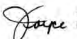

JOYCE E. MORROW
Administrative Assistant to the Secretary of the Army 0830505 By Order of the Secretary of the Air Force:
GEORGE W. CASEY, JR.

General, United States Army Chief of Staff JOHN P. JUMPER
General, United States Air Force Chief of Staff Official:
GREGORY S. MARTIN
General, United States Air Force Commander, Air Force Materiel Command By Order of the Marine Corps:
MICHAEL W. EVERLY
Program Manager, Motor Transportation (PMM151)
Marine Corps Systems Command Distribution:
To be distributed in accordance with the initial distribution number (IDN) 381020, requirements for TM 9-2320-387-24-1.

Marine Corps PCN 184 110331 00 ARMY TM 9-2320-387-24-1 AIR FORCE TO 36A12-1A-3052-2 MARINE CORPS TM 11033-IN VOL 1 CHANGE NO. 5 HEADQUARTERS,
DEPARTMENTS OF THE ARMY,
THE AIR FORCE, AND MARINE CORPS
WASHINGTON, D.C., *30 NOVEMBER 2007* TECHNICAL MANUAL
VOLUME 1 OF 2 UNIT, DIRECT SUPPORT, AND
GENERAL SUPPORT MAINTENANCE
FOR
TRUCK, UTILITY: S250 SHELTER CARRIER, 4X4, M1113 (2320-01-412-0143) (EIC: B6B); TRUCK, UTILITY: UP-ARMORED CARRIER, 4X4, M1114 (2320-01-413-3739) (EIC: B6C);
TRUCK, UTILITY: EXPANDED CAPACITY, ARMAMENT CARRIER, M1151 
(2320-01-518-7330) (EIC: BA5);
TRUCK, UTILITY: EXPANDED CAPACITY, ARMAMENT CARRIER, IAP/ARMOR READY, M1151A1
(2320-01-540-2038);
TRUCK, UTILITY: EXPANDED CAPACITY, ENHANCED, M1152
(2320-01-518-7332) (EIC: BA6);
TRUCK, UTILITY: EXPANDED CAPACITY, ENHANCED, IAP/ARMOR READY, M1152A1
(2320-01-540-2007);
TRUCK, UTILITY: COMMAND AND CONTROL/GENERAL PURPOSE VEHICLE, M1165
(2320-01-540-1993);
TRUCK, UTILITY: COMMAND AND CONTROL/GENERAL PURPOSE VEHICLE,
IAP/ARMOR READY, M1165A1
(2320-01-540-2017).

TM 9-2320-387-24-1, 31 December 1997, is changed as follows:
1. Remove old pages and insert new pages as indicated below. 2. New or changed material is indicated by a vertical bar in the margin of the page. 3. File this change sheet in front of the publication for reference purposes.

| Remove pages          | Insert pages          |
|-----------------------|-----------------------|
| c/(d blank)           | c/(d blank)           |
| A through I/(J blank) | A through M/(N blank) |
| i and ii              | i and ii              |
| 1\-1 through 1\-6     | 1\-1 through 1\-6     |
| 1\-9 through 1\-12    | 1\-9 through 1\-12    |
| 1\-19 through 1\-24   | 1\-19 through 1\-24   |
| 1\-38.1 through 2\-6  | 1\-38.1 through 2\-6  |
| 2\-21 through 2\-24   | 2\-21 through 2\-24   |
| 2\-26.1 and 2\-26.2   | 2\-26.1 and 2\-26.2   |
| 2\-29 and 2\-30       | 2\-29 and 2\-30       |
| 2\-159 and 2\-160     | 2\-159 and 2\-160     |
| 2\-447 and 2\-448     | 2\-447 and 2\-448     |

Distribution Statement A: Approved for public release; distribution is unlimited.

| Remove pages                         | Insert pages                         |
|--------------------------------------|--------------------------------------|
| 2\-455 and 2\-456                    | 2\-455 and 2\-456                    |
| 3\-23 through 3\-28                  | 3\-23 through 3\-28                  |
| 3\-31 through 3\-34                  | 3\-31 through 3\-34                  |
| 3\-49 and 3\-50                      | 3\-49 and 3\-50                      |
| 3\-67 through 3\-70                  | 3\-67 through 3\-70                  |
| 3\-110.1 and 3\-110.2/(3\-111 blank) | 3\-110.1 and 3\-110.2/(3\-111 blank) |
| 3\-119 through 3\-122                | 3\-119 through 3\-122                |
| 3\-143 and 3\-144                    | 3\-143 and 3\-144                    |
| 3\-171 and 3\-172                    | 3\-171 and 3\-172                    |
| 3\-189 and 3\-190                    | 3\-189 and 3\-190                    |
| 4\-5 blank through 4\-8              | 4\-5 blank through 4\-8              |
| 4\-13 and 4\-14                      | 4\-13 and 4\-14                      |
| 4\-31 through 4\-34                  | 4\-31 through 4\-34                  |
| 4\-47 through 4\-50                  | 4\-47 through 4\-50.4 blank          |
| 4\-65 and 4\-66                      | 4\-65 and 4\-66                      |
| 4\-69 through 4\-74                  | 4\-69 through 4\-74                  |
| 4\-81 and 4\-82                      | 4\-81 and 4\-82                      |
| 4\-101 and 4\-102                    | 4\-101 and 4\-102                    |
| 4\-129 and 4\-130                    | 4\-129 and 4\-130                    |
| 5\-29 and 5\-30                      | 5\-29 and 5\-30                      |
| 6\-19 and 6\-20                      | 6\-19 and 6\-20                      |
| 6\-31 through 6\-34                  | 6\-31 through 6\-34                  |
| 6\-49 through 6\-62                  | 6\-49 through 6\-62                  |
| 6\-65 and 6\-66                      | 6\-65 and 6\-66                      |
| 8\-1 and 8\-2                        | 8\-1 and 8\-2                        |
| 8\-21 through 8\-26                  | 8\-21 through 8\-26                  |
| 8\-29 through 8\-32                  | 8\-29 through 8\-32                  |
| INDEX 1 through INDEX 67/            | INDEX 1 through INDEX 75/            |
| (INDEX 68 blank)                     | (INDEX 76 blank)                     |

By Order of the Secretary of the Army:
GEORGE W. CASEY, JR.

General, United States Army Chief of Staff Official:

JOYCE E. MORROW
Administrative Assistant to the Secretary of the Army 0721902 By Order of the Secretary of the Air Force:
JOHN P. JUMPER
General, United States Air Force Chief of Staff Official:
GREGORY S. MARTIN
General, United States Air Force Commander, Air Force Materiel Command By Order of the Marine Corps:
S. I. SCHULER
Colonel, USMC
Program Manager Motor Transportation (PMM151)
Marine Corps Systems Command Distribution:
To be distributed in accordance with the initial distribution number (IDN) 381020, requirements for TM 9-2320-387-24-1.

PCN 184 110331 00 CHANGE NO. 4 ARMY TM 9-2320-387-24-1 AIR FORCE TO 36A12-1A-3052-2 MARINE CORPS TM 11033-IN VOL 1 HEADQUARTERS,
DEPARTMENTS OF THE ARMY,
THE AIR FORCE, AND MARINE CORPS
Washington, D.C., 28 February 2007 TECHNICAL MANUAL
VOLUME 1 OF 2 UNIT, DIRECT SUPPORT, AND
GENERAL SUPPORT MAINTENANCE
FOR
TRUCK, UTILITY: S250 SHELTER CARRIER, 4X4, M1113 (2320-01-412-0143) (EIC: B6B); TRUCK, UTILITY: UP-ARMORED CARRIER, 4X4, M1114 (2320-01-413-3739) (EIC: B6C);
TRUCK, UTILITY: EXPANDED CAPACITY, ARMAMENT CARRIER, M1151 
(2320-01-518-7330) (EIC: BA5);
TRUCK, UTILITY: EXPANDED CAPACITY, ARMAMENT CARRIER, IAP/ARMOR READY, M1151A1
(2320-01-540-2038);
TRUCK, UTILITY: EXPANDED CAPACITY, ENHANCED, M1152
(2320-01-518-7332) (EIC: BA6);
TRUCK, UTILITY: EXPANDED CAPACITY, ENHANCED, IAP/ARMOR READY, M1152A1
(2320-01-540-2007);
TRUCK, UTILITY: COMMAND AND CONTROL/GENERAL PURPOSE VEHICLE, M1165
(2320-01-540-1993);
TRUCK, UTILITY: COMMAND AND CONTROL/GENERAL PURPOSE VEHICLE,
IAP/ARMOR READY, M1165A1
(2320-01-540-2017).

TM 9-2320-387-24-1, December 1997, is changed as follows:
1. Four new models have been added to the front cover. The new cover, located at the end of the change package, replaces the existing cover.

2. Remove old pages and insert new pages as indicated below. 3. New or changed material is indicated by a vertical bar in the margin of the page. 4. File this change sheet in front of the publication for reference purposes.

| Remove pages              | Insert pages                        |
|---------------------------|-------------------------------------|
| A through I/(J blank)     | A through I/(J blank)               |
| i and ii                  | i and ii                            |
| 1\-1 and 1\-2             | 1\-1 through 1\-2.9/(1\-2.10 blank) |
| Index 5 and Index 6       | Index 5 and Index 6                 |
| Index 11 and Index 12     | Index 11 and Index 12               |
| Index 17 and Index 18     | Index 17 and Index 18               |
| Index 23 and Index 24     | Index 23 and Index 24               |
| Index 29 and Index 30     | Index 29 and Index 30               |
| Index 39 through Index 48 | Index 39 through Index 48           |
| Index 51 through Index 54 | Index 51 through Index 54           |
| Cover                     | Cover                               |

Approved for public release; distribution is unlimited.

By Order of the Secretary of the Army:
Official:

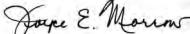

JOYCE E. MORROW
Administrative Assistant to the Secretary of the Army 0703802 By Order of the Secretary of the Air Force:
PETER J. SCHOOMAKER
General, United States Army Chief of Staff JOHN P. JUMPER
General, United States Air Force Chief of Staff Official:
GREGORY S. MARTIN
General, United States Air Force Commander, Air Force Materiel Command By Order of the Marine Corps:
S. I. SCHULER
Colonel, USMC
Program Manager Motor Transportation (PMM151)
Marine Corps Systems Command Distribution:
To be distributed in accordance with the initial distribution number (IDN) 381020, requirements for TM 9-2320-387-24-1.

PCN 184 110331 00 ARMY TM 9-2320-387-24-1 AIR FORCE TO 36A12-1A-3052-2 MARINE CORPS TM 11033-IN Vol 1 CHANGE NO. 3 HEADQUARTERS,
DEPARTMENTS OF THE ARMY,
THE AIR FORCE, AND MARINE CORPS
Washington, D.C., 31 May 2006 TECHNICAL MANUAL
VOLUME 1 OF 2 UNIT, DIRECT SUPPORT, AND
GENERAL SUPPORT MAINTENANCE
FOR
TRUCK, UTILITY: S250 SHELTER CARRIER, 4X4, M1113 (2320-01-412-0143) (EIC: B6B);
TRUCK, UTILITY: UP-ARMORED CARRIER, 4X4, M1114 (2320-01-413-3739) (EIC: B6C);
TRUCK, UTILITY: EXPANDED CAPACITY, ARMAMENT CARRIER, M1151 
(2320-01-518-7330);
TRUCK, UTILITY: EXPANDED CAPACITY, ENHANCED, M1152
(2320-01-518-7332).

TM 9-2320-387-24-1, December 1997, is changed as follows:
1. Two new models have been added to the front cover. The new cover, located at the end of the change package, replaces the existing cover.

2. Remove old pages and insert new pages as indicated below. 3. New or changed material is indicated by a vertical bar in the margin of the page. 4. File this change sheet in front of the publication for reference purposes.

| Remove pages                         | Insert pages            |
|--------------------------------------|-------------------------|
| warning a and warning b              | warning a and warning b |
| A through I/(J blank)                | A through I/(J blank)   |
| i and ii                             | i and ii                |
| 1\-1 through 1\-6                    | 1\-1 through 1\-6       |
| 1\-9 and 1\-10                       | 1\-9 and 1\-10          |
| 1\-17 through 1\-24                  | 1\-17 through 1\-24     |
| 1\-39 and 1\-40                      | 1\-38.1 through 1\-40   |
| 2\-7 through 2\-26                   | 2\-7 through 2\-26.2    |
| 2\-63 through 2\-66                  | 2\-63 through 2\-66     |
| 2\-159 through 2\-162                | 2\-159 through 2\-162   |
| 2\-311 and 2\-312                    | 2\-311 and 2\-312       |
| 2\-347 and 2\-348                    | 2\-347 and 2\-348       |
| 2\-443 and 2\-444                    | 2\-443 and 2\-444       |
| 2\-449 through 2\-451/(2\-452 blank) | 2\-449 through 2\-452   |
| 3\-31 through 3\-36                  | 3\-31 through 3\-36     |
| 3\-67 through 3\-70                  | 3\-67 through 3\-70     |
| 3\-109 through 3\-112                | 3\-109 through 3\-112   |

Approved for public release; distribution is unlimited.

| Remove pages              | Insert pages                              |
|---------------------------|-------------------------------------------|
| 3\-142.7 through 3\-144   | 3\-142.7 through 3\-144                   |
| 3\-144.3 through 3\-146   | 3\-144.3 through 3\-146                   |
| 3\-171 and 3\-172         | 3\-171 and 3\-172                         |
| 3\-189 and 3\-190         | 3\-189 and 3\-190                         |
| (4\-5 blank) through 4\-8 | (4\-5 blank) through 4\-8                 |
| 4\-13 and 4\-14           | 4\-13 and 4\-14                           |
| 4\-31 through 4\-34       | 4\-31 through 4\-34                       |
| 4\-49 and 4\-50           | 4\-49 and 4\-50                           |
| 4\-65 and 4\-66           | 4\-65 and 4\-66                           |
| 4\-69 through 4\-76       | 4\-69 through 4\-76                       |
| 4\-79 and 4\-80           | 4\-79 through 4\-80.3/(4\-80.4 blank)     |
| 4\-89 and 4\-90           | 4\-89 and 4\-90                           |
| 4\-101 and 4\-102         | 4\-101 and 4\-102                         |
| 4\-129 and 4\-130         | 4\-129 and 4\-130                         |
| 5\-13 through 5\-16       | 5\-13 through 5\-16                       |
| 6\-11 and 6\-12           | 6\-11 and 6\-12                           |
| 6\-47 and 6\-48           | 6\-46.1 through 6\-48                     |
| 6\-59 through 6\-62       | 6\-59 through 6\-62                       |
| 6\-65 and 6\-66           | 6\-65 and 6\-66                           |
| 7\-33 through 7\-36       | 7\-33 through 7\-36                       |
| 8\-25 and 8\-26           | 8\-25 and 8\-26                           |
| 8\-31 and 8\-32           | 8\-31 and 8\-32                           |
| 8\-35 and 8\-36           | 8\-35 and 8\-36                           |
| 8\-55 through 8\-58       | 8\-55 through 8\-58                       |
| 9\-7 through 9\-10        | 9\-7 through 9\-10                        |
| 9\-15 and 9\-16           | 9\-15 and 9\-16                           |
| INDEX 1 through INDEX 54  | INDEX 1 through INDEX 67/(INDEX 68 blank) |
| Cover                     | Cover                                     |

By Order of the Secretary of the Army:
Official:

JOYCE E. MORROW
Administrative Assistant to the Secretary of the Army 0602405 By Order of the Secretary of the Air Force:
PETER J. SCHOOMAKER
General, United States Army Chief of Staff JOHN P. JUMPER
General, United States Air Force Chief of Staff Official:
GREGORY S. MARTIN
General, United States Air Force Commander, Air Force Materiel Command By Order of the Marine Corps:
S. I. SCHULER
Colonel, USMC
Program Manager Motor Transportation (PMM151)
Marine Corps Systems Command Distribution:
To be distributed in accordance with the initial distribution number (IDN) 381020, requirements for TM 9-2320-387-24-1.

ARMY TM 9-2320-387-24-1 AIR FORCE TO 36A12-1A-3052-1 CHANGE
HEADQUARTERS,
DEPARTMENTS OF THE ARMY, AND
THE AIR FORCE
Washington, D.C., 30 July 2004 NO. 2 TECHNICAL MANUAL
VOLUME 1 OF 2 UNIT, DIRECT SUPPORT, AND
GENERAL SUPPORT MAINTENANCE
FOR
TRUCK, UTILITY: S250 SHELTER CARRIER, 4X4, M1113 (2320-01-412-0143) (EIC: B6B)
TRUCK, UTILITY: UP - ARMORED CARRIER, 4X4, M1114 (2320-01-413-3739) (EIC: B6C)
TM 9-2320-387-24-1, December 1997, is changed as follows:
1. Remove old pages and insert new pages as indicated below. 2. New or changed material is indicated by a vertical bar in the margin of the page. 3. File this change sheet in front of the publication for reference purposes.

| Remove pages                      | Insert page                              |
|-----------------------------------|------------------------------------------|
| A through D                       | A through I/(J blank)                    |
| i and ii                          | i and ii                                 |
| 1\-1 and 1\-2                     | 1\-1 and 1\-2                            |
| 1\-35 and 1\-36                   | 1\-35 and 1\-36                          |
| 2\-1 through 2\-6                 | 2\-1 through 2\-6                        |
| 2\-9 and 2\-10                    | 2\-9 and 2\-10                           |
| 2\-27 and 2\-28                   | 2\-27 and 2\-28                          |
| 2\-47 through 2\-49/(2\-50 blank) | 2\-47 through 2\-49/(2\-50 blank)        |
| 2\-111 through 2\-114             | 2\-111 through 2\-114                    |
| 2\-207 through 2\-210             | 2\-207 through 2\-210                    |
| 2\-441 through 2\-444             | 2\-441 through 2\-444                    |
| 2\-451/(2\-452 blank)             | 2\-451/(2\-452 blank)                    |
| 2\-455 through 2\-460             | 2\-455 through 2\-460                    |
| 2\-471 through 2\-476             | 2\-471 through 2\-478.7/(2\-478.8 blank) |
| 3\-1 through 3\-10                | 3\-1 through 3\-10                       |
| 3\-21 through 3\-24               | 3\-21 through 3\-24                      |
| 3\-27 and 3\-28                   | 3\-27 and 3\-28                          |
| 3\-31 through 3\-34               | 3\-31 through 3\-34                      |
| 3\-39 through 3\-70               | 3\-39 through 3\-70                      |
| 3\-75 and 3\-76                   | 3\-75 and 3\-76                          |

Approved for public release; distribution is unlimited.

| Remove pages           | Insert pages                         |
|------------------------|--------------------------------------|
| 3\-79 through 3\-94    | 3\-79 through 3\-94                  |
| 3\-97 through 3\-112   | 3\-97 through 3\-112                 |
| 3\-117 through 3\-120  | 3\-117 through 3\-120                |
| 3\-127 and 3\-128      | 3\-127 and 3\-128                    |
| 3\-131 through 3\-134  | 3\-131 through 3\-134                |
| 3\-137 through 3\-146  | 3\-137 through 3\-191/(3\-192 blank) |
| 4\-1 through 4\-8      | 4\-1 through 4\-8                    |
| 4\-11 through 4\-14    | 4\-11 through 4\-14                  |
| 4\-17 through 4\-18.4  | 4\-17 through 4\-18.4                |
| 4\-18.11 through 4\-26 | 4\-18.11 through 4\-26               |
| 4\-29 and 4\-30        | 4\-29 and 4\-30                      |
| 4\-33 and 4\-34        | 4\-33 and 4\-34                      |
| 4\-37 and 4\-38        | 4\-37 and 4\-38                      |
| 4\-45 and 4\-46        | 4\-45 and 4\-46                      |
| 4\-49 and 4\-50        | 4\-49 and 4\-50                      |
| 4\-55 and 4\-56        | 4\-55 and 4\-56                      |
| 4\-61 through 4\-64    | 4\-61 through 4\-64                  |
| 4\-69 through 4\-78    | 4\-69 through 4\-78                  |
| 4\-83 through 4\-100   | 4\-83 through 4\-100                 |
| 4\-109 and 4\-110      | 4\-109 and 4\-110                    |
| 4\-115 through 4\-124  | 4\-115 through 4\-124                |
| 4\-129 through 4\-134  | 4\-129 through 4\-134                |
| 4\-137 through 4\-144  | 4\-137 through 4\-144                |
| 5\-1 through 5\-6      | 5\-1 through 5\-6                    |
| 5\-11 through 5\-18    | 5\-11 through 5\-18                  |
| 5\-21 through 5\-36    | 5\-21 through 5\-36                  |
| 6\-1 and 6\-2          | 6\-1 and 6\-2                        |
| 6\-5 through 6\-10     | 6\-5 through 6\-10                   |
| 6\-13 through 6\-18    | 6\-13 through 6\-18                  |
| 6\-21 and 6\-22        | 6\-21 and 6\-22                      |
| 6\-27 through 6\-30    | 6\-27 through 6\-30                  |
| 6\-35 through 6\-38    | 6\-35 through 6\-38                  |
| 6\-45 through 6\-62    | 6\-45 through 6\-62                  |
| 7\-3 through 7\-6      | 7\-3 through 7\-6                    |
| 7\-9 through 7\-20     | 7\-9 through 7\-20                   |
| 7\-27 through 7\-38    | 7\-27 through 7\-38                  |
| 7\-41 and 7\-42        | 7\-41 and 7\-42                      |
| 7\-45 through 7\-56    | 7\-45 through 7\-56                  |
| 8\-7 and 8\-8          | 8\-7 and 8\-8                        |
| 8\-13 and 8\-14        | 8\-13 and 8\-14                      |
| 8\-17 and 8\-18        | 8\-17 and 8\-18                      |

| Remove pages                               | Insert pages                      |
|--------------------------------------------|-----------------------------------|
| 8\-21 and 8\-22                            | 8\-21 and 8\-22                   |
| 8\-33 through 8\-56                        | 8\-33 through 8\-56               |
| 8\-59 through 8\-76                        | 8\-59 through 8\-83/(8\-84 blank) |
| 9\-1 through 9\-12                         | 9\-1 through 9\-12                |
| 9\-15 and 9\-16                            | 9\-15 and 9\-16                   |
| INDEX 1 through INDEX 53/ (INDEX 54 Blank) | INDEX 1 through INDEX 54          |

By Order of the Secretary of the Army:
PETER J. SCHOOMAKER
General, United States Army Chief of Staff Official:
JOEL B. HUDSON
Administrative Assistant to the Secretary of the Army By Order of the Secretary of the Air Force:
RONALD R. FOGLEMAN
General, United States Air Force Chief of Staff Official:
HENRY VICCELLIO, JR.

General, United States Air Force Commander, Air Force Materiel Command Distribution:
To be distributed in accordance with the initial distribution number (IDN) 381020, requirements for TM 9-2320-387-24-1.

CHANGE NO. 1 HEADQUARTERS,
DEPARTMENTS OF THE ARMY, AND
THE AIR FORCE
Washington, D.C., 31 OCTOBER 2001 TECHNICAL MANUAL
VOLUME 1 OF 2 UNIT, DIRECT SUPPORT, AND
GENERAL SUPPORT MAINTENANCE
FOR
TRUCK, UTILITY: S250 SHELTER CARRIER, 4X4, M1113 (2320-01-412-0143) (EIC: B6B)
TRUCK, UTILITY: UP - ARMORED CARRIER, 4X4, M1114 (2320-01-413-3739) (EIC: B6C)
TM 9-2320-387-24-1, December 1997, is changed as follows:
1. Remove old pages and insert new pages as indicated below. 2. New or changed material is indicated by a vertical bar in the margin of the page.

3. File this change sheet in front of the publication for reference purposes.

| Remove pages          | Insert page                         |
|-----------------------|-------------------------------------|
| Warning c/(d blank)   | Warning c/(d blank)                 |
| None                  | A through D (after warning d blank) |
| i through iv          | i through iv                        |
| 1\-1 and 1\-2         | 1\-1 and 1\-2                       |
| 1\-21 and 1\-22       | 1\-21 and 1\-22                     |
| 1\-33 and 1\-34       | 1\-33 and 1\-34                     |
| 1\-39 and 1\-40       | 1\-39 and 1\-40                     |
| 2\-5 through 2\-10    | 2\-5 through 2\-10                  |
| 2\-13 and 2\-14       | 2\-13 and 2\-14                     |
| 2\-19 and 2\-20       | 2\-19 and 2\-20                     |
| 2\-23 through 2\-28   | 2\-23 through 2\-28                 |
| 2\-97 and 2\-98       | 2\-97 and 2\-98                     |
| 2\-199 through 2\-202 | 2\-199 through 2\-202               |
| 2\-207 through 2\-210 | 2\-207 through 2\-210               |
| None                  | 2\-210.1 through 2\-210.4           |
| 2\-211/(2\-212 blank) | 2\-211/(2\-212 blank)               |
| 2\-385 and 2\-386     | 2\-385 and 2\-386                   |
| 2\-407 and 2\-408     | 2\-407 and 2\-408                   |
| 2\-419 and 2\-420     | 2\-419 and 2\-420                   |
| 2\-441 through 2\-444 | 2\-441 through 2\-444               |
| 2\-449 and 2\-450     | 2\-449 and 2\-450                   |
| 3\-11 through 3\-16   | 3\-11 through 3\-16                 |
| 3\-21 through 3\-38   | 3\-21 through 3\-38                 |
| 3\-55 through 3\-60   | 3\-55 through 3\-60                 |

Approved for public release; distribution is unlimited.

| Remove pages              | Insert pages              |
|---------------------------|---------------------------|
| 3\-81 through 3\-94       | 3\-81 through 3\-94       |
| 3\-109 through 3\-130     | 3\-109 through 3\-130     |
| 3\-133 and 3\-134         | 3\-133 and 3\-134         |
| 3\-141 and 3\-142         | 3\-141 and 3\-142         |
| None                      | 3\-142.1 and 3\-142.2     |
| 3\-143 through 3\-146     | 3\-143 through 3\-146     |
| 4\-1 through 4\-18        | 4\-1 through 4\-18        |
| None                      | 4\-18.1 through 4\-18.12  |
| 4\-19 through 4\-24       | 4\-19 through 4\-24       |
| 4\-65 and 4\-66           | 4\-65 and 4\-66           |
| 4\-73 through 4\-76       | 4\-73 through 4\-76       |
| 4\-79/(4\-80 blank)       | 4\-79 and 4\-80           |
| 4\-99 through 4\-102      | 4\-99 through 4\-102      |
| 4\-109 and 4\-110         | 4\-109 and 4\-110         |
| 5\-7 through 5\-12        | 5\-7 through 5\-12        |
| 5\-23 and 5\-24           | 5\-23 and 5\-24           |
| 5\-27 through 5\-30       | 5\-27 through 5\-30       |
| 6\-13 through 6\-26       | 6\-13 through 6\-26       |
| 6\-29 through 6\-38       | 6\-29 through 6\-38       |
| 6\-51 and 6\-52           | 6\-51 and 6\-52           |
| None                      | 6\-52.1 and 6\-52.2       |
| 6\-53 and 6\-54           | 6\-53 and 6\-54           |
| 7\-1 and 7\-2             | 7\-1 and 7\-2             |
| 7\-5 through 7\-22        | 7\-5 through 7\-22        |
| 7\-25 through 7\-46       | 7\-25 through 7\-46       |
| 8\-11 and 8\-12           | 8\-11 and 8\-12           |
| 8\-15 and 8\-16           | 8\-15 and 8\-16           |
| 8\-23 through 8\-34       | 8\-23 through 8\-34       |
| 8\-63 and 8\-64           | 8\-63 and 8\-64           |
| 8\-69 and 8\-70           | 8\-69 and 8\-70           |
| 8\-73 and 8\-74           | 8\-73 and 8\-74           |
| INDEX 1 through           | INDEX 1 through           |
| INDEX 45/(INDEX 46 blank) | INDEX 53/(INDEX 54 blank) |
| DA Form 2028\-2           | DA Form 2028              |

By Order of the Secretary of the Army:
ERIC K. SHINSEKI
General, United States Army Chief of Staff Official:
JOEL B. HUDSON
Administrative Assistant to the Secretary of the Army 0119703 By Order of the Secretary of the Air Force:
RONALD R. FOGLEMAN
General, United States Air Force Chief of Staff Official:
HENRY VICCELLIO, JR.

General, United States Air Force Commander, Air Force Materiel Command Distribution:
To be distributed in accordance with the initial distribution number (IDN) 381020, requirements for TM 9-2320-387-24-1.

TM 9-2320-387-24-1

# List Of Effective Pages

NOTE: The portion of the text affected by the changes is indicated by a vertical line in the outer margins of the page.

| Dates of issue for original and changed pages of volume 1 are:   |
|------------------------------------------------------------------|
| Original .                                                       |
| Change                                                           |
| Change 2 30 July 2004                                            |
| Change                                                           |
| Change                                                           |
| Change                                                           |
| Change                                                           |

| TOTAL WOMBER OF THOLO IN THIO POREVELLION TO THE POWORTING OF THE TOLLOWING.   |                          |                               |
|--------------------------------------------------------------------------------|--------------------------|-------------------------------|
| Page No *Change No.                                                            | Page No *Change No.      | Page No *Change No.           |
| VOLUME 1                                                                       | 1\-28 \- 1\-32           | 2\-68 Blank                   |
| a.                                                                             | 1\-33 \- 1\-36           | 2\-69 \- 2\-73                |
| b                                                                              | 1\-36.1 \- 1\-36.2 Added | 2\-74 Blank .                 |
| C                                                                              | 1\-37 \- 1\-38           | 2\-75 \- 2\-97                |
| d Blank                                                                        | 1\-38.1 \- 1\-38.4       | 2\-98 .                       |
| A \- N                                                                         | 1\-39 \- 1\-40           | 2\-99 \- 2\-111               |
| 1                                                                              | 2\-1                     | 2\-112                        |
| 11\-111 .                                                                      | 2\-2 \- 2\-3             | 2\-112.1 \- 2\-112.2 Added    |
| İV \-Vİ .                                                                      | 2\-4                     | 2\-113                        |
| vii\-xiii .                                                                    | 2\-5                     | 2\-114 \- 2\-139              |
| xiv Blank                                                                      | 2\-6                     | 2\-140 Blank                  |
| 1\-1                                                                           | 2\-7 \- 2\-11 .          | 2\-141 \- 2\-145              |
| 1\-2                                                                           | 2\-12 \- 2\-14           | 2\-146 Blank                  |
| 1\-2.1 \- 1\-2.9 Deleted                                                       | 2\-15 \- 2\-16           | 2\-147 \- 2\-157              |
| 1\-2.10 \- Blank Deleted .                                                     | 2\-17 \- 2\-19           | 2\-158 Blank                  |
| 1\-3 \- 1\-4                                                                   | 2\-20 \- 2\-21           | 2\-159 \- 2\-189              |
| 1\-4.1 \- 1\-4.4                                                               | 2\-22 \- 2\-23           | 2\-190 Blank                  |
| 1\-4.5 \- 1\-4.8 Added                                                         | 2\-24 .                  | 2\-190.1 \- 2\-190.11 Added . |
| 1\-4.9 Added.                                                                  | 2\-25 .                  | 2\-190.12 Added Blank .       |
| 1\-4.10 Blank Added .                                                          | 2\-26 .                  | 2\-191 \- 2\-197              |
| 1\-5 \- 1\-6                                                                   | 2\-26.1 \- 2\-26.2       | 2\-198 Blank.                 |
| 1\-7 \- 1\-9                                                                   | 2\-27 \- 2\-31           | 2\-199                        |
| 1\-10 .                                                                        | 2\-32 \- 2\-34           | 2\-200                        |
| 1\-11 .                                                                        | 2\-35 \- 2\-37           | 2\-201 \- 2\-202              |
| 1\-12 .                                                                        | 2\-38 \- 2\-47           | 2\-203 \- 2\-207              |
| 1\-13 \- 1\-16                                                                 | 2\-48 .                  | 2\-208                        |
| 1\-16.1\-1\-16.2 Added                                                         | 2\-48.1 \- 2\-48.2 Added | 2\-208.1 \- 2\-208.2 Added    |
| 1\-17 .                                                                        | 2\-49 .                  | 2\-209 \- 2\-210              |
| 1\-18 .                                                                        | 2\-50 Blank .            | 2\-210.1 \- 2\-210.4 Added    |
| 1\-19 \- 1\-23                                                                 | 2\-51 \- 2\-58           | 2\-211                        |
| 1\-24 \- 1\-25                                                                 | 2\-60 Blank              | 2\-212 Blank                  |
| 1\-26 .                                                                        | 2\-61 \- 2\-62           | 2\-213 \- 2\-235              |
| 1\-26.1 \- 1\-26.2 Added                                                       | 2\-63 \- 2\-66           | 2\-236 Blank.                 |
| 1\-27 .                                                                        | 2\-67 .                  | 2\-237 \- 2\-245              |

TOTAL NUMBER OF PAGES IN THIS PUBLICATION IS 1,704 CONSISTING OF THE FOLLOWING:
*Zero in this column indicates original page.

TM 9-2320-387-24-1

# List Of Effective Pages (Contd)

| Page No. .                    | Page No *Change No.              | Page No *Change No.         |
|-------------------------------|----------------------------------|-----------------------------|
| 2\-246 Blank.                 | 2\-473 Blank.                    | 3\-50 .                     |
| 2\-247 \- 2\-287              | 2\-474 \- 2\-475                 | 3\-51 \- 3\-53              |
| 2\-288 Blank                  | 2\-476                           | 3\-54 \- 3\-56              |
| 2\-289 \- 2\-303              | 2\-477                           | 3\-57 .                     |
| 2\-304 Blank                  | 2\-478 Blank                     | 3\-58 \- 3\-60              |
| 2\-305 \- 2\-310              | 2\-478.1 \- 2\-478.8 Blank Added | 3\-60.1 \- 3\-60.2 Added    |
| 2\-311                        | 2\-479 \- 2\-487                 | 3\-61 \- 3\-63              |
| 2\-312 \- 2\-346              | 2\-488 Blank                     | 3\-64 .                     |
| 2\-347                        | 2\-488.1 \- 2\-488.5 Added       | 3\-64.1 \- 3\-64.2 Added    |
| 2\-348                        | 2\-488.6 Added Blank             | 3\-65 .                     |
| 2\-349 \- 2\-373              | 2\-489 \- 2\-522                 | 3 \-66 \- 3\-67 .           |
| 2\-374 Blank                  | 3\-1                             | 3\-68 \- 3\-69              |
| 2\-375 \- 2\-383              | 3\-2                             | 3\-70 .                     |
| 2\-384 Blank                  | 3\-3                             | 3\-71 \- 3\-75              |
| 2\-385                        | 3\-4                             | 3\-76 .                     |
| 2\-386 \- 2\-407              | 3\-4.1 \- 3\-4.2 Added           | 3\-77 \- 3\-78              |
| 2\-408                        | 3\-5 \- 3\-6                     | 3\-79 \- 3\-80              |
| 2\-409 \- 2\-417              | 3\-7                             | 3\-81 .                     |
| 2\-418 Blank                  | 3\-8 \- 3\-9                     | 3\-82 .                     |
| 2\-419                        | 3\-10 .                          | 3\-83 .                     |
| 2\-420 \- 2\-424              | 3\-10.1 \- 3\-10.2 Added         | 3\-84 .                     |
| 2\-425                        | 3\-11 \- 3\-14                   | 3\-85 .                     |
| 2\-426                        | 3\-14.1 \- 3\-14.2 Added         | 3\-86 .                     |
| 2\-427 \- 2\-429              | 3\-15 .                          | 3\-87 .                     |
| 2\-430 \- 2\-431              | 3\-16 .                          | 3\-88 \- 3\-90              |
| 2\-432 Blank.                 | 3\-17 \- 3\-20                   | 3\-91 .                     |
| 2\-433 \- 2\-442              | 3\-21 .                          | 3\-92 .                     |
| 2\-442.1 \- 2\-442.2          | 3\-22 .                          | 3\-93 .                     |
| 2\-443 \- 2\-450              | 3\-23 .                          | 3\-94 .                     |
| 2\-451                        | 3\-24 .                          | 3\-95 \- 3\-97              |
| 2\-452                        | 3\-25 \- 3\-27                   | 3\-98 \- 3\-100 .           |
| 2\-452.1 \- 2\-452.12 Added . | 3\-28 .                          | 3\-101                      |
| 2\-452.13 Added Blank .       | 3\-29 \- 3\-30                   | 3\-102                      |
| 2\-452.14 \- 2\-452.22 Added  | 3\-31 .                          | 3\-103                      |
| 2\-445 \- 2\-446              | 3\-32 .                          | 3\-104                      |
| 2\-447                        | 3\-33 .                          | 3\-105                      |
| 2\-448 \- 2\-449              | 3\-34 .                          | 3\-106 \- 3\-107            |
| 2\-450 \- 2\-452              | 3\-35 .                          | 3\-108 Blank                |
| 2\-453 \- 2\-454              | 3\-36 \- 3\-38                   | 3\-108.1 \- 3\-108.2 Added. |
| 2\-455                        | 3\-39 .                          | 3\-109 Blank                |
| 2\-456 \- 2\-459              | 3\-40 \- 3\-41                   | 3\-110                      |
| 2\-460 \- 2\-469              | 3\-42 .                          | 3\-110.1                    |
| 2\-470 Blank                  | 3\-43 .                          | 3\-110.2 Added              |
| 2\-471                        | 3\-44 \- 3\-45                   | 3\-111 Blank                |
| 2\-472                        | 3\-46 \- 3\-49                   | 3\-112 \- 3\-116            |

*Zero in this column indicates original page.

Change 6 B
TM 9-2320-387-24-1

# List Of Effective Pages (Contd)

| Page No *Change No.           | Page No *Change No.       | Page No *Change No.      |
|-------------------------------|---------------------------|--------------------------|
| 3\-116.1 \- 3\-116.12 Added . | 4\-1 \- 4\-2              | 4\-50.1 \- 4\-50.2 Added |
| 3\-117                        | 4\-2.1 \- 4\-2.4 Added    | 4\-50.3 \- 4\-50.4       |
| 3\-118                        | 4\-3 \- 4\-4              | 4\-51 \- 4\-55           |
| 3\-118.1 \- 3\-118.2 Added    | 4\-5 Blank                | 4\-56 .                  |
| 3\-119                        | 4\-6 \- 4\-7              | 4\-57 \- 4\-60           |
| 3\-120 \- 3\-122              | 4\-8                      | 4\-61 \- 4\-64           |
| 3\-122.1 \- 3\-122.2 Added.   | 4\-9 \- 4\-11 .           | 4\-65 .                  |
| 3\-123                        | 4\-12 \- 4\-13            | 4\-66 \- 4\-68           |
| 3\-124 \- 3\-126              | 4\-14 .                   | 4\-69 \- 4\-70           |
| 3\-126.1 \- 3\-126.2 Added    | 4\-15 \- 4\-17            | 4\-70.1 .                |
| 3\-127                        | 4\-18 .                   | 4\-70.2 .                |
| 3\-128 \- 3\-130              | 4\-18.1 .                 | 4\-71 .                  |
| 3\-131                        | 4\-18.2 .                 | 4\-72 .                  |
| 3\-132                        | 4\-18.3 .                 | 4\-72.1.                 |
| 3\-132.1 Added Blank          | 4\-18.4 .                 | 4\-72.2 .                |
| 3\-132.2 \- 3\-132.3 Added    | 4\-18.5 \- 4\-18.11 .     | 4\-73 .                  |
| 3\-132.4 Added Blank          | 4\-18.12                  | 4\-74 .                  |
| 3\-133                        | 4\-19 \- 4\-20            | 4\-74.1 \- 4\-74.2 Added |
| 3\-134                        | 4\-21 .                   | 4\-75 \- 4\-76           |
| 3\-135 \- 3\-136              | 4\-22 .                   | 4\-77 .                  |
| 3\-137 \- 3\-138              | 4\-23 .                   | 4\-78 .                  |
| 3\-138.1 \- 3\-138.2 Added.   | 4\-24 .                   | 4\-79 .                  |
| 3\-139 \- 3\-140              | 4\-25 .                   | 4\-80 .                  |
| 3\-140.1 \- 3\-140.6 Added.   | 4\-26 .                   | 4\-80.1 \- 4\-80.3 Added |
| 3\-141                        | 4\-27 .                   | 4\-80.4 Blank Added .    |
| 3\-142                        | 4\-28 Blank .             | 4\-81 .                  |
| 3\-142.1 \- 3\-142.3          | 4\-29 .                   | 4\-82 \- 4\-83           |
| 3\-142.4 \- 3\-142.8          | 4\-30 .                   | 4\-84 \- 4\-86           |
| 3\-142.9 \- 3\-142.12 Added   | 4\-30.1 \- 4\-30.2 Added  | 4\-87 .                  |
| 3\-143                        | 4\-31 \- 4\-33            | 4\-88 \- 4\-89           |
| 3\-144                        | 4\-34 .                   | 4\-90 .                  |
| 3\-144.1 \- 3\-144.3 Added    | 4\-35 \- 4\-36            | 4\-91 .                  |
| 3\-144.4                      | 4\-36.1 \- 4\-36.2 Added  | 4\-92 \- 4\-94           |
| 3\-145                        | 4\-37 .                   | 4\-95 .                  |
| 3\-146                        | 4\-38 .                   | 4\-96 .                  |
| 3\-147 \- 3\-169 Added.       | 4\-38.1 \- 4\-38.6 Added. | 4\-97 .                  |
| 3\-170 \- 3\-192              | 4\-39 .                   | 4\-98 \- 4\-100 .        |
| 3\-193 Added.                 | 4\-40 .                   | 4\-101                   |
| 3\-194 Added Blank            | 4\-41 \- 4\-43            | 4\-102                   |
| 3\-171                        | 4\-44 .                   | 4\-103 \- 4\-106         |
| 3\-172                        | 4\-45 .                   | 4\-107                   |
| 3\-173 \- 3\-188 Added        | 4\-46 \- 4\-47            | 4\-108 \- 4\-109         |
| 3\-189                        | 4\-48 .                   | 4\-110                   |
| 3\-190 \- 3\-191 Added        | 4\-49 Blank               | 4\-111 \- 4\-115         |
| 3\-192 Blank Added            | 4\-50 .                   | 4\-116                   |

*Zero in this column indicates original page.

TM 9-2320-387-24-1

# List Of Effective Pages (Contd)

| Page No. .                    | Page No *Change No.      | Page No *Change No.       |
|-------------------------------|--------------------------|---------------------------|
| 4\-117                        | 5\-32 .                  | 6\-47 .                   |
| 4\-118 \- 4\-120              | 5\-33 .                  | 6\-48 .                   |
| 4\-120.1 \- 4\-120.10 Added . | 5\-34 .                  | 6\-48.1 Added .           |
| 4\-121                        | 5\-34.1 \- 5\-34.4 Added | 6\-48.2 Blank Added .     |
| 4\-122                        | 5\-35 .                  | 6\-49 .                   |
| 4\-123                        | 5\-36\- 5\-38 .          | 6\-50 .                   |
| 4\-124                        | 5\-38.1 Blank Added .    | 6\-51 \- 6\-52            |
| 4\-125 \- 4\-129              | 5\-38.2 \- 5\-38.3 Added | 6\-52.1 .                 |
| 4\-130                        | 5\-38.4 Blank Added .    | 6\-52.2 .                 |
| 4\-131                        | 5\-39 \- 5\-40           | 6\-53 .                   |
| 4\-132                        | 6\-1                     | 6\-54 .                   |
| 4\-132.1 \- 4\-132.2 Added    | 6\-2                     | 6\-55 .                   |
| 4\-133                        | 6\-3                     | 6\-56 \- 6\-62            |
| 4\-134                        | 6\-4                     | 6\-63 \- 6\-65            |
| 4\-135 \- 4\-137              | 6\-5                     | 6\-66 .                   |
| 4\-138                        | 6\-6                     | 7\-1 \- 7\-4              |
| 4\-139                        | 6\-7                     | 7\-4.1 \- 7\-4.4 Added.   |
| 4\-140 \- 4\-144              | 6\-8                     | 7\-5 \- 7\-8              |
| 4\-145 \- 4\-148              | 6\-9                     | 7\-8.1 \- 7\-8.2 Added.   |
| 5\-1                          | 6\-10 .                  | 7\-9 \- 12                |
| 5\-2                          | 6\-11 .                  | 7\-12.1 \- 7\-12.2 Added. |
| 5\-3                          | 6\-12 \- 6\-14           | 7\-13 \- 7\-14            |
| 5\-4                          | 6\-15 .                  | 7\-14.1 \- 7\-14.2 Added. |
| 5\-5                          | 6\-16 \- 6\-17           | 7\-15 \- 7\-26            |
| 5\-6 \- 5\-10 .               | 6\-18 \- 6\-19           | 7\-26.1 \- 7\-26.10 .     |
| 5\-10.1 \- 5\-10.4 Added      | 6\-19 .                  | 7\-27 .                   |
| 5\-7 \- 5\-10 .               | 6\-20 .                  | 7\-28 .                   |
| 5\-11 .                       | 6\-21 .                  | 7\-29 .                   |
| 5\-12 .                       | 6\-22 .                  | 7\-30 .                   |
| 5\-13 .                       | 6\-23 .                  | 7\-31 .                   |
| 5\-14 \- 5\-15                | 6\-24 \- 6\-25           | 7\-32 .                   |
| 5\-16 \- 5\-17                | 6\-26 \- 6\-27           | 7\-33 \- 7\-34            |
| 5\-18 .                       | 6\-28 .                  | 7\-34.1 \- 7\-34.2        |
| 5\-19 \- 5\-21                | 6\-29 .                  | 7\-34.3 \- 7\-34.6 Added. |
| 5\-22 .                       | 6\-30 \- 6\-33           | 7\-35 \- 7\-36            |
| 5\-23 .                       | 6\-34 .                  | 7\-36.1 Blank Added .     |
| 5\-24 .                       | 6\-35 \- 6\-36           | 7\-36.2 \- 7\-36.3 Added. |
| 5\-24.1 \- 5\-24.2 Added.     | 6\-37 .                  | 7\-36.4 Blank Added .     |
| 5\-25 .                       | 6\-38 .                  | 7\-37 .                   |
| 5\-26 .                       | 6\-38.1 \- 6\-38.4 Added | 7\-38 .                   |
| 5\-27 .                       | 6\-39 Blank .            | 7\-39 \- 7\-41            |
| 5\-28 .                       | 6\-40 \- 6\-45           | 7\-42 .                   |
| 5\-29 .                       | 6\-46 .                  | 7\-43 \- 7\-45            |
| 5\-30 .                       | 6\-46.1 .                | 7\-46 \- 7\-54            |
| 5\-31 .                       | 6\-46.2 Added .          |                           |

*Zero in this column indicates original page.

Change 6 D
TM 9-2320-387-24-1

# List Of Effective Pages (Contd)

| Page No. .                  | Page No. .                 | Page No. .            |
|-----------------------------|----------------------------|-----------------------|
| 7\-55 .                     | 8\-54 .                    | FP\-3 .               |
| 7\-56 .                     | 8\-55 .                    | FP\-4 Blank .         |
| 7\-57 .                     | 8\-56 .                    | FP\-5 .               |
| 7\-58 Blank .               | 8\-56.1 \- 8\-56.2         | FP\-6 Blank .         |
| 7\-59 \- 7\-67 Added        | 8\-57 \- 8\-58             | FP\-6.1 Added .       |
| 7\-68 Blank Added .         | 8\-58.1 \- 8\-58.6 Added   | FP\-6.2 Blank Added . |
| 8\-1 \- 8\-4                | 8\-59 .                    | FP\-7 .               |
| 8\-4.1 \- 8\-4.4 Added      | 8\-60 .                    | FP\-8 Blank .         |
| 8\-5                        | 8\-61 .                    | FP\-9 .               |
| 8\-6 \- 8\-7                | 8\-62 .                    | FP\-10 Blank          |
| 8\-8 \- 8\-14 .             | 8\-63 .                    | FP\-11                |
| 8\-14.1 \- 8\-14.2 Added    | 8\-64 .                    | FP\-12 Blank          |
| 8\-14.3 Blank Added .       | 8\-64.1 \- 8\-64.4         | FP\-13                |
| 8\-14.4 \- 8\-14.12 Added . | 8\-65 .                    | FP\-14 Blank          |
| 8\-15 \- 8\-16              | 8\-66 .                    | FP\-15                |
| 8\-14.3 Blank Added .       | 8\-66.1 \- 8\-66.4         | FP\-16 Blank          |
| 8\-14.4 \- 8\-14.22 Added . | 8\-66.5 \- 8\-66.14 Added  | FP\-17                |
| 8\-14.23 Blank Added        | 8\-67 .                    | FP\-18 Blank          |
| 8\-14.24 \- 8\-14.30 Added  | 8\-68 \- 8\-72             | FP\-19                |
| 8\-17 \- 8\-18              | 8\-72.1 \- 8\-72.2 Added.  | FP\-20 Blank          |
| 8\-19 \- 8\-20              | 8\-73 .                    | FP\-21                |
| 8\-20.1 \- 8\-20.12 Added . | 8\-74 Blank                | FP\-22 Blank          |
| 8\-21 .                     | 8\-74.1 \- 8\-74.2 Added   | FP\-22.1 Added        |
| 8\-22 .                     | 8\-75 \- 8\-76             | FP\-22.2 Blank Added  |
| 8\-23 Blank .               | 8\-77 \- 8\-83 Added.      | FP\-23                |
| 8\-24 \- 8\-25              | 8\-84 Blank Added .        | FP\-24 Blank          |
| 8\-26 .                     | 9\-1 \- 9\-2               | FP 24.1 Added.        |
| 8\-27 .                     | 9\-3 \- 9\-4               | FP 24.2 Blank Added   |
| 8\-28 \- 8\-29 .            | 9\-4.1 Added               | FP\-25                |
| 8\-30 \- 8\-31              | 9\-4.2 Blank Added         | FP\-26 Blank          |
| 8\-32 .                     | 9\-5 \- 9\-6               | FP 26.1 Added         |
| 8\-33 .                     | 9\-7                       | FP 26.2 Blank Added   |
| 8\-34 .                     | 9\-8\- 9\-9 .              | FP\-27                |
| 8\-34.1 Blank Added .       | 9\-10 .                    | FP\-28 Blank          |
| 8\-34.2 \- 8\-34.3 Added.   | 9\-11 \- 9\-14             | FP\-29                |
| 8\-34.4 Blank Added .       | 9\-14.1 \- 9\-14.4 Added   | FP\-30 Blank          |
| 8\-35 .                     | 9\-15 .                    | FP\-31 Added          |
| 8\-36 \- 8\-37              | 9\-16 .                    | FP\-32 Blank Added.   |
| 8\-38 \- 8\-39              | 9\-17 .                    |                       |
| 8\-40 \- 8\-43              | 9\-18 Blank .              | VOLUME 2              |
| 8\-44 .                     | Index 1 through Index 68 . |                       |
| 8\-45 .                     | Index 69 \- Index 76.      | а.                    |
| 8\-46 \- 8\-50              | Index 77 \- Index 83       | b.                    |
| 8\-51 .                     | Index 84 Blank Added .     | A \- I                |
| 8\-52 .                     | FP\-1 .                    | J Blank Added         |
| 8\-53                       | FP\-2 Blank .              | 1 \- 111.             |

*Zero in this column indicates original page.

TM 9-2320-387-24-1

# List Of Effective Pages (Contd)

| Page No. .                 | Page No *Change No.          | Page No *Change No.             |
|----------------------------|------------------------------|---------------------------------|
| 10\-3 \- 10\-4             | 10\-53                       | 10\-91                          |
| 10\-5 .                    | 10\-54 \- 10\-56             | 10\-92 \- 10\-95                |
| 10\-6 \- 10\-7             | 10\-56.1 \- 10\-56.2         | 10\-93 \- 10\-94                |
| 10\-8 .                    | 10\-56.3 \- 10\-56.6         | 10\-94.1 \- 10.94.2.            |
| 10\-9 .                    | 10\-56.7 \- 10\-56.8 Added   | 10\-95                          |
| 10\-10                     | 10\-57 \- 10\-58             | 10\-96 Blank.                   |
| 10\-11                     | 10\-58.1                     | 10\-96.1                        |
| 10\-12                     | 10\-58.2 Blank Added         | 10\-96.2                        |
| 10\-13                     | 10\-59                       | 10\-97                          |
| 10\-14                     | 10\-60                       | 10\-98                          |
| 10\-15 \- 10\-17           | 10\-61 \- 10\-62             | 10\-98.1                        |
| 10\-18                     | 10\-63 \- 10\-64             | 10\-98.2                        |
| 10\-18.1                   | 10\-65                       | 10.98.3.                        |
| 10\-18.2 Blank.            | 10\-66                       | 10\-98.4                        |
| 10\-19                     | 10\-67 Blank                 | 10\-98.5                        |
| 10\-20                     | 10\-68                       | 10\-98.6                        |
| 10\-21 \- 10\-22           | 10\-68.1 Added               | 10\-98.7                        |
| 10\-23 \- 10\-25           | 10\-68.2 Blank Added         | 10\-98.8 \- 10\-98.11 .         |
| 10\-26                     | 10\-69 \- 10\-71             | 10\-98.12 Blank .               |
| 10\-27 \- 10\-28           | 10\-72                       | 10\-98.13 \- 10\-98.14          |
| 10\-29                     | 10\-73 \- 10\-75             | 10\-98.15 \- 10\-98.16          |
| 10\-30 \- 10\-32           | 10\-76                       | 10\-98.17 \- 10 \-98.18 Added . |
| 10\-32.1 \- 10\-32.2       | 10\-76.1                     | 10\-98.19 \- 10\-98.20          |
| 10\-33 Blank               | 10\-76.2                     | 10\-98.21 \- 10\-98.22 Added    |
| 10\-34 \- 10\-35           | 10\-76.3 Blank Added         | 10\-99 \- 10\-100 .             |
| 10\-36 \- 10\-37           | 10\-76.4                     | 10\-101 \- 10\-102              |
| 10\-38                     | 10\-77                       | 10\-103 \- 10\-104              |
| 10\-38.1 \- 10\-38.2       | 10\-78 \- 10\-81             | 10\-105 .                       |
| 10\-39 \- 10\-40           | 10\-82                       | 10\-106 .                       |
| 10\-40.1 \- 10\-40.6 Added | 10\-82.1                     | 10\-107 .                       |
| 10\-41 \- 10\-42           | 10\-82.2 \- 10\-82.7 Added   | 10\-108 \- 10\-110              |
| 10\-42.1 \- 10\-42.2       | 10\-82.8 \- 10\-82.9         | 10\-111 .                       |
| 10\-43 \- 10\-44           | 10\-82.10 \- 10\-82.11 Added | 10\-112 \- 10\-113              |
| 10\-44.1 \- 10\-44.6 Added | 10\-82.12 \- 10\-82.13       | 10\-114 .                       |
| 10\-45                     | 10\-82.14 \- 10\-82.18       | 10\-115 .                       |
| 10\-46                     | Added                        | 10\-116 \- 10\-119.             |
| 10\-47                     | 10\-83 \- 10\-84             | 10\-120 .                       |
| 10\-48                     | 10\-85                       | 10\-121 .                       |
| 10\-48.1 Blank Added       | 10\-86                       | 10\-122 \- 10\-125              |
| 10\-48.2 \- 10\-48.3       | 10\-87                       | 10\-126 .                       |
| 10\-48.4 Blank Added       | 10\-88                       | 10\-127 .                       |
| 10\-49                     | 10\-88.1 \- 10\-88.2         | 10\-128 .                       |
| 10\-50 \- 10\-51           | 10\-89 Blank                 | 10\-128.1 Blank Added .         |
| 10\-52                     | 10\-90                       | 10\-128.2 \- 10\-128.13 Added   |

*Zero in this column indicates original page.

Change 6 F
TM 9-2320-387-24-1

# List Of Effective Pages (Contd)

| Page No *Change No.              | Page No *Change No.           | Page No *Change No.            |
|----------------------------------|-------------------------------|--------------------------------|
| 10\-128.14                       | 11\-9 .                       | 11\-56                         |
| 10\-128.15 Added Blank           | 11\-10                        | 11\-57                         |
| 10\-128.16 \- 10\-128.17 Added . | 11\-11                        | 11\-58 \- 11\-66               |
| 10\-128.18 Blank Added           | 11\-12                        | 11\-67 \- 11\-68               |
| 10\-129 \- 10\-132               | 11\-12.1 \- 11\-12.3 Added    | 11\-68.1                       |
| 10\-133 \- 10\-137               | 11\-12.4 Blank Added          | 11\-68.2                       |
| 10\-138 .                        | 11\-13 \- 11\-16              | 11\-68.3 \- 11.68.5            |
| 10\-139 .                        | 11\-17                        | 11\-68.6                       |
| 10\-140 .                        | 11\-18                        | 11\-68.7                       |
| 10\-141 .                        | 11\-19                        | 11\-68.8                       |
| 10\-142 .                        | 11\-20                        | 11\-68.9 \- 11\-68.10          |
| 10\-143 .                        | 11\-21                        | 11\-69                         |
| 10\-144 .                        | 11\-22                        | 11\-70 \- 11\-73               |
| 10\-145 .                        | 11\-23                        | 11\-74 \- 11\-77 Deleted       |
| 10\-146 \- 10\-150               | 11\-24                        | 11\-78 \- 11\-82               |
| 10\-150.1 Blank Added .          | 11\-24.1 \- 11\-24.2 Added    | 11\-82.1                       |
| 10\-150.2 \- 10\-150.7 Added     | 11\-24.3 \- 11\-24.23 Added . | 11\-82.2                       |
| 10\-150.8 Blank Added .          | 11\-24.24 Blank Added .       | 11\-83                         |
| 10\-151 \- 10\-154               | 11\-25                        | 11\-84                         |
| 10\-154.1 .                      | 11\-26                        | 11\-84.1 \- 11\-84.6 Deleted   |
| 10\-154.2 .                      | 11\-27 \- 11\-29              | 11\-85                         |
| 10\-154.1 \- 10\-154.4 Added     | 11\-30 \- 11\-31              | 11\-86 \- 11\-89               |
| 10\-155 .                        | 11\-32 \- 11\-36              | 11\-90                         |
| 10\-156 .                        | 11\-37                        | 11\-90.1                       |
| 10\-156.1 \- 10\-156.2 Added     | 11\-38                        | 11\-90.2                       |
| 10\-157 .                        | 11\-39                        | 11\-91 Blank                   |
| 10\-158 .                        | 11\-40                        | 11\-92 \- 11\-95               |
| 10\-158.1 Added .                | 11\-40.1                      | 11\-96 \- 11\-97.              |
| 10\-158.2 Blank Added .          | 11\-40.2 Blank Added          | 11\-98 \- 11\-99               |
| 10\-159 .                        | 11\-41                        | 11\-100 \- 11\-101             |
| 10\-160 .                        | 11\-42                        | 11\-102 \- 11\-103             |
| 10\-161 Blank Added .            | 11\-43 \- 11\-44              | 11\-104 \- 11\-105             |
| 10\-162 \- 10\-165 Added         | 11\-45                        | 11\-106 \- 11\-107             |
| 10\-166 Blank Added .            | 11\-46                        | 11\-108 .                      |
| 11\-1 .                          | 11\-46.1                      | 11\-108.1 \- 11\-108.7 Added . |
| 11\-2 .                          | 11\-46.2                      | 11\-108.8 Blank Added .        |
| 11\-2.1 \- 11\-2.2 Added         | 11\-46.3 Blank Added          | 11\-109 .                      |
| 11\-3 Blank .                    | 11\-46.4                      | 11\-110 .                      |
| 11\-4 .                          | 11\-47                        | 11\-110.1 \- 11\-110.2 Added   |
| 11\-4.1 .                        | 11\-48 \- 11\-51              | 11\-111 \- 11\-112             |
| 11\-4.2 .                        | 11\-52                        | 11\-112.1 \- 11\-112.2 Added . |
| 11\-5 .                          | 11\-52.1                      | 11\-113 .                      |
| 11\-6 .                          | 11\-52.2                      | 11\-114 .                      |
| 11\-7 \- 11\-8.                  | 11\-53 \- 11\-55              | 11\-115 .                      |

*Zero in this column indicates original page.

TM 9-2320-387-24-1

# List Of Effective Pages (Contd)

| Page No. .                   | Page No *Change No.          | Page No *Change No.      |
|------------------------------|------------------------------|--------------------------|
| 11\-116 .                    | 11\-189 .                    | 11\-221 \- 11\-222.      |
| 11\-117 \- 11\-120           | 11\-190 .                    | 11\-222.1 Added .        |
| 11\-120.1 \- 11\-120.2 Added | 11\-191 .                    | 11\-222.2 .              |
| 11\-121 .                    | 11\-192 \- 11\-193           | 11\-223 \- 11\-224.      |
| 11\-122 \- 11\-123           | 11\-194 .                    | 11\-224.1 Added          |
| 11\-124 \- 11\-125           | 11\-195 .                    | 11\-224.2 .              |
| 11\-126 \- 11\-127.          | 11\-196 .                    | 11\-225 \- 11\-226       |
| 11\-128 .                    | 11\-197 .                    | 11\-226.1 Added          |
| 11\-129 .                    | 11\-198 .                    | 11\-226.2 .              |
| 11\-130 .                    | 11\-199 .                    | 11\-227 \- 11\-228.      |
| 11\-130.1 Blank Added .      | 11\-200                      | 11\-228.1 Added          |
| 11\-130.2 \- 11\-130.3       | 11\-201 .                    | 11\-228.2 .              |
| 11\-130.4 .                  | 11\-202 .                    | 11\-229 .                |
| 11\-130.5 \- 11\-130.6       | 11\-202.1 Added .            | 11\-230 .                |
| 11\-131 Blank .              | 11\-202.2 .                  | 11\-230.1 Added .        |
| 11\-132 .                    | 11\-202.3 Blank Added .      | 11\-230.2 .              |
| 11\-132.1 \- 11\-132.6 Added | 11\-202.4 \- 11\-202.5 Added | 11\-231 .                |
| 11\-132.7 \- 11\-132.13 .    | 11\-202.6 Blank Added .      | 11\-232 .                |
| 11\-132.14 Blank Added       | 11\-203 .                    | 11\-232.1 Added          |
| 11\-133 \- 11\-138           | 11\-204 .                    | 11\-232.2 .              |
|                              |                              | 11\-233 .                |
| 11\-139 .                    | 11\-205 Blank .              | 11\-234 .                |
| 11\-140 .                    | 11\-206 \- 11\-208           |                          |
| 11\-141 .                    | 11\-208.1 Added .            | 11\-234.1 Added          |
| 11\-142 \- 145 .             | 11\-208.2 .                  | 11\-234.2 .              |
| 11\-146 .                    | 11\-208.3 \- 11\-208.4 Added | 11\-235 \- 11\-236.      |
| 11\-147 .                    | 11\-209 .                    | 11\-236.1 Added          |
| 11\-148 \- 11\-151           | 11\-210 .                    | 11\-236.2 .              |
| 11\-152 .                    | 11\-210.1 Added .            | 11\-237 .                |
| 11\-153 \- 11\-155           | 11\-210.2 Added .            | 11\-238 .                |
|                              |                              | 11\-238.1 Added          |
| 11\-156 \- 11\-157           | 11\-211 .                    | 11\-238.2 Blank Added .  |
| 11\-158 .                    | 11\-212 .                    |                          |
| 11\-159 \- 11\-161           | 11\-213 .                    | 11\-239 \- 11\-343 Added |
| 11\-162 Blank .              | 11\-214 .                    | 11\-344 Blank Added .    |
|                              | 11\-214.1 Added .            | 11\-345 \- 11\-413 Added |
| 11\-163 \- 11\-164           |                              | 11\-414 Blank Added .    |
| 11\-165 .                    | 11\-214.2 .                  | 11\-415 \- 11\-430 Added |
| 11\-166 .                    | 11\-215 \- 11\-216           |                          |
| 11\-167 .                    | 11\-216.1 Added .            | 11\-431 Blank Added .    |
|                              |                              | 11\-432 \- 11\-463 Added |
| 11\-168 \- 11\-170.          | 11\-216.2 .                  | 11\-464 Blank Added .    |
| 11\-171 \- 11\-183           | 11\-217 .                    | 12\-1 .                  |
| 11\-184 .                    | 11\-218 .                    | 12\-2 .                  |
| 11\-185 .                    | 11\-219 .                    | 12\-2.1 .                |
| 11\-186 .                    | 11\-220 .                    | 12\-2.2 .                |
| 11\-187 .                    | 11\-220.1 Added .            |                          |
|                              |                              | 12\-3 \- 12\-9           |
| 11\-188 .                    | 11\-220.2 .                  | 12\-10                   |

*Zero in this column indicates original page.

Change 6 H
TM 9-2320-387-24-1

# List Of Effective Pages (Contd)

| Page No. .                 |                               |                           |
|----------------------------|-------------------------------|---------------------------|
| 12\-11                     | 12\-60.5                      | 12\-143 \- 12\-145        |
| 12\-12                     | 12\-60.6                      | 12\-146 .                 |
| 12\-13 \- 12\-17           | 12\-61                        | 12\-147 .                 |
| 12\-18                     | 12\-62                        | 12\-148 .                 |
| 12\-19 \- 12\-21           | 12\-62.1 \- 12.62.8           | 12\-149 .                 |
| 12\-22 \- 12\-23           | 12\-62.9 \- 12\-62.17 Added . | 12\-150 .                 |
| 12\-24                     | 12\-62.18 Blank Added .       | 12\-151 \- 12\-153        |
| 12\-25 Deleted             | 12\-63                        | 12\-155 .                 |
| 12\-26 Blank Deleted       | 12\-64 \- 12\-65              | 12\-156 \- 12\-160        |
| 12\-27                     | 12\-66 \- 12\-68              | 12\-161 .                 |
| 12\-28 \- 12\-30           | 12\-68.1                      | 12\-162 .                 |
| 12\-30.1 \- 12\-30.2 Added | 12\-68.2 \- 12\-68.3          | 12\-163 \- 12\-165        |
| 12\-30.3                   | 12\-68.4                      | 12\-166 \- 12\-170        |
| 12\-30.4                   | 12\-68.5                      | 12\-171 .                 |
| 12\-31                     | 12\-68.6                      | 12\-172 .                 |
| 12\-32                     | 12\-68.7                      | 12\-173 .                 |
| 12\-33                     | 12\-68.8                      | 12\-174 .                 |
| 12\-34                     | 12\-68.9 \- 12\-68.18 .       | 12\-175 .                 |
| 12\-35 \- 12\-37           | 12\-68.19 .                   | 12\-176 \- 12\-178        |
| 12\-38                     | 12\-68.20 .                   | 12\-179 .                 |
| 12\-39 \- 12\-40           | 12\-68.21 \- 12\-68.22        | 12\-180 \- 12\-184        |
| 12\-41 \- 12\-46           | 12\-68.23 .                   | 12\-185 .                 |
| 12\-47                     | 12\-68.24 \- 12\-68.25        | 12\-186 .                 |
| 12\-48 \- 12\-49           | 12\-68.26 .                   | 12\-187 .                 |
| 12\-50 Blank               | 12\-68.27 \- 12\-68.28        | 12\-188 .                 |
| 12\-51 \- 12\-52           | 12\-68.29 \- 12\-68.30        | 12\-189 \- 12\-191        |
| 12\-53                     | 12\-68.31 Added .             | 12\-192 .                 |
| 12\-54                     | 12\-68.32 Blank Added .       | 12\-193 \- 12\-195        |
| 12\-54.1                   | 12\-69 \- 12\-70              | 12\-196 .                 |
| 12\-54.2                   | 12\-71                        | 12\-197 \- 12\-201        |
| 12\-54.3                   | 12\-72 \- 12\-73              | 12\-202 .                 |
| 12\-54.4                   | 12\-74                        | 12\-203 \- 12\-205        |
| 12\-54.5 \- 12\-54.6       | 12\-75 \- 12\-77              | 12\-206 .                 |
| 12\-55                     | 12\-78                        | 12\-207 \- 12\-209        |
| 12\-56                     | 12\-79                        | 12\-210 \- 12\-216        |
| 12\-56.1                   | 12\-80                        | 12\-217 \- 12\-20 Added   |
| 12\-56.2                   | 12\-81                        | 12\-221 Blank Added .     |
| 12\-57                     | 12\-82 \- 12\-83              | 12\-222 \- 12\-223 Added. |
| 12\-58 \- 12\-59           | 12\-84                        | 12\-224 Blank Added .     |
| 12\-60                     | 12\-85 \- 12\-131 .           | 12\-225 \- 12\-229        |
| 12\-60.1                   | 12\-132 \- 12\-12\-135 .      | 12\-230 \- 12\-231        |
| 12\-60.2                   | 12\-136 .                     | 12\-232 \- 12\-233        |
| 12\-60.3                   | 12\-137 \- 12\-141            | 12\-236 Added             |
| 12\-60.4                   | 12\-142 .                     | 12\-234 \- 12\-235        |

*Zero in this column indicates original page.

1 TM 9-2320-387-24-1

# List Of Effective Pages (Contd)

| Page No *Change No.           | Page No *Change No.             | Page No *Change No.         |
|-------------------------------|---------------------------------|-----------------------------|
| 12\-236.1 \- 12\-236.2 Added  | 15\-25                          | 18\-2 .                     |
| 12\-237 \- 12\-247 Added      | 15\-26                          | 18\-3 \- 18\-5              |
| 12\-248 \- 12\-249            | 15\-27                          | 18\-6 .                     |
| 12\-250 \- 12\-251            | 15\-28 \- 15\-29                | 18\-7 \- 18\-9              |
| 12\-252 \- 12\-263            | 15\-30 \- 15\-31                | 18\-10                      |
| 12\-264 \- 12\-70 .           | 15\-32                          | 18\-10.1 \- 18\-10.2        |
| 12\-270.1 \- 12\-270.9 Added. | 15\-33                          | 18\-10.3 \- 18\-10.7        |
| 12\-270.10 Blank Added        | 15\-34 \- 15\-35                | 18\-10.8                    |
| 12\-271 \- 12\-349 Added      | 15\-36                          | 18\-10.9 \- 18\-10.10 .     |
| 12\-350 Blank Added .         | 15\-37 \- 15\-39                | 18\-10.11 \- 18\-10.12      |
| 12\-351 \- 12\-379 Added      | 15\-40 \- 15\-41                | 18\-11                      |
| 12\-380 Blank Added .         | 15\-42 \- 15\-43                | 18\-12                      |
| 13\-1 .                       | 15\-44                          | 18\-13                      |
| 13\-2 .                       | 15\-45 \- 15\-46                | 18\-14 \- 18\-15            |
| 13\-3 .                       | 15\-47 \- 15\-76                | 18\-16                      |
| 13\-4 Blank .                 | 15\-76.1 \- 15\-76.36 Added .   | 18\-17 \- 18\-19            |
| 14\-1 .                       | 15\-77                          | 18\-20                      |
| 14\-2 \- 14\-3                | 15\-78 \- 15\-96                | 18\-21                      |
| 14\-4 \- 14\-5                | 15\-96.1 \- 15\-96.20 Added .   | 18\-22                      |
| 14\-6 .                       | 15\-97 \- 15\-124 .             | 18\-23 \- 18\-27            |
| 14\-7 .                       | 15\-124.1 \- 15\-124.32 Added . | 18\-28                      |
| 14\-8 .                       | 15\-125 .                       | 18\-29                      |
| 14\-9 \- 14\-13 .             | 15\-126 .                       | 18\-30                      |
| 14\-15 \- 14\-16              | 15\-127 .                       | 18\-31 \- 18\-33            |
| 14\-17                        | 15\-128 Blank .                 | 18\-34                      |
| 14\-18 \- 14\-19              | 16\-1 .                         | 18\-35                      |
| 14\-20                        | 16\-2 \- 16\-3                  | 18\-36                      |
| 14\-21                        | 16\-4 \- 16\-5                  | 18\-37                      |
| 14\-22                        | 16\-6 .                         | 18\-38                      |
| 14\-23 \- 14\-28              | 16\-7 .                         | 18\-39 \- 18\-40            |
| 14\-25                        | 16\-8 .                         | 18\-41                      |
| 14\-26                        | 16\-9 \- 16\-10 .               | 18\-42                      |
| 14\-27 \- 14\-28              | 16\-11                          | 18\-43                      |
| 15\-1 .                       | 16\-12                          | 18\-44 \- 18\-45            |
| 15\-2 .                       | 16\-13 \- 16\-15                | 18\-46 Blank.               |
| 15\-3 \- 15\-5                | 16\-16                          | 19\-1 \- 19\-6              |
| 15\-6 .                       | 16\-17                          | 19\-6.1 Blank Added .       |
| 15\-7 \- 15\-8                | 16\-18                          | 19\-6.2 \- 19\-6.8 Added.   |
| 15\-9 \- 15\-10 .             | 16\-19 \- 16\-21                | 19\-7 \- 19\-12 .           |
| 15\-11 \- 15\-14              | 16\-22 Blank                    | 19\-12.1 \- 19\-12.6 Added. |
| 15\-15 \- 15\-19              | 17\-1 \- 17\-2                  | 19\-13 \- 19\-16            |
| 15\-20                        | 17\-3 \- 17\-13 Added .         | 19\-17 Added.               |
| 15\-21 \- 15\-23              | 17\-14 Blank Added              | 19\-18 Blank Added          |
| 15\-24                        | 18\-1 .                         | 19\-9 \- 19\-10 .           |

*Zero in this column indicates original page.

Change 6 J
TM 9-2320-387-24-1

# List Of Effective Pages (Contd)

| Page No. .                  | Page No *Change No.           | Page No *Change No.         |
|-----------------------------|-------------------------------|-----------------------------|
| 19\-11                      | 24\-15                        | 25\-36                      |
| 19\-12 \- 19\-13            | 24\-16 \- 24\-17              | 25\-36.1                    |
| 19\-14                      | 24\-18                        | 25\-36.2 \- 25\-36.5        |
| 19\-15                      | 24\-19                        | 25\-36.6 \- 25\-36.16 .     |
| 19\-16 Blank                | 24\-20 \- 24\-22              | 25\-36.17 \- 25\-36.18      |
| 20\-1 \- 20\-6              | 24\-22.1 \- 22.4 Added .      | 25\-36.19 Blank .           |
| 20\-6.1 \- 20\-6.6 Added    | 24\-23 \- 24\-24              | 25\-36.20 .                 |
| 20\-7 \- 20\-10 .           | 24\-24.1 \- 24\-24.2 Added    | 25\-36.21 \- 25\-36.32      |
| 20\-11 Added                | 24\-25 \- 24\-28              | 25\-36.33 \- 25\-36.34      |
| 20\-12 Added Blank          | 24\-28.1 \- 24\-28.4 Added    | 25\-36.35 \- 25\-36.36      |
| 21\-1 \- 21\-2              | 24\-29 \- 24\-32              | 25\-36.37 .                 |
| 21\-2.1 \- 21\-2.4 Added    | 24\-32.1 \- 24\-32.4 Added    | 25\-36.38 \- 36.43 Added .  |
| 21\-3 \- 21\-4              | 24\-33 \- 24\-34              | 25\-36.44 Blank Added .     |
| 21\-4.1 \- 21\-4.14 Added . | 24\-34.1 \-24\-34..2 Added    | 25\-37                      |
| 21\-5 \- 21\-8              | 24\-35                        | 25\-38 \- 25\-41            |
| 21\-8.1 \- 21\-8.2 Added    | 24\-36                        | 25\-42                      |
| 21\-9 \- 21\-11 .           | 24\-37                        | 25\-42.1 \- 25\-42.2 Added. |
| 21\-12 \- 21\-19            | 24\-38                        | 25\-43                      |
| 21\-20                      | 24\-38.1 \- 24\-38.2 Added    | 25\-44 \- 25\-45            |
| 22\-1 \- 22\-3              | 24\-39 Blank                  | 25\-46                      |
| 22\-4 .                     | 24\-40                        | 25\-47                      |
| 22\-5 .                     | 25\-1 .                       | 25\-48                      |
| 22\-6 \- 22\-7              | 25\-2 .                       | 25\-49                      |
| 22\-8 .                     | 25\-3 .                       | 25\-50                      |
| 22\-9 \- 22\-11 .           | 25\-4 .                       | 25\-50.1                    |
| 22\-12 Blank                | 25\-5 \- 25\-8                | 25\-50.2                    |
| 23\-1 \- 23\-2              | 25\-9 .                       | 25\-51                      |
| 23\-3 \- 23\-5              | 25\-10                        | 25\-52                      |
| 23\-6 .                     | 25\-11 \- 25\-15              | 25\-53                      |
| 23\-7 \- 23\-25 Added .     | 25\-16                        | 25\-54                      |
| 23\-26 Blank Added          | 25\-17 \- 25\-21              | 25\-55                      |
| 24\-1 \- 24\-2              | 25\-22                        | 25\-56                      |
| 24\-2.1 \- 24\-2.2 Added    | 25\-22.1 \- 25\-22.12 Added . | 25\-56.1 \- 25\-56.2        |
| 24\-2.3 Blank Added .       | 25\-23                        | 25\-57 \- 25\-58            |
| 24\-4 \- 24\-5              | 25\-24                        | 25\-59 \- 25\-61            |
| 24\-6 .                     | 25\-25 \- 25\-27              | 25\-62                      |
| 24\-6.1 \- 24\-6.2 Added    | 25\-28                        | 25\-63                      |
| 24\-7 \- 24\-8              | 25\-29                        | 25\-64                      |
| 24\-8.1 \- 24\-8.2 Added    | 25\-30                        | 25\-65                      |
| 24\-9 \- 24\-10 .           | 25\-31                        | 25\-66 \- 25\-67            |
| 24\-11                      | 25\-32                        | 25\-68                      |
| 24\-12                      | 25\-33                        | 25\-69 \- 25\-71            |
| 24\-13                      | 25\-34                        | 25\-72 \- 25\-73            |
| 24\-14                      | 25\-35                        | 25\-74 \- 25\-75            |

*Zero in this column indicates original page.

TM 9-2320-387-24-1

# List Of Effective Pages (Contd)

| Page No. .                   | Page No. .            | Page No *Change No.   |
|------------------------------|-----------------------|-----------------------|
| 25\-76                       | 25\-175 \- 25\-176    | 28\-26.1 \- 28\-26.2  |
| 25\-77 .                     | 25\-177 .             | 28\-27 \- 28\-29      |
| 25\-78                       | 25\-178 \- 25\-180    | 28\-30                |
| 25\-78.1 \- 25\-78.2         | 25\-181 Added .       | 28\-30.1              |
| 25\-79                       | 25\-182 Blank Added . | 28\-30.2              |
| 25\-80                       | 26\-1 .               | 28\-31                |
| 25\-81 \- 25\-87             | 26\-2 \- 26\-4        | 28\-32                |
| 25\-88                       | 26\-5 \- 26\-9        | 28\-33 \- 28\-34      |
| 25\-89                       | 26\-10                | 28\-35                |
| 25\-90                       | 27\-1 .               | 28\-36                |
| 25\-91 \- 25\-93             | 27\-2 .               | 28\-37 \- 28\-39      |
| 25\-94                       | 27\-3 .               | 28\-40                |
| 25\-95 \- 25\-117 .          | 27\-4 \- 27\-6        | 28\-41 \- 28\-43      |
| 25\-118 Blank .              | 27\-7 \- 27\-9        | 28\-44                |
| 25\-119 .                    | 27\-10                | 28\-45                |
| 25\-120 \- 25\-122           | 27\-11 \- 27\-13      | 28\-46                |
| 25\-123 \- 25\-124           | 27\-14                | 28\-47                |
| 25\-125 \- 25\-127           | 25\-15                | 28\-48                |
| 25\-128 .                    | 27\-16 \- 27\-22      | 28\-49                |
| 25\-129 .                    | 27\-23                | 28\-50                |
| 25\-130 .                    | 27\-24 \- 27\-29      | 28\-51 \- 28\-53      |
| 25\-131 \- 25\-132           | 27\-30                | 28\-54                |
| 25\-133 \- 25\-134           | 27\-31                | 28\-55                |
| 25\-135 .                    | 27\-32 \- 27\-33      | 28\-56                |
| 25\-136 .                    | 27\-34                | 28\-57 \- 28\-58      |
| 25\-137 .                    | 27\-35                | 28\-58.1              |
| 25\-138 .                    | 27\-36 \- 27\-37      | 28\-58.2              |
| 25\-139 \- 25\-140           | 27\-38                | 28\-59                |
| 25\-141 .                    | 27\-39                | 28\-60                |
| 25\-142 .                    | 27\-40 Blank          | 28\-61                |
| 25\-143 \- 25\-150           | 28\-1 \- 28\-2        | 28\-62 \- 28\-64      |
| 25\-151 .                    | 28\-3 .               | 28\-65                |
| 25\-152 .                    | 28\-4 \- 28\-5        | 28\-66                |
| 25\-153 \- 25\-158           | 28\-6 .               | 28\-67 \- 28\-69      |
| 25\-159 \- 25\-160           | 28\-7 .               | 28\-70                |
| 25\-161 .                    | 28\-8 .               | 28\-71                |
| 25\-162 .                    | 28\-9 .               | 28\-72                |
| 25\-163 \- 25\-164           | 28\-10 \- 28\-11      | 28\-73                |
| 25\-165 .                    | 28\-12 \- 28\-13      | 28\-74                |
| 25\-166 \- 25\-167           | 28\-14                | 28\-75 \- 28\-77      |
| 25\-168 .                    | 28\-15 \- 28\-16      | 28\-78                |
| 25\-169 \- 25\-172           | 28\-17 \- 28\-18      | 28\-80 \- 28\-82      |
| 25\-172.1 \- 25\-172.4 Added | 28\-19 \- 29\-25      | 28\-83                |
| 25\-173 \- 25\-174           | 28\-26                | 28\-84 \- 28\-85      |
| 25\-174.1 \- 25\-174.2 Added |                       |                       |

*Zero in this column indicates original page.

Change 6 L
TM 9-2320-387-24-1

# List Of Effective Pages (Contd)

| Page No *Change No.       | Page No *Change No.      | Page No *Change No.    |
|---------------------------|--------------------------|------------------------|
| 28\-86                    | 32\-5 \- 32\-6           | D\-84.1 \- D\-84.6.    |
| 28\-86.1 \- 28\-86.2      | 32\-6.1 \- 32\-6.2 Added | D\-85 .                |
| 28\-87 \- 28\-88          | 32\-7 \- 32\-8           | D\-86 \- D\-89 Added   |
| 28\-89 \- 28\-90          | 32\-9 \- 32\-10 .        | D\-90 Blank Added .    |
| 28\-91                    | 32\-11 \- 32\-13         | E\-1 \- E\-5           |
| 28\-92 Blank.             | 32\-14 Blank.            | E\-6 Blank             |
| 29\-1 .                   | 33\-1 .                  | F\-1 \- F\-2           |
| 29\-2 .                   | 33\-2 .                  | G\-1                   |
| 29\-3 \- 29\-6            | 33\-3 \- 33\-4           | G\-2 \- G\-12          |
| 29\-7 .                   | 33\-5 \- 33\-16 .        | G\-13 \- G\-15 Deleted |
| 29\-8 \- 29\-9            | 33\-17 \- 33\-18         | G\-16 Blank Deleted .  |
| 29\-10                    | 33\-19                   | H\-1                   |
| 29\-11                    | 33\-20 \- 33\-38         | H\-2                   |
| 29\-12                    | 33\-39                   | H\-3 \- H\-4.          |
| 29\-13 \- 29\-17          | 33\-40 \- 33\-67         | H\-5 \- H\-7 Added     |
| 29\-18 \- 29\-21          | 33\-68                   | H\-8 Blank Added       |
| 29\-22 \- 29\-23          | 33\-69 \- 33\-87         | J\-1 \- J\-2           |
| 29\-24                    | 33\-88                   | J\-3 Blank Added       |
| 29\-24.1 Added            | 33\-89 \- 33\-109 .      | J\-4 \- J\-7           |
| 29\-24.2 Blank Added      | 33\-110 Blank .          | J\-8                   |
| 29\-25                    | 34\-1 .                  | J\-9 \- J\-12 .        |
| 29\-26                    | 34\-2 \- 34\-3           | J\-13 .                |
| 29\-27                    | 34\-4 Blank .            | J\-14                  |
| 29\-28 Blank              | A\-1                     | J\-15 .                |
| 30\-1 \- 30\-3            | A\-2                     | J\-16 .                |
| 30\-4 \- 30\-9            | B\-1 \- B\-3             | J\-17 .                |
| 30\-10                    | B\-4 \- B\-17 .          | J\-18 \- J\-20         |
| 30\-11 \- 30\-17          | B\-18 \- B\-21           | J\-21 Blank .          |
| 30\-18                    | B\-22 .                  | J\-22                  |
| 30\-19                    | B\-23 .                  | J\-23 \- J\-24         |
| 30\-20                    | B\-24                    | J\-25 .                |
| 30\-21                    | C\-1.                    | J\-26 \- J\-27         |
| 30\-22                    | C\-2                     | J\-28 .                |
| 30\-23 \- 30\-24          | C\-3                     | J\-29 .                |
| 30\-25                    | C\-4                     | J\-30                  |
| 30\-26 \- 30\-29 Added    | C\-5                     | J\-31 .                |
| 30\-30 Blank Added        | C\-6 \- C\-10 .          | J\-32 \- J\-33         |
| 31\-1 .                   | D\-1                     | J\-34 \- J\-38         |
| 31\-2 Blank Added .       | D\-2                     | J\-39 .                |
| 31\-3 \- 31\-19 Deleted . | D\-3 \- D\-12            | J\-40 \- J\-41         |
| 31\-20 Blank Deleted      | D\-13 .                  | J\-42 \- J\-45         |
| 32\-1 \- 32\-2            | D\-14 \- D\-65           | J\-46 \- J\-49         |
| 32\-3 .                   | D\-66 .                  | J\-50                  |
| 32\-4 .                   | D\-67 \- D\-84           | J\-50.1 Added .        |

*Zero in this column indicates original page.

TM 9-2320-387-24-1

# List Of Effective Pages (Contd)

| Page No *Change No.        | Page No *Change No.        |
|----------------------------|----------------------------|
| J\-50.2 .                  | K\-10 .                    |
| J\-51 .                    | K\-11 \- K\-13 Added       |
| J\-52 \- J\-53             | K\-14 \- K\-15             |
| J\-54 \- J\-56             | K\-16 \- K\-17 Added       |
| J\-56.1 \- J\-56.4         | K\-18 \- K\-23             |
| J\-57 .                    | K\- 24 \- K\-27 Added .    |
| J\-58 .                    | K\-28 Blank Added .        |
| J\-59 .                    | L\-1 \- L\-5 Added         |
| J\-60 .                    | L\-6 Blank Added           |
| J\-60.1 .                  | M\-1 Added                 |
| J\-60.2 .                  | M\-2                       |
| J\-61 \- J\-63             | M\-3 Added                 |
| J\-64 \- J\-65             | M\-4                       |
| J\-66 \- J\-68             | M\-5 Added                 |
| J\-68.1 \- J\-68.4 Added   | M\-6 \- M\-8               |
| J\-69 .                    | M\-9 Added                 |
| J\-70 .                    | M\-10 .                    |
| J\-71 .                    | M\-11 Added .              |
| J\-72 \- J\-75             | M\-12 .                    |
| J\-76 .                    | M\-13 Added .              |
| J\-77 \- J\-78 Deleted     | M\-14 .                    |
| J\-79 .                    | M\-15 Added .              |
| J\-80 \- J\-84             | M\-16 .                    |
| J\-85 .                    | M\-17 \- M\-21 Added       |
| J\-86 .                    | M\-22 .                    |
| J\-87 Blank .              | M\-23 Added .              |
| J\-88 .                    | M\-24 .                    |
| J\-89 .                    | M\-25 Added .              |
| J\-90 \- J\-94             | M\-26 .                    |
| J\-95 .                    | M\-27 Added .              |
| J\-96 \- J\-100 .          | M\-28                      |
| J\-100.1 \- J\-100.2 Added | M\-29 Added .              |
| J\-101 \- J\-102           | M\-30 .                    |
| J\-102.1 Added             | M\-30 \- M\-33 Added       |
| J\-102.2                   | M\-34 Blank Added .        |
| J\-103                     | Index 1 \- Index 68 .      |
| J\-104 \- J\-112           | Index 69 \- Index 75 Added |
| J\-113 \- J\-114           | Index 76 Blank Added .     |
| J\-115 \- J\-145 Added     | FP\-1 .                    |
| J\-146 Blank Added         | FP\-2 Blank .              |
| K\-1                       | FP\-3 .                    |
| K\-2 \- K\-5               | FP\-4 Blank .              |
| K\-6 \- K\-7               | FP\-5 Added .              |
| K\-8 \- K\-9 Added         | FP\-6 Blank Added .        |

*Zero in this column indicates original page.

Change 6 N
AIR FORCE TO 36A12-1A-3052-1 MARINE CORPS TM 11033-IN VOL 1 NO. 36A12-1A-3052-1 TECHNICAL MANUAL HEADQUARTERS, NO. 9-2320-387-24-1 DEPARTMENTS OF THE ARMY, NO. 11033-IN VOL 1 THE AIR FORCE AND MARINE CORPS
TECHNICAL ORDER WASHINGTON, D.C., *31 DECEMBER 1997*

# Technical Manual Volume 1 Of 2

UNIT, DIRECT SUPPORT, AND GENERAL SUPPORT
MAINTENANCE
FOR
TRUCK, UTILITY: S250 SHELTER CARRIER, 4X4, M1113 (2320-01-412-0143) (EIC: B6B);
TRUCK, UTILITY: UP-ARMORED CARRIER, 4X4, M1114 (2320-01-413-3739) (EIC: B6C);
TRUCK, UTILITY: EXPANDED CAPACITY, ARMAMENT CARRIER, M1151 (2320-01-518-7330) (EIC: BA5);
TRUCK, UTILITY: EXPANDED CAPACITY, ARMAMENT CARRIER, IAP/ARMOR READY, M1151A1
(2320-01-540-2038) (EIC: BEG);
TRUCK, UTILITY: EXPANDED CAPACITY, ENHANCED, M1152 (2320-01-518-7332) (EIC: BA6);
TRUCK, UTILITY: EXPANDED CAPACITY, ENHANCED, IAP/ARMOR READY, M1152A1
(2320-01-540-2007) (EIC: BEH); 
TRUCK, UTILITY: COMMAND AND CONTROL/GENERAL PURPOSE VEHICLE, M1165
(2320-01-540-1993) (EIC: BEK);
TRUCK, UTILITY: COMMAND AND CONTROL/GENERAL PURPOSE VEHICLE, IAP/ARMOR READY,
M1165A1
(2320-01-540-2017) (EIC: BEJ);
TRUCK, UTILITY: EXPANDED CAPACITY, TOW ITAS CARRIER, M1167
(2320-01-544-9638).

DISTRIBUTION STATEMENT A: Approved for public release; distribution is unlimited. 

REPORTING ERRORS AND RECOMMENDING IMPROVEMENTS
(Army) You can help improve this publication. If you find any errors, or if you would like to recommend any improvements to the procedures in this publication, please let us know. The preferred method is to submit your DA Form 2028 (Recommended Changes to Publications and Blank Forms) through the Internet, on the Army Electronic Product Support (AEPS) website. The Internet address is https://aeps.ria.army.mil. The DA Form 2028 is located under the Public Applications section in the AEPS Public Home Page. Fill out the form and click on SUBMIT. Using this form on the AEPS will enable us to respond quicker to your comments and better manage the DA Form 2028 program. You may also mail, e-mail, or fax your comments or DA Form 2028 directly to the U.S. Army TACOM Life Cycle Management Command. The postal mail address is U.S. Army TACOM Life Cycle Management Command, ATTN: AMSTA-LC-LMPP/TECH PUBS, 1 Rock Island Arsenal, Rock Island, IL 61299-7630. The e-mail address is tacomlcmc.daform2028@us.army.mil. The fax number is DSN 793-0726 or Commercial (309) 782-0726. (Marine Corps) Submit notice of discrepancies or suggest changes on a NAVMC 10772. Users without CAC/PKI certificates may submit the NAVMC via the Internet using website http://www.ala.usmc.mil/navmc/part1.htm, You can then fill in and submit the automated NAVMC 10772 Form. NAVMC forms may also be submitted by electronic mail to bmatcommarlogbases@logcom.usmc.mil mailto:mbmatcommarlogbases@logcom.usmc.mil, or by mailing a paper copy of the NAVMC 10772 in an envelope addressed to Commander, Marine Corps Systems Command, Attn: Assistant Commander Acquisition and Logistics (LOG/TP), 814 Radford Blvd., Room 316E, Albany, Georgia 31704-0343. Problems or questions regarding the NAVMC 10772 program should be reported by calling DSN 567-5017 or DSN 567-6439. In addition to electronic submittal of the NAVMC form via the above web links, forward an information copy (cc:) or mail a paper copy to the Logistics Management Specialist at the following address: Logistics Management Specialist, Code PMM151, 814 Radford Blvd., STE 310W, Albany, Georgia 31704-0343.

This manual is published in two parts. TM 9-2320-387-24-1 contains chapters 1 through 9, and TM 9-2320-387-24-2 contains chapters 10 through 33 and appendices A through M. This manual contains a table of contents and alphabetical index for both volumes 1 and 2.

 

# Volume 1 Of 2

| 1\-4.10 Blank Added 6    | 2\-26 6                    | 2\-191 \- 2\-197 0           |
|--------------------------|----------------------------|------------------------------|
| 1\-5 \- 1\-6 5           | 2\-26.1 \- 2\-26.2 6       | 2\-198 Blank 0               |
| 1\-7 \- 1\-9 0           | 2\-27 \- 2\-31 6           | 2\-199 1                     |
| 1\-10 5                  | 2\-32 \- 2\-34 0           | 2\-200 0                     |
| 1\-11 0                  | 2\-35 \- 2\-37 6           | 2\-201 \- 2\-202 1           |
| 1\-12 5                  | 2\-38 \- 2\-47 0           | 2\-203 \- 2\-207 0           |
| 1\-13 \- 1\-16 0         | 2\-48 2                    | 2\-208 2                     |
| 1\-16.1\-1\-16.2 Added 6 | 2\-48.1 \- 2\-48.2 Added 2 | 2\-208.1 \- 2\-208.2 Added 2 |
| 1\-17 6                  | 2\-49 2                    | 2\-209 \- 2\-210 2           |
| 1\-18 3                  | 2\-50 Blank 0              | 2\-210.1 \- 2\-210.4 Added 1 |

| iv \-vi 6                  | 2\-4 2           | 2\-113 2           |
|----------------------------|------------------|--------------------|
| vii\-xiii 0                | 2\-5 1           | 2\-114 \- 2\-139 0 |
| xiv Blank 0                | 2\-6 5           | 2\-140 Blank 0     |
| 1\-1 6                     | 2\-7 \- 2\-11 3  | 2\-141 \- 2\-145 0 |
| 1\-2 5                     | 2\-12 \- 2\-14 6 | 2\-146 Blank 0     |
| 1\-2.1 \- 1\-2.9 Deleted 5 | 2\-15 \- 2\-16 3 | 2\-147 \- 2\-157 0 |
| 1\-2.10 \- Blank Deleted 5 | 2\-17 \- 2\-19 6 | 2\-158 Blank 0     |
| 1\-3 \- 1\-4 5             | 2\-20 \- 2\-21 3 | 2\-159 \- 2\-189 6 |
| 1\-4.1 \- 1\-4.4 5         | 2\-22 \- 2\-23 5 | 2\-190 Blank 0     |

| Change 6 30 June 2009                              |                            |                              |
|----------------------------------------------------|----------------------------|------------------------------|
| TOTAL NUMBER OF PAGES IN THIS PUBLICATION IS 1,704 |                            | CONSISTING OF THE FOLLOWING: |
| Page No *Change No.                                | Page No *Change No.        | Page No *Change No.          |
| VOLUME 1                                           | 1\-28 \- 1\-32 0           | 2\-68 Blank 0                |
| a 0                                                | 1\-33 \- 1\-36 6           | 2\-69 \- 2\-73 0             |
| b 3                                                | 1\-36.1 \- 1\-36.2 Added 6 | 2\-74 Blank 0                |
| c 5                                                | 1\-37 \- 1\-38 0           | 2\-75 \- 2\-97 0             |
| d Blank 1                                          | 1\-38.1 \- 1\-38.4 5       | 2\-98 1                      |
| A \- N 6                                           | 1\-39 \- 1\-40 5           | 2\-99 \- 2\-111 0            |
| i 6                                                | 2\-1 0                     | 2\-112 2                     |

| LIST OF EFFECTIVE PAGES                                                                                                 |
|-------------------------------------------------------------------------------------------------------------------------|
| NOTE: The portion of the text affected by the changes is indicated by a vertical line in the outer margins of the page. |
| Dates of issue for original and changed pages of volume 1 are:                                                          |
| Original 31 December 1997                                                                                               |
| Change 1 31 October 2001                                                                                                |
| Change 2 30 July 2004                                                                                                   |
| Change 3 31 May 2006                                                                                                    |
| Change 4 28 February 2007                                                                                               |

Page

| Page No *Change No.    | Page No *Change No.                | Page No *Change No.        | 2\-246 Blank 0     | 2\-473 Blank 2               | 3\-50 5                    |
|------------------------|------------------------------------|----------------------------|--------------------|------------------------------|----------------------------|
| 2\-247 \- 2\-287 0     | 2\-474 \- 2\-475 2                 | 3\-51 \- 3\-53 6           | 2\-288 Blank 0     | 2\-476 0                     | 3\-54 \- 3\-56 2           |
| 2\-289 \- 2\-303 0     | 2\-477 2                           | 3\-57 1                    | 2\-304 Blank 0     | 2\-478 Blank 0               | 3\-58 \- 3\-60 2           |
| 2\-305 \- 2\-310 0     | 2\-478.1 \- 2\-478.8 Blank Added 2 | 3\-60.1 \- 3\-60.2 Added 2 | 2\-311 3           | 2\-479 \- 2\-487 0           | 3\-61 \- 3\-63 2           |
| 2\-312 \- 2\-346 0     | 2\-488 Blank 0                     | 3\-64 6                    | 2\-347 0           | 2\-488.1 \- 2\-488.5 Added 6 | 3\-64.1 \- 3\-64.2 Added 6 |
| 2\-348 3               | 2\-488.6 Added Blank 6             | 3\-65 6                    | 2\-349 \- 2\-373 0 | 2\-489 \- 2\-522 0           | 3 \-66 \- 3\-67 2          |
| 2\-374 Blank 0         | 3\-1 6                             | 3\-68 \- 3\-69 5           | 2\-375 \- 2\-383 0 | 3\-2 2                       | 3\-70 2                    |
| 2\-384 Blank 0         | 3\-3 0                             | 3\-71 \- 3\-75 0           | 2\-385 1           | 3\-4 2                       | 3\-76 2                    |
| 2\-386 \- 2\-407 0     | 3\-4.1 \- 3\-4.2 Added 6           | 3\-77 \- 3\-78 0           | 2\-408 1           | 3\-5 \- 3\-6 6               | 3\-79 \- 3\-80 2           |
| 2\-409 \- 2\-417 0     | 3\-7 0                             | 3\-81 0                    | 2\-418 Blank 0     | 3\-8 \- 3\-9 2               | 3\-82 2                    |
| 2\-419 6               | 3\-10 6                            | 3\-83 1                    | 2\-420 \- 2\-424 0 | 3\-10.1 \- 3\-10.2 Added 6   | 3\-84 2                    |
| 2\-425 6               | 3\-11 \- 3\-14 6                   | 3\-85 1                    | 2\-426 0           | 3\-14.1 \- 3\-14.2 Added 6   | 3\-86 2                    |
| 2\-427 \- 2\-429 6     | 3\-15 6                            | 3\-87 1                    | 2\-430 \- 2\-431 0 | 3\-16 1                      | 3\-88 \- 3\-90 2           |
| 2\-432 Blank 0         | 3\-17 \- 3\-20 0                   | 3\-91 0                    | 2\-433 \- 2\-442 6 | 3\-21 6                      | 3\-92 2                    |
| 2\-442.1 \- 2\-442.2 2 | 3\-22 2                            | 3\-93 1                    |                    |                              |                            |

| LIST OF EFFECTIVE PAGES (Contd)   |                                               |                            |
|-----------------------------------|-----------------------------------------------|----------------------------|
| Page No *Change No.               | Page No *Change No.                           | Page No *Change No.        |
| 3\-116.1 \- 3\-116.12 Added 6     | 4\-1 \- 4\-2 2                                | 4\-50.1 \- 4\-50.2 Added 5 |
| 3\-117 6                          | 4\-2.1 \- 4\-2.4 Added 2                      | 4\-50.3 \- 4\-50.4 6       |
| 3\-118 0                          | 4\-3 \- 4\-4 2                                | 4\-51 \- 4\-55 0           |
| 3\-118.1 \- 3\-118.2 Added 6      | 4\-5 Blank 2                                  | 4\-56 2                    |
| 3\-119 6                          | 4\-6 \- 4\-7 5                                | 4\-57 \- 4\-60 0           |
| 3\-120 \- 3\-122 5                | 4\-8 2                                        | 4\-61 \- 4\-64 2           |
| 3\-122.1 \- 3\-122.2 Added 6      | 4\-9 \- 4\-11 1                               | 4\-65 5                    |
| 3\-123 6                          | 4\-12 \- 4\-13 2                              | 4\-66 \- 4\-68 0           |
| 3\-124 \- 3\-126 1                | 4\-14 5                                       | 4\-69 \- 4\-70 6           |
| 3\-126.1 \- 3\-126.2 Added 6      | 4\-15 \- 4\-17 1                              | 4\-70.1 5                  |
| 3\-127 6                          | 4\-18 2                                       | 4\-70.2 6                  |
| 3\-128 \- 3\-130 1                | 4\-18.1 1                                     | 4\-71 5                    |
| 3\-131 2                          | 4\-18.2 2                                     | 4\-72 6                    |
| 3\-132 6                          | 4\-18.3 1                                     | 4\-72.1 5                  |
| 3\-132.1 Added Blank 6            | 4\-18.4 2                                     | 4\-72.2 6                  |
| 3\-132.2 \- 3\-132.3 Added 6      | 4\-18.5 \- 4\-18.11 1                         | 4\-73 5                    |
| 3\-132.4 Added Blank 6            | 4\-18.12 2                                    | 4\-74 3                    |
| 3\-133 2                          | 4\-19 \- 4\-20 2                              | 4\-74.1 \- 4\-74.2 Added 3 |
| 3\-134 6                          | 4\-21 0                                       | 4\-75 \- 4\-76 3           |
| 3\-135 \- 3\-136 0                | 4\-22 2                                       | 4\-77 0                    |
| 3\-137 \- 3\-138 6                | 4\-23 0                                       | 4\-78 2                    |
| 3\-138.1 \- 3\-138.2 Added 6      | 4\-24 2                                       | 4\-79 1                    |
| 3\-139 \- 3\-140 6                | 4\-25 0                                       | 4\-80 3                    |
| 3\-140.1 \- 3\-140.6 Added 6      | 4\-26 2                                       | 4\-80.1 \- 4\-80.3 Added 3 |
| 3\-141 6                          | 4\-27 0                                       | 4\-80.4 Blank Added 3      |
| 3\-142 2                          | 4\-28 Blank 0                                 | 4\-81 5                    |
| 3\-142.1 \- 3\-142.3 2            | 4\-29 6                                       | 4\-82 \- 4\-83 0           |
| 3\-142.4 \- 3\-142.8 6            | 4\-30 2                                       | 4\-84 \- 4\-86 2           |
| 3\-142.9 \- 3\-142.12 Added 6     | 4\-30.1 \- 4\-30.2 Added 6                    | 4\-87 0                    |
| 3\-143 5                          | 4\-31 \- 4\-33 6                              | 4\-88 \- 4\-89 2           |
| 3\-144 2                          | 4\-34 2                                       | 4\-90 3                    |
| 3\-144.1 \- 3\-144.3 Added 2      | 4\-35 \- 4\-36 0                              | 4\-91 0                    |
| 3\-144.4 3                        | 4\-36.1 \- 4\-36.2 Added 6                    | 4\-92 \- 4\-94 2           |
| 3\-145 2                          | 4\-37 6                                       | 4\-95 0                    |
| 3\-146 3                          | 4\-38 2                                       | 4\-96 2                    |
| 3\-147 \- 3\-169 Added 2          | 4\-38.1 \- 4\-38.6 Added 6                    | 4\-97 0                    |
| 3\-170 \- 3\-192 6                | 4\-39 6                                       | 4\-98 \- 4\-100 2          |
| 3\-193 Added 6                    | 4\-40 0                                       | 4\-101 1                   |
| 3\-194 Added Blank 6              | 4\-41 \- 4\-43 6                              | 4\-102 5                   |
| 3\-171 2                          | 4\-44 0                                       | 4\-103 \- 4\-106 0         |
| 3\-172 5                          | 4\-45 6                                       | 4\-107 6                   |
| 3\-173 \- 3\-188 Added 2          | 4\-46 \- 4\-47 0                              | 4\-108 \- 4\-109 0         |
| 3\-189 5                          | 4\-48 5                                       | 4\-110 2                   |
| 3\-190 \- 3\-191 Added 2          | 4\-49 Blank 5                                 | 4\-111 \- 4\-115 0         |
| 3\-192 Blank Added 2              | 4\-50 5                                       | 4\-116 2                   |
|                                   | *Zero in this column indicates original page. |                            |
|                                   |                                               | Change 6  C                |

# Volume 2 Of 2

| LIST OF EFFECTIVE PAGES (Contd)   |                            |                            |                               |                       |                            |
|-----------------------------------|----------------------------|----------------------------|-------------------------------|-----------------------|----------------------------|
| Page No *Change No.               | Page No *Change No.        | Page No *Change No.        | 4\-117 0                      | 5\-32 2               | 6\-47 3                    |
| 4\-118 \- 4\-120 2                | 5\-33 0                    | 6\-48 6                    | 4\-120.1 \- 4\-120.10 Added 6 | 5\-34 2               | 6\-48.1 Added 6            |
| 4\-121 6                          | 5\-34.1 \- 5\-34.4 Added 6 | 6\-48.2 Blank Added 6      | 4\-122 2                      | 5\-35 0               | 6\-49 6                    |
| 4\-123 0                          | 5\-36\- 5\-38 6            | 6\-50 2                    | 4\-124 2                      | 5\-38.1 Blank Added 6 | 6\-51 \- 6\-52 5           |
| 4\-125 \- 4\-129 0                | 5\-38.2 \- 5\-38.3 Added 6 | 6\-52.1 1                  | 4\-130 5                      | 5\-38.4 Blank Added 6 | 6\-52.2 5                  |
| 4\-131 0                          | 5\-39 \- 5\-40 6           | 6\-53 0                    | 4\-132 2                      | 6\-1 0                | 6\-54 5                    |
| 4\-132.1 \- 4\-132.2 Added 6      | 6\-2 6                     | 6\-55 0                    | 4\-133 6                      | 6\-3 0                | 6\-56 \- 6\-62 5           |
| 4\-134 2                          | 6\-4 6                     | 6\-63 \- 6\-65 0           | 4\-135 \- 4\-137 0            | 6\-5 0                | 6\-66 5                    |
| 4\-138 2                          | 6\-6 2                     | 7\-1 \- 7\-4 6             | 4\-139 0                      | 6\-7 0                | 7\-4.1 \- 7\-4.4 Added 6   |
| 4\-140 \- 4\-144 2                | 6\-8 2                     | 7\-5 \- 7\-8 6             | 4\-145 \- 4\-148 0            | 6\-9 0                | 7\-8.1 \- 7\-8.2 Added 6   |
| 5\-1 6                            | 6\-10 2                    | 7\-9 \- 12 6               | 5\-2 2                        | 6\-11 0               | 7\-12.1 \- 7\-12.2 Added 6 |
| 5\-3 0                            | 6\-12 \- 6\-14 6           | 7\-13 \- 7\-14 6           | 5\-4 2                        | 6\-15 0               | 7\-14.1 \- 7\-14.2 Added 6 |
| 5\-5 0                            | 6\-16 \- 6\-17 2           | 7\-15 \- 7\-26 6           | 5\-6 \- 5\-10 6               | 6\-18 \- 6\-19 6      | 7\-26.1 \- 7\-26.10 6      |
| 5\-10.1 \- 5\-10.4 Added 6        | 6\-19 5                    | 7\-27 6                    | 5\-7 \- 5\-10 1               | 6\-20 1               | 7\-28 2                    |
| 5\-11 6                           | 6\-21 0                    | 7\-29 6                    | 5\-12 2                       | 6\-22 2               | 7\-30 2                    |
| 5\-13 0                           | 6\-23 0                    | 7\-31 6                    | 5\-14 \- 5\-15 3              | 6\-24 \- 6\-25 1      | 7\-32 2                    |
| 5\-16 \- 5\-17 0                  | 6\-26 \- 6\-27 0           | 7\-33 \- 7\-34 6           | 5\-18 2                       | 6\-28 2               | 7\-34.1 \- 7\-34.2 6       |
| 5\-19 \- 5\-21 0                  | 6\-29 0                    | 7\-34.3 \- 7\-34.6 Added 6 | 5\-22 2                       | 6\-30 \- 6\-33 6      | 7\-35 \- 7\-36 6           |
| 5\-23 0                           | 6\-34 1                    | 7\-36.1 Blank Added 6      | 5\-24 6                       | 6\-35 \- 6\-36 6      | 7\-36.2 \- 7\-36.3 Added 6 |
| 5\-24.1 \- 5\-24.2 Added 6        | 6\-37 1                    | 7\-36.4 Blank Added 6      | 5\-25 6                       | 6\-38 2               | 7\-37 0                    |
| 5\-26 2                           | 6\-38.1 \- 6\-38.4 Added 6 | 7\-38 2                    | 5\-27 0                       | 6\-39 Blank 6         | 7\-39 \- 7\-41 1           |
| 5\-28 2                           | 6\-40 \- 6\-45 0           | 7\-42 2                    | 5\-29 1                       | 6\-46 6               | 7\-43 \- 7\-45 1           |
| 5\-30 5                           | 6\-46.1 6                  | 7\-46 \- 7\-54 2           | 5\-31 6                       | 6\-46.2 Added 3       |                            |

| LIST OF EFFECTIVE PAGES (Contd)   |                             |                        |
|-----------------------------------|-----------------------------|------------------------|
| Page No *Change No.               | Page No *Change No.         | Page No *Change No.    |
| 7\-55 0                           | 8\-54 2                     | FP\-3 0                |
| 7\-56 2                           | 8\-55 0                     | FP\-4 Blank 0          |
| 7\-57 0                           | 8\-56 6                     | FP\-5 0                |
| 7\-58 Blank 0                     | 8\-56.1 \- 8\-56.2 6        | FP\-6 Blank 0          |
| 7\-59 \- 7\-67 Added 6            | 8\-57 \- 8\-58 6            | FP\-6.1 Added 6        |
| 7\-68 Blank Added 6               | 8\-58.1 \- 8\-58.6 Added 6  | FP\-6.2 Blank Added 6  |
| 8\-1 \- 8\-4 6                    | 8\-59 6                     | FP\-7 6                |
| 8\-4.1 \- 8\-4.4 Added 6          | 8\-60 2                     | FP\-8 Blank 0          |
| 8\-5 6                            | 8\-61 0                     | FP\-9 0                |
| 8\-6 \- 8\-7 0                    | 8\-62 2                     | FP\-10 Blank 0         |
| 8\-8 \- 8\-14 6                   | 8\-63 0                     | FP\-11 0               |
| 8\-14.1 \- 8\-14.2 Added 6        | 8\-64 6                     | FP\-12 Blank 0         |
| 8\-14.3 Blank Added 6             | 8\-64.1 \- 8\-64.4 6        | FP\-13 0               |
| 8\-14.4 \- 8\-14.12 Added 6       | 8\-65 2                     | FP\-14 Blank 0         |
| 8\-15 \- 8\-16 6                  | 8\-66 6                     | FP\-15 0               |
| 8\-14.3 Blank Added 6             | 8\-66.1 \- 8\-66.4 6        | FP\-16 Blank 0         |
| 8\-14.4 \- 8\-14.22 Added 6       | 8\-66.5 \- 8\-66.14 Added 6 | FP\-17 0               |
| 8\-14.23 Blank Added 6            | 8\-67 6                     | FP\-18 Blank 0         |
| 8\-14.24 \- 8\-14.30 Added 6      | 8\-68 \- 8\-72 2            | FP\-19 0               |
| 8\-17 \- 8\-18 2                  | 8\-72.1 \- 8\-72.2 Added 2  | FP\-20 Blank 0         |
| 8\-19 \- 8\-20 6                  | 8\-73 2                     | FP\-21 0               |
| 8\-20.1 \- 8\-20.12 Added 6       | 8\-74 Blank 2               | FP\-22 Blank 0         |
| 8\-21 6                           | 8\-74.1 \- 8\-74.2 Added 2  | FP\-22.1 Added 6       |
| 8\-22 5                           | 8\-75 \- 8\-76 2            | FP\-22.2 Blank Added 6 |
| 8\-23 Blank 5                     | 8\-77 \- 8\-83 Added 2      | FP\-23 6               |
| 8\-24 \- 8\-25 5                  | 8\-84 Blank Added 2         | FP\-24 Blank 0         |
| 8\-26 3                           | 9\-1 \- 9\-2 6              | FP 24.1 Added 6        |
| 8\-27 0                           | 9\-3 \- 9\-4 2              | FP 24.2 Blank Added 0  |
| 8\-28 \- 8\-29 1                  | 9\-4.1 Added 2              | FP\-25 6               |
| 8\-30 \- 8\-31 5                  | 9\-4.2 Blank Added 2        | FP\-26 Blank 0         |
| 8\-32 3                           | 9\-5 \- 9\-6 6              | FP 26.1 Added 6        |
| 8\-33 0                           | 9\-7 3                      | FP 26.2 Blank Added 6  |
| 8\-34 6                           | 9\-8\- 9\-9 6               | FP\-27 6               |
| 8\-34.1 Blank Added 6             | 9\-10 2                     | FP\-28 Blank 0         |
| 8\-34.2 \- 8\-34.3 Added 6        | 9\-11 \- 9\-14 6            | FP\-29 0               |
| 8\-34.4 Blank Added 6             | 9\-14.1 \- 9\-14.4 Added 6  | FP\-30 Blank 0         |
| 8\-35 6                           | 9\-15 6                     | FP\-31 Added 6         |
| 8\-36 \- 8\-37 2                  | 9\-16 3                     | FP\-32 Blank Added 6   |
| 8\-38 \- 8\-39 0                  | 9\-17 0                     |                        |
| 8\-40 \- 8\-43 6                  | 9\-18 Blank 0               | VOLUME 2               |
| 8\-44 2                           | Index 1 through Index 68 5  |                        |
| 8\-45 0                           | Index 69 \- Index 76 6      | a 0                    |
| 8\-46 \- 8\-50 2                  | Index 77 \- Index 83 6      | b 5                    |
| 8\-51 0                           | Index 84 Blank Added 5      | A \- I 6               |
| 8\-52 2                           | FP\-1 0                     | J Blank Added 5        |

# How To Use This Manual

## 1 Aboutyourmanual 1

a. Spend some time looking through this manual. You'll find that it has a new look, different than most of the TMs you've been using. New features added to improve the convenience of this manual and increase your efficiency are: 
L Accessing Information - These include physical entry features such as the bleed-to-edge indicators on the cover and edge of the manual. Extensive troubleshooting guides for specific systems lead directly to step-by-step directions for problem solving and maintenance tasks. 

2. **Illustrations -** A variety of methods are used to make locating and fixing components much easier. 

Locator illustrations with keyed text, exploded views, and cut-away diagrams make the information in this manual easier to understand. 

3. **Keying Text With Illustrations -** Instructions are located together with figures that illustrate the specific task you are working on. In most cases, the task steps and figures are located side-by-side, making part identification and procedure sequence easier to follow. 

The TM is the fundamental means by which the Army communicates to soldiers the requirements and procedures necessary to perform equipment operations and maintenance. This manual describes in detail the Unit, Direct and General Support Maintenance authorized by the Maintenance Allocation Chart (MAC) (appendix B) and Source, Maintenance, and Recovery (SMR) codes (TM 9-2320-387-24P). 

b. General Features. Your TM is the best source available for providing information and data critical to vehicle operation and maintenance: 
Volume 1 Safety summary (warning pages a, b, and c) 
General information, equipment descriptions, and data (chapter 1) 
Principles of operation (chapter 1, section III) 
Preventive Maintenance Checks and Services - PMCS (chapter 2, section III) General maintenance instructions (chapter 2, section IV) Electrical/mechanical systems troubleshooting (chapter 2, section V) Detailed maintenance procedures (chapters 3 through 9) 

#### Volume 2

. . 

. . 

. 

. . . 

Safety summary (warning pages a through d) 
Troubleshooting (chapter 14, section I) Detailed maintenance procedures (chapters 10 through 33) Maintenance Allocation Chart - MAC (appendix B) 
Expendable/durable supplies and materials list (appendix C) 
Illustrated list of manufactured items (appendix D) Torque limits (appendix E) Body repair materials (appendix F) 
. . 

Mandatory replacement parts (appendix G) Wiring diagrams and schematics (appendix H) 
A typical example of how to use this manual is provided on the following pages. 

# Using Your Manual: An Example

a. TASKz The operator of an ECV vehicle has complained that his carrier uses too much engine oil. The vehicle has been assigned to you for repair. 

## B. Troubleshooting Steps:

L Look at the cover of this manual. You'll see chapter titles listed from top to bottom on the right-hand side. 

2. Look at the right edge of the manual. On some of the pages you'll see black bars 
(bleed-to-edge indicators) that are aligned with the chapter bars on the cover. These are the locations of the chapters in the text. 

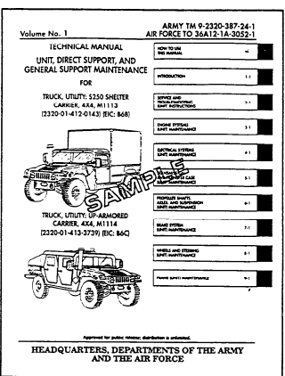

3. Look for SERVICE AND TROUBLESHOOTING INSTRUCTIONS in the chapter list on the cover. 

This is where the troubleshooting information is located. 

4. Turn to those pages with the edge indicator matching the black bar for service and troubleshooting instructions. Page numbers are also listed next to chapter titles. 

5. Chapter 2 is divided into five sections: 
l Section I - Repair Parts, Special Tools, TMDE, and Support Equipment l Section II - Service Upon Receipt l Section III - PMCS l Section IV - General Maintenance Instructions l Section V - Electrical/Mechanical Systems Troubleshooting 6. Turn to section V, ELECTRICAL 

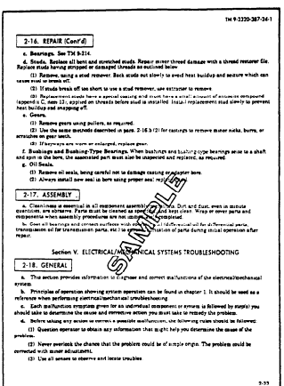

MECHANICAL SYSTEMS TROUBLE- SHOOTING (page 2-33). This troubleshooting section is systemoriented and is broken down into five top level tests and nineteen system level tests. 

7. One of the first pages of this section is the 

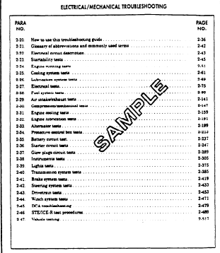

ELECTRICAL/MECHANICAL SYSTEM 
TROUBLESHOOTING (turn to page 2-35). 

8. Look down the list of symptoms until you find ENGINE LUBRICATION TESTS. In that paragraph you will find the diagnostic flow chart from which the vehicle operator can choose the test such as OIL LEAKS OR ENGINE PROBLEMS. 

9. Turn to the test indicated. 

10. On page 2-192, steps relating to 

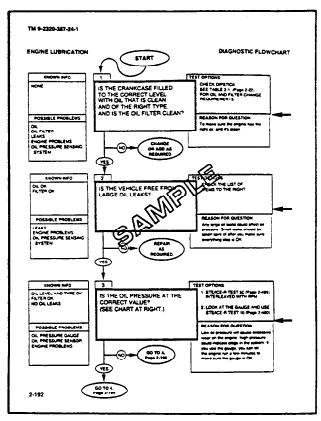

resolving the problem of excessive oil loss are listed. Read the diagnostic flow chart until you find OIL LEAKS OR ENGINE PROBLEMS. The tests listed are shown in the example page to the right of this text. 

IL In accordance with Test 1, you checked the oil level and filter for leaks. The oil level and filter appears normal and you move on to Test 2. 

12. In Test 2, you begin a methodic check of the engine lubricating system. You discover a leak in the oil cooler assembly adjacent to one of the mounting brackets. One of the welds has cracked, allowing a class III leak from a small area of the cooling fins. The oil cooler assembly must be repaired or replaced. 

13. At this point, the engine lubrication diagnostic flow chart would direct you to a specific detailed procedure to solve the problem. However, the engine lubricating system is complex and you must now refer to the table of contents to locate the proper task paragraph. 

NOTE: Before attempting to repair or replace the oil cooler assembly, as a Unit mechanic, you must: 
a. Determine the maintenance responsibility of repair or replacement of the component. b. If **the** task is at your echelon of maintenance responsibility, you must identify the tools needed and the replacement parts required. 

Refer to the Maintenance Allocation Chart - MAC (appendix B) to determine not only the maintenance responsibility of the item, but also to obtain an estimate of the time required to perform the task, tools needed, and any special notes/requirements necessary. 

Refer to TM 9-2320-387-24P, Unit, Direct Support and General Support Maintenance Repair Parts and Special Tools List for requisition data concerning replacement parts for this task. 

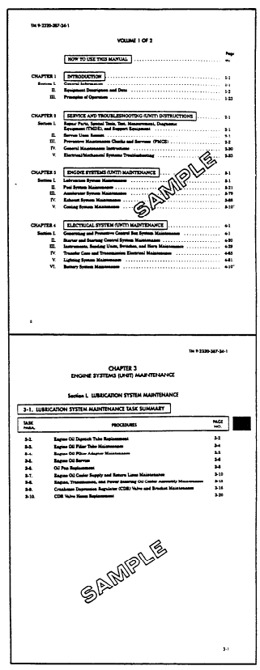

#### C. Oil Cooler Assembly

REPLACEMENT: After reporting the results of your troubleshooting efforts to your supervisor, he decides that the most expedient means of returning the vehicle to service would be to replace the oil cooler assembly. 

L Turn to the TABLE OF CONTENTS and find the chapter dealing with the engine. You find it as CHAPTER 3, ENGINE SYSTEMS 
(UNIT) MAINTENANCE. Furthermore, you note that the chapter is divided into five sections. You are interested in Section I. 

Lubrication System Maintenance. 

2. Turn to chapter 3, section I on page 3-1. Here you find the Lubrication System Maintenance Task Summary. Read down the list of tasks until you find the one that will correct your maintenance problem. For our example, you find it as task 3-8, Engine, Transmission, and Power Steering Oil Cooler Assembly Maintenance. Turn to page 3-12. 

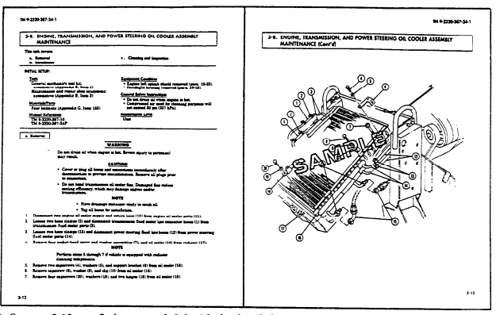

3. Un page 3-12, you find paragraph 3-8 with the detailed procedure for replacing the oil cooler assembly 
- - 

d. DETAILED MAINTE NANCE PROCEDURES: Detailed maintenance procedures include everything you must do to accomplish a basic maintenance task. Unless otherwise stated, general mechanic's automotive tool kit will be used for maintenance of this vehicle. 

L Before beginning the maintenance task, look through the procedure. You must familiarize yourself with the entire maintenance procedure of para. 3-8: Engine, 'D-ansmission, and Power Steering Oil Cooler Assembly Maintenance. The task includes a. Removal, b. Installation, and c. Cleaning and Inspection. 

2. The ten basic headings listed under INITIAL SETUP outline task conditions, materials, special tools, manpower requirements, and special conditions. The headings are: 

ADDlicable Models: Any models that require a particular maintenance task. If a maintenance task covers all models, then this heading will not be used. Test Eauinment: Test equipment needed to complete a task. If test equipment is not required, this heading will not be used. 

Tools: These are common tools and general mechanic tool sets required to perform maintenance tasks. These common tools should be on hand to properly perform the task. Torque wrenches are required for many tasks; the proper torque wrench should be available to tighten mounting hardware. SDecial Tools: Those special tools needed to complete a maintenance task. If no special tools are needed, this heading will not be used.

If you don't have one of these special tools, requisition it (before starting the task) using the data supplied in TM 9-2320-387-24P, the repair parts and special tools list for this level of maintenance. Special tools are located in section III. 

Materials/Parts: This heading lists only mandatory replacement materials or parts (gaskets, O-rings, sealant, etc.). To replace other unservicable parts, refer to TM 9-2320-387-2413 for requisition data. If no mandatory replacement materials/parts are required, this heading will not be used.

l **Personnel Reauired: The** number of personnel needed to perform a task. If only one mechanic is needed, this heading will not be used. 

If you think that you need more help to adequately or safely complete a task, perhaps as the result of unusual conditions, etc., 
alert your supervisor and ask for help. 

l Manual References: Those TMs needed to complete the task. l EauiDment Condition: Notes the conditions that must exist before starting the task. If none are required, this heading will not be used. For oil cooler assembly replacement, the left-hand engine splash shield should be removed before we can start the task. If not already done, follow the procedure for splash shield removal in para. lo-23 before proceeding with this task. 

. **General Safetv Instructions:** Summarizes all safety warnings for the maintenance task. If none are required, this heading will not be used. 

l **Maintenance Level:** Identifies maintenance level required to perform task. 

3. A step-by-step maintenance procedure follows the INITIAL SETUP and gives detailed instructions for the procedure. These instructions give the **part's** general location and name and action performed. In the example Engine, Transmission, and Power Steering Oil Cooler Assembly Replacement, a. Removal, step 1 is "Disconnect two engine oil cooler supply and return lines (7) 
from engine oil cooler ports (9)." Note that the numbers in parentheses correspond to the part's callout number in the accompanying illustration. 

Warnings, cautions, and notes provide supplemental information: 
l Waminps: Indicate conditions, practices, or procedures which must be observed to avoid personnel injury, loss of life, or long-term health hazard. 

l Cautions: Indicate condition, practices, or procedures which must be observed to avoid damage to equipment or destruction of equipment. 

l Notes: Include essential information of special importance, interest, or aid in job performance, which should be remembered and would be otherwise difficult to find or incorporate into the text. 

4. At the end of a procedure, FOLLOW-ON TASKS will list those additional tasks that must be performed to complete the procedure. The follow-on tasks for engine, transmission, and power steering oil cooler assembly replacement are: 
l Fill power steering fluid to proper level (TM 9-2320-387-10). 

l Fill transmission oil to proper level (TM 9-2320-387-10). l Fill engine oil to proper level (TM 9-2320-387-10). 

l Install headlight housing (para. 10-18). l Install left-hand splash shield (para. 10-23). l Start engine (TM 9-2320-387-10) and check for leaks. 

e. Refer to the example pages for para. 3-8, Engine, Transmission, and Power Steering Oil Cooler Assembly Maintenance as we review the following points: 
I. Modular Text: Both pages of text and illustrations are to be used together. This manual was designed so the two pages would be visible at once, making part identification and procedure sequence easy to follow. 

2. Initial Setup: Outlines task conditions. 3. **Illustrations: An** exploded diagram of the component shows part locations, attachments, and spatial relationships. Cutaway views (part of the vehicle is erased) show the location and orientation of screws and attachments. 

f. Your manual is easy to use once you understand its design. We hope it will encourage you to use your TM more often as an aid to maintenance support. 

# Chapter 1 Introduction

# Section I. General Information 1-1. Scope

a. This technical manual contains instructions for unit, direct, and general support maintenance of the 4x4, 1-1/4 ton Expanded Capacity Vehicles (ECV).

b. Models included are:
(1) M1113 S250 Shelter Carriers (2) M1114 Up-Armored Carriers (3) M1151 Armament Carriers (4) M1151A1 Armament Carriers, IAP/Armor Ready (5) M1152 Expanded Capacity Utility Trucks (6) M1152A1 Expanded Capacity Utility Trucks, IAP/Armor Ready (7) M1165 Command and Control/General Purpose Vehicles (8) M1165A1 Command and Control/General Purpose Vehicles, IAP/Armor Ready (9) M1167 Expanded Capacity TOW ITAS Carriers

# 1-2. Maintenance Forms, Records, And Reports

Department of the Army forms and procedures used for equipment maintenance will be those prescribed by DA Pam 750-8, The Army Maintenance Management System (TAMMS) User's Manual (Marine Corps) refer to TM 4700-15/1 series.

# 1-3. Destruction Of Army Equipment To Prevent Enemy Use

Refer to TM 750-244-6, Procedures for Destruction of Army Tank-automotive Equipment to Prevent Enemy Use.

# 1-4. Preparation For Shipment

Refer to TM 746-10, Marking, Packaging, and Shipment of Supplies and Equipment: General Packaging Instructions for Field Use.

# 1-5. Reporting Equipment Improvement Recommendations (Eir)

If your vehicle needs improvement, let us know. Send us an EIR. You, the user, are the only one who can tell us what you don't like about your equipment. Let us know why you don't like the design or performance. The preferred method for submitting QDRs is through the Army Electronic Product Support (AEPS) website under the Electronic Deficiency Reporting System (EDRS). The web address is: https://aeps.ria.army.mil. This is a secured site requiring a password that can be applied for on the front page of the website. If the above method is not available to you, put it on an SF 368, Product Quality Deficiency Report (PQDR), and mail it to us at: Department of the Army, U.S. Army Tank-automotive and Armaments Command, ATTN: AMSTA-TR-E/PQDR MS 267, 6501 E. 11 Mile Road, Warren, MI 48397-5000. We'll send you a reply. (Marine Corps) Submit QDR's in accordance with MCO 4855-10.

# 1-6. Equipment Improvement Report And Maintenance Digest (Eir Md)

The quarterly Equipment Improvement Report and Maintenance Digest, TB 43-0001-62 series, contains valuable field information on the equipment covered in this manual. The information in the TB 43-0001-62 series is compiled from some of the Equipment Improvement Reports that you prepared on the vehicles covered in this manual. Many of these articles result from comments, suggestions, and improvement recommendations that you submitted to the EIR program. The TB 43-0001-62 series contains information on equipment improvements, minor alterations, proposed Modification Work Orders (MWOs), warranties (if applicable), actions taken on some of your DA Form 2028s (Recommended Changes to Publications and Blank Forms), and advance information on proposed changes that may affect this manual. The information will help you in doing your job better and will help in keeping you advised of the latest changes to this manual. Also refer to DA Pam 25-30, Consolidated Index of Army Publications and Blank Forms, and appendix A, References, of this manual.

# 1-7. Metric System

The equipment described herein contains metric components and requires metric common and special tools; therefore, metric units in addition to standard units will be used throughout this publication. In addition, a metric conversion table is located on the inside back cover of this publication.

# 1-8. Mandatory Replacement Parts

The maintenance instructions contained herein make reference to removing and discarding piece parts such as: gaskets, lockwashers, cotter pins, O-rings, seals, etc.; these items should be considered mandatory replacement items and replaced with new parts during assembly/installation.

# 1-9. Break-In Procedure

Do not tow trailer during the first 500 mi (805 km) of operation. Damage to equipment may occur.

Break-in precautions are no longer required during the first 500 mi (805 km) of operation, with the exception of trailer towing.

# Section Ii. Equipment Description And Data 1-10. Equipment Characteristics, Capabilities, And Features

The 1-1/4 ton, 4x4, ECV vehicles are tactical vehicles designed for use over all types of roads, as well as cross-country terrain, in all weather conditions. The vehicles have four driving wheels, powered by a V-8 liquid-cooled turbocharged diesel engine. Four-wheel hydraulic service brakes and a mechanical parking brake are standard. All vehicles are equipped with a pintle hook for towing. Tiedowns and lifting eyes are provided for air, rail, or sea shipment.

# 1-10. Equipment Characteristics, Capabilities, And Features (Cont'D)

## S250 Shelter Carrier: M1113

PURPOSE: The M1113 shelter carrier provides the capability to secure and transport the S250

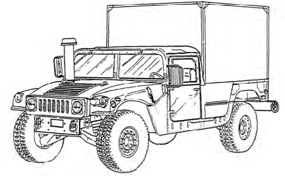

electrical equipment shelter. The optional winch permits recovery operations of similar vehicles. For payload, refer to para. 1-15.

#### M1113

# 1-10. Equipment Characteristics, Capabilities, And Features (Cont'D)

UP-ARMORED CARRIER, W/SUPPLEMENTAL ARMOR: M1114 PURPOSE: The M1114 up-armored vehicle carrier provides mounting and firing of the MK19 automatic

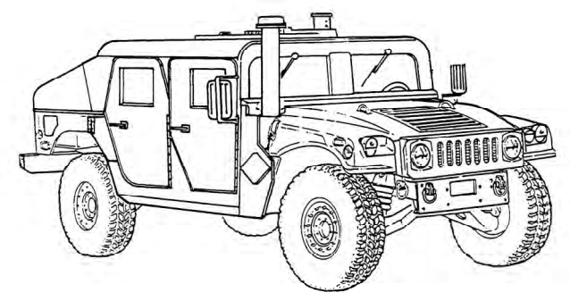

grenade launcher, M2, caliber .50 machine gun; M60, 7.62 mm machine gun; M240B, 7.62 mm machine gun; and M249, 5.56 mm Squad Assault Weapon (SAW); ring-mounted with a 360° arc of fire. The M1114 uparmored vehicle carrier provides added ballistic protection for armament components, crew, and ammunition. The optional rear winch permits recovery operations of similar vehicles. For payload, refer to para. 1-15.

#### M1114

# 1-10. Equipment Characteristics, Capabilities, And Features (Cont'D)

## Expanded Capacity, Armament Carrier: M1151

PURPOSE: The M1151 expanded capacity armament carrier provides mounting and firing of the MK19

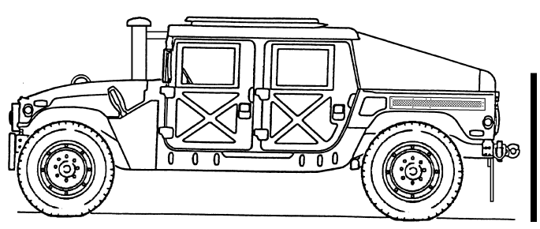

automatic grenade launcher, M2, caliber .50 machine gun; M60, 7.62 mm machine gun; M240B, 7.62 mm machine gun; and M249, 5.56 mm Squad Assault Weapon (SAW); ring-mounted with a 360° arc of fire, with armor protection for crew, weapon components, and ammunition. For higher payload capacity, the M1151 is equipped with a reinforced frame, crossmemebers, lifting shackles, heavy-duty variable rate rear springs, shock absorbers, reinforced control arms, heavy-duty tires and rims, and a transfer case and differential with a modified gear ratio. For payload, refer to para. 1-15.

## M1151

# 1-10. Equipment Characteristics, Capabilities, And Features (Cont'D)

## Expanded Capacity, Armament Carrier Iap/Armor Ready: M1151A1

PURPOSE: The M1151A1 expanded capacity, armament carrier IAP/armor ready provides mounting and

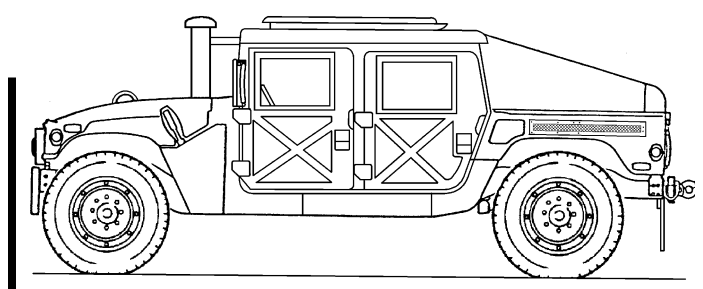

firing of the MK19 automatic grenade launcher, M2, .50 caliber machine gun; M60, 7.62 mm machine gun; M240B, 7.62 mm machine gun; and M249, 5.56 mm Squad Assault Protection (SAW); ring-mounted with a 360° arc of fire, with armor protection for crew, weapons components. For higher payload capacity, the M1151A1 is equipped with a reinforced frame, crossmembers, lifting shackles, heavy-duty variable rate rear springs, shock absorbers, reinforced control arms, heavy-duty tires and rims, and a transfer case and differential with a modified gear ratio. For payload, refer to para. 1-15.

M1151A1

# 1-10. Equipment Characteristics, Capabilities, And Features (Cont'D)

## Expanded Capacity, Enhanced: M1152

PURPOSE: The M1152 expanded capacity, enhanced truck is used to transport personnel. The M1152 provides the capability to secure and transport the S250 electrical equipment shelter. For higher payload capacity, the M1152 is equipped with a reinforced frame, crossmembers, lifting shackles, heavy-duty variable rate rear springs, shock absorbers, reinforced control arms, heavy-duty tires and rims, and a transfer case and differential with a modified gear ratio. The optional front winch permits recovery operations of similar vehicles. For payload, refer to para. 1-15. The increased payload capabilities accommodate the following kit configurations:

## A. 105Mm Towed Howitzer Prime Mover (L119 Kit) Consists Of:

- Larger rear bumper and reinforced mounting - Body wiring harness trailer receptacle extension - Ammunition stowage rack and tiedown straps - Camouflage net stowage rack - Winch - Two-man crew area soft top - Troop area soft top - Cargo bulkhead b. TOWED VULCAN SYSTEMS (TVS) MOVER consists of:
- Two-man crew area soft top - Troop area soft top - Camouflage net stowage rack - Troop seat kit - Cargo bulkhead c. S250 ELECTRICAL EQUIPMENT SHELTER consists of:
- Shelter support - Shelter tailgate - 200 amp umbilical power cable 1-10. EQUIPMENT CHARACTERISTICS, CAPABILITIES, AND FEATURES (Cont'd)

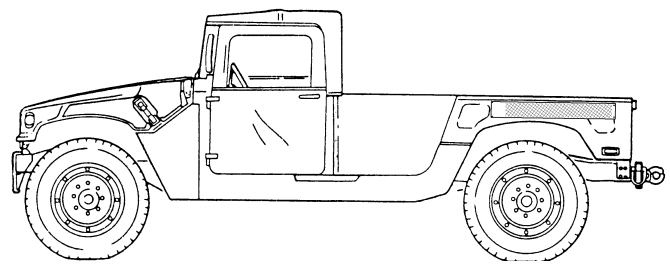

## M1152

# 1-10. Equipment Characteristics, Capabilities, And Features (Cont'D)

## Expanded Capacity, Enhanced, Iap/Armor Ready: M1152A1

PURPOSE: The M1152A1 expanded capacity, enhanced, IAP/armor ready is used to transport personnel.

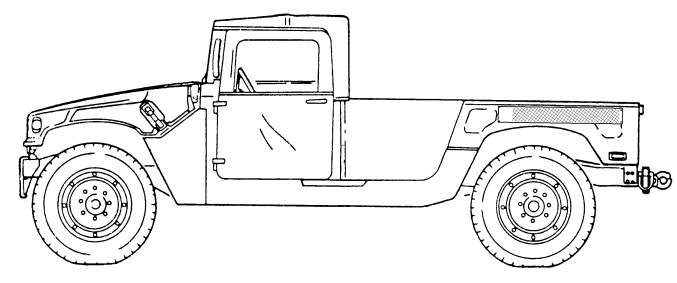

The M1152A1 comes equipped with Integrated Armor protection (IAP) which provides added ballistic protection for armament components, crew, and ammunition. The M1152A1 vehicles are capable of transporting a two-man or four-man crew and eight passengers. The M1152A1 provides the capability to secure and transport the S250 electrical equipment shelter. For higher payload capacity, the M1152A1 is equipped with a reinforced frame, crossmembers, lifting shackles, heavy-duty variable rate rear springs, shock absorbers, reinforced control arms, heavy-duty tires and rims, and a transfer case and differential with a modified gear ratio. The optional front winch permits recovery operations of similar vehicles. For payload, refer to para. 1-15.

M1152A1

# 1-10. Equipment Characteristics, Capabilities, And Features (Cont'D)

## Command And Control/General Purpose Vehicle: M1165

PURPOSE: The M1165 command and control/general purpose vehicle is used to transport personnel. The

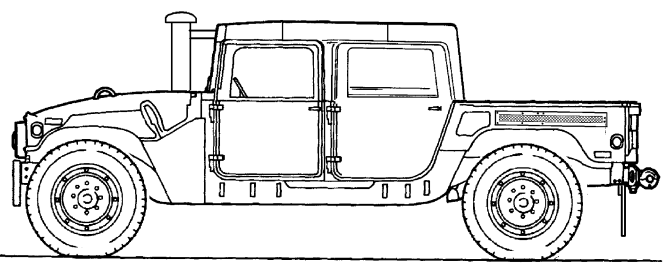

M1165 vehicles are capable of transporting a two-man or four-man crew and eight passengers. For higher payload capacity, the M1165 is equipped with a reinforced frame, crossmembers, lifting shackles, heavyduty variable rate rear springs, shock absorbers, reinforced control arms, heavy-duty tires and rims, and a transfer case and differential with a modified gear ratio. The optional front winch permits recovery operations of similar vehicles. For payload, refer to para. 1-15.

M1165

# 1-10. Equipment Characteristics, Capabilities, And Features (Cont'D)

## Command And Control/General Purpose Vehicle, Iap/Armor Ready: M1165A1

PURPOSE: The M1165A1 command and control/general purpose vehicle is used to transport personnel.

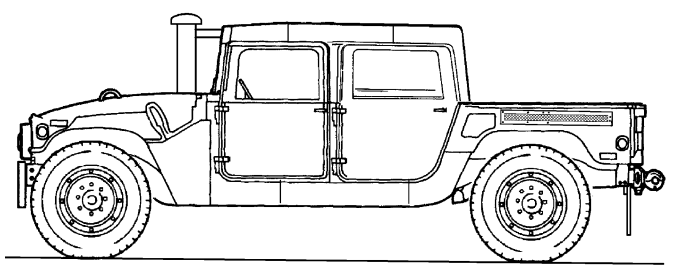

The M1165A1 comes equipped with Integrated Armor protection (IAP) which provides added ballistic protection for armament components, crew, and ammunition. The M1165A1 vehicles are capable of transporting a four-man crew. For higher payload capacity, the M1165A1 is equipped with a reinforced frame, crossmembers, lifting shackles, heavy-duty variable rate rear springs, shock absorbers, reinforced control arms, heavy-duty tires and rims, and a transfer case and differential with a modified gear ratio. The optional front winch permits recovery operations of similar vehicles. For payload, refer to para. 1-15.

M1165A1

# 1-10. Equipment Characteristics, Capabilities, And Features (Cont'D)

## Expanded Capacity Vehicle, Tow Improved Target Acquisition System (Itas): M1167

PURPOSE: The M1167 expanded capacity vehicle is equipped with an improved target acquisition

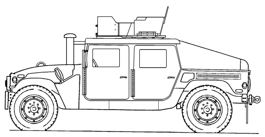 system (ITAS) used to mount and operate the missile launcher system with armor ballistic protection for crew, missile stowage, secondary weapons mount for close range, and ammunition These tactical vehicles are designed for use over all types of roads, as well as cross-country terrain, in all weather conditions. All vehicles are able to stow a minimum of six missiles mounted in the cargo area and are equipped with a pintle hook for towing, tiedowns, and lifting eyes for air, rail, or sea shipment. The optional front winch permits recovery operations of similar vehicles. For payload, refer to para. 1-15.

## M1167

# 1-11. Location And Description Of Major Exterior Components

The exterior components described below are common to all vehicles covered in this manual. Special differences are found in TM 9-2320-387-10 or table 1-1, Differences Between Models, in this manual.

A **AIR CLEANER** - Filters air before it enters intake manifold.

B **ENGINE** - Provides power for the vehicle.

C **TRANSMISSION** - Transmits engine power to transfer case at varying speeds.

D **FUEL TANK** - Stores fuel.

E **GEARED HUB** - Transfers turning action of halfshafts to wheels for vehicle motion.

F
PINTLE HOOK - Permits towing of vehicles or equipment.

G
REAR PROPELLER SHAFT - Transmits power from the transfer case to the rear differential.

H
TRANSFER CASE - Provides full-time four-wheel drive with three drive ranges.

I
FRONT PROPELLER SHAFT - Transmits power from the transfer case to the front differential.

J
MASTER CYLINDER AND HYDRO-BOOSTER - Provides hydraulic pressure and power assist for vehicle stopping power.

K
DIFFERENTIAL - Transfers turning action of the propeller shaft to the geared hubs through the halfshafts.

L **WINCH** - 9,000 lb electrically powered or 10,500 lb hydraulically powered to provide recovery

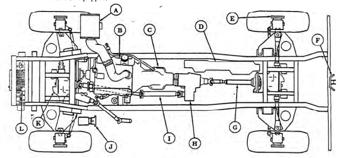

capability. Located in front of vehicle on all models except M1114 (if equipped) and rear of vehicle on M1114 models (if equipped).

# 1-12. Location And Description Of Major Interior Components

The major interior components shown below are common to all vehicles covered in this manual. Components not covered here can be found in TM 9-2320-387-10 or the applicable maintenance chapters of this manual.

A **DIRECTIONAL SIGNAL CONTROL** - Activates turn signal lights.

B
AIR RESTRICTION GAUGE - Indicates restrictions in the air cleaner.

C **STEERING WHEEL** - Manual control for turning vehicle.

D **INSTRUMENT CLUSTER** - Houses controls and indicators.

E **DIAGNOSTIC CONNECTOR** - Connection point for STE/ICE-R test set.

F **TRANSMISSION SHIFT LEVER** - Manual control for shifting transmission.

G
TRANSFER CASE SHIFT LEVER - Manual control for shifting transfer case.

H
PARKING BRAKE LEVER - Manual control for applying parking brake.

I
ACCELERATOR PEDAL - Foot control for determining engine speed.

J
BRAKE PEDAL - Foot control for stopping vehicle.

K
MAIN LIGHT SWITCH - Controls operation of vehicle lights.

L
ROTARY SWITCH - When positioned to START, the starter is engaged to crank the engine.

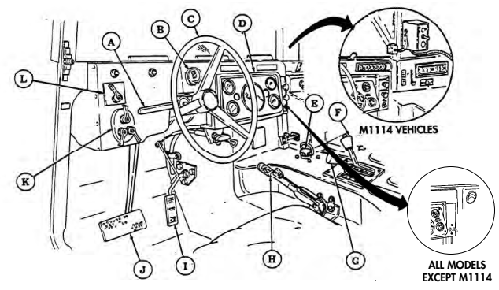

# L-1 2. Location And Description Of Major Interior Components (Cont'D) .

0 **1 P (Park)** 0 2 **R (Reverse)** 0 3 N (Neutral) 
@ @ (Overdrive) 
0 5 **D (Manual Third)** 
0 **6 2 (Manual Second)** 
0 7 1 UGnual **First)** 

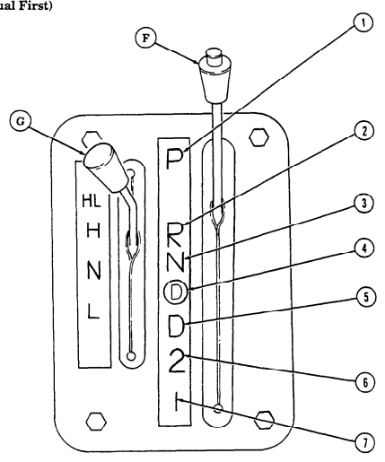

# 1 1- 13. Location And Contents Of Warning, Caution, And Data Plates I

The location and contents of caution, data, and warning plates are provided in this paragraph. If any of these plates are worn, broken, painted over, missing, or unreadable, they must be replaced. Information on data plate may vary with the model. 

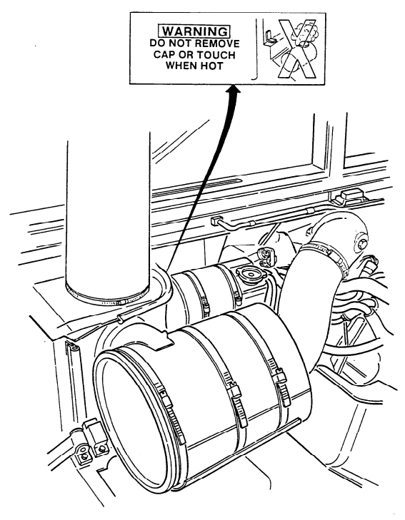

1-13. LOCATION AND CONTENTS OF WARNING, CAUTION, AND DATA PLATES (Cont'd)

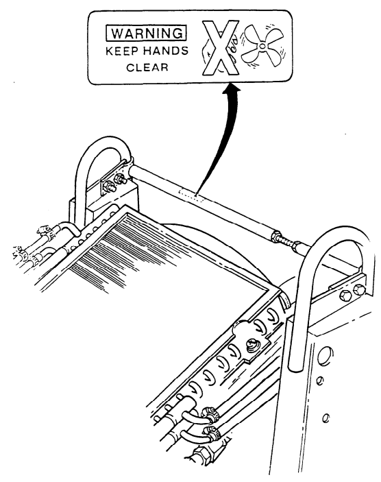

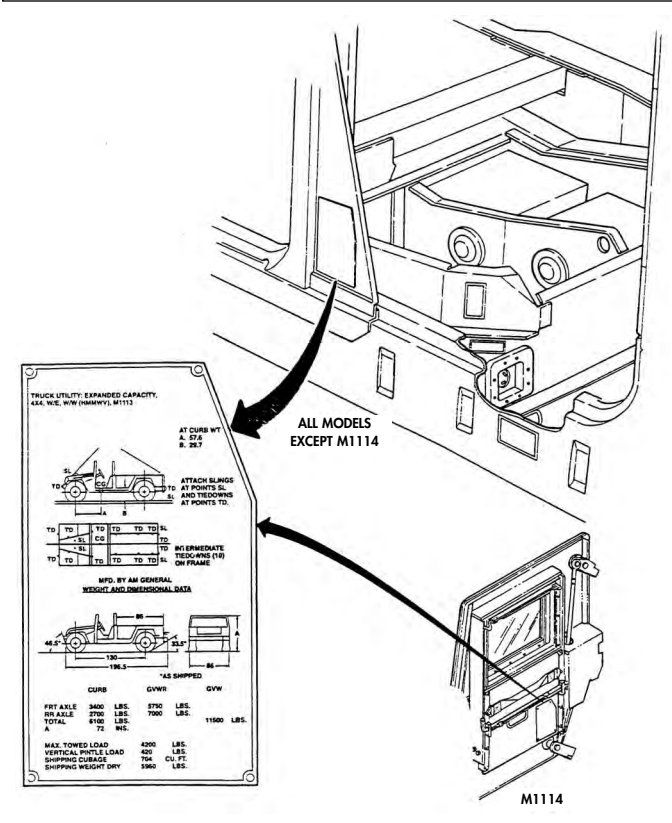

1-13. LOCATION AND CONTENTS OF WARNING, CAUTION, AND DATA PLATES (Cont'd)
1

# 1-13. Location And Contents Of Warning, Caution, And Data Plates (Cont'D)

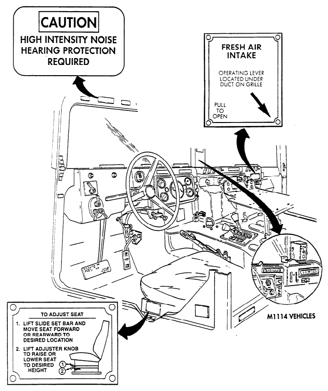

1-13. LOCATION AND CONTENTS OF WARNING, CAUTION, AND DATA PLATES (Cont'd)

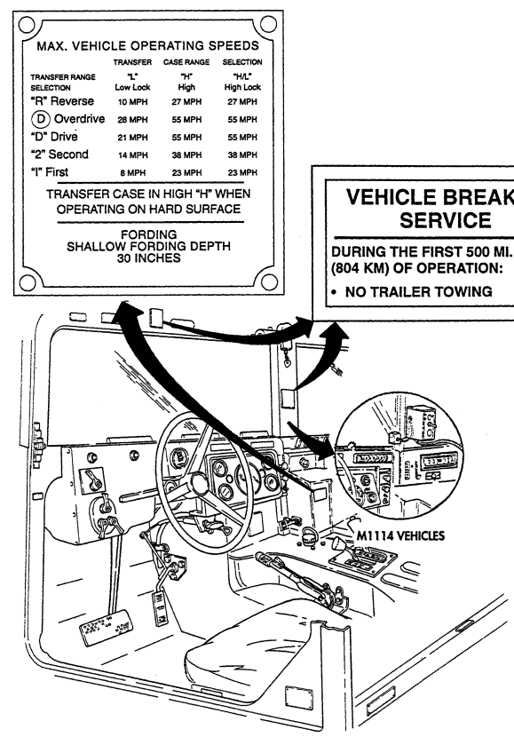

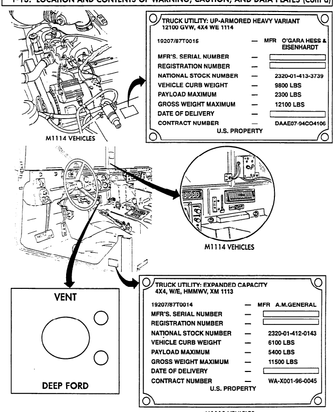

1 1 - 13. LOCATION AND CONTENTS OF WARNING, CAUTION, **AND DATA PLATES Konr'dll** 

M **1113 VEHICLES** 

1-13. LOCATION AND CONTENTS OF WARNING, CAUTION, AND DATA PLATES (Cont'd)

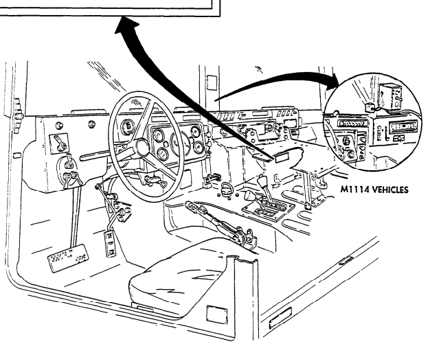

| MANUALS   |
|-----------|

 TM 9-2320-387-24

# 1-13.  Location And Contents Of Warning, Caution, And Data Plates (Cont'D)

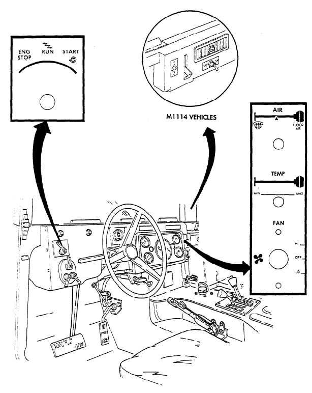

l- 13. LOCATION AND CONTENTS OF WARNING, CAUTION, AND DATA PLATES (Cont'd) - 
WARNING 
DO NOT USE HAND THROTTLE AS AN 
AUTOMATIC VEHICLE SPEED OR CRUISE CONTROL. 

THE HAND THROTTLE WILL NOT DISENGAGE 

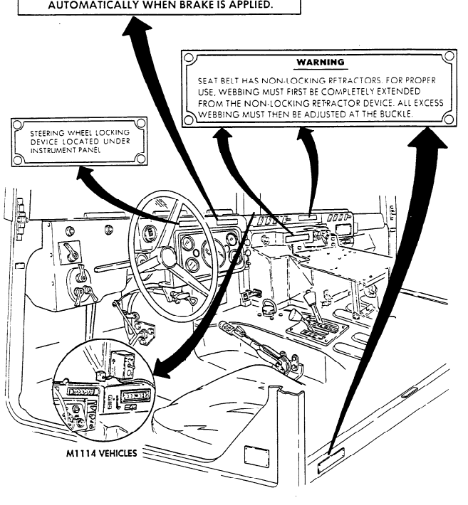

# 1-13. Location And Contents Of Warning, Caution, And Data Plates (Cont'D)

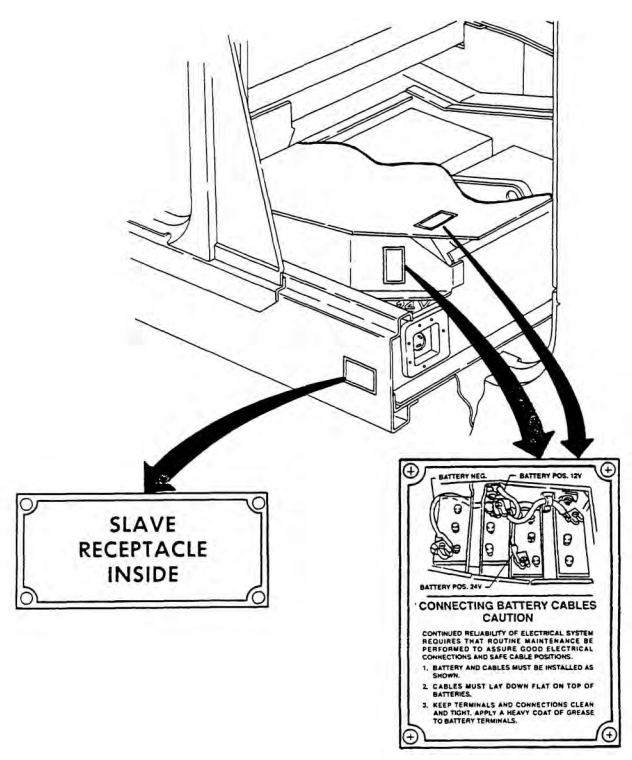

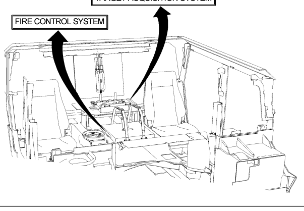

TARGET ACQUISITION SYSTEM 

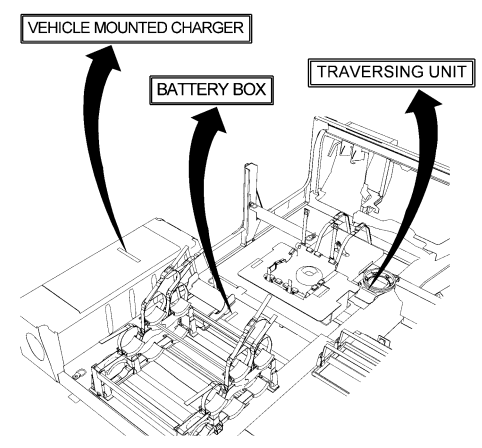

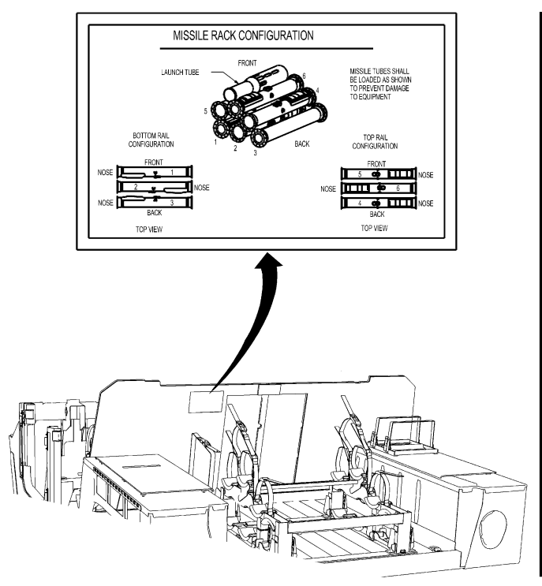

# 1-14. Differences Between Models

The differences between models are provided in this paragraph.

Table 1-1. Differences Between Models.

| 10\-53 3                     |
|------------------------------|
| 10\-54 \- 10\-56 5           |
| 10\-56.1 \- 10\-56.2 5       |
| 10\-56.3 \- 10\-56.6 3       |
| 10\-56.7 \- 10\-56.8 Added 5 |
| 10\-57 \- 10\-58 5           |
| 10\-58.1 5                   |
| 10\-58.2 Blank Added 3       |
| 10\-59 5                     |
| 10\-60 0                     |
| 10\-61 \- 10\-62 5           |
| 10\-63 \- 10\-64 2           |
| 10\-65 5                     |
| 10\-66 3                     |

# 1-15. Tabulated Data

Vehicle performance data for the ECV vehicles is listed in table 1-2. Information not covered can be found in TM-9-2320-387-10.

Table 1-2. Tabulated Data.

Standard and metric measurements will be used in this table. A list of their abbreviations is provided below.

# Tabulated Data Abbreviations

| 10\-128.18 Blank Added 6       | 11\-12 2                      | 11\-67 \- 11\-68 2             |
|--------------------------------|-------------------------------|--------------------------------|
| 10\-129 \- 10\-132 5           | 11\-12.1 \- 11\-12.3 Added 2  | 11\-68.1 5                     |
| 10\-133 \- 10\-137 0           | 11\-12.4 Blank Added 2        | 11\-68.2 2                     |
| 10\-138 5                      | 11\-13 \- 11\-16 2            | 11\-68.3 \- 11.68.5 1          |
| 10\-139 0                      | 11\-17 1                      | 11\-68.6 2                     |
| 10\-140 5                      | 11\-18 0                      | 11\-68.7 1                     |
| 10\-141 0                      | 11\-19 1                      | 11\-68.8 2                     |
| 10\-142 5                      | 11\-20 2                      | 11\-68.9 \- 11\-68.10 1        |
| 10\-143 3                      | 11\-21 0                      | 11\-69 1                       |
| 10\-144 5                      | 11\-22 2                      | 11\-70 \- 11\-73 2             |
| 10\-145 0                      | 11\-23 1                      | 11\-74 \- 11\-77 Deleted 2     |
| 10\-146 \- 10\-150 5           | 11\-24 2                      | 11\-78 \- 11\-82 2             |
| 10\-150.1 Blank Added 2        | 11\-24.1 \- 11\-24.2 Added 2  | 11\-82.1 1                     |
| 10\-150.2 \- 10\-150.7 Added 2 | 11\-24.3 \- 11\-24.23 Added 3 | 11\-82.2 2                     |
| 10\-150.8 Blank Added 2        | 11\-24.24 Blank Added 3       | 11\-83 1                       |
| 10\-151 \- 10\-154 5           | 11\-25 1                      | 11\-84 2                       |
| 10\-154.1 3                    | 11\-26 2                      | 11\-84.1 \- 11\-84.6 Deleted 2 |
| 10\-154.2 5                    | 11\-27 \- 11\-29 1            | 11\-85 2                       |
| 10\-154.1 \- 10\-154.4 Added 3 | 11\-30 \- 11\-31 2            | 11\-86 \- 11\-89 1             |
| 10\-155 3                      | 11\-32 \- 11\-36 6            | 11\-90 5                       |
| 10\-156 5                      | 11\-37 0                      | 11\-90.1 5                     |
| 10\-156.1 \- 10\-156.2 Added 3 | 11\-38 6                      | 11\-90.2 6                     |
| 10\-157 3                      | 11\-39 0                      | 11\-91 Blank 3                 |
| 10\-158 5                      | 11\-40 6                      | 11\-92 \- 11\-95 5             |
| 10\-158.1 Added 3              | 11\-40.1 6                    | 11\-96 \- 11\-97 1             |
| 10\-158.2 Blank Added 3        | 11\-40.2 Blank Added 1        | 11\-98 \- 11\-99 5             |
| 10\-159 5                      | 11\-41 6                      | 11\-100 \- 11\-101 0           |
| 10\-160 6                      | 11\-42 3                      | 11\-102 \- 11\-103 2           |
| 10\-161 Blank Added 6          | 11\-43 \- 11\-44 1            | 11\-104 \- 11\-105 5           |
| 10\-162 \- 10\-165 Added 6     | 11\-45 3                      | 11\-106 \- 11\-107 0           |
| 10\-166 Blank Added 6          | 11\-46 6                      | 11\-108 2                      |
| 11\-1 3                        | 11\-46.1 6                    | 11\-108.1 \- 11\-108.7 Added 2 |
| 11\-2 5                        | 11\-46.2 5                    | 11\-108.8 Blank Added 2        |
| 11\-2.1 \- 11\-2.2 Added 6     | 11\-46.3 Blank Added 5        | 11\-109 1                      |
| 11\-3 Blank 3                  | 11\-46.4 6                    | 11\-110 2                      |
| 11\-4 2                        | 11\-47 5                      | 11\-110.1 \- 11\-110.2 Added 2 |
| 11\-4.1 1                      | 11\-48 \- 11\-51 6            | 11\-111 \- 11\-112 2           |
| 11\-4.2 2                      | 11\-52 2                      | 11\-112.1 \- 11\-112.2 Added 2 |
| 11\-5 1                        | 11\-52.1 3                    | 11\-113 2                      |
| 11\-6 5                        | 11\-52.2 6                    | 11\-114 1                      |
| 11\-7 \- 11\-8 1               | 11\-53 \- 11\-55 5            | 11\-115 0                      |

*ALL HYDRAULIC SYSTEMS AND ALL FUEL CAPACITIES
ARE CALCULATED APPROXIMATIONS
Table 1-2. Tabulated Data (Cont'd).

| TM 9\-2320\-387\-24\-1                        |                           |                            |                                |                                |                                |
|-----------------------------------------------|---------------------------|----------------------------|--------------------------------|--------------------------------|--------------------------------|
| LIST OF EFFECTIVE PAGES (Contd)               |                           |                            |                                |                                |                                |
| Page No *Change No.                           | Page No *Change No.       | Page No *Change No.        | 11\-116 2                      | 11\-189 3                      | 11\-221 \- 11\-222 5           |
| 11\-117 \- 11\-120 0                          | 11\-190 5                 | 11\-222.1 Added 5          | 11\-120.1 \- 11\-120.2 Added 2 | 11\-191 3                      | 11\-222.2 6                    |
| 11\-223 \- 11\-224 5                          | 11\-121 2                 | 11\-192 \- 11\-193 6       | 11\-224.1 Added 5              | 11\-122 \- 11\-123 0           | 11\-194 5                      |
| 11\-224.2 6                                   | 11\-124 \- 11\-125 6      | 11\-195 3                  | 11\-225 \- 11\-226 5           | 11\-126 \- 11\-127 1           | 11\-196 5                      |
| 11\-226.1 Added 5                             | 11\-128 2                 | 11\-197 3                  | 11\-226.2 6                    | 11\-129 1                      | 11\-198 5                      |
| 11\-227 \- 11\-228 5                          | 11\-130 3                 | 11\-199 3                  | 11\-228.1 Added 5              | 11\-130.1 Blank Added 3        | 11\-200 5                      |
| 11\-228.2 6                                   | 11\-130.2 \- 11\-130.3 6  | 11\-201 3                  | 11\-229 6                      | 11\-130.4 3                    | 11\-202 5                      |
| 11\-230 5                                     | 11\-130.5 \- 11\-130.6 6  | 11\-202.1 Added 5          | 11\-230.1 Added 5              | 11\-131 Blank 3                | 11\-202.2 6                    |
| 11\-230.2 6                                   | 11\-132 2                 | 11\-202.3 Blank Added 6    | 11\-231 6                      | 11\-132.1 \- 11\-132.6 Added 2 | 11\-202.4 \- 11\-202.5 Added 6 |
| 11\-232 5                                     | 11\-132.7 \- 11\-132.13 6 | 11\-202.6 Blank Added 6    | 11\-232.1 Added 5              | 11\-132.14 Blank Added 6       | 11\-203 5                      |
| 11\-232.2 6                                   | 11\-133 \- 11\-138 3      | 11\-204 5                  | 11\-233 6                      | 11\-139 0                      | 11\-205 Blank 5                |
| 11\-234 5                                     | 11\-140 3                 | 11\-206 \- 11\-208 5       | 11\-234.1 Added 5              | 11\-141 0                      | 11\-208.1 Added 5              |
| 11\-234.2 6                                   | 11\-142 \- 145 3          | 11\-208.2 6                | 11\-235 \- 11\-236 5           | 11\-146 2                      | 11\-208.3 \- 11\-208.4 Added 5 |
| 11\-236.1 Added 5                             | 11\-147 1                 | 11\-209 6                  | 11\-236.2 6                    | 11\-148 \- 11\-151 0           | 11\-210 5                      |
| 11\-237 5                                     | 11\-152 2                 | 11\-210.1 Added 5          | 11\-238 6                      | 11\-153 \- 11\-155 1           | 11\-210.2 Added 6              |
| 11\-238.1 Added 5                             | 11\-156 \- 11\-157 0      | 11\-211 5                  | 11\-238.2 Blank Added 5        |                                |                                |
| 11\-158 1                                     | 11\-212 6                 | 11\-239 \- 11\-343 Added 5 | 11\-159 \- 11\-161 0           | 11\-213 3                      |                                |
| 11\-344 Blank Added 5                         | 11\-162 Blank 0           | 11\-214 5                  | 11\-345 \- 11\-413 Added 6     |                                |                                |
| 11\-163 \- 11\-164 6                          | 11\-214.1 Added 5         | 11\-414 Blank Added 6      | 11\-165 3                      | 11\-214.2 6                    | 11\-415 \- 11\-430 Added 6     |
| 11\-166 5                                     | 11\-215 \- 11\-216 5      | 11\-431 Blank Added 6      | 11\-167 3                      | 11\-216.1 Added 5              | 11\-432 \- 11\-463 Added 6     |
| 11\-168 \- 11\-170 5                          | 11\-216.2 6               | 11\-464 Blank Added 6      | 11\-171 \- 11\-183 3           | 11\-217 5                      | 12\-1 1                        |
| 11\-184 5                                     | 11\-218 6                 | 12\-2 2                    | 11\-185 3                      | 11\-219 3                      | 12\-2.1 1                      |
| 11\-186 5                                     | 11\-220 5                 | 12\-2.2 2                  | 11\-187 3                      | 11\-220.1 Added 5              | 12\-3 \- 12\-9 1               |
| 11\-188 5                                     | 11\-220.2 6               | 12\-10 2                   |                                |                                |                                |
| *Zero in this column indicates original page. |                           |                            |                                |                                |                                |

Table 1-2. Tabulated Data (Cont'd).

|                                 |                               | TM 9\-2320\-387\-24\-1     |
|---------------------------------|-------------------------------|----------------------------|
| LIST OF EFFECTIVE PAGES (Contd) |                               |                            |
| Page No *Change No.             | Page No *Change No.           | Page No *Change No.        |
| 12\-11 1                        | 12\-60.5 1                    | 12\-143 \- 12\-145 5       |
| 12\-12 2                        | 12\-60.6 2                    | 12\-146 3                  |
| 12\-13 \- 12\-17 1              | 12\-61 2                      | 12\-147 5                  |
| 12\-18 2                        | 12\-62 5                      | 12\-148 3                  |
| 12\-19 \- 12\-21 1              | 12\-62.1 \- 12.62.8 1         | 12\-149 5                  |
| 12\-22 \- 12\-23 2              | 12\-62.9 \- 12\-62.17 Added 6 | 12\-150 3                  |
| 12\-24 1                        | 12\-62.18 Blank Added 6       | 12\-151 \- 12\-153 5       |
| 12\-25 Deleted 1                | 12\-63 2                      | 12\-155 3                  |
| 12\-26 Blank Deleted 1          | 12\-64 \- 12\-65 0            | 12\-156 \- 12\-160 5       |
| 12\-27 2                        | 12\-66 \- 12\-68 2            | 12\-161 3                  |
| 12\-28 \- 12\-30 1              | 12\-68.1 2                    | 12\-162 5                  |
| 12\-30.1 \- 12\-30.2 Added 2    | 12\-68.2 \- 12\-68.3 1        | 12\-163 \- 12\-165 3       |
| 12\-30.3 3                      | 12\-68.4 2                    | 12\-166 \- 12\-170 5       |
| 12\-30.4 5                      | 12\-68.5 1                    | 12\-171 3                  |
| 12\-31 2                        | 12\-68.6 2                    | 12\-172 5                  |
| 12\-32 1                        | 12\-68.7 1                    | 12\-173 3                  |
| 12\-33 0                        | 12\-68.8 5                    | 12\-174 5                  |
| 12\-34 2                        | 12\-68.9 \- 12\-68.18 1       | 12\-175 3                  |
| 12\-35 \- 12\-37 6              | 12\-68.19 5                   | 12\-176 \- 12\-178 5       |
| 12\-38 5                        | 12\-68.20 2                   | 12\-179 3                  |
| 12\-39 \- 12\-40 2              | 12\-68.21 \- 12\-68.22 1      | 12\-180 \- 12\-184 5       |
| 12\-41 \- 12\-46 0              | 12\-68.23 2                   | 12\-185 3                  |
| 12\-47 2                        | 12\-68.24 \- 12\-68.25 1      | 12\-186 5                  |
| 12\-48 \- 12\-49 1              | 12\-68.26 2                   | 12\-187 3                  |
| 12\-50 Blank 0                  | 12\-68.27 \- 12\-68.28 1      | 12\-188 5                  |
| 12\-51 \- 12\-52 6              | 12\-68.29 \- 12\-68.30 2      | 12\-189 \- 12\-191 3       |
| 12\-53 0                        | 12\-68.31 Added 2             | 12\-192 5                  |
| 12\-54 2                        | 12\-68.32 Blank Added 2       | 12\-193 \- 12\-195 3       |
| 12\-54.1 5                      | 12\-69 \- 12\-70 2            | 12\-196 5                  |
| 12\-54.2 6                      | 12\-71 0                      | 12\-197 \- 12\-201 3       |
| 12\-54.3 2                      | 12\-72 \- 12\-73 1            | 12\-202 5                  |
| 12\-54.4 1                      | 12\-74 0                      | 12\-203 \- 12\-205 3       |
| 12\-54.5 \- 12\-54.6 2          | 12\-75 \- 12\-77 2            | 12\-206 5                  |
| 12\-55 6                        | 12\-78 0                      | 12\-207 \- 12\-209 3       |
| 12\-56 2                        | 12\-79 3                      | 12\-210 \- 12\-216 5       |
| 12\-56.1 1                      | 12\-80 6                      | 12\-217 \- 12\-20 Added 5  |
| 12\-56.2 5                      | 12\-81 2                      | 12\-221 Blank Added 5      |
| 12\-57 3                        | 12\-82 \- 12\-83 0            | 12\-222 \- 12\-223 Added 5 |
| 12\-58 \- 12\-59 5              | 12\-84 2                      | 12\-224 Blank Added 5      |
| 12\-60 2                        | 12\-85 \- 12\-131 3           | 12\-225 \- 12\-229 6       |
| 12\-60.1 1                      | 12\-132 \- 12\-12\-135 5      | 12\-230 \- 12\-231 5       |
| 12\-60.2 5                      | 12\-136 3                     | 12\-232 \- 12\-233 6       |
| 12\-60.3 2                      | 12\-137 \- 12\-141 5          | 12\-236 Added 5            |
| 12\-60.4 5                      | 12\-142 3                     | 12\-234 \- 12\-235 5       |

# Table 1-2. Tabulated Data (Cont'D).

| LIST OF EFFECTIVE PAGES (Contd)   |                                 |                              |
|-----------------------------------|---------------------------------|------------------------------|
| Page No *Change No.               | Page No *Change No.             | Page No *Change No.          |
| 12\-236.1 \- 12\-236.2 Added 5    | 15\-25 0                        | 18\-2 2                      |
| 12\-237 \- 12\-247 Added 5        | 15\-26 2                        | 18\-3 \- 18\-5 0             |
| 12\-248 \- 12\-249 6              | 15\-27 1                        | 18\-6 2                      |
| 12\-250 \- 12\-251 5              | 15\-28 \- 15\-29 2              | 18\-7 \- 18\-9 0             |
| 12\-252 \- 12\-263 6              | 15\-30 \- 15\-31 0              | 18\-10 2                     |
| 12\-264 \- 12\-70 5               | 15\-32 2                        | 18\-10.1 \- 18\-10.2 2       |
| 12\-270.1 \- 12\-270.9 Added 5    | 15\-33 0                        | 18\-10.3 \- 18\-10.7 1       |
| 12\-270.10 Blank Added 5          | 15\-34 \- 15\-35 2              | 18\-10.8 2                   |
| 12\-271 \- 12\-349 Added 5        | 15\-36 0                        | 18\-10.9 \- 18\-10.10 1      |
| 12\-350 Blank Added 5             | 15\-37 \- 15\-39 2              | 18\-10.11 \- 18\-10.12 2     |
| 12\-351 \- 12\-379 Added 6        | 15\-40 \- 15\-41 6              | 18\-11 1                     |
| 12\-380 Blank Added 6             | 15\-42 \- 15\-43 0              | 18\-12 2                     |
| 13\-1 5                           | 15\-44 1                        | 18\-13 5                     |
| 13\-2 6                           | 15\-45 \- 15\-46 0              | 18\-14 \- 18\-15 0           |
| 13\-3 5                           | 15\-47 \- 15\-76 6              | 18\-16 2                     |
| 13\-4 Blank 0                     | 15\-76.1 \- 15\-76.36 Added 6   | 18\-17 \- 18\-19 0           |
| 14\-1 1                           | 15\-77 6                        | 18\-20 2                     |
| 14\-2 \- 14\-3 0                  | 15\-78 \- 15\-96 6              | 18\-21 0                     |
| 14\-4 \- 14\-5 1                  | 15\-96.1 \- 15\-96.20 Added 6   | 18\-22 5                     |
| 14\-6 0                           | 15\-97 \- 15\-124 6             | 18\-23 \- 18\-27 0           |
| 14\-7 1                           | 15\-124.1 \- 15\-124.32 Added 6 | 18\-28 2                     |
| 14\-8 5                           | 15\-125 6                       | 18\-29 0                     |
| 14\-9 \- 14\-13 0                 | 15\-126 2                       | 18\-30 2                     |
| 14\-15 \- 14\-16 6                | 15\-127 0                       | 18\-31 \- 18\-33 0           |
| 14\-17 0                          | 15\-128 Blank 0                 | 18\-34 2                     |
| 14\-18 \- 14\-19 3                | 16\-1 0                         | 18\-35 0                     |
| 14\-20 5                          | 16\-2 \- 16\-3 2                | 18\-36 2                     |
| 14\-21 0                          | 16\-4 \- 16\-5 0                | 18\-37 0                     |
| 14\-22 3                          | 16\-6 2                         | 18\-38 1                     |
| 14\-23 \- 14\-28 5                | 16\-7 0                         | 18\-39 \- 18\-40 5           |
| 14\-25 6                          | 16\-8 2                         | 18\-41 0                     |
| 14\-26 5                          | 16\-9 \- 16\-10 0               | 18\-42 1                     |
| 14\-27 \- 14\-28 6                | 16\-11 1                        | 18\-43 2                     |
| 15\-1 0                           | 16\-12 2                        | 18\-44 \- 18\-45 0           |
| 15\-2 6                           | 16\-13 \- 16\-15 0              | 18\-46 Blank 0               |
| 15\-3 \- 15\-5 0                  | 16\-16 2                        | 19\-1 \- 19\-6 6             |
| 15\-6 2                           | 16\-17 0                        | 19\-6.1 Blank Added 6        |
| 15\-7 \- 15\-8 6                  | 16\-18 2                        | 19\-6.2 \- 19\-6.8 Added 6   |
| 15\-9 \- 15\-10 2                 | 16\-19 \- 16\-21 0              | 19\-7 \- 19\-12 6            |
| 15\-11 \- 15\-14 6                | 16\-22 Blank 0                  | 19\-12.1 \- 19\-12.6 Added 6 |
| 15\-15 \- 15\-19 0                | 17\-1 \- 17\-2 6                | 19\-13 \- 19\-16 6           |
| 15\-20 2                          | 17\-3 \- 17\-13 Added 6         | 19\-17 Added 6               |
| 15\-21 \- 15\-23 0                | 17\-14 Blank Added 6            | 19\-18 Blank Added 6         |
| 15\-24 2                          | 18\-1 1                         | 19\-9 \- 19\-10 0            |

# Section Iii. Principles Of Operation

# 1-16. General

This section explains how components of the ECV series vehicles work together. The systems (functional groups) covered are listed in the Principles of Operation Reference Index, paragraph 1-17.

| 19\-15 0                    | 24\-19 0                     | 25\-36.6 \- 25\-36.16 2      |
|-----------------------------|------------------------------|------------------------------|
| 19\-16 Blank 0              | 24\-20 \- 24\-22 6           | 25\-36.17 \- 25\-36.18 5     |
| 20\-1 \- 20\-6 6            | 24\-22.1 \- 22.4 Added 6     | 25\-36.19 Blank 2            |
| 20\-6.1 \- 20\-6.6 Added 6  | 24\-23 \- 24\-24 6           | 25\-36.20 5                  |
| 20\-7 \- 20\-10 6           | 24\-24.1 \- 24\-24.2 Added 6 | 25\-36.21 \- 25\-36.32 1     |
| 20\-11 Added 6              | 24\-25 \- 24\-28 6           | 25\-36.33 \- 25\-36.34 5     |
| 20\-12 Added Blank 6        | 24\-28.1 \- 24\-28.4 Added 6 | 25\-36.35 \- 25\-36.36 2     |
| 21\-1 \- 21\-2 6            | 24\-29 \- 24\-32 6           | 25\-36.37 5                  |
| 21\-2.1 \- 21\-2.4 Added 6  | 24\-32.1 \- 24\-32.4 Added 6 | 25\-36.38 \- 36.43 Added 2   |
| 21\-3 \- 21\-4 6            | 24\-33 \- 24\-34 6           | 25\-36.44 Blank Added 2      |
| 21\-4.1 \- 21\-4.14 Added 6 | 24\-34.1 \-24\-34..2 Added 6 | 25\-37 3                     |
| 21\-5 \- 21\-8 6            | 24\-35 6                     | 25\-38 \- 25\-41 0           |
| 21\-8.1 \- 21\-8.2 Added 6  | 24\-36 2                     | 25\-42 6                     |
| 21\-9 \- 21\-11 2           | 24\-37 0                     | 25\-42.1 \- 25\-42.2 Added 6 |
| 21\-12 \- 21\-19 0          | 24\-38 2                     | 25\-43 6                     |
| 21\-20 2                    | 24\-38.1 \- 24\-38.2 Added 6 | 25\-44 \- 25\-45 0           |
| 22\-1 \- 22\-3 1            | 24\-39 Blank 6               | 25\-46 1                     |
| 22\-4 2                     | 24\-40 6                     | 25\-47 0                     |
| 22\-5 0                     | 25\-1 6                      | 25\-48 2                     |
| 22\-6 \- 22\-7 1            | 25\-2 2                      | 25\-49 1                     |
| 22\-8 2                     | 25\-3 1                      | 25\-50 2                     |
| 22\-9 \- 22\-11 1           | 25\-4 2                      | 25\-50.1 1                   |
| 22\-12 Blank 1              | 25\-5 \- 25\-8 1             | 25\-50.2 2                   |
| 23\-1 \- 23\-2 2            | 25\-9 0                      | 25\-51 1                     |
| 23\-3 \- 23\-5 0            | 25\-10 2                     | 25\-52 2                     |

1-17. PRINCIPLES OF OPERATION REFERENCE INDEX

# 1-18. Drivetrain Operation

The drivetrain is identical for both models covered in this manual. It converts horsepower into mechanical force to move the vehicle. Major components of the drivetrain are:
A **ENGINE** - The 6.5 liter V-8 turbocharged engine develops approximately 190 horsepower at 3,400 rpm to power the vehicle. The engines are essentially the same on all models except those equipped with deep water fording kit installed, which adds a specially vented CDR valve. This difference does not affect engine performance.

B
TRANSMISSION - Adapts engine power to meet different driving conditions. The automatic transmission has four forward speeds, a reverse, a neutral, and a park. A neutral safety switch prevents the vehicle from being started with the transmission in any selector lever position except park and neutral.

C
TRANSFER CASE - Directs engine-to-transmission power to front and rear differentials simultaneously. This condition means the vehicle is always in four-wheel drive. The transfer case allows for selection of three drive ranges and a neutral position. A complete description of these driving ranges and the recommended driving conditions during which they are used can be found in TM 9-2320-387-10. PROPELLER SHAFTS - Link transfer case to differentials. Universal joints, located at either end of the front and rear propeller shafts, permit inline driving power between the transfer case and differentials even though they are mounted at different angles. DIFFERENTIALS - Transmit driving power, via halfshafts and geared hubs, to left and right wheels. The differential ensures power is applied to the wheel having traction, regardless of which wheel is slipping. This feature is called torque biasing.

F
HALFSHAFTS - Transmit power from differentials to geared hubs.

G

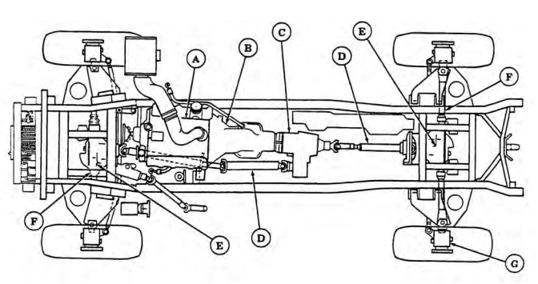

GEARED HUBS - Serve as the front wheel steering spindle and act as the final drive components to front and rear wheels.

D
E

# 1-19. Fuel System Operation

The HMMWV diesel fuel system operation is identical for both models covered in this manual. The system cleans and supplies fuel for the engine. Major components of the fuel system are:
A **FUEL PUMP** - Draws fuel from fuel tank through the supply line and pumps it to the fuel filter.

B **FUEL RETURN LINE** - Carries unused fuel from the injection pump back to the fuel tank.

C **FUEL SUPPLY LINE** - Carries fuel from fuel tank to the system.

D **FUEL TANK** - Stores 25 gallons (95 liters) of diesel fuel.

E **FUEL FILLER CAP** - Located at right rear side of vehicle, the cap is removed to permit fuel tank servicing.

F
FUEL INJECTORS - Receive metered fuel from the injection pump and spray fuel into the combustion chambers.

G
FUEL FILTER/WATER SEPARATOR - Filters water and sediment from fuel before fuel enters the injection pump.

H

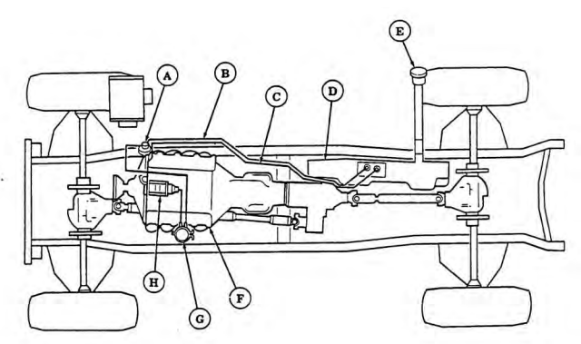

INJECTION PUMP - Directs metered and pressurized fuel to the eight injector nozzles. It is mounted on top of the engine under the intake manifold.

# 1-20. Cooling System Operation (Serial Numbers 299999 And Below)

The cooling system removes excess heat from the engine, engine oil, transfer oil, and transmission oil. Major components of the cooling system are:
A **ENGINE TEMPERATURE SENDING UNIT** - Sends signal indicating coolant temperature to gauge on instrument cluster.

B
ENGINE TEMPERATURE SWITCH - Sends signal to activate control valve system to operate fan when engine temperature exceeds 220°F (104°C) and deactivates when engine temperature drops below 190°F (88°C).

C **WATER CROSSOVER** - Collects coolant from cylinder heads and channels it to the thermostat housing where it is redirected through the cooling system.

D **THERMOSTAT** - Shuts off coolant return flow to radiator until temperature reaches 190°F (88°C).

Coolant is then directed to the radiator through the radiator inlet hose.

E **RADIATOR** - Directs coolant through a series of fins and baffles so outside air can dissipate excess engine heat before the coolant is recirculated through the engine.

F
OIL COOLER - Directs engine oil (lower half of cooler), power steering oil (lower half of cooler), and transmission oil (upper half of cooler) through a series of fins or baffles so outside air can remove heat from oil.

G
SURGE TANK - Filling and expansion point for cooling system.

H

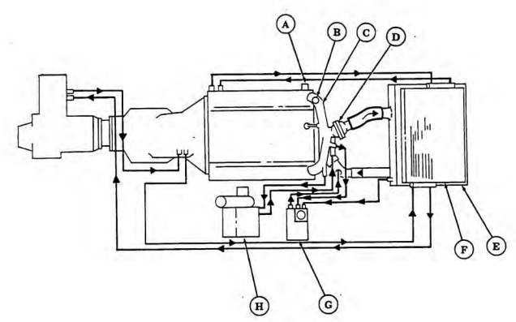

PERSONNEL HEATER - Provides heat for personnel and interior of vehicle.

# 1-20. Cooling System Operation (Serial Numbers 299999 And Below) (Cont'D)

I **FAN** - Pulls outside air through radiator to remove heat from coolant. J **HYDRAULIC CONTROL VALVE** - Directs hydraulic fluid to provide required pressure to actuate fan clutch as required by engine temperature. Hydraulic pressure is supplied by power steering pump.

K **TIME DELAY MODULE** - Sends delayed signal to fan clutch solenoid for delay of fan actuation to provide needed horsepower for engine acceleration.

L **FAN CLUTCH SOLENOID** - Actuates hydraulic control valve as required by coolant temperature.

M **WATER PUMP** - Driven by serpentine belt, provides circulation of coolant through cooling system. N
FAN CLUTCH - Hydraulically actuated by pressure from hydraulic control valve to control operation of fan. Hydraulic pressure is supplied by power steering pump.

O
DRAINVALVE - Draining point for radiator and cooling system.

P

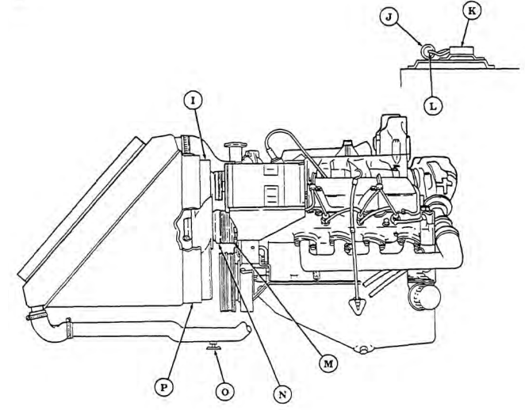

RADIATOR SHROUD - Permits a greater concentration of air to be pulled through the radiator.

# 1-20.1. Cooling System Operation (Serial Numbers 300000 And Above)

The cooling system removes excess heat from the engine, engine oil, transfer case oil, and transmission oil. Major components of the cooling system are:
A **TRANSFER CASE** - Directs engine coolant through a series of fins or baffles so coolant can remove heat from transfer case oil.

B **ENGINE TEMPERATURE SENDING UNIT** - Sends signal indicating coolant temperature to gauge on instrument cluster.

C **WATER CROSSOVER** - Collects coolant from cylinder heads and channels it to the thermostat housing where it is redirected through the cooling system.

D **THERMOSTAT** - Shuts off coolant return flow to radiator until temperature reaches 190°F (88°C).

Coolant is then directed to the radiator through the radiator inlet hose.

E **RADIATOR** - Directs coolant through a series of fins and baffles so outside air can dissipate excess engine heat before the coolant is recirculated through the engine. OIL COOLER - Directs engine oil (lower half of cooler) and transmission oil (upper half of cooler) through a series of fins or baffles so outside air can remove heat from oil.

G
SURGE TANK - Filling and expansion point for cooling system.

H
DIFFERENTIAL COOLER - Directs engine coolant through a series of fins or baffles so coolant can remove heat from differential oil.

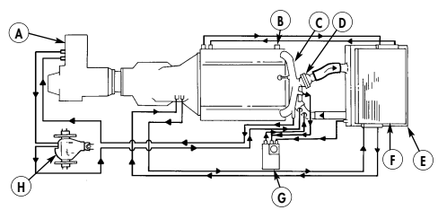

F

# 1-20.1. Cooling System Operation (Serial Numbers 300000 And Above) (Cont'D)

I **WATER PUMP** - Driven by serpentine belt, provides circulation of coolant through cooling system.

J
DRAINVALVE - Draining point for radiator and cooling system.

K **GEARED FAN DRIVE** - Transmits engine power and torque to drive the radiator cooling fan and clutch.

L **FAN** - Pulls outside air through radiator to remove heat from coolant.

M
TWO-PIECE RADIATOR SHROUD - Permits a greater concentration of air to be pulled through the radiator.

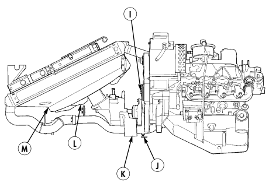

# 1-21. Starting System Operation

The starting system is identical for both vehicles covered in this manual, and consists of the following components and circuits:
B
A
ROTARY SWITCH - When in START position, provides battery power through neutral start switch to the starter solenoid circuit 14. NEUTRAL STARTER SWITCH - When transmission shift lever is in P (Park) or N (neutral) position, this switch closes allowing battery power to reach the starter solenoid.

C **PROTECTIVE CONTROL BOX** - Acts as a link between body harness and engine harness.

D **STARTER SOLENOID** - A magnetic relay that transmits 24-volt battery power to the starter motor.

E **STARTER MOTOR** - Cranks the engine for starting, and is supplied 24-volt battery power

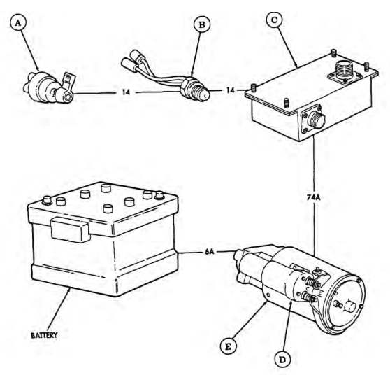

through circuit 6A.

#### F- 1

## 1 L-22. Generating System Operation 1

The 200-ampere generating system maintains battery charge and provides electrical power to operate vehicle circuits. Major components of the generating system are: 
0 A 
BATTERY GAUGE - Indicates electrical system voltage. It is connected to the electrical system through circuit 567. 

0 B 0 ALTERNATOR (ZOO-AMPERE1 - Is rated at 28 volts at 200 amperes, and 14 volts at 50 amperes with external regulator. The alternator assists and recharges the vehicle batteries during operation. 

C 
CIRCUIT 568 - Senses vehicle voltage, and activates the field current in the alternator circuit to alternator. 

0 D 0 PROTECTIVE CONTROL BOX - Protects the vehicle electric system in the event battery polarity is reversed. Provides load dump, glow plug operation, and interfacing of engine body harnesses. 

E 
CIRCUIT 2 - Sends AC signal, indicating alternator shaft rpm, to frequency switch in protective control box to prevent operation of starter solenoid when engine is running. 

0 F 0 BATTERIES - Two 12-volt batteries are connected in a series to provide 24 volts to start vehicle and assist alternator during operation. 

G 
POSITIVE CABLE 6 - Provides 28-volt alternator output to maintain charge across two batteries. 

0 H 0 POSITIVE CABLE **68A -** Provides 16-volt alternator output to maintain charge across the lower battery. 

I 
CIRCUIT 3 - Connects to negative stud on alternator with engine ground strap to provide a ground 

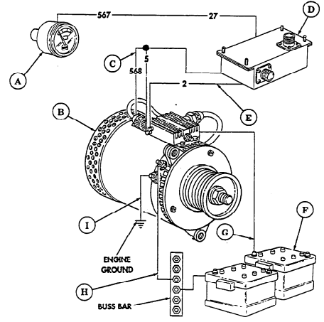 circuit to alternator. 

#### I I

.- 

## L-23. Battery System Operation

The battery system is identical for both vehicles covered in this manual and consists of the following circuits and components: 
0 A 
CIRCUIT 6A - Connects the batteries to the starter and to the protective control box through circuit 8% 
0 B 
BATTERIES - Two 6TN batteries are connected to provide 24 volts DC for the electrical starting system. 

0 C 
SLAVE RECEPTACLE - Links an external power source directly to the slaved vehicle's batteries to assist in cranking the engine when the vehicle's batteries are not suffkiently charged. 

SHUNT - Used when measuring current draw from batteries utilizing STEACE-R. 

0 E 
PROTECTIVE CONTROL BOX (PCB) - Protects the vehicle electrical system if the battery system polarity is reversed. Provides frequency lockout, load dump, glow plug operation, and interfacing of engine body harnesses. 

ROTARY SWITCH - When in START position, actuates starter solenoid through circuits 1lA and 744. When in RUN position, closes circuit 29A to activate instrument cluster gauges through circuit 27. 

0 F 
0 G 
CIRCUIT 7A - Connects the starter negative terminal to engine ground while circuit 7E connects shunt to engine ground. 

0 H 
STARTER SOLENOID - Actuates starter motor gear to crank vehicle engine. 

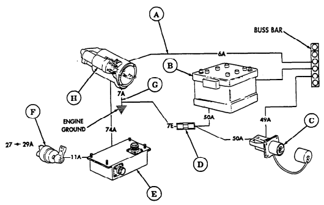

0 D 

## 1 L-24. Windshield Wiper/Washer System Operation 1

The following miscellaneous components and circuits are not covered in any of the other electrical systems: 
0 A 
WINDSHIELD WIPER MOTOR - When knob is turned to LOW or HIGH position, circuit 27 carries battery power to wiper motor to activate windshield wipers. 

0 B 
CIRCUIT 57 - Provides a ground circuit for wiper motor. 

WINDSHIELD WASHER MOTOR - When knob on wiper motor is pushed, the washer motor is 

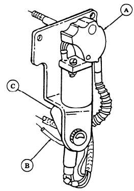

activated through circuit 71 to spray water onto windshield. 

0 C 

## L-25. Service/Parking Brake System Operation

The parking brake system is a mechanically-actuated system that provides a means of keeping the vehicle still once it stops. It also assists in emergency stopping if there is a complete service brake system failure. 

Major components of the parking brake system are: 
0 A 
PARKING BRAKE ROTORS - Attached to output flanges on rear differential, rotors prevent output flanges from turning when parking brake is applied. 

0 B 
BRAKE PADS - Apply friction to rotors when hand lever is applied. 

0 C 
pm-G BRAgE CALIPERS - Force brake pads against rotors when hand lever is applied. 

0 D 
PARKING BRAKE CABLES - 'Connect parking brake hand lever to equalizer bar. 

0 E 
EQUALIZER BAR - Evenly distributes braking pressure to the rear brake rotors. 

0 F 
PARKING BRAISE ROD - Connects parking brake hand lever to equalizer bar. 

0 G 
PARKING BRAKE HAND LEVER - Permits operator to engage the parking brake. 

0 H 
PARKING BRAKE HAND LEVER ADJUSTING CAP - Permits operator to make minor tension adjustment of parking brake. 

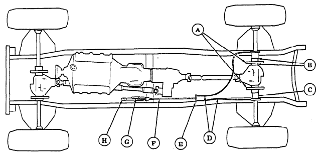

# 1-26. Service Brake System Operation

The service brake system is identical for both models covered in this manual. It is an inboard-mounted, fourwheel, disc brake, hydraulically-assisted system. Major components of the braking system are:
A
BRAKE LINKAGE - Directs brake pedal pressure to hydro-booster.

B
HYDRO-BOOSTER - Converts hydraulic power from the steering pump to mechanical power to the master cylinder, providing power assist during braking.

C **MASTER CYLINDER/RESERVOIR** - Stores brake fluid, and converts mechanical pedal pressure to hydraulic pressure.

D **PROPORTIONING VALVE** - Provides balanced front-to-rear braking and activates brake warning lamp in case of brake system malfunction.

E **ACCUMULATOR** - Stores hydraulic pressure for additional power-assisted braking in case of loss of pressure in steering system.

F **BRAKE PEDAL** - Provides operator control for stopping vehicle.

G
BRAKE PRESSURE LIMITER - Limits front brake line pressure to prevent brake lockup.

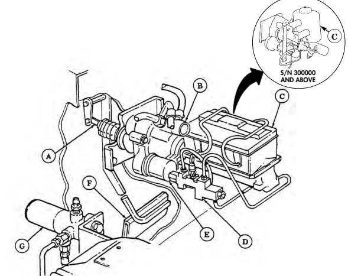

S/N 299999 AND BELOW

# 1-26. Service Brake System Operation (Cont'D)

A
HYDRAULIC BRAKE LINES - Direct brake fluid under pressure to all four brake calipers from master cylinder.

B
BRAKE CALIPER - Converts hydraulic pressure to mechanical force to compress brake pads against brake rotors.

C
BRAKE ROTOR - Attached to output flange on front and rear differentials. Rotor prevents output flange from turning when brakes are applied.

D
BRAKE PADS - Apply friction to brake rotor when brake pedal is depressed.

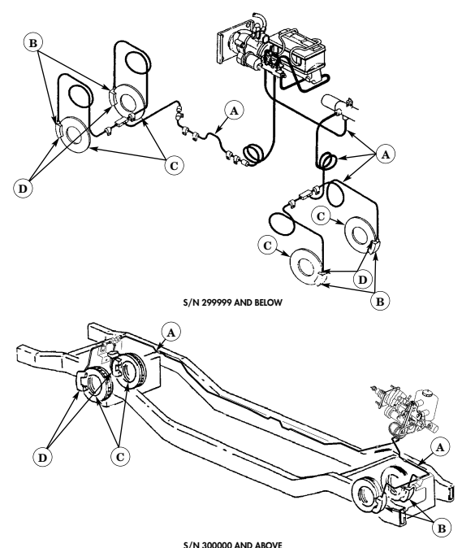

S/N 300000 AND ABOVE

# 1-27. Steering Control System Operation (Serial Numbers 299999 And Below)

The steering system is identical for both models covered in this manual. Major components of the steering system are:
A **HYDRAULIC CONTROL VALVE** - Directs hydraulic fluid to provide required pressure to actuate and deactuate fan clutch as required by engine temperature. Hydraulic pressure is supplied by power steering pump.

B **HYDRO-BOOSTER** - Converts hydraulic power from the steering pump to mechanical power to the master cylinder, providing power assist during braking.

C **POWER STEERING COOLER** - Is part of oil cooler which directs power steering fluid through a series of fins or baffles so outside air can dissipate excess heat before the fluid is recirculated through the steering system.

D **SERPENTINE BELT** - Transmits mechanical driving power from crankshaft drive pulley to steering pump pulley which drives the steering pump.

E **OIL RESERVOIR AND STEERING PUMP** - Combined in one unit, the reservoir serves as an oil filling point and the pump supplies the oil under pressure throughout the steering system.

F **FAN CLUTCH** - Hydraulically actuated and deactuated by the hydraulic control valve. The fan is actuated when hydraulic pressure is released, and deactuated when hydraulic pressure is applied. Hydraulic pressure is supplied by the power steering pump.

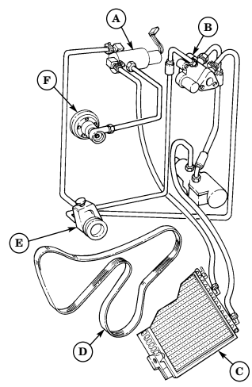

# 1-27. Steering Control System Operation (Serial Numbers 299999 And Below) (Cont'D)

A **STEERING WHEEL** - Serves as manual steering control for the operator.

B **STEERING COLUMN** - Transmits turning effort from steering wheel to intermediate steering shaft.

C **INTERMEDIATE STEERING SHAFT** - Permits angle of torque from steering column to input shaft of power steering gear.

D **STEERING GEAR** - Converts hydraulic power from steering pump to mechanical power at pitman arm.

E **PITMAN ARM** - Transfers steering torque from power steering gear to center link.

F **TIE ROD ASSEMBLY** - Transmits movement from center link to geared hub.

G **GEARED HUB** - Serves as the pivot point and link for the front wheels via the tie rod assembly.

H **CENTER LINK** - Transmits movement from pitman arm to tie rods.

I **IDLER ARM** - Supports right side of center link.

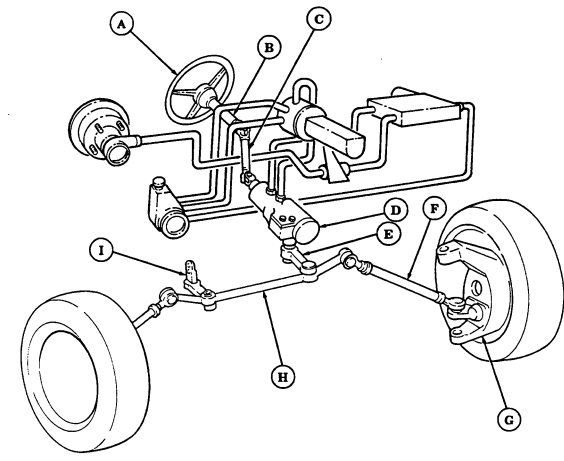

# 1-27.1. Steering Control System Operation (Serial Numbers 300000 And Above)

Major components of the steering system are:
A **OIL RESERVOIR** - The oil reservoir serves as an oil filling point.

B **HYDRO-BOOSTER** - Converts hydraulic power from the steering pump to mechanical power to the master cylinder, providing power assist during braking.

C **STEERING GEAR** - Converts hydraulic power from steering pump to mechanical power at pitman arm.

D **POWER STEERING COOLER** - Directs power steering fluid through a series of fins or baffles so outside air can dissipate excess heat before the fluid is recirculated through the steering system.

E **SERPENTINE BELT** - Transmits mechanical driving power from crankshaft drive pulley to steering pump pulley which drives the steering pump.

F **STEERING PUMP** - Supplies the oil under pressure throughout the steering system.

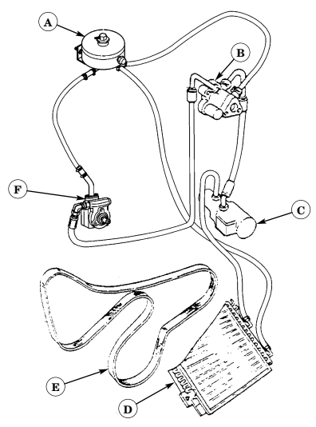

# 1-27.1. Steering Control System Operation (Serial Numbers 300000 And Above) (Cont'D)

A **STEERING WHEEL** - Serves as manual steering control for the operator.

B **STEERING COLUMN** - Transmits turning effort from steering wheel to intermediate steering shaft.

C **INTERMEDIATE STEERING SHAFT** - Permits angle of torque from steering column to input shaft of power steering gear.

D **STEERING GEAR** - Converts hydraulic power from steering pump to mechanical power at pitman arm.

E **PITMAN ARM** - Transfers steering torque from power steering gear to center link.

F
TIE ROD ASSEMBLY - Transmits movement from center link to geared hub.

G **GEARED HUB** - Serves as the pivot point and link for the front wheels via the tie rod assembly.

H
CENTER LINK - Transmits movement from pitman arm to tie rods.

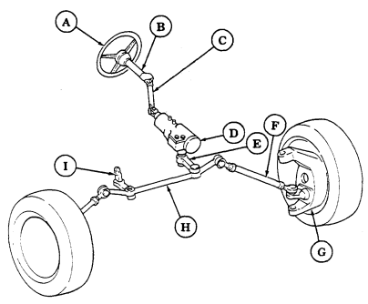

I **IDLER ARM** - Supports right side of center link.

l-28. SUSPENSION SYSTEM OPERATION I 
The suspension system is identical for both models covered in this manual. It is an independent coil springtype system. Major components of the suspension system are: 
0 A 
BALL JOINTS - Connect geared hub to control arms, and allows change of angle between geared hub and control arms during suspension movement. 

UPPER CONTROL ARM - Connects geared hub to frame rail. 

STABILIZER BAR (FRONT ONLY) - Prevents vehicle sway when cornering. 

D 
0 B 0 C 0 GEARED HUB - Serves as a mounting point for wheel and tire assembly and provides 1.92:1 gear reduction to increase torque to wheel and tire assembly. LOWER CONTROL ARM - Connects geared hub to frame rail. 

SHOCK ABSORBER - Dampens suspension movement and limits amount of suspension travel. 

G 
0 E 0 F 0 COIL SPRING - Supports weight of vehicle and allows suspension travel to vary depending on 

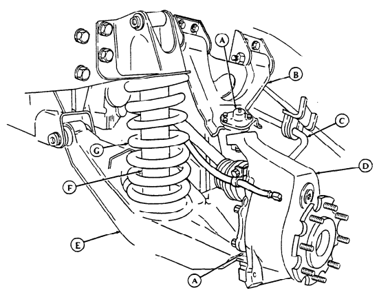

terrain and vehicle loading. 

# 1 L-28. Suspension **System Operation (Cont'D)** 1 -

0 A RADIUS ROD (REAR ONLY) - Connects geared hub to frame to maintain rear end alignment. 

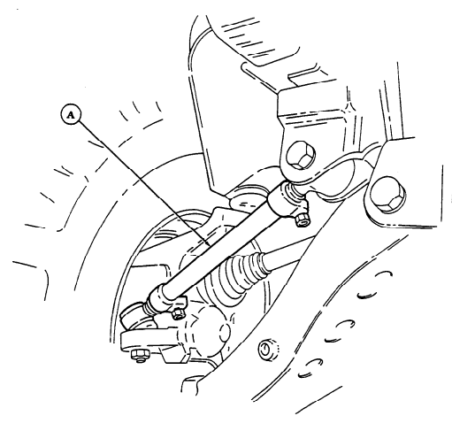

# 1-29. Air-Conditioning System Operation (M1114)

The M1114 air-conditioning system consists of the following major components:
A
DISCHARGE LINE - High-pressure gas is carried through the discharge line from the compressor to the condenser.

B
COMPRESSOR - Inside the compressor, low-pressure gas refrigerant is compressed into a high-pressure gas that is pushed into the condenser by the compressor.

C
SUCTION LINE - Refrigerant, in low-pressure gas form, is drawn from the evaporator by the suction action of the compressor.

D
EXPANSION VALVE - High-pressure liquid refrigerant enters a nonadjustable expansion valve where the refrigerant is formed into a liquid spray.

E
EVAPORATOR - Refrigerant enters evaporator as a liquid spray. It absorbs heat from the air in the crew compartment and vaporizes into a low-pressure gas.

F
LIQUID LINE - High-pressure liquid refrigerant is carried back to the evaporator by the liquid line to repeat the evaporation/condensation cycle.

G

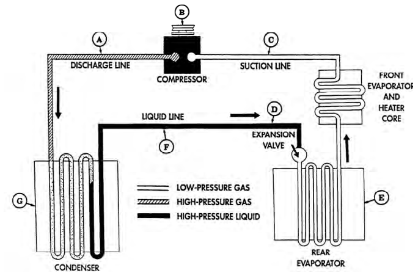

CONDENSER - Refrigerant enters the condenser as a high-pressure gas. When condensed, it gives up its heat to the outside air and becomes a high-pressure liquid.

# 1-29.1. Air-Conditioning System Operation (Two-Man)

The Two-Man air-conditioning system consists of the following major components:
A
COMPRESSOR - Inside the compressor, low-pressure gas refrigerant is compressed into a highpressure gas that is pushed into the condenser by the compressor.

B
DISCHARGE LINE - High-pressure gas is carried through the discharge line from the compressor to the condensers.

C
RECEIVER-DRYER - The primary function of the receiver-dryer is to separate gas and liquid. The secondary purpose is to remove moisture and filter out dirt.

D
CONDENSER - Refrigerant enters the condenser as a high-pressure gas. When condensed, it gives up its heat to the outside air and becomes a high-pressure liquid.

E
LIQUID LINE - High-pressure liquid refrigerant is carried back to the evaporator by the liquid line to repeat the evaporation/condensation cycle.

F
THERMAL EXPANSION VALVE - This type of valve senses both temperature and pressure. Highpressure liquid refrigerant enters expansion valve where the refrigerant is formed into a liquid spray.

G
EVAPORATOR - Refrigerant enters evaporator as a liquid spray. It absorbs heat from the air in the crew compartment and vaporizes into a low-pressure gas.

H
SUCTION LINE - Refrigerant, in low-pressure gas form, is drawn from the evaporator by the suction action of the compressor.

1-29.1. AIR-CONDITIONING SYSTEM OPERATION (TWO-MAN) (Cont'd)

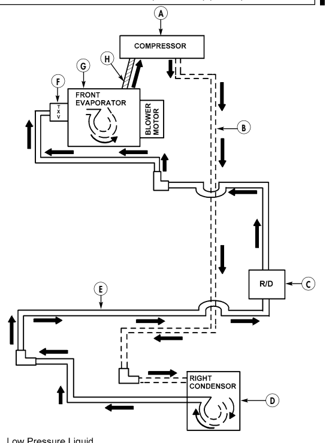

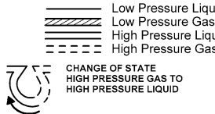

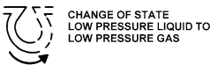

# 1-29.2. Air-Conditioning System Operation (Four-Man)

The Four-Man air-conditioning system consists of the following major components:
A
COMPRESSOR - Inside the compressor, low-pressure gas refrigerant is compressed into a highpressure gas that is pushed into the condenser by the compressor.

B
DISCHARGE LINE - High-pressure gas is carried through the discharge line from the compressor to the condensers.

C
RECEIVER-DRYER - The primary function of the receiver-dryer is to separate gas and liquid. The secondary purpose is to remove moisture and filter out dirt.

D
CONDENSERS - Refrigerant enters the condenser as a high-pressure gas. When condensed, it gives up its heat to the outside air and becomes a high-pressure liquid.

E
LIQUID LINE - High-pressure liquid refrigerant is carried back to the evaporator by the liquid line to repeat the evaporation/condensation cycle.

F
THERMAL EXPANSION VALVE - This type of valve senses both temperature and pressure. Highpressure liquid refrigerant enters expansion valve where the refrigerant is formed into a liquid spray.

G
EVAPORATORS - Refrigerant enters evaporator as a liquid spray. It absorbs heat from the air in the crew compartment and vaporizes into a low-pressure gas.

H
SUCTION LINE - Refrigerant, in low-pressure gas form, is drawn from the evaporator by the suction action of the compressor.

# 1-29.2. Air-Conditioning System Operation (Four-Man) (Cont'D)

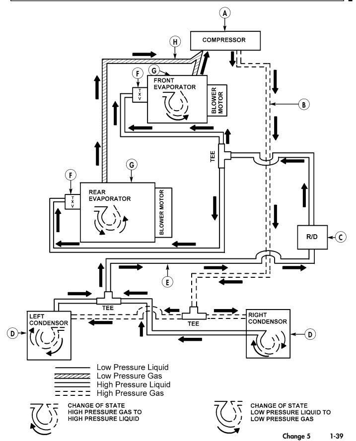

# 1-30. 200-Ampere Dual Voltage Umbilical Power Cable

The 200-ampere dual voltage umbilical power cable covered in this manual applies to the M1113, M1152, and M1152A1 and consists of the following major component:
A **POWER CABLE** - located behind the companion seat, provides power for shelter equipment.

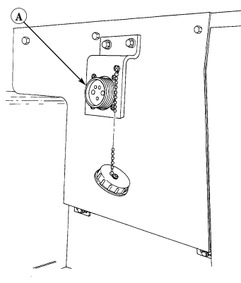

# Chapter 2 Service And Troubleshooting (Unit) Instructions

# Section I. Repair Parts, Special Tools, Test, Measurement, Diagnostic Equipment (Tmde), And Support Equipment 2-1. Common Tools And Equipment

For authorized common tools and equipment, refer to the Modified Table of Organization and Equipment (MTOE) applicable to your unit.

# 2-2. Special Tools, Tmde, And Support Equipment

Special Tools, Test, Measurement, and Diagnostic Equipment (TMDE), and Support Equipment used to maintain the vehicles covered in this manual can be found in TM 9-2320-387-24P. Calibrate all measuring and test equipment used to determine equipment conformance in accordance with TB 43-1800.

# 2-3. Fabricated Tools

Fabricated tools needed to maintain the equipment in this manual can be found in appendix D. These tools are not available for issue, but must be fabricated and applied by unit, direct, and general support personnel only.

# 2-4. Repair Parts

Repair parts are listed and illustrated in TM 9-2320-387-24P.

# Section Ii. Service Upon Receipt 2-5. General

a. Upon receipt of a new, used, or reconditioned vehicle, you must determine if the vehicle has been properly prepared for service. The following steps should be followed:
(1) Inspect all assemblies, subassemblies, and accessories to ensure they are in proper working order. (2) Secure, clean, lubricate, or adjust as needed. (3) Check all basic issue items (TM 9-2320-387-10) to ensure every item is present, in good condition, and properly mounted or stowed.

(4) Follow general procedures for all services and inspections given in TM 9-2320-387-10.

b. The operator will assist when performing service upon receipt inspections.

c. See TM 9-2320-387-10 when checking equipment for proper operation.

d. Refer to TM 9-2320-387-10 for information concerning break-in procedures.

# 2-6. General Inspection And Servicing Instructions

The following steps should be taken while performing general inspection and services:

Protective eye equipment (goggles/shield) must be worn when removing snaprings or springs. Failure to comply may result in injury to personnel.

Cooler fin and engine protective covers can be used to prevent damage to the vehicle components during maintenance. Refer to appendix D, figures D-40 and D-41 for fabrication instructions.

(1) Use TM 9-2320-387-10 as well as other sections of this manual when servicing and inspecting equipment.

Drycleaning solvent is flammable and will not be used near an open flame. A fire extinguisher will be kept nearby when the solvent is used. Use only in well-ventilated places. Failure to do this may result in injury to personnel and/or damage to equipment.

(2) Clean all exterior surfaces coated with rust-preventive compounds. Use drycleaning solvent
(appendix C, item 26).

(3) Clean fittings before lubrication. Clean parts with drycleaning solvent (SD), type II, or equivalent.

Dry before lubricating. Relubricate all items found contaminated after fording.

(4) Inspect electrical connectors for corrosion and/or damage (i.e., bent pins). Clean and repair damage. Apply sealing compound (appendix C, item 60) before reconnecting plugs.

(5) Read Processing and Deprocessing Record of Shipping, Storage, and Issue of Vehicles and Spare Engines, tag (DD Form 1397) and follow all precautions listed. This tag should be attached to steering wheel, steering column, or rotary switch.

# 2-7. Specific Inspection And Servicing Instructions

The following steps should be taken while performing specific inspections and services:
(1) Do the semiannual preventive maintenance checks and services listed in section III in this chapter.

(2) Lubricate the vehicle. Do not lubricate gear cases and engine unless processing tag states that the oil is unsuitable for 500 mi (805 km) operation. If oil is suitable, just check level.

(3) Schedule semiannual service on DD Form 314 (Preventive Maintenance Schedule and Record Card).

(4) If vehicle is delivered with a dry, charged battery, activate it according to TM 9-6140-200-14. (5) Check vehicle coolant level and determine if solution is proper for climate (refer to TB 750-651 for preparation of antifreeze solutions).

(6) Remove towing brackets from their stowed position behind the bumper and install them in their proper location (para. 9-2).

# Section Iii. Preventive Maintenance Checks And Services

# 2-8. General

The army has an agreement with the door manufacturer to issue free patch kits to repair armor doors that exhibit cracks originating from the window area (M1114 doors only). If you find cracks that extend 1.25 in. (31.75 mm) from either side or 6.25 in. (158.75 mm) below the window opening, contact TACOM, Light Truck Group, AMSTA-LC- CHLA, Warren, MI 48397-5000 at DSN 786-4389 or Commercial 586574-3806, or E-mail uparmoredhmmwv@tacom.army.mil for guidance on obtaining a kit.

The best way to maintain vehicles covered by this manual is to inspect them on a regular basis so minor faults can be discovered and corrected before they result in serious damage, failure, or injury. All intervals are based on normal operation. Hard time intervals may be shortened if lubricants are contaminated or if you are operating the equipment under adverse conditions, including longer-than-usual operating hours. Hard-time intervals may be extended during periods of low activity, though adequate preservation precautions must be taken. This section contains systematic instructions of inspection, adjustment, lubrication, and correction of vehicle components to avoid costly repairs or major breakdowns. This is Preventive Maintenance Checks and Services (PMCS).

# 2-9. Intervals

a. Unit maintenance, assisted by operator/crew, will perform checks and services contained in table 2-1 at the following intervals:
(1) Semiannually. Every 6 months or 3,000 miles (4,828 km), whichever comes first. (2) Annually. Every 12 months or 6,000 miles (9,656 km), whichever comes first. (3) Biennially. Every 24 months or 12,000 miles (19,310 km), whichever comes first.

b. Refer to following steps when performing lubrication checks and services:
(1) Intervals. Lubrication services coincide with the vehicle's semiannual preventive maintenance service. For this purpose, a 10% tolerance (variation) in specified lubrication point mileage is permissible. Those vehicles not accumulating 1,000 mi (1,609 km) in a 6-month period will be lubricated at the time of semiannual preventive maintenance service.

(2) For Operation of Equipment in Protracted Cold Temperatures Below -15°F (-26°C).

Remove lubricants prescribed in lubrication table for temperatures above -15°F (-26°C). Relubricate with lubricants specified in lubrication table for temperatures below -15°F (-26°C). If OEA lubricant is required, see the temperature ranges prescribed in the lubrication table. OEA lubricant is to be used in place of OE/HDO 10 lubricant for all temperature ranges where OE/HDO 10 is specified in the lubrication table.

c. Perform all semiannual inspections in addition to annual inspections at the time of the annual inspection. Perform all annual and semiannual inspections in addition to biennial inspections at the time of the biennial inspection.

# 2-10. Reporting Repairs

All vehicle shortcomings will be reported on DA form 2404 (DA Pam 750-8), Equipment Inspection and Maintenance Worksheet, immediately after the PMCS, and before taking corrective action. All vehicle deficiencies will be reported in the equipment record.

# 2-11. General Service And Inspection Procedures

a. While performing specific PMCS procedures, ensure items are correctly assembled, secure, not worn, serviceable, not leaking, and adequately lubricated as defined below:
(1) An item is CORRECTLY ASSEMBLED when it is in proper position and all parts are present. (2) When wires, nuts, washers, hoses, or attaching hardware cannot be moved by hand, they are SECURE.

(3) An item is WORN if there is too much play between joining parts or when marking data, warning, and caution plates are not readable.

(4) An item is UNSERVICEABLE if it is worn beyond repair and is likely to fail before the next scheduled inspection.

(5) LEAKS. TM 9-2320-387-10 contains definitions of class I, II, and III leaks and their effect on vehicle operation.

(6) If an item meets the specified lubrication requirements, then it is ADEQUATELY LUBRICATED.

b. Where the instruction tighten appears in a procedure, you must tighten with a wrench to the given torque value even when the item appears to be secure.

Drycleaning solvent is flammable and will not be used near an open flame. A fire extinguisher will be kept nearby when the solvent is used. Use only in well-ventilated places. Failure to do this may result in injury to personnel and/or damage to equipment.

c. Where the instruction clean appears in a procedure, you must use drycleaning solvent (appendix C,
item 26) to clean grease or oil from metal parts. After the item is cleaned, rinsed, and dried, apply a light grade of oil to unprotected surfaces to prevent rusting.

d. Clean rubber and plastic materials with soap and water. Refer to TM 9-2320-387-10 for general vehicle cleaning instructions.

# 2-12. Specific Pmcs Procedures

a. The preventive maintenance for which you are responsible is provided in table 2-1. The checks and services listed are arranged in logical order, requiring minimal time and effort on your part.

b. The following columns read across on the PMCS schedule:
(1) Item Number. Provides logical order of PMCS performance and is used as a source number for DA Form 2404, on which your PMCS results will be recorded.

(2) Interval. Shows the interval next to each item number to indicate when that check is to be performed. The interval will be repeated when consecutive item numbers are to be inspected during the same interval. Interval columns include:
(a) Semiannual (six month) checks; (b) Annual (yearly) checks; and (c) Biennial (every two years) checks.

(3) Item To Be Inspected. Lists the system, common name, or location of the item to be inspected. (4) Procedures. Provides instructions for servicing, inspection, lubrication, replacement, or adjustment and, in some cases, having item repaired at a higher level.

Always do your preventive maintenance checks and services in the order prepared. Once it gets to be a habit, you will be able to spot anything wrong in a hurry.

(5) Not Fully Mission Capable If. If vehicle meets criteria in this column, vehicle is Not Mission Capable (NMC).

| LIST OF EFFECTIVE PAGES (Contd)               |                     |                     |                                |                       |                        |
|-----------------------------------------------|---------------------|---------------------|--------------------------------|-----------------------|------------------------|
| Page No *Change No.                           | Page No *Change No. | Page No *Change No. | 25\-76 2                       | 25\-175 \- 25\-176 5  | 28\-26.1 \- 28\-26.2 1 |
| 25\-77 1                                      | 25\-177 3           | 28\-27 \- 28\-29 1  | 25\-78 2                       | 25\-178 \- 25\-180 5  | 28\-30 5               |
| 25\-78.1 \- 25\-78.2 1                        | 25\-181 Added 5     | 28\-30.1 1          | 25\-79 1                       | 25\-182 Blank Added 5 | 28\-30.2 5             |
| 25\-80 2                                      | 26\-1 0             | 28\-31 1            | 25\-81 \- 25\-87 1             | 26\-2 \- 26\-4 2      | 28\-32 2               |
| 25\-88 2                                      | 26\-5 \- 26\-9 0    | 28\-33 \- 28\-34 1  | 25\-89 1                       | 26\-10 2              | 28\-35 5               |
| 25\-90 2                                      | 27\-1 0             | 28\-36 1            | 25\-91 \- 25\-93 1             | 27\-2 5               | 28\-37 \- 28\-39 2     |
| 25\-94 2                                      | 27\-3 1             | 28\-40 5            | 25\-95 \- 25\-117 1            | 27\-4 \- 27\-6 2      | 28\-41 \- 28\-43 2     |
| 25\-118 Blank 1                               | 27\-7 \- 27\-9 0    | 28\-44 5            | 25\-119 5                      | 27\-10 5              | 28\-45 2               |
| 25\-120 \- 25\-122 6                          | 27\-11 \- 27\-13 0  | 28\-46 5            | 25\-123 \- 25\-124 3           | 27\-14 2              | 28\-47 0               |
| 25\-125 \- 25\-127 6                          | 25\-15 0            | 28\-48 2            | 25\-128 5                      | 27\-16 \- 27\-22 2    | 28\-49 0               |
| 25\-129 3                                     | 27\-23 0            | 28\-50 5            | 25\-130 6                      | 27\-24 \- 27\-29 2    | 28\-51 \- 28\-53 0     |
| 25\-131 \- 25\-132 3                          | 27\-30 5            | 28\-54 5            | 25\-133 \- 25\-134 6           | 27\-31 2              | 28\-55 0               |
| 25\-135 3                                     | 27\-32 \- 27\-33 0  | 28\-56 1            | 25\-136 5                      | 27\-34 2              | 28\-57 \- 28\-58 5     |
| 25\-137 6                                     | 27\-35 0            | 28\-58.1 2          | 25\-138 5                      | 27\-36 \- 27\-37 2    | 28\-58.2 5             |
| 25\-139 \- 25\-140 3                          | 27\-38 1            | 28\-59 1            | 25\-141 5                      | 27\-39 0              | 28\-60 2               |
| 25\-142 6                                     | 27\-40 Blank 0      | 28\-61 0            | 25\-143 \- 25\-150 3           | 28\-1 \- 28\-2 1      | 28\-62 \- 28\-64 2     |
| 25\-151 6                                     | 28\-3 0             | 28\-65 0            | 25\-152 5                      | 28\-4 \- 28\-5 2      | 28\-66 2               |
| 25\-153 \- 25\-158 3                          | 28\-6 1             | 28\-67 \- 28\-69 0  | 25\-159 \- 25\-160 5           | 28\-7 0               | 28\-70 5               |
| 25\-161 3                                     | 28\-8 1             | 28\-71 0            | 25\-162 5                      | 28\-9 0               | 28\-72 5               |
| 25\-163 \- 25\-164 3                          | 28\-10 \- 28\-11 2  | 28\-73 2            | 25\-165 5                      | 28\-12 \- 28\-13 0    | 28\-74 0               |
| 25\-166 \- 25\-167 6                          | 28\-14 2            | 28\-75 \- 28\-77 1  | 25\-168 5                      | 28\-15 \- 28\-16 0    | 28\-78 5               |
| 25\-169 \- 25\-172 5                          | 28\-17 \- 28\-18 1  | 28\-80 \- 28\-82 0  | 25\-172.1 \- 25\-172.4 Added 5 | 28\-19 \- 29\-25 0    | 28\-83 2               |
| 25\-173 \- 25\-174 5                          | 28\-26 1            | 28\-84 \- 28\-85 0  | 25\-174.1 \- 25\-174.2 Added 5 |                       |                        |
| *Zero in this column indicates original page. |                     |                     |                                |                       |                        |

Table 2-1. Unit Level Preventive Maintenance Checks and Services HMMWV.

| LIST OF EFFECTIVE PAGES (Contd)               |                            |                          |                        |                     |                        |
|-----------------------------------------------|----------------------------|--------------------------|------------------------|---------------------|------------------------|
| Page No *Change No.                           | Page No *Change No.        | Page No *Change No.      | 28\-86 1               | 32\-5 \- 32\-6 0    | D\-84.1 \- D\-84.6 1   |
| 28\-86.1 \- 28\-86.2 1                        | 32\-6.1 \- 32\-6.2 Added 2 | D\-85 2                  | 28\-87 \- 28\-88 1     | 32\-7 \- 32\-8 2    | D\-86 \- D\-89 Added 2 |
| 28\-89 \- 28\-90 2                            | 32\-9 \- 32\-10 6          | D\-90 Blank Added 2      | 28\-91 0               | 32\-11 \- 32\-13 2  | E\-1 \- E\-5 0         |
| 28\-92 Blank 0                                | 32\-14 Blank 0             | E\-6 Blank 0             | 29\-1 0                | 33\-1 0             | F\-1 \- F\-2 0         |
| 29\-2 2                                       | 33\-2 2                    | G\-1 0                   | 29\-3 \- 29\-6 0       | 33\-3 \- 33\-4 1    | G\-2 \- G\-12 6        |
| 29\-7 2                                       | 33\-5 \- 33\-16 0          | G\-13 \- G\-15 Deleted 2 | 29\-8 \- 29\-9 0       | 33\-17 \- 33\-18 1  | G\-16 Blank Deleted 2  |
| 29\-10 2                                      | 33\-19 2                   | H\-1 5                   | 29\-11 0               | 33\-20 \- 33\-38 1  | H\-2 0                 |
| 29\-12 2                                      | 33\-39 2                   | H\-3 \- H\-4 5           | 29\-13 \- 29\-17 0     | 33\-40 \- 33\-67 1  | H\-5 \- H\-7 Added 5   |
| 29\-18 \- 29\-21 2                            | 33\-68 2                   | H\-8 Blank Added 5       | 29\-22 \- 29\-23 0     | 33\-69 \- 33\-87 1  | J\-1 \- J\-2 6         |
| 29\-24 2                                      | 33\-88 2                   | J\-3 Blank Added 3       | 29\-24.1 Added 2       | 33\-89 \- 33\-109 1 | J\-4 \- J\-7 5         |
| 29\-24.2 Blank Added 2                        | 33\-110 Blank 1            | J\-8 6                   | 29\-25 2               | 34\-1 2             | J\-9 \- J\-12 5        |
| 29\-26 1                                      | 34\-2 \- 34\-3 1           | J\-13 3                  | 29\-27 2               | 34\-4 Blank 0       | J\-14 5                |
| 29\-28 Blank 1                                | A\-1 5                     | J\-15 3                  | 30\-1 \- 30\-3 2       | A\-2 6              | J\-16 5                |
| 30\-4 \- 30\-9 0                              | B\-1 \- B\-3 0             | J\-17 3                  | 30\-10 1               | B\-4 \- B\-17 2     | J\-18 \- J\-20 5       |
| 30\-11 \- 30\-17 0                            | B\-18 \- B\-21 1           | J\-21 Blank 3            | 30\-18 1               | B\-22 5             | J\-22 6                |
| 30\-19 0                                      | B\-23 2                    | J\-23 \- J\-24 5         | 30\-20 1               | B\-24 0             | J\-25 3                |
| 30\-21 0                                      | C\-1 0                     | J\-26 \- J\-27 6         | 30\-22 1               | C\-2 5              | J\-28 5                |
| 30\-23 \- 30\-24 0                            | C\-3 1                     | J\-29 3                  | 30\-25 2               | C\-4 2              | J\-30 5                |
| 30\-26 \- 30\-29 Added 2                      | C\-5 5                     | J\-31 3                  | 30\-30 Blank Added 2   | C\-6 \- C\-10 1     | J\-32 \- J\-33 5       |
| 31\-1 2                                       | D\-1 0                     | J\-34 \- J\-38 6         | 31\-2 Blank Added 2    | D\-2 2              | J\-39 5                |
| 31\-3 \- 31\-19 Deleted 2                     | D\-3 \- D\-12 0            | J\-40 \- J\-41 6         | 31\-20 Blank Deleted 2 | D\-13 5             | J\-42 \- J\-45 5       |
| 32\-1 \- 32\-2 6                              | D\-14 \- D\-65 0           | J\-46 \- J\-49 6         | 32\-3 0                | D\-66 5             | J\-50 5                |
| 32\-4 2                                       | D\-67 \- D\-84 0           | J\-50.1 Added 5          |                        |                     |                        |
| *Zero in this column indicates original page. |                            |                          |                        |                     |                        |

Table 2-1. Unit Level Preventive Maintenance Checks and Services HMMWV (Cont'd).

| LIST OF EFFECTIVE PAGES (Contd)   |                                               |                     |
|-----------------------------------|-----------------------------------------------|---------------------|
| Page No *Change No.               | Page No *Change No.                           | Page No *Change No. |
| J\-50.2 6                         | K\-10 6                                       |                     |
| J\-51 6                           | K\-11 \- K\-13 Added 5                        |                     |
| J\-52 \- J\-53 5                  | K\-14 \- K\-15 6                              |                     |
| J\-54 \- J\-56 6                  | K\-16 \- K\-17 Added 5                        |                     |
| J\-56.1 \- J\-56.4 6              | K\-18 \- K\-23 6                              |                     |
| J\-57 5                           | K\- 24 \- K\-27 Added 5                       |                     |
| J\-58 6                           | K\-28 Blank Added 5                           |                     |
| J\-59 5                           | L\-1 \- L\-5 Added 5                          |                     |
| J\-60 6                           | L\-6 Blank Added 5                            |                     |
| J\-60.1 5                         | M\-1 Added 5                                  |                     |
| J\-60.2 6                         | M\-2 6                                        |                     |
| J\-61 \- J\-63 6                  | M\-3 Added 5                                  |                     |
| J\-64 \- J\-65 5                  | M\-4 6                                        |                     |
| J\-66 \- J\-68 6                  | M\-5 Added 5                                  |                     |
| J\-68.1 \- J\-68.4 Added 5        | M\-6 \- M\-8 6                                |                     |
| J\-69 5                           | M\-9 Added 5                                  |                     |
| J\-70 6                           | M\-10 6                                       |                     |
| J\-71 5                           | M\-11 Added 5                                 |                     |
| J\-72 \- J\-75 6                  | M\-12 6                                       |                     |
| J\-76 5                           | M\-13 Added 5                                 |                     |
| J\-77 \- J\-78 Deleted 5          | M\-14 6                                       |                     |
| J\-79 3                           | M\-15 Added 5                                 |                     |
| J\-80 \- J\-84 5                  | M\-16 6                                       |                     |
| J\-85 3                           | M\-17 \- M\-21 Added 5                        |                     |
| J\-86 5                           | M\-22 6                                       |                     |
| J\-87 Blank 3                     | M\-23 Added 5                                 |                     |
| J\-88 5                           | M\-24 6                                       |                     |
| J\-89 3                           | M\-25 Added 5                                 |                     |
| J\-90 \- J\-94 5                  | M\-26 6                                       |                     |
| J\-95 3                           | M\-27 Added 5                                 |                     |
| J\-96 \- J\-100 5                 | M\-28 6                                       |                     |
| J\-100.1 \- J\-100.2 Added 5      | M\-29 Added 5                                 |                     |
| J\-101 \- J\-102 5                | M\-30 6                                       |                     |
| J\-102.1 Added 5                  | M\-30 \- M\-33 Added 5                        |                     |
| J\-102.2 6                        | M\-34 Blank Added 5                           |                     |
| J\-103 6                          | Index 1 \- Index 68 5                         |                     |
| J\-104 \- J\-112 5                | Index 69 \- Index 75 Added 5                  |                     |
| J\-113 \- J\-114 6                | Index 76 Blank Added 5                        |                     |
| J\-115 \- J\-145 Added 6          | FP\-1 0                                       |                     |
| J\-146 Blank Added 6              | FP\-2 Blank 0                                 |                     |
| K\-1 6                            | FP\-3 1                                       |                     |
| K\-2 \- K\-5 5                    | FP\-4 Blank 0                                 |                     |
| K\-6 \- K\-7 6                    | FP\-5 Added 1                                 |                     |
| K\-8 \- K\-9 Added 5              | FP\-6 Blank Added 1                           |                     |
|                                   | *Zero in this column indicates original page. |                     |

Table 2-1. Unit Level Preventive Maintenance Checks and Services HMMWV (Cont'd).

|            |                                                            | Page   |
|------------|------------------------------------------------------------|--------|
|            | HOW TO USE THIS MANUAL                                     | vii    |
| CHAPTER 1  | INTRODUCTION                                               | 1\-1   |
| Section I. | General Information                                        | 1\-1   |
| II.        | Equipment Description and Data                             | 1\-2   |
| III.       | Principles of Operation                                    | 1\-23  |
| CHAPTER 2  | SERVICE AND TROUBLESHOOTING (UNIT) INSTRUCTIONS            | 2\-1   |
| Section I. | Repair Parts, Special Tools, Test, Measurement, Diagnostic |        |
|            | Equipment (TMDE), and Support Equipment                    | 2\-1   |
| II.        | Service Upon Receipt                                       | 2\-1   |
| III.       | Preventive Maintenance Checks and Services (PMCS)          | 2\-2   |
| IV.        | General Maintenance Instructions                           | 2\-30  |
| V.         | Electrical/Mechanical Systems Troubleshooting              | 2\-33  |
| CHAPTER 3  | ENGINE SYSTEMS (UNIT) MAINTENANCE                          | 3\-1   |
| Section I. | Lubrication System Maintenance                             | 3\-1   |
| II.        | Fuel System Maintenance                                    | 3\-21  |
| III.       | Accelerator System Maintenance                             | 3\-81  |
| IV.        | Exhaust System Maintenance                                 | 3\-90  |
| V.         | Cooling System Maintenance                                 | 3\-109 |
| CHAPTER 4  | ELECTRICAL SYSTEM (UNIT) MAINTENANCE                       | 4\-1   |
| Section I. | Generating and Protective Control Box System Maintenance   | 4\-1   |
| II.        | Starter and Starting Control System Maintenance            | 4\-20  |
| III.       | Instruments, Sending Units, Switches, and Horn Maintenance | 4\-29  |
| IV.        | Transfer Case and Transmission Electrical Maintenance      | 4\-65  |
| V.         | Lighting System Maintenance                                | 4\-81  |
| VI.        | Battery System Maintenance                                 | 4\-107 |

Table 2-1. Unit Level Preventive Maintenance Checks and Services HMMWV (Cont'd).

|            |                                                            | Page   |
|------------|------------------------------------------------------------|--------|
| CHAPTER 5  | TRANSMISSION AND TRANSFER CASE (UNIT) MAINTENANCE          | 5\-1   |
| Section I. | Transmission Maintenance                                   | 5\-1   |
| II.        | Transfer Case Maintenance                                  | 5\-31  |
| CHAPTER 6  | PROPELLER SHAFTS, AXLES, AND SUSPENSION (UNIT) MAINTENANCE | 6\-1   |
| Section I. | Propeller Shafts Maintenance                               | 6\-1   |
| II.        | Front and Rear Axles Maintenance                           | 6\-12  |
| III.       | Suspension Maintenance                                     | 6\-48  |
| CHAPTER 7  | BRAKE SYSTEM (UNIT) MAINTENANCE                            | 7\-1   |
| I.         | Service Brake System Maintenance                           | 7\-1   |
| II.        | Rear Dual Service/Parking Brake System Maintenance         | 7\-37  |
| CHAPTER 8  | WHEELS AND STEERING (UNIT) MAINTENANCE                     | 8\-1   |
| Section I. | Wheel and Runflat System Maintenance                       | 8\-1   |
| II.        | Steering Components Maintenance                            | 8\-35  |
| CHAPTER 9  | FRAME (UNIT) MAINTENANCE                                   | 9\-1   |

Table 2-1. Unit Level Preventive Maintenance Checks and Services HMMWV (Cont'd).

Table 2-1. Unit Level Preventive Maintenance Checks and Services HMMWV (Cont'd).

|            |                                                              | Page    |
|------------|--------------------------------------------------------------|---------|
| CHAPTER 10 | BODY AND ACCESSORIES (UNIT) MAINTENANCE                      | 10\-1   |
| Section I. | Body Maintenance                                             | 10\-1   |
| II.        | Body Accessories Maintenance                                 | 10\-100 |
| CHAPTER 11 | SPECIAL PURPOSE BODIES (UNIT) MAINTENANCE                    | 11\-1   |
| Section I. | Weapon Carrier Body Maintenance                              | 11\-1   |
| II.        | Shelter Carrier Body Maintenance                             | 11\-139 |
| III.       | Air Conditioning Maintenance                                 | 11\-151 |
| IV.        | Rear Cargo Door Access                                       | 11\-165 |
| V.         | Air Conditioning Maintenance (All models except M1113/M1114) | 11\-163 |
| VI.        | Integrated Armor Protection (IAP) Maintenance                | 11\-203 |
| VII.       | IED Overlay (M1114) Maintenance                              | 11\-239 |
| VIII.      | TOW ITAS Missile System Maintenance (M1167)                  | 11\-345 |
| IX.        | Turret Maintenance (M1151, M1167)                            | 11\-415 |
| CHAPTER 12 | SPECIAL PURPOSE KITS (UNIT) MAINTENANCE                      | 12\-1   |
| Section I. | Engine/Crew Compartment Heater Maintenance                   | 12\-1   |
| II.        | Communications Kits Maintenance                              | 12\-25  |
| III.       | Winch Kit Maintenance                                        | 12\-49  |
| IV.        | Deep Water Fording Kit Maintenance                           | 12\-69  |
| V.         | Troop Seat Kit Maintenance                                   | 12\-85  |
| VI.        | Arctic Winterization Crew Top Kits Maintenance               | 12\-89  |
| VII.       | L119 Kit Maintenance                                         | 12\-101 |
| VIII.      | Troop/Cargo Winterization Kit Maintenance                    | 12\-130 |
| IX.        | Gunner's Restraint System Kit Maintenance                    | 12\-217 |
| X.         | Automatic Fire Extinguishing System (AFES) Kit Maintenance   | 12\-225 |
| XI.        | Objective Gunner's Protective Kit (O\-GPK) Maintenance       | 12\-271 |
| XII.       | TOW Gunner's Protection Kit (T\-GPK) (M1167)                 | 12\-351 |
| CHAPTER 13 | PREPARATION FOR STORAGE OR SHIPMENT                          | 13\-1   |
| Section I. | General Instructions                                         | 13\-1   |
| II.        | Preparation for Storage and Shipment                         | 13\-2   |
| CHAPTER 14 | TROUBLESHOOTING (DS)/(GS)                                    | 14\-1   |
| Section I. | Mechanical Troubleshooting                                   | 14\-2   |
| II.        | Air Conditioning Troubleshooting (M1114)                     | 14\-15  |

|            |                                                              | Page    |
|------------|--------------------------------------------------------------|---------|
| CHAPTER 15 | ENGINE (DS) MAINTENANCE                                      | 15\-1   |
| Section I. | General Engine Maintenance                                   | 15\-1   |
| II.        | Engine Replacement                                           | 15\-47  |
| CHAPTER 16 | FUEL SYSTEM (DS) MAINTENANCE                                 | 16\-1   |
| CHAPTER 17 | COOLING SYSTEM (DS) MAINTENANCE                              | 17\-1   |
| CHAPTER 18 | ELECTRICAL SYSTEM (DS) MAINTENANCE                           | 18\-1   |
| CHAPTER 19 | TRANSMISSION (DS) MAINTENANCE                                | 19\-1   |
| CHAPTER 20 | TRANSFER CASE (DS) MAINTENANCE                               | 20\-1   |
| CHAPTER 21 | PROPELLER SHAFTS, AXLES, AND SUSPENSION (DS) MAINTENANCE     | 21\-1   |
| CHAPTER 22 | SERVICE BRAKE SYSTEM (DS) MAINTENANCE                        | 22\-1   |
| CHAPTER 23 | STEERING SYSTEM (DS) MAINTENANCE                             | 23\-1   |
| CHAPTER 24 | FRAME (DS) MAINTENANCE                                       | 24\-1   |
| CHAPTER 25 | SPECIAL PURPOSE BODIES (DS) MAINTENANCE                      | 25\-1   |
| Section I. | Armament Carrier Maintenance                                 | 25\-1   |
| II.        | Air Conditioning Maintenance                                 | 25\-37  |
| III.       | Air Conditioning Maintenance (All models except M1113/M1114) | 25\-119 |
| IV.        | Integrated Armor Protection (IAP) Maintenance                | 25\-169 |
| CHAPTER 26 | SPECIAL PURPOSE KITS (DS) MAINTENANCE                        | 26\-1   |

Table 2-1. Unit Level Preventive Maintenance Checks and Services HMMWV (Cont'd).

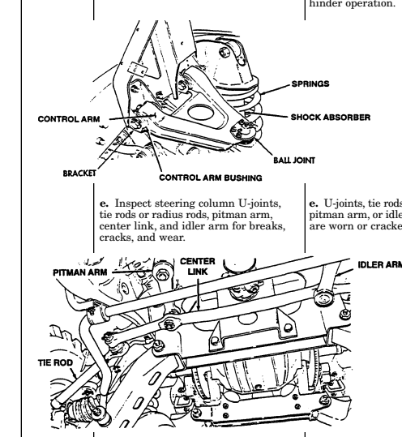

|            |                               | Page   |
|------------|-------------------------------|--------|
| CHAPTER 27 | ELECTRICAL SYSTEM (GS) REPAIR | 27\-1  |
| CHAPTER 28 | TRANSMISSION (GS) REPAIR      | 28\-1  |
| CHAPTER 29 | TRANSFER CASE (GS) REPAIR     | 29\-1  |

Table 2-1. Unit Level Preventive Maintenance Checks and Services HMMWV.

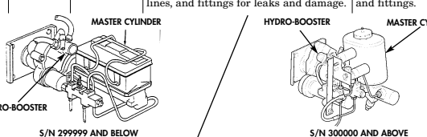

| CHAPTER 30   | DIFFERENTIAL (GS) REPAIR 30\-1                      |
|--------------|-----------------------------------------------------|
| CHAPTER 31   | STEERING SYSTEM (GS) REPAIR 31\-1                   |
| CHAPTER 32   | FRAME (GS) REPAIR 32\-1                             |
| CHAPTER 33   | 33\-1 BODY (GS) REPAIR                              |
| CHAPTER 34   | 34\-1 SUSPENSION (GS) MAINTENANCE                   |
| APPENDIX A   | REFERENCES A\-1                                     |
| APPENDIX B   | MAINTENANCE ALLOCATION CHART B\-1                   |
| APPENDIX C   | EXPENDABLE/DURABLE SUPPLIES AND MATERIALS LIST C\-1 |
| APPENDIX D   | ILLUSTRATED LIST OF MANUFACTURED ITEMS D\-1         |
| APPENDIX E   | TORQUE LIMITS E\-1                                  |
| APPENDIX F   | BODY REPAIR MATERIALS F\-1                          |
| APPENDIX G   | MANDATORY REPLACEMENT PARTS G\-1                    |
| APPENDIX H   | WIRING DIAGRAMS AND SCHEMATICS H\-1                 |
| APPENDIX J   | PERIMETER ARMOR KIT J\-1                            |
| APPENDIX K   | IED OVERLAY (FRAG 1) (M1151A1, M1152A1, M1165A1,    |
|              | W/PERIMETER B KIT) KIT K\-1                         |
| APPENDIX L   | FRONT WHEELWELL ARMOR (FRAG 2) KIT L\-1             |
| APPENDIX M   | DOOR (FRAG 5) KIT M\-1                              |
| INDEX        | INDEX 1                                             |

|             |         | 1 \- 13. LOCATION AND CONTENTS OF WARNING, CAUTION, AND DATA PLATES (Co&d)  \-   |
|-------------|---------|----------------------------------------------------------------------------------|
|             | MANUALS |                                                                                  |
| MAINTENANCE |         | TM g\-2320\-387\-24                                                              |
| MANUAL      |         |                                                                                  |
| OPERATORS   |         | TM g\-2320\-387\-1 0                                                             |
| MANUAL      |         |                                                                                  |
| PARTS LIST  |         | TM 9\-2320\-387\-24P                                                             |

Table 2-1. Unit Level Preventive Maintenance Checks and Services HMMWV (Cont'd).

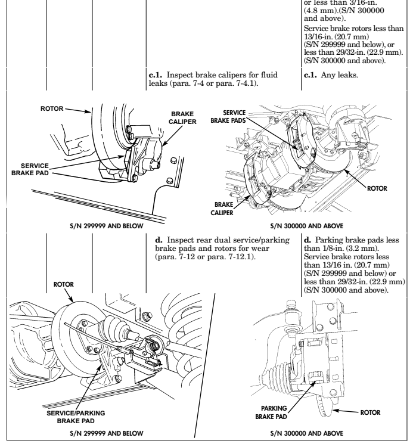

| The differences between models are provided in this paragraph.   |                    |                      |                            |    |             |    |
|------------------------------------------------------------------|--------------------|----------------------|----------------------------|----|-------------|----|
| Table 1\-1. Differences Between Models.                          |                    |                      |                            |    |             |    |
| Vehicle                                                          | Equipment/Function |                      |                            |    |             |    |
| M1113 M1114                                                      | M1151              | M1152                |                            |    |             |    |
| Armament Mounting                                                | X                  | X                    | S250 Shelter Configuration | X  | X           |    |
| Vehicle Winch (if equipped)                                      | X                  | X                    | X                          | X  | Basic Armor | X  |
| Up\-Armor                                                        | X                  | Howitzer Prime Mover | X                          |    |             |    |
| Integrated Armor Protection                                      | (IAP)              | X                    | X                          |    |             |    |

Table 2-1. Unit Level Preventive Maintenance Checks and Services HMMWV (Cont'd).

| Vehicle performance data for the ECV vehicles is listed in table 1\-2. Information not covered can be found   |
|---------------------------------------------------------------------------------------------------------------|
| in TM\-9\-2320\-387\-10.                                                                                      |
| Table 1\-2. Tabulated Data.                                                                                   |
| NOTE                                                                                                          |
| Standard and metric measurements will be used in this table.                                                  |
| A list of their abbreviations is provided below.                                                              |
| TABULATED DATA ABBREVIATIONS                                                                                  |
| MEASUREMENT  ABBREVIATION  MEASUREMENT  ABBREVIATION                                                          |
| Ampere A  Liters Per Minute L/m                                                                               |
| Celsius C  Maximum max                                                                                        |
| Centimeter cm  Miles Per Gallon mpg                                                                           |
| Fahrenheit F  Miles Per Hour mph                                                                              |
| Gallon gal.  Millimeter mm                                                                                    |
| Gallons Per Minute gpm  Minimum min                                                                           |
| Horsepower hp  Newton\-Meter N•m  Inch in.  Pint pt                                                           |
| Kilogram kg  Pound lb                                                                                         |
| Kilometers Per Hour kph  Pound\-Feet lb\-ft                                                                   |
| Kilometers Per Liter km/L  Pounds Per Square Inch psi                                                         |
| KiloPascal kPa  Quart qt                                                                                      |
| KiloWatt kW  Revolutions Per Minute rpm                                                                       |
| Liters L  Volt V                                                                                              |
| STANDARD  METRIC                                                                                              |
| 1. PAYLOAD                                                                                                    |
| M1113 5,100 lb 2,313 kg                                                                                       |
| M1114 2,300 lb 1,043 kg                                                                                       |
| M1151 4,000 lb 1,814 kg                                                                                       |
| M1151A1 3,950 lb 1,792 kg                                                                                     |
| M1151A1 w/Perimeter B Kit 1,800 lb 816 kg                                                                     |
| M1152 5,100 lb 2,313 kg                                                                                       |
| M1152A1 5,000 lb 2,268 kg                                                                                     |
| M1152A1 w/Perimeter B Kit 3,340 lb 1,515 kg                                                                   |
| M1165 4,950 lb 2,245 kg                                                                                       |
| M1165A1 4,870 lb 2,209 kg                                                                                     |
| M1165A1 w/Perimeter B Kit 2,230 lb 1,012 kg                                                                   |
| M1167 2,300 lb 1,043 kg                                                                                       |
| 2. CAPACITIES*                                                                                                |
| Cooling System 27.25qt  25.8 L                                                                                |
| Engine                                                                                                        |
| Crankcase Only 7 qt 6.6 L                                                                                     |
| Crankcase and Filter 8 qt 7.6 L                                                                               |
| Fuel Tank 25 gal.  94.6 L                                                                                     |
| Differential (each) 2 qt 1.9 L                                                                                |
| Transmission:                                                                                                 |
| Drain and Refill 7.7 qt  7.3 L                                                                                |
| W/Dry Converter 13.5 qt  12.8 L                                                                               |
| Transfer Case 3.35 qt  3.17 L                                                                                 |
| Geared Hub 1 pt 0.47 L                                                                                        |
| Steering Hydraulic System with Steering Cooler (TM 9\-2320\-387\-10)                                          |
| Brake Hydraulic System 1.63 pt  0.77 L                                                                        |
| Brake Master Cylinder (Serial Numbers 299999 and Below) . . .  1.12 pt  0.53 L                                |
| Brake Master Cylinder (Serial Numbers 3000000 and Above) . .  2.36 pt  1.12 L                                 |
| Windshield Washer Reservoir 2.5 qt  2.37 L                                                                    |
| Geared Fan Drive 1.2 pt  0.57 L                                                                               |
| *ALL HYDRAULIC SYSTEMS AND ALL FUEL CAPACITIES                                                                |

Table 2-1. Unit Level Preventive Maintenance Checks and Services HMMWV (Cont'd).

|    |                   | STANDARD                                                     | METRIC               |
|----|-------------------|--------------------------------------------------------------|----------------------|
| 3. | ENGINE            |                                                              |                      |
|    | Model             | GM 6.5 L                                                     |                      |
|    | Type              | Diesel, Turbocharged Liquid\-Cooled, V8                      |                      |
|    | Brake Horsepower  | 190 hp @ 3,400 rpm                                           | 119.4 kW @ 3,400 rpm |
|    | Idle Speed        | 700 ± 25 rpm                                                 |                      |
|    | Operating Speed   | 1,500\-2,300 rpm                                             |                      |
|    | Oil Pressure      |                                                              |                      |
|    | @ Idle            | 20 psi                                                       | 138 kPa              |
|    |                   | @ Operating Speed 30\-50 psi                                 | 206\-345 kPa         |
| 4. | FUEL SYSTEM       |                                                              |                      |
|    |                   | Fuel Pump (Mechanical):                                      |                      |
|    | Type              | Cam\-Driven Diaphragm                                        |                      |
|    | Fuel Filter       |                                                              |                      |
|    | Type              | Fuel/Water Separator                                         |                      |
|    | Air Cleaner: Type | Dry Element                                                  |                      |
|    | Glowplug:         |                                                              |                      |
|    | Type              | Fast Start                                                   |                      |
| 5. | COOLING SYSTEM    |                                                              |                      |
|    |                   | Surge Tank Cap Pressure 15 psi                               | 103 kPa              |
|    | Thermostat:       |                                                              |                      |
|    | Starts to Open    | 190°F                                                        | 88°C                 |
|    | Fully Open        | 212°F                                                        | 100°C                |
|    | Radiator:         |                                                              |                      |
|    |                   | Type Downflow                                                |                      |
|    |                   | Fan: (Serial Numbers 299999 and Below)                       |                      |
|    | Type              | Ten Blade                                                    |                      |
|    | Diameter          | 19 in.                                                       | 48.26 cm             |
|    |                   | Fan: (Serial Numbers 300000 and Above)                       |                      |
|    | Type              | Nine Blade                                                   |                      |
|    | Diameter          | 23 in.                                                       | 58.0 cm              |
| 6. |                   | ELECTRICAL SYSTEM                                            |                      |
|    | Alternator:       |                                                              |                      |
|    | Manufacturer      | Neihoff                                                      |                      |
|    | Model             | 12447109                                                     |                      |
|    | Output            | 200 A @ 1,600 rpm (engine)                                   |                      |
|    | Rated Voltage     | 24V/12V                                                      |                      |
|    | Starter:          |                                                              |                      |
|    | Manufacturer      | Prestolite                                                   |                      |
|    |                   | Model MFY Capacity 9.5 hp                                    |                      |
|    |                   | Voltage 24 V                                                 |                      |
|    | Batteries (2):    |                                                              |                      |
|    |                   | Voltage 12 V                                                 |                      |
| 7. | TRANSMISSION      |                                                              |                      |
|    | Manufacturer      | Hydramatic                                                   |                      |
|    | Model             | 4L80\-E                                                      |                      |
|    | Type              | 4\-Speed, Automatic, Torque Converter Stall Ratio of 2.1 and |                      |
|    |                   | Direct Drive w/Lock\-Up Clutch in Fourth Gear                |                      |
|    | Gear Ratios       |                                                              |                      |
|    | Second            | First 2.48:1 1.48:1                                          |                      |
|    | Third             | 1.00:1                                                       |                      |
|    | Fourth            | 0.75:1                                                       |                      |
|    |                   | Reverse 2.08:1                                               |                      |
|    | Oil Type          | Dexron® VI                                                   |                      |

Table 2-1. Unit Level Preventive Maintenance Checks and Services HMMWV (Cont'd).

| 8.   | TRANSFER CASE (Serial Numbers 299999 and Below)    |                     |
|------|----------------------------------------------------|---------------------|
|      | Manufacturer                                       | New Venture Gear    |
|      | Model                                              | 242 w/Intercooler   |
|      | Gear Ratios:                                       |                     |
|      | High and High Lock                                 | 1.0:1               |
|      | Low Lock                                           | 2.72:1              |
| 8.1. | TRANSFER CASE (Serial Numbers 300000 and Above)    |                     |
|      | Manufacturer                                       | Magna Powertrain    |
|      | Model                                              | MP2226              |
|      | Gear Ratios:                                       |                     |
|      | High and High Lock                                 | 1.0:1               |
|      | Low Lock                                           | 2.72:1              |
| 9.   | DIFFERENTIAL                                       |                     |
|      | Manufacturer                                       | AM General          |
|      | Type                                               | Hypoid Gears        |
|      | Gear Ratio                                         | 3.08:1              |
| 10.  | GEARED HUB                                         |                     |
|      | Manufacturer AM General                            |                     |
|      | Type Spur Gears                                    |                     |
|      | Gear Ratio 1.92:1                                  |                     |
| 11.  | SERVICE BRAKE CALIPER (FRONT AND REAR)             |                     |
|      | (Serial Numbers 299999 and Below)                  |                     |
|      | Manufacturer                                       | Kelsey\-Hayes       |
|      | Piston Diameter                                    | 2.6 in.  66 mm      |
|      | 11.1. SERVICE BRAKE CALIPER (FRONT AND REAR)       |                     |
|      | (Serial Numbers 300000 and Above)                  |                     |
|      | Manufacturer                                       | Wilwood             |
|      | Piston Diameter                                    | 1.870 in.  47.5 mm  |
| 12.  | SERVICE BRAKE ROTOR (FRONT AND REAR)               |                     |
|      | (Serial Numbers 299999 and Below)                  |                     |
|      | Manufacturer Kelsey\-Hayes                         |                     |
|      | Diameter 12 in.                                    | 305 mm              |
|      | Thickness 0.866 in.                                | 22 mm               |
|      | 12.1. SERVICE/PARKING BRAKE ROTOR (FRONT AND REAR) |                     |
|      | (Serial Numbers 300000 and Above)                  |                     |
|      | Manufacturer Wilwood                               |                     |
|      | Diameter 12.08 in.                                 | 307 mm              |
|      | Thickness 0.945 in.                                | 24 mm               |
| 13.  | PARKING BRAKE CALIPER                              |                     |
|      | (Serial Numbers 300000 and Above)                  |                     |
|      | Manufacturer Carlisle                              |                     |
|      | Piston Diameter 0.945 in.                          | 24 mm               |
| 14.  | WHEELS AND TIRES                                   |                     |
|      | Tire Size (Radial) 37 in. x 12.5 in. x 16.5 in.    | 93.98 cm x 31.75 cm |
|      |                                                    | x 41.9 cm           |
|      | Wheels:                                            |                     |
|      | Type Offset Disc                                   |                     |
|      | Runflat Insert:                                    |                     |
|      | Type                                               | Rubber              |

Table 2-1. Unit Level Preventive Maintenance Checks and Services HMMWV (Cont'd).

|     | STANDARD                                                     | METRIC   |             |
|-----|--------------------------------------------------------------|----------|-------------|
| 15. | STEERING SYSTEM (Serial Numbers 246890 and Below)            |          |             |
|     | Steering Gear:                                               |          |             |
|     | Manufacturer Delphi                                          |          |             |
|     | Type Variable Ratio Ratio 13/16:1                            |          |             |
|     | Power Steering Pump:                                         |          |             |
|     | Manufacturer Delphi                                          |          |             |
|     | Model 125 Output Pressure (max)                              |          | 9,998 kPa   |
|     | 1,450 psi Capacity (engine 1,500 rpm) 2.6 gpm                |          |             |
|     | Flow Rate (max) 3.5 gpm                                      |          | 13.2 L/m    |
|     | Toe\-In (Front/Rear @ Curb Weight): 0.375 in. + 0.1875 in.   | 11 mm +  | 3.2 mm      |
|     | 15.1. STEERING SYSTEM (Serial Numbers 246890 through 299999) |          |             |
|     | Steering Gear:                                               |          |             |
|     | Manufacturer Sheppard                                        |          |             |
|     | Type Variable Ratio Ratio 13/16:1                            |          |             |
|     | Power Steering Pump:                                         |          |             |
|     | Manufacturer Delphi                                          |          |             |
|     | Model 125                                                    |          |             |
|     | Output Pressure (max) 1,450 psi                              |          | 9,999.4 kPa |
|     | Capacity (engine 1,500 rpm) 2.6 gpm                          |          |             |
|     | Flow Rate (max) 3.5 gpm                                      |          | 13.2 L/m    |
|     | Toe\-In (Front/Rear @ Curb Weight): 0.375 in. + 0.1875 in.   | 9.5 mm + | 4.8 mm      |
|     | 15.2. STEERING SYSTEM (Serial Numbers 300000 and Above)      |          |             |
|     | Steering Gear:                                               |          |             |
|     | Manufacturer Sheppard                                        |          |             |
|     | Type Variable Ratio                                          |          |             |
|     | Ratio 13/16:1                                                |          |             |
|     | Power Steering Pump:                                         |          |             |
|     | Manufacturer PSS, Inc.                                       |          |             |
|     | Model 125                                                    |          |             |
|     | Output Pressure (max) 1,740 + 72.5 psi                       | 11,997 + | 500 kPa     |
|     | Capacity (engine 1,500 rpm) 2.6 gpm                          |          |             |
|     | Flow Rate (max) 3.5 gpm                                      |          | 13.2 L/m    |
|     | Toe\-In (Front/Rear @ Curb Weight): 0.375 in. + 0.1875 in.   | 9.5 mm + | 4.8 mm      |
| 16. | FRAME                                                        |          |             |
|     | Manufacturer AM General                                      |          |             |
|     | Type Box                                                     |          |             |
|     | No. of Crossmembers Five                                     |          |             |
| 17. | WINCH (optional)                                             |          |             |
|     | Model MIL\-9000                                              |          |             |
|     | Type Electric Drive, Thermal Cutoff Switch                   |          |             |
|     | Capacity 9,000 lb                                            |          | 4,086 kg    |
|     | Model Mile Marker                                            |          |             |
|     | Type Hydraulic                                               |          |             |
|     | Capacity 10,500 lb                                           |          |             |
| 18. | AIR\-CONDITIONING COMPRESSOR                                 |          |             |
|     | Manufacturer Harrison                                        |          |             |

Table 2-1. Unit Level Preventive Maintenance Checks and Services HMMWV (Cont'd).

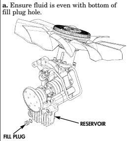

| Section III.                                                                                           | PRINCIPLES OF OPERATION                                                                     |         |          |                                                                     |         |
|--------------------------------------------------------------------------------------------------------|---------------------------------------------------------------------------------------------|---------|----------|---------------------------------------------------------------------|---------|
| 1\-16.                                                                                                 | GENERAL                                                                                     |         |          |                                                                     |         |
| This section explains how components of the ECV series vehicles work together. The systems (functional | groups) covered are listed in the Principles of Operation Reference Index, paragraph 1\-17. |         |          |                                                                     |         |
| 1\-17.                                                                                                 | PRINCIPLES OF OPERATION REFERENCE INDEX                                                     |         |          |                                                                     |         |
| REF.                                                                                                   | PAGE                                                                                        | SYSTEM  | PARA.    | NO.                                                                 |         |
| 1\-18.                                                                                                 | Drivetrain Operation                                                                        | 1\-24   | 1\-19.   | Fuel System Operation                                               | 1\-25   |
| 1\-20.                                                                                                 | Cooling System Operation (Serial Numbers 299999 and Below)                                  | 1\-26   | 1\-20.1. | Cooling System Operation (Serial Numbers 300000 and Above)          | 1\-26.2 |
| 1\-21.                                                                                                 | Starting System Operation                                                                   | 1\-28   | 1\-22.   | Generating System Operation (200 Ampere Alternator)                 | 1\-29   |
| 1\-23.                                                                                                 | Battery System Operation                                                                    | 1\-30   | 1\-24.   | Windshield Wiper/Washer System Operation                            | 1\-31   |
| 1\-25.                                                                                                 | Service/Parking Brake System Operation                                                      | 1\-32   | 1\-26.   | Service Brake System Operation                                      | 1\-33   |
| 1\-27.                                                                                                 | Steering Control System Operation (Serial Numbers 299999 and Below)                         | 1\-35   | 1\-27.1. | Steering Control System Operation (Serial Numbers 300000 and Above) | 1\-36.1 |
| 1\-28.                                                                                                 | Suspension System Operation                                                                 | 1\-37   | 1\-29.   | Air\-Conditioning System Operation (M1114)                          | 1\-38.1 |
| 1\-29.1                                                                                                | Air\-Conditioning System Operation (Two\-Man)                                               | 1\-38.2 | 1\-29.2  | Air\-Conditioning System Operation (Four\-Man)                      | 1\-38.4 |
| 1\-30.                                                                                                 | 200\-Ampere Umbilical Power Cable                                                           | 1\-40   |          |                                                                     |         |

| ITEM   | INTERVAL   | ITEM TO BE   | PROCEDURES                                                                   | NOT FULLY MISSION           |
|--------|------------|--------------|------------------------------------------------------------------------------|-----------------------------|
| NO.    |            | INSPECTED    |                                                                              | CAPABLE IF:                 |
|        |            |              | PRIOR TO ROAD TEST                                                           |                             |
|        |            |              | Ensure operator/crew has performed                                           |                             |
|        |            |              | PMCS listed in TM 9\-2320\-387\-10.                                          |                             |
|        |            |              | ROAD TEST                                                                    |                             |
|        |            |              | Maintenance personnel will be with                                           |                             |
|        |            |              | vehicle operator to assist in perform                                                                              |                             |
|        |            |              | ing PMCS checks and verify pre                                                                              |                             |
|        |            |              | service checks.                                                              |                             |
| 1      | Semi\-     | Pre\-Service | a. Notice if starter engages smoothly                                        | a. Starter inoperative or   |
|        | annually   | Checks       | and turns the engine at normal                                               | makes excessive grinding    |
|        |            |              | cranking speed.                                                              | sound.                      |
|        |            |              | b. Listen for unusual noise at idle,                                         | b. Engine knocks, rattles,  |
|        |            |              | at operating speed, and under                                                | or smokes excessively.      |
|        |            |              | acceleration. Be alert for excessive                                         |                             |
|        |            |              | vibration and the smell of oil, fuel,  and exhaust.                          |                             |
|        |            |              | c. Check for transmission response to                                        | c. Transmission shifts      |
|        |            |              | shifting and for smoothness of                                               | improperly, does not shift, |
|        |            |              | operation in all gear ranges. Be alert                                       | or makes excessive noises.  |
|        |            |              | for unusual noises and difficulty in                                         |                             |
|        |            |              | shifting in any speed range.                                                 |                             |
|        |            |              | NOTE                                                                         |                             |
|        |            |              | If desired transfer case gear range                                          |                             |
|        |            |              | cannot be selected, turn engine off,                                         |                             |
|        |            |              | shift transmission to neutral or                                             |                             |
|        |            |              | park, select transfer case range, and                                        |                             |
|        |            |              | restart engine.                                                              |                             |
|        |            |              | d. Check for transfer response to                                            | d. Transfer jumps out of    |
|        |            |              | shifting and for smoothness of                                               | gear or makes excessive     |
|        |            |              | operation in all gear ranges. Be                                             | noises.                     |
|        |            |              | alert for unusual noises and difficulty                                      |                             |
|        |            |              | in shifting in any gear range.                                               |                             |
|        |            |              | e. Test for response to accelerator                                          | e. Pedal sticking or        |
|        |            |              | feed. Observe for sticking pedal.                                            | binding.                    |
|        |            |              | f. With vehicle speed at approximately                                       | f. Steering binds, grabs,   |
|        |            |              | 5 mph (8 kph), turn steering wheel to                                        | wanders, or has excessive   |
|        |            |              | left, then right, to detect hard steering,                                   | free play.                  |
|        |            |              | steering backlash, or shimmy. Vehicle should respond instantly. With vehicle |                             |
|        |            |              | moving on straight, level terrain, lightly                                   |                             |
|        |            |              | hold steering wheel to check for pull                                        |                             |
|        |            |              | and wandering.                                                               |                             |
|        |            |              | g. Apply brake pedal with steady force.                                      | g. Brakes chatter, pull     |
|        |            |              | Vehicle should slow and stop without                                         | to one side, or             |
|        |            |              | pulling to one side or jerking. Release                                      | inoperative. Brakes will    |
|        |            |              | brake pedal. The brakes should release                                       | not release.                |
|        |            |              | immediately and without difficulty.                                          |                             |

Table 2-1. Unit Level Preventive Maintenance Checks and Services HMMWV (Cont'd).

Table 2-1. Unit Level Preventive Maintenance Checks and Services HMMWV (Cont'd).

| ITEM TO BE                                                            | NOT FULLY MISSION                       | ITEM                                | INTERVAL                                 | PROCEDURES              | INSPECTED                              | CAPABLE IF:   | NO.                                 |                      |
|-----------------------------------------------------------------------|-----------------------------------------|-------------------------------------|------------------------------------------|-------------------------|----------------------------------------|---------------|-------------------------------------|----------------------|
| 1                                                                     | Semi\-                                  | Pre\-Service                        | h. Bring vehicle to full stop. Engage    | h. Parking brake        | annually                               | Checks        | parking brake while transmission is | doesn't hold vehicle |
| (Cont'd)                                                              | still in                                | D                                   | (overdrive). Vehicle should              | stationary.             | remain stationary.                     |               |                                     |                      |
| i. Observe vehicle response to road                                   | shock. Side sway or continuous bouncing |                                     |                                          |                         |                                        |               |                                     |                      |
| indicates a malfunction.                                              |                                         |                                     |                                          |                         |                                        |               |                                     |                      |
| AFTER ROAD TEST                                                       |                                         |                                     |                                          |                         |                                        |               |                                     |                      |
| 2                                                                     | Semi\-                                  | Body                                | a. Make sure the vehicle has been        | annually                | cleaned of mud, gravel, etc., from the |               |                                     |                      |
| underbody, outside, and crew com                                                                       | partment area.                          |                                     |                                          |                         |                                        |               |                                     |                      |
| b. Thoroughly wash all underbody                                      | sheet metal panels and corners.         |                                     |                                          |                         |                                        |               |                                     |                      |
| NOTE                                                                  | Lubricate vehicle in accordance with    |                                     |                                          |                         |                                        |               |                                     |                      |
| lubrication table (page 2\-29).                                       |                                         |                                     |                                          |                         |                                        |               |                                     |                      |
| c. Inspect for loose rivets, cracks, loose or c. Any body damage that | missing bolts, and general body damage. | would hinder vehicle                |                                          |                         |                                        |               |                                     |                      |
| operation.                                                            |                                         |                                     |                                          |                         |                                        |               |                                     |                      |
| d.                                                                    | Inspect armor doors (all vehicles       | except M1114) for cracks. If cracks |                                          |                         |                                        |               |                                     |                      |
| are found, notify your supervisor.                                    |                                         |                                     |                                          |                         |                                        |               |                                     |                      |
| NOTE                                                                  | Gaps between vehicle armor panels       | 2.1                                 | Semi\-                                   | Armor                   |                                        |               |                                     |                      |
| that could allow penetration of a                                     | annually                                | (M1114)                             | projectile or shrapnel could degrade     |                         |                                        |               |                                     |                      |
| armor system protection capabilities.                                 |                                         |                                     |                                          |                         |                                        |               |                                     |                      |
| a.                                                                    | Inspect for gaps between armor          | Any gap between armor               | components that could degrade armor      | components that could   |                                        |               |                                     |                      |
| system protection capabilities.                                       | allow penetration of a                  | 1.25 in.                            | 1.25 in.                                 | projectile or shrapnel. | (31.8 mm)                              | (31.8 mm)     |                                     |                      |
| b.                                                                    | Inspect armor doors for cracks. If      | 6.25 in.                            | cracks are found, see note in para. 2\-8 | (158.8 mm)              |                                        |               |                                     |                      |
| and notify your supervisor.                                           |                                         |                                     |                                          |                         |                                        |               |                                     |                      |

Table 2-1. Unit Level Preventive Maintenance Checks and Services HMMWV (Cont'd).

| ITEM   | INTERVAL   | ITEM TO BE          | PROCEDURES                                                          | NOT FULLY MISSION                                |
|--------|------------|---------------------|---------------------------------------------------------------------|--------------------------------------------------|
| NO.    |            | INSPECTED           |                                                                     | CAPABLE IF:                                      |
| 3      | Semi\-     | Fuel                | a. Inspect fuel filter/water separator                              | a. Any class III fuel                            |
|        | annually   | System              | assembly for dents and cracks that could cause leaks.               | leak.                                            |
|        |            |                     | b. Inspect fuel injection pump, nozzle                              | b. Any class III leak.                           |
|        |            |                     | lines, and fittings for leaks and                                   | Any nozzle loose or                              |
|        |            |                     | damage.                                                             | damaged.                                         |
|        |            |                     | c. Inspect rear fuel injector nozzle                                | c. Rubber cap missing                            |
|        |            |                     | rubber cap for presence and condition.                              | or damaged.                                      |
|        |            |                     | FUEL/WATER  SEPARATOR                                               |                                                  |
|        |            |                     | d. Inspect all fuel lines for loose                                 | d. Any class III leak.                           |
|        |            |                     | connections, splits, cracks, and bends  that could leak.            |                                                  |
|        |            |                     | e. Disconnect the leads from each glow plug (para. 3\-39) and check | e. Continuity is not  present.                   |
|        |            |                     | for continuity between glow plug                                    |                                                  |
|        |            |                     | terminal and ground. Continuity  should be present.                 |                                                  |
|        |            |                     | f. Deleted                                                          |                                                  |
|        |            |                     | g. Deleted                                                          |                                                  |
| 4      | Semi\-     | Engine              | Check for missing, broken, cracked,                                 | Serpentine drivebelt                             |
|        | annually   | Accessory Drivebelt | or frayed serpentine drivebelt.                                     | is missing or broken.   Belt fiber has more than |
|        |            |                     |                                                                     | one crack 1/8 in. (3.2 mm)                       |
|        |            |                     |                                                                     | in depth, or 50% of belt                         |
|        |            |                     |                                                                     | thickness, or has frays                          |
|        |            |                     |                                                                     | more than 2 in.                                  |
|        |            |                     |                                                                     | (5 cm) long.                                     |

Table 2-1. Unit Level Preventive Maintenance Checks and Services HMMWV (Cont'd).

| ITEM   | INTERVAL        | ITEM TO BE     | PROCEDURES                                                               | NOT FULLY MISSION       |
|--------|-----------------|----------------|--------------------------------------------------------------------------|-------------------------|
| NO.    |                 | INSPECTED      |                                                                          | CAPABLE IF:             |
| 5      | Semi\-          | Protective     | a. Inspect four bolts for security of                                    | a. Mounting not secure, |
|        | annually        | Control Box    | mounting.                                                                | four bolts loose.       |
|        |                 |                | b. Ensure cannon plugs are securely connected to box.                    |                         |
| 6      | Semi\- annually | Cooling System | WARNING                                                                  |                         |
|        |                 |                | If vehicle has been operating, use                                       |                         |
|        |                 |                | extreme care to avoid being burned when removing cooling system          |                         |
|        |                 |                | radiator cap. Use heavy rags or gloves                                   |                         |
|        |                 |                | to protect hands. Turn radiator cap only one\-half turn counterclockwise |                         |
|        |                 |                | and allow pressure to be released                                        |                         |
|        |                 |                | before fully removing cap.                                               |                         |
|        |                 |                | CAUTION                                                                  |                         |
|        |                 |                | -  Type 1, ethylene glycol (green), and                                  |                         |
|        |                 |                | Type 2, propylene glycol (purple), should never be mixed due to their    |                         |
|        |                 |                | difference in toxic properties.                                          |                         |
|        |                 |                | Failure to comply may result in                                          |                         |
|        |                 |                | damage to equipment.                                                     |                         |
|        |                 |                | -  Using antifreeze without mixing it                                    |                         |
|        |                 |                | with water can cause high                                                |                         |
|        |                 |                | operating temperatures, blockage of cooling system passages, and         |                         |
|        |                 |                | damage to water pump seals.                                              |                         |

| ITEM   | INTERVAL   | ITEM TO BE   | PROCEDURES                                                                   | NOT FULLY MISSION      |
|--------|------------|--------------|------------------------------------------------------------------------------|------------------------|
| NO.    |            | INSPECTED    |                                                                              | CAPABLE IF:            |
| 6      | Semi\-     | Cooling      | NOTE                                                                         |                        |
|        | annually   | System       | - Coolant level is correct when                                              |                        |
|        |            | (Cont'd)     | coolant recovery tank is at the full                                         |                        |
|        |            |              | mark (TM 9\-2320\-387\-10).                                                  |                        |
|        |            |              | -  Type 1 antifreeze is an ethylene                                          |                        |
|        |            |              | glycol based coolant, green in color.                                        |                        |
|        |            |              | Type 1 can be added to factory                                                                              |                        |
|        |            |              | filled pink coolant. When it                                                 |                        |
|        |            |              | becomes necessary to flush factory                                           |                        |
|        |            |              | coolant, Type 1, ethylene glycol,                                            |                        |
|        |            |              | will be used. When mixing Type 1                                             |                        |
|        |            |              | antifreeze with water, distilled                                             |                        |
|        |            |              | water is recommended. Tap water should only be used in emergency             |                        |
|        |            |              | situations.                                                                  |                        |
|        |            |              | a. Check coolant condition. Test coolant                                     | a. Coolant condition/  |
|        |            |              | to see if draining is necessary                                              | testing shows draining |
|        |            |              | (TB 750\-651).                                                               | is required.           |
|        |            |              | b. Inspect surge tank, radiator shroud,                                      | b. Any class III water |
|        |            |              | power steering cooler, oil cooler, all                                       | leak. Hoses cracked    |
|        |            |              | hoses, quick\-disconnects, and fittings                                      | or dry\-rotted.        |
|        |            |              | for security of mounting, leaks, and                                         |                        |
|        |            |              | deterioration. Inspect and clean as                                          |                        |
|        |            |              | necessary the radiator and oil                                               |                        |
|        |            |              | cooler cores.                                                                |                        |
| 7      | Semi\-     | Air\-Intake  |                                                                              |                        |
|        | annually   | System       | WARNING                                                                      |                        |
|        |            |              | If NBC exposure is suspected, all air                                        |                        |
|        |            |              | filter media should be handled by                                            |                        |
|        |            |              | personnel wearing protective equip                                                                              |                        |
|        |            |              | ment. Consult your unit NBC officer or                                       |                        |
|        |            |              | NBC NCO for appropriate handling or                                          |                        |
|        |            |              | disposal instructions.                                                       |                        |
|        |            | a.           | Inspect and clean air cleaner                                                |                        |
|        |            |              | element and housing (para. 3\-13).                                           |                        |
|        |            | b.           | Check CDR valve oil saturation.                                              |                        |
|        |            |              | Disconnect CDR valve oil fill tube hose from CDR valve and inspect. Some oil |                        |
|        |            |              | accumulation in the CDR valve is                                             |                        |
|        |            |              | acceptable.                                                                  |                        |

Table 2-1. Unit Level Preventive Maintenance Checks and Services HMMWV (Cont'd).

| ITEM   | INTERVAL        | ITEM TO BE          | PROCEDURES                                                          | NOT FULLY MISSION   |
|--------|-----------------|---------------------|---------------------------------------------------------------------|---------------------|
| NO.    |                 | INSPECTED           |                                                                     | CAPABLE IF:         |
| 7      | Semi\- annually | Air\-Intake  System | CAUTION                                                             |                     |
|        |                 | (Cont'd)            | Do not clean CDR valve with solvent. This will damage the diaphragm |                     |
|        |                 |                     | inside the CDR valve. Wiping with a                                 |                     |
|        |                 |                     | rag is the only authorized method of                                |                     |
|        |                 |                     | cleaning.                                                           |                     |
|        |                 |                     | c. Remove and wipe off the CDR valve                                |                     |
|        |                 |                     | and hoses with a rag.                                               |                     |

Table 2-1. Unit Level Preventive Maintenance Checks and Services HMMWV (Cont'd).

## Rotation Diagram

b. Tighten wheel lug nuts to 90-110 lb-ft (122-149 N•m) in tightening sequence shown.

b. Any broken studs, loose or missing lug nuts.

## Tightening Sequence

| ITEM   | INTERVAL   | ITEM TO BE   | PROCEDURES                                                                  | NOT FULLY MISSION                                |
|--------|------------|--------------|-----------------------------------------------------------------------------|--------------------------------------------------|
| NO.    |            | INSPECTED    |                                                                             | CAPABLE IF:                                      |
| 10     | Semi\-     | Suspension   | NOTE                                                                        |                                                  |
|        | annually   | and Steering | Do not lubricate shock absorber                                             |                                                  |
|        |            | System       | bushings, radius rod bushings, stabilizer                                   |                                                  |
|        |            | (Cont'd)     | bar bushing, or suspension arm pivot                                        |                                                  |
|        |            |              | bushing.                                                                    |                                                  |
|        |            |              | d. Inspect control arms, control arm                                        | d. Control arm bent,                             |
|        |            |              | bushings, springs, shock absorbers,                                         | bushing worn, or obvious                         |
|        |            |              | and bracket for damage.                                                     | damage that would   hinder operation.            |
|        |            |              | e. Inspect steering column U\-joints,                                       | e. U\-joints, tie rods,                          |
|        |            |              | tie rods or radius rods, pitman arm, center link, and idler arm for breaks, | pitman arm, or idler arm    are worn or cracked. |
|        |            |              | cracks, and wear.                                                           |                                                  |
|        |            | f.           | Tighten steering gear mounting bolts f.                                     | Any mounting bolt                                |
|        |            |              | to 60 lb\-ft (81 N•m). With vehicle                                         | missing or unserviceable                         |
|        |            |              | started and transmission in PARK, turn steering wheel right and left        | or movement in steering gear.                    |
|        |            |              | and observe steering gear for                                               |                                                  |
|        |            |              | movement.                                                                   |                                                  |

Table 2-1. Unit Level Preventive Maintenance Checks and Services HMMWV (Cont'd). Table 2-1. Unit Level Preventive Maintenance Checks and Services HMMWV (Cont'd).

| ITEM   | INTERVAL       | ITEM TO BE           | PROCEDURES                                                                   | NOT FULLY MISSION           |
|--------|----------------|----------------------|------------------------------------------------------------------------------|-----------------------------|
| NO.    |                | INSPECTED            |                                                                              | CAPABLE IF:                 |
| 10     | Semi                | Suspension           | g. Inspect power steering pump, power                                        | g. Any class III leak.      |
|        | annually       | and Steering         | steering gear, hydraulic control valve,                                      | Any component damaged.      |
|        |                | System               | hoses, lines, and fittings for leaks or                                      |                             |
|        |                | (Cont'd)             | damage.                                                                      |                             |
| 11     | Semi                | Brake                | a. Inspect master cylinder, hydro\-booster,                                  | a. Any leak. Plugged,       |
|        | annually       | System               | proportioning valve, pressure limiter,                                       | broken, or damaged lines    |
|        |                |                      | lines, and fittings for leaks and damage.                                    | and fittings.               |
|        |                | MASTER CYLINDER      | HYDRO\-BOOSTER                                                               | MASTER CYLINDER             |
|        | HYDRO\-BOOSTER | S/N 299999 AND BELOW |                                                                              | S/N 300000 AND ABOVE        |
|        |                |                      | CAUTION                                                                      |                             |
|        |                |                      | - Use MIL\-B\-46176, Brake Fluid Silicone                                    |                             |
|        |                |                      | (BFS) for filling master brake cylinder. Failure to use BFS may cause damage |                             |
|        |                |                      | to brake cylinder.                                                           |                             |
|        |                |                      | - Thoroughly clean exterior of master                                        |                             |
|        |                |                      | cylinder cover before removing cover.                                        |                             |
|        |                |                      | Dirt, water, or grease will                                                  |                             |
|        |                |                      | contaminate brake fluid, causing                                             |                             |
|        |                |                      | brake system damage.                                                         |                             |
|        |                |                      | - Do not use screwdriver to remove                                           |                             |
|        |                |                      | cover. Damage to bail wire may result                                        |                             |
|        |                |                      | (S/N 299999 and below).                                                      |                             |
|        |                |                      | - To prevent excessive fluid spillage,                                       |                             |
|        |                |                      | ensure that rubber diaphragm is                                              |                             |
|        |                |                      | completely seated before installing                                          |                             |
|        |                |                      | cover to master cylinder.                                                    |                             |
|        |                |                      | NOTE                                                                         |                             |
|        |                |                      | -  Remove cover from brake master                                            |                             |
|        |                |                      | cylinder by moving bail wire using                                           |                             |
|        |                |                      | thumb pressure only (S/N 299999                                              |                             |
|        |                |                      | and below).                                                                  |                             |
|        |                |                      | -  Remove cover from brake master                                            |                             |
|        |                |                      | cylinder by turning cover counter                                            |                             |
|        |                |                      | clockwise (S/N 300000 and above).  -  Perform step b. for S/N 299999         |                             |
|        |                |                      | and below and step b.1 for                                                   |                             |
|        |                |                      | S/N 300000 and above.                                                        |                             |
|        |                |                      | b. Check master cylinder brake fluid                                         | b. Level below 1/8 in.      |
|        |                |                      | level. Level should be 1/8 in. (3.2 mm)                                      | (3.2 mm) from top of master |
|        |                |                      | from top of master cylinder reservoir.                                       | cylinder reservoir.         |
|        |                |                      | Fill with BFS as necessary.                                                  |                             |
|        |                |                      | b.1. Check master cylinder brake fluid                                       | b.1. Level below 1/8 in.    |
|        |                |                      | level. Level should be 1/8 in. (3.2 mm)                                      | (3.2 mm) from "mid" line of |
|        |                |                      | from "mid" line of master cylinder                                           | master cylinder reservoir.  |
|        |                |                      | reservoir. Fill with BFS as necessary.                                       |                             |

| ITEM      | INTERVAL                   | ITEM TO BE           | PROCEDURES                            |                                                         | NOT FULLY MISSION                                   |
|-----------|----------------------------|----------------------|---------------------------------------|---------------------------------------------------------|-----------------------------------------------------|
| NO.       |                            | INSPECTED            |                                       |                                                         | CAPABLE IF:                                         |
| 11        | Semi                            | Brake                | c. Inspect service brake pads and     |                                                         | c. Service brake pads                               |
|           | annually                   | System               | service brake rotors for wear         |                                                         | less than 1/8\-in. (3.2 mm)                         |
|           |                            | (Cont'd)             | (para. 7\-3 or para. 7\-3.1).         |                                                         | (S/N 299999 and below),                             |
|           |                            |                      |                                       | (4.8 mm).(S/N 300000                                    | or less than 3/16\-in.                              |
|           |                            |                      |                                       | and above).                                             |                                                     |
|           |                            |                      |                                       | Service brake rotors less than                          |                                                     |
|           |                            |                      |                                       | 13/16\-in. (20.7 mm)                                    |                                                     |
|           |                            |                      |                                       | (S/N 299999 and below), or                              |                                                     |
|           |                            |                      |                                       | less than 29/32\-in. (22.9 mm). (S/N 300000 and above). |                                                     |
|           |                            |                      | c.1. Inspect brake calipers for fluid | c.1. Any leaks.                                         |                                                     |
|           |                            |                      | leaks (para. 7\-4 or para. 7\-4.1).   |                                                         |                                                     |
| ROTOR     |                            |                      |                                       |                                                         |                                                     |
|           |                            |                      | SERVICE  BRAKE  BRAKE PADS  CALIPER   |                                                         |                                                     |
| SERVICE   |                            |                      |                                       |                                                         |                                                     |
| BRAKE PAD |                            |                      |                                       | ROTOR                                                   |                                                     |
|           |                            |                      | BRAKE  CALIPER                        |                                                         |                                                     |
|           |                            | S/N 299999 AND BELOW |                                       | S/N 300000 AND ABOVE                                    |                                                     |
|           |                            |                      | d. Inspect rear dual service/parking  |                                                         | d. Parking brake pads less                          |
|           |                            |                      | brake pads and rotors for wear        |                                                         | than 1/8\-in. (3.2 mm).                             |
|           |                            |                      | (para. 7\-12 or para. 7\-12.1).       |                                                         | Service brake rotors less                           |
|           |                            |                      |                                       |                                                         | than 13/16 in. (20.7 mm)  (S/N 299999 and below) or |
|           | ROTOR                      |                      |                                       |                                                         | less than 29/32\-in. (22.9 mm)                      |
|           |                            |                      |                                       |                                                         | (S/N 300000 and above).                             |
|           | SERVICE/PARKING  BRAKE PAD | S/N 299999 AND BELOW | PARKING  BRAKE PAD                    | S/N 300000 AND ABOVE                                    | ROTOR                                               |

Table 2-1. Unit Level Preventive Maintenance Checks and Services HMMWV (Cont'd).

SEMIANNUAL (3,000 MILE) PMCS PARTS LIST

| 12   | Semi\-   | Engine and   | a. Inspect engine mounts and insu\-      | a. Engine mounts cracked.   |
|------|----------|--------------|------------------------------------------|-----------------------------|
|      | annually | Transmission | lators for cracks, loose, worn, or       | Engine mounts or            |
|      |          | Mounts       | damaged condition.                       | insulators damaged, loose   |
|      |          |              |                                          | worn, or rubber             |
|      |          |              |                                          | separating from either      |
|      |          |              |                                          | mount surface.              |
|      |          |              | b. Check for loose or missing engine     | b. Capscrews or locknuts    |
|      |          |              | mount capscrews and locknuts. If         | loose or missing.           |
|      |          |              | engine mount capscrews or locknuts are   |                             |
|      |          |              | loose or missing, notify DS maintenance. |                             |
|      |          |              | (Refer to para. 15\-3).                  |                             |
|      |          |              | INSULATOR                                |                             |
|      |          |              | ~                                        |                             |
|      |          |              | CAPSCREW                                 |                             |
|      |          |              | ENGINE MOUNT  LOCKNUT                    |                             |
|      |          |              | LOCKNUT                                  |                             |
|      |          |              | c. Deleted                               |                             |

| ITEM NO.   | INTERVAL   | ITEM TO BE  INSPECTED   | PROCEDURES                                                                                                                                          | NOT FULLY MISSION  CAPABLE IF:   |
|------------|------------|-------------------------|-----------------------------------------------------------------------------------------------------------------------------------------------------|----------------------------------|
| 11         | Semi\-     | Brake                   | e. Inspect parking brake cable, cable                                                                                                               | e. Parking brake binding,        |
|            | annually   | System                  | clip, lever, spring, and pushrod/guide                                                                                                              | or cable frayed or broken.       |
|            |            | (Cont'd)                | pin for binding and loose components.                                                                                                               | Spring or cable clip  missing.   |
|            |            |                         | LEVER  PARKING  BRAKE CABLE  f. Inspect left and right parking/service   brake assembly mounted between rear axle halfshafts and rear differential. |                                  |
|            |            |                         | Lubricate parking brake lever with                                                                                                                  |                                  |
|            |            |                         | grease (Appendix C, Item 32). Parking/                                                                                                              |                                  |
|            |            |                         | service brake assembly needs no  lubrication.                                                                                                       |                                  |

ANNUAL (6,000 MILE) PMCS PARTS LIST

| ITEM   | INTERVAL   | ITEM TO BE   | PROCEDURES                               | NOT FULLY MISSION     |
|--------|------------|--------------|------------------------------------------|-----------------------|
| NO.    |            | INSPECTED    |                                          | CAPABLE IF:           |
| 13     | Semi\-     | Starter      | CAUTION                                  |                       |
|        | annually   |              | Disconnect negative cable.               |                       |
|        |            |              | a. Deleted                               |                       |
|        |            |              | b. Inspect cables and studs for loose    | b. Stud nut loose.    |
|        |            |              | nuts and damage.                         |                       |
| 14     | Semi\-     | Transmission | a. Inspect vent lines and connectors     | a. Vent line cracked, |
|        | annually   |              |                                          | plugged, or missing.  |
|        |            |              | for security, cracks, and deterioration. |                       |
|        |            |              | b. Inspect transmission shift linkage    | b. Shift linkage is   |
|        |            |              | for bends, excessive play, cracks, and   | unserviceable.        |
|        |            |              | damage that could cause failure.         |                       |
| 15     | Semi\-     | Transfer     | a. Inspect transfer case vent lines and  | a. Vent line cracked, |
|        | annually   | Case         | connectors for security, cracks, and     | plugged, or missing.  |
|        |            |              | deterioration.                           |                       |
|        |            |              | b. Inspect transfer case shift linkage   | b. Shift linkage is   |
|        |            |              | for bends, excessive play, cracks, and   | unserviceable.        |

BIENNIALLY (12,000 MILE) PMCS PARTS LIST
LUBRICATION TABLE

|           |                                 | ITEM TO BE                                |                                                                                                                                                                                                                             | NOT FULLY MISSION                                                                                                                   |
|-----------|---------------------------------|-------------------------------------------|-----------------------------------------------------------------------------------------------------------------------------------------------------------------------------------------------------------------------------|-------------------------------------------------------------------------------------------------------------------------------------|
| ITEM  NO. | INTERVAL                        | INSPECTED                                 | PROCEDURES                                                                                                                                                                                                                  | CAPABLE IF:                                                                                                                         |
| 16        | Semi\- annually                 | Driveline Components (Cont'd)             | NOTE Fill each axle differential with  2 qt (1.9 L) of GO.                                                                                                                                                                  |                                                                                                                                     |
|           |                                 |                                           | h. Change differential lubricant every 3,000 mi (4,830 km), when required by                                                                                                                                                | b. Lube level not within 1/4 in. (6.4 mm) of fill                                                                                   |
|           |                                 |                                           | maintenance repair action or when contaminated by water or foreign                                                                                                                                                          | plug opening when cold or to plug level when hot.                                                                                   |
|           |                                 |                                           | material. Remove fill plug. Level should be within 1/4 in. (6.4 mm) of fill                                                                                                                                                 |                                                                                                                                     |
|           |                                 |                                           | plug opening when lubricant is cold, or to plug level when hot. Install fill plug,                                                                                                                                          |                                                                                                                                     |
|           |                                 |                                           | and tighten to 15\-25 lb\-ft (20\-33 N•m).                                                                                                                                                                                  |                                                                                                                                     |
|           |                                 |                                           | FILL PLUG                                                                                                                                                                                                                   |                                                                                                                                     |
| 17 18     | Semi\- annually Semi\- annually | Exhaust Components Frame,  Support Braces | DIFFERENTIAL  i. Deleted  Inspect for cracked and loose pipes, muffler, and hangers. Check for  exhaust leaks. a. Inspect frame side rails for cracks,  breaks, bends, wear, deterioration, and missing or loose fasteners. | Cracked, loose, or holes in pipes or muffler. Exhaust  leak. a. Any loose or missing  fasteners. Cracks, bends, or breaks in frame. |
|           |                                 | and Cross                                           |                                                                                                                                                                                                                             |                                                                                                                                     |
|           |                                 | members                                   |                                                                                                                                                                                                                             |                                                                                                                                     |

*OE/HDO 15/40 (Grade 15W-40) lubricant may be used when expected temperatures are above +5°F (-15°C).

**If OEA -30 lubricant is required to meet the temperature ranges listed in the table, then the OEA -30 lubricant is to be used in place of OE/HDO 10 lubricant for all temperature ranges.

***If operating conditions are severe or abnormal, service chassis lubrication points at 1,000 mi. (1,600 km).

# Section Iv. General Maintenance Instructions

# 2-13. General Maintenance Instructions Task Summary

| 19   | Semi\-   | Tires   | WARNING                             |
|------|----------|---------|-------------------------------------|
|      | annually |         | Changing tire pressures or wheel    |
|      |          |         | alignment out of the recommended    |
|      |          |         | specification may adversely affect  |
|      |          |         | the vehicle's handling              |
|      |          |         | characteristics. Loss of vehicle    |
|      |          |         | control may result, causing serious |

# 2-14. Cleaning

a. General Instructions. Cleaning procedures will be the same for the majority of parts and components which make up the vehicle subassemblies. General cleaning procedures are detailed in steps b through h.

b. The Importance of Cleaning. Great care and effort are required in all cleaning operations. The presence of dirt and foreign material is a constant threat to satisfactory vehicle operation and maintenance. The following will apply to all cleaning operations:
(1) Hands must be kept free of any accumulation of grease which can collect dust and grit. (2) Clean all parts before inspection, after repair, and before assembly. (3) After cleaning, all parts must be covered or wrapped in plastic or paper to protect them from dust and/or dirt.

c. Disassembled Parts Cleaning. Place all disassembled parts in wire baskets for cleaning.

(1) Dry and cover all cleaned parts. (2) Place on or in racks and hold for inspection or repair. (3) All parts subject to rusting must be lightly oiled and wrapped. (4) Keep all related parts and components together. Do not mix parts.

d. Castings.

(1) Deleted. (2) Use a stiff brush to remove sludge and gum deposits.

Compressed air used for cleaning purposes will not exceed 30 psi (207 kPa). Use only with effective chip guarding and personal protective equipment (goggles/shield, gloves, etc.).

(3) Use compressed air to blow out all tapped capscrew holes and dry castings after cleaning.

# 2-14. Cleaning (Cont'D)

e. Oil Passages. Particular attention must be given to all oil passages in castings and machined parts. Oil passages must be clean and free of any obstructions.

(1) Clean passages with wire probes to break up any sludge or gum deposits. (2) Deleted. (3) Dry passages with compressed air.

Do not allow solvents to come in contact with seals, cables, or flexible hoses. These cleaners cause leather, rubber, and synthetic materials to dry out, rot, and lose pliability, making them unserviceable.

f. Nonmetallic Parts. Clean hoses and other nonmetallic parts with soap and water. g. Bearings.

Do not use compressed air to dry bearings. Spinning a dry bearing with compressed air may cause injury to personnel or damage to equipment.

(1) Bearings require special cleaning. After removing surface oil and gum deposits, place bearings in hot oil, 140°F (60°C), to loosen congealed oil and grease. Wipe bearings dry with a lint-free cloth; do not use compressed air.

(2) See TM 9-214 for information and care of bearings.

## H. Electrical Components

(1) Clean electrical components with clean cloth dampened with drycleaning solvent. Care must be taken not to damage protective insulation.

Compressed air used for cleaning purposes will not exceed 30 psi (207 kPa). Use only with effective chip guarding and personal protective equipment (goggles/shield, gloves, etc.).

(2) Use compressed air to dry electrical components.

# 2-15. Inspection

a. General Instructions. Procedures for inspections will be the same for many parts and components which make up the vehicle subassemblies. General procedures are detailed in steps b through k. Dimensional standards for parts have been fixed at extremely close tolerances, so use specification tables. Use specified inspection equipment for inspection where cracks and other damage cannot be spotted visually. Exercise extreme care in all phases of inspection. Repair or replace all unserviceable components (para. 2-16).

## B. Castings.

(1) Inspect all ferrous and nonferrous castings for cracks. See MIL-STD-6866, Inspection, Penetrant Methods. Particularly check areas around studs, pipe plugs, threaded inserts, and sharp corners. Replace cracked castings.

(2) Inspect machined surfaces for nicks, burrs, and raised metal. Mark damaged areas for repair or replacement.

(3) Inspect all pipe plugs, pipe plug openings, capscrews, and capscrew openings for damage and stripped threads. Replace if damaged or threads are stripped.

(4) Check all gasket mating surfaces, flanges on housings, and supports for warpage with a straightedge or surface plate. Inspect mating flanges for discolorations which may indicate leakage. Replace if warped.

(5) Check all castings for conformance to applicable repair standards.

# 2-15. Inspection (Cont'D)

c. Bearings. Check all bearings for conformance to applicable repair standards. Refer to TM 9-214. d. Bushings and Bushing-Type Bearings.

(1) Check all bushings and bushing-type bearings for secure fit, evidence of heating, wear, burrs, nicks, and out-of-round condition.

(2) Check for dirt in lubrication holes or grooves. Holes and grooves must be clean and free from damage.

e. Machined Parts.

(1) Check machined parts for cracks, distortion, and damage. (2) Check all surfaces for nicks, burrs, and raised metal.

f. Studs, Bolts, Capscrews, and Nuts. Replace if bent, loose, stretched, or threads are damaged. g. Gears.

When gear teeth wear limits are not established, good judgment is required to determine if gear replacement is necessary.

(1) Inspect all gears for cracks and missing teeth. Replace if cracked or teeth are missing. (2) Inspect gear teeth for wear, sharp fins, burrs, and galled or pitted surfaces. (3) Inspect splines for wear, burrs, and galled or pitted surfaces. (4) Check keyway slots for wear and/or damage.

h. Oil Seals. Oil seals are mandatory replacement items. i. Casting Plugs. Inspect for leakage. Replace plugs when leakage is present. j. Springs. Inspect for damaged, distorted, and collapsed coils. k. Snaprings, Retaining Rings, and Washers. Many of these parts are mandatory replacement items. Inspect all others for obvious damage.

# 2-16. Repair

a. General Instructions. Repair of most parts and components is limited to general procedures outlined in applicable maintenance instructions and the following detailed procedures b through g.

Repaired items must be thoroughly cleaned to remove metal chips and abrasives to prevent them from entering working parts of vehicle components.

## B. Castings.

(1) All cracked castings will be replaced. (2) Only minor repairs to machined surfaces, flanges, and gasket mating surfaces are permitted.

Remove minor nicks, burrs, and/or scratches by:
(a) Using fine mill file. (b) Using abrasive cloth dipped in cleaning solvent. (c) Lapping across a surface plate. (d) Remachining of machined surfaces to repair damage, warpage, or uneven surfaces is not permitted. Replace castings.

(3) Repair damaged threaded pipe plug and/or capscrew holes with a thread tap, or repair oversize holes with threaded inserts.

## 2-16. Repair (Cont'D)

c. Bearings. See TM 9-214. 

d. Studs. Replace all bent and stretched studs. Repair minor thread damage with a thread restorer file. 

Replace studs having stripped or damaged threads as outlined below: 
(11 Remove using a stud remover. Back studs out slowly to avoid heat buildup and seizure which can cause stud to break off. 

(2) If studs break off too short to use a stud remover, use extractor to remove. 

(3) Replacement studs have a special coating and must have a small amount of antiseize compound 
(appendix C, item 161 applied on threads before stud is installed. Install replacement stud slowly to prevent heat buildup and snapping off. 

e. Gears. 

(11 Remove gears using pullers, as required. (21 Use the same methods described in procedure b, step 2 for castings to remove minor nicks, burrs, or scratches on gear teeth. 

(31 If keyways are worn or enlarged, replace gear. 

f. Bushings and Bushing-Type Bearings. When bushings and bushing-type bearings seize to a shaft and spin in the bore, the associated part must also be inspected and replaced, as required. 

g. Oil Seals. 

(11 Remove oil seals being careful not to damage casting or adapter bore. 

(21 Always install new seal in bore using proper seal-replacing tool.

## 2- 17. Assembly

a. Cleanliness is essential in all component assembly operations. Dirt and dust, even in minute quantities, are abrasive. Parts must be cleaned as specified, and kept clean. Wrap or cover parts and components when assembly procedures are not immediately completed. 

b. Coat all bearings and contact surfaces with operating oil (differential oil for differential parts, transmission oil for transmission parts, etc.) to ensure lubrication of parts during initial operation after repair. 

## Section V. Electrical/Mechanical Systems Troubleshooting Pkxk--2_18. '-

a. This section provides information to diagnose and correct malfunctions of the electrical/mechanical system. 

b. Principles of operation showing system operation can be found in chapter 1. It should be used as a reference when performing electrical/mechanical troubleshooting. 

c. Each malfunction symptom given for an individual component or system is followed by step(s) you should take to determine the cause and corrective action you must take to remedy the problem. 

d. Before taking any action to correct a possible malfunction, the following rules should be followed: 
(11 Question operator to obtain any information that might help determine the cause of the problem. 

(2) Never overlook the chance that the problem could be of simple origin. The problem could be corrected with minor adjustment.

(3) Use all senses to observe and locate troubles. 

# 2- 18. General (Cont'D) -.

(4) Use test instruments or gauges to help determine and isolate problem. 

(5) Always isolate the system where the malfunction occurs and then locate the defective component.

(6) Use standard automotive theories and principles when troubleshooting the vehicles covered in this manual. _ 
e. The STE/ICE-R is an integral part of these troubleshooting procedures. It should be used whenever possible, although other options are given when available. The Vehicle Identification Number MN) 
assigned to the ECV vehicles is 2104 is the temporary VIN). On page 2-557, you will find information on STEKE-R description and operation. Use this information to become familiar with STEKE-R operation and the equipment contained in the test set. On page 2-537, you will find STE/ICE-R setup and internal checks. These must be performed prior to performing tests. 

# 2-19. Electrical/Mechanical Systems Troubleshooting Electrical/Mechanical Troubleshooting

| annually                                | that could cause engine failure.           | Damage evident that            | would cause engine                       |                                       |                     |
|-----------------------------------------|--------------------------------------------|--------------------------------|------------------------------------------|---------------------------------------|---------------------|
| failure.                                |                                            |                                |                                          |                                       |                     |
| b.                                      | Change oil and filter every 3,000 mi       | b.                             | Metal particles are                      | (4,800 km) or semiannually, whichever | found on drainplug. |
| occurs first (para. 3\-5). Inspect      | drainplug for metal particles.             |                                |                                          |                                       |                     |
| NOTE                                    | Replace oil filter each time crankcase is  |                                |                                          |                                       |                     |
| drained. Fill crankcase with            | 8 qt (7.6 L) of engine oil. Crankcase      |                                |                                          |                                       |                     |
| capacity is 7 qt (6.6 L) and oil filter | capacity is 1 qt (0.95 L).                 |                                |                                          |                                       |                     |
| Geared Fan                              | 20.1                                       | Semi                                | WARNING                                  | Drive (Serial                         | annually            |
| Numbers                                 | If vehicle has been operating, use extreme | 300000 and                     | care to avoid being burned when removing |                                       |                     |
| Above Only)                             | geared fan drive fill plug. Use rags or    | heavy gloves to protect hands. |                                          |                                       |                     |
| a.                                      | Ensure fluid is even with bottom of        | fill plug hole.                |                                          |                                       |                     |
| RESERVOIR                               |                                            |                                |                                          |                                       |                     |

# 2-20. How To Use This Troubleshooting Guide

## Note To The Recipient Of This Manual

There are 20 foldouts that are supplied with this manual. Take the foldouts and place them after the last page of diagnostics at the end of the paragraph. The foldout will then be with diagnostics for that system. Use the cross-reference information listed below to guide you in the placement of the foldouts.

| stopped.                                 | b. Lubricate coupler shaft CV joints.   |                                       |                                         |
|------------------------------------------|-----------------------------------------|---------------------------------------|-----------------------------------------|
| GREASE FITTINGS                          |                                         |                                       |                                         |
| GREASE FITTINGS                          |                                         |                                       |                                         |
| Batteries                                | WARNING                                 | annually                              |                                         |
| - Do not perform battery system checks   | or inspections while smoking or near    |                                       |                                         |
| fire, flames, or sparks. Batteries may   | explode causing damage to vehicle, and  |                                       |                                         |
| injury or death to personnel.            | - Remove all jewelry such as rings, dog |                                       |                                         |
| tags, bracelets, etc. If jewelry or      | disconnected battery ground cable       |                                       |                                         |
| contacts battery terminal, a direct      | short will result, causing injury to    |                                       |                                         |
| personnel or damage to equipment.        |                                         |                                       |                                         |
| NOTE                                     | Refer to TM 9\-6140\-200\-14 for more   |                                       |                                         |
| specific details on battery maintenance. | a.                                      | Inspect battery box for corrosion and |                                         |
| debris.                                  | b.                                      | Clean slave receptacle and coat with  |                                         |
| corrosion\-resistant compound            | (appendix C, item 61).                  |                                       |                                         |
| NOTE                                     | Add 4 points (.004) to specific gravity |                                       |                                         |
| reading for every 10° above 80°F.        | c.                                      | Cell is below 1.225                   | c. Check and record specific gravity of |
| specific gravity.                        | each cell.                              | d. Inspect battery cables for frays,  |                                         |
| loose.                                   | splits, or looseness.                   |                                       |                                         |

| SPECIAL PURPOSE BODIES                 |                                     |                                     |                                      |                                        |                          |                 |
|----------------------------------------|-------------------------------------|-------------------------------------|--------------------------------------|----------------------------------------|--------------------------|-----------------|
| annually                               | adjustment (para. 11\-9).           | body.                               |                                      |                                        |                          |                 |
| 22                                     | Semi\-                              | Cargo Shell                         | Check adjustment of cargo shell door | annually                               | Door                     | (para. 11\-15). |
| 23                                     | Deleted                             |                                     |                                      |                                        |                          |                 |
| annually                               | Station                             | not curled upward.                  | or curled upward more                | Turret                                 | than 1/4 inch (6.34 mm). |                 |
| b.                                     | Inspect turret brake for cracked    | b.                                  | Turret brake is                      |                                        |                          |                 |
| adjustment (para. 11\-55).             | bracket welds cracked.              |                                     |                                      |                                        |                          |                 |
| ring notches at 0 degrees, 90 degrees, | not stop at required                | 180 degrees, and 270 degrees        | position.                            |                                        |                          |                 |
| stop positions.                        | SPECIAL PURPOSE KITS                |                                     |                                      |                                        |                          |                 |
| a.                                     | Inspect arctic heater fuel line for | annually                            | Heater                               | loose connections, splits, cracks, and |                          |                 |
| Components                             | bends.                              |                                     |                                      |                                        |                          |                 |
| b.                                     | Inspect coolant hoses for leaks and | deterioration.                      |                                      |                                        |                          |                 |
| rotted.                                |                                     |                                     |                                      |                                        |                          |                 |
| c.                                     | Inspect electrical wires for frays, | splits, or looseness.               | loose.                               |                                        |                          |                 |
| d.                                     | Inspect intake and exhaust          | extensions for proper installation, | leak.                                |                                        |                          |                 |
| cracked and loose pipes.               |                                     |                                     |                                      |                                        |                          |                 |
| NOTE                                   | If annual/biennial service is being |                                     |                                      |                                        |                          |                 |
| performed, then final road test        | will be completed after last        |                                     |                                      |                                        |                          |                 |
| annual/biennial task is complete.      |                                     |                                     |                                      |                                        |                          |                 |

# 2-20. How To Use This Troubleshooting Guide (Cont'D)

PAGE LAYOUT
All diagnostic logic and flowcharts are on the left-hand page, with supporting information, help, test, instructions, and vehicle operation on the right.

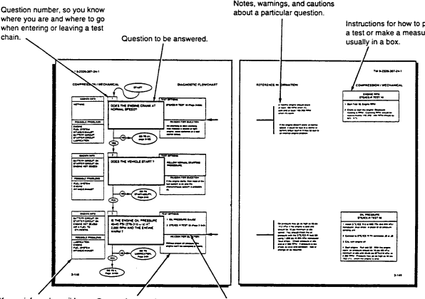

Known info and possible problems with the system.

Reason for question: This is to help by telling you why it's being asked. This is especially helpful when something's 'just a little bit bad' and you're not sure if it passed or failed.

Test options:   Multiple choice of methods you can use to obtain the answer to the question.

DIAGNOSTIC
FLOWCHART
REFERENCE
INFORMATION
HOW TO TROUBLESHOOT
PICK THE TESTS: DIAGNOSTIC PROCEDURE:
Select either a top level or a system level test.

Just answer the questions on the left-hand page and follow the YES or NO path. Helpful information about the question is also on the right-hand page. If you aren't sure about a question or procedure, look on the right page for notes, instructions, and help.

# 1 2-20. **How To Use This Troubleshooting Guide (Cont'D) 1**

#### Page Layout

Diagnostic logic is on the left-hand page. 

Related and helpful information is on the right-hand page. 

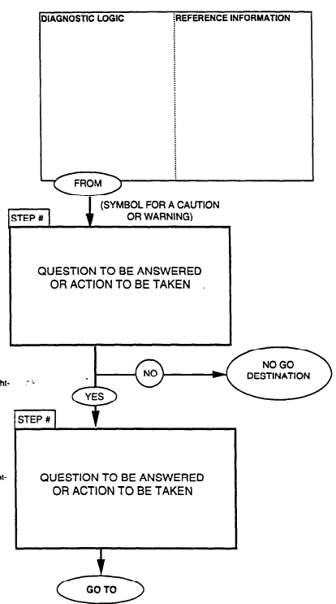

#### Diagnostic Procedure

Just answer the questions on the left-hand page. Follow the YES or NO path to the next step. Everything else on both pages is information to support the question. As a rule, the most important information (warnings, cautions, etc.) is closest to the question; less important information is farther away. 

Is the symbol for a WARNING statement. If you see this symbol above a question, look on the right-hand page for the text of the message. The WARNING message on the righthand page will also have the symbol above it. 

A 

Is the symbol for a CAUTION statement. If you see this symbol above a question. look on the right-hand page for the text of the message. The CAUTlON message on the righthand page will also have the symbol above it. 

# 2-20. **How To Use This Troubleshooting Guide (Cont'D)**

#### Information About The Question

TEST OPTIONS: 
This box lists at least one way of getting the answer 

 to the question. When there is more than one way to get the answer, the different options will be given. Usually the easiest or best option is first. 

#### Reason For Question:

If you know why the question is being asked, it should be easier to understand the diagnostic logic and easier to answer the question. This is especially helpful when a measurement is just a little bad. Knowing why the question is being asked should help you decide if the answer should be YES or NO. 

## Information About The Diagnostic Logic

#### Known Info:

This box indicates what is known about the vehicle's condition. As you follow a test chain, parts will be listed here after they have checked ok. Sometimes this box will indicate a fault that you know exists, such as a shorted or open drcuit, or a component that doesn't work. DO NOT USE THIS BOX TO PICK A JUMP-IN 
POINT. ALWAYS RUN A COMPLETE CHAIN WHEN 
INSTRUCTED TO DC SO. ' : 

#### Possible Problems:

This box is the opposite of KNOWN INFO. Possible causes of the problem are listed here until tested and shown to be ok. 

| KNOWN INFO   |
|--------------|

| TEST OPTIONS   |
|----------------|

POSSIBLE PROBLEMS 

# 1 2-20. **How To Use This Troubleshooting Guide (Cont'D)**

## Information About The Question

All warnings and cautions are given next to (or as close as possible to) the arrow pointing to the particular question. Look for the symbol that is in the box for the question in order to locate the particular note. Helpful notes, test procedures, or other information related to the question are provided here. These notes are provided as supporting information only; you don't usually need them to answer the question. The more skilled you become, the less you'll have to read these. Any cross references to other manuals will be located in this area. 

NOTES, WARNINGS, AND 

 CAUTfONS ARE IN BOLDFACE TYPE. 

Additional information, notes, and/or suggestions are in normal type so as not to draw too much attention. 

#### Test Procedures

These are special notes about how to make measurements with the test equipment. Ocassionally. if space is limited on a page, the easiest procedure will be listed with a page reference for the other procedures if you would rather use them. The procedures presume a basic working knowledge of the equipment to be used, but references are included for the less experienced operator. 

#### Type Of Measurement Type Of Equipment

%ocedure for performing the measurement using he type of equipment listed above. 

#### Pictures

The pictures are supposed to make it easier to find what you're looking for, such as a pin in a connector or a particular wire or component. 

PICTURES ARE PROVIDED WHEREVER 
POSSIBLE. 

# 2-21. Glossary **Of Abbreviations And Commonly Used Terms -**

PCB - Protective Control Box, located on the firewall above the brake pedal. 

STE/ICE-R - Simplified Test Equipment for Internal Combustion Engines - Reprogrammable, a testing system used for performing tests and measurements on the vehicle. In addition to acting as a conventional digital multimeter to measure voltage, current, and resistance, it is also capable of measuring pressure, speed,.compression unbalance, engine power, and some specialized battery and starter evaluations. It is powered from the vehicle batteries. The complete system includes a vehicle test meter (VTM), a transducer kit (TK), cables, transit case, and technical publications. DCA - Diagnostic Connector Assembly, an electrical harness on the vehicle which allows the STE/ICE-R 
to be powered and to make measurements of key vehicle signals from a single connection. In addition to many basic electrical signals such as starter voltage and current, it includes engine speed and fuel supply pressure. The STE/ICE-R can make TK measurements at the same time that it is connected to the DCA. 

VTM - Vehicle Test Meter, a box which performs the measurement and analysis functions of the STE/ICE-R systems. 

TK (and TK mode) - Transducer Kit, a collection of transducers, adapters, and fittings which permit the STE/ICE-R to be used as a general purpose measurement system for any application. This allows the STE/ICE-R to be used anywhere that you want to measure voltage, current, resistance, pressure, or speed. TK mode of operation is what you are doing when you use this kit (as opposed to DCA mode where you are using the vehicle's built-in sensors to make measurements). 

Compression unbalance - A STE/ICE-R test that gives an indication of any engine cylinders that have lower compression then the average. It does this by monitoring the battery voltage during cranking. As each cylinder goes into compression, the extra load on the starter shows up as a drop in voltage. This works well for finding one or more cylinders that have a compression problem, but don't forget that it doesn't give the average compression. If all cylinders are low by the same amount, this test doesn't find it. 

Troubleshooting - The process of making measurements and observing the operation of the vehicle to find out if anything is wrong with it and then to locate any problem that exists. 

Diagnostics - Troubleshooting by following an exact procedure. 

Test Chain - A series of tests to be followed in a particular order or sequence. It is referred to as a 'chain" of tests because they are all connected one after another like the links of a chain. 

System - A collection of devices which are all related to each other because they depend on each other to do some function or job. For instance, the function of the fuel system is to inject fuel into the cylinders at the correct time in the correct amount and with the correct quality. The collection of devices that are required to do this include the fuel pump, fuel lines, lift pump, fuel filter, injection pump, and injectors. 

# 12-21. Glossary Of Abbreviations And Commonly Used Terms (Cont'D) 1

Functional flow schematic - A diagram which is much like a normal electrical circuit diagram, except that its purpose is to show the flow of information through the system (or the flow of a signal or the flow of some material such as the fuel). This kind of diagram shows how each component or device depends on the others. It is called functional flow because it shows the function (purpose of each component) and how the output of one component flows into the next. For troubleshooting, the functional flow schematic is better than the usual circuit diagram because it allows you to quickly see how the system works and what to expect when you make measurements on a system that has faults. You can't expect the output of a device to be good when it has a bad input. 

## 12-22. Electric Circuit Description

An electrical circuit is a collection of electrical devices which are connected in a loop from a positive voltage source (the battery positive) to a negative source ( the battery negative). It must be continuous, with no breaks (no opening in the loop) so that electrical current can flow from the positive to the negative. You can think of it like the plumbing in your house. There must be a source of water under pressure or nothing will flow through the pipes. Water pressure is like the positive voltage of the battery. There may be branches (tees) in the pipes going to several different places, but if you don't connect the pipes, you don't get water. The same thing is true with the electrical circuit. If the wires aren't connected, no electricity will flow through them. 

In the plumbing of a house, all of the water must go to the drain (you won't permit it to be spilled on the floor). With the vehicle electrical circuit, the drain is the negative terminal of the battery. With the water pipes, the water always flows from high pressure to low pressure (another way of saying that water always flows downhill). The electrical current is the same as the water flow - it always goes from positive to negative voltage. Voltage is to electricity what pressure is to water. Just like the pressure in the water pipe, the greater the voltage, the more electricity will flow through the wires. Unlike the water pipes that will spill the water if they break, you can't spill the electricity. The closest thing to this in an electrical circuit is when two wires touch that aren't supposed to and the current flows to some place that it shouldn't (this is called a short circuit or a short). Shorts often happen where the wire touches the vehicle body (the body is connected to the negative terminal of the battery). Since the current always flows through the easiest path to negative, it will bypass the rest of the circuit where it was supposed to go, and go through the short directiy to the battery. Because this new path to the battery negative is shorter, the malfunction is called a short circuit or a short. 

If you put a valve in a water pipe, you can control how much water flows by closing the valve. What you are doing is pinching off the pipe with the valve which restricts the flow. if you shut it off completely, you can stop all water from flowing. In the electrical circuit, a resistor acts like a valve. If you make the resistor extremely large, you can stop the current from flowing. The resistance is measured in ohms. 

## 1 2-22. Electric Circuit Description (Cont'D)

When there is no electrical connection, such as when a wire is disconnected, the resistance is infinite (too large to be measured). No current will flow through the wires, because the circuit is no longer continuously connected. This is referred to as an open circuit or simply an open. Remember that an electrical circuit is formed by continuous loops of devices connected together. When you are troubleshooting, you are often asked to check for continuity, which simply means that you need to find out if there is a continuous path from one place in the circuit to another. Since you are trying to see if the path is continuous, you must check wires and switches rather than any special or active devices. You will usually just measure the resistance between two points. If the resistance is zero (or the value of any resistance that is supposed to be there), then there is continuity. In the case of looking for a short, this may mean that you have found the short. If the resistance is off-scale on the meter (infinite resistance) then there is no connection and you have found an open. A continuity test is the same whether you are looking for an open or a short, the only difference being what resistance values you are looking for and where you make the measurements. 

You are familiar with the typical light switch which allows you to turn a light on and off. A switch of any kind in an electrical circuit is simply a way of opening the loop so that no current will flow through it. 

Something to remember while troubleshooting is that everything on the positive side of the switch still has full battery voltage while everything from the switch on through the rest of the circuit is (or should be) connected to the battery negative terminal and you will measure zero volts. This is easy to remember if you think of the faucet on a sink. If you shut off the faucet, there is no water flowing into the sink, but the water in the pipe is still under pressure. Sometimes a switch is turned on and off automatically. An example is a circuit breaker, which is a device that measures how much current is flowing through it. If the current goes too high (possibly damaging equipment or melting the wires), then it opens an internal switch to stop the current flow. A relay is another form of switch that is turned on and off under remote control using a signal in another wire. When a device which requires a very large amount of current (such as the starter motor) must be turned on and off, a power relay is used. The idea is to use a small switch to turn on a larger switch. Thus, you don't have very large wires going all over the vehicle or large switches on the instrument panel. In the case of the starter's power relay, it is also called a solenoid. A solenoid is any device that changes the electrical current into a forward and backward motion. It is something like an electrical motor except that instead of continuously going around in the same direction, it goes in or out. For the starter, the solenoid is used to push a very large switch into the ON position. 

When testing a circuit, you will need to know how much current is flowing. Current is easily measured with the STOICE-FL A device called a shunt is connected to the negative terminal of the battery. A shunt is a very precise resistor designed so that for every 1,000 amps of current that flow through it, there is a drop of .1 volt from one side to the other (different shunts may have different values). By measuring the voltage across the shunt, you know how much current is flowing through the circuit. The shunt is placed on the negative side because it is safer (less chance of accidents which may short out the batteries). Since all of the current eventually goes through the negative battery terminal anyway, the shunt gives the same measurement as if it were connected to the positive terminal. You can think of the shunt as doing the same thing as the water meter in your house. As you turn devices such as lights on or off, you can use the shunt to measure how much current they are using. 

- 

# 12-23. Startability Tests I

This is a top level test for problems with an engine that doesn't start, or starts but immediately stops, or is very hard to start. If the engine starts but doesn't run well after starting, try the STARTABILITY tests first. 

FOR THE ENGINE TO START, ALL OF THE BASIC SYSTEMS SHOWN BELOW 
MUST BE WORKING. THESE STARTABILITY TESTS WILL HELP YOU TO 
VERIFY THE CONDITION OF EACH OF THESE SYSTEMS. 

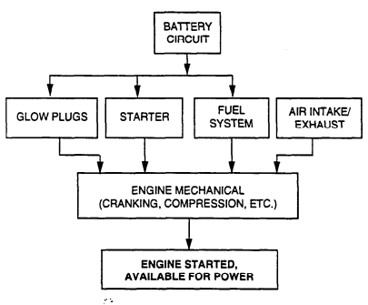

A functional flow schematic is not applicable to this section. 

However, so that you may refer to sections as you need them, a quick index to the systems required for starting is given here. 

| PARAGRAPH              | PAGE   |
|------------------------|--------|
| BATTERY CIRCUIT        | 2\-237 |
| GLOW PLUGS CIRCUIT     | 2\-289 |
| STARTER CIRCUIT        | 2\-247 |
| FUEL SYSTEM            | 2\-99  |
| AIR INTAKE/EXHAUST     | 2\-141 |
| COMPRESSION/MECHANICAL | 2\-147 |

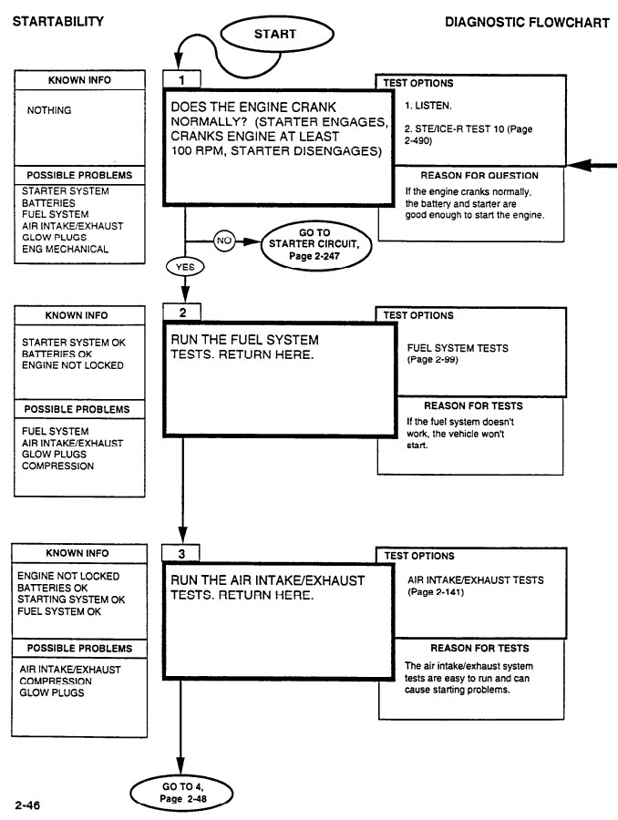

TM 9-2X%387-24-l 

## Reference Information

STARTABILITY 
Make sure all of the vehicle's fluids are at the proper level. 

You could still have battery or starter problems with a cranking speed over 100 rpm. but that shouldn't stop the engine from starting. Tests for the battery and starter can be run separately, if you want to run them. 

STEIICE-R TEST 10 
1. Start Test 10, Engine RPM 
2. Crank or start the engine. Displayed reading is RPM. Cranking rpm should be aooroximatelv 1 W-200. Idle rpm should be I 7bG750. 

* 

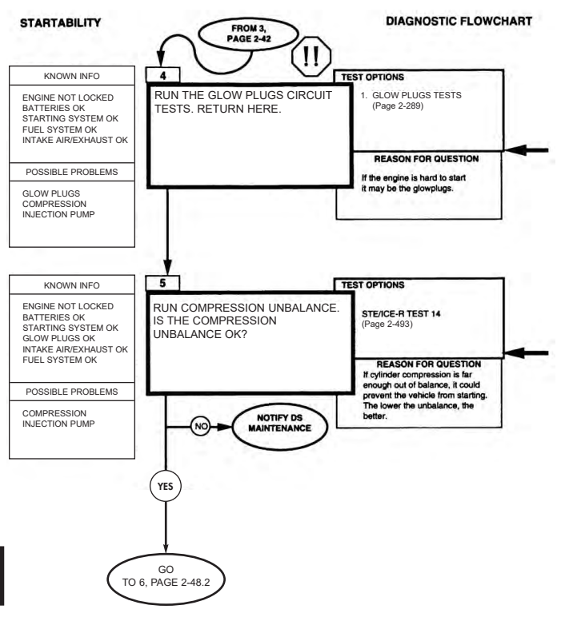

STARTABILITY

# Reference Information

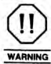

A HOT ENGINE MAY CAUSE SERIOUS
BURNS. Always use caution when approaching a hot engine.

NOTE
When using the vehicle's temperature gage to determine engine temperature, don't forget to turn the rotary switch to "RUN". The gages don't work when power is off.

The colder the engine (and air temperature),
the more you need the glow plugs for starting.

There are some times when you don't need to run the glow plugs test. If the engine is warm and the problem is there on a hot day, then the problem is probably NOT the glow plugs or cold start advance, and these tests may be bypassed. If it's colder than 50°F, run the glow plugs test, because iust a few bad glow plugs can make a minor starting problem much worse.

If the vehicle passes the STE/ICE-R
compression unbalance test, it may still have a compression problem, but it would mean that every cylinder has low compression. This is possible, but not too likely. If you're confident that everything else is working properly, notify DS maintenance.

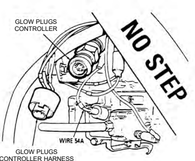

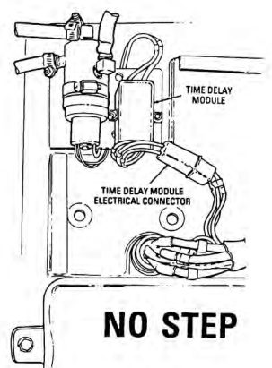

## Compression Unbalance Steace-R Test 14

1. Run lests 72,73 and 74 to verify that the batteries are OK
CAUTION
THE GLOW PLUGS CONTROLLER AND THE CONTROL VALVE ELECTRICAL CONNECTOR MUST BE DISCONNECTED PRIOR TO TUNNING THIS TEST.

2. Disconnect wire 54A at injection pump to prevent starting.

3. Disconnect glow plugs controller and control valve electrical connector. (to keep waveform clean).

4. Start Test 14, compression unbalance.

5. Wait for the GO message. Crank the engine. 6. Release the rotary switch when the VTM
displays OFF. A number less than 25%
is passing.

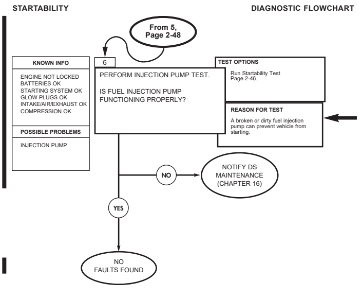

# Reference Information Startability

During high temperature and humidity, early model vehicles can experience difficulty starting while using JP-8 fuel. High temperatures can cause restrictive clearances in some older fuel injection head and rotor assemblies. The engine must be allowed to cool to allow adequate clearance of the pumping plungers to ensure adequate fuel delivery for starting. If this condition persists, run the startability tests. If vehicle passes all startability tests and troubleshooting procedures and still experiences difficulty in hot starting, identify the fuel injection pump and serial numbers. All fuel injection pumps with P/N DB2831-5209 incorporated the improved head and rotor assembly, P/N 31506. If your serial number is less than shown in the Serial Number Break Column of the table below, the manufacturer recommends the fuel injection pump to be replaced, tagged as a "no hot restart" condition, and forward for rebuild. Notify direct support maintenance.

| case. Failure to use Dexron® VI          | may cause damage to transfer          |
|------------------------------------------|---------------------------------------|
| case.                                    |                                       |
| a.                                       | Check transfer case fluid level every |
| 3,000 mi (4,800 km) or semiannually,     |                                       |
| whichever occurs first. Remove fill plug |                                       |

## 2-24. Engine Running Tests

This is a top level test for problems with an engine that starts but doesn't run well after starting. This includes an engine that starts but doesn't stay running for very long. If the engine doesn't start, or starts but immediately stops, or is very hard to start, try the STARTABILITY tests first. 

A functional flow schematic is not applicable to this section. 

However, so that you may refer to sections as you need them, a quick index to the systems relating to engine running is given here. 

| PARAGRAPH              | PAGE   |
|------------------------|--------|
| FUEL SYSTEM            | 2\-99  |
| AIR INTAKE/EXHAUST     | 2\-141 |
| COMPRESSION/MECHANICAL | 2\-147 |

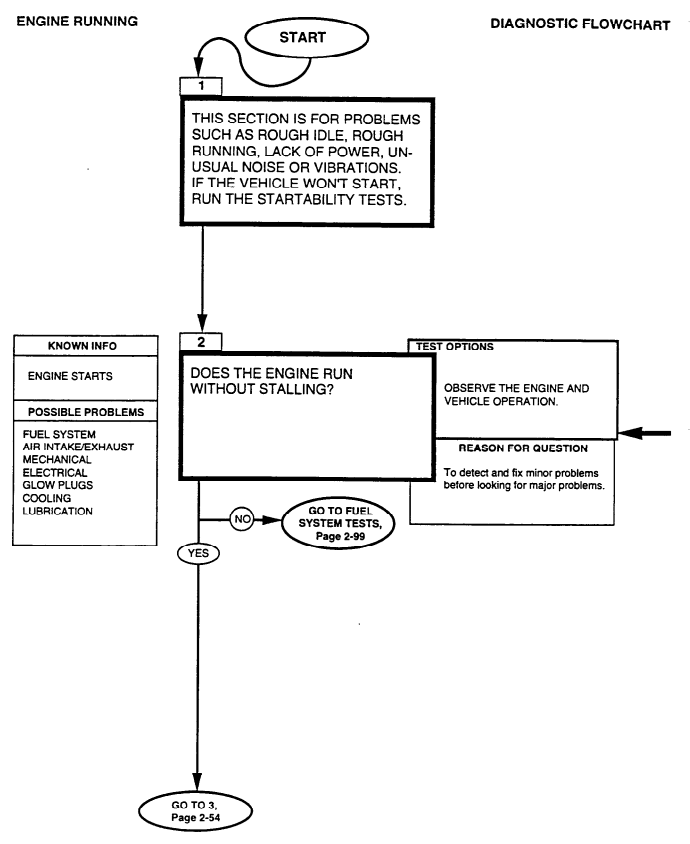

TM 9-2320-387-24-l REFERENCE INFORMATION 
ENGINE RUNNING 
I **This is a check for all of those problems which** 
1 **can cause the engine to stop when it shouldn't.** 

This includes fuel, air, and electrical problems. 

If the engine starts and then stops immediately, run the staftability tests first 
_-- 

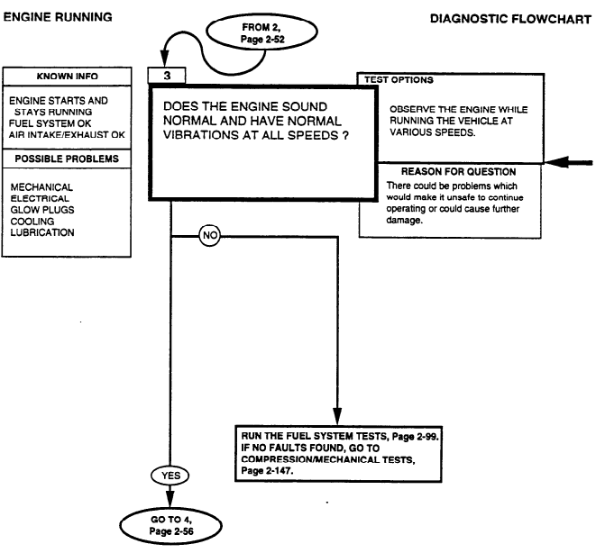

TM 9-2320-387-24-l ENGINE RUNNING 
REFERENCE INFORMATION 
Listen for noises from the engine that aren't usually there when the engine is running notmalty. Also be alert for unusual vibrations while the engine is idling and while you accelerate to a safe and reasonable speed. 

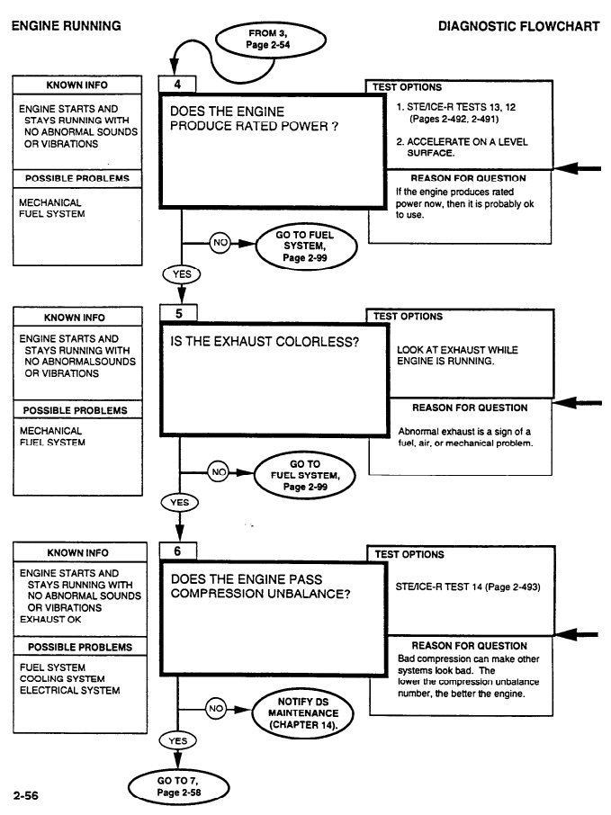

#### Reference Information Engine Running Engine Power Test (Percent) Stmce-R Test 13

1. Set TEST SELECT switches to 13. 

2. Press and release TEST button. 3. Wait for prompting message CIP to appear. 4. When CIP appears on display, press down sharply on engine accelerator and hold it to the floor. When VIM displays OFF. release accelerator. 

5. A number will be displayed after the engine has returned to idle speed. This number is the test result in units of percent of nominal rated power.

#### . Engine Power Test (Rpm/Sec) Stmce-R Test 12

1. Set TEST SELECT switches to 12. 2. Press and release TEST button. 3. Wait for prompting message CIP to appear. 4. When CIP appears on display, press down sharply on engine accelerator and hold it to the floor. When VTM displays a number, release accelerator. 

5. A number will be displayed after the engine has returned to idle speed. This number is the test result in units of rpm per second.

If STUICE-R is not available, accelerate under full power to .a safe and reasonable speed on a level surface. 

For STUICE-R test 12. a number higher than 6.700 is passing. For test 13. a number higher than 75 is passing. 

I 
It is normal for the engine to emit some black smoke when accelerating after idling for a while. Under most other conditions, exhaust smoke is usually from one of three sources; I 
BLUE smoke is usually oil. BLACK smoke is too much fuel or too little air (often caused by advanced injection timing). WHITE smoke is usually water (often caused by retarded injection timing). If the smoking is continuous or appears under a particular condition, the smoke probably indicates a problem and should be investigated. 

If STEXE-R is not available, there is no easy way to test compression. In this case, go on to the next step but remember that compression may be a problem. 

#### Compression Unbalance Stuice-R Test 14 I

1. Run tests 72,73, and 74 to verify that the batteries are ok. 

2. THE GLOW PLUG CONTROLLER AND THE 
CONTROL VALVE ELECTRICAL CONNECTOR MUST BE DISCONNECTED PRIOR TO RUNNING THIS TEST. 

3. Disconnect wire 64A at injection pump to prevent starting. 

4. Disconnect glow plug controller and control valve electrical connector (to keep waveform clean). 

6. Start Test 14. compression unbalance. 6. Wait for the GO message. Crank the engine. 7. Release the rotary switch when the VTM 
displays OFF. A number less than 25% is passing.

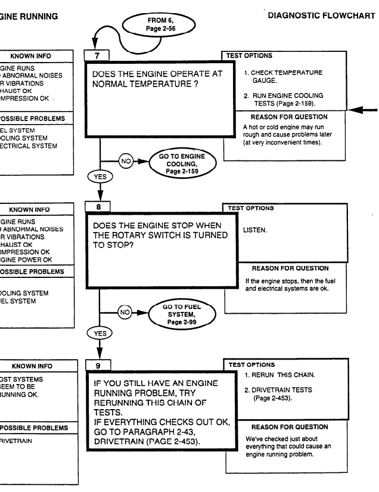

TM 9-2320-387-24-l ENGINE RUNNING 
REFERENCE INFORMATION 
Because the engine cooling tests can take a 

 long time (mostly letting a cold engine warm up), you don't have to run them unless there is or may be a problem in the cooling system. 

- 

# 2-25. Cooling System Tests

This paragraph is a top level test for problems with either the water cooling system or the oil cooling system. Just follow the path and answer the questions. Additional information and notes are given on the facing page when necessary. The cooling system consists of the oil and water radiators, the engine fan and its controller, the water pump, and the internal coolant passages in the engine. 

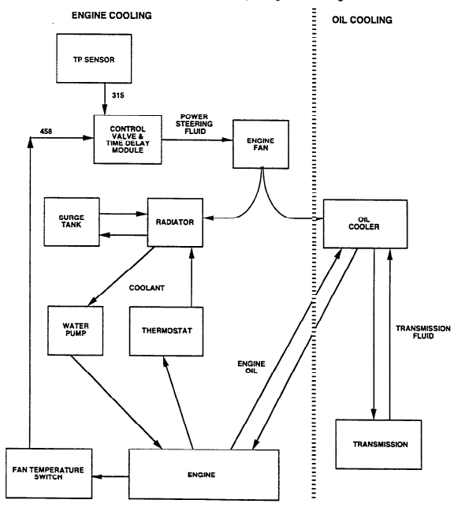

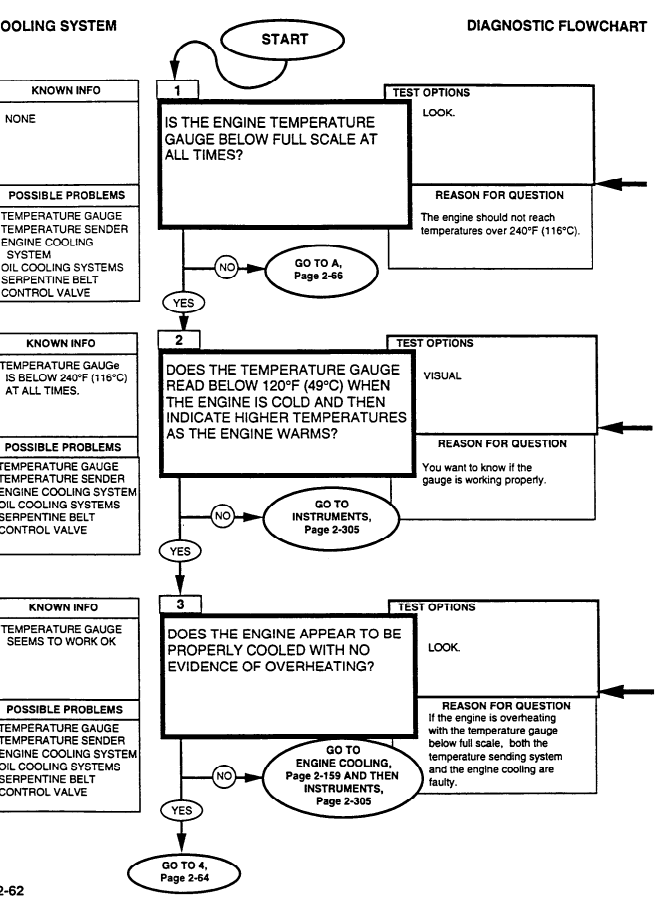

COOLING SYSTEM
REFERENCE INFORMATION

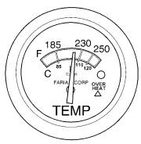

TEMPERATURE GAUGE

The question describes how the gauge should work.

If you aren't sure if its working properly, you may want to run the instruments test anyway.

Look for boiling coolant, a blown surge tank pressure cap, or leaking hoses to tell you if the engine is overheating.

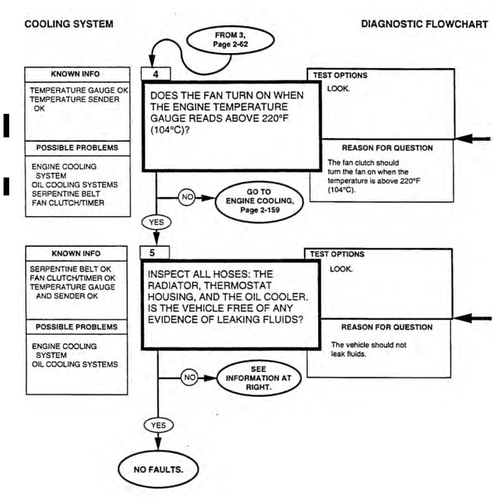

TM 9-2320-387-24-1 REFERENCE INFORMATION
COOLING SYSTEM
220°F (104°C) is the approximate temperature at which the fan should turn itself on.

The fan will turn on and off as the

engine temperature varies.

If the leaking fluid is red, go to the transmission, para. 2-40, page 2-385. If the leaking fluid is yellow/green, go to engine cooling, para. 2-31, page 2-159.

If the oil cooler is leaking, try to determine where the leak is coming from. The oil cooler in front of the radiator cools both engine oil and transmission fluid (top-half transmission fluid. bottom-half engine oil). If the leak is in the oil cooler, go to transmission or engine cooling. If the leak is elsewhere, go to lubrication system, para. 2-26, page 2-69.

■

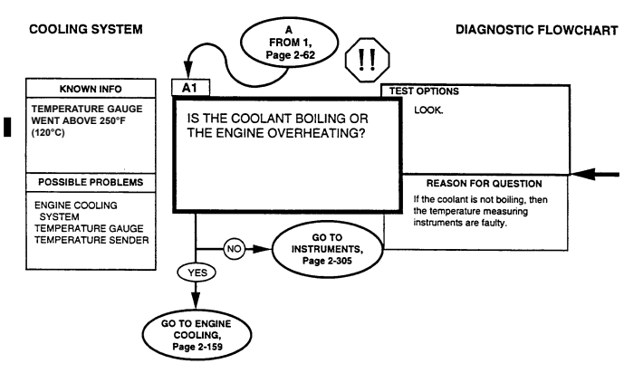

TM 9-2320-387-24-l REFERENCE INFORMATION COOLING SYSTEM 

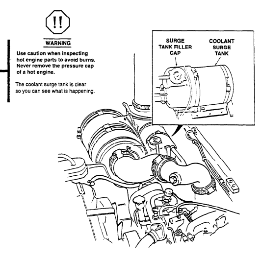

# P-26. Lubrication System Tests 1

This paragraph is a top level test for all of the lubrication systems in the vehicle. Just follow the path and answer the questions. Additional information and notes are given on the facing page when necessary. The H&lMWV includes a venting system that is also checked in this paragraph. The purpose of the vent system is to allow vapor to escape to the atmosphere under normal operation, and to prevent venting during deep-water fording operations. If the vents were left open, water would enter the engine and other systems and cause damage. The location of the vent lines is shown below. The location of the other parts in the lubrication system are shown in other lower level paragraph as required. 

NOTE 

- 

Bold lines represent ventilation system. 

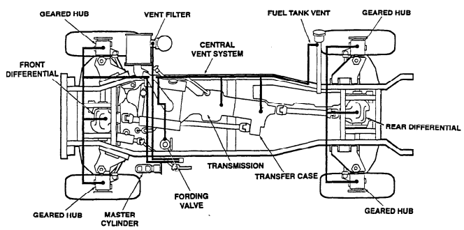

__ 

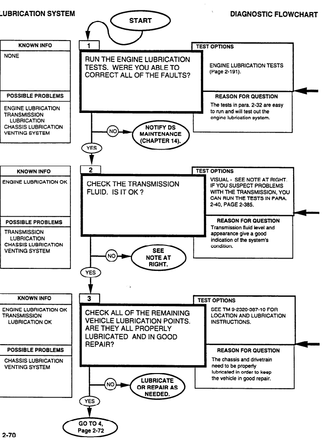

## Reference Information

LUBRICATION SYSTEM 
The tests in para. 2-32 test the oil level, cleanliness. leaks in the system, and the CDR valve. Return here when you've fixed everything you can or if no faults were found. 

#### F=Bocedure For Checking Transmission Fluid

1. Start engine. 

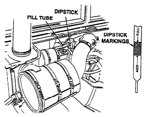

2. Hold down brake pedal and move transmission shift lever through all ranges including reverse. 

3. Engage parking brake and place shift lever in neutral. 

Check fluid level on dipstick. 

4. Proper level is between FULL and ADD marks on dipstick. 

NOTE 
Check fluid for a burnt smell, grit, discoloration, air bubbles, or a milky appearance. 

l Burnt smell, discoloration, or grit indicates worn or damaged internal components. Notify OS maintenance (chapter 14). 

l Bubbles indicate an overfilled system or air leaks - : 
in the system. Drain the fluid and refill to proper level (para. 5-2). 

l Milky appearance is due to water in the system. Drain the fluid from the entire transmission and transmission cooling system and install a new filter 
(para. 5-2). 

l Check fill tube for indications of fluid being blown out. If fluid is being blown out, check vent line for obstructions, and refill transmission to proper level (para. 5-2). 

Among the items are the driveshafts. 

suspension, differentials, and geared hubs. 

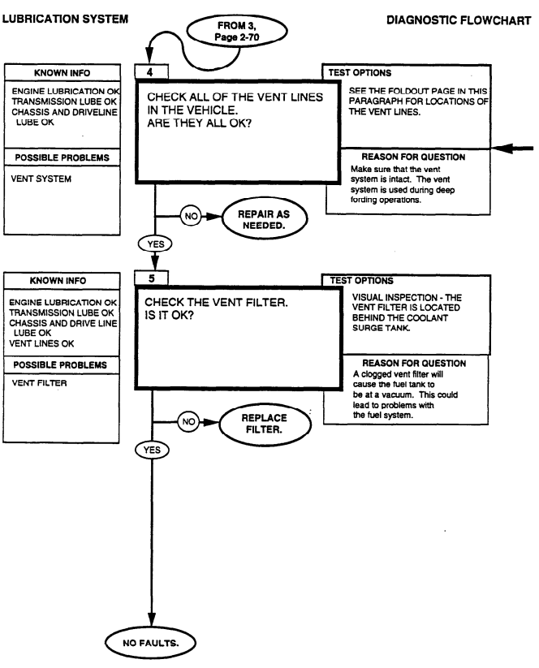

TM 9-2320-387-24-l LUBRICATION SYSTEM 
REFERENCE INFORMATION 
I There are vent lines attached to all parts of the vehicle with a lubrication reservoir. These parts are the engine, transmission, tra'nsfer case, differentials, geared hubs, and the fuel tank. 

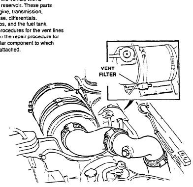

the particular component to which the line is attached. 

I Removal procedures for the vent lines 

# 2-27. Electrical Tests I

Most of the electrical circuits in the vehicle are included in one of the major systems covered by this manual. This is a top level paragraph to help you pick the right one. A number of schematics are also included to help you find the problem. If you go through the flow chart and can't solve the problem, use the schematics to find wires which may be causing trouble. 

The electrical system consists of the batteries, which produce electrical power by a chemical reaction between the lead plates and the electrolyte solution (a mixture of acid and water). This power is carried by wires and cables to those parts of the vehicle which require electrical power. The batteries get recharged by the alternator, which generates electrical power by using some of the engine's mechanical power, produced when the engine is running. If you are not too confident about electrical concepts and terminology, you should read para. 2-22, page 2-43. All electrical systems require a connection to ground (called grounding), which is the completion of the circuit to the battery negative. Pages 2-90, 2-91, and 2-92 are diagrams of the grounding. If your vehicle exhibits strange symptoms that seem to defy all efforts to fix them, the vehicle may have a grounding problem. Grounding problems cause strange symptoms usually because more than one circuit is using the same ground, or because a circuit has more than one ground. For example, looking at the body ground diagram, if wire 58D (a ground for the instruments) is disconnected from the left-side cylinder head, the instruments may still function due to the separate ground, but they would probably be erratic and inaccurate. Usually the problem will be a loose or corroded connection between the circuit, through body ground to battery negative terminal. Be sure to check continuity to battery negative cable rather than simply to the vehicle body or engine block. After the grounding diagrams are functional flow schematics of the major systems in the vehicle. The shaded areas are the wires and components of the vehicle master power distribution. These are designed to help you find the system giving you problems. 

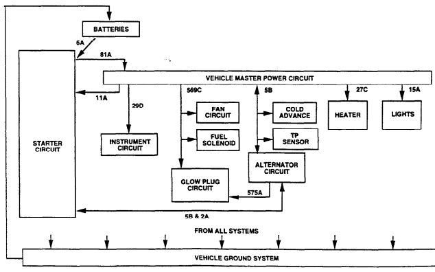

I 

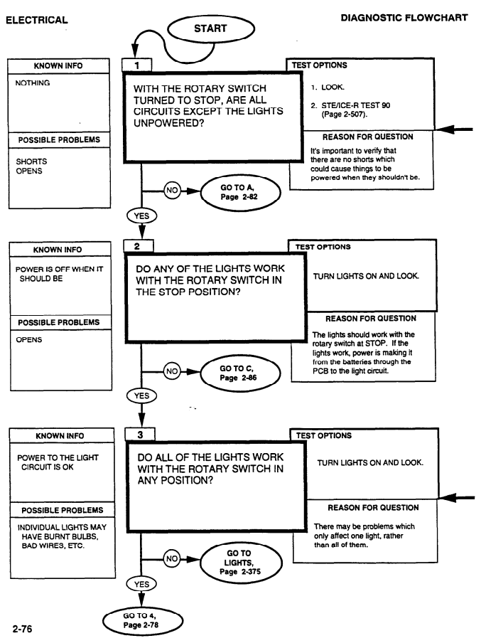

#### Reference Information

ELECTRICAL 
The lights are the only circuit on the vehicle which should work or be drawing any power when the switch is in the STOP position. Check the instruments, try turning on the heater fan, listen for any relay clicking or other sign (includes engine running) that power is on when it shouldn't be. 

It's best if you use the STEKE-R in TK mode to verify that there is no current draw from the batteries. You can't use the DCA mode for this because it will measure this current during the calibration part of the test and read that this is just an offset in the sensor. 

#### Dc Current 9-L ,590 Amps

STMCE-R TEST 90 

1. Connect probe.

2. Start Test 90, DC amps. 3. Displayed reading is in amps. 

The lights should work with the rotary switch in any position. 

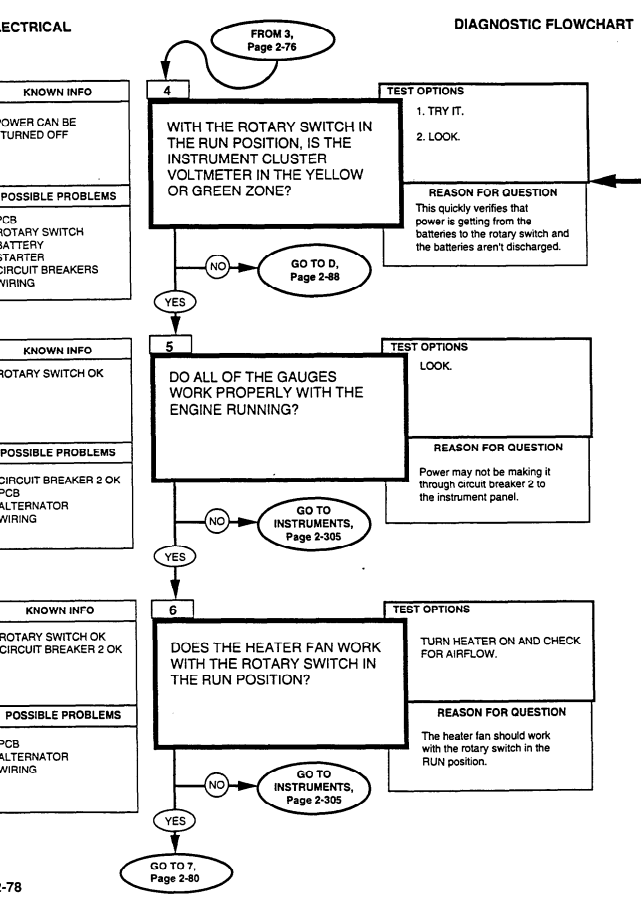

TM 9-2320-387-24-l REFERENCE INFORMATION 
ELECTRICAL 
With engine off, turn switch. If the voltmeter 

 is slightly in the yellow zone, you can continue down the YES path, but beware of possible test tailures due to the low battery charge. 

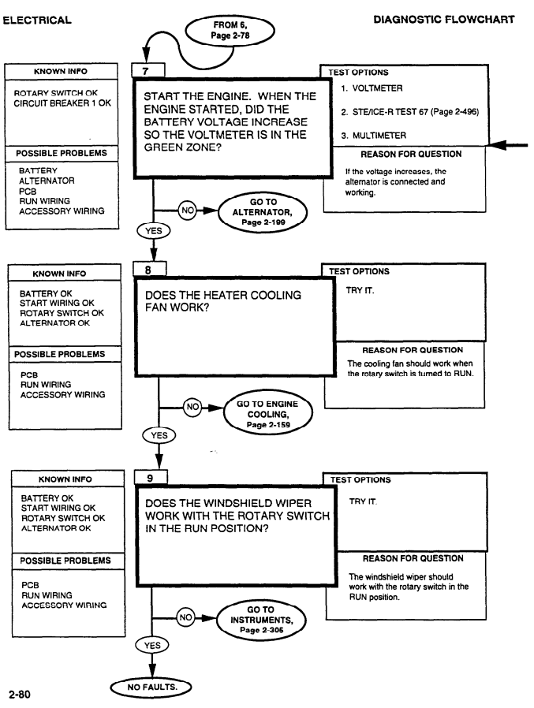

TM 9-2320-387-24-l REFERENCE INFORMATION 
ELECTRICAL 
VOLTAGE 

1. Start Test 67, battery voltage. 2. Displayed reading is in volts. Batteries should be 23-25.5 volts. Voltage in batteries will drop when glow plugs turn on. 

## Electrical

KNOWN INFO I 
SHORT CIRCUlT IN 
POWER LINES 
POSSIBLE PROBLEMS 
BODY CONNECTOR 
HARNESS 
ENGINE CONNECTOR 
HARNESS 
ROTARY SWITCH 
KNOWN INFO 
BODY CONNECTOR 
HARNESS OK 
POSSIBLE PROBLEMS 
ENGINE CONNECTOR 
HARNESS 
ROTARY SWITCH 

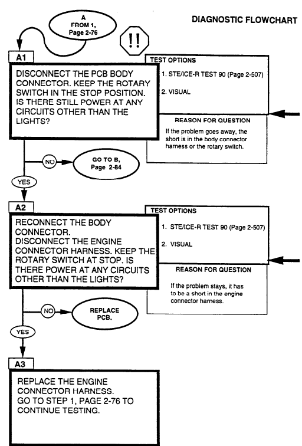

## Reference Information Electrical

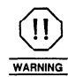

Disconnect negative battey cable before disconnecting and reconnecting protective control box harness. 

WARNING 
There is battery voltage at the PCB at all times. Failure to disconnect battery cable will result in damage to equipnwtnt or injury to personnel. 

DC CURRENT O-1.500 AMPS 
STVICE-R TEST 90 1. Connact probe. 

2. Start Test 90, DC amps. 

3. Displayed reading is in amps. 

Replace PCB (para. 4-4). 

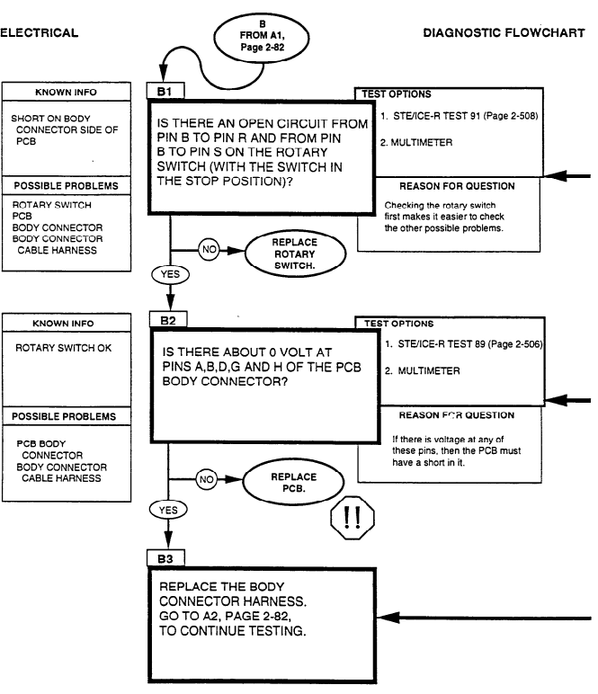

## Reference Information Electrical

Replace rotary switch (para. 4-10). 

#### Resistance And Continuity 04,500 Ohms Stvice-R Test 91

1. Connect RED clip and BLACK **clip to the** 
terminations indicated in the question. 

RED to the first, BLACK to the second.

- 
2. Start Test 91,0-4.500 Ohms. 

3. Displayed reading is in ohms. Less than 5 ohms is continuity. If the resistance is over 4.500 ohms, STEIICE-R displays .9.9.9.9. 

-I Replace PCB (para. 4-4). 

#### Dc Voltage 045 Volts Ste!Lce-R Test 89

1. Connect RED clip to the indicated test point, BLACK clip to negative or ground. 

2. Start Test 89. DC Volts. 3. Displayed reading is in volts. 

Disconnect **negative battery cable before** disconnecting and reconnecting protective control box harness. 

There is battery voltage at the PCB at all times. Failure to disconnect battery cable will result in damage to equipment or injury to Personnel. 

Replace harness. Notify DS 
maintenance (chapter 27). 

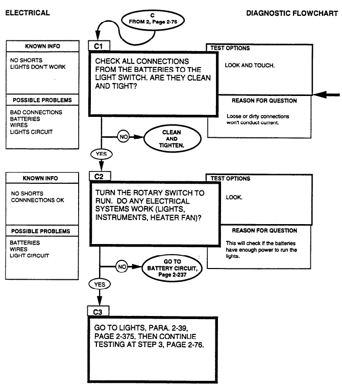

TM 9-2320-387-24-l REFERENCE INFORMATION 
ELECTRICAL 
Battery cables to starter. Buss bar to solenoid. PCB engine and body connector. 

Light switch. 

i 

ELECTRICAL 
I KNOWN INFO 
POWER CAN BE 
TURNED OFF 
POSSIBLE PROBLEMS 
BA-t-fERIES INSTRUMENT CIRCUIT 

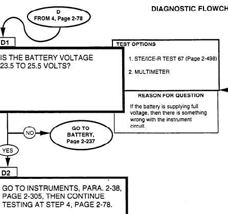

DIAGNOSTIC FLOWCHART - 
J 
ELECTRICAL 

## Reference Information

#### Baltery Voltage Stvice-R Test 67

1. Start Test 67, battery voltage. 

2. Displayed reading is in volts. Batteries should be 23-25.5 volts. Batteries' voltage will drop when glowplugs turn on.

#### -

# I **Baltery Voltage** Multimeter I

1. Set the voltmeter to a DC volts scale of at least 40 votts. 

2. Connect the RED lead to positive and the BLACK lead to negative.

3. Be sure to read the correct scale. 

ELECTRICAL 

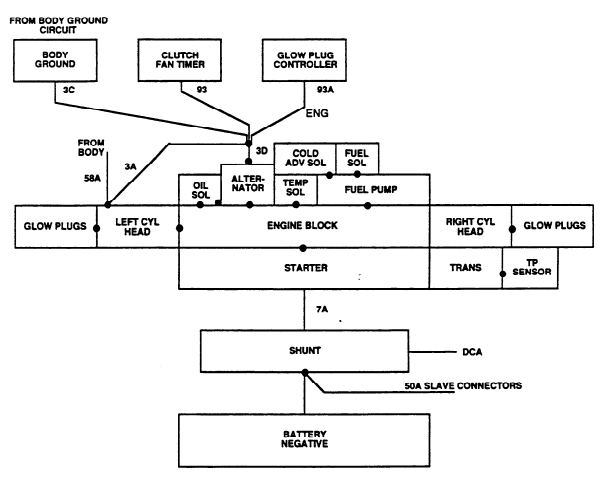

#### Balteryienglne Ground Circuit

ELECTRICAL

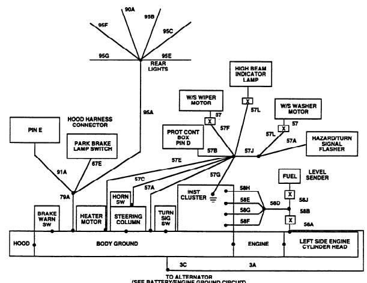

BODY GROUND CIRCUIT

ELECTRICAL

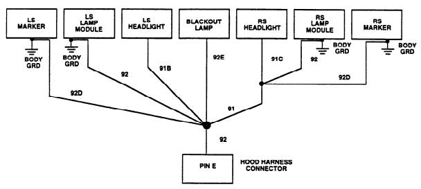

# Front Hood/Lights Ground Circuit

.

ELECTRICAL 

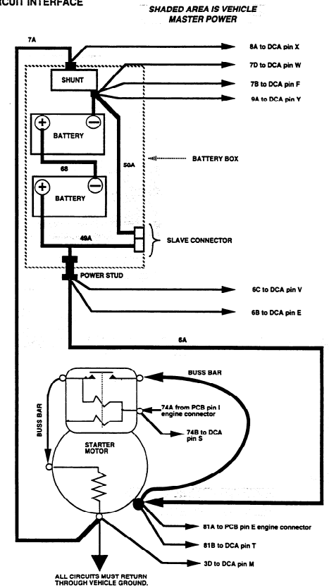

STARTER CIRCUIT INTERFACE

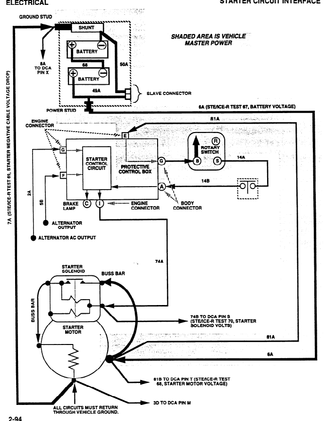

# Alternator Interface

ELECTRICAL

SHADED AREA IS VEHICLE

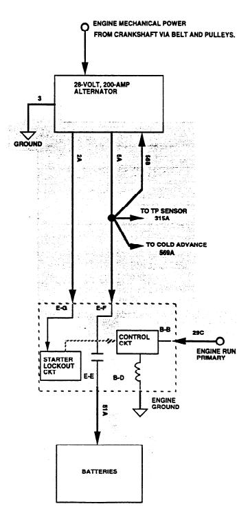

ELECTRICAL
INSTRUMENTS CIRCUIT INTERFACE

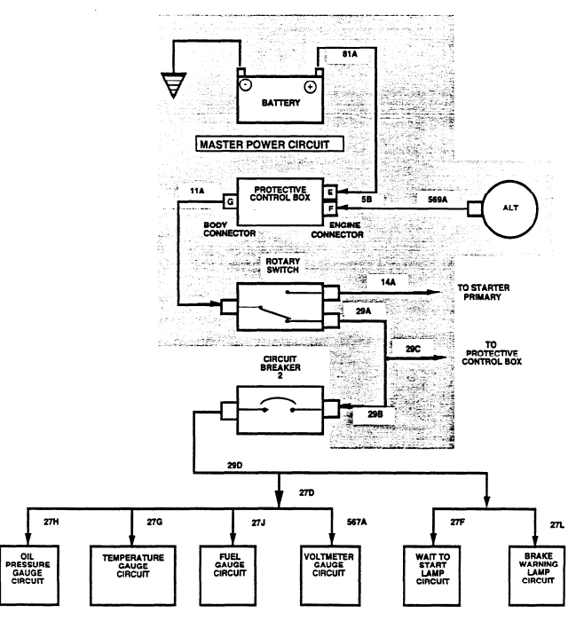

SHADED AREA IS VEHICLE 3

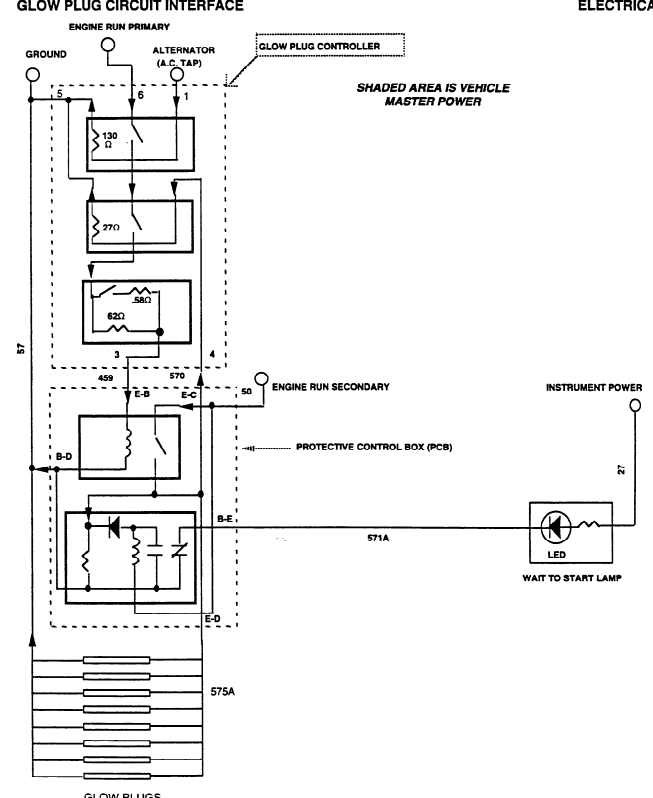 

GLOW PLUGS 

ELECTRICAL

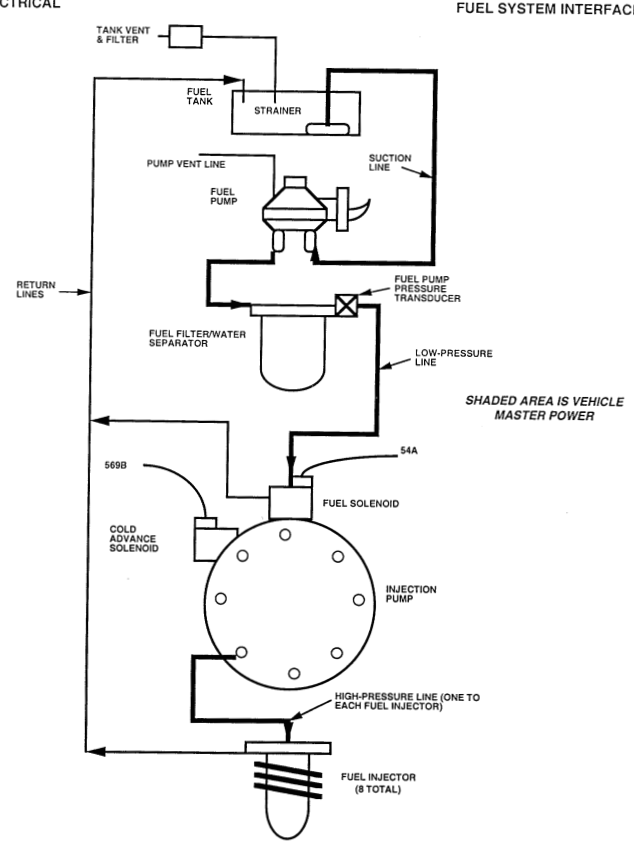

I

## 2-28. Fuel System Tests

These fuel system tests can be run any time you think there may be a problem with the fuel system or if you were sent here from another test. 

If you are running this test because the engine runs rough, remember that air intake and exhaust as well as internal mechanical problems can also cause this condition. 

At the bottom of this page is a simplified block diagram which shows how the different fuel system components relate to each other. Refer to fold-out page FP-1 and leave open for reference while you are testing. 

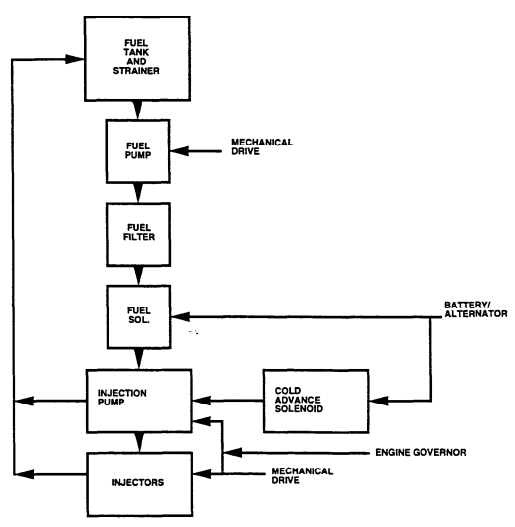

- 

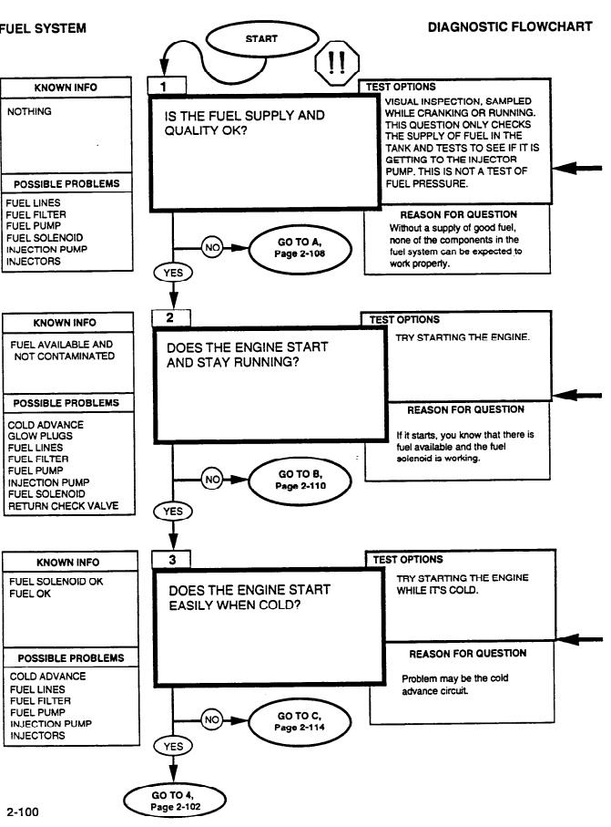

#### Reference Information

MAKE SURE AU ELECTRICAL CONNECTtONS ARE CLEAN AND TIGKT. CHECK FUEL SOLENOID, COLD ADVANCE SOLENOID. BAll-ERIES. ROTARY 
SWITCH, ETC. 

1. While cranking or running the engine, open the drain fitting and drain some fuel into a clear container. 

2. The fuel should come out of the open 
-drainvalve in a steady stream. If it doesn't, then answer NO to this question. 

l NOTE: Nothing will come out unless the engine is running or cranking. 

3. Close the drainvalve and turn the rotary switch to STOP. 

4. Check the fuel that came out to be sure that it isn't contaminated with water or dirt. 

5. If the fuel didn't come out in a steady stream or if it is contaminated, answer NO to this question. 

If you have trouble starting the engine, you should have entered here by way of the startability tests. If you didn't begin there, go back to page 2-45 and run the startability top level test. At this point, you don't care how well it starts or runs but just that it will run. The answer to this question is NO if the engine seems to start but stops almost immediately. 

Engine temperature may be determined from vehicle temp. gauge (rotary switch must be in RUN position) or by touching the engine. If it is too hot to touch comfortably, it is above 120° F (49O C). 

Hard starting can be caused by other things such as fuel in the lines leaking back into the tank while the engine is shut down. This will occur if there is an air leak in the lines. 

FUEL SYSTEM 
Diesel fuel is highly flammable. Do not perform any procedures near fire, flames, or sparks. 

Severe injury or death will result. 

A hot engine may cause serious burns. Always use caution when approaching a hot engine. 

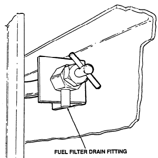

- 
- : 
i 

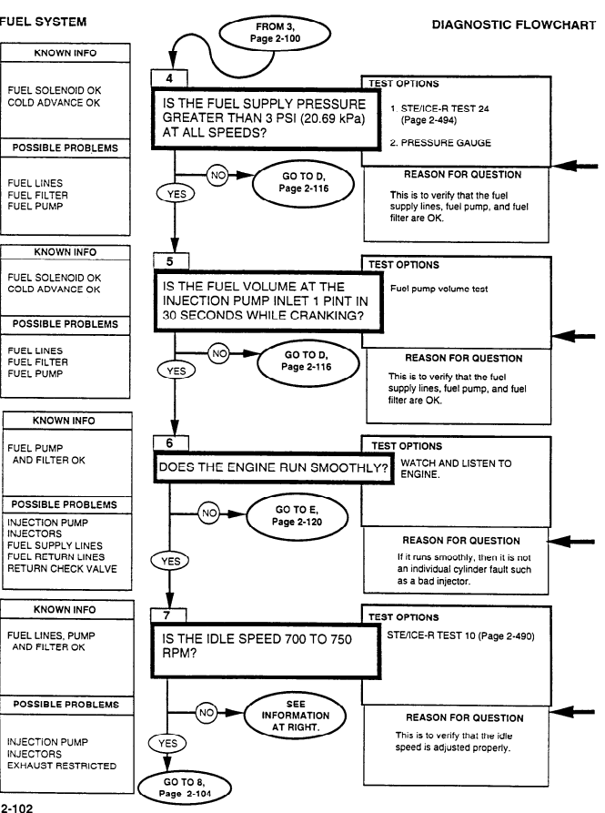

## Reference Information

FUEL SYSTEM 
Watch the fuel pump pressure while slowly accelerating the engine from idle to maximum speed. The pressure should always be greater than zero. If you can drive the vehicle while measuring the pressure, check to be sure it is still above zero even during maximum acceleration (maximum engine power). You can use STUICE-R test 24 with control function 02 (minimum). 

Rapidly accelerating the engine with the transmission in neutral doesn't work for this engine because the fuel supply can't increase as fast as the engine can accelerate so you won't get good test results. 

Proper engine performance depends upon the availability of the correct fuel volume to the injection pump. 

Pay attention to when the engine runs rough. If it runs rough only while warming up after a cold start, it may be a glow plug problem and you should run the Glow Plug Circuit tests. Rough running may also be caused by air leaks in the fuel supply lines. Air in the fuel should purge itself while idling. If rough running occurs after **a period of** 
high speed or high power running but seems to go away after idling, then look for air leaks in the fuel supply lines and **fittings. If rough running occurs** while driving but idles ok, check the fuel return check valve for any malfunctions (para. 3-36). 

Try to adjust the engine idle speed by turning the idle speed screw (para. 3-45). Continue testing if you can adjust the speed property. If you cannot, notify DS maintenance (chapter 14). 

Engine must be at normal operating temperature when making speed checks. Air filter must be in place and all accessories (lights, heater fan, etc.) 
must be turned off. 

Thts engme has a min-max governor which controls engine speed at both idle and full thronle. 

# I **Fuel Pump Volume Test**

1. Disconnect fuel line at injection pump inlet and route fuel line into a suitable 1 quart 
(1 liter) container. 

2. Crank the engine for 30 seconds. 3. If the pump and lines are ok, you should gE 
about 1 pint (l/2 quart) (.5 L) in 30 second5 

#### Fuel Pump Pressure Ste/Lce-R Test 24

(SLUICE already connected to DCA and turned on) 1. Select Fuel Supply Pressure test, Test 24. 

2. Perform CAL. 3. Crank (or start) the engine. 

NOTE : STE/ICE-R can display a pressure below 0. Be sure to notice if the display is negative. 

# I Fuel Pump Pressure Test Pressure Gauge

1. Connect a tee into the fuel line between the fuel filter outlet and the injection pump inlet. 

2. Attach gauge to tee. 3. Crank (or start) engine. 

#### Engine Rpm Steiice-R Test 10

1. Start Test 10. Engine RPM. 

2. Crank or start the engine. Displayed reading is RPM. Cranking rpm should be at least 100 rpm. Idle rpm should be 700-750. 

I 
-- 

RETURN CHECK VALVE 

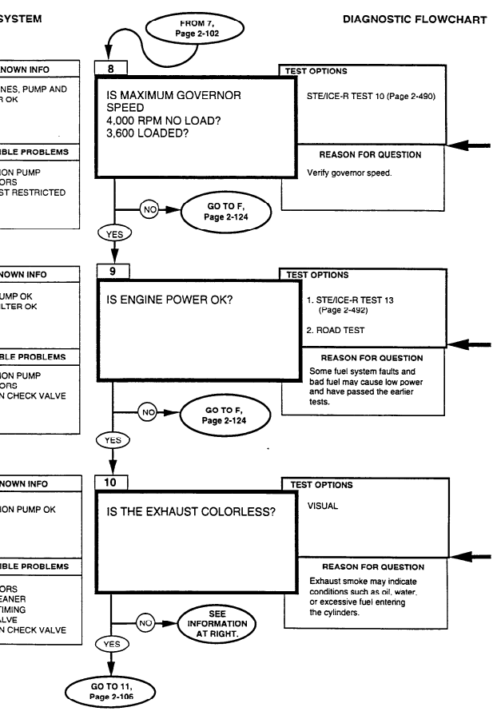

L 
FUEL SYSTEM 
FUEL LINES, PUMP AND 
INJECTION PUMP EXHAUST RESTRICTED 
FUEL FILTER OK 
POSSIBLE PROBLEMS 
INJECTION PUMP RETURN CHECK VALVE 
INJECTION PUMP OK 
AIR CLEANER 
PUMP TIMING 
FILTER OK 
INJECTORS 
FUEL PUMP OK 
INJECTORS 
INJECTORS 
CDR VALVE 
2-104 

#### Reference Information

## Fuel System

Governor no-load speed is with the transmission in neutral. Loaded speed is with the transmission in gear and the vehicle moving. 

-It is the maximum rpm the engine will develop. The engine will surge at governor speed since the governor will try to lower the engine speed and the accelerator is trying to increase it. 

#### Engine Rpm Steiice-R Test 10

1. Start Test 10, Engine RPM. 

2. Crank or start the engine. Displayed reading is RPM. Cranking rpm should be approximately 1 W-200. Idle rpm should be 700-750.

#### Engine Power Test (Percenti Stuice-R Tesi 13 '

1. Set TEST SELECT switches to 13. 

2. Press and release TEST button. 3. Watt for prompting message CIP to appear. 

4. When CIP appears on display, press down sharply on engine accelerator and hold it to the floor. When VTM displays OFF, release accelerator. 

5. A number will be displayed after the engine has returned to idle speed. This number is the test result in units of percent of nominal rated power.

A number over 75 is passing for STE/lCE-R test 13. If the vehicle seems to be low on power while driving, you have to check for other things which could cause this such as the transmission. 

To try a road test, accelerate the vehicle from 0 to a safe and reasonable speed on a reasonably level road. 

._ -I 
- : 
If the exhaust is not colorless. it must be either white, blue, or black. If exhaust color is: 
WHITE .._....... Go to G. page 2-126. Also could be injector timing. Notify DS maintenance (chapter 14). 

BLUE . . . . . . . . . . . . Blue smoke is a sign of oil entering the combustion chambers. It usually enters past the piston rings or intake valve stem seals. This is an internal engine problem that can't be handled at this level of maintenance. You may want to run the engine running tests, page 2-51, before you notify DS maintenance (chapter 14).

BUCK . . . . . . . . . Air intake/exhaust, page 2-l 41. 

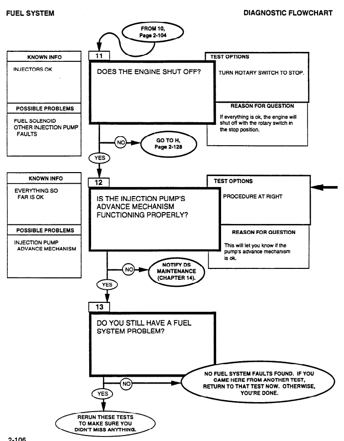

_ 
FUEL SYSTEM 
REFERENCE INFORMATION 
1. Note engine rpm reading (SWICE-R TEST 10). 

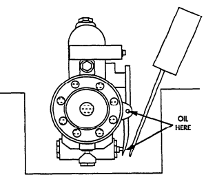 2. Gently depress rocker arm on pump towards injection pump. 

3. If mechanism is functioning properly, rpm will decrease. 

4. If mechanism doesn't move freely. try putting a drop of oil in the two spots indicated. Gently try to depress rocker arm again. 

INJECTION PUMP AS SEEN FROM REAR OF ENGINE. GENTLY PRESS SCREWDRIVER AGAINST ARM. USE A 1 O-IN. SCREWDRIVER. 

- 

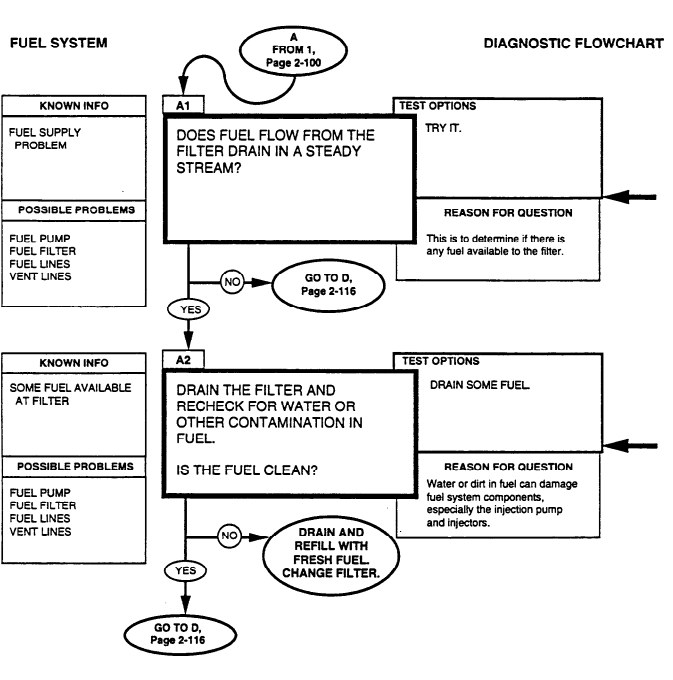

TM 9-2320-387-24-l 

# Reference Information

FUEL SYSTEM 
If no fuel arrives when cranking engine, the diaphragm in the lift pump may be ruptured, allowing the fuel to drain back into the tank. 

There may be some water or dirt trapped in the filter already that didn't come from the fuel that is in the tank now. Open the filter drainvalve and crank the engine for approximately 5 seconds to purge the filter, then take a fuel sample in a c!ear container. 

Inspect the sample for water and dirt. Replace fuel filter (para. 3-34). 

i 

r FUEL SYSTEM 
FUEL SUPPLY LINES OK FUEL FILTER OK 

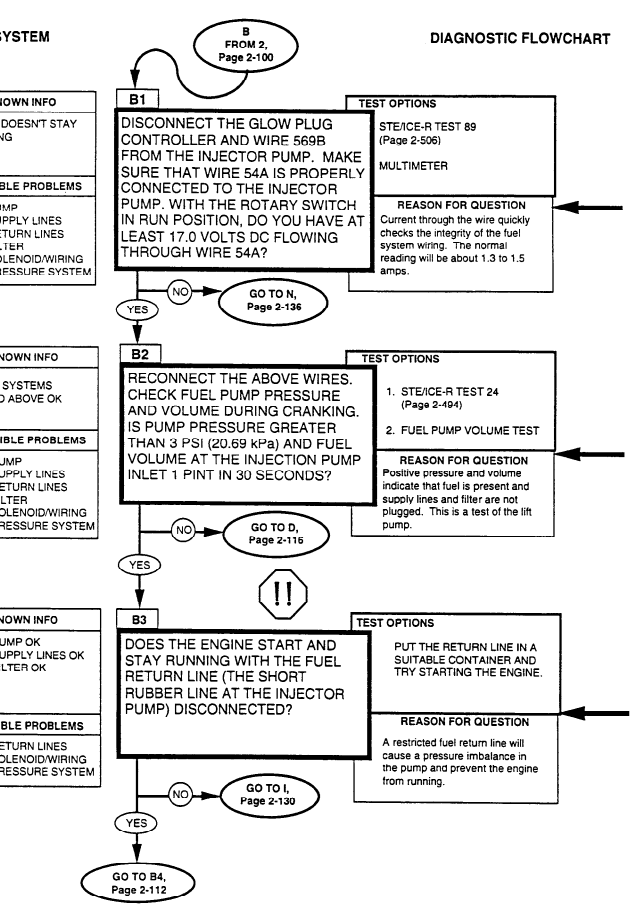

ENGINE DOESN'T STAY 
FUEL PUMP FUEL SUPPLY LINES FUEL RETURN LINES FUEL FILTER 

FUEL SOLENOID/WIRING HIGH-PRESSURE SYSTEM 
?UEL SUPPLY LINES FUEL RETURN LINES 
FUEL SOLENOID/WIRING 
RUNNING 
FUEL PUMP 
FUEL FILTER 
FUEL PUMP OK 
2-110 

# Reference Information

When using a multimeter to measure current through wire 54A, disconnect the wire. Set the ammeter to a scale of at least 5 amps DC. Connect the red lead of the multimeter to wire 54A and the black lead to ground. With the rotary switch in the RUN position, measure current. Be sure to read the correct scale. Return the switch to the STOP position. Disconnect the multimeter and reconnect wire 54A.

# Fuel Supply Pressure (Psi) Steace-R Test 24

1. Select Fuel Supply Pressure Test (Test 24).

Periorm CAL.

2. Crank (or start) engine.

# Fuel Pump Volume Test

1. Disconnect fuel line at injection pump inlet and route fuel line into a suitable, 1 quart container.

2. Crank the engine for 30 seconds.

3. If the pump and lines are ok, you should get about 1 pint (1/2 quart) (.5 L) in 30 seconds.

WARNING

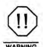

Diesel fuel is highly flammable.

Do not perform any procedures near fire, flames, or sparks.

Severe injury or death will result.

1. Disconnect the return line and direct it into a suitable container.

2. Watch the fuel flow from the return line as you or an assistant try to start the engine.

# Fuel System Dc Current 0 - 45 Volts Steace-R Test 89

1. Connect RED clip to the indicated test point:
BLACK clip to negative or ground.

2. Start Test 89, DC Volts.

3. Displayed reading is in volts.

## Fuel Pump Pressure Test Pressure Gauge

1. Connect a tee into the fuel line between the fuel filter outlet and the injection pump inlet.

2. Attach gauge to tee.

3. Crank (or start) engine.

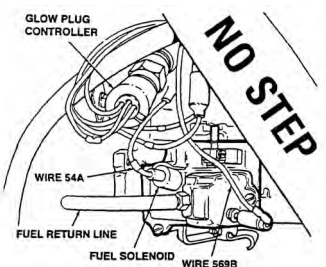

KNOWN INFO
FUEL SOLENOID AND 
WIRING OK
POSSIBLE PROBLEMS
FUEL RETURN LINES INJECTION PUMP INJECTORS RETURN CHECK VALVE
KNOWN INFO
RETURN LINES OK

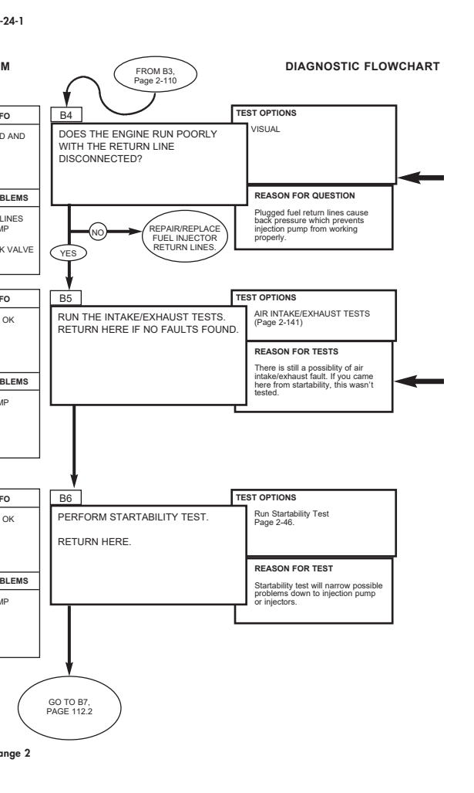

POSSIBLE PROBLEMS
INJECTION PUMP INJECTORS
KNOWN INFO
RETURN LINES OK
POSSIBLE PROBLEMS
INJECTION PUMP INJECTORS
TM 9-2320-387-24-1

# Reference Information **Fuel System**

Return lines should be inspected for kinks or crushed lines or anything that might restict fuel flow.

Inspect fuel return check valve for any restrictions. Replace valve (para. 3-36). Replace fuel lines (para. 3-26).

If you came here from the startability tests, return to STEP 5, page 2-48. If you haven't run the startability tests yet, go to STEP 1, page 2-46.

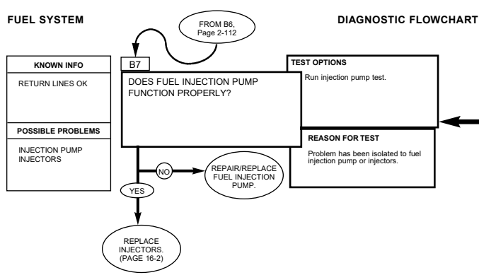

During high temperature and humidity, early model vehicles can experience difficulty starting while using JP-8 fuel. High temperatures can cause restrictive clearances in some older fuel injection head and rotor assemblies. The engine must be allowed to cool to allow adequate clearance of the pumping plungers to ensure adequate fuel delivery for starting. If this condition persists, run the startability tests. If vehicle passes all startability tests and troubleshooting procedures and still experiences difficulty in hot starting, identify the fuel injection pump and serial numbers. All fuel injection pumps with P/N DB2831-5209, NSN 2910-01-467-9029 incorporated the improved head and rotor assembly, P/N 31506. If your serial number is less than shown in the Serial Number Break Column of the table below, the manufacturer recommends the fuel injection pump to be replaced, tagged as a "no hot restart" condition, and forward for rebuild. Notify direct support maintenance.

| characteristics. Loss of vehicle   | control may result, causing serious   |
|------------------------------------|---------------------------------------|
| injury or death to personnel and   | damage to equipment.                  |
| NOTE                               |                                       |

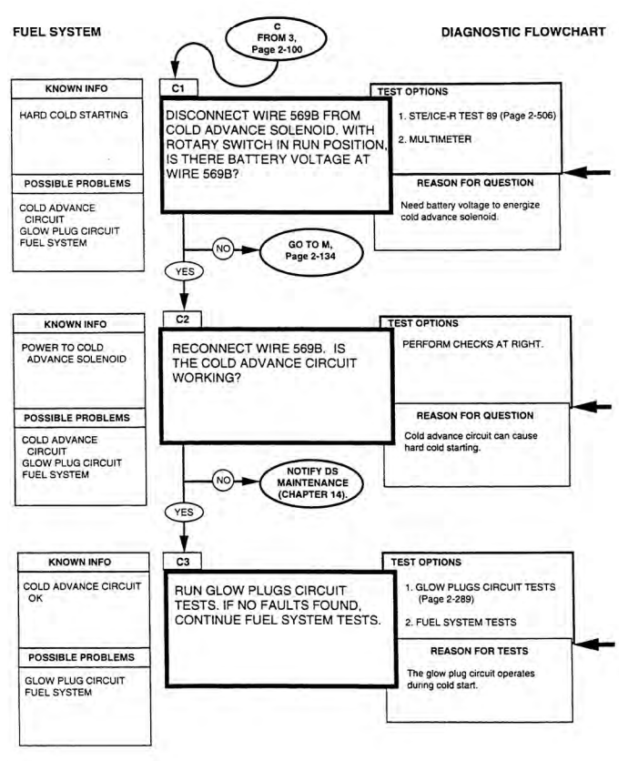

## Reference Information Fuel System

The engine temperature must be below 90° F (32°C) to get voltage here. If the engine is warm, either wait for it to cool, or go to step C3 at the bottom of the page and remember that the cold advance may be the problem if everything else checks out OK. The glow plugs or the intake/exhaust system may be faulty, so you should test them first. 

The cold advance circuit advances the fuel injectton pump timing approximately 3 to 5 degrees during cold start-up. If engine temperature is less than 90°F (32°C). then advance circuit operation may be 1 checked as follows: 
4. 

Start the engine. Disconnect wire 6698 from the advance solenoid. If the circuit is working correctly, then engine rpm should decrease. Look at the advance mechanism on the right side of the fuel injection pump while you connect and disconnect 5698 with the engine running. The advance mechanism should move about l/4 in. If the advance mechanism is stuck, apply some oil at the points shown and try again. 

#### Dc Voltage O-45 Volts Steiice-R Test 99

1. Connect RED clip to positive, BLACK clip to negative or ground. 

2. Start Test 89, DC Volts. 3. Displayed reading is in volts. 

#### Baltery Voltage Multimeter

1. Set the voltmeter to a DC volts scale of at least 40 volts. 

2. Connect the RED lead to positive and the BLACK lead to negative. 

3. Be sure to read the correct scale. 

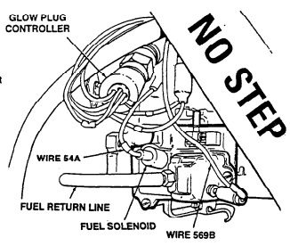

Remember to reconnect any wires that were disconnected during troubleshooting. 

I 

ADVANCE MECHANISM INJECllON PUMP AS SEEN 

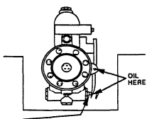

FROM REAR OF ENGINE 

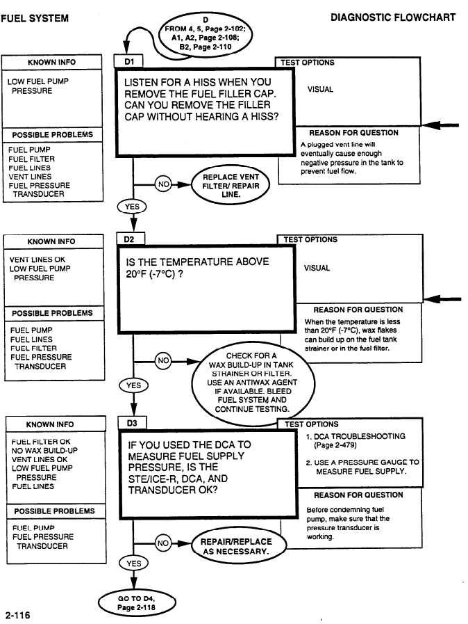

1, 

#### Reference Information

FUEL SYSTEM 
If you hear a hissing noise while removing the 

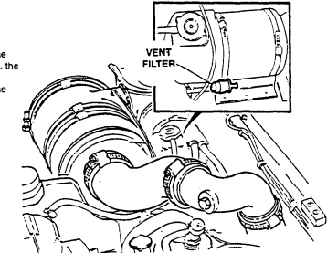

fuel filter cap, either the vent filter is plugged, the vent line is restricted, or the vent valve is restricted. The vent filter is located behind the coolant surge tank. 

Replace vent lines or vent line filter (para. 3-28). Replace vent valve (para. 3-25). 

Diesel fuel is sensitive to temperature. All diesel 

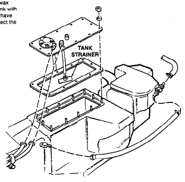 fuel has a certain amount of paraffin-like components which have high energy value and help improve fuel economy. When temperatures are less than 20°F (-7°C) these components begin turning into wax flakes that can build up on the fuel tank strainer or in the fuel filter. If wax build-up is found, replace the fuel in the tank with a winter grade of fuel if available. You will have to remove the fuel tank if you need to inspect the tank strainer (para. 3-25). 

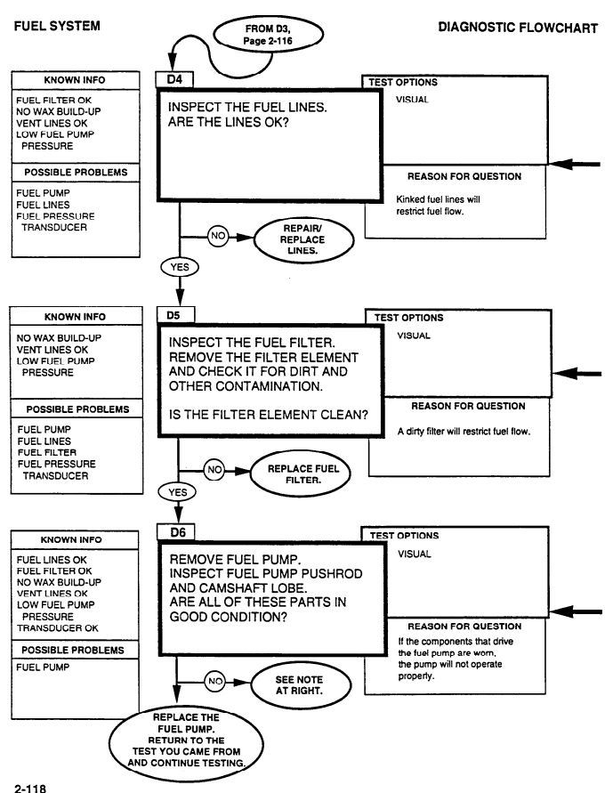

2-118 

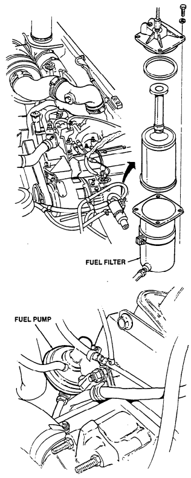

## Reference Information

FUEL SYSTEM 
-4 Fuel lines should be inspected for kinks, cracks, or anything that would restrict fuel flow or allow air to enter the lines. Be sure to check the lines all the way back to the tank and remember that there is a strainer 
.inside the tank which can become plugged. You will have to remove the tank if it becomes necessary to check this. Replace fuel lines (para. 3-26). 

Poor starting and excessive smoke after start-up can be the result of a restticted fuel supply. This restriction most likely will be from a plugged fuel filter but can also be caused by a pinched or kinked fuel line. After the engine warms up. it generally will run satisfactorily. If the restriction gets progressively worse, top speed and performance will also be affected. FUNGUS In warm or humid weather, fungi and/or bacteria in the fuel can cause fuel system damage by plugging the fuel lines, filter, or injection noules. For removal, replacement, and torques, refer to para. 3-34 or notify DS maintenance (chapter 16). 

Excessive roughness on any of these pans is an indication of wear. The pushrod should slide smoothly in the engine block. If you notice any roughness on the end of the pushrod, be sure to check the lobe on the camshaft. 

H the pump or rod is worn, replace (para. 3-24). If the lobe on the camshaft is worn, notify DS maintenance (chapter 16). 

Rerun Test Chain You may have corrected some problems but there may be others including the fuel pump. 

For removal, replacement and torques, refer to para. 3-24. 

I 
-. --I 
I 

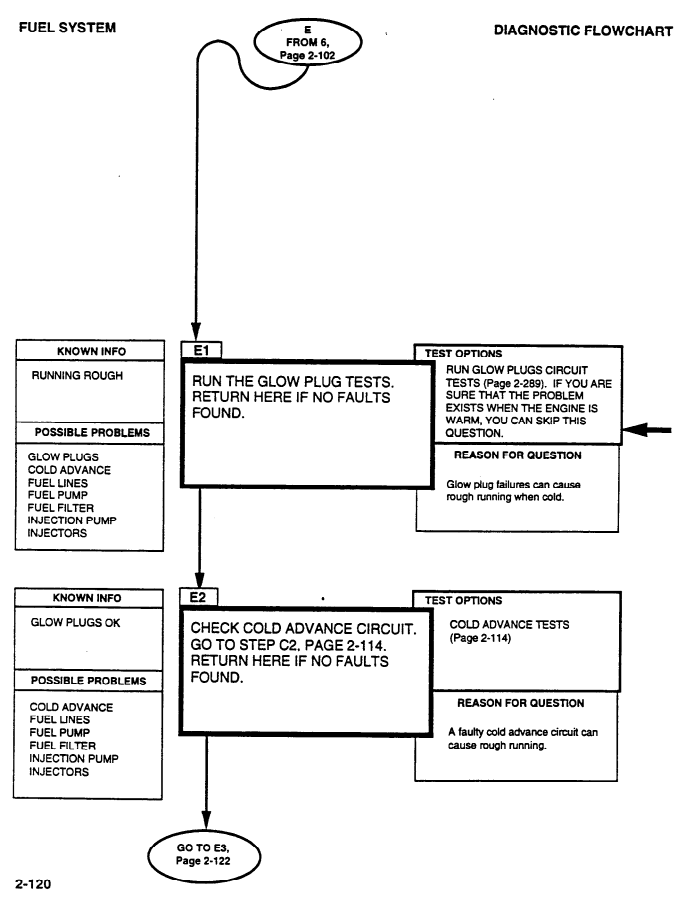

TM 9-2320-387-24-l REFERENCE INFORMATION 
FUEL SYSTEM 
Injection pump timing that is too far advanced can cause glow plugs failure because it increases cyfinder temperature. Usually several, buf not all. glow plugs will fail. 

#### Fuel System

COLD ADVANCE OK 
FUEL LINES FUEL PUMP FUEL FILTER 
INJECTION PUMP 
INJECTORS 
SUPPLY LINES OK 
FUEL LINES FUEL PUMP FUEL FILTER fNJECTlON PUMP INJECTORS 
=UEL PUMP OK 
INJECTION PUMP INJECTORS 

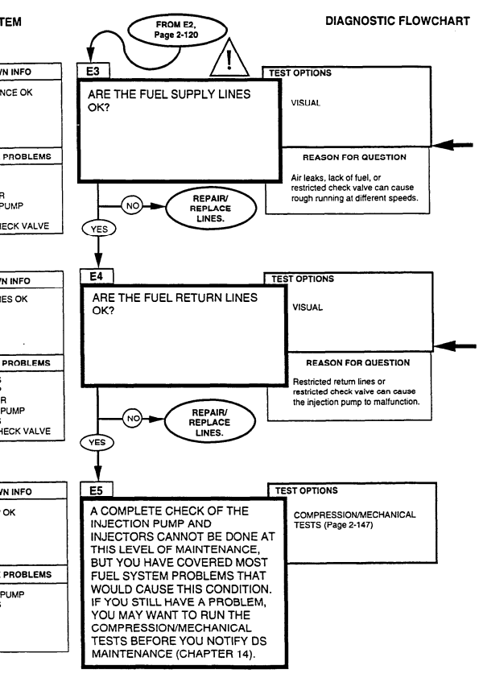

POSSIBLE PROBLEMS 
KNOWN INFO 
RETURN CHECK VALVE [ 
KNOWN INFO 
RETURN CHECK VALVE ,#(z&w KNOWN INFO 
POSSIBLE PROBLEMS 
FUEL SYSTEM 
REFERENCE 
INFORMATION 

Be sure to keep **the line clear of** moving **engine parts (fan,** pulleys, etc.) 
and DO NOT place the line on the exhaust manifold. 

Replace fuel lines (para. 3-26). 

Check the filter vent screw for tightness. 

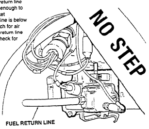 Check the supply lines for kinks, cracks. leaks, or loose connections that could restrict fuel flow or allow air to enter the system. Remember that under certain operating conditions parts of the fuel system can be under vacuum so that loose connections that may not leak fuel can let air in. To test for air leaks in the supply lines, disconnect the return line from the injection pump and connect a line that is long enough to reach the ground. Place the end of the line into a bucket containing diesel fuel, making sure that the end of the line is below the level of fuel in the bucket. Run the engine and watch for air bubbles in the bucket. You can also replace the short return line from the injector pump with a clear piece of tubing to check for bubbles. 

Inspect the return lines for kinks or any other blockage that may restrict fuel flow. 

Inspect fuel return check valve for any restrictions (para. 3-36). 

Replace fuel line (para. 3-26). 

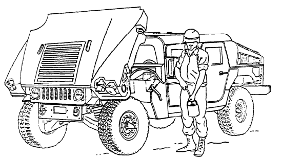

-I 
i 

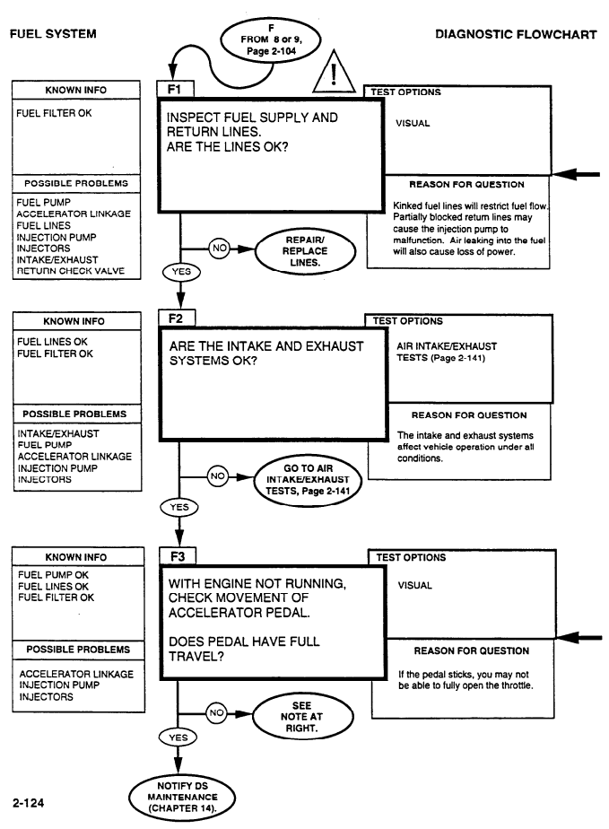

## Reference Information Fuel Systehl

Be sure to keep the line clear of moving engine parts (fan, pulleys, etc.) and DO NOT place the line on the exhaust manffold. 

Fuel lines should be inspected for kinks, cracks, or anything that would restrict fuel flow or allow air into the lines. Se sure to check the lines all the way back to the tank and remember that there is a strainer inside the tank which can also become plugged. To test for air leaks in the suppty lines. disconnect the return line from the injection pump and connect a line that is long enough to reach the ground. 

Place the end of the line into a bucket containing diesel fuel, making sure that the end of the line is below the level of fuel in the bucket. Run the engine and watch for air bubbles in the bucket. Replace fuel line (para. 3-26). 

An important function of all hoses, lines, and fittings is to carry fuel without admitting air to the system. When the fuel tank cap is in place and the fuel pump and injection pump are drawing fuel through the lines. a low vacuum of 6-l PSI is created. This occurs because the fuel which the engine uses must be replaced by air. During this vacuum condition, the slightest leak, which may not leak fuel out, could draw air into the system and, depending on the volume of air, cause a wide variety of engine malfunctions. 

#### Cold Weather Operation

Diesel fuel is sensitive to temperature. All diesel fuel has a certain amount of wax-like components which have high energy value and help improve fuel economy. When temperatures are less than 20°F (-7°C). these components begin turning into flakes that can build up on the fuel tank strainer or in the fuel filter. 

FUNGUS In warm or humid weather, fungi and/or bacteria can cause fuel system damage by plugging the fuel lines, filter, or injection nozzles. ODOR Old fuel smells like varnish. 

Check the accelerator pedal for full movement with no sticking or binding. If you have sticking or binding, lubricate accelerator pedal bushing and bearing with seasonal grade OE oil (TM 9-2320-367-10). If you do not have full pedal travel, disconnect the accelerator linkage from the fuel injection pump and recheck the travel. If you now have full travel, the problem is in the fuel injection pump and cannot be handled at this level of maintenance. 

Operation of the injection pump and injectors cannot be verified at this level of maintenance. 

FUEL SYSTEM 
KNOWN INFO I 
WHITE SMOKE 
INTERNAL ENGINE 
PROBLEMS 
FUEL QUALITY 
POSSIBLE PROBLEMS 
INJECTION TIMING INTERNAL ENGINE 
PROBLEMS 
FUEL QUALITY RETURN CHECK VALVE 
GLOW PLUGS OK 
ENGINE MECHANICAL 

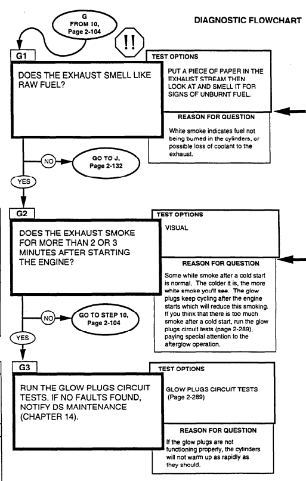

r KNOWN INFO TEST OPTIONS 
WHITE SMOKE VISUAL 
WHITE SMOKE RUN THE GLOW PLUGS CIRCUIT 
TM 9-2320-387-24-l REFERENCE INFORMATION 
FUEL SYSTEM 

Be careful **when performing** 
this test. Exhaust gas can be extremely hot and severe burns can result. 

Put a piece of paper in the exhaust stream for a few moments with the engine at idle. **Then look** at the paper to see if there is any condensed fuel on it. **Then smell** the paper to see if it smells like raw fuel. If it smells like fuel, the engine could be very cold or else it has a DS 
level fuel system fault or compression fault. 

-._ -I White smoke for a short time after start-up, especially on a cold day, is a normal condition. It is caused by incomplete combustion of the fuel because of low cylinder temperature. It should clear up in a few minutes. If not, you may have a bad head gasket, cracked block, or a restricted check valve. Check for 1 restricted check valve (para. 3-36). 

i 

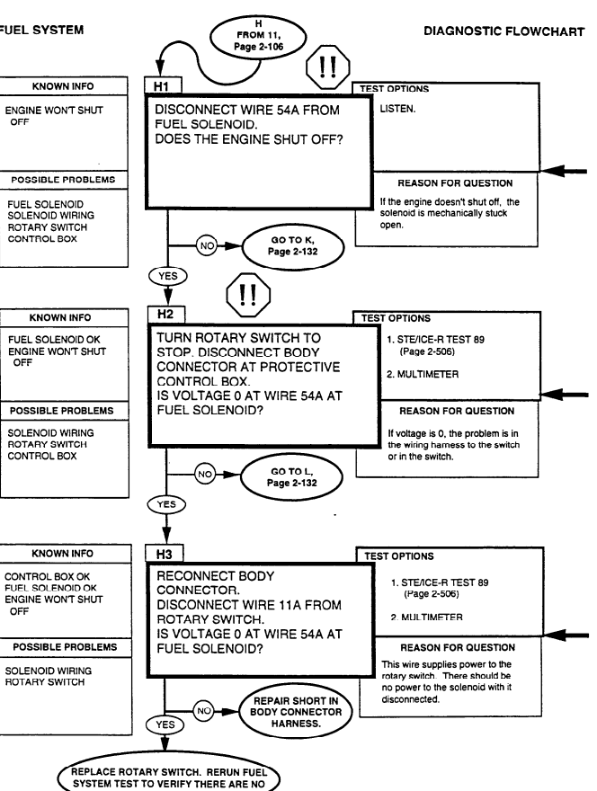

2-128 OTHER FAULTS. 

## Reference Information Fuel System

Keep hands away from engine fan. Moving fan blades can cause serious injury. Use extreme caution when engine is running. 

Disconnect negative battery cable before disconnecting and reconnecting protective control box harness. 

There is battery voltage at the PCB at all times. Failure to disconnect battery cable will result in damage to equipment or injury to personnel. 

Rotary switch must remain in STOP position for the rest of these tests. 

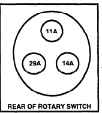

NOTE 

Carefully inspect the body connector end of the harness for a short. Check for pushed out pins, broken or stripped insulation, or any other bare wires. If everything checks out OK, you have to replace the harness. Remember to reconnect any wires that may have been disconneded during troubleshooting. 

Repair harness (para. 4-80). 

Replace rotary switch (para. 4-10). 

#### Dc Voltage O-45 Volts Steiice-R Test 89

1. Connect RED clip to positive, BLACK clip to negative or ground. 

2. Start Test 89. DC Volts. 3. Displayed reading is in volts. 

#### Dc Voltage Multimeter

1. Set the voltmeter to a DC volts scale of at least 40 volts. 

2. Connect the RED lead to positive and the BLACK lead to negative.

3. Be sure to read the correct scale. 

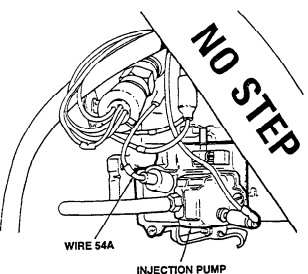

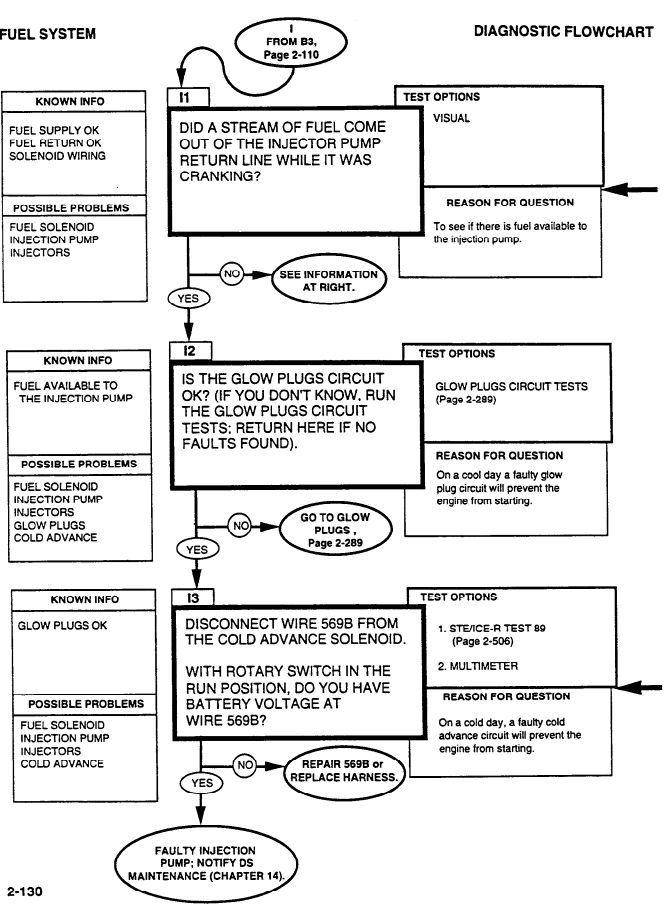

#### Reference Information Fuel System Dc Voltage O-45 Volts Stuice-R Test 89

clip to the indicated test point, BLACK clip to negative or ground. Start Test 89, DC Volts. 

reading is in volts. 

# I **Bal7Ery Voltage** Multimeter

1. Set the voltmeter to a DC volts scale of at least 40 volts. 

2. Connect the RED lead to positive and the BLACK lead to negative.

3. Be sure to read the correct scale. 

Check the rubber return line from the injection pump to the steel tubing return line. If the rubber line is not clogged, go to 01, page 2-116. If the line is clogged. replace it. Start the engine and see if it stays running. If it doesn't start or stay running, return to Ji and continue testing. There may be another fuel system fault preventing fuel from reaching this point. 

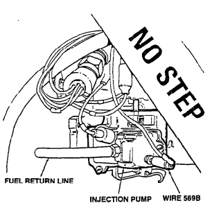

I 
If the cold advance solenoid is getting power, the only possibilities that would keep the engine from starting are that fuel is not reaching the cylinders due to a fault in the high-pressure side of the fuel system or nearly all the cylinders have very low compression. It is unlikely that all the cylinders would lose compression at the same time, but you may want to run a Compression Unbalance test (STEIICE-R Test 14) to check this. 

Repair/replace harness (para. 4-80). 

I 

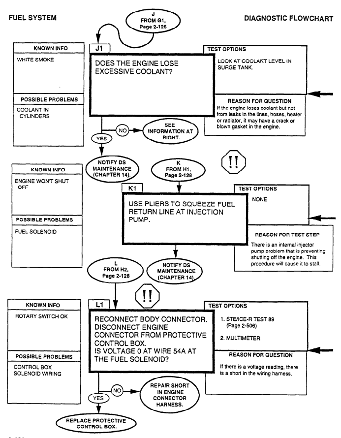

# Reference Information Fuel System

If you are getting white smoke due to coolant entering the cylinders. 

you should notice a loss of coolant in the radiator or bubbles in the radiator tank while the engine is running. You may need to fill the radiator to proper level and recheck a day later to determine if there is a coolant loss. If you don't detect coolant loss, you may have missed a fuel problem. Rerun the fuel system tests paying attention for a raw exhaust smell. 

If you still find nothing, you may have a small or inconsistant leak. Notify OS maintenance (chapter 14). 

Keep hands away from engine fan. Moving fan blades can cause serious injury. Use extreme caution when engine is running. 

If the engine doesn't shut off with the solenoid disconnected, fuel is still reaching the cylindersprobably because the fuel solenoid is stuck open. When you squeeze the return line tight enough to prevent fuel flowing through it, you create a pressure imbalance inside the injection pump that will cause the engine to stall. 

Disconnect **negative battery** 
cable before disconnecting and reconnecting protective control box harness. 

WARNING 
There is battery voltage at the PCB at all times. Failure to disconnect battery cable will result in damage to equipment or injury to personnel. 

Remember to reconnect any wires that may have been disconnected during troubleshooting. Repair/replace harness (para. 4-90). 

Replace PCS (para. 4-4). 

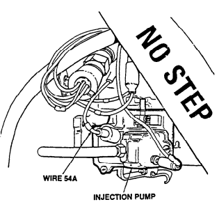

## Dc **Voltage 0-45 Volts** Steke-R Test 89 I

1. Connect RED clip to the indicated test point, BLACK clip to negative or ground. 

2. Start Test 89. DC Volts. I 
3. Displayed reading is in volts. 

#### Battery Voltage Multimeter

1. Set the voltmeter to a **DC volts scale of at** least 40 volts. 

2. Connect the RED lead to positive and the BLACK lead to negative. 

3. Be sure to read the correct scale. 

i i 

.- :

#### I

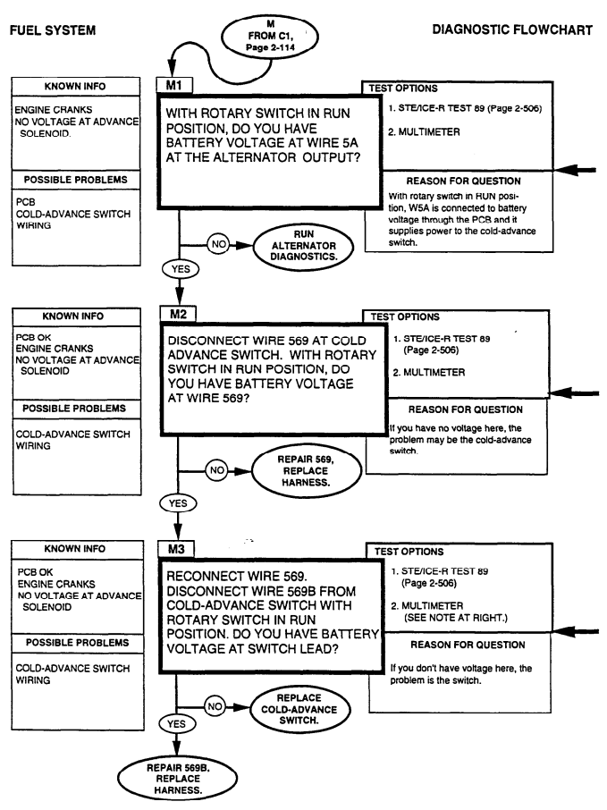

## Reference Information Fuel System

#### Dc Voltage 9-45 Volts Stuice-R Test 89

1. Connect RED clip to positive. BLACK dip to negative or ground. 

2. Start **Test 99, DC volts.** 3. Displayed reading is in volts. 

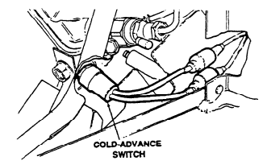

You should only run the engine lpng enough to determine the gauge reading because engine temperature must stay below 90° F (33O C) for the cold-advance circuit to function. 

#### Battery Voltage Multlmeler

I. Set the voltmeter to a DC volts scale of at least 40 volts. 

2. Connect the **RED** lead to positive and the BLACK lead to negative. 

3. Be sure to read the correct scale. 

1. 

2. 3. 4. 

Shut off engine. Disconnect wire 569 at cotdadvance switch. 

Turn rotary switch to RUN 
oosition. 

'Check for battery 569. 

voltage at wire Repair/replace harness (para. 4-90). 

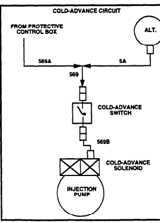

Alternator output is hot when the rotary switch is in the RUNposition. 

NOTE 
Engine temperature must be less *than* WF 
(330 C) when testing the switch. 

Replace cold-adavance swftch (para. 4-31). 

Repair/replace harness (para. 4-30). 

Cold-advance switch is closed when engine temperature is below 90°F (33°C) and open when it goes above 120°F (49%). 

The cold-advance solenoid advances the injection pump timing when it receives power from the switch. This helps the engine run better when it is cold. 

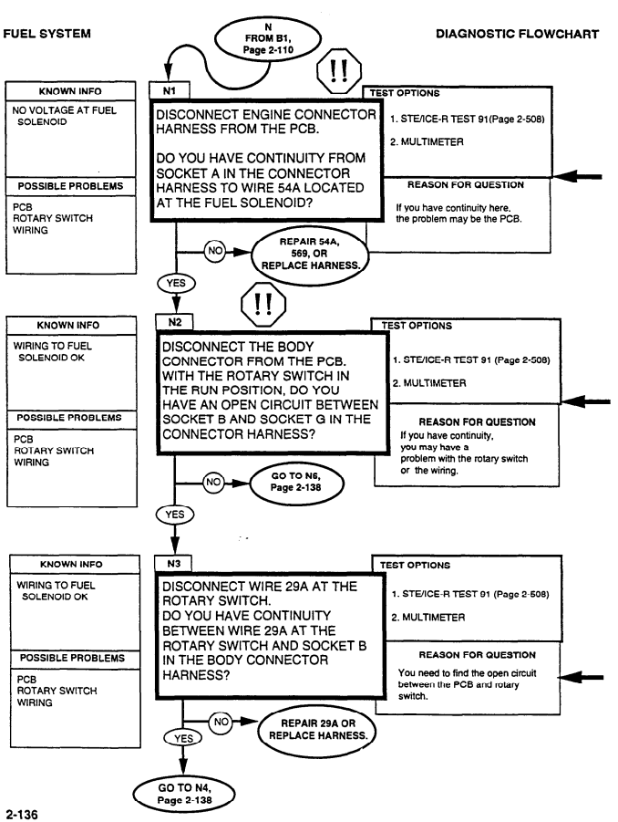

4-- - 

## Reference Information

Disconnect negative battery cable before disconnecting and reconnecting PCB harness. 

There is battery voltage at the PCB at all times. Failure to disconnect battery cable will result in damage to equipment or injury to personnel. 

#### Repair Wiring (Para. **4-80).**

Inspect wiring to be sure that all the wires 

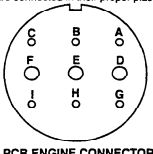

are connected in their proper places. 

I 

PCB ENGINE CONNECTOR 

- 

(ON LEFT FENDER LINER) 

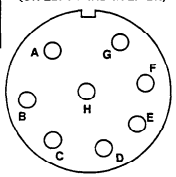

PCB BODY CONNECTOR 
(LOCATED UNDER DASHBOARD) 

I Repair wiring (para. **4-80).** 
Remember to reconnect any wires that were disconnected I during troubleshooting. 

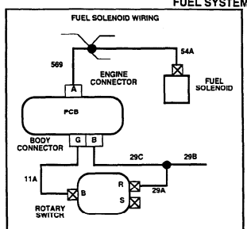

#### Resistance And Contlnulty 04.500 Ohms Stuice-R Test 91

1. Connect RED clip and BLACK clip to the 

terminations indicated in the question. 

RED to the first, BLACK to the second.

#### Continuity (Resistance) Multimeter

1. Set the voltmeter to an ohms scale of about 

1,000 ohms.

2. Connect the RED and **BLACK** leads to the connectiins stated in the question. 

3. Be sure to read the correct scale. Less than 5 ohms indicates continuity. For an open circuit, the meter should peg full scale (needle all the 

way to the left). 

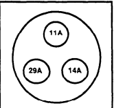

REAR OF ROTARY SWITCH 

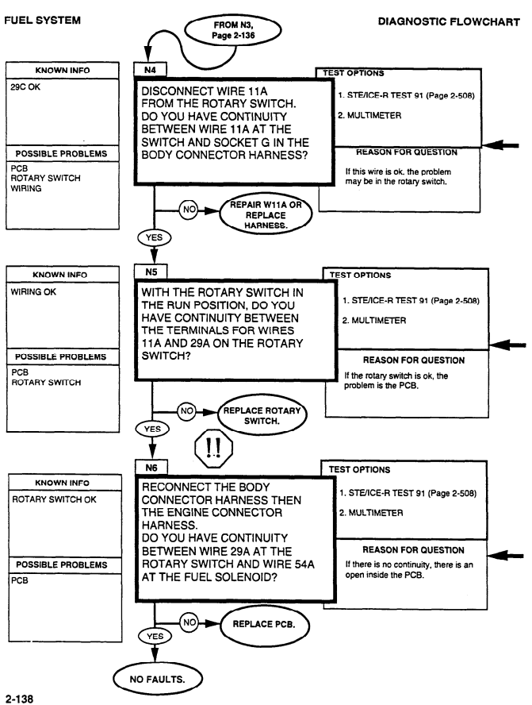

REFERENCE INFORMATION FUEL SYSTEli/j 

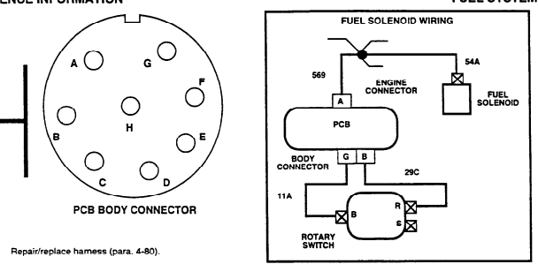

-. 

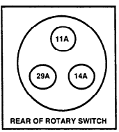

Repair/replace rotary switch (para. 4-10). : 

0 11 . . 

I **WARNING** 
Disconnect negative battery cable before disconnecting and reconnecting PCB harness. 

WARNING 
There is battery voltage at the PCB at all times. Failure to disconnect battery cable will result in damage to equipment or injury to personnel. 

Be sure to reconnect the wires at the rotary switch and the fuel solenoid. Replace PCB (para. 4-4). 

#### Resistance And Continuity O-4500 Ohms Ste/Lce-R Test 91

1. Connect RED clip and BLACK clip to the terminations indicated in the question. 

2. Start lest 91, o-4.500 Ohms. 3. Displayed reading is in ohms. Less than 5 ohms is continuity. If the resistance is over 4.500 

ohms, STEACE-R displays .9.9.9.9.

#### Continuity (Resistance) Multimeter

1. Set the voltmeter to an ohms scale of about 1,000 ohms. 

2. Connect the RED and BLACK leads to the connections stated in the question. 

3. Be sure to read the correct scale. Less than 5 ohms indicates continuity. For an open circuit, the meter should peg full scale (needle all the way to the left). 

## 12-29. Air Intake/Exhaust Tests

These air intake/exhaust system tests can be run any time you think there may be a problem with the air intake or exhaust systems, or if you were sent here from another test. 

At the bottom of this page is a simplified block diagram of the intake air/exhaust system. A detailed functional flow is not applicable to this system. 

The air intake/exhaust system is a very simple system that can cause very annoying problems. Whether the vehicle is hard to start or runs rough or never develops full power, it's worth the few minutes that it takes to check the components of this system. You can run through the diagnostic logic for this system almost any time you open the hood or check the underside of your vehicle. 

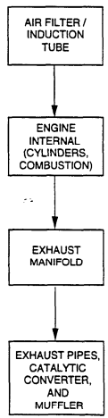

TM 9-2320-387-24-1 INTAKE AIR/ EXHAUST 
KNOWN INFO 
NOTHING 
P 
OSSIBLE PROBLEMS 
A If E k JR FILTER 'JDUCTION SYSTEM :XHAUST PIPE 
IUFFLER 
I KNOWN INFO 
AIR FILTER OK 
POSSIBLE PROBLEMS 
INDUCTION SYSTEM EXHAUST PIPE MUFFLER 

# I Known Info

AIR FILTER OK INDUCTION SYSTEM OK 
~ 

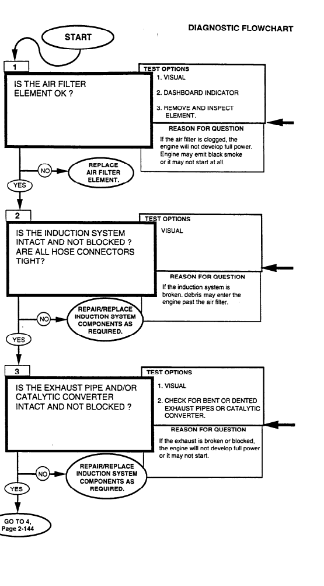

## Reference Information

First, check the air fitter restriction gauge on the dashboard, just to the left of the steerlng wheel. and make a note of its reading. Open the air cleaner cannister, remove the air cleaner element and inspect it for dirt and other contaminants. Replace air filter 
(para. 3-13). A clean air filter is whlte. If me condition of me filter does not agree wtth the gauge on me dashboard, make a note to check me gauge. See Instruments tests. page 2-305. 

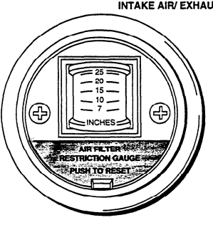

-- -I 
Make sure that all mounting bolts are in place and tight. Look for obvious things like a crushed or cracked air filter or air induction tube and check gaskets where possible. Replace induction system components 
(para. 3-12). 

Look for damage caused by rocks such as bent pipes or holes and loose or broken clamps. Small dents (depth less than l/4 the diameter of the exhaust pipes) should not cause the pipes to be replaced as long as me pipes are intact Replace induction system components 
(para. 3-12). 

i 

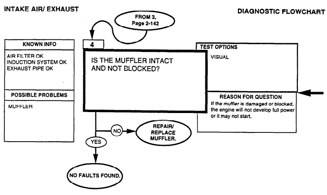

TM 9-2320-387-24-l REFERENCE INFORMATION 
INTAKE AIR/ EXHAUST 
Look for damage caused by rocks such 

bent pipes or holes, loose or broken Replace muffler (para. 3-49). 

# 2-30. **Compression/Mechanical Tests I**

The main intent of this paragraph is to determine if the engine has internal compression or mechanical problems and to fix everything possible without having to notify DS maintenance (chapter 14). 

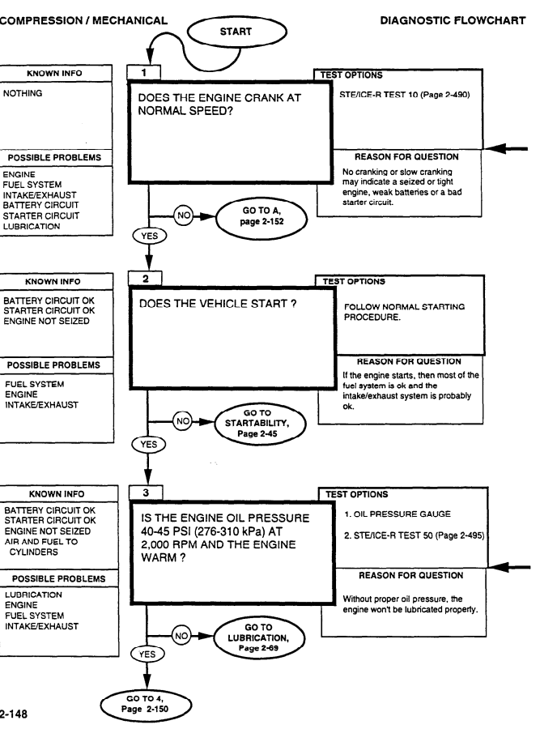

#### Reference Information

## Compression / Mechanical

#### Engine Rpm Stoice-R Test **10 I**

1. Start Test 10, Engine RPM. 

2. Crank or start the engine. Displayed reading is RPM. Cranking rpm should be approximately 100-200. Idle rpm should

be 625 - 675. 

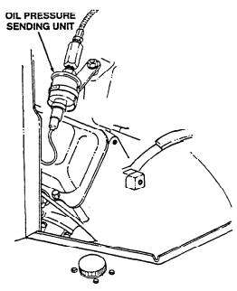

#### Oil Pressure Stehce-R Test 50

1. Install STEIfCE-A 0 to1000 PSI (O-6.895 kPa) transducer (blue stripe) in place of oil pressure sending unit. 2. Connect to STEIICE-R TK connector J2 or J3. 3. CAL with engine off. 4. Start engine. Run test 50. With the engine warm, oil pressure should be 10 psi (69 kPa) minimum at idle and 40-45 psi (275-310 kPa) at 2.000 rpm. Pressure may go as high as 80 psi 
(552 kPa) when the engine is cold. 

A healthy engine should crank at least 100 mm when it's cold and at least 180-206 rpm when it's warm. 

If the engine doesn't crank at normal speed, it could be due to a starter or battery circuit fault or it may be due to an internal engine problem. 

Oil pressure may go as high as 60 psi (552 kPa) if the engine is cold and should be 10 psi minimum at idle speed. You should check the oil pressure with the STEIICE-R (test 50) using 1,000 psi (6,895 kPa) transducer (blue stripe). Check pressure at idle and at 2,000 rpm. If pressure is low, check oil level and condition. Add or change oil as required. 

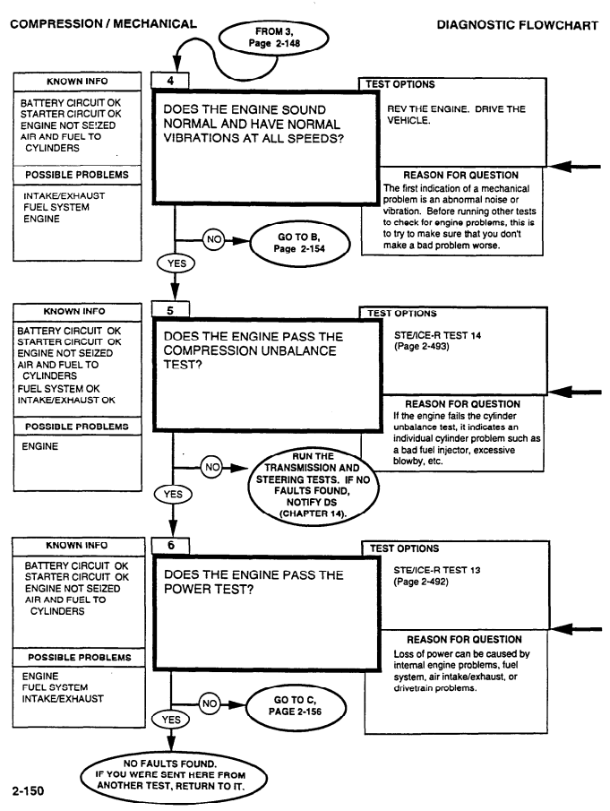

## Reference Information Compression / Mechanical

This is not to evaluate driving performance. If the engine or the vehicle makes strange noises or vibrations at idle speed, don't rev the engine. If there is a problem internal to the engine, rewing 11 he engine could cause major damage (like a rod C :oming through the engine block). 

#### Compression Unbalance Steiice-R Test 14

1. Run tests 72.73. and 74 to verify that the batteries are ok. 

2. Disconnect wire 54A at injection pump to prevent starting. 

#### Caullon 

The glow plug controller and the control valve electrical connector must be disconnected prior to running this test. 

3. Disconnect glow plug controller and control valve electrical connector. GLOW PLUG 
4. Start Test 14, Compression Unbalance. CONTROLLER HARNESS 
5. Wait for the GO message. Crank the engine. 6. Release the rotary switch when the VfM 
displays OFF. A number less than 25% 
is passing. 

_ -I 
f the vehicle passes the STEKE-R Compression Jnbalance test, it may still have a compression jroblem, but it would mean that every cylinder has low nmpression. This is possible, but not too likely. If you tori''' find a problem and suspect compression, notify IS maintenance (chapter 14) to measure :ompression. 

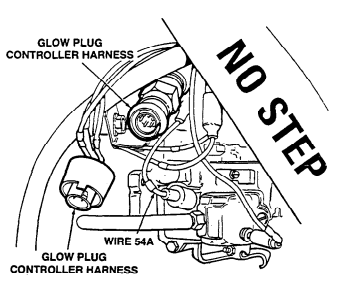

If STEXE-R is not available, accelerate under full power to a reasonable speed on a flat, level, paved surface. You have to decide from your own experience whether or not the engine is developing full power. A number greater than 75 is passing for Test 13. 

#### Power Test (Percent) Steiice-R Test 13

1. Start and idle engine. 2. Run STE/ICE-R test 10 to set idle and governor speed as necessary 3. Start STUICE-R test 13 4. When CIP appears on the display. press down sharply on the accelerator and hold it to the floor until the VTM displays OFF. 5. Drsplayed value is % POWER 
i i 

. 

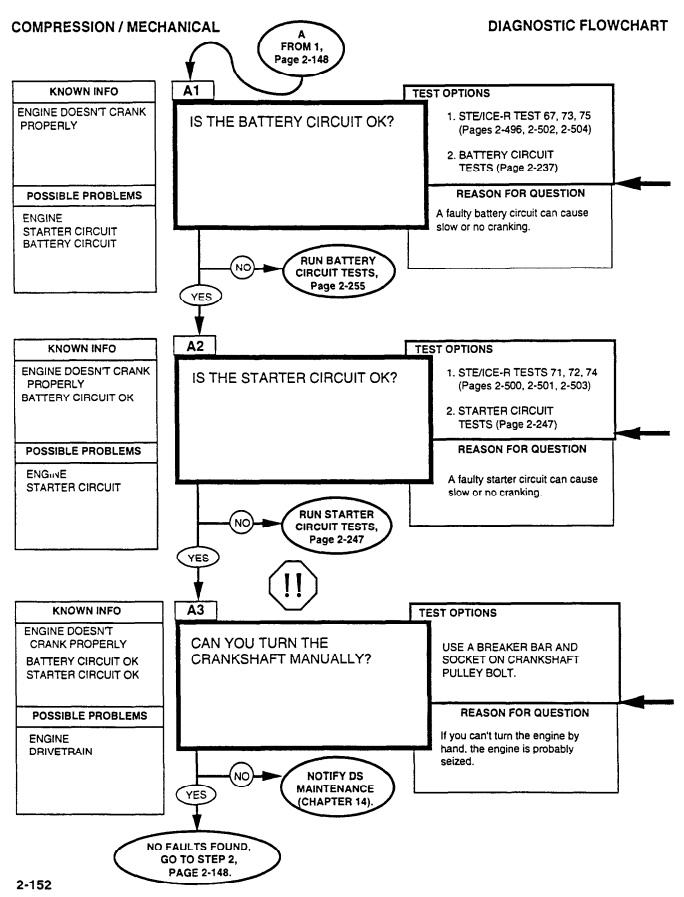

#### Baltery Steiice-R

1. Start Test 67, Battery Voltage. 

2. Displayed reading is in volts. Batteries should be 23-25.5 volts. Batteries voltage will drop when glow plugs turn on.

## Reference Information Compression / Mechanical

#### Starter First Peak Current Stuice-R Test 72

1. Dtsconnect wire **54A** at injection pump to prevent starting. 

d 2. Disconnect glow plugs controller and fan solenoid. 

3. Start Test 72. Current First Peak. 

4. Wait for the GO message. Crank the engine. 

5. Result is displayed in amps. Starter first peak should be over 400 amps.

#### Starter Average Current Steiice-R Test 71

a peak of over 400 amps. 

I

- -I 
The starter circuit tests begin on page 2-247. 

Internal engine problems (tight main or rod bearings for example) or drivetrain problems could still cause the engine to crank slowly even if the starter and battery circuits are OK. 

. . - : 
WARNING 
Be sure to disconnect fuel solenoid (wire 54A) to prevent accidental starting. Failure to do so may result in injury to personnel or damage to equipment. 

A breaker bar and socket placed on the crankshaft pulley can be used to try to turn the crankshaft. The crankshaft pulley is located directly under the engine cooling fan. It can be reached from under the HMMWV. 

If the engine won't turn. remove the glow plugs and try again. If the engine turns now, try cranking it and look for fuel at the eight glow plug holes. If you see fuel at any of the holes, the engine may have had hydrostatic lock. Crank the engine for about 15 seconds to clear the fuel, re-install the glow plugs and try to start the engine. If it still won't crank, notify DS maintenance (chapter 14). 

#### Baltery Internal Resistance Steiice-R Test 73

1. Disconnect wire 54A at injection pump to prevent starting. 

2. Disconnect glow plugs controller and fan solenoid. 

3. Start Test 73. Battery Internal Resistance. 4. Wait for the GO message. Crank the engine. 5. Result is displayed in milliohms. Battery resistance should be 25 milliohms max.

#### Starter Circuit Resistance Steiice-R Test 74

1. Disconnect wire 54A at injection pump to prevent starting. 

2. Disconnect glow plugs controller and fan solenoid. 

3. Start Test 74, Starter Circuit Resistance. 4. Wait for the GO message. Crank the engine. 5. Result is displayed in milliohms. Starter circuit resistance should be 25 milliohms max.

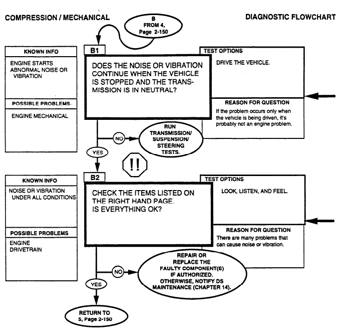

# Reference Information

COMPRESSION / MECHANICAL 
Try the following steps: 
1. Determine what noises or vibrations are there when the engine is running with the transmission in neutral. 

2. Keep the engine running. put the transmission in drive, and take note of any changes in the noises or vibrations. 

3. If it's safe to drive, drive the vehicle and take note of any changes in the noises or vibrations. Drive vehicle through all gears and ranges within speed **rates** listed in TM 9-2320-387-10. 

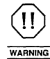

A hot engine may cause serious burns. Always use caution when approaching a hot engine. 

- -I 
Engine Mounts Transmission Mounts Cooling Fan Serpentine Belt Water Pump Power Steering Pump Fuel Pump Alternator Air Induction Components Exhaust Components i 

## Compression / Mechan;&~'-

KNOWN INFO 
BATIERY AND 
POSSIBLE PROBLEMS 
ENGINE DRlVETFiAlN 
FUEL SYSTEM INTAKE/EXHAUST 

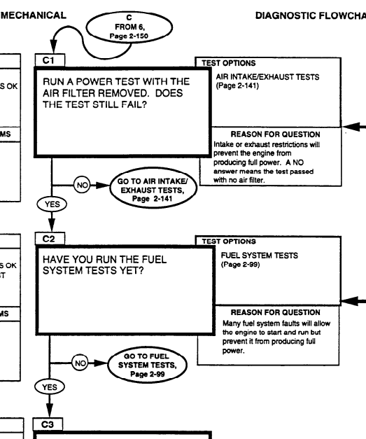

KNOWN INFO 
BATTERY AND 
STARTER ClRCUlTS OK 
AIR INTAKE/EXHAUST 
OK 
POSSIBLE PROBLEMS 
ENGINE DRIVETRAIN FUEL SYSTEM 
KNOWN INFO 
BAllERY AND 
STARTER ClRCUlTS OK 
AIR INTAKE/EXHAUST OK FUEL SYSTEM OK 
POSSIBLE PROBLEMS 
ENGINE DRIVETRAIN 
IF EVERYTHING CHECKS OUT OK TO THIS POINT, THEN YOU PROBABLY HAVE AN ENGINE 
MECHANICAL PROBLEM THAT 
CAN'T BE HANDLED AT THIS LEVEL OF MAINTENANCE. NOTIFY DS MAINTENANCE (CHAPTER 14). 

_ 
TM 9-2320-387-24-l REFERENCE INFORMATION 
COMPRESSION / MECHANICAL 
If faults are found and corrected. 90 to 

 STEP 2. page 2-148. If no faults are found, go to 82, 

 page 2-154. 

STEP 2, page 2-148. 

If faults are found and comcted, go to 

I If no faults are found, go to 82, page 2-154. 

# 2-31. Engine Cooling Tests (Serial Numbers 299999 And Below)

I
These engine cooling tests may be run any time you think you have an engine cooling problem or if you were sent here by another test chain. Just follow the path, answering the questions.  Additional information and notes are given on the facing page when necessary.

Please note that this paragraph is NOT for diagnoses of problems with the temperature sending unit or the gauge.

Once you are sure that the cooling system is OK, run the instruments test in paragraph 2-38 to find out if the gauge is OK.

Fold-out page FP-6.1 contains a functional diagram of the engine cooling system. This page may be left open for reference while testing.

The engine cooling system is a pressure-type cooling system with thermostatic control of coolant circulation.  The cooling system dissipates heat generated from combustion and maintains the enqine operating temperature at its most efficient level. When the engine is cold and the thermostat is closed, coolant is recirculated through the water pump and engine.  As the engine coolant reaches 215°F (102°C), the thermostat opens, allowing coolant to flow through the radiator before returning to the water pump and engine.  Any air or vapor in the cooling system will be forced to the surge tank under the liguid level and leave through a vent tube.  As the system cools, the extra coolant in the tank will be drawn back to the radiator.  Normally a 50-50 mixture of water and ethylene glycol-based antifreeze will be used.  The fan is activated when coolant temperature reaches approximately 220° F
(104°C).  A separate oil cooler is mounted in front of the radiator.  This cooler is divided into two parts. The top half is for transmission oil. The bottom half is for engine oil. When the cooling svstem pressure reaches approximately 15 psi (103 kPa), a valve in the surge tank cap opens and lets excess pressure escape to the atmosphere.

|                 |            |                   | ETHYLENE\-GLYCOL (\-60°F, \-51°C)   |                                        |
|-----------------|------------|-------------------|-------------------------------------|----------------------------------------|
| LOWEST EXPECTED |            |                   | INHIBITED (MIL\-A\-46153)           | ARCTIC GRADE ANTIFREEZE                |
| AMBIENT         |            | PINTS PER GALLON  | SPECIFIC                            | (\-90°F) (\-68°C)                      |
| TEMPERATURE     |            | OF COOLANT        | GRAVITY                             | MIL\-A\-11755                          |
| った °C         |            | CAPACITY          | (68°F) (20°C)                       |                                        |
| +20             | \-7        | 1\-1/2            | 1.022                               | Freezing point of \-90°F (\-68°C).     |
| +10             | \-12       | 2                 | 1.036                               | Issued ready\-for\-use and must not be |
| 0               | \-18       | 2\-3/4            | 1.047                               | mixed with any other liquid.           |
| \-10            | \-23       | 3\-1/4            | 1.055                               |                                        |
| \-20            | \-29       | 3\-1/2            | 1.062                               |                                        |
| \-30            | \-34       | ব                 | 1.067                               |                                        |
| \-40            | \-40       | 4\-1/4            | 1.073                               |                                        |
| \-20            | \-46       | 4\-1/2            |                                     |                                        |
| \-રેર            | \-48       | 4\-3/4            |                                     |                                        |
| BELOW \-60      | BELOW \-51 | USE ARCTIC        |                                     |                                        |
|                 |            | GRADE ANTIFREEZE  |                                     |                                        |
|                 |            | (\-90°F) (\-68°C) |                                     |                                        |

# Ethylene-Glycol Mixture Table

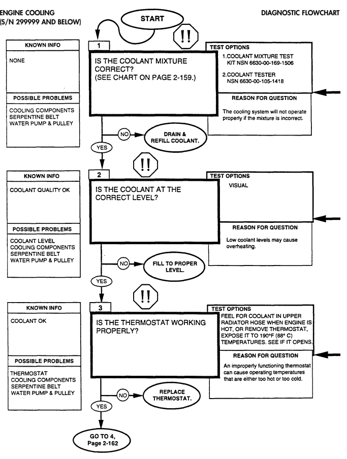

ENGINE COOLING
(S/N 299999 AND BELOW)  ■

Do not remove surge tank filler cap before releasing internal pressure when engine temperature is above 190°F (88°C). Steam or hot coolant under pressure will cause injury.

Drain and refill coolant (para. 3-61).

Do not remove surge tank filler cap before releasing internal pressure when engine temperature is above 190°F (88°C).  Steam or hot coolant under pressure will cause injury. Fill coolant to proper level (para. 3-61).

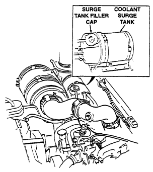

Always use caution when approaching a hot engine.  Failure to do so may result in serious burns.

Remove and replace the thermostat
(para. 3-76).

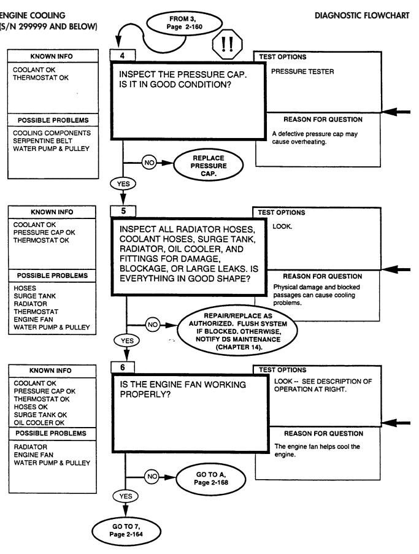

REFERENCE INFORMATION
WARNING

Do not remove surge tank filler cap before releasing internal pressure when engine temperature is above 190°F (88°C). Steam or hot coolant under pressure will cause injury. Check seal and spring on pressure cap.

Replace pressure cap (para. 3-61).

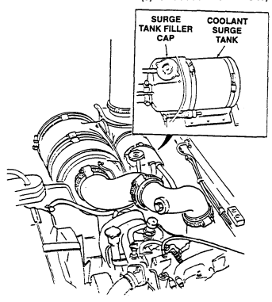

Flush cooling system (para. 3-61). For surge tank and radiator support replacement procedures, refer to paras. 3-64 and 3-65.

For oil cooler and oil cooler hose replacement procedures, refer to paras. 3-7 and 3-8.

Notify DS maintenance to repair radiator
(chapter 17).

# Engine Cooling Fan Description Of Operation

An external line from the power steening gear brings hydraulic fluid to the clutch fan solenoid through control valve (normally open) and then to the fan drive, keeping it disengaged. The action of the valve is controlled by the time-delay module and the fan temperature switch.

During normal operation, the fan timer switch is closed. This keeps the control valve in the open position and the drive disengaged.

As the engine reaches a temperature of about 215°F (102°C), the temperature switch opens and the control valve closes. This engages the fan. If the fan is engaged and the accelerator is floored, the throttle position sensor disengages the fan drive for a period of 20 seconds.

The easiest way to determine if the fan is engaged is to stand outside the driver's door and gently work the accelerator. If the fan is engaged, you will feel a breeze from the engine area. If the fan is not engaged, you won't feel the breeze.

# Engine Cooling (S/N 299999 And Below)

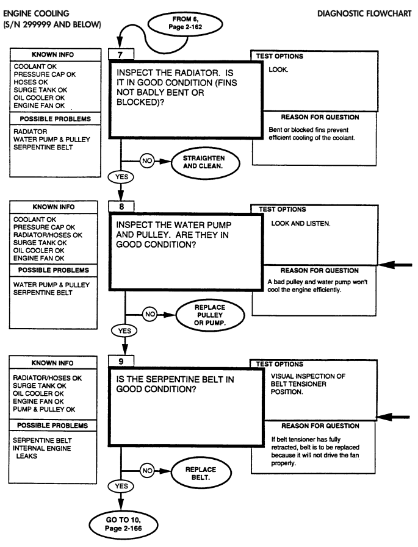

 REFERENCE INFORMATION

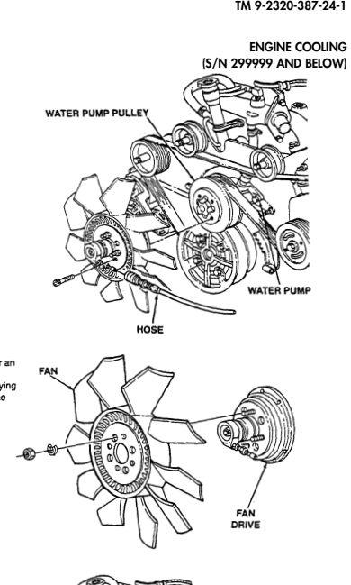

Listen for noisy bearings in the water pump, or an in-and-out motion to the fan.

You can also check the pump and pulley by trying to move it in and out or laterally with the engine off.

Replace the water pump pulley (para. 3-77).

Replace the water pump (para. 3-78).

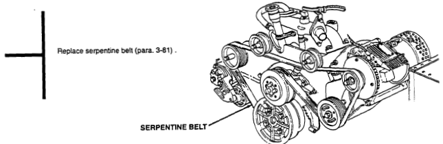

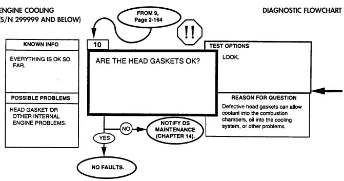

TM 9-2320-387-24-1 REFERENCE INFORMATION
ENGINE COOLING
(S/N 299999 AND BELOW)  �

Always use caution when approaching a hot engine.  Failure to do so may result in serious burns.

Look for excessive white exhaust smoke, steam leaks in the engine compartment, and oil in the coolant.  Other signs include excess condensation in the exhaust system, or white joints in the exhaust system. You can also feel the coolant hoses to see if they have high pressure caused by leaking combustion gasses. Also, if the glow plugs turn off very quickly after starting the engine, or if the engine overheats, or has excessive coolant consumption, you may have a head gasket problem.

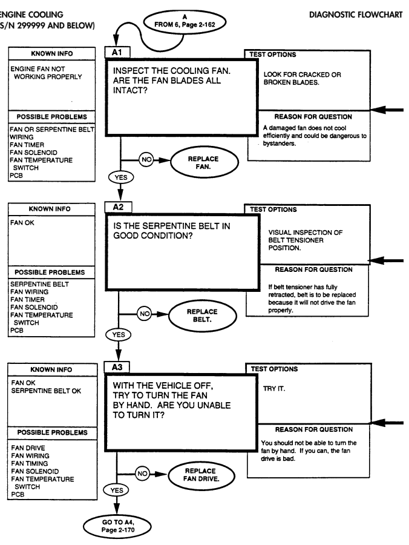

TM 9-2320-387-24-1 REFERENCE INFORMATION **ENGINE COOLING**

(S/N 299999 AND BELOW)

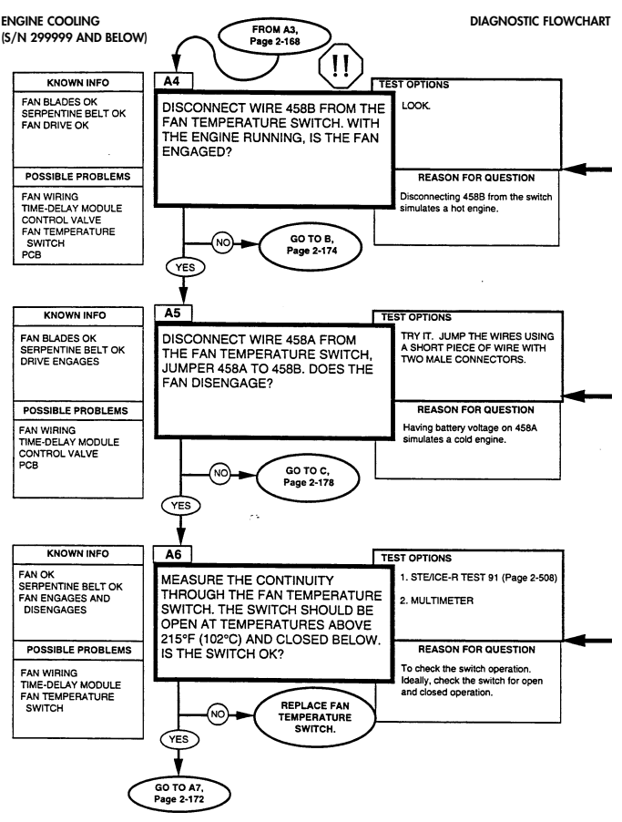

# Reference Information

Keep hands and arms away from fan blades and serpentine belt when engine is running or serious injury may result.

See page 2-163 for a description of the fan system operation and to see if it's engaged or not.

See page 2-163 for a description of the fan system operation and to see if it's engaged or not.

If you know the engine is cold and the fan temperature switch is good, vou can reconnect 458B to the switch and see if the fan disengages.

Replace the fan temperature switch (para. 4-34). You can also remove the switch to test it hot and cold.

## Resistance And Continuity

# 0-4,500 Ohms Steace-R Test 91

1. Connect RED clip and BLACK clip to the terminations indicated in the question.   RED to the first, BLACK to the second.

2. Start Test 91, 0-4,500 Ohms.

3. Displayed reading is in ohms.  Less than 5 ohms is continuity.  If the resistance is over 4,500 ohms, STE/ICE-R displays .9.9.9.9.

# Continuity (Resistance) Multimeter

1. Set the voltmeter to an ohms scale of about 1,000 ohms.

2. Connect the RED and BLACK leads to the connections stated in the question.

3. Be sure to read the correct scale.  Less than 5 ohms indicates continuity. For an open circuit, the meter should peg full scale (needle all the way to the left).

ENGINE COOLING
(S/N 299999 AND BELOW)   

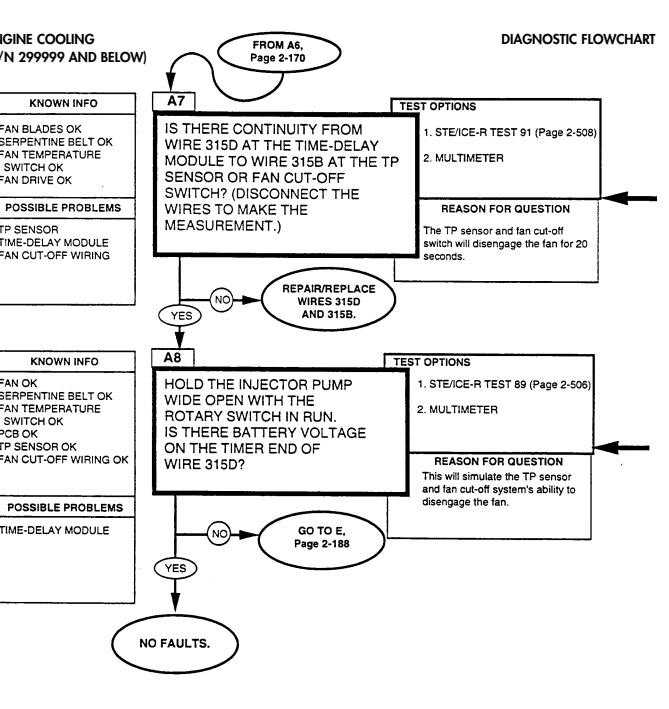

ENGINE COOLING
(S/N 299999 AND BELOW)   █

# Continuity (Resistance) Multimeter

1. Set the voltmeter to an ohms scale of about 1,000 ohms.

2. Connect the RED and BLACK leads to the connections stated in the question.

3. Be sure to read the correct scale.  Less  than 5 ohms indicates continuity. For an open circuit, the meter should peg full scale (needie all the way to the left).

RESISTANCE AND CONTINUITY

# 0-4,500 Ohms Steace-R Test 91

1. Connect RED clip and BLACK clip to the terminations indicated in the question. RED to the first, BLACK to the second.

2. Start Test 91, 0-4,500 Ohms.

3. Displayed reading is in ohms.  Less than 5 ohms is continuity. If the resistance is over 4,500 ohms, STE/ICE-R displays 9.9.9.9.

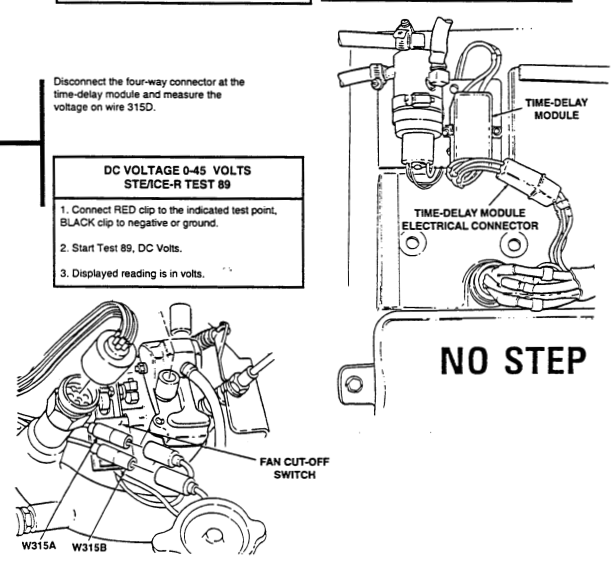

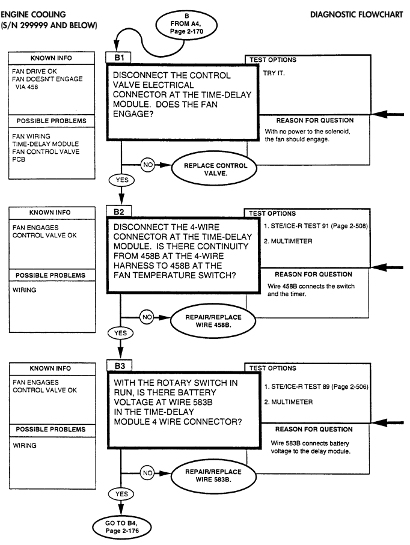

# Reference Information Engine Cooling (S/N 299999 And Below)  ▼ Resistance And Continuity 0-4,500 Ohms Steace-R Test 91

1. Connect RED clip and BLACK clip to the terminations indicated in the question.  RED to the first, BLACK to the second.

2. Start Test 91, 0-4,500 Ohms.

3. Displayed reading is in ohms.  Less than 5 ohms is continuity.  If the resistance is over 4,500 ohms, STE/ICE-R displays  .9.9.9.9.

## Replace Control Valve ( Para. 8- 25).

# Continuity (Resistance) Multimeter

1. Set the voltmeter to an ohms scale of about 1,000 ohms.

2. Connect the RED and BLACK leads to the connections stated in the question.

3. Be sure to read the correct scale.  Less than 5 ohms indicates continuity.  For an open circuit,  the meter should peg full scale (needle all the way to the left).

Repair/replace wire (para. 4-80).

# Dc Voltage 0-45 Volts Steace-R Test 89

1. Connect RED clip to the indicated test point, BLACK clip to negative or ground.

2. Start Test 89, DC Volts.

3. Displayed reading is in volts.

Repair/replace wire (para. 4-80).

## Voltage Multimeter

1. Set the voltmeter to a DC volts scale of at least 40 volts.

2. Connect the RED lead to positive and the BLACK lead to negative.

3. Be sure to read the correct scale.

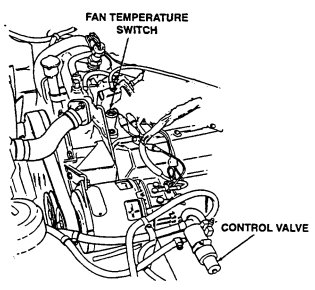

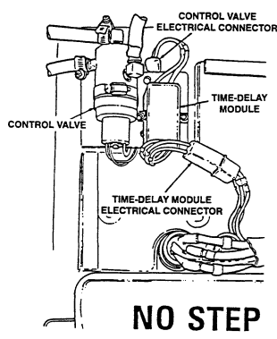

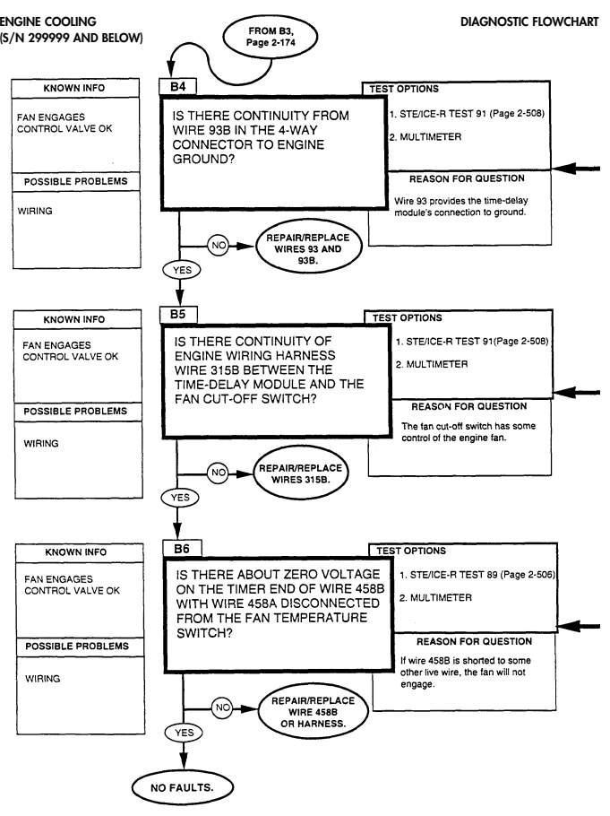

# Engine Cooling (S/N 299999 And Below)  ■

## Resistance And Continuity 0-4,500 Ohms Steace-R Test 91

1. Connect RED clip and BLACK clip to the terminations indicated in the question. RED to the first, BLACK to the second.

2. Start Test 91, 0-4,500 Ohms.

3. Displayed reading is in ohms.  Less than 5 ohms is continuity.  If the resistance is over 4,500 ohms, STE/ICE-R displays .9.9.9.9.

Repair/replace wires (para. 4-80).

# Continuity (Resistance) Multimeter

1. Set the voltmeter to an ohms scale of about 1,000 ohms.

2. Connect the RED and BLACK leads to the connections stated in the question.

3. Be sure to read the correct scale.  Less than 5 ohms indicates continuity. For an open circuit the meter should peg full scale (needle all the way to the left).

## Repair/Replace Wires (Para. 4-80).

# Dc Voltage 0-45 Volts Steace-R Test 89

1. Connect RED clip to the indicated test point, BLACK clip to negative or ground.

2. Start Test 89, DC Volts.

3. Displayed reading is in volts.

Repair/replace wires (para. 4-80).

# Voltage Multimeter

1. Set the voltmeter to a DC volts scale of at least 40 volts.

2. Connect the RED lead to positive and the BLACK lead to negative.

3. Be sure to read the correct scale.

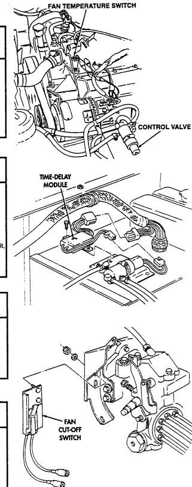

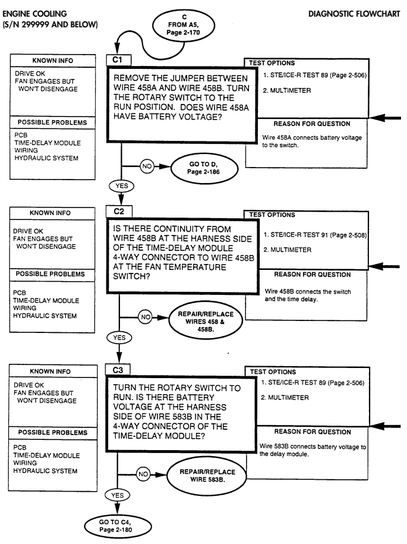

ENGINE COOLING
(S/N 299999 AND BELOW)   ■

## Dc Voltage 0-45 Volts Steace-R Test 89

1. Connect RED clip to the indicated test point, BLACK clip to negative or ground.

2. Start Test 89, DC Volts.

3. Displayed reading is in volts.

## Voltage Multimeter

1. Set the voltmeter to a DC volts scale of at least 40 volts.

2. Connect the RED lead to positive and the

BLACK lead to negative.

3. Be sure to read the correct scale.

# Resistance And Continuity

## 0-4,500 Ohms Steace-R Test 91

1. Connect RED clip and BLACK clip to the terminations indicated in the question. RED to the first, BLACK to the second.

2. Start Test 91, 0-4,500 Ohms.

3. Displayed reading is in ohms. Less than 5 ohms is continuity.  If the resistance is over 4,500 ohms, STE/ICE-R displays .9.9.9.9.9.

Repair/replace wires (para. 4-80).

## Continuity (Resistance) Multimeter

1. Set the voltmeter to an ohms scale of about 1,000 ohms.

2. Connect the RED and BLACK leads to the connections stated in the question.

3. Be sure to read the correct scale.  Less  than 5 ohms indicates continuity.  For an open circuit, the meter should peg full scale (needle all the way to the left).

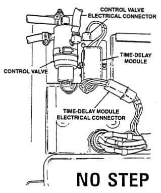

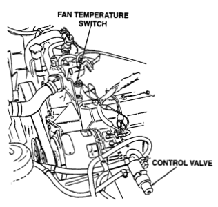

ENGINE COOLING
FROM

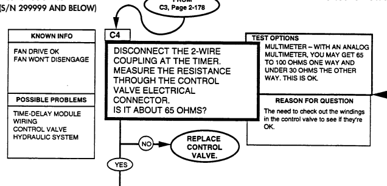

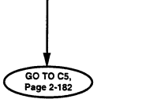

ENGINE COOLING
(S/N 299999 AND BELOW)  ▼
When checking coil resistance, use an analogtype multimeter.

For an accurate ohms reading, perform this check when the system is at room temperature. Heat will increase resistance, resulting in a higher ohms reading.

Replace control valve (para. 8-25).

CONTINUITY (RESISTANCE)
MULTIMETER
1. Set the voltmeter to an ohms scale of about 1,000 ohms.

2. Connect the RED and BLACK leads to the connections stated in the question.

3. Be sure to read the correct scale.  Less than 5 ohms indicates continuity.  For an open circuit, the meter should peg full scale (needle all the way to the left).

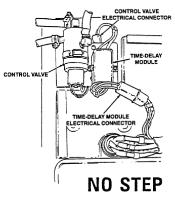

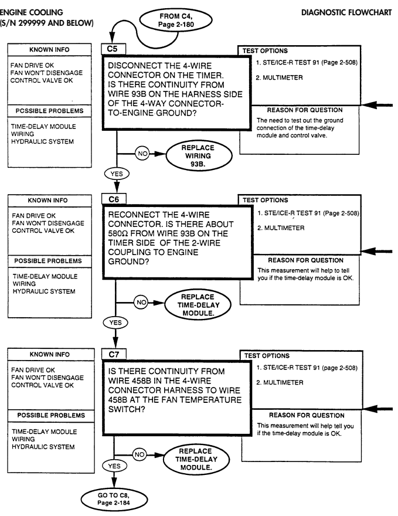

REFERENCE INFORMATION

# Engine Cooling (S/N 299999 And Below)   ▼ Resistance And Continuity 0-4,500 Ohms Steace-R Test 91

1. Connect RED clip and BLACK clip to the terminations indicated in the question.

RED to the first, BLACK to the second, 2. Start Test 91, 0-4,500 Ohms.

3. Displayed reading is in ohms.  Less than 5 ohms is continuity.  If the resistance is over 4,500 ohms, STE/ICE-R displays .9.9.9.9.

# Continuity (Resistance) Multimeter

1. Set the voltmeter to an ohms scale of about 1,000 ohms.

2. Connect the RED and BLACK leads to the connections stated in the question.

3. Be sure to read the correct scale.  Less than 5 ohms indicates continuity.  For an open circuit,

the meter should peg full scale (needle all the way to the left).

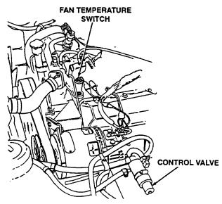

Repair wire or replace hamess (para. 4-80).

Replace time-delay module
(para. 4-35).

ﺔ Replace time-delay module
(para. 4-35).

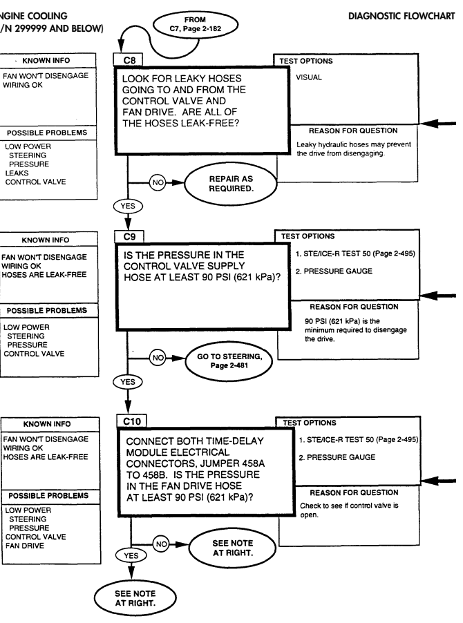

Replace hoses (para. 8-25).

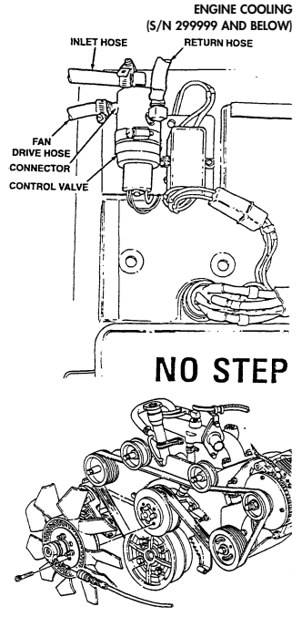

# Steace-R Test 50 0 To 1,000 Psig Pressure

1. Connect transducer to valve after removing connector (para 8-25).  Do offset  test.

2. Connect BLUE pressure transducer to A W4 cable. Make sure the system under test is not pressurized.

3. Tum on system and read pressure.

Measure the pressure at the valve outlet.  Remove the fan drive hose and connector from the valve body and screw transducer into the valve. Start the engine and look for leaks.

Replace control valve and/or fan drive (para. 8-25 or 3-80).  Check to see if hoses are blocked prior to replacing parts, and perform back flush procedure
(para. 8-25).

If pressure in the fan drive hose is not at least 90 psi
(621 kPa), perform back flush procedure (para. 8-25).

Recheck pressure. If pressure is not at least 90 psi
(621 kPa), replace control valve.

lf pressure in the fan drive hose is at least 90 psi
(621 kPa), check for blockage in hose between the control valve and fan drive. If hose is not blocked, replace fan drive (para. 3-80).

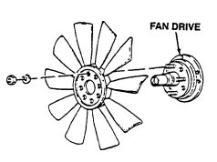

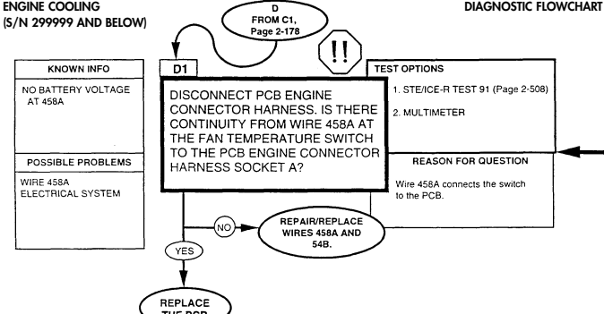

THE PCB.

# Reference Information

Disconnect negative battery cable before disconnecting and reconnecting PCB harness.

There is battery voltage at the PCB
at all times.  Failure to disconnect battery cable will result in damage to equipment or injury to personnel.

Replace PCB (refer to para. 4-4).

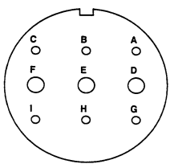

PCB ENGINE CONNECTOR

."

# Engine Cooling (S/N 299999 And Below)   ▼ Resistance And Continuity 0-4,500 Ohms Steace-R Test 91

1. Connect RED clip and BLACK clip to the terminations indicated in the question.

RED to the first, BLACK to the second.

2. Start Test 91, 0-4,500 Ohms.

3. Displayed reading is in ohms.  Less than 5 ohms is continuity.  If the resistance is over 4,500 ohms, STE/ICE-R displays  .9.9.9.9.

# Continuity (Resistance) Multimeter

1. Set the voltmeter to an ohms scale of about 1,000 ohms.

2. Connect the RED and BLACK leads to the connections stated in the question.

3. Be sure to read the correct scale.  Less  than 5 ohms indicates continuity.  For an open circuit, the meter should peg full scale (needle all the way to the left).

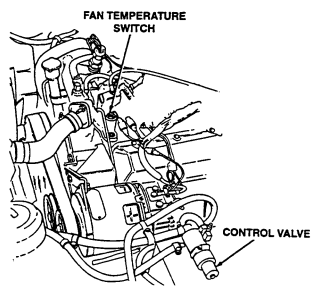

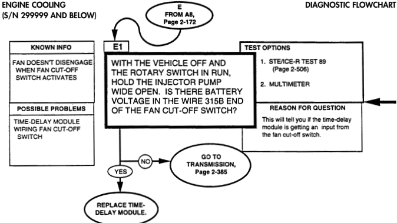

ENGINE COOLING
(S/N 299999 AND BELOW)   █
Replace time-delay module
(para. 4-35).

DC VOLTAGE 0-45 VOLTS
STEACE-R TEST 89 1. Connect RED clip to the indicated test point, BLACK clip to negative or ground.

2. Start Test 89, DC Volts.

3. Displayed reading is in volts.

VOLTAGE
MULTIMETER
1. Set the voltmeter to a DC volts scale of at least 40 volts.

2. Connect the RED lead to positive and the BLACK lead to negative.

3. Be sure to read the correct scale.

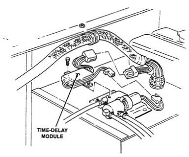

# 2-31.1. Engine Cooling Tests (Serial Numbers 300000 And Above)

These engine cooling tests may be run any time vou think you have an engine cooling problem or if you were sent here by another test chain. Just follow the path, answering the questions. Additional information and notes are given on the facing page when necessary. Please note that this paragraph is NOT for diagnoses of problems with the temperature sending unit or the gauge.

Once you are sure that the cooling system is OK, run the instruments test in paragraph 2-38 to find out if the gauge is OK.

Fold-out page FP-7 contains a functional diagram of the engine cooling system. This page may be left open for reference while testing.

The engine cooling system is a pressure-type cooling system with thermostatic control of coolant circulation. The cooling system dissipates heat generated from combustion and maintains the engine operating temperature at its most efficient level. When the engine is cold and the thermostat is closed, coolant is recirculated through the water pump and engine. As the engine coolant reaches 190°F
(87.7°C), the thermostat opens, allowing coolant to flow through the radiator before returning to the water pump and engine. Any air or vapor in the cooling system will be forced to the surge tank under the liquid level and leave through a vent tube. As the system cools, the extra coolant in the tank will be drawn back to the radiator. Normally a 50-50 mixture of water and ethylene glycol-based antifreeze will be used. The fan is activated when coolant temperature reaches approximately 220° F (104°C). A separate oil cooler is mounted in front of the radiator. This cooler is divided into two parts. The top half is for transmission oil. The bottom half is for engine oil. When the cooling system pressure reaches approximately 15 psi (103 kPa), a valve in the surge tank cap opens and lets excess pressure escape to the atmosphere.

| LOWEST EXPECTED        |            | INHIBITED (A\-A\-52624)              | ETHYLENE\-GLYCOL (\-60°F, \-51°C)   | ARCTIC GRADE ANTIFREEZE                |
|------------------------|------------|--------------------------------------|-------------------------------------|----------------------------------------|
| AMBIENT TEMPERATURE ok | °C         | PINTS PER GALLON OF COOLANT CAPACITY | SPECIFIC GRAVITY (68°F) (20°C)      | (\-90°F) (\-68°C) (A\-A\-52624)        |
| +20                    | \-7        | 1\-1/2                               | 1.022                               | Freezing point of \-90°F (\-68°C).     |
| 410                    | \-12       | 2                                    | 1.036                               | Issued ready\-for\-use and must not be |
| 0                      | \-18       | 2\-3/4                               | 1.047                               | mixed with any other liquid.           |
| \-10                   | \-23       | 3\-1/4                               | 1.055                               |                                        |
| \-20                   | \-29       | 3\-1/2                               | 1.062                               |                                        |
| \-30                   | \-34       | 4                                    | 1.067                               |                                        |
| \-40                   | \-40       | 4\-1/4                               | 1.073                               |                                        |
| \-50                   | \-46       | 4\-1/2                               |                                     |                                        |
| \-55                   | \-48       | 4\-314                               |                                     |                                        |
| BELOW \-60             | BELOW \-51 | USE ARCTIC                           |                                     |                                        |
|                        |            | GRADE ANTIFREEZE                     |                                     |                                        |
|                        |            | (\-90°F) (\-68°C)                    |                                     |                                        |

# Ethylene-Glycol Mixture Table

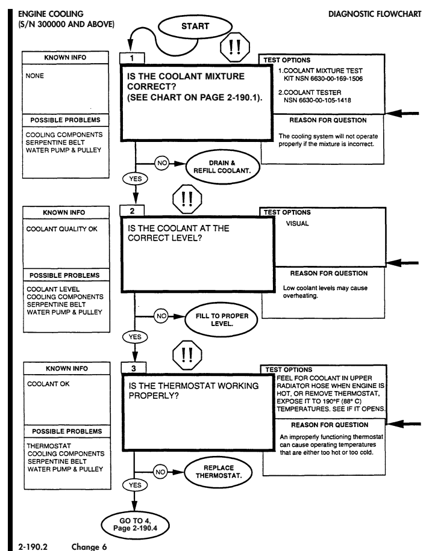

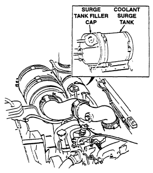

Do not remove surge tank filler cap

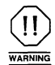 before releasing internal pressure when engine temperature is above 185°F (85°C). Steam or hot coolant under pressure will cause injury. Drain and refill coolant (para. 3-61).

Do not remove surge tank filler cap

 before releasing internal pressure when engine temperature is above 185°F (85°C). Steam or hot coolant under pressure will cause injury. Drain and refill coolant 

 (para. 3-61).

REFERENCE INFORMATION ENGINE COOLING
(S/N 300000 AND ABOVE)
(para. 3-76.1).

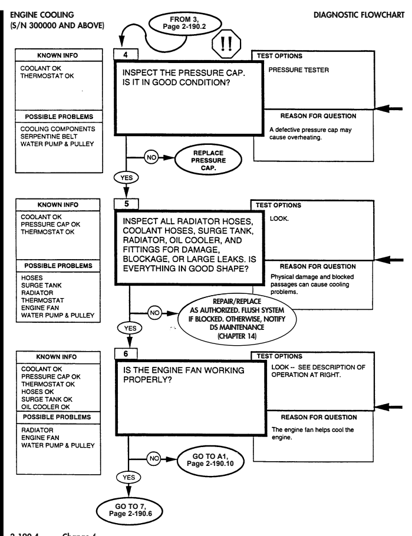

2-190.4 Change 6
(para. 3-61).

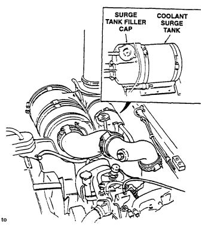

REFERENCE INFORMATION **ENGINE COOLING**

(S/N 300000 AND ABOVE)
Flush cooling system (para. 3-61). For surge tank replacement procedures, refer to para. 3-65. For radiator support procedures, refer to para. 3-64.1. For oil cooler and oil cooler hose replacement procedures, refer to paras. 3-7.1 and 3-8.1. Notify DS maintenance to repair radiator (Chapter 17).

#### Engine Cooling Fan Description Of Operation

When the thermostat detects the coolant is hot, the thermostat opens, and allows the coolant to be pumped to the radiator where it is routed through a series of fins and tubes. A fan draws in the outside air to help dissipate the heat before the coolant is recirculated back through the engine. The fan is driven from the engine crankshaft via the geared fan drive and a viscous drive. The geared fan drive unit is supported by the front rear crossmember, connects to the harmonic balancer of the engine and places the viscous drive and fan assembly on the same plane as, and close to, the radiator for maximum cooling efficiency. A helical gearset is utilized within the geared fan drive to change the drive angle from the crankshaft to the fan. Gear lube with friction modifier lubricates the internal components of the geared fan drive using an integral reservoir and pump. Two constant velocity joints and a torsional driveshaft connect the geared fan drive to the engine crankshaft at the harmonic balancer.

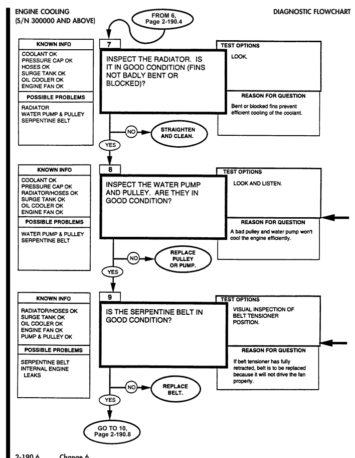

2-190.6 Change 6
TM 9-2320-387-24-1 REFERENCE INFORMATION ENGINE COOLING
(S/N 300000 AND ABOVE)
Listen for noisy bearings in the water pump, or an in-and-out motion to the fan. You can also check the pump and pulley by trying to move it in and out or laterally with the engine off. Replace the water pump pulley (para. 3-77). Replace the water pump (para. 3-78).

Replace the serpentine belt (para. 3-81.2).

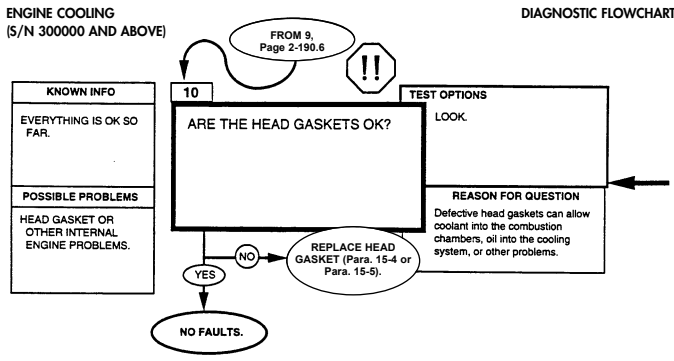

TM 9-2320-387-24-1 REFERENCE INFORMATION
ENGINE COOLING
(S/N 300000 AND ABOVE)

Always use caution when approaching a hot engine. Failure to do so may result in serious burns.

Look for excessive white exhaust smoke, steam leaks in the engine compartment, and oil in the coolant.  Other signs include excess condensation in the exhaust system, or white joints in the exhaust system.  You can also feel the coolant hoses to see if they have high pressure caused by leaking combustion gasses. Also, if the glow plugs turn off very quickly after starting the engine, or if the engine overheats, or has excessive coolant consumption, you may have a head gasket problem.

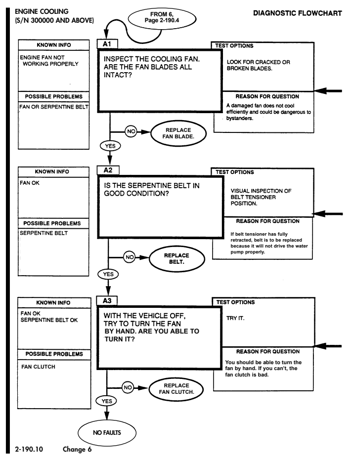

TM 9-2320-387-24-1 REFERENCE INFORMATION ENGINE COOLING
(S/N 300000 AND ABOVE)
Replace fan blade (para 3-80.1).

Replace serpentine belt (para. 3-81.2).

Replace fan clutch (para. 3-80.1).

 A NO answer to this question means that you were not able to turn the fan by hand.

# 2-32. Engine Lubrication Tests 1

These engine lubrication tests may be run any time there is an engine lubrication problem or if you were sent here by another test chain. Just follow the path, answering the questions. Additional information and notes are given on the facing page when necessary. 

Fold-out page FP-9 shows the location of the major components of the engine lubrication system in case you are not familiar with them. This page may be left open for reference while testing. 

- 

L 
NONE 
OIL 
LEAKS 
OIL OK 

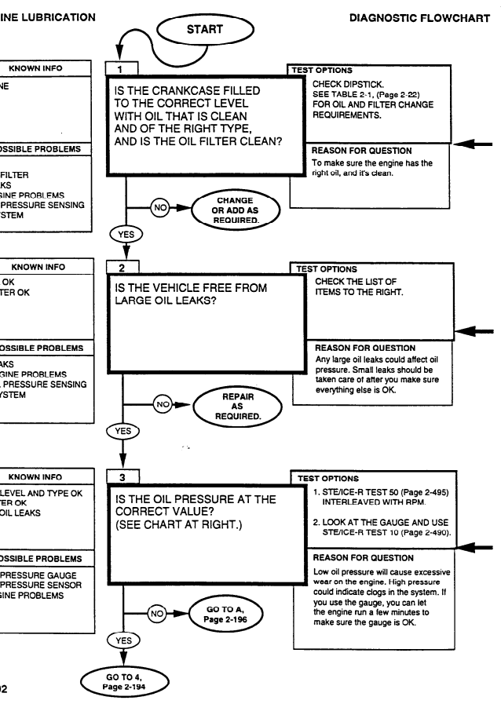

LEAKS 
FILTER OK 
4-- - 
OIL FILTER 
SYSTEM 

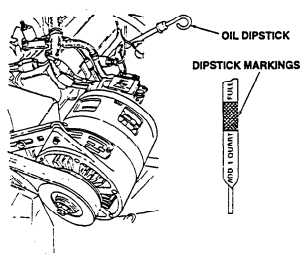

# Reference Information Engine Lubrication

Incorrect oil level and type can cause pressure problems, leaks, excessive blowby. and other problems. 

Inspect the oil cooler, oil cooler supply return lines, CDR valve hoses, oil pan, and oil filter. Test CDR valve (para. 3-9). See the location on parts page to find these parts. 

#### Engine Rpm Stmce-R Test 10

1. Start Test 10, Engine RPM. 

2. Crank or start the engine. Displayed reading is mm. Cranking rpm should be approximately 200. Idle rpm should be 700-750.

Remove sending unit (para. 4-29). 

ENGINE RPM 
INTERLEAVE WITH O-l,000 PSI PRESSURE 
I. Connect BLUE transducer in place of oil pressure sending unit. Dial test 50 (O-l ,000 psi 
(O-5.995 kPa)). Perform offset test. 

2. Dial test 01, interleave with RPM. Dial test 50. 3. Stan engine and observe display. VIM will display RPM, then PSI. 

OIL PRESSURE GAUGE 

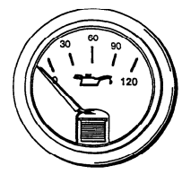

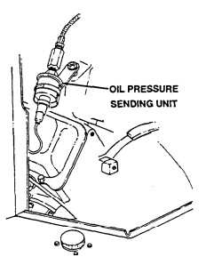

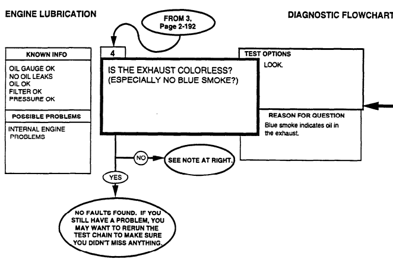

TM 9-2320-387-24-l 

# Reference Information

ENGINE LUBRICATION 
NOTE 
If **the exhaust is not colorless, it must** be either white, blue, or black. If exhaust color is: 
WHITE . . . . . .._._ Go to fuel system, para. 2-28. Could be injector timing, DS level fault. 

BLUE..... . . . . . ..Blue smoke is a sign of oil entering the combustion chambers. It usually enters past the piston rings or intake valve stem seals. This is an internal engine problem that can't be handled at this level of maintenance. You may want to run the engine running tests, para. 2-24, before you notify DS maintenance (chapter 14). 

BLACK. . . . . . . . . Air Intake/exhaust. para. 2-29. 

ENGINE **LUBRICATION** 
KNOWN INFO 1 WRONG OIL PRESSURE 
POSSIBLE PROBLEMS 
OIL PRESSURE GAUGE OIL PRESSURE SENSOR INTERNAL ENGINE 
PROBLEMS 
KNOWN INFO I 
WRONG PRESSURE 
USING VEHICLE GAUGE 
POSSIBLE DROBLEMS 
GAUGE AND SENDER 
ENGINE PROBLEMS 
OIL PRESSURE OK 
GAUGE SENDER WIRING 

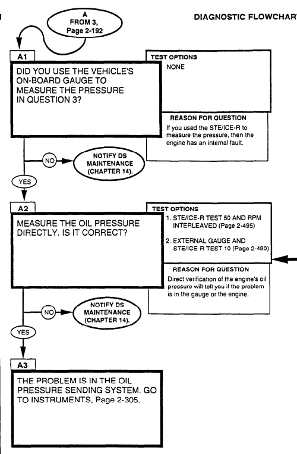

## Reference Information Engine Lubrication

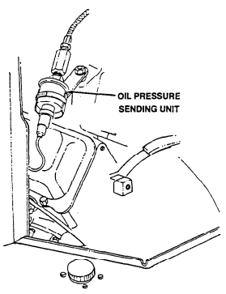

IL QR 

I 

I 

| Dexron® VI.   |
|---------------|

ENGINE RPM 
INTERLEAVE WITH fl-1,000 **PSI PRESSURE** 
- -I Remove sending unit (para. 4-29). 

1. Connect BLUE transducer in place of oil pressure sending unit. Dial test 50 (O-1000 psi 
(08.895 kPa)). Perform offset test. 

2. Dial test 01, interleave with RPv.: Dial test 50. 

| ENGINE RPM                              |
|-----------------------------------------|
| STEACE\-R TEST 10                       |
| 1. Start Test 10, Engine RPM.           |
| 2. Crank or start the engine. Displayed |
| reading is RPM. Cranking rpm should     |
| be approximately 200. Idle rpm should   |
| be 700\-750.                            |

3. Start engine and observe display. VTM will display RPM. then PSI. 

# 2-33. Alternator Tests

These alternator tests can be run any time you think there may be a problem with the alternator or battery charging or if you were sent here from another system chain.

These tests are NOT for the batteries. These tests are strictly for the alternator, its operation, and its associated wiring. Tests for the batteries are in Battery Circuit, Para. 2-35.

NOTE
Dual voltage 200 and 400 amp alternators can be installed in a single voltage system. See chart below for hookup procedures.

A simplified block diagram for the alternator system is given below.  A detailed functional flow schematic is provided as foldout FP-11 to help you understand the system as you perform the tests.

After preliminary common tests, the model of alternator must be identified for specific testing to determine if alternator or regulator is defective.

ALTERNATOR
FLOW SCHEMATIC

Adaption of dual voltage alternator on a single voltage system chart

ENGINE
MECHANICAL
POWER
(SERPENTINE BELT)

| Dual Voltage Alternator   | And Controller of the Comments of the control of the c Single Voltage System   |
|---------------------------|--------------------------------------------------------------------------------|
| 200 Amp                   | Ground wire afixed to regulator base and 14 volt power stud                    |
| 400 Amp                   | No ground wire afixed to regulator or 14 volt power stud                       |

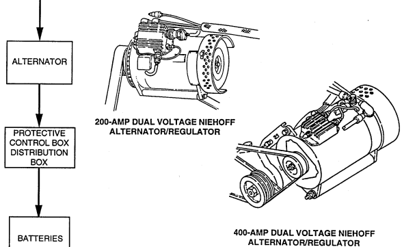

- 

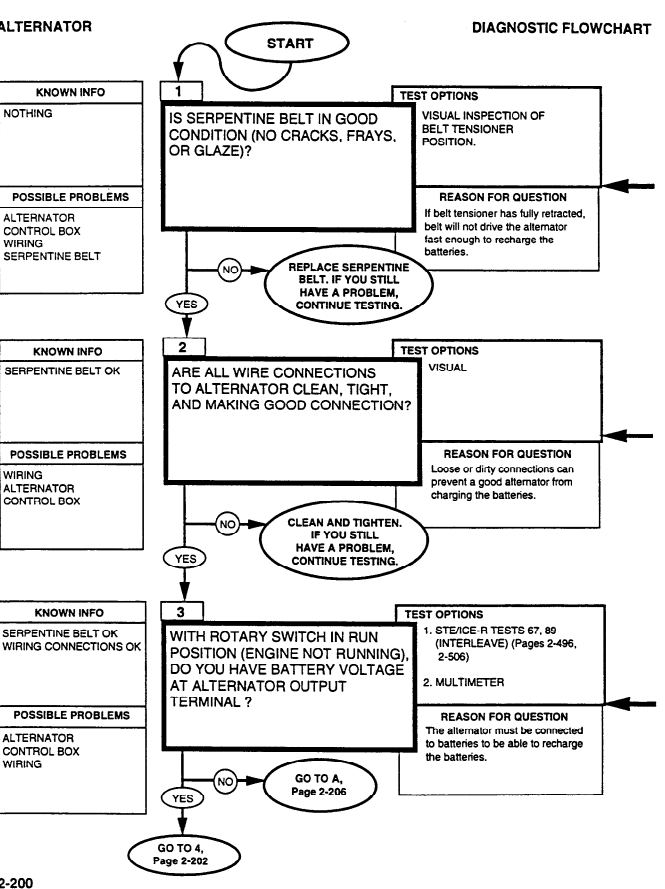

2-200 
REFERENCE INFORMATION
ALTERNATOR
Replace serpentine belt (para. 3-81).

BAD CONNECTIONS ARE THE
MOST COMMON PROBLEM !

Sometimes, just disconnecting, cleaning, and reconnecting will solve a problem. BE THOROUGH!

The time you save may be your own.

Refer to the functional flow schematic and check the following:
1. BATTERY - make sure all connections are clean and tight, including the shunt and power stud.

2. STARTER - check the high current wire (heavy gauge wire 6A) at the starter. Don't just check for voltage; a loose connection will have voltage but can't carry much current.

3. PROTECTIVE CONTROL BOX

Disconnect negative battery cable before disconnecting and reconnecting PCB harness.

WARNING
There is battery voltage at the PCB at all times.  Failure to disconnect battery cable will result in damage to equipment or Injury to personnel.

Remove BOTH connectors and look for bent or broken pins, pins pushed out of their socket, or dirt and corrosion in the connections.

## Interleave Tests 67 And 89 Battery Voltage And Dc Voltage

USE CONTROL FUNCTION 06 TO INTERLEAVE
TESTS ON THE STE/ICE-R. DIAL 06, PRESS
THE TEST BUTTON. WHEN PROMPTED BY
THE VTM, DIAL IN TEST 67 AND PRESS THE
BUTTON. WHEN PROMPTED AGAIN, DIAL IN
TEST 89 AND PRESS THE BUTTON. VTM
WILL DISPLAY RESULT FOR TEST 67.

THEN 89, THEN 6789, AND THEN REPEAT.

SEE TM 9-4910-571-12&P FOR MORE
INFORMATION.

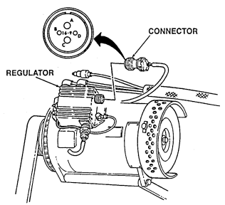

200-AMP DUAL VOLTAGE
NIEHOFF ALTERNATOR

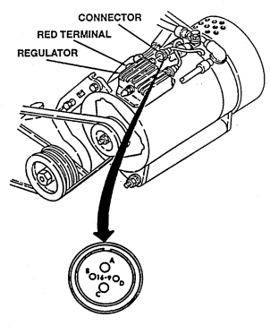

400-AMP DUAL VOLTAGE
NIEHOFF ALTERNATOR

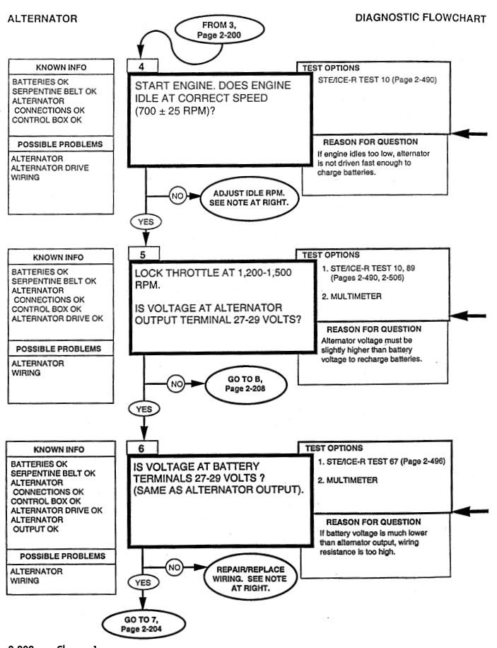

1

## Reference Information Alternator

If the engine doesn't start on its own power, you should check the battery and starter circuits. 

A charged battery in good condition is a prerequisite for testing an alternator/regulator system. If battery is suspect, substitute a known good battery in the vehicle. Alternators have a large stud on side of housing as output terminal to connect wire 6. 

#### Notes On Idle Adjustment

If idle can be adjusted to within limits, go to step 5. If idle CANNOT be adjusted to within limits, you may have a problem with the fuel system. You can either continue here or run the fuel system tests and return here. 

#### Engine Rpm Stexe-R Test 10

1. Start Test 10, Engine RPM. 

2. Crank or start the engine. Displayed reading is RPM. Cranking rpm should be at least 100. Idle rpm should be 625-675.

#### .I

,

i 

#### Dc Voltage O-45 Volts Stewe-R Test 89

1. Connect RED clip to the indicated test point, 

BLACK clip to negative or ground.

2. Start Test 89, DC Volts. 3. Displayed reading is in volts. 

#### Notes

Check the wiring and the pins at pins E 8 F at PCB engine connector. Check the wiring and the pins at pins D 8 G at PCB body connector. Check and clean starter solenoid and battery box power stud. 

Check and clean battery cables and clamps. Look for loose, dirty, or broken connections and repair as necessary. If terminal voltage is still low, harness should be replaced. Notify DS maintenance (chapter 16). 

## Battery Voltage Steiice-R Test 67 I

1. Start Test 67, Battery Voltage. 

2. Displayed reading is in volts. Batteries should be 23-25.5 volts. Battery voltage will drop when glow plugs turn on.

## Alternator

KNOWN INFO I 
BAl-TERIES OK SERPENTINE BELT OK ALTERNATOR 
CONNECTIONS OK 
CONTROL BOX OK ALTERNATOR DRIVE- OK ALTERNATOR OUTPUT Ok POSSIBLE PROBLEMS 1 ALTERNATOR I 

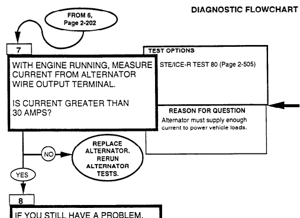

RERUN THESE TESTS TO MAKE 
SURE YOU DIDN'T MISS 
~ ANYTHING. IF EVERYTHING 
~ CHECKS OUT, RUN BAlTERY 
TESTS AND ELECTRICAL TESTS. 

TM 9-2320-387-24-l REFERENCE INFORMATION 
ALTERNATOR 
NOTE 
All alternators have large stud on alternator case as output connector for wire 6. Alternator current will go up as you turn on vehicle accessories. Turn on the lights, wipers, heater, etc., to make sure alternator can supply enough current to power the loads. 

To replace alternator. refer to para. 4-S. 

BAlTERY CURRENT 
STMCE-R TEST 80 1. Start Test 80, Battery Current. 

2. Diiplayed reading is in amps. The reading will be greater then 30 amps, depending on how many accessories you have on. 

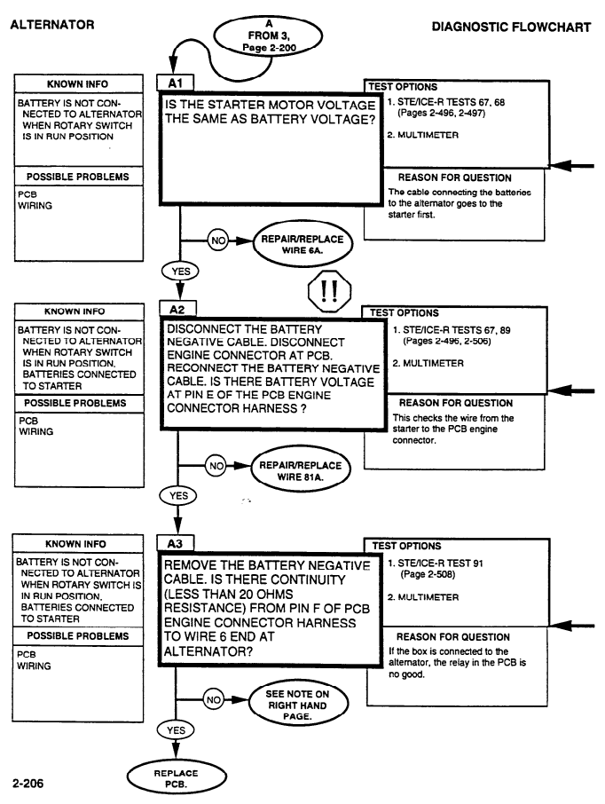

# Reference Information

 Alternator

## Interleave Test 67 And 68 Battery Voltage And Dc Voltage

USE CONTROL FUNCTION 06 TO INTERLEAVE
TESTS ON THE STE/ICE-R. DIAL 06, PRESS
THE TEST BUTTON. WHEN PROMPTED BY
THE VTM, DIAL IN TEST 67 AND PRESS THE
BUTTON. WHEN PROMPTED AGAIN, DIAL IN
TEST 68 AND PRESS THE BUTTON. VTM
WILL DISPLAY RESULT FOR TEST 67, THEN 68, THEN 6768, AND THEN REPEAT. SEE TM
9-4910-571-12&P FOR MORE INFORMATION.

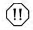

Disconnect negative battery cable before disconnecting and reconnecting

PCB harness.

There is battery voltage at the PCB at all times. Failure to disconnect battery cable will result in damage to equipment or injury to personnel.

1

# Note Interleave Test 67 And 89 Battery Voltage And Dc Voltage

USE CONTROL FUNCTION 06 TO INTERLEAVE
TESTS ON THE STE/ICE-R. DIAL 06, PRESS
THE TEST BUTTON. WHEN PROMPTED BY
THE VTM, DIAL IN TEST 67 AND PRESS THE
BUTTON. WHEN PROMPTED AGAIN, DIAL IN
TEST 89 AND PRESS THE BUTTON. VTM WILL DISPLAY RESULT FOR TEST 67, THEN 89, THEN 6789, AND THEN REPEAT. SEE TM
9-4910-571-12&P FOR MORE INFORMATION:
When checking for voltage or continuity in a hamess connector (steps A2 and A3), check the wiring at the connector carefully for broken wires. Check to see that the connector pins are not bent, broken, or pushed out of place. Check that the connections are clean and tight. Use the STE/ICE-R in TK mode for this measurement.

DO NOT USE THE DCA. Leave the negative battery cable off for the measurement. If there is an open circuit, the STE/ICE-R will measure close to 500 ohms. If you don't have continuity or voltage, and the wires and connections are all OK, then the hamess must have a broken wire. In this case, you have to replace the wiring hamess. Replace hamess and notify DS maintenance
(chapter 18).

Replace PCB (para. 4-4).

## Resistance And Continuity 0-4,500 Ohms Steace-R Test 91

1. Connect RED clip and BLACK clip to the terminations indicated in the question. RED to the first, BLACK to the second.

2. Start Test 91, 0-4,500 Ohms.

3. Displayed reading is in ohms. Less than 5 ohms is continuity. If the resistance is over 4,500 ohms, STE/ICE-R displays .9.9.9.9.9.9.9.

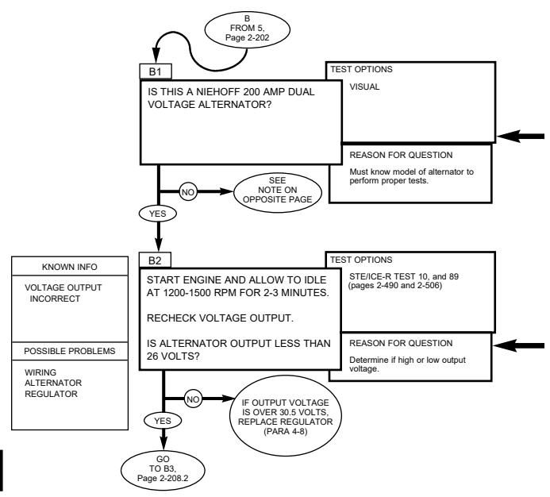

# Reference Information

ALTERNATOR

For 200 amp dual voltage Niehoff alternator, continue with B.

For 400 amp dual voltage Niehoff alternator, go to C, page 210.2.

NOTE
The regulator for this model alternator has overvoltage protection. Any output voltage over 30.5 volts is an overvoltage.

Output voltage of 26-30.5 is acceptable for this alternator.

NOTE
The requlator for this alternator has overvoltage protection. Any output voltage over 30.5 volts is an overvoltage. Output voltage of 26-30.5 is acceptable for this alternator.

# Engine Rpm Ste/Ice-R Test 10

1. Start test 10, Engine RPM.

2. Crank or start the engine. Displayed reading is

rpm. Engine rpm should be 1,200-1,500.

# Dc Voltage 0-45 Volts Ste/Ice-R Test 89

1. Connect RED clip to the indicated test point, BLACK clip to negative or ground.

2. Start Test 89, DC Volts.

3. Displayed reading is in volts.

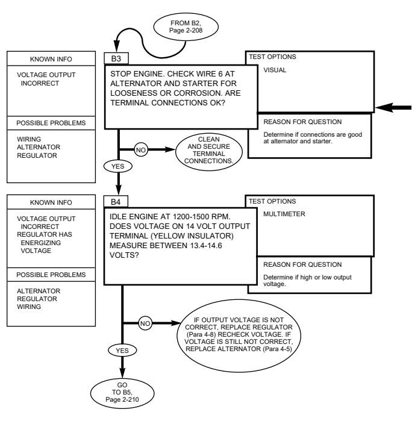

TM 9-2320-387-24-1 REFERENCE INFORMATION ALTERNATOR
NOTE 
Wire 6 connects alternator output stud to starter terminal. A poor connection at these points will cause a low or no alternator output condition.

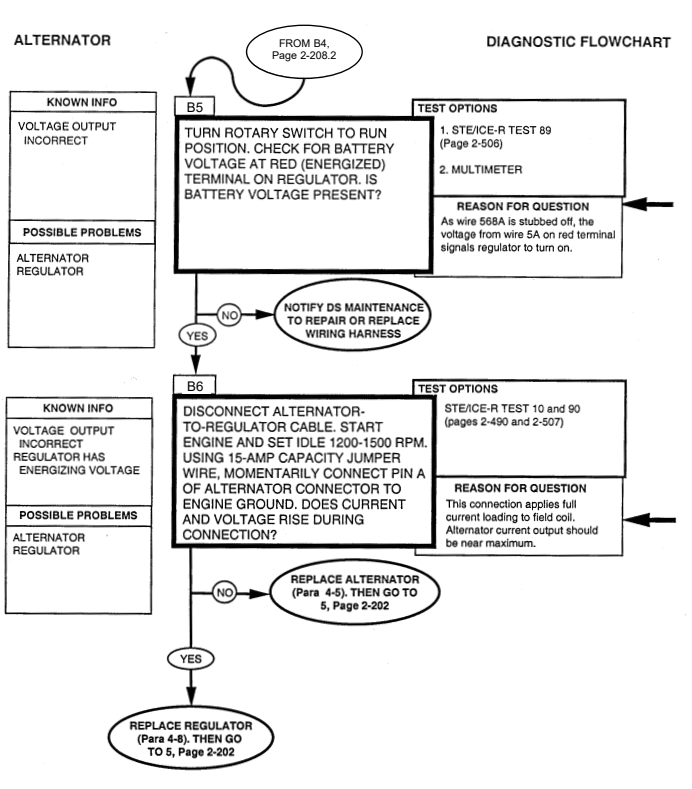

REFERENCE INFORMATION
ALTERNATOR
1. Slide boot back from wire lug to expose red terminal.

2. Make contact at stud.

# 0-45 Dc Volts Ste/Ice-R Test 89

1. Connect RED clip to the indicated test point, BLACK clip to negative or ground.

2. Start Test 89, DC volts.

3. Displayed reading is in volts.

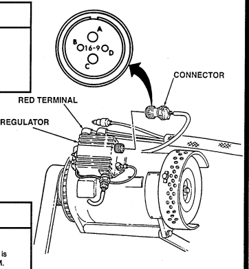

# Engine Rpm

STE/ICE-R TEST 10 1. Start Test 10, Engine RPM.

2. Crank or start the engine. Displayed reading is RPM. Set engine to fast idle of 1200-1500 RPM.

0-1500 AMPS  DC
STE/ICE-R TEST 90 1. Connect probe.

2. Start Test 90, DC amps.

3. Displayed reading is in amps.

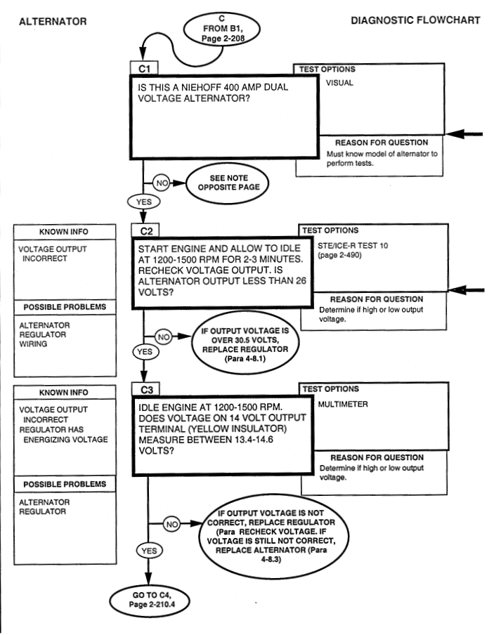

REFERENCE INFORMATION
ALTERNATOR
NOTE
For 200 amp dual voltage Niehoff alternator, go to B, page 2-208.

For 400 amp dual voltage Niehoff alternator, continue with C.

NOTE
The regulator for this model alternator has overvoltage protection. Any output voltage over 30.5 volts is an overvoltage.

Output voltage of 26-30.5 is acceptable for this alternator.

NOTE
The regulator for this alternator has overvoltage protection. Any output voltage over 30.5 volts is an overvoltage.

Output voltage of 26-30.5 is acceptable for this alternator.

# Engine Rpm Ste/Ice-R Test 10

1. Start test 10, Engine RPM.

2. Crank or start the engine. Displayed reading is RPM. Engine RPM should be 1200-1500.

# 0-45 Dc Volts Ste/Ice-R Test 89

1. Connect RED clip to the indicated test point,

BLACK clip to negative or ground.

2. Start Test 89, DC Volts.

3. Displayed reading is in volts.

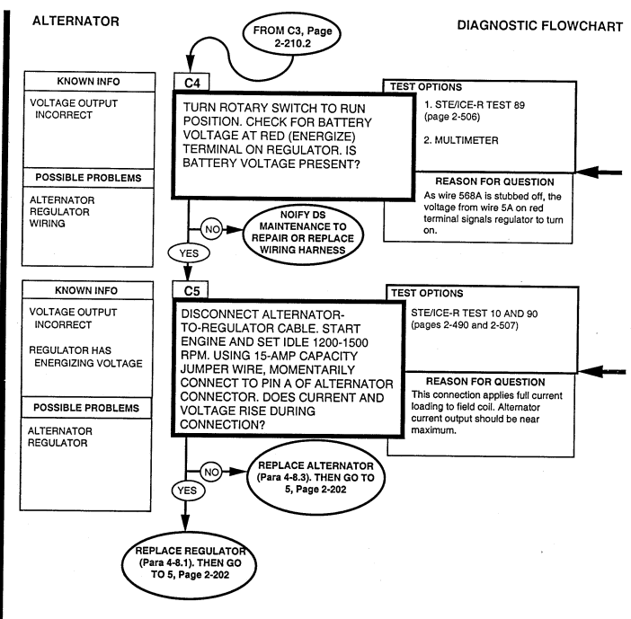

# Reference Information

ALTERNATOR
1. Slide boot back from wire lug to expose red terminal.

2. Make contact at stud.

# 0-45 Dc Volts Ste/Ice-R Test 89

1. Connect RED clip to the indicated test point, BLACK clip to negative or ground.

2. Start Test 89, DC Volts.

3. Displayed reading is in volts.

# Engine Rpm Ste/Ice-R Test 10

1. Start Test 10, Engine RPM.

2. Crank or start the engine. Displayed reading is RPM. Set engine to fast idle of 1200-1500 RPM.

# 0-1500 Amps  Dc Ste/Ce-R Test 90

1. Connect probe.

2. Start Test 90, DC amps. 3. Displayed reading is in amps.

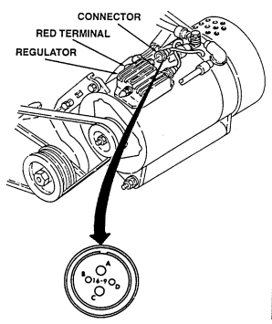

## 2-34. Protective Control Box Tests

These Protective Control Box tests can be run any time you think there may be a problem with the protective control box, or if you were sent here from another system chain. 

l To perform PCB diagnostics, a PCB test module is needed. 

l For fabrication of PCB test module, refer to Appendix D, Figures 4780.

PROTECTIVE DIAGNOSTIC FLOWCHART 

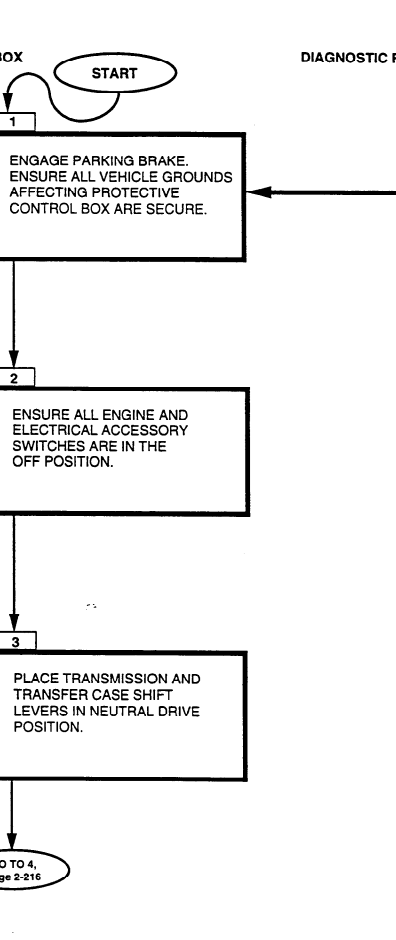

REFERENCE INFORMATION 
PROTECTIVE CONTROL BOX 
-I 
1. 

2. 

3. 4. 

5. 

6. 

Remove instrument panel (para. 4-15). Remove nut and to&washer assembly and engine harness ground lead 3C from body. .Remove nut and to&washer assembly, capscrew. and harness ground leads 57A and 79A from body. Discard nut and lockwasher assemblies. Inspect and clean wires and connection points. 

Apply antiseize compound to harness ground leads 57A and 79A and install on body with capscrew and nut and lo&washer assembly. Apply antiseize compound to engine harness ground lead 3C and install on body with nut and lo&washer assembly. 

Cover lea& 3C, S7A, and 79A with RTV. 

Install instrument panel (para. 4-15). 

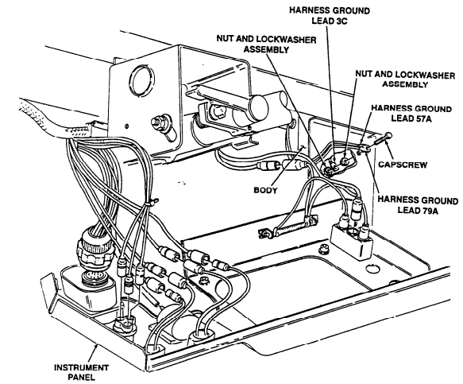

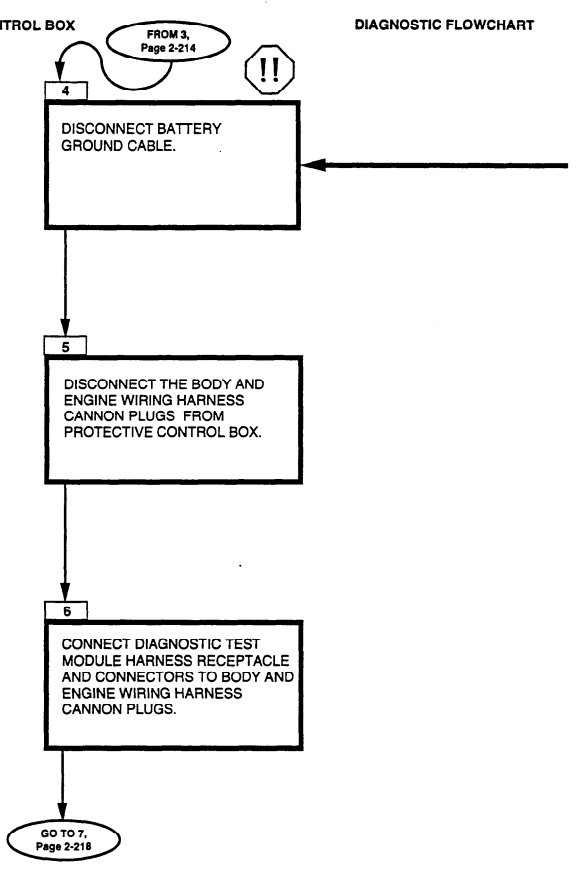

REFERENCE INFORMATION 
PROTECTIVE CONTROL BOX 
I **Disconnect negative battery cable before** 

disconnecting and reconnecting PCB harness. Failure to do so may result in injury to personnel or damage to equipment. 

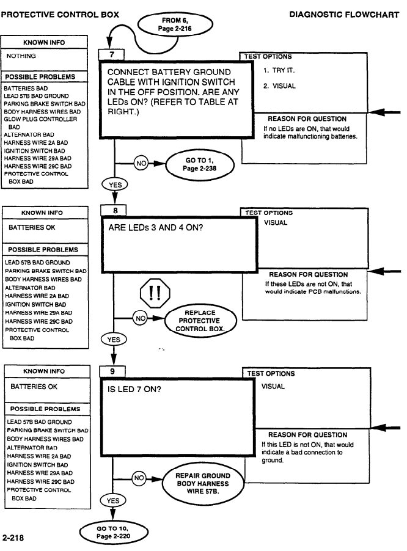

#### Reference Information

## Protective Control Box

| PROCEDURES                   | CAPABLE IF:         |                                      |        |
|------------------------------|---------------------|--------------------------------------|--------|
| Change fluid every 12,000 mi | Metal particles are | (19,300 km) or biennially, whichever | found. |

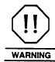

Disconnect negative battery cable before disconnecting and reconnecting PCB harness. Failure to do so may result in injury to personnel or damage to equipment. 

1 Replace **PCB** (para. 4-4). 

- : 
Repair lead connectors (paa. 4-80). 

Repair lead (para. **4-80).** 

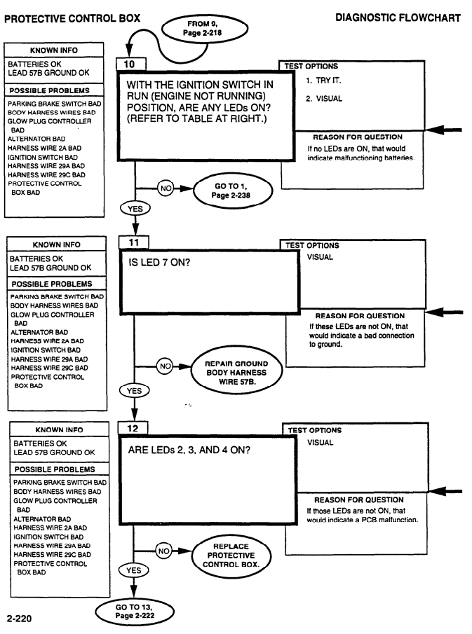

#### Reference Information

# Protective Control Box

| IGNITION    | DIAGNOSTIC CHECKS                                                  |
|-------------|--------------------------------------------------------------------|
| SWITCH      | (GO TASKS)                                                         |
| POSITION    |                                                                    |
| OFF         | LEDs 1,3,4,6,7 \- ON; Remaining LEDs OFF.                          |
| RUN         | LEDs 1,2,3,4,5,6,7,8,11,13 \- ON.                                  |
|             | LED 13 \- OFF after a few seconds (glow plug warm\-up time).       |
| (ENGINE NOT | LED 13 \- OFF (if engine is at operating temperature).             |
| RUNNING)    | LED 11 \- CYCLING ON and OFF (glow plug controller operation).     |
|             | LEDs 9.10.12 \- OFF.                                               |
|             | Release parking brake lever. LED 6 \- OFF.                         |
|             | Engage parking brake lever. LED 6 \- ON.                           |
| START       | LED 10 \- Momentarily ON and then remains OFF (starter motor       |
| (ENGINE     | trequency lockout).                                                |
| CRANKINGI   |                                                                    |
| RUN         | LEDs 1,2,3,4,5,6,7,8,9,12 \- ON.                                   |
| (ENGINE     | LED 11 \- cycling ON and OFF (glow plug controlier operation): OFF |
| RUNNING)    | time interval increases as engine warms up.                        |
|             | LED 11 \- OFF (when engine is at operating temperature).           |
|             | LED 11 may remain OFF (when engine is at operating temperature     |
|             | from previous run).                                                |
|             | LED 13 \- OFF.                                                     |
|             | Release parking brake lever. LED 6 \- OFF.                         |
|             | Engage parking brake lever. LED 6 \- ON.                           |

, Repair lead connectors (para. 4-80). 

Repair lead (para. 4-80). 

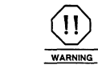

Disconnect negative battery cable before disconnecting and reconnecting PCS harness. Failure to do so may result in injury to personnel or damage to equipment. 

Replace **PC6** (para. 44). 

KNOWN INFO 
BATTERIES OK 
LEAD 578 GROUND OK 
POSSIBLE PROBLEMS 
PARKING BRAKE SWITCH BAD 
BODY HARNESS WIRES BAD 
~ GLOW PLUG CONTROLiER ~ BAD 
~ ALTERNATOR BAD 
HARNESS WIRE 2A BAD IGNlTlON SWITCH BAD 
HARNESS WIRE 29A BAD 
HARNESS WIRE 29C BAD PROTECTIVE CONTROL 
BOX BAD 
LEAD 578 GROUND OK 
IGNlTlON SWITCH OK HARNESS WIRE 29A OK HARNESS WIRE 29C OK 
POSSIBLE PROBLEMS 
PARKING BRAKE SWITCH 
BAD 
BODY HARNESS WIRES BAD 
GLOW PLUG CONTROLLER 
BAD 
ALTERNATOR BAD HARNESS WIRE 2A BAD PROTECTIVE CONTROL 
BOX BAD 

#### Known Info

BATTERIES OK LEAD 578 GROUND OK IGNITION SWITCH OK HARNESS WIRE 29A OK HARNESS WIRE 29C OK 
POSSIBLE PROBLEMS 
PARKING BRAKE SWITCH 
BAD 
BODY HARNESS WIRES BAD 
GLOW PLUG CONTROLLER 
BAD 
ALTERNATOR BAD 
HARNESS WIRE 2A BAD 
PROTECTIVE CONTROL 
BOX BAD 

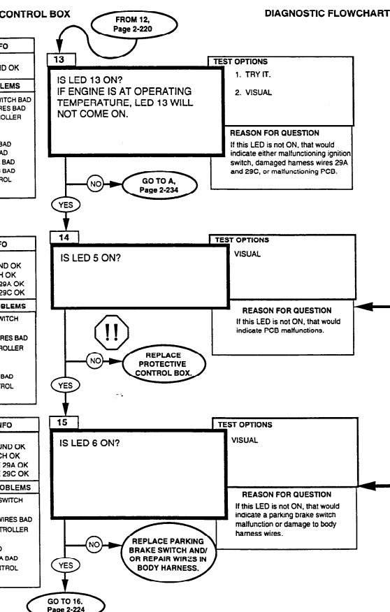

TM 9-2320-387-24-l PROTECTIVE CONTROL BOX 

Disconnect negative battery cable before disconnecting and reconnecting PCB 
harness. Failure to do so may result in injury to personnel or damage to equipment. 

Replace PCB (para. 4-4). 

Repair lead connectors (para. 4-80). Repair leads (para. 4-80). 

i 

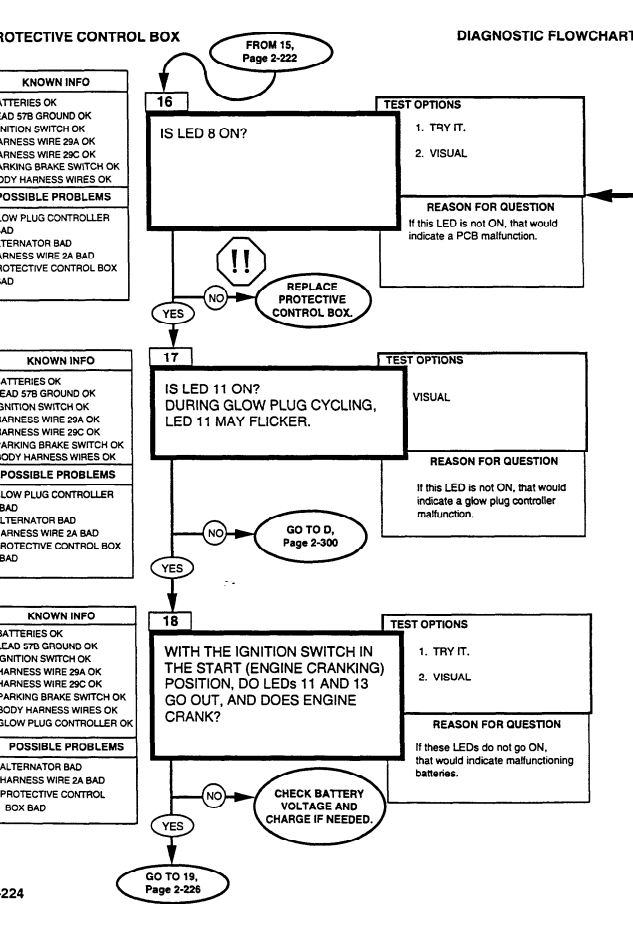

2-224 
TM 9-2320-387-24-l REFERENCE INFORMATION 
PROTECTIVE CONTROL BOX 

-I 
Disconnect negative battery cable before 

disconnecting and reconnecting PCS 
harness. Failure to do so may result in injury to Personnel or damage to equipment. 

' Replace PCB (para. 4-4). 

- 

_ 

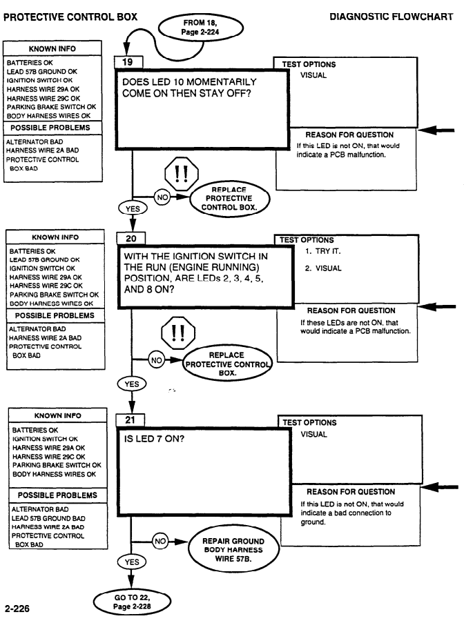

TM **9-2320-387-24-l** 

# Reference Information

PROTECTIVE CONTROL BOX 

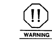

Disconnect negative battery cable before disconnecting and reconnecting PCB harness. Failure to do so may result in injury to personnel or damage to equipment. 

Replace **PCB** (para. 4-4). 

Disconnect negative battery cable before disconnecting and reconnecting PCB 
harness. Failure to do so may result in injury to personnel or damage to equipment. 

Replace PCB (para. 4-4). 

Repair **lead** connectors (para. 4-80). 

Repair leads (para. 4-80). 

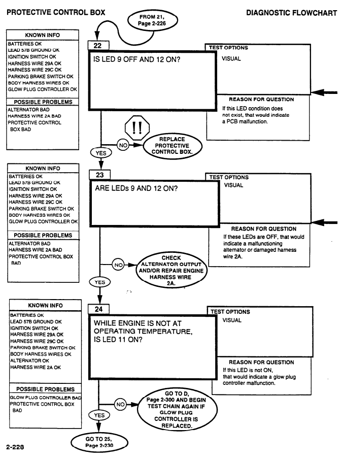

TM 9-2320-387-24-I 
REFERENCE INFORMATION 
PROTECTIVE CONTROL BOX 

Disconnect negative battery cable before 

 disconnecting and reconnecting PCB harness. Failure to do so may result in injury to personnel or damage to equipment. 

Replace PCB (pat-a. 44). 

1 Repair lead connectors (para. 4-80). 

Repair leads (para. 4-80). 

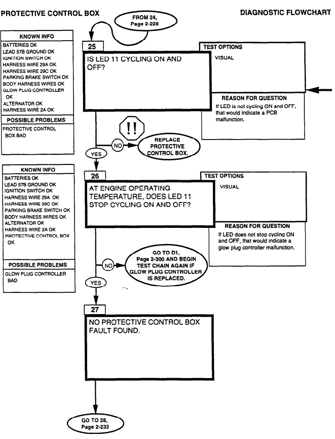

# Reference Information

PROTECTIVE CONTROL BOX 

Disconnect negative battery cable before 

 disconnecting and reconnecting PCB harness. Failure to do so may result in injury to personnel or damage to equipment. 

Replace PCB (para. 4-4). 

- : 
- 
PROTECTIVE CONTROL BOX 

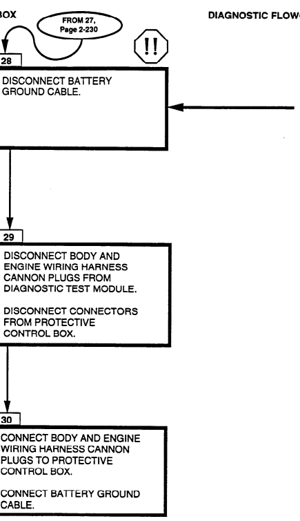

- 
TM **9-2320-387-24-l** 
REFERENCE INFORMATION 
PROTECTIVE CONTROL BOX 

Disconnect negative battery cable before 

 disconnecting and reconnecting PCB harness. Failure to do so may result in injury to personnel or damage to equipment. 

PROTECTIVE 
DIAGNOSTIC FLOWCHART 

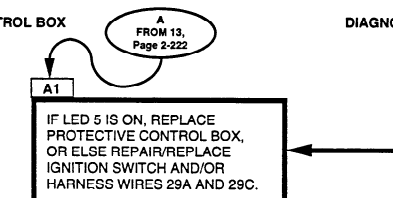

- 
- 
TM 9-2320-387-24-l REFERENCE INFORMATION 
PROTECTIVE CONTROL BOX 
Replace PCB (para. 44). Repair/replace rotary switch (para. 4-10). fiepairheplace leads 29A and 29C (para. 4-80). 

i 

## 2-35. Battery Circuit Tests

These battery circuit tests may be run any time you think you have a battery problem of if you were sent here by another test chain. Just follow the path, answering the questions. Additional information and notes are given on the facing page when necessary. The fold-out page shows the location of the major components of the battery circuit in case you are not familiar with them. Fold-out page FP-13 may be left open for reference while testing. 

,- : 

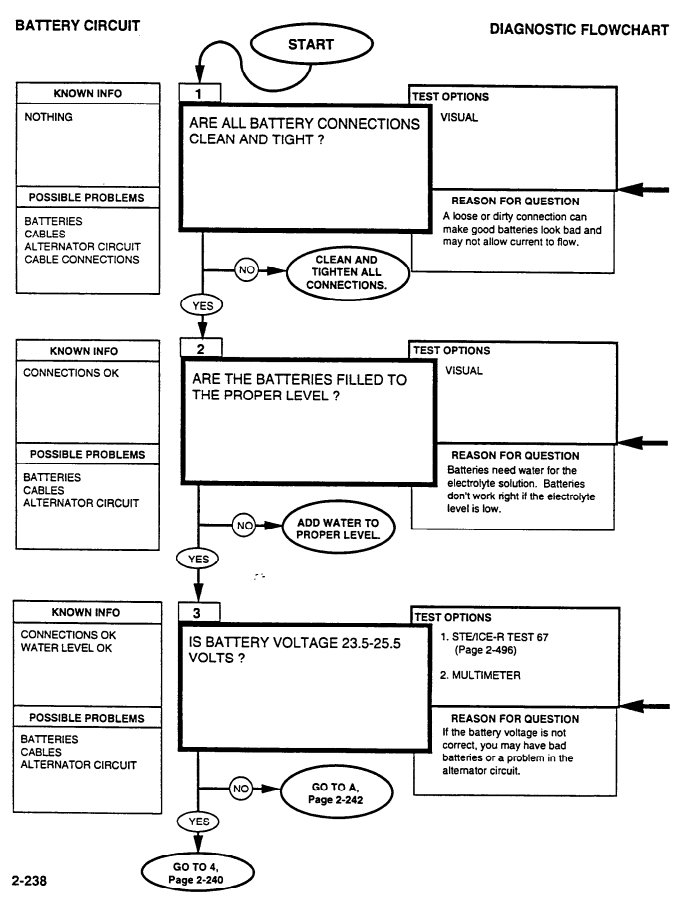

#### Reference Information

BAJTERY CIRCUIT 
BAD CONNFCTIONS ARF MF MOST COMMON PRO61 FM ! 

Sometimes just disconnecting, cleaning, and reconnecting will solve a problem. BE THOROUGH ! The time you save may be your own. Refer to the functional flow schematic and check the following: 1. BAlTERY - make sure all connections are clean and tight. This includes the interconnect cables, clamps, shunt, power stud, and the slave connector. Also check wires 6A and 7A under vehicle where they enter shunt. 2. STARTER - check the high current (heavy gauge) wire at the starter. Don't just check for voltage; a loose connection will have voltage but can't carry much current. 

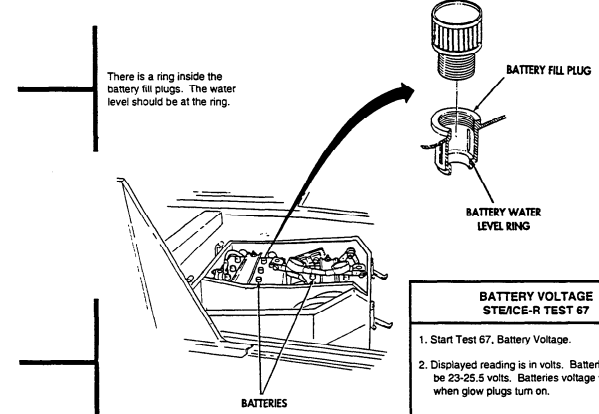

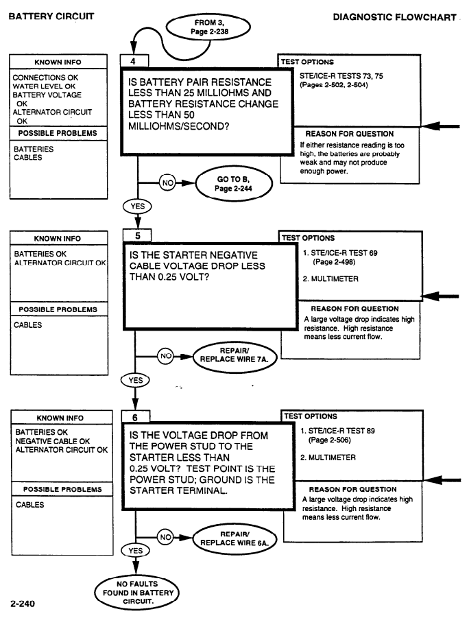

REFERENCE INFORMATION 
-I 
These tests check the strength of the batteries during engine cranking. If you don't have STUICE-R, skip this step, but remember that you haven't tested the batteries under load. 

## Baitery Circuit

#### Baltery Internal Resistance Stoice-R Test 73

1. Diinnect wire 54A at injection pump to prevent starting. 

2. Disconnect glow plug controller and fan solenoid. 

3. Start Test 73, Battery Internal Resistance. 4. Wait for the GO message. Crank the engine. 5. Result is displayed in milliihms. Battery resistance should be 25 milliohms max.

#### Battery Resistance Change Stuice-R Test 75

1. Disconnect wire 54A at injection pump to prevent starting. 

2. Disconnect glow plug controller and fan solenoid. 

3. Start Test 75, Battery Resistance Change. 4. Wait for the GO message. Crank the engine. 

5. Result is displayed in milliohms&cond. 

Battery resistance change should be 50 milliohms/second max.

#### Starter Neg. Cable Voltage Drop Ste/Lce-R Test 69

1. Start Test 69, Starter Negative Cable Voltage 

Drop. 

I 
2. Displayed reading is in volt. The cable voltage drop should be less than 0.25 volt max.

Repair/replace wire (para. 4-80). 

-I Repair/replace wire (para. 4-60). 

#### Dc Voltage O-45 Volts Steiice-R Test 69

1. Connect RED clip to the indicated test point, BLACK clip to negative or ground.

2. Start Test 69, DC Volts. 3. Displayed reading is in volts. 

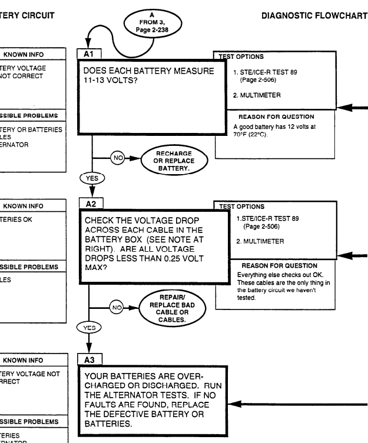

CABLES 
ALTERNATOR 

CABLES 
CORRECT 
BATTERIES 
ALTERNATOR 
REFERENCE INFORMATION 
BA'lTERY CIRCUIT 

#### Dc Voltage O-45 Volts Steyice-R Test 89

1. Connect RED clip to the indicated test point. 

BLACK dip to negative or ground. 

2. Start Test 89, DC Volts. 3. Displayed reading is **in volts.** 

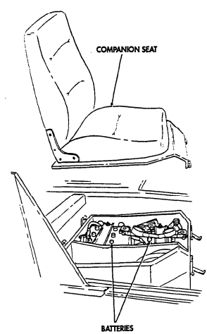

Measure from the positive post to the negative post of each battery. 

For battery replacement instructions, refer to para. 4-74. 

#### Note Check These Cables:

WIRE 68, connecting the batteries together. lest point is the postive terminal of one of the batteries. WIRE 49A, connecting the batteries to the power stud. lest point is the power stud. Wire connecting the battery to the shunt. Test point is the shunt. Wire connecting shunt to ground stud. Test point is the shunt. For repair or replacement of cables, refer to para. 4-68. 

If you use STEZE-R test 67 in Step 3 on page 2-252, you may have a faufty DCA. Try running the tests using STE/ICE-R test 89 with the W2 cable. 

See para. 4-74. (Also check each battery's specific gravity in accordance with TM 9-6140-200-14.) Replace battery (para. 4-74). 

## Battery **Circuit**

I KNOWN INFO I 
BATTERY RESISTANCE 
NO GOOD 
1 POSSIBLE PROBLEMS 1 BATTERIES CABLES 
KNOWN INFO 
BATTERIES OK 
POSSIBLE PROBLEMS 
CABLES 

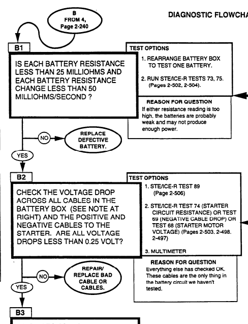

NO FAULTS FOUND. 

(IF YOU USED TESTS 73 & 75 IN STEP 4, P. 2-240, YOU MAY HAVE A PROBLEM WITH THE DCA. CHECK THE DCA CONNECTIONS 
AND TRY RUNNING STEP 4 USING TESTS 77 & 79.) SEE NOTE TO RIGHT. 

## Reference Information

BATTERY CIRCUIT 
-I Replace batteries **(para. 4-74).** 

#### Baltery Internal Resistance Stuice-R Test 73

1. Disconnect wire 54A at injection pump to prevent starting.

I 

2. Disconnect glow plug controller and fan solenoid (to keep waveform clean). 

3. Start Test 73. Battery Internal Resistance. 4. Wait for the GO message. Crank the engine. 

5. Result is displayed in milliohms. Battery resistance should be 25 milliohms max.

#### Baltery Resistance Change Stuice-R Test 75 I

1. Disconnect wire 54A at injection pump to prevent stating. 

2. Disconnect glow plug controller and fan solenoid (to keep waveform clean). 

3. Start Test 75. Battery Resistance Change. 

4. Wait for the GO message. Crank the engine. 5. Result is displayed in milliohms/second. 

Battery resistance change should be 50 milliohms/second max.

#### Dc **Voltage O-45 Volts** Stellce-R Test 89 I

1. Connect RED clip to the indicated test point, BLACK clip lo negative or ground. 

2. Start Test 69. DC Volts. 

3. Displayed reading is in volts. 

Check these cables: 
WIRE 66, connecting the batteries together. Test point is the positive terminal of one of the batteries. WIRE 49A, connecting the battery to the power stud. Test point is the power stud. 

Wire connecting the battery to the shunt. Test point is the negative terminal of the battery. Wire connecting shunt to ground stud. Test point is the shunt. 

Replace batteries (para. 4-74). 

I NOTE 
Tests T7 and 79 are TK tests that do the 
-I **same thing that DCA tests 73 and 76** 
do. See TM 9-491M71-12&P for instructions on how to run these tests. 

## 2-36. Starter Circuit Tests

The starter circuit consists of the batteries, starter solenoid, starter motor, rotary switch, parts of the Protective Control Box (PCB) and related electrical wiring. The relationship of these parts is shown in the block diagram below, and a simplified functional flow schematic is provided on the foldout FP-15. 

The starter solenoid and starter motor are enclosed in housings to protect them from dirt, icing conditions, and other road hazards. When the rotary switch is turned to START, the PCB checks if the engine is running. If the engine is not running, the PCB sends a signal to the starter solenoid which energizes the solenoid windings and causes the solenoid contacts to close, sending battery power to the starter motor. The battery power causes the starter motor pinion gear to engage the engine flywheel ring gear and the engine cranks. When the engine starts, the rotary switch should be released, allowing it to return to the RUN position. This tells the PCB to release the starter solenoid which, in turn, disengages the starter motor from the engine. 

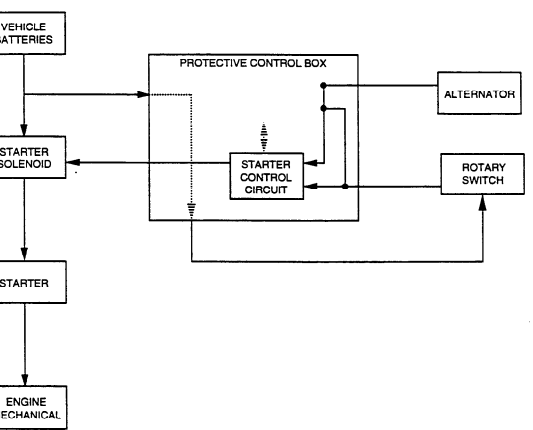

1 

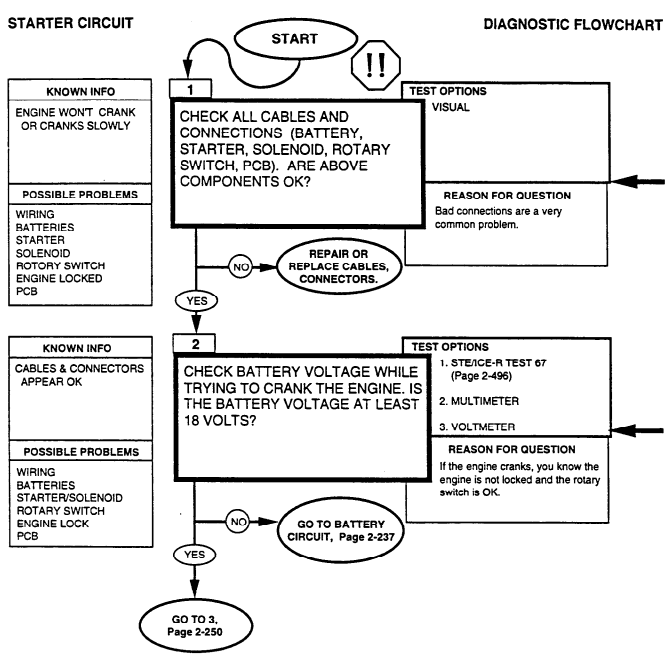

## Starter Circuit

#### Reference Information Bad Connfctions Arf Thf Most Common

PAOPt FM ! 

Sometimes just disconnecting. cleaning, and reconnecting will solve a problem. BE THOROUGH! 

The time you save may be your own. 

Refer to the functional flow schematic and check the following; 1. BATTERY - make sure all connections are clean and tight, including the shunt and power stud. 

2. STARTER - check the high current wire (heavy gauge wire 6A) at the starter. Don't just check for voltage; a loose connection will have voltage but can't carry much current. 

Disconnect negative battery cable before disconnecting and reconnecting PCB harness. 

WARNING 
There is battery voltage at the PCB at all times. 

Failure to disconnect battery cable will result in damage to equipment or injury to personnel. 

1 3. PROTECTlVE CONTROL BOX - Remove BOTH 
connectors and look for bent or broken pins, pins pushed out of their socket, or dirt and corrosion in the connections. 

4. ROTARY SWITCH - Check the wires at the switch. 

Don't just look Feel the connections to make

sure they're snug. Many problems can be solved by seeing with your fingers, not just your eyes. 

A cold engine should crank at least 100 rpm. A warm engine should crank at least 180 mm. 

3EEN - 

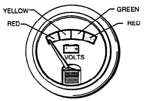

I 
I

VOLTMETER 

# I **Baltery Voltage** Steiice-R Test 67 I

1. Start Test 67, Battery Voltage. 

2. Displayed reading is in volts. Batteries should be 23-25.5 volts. Batteries voltage will drop when glow plugs turn on.

#### Baltery Voltage Multimeter I

I 1. Set the voltmeter to a DC volts scale of at least I 
40 volts. 

2. Connect the RED lead to positive and the BLACK lead to negative. 

I 3. Be sure to read the correct scale. I

## Starter Circuit

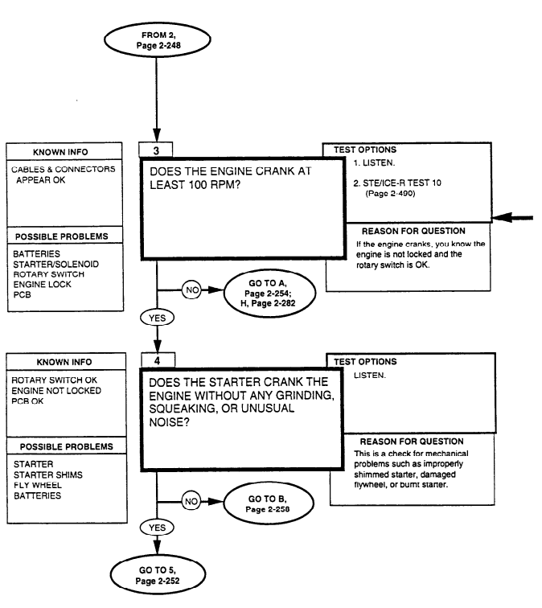

I, 
TM **9-2320-387-24-l** 
STARTER CIRCUIT 
REFERENCE INFORMATION 
ENGINE RPM 
STVICE-R TEST 10 1. **Start** Test 10. Engine RPM. 

2. Crank or start the engine. Displayed reading is RPM. Cranking rpm should be approximately 100. Idle tpm should ba 625 - 675. 

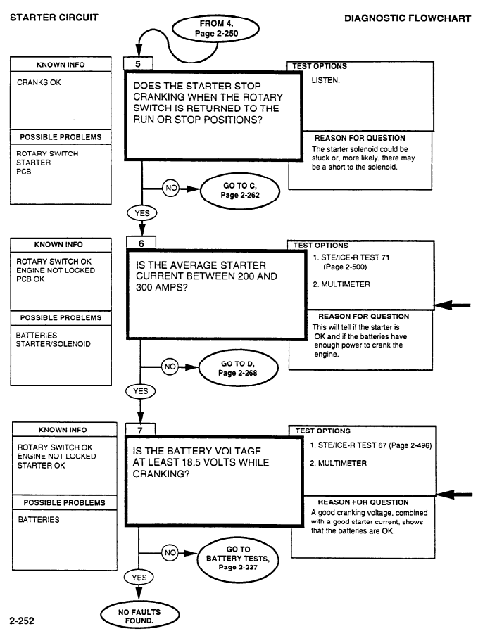

#### Reference Information

## Starter Circuit

#### Starter Average Current Slwlce-R Test 71

1. Start Test 71, Starter Average Current. 

2. Displayed reading is in amps. The starter should draw at least 200 amps with a peak of over 400 amps.

# I **Battery Current** Multimeter

1 1. Bet the voltmeter to a DC volts scale of about 1 I volt. 

2. Connect the BLACK lead to the battery side of the current shunt and the RED lead to the other end of the current shunt. 

3. Current shunt voltage is proportional to battery current, 100 milliiolts = 1,000 amps. To get current, multiply millivolts x 10.

#### Baltery Voltage Sib/Ice-R Test 67

1. Start Test 67, Battery Voltage. 

2. Displayed reading is in volts. Batteries should be 23-25.5 volts. Batteries voltage will drop when glow plugs turn on.

#### Baltery Voltage Multimeter I

1. Set the voltmeter to a DC volts scale of at least 40 volts. 

2. Connect the RED lead to positive and the BLACK lead to negative. 

3. Be sure to read the correct scale.

- 

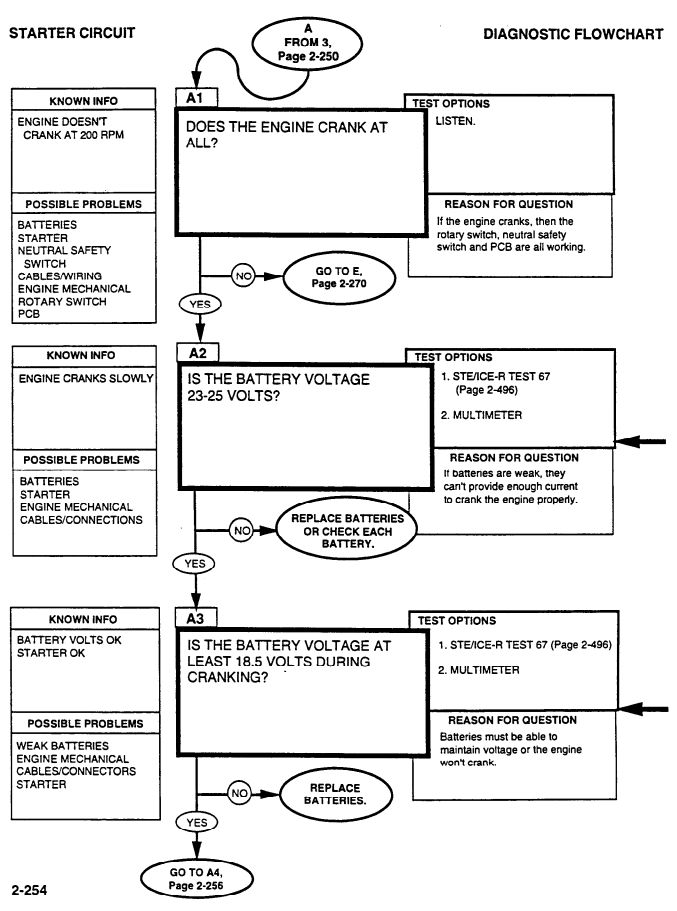

1 1 

## Reference Information

STARTER CIRCUIT 

# I **Battery Voltage** Stmce-R Test 67 I

1. Start Test 67, Battery Voltage. 

2. Displayed reading is in volts. Batteries should be 23-25.5 volts. Batteries voltage will drop when glow plugs turn on.

# I **Voltage** Multimeter I

1. Set the voltmeter to a DC volts scale of at least 40 volts. 

2. Connect the RED lead to positive and the BLACK lead to negative.

3. Be sure to read the correct scale. 

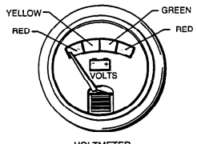

VOLTMETER 

i Connect red to positive = power stud. Connect black to 

 negative = battery side of current shunt. Replace batteries (para. 4-74). 

Connect red to positive = power stud. Connect black to negative = battery side of current shunt. Replace batteries (para. 4-74). 

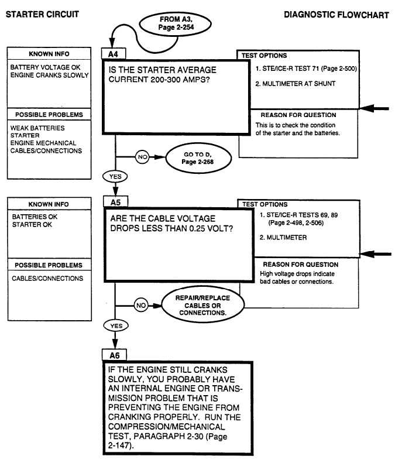

## Reference Information Starter Circuit

# I **Starteraveragecurrent** Steiice-R Test 71

1, Start Test 71, Starter Average Current. 

2. Displayed reading is in amps. The starter should draw at least 200 amps with a peak of over 400 amps.

#### Check These Cables:

Starter negative cable - STBifCE-R test 69 Wire 66. connecting the batteries together. Test point is the positive battery post. 

Wire 49A. connecting battery to power stud. 

Test point is the power stud. 

Wire connecting battery to shunt (50A). Test point is the positive battery post. Power stud to starter motor (6A). Test point is the power stud. 

Replace or repair cables (para. 466).

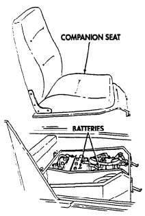

#### Starter Neg. Cable Voltage Drop Stewe-R Test 69

1. Start Test 69. Starter Negative Cable Voltage Drop. 

2. Displayed reading is in volts. The cable voltage drop should be less than 0.25 volt max.

#### Dc Voltage O-46 Volts Steilce-R Test 69

1. Connect RED clip to the indicated test point, BLACK clip to negative or ground. 

2. Start Test 69. DC Volts. 3. Displayed reading is in volts.

#### Baltery Current Multimeter

1. Set the voftmeter to a DC volts scale of about 1 volt. 

2. Connect the BLACK lead to the battery side of the current shunt and the RED lead to the other end of the current shunt. 

3. Current shunt voltage is proportional to battery current, 100 millivolts = 1.000 amps. To get current, multiply miliiolts x 10.

#### Voltage Multimeter

1. Set the voltmeter to a DC volts scale of at least 40 volts. 

2. Connect the RED lead to positive and the BLACK lead to negative. 

3. Be sure to read the correct scale.

1 

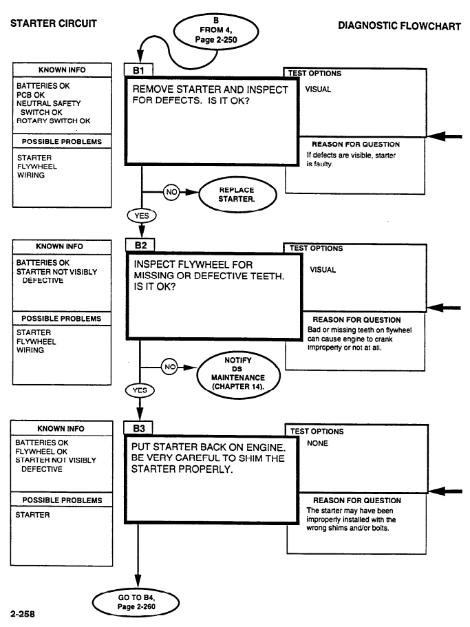

TM **9-2320-387-24-l** 

# Reference Information

STARTER CIRCUIT 
Remove starter motor (para. 4-l 1). 

 Check the pinion and gear for missing or broken teeth, unusual wear, bent pieces, etc. Check tfte pinion by turning lt on the screw shaft. Check the armature by prying the pinion with a screwdriver. The armature should turn freely. 

Replace starter (para. 4-11). 

Disconnect the fuel solenoid, wire 54A, to prevent accidental starting. Rotate the engine with a breaker bar and socket on the crankshaft pulley to inspect the engine flywheel for missing or defective teeth. 

-I 
Replace starter (para. 4-l 1). 

-. 

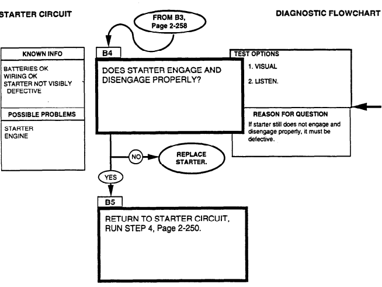

TM 9-2320-387-24-l REFERENCE INFORMATION 
STARTER CIRCUIT 

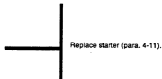

-i 

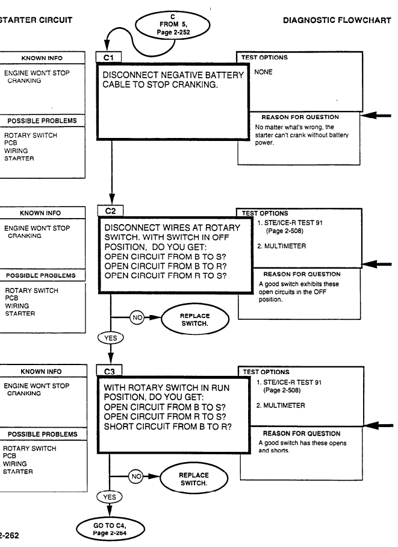

#### Reference Information

STARTER CIRCUIT 

#### Resistance And Continuity 04,500 Ohms Stfylce-R Test 91 I

1. Connect RED clip and BLACK clip to the indicated test points in the question. RED to the first, BUCK to the second. 

2. Start Test 91,0-4.500 Ohms. 3. Displayed reading is in ohms. Less than 5 is continuity. If the resistance is over 4,500 ohms, STEXE-R displays .9.9.9.9.

Don't forget that your vehicle batteries are disconnected, so you can't run the SLUICE-R from the DCA. You have to use the power cable and connect directly to the batteries. When the resistance is too high for STEXE-R to measure, as in the case of an open circuit, STEACE-R displays .9.9.9.9. 

Replace rotary switch (para. 4-10). 

#### Continuity (Resistance) Multimeter

1. Set the voltmeter to an ohms scale of about 1,000 ohms. 

2. Connect the RED and BLACK leads to the 

connections stated in the question. 

3. Be sure to read the correct scale. Less than 5 

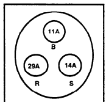

ohms indicates continuity. For an open circuit, the meter should peg full scale (needle all the way to the left).

Dont forget that your vehicle batteries are disconnected, so you can't run the STMCE-R from the DCA. You have to use the power cable and connect directly to the batteries. When the resistance is too high for SLUICE-R to measure, as in the case of an open circuit, STUICE-R displays 
.9.9.9.9. 

Replace rotary switch (para. 4-10). 

REAR OF ROTARY SWtTCH 

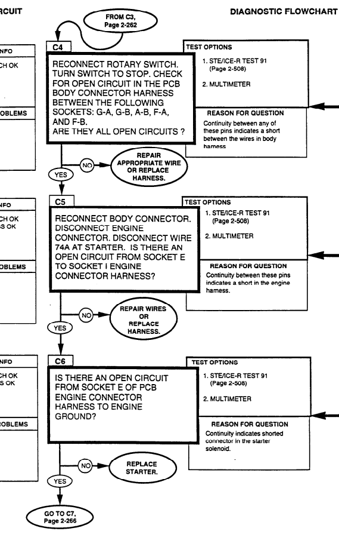

ROTARY SWITCH OK 
POSSIBLE PROBLEMS 
PCB WIRING STARTER 
ROTARY SWITCH OK BODY HARNESS OK 
POSSIBLE PROBLEMS 
WIRING STARTER 
ROTARY SWITCH OK BODY HARNESS OK 
POSSIBLE PROBLEMS 
PCB WIRING STARTER 
KNOWN INFO 
KNOWN INFO 
PCB 
KNOWN INFO 
2-264 

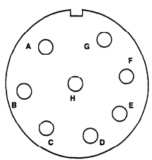

## Reference Information Starter Circuit

Don't forget that your vehicle batteries are disconnected. so you can't run the STEACE-R from the DCA. You have to use the power cable and connect directly to the batteries. When the resistance is too high for STUICE-R to measure, as in the case of an open circuit, STEXE-R displays .9.9.9.9. 

Repair wiring or replace harness (para. 4-80). 

Check the wires at the connectors for shorts. If there are no visible shorts, you have to replace the harness. 

I Repair wiring or replace harness 
(para. 4-80). 

PCB BODY CONNECTOR 

I

#### Resistance And Continuity 04,500 Ohms Ste/Lce-R Test 91

1. Connect RED clip and BLACK clip to the indicated test points in the question. RED to the first, BLACK to the second. 

2. Start Test 91,0-4.800 Ohms. 3. Displayed reading is in ohms. Less than 5 ohms is continuity. If the resistance is over 45OCl ohms, STEIICE-R displays .9.9.9.9.

#### Continuity (Resistance) Multimeter I

1. Set me voltmeter to an ohms scale of about 1 .OOO ohms. 

2. Connect the RED and BLACK leads to the connections stated in the question. 

3. Be sure to read the correct scale. Less than 5 ohms indicates continuity. For an open circuit, the meter should peg full scale (needle all the way to the left).

-1 Replace starter (para. 4-11). 

## Starter Circuit

I KNOWN INFO I 
ENGINE HARNESS OK 
u POSSIBLE PROBLEMS 
-I 
POSSIBLE PROBLEMS 
PCB BAlTERY 

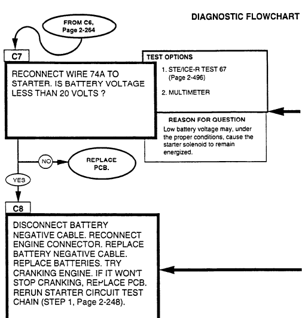

#### Reference Information

STARTER CIRCUIT 

-I 

'Replace PCB (para. 44). 

| 1. Set the voltmeter to a DC volts scale of at   | least 40 volts.   |
|--------------------------------------------------|-------------------|

2. Connect the RED lead to positive and the BLACK lead to negative.

3. Be sure to read the correct scale. 

-I Replace batteries (para. 4-74). 

#### Baltery Voltage

STEKE-R TEST 67 

1. Start Test 67, Battery Voltage. 

2. Displayed reading is in volts. Batteries should be 23-25.5 volts. Batteries voltage will drop when glow plugs turn on.

- 
- 

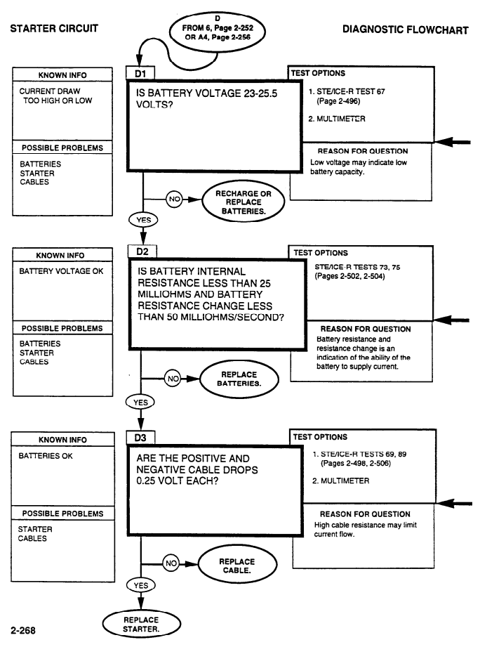

#### Reference Information Starter Circuit

# I **Multimeter**

1. Set the voltmeter to a DC volts scale of at least 40 volts. 

2. Connect the RED lead to positive and the BLACK lead to negative. 

3. Be sure to read the correct scale.

#### Baltery Resistance Change Ste/Lce-R Test 75

1. Disconnect wire 64A at injection pump to prevent starting. 

2. Disconnect glow plug controller and fan solenoid (to keep waveform clean). 

3. Start Test 75. Battery Resistance Change. 4. Wait for the GO message. Crank the engine. 

5. Result is displayed in milliohms/second. 

Battery resistance change should be 60 milliohms/second max.

#### Dc Voltage O-45 Volts Stexe-R Test 69

1. Connect RED clip to the indicated test point, BLACK clip to negative or ground. 

2. Start Test 69, DC volts. 3. Displayed reading is in volts.

#### Voltage Multimeter

1. Set the voltmeter to a DC volts scale of at least 40 volts. 

2. Connect the RED lead to positive and the BLACK lead to negative. 

3. Be sure to read the correct scale.

#### Baltery Voltage Steiice-R Test 67

1. Start Test 67, Battery Voltage. 

2. Displayed reading is in volts. Batteries should be 23-25.5 volts. Batteries voltage will drop when glow plugs turn on.

Replace batteries (para. 4-74). 

#### Baltery Internal Resistance Steiice-R Test 73

1. Disconnect wire 64A at injection pump to prevent starting. 

2. Disconnect glow plug controller and fan solenoid (to keep waveform clean). 

3. Start Test 73, Battery Internal Resistance. 4. Wait for the GO message. Crank the engine. 5. Result is displayed in milliohms. Battery resistance should be 25 milliohms max.

Replace cables or starter (para. 4-72 or 4-l 1). 

#### Starter Neg. Cable Voltage Drop Steilce-R Test 69

1. Start Test 69. Starter Negative Cable Voltage Drop. 

2. Displayed reading is in volts. The cable voltage drop should be less than 0.25 volt max.

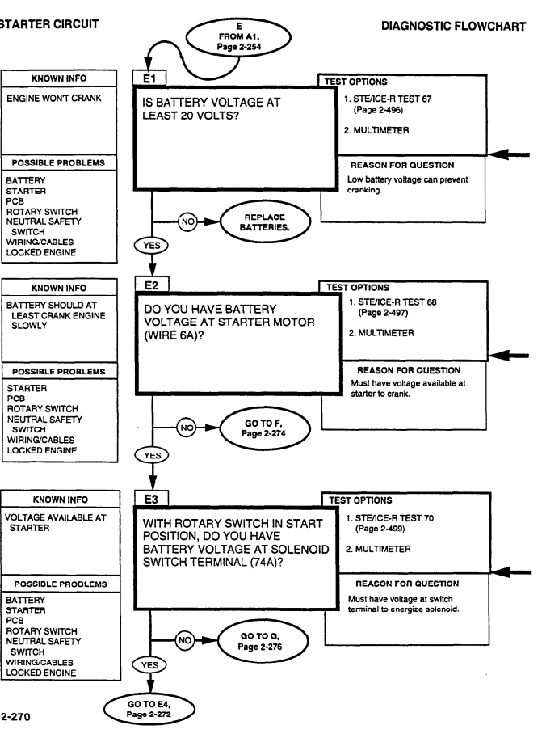

#### Reference Information

## Starter Circuit

#### Baltery Voltage Stuice-R Test 67

1. Start Test 67. Battery Voltage. 

2. Displayed reading is in volts. Batteries should be 23-25.5 volts. Batteries voltage will drop when glow plugs turn on. 

-I 
Replace batteries (para. 4-74).

#### Baltery Voltage Multimeter

1. Set the voltmeter to a DC volts scale of at least 40 volts. 

2. Connect the RED lead to positive and the BLACK lead to negative. 

3. Be sure to read the correct state.

#### Starter Motor Voltage Stvice-R Test 68

1. Start Test 66, Starter Motor Voltage. 

2. Displayed reading is in volts. Starter motor voltage should be the same as battery voltage, 23-25.5 volts. During cranking, the starter motor voltage should be at least 16 volts.

#### Starter Solenoid Voltage Stuice-R Test 70

1. Start Test 70. Starter Solenoid Voltage. 

2. Displayed reading is in volts. Starter solenoid voltage should be the same as battery Voltage, solenoid voltage should be at least 16 volts.

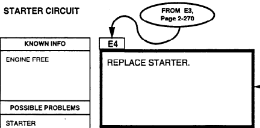

DIAGNOSTIC FLOWCHART
ﻟﻤﺴﺎ TM 9-2320-387-24-l REFERENCE INFORMATION 

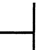

STARTER CIRCUIT ' 
Replace starter (para. 4-l 1). 

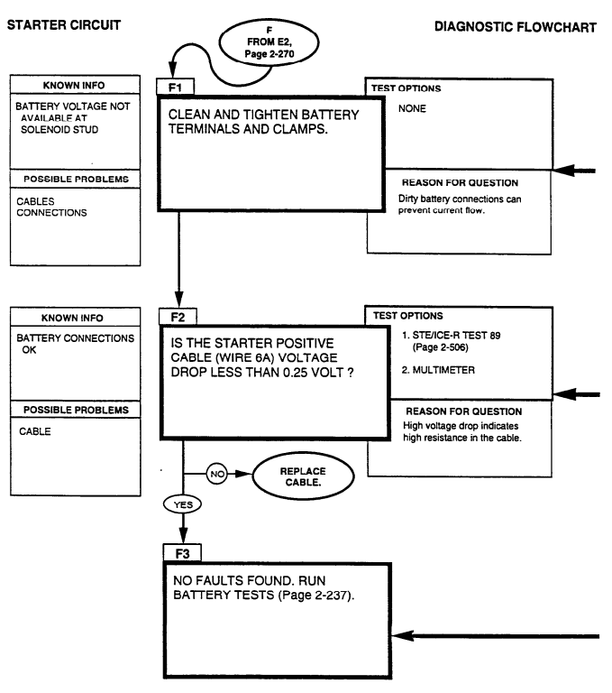

#### Starter Circuit ' Reference Information

DC VOLTAGE O-45 VOLTS 
SfEilCE-R TEST 89 1. Connect RED clip to the indicated test point, BLACK clip to negative or ground. 

2. Start Test 69. DC Volts. 

3. Displayed reading is in volts. 

#### Voltage Multimeter

1. Set the voltmeter to a DC volts scale of at least 40 volts. 

-I 

2. Connect the RED lead to positive and the BLACK lead to negative.

3. Be sure to read the correct scale. 

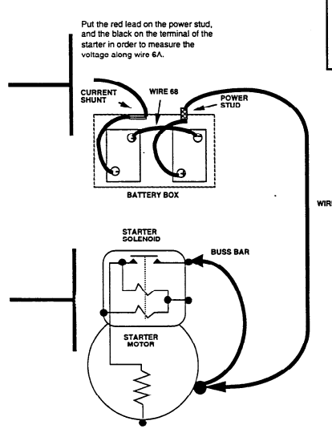

WfRE 6A 
Replace cable (para. 4-72). 

- 

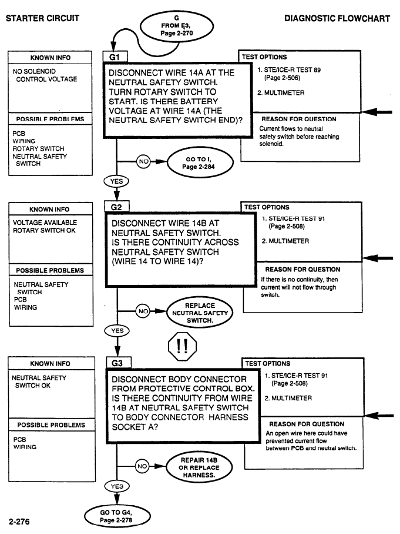

## Reference Information Starter Circuit

The connections for the neutral safety switch can be reached by removing the 
-engine cover. The connections are near I 
the gear shift lever. 

#### Voltage Multimeter

1. Set the **voltmeter to a** DC volts scale of at least 40 volts. 

2. Connect the RED lead to positive and the BLACK lead to negative. 

I 3. Be sure to read the correct scale.

#### Continuity (Resistance) Multlmeter

1. Set the vottmeter to an ohms scale of about 1.000 ohms. 

2. Connect the RED and BLACK leads to the connections stated in the question. 

3. Be sure to read the correct scale. Less than 5 ohms indicates continuity. For an open circuit, the meter should peg full scale (needle all the way to the left).

Replace neutral safety switch (refer to para. 5-6). 

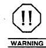

Disconnect negative battery cable before disconnecting and reconnecting PCB harness. 

There is battery voltage at the PCB at all times. Failure to disconnect battery cable will result in damage to equipment or injury to personnel. 

Repair wiring (para. 4-60) or replace switch (para. 5-6). 

#### Dc Voltage O-45 Volts Stvice-R Test 88

1. Connect RED clip to the indicated test point, BLACK clip to negative or ground. 

2. Start Test 69, DC volts. 3. Displayed reading is in volts. 

I

PCB BODY CONNECTOR 

# I **Resistance And Continuity**

#### 04.5Do Ohms Ste/Lke-R Test 81

I 
1. Connect RED clip and BLACK clip to the terminations indicated in the question. RED to the first, BLACK to the second. 

2. Start Test 91,0-4.500 Ohms. 3. Displayed reading is in ohms. Less than 5 

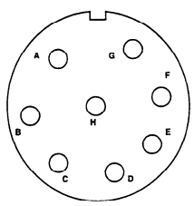

ohms is continutty. If the resistance is over 4.500 ohms, STEACE-R displays .9.9.9.9.

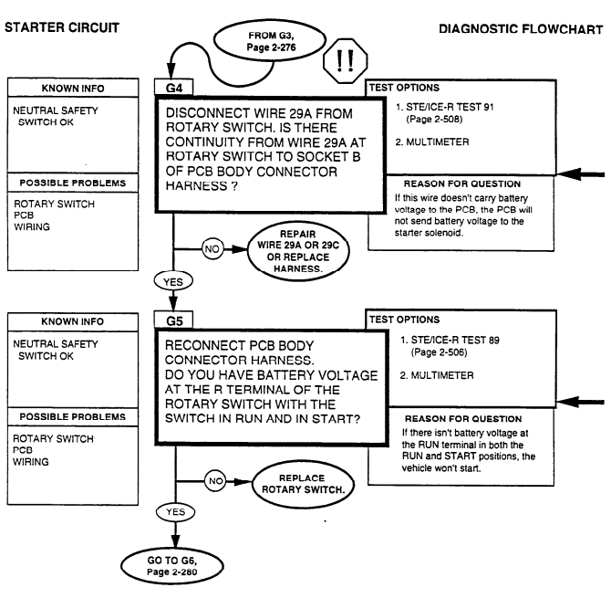

## Reference Information Starter Circuit

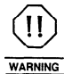

I WARNING 
Disconnect negative battery cable before disconnecting and reconnecting PC0 harness. 

There is battery voltage at the PCB 
at all times. Failure to disconnect battery cable will result in damage to equipment or injury to personnel. 

1 Check the wires and connections at both ends for broken wires or any kind of bad connection. 

Repair whatever you can. If the wires and connections seem ok, you have to replace the harness. Repair wiring or replace harness (para. 4-80). 

I 

REAR OF ROTARY SWlTCH 

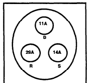

-I 
Replace rotary switch (para. 4-10). 

#### I 1 Dc Voltage O-45 Volts Stuice-R Test 89 I

I 
1. Connect RED clip to the indicated test point, BLACK clip to negative or ground. 

2. Start Test 89. DC Volts. 

3. Displayed reading is in volts. 

#### Voltage Multimeter

1. Set the voltmeter to a DC volts scale of at least 

40 volts. 

2. Connect the RED lead to positive and the BLACK lead to negative.

3. Be sure to read the correct scale. 

#### Resistance And Continuity 04,500 Ohms Stexe-R Test 91

1. Connect RED clip and BLACK clip to the terminations indicated in the question. RED to the first, BLACK to the second.

/ 2.StartTest91,0-4,8000hms., . 1 

3. Displayed reading is in ohms. Less than 5 ohms is continuity. If the resrstance IS over 4.500 ohms, STUICE-R displays .9.9.9.9.

#### Continuity (Resistance) Multimeter

1. Set the voltmeter to an ohms scale of about 1,000 ohms. 

2. Connect the RED and BLACK leads to the connections stated in the question. 

3. Be sure to read the correct scale. Less than 5 ohms indicates continuity. for an open circuit, the meter should peg full scale (needle all the way to the left).

## Starter Circuit

KNOWN INFO 
POWER AVAILABLE 
TO PCB 
/ ;PlBLE PROBLEMS 
WIRING 

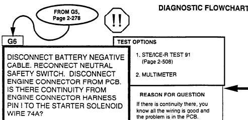

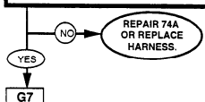

KNOWN INFO 
WIRING OK 
REPLACE PCB. IF YOU STILL 

 HAVE A PROBLEM, RERUN THE 
TEST CHAIN (Page 2-247). 

POSSIBLE PROBLEMS 
PCB 
STARTER CIRCUIT 

## Reference Information

Disconnect negative battery cable before disconnecting and reconnecting PCB harness. 

# . I Warning

I There is battery voltage at the PCB at all times. failure to disconnect battery cable will result in damage to equipment or injury to personnel. 

Replace harness or PCB (para. 4-4). 

#### Resistance And Continuity 04,500 Ohms Steiice-R Test 91

1. Connect RED clip and **BLACK** clip to the terminals indicated in the question.

#### -I

2. Start Test 91, o-4500 Ohms. 

3. Displayed reading is in ohms. Less than 5 ohms is continuity. If the resistance is over 4,500 ohms, STUICE-R displays .9.9.9.9.

## Continuity (Resistance) Multimeter I

1. Set the voltmeter to an ohms scale of about 1,000 ohms. 

2. Connect the RED and BACK leads to the connections stated in the question. 

3. Be sure to read the correct scale. **Less** than 5 ohms indicates continuity. **For an open** 
circuit, the meter should peg full scale (needle all the way to the left).

## Starter Circuit

KNOWN INFO 
CAN'T TURN ENGINE 
MANUALLY 
POSSIBLE PROBLEMS 
INTERNAL MECHANICAL 
PROBLEM 
HYDRAULIC LOCK 
KNOWN INFO 
HYDRAULIC LOCK 
REMOVED 
POSSIBLE PROBLEMS 
INTERNAL MECHANICAL 
PROBLEM 

#### Known Info

ENGINE CAN ROTATE 
SMOOTHLY 
POSSIBLE PROBLEMS 
ENGINE 

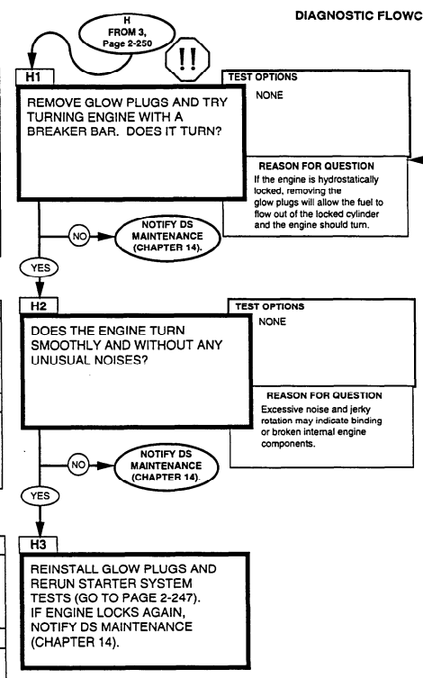

DIAGNOSTIC FLOWCHART - 
TM 9-2320-387-24-l REFERENCE INFORMATION 
STARTER CIRCUIT 

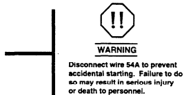

I Disconnect wire !%A to prevent 

#### Starter Circuit

KNOWN INFO 
NO VOLTAGE AVAILABLE 
AT NEUTRAL SAFETY SWITCH 
POSSIBLE PROBLEMS 
ROTARY SWITCH PCB 
WIRING 

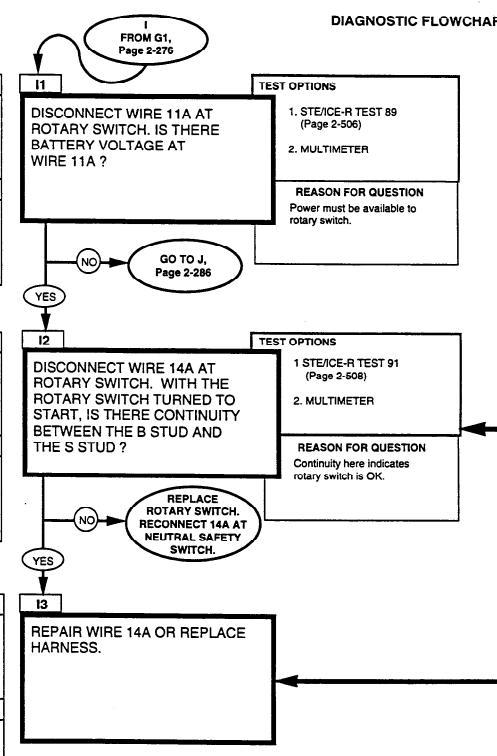

KNOWN INFO I 
BATTERY VOLTAGE 
AVAILABLE TO ROTARY SWITCH 
POSSIBLE PROBLEMS 
ROTARY SWITCH PCB WIRING 
KNOWN INFO 
ROTARY SWITCH OK 
POSSIBLE PROBLEMS 
WIRING 

- 

## Reference Information Starter Circuit

#### Voltage Multimeter I

1. Set the voltmeter to a DC volts scale of at least 40 volts. 

2. Connect the RED lead to positive and the BLACK lead to negative. 

3. Be sure to read the correct scale.

#### Continuity (Resistance) Multimeter

1. Set the voltmeter to an ohms scale of about 1,000 ohms. 

2. Connect the RED and BLACK leads to the connections stated in the question. 

3. Be sure to read the correct scale. Less than 5 ohms indicates continuity. For an open circuit, ttre meter should peg full scale 
(needle all the way to the left).

-I Replace rotary switch (para. 4-10). 

#### Dc Voltage O-45 Volts Steke-R Test 89

1. Connect RED clip to the indicated test point, BLACK clip to negative or ground. 

2. Start Test 89. DC Volts.

3. Displayed reading is in volts. 

-1 Repair wiring or replace harness (para. 4-80). 

REAR OF ROTARY SWITCH 

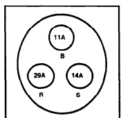

#### Resistance And Continuity 04,500 Ohms Stmce-R Test 91

1. Connect RED clip and BLACK clip to the terminations indicated in the question. RED to the first. BLACK to the second.

2. Start Test 91.04.500 Ohms. 

3. Displayed reading is in ohms. Less than 5 ohms is continuity. If the resistance is over 4.500 ohms, STEACE-R displays .9.9.9.9.

#### Starter Circuit

r KNOWN INFO 
NO VOLTAGE AT ROTARY 
SWITCH 
POSSIBLE PROBLEMS 
PCB WIRING 
KNOWN INFO 
NO VOLTAGE AT ROTARY 
SWITCH 
WIRING TO ROTARY 
SWITCH OK 
POSSIBLE PROBLEMS 
PCB 
WIRING 
/IRING OK 
'CB 

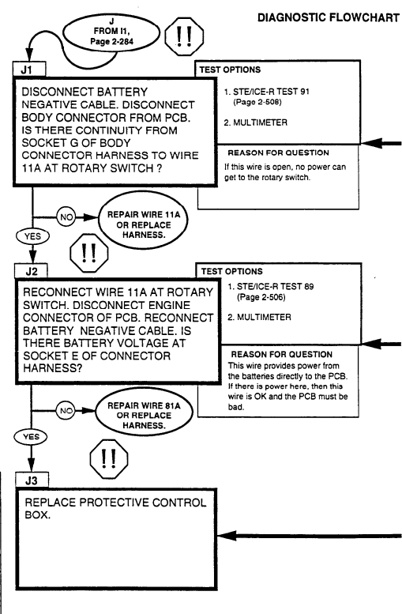

INFORMATION STARTER ClRCUlT 

## Reference

Disconnect negative battery cable before disconnecting and reconnecting PCB harness. 

WARNING 
There is battery voltage at the PC6 at all times. Failure to disconnect battery cable will result in damage to equipment or injury to personnel. 

Replace harness or repair wiring (para. 4-80). 

Disconnect negative battery cable before disconnecting and reconnecting PCB harness. 

There is battery voltage at the **PCB** 
at all times. Failure to disconnect battery cable will result in damage to equipment or injury to personnel. 

Replace harness or repair wiring (Pam. 4-80). 

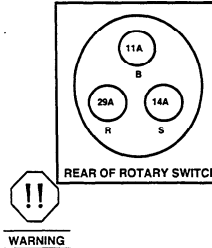

Disconnect negative battery cable before disconnecting and reconnecting PC6 harness. 

There is battery voltage at the PCB at all times. Failure to disconnect battery cable will result in damage to equipment or injury to personnel. 

Replace PCB (refer to para. 4-4). 

#### Voltage Multlmeter

1. Set the voltmeter to a DC volts scale of at 

least 40 volts. 

2. Connect the RED lead to positive and the BLACK lead to negative.

3. Be sure to read the correct scale. 

#### Continuity (Resistance) Multimeter

1. Set the voltmeter to an ohms scale of about 1,000 ohms. 

2. Connect the RED and BLACK leads to the connections stated in the question. 

3. Be sure to read the correct scale. Less than 5 ohms indicates continuity. For an open circuit. 

the meter should peg full scale (needle all the way to the left).

#### Dc Voltage O-45 Volts Steiice-R Test 89 I

1. Connect RED clip to the indicated test point, BUCK clip to negative or ground. 

2. Start Test 89, DC Volts. 3. Displayed reading is in volts. 

#### Resistance And Continuity 04,500 Ohms Ste/Lce-R Test **91 I**

1. Connect RED ctip and BLACK clip to the indicated terminals in the question. RED to the first, BlACK to the second. 

2. Start Test 91,0-4,500 Ohms. 3. Displayed reading is in ohms. Less than 5 ohms is continuity. If the resistance is over 4,500 ohms, STE/ICE-R displays .9.9.9.9.

## 2-37. Glow Plugs Circuit Tests

These tests of the glow plugs circuit can be run any time you think there may be a problem with the glow plugs, or if you were sent here from another test. 

If you were sent from another test, be sure to mark where you came from so you will be able to return. 

If you are running this test because the engine is hard to start when cold, remember that there'is also a cold-start advance circuit (part of the fuel system) which is not checked here. 

For any starting problem, we recommend running the STARTABILITY test chain just to be sure you don't miss anything. 

At the bottom of this page is a simplified block diagram which shows how the different parts of the glow plug circuit depend on each other and on other engine circuits. 

Refer to fold-out page FP-17 and leave it open for reference while performing these tests. The fold-out diagram is arranged to allow you to follow the diagnostic logic and understand what you are testing, when, and why. 

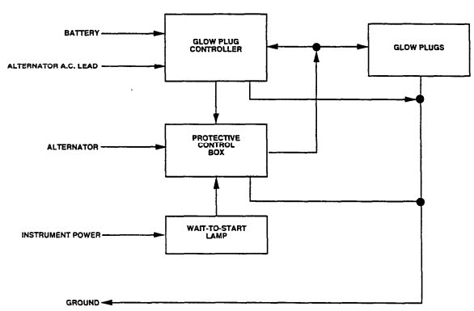

GLOW PLUGS CIRCUIT SlMPLlFlED BLOCK DIAGRAM 

## Glow Plugs Circuit

@> TEST OPT,ONS **D'AGNoSnC FLoWCHART** 
KNOWN INFO r I 
NOTHING 
TO RUN THE GLOW PLUG CIRCUIT 

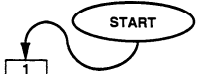 TESTS, THE BAlTERIES MUST BE 
IN A GOOD STATE OF CHARGE. IF YOU AREN'T SURE, RUN THE BAlTERY CIRCUIT TESTS. IF YOU ARE HERE BECAUSE THE WAIT-TO-START LAMP DOESN'T 
WORK PROPERLY, SEE THE NOTE 
ON THE RIGHT-HAND PAGE. 

BATTERY TESTS (Page 2-237) 
REASON FOR QUESTION 
The glow plugs and their control circuits require battery power to work. 

POSSIBLE PROBLEMS 
GLOW PLUGS GLOW PLUG 
CONTROLLER 
PCB CABLES 
KNOWN INFO 
BATTERIES OK 
POSSIBLE PROBLEMS 
GLOW PLUGS 
GLOW PLUG 
CONTROLLER 
PCB CABLES 
BATTERIES OK CABLES/CONNECTIONS 
SEEM OK 
POSSIBLE PROBLEMS 
GLOW PLUGS 
GLOW PLUG 
CONTROLLER 
PCB CABLES 

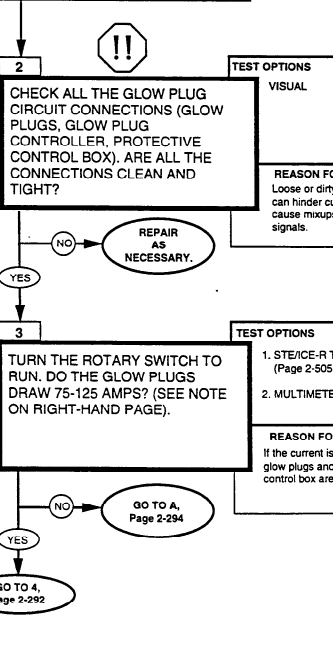

1. STEIICE-R TEST SO 
I REASON FOR QUESTION 
If the current is OK, then the 
REASON FOR QUESTION 
Loose or dirty connections can hinder current flow or cause mixups in the control 

## Reference Information Glow Plugs Circuit

If the engine cranks ok (or starts), then the batteries are good enough for testing the glow plugs. If the engine starts, shut it off. 

You can use STEXE Test 10 to measure cranking speed. 

The engine should crank at least 100 rpm in cold weather and at least 180 rpm in warm weather. 

Disconnect negative battery cable before disconnecting and reconnecting PCB harness. 

There is battery voltage at the PCB at all times. Failure to disconnect battery cable will result in damage to equipment or injury to Personnel. 

#### Bad Connections Are Thf Most Common Problem !

Sometimes just disconnecting, cleaning, and reconnecting will solve a problem. BE THOROUGH! The time you save may be your own. Refer to the functional flow schematic and check the following: 
1. BAlTERY - make sure all connections are clean and tight. including the shunt and power stud. 

2. PROTECTIVE CQNTROL BOX - remove BOTH 
connectors and look for bent or broken pins, pins pushed out of their socket. or dirt and corrosion in the connections. 

3. GLOW PLUG CONTROLLER - pop the controller are solved by looking with your fingers to be sure a connection is snug. 

connector off (squeeze the sides) and check the pins in both the controller and the connector. Look for bent. broken or pushed out pins, die, or corrosion. Check for broken wires at the connector. Take note that pin 2 of the glow plugs controller connector has no pin in it. 

4. GLOW PLUGS - check that all the glow plug wires are snug. Don't just look with your eyes. Many problems

#### Normal Glow Plug Operation

The glow plugs first come ON when the engine temperature is below 120 "F (49°C) and the rotary switch is turned lo RUN. They stay ON for up to 9 seconds and then go OFF. 

They will stay OFF for about 7-15 sewnds then come ON 
again for about 1 second. 

#### Note Note

The WAIT-TO-START lamp is NOT diagnosed in this section. If the lamp does not work properly, the glow plug circuit may be affecting Its operation. Run these tests to check out the glow plug circuit. If the lamp still does not work properly, go to the INSTRUMENT section 

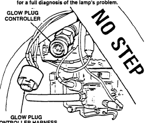

CONTROLLER HARNESS 

I

#### Baltery Current Multimeter

1. Set the voltmeter to a DC volts scale of about 1 volt. 

2. Connect the BLACK lead to the battery side of the current shunt and the RED lead to the other end of the current shunt. 

3. Current shunt voltage is proportional lo battery current, 100 millivolts = 1,000 amps. To get current, multiply millivolts x 10.

#### Baltery Current Steiice-R Test 80 I

To check for glow plug current **draw, start** STE/lCE-R Test 80, Battery Current. Turn off all accessories (lights, heater, wipers, etc.). STE/ICE-R **should immediately measure at least** 
74 amps. Take note, however, that if all your glow plugs are working, the current **draw** 
should be close to or more than 100 amps, especially if it's cold. If it's near freezing and the glow plugs only draw 75-60 amps, you probably have a few bad glow plugs. 

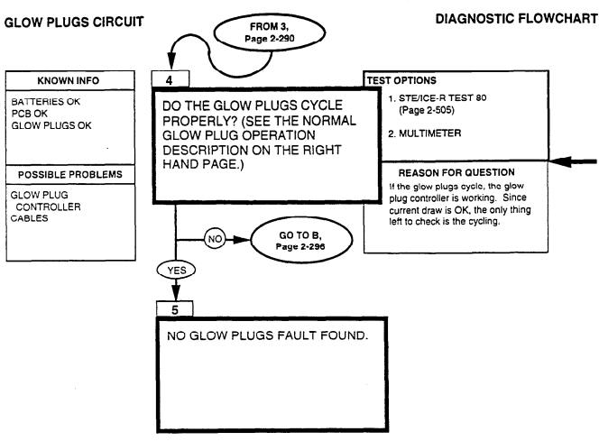

#### Reference Information Glow Plugs Circuit

I NoRMALGLoWP-
The glow plugs first come ON when the engine temperature is below 120 OF (49 "C) and the rotary switch is turned to RUN. They stay ON for up to 9 seconds and then go OFF. They will stay OFF for about 7-l 5 seconds then come ON again for about 1 second, then go OFF again. If you don't start the engine, the glow plugs should keep cycling like this, due to the glow plug cycle timer in the glow plugs controller. If you start the engine, they will cycle until the engine is warm, due to the afterglow cycle timer in the glow plug controller. When the engine gets up to 120°F (49°C) the glow plugs should stop cyckng completely. 

If the glow plugs are cycling properly, you should hear a click from the PCB when the glow plugs turn on and when they turn off. This is the glow plug cycle timer, a thermal circuit breaker. A good way to check for cycling is STE/ICE-R test 80, Battery Current. When the glow plugs turn on, STE/lCE-R will measure 74-125 amps. When the glow plugs turn off, the STEIICE-R will measure 3-8 amps. 

#### Fnginf Running. Rotary Switch In Run

If the glow plugs are cycling property, you can hear a click from the PCB when the glow plugs turn on and when they turn off (you may have to duck your head under the dash). This is the afterglow cycle timer, a thermal circuit breaker. A good way to check for cycling is STEIICE-R test 80, Battery Current. When the glow plugs turn on, STEIlCE-R 
will measure 74-125 amps. When the glow plugs turn off, STE/ICE-R will measure 3-8 amps. As the engine gets warmer, the glow plugs turn on less frequently and for less time. 

If you don't have a STEACE-R or a multimeter for measuring current, you can watch the vehicle volts gauge for indication of glow plug operation. The glow plugs draw so much current that the volts gauge should jump about half-an-inch to the left when the glow plugs come on. Before starting the engine, you should hear the glow plug power relay click open and closed as the glow plugs cycle. (You can hear the relay after the engine has started by leaning your head under the dash near the PCB.) This method won't tell you if all the glow plugs are working property, but it at least shows that the glow plugs are trying to work and that the glow plug power relay is working. 

# I Expected Glow Plug Current

ROTARY SWITCH IN RUN POSITION: GLOW PLUGS ON: 74 - 125 AMPS 74 is only for weak batteries. You should get at least 100 amps when glow plugs are working property. 

GLOW PLUGS OFF: AT or NEAR ZERO With the rotary switch in the RUN position, other parts of the vehicle are drawing current. You might measure up to 8 amps. 

# I **Battery Current** Stmce-R Test 80

1. Start Test 80. Battery Current. 

1 

2. Displayed reading is in amps. The reading will be greater then 30 amps, depending on how many accessories you have on.

# I **Battery Current** Multimeter

I 1. Set the voltmeter to a DC volts scale of about 1 I volt. 

2. Connect the BLACK lead to the battery side of the current shunt and the RED lead to the other end of the current shunt. 

3. Current shunt voltage is proportional to battery current, 100 millivolts = 1 ,ooO amps. To get current, multiply millivolts x 10.

CABLES 
PCB OK 
CABLES 
CABLES 

## Reference Information Glow Plugs Circuit

#### Battery Current Ste'Ice-R Test 80

1. Start Test 80. Battery Current. 

2. Displayed reading is in amps. The reading will be greater then 30 amps, depending on how many accessories you have on. 

#### Battery Current Multimeter

1. Set the voltmeter to a DC volts scale of about 1 volt. 

2. Connect the BLACK lead to the battery side of the current shunt and the RED lead to the other end of the current shunt. 

3. Current shunt voltage is proportional to battery current, 100 millivolts = 1.000 amps. To get current, multiply millivolts x 10.

#### Checking Glow Plugs 8 Their Wirfs

1. Disconnect ALL the glow plugs. 

2. Disconnect the neoative battery cable. Disconnect the PCB 
connector harnessfrom the PdB. Reconnect the negative battery cable. Measure me resistance between pin D in the engine connector harness of the PCB and ground. There should NOT be continuity (resistance reading off the scale). If there is continuity, repair or replace me harness. Repeat the following for each glow plug: 
3. 

a. Reconnect the wiring harness to the glow plug while you repeat the resistance measurement described in step 2. When you reconnect the wire to the glow plug, the resistance should drop to between 1 and 2 ohms (glow plugs are typically 1.6 ohms). 

b. If step A passed: 
disconnect the glowptug again, making sure the resistance goes off scale again. Repeat step A for me next glow plug. 

C. If step A failed: 
then either the glow plug or its wire is no good. Take the wire off the glow plug again and measure the resistance from the glow plug to the engine block. If the resistance is 1 - 2 ohms, then the cable is no good. Otherwise replace the glow plug and check the cable for continuity, just to be sure. 

4. Reconnect the PCB and all wires. 

Dead glow plugs draw virtually no current, but other parts of the vehicle are drawing some current-up to 8 amps. If any glow plugs are drawing any current, then the PCB is probably OK. 

I 
For a good description of how glow plugs cycle and how to check for proper cycling, refer to page 2-293. 

--I @ 
WARNING 

Disconnect negative battery **cable** before disconnecting **and reconnecting** PCB harness. 

There is battery voltage at the PCB at all times. Failure to disconnect battery cable will nsult in **damage to** equipment or injury to Personnel. 

If most or all of the glow plugs are bad, you may also have a problem with the PCB or the glow plug controller which caused them to go bad (usually they bum out from being on too long or not turning off at all). After replacing the bad glow plugs, rerun the glow plugs test chain paying special attention to the glow plugs cycling, especially that they turn OFF when they should. 

1 Replace glow plugs, wires, or harness (para. 3-39). 

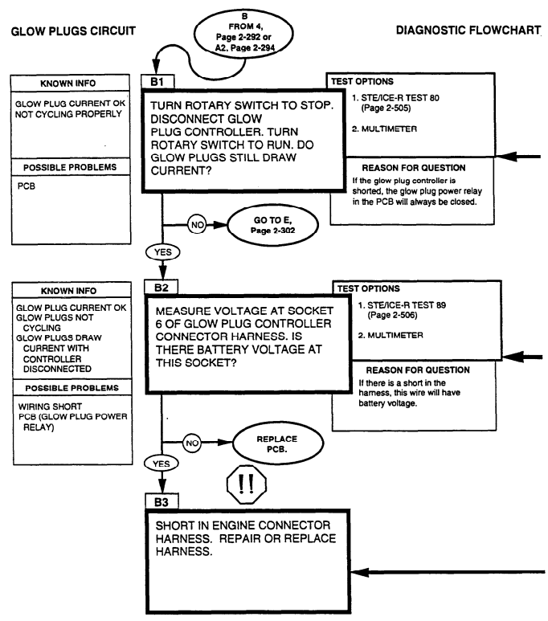

I 
- 

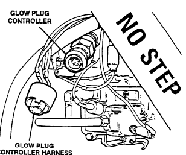

# Reference Information Glow Plugs Circuit

Refer to the functional flow schematic. If the glow plug controller is shorted (continuity from pin 6 to pin 3) the glow plug power relay will always be energized and the glow plugs will always be drawing current. 

#### Battery Current Steiice-R Test 80

1. Start Test 80. Battery Current. 

2. Displayed reading is in amps. The reading will be greater then 30 amps, depending on how many accessories you have on.

Since the glow plugs draw current without the glow plug controller connected, there must be a short in the harness or a stuck relay in the PCB. If there were a short in the harness directly to the glow plugs, the glow plugs would have burned out long ago and you wouldn't be here. The only other short in the harness that would make the glow GLOW PLUG CONTROLLER plugs turn on without the HARNESS SCHEMATIC 
glow plug controller installed would show. up as battery voltage at pin 6 of the controller's connector. 

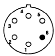

0 0 l 6 

#### Replace Pcb (Para. 4-4).

Check the end of the harness at the PCB, glow plugs, etc., for shorts. Repair whatever you can. If you don't see anything wrong, the short must be in the main body of the harness. which means that you have to replace the harness. 

Disconnect **negative battery cable** 
before disconnecting and reconnecting PCB harness. 

There is battery voltage at the PCB **at all** times. Failure to disconnect **battery cable** 
will result in damage to equipment or injury to personnel. 

Repair or replace wiring (para. 4-80). 

- 

#### Baitery Current Multimeter

1. Set the voltmeter to a DC volts scale of about 1 

v0n. 

2. Connect the BLACK lead to the battery side of the current shunt and the RED lead to the other end of the current shunt 3. Current shunt voltage is proportional to battery current, 100 millivolts = 1,000 amps. To get current, multiply miltiilts x 10.

#### Dc Voltage O-45 Volts Ste/Lce-R Test 89

1. Connect RED clip to the indicated test point, BLACK clip to negative or ground. 

2. Stan Test 89. DC Votts. 3. Displayed reading is in volts. 

#### Voltage Multimeter

1. Set the voltmeter to a DC volts scale of at least 40 volts. 

2. Connect the RED lead to positive and the BLACK lead to negative.

3. Be sure to read the correct scale. 

L 
- 

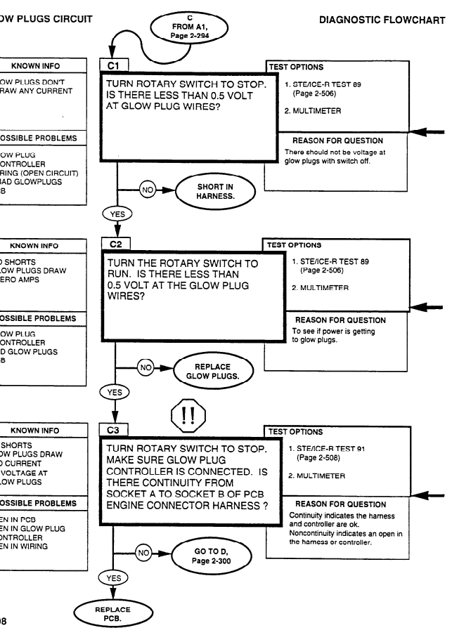

PCB 
PCB 
2-298 

#### Glow Plugs Circuit Reference Information

-I Replace harness. Notify DS maintenance (chapter 18). 

- -I 
Replace glow plugs (para. 3-39). 

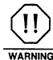

WARNING 
Disconnect negative **battery cable** 
before disconnecting and reconnecting PCB harness. 

#### Warning 

There is battery voltage **at the** PCB at all times. Failure to disconnect battery cable will result in damage to equipment or injury to Personnel. 

1 Replace PCB (para. am 
_J 

ENGINE CONNECTOR 
WITH PINS A & B 
HIGHLIGHTED 

#### Dc Voltage O-45 Volts Stedce-R Test 89

1. Connect RED dip to the indicated test point, BLACK clip to negative or ground. 

2. Start Test 89, DC Volts. 

-3. Displayed reading is in volts. 

#### Voltage Multimeter

1. Bet the voltmeter to a DC volts scale of at least 40 volts. 

2. Connect the RED lead to positive and the BLACK lead to negative.

3. Be sure to read the correct scale. 

#### Resistance And Continuity 04,500 Ohms Stence-R Test 91

1. Connect RED dip and BLACK clip to the indicated test points in the question. RED to the first, BLACK to the second. 

2. Start Test 91,0-4.500 Ohms. 3. Displayed reading is in ohms. Less than 5 ohms is continuity. If the resistance is over 4.800 ohms, STEXE-R displays .9.9.9.9.

#### Contlnully (Resistance) Multimeter

1. Set the voltmeter to an ohms scale of about 1.000 ohms. 

2. Connect the RED and BLACK leads to the connections stated in the question. 

3. Be sure to read the correct scale. Less than 5 ohms indicates continuity. For an open circuit, the meter should peg full scale (needle all the way to the left).

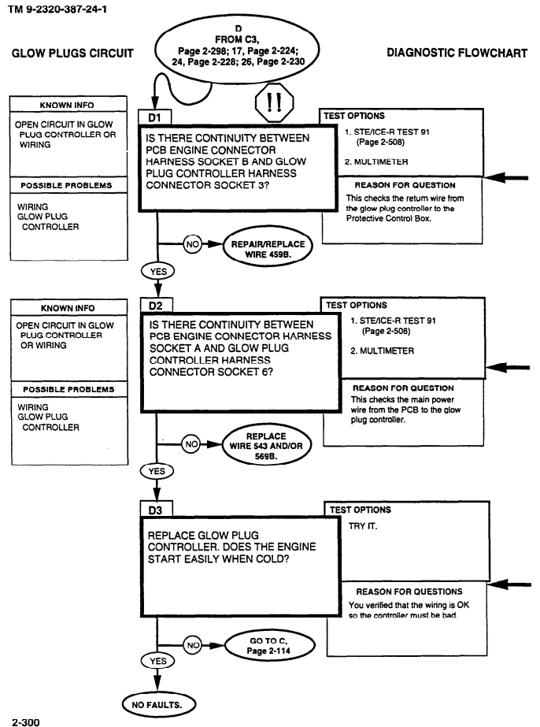

Disconnect negative battery cable 

 before disconnecting and reconnecting PCB harness. 

I 

I **WARNING** 
There is battery voltage at the PCB 
at all times. Failure to disconnect battery cable will result in damage to equipment or injury to personnel. 

Repair/replace wiring (para. **4-80).** 

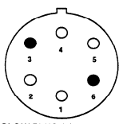

GLOW PLUG CONTROLLER 
HARNESS WITH SOCKETS 3 AND 6 HIGHLIGHTED 

Repair/replace wiring (para. **4-80).** 
Replace glow plug controller (para. **4-33).** 

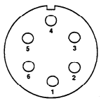

GLOW PLUG CONTROLLER 

# - **Reference Information Glow Plugs Circuit**

ENGINE CONNECTOR HARNESS 

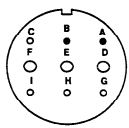

WITH SOCKETS A AND B 
HIGHLIGHTED 

# I **Resistance And Contlnulty** 04.500 **Ohms** Steiice-R Test 91

1. Connect RED clip and BLACK clip to the indicated test points in the question. 

RED to the first, BLACK to the second.

2. Start Test 91.9-4.5Ou Ohms. 

3. Displayed reading is in ohms. Less than 5 ohm is continuity. If the resistance is over 4.500 ohms, WE/ICE-R displays .9.9.9.9. 

# I **Contlnulty (Resistance)** Multimeter

1. **Set** the voltmeter to an ohms scale of about 

1 .fIOO ohms. 

2. Connect the RED and BLACK leads to the connections stated in the question. 

3. Be sure to read the correct scale. Less than 5 ohms indicates continuity. For an open circuit, the meter should peg full scale (needle all the way to the left).

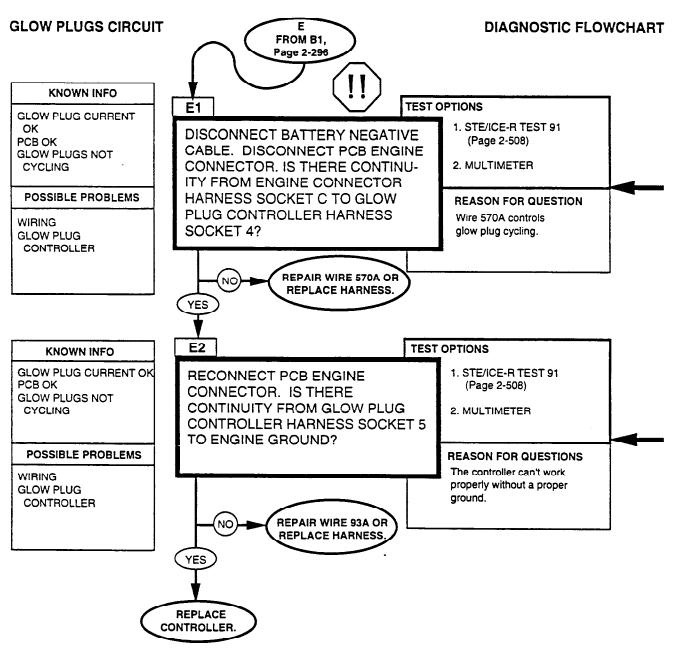

#### Reference Information

GLOW PLUGS CIRCUIT 

Disconnect negative battery cable before disconnecting and reconnecting PCB harness. 

I WARNING 
I battery the all times. Failure to disconnect battery cable will result in damage to equipment or injury to personnel. 

Repair wiring or replace harness (para. 4-90). 

#### Resistance And Conttnulty O-4,509 Ohms Stmce-R Test 91

1. Connect RED clip and BLACK clip to the indicated test points in the question. 

RED to the first, BLACK to the second. 

2. Start Test 91,0-4.500 Ohms. 

I 
3. Displayed reading is in ohms. Less than 5 ohms is continuity. If the resistance is over 4,500 ohms, STUICE-R displays -9.9.9.9.

#### Continuity (Resistance) Multimeter I

1. Set the voltmeter to an ohms scale of about 1 JO0 ohms. 

2. Connect the RED and BLACK leads to the connections stated in the question. 

3. Be sure to read the correct scale. Less than 5 ohms indicates continuity. For an open circuit, the meter should peg full scale (needle all the way to the left).

Repair wiring or replace harness (para. 4-80). Replace glow plug controller (para. 4-33). 

# 12-38. Instruments Tests 1

These instrument tests can be run any time you think there is a problem with the instruments or if you were sent here from another test. 

If you get an unusual gauge reading, it is a good idea to check out the system that the gauge monitors to be sure that it is a gauge problem and not a real problem in the engine or electrical system. 

Refer to fold-out page FP-19 and leave fold-out open for reference during testing. Diagrams of the individual gauge circuits will be found on the page that deals with that circuit. 

ONE OR MORE 
GAUGES AND WARNING LAMPS DON7 WORK 
POSSIBLE PROBLEMS 
MASTER POWER INSTRUMENTS WIRING SENDING UNITS 
NO POWER TO THE 
GAUGES WITH THE ROTARY SWITCH IN THE OFF POSlTlON 
POSSIBLE PROBLEMS 
MASTER POWER 
TO GAUGES AND WARNING LAMPS 
POSSIBLE PROBLEMS 
INSTRUMENTS WIRING SENDING UNITS 

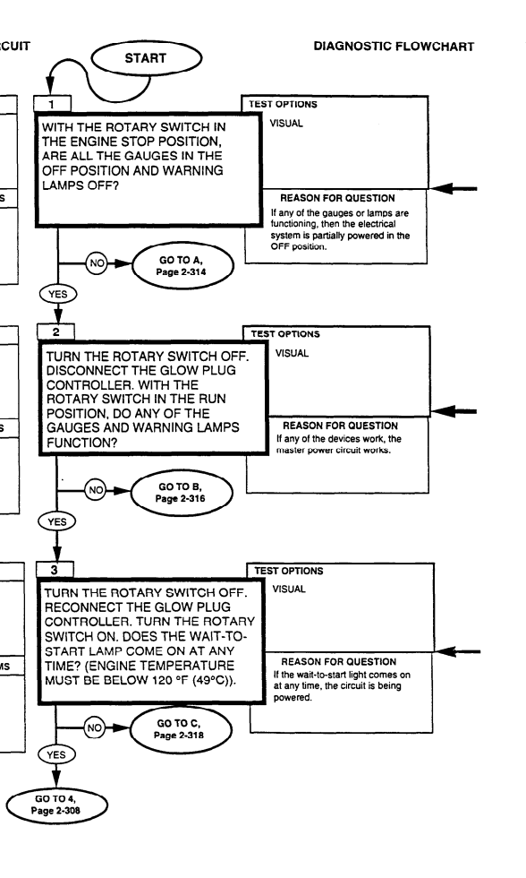

2-306 REFERENCE INFORMATION INSTRUMENTS CIRCUIT 
None of the following instruments and accessories should work when the fOtary switch is in the STOP position: 
Voltmeter Wait-to-start lamp Temperature gauge Oil pressure gauge Fuel gauge Wrndshield wiper/washer Brake warning tamp If any of the instruments and accessories work when the rotary switch is in the RUN 
position, power is available and the circuit I breaker is OK 

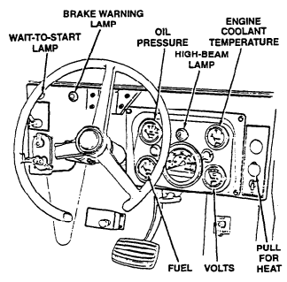

The wait-to-start tamp is not an accurate indication of glow plug operation. Make sure the glow plugs are Operating **PrOPeIfY** 
BEFORE you check out the light. Go to the glow plugs circuit tests, page 2-289. Return here if the light still doesn't operate property. The wait-to-start lamp should come on when the engine is below 120°F (49%) and the rotary switch is first turned to the RUN 
position. 

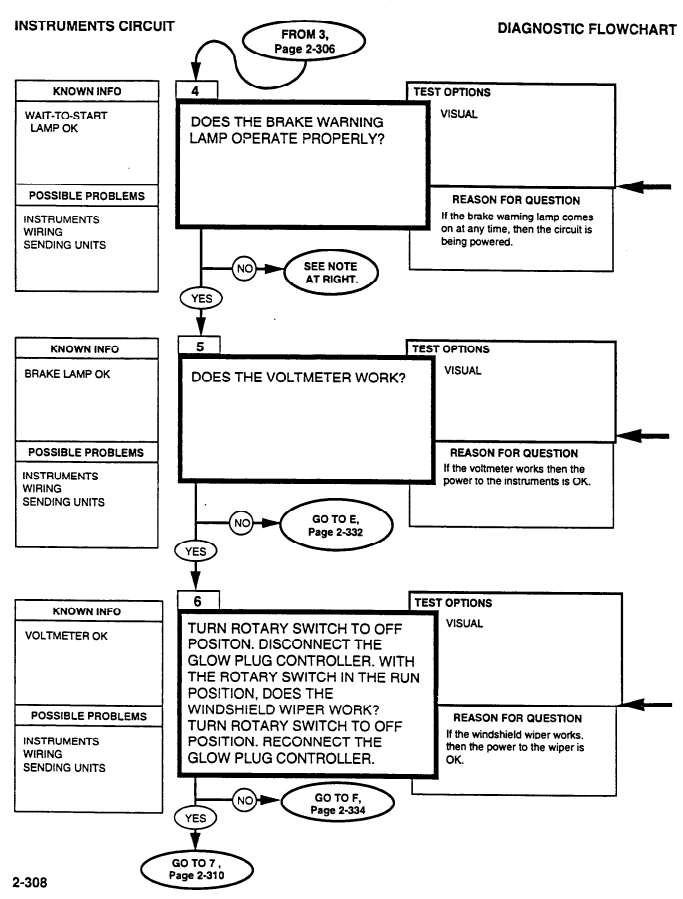

REFERENCE INFORMATION 
INSTRUMENTS CIRCUIT 
The brake warning lamp should come on 

 when the engine is cranking, the parking brake is set, or there is a failure in the brake system. If brake warning lamp stays on, go to 1, page 2-323. If the warning lamp does not come on, go to D. page 2-324. 

BRAKE WARNING LAMP 

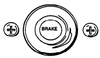

The voltmeter may be checked by running STEACE-R Test 67 wtth the engine running. The position in the center of the green area of the volt gauge marked GEN is approximately 28 volts. The voltmeter is a galvanometer-type gauge. It is conceivable that the coil in the gauge may have a broken wire that only opens when the gauge is heated up. If you are having an intermittent gauge problem, leave the vehicle running for a while and watch the gauge. ff the charging system is ok, but the gauge is reading full scale one way or the other, you may have this type of problem. 

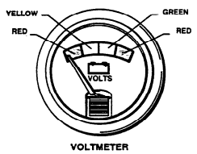

Rotary switch has to be in the RUN position for the windshield wiper or washer to operate. 

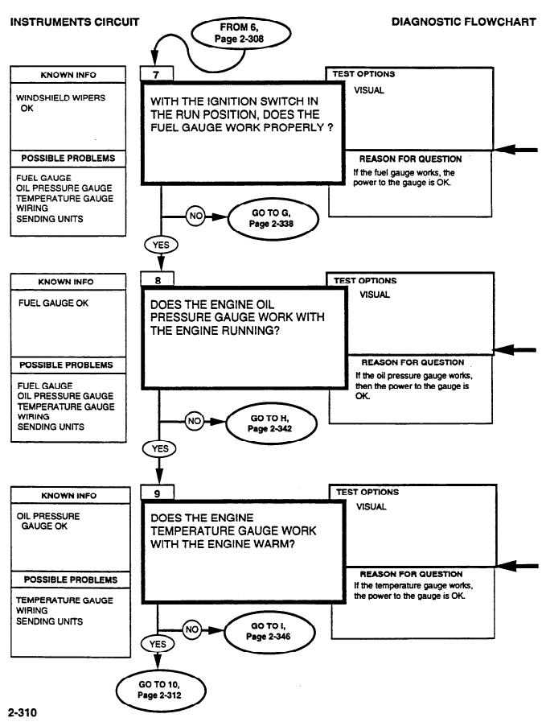

INSTRUMENTS CIRCUIT

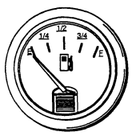

These gauges are galvanometer-type gauges.

It is conceivable that the coil in the gauge may have a broken wire that only opens when the gauge is warmed up. If you are having an intermittent gauge problem, leave the vehicle running for a while and watch the gauge. If the system the gauge monitors is OK, but the gauge is reading full scale one way or the other, then you may have this type of problem. Fill the fuel tank, if necessary, to obtain a reading greater than empty.

FUEL GAUGE

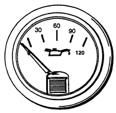

OIL PRESSURE
GAUGE

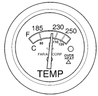

TEMPERATURE
GAUGE

With the engine running, the oil pressure should be approximately 10 psi (69 kPa) at idle, 40-45 psi (276-310 kPa) at 2,000 rpm, and it should be 0 when stopped. Make sure shift lever is in neutral before running this test.

With the engine cold, the gauge should read off scale to the left and, when warm, the reading should be 185°-250°F (85°-120°C).

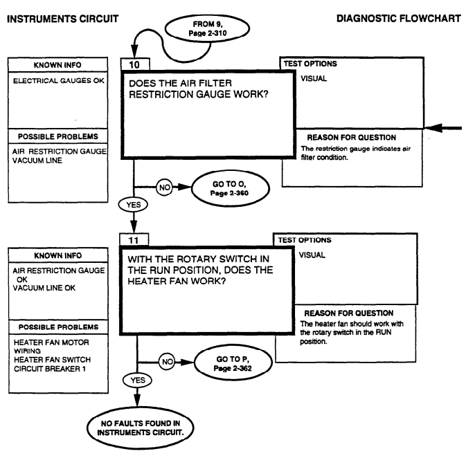

## Reference Information

INSTRUMENTS CIRCUIT 

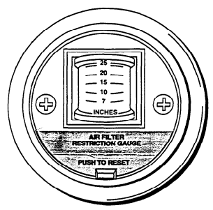

When vacuum is applied to the line at the air filter, the gauge should read yellow and hold the reading until it is released by pressing the reset button I on the gauge. 

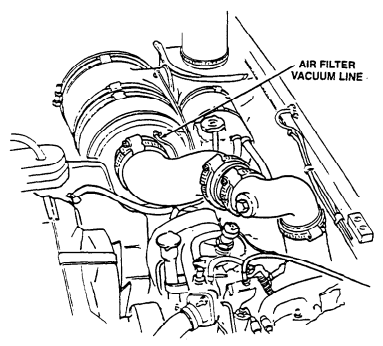

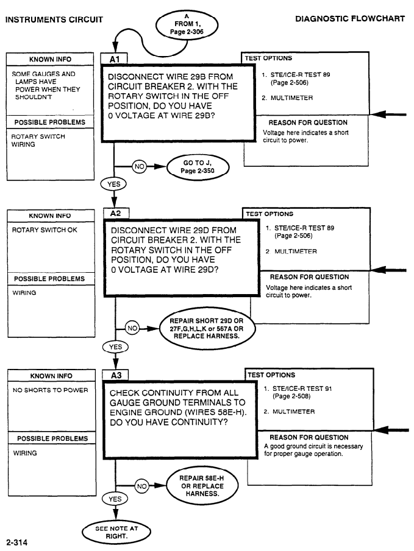

The easiest way to reach the circuit breaker and 

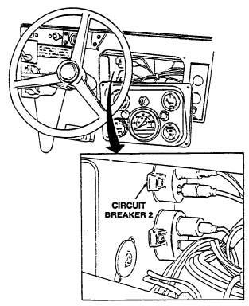 gauge wiring is to remove the gauge panel screws and pull the panel out far enough to work with the wiring. 

-I 

#### Replace Harness Or Repair Wiring (Para. 4-90).

-1 Connect the BLACK test lead to a good engine ground and connect the RED test lead to each gauge ground terminal (the uninsulated screw) one at a time and note each reading. 

You have checked all the wiring that is common to all the gauges and warning lamps. Reconnect wires and return to step 2. page 2-306. and continue testing. 

## Reference Information Instruments Circuit

# I **Dc Voltage O-45 Volts** Stmce-R Test 89

1. Connect RED clip to the indicated test point, BLACK clip to negative or ground. 

2. Start lest 89, DC Volts.

3. Displayed reading is in volts. 

#### Baitery Voltage Multimeter

1. Set the voltmeter to a DC volts scale of at least 40 volts. 

2. Connect the RED lead to positive and the BLACK lead to negative. 

3. Be sure to read the correct scale.

#### Resistance And Continulty O-4.500 Ohms

# I **Ste/Lce-R Test 91**

1. Connect RED clip and BLACK clip to the indicated terminals in the question. RED to the first, BLACK to the second. 

I 2. Start Test 91,0-4,500 Ohms. 

3. Displayed reading is in ohms. Less than 5 ohms is continuity. If the resistance is over 4,500 ohms, SWICE-R displays .9.9.9.9.

# I **Continuity (Resistance)** Multimeter

I 1. Set the voltmeter to an ohms scale of about 1,000 ohms. 

I 2. Connect the RED and BLACK leads to the connections stated in the question. 

3. Be sure to read the correct scale. Less than 5 ohms indicates continuity. For an open circuit, the meter should peg full scale 
(needle all the **way** to the left).

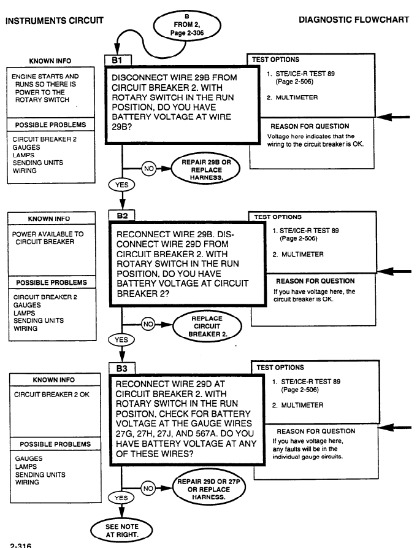

REFERENCE INFORMATION 

## Instruments Circuit

#### Dc Voltage O-45 Volts Sl-Eke-R Test 99

1. Connect RED dip to the indicated test point, BLACK clip to negative or ground.

- 
2. Start lest 89. DC Volts. 3. Displayed reading is in volts. 

# I **Battery Voltage** Multimeter I

1. Set the voltmeter to a DC volts scale of at 

least 40 volts. 

2. Connect the RED lead to positive and the BLACK lead to negative. 

3. Be sure to read the correct scale. 

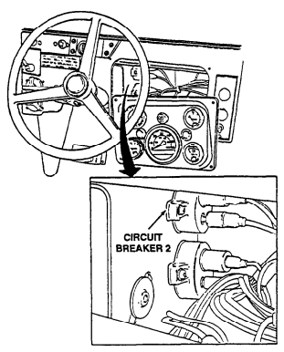

The easiest way to reach the circuit breaker and gauge wiring is to remove the gauge panel screws and pull the panel out far enough to work with the wiring. 

Replace harness or repair wiring (para. 4-80). 

-I Replace circuit breaker (para. 4-12). 

I Replace harness or repair wiring (para. 4-80). 

1 You have checked all the common power wking to all the gauges and warning lamps. Reconnect wires and return to step 3, page 2-308. and continue testing. 

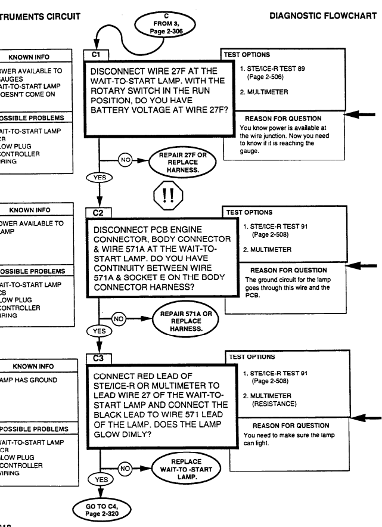

PCB 
PCB 
PCB 

-- 

## Reference Information Instruments Circuit

#### Battery Voltage Multimeter

1. Set the voltmeter **to a DC** volts scale of at least 40 volts. 

2. Connect the RED lead to positive and the BLACK lead to negative. 

3. Be sure to read the correct scale.

#### Resistance And Continuity 04,500 Ohms Steiice-R Test 91

1: 
1. Connect RED clip and BLACK clip to the terminations indicated in the question. RED to the first, **BLACK to** 
the second. 

2. Start Test 91, 04.500 Ohms. 

3. Displayed reading is in ohms. Less than 5 ohms is continuity. If the resistance is over 4.500 ohms, SLUICE-R displays .9.9.9.9.

WARNING 
I-
Disconnect negative battery cable before disconnecting **and reconnecting** 
PCB harness. 

There is battery voltage at the PC9 **at all** 
times. Failure to disconnect battery cable will result in damage to equipment or injury to personnel. 

#### Repair Harness (Para. 4-80).

It is important to connect the leads as indicated because you are checking continuity across a diode. The lamp will glow dimly because you are supplying a small amount of power through STUICE-R. You may have to shade the lamp with your hand to see if it glows. 

f A multimeter may not supply enough power to light the lamp. 

In this case, look for a much greater resistance when measuring with the leads connected in one direction than when they are connected in reverse. 

Replace lamp (para. 4-20). 

#### Dc Voltage O-45 **Volts** Ste/Lce-R Test 89

1. Connect RED clip to the indicated test point, BLACK clip to negative or ground. 

2. Start Test 89. DC Volts.

3. Displayed reading is in volts. 

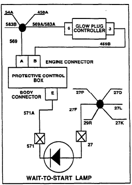

#### Conllnulm (Resistance) Multimeter

1. Set the voltmeter to an ohms scale of about 1,000 ohms. 

2. Connect the RED and BUCK leads to the connections stated in the question. 

3. Be sure to read the correct scale. Less than 5 ohms indicates continuity. For an open circuit, the meter should peg full scale (needle all the way to the left).

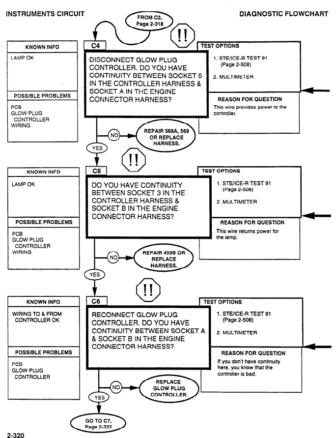

Disconnect negative battery cable before disconnecting and reconnecting PCB harness. 

WARNING 
There is battery voltage at the PCB at all times. Failure to disconnect battery cable will result in damage to equipment or injury to personnel. 

RESISTANCE AND CONTINUITY 
04,500 OHMS 
STEIlCE-R TEST 91 1. Connect RED clip and BLACK clip to the terminations indicated in the question. RED to the first, BLACK to the second. 

2. Start Test 91,0-4.500 Ohms. 3. Displayed reading is in ohms. Less than 5 ohms is continuity. If the resistance is over 4.500 ohms, STEIICE-R displays .9.9.9.9. 

#### Continuity (Resistance) Multmeter

1. Set the voltmeter to an ohms scale of about 1,000 ohms. 

2. Connect the RED and BLACK leads to the connections stated in the question. 

3. Be sure to read the correct scale. Less than 5 ohms indicates continuity. For an open circuit, the meter should peg full scale (needle all the way to the left). 

#### Repair/Replace Harness (Para. 4-90).

controller will cause the circuit to be I open. 

Replace glow plug 

REFERENCE INSTRUMENTS CIRCUIT INFORMATION 

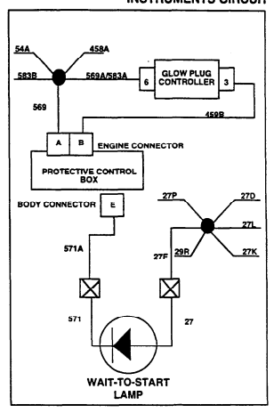

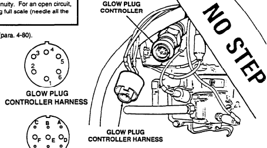

controller (para. 4-33). w 

PCB ENGINE CONNECTOR 

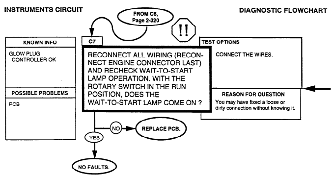

Disconnect negative battery cable before disconnecting and reconnecting PCB harness. 

WARNING 
There is battery voltage at the PCB at all times. Failure to disconnect battery cable will result in damage to equipment or injury to personnel. 

Engine temperature must be below 120°F (49%) or the lamp may not come on. 

Replace PCB (para. 4-4). 

INSTRUMENTS CIRCUIT 

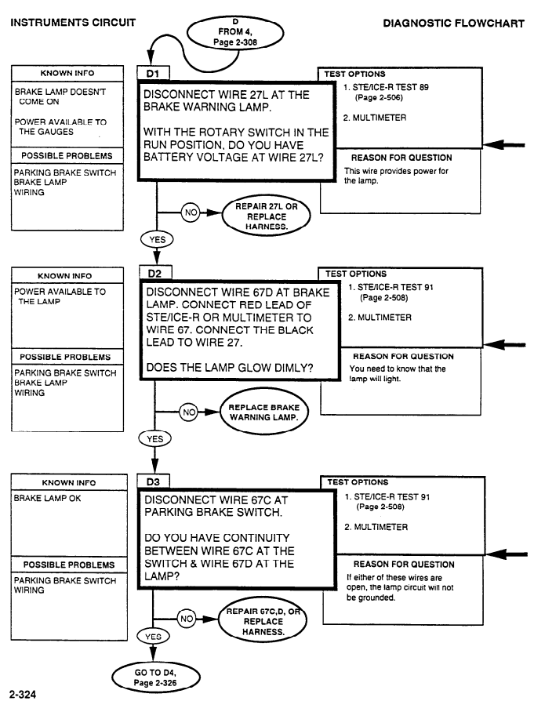

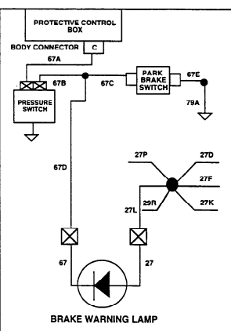

Repair/replace wiring (para. 4-80). Replace brake warning lamp (para. 4-21). 

It is important to connect the leads as indicated because you are checking continuity across a diode. The lamp will glow dimly because you are supplying a small amount of power through STE/ICE-R. You may have to shade the lamp with your hand to see if it glows. A multimeter may not supply enough power to light the lamp. 

In this case, look for a much greater resistance when measuring with the leads connected in one direction than when they are connected in reverse. 

Replace harness or repair wiring (para. 4-80). 

## Reference Information Instruments Circuit

#### Dc Voltage O-45 Volts Stuice-R Test 89

1. Connect RED clip to the indicated test point, BLACK dip to negative or ground. 

2. Start Test 89. DC Volts. 3. Displayed reading is in volts.

#### Baltery Voltage Multlmeter

1. Set the voltmeter to a DC volts scale of at least 40 volts. 

2. Connect the RED lead to positive and the BLACK lead to negative. 

3. Be sure to read the correct scale.

#### Resistance And Continuity 04,500 Ohms Ste/Lce-R Test 91

1. Connect RED clip and BLACK clip to the indicated terminals in the question. RED to the first, BLACK to the second. 

2. Start Test 91,0-4,500 Ohms. 3. Displayed reading is in ohms. Less than 5 ohm is continuity. If the resistance is over 4.500 ohms, STE/tCE-R displays .9.9.9.9. 

S

#### Continuity (Resistance) Multimeter

1. Set the voltmeter to an ohms scale of about 1,000 ohms. 

2. Connect the RED and BLACK leads to the connections stated in the question. 

3. Be sure to read the correct scale. Less than 5 ohms indicates continuity. For an open circuit, the meter should peg full scale (needle all the way to the left).

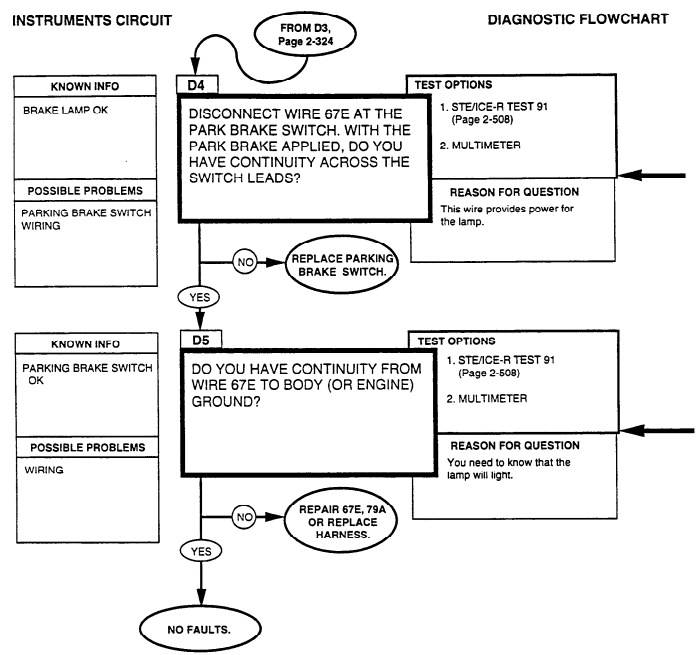

## Reference Information I Instruments Circuit

#### Resistance And Continuity 04,500 Ohms Steiice-R Test 91

1. Connect RED clip and BLACK clip to the terminations indicated in the question. RED to the first, BLACK to the second. 

2. Start Test 91,04,500 Ohms. 3. Displayed reading is in ohms. Less than 5 ohms is continuity. If the resistance is over 4,590 ohms, STVICE-R displays .9.9.9.9. 

Replace parking brake switch (para. 4-23). 

#### Continuity (Resistance) Multimeter

1. Set the voltmeter to an ohms scale of about 1 ,ooO ohms. 

2. Connect the RED and BLACK leads to the connections stated in the question. 

3. Be sure to read the correct scale. Less than 5 

ohms indicates continuity. For an open circuit, the meter should peg full scale (needle all the way to the left).

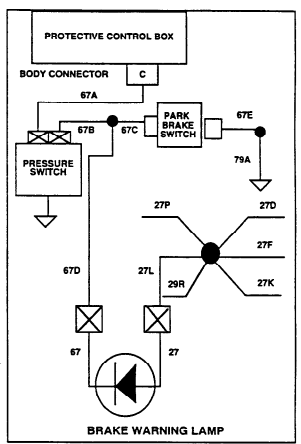

-I Replace harness or repair wiring (para. 4-80). 

Reconnect all wiring. Connect glow plug controller hst. 

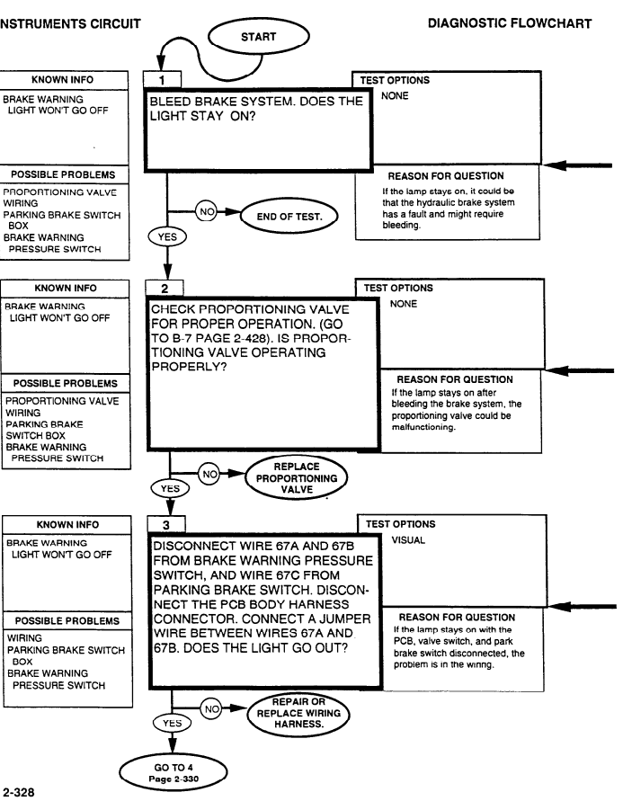

#### Reference Information

## Instruments Circuit

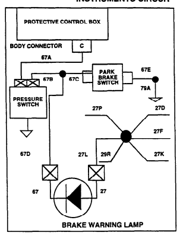

-I **Bleed** brake system (para. 7-2). 

-I Replace propofiioning valve (para. 7-10). 

-I Replace harness or repair wiring (para. 4-60). 

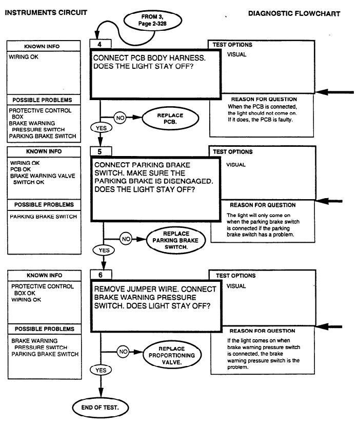

TM 9-2320-387-24-l REFERENCE INFORMATION 
INSTRUMENTS CIRCUIT 

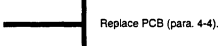

4 Replace parking brake switch (para. 4-23). 

When the brake warning pressure 

switch is defective, the proportioning valve must be replaced (para. 7-10). 

-i 

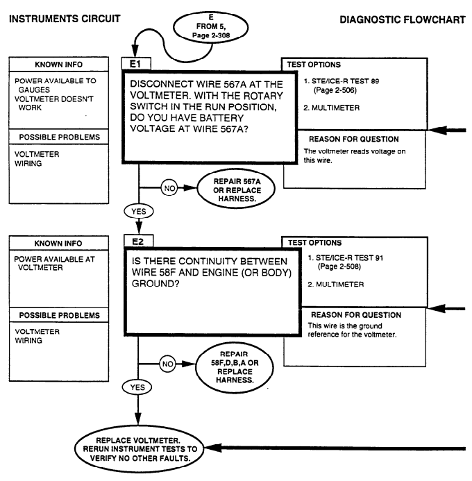

## Reference Information Instruments Circuit

#### Dc Voltage O-45 Volts Ste/Lce-R Test 89

1. Connect RED clip to the indicated test point, 

BLACK clip to negative or ground.

--i 2. Start Test 89. DC Volts. 3. Displayed reading is in volts. 

#### Baitery Voltage Multimeter

1. Set the voltmeter to a DC volts scale of at least 40 volts. 

2. Connect the RED lead to positive and the BLACK lead to negative. 

3. Be sure to read the correct scale.

# I **Resistance And Continuity**

#### 04.500 Ohms Steke-R Test 91

I 
1. Connect RED dip and BLACK clip to the indicated terminals in the question. RED to the first, BLACK to the second. 

I 2. Start Test 91,0-4,500 Ohms. 

3. Displayed reading is in ohms. Less than 5 ohmr is continuity. If the resistance is over 4,500 ohms, STEIfCE-R displays .9.9.9.9.

#### Continuity (Resistance) Multimeter

I 1. Set the voltmeter to an ohms scale of about 1,000 ohms. 

2. Connect the RED and BLACK leads to the connections stated in the question. 

3. Be sure to read the correct scale. Less than 5 ohms indicates continufty. For an open circuit, the meter should peg full scale 
(needle all the way to the left).

Replace harness or repair wiring (para. 4-80). 

Be sure the charging system is functioning properly before replacing the voltmeter. Run the alternator tests, page Z-199, if you're not sure. Replace voltmeter (para. 4-16). 

-I Replace harness or repair wiring (para. 4-80). 

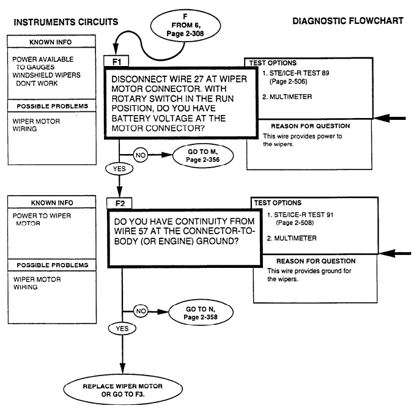

#### Reference Information

## Instruments Circuit

#### Dc Voltage O-45 Volts Stwice-R Test 89

1. Connect RED clip to the indicated test point BUCK clip to negative or ground. 

2. Start Test 89, DC Volts. 

3. Displayed reading is in volts.

#### Battery Voltage Multimeter

1. Set the voltmeter to a DC volts scale of at least

40 volts. 

2. Connect the RED lead to positive and the BLACK lead to negative.

#### 3. Be Sure To Read The Correct Scale. Resistance And C0Nllnull-Y 0-4,!Xkl Ohms Stellce-R Test 91

1. Connect RED clip and BLACK clip to the indicated terminals in the question. RED to the first, **BLACK** to the second. 

2. Start Test 91,045tXJ Ohms. 3. Displayed reading is in ohms. Less than 5 ohms is continuity. If the resistance is over 4.606 ohms, STEACE-R displays .9.9.9.9.

#### Contnuity (Resistance) Multimeter

1. Set the voltmeter to an ohms scale of about 1 ,ooO ohms. 

2. Connect the RED and BLACK leads to the connections stated in the question. 

3. Be sure to read the correct scale. Less than 5 ohms indicates continuity. For an open circuit, the meter should peg full scale (needle all the way to the left).

-I Replace wiper motor (para. 10-63). 

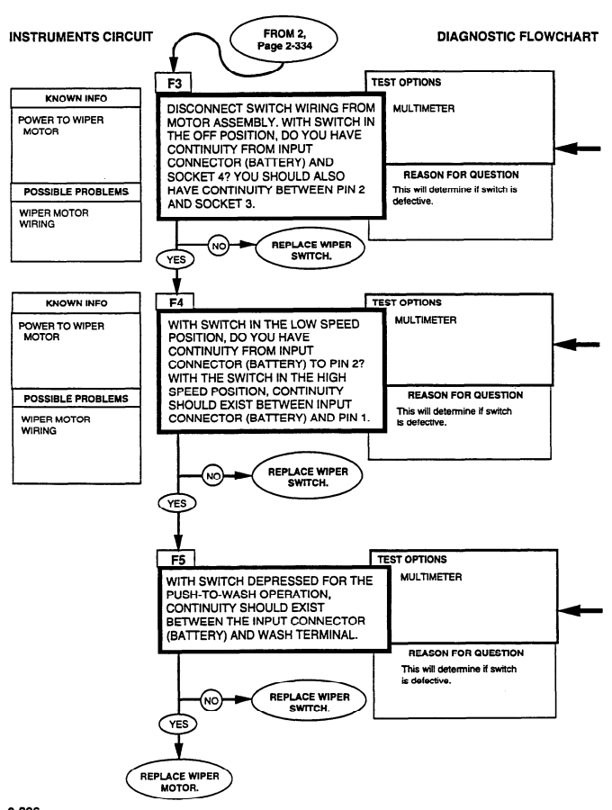

REFERENCE INFORMATION INSTRUMENTS CIRCUIT 
-I. 

Replace wiper switch (para. 1 O-63). 

CONTINUITY (RESISTANCE) 
MULTIMETER 
1. Set the voltmeter to an ohms scale of about 1,000 ohms. 

2. Connect the RED and BLACK leads to the connections stated in the question. 

3. Be sure to read the correct scale. Less than 5 ohms indicates continuity. For an open circuit, the meter should peg full scale 
(needle all the way to the left). 

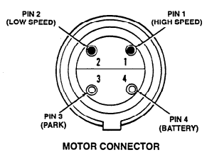

i 

i 
- 

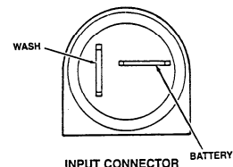

INPUT CONNECTOR BATTERY 

Replace wiper switch (para. 1 O-63). 

Replace wiper switch (para. 1 O-63). Replace wiper motor (para. 10-63). 

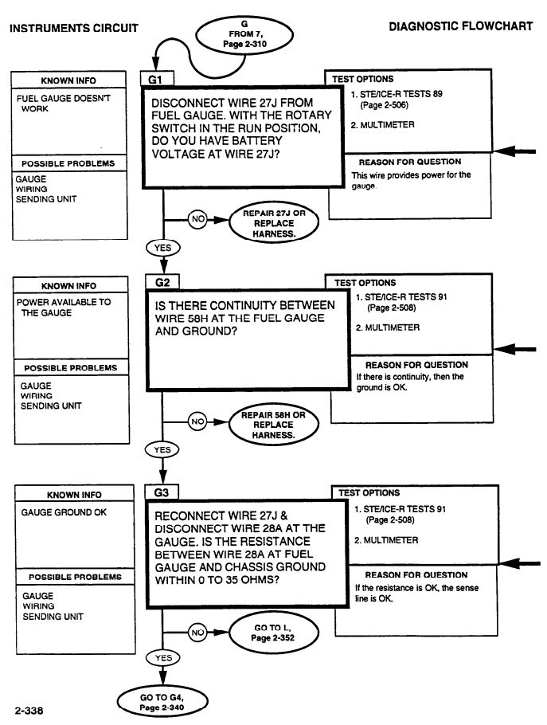

I 

## Reference Information Instruments Circuit

#### Dc Voltage 045 Volts Stvice-R Test 89

1. Connect RED clip to the indicated test point, BLACK dip to negative or ground. 

2. Start Test 89. DC Volts.

3. Displayed reading is in volts. 

#### Baltery Voltage Multimeter

1. Set the voltmeter to a DC volts scale of at least 40 volts. 

2. Connect the RED lead to positive and the BLACK lead to negative. 

3. Be sure to read the correct scale.

#### Resistance And C0Ntlnui-W 04,500 Ohms Steiice-R Test 91

1. Connect RED clip and BLACK clip to the indicated terminals in the question. RED to the first, BLACK to the second. 

2. Start Test 91,04,500 Ohms. 3. Displayed reading is in ohms. Less than 5 ohms is continuity. If the resistance is over 4.500 ohms, STEACE-R displays .9.9.9-g.

#### Continuity (Resistance) Multimeter

1. Set the voltmeter to an ohms scale of about 1,000 ohms. 

2. Connect the RED and BLACK leads to the connections stated in the question. 

3. Be sure to read the correct scale. Less than 5 ohms indicates continuity. For an open circuit, the meter should peg full scale (needle all the way to the left).

-I- 
Replace harness or repair wiring (para. 4-80). 

-I 
Replace harness or repair wiring (para. 4-80). 

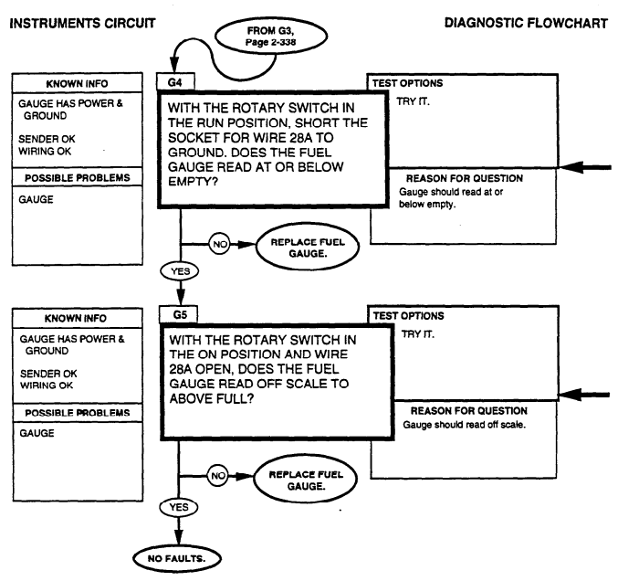

L 
INSTRUMENTS CIRCUIT
REFERENCE INFORMATION

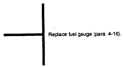

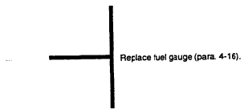

ﺃ

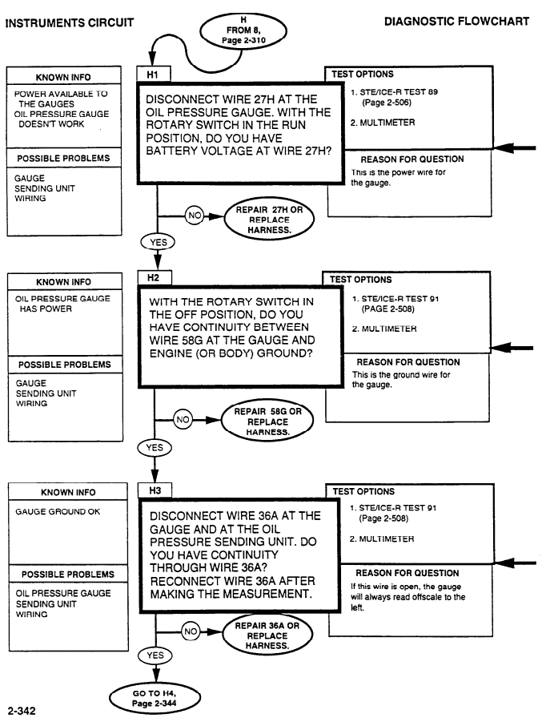

#### Reference Information Instruments Circuit Dc Voltage O-45 Volts Swlce-R Test 99

## I

1. Connect RED clip to the indicated test point, BLACK clip to negative or ground.

-i 

2. Start Test 89, DC Volts.

3. Displayed reading is in volts. 

#### Battery **Voltage** Multimeter I

1. Set the voltmeter to a DC volts scale of at least 40 volts. 

2. Connect the RED lead to positive and the BLACK lead to negative. 

3. Be sure to read the correct scale.

#### Continuity (Resistance) Multimeter

1. Set the voltmeter to an ohms scale of about 1,000 ohms. 

2. Connect the RED and BLACK leads to the connections stated in the question. 

3. Be sure to read the correct scale. Less than 5 ohms indicates continuity. For an open circuit, the meter should peg full scale (needle all the way to the left).

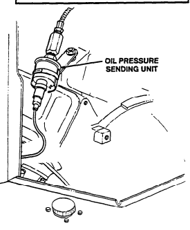

Replace harness or repair wiring (para. 4-90). 

#### Resistance And Conii-Nuim 04,500 Ohms Steiice-R Test 91

1. Connect RED clip and BLACK clip to the indicated terminals in the question. RED to the first, BLACK to the second. 

2. Start Test 91,0-4,500 Ohms. 3. Displayed reading is in ohms. Less than 5 ohms is cdntinuity. If the resistance is over 4.500 ohms, STVICE-R displays .9.9.9.9.

Replace harness or repair wiring (para. 4-90). 

-I Replace harness or repair wiring ( para. 4-80). 

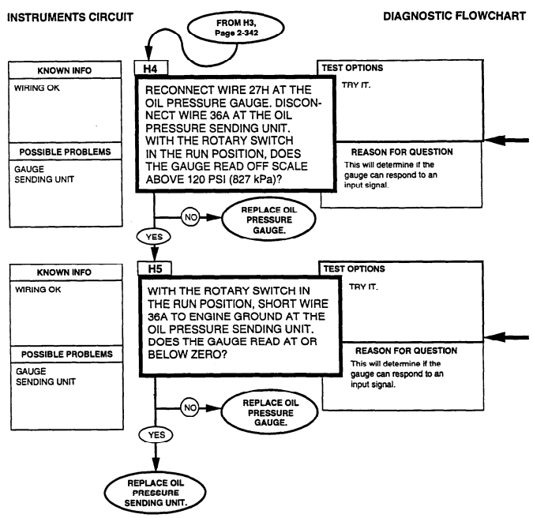

_ REFERENCE INFORMATION 
INSTRUMENTS CIRCUIT 
Make sure wire 36A is not connected to the sending unit and is not touching anything metal that could cause the wire to be grounded. 

Replace oil pressure gauge (para. 4-16). 

Wire 36A must be connected at the gauge. Short the wire at the sending unit to ground. 

Replace oil pressure gauge (para. 4-16). 

Replace oil pressure sending unit (para. 4-29). 

--i 
-i 

~_ 

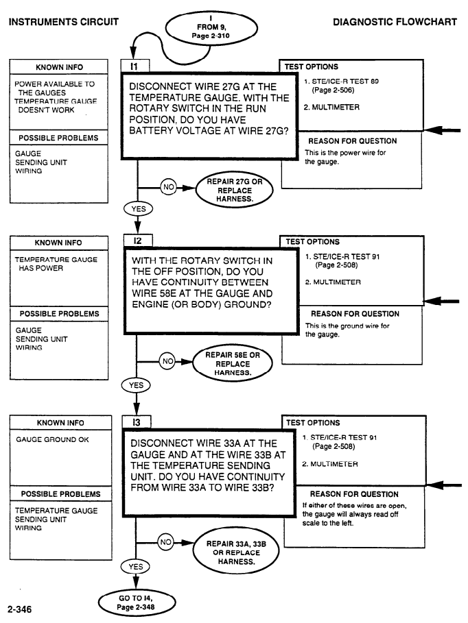

## Reference Information

#### Instruments Circuit Dc Voltage O-45 Volts Steilce-R Test 89

1. Connect RED clip to the indicated test point, BLACK clip to negative or ground.

-- 
2. Start Test 89, DC Vofts. 

3. Displayed reading is in volts. 

#### Continuity (Resistance) Multimeter

1. Set the voltmeter to an ohms scale of about 1.000 ohms. 

2. Connect the RED and BLACK leads to the connections stated in the question. 

3. Be sure to read the correct scale. Less than 5 ohms indicates continuity. For an open circuit, the meter should peg full scale (needle all the way to the left).

#### Resistance And Continuity 04,500 Ohms Steke-R Test 91

1. Connect RED clip and BLACK clip to the indicated terminals in the question. RED to the first, BLACK to the second. 

2. Start Test 91.04500 Ohms. 3. Displayed reading is in ohms. Less than 5 ohms is continuity. If the resistance is over 4.800 ohms, STEXE-R displays -9.9.9.9.

#### Baltery Voltage Multmeter

1. Set the voltmeter to a DC volts scale of at least 40 volts. 

2. Connect the RED lead to positive and the BLACK lead to negative. 

3. Be sure to read the correct scale.

-I Replace harness or repair wiring (para. 4-80). 

-I Replace harness or repair wiring (para. 4-80). 

-I Repl.ace harness or repair wiring (para. 4-80). 

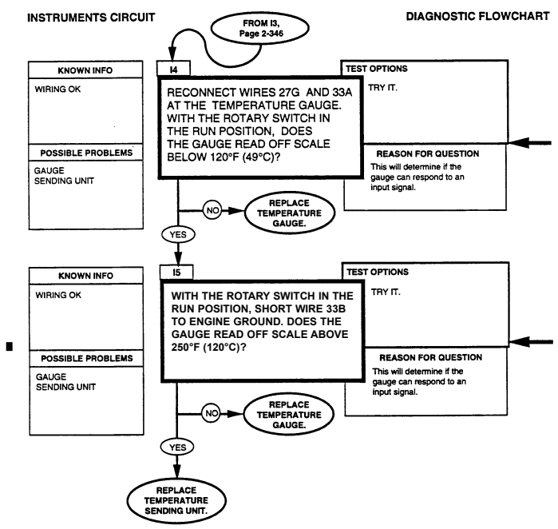

TM 9-2320-387-24-l REFERENCE INFORMATION 
INSTRUMENTS CIRCUIT 
Make sure wire 338 is not connacted to the.sending unit and is not touching anything metal that could cause the wire to be grounded. 

Replace temperature gauge (para. 4-16). 

Replace temperature gauge (para. 4-16). Replace temperature sending unit (para. 4-26). 

-i 

## Instruments Circuit Diagnostic Flowchart

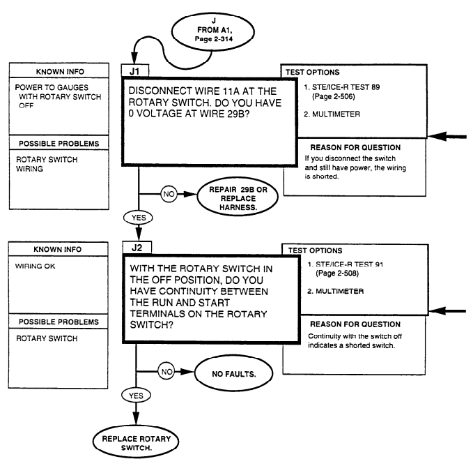

## Reference Information Instruments Circuit

#### Dc Voltage O-45 Volts Swice-R Test 89

1. Connect RED clip to the indicated test point, BLACK clip to negative or ground. 

2. Stan Test 89, DC Volts. 

3. Displayed reading is in volts. 

#### Baltery Voltage Multimeter

1. Set the voltmeter to a DC volts scale of at least 40 volts. 

2. Connect the RED lead to positive and the BLACK lead to negative.

3. Be sure to read the comxt scale. 

#### Resistance And Continuity 04,500 Ohms Steke-R Test 91

1. Connect RED clip and BLACK clip to the indicated terminals in the question. RED to the first. BLACK to the second. 

2. Start Test 91,0-4500 Ohms. 

3. Displayed reading is in ohms. Less than 5 ohms is continuity. If the resistance is over 4,500 ohms, STE/lCE-R displays .9.9.9.9.

#### Continuity (Resistance) Multimeter

1. Set the voltmeter to an ohms scale of about 1,000 ohms. 

2. Connect the RED and BLACK leads to the connections stated in the question. 

3. Be sure to read the correct scale. Less than 5 ohms indicates continuity. For an open circuit, the meter should peg full scale (needle all the way to the left).

-I Replace harness or repair wiring (para. 4-80). 

Replace rotary switch (para. 4-10). 

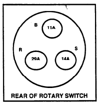

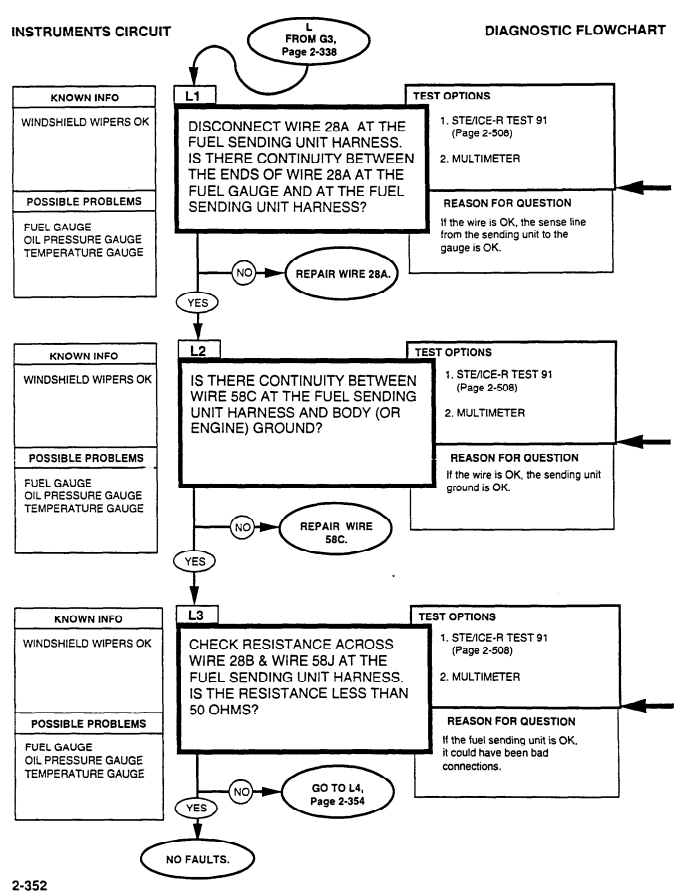

1 it 

## Instruments Circuit Reference Information

The connector is located above the driveshaft toward the rear of the vehicle. 

Repair wiring (para. 4-80). 

#### Resistance And Continuity 04,500 Ohms Slwlce-R Test 91

I. Connect RED dip and BLACK clip to the in&&d terminals in the question. RED to the first, BLACK to the Second. 

2. Start Test 91,0-4,500 Ohms. 

3. Displayed reading is in ohms. Less than 5 ohms is continuity. If the resistance is over 4,500 ohms, STEIICE-R displays .9.9.9.9.

- 

#### Continuity (Resistance) Multimeter

1. Set the voltmeter to an ohms scale of about 1,000 ohms. 

2. Connect the RED and BLACK leads to the connections stated in the question. 

3. Be sure to read the correct scale. Less than 5 ohms indicates continuity. For an open circuit, the meter should peg full scale (needle all the way to the left).

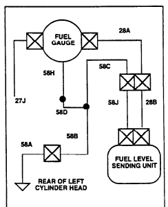

-I Repair wiring (para. 4-80). 

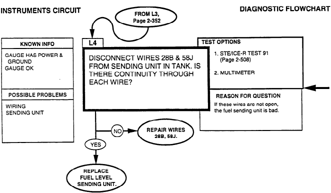

## Reference Information

In order to reach these wires and the sending unit, you have to remove the fuel tank (para. 3-25). You may want to recheck the previous steps to be sure you didn't miss anything before you proceed with this step. 

Replace fuel level sending unit and repair wiring 
(paras. 4-32 and 4-90). 

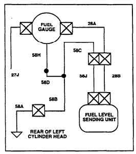

## Instruments Circuit

#### Resistance And Continuity 04,500 Ohms Stuice-R Test 91

I. Connect RED clip and BLACK clip to the I 
indicated terminals in the question. RED to the first. BLACK to the second.

- 
2. Start lest 91,0-4.500 Ohms. 3. Displayed reading is in ohms. Less than 5 ohms is continuity. If the resistance is over 4,500 ohms, STOICE-R displays .9.9.9.9.

#### Continuity (Resistance) Multimeter

1. Set the voltmeter to an ohms scale of about 1,000 ohms. 

2. Connect the RED and BLACK leads to the connections stated in the question. 

3. Be sure to read the correct scale. Less than 5 ohms indicates continuity. For an open circuit, the meter should peg full scale 
(needle all the way to the left).

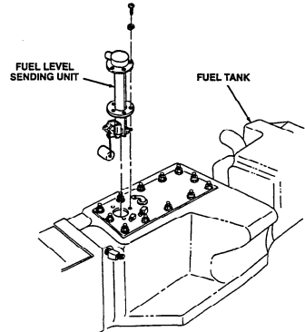

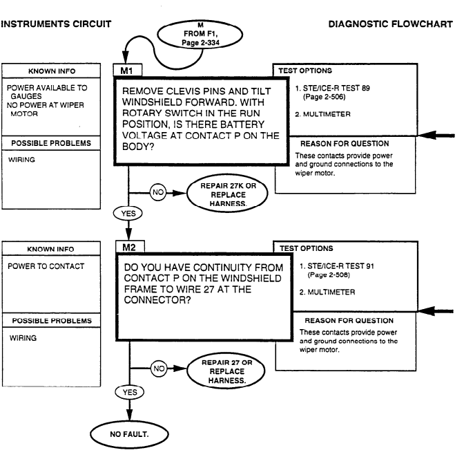

## Reference Information Instruments Circuit

Make sure these contacts are clean. Otherwise, the wiper motor may not have power or ground. 

Replace harness or repair wiring (para. 4-80). 

-I Replace harness or repair wiring (para. 4-80). 

#### Dc Voltage O-45 Volts Stvice-R Test 89 I

1. Connect RED clip to the indicated test 

point, BLACK clip to negative or ground 2. Start Test 89. DC Volts.

3. Displayed reading is in vofts. 

#### Baltery Voltage Multimeter

1. Set the voftmeter to a DC vofts scale of at least 40 volts. 

2. Connect the RED lead to positive and the BLACK lead to negative. 

3. Be sure to read the correct scale.

#### Resistance And Contlnuliy 04,500 Ohms Stuice-R Test 91

1. Connect RED clip and BLACK clip to ttte indicated terminals in the question. RED to the first, **BLACK** to the second. 

2. Start Test 91,0-4,500 Ohms. 3. Displayed reading is in ohms. Less than 5 ohms is continuity. If the resistance is over 4,500 ohms, **STEIICE-R** displays .9.9.9.9.

#### , 4 Frontof Vehicle 4 , 

I I 
WINDSHIELD CONNECTOR 
AS VIEWED FROM ABOVE 

#### Contlnulty (Resistance) Multimeter

1. Set the voltmeter to an ohms scale of about 1,000 ohms. 

2. Connect the RED and **BLACK** leads to the connectiins stated in the question. 

3. Be sure to read the correct scale. Less than 5 ohms indicates continuity. For an open circuit, the meter should peg full scale 
(needle all the way to the left).

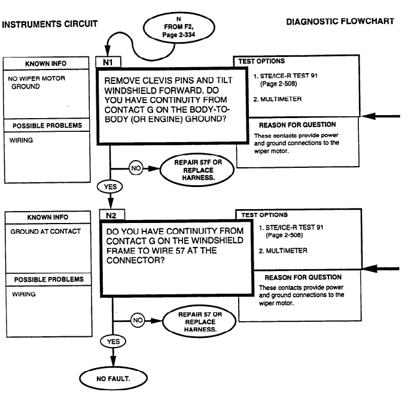

- 

## Reference Information Instruments Circuit

#### Resistance And Continuity 04,500 Ohms Ste/Lce-R Test 91

1. Connect RED dip and **BLACK** clip to the indicated terminals in the question. RED to the first, BLACK to the second. 

2. Start Test 91,0-4,500 Ohms. 

3. Displayed reading is in ohms. Less than 5 ohms is continuity. If the resistance is over 4,500 ohms, STEXE-R displays .9.9.9.9.

#### Continuity (Resistance) Multimeter

1. Bet the voltmeter to an ohms scale of about 1.000 ohms. 

2. Connect the RED and BLACK leads to the connections stated in the question. 

3. Be sure to read the correct scale. Less than 5 ohms indicates continuity. For an open cinxit. the meter should peg full scale (needle all the way to the left).

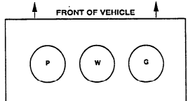

I 
WINDSHIELD CONNECTOR 
AS VIEWED FROM ABOVE 

Make **sure** these contacts are clean. Otherwise, the wiper motor may not have power or ground. 

Replace harness or repair wiring (para. 4-80). 

Replace harness or repair wiring (para 4-90). 

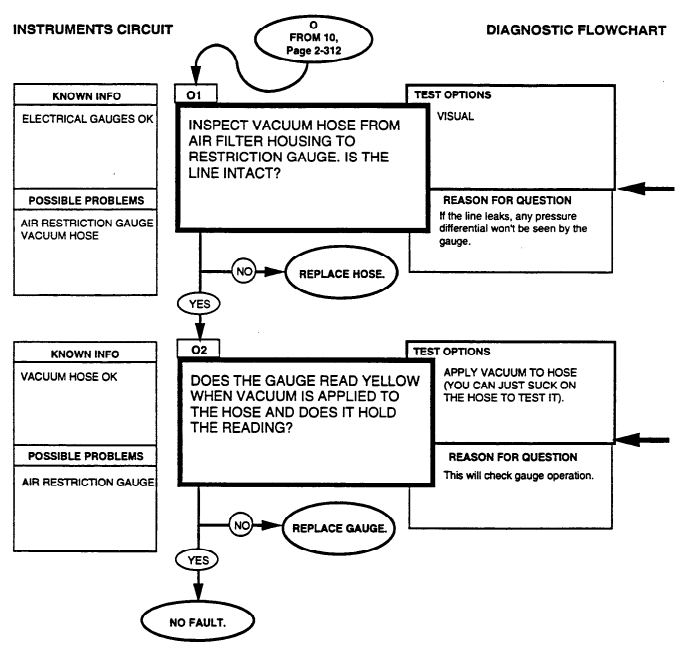

- 
REFERENCE INFORMATION 

INSTRUMENTS CIRCUIT 

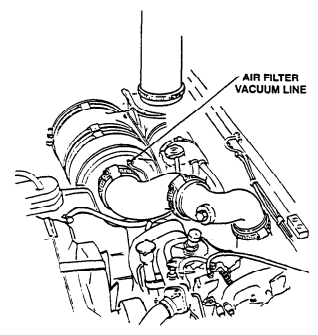

You can provide enough vacuum to operate the gauge by sucking on the hose. Replace vacuum hose (para. 3-20). 

Replace air restriction gauge (para. 3-17). 

-I 
I 

#### Instruments Circuit

AIR FILTER RESTRICTION 
GAUGE OK 
VACUUM TUBE OK 
1 POSSIBLE PROBLEMS 1 WIRING SWITCH MOTOR CIRCUIT BREAKER 1 PCB 
KNOWN INFO 
WIRE 27C OK 
POSSIBLE PROBLEMS , 
WIRING SWITCH 
MOTOR CIRCUIT BREAKER 1 PCB 
KNOWN INFO 
WIRE 27C OK WIRE 27D OK CIRCUIT BREAKER 1 OK 
POSSIBLE PROBLEMS 
WIRING SWITCH MOTOR PCB 

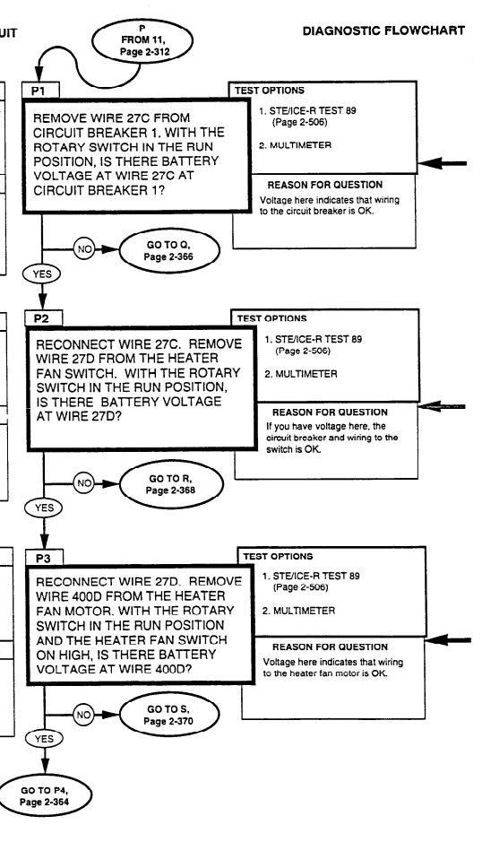

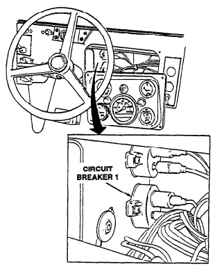

# Reference Information Instruments Circuit

The easiest way to reach the circuit breaker is to remove the gauge panel screws and pull the panel out far enough to work with the wiring. 

#### Dc Voltage O-45 Volts Steiice-R Test 89

1. Connect RED clip to the indicated test point. BLACK clip to negative or ground. 

2. Start Test 89, DC Votts. 3. Displayed reading is in volts. 

#### Battery Voltage Multimeter

1. Set the voltmeter to a DC volts scale of at least 40 volts. 

2. Connect the RED lead to positive and the BLACK lead to negative. 

3. Be sure to read the correct scale. 

-I 
The heater motor is located directly in front of the passenger seat under the instrument panel, connected to the heating ducts. 

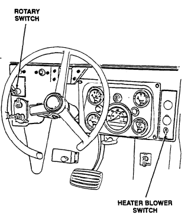

- 
i 
- 

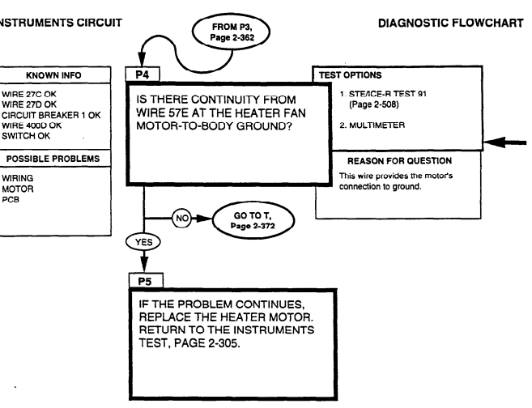

## Reference Information Instruments Circuit

#### Resistance And Continuity 0-4,Soo Ohms Stoice-R Test 91

1. Connect RED dip and BLACK clip to the indicated terminals in the question. RED to the first, BLACK to the second. 

2. Start Test 91,04,5W Ohms. 3. Displayed reading is in ohms. Less than 5 ohms is continuity. If the resistance is over 4.500 ohms, STEACE-R displays .9.9.9.9.

#### Continuity (Resistance) Multimeter

1. Set the voltmeter to an ohms scale of about 1,000 ohms. 

2. Connect the RED and BLACK leads to the connections stated in the question. 

3. Be sure to read the correct scale. Less than 5 ohms indicates continuity. For an open circuit, the meter should peg full scale 
(needle all the way to the left).

._._--.._*-_.__ _.__..._ 
INSTRUMtN IS c;lHCAJI I 

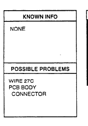

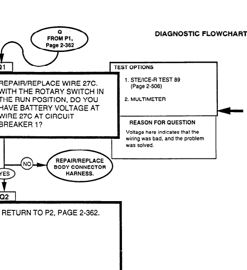

## Reference Information Instruments Circuit

# I **Dc Voltage O-45 Volts** Stwice-R Test 99 I

1. Connect RED clip to the indicated test point, BUCK clip to negative or ground. 

2. Start Test 89. DC Volts.

3. Displayed reading is in volts. 

#### Baltery Voltage Multimeter

1. Set the voltmeter to a DC volts scale of at least 40 volts. 

2. Connect the RED lead to positive and the BLACK lead to negative. 

3. Be sure to read the correct scale.

-I Replace harness or repair wiring (para. 4-80). 

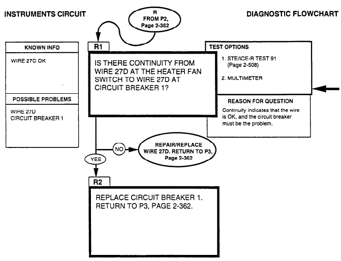

#### Reference Informanon Instruments Circuit Resistance And Continwty 04.500 Ohms

I 
I **STUIiZE-R TEST 91** 
1. Connect RED clip and BLACK dip to the indicated test points in the question. RED to the first, BLACK to the second. 

2. Start Test 91,04,500 Ohms. 3. Displayed reading is in ohms. Less than 5 ohms is continuity. If the resistance is over 4,500 ohms, STEXE-R displays .9.9.9.9.

#### Continuity (Resistance) Multimeter

I 
I 1. Set the voltmeter to an ohms scale of about 1.000 ohms. 

2. Connect the RED and BLACK leads to the connections stated in the question. 

3. Be sure to read the correct scale. Less than 5 ohms indicates continuity. For an open circuit. the meter should peg full scale (needle all the way to the left).

-I Replace harness or repair wiring (para. 4-90). 

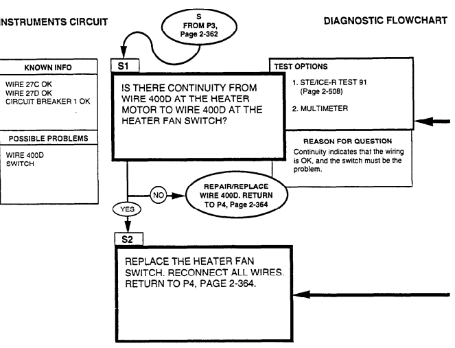

## Reference **Information**

#### Instruments Circuit

| RESISTANCE AND CONTINUITY                     |
|-----------------------------------------------|
| 0\-4.500 OHMS                                 |
| STEACE\-R TEST 91                             |
| 1. Connect RED clip and BLACK clip to the     |
| indicated test points in the question. RED to |
| the first. BLACK to the second.               |
| 2. Start Test 91. 0\-4.500 Ohms.              |
| 2 Dienlayed roading is in nhme I acc than     |

3. Disphyed reading is in ohms. Less than 5 ohms is continuity. If the resistance is over 4.500 ohms, STWICE-R displays .9.9.9.9.

i 

| 3. Be sure to read the correct scale. Less   |
|----------------------------------------------|
| 5 ohms indicates continuity. For an op       |
| circuit, the meter should peg full scale     |
| all the way to the left).                    |

| 2. Connect the RED and BLACK leads to the   | connections stated in the question.   |
|---------------------------------------------|---------------------------------------|

| 1. Set the voltmeter to an ohms scale of about   |
|--------------------------------------------------|
| 1.000 ohms.                                      |

#### Continuity (Resistance) Multimeter

3. Be sure to read the correct scale. Less than 5 ohms indicates continuity. For an open

-I Repair wire or replace harness (para. 4-90). 

Replace heater fan switch (para. 1 O-73). 

INSTRUMENTS 
KNOWN INFO 
WIRE 27C OK WIRE 27D OK CIRCUIT BREAKER 1 OK WIRE 400D OK SWITCH OK 
POSSIBLE PROBLEMS 
WIRE 57E PCB BODY 
CONNECTOR 

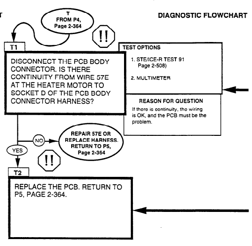

## Reference Information

#### Instruments Circuit

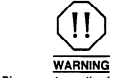

Disconnect negative battery cable before disconnecting and reconnecting PCB harness. 

WARNING 
There is battery voltage at the PCB at all times. Failure to disconnect battery cable will result in damage to equipment or injury to personnel. 

Replace harness or repair wiring (para. 4-80). 

Disconnect negative battery cable before disconnecting and reconnecting PCB harness. 

WARNING 
There is battery voltage at the PCB at all times. Failure to disconnect battery cable will result in damage to equipment or injury to Personnel. 

Replace the PCB (para. 4-4). 

#### Resistance And **Continuity** 04,500 Ohms Stmce-R Test 91

1. Connect RED clip and BLACK clip to the indicated terminals in the question. RED to the first. BLACK to the second.

i-
- 4 I 

2. Start Test 91,0-4,500 Ohms. 3. Displayed reading is in ohms. Less than 5 ohms is continuity. If the resistance is over 4.500 ohms, STUICE-R displays .9.9.9.9.

#### Continuity (Resistance) Multimeter

1. Set the voltmeter to an ohms scale of about 1 .OOO ohms. 

2. Connect the RED and BLACK leads to the connections stated **in the question.** 
3. Be sure to read the correct scale. Less than 5 ohms indicates continuity. For an open circuit, the meter should peg full scale (needle all the way to the left).

# 1 2-39. Lights Tests I

The lights tests have almost no flow chart to guide you through a problem.This is because there aren't very many problems that can occur. The most common problems are burned-out bulbs and loose or corroded connections. Aside from bulbs and wiring, the only components are the Protective Control Box and the lights switch. If either of these is found to be faulty, you just replace the bad unit. On the following pages you will find diagrams of the major portions of the lights circuit. These are designed to help you isolate a problem without wasting too much time. 

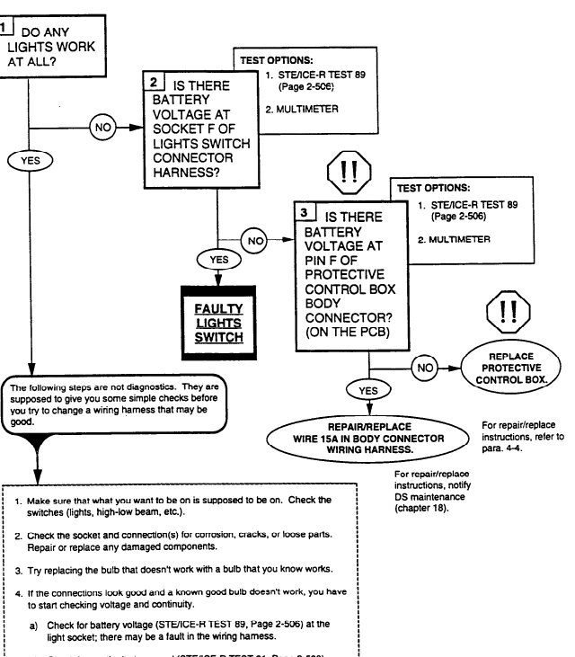

I b) Check for continuity to ground (STWICE-R TEST 91, Page 2-508) I

: 
i I from the light socket; there may be a missing connection to ground. i I I i

- 
I I I 
I I 1 c) Go to the wiring diagram(s) for more help. I

Disconnect nefative battery cable before disconnecting and reconnecting PCB harness. 

There is battery voltage at the PC8 at all times. Failure to disconnect battery cable will result in damage to 

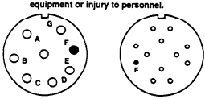

PCB BODY LIGHT SWITCH 
CONNECTOR CONNECTOR HARNESS 

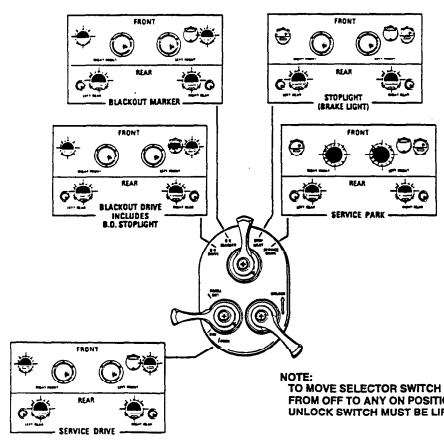

# I **Resistance And Continuity**

#### 8-4.500 Ohms Steace-R Test 91

I 
1. Connect RED clip and BLACK clip to the indicated terminals in the question.

2. Stan Test 91,0-4.500 Ohms. 

3. Displayed reading is in ohms. **Less** than 5 ohms is continuity. If the resistance is over 4,500 ohms, STE/lCE-R displays .9.9.9.9.

# I **Dc Voltage W5 Volts** Steiice-R Test 89

1. Connect RED clip to positive, BLACK clip to 

negative or ground.

2. Start Test 99, DC Volts. 3. Displayed reading is in volts. 

FROM OFF TO ANY ON POSlTlON EXCEPT B.O. MARKER, UNLOCK SWITCH MUST BE UFTED TO UNLOCK. 
LIGHTS REAR LIGHTS - 
(NOT INCLUDING 
BACKUP LAMPS AND 
SIDE MARKERS) 

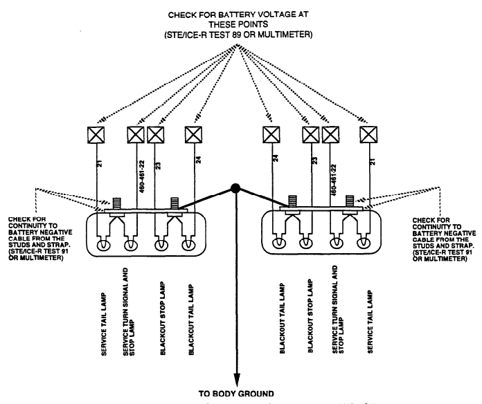

1. WHEN CHECKING FOR VOLTAGE, MAKE SURE THAT THE LAMP YOU 
ARE CHECKING IS SUPPOSED TO BE ON (CHECK THE LIGHTS 
SWITCH, TURN SIGNAL SWITCH, TRANSMISSION, ErC.). 

ON 
Disconnect negative battery cable prior to making continuity measurements. 

2. CHECK CONTINUITY TO BODY GROUND. 

LIGHTS 

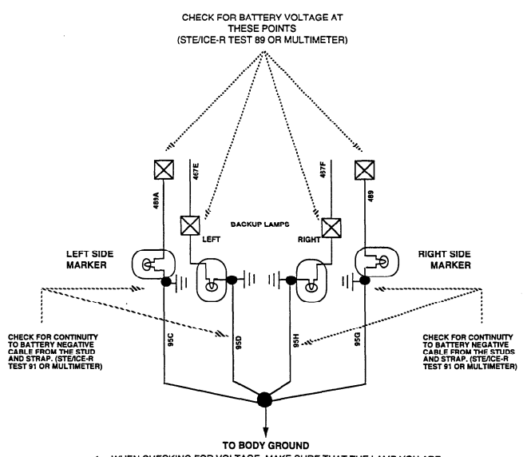

1. WHEN CHECKING FOR VOLTAGE, MAKE SURE THAT THE IAMP YOU ARE 
CHECKING IS SUPPOSED TO BE ON (CHECK THE LIGHTS SWITCH. TURN 
SIGNAL SWITCH, TRANSMISSION, ETC.). 

Disconnect negative battery cable prior to making continuity measurements. 

2. CHECK CONTINUITY TO BODY GROUND. 

LIGHTS FRONT LIGHTS - 
(PARK LIGHTS, TURN SIGNAL LAMPS, 
BLACKOUT MARKERS) 

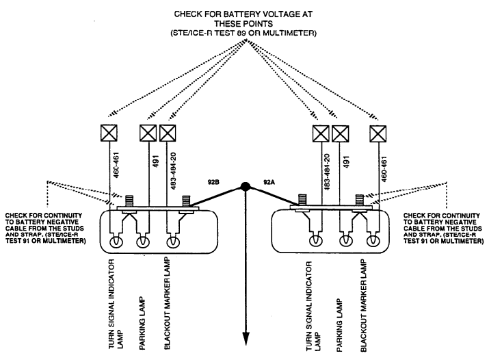

TO BODY GROUND 

1. WHEN CHECKING FOR VOLTAGE, MAKE SURE THAT THE LAMP YOU ARE 
CHECKING IS SUPPOSED TO BE ON (CHECK THE LIGHTS SWITCH, TURN SIGNAL SWITCH, TRANSMISSION, ETC.). 

Disconnect negative battery cable prior to making continuity measurements. 

2. CHECK CONTINUITY TO BODY GROUND. 

TM 9-2320-387-24 -1 FRONT LIGHTS 
LIGHTS 
HEADLAMPS, BLACKOUT DRIVING LAMP, SIDE 
MARKERS 

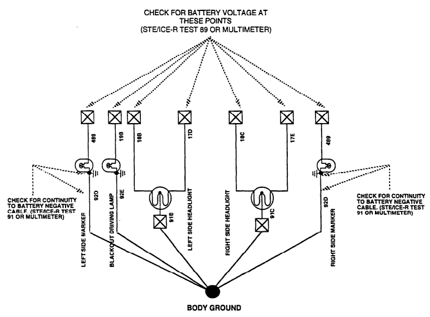

1. **WHEN CHECKING FOR VOLTAGE, MAKE SURE THAT** THE LAMP YOU ARE 
CHECKING IS SUPPOSED TO BE ON **(CHECK THE LIGHTS SWITCH, TURN** 
SIGNAL SWITCH, TRANSMISSION, ETC.). 

CAUTION 
Disconnect negative battery cable prior to making continuity measurements. 

2. CHECK CONTINUIlY TO BODY GROUND. 

LIGHTS 

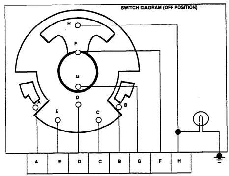

SUMMARY OF CONNECTIONS: 
JFRMINAL CONNECTION WIRE NUMB&t 

| A   | RIGHT FRONT TURN SIGNAL                 | 460A     |
|-----|-----------------------------------------|----------|
| B   | LEFT FRONT TURN SIGNAL                  | 461 A    |
| C   | LEFT REAR TURN SIGNAL/STOP LAMP         | 22\-461A |
| D   | LIGHT SWITCH TERMINAL C                 | 22A      |
| E   | RIGHT REAR TURN SIGNAL                  | 22\-460A |
| ﻠﺎ  | HAZARD/TURN SIGNAL FLASHER TERM. B 325B |          |
| G   | LIGHT SWITCH TERMINAL J (24 VOLTS)      | 467B     |
| ਜ   | HAZARD/TURN SIGNAL FLASHER TERM. A      |          |

#### Cauflon

Disconnect negative battery cable prior to making continuity measurements. 

LIGHTS 

1. WITH THE SWITCH IN THE LEFT POSITION, YOU SHOULD HAVE CONTINUITY FROM PIN H TO PINS B AND 
C, PIN D TO E, **AND** PIN F TO G. 

2. WITH THE SWITCH IN THE RIGHT POSlTlON, YOU SHOULD HAVE CONTINUITY FROM PIN H TO PINS A AND E. 

PIN C TO D, AND PIN F TO G.

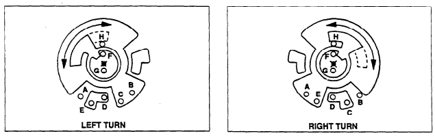

NOTE 

l **IF VEHICLE IS EQUIPPED WITH BRAKE LIGHT OVERRIDE** 

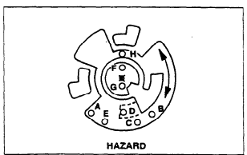

DlRECllONAL SIGNAL CONTROL ASSEMBLY (P/Nl2339312-1). REFER TO STEP 3. 

. IF VEHICLE IS EQUIPPED WllH DIRECTIONAL SIGNAL 
CONTROL ASSEMBLY (PIN 12339312), REFER TO STEP 4. 

3. WITH SWITCH IN HAZARD POSlTiON, YOU SHOULD HAVE CONTINUITY FROM PIN H TO PINS A, B, C, 0, AND 
E, AND PIN F TO G. 

4. WITH SWITCH IN HAZARD POSITION. YOU SHOULD HAVE CONTINUITY FROM PIN H TO PINS A, B, C, AND 
E. AND PIN F TO G. 

-.

# 2-40. Transmission System Tests

NOTE
When checking fault codes, note that low battery voltage can cause false fault codes to be set in TCM.

The transmission system is equipped with a computer called the Transmission Control Module (TCM) (located left rear seat compartment) which interprets, analyzes and records electronic signals from sensors and switches located on the engine, brake pedal, and transmission. The recorded codes stored in the TCM are known as TROUBLE CODES which are retrieved using the diagnostic switch cable on the J2 connector of the TCM. The TCM
can protect the transmission from damage by locking it in second gear, with maximum fluid pressure, until the problem has been corrected. The following procedures will detail diagnostic testing, troubleshooting, and corrective action for any existing faults. These transmission system tests may be run any time you think there is a transmission problem or if you were sent here by another test chain. This paragraph has a different kind of flow chart to quide you through testing because of the many problems that can occur. The most common problems are loose or corroded wiring connections. To troubleshoot the transmission. vou will need a diagnostic switch cable (appendix B, item 81), digital multimeter (appendix B, item 155) and a throttle position (TP) sensor test cable (appendix B, item 80).

Do not disconnect battery without recording trouble codes. Failure to do so will result in loss of diagnostic test codes.

The Diagnostic Test Codes (DTC) are transmitted from the TCM to transmission lamp located next to the shift lever. When diagnostic switch cable is connected to the J2 connector. the system is placed in the diagnostic mode, which causes the transmission lamp to flash. The transmission lamp will flash once, pause, flash twice (meaning code 12), pause, flash once, pause, flash twice (code 12 again), and do this one more time for a total of three times, which means the system is operational.

Diagnostic test code 63 will be set at all times.

For example, if the TCM is sending the trouble code 74, the lamp will flash 12 three times. flash 63 three times, which is set all the time and is to be disregarded, flash code 7 and 4, 7 and 4. 7 and 4 for code 74, and then 12, 12, 12, which ends the diagnostic check. These codes will repeat again if not taken out of diagnostic mode.

The TCM J1 connector will be used to diagnose and troubleshoot wiring, sensor connectors, pins, solenoids, and brake switch to ensure all external problems are checked and corrected prior to TCM and transmission faults.

On the following pages you will find diagrams and charts of the major portions of the transmission circuits. These are designed to help you isolate a problem and correct it.

- 

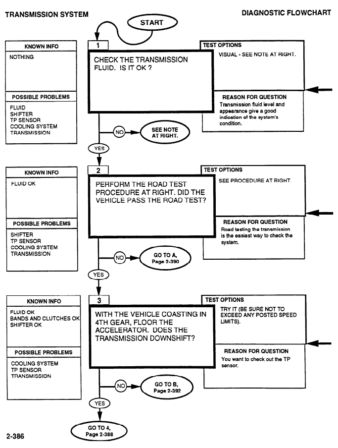

## Reference Information Transmission System

Procedure for checkina transmission fluid 1. Start engine. 2. Hold down brake pedal and move transmission shift lever through all ranges including reverse. Leave the lever in each range for 2 seconds. 

3. Engage parking brake and place shit lever in neutral. Check fluid level on dipstick. 4. Proper level is between FULL and ADD marks on dipstick 

Check fluid for a burnt smell, grit, discoloration, air bubbles, or a milky appearance. 

l Burnt smell, discoloration, or grit indicates worn or damaged internal components. 

Notify DS maintenance (chapter 14). 

l Bubbles indicate an overfilled system or air leaks in the system. Drain the fluid and refill to proper level (para. 5-2). 

l Milky appearance is due to water in the system. Change the fluid and filter (para. 5-2). l Check fill tube for indications of fluid being blown out. If fluid is being blown out, check vent line for obstructions, and refill transmission to proper level (para. 5-2). 

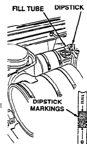

## Jload Test Procedure U

1. Position shift lever in 0 (overdrive) and accelerate vehicle from 0 mph. A l-2.2-3. and 3-4 shift should occur at all throttle openings. Allow vehicle to **coast** down to about 0 mph; 4-3.3-2, and 2-1 shifts should occur. 

2. Position transmission shii lever in D (drive) and accelerate vehicle from 0 mph. A l-2 and 2-3 shift should occur at all throttle openings. Allow vehicle to coast down to about 0 mph; 3-2 and 2-l shifts should occur. 

3. Position transmission shi lever in 2 (low two) and accelerate vehicle from 0 mph. A l-2 shift should occur at all throttle openings. No 2-3 shitt can be obtained in this range. A l-2 shift in 2 is somewhat firmer than in D. This is normal. 

4. Position shift lever in 1 and accelerate the vehicle from 0 mph. No upshifts should occur in this range. 

5. Position shift lever in 8, and with the vehicle speed at approximately 45 mph, close throttle and move lever to 3. 

Transmission should downshift to 3rd gear. An increase in engine rpm and engine braking effect should be noticed. 

6. Position shift lever in @, and with the vehicle speed at approximately 35 mph, close throttle and move lever to 2. 

Transmission should downshift to 2nd gear. An increase in engine rpm and engine braking effect shordd be noticed. 

7. Position shift lever 2 and, with the vehicle speed at approximately 25 mph, close the throttle and move lever to 1. 

Transmission should downshift to 1st gear. An increase in engine rpm and engine braking effect should be noticed. 

6. Position shift lever in R and check for reverse operation. 9. Hard shifting may be indicative of an under-filled or clogged system. 

The TP sensor is used to shift the transmission to a lower gear under heavy acceleration. 

i i 

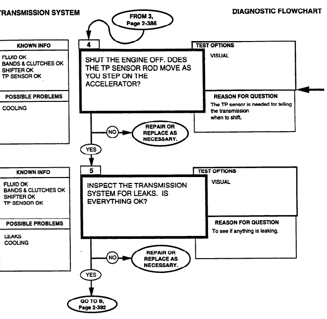

REFERENCE INFORMATION

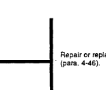

TRANSMISSION SYSTEM
Repair or replace TP sensor
(para. 4-46).

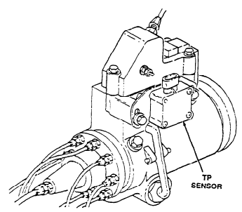

- 

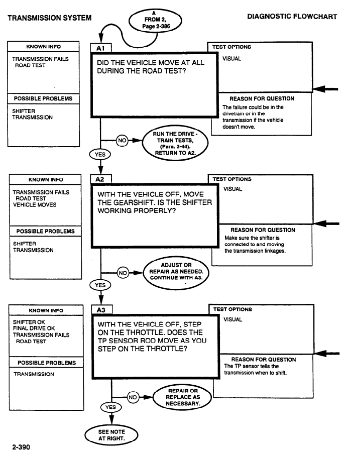

TM 9-2320-387-24-l TRANSMISSION SYSTEM 
If the drivetrain system checks out OK, the 

problem is either the transmission itself, the shifter. of the modulator. The DRlVETFtAlN 
tests are located in para. 2-43 of this manual. 

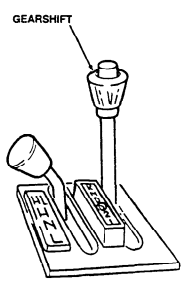

- -I Make sure that the detents in the shifter correspond to the shift positions shown on the plate. Have an assistant move the shifter and look to see that the linkage is moving at the transmission. Linkage repair and adjustment procedures are located in para. 5-Q. 

Look for a TP sensor problem if the vehicle was hot shifting. or was not shifting as well as it should be. 

Run the BRAKES and DRIVETRAIN tests in this manual. If you don't find any faults, notify DS maintenance (chapter 14). 

i 

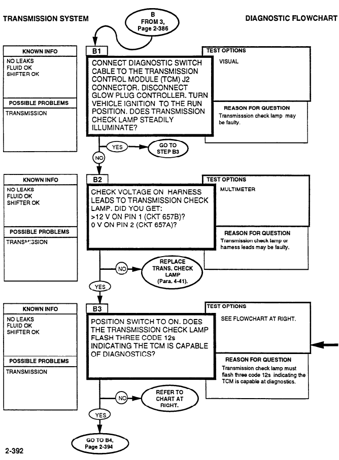

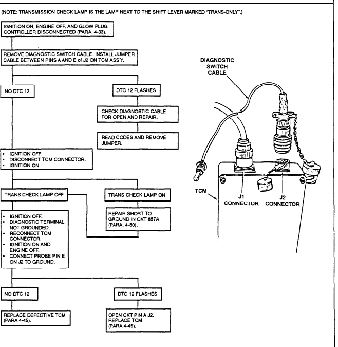

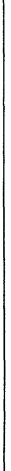

## Will Not Display Dtc Code 12, Or Check Transmission On Steady

NOTE: AFTER TROUBLESHOOTING. RECONNECT GLOW PLUG CONTROLLER. VEHICLE WILL HAVE TO BE OPERATED IN ORDER FOR TCM TO 
RECEIVE TROUBLE CODES. AFTER REPAIRS, CHECK TRANS LAMP OPERATION. 

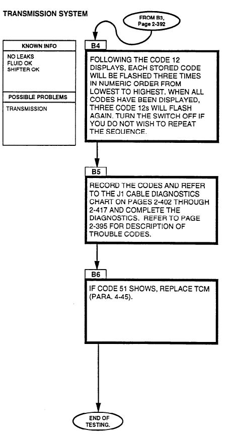

I 

#### Reference Information Transmission System

The following chart will help you find the code you need. The Jl cable diagnostics checks (page 2-402) must be performed. Always correct the lower code number first. If code 51 shows up, replace TCM (para. 4-45) operate vehicle, and recheck for trouble codes. 

| There are 20 foldouts that are supplied with this manual. Take the foldouts and place them     |           |                        |
|------------------------------------------------------------------------------------------------|-----------|------------------------|
| after the last page of diagnostics at the end of the paragraph. The foldout will then be with  |           |                        |
| diagnostics for that system. Use the cross\-reference information listed below to guide you in |           |                        |
| the placement of the foldouts.                                                                 |           |                        |
| SYSTEM LEVEL TESTS                                                                             | PARAGRAPH | FOLDOUT NUMBER         |
| FUEL                                                                                           | 2\-28     | FO\-1                  |
| AIR INTAKE/EXHAUST                                                                             | 2\-29     | FO\-2                  |
| COMPRESSION/MECHANICAL                                                                         | 2\-30     | FO\-3                  |
| ENGINE COOLING                                                                                 |           |                        |
| (SERIAL NUMBERS 299999 AND BELOW)                                                              | 2\-31     | FO\-4                  |
| ENGINE COOLING                                                                                 |           |                        |
| (SERIAL NUMBERS 300000 AND ABOVE)                                                              | 2\-31.1   | F0\-4.1                |
| ENGINE LUBRICATION                                                                             | 2\-32     | FO\-5                  |
| ALTERNATOR                                                                                     | 2\-33     | FO\-6                  |
| PROTECTIVE CONTROL BOX                                                                         | 2\-34     |                        |
| BAlTERY CIRCUIT                                                                                | 2\-35     | FO\-7                  |
| STARTER CIRCUIT                                                                                | 2\-36     | FO\-8                  |
| GLOW PLUGS                                                                                     | 2\-37     | FO\-9                  |
| INSTRUMENTS                                                                                    | 2\-38     | FO\-10                 |
| LIGHTS                                                                                         | 2\-39     | FO\-11                 |
| TRANSMISSION                                                                                   | 2\-40     |                        |
| BRAKES                                                                                         | 2\-41     | FO\-12                 |
|                                                                                                |           | (S/N 299999 AND BELOW) |
|                                                                                                |           | F0\-12.1               |

#### Transmission System

## Dtc 2L/22

Throttle Position (TP) Sensor Circuit High/ 
Throttle Position *Sensor* **Circuit Low** 

#### Circuit Description:

The TP sensor contains a resistor strip with one end connected to a 5-volt supply and the other to ground. The signal is connected to a movable contact within the TP sensor. As the accelerator pedal is applied and the throttle shaft rotates, the voltage signal will increase from approximately 0.5 to 4.5 volts. 

#### Dtc 21 Will Set When:

l Engine is operating. l TPsensorsignalvolulgeisgn?aterthan4.9volts. 

l Conditions are met for 1 second. 

DTC 22 will Set When: 
l Engine is operating. l TP sensor signal voltage is less than 0.2 volt. l Conditions are met for 1 second.

## Dtc 24 Output Speed Sensor Signal

#### Circuit Desctiption:

The output speed sensor is a magnetic induction-type sensor. Gear teeth pressed -onto the output shaft induce an alternating voltage into the sensor. 

#### Dtc 24 Will Set Whem

Not in P/N. 

Circuit voltage is constant. 

Engine speed is greater than 3,000 rpm. 

Output speed is less than 200 rpm. TP is between 10% and 100%. 

All conditions are met for 3 seconds.

## Dtc 28 Transmission Range (Tr) Pressure Switch Assembly (Psa) Fault

#### Circuit Description:

The Transmission Range (TR) Pressure Switch Assembly consists of five normally open pressure switches mounted on the valve body. The TCM 
supplies battery voltage to each range signal. By grounding one or more of these circuits through various combinations of the pressure switches, the TCM assembly detects what transmission range has been selected by the vehicle operator. When the transmission electrical connector is disconnected, the ground potential for the three range signals to the TCM 
willbemmovedandD2gearwiUbeindicated_ 

#### Dtc 28 Wd Set W7Aen.Z

l *Range* signals A and C are both zero volt. 

l Condition is met for 2 seconds.

## Dtc 37/38 Torque Converter Clutch (Tcc) Brake Switch Stuck On/ Tcc Brake Switch Stuck Off

#### Circuit Description:

The normally closed brake switch supplies a B+ signal volt when the TCC brake switch is closed (brake pedal not applied). 

#### Dtc 37 Will Set When-

Circuit 810B is open. 

- Then vehicle speed is between 5 mph (8 kph) 
and 20 mph (32 kph) for greater than 6 seconds. 

- Then vehicle speed is greater than 20 mph (32 kph) for greater than 6 seconds. 

- For a complete total of 7 times.

#### Dtc 38 Will Set Whew

'ICC brake switch feed CRT 810B has constant voltage. 

- Vehicle speed is greater than 20 mph (32 kph) 
for greater than 6 seconds. 

- Then vehicle speed is between 5 mph (8 kph) 
and 20 mph (32 kph) for greater than 6 seconds. 

- For a complete total of 7 tunes.

#### Reference Information Dtc 39 Tcc Stuck Off Circuit Description:

The TCM commands the TCC FWM solenoid ON by modulating TCC signal fluid acting on the converter clutch shift valve. Then TCC fluid applies the torque converter clutch; 

#### Dtc 39 Will Set When..

l TCC is commanded ON. 

l TCC slip speed greater than 65 r-pm. l Trans range in D3 or D4. 

l 2nd or 3rd gear. l All conditions are met for 2 seconds.

## Dtc 51 Transmission Control Module (Tcm) Faulty Or Incorrect

#### Circuit Description:

The Transmission Control Module (TCM), an on-board computer, receives and processes input signals from sensors on the vehicle and delivers output signals to the solenoids located on the control valve assembly. These solenoids control the transmission operating pressures, upshift and downshift patterns and Torque Converter Clutch (TCC) operation. 

#### Dtc 51 Wdl Set Whew

l *There is an* uncorrectable computational error, or an input is in error intermittently.

## Transmission System ' Dtc 52/53 System Voltage High Long/ System Voltage High Circuit Description:

Ignition voltage is supplied to the control module to indicate the status of the ignition switch_ Battery voltage is supplied to the control module to, in part, maintain memory of learned functions and parameters. 

#### Dtc 52 Will Set When.*

l *The* ignition is ON and the system voltage is greater than 16 volts. 

l Condition is met for 109 minutes.

#### Dtc 53 Wzzz Set When:

l *The* ignition is ON and the system voltage is greater than 19.5 volts. 

l Condition is met for 2 minutes.

## Dtc 58 Transmission Fluid Temperature (Tft) Sensor Circuit Low (High Temperature Indicated)

#### Circuit Description.-

The TFI! sensor is a thermistor that controls the signal voltage to the TCM. The TCM supplies a 5-volt reference signal to the sensor on TWC pin L. When the transmission fluid is cold, the sensor resistance is high and the TCM will sense high signal voltage. 

As the transmission fluid temperature warms to normal transmission operating temperature 212°F (lOO"C), the sensor resistance becomes less and the voltage decreases to approximately 1.5 to 2.0 volts. With DTC 79 also set, check the transmission cooling system. 

#### Dtc 58 Will Set When.-

* Signal voltage indicates TFT greater than 304°F (151°C). 

l Condition is met for 1 second.

#### Transmission System

## Dtc 59 Transmission Fluid Temperature ('Ixt) Sensor Circuit High (Low Temperature Indicated)

#### Circuit Description:

The TFT sensor is a thermistor that controls the signal voltage to the TCM. The TCM supplies a 
&volt reference signal to the sensor on TWC pin L. 

When the transmission fluid is cold, the sensor re.sistanceishighandtheTCMwillsensehighsignal voltage. 

As the transmission fluid temperature warms to normal transmission operating temperature 212°F 
(lOO"C), the sensor resistance becomes less and the voltage decreases to approximately 1.5 to 2.0 volts 

#### Dtc 59 Wall Set Whenz

l Signal voltage indicates TFT less than 
-34°F (-37°C). 

l Condition is met for 1 second.

## Dtc 68 Transmission Component Slipping

#### Circuit Description:

The TCM monitors the difference in engine speed and input speed. 

#### Dtc 68 Wzzz Set Whew

TCC slip speed is greater than **200** rpm. 

Fourth gear is indicated. TCC is locked. 

Not in park/neutral. 

All conditions are met for 2 seconds. Transmission range switch indicates D3 or D4. 

Commanded gear indicates 2nd or 3rd gear. 

All conditions are met for 2 seconds.

## Dtc 69 Torque Converter Clutch ('Icc) Stuck On

#### Circuit Descriptions

The TCM commands the TCC PWM solenoid ON by modulating TCC signal fluid acting on the converter clutch shift valve. Then TCC fluid applies the torque converter clutch 

#### Dtc 69 Will Set When:

l *'RX* slip speed rpm indicates between -5 and 
+lO rpm. 

l TCC solenoid is commanded OFF. 

l TP sensor signal is greater than 25%.

## Dtc 71 Engine Speed Sensor Circuit Low

#### Circuit Description:

The Camsha& Position Sensor (CPS) detects the rotational speed of the camshaft. As the camshaft rotates, an AC signal is generated in the circuit. 

This signal provides the input to determine engine speed for use in various calculations including TCC 
slip speed and overdrive ratio. 

#### Dtc 71 Wdl Set Whew.

l Engine speed is leas than 50 rpm. l Transmission range indicates R, D4, D3, or Dl. 

l Conditions are met for 2 seconds.

# Reference Information Transmission System

## Dtc 73 Pressure Control Solenoid (Pcs) Circuit Current Error (Force Motor Circuit)

#### Circuit Description:

The Pressure Control Solenoid (PCS) is a TCM-
controlled device used to regulate transmission line pressure. The TCM compares TP voltage, engine rpm, and other inputs to determine the appropriate line pressure of a given load. The TCM will regulate the pressure by applying a varying amperage to the PCS. 

The applied amperage can vary from 0.1 to 1.1 amp. The TCM then monitors the amperage at the return line. 

#### Dtc 73 Will Set When:

l *The* return amperage varies greater than 0.16 amp from the commanded amperage. 

l All conditions are met for 1 second.

## Dtc 74 Transmission Input Speed Sensor (Tiss) Circuit

#### Circuit Description:

The Transmission Input Speed Sensor (TISS) 
consists of a permanent magnet surrounded by a coil of wire. As the forward clutch housing rotates, an AC voltage is induced in the circuit. The signal voltage and frequency vary directly with the forward clutch rotational speed. 

#### Dtc 74 Wzl Set When:

l Transmission range is not in park or neutral. 

l Engine speed is greater than 300 r-pm. 

l Transmission output speed is greater than 200 rpm. 

l Transmission input speed less than 50 rpm. l AI1 conditions are met for 2 seconds.

## Dtc 75

System Voltage Low 

#### Circuit Des&P Tiorx

Ignition voltage is supplied to the control module to indicate the status of the ignition switch Battery voltage is supplied to the control module to, in part, maintain memory of learned functions and parameters. 

#### Dtc 75 Will Set When:

l *The* ignition is ON. 

l Ignition feed voltage to the control module is less than the graduated scale of: 
- -40°F (-40°C) = 7.3 volts. - 194°F (-90°C) = 10.3 volts. 

- 302°F (-150°C) = 11.7 volts. 

l Engine speed is greater than 1,000 r-pm. 

l All conditions are met for 4 seconds.

## Dtc 79 Transmission Fluid Overtemp

#### Circuit Description:

The Transmission Fluid Temperature (TFT) sensor is a thermistor that controls the signal voltage to the TCM. The TCM supplies a &volt reference signal to the sensor on Circuit 923A. When the transmission fluid is cold, the sensor resistance is high and the TCM will sense high signal voltage. 

As the transmission fluid temperature warms to normal transmission operating temperature 212°F 
(lOO"C), the sensor resistance becomes less and the voltage decreases to approximately 1.5 to 2.0 volts. 

#### Dtc 79 Will Set When:

l Transmission fluid temperature is greater than 295°F (146°C). 

l All conditions are met for 30 minutes.

#### Transmission System

## Dtc 81 2-3 **Shift Solenoid Circuit Fault**

#### Circuit Description:

Ignition voltage is supplied directly to the *2-3 shirk* solenoid. The TCM controls the solenoid by providing the ground path through Circuit 315A to TCM. 

#### Dtc 81 Will Set When:

l The TCM commands the solenoid ON and voltage remains high. 

l The TCM commands the solenoid OFF and voltage remains low. 

l All conditions are met for 2 seconds.

## Dtc 82 1-2 Shift Solenoid Circuit Fault

#### Circuit Description:

Ignition voltage is supplied directly to the l-2 shit% 
solenoid. The TCM controls the solenoid by providing the ground path through Circuit 237A to TCM. 

#### Dtc 82 Will Set Whex

l *The* TCM commands the solenoid ON and voltage remains high. 

l The TCM commands the solenoid OFF and voltage remains low. 

l All conditions are met for 2 seconds.

## Dtc 83 Tcc Solenoid (Pwm) Circuit Fault

#### Circuit Description:

The control module supplies a ground through an internal Quad-Driver Module (QDM), allowing current to flow through the solenoid coil according to the duty cycle (percentage of ON and OFF time). This current flow through the solenoid coil creates a magnetic field that magnetizes the solenoid core. 

The magnetized core attracts the checkball to seat against spring pressure. This blocks the exhaust for the TCC signal fluid and allows 2-3 drive fluid to feed the TCC signal circuit. The TCC signal fluid pressure acts on the TCC regulator valve to regulate line pressure and to apply fluid pressure to the TCC shift valve. When the TCC shift valve is in the apply position, regulated applied fluid pressure is directed through the TCC valve to apply the torque converter clutch. 

#### Dtc 83 Will Set When:

The TCM commands the solenoid ON and voltage remains high. 

The TCM commands the solenoid OFF and voltage remains low. All conditions are met for 2 seconds.

## Dtc 85 Undefined Ratio Error

#### Circuif Descriptions

The control module calculates ratio based on the transmission input speed and output speed sensor reading. The control module compares the known transmission ratio to the calculated ratio for the particular gear range selected. 

#### Dtc 85 Will Set When-

* Throttle position is greater than 25%. l Not in park, neutral, or 4th gear. l Engine speed is greater than 300 r-pm. 

l Vehicle speed is greater than 7 mph (11 kphl.

| SYSTEM LEVEL TESTS   | PAGE   |
|----------------------|--------|

l All conditions are met for 2 seconds. 

## Dtc 86 Low Ratio Error

#### Circuit Description:

The control module calculates ratio based on the TISS and TOSS readings. The control module compares the known transmission ratio to the calculated ratio for the particular gear range selected. 

#### Dtc 86 Will Set Whenr

l Not in park, reverse, or neutral. 

l Engine speed is greater than 300 x-pm. 

l Throttle position is greater than 25%. 

l Vehicle speed is greater than 7 mph (11 kphl. 

l Transmission gear ratio is less than 1.06 in 1st or 2nd gear, l All conditions are met for 2 seconds.

## Dtc 87 High Ratio Error

#### Circuit Description:

The control module calculates ratio based on the TISS 
and TOSS readings. The control module compares the known transmission ratio to the calculated ratio for the particular gear range selected. 

#### Dtc 87 Will Set When-

* Throttle position is greater than 25%.

#### -

l Not in park, reverse, or neutral. 

l Engine speed greater than 300 rpm. 

l Vehicle speed is greater than 7 mph (11 kphl. 

l Transmission temperature is greater than 68°F (20°C). 

l All conditions are met for 2 seconds.

#### Transmission System Diagnostic Flowchart

The following diagnostics will help isolate and repair problem circuits, wires, pins, connectors, sensors, circuit breakers, and solenoids. 

For repair of all wiring, refer to para. 4-80. 

Check connector pins before inserting probes. 

Jl CABLE DIAGNOSTICS CHART 
Jl Voltage Measurements With Ignition ON, Engine OFF, 
and Glow Plug Controller Disconnected. Refer to Para. 4-33. 

| If you know why the question is being asked, it                                                       |
|-------------------------------------------------------------------------------------------------------|
| should be easier to understand the diagnostic logic   and easier to answer the question. This is      |
| especially helpful when a measurement is just a   little bad. Knowing why the question is being asked |
| should help you decide if the answer should be   YES or NO.                                           |
| INFORMATION ABOUT THE                                                                                 |
| DIAGNOSTIC LOGIC                                                                                      |
| KNOWN INFO:                                                                                           |
| This box indicates what is known about the vehicle's condition.                                       |

Jumper wire from U to a or b. 

| PROBLEMS:                                                    | POSSIBLE   |
|--------------------------------------------------------------|------------|
| the problem are listed here until tested and shown to be ok. |            |
| This box is the opposite of KNOWN INFO. Possible causes of   |            |

Reconnect Glow Plug Controller. Refer to Para. 4-33. Jl Voltage Measurement With Ignition ON, Engine ON, Transmission in PARK. 

Jl 

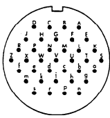

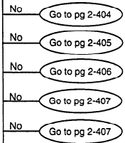

- 

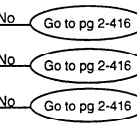

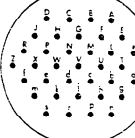

# Diagnostic Flowchart Transmission System

Check connector pins before inserting probes. 

| FOR THE ENGINE TO START, ALL OF THE BASIC SYSTEMS SHOWN BELOW   |                                           |
|-----------------------------------------------------------------|-------------------------------------------|
| MUST BE WORKING.                                                | THESE STARTABILITY TESTS WILL HELP YOU TO |
| VERIFY THE CONDITION OF EACH OF THESE SYSTEMS.                  |                                           |
| I                                                               | BAlTERY  I  ClRCUrr                       |
| ENGINE MECHANICAL                                               |                                           |
| I                                                               | (CRANKING, COMPRESSION,  ETC.)  I         |
| ENGINE STARTED,                                                 |                                           |
| I                                                               | AVAILABLE FOR POWER  I                    |
| . :                                                             |                                           |
| A functional flow schematic is not applicable to this section.  |                                           |
| However, so that you may refer to sections as you need them, a  |                                           |
| quick index to the systems required for starting is given here. |                                           |
| PARAGRAPH                                                       | PAGE   I                                  |
| BAlTERY ClRCUlT                                                 | 2\-237                                    |
| GLOW PLUGS CIRCUIT                                              | 2\-289                                    |
| STARTER CIRCUIT                                                 | 2\-247                                    |
| FUEL SYSTEM                                                     | 2\-99                                     |

UF 
Don completion of Jl cable diagnostics, operate the vehicle and recheck for codes to ensure codes have cleared. If codes have not cleared, refer to DS maintenance (chapter 14). 

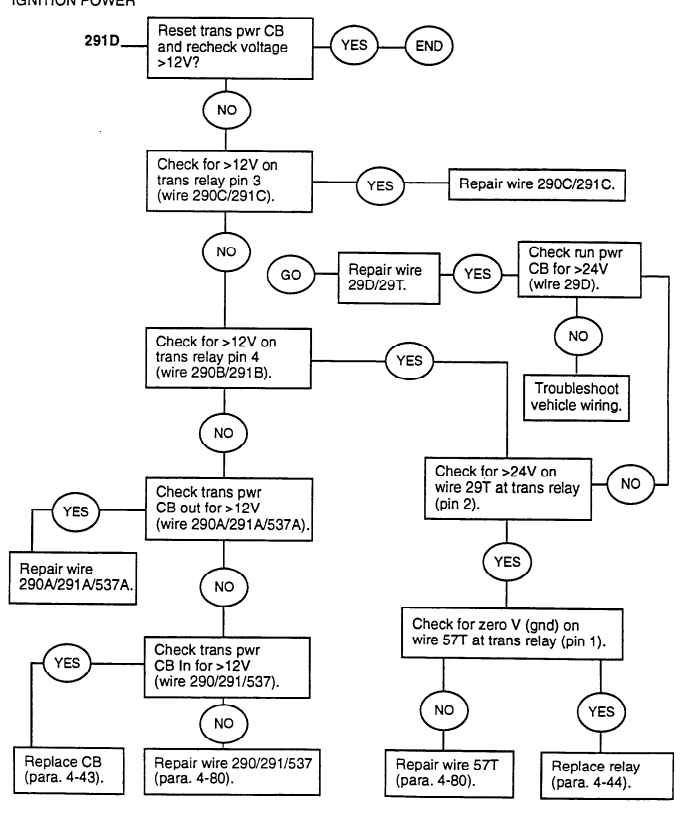

BATTERY CIRCUIT 
537D 
DIAGNOSTIC FLOWCHART TRANSMISSION SYSTEM 

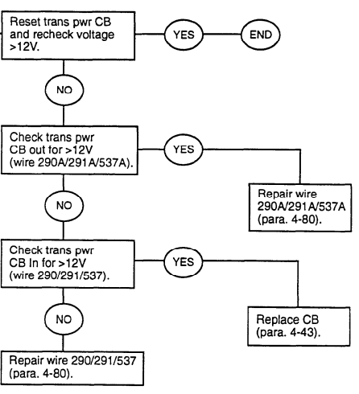

VEHICLE GROUND CIRCUIT 

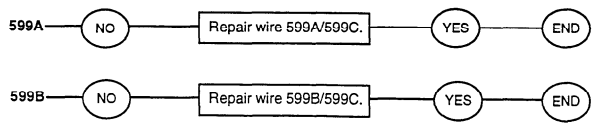

TRANSMISSION LIGHT CIRCUIT 

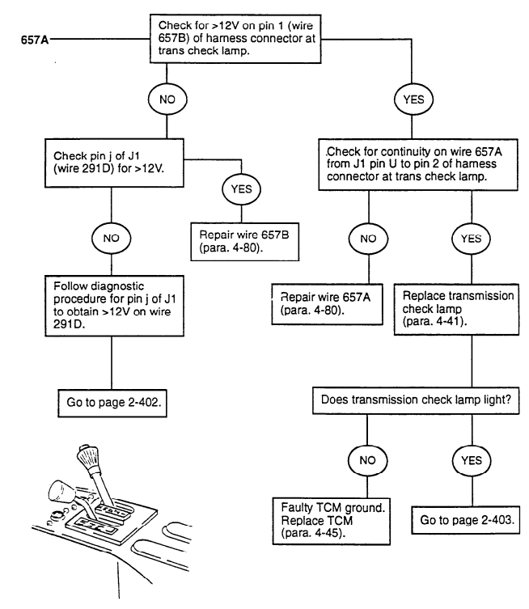

DIAGNOSTIC FLOWCHART TRANSMISSION SYSTEM 
BRAKE SWITCH CIRCUIT 

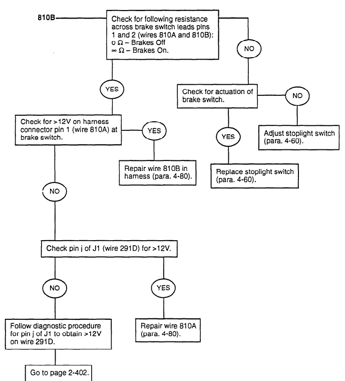

TRANSMISSION SYSTEM
ENGINE RPM SENSOR

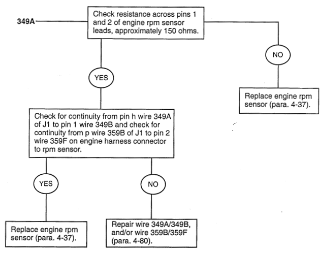

## Diagnostic Flowchart Transmission System

THROTTLE POSITION SENSOR 
CIRCUIT 

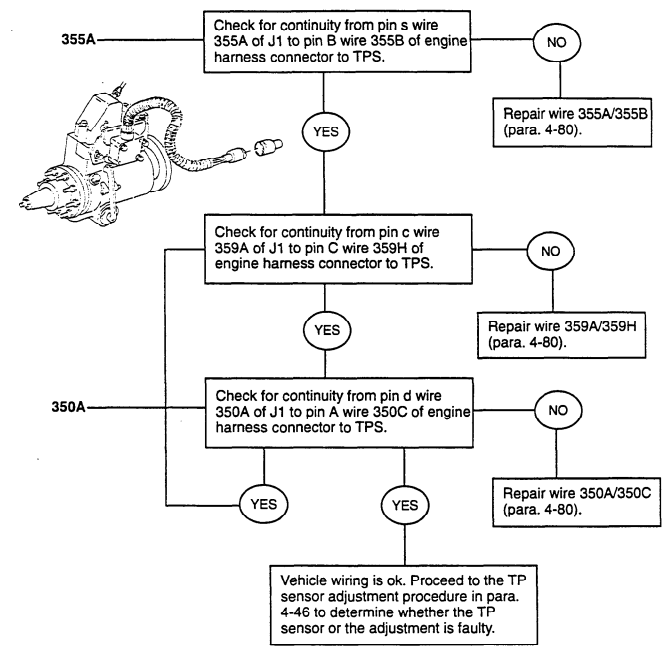

## Transmission System Diagnostic Flowchart

TRANSMISSION INPUT SPEED SENSOR (TISS) ClRCUlT 
495A 496A 

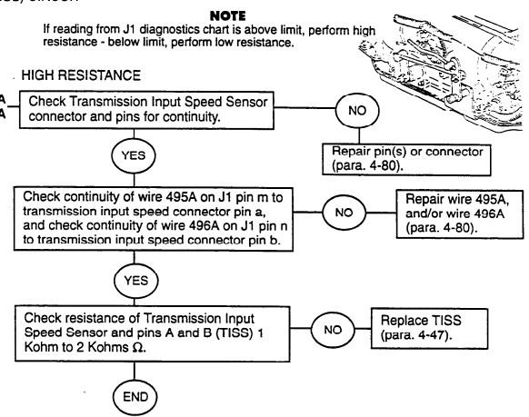

## Low Resistance

Disconnect TISS and check continuity between pins M and N at **Jl .** 
Repair wire 495A/496A 

 (para. 4-80). 

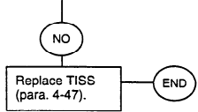

## Diagnostic Flowchart Transmission System

TRANSMISSION OUTPUT SPEED 
SENSOR (TOSS) CIRCUIT 

NOTE 

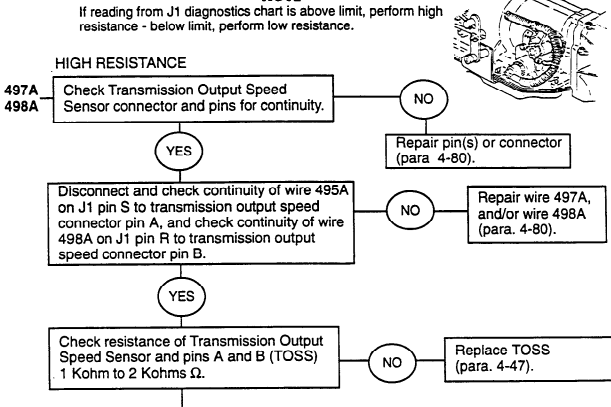

## Low Resistance

Repair wire 497Al498A 
(para. 4-80). 

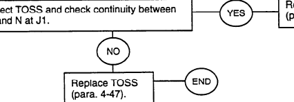 pins M and N at **Jl .** 
TORQUE CONVERTER CLUTCH 
SOLENOID CIRCUIT 

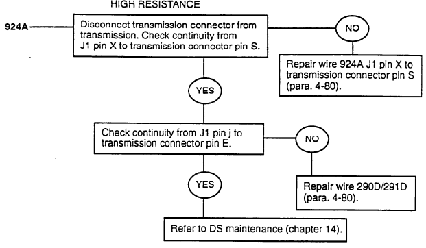

LOW RESISTANCE 

. 

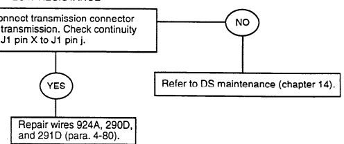

DIAGNOSTIC FLOWCHART TRANSMISSION SYSTEM 
1-2 SHIFT SOLENOID CIRCUIT SHIFT SOLENOID A 

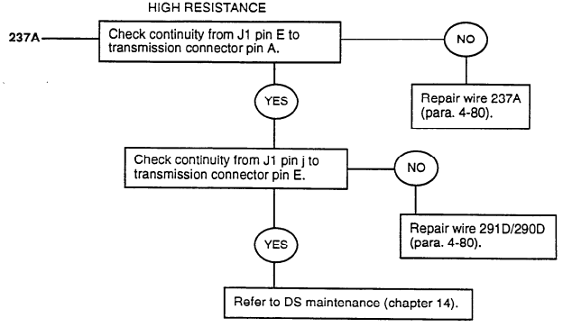

LOW RESISTANCE 

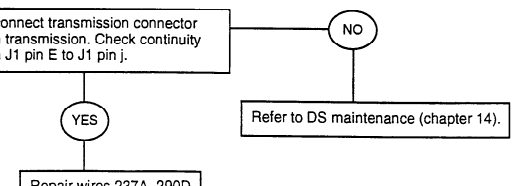

Repair wires 237A, 290D, and 291 D (para. 4-80). 

2-3 SHIFT SOLENOID CIRCUIT SHIFT 
SOLENOID 6 

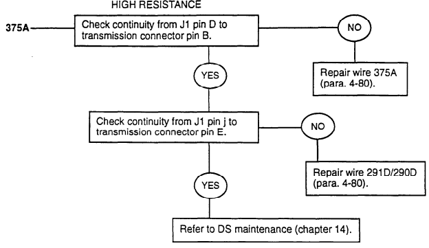

LOW RESISTANCE 
, 

Disconnect transmission connector 

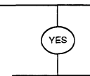 from transmission. Check continuity from Jl pin D to Jl pin j. 

Repair wires 375A, 290D, and 291 D (para. 4-80). 

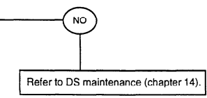

# Diagnostic Flowchart Transmission System

PRESSURE CONTROL SOLENOID CIRCUIT FORCE MOTOR HIGH 

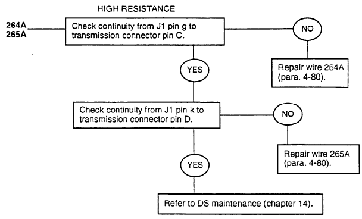

LOW RESISTANCE 

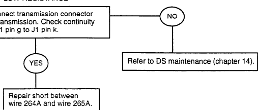

TRANSMISSION RANGE PRESSURE 
SWITCH, CIRCUIT PRESSURE SWITCH A 

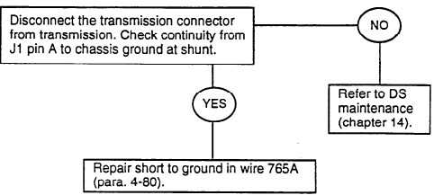

TRANSMISSION RANGE PRESSURE 
SWITCH, CIRCUIT PRESSURE SWITCH B 

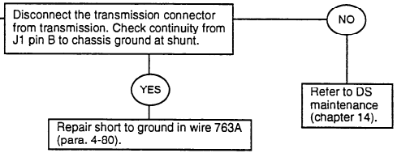

TRANSMISSION RANGE PRESSURE 
SWITCH, CIRCUIT PRESSURE SWITCH C 

764A Disconnect the transmission connector 

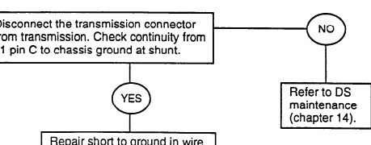

Repair short to ground in wire 
764A (para. 4-80). 

## Diagnostic Flowchart Transmission System

TRANSMISSION TEMPERATURE SENSOR 
The Transmission Temperature Sensor (ITS) is a thermistor. The resistance decreases temperature increases. At 68°F (2O"C), the resistance should be from 2,980 to 4,020 ohms. At 248°F 
(12O"C), the resistance should be 90 to 111 ohms. 

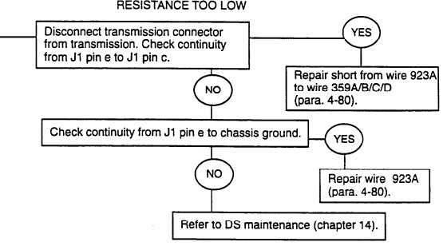

## Resistance Too High

Disconnect transmission connector from transmission. Check , 

continuity from Jl pin e to transmission connector pin L. 

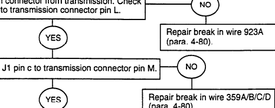

Check continuity from Jl pin c to transmission connector pin M. 
1 Refer to DS maintenance (chapter 14). 1 

# 2-41. Brake System Tests

These brake system tests may be run any time you think you have a braking problem or if you were sent here by another test chain. Just follow the path, answering the questions. Additional information and notes are given on the facing page when necessary. Fold-out pages FP-22.1 (serial numbers 299999 and below) or fold-out page FP-23 (serial numbers 300000 and above) may be left open for reference while testing.

- The brake lights and the parking brake warning lamp are not diagnosed here. If you are having trouble with these parts and you are sure the brakes are OK, go to instruments, page 2-314, for the warning lamp or lights; page 2-376 for the brake lights.

- When parking brake handle is pulled, the parking brake is applied to the left and right rear brake service rotors.

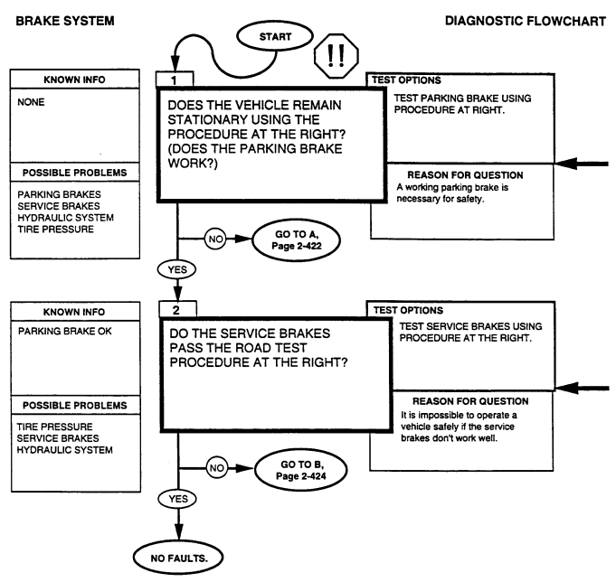

## Reference Information

BRAKE SYSTEM 

1 **WARNING** 
Make sure **the area is clear of** 

personnel and obstacles prior to performing this test. Failure to do so may result in serious injury. 

#### Parking Brakf Test Procfdure:

1. Depress service brake pedal and start engine. 

2. Place transmission shift lever in D (drive) and transfer case shift lever in H (high). 

3. Apply parking brake. Slowly let up on service brake pedal. Vehicle should remain stationary. 

#### Sfrvicf Brakf Road Test Procfdurf-

1. On an open, smooth, flat surface, accelerate to a steady, reasonable, safe speed (below posted limits). 

2. Apply pressure on the brake pedal and bring the vehicle to a stop. 

3. Repeat this procedure several times, applying a different brake pedal pressure each time. Look for the following symptoms, which may indicate a problem with the service brakes: 
1) Spongy or pulsating brake pedal. 

2) Incomplete brake pedal return. 

3) Excessive pull to one side. 4) Unusually long braking distance. 5) Front wheels lock up before rear wheels. 6) Brake warning light comes on while braking. 7) A squealing, grinding, or chattering noise while braking. 

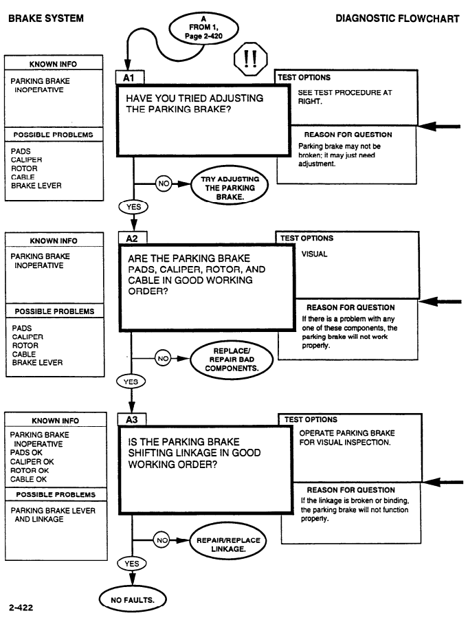

#### Reference Information

BRAKE SYSTEM 

#### Parking Brakf

A. 

Chock wheels and release parking brake handle. 

B. 

C. 

Turn adjusting knob at the tip of the brake handle clockwise as tight as possible by hand. Apply parking brake handle. 

D. 

If parking brake cannot be applied, turn adjusting knob counterclockwise until parking brake can be applied. 

E. 

Test parking brake. 

Make sure the area is clear of personnel and obstacles prior to performing this test. Failure to do so may result in serious injury. 

(1) (2) 
(3) 
(4) 
Remove chocks. Depress service brake pedal and start engine. Place transmission shift lever in D (drive) and transfer case shift lever in H (high). Apply parking brake and slowly let up on service brake pedal. Vehicle should remain stationary. 

Replace or repair parts (para. 7-l). 

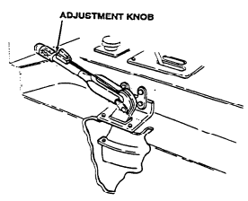

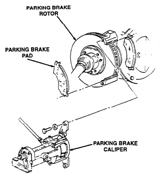

-I 
Repair or replace linkage (para. 7-19). 

.-- 

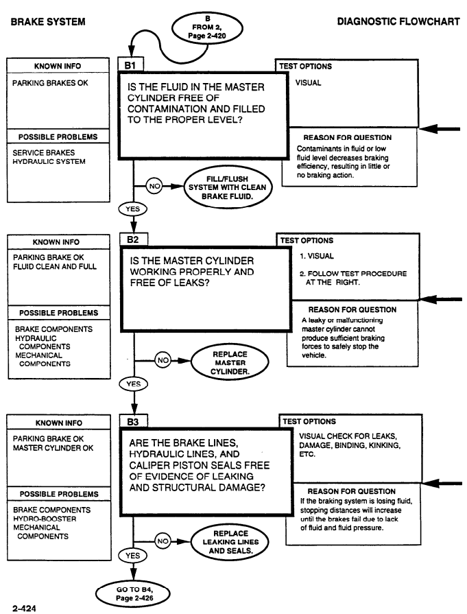

REFERENCE INFORMATION **BRAKE SYSTEM**

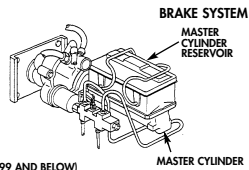

(S/N 299999 AND BELOW)
Flush and bleed the brake system (para. 7-2 or 7-2.1).

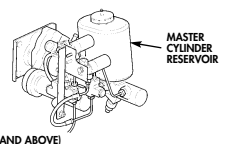

(S/N 300000 AND ABOVE)
Master cylinder test procedure: 1. With the engine off, pump the brake pedal six or seven times, or until the pedal becomes noticeably stiffer and harder to depress.

2. Press hard on the brake pedal. If the pedal keeps going down to the floor, either the master cylinder is bad or there is a leak in the hydraulic system.

Replace master cylinder (para. 7-5 or para. 7-5.1).

(S/N 299999 AND BELOW)
Check the individual lines going to each brake. Check the supply and return lines to the hydro-booster unit. Replace brake line (para. 7-7 or para. 7-7.1).

NOTE
Brake hydraulic system must be bled of air whenever hydraulic lines are broken. Bleed service brake (para. 7-2 or para. 7-2.1).

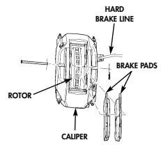

(S/N 300000 AND ABOVE)

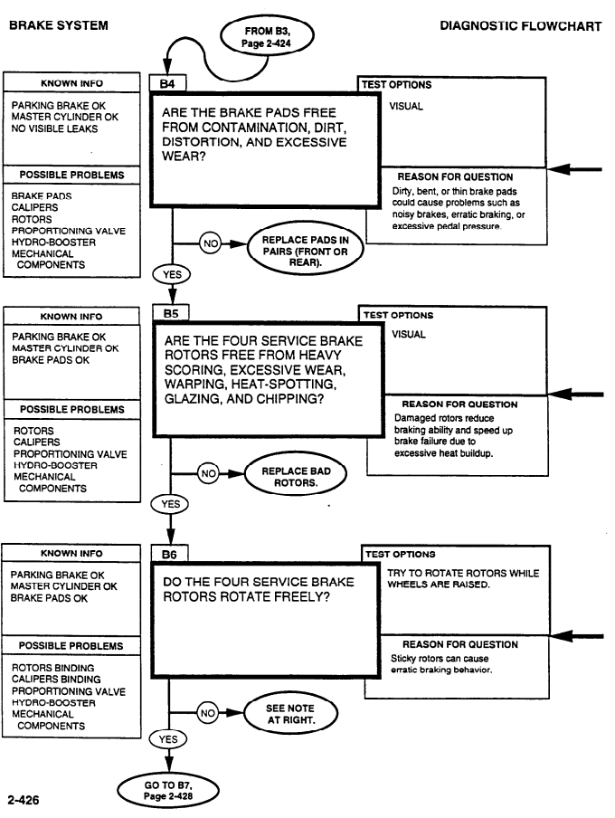

TM 9-2320-387-24-1 Replace brake pads (para. 7-3 or para. 7-3.1). The minimum brake pad thickness is 1/8 in. (3.2 mm) (serial numbers 299999 and below) 3/16 in. (4.8 mm) (serial numbers 300000 and above).

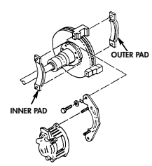

(S/N 299999 AND BELOW)
Replace service brake rotor(s) (para. 7-12 or para. 7-12.1).

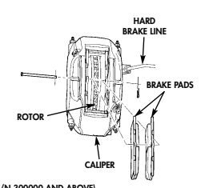

(S/N 300000 AND ABOVE)
The only way the rotors can be sticking is if the calipers are not releasing fully. Remove calipers. clean and lubricate guide pins with grease. Replace and clean brake caliper (para. 7-4 or para. 7-4.1).

NOTE
When parking brake handle is pulled the parking brake is applied to the left and right rear brake service rotors.

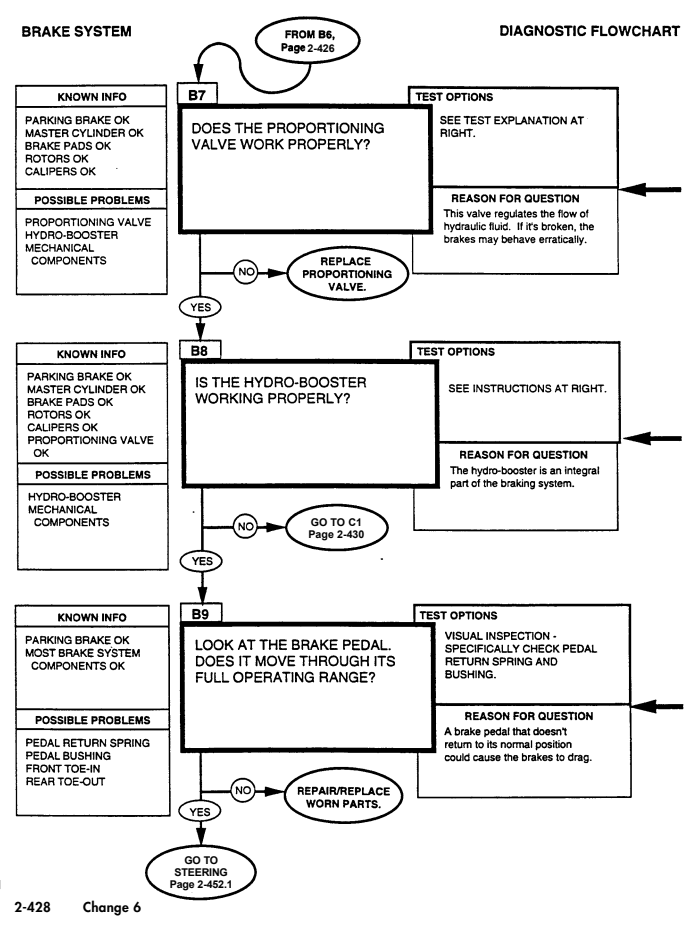

■
Test for faulty proportioning valve: Drive the vehicle and have an assistant observe during the performance of this test. With vehicle at curb weight, decelerate vehicle from 45 to 40 mph (72 to 69 kph) on dry concrete road and apply sufficient pressure to lock up front brakes. If rear brakes lock up before front brakes, the proportioning valve should be replaced. Replace proportioning valve (para. 7-10).

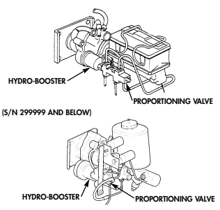

(S/N 300000 AND ABOVE)
Method for checking hydro-booster: Depress brake pedal several items to exhaust accumulator pedal. Depress brake pedal and start engine. Brake pedal should fall, then push back against operator's foot. Replace hydro-booster (para. 7-6).

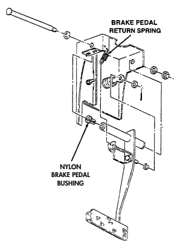

Replace service brake pedal (para. 7-9). The steering tests will check for suspension problems that will affect braking.

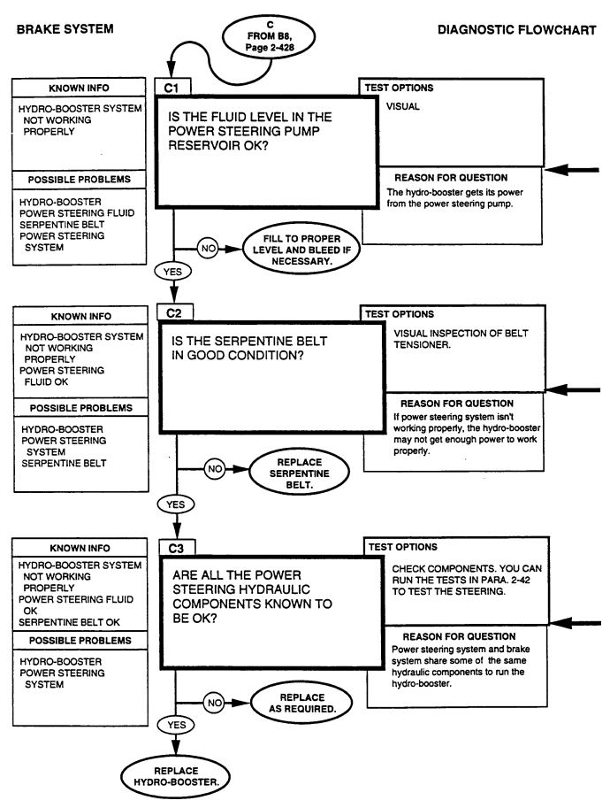

TM 9-2320-387-24-l REFERENCE INFORMATION BRAKE SYSTEM 
-I Bleed power steering system (para. 8-27). 

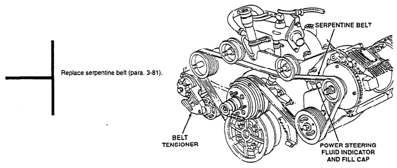

A defective power steering pump, gear, hoses, or control valve could affect hydra-booster operation. 

# 2-42. Steering System Tests (Serial Numbers 299999 And Below)

These steering system tests may be run any time you have a steering problem or if you were sent here by another test chain. Just follow the path, answering the questions. Additional information and notes are given on the facing page when necessary. The fold-out page shows the location of the major components of the steering in case you are not familiar with them. These parts are shown in a schematic manner. Illustrations of the actual components are given wherever applicable on the reference pages of the diagnostics. Fold-out page FP-24.1 may be left open for reference while testing. The functional flow diagram shows the mechanical and hydraulic parts of the system and how they interact. Even if the hydraulic system fails, you will still be able to steer the vehicle, although it will require more effort.

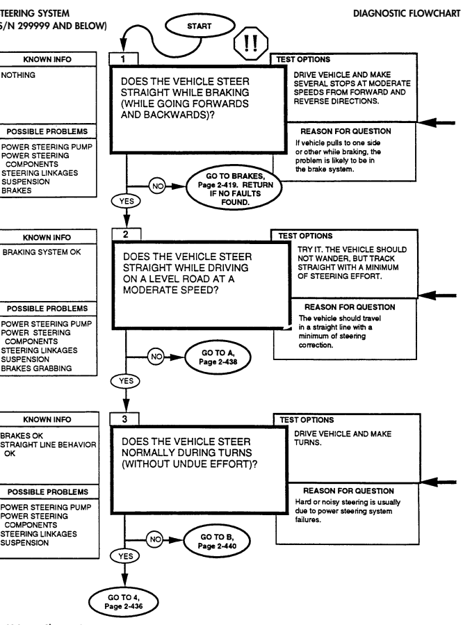

2-434 STEERING SYSTEM
(S/N 299999 AND BELOW)  ▼

WARNING

Make sure that the area where you conduct these tests is free of natural and man-made obstructions. Failure to do so may result in serious injury.

# · Prior To Performing These Tests:

Visually inspect steering components:
1. Check all four tires and rims for wear, inflation, damage, or warping.

a. Adjust tire pressure (TM 9-2320-387-10). b. Replace any unserviceable rims (para. 8-4).

2. Check steering linkage for damage.

a. Replace any damaged steering linkage components (para. 8-11). b. Lubricate steering linkage (TM 9-2320-387-10).

3. Check power steering fluid for contamination and level
(TM 9-2320-387-10).

a. Drain and replace any fluid that appears black and smells burnt. b. Bleed air from system where fluid appears milky white (para. 8-27).

4. Check serpertine drivebelt for fraying, cracks, or damage.

Replace damaged serpentine drivebelt (para. 3-81).

While travelling at a moderate speed (20 mph (32 kph)), apply the brakes while applying minimal pressure to the steering wheel. If pull to one side or the other occurs, make a note of the speed and on what side of the vehicle it occurs. Repeat this  procedure for different speeds and braking forces. If the vehicle seems to steer straight while braking, there probably isn't a problem with the brakes (at least not one that affects the steering). If the braking action feels strange in any way, the brake diagnostics should be run to assure vehicle safety. This test will usually reveal problems with frozen brake calipers.

If the wheels are out of alignment or if the tires are worn unevenly, vehicle may wander.

Symptoms of bad steering characteristics include hard steering, excesssive play in steering, a momentary increase in steering effort when tuming whee!

quickly, and jerking of the steering wheel when turning.

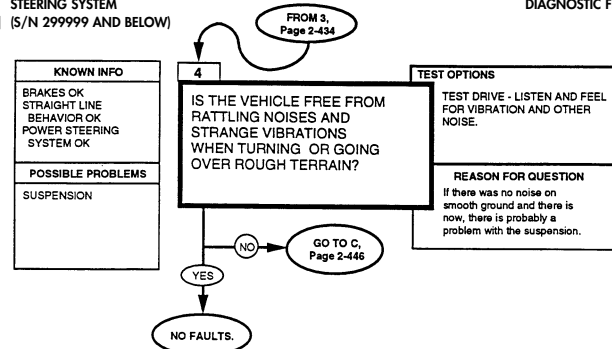

TM 9-2320-387-24-1 REFERENCE INFORMATION STEERING SYSTEM
(S/N 299999 AND BELOW)

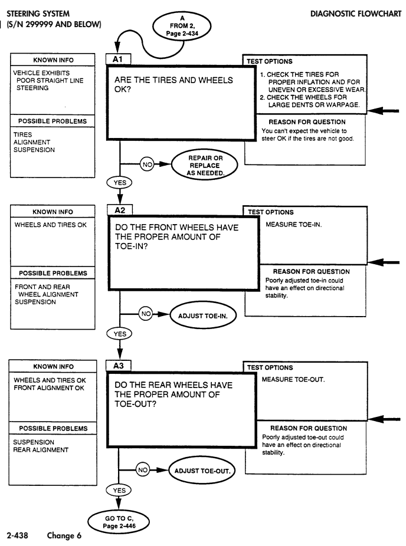

TM 9-2320-387-24-1 REFERENCE INFORMATION
STEERING SYSTEM
(S/N 299999 AND BELOW)  ■
Uneven tire wear can be caused by improper inflation, suspension misalignment or damage, hard service, or wheel imbalance. For wheel and tire replacement and maintenance procedures, refer to para. 8-3.

For instructions on adjusting front wheel toe-in, refer to para. 8-9.

For instructions on adjusting rear wheel toe-out, refer to para. 8-10. Part C will test out the suspension parts to see if they are OK.

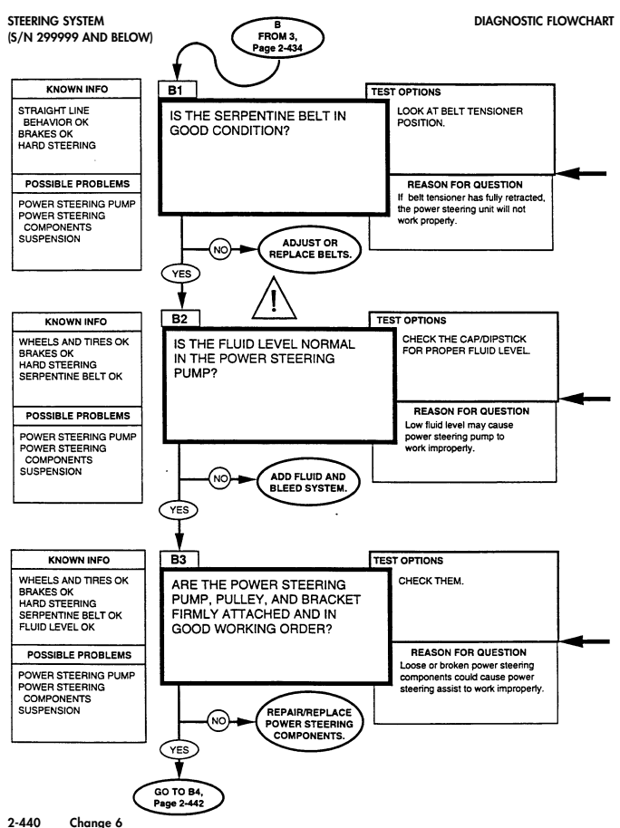

STEERING SYSTEM
(S/N 299999 AND BELOW)   ▼
Check serpentine belt tensioner position.

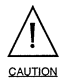

Do not overfill hydraulic fluid.

See TM 9-2320-387-10 for fluid replacement procedure. For bleeding procedure, refer to para. 8-27.

Low fluid level could indicate a problem elsewhere in the system; either leaking hydraulic lines or a leaking or damaged power steering pump. If adding fluid seems to cure the problem, you should probably run the rest of the tests to make sure there aren't any other problems.

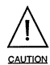

Serpentine belt failure (abnormal wear or belt dislodgement) can be caused by misalignment of pulleys, improper installation, or foreign objects introduced into belt path. Inspect water pump pulley for proper installation and ease of rotation. Any wobble or misalignment will cause belt failure. Refer to para. 3-81 for pulley alignment procedures.

A loose pump, pulley, or bracket could cause excess noise, slipping belt, or other malfunctions. For appropriate repair or replacement procedures, refer to para. 8-23.

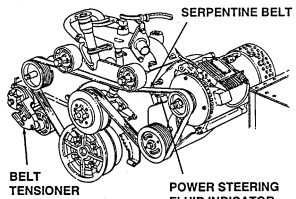

FLUID INDICATOR
AND FILL CAP
STEERING SYSTEM **DIAGNOSTIC FLOWCHART** (S/N 299999 AND BELOW)
KNOWN INFO
WHEELS AND TIRES OK BRAKES OK HARD STEERING 
SERPENTINE BELT, FLUID OK
PUMP, PULLEY, 
BRACKET LOOK OK
POSSIBLE PROBLEMS LEAKS HYDRAULIC SYSTEM POWER STEERING 
COOLER

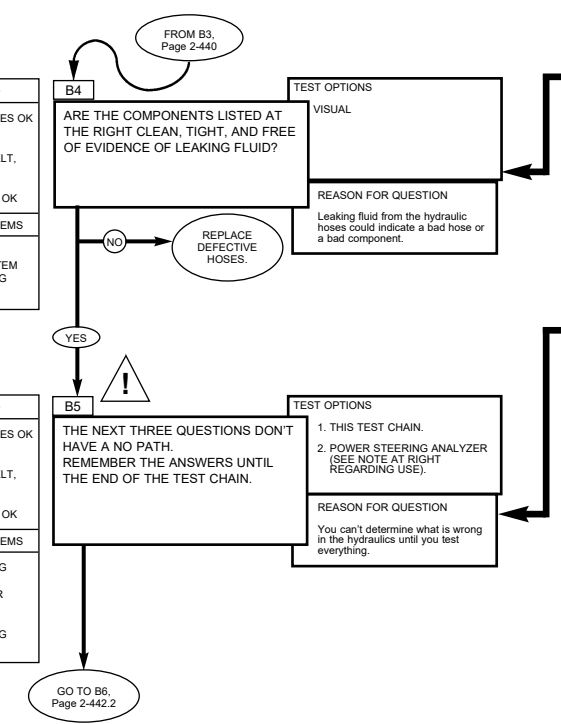

KNOWN INFO
WHEELS AND TIRES OK BRAKES OK HARD STEERING 
SERPENTINE BELT, FLUID OK
PUMP, PULLEY, 
BRACKET LOOK OK
POSSIBLE PROBLEMS POWER STEERING HYDRAULICS HYDRO-BOOSTER STEERING GEAR FAN DRIVE POWER STEERING 
COOLER
REFERENCE INFORMATION STEERING SYSTEM
(S/N 299999 AND BELOW)
Check hydraulic hoses, power steering pump, power steering cooler, hydraulic control valve, hydro-booster unit, steering gear, fan shroud, and fan clutch. See hose replacement procedures (refer to para 8-24). Check power steering cooler for bent fins or any other airflow restrictions. Straighten fins or replace power steering cooler (para. 3-8) if damaged beyond repair.

1. With engine off, disconnect pressure hose from hydro-boost and connect tube and quickdisconnect to hydro-boost.

NOTE
Have drainage container ready to catch fluid.

2. Connect adapter and quick-disconnect to pressure hose.

3. Connect hose from valve on power steering analyzer to tube and quick-disconnect on hydro-boost.

4. Connect hose from gauge side of power steering analyzer to adapter and quickdisconnect on pressure hose.

5. Loosen hose clamp and remove cooler hose from return tube on steering gearbox.

6. Plug hose with plug or bolt (3/8 in. or 10 mm dia.) and secure with hose clamp. 

7. Connect bypass hose to tube on steering gearbox and secure with hose clamp. 

(continued on page 2-443)

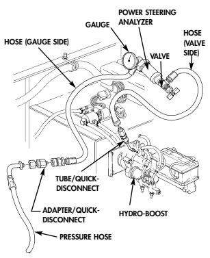

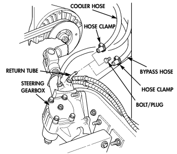

TM 9-2320-387-24-1 STEERING SYSTEM DIAGNOSTIC FLOWCHART (S/N 299999 AND BELOW)

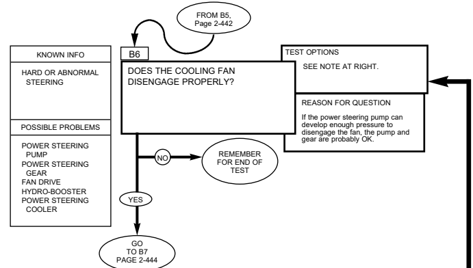

## Reference Information **Steering System**

(S/N 299999 AND BELOW)
8. Loosen hose clamp and remove control valve return hose from tube on power steering pump. 9. Plug return hose with plug or bolt (3/8 in. or 10 mm dia.) and secure with hose clamp. 10. Connect other end of bypass hose to tube on power steering pump and secure with hose clamp. 11. Connect STE/ICE-R to vehicle diagnostic connector and set for measuring RPM (para. 2-46). 12. Open analyzer valve to full open position. 13. Start engine (Refer to TM 9-2320-387-10). 14. Remove power steering reservoir cap and turn steering wheel all the way left, hold in place for 5 seconds, then repeat process with steering wheel all the way right. This releases air from the system.

15. Return steering wheel to center position and shut engine off (para. 3-45).

16. Check and add power steering fluid to reach FULL COLD level in reservoir (Refer to TM 9-2320-387-10).

17. Start engine (Refer to TM 9-2320-387-10)
and allow engine to idle and reach operating temperature of 190° F 

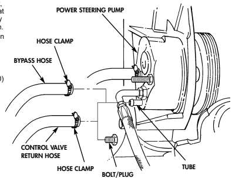

to 230° F.

18. Check for proper engine idle speeds and adjust if necessary (para. 3-45).

6.5L engine 700±25 RPM 6.5L detuned engine 700±25 RPM
19. Ensure analyzer valve is in full open position and engine is at proper idle speed.

20. Initial pressure should be 150-250 psi and a flow of 2.50-3.50 gpm. If these specifications aren't present, check installation of analyzer and check power steering system (Refer to TM 9-2320-387-10).

21. With power steering system working properly, partially close analyzer valve until pressure reaches 700 psi. If flow rate varies more than 1 gpm from the initial reading, replace power steering pump (para. 8-23). 

CAUTION
Do not leave analyzer valve fully closed for more than 5 seconds. Severe damage may occur to power steering pump.

22. With engine at idle, close and open analyzer valve three times, recording pressure each time. All readings should be 1300 psi or higher, if pressure is lower, replace power steering pump (para. 8-23).

23. With analyzer valve in the open position, increase engine rpm to 1500 and record fluid flow. If fluid flow varies more than 1 gpm from initial reading, replace power steering pump (para. 8-23).

24. With engine at idle, turn steering wheel all the way left, hold in place for 5 seconds, then repeat process with steering wheel all the way right and record flow rates. If flow rate does not drop to 1 gpm or less, replace steering gearbox (para. 8-20).

25. With engine at idle, turn wheels slightly left and right and release quickly. If pressure does not increase and snap back within 2 seconds, check steering shaft and column for binding and repeat step 15. If pressure still does not increase and snap back, replace steering gearbox (para. 8-20).

26. With engine at idle, push brake pedal down and hold. Record pressure. If pressure varies more than 50 psi from step 22, replace hydro-boost (para. 7-6).

27. With engine at idle, push brake pedal down and release quickly. If pressure does not increase and snap back within 2 seconds, replace hydro-boost (para. 7-6). 

28. Shut off engine. Remove power steering analyzer and restore power steering system to original configuration. 29. Bleed power steering system (para. 8-27).

You must be certain that the engine cooling system is working ok, or this test won't tell you anything. If the engine is cold, and everything is working ok, the fan should be disengaged. You can tell by gently revving the engine in neutral with the hood open. If the fan is engaged you will feel a breeze outside the driver's door. If it's disengaged, you won't feel it. If you aren't sure if it's working ok, run the tests in Paragraph 2-31.

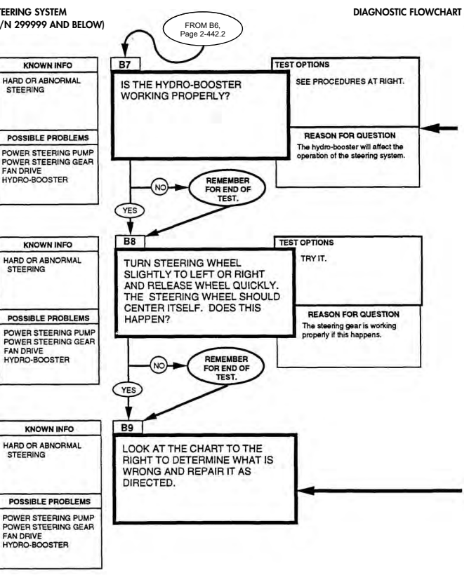

STEERING SYSTEM
(S/N 299999 AND BELOW)  ▼
Method for checking hydro-booster. Depress brake pedal several times to exhaust accumulator. Depress brake pedal and start engine. Brake pedal should fall and then push back against operator's foot

|     | ANSWERS TO QUESTION:   |     | COMPONENT             |
|-----|------------------------|-----|-----------------------|
| Be  | B7                     | B8  | TO REPLACE            |
| NO  | NO                     | NO  | POWER STEERING PUMP   |
| NO  | NO                     | YES | SEE NOTE              |
|     |                        |     | BELOW                 |
| NO  | YES                    | NO  | SEE NOTE              |
|     |                        |     | BELOW                 |
| NO  | YES                    | YES | BUN ENGINE COOLING    |
|     |                        |     | TEST (PARA. 2\-25)    |
| YES | NO                     | NO  | POWER STEERING PUMP   |
| YES | NO                     | YES | HYDRO\-BOOSTER        |
| YES | YES                    | NO  | DS LEVEL (CHAPTER 14) |
|     |                        |     | STEERING GEAR         |
| YES | ਮES                    | YES | NO FAULTS             |

NOTE
To diagnose the second and third cases to one item, it is necessary to have a power steering analyzer. Additionally, for all cases, check the hoses for the particular part to make sure they are OK.

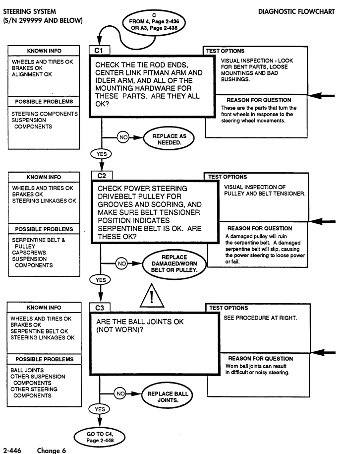

STEERING SYSTEM
(S/N 299999 AND BELOW)   ▼

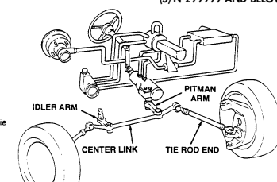

Check for looseness in idler arm and pitman arm (paras. 8-17 and 8-13). For replacing center link, refer to para. 8-14. For replacing tie rods, refer to para. 8-16.

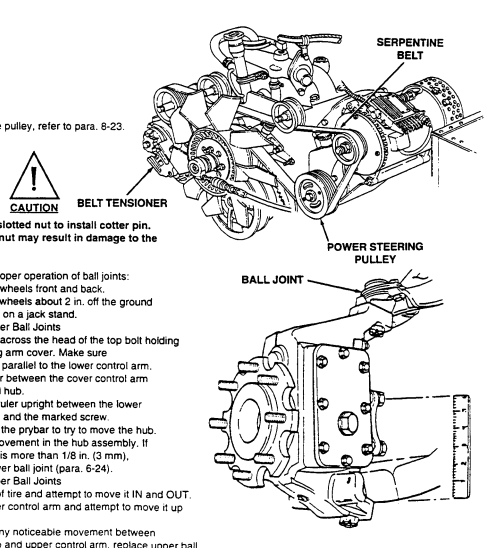

For replacing the pulley, refer to para. 8-23.

Do not loosen slotted nut to install cotter pin.

Loosening the nut may result in damage to the To check for proper operation of ball joints: (1) Chock rear wheels front and back. (2) Raise front wheels about 2 in. off the ground and support on a jack stand.

a. For Lower Ball Joints the steering arm cover. Make sure
(4) Put a prybar between the cover control arm
(5) Set a 6-in. ruler upright between the lower control arm and the marked screw.

(6) Push down the prybar to try to move the hub.

(7) Measure movement in the hub assembly. If replace lower ball joint (para. 6-24).

(10) If there is any noticeable movement between geared hub and upper control arm, replace upper ball
equipment.

and geared hub.

b. For Upper Ball Joints and down.

joint (para. 6-23).

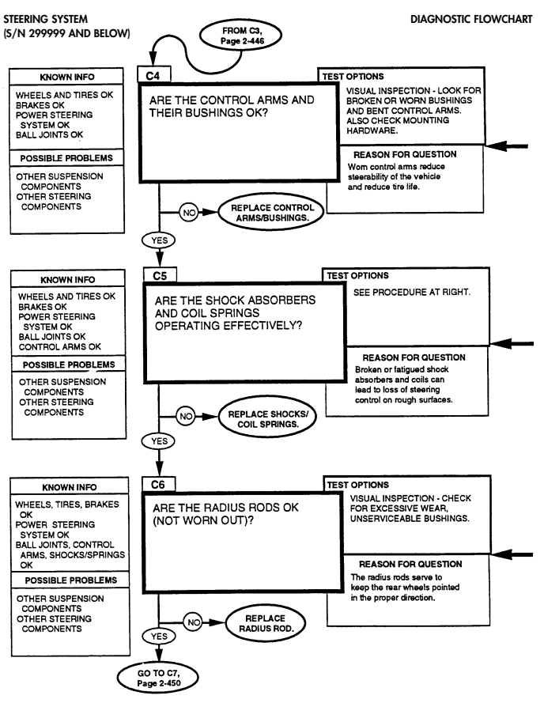

STEERING SYSTEM
(S/N 299999 AND BELOW)  ■
For upper and lower control arm and bushing replacement instructions, refer to paras. 6-25 and 6-26.

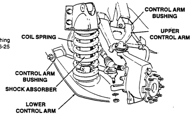

 To test the shocks and springs, drive the vehicle over a variety of terrain. If the vehicle continues to bounce after hitting a bump, the shocks may be wom. If the vehicle bottoms out on the suspension, the shocks may be worn. If the vehicle sags when loaded, the springs may be worn. If the shock absorber bodies are not warm after driving the vehicle, the shocks are no good.

For coil spring and shock absorber replacement instructions, refer to paras. 6-27 and 6-28.

For instructions on replacing the radius rod, refer to para. 6-22.

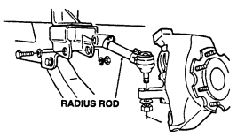

# Steering System

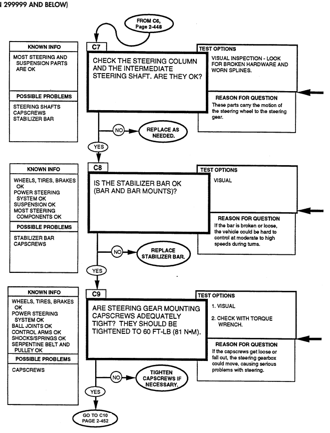

REFERENCE INFORMATION STEERING SYSTEM
(S/N 299999 AND BELOW)
NOTE

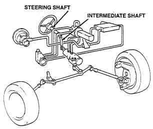

Inspect intermediate shaft U-joints for wear, binding, or missing/damaged grease fittings. Replace or lubricate as necessary. Refer to (para. 8-21) for replacement and TM 9-2320-387-10, Appendix G, for lubrication instructions.

Replace the steering column and intermediate shaft (paras. 8-18 and 8-19).

Replace the stabilizer bar (para. 6-20).

If you still have a problem, rerun the test

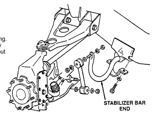 chain to make sure you didn't miss anything. If you didn't go down the A chain, you may want to run those tests in order to check out the hydraulic parts of the steering system.

(S/N 299999 AND BELOW)
KNOWN INFO
WHEELS, TIRES, BRAKES
OK
POWER STEERING
SYSTEM OK
BALL JOINTS OK CONTROL ARMS OK SHOCKS/SPRINGS OK SERPENTINE BELT &
PULLEY OK
CAPSCREWS OK
POSSIBLE PROBLEMS CRACKS AT BOSS
WELDS OR INNER/OUTER FRAME RAILS

STEERING SYSTEM **DIAGNOSTIC FLOWCHART**

problems with steering.
2. REMOVE STEERING GEAR
(PARA. 8-20) AND INSPECT FOR
REASON FOR QUESTION If cracks are present in the welds or inner/outer frame rails, the steering gear could move, causing serious

# 2-42.1. Steering System Tests (Serial Numbers 300000 And Above)

These steering system test may be run any time you have a steering problem or if you were sent here by another test chain. Just follow the path, answering the questions. Additional information and notes are given on the facing page when necessary. The fold-out page shows the location of the major components of the steering in case you are not familiar with them. These parts are shown in a schematic manner. Illustrations of the actual components are given whenever applicable on the reference pages of the diagnostics. Fold-out page FP-25 in Appendix F may be left open for reference while testing. The functional flow diagram shows the mechanical and hydraulic parts of the system and how they interact. Even if the hydraulic system fails, you will still be able to steer the vehicle, although it will require more effort.

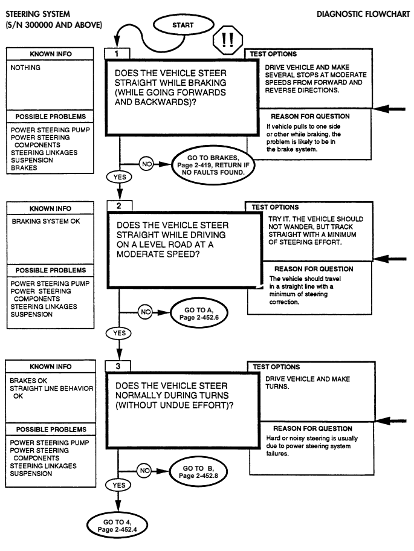

REFERENCE INFORMATION STEERING SYSTEM
(S/N 300000 AND ABOVE)

Make sure that the area where you conduct these tests is free of natural and man-made obstructions. Failure to do so may result in serious injury.

PRIOR TO PERFORMING THESE TESTS: Visually inspect steering components: 1. Check all four tires and rims for wear, inflation, damage, or warping.

a. Adjust tire pressure (TM 9-2320-387-10). b. Replace any unserviceable rims (para. 8-4.1).

2. Check steering linkage for damage.

a. Replace any damaged stering linkage components (para. 8-20.1). b. Lubricate steering linkage (TM 9-2320-387-10).

3. Check power steering fluid for contamination and level (TM 9-2320-387-10).

a. Drain and replace any fluid that appears black and smells burnt. b. Bleed air from system where fluid appears milky white 
(para. 8-27).

4. Check serpentine drivebelt for fraying, cracks, or damage. 

Replace damaged serpentine drivebelt (para. 3-81.2).

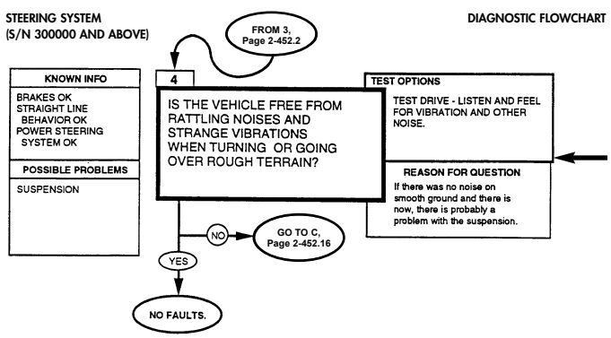

TM 9-2320-387-24-1 REFERENCE INFORMATION STEERING SYSTEM
(S/N 300000 AND ABOVE)

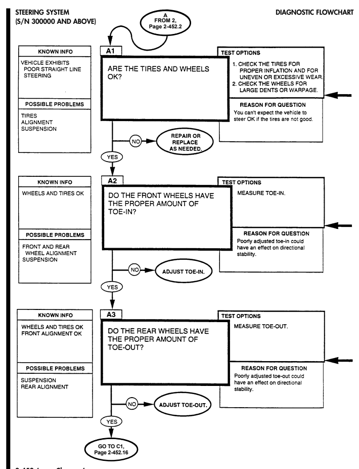

TM 9-2320-387-24-1 REFERENCE INFORMATION STEERING SYSTEM
(S/N 300000 AND ABOVE)
Uneven tire wear can be caused by improper inflation, suspension misalignment or damage, hard service, or wheel imbalance. For wheel and tire replacement and maintenance procedures (refer to para. 8-3).

For instructions on adjusting front wheel toe-in (refer to para. 8-9).

For instructions on adjusting rear wheel toe-in (refer to para. 8-10). Part C will test out the suspension parts to see if they are OK.

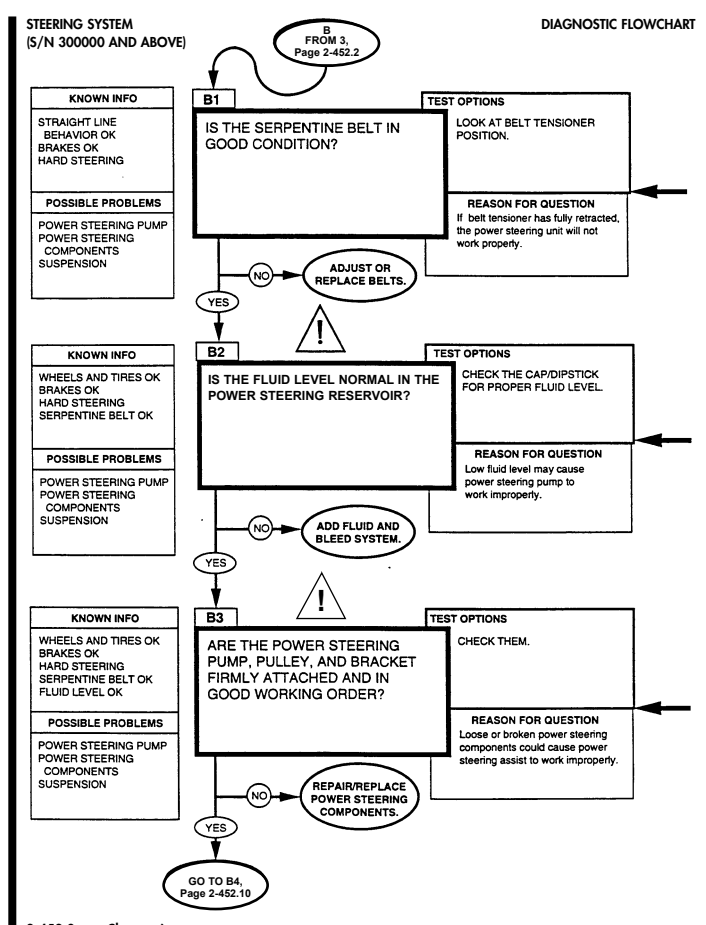

REFERENCE INFORMATION **STEERING SYSTEM**
(S/N 300000 AND ABOVE)
See TM 9-2320-387-10 for fluid replacement procedure. 

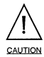 For bleeding procedure (refer to para. 8-27).

Serpentine belt failure (abnormal wear or belt

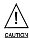 dislodgement) can be caused by misalignment of pulleys, improper installation, or foreign objects introduced into belt path. Inspect water pump pulley for proper installation and ease of rotation. Any wobble or misalignment will cause belt failure. Refer to (para. 3-81.2) for pulley alignment procedures. A loose pump, pulley, or bracket could cause excess noise, slipping belt, or other malfunctions. For appropriate repair or replacement procedures (refer to para. 8-23).

STEERING SYSTEM **DIAGNOSTIC FLOWCHART** (S/N 300000 AND ABOVE)

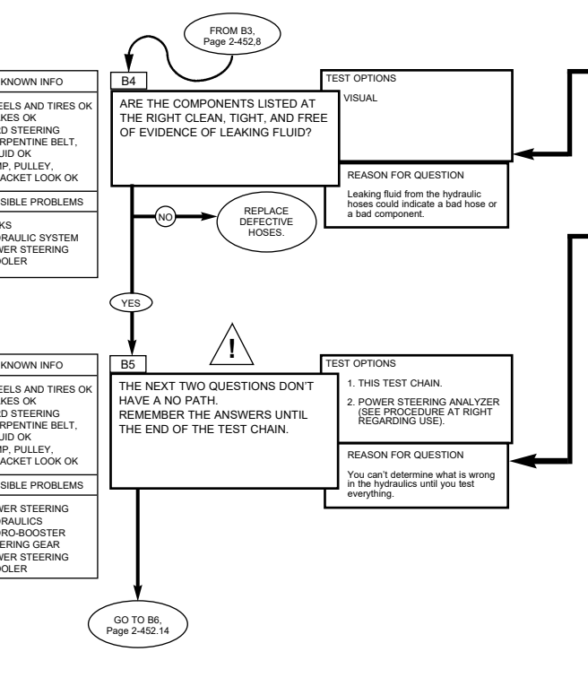

BRAKES OK
FLUID OK
HYDRAULICS
COOLER
BRAKES OK
FLUID OK
COOLER
LEAKS
REFERENCE INFORMATION STEERING SYSTEM
(S/N 300000 AND ABOVE)
Check hydraulic hoses, power steering pump, power steering cooler, hydro-booster unit, and steering gear. See hose replacement procedures (refer to para. 8-24.2). Check power steering cooler for bent fins or any other airflow restrictions. Straighten fins or replace power steering cooler (refer to para. 3-8.1) if damaged beyond repair.

1. With engine off, disconnect pressure hose from hydro-boost and connect tube and quick-disconnect to hydro-boost.

Have drainage container ready to catch fluid.

2. Connect adapter and quick-disconnect to pressure hose.

3. Connect hose from valve on power steering analyzer to tube and quick-disconnect on hydro-boost.

4. Connect hose from gauge side of power steering analyzer to adapter and quick-disconnect on pressure hose.

5. Connect STE/ICE-R to vehicle diagnostic connector and set for measuring RPM (refer to para. 2-46).

6. Open analyzer valve to full open position. 7. Start engine (refer to TM 9-2320-387-10). 8. Remove power steering reservoir cap and turn steering wheel all the way left, hold in place for 3 seconds, then repeat process with steering wheel all the way right. This releases air from the system.

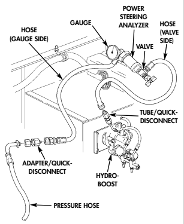

9. Return steering wheel to center position and shut engine off (refer to para. 3-45).

10. Check and add power steering fluid to reach FULL COLD level in reservoir 
(refer to TM 9-2320-387-10).

11. Start engine (Refer to TM 9-2320-387-10) and allow engine to idle and reach operating temperature of 190° F to 230° F.

12. Check for proper engine idle speeds and adjust if necessary (refer to para. 3-45).

6.5L engine 700±25 RPM
13. Ensure analyzer valve is in full open position and engine is at proper idle speed. 14. Initial pressure should be 250–400 psi and a flow of 4.00 gpm. If these specifications aren't present, check installation of analyzer and check power steering system (TM 9-2320-387-10).

15. With power steering system working properly, partially close analyzer valve until pressure reaches 700 psi. If flow rate varies more than 1 gpm from the initial reading, replace power steering pump (para. 8-23.1).

Do not leave analyzer valve fully closed for more than 3 seconds. Severe damage may occur to power steering pump.

16. With engine at idle, close and open analyzer valve three times, recording pressure each time. 

All readings should be 1600 psi or higher, if pressure is lower, replace power steering pump (para. 8-23.1).

17. With analyzer valve in the open position, increase engine rpm to 1500 and record fluid flow. If fluid flow varies more than 1 gpm from initial reading, replace power steering pump (para. 8-23.1).

## Steering System **Diagnostic Flowchart** (S/N 300000 And Above)

18. With engine at idle, turn steering wheel all the way left, hold in place for 1–3 seconds, then repeat process with steering wheel all the way right and record flow rates. If flow rate does not drop to 1 gpm or less, replace steering gearbox (refer to para. 8-20.1).

19. With engine at idle, turn wheels slightly left and right and release quickly. If pressure does not increase and snap back within 2 seconds, check steering shaft and column for binding and repeat step 9. If pressure still does not increase and snap back, replace steering gearbox (refer to para. 8-20.1).

20. With engine at idle, push brake pedal down and hold. Record pressure. If pressure varies more than 100 psi from step 16, replace hydro-boost (refer to para. 7-6).

21. With engine at idle, push brake pedal down and release quickly. If pressure does not increase and snap back within 2 seconds, replace hydro-boost (refer to para. 7-6). 

22. Shut off engine. Remove power steering analyzer and restore power steering system to original configuration.

23. Bleed power steering system (refer to para. 8-27).

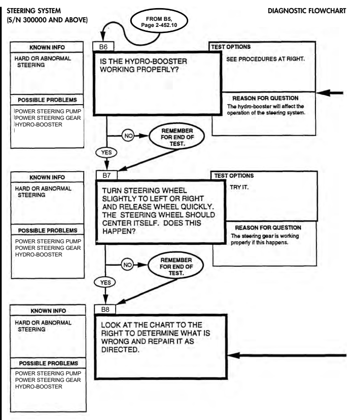

REFERENCE INFORMATION **STEERING SYSTEM**
(S/N 300000 AND ABOVE)

|     | ANSWERS TO QUESTION:   | COMPONENT           |
|-----|------------------------|---------------------|
| BQ  | B7                     | TO REPLACE          |
| NO  | NO                     | POWER STEERING PUMP |
| NO  | YES                    | SEE NOTE BELOW      |
| YES | NO                     | SEE NOTE BELOW      |
| NO  | YES                    | HYDRO\-BOOSTER      |
| YES | NO                     | STEERING GEAR       |
| YES | YES                    | NO FAULTS           |

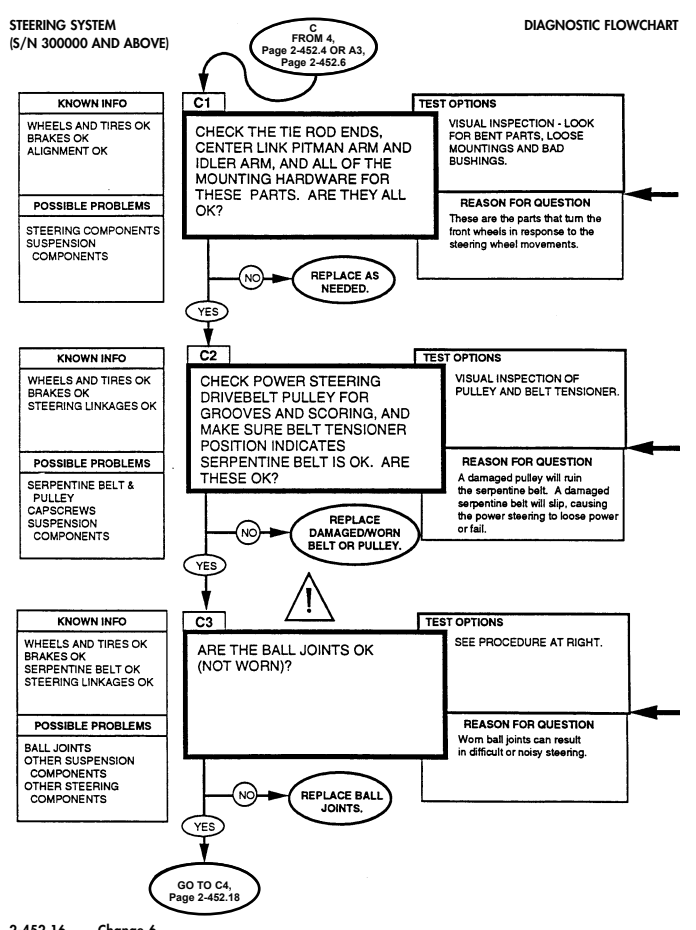

REFERENCE INFORMATION STEERING SYSTEM
(S/N 300000 AND ABOVE)
Check for looseness in idler arm and pitman arm (refer to para. 8-17 and para. 8-13). For replacing center link, refer to (para. 8-20.1). For replacing tie rods (refer to para. 8-16).

For replacing the pulley (refer to para. 8-23.1).

To check for proper operation of ball joints:

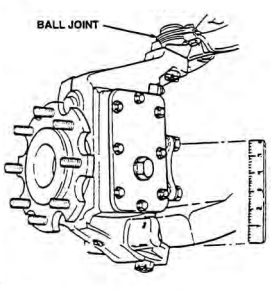 (1) Chock rear wheels front and back. (2) Raise front wheels about two inches off the ground and support on a jack stand.

NOTE
If ball joint boot is ripped or torn, ball joint is unserviceable.

(a) Lower ball joints.

(3) Mark a line across the head of the top bolt holding the steering arm cover. Make sure the mark is parallel to the lower control arm.

(4) Put a prybar between the cover control arm and gear hub.

(5) Set a 6-inch ruler upright between the lower control arm and the marked screw.

(6) Push down the prybar to try to move the hub. (7) Measure movement in the hub assembly. If movement is more than 1/8 inch (3 mm), replace lower ball joint (refer to para. 6-27). (b) Upper ball joints.

(8) Visually inspect ball joint boot, and replace upper ball joint if boot is ripped or torn.

(9) Grasp top of tire and attempt to move tire IN and OUT. Observe upper control arm and gear hub where upper ball joint is mounted. If lateral movement is observed, upper ball joint may be worn.

(10) Replace upper ball joint if movement is 1/8 in. 

(3 mm) or more (refer to para. 6-23).

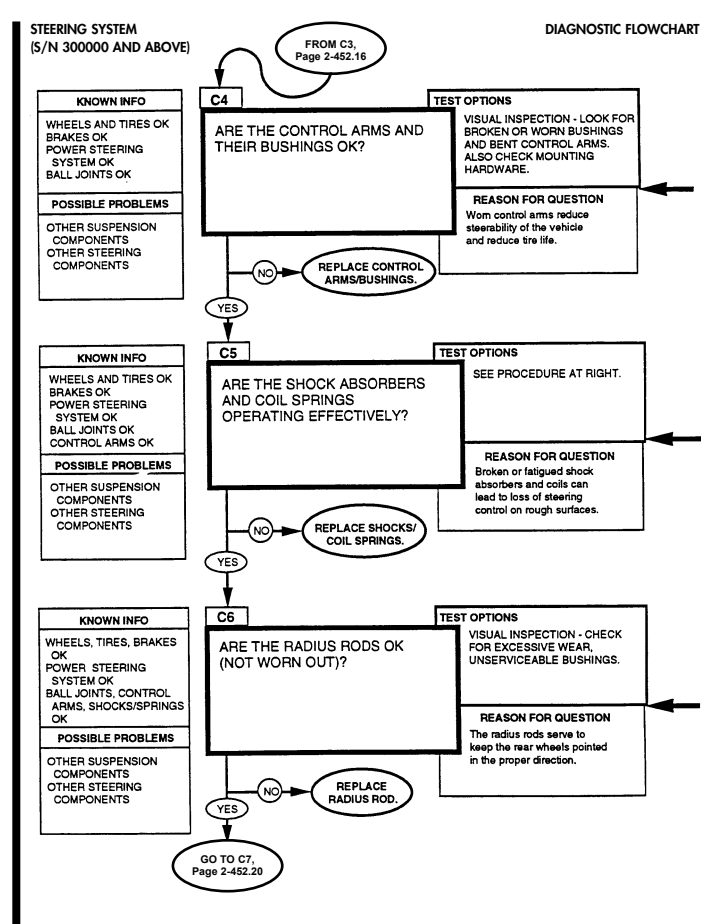

REFERENCE INFORMATION **STEERING SYSTEM**
(S/N 300000 AND ABOVE)
For upper and lower control arm and 

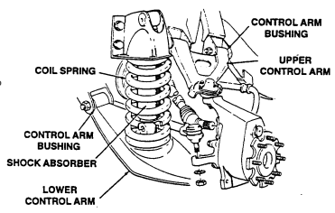 bushing replacement instructions (refer to para. 6-25).

To test the shocks and springs, drive the vehicle over a variety of terrain. If the vehicle continues to bounce after hitting a bump, the shocks may be worn. If the vehicle bottoms out on the suspension, the shocks may be worn. If the vehicle sags when loaded, the springs may be worn. If the shock absorber bodies are not warm after driving the vehicle, the shocks are no good. For coil spring and shock absorber replacement instructions (refer to para. 6-27 and para. 6-28).

For instructions on replacing the radius rod 

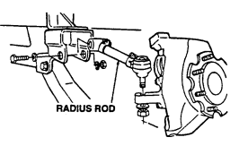 (refer to para. 6-22).

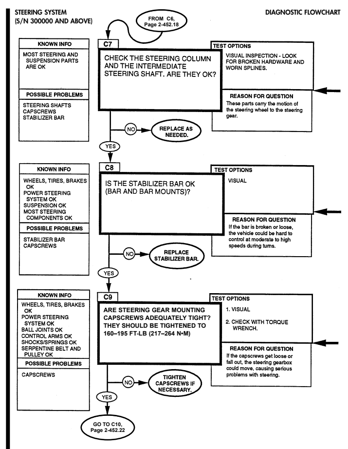

TM 9-2320-387-24-1 REFERENCE INFORMATION STEERING SYSTEM
(S/N 300000 AND ABOVE)
NOTE
Inspect intermediate shaft U-joints for wear, binding, or missing/damaged grease fittings. Replace or lubricate as necessary. Refer to para. 8-21 for replacement and TM 9-2320-387-10, for lubrication instructions.

Replace the steering column and intermediate shaft (para. 8-18 and para. 8-19).

Replace the stabilizer bar (para. 6-20.1).

If you still have a problem, rerun the test chain to make sure you didn't miss anything. If you didn't go down the A chain, you may want to run those tests in order to check out the hydraulic parts of the steering system.

STEERING SYSTEM DIAGNOSTIC FLOWCHART (S/N 300000 AND ABOVE)

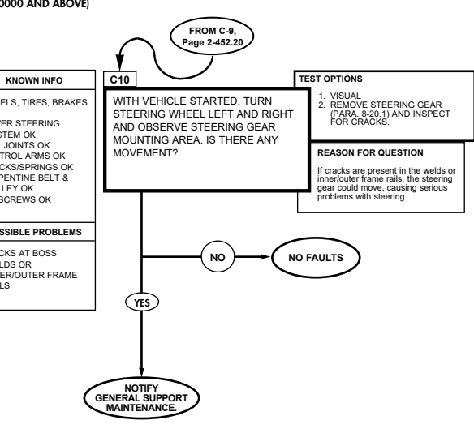

SYSTEM OK
PULLEY OK
WELDS OR
OK
RAILS

# 2-43. Drivetrain Tests I

These drivetrain tests may be run any time you think you have a drivetrain problem or if you were sent here by another test chain. Just follow the path, answering the questions. Additional information and notes are given on the facing page when necessary. 

The fold-out page shows the location of the major components of the drivetrain system in case you are not familiar with them. 

Fold-out page FP-27 may be left open for reference while testing. Also, due to the design of the functional flow diagram, it is not necessary to have a location of parts diagram so it has been omitted. 

Problems with the transmission and drivetrain cooling system are dealt with in para. 240. 

- 

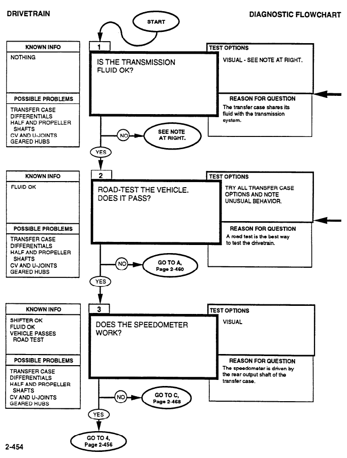

REFERENCE INFORMATION
DRIVETRAIN

# Procedure For Checking Transmission Fluid

1. Start engine.

2. Hold down brake pedal and move transmission.

shift lever through all ranges including reverse.

3. Engage parking brake and place shift lever in neutral. Check fluid level on dipstick.

4. Proper level is between FULL and ADD marks on dipstick.

Check fluid for a burnt smell, grit, discoloration, air bubbles, or a milky appearance.

· Burnt smell, discoloration, or grit indicates wom or damaged internal components. Notify DS
maintenance (chapter 14).

· Bubbles indicate of an overfilled system or air leaks in the system. Drain the fluid and refill to proper level (para. 5-2).

· Milky appearance is due to water in the system.

Replace fluid and filter.

If the speedometer works but the vehicle doesn't move, the transmission is OK and the problem is in the transfer case. Most likely the fault is in the splined output shafts of the transfer case. Listen for unusual noise.

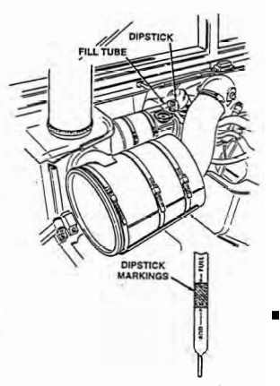

DRIVETRAIN **DIAGNOSTIC FLOWCHART**

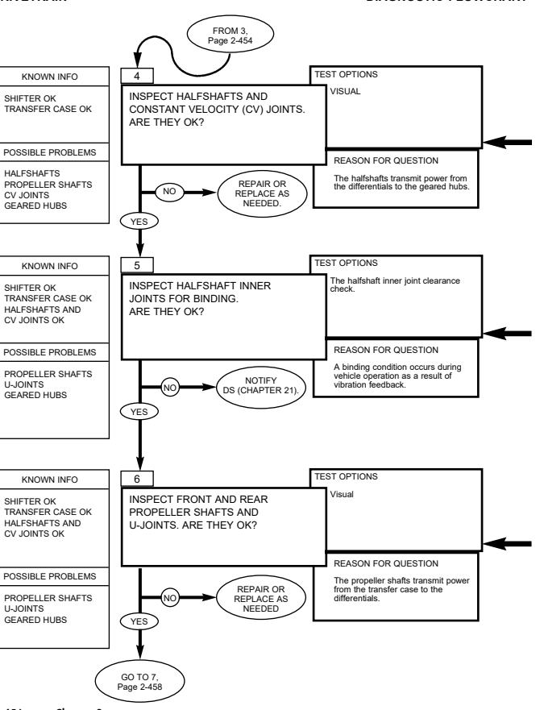

# Reference Information **Drivetrain**

Check for torn boots on the CV joints, stripped splines, smooth joint operation, and proper mounting torques.

Replace halfshafts and CV joints (para. 6-7).

Lubricate in accordance with TM 9-2320-387-10.

1. Perform front wheel toe-in alignment preliminary inspection (para. 8-9, task a.)
2. Raise and support front of vehicle (para. 8-2). 3. Rotate wheel by hand.

NOTE
If intermittent binding or resistance is felt during wheel rotation (six times per wheel revolution), differential alignment is required.

4. If no resistance is felt during rotation of wheel halfshaft axle and inner joint, rotate opposite wheel. If no resistance is present at either wheel, proceed to step 7.

NOTE
- Record position at which resistance is felt.

- If an intermittent binding or resistance is felt during rotation of wheel, halfshaft axle shaft is contacting inner joint.

5. Repeat steps 3 and 4 to determine serviceability for opposite wheel.

6. Notify DS maintenance (chapter 21) for front differential alignment.

7. Lower front of vehicle (page 8-2).

Check for smooth operation of U-joints, stripped splines, bent yokes, or other problems. Also check to see if the shaft itself is bent. Replace propeller shafts or U-joints (paras. 6-2 through 6-5).

Lubricate in accordance with TM 9-2320-387-10.

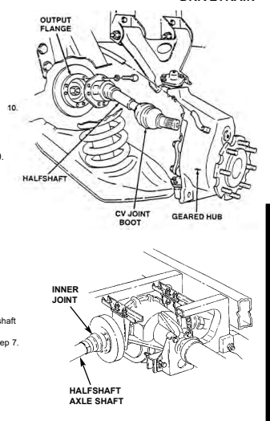

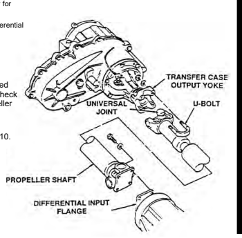

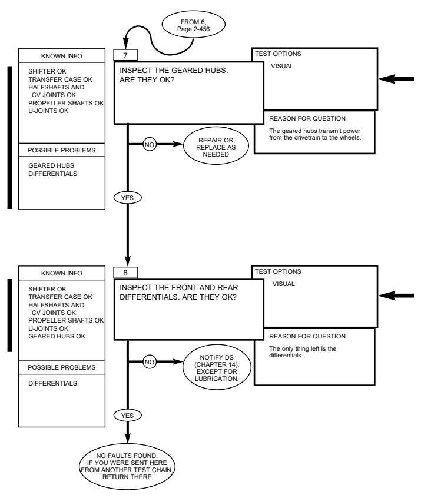

TM 9-2320-387-24-1 REFERENCE INFORMATION **DRIVETRAIN**
Make sure the geared hubs turn freely. Check mounting hardware for proper installation. Lubricate in accordance with TM 9-2320-387-10. Replace geared hubs (para. 6-9).

Check for loose mounting and broken parts.

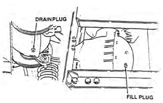

Check fluid in accordance with TM 9-2320-387-10.

Notify DS maintenance (chapter 14) for other faults.

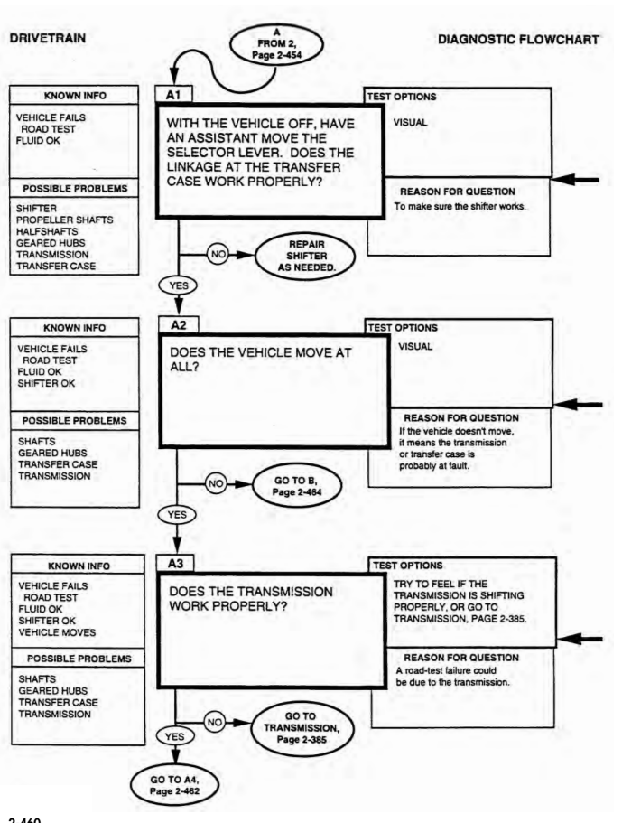

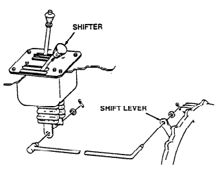

#### Reference Information

DRIVETRAIN 
Lubricate in accordance with table 2-1. 

Adjust and repair linkage (para. 5-8 or 5-g). Make sure the detents in the shifter correspond with the positions on the name plate. If difficulty occurs when shifting transfer range with engine running, perform Engine Idle Speed Adjustment prior to troubleshooting drivetrain. If engine was turned OFF in order to shift transfer to desired range, notify DS maintenance (chapter 14). 

For the vehicle not to move, there must be a major problem in the drivetrain. 

If you've already run the transmission tests and you still can't find the problem, continue down this test chain. 

i 

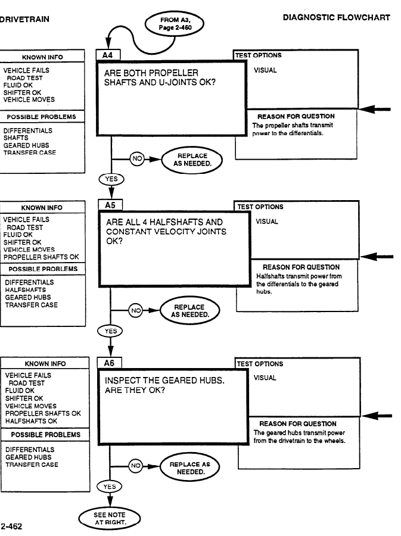

DRIVETRAIN 
Lubricate in accordance with TM 9-2320-387-l 0. 

Check for smooth operation of U-Joints, stripped splines, bent yokes, or other problems. Also check to see if the shaft itself is bent. Repair and replace propeller shafts and U-joints 
(para. 6-2 through 6-4). 

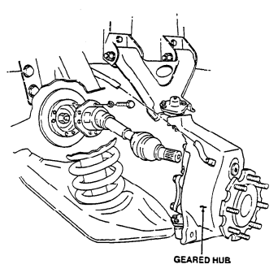

Check for tom boots on the CV joints, stripped splines, smooth joint operation, and proper mounting torques. For halfshaft maintenance procedures, refer to para. 6-7. Lubricate in accordance with TM 9-2320-387-l 0. 

Make sure the geared hubs turn freely. Check mounting hardware for proper installation. 

Lubricate in accordance with TM 9-2320-387-l 0. If you haven't found any faults, check the differential fluid in accordance wfth TM g-2320-387-10. 

Otherwise, notify OS maintenance (chapter 14). 

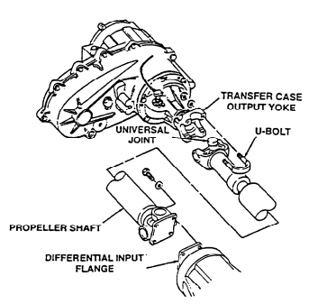

i 

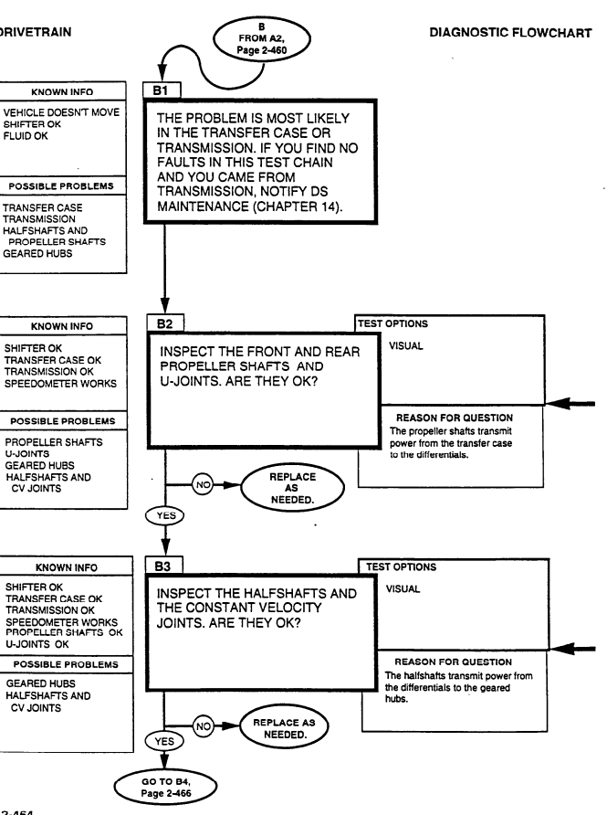

2-464 

## Reference Information Drivetrain

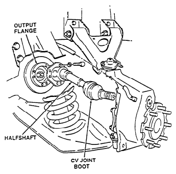

If the vehicle doesn't work, both shafts would have to be broken. 

Check for smooth operation of U-joints, stripped splines, bent yokes, or other problems. Also check to see if the shaft itself is bent. Replace propeller shafts (paras. 6-2 through 64). 

Lubricate in accordance with TM 9-2320-367-10. 

--I 
If the vehicle doesn't move, all four shafts may be broken. 

Check for tom boots on the CV joints, stripped splines. smooth joint operation, and proper mounting torques. 

For halfshaft maintenance procedures, refer to para. 6-7. 

I Lubricate in accordance with TM 9-2320-367-10. 

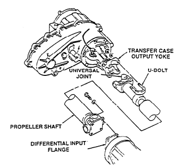

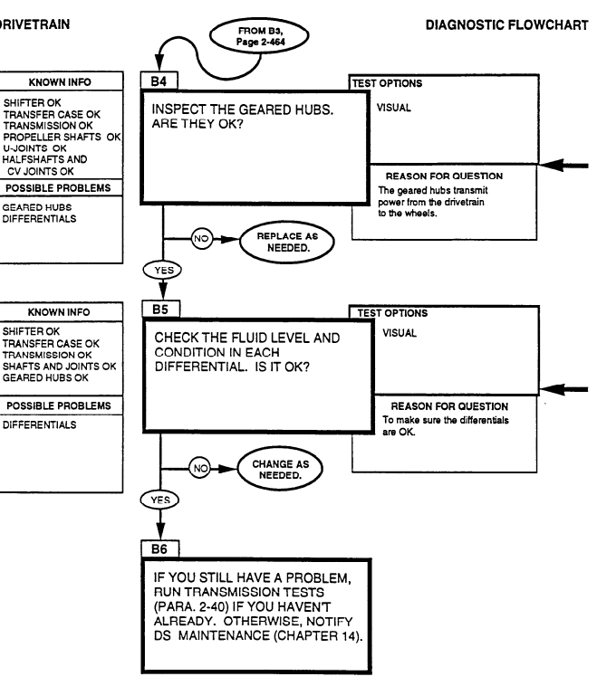

## Reference Information

DRIVETRAIN 
Make sure the geared hubs turn freely. For geared hub replacement procedure, refer to para. 8-9. Check mounting hardware for proper installation. 

Lubricate in accordance with TM g-2320-387-1 0. 

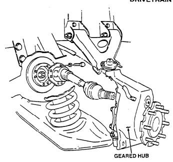

Check for loose mounting and broken parts. Notify GS maintenance (chapter 30). Check fluid level in accordance with TM g-2320-387-10. 

Notify DS maintenance (chapter 14) for other faults. 

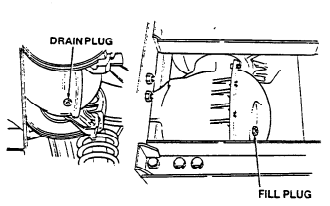

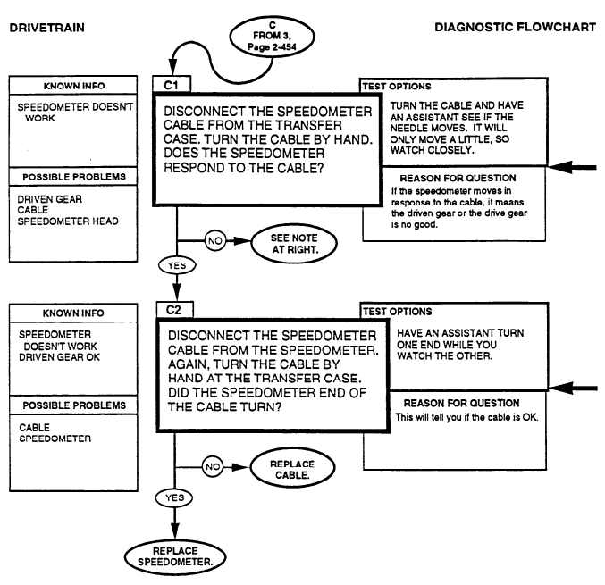

REFERENCE INFORMATION DRIVETRAIN 

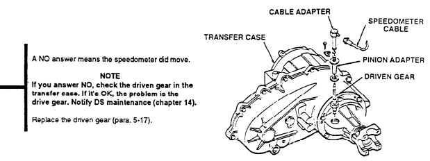

Replace the cable (para. 4-18). Replace speedometer (pafa. 4-17). 

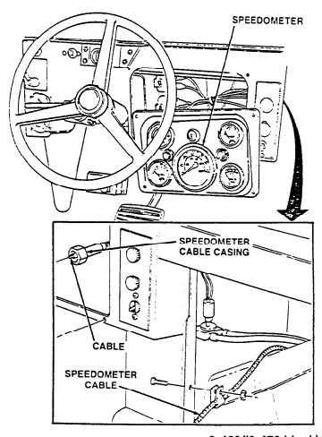

2-469/(2-470 blank) 

# 2-44. Winch System Tests

These winch system tests may be run any time you think you have a winch problem or if you were sent here by another test chain. Just follow the path and answer the questions. Additional information and notes are given on the facing page when necessary.

WINCH SYSTEM **DIAGNOSTIC FLOWCHART**

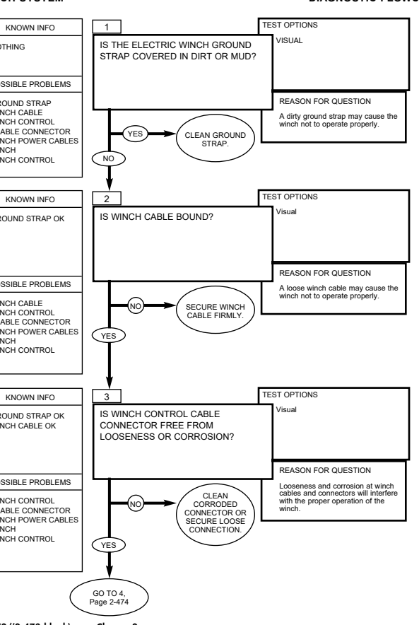

WINCH
WINCH
WINCH

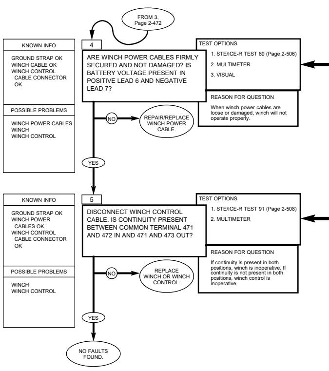

# Reference Information **Winch System**

#### Dc Voltage 0-45 Volts Ste/Ice-R Test 89

1. Connect RED clip to the indicated test point, BLACK clip to negative or ground.

2. Start Test 89, DC Volts. 3. Displayed reading is in volts.

#### Battery Voltage Multimeter

1. Set the voltmeter to a DC volts scale of at least 40 volts.

2. Connect the RED lead to positive and the BLACK lead to negative.

3. Be sure to read the correct scale.

| RESISTANCE AND CONTINUITY   |
|-----------------------------|

0-4,500 OHMS 
STE/ICE-R TEST 91 1. Connect RED clip and BLACK clip to the indicated terminals in question; RED to the first, BLACK to the second.

2. Start Test 91, 0-4,500 Ohms. 3. Displayed reading is in ohms. Less than 5 ohms is continuity. If the resistance is over 4,500 ohms, STE/ICE-R displays .9.9.9.9.

#### Continuity (Resistance) Multimeter

1. Set the voltmeter to an ohms scale of about 1,000 ohms.

2. Connect the RED and BLACK leads to the connections stated in the question.

3. Be sure to read the correct scale. Less than 5 ohms indicates continuity. For an open circuit, the meter should peg full scale (needle all the way to the left).

Replace winch or winch control (para. 12-27).

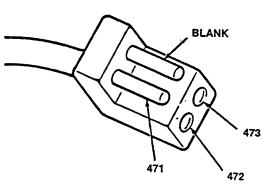

Repair/replace winch power cables (para. 12-28).

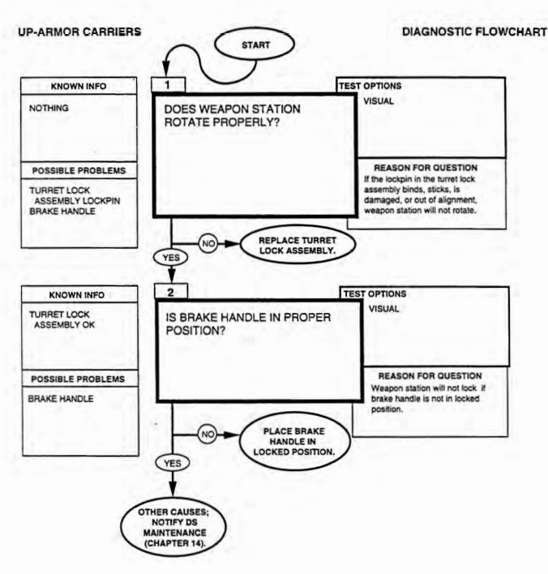

11 REFERENCE INFORMATION
UP-ARMOR CARRIERS

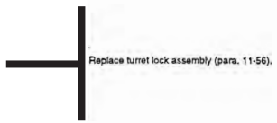

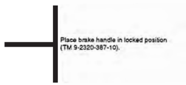

# 2-44.1. Hydraulic Winch Systems Tests

These winch system tests may be run any time you think you have a winch problem or if you were sent here by another test chain, just follow the path and answer the questions. Additional information and notes are given on the facing page when necessary.

## Hydraulic Winch System **Diagnostic Flowchart**

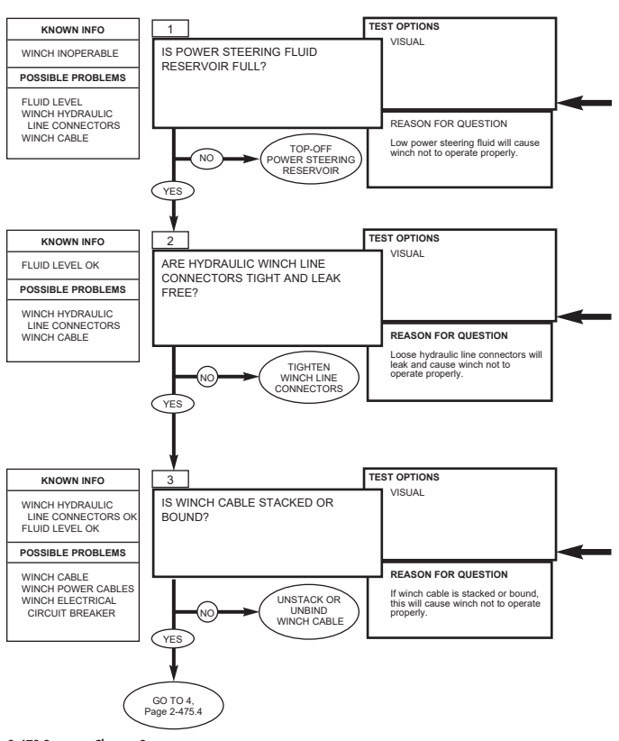

REFERENCE INFORMATION **HYDRAULIC WINCH SYSTEM**
Fill power steering fluid reservoir. (Refer to TM 9-2320-387-10.)
Check all hydraulic line connectors and winch control valves. Tighten any loose connections. Fill and bleed power steering system as necessary. (Refer to para. 8-27 or 8-27.1.)
WARNING
Wear leather gloves when handling winch cable. Do not handle cable with bare hands. When fully extending winch cable, ensure that five wraps of winch cable remain on drum at all times. Direct all personnel to stand clear of winch cable during operation. Failure to do so may cause damage to vehicle and injury or death to personnel.

Ensure winch cable is not stacked or binding with tiebars on winch housing. If winch cable is stacked or binding, shut down vehicle and carefully remove tiebars from winch housing. Move winch control levers to FREESPOOL and attempt to pay out winch cable by hand. (Refer to TM 9-2320-387-10.)

## Hydraulic Winch System **Diagnostic Flowchart**

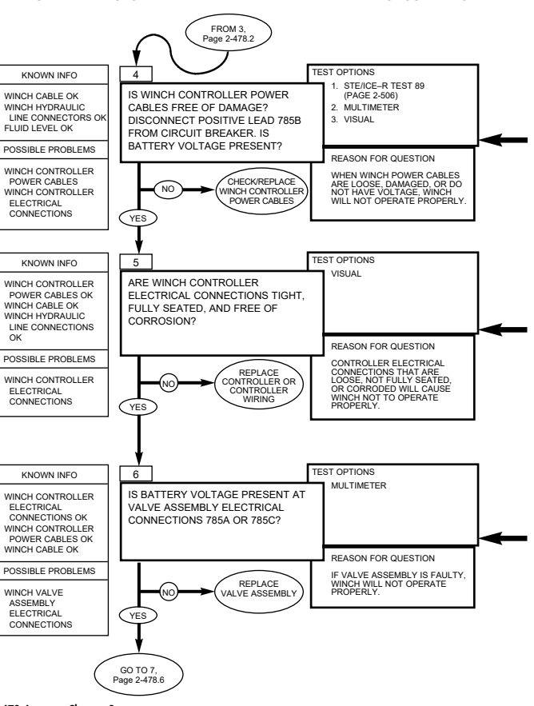

# Reference Information **Hydraulic Winch System**

DC VOLTAGE 0-45 VOLTS 
STE/ICE–R TEST 89 1. Connect RED clip to the indicated test point, BLACK clip to the negative or ground.

2. Start test 89, DC Volts. 3. Displayed reading is in volts.

#### Battery Voltage Multimeter

1. Set the voltmeter to a DC volts scale of at least 40 volts.

2. Connect the RED lead to positive and the BLACK lead to negative.

3. Be sure to read the correct scale. 

Replace winch controller power cables (para. 12-36.6).

While depressing either IN or OUT button on controller, check for battery voltage at wires going to valve assembly. If battery voltage is present, ensure electrical connections are tight and fully seated and attempt winch operations.

If winch fails to operate, replace valve assembly (para. 25-13.2 M1113) (para. 12-36.5 M1114).

## Hydraulic Winch System **Diagnostic Flowchart**

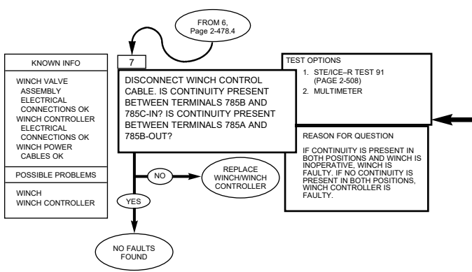

REFERENCE INFORMATION **HYDRAULIC WINCH SYSTEM**
Replace winch (para. 12-27.1) or winch controller (para. 12-32.1).

| RESISTANCE AND CONTINUITY   |
|-----------------------------|
| 0\-4.500 OHMS               |
| STE/ICE\-R TEST 91          |

1. Connect RED clip and BLACK clip to the indicated terminals in question; RED to the first, BLACK to the second.

2. START TEST 91, 0-4,500 Ohms. 3. Displayed reading is in Ohms. Less than 5 Ohms is continuity. If the resistance is over 4,500 Ohms, STE/ICE–R displays .9.9.9.9.

#### Continuity (Resistance) Multimeter

1. Set the voltmeter to an Ohms scale of about 1,000 Ohms.

2. Connect RED and BLACK leads to the connections stated in the question.

3. Be sure to read the correct scale. Less than 5 Ohms indicates continuity. For an open circuit, the meter should peg full scale (needle all the way to the left).

# 1 2-45. Dca Troubleshooting I

These diagnostic connector assembly tests can be run any time you think there is a problem with the vehicle's DCA or its on-board transducers. Do not use this paragraph to test the STE/ICE-R and its cables and transducers. Refer to TM 9-4910-571-12&P to test the STWICE-Ft. This paragraph will also supply instructions on how to use the STUICE-R in the TK mode to substitute for tests run through the DCA. 

The HMMWV is equipped with three transducers - the pulse tachometer, the fuel pressure transducer, and the current shunt. A power test (12, 13) or rpm test (10) use the pulse tachometer. The fuel pressure test (24) uses the pressure transducer. All of the starting circuit tests and battery tests done through the DCA use the shunt. Check to see that the wires are connected to the transducer for the test you're trying to run. There is a four-wire connector for the fuel pressure transducer, a two-wire connector for the pulse tachometer, and there are four wires connected to the shunt in addition to the battery cables. 

The fold-out page FP-29 gives a cross reference between DCA tests and Transducer Kit tests. 

Use this cross reference to find out how to substitute TK tests for DCA tests if you have a bad DCA. The Location of Parts page has a schematic of the HMMWV DCA. 

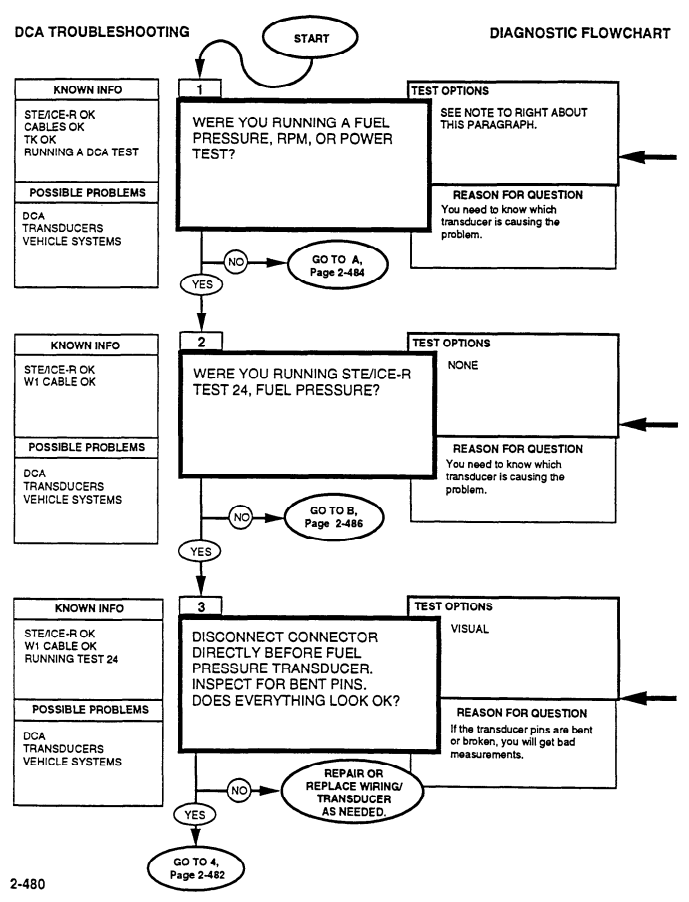

REFERENCE INFORMATION 
NOTE 
The diagnostics in this chapter assume you have already run a test through the DCA. If you haven't run a test and are here to test the entire DCA, run Tests 10 (RPM), 24 **(Fuel Pressure), and 80 (Battery** 
Current). Make note of the results for later. 

If YOIJ want to test the entire DCA harness. answer YES here and then return and answer NO when you've finished the test chain. Answer NO here to test the shunt. 

Answer NO here to test the pulse tachometer. 

Repair wiring (para. 4-80) or replace transducer (para. 4-30). 

DCA TROUBLESHOOTING 
i i 

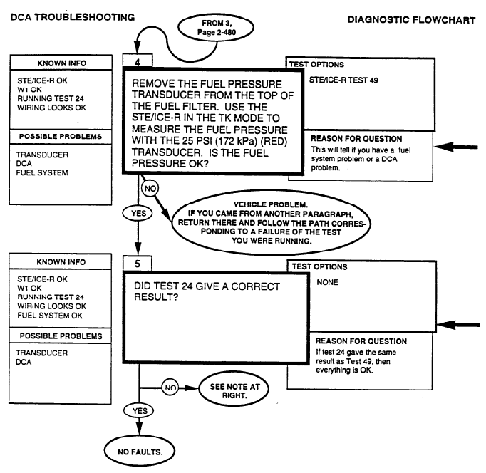

- 
REFERENCE INFORMATION 
DCA TROUBLESHOOTING 
The fuel pressure should always be greater than 3 psi 
(21 kPa). If you get about the same pressure with the 2 transducers, then you have a fuel system problem. 

Remove fuel pressure transducer **(para.** 4-30). Make sure the STE/ICE-R is powered by a W5 cable. 

#### 0 To 25 **Psig Pressure** Ste/Lce-R Test 49

L 

1. CONNECT RED TRANSDUCER TO FUEL 
FILTER. 

2. CONNECTTRANSDUCER TO A W4 CABLE 
MAKE SURE THE SYSTEM UNDER TEST IS NOT PRESSURIZED. CONNECT OTHER END OF W4 TO J2 OR 53. PERFORM 
OFFSET TEST.

3. TURN ON SYSTEM AND READ PRESSURE. 

You will have to decide if Test 24 gave the **wrong result.** 
If Test 24 gave a substantially different result than Test 49, answer NO to this question. 

NOTE 
VEHICLE DCA FAULTY. **Use the STEIICE-R** in the TK 
mode **for the rest of your testing. See the chart on the** 
foldout page for a way to run the rest of the DCA tests in the TK mode. Have DS maintenance repair the DCA 
when you're finished. 

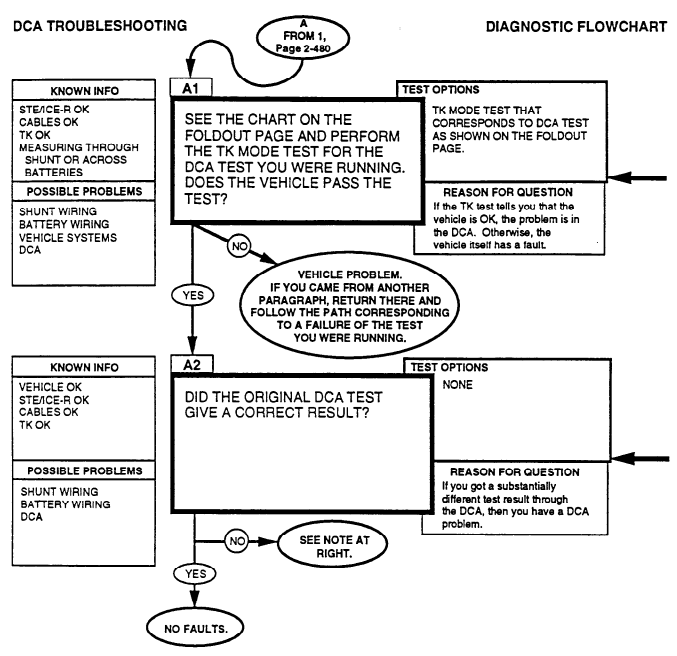

# Reference Information

DCA TROUBLESHOOTING 
Make sure the STEXE-R is powered by a W5 cable. If t&e TK mode test tells you that the vehicle has a fault, return to the paragraph you came from. If the vehicle tests OK, continue here. 

You will have to decide if the DCA test result is wrong. If the TK test gave a substantially different result than the DCA test. answer NO to this question. 

-I 
NOTE 
VEHICLE DCA FAULTY. Use the STEACE-R 
in the TK **mode for the rest of your testing.** See the chart on the foldout page for a way to run the rest of the DCA tests in the TK 
mode. Have DS maintenance repair the DCA 
when you're finished You can check the connections at the shunt and the power stud to see if they are OK. Look at the schematic for help. 

- 

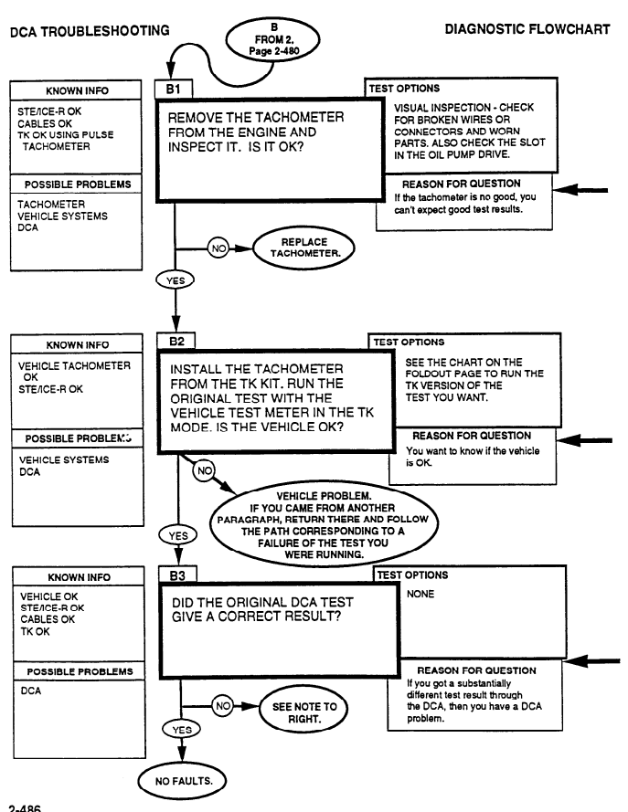

TM 9-2320-387-24-l 

# Reference Information

DCA TROUBLESHOOTING 
Remove tachometer (paa. 4-16). If you find the tachometer defective, replace it and return to where you came from and rerun the original DCA test. If it fails again, return to this question and answer YES. 

Make sure the STE/lCE-R is powered by the W5 cable. If you don't find any faults in the vehicle, the slot in the oil pump drive could be too worn to drive the tachometer. If you see this, notify DS maintenance (chapter 14). 

I You will have to decide if the DCA test result is wrong. 

I 
If the TK test gave a substantially different result than the DCA test, answer NO to this question. 

NOTE 
VEHICLE DCA FAULTY. Use the STEACE-R in the I TK mode for the rest of your testing. See the chart on the fofdout page for 8 way to run the rsst of the DCA tests in the TK mode. Have DS maintenance repair the DCA when you're finished. 

# 2-45.1. Electronic Speedometer System Test

These electronic speedometer system tests may be run any time you think you have an electronic speedometer problem or if you were sent here by another test chain, just follow the path and answer the questions. Additional information and notes are given on the facing page when necessary. Fold-out page FP-31 contains a schematic of the electronic speedometer. This page may be left open for reference while testing.

## Electronic Speedometer System **Diagnostic Flowchart**

KNOWN INFO
SPEEDOMETER
INOPERATIVE
OTHER GAUGES
OPERATE NORMALLY
POSSIBLE PROBLEMS
OPEN SHORT SPEEDOMETER SENDER GENERATOR SPEEDOMETER 
DRIVEN GEAR
KNOWN INFO
SPEEDOMETER
INOPERATIVE
OTHER GAUGES
OPERATE NORMALLY
SPEEDOMETER 
HAS POWER
POSSIBLE PROBLEMS
OPEN SHORT SPEEDOMETER SENDER GENERATOR SPEEDOMETER 
DRIVEN GEAR

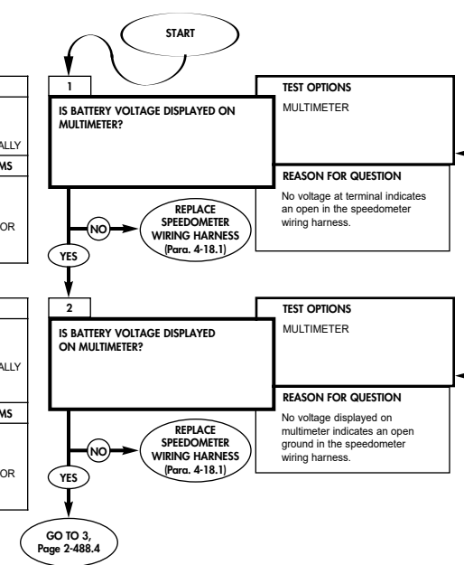

# Reference Information Electronic Speedometer System

Remove instrument cluster from instrument panel (para. 4-14.1).

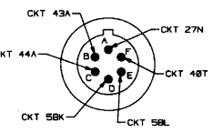

| 2.   | Connect red lead to speedometer harness   |
|------|-------------------------------------------|
|      | pin A and the black lead to good ground.  |
| 3.   | Turn rotary switch to run position.       |

| Set the multimeter to DC scale of at least   |
|----------------------------------------------|
| 40 volts.                                    |

| BATTERY VOLTAGE   |
|-------------------|
| MULTIMETER        |

3.

| Connect the red lead to the speedometer   |
|-------------------------------------------|
| harness terminal A and the black lead to  |
| terminal D.                               |

| BATTERY VOLTAGE   | MULTIMETER   |
|-------------------|--------------|

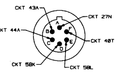

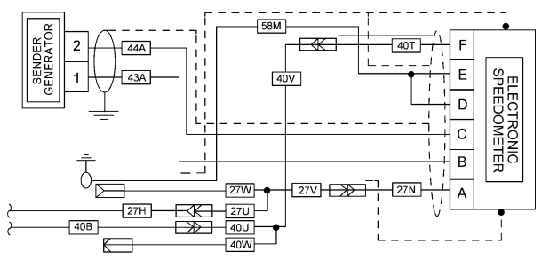

## Electronic Speedometer System **Diagnostic Flowchart**

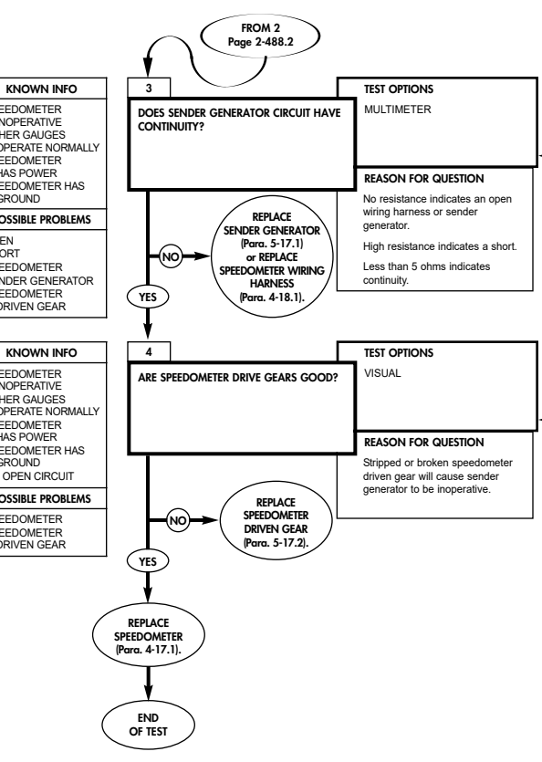

SHORT
OPEN

# Reference Information

# Electronic Speedometer System

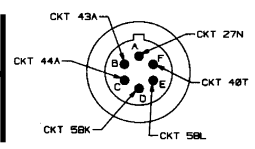

|    | RESISTANCE AND                          |
|----|-----------------------------------------|
|    | CONTINUITY                              |
| 1. | Turn rotary switch to the OFF position. |
| 2  | Set multimeter to ohm scale of          |
|    | approximately 1,000 ohms.               |
| 3. | Connect multimeter leads to speedometer |
|    | harness terminal B and C.               |

Remove and inspect speedometer driven gear
(Para. 5-17.2).

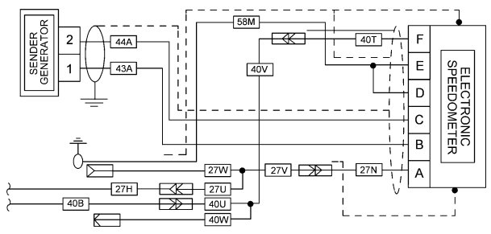

# 1 2-46. Steace-F? Test Procedures 1

This paragraph will be helpful when using the STE/ICE-R to answer diagnostic questions. Use this paragraph as a reference if you need additional information about a specific test. This paragraph contains information such as possible errors, test procedures, control codes, and additional notes as necessary. The following chart will help you find the test you need. The STE/ICE-R setup and internal checks (Test No. **GO1 ,** page 2-519) must be performed prior to performing tests. A complete description and operation of the STEXE-R is found on page 2-509. See TM 9-4910-571-12&P for additional information. 

| Fold\-out page FP\-6.1 contains a functional diagram of the engine cooling system. This page may be left open for reference while testing.   |
|----------------------------------------------------------------------------------------------------------------------------------------------|

- 

# 1 **2-46. Ste/Ice-R Test Procedures** (Cont'D)

ENGINE RPM (AVERAGE) TEST \#lO 
Description: 
This procedure measures engine speed in the range 50 to 5,000 rpm. At speeds below 50 rpm, the VTM will display 0. At speeds above 5.000 rpm, the display may give a false reading. Test requires DCA hookup only. 

Pre-Test Procedures: 
Run confidence test. 

Typical Applications: 
Check engine speed. 

Possible Error Messages: 
EO14 Incorrect number of cylinders entered. 

Test Procedure: 
1. Set TEST SELECT switches to 10. 

2. Press and release TEST button. 3. Start engine. 4. Observe displayed value (RPM). 

# 2-46. Stuice-R Test Procedures (Cont'D)

POWER TEST (RPM/SEC) TEST \#12 

#### Description:

This procedure measures an engine's power-producing potential in units of RPM/SEC. Test requires DCA hookup only. 

Pre-Test Procedures: 
Run confidence test. Warm up engine to operating temperature. 

#### Typical Applications:

Check engine power in units of RPM/SEC. 

#### Test Procedure:

1. Start and idle engine. 2. Set TEST SELECT switches to 10. 3. Press and release TEST button. 4. Observe displayed value (RPM) to adjust idle speed, if necessary. 

5. Press down sharply on accelerator and observe displayed value (RPM) to adjust governor speed, if necessary. 

6. Set TEST SELECT switches to 12. 7. Press and release TEST button. 8. Wait for prompting message CIP to appear. 9. When CIP appears on display, press down sharply on engine accelerator and hold it to the floor. When VTM displays a number, release accelerator. 

10. Observe displayed value (RPM/SEC). 

#### Possible Error Messages:

Eoog Engine not running at start of test. 

Eel 1 Throttle control operated incorrectly. 

E012 Ignition adapter/pulse tachometer missing. 

E014 Incor..&t number of cylinder entries. 

E033 Error in entry of power test constants. 

#### Notes:

Engine idle speed must be checked before performing power test. Idle speed must be approximately 675 rpm to run test. 

Engine governor no-load speed must be checked before performing power test. Governor no-load speed must be within the 3.600 - 3,800 rpm range to run test. 

# P-46. Stuice-R Test Procedures (Cont'D) I

#### Power Test (Percent) Test #13

## Description:

This procedure measures the percentage of engine's power-producing potential as compared to a good engine. Test requires DCA hookup only. 

Pre-Test Procedures: 
Run confidence test. Warm up engine to operating temperature. 

Typical Applications: 
Check engine power. 

#### Possible Error Messages:

. EOO9 Engine not running at start of test. 

E011 Throttle control operated incorrectly. 

E012 Ignition adapter/pulse tachometer miss;,rg. 

E024 Test not valid for VID 
entered. 

## Test Procedure:

1. Start and idle engine. 2. Set TEST SELECT switches to 10. 3. Press and release TEST button. 4. Observe displayed value (RPM) to adjust idle speed, if necessary. 

5. Press down sharply on on engine accelerator and observe displayed value (RPM) to adjust governor speed, if necessary. 

6. Set TEST SELECT switches to 13. 

7. Press and release TEST button. 

8. Wait for prompting message CIP to appear. 9. When CIP appears on display, press down sharply on engine accelerator and hold it to the floor. When VTM displays OFF, release accelerator. 

10. A number will be displayed after the engine has returned to idle speed. This number is the test result in units of percent of nominal-rated power. 

#### Note:

Engine idle speed must be checked before performing power test. Idle speed must be approximately 675 rpm to run test. Engine governor no-load speed must be checked before performing power test. Governor no-load speed must be within the 3,900 - 4,100 rpm range to run test. 

# 1 2-46. Steiice-R Test Procedures (Cont'D)

COMPRESSION UNBALANCE TEST \#14 

## Description:

This procedure compares the compression between the highest and lowest cylinders and displays the unbalance in percent. Test requires DCA hookup only. 

Pre-Test Procedures: 
Run confidence test. Warm up engine to operating temperature. 

Run first-peak series tests 72, 73.74, 75. 

#### Typical Applications:

Check compression unbalance of engine with VTM powered from battery of vehicle being tested. 

#### Possible Error Messages:

E006 VTM doesn't detect battery voftage. 

E013 VTM cannot use data received. 

E027 Error in entry of compression unbalance constants. 

E032 Vehicle's cranking speed is varying too much for a compression unbalance measurement.. 

## Test Procedure:

1. Set up engine to prevent starting by disconnecting wire 54A. Stop engine. Shut off fuel before cranking. Crank engine without fuel for 5 seconds to clear fuel from cylinders. 

2. Set TEST SELECT switches to 14. 

3. Press and release TEST button. 

4. Wait until GO appears on display before proceeding. 

5. When GO appears, crank engine. Display will change to ---- while engine is turning. 

6. When OFF or E013 appears, stop cranking. 7. If OFF appears, wait for message to appear. 

(A) The number displayed will be the percent unbalance between the highest and lowest cylinders. A number above 25 is a failure. 

(B) If GO appears, repeat from step 2. 

(C) A FAIL message usually means compression is too far unbalanced to measure with STEIICE. 

#### Note:

If E013 appears, test data cannot be anafyzed because of weak batteries or interrupted cranking during test. Correct problem and repeat from step 2. 

# 2-46. Stuice-R Test Procedures **(Cont'D)**

FUEL SUPPLY PRESSURE (PSI) TEST \#24 Description: 
This procedure measures the return pressure in order to detect line blockage, leaks, or insufficient restrictor back-pressure. Test requires DCA hookup only. 

Pre-Test Procedures: 
Run confidence test. Wait for 1 minute after turning engine off to run this test. 

Typical Applications: 
Fuel supply pressure Control Functions: 
01,02,03,04,06 Test Procedure: 
1. Turn off vehicle. 2. Set TEST SELECT switch to 24. 3. Press and hold TEST button until CAL appears on display. 

4. Release TEST button and wait for offset value to appear on display. If offset is within -15 lo 1.5, proceed. If not, go to DCA Troubleshooting Procedure. 

5. Press and release TEST button. 

6. Start engine. 7. Observe displayed value. 

Possible Error Messages: 
E005 Offset not performed. 

# 1 2-46. Steace-R Test Procedures (Cont'D) I

PRESSURE (PSI) 0 TO 1,000 TEST \#50 This procedure measures pressure in the 0 to 1,000 PSIG range. Test requires the use of the TK adapters and transducers. 

'Description: Pre-Test Procedures: 
Run confidence test. 

Typical Applications: 
Control Functions: 
Oil pressure 01,02,03.04, 06 1. Attach connector Pi of cable W4 to J2 TK or J3 TK. 

2. Install blue-striped pressure transducer where pressure is to be measured. Attach connector P2 of cable W4 to transducer. 

3. Set TEST SELECT switch to 50. Press and hold TEST button until CAL appears on display. 

4. Release TEST button and watt for offset value to appear on display. If offset is within -150 to 150, proceed. If not, go to DCA 
Troubleshooting Procedure. 

5. Energize system. 6. Press and release TEST button. 

7. Observe displayed value. 

Test Procedure: Possible Error Messages: 
E005 Offset not performed. 

E002 Transducer not connected. 

# 1 2-46. Steiice-R Test Procedures (Cont'D)

BATTERY VOLTAGE TEST \#67 Description: 
This procedure measures battery voltage in the 9 to 32 vofts range. The voltage is measured directly at the power source of the VTM, and may be done with the vehicle operating or shut down. Test requires DCA hookup only. 

Typical Applications: Control Functions: 

Check battery voltage. 01.02, 03, 04, 06 

Pre-Test Procedures: 
Run confidence test. 

#### Test Procedure:

1. Set TEST SELECT switch to 67. 

2. Press and release TEST button. 3. If .9.9.9.9 is displayed, voftage is not within the test range. 

4. Observe displayed value (volts). 

Possible Error Messages: 
None. 

# 1 2-46. Stuice-R Test Procedures (Cont'Dl

STARTER MOTOR VOLTAGE TEST \#68 This procedure measures the voltage present at the starter motor positive terminal in the 0 - 32 volts range. 

Test requires DCA hookup only. 

Description: Pre-Test Procedures: 
Run confidence test. 

Typical Applications: 
Control Functions: 
Check starter motor vottage. 

01.02,03, 04,06 Test Procedure: 
Possible Error Messages: 
None. 

1. Disconnect fuel solenoid wire 64A to prevent starting. 

2. Set TEST SELECT switch to 68. 3. Press and release TEST button. 

4. Crank the engine and observe the displayed voltage. 

# 1 2-46. Steiice-R Test Procedures (Cont'D)

STARTER NEGATIVE CABLE VOLTAGE DROP TEST \#69 This procedure measures the voltage drop on the starter path. A high voltage (>2V) 
indicates excessive ground path resistance. 

Test requires DCA hookup only. 

Description: Pre-Test Procedures: 
Run confidence test. 

Typical Applications: 
Control Functions: 
Check starter negative cable voltage drop. 

01.02, 03,04, 06 

## Test Procedure:

1. Disconnect fuel solenoid wire 64A to prevent starting. 

2. Set TEST SELECT switch to 69. 

3. Press and release TEST button. 

4. Crank the engine and observe the displayed vottage. 

Possible Error Messages: 
None. 

# 2-46. Steke-R Test Procedures (Cont'D)

STARTER SOLENOID VOLTS TEST \#70 Description: 
Pre-Test Procedures: 
Run confidence test. 

This procedure measures the voltage present at the starter solenoids positive terminal. Test requires DCA hookup only. 

Typical Applications: Control Functions: 
Check starter solenoid volts. 01,02, 03, 04,06 Test Procedure: 
Possible Error Messages: 
None. 

1. Disconnect fuel solenoid wire 54A to prevent starting. 

2. Set TEST SELECT switch to 70. 3. Press and release TEST button. 

4. Crank the engine and observe the displayed 

voltage.

# 1 2-46. Steace-R Test Procedures (Cont'D)

STARTER CURRENT AVERAGE TEST \#71 Description: 
Pre-Test Procedures: 
Run confidence test. 

This procedure measures the average starter current in the 0 - 1,000 amps range. Test requires DCA hookup only. 

Typical Applications: Control Functions: 
Check starter current. 01, 02,03.04,06 

## Test Procedure:

1. Disconnect fuel solenoid wire 54A to prevent starting. 

2. Set TEST SELECT switch to 71. 3. Press and hold TEST button until CAL 
appears on display. 

4. Release TEST button and wait for offset value to appear on display. If offset is within -150 to 150, proceed. ff not, go to DCA Troubleshooting Procedure. 

5. Press and release TEST button. 

6. Crank engine. 7. Observe the displayed starter Current. 

Possible Error Messages: 
E005 Offset not performed. 

# 2-46. Ste/Lce-R Test Procedures (Cont'D)

CURRENT FIRST PEAK TEST \#72 This procedure measures the overall condition of the complete starting system. Test requires DCA hookup only. 

Description: Pre-Test Procedures: 
Run confidence test. Warm up engine to operating temperature. Turn off all electrical accessories. 

#### Typical Applications:

Check condition of starting system on Cl engines with VTM being powered from battery of vehicle tested. 

## Possible Error Messages:

E002 E005 E008 E013 E020 E021 Transducer not connected. 

Offset not performed. VTM does not detect battery voltage. VTM cannot use data received. 

No first-peak information was detected by the VTM. VTM cannot calculate result because current is over current probe's range. 

## Test Procedure:

1. Disconnect fuel solenoid wire 54A to prevent starting. 

2. Make sure all vehicle accessories are off. 3. Set TEST SELECT switches to 72. 

4. Press and hold TEST button until CAL appears on display. 

5. Release TEST button and wait for offset value to appear on display. If offset is within the range 
-150 to 150, proceed. If not, go to DCA Troubleshooting Procedure. 

6. Press and release TEST button. 7. When GO appears on display, crank engine for 2 seconds or until one of the following appears on the display: OFF 
.9.9.9.9 A number An error message 8. Observe displayed value (amps). 

#### Notes:

11 .9.9.9.9 is displayed, current first-peak was too high and cannot be measured with VTM. 

If E013 is displayed, check battery connections and correct as necessary. Repeat step 6. If E013 persists after 3 tests, VTM cannot perform test. 

#### .

# 1 2-46. Steke-R Test Procedures (Cont'D) I _

BATTERY INTERNAL RESISTANCE TEST \#73 

## Description:

This procedure measures the internal battery resistance. Internal battery resistance is a measure of the state of the batteries. Test requires DCA hookup only. 

#### Pm-Test Procedures:

Run confidence test. Turn off all electrical accessories. 

Evaluate batteries on Cl engines with VTM 
being powered from battery of vehicle tested. 

## Typical Applications: Possible Error Messages:

E002 Transducer not connected. E005 Cffset not performed. E006 VTM does not detect battery voltage. E013 VTM cannot use data received. E020 No first-peak information was detected by the VTM. 

E021 VTM cannot calculate result because current is over current probe's range. 

#### Test Procedure:

1. Disconnect fuel solenoid wire 54A from the injector pump to prevent starting. 

2. Make sure all vehicle accessories are off. 

3. Set TEST SELECT switches to 73. 

4. Press and hold TEST button until CAL 
appears on display. 

5. Release TEST button and wait for offset value to appear on display. If offset is within the -150 to 150 range, proceed. If not, go to DCA Troubleshooting Procedure. 

6. Press and release TEST button. 7. When GO appears on display, crank engine for 2 seconds or until one of the following appears on the display: OFF 
.s.s.s.s A number An error message 8. Observe displayed value (milliohms). The limit is 25 milliohms per battery pair. 

9. Test 75 is Battery Resistance Change. You can run that test after this one if desired. 

#### Notes:

If .S.S.S.S is displayed, battery internal resistance was too high and cannot be measured with VTM. 

If E013 is displayed, check battery connections and correct as necessary. 

Repeat Step 6. If E013 persists after 3 tests, VTM cannot perform test. 

# 1 2-46. Ste/Ice-R Test Procedures (Cont'D)

STARTER CIRCUIT RESISTANCE TEST \#74 This procedure measures starter circuit resistance. Test requires DCA hookup only. 

Description: Pm-Test Procedures: 
Run confidence test. Warm up engine to operating temperature. Turn off all electrical accessories. 

Check resistance of complete starting system in Cl engines with VTM powered from batteries of vehicle being tested. 

## Typical Applications: Possible Error Messages:

E002 Transducer not connected. E005 Offset not performed. E008 VTM does not detect battery voltage. E013 VTM cannot use data received. E020 No first-peak information was detected by the VTM. 

E021 VTM cannot calculate result because current is over current probe's range. 

#### Test Procedure:

1. 

2. 

3. 4. 5. 

6. 7. 

Disconnect fuel solenoid wire 54A to prevent starting. Make sure all vehicle accessories are off. Set TEST SELECT switches to 74. Press and hold TEST button until CAL appears on display. 

Release TEST button and wait for offset value to appear on display. If offset is within the range -150 to 150, proceed. If not, go to DCA 
Troubleshooting Procedure. 

Press and release TEST button. 

When GO appears on display, crank engine for 2 seconds or until one of the following appears on the display: Off 
.9.9.9.9 A number An error message 8. Observe displayed value (milliohms). 

#### Notes:

If .9.9.9.9 is displayed, the starter circuit resistance value was too high and cannot be measured with VTM. 

If EO13 is displayed, check battery connections and correct as necessary. 

Repeat Step 6. If E013 persists after 3 tests, VTM cannot perform test. 

# 2-46. Stuice-R Test Procedures (Cont'D)

#### Baltery Resistance Change Test #75 Description:

This procedure measures the change of battery resistance. Test requires DCA hookup only. 

Pre-Test Procedures: 
Run confidence test. Warm up engine to operating temperature. Turn off all electrical accessories. 

Evaluate batteries in Cl engines with VTM powered from batteries of vehicle being tested. 

## Typical Applications: Possible Error Messages:

EO02 EO05 E008 E013 E020 Transducer not connected. Cffset not performed. 

VTM does not detect battery voltage. VTM cannot use data received. No first-peak information was detected by the VTM. VTM cannot calculate result because current is over current probe's range. 

E021 

#### Test Procedure:

1. 2. 3. 4. 5. 

6. 7. 

8. 

Disconnect fuel solenoid wire 54A to prevent starting. 

Make sure all vehicle accessories are off. Set TEST SELECT switches to 75. Press and hold TEST button until CAL appears on display. Release TEST button and wait for offset value to appear on display. If offset is within the -150 to 150 range, proceed. If not, go to DCA Troubleshooting Procedure. 

Press and release TEST button. 

When GO appears on display, engage starter for 2 seconds or until one of the following appears on the display: OFF 
.9.9.9.9 A number An error message Observe displayed value (milliohms/seconds). The limit is 50 milliohms per battery pair. A lower number is better than a higher one. 

#### Notes:

If .9.9.9.9 is displayed, the battery resistance change value is beyond the range of the VTM and cannot be measured with the VTM. 

If E013 is displayed, check battery connections and correct as necessary. 

Repeat Step 6. If EO13 persists after 3 tests, VTM cannot perform test. 

# 1 2-46. Stuice-R Test Procedures (Cont'Dl I

BATTERY CURRENT TEST \#80 Description: 
This procedure measures current to or from the battery. Test requires DCA hookup only. 

Pre-Test Procedures: 
Run confidence test. 

Typical Applications: Control Functions: 
Evaluate batteries in Cl engines. 01(02,03,04 Test Procedure: 
1. Set TEST SELECT switch to 80. 

2. Press and hold TEST button until CAL 
appears on display. 

3. Release TEST button and wait for offset value to appear on display. If offset is within -150 to 150, proceed. If not, go to DCA Troubleshooting Procedure. 

4. Press and release TEST button. 

5. Observe displayed value (amps). 

Possible Error Messages: 
EOOS Offset not performed. 

# 1 2-46. Stulce-R Test Procedures (Cont'D)

DC VOLTAGE 0 TO 45 VOLTS TEST \#89 This procedure measures voftage in the range of 
-45 to 45 volts. The VTM is used as a DC voltmeter with the decimal point in the correct position. This test must be done with the component being tested turned on. Test requires the use of the TK adapters and transducers. 

Description: Pm-Test Procedures: 
Run confidence test. 

#### Typical Applications:

Control Functions: 
01,02, 03, 04. 06 l Fuel solenoid l Starter solenoid l Alternator output l Any DC voltage measurement 

## Test Procedure:

1. Connect test probe cable W2. Attach Pl to J4. 

2. Connect the desired test leads to P2. 3. Set TEST SELECT switch to 89. 4. Short leads together. Press and hold TEST 
button until CAL appears on display. 

5. Release TEST button and wait for offset value to appear on display. 

6. If offset is within -6.8 to 6.8, proceed. If not, go 

to DCA Troubleshooting Procedure. 

7. Press and release TEST button. Observe displayed value.

Possible Error Messages: 
E005 Offset not performed. 

# 1 2-46. Steiice-R Test Procedures (Cont'D) I

DC CURRENT 0 TO 1,500 AMPS TEST \#90 This procedure measures DC current in the range of 0 to 1,500 amps. The VTM is used as an ammeter with the decimal point in the right position. This test may be done with the vehicle/equipment operating. 

Test requires the use of the TK adapters and transducers. 

#### Description: Pre-Test Procedures:

Run confidence test. 

## Typical Applications: Control Functions:

l Alterator output l Average starter current l Battery current 9 Any DC current up to 1,500 amps 01, 02, 03,04.06 1. 2. 3. 4. 5. 6. 

7. 

Connect test probe cable W4. 

Attach Pl to J2 or J3. Connect the current probe to P2. 

Set TEST SELECT switch to 90. Clamp probe to de-energized wire. Press and hold TEST button until CAL appears on display. Release TEST button and wait for offset value to appear on display. If offset is within 225 to -225, proceed. If not, go to DCA Troubleshooting Procedure. Energize circuit. Press and release TEST button. Observe displayed value. A negative reading indicates the probe is backwards. Reverse and repeat from Step 4. 

8. 

## Test Procedure: Possible Error Messages:

EOO2 Transducer not connected. 

EOOS Offset not performed. 

# 1 2-46. Stuice-R Test Procedures (Cont'D)

RESISTANCE AND CONTINUITY 0 TO 4,500 OHMS TEST \#\#91 

## Description:

procedure measures resistance in the range of 0 to 4,500 ohms. The VTM is used as an ohmmeter, and test results are always displayed with the decimal point in the right position. Additionaky, any voltage present in the device being tested will adversely affect test results. Make sure the circuit or component being tested is shut off. Test requires the use of the TK adapters and transducers. 

Pre-Test Procedures: 
Run confidence test. 

## Typical Applications: Control Functions:

l Continuity checks l Resistance measurements l Switch and relay functions 01,02, 03,04,06 

## Test Procedure:

1. Connect test probe cable W2. Attach Pl to J4. 

2. Connect the desired test leads to P2. 3. Set TEST SELECT switch to 91. 4. Short leads together. Press and hold TEST 
button until CAL appears on display. 

5. Release TEST button and wait for offset value to appear on display. 

6. If offset is within -225 to 225, proceed. If not, go to DCA Troubleshooting Procedure. 

7. Press and release TEST button. Observe displayed value. 

## Possible Error Messages:

E005 Offset not performed. E022 External voftage detected while measuring resistance. 

# 1 2-46. Steace-R Test Procedures (Cont'D) I

a. SIX/ICE-R Description and Operation. The following describes the operation of the Simplified Test Equipment/Internal Combustion Engines-Reprogrammable WE/ICE-R1 system and contains detailed operating procedures. It is used to test the serviceability of HMMWV vehicles and to perform primary fault detection and isolation. At& the technician has identified a faulty part or subsystem, he is referred to' a paragraph number for replacement or repair procedures for individual parts. 

b. Description **and Operatim.** STEACE-R is a testing system that performs tests and measurements on internal combustion engines. SlWICE-R measures standard voltage, current, resistance, pressure, temperature, and speed. Special tests, such as compression balance tests and starter system evaluations, are performed by STlYICE-R. Standard equipment functions, including vacuum pressure gauge, compression gauge, lowcurrent tester and multimeter, are features of the STEACE-R set. STE/ICE-R is portable and operates on either **12.** or 24.volt vehicle batteries or equivalent power source. The STEJCE-R system consists of a Vehicle Test Meter WTM), a Transducer Kit (TK), four electrical cables, a transit case, and technical publications. 

c. Vehicle Test Meter. 

L General. The VTM provides a method for the technician to test vehicle electrical and mechanical components. Readings are either pass/fail indications or digital displays in units familiar to the technician (psi, rpm, volts, ohms, amps, etc.). The Diagnostic Connector Assembly (DCA) is permanently mounted in the vehicle and provides accessibility to the most frequently needed test points. The use of the VTM through the DCA is referred to as DCA mode. The VTM interfaces with the vehicle directly with a transducer(s) from the Transducer Kit (TK). The use of the VTM through the TK is referred to as TK mode. The DCA and the TK 
can be used at the same time. This may be necessary when the diagnostic connector assembly has a missing transducer. If a transducer is missing, a no sensor indication (E002) is displayed when a measurement is made. If this happens, the TK mode can be used to make the measurement. The use of the VTM through the DCA and TK is referred to as the combined mode. Additional tests can be done that involve manually probing and/or connecting transducers to appropriate test points. Operating power for the VTM is drawn from the vehicle batteries or some equivalent battery source. Power is routed to the VTM through the DCA connected to the battery. The STE/ICE-R general purpose testing capabilities that may be applied to the vehicle are: 
O-1,000 psi pressure, O-45 volts DC, and 0-40k ohms resistance. The following control functions can be performed in conjunction with the special tests: Interleave (displays rpm with next test), Display Maximum Value, Display Minimum Value, and Display Peak-to-Peak Value. 

2. Controls and Indicators. The controls and readout display on the VTM are illustrated. The following paragraphs describe how the controls are used and how the display functions: 
(a) Power Switch (PUSH ON/PULL OFF). The power switch controls DC power to the VTM. The WM can operate from a 12.or 24volt battery system. When the power switch is pushed in (PUSH ON), the VTM power is on. To shut the VTM off, pull out the power switch (PULL OFF). The power switch contains a Pamp circuit breaker. The power switch will pop out automatically if something is wrong which causes the VTM to use more power than it should. If the switch pops out, check your hookup carefully and try again before returning the VTM to direct support maintenance. 

(b) TEST SELECT Switches. The TEST SELECT switches are used to select the actual test to be performed. There are 10 positions on each switch numbered 0 through 9. The number dialed into these switches is read by the WM when you press the test button. Changing the TEST SELECT switch positions has no effect until the TEST button is pushed. 

(cl TEST Button. Depressing and releasing the TEST button causes the test measurement to begin. 

Observe the measured value on the readout display. The reading will be in units normally used for the particular vehicle measurement. These units are listed on the flip cards. The TEST button must be pressed and immediately released. Depressing and holding the TEST button down initiates an offset test. Offset tests are described in TM 9-4910-571-12&P. 

## 1 2-46. Ste/Ice-R Test Procedures (Cont'D)

(d) Readout Display. The readout display will show different types of readouts during testing up to a maximum of four characters (for example, .8.8.8.8). The types of readouts are described in detail in paragraph 3andaresumma rized as follows: 
(1) Status Readout. This type of readout keeps the technician informed of what is happening, such as power applied, failed test, etc. 

(2) Numerical Readout. This type of readout is the measured value in units of the measurement being made. If you are measurin g O-45 volts DC, the number 24 on the display indicates 24 volts. 

(3) **E&-or** Readout. This type of readout indicates that the wrong t&t number was selected, the transducer is not connected, or the VTM is faulty. 

(e) Flip Cards. The flip cards list the 2-digit test number system for selecting the various tests. The cards also summarize the test and operating instructions contained herein. 

(0 Power/DCA **Connector Jl.** Connector Jl connects the VI'h4 to either a vehicle diagnostic connector using the DCA cable or to the vehicle batteries using the power cable. Operating power and signals from the installed transducers are supplied to the VTM through the DCA cable. 

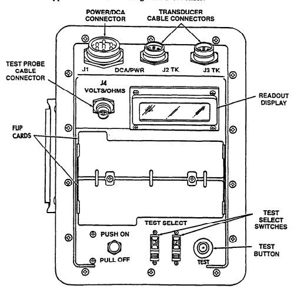

VTM **CONTROLS AND READOUT DISPLAY** 

# 2-46. Ste/Ice-R Test Procedures (Cont'D)

(g)  Transducer Cable Connectors J2, J3. Connectors J2 or J3 connect the VTM to any transducer in the transducer kit. Operating power is supplied to the transducer and signals from the transducers are supplied to the VTM through the cable. Connectors J2 and J3 are identical and can be interchanged with each other or used in combination.

(h)  Test Probe Cable Connector J4. Connector J4 connects test leads to the VTM when doing manual voltage resistance tests.

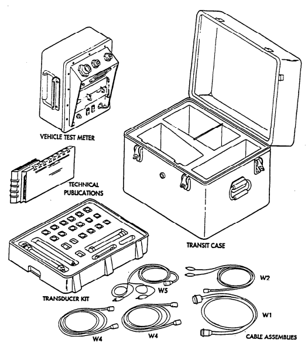

SIMPUFIED TEST EQUIPMENT/INTERNAL COMBUSTION ENGINE-REPROGRAMMABIE (STE/ICE-R SYSTEM)

## 1 246. Ste/Lce-R Test Procedures (Cont'D)

3. Readouts. The following paragraphs describe the different types of readouts that can occur during 

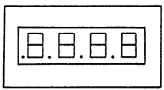

testing. 

(a) Status Readout. A status readout keeps the technician informed about what is happening. For example, .8.8.8.8 is displayed each time the power switch is pushed on. It means that power is applied, and that all elements of the display are operative. It changes to --- 1.5 seconds later, indicating that the VTh4 is ready to be used for testing. The status readout displays are described in table 2-2. 

(b) Prompting Message. A prompting message is a technician action message. It is a signal for you to 

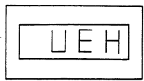

do something such as crank the engine. For example, UJZH tells you to enter the vehicle type identification number into the VTM. After the technical action is performed, the test will automatically continue. Prompting messages are listed in table 2-3. 

(c) Numerical Readout. A numerical readout is the measured value in units of the measurement 

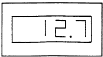

being made. For example, if you are measuring O-45 volts DC, 12.7 is volts DC. If you are measuring O-25 psig pressure, 12.7 is psig. The units for each test are listed on the flip card. The numbers displayed in the VTM are always positive unless there is a minus shown to make them negative. 

# [ 2-46. Ste/Ice-R Test Procedures **(Cont'D)** I

(d) Error Readout. EOOl is a typical error readout. There are 15 different readouts. All error readouts start with E. An error readout is a warning that you forgot to connect the transducer, selected a wrong test number, failed to start the engine, etc. All of the error messages mean you must correct the problem before continuing testing. Error readouts are listed in table 2-4. If the error message does not go away after corrective action, refer to TM 9-4910-571-12&P. 

(e) Confidence Error Readouts. COO4 is a typical error readout resulting from the detection of a faulty VTM during confidence test. For detailed information concerning confidence error readouts, refer to TM 9-4910-571-1&P. 

I 

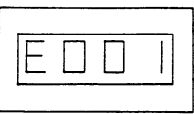

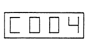

| approximately 200. Idle rpm should be      | 700\-750.    |
|--------------------------------------------|--------------|
| OIL PRESSURE GAUGE                         |              |
| Remove sending unit (para. 4\-29).         | OIL PRESSURE |
| SENDING UNlT                               | ENGINE RPM   |
| INTERLEAVE WITH O\-l,000 PSI PRESSURE      |              |
| I. Connect BLUE transducer in place of oil |              |

| ~1      |                                                                                                                                                                                           |
|---------|-------------------------------------------------------------------------------------------------------------------------------------------------------------------------------------------|
| \-  \-I | Remove sending unit (para. 4\-29).   ENGINE RPM   INTERLEAVE WITH fl\-1,000  PSI PRESSURE   1. Connect BLUE transducer in place of oil   pressure sending unit. Dial test 50 (O\-1000 psi |
|         | (08.895 kPa)). Perform offset test.                                                                                                                                                       |
| I       | 2. Dial test 01, interleave with RPv.: Dial test 50.                                                                                                                                      |
|         | 3. Start engine and observe display. VTM will                                                                                                                                             |
|         | display RPM. then PSI.                                                                                                                                                                    |
|         | ENGINE RPM                                                                                                                                                                                |
|         | STEIICE\-R TEST 10                                                                                                                                                                        |
|         | 1. Start Test 10, Engine RPM.                                                                                                                                                             |
|         | I   2. Crank or start the engine. Displayed                                                                                                                                               |

| REFERENCE INFORMATION   | ENGINE LUBRICATION          |
|-------------------------|-----------------------------|
|                         | OIL PRESSURE   SENDING UNIT |

# 1 2-46. Steiice-R Test Procedures (Cont'D) I

#### D. Cable Assemblies.

L General. The **cable** assemblies are shown below and are referred to by the cable number and by a name which describes how the cable is used. If necessary, the two transducer cables (W4) can be joined with the adapter supplied in the transducer kit to make one long cable. 

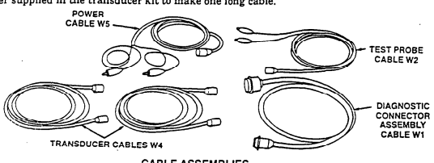

#### Cable Assemblies

2. Installation. When cables are connected, large key on the cable connector mates with a keyway on the transducer connector or the VTM connector for proper installation. If you experience any difficulty during testing and suspect that a cable is bad, refer to TM 9-4910-571-12&P for checking cable continuity. 

|          |       |               | Table 2\-5. Transducer Kit Components.   |                                             |
|----------|-------|---------------|------------------------------------------|---------------------------------------------|
| ITEM NO. | K NO. | PART NO.      | QTY                                      | IIIsM                                       |
| 1        | 10    | 11669227      | 十十                                     | Hose and fitting assy (spark plug adapter)  |
| 2        | 11    | 12258878      | 1                                        | Current probe                               |
| 3        | 12    | 12258853\-1   | 1                                        | Pipe thread reducer, 3/4 MPT to 1/4 FPT     |
| 4        | 13    | 12258853\-3   |                                          | Pipe thread reducer, 1/2 MPT to 1/4 FPT     |
| 5        | 14    | 12258853\-2   | 2                                        | Pipe thread reducer, 3/8 MPT to 1/4 FPT     |
| 6        | 15    | 444620        |                                          | Hex\-head plug, 1/4 MPT                     |
| 7        | 16    | 5327970       |                                          | Hex\-head plug, 1/8 MPT                     |
| 8        | 17    | 12258876      |                                          | Pressure transducer, 0\-1000 psig           |
| 9        | 21    | 12258881      | 1                                        | Snubber                                     |
| 10       | 20    | 3204X2        | 2                                        | Adapter, 1/8 MPT to 1/4 FPT                 |
| II       | 18    | 3304X2        |                                          | Coupling reducer, 1/8 FPT to 1/4 FPT        |
| 12       | 18    | 234X5         |                                          | Male connector, 5/16 tube to 1/4 MPT        |
| 13       | 22    | 12258877      |                                          | Pressure transducer, \-30 in. Hg to 25 psig |
| Iイ      | 23    | 444152        |                                          | Street tee, 1/2 pipe thread                 |
| 15       | 24    | 3750X4        |                                          | Street tee, 1/4 pipe thread                 |
| I e      | 25    | 547002        |                                          | Street tee, 1/8 pipe thread                 |
| 17       | 26    | 12258879\-2   |                                          | Street elbow, 1/4 pipe thread               |
| 18       | 27    | 12258879\-1   |                                          | Street elbow, 1/8 pipe thread               |
| । ਰੇ      | 34    | 12258875      |                                          | Pulse tachometer                            |
| 20       | 32    | 12258880      |                                          | Fuel line adapter                           |
| 21       | 31    | MS53099\-2    | 1                                        | Tachometer drive adapter                    |
| 22       | 30    | 7540877       |                                          | Ignition adapter                            |
| 23       | ਣ ਰੋ   | MS3119E14\-19 | 1                                        | Adapter (connector\-to\-connector)          |
| তৰ্       | నెక    | 12258762      | 1                                        | Tee, inverted flare                         |
| 25       | 33    | 8840543       |                                          | Air chuck                                   |
| 26       | 35    | 11669236      | 1                                        | Hose assembly, 1/8 MPT                      |
| 27       | 36    | 12258852      |                                          | Pipe nipple, 1/8 MPT                        |

# 1 2-46. **Steace-R Test Procedures (Cont'D)** 1

L General. The transducer kit contains a pulse tachometer transducer, a pressure and a vacuum transducer, and the necessary adapters (bushing, plugs, tees, etc.). Also included in the kit is a current probe for measuring current and a test probe cable for measuring voltage and resistance. Not all fittings have part number markings. The legend will help to identify the items. 

Before installing any transducer kit item on the vehicle, be sure to clean the mounting surfaces. This is particularly important if you are going to open fuel lines or tap into manifolds. Dirt particles entering the engine can cause damage to both the engine and the transducer kit item. The transducers should kept clean, free of dirt and grease, and handled with reasonable care. 

2. Pressure **Transducer. The** pressure transducers have a small breather hole on the side of the housing which should be kept unplugged. Do not use high pressure. 

3. **Pulse Tachometer.** Make sure that the slotted hole in the engine tachometer driveshaft is clear and not hard-packed before installing the pulse tachometer. 

4. Threaded Adapters. Observe threaded fittings carefully to avoid engaging straight threads with pipe threads. Each measurement device (transducer) in the transducer kit has its own identification resistor. The VTM uses this identification resistor to check that the correct transducer is connected for the measurement being made. If the correct transducer is not connected, error code E002 will be displayed. 

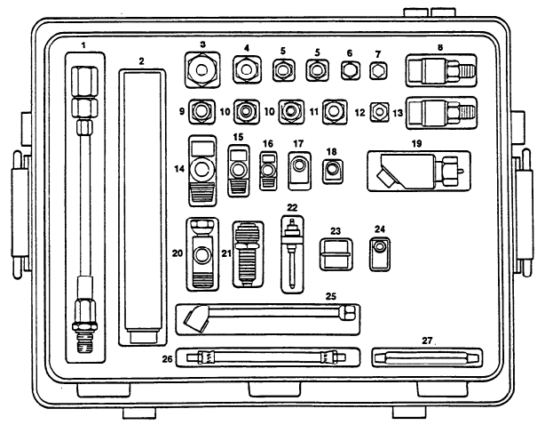

## -

TRANSDUCER KIT 

## -_ **1 2-47. Vehicle Testing 1**

a. General. To troubleshoot a vehicle problem, the technician can use the STE/ICE-R (vehicle test meter and transducers) and the vehicle test card. 

b. Data Entry Tests. For information regarding Data Entry, Cylinder Entry, VID Entry, and Data Display Tests, refer to TM 9-4910-571-12&P. 

c. Offset **Tests. The** STEACE-R VTM performs a test by setting the TEST select switches to the test number and pressing the TEST button. For some tests, an offset test is required before the test itself can be performed. This is done by selecting the number of the desired test and holding the TEST button down for several seconds; The offset test nullities characteristic differences in the VTM, test leads, and transducers. It zeros the meter. Once the offset is performed, the VTM automatically corrects for the offset before displaying measured values. The displayed offset value should be checked against limits on the vehicle test card. If the displayed value is outside these limits, either the transducer or the test cable is faulty and must be replaced. This is another form of self-test. The offset is performed when each transducer is connected. All tests requiring offset are identified by an asterisk (*) on the flip cards and by OFFSET LIMITS on the vehicle test cards. The offset test is performed with the test probe cable or transducer connected to the VTM. Care should be taken to see that no stimulus is applied to the transducer. Test probe cable leads should be shorted together. To perform an offset test, dial the test number into the TEST SELECT switches. Press and hold the TEST button until the prompting message CAL appears on the display. A few seconds after release of the TEST button, a number will appear. This is the measured offset value associated with the test probe cable or transducer and cable. 

d. Control Tests. These tests are used to change (or control) the way a vehicle test is displayed or the way it is run. There are four control tests: 
01 Interleave (displays rpm with next test). 

02 Display Minimum Value for next test. 

03 Display Maximum Value for next test. 

04 Display Peak-to-Peak Value for next test. Control tests 01, 02, 03, and 04 specify the action to be taken by the next test only. 

A subsequent test will reset the control. 

1. Interleave **(Test 01). This** test alternately measures engine speed and a second parameter such as fuel pressure or alternator voltage. To initiate interleave, dial 01 into the TEST SELECT switches and press and release the TEST button. The prompting message PASS will signal the technician to dial in the second test number and again press and release the TEST button. 

2. **Minimum Value (Test 02).** This test displays the minimum value measured during a test. To initiate a minimum value display, dial 02 into the TEST SELECT switches and press and release the TEST button. The prompting message PASS will signal the technician to dial in the desired test number and again press and release the TEST button. The minimum value is displayed and updated whenever a lower minimum value is measured. Entering 02 and the test number again will reset the process and a new minimum value will be displayed. 

# 2-47. Vehicle Testing (Cont'D)

3. Maximum Value (Test 03). This test displays the maximum value measured during a test. To initiate a maximum value display, dial 03 into the TEST SELECT switches and press and release the TEST 
button. The prompting message PASS will signal the technician to dial in the desired test number and again press and release the TEST button. The maximum value is displayed and updated whenever a higher maximum value is measured. Entering 03 and the test number again will reset the process and a new maximum value will be displayed. 

4. Peak-to-Peak Value (Test 04). This test displays the peak-to-peak value of O-45 volts DC (891, O-1,500 amps DC (901, and battery volts (67). To start a peak-to-peak measurement, dial 04 into the TEST 
SELECT switches and press the TEST button. The prompting message PASS will signal the operator to dial in one of the three numbers (89,90,67) and again press the TEST button. 

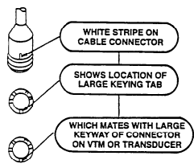

CONNECTOR KEY LOCATION 

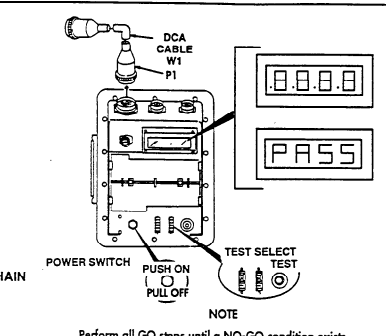

Perform all GO steps until a NO-GO condition exists, 
INDICATES VTM IS PROPERLY CONNECTED AND READY 
INDICATES GO CONDiTlON AFTER CONFIDENCE TESTS 
GO-CHAIN 
then perform the NO-GO step indicated. 

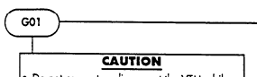

l Do not connect or disconnect the VTM while the vehicle is running. 

l Connect DCA cable to the VTM before connecting to the diagnostic connector. 

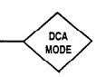

CONNECT VTM TO VEHICLE DIAGNOSTTC CONNECTOR: l PULL OFF the VTM power switch. l Connect DCA cable to the VTM. 

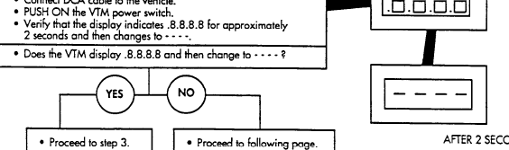

I 
-27' 

J 

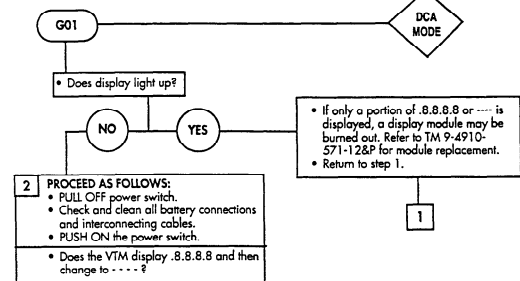

#### Table 2-6. Steiice-R Go-Chain Tests (Cont'D).

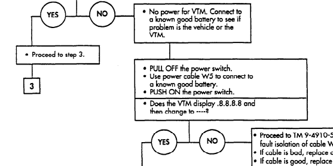

l Proceed to **TM 9-491 O-571 -'I 2&P** *for* 1 
l Check the **vehicle** battery **electrolyte level.** 

l Clean **vehicle** battery **terminals.**

l Check vehicle battery specific gravity (para. A-74). 

l Charge vehicle battery (TM 9-6140-200-l A). 

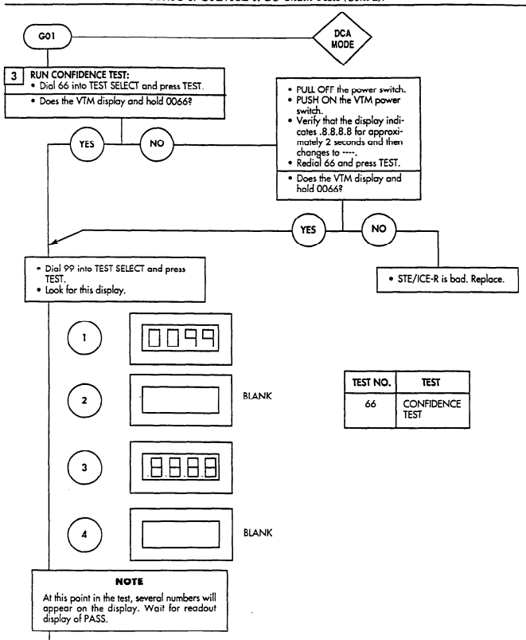

Table 2-6. STE IICE-R GO-Chain Tests (Cont'd). 

I l Proceed to following page. I 

## Table 2-6. Steiice-R W-Chain Tests (Cont'D).

/IPA ONon 

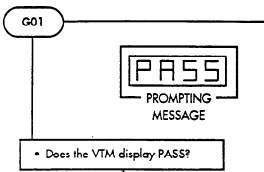

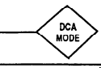

The VTM can fail Confidence Test if a bad transducer is connected to it. If the VTM fails Confidence Test when powered by Wl (IXA mode), remove all cable from the VTM and connect only WS, then clip W5 to the vehicle batteries. If it passes Confidence Test this way, there is a bad transducer in the vehicle's DCA. If it fails, the 

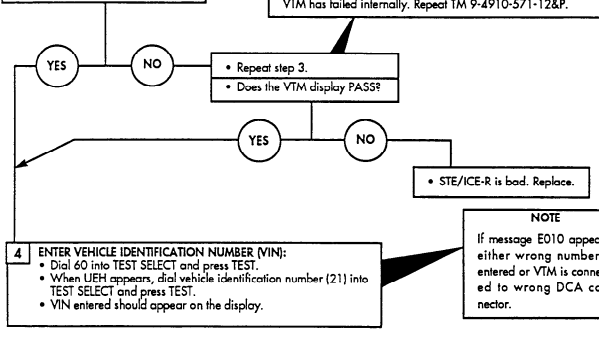

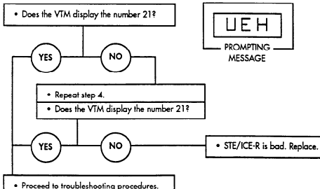

I l Proceed to troubleshooting procedures. I 
# Chapter 3 Engine Systems (Unit) Maintenance Section I. Lubrication System Maintenance

# 3-1. Lubrication System Maintenance Task Summary

| LEDs 1.2.3.4.5.6.7.6.11.13                                   | \-ON.                                                          | RUN                                                            | LED 13 \- OFF after a few seconds (glow plug warm\-up time).   |                     |
|--------------------------------------------------------------|----------------------------------------------------------------|----------------------------------------------------------------|----------------------------------------------------------------|---------------------|
| LED 13 \- OFF (if engine is at operating temperature).       | ENGINE NOT                                                     | LED 11 \- CYCLING ON and OFF (glow ptug controller operation). | RUNNING)                                                       | LEDs 9.10.12 \-OFF. |
| Release parking brake lever. LED 6 \- Off.                   | Engage parking brake lever. LED 6 \- ON.                       |                                                                |                                                                |                     |
| LED 10 \- Momentarily ON and then remains OFF (starter motor | START                                                          | frequency lockout).                                            | (ENGINE                                                        |                     |
| CRANKING)                                                    | LEDs 1.2.3.4.5.6.7.6.9.12 \- ON.                               |                                                                |                                                                |                     |
| RUN                                                          | LED 11 \- cycling ON and OFF (glow plug controller operation): | (ENGINE                                                        | OFF time tnterval i ncreases as engine warms up.               | RUNNING)            |
| LED 11 \- OFF (when en                                       | ine is at operating temperature).                              | LED 11 may remain OF !                                         | (when engine is at operating temperature                       | from previous run). |
| LEDl3\-OFF.                                                  | Release parking brake lever. LED 6 \- Off.                     |                                                                |                                                                |                     |
| Engage palking brake fever. LED 6 \- ON.                     | 0                                                              |                                                                |                                                                |                     |
| II                                                           | . .                                                            |                                                                |                                                                |                     |
| WARNING                                                      |                                                                |                                                                |                                                                |                     |
| Disconnect negative battery cable                            | 1                                                              | before disconnecting and reconnecting                          |                                                                |                     |
| PCB harness. Failure to do so may                            | result in injury to personnel or damage                        |                                                                |                                                                |                     |
| to equipment.                                                |                                                                |                                                                |                                                                |                     |
| Replace PCB (para. 4\-4).                                    |                                                                |                                                                |                                                                |                     |
| \- :                                                         |                                                                |                                                                |                                                                |                     |

# 3-2. Engine Oil Dipstick Tube Replacement

This task covers:
a. Removal b. Installation INITIAL SETUP:
Tools General mechanic's tool kit:
automotive (Appendix B, Item 1)
Maintenance and repair shop equipment:
automotive (Appendix B, Item 2)
Materials/Parts O-ring (Appendix G, Item 216) Nut and lockwasher assembly
(Appendix G, Item 197)
Silicone compound (Appendix C, Item 74)
Manual References TM 9-2320-387-10 TM 9-2320-387-24P
Equipment Condition Hood raised and secured (TM 9-2320-387-10).

Maintenance Level Unit

## A. Removal

1. Remove oil dipstick (7) from oil dipstick tube (6).

4. Remove oil dipstick tube (6) from engine oil pan (10). 5. Remove and discard O-ring (9).

b. Installation 2. Remove nut and lockwasher assembly (5) and capscrew (2) from harness clamp (3) and upper dipstick tube bracket (8). Discard nut and lockwasher assembly (5).

3. Remove two screw-assembled washers (4) from upper dipstick tube bracket (8) and fuel line bracket (1).

1. Apply RTV silicone compound to O-ring (9) and install O-ring (9) on oil dipstick tube (6). 2. Install oil dipstick tube (6) in engine oil pan (10). 3. Install upper dipstick tube bracket (8) on fuel line bracket (1) with two screw-assembled washers (4). Tighten screw-assembled washers (4) to 3-4 lb-ft (4-5 N•m).

4. Secure harness clamp (3) to upper dipstick tube bracket (8) with capscrew (2) and nut and lockwasher assembly (5).

5. Install oil dipstick (7) into oil dipstick tube (6).

# 3-2. Engine Oil Dipstick Tube Replacement (Cont'D)

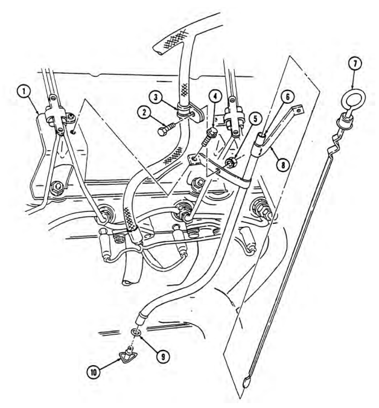

FOLLOW-ON TASKS: - Start engine (TM 9-2320-387-10) and check for oil leaks.
- • - • - •  -  -  -  -  -  Lower and secure hood (TM 9-2320-387-10).

# 3-3. Engine Oil Filler Tube Maintenance

This task covers:
b. Inspection

## Initial Setup:

Tools General mechanic's tool kit:
automotive (Appendix B, Item 1)
Maintenance and repair shop equipment:
automotive (Appendix B, Item 2)
Materials/Parts Lubricating oil (Appendix C, Item 44)
a. Removal c. Installation

| OFF  LEDs l&4.6,7  \- ON: Remaining LEDs OFF.                  |
|----------------------------------------------------------------|
| LED 13 \- OFF aher a few seconds (glow plug warm\-up tie).     |
| LED 11 \- CYCLING ON and OFF (glow plug controller operation). |
| LEDs 9.10.12 \- OFF.                                           |
| Release parking brake lever. LED 6 \-OFF.                      |
| Engage parking brake lever. LED 6 \- ON.                       |
| LED 10 \- Momentarily ON and then remains OFF (stafier motor   |
| hequenoy lookout).                                             |

## A. Removal

1. Loosen clamp (2) and disconnect CDR valve hose (1) from engine oil filler tube (3). 2. Remove two nuts (4), washers (5), and engine oil filler tube (3) from timing chain cover (7) and studs (8).

b. Inspection Inspect grommet (6) for breaks or cracks. Replace if defective.

c. Installation 1. Coat grommet (6) with lubricating oil. 2. Install engine oil filler tube (3) on timing chain cover (7) and studs (8) with two washers (5) and nuts (4). Tighten nuts (4) to 13-20 lb-ft (18-27 N•m).

3. Connect CDR valve hose (1) to engine oil filler tube (3) and tighten clamp (2).

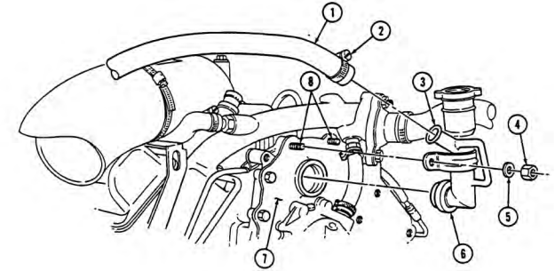

FOLLOW-ON TASK: Lower and secure hood (TM 9-2320-387-10). 3-4 Change 2

# 3-4. Engine Oil Filter Adapter Maintenance

This task covers:
a. Removal c. Installation b. Inspection

## Initial Setup:

Tools General mechanic's tool kit:
automotive (Appendix B, Item 1)
Maintenance and repair shop equipment:
automotive (Appendix B, Item 2)
Materials/Parts Gasket (Appendix G, Item 45) Two O-rings (Appendix G, Item 217) O-ring (Appendix G, Item 203)
a. Removal 1. Remove adapter bolt (6), gasket (5), two O-rings (4), engine oil filter adapter (3), and O-ring (1) from cylinder block (2). Discard O-ring (1), two O-rings (4), and gasket (5).

2. Remove reducer boss (7) from oil filter adapter (3).

## B. Inspection

Inspect reducer boss (7) for damaged threads or cracks. Replace if defective.

c. Installation 1. Install reducer boss (7) on oil filter adapter (3) and tighten to 25 lb-ft (34 N•m). 2. Install O-ring (1) and engine oil filter adapter (3) on cylinder block (2) with two O-rings (4),
gasket (5), and adapter bolt (6). Tighten adapter bolt (6) to 50 lb-ft (68 N•m).

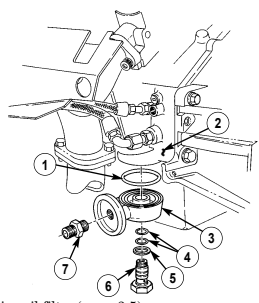

FOLLOW-ON TASK: Install engine oil filter (para. 3-5).

Manual References

| 1. Set the voltmeter to a DC volts scale of at   |
|--------------------------------------------------|
| least 40 volts.                                  |

Engine oil filter removed (para. 3-5).

| D Maintenance Level   |
|-----------------------|

Unit

# 3-4.1. Dual Engine Oil Filters And Adapter Maintenance

This task covers:
a. Removal c. Installation b. Inspection

## Initial Setup:

Tools General mechanic's tool kit:
automotive (Appendix B, Item 1)
Maintenance and repair shop equipment:
automotive (Appendix B, Item 2)
Materials/Parts Gasket (Appendix G, Item 45) Two O-rings (Appendix G, Item 217) O-ring (Appendix G, Item 203) Two oil filters (Appendix G, Item 199) Lubricating oil (Appendix C, Item 44)
a. Removal Manual References

| Manual References    |
|----------------------|
| TM 9\-2320\-387\-10  |
| TM 9\-2320\-387\-24P |
| Maintenance Level    |

Unit

Have drainage container ready to catch oil.

1. Remove oil filters (4) from filter adapter (8). Discard filters (4). 2. Remove adapter bolt (5), gasket (6), two O-rings (7), oil filter adapter (8), and O-ring (2) from cylinder block (1). Discard O-ring (2), two O-rings (7), and gasket (6).

3. Remove reducer boss (3) and (9) from oil filter adapter (8). 4. Remove plug (10) from oil filter adapter (8).

## B. Inspection

Inspect reducer boss (3) and (9) for damaged threads or cracks. Replace if defective.

## C. Installation

1. Install plug (10) on oil filter adapter (8). 2. Install reducer boss (3) and (9) on oil filter adapter (8) and tighten to 25 lb-ft (34 N•m). 3. Install O-ring (2) and oil filter adapter (8) on cylinder block (1) with two O-rings (7), gasket (6), and adapter bolt (5). Tighten adapter bolt (5) to 50 lb-ft (68 N•m).

4. Apply a light coat of oil to filter gasket prior to installation. 5. Install oil filters (4) on oil filter adapter (8) until gasket contacts filter adapter (8). Tighten an additional 1/2–3/4 turn by hand.

# 3-4.1. Dual Engine Oil Filters And Adapter Maintenance (Cont'D)

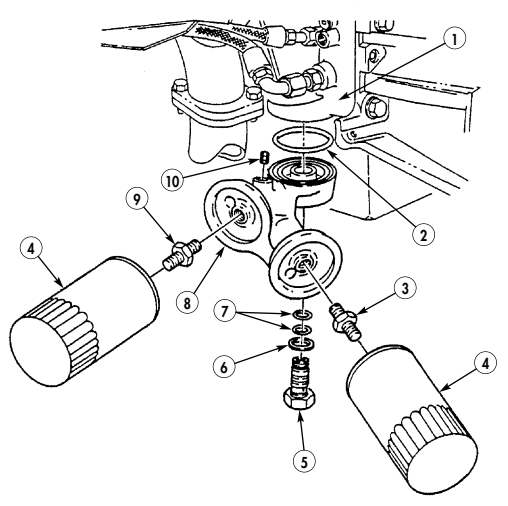

FOLLOW-ON TASKS:  - Check engine oil and start engine (TM 9-2820-387-10) and check for leaks at
on

# 3-5. Engine Oil Service

This task covers:

## Initial Setup:

Tools General mechanic's tool kit:
automotive (Appendix B, Item 1)
Maintenance and repair shop equipment:
automotive (Appendix B, Item 2)
Materials/Parts Oil filter (Appendix G, Item 199) Lubricating oil (Appendix C, Item 44)

## A. Oil Draining

a. Oil Draining c. Filter Installation b. Filter Removal d. Oil Replenishing Manual References TM 9-2320-387-10 TM 9-2320-387-24P
Equipment Condition Hood raised and secured (TM 9-2320-387-10).

| 4.500 ohms, STWICE\-R displays .9.9.9.9.   CONTINUITY (RESISTANCE)   |
|----------------------------------------------------------------------|

Do not drain oil when engine is hot. Severe injury to personnel may result.

- Park vehicle on a firm, level surface. - Have drainage container ready to catch oil.

1. Remove drainplug (5) and gasket (4) from oil pan (3). Allow oil to drain completely. 2. Install gasket (4) and drainplug (5) on oil pan (3). Tighten drainplug (5) to 20 lb-ft (27 N•m).

b. Filter Removal

Have drainage container ready to catch oil.

Remove oil filter (1) from filter adapter (2). Discard filter (1).

c. Filter Installation 1. Apply a light coat of oil to filter gasket prior to installation. 2. Install oil filter (1) on oil filter adapter (2) until gasket contacts filter adapter (2). Tighten an additional 1/2-3/4 turn by hand.

d. Oil Replenishing

Install a non-vented filler cap only. An incorrect filler cap will not seal properly, allowing water to enter and damage engine.

1. Remove filler cap (6) from filler tube (7). Fill with oil according to TM 9-2320-387-10. 2. Install filler cap (6) on filler tube (7).

# 3-5. Engine Oil Service (Cont'D)

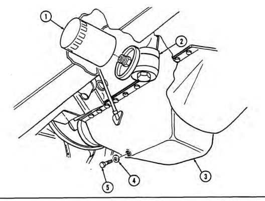

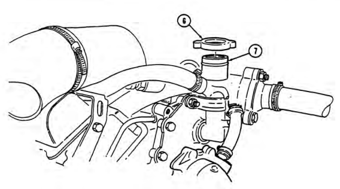

FOLLOW-ON TASKS: - Start engine (TM 9-2320-387-10) and check for leaks at oil filter and drainplug.

- Lower and secure hood (TM 9-2320-387-10).

# 3-6. Oil Pan Replacement

This task covers:
INITIAL SETUP:

## Tools

General mechanic's tool kit:
automotive (Appendix B, Item 1)
Maintenance and repair shop equipment:
automotive (Appendix B, Item 2)
Materials/Parts Oil seal retainer (Appendix G, Item 253) Two lockwashers (Appendix G, Item 151) Silicone compound (Appendix C, Item 74)

## A. Removal B . Installation

Manual References TM 9-2320-387-10 TM 9-2320-387-24P
Equipment Condition
- Starter removed (para. 4-11). - Oil dipstick tube removed (para. 3-2).

General Safety Instructions Do not drain oil when engine is hot.

Maintenance Level Unit a. Removal Do not drain oil when engine is hot. Severe injury to personnel may result.

Have drainage container ready to catch oil.

1. Remove drainplug (7) and gasket (6) from oil pan (11) and drain oil. Install gasket (6) and drainplug (7) after oil is drained.

2. Remove two nuts (8), lockwashers (9), and starter cable support bracket (10) from studs (13).

Discard lockwashers (9).

3. Remove twenty capscrews (5), two large capscrews (12), studs (13), and oil pan (11) from cylinder block (2). Remove any sealant from oil pan (11) and cylinder block (2). 

4. Remove oil pan rear oil seal retainer (14) from rear main cap (1). Discard oil pan rear oil seal retainer (14).

## B. Installation

1. Apply a bead of silicone compound to each end of oil pan rear oil seal retainer (14) and install oil seal retainer (14) on rear main cap (1).

Immediately install oil pan after application of sealant.

2. Apply a 3/16-in. (5-mm) bead of silicone compound around two large holes (3) on cylinder block (2).

Apply a 3/16-in. (5-mm) bead of sealant around oil pan sealing surface (4) following sealant diagram.

3. Install oil pan (11) on cylinder block (2) with twenty capscrews (5), two large capscrews (12), and studs (13). Tighten capscrews (5) and studs (13) to 4-10 lb-ft (5-14 N•m). Tighten large capscrews (12) to 13-20 lb-ft (18-27 N•m).

4. Install starter cable support bracket (10) on studs (13) with two lockwashers (9) and nuts (8). 5. Tighten oil drainplug (7) to 20 lb-ft (27 N•m).

WARNING

# 3-6. Oil Pan Replacement (Cont'D)

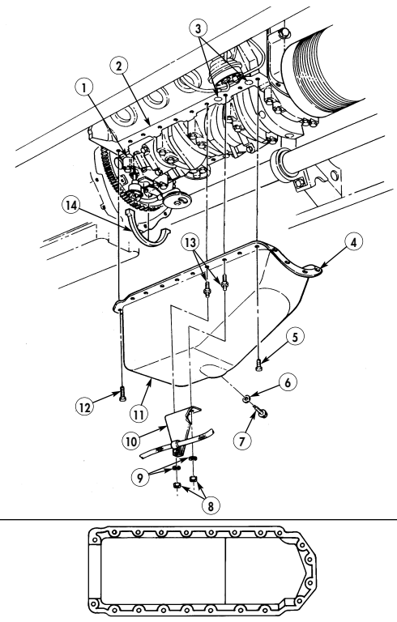

SEALANT DIAGRAM
FOLLOW-ON TASKS:  - Fill engine oil to proper level (TM 9-2320-387-10).
- • Install oil dipstick tube (para. 3-2).

- Install starter (para. 4-11).

# 3-7. Engine Oil Cooler Supply And Return Lines Maintenance (Cont'D) (Serial Numbers 299999 And Below)

This task covers:
b. Inspection

## Initial Setup:

Tools General mechanic's tool kit:
automotive (Appendix B, Item 1)
Maintenance and repair shop equipment:
automotive (Appendix B, Item 2)
Materials/Parts Tiedown strap (Appendix G, Item 326) Lockwasher (Appendix G, Item 144) Locknut (Appendix G, Item 77)
Manual References TM 9-2320-387-10 TM 9-2320-387-24P
a. Removal Equipment Condition
- Engine left splash shield removed
(para. 10-23).

- Engine access cover removed (para. 10-22).

General Safety Instructions Do not drain oil when engine is hot.

| Maintenance Level   |
|---------------------|

Unit

Do not drain oil when engine is hot. Severe injury to personnel may result.

Cover or plug all hoses and connections immediately after disconnection to prevent contamination. Remove all plugs prior to connection.

- Engine oil cooler supply and return lines are replaced basically the same. This procedure covers supply line replacement.

- Have drainage container ready to catch oil.

1. Disconnect supply line connector (5) from adapter (4) and allow oil to drain. 2. Disconnect supply line connector (16) from oil cooler port (17). 3. Remove locknut (3), washer (2), capscrew (15), and washer (2) from supply line clamp (14), brake line clamp (1), and frame bracket (13). Discard locknut (3).

4. Remove capscrew (7), lockwasher (8), and clamp (9) from supply line (12) and engine mount bracket (10). Discard lockwasher (8).

5. Remove tiedown strap (11) and supply line (12) from return line (6). Discard tiedown strap (11).

b. Inspection Inspect adapter (4) for damaged threads or cracks. Replace if defective. c. Installation 1. Position supply line (12) in approximate mounting location along frame. 2. Install supply line clamp (14) and brake line clamp (1) on frame bracket (13) with washer (2),
capscrew (15), washer (2), and locknut (3). Tighten locknut (3) to 6 lb-ft (8 N•m).

3. Connect supply line connector (16) to oil cooler port (17).

a. Removal c. Installation

# 3-7. Engine Oil Cooler Supply And Return Lines Maintenance (Serial Numbers 299999 And Below) (Cont'D)

4. Connect supply line connector (5) to adapter (4).

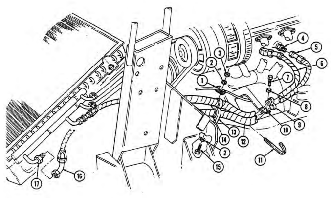 5. Secure supply line (12) to engine mount bracket (10) with clamp (9), lockwasher (8), and capscrew (7).

6. Secure supply line (12) to return line (6) with tiedown strap (11).

FOLLOW-ON TASKS: - Install engine left splash shield (para. 10-23).

- Fill oil to proper level (TM 9-2320-387-10). - Start engine (TM 9-2320-387-10) and inspect for leaks at engine oil cooler, supply and return lines.

- Install engine access cover (para. 10-22).

# 3-7.1. Engine Oil Cooler Supply And Return Lines Maintenance (Serial Numbers 300000 And Above)

This task covers:
b. Inspection

## Initial Setup:

Tools General mechanic's tool kit:
automotive (Appendix B, Item 1)
Maintenance and repair shop equipment:
automotive (Appendix B, Item 2)
Materials/Parts Two lockwashers (Appendix G, Item 144) Two locknuts (Appendix G, Item 77) Three tiedown straps (Appendix G, Item 323) Lockwasher (Appendix G, Item 145)
a. Removal c. Installation

## Manual References

TM 9-2320-387-10 TM 9-2320-387-24P
Equipment Condition
•Engine left splash shield removed (para. 10-23.1). •Oil filter removed (para. 3-5).

General Safety Instructions Do not drain oil when engine is hot.

Maintenance Level Unit

Do not drain oil when engine is hot. Severe injury to personnel may occur.

Cover or plug all open lines and connections immediately after disconnection to prevent contamination. Remove all plugs prior to connection.

- Replacement procedures for engine oil cooler supply and return lines are basically the same. This procedure covers the supply line.

- Mark line connectors for installation.

a. Removal

Have drainage container ready to catch oil.

1. Disconnect supply line connector (12) from adapter (11) and allow oil to drain. 2. Disconnect supply line connector (29) from oil cooler port (30). 3. Remove locknut (25), lockwashers (26), capscrew (1), oil and power steering lines bracket (3), and washers (2) and (27) from airlift bracket (4). Discard locknut (25) and lockwasher (26).

4. Remove capscrew (20), lockwasher (21), washer (22), and oil lines bracket (23) from steering gear case (24). Discard lockwasher (21).

5. Remove capscrew (14), two clamps (15) and (16), and oil line (13) from engine mount bracket (17). 6. Remove locknut (9), washer (8), capscrew (19), lockwasher (18), two clamps (6) and (7), and oil line (13) from oil lines bracket (23). Discard locknut (9) and lockwasher (18).

7. Remove three tiedown straps (5), (10), and (28) from engine oil and power steering lines.

b. Inspection Inspect adapter (11) and oil cooler port (30) for damaged threads or cracks. If damaged, replace.

# 3-7.1. Engine Oil Cooler Supply And Return Lines Maintenance (Serial Numbers 300000 And Above) (Cont'D)

c. Installation

Use of a longer capscrew may be necessary for installation of oil lines bracket.

1. Install three tiedown straps (5), (10), and (28) on engine oil and power steering lines. 2. Install oil line (13) on oil lines bracket (23) with two clamps (6) and (7), lockwasher (18),
capscrew (19), washer (8), and locknut (9). Tighten locknut (9) to 6 lb-ft (8 N•m).

3. Install oil line (13) on engine mount bracket (17) with two clamps (15) and (16) and capscrew (14). 4. Install oil lines bracket (23) on steering gear case (24) with capscrew (20), lockwasher (21), and washer (22).

5. Install oil and power steering lines bracket (3) on airlift bracket (4) with capscrew (1), washers (2)
and (27), lockwasher (26), and locknut (25).

6. Connect supply line connector (29) to oil cooler port (30). 7. Connect supply line connector (12) to adapter (11).

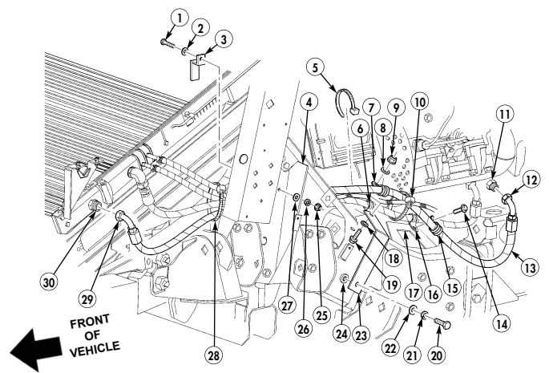

FOLLOW-ON TASKS: - Install oil filter (para. 3-5).

- Install engine left splash shield (para. 10-23.1). - Fill oil to proper level (TM 9-2320-387-10). - Start engine (TM 9-2320-387-10) and inspect for leaks at engine oil cooler, supply, and return lines.

# 3-8. Engine, Transmission, And Power Steering Oil Cooler Assembly Maintenance (Serial Numbers 299999 And Below)

This task covers:
b. Installation INITIAL SETUP:
Tools General mechanic's tool kit:
automotive (Appendix B, Item 1)
Maintenance and repair shop equipment:
automotive (Appendix B, Item 2)
Manual References TM 9-2320-387-10 TM 9-2320-387-24P
a. Removal c. Cleaning and Inspection

## Equipment Condition

- Engine left splash shield removed (para. 10-23). - Headlight housing removed (para. 10-18).

General Safety Instructions
- Do not drain oil when engine is hot. - Compressed air used for cleaning purposes will not exceed 30 psi (207 kPa).

Maintenance Level Unit a. Removal

Do not drain oil when engine is hot. Severe injury to personnel may result.

- Cover or plug all hoses and connections immediately after disconnection to prevent contamination. Remove all covers or plugs prior to connection.

- Do not bend transmission oil cooler fins. Damaged fins reduce cooling efficiency, which may damage engine and/or transmission.

- Have drainage container ready to catch oil. - Tag all hoses for installation.

1. Disconnect two engine oil cooler supply and return lines (15) from engine oil cooler ports (11). 2. Loosen two hose clamps (2) and disconnect transmission fluid cooler line connector hoses (1) from transmission fluid cooler ports (3).

3. Loosen two hose clamps (13) and disconnect power steering fluid line hoses (12) from power steering fluid cooler ports (14).

4. Remove four socket-head screws (7) and oil cooler (16) from radiator (17).

Perform steps 5 through 7 if vehicle is equipped with radiator cleaning components.

5. Remove two capscrews (4), washers (5), and support bracket (6) from oil cooler (16). 6. Remove capscrew (8), washer (9), clip (10), and spacer (10.1) from oil cooler (16). 7. Remove four capscrews (20), washers (19), and two hinges (18) from oil cooler (16).

3-8.  ENGINE, TRANSMISSION, AND POWER STEERING OIL COOLER ASSEMBLY
MAINTENANCE (SERIAL NUMBERS 299999 AND BELOW) (Cont'd)
l

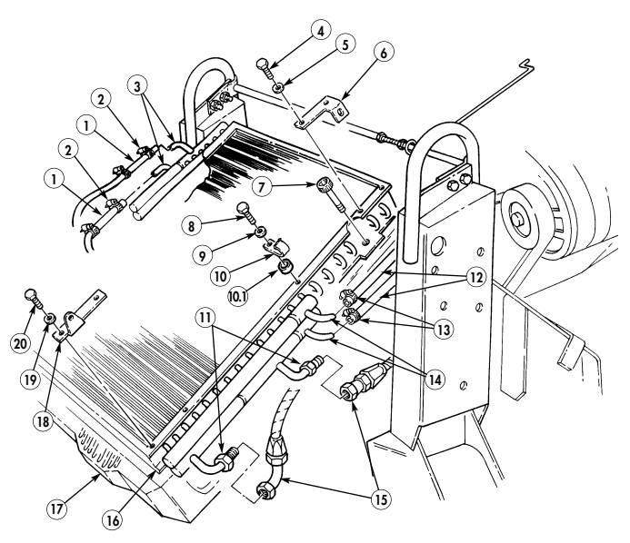

# 3-8. Engine, Transmission, And Power Steering Oil Cooler Assembly Maintenance (Serial Numbers 299999 And Below) (Cont'D)

b. Installation

Perform steps 1 through 3 if vehicle is equipped with radiator cleaning components.

1. Install two hinges (18) on oil cooler (16) with four washers (19) and capscrews (20). 2. Install spacer (10.1) and clip (10) on oil cooler (16) with washer (9) and capscrew (8). 3. Install support bracket (6) on oil cooler (16) with two washers (5) and capscrews (4). 4. Install oil cooler (16) on radiator (17) with four socket-head screws (7). 5. Connect two transmission fluid cooler line connector hoses (1) to transmission fluid cooler ports (3)
with hose clamps (2) and tighten hose clamps to 10-20 lb-in. (1-2 N•m).

6. Connect two engine oil cooler supply and return lines (15) to engine oil cooler ports (11). 7. Connect two power steering fluid line hoses (12) to power steering fluid cooler ports (14) and tighten hose clamps (13) to 10-20 lb-in. (1-2 N•m).

## C. Cleaning And Inspection

1. Remove four socket-head screws (7) securing oil cooler (16) to radiator (17). 2. Remove prop rod (6.1) from clip (10), raise oil cooler (16) and secure oil cooler (16) in place using prop rod (6.1).

Compressed air used for cleaning purposes will not exceed 30 psi (207 kPa). Use only with effective chip guarding and personal protective equipment (goggles/shield, gloves, etc.).

3. Using water and compressed air, remove dirt, trash, and insects embedded in oil cooler (16) and radiator (17) fins.

4. Inspect oil cooler (16) for breaks, punctures, cracks, and splits. Replace oil cooler (16), if damaged. 5. Lower oil cooler (16) and secure on radiator (17) with four socket-head screws (7). 6. Secure prop rod (6.1) in clip (10).

# 3-8. Engine, Transmission, And Power Steering Oil Cooler Assembly Maintenance (Serial Numbers 299999 And Below) (Cont'D)

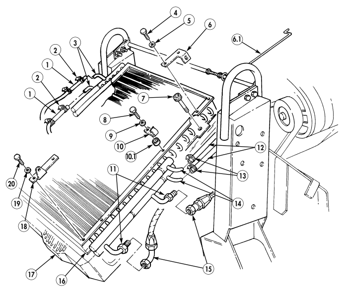

FOLLOW-ON TASKS: - Fill power steering fluid to proper level (TM 9-2320-387-10).

- Fill transmission oil to proper level (TM 9-2320-387-10). - Fill engine oil to proper level (TM 9-2320-387-10). - Install headlight housing (para. 10-18). - Install engine left splash shield (para. 10-23). - Start engine (TM 9-2320-387-10) and check for leaks.

# 3-8.1. Engine, Transmission, And Power Steering Oil Cooler Assembly Replacement (Serial Numbers 300000 And Above)

This task covers:

## Initial Setup:

Tools General mechanic's tool kit:
automotive (Appendix B, Item 1)
Materials/Parts Eight anti-rotation washers 
(Appendix G, Item 318.2)
Four lockwashers (Appendix G, Item 146)
Manual References TM 9-2320-387-10 TM 9-2320-387-24P
a. Removal a. Removal b. Installation

## Equipment Condition

•Engine left splash shield removed (para. 10-23.1). •Engine right splash shield removed (para. 10-24.1).

General Safety Instructions Do not drain oil when engine is hot.

Maintenance Level Unit

Do not drain oil when engine is hot. Severe injury to personnel may result.

- Cover or plug all hoses and connections immediately after disconnection to prevent contamination. Remove all covers or plugs prior to connection.

- Do not bend transmission oil cooler fins. Damaged fins reduce cooling efficiency, which may damage engine or transmission.

- Have drainage container ready to catch oil. - Tag all hoses for installation.

1. Loosen hose clamps (10) and (13) and remove power steering fluid hose lines (11) and (12) from power steering cooler ports (9) and (14).

2. Remove return line (15) and supply line (17) from oil cooler ports (16) and (18). 3. Remove two transmission fluid lines (27) and (29) from transmission fluid cooler ports (28) and (30). 4. Remove four capscrews (25), lockwashers (24), washers (23), and two hinges (22) from oil cooler (1). 5. Remove capscrew (6), washer (7), and clip (8) from oil cooler (1). 6. Remove four capscrews (2), eight anti-rotation washers (3) and (4), four washers (5), and oil cooler (1) from radiator (21). Discard anti-rotation washers (3) and (4).

7. Remove two nuts (26), capscrews (19), and brackets (20) from two hinges (22).

## B. Installation

1. Install two brackets (20) on hinges (22) with two capscrews (19) and nuts (26). 2. Install oil cooler (1) on radiator (21) with four washers (5), eight anti-rotation washers (3) and (4),
and four capscrews (2).

3. Install clip (8) on oil cooler (1) with washer (7) and capscrew (6). 4. Install hinges (22) on oil cooler (1) with four washers (23), lockwashers (24), and capscrews (25). 5. Install transmission fluid lines (27) and (29) on transmission fluid cooler ports (28) and (30). 6. Install supply line (17) and return line (15) on oil cooler ports (16) and (18). 7. Install power steering fluid hose lines (12) and (11) on power steering cooler ports (14) and (9) with hose clamps (13) and (10).

3-8.1. ENGINE, TRANSMISSION, AND POWER STEERING OIL COOLER ASSEMBLY
REPLACEMENT (SERIAL NUMBERS 300000 AND ABOVE) (Cont'd)

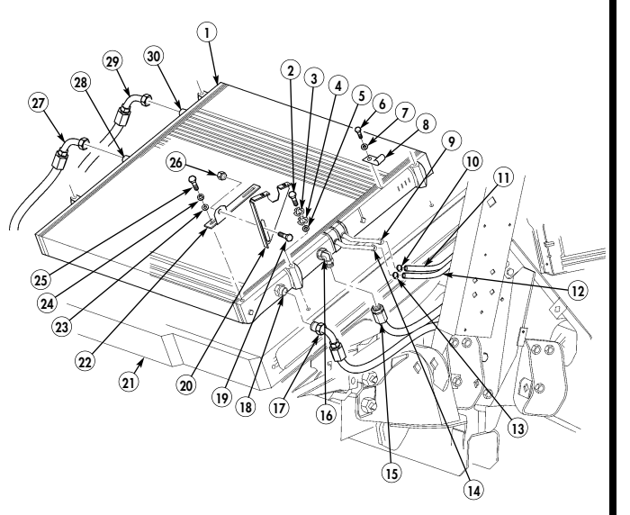

FOLLOW-ON TASKS: - Install engine right splash shield (para. 10-24.1).

- Install engine left splash shield (para. 10-23.1). - Check and refill engine oil and transmission oil and power steering oil 
(TM 9-2320-387-10).

- Bleed power steering system (para. 8-27).

# 3-9. Crankcase Depression Regulator (Cdr) Valve And Bracket Maintenance

This task covers:
INITIAL SETUP:
Test Equipment Manometer, U-tube
(Appendix B, Section IV, Item L)
Tools General mechanic's tool kit:
automotive (Appendix B, Item 1)
Maintenance and repair shop equipment:
automotive (Appendix B, Item 2)
a. Testing c. Cleaning and Inspection b. Removal d. Installation Manual References TM 9-2320-387-10 TM 9-2320-387-24P
Equipment Condition
- Hood raised and secured (TM 9-2320-387-10). - Engine access cover removed (para. 10-22).

Maintenance Level Unit

## A. Testing

1. Remove engine oil dipstick from oil dipstick tube (para. 3-2). 2. Install manometer in dipstick tube. 3. Connect STE/ICE-R unit to DCA connector.

To read manometer pressure, add amount the water travels in column above zero to the amount the water travels in column below zero.

4. Start engine and let idle; record water pressure. Pressure should be zero inches of water, or a slight vacuum.

5. Increase engine speed to 2,000 rpm; record water pressure. Pressure should be 2-5 in. 6. If pressures are not within specifications in steps 4 and 5, replace CDR valve (7) and repeat test. 7. Install engine oil dipstick in oil dipstick tube (para. 3-2).

b. Removal

CDR valves on vehicles equipped with deep water fording kit contain two additional vent lines.

1. Loosen clamp (5) and disconnect CDR valve oil fill tube hose (4) from CDR valve (7). 2. Remove two screws (1), washers (2), and CDR valve (7) from CDR valve bracket (3) and intake crossover hose (6).

3. Remove two nuts (9) from CDR valve bracket (3) and intake manifold studs (10). 4. Remove two nuts (8) and CDR valve bracket (3) from two valve cover studs (11).

3-9.  CRANKCASE DEPRESSION REGULATOR (CDR) VALVE AND BRACKET
MAINTENANCE (Cont'd)

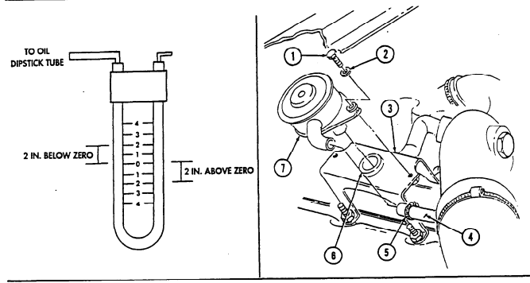

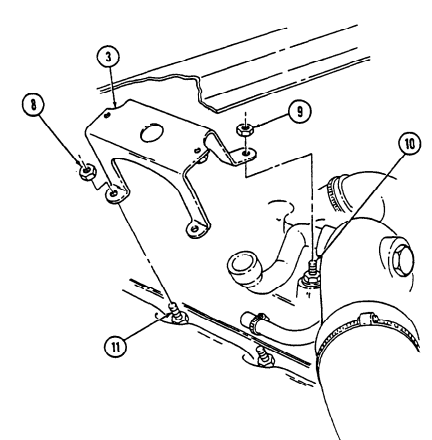

# 3-9. Crankcase Depression Regulator (Cdr) Valve And Bracket Maintenance (Cont'D)

c. **Cleaning and Inspection** 

## Cautlon

Do not clean CDR valve with drycleaning solvent. Drycleaning solvent may damage the diaphragm inside CDR valve. 

1. Clean oil and carbon deposits from CDR valve (12) with a clean, lint-free cloth. 

2. Inspect CDR valve (12) and lines for leaks, cracks, and restrictions. Replace if damaged 

## D Installation

1. Install CDR valve bracket (2) on two intake manifold studs (4) and valve cover studs (61. 

# 1

2. Secure CDR valve bracket (2) to intake manifold (5) with two nuts (3). Tighten nuts (3) to 15 lb-R (20 N-m).

3. Secure CDR valve bracket (2) to valve cover studs (6) with two nuts **(1). Tighten** nuts (1) to 

10 lb-R (14 Nom). 

4. Install CDR valve (12) on CDR valve bracket (2) and intake crossover hose (11) with two washers (8) 
and screws (7). Tighten screws (71 to 15 lb-R (20 Nom). 

5. Connect CDR valve oil fill tube hose (9) to CDR valve (12) and tighten clamp (10).

3-9.  CRANKCASE DEPRESSION REGULATOR (CDR) VALVE AND BRACKET

# Maintenance (Cont'D)

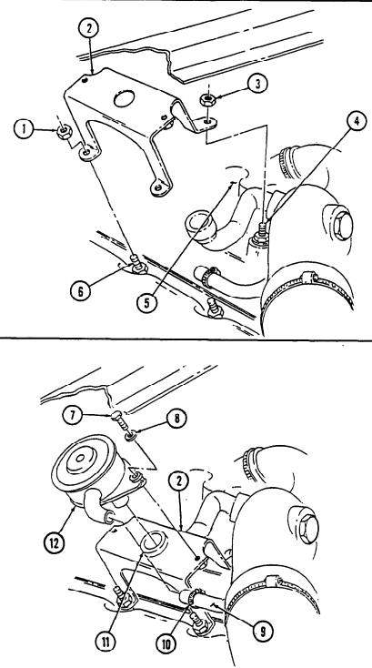

FOLLOW-ON TASKS: - Lower and secure hood (TM 9-2320-387-10).

- Install engine access cover (para. 10-22).

## 1 3-L 0. Cdr Valve Hoses Replacement

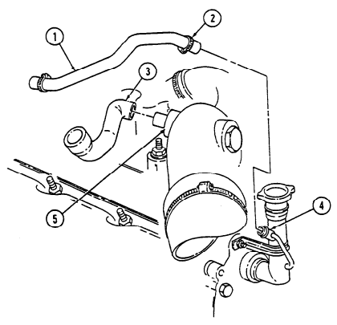

| TROUBLE CODE   | CIRCUIT                                  |
|----------------|------------------------------------------|
| 21             | Throttle Position (TP) High              |
| 22             | Throttle Position (TP) Low               |
| 24             | Transmission  Output Speed Sensor (TOSS) |

| This task covers:   |
|---------------------|

a. Removal b . **Installation** 

TM 9-2320-387-24P 
1. Remove CDR valve intake crossover hose (3) from air horn (5). 

2. Loosen clamp (2) and disconnect CDR valve oil fill tube hose (1) from oil fill tube (4). 

1 b. Installation 1 1. Connect CDR valve oil fill tube hose (1) to oil fill tube (4) and tighten clamp (2). 

2. Install CDR valve intake crossover hose (3) on air horn (5). 

FOLLOW-ON TASK: Install CDR valve and bracket (para. 3-9). 

# Section Ii. Fuel System Maintenance 3-11. Fuel System Maintenance Task Summary

| Undefined Ratio Error                                      |      | High Ratio Error                                      |                                            |              |
|------------------------------------------------------------|------|-------------------------------------------------------|--------------------------------------------|--------------|
| Circuif Descriptions                                       |      | Circuit Description:                                  |                                            |              |
| The control  module calculates ratio based on the          |      | The control module calculates ratio based on the TISS |                                            |              |
| transmission input speed and output speed sensor           |      | and TOSS readings. The control module compares the    |                                            |              |
| reading. The control module compares the known             |      | known transmission ratio to the calculated ratio for  |                                            |              |
| transmission ratio to the calculated ratio for the         |      | the particular gear range selected.                   |                                            |              |
| particular gear range selected.                            |      | DTC 87 Will Set When\-                                |                                            |              |
| DTC 85 Will Set When\-                                     |      | * Throttle position is greater than 25%.              |                                            |              |
| * Throttle position is greater than 25%.                   |      | l Not in park, reverse, or neutral.                   |                                            |              |
| l Not in park, neutral, or 4th gear.                       |      | l Engine speed greater than 300 rpm.                  |                                            |              |
| l Engine speed is greater than 300 r\-pm.                  |      | l Vehicle speed is greater than 7 mph (11 kphl.       |                                            |              |
| l Vehicle speed is greater than 7 mph (11 kphl.            |      |                                                       | l Transmission temperature is greater than |              |
| lFCAlCUlATEDRATlOIS:                                       |      |                                                       |                                            | 68°F (20°C). |
| I  COMMANDED                                               |      | l All conditions are met for 2 seconds.               |                                            |              |
| I  I LESS THAN  I MORE THAN  I                             | GEAR |                                                       |                                            |              |
| I  I  2.38  2.63  I  I                                     | 1st  |                                                       |                                            |              |
| I  I  1.43  I  1.58  I                                     | 2nd  |                                                       |                                            |              |
| 0.95  1.05  I  I  I  I                                     | 3rd  |                                                       |                                            |              |
| 1.97  I  2.17  I  I  I                                     | REV  |                                                       |                                            |              |
| l All conditions are met for 2 seconds.                    |      |                                                       |                                            |              |
| DTC 86                                                     |      |                                                       |                                            |              |
| Low Ratio Error                                            |      |                                                       |                                            |              |
| Circuit Description:                                       |      |                                                       |                                            |              |
| The control module calculates ratio based on the           |      |                                                       |                                            |              |
| TISS and TOSS readings. The control module                 |      |                                                       |                                            |              |
| compares the known transmission ratio to the               |      |                                                       |                                            |              |
| calculated ratio for the particular  gear range  selected. |      |                                                       |                                            |              |
| DTC 86 Will Set Whenr                                      |      |                                                       |                                            |              |
| l Not in park, reverse, or neutral.                        |      |                                                       |                                            |              |
| l Engine speed is greater than 300 x\-pm.                  |      |                                                       |                                            |              |
| l Throttle position is greater than 25%.                   |      |                                                       |                                            |              |
| l Vehicle speed is greater than 7 mph (11 kphl.            |      |                                                       |                                            |              |
| l Transmission gear ratio is less than 1.06 in             |      |                                                       |                                            |              |
| 1st or 2nd gear,                                           |      |                                                       |                                            |              |
| l All conditions are met for 2 seconds.                    |      |                                                       |                                            |              |

# 3-12. Air Cleaner Assembly And Dust Unloader Maintenance

This task covers:
a. Removal c. Installation b. Inspection

## Initial Setup:

Tools General mechanic's tool kit:
automotive (Appendix B, Item 1)
Maintenance and repair shop equipment:
automotive (Appendix B, Item 2)
Manual References TM 9-2320-387-10 TM 9-2320-387-24P
a. Removal

| Jl   |
|------|

For dust unloader replacement, perform steps 1 and 2 only.

1. Remove four screws (16) and dust unloader cover (15) from two support brackets (4). 2. Loosen clamp (17) and remove dust unloader (18) from air cleaner assembly (9). 3. Loosen clamp (5) and disconnect elbow (6) from air cleaner assembly (9). 4. Disconnect air restriction gauge hose (7) from fitting (8). 5. Remove outer strap clamps (10) and (12) from air cleaner assembly (9). 6. Disconnect vent line (3) from elbow (2). 7. Remove air cleaner assembly (9) from two support brackets (4). 8. Remove elbow (2) from air cleaner assembly (9). 9. Remove adapter (14) and tube (13) from air cleaner assembly (9). 10. Remove fitting (8) from air cleaner assembly (9). 11. Remove strap clamp (11) from air cleaner assembly (9).

## B. Inspection

1. Inspect gasket (1) for cracks or breaks. Replace gasket (1) if defective. 2. Inspect elbow (2), fitting (8), and adapter (14) for damaged threads or cracks. Replace if defective.

c. Installation

For dust unloader replacement, perform steps 10 and 11 only.

1. Install strap clamp (11) on air cleaner assembly (9). 2. Install fitting (8) on air cleaner assembly (9). 3. Install tube (13) on adapter (14). 4. Install tube (13) and adapter (14) on air cleaner assembly (9). 5. Install elbow (2) on air cleaner assembly (9).

# 3-12. Air Cleaner Assembly And Dust Unloader Maintenance (Cont'D)

If armor on M1151A1, M1152A1, M1165A1, or M1167 interferes with dust unloader, rotate air cleaner assembly away from armor to prevent interference.

6. Install air cleaner assembly (9) on two support brackets (4) with strap clamps (10), (11), and (12).

Tighten clamps in the following sequence: (10), (11), and (12).

7. Connect elbow (6) to air cleaner assembly (9) and tighten clamp (5) to 50-60 lb-in. (6-7 N•m). 8. Connect air restriction gauge hose (7) to fitting (8). 9. Connect vent line (3) to elbow (2).

10. Install dust unloader (18) on air cleaner assembly (9) and tighten clamp (17) to 45-50 lb-in.

(5-6 N•m).

11. Install dust unloader cover (15) on two support brackets (4) with four screws (16).

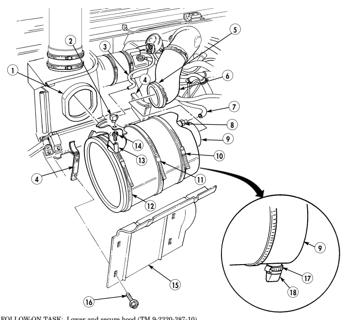

FOLLOW-ON TASK: Lower and secure hood (TM 9-2320-387-10).

# 3-13. Air Cleaner Filter Element Servicing

This task covers:
a. Removal d. Cleaning b. Inspection e. Installation c. Emergency Cleaning

## Initial Setup:

Tools General mechanic's tool kit:
automotive (Appendix B, Item 1)
Maintenance and repair shop equipment:
automotive (Appendix B, Item 2)
Materials/Parts Detergent (Appendix C, Item 25)
Manual References TM 9-2320-387-10 TM 9-2320-387-24P
Equipment Condition Hood raised and secured (TM 9-2320-387-10).

General Safety Instructions
- Do not use unauthorized cleaning methods or liquids.

- Compressed air used for cleaning purposes will not exceed 30 psi (207 kPa).

Maintenance Level Unit

- Improper cleaning methods and use of unauthorized cleaning liquids can injure personnel and cause damage to equipment. Do not use anything other than compressed air, water, and detergent to clean elements.

- If NBC contamination is suspected, consult NBC officer or NBC NCO
for appropriate handling instructions.

a. Removal

The vehicle air cleaner may be configured with either a ring clamp or over-center clamp.

1. Loosen screw (8), or unlatch and remove clamp (1), cover (2), and gasket (3) from air cleaner assembly (6).

CAUTION
Cover housing opening with screen or rag to prevent contaminants from entering air intake system and damaging engine.

2. Remove nut and washer assembly (7) and filter element (4) from stud (5) of air cleaner assembly (6). b. Inspection 1. Check gasket (3) for dents, tears, rips, and other damage. Ensure gasket has not taken a set.

Ensure there are no hard dirt ridges on sealing surfaces.

2. Inspect filter element (4) for holes and tears by looking through element toward a bright light. If pinpoints of light shine through, replace element. Holes that are large enough to let light through are large enough to let contaminants through. Another way to check for leaks or damage is to look for uneven dirt patterns. Ensure there is no rust or flaking paint on metal parts of filter. If the filter has already been cleaned three times, or if damaged, replace filter element (4).

3. Check air cleaner assembly (6) for holes, dents, rust, or any other damage that will interfere with proper sealing and allow unfiltered air to enter and destroy engine.

c. Emergency Cleaning

Do not strike ends of filter element on hard surface, or damage to filter element may result.

Remove dust or sand from filter element (4) by holding it so neither end faces ground, and gently tap around filter element (4).

3-24 Change 1

# 3-13. Air Cleaner Filter Element Servicing (Cont'D)

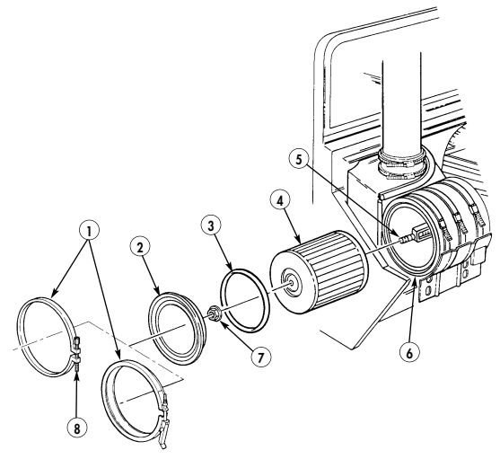

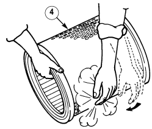

# 3-13. Air Cleaner Filter Element Servicing (Cont'D)

d. Cleaning

Compressed air used for cleaning purposes will not exceed 30 psi (207 kPa). Use only with effective chip guarding and personnel protective equipment (goggles/shield, gloves, etc.).

1. Hold nozzle at least 1 in. (25 mm) away from element (1) and direct compressed air against clean side of element (1) (in direction opposite to normal air flow). Move air stream up and down length of pleats until dust no longer blows out.

2. Prepare a solution of five gal. warm water 80-110°F (27-43°C) and one cup of non-sudsing detergent in a container large enough to submerge element (1).

3. Immerse element (1) completely in cleaning solution, swish for two minutes, soak element (1) for 15-20 min., then swish it around again to remove contaminants.

4. Remove element (1) from the solution and let drain. 5. Rinse element (1) with cool water 35-80°F (2-27°C) from clean side to dirty side (in direction opposite to normal air flow) with a gentle stream of water no more than 40 psi (276 kPa). If the clean side of element (1) was contaminated during soak cycle, rinse from both sides.

Do not use compressed air to speed drying time or damage to element may result.

6. Air-dry element (1) at normal room temperature until it is completely dry. Usually overnight is adequate, but temperature and humidity will affect drying time. If circulating air is used, do not exceed 180°F (82°C).

7. Inspect element (1) and discard if damaged. If not damaged, mark date of cleaning on element (1).

e. Installation 1. Remove screen or rag from housing opening.

When replacing filter element, ensure it is the 420 CFM element.

2. Install filter element (1) on stud (5) of air cleaner assembly (6) with nut and washer assembly (7).

Tighten nut and washer assembly (7) to 20-40 lb-in (2-5 N•m).

When cover clamp is secured to end of filter body assembly, ensure clamp screw/latch is between three and six o'clock position to prevent damaging hood when hood is closed.

Perform step 3 when using ring clamp.

3. Install gasket (4) and cover (3) on air cleaner assembly (6) with clamp (2). Tighten screw (8) to 35-40 lb-in (4-5 N•m).

Perform step 3.1 when using over center clamp.

3.1 Install gasket (4) and cover (3) on air cleaner assembly (6) with clamp (2) as shown. Ensure a 0.250 in. gap is set with clamp in closed position.

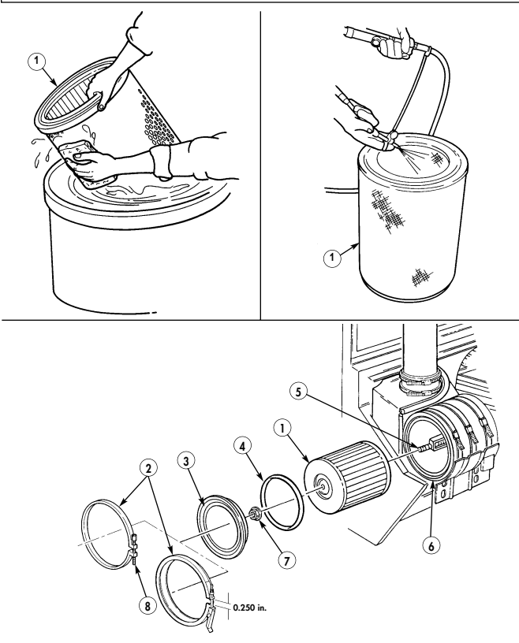

# 3-13. Air Cleaner Filter Element Servicing (Cont'D)

FOLLOW-ON TASKS: - Lower and secure hood (TM 9-2320-387-10).

- Start engine (TM 9-2320-387-10) and ensure air restriction gauge on instrument panel does not show red.

# 3-14. Air Horn Replacement

This task covers:
a. Removal b. Installation INITIAL SETUP:

| Jl CABLE DIAGNOSTICS  CHART /Cont'dI         |     |       |          |
|----------------------------------------------|-----|-------|----------|
| Jl Resistance Measurements With Ignition OFF |     |       |          |
| CKT NOM.  CKT#  TO                           | PIN | PIN   | EXP READ |
| Battery Neg  599A                            | a   | Shunt | 0 ohm    |

a. Removal 1. Disconnect CDR hose (1) from air horn (2). 2. Loosen clamp (4) and disconnect air intake elbow (3) from air horn (2).

Cover opening of turbocharger intake to prevent foreign material from entering turbocharger and damaging engine.

3. Loosen clamp (5) and remove air horn (2) from turbocharger intake hose (6). 4. Remove adapter (7) from air horn (2). 5. Remove inserts (8) and (9) from air horn (2). b. Installation 1. Install inserts (8) and (9) on air horn (2).

1.1 Apply adhesive to adapter (7) and install adapter (7) on air horn (2).

2. Install air horn (2) on turbocharger intake hose (6) and tighten clamp (5) to 50-60 lb-in. (6-7 N•m). 3. Connect elbow (3) to air horn (2) and tighten clamp (4) to 50-60 lb-in. (6-7 N•m). 4. Connect CDR hose (1) to air horn (2).

# 3-14.  Air Horn Replacement (Cont'D)

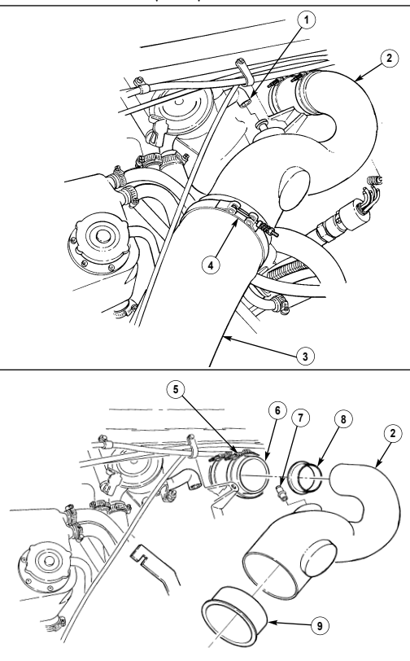

FOLLOW-ON TASK:  Lower and secure hood (TM 9-2320-387-10).

# 3-15. Air Horn-To-Air Cleaner Elbow Replacement

This task covers:
INITIAL SETUP:
Tools General mechanic's tool kit:
automotive (Appendix B, Item 1)
Maintenance and repair shop equipment:
automotive (Appendix B, Item 2)

## Manual References

TM 9-2320-387-10 TM 9-2320-387-24P

a. Removal b. Installation

Equipment Condition Hood raised and secured (TM 9-2320-387-10).

Maintenance Level Unit a. Removal 1. Loosen two clamps (3) and remove elbow (4) from air cleaner assembly (1) and air horn (2). 2. Remove two clamps (3) from elbow (4). b. Installation 1. Install two clamps (3) on elbow (4). 2. Connect elbow (4) to air cleaner assembly (1) and air horn (2) and tighten two clamps (3) to 50-60 lbin. (6-7 N•m).

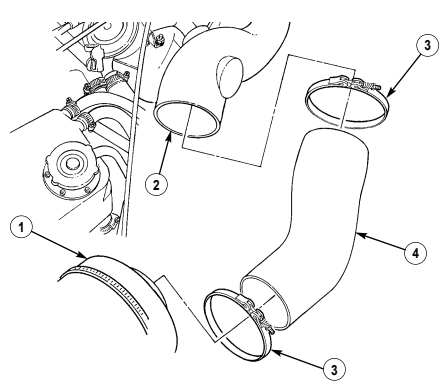

FOLLOW-ON TASK: Lower and secure hood (TM 9-2320-387-10).

# 3-16. Air Horn Support Bracket Replacement

This task covers:
a. Removal b. Installation

## Initial Setup:

Tools

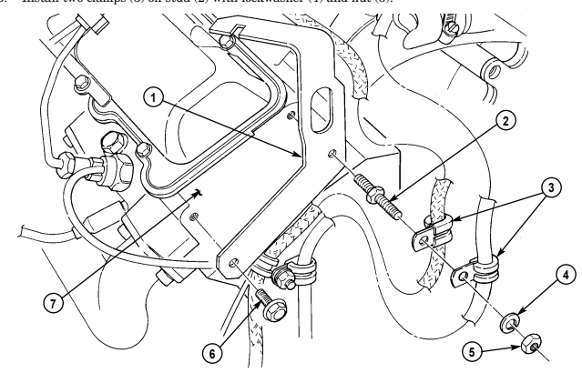

General mechanic's tool kit:
automotive (Appendix B, Item 1)
Maintenance and repair shop equipment:
automotive (Appendix B, Item 2)
Lockwasher (Appendix G, Item 185)
a. Removal 1. Remove nut (5), lockwasher (4), two clamps (3), and stud (2) from air horn support bracket (1) and cylinder head (7). Discard lockwasher (4).

2. Remove capscrew (6) and support bracket (1) from cylinder head (7). b. Installation 1. Install air horn support bracket (1) on cylinder head (7) with stud (2). 2. Secure air horn support bracket (1) to cylinder head (7) with capscrew (6). Tighten capscrew (6) and stud (2) to 40 lb-ft (54 N•m).

3. Install two clamps (3) on stud (2) with lockwasher (4) and nut (5).

FOLLOW-ON TASK: Install air horn (para. 3-14).

Manual References TM 9-2320-387-24P
Equipment Condition Air horn removed (para. 3-14).

| Maintenance Level   |
|---------------------|
| Unit                |

# 3-17. Air Restriction Gauge Replacement

This task covers:
a. Removal b. Installation INITIAL SETUP:
Tools General mechanic's tool kit:
automotive (Appendix B, Item 1)
Manual References TM 9-2320-387-10 TM 9-2320-387-24P
a. Removal 1. Remove two screws (2) securing gauge (4) to bezel (1) and remove gauge (4) and gasket (3) from behind instrument panel (6).

2. Disconnect hose (5) and remove gauge (4).

b. Installation 1. Connect hose (5) to gauge (4). 2. Install gasket (3) and gauge (4) behind instrument panel (6) and secure to bezel (1) with two 

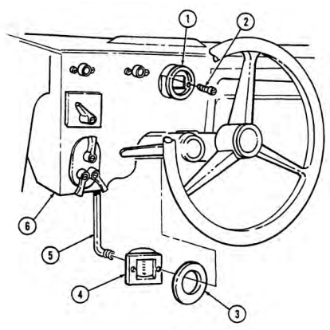

screws (2).

FOLLOW-ON TASK: Start engine (TM 9-2320-387-10) and check operation of air restriction gauge.

Maintenance Level Unit

# 3-18. Weathercap Replacement

This task covers:
INITIAL SETUP:
Tools General mechanic's tool kit:
automotive (Appendix B, Item 1)
Maintenance and repair shop equipment:
automotive (Appendix B, Item 2)
Manual References TM 9-2320-387-24P
a. Removal Remove clamp (2) and weathercap (1) from air intake duct (3).

b. Installation Install weathercap (1) on air intake duct (3) with clamp (2). Tighten clamp (2) to 50-60 lb-in. (6-7 N•m).

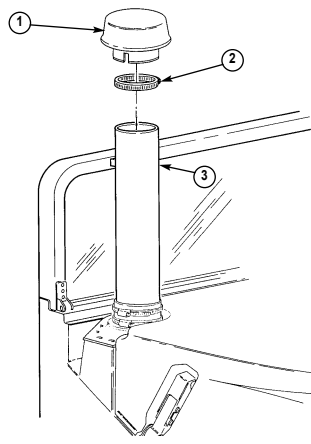

a. Removal b. Installation Maintenace Level Unit

# 3-19. Air Intake Assembly And Bracket Replacement

This task covers:

a. Removal b. Installation

| Repair/replace winch power cables (para. 12\-28).   | 2. Start Test 89, DC Volts.   |
|-----------------------------------------------------|-------------------------------|
| 3. Displayed reading is in volts.                   |                               |

Two locknuts (Appendix G, Item 106)
(M1114 only)
a. Removal 1. Remove nut (5), washer (3), capscrew (2), and washer (3) from air intake assembly (1) and support bracket (4).

2. Loosen two clamps (6), and remove air intake assembly (1) and rubber boot (6.1) from air cleaner extension (7).

## Note B. Installation Note

Perform steps 3 and 4 for M1114 and step 5 for all other vehicles.

3. Remove two locknuts (11), capscrews (8), washers (9), and support bracket (4) from mounting bracket (10). Discard locknuts (11).

4. Remove two capscrews (14), washers (13), and mounting bracket (10) from windshield (12). 5. Remove two capscrews (16), washers (15), and support bracket (4) from windshield (12).

Perform steps 1 and 2 for M1114 and step 3 for all other vehicles.

1. Install mounting bracket (10) on windshield (12) with two washers (13) and capscrews (14).

Tighten capscrews (14) to 6 lb-ft (8 N•m).

2. Install support bracket (4) on mounting bracket (10) with two washers (9), capscrews (8), and locknuts (11).

3. Install support bracket (4) on windshield (12) with two washers (15) and capscrews (16).

4. Install rubber boot (6.1) and air intake assembly (1) on air cleaner extension (7) with two clamps
(6). Tighten clamps (6) to 50-60 lb-in. (6-7 N•m).

5. Install air intake assembly (1) on support bracket (4) with washer (3), capscrew (2), washer (3), and nut (5). Tighten nut (5) to 43 lb-ft (58 N•m).

# 3-19. Air Intake Assembly And Bracket Replacement (Cont'D)

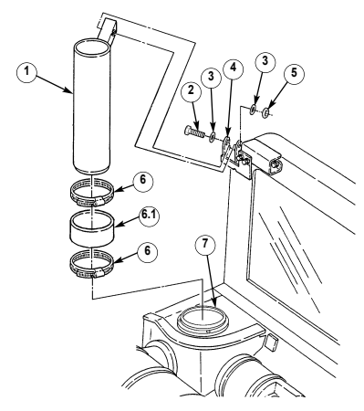

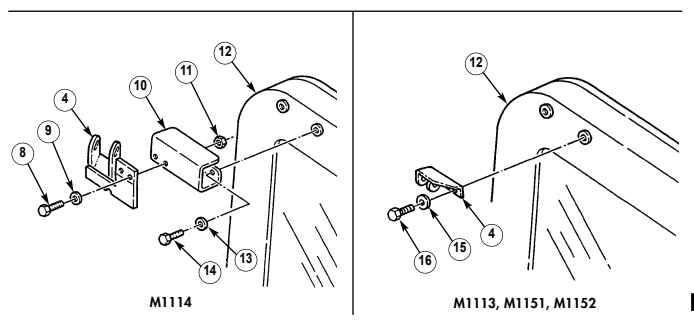

1

FOLLOW-ON TASK:  Install weathercap (para. 3-18).

# 3-20. Air Restriction Gauge Hose Replacement

This task covers:
INITIAL SETUP:
Tools General mechanic's tool kit:
automotive (Appendix B, Item 1)
Manual References TM 9-2320-387-10 TM 9-2320-387-24P
a. Removal 1. Loosen five clamps (2) securing hose (5) to A-beam (1). 2. Disconnect hose (5) from air cleaner assembly (8). 3. Disconnect hose (5) from gauge (3) located behind instrument panel (4). 4. Remove hose (5) from five clamps (2) and through grommet (6) in cowl (7).

b. Installation 1. Route hose (5) through grommet (6) and five clamps (2) in cowl (7) and connect hose (5) to air cleaner assembly (8).

2. Connect hose (5) to gauge (3). 3. Tighten five clamps (2) on hose (5) and A-beam (1).

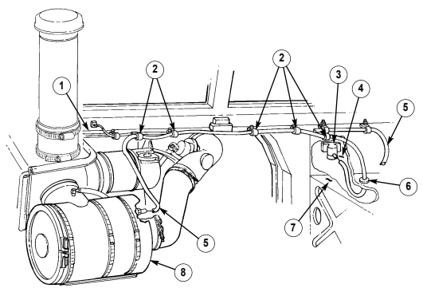

FOLLOW-ON TASK: Lower and secure hood (TM 9-2320-387-10).

a. Removal b. Installation Equipment Condition Hood raised and secured (TM 9-2320-387-10).

Maintenance Level Unit

# 3-21. Air Intake And Fuel Pump Vent Lines Replacement

This task covers:
INITIAL SETUP:
Tools General mechanic's tool kit:
automotive (Appendix B, Item 1)
Manual References TM 9-2320-387-10 TM 9-2320-387-24P
a. Removal a. Removal b. Installation Equipment Condition Hood raised and secured (TM 9-2320-387-10).

Maintenance Level Unit

- For fuel pump vent line replacement, perform steps 2, 3, and 4 only. - Insulation may need to be removed to access vent line.

1. Remove vent line (2) from air cleaner fitting (1) and tee fitting (8). 2. Loosen clamp (3) and disconnect vent line (4) from fuel pump (7). 3. Loosen clamp (5) and remove vent line (4) from tee fitting (6). 4. Remove two clamps (3) and (5) from vent line (4).

b. Installation

For fuel pump vent line replacement, perform steps 2 and 3 only.

1. Connect vent line (2) to tee fitting (8) and air cleaner fitting (1). 2. Install clamps (3) and (5) on vent line (4). 3. Install vent line (4) on tee fitting (6) and fuel pump (7) and tighten clamps (3) and (5). 4. Install insulation if removed to access vent line (2).

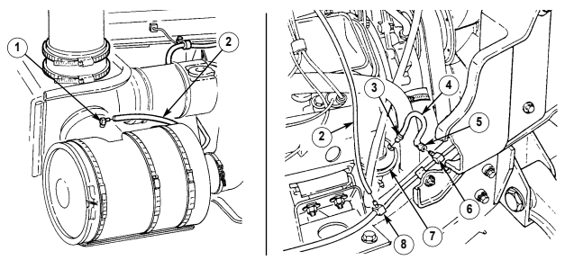

FOLLOW-ON TASK: Lower and secure hood (TM 9-2320-387-10).

# 3-22. Drainage Bracket Replacement

This task covers:
INITIAL SETUP:
Tools General mechanic's tool kit:
automotive (Appendix B, Item 1)
Manual References TM 9-2320-387-24P

a. Removal b. Installation

Equipment Condition Air cleaner assembly removed (para. 3-12).

Maintenance Level Unit a. Removal Remove three screws (2) and drainage bracket (3) from body (1).

b. Installation Install drainage bracket (3) on body (1) with three screws (2).

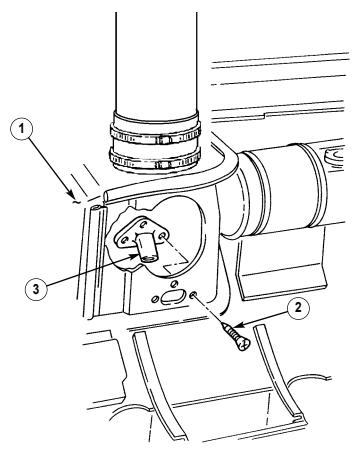

FOLLOW-ON TASK: Install air cleaner assembly (para. 3-12).

# 3-23. Fuel Injection Pump Boot Replacement

This task covers:
INITIAL SETUP:
Tools General mechanic's tool kit:
automotive (Appendix B, Item 1)
Manual References TM 9-2320-387-10 TM 9-2320-387-24P
a. Removal b. Installation Equipment Condition Hood raised and secured (TM 9-2320-387-10).

Maintenance Level Unit a. Removal Remove clamp (3) and boot (2) from injection pump (1).

b. Installation Install boot (2) on injection pump (1) with clamp (3).

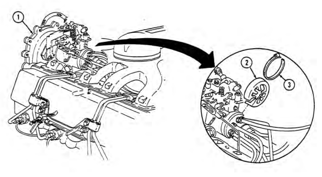

FOLLOW-ON TASK: Lower and secure hood (TM 9-2320-387-10).

# 3-24. Fuel Pump Replacement

This task covers:
INITIAL SETUP:
Tools General mechanic's tool kit:
automotive (Appendix B, Item 1)
Maintenance and repair shop equipment:
(Appendix B, Item 2)

## Materials/Parts

Mounting plate gasket (Appendix G, Item 193) Fuel pump gasket (Appendix G, Item 35.1) Grease (Appendix C, Item 34)

a. Removal b. Installation

| Manual References    |
|----------------------|
| TM 9\-2320\-387\-10  |
| TM 9\-2320\-387\-24P |

Equipment Condition Battery ground cables disconnected (para. 4-68).

General Safety Instructions Do not perform this procedure near fire, flames, or sparks.

Maintenance Level Unit

Diesel fuel is highly flammable. Do not perform this procedure near fire, flames, or sparks. Severe injury or death may result.

a. Removal

Cover or plug all open hoses and connections immediately after disconnection to prevent contamination. Remove all plugs prior to connection.

Have drainage container ready to catch fuel.

1. Loosen clamp (14) and disconnect fuel inlet line (13) from fuel pump (2) and allow fuel to drain into container.

2. Disconnect fuel outlet line (12) from fuel pump (2) and allow fuel to drain into container. 3. Loosen clamp (3) and disconnect vent line (4) from fuel pump (2). 4. Remove two capscrews (1), fuel pump (2), and gasket (6) from fuel pump mounting plate (7).

Discard gasket (6).

5. Remove two capscrews (11), fuel pump mounting plate (7), and gasket (8) from cylinder block (10).

Discard gasket (8).

6. Remove pushrod (9) from cylinder block (10).

b. Installation

GAA grease is used on pushrod to retain it in cylinder block during installation.

1. Apply grease on pushrod (9) and insert pushrod (9) into cylinder block (10). Turn over engine by hand until pushrod (9) fully retracts.

2. Install gasket (8) and mounting plate (7) on block (10) with two capscrews (11) for alignment of pump (2) to cylinder block (10).

# 3-24. Fuel Pump Replacement (Cont'D)

3. Secure gasket (8) and mounting plate (7) to cylinder block (10) with two capscrews (11). Tighten capscrews (11) to 4-7 lb-ft (5-10 N•m).

3.1. Connect fuel outlet line (12) to fuel pump (2). Do not tighten fuel outlet line (12) at this time.

4. Install gasket (6) and fuel pump (2) on fuel pump mounting plate (7) and block (10) with two capscrews (1), ensuring lever (5) aligns with pushrod (9). Tighten capscrews (1) to 20-30 lb-ft (27-41 N•m).

5. Connect vent line (4) to fuel pump (2) and tighten clamp (3) to 10-20 lb-in. (1-2 N•m). 6. Tighten fuel outlet line (12) on fuel pump (2). 7. Connect fuel inlet line (13) to fuel pump (2) and tighten clamp (14).

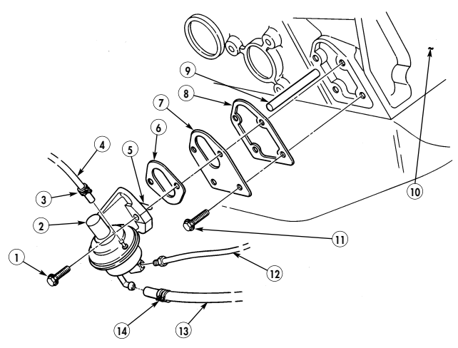

FOLLOW-ON TASKS: - Connect battery ground cables (para. 4-68).

- Start engine (TM 9-2320-387-10) and check fuel pump and hoses for fuel leaks.

# 3-25. Fuel Tank And Shield Maintenance

This task covers:

b. Removal e. Assembly

c. Disassembly f. Installation

## Initial Setup: Tools

General mechanic's tool kit:
automotive (Appendix B, Item 1)
Maintenance and repair shop equipment:
(Appendix B, Item 2)

## Materials/Parts

Gasket (Appendix G, Item 37) Fourteen locknuts (Appendix G, Item 77) Three lockwashers (Appendix G, Item 144) Drycleaning solvent (Appendix C, Item 26) Adhesive (Appendix C, Item 2) Sealing compound (Appendix C, Item 62) Tiedown strap (Appendix G, Item 322)
Personnel Required One mechanic One assistant a. Draining d. Cleaning and Inspection

## Manual References

TM 9-2320-387-10 TM 9-2320-387-24P

## Equipment Condition

•Battery ground cables disconnected (para. 4-68). •Rear propeller shaft removed (para. 6-4). •Right rear underbody armor removed 
(M1114 only)(para. 11-39).

•Right rear upper underbody armor (integrated)
removed (para. 11-109 or para. 11-109.1).

## General Safety Instructions

•Do not perform this procedure near fire, flames, or sparks.

•Drycleaning solvent is flammable and will not be used near an open flame.

Maintenance Level Unit

Diesel fuel is highly flammable. Do not perform this procedure near fire, flames, or sparks. Severe injury or death may result.

a. Draining

Have drainage container ready to catch fuel.

1. Remove fuel tank filler cap (1). 2. Remove drainplug (3) from fuel tank (2) and allow fuel to completely drain into container.

CAUTION
Do not overtighten drainplug. Drainplug must not turn in hole. Sharp edge of hole may cut rubber.

3. Install drainplug (3) flush with bottom of fuel tank (2).

b. Removal

Perform steps 1 through 1.2 if equipped with new vent line assembly.

1. Remove tiedown strap (13.1) from vent lines (14.1) and (4). Discard tiedown strap (13.1).

1.1. Remove vent line (14.1) from elbow (4.1). 1.2. Remove vent line (4) from elbow (4.2). 1.3. Remove vent line (4) from filler spout (5).

2. Remove locknut (15), washer (12), capscrew (11), washer (12), and clamp (13) from vent line (4) and body (14). Discard locknut (15).

# 3-25. Fuel Tank And Shield Maintenance (Cont'D)

3. Remove locknut (16), washer (7), capscrew (8), washer (7), and clamp (6) from filler spout (5).

Discard locknut (16).

4. Loosen clamp (9) and remove hose (10) from spout (5).

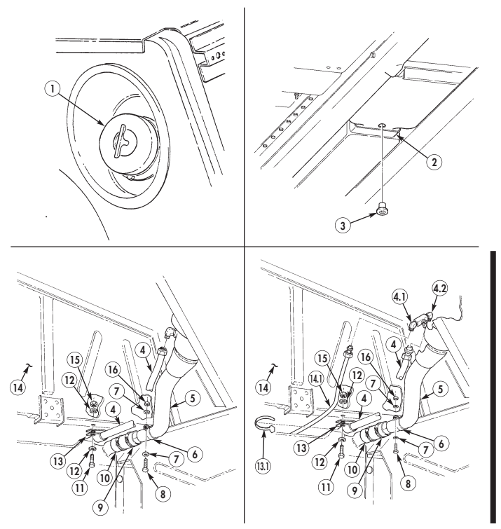

# 3-25. Fuel Tank And Shield Maintenance (Cont'D)

5. Remove two nuts (15), washers (14), and capscrews (7) from fuel tank support straps (6) and (12)
and remove lower straps (13).

6. Loosen two clamps (3) and disconnect fuel supply hoses (1) and (2) from fuel return line (4) and supply line (5).

Perform step 7 if vehicle is equipped with vehicular heater.

7. Loosen clamp (17) and disconnect fuel supply hose (18) from vehicular heater fuel supply line (16). 8. Disconnect vent line (20) from tee (19). 9. Remove capscrew (22) and clamp (23) securing vent line (20) to body (24).

10. Remove nut (8), washer (9), capscrew (10), and rear strap (12) from strap bracket (11). 11. Lower fuel tank (21) for access to vent line (29) and clamp (28). 12. Disconnect vent line (20) from fitting (25) on fuel tank (21). 13. Remove locknut (26), washer (27), and clamp (28) from vent line (29) and fuel tank (21). Discard locknut (26).

14. Remove vent line (29) from vent line housing (30).

Prior to removal, tag leads for installation.

15. Disconnect jumper leads 58J (33) and 28B (35) from body wiring harness (34). 16. Bend clamp (32) down and remove jumper harness (31).

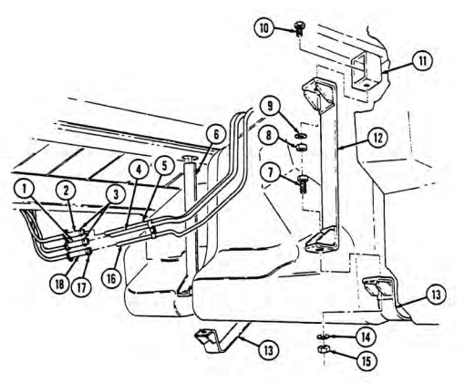 17. Remove fuel tank (21) from vehicle.

# 3-25. Fuel Tank And Shield Maintenance (Cont'D)

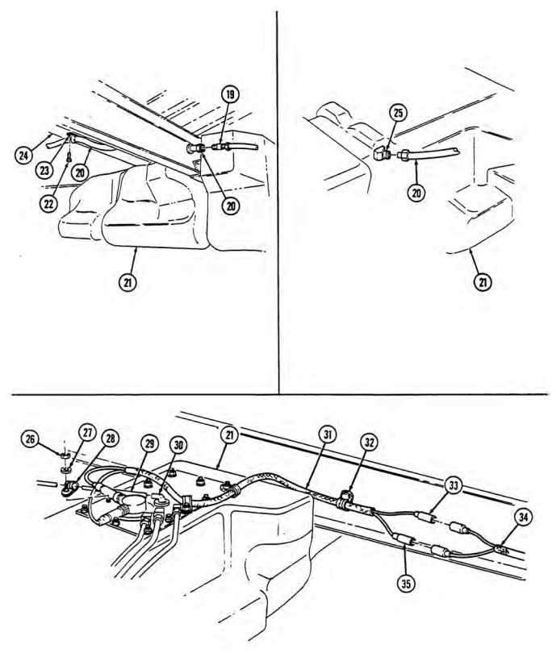

# 3-25. Fuel Tank And Shield Maintenance (Cont'D)

c. Disassembly 1. Thoroughly clean outside of tank (18) to prevent dirt contamination. 2. Disconnect fuel supply line (31) from fuel supply tube (12) and fuel return line (30) from fuel return tube (34).

Perform step 3 if vehicle is equipped with vehicular heater and auxiliary fuel line.

3. Disconnect auxiliary fuel supply and return lines (25) from fuel supply tubes (13). 4. Remove capscrew (27), clamp (29), fuel supply line (31), fuel return line (30), and shield (26) from fuel tank (18).

4.1 Remove auxiliary fuel supply and return lines (25) and clamp (28), if installed. Remove crossover hose (27.2) and two clamps (27.1), if installed.

5. Remove two locknuts (7), washers (8), clamps (6), and jumper harness (5) from access cover (11).

Discard locknuts (7).

Prior to removal, tag leads for installation.

6. Disconnect jumper harness leads 28B (1) and 58J (2) from fuel level sender (35) and remove jumper harness (5).

7. Remove nine locknuts (9) and washers (10) securing access cover (11) to fuel tank (18). Discard locknuts (9).

8. Remove access cover (11), gasket (15), and retainer (33) from fuel tank (18). Discard gasket (15). 9. Mark position of fuel tubes (12), (34), and (13) on access cover (11).

Note position of fuel strainer for installation.

10. Remove fuel strainer (14) from fuel supply tube (12). 11. Remove fuel supply tube (12) from access cover (11). 12. Remove fuel return tube (34) from access cover (11).

- Perform step 13 if vehicle is equipped with vehicular heater and auxiliary fuel line.

- Vehicles not equipped with a vehicular heater and auxiliary fuel line will have plugs instead of fuel supply tubes.

13. Remove two fuel supply tubes (13) from access cover (11). 14. Remove vent valve (4) and grommet (3) from access cover (11). 15. Remove vent line (19) from tee (20). 16. Loosen clamp (16) and remove filler spout hose (17) from tank (18). 17. Remove three capscrews (22), washers (24), lockwashers (23), and heat shield (21) from fuel tank
(18). Discard lockwashers (23).

d. Cleaning and Inspection

Drycleaning solvent is flammable and will not be used near an open flame. A fire extinguisher will be kept nearby when the solvent is used. Use only in well-ventilated places. Failure to do this may result in injury to personnel or damage to equipment.

# 3-25. Fuel Tank And Shield Maintenance (Cont'D)

1. Use drycleaning solvent to clean access cover (11), fuel supply line (31), fuel return line (30),
auxiliary fuel supply and return lines (25), crossover hose (27.2), fuel supply tube (12), fuel return tube (34), fuel supply tubes (13), and inside of fuel tank (18).

2. Inspect access cover (11), fuel supply line (31), fuel return line (30), fuel supply tube (12), fuel return tube (34), strainer (14), tee (20), fitting (32), vent valve (4), and grommet (3) for cracks, wear, and breaks. Replace if cracked, worn, or broken.

3. Inspect auxiliary fuel supply and return lines (25), crossover hose (27.2), and fuel supply tubes (13)
for cracks, wear, and breaks, if installed. Replace if cracked, worn, or broken.

4. Inspect fuel level sender (35) for damage. Replace if damaged.

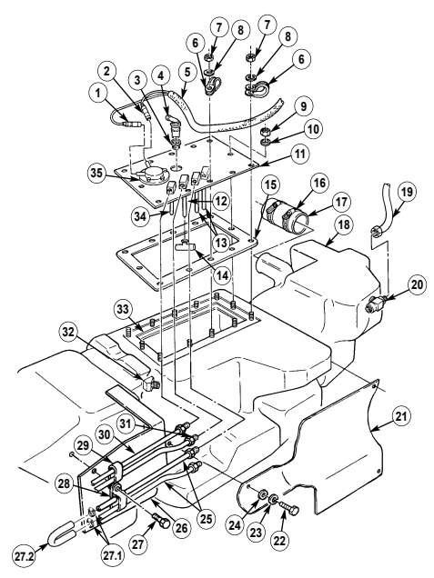

# 3-25. Fuel Tank And Shield Maintenance (Cont'D)

e. Assembly

- Use sealing compound on all vent line and fuel line connector threads before installation.

- Use fittings from old tank if installing new tank.

1. Install heat shield (21) on fuel tank (18) with three lockwashers (23), washers (24), and capscrews (22).

2. Install vent line (19) on tee fitting (20). 3. Install filler spout hose (17) on tank (18) and tighten clamp (16). 4. Apply sealing compound to threads of fuel supply tube (12). Install and align fuel supply tube (12)
on access cover (11).

5. Apply sealing compound to threads of fuel return tube (33). Install and align fuel return tube (33)
on access cover (11).

Perform step 6 if vehicle is equipped with vehicular heater and auxiliary fuel line.

6. Apply sealing compound to threads of fuel supply tubes (13). Install and align two fuel supply tubes (13) on access cover (11).

7. Install grommet (3) and vent valve (4) on access cover (11). 8. Install fuel strainer (14) on fuel supply tube (12). 9. Apply adhesive to threads of nine locknuts (9). Install retainer (32), gasket (15), and access cover (11) on fuel tank (18) with nine washers (10) and locknuts (9). Tighten locknuts (9) to 72 lb-in. (8 N•m).

10. Connect jumper harness leads 28B (1) and 58J (2) to fuel level sender (34). 11. Apply adhesive to threads of two locknuts (7). Install jumper harness (5) on access cover (11) with two clamps (6), washers (8), and locknuts (7). Tighten locknuts (7) to 72 lb-in. (8 N•m).

12. Connect fuel supply line (31) to fuel supply tube (12), and fuel return line (30) to fuel return tube (33).

Perform step 13 if vehicle is equipped with an vehicular heater and auxiliary fuel line.

13. Connect auxiliary fuel supply and return lines (25) to fuel supply tubes (13). 14. Connect crossover hose (27.2) to auxiliary fuel supply and return lines (25) and secure with two clamps (27.1)
15. Install shield (26), return line (30), supply line (31), clamp (29), and auxiliary fuel supply and return lines (25) and clamp (28), if installed, on fuel tank (18) with capscrew (27).

# 3-25. Fuel Tank And Shield Maintenance (Cont'D)

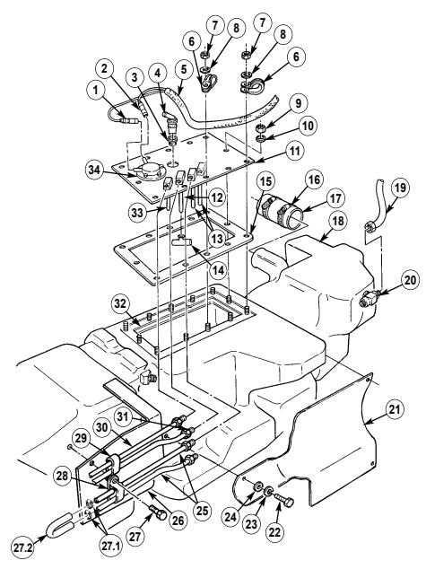

# 3-25. Fuel Tank And Shield Maintenance (Cont'D)

f. Installation 1. Position fuel tank (5) under vehicle. 2. Install jumper harness (6) in clamp (7) and bend clamp (7) up. 3. Connect jumper harness leads 58J (8) and 28B (10) to body wiring harness (9).

NOTE
Use sealing compound on all vent line connector threads before installation.

4. Connect vent line (4) to fuel tank (5) with clamp (3), washer (2), and locknut (1). 5. Connect vent line (12) to fitting (11) on fuel tank (5).

6. Install rear strap (23) on strap bracket (22) with capscrew (21), washer (20), and nut (19). Tighten Apply adhesive to threads of capscrews before installation.

nut (19) to 23–27 lb-in. (2.6–3.1 N•m).

Ensure front straps are flush with fuel tank and to right side of dimple in slot.

8. Connect vent line (12) to tee (31) on fuel tank (5). 7. Raise fuel tank (5) and install two support straps (24) to straps (17) and (23) with two capscrews (18), washers (25), and nuts (26). Do not tighten nuts (26).

9. Secure vent line (12) to body (34) with clamp (33) and screw (32).

10. Connect fuel supply hoses (13) and (30) to fuel return and supply lines (16) and (15) and tighten clamps (14).

Perform step 11 if vehicle is equipped with vehicular heater.

11. Connect fuel supply hose (29) to vehicular heater fuel supply line (27) and tighten clamp (28).

Ensure upper and lower straps are 1/2 in. (13 mm) apart after tightening nuts. Straps should not touch when properly installed. Straps must be replaced if upper or lower straps touch.

12. Tighten nuts (26) to 23–27 lb-in. (2.6–3.1 N•m). 13. Connect vent line (38) to filler spout (39).

Perform steps 14, 15, and 17 if vehicle is equipped with new vent line assembly.

14. Connect vent line (38) to elbow (38.2). 15. Connect vent line (35.2) to elbow (38.1). 16. Secure vent line (38) to body (34) with clamp (35), washer (36), capscrew (47), washer (36), and locknut (37).

17. Secure vent line (35.2) to vent line (38) with tiedown strap (35.1). 18. Install filler spout (39) into hose (46) and tighten clamp (45). 19. Install filler spout (39) to body (34) with clamp (42), washer (43), capscrew (44), washer (41), and locknut (40). Tighten locknut (40) to 6 lb-ft (8 N•m).

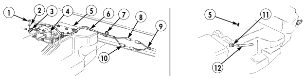

# 3-25. Fuel Tank And Shield Maintenance (Cont'D)

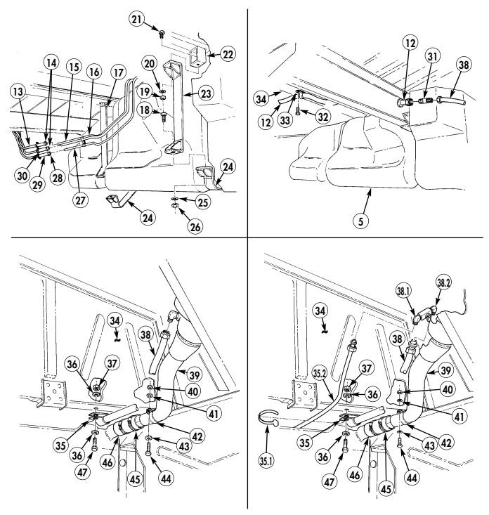

FOLLOW-ON TASKS: - Install right rear upper underbody armor (integrated) 
(para. 11-109 or para. 11-109.1)
- Install right rear underbody armor (M1114 only) (para. 11-39). - Install rear propeller shaft (para. 6-4). - Connect battery ground cables (para. 4-68). - Fill fuel tank (TM 9-2320-387-10) and check for leaks.

# 3-26. Fuel Tank Supply And Return Lines Replacement

This task covers:

| This paragraph  will be helpful when using the STE/ICE\-R to answer diagnostic                          |                                        | questions.  Use this                                               |
|---------------------------------------------------------------------------------------------------------|----------------------------------------|--------------------------------------------------------------------|
| paragraph                                                                                               | as a reference  if you need additional | information  about a specific test. This paragraph                 |
| contains  such as possible errors, test procedures,                                                     | information                            | control codes, and additional  notes as                            |
| necessary. The following chart will help you find the test you need. The STE/ICE\-R setup and internal  |                                        |                                                                    |
| checks (Test No. GO1 , page 2\-519) must be performed prior to performing tests. A complete description |                                        |                                                                    |
| and operation                                                                                           | of the STEXE\-R                        | is found on page 2\-509. See TM 9\-4910\-571\-12&P  for additional |
| information.                                                                                            |                                        |                                                                    |
| TEST NAME                                                                                               |                                        | TEST #  PAGE #                                                     |
| ENGINE RPM (AVERAGE)                                                                                    |                                        | 10   2\-490                                                        |
| POWER TEST (RPM/SEC)                                                                                    |                                        | 12   2\-491                                                        |
| POWER TEST (PERCENT)                                                                                    |                                        | 2\-492   13                                                        |
| COMPRESSION UNBALANCE TEST                                                                              |                                        |                                                                    |

Diesel fuel is highly flammable. Do not perform this procedure near fire, flames, or sparks. Severe injury or death may result.

a. Removal

Cover or plug all open hoses and connections immediately after disconnection to prevent contamination. Remove all plugs prior to connection.

Have drainage container ready to catch fuel.

1. Loosen four clamps (7) and disconnect hoses (6) from fuel tank return and supply lines (8). 2. Remove two locknuts (1), capscrews (5), washers (4), clamps (3), and return and supply lines (8)
from front body bracket (2) and rear body bracket (10). Discard locknuts (1).

3. Remove three clips (9) from fuel supply and return lines (8).

## B. Installation

1. Install return and supply lines (8) on front body bracket (2) and rear body bracket (10) with two clamps (3), washers (4), capscrews (5), and locknuts (1).

2. Connect supply and return lines (8) to four hoses (6) and tighten clamps (7). 3. Secure fuel supply and return lines (8) together with three clips (9).

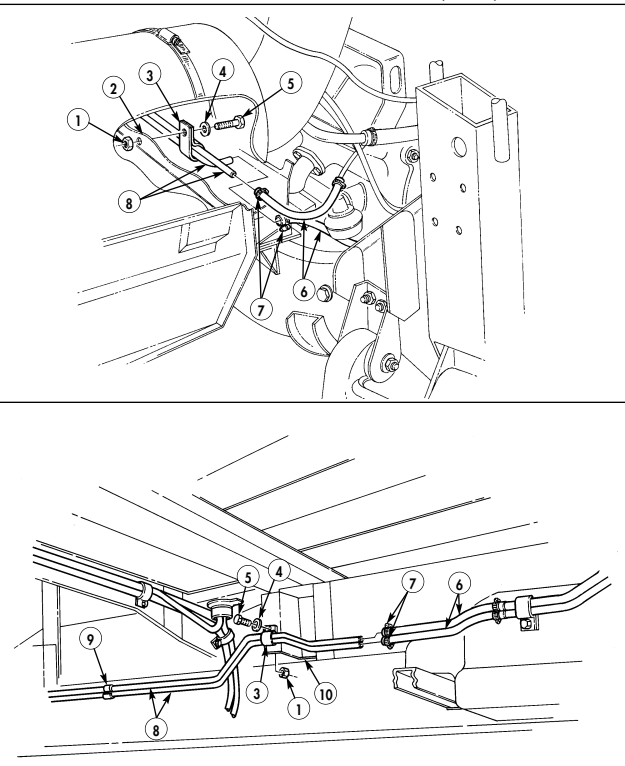

3-26. FUEL TANK SUPPLY AND RETURN LINES REPLACEMENT (Cont'd)
FOLLOW-ON TASKS: - Install engine right splash shield (para. 10-24 or para. 10-24.1).

- Fill fuel tank (TM 9-2320-387-10) and check for fuel leaks.

# 3-27. Auxiliary Fuel Pickup And Return Lines Replacement

This task covers:

a. Removal b. Installation

| BATTERY VOLTAGE                 | TEST #67              |
|---------------------------------|-----------------------|
| Description:                    | Pre\-Test Procedures: |
| This procedure measures battery | Run confidence test.  |

Diesel fuel is highly flammable. Do not perform this procedure near fire, flames, or sparks. Severe injury or death may result.

a. Removal

Cover or plug all open hoses and connections immediately after disconnection to prevent contamination. Remove all plugs prior to connection.

Have drainage container ready to catch fuel.

1. Remove two clamps (6.1) and crossover hose (6.2) from auxiliary fuel return line (6) and auxiliary fuel pickup line (4).

1.1. Remove screw (5) and clamp (7) from fuel return line (6), fuel pickup line (4), and fuel line clamp (8).

2. Remove fuel pickup line (4) from fuel tube (3) on fuel tank (1). 3. Remove fuel return line (6) from fuel tube (2).

## B. Installation

1. Apply sealing compound to threads of fuel return line (6) and fuel pickup line (4). 2. Install fuel return line (6) on fuel tube (2) in fuel tank (1). 3. Install fuel pickup line (4) on fuel tube (3). 4. Install clamp (7) on fuel return line (6) and fuel pickup line (4) and secure to fuel line clamp (8) 
with screw (5).

5. Install crossover hose (6.2) on auxiliary fuel return line (6) and fuel auxiliary pickup line (4) with two clamps (6.1).

# 3-27. Auxiliary Fuel Pickup And Return Lines Replacement (Cont'D)

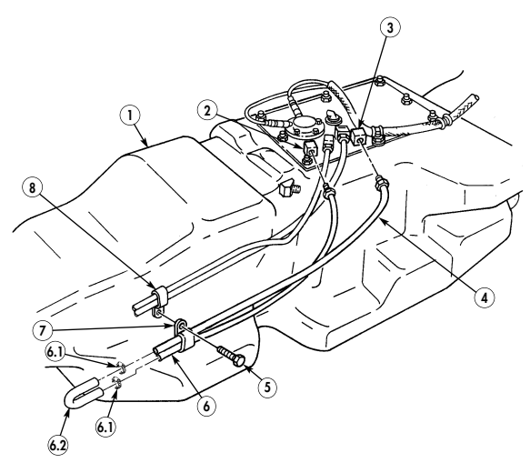

FOLLOW-ON TASK: Install fuel tank (para. 3-25).

# 3-28. Fuel Tank Vent Line And Filter Replacement

This task covers:
INITIAL SETUP:
Tools General mechanic's tool kit:
automotive (Appendix B, Item 1)
Materials/Parts Tiedown strap (Appendix G, Item 321) Locknut (Appendix G, Item 77)
Manual References TM 9-2320-387-10 TM 9-2320-387-24P
a. Removal b. Installation Equipment Condition
- Fuel tank removed (para. 3-25). - Hood raised and secured (TM 9-2320-387-10).

Maintenance Level Unit a. Removal

Cover or plug all open hoses and connections immediately after disconnection to prevent contamination. Remove all plugs prior to connection.

- For fuel tank vent line filter replacement, perform steps 5, 8, and 9 only. - Insulation may need to be removed to access vent and fuel lines.

1. Remove clip (9) from fuel tank vent line (3) and vent line (6). 2. Remove two capscrews (2) securing clamps (1) and (7) and vent lines (3) and (6) to brackets (8). 3. Remove tiedown strap (4) from vent line (6) and fuel lines (5). Discard tiedown strap (4). 4. Disconnect vent line (3) from elbow (16). 5. Loosen two clamps (14) and remove vent line (15) from vent line filter (13) and elbow (16). 6. Remove two clamps (14) from vent line (15). 7. Remove two clamps (1) from vent line (3).

Perform step 8 only when deep water fording kit is installed.

8. Disconnect deep water fording vent line (19) from vent line filter (13). 9. Remove locknut (12), washer (11), capscrew (18), clamp (10), and vent line filter (13) from body bracket (17). Discard locknut (12).

b. Installation

For fuel tank vent line filter replacement, perform steps 1, 2, and 5 only.

1. Install clamp (10) and vent line filter (13) on body bracket (17) with capscrew (18), washer (11), and locknut (12).

Perform step 2 only when deep water fording kit is installed.

2. Connect deep water fording vent line (19) to vent line filter (13). 3. Install two clamps (1) on vent line (3). 4. Install two clamps (14) on vent line (15).

# 3-28. Fuel Tank Vent Line And Filter Replacement (Cont'D)

5. Install vent line (15) on vent line filter (13) and elbow (16) and tighten two clamps (14). 6. Connect vent line (3) to elbow (16). 7. Install tiedown strap (4) around vent line (3), vent line (6), and fuel lines (5). 8. Secure vent lines (3) and (6) and two clamps (1) and (7) on brackets (8) with two capscrews (2). 9. Secure vent line (3) to vent line (6) with clip (9).

10. Install insulation if removed.

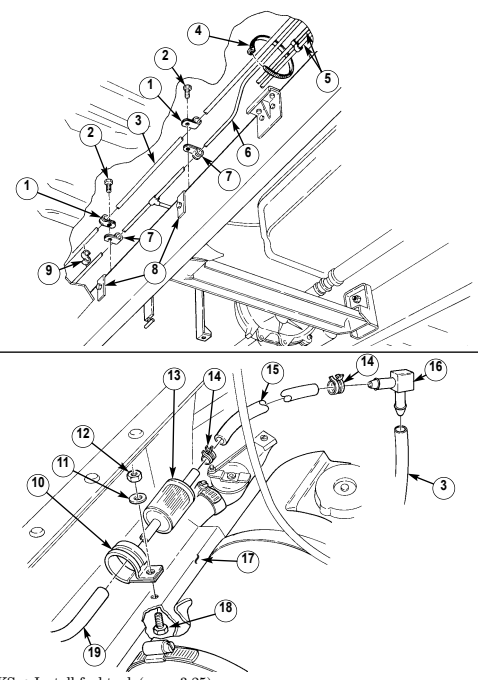

FOLLOW-ON TASKS: - Install fuel tank (para. 3-25).

- Lower and secure hood (TM 9-2320-387-10).

# 3-29. Fuel Tank Filler Cap And Spout Maintenance

This task covers:
a. Removal c. Installation b. Inspection

## Initial Setup:

Tools General mechanic's tool kit:
automotive (Appendix B, Item 1)
Maintenance and repair shop equipment:
automotive (Appendix B, Item 2)
Materials/Parts Locknut (Appendix G, Item 77) Sealing compound (Appendix C, Item 64) Tiedown strap (Appendix G, Item 322)
Manual References TM 9-2320-387-10 TM 9-2320-387-24P

## Equipment Condition

- Fuel tank drained (para. 3-25). - Right rear underbody armor removed (M1114 only) (para. 11-39).

General Safety Instructions Do not perform this procedure near fire, flames, or sparks.

Maintenance Level Unit

Diesel fuel is highly flammable. Do not perform this procedure near fire, flames, or sparks. Severe injury or death may result.

a. Removal

Perform steps 1.1, 2, and 7.1 if vehicle is equipped with new vent line assembly.

1. Remove filler cap (6) and detach cap chain clip (7) from filler spout (11).

1.1. Remove tiedown strap (17.2) from vent lines (17.1) and (1). Discard tiedown strap (17.2)
2. Disconnect vent lines (1) and (17.1) from elbows (2) and (2.2).

2.1. Disconnect vent line (1) from elbow (2.2).

3. Remove three nuts (3), washers (4), capscrews (5), and washers (4) from spout mounting ring (8). 4. Loosen clamp (16) securing filler spout (11) to hose (17). 5. Remove locknut (12), washer (13), capscrew (15), washer (13), and clamp (14) from filler spout (11). 

Discard locknut (12).

6. Push filler spout (11) out of spout mounting ring (8) and remove filler spout (11) from hose (17). 7. Remove elbows (2) and (2.2) from tee fitting (2.1) or elbow (2.2) from filler spout (11).

7.1. Remove tee fitting (2.1) from filler spout (11).

8. Using handle (9), remove screen (10) from filler spout (11). b. Inspection Inspect screen (10) for damage, debris, or blockage. Replace if damaged, or if debris or blockage is detected.

c. Installation

Perform steps 1.1, 6, and 6.2 if vehicle is equipped with new vent line assembly.

1. Apply sealing compound to elbows (2) and (2.2) and install in tee fitting (2.1) or elbow (2.2) on filler spout (11).

3-58 Change 2

# 3-29. Fuel Tank Filler Cap And Spout Maintenance (Cont'D)

6.1. Connect vent line (17.1) to elbow (2). 6.2. Secure vent line (1) to vent line (17.1) with tiedown strap (17.2).

7. Using handle (9), install screen (10) in filler spout (11).

1.1. Apply sealing compound to tee fitting (2.1) and install on filler spout (11).

2. Align filler spout (11) with hose (17) and push filler spout (11) into hose (17). 3. Install filler spout (11) on spout mounting ring (8) with three washers (4), capscrews (5), 
washers (4), and nuts (3).

4. Tighten clamp (16) on hose (17). 5. Install filler spout (11) on body (18) with clamp (14), washer (13), capscrew (15), washer (13), and locknut (12). Tighten locknut (12) to 6 lb-ft (8 N•m).

6. Connect vent line (1) to elbow (2.2).

8. Attach filler cap chain clip (7) to filler spout (11) and install filler cap (6).

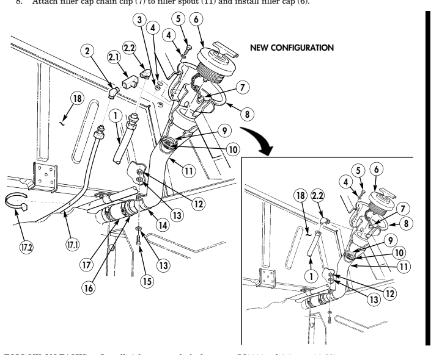

FOLLOW-ON TASKS: - Install right rear underbody armor (M1114 only) (para. 11-39).

- Fill fuel tank (TM 9-2320-387-10) and check filler spout for fuel leaks.

# 3-30. Fuel Tank Filler Spout Vent Line Replacement

This task covers:

## Initial Setup: Tools

General mechanic's tool kit:
automotive (Appendix B, Item 1)
Maintenance and repair shop equipment:
automotive (Appendix B, Item 2)

## Materials/Parts

Locknut (Appendix G, Item 77) Tiedown strap (Appendix G, Item 322) Adhesive (Appendix C, Item 2) Sealing compound (Appendix C, Item 61) Elbow (Appendix G, Item 31.1)

## A. Removal

a. Removal b. Inspection Manual References TM 9-2320-387-24P
Equipment Condition
- Rear propeller shaft removed (para. 6-4). - Right rear underbody armor removed
(M1114 only) (para. 11-39).

Maintenance Level Unit

Perform steps 1, 3, 4, 6, and 7 if equipped with new style vent line assembly.

1. Remove clamp (3) and vent line (1) from fuel pump (2). 2. Disconnect vent line (5) from elbow (6) on fuel filler neck (7). 3. Disconnect vent line (14) from elbow (5.1) on fuel filler neck (7). 4. Remove tiedown strap (13) from vent lines (5) and (14). 5. Remove locknut (12), washer (11), capscrew (8), washer (9), and clamp (10) from body (4). Discard locknut (12).

6. Remove two capscrews (15) from clamps (17) on frame rail (16). 7. Remove vent line (14) and clamps (17) from vehicle.

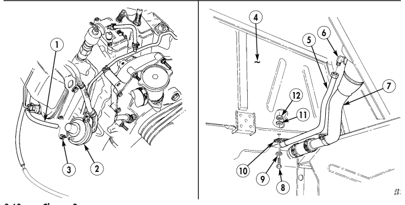

3-60 Change 2

# 3-30. Fuel Tank Filler Spout Vent Line Replacement **(Cont'D)**

8. Disconnect vent line (5) from fitting (18). 9. Remove fitting (18) from vent line (19).

10. Remove capscrew (22) from clamp (24) on crossmember (23) and remove clamp (24) from vent line (19).

11. Loosen two nuts (21) to allow access to elbow (25). 12. Disconnect vent line (19) from elbow (25) on fuel tank (26), cut vent line (19) closest to fuel tank (26), and remove vent line (19) from crossmember (23) and vehicle.

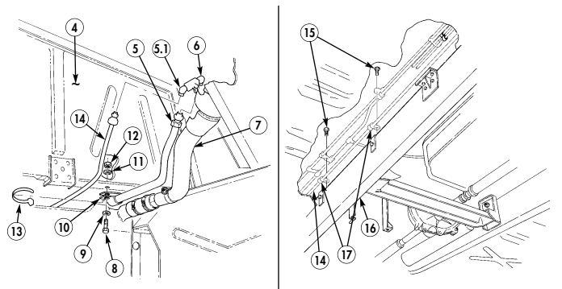

NEW CONFIGURATION NEW CONFIGURATION

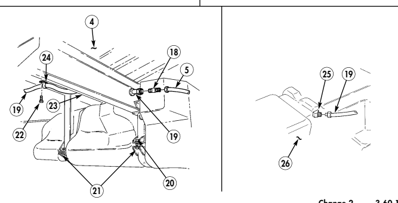

Change 2 3-60.1
# 3-30. Fuel Tank Filler Spout Vent Line Replacement **(Cont'D)**

## B. Installation

1. Position vent line (2) on vehicle and crossmember (13). 2. Install fitting (6), sleeve (4), and compression ring (5) on end of vent line (2), closest to fuel tank (3).

NOTE
Use sealing compound on all vent line connectors before installation.

3. Connect vent line (2) to elbow (1) on fuel tank (3). 4. Install fitting (8) on vent line (2). 5. Connect vent line (9) to fitting (8). 6. Install clamp (14) on vent line (2) and clamp (14) on frame rail (13) with capscrew (12).

Upper and lower straps should be approximately 1/2 in. (13 mm) apart after tightening nuts. Straps should not touch when properly installed. Straps must be replaced if upper and lower straps touch.

7. Apply adhesive to threads of capscrews (10) and tighten nuts (11) to 23-27 lb-in (2.6-3 N•m).

Perform steps 8, 9, 11, 12, and 14 if equipped with new style vent line assembly.

8. Position vent line (18) and two clamps (17) on vehicle. 9. Install two clamps (17) on frame rail (16) with capscrews (15).

10. Install vent line (9) and clamp (25) on body (19) with washer (24), capscrew (23), washer (27), and locknut (28).

11. Install tiedown strap (26) on vent lines (9) and (18). 12. Connect vent line (18) to elbow (20) on fuel filler neck (22). 13. Connect vent line (9) to elbow (21) on fuel filler neck (22). 14. Install vent line (18) on fuel pump (29) with clamp (30).

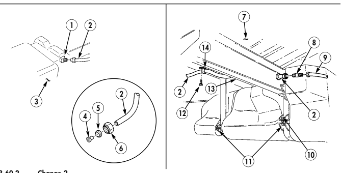

3-60.2 Change 2

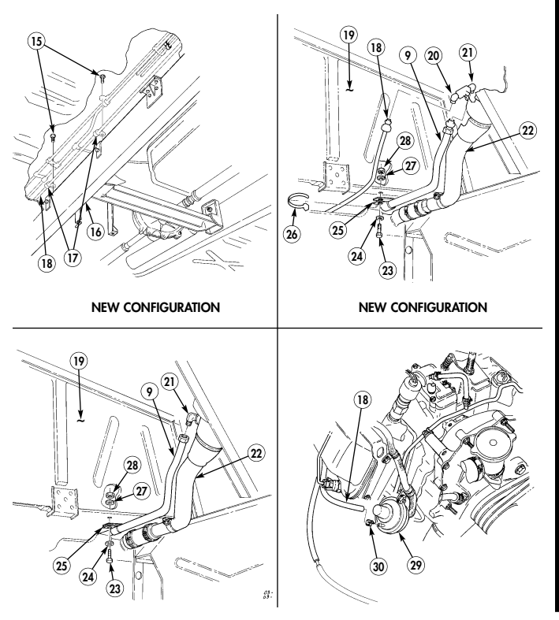

# 3-30. Fuel Tank Filler Spout Vent Line Replacement (Cont'D) 3-31. Filler Spout Hose Replacement

This task covers:
INITIAL SETUP:

## Tools

General mechanic's tool kit:
automotive (Appendix B, Item 1)
Manual References TM 9-2320-387-10 TM 9-2320-387-24P

## A. Removal B. Installation Equipment Condition

- Fuel tank drained (para. 3-25). - Right rear underbody armor removed (M1114 only) (para. 11-39).

General Safety Instructions Do not perform this procedure near fire, flames, or sparks.

Maintenance Level Unit

Diesel fuel is highly flammable. Do not perform this procedure near fire, flames, or sparks. Severe injury or death may result.

a. Removal 1. Loosen clamps (4) and (3) securing hose (1) to fuel tank (5) and filler spout (2). 2. Slide hose (1) onto filler spout (2) until disconnected from fuel tank (5). Remove hose (1) from filler spout (2).

b. Installation

Position clamps attaching filler hose to fuel tank as shown.

1. Install hose (1) on filler spout (2) and slide onto filler spout (2) until hose (1) clears fuel tank (5). 2. Connect hose (1) to fuel tank (5) and tighten clamps (3) and (4).

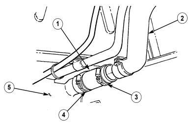

FOLLOW-ON TASKS: - Install right rear underbody armor (M1114 only) (para. 11-39).

- Fill fuel tank (TM 9-2320-387-10) and check for leaks.

# 3-32. Fuel Tank Hangers Replacement

This task covers:
a. Removal b. Installation

## Initial Setup:

| corrective action, refer to TM 9\-4910\-571\-12&P.   |
|------------------------------------------------------|

## A. Removal

1. Remove two nuts (3), washers (4), capscrews (5), and rear hangers (7) from supports (6). 2. Twist two front hangers (9) until tee handles (2) clear slots (11) in support (1) and remove front hangers (9).

3. Inspect four insulators (8) on front and rear hangers (9) and (7). Remove insulators (8), if damaged.

## B. Installation

1. Install four insulators (8) on front and rear hangers (9) and (7), if removed. 2. Install two front hangers (9) by inserting tee handles (2) up through slots (11) in support (1). Twist hangers (9) so that tee handles (2) are resting across slots (11) and against side of ridge (10).

Apply adhesive to threads of screws before installation.

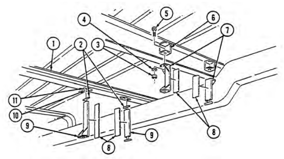

3. Install two rear hangers (7) on supports (6) with capscrews (5), washers (4), and nuts (3).

Tighten nuts (3) to 37 lb-ft (50 N•m).

FOLLOW-ON TASK: Install fuel tank (para. 3-25).

# 3-33. Primary Fuel Filter Maintenance

This task covers:

## Initial Setup: Tools

General mechanic's tool kit: automotive
(Appendix B, Item 1)
Maintenance and repair shop equipment:
automotive (Appendix B, Item 2)
Materials/Parts Two lockwashers (Appendix G, Item 145) Fuel filter bleeder tool (Appendix D, Fig. D-38)
(optional)
Sealing compound (Appendix C, Item 61)
Manual References TM 9-2320-387-10 TM 9-2320-387-24P
a. Removal b. Installation

## Equipment Condition

- Hood raised and secured (TM 9-2320-387-10). - Engine access cover removed (para. 10-22). - Fuel pressure transducer removed (para. 4-30).

General Safety Instructions Do not perform this procedure near fire, flames, or sparks.

Maintenance Level Unit

Diesel fuel is highly flammable. Do not perform this procedure near fire, flames, or sparks. Severe injury or death may result.

a. Removal

Cover or plug all hoses and connections immediately after disconnection to prevent contamination. Remove all plugs prior to connection.

Have drainage container ready to catch fuel.

1. Loosen two hose clamps (2) and disconnect fuel inlet hose (1) and fuel outlet hose (12) from fuel filter fittings (5).

2. Loosen hose clamp (8) and disconnect fuel filter drain hose (9) from fuel filter fitting (5). 3. Pull back insulation to allow access to capscrews (3), and remove two capscrews (3), lockwashers (4),
and fuel filter bracket (10) from body (11). Discard lockwashers (4).

4. Loosen capscrew (6) and remove fuel filter (7) from fuel filter bracket (10). 5. Remove three fittings (5) from fuel filter (7).

## B. Installation

1. Apply sealing compound to threads of three fittings (5). Install fittings (5) on fuel filter (7). 2. Install fuel filter (7) on fuel filter bracket (10) and tighten capscrew (6). 3. Install fuel filter bracket (10) on body (11) with two lockwashers (4) and capscrews (3). Tighten capscrews (3) to 15 lb-ft (20 N•m).

4. Connect drain hose (9) to fuel filter fitting (5) and tighten clamp (8) to 10-20 lb-in. (1-2 N•m). 5. Connect fuel inlet hose (1) and fuel outlet hose (12) to fuel filter fittings (5) and tighten two clamps (2)
to 10-20 lb-in. (1-2 N•m).

# 3-33. Primary Fuel Filter Maintenance (Cont'D)

c. Bleeding

The bleeder tool used in steps 2, 3, and 5 is optional. The tool prevents fuel from spilling on engine.

1. Install fuel pressure transducer (para. 4-30). 2. Remove fuel filter bleeder screw (13) and install bleeder tool into hole. 3. Place open end of bleeder tool hose in clean, clear container. 4. Disconnect lead 54A (14) from solenoid (15).

Do not operate starter continuously for more than 20 seconds; wait 10 to 15 seconds between periods of operation. Failure to do this may result in damage to the starter.

5. Crank engine and watch fuel. When air bubbles stop coming through hose, remove bleeder tool, and install bleeder screw (13). Tighten bleeder screw (13) to 40-50 lb-in. (4-6 N•m).

6. Dispose of fuel in accordance with local SOP. 7. Connect lead 54A (14) to fuel solenoid (15).

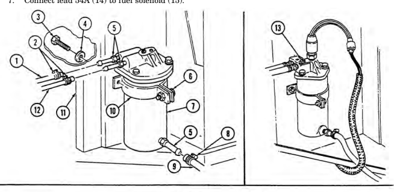

FOLLOW-ON TASKS: - Start engine (TM 9-2320-387-10) and check for fuel leaks.

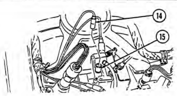

- Lower and secure hood (TM 9-2320-387-10). - Install engine access cover (para. 10-22).

# 3-33.1. Secondary Fuel Filter Replacement

This task covers:

## Initial Setup: Tools

| Materials/Parts   |
|-------------------|

General mechanic's tool kit:
automotive (Appendix B, Item 1)
Maintenance and repair shop equipment:
automotive (Appendix B, Item 2)
Two lockwashers (Appendix G, Item 145) Sealing compound (Appendix C, Item 61) Locknut (Appendix G, Item 133)
a. Removal b. Installation

| Manual References                                |
|--------------------------------------------------|
| TM 9\-2320\-387\-10                              |
| TM 9\-2320\-387\-24P                             |
| General Safety Instructions                      |
| Do not perform this procedure near fire, flames, |
| or sparks.                                       |
| Maintenance Level                                |
| Unit                                             |

Diesel fuel is highly flammable. Do not perform this procedure near fire, flames, or sparks. Severe injury or death may result.

a. Removal

Cover or plug all hoses and connections immediately after disconnection to prevent contamination. Remove all plugs prior to connection.

Have drainage container ready to catch fuel.

1. Remove locknut (1), capscrew (2), and secondary filter (4) from mounting bracket (3).

Discard locknut (1).

2. Loosen two hose clamps (6) and disconnect fuel inlet hose (5) and fuel outlet hose (9) from fuel filter fittings (7) and (8).

3. Remove two capscrews (10), lockwashers (11), and mounting bracket (3) from left engine mounting bracket (12). Discard lockwashers (11).

## B. Installation

1. Install mounting bracket (3) on left engine mounting bracket (12) with two lockwashers (11) and capscrews (10).

2. Connect fuel inlet hose (5) and fuel outlet hose (9) on fuel filter fittings (7) and (8) and tighten two hose clamps (6) to 10–20 lb-in. (1-2 N•m).

3. Install secondary filter (4) on mounting bracket (3) with capscrew (2) and locknut (1).

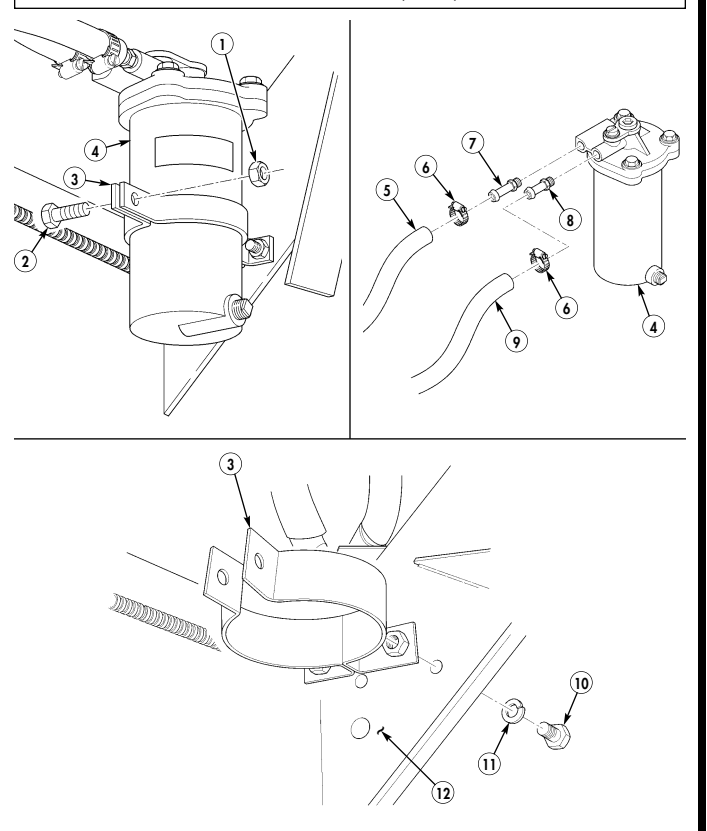

# 3-33.1. Secondary Fuel Filter Replacement (Cont'D)

FOLLOW-ON TASKS:  - Bleed fuel system (para. 3-33).

- Start engine (TM 9-2320-387-10) and check for fuel leaks.

# 3-34. Fuel Filter Element Maintenance

This task covers:
b. Cleaning and Inspection

## Initial Setup:

Tools General mechanic's tool kit:
automotive (Appendix B, Item 1)
Maintenance and repair shop equipment:
automotive (Appendix B, Item 2)
Materials/Parts Fuel/water filter element kit 
(Appendix G, Item 36)
Manual References TM 9-2320-387-24P
a. Element Removal c. Element Installation Equipment Condition Fuel pressure transducer removed para. 4-30).

General Safety Instructions
- Do not perform this procedure near fire, flames, or sparks.

- Drycleaning solvent is flammable and will not be used near an open flame.

Maintenance Level Unit

Diesel fuel is highly flammable. Do not perform this procedure near fire, flames, or sparks. Severe injury or death may result.

a. Element Removal

Cover or plug all hoses and connections immediately after disconnection to prevent contamination. Remove all plugs prior to connection.

1. Loosen two hose clamps (2) and disconnect fuel inlet hose (1) and fuel outlet hose (15) from fuel filter cover (3).

2. Loosen hose clamp (7) and disconnect fuel filter drain hose (8) from filter housing (6). 3. Remove nut (11), capscrew (9), and filter housing (6) from fuel filter bracket (10). 4. Remove three capscrews (4), washers (5), and cover (3) from filter housing (6). 5. Remove O-ring (14) from filter housing (6). Discard O-ring (14). 6. Remove filter element (12) and separator (13) from filter housing (6). 7. Remove separator (13) from filter element (12). Discard filter element (12).

## B. Cleaning And Inspection Warning

Drycleaning solvent is flammable and will not be used near an open flame. A fire extinguisher will be kept nearby when the solvent is used. Use only in well-ventilated places. Failure to do this may result in injury to personnel and/or damage to equipment.

1. Use drycleaning solvent to clean all metallic parts. 2. Inspect filter housing (6) and cover (3) for distortion or damage. Replace if damaged. 3. Inspect separator (13) for dirt, contamination, or damage. Replace if dirty, contaminated, or damaged.

# 3-34. Fuel Filter Element Maintenance (Cont'D)

## C. Element Installation

1. Install filter element (12) into filter housing (6). 2. Install separator (13) on filter element (12). 3. Install O-ring (14) on filter housing (6). 4. Install cover (3) on filter housing (6) with three washers (5) and capscrews (4). Tighten capscrews
(4) to 50-60 lb-in. (6-7 N•m).

5. Install filter housing (6) in fuel filter bracket (10) with capscrew (9) and nut (11). 6. Connect fuel filter drain hose (8) to filter housing (6) and tighten clamp (7) to 10-20 lb-in. (1-2 N•m). 7. Connect fuel inlet hose (1) and fuel outlet hose (15) to fuel filter cover (3) and tighten clamps (2) to 10-20 lb-in. (1-2 N•m).

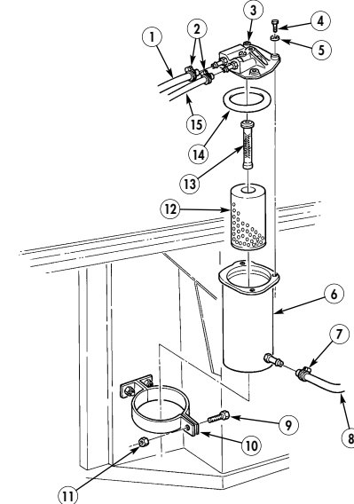

FOLLOW-ON TASK: Bleed fuel filter (para. 3-33).

# 3-35. Fuel Filter Drain Hose And Valve Replacement

This task covers:
INITIAL SETUP:
Tools General mechanic's tool kit:
automotive (Appendix B, Item 1)
Materials/Parts Nut and lockwasher assembly 
(Appendix G, Item 197)
Manual References TM 9-2320-387-10 TM 9-2320-387-24P
Personnel Required One mechanic One assistant

a. Removal b. Installation

Equipment Condition Hood raised and secured (TM 9-2320-387-10).

General Safety Instructions Do not perform this procedure near fire, flames, or sparks.

Maintenance Level Unit

Diesel fuel is highly flammable. Do not perform this procedure near fire, flames, or sparks. Severe injury or death may result.

a. Removal

Cover or plug all open hoses and connections immediately after disconnection to prevent contamination. Remove all plugs prior to connection.

- For fuel filter drainvalve replacement, perform steps 1 and 2 only.

5. Remove capscrew (9), drain hose (10), and clamp (8) from panel (3).

b. Installation

For fuel filter drainvalve replacement, perform steps 4 and 5 only.

1. Install drain hose (10) on cowl panel (3) with clamp (8) and capscrew (9). 2. Install drain hose (10) on cowl panel (3) with clamp (4), capscrew (11), and nut and lockwasher assembly (5).

3. Connect drain hose (10) to fuel filter assembly (1) and tighten clamp (2). 4. Install fuel filter drainvalve (6) on splash shield (12) (M1114 only) or bracket (14) (all other vehicles)
with nut (13).

5. Connect drain hose (10) to fuel filter drainvalve (6) and tighten clamp (7).

- Have drainage container ready to catch fuel.

1. Loosen clamp (7) and disconnect drain hose (10) from fuel filter drainvalve (6). 2. Remove nut (13) and fuel filter drainvalve (6) from splash shield (12) (M1114 only) or bracket (14) 
(all other vehicles).

3. Loosen clamp (2) and disconnect fuel filter drain hose (10) from fuel filter assembly (1). 4. Remove nut and lockwasher assembly (5), capscrew (11), clamp (4), and drain hose (10) from cowl panel (3). Discard nut and lockwasher assembly (5).

# 3-35. Fuel Filter Drain Hose And Valve Replacement (Cont'D)

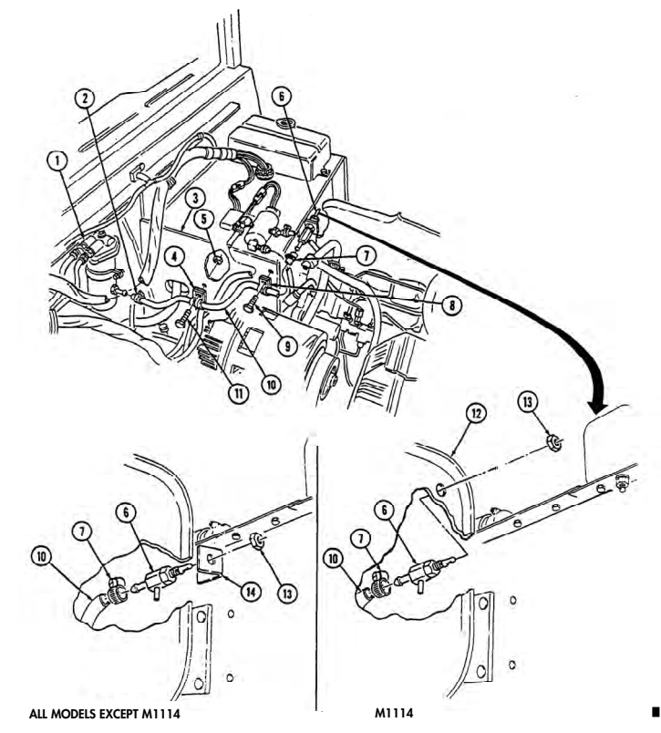

FOLLOW-ON TASKS: - Start engine (TM 9-2320-387-10) and check for leaks.

- Lower and secure hood (TM 9-2320-387-10).

# 3-36. Fuel Injection Pump Return Hose Check Valve Maintenance

This task covers:
a. Removal c. Installation b. Cleaning and Inspection INITIAL SETUP:
Tools General mechanic's tool kit:
automotive (Appendix B, Item 1)
Manual References TM 9-2320-387-24P
Material/Parts O-ring (Appendix G, Item 210)
Equipment Condition Air horn removed (para. 3-14)

## General Safety Instructions

- Do not perform this procedure near fire, flames, or sparks.

- Compressed air used for cleaning purposes will not exceed 30 psi (207 kPa).

Maintenance Level Unit

Diesel fuel is highly flammable. Do not perform this procedure near fire, flames, or sparks. Severe injury or death may result.

a. Removal

Cover or plug all hoses and connections immediately after disconnection to prevent contamination. Remove all plugs prior to connection.

1. Remove clamp (2) and hose (1) from injection pump check valve (3). 2. Remove check valve (3) and O-ring (4) from injection pump (5). Discard O-ring (4).

b. Cleaning and Inspection

Compressed air used for cleaning purposes will not exceed 30 psi (207 kPa). Use only with effective chip guarding and personal protective equipment (goggles/shield, gloves, etc.).

Examine lower end of check valve (3), where ball seats, for evidence of debris. If debris is present, blow compressed air through check valve. Replace check valve (3) if debris remains, or if check valve (3) fails to function properly.

c. Installation 1. Install O-ring (4) and check valve (3) on injection pump (5). 2. Connect hose (1) to check valve (3) with clamp (2).

# 3-36.  Fuel Injection Pump Return Hose Check Valve Maintenance (Cont'D)

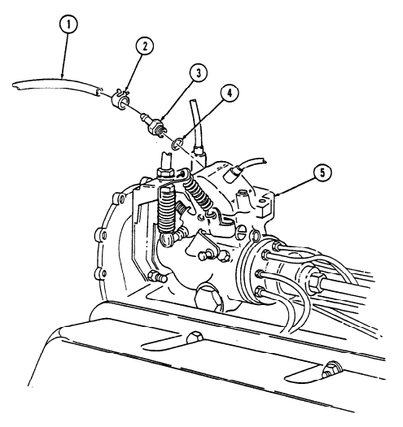

FOLLOW-ON TASK:  Install air horn (para. 3-14).

# 3-37. Fuel Injection Return Hoses Replacement

This task covers: 
a. Fuel Drain-Back Hose Removal b. Fuel Drain-Back Hose Installation c. Tube-to-Nozzle Hose Removal d. Tube-to-Nozzle Hose Installation 

## Initial Setup:

Tools 
?&era1 mechanic's tool kit: 
automotive (Appendix B, Item 1) sparks. 

Manual References TM 9-2320-387-10 TM 9-2320-387-24P 
Equipment Condition l Engine access cover removed (para. 10-22). l Air horn removed (nara. 3-14). 

e. Nozzle-to-Nozzle Hose Removal f. Nozzle-to-Nozzle Hose Installation g. Nozzle Cap Removal h. Nozzle Cap Installation General Safety Instructions Do not perform this procedure near fire, flames, or Maintenance Level Unit 

Diesel fuel is highly flammable. Do not perform this procedure near fire, flames, or sparks. Severe injury or death may result. 

Cover or plug all hoses and connections immediately after disconnection to prevent contamination. Remove all plugs prior to conntion. 

Have drainage container ready to catch fuel. 

a. Fuel Drain-Back Hose Removal 1. Loosen two clamps (2) and remove hose (3) from injection pump (4) and fuel drain-back tube (1). 

2. Remove two clamps (2) from hose (3). 

b. Fuel Drain-Back Hose Installation 1. Install two clamps (21 on hose (3). 

2. Connect hose (3) to injection pump (4) and fuel drain-back tube (1) with two clamps (2). 

c. Tube-to-Nozzle Hose Removal 1. Loosen two clamps (5) and remove hose (6) from nozzle (7) and fuel drain-back tube (1). 2. Remove two clamps (5) from hose (6). 

I d. Tube-to-hozzle -l **Hose Installation** -7 1. Install two clamps (5) on hose (6). 2. Connect hose (6) to nozzle (7) and fuel drain-back tube (1) with two clamps (5). 

# 3-37.  Fuel Injection Return Hoses Replacement (Cont'D)

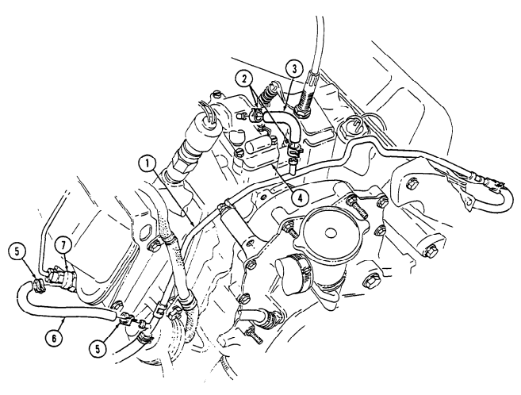

# 1 3-37. Fuel Injection Return Hoses Replacement (Cord)

1 e. Nozzle-to-Nozzle Hose Removal 1 1. Loosen two clamps (5) and disconnect hose (6) from two nozzles (4). 

2. Remove two clamps (5) from hose (6). 

1 f. Nozzle-to-Nozzle Hose Inst~~lah&l 1. Install two clamps (5) on hose (6). 

2. Connect hose (6) to two nozzles (4) with two clamps (5). 

g. Nozzle Cap Removal Remove clamp (2) and cap (1) from rear nozzle nipple (3). 

h. Nozzle Cap Installation Install cap (1) on rear nozzle nipple (3) with clamp (2). 

#### --

# 3-37. Fuel Injection Return Hoses Replacement (Cont'D)

FOLLOW-ON TASKS: - Install air horn (para. 3-14).

- Install engine access cover (para. 10-22). - Start engine (TM 9-2320-387-10) and check for fuel leaks.

# 3-38. Fuel Drain-Back Tube Replacement

This task covers:

## Initial Setup:

Tools General mechanic's tool kit:
automotive (Appendix B, Item 1)
Maintenance repair shop equipment:
automotive (Appendix B, Item 2)
Manual References TM 9-2320-387-10 TM 9-2320-387-24P
a. Removal b. Installation

| Equipment Condition                      |
|------------------------------------------|
| Air horn removed (para. 3\-14).          |
| General Safety Instructions              |
| Do not perform this procedure near fire, |
| flames, or sparks.                       |
| Maintenance Level                        |
| Unit                                     |

Diesel fuel is highly flammable. Do not perform this procedure near fire, flames, or sparks. Severe injury or death may result.

a. Removal

Cover or plug all hoses and connections immediately after disconnection to prevent contamination. Remove all plugs prior to reconnection.

1. Remove nut (17), washer (18), and engine wiring harness clamp (15) from stud (19). 2. Remove stud (19), fuel drain-back tube (5), clamp (20), fuel supply line (14), and clamp (16) from cylinder head (23).

3. Loosen two clamps (10) and disconnect two hoses (11) from fuel drain-back tube (5). 4. Loosen clamp (22) and disconnect fuel return hose (21) from fuel drain-back tube (5). 5. Loosen clamp (4) and disconnect fuel drain-back hose (3) from fuel drain-back tube (5). 6. Remove nut (7), washer (8), clamp (9), and fuel-drain-back tube (5) from valve cover stud (6). 7. Remove capscrew (1), washer (24), and clamp (12) from front engine cover (13). 8. Remove drain-back tube (5).

## B. Installation

1. Position fuel drain-back tube (5) in front of injection pump (2). 2. Connect fuel return hose (21) to fuel drain-back tube (5) with clamp (22). 3. Connect two hoses (11) to fuel drain-back tube (5) with two clamps (10). 4. Connect fuel drain-back hose (3) to fuel drain-back tube (5) with clamp (4). 5. Install fuel drain-back tube (5) on valve cover stud (6) with clamp (9), washer (8), and nut (7).

Tighten nut (7) to 13-20 lb-ft (18-27 N•m).

6. Install fuel drain-back tube (5) on front engine cover (13) with clamp (12), washer (24), and capscrew (1). Tighten capscrew (1) to 40 lb-ft (54 N•m).

7. Install fuel supply line (14), clamp (16), fuel drain-back tube (5), and clamp (20) on cylinder head (23) with stud (19).

8. Install wiring harness clamp (15) on stud (19) with washer (18) and nut (17).

# 3-38. Fuel Drain-Back Tube Replacement (Cont'D)

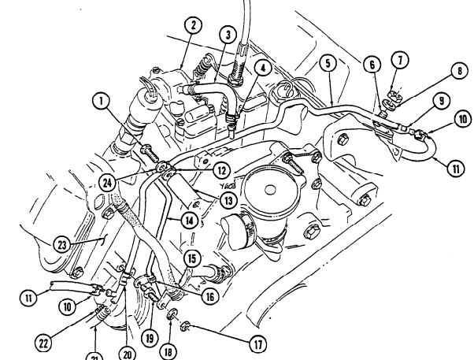

(21
FOLLOW-ON TASKS: - Install air horn (para. 3-14).

· Start engine (TM 9-2320-387-10) and check for fuel leaks.

## 3-39. Glow Plug Replacement

This task covers: 
a. Removal b. Installation INITIAL SETUP: 
Tools General mechanic's tool kit: 
automotive (Appendix B, Item 1) 
Maintenance and repair shop equipment: 
automotive (Appendix B, Item 2) 
Special Tools Socket, 3/8 in. (Appendix B, Item 144) 
Manual References TM 9-2320-387-10 TM 9-2320-387-24P 
Equipment Condition l Battery ground cables disconnected (para. 4-68). l Hood raised and secured (TM 9-2320-387-10). 

Maintenance Level Unit 1. Disconnect electrical lead 575 (3) from glow plug **(2).** 
NOTE 
If glow plug is damaged or broken, notify unit commander. 

Damaged or broken glow plugs are removed at DS maintenance (para. E-22). 

2. Remove glow plug (2) from cylinder head (11. 

b. Installation 

HMMWV glow plugs have bullet-shaped tips, not flat tips. 

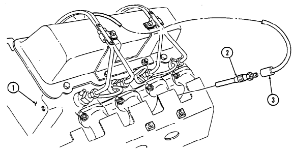

1. Install glow plug (2) in cylinder head (1). Tighten glow plug (2) to 8-12 lb-ft (11-16 Nom). 2. Connect electrical lead 575 (3) to glow plug (2). 

FOLLOW-ON TASKS: l Connect battery ground cables (para. 4-68). 

l Lower and secure hood (TM 9-2320-387-10). 

__ 

# 3-40. Right Fuel Injection Lines Bracket Replacement

This task covers:

## Initial Setup:

Tools General mechanic's tool kit:
automotive (Appendix B, Item 1)
Maintenance and repair shop equipment:
automotive (Appendix B, Item 2)
Manual References TM 9-2320-387-24P

## A. Removal

a. Removal b. Installation

## Equipment Condition

•Engine access cover removed (para. 10-22). •Air horn removed (para. 3-14).

Maintenance Level Unit 1. Remove two screw-assembled washers (6), clamps (5), and clamp (7) from bracket (1). 2. Inspect two clamps (5) for cracks or breaks. Replace if defective. 3. Remove two nuts (3), washers (2), and bracket (1) from valve cover studs (4).

## B. Installation

1. Install bracket (1) on two valve cover studs (4) with washers (2) and nuts (3). Tighten nuts (3) to 13-20 lb-ft (18-27 N•m).

2. Install two clamps (5) and clamp (7) on bracket (1) with two screw-assembled washers (6). Tighten

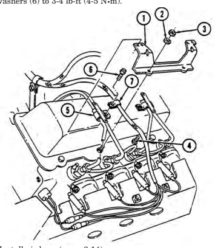

screw-assembled washers (6) to 3-4 lb-ft (4-5 N•m).

FOLLOW-ON TASKS: - Install air horn (para. 3-14).

- Install engine access cover (para. 10-22).

# 3-41. Left Fuel Injection Lines Bracket Replacement

This task covers:
INITIAL SETUP:
Tools General mechanic's tool kit:
automotive (Appendix B, Item 1)
Maintenance and repair shop equipment:
automotive (Appendix B, Item 2)
Manual References TM 9-2320-387-10 TM 9-2320-387-24P
a. Removal 1. Remove screw-assembled washer (2) and clamp (1) from bracket (5). 2. Remove screw-assembled washer (8) and clamp (9) from bracket (5). 3. Remove two screw-assembled washers (3) and oil dipstick tube (4) from bracket (5). 4. Remove two nuts (6), washers (7), and bracket (5) from valve cover studs (10).

b. Installation 1. Install bracket (5) on two valve cover studs (10) with washers (7) and nuts (6). Tighten nuts (6) to 13-20 lb-ft (18-27 N•m).

2. Secure oil dipstick tube (4) to bracket (5) with two screw-assembled washers (3). Tighten screwassembled washers (3) to 3-4 lb-ft (4-5 N•m).

3. Install clamp (9) on bracket (5) with screw-assembled washer (8). Tighten screw-assembled washer (8) to 3-4 lb-ft (4-5 N•m).

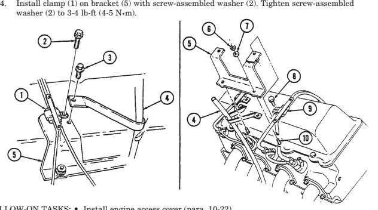

FOLLOW-ON TASKS: - Install engine access cover (para. 10-22).
- Lower and secure hood (TM 9-2320-387-10).

3-80 Change 2 a. Removal b. Installation Equipment Condition
- Hood raised and secured (TM 9-2320-387-10). - Engine access cover removed (para. 10-22).

Maintenance Level Unit

# Section Iii. **Accelerator System Maintenance**

# 3-42. Accelerator System Maintenance Task Summary

| a.  Removal                            | c.  Installation                               |
|----------------------------------------|------------------------------------------------|
| b.  Inspection                         |                                                |
| INITIAL SETUP:                         |                                                |
| Tools                                  | Manual References                              |
| General mechanic's tool kit:           | TM 9\-2320\-387\-10                            |
| automotive (Appendix B, Item 1)        | TM 9\-2320\-387\-24P                           |
| Maintenance and repair shop equipment: | Equipment Condition                            |
| automotive (Appendix B, Item 2)        | Hood raised and secured (TM 9\-2320\-387\-10). |
| Materials/Parts                        |                                                |

# 3-43. Accelerator Linkage Maintenance

This task covers:

a. Removal b. Installation c. Inspection d. Adjustment

## Initial Setup:

Tools General mechanic's tool kit:
automotive (Appendix B, Item 1)
Maintenance and repair shop equipment:
automotive (Appendix B, Item 2)
Materials/Parts Four locknuts (Appendix G, Item 77) Cotter pin (Appendix G, Item 26) Assembled locknut (Appendix G, Item 134) Lubricating oil, seasonal grade OE 
(Appendix C, Item 45)

| TM 9\-2320\-387\-24P   |
|------------------------|
| Equipment Condition    |
| Maintenance Level      |

| Equipment Condition                             |
|-------------------------------------------------|
| · Hood raised and secured (TM 9\-2320\-387\-10) |
| · Engine access cover removed (para. 10\-22)    |
| Maintenance Level                               |
| Unit                                            |

TM 9-2320-387-10 TM 9-2320-387-24P
a. Removal 1. Remove cotter pin (18) and washer (17) and disconnect accelerator cable clevis (16) from accelerator pedal rod (14). Discard cotter pin (18).

2. Remove hitch pin (1) and washer (2) and disconnect hand throttle clevis (3) from accelerator pedal rod (14).

3. Remove assembled locknut (19) and harness clamp (21) from lower capscrew (25). Discard assembled locknut (19).

4. Remove three locknuts (22), washers (23), capscrews (25), washers (24.1), and two accelerator rod retainers (24) from cowl (20). Discard locknuts (22).

Bushing halves may detach from accelerator pedal rod during removal.

5. Pull accelerator pedal rod (14) forward through gasket (5) in cowl (20) and remove accelerator rod (14). 

6. Remove accelerator rod retainers (24) and bushing halves (4) from accelerator pedal rod (14). 7. Remove gasket (5) from cowl (20). 8. Remove locknut (11), washer (12), capscrew (15), and accelerator cable clevis (16) from body bracket (13). Discard locknut (11).

9. Remove nut (10), capscrew (7), and clamps (6) and (9) from A-beam (8). Remove clamp (9) from accelerator cable (28).

10. Loosen two nuts (27) and disconnect accelerator cable (28) from engine bracket (31). 11. Disconnect throttle return spring (29) from engine bracket (31). 12. Remove accelerator cable clip (26), accelerator cable (28), and accelerator cable end (32) from injection pump throttle shaft (30).

# 3-43. Accelerator Linkage Maintenance (Cont'D)

b.  Inspection

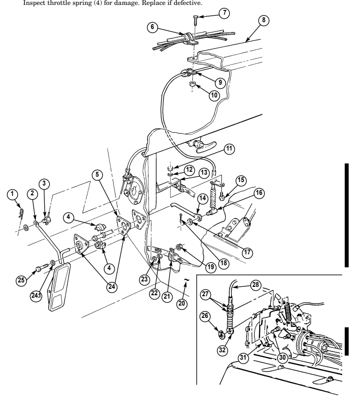

# 3-43. Accelerator Linkage Maintenance (Cont'D) C. Installation

1.

Connect accelerator cable (3) to injection pump throttle shaft (6).

2.

Position throttle shaft lever (5) to full throttle position and secure accelerator cable (3) to injection pump throttle shaft (6) with accelerator cable clip (1).

3.

Connect throttle return spring (4) to engine bracket (7). Install cable assembly (3) on engine bracket (7) and tighten two nuts (2).

র্ব .

5.

Install clamp (17) on cable assembly (3) and install clamps (14) and (17) to A-beam (16) with capscrew (15) and nut (18).

Install accelerator cable clevis (24) on body bracket (21) with capscrew (23), washer (20), and 6.

locknut (19).

Position gasket (13) to cowl (28).

7.

Apply lubricating oil on accelerator bushing halves (12) and accelerator pedal rod (22) at accelerator 8.

rod retainer (32). Position accelerator rod retainers (32) and bushing halves (12) onto accelerator pedal rod (22),
9.

ensuring retainers (32) are properly seated over bushing halves (12).

Install accelerator rod retainers (32), accelerator pedal rod (22), and gasket (13) on cowl (28) with 10.

three washers (32.1), capscrews (33), washers (31), and locknuts (30). Install clamp (29) on lower capscrew (33) with assembled locknut (27).

Connect hand throttle clevis (11) to accelerator pedal rod (22) with washer (10) and hitch pin (9).

11.

Connect accelerator cable clevis (24) to accelerator pedal rod (22) with washer (25) and cotter pin (26).

12.

# D. Adjustment

Loosen two accelerator cable nuts (2) on engine bracket (7).

1.

2.

Fully depress accelerator pedal.

Hold throttle shaft lever (5) in full throttle position.

3.

Adjust accelerator cable nuts (2) up or down so accelerator cable end (8) holds throttle shaft lever (5) in 4.

full throttle position.

Tighten two nuts (2) securing accelerator cable (3) to engine bracket (7).

5.

Release accelerator pedal and ensure throttle shaft lever (5) returns all the way to idle position.

6.

■

# 3-43. Accelerator Linkage Maintenance (Cont'D)

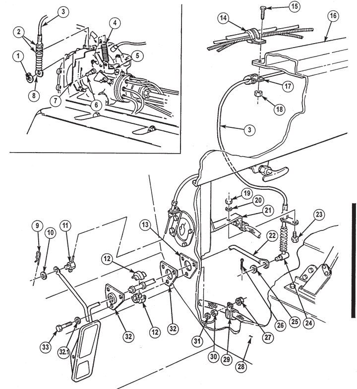

FOLLOW-ON TASKS: - Install engine access cover (para. 10-22).

· Lower and secure hood (TM 9-2320-387-10).

- Start engine (TM 9-2320-387-10) and check for proper accelerator operation.

| This task covers:                      |                      |
|----------------------------------------|----------------------|
| a.  Removal                            | c.  Installation     |
| b.  Inspection                         |                      |
| INITIAL SETUP:                         |                      |
| Tools                                  | Manual References    |
| General mechanic's tool kit:           | TM 9\-2320\-387\-10  |
| automotive (Appendix B, Item 1)        | TM 9\-2320\-387\-24P |
| Maintenance and repair shop equipment: |                      |
| automotive (Appendix B, Item 2)        | Maintenance Level    |
|                                        | Unit                 |

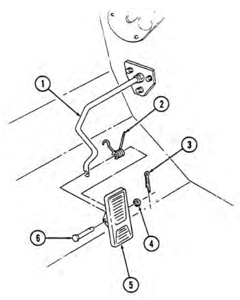

# 3-44. Accelerator Pedal Replacement

a. Removal Remove cotter pin (3), washer (4), spring (2), pin (6), and accelerator pedal (5) from accelerator rod (1). Discard cotter pin (3).

## B. Installation

Install accelerator pedal (5) and spring (2) on accelerator rod (1) with pin (6), washer (4), and cotter pin (3).

FOLLOW-ON TASK: Start engine (TM 9-2320-387-10) and check for proper accelerator operation.

# 3-45. Engine Idle Speed Adjustment

This task covers:
Engine Idle Speed Adjustment INITIAL SETUP:
Tools General mechanic's tool kit:
automotive (Appendix B, Item 1)
Test Equipment STE/ICE-R
Manual References TM 9-2320-387-10 TM 9-2320-387-24P
Engine Idle Speed Adjustment Equipment Condition Hood raised and secured (TM 9-2320-387-10).

General Safety Instructions Keep hands and arms away from fan blade and drivebelts while engine is running.

Maintenance Level Unit

Keep hands and arms away from fan blade and drivebelts while engine is running or serious injury may result.

1. Start engine (TM 9-2320-387-10) and bring engine to operating temperature. 2. Note idle speed and disconnect lead 569B (2) from injection pump (4). If change in idle speed is noted, refer to para. 2-28, Fuel System Tests. If no change in idle speed is noted, connect lead 569B (2) to injection pump (4).

3. Set engine idle speed to 700 rpm (± 25 rpm) by turning idle speed adjusting screw (1) on throttle shaft lever (3).

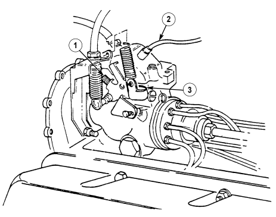

FOLLOW-ON TASK: Lower and secure hood (TM 9-2320-387-10).

# 3-46. Hand Throttle Control Cable And Bracket Replacement

This task covers:

a. Removal b. Installation

| INITIAL SETUP:                                    |                             |
|---------------------------------------------------|-----------------------------|
| Tools                                             | Manual References           |
| General mechanic's tool kit:                      | TM 9\-2320\-387\-10         |
| automotive (Appendix B, Item 1)                   | TM 9\-2320\-387\-24P        |
| Maintenance and repair shop equipment:            | Equipment Condition         |
| automotive (Appendix B, Item 2)                   |                             |
| Materials/Parts Oil filter (Appendix G, Item 199) | General Safety Instructions |

## A. Removal

1. Remove four screws (7), washers (6), and instrument cluster (8) from instrument panel (3) and pull instrument cluster (8) away to allow access to speedometer cable (4).

2. Loosen nut (5) and disconnect speedometer cable (4) from speedometer (1). 3. Remove hitch pin (19) and washer (18) and disconnect hand throttle clevis (16) from accelerator rod (17).

4. Remove locknut (21), washer (9), screw (10), washer (9), and hand throttle cable (11) from bracket (12). Discard locknut (21).

10. Remove nut (25) and O-ring (32) from hand throttle cable (11). Discard O-ring (32).

## B. Installation

6. Loosen nut (25) and remove hand throttle cable (11) from bracket (23). 7. Remove locknut (29), washer (27), capscrew (26), and washer (27) from bracket (23) and instrument panel (3). Discard locknut (29).

8. Remove nut (22), screw (24), and bracket (23) from instrument panel (3). 9. Remove setscrew (30) and handle (31) from hand throttle cable (11).

1. Install O-ring (32) and nut (25) on hand throttle cable (11). 2. Install handle (31) on hand throttle cable (11) with setscrew (30). 3. Install bracket (23) on instrument panel (3) with screw (24) and nut (22). Do not tighten nut (22). 4. Align holes in bracket (23), instrument panel (3), and steering column bracket (28) and install washer (27), capscrew (26), washer (27), and locknut (29).

5. Tighten screw (24) and nut (22). 6. Install hand throttle cable (11) on bracket (23) and tighten nut (25). 7. Install bracket (12) and two spacers (12.1) on cowl (15) and boot (14.1) with two washers (14),
capscrews (20), washers (14), and locknuts (13).

8. Install hand throttle cable (11) on bracket (12) with washer (9), screw (10), washer (9), and locknut (21).

9. Connect clevis (16) to accelerator rod (17) with washer (18) and hitch pin (19).

10. Connect speedometer cable (4) to speedometer (1), ensuring core (2) engages with square hole in speedometer (1), and tighten nut (5).

11. Install instrument cluster (8) in instrument panel (3) with four washers (6) and screws (7).

5. Remove two locknuts (13), washers (14), capscrews (20), washers (14), spacers (12.1), and bracket (12) from boot (14.1) and cowl (15). Discard locknuts (13).

3-46.  HAND THROTTLE CONTROL CABLE AND BRACKET REPLACEMENT (Cont'd)

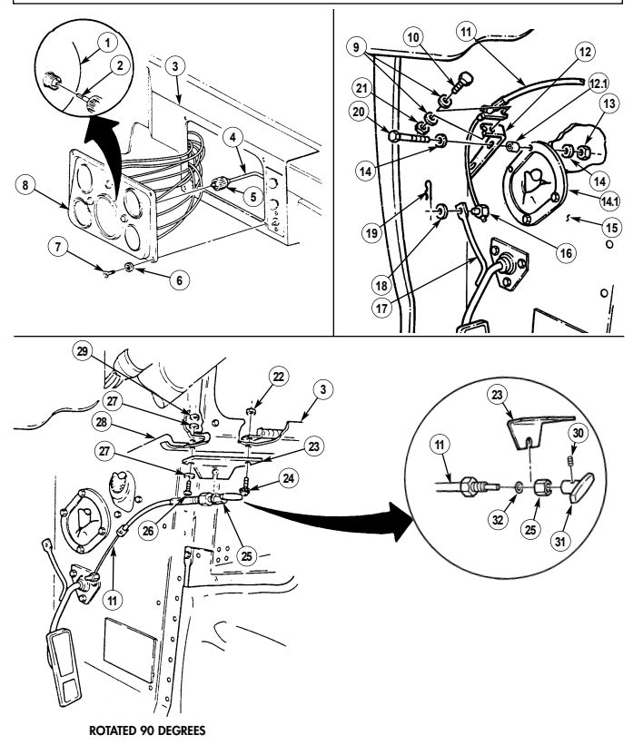

# Section Iv. **Exhaust System Maintenance**

# 3-47. Exhaust System Maintenance Task Summary

| a. Removal                                                      | c. Installation                               |
|-----------------------------------------------------------------|-----------------------------------------------|
| b. Inspection                                                   |                                               |
| INITIAL SETUP:                                                  |                                               |
| Tools                                                           | Equipment Condition                           |
| General mechanic's tool kit:                                    | - Engine left splash shield removed           |
| automotive (Appendix B, Item 1)                                 | (para. 10\-23).                               |
| Maintenance and repair shop equipment:                          | - Engine access cover removed (para. 10\-22). |
| automotive (Appendix B, Item 2)                                 | General Safety Instructions                   |
| Materials/Parts                                                 | Do not drain oil when engine is hot.          |
| Tiedown strap (Appendix G, Item 326)                            | Maintenance Level                             |
| Lockwasher (Appendix G, Item 144) Locknut (Appendix G, Item 77) | Unit                                          |
| Manual References                                               |                                               |
| TM 9\-2320\-387\-10                                             |                                               |
| TM 9\-2320\-387\-24P                                            |                                               |
| a. Removal                                                      |                                               |

# 3-48. Tailpipe Replacement

This task covers:

|    | Cover or plug all hoses and connections immediately after                                        |
|----|--------------------------------------------------------------------------------------------------|
|    | disconnection to prevent contamination. Remove all plugs prior to connection.                    |
|    | NOTE                                                                                             |
|    | -  Engine oil cooler supply and return lines are replaced basically                              |
|    | the same. This procedure covers supply line replacement.                                         |
|    | -  Have drainage container ready to catch oil.                                                   |
| 1. | Disconnect supply line connector (5) from adapter (4) and allow oil to drain.                    |
| 2. | Disconnect supply line connector (16) from oil cooler port (17).                                 |
| 3. | Remove locknut (3), washer (2), capscrew (15), and washer (2) from supply line clamp (14), brake |
|    | line clamp (1), and frame bracket (13). Discard locknut (3).                                     |
| 4. | Remove capscrew (7), lockwasher (8), and clamp (9) from supply line (12) and engine mount        |

a. Removal b. Installation

Do not touch hot exhaust system components with bare hands. Severe injury may result.

a. Removal 1. Remove three locknuts (9), washers (6), capscrews (5), and washers (6) from tailpipe (1) and muffler (7). Discard locknuts (9).

2. Remove two nuts (3), lockwashers (4), and U-bolt (10) from tailpipe (1) and hanger (2). Discard lockwashers (4). 3. Remove tailpipe (1) and gasket (8) from muffler (7). Discard gasket (8).

# 3-48. Tailpipe Replacement (Cont'D)

b. Installation 1. Install gasket (8) and tailpipe (1) on muffler (7) with three washers (6), capscrews (5), washers (6),
and locknuts (9). Tighten locknuts (9) to 26 lb-ft (35 N•m).

2. Install tailpipe (1) on hanger (2) with U-bolt (10), two lockwashers (4), and nuts (3).

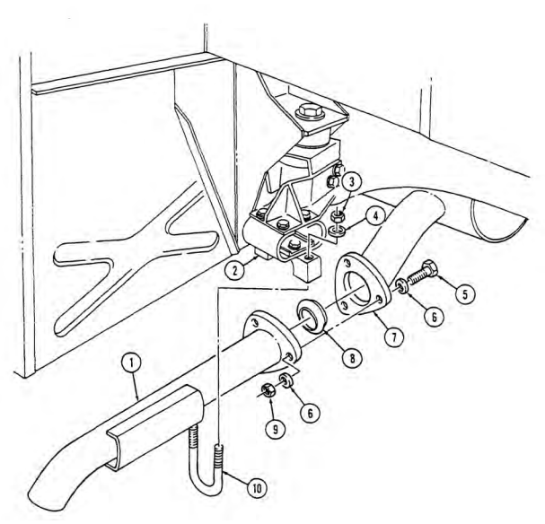

FOLLOW-ON TASK: Start engine (TM 9-2320-387-10) and check for exhaust leaks.

# 3-49. Muffler And Catalytic Converter Replacement

This task covers:

| This task covers:               |                                             |
|---------------------------------|---------------------------------------------|
| a. Removal                      | b . Installation                            |
| INITIAL SETUP:                  |                                             |
| Tools                           | Equipment Condition                         |
| General mechanic's tool kit:    | CDR valve and bracket removed (para. 3\-9). |
| automotive (Appendix B, Item 1) |                                             |
|                                 | Maintenance Level                           |
| Manual References               | Unit                                        |
| TM 9\-2320\-387\-24P            |                                             |

Do not touch hot exhaust system components with bare hands. Severe injury may result.

a. Removal

Support muffler and catalytic converter during replacement. Failure to do so may result in damage to equipment.

1. Remove two clamps (14) and heat shield (15) from crossover pipe (17). 2. Remove two nuts (13), U-bolt (23), and support bracket (20) from heat shield (10) and catalytic converter (24).

3. Remove two nuts (6), lockwashers (5), and washers (4) from heat shield (10). Discard lockwashers (5). 4. Remove capscrew (7), lockwasher (8), and Y-clip (9) at location A and screw (12), lockwashers (11)
and (28), and nut (29) at location B and heat shield (10) from bracket (27). Discard lockwashers (8), (11), and (28).

5. Remove two nuts (25), washers (26), capscrews (31), washers (30), and bracket (27) from muffler (32). 6. Remove three locknuts (18), washers (19), capscrews (22), and washers (21) from catalytic converter (24) and crossover pipe (17). Discard locknuts (18).

7. Remove two nuts (40), lockwashers (39), and U-bolt (37) from catalytic converter (24) and support bracket (38). Discard lockwashers (39).

8. Remove gasket (16) by pulling catalytic converter (24) towards rear of vehicle. Discard gasket (16).

NOTE
It may be necessary to lower rear propeller shaft (para. 6-4) to gain access to locknuts on muffler hanger.

9. Remove four locknuts (3), washers (2), capscrews (33), washers (34), two retaining plates (35), and muffler (32) from muffler hanger (1). Discard locknuts (3).

10. Remove two locknuts (41), washers (46), capscrews (44), washers (43), insulator (36), retaining plate (45), and bracket (42) from muffler (32). Discard locknuts (41).

## B. Installation

1. Install bracket (42), insulator (36), and retaining plate (45) on muffler (32) with two washers (43),
capscrews (44), washers (46), and locknuts (41). Tighten locknuts (41) to 10 lb-ft (14 N•m).

2. Install muffler (32) and two retaining plates (35) on muffler hanger (1) with four washers (34),
capscrews (33), washers (2), and locknuts (3).

3. Install catalytic converter (24) on support bracket (38) with U-bolt (37), two lockwashers (39), and nuts (40).

# 3-49. **Muffler And Catalytic Converter Replacement (Cont'D)**

4. Install gasket (16) and catalytic converter (24) on crossover pipe (17) with three washers (21),
capscrews (22), washers (19), and locknuts (18). Tighten locknuts (18) to 26 lb-ft (35 N•m).

5. Install bracket (27) on muffler (32) with two washers (30), capscrews (31), washers (26), and nuts (25). 6. Install bracket (27) on heat shield (10) with Y-clip (9), lockwasher (8), and screw (7) at location A
and two lockwashers (11) and (28), screw (12), and nut (29) at location B.

7. Install heat shield (10) on muffler (32) with two washers (4), lockwashers (5), and nuts (6). 8. Install heat shield (10) and bracket (20) on catalytic converter (24) with U-bolt (23) and two nuts (13).

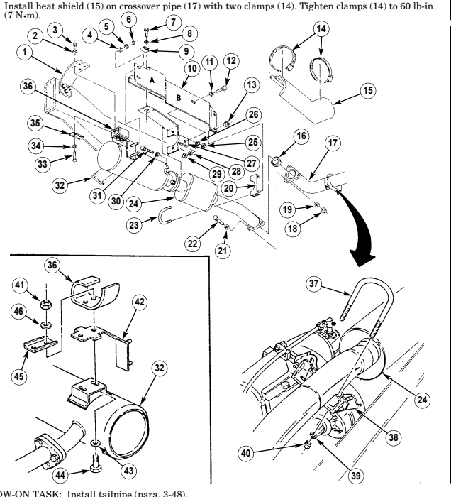

FOLLOW-ON TASK: Install tailpipe (para. 3-48).
# 3-50. Exhaust Pipe Replacement

This task covers:
INITIAL SETUP:
Tools General mechanic's tool kit:
automotive (Appendix B, Item 1)
Maintenance and repair shop equipment:
automotive (Appendix B, Item 2)

## Materials/Parts

Three locknuts (Appendix G, Item 106) Gasket (Appendix G, Item 39)
Manual References TM 9-2320-387-10 TM 9-2320-387-24P

a. Removal b. Installation

## Equipment Condition

Right rear heat shield removed (para. 3-58).

General Safety Instructions Do not touch hot exhaust system components with bare hands.

Maintenance Level Unit

Do not touch hot exhaust system components with bare hands. Severe injury may result.

## A. Removal

1. Remove two clamps (12) and heat shield (11) from exhaust pipe (3). 2. Remove three locknuts (5), washers (4), capscrews (7), washers (4), and exhaust pipe (3) from catalytic converter (2). Discard locknuts (5).

3. Remove two capscrews (8), washers (9), flange (10), and exhaust pipe (3) from wastegate housing (1). 4. Remove and discard gasket (6).

b. Installation 1. Install flange (10) and exhaust pipe (3) on wastegate housing (1) with two washers (9) and capscrews (8).

2. Install gasket (6) and exhaust pipe (3) on catalytic converter (2) with three washers (4), capscrews (7),
washers (4), and locknuts (5). Tighten locknuts (5) to 26 lb-ft (35 N•m).

3. Install heat shield (11) on exhaust pipe (3) with two clamps (12).

# 3-50. Exhaust Pipe Replacement (Cont'D)

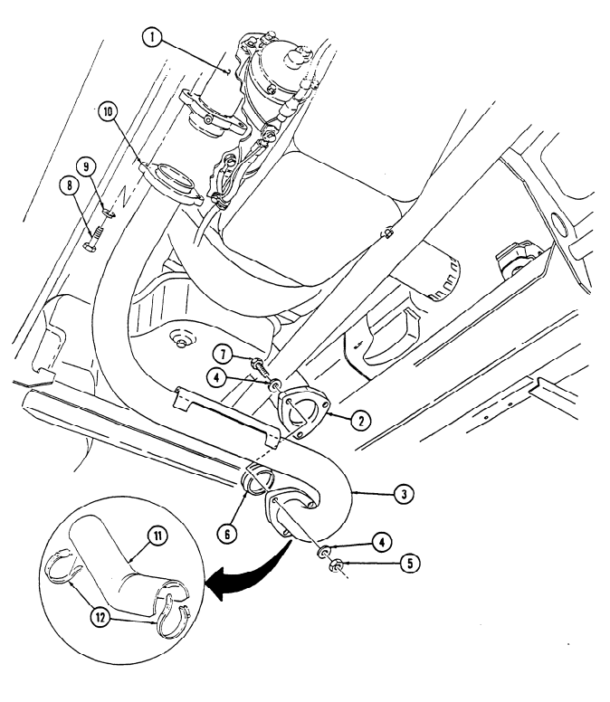

FOLLOW-ON TASKS: - Start engine (TM 9-2320-387-10) and check for exhaust leaks.

-  Install right rear heat shield (para. 3-58).

# 13-51.Anif0~D-To-Turbochargerexhau~T~Ipe Replacement I

Tbii **task covers:** 
INrnAl. SETUP: 
Tools General mechanic's tool kit: 
automotive (Appendix B, Item 1) 
Manual References TM 9-2320-387-24P 
Equipment Condition Rear heat shield removed (para. 3-52). . 

a. Removal b. Installation 

## General Safety Instructions

Do not touch hot exhaust system components with bare hands. 

Maintenance Level unit 

Do not touch hot exhaust system components with bare hands. Severe injury may result. 

NOTE 
The replacement procedure for left and right manifold-to-turbocharger exhaust pipes is basically the same. This procedure covers the 1eR exhaust pipe. 

#### Rzzgil

1. Loosen clamp (5) and remove exhaust pipe (11 from exhaust manifold (4). Slide clamp (5) onto pipe (1). 

2. Loosen clamp (21 and remove exhaust pipe (11 from turbocharger (3). Slide clamp (21 onto exhaust pipe (1). 3. Remove clamps (21 and (51 from exhaust pipe (11. 

1 **b. Installation** 1 1. 2. 

Install two clamps (2) and (5) on exhaust pipe (11. Install exhaust pipe (1) on turbocharger (31 and tighten clamp (2). 

3. 

Install exhaust pipe (1) on exhaust manifold (41 and tighten clamp (5). 

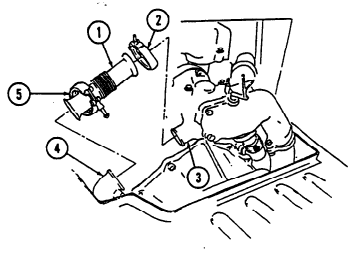

FOLLOW-ON TASK: Install rear heat shield (para. 3-52). 

-- 

# 3-52. Rear Heat Shield Replacement

This task covers:
INITIAL SETUP:
Tools General mechanic's tool kit:
automotive (Appendix B, Item 1)
Manual References TM 9-2320-387-24P
Equipment Condition Right rear heat shield removed (para. 3-58).

a. Removal b. Installation

## General Safety Instructions

Do not touch hot exhaust system components with bare hands.

Maintenance Level Unit

Do not touch hot exhaust system components with bare hands. Severe injury may result.

## A. Removal

1. Remove capscrew (7) from rear heat shield (2) and left exhaust manifold (5). 2. Remove capscrew (1) from rear heat shield (2) and left cylinder head (6). 3. Remove two capscrews (3) and rear heat shield (2) from turbocharger (4).

## B. Installation

1. Install rear heat shield (2) on turbocharger (4) with two capscrews (3). 2. Install rear heat shield (2) on left cylinder head (6) with capscrew (1). 3. Install rear heat shield (2) on left exhaust manifold (5) with capscrew (7).

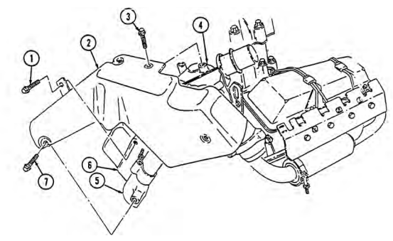

FOLLOW-ON TASK: Install right rear heat shield (para. 3-58).

# 3-53. Tailpipe Hanger Replacement

This task covers:
INITIAL SETUP:

## Tools

General mechanic's tool kit:
automotive (Appendix B, Item 1)
Maintenance and repair shop equipment:
automotive (Appendix B, Item 2)

## Materials/Parts

Six locknuts (Appendix G, Item 106)
Manual References TM 9-2320-387-24P
a. Removal b. Installation General Safety Instructions Do not touch hot exhaust system components with bare hands.

Maintenance Level Unit

Do not touch hot exhaust system components with bare hands. Severe injury may result.

## A. Removal

1. Remove four locknuts (5), washers (4), capscrews (9), washers (4), two insulator reinforcement plates (10), and insulator (8) from tailpipe hanger (6). Discard locknuts (5).

2. Remove two locknuts (1), washers (2), capscrews (7), washers (2), and tailpipe hanger (6) from frame (3). Discard locknuts (1).

## B. Installation

1. Install tailpipe hanger (6) on frame (3) with two washers (2), capscrews (7), washers (2), and locknuts (1). Tighten capscrews (7) to 26 lb-ft (35 N•m).

2. Install insulator (8) and two insulator reinforcement plates (10) on tailpipe hanger (6) with four

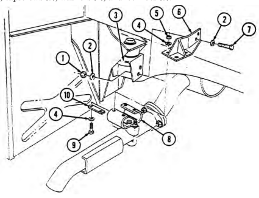

washers (4), capscrews (9), washers (4), and locknuts (5).

# 3-54. Tailpipe Insulator Replacement

This task covers:
INITIAL SETUP:

## Tools

General mechanic's tool kit:
automotive (Appendix B, Item 1)
Maintenance and repair shop equipment:
automotive (Appendix B, Item 2)
Materials/Parts Four locknuts (Appendix G, Item 106) Two lockwashers (Appendix G, Item 144)
Manual References TM 9-2320-387-24P
a. Removal b. Installation Equipment Condition Tailpipe removed (para. 3-48).

General Safety Instructions Do not touch hot exhaust system components with bare hands.

Maintenance Level Unit

Do not touch hot exhaust system components with bare hands. Severe injury may result.

a. Removal 1. Remove four locknuts (5), washers (6), capscrews (9), washers (8), two reinforcement plates (7), and insulator (11) from tailpipe hanger (4). Discard locknuts (5).

2. Remove two capscrews (3), lockwashers (2), reinforcement plate (1), and U-bolt clamp (10) from insulator (11). Discard lockwashers (2).

b. Installation 1. Install reinforcement plate (1) and U-bolt clamp (10) on insulator (11) with two lockwashers (2) and capscrews (3). Tighten capscrews (3) to 10 lb-ft (14 N•m).

2. Install insulator (11) and two reinforcement plates (7) on tailpipe hanger (4) with four washers (8),

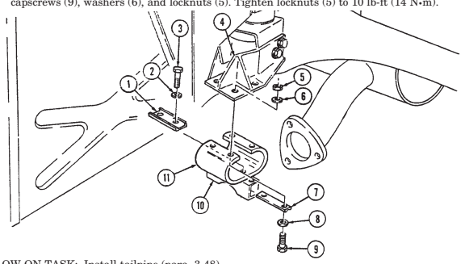

FOLLOW-ON TASK: Install tailpipe (para. 3-48).

# 3-55. Muffler Support Bracket Maintenance

This task covers:

a. Removal c. Assembly

INITIAL SETUP:
Tools General mechanic's tool kit:
automotive (Appendix B, Item 1)
Maintenance and repair shop equipment:
automotive (Appendix B, Item 2)
Materials/Parts Four locknuts (Appendix G, Item 106)
Manual References TM 9-2320-387-24P
a. Removal

b. Disassembly d. Installation

Equipment Condition Muffler and catalytic converter removed (para. 3-49).

Maintenance Level Unit

Hold bolt heads on transfer case securely to prevent changing torque or damaging transfer case seal.

Remove two locknuts (1), washers (2), and support bracket assembly (3) from transfer case (4). Discard locknuts (1).

b. Disassembly 2. Remove two insulators (7) from mounting plate (11).

c. Assembly 1. Install two insulators (7) in mounting bracket (11). 2. Install two washers (6) between mounting bracket (11) and support plate (10) with two washers (6),
capscrews (5), washers (8), and locknuts (9). Tighten locknuts (9) to 15 lb-ft (20 N•m).

d. Installation

Hold bolt heads on transfer case securely to prevent changing torque or damaging transfer case seal.

Install support bracket assembly (3) on transfer case (4) with two washers (2) and locknuts (1). Tighten locknuts (1) to 15 lb-ft (20 N•m).

1. Remove two locknuts (9), washers (8), capscrews (5), washers (6), mounting bracket (11), and washers (6) from support plate (10). Discard locknuts (9).

# 3-55.  Muffler Support Bracket Maintenance (Cont'D)

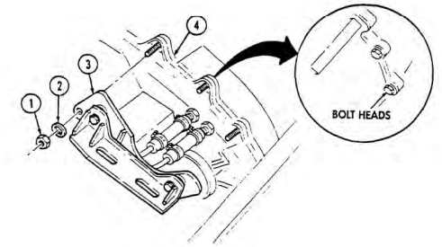

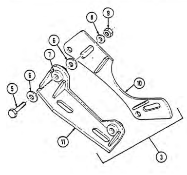

FOLLOW-ON TASK:  Install muffler and catalytic converter (para. 3-49).

# 3-56. Right Exhaust Manifold Heat Shield Replacement

This task covers:
INITIAL SETUP:
Tools General mechanic's tool kit:
automotive (Appendix B, Item 1)

| Manual References    |
|----------------------|
| TM 9\-2320\-387\-10  |
| TM 9\-2320\-387\-24P |

## Materials/Parts

Two lockwashers (Appendix G, Item 138)

a. Removal b. Installation

Do not touch hot exhaust system components with

| Manual References               |
|---------------------------------|
| TM 9\-2320\-387\-24P            |
| Equipment Condition             |
| Air horn removed (para. 3\-14). |
| Maintenance Level               |
| Unit                            |

Maintenance Level Unit

Do not touch hot exhaust system components with bare hands. Severe injury may result.

a. Removal 1. Remove two capscrews (5), lockwashers (6), and harness clamps (4) from right exhaust manifold heat shield (3). Discard lockwashers (6).

2. Remove four capscrews (7) and right exhaust manifold heat shield (3) from exhaust manifold (2) and cylinder head (1).

## B. Installation

1. Install right exhaust manifold heat shield (3) on exhaust manifold (2) and cylinder head (1) with four capscrews (7).

2. Install two harness clamps (4) on right exhaust manifold heat shield (3) with two lockwashers (6)
and capscrews (5).

# 3-56. Right Exhaust Manifold Heat Shield Replacement (Cont'D)

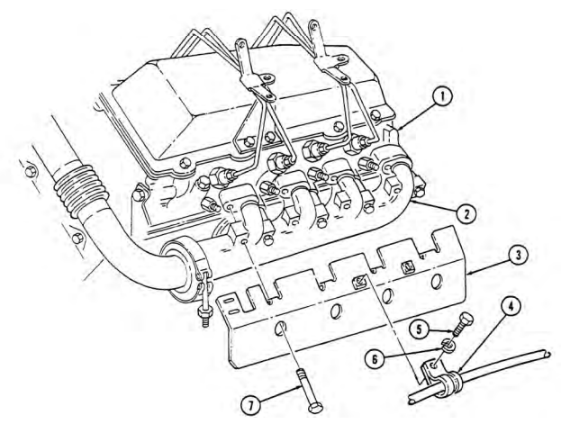

FOLLOW-ON TASKS: - Install right rear heat shield (para. 3-58).

-  Install starter (para. 4-11).
-  Start engine (TM 9-2320-387-10) and check for exhaust leaks.

- Lower and secure hood (TM 9-2320-387-10).

# 3-57. Exhaust Manifolds Replacement

This task covers:
INITIAL SETUP:
Tools General mechanic's tool kit:
automotive (Appendix B, Item 1)
Maintenance and repair shop equipment:
automotive (Appendix B, Item 2)

## Manual References

TM 9-2320-387-24P
Equipment Condition
- Oil dipstick tube removed (para. 3-2) 
(left side only).

- 200-ampere alternator removed 
(para. 4-5) (left side only).

## A. Removal B. Installation Equipment Condition (Cont'D)

- Air horn removed (para. 3-14) (right side only). - Right exhaust manifold heat shield removed 
(para. 3-56) (right side only).

- Rear heat shield removed (para. 3-52) (left side only).

## General Safety Instructions

Do not touch hot exhaust system components with bare hands.

Maintenance Level Unit

Do not touch hot exhaust system components with bare hands. Severe injury may result.

The replacement procedure for right and left exhaust manifolds is basically the same. This procedure covers the right exhaust manifold.

## A. Removal

1. Loosen and slide clamp (4) onto exhaust pipe (5). 2. Remove four (eight if left side) capscrews (1) and exhaust manifold (2) from cylinder head (3). 3. Clean all gasket material from head mounting surface and manifold mating surface.

b. Installation

Alternate screw tightening. Flanges may break when each screw is tightened completely before others are snugged up.

1. Install exhaust manifold (2) on cylinder head (3) with four (eight if left side) capscrews (1). Tighten capscrews (1) to 25-33 lb-ft (34-45 N.m).

2. Install exhaust pipe (5) on exhaust manifold (2) and tighten clamp (4).

# 3-57. Exhaust Manifolds Replacement (Cont'D)

FOLLOW-ON TASKS: - Install 200-ampere alternator (para. 4-5) (left side only).

- Install oil dipstick tube (para. 3-2) (left side only). - Install rear heat shield (para. 3-52) (left side only). - Install air horn (para. 3-14) (right side only). - Install right exhaust manifold heat shield (para. 3-56) (right side only).

# 3-58. Right Rear Heat Shield Replacement

This task covers:
INITIAL SETUP:
Tools General mechanic's tool kit:
automotive (Appendix B, Item 1)
Manual References TM 9-2320-387-24P

a. Removal b. Installation

Equipment Condition Engine access cover removed (para. 10-22).

General Safety Instructions Do not touch hot exhaust system components with bare hands.

Maintenance Level Unit

Do not touch hot exhaust system components with bare hands. Severe injury may result.

a. Removal 1. Remove capscrew (6) from transmission dipstick tube (5), right rear heat shield (4), rear heat shield
(1), and wastegate housing (7).

2. Remove two capscrews (3) and right rear heat shield (4) from right exhaust manifold heat shield (2). 3. Remove nut (8), washers (9) and (11), and screw (10) from heat shields (4) and (12) and separate heat shields (4) and (12).

b. Installation 1. Assemble heat shields (4) and (12) with screw (10), washers (11) and (9), and nut (8). 2. Install right rear heat shield (4) on right exhaust manifold heat shield (2) with two capscrews (3). 3. Install right rear heat shield (4) and transmission dipstick tube (5) on rear heat shield (1) and wastegate

housing (7) with capscrew (6).

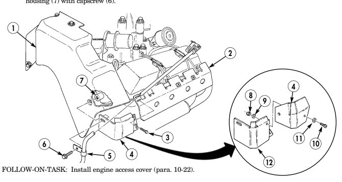

3-106 Change 2

# 3-59. Muffler Hanger Replacement

This task covers:
INITIAL SETUP:
Tools General mechanic's tool kit:
automotive (Appendix B, Item 1)
Materials/Parts Three locknuts (Appendix G, Item 85)
Manual References TM 9-2320-387-24P

a. Removal b. Installation

Equipment Condition Muffler and catalytic converter removed 
(para. 3-49).

Maintenance Level Unit a. Removal Remove three locknuts (4), six washers (3), three screws (5), and muffler hanger (1) from frame rail (2). Discard locknuts (4). b. Installation Install muffler hanger (1) on frame rail (2) with three screws (5), six washers (3), and three locknuts (4). Tighten locknuts (4) to 75 lb-ft (102 N•m).

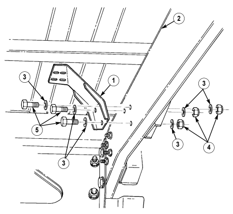

FOLLOW-ON TASK: Install muffler and catalytic converter (para. 3-49).

# Section V. **Cooling System Maintenance** 3-60. Cooling System Maintenance Task Summary

|    | Tools Manual References                                                                               |
|----|-------------------------------------------------------------------------------------------------------|
|    | General mechanic's tool kit:  TM 9\-2320\-387\-10                                                     |
|    | automotive (Appendix B, Item 1)  TM 9\-2320\-387\-24P                                                 |
|    | Maintenance and repair shop equipment:  Equipment Condition                                           |
|    | (Appendix B, Item 2)  Battery ground cables disconnected (para. 4\-68).                               |
|    | Materials/Parts                                                                                       |
|    | General Safety Instructions Mounting plate gasket (Appendix G, Item 193)                              |
|    | Fuel pump gasket (Appendix G, Item 35.1) Do not perform this procedure near fire, flames, or          |
|    | Grease (Appendix C, Item 34) sparks.                                                                  |
|    | Maintenance Level                                                                                     |
|    | Unit                                                                                                  |
|    | WARNING                                                                                               |
|    | Diesel fuel is highly flammable. Do not perform this procedure                                        |
|    | near fire, flames, or sparks. Severe injury or death may result.                                      |
|    | a. Removal                                                                                            |
|    | CAUTION                                                                                               |
|    | Cover or plug all open hoses and connections immediately after                                        |
|    | disconnection to prevent contamination. Remove all plugs prior to                                     |
|    | connection.                                                                                           |
|    | NOTE                                                                                                  |
|    | Have drainage container ready to catch fuel.                                                          |
| 1. | Loosen clamp (14) and disconnect fuel inlet line (13) from fuel pump (2) and allow fuel to drain into |
|    | container.                                                                                            |
| 2. | Disconnect fuel outlet line (12) from fuel pump (2) and allow fuel to drain into container.           |
| 3. | Loosen clamp (3) and disconnect vent line (4) from fuel pump (2).                                     |
| 4. | Remove two capscrews (1), fuel pump (2), and gasket (6) from fuel pump mounting plate (7).            |
|    | Discard gasket (6).                                                                                   |
| 5. | Remove two capscrews (11), fuel pump mounting plate (7), and gasket (8) from cylinder block (10).     |
|    | Discard gasket (8).                                                                                   |
| 6. | Remove pushrod (9) from cylinder block (10).                                                          |
|    | b. Installation                                                                                       |
|    | NOTE                                                                                                  |
|    | GAA grease is used on pushrod to retain it in cylinder block                                          |
|    | during installation.                                                                                  |
| 1. | Apply grease on pushrod (9) and insert pushrod (9) into cylinder block (10). Turn over engine by      |
|    | hand until pushrod (9) fully retracts.                                                                |
| 2. | Install gasket (8) and mounting plate (7) on block (10) with two capscrews (11) for alignment of      |
|    | pump (2) to cylinder block (10).                                                                      |

# Section V. **Cooling System Maintenance**

# 3-60. Cooling System Maintenance Task Summary (Cont'D)

| INITIAL SETUP:                            |                                                    |
|-------------------------------------------|----------------------------------------------------|
| Tools                                     | Manual References                                  |
| General mechanic's tool kit:              | TM 9\-2320\-387\-10                                |
| automotive (Appendix B, Item 1)           | TM 9\-2320\-387\-24P                               |
| Maintenance and repair shop equipment:    | Equipment Condition                                |
| (Appendix B, Item 2)                      | •Battery ground cables disconnected (para. 4\-68). |
| Materials/Parts                           | •Rear propeller shaft removed (para. 6\-4).        |
| Gasket (Appendix G, Item 37)              | •Right rear underbody armor removed                |
| Fourteen locknuts (Appendix G, Item 77)   | (M1114 only)(para. 11\-39).                        |
| Three lockwashers (Appendix G, Item 144)  | •Right rear upper underbody armor (integrated)     |
| Drycleaning solvent (Appendix C, Item 26) | removed (para. 11\-109 or para. 11\-109.1).        |

# 3-61. Cooling System Servicing

This task covers:
b. Draining System d. Filling System

## Initial Setup:

Tools General mechanic's tool kit:
automotive (Appendix B, Item 1)
Maintenance and repair shop equipment:
automotive (Appendix B, Item 2)
Test Equipment Radiator tester (Appendix B, Item 49)
Materials/Parts Antifreeze (Appendix C, Items 14 and 15)
Manual References TM 9-2320-387-10 TM 9-2320-387-24P
a. Depressurizing a. Depressurizing c. Preventive Cleaning

## Manual References (Cont'D)

TM 750-254 TB 750-651 Equipment Condition Hood raised and secured (TM 9-2320-387-10).

General Safety Instructions Do not remove surge tank filler cap before releasing internal pressure.

Maintenance Level Unit

Do not remove surge tank filler cap before depressurizing system when engine temperature is above 185°F (85°C). Steam or hot coolant under pressure may cause severe burns.

1. If engine is hot, remove surge tank filler cap (1) by placing a thick cloth over cap (1). Press down and turn counterclockwise to its first stop to release internal pressure.

2. After pressure has escaped, press down and turn cap (1) counterclockwise again and remove. b. Draining System 1. If engine is hot, depressurize system (see task a.).

Have drainage container ready to catch coolant.

2. Open drainvalve (4) and allow system to drain. 3. Close drainvalve (4). c. Preventive Cleaning 1. For preventive cleaning, refer to TB 750-651. 2. Test surge tank filler cap (1); refer to TM 750-254.

# 3-61. Cooling System Servicing (Cont'D)

d. Filling System

- Type 1, ethylene glycol (green), and Type 2, propylene glycol
(purple), should never be mixed due to their difference in toxic properties. Failure to comply may result in damage to equipment.

- Using antifreeze without mixing it with water can cause high operating temperatures, blockage of cooling system passages, and damage to water pump seals.

- Type 1 antifreeze is an ethylene glycol based coolant, green in color. Type 1 can be added to factory-filled pink coolant. When it becomes necessary to flush factory coolant, Type 1, ethylene glycol, will be used. When mixing Type 1 antifreeze with water, distilled water is recommended. Tap water should only be used in emergency situations.

- The cooling system for the vehicles covered in this manual has a 26 qt
(24.6 L) capacity. Continue filling and allow air to escape. Ensure surge tank coolant level is 3/4 full before securing filler cap.

- Ensure vent hose is routed above air intake to allow for purging of air in cooling system.

1. Ensure radiator drainvalve (4) is closed and heater control valve (3) is open (pull TEMP knob on dash to MAX position).

2. Fill system with proper antifreeze solution. See table 3-1 for preparation of antifreeze solutions. 3. Secure filler cap (1) to surge tank (2). 4. Run engine at fast idle (approximately 1,500 rpm) until engine temperature reaches 190°F (88°C),
opening thermostat to circulate coolant.

5. Depressurize system (see task a.). 6. Fill with proper antifreeze solution until surge tank (2) is 3/4 full. See table 3-1 for preparation of antifreeze solutions.

7. Secure filler cap (1) to surge tank (2). 8. Run engine at fast idle (approximately 1,500 rpm) until temperature reaches 190°F (88°C), opening thermostat, and stop engine.

9. Depressurize system (see task a.). Use tester to ensure proper coolant protection is provided.

10. Secure filler cap (1) to surge tank (2). 

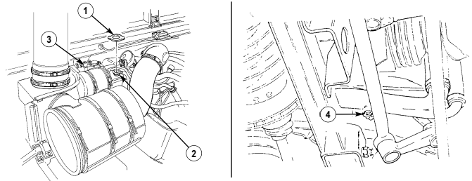

# 3-61. Cooling System Servicing (Cont'D)

Table 3-1. Guide for Preparation of Antifreeze Solutions.

| INITIAL SETUP:                                                   |                                                     |
|------------------------------------------------------------------|-----------------------------------------------------|
| Tools                                                            | Equipment Condition                                 |
| General mechanic's tool kit:                                     | Engine right splash shield removed                  |
| automotive (Appendix B, Item 1)                                  | (para. 10\-24 or para. 10\-24.1).                   |
| Materials/Parts                                                  | General Safety Instructions                         |
| Two locknuts (Appendix G, Item 77)                               | Do not perform this procedure near fire, flames, or |
| Manual References                                                | sparks.                                             |
| TM 9\-2320\-387\-10                                              | Maintenance Level                                   |
| TM 9\-2320\-387\-24P                                             | Unit                                                |
| WARNING                                                          |                                                     |
| Diesel fuel is highly flammable. Do not perform this procedure   |                                                     |
| near fire, flames, or sparks. Severe injury or death may result. |                                                     |
| a. Removal                                                       |                                                     |

FOLLOW-ON TASKS: - Start engine (TM 9-2320-387-10) and check cooling system for leaks.

- Lower and secure hood (TM 9-2320-387-10).

# 3-62. Radiator And Fan Shroud Assembly Maintenance (Serial Numbers 299999 And Below)

This task covers:
a. Removal c. Installation b. Cleaning and Inspection

## Initial Setup:

Tools General mechanic's tool kit:
automotive (Appendix B, Item 1)
Maintenance and repair shop equipment:
automotive (Appendix B, Item 2)
Materials/Parts Locknut (Appendix G, Item 92) Four locknuts (Appendix G, Item 77) Six locknuts (Appendix G, Item 106) Eight lockwashers (Appendix G, Item 146)
Personnel Required One mechanic One assistant Manual References TM 9-2320-387-24P
Equipment Condition
- Cooling system drained (para. 3-61). - Oil cooler removed (para. 3-8). - Hood removed (para. 10-9).

General Safety Instructions Compressed air used for cleaning purposes will not exceed 30 psi (207 kPa).

Maintenance Level Unit

Do not bend radiator fins. Damaged fins reduce cooling efficiency, which may damage engine.

a. Removal

The radiator and fan shroud are removed as a unit.

1. Loosen clamp (2) and disconnect radiator inlet hose (1) from radiator (3). 2. Loosen clamp (5) and disconnect surge tank-to-radiator vent hose (4) from adapter (6). 3. Disconnect control valve hose (14) from elbow (16). 4. Disconnect fan drive hose (17) from fan drive (18). 5. Disconnect elbow (16) from shroud bulkhead adapter (15). 6. Remove clamp (9) and lower radiator front hose (10) from radiator (3). 7. Remove locknut (27), washer (28), capscrew (34), washer (33), washer (32), lower mount (30), and large washer (29) from radiator (3) and frame bracket (31). Discard locknut (27).

8. Remove four locknuts (11), washers (12), and capscrews (13) from two support brackets (8) and airlift brackets (7). Discard locknuts (11).

9. Loosen nut (26) and release tension from cross brace (23).

10. Remove four locknuts (25), washers (24), capscrews (36), and crossbrace (23) from airlift brackets
(7). Discard four locknuts (25).

11. Lift radiator (3) up and remove from vehicle. 12. Remove eight capscrews (35), lockwashers (37), two retaining strips (38), and fan shroud (39) from radiator (3). Discard lockwashers (37).

13. Remove two locknuts (19), large washers (20), bracket (40) (left side), brackets (21), support brackets
(8), and insulators (22) from radiator studs (22.1). Discard locknuts (19).

3-62.  RADIATOR AND FAN SHROUD ASSEMBLY MAINTENANCE
(SERIAL NUMBERS 299999 AND BELOW) (Cont'd)

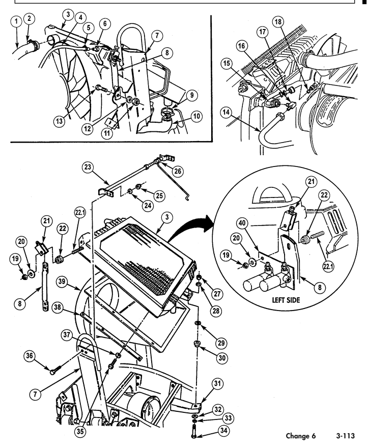

# 3-62. Radiator And Fan Shroud Assembly Maintenance (Serial Numbers 299999 And Below) (Cont'D)

b. Cleaning and Inspection

Compressed air used for cleaning purposes will not exceed 30 psi (207 kPa). Use only with effective chip guarding and personal protective equipment (goggles/shield, gloves, etc.).

1. Remove dirt, trash, and insects embedded in radiator fins using water and compressed air. 2. Inspect radiator adapter (25) for damage. Replace adapter (25) if damaged. 3. Inspect radiator (9) for breaks, punctures, cracks, and splits. Replace radiator (9) if broken, punctured, cracked, or split.

4. Inspect shroud bulkhead adapter (26) for damage. Replace bulkhead adapter (26) if damaged. 5. Inspect fan shroud (21) for cracks, splits, and breaks. Repair fan shroud (21) if cracked, split, or broken. Replace fan shroud (21) if damaged beyond repair.

6. Inspect fan drive hose (27) for cracks or damage. Replace if cracked or damaged. c. Installation

To ensure proper cooling of engine, upper edge of shroud must align with radiator top tank seam or damage to equipment may result.

1. Install fan shroud (21) on radiator (9), with shroud edge (22) aligning with tank seam (23), with two retaining strips (20), eight lockwashers (17), and capscrews (18). Tighten capscrews (18) to 6 lb-ft (8 N•m).

2. Install two brackets (3), insulators (4), support brackets (24), and bracket (28) (left side), on radiator stud (4.1) with two large washers (2) and new locknuts (1). Tighten locknuts (1) to 20 lb-ft (27 N•m).

3. Install radiator (9) on frame bracket (14), aligning two support brackets (24) to airlift brackets (29). 4. Install support brackets (24) on airlift brackets (29) with four capscrews (32), washers (31), and locknuts (30). Do not tighten locknuts (30).

5. Install radiator (9), large washer (12), and mount (13) on frame bracket (14) with washer (11),
washer (15), capscrew (16), washer (11), and locknut (10). Do not tighten capscrew (16).

6. Install crossbrace (5) on airlift brackets (29) with four capscrews (19), washers (6), and locknuts (7). 7. Tighten nut (8) on crossbrace (5) until slack is removed.

3-62.  RADIATOR AND FAN SHROUD ASSEMBLY MAINTENANCE

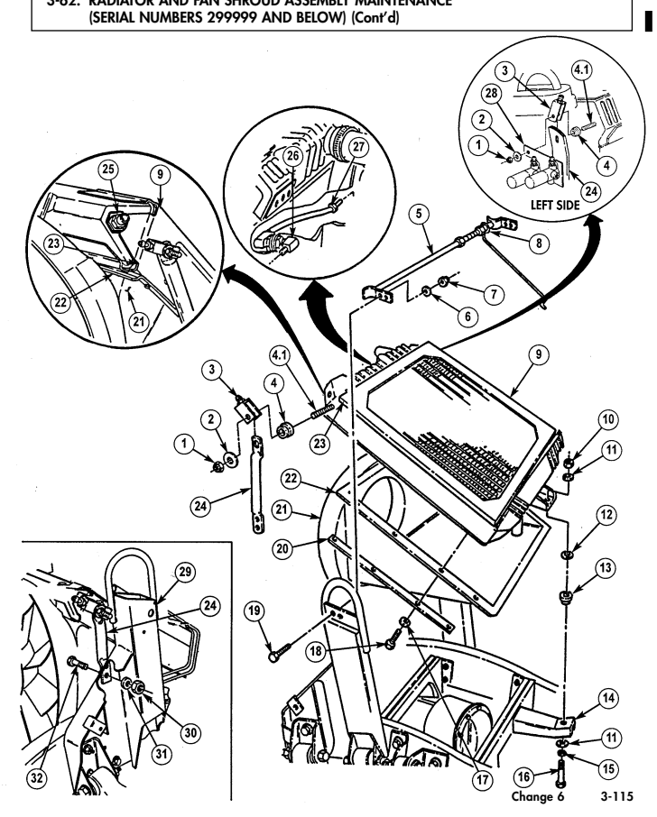

# 3-62. Radiator And Fan Shroud Assembly Maintenance (Serial Numbers 299999 And Below) (Cont'D)

- Fan shroud should be aligned so the following dimensions are maintained. Adjustments may be made by sliding the radiator/shroud assembly. Distance A from the edge of shroud ring and rear edge of fan must be 1-1/2 ± 1/4 in. (38.1 ± 6 mm). Measure distance A at the 2, 4, 8, and 10 o'clock positions.

- Fan blade to fan shroud clearance, distance between the top of the fan blade and fan shroud, must not be less than 1/4 in. (6 mm) at any position.

8. Align fan shroud (11) and tighten four locknuts (10) to 26 lb-ft (35 N•m). Tighten capscrew (7) to 30 lb-ft (41 N•m).

9. Connect lower radiator front hose (9) to radiator (3) and tighten clamp (8) to 85-95 lb-in.

(9.6-10.7 N•m).

10. Connect fan drive hose (15) to fan drive (16). 11. Connect elbow (14) to bulkhead adapter (13). 12. Connect control valve hose (12) to elbow (14). 13. Connect radiator inlet hose (1) to radiator (3) and tighten clamp (2) to 85-95 lb-in. (9.6-10.7 N•m).

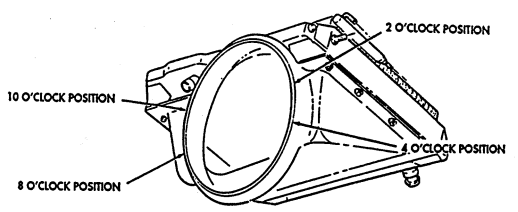 14. Connect surge tank-to-radiator vent hose (4) to adapter (6) and tighten clamp (5) to 10-20 lb-in.

(1-2 N•m).

## 3-116 Change 6

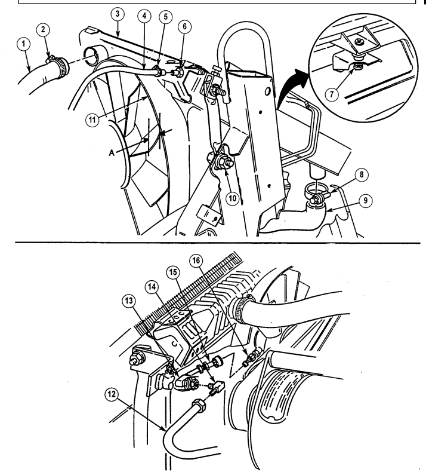

FOLLOW-ON TASKS: - Fill cooling system (para. 3-61).

· Install oil cooler (para. 3-8).

· Bleed power steering system (para. 8-27).

· Install hood (para. 10-9).

# 3-62.  Radiator And Fan Shroud Assembly Maintenance (Serial Numbers 299999 And Below) (Cont'D) 3-62.1. Radiator And Fan Shroud Assembly Maintenance (Serial Numbers 300000 And Above)

This task covers:
a. Removal c. Installation b. Cleaning and Inspection

## Initial Setup: Tools

General mechanic's tool kit:
automotive (Appendix B, Item 1)
Maintenance and repair shop equipment:
automotive (Appendix B, Item 2)

## Materials/Parts

Ten lockwashers (Appendix G, Item 146) Four locknuts (Appendix G, Item 106) Four lockwashers (Appendix G, Item 144) Five locknuts (Appendix G, Item 77) Locknut (Appendix G, Item 262.2) Six lockwashers (Appendix G, Item 145)
Personnel Required One mechanic One assistant

## Manual References

TM 9-2320-387-24P

## Equipment Condition

- Cooling system drained 
(para. 3-61).

- Oil cooler removed (para. 3-8.1). - Airlift bracket-to-hood seal removed 
(para. 10-55).

- Hood removed (para. 10-9)
General Safety Instructions Compressed air used for cleaning purposes must not exceed 30 psi (207 kPa).

Maintenance Level Unit

Do not bend radiator fins. Damaged fins reduce cooling efficiency, which may damage engine.

a. Removal

The radiator and lower fan shroud are removed as a unit.

1. Loosen hose clamp (2) and remove inlet hose (1) from radiator (3). 2. Loosen hose clamp (4) and remove lower radiator hose (5) from radiator (3). 3. Loosen hose clamp (7) and remove surge tank-to-radiator vent hose (8) from adapter (6). 4. Remove two capscrews (11), lockwashers (10), washers (9), and pressure valve bracket (13) from bracket (12). Discard lockwashers (10).

5. Loosen outboard nut (18) and locknut (19), and release tension from crossbrace (14). 6. Remove four capscrews (15), lockwashers (16), and crossbrace (14) from two airlift brackets (17).

Discard lockwashers (16).

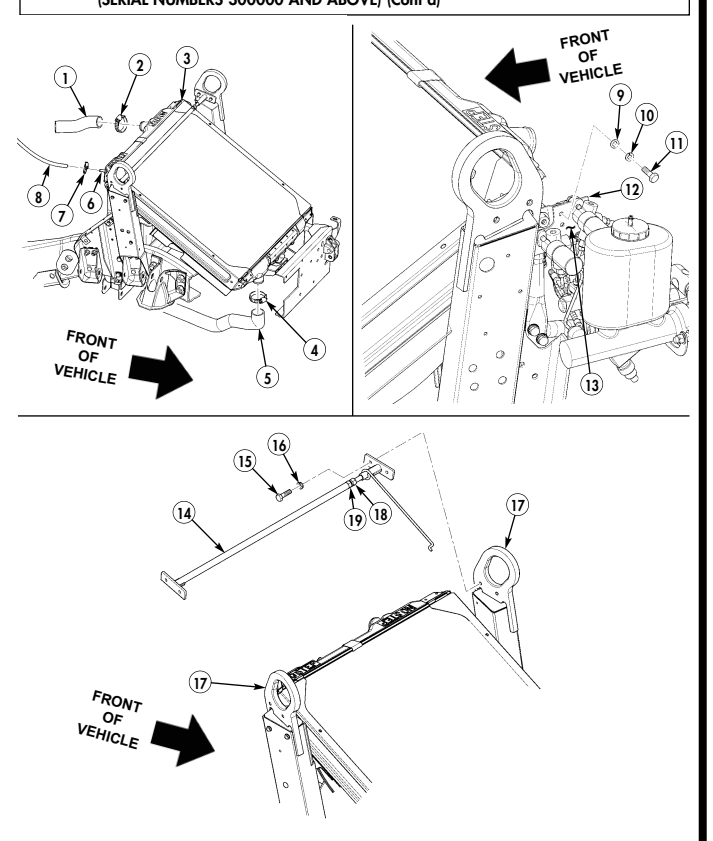

3-62.1. RADIATOR AND FAN SHROUD ASSEMBLY MAINTENANCE 
(SERIAL NUMBERS 300000 AND ABOVE) (Cont'd)

# 3-62.1. Radiator And Fan Shroud Assembly Maintenance (Serial Numbers 300000 And Above) (Cont'D)

7. Remove nut (1), washer (2), bracket (3), and left support bracket (4) from left radiator stud (5). 8. Remove two locknuts (6), washers (7), capscrews (10), lockwashers (9), washers (8), and left support bracket (4) from left airlift bracket (11). Discard locknuts (6) and lockwashers (9).

9. Remove nut (15), washer (14), and right support bracket (13) from right radiator stud (12).

10. Remove two locknuts (21), washers (20), capscrews (17), lockwashers (18), washers (19), and right support bracket (13) from right airlift bracket (16). Discard locknuts (21) and lockwashers (18).

11. Remove three locknuts (24), washers (23), capscrews (34), washers (35), and upper fan shroud (22)
from lower fan shroud (28). Discard locknuts (24).

12. Remove two capscrews (33), lockwashers (32), and rubber shield (31) from upper fan shroud (22) and radiator (25). Discard lockwashers (32).

13. Remove two locknuts (26), washers (27), capscrews (30), washers (29), and upper fan shroud (22)
from lower fan shroud (28). Discard locknuts (26).

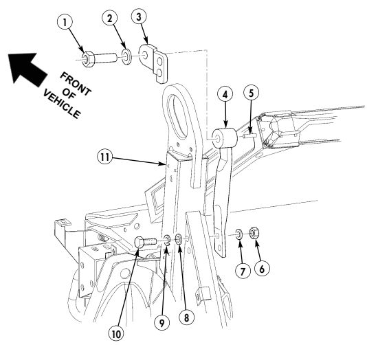

3-62.1. RADIATOR AND FAN SHROUD ASSEMBLY MAINTENANCE 
(SERIAL NUMBERS 300000 AND ABOVE) (Cont'd)

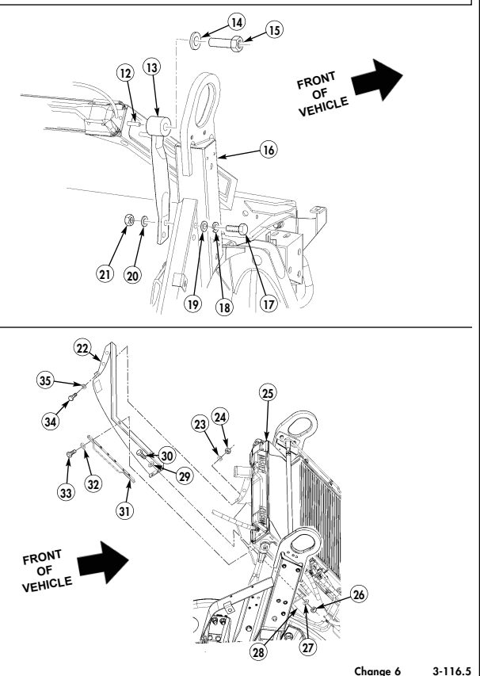

# 3-62.1. Radiator And Fan Shroud Assembly Maintenance (Serial Numbers 300000 And Above) (Cont'D)

14. Remove locknut (2), capscrew (9), washer (8), large washer (7), spacer (6), large washer (3), and spacer (4) from radiator (1) and mounting bracket (5). Discard locknut (2).

15. Lift radiator (1) up and remove from vehicle. 16. Remove eight capscrews (10) and (13), lockwashers (11) and (14), fan shroud shields (12) and (15),
and lower fan shroud (16) from radiator (1). Discard lockwashers (11) and (14).

b. Cleaning and Inspection

Compressed air used for cleaning purposes must not exceed 30 psi (207 kPa). Use only with effective chip guarding and personal protective equipment (goggles/shield, gloves, etc.). Failure to comply may result in injury to personnel.

1. Remove dirt, trash, and insects embedded in radiator fins using water and compressed air. 2. Inspect radiator adapter (18) for damage. Replace adapter (18) if damaged. 3. Inspect radiator (1) for breaks, punctures, cracks, and splits. Replace radiator (1) if broken, punctured, cracked, or split.

4. Inspect upper fan shroud (17) for cracks, splits, and breaks. Repair upper fan shroud (17) if cracked, split, or broken. Replace fan shroud if damaged.

5. Inspect lower fan shroud (16) for cracks, splits, and breaks. Repair lower fan shroud (16) if cracked, split, or broken. Replace lower fan shroud (16) if damaged.

c. Installation

To ensure proper cooling of engine, upper edge of shroud must align with radiator top tank seam or damage to equipment may result.

1. Install fan shroud shields (12) and (15) and lower fan shroud (16) on radiator (1) with eight lockwashers (14) and (11) and eight capscrews (13) and (10).

2. Install radiator (1), on mounting bracket (5) with large washer (7), washer (8), capscrew (9),
spacer (4), large washer (3), spacer (6), and locknut (2).

3-62.1.  RADIATOR AND FAN SHROUD ASSEMBLY MAINTENANCE
(SERIAL NUMBERS 300000 AND ABOVE) (Cont'd)

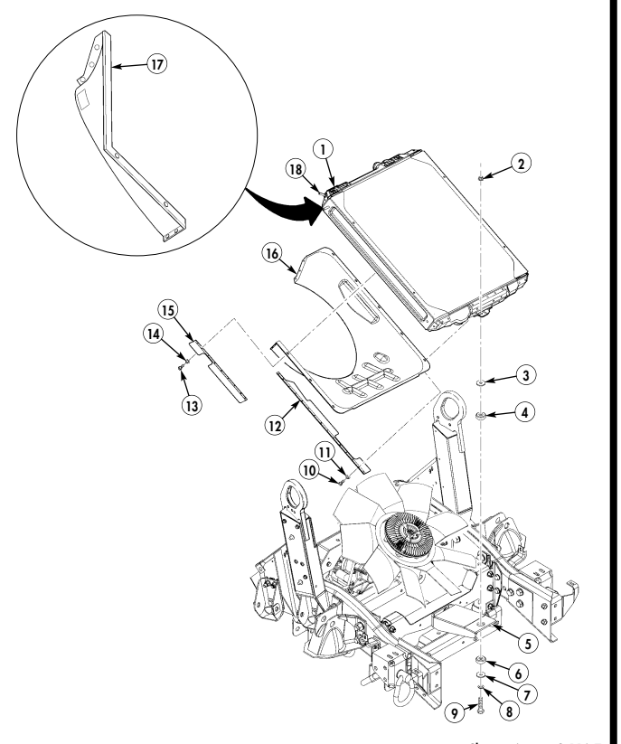

Change 6

# 3-62.1. Radiator And Fan Shroud Assembly Maintenance (Serial Numbers 300000 And Above) (Cont'D)

3. Install upper fan shroud (1) on lower fan shroud (7) with two washers (8), capscrews (9),
washers (6), and locknuts (5).

4. Install rubber shield (10) on upper fan shroud (1) and radiator (4) with two lockwashers (11) and capscrews (12).

5. Install upper fan shroud (1) on lower fan shroud (7) with three washers (14), capscrews (13),
washers (2), and locknuts (3).

6. Install right support bracket (16) on right airlift bracket (19) with two washers (22),
lockwashers (21), capscrews (20), washers (23), and locknuts (24).

7. Install right support bracket (16) on right radiator stud (15) with washer (17) and nut (18). 8. Install left support bracket (28) on left airlift bracket (35) with two washers (32), lockwashers (33),
capscrews (34), washers (31), and locknuts (30).

9. Install left support bracket (28) on left radiator stud (29) with bracket (27), washer (26), and nut (25).

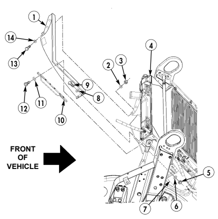

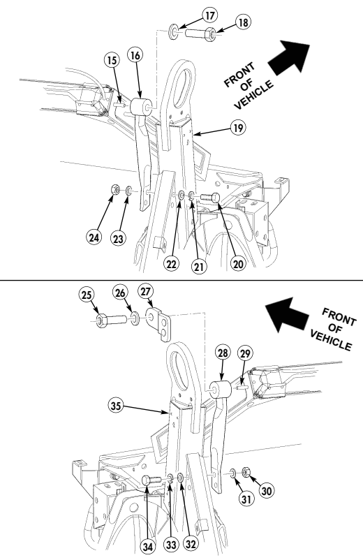

3-62.1. RADIATOR AND FAN SHROUD ASSEMBLY MAINTENANCE 
(SERIAL NUMBERS 300000 AND ABOVE) (Cont'd)

# 3-62.1. Radiator And Fan Shroud Assembly Maintenance (Serial Numbers 300000 And Above) (Cont'D)

10. Install crossbrace (14) on two airlift brackets (17) with four lockwashers (16) and capscrews (15). 11. Tighten outboard nut (18) and locknut (19) on crossbrace (14) until slack is removed. 12. Secure pressure valve bracket (13) to bracket (12) with two washers (9), lockwashers (10), and capscrews (11).

13. Install surge tank-to-radiator vent hose (8) on adapter (6) with hose clamp (7). Tighten hose clamp (7) to 10–20 lb-in. (1–2 N•m).

14. Install lower radiator hose (5) on radiator (3) with hose clamp (4). Tighten hose clamp (4) to 85–95 lb-in. (9.6–10.7 N•m).

15. Install radiator inlet hose (1) on radiator (3) with hose clamp (2). Tighten hose clamp (2) to 85–95 lb-in. (9.6–10.7 N•m).

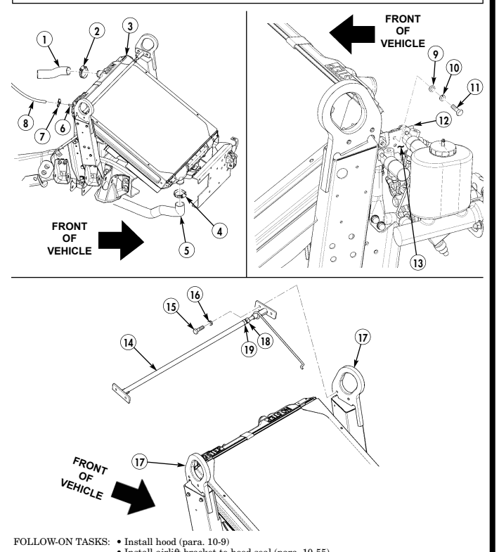

- Install airlift bracket-to-hood seal (para. 10-55).
# 3-62.1. Radiator And Fan Shroud Assembly Maintenance (Serial Numbers 300000 And Above) (Cont'D)

- Install oil cooler (para. 3-8.1). - Fill cooling system (para. 3-61).

# 3-62.2. Upper Fan Shroud Replacement (Serial Numbers 300000 And Above)

| This task covers:                      |                                                  |
|----------------------------------------|--------------------------------------------------|
| a.  Removal                            | b.  Installation                                 |
| INITIAL SETUP:                         |                                                  |
| Tools                                  | Equipment Condition                              |
| General mechanic's tool kit:           | Fuel tank removed (para. 3\-25).                 |
| automotive (Appendix B, Item 1)        | General Safety Instructions                      |
| Materials/Parts                        | Do not perform this procedure near fire, flames, |
| Sealing compound (Appendix C, Item 60) | or sparks.                                       |
| Manual References                      | Maintenance Level                                |
| TM 9\-2320\-387\-24P                   | Unit                                             |

a. Removal 1. Remove three locknuts (3), washers (2), capscrews (13), and washers (14) from upper fan shroud (1)
and lower fan shroud (7). Discard locknuts (3).

2. Remove two capscrews (12), lockwashers (11), and rubber shield (10) from upper fan shroud (1) and radiator (4). Discard lockwashers (11).

3. Remove two locknuts (5), washers (6), capscrews (9), washers (8), and upper fan shroud (1) from lower fan shroud (7). Discard locknuts (5).

## B. Installation

1. Install upper fan shroud (1) on lower fan shroud (7) with two capscrews (9), washers (8), washers (6),
and locknuts (5).

2. Install rubber shield (10) on upper fan shroud (1) and radiator (4) with two lockwashers (11) and capscrews (12).

3. Secure upper fan shroud (1) to lower fan shroud (7) with three washers (14), capscrews (13),
washers (2), and locknuts (3).

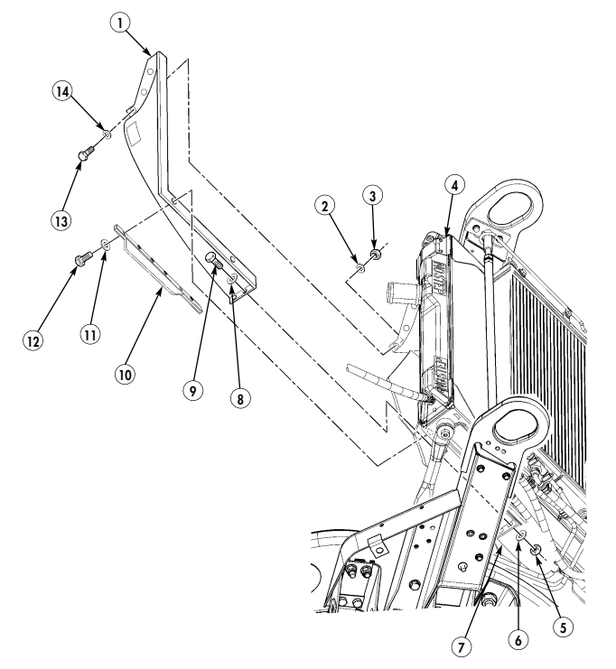

3-62.2. UPPER FAN SHROUD REPLACEMENT (SERIAL NUMBERS 300000 AND ABOVE) (Cont'd)
FOLLOW-ON TASK:  Install right splash shield (para. 10-24.1).

# 3-63. Airlift-To-Shroud Shield Assembly Replacement

This task covers:
INITIAL SETUP:
Tools General mechanic's tool kit:
automotive (Appendix B, Item 1)
Manual References TM 9-2320-387-24P
a. Removal Remove three screws (3) and shield assembly (2) from airlift bracket (1).

b. Installation Install shield assembly (2) on airlift bracket (1) with three screws (3).

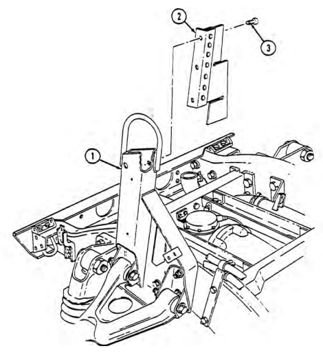

a. Removal b. Installation

| Manual References   |
|---------------------|

Radiator and fan shroud removed (para. 3-62).

FOLLOW-ON TASK: Install radiator and fan shroud (para. 3-62).

# 3-64. Radiator Supports Replacement (Serial Numbers 299999 And Below)

This task covers:

## Initial Setup:

Tools General mechanic's tool kit:
automotive (Appendix B, Item 1)
Maintenance and repair shop equipment:
automotive (Appendix B, Item 2)
Materials/Parts Six locknuts (Appendix G, Item 106)
a. Removal b. Installation Manual References TM 9-2320-387-24P
Equipment Condition
•Left splash shield removed (para. 10-23). •Right splash shield removed (para. 10-24).

Maintenance Level

| Tamulanding LAY   |
|-------------------|
| Unit              |

## A. Removal

1. Remove two locknuts (1), large washers (2), bracket (3) (left side), brackets (4), support brackets (7),
and insulators (6) from radiator studs (5). Discard locknuts (1).

2. Remove four locknuts (11), washers (9), capscrews (8), and two support brackets (7) from airlift brackets (10). Discard locknuts (11).

## B. Installation

1. Install two support brackets (7) on airlift brackets (10) with four capscrews (8), washers (9), and locknuts (11). Do not tighten locknuts (11).

2. Install two brackets (4), insulators (6), support brackets (7), and bracket (3) (left side) on two

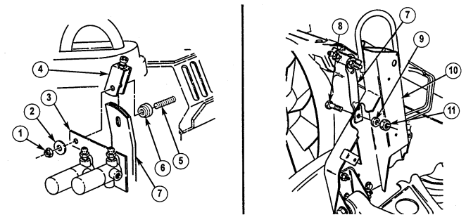

radiator studs (5) with large washers (2) and locknuts (1). Tighten locknuts (1) to 20 lb-ft (27 N•m).

3. Tighten four locknuts (11) to 26 lb-ft (35 N•m).

FOLLOW-ON TASKS: - Install left splash shield (para. 10-23).

- Install right splash shield (para. 10-24).

# 3-64.1. Radiator Supports Replacement (Serial Numbers 300000 And Above)

This task covers:
a. Removal b. Installation

## Initial Setup:

Tools

| Materials/Parts   |
|-------------------|

General mechanic's tool kit:
automotive (Appendix B, Item 1)
Maintenance and repair shop equipment:
automotive (Appendix B, Item 2)
Two lockwashers (Appendix G, Item 144) Two locknuts (Appendix G, Item 106) Two lockwashers (Appendix G, Item 146)

| Hood raised and secured (TM 9\-2320\-387\-10).   |
|--------------------------------------------------|
| General Safety Instructions                      |

Replacement procedures for left and right radiator support brackets are basically the same. This procedure shows the left side.

a. Removal NOTE
Perform step 1 for left side only.

1. Remove two capscrews (14), lockwashers (13), washers (12), and pressure valve bracket (15) from bracket (3). Discard lockwasher (13).

2. Remove two locknuts (6), washers (7), capscrews (10), lockwashers (9), and washers (8) from airlift bracket (11). Discard locknuts (6) and lockwashers (9).

3. Remove nut (1), washer (2), bracket (3), and support bracket (4) from radiator support (5). b. Installation 1. Install support bracket (4) on radiator support (5) with bracket (3), washer (2), and nut (1). Tighten nut (1) to 26 lb-ft (35 N•m).

2. Secure support bracket (4) to airlift bracket (11) with two washers (8), lockwashers (9), capscrews (10),
washers (7), and locknuts (6).

Perform step 3 for left side only.

3. Install pressure valve bracket (15) on bracket with two washers (12), lockwashers (13), and capscrews (14).

# 3-64.1. Radiator Supports Replacement (Serial Numbers 300000 And Above) (Cont'D)

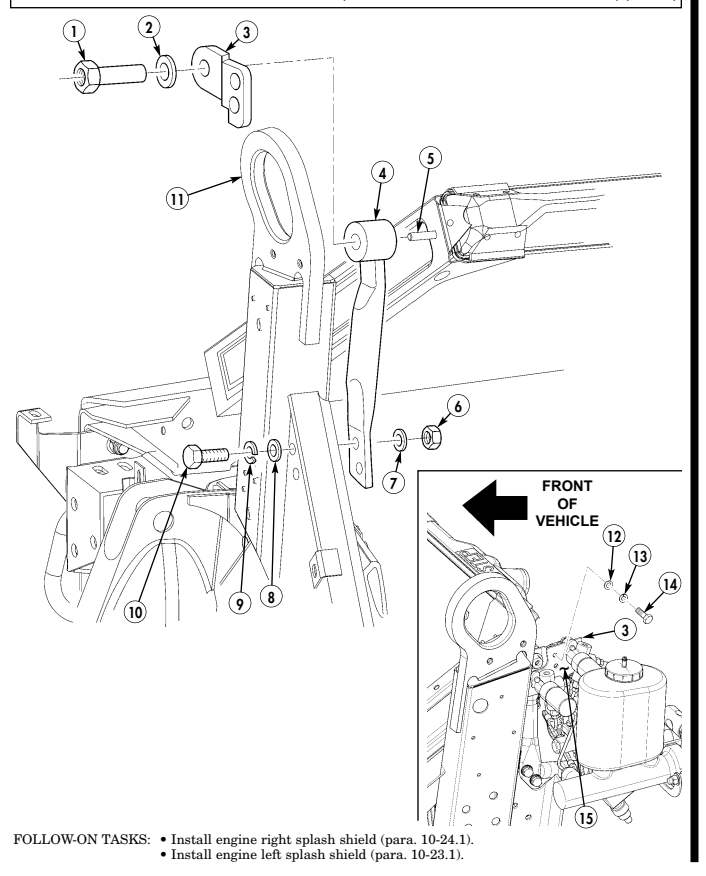

# 3-65. Surge Tank Replacement

This task covers:

## Initial Setup: Tools

General mechanic's tool kit:
automotive (Appendix B, Item 1)
Maintenance and repair shop equipment:
automotive (Appendix B, Item2)
a. Removal b. Installation

| Manual References      |
|------------------------|
| HONDAN O DOOD OOD O LT |

TM 9-2320-387-24P
Equipment Condition Cooling system drained, as required (para. 3-61).

Maintenance Level Unit

Tag hoses prior to disconnection.

## A. Removal

1. Loosen clamp (3) and disconnect surge tank-to-radiator vent hose (6) from surge tank (2). 2. Loosen clamp (4) and disconnect surge tank-to-water crossover vent hose (5) from surge tank (2). 3. Loosen clamp (9) and disconnect surge tank-to-lower radiator hose (8) from surge tank (2). 4. Open two clamps (1) on surge tank (2) and bracket (10). 5. Disconnect surge tank overflow hose (7) and remove surge tank (2) from bracket (10).

## B. Installation

1. Install surge tank (2) on bracket (10) with two clamps (1). 2. Connect surge tank-to-lower radiator hose (8) to surge tank (2) and tighten clamp (9).

Ensure vent hose is routed above air intake to allow for purging of air in cooling system.

3. Connect surge tank-to-water crossover vent hose (5) to surge tank (2) and tighten clamp (4) to 10–20 lb-in. (1–2 N•m).

4. Connect surge tank-to-radiator vent hose (6) to surge tank (2) and tighten clamp (3) to 10–20 lb-in.

(1–2 N•m).

5. Connect surge tank overflow hose (7) to surge tank (2).

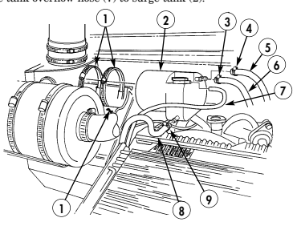

FOLLOW-ON TASK: Fill cooling system (para. 3-61).

3-120 Change 5

# 3-66. Surge Tank-To-Radiator Vent Hose Replacement

This task covers:

## Initial Setup:

Tools General mechanic's tool kit:
automotive (Appendix B, Item 1)
Maintenance and repair shop equipment:
automotive (Appendix B, Item 2)
Manual References TM 9-2320-387-24P
a. Removal b. Installation

| Equipment Condition   |
|-----------------------|
| Cooling system depr   |
| Maintenance Level     |
| Unit                  |

Cooling system depressurized (para. 3-61).

a. Removal 1. Loosen two clamps (2) and remove vent hose (3) from radiator (4) and surge tank (1). 2. Remove two clamps (2) from vent hose (3).

b. Installation 1. Install two clamps (2) on vent hose (3).

Ensure vent hose is routed above air intake to allow for purging of air in cooling system.

2. Install vent hose (3) on surge tank (1) and radiator (4) and tighten two clamps (2) to 10–20 lb-in.

(1–2 N•m).

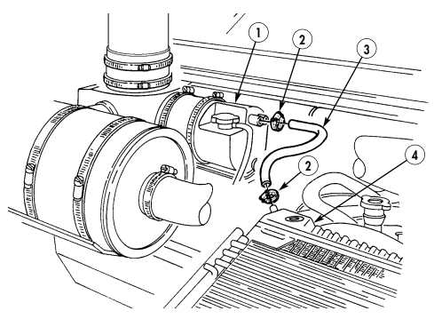

FOLLOW-ON TASK: Tighten coolant filler cap (para. 3-61).

# 3-67. Surge Tank-To-Water Crossover Vent Hose Replacement

This task covers:
INITIAL SETUP: INITIAL SETUP:
Tools General mechanic's tool kit:
automotive (Appendix B, Item 1)
Maintenance and repair shop equipment:
automotive (Appendix B, Item 2)
Manual References TM 9-2320-387-24P
a. Removal b. Installation Equipment Condition Cooling system depressurized (para. 3-61).

| O Views           |
|-------------------|
| Maintenance Level |

Unit a. Removal 1. Loosen two clamps (2) and remove vent hose (3) from water crossover (4) and surge tank (1). 2. Remove two clamps (2) from vent hose (3).

b. Installation 1. Install two clamps (2) on vent hose (3).

Ensure vent hose is routed above air intake to allow for purging of air in cooling system.

2. Install vent hose (3) on surge tank (1) and water crossover (4) and tighten two clamps (2) to 

10–20 lb-in. (1–2 N•m).

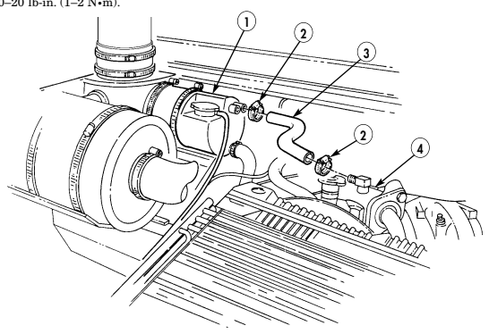

FOLLOW-ON TASK: Tighten coolant filler cap (para. 3-61).

3-122 Change 5

# 3-68. Thermostat Bypass Hose Replacement (Serial Numbers 299999 And Below)

| This task covers:   |
|---------------------|

INITIAL SETUP:
Tools General mechanic's tool kit:
automotive (Appendix B, Item 1)
Manual References TM 9-2320-387-24P

| Manual References    |
|----------------------|
| TM 9\-2320\-387\-10  |
| TM 9\-2320\-387\-24P |
| Maintenance Level    |

a. Removal b. Installation

Cooling system drained, as required (para. 3-61).

## A. Removal

1. Loosen two clamps (2) and remove thermostat bypass hose (3) from water pump (4) and water crossover (1).

2. Remove two clamps (2) from hose (3).

## B. Installation

1. Install two clamps (2) on thermostat bypass hose (3). 2. Install hose (3) on water pump (4) and water crossover (1) and tighten two clamps (2).

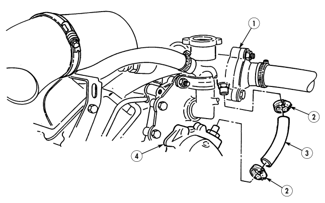

FOLLOW-ON TASK: Fill cooling system (para. 3-61).

# 3-68.1. Thermostat Bypass Hose Replacement (Serial Numbers 300000 And Above)

This task covers:
a. Removal b. Installation INITIAL SETUP:
Tools General mechanic's tool kit:
automotive (Appendix B, Item 1)
Manual References TM 9-2320-387-24-1 TM 9-2320-387-24P
a. Removal 1. Loosen clamps (2) and (4) and remove thermostat bypass hose (3) from water pump (5) and water crossover (1).

2. Remove clamps (2) and (4) from thermostat bypass hose (3). b. Installation 1. Install clamps (2) and (4) on thermostat bypass hose (3). 2. Install thermostat bypass hose (3) on water pump (5) and water crossover (1) with clamps (2) and (4).

| TM 9\-2320\-387\-24P   |
|------------------------|

3-68.1. THERMOSTAT BYPASS HOSE REPLACEMENT 
(SERIAL NUMBERS 300000 AND ABOVE) (Cont'd)

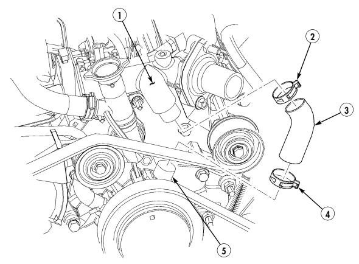

# 3-69. Fan Drive Hose And Quick-Disconnect Replacement

This task covers:
INITIAL SETUP:

## Tools

General mechanic's tool kit:
automotive (Appendix B, Item 1)
Material/Parts Sealing compound (Appendix C, Item 60)

| Personnel Required   |
|----------------------|

One mechanic One assistant

a. Removal b. Installation

Manual References TM 9-2320-387-10 TM 9-2320-387-24P

| Maintenance Level   |
|---------------------|
| Unit                |

Equipment Condition Hood raised and secured (TM 9-2320-387-10).

a. Removal NOTE
Have container ready to catch fluid.

4. Release fan drive hose quick-disconnect (2) and remove hose (1) from fan drive (3). 5. Remove bulkhead adapter bushing (8) from bulkhead adapter (11). 6. Remove bulkhead adapter (11) from fan drive hose (1). 7. Remove female end of quick-disconnect (2) from fan drive hose (1). 8. Remove male end of quick-disconnect (12) from fan drive (3).

b. Installation

Apply sealing compound to all pipe threads during installation.

1. Install male end of quick-disconnect (12) on fan drive (3). 2. Install female end of quick-disconnect (2) on fan drive hose (1). 3. Install bulkhead adapter (11) on fan drive hose (1). 4. Install bulkhead adapter bushing (8) on bulkhead adapter (11). 5. Install bulkhead adapter (11) and bulkhead adapter bushing (8) on shroud (4) with washer (7) and nut (6).

6. Install hose (1) and fan drive hose quick-disconnect (2) on fan drive (3). 7. Install elbow (5) on bulkhead adapter bushing (8). 8. Install control valve hose (9) on elbow (5).

1. Remove control valve hose (9) from elbow (5). 2. Remove elbow (5) from bulkhead adapter bushing (8). 3. Remove nut (6), washer (7), and bulkhead adapter bushing (8) with bulkhead adapter (11) from shroud (4).

# 3-69. Fan Drive Hose And Quick-Disconnect Replacement (Cont'D)

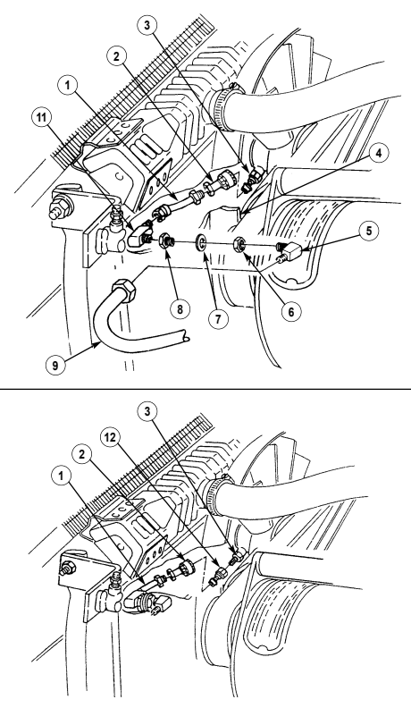

FOLLOW-ON TASK:   Lower and secure hood (TM 9-2320-387-10).

# 3-70. Radiator Inlet Hose Replacement

This task covers:
INITIAL SETUP:
Tools a. Removal b. Installation General mechanic's tool kit:
automotive (Appendix B, Item 1)
Maintenance and repair shop equipment:
automotive (Appendix B, Item 2)
Equipment Condition Cooling system depressurized (para. 3-61).

Maintenance Level Unit

## Manual References

TM 9-2320-387-24P
a. Removal 1. Loosen two clamps (2) and remove inlet hose (3) from radiator (1) and water crossover (4). 2. Remove two clamps (2) from hose (3). b. Installation 1. Install two clamps (2) on inlet hose (3). 2. Install hose (3) on water crossover (4) and radiator (1) and tighten two clamps (2)
to 85-95 lb-in. (10-11 N•m).

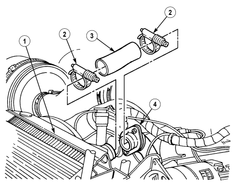

FOLLOW-ON TASK: Tighten coolant filler cap (para. 3-61).

# 3-71. Radiator Lower Tube Assembly Replacement (Serial Numbers 299999 And Below)

This task covers:
a. Removal b. Installation

## Initial Setup:

Tools General mechanic's tool kit:
automotive (Appendix B, Item 1)
Maintenance and repair shop equipment:
automotive (Appendix B, Item 2)
Materials/Parts Two locknuts (Appendix G, Item 77) Sealing compound (Appendix C, Item 62)

## A. Removal B. Installation

| Tailpipe removed (para. 3\-48).   |
|-----------------------------------|
| General Safety Instructions       |

1. Remove drainvalve (11) from radiator lower tube assembly (10). 2. Remove two locknuts (5), washers (3), capscrews (2), and washers (3) from radiator lower tube assembly (10) and frame bracket (4). Discard locknuts (5).

3. Loosen clamp (7) and disconnect water pump inlet hose (6) from radiator lower tube assembly (10). 4. Loosen clamp (8) and disconnect surge tank-to-lower radiator hose (9) from radiator lower tube assembly (10).

5. Loosen clamp (12) and disconnect lower radiator hose (1) from radiator lower tube assembly (10). 6. Remove radiator lower tube assembly (10).

1. Install radiator lower tube assembly (10) on frame bracket (4) with two washers (3), capscrews (2),
washers (3), and locknuts (5). Tighten locknuts (5) to 6 lb-ft (8 N•m).

2. Connect lower radiator hose (6) to radiator lower tube assembly (10) and tighten clamp (7) to 85-95 lb-in. (10-11 N•m).

3. Connect surge tank-to-lower radiator hose (9) to radiator lower tube assembly (10) and tighten clamp (8) to 85-95 lb-in. (10-11 N•m).

4. Connect water pump inlet hose (1) to radiator lower tube assembly (10) and tighten clamp (12) to 85-95 lb-in. (10-11 N•m).

5. Apply sealant-type tape to threads of drainvalve (11) and install drainvalve (11) on radiator lower tube assembly (10).

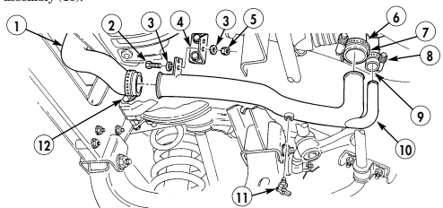

FOLLOW-ON TASK: Fill cooling system (para. 3-61).

# 3-71.1. Radiator Lower Tube Assembly Replacement (Serial Numbers 300000 And Above)

This task covers:

## A. Removal B. Installation Initial Setup:

Tools General mechanic's tool kit:
automotive (Appendix B, Item 1)
Maintenance and repair shop equipment:
automotive (Appendix B, Item 2)
Materials/Parts Two locknuts (Appendix G, Item 77) Sealing compound (Appendix C, Item 62)

| Right rear heat shield removed (para. 3\-58).   |
|-------------------------------------------------|
| General Safety Instructions                     |

## A. Removal B. Installation

1. Remove drainvalve (15) from radiator lower tube assembly (11). 2. Loosen clamp (7) and disconnect water pump inlet hose (8) from radiator lower tube assembly (11). 3. Loosen clamp (10) and disconnect surge tank-to-lower radiator hose (9) from radiator lower tube assembly (11).

4. Loosen clamp (16) and disconnect lower radiator hose (1) from radiator lower tube assembly (11). 5. Loosen clamp (13) and disconnect transfer case coolant hose (12) from tee (14). 6. Remove two locknuts (6), washers (5), capscrews (2), washers (3), and radiator lower tube assembly (11)
from frame bracket (4). Discard locknuts (6).

7. Remove tee (14) from radiator lower tube assembly (11).

1. Apply sealing compound to threads of tee (14) and install tee (14) on radiator lower tube assembly (11).

2. Install radiator lower tube assembly (11) on frame bracket (4) with two capscrews (2), washers (3),
washers (5), and locknuts (6). Tighten locknuts (6) to 72 lb-in. (8 N•m).

3. Connect transfer case coolant hose (12) to tee (14) with clamp (13). 4. Connect lower radiator hose (1) to radiator lower tube assembly (11) and tighten clamp (16) to 85-95 lb-in. (10-11 N•m).

5. Connect surge tank-to-lower radiator hose (9) to radiator lower tube assembly (11) and tighten clamp (10) to 85-95 lb-in. (10-11 N•m).

6. Connect water pump inlet hose (8) to radiator lower tube assembly (11) and tighten clamp (7) to 85-95 lb-in. (10-11 N•m).

7. Apply sealing compound to threads of drainvalve (15) and install drainvalve (15) on radiator lower tube assembly (11).

# 3-71.1. Radiator Lower Tube Assembly Replacement (Serial Numbers 300000 And Above) (Cont'D)

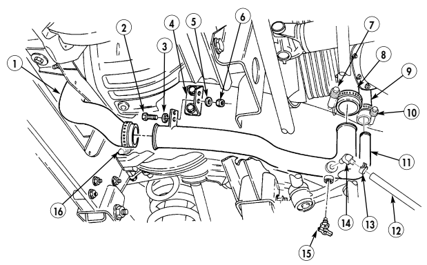

# 3-72. Lower Radiator Hose Replacement

This task covers:
INITIAL SETUP:
Tools General mechanic's tool kit:
automotive (Appendix B, Item 1)
Maintenance and repair shop equipment:
automotive (Appendix B, Item 2)

## Manual References

TM 9-2320-387-24P
a. Removal 1. Loosen two clamps (2) and remove lower radiator hose (3) from radiator (1) and lower tube assembly (4).

2. Remove two clamps (2) from hose (3).

b. Installation 1. Install two clamps (2) on lower radiator hose (3). 2. Install hose (3) on lower tube assembly (4) and radiator (1) and tighten two clamps (2) 
to 85-95 lb-in. (10-11 N•m).

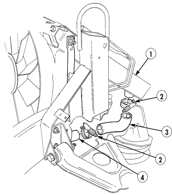

FOLLOW-ON TASK: Fill cooling system (para. 3-61).

a. Removal b. Installation Equipment Condition Cooling system drained (para. 3-61).

Maintenance Level Unit

# 3-73. Water Pump Inlet Hose Replacement

This task covers:
INITIAL SETUP:
Tools General mechanic's tool kit:
automotive (Appendix B, Item 1)
Manual References TM 9-2320-387-24P

## A. Removal

1. Loosen two clamps (2) and remove water pump inlet hose (3) from water pump (1) and lower tube assembly (4).

2. Remove two clamps (2) from hose (3). b. Installation 1. Install two clamps (2) on water pump inlet hose (3). 2. Install hose (3) on lower tube assembly (4) and water pump (1) and tighten two clamps (2) to 

90-125 lb-in. (10-14 N•m).

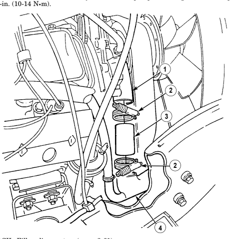

FOLLOW-ON TASK: Fill cooling system (para. 3-61).

a. Removal b. Installation

| General Safety Instructions  bare hands.  Maintenance Level   |
|---------------------------------------------------------------|

# 3-74. Surge Tank-To-Lower Radiator Tube Hose Replacement

This task covers:
INITIAL SETUP:
Tools General mechanic's tool kit:
automotive (Appendix B, Item 1)
Manual References TM 9-2320-387-24P
a. Removal 1. Loosen two clamps (2) and remove hose (3) from surge tank (1) and tube assembly (4). 2. Remove two clamps (2) from hose (3).

b. Installation 1. Install two clamps (2) on hose (3). 2. Install hose (3) on surge tank (1) and tube assembly (4) and tighten two clamps (2).

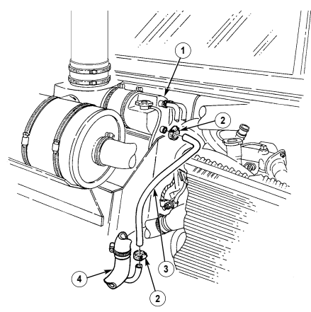

FOLLOW-ON TASK: Fill cooling system (para. 3-61).

a. Removal b. Installation

Equipment Condition Cooling system drained (para. 3-61).

| Maintenance Level   |
|---------------------|

# 3-75. Surge Tank Overflow Hose Replacement

This task covers:

a. Removal b. Installation

| INITIAL SETUP:   |
|------------------|

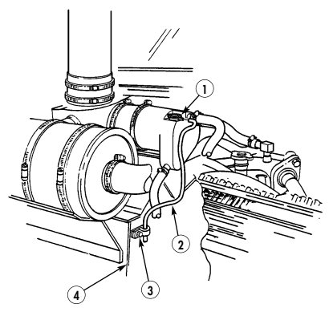

Tools General mechanic's tool kit:
automotive (Appendix B, Item 1)
TM 9-2320-387-10 TM 9-2320-387-24P
a. Removal 1. Remove overflow hose (2) from surge tank filler neck (1). 2. Loosen clamp (3) and remove hose (2) from body (4). b. Installation 1. Connect overflow hose (2) to surge tank filler neck (1). 2. Install hose (2) on body (4) and tighten clamp (3).

| Equipment Condition                     |
|-----------------------------------------|
| Muffler and catalytic converter removed |
| (para. 3\-49).                          |

FOLLOW-ON TASK: Lower and secure hood (TM 9-2320-387-10).

# 3-76. Thermostat Replacement (Serial Numbers 299999 And Below)

This task covers:

a. Removal b. Installation

| INITIAL SETUP:                         |                                                  |
|----------------------------------------|--------------------------------------------------|
| Tools                                  | Equipment Condition                              |
| General mechanic's tool kit:           | - Hood raised and secured (TM 9\-2320\-387\-10). |
| automotive (Appendix B, Item 1)        | - Right rear heat shield removed (para. 3\-58).  |
| Materials/Parts                        | - Starter removed (para. 4\-11).                 |
| Two lockwashers (Appendix G, Item 138) | General Safety Instructions                      |
|                                        | Do not touch hot exhaust system components with  |
| Manual References                      | bare hands.                                      |

## A. Removal

1. Remove capscrew (5), stud (4), thermostat housing (3), thermostat (2), and gasket (6) from water crossover (1). Discard gasket (6).

2. Clean gasket surface on water crossover (1) and thermostat housing (3). b. Installation 1. Install thermostat (2) into water crossover (1), ensuring valve sensor (7) points toward crossover (1).

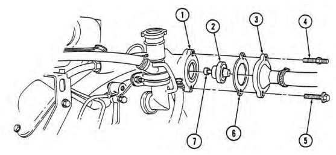 2. Position gasket (6) on thermostat housing (3). Apply sealing compound to fastener threads and insert capscrew (5) and stud (4) to align gasket (6).

3. Install thermostat housing (3) over thermostat (2) and on water crossover (1) with capscrew (5) and stud (4). Tighten capscrew (5) and stud (4) to 25 lb-ft (34 N•m).

FOLLOW-ON TASK: Fill cooling system (para. 3-61).

# 3-76.1. Thermostat Replacement (Serial Numbers 300000 And Above)

This task covers:

| a.  Removal                     | b.  Installation                                |
|---------------------------------|-------------------------------------------------|
| INITIAL SETUP:                  |                                                 |
| Tools                           | Equipment Condition                             |
| General mechanic's tool kit:    | Engine access cover removed (para. 10\-22).     |
| automotive (Appendix B, Item 1) |                                                 |
|                                 | General Safety Instructions                     |
| Manual References               | Do not touch hot exhaust system components with |
| TM 9\-2320\-387\-24P            | bare hands.                                     |
|                                 | Maintenance Level                               |
|                                 | Unit                                            |

## A. Removal

1. Remove capscrew (2), washer (3), wiring harness (4), and clamp (1) from bracket (5). 2. Remove nut (7), lockwasher (6), and bracket (5) from stud (8). Discard lockwasher (6). 3. Remove stud (8), capscrew (9), thermostat housing (10), gasket (11), and thermostat (12) from water crossover (14). Discard gasket (11).

4. Clean gasket surface on water crossover (14) and thermostat housing (10).

## B. Installation

1. Install thermostat (12) into water crossover (14), ensuring valve sensor (13) points toward water crossover (14).

2. Position gasket (11) on thermostat housing (10). Apply sealing compound to fastener threads and insert capscrew (9) and stud (8) to align gasket (11).

3. Install thermostat housing (10) over thermostat (12) and on water crossover (14) with capscrew (9)
and stud (8). Tighten capscrew (9) and stud (8) to 25 lb-ft (34 N•m).

4. Install bracket (5) on stud (8) with lockwasher (6) and nut (7). 5. Install clamp (1) and wiring harness (4) on bracket (5) with washer (3) and capscrew (2).

# 3-76.1. Thermostat Replacement (Serial Numbers 300000 And Above) (Cont'D)

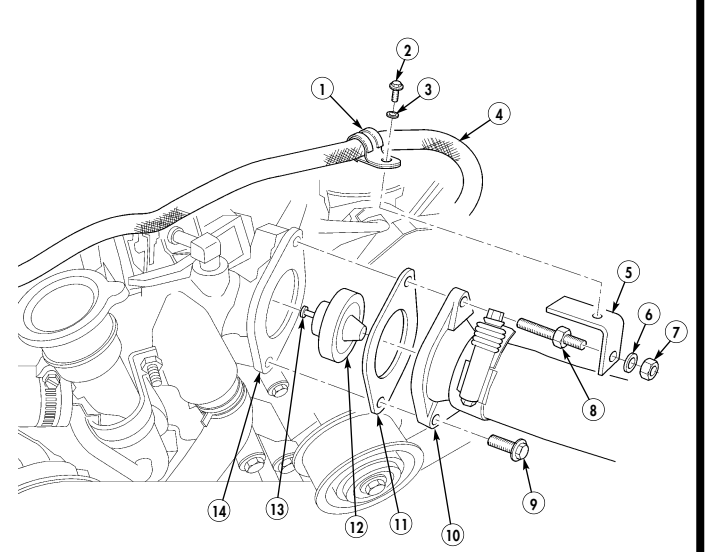

# 3-77. Water Pump Pulley Replacement

This task covers:
INITIAL SETUP:
Tools General mechanic's tool kit:
automotive (Appendix B, Item 1)
Maintenance and repair shop equipment:
automotive (Appendix B, Item 2)
Special Tools Hex-head driver, 6 mm
(Appendix B, Item 146)
Materials/Parts Sealing compound (Appendix C, Item 63)
a. Removal b. Installation Manual References TM 9-2320-387-24P
Equipment Condition
- Fan drive and fan blade removed (para. 3-80). - Serpentine drivebelt removed (para. 3-81).

Maintenance Level Unit

200-AMP dual voltage regulator shown.

a. Removal Using hex-head driver, remove four socket-head screws (1) and water pump pulley (2) from water pump (3).

b. Installation 1. Install water pump pulley (2) on water pump (3). 2. Apply sealing compound to four socket-head screws (1), and install screws (1) on water pump pulley
(2) and water pump (3). Tighten screws (1) to 15-20 lb-ft (20-27 N•m).

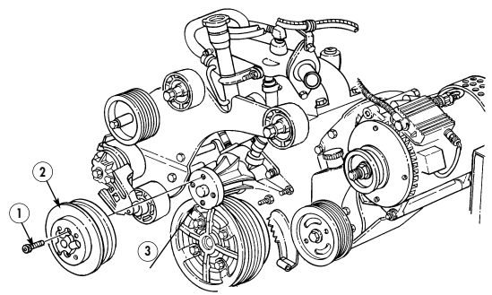

FOLLOW-ON TASKS: - Install fan drive and fan blade (para. 3-80).

- Install serpentine drivebelt (para. 3-81).

# 3-78. Water Pump And Adapter Plate Maintenance

This task covers:
a. Removal c. Installation b. Inspection

## Initial Setup:

TM 9-2320-387-24P

## A. Removal

1. Remove bypass nipple (4) from water crossover (3). 2. Remove studs (1), (13), (8), and (7), four capscrews (11), washers (12), two capscrews (9),
capscrew (10), water pump (6), and adapter plate (5) from timing gear cover (2).

3. Remove seven capscrews (15), adapter plate (5), and gasket (14) from water pump (6). Discard gasket (14).

4. Clean remaining gasket material and sealing compound from sealing surfaces on adapter plate (5),
water pump (6), and timing gear cover (2).

5. Remove heater hose nipple (17), elbow (16), and bypass hose adapter (19) from water pump (6).

## B. Inspection

1. Inspect water pump (6) for cracks, breaks, or loose impeller. Replace if cracked, broken, or impeller is loose.

2. Inspect adapter plate (5) for corrosion. If adapter plate (5) is excessively corroded, replace. 3. Inspect elbow (16), heater hose nipple (17), and bypass hose adapter (19) for stripped threads and breaks. If damaged, replace.

4. Inspect rivet (18) for damage or looseness. Replace if damaged or loose. Apply sealing compound to replacement rivet (18) prior to installation.

| General mechanic's tool kit:                                                                              | Muffler and catalytic converter removed   |
|-----------------------------------------------------------------------------------------------------------|-------------------------------------------|
| automotive (Appendix B, Item 1)                                                                           | (para. 3\-49).                            |
| Materials/Parts                                                                                           | Maintenance Level                         |
| Three locknuts (Appendix G, Item 85)                                                                      | Unit                                      |
| Manual References                                                                                         |                                           |
| TM 9\-2320\-387\-24P                                                                                      |                                           |
| Remove three locknuts (4), six washers (3), three screws (5), and muffler hanger (1) from frame rail (2). |                                           |
| Discard locknuts (4).                                                                                     |                                           |

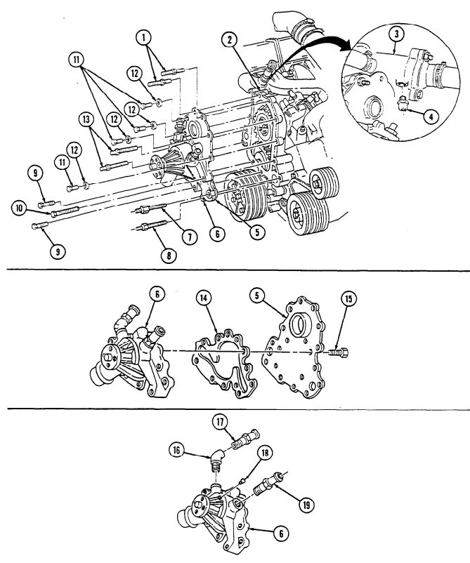

3-78.  WATER PUMP AND ADAPTER PLATE MAINTENANCE (Cont'd)

# 1 3-78. Water Pump And Adapter Plate Maintenance (Cont'D) I

1 c. Installation 1 

Ensure water pump P/N 23500085 is used on 6.5L engines or damage to equipment will result. 

1. 

Install.gasket (6) and adapter plate (7) on water pump (5) with seven capscrews (8). Tighten capscrews (8) to 13-20 lb-ft (18-27 Nom). 

Perform step 2 if a new water pump is being installed. 

2. 

3. 

4. 5. 

Apply sealing compound to rivet (3) and install in water pump (5). 

Apply anaerboic gasket sealer to sealing surfaces on adapter plate (7) following diagram shown. 

Apply pipe sealing compound to capscrew (16). 

Install adapter plate (7) and water pump (5) on timing gear cover (10) with two long studs (19), stud (141, stud with thick hex (131, and capscrew (16). 

6. 

Install two capscrews (151, studs (91, four washers (181, and capscrews (17). Tighten studs (9) and capscrews (15) and (17) to 13-20 lb-ft (18-27 N-m). Tighten studs (191, (141, and (131 to 25-37 lb-ft 
(34-50 Nom). 

Apply pipe sealing compound to threads of elbow (11, heater hose nipple (21, and bypass hose adapter (4) and install in water pump (5). 

7. 

8. 

Coat threads of bypass nipple (12) with pipe sealing compound and install in water crossover (11). 

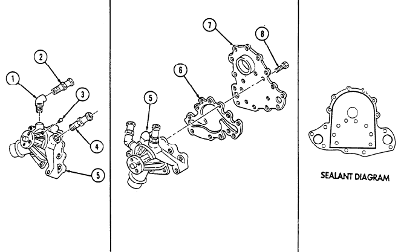

d% 
# L I

# 3-78. Water Pump And Adapter Plate Maintenance (Cont'D)

FOLLOW-ON TASKS: - Install power steering pump (para. 8-23 para. 8-23.1).

- Install tensioner, idler pulleys, and mounting hardware (para. 3-82). - Install water pump pulley (para. 3-77). - Install water pump inlet hose (para. 3-73). - Install engine oil filler tube (para. 3-3). - Install thermostat bypass hose (para. 3-68 or para. 3-68.1).

# 3-79. Water Crossover Maintenance (Serial Numbers 299999 And Below)

This task covers:
a. Removal c. Installation b. Inspection

## Initial Setup:

Tools General mechanic's tool kit:
automotive (Appendix B, Item 1)
Maintenance and repair shop equipment:
automotive (Appendix B, Item 2)

| T WO Santon (TThom   |
|----------------------|
| Manual References    |
| TM 9\-2320\-387\-24P |

Materials/Parts Two gaskets (Appendix G, Item 44)

## Equipment Condition

- Cooling system drained (para. 3-61). - Fan temperature switch removed
(para. 4-34).

- Glow plug controller/temperature sensor removed (para. 4-33).

- Thermostat removed (para. 3-76).

## A. Removal

| Maintenance Level   |
|---------------------|
| Unit                |

1. Loosen three clamps (2) and disconnect hoses (1) from water crossover (4). 2. Remove four capscrews (6), water crossover (4), and two gaskets (7) from cylinder head (8). Discard gaskets (7).

3. Clean gasket surface on water crossover (4) and cylinder head (8).

## B. Inspection

Inspect thermostat bypass nipple (3), surge tank hose nipple (5), and water pump hose adapter (9) for cracks or breaks. Replace if defective. c. Installation 1. Install two gaskets (7) and water crossover (4) on cylinder head (8) with four capscrews (6). Tighten capscrews (6) to 25-35 lb-ft (34-48 N•m).

2. Connect three hoses (1) to water crossover (4) and tighten clamps (2).

# 3-79.  Water Crossover Maintenance (Serial Numbers 299999 And Below) (Cont'D)

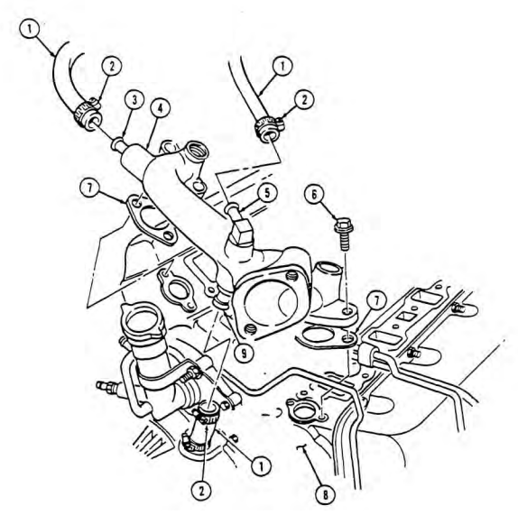

FOLLOW-ON TASKS: - Install thermostat (para. 3-76).

· Install glow plug controller/temperature sensor (para. 4-33).

- Install fan temperature switch (para. 4-34).

-  Fill cooling system (para. 3-61).

■
 ■

# 3-79.1. Water Crossover Maintenance (Serial Numbers 300000 And Above)

This task covers:

a. Removal c. Installation b. Inspection

## Initial Setup:

| TASK     | PROCEDURES                                                                      | PAGE     |
|----------|---------------------------------------------------------------------------------|----------|
| PARA.    |                                                                                 | NO.      |
| 3\-82.5. | Mounting Bracket Replacement, Vehicles W/ A/C (Serial Numbers 196901 and Above) | 3\-144.4 |
| 3\-82.6. | Idler Pulley Replacement (Serial Numbers 196901 and Above)                      | 3\-145   |
| 3\-82.7. | Idler Pulley Bracket Replacement (Serial Numbers 196901 and Above)              | 3\-146   |
| 3\-83.   | Fan Drive Friction Lining Replacement                                           | 3\-147   |
| 3\-84.   | Differential Cooler Lines Replacement (Serial Numbers 188974 and Below)         | 3\-148   |
| 3\-85.   | Differential Front Cooler Lines Replacement                                     |          |

## A. Removal

1. Loosen hose clamps (2) and (19) and disconnect hoses (1) and (18) from water crossover (24). 2. Loosen hose clamp (15) and disconnect hose (16) from water crossover (24). 3. Remove cooling hose (23) from elbow (4). 4. Remove nut (5), lockwasher (6), washer (7), ground wire (8), and ground strap (9) from stud (10).

Discard lockwasher (6).

5. Remove stud (10), washer (11), three capscrews (21), and water crossover (24) from cylinder heads (14)
and (17).

6. Remove gaskets (13) and (20) from cylinder heads (14) and (17). Discard gaskets (13) and (20). 7. Remove elbow (4) from water crossover (24).

## B. Inspection

1. Clean gasket surface on water crossover (24) and cylinder heads (14) and (17). 2. Inspect thermostat bypass nipple (22), surge tank hose nipple (3), and water pump hose adapter (12)
for cracks or breaks. Replace if defective.

## C. Installation

1. Install elbow (4) on water crossover (24). 2. Install gaskets (13) and (20) on cylinder heads (14) and (17). 3. Install water crossover (24) on cylinder heads (14) and (17) with stud (10), washer (11), and three capscrews (21). Tighten capscrews (21) and stud (10) to 25-35 lb-ft (34-48 N•m).

4. Install ground wire (8) and ground strap (9) on stud (10) with washer (7), lockwasher (6), and nut (5).

5. Install cooling hose (23) on elbow (4). 6. Connect hose (16) on water crossover (24) and install hose clamp (15). 7. Connect hoses (1) and (18) on water crossover (24) and tighten hose clamps (2) and (19).

3-79.1. WATER CROSSOVER MAINTENANCE (SERIAL NUMBERS 300000 AND ABOVE) (Conr'd)

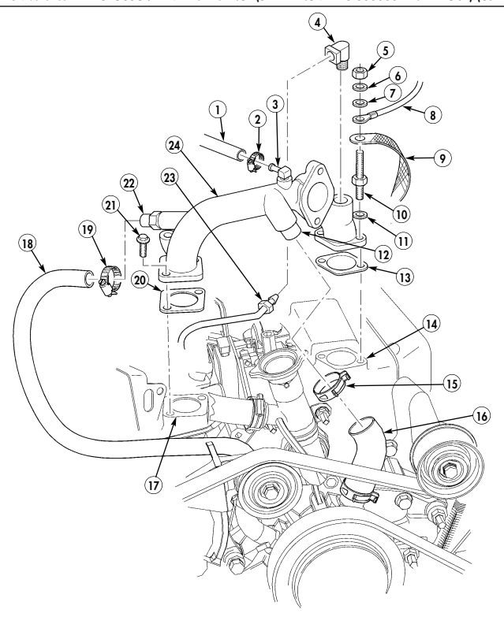

FOLLOW-ON TASKS:  - Install thermostat (para. 3-76.1).

- Install glow plug controller/temperature sensor (para. 4-33).

# 3-80. Fan Drive And Fan Blade Maintenance (Serial Numbers 299999 And Below)

This task covers:
a. Removal c. Installation b. Inspection

## Initial Setup:

Tools General mechanic's tool kit:
automotive (Appendix B, Item 1)
Maintenance and repair shop equipment:
automotive (Appendix B, Item 2)
Special Tools Hex-head driver, 8 mm (Appendix B, Item 145)
Materials/Parts Four lockwashers (Appendix G, Item 144) Sealing compound (Appendix C, item 62)
a. Removal Manual References

| Maintenance Level   |
|---------------------|

| \-90°F (\-68°C)   |
|-------------------|
| A\-A\-52624       |
| CAUTION           |

Unit

- Mark position of fan blade for installation. - It may be necessary to apply compressed air to clutch adapter to disengage fan drive clutch, allowing access to socket-head screws.

1. Disconnect control valve hose (2) from bulkhead adapter (3). 2. Disconnect female end of quick-disconnect (4) from male end of quick-disconnect (1). 3. Using hex-head driver, remove four socket head screws (8) and fan drive assembly (6) from water pump pulley (5).

4. Remove four nuts (9), lockwashers (10), and fan blade (11) from fan drive (12). Discard lockwashers (10). b. Inspection Inspect clutch adapter (7) and fan blade (11) for damaged threads, cracks, bent blades, or breaks. Replace if defective. c. Installation 1. Align fan blade (11) on fan drive (12) and install with four lockwashers (10) and nuts (9).

Tighten nuts (9) to 26 lb-ft (35 N•m).

2. Apply sealing compound to four socket-head screws (8) and install fan drive assembly (6) on water pump pulley (3) with socket-head screws (8). Tighten socket-head screws (8) to 45 lb-ft (61 N•m).

3. Connect female end of quick-disconnect (4) to male end of quick-disconnect (1). 4. Connect control valve hose (2) to bulkhead adapter (3).

3-80.  FAN DRIVE AND FAN BLADE MAINTENANCE (SERIAL NUMBERS 299999 AND BELOW (Cont'd)

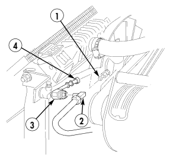

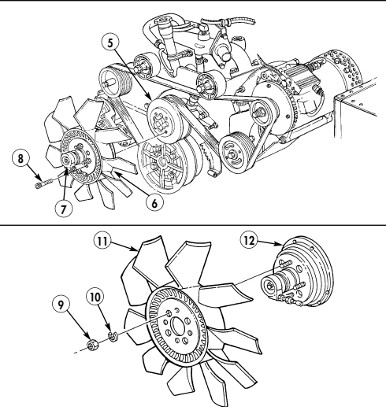

FOLLOW-ON TASK:
Install radiator and shroud (if removed) (para. 3-62).

# 3-80.1. Fan Blade And Fan Clutch Maintenance (Serial Numbers 300000 And Above)

This task covers:
b. Inspection a. Removal c. Installation

## Initial Setup:

Tools General mechanic's tool kit:
automotive (Appendix B, Item 1)
Maintenance and repair shop equipment:
automotive (Appendix B, Item 2)

## Materials/Parts

Four lockwashers (Appendix G, Item 144) Sealing compound (Appendix C, Item 71) Six lockwashers (Appendix G, Item 145)

## Manual References

TM 9-2320-387-24P
Equipment Condition Radiator and fan shroud assembly removed
(para. 3-62.1).

Maintenance Level Unit a. Removal 1. Remove four capscrews (2), lockwashers (3), washers (4), and fan blade (5) from geared fan drive hub (6).

Discard lockwashers (3).

2. Remove six capscrews (7), lockwashers (8), washers (9), and fan blade (5) from fan clutch (1). Discard lockwashers (8).

## B. Inspection

Inspect fan blade (5), geared fan drive hub (6), and fan clutch (1) for damaged threads, cracks, bent blades or breaks. Replace if damaged. c. Installation

Balance holes must face down towards geared fan drive hub.

1. Apply sealing compound to capscrews (2) and (7). 2. Install fan clutch (1) on fan blade (5) with six washers (9), lockwashers (8), and capscrews (7).

Tighten capscrew (7) to 13-16 lb-ft (18-22 N•m).

3. Install fan blade (5) on geared fan drive hub (6) with four washers (4), lockwashers (3), and capscrews (2). Tighten capscrew (2) to 37 lb-ft (50 N•m).

# 3-80.1.  Fan Blade And Fan Clutch Maintenance (Serial Numbers 300000 And Above) (Cont'D)

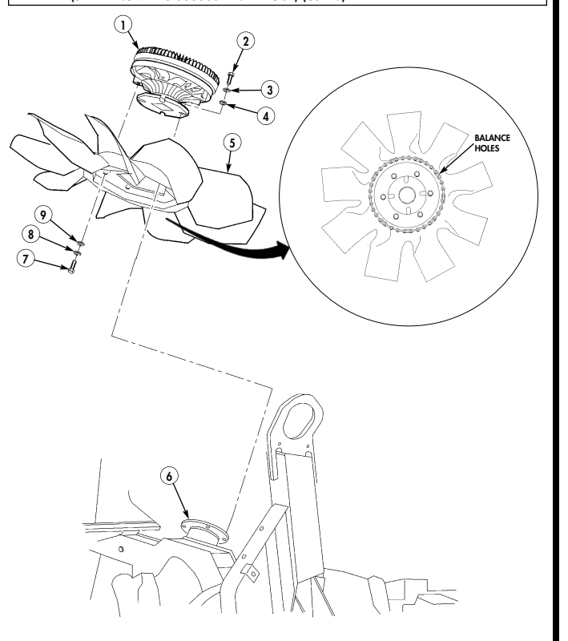

FOLLOW-ON TASK:
Install radiator and fan shroud assembly (para. 3-62.1).

# 3-80.2. Geared Fan Drive And Upper Front Rear Crossmember Replacement (Serial Numbers 300000 And Above)

This task covers:

a. Removal b. Installation

## Initial Setup:

| Tools                                  | Manual References                             |
|----------------------------------------|-----------------------------------------------|
| General mechanic's tool kit:           | TM 9\-2320\-387\-10                           |
| automotive (Appendix B, Item 1)        | TM 9\-2320\-387\-24P                          |
| Materials/Parts                        | Equipment Condition                           |
| Five locknuts (Appendix G, Item 77)    | Right splash shield removed (para. 10\-24.1). |
| Two lockwashers (Appendix G, Item 146) | Maintenance Level                             |
|                                        | Unit                                          |
| a. Removal                             |                                               |

## A. Removal

1. Remove vent line (1) from nipple (2). 2. Remove nipple (2) from angle adapter (3).

6. Remove oil feed tube (18) and two adapters (17) from geared fan drive (16).

## B. Installation

1. Install two adapters (17) and oil feed tube (18) on geared fan drive (16). 2. Install geared fan drive (16) on front rear crossmember (6) with three washers (12),
lockwashers (13), and capscrews (14). Do not tighten capscrews (14).

3. Secure geared fan drive (16) to front rear crossmember (6) with two washers (11), lockwashers (10),
and capscrews (9). Tighten capscrews (9) to 37 lb-ft (50 N•m).

4. Tighten capscrews (14) to 37 lb-ft (50 N•m). 5. Install geared fan drive (16) and front rear crossmember (6) on two crossmember brackets (15) with four washers (5), capscrews (4), washers (7), and locknuts (8).

6. Install nipple (2) on angle adapter (3). 7. Install vent line (1) on nipple (2).

3. Remove four locknuts (8), washers (7), capscrews (4), washers (5), front rear crossmember (6), and geared fan drive (16) from two crossmember brackets (15). Discard locknuts (8).

4. Remove three capscrews (14), washers (13), and lockwashers (12) from front rear crossmember (6)
and geared fan drive (16). Discard lockwashers (12).

5. Remove two capscrews (9), lockwashers (10), washers (11), and geared fan drive (16) from front rear crossmember (6). Discard lockwashers (10).

3-80.2. GEARED FAN DRIVE AND UPPER FRONT REAR CROSSMEMBER REPLACEMENT
(SERIAL NUMBERS 300000 AND ABOVE) (Cont'd)

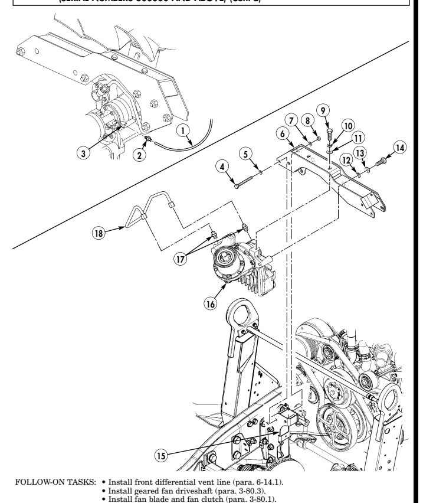

# 3-80.3. Geared Fan Driveshaft Maintenance (Serial Numbers 300000 And Above)

This task covers:
b. Inspection

## Initial Setup:

Tools General mechanic's tool kit:
automotive (Appendix B, Item 1)
Maintenance and repair shop equipment:
automotive (Appendix B, Item 2)
Materials/Parts Sealing compound (Appendix C, Item 71)
a. Removal c. Installation Manual References TM 9-2320-387-10 TM 9-2320-387-24P
Equipment Condition Hood raised and secured (TM 9-2320-387-10).

| Maintenance Level   |
|---------------------|
| Unit                |

Rotate crankshaft pulley accordingly to access capscrews.

a. Removal 1. Remove six capscrews (1) and geared fan driveshaft (8) from geared fan drive (6). 2. Remove four capscrews (7) and geared fan driveshaft (8) from coupler plate (3).

- Rotate crankshaft pulley accordingly to access capscrews. - Hold alternator clutch pulley adapter to keep crankshaft from rotating.

3. Remove four capscrews (4) and coupler plate (3) from lower crankshaft pulley assembly (5). 4. Remove four grease fittings (2) from geared fan driveshaft (8). b. Inspection Inspect grease fittings (2). Replace if damaged. c. Installation 1. Install four grease fittings (2) on geared fan driveshaft (8).

- Rotate crankshaft pulley accordingly to access capscrews. - Hold alternator clutch pulley adapter to keep crankshaft from rotating.

2. Install coupler plate (3) on lower crankshaft puller assembly (5) with four capscrews (4). 3. Install geared fan driveshaft (8) on coupler plate (3) with four capscrews (7). 4. Apply sealing compound to six capscrews (1). Install geared fan driveshaft (8) on geared fan drive (6)
with six capscrews (1).

# 3-80.3.  Geared Fan Driveshaft Maintenance (Serial Numbers 300000 And Above) (Cont'D)

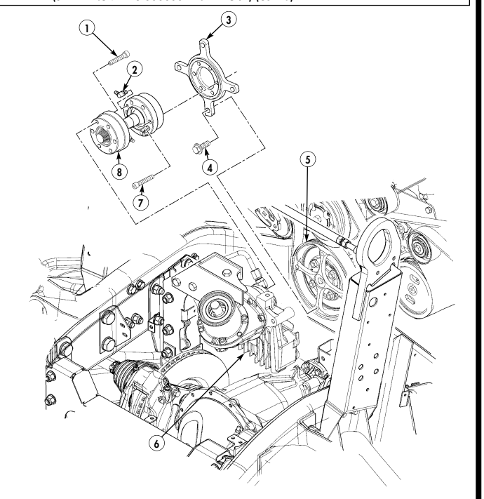

FOLLOW-ON TASK:  Lower and secure hood. (TM 9-2320-387-10).

# 3-81. Serpentine Drivebelt Maintenance (Serial Numbers 196900 And Below)

This task covers:
a. Removal c. Alignment b. Installation

## Initial Setup:

Tools General mechanic's tool kit:
automotive (Appendix B, Item 1)
Maintenance and repair shop equipment:
automotive (Appendix B, Item 2)
Pulley alignment tool 
(Appendix D, Fig. D-107)
Personnel Required One mechanic One assistant Manual References TM 9-2320-387-10 Equipment Condition Hood raised and secured (TM 9-2320-387-10).

Maintenance Level Unit

200-AMP dual voltage regulator shown.

a. Removal 1. Position 3/8-in. breaker bar or, as appropriate, a 1/2-in. ratchet wrench on belt tensioner (7) and move tensioner (7) clockwise to loosen drivebelt (9).

On M1114 vehicles equipped with A/C, the compressor pulley is used in place of the lower idler pulley.

2. Remove drivebelt (9) from power steering pump pulley (3), alternator pulley (2), water pump pulley
(4), crankshaft pulley (5), air conditioning compressor or idler pulley (8), two upper idler pulleys (1), and tensioner pulley (6). Release belt tensioner (7).

Serpentine drivebelt failure (abnormal wear or belt dislodgement) can be caused by misalignment of pulleys, improper installation or foreign objects introduced into belt path.

Check pulley and pulley grooves for damage and debris prior to installing serpentine drivebelt.

b. Installation 1. Position 3/8-in. breaker bar, or as appropriate, a 1/2-in. ratchet wrench on belt tensioner (7) and move tensioner (7) clockwise to allow installation of drivebelt (9).

2. Feed drivebelt (9) into grooves on crankshaft pulley (5), air conditioning compressor or idler pulley
(8), two upper idler pulleys (1), alternator pulley (2), power steering pump pulley (3), water pump pulley (4), and tensioner pulley (6). Release belt tensioner (7).

3-81.

SERPENTINE DRIVEBELT MAINTENANCE (SERIAL NUMBERS 196900 AND BELOW) (Cont'd)

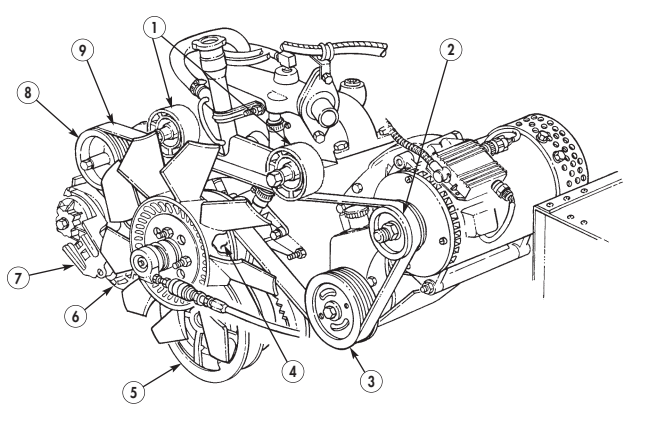

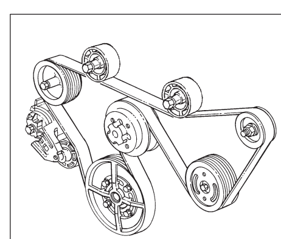

3-81. SERPENTINE DRIVEBELT MAINTENANCE (SERIAL NUMBERS 196900 AND BELOW) (Cont'd)
c. Alignment

Serpentine belt failure (abnormal wear or belt dislodgement) can be caused by misalignment of pulleys, improper installation or foreign objects introduced into belt path. Damage to equipment may result.

Ensure tab of pulley alignment tool seats flush against back side of crankshaft pulley.

1. Position tab (1) of pulley alignment tool (5) behind crankshaft pulley (6) and straight edge portion (4) of pulley alignment tool (5) across power steering pump pulley (2) and alternator pulley (3). Tab (1) on pulley alignment tool (5) should seat flush against back side of crankshaft pulley (6). Straight edge portion (4) of pulley alignment tool (5) should seat flush against power steering pump pulley (2) and alternator pulley (3). If pulley alignment is not flush, rotate engine and recheck alignment in several locations. Proceed to step 3 if pulleys are out of alignment.

2. Position straight edge portion (4) of pulley alignment tool (5) against idler pulleys (7) and check for bent mounting bracket (8). If mounting bracket (8) is bent, refer to para. 3-82 for replacement.

If any adjustments are made while performing steps 3 through 8, start engine and check for proper tracking of belt.

3. Check all pulleys (2), (3), (6), (7), and (12) for mud or foreign objects lodged in grooves.

NOTE
Power steering pump pulley must be flush with end of power steering pump shaft.

4. Check power steering pump pulley (2) for proper installation. Refer to para. 8-23. 5. Check power steering pump (11) and power steering/alternator mounting bracket (10) for proper installation and security of mounting hardware. Refer to paras. 4-3 and 8-23.

6. Check alternator pulley (3) for proper installation. Refer to para. 4-2. 7. Check alternator (9) for proper installation and security of mounting hardware. Refer to para. 4-5 8. Check idler pulleys (7) and mounting bracket (8) for proper installation and security of mounting hardware. Refer to para. 3-82.

9. Repeat steps 1 and 2 to verify alignment.

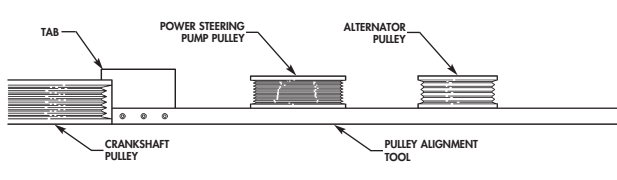

# 3-81. Serpentine Drivebelt Maintenance (Serial Numbers 196900 And Below) (Cont'D)

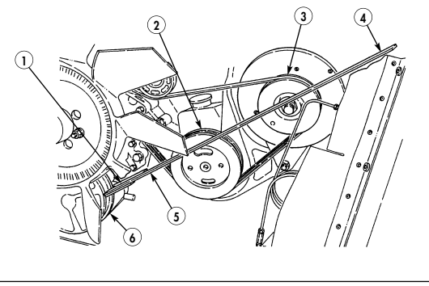

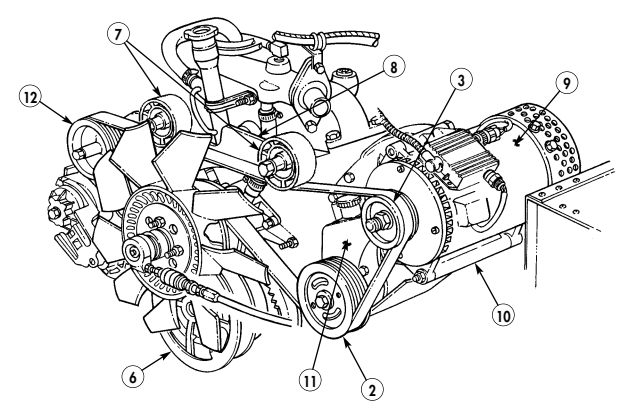

FOLLOW-ON TASK: Lower and secure hood (TM 9-2320-387-10).

# Through 299999)

3-81.1. SERPENTINE DRIVEBELT MAINTENANCE (SERIAL NUMBERS 196901 This task covers:
b. Installation

## Initial Setup:

Tools General mechanic's tool kit:
automotive (Appendix B, Item 1)
Maintenance and repair shop equipment:
automotive (Appendix B, Item 2)
Pulley alignment tool 
(Appendix D, Fig. D-107)
Personnel Required One mechanic One assistant a. Removal c. Alignment Manual References TM 9-2320-387-10 Equipment Condition Hood raised and secured (TM 9-2320-387-10).

| Unit   |
|--------|

Unit

200-AMP dual voltage regulator shown.

a. Removal 1. Position 3/8-in. breaker bar or, as appropriate, 1/2-in. ratchet wrench on belt tensioner (10) and move belt tensioner (10) clockwise to loosen drivebelt (2).

NOTE
On M1114 vehicles equipped with A/C, the compressor pulley is used in place of the lower idler pulley.

2. Remove drivebelt (2) from power steering pump pulley (6), idler pulley (5), alternator pulley (4),
water pump pulley (8), crankshaft pulley (7), air conditioning compressor or idler pulley (1), two upper idler pulleys (3), and belt tensioner pulley (9). Release belt tensioner (10).

CAUTION
Serpentine drivebelt failure (abnormal wear or belt dislodgement) can be caused by misalignment of pulleys, improper installation, or foreign objects introduced into belt path.

NOTE
Check pulley and pulley grooves for damage and debris prior to installing serpentine belt.

b. Installation 1. Position 3/8-in. breaker bar or, as appropriate, 1/2-in. ratchet wrench on belt tensioner (10) and move belt tensioner (10) clockwise to allow installation of drivebelt (2).

2. Feed drivebelt (2) into grooves on crankshaft pulley (7), air conditioning compressor or idler pulley
(1), two upper idler pulleys (3), alternator pulley (4), idler pulley (5), power steering pump pulley (6), water pump pulley (8), and tensioner pulley (9). Release belt tensioner (10).

3-81.1. SERPENTINE DRIVEBELT MAINTENANCE (SERIAL NUMBERS 196901 THROUGH 299999) (Cont'd)

Change 6 3-142.5

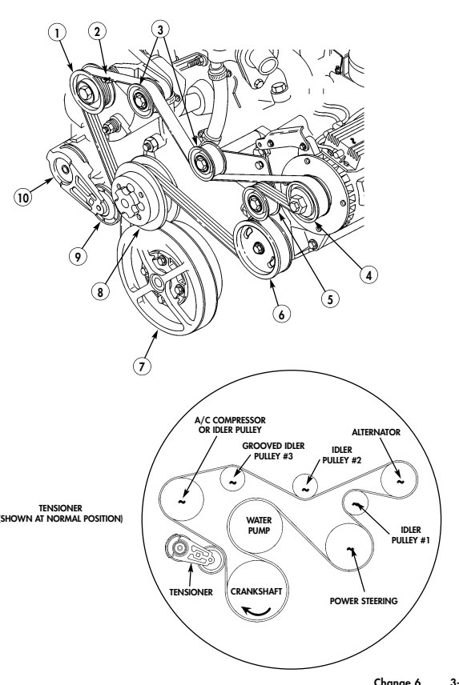

3-81.1. SERPENTINE DRIVEBELT MAINTENANCE (SERIAL NUMBERS 196901 

# Through 299999) (Cont'D)

c. Alignment

Serpentine drivebelt failure (abnormal wear or belt dislodgement) can be caused by misalignment of pulleys, improper installation, or foreign objects introduced into belt path. Damage to equipment may result.

Ensure tab of pulley alignment tool seats flush against back side of crankshaft pulley.

1. Position tab (1) on pulley alignment tool (4) behind crankshaft pulley (5) and place straightedge portion of pulley alignment tool (4) across power steering pump pulley (2) and alternator pulley (3). Tab (1) on pulley alignment tool (4) should seat flush against back side of crankshaft pulley (5). Straightedge portion of pulley alignment tool (4) should seat flush against power steering pump pulley (2) and alternator pulley (3). If pulley alignment is not flush, rotate engine and recheck alignment in several locations. Proceed to step 3 if pulleys are out of alignment.

2. Position straightedge portion of pulley alignment tool (4) against idler pulleys (7) and (8) and check for bent mounting bracket (9). If mounting bracket (9) is bent, refer to para. 3-82.6 for replacement.

If any adjustments are made while performing steps 3 through 8, start engine and check for proper tracking of belt.

3. Check all pulleys (2), (3), (6), (7), (8) and (5) for mud or foreign objects lodged in grooves.

NOTE
Power steering pump pulley must be flush with end of power steering pump shaft.

4. Check power steering pump pulley (2) for proper installation. Refer to para. 8-23.1. 5. Check power steering/alternator mounting bracket (11) for proper installation and security of mounting hardware. Refer to para. 4-3.1 and 8-23.1.

6. Check alternator pulley (3) for proper installation. Refer to para. 4-2.1. 7. Check alternator (10) for proper installation and security of mounting hardware. Refer to para. 4-5. 8. Check idler pulleys (8) and (12) and mounting bracket (9) for proper installation and security of mounting hardware. Refer to para. 3-82.7 and 3-82.6.

9. Repeat steps 1 and 2 to verify alignment.

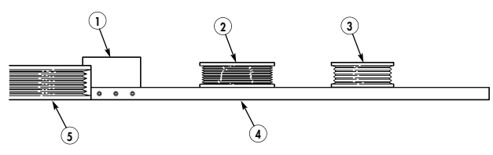

3-81.1.

SERPENTINE DRIVEBELT MAINTENANCE (SERIAL NUMBERS 196901

# Through 299999) (Cont'D)

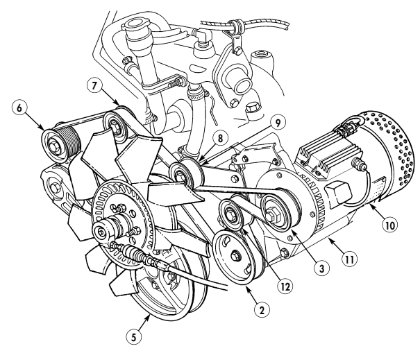

FOLLOW-ON TASK:
 Lower and secure hood (TM 9-2320-387-10)

# 3-81.2. Serpentine Drivebelt Maintenance (Serial Numbers 300000 And Above)

This task covers:
a. Removal c. Alignment b. Installation

## Initial Setup:

Tools General mechanic's tool kit:
automotive (Appendix B, Item 1)
Maintenance and repair shop equipment:
automotive (Appendix B, Item 2)
Pulley alignment tool 
(Appendix D, Fig. D-107)
Personnel Required One mechanic One assistant Manual References TM 9-2320-387-10 TM 9-2320-387-24P
Equipment Condition Geared fan driveshaft removed (para. 3-80.3).

| Unit   |
|--------|

Unit

200-AMP dual voltage regulator shown.

a. Removal 1. Position 3/8-in. breaker bar or, as appropriate, 1/2-in. ratchet wrench on belt tensioner (10) and move belt tensioner (10) clockwise to loosen drivebelt (2).

2. Remove drivebelt (2) from power steering pump pulley (6), idler pulley (5), alternator pulley (4),
water pump pulley (8), crankshaft pulley (7), air conditioning compressor or idler pulley (1), two upper idler pulleys (3), and belt tensioner pulley (9). Release belt tensioner (10).

Serpentine drivebelt failure (abnormal wear or belt dislodgement) can be caused by misalignment of pulleys, improper installation, or foreign objects introduced into belt path.

NOTE
Check pulley and pulley grooves for damage and debris prior to installing serpentine belt.

## B. Installation

1. Position 3/8-in. breaker bar or, as appropriate, 1/2-in. ratchet wrench on belt tensioner (10) and move belt tensioner (10) clockwise to allow installation of drivebelt (2).

2. Feed drivebelt (2) into grooves on crankshaft pulley (7), air conditioning compressor or idler pulley (1), two upper idler pulleys (3), alternator pulley (4), idler pulley (5), power steering pump pulley (6), water pump pulley (8), and tensioner pulley (9). Release belt tensioner (10).

# 3-81.2. Serpentine Drivebelt Maintenance (Serial Numbers 300000 And Above) (Cont'D)

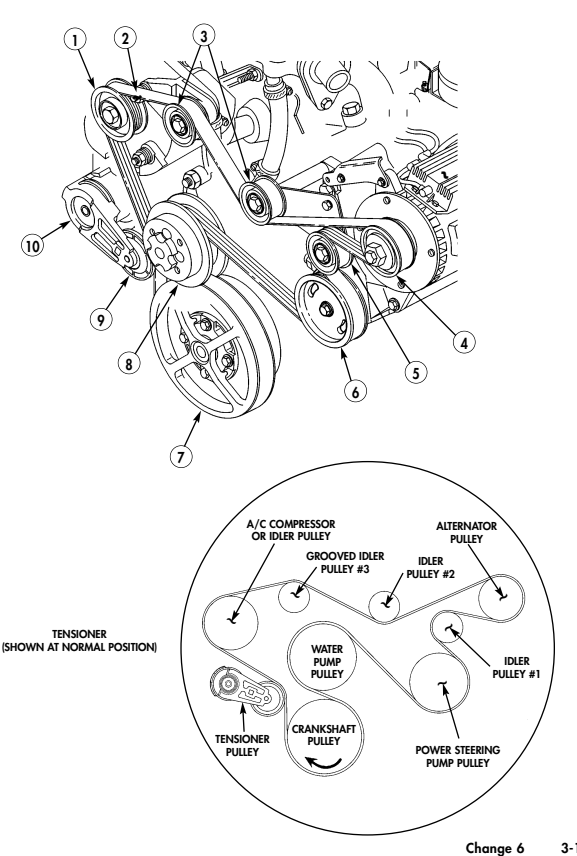 

# 3-81.2. Serpentine Drivebelt Maintenance

# (Serial Numbers 300000 And Above) (Cont'D)

c. Alignment

Serpentine drivebelt failure (abnormal wear or belt dislodgement) can be caused by misalignment of pulleys, improper installation, or foreign objects introduced into belt path. Damage to equipment may result.

Ensure tab of pulley alignment tool seats flush against back side of crankshaft pulley.

1. Position tab (1) on pulley alignment tool (4) behind crankshaft pulley (5) and place straightedge portion of pulley alignment tool (4) across power steering pump pulley (2) and alternator pulley (3). Tab (1) on pulley alignment tool (4) should seat flush against back side of crankshaft pulley (5). Straightedge portion of pulley alignment tool (4) should seat flush against power steering pump pulley (2) and alternator pulley (3). If pulley alignment is not flush, rotate engine and recheck alignment in several locations. Proceed to step 3 if pulleys are out of alignment.

2. Position straightedge portion of pulley alignment tool (4) against idler pulleys (7) and (8) and check for bent mounting bracket (9). If mounting bracket (9) is bent, refer to para. 3-82 for replacement.

NOTE
If any adjustments are made while performing steps 3 through 8, start engine and check for proper tracking of belt.

3. Check all pulleys (2), (3), (6), (7), (8) and (5) for mud or foreign objects lodged in grooves.

NOTE
Power steering pump pulley must be flush with end of power steering pump shaft.

4. Check power steering pump pulley (2) for proper installation. Refer to para. 8-23. 5. Check power steering/alternator mounting bracket (11) for proper installation and security of mounting hardware. Refer to para. 4-3 and para. 8-23.

6. Check alternator pulley (3) for proper installation. Refer to para. 4-2. 7. Check alternator (10) for proper installation and security of mounting hardware. Refer to para. 4-5.

8. Check idler pulleys (8) and (12) and mounting bracket (9) for proper installation and security of mounting hardware. Refer to para. 3-82.

9. Repeat steps 1 and 2 to verify alignment.

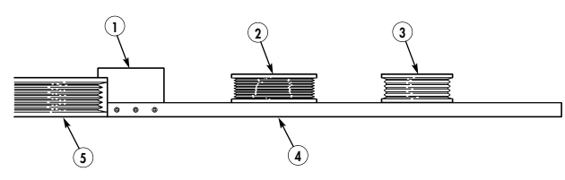

# 3-81.2. Serpentine Drivebelt Maintenance (Serial Numbers 300000 And Above) (Cont'D)

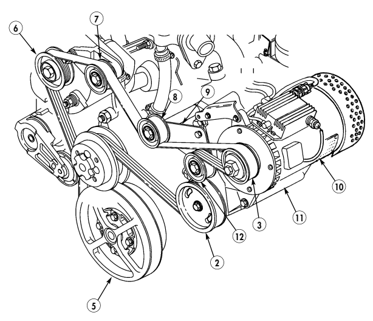

FOLLOW-ON TASK: Install geared fan driveshaft (para. 3-80.3).

# 3-82. Tensioner, Idler Pulley'S, And Mounting Hardware Replacement (Serial Numbers 196900 And Below)

This task covers:
INITIAL SETUP:
Tools General mechanic's tool kit:
automotive (Appendix B, Item 1)
Materials/Parts Two lockwashers (Appendix G, Item 185) Three lockwashers (Appendix G, Item 183)
Manual References TM 9-2320-387-24P
a. Removal b. Installation Equipment Condition
- Fan drive and fan blade removed (para. 3-80). - Serpentine drivebelt removed (para. 3-81).

Maintenance Level Unit a. Removal 1. Remove capscrew (12) and tensioner (11) from mounting bracket (8). 2. Remove two nuts (6), lockwashers (5), washers (4), capscrews (1), washers (2), supports (3.1), idler pulleys (3), and dust covers (2.1) from mounting bracket (8). Discard lockwashers (5).

- On M1114 vehicles equipped with A/C, the compressor pulley is in place of the lower idler pulley.

- Perform step 3 for M1113 models only.

b. Installation 1. Install mounting bracket (8) on engine (6.2) with collar washer (6.1) and screw (7.1). 2. Install lockwashers (9) and two capscrews (10) on water pump (7).

Pulleys will turn if they are installed correctly. If pulleys do not turn, they may be installed incorrectly. Ensure dust covers are seated properly on pulleys.

3. Install two idler pulleys (3) and dust covers (2.1) on mounting bracket (8) with two supports (3.1),
washers (2), capscrews (1), washers (4), lockwashers (5), and nuts (6).

- On M1114 vehicles equipped with A/C, the compressor pulley is in place of the lower idler pulley.

- Perform step 4 for M1113 models only.

4. Install idler pulley (16) and support (17) on mounting bracket (8) with dustcover (15), washer (14),
screw (13), washer (18), lockwasher (19), and nut (20).

5. Install tensioner (11) on mounting bracket (8) with capscrew (12).

3. Remove nut (20), lockwasher (19), washer (18), support (17), screw (13), washer (14), dust cover (15), and air conditioner compressor pulley or lower idler pulley (16) from mounting bracket (8). Discard lockwasher (19).

4. Remove two capscrews (10) and lockwashers (9) from water pump (7). Discard lockwashers (9). 5. Remove screw (7.1), collar washer (6.1), and mounting bracket (8) from engine (6.2).

# 3-82. Tensioner, Idler Pulleys, And Mounting Hardware Replacement (Serial Numbers 196900 And Below) (Cont'D)

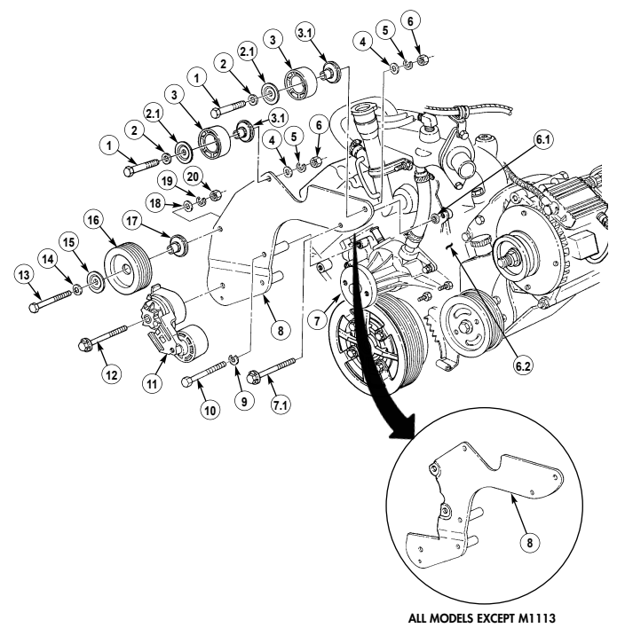

FOLLOW-ON TASKS: - Install serpentine drivebelt (para. 3-81).

- Install fan drive and fan blade (para. 3-80).

# 3-82.1. Tensioner And Mounting Hardware Replacement (Serial Numbers 196901 And Above)

This task covers:
INITIAL SETUP:
Tools General mechanic's tool kit:
automotive (Appendix B, Item 1)
Materials/Parts Lockwasher (Appendix G, Item 144)
Manual References a. Removal b. Installation Equipment Condition
- Fan drive and fan blade removed 
(para. 3-80).

- Serpentine drivebelt removed (para. 3-81.1).

Maintenance Level Unit TM 9-2320-387-24P
a. Removal 1. Remove capscrew (1), lockwasher (2), washer (3), and tensioner (5) from mounting bracket (4).

Discard lockwasher (2).

b. Installation 1. Install tensioner (5) on mounting bracket (4) with washer (3), lockwasher (2), and capscrew (1).

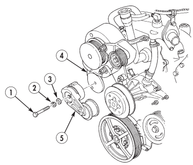

FOLLOW-ON TASKS: - Install serpentine drivebelt (para. 3-81.1).

- Install fan drive and fan blade (para. 3-80).

# 3-82.2. Idler Pulley And Support Replacement, Vehicles W/O A/C (Serial Numbers 196901 And Above)

This task covers:

## Initial Setup:

Tools General mechanic's tool kit:
automotive (Appendix B, Item 1)
Materials/Parts Lockwasher (Appendix G, Item 174) Three lockwashers (Appendix G, Item 144)
Manual References TM 9-2320-387-24P
a. Removal 1. Remove screw (1), pulley support (5), idler pulley (4), retainer (3), and lockwasher (2) from support (6). Discard lockwasher (2).

2. Remove three screws (10), washers (8), lockwashers (9), and support (6) from mounting bracket (7).

Discard lockwashers (9).

b. Installation 1. Install support (6) on mounting bracket (7) with three lockwashers (9), washers (8), and screws
(10).

2. Install pulley support (5) and idler pulley (4) on support (6) with lockwasher (2), retainer (3), and screw (1).

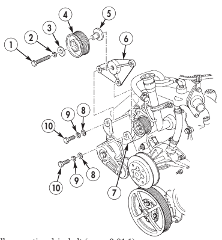

FOLLOW-ON TASK: Install serpentine drivebelt (para. 3-81.1).

a. Removal b. Installation

| Cooling system drained, as required (para. 3\-61).   |
|------------------------------------------------------|

3-82.3. GROOVED IDLER PULLEY AND SUPPORT REPLACEMENT (SERIAL NUMBERS
196901 AND ABOVE)
This task covers:
INITIAL SETUP:
Tools General mechanic's tool kit:
automotive (Appendix B, Item 1)
Materials/Parts Lockwasher (Appendix G, Item 174)
Manual References TM 9-2320-387-24P
a. Removal b. Installation Equipment Condition Serpentine drivebelt removed (para. 3-81.1).

Maintenance Level Unit a. Removal Remove screw (1), pulley support (6), grooved idler pulley (5), cover (4), two washers (3), and lockwasher (2) from mounting bracket (7). Discard lockwasher (2). b. Installation Install pulley support (6) and grooved idler pulley (5) on mounting bracket (7) with lockwasher (2), washers (3), cover (4), and screw (1).

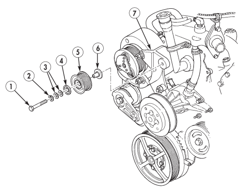

FOLLOW-ON TASK: Install serpentine drivebelt (para. 3-81.1). 3-144.2 Change 2

# 3-82.4. Mounting Bracket Replacement, Vehicles W/O A/C (Serial Numbers 196901 And Above)

This task covers:

## Initial Setup:

Tools General mechanic's tool kit:
automotive (Appendix B, Item 1)
Maintenance and repair shop equipment:
automotive (Appendix B, Item 2)
Materials/Parts Two lockwashers (Appendix G, Item 185) Adhesive sealant (Appendix C, Item 3.1)
Manual References TM 9-2320-387-24P
a. Removal b. Installation Equipment Condition
- Idler pulley and support removed 
(para. 3-82.2)
- Tensioner removed (para. 3-82.1) - Grooved idler pulley removed (para. 3-82.3)
Maintenance Level Unit a. Removal 1. Remove two nuts (6) and lockwashers (5) from studs (4) on water pump (3). Discard lockwashers
(5).

2. Remove two screws (1) and mounting bracket (7) from engine (2).

b. Installation 1. Apply sealant to threads of two screws (1), and install mounting bracket (7) on engine (2) with screws (1). Do not tighten screws (1).

2. Secure mounting bracket (7) to studs (4) on water pump (3) with two lockwashers (5) and nuts (6).

Tighten screws (1) to 43-51 lb-ft (58-69 N•m) and nuts (6) to 33-41 lb-ft (45-56 N•m).

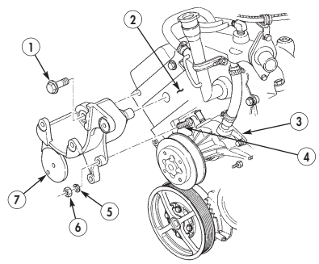

FOLLOW-ON TASKS: - Install grooved idler pulley (para. 3-82.3).

- Install tensioner (para. 3-82.1). - Install idler pulley and support (para. 3-82.2).

3-82.5. MOUNTING BRACKET REPLACEMENT, VEHICLES W/ A/C (SERIAL NUMBERS 
196901 AND ABOVE)
This task covers:

## Initial Setup:

Tools General mechanic's tool kit:
automotive (Appendix B, Item 1)
Maintenance and repair shop equipment:
automotive (Appendix B, Item 2)
Materials/Parts Two lockwashers (Appendix G, Item 185) Adhesive sealant (Appendix C, Item 3.1)
Manual References TM 9-2320-387-24P
a. Removal b. Installation

## Equipment Condition

- A/C compressor removed (para. 25-20.2) - Tensioner removed (para. 3-82.1). - Grooved idler pulley removed (para. 3-82.3)
Maintenance Level Unit a. Removal 1. Remove two nuts (6) and lockwashers (5) from studs (4) on water pump (3). Discard lockwashers
(5).

2. Remove two screws (1) and mounting bracket (7) from engine (2).

b. Installation 1. Apply sealant to threads of two screws (1), and install mounting bracket (7) on engine (2) with screws (1). Do not tighten screws (1).

2. Secure mounting bracket (7) to studs (4) on water pump (3) with two lockwashers (5) and nuts (6).

Tighten screws (1) to 43-51 lb-ft (58-69 N•m) and nuts (6) to 33-41 lb-ft (45-56 N•m).

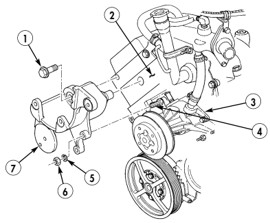

FOLLOW-ON TASKS: - Install grooved idler pulley (para. 3-82.3). 

- Install tensioner (para. 3-82.1). - Install A/C compressor (para. 25-20.2). 

# 3-82.6. Idler Pulley Replacement (Serial Numbers 196901 And Above)

This task covers:

## Initial Setup:

a. Removal b. Installation

| General mechanic's tool kit:           | Cooling system depressurized (para. 3\-61).   |
|----------------------------------------|-----------------------------------------------|
| automotive (Appendix B, Item 1)        | Maintenance Level                             |
| Maintenance and repair shop equipment: | Unit                                          |
| automotive (Appendix B, Item 2)        |                                               |
| Manual References                      |                                               |
| TM 9\-2320\-387\-24P                   |                                               |

a. Removal 1. Remove screw (15), pulley support (10), idler pulley (11), cover (12), two washers (13), and lockwasher (14) from idler pulley bracket (8) and alternator/pump support (9). Discard lockwasher (14).

2. Remove screw (1), spacer (7), pulley support (6), idler pulley (5), cover (4), two washers (3), 
and lockwasher (2) from idler pulley bracket (8) and alternator/pump support (9). Discard lockwasher (2).

## B. Installation

1. Install spacer (7), pulley support (6), and idler pulley (5) on idler pulley bracket (8) and alternator/pump support (9) with cover (4), two washers (3), lockwasher (2), and screw (1). Do not tighten screw (1).

2. Install pulley support (10) and idler pulley (11) on idler pulley bracket (8) and alternator/pump support (9) with cover (12), two washers (13), lockwasher (14), and screw (15). Tighten screws (1) and (15) to 33-41 lb-ft (45-56 N•m)

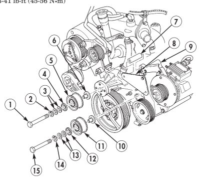

FOLLOW-ON TASK: Install serpentine drivebelt (para. 3-81.1).

3-82.7. IDLER PULLEY BRACKET REPLACEMENT (SERIAL NUMBERS 196901 AND 
ABOVE)
This task covers:
INITIAL SETUP:
Tools General mechanic's tool kit:
automotive (Appendix B, Item 1)
Maintenance and repair shop equipment:
automotive (Appendix B, Item 2)
Materials/Parts Lockwasher (Appendix G, Item 144)
a. Removal b. Installation

| Manual References                      |
|----------------------------------------|
| TM 9\-2320\-387\-24P                   |
| Equipment Condition                    |
| Idler pulleys removed (para. 3\-82.6). |
| Maintenance Level                      |
| Unit                                   |

a. Removal Remove screw (1), washer (3), lockwasher (2), and idler pulley bracket (4) from alternator/pump support (5). Discard lockwasher (2). b. Installation 1. Install idler pulley bracket (4) on alternator/pump support (5) with washer (3), lockwasher (2), and screw (1).

Tighten idler pulley bracket screw (1) after idler pulleys have been installed and tightened.

2. Tighten screw (1) to 33-41 lb-ft (45-56 N•m).

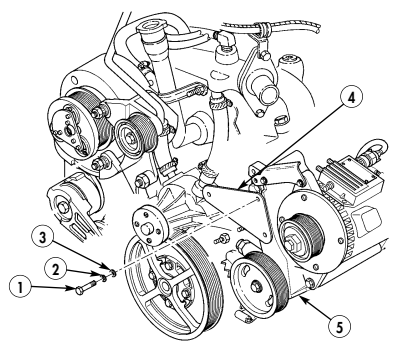

FOLLOW-ON TASK: Install idler pulleys (para. 3-82.6). 3-146 Change 3

# 3-83. Fan Drive Friction Lining Replacement

This task covers:
INITIAL SETUP:
Tools General mechanic's tool kit:
automotive (Appendix B, Item 1)
Manual References TM 9-2320-387-24P
Equipment Condition Disconnect battery ground cables (para. 4-68).

a. Removal

a. Removal b. Installation

General Safety Instructions Prior to loosening screws on fan drive retaining plates, disconnect fan drive hose from fan drive.

Maintenance Level Unit

Prior to loosening screws on fan drive retaining plates, disconnect fan drive hose from fan drive. Failure to do so may result in injury to personnel or damage to equipment.

It may be necessary to apply compressed air to clutch adapter to disengage fan drive clutch, allowing access to friction lining screws.

1. Remove six screws (1) and three retaining plates (2) from fan drive (3). 2. Remove two friction linings (4) from fan drive (3).

## B. Installation

1. Install two friction linings (4) on fan drive (3). 2. Install three retaining plates (2) on fan drive (3) with six screws (1). Tighten screws (1) to 22 lb-in. (2.5 N•m).

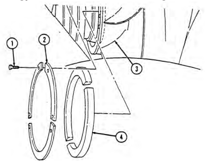

FOLLOW-ON TASK: Connect battery ground cables (para. 4-68).

# 3-84. Differential Cooler Lines Replacement (Serial Numbers 188974 And

# Below)

This task covers:
b. Oil Cooler Hoses and Tubes Removal **d. Front Hoses and Relief Valve Installation**

## Initial Setup:

Tools General mechanic's tool kit:
automotive (Appendix B, Item 1)
Maintenance and repair shop equipment:
automotive (Appendix B, Item 2)

## Materials/Parts

Sealing compound, pipe (Appendix C, Item 62) Four lockwashers (Appendix G, Item 146) Four lockwashers (Appendix G, Item 190.1) Lockwasher (Appendix G, Item 190.2) Two locknuts (Appendix G, Item 82) Two locknuts (Appendix G, Item 77) Locknut (Appendix G, Item 106) Two O-rings (Appendix G, Item 218) Two O-rings (Appendix G, Item 221) Four tiedown straps (Appendix G, Item 323) Tiedown strap (Appendix G, Item 329)
a. Front Hoses and Relief Valve Removal **c. Oil Cooler Hoses and Tubes Installation**

## Manual References

TM 9-2320-387-10 TM 9-2320-387-24P

## Equipment Condition

- Battery ground cables disconnected
(para. 4-68).

- Rear brake protection guards removed
(para. 7-11).

- Rear propeller shaft removed (para. 6-4).

## General Safety Instructions

- Allow differential to cool. - Hood must be supported during hood prop rod and bracket removal.

Maintenance Level

| .   | .   |    |
|-----|-----|----|

## A. Front Hoses And Relief Valve Removal

Allow differential to cool before performing this task. Severe injury to personnel may result.

Cover or plug all hoses and connections immediately after disconnection to prevent contamination. Remove all plugs prior to connection.

NOTE
- Have drainage container ready to catch oil. - For ease of identification during installation, tag with tape all hose ends that route to the left port on the rear differential oil cooler. Left port is inlet side.

1. Remove locknut (1), washer (2), and bolt (5) from clamps (3) and (4). Discard locknut (1). 2. Remove clamp (3) from bypass hose (6). 3. Loosen three clamps (19) from tee (20). 4. Disconnect bypass hose (6) and return hoses (22) and (21) from tee (20). 5. Disconnect bypass hose (13) from union (15). 6. Disconnect bypass hose (6) from union (26). 7. Remove two bolts (18), washers (17), relief valve (14), and reinforcement (23) from splash shield (7). 8. Remove union (15) and O-ring (16) from top of relief valve (14). Discard O-ring (16). 9. Remove union (26) and O-ring (24) from side of relief valve (14). Discard O-ring (24).

# 3-84. Differential Cooler Lines Replacement (Serial Numbers 188974 And Below) (Cont'D)

Hood must be supported during hood prop rod and bracket removal. Failure to support hood may cause injury to personnel or damage to equipment.

10. Remove four screws (12), lockwashers (11), hood prop rod (8), and bracket (10) from left splash shield (7) and air lift bracket (9). Discard lockwashers (11).

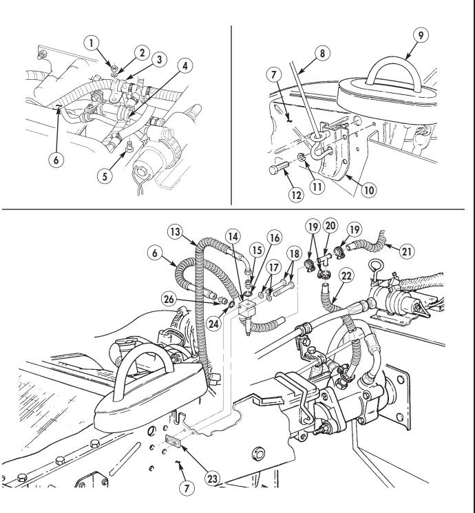

# 3-84. Differential Cooler Lines Replacement (Serial Numbers 188974 And

BELOW) (Cont'd)
11. Remove three screws (14), washers (15), and access cover (18) from left splash shield (3).

NOTE
Perform steps 13 through 18 for M1113 and steps 12 through 15 and 18 for M1114.

12. Remove nut (23) and fuel filter drain valve (24) from left splash shield (3). 13. Remove four screws (19), washers (21), and lockwashers (20) from plate (22) and left splash shield (3). Discard lockwashers (20).

14. Remove locknut (1), two washers (2), and screw (16) from support bracket (17) and left splash shield (3). Discard locknut (1).

15. Remove locknut (7), two washers (8), and screw (10) from master cylinder bracket (9) and left splash shield (3). Discard locknut (7).

16. Remove locknut (5), two washers (6), and screw (11) from left splash shield (3) and airlift bracket (4). Discard locknut (5).

17. Remove screw (12) and lockwasher (13) from left splash shield (3) and airlift bracket (4). Discard lockwasher (13).

18. Remove locknut (28), screw (25), clamp (26), and harness (27) from left splash shield (3). Remove left splash shield (3) from vehicle. Discard locknut (28).

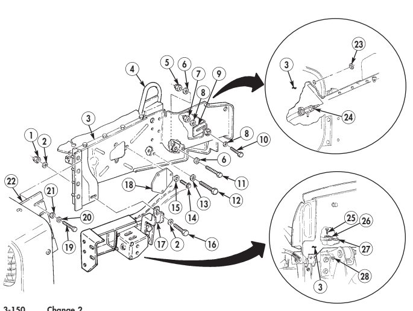

3-150 Change 2

# 3-84. Differential Cooler Lines Replacement (Serial Numbers 188974 And Below (Cont'D)

19. Remove hose clamp (31) and hose (32) from outlet port (30) on power steering cooler (29). 20. Disconnect hose (32) from tee (36) on upper tube (37) on front intermediate crossmember (38). 21. Disconnect tee (36) from upper tube (37). 22. Disconnect tee (36) from hose (34). 23. Remove tiedown strap (33) from hose (34) and elbow (35). Discard tiedown strap (33).

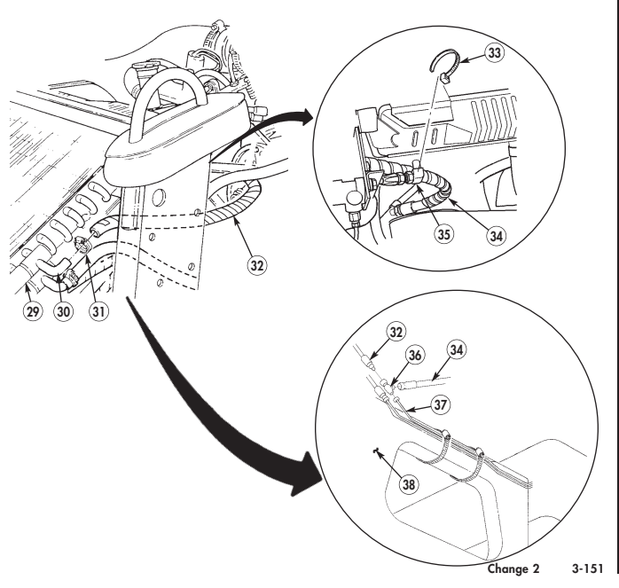

# 3-84. Differential Cooler Lines Replacement (Serial Numbers 188974 And Below) (Cont'D)

24. Disconnect hose (1) from adapter (5) on hydraulic control valve (4). 25. Remove adapter (5) from hydraulic control valve (4). 26. Disconnect hose (1) from lower tube (2) on intermediate crossmember (3).

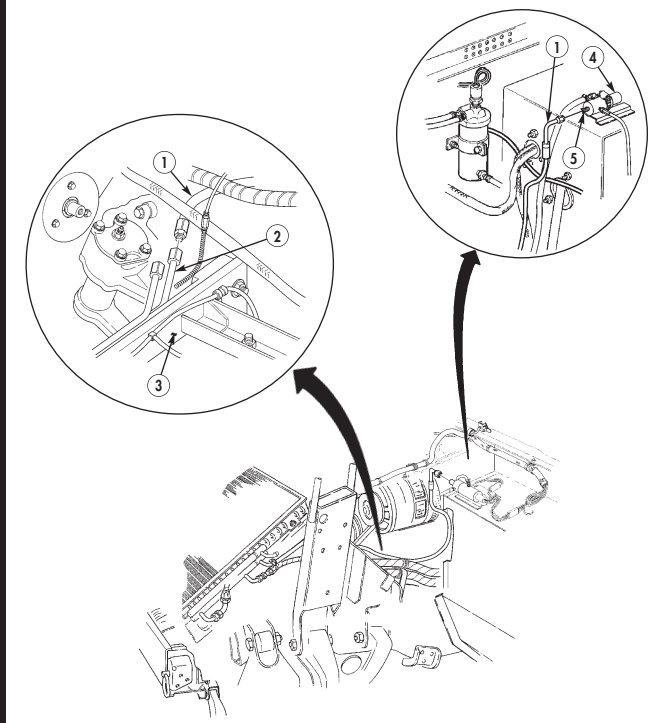

3-84. DIFFERENTIAL COOLER LINES REPLACEMENT (SERIAL NUMBERS 188974 AND

# Below (Cont'D)

b. Oil Cooler Hoses and Tubes Removal

Allow differential to cool before performing this task. Severe injury to personnel may result.

Cover or plug all hoses and connections immediately after disconnection to prevent contamination. Remove all plugs prior to connection.

- Have drainage container ready to catch oil. - For ease of identification during installation, tag with tape all tube ends that route to the left port on the rear differential oil cooler. Left port is inlet side.

1. Remove two hose clamps (1) from front intermediate crossmember (8) and tubes (3) and (7). 2. Disconnect tube (7) from union (6) on tube (5). 3. Disconnect tube (3) from union (6) on tube (4). 4. Remove tubes (3) and (7) from right frame rail (2) and front intermediate crossmember (8).

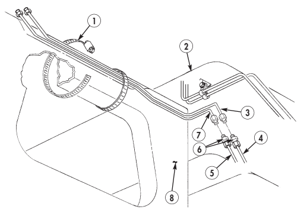

# 3-84. Differential Cooler Lines Replacement (Serial Numbers 188974 And Below) (Cont'D)

5. Remove two nuts (3), washers (4), screws (10), and washers (4) from clamps (2). 6. Remove tubes (7) and (8) and two clamps (2) from lower transmission oil cooler lines (11). 7. Disconnect tubes (7) and (8) from hoses (5) and (6). 8. Remove unions (1) from tubes (7) and (8).

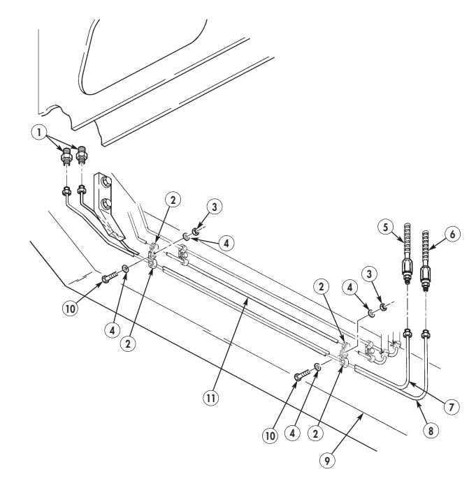

3-84. DIFFERENTIAL COOLER LINES REPLACEMENT (SERIAL NUMBERS 188974 AND

# Below) (Cont'D)

9. Remove bolt (21), washer (22), and two spacers (12) from two clamps (20) and front tunnel support brace (13).

10. Remove tapping screw (19) and washer (18) from two clamps (20) and rear tunnel support brace (15).

11. Remove tapping screw (19) and washer (18) from two clamps (20) and center tunnel support brace (14).

12. Remove six clamps (20) from tubes (16) and (17).

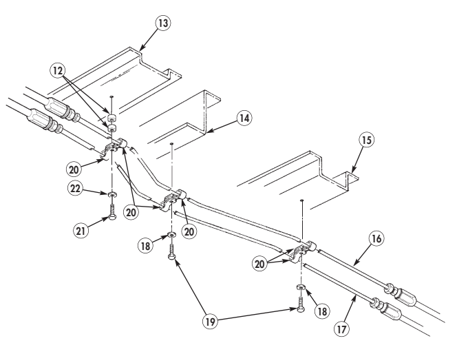

3-84. DIFFERENTIAL COOLER LINES REPLACEMENT (SERIAL NUMBERS 188974 AND

# Below) (Cont'D)

13. Pull hoses (1) and (2) towards rear of vehicle and remove three tiedown straps (3) from hoses (1)
and (2). Discard tiedown straps (3).

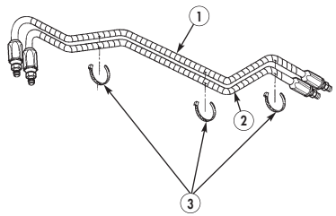

# 3-84. Differential Cooler Lines Replacement (Serial Numbers 188974 And Below (Cont'D)

14. Disconnect tube (7) from right-hand hose (2) and remove right-hand hose (2) from vehicle. 15. Disconnect tube (4) from left-hand hose (1) and remove left-hand hose (1) from vehicle. 16. Remove tiedown strap (13) from differential support brace (8) and hoses (5) and (6). Discard tiedown strap (13).

17. Disconnect hose (6) and remove O-ring (9) from right port (10) on cooler cover assembly (11).

Discard O-ring (9).

18. Disconnect hose (5) and remove O-ring (9) from left port (12) on cooler cover assembly (11).

Discard O-ring (9).

19. Remove hose (6) and tube (7) from vehicle. 20. Remove hose (5) and tube (4) from vehicle.

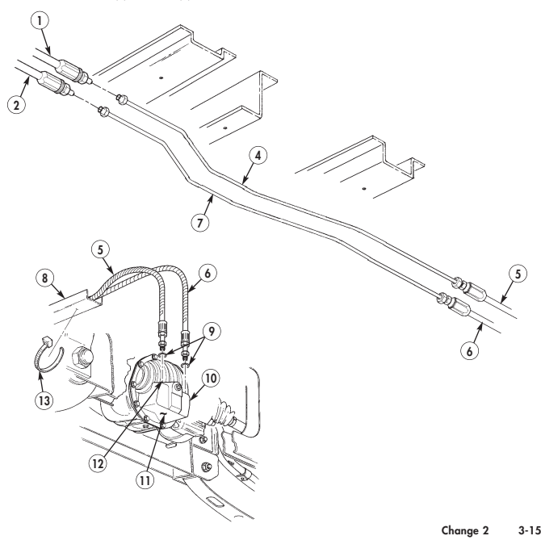

3-84. DIFFERENTIAL COOLER LINES REPLACEMENT (SERIAL NUMBERS 188974 AND
BELOW) (Cont'd)
21. Disconnect hose (4) from tube (1). 22. Disconnect hose (3) from tube (2).

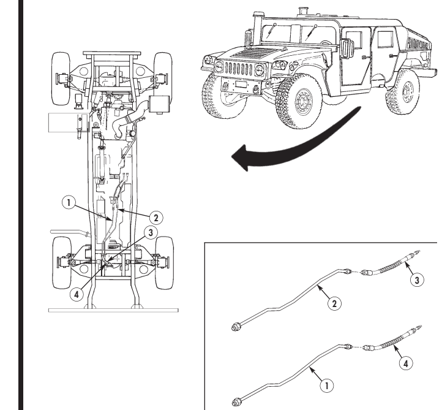

3-84. DIFFERENTIAL COOLER LINES REPLACEMENT (SERIAL NUMBERS 188974 AND

# Below (Cont'D)

c. Oil Cooler Hoses and Tubes Installation NOTE
Remove all protective caps and plugs from tubes and hoses prior to connecting.

1. Connect hose (3) to tube (4). 2. Connect hose (2) to tube (1). 3. Route hose (3) and tube (4) over rear crossmember (5) and along rear differential support brace (6). 4. Route hose (2) and tube (1) over rear crossmember (5) and along rear differential support brace (6).

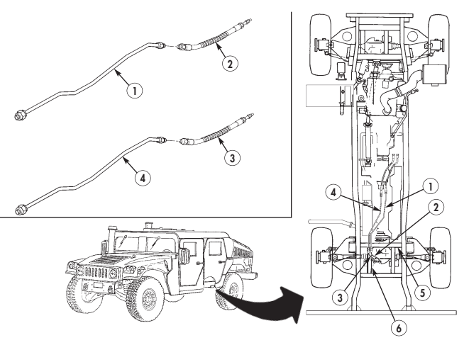

# 3-84. Differential Cooler Lines Replacement (Serial Numbers 188974 And

BELOW) (Cont'd)

Ensure hoses have O-rings installed on ends that connect to cooler cover assembly.

5. Connect hose (1) and O-ring (7) to left port (6) on cooler cover assembly (4). 6. Connect hose (2) and O-ring (3) to right port (5) on cooler cover assembly (4).

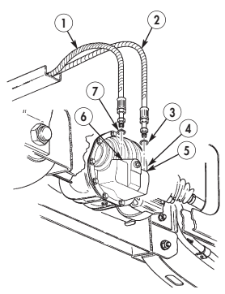

3-84. DIFFERENTIAL COOLER LINES REPLACEMENT (SERIAL NUMBERS 188974 AND

# Below (Cont'D)

7. Route left-hand hose (11) over transfer case and connect to tube (10). 8. Route right-hand hose (8) over transfer case and connect to tube (9). 9. Connect hose (11) to tube (12).

10. Connect hose (8) to tube (13).

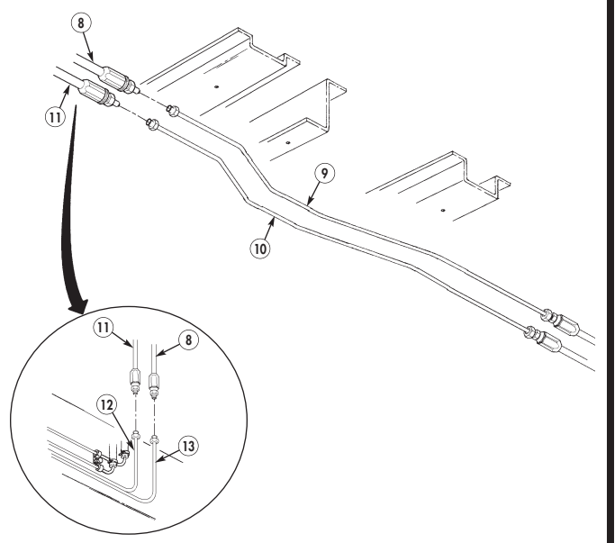

# 3-84. Differential Cooler Lines Replacement (Serial Numbers 188974 And Below) (Cont'D)

11. Install six clamps (8) on tubes (5) and (6). 12. Secure tubes (5) and (6) to center tunnel support brace (3) with two clamps (8), washer (7), and tapping screw (9).

13. Secure tubes (5) and (6) to rear tunnel support brace (4) with two clamps (8), washer (7), and tapping screw (9).

14. Secure tubes (5) and (6) to front tunnel support brace (2) with two spacers (1), clamps (8),
washer (7), and bolt (10).

15. Secure hoses (12) and (13) to differential support brace (11) with tiedown strap (14). 16. Secure hoses (15) and (16) together with three tiedown straps (17).

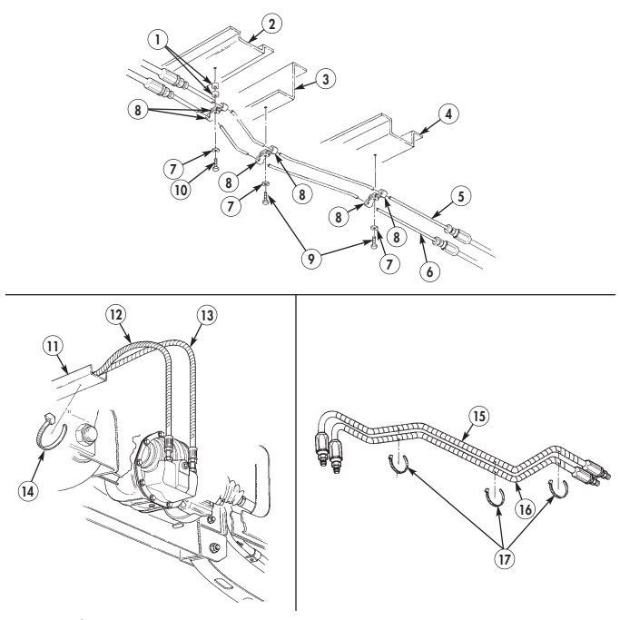

3-84. DIFFERENTIAL COOLER LINES REPLACEMENT (SERIAL NUMBERS 188974 AND

# Below (Cont'D)

17. Install unions (18) on tubes (22) and (23). 18. Install two clamps (19) on tubes (22) and (23). 19. Position tubes (22) and (23) up against right frame rail (24) and under idler arm (27). 20. Secure tubes (22) and (23) and four clamps (19) to lower transmission oil cooler line (26) with two washers (20), screws (25), washers (20), and nuts (21).

21. Connect hoses (15) and (16) to tubes (22) and (23).

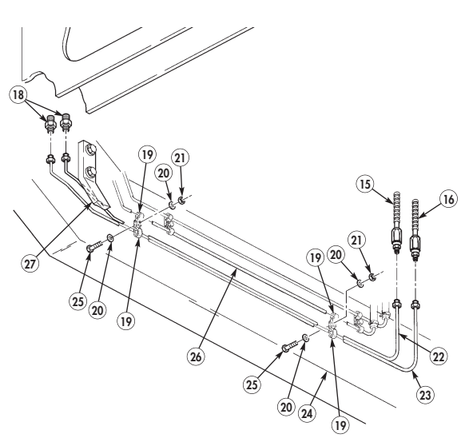

# 3-84. Differential Cooler Lines Replacement (Serial Numbers 188974 And Below) (Cont'D)

22. Position tubes (3) and (8) adjacent to right frame rail (2) and front intermediate crossmember (6). 23. Connect tube (3) to union (7) on tube (4). 24. Connect tube (8) to union (7) on tube (5). 25. Install two hose clamps (1) on front intermediate crossmember (6) and tubes (3) and (8).

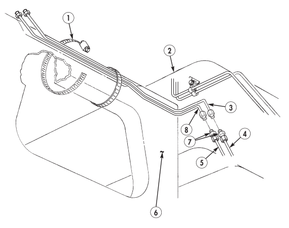

# 3-84. Differential Cooler Lines Replacement (Serial Numbers 188974 And Below (Cont'D)

d. Front Hoses and Relief Valve Installation NOTE
Remove all protective caps and plugs from tubes and hoses prior to connecting.

1. Connect hose (1) to lower tube (2) on front intermediate crossmember (3), and route along left inner cowl (6) to hydraulic control valve (4).

NOTE
Do not apply pipe sealing compound on first two threads of adapter.

2. Apply pipe sealing compound to threads of adapter (5) and install on hydraulic control valve (4). 3. Connect hose (1) to adapter (5) on hydraulic control valve (4).

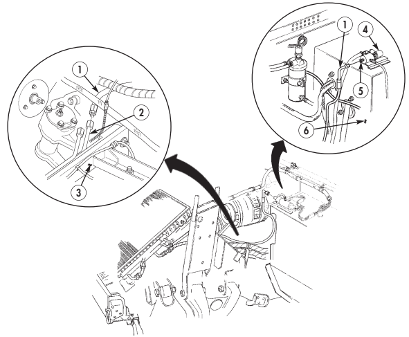

# 3-84. Differential Cooler Lines Replacement (Serial Numbers 188974 And

BELOW) (Cont'd)

Ensure that hose and tee are positioned towards fan shroud and away from moving parts when tightening.

4. Connect tee (6) to hose (3). 5. Connect tee (6) to upper tube (7), and route hose (3) under elbow (4) on fan shroud (5) and under brake limiter bracket (2). 

6. Install tiedown strap (1) on hose (3) and fan shroud elbow (4).

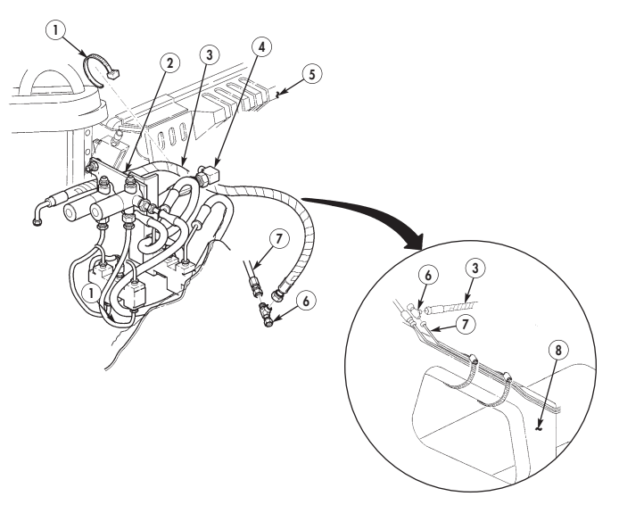

3-84. DIFFERENTIAL COOLER LINES REPLACEMENT (SERIAL NUMBERS 188974 AND

# Below) (Cont'D)

7. Connect hose (12) to tee (6) on upper tube (7) on front intermediate crossmember (8) and route to outlet port (10) on power steering oil cooler (9).

8. Install hose (12) on outlet port (10) with hose clamp (11).

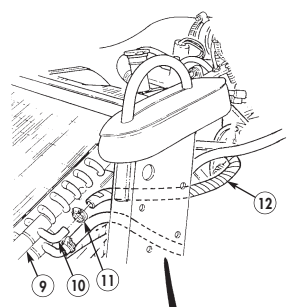

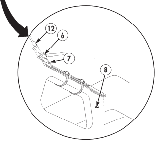

# 3-84. Differential Cooler Lines Replacement (Serial Numbers 188974 And Below) (Cont'D)

Perform steps 9 through 15 and 17 for M1113 and steps 9, 10, and 13 through 17 for M1114.

9. Install left splash shield (3) on vehicle.

10. Install harness (27) and clamp (26) on left splash shield (3) with screw (25) and locknut (28). 11. Install screw (12) and lockwasher (13) on left splash shield (3) and airlift bracket (4). 12. Install screw (11), two washers (6), and locknut (5) on left splash shield (3) and airlift bracket (4). 13. Install left splash shield (3) on master cylinder bracket (9) with two washers (8), screw (10), and locknut (7).

14. Install left splash shield (3) on support bracket (17) with two washers (2), screw (16), and locknut (1).

15. Install left splash shield (3) on plate (22) with four washers (24), lockwashers (20), and screws (19). 16. Install fuel filter drain valve (24) on left splash shield (3) with nut (23). 17. Install access cover (18) on left splash shield (3) with three washers (15) and screws (14).

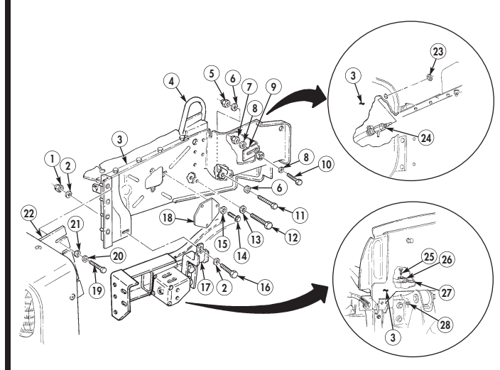

# 3-84. Differential Cooler Lines Replacement (Serial Numbers 188974 And Below (Cont'D)

18. Install relief valve (32) on splash shield (3) with reinforcement (41), two washers (35), and bolts (36). 19. Install O-ring (42) and union (29) on side of relief valve (32). 20. Install O-ring (34) and union (33) on top of relief valve (32). 21. Install hood prop rod (43) and bracket (44) on left splash shield (3) and airlift bracket (4) with four lockwashers (45) and screws (46).

22. Connect bypass hose (30) to union (29). 23. Connect bypass hose (31) to union (33). 24. Connect bypass hose (30) and return hoses (39) and (40) to tee (38) with three clamps (37). 25. Install clamp (49) on bypass hose (30). 26. Secure clamps (49) and (50) together with bolt (51), washer (48), and locknut (47).

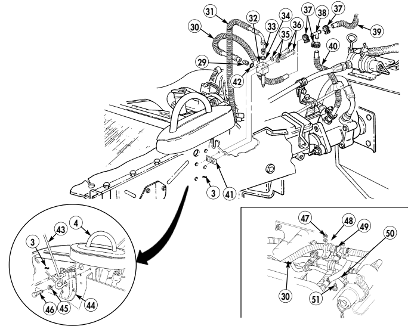

FOLLOW-ON TASKS: - Install rear propeller shaft (para. 6-4).

- Connect battery ground cables (para. 4-68). - Install rear brake protection guards (para. 7-11). - Bleed power steering system (para. 8-27). - Start engine (TM 9-2320-387-10) and inspect for leaks at engine oil cooler, supply, and return lines.

# 3-85. Differential Cooler Lines Replacement (Serial Numbers 188975 Through 299999)

This task covers:
a. Front Hoses and Relief Valve Removal **d. Rear Oil Cooler Hoses and Tubes Installation** b. Oil Cooler Tubes Removal e. Oil Cooler Tubes Installation c. Drilling Hole Locations in Tunnel Support Braces f. Front Hoses and Relief Valve Installation

## Initial Setup: Tools

General mechanic's tool kit:
automotive (Appendix B, Item 1)
Maintenance and repair shop equipment:
automotive (Appendix B, Item 2)

## Materials/Parts

Sealing compound-pipe (Appendix C, Item 62) Four lockwashers (Appendix G, Item 146) Four lockwashers (Appendix G, Item 190.2) Locknut (Appendix G, Item 87) Six locknuts (Appendix G, Item 106) Two O-rings (Appendix G, Item 221) Tiedown strap (Appendix G, Item 329) Two O-rings (Appendix G, Item 218)

## Manual References

TM 9-2320-387-10 TM 9-2320-387-24P

## Equipment Condition

- Rear propeller shaft removed (para. 6-4). - Battery ground cables disconnected
(para. 4-68).

- Rear brake protection guards removed
(para. 7-11).

## General Safety Instructions

- Allow differential to cool. - Hood must be supported during hood prop rod and bracket removal.

Maintenance Level Unit

If rear steel differential oil cooler tubes have failed on vehicle serial numbers 188975 and above, perform tasks c. and d. to replace them with flexible differential oil cooler hoses.

## A. Front Hoses And Relief Valve Removal Warning

Allow differential to cool before performing this task. Severe injury to personnel may result.

Cover or plug all tubes and connections immediately after disconnection to prevent contamination. Remove all plugs prior to connection.

Have drainage container ready to catch oil.

1. Remove locknut (1), washer (2), and bolt (4) from clamp (3). Discard locknut (1). 2. Remove clamp (3) from bypass hose (5). 3. Loosen three clamps (12) on tee (13). 4. Disconnect bypass hose (5) and return hoses (14) and (15) from tee (13). 5. Disconnect bypass hose (6) from union (8). 6. Disconnect bypass hose (5) from union (19). 7. Remove union (8) and O-ring (9) from top of relief valve (7). Discard O-ring (9). 8. Remove union (19) and O-ring (18) from side of relief valve (7). Discard O-ring (18). 9. Remove two bolts (11), washers (10), relief valve (7), and reinforcement (16) from splash shield (17).

# 3-85. Differential Cooler Lines Replacement (Serial Numbers 188975 Through 299999) (Cont'D)

Hood must be supported during hood prop rod and bracket removal. Failure to support hood may cause injury to personnel or damage to equipment.

10. Remove four screws (24), lockwashers (23), hood prop rod (20), and bracket (22) from left splash shield (17) and airlift bracket (21). Discard lockwashers (23).

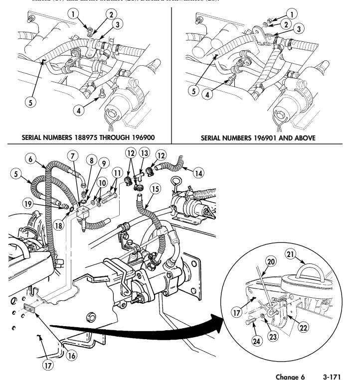

# 3-85. Differential Cooler Lines Replacement (Serial Numbers 188975 Through 299999) (Cont'D)

11. Remove three screws (14), washers (15), and access cover (16) from left splash shield (3).

NOTE
Perform steps 13 through 18 for M1113 and steps 12 through 15 and 18 for M1114.

12. Remove nut (23) and fuel filter drain valve (24) from left splash shield (3). 13. Remove four screws (19), washers (21), and lockwashers (20) from plate (22) and left splash shield (3). Discard lockwashers (20).

14. Remove locknut (1), two washers (2), and screw (17) from support bracket (18) and left splash shield
(3). Discard locknut (1).

15. Remove locknut (7), two washers (8), and screw (10) from master cylinder bracket (9) and left splash shield (3). Discard locknut (7).

16. Remove locknut (5), two washers (6), and screw (11) from left splash shield (3) and airlift bracket (4). Discard locknut (5).

17. Remove screw (12) and lockwasher (13) from left splash shield (3) and airlift bracket (4). Discard lockwasher (13).

18. Remove locknut (28), screw (25), clamp (26), and harness (27) from left splash shield (3). Discard locknut (28) and remove left splash shield (3) from vehicle.

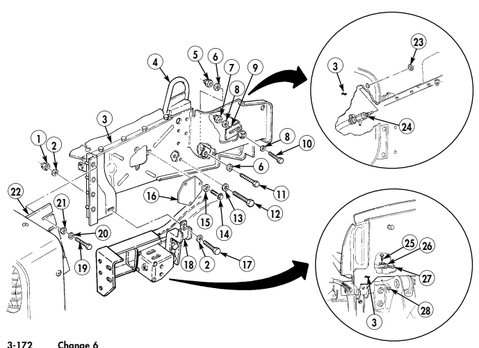

3-172 Change 6

# 3-85. Differential Cooler Lines Replacement (Serial Numbers 188975 Through 299999) (Cont'D)

22. Disconnect tee (36) from hose (34). 23. Remove tiedown strap (33) from hose (34) and elbow (35). Discard tiedown strap (33).

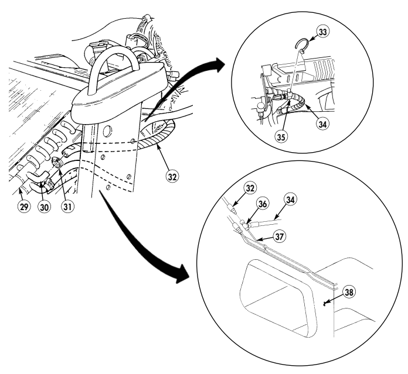

19. Remove hose clamp (31) and hose (32) from outlet port (30) on power steering cooler (29).

20. Disconnect hose (32) from tee (36) on upper tube (37) on front intermediate crossmember (38).

21. Disconnect tee (36) from upper tube (37).

# 3-85. Differential Cooler Lines Replacement (Serial Numbers 188975 Through 299999) (Cont'D)

Perform steps 24 and 25 for vehicles with serial numbers 196901 and above.

24. Remove locknut (9), washer (8), screw (6), and three clamps (7) from bracket (10). Discard locknut (9).

25. Remove clamp (7) from hose (1). 26. Disconnect hose (1) from adapter (5) on hydraulic control valve (4). 27. Remove adapter (5) from hydraulic control valve (4). 28. Disconnect hose (1) from lower tube (2) on intermediate crossmember (3).

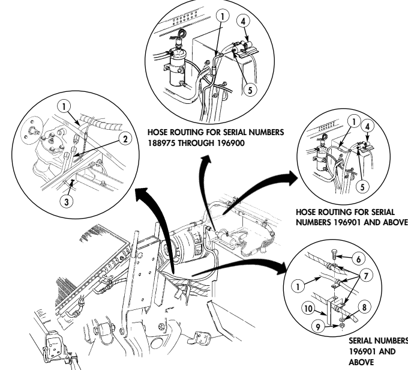

# 3-85. Differential Cooler Lines Replacement (Serial Numbers 188975 Through 299999) (Cont'D)

b. Oil Cooler Tubes Removal

Allow differential to cool before performing this task. Severe injury to personnel may result.

Cover or plug all hoses and connections immediately after disconnection to prevent contamination. Remove all plugs prior to connection.

Have drainage container ready to catch oil.

1. Remove screw (1), washer (2), and two clamps (3) from intermediate crossmember (10). 2. Remove nut (6), washer (5), nut (6), washer (5), and screw (4) from two clamps (9). 3. Remove clamp (9) from tubes (7) and (8).

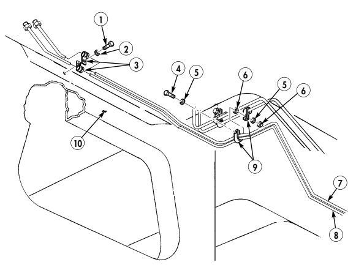

# 3-85. Differential Cooler Lines Replacement (Serial Numbers 188975 Through 299999) (Cont'D)

4. Remove two nuts (5), washers (6), nuts (5), washers (6), and screws (4) from four clamps (3). 5. Remove two clamps (3) from tubes (1) and (2). 6. Disconnect tubes (1) and (2) from unions (7) and (10). 7. Remove unions (7) and (10) from tubes (8) and (9).

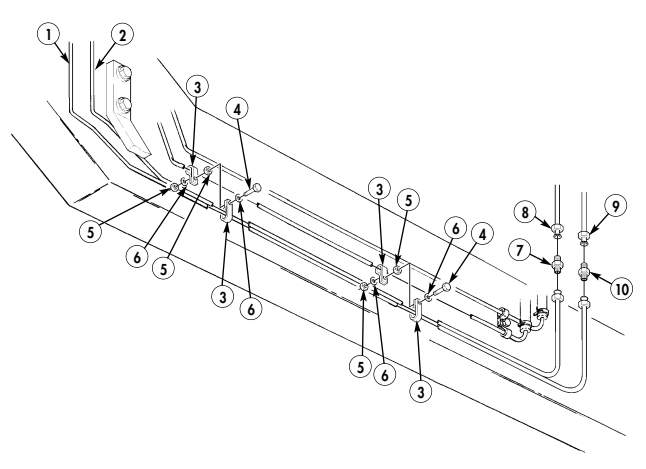

# 3-85. Differential Cooler Lines Replacement (Serial Numbers 188975 Through 299999) (Cont'D)

c. Drilling Hole Locations in Tunnel Support Braces

Perform task c. when replacing rear steel differential oil cooler tubes with flexible differential oil cooler lines.

1. Locate, mark, and drill a 0.201 in. (5.10 mm) diameter hole (1) (\#7 drill bit) in tunnel support brace (2).

2. Using 0.250-20 UNC standard tap, thread hole (1) drilled in step 1 in front tunnel support brace (2).

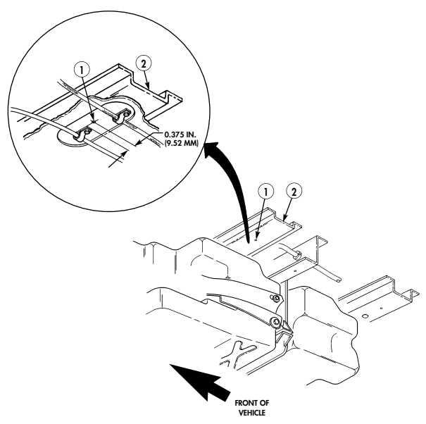

# 3-85. Differential Cooler Lines Replacement (Serial Numbers 188975 Through 299999) (Cont'D)

3. Locate, mark, and drill two 0.201 in. (5.10 mm) diameter holes (1) (\#7 drill bit) in tunnel support braces (2) and (3).

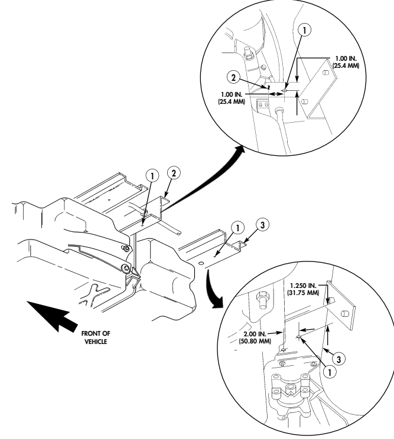

# 3-85. Differential Cooler Lines Replacement (Serial Numbers 188975 Through 299999) (Cont'D)

d. Rear Oil Cooler Hoses and Tubes Installation NOTE
- Perform task d. when replacing rear steel differential oil cooler tubes with flexible differential oil cooler lines.

- Remove all protective caps and plugs from tubes and hoses prior to connecting.

1. Connect hose (3) to tube (4). 2. Connect hose (2) to tube (1). 3. Route hose (3) and tube (4) over rear crossmember (5). 4. Route hose (2) and tube (1) over rear crossmember (5).

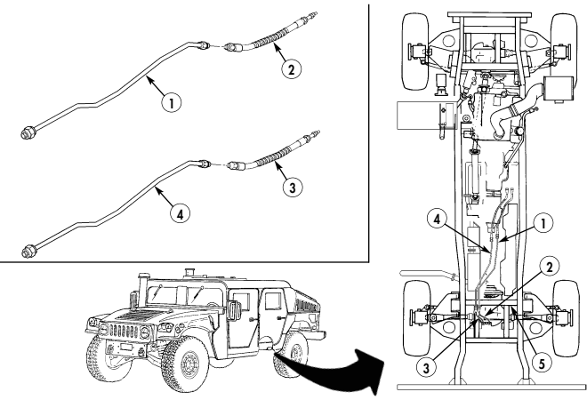

# 3-85. Differential Cooler Lines Replacement (Serial Numbers 188975 Through 299999) (Cont'D)

Ensure hoses have O-ring installed on ends that connect to cooler cover assembly.

5. Route hose (2) along rear differential support brace (1) and connect hose (2) and O-ring (8) to left port (7) on cooler cover assembly (5).

6. Route hose (3) along rear differential support brace (1) and connect hose (3) and O-ring (4) to right port (6) on cooler cover assembly (5).

7. Secure hoses (2) and (3) to differential support brace (1) with tiedown strap (9).

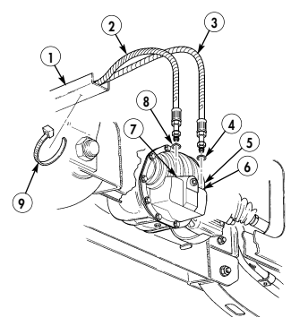

# 3-85. Differential Cooler Lines Replacement

# (Serial Numbers 188975 Through 299999) (Cont'D)

8. Route left-hand hose (10) over transfer case and connect to tube (11). 9. Route right-hand hose (13) over transfer case and connect to tube (12).

10. Connect left-hand hose (10) to tube (15). 11. Connect right-hand hose (13) to tube (14).

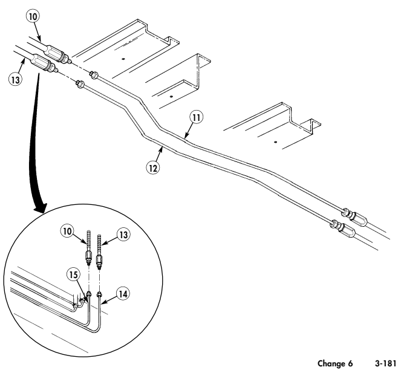

# 3-85. Differential Cooler Lines Replacement (Serial Numbers 188975 Through 299999) (Cont'D)

12. Install six clamps (8) on tubes (5) and (6). 13. Secure tubes (5) and (6) to center tunnel support brace (3) with two clamps (8), washer (7), and tapping screw (9).

14. Secure tubes (5) and (6) to rear tunnel support brace (4) with two clamps (8), washer (7), and tapping screw (9).

15. Secure tubes (5) and (6) to front tunnel support brace (2) with two spacers (1), clamps (8),
washer (7), and bolt (10).

16. Secure hose (11) and (12) together with three tiedown straps (13).

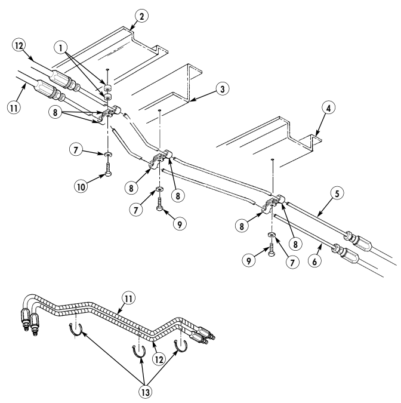

3-182 Change 6

# 3-85. Differential Cooler Lines Replacement (Serial Numbers 188975 Through 299999) (Cont'D)

## E. Oil Cooler Tubes Installation

1. Install two clamps (18) on tubes (16) and (17) with screws (19), washers (20), and nuts (21). 2. Route tubes (16) and (17) along right-hand frame rail (14) and under idler arm (15). 3. Secure two clamps (18) on tubes (16) and (17) to two clamps on transmission cooler tube (22) with washers (20) and nuts (21).

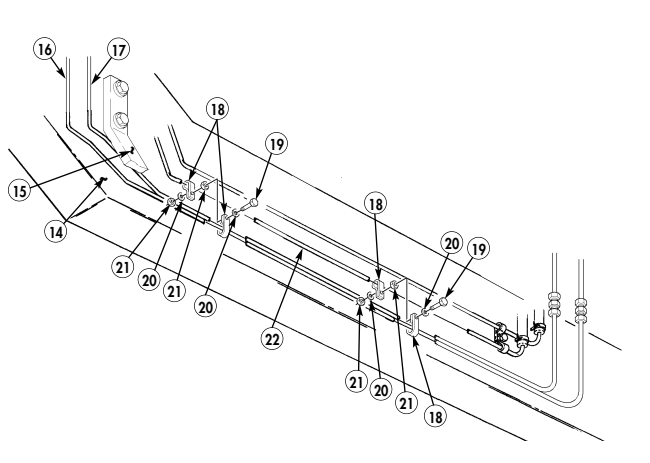

# 3-85. Differential Cooler Lines Replacement (Serial Numbers 188975 Through 299999) (Cont'D)

4. Route tubes (8) and (9) along right-hand frame rail (7) and onto front intermediate crossmember (11).

5. Install two clamps (3) on tubes (8) and (9). 6. Secure tubes (8) and (9) to front intermediate crossmember (11) with washer (1) and screw (2). 7. Install clamp (3) on tubes (8) and (9). 8. Secure tubes (8) and (9) to clamp (3) on transmission oil cooler line (10) with clamp (3), washer (5),
screw (4), nut (6), washer (5), and nut (6).

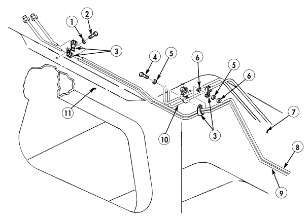

# 3-85. Differential Cooler Lines Replacement (Serial Numbers 188975 Through 299999) (Cont'D)

f. Front Hoses and Relief Valve Installation

Remove all protective caps and plugs from tubes and hoses prior to connecting.

1. Connect hose (1) to lower tube (2) on front intermediate crossmember (3).

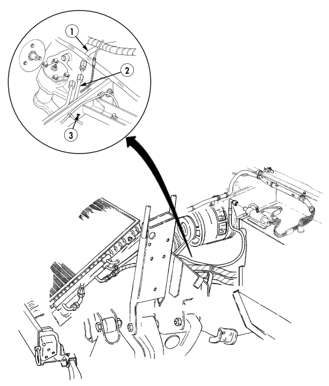

# 3-85. Differential Cooler Lines Replacement (Serial Numbers 188975 Through 299999) (Cont'D)

2. Route hose (1) along left inner cowl (3) to adapter (4) on hydraulic control valve (2).

NOTE
Do not apply pipe sealing compound on first two threads of adapter.

3. Apply pipe sealing compound to threads of adapter (4) and install on hydraulic control valve (2). 4. Connect hose (1) to adapter (4) on hydraulic control valve (2).

Perform steps 5 and 6 for vehicles with serial numbers 196901 and above.

5. Install clamp (6) on hose (1). 6. Install three clamps (6) on bracket (9) with screw (5), washer (7), and locknut (8).

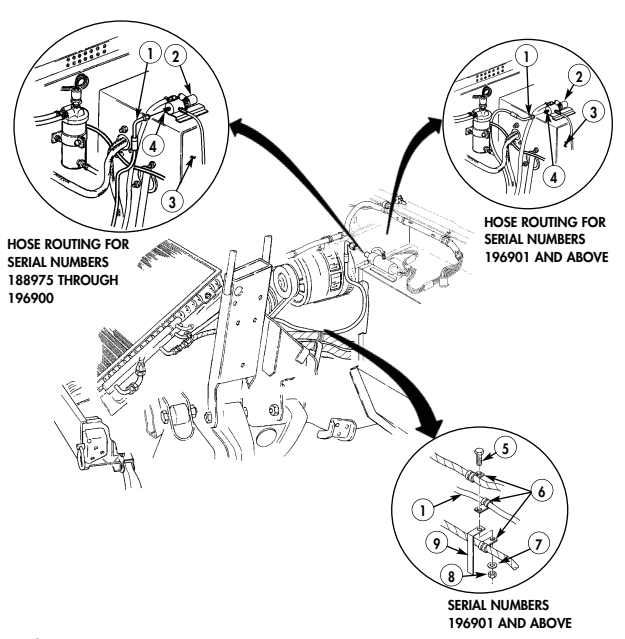

# 3-85. Differential Cooler Lines Replacement (Serial Numbers 188975 Through 299999) (Cont'D)

Ensure that hose and tee are positioned towards fan shroud and away from moving parts when tightening.

7. Connect tee (16) to hose (12). 8. Connect tee (16) to upper tube (15), and route hose (12) under elbow (13) on fan shroud (14) and under brake limiter bracket (10).

9. Install tiedown strap (11) on elbow (13) and hose (12).

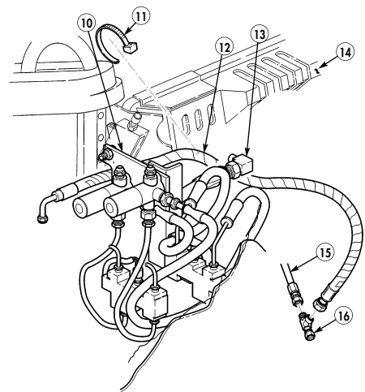

# 3-85. Differential Cooler Lines Replacement (Serial Numbers 188975 Through 299999) (Cont'D)

10. Connect hose (4) to tee (5) on upper tube (7) on front intermediate crossmember (8) and route to outlet port (2) on power steering oil cooler (1).

11. Install hose (4) on outlet port (2) with hose clamp (3).

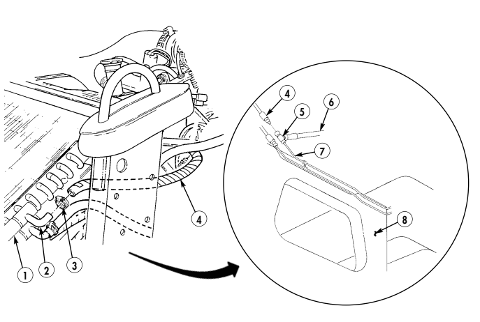

# 3-85. Differential Cooler Lines Replacement (Serial Numbers 188975 Through 299999) (Cont'D)

12. Install left splash shield (11) on vehicle and install harness (35) and clamp (34) on left splash shield (11) with screw (33) and locknut (36).

NOTE
Perform steps 14 through 17 and 19 for M1113 and steps 16 through 19 for M1114.

13. Install screw (20) and lockwasher (21) on left splash shield (11) and airlift bracket (12). 14. Install screw (19), two washers (14), and locknut (13) on left splash shield (11) and airlift bracket (12).

15. Install left splash shield (11) on master cylinder bracket (17) with two washers (16), screw (18), and locknut (15).

16. Install left splash shield (11) on support bracket (26) with two washers (10), screw (25), and locknut (9).

17. Install left splash shield (11) on plate (30) with four washers (29), lockwashers (28), and screws (27). 18. Install fuel filter drain valve (32) on left splash shield (11) and nut (31). 19. Install access cover (24) on left splash shield (11) with three washers (23) and screws (22).

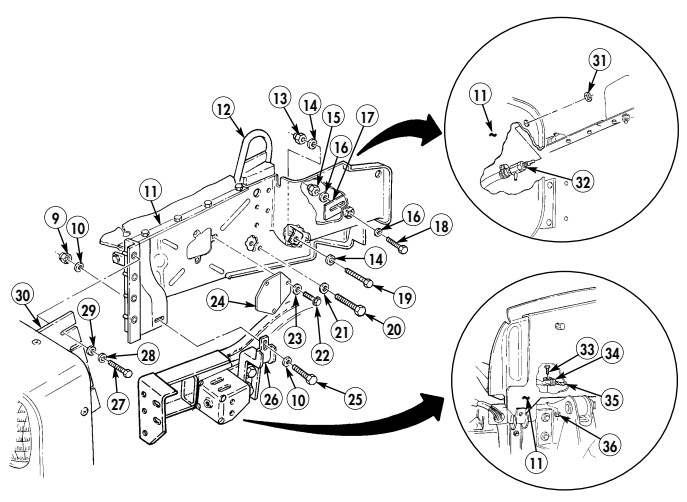

# 3-85. Differential Cooler Lines Replacement (Serial Numbers 188975 Through 299999) (Cont'D)

20. Install relief valve (3) on splash shield (14) with reinforcement (13), two washers (6), and bolts (7).

21. Install hood prop rod (17) and bracket (19) on left splash shield (14) and airlift bracket (18) with four lockwashers (20) and screws (21).

22. Install O-ring (15) and union (16) on side of relief valve (3). 23. Install O-ring (5) and union (4) on top of relief valve (3). 24. Connect bypass hose (1) to union (16). 25. Connect bypass hose (2) to union (4). 26. Connect bypass hose (1) and return hose (10) to tee (9) with two clamps (8).

For vehicles with serial numbers 196901 and above, return hose is routed under fan clutch hydraulic line. For vehicles with serial numbers 188975 through 196900, return hose is routed over fan clutch hydraulic line.

27. Route return hose (11) over fan clutch hydraulic line (12) and connect return hose (11) to tee (9)
with clamp (8).

28. Install clamp (19) on bypass hose (1).

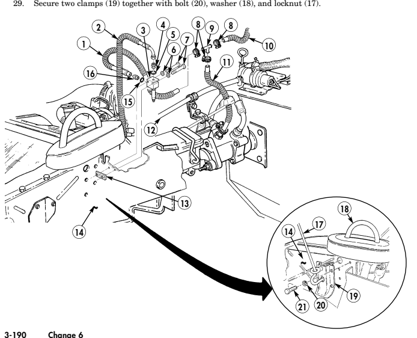

# 3-85. Differential Cooler Lines Replacement (Serial Numbers 188975 Through 299999) (Cont'D)

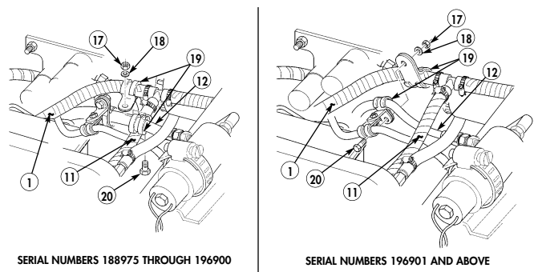

FOLLOW-ON TASKS: - Install rear propeller shaft (para. 6-4).

- Connect battery ground cables (para. 4-68). - Install rear brake protection guards (para. 7-11). - Bleed power steering system (para. 8-27). - Start engine (TM 9-2320-387-10) and inspect for leaks at all differential cooler supply hoses and return line connections.

# 3-85.1. Transfer Case Cooler Lines Maintenance (Serial Numbers 300000 And Above)

This task covers:

a. Removal c. Assembly b. Disassembly d. Installation

| General mechanic's tool kit: automotive (Appendix B, Item 1)   | TM 9\-2320\-387\-10 TM 9\-2320\-387\-24P       |
|----------------------------------------------------------------|------------------------------------------------|
| Material/Parts                                                 |                                                |
|                                                                | Equipment Condition                            |
| Sealing compound (Appendix C, Item 60)                         | Hood raised and secured (TM 9\-2320\-387\-10). |
| Personnel Required                                             | Maintenance Level                              |
| One mechanic                                                   | Unit                                           |
| One assistant                                                  |                                                |

## A. Removal

1. Remove nut (3), lockwasher (4), washer (5), capscrew (13), washer (12), and hose assembly (14) from transfer case mount (6). Discard lockwasher (4).

2. Remove hose clamps (1) and (11) and hose assembly (14) from transfer case (2). 3. Remove hose clamps (7) and (10) and remove tubes (8) and (9) from hose assembly (14).

## B. Disassembly

1. Remove hose clamps (15) and (18) and tubes (16) and (17) from coolant tubes (20) and (21). 2. Remove nut (23), lockwasher (24), washer (25), capscrew (29), and washer (28) from clamps (26) and (27). Discard lockwasher (24).

3. Remove clamps (19), (22), (26), and (27) from coolant hoses (20) and (21).

## C. Assembly

1. Install clamps (27), (26), (22), and (19) on coolant hoses (21) and (20). 2. Install clamp (27) on clamp (26) with washer (28), capscrew (29), washer (25), lockwasher (24), and nut (23).

3. Install tubes (17) and (16) on coolant hoses (21) and (20) with hose clamps (18) and (15).

## D. Installation

1. Install hose assembly (14) on tubes (9) and (8) with hose clamps (10) and (7). 2. Install hose assembly (14) on transfer case (2) with hose clamps (11) and (1). 3. Secure hose assembly (14) to transfer case mount (6) with washer (12), capscrew (13), washer (5),
lockwasher (4), and nut (3).

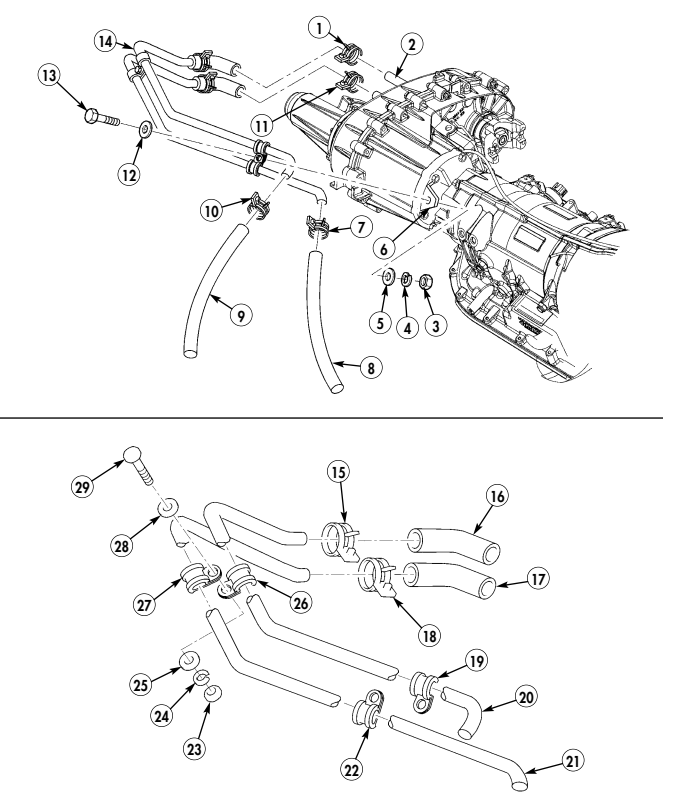

# 3-85.1. Transfer Case Cooler Lines Maintenance (Serial Numbers 300000 And Above) (Cont'D)

FOLLOW ON TASK:  Fill cooling system (para. 3-61).

# Chapter 4 Electrical System (Unit) Maintenance

Section I. GENERATING AND PROTECTIVE CONTROL BOX (PCB) SYSTEM MAINTENANCE

| automotive (Appendix B, Item 1)        | Equipment Condition                                                                                 |
|----------------------------------------|-----------------------------------------------------------------------------------------------------|
| Maintenance and repair shop equipment: | Cooling system drained (para. 3\-61).  automotive (Appendix B, Item 2)                              |
|                                        | Maintenance Level Materials/Parts                                                                   |
|                                        | Unit  Two locknuts (Appendix G, Item 77)                                                            |
|                                        | Sealing compound (Appendix C, Item 62)                                                              |
|                                        | a. Removal                                                                                          |
| 1.                                     | Remove drainvalve (11) from radiator lower tube assembly (10).                                      |
| 2.                                     | Remove two locknuts (5), washers (3), capscrews (2), and washers (3) from radiator lower tube       |
|                                        | assembly (10) and frame bracket (4). Discard locknuts (5).                                          |
| 3.                                     | Loosen clamp (7) and disconnect water pump inlet hose (6) from radiator lower tube assembly (10).   |
| 4.                                     | Loosen clamp (8) and disconnect surge tank\-to\-lower radiator hose (9) from radiator lower tube    |
|                                        | assembly (10).                                                                                      |
| 5.                                     | Loosen clamp (12) and disconnect lower radiator hose (1) from radiator lower tube assembly (10).    |
| 6.                                     | Remove radiator lower tube assembly (10).                                                           |
| b.                                     | Installation                                                                                        |
| 1.                                     | Install radiator lower tube assembly (10) on frame bracket (4) with two washers (3), capscrews (2), |
|                                        | washers (3), and locknuts (5). Tighten locknuts (5) to 6 lb\-ft (8 N•m).                            |
| 2.                                     | Connect lower radiator hose (6) to radiator lower tube assembly (10) and tighten clamp (7) to       |
|                                        | 85\-95 lb\-in. (10\-11 N•m).                                                                        |
| 3.                                     | Connect surge tank\-to\-lower radiator hose (9) to radiator lower tube assembly (10) and tighten    |

4-1. GENERATING AND PROTECTIVE CONTROL BOX (PCB) SYSTEM MAINTENANCE
TASK SUMMARY

# 4-2. Alternator Pulley Replacement

This task covers:
INITIAL SETUP:

## Tools

General mechanic's tool kit:
automotive (Appendix B, Item 1)
Maintenance and repair shop equipment:
automotive (Appendix B, Item 2)
Mechanical puller (Appendix B, Item 157) Vise inserts (Appendix B, Item 160)

## Materials/Parts

Locknut (Appendix G, Item 74) Woodruff key (Appendix G, Item 332)
a. Removal 1. Clamp alternator pulley (2) in soft-jawed vise. 2. Remove locknut (5) and washer (4) from alternator shaft (3). Discard locknut (5). 3. Remove pulley (2) from soft-jawed vise. 4. Using mechanical puller, remove pulley (2) from alternator (1). 5. Remove woodruff key (6) from alternator shaft (3). Discard woodruff key (6).

## B. Installation Caution

Serpentine belt failure (abnormal wear or belt dislodgement) can be caused by misalignment of pulleys, improper installation, or foreign objects introduced into belt path. Inspect water pump pulley for proper installation and ease of rotation. Any wobble or misalignment will cause belt failure.

1. Position woodruff key (6) in alternator shaft (3) with flat side up. 2. Align pulley keyway (7) with woodruff key (6) in alternator shaft (3) and tap pulley (2) onto shaft (3).

3. Install washer (4) and locknut (5) on shaft (3). Tighten locknut (5) finger-tight. 4. Clamp pulley (2) in soft-jawed vise. 5. Tighten locknut (5) to 115-125 lb-ft (156-169 N•m). 6. Remove pulley (2) and alternator (1) from vise.

a. Removal b. Installation Manual References TM 9-2320-387-24P
Equipment Condition Alternator removed (para. 4-5).

Maintenance Level Unit

# 4-2.  Alternator Pulley Replacement (Cont'D)

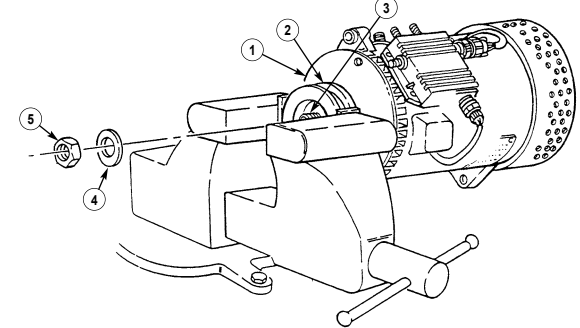

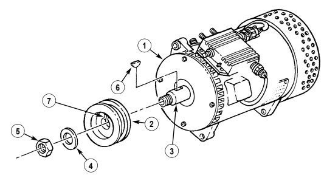

FOLLOW-ON TASK:  Install alternator (para. 4-5).

# 4-2.1. Alternator Clutch Pulley Replacement (Serial Numbers 196901 And Above)

This task covers:

## Initial Setup: A. Removal B. Installation

| General mechanic's tool kit:                                           | TM 9\-2320\-387\-24P                  |
|------------------------------------------------------------------------|---------------------------------------|
| automotive (Appendix B, Item 1)                                        | Equipment Condition                   |
| Maintenance and repair shop equipment: automotive (Appendix B, Item 2) | Cooling system drained (para. 3\-61). |
| Materials/Parts                                                        | Maintenance Level                     |
| Two locknuts (Appendix G, Item 77)                                     | Unit                                  |
| Sealing compound (Appendix C, Item 62)                                 |                                       |

a. Removal 1. Hold adapter (3) with socket and breaker bar. Place wrench on installation nut (1), turn installation nut (1) counterclockwise, and remove installation nut (1) from alternator (2).

2. Hold rear nut of alternator shaft (6) and remove adapter (3), clutch pulley (4), and woodruff key (5)
from alternator (2). Discard woodruff key (5).

b. Installation 1. Install woodruff key (5) and clutch pulley (4) on shaft (6) of alternator (2). 2. Install adapter (3) on alternator (2). Hold rear nut on alternator shaft (6) and tighten adapter (3) 
to 50 lb-ft (68 N•m).

3. Install installation nut (1) on adapter (3). Using torque wrench set at 120 lb-ft (163 N•m) and socket, hold adapter (3) with socket and torque wrench. Turn installation nut (1) clockwise with wrench until torque is reached.

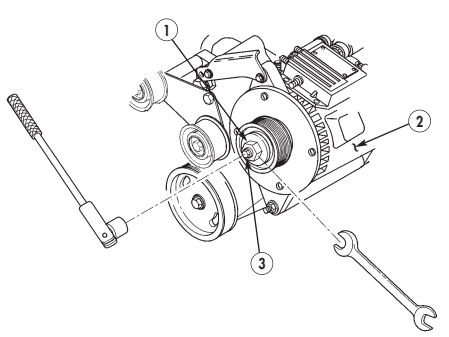

| 4\-2.   | 1   | .   |
|---------|-----|-----|

ALTERNATOR CLUTCH PULLEY REPLACEMENT (SERIAL NUMBERS 196901 AND ABOVE) (Cont'd)

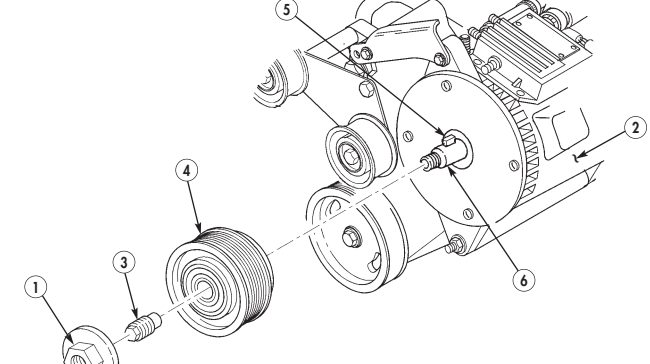

# 4-3. Alternator/Power Steering Mounting Bracket Replacement (Serial Numbers 196900 And Below)

This task covers:
INITIAL SETUP:
Tools General mechanic's tool kit:
automotive (Appendix B, Item 1)
Maintenance and repair shop equipment:
automotive (Appendix B, Item 2)
Materials/Parts Sealing compound (Appendix C, Item 60)
a. Removal b. Installation

| Cooling system drained (para. 3\-61).   | Maintenance Level   |
|-----------------------------------------|---------------------|
| Unit                                    |                     |

## Maintenance Level

Unit a. Removal Remove two flanged-head capscrews (3), long flanged-head capscrew (2), and mounting bracket (1) from engine (4).

## B. Installation

Apply sealing compund to capscrews (2) and (3), and install mounting bracket (1) on engine (4) with two flanged-head capscrews (3) and long flanged-head capscrew (2). Tighten capscrews (3) and (2) to 48 lb-ft (65 N•m).

# 4-3.  Alternator/Power Steering Mounting Bracket Replacement (Serial Numbers 196900 And Below) (Cont'D)

■

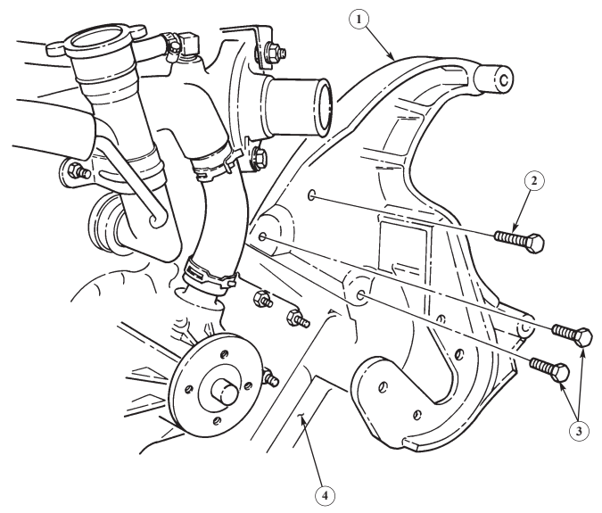

FOLLOW-ON TASKS: · · Install power steering pump (para. 8-23).

-  Install tensioner, idler pulleys, and mounting hardware (para. 3-82).
-  Install alternator (para 4-5).

# 4-3.1. Alternator/Power Steering Mounting Bracket Replacement

(SERIAL NUMBERS 196901 AND ABOVE)
This task covers:

## Initial Setup:

Tools General mechanic's tool kit:
automotive (Appendix B, Item 1)
Maintenance and repair shop equipment:
automotive (Appendix B, Item 2)
Materials/Parts Adhesive sealant (Appendix C, Item 3.1)
Manual References TM 9-2320-387-10 TM 9-2320-387-24P
a. Removal b. Installation

## Equipment Condition

- Hood open and secured (TM 9-2320-387-10). - Alternator removed (para. 4-5). - Tensioner and mounting hardware removed
(para. 3-82.1).

- Idler pulleys and mounting hardware removed (para. 3-82.6).

- Power steering pump and pulley removed 
(para. 8-23.1).

Maintenance Level Unit a. Removal 1. Remove three screws (2) and alternator/power steering mounting bracket (1) from engine (3).

b. Installation 1. Apply adhesive sealant to threads of three screws (2) and install alternator/power steering mounting bracket (1) on engine (3) with screws (2).

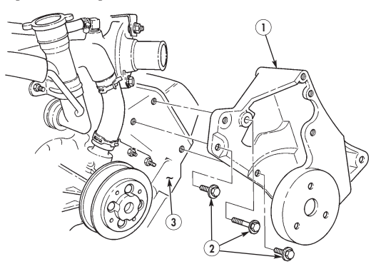

FOLLOW-ON TASKS: - Install alternator (para. 4-5).

- Install tensioner and mounting hardware (para. 3-82.1). - Install idler pulleys and mounting hardware (para. 3-82.6). - Install power steering pump and pulley (para. 8-23.1). - Lower and secure hood (TM 9-2320-387-10).

# 4-4. Protective Control Box (Pcb) Replacement

This task covers:

## Initial Setup:

Tools General mechanic's tool kit:
automotive (Appendix B, Item 1)
Maintenance and repair shop equipment:
automotive (Appendix B, Item 2)
Materials/Parts Silicone compound (Appendix C, Item 74) Four nut and lockwasher assemblies 
(Appendix G, Item 244)
Personnel Required One mechanic One assistant

## A. Removal B. Installation

Manual References TM 9-2320-387-10 TM 9-2320-387-24P
Equipment Condition
- Battery ground cable disconnected (para. 4-68). - Hood raised and secured (TM 9-2320-387-10).

Maintenance Level Unit

The control box must be supported from inside the vehicle during removal and installation. Failure to do this may result in damage to Protective Control Box (PCB).

a. Removal 1. From inside the vehicle, disconnect body wiring harness cannon plug (4) from PCB (5). 2. Working under hood, disconnect engine wiring harness cannon plug (6) from PCB connector (7).

NOTE
Perform step 3 for all vehicles except M1113. Perform step 4 for M1113.

3. Remove four screws (5.1) and PCB (5) from cowl (3). 4. Remove four nut and lockwasher assemblies (1) and PCB (5) from cowl (3). Discard nut and lock-washer assemblies (1).

b. Installation 1. Position PCB (5) under instrument panel (2) against cowl (3).

Perform step 2 for all vehicles except M1113. Perform step 2.1 for M1113.

2. From under hood, install PCB (5) on cowl (3) with four screws (5.1). Tighten screws (5.1) to 6 lb-ft (8 N•m).

2.1. From under hood, install PCB (5) on cowl (3) with four nut and lockwasher assemblies (1).

Tighten nut and lockwashers assemblies (1) to 6 lb-ft (8 N•m).

3. Fill cannon plug (6) and PCB connector (7) to capacity with silicone compound. 4. Connect engine wiring harness cannon plug (6) to PCB connector (7). 5. From inside vehicle, connect body wiring harness cannon plug (4) to PCB (5).

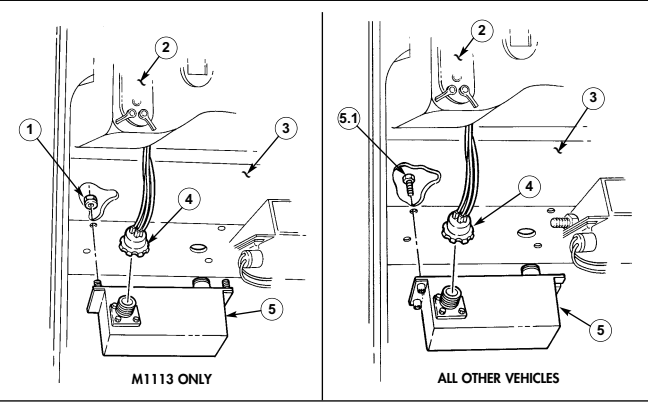

# 4-4.  Protective Control Box (Pcb) Replacement (Cont'D)

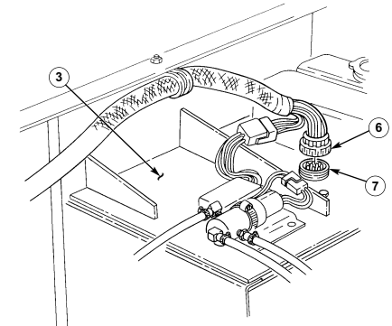

FOLLOW-ON TASKS: - Connect battery ground cable (para. 4-68).

· Lower and secure hood (TM 9-2320-387-10).

Artist
# 4-5. 200-Ampere Dual Voltage Alternator Replacement

This task covers:
INITIAL SETUP:
Tools General mechanic's tool kit:
automotive (Appendix B, Item 1)
Maintenance and repair shop equipment:
automotive (Appendix B, Item 2)

## Materials/Parts

Lockwasher (Appendix G, Item 180) Lockwasher (Appendix G, Item 181) Lockwasher (Appendix G, Item 182) Lockwasher (Appendix G, Item 144) Grease (Appendix C, Item 36)
Personnel Required One mechanic One assistant

## A. Removal B. Installation

Manual References TM 9-2320-387-24P
Equipment Condition Voltage regulator removed (para. 4-8).

General Safety Instructions Alternator must be supported during removal and installation.

Maintenance Level Unit

Prior to removal, tag leads for installation.

## A. Removal

1. Remove nut (14), lockwasher (13), washer (12), and ground strap (11) from ground stud (10). Discard lockwasher (13).

2. Slide back rubber boot (15) and remove nut (1), lockwasher (2), washer (3), and alternator positive cable lead 6 (4) from positive stud (7). Discard lockwasher (2).

3. Position 3/8-in. breaker bar or, as appropriate, a 1/2-in. ratchet wrench on belt tensioner (16), move tensioner (16) clockwise, and remove drivebelt (8) from alternator pulley (9).

Alternator must be supported during removal. Failure to support alternator may cause injury to personnel or damage to equipment.

4. Remove nut (29), lockwasher (28), washer (27), two screws (19), washers (17), lockwasher (18), and alternator (25) from support bracket (23) and mounting bracket (26). Discard lockwashers (28) and (18).

5. Remove three capscrews (20), washers (21), bushings (24), and fan guard assembly (22) from alternator (25).

6. Remove alternator pulley (9) (para. 4-2).

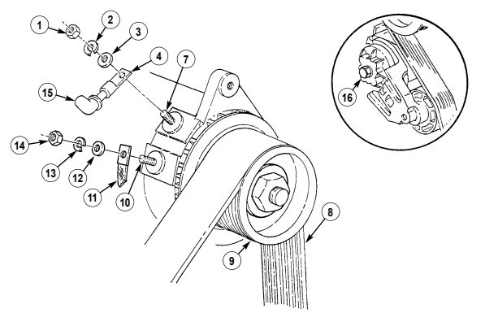

4-5.  200-AMPERE DUAL VOLTAGE ALTERNATOR REPLACEMENT (Cont'd)

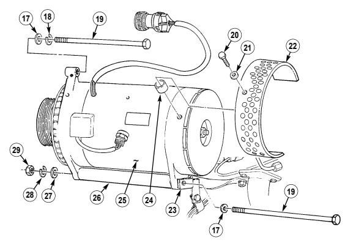

# 4-5. 200-Ampere Dual Voltage Alternator Replacement (Cont'D)

b. Installation 1. Install alternator pulley (22) (para. 4-2). 2. Install fan guard assembly (6) on alternator (9) with three bushings (8), washers (5), and capscrews (4).

Alternator must be supported during installation. Failure to support alternator may cause injury to personnel or damage to equipment.

3. Position alternator (9) on mounting bracket (10).

Ensure terminals are clean before connections are made.

4. Install support bracket (7) on alternator (9) and alternator mounting bracket (10) with lockwasher (2), two washers (1), capscrews (3), washer (11), lockwasher (12), and nut (13).

5. Install positive cable lead 6 (17) on positive stud (20) with washer (16), lockwasher (15), and nut
(14). Tighten nut (14) to 10-15 lb-ft (14-20 N•m).

6. Apply grease to positive stud (20), positive cable lead 6 (17), and inside of rubber boot (28), slide rubber boot (28) over stud (20).

7. Install ground strap (24) on ground stud (23) with washer (25), lockwasher (26), and nut (27).

Tighten nut (27) to 8-12 lb-ft (11-16 N•m).

8. Position 3/8-in. breaker bar or, as appropriate, a 1/2-in. ratchet wrench on belt tensioner (29), move tensioner (29) clockwise, and install drivebelt (21) on alternator pulley (22).

# 4-5. 200-Ampere Dual Voltage Alternator Replacement (Cont'D)

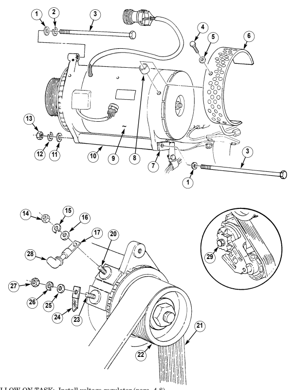

FOLLOW-ON TASK: Install voltage regulator (para. 4-8).

# 4-6. 200-Ampere Dual Voltage Alternator Cable Replacement

This task covers:
INITIAL SETUP:
Tools General mechanic's tool kit:
automotive (Appendix B, Item 1)
Maintenance and repair shop equipment:
automotive (Appendix B, Item 2)

## Materials/Parts

Lockwasher (Appendix G, Item 180) Four tiedown straps (Appendix G, Item 326) Lockwasher (Appendix G, Item 185) Lockwasher (Appendix G, Item 187)

## A. Removal B. Installation

| Equipment Condition   |
|-----------------------|
| Maintenance Level     |

Equipment Condition

| Maintenance Level   |
|---------------------|
| Unit                |

- Hood raised and secured (TM 9-2320-387-10). - Battery ground cables disconnected (para. 4-68). - Engine access cover removed (para. 10-22).

Prior to removal, tag leads for installation.

## A. Removal

1. Slide back rubber boot (5) and remove nut (8), lockwasher (7), washer (6), cable (4), nut (3), and washer (2) from positive stud (1). Discard lockwasher (7).

2. Remove capscrew (9) and clamp (10) from water crossover bracket (11) and separate cable (4) from cables and clamp (10).

3. Remove nut (14), lockwasher (13), and clamp (15) from stud (12) and separate cable (4) from cables and clamp (15). Discard lockwasher (13).

4. Remove four tiedown straps (16). Discard tiedown straps (16). 5. Remove screw (17) and clamp (19) from bracket (20) and remove cable (4) from clamp (19). 6. Remove nut (27), lockwasher (26), washer (25), and cable (4) from buss bar (24) on battery box (23).

Discard lockwasher (26).

7. Remove cable (4) from grommet (28) and vehicle.

b. Installation

Ensure terminals are clean before connections are made.

1. Install cable (4) through grommet (28) in battery box (23). 1.1 Install cable (4) on buss bar (24) with washer (25), lockwasher (26), and nut (27). 2. Route cable (4) through clamp (19) and install clamp (19) to bracket (20) with screw (17). 3. Route cable (4) through clamp (15) and install clamp (15) on stud (12) with lockwasher (13) and nut (14).

4. Route cable (4) through clamp (10) and install clamp (10) on water crossover bracket (11) with capscrew (9).

5. Install washer (2), nut (3), and cable (4) on positive stud (1) with washer (6), lockwasher (7), and nut
(8). Tighten nut (8) to 10-15 lb-ft (14-20 N•m) and slide rubber boot (5) over nut (8).

6. Install four tiedown straps (16) on cable (4).

# 4-6. 200-Ampere Dual Voltage Alternator Cable Replacement (Cont'D)

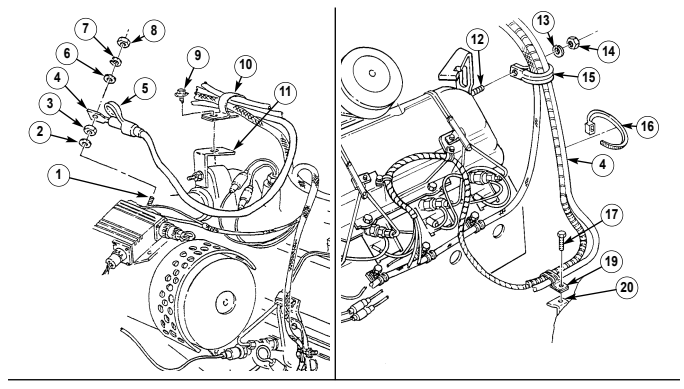

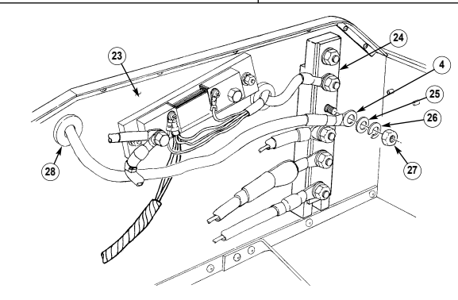

FOLLOW-ON TASKS: - Connect battery ground cables (para. 4-68).

- Install engine access cover (para. 10-22). - Lower and secure hood (TM 9-2320-387-10). - Start engine (TM 9-2320-387-10) and check operation of voltmeter gauge.

# 4-7. 200-Ampere Dual Voltage Umbilical Power Cable Replacement

This task covers:

| General mechanic's tool kit:   |
|--------------------------------|

## Initial Setup:

| Materials/Parts   |
|-------------------|
|                   |

Tools General mechanic's tool kit:
automotive (Appendix B, Item 1)
Two lockwashers (Appendix G, Item 149) Lockwasher (Appendix G, Item 187) Lockwasher (Appendix G, Item 153) Sealing compound (Appendix C, Item 64)

## A. Removal B. Installation

| Equipment Condition 1   |
|-------------------------|

| Maintenance Level   |
|---------------------|
| Unit                |

One mechanic One assistant Manual References TM 9-2320-387-24P

| Personnel Required   |
|----------------------|
| One mechanic         |

- Batteries removed (para. 4-74). - Fixed rear door removed (para. 10-20).

Prior to removal, tag leads for installation.

a. Removal 1. Remove nut (5), lockwasher (4), washer (3), and positive power cable (2) from buss bar (1).

Discard lockwasher (4).

2. Remove capscrew (6), lockwasher (7), negative power cable (8), and two cables (9) from shunt (10).

Discard lockwasher (7).

3. Remove five capscrews (20), two lockwashers (19), washers (18), and coverplate (17) from B-beam (12).

Discard lockwashers (19).

4. Remove two nuts (15), washers (14), capscrews (25), washers (26), and mounting bracket (27) from coverplate (17).

5. Remove nut (28), screw (23), and cover (22) with cover chain (21) from mounting bracket (27). 6. Remove cover (22) with cover chain (21) from umbilical power cable assembly (29). 7. Remove four nuts (30), screws (24), and mounting bracket (27) from umbilical power cable assembly (29). 8. Pull umbilical power cable assembly (29) through grommet (11) and coverplate (17), and remove from vehicle (16).

9. Remove grommet (11) from battery box (13).

# 4-7.  200-Ampere Dual Voltage Umbilical Power Cable Replacement (Cont'D)

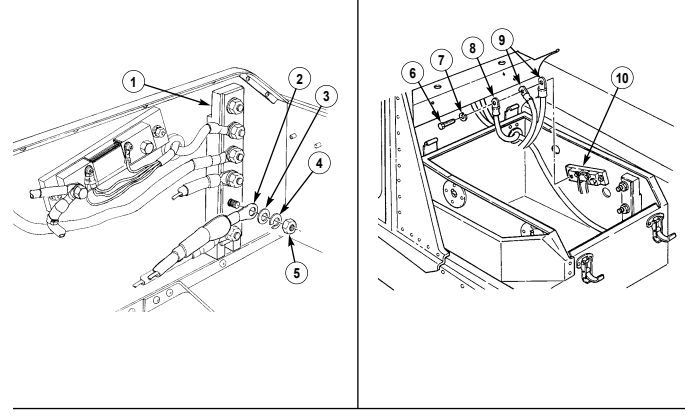

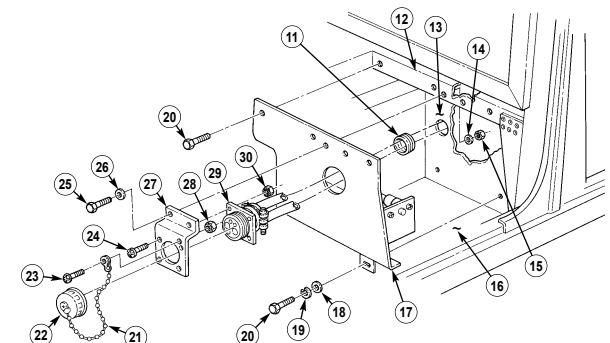

ర్థాలా
# 4-7. 200-Ampere Dual Voltage Umbilical Power Cable Replacement (Cont'D)

b. Installation 1. Install grommet (5) on battery box (7). 2. Route umbilical power cable assembly (14) through coverplate (11) and grommet (5), and position in approximate mounting location on vehicle (10).

3. Install cover chain (17) on mounting bracket (16) with screw (19) and nut (15). 4. Install umbilical power cable assembly (14) on mounting bracket (16) with four screws (20) and nuts (4).

5. Install cover (18) on umbilical power cable assembly (14). 6. Install coverplate (11) on B-beam (6) with two washers (12), lockwashers (13), and five capscrews (3). 7. Install mounting bracket (16) on coverplate (11) with two washers (2), capscrews (1), washers (8),
and nuts (9).

8. Install two cables (24) and negative power cable (23) on shunt (25) with lockwasher (22) and capscrew (21).

9. Install positive power cable (27) on buss bar (26) with washer (28), lockwasher (29), and nut (30).

10. Apply silicone compound to cable (27), coating all exposed metallic surfaces.

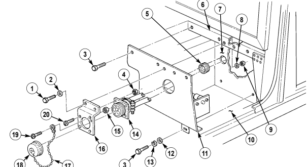

# 4-7.  200-Ampere Dual Voltage Umbilical Power Cable Replacement (Cont'D)

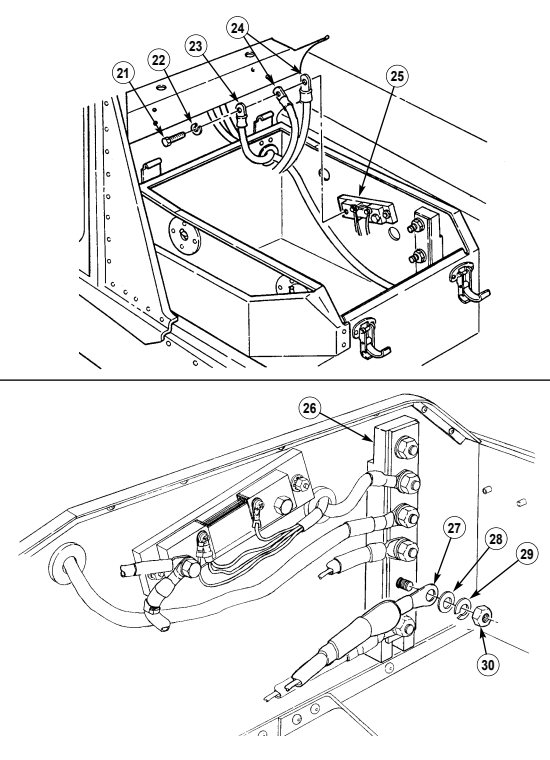

FOLLOW-ON TASKS: - Install fixed rear door (para. 10-20).

- Install batteries (para. 4-74).

# 4-8. 200-Ampere Dual Voltage Regulator Replacement

This task covers:

## Initial Setup:

Tools General mechanic's tool kit:
automotive (Appendix B, Item 1)
Maintenance and repair shop equipment:
automotive (Appendix B, Item 2)
Materials/Parts Two lockwashers (Appendix G, Item 177) Lockwasher (Appendix G, Item 179) Grease (Appendix C, Item 25)
a. Removal b. Installation Manual References TM 9-2320-387-10 TM 9-2320-387-24P
Equipment Condition
- Battery ground cables disconnected (para. 4-68). - Hood raised and secured (TM 9-2320-387-10).

| Maintenance Level   |
|---------------------|
| I Init              |

Unit

Prior to removal, tag leads for installation.

## A. Removal

1. Disconnect regulator plug (13) from voltage regulator (11). 2. Slide back rubber boot (3) and remove nut (2), lead 5A (1) and washer (22.1) from IGN terminal (22). 3. Slide back rubber boot (4) and remove nut (5), lead 2A (6) and washer (6.1) from yellow (AC)
terminal (7).

4. Remove nut (20) and ground wire (12) from 14-volt stud (21).

9. Install other end of ground wire (12) on voltage regulator (11) with washer (10), lockwasher (9), and screw (8). Tighten screw (8) to 88-94 lb-in. (10-11 N•m).

## B. Installation

1. Install voltage regulator (11) on alternator (14) with two washers (17), lockwashers (18), and screws (19). Tighten screws (19) to 30-34 lb-in. (3-4 N•m).

2. Connect alternator connector (15) to connector (16) on voltage regulator (11). 3. Install washer (22.1), lead 5A (1) and nut (2) on IGN terminal (22). Tighten nut (2) to 23-27 lb-in.

(2.6-3.0 N•m). 

4. Apply grease to IGN terminal (22), lead 5A (1), and inside of boot (3), and slide boot (3) over IGN
terminal (22).

5. Install washer (6.1), lead 2A (6) and nut (5) on yellow (AC) terminal (7). Tighten nut (5) to 18-22 lb-in. (2.0-2.5 N•m). 

6. Apply grease to yellow (AC) terminal (7), lead 2A (6), and inside of boot (4), and slide boot (4) over yellow (AC) terminal (7).

7. Connect regulator plug (13) to voltage regulator (11). 8. Install one end of ground wire (12) on 14-volt stud (21) on voltage regulator (11) with nut (20).

Tighten nut (20) to 45-55 lb-in. (5-6 N•m).

5. Remove screw (8), lockwasher (9), washer (10), and ground wire (12) from voltage regulator (11).

Discard lockwasher (9).

6. Disconnect alternator connector (15) from connector (16) on voltage regulator (11). 7. Remove two screws (19), lockwashers (18), washers (17), and voltage regulator (11) from alternator (14). Discard lockwashers (18).

# 4-8.  200-Ampere Dual Voltage Regulator Replacement (Cont'D)

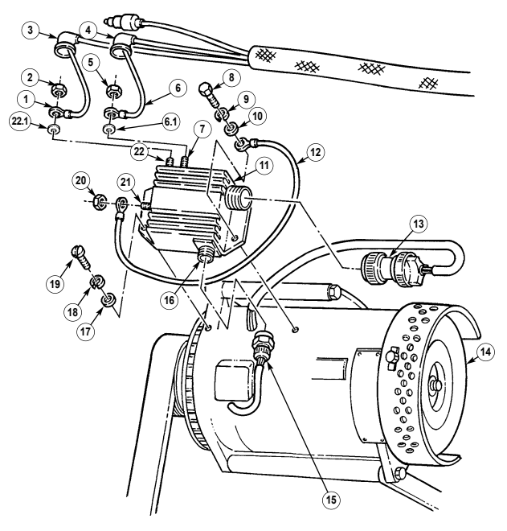

FOLLOW-ON TASKS: - Connect battery ground cables (para. 4-68).

- Lower and secure hood (TM 9-2320-387-10).

# 4-8.1. 400-Ampere Dual Voltage Regulator Replacement

This task covers:
INITIAL SETUP:

## Tools

General mechanic's tool kit:
automotive (Appendix B, Item 1)
Maintenance and repair shop equipment:
automotive (Appendix B, Item 2)
Materials/Parts Two lockwashers (Appendix G, Item 181) Lockwasher (Appendix G, Item 179) Grease (Appendix C, Item 36)
a. Removal a. Removal b. Installation Manual References TM 9-2320-387-10 TM 9-2320-387-24P
Equipment Condition
- Battery ground cables disconnected (para. 4-68). - Hood raised and secured (TM 9-2320-387-10).

Prior to removal, tag leads for installation.

1. Disconnect regulator plugs (12) and (13) from connectors (9) and (10) on voltage regulator (11). 2. Slide back rubber boot (5) and remove nut (4), lead 5A (6), and washer (7) from red terminal (8) on voltage regulator (11).

3. Slide back rubber boot (2) and remove nut (1), lead 2A (3), and washer (24) from yellow terminal (25) on voltage regulator (11).

4. Slide back rubber boot (20) and remove nut (19), lead 68A (18), and washer (17) from 14 volt output terminal (15) on voltage regulator (11).

5. Remove three screws (23), lockwashers (22), washers (21), voltage regulator (11), and three spacers (16) from alternator (14). Discard lockwashers (22).

## B. Installation

1. Install three spacers (16) and voltage regulator (11) on alternator (14) with three washers (21),
lockwashers (22), and screws (23). Tighten screws (23) to 30-34 lb-in. (3-4 N•m).

2. Install washer (7), lead 5A (6), and nut (4) on red terminal (8) of voltage regulator (11). Tighten nut (4) to 35 lb-in. (4 N•m).

3. Apply grease to red terminal (8), lead 5A (6), and inside of rubber boot (5), and slide boot (5) over red terminal (8).

4. Install washer (24), lead 2A (3), and nut (1) on yellow terminal (25) of voltage regulator (11).

Tighten nut (1) to 20 lb-in. (2 N•m).

5. Apply grease to yellow terminal (25), lead 2A (3), and inside of rubber boot (2), and slide boot (2)
over yellow terminal (25).

6. Install washer (17), lead 68A (18), and nut (19) on 14 volt output terminal (15) of voltage regulator
(11). Tighten nut (19) to 50 lb-in. (6 N•m).

7. Apply grease to 14 volt output terminal (15), lead 68A (18), and inside of rubber boot (20), and slide boot (20) over 14 volt output terminal (15).

8. Connect regulator plugs (12) and (13) to connectors (9) and (10) on voltage regulator (11).

# 4-8.1. 400-Ampere Dual Voltage Regulator Replacement (Cont'D)

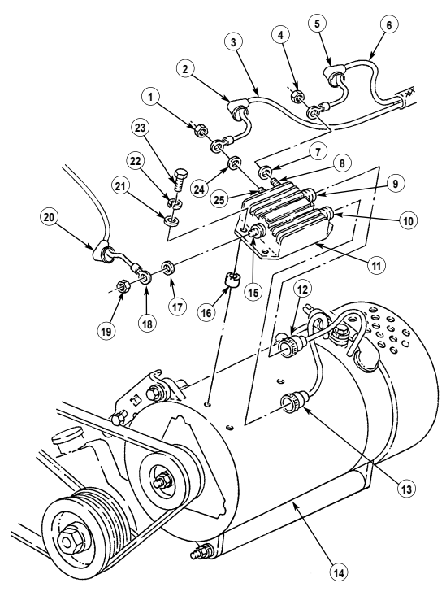

FOLLOW-ON TASKS: - Connect battery ground cables (para. 4-68).

- Lower and secure hood (TM 9-2320-387-10).

# 4-8.2. 400-Ampere Dual Voltage Alternator Cable Replacement

This task covers:
INITIAL SETUP:

a. Removal b. Installation

| Tools                                                                  | Manual References                   |
|------------------------------------------------------------------------|-------------------------------------|
| General mechanic's tool kit:                                           | TM 9\-2320\-387\-24P                |
| automotive (Appendix B, Item 1)                                        | Equipment Condition                 |
| Maintenance and repair shop equipment: automotive (Appendix B, Item 2) | Cooling system drained, as required |
|                                                                        | (para. 3\-61).                      |
| Materials/Parts                                                        | Maintenance Level                   |
| Gasket (Appendix G, Item 41)                                           |                                     |
|                                                                        | Unit                                |
| Sealing compound (Appendix C, Item 61)                                 |                                     |

Two lockwashers (Appendix G, Item 185) Three tiedown straps (Appendix G, Item 327) Lockwasher (Appendix G, Item 167) Five lockwashers (Appendix G, Item 183)
a. Removal

Prior to removal, tag leads for installation.

1. Remove locknut (7), washer (6), screw (3), clamp (4), and cables (2) and (11) from bracket (5).

Discard locknut (7).

2. Remove screw (8), clamp (9), and cables (2) and (11) from bracket (10). 3. Remove three tiedown straps (1) from cables (2) and (11). Discard tiedown straps (1). 4. Remove nut (12), lockwasher (13), washer (14), and cable (11) from stud (22) on battery box side panel (15). Discard lockwasher (13).

5. Remove nut (19), lockwasher (20), washer (18), and cable (2) from stud (17) on buss bar (16).

Discard lockwasher (20).

6. Remove grommet (21) from battery box side panel (15) and remove cable (2) through battery box side panel (15).

# 4-8.2. 400-Ampere Dual Voltage Alternator Cable Replacement (Conf'D)

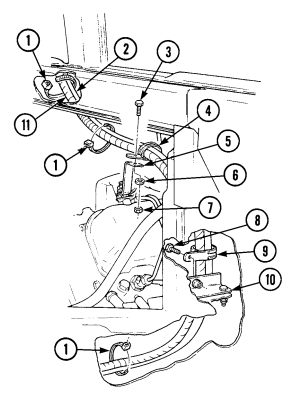

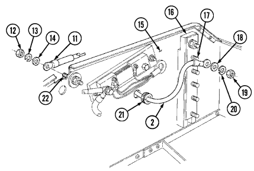

# 4-8.2. 400-Ampere Dual Voltage Alternator Cable Replacement (Cont'D)

7.

Remove nut (6), screw (1), and cable (2) with clamp (7) from oil pan bracket (8).

8.

Remove nut (3), lockwasher (4), and cable (2) from positive starter terminal (5). Discard lockwasher (4).

9.

Remove nut (11), lockwasher (12), washer (13), cable (2), and clamp (9) from stud (10) on thermostat housing (14). Discard lockwasher (12).

10.

Remove nut (15), washer (16), cable (2), and clamp (18) from stud (17).

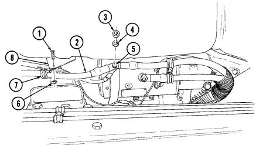

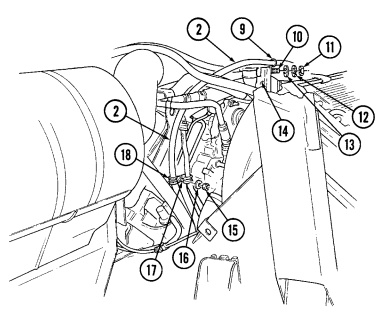

# 4-8.2. 400-Ampere Dual Voltage Alternator Cable Replacement (Conf D)

Remove screw (23), lockwasher (22), washer (21), ground strap (24), lead (20), and cable (25) from 11.

alternator (19). Discard lockwasher (22).

Remove screw (26), lockwasher (27), washer (28), and cables (25) and (29) from alternator (19).

12.

Discard lockwasher (27).

Slide back rubber boot (35) and remove screw (31), lockwasher (32), washer (33), and cables (34)
13.

and (36) from alternator (19). Discard lockwasher (32).

Slide back rubber boot (40) and remove screw (30), lockwasher (39), washer (38), and cables (37)
14.

and (36) from alternator (19). Discard lockwasher (39).

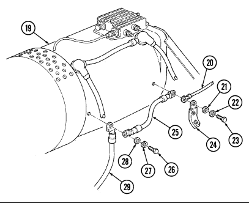

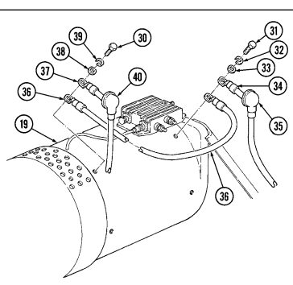

# 4-8.2. 400-Ampere Dual Voltage Alternator Cable Replacement (Conf D)

b.  Installation 1.

Install cables (2) and (3) on rear positive terminal (14) of alternator (1) with washer (4),
lockwasher (5), and screw (6), and slide rubber boot (7) over cables (2) and (4).

2.

Install cables (2) and (9) on front positive terminal (8) of alternator (1) with washer (10),
lockwasher (12), and screw (11), and slide rubber boot (13) over cables (2) and (9).

3.

Install cable (21), lead (16), and ground strap (17) on front negative terminal (15) of alternator (1) with washer (18), lockwasher (20), and screw (19).

Install cables (25) and (21) on rear negative terminal (26) of alternator (1) with washer (24),
4.

lockwasher (23), and screw (22).

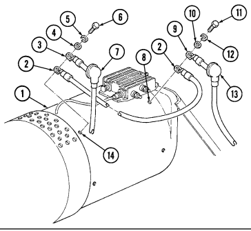

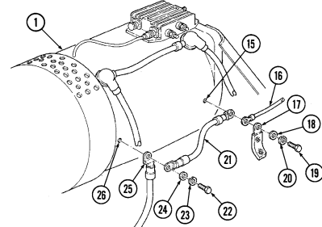

# 4-8.2. 400-Ampere Dual Voltage Alternator Cable Replacement (Cont'D)

5.

6.

7.

Install cable (9) and clamp (36) on stud (35) with washer (34) and nut (33).

Install cable (9) and clamp (27) on stud (28) of thermostat housing (32) with washer (29),
lockwasher (31), and nut (30).

8.

Install cable (9) on positive terminal (41) of starter (44) with lockwasher (39) and nut (40). Install cable (9) and clamp (37) on oil pan bracket (38) with screw (43) and nut (42).

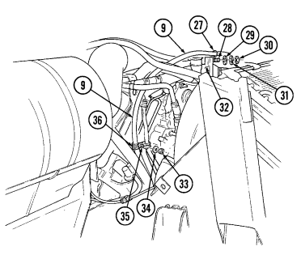

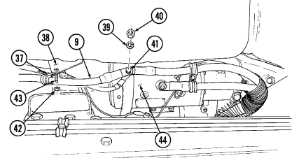

# 4-8.2. 400-Ampere Dual Voltage Alternator Cable Replacement (Cont'D)

9. Install grommet (12) on battery box side panel (5) and route cable (8) through grommet (12) and battery box side panel (5).

10. Install cable (8) on stud (7) of buss bar (6) with washer (9), lockwasher (10), and nut (11). 11. Install cable (4) on stud (13) of battery box side panel (5) with washer (3), lockwasher (2), and nut (1).

12. Install cables (4) and (8) on bracket (22) with clamp (21) and screw (20). 13. Install cables (4) and (8) on bracket (17) with clamp (16), screw (15), washer (18), and locknut (19).

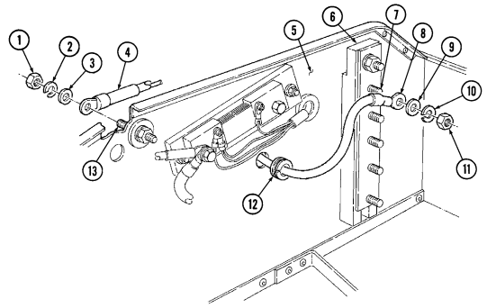 14. Install three tiedown straps (14) on cables (4) and (8).

# 4-8.2. 400-Ampere Dual Voltage Alternator Cable Replacement (Conf'D)

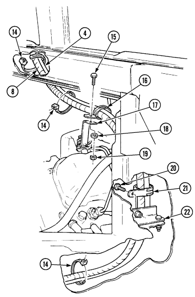

FOLLOW-ON TASKS:
-  Install engine access cover (para. 10-22).
-  Connect battery ground cables (para. 4-68).

- Lower and secure hood (TM 9-2320-387-10).

# 4-8.3. 400-Ampere Dual Voltage Alternator Replacement

This task covers:
INITIAL SETUP:
Tools General mechanic's tool kit:
automotive (Appendix B, Item 1)
Maintenance and repair shop equipment:
automotive (Appendix B, Item 2)
Materials/Parts Lockwasher (Appendix G, Item 144) Lockwasher (Appendix G, Item 185) Lockwasher (Appendix G, Item 154)
Personnel Required One mechanic One assistant a. Removal a. Removal b. Installation Manual References TM 9-2320-387-10 TM 9-2320-387-24P
Equipment Condition
- Hood raised and secured (TM 9-2320-387-10). - Battery ground cables disconnected (para. 4-68). - Alternator cables removed (para. 4-8.2).

General Safety Instructions Alternator must be supported during removal and installation.

Prior to removal, tag leads for installation.

1. Position 3/8-in. breaker bar or, as appropriate, a 1/2-in. ratchet wrench on belt tensioner (4), move tensioner (4) clockwise, and remove drivebelt (1) from power steering pump pulley (3) and alternator pulley (2).

2. Remove nut (5), lockwasher (6), washer (7), ground strap (8), and washer (10) from stud (9). Discard lockwasher (6).

## .Warning. B. Installation

1. Install alternator pulley (2) (para. 4-3). 2. Position alternator (18) on alternator mounting bracket (11). 3. Install alternator (18) on alternator mounting bracket (11) and alternator support bracket (21) with washer (20), screw (19), washer (22), lockwasher (23), and nut (24). Do not tighten nut (24).

4. Install alternator bracket (17) on alternator (18) with washer (16) and screw (15). Do not tighten screw (15).

5. Install washer (14), lockwasher (13), and screw (12) on alternator mounting bracket (11) and alternator bracket (17). 

6. Tighten screw (15) to 40 lb-ft (54 N•m). 7. Tighten nut (24) to 155 lb-ft (210 N•m).

Alternator must be support during removal and installation. Failure to do so may cause injury to personnel or damage to equipment.

3. Remove screw (12), lockwasher (13), and washer (14) from alternator bracket (17) and alternator mounting bracket (11). Discard lockwasher (13).

4. Remove screw (15), washer (16), and bracket (17) from alternator (18). 5. Remove nut (24), lockwasher (23), washer (22), screw (19), washer (20), and alternator (18) from alternator support bracket (21) and alternator mounting bracket (11). Discard lockwasher (23).

6. Remove alternator pulley (2) (para. 4-2).

# 4-8.3. 400-Ampere Dual Voltage Alternator Replacement (Cont'D)

8. Install ground strap (8) on stud (9) with washers (10) and (7), lockwasher (6), and nut (5). 9. Position 3/8-in. breaker bar or, as appropriate, a 1/2-in. ratchet wrench on belt tensioner (4) and move tensioner (4) clockwise and install drivebelt (1) on power steering pump pulley (3) and alternator pulley (2).

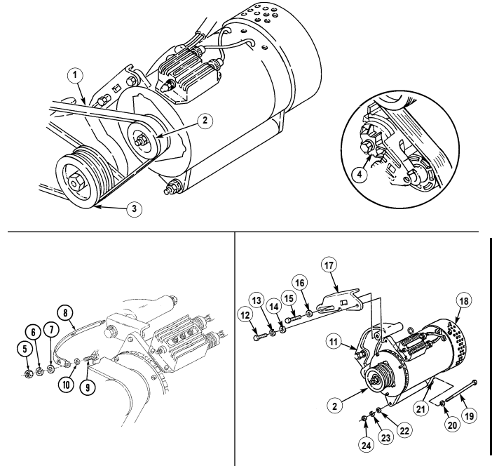

FOLLOW-ON TASKS: - Install alternator cables (para. 4-8.2).

- Connect battery ground cables (para. 4-68). - Lower and secure hood (TM 9-2320-387-10).

# Section Ii. Starter And Starting Control System Maintenance

# 4-9. Starter And Starting Control System Maintenance Task Summary

| a.  Removal                            | c.  Installation                              |
|----------------------------------------|-----------------------------------------------|
| b.  Inspection                         |                                               |
| INITIAL SETUP:                         |                                               |
| Tools                                  | Equipment Condition                           |
| General mechanic's tool kit:           | •Engine oil filler tube removed (para. 3\-3). |
| automotive (Appendix B, Item 1)        | •Water pump inlet hose removed (para. 3\-73). |
| Maintenance and repair shop equipment: | •Water pump pulley removed (para. 3\-77).     |
| automotive (Appendix B, Item 2)        | •Thermostat bypass hose removed               |

# 4-10. Rotary Switch Replacement

This task covers:
INITIAL SETUP:
Tools General mechanic's tool kit:
automotive (Appendix B, Item 1)
Materials/Parts Lockwasher (Appendix G, Item 147) Lockwasher (Appendix G, Item 155)
a. Removal b. Installation

| Equipment Condition                               |
|---------------------------------------------------|
| Battery ground cables disconnected (para. 4\-68). |
| Maintenance Level                                 |
| Unit                                              |

Manual References TM 9-2320-387-10 TM 9-2320-387-24P

Prior to removal, tag leads and note position of lever for installation.

a. Removal 1. Remove screw (8), lockwasher (7), and switch lever (6) from switch shaft (9). Discard lockwasher (7). 2. Remove nut (5) and lockwasher (4) from switch (2) and instrument panel (3). Discard lockwasher (4). 3. Push switch (2) out of hole in panel (3). 4. Disconnect three electrical leads 11A (1), 14A (10), and 29A (11) from switch (2).

b. Installation 1. Connect three electrical leads 11A (1), 14A (10), and 29A (11) to switch (2). 2. Install switch (2) into hole in instrument panel (3). 3. Install lockwasher (4) and nut (5) on switch (2). 4. Place switch lever (6) on switch shaft (9) to ENGINE STOP position. 5. Secure lever (6) on switch shaft (9) with lockwasher (7) and screw (8).

# 4-10.  Rotary Switch Replacement (Cont'D)

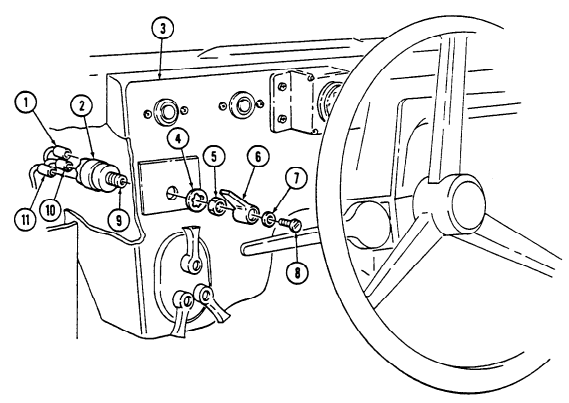

FOLLOW-ON TASKS: - • Connect battery ground cables (para. 4-68).
- • - • - Check rotary switch operation (TM 9-2320-387-10).

# 4-11. Starter Replacement

This task covers:
INITIAL SETUP:

## Tools

General mechanic's tool kit:
automotive (Appendix B, Item 1)
Maintenance and repair shop equipment:
automotive (Appendix B, Item 2)

## Special Tools

Crowfoot, 9/16-in. (Appendix B, Item 139) Torque adapter, 3/4-in. (Appendix B, Item 134) Socket adapter, 3/8- to 1/2-in. drive 
(Appendix B, Item 135)

## Materials/Parts

Lockwasher (Appendix G, Item 144) Lockwasher (Appendix G, Item 148) Assembled locknut (Appendix G, Item 134) Adhesive sealant (Appendix C, Item 12) Sealing compound (Appendix C, Item 62)

## A. Removal B. Installation

Personnel Required One mechanic One assistant Manual References TM 9-2320-387-10 TM 9-2320-387-24P
Equipment Condition
- Battery ground cables disconnected (para. 4-68). - Sealed upper converter housing cover removed
(para. 5-12).

## General Safety Instructions

Starter must be supported during removal and installation.

Maintenance Level Unit

Starter must be supported during removal and installation. Failure to support starter may cause injury to personnel or damage to equipment.

NOTE
- Illustration shown is a cutaway of the right side of vehicle. - Prior to removal, tag leads for installation.

a. Removal 1. Remove assembled locknut (30), capscrew (28), and clamp (29) from oil pan bracket (27). Discard assembled locknut (30).

2. Remove adhesive sealant from positive terminal (8) on starter (1).

Perform steps 3 and 4 for M1113 models only. Perform steps 5 and 6 for M1114 models only.

3. Remove nut (14), lockwasher (13), lead 6V (12), lead 81B (15), and lead 6A (20) from positive terminal (8). Discard lockwasher (13).

4. Remove nut (16), lockwasher (17), lead 7V (18), lead 3D (19), and negative cable 7A (21) from starter negative terminal (22). Discard lockwasher (17).

5. Remove nut (16), lockwasher (17), lead 3D (19), and negative cable 7A (21) from starter negative terminal (22). Discard lockwasher (17).

6. Remove nut (14), lockwasher (13), lead 81B (15), and lead 6A (20) from positive terminal (8).

Discard lockwasher (13).

7. Remove screw (11), clip (10), lead 74B (9), and lead 74A (7) from solenoid (2).

# 4-11. Starter Replacement (Cont'D)

8.

9.

10.

Remove screw (25), clamp (23), and lead 6A (20) from starter (1).

 Loosen nut (5) on stud (6) connecting starter (1) to bracket (4).

While supporting starter (1) from under vehicle, remove two capscrews (24) from starter (1) and engine (3).

Note size of shim for installation.

11.

Remove starter (1) and shim (26) from engine (3).

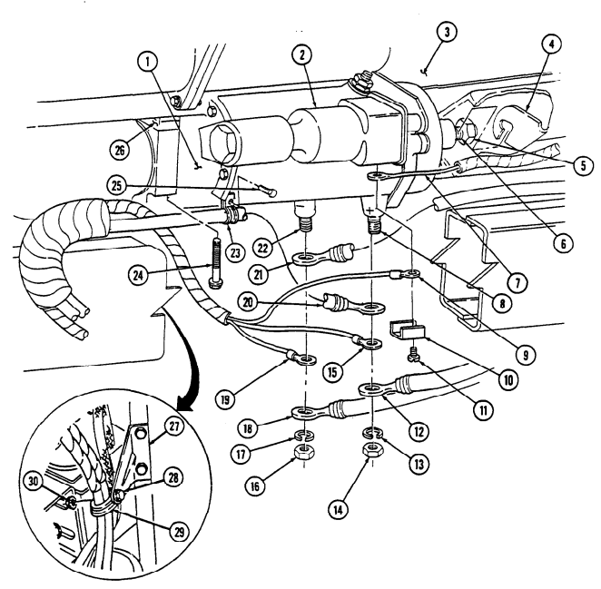

# 4-11. Starter Replacement (Cont'D)

b. Installation 1. Install a .08-in. (2-mm) shim (26) on starter (1). 2. Position shim (26) and starter (1) on engine (3). 3. Slide front stud (6) on starter (1) in bracket (4).

Some capscrews have sealing compound pre-applied. Additional sealing compound is not required.

4. Apply sealing compound to two capscrews (24). Install capscrews (24) on starter (1) and engine (3).

Tighten capscrews (24) to 30-40 lb-ft (41-54 N•m).

5. Install starter (1) on bracket (4) with nut (5). Using crowfoot, tighten nut (5) to 15-19 lb-ft 
(20-26 N•m).

6. Install clamp (23) and positive cable 6A (20) on starter (1) with screw (25). 7. Connect lead 74B (7) and lead 74A (9) on solenoid (2) with clip (10) and screw (11). Tighten screw (11) to 20 lb-in. (2 N•m).

Perform steps 8 and 9 for M1113 models only. Perform steps 10 and 11 for M1114 models only.

8. Connect lead 6A (20), lead 81B (15), and lead 6V (12) on positive terminal (8) with lockwasher (13)
and nut (14).

9. Connect negative cable 7A (21), lead 3D (19), and lead 7V (18) on negative terminal (22) with lockwasher (17) and nut (16). Using torque adapter, tighten nut (16) to 15-20 lb-ft (20-27 N•m).

10. Connect lead 6A (20) and lead 81B (15) on positive terminal (8) with lockwasher (13) and nut (14). 11. Connect lead 7A (21) and lead 3D (19) on negative terminal (22) with lockwasher (17) and nut (16).

Using torque adapter, tighten nut (16) to 15-20 ft-lb (20-27 N•m).

12. Seal positive terminal (8) with adhesive sealant. Apply sealant at least 1/8 in. (3 mm) thick, covering all exposed metal attached to positive terminal (8).

13. Install clamp (29) on oil pan bracket (27) with capscrew (28) and assembled locknut (30).

# 4-11. Starter Replacement (Cont'D)

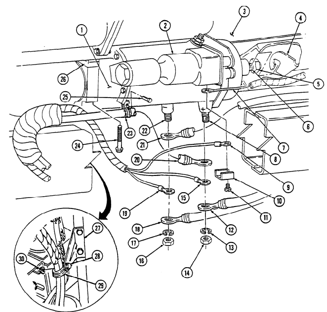

FOLLOW-ON TASKS: - Install sealed upper converter housing cover (para. 5-12).

- Connect battery ground cables (para. 4-68).
- Start engine (TM 9-2320-387-10) and check for smooth starter engagement.

# 4-12. Circuit Breaker Replacement

This task covers:
INITIAL SETUP:
Tools General mechanic's tool kit:
automotive (Appendix B, Item 1)
Maintenance and repair shop equipment:
automotive (Appendix B, Item 2)

## Materials/Parts

Two lockwashers (Appendix G, Item 147)

a. Removal b. Installation

Manual References TM 9-2320-387-10 TM 9-2320-387-24P
Equipment Condition Battery ground cables disconnected (para. 4-68).

Maintenance Level Unit

- Replacement procedures for all circuit breakers are basically the same. This procedure covers the instrument gauge circuit breaker.

- Prior to removal, tag leads for installation.

## A. Removal

1. Loosen nut (1) and lower steering column (2). 2. Disconnect leads 29B (8) and 29D (9) from circuit breaker (6). 3. Remove two nuts (4), lockwashers (5), screws (7), and circuit breaker (6) from column bracket (3).

Discard lockwashers (5).

## B. Installation

1. Install circuit breaker (6) on column bracket (3) with two screws (7), lockwashers (5), and nuts (4). 2. Connect leads 29B (8) and 29D (9) to circuit breaker (6). 3. Raise steering column (2) and tighten nut (1) to 31 lb-ft (42 N•m).

# 4-12. Circuit Breaker Replacement (Cont'D)

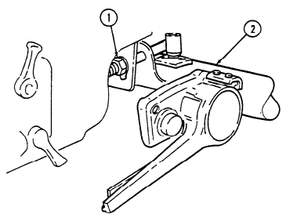

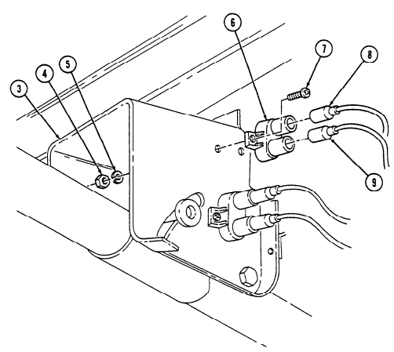

FOLLOW-ON TASKS: - Connect battery ground cables (para. 4-68).
- • Check operation of circuit breaker (TM 9-2320-387-10).

# Section Iii. Instruments, Sending Units, Switches, And Horn Maintenance

4-13. INSTRUMENTS, SENDING UNITS, SWITCHES, AND HORN MAINTENANCE TASK

# Summary

| INITIAL SETUP:   |                                                                                                                  |
|------------------|------------------------------------------------------------------------------------------------------------------|
| Tools            | Manual References                                                                                                |
|                  | General mechanic's tool kit: TM 9\-2320\-387\-24P                                                                |
|                  | automotive (Appendix B, Item 1) Equipment Condition                                                              |
|                  | Maintenance and repair shop equipment: - Glow plug controller/temperature sensor automotive (Appendix B, Item 2) |
| Materials/Parts  | removed (para. 4\-33).                                                                                           |
|                  | - Thermostat removed (para. 3\-76.1). Two gaskets (Appendix G, Item 44)                                          |
|                  | Maintenance Level Lockwasher (Appendix G, Item 185) Unit                                                         |
| a. Removal       |                                                                                                                  |
| 1.               | Loosen hose clamps (2) and (19) and disconnect hoses (1) and (18) from water crossover (24).                     |
| 2.               | Loosen hose clamp (15) and disconnect hose (16) from water crossover (24).                                       |
| 3.               | Remove cooling hose (23) from elbow (4).                                                                         |
| 4.               | Remove nut (5), lockwasher (6), washer (7), ground wire (8), and ground strap (9) from stud (10).                |
|                  | Discard lockwasher (6).                                                                                          |
| 5.               | Remove stud (10), washer (11), three capscrews (21), and water crossover (24) from cylinder heads (14)           |
| and (17).        |                                                                                                                  |
| 6.               | Remove gaskets (13) and (20) from cylinder heads (14) and (17). Discard gaskets (13) and (20).                   |
| 7.               | Remove elbow (4) from water crossover (24).                                                                      |
| b. Inspection    |                                                                                                                  |
| 1.               | Clean gasket surface on water crossover (24) and cylinder heads (14) and (17).                                   |
| 2.               | Inspect thermostat bypass nipple (22), surge tank hose nipple (3), and water pump hose adapter (12)              |
|                  | for cracks or breaks. Replace if defective.                                                                      |
| c. Installation  |                                                                                                                  |
| 1.               | Install elbow (4) on water crossover (24).                                                                       |
| 2.               | Install gaskets (13) and (20) on cylinder heads (14) and (17).                                                   |
| 3.               | Install water crossover (24) on cylinder heads (14) and (17) with stud (10), washer (11), and three              |
|                  | capscrews (21). Tighten capscrews (21) and stud (10) to 25\-35 lb\-ft (34\-48 N•m).                              |
| 4.               | Install ground wire (8) and ground strap (9) on stud (10) with washer (7), lockwasher (6), and nut (5).          |
| 5.               | Install cooling hose (23) on elbow (4).                                                                          |
| 6.               | Connect hose (16) on water crossover (24) and install hose clamp (15).                                           |

# 4-14. Instrument Cluster Replacement

This task covers:
INITIAL SETUP:

## Tools

General mechanic's tool kit:
automotive (Appendix B, Item 1)
Materials/Parts Five lockwashers (Appendix G, Item 137) Antiseize compound (Appendix C, Item 16)

a. Removal b. Installation

Manual References TM 9-2320-387-10 TM 9-2320-387-24P
Equipment Condition Battery ground cables disconnected (para. 4-68).

Maintenance Level Unit

Prior to removal, tag leads for installation.

## A. Removal

1. Remove four screws (7) and washers (6) from instrument cluster (8) and instrument panel (3). Pull instrument cluster (8) away from instrument panel (3) to allow access to speedometer cable (4).

2. Loosen driveshaft nut (5) and disconnect speedometer cable (4) from speedometer (1). 3. Disconnect harness lead 27J (26), 28A (9), 40B (13), 27H (14), 36A (15), 57L (19), 17B (20), 27G (21),
33A (22), 40C (17), and 567A (18) from instrument cluster (8).

4. Remove five nuts (12), lockwashers (11), and harness ground leads 58H (10), 58G (25), 58E (23), 58F (24),

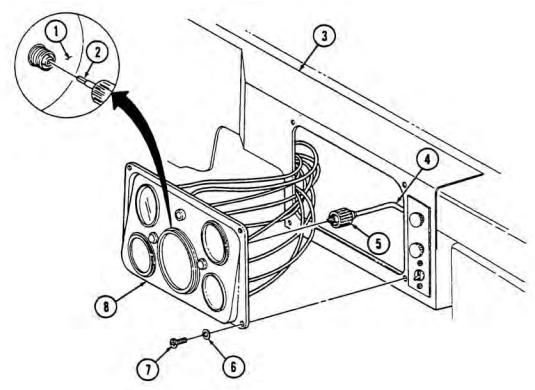

and 57G (16) from instrument cluster (8) and remove instrument cluster (8). Discard lockwashers (11).

# 4-14. Instrument Cluster Replacement (Cont'D)

## B. Installation

1. Apply antiseize compound to harness ground leads 58H (10), 58G (25), 58E (23), 58F (24), and 57G (16) and install on instrument cluster (8) with five lockwashers (11) and nuts (12).

2. Connect harness leads 27J (26), 28A (9), 40B (13), 27H (14), 36A (15), 57L (19), 17B (20), 27G (21),
33A (22), 40C (17), and 567A (18) to instrument cluster (8).

3. Connect speedometer cable (4) to speedometer (1), ensuring core (2) engages with square hole in speedometer (1), and secure with driveshaft nut (5).

4. Install instrument cluster (8) in panel (3) with four washers (6) and screws (7).

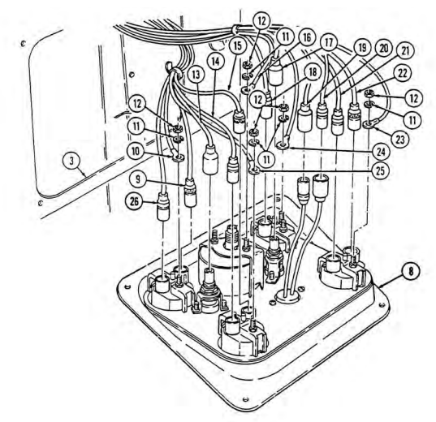

FOLLOW-ON TASKS: - Connect battery ground cables (para. 4-68).

- Check operation of instrument cluster components (TM 9-2320-387-10).

# 4-14.1. Instrument Cluster (Electronic) Replacement

This task covers:
a. Removal b. Installation INITIAL SETUP:
Tools

| Materials/Parts   |
|-------------------|

| Maintenance Level   |
|---------------------|
| Unit                |

General mechanic's tool kit:
automotive (Appendix B, Item 1)

| Manual References    |
|----------------------|
| TM 9\-2320\-387\-24P |
| Equipment Condition  |

Prior to removal, tag leads for installation.

## A. Removal

1. Remove capscrew (12), grounds 58M (13) and 57G (14), and washer (15) from instrument cluster (18). 2. Disconnect harness leads 36A (1), 567A (2), 40C (3), 57L (5), 17B (6), 27G (7), 33A (8), 27J (22),
40W (23), 28A (21), and 27W (24) from instrument cluster (18).

3. Remove four nuts (9), (11), (17) and (20), and ground wires 58E (4), 58F (10), 58G (16), and 58H (19)
from instrument cluster (18).

## B. Installation

1. Install four nuts (9), (11), (17) and (20), and ground wires 58E (4), 58F (10), 58G (16), and 58H (19)
on instrument cluster (18).

2. Connect harness leads 36A (1), 567A (2), 40C (3), 57L (5), 17B (6), 27G (7), 33A (8), 27J (22),
28A (21), 40W (23), and 27W (24) to instrument cluster (18).

3. Install capscrew (12), grounds 58M (13) and 57G (14) and washer (15) on instrument cluster (18).

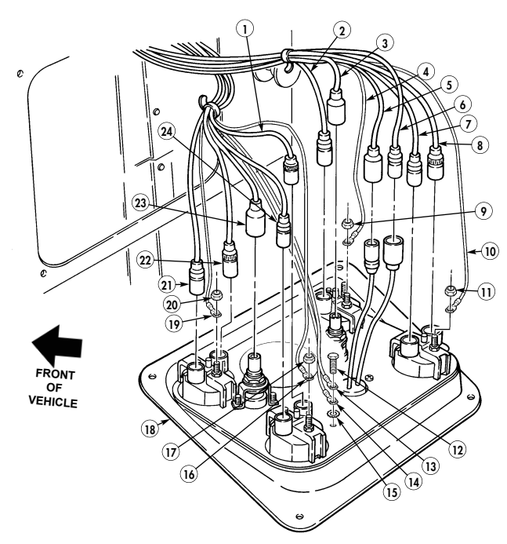

# 4-14.1. Instrument Cluster (Electronic) Replacement (Cont'D)

FOLLOW-ON TASKS: - Install speedometer/odometer (electronic) (para. 4-17.1).

· Check operation of instrument cluster components (TM 9-2320-387-10).

# 4-15. Instrument Panel Maintenance

This task covers:
b. Inspection

## Initial Setup:

Tools General mechanic's tool kit:
automotive (Appendix B, Item 1)
Maintenance and repair shop equipment:
automotive (Appendix B, Item 2)
Torque wrench 3/8-in. drive, 75 ft-lb 
(Appendix B, Item 2.1)
Manual References TM 9-2320-387-10 TM 9-2320-387-24P
a. Removal Perform step 3.1 for M1113 and M1114 vehicles only.

3.1 Remove two capscrews (12), washers (13) nuts (14), and washers (13) from instrument panel (2) and body (1).

4. Remove nut (16) and screw (17) from hand throttle bracket (15) and instrument panel (2). 5. Remove nut (4), washer (5), capscrew (7), washer (5), and hand throttle bracket (15) from steering column bracket (8) and instrument panel (2).

6. Remove screw (6) from instrument panel (2) and body (1). 7. Pull instrument panel (2) away from body (1). 8. Disconnect harness leads 11A (28), 14A (29), and 27A (27) from rotary switch (26). 9. Disconnect harness leads 27F (32) and 571A (31) at wait-to-start indicator light (24).

10. Disconnect harness leads 27L (30) and 67D (33) at brake warning indicator light (22). 11. Disconnect harness lead 400 D (18) from resistor (21). 12. Disconnect harness lead 27E (19) from blower switch (20) and remove instrument panel (2). 13. Disconnect hose (25) from air restriction gauge (23).

b. Inspection Refer to para. 10-56 for nut insert inspection and replacement.

c. Installation 1. Connect hose (25) to air restriction gauge (23). 2. Connect harness lead 27E (19) to blower switch (20). 3. Connect harness lead 400D (18) to resistor (21). 4. Connect harness leads 27L (30) and 67D (33) to brake warning indicator light (22). 5. Connect harness leads 27F (32) and 571A (31) to wait-to-start indicator light (24).

a. Removal c. Installation

## Equipment Condition

- Instrument cluster removed 
(para. 4-14 or para. 4-14.1).

- Heater control cables removed 
(para. 10-79).

Maintenance Level Unit

Prior to removal, tag leads for installation.

1. Loosen nut (9) and lower steering column (3). 2. Remove cannon plug (11) from main light switch (10).

All vehicles except M1113 and M1114 are equipped with nut inserts. Perform step 3 for M1113 and M1114 only.

3. Remove two capscrews (12) and washers (13) from instrument panel (2) and body (1).

# 4-15. Instrument Panel Maintenance (Cont'D)

6. Connect harness leads 11A (28), 14A (29), and 27A (27) to rotary switch (26). 7. Install instrument panel (2) on body (1) with screw (6). 8. Install instrument panel (2) and hand throttle bracket (15) on steering column bracket (8) with washer (5), capscrew (7), washer (5), and nut (4).

9. Install hand throttle bracket (15) on instrument panel (2) with screw (17) and nut (16).

When installing capscrews into nut inserts, use grade 5 torque value. Failure to do so may damage equipment or components.

All vehicles except M1113 and M1114 are equipped with nut inserts. Perform step 10 for all vehicles except M1113 and M1114.

10. Secure instrument panel (2) to body (1) with two washers (13) and capscrews (12). Tighten capscrews (12) to 8 lb-ft (11 N•m).

Perform step 10.1 for M1113 and M1114 vehicles only.

10.1. Secure instrument panel (2) to body (1) with two washers (13), capscrews (12), washers (13), and nuts (14).

11. Install cannon plug (11) on main light switch (10).

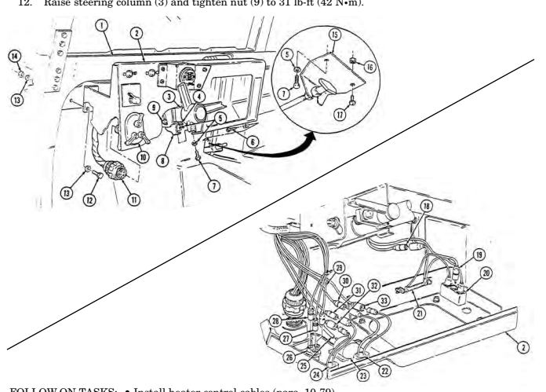

FOLLOW-ON TASKS: - Install heater control cables (para. 10-79).
- Install instrument cluster (para. 4-14 or para. 4-14.1). - Check operation of instrument panel components (TM 9-2320-387-10).

# 4-16. Electrical Gauge Replacement

This task covers:
INITIAL SETUP:

| UUIS                         |
|------------------------------|
| General mechanic's tool kit: |

Tools automotive (Appendix B, Item 1)
Maintenance and repair shop equipment:
automotive (Appendix B, Item 2)
Materials/Parts Two lockwashers (Appendix G, Item 137)

| Maintenance Level   |
|---------------------|
| Unit                |

a. Removal b. Installation

| Manual References    |
|----------------------|
| TM 9\-2320\-387\-10  |
| TM 9\-2320\-387\-24P |
| Equipment Condition  |

- Replacement procedures for all electrical gauges are basically the same. This procedure covers the temperature gauge.

- Prior to removal, tag all leads for installation.

## A. Removal

1. Remove four screws (9) and washers (8) from instrument cluster (1) and instrument panel (6). 2. Pull instrument cluster (1) away from panel (6). 3. Disconnect leads (4) and (5) from gauge (10). 4. Remove two nuts (3), lockwashers (7), retaining bracket (2), and gauge (10) from instrument cluster (1).

Discard lockwashers (7).

## B. Installation

1. Install gauge (10) and retaining bracket (2) on instrument cluster (1) with two lockwashers (7) and nuts (3). Tighten nuts (3) to 8 lb-in. (1 N•m).

2. Connect leads (4) and (5) to gauge (10). 3. Install instrument cluster (1) on panel (6) with four washers (8) and screws (9).

# 4-16.  Electrical Gauge Replacement (Cont'D)

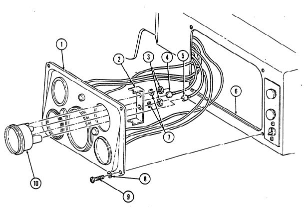

FOLLOW-ON TASKS: - Connect battery ground cables (para. 4-68).
- Start engine and check operation of electrical gauge (TM 9-2320-387-10).

| This task covers:               |                     |
|---------------------------------|---------------------|
| a. Removal                      | c. Alignment        |
| b. Installation                 |                     |
| INITIAL SETUP:                  |                     |
| Tools                           | Manual References   |
| General mechanic's tool kit:    | TM 9\-2320\-387\-10 |
| automotive (Appendix B, Item 1) | Equipment Condition |

# I- **4- 17. Speedometer/Odometer Replacement** ~1

1. Remove four screws (10) and washers (9) from instrument cluster (4) and instrument panel (8). 

2. Pull instrument cluster (4) away from panel (8). 3. Loosen driveshaft nut (2) on speedometer cable (7) and pull cable end out of speedometer (3). 4. Remove two nuts (6) from speedometer retaining bracket (5) and remove speedometer (3) and bracket (5) from instrument cluster (4). 

1. Install speedometer (3) and retaining bracket (5) on instrument cluster (4) with two nuts (6). 

Tighten nuts (6) to 8 lb-in. (1 Nom). 

2. Install speedometer cable (7) into back of speedometer (31, ensuring core (1) engages in square hole in speedometer (31, and tighten driveshaft nut (2). 

3. Install instrument cluster (4) on panel (8) with four washers (9) and screws (10). 

-1 

# 4-17. Speedometer/Odometer Replacement (Cont'D)

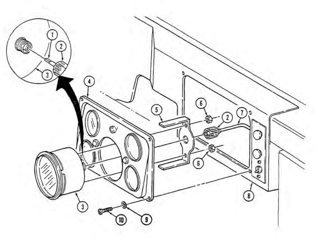

FOLLOW-ON TASK:  Check operation of speedometer (TM 9-2320-387-10).

# 4-17.1. Speedometer/Odometer (Electronic) Replacement

This task covers:

## Initial Setup:

Tools General mechanic's tool kit:
automotive (Appendix B, Item 1)
Maintenance and repair shop equipment:
automotive (Appendix B, Item 2)
Manual References TM 9-2320-387-10 TM 9-2320-387-24P
a. Removal b. Installation

| Manual References    |
|----------------------|
| TM 9\-2320\-387\-10  |
| TM 9\-2320\-387\-24P |

## A. Removal

1. Remove four capscrews (11), washers (10), and instrument cluster (1) from instrument panel (2). 2. Remove harness assembly nut (7) from rear of speedometer (13). 3. Remove two nuts (6), washers (5), washers (4), ground wire 58M (3), and shielding ground wire (8) from retaining bracket (9) on rear of speedometer (13).

4. Remove retaining bracket (9) from two threaded studs (12) on rear of speedometer (13) and remove speedometer (13) from instrument cluster (1).

## B. Installation

1. Install retaining bracket (9) on two threaded studs (12) on rear of speedometer (13). 2. Install ground wire 58M (3) and shielding ground wire (8) on two threaded studs (12) on rear of speedometer (13) with two washers (4), washers (5), and nuts (6). Tighten nuts (6) to 5 lb-in (0.6 N•m).

3. Install harness assembly nut (7) on rear of speedometer (6). 4. Install instrument cluster (1) into instrument panel (2) with four capscrews (11) and washers (10).

# 4-17.1. Speedometer/Odometer (Electronic) Replacement (Cont'D)

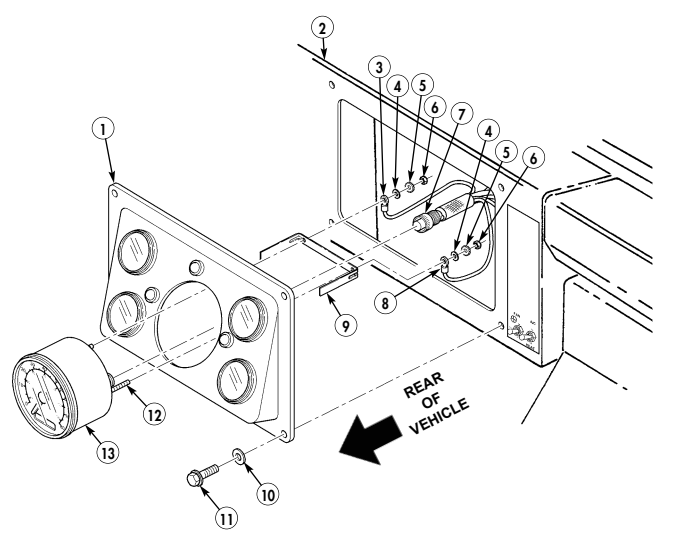

FOLLOW-ON TASKS: - Connect battery ground cables (para. 4-68).

- Check operation of speedometer/odometer (TM 9-2320-387-10).

# 4-18. Speedometer Cable Replacement

This task covers:
a. Removal b. Installation INITIAL SETUP:

## Tools

General mechanic's tool kit:
automotive (Appendix B, Item 1)
Materials/Parts Nut and lockwasher assembly
(Appendix G, Item 197)
Tiedown strap (Appendix G, Item 329.1)
Manual References TM 9-2320-387-10 TM 9-2320-387-24P

## Equipment Condition

- Hood raised and secured (TM 9-2320-387-10). - Engine access cover removed (para. 10-22).

Maintenance Level Unit

## A. Removal

1. Remove four screws (12) and washers (13) from instrument cluster (11) and instrument panel (10) and pull instrument cluster (11) away to gain access to back of speedometer (3).

2. Remove driveshaft nut (2) from speedometer (3). 3. Push cable (5) and rubber grommet (4) through body (8). 4. Remove nut and lockwasher assembly (6), screw (9), and clamp (7) from body (8). Remove clamp (7)
from cable (5). Discard nut and lockwasher assembly (6).

5. Remove tiedown strap (14) from speedometer cable (5) and harness (16). Discard tiedown strap (14).

6. Remove speedometer cable (5) from adapter (15).

## B. Installation

1. Install speedometer cable (5) on adapter (15), ensuring core (1) engages in square hole of adapter (15). 2. Install tiedown strap (14) on speedometer cable (5) and harness (16). 3. Install cable (5) on body (8) with clamp (7), screw (9), and nut and lockwasher assembly (6). 4. Install cable (5) and grommet (4) on body (8). 5. Connect cable (5) to back of speedometer (3), ensuring core (1) engages in square hole in speedometer (3)
and tighten driveshaft nut (2).

6. Install instrument cluster (11) on instrument panel (10) with four washers (13) and screws (12).

# 4-18. Speedometer Cable Replacement (Cont'D)

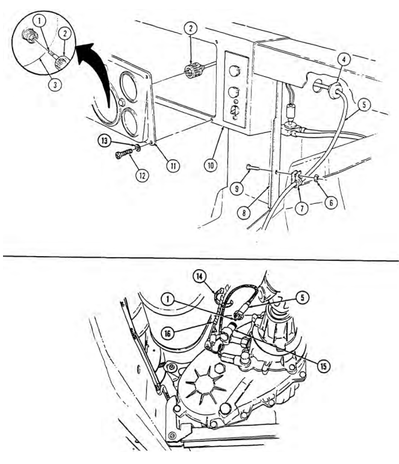

FOLLOW-ON TASKS: - Lower and secure hood (TM 9-2320-387-10).

- Install engine access cover (para. 10-22).

# 4-18.1. Speedometer Harness Assembly Replacement

This task covers:

## Initial Setup: Tools

General mechanic's tool kit:
automotive (Appendix B, Item 1)
Materials/Parts Two tiedown straps (Appendix G, Item 324) Two locknuts (Appendix G, Item 73.1)
Manual References TM 9-2320-387-10 TM 9-2320-387-24P
a. Removal b. Installation

## Equipment Condition

- Hood raised and secured (TM 9-2320-387-10). - Instrument cluster (electronic) removed 
(para. 4-14.1).

- Sender generator (electronic) removed 
(para. 5-17.1).

- Engine access cover removed 
(para. 10-22).

Maintenance Level Unit

- Prior to removal, tag leads for installation. - Jumper wires on rear of instrument cluster can be replaced separately.

- Rotate speedometer harness under body harness to keep body harness from laying on transmission.

## A. Removal

1. Remove locknut (5), capscrew (7), harnesses (3) and (4), and clamp (6) from cowl (8).

Discard locknut (5).

2. Remove locknut (9), capscrew (2), clamp (1), and harnesses (3) and (4) from cowl (8).

Discard locknut (9).

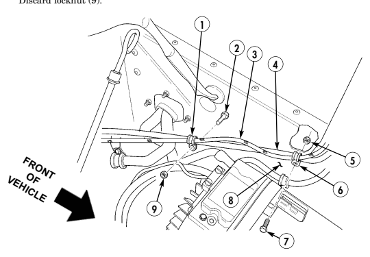

# 4-18.1. Speedometer Harness Assembly Replacement (Cont'D)

3. Remove three capscrews (12), tiedown strap (13), and harness (14) from three clamps (11) on vehicle (10).

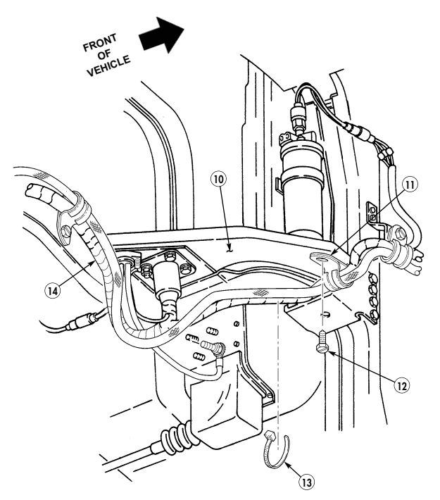

# 4-18.1. Speedometer Harness Assembly Replacement (Cont'D)

4. Remove tiedown strap (6) and harness (2) from harness (1). 5. Remove capscrew (4), clamp (3), and harness (2) from engine floor pan support (5).

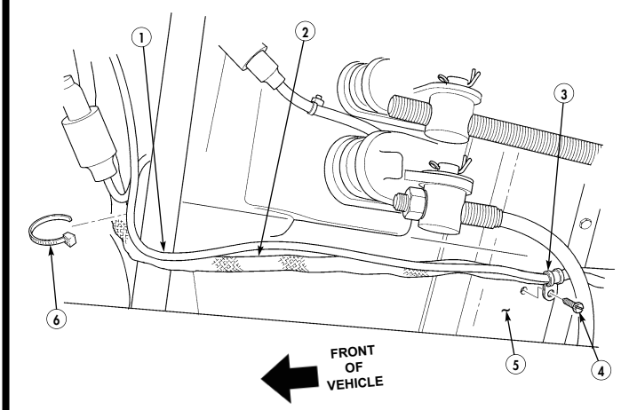

# 4-18.1. Speedometer Harness Assembly Replacement (Cont'D)

b. Installation

Ensure any excess harness assembly is secured to existing instrument cluster harness with tiedown strap(s), as needed.

1. Install harness (8) and clamp (9) on engine floor pan support (11) with capscrew (10). 2. Secure harness (8) on harness (7) with tiedown strap (12).

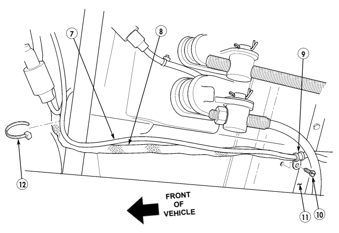

# 4-18.1. Speedometer Harness Assembly Replacement (Cont'D)

3. Install harness (5) and three clamps (2) on vehicle (1) with tiedown strap (4) and three capscrews (3).

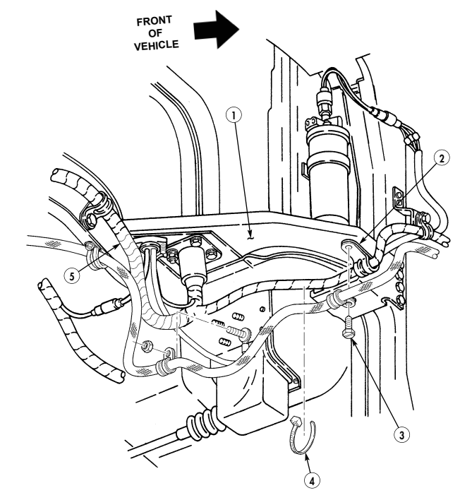

# 4-18.1. Speedometer Harness Assembly Replacement (Cont'D)

4. Install harnesses (8) and (9) and clamp (6) on cowl (13) with capscrew (7) and locknut (14). 5. Install harnesses (8) and (9) and clamp (11) on cowl (13) with capscrew (12) and locknut (10).

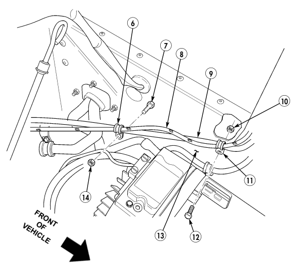

FOLLOW-ON TASKS: - Install engine access cover (para. 10-22).

- Install sender generator (electronic) (para. 5-17.1). - Install instrument cluster (electronic) (para. 4-14.1). - Lower and secure hood (TM 9-2320-387-10).

# 4-19. Instrument Cluster Light Replacement

This task covers:

## Initial Setup:

Tools General mechanic's tool kit:
automotive (Appendix B, Item 1)
Manual References TM 9-2320-387-24P
a. Lamp Removal c. Light Assembly Removal b. Lamp Installation d. Light Assembly Installation

| Equipment Condition                           |
|-----------------------------------------------|
| Serpentine drivebelt removed (para. 3\-81.1). |
| Maintenance Level                             |
| Unit                                          |

a. Lamp Removal 1. Remove light lens (1) and gasket (2) from instrument cluster (4). 2. Remove lamp (3) from instrument cluster (4).

b. Lamp Installation 1. Install lamp (3) on instrument cluster (4). 2. Install gasket (2) and lens (1) on instrument cluster (4).

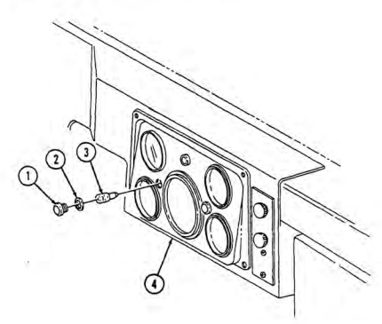

# 4-19. Instrument Cluster Light Replacement (Cont'D)

## C. Light Assembly Removal

1. Remove two light lenses (1) and gaskets (2) from light assemblies (6). 2. Remove lamp (3) from light assembly (6) being replaced. 3. Remove all electrical gauges (para. 4-16) and speedometer/odometer (para. 4-17 or para. 4-17.1). 4. Separate instrument cluster (4) from backing panel (7). 5. Disconnect harness lead 40B (5) from light assembly (6). 6. Remove two screws (8) and light assembly (6) from backing panel (7).

## D. Light Assembly Installation

1. Install light assembly (6) on backing panel (7) with two screws (8). 2. Install backing panel (7) on instrument cluster (4). 3. Install all electrical gauges (para. 4-16) and speedometer/odometer (para. 4-17 or para. 4-17.1). 4. Connect harness lead 40B (5) to light assembly (6). 5. Install lamp (3) on light assembly (6). 6. Install two gaskets (2) and light lenses (1) on light assemblies (6).

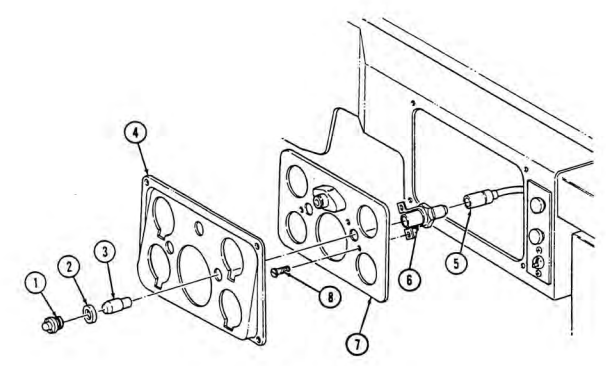

FOLLOW-ON TASK: Connect battery ground cables (para. 4-68).

# 4-20. Wait-To-Start Lamp Replacement

This task covers:
INITIAL SETUP:
Tools

| Materials/Parts   |
|-------------------|

General mechanic's tool kit:
automotive (Appendix B, Item 1)
Maintenance and repair shop equipment:
automotive (Appendix B, Item 2)

## A. Removal B. Installation Note

| Manual References                             |
|-----------------------------------------------|
| TM 9\-2320\-387\-24P                          |
| Equipment Condition                           |
| Serpentine drivebelt removed (para. 3\-81.1). |
| Maintenance Level                             |
| Unit                                          |

Prior to removal, tag leads and note position for installation.

## A. Removal

1. Loosen nut (14) and lower steering column (7). 2. Remove cannon plug (16) from main light switch (15).

All models except M1113 and M1114 are equipped with nut inserts, not nuts and washers as indicated in steps 3 and 4.

3. Remove two capscrews (17), washers (18), nuts (20), and washers (18) from instrument panel (6) and body (19).

4. Remove nut (22) and screw (23) from hand throttle bracket (21) and instrument panel (6). 5. Remove nut (13), washer (11), capscrew (10), and washer (11) from instrument panel (6), hand throttle bracket (21), and steering column bracket (12).

6. Remove screw (8) from instrument panel (6) and cowl (9). 7. Pull instrument panel (6) away from body (19). 8. Remove two screws (5) from wait-to-start lamp (4) and instrument panel (6). 9. Disconnect leads 571 (2) and 27 (3) from wiring harness (1).

10. Remove wait-to-start lamp (4).

## B. Installation

1. Connect leads 571 (2) and 27 (3) to wiring harness (1). 2. Install wait-to-start lamp (4) on instrument panel (6) with two screws (5). 3. Install instrument panel (6) on cowl (9) with screw (8). 4. Install instrument panel (6) and hand throttle bracket (21) on steering column bracket (12) with washer (11), capscrew (10), washer (11), and nut (13).

All models except M1113 and M1114 are equipped with nut inserts, not nuts and washers as indicated in steps 5 and 6.

5. Install hand throttle bracket (21) on instrument panel (6) with screw (23) and nut (22). 6. Install instrument panel (6) on body (19) with two washers (18), capscrews (17), washers (18), and nuts (20).

7. Install cannon plug (16) on main light switch (15). 8. Raise steering column (7) and tighten nut (14) to 31 lb-ft (42 N•m).

4-42 Change 6

# 4-20. Wait-To-Start Lamp Replacement (Cont'D)

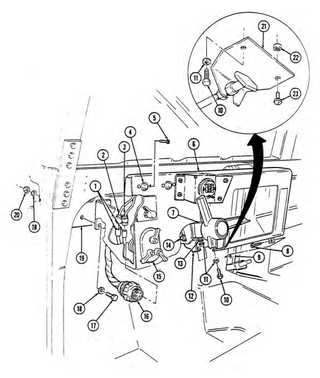

FOLLOW-ON TASKS: - Install driver's closeout panel (para. 11-104.2).

· Install instrument cluster (para. 4-14 or para. 4-14.1). - Connect battery ground cables (para. 4-68). - Start engine (TM 9-2320-387-10) and check wait-to-start lamp assembly for operation.

# 4-21. Brake Warning Lamp Replacement

This task covers:

a. Removal **b. Installation**

INITIAL SETUP:
Tools General mechanic's tool kit:
automotive (Appendix B, Item 1)
Materials/Parts Tape (Appendix C, Item 77)

| Manual References   |
|---------------------|

- Battery ground cables disconnected (para. 4-68). - Air restriction gauge removed (para. 3-17).

Prior to removal, tag leads and note position for installation.

a. Removal 1. Remove two screws (2) from brake warning lamp (1) and instrument panel (5). 2. Disconnect leads 67 (7) and 27 (3) from wiring harness leads (6). 3. Slide brake warning lamp (1) down toward steering column (4) and remove brake warning lamp (1).

b. Installation

Place tape around lead wires to keep lamp in proper position during installation.

1. Install tape (8) around lamp (1) and lead wires (7) and (3).. 2. Slide brake warning lamp (1) up along steering column (4) and install brake warning lamp (1) on instrument panel (5) with two screws (2).

3. Connect leads 67 (7) and 27 (3) to wiring harness leads (6).

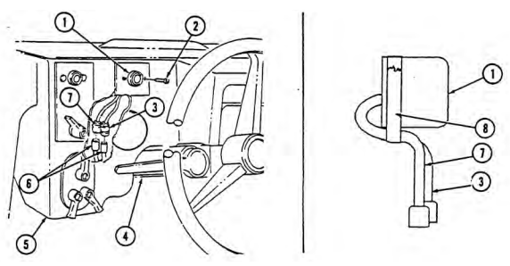

FOLLOW-ON TASKS: - Install air restriction gauge (para. 3-17).

- Connect battery ground cables (para. 4-68). - Start engine (TM 9-2320-387-10) and check brake warning lamp for operation.

# 4-22. High-Beam Lamp Replacement

This task covers:
INITIAL SETUP:
Tools General mechanic's tool kit:
automotive (Appendix B, Item 1)
Materials/Parts Gasket (Appendix G, Item 48)
Manual References TM 9-2320-387-24P

## A. Removal B. Installation

Equipment Condition
- Electrical gauges removed (para. 4-16). - Speedometer/odometer removed (para. 4-17 or para. 4-17.1).

Maintenance Level Unit

Prior to removal, tag leads for installation.

## A. Removal

1. Remove two light lenses (7) from instrument cluster back panel (4). 2. Remove instrument cluster (6) from instrument cluster back panel (4). 3. Disconnect harness lead 57L (2) and lead 17B (3) from high-beam lamp (5). 4. Remove two screws (1), high-beam lamp (5), and gasket (8) from instrument cluster back panel (4).

b. Installation 1. Install gasket (8) and high-beam lamp (5) on instrument cluster back panel (4) with two screws (1). 2. Connect harness lead 57L (2) and lead 17B (3) to high-beam lamp (5). 3. Install instrument cluster (6) on instrument cluster back panel (4). 4. Install two light lenses (7) on instrument cluster back panel (4).

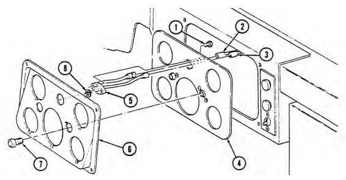

FOLLOW-ON TASKS: - Install speedometer/odometer (para. 4-17 or para. 4-17.1).

- Install electrical gauges (para. 4-16).

# 4-23. Parking Brake Switch Replacement

This task covers:

a. Removal b. Installation

INITIAL SETUP:
Tools General mechanic's tool kit:
automotive (Appendix B, Item 1)
Manual References TM 9-2320-387-10 TM 9-2320-387-24P
Equipment Condition Battery ground cables disconnected (para. 4-68).

Maintenance Level Unit

Prior to removal, tag leads for installation.

a. Removal 1. Disconnect parking brake switch leads 67C (1) and 67 (2) from wiring harness leads 67B (3)
and 67E (4).

2. Remove parking brake switch (5) from parking brake lever (6).

b. Installation 1. Install parking brake switch (5) on parking brake lever (6).

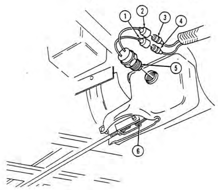 2. Connect leads 67C (1) and 67 (2) to wiring harness leads 67B (3) and 67E (4).

FOLLOW-ON TASKS: - Connect battery ground cables (para. 4-68).

- Check parking brake switch operation (TM 9-2320-387-10).

# 1 4-24. Horn Switch Replacement ~-1

This **task covers:** 
INrnAl. SEflJp: 

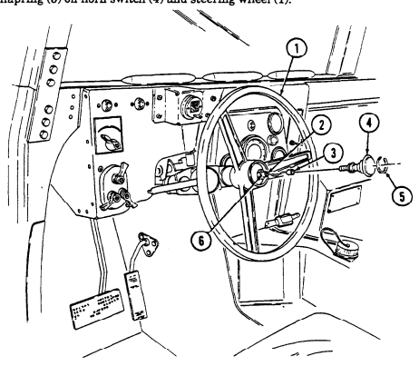

General mechanic's tool kit: 
automotive (Appendix B, Item 1) 
MateriaWParts Sealing compound (Appendix C, Item 63) 

| Manual References                    | TM 9\-2320\-387\-10   |
|--------------------------------------|-----------------------|
| TM 9\-2320\-387\-24P                 | Equipment Condition   |
| - Battery ground cables disconnected |                       |

a. Removal b. Installation 

a. Removal 1. Remove snapring (5) from horn switch (4) and steering wheel (1). 

2. Pull horn switch (4) out and disconnect switch (4) from lead 25A (3) in steering shaft (2). 

b. Installation 1. Apply sealing compound to bushing (6). 

2. Connect lead 25A (3) to horn switch (4) and push switch (4) into steering shaft (2). 

3. Install snapring (5) on horn switch (4) and steering wheel (1). 

FOLLOW-ON TASKS: l Connect battery ground cables (para. 468). 

l Test horn for operation (TM 9-2320-387-10). 

| L   | ools   |
|-----|--------|

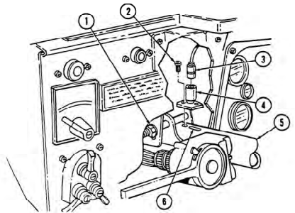

# 4-25. Horn Control Brush Replacement

This task covers:

| INITIAL SETUP:   |
|------------------|

General mechanic's tool kit:
automotive (Appendix B, Item 1)
Maintenance and repair shop equipment:
automotive (Appendix B, Item 2)
Silicone compound (Appendix C, Item 74) Grease (Appendix C, Item 32)

## A. Removal

1. Loosen nut (1) and lower steering column (5).

## B. Installation

1. Apply grease to brass ring (6) in steering column (5). 2. Apply silicone compound to bottom of horn control brush (4). 3. Install horn control brush (4) on steering column (5) with two screws (2). 4. Connect lead 25A (3) to horn control brush (4). 5. Raise steering column (5) and tighten nut (1) to 31 lb-ft (42 N•m).

FOLLOW-ON TASKS: - Connect battery ground cables (para. 4-68).

- Check horn for proper operation (TM 9-2320-387-10).

4-48/(4-49 blank) Change 5

a. Removal b. Installation

2. Disconnect lead 25A (3) from horn control brush (4). 3. Remove two screws (2) from horn control brush (4) and pry horn control brush (4) out of steering column (5).

4. Clean silicone compound from steering column (5).

| Manual References                                    |
|------------------------------------------------------|
| TM 9\-2320\-387\-24P                                 |
| Equipment Condition                                  |
| Cooling system drained (as necessary) (para. 3\-61). |

# 4-26. Horn Replacement

This task covers:

## Initial Setup:

Tools General mechanic's tool kit:
automotive (Appendix B, Item 1)
Materials/Parts Lockwasher (Appendix G, Item 190.5) Two lockwashers (Appendix G, Item 172)
Manual References TM 9-2320-387-10 TM 9-2320-387-24P
a. Horn Replacement With EESS Removal c. Horn Replacement Without EESS Removal b. Horn Replacement With EESS Installation d. Horn Replacement Without EESS Installation

## Equipment Condition

- Battery ground cables disconnected 
(para. 4-68).

- Hood raised and secured 
(TM 9-2320-387-10).

Maintenance Level Unit

- Vehicles equipped with engine electrical starting system (EESS)
need to perform the following procedure for the fabrication of the jumper wire and installation of the semi-conductor.

- Prior to removal, tag leads for installation reference.

## A. Horn Replacement With Eess Removal

1. Remove end of jumper wire (3) and lead 26A (2) from horn (4). 2. Remove two capscrews (9), four lockwashers (7) and (8), and horn (4) from bracket (6). Discard four lockwashers (7) and (8).

3. Remove terminal lug (10) from horn mounting base (5). 4. Remove semi-conductor (11) and lead 25A (1) from connector (12).

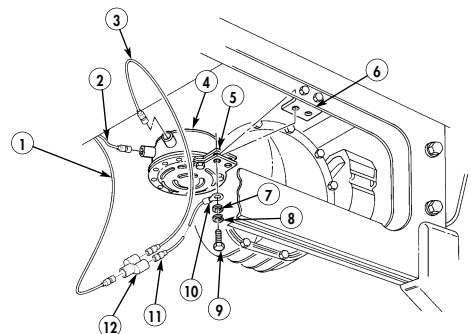

# 4-26. Horn Replacement (Cont'D)

5. Remove two terminals (13), shells (15), and insulators (14) from both ends of jumper wire (3).

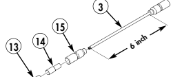

## B. Horn Replacement With Eess Installation

1. Slide two shells (15) and insulators (14) over both ends of jumper wire (3) and attach two terminals (13)
on insulators (14).

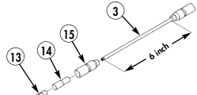

2. Connect lead 25A (1) and semi-conductor (11) to connector (12). 3. Install horn (4) and terminal lug (10) of semi-conductor (11) on horn mounting base (5) and bracket (6) using two capscrews (9), lockwashers (8), and lockwashers (7).

4. Connect lead 26A (2) and end of jumper wire (3) to horn (4).

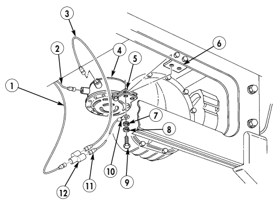

# 4-26. Horn Replacement (Cont'D)

Prior to removal, tag leads for installation reference.

c. Horn Replacement Without EESS Removal 1. Remove two capscrews (4), lockwashers (5), and horn (2) from bracket (3). Discard lockwashers (5). 2. Disconnect leads 25A (1) and 26A (6) from horn (2).

d. Horn Replacement Without EESS Installation 1. Connect leads 25A (1) and 26A (6) to horn (2).

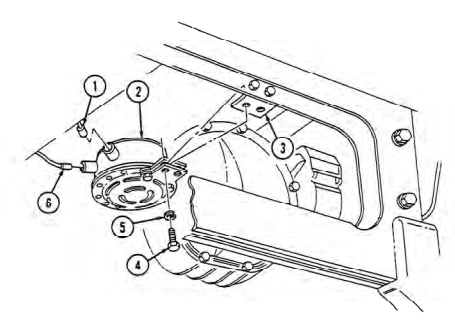 2. Install horn (2) on bracket (3) with two lockwashers (5) and capscrews (4).

FOLLOW-ON TASKS: - Lower and secure hood (TM 9-2320-387-10).

- Connect battery ground cables (para. 4-68). - Check horn for proper operation (TM 9-2320-387-10).

# 4-26.1. Horn Replacement (Serial Numbers 300000 And Above)

This task covers:
INITIAL SETUP:
Tools General mechanic's tool kit:
automotive (Appendix B, Item 1)
Materials/Parts Two lockwashers (Appendix G, Item 146)
Manual References TM 9-2320-387-24P
a. Removal a. Removal b. Installation

| Equipment Condition                        |
|--------------------------------------------|
| Battery cables disconnected (para. 4\-68). |
| Maintenance Level                          |
| Unit                                       |

1. Disconnect wires 26A (6) and 25C (5) from horn (7). 2. Remove two capscrews (4), lockwashers (3), washers (2), and horn (7) from horn bracket (1).

Discard lockwashers (3).

## B. Installation

1. Install horn (7) on horn bracket (1) with two washers (2), lockwashers (3), and capscrews (4). 2. Connect wires 26A (6) and 25C (5) to horn (7).

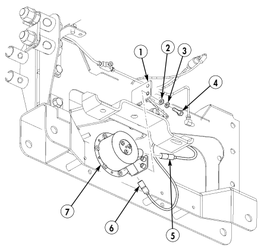

FOLLOW-ON TASK: Connect battery cables (para. 4-68).

# 4-27. Horn Mounting Bracket Replacement

This task covers:

a. Removal b. Installation

| INITIAL SETUP:                         |                      |
|----------------------------------------|----------------------|
| Tools                                  | Manual References    |
| General mechanic's tool kit:           | TM 9\-2320\-387\-24P |
| automotive (Appendix B, Item 1)        | Equipment Condition  |
| Maintenance and repair shop equipment: |                      |
| automotive (Appendix B, Item 2)        |                      |
| Materials/Parts                        | Maintenance Level    |
|                                        | Unit                 |

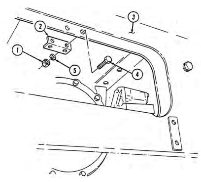

## A. Removal

Remove two nuts (1), lockwashers (5), capscrews (4), and horn mounting bracket (2) from front crossmember (3). Discard lockwashers (5).

## B. Installation

Install horn mounting bracket (2) on front crossmember (3) with two capscrews (4), lockwashers (5), and nuts (1). Tighten nuts (1) to 10 lb-ft (14 N•m).

FOLLOW-ON TASK: Install horn (para. 4-26).

# 4-28. Engine Temperature Sending Unit Replacement

This task covers: 
INITIAL SETUP: 
ToOlS 
?%&a1 mechanic's tool kit: 
automotive (Appendix B, Item 1) 
Material&arts Sealing compound (Appendix C, Item 61) 
Manual References TM 9-2320-387-10 TM 9-2320-387-24P 

## A. Removal B. Installation

Equipment Condition l Battery ground cables disconnected 
(para. 4-68). 

l Hood raised and secured (TM 9-2320-387-10). 

Maintenance Level unit 

The engine temperature sending unit is located at left front of engine. 

1. Disconnect lead 33B (1) from engine temperature sending unit (2). 

2. Remove engine temperature sending unit (2) f+om engine (3). 

1 b. Installation 1 1. Apply sealing compound to threads of engine temperature sending unit (2). 

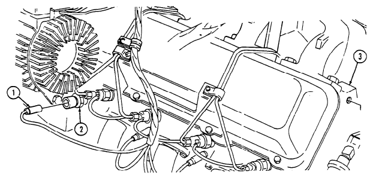

2. 1nstaI.I engine temperature sending unit (2) on engine (3). 

3. Connect lead 33B (1) to engine temperature sending unit (2). 

FOLLOW-ON TASKS: l Connect battery ground cables (para. 468). 

l Start engine (TM 9-2320-387-10) and check sending unit for leaks. 

l Lower and secure hood (TM 9-2320-387-10). 

# 4-29. Oil Pressure Sending Unit Maintenance

Tbis task covers: 
a Removal b. Inspection INITIAL SETUP: 
ToOis General mechanic's tool kit: 
automotive (Appendix B, Item 1) 
Maintenance and repair shop equipment automotive (Appendix B, Item 2) 
Materials/Parts Sealing compound (Appendix C, Item 61) 
c. hstallation Manual References TM 9-2320-387-10 TM 9-2320-387-24P 
Equipment Condition l Battery ground cables disconnected (para. 4-68). l Engine access cover removed (para. 10-22). 

| Maintenance Level                      |
|----------------------------------------|
| \- No accession \- a a super \- 1 Unit |

## A. Removal

1. Disconnect lead 36A (5) from oil pressure sending unit (4). 

2. Remove clamp (1) and oil pressure sending unit (4) from bracket (2). 3. Disconnect oil pressure sending unit (4) from connector (3). 

b. Inspection Inspect connector (3) for damage. Replace if damaged. 

c Installation 1. Apply sealing compound to threads of oil pressure sending unit (4). 

2. Connect oil pressure sending unit (4) to connector (3). 

3. Install oil pressure sending unit (4) on bracket (2) with clamp (1). Tighten clamp to 10-20 l&n. 

(l-2 N-m). 

4. Connect lead 36A (5) to oil pressure sending unit (4). 

# 4-29.  Oil Pressure Sending Unit Maintenance (Cont'D)

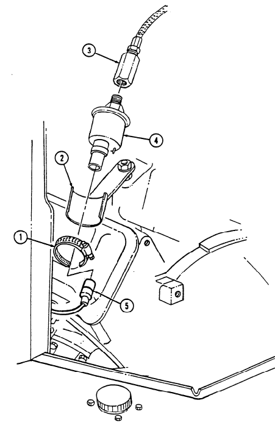

FOLLOW-ON TASKS: - Connect battery ground cables (para. 4-68).
- Start engine (TM 9-2320-387-10) and check sending unit for leaks.

· Install engine access cover (para. 10-22).

# 4-30. Fuel Pressure Transducer Replacement I

This task covers: 
INITIAL SETUP: 
TOOIS 
?&era1 mechanic's tool kit: 
automotive (Appendix B, Item 1) 
Materialflarts Sealing compound (Appendix C, Item 61) 
Manual References TM 9-2320-387-10 Thl9-2320-387-24P 

## A. Removal B. Installation

Equipment Condition l Battery ground cables disconnected (para. 468). 

l Hood raised and secured (TM 9-2320-387-10). 

Maintenance Level unit 

The fuel pressure transducer is a sensor unit for diagnostic testing. It is mounted on top of the fuel filter on firewall of vehicle. 

71 1. Disconnect multiple connector (2) from STE/ICE-R wiring harness (3). 

2. Remove fuel pressure transducer (1) from fuel filter (4). 

[b.j 1. Apply sealing compound to threads of fuel pressure transducer (1). 2. Install fuel pressure transducer (1) on fuel filter (4). 3. Connect multiple connector (2) to STE/ICE-R wiring harness (3). 

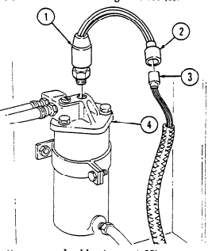

FOLLOW-ON TASKS: l Connect battery ground cables (para. 4-68). 

. Start engine (TM 9-2320-387-10) and check fuel pressure transducer for leaks. 

. Lower and secure hood (TM 9-2320-387-10). 

# 4-31. Cold-Advance Switch Replacement

This task covers:
INITIAL SETUP:

## Tools

General mechanic's tool kit:
automotive (Appendix B, Item 1)
Materials/Parts Sealing compound (Appendix C, Item 61)
Manual References TM 9-2320-387-24P
a. Removal b. Installation

## Equipment Condition

- Battery ground cables disconnected (para. 4-68). - Engine coolant drained as necessary (para. 3-61). - Engine access cover removed (para. 10-22).

Maintenance Level Unit

- The cold-advance switch is located in the right cylinder head water jacket at the rear of the cylinder head just above the exhaust manifold.

- Prior to removal, tag leads for installation.

a. Removal 1. Disconnect leads 569G (1) and 569B (3) from engine harness (2). 2. Remove cold-advance switch (5) from engine (4).

b. Installation 1. Apply sealing compound to threads of cold-advance switch (5). 2. Install cold-advance switch (5) on engine (4). 3. Connect leads 569G (1) and 569B (3) to engine harness (2).

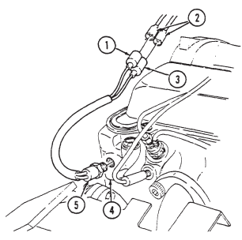

FOLLOW-ON TASKS: - Connect battery ground cables (para. 4-68).

- Fill cooling system (para. 3-61). - Install engine access cover (para. 10-22).

# 4-32. Fuel Level Sending Unit Replacement

This task covers:

a. Removal b. Installation

INITIAL SETUP:
Tools General mechanic's tool kit:
automotive (Appendix B, Item 1)
Maintenance and repair shop equipment automotive (Appendix B, Item 2)

## Materials/Parts

Five lockwashers (Appendix G, Item 150) Gasket (Appendix G, Item 42)
Manual References TM 9-2320-387-10 TM 9-2320-387-24P
Equipment Condition Fuel tank removed (para. 3-25).

General Safety Instructions Do not perform this procedure near fire, flames, or sparks.

| Maintenance Level   |
|---------------------|

Unit

Diesel fuel is highly flammable. Do not perform this procedure near fire, flame, or sparks. Severe injury or death may result.

a. Removal 1. Remove five screws (1) and lockwashers (2) from fuel level sending unit (3) and fuel tank (6).

Discard lockwashers (2).

2. Remove fuel level sending unit (3) from inside of fuel tank (6). 3. Remove and discard gasket (4).

## B. Installation

1. Place gasket (4) on fuel level sending unit (3). 2. Install fuel level sending unit (3) into fuel tank (6), ensuring not to bend float arm (8). 3. Align holes of fuel level sending unit (3) to tank (6) so float (7) is pointed in same direction that tank filler neck (5) points.

4. Install fuel level sending unit (3) on fuel tank (6) with five lockwashers (2) and screws (1). Tighten screws (1) to 32 lb-in. (4 N•m).

# 4-32. Fuel Level Sending Unit Replacement (Cont'D)

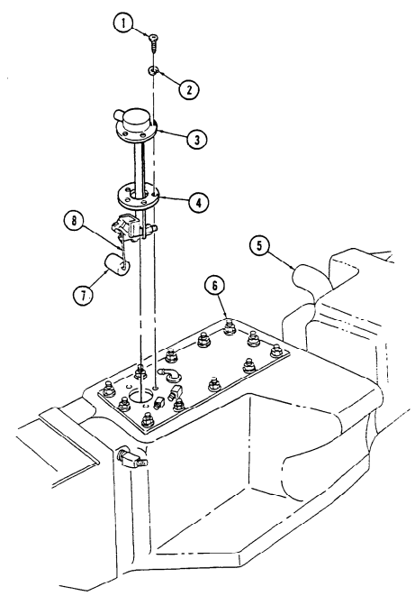

FOLLOW-ON TASKS:  - Install fuel tank (para. 3-25).
- • - Check fuel gauge for proper operation (TM 9-2320-387-10).

# 4-33. Glow Plug Controller Replacement

This task covers: 
INITIAL SETUP: 
TOOIS 
General mechanic's tool kit: 
automotive (Appendix B, Item 1) 
Maintenance and repair shop equipment: 
automotive (Appendix B, Item 2) 
Materials/Parts Grease (Appendix C, Item 36) 
Sealing compound (Appendix C, Item 61) 

#### A. Removal B. Installation Manual References

TM 9-2320-387-10 TM 9-2320-387-24P 
Equipment Condition l Battery ground cables disconnected (para. 4-68). 

l Hood raised and secured (TM 9-2320-387-10). 

Maintenance Level unit 

It may be necessary to clamp surge tank-to-lower radiator tube to prevent loss of coolant. 

rzEEi-j 1. Disconnect multiple connector (2) from glow plug controller (1). 

2. Remove glow plug controller (1) from water crossover (3). 

b. Instaliation 

l Do not attempt to start engine unless controller has been mounted in engine for a minimum of 10 minutes, or ifall glow plugs are disconnected Damage to glow plugs may result. 

l Do not over-tighten controller. Damage to water crossover may result. 

1. Apply sealing compound to **threads** of glow plug controlIer (1). 

2. Install glow plug controller (11 on water crossover (3). Tighten controIler (1) to 14-20 lb-R 
(19-27 Nem). 

3. Apply grease to pins (4) of glow plug controller (1). 

4. Connect multiple connector (2) to glow plug controller (1). 

# 1 4-33. Glow Plug Controller Replacement (Cont'D)

FOLLOW-ON TASKS: l Connect battery ground cables (para. 4-68). 

l Lower and secure hood (TM 9-2320-387-102 

# I I 

# 4-34. Fan Temperature Switch Replacement I

This **task covers:** 
a. Removal INITIAL SETUP: 
ToOlS 
General mechanic's tool hit: 
automotive (Appendix B, Item 1) 
MaterialsParts Sealing compound (Appendix C, Item 61) 
Manual References TM 9-2320-387-10 TM 9-2320-387-24P 

#### B. Htallation

Equipment Condition l Battery ground cables disconnected (para. 4-68). 

l Hood raised and secured (TM 9-2320-387-10). 

Maintenance Level unit 

l **The engine** temperature switch is located on the top front side of the engine in the water crossover. 

l Prior to removal, tag leads for installation. 

1. Disconnect engine harness leads 458A (4) and 458B (3) from fan temperature switch (1). 

2. Remove fan temperature switch (1) from water crossover (2). 

b. **Installation** 
1. Apply sealing compound to threads of fan temperature switch (1). 

2. Install fan temperature switch (1) on water crossover (2). 

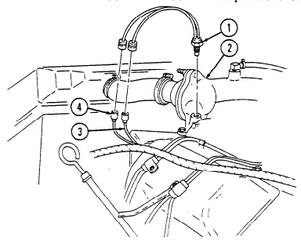 3. Connect engine harness leads 458A (4) and 458B (3) to fan temperature switch (1). 

FOLLCW-ON TASKS: l Connect battery ground cables (para. 4-68). 

. Lower and **secure** hood (TM 9-2320-387-10). 

-1 

# 4-35. Time-Delay Module Replacement

This task covers:
INITIAL SETUP:

## Tools

General mechanic's tool kit:
automotive (Appendix B, Item 1)
Manual References TM 9-2320-387-10 TM 9-2320-387-24P

## A. Removal A. Removal B. Installation

Equipment Condition
- Battery ground cables disconnected (para. 4-68). - Hood raised and secured (TM 9-2320-387-10).

Maintenance Level Unit 1. Disconnect connector plug (3) from control valve connector (5). 2. Disconnect connector plug (2) from engine harness (4). 3. Remove two screws (1) and time-delay module (7) from cowl (6).

b. Installation 1. Install time-delay module (7) on cowl (6) with two screws (1). 2. Connect connector plug (2) to engine harness (4). 3. Connect connector plug (3) to control valve connector (5).

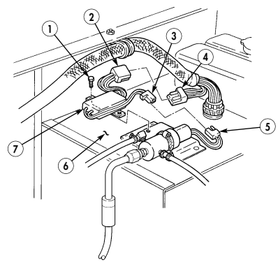

FOLLOW-ON TASKS: - Connect battery ground cables (para. 4-68).

- Lower and secure hood (TM 9-2320-387-10).

# 4-36. Backup Light Switch Replacement

| a.  Removal                     | b.  Installation     |
|---------------------------------|----------------------|
| INITIAL SETUP:                  |                      |
| Applicable Models               | Personnel Required   |
| M1113, M1152, M1152A1           | One mechanic         |
|                                 | One assistant        |
| Tools                           |                      |
| General mechanic's tool kit:    | Manual References    |
| automotive (Appendix B, Item 1) | TM 9\-2320\-387\-24P |
| Materials/Parts                 | Equipment Condition  |

This task covers:
a. Removal 1. Remove boot (4) from shift controls housing assembly (1).

2. Remove two screws (5) from backup light switch (7) and housing assembly (1).

3. Remove tiedown strap (3) and backup light switch (7) from neutral start switch leads (2). Discard tiedown strap (3).

## B. Installation

1. Install backup light switch (7) on shift controls housing assembly (1) with two screws (5). 2. Install tiedown strap (3) on leads from backup light switch (7) and neutral start switch leads (2). 3. Position neutral start switch leads (2) and backup light switch (7) leads through boot (4) and install boot (4) on housing assembly (1).

# 4-36.  Backup Light Switch Replacement (Cont'D)

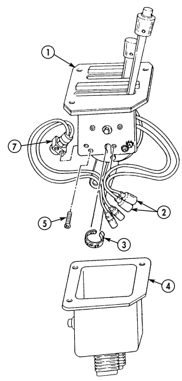

FOLLOW-ON TASK:   Install shift controls housing (para. 5-7).

# 4-37. Engine Rpm Sensor Replacement

This task covers:
a. Removal b. Installation INITIAL SETUP:
Tools General mechanic's tool kit:
automotive (Appendix B, Item 1)
Equipment Condition
- Battery ground cable disconnected (para. 4-68). - Hood raised and secured (TM 9-2320-387-10).

Manual References TM 9-2320-387-10 TM 9-2320-387-24P
Maintenance Level Unit a. Removal 1. Disconnect body harness lead (1) from rpm sensor lead (2). 2. Remove screw (4) and clamp (7) from front cover (8). 3. Remove capscrew (3) and rpm sensor (6) from front cover (8).

b. Installation 1. Install rpm sensor (6) in front cover (8) with capscrew (3). 2. Install rpm sensor lead (2) on front cover (8) with clamp (7) and screw (4). 3. Connector rpm sensor lead (2) to body harness lead (1).

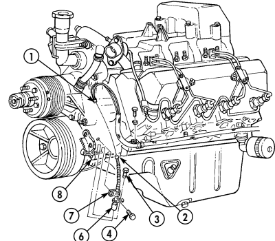

FOLLOW-ON TASKS: - Connect battery ground cables (para. 4-68).

- Lower and secure hood (TM 9-2320-387-10).

# Section Iv. Transfer Case And Transmission Electrical Maintenance

| INITIAL SETUP:   |                                                                                                      |
|------------------|------------------------------------------------------------------------------------------------------|
|                  | Tools Manual References                                                                              |
|                  | General mechanic's tool kit:  TM 9\-2320\-387\-10                                                    |
|                  | automotive (Appendix B, Item 1)  TM 9\-2320\-387\-24P                                                |
|                  | Maintenance and repair shop equipment:  Equipment Condition                                          |
|                  | automotive (Appendix B, Item 2)  - Battery ground cables disconnected (para. 4\-68).                 |
|                  | Materials/Parts  - Hood raised and secured (TM 9\-2320\-387\-10).                                    |
|                  | Two lockwashers (Appendix G, Item 177) Maintenance Level Lockwasher (Appendix G, Item 179)           |
|                  | Grease (Appendix C, Item 25) Unit                                                                    |
|                  | NOTE                                                                                                 |
|                  | Prior to removal, tag leads for installation.                                                        |
|                  | a. Removal                                                                                           |
| 1.               | Disconnect regulator plug (13) from voltage regulator (11).                                          |
| 2.               | Slide back rubber boot (3) and remove nut (2), lead 5A (1) and washer (22.1) from IGN terminal (22). |
| 3.               | Slide back rubber boot (4) and remove nut (5), lead 2A (6) and washer (6.1) from yellow (AC)         |
|                  | terminal (7).                                                                                        |

4-38. TRANSFER CASE AND TRANSMISSION ELECTRICAL MAINTENANCE **TASK SUMMARY**

# 1 **4-39. Transfer Case Indicator Switch Replacement I**

This task covers: 

a. Removal **b. htallation** 

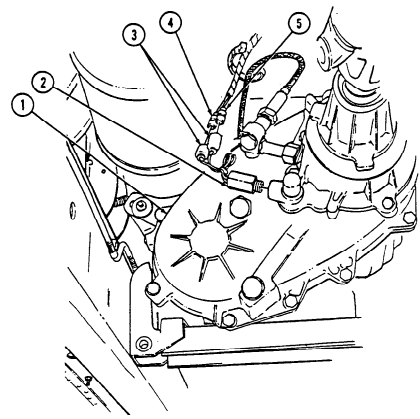

TOOIS 

General mechanic's tool kit: 
automotive (Appendix B, Item 1) 

| Manual References    |
|----------------------|
| TM 9\-2320\-387\-10  |
| TM 9\-2320\-387\-24P |
| Equipment Condition  |

Manual References TM 9-2320-387-24P 
1 a Removal 1 1. Disconnect leads 511A (4) and 511B (5) from indicator switch leads (3) on transfer case (1). 

2. Remove indicator switch (2) from transfer case (1). 

b. Installation 1. Install indicator switch (2) on transfer case (1). 2. Connect leads 51lA (4) and 511B (5) to indicator switch leads (3). 

FOLLOW-ON TASK: Connect battery ground cables (para. 468). 

# 4-40. Transfer Case Indicator Lamp Assembly Replacement

This task covers: 
INITIAL SETUP: 
Manual **References Maintenance Level** 
TM 9-2320-387-24P Unit 

a. Removal b. Installation 

TOOIS Equipment Condition 
-&&~a1 mechanic's tool kit: l Battery ground cables disconnected (para. 4-68). 

automotive (Appendix B, Item 11 l Engine access cover removed (para. 10-22). 

#### 1 A. Removal 1

1. Disconnect lead 511A (8) from lamp assembly lead (7). 

2. Remove nut (91, washer (61, ground lead (51, and washer (4) from stud (3). 

3. Remove two screws (21 and lamp assembly (101 from body (11. 

b. Installation 1. Install lamp assembly (10) on body (1) with two screws (21. 

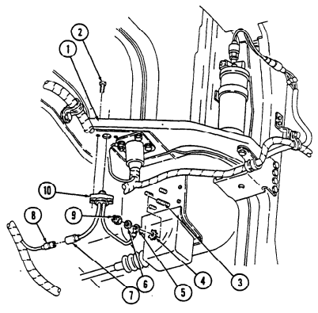 2. Install ground lead (5) on stud (3) with washers (41 and (61, and nut (9). 3. Connect lead 511A (81 to lamp assembly lead (7). 

FOLLOW-ON TASKS: l Install engine access cover (para. 10-22). 

l Connect battery ground cables (para. 4-68). 

# 1 4-41. Transmission Indicator Lamp Assembly Replacement

This task covers: 
INITIAL SETUP: 
Manual References Maintenance Level TM 9.2320.387.24P Unit 1 a. Removal 1 a. Removal b. Installation ToOlS Equipment Condition General mechanic's tool kit: l Battery ground cables disconnected (para. 4-68). 

automotive (Appendix B, Item 1) l Engine access cover removed (para. 10-22). 

1. Disconnect lead 657 (4) from lamp assembly lead (5). 

2. Remove two screws (2) and lamp assembly (1) f+om body (3). 

rb. Installation I 
1. Install lamp assembly (1) on body (3) with two screws (2). 

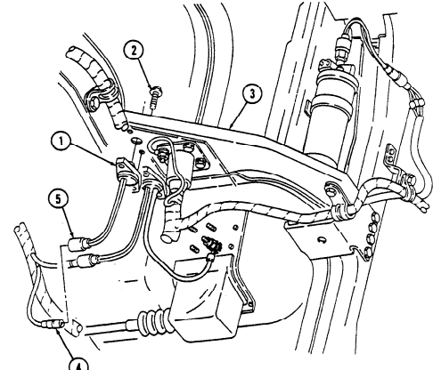 2. Connect lead 657 (4) to lamp assembly lead (5). 

FOLLOW-ON TASKS: l Install engine access cover (para. 10-22). 

l Connect battery ground cables (para. 4-68). 

# 4-42. Fan Cut-Off Switch Replacement

This task covers:
INITIAL SETUP:
Tools General mechanic's tool kit:
automotive (Appendix B, Item 1)
Materials/Parts Two locknuts (Appendix G, Item 89)
Manual References TM 9-2320-387-10 TM 9-2320-387-24P
a. Removal b. Installation Equipment Condition
- Battery ground cables disconnected (para. 4-68). - Hood raised and secured (TM 9-2320-387-10).

Maintenance Level Unit

Prior to removal, tag leads for installation.

a. Removal 1. Disconnect harness leads 315A/315B (4) from leads 315 (5). 2. Remove two locknuts (1), washers (2), and switch (6) from bracket (3). Discard locknuts (1).

b. Installation 1. Install switch (6) on bracket (3) with two washers (2) and locknuts (1).

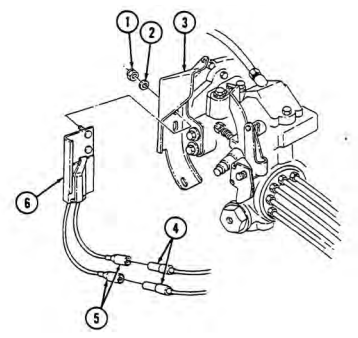 2. Connect harness leads 315A/315B (4) to leads 315 (5).

FOLLOW-ON TASKS: - Connect battery ground cables (para. 4-68).

- Lower and secure hood (TM 9-2320-387-10).

# 4-43. **Transmission Circuit Breakers Maintenance**

This task covers:
a.1. Inspection

## Initial Setup:

Tools General mechanic's tool kit:
automotive (Appendix B, Item 1)
Torque wrench 3/8-in. drive, 75 ft-lb 
(Appendix B, Item 2.1)
Materials/Parts Two lockwashers (Appendix G, Item 146)
a. Removal b. Installation

| TM 9\-2320\-387\-10                               |
|---------------------------------------------------|
| TM 9\-2320\-387\-24P                              |
| Equipment Condition                               |
| Battery ground cables disconnected (para. 4\-68). |
| Maintenance Level                                 |
| Unit                                              |

Prior to removal, tag leads for installation.

a. Removal

- Perform steps 1, 2 and 3 for M1113, M1165 (S/N 248731 and below), and M1165A1 (S/N 248731 and below) vehicles only.

- Perform steps 3.1, 3.2 and 3.3 for M1152 and M1152A1 vehicles only.

- Perform steps 4 and 5 for M1114, M1151, M1151A1, M1165, M1165A1 (S/N 248732 and above), and M1167 vehicles only.

1. Remove three capscrews (1) from coverplate (2) and B-beam (3). 2. Remove two nuts (4), washers (5), capscrews (11), and washers (10) from coverplate (2) and B-beam (3).

3. Remove two capscrews (9), lockwashers (8), washers (7), and coverplate (2) from battery box (6).

Discard lockwashers (8).

3.1. Remove three capscrews (11.1), lockwashers (11.2), and washers (11.3) from coverplate (2) and B-beam (3). Discard lockwashers (11.2).

3.2. Remove two nuts (4), washers (5), capscrews (11), and washers (10) from coverplate (2) and B-beam
(3).

3.3. Remove three capscrews (11.6), washers (11.5), and coverplate (2) from vehicle floor (11.4).

4. Remove two capscrews (15) from coverplate (2) and B-beam (3). 5. Remove two capscrews (14), lockwashers (13), washers (12), and coverplate (2) from battery box (6).

Discard lockwashers (13).

6. Disconnect two leads (17) from circuit breaker (18). 7. Remove two nuts (16), circuit breaker (18), and screws (19) from coverplate (2).

# 4-43.  Transmission Circuit Breakers Maintenance (Cont'D)

-

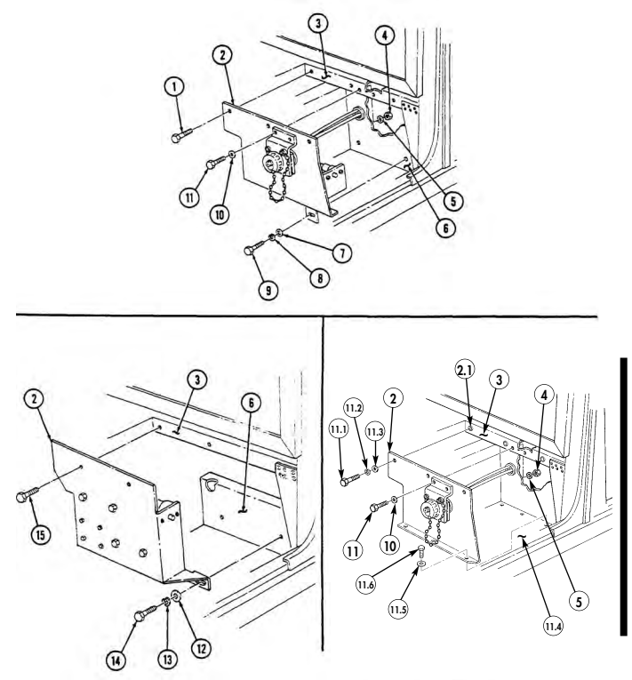

# 4-43. **Transmission Circuit Breakers Maintenance (Cont'D)**

a.1. Inspection Refer to para. 10-56 for nut insert (20) inspection and replacement. b. Installation 1. Install circuit breaker (4) on coverplate (1) with two screws (5) and nuts (2). 2. Connect two leads (3) to circuit breaker (4).

- Perform steps 2.1, 2.2, and 2.3 for M1152, M1152A1 vehicles only. - Perform steps 3, 4 and 5 for M1113, M1165 (S/N 248731 and below), and M1167 (S/N 248731 and below) vehicles only.

- Perform steps 6 and 7 for M1114, M1151, M1151A1, M1165, M1165A1 (S/N 248732 and above), and M1167 vehicles only.

2.1. Install coverplate (1) on vehicle floor (11.4) with three washers (11.5) and capscrews (11.6). 2.2. Install coverplate (1) on B-beam (3) with two washers (10), capscrews (11), washers (5), and nuts (4).

2.3. Secure coverplate (1) to B-beam (8) with three lockwashers (18), capscrews (17) and washers (19).

3. Install coverplate (1) on battery box (11) with two washers (12), lockwashers (13), and capscrews (14).

Tighten capscrews (14) to 8 lb-ft (11 N•m).

4. Install coverplate (1) on B-beam (8) with three capscrews (7). 5. Install coverplate (1) on B-beam (8) with two washers (15), capscrews (16), washers (10), and nuts (9).

Tighten capscrews (16) to 17 lb-ft (23 N•m).

6. Install coverplate (1) on battery box (11) with two washers (24), lockwashers (25), and capscrews (26).

Tighten capscrews (26) to 8 lb-ft (11 N•m).

7. Secure coverplate (1) to B-beam (8) with two capscrews (27).

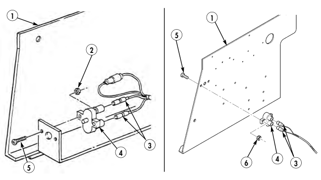

4-70.2 Change 6

# 4-43.  Transmission Circuit Breakers Maintenance (Cont'D)

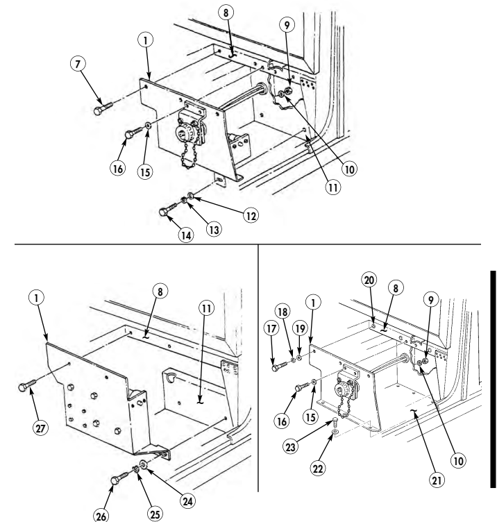

FOLLOW-ON TASK:  Connect battery ground cables (para. 4-68).

# 4-44. Transmission Relay Maintenance

This task covers:
a.1. Inspection INITIAL SETUP:
Tools General mechanic's tool kit:
automotive (Appendix B, Item 1)
Torque wrench 3/8-in. drive, 75 ft-lb 
(Appendix B, Item 2.1)
Materials/Parts Two lockwashers (Appendix G, Item 146)

| Manual References                  |
|------------------------------------|
| TM 9\-2320\-387\-24P               |
| Equipment Condition                |
| Battery ground cables disconnected |
| (para. 4\-68).                     |
| Maintenance Level                  |

Unit

Prior to removal, tag leads for installation.

a. Removal

- Perform steps 1, 2, and 3 for M1113, M1165 (S/N 248731 and below), and M1165A1 (S/N 248731 and below) vehicles only.

- Perform steps 3.1, 3.2, and 3.3 for M1152 and M1152A1 vehicles only.

- Perform steps 4 and 5 for M1114, M1151, M1151A1, M1165, M1165A1, (S/N 248732 and above), M1167 vehicles only.

1. Remove three capscrews (1) from coverplate (2) and B-beam (3). 2. Remove two nuts (4), washers (5), capscrews (11), and washers (10) from coverplate (2) and B-beam (3).

3. Remove two capscrews (9), lockwashers (8), washers (7), and coverplate (2) from battery box (6).

Discard lockwashers (8).

3.1. Remove three capscrews (11.1), lockwashers (11.2), and washers (11.3) from coverplate (2) and B-beam (3). Discard lockwashers (11.2).

3.2. Remove two nuts (4), washers (5), capscrews (11), and washers (10) from coverplate (2) and B-beam (3).

3.3. Remove three capscrews (11.6), washers (11.5), and cover plate (2) from vehicle floor (11.4). 4. Remove two capscrews (15) from coverplate (2) and B-beam (3). 5. Remove two capscrews (14), lockwashers (13), washers (12), and coverplate (2) from battery box (6).

Discard lockwashers (13).

6. Disconnect four leads (16) from relay leads (17).

M1113 vehicles may be equipped with plusnuts instead of nuts as indicated in step 7.

7. Remove two nuts (20), washers, (21), capscrews (18), and relay (19) from coverplate (2).

a.1. Inspection Refer to para. 10-56 for nut insert (2.1) inspection and replacement.

a. Removal b. Installation

# 4-44. Transmission Relay Maintenance (Cont'D)

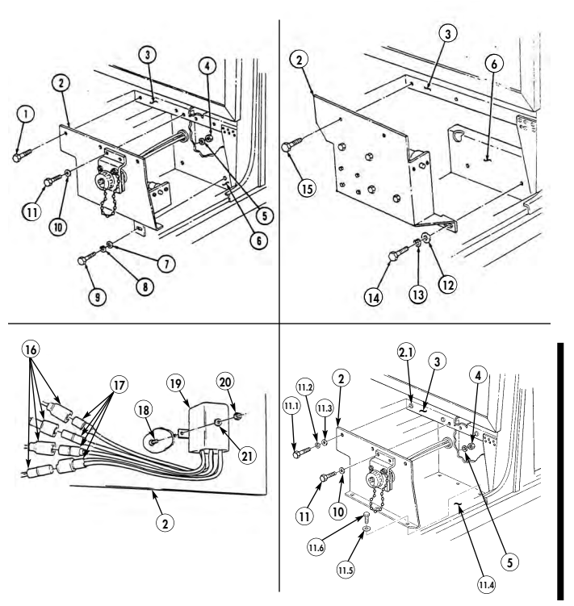

I

# 4-44. Transmission Relay Maintenance (Cont'D)

b. Installation

M1113 vehicles may be equipped with plusnuts instead of nuts as indicated in step 1.

1. Install relay (19) on coverplate (2) with two capscrews (18), washers (21), and (if removed) nuts (20). 2. Connect four relay leads (17) to leads (16).

- Perform steps 2.1, 2.2, and 2.3 for M1152 and M1152A1 vehicles only.

- Perform steps 3, 4, and 5 for M1113, M1165 (S/N 248731 and below), and M1165A1 (S/N 248731 and below) vehicles only.

- Perform steps 6 and 7 for M1114, M1151, M1151A1, M1165, M1165A1, (S/N 248732 and above), M1167 vehicles only.

2.1. Install coverplate (2) on vehicle floor (11.4) with three washers (11.5) and capscrews (11.6). 2.2. Install coverplate (2) on B-beam (3) with two washers (10), capscrews (11), washers (5), and nuts (4).

When installing capscrews into nut inserts, use grade 5 torque value. Failure to do so may damage equipment or components.

2.3 Secure coverplate (2) to B-beam (3) with three lockwashers (11.2), capscrews (11.1) and washers (11.3). 3. Install coverplate (2) on battery box (6) with two washers (7), lockwashers (8), and capscrews (9).

Tighten capscrews (9) to 8 lb-ft (11 N•m).

4. Install coverplate (2) on B-beam (3) with three capscrews (1). 5. Install coverplate (2) on B-beam (3) with two washers (10), capscrews (11), washers (5), and nuts (4).

Tighten capscrews (11) to 17 lb-ft (23 N•m).

6. Install coverplate (2) on battery box (6) with two washers (12), lockwashers (13), and capscrews (14).

Tighten capscrews (14) to 8 lb-ft (11 N•m).

7. Secure coverplate (2) to B-beam (3) with two capscrews (15).

# 4-44. Transmission Relay Maintenance (Cont'D)

-

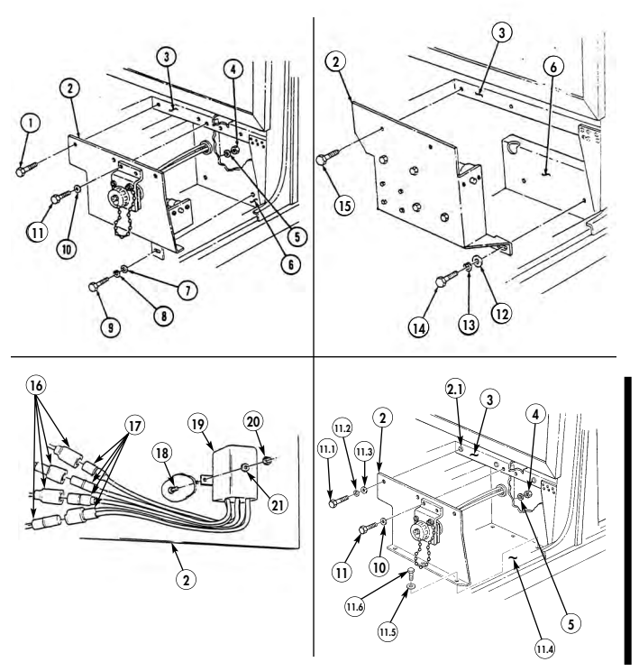

FOLLOW-ON TASK:  Connect battery ground cables (para. 4-68).

# 4-45. Transmission Control Module (Tcm) Replacement

This task covers:
INITIAL SETUP:
Tools General mechanic's tool kit:
automotive (Appendix B, Item 1)
Materials/Parts Four lockwashers 
(Appendix G, Item 145)

| Manual References   |
|---------------------|

| TM 9\-2320\-387\-10 TM 9\-2320\-387\-24P          |
|---------------------------------------------------|
| Equipment Condition                               |
| Battery ground cables disconnected (para. 4\-68). |

TM 9-2320-387-24P

Ensure ignition switch is OFF before disconnecting or reconnecting Transmission Control Module (TCM). Failure to do this may cause internal damage to TCM.

a. Removal 1. Disconnect harness connector (1) from TCM (5). 2. Remove four screws (2), washers (4), lockwashers (3), and TCM (5) from floor (6). Discard lockwashers (3).

b. Installation 1. Install TCM (5) on floor (6) with four washers (4), lockwashers (3), and screws (2). 2. Connect harness connector (1) to TCM (5).

a. Removal b. Installation

# 4-45. Transmission Control Module (Tcm) Replacement (Cont'D)

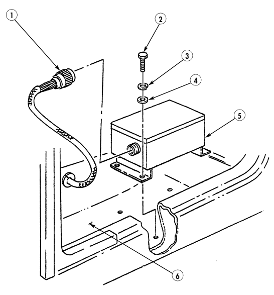

FOLLOW-ON TASKS: - Install fixed rear door access panel (para. 10-21.1)
- Install left rear passenger seat (para. 10-45). - Connect battery ground cables (para. 4-68).

# 4-45.1. E-Prom Replacement

This task covers:
INITIAL SETUP:
Tools General mechanic's tool kit:
automotive (Appendix B, Item 1)

| Manual References   |
|---------------------|

| TM 9\-2320\-387\-10 TM 9\-2320\-387\-24P   |
|--------------------------------------------|

RTV sealant (Appendix C, Item 10)
TM 9-2320-387-24P

## A. Removal B. Installation Equipment Condition

- Battery ground cables disconnected
(para. 4-73).

- Remove left rear passenger seat 
(para. 10-45).

- Remove fixed rear door access panel 
(para. 10-20.1).

Ensure that ignition switch is OFF before replacing E-PROM or disconnecting or reconnecting the Transmission Control Module (TCM). Failure to do this may cause internal damage to TCM.

For proper calibration of E-PROM to transmission, ensure E-PROM is the same production year as the transmission installed in the vehicle.

a. Removal

- Perform step 1 for old configuration. - Perform step 2 for new configuration.

1. Loosen four screws (1) and remove cover (2) and foam insulation (4) from TCM box (8). 2. Loosen ten screws (1) and remove cover (2), gasket (11), and foam insulation (4) from TCM box (8). 3. Remove two screws (5) and access panel (6) from terminal box (9). 4. Remove E-PROM (10) from circuit board (7). b. Installation

- Perform steps 3 thru 5 for old configuration. - Perform steps 6 and 7 for new configuration.

1. Install E-PROM (10) on circuit board (7) by pushing it down firmly to ensure it is well seated. 2. Install access panel (6) on terminal box (9) with two screws (5). 3. Clean sealant from TCM box (8) and cover (2). 4. Apply 0.125 in. (3.175 mm) bead of RTV adhesive sealant in groove (3) on cover (2). 5. Install foam insulation (4) and cover (2) on TCM box (8) and tighten four screws (1) to 30 lb-in.

(3 N•m).

6. Install gasket (11) on cover (2). 7. Install foam insulation (4) and cover (2) on TCM box (8) and tighten ten screws (1) to 30 lb-in. 

(3 N•m).

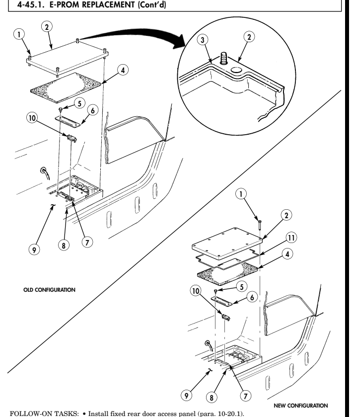

- Install left rear passenger seat (para. 10-45). - Connect battery cables (para. 4-73).

# 4-46. Throttle Position (Tp) Sensor Maintenance

This task covers:
a. Removal c. Adjustment b. Installation

## Initial Setup:

Tools General mechanic's tool kit:
automotive (Appendix B, Item 1)
Test Equipment Multimeter (Appendix B, Item 155) Jumper wire (Appendix B, Item 79) Valve gauge block (Appendix B, Item 45)
a. Removal b. Installation 4. Adjust TP sensor (5). c. Adjustment Manual References TM 9-2320-387-10 TM 9-2320-387-24P

| Equipment Condition   |
|-----------------------|

| Maintenance Level   |
|---------------------|

- Air horn removed (para. 3-14). - Battery ground cables disconnected 
(para. 4-68).

Unit

The TP sensor is an electrical component and must not be soaked in any liquid cleaner or solvent, or damage may result.

1. Disconnect engine wiring harness connector (3) from TP sensor connector (4). 2. Remove two screws (7), washers (6), and TP sensor (5) from fuel injection pump (1).

1. Ensure throttle is closed, and place TP sensor (5) on throttle shaft (2) of fuel injection pump (1). 2. Rotate TP sensor (5) counterclockwise to align screw holes in sensor (5) with holes in injection pump (1).

3. Install TP sensor (5) on injection pump (1) with two washers (6) and screws (7). Do not tighten screws (7).

1. Disconnect engine harness (12) and body harness connectors (11). 2. Install jumper wires between TP sensor connector (4) and body wiring harness connector (11). 

2.1. Connect battery ground cables (para. 4-68).

3. Rotate ignition switch to RUN position (TM 9-2320-387-10). 4. Using a digital multimeter, measure voltage between terminals A and C of TP sensor connector (4). This voltage should be between 4.5 - 5.8 volts. Multiply by 0.33 to obtain the desired TP sensor voltage, and use this figure to adjust TP sensor.

For example, 5.00 volts x 0.33 = 1.65 volts (±1% or 0.02 volts tolerance).

5. Install .646 side of valve gauge block between injection pump throttle lever stopscrew (8) and housing boss (9) on the injection pump (1). 

6. Rotate injection pump throttle lever (10) so that stopscrew (8) holds valve gauge block against housing boss (9).

# 4-46. Throttle Position (Tp) Sensor Maintenance (Cont'D)

Keep throttle lever in this position during remainder of adjustment steps.

7. Measure voltage between terminals B and C of TP sensor connector (4).

a. If measured voltage is within calculated specification, as indicated in step 4, remove jumper wire and connect engine harness connector (3) to TP sensor connector (4).

b. If voltage is not within calculated specification, go to next step.

8. Loosen TP sensor mounting screws (7) and rotate TP sensor (5) toward rear of vehicle (counterclockwise direction).

9. With voltmeter connected to terminals B and C of TP sensor connector (4), rotate TP sensor (5)
slowly toward front of vehicle (clockwise direction) until voltmeter indicates voltage as determined in step 4.

10. Tighten TP sensor mounting screws (7) and confirm that adjustment did not change. 11. Remove jumper wire. 12. Remove valve gauge block. 13. Connect engine wiring harness connector (3) to TP sensor connector (4).

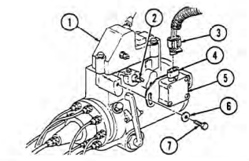

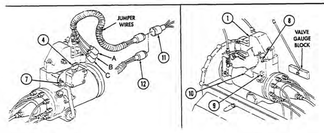 14. Connect body harness connector (11) and engine harness connector (12).

FOLLOW-ON TASK: Install air horn (para. 3-14).

4-47. TRANSMISSION INPUT SPEED SENSOR (TISS) AND OUTPUT SPEED SENSOR

# (Toss) Maintenance

This task covers:
a. Removal c. Installation b. Inspection INITIAL SETUP:
Tools General mechanic's tool kit:
automotive (Appendix B, Item 1)
Materials/Parts O-ring seal (Appendix G, Item 213) Hydraulic fluid (Appendix C, Item 37)
Manual References TM 9-2320-387-10 TM 9-2320-387-24P
Equipment Conditions Battery ground cables disconnected (para. 4-68).

Maintenance Level Unit

Replacement procedure for input and output speed sensors are basically the same. This procedure covers the output speed sensor.

a. Removal 1. Disconnect speed sensor harness connector (5) from sensor (7). 2. Remove nut (10), capscrew (1), washer (2), and harness clip (4) from sensor bracket (8). 3. Remove capscrew (9) from sensor (7) and transmission (3). Slide bracket (8) off sensor (7). 4. Using a twisting motion, remove sensor (7) from transmission (3).

b. Inspection Inspect O-ring seal (6) and replace if damaged.

c. Installation 1. Lubricate O-ring seal (6) with hydraulic fluid and install on sensor (7) if removed. 2. Using a twisting motion, install sensor (7) on transmission (3). 3. Slide bracket (8) over sensor (7) and install capscrew (9). 4. Install harness clip (4) on sensor bracket (8) with washer (2), capscrew (1), and nut (10). 5. Install connector (5) on sensor (7).

4-47. TRANSMISSION INPUT SPEED SENSOR (TISS) AND OUTPUT SPEED SENSOR
(TOSS) MAINTENANCE (Cont'd)

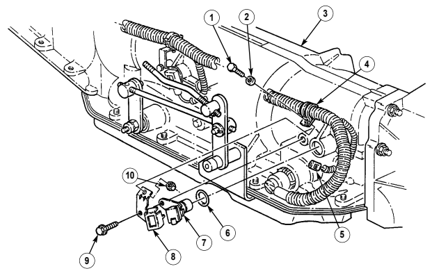

FOLLOW-ON TASKS: - Connect battery ground cables (para. 4-68).

- Start engine (TM 9-2320-387-10) and check operation of transmission.

# 4-47.1. Transmission Control Module (Tcm) Capacitor Replacement

This task covers:

a. Removal b. Installation

| INITIAL SETUP:                         |                      |
|----------------------------------------|----------------------|
| Tools                                  | Manual References    |
| General  mechanic's tool kit:          | TM 9\-2320\-387\-10  |
| automotive (Appendix B, Item 1)        | TM 9\-2320\-387\-24P |
| Maintenance and repair shop equipment: | Maintenance Level    |
| automotive (Appendix B, Item 2)        |                      |
|                                        | Unit                 |

a. Removal 1. Disconnect TCM capacitor connector (8) from body wiring harness connectors (7). 2. Remove nut (6), screw (1), washer (2), body wiring harness clamp (3), TCM capacitor clamp (4), and TCM capacitor (9) from body wiring harness bracket (5).

3. Remove TCM capacitor (9) from TCM capacitor clamp (4).

## B. Installation

1. Install TCM capacitor (9) on body wiring harness bracket (5) with TCM capacitor clamp (4), body wiring harness clamp (3), washer (2), screw (1), and nut (6).

2. Connect TCM capacitor connector (8) to body wiring harness connector (7).

# 4-47.1. Transmission Control Module (Tcm) Capacitor Replacement (Cont'D)

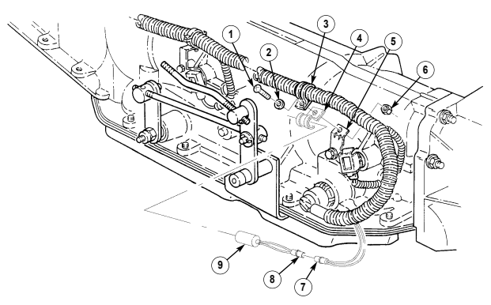

FOLLOW-ON TASK:

# 4-47.2. Electromagnetic Interference (Emi) Capacitor Assembly Replacement

This task covers:

## Initial Setup:

Tools General mechanic's tool kit:
automotive (Appendix B, Item 1)
Materials/Parts Lockwasher Manual References TM 9-2320-387-10 TM 9-2320-387-24P
a. Removal b. Installation

| (para. 4\-68).   |
|------------------|

## A. Removal

1. Remove screw (1), lockwasher (2), nut (6), and ground terminal (3) from loop clamp (14) and harness clamp (4). Discard lockwasher (2).

2. Remove clamp (14) from capacitor assembly (7). 3. Disconnect plug (8) from connector adapter (9). 4. Disconnect plug (13) from connector adapter (12). 5. Disconnect transmission harness plug (10) and capacitor jumper assembly plug (11) from connector adapter (12).

## B. Installation

1. Connect transmission harness plug (10) and capacitor jumper assembly plug (11) to connector adapter (12).

2. Connect plug (13) to connector adapter (12). 3. Connect plug (8) to connector adapter (9). 4. Install clamp (14) on capacitor assembly (7). 5. Secure clamp (14), harness clamp (4), and ground terminal (3) to sensor bracket (5) with screw (1),
lockwasher (2), and nut (6).

4-47.2. ELECTROMAGNETIC INTERFERENCE (EMI) CAPACITOR ASSEMBLY 

# Replacement (Cont'D)

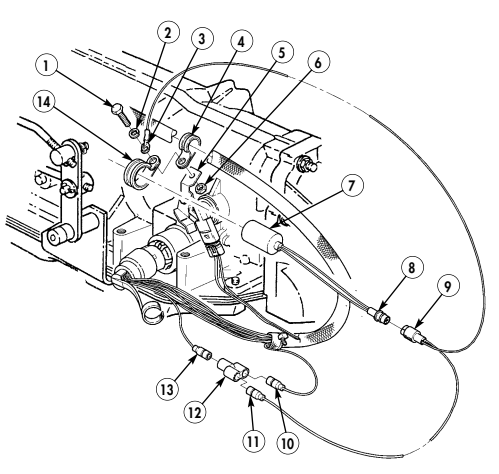

FOLLOW-ON TASKS: Connect battery ground cable (para. 4-68).

# Section V. Lighting System Maintenance

4-48. LIGHTING SYSTEM MAINTENANCE TASK SUMMARY

| INITIAL SETUP:                  |                                                                   |                              |                                                            |
|---------------------------------|-------------------------------------------------------------------|------------------------------|------------------------------------------------------------|
| Tools                           | Equipment Condition                                               | General mechanic's tool kit: | Battery ground cables disconnected (para. 4\-68).          |
| automotive (Appendix B, Item 1) | Maintenance Level                                                 |                              |                                                            |
| Manual References               | Unit                                                              | TM 9\-2320\-387\-24P         |                                                            |
| a. Lamp Removal                 |                                                                   |                              |                                                            |
| 1.                              | Remove light lens (1) and gasket (2) from instrument cluster (4). | 2.                           | Remove lamp (3) from instrument cluster (4).               |
| b. Lamp Installation            |                                                                   |                              |                                                            |
| 1.                              | Install lamp (3) on instrument cluster (4).                       | 2.                           | Install gasket (2) and lens (1) on instrument cluster (4). |

# 4-49. Service Headlight Lamp Maintenance

This task covers: 
a. Removal b. Installation INITIAL SETUP: 
TOOIS 
General mechanic's tool kit: 
automotive (Appendix B, Item 1) 
Personnel Required One mechanic Once assistant c Adjustment Manual References TM 9-2320-387-10 TM 9-2320-387-24P 
Equipment Condition Battery ground cables disconnected (para. 4-68). 

Maintenance Level unit 

Prior to removal, tag leads for installation. 

1 a Removal 1 1. Loosen three screws (1) on retaining ring (2) and remove retaining ring (2) from headlight housing (5). 

2. Disconnect leads 17 (4),18 (61, and 91(7) from headlight housing (5) and remove lamp (3). 

Ib.Installationj 

Circuit numbers are marked on housing. 

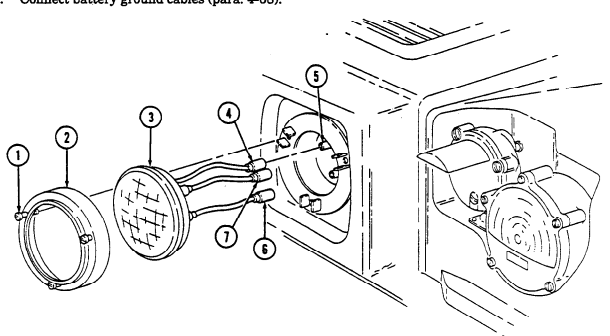

1. Connect leads 17 (4),18 (61, and 91(7) to headlight housing (5). 

2. InstaU lamp (3) on housing (5) with retaining ring (2) and tighten three screws (1). 

3. Connect battery ground cables (para. 468). 

# 4-49. Service Headlight Lamp Maintenance (Cont'D)

c. Adjustment

- Headlamp alignment is basically the same for both headlamps.

- Inflate tires on vehicle before starting procedure. (Refer to TM 9-2320-387-10.)
- Measured height (H) varies depending on model of vehicle and load configuration.

1. Position vehicle on level ground 25 ft. from and facing a vertical wall. 2. Measure height (H) from ground up to center of headlamp (3). 3. Using chalk, draw a horizontal line across vertical wall at center height (H) of headlamp. 4. Draw a vertical line through horizontal line for center position (C) of vehicle. 5. Measure distance from center to center of headlamp (D) and divide measurement in half. 6. Draw two vertical lines (D) at equal distance from center position line (C). 7. Measure down one-twelfth from horizontal line (H) and mark horizontal lines through headlamp vertical lines (D).

8. Turn headlamps on low beam and block out one headlamp. 9. Adjust headlamp (3) using vertical adjusting screw (8) and/or horizontal adjusting screw (9) until center of headlamp beam is aligned with lower horizontal and vertical lines.

10. Repeat steps 8 and 9 for other headlamp.

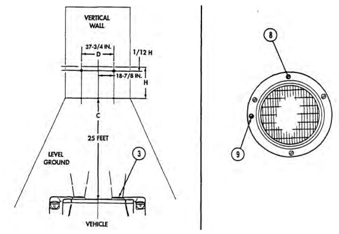

FOLLOW-ON TASK: Check headlight lamp for proper operation (TM 9-2320-387-10).

# 4-50. Service Headlight Assembly Replacement

This task covers:

## A. Removal B. Installation

INITIAL SETUP:
Tools General mechanic's tool kit:
automotive (Appendix B, Item 1)

## Equipment Condition

- Battery ground cables disconnected (para. 4-68). - Hood raised and secured (TM 9-2320-387-10).

Maintenance Level Unit Manual References TM 9-2320-387-10 TM 9-2320-387-24P

- Prior to removal, tag leads for installation. - Note position of circuit 91 for installation.

## A. Removal

1. Remove three nuts (4) and washers (5) from headlight assembly (1) and hood (6). 2. Remove leads 17 (2), 18 (3), and 91 (7) from headlight assembly (1). 3. Remove headlight assembly (1) from hood (6).

## B. Installation Note

Circuit numbers are marked on headlight next to respective connectors.

1. Connect leads 17 (2), 18 (3), and 91 (7) to headlight assembly (1). 2. Install headlight assembly (1) on hood (6) with three washers (5) and nuts (4).

# 4-50. Service Headlight Assembly Replacement (Cont'D)

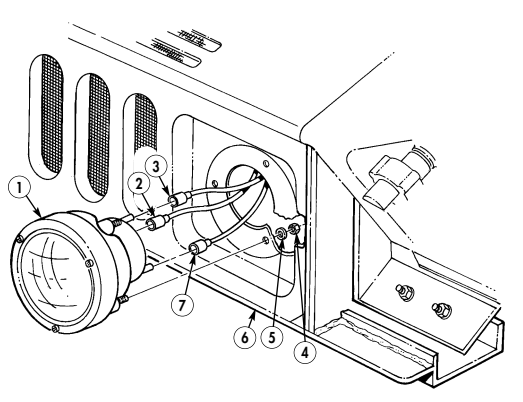

FOLLOW-ON TASKS: - Connect battery ground cables (para. 4-68).

- Lower and secure hood (TM 9-2320-387-10). - Check adjustment of headlight lamp (para. 4-49).

# 4-51. Blackout Drive Light Assembly Replacement

This task covers:

a. Removal b. Installation

| INITIAL SETUP:                         |                                              |
|----------------------------------------|----------------------------------------------|
| Tools                                  | Equipment Condition                          |
| General mechanic's tool kit:           | - Battery ground cables disconnected         |
| automotive (Appendix B, Item 1)        | (para. 4\-68).                               |
| Maintenance and repair shop equipment: | - Instrument cluster removed (para. 4\-14 or |
| automotive (Appendix B, Item 2)        | para. 4\-14.1).                              |
| Manual References                      | - Driver's closeout panel removed            |
|                                        | (para. 11\-104.2).                           |
| TM 9\-2320\-387\-10                    |                                              |
| TM 9\-2320\-387\-24P                   | Maintenance Level                            |
|                                        | Unit                                         |

## A. Removal

1. Remove nut (5), lockwasher (6), and special washer (7) from blackout drive light (1) and hood (9).

Discard lockwasher (6).

2. Disconnect lead 198 (4) from blackout drive light (1). 3. Remove blackout drive light (1) and coned mounting washer (3) from swivel bracket (11). 4. Disconnect lead 92C (2) from blackout drive light (1). 5. Remove four nut and lockwasher assemblies (8), swivel bracket (11), and plate (10) from hood (9).

Discard nut and lockwasher assemblies (8).

## B. Installation

5. Install blackout drive light (1) on hood (9) with special washer (7), lockwasher (6), and nut (5).

1. Install swivel bracket (11) on outside of hood (9), and plate (10) to inside of hood (9) with four nut and lockwasher assemblies (8). Tighten nut and lockwasher assemblies (8) to 16-30 lb-in. (2-3 N•m).

2. Connect lead 92C (2) to blackout drive light (1). 3. Place coned mounting washer (3) and blackout drive light (1) through hole in swivel bracket (11). 4. Connect lead 198 (4) to blackout drive light (1).

# 4-51. Blackout Drive Light Assembly Replacement (Cont'D)

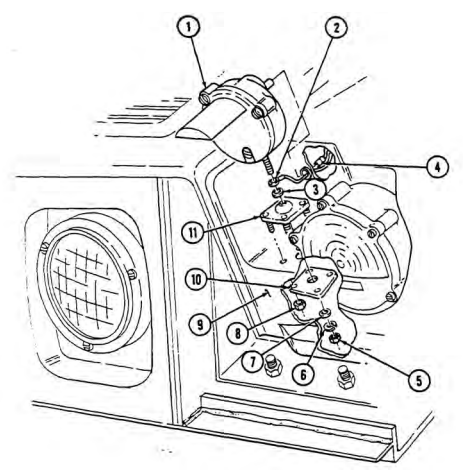

FOLLOW-ON TASKS: - Connect battery ground cables (para. 4-68).

-  Lower and secure hood (TM 9-2320-387-10).

· Check blackout drive light for proper operation (TM 9-2320-387-10).

# 4-52. Blackout Drive Light Lamp Replacement

This task covers:
INITIAL SETUP:

## Tools

General mechanic's tool kit:
automotive (Appendix B, Item 1)
Materials/Parts Gasket (Appendix G, Item 38) Adhesive (Appendix C, Item 12) Three gaskets (Appendix G, Item 43)
Manual References TM 9-2320-387-10 TM 9-2320-387-24P
a. Removal 1. Loosen three retaining screws (2) on light door (6) and remove light door (6), gasket (3), and three gaskets (5.1) from light body (5). Discard gasket (3) and gaskets (5.1).

2. Remove lamp (4) from light body (5). 3. Clean adhesive from mating surfaces of light door (6) and light body (5).

b. Installation 1. Install lamp (4) on light body (5). 2. Install three gaskets (5.1), gasket (3), and light door (6) on light body (5) with lens hood (1) at top.

NOTE
To prevent moisture from entering light assembly, tighten all screws evenly.

3. Secure light door (6) by tightening three screws (2). 4. Apply thin coat of adhesive to seam between light body (5) and light door (6).

a. Removal b. Installation

Equipment Condition Battery ground cables disconnected (para. 4-68).

Maintenance Level Unit

# 4-52. Blackout Drive Light Lamp Replacement (Cont'D)

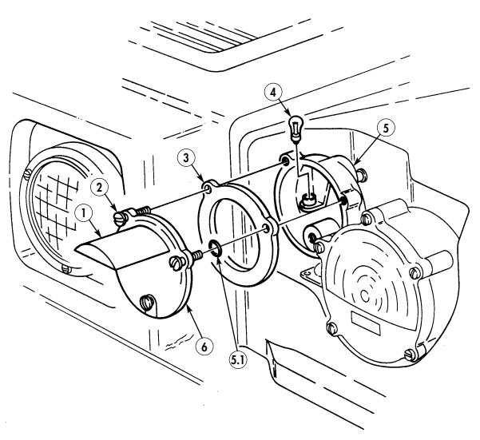

FOLLOW-ON TASKS: - Connect battery ground cables (para. 4-68).

· Check blackout drive light for proper operation (TM 9-2320-387-10).

# 4-53. Front Composite Light Assembly Replacement

This task covers:

## Initial Setup:

Tools General mechanic's tool kit:
automotive (Appendix B, Item 1)
Manual References TM 9-2320-387-10 TM 9-2320-387-24P
Materials/Parts Adhesive sealant (Appendix C, Item 12)

## A. Removal B. Installation Equipment Condition

- Battery ground cables disconnected 
(para. 4-68).

- Hood raised and secured 
(TM 9-2320-387-10).

Maintenance Level Unit

- Replacement procedures for right and left front composite light assemblies are basically the same. Left front composite light has four screws securing access cover; right front composite light has three screws. This procedure covers the left front composite light.

- Prior to removal, tag leads for installation.

a. Removal 1. Remove four screws (1), washers (2), and access cover (3) from hood (4). 2. Disconnect leads 20 (5), 461 (12), and 491 (11) from hood wiring harness (6). 3. Remove two capscrews (9), washers (8), ground 92 (7), buss bar (10), and composite light (13) from hood (4).

To prevent water from accumulating between composite light access cover and hood, general purpose RTV adhesive sealant should be applied to the inside of cover. Clean and reapply RTV when removing and reinstalling cover.

## B. Installation

1. Install composite light (13), buss bar (10), and ground 92 (7) on hood (4) with two washers (8) and capscrews (9).

2. Connect leads 20 (5), 461 (12), and 491 (11) to hood wiring harness (6). 3. Install access cover (3) on hood (4) with four washers (2) and screws (1).

# 4-53. Front Composite Light Assembly Replacement (Cont'D)

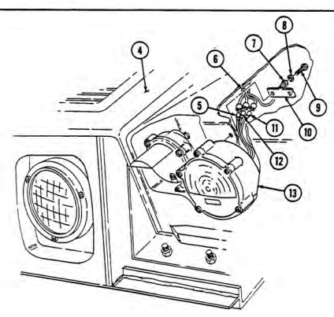

FOLLOW-ON TASKS: - Connect battery ground cables (para. 4-68).

-  Lower and secure hood (TM 9-2320-387-10).

-  Check front composite light for proper operation (TM 9-2320-387-10).

# 4-54. Front Composite Light Lamp Replacement

This task covers:

| INITIAL SETUP:                  |
|---------------------------------|
| Tools                           |
| General mechanic's tool kit:    |
| automotive (Appendix B, Item 1) |
| Manual References               |
| TM 9\-2320\-387\-10             |

a. Removal b. Installation

a. Removal

| Equipment Condition                               |
|---------------------------------------------------|
| Battery ground cables disconnected (para. 4\-68). |
| Maintenance Level                                 |
| Unit                                              |

1. Loosen five retaining screws (1) and remove light door (2) and O-ring (4) from light body (5).

Discard O-ring (4).

2. Remove lamps (3), (6), and (7) from light body (5). 3. Clean adhesive from mating surfaces of light door (2) and light body (5).

b. Installation 1. Install lamps (3), (6), and (7) on light body (5).

To prevent moisture from entering light assembly, tighten all screws evenly.

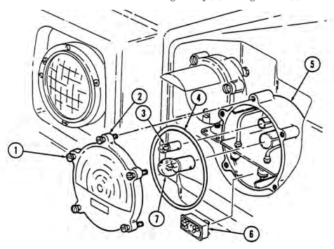

2. Install O-ring (4) and light door (2) on light body (5) with five retaining screws (1). 3. Apply thin coat of adhesive to seam between light body (5) and light door (2).

FOLLOW-ON TASKS: - Connect battery ground cables (para. 4-68).

- Check front composite light for proper operation (TM 9-2320-387-10).

# 4-55. Rear Composite Light Lamp Replacement

This task covers:

| INrnAl. SEflJp:   |
|-------------------|

| ToOlS                                  | Manual References                                 |
|----------------------------------------|---------------------------------------------------|
| General  mechanic's tool kit:          | TM 9\-2320\-387\-10                               |
| automotive (Appendix B, Item 1)        | TM 9\-2320\-387\-24P                              |
| MateriaWParts                          | Equipment Condition                               |
| Sealing compound (Appendix C, Item 63) | Battery ground cables disconnected (para. 4\-68). |
|                                        | Maintenance Level                                 |
|                                        | unit                                              |

a. Removal b. Installation

## A. Removal

1. Loosen six retaining screws (4) and remove composite light door (5) and O-ring (6) from composite light (1). Discard O-ring (6).

2. Remove lamps (2), (3), (7), and (8) from composite light (1). 3. Clean adhesive from mating surfaces of light door (5) and composite light (1).

b. Installation 1. Install lamps (2), (3), (7), and (8) on composite light (1).

To prevent moisture from entering light assembly, tighten all screws

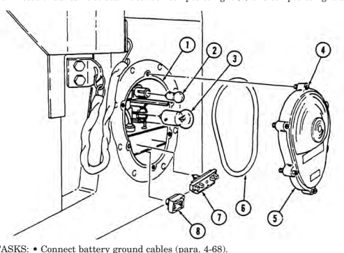 evenly.

2. Install O-ring (6) and composite light door (5) on composite light (1) and tighten six screws (4). 3. Apply a thin coat of adhesive to seam between composite light (1) and composite light door (5).

FOLLOW-ON TASKS: - Connect battery ground cables (para. 4-68).
- Check rear composite light for proper operation (TM 9-2320-387-10).

# 4-56. Side Marker Light Assembly Replacement

This task covers:
INITIAL SETUP:

## Tools

General mechanic's tool kit:
automotive (Appendix B, Item 1)
Materials/Parts Four locknuts (Appendix G, Item 95)
(front only)
Manual References TM 9-2320-387-10 TM 9-2320-387-24P

## A. Removal B. Installation Equipment Condition

- Battery ground cables disconnected (para. 4-68). - Hood raised and secured (front side marker only)
(TM 9-2320-387-10).

Maintenance Level Unit

Replacement procedures for front and rear side marker light assemblies are basically the same. Front marker lights have locknuts; rear marker lights have plain nuts. This procedure covers the left front side marker.

## A. Removal

1. Remove four screws (1), washers (2), and closeoff cover (3) from hood (4). 2. Disconnect lead 489 (15) from hood wiring harness (14). 3. Remove two screws (13), lens (11), and door (12) from side marker light (9). 4. Remove four locknuts (5), washers (6), ground lead 92 (7), screws (10), side marker light (9), and gasket (8) from hood (4). Discard locknuts (5).

## B. Installation

1. Install gasket (8), side marker light (9), and ground lead 92 (7) on hood (4) with four screws (10),
washers (6), and locknuts (5), ensuring ground lead 92 (7) is under washer (6).

2. Install lens (11) and door (12) on side marker light (9) with two screws (13). 3. Connect lead 489 (15) to hood wiring harness (14). 4. Install closeoff cover (3) on hood (4) with four washers (2) and screws (1).

# 4-56. Side Marker Light Assembly Replacement (Cont'D)

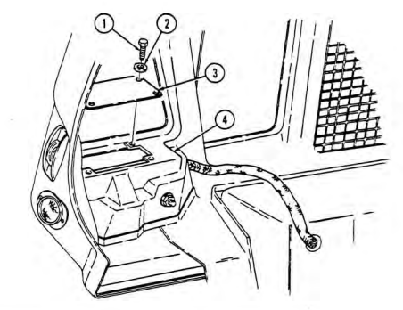

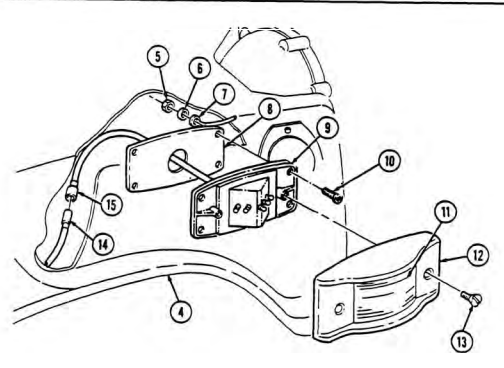

FOLLOW-ON TASKS: - Connect battery ground cables (para. 4-68).

· Lower and secure hood (front side marker only) (TM 9-2320-387-10).

· Check side marker light for proper operation (TM 9-2320-387-10).

# 4-57. Rear Composite Light Assembly Replacement

This task covers:
INITIAL SETUP:
Tools General mechanic's tool kit:
automotive (Appendix B, Item 1)
Materials/Parts Two lockwashers (Appendix G, Item 146) Nut and lockwasher assembly
(Appendix G, Item 197)
Manual References TM 9-2320-387-10 TM 9-2320-387-24P

a. Removal b. Installation

Equipment Condition Battery ground cables disconnected (para. 4-68).

Maintenance Level Unit

Prior to removal, tag leads for installation.

## A. Removal

1. Remove two capscrews (3), washers (4), ground lead 95B (5), and ground strap (6) from housing (17). 

2. Remove two capscrews (15) and lockwashers (16) and pull shield (1) away from D-beam (14).

Discard lockwashers (16).

3. Remove nut and lockwasher assembly (12), screw (2), and clamp (11) from shield (1). Discard nut and lockwasher assembly (12).

4. Disconnect leads 21 (7), 23 (8), 24 (9), and 22-461 (10) from body harness (13). 5. Remove composite light (18) from housing (17).

## B. Installation

1. Install composite light (18) on housing (17). 2. Connect leads 21 (7), 23 (8), 24 (9), and 22-461 (10) to body harness (13). 3. Install clamp (11) on shield (1) with screw (2) and nut and lockwasher assembly (12). 4. Install shield (1) on D-beam (14) with two lockwashers (16) and capscrews (15). 5. Install ground strap (6) and ground lead 95B (5) on housing (17) with two washers (4) and capscrews (3).

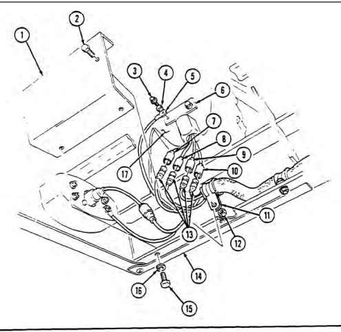

# 4-57. Rear Composite Light Assembly Replacement (Cont'D)

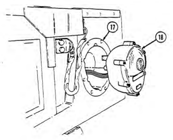

FOLLOW-ON TASKS: - Connect battery ground cables (para. 4-68).

· Check rear composite light for proper operation (TM 9-2320-387-10).

# 4-58. Main Light Switch Replacement

This task covers:

| INITIAL SETUP:   |
|------------------|

## Tools

General mechanic's tool kit:
automotive (Appendix B, Item 1)
Materials/Parts Lockwasher (Appendix G, Item 147)

| Equipment Condition                        |
|--------------------------------------------|
| Battery cables disconnected (para. 4\-68). |
| Maintenance Level                          |
| Unit                                       |

a. Removal b. Installation

## A. Removal

1. Disconnect cannon plug (1) from main light switch (8). 2. Remove screw (6), lockwasher (5), single-position lever (4), and washer (7) from lever shaft (9) on switch (8). Discard lockwasher (5).

Lower right lever must be raised to remove screw.

3. Remove four screws (3) from instrument panel (2) and switch (8). 4. Remove switch (8) from behind instrument panel (2).

b. Installation

Lower right lever must be raised to install screw.

1. With lever shaft (9) at top of switch (8), install switch (8) on instrument panel (2) with four screws
(3).

2. Install washer (7) and single position lever (4) on lever shaft (9) with lockwasher (5) and screw (6).

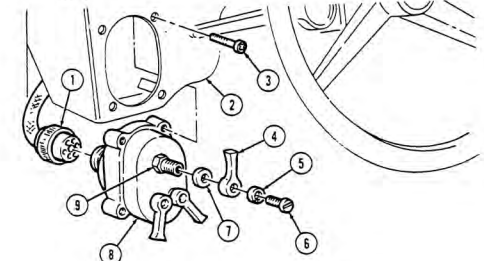 3. Connect cannon plug (1) to rear of switch (8).

FOLLOW-ON TASKS: - Connect battery ground cables (para. 4-68).

- Check main light switch for proper operation (TM 9-2320-387-10).

# 4-59. Headlight Beam Selector Switch And Bracket Replacement

This task covers:
INITIAL SETUP:

## Tools

General mechanic's tool kit:
automotive (Appendix B, Item 1)
Riveter tool kit (Appendix B, Item 123)
Materials/Parts Three assembled washer screws 
(Appendix G, Item 278.1)
Four rivets (Appendix G, Item 271.1)

a. Removal b. Installation

Manual References TM 9-2320-387-10 TM 9-2320-387-24P
Equipment Condition Battery ground cables disconnected (para. 4-68).

| Maintenance Level   |
|---------------------|
| Unit                |

## A. Removal Note

- Prior to removal, tag leads for installation. - Pull back floor insulation for access to beam selector switch and bracket.

1. Remove three assembled washer screws (6), switch (3), and shield (5) from bracket (4). Discard assembled washer screws (6).

2. Disconnect leads 16A (2), 17A (1), and 18A (9) from switch (3). 3. Remove four rivets (7) and bracket (4) from floor (8).

b. Installation 1. Install bracket (4) on floor (8) with four rivets (7). 2. Connect leads 16A (2), 17A (1), and 18A (9) to switch (3). 3. Install switch (3) and shield (5) on bracket (4) with three assembled washer screws (6).

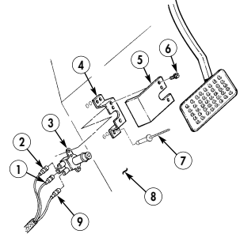

FOLLOW-ON TASKS: - Connect battery ground cables (para. 4-68).

- Check headlight beam selection switch for proper operation (TM 9-2320-387-10).

# 4-60. Stoplight/Torque Converter Clutch Brake Switch Maintenance

This task covers:
a. Removal c. Adjustment b. Installation

## Initial Setup:

Tools General mechanic's tool kit:
automotive (Appendix B, Item 1)
Test Equipment Multimeter (Appendix B, Item 155)
Manual References TM 9-2320-387-24P

Materials/Parts

Two assembled locknuts (Appendix G, Item 134)

| TM 9\-2320\-387\-24P                                |
|-----------------------------------------------------|
| Equipment Condition                                 |
| l Battery ground cables disconnected (para. 4\-68). |
| l Engine access cover removed (para. 10\-22).       |

Battery ground cables disconnected (para. 4-68).

Prior to removal, tag leads for installation.

a. Removal 1. Disconnect leads 75A (1), 75B (16), and connector 810A/810B (15) from switch leads (2). 2. Remove two assembled locknuts (6), washers (4), capscrews (5), washers (4), and switch (3) from mounting bracket (7). Discard assembled locknuts (6).

3. Remove pushnut (14), stoplight switch arm (13), and washer (12) from actuating rod (11). Discard pushnut (14).

4. Remove pushnut (9), actuating rod (11), and washer (10) from brake pedal (8). Discard pushnut (9).

## B. Installation

4. Connect leads 75A (1), 75B (16), and connector 810A/810B (15) to switch leads (2).

c. Adjustment 1. Disconnect leads 75A (1), 75B (16), and connector 810A/810B (15) from switch leads (2) and connect multimeter to leads on switch (3) to check continuity. Multimeter should indicate open. Depress brake pedal; multimeter should indicate continuity within approximately 1/4 in. (6 mm) of pedal travel. If not, go to step 2.

2. Loosen two capscrews (5) to allow movement of switch (3). 3. Position switch (3) so that continuity is present when installed. Slide switch forward until no continuity (open) is indicated (approximately 1/4 in. (6 mm)).

4. Tighten two capscrews (5). 5. Connect leads 75A (1), 75B (16), and connector 810A/810B (15) to switch leads (2). 6. Connect battery ground cables (para. 4-68). 7. Turn selector lever to service drive; stoplights should not illuminate. Depress brake pedal; stoplights should illuminate within 1/4 in. (6 mm) of pedal travel.

1. Install washer (10) and actuating rod (11) on bracket (8) with pushnut (9). 2. Install washer (12) and stoplight switch arm (13) on actuating rod (11) with pushnut (14). 3. Install switch (3) on mounting bracket (7) with two washers (4), capscrews (5), washers (4), and assembled locknuts (6).

# 4-60.  Stoplight/Torque Converter Clutch Brake Switch Maintenance (Conr'D)

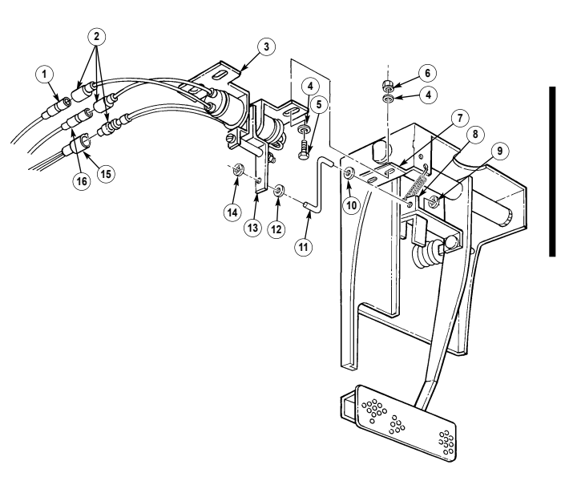

11

# 4-61. Directional Signal Flasher Maintenance

This task covers:
a.1. Inspection INITIAL SETUP:
Tools General mechanic's tool kit:
automotive (Appendix B, Item 1)
Materials/Parts Sealing compound (Appendix C, Item 64)
Manual References TM 9-2320-387-10 TM 9-2320-387-24P
a. Removal b. Installation Equipment Condition Battery ground cables disconnected 
(para. 4-68).

Maintenance Level Unit

The flasher is located under the instrument panel to the left of the steering column.

a. Removal 1. Disconnect cannon plug (8) from main light switch (7). 2. Disconnect connector plug (6) from flasher (5).

NOTE
All models except M1113 and M1114 are equipped with nut inserts, not nuts and washers as indicated in step 3.

3. Remove two nuts (4), washers (3), screws (1), and flasher (5) from cowl (2).

a.1. Inspection Refer to para. 10-56 for nut insert inspection and replacement.

b. Installation

When installing capscrews into nut inserts, use grade 5 torque value. Failure to do so may damage equipment or components.

NOTE
All models except M1113 and M1114 are equipped with nut inserts, not nuts and washers as indicated in step 1.

1. Install flasher (5) on cowl (2) with two screws (1), washers (3), and nuts (4). 2. Apply sealing compound to threads of connector plug (6) and connect connector plug (6) to flasher (5). 3. Connect cannon plug (8) to main light switch (7).

2

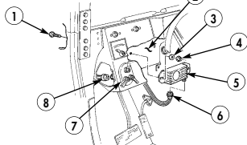

FOLLOW-ON TASKS: - Connect battery ground cables (para. 4-68).

- Check directional signal flasher for proper operation (TM 9-2320-387-10).

4-102 Change 5

# 1 4-62. Directional Signal Control Indicator Lamp Replacement

This task covers: 

a. Removal b. Installation 

INlTlAL SETUP: 
Tools General mechanic's tool kit: 
automotive (Appendix B, Item 1) 
Manual References TM 9-2320-387-10 TM 9-2320-387-24P 
Equipment Condition Battery ground cables disconnected (para. **468).** 
Maintenance Level Unit a. **Removal** 
1. Push lever (1) to four-way flasher position (TM 9-2320-387-10). 

2. Remove light lens (3) from directional control unit (4). 

3. Remove lamp (2) from directional control unit (4). 

1. Install lamp (2) in directional control unit (4). 

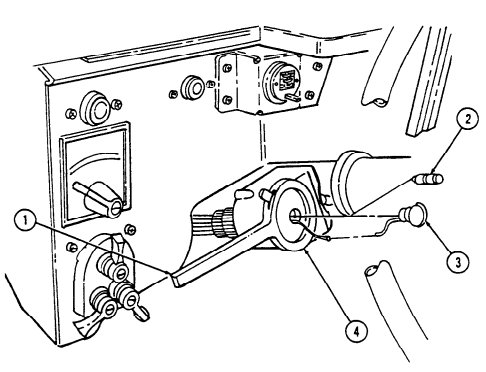

2. Install light lens (3) in directional control unit (4). 

FOLLOW-ON TASKS: l Connect battery ground cables (para. 4-68). 

l Check directional signal control lamp for proper operation (TM 9-2320-387-10). 

-1 

# 1 4-63. Directional Signal Control Replacement I

This task **covers:** 

#### Initial Setup:

TOOIS 
General mechanic's tool kit: 
automotive (Appendix B, Item 1) 
Manual References TM 9-2320-387-10 TM 9-2320-387-24P 

a. Removal b. Installation 

Equipment Condition Battery ground cables disconnected (para. 468). 

Maintenance Level Unit 1 a. **Removal** ] 
1. Loosen connector nut (6) and remove connector plug (7) from directional signal control (41. 

2. Remove four screws (21 and directional signal control (4) from bracket (1). 

rYxz&-l 1. Place lever (5) to HAZARD position. 

2. Install directional signal control (4) on bracket (1) with four screws (2). Do not tighten screws (2). 

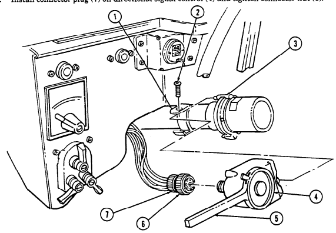 3. Rotate steering wheel, ensuring gauge post (3) mates with directional signal control (41, and tighten screws (2) to 22-26 (30-35 N-ml. 

4. Install connector plug (7) on directional signal control (4) and tighten connector nut (6). 

FOLLOW-ON TASKS: l Connect battery ground cables (para. 4-68). 

. Check directional signal control for proper operation (TM 9-2320-387-10X 

# 1 4-64. Directional Signal Control Cancelling Ring Replacement 1

This task covers: 

a. Removal b. Installation 

INITIAL SETUP: 

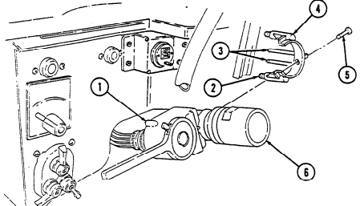

| .   | ર   | 0   | 0   | .   | .   |
|-----|-----|-----|-----|-----|-----|

General mechanic's tool kit: 
automotive (Appendix B, Item 1) 

| Manual References                            |
|----------------------------------------------|
| TM 9\-2320\-387\-24P                         |
| Equipment Condition                          |
| Shift controls housing removed (para. 5\-7). |
| Maintenance Level                            |

1 a. **Removal** 1 Remove three screws (5) and cancelling ring (4) from steering wheel (6). 

b. Installation 

Cancelling pin must be positioned 90" 2 5". Ensure front wheels of vehicle point straight ahead. Failure to position pin properly could cause loss of steering, causing injury to personnel or damage to equipment. 

1. Install cancelling ring (4) on steering wheel (6) with pin (2) 90' 2 5" from directional signal control (1). 2. Rotate steering wheel (6), ensuring pin (2) mates with directional signal control (1) and secure cancelling ring **(4)** on steering wheel (6) with three screws (5). 

Gauge posts found on a new cancelling ring are there to ensure proper installation only. Gauge posts must be removed after installation of cancelling ring to permit proper operation of directional signal control. 

3. Cut gauge posts (3) off within **l/4** in. (6 mm) of base. 

FOLLOW-ON TASK: Check directional signal Control for proper operation (TM 9-2320-387-10). 

#### 4-105

# 4-65. Service Headlight And Blackout Drive Light Electrical Connector And Grommet Replacement

This **task covers:** 
a. Removal INITIAL SETUP: 
ToOis General mechanic's tool kit: 
automotive (Appendix B, Item 1) 

| b. Installation   |
|-------------------|

Equipment Condition Service headlight lamp removed (para. 4-49). 

Manual References TM 9-2320-387-24P 
Maintenance Level Unit Replacement procedures for and grommet from service and blackout drive light are the same. The covers the service headlight. 

Remove connector (3) from grommet (1) and remove grommet (1) from headlight housing (2). 

b. Installation Install grommet (1) on headlight housing (2) and install connector (3) on grommet (1). 

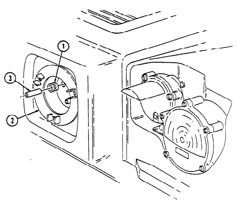

FOLLOW-ON TASK: Install service headlight lamp (para. 449). 

1 

# Section Vi. Battery System Maintenance 4-66. Battery System Maintenance Task Summary

| a. Removal                                              | b. htallation                                                                                |
|---------------------------------------------------------|----------------------------------------------------------------------------------------------|
| INITIAL SElUp:                                          |                                                                                              |
| TOOIS                                                   | Equipment Condition                                                                          |
| General                                                 | mechanic's tool kit:  Battery ground cables disconnected (para. 4\-68).                      |
| automotive (Appendix B, Item 1)                         | Maintenance Level                                                                            |
| Manual References                                       | unit                                                                                         |
| TM 9\-2320\-387\-24P                                    |                                                                                              |
| 1 a Removal                                             | 1                                                                                            |
| 1.                                                      | Disconnect leads 511A (4) and 511B (5) from indicator switch leads (3) on transfer case (1). |
| 2.  Remove indicator switch (2) from transfer case (1). |                                                                                              |
| b. Installation                                         |                                                                                              |
| 1.                                                      | Install indicator switch (2) on transfer case (1).                                           |
| 2.                                                      | Connect leads 51lA (4) and 511B (5) to indicator switch leads (3).                           |

# 4-67. Battery Cable Terminal Clamp Replacement

This task covers:
INITIAL SETUP:
Tools General mechanic's tool kit:
automotive (Appendix B, Item 1)
Materials/Parts Lubricating oil (Appendix C, Item 46)
Manual References TM 9-2320-387-24P
Equipment Condition Battery box cover removed (para. 10-43).

## A. Removal B. Installation General Safety Instructions

- Wear safety goggles and rubber gloves and do not smoke when performing battery maintenance.

- Remove all jewelry. - When removing battery cable clamps, disconnect ground cables first.

Maintenance Level Unit

- Battery acid (electrolyte) is extremely harmful. Always wear safety goggles and rubber gloves, and do not smoke when performing battery maintenance. Severe injury will result if acid contacts eyes or skin.

- Remove all jewelry such as rings, dog tags, bracelets, etc. If jewelry or disconnected battery ground cable contact battery terminal, a direct short can result, causing instant heating of tools, severe injury to personnel, or damage to equipment.

- When removing battery cable clamps, disconnect both ground cables first.

Do not allow tools to come in contact with vehicle when disconnecting cable clamps. A direct short can result, causing instant heating of tools, tool damage, battery damage, or battery explosion.

The replacement procedure for all four battery cable terminal clamps is basically the same. This procedure covers one battery cable terminal clamp.

## A. Removal

1. Remove cap (4) from battery terminal boot (8). 2. Clean lubricating oil from battery terminal boot (8). 3. Loosen screw (6) and nut (7) and remove terminal clamp (3) from terminal post (9). 4. Remove screw (2) and nut (5) from cable (1) and terminal clamp (3). 5. Remove cable (1) from terminal clamp (3) and battery terminal boot (8). 6. Remove terminal clamp (3) from battery terminal boot (8).

## B. Installation

1. Push battery terminal boot (8) onto cable (1). 2. Place terminal clamp (3) into battery terminal boot (8) and install cable (1) on terminal clamp (3)
with screw (2) and nut (5).

3. Apply lubricating oil to battery post pad (10). Do not allow lubricating oil to coat terminal post (9). 4. Secure terminal clamp (3) to terminal post (9) by tightening screw (6) and nut (7). 5. Apply lubricating oil to terminal clamp (3). 6. Install cap (4) on battery terminal boot (8).

# 4-67. Battery Cable Terminal Clamp Replacement (Cont'D)

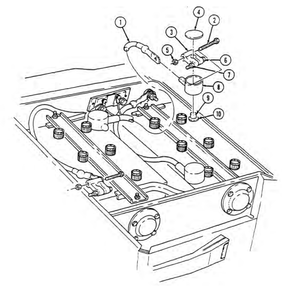

# 4-68. Battery Cable Maintenance

This task covers:
c. Ground Cables Reconnection h. Positive Cable Removal d. Ground Cable Removal i. Positive Cable Installation e. Ground Cable Installation

## Initial Setup: Tools

General mechanic's tool kit:
automotive (Appendix B, Item 1)

## Materials/Parts

Two lockwashers (Appendix G, Item 153) Sodium bicarbonate (Appendix C, Item 76) Lubricating oil (Appendix C, Item 46) Sealing compound (Appendix C, Item 64)
Manual References TM 9-2320-387-24P
a. Cleaning and Inspection f. Interconnecting Cable Removal b. Ground Cables Disconnection g. Interconnecting Cable Installation

## Equipment Condition

Battery box cover removed (para. 10-43).

General Safety Instructions
- Wear safety goggles and rubber gloves and do not smoke when performing battery maintenance.

- Remove all jewelry. - When removing battery cables, disconnect ground cables first. Ensure all switches are in OFF position before disconnecting.

## Maintenance Level

Unit

- Battery acid (electrolyte) is extremely harmful. Always wear safety goggles and rubber gloves, and do not smoke when performing battery maintenance. Severe injury will result if acid contacts eyes or skin.

- Remove all jewelry such as rings, dog tags, bracelets, etc. If jewelry or disconnected battery ground cable contact battery terminal, a direct short can result, causing instant heating of tools, severe injury to personnel, or damage to equipment.

- When removing battery cable clamps, disconnect both ground cables first. Ensure all switches are in OFF position before disconnecting. Do not allow tools to come in contact with vehicle when disconnecting cable clamps. A direct short can result, causing instant heating of tools, severe injury to personnel or damage to equipment.

- If performing transmission diagnostics, record fault codes stored in TCM before disconnecting battery cables.

- When battery cables are disconnected, all stored fault codes in TCM
will be lost.

- Secure all cables to head side of mounting capscrews. - Use this procedure for disconnecting all battery cables.

## A. Cleaning And Inspection

1. Inspect cables (1), (2), and (11) for corrosion and cracks. 2. Remove defective cables (1), (2), and (11), or clean with wire brush and sodium bicarbonate solution.

NOTE

# 4-68. Battery Cable Maintenance **(Cont'D)**

#### B. Ground Cables Diconnection

1. Remove nut **(121, screw (14),** and cable (1) from terminal clamp (13). 2. Remove cap (5) from battery terminal boot (8). 

3. Clean lubricating oil from battery terminal boot (8). 

4. Loosen nut (7) and remove terminal clamp (4) from terminal (9). 5. Remove nut (3) and screw (6) from cable (2) and terminal clamp (4). 

6. Remove cable (2) from terminal clamp (4) and battery terminal boot (8). 

#### C. Ground Cables Reconnection

1. Push battery terminal boot (8) onto cable (2) and secure cable (2) to terminal clamp (4) with screw (6) 
and nut (3). 

2. Apply a 1/16-in. (1.~mm) bead of lubricating oil to battery post pad (10). Do not allow oil to coat terminal post (9). 

3. Install terminal clamp (4) on terminal (9) and tighten nut (7). 4. Fill battery terminal boot (8) with lubricating oil. 

5. Install cap (5) on battery terminal boot (8). 6. Install cable (1) on terminal clamp (13) with screw (14) and nut (12). 

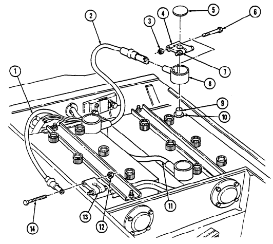

# 4-68 . Battery Cable Maintenance (Cont'D)

d.  Ground Cable Removal Remove screw (2), lockwasher (6), ground cable (5), and slave cable (4) from shunt (1) and battery box (3). Discard lockwasher (6).

e.  Ground Cable Installation Install slave cable (4) and ground cable (5) on shunt (1) and battery box (3) with lockwasher (6) and screw (2).

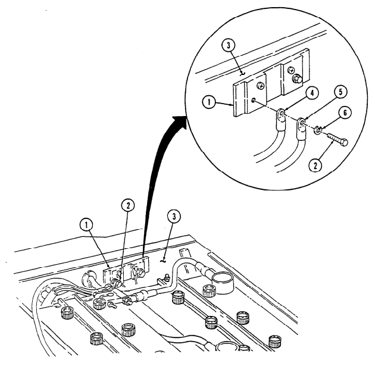

# 4-68. Battery Cable Maintenance (Cont'D)

#### F. Interconnecting Cable Removal

1. Remove caps (10) and (17) from battery terminal boots ('20). 

2. Clean lubricating oil from battery terminal boots **(20).** 3. Loosen nut (19) and remove terminal clamp (16) from battery post (21). 

4. Remove nut (151, cable (141, and screw (18) from terminal clamp (16). 

5. Remove battery terminal boot (20) from terminaI clamp (16). 6. Loosen nut (27) and remove terminal clamp (13) from battery post (25). 

7. Remove nut (11) and clamp (12) from holddown rod (23). 

8. Remove nut (261, screw (81, cable (141, lead (91, and cable (7) from terminal clamp (13). 

#### G. Interconnecting Cable Installation

1. 

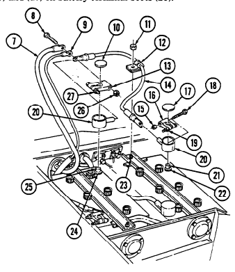

2. 3. 

4. 

5. 

6. 

7. 

8. 

Push battery terminal boot (20) onto cable (14) and install cable (14) on terminal clamp (16) with screw (18) and nut (15). 

Install clamp (12) on holddown rod (23) with nut (11). 

Apply a l/16-in. (1.6~mm) bead of lubricating oil to battery post pads (22) and (24). Do not allow oil to coat terminal posts (21) and (25). 

Install battery terminal clamp (16) on battery post (21) and tighten nut (19). 

Push terminal boot (20) onto cable (7) and install cable (7), lead (9), and cable (14) on battery terminal clamp (13) with screw (8) and nut (26). 

Install battery terminal clamp (13) on battery post (25) and tighten nut (27). Fill battery terminal boots (20) with lubricating oil. 

Install caps (10) and (17) on battery terminal boots (20). 

# 1 4-68. Battery Cable Maintenance (Cont'D)

#### H. Positive Cable Removal

1. Disconnect ground cable (task b.). 2. Remove cap (8) from battery terminal boot (11). 3. Clean lubricating oil from battery terminal boot (11). 

4. Loosen nut (10) and remove terminal clamp (7) from terminal post (121. 

5. Remove screw (61, nut (91, and positive cable (2) from terminal clamp (7) and battery terminal boot 
(11). 

6. Remove nut (51, lockwasher (4), washer (31, and battery positive cable (2) from buss bar (1). Discard 

#### I. Positive Cable Installation

1. 

2. 

Install battery positive cable (2) on buss bar (1) with washer (31, lockwasher (4), and nut (5). Apply silicone compound on cable (2), coating all exposed metallic surfaces. 

Rush battery terminal boot (11) onto positive cable (21 and install cable (2) on terminal clamp (7) with screw (6) and nut (9). 

3. Apply a I/16-in. (1.6~mm) bead of lubricating oil to battery post pad (13). Do not allow oil to coat terminal post (12). 

4. Install terminal clamp (7) on terminal post (12) and tighten nut (10). 

5. Fill battery terminal boot (11) with lubricating oil. 6. Install cap (8) on terminal boot (11). 

7. Connect battery ground cable (task c.). 

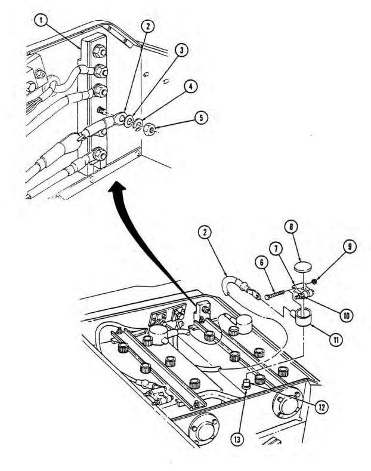

# 4-68. Battery Cable Maintenance (Cont'D)

FOLLOW-ON TASK:  Install battery box cover (para. 10-43).

# 4-69. Power Feed-Through Stud Replacement

This task covers:
INITIAL SETUP:

a. Removal b. Installation

| TOOIS                           |                       | Equipment  Condition                                |
|---------------------------------|-----------------------|-----------------------------------------------------|
| \-&&~a1                         | mechanic's  tool kit: | l Battery ground cables disconnected (para. 4\-68). |
| automotive (Appendix B, Item 11 |                       | l Engine access cover removed (para. 10\-22).       |
| Manual References               |                       | Maintenance  Level                                  |
| TM 9\-2320\-387\-24P            |                       | Unit                                                |
| 1  a. Removal                   | 1                     |                                                     |

a. Removal 1. Slide rubber boot (5) from power feed-through stud (9) and remove nut (1), lockwasher (2), washer
(3), lead 6B/6C (4), and starter cable (6) from feed-through stud (9). Discard lockwasher (2).

2. Remove nut (7) and feed-through stud (9) from battery box (8).

## B. Installation

1. Install power feed-through stud (9) on battery box (8) with nut (7). 2. Install starter cable (6) and lead 6B/6C (4) on feed-through stud (9) with washer (3), lockwasher (2),
and nut (1). Tighten nut (1) to 18-22 lb-ft (24-30 N•m).

3. Apply sealing compound to feed-through stud (9), starter cable (6), and lead 6B/6C (4), coating all exposed metallic surfaces.

4. Slide rubber boot (5) over feed-through stud (9).

# 4-69.  Power Feed-Through Stud Replacement (Cont'D)

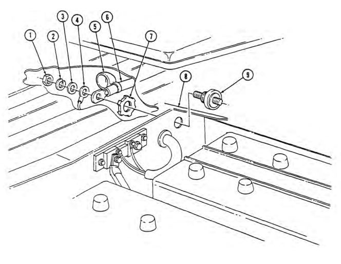

FOLLOW-ON TASK:   Install buss bar (para. 4-71).

# 4-70. 12-Volt Regulator Cable Replacement

This task covers:

a. Removal b. Installation

INITIAL SETUP:

## Tools

General mechanic's tool kit:
automotive (Appendix B, Item 1)
Maintenance and repair shop equipment:
automotive (Appendix B, Item 2)

## Materials/Parts

Four tiedown straps (Appendix G, Item 326) Lockwasher (Appendix G, Item 185) Lubricating oil (Appendix C, Item 46)

## Manual References

TM 9-2320-387-10 TM 9-2320-387-24P

## Equipment Condition

- Battery ground cables disconnected (para. 4-68). - Hood raised and secured (TM 9-2320-387-10). - Engine access cover removed (para. 10-22).

Maintenance Level Unit

Prior to removal, tag leads for installation.

a. Removal 1. Slide back rubber boot (3) and remove nut (1), washer (2), and cable (4) from regulator (5). 2. Remove four tiedown straps (10) from cable (4). Discard tiedown straps (10). 3. Remove nut (7), lockwasher (8), clamp (9), and cable (4) from stud (6). Discard lockwasher (8). 4. Remove screw (11), clamp (13), and cable (4) from bracket (14). 5. Remove cap (23) from battery terminal boot (22). 6. Clean lubricating oil from battery terminal boot (22). 7. Remove nut (20), screw (17), cable (4), lead (18), and cable (19) from terminal clamp (21). Remove

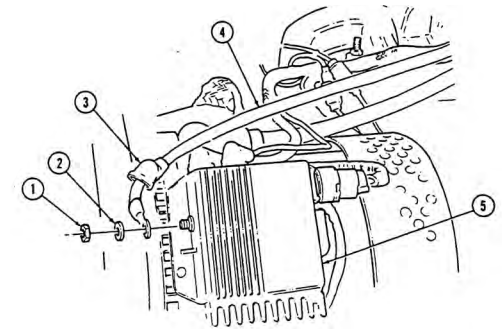

cable (4) from battery box (24).

# 4-70.  12-Volt Regulator Cable Replacement (Cont'D)

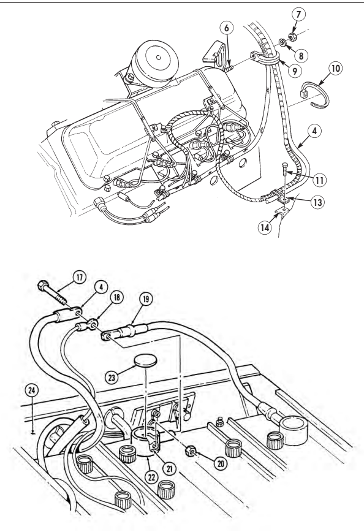

# 4-70. 12-Volt Regulator Cable Replacement (Cont'D)

## B. Installation

3. Fill battery terminal boot (22) with lubricating oil. 4. Install cap (23) on terminal boot (22). 5. Install cable (4) and clamp (13) on bracket (14) with screw (11). 6. Install clamp (9) and cable (4) on stud (6) with lockwasher (8) and nut (7). 7. Install cable (4) on regulator (5) with washer (2) and nut (1). Tighten nut (1) to 18-22 lb-in. 

(2.0-2.5 N•m). Slide rubber boot (3) over nut (1).

8. Install four tiedown straps (10) on cable (4).

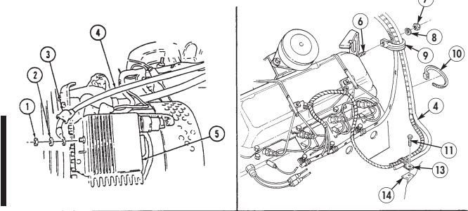

7
FOLLOW-ON TASKS: - Lower and secure hood (TM 9-2320-387-10).

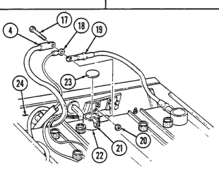

- Connect battery ground cables (para. 4-68). - Install engine access cover (para. 10-22).

1. Position cable (4) in approximate mounting location on stud (6) and through hole in battery box (24). 2. Install cable (19), lead (18), and cable (4) on terminal clamp (21) with screw (17) and nut (20).

4-120 Change 2

# 4-71. Buss Bar Replacement

This task covers:
INITIAL SETUP:
Tools General mechanic's tool kit:
automotive (Appendix B, Item 1)

## Materials/Parts

Five lockwashers (Appendix G, Item 187)
Lockwasher (Appendix G, Item 144) Lockwasher (Appendix G, Item 167) Sealing compound (Appendix C, Item 64)

## A. Removal

1. Remove five nuts (9), lockwashers (8), washers (7), engine harness cable (6), alternator cable (11),
battery cable (10), umbilical power cable (12), and slave receptacle cable (13) from buss bar (2). Discard lockwashers (8).

2. Remove nut (5), lockwasher (4), washer (3), capscrew (14), washer (16), lockwasher (15), and buss bar (2) from power feed-through stud (1) and battery box (17). Discard lockwashers (4) and (15).

## B. Installation

2. Install engine harness cable (6), alternator cable (11), battery cable (10), umbilical power cable (12),
and slave receptacle cable (13) on buss bar (2) with five washers (7), lockwashers (8), and nuts (9).

a. Removal b. Installation

| Manual References MIT O COOL OOF C   |
|--------------------------------------|

TM 9-2320-387-24P

| (para. 4\-68).   |
|------------------|

Equipment Condition Batteries removed (para. 4-74).

1. Install buss bar (2) on battery box (17) and power feed-through stud (1) with lockwasher (15),
washer (16), capscrew (14), washer (3), lockwasher (4), and nut (5).

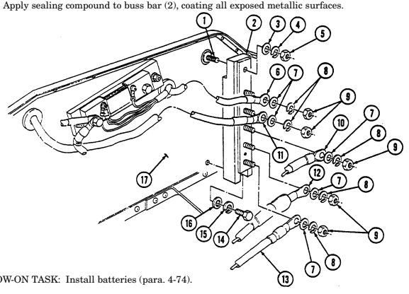

# 4-71.1. Additional Terminal Boards Replacement

This task covers:

## Initial Setup: Tools

General mechanic's tool kit:
automotive (Appendix B, Item 1)
Riveter tool kit (Appendix B, Item 123)

## Materials/Parts

Three lockwashers (Appendix G, Item 146) Four locknuts (Appendix G, Item 77) Five locknuts (Appendix G, Item 133.28) Five locknuts (Appendix G, Item 197.2) Locknut (Appendix G, Item 197) Two rivets (Appendix G, Item 262)

## A. Removal

a. Removal b. Installation

## Manual References

TM 9-2320-387-24P
Equipment Condition
- Battery ground cables disconnected (para. 4-68). - 12-volt auxiliary power outlet removed 
(para. 4-76.1).

Maintenance Level Unit 1. Remove three self-tapping screws (3) from panel (2) and B-beam (1). 2. Remove two capscrews (4), lockwashers (5), washers (6), and panel (2) from battery box (7). Discard lockwashers (5).

3. Remove four capscrews (10), three 24-volt fuse holders (9), and 12-volt fuse holder assembly (8)
from B-beam (1).

4. Remove nut (17), lockwasher (16), and 24-volt terminal board cable (15) from buss bar (14). Discard lockwasher (16).

5. Remove capscrew (11) and ground cable (13) from shunt (12).

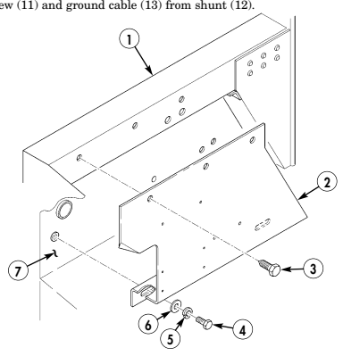

4-71.1. ADDITIONAL TERMINAL BOARDS REPLACEMENT (Cont'd)

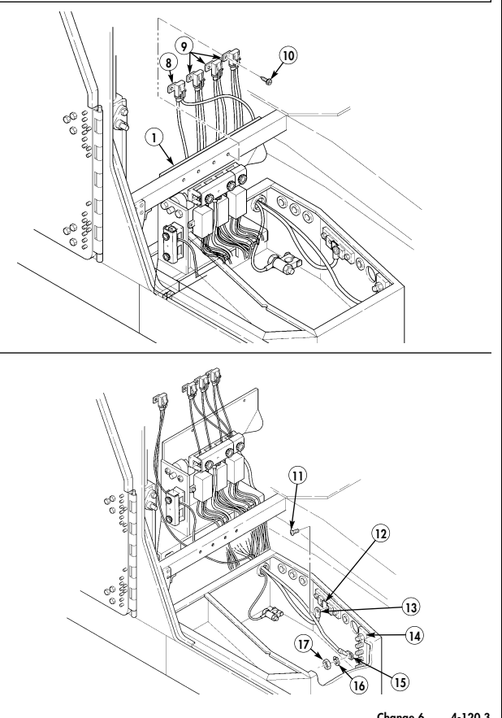

Change 6

# 4-71.1. Additional Terminal Boards Replacement (Cont'D)

6. Remove panel (3) from battery box (6) and B-beam (11). 7. Remove nut (7), capscrew (10), and 12-volt fuse wire (9) from rear positive battery clamp (8). 8. Remove four locknuts (4), washers (2), capscrews (1), and three relays (5) from panel (3).

Discard locknuts (4).

4-71.1. ADDITIONAL TERMINAL BOARDS REPLACEMENT (Cont'd)

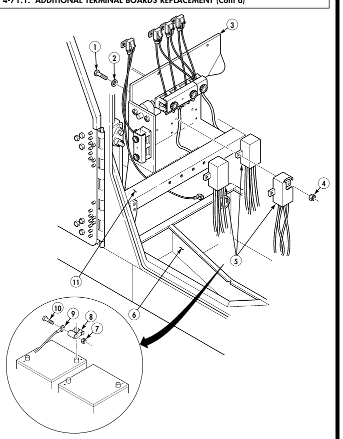

# 4-71.1. Additional Terminal Boards Replacement (Cont'D)

9. Remove two terminal board covers (5) and (6), four locknuts (4), three 24-volt fuse holder wires (3),
and 24-volt power cable (9) from 24-volt terminal board (2). Discard locknuts (4).

10. Remove locknut (8) and ground cable assembly (10) from ground terminal board (7).

Discard locknut (8).

11. Remove terminal board cover (12), locknut (13), 12-volt fuse wire (11), and link (14) from 12-volt terminal board (15).

12. Remove two locknuts (23), capscrews (20), washers (21), and 12-volt terminal board (22) from panel (1). Discard locknuts (23).

13. Remove three locknuts (19), capscrews (25), washers (24), and 24-volt terminal board (18) from panel (1). Discard locknuts (19).

14. Remove two rivets (17) and ground terminal board (16) from panel (1).

## B. Installation

1. Install ground terminal board (16) on panel (1) with two rivets (17). 2. Install 24-volt terminal board (18) on panel (1) with three washers (24), capscrews (25), and nuts (19). 3. Install 12-volt terminal board (22) on panel with two washers (21), capscrews (20), and locknuts (23). 4. Install link (14) and 12-volt fuse wire (11) on 12-volt terminal board (15) with nuts (13) and terminal board cover (12).

5. Install ground cable assembly (10) on ground terminal board (7) with nut (8). 6. Install 24-volt power cable (9) and three 24-volt fuse holder wires (3) on 24-volt terminal board with four nuts (4) and two terminal board covers (6) and (5).

4-71.1. ADDITIONAL TERMINAL BOARDS REPLACEMENT (Cont'd)

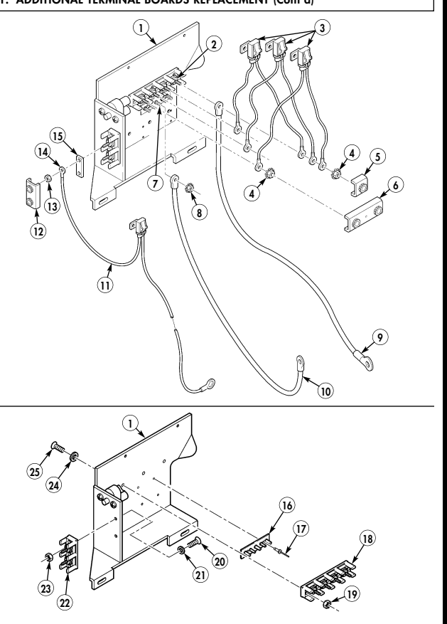

# 4-71.1. Additional Terminal Boards Replacement (Cont'D)

7. Install three relays (5) on panel (3) with four washers (2), capscrews (1), and nuts (4). 8. Install 12-volt fuse wire (9) on rear positive battery clamp (8) with capscrew (10) and nut (7). 9. Install panel (3) on B-beam (11) and battery box (6).

4-71.1. ADDITIONAL TERMINAL BOARDS REPLACEMENT (Cont'd)

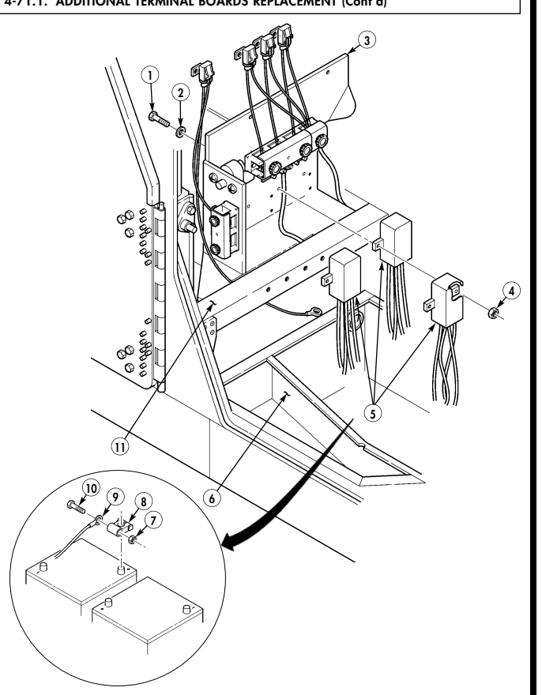

# 4-71.1. Additional Terminal Boards Replacement (Cont'D)

10.

Install ground cable (13) on shunt (12) with capscrew (11). Install 24-volt terminal board cable (15) on buss bar (14) with lockwasher (16) and nut (17).

11.

Install three 24-volt fuse holders (9) and 12-volt fuse holder (8) on B-beam (1) with four 12.

capscrews (10).

13.

Install panel (2) on battery box (7) with three washers (6), lockwashers (5), and capscrews (4).

14.

Install panel (2) on B-beam (1) with three self-tapping screws (3).

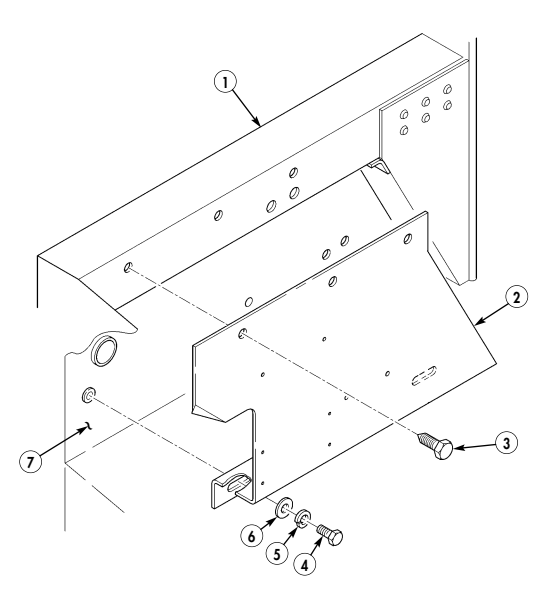

4-71.1. ADDITIONAL TERMINAL BOARDS REPLACEMENT (Cont'd)

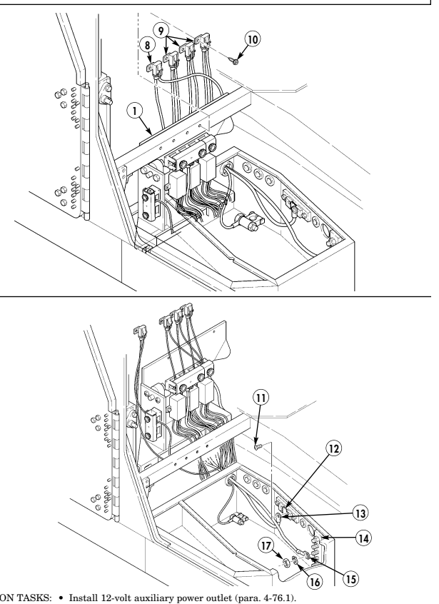

-  Install battery ground cables (para. 4-68).

# 4-72. Starter Power Cables Replacement

This task covers:

| INITIAL SETUP:   |
|------------------|

| Tools                           | Equipment Condition                   |
|---------------------------------|---------------------------------------|
| General mechanic's tool kit:    | - Battery ground cables disconnected  |
| automotive (Appendix B, Item 1) | (para. 4\-68).                        |
| Materials/Parts                 | - Remove left rear passenger seat     |
|                                 | (para. 10\-45).                       |
| Four lockwashers                | - Remove fixed rear door access panel |
| (Appendix G, Item 145)          | (para. 10\-21.1).                     |
| Manual References               | Maintenance Level                     |
| TM 9\-2320\-387\-24P            | Unit                                  |
|                                 | CAUTION                               |

a. Removal b. Installation

Prior to removal, tag all leads for installation.

## A. Removal

1. Slide back rubber boot (1) on starter cable 6A (3) and remove nut (8), lockwasher (9), washer (10),
lead 6B/6C (11), and starter cable (3) from power stud (2). Discard lockwasher (9).

2. Remove nut (7), lockwasher (6), and ground cable (5) from ground stud (4). Discard lockwasher (6). 3. Remove nut (16), lockwasher (15), washer (14), and engine harness cable (12) from buss bar (13).

Discard lockwasher (15).

4. Remove screw (28), two clamps (30), starter cable (3), and ground cable (5) from starter (22) and remove clamps (30) from cables (3) and (5).

Perform steps 5 and 6 for M1113 winch equipped vehicles only.

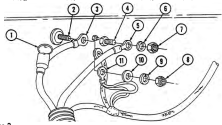

5. Remove nut (31), lockwasher (32), lead 7W (33) (winch vehicles only), STE/ICE-R lead 3D (34), and lead 7A (35) from negative post (41) on starter (22). Discard lockwasher (32).

6. Remove nut (26), lockwasher (25), starter cable (3), positive accessory cable 6W (24), and STE/ICE-R
lead 81B (42) from positive post (23). Discard lockwasher (25).

7. Remove screw (36), clip (37), and leads 74A (38) and 74B (39) from solenoid (40). 8. Remove assembled locknut (19), cable (17), and clamp (18) from screw (20). Discard assembled locknut (19).

9. Remove tiedown straps (21) as required. Discard tiedown straps (21).

10. Remove cable (3), ground cable (5), STE/ICE-R harness (27), and coil (29) from vehicle.

# 4-72. Starter Power Cables Replacement (Cont'D)

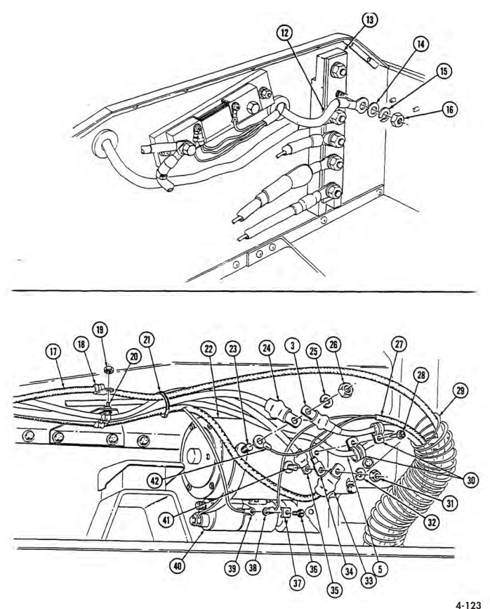

# 4-72. Starter Power Cables Replacement (Cont'D)

b. Installation 1. Install coil (15) on starter cable (10) and ground cable (19). Route STE/ICE-R harness (13) through coil (15), and place cables (10) and (19) and STE/ICE-R harness (13) in approximate mounting locations.

2. Install engine harness cable (29), washer (31), and lockwasher (32) on buss bar (30) with nut (33). 3. Install starter cable (10) and lead 6B/6C (42) on power stud (35) with washer (41), lockwasher (40),
and nut (39). Tighten nut (39) to 26 lb-ft (35 N•m). Slide rubber boot (34) over power stud (35).

4. Install ground cable (19) on ground stud (36) with lockwasher (37) and nut (38). Tighten nut (38) to 75 lb-ft (102 N•m).

Perform step 5 on M1113 winch equipped vehicles only.

5. Install STE/ICE-R lead 81B (8), positive accessory cable 6V (9), and starter cable (10) on positive post (7) with lockwasher (11) and nut (12). Tighten nut (12) to 25-30 lb-ft (34-41 N•m).

6. Apply sealant to positive post (7) and cable terminals, coating exposed metallic surfaces. The sealant should be evenly applied with a minimum thickness of 0.12 in. (3 mm).

Perform step 7 on M1114 vehicles only.

7. Install lead 7V (20) (winch vehicles only), lead (22), and STE/ICE-R 3C lead (21) on negative post

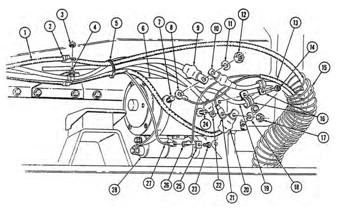

(24) with lockwasher (18) and nut (17). Tighten nut (17) to 15-20 lb-ft (20-27 N•m).

8. Install leads 74A (27) and 74B (26) on solenoid (28) with clip (25) and screw (23). 9. Install two clamps (16) on starter cable (10) and ground cable (19) and secure to starter (6) with screw (14).

10. Install cable (1) and clamp (2) on screw (4) with assembled locknut (3). 11. Install tiedown straps (5) as required.

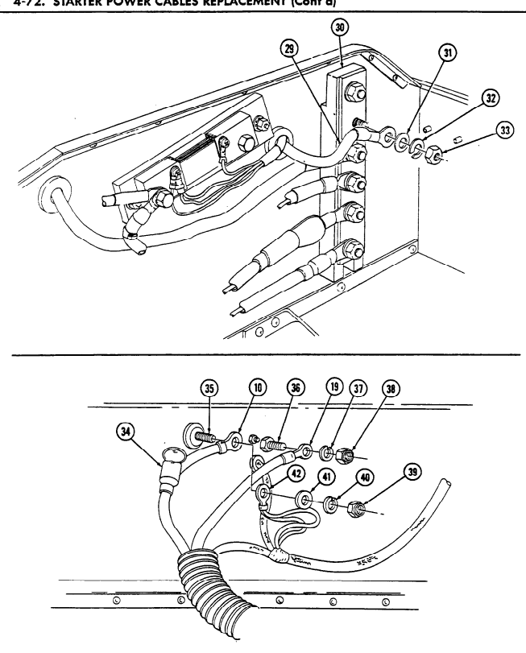

4-72. STARTER POWER CABLES REPLACEMENT (Cont'd)
FOLLOW-ON TASK:  Connect battery ground cables (para. 4-68).

# 4-73. Baitery Holddown Replacement

This task covers: 
a. Removal INITIAL SETUP: 
Tools General mechanic's tool kit: 
automotive (Appendix B, Item 1) 
Manual References TM 9-2320-387-24P 

#### Equipment Condition

l Battery box cover removed (para. 10-43). 

l Battery ground cables removed (para. 4-68). l Battery interconnecting cable removed 
(para. 4-68). 

l Battery positive cable removed (para. 4-68). 

b. Installation 

## General Safety Instructions

l Wear safety goggles and rubber gloves, and do not smoke when performing battery maintenance. 

l Remove all jewelry. 

Maintenance Level Unit 

Battery acid (electrolyte) is extremely harmful. Always wear safety goggles and rubber gloves, and do not smoke when performing battery maintenance. Severe injury will result if acid contacts eyes or skin. Remove all jewelry such as rings, dog tags, bracelets, etc. If jewelry or disconnected battery ground cable contact battery terminal, a direct short can result, causing instant heating of tools, severe injury to personnel, or damage to equipment. 

1 a. **Removal** 1 Remove four nuts (21, battery holddown (31, and four holddown rods (1) from batteries (5) and brackets (4). .- : 
pI7zzq Install battery holddown (3) on batteries (5) and brackets (4) with four holddown rods (1) and four nuts (2). 

# 4-73.  Battery Holddown Replacement (Cont'D)

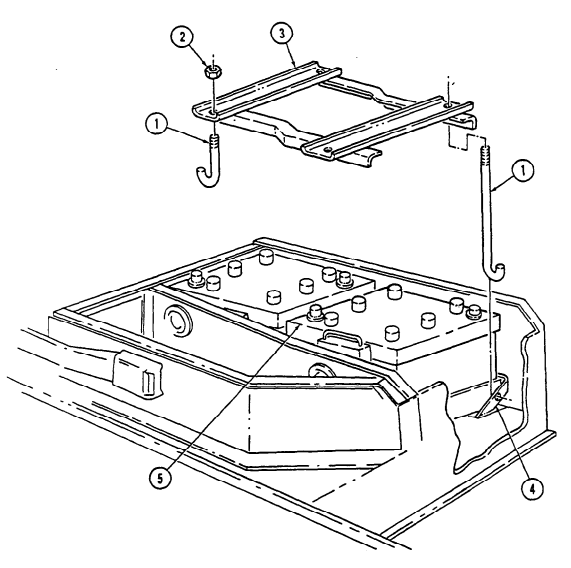

FOLLOW-ON TASKS: - Install battery positive cable (para. 4-68).

-  Install battery interconnecting cable (para. 4-68).
-  Install battery ground cables (para. 4-68).
-  Install battery box cover (para. 10-43).

## 4-74. Battery Replacement And Servicing

This task covers: 
a. Removal c. Installation b. Servicing INITIAL SETUP: 
Tools General mechanic's tool kit: 
automotive (Appendix B, Item 1) 
Manual References TM 9-6140-200-14 TM 9-2320-387-24P 
Equipment Condition Battery holddown removed (para. 4-73). 

General Safety Instructions l **Wear** safety goggles and rubber gloves, and do not smoke when performing battery maintenance. 

l Remove all jewelry. 

Maintenance Level Unit 

l Battery acid (electrolyte) is extremely harmful. Always wear safety goggles and rubber gloves, and do not smoke when performing battery maintenance. Severe injury will result if acid contacts eyes or skin. 

l Remove all jewelry such as rings, dog tags, bracelets, etc. If jewelry or disconnected battery g-round cable contacts battery terminal, a direct short can result, causing instant heating of tools, severe injury to personnel, or damage to equipment. 

1-1 Remove two batteries (1) from battery box (2). 

For battery testing and servicing instructions, refer to TM 9-6140-200-14. 

c. Installation 

Ensure negative terminal posts are correctly located. Cables must reach their respective terminals without stretching. 

Install two batteries (1) in battery box (21. 

1 I] 

# 4-74. Battery Replacement And Servicing (Cont'D)

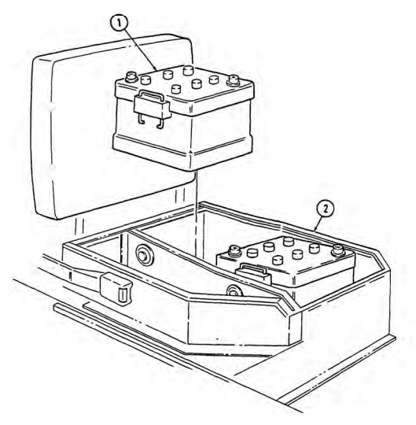

FOLLOW-ON TASK:   Install battery holddown (para. 4-73).

# 4-75. Battery Tray Maintenance

This task covers:
a. Removal c.1. Inspection b. Cleaning and Inspection d. Installation c. Preventive Modification

## Initial Setup:

Tools General mechanic's tool kit:
automotive (Appendix B, Item 1)
Maintenance and repair shop equipment:
automotive (Appendix B, Item 2)
Materials/Parts Four locknuts (Appendix G, Item 77) Sodium bicarbonate (Appendix C, Item 76)
a. Removal Manual References TM 9-6140-200-14 TM 9-2320-387-24P
Equipment Condition Batteries removed (para. 4-74).

Maintenance Level Unit

All vehicles except M1113 and M1114 are equipped with nut inserts, not nuts and washers as indicated.

Remove four locknuts (6), washers (2), capscrews (1), washers (2), and battery tray (3) from battery box (5). Discard locknuts (6).

b. Cleaning and Inspection

For additional information on battery box tray cleaning, refer to TM 9-6140-200-14.

damaged.

1. Clean battery tray (3) with sodium bicarbonate solution. 2. Inspect battery tray (3) for damage. Replace if damaged. 3. Inspect battery cable protectors (4) and battery compartment seals (7) for damage. Replace if c. Preventive Modification

- The following step will prevent water from accumulating in the battery tray.

- Refer to hole diagram for location of holes.

Locate, mark, and drill four 1/2-in. holes in battery tray (3).

c.1. Inspection Refer to para. 10-56 for nut insert inspection and replacement.

d. Installation

When installing capscrews into nut inserts, use grade 5 torque value. Failure to do so may damage equipment or components.

NOTE
All vehicles except M1113 and M1114 are equipped with nut inserts, not nuts and washers as indicated.

Install battery tray (3) on battery box (5) with four washers (2), capscrews (1), washers (2), and locknuts (6). Tighten locknuts (6) to 6 lb-ft (8 N•m).

# 4-75. Battery Tray Maintenance (Cont'D)

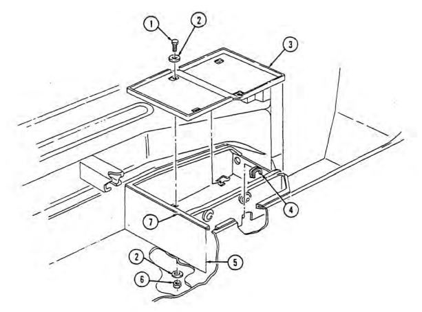

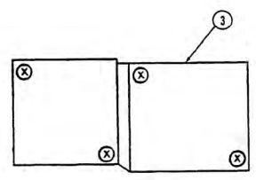

 HOLE DIAGRAM
FOLLOW-ON TASK:  Install batteries (para. 4-74).

# 4-76. Slave Receptacle And Cable Maintenance

This task covers:
a. Removal c. Installation b. Inspection

## Initial Setup:

Tools General mechanic's tool kit:
automotive (Appendix B, Item 1)
Maintenance and repair shop equipment:
automotive (Appendix B, Item 2)

## Materials/Parts

Two lockwashers (Appendix G, Item 135) Lockwasher (Appendix G, Item 153) Two lockwashers (Appendix G, Item 187) Silicone compound (Appendix C, Item 75)
Manual References TM 9-2320-387-24P
Equipment Condition Battery tray removed (para. 4-75).

Maintenance Level Unit a. Removal

Prior to removal, tag leads for installation.

1. Remove capscrew (8), lockwasher (9), slave negative cable (10), and battery negative cable (11) from shunt (1). Discard lockwasher (9).

2. Remove two nuts (6), lockwashers (5), washers (4), battery positive cable (7), and slave positive cable
(3) from buss bar (2). Discard lockwashers (5).

3. Remove four nuts (15), capscrews (17), and cover (18) from receptacle (16) and battery box (12). 4. Loosen compression nut (22) on backshell (21). 5. Remove backshell (21) from receptacle (16). 6. Remove capscrew (13), lockwasher (14), and slave negative cable (10) from receptacle (16). Discard lockwasher (14).

7. Remove capscrew (19), lockwasher (20), and slave positive cable (3) from receptacle (16). Discard lockwasher (20).

8. Remove receptacle (16) from battery box (12).

b. Inspection

Cover and/or receptacle do not require replacement if dust cover cable is broken. To replace dust cover cable, crimp a terminal ring (NSN 5940-00-143-4794) to each end of a 9-in. (22.9-cm) piece of nylon cord (NSN 4020-00-246-0688).

1. Inspect cover (18) for breaks and cracks. Replace if damaged. 2. Inspect cables (3) and (10) for damage. Replace if damaged.

c. Installation

Slave receptacle cover cord is secured under upper left capscrew.

1. Install receptacle (16) and cover (18) on battery box (12) with four capscrews (17) and nuts (15). 2. Install slave positive cable (3) and battery positive cable (7) on buss bar (2) with two washers (4), 
lockwashers (5), and nuts (6). Tighten nuts (6) to 26 lb-ft (35 N•m).

# 4-76. Slave Receptacle And Cable Maintenance (Cont'D)

3. Install battery negative cable (11) and slave negative cable (10) on shunt (1) with lockwasher (9) and capscrew (8). Tighten capscrew (8) to 8 lb-ft (11 N•m).

4. Install slave positive cable (3) through compression nut (22) and backshell (21) on receptacle (16)
with lockwasher (20) and capscrew (19).

5. Install slave negative cable (10) on receptacle (16) with lockwasher (14) and capscrew (13). 6. Apply silicone compound on receptacle (16) terminals, all exposed metal on rear of receptacle (16),
and area under cover (18) on front of receptacle (16).

7. Install backshell (21) on receptacle (16).

8. Tighten compression nut (22) on backshell (21).

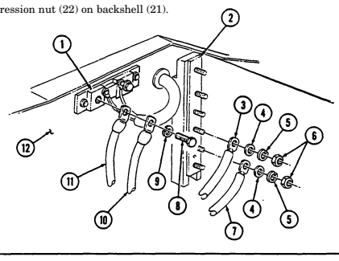

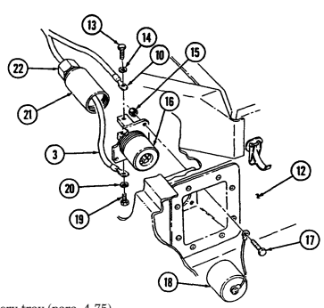

FOLLOW-ON TASK: Install battery tray (para. 4-75).

# 4-76.1. 12-Volt Auxiliary Power Outlet Replacement

This task covers:

| a.  Removal                       | b.  Installation                      |
|-----------------------------------|---------------------------------------|
| INITIAL SETUP:                    |                                       |
| Tools                             | Equipment Condition                   |
| General mechanic's tool kit:      | - Battery ground cables disconnected  |
| automotive (Appendix B, Item 1)   | (para. 4\-73).                        |
| Materials/Parts                   | - Remove left rear passenger seat     |
|                                   | (para. 10\-45).                       |
| RTV sealant (Appendix C, Item 10) | - Remove fixed rear door access panel |
| Manual References                 | (para. 10\-20.1).                     |
| TM 9\-2320\-387\-24P              |                                       |

1. Remove terminal board cover (10), nut (11), and 12-volt positive wire (12) from 12 volt terminal board stud (13).

2. Remove nut (8) and 12-volt negative wire (9) from negative terminal board stud (14). 3. Remove four capscrews (1), outlet cap (2), and auxiliary power outlet (7) from bracket (3). 4. Remove two capscrews (6), lockwashers (5), washers (4), bracket (3), and spacer (16) from B-beam (15). Discard lockwashers (5).

## B. Installation

1. Install spacer (16) and bracket (3) on B-beam (15) with two washers (4), lockwashers (5), and capscrews (6).

2. Install auxiliary power outlet (7) and outlet cap (2) on bracket (3) with four capscrews (1). 3. Install 12-volt negative wire (9) on negative terminal board stud (14) with nut (8). 4. Install 12-volt positive wire (12) on 12-volt positive terminal board stud (13) with nut (11) and terminal board cover (10).

# 4-76.1. 12-Volt Auxiliary Power Outlet Replacement (Cont'D)

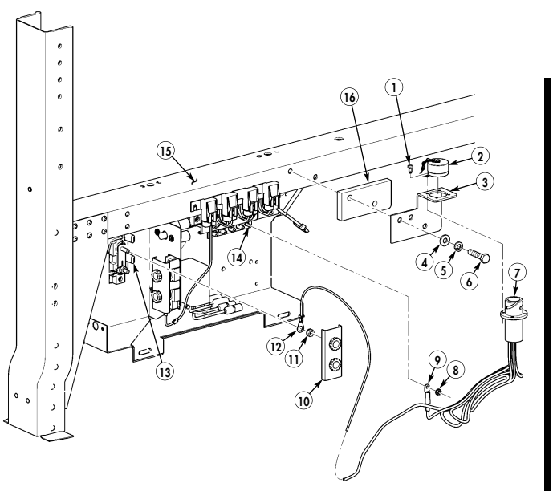

FOLLOW-ON TASK:  Connect battery ground cables (para. 4-68).

# 4-77. Winch Power Cable Replacement

This task covers:
a. Front Power Cable Removal c. Rear Power Cable Removal b. Front Power Cable Installation d. Rear Power Cable Installation

## Initial Setup:

Tools General mechanic's tool kit:
automotive (Appendix B, Item 1)
Maintenance and repair shop equipment:
automotive (Appendix B, Item 2)

## Materials/Parts

Assembled locknut (Appendix G, Item 134) Lockwasher (M1114) (Appendix G, Item 144) Lockwasher (M1114) (Appendix G, Item 187) Lockwasher (M1114) (Appendix G, Item 167) Five tiedown straps (Appendix G, Item 325) Five tiedown straps (M1114) 
(Appendix G, Item 322)

## Manual References

TM 9-2320-387-10 TM 9-2320-387-24P
Equipment Condition Batteries removed (M1114 only) (para. 4-74).

Maintenance Level Unit

## A. Front Power Cable Removal

1. Remove capscrew (5) and lead 7 (4) from winch (8). 2. Remove nut (7) and lead 6W (6) from solenoid (3). 3. Remove screw (1) and clamp (9) from lead 7 (4), lead 6W (6), and lower radiator mount (2). 4. Remove screw (11) and clamp (10) from lead 7 (4), lead 6W (6), and bracket (12). 5. Remove two screws (13) and clamps (14) from lead 7 (4), lead 6W (6), and airlift bracket (15). 6. Remove assembled locknut (16), capscrew (18), and clamp (19) from lead 7 (4), lead 6W (6), and bracket (17). Discard assembled locknut (16).

7. Remove nut (23) and lead 7 (4) from starter negative stud (22). 8. Remove nut (20) and lead 6W (6) from starter positive stud (21).

## B. Front Power Cable Installation

1. Install lead 6W (6) on starter positive stud (21) with nut (20). Tighten nut (20) to 25-30 lb-ft (34-41 N•m). 2. Install lead 7 (4) on starter negative stud (22) with nut (23). Tighten nut (23) to 15-20 lb-ft (20-27 N•m). 3. Install lead 7 (4) and lead 6W (6) on bracket (17) with clamp (19), capscrew (18), and assembled locknut (16).

4. Install lead 7 (4) and lead 6W (6) on airlift bracket (15) with two clamps (14) and screws (13). 5. Install lead 7 (4) and lead 6W (6) on bracket (12) with clamp (10) and screw (11). 6. Install lead 7 (4) and lead 6W (6) on lower radiator mount (2) with clamp (9) and screw (1). 7. Install lead 6W (6) on solenoid (3) with nut (7). 8. Install lead 7 (4) on winch (8) with capscrew (5).

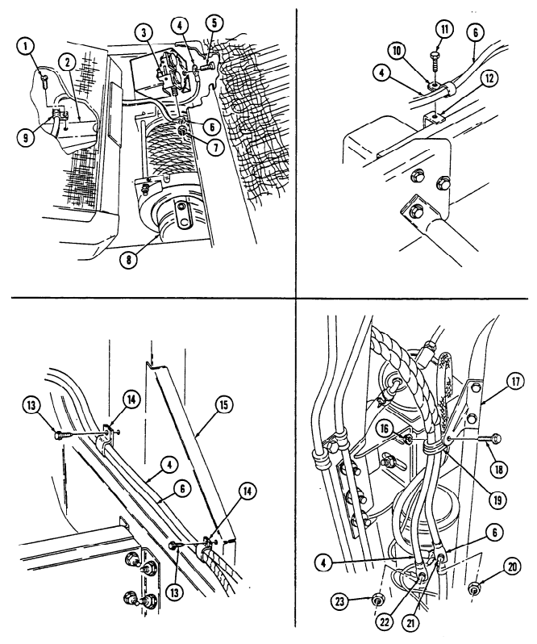

# 4-77.  Winch Power Cable Replacement (Cont'D)

## 4-77. Winch Power Cable Replacement (Cont'D)

1 c. Rear Power Cable Removal 1 1. Remove capscrew (8), lockwasher (7), ground lead (61, and lead 7 (5) from winch (41. Discard lockwasher (71. 

2. Remove nut (1) and lead 6W (3) from solenoid (2). 3. Remove nine screws (131, clamps (121, five tiedown straps (111, harness (lo), and leads 7 (51 and 6W (3) 
from body (9). Discard tiedown straps (11). 

4. Removenut (181, lockwasher (191, washer (201, and lead 6W (3) from buss bar (17). Discard lockwasher (19). 

5. Remove nut (151, lockwasher (141, and lead 7 (5) from capscrew (16). Discard lockwasher (141. 

## D. Rear Power Cable Installation

1. Install lead 7 (5) on capscrew (16) with lockwasher (14) and nut (15). Tighten nut (151 to 15-20 lb-R (20-27 N-m). 

2. Install lead 6W (3) on buss bar (171 with washer (201, lockwasher (191, and nut (18). Tighten nut (181 

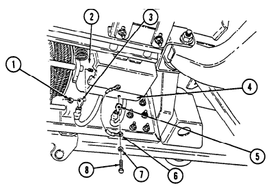

to 15-20 lb-R (20-27 N-m). 

3. Install leads 7 (5),6W (31, and harness (10) on body (9) with nine clamps (121, screws U3), and five tiedown straps (11). 

4. Install lead 6W (3) on solenoid (2) with nut (1). 

5. Install lead 7 (5) and ground lead (6) on winch (4) with lockwasher (7) and capscrew (81. 

# 4-77.  Winch Power Cable Replacement (Cont'D)

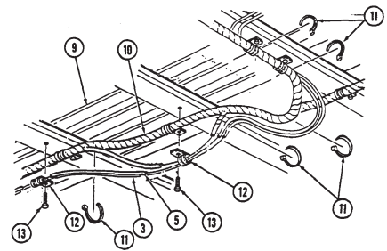

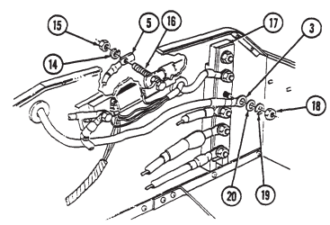

FOLLOW-ON TASKS: - Install batteries (M1114 only) (para. 4-74).

- Test winch for proper operation (TM 9-2320-387-10).

# 4-78. Shunt Replacement

This task covers:
INITIAL SETUP:
Tools General mechanic's tool kit:
automotive (Appendix B, Item 1)
Maintenance and repair shop equipment:
automotive (Appendix B, Item 2)

## Materials/Parts

Two lockwashers (Appendix G, Item 189) Two assembled locknuts (Appendix G, Item 134)
Two lockwashers (Appendix G, Item 174) Lockwasher (Appendix G, Item 153)

a. Removal b. Installation

| Personnel Required   |
|----------------------|
| One mechanic         |
| One assistant        |

Manual References TM 9-2320-387-24P

| Unit   |
|--------|

Equipment Condition Batteries removed (para. 4-74).

Prior to removal, tag leads for installation.

## A. Removal

1. Remove two screws (11), washers (8), and lockwashers (9) and disconnect leads 7B and 7D (15),
9A (16), and 8A (6) from shunt (17). Discard lockwashers (9).

2. Remove nut (1), lockwasher (2), and starter cable (3) from capscrew (10). Discard lockwasher (2). 3. Remove nut (19), lockwasher (18), and capscrew (10) from shunt (17). Discard lockwasher (18). 4. Remove capscrew (12), lockwasher (13), and two negative cables (14) from shunt (17). Discard lockwasher (13).

5. Remove two assembled locknuts (7), washers (5), capscrews (4), washers (5), and shunt (17) from battery box (20). Discard assembled locknuts (7).

## B. Installation

1. Install shunt (17) on battery box (20) with two washers (5), capscrews (4), washers (5), and assembled locknuts (7). Tighten assembled locknuts (7) to 8 lb-ft (11 N•m).

2. Install two negative cables (14) on shunt (17) with lockwasher (13) and capscrew (12). Tighten capscrew (12) to 8 lb-ft (11 N•m).

3. Install capscrew (10) on shunt (17) with lockwasher (18) and nut (19). Tighten nut (19) to 75 lb-ft
(102 N•m).

4. Install starter cable (3) on capscrew (10) with lockwasher (2) and nut (1). Tighten nut (1) to 18-22 lb-ft (24-30 N•m).

5. Install leads 9A (16), 7B and 7D (15), and 8A (6) on shunt (17) with two lockwashers (9), washers (8),
and screws (11).

# 4-78. Shunt Replacement (Cont'D)

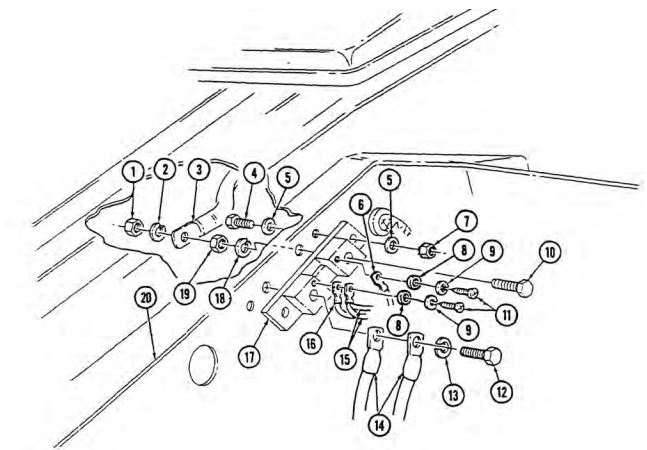

# 4-79. Hood Jumper Wiring Harness Replacement

This task covers:
INITIAL SETUP:
Tools General mechanic's tool kit:
automotive (Appendix B, Item 1)
Materials/Parts Lockwasher (Appendix G, Item 144) Antiseize compound (Appendix C, Item 16)

a. Removal b. Installation

Manual References TM 9-2320-387-10 TM 9-2320-387-24P
Equipment Condition Side marker light assembly removed (para. 4-56).

Maintenance Level Unit

Use care when removing harness from vehicle. Failure to do so may cause damage to equipment.

NOTE
Prior to removal, tag leads for installation.

a. Removal 1. Disconnect left and right hood jumper wiring harness connector (1) from body harness connector (2).

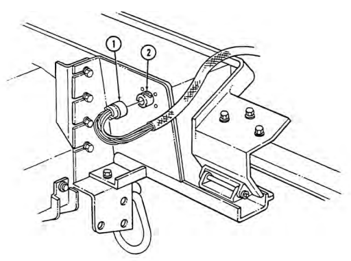

# 4-79. Hood Jumper Wiring Harness Replacement (Cont'D)

2. Remove nut (7), lockwasher (8), and special washer (9) from blackout drive light (3) and hood (10).

Discard lockwasher (8).

3. Disconnect lead 19B (5) from blackout drive light (3). 4. Remove blackout drive light (3), ground lead 92C (4), and coned mounting washer (6) from swivel bracket (11).

5. Disconnect harness leads 20E (12), 461B (21), and 491C (19) from left composite light terminals (20). 6. Remove capscrew (14), washer (13), and left composite light ground 92B (15) from buss bar (16). 7. Remove rubber grommet (18) from hood (10). 8. Remove hood jumper wiring harness (17) from hood (10).

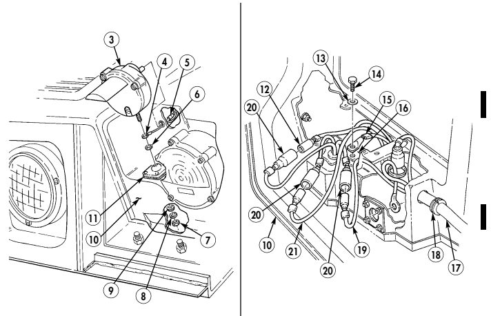

# 4-79. Hood Jumper Wiring Harness Replacement (Cont'D)

9. Disconnect harness leads 20F (3), 460B (5), and 491D (6) from right composite light terminals (4).

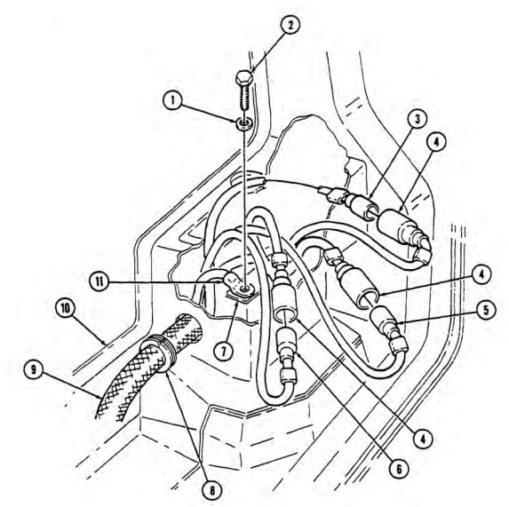

10. Remove capscrew (2), washer (1), and right composite light ground lead 92A (11) from buss bar (7). 11. Remove rubber grommet (8) from hood (10). 12. Remove hood jumper wiring harness (9) from hood (10).

# 4-79. Hood Jumper Wiring Harness Replacement (Cont'D)

b. Installation

Use care when installing harness. Failure to do so may cause damage to harness.

1. Position left side hood jumper wiring harness (14) in approximate mounting position. 2. Install rubber grommet (15) on hood (7). 3. Connect ground lead 92C (2) to blackout drive light (1). 4. Place coned mounting washer (9), ground lead 19B (3), and blackout drive light (1) through hole in swivel bracket (8).

5. Install blackout drive light (1) on hood (7) with special washer (6), lockwasher (5), and nut (4). 6. Apply antiseize compound to left composite light ground lead 92C (12) and install on buss bar (13)
with washer (10) and capscrew (11).

7. Connect harness leads 20E (19), 461B (18), and 491B (16) to left composite light terminals (17).

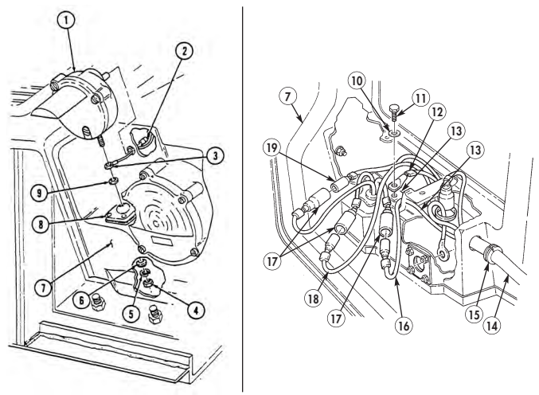

# 4-79. Hood Jumper Wiring Harness Replacement (Cont'D)

8. Position right side jumper wiring harness (9) in approximate mounting position. 9. Install rubber grommet (8) on hood (10).

10. Apply antiseize compound to right composite light ground 92C (11) and install on buss bar (7) with washer (1) and capscrew (2).

11. Connect harness leads 20F (3), 60B (5), and 491B (6) to left composite light terminals (4).

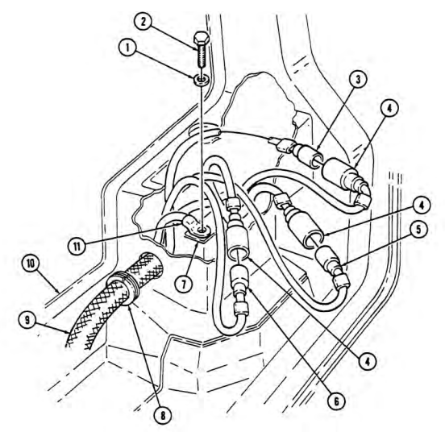

# 4-79.  Hood Jumper Wiring Harness Replacement (Cont'D)

Connect left and right side hood jumper wiring harness connector (12) to body harness 12.

connector (13).

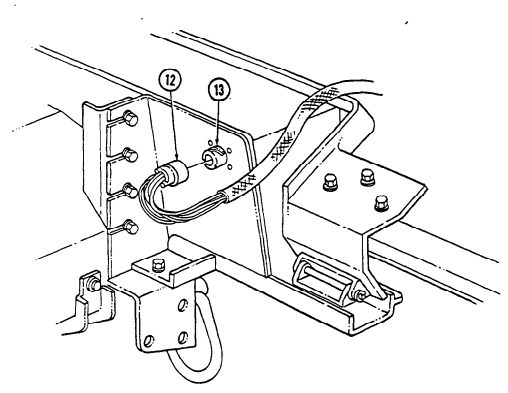

FOLLOW-ON TASKS: - Install side marker light assembly (para. 4-56).

· Check front lights for proper operation (TM 9-2320-387-10).

# 1 4-80. **Wiring Harness Connector Repair** 1

This task covers: 
a. Terminal-Type Cable Connector Repair b. Male Cable Connector Repair c. Female Cable Connector Repair d. Connector Assembly Repair 

#### Initial Setup:

Tools General mechanic's tool kit: 
automotive (Appendix B, Item 1) 
Connector repair kit (Appendix B, Item 154) 
Manual References TB SIG-222 TM 9.2320.387.24P 
e. Receptacle Assembly Repair F. Protective Control Box Lower Cannon Plug Assembly Repair Equipment Condition Battery ground cables disconnected (para. 4-68). 

General **Safety Instructions** 
Remove all jewelry. 

Maintenance Level Unit 

Remove all jewelry such as rings, dog tags, bracelets, etc. If jewelry or disconnected battery ground cable contact battery terminal, a direct short can result, causing instant heating of tools, severe injury to personnel, or damage to equipment. 

#### A. Terminal-Type Cable Connector Repair

1. Strip cable insulation (1) from cable (2) to equal depth of terminal well (4). 

2. Slide insulator (3) over cable insulation (1). 3. Insert cable (2) into terminal well (4) and crimp. 4. Slide insulator (3) over crimped end of terminal (5) and apply heat to shrink insulator (3). 

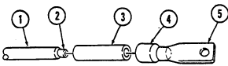

#### 1 B. Male Cable Connector Repair 1

1. Strip cable insulation (6) from cable (7) to equal depth of terminal well (10). 

2. Slide shell (8) over cable insulation (6). 

3. Insert cable (7) into terminal well (10) and crimp. 4. Place slotted washer (9) over crimped junction at terminal (11). 

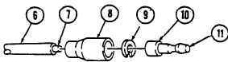 5. Slide shell (8) over slotted washer (9) and terminal (11). 

# 4-80. Wiring Harness Connector Repair **(Cont'D)**

#### C. Female Cable Connector Repair

1. Strip cable insulation (12) from cable (13) to equal depth of terminal well (16). 

2. Slide shell (14) and sleeve (15) over cable insulation (12). 3. Insert cable (13) into terminal well (16) and crimp. 

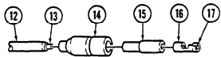

4. Slide shell (14) and sleeve (15) over terminal (17). 

d. Connector Assembly Repair 

Refer to TB SIG222 **for** soldering instructions. 

Strip cable insulation (18) to depth of solder wells (21) on inserts (22). 

Slide cable ends (25) through grommet retaining nut (19) and grommet (20). Place cable ends (25) into solder wells (21) and solder. 

1. 

2. 

3. 

4. 

5. 

Slide grommet (20) over inserts (22) and press into shell assembly (23) and coupling nut (24) until seated. Screw grommet retaining nut (19) into shell assembly (23) until seated. 

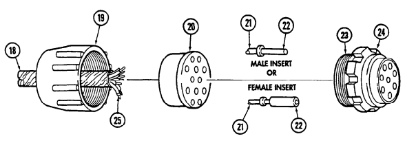

# 1 4-80. **Wiring Harness Connector Repair (Cont'D)** I

e. Receptacle Assembly Repair 

Refer to TB SIG-222 for soldering instructions. 

1. Strip cable insulation (1) to depth of solder wells (5) on inserts (61. 

2. Slide cable ends (3) through grommet retaining nut (2) and grommet (41. 3. Place cable ends (31 into solder wells (5) and solder. 

4. Slide grommet (4) over inserts (5) and press into receptacle (71 until seated. 5. Screw grommet retaining nut (2) into receptacle (7) until seated. 

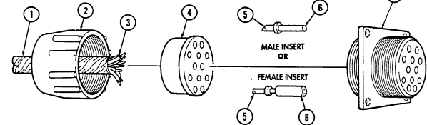

7 
IProtective Control Box Lower Cannon Plug Assembly Repair 1 1. Strip cable insulation (8) to depth of solder wells (16) on inserts (14). 

2. Slide cable ends (101 through grommet retaining nut (91 and grommet (11). 

3. Slide insulation sleeving (17) over lead 67A (181. 4. Place cable ends (10) into solder wells (16) and solder. 

Ensure insulation sleeving passes through grommet to provide a 

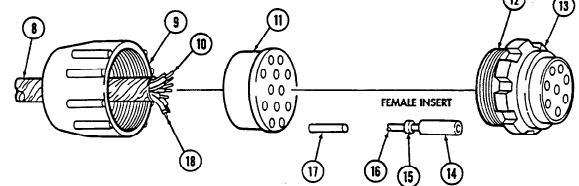

water-tight fit. 

5. Slide insulation sleeving (171 up to solder well end (151, and heat-shrink insulation sleeving (171. 6. Slide grommet (11) over inserts (14) and press into shell assembly (12) and coupling nut (131 until seated. 

7. Install grommet retaining nut (9) into shell assembly (12) until seated. 

FOLLOW-ON TASK: Connect battery ground cables (para. 4-681. 

# Chapter 5 Transmission And Transfer Case (Unit) Maintenance Section I. Transmission Maintenance

5-1. TRANSMISSION MAINTENANCE TASK SUMMARY

| Tools   | Equipment Condition                                                                                                             |    |
|---------|---------------------------------------------------------------------------------------------------------------------------------|----|
|         | General mechanic's tool kit: Battery ground cable disconnected (para. 4\-68). automotive (Appendix B, Item 1) Maintenance Level |    |
|         | Materials/Parts Unit                                                                                                            |    |
|         | Lockwasher                                                                                                                      |    |
|         | Manual References TM 9\-2320\-387\-10                                                                                           |    |
|         | TM 9\-2320\-387\-24P                                                                                                            |    |
|         | a. Removal                                                                                                                      |    |
| 1.      | Remove screw (1), lockwasher (2), nut (6), and ground terminal (3) from loop clamp (14) and harness                             |    |
|         | clamp (4). Discard lockwasher (2).                                                                                              |    |
| 2.      | Remove clamp (14) from capacitor assembly (7).                                                                                  |    |
| 3.      | Disconnect plug (8) from connector adapter (9).                                                                                 |    |
| 4.      | Disconnect plug (13) from connector adapter (12).                                                                               |    |
| 5.      | Disconnect transmission harness plug (10) and capacitor jumper assembly plug (11) from connector                                |    |
|         | adapter (12).                                                                                                                   |    |
|         | Installation                                                                                                                    | b. |
| 1.      | Connect transmission harness plug (10) and capacitor jumper assembly plug (11) to connector                                     |    |
|         | adapter (12).                                                                                                                   |    |
| 2.      | Connect plug (13) to connector adapter (12).                                                                                    |    |

# 5-2. Transmission Service

This task covers:
b. Transmission Filter Removal d. Replenishing Fluid

## Initial Setup:

Tools General mechanic's tool kit:
automotive (Appendix B, Item 1)
Maintenance and repair shop equipment:
automotive (Appendix B, Item 2)

## Materials/Parts

Filter assembly (Appendix G, Item 201)
(1996 only)
Filter assembly (Appendix G, Item 201.1)
(1997 and above)
Transmission oil pan gasket
(Appendix G, Item 47)
Two locknuts (Appendix G, Item 102) Transmission fluid (Appendix C, Item 37) Drycleaning solvent (Appendix C, Item 26)
a. Draining Fluid c. Transmission Filter Installation

## Manual References

TM 9-2320-387-10 TM 9-2320-387-24P
General Safety Instructions Drycleaning solvent is flammable and will not be used near an open flame.

Maintenance Level Unit

## A. Draining Fluid Note

- Do not shift through driving gear ranges when warming transmission fluid for removal. Shifting through driving gear ranges is a procedure used only when refilling transmission fluid.

- Transmission should be warm when draining fluid. - Have drainage container ready to catch fluid. - Transmission uses two different filter assemblies based on model year. Ensure correct model year for proper filter application.

1. Remove drainplug (1) and gasket (2) from oil pan (3). Allow fluid to drain.

Inspect fluid for grit, foaminess, and/or milkiness. If present, refer to DS maintenance (chapter 14).

2. Install gasket (2) and drainplug (1) in oil pan (3) and tighten drainplug (1) to 20 lb-ft (27 N•m).

5-2. TRANSMISSION SERVICE (Cont'd)

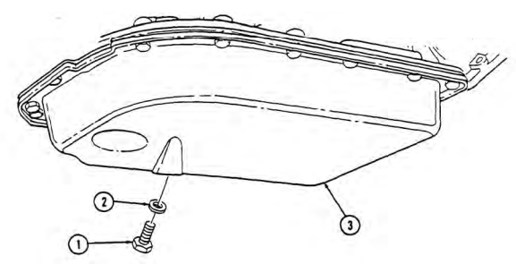

# 5-2. Transmission Service (Cont'D)

b. Transmission Filter Removal

Transfer case must be supported during removal and installation of crossmember for access to oil pan capscrew and to prevent damage to equipment.

1. Place support under transfer case and remove two locknuts (3), washers (2), capscrews (6), and crossmember (4) from support brackets (1) and (5). Discard locknuts (3). 

Oil pan gasket is reusable. Discard only if damaged.

2. Remove seventeen capscrews (12), oil pan (11), and gasket (10) from transmission (7). 3. Remove magnet (9) from oil pan (11). Remove filter (8) from transmission (7).

Drycleaning solvent is flammable and will not be used near an open flame. A fire extinguisher will be kept nearby when the solvent is used. Use only in well-ventilated places. Failure to do this may result in injury to personnel and/or damage to equipment.

4. Clean oil pan (11) thoroughly with drycleaning solvent.

c. Transmission Filter Installation 1. Install filter (8) in transmission (7). Install magnet (9) in oil pan (11). 2. Install gasket (10) and oil pan (11) on transmission (7) with seventeen capscrews (12). Tighten capscrews (12) to 18 lb-ft (24 N•m).

3. Install crossmember (4) on support brackets (1) and (5) with two capscrews (6), washers (2), and locknuts (3). Tighten locknuts (3) to 90 lb-ft (122 N•m).

4. Remove support from transfer case.

## D. Replenishing Fluid

1. Remove transmission oil dipstick (14) from dipstick tube (13). 2. Check transmission fluid and fill to proper level (TM 9-2320-387-10). 3. Install transmission oil dipstick (14) in dipstick tube (13).

# 5-2. Transmission Service (Cont'D)

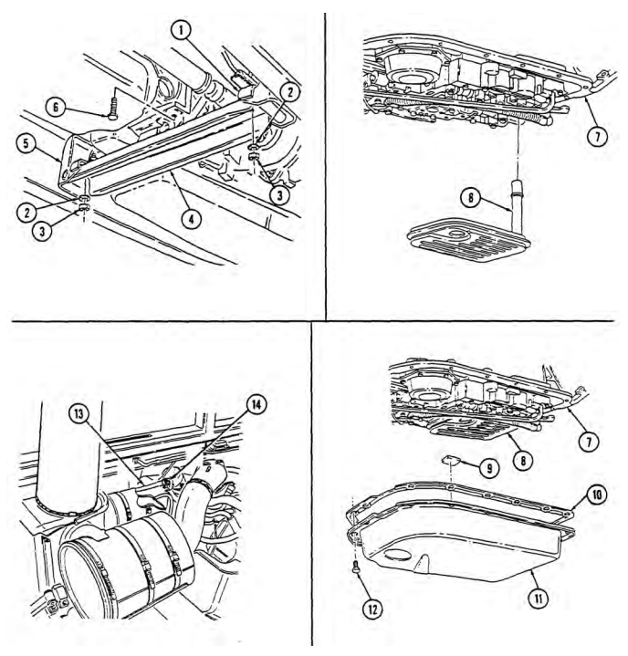

FOLLOW-ON TASK:   Start engine (TM 9-2320-387-10) and check for leaks.

# 5-3. Transmission Oil Cooler Lines Replacement (Serial Numbers 299999 And Below)

This task covers:

## Initial Setup: Tools

General mechanic's tool kit:
automotive (Appendix B, Item 1)
Materials/Parts Three locknuts (Appendix G, Item 77) Two locknuts (Appendix G, Item 106)
Manual References TM 9-2320-387-10 TM 9-2320-387-24P
a. Rear Lines Removal c. Front Lines Removal b. Rear Lines Installation d. Front Lines Installation

## Equipment Condition

- Right splash shield removed (front lines) 
(para. 10-24).

- Hood removed (para. 10-7).

General Safety Instructions Allow transmission to cool before performing this task.

Maintenance Level Unit 

Allow transmission to cool before performing this task. Severe injury to personnel may result.

Cover or plug all open lines and connections immediately after disconnection to prevent contamination. Remove all plugs prior to connection.

## A. Rear Lines Removal

1. Remove two locknuts (32), washers (33), capscrews (4), and washers (5) from four retaining clamps (6)
and cooler lines (7) and (31). Discard locknuts (32).

2. Loosen two clamps (1) and disconnect hoses (2) from transfer case (34).

Have drainage container ready to catch fluid.

3. Loosen clamps (16) and (19) and disconnect hoses (15) and (20) from lines (17) and (18) and allow fluid to drain.

4. Loosen clamps (22) and (24) and disconnect hoses (21) and (29) from bypass valve (23). 5. Disconnect lines (7) and (8) from transmission (30).

10. Remove hose (11) from line (8) and tee (13). Remove clamps (12) from hose (11). 11. Remove hoses (15) and (20) from tees (10) and (13). Remove clamps (14), (16), (19), and (26) from hoses (15) and (20).

12. Remove hoses (21) and (29) from tees (10) and (13). Remove clamps (22), (24), (25), and (27) from hoses (21) and (29).

6. Remove lines and hoses as an assembly from vehicle. 7. Loosen two clamps (3) and remove hoses (2) from lines (7) and (31). Remove two clamps (1) and (3)
from hoses (2).

8. Loosen hose clamps (12), (14), (25), (26), (27), and (28). 9. Remove hose (9) from line (31) and tee (10). Remove two clamps (28) from hose (9).

# 5-3.  Transmission Oil Cooler Lines Replacement (Serial Numbers 299999 And Below) (Cont'D)

■

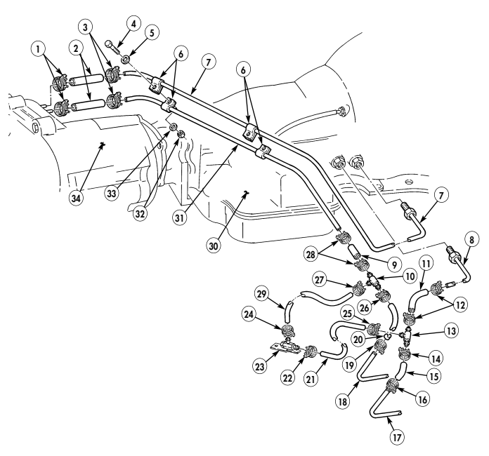

# 5-3. Transmission Oil Cooler Lines Replacement (Serial Numbers 299999 And Below) (Cont'D)

## B. Rear Lines Installation

1. Install clamps (22), (24), (25), and (27) on hoses (21) and (29). Install hoses (21) and (29) on tees (10) and (13).

2. Install clamps (14), (16), (19), and (26) on hoses (15) and (20). Install hoses (15) and (20) on tees (10) and (13).

3. Install two clamps (12) on hose (11). Install hose (11) on line (8) and tee (13). 4. Install two clamps (28) on hose (9). Install hose (9) on line (31) and tee (10). 5. Install two clamps (1) and (3) on two hoses (2). Install hoses (2) on lines (7) and (31). 6. Install lines and hoses as an assembly on vehicle and connect lines (7) and (8) to transmission (30). 7. Connect hoses (2) to transfer case (34). 8. Connect hoses (21) and (29) to bypass valve (23). 9. Connect hoses (15) and (20) to lines (17) and (18).

10. Install two washers (5), capscrews (4), washers (33), and locknuts (32) on four retaining clamps (6)
and cooler lines (7) and (31).

# 5-3.  Transmission Oil Cooler Lines Replacement (Serial Numbers 299999 And Below) (Cont'D)

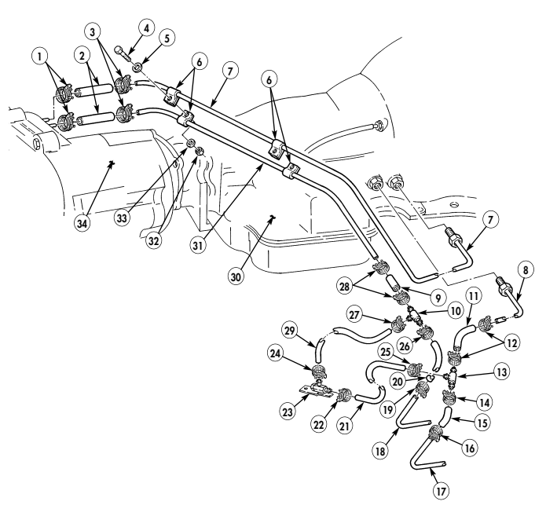

■

# 5-3. Transmission Oil Cooler Lines Replacement (Serial Numbers 299999 And Below)

## C. Front Lines Removal

. 1. Remove two locknuts (15), washers (16), capscrews (21), and washers (20) from right radiator support (2) and airlift bracket (22). Discard locknuts (15).

2. Loosen locknut (1) and swing up radiator support (2). 3. Remove locknut (14), washer (13), capscrew (9), washer (10), and capscrews (18) and (27) from clamps (11) and (12), two clamps (17), bracket (19), four clamps (26), and frame (23).

4. Loosen two clamps (25) and disconnect hoses (24) from lines (7) and (8). 5. Loosen two clamps (4) and (6) and remove hoses (5) from oil cooler (3) and lines (7) and (8). 6. Remove clamps (4) and (6) from hoses (5). 7. Remove cooler lines (7) and (8) from vehicle.

## D. Front Lines Installation

1. Install cooler lines (7) and (8) on vehicle. 2. Install two clamps (4) and (6) on hoses (5) and install hoses (5) on lines (7) and (8). 3. Connect hoses (5) to oil cooler (3). 4. Connect two hoses (24) to lines (7) and (8) and tighten clamps (25). 5. Install four clamps (26) and cooler lines (7) and (8) on frame (23) with two capscrews (27). 6. Install two clamps (17) and lines (7) and (8) on bracket (19) with capscrew (18). 7. Install clamps (11) and (12) on cooler lines (7) and (8) with washer (10), capscrew (9), washer (13),
and locknut (14).

8. Swing radiator support (2) down and install on airlift bracket (22) with two washers (20),
capscrews (21), washers (16), and locknuts (15).

9. Tighten locknut (1).

# 5-3.  Transmission Oil Cooler Lines Replacement (Serial Numbers 299999 And Below) (Cont'D)

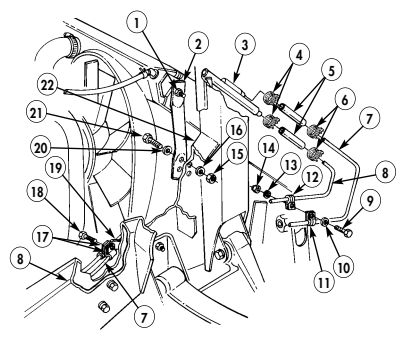

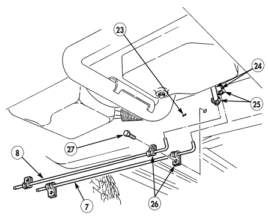

FOLLOW-ON TASKS:  - Fill transmission to proper level (TM 9-2320-387-10).

· Start engine (TM 9-2320-387-10) and check for leaks.

· Install right splash shield (front lines) (para. 10-24).

- Install hood (para. 10-7).

■

# 5-3.1. Transmission Oil Cooler Lines Replacement (Serial Numbers 300000 And Above)

This task covers:
a. Front Lines Removal c. Rear Lines Removal b. Front Lines Installation d. Rear Lines Installation

## Initial Setup:

Tools General mechanic's tool kit:
automotive (Appendix B, Item 1)
Materials/Parts Lockwasher (Appendix G, Item 144) Locknut (Appendix G, Item 106)
Manual References TM 9-2320-387-24P

## Equipment Condition

Engine right splash shield removed 

| Engine right splash shield removed           |
|----------------------------------------------|
| (front lines) (para. 10\-24.1).              |
| General Safety Instructions                  |
| Allow transmission to cool before performing |
| this task.                                   |
| Maintenance Level                            |
| Unit                                         |

Allow transmission to cool before performing this procedure. Severe injury to personnel may occur.

Cover or plug all open lines and connections immediately after disconnection to prevent contamination. Remove all plugs prior to connection. Failure to comply may result in equipment damage.

Geared fan vent tube may need to be removed before removing front transmission oil cooler lines.

## A. Front Lines Removal

1. Remove hose clamp (22) from hose (21) and line (15). 2. Remove capscrew (25), lockwasher (24), clamps (23) and (26), and lines (14) and (15) from bracket (18). Discard lockwasher (24).

3. Remove capscrew (30), washer (29), clamps (28) and (27), and lines (14) and (15) from bracket (17). 4. Remove capscrew (34), washer (33), clamps (32) and (31), and lines (14) and (15) from bracket (16). 5. Remove locknut (13), washers (12) and (41), capscrew (10), and clamps (11) and (40) from lines (14)
and (15). Discard locknut (13).

6. Remove hose clamp (42) and hose (43) from line (15). 7. Remove hose clamps (36) and (44) and tube (37) from hoses (35) and (43). 8. Remove hose clamp (39) and hose (35) from adapter (38). 9. Remove adapter (38) from oil cooler connector (1).

10. Remove hose clamp (6) and hose (5) from line (14). 11. Remove hose clamps (4) and (45) and tube (3) from hoses (5) and (9). 12. Remove hose clamp (8) and hose (9) from adapter (7). 13. Remove adapter (7) from oil cooler connector (2). 14. Remove hose clamp (19) from hose (20) and line (14).

## B. Front Lines Installation

1. Install hose (21) on line (15) with hose clamp (22). 2. Install hose (20) on line (14) with hose clamp (19). 3. Install clamps (23) and (26) and lines (14) and (15) on bracket (18) with capscrew (25) and lockwasher (24).

# 5-3.1. Transmission Oil Cooler Lines Replacement (Serial Numbers 300000 And Above) (Cont'D)

4. Install clamps (28) and (27) and lines (14) and (15) on bracket (17) with capscrew (30) and washer (29). 5. Install clamps (32) and (31) and lines (14) and (15) on bracket (16) with capscrew (34) and washer (33). 6. Install adapter (7) on oil cooler connector (2). 7. Install adapter (7) on hose (9) with hose clamp (8). 8. Install hoses (5) and (9) on tube (3) with hose clamps (4) and (45). 9. Install hose (5) on line (14) with hose clamp (6).

10. Install adapter (38) on oil cooler connector (1). 11. Install hose (35) on adapter (38) with hose clamp (39). 12. Install hoses (35) and (43) on tube (37) with hose clamps (36) and (44). 13. Install hose (43) on line (15) with hose clamp (42). 14. Install clamps (11) and (40) on lines (14) and (15) with capscrew (10), washers (12) and (41), and locknut (13).

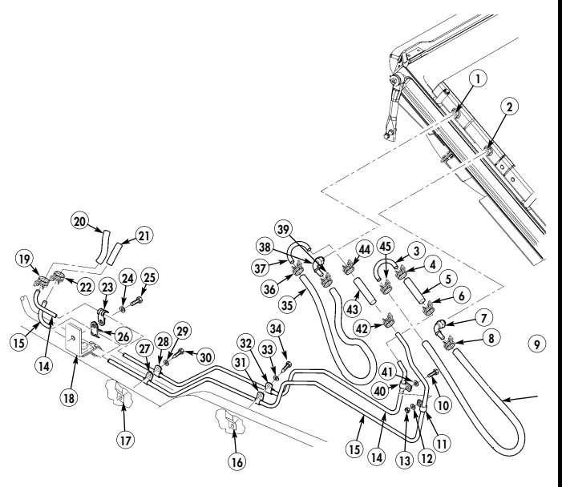

# 5-3.1. Transmission Oil Cooler Lines Replacement (Serial Numbers 300000 And Above) (Cont'D)

## C. Rear Lines Removal

1. Remove fitting cover (30), clamp (32), and tube (29) from adapter (31). 2. Remove fitting cover (4), clamp (2), and tube (5) from adapter (3). 3. Remove hose clamps (13) and (17) and hoses (12) and (18) from bypass valve (16). 4. Remove hose clamps (19) and (22) and hoses (20) and (21) from lines (14) and (15). 5. Remove hose clamps (8), (10), and (11) and hoses (7), (12), and (21) from tee (9). 6. Remove hose clamp (6) and hose (7) from tube (5). 7. Remove adapter (3) from transmission (1). 8. Remove hose clamps (23), (25), and (26) and hoses (18), (20), and (27) from tee (24). 9. Remove hose clamp (28) and hose (27) from tube (29).

10. Remove adapter (31) from transmission (1).

## D. Rear Lines Installation

1. Install adapter (31) on transmission (1). 2. Install clamp (32), tube (29), and sitting cover (30) on adapter (31). 3. Install hose (27) on tube (29) with hose clamp (28). 4. Install hoses (18), (20), and (27) on tee (24) with hose clamps (23), (25), and (26). 5. Install adapter (3) on transmission (1). 6. Install clamp (2), tube (5), and sitting cover (4) on adapter (3). 7. Install hose (7) on tube (5) with hose clamp (6). 8. Install hoses (7), (12), and (21) on tee (9) with hose clamps (8), (10), and (11). 9. Install hoses (12) and (18) on bypass valve (16) with hose clamps (13) and (17).

10. Install hoses (20) and (21) on lines (14) and (15) with hose clamps (19) and (22).

# 5-3.1. Transmission Oil Cooler Lines Replacement (Serial Numbers 300000 And Above) (Cont'D)

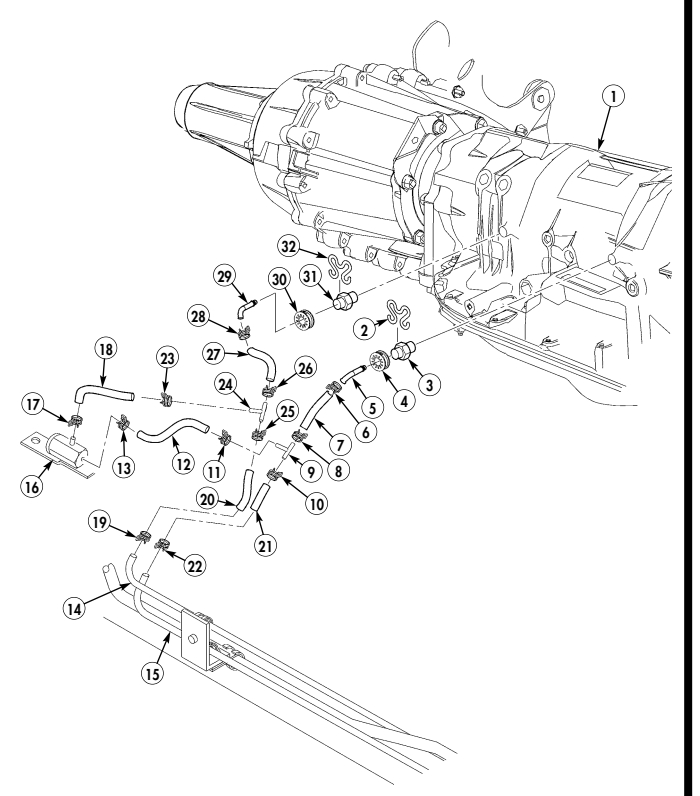

FOLLOW-ON TASKS: - Install engine right splash shield (front lines) (para. 10-24.1).

· Refill transmission and check for leaks (TM 9-2320-387-10).

# 5-4. Transmission Bypass Valve Replacement

This task covers:
INITIAL SETUP:
Tools General mechanic's tool kit:
automotive (Appendix B, Item 1)
Maintenance and repair shop equipment:
automotive (Appendix B, Item 2)

## Materials/Parts

Locknut (Appendix G, Item 102)
Manual Reference TM 9-2320-387-10 TM 9-2320-387-24P
a. Removal b. Installation General Safety Instructions Allow transmission to cool before performing this task.

Maintenance Level Unit

Allow transmission to cool before performing this task. Severe injury to personnel may result.

Cover or plug all open lines and connections immediately after disconnection to prevent contamination. Remove all plugs prior to connection.

a. Removal 1. Loosen hose clamps (1) and (8) on rubber hoses (2) and (9).

Have drainage container ready to catch fluid.

2. Disconnect rubber hoses (2) and (9) from bypass valve (3). 3. Remove locknut (7), washer (5), capscrew (4), washer (5), and bypass valve (3) from transmission crossmember (6). Discard locknut (7).

b. Installation 1. Install bypass valve (3) on transmission crossmember (6) with washer (5), capscrew (4), washer (5),
and locknut (7). Tighten locknut (7) to 90 lb-ft (122 N•m).

2. Connect rubber hoses (2) and (9) to bypass valve (3) and tighten clamps (1) and (8).

# 5-4. Transmission Bypass Valve Replacement (Cont'D)

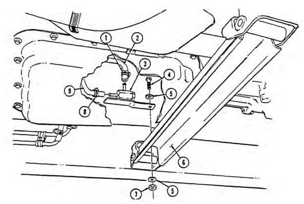

FOLLOW-ON TASKS: - Fill transmission to proper level (TM 9-2320-387-10).

- Start engine (TM 9-2320-387-10) and check for leaks.

# 5-5. Transmission Oil Dipstick Tube Replacement

This task covers:
INITIAL SETUP:
Tools General mechanic's tool kit:
automotive (Appendix B, Item 1)
Maintenance and repair shop equipment:
automotive (Appendix B, Item 2)
Manual References TM 9-2320-387-10 TM 9-2320-387-24P

## A. Removal B. Installation

Equipment Condition
- Hood raised and secured (TM 9-2320-387-10). - Engine access cover removed (para. 10-22).

Maintenance Level Unit

- Plug open transmission port to prevent contamination. Remove plug prior to installation of oil dipstick tube.

- Have drainage container ready to catch fluid.

a. Removal 1. Remove transmission oil dipstick (5) from dipstick tube (6). 2. Remove capscrew (11) from dipstick tube (6) and right rear heat shield (9). 3. Deleted. 4. Remove nut (2), washer (3), dipstick tube (6), and washer (3) from manifold stud (4). 5. Remove dipstick tube (6) from transmission (10). 6. Remove O-ring seal (12) from dipstick tube (6). Discard O-ring seal (12).

## B. Installation

1. Install O-ring seal (12) on dipstick tube (6). 2. Install dipstick tube (6) into transmission (10). 3. Install washer (3) and dipstick tube (6) on manifold stud (4) with washer (3) and nut (2). 4. Install dipstick tube (6) on right rear heat shield (9) with capscrew (11). Tighten capscrew (11) to 25-37 lb-ft (34-50 N•m).

5. Install transmission oil dipstick (5) into dipstick tube (6).

# 5-5. Transmission Oil Dipstick Tube Replacement (Cont'D)

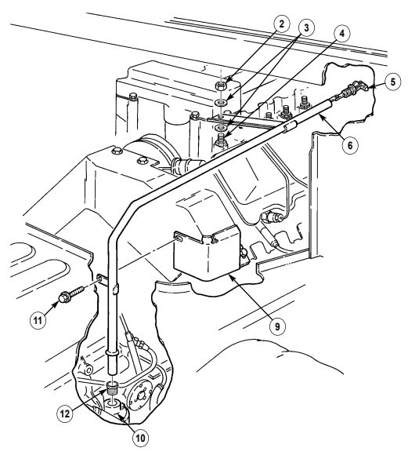

FOLLOW-ON TASKS: - Install engine access cover (para. 10-22).

- Fill transmission to proper level (TM 9-2320-387-10). - Lower and secure hood (TM 9-2320-387-10). - Start engine (TM 9-2320-387-10) and check for leaks.

# 5-6. Neutral Start Switch Replacement

This task covers:
INITIAL SETUP:
Tools General mechanic's tool kit:
automotive (Appendix B, Item 1)

## A. Removal B. Installation

Equipment Condition Shift controls housing assembly removed (para. 5-7).

Manual References TM 9-2320-387-10 TM 9-2320-387-24P
Maintenance Level Unit

Prior to removal, tag leads for installation.

a. Removal 1. Remove boot (5) from shift controls housing (1). 2. Remove two screws (3) and neutral start switch (2) from housing (1).

b. Installation 1. Install neutral start switch (2) on shift controls housing (1) with two screws (3). 2. Position neutral start switch leads 14 (4) and selector indicator lead 17J (6) through boot (5), and install boot (5) on housing (1).

# 5-6. Neutral Start Switch Replacement **(Cont'D)**

FOLLOW-ON TASKS: - Install shift controls housing assembly (para. 5-7).

- Check neutral start switch for proper operation (TM 9-2320-387-10).

# 5-7. Shift Controls Housing Assembly Replacement

This task covers:
INITIAL SETUP:
Tools General mechanic's tool kit:
automotive (Appendix B, Item 1)
Maintenance and repair shop equipment:
automotive (Appendix B, Item 2)

## Materials/Parts

Two cotter pins (Appendix G, Item 19) Four locknuts (Appendix G, Item 77)
Personnel Required One mechanic One assistant a. Removal

a. Removal b. Installation

Manual References TM 9-2320-387-10 TM 9-2320-387-24P
Equipment Condition Battery ground cables disconnected (para. 4-68).

| Maintenance Level   | TT 'I   |
|---------------------|---------|

Unit

If shift controls housing assembly is to be reinstalled, tape trunnions to shift rod to prevent loss of adjustment. Transfer case shift rod trunnion is removed from shift rod only if damaged or shift rods are replaced.

1. Remove cotter pin (5), washer (6), trunnion (9), and rub strip (8) from transmission shift lever arm (10). Discard cotter pin (5).

2. Remove cotter pin (2), washer (3), trunnion (4), and rub strip (7) from transfer case shift arm (1). Discard cotter pin (2).

Tag leads for installation.

3. Disconnect two body harness leads 14A/14B (14) from neutral start switch leads 14 (19). 4. Disconnect body harness lead (17) from shift selector indicator lead 17J (18). 5. Remove four locknuts (15), washers (16), capscrews (20), and shift controls housing assembly (12)
from body (13). Discard locknuts (15).

## B. Installation

1. Position shift controls housing assembly (12) in body (13) with transmission lever (11) on right, and install with four capscrews (20), washers (16), and locknuts (15). Tighten locknuts (15) to 6 lb-ft (8 N•m).

2. Connect two body harness leads 14A/14B (14) to neutral start switch leads 14 (19). 3. Connect body harness lead (17) to shift selector indicator lead 17J (18). 4. Install rub strip (7) and trunnion (4) on transfer case shift arm (1) with washer (3) and cotter pin (2). 5. Install rub strip (8) and trunnion (9) on transmission shift lever arm (10) with washer (6) and cotter pin (5).

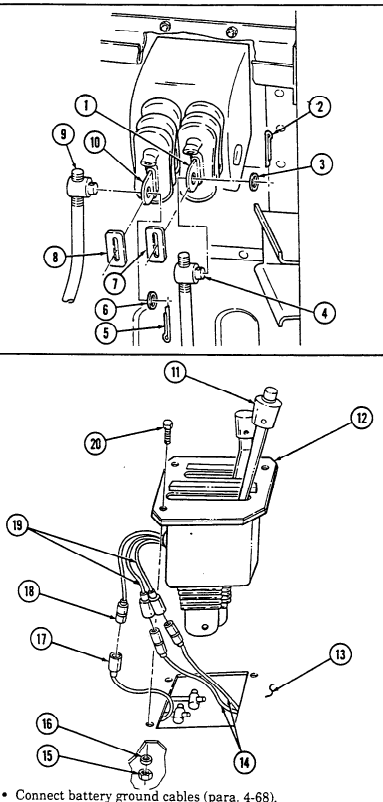

# 5-7. Shift Controls Housing Assembly Replacement (Cont'D)

 FOLLOW-ON TASK:
- Connect battery ground cables (para. 4-68).
- Start engine (TM 9-2320-387-10) and check shift controls for proper operation.

Adjust as needed (paras. 5-9 and 5-16).

# 5-8. Shift Controls Housing Assembly Maintenance

This task covers: 

| a.  Removal                     | b.  Installation                                  |
|---------------------------------|---------------------------------------------------|
| INITIAL SETUP:                  |                                                   |
| Tools                           | Equipment Condition                               |
| General mechanic's tool kit:    | Battery ground cables disconnected (para. 4\-68). |
| automotive (Appendix B, Item 1) |                                                   |
|                                 | Maintenance Level                                 |
| Materials/Parts                 | Unit                                              |
| Gasket (Appendix G, Item 38)    |                                                   |

rY7ziiq 1. Remove pin (4) and knob (3) from transfer case shift tube **(2).** 
2. Remove pin (6) and knob (5) from transmission shift tube (7). 

3. Remove neutral start switch leads (9) from openings in boot (8). 4. Remove shift indicator lead (10) from opening in boot (8). 

5. Slide boot **(8) off sh3t** controls housing assembly (11). 

6. Remove two transmission selector lens covers (1) from shift controls housing assembly (11). 7. Remove two fiber optic indicator strips (17) from bulbs (16). 8. Remove two bulbs (16) from sockets (15). 

9. Remove four screws (141, cover plate (131, and gasket (12) from shift controls housing assembly (11). 

b. Assembly 1. InstalI gasket (12) and cover plate (13) on shift controls housing assembly (11) with four screws (14). 

2. Install two bulbs (16) in sockets (15). 

3. Install two fiber optic indicator strips (17) on bulbs (16). 

4. InstaU two transmission selector lens covers (1) on shiR controls housing assembly (11). 5. InstalI boot (8) on shift controls housing assembly (ll), placing neutral start switch and shift indicator leads (9) and (10) through openings in boot (8). 

6. Complete sliding boot (8) onto shiR controls housing assembly (111, ensuring mounting screw holes align. 

7. InstalI knob (5) on transmission shift tube (7) with pin (6). 8. InstaIl knob (3) on transfer case shift tube (2) with pin (4). 

# 5-8. Shift Controls Housing Assembly Maintenance (Cont'D)

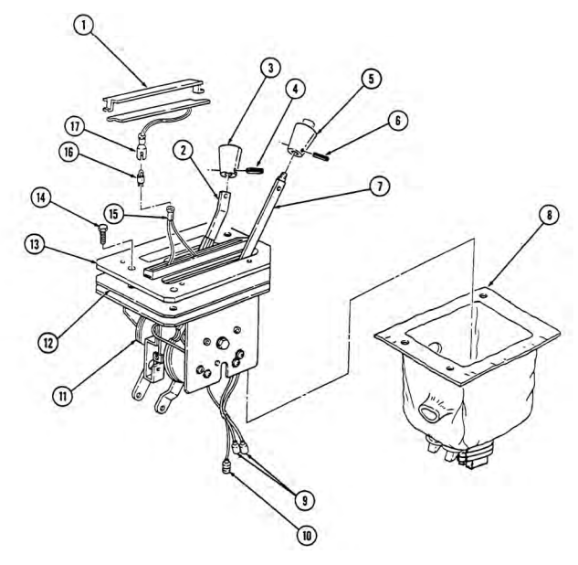

FOLLOW-ON TASK:  Install shift controls housing assembly (para. 5-7).

| General mechanic's tool kit:    |
|---------------------------------|
| automotive (Appendix B, Item 1) |
| Materials/Parts                 |

# 5-9. Transmission Shift Rod Maintenance

This task covers:

a. Removal c. Adjustment b. Installation

INITIAL SETUP:

| General mechanic's tool kit:    | TM 9\-2320\-387\-10   |
|---------------------------------|-----------------------|
| automotive (Appendix B, Item 1) | TM 9\-2320\-387\-24P  |
| Materials/Parts                 | Equipment Condition   |
| O\-ring (Appendix G, Item 226)  |                       |
| Adhesive (Appendix C, Item 12)  | Maintenance Level     |

## A. Removal

1. Place transmission shift lever (7) in neutral. 2. Remove cotter pin (6), washer (5), trunnion (2), and rub strip (4) from shift arm (3). Discard cotter pin (6).

3. Remove cotter pin (13) and washer (12) from rear trunnion (9). Remove trunnion (9) and shift rod
(8) from relay lever (11). Discard cotter pin (13).

Mark position of rear trunnion on shift rod for installation.

4. Remove cotter pin (10) and trunnion (9) from shift rod (8). Discard cotter pin (10).

## B. Installation

1. Install trunnion (9) on shift rod (8) to marked position with cotter pin (10). 2. Install trunnion (9) on relay lever (11) with washer (12) and cotter pin (13). Do not spread cotter pin (13). 3. Install rub strip (4) and trunnion (2) on shift arm (3) with washer (5) and cotter pin (6). Do not spread cotter pin (6).

4. Check shift rod (8) adjustment (task c.).

c. Adjustment

If the manual control linkage is not in proper detent for selector lever position, transmission will be damaged.

Proper adjustment makes end of shift rod movement parallel to relay lever movement.

1. Move transmission shift lever (7) to 1 position and ensure lever (1) is in forward detent position 1 or LOW. If not, remove cotter pin (13) and washer (12). Turn trunnion (9) until trunnion (9) aligns with relay lever (11).

2. When adjustment is correct, spread cotter pins (6) and (13).

# 5-9. Transmission Shift Rod Maintenance (Cont'D)

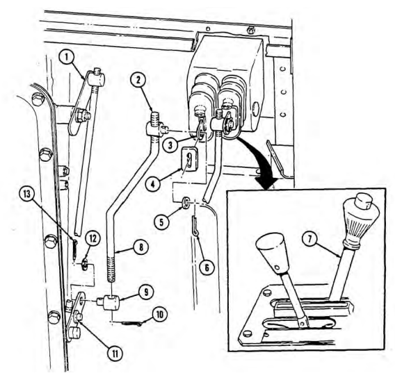

FOLLOW-ON TASK:  Operate vehicle (TM 9-2320-387-10) and test transmission shift lever for proper operation.

# 5-10. Transmission Vent Line Replacement (Serial Numbers 299999 And Below)

| Materials/Parts   |
|-------------------|

| Tools                           |
|---------------------------------|
| General mechanic's tool kit:    |
| automotive (Appendix B, Item 1) |

This task covers:

| INITIAL SETUP:   |
|------------------|

Silicone compound (Appendix C, Item 74)

a. Removal b. Installation

| TM 9\-2320\-387\-10 Equipment Condition   |
|-------------------------------------------|
| Manual References  TM 9\-2320\-387\-24P   |

Insulation may need to be removed to access vent lines.

## A. Removal

1. Remove vent line (2) from transmission (3) and tee fitting (1). 2. Remove vent line (12) from tee fittings (1) and (11). 3. Remove capscrew (5), clamp (7), and vent line (10) from engine mount bracket (6). 4. Remove capscrew (4), clamp (8), and vent line (10) from bracket (9). 5. Remove vent line (10) from tee fittings (11) and (13). 6. Remove clamps (7) and (8) from vent line (10).

## B. Installation

1. Install clamps (7) and (8) on vent line (10). 2. Apply RTV silicone compound to tee fittings (11) and (13), and install vent line (10) on tee fittings (11) and (13).

3. Install vent line (10) and clamp (7) on engine mount bracket (6) with capscrew (5). 4. Install vent line (10) and clamp (8) on bracket (9) with capscrew (4). 5. Apply RTV silicone compound to tee fittings (11) and (1), and install vent line (12) on tee fittings (11) and (1).

6. Apply RTV silicone compound to tee fitting (1) and transmission (3) and install vent line (2) on tee fitting (1) and transmission (3).

7. Install insulation if removed.

5-10. TRANSMISSION VENT LINE REPLACEMENT (SERIAL NUMBERS 299999 AND BELOW) (Conr'd)

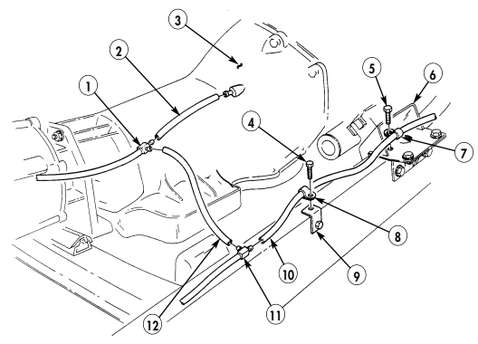

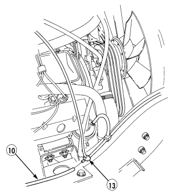

# 5-10.1. Transmission Vent Line Replacement (Serial Numbers 300000 And Above)

This task covers:
a. Removal b. Installation

## Initial Setup:

| Equipment Condition   |
|-----------------------|

| Tools                           |
|---------------------------------|
| General mechanic's tool kit:    |
| automotive (Appendix B, Item 1) |
| Materials/Parts                 |

Three cable ties (Appendix G, Item 329.5)

## A. Removal

1. Disconnect vent line (2) from transmission vent tube (3) and tee fitting (1). 2. Disconnect vent line (4) from tee fittings (1) and (18). 3. Remove cable ties (5), (14), and (16) from vent lines (7) and (17). Discard cable ties (5), (14), and (16). 4. Remove capscrew (10), clamp (9), and vent line (7) from engine mount bracket (6). 5. Remove capscrew (13), clamp (12), and vent line (7) from bracket (11). 6. Disconnect vent line (7) from tee fittings (18) and (8). 7. Remove vent line (7) from heat sleeve (15).

## B. Installation

1. Insert vent line (7) into heat sleeve (15). 2. Install vent line (7) on tee fittings (8) and (18). 3. Install vent line (7) and clamp (12) on bracket (11) with capscrew (13). 4. Install vent line (7) and clamp (9) on engine mount bracket (6) with capscrew (10). 5. Install vent line (4) on tee fittings (18) and (1). 6. Install vent line (2) on tee fitting (1) and transmission vent tube (3). 7. Secure vent line (7) to vent lines (17) with cable ties (16), (14), and (5).

5-10.1. TRANSMISSION VENT LINE REPLACEMENT (SERIAL NUMBERS 300000 AND ABOVE) (Conr'd)

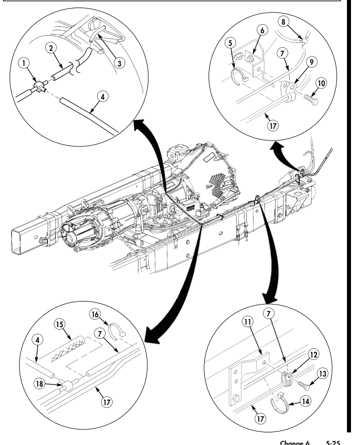

# 5-11. Sealed Lower Converter Housing Cover Maintenance

This task covers:
b. Inspection

## Initial Setup:

Tools General mechanic's tool kit:
automotive (Appendix B, Item 1)
Materials/Parts Gasket (Appendix G, Item 51) Adhesive (Appendix C, Item 6) Drycleaning solvent (Appendix C, Item 26)
Manual References TM 9-2320-387-24P
a. Removal b. Inspection 1. Inspect converter housing cover (4) for pitting, cracking, and excessive wear. Replace if pitted, cracked, or excessively worn.

Drycleaning solvent is flammable and will not be used near an open flame. A fire extinguisher will be kept nearby when the solvent is used. Use only in well-ventilated places. Failure to do this may result in injury to personnel and/or damage to equipment.

2. Remove gasket material and sealant from converter housing cover (4) and transmission (2) with drycleaning solvent.

c. Installation

Gasket must be bent over edge of converter housing cover to ensure gasket seats properly.

1. Apply adhesive to gasket (3) and install on converter housing cover (4).

Ensure converter housing cover is seated on oil pan flange to prevent converter housing cover from hitting flywheel and damaging converter housing cover.

2. Install converter housing cover (4) on flange (1) and transmission (2) with three capscrews (5).

a. Removal c. Installation

## Equipment Condition

- Exhaust pipe removed (para. 3-50). - Sealed upper converter housing cover removed
(para. 5-12).

General Safety Instructions Drycleaning solvent is flammable and will not be used near an open flame.

| Maintenance Level   |
|---------------------|
| Unit                |

1. Remove three capscrews (5) and converter housing cover (4) from transmission (2). 2. Remove gasket (3) from converter housing cover (4). Discard gasket (3).

# 5-11. Sealed Lower Converter Housing Cover Maintenance (Cont'D)

FOLLOW-ON TASKS: - Install exhaust pipe (para. 3-50).

- Install sealed upper converter housing cover (para. 5-12).

# 5-12. Sealed Upper Converter Housing Cover (2-Piece) Maintenance

This task covers:
a. Removal c. Installation b. Inspection INITIAL SETUP:
Tools General mechanic's tool kit:
automotive (Appendix B, Item 1)

## Materials/Parts

Gasket (Appendix G, Item 40) Adhesive (Appendix C, Item 6) Drycleaning solvent (Appendix C, Item 26) Adhesive, RTV (Appendix C, Item 10)
Manual References TM 9-2320-387-24P
Equipment Condition Battery ground cables disconnected (para. 4-68).

General Safety Instructions Drycleaning solvent is flammable and will not be used near an open flame.

Maintenance Level Unit a. Removal 1. Remove two capscrews (4) and converter housing cover (3) from transmission (1) . 2. Remove gasket (2) from converter housing cover (3). Discard gasket (2). b. Inspection 1. Inspect converter housing cover (3) for pitting, cracking, and excessive wear. Replace if pitted, cracked, or excessively worn.

Drycleaning solvent is flammable and will not be used near an open flame. A fire extinguisher will be kept nearby when the solvent is used. Use only in well-ventilated places. Failure to do this may result in injury to personnel and/or damage to equipment.

2. Remove gasket material and sealant from converter housing cover (3) and transmission (1) with drycleaning solvent.

c. Installation

Gasket may require bending over edge of converter housing cover to ensure gasket seats properly.

1. Apply adhesive to gasket (2) and install on converter housing cover (3). 2. Apply RTV adhesive to edge (3.1) of converter housing cover (3) and install converter housing cover
(3) on transmission (1) with two capscrews (4).

3. Apply RTV adhesive to fill any gaps between converter housing (3), transmission (1), and starter housing (1.1).

# 5-12. Sealed Upper Converter Housing Cover (2-Piece) Maintenance (Cont'D)

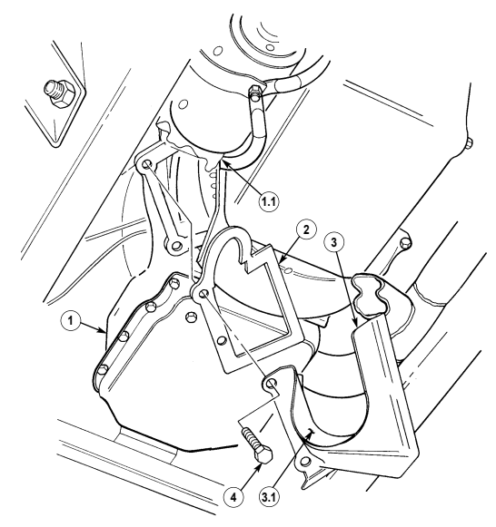

FOLLOW-ON TASK:  Connect battery ground cables (para. 4-68).

# 5-13. Transmission Mount Replacement

This task covers:
INITIAL SETUP:
Tools General mechanic's tool kit:
automotive (Appendix B, Item 1)
Maintenance and repair shop equipment:
automotive (Appendix B, Item 2)
Materials/Parts Two lockwashers (Appendix G, Item 174)
a. Removal b. Installation

| Manual References                                 |
|---------------------------------------------------|
| TM 9\-2320\-387\-10                               |
| TM 9\-2320\-387\-24P                              |
| Equipment Condition                               |
| Battery ground cables disconnected (para. 4\-68). |
| Maintenance Level                                 |
| Unit                                              |

## A. Removal

Remove two capscrews (4), lockwashers (3), and transmission mount (2) from adapter (1). Discard lockwashers (3).

b. Installation Install transmission mount (2) on adapter (1) with two lockwashers (3) and capscrews (4). Tighten

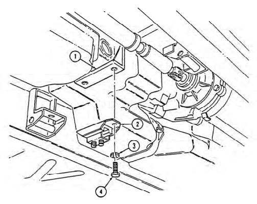 capscrews (4) to 65–70 lb-ft (88–90 N•m).

FOLLOW-ON TASK: Install transmission mount crossmember (para. 9-10).

# 5-14. Transmission Road Test

This task covers:
Road Test

## Initial Setup:

| INITIAL SETUP:                  |                                               |
|---------------------------------|-----------------------------------------------|
| Tools                           | Materials/Parts                               |
| General mechanic's tool kit:    | Two assembled locknuts (Appendix G, Item 134) |
| automotive (Appendix B, Item 1) | Two pushnuts (Appendix G, Item 251)           |
| Test Equipment                  | Equipment Condition                           |

## Road Test

D
D
1. Position shift lever in (overdrive), and accelerate vehicle. A 1-2, 2-3, and 3-4 shift should occur at all throttle openings. Allow vehicle to coast down to about 0 mph; 4-3, 3-2, and 2-1 shifts should occur.

2. Position shift lever in D (drive) and accelerate vehicle. A 1-2 and 2-3 shift should occur at all throttle openings. Allow vehicle to coast down to about 0 mph; 3-2 and 2-1 shifts should occur.

3. Position shift lever in 2 (low two), and accelerate vehicle. A 1-2 shift should occur at all throttle openings. No 2-3 shift can be obtained in this range. A 1-2 shift in 2 is somewhat firmer than in D. This is normal.

4. Position shift lever in 1 and accelerate vehicle. No upshifts should occur in this range. 5. Position shift lever in , and with vehicle speed at approximately 45 mph, close throttle and move lever to 3. Transmission should downshift to 3rd gear. An increase in engine rpm and engine braking effect should be noticed.

6. Position shift lever in D and, with vehicle speed at approximately 35 mph, close throttle and move lever to 2. Transmission should downshift to 2nd gear. An increase in engine rpm and engine braking effect should be noticed.

7. Position shift lever in 2 and, with vehicle speed at approximately 25 mph, close the throttle and move lever to 1. Transmission should downshift to 1st gear. An increase in engine rpm and engine braking effect should be noticed.

8. Position shift lever in R, and check for reverse operation. 9. Hard shifting may indicate an underfilled or clogged system.

# Section Ii. Transfer Case Maintenance

| 1.     | Disconnect leads 75A (1), 75B (16), and connector 810A/810B (15) from switch leads (2) and connect   |
|--------|------------------------------------------------------------------------------------------------------|
|        | multimeter to leads on switch (3) to check continuity. Multimeter should indicate open. Depress      |
|        | brake pedal; multimeter should indicate continuity within approximately 1/4 in. (6 mm) of pedal      |
|        | travel. If not, go to step 2.                                                                        |
| 2.     | Loosen two capscrews (5) to allow movement of switch (3).                                            |
| 3.     | Position switch (3) so that continuity is present when installed. Slide switch forward until no      |
|        | continuity (open) is indicated (approximately 1/4 in. (6 mm)).                                       |
| 4.     | Tighten two capscrews (5).                                                                           |
| 5.     | Connect leads 75A (1), 75B (16), and connector 810A/810B (15) to switch leads (2).                   |
| 6.     | Connect battery ground cables (para. 4\-68).                                                         |
| 7.     | Turn selector lever to service drive; stoplights should not illuminate. Depress brake pedal;         |
|        | stoplights should illuminate within 1/4 in. (6 mm) of pedal travel.                                  |
| 4\-100 | Change 2                                                                                             |

# 5-15. Transfer Case Maintenance Task Summary

# 5-16. Transfer Case Shift Rod Maintenance

This task covers:
a. Removal c. Adjustment b. Installation

## Initial Setup:

Tools General mechanic's tool kit:
automotive (Appendix B, Item 1)
Maintenance and repair shop equipment:
automotive (Appendix B, Item 2)

## Materials/Parts

Two cotter pins (Appendix G, Item 21)

## A. Removal

1. Remove cotter pin (9) and washer (8) from transfer case shift rod (6) and transfer case range lever (7).

Discard cotter pin (9).

2. Remove cotter pin (3), washer (4), shift rod trunnion (1), and rub strip (5) from bearing and arm assembly (2). Discard cotter pin (3).

3. Remove shift rod trunnion (1) from shift rod (6).

b. Installation 1. Install shift rod trunnion (1) on shift rod (6). 2. Install shift rod (6) into transfer case range lever (7) with washer (8) and cotter pin (9). 3. Adjust shift rod (6) (task c.).

c. Adjustment

The shift rod must be adjusted so that the detents of the transfer case lever correspond with the positions on the transfer case name plate.

6. Turn shift rod trunnion (1) so that it slips easily into hole in bearing and arm assembly (2). 7. Secure shift rod trunnion (1) to bearing and arm assembly (2) with washer (4) and cotter pin (3). 8. Remove screwdriver from transfer case shift lever (13) and place transmission shift lever (12) in N (neutral) position.

| Maintenance  Level   |
|----------------------|
| Unit                 |

1. Ensure parking brake lever (10) is engaged and place transmission shift lever (12) in D (drive) position. 2. Place transfer case shift lever (13) all the way forward in HL (high lock) position. 3. Place long screwdriver in front of parking brake lever (10) and transmission shift lever (12), and behind knob (11) on transfer case shift lever (13) to hold transfer case shift lever (13) forward.

4. Place transfer case range lever (7) in the rearward position, HL. 5. Install rub strip (5) on arm assembly (2).

# 5-16. Transfer Case Shift Rod Maintenance (Cont'D)

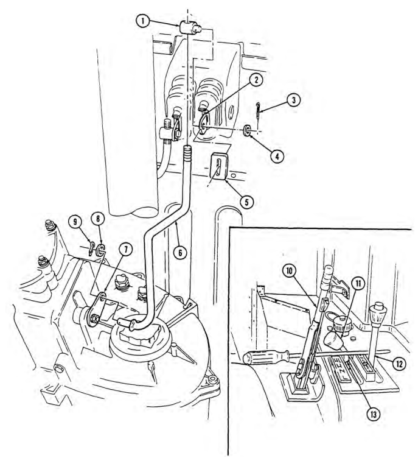

FOLLOW-ON TASK:  Operate vehicle (TM 9-2320-387-10) and check for proper shifter operation.

# 5-17. Speedometer Driven Gear Replacement

This task covers:
INITIAL SETUP:

| TOOIS                           | Equipment  Condition   |
|---------------------------------|------------------------|
| General mechanic's tool kit:    |                        |
| automotive (Appendix B, Item 1) |                        |
|                                 | Maintenance Level      |
| Manual References               | Unit                   |
| TM 9\-2320\-387\-10             |                        |
| TM 9\-2320\-387\-24P            |                        |

## A. Removal

1. Disconnect flex driveshaft (1) from correction adapter (2). 2. Loosen nut (3) and remove correction adapter (2) from pinion adapter (6). 3. Remove capscrew (4) and clamp (5) from pinion adapter (6) and transfer case (8). 4. Pull pinion adapter (6) out of transfer case (8). 5. Remove O-ring (7) from pinion adapter (6). Discard O-ring (7). 6. Remove driven gear (9) from transfer case (8).

b. Installation 1. Install O-ring (7) on pinion adapter (6).

Note number stamped on driven gear.

2. Install driven gear (9) into pinion adapter (6).

Numbers on pinion adapter represent numbers stamped on driven gear. When installing adapter, numbers on adapter must match numbers on transfer case housing.

3. Install and align pinion adapter (6) into transfer case (8) with clamp (5) and capscrew (4). Tighten capscrew (4) to 15 lb-ft (20 N•m).

4. Install correction adapter (2) on pinion adapter (6) and tighten nut (3). 5. Connect flex driveshaft (1) to correction adapter (2).

a. Removal b. Installation

# 5-17. Speedometer Driven Gear Replacement (Cont'D)

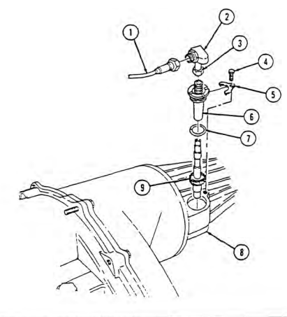

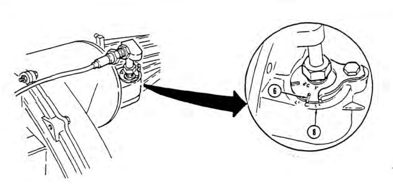

FOLLOW-ON TASK:  Operate vehicle (TM 9-2320-387-10) and check speedometer for proper operation.

| This task covers:                |                                            |
|----------------------------------|--------------------------------------------|
| a. Removal                       | b. Installation                            |
| INITIAL SETUP:                   |                                            |
| Tools                            | General Safety Instructions                |
| General mechanic's tool kit:     |                                            |
| automotive  (Appendix B, Item 1) | may cause injury to personnel or damage to |
| Manual References                | equipment.                                 |
| TM 9\-2320\-387\-10              | Maintenance Level                          |
| TM 9\-2320\-387\-24P             | Unit                                       |
| a. Removal  1   1                |                                            |

# 5-17.1. Sender Generator (Electronic) Replacement

## A. Removal

1. Remove tiedown strap (9) and shielding sleeve (10) from sender generator (4). Discard tiedown strap (9).

2. Remove tiedown strap (8) and excess wiring (3) from sender generator (4). Discard tiedown strap (8). 3. Disconnect speedometer harness connector (1) from sender generator harness connector (2). 4. Remove sender generator (4) from pinion adaptor (5) on transfer case (6).

Sender generator drive tang can be removed if necessary to replace.

5. Remove sender generator drive tang (7) from sender generator (4).

b. Installation

Place any excess wiring inside sender generator shielding sleeve.

1. Install sender generator tang (7) in sender generator (4). 2. Install sender generator (4) on pinion adapter (5) on transfer case (6). 3. Connect speedometer harness connector (1) to sender generator harness connector (2). 4. Install excess wiring (3) on sender generator (4) with tiedown strap (8). 5. Install shielding sleeve (10) on sender generator (4) with tiedown strap (9).

# 5-17.1. Sender Generator (Electronic) Replacement (Cont'D)

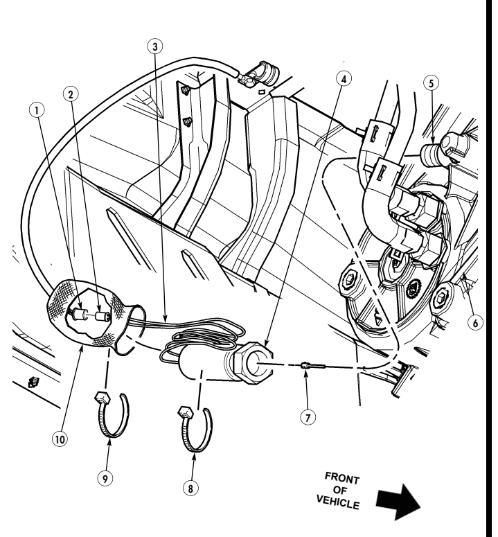

FOLLOW-ON TASK:  Connect battery cables (para. 4-68).

# 5-17.2. Speedometer Driven Gear (Electronic) Replacement

This task covers:
a. Removal b. Installation

| a. Removal                      | b. Installation                               |
|---------------------------------|-----------------------------------------------|
| INITIAL SETUP:                  |                                               |
| ToOis                           | Equipment  Condition                          |
| General mechanic's tool kit:    | Service headlight lamp removed (para. 4\-49). |
| automotive (Appendix B, Item 1) | Maintenance  Level                            |
| Manual References               | Unit                                          |
| TM 9\-2320\-387\-24P            |                                               |

## A. Removal

1. Remove capscrew (2) and clamp (3) from pinion adapter (1) and transfer case (6). 2. Pull pinion adapter (1) out of transfer case (6). 3. Remove O-ring (4) from pinion adapter (1). Discard O-ring (4). 4. Remove driven gear (5) from transfer case (6).

## B. Installation

1. Install O-ring (4) on pinion adapter (1). 2. Install driven gear (5) into pinion adapter (1). 3. Install and align pinion adapter (1) into transfer case (6) with clamp (3) and capscrew (2). Tighten capscrew (2) to 15 lb-ft (20 N•m).

# 5-17.2. Speedometer Driven Gear (Electronic) Replacement (Cont'D)

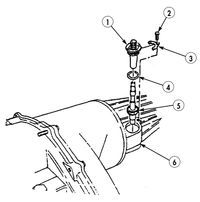

FOLLOW-ON TASKS: - Install sender generator (para. 5-17.1).

- Check speedometer for proper operation (TM 9-2320-387-10).

# 5-18. Transfer Case Oil Seals Replacement (Serial Numbers 299999 And Below)

This task covers:

a. Front Oil Seal Removal c. Rear Oil Seal Removal b. Front Oil Seal Installation d. Rear Oil Seal Installation

## Initial Setup:

| 4\-67.   | Battery Cable Terminal Clamp Replacement   | 4\-108   |
|----------|--------------------------------------------|----------|
| 4\-68.   | Battery Cable Maintenance                  | 4\-110   |
| 4\-69.   | Power Feed\-Through Stud Replacement       | 4\-116   |
| 4\-70.   | 12\-Volt Regulator Cable Replacement       | 4\-118   |
| 4\-71.   | Buss Bar Replacement                       | 4\-120.1 |

Rear seal installer (Appendix B, Item 95) Drive handle (Appendix B, Item 60)

## A. Front Oil Seal Removal

1. Remove four capscrews (4), two straps (3), and front propeller shaft (1) from output yoke (2).

Have drainage container ready to catch fluid.

2. Remove nut (5), lockwasher seal (6), and output yoke (2) from transfer case (8). Discard lockwasher seal (6).

3. Remove output oil seal (7) from transfer case (8). b. Front Oil Seal Installation

Ensure rubber surface of seal faces front seal installer.

1. Using front seal installer and drive handle, install oil seal (7) on transfer case (8). 2. Install lockwasher seal (6) and output yoke (2) on transfer case (8) with nut (5). Tighten nut (5) to 110 lb-ft (149 N•m).

3. Connect front propeller shaft (1) to output yoke (2) with two straps (3) and four capscrews (4).

Tighten capscrews (4) to 13-18 lb-ft (18-24 N•m).

5-18. TRANSFER CASE OIL SEALS REPLACEMENT (SERIAL NUMBERS 299999 AND BELOW) (Cont'd)

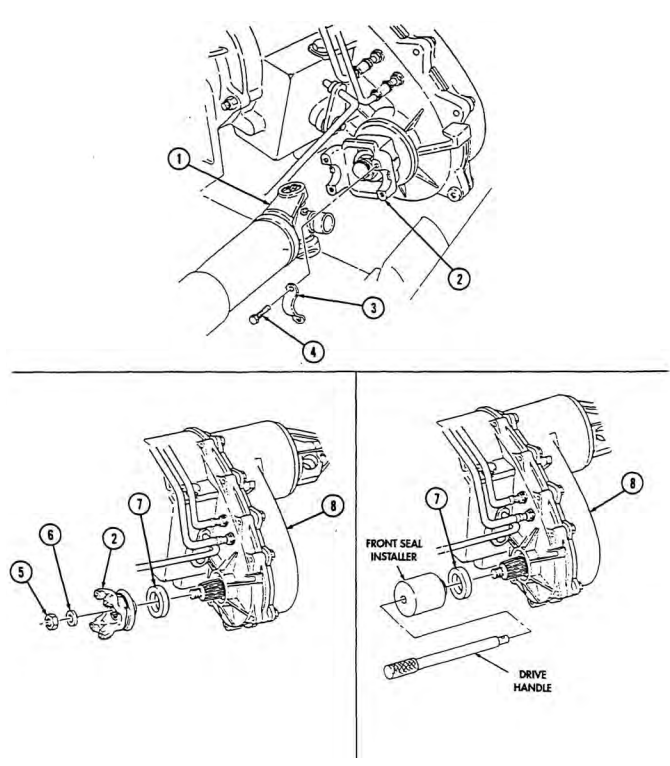

5-18. TRANSFER CASE OIL SEALS REPLACEMENT (SERIAL NUMBERS 299999 AND BELOW)
c. Rear Oil Seal Removal 1. Remove rear propeller shaft (para. 6-4). 2. Remove oil seal (1) from transfer case extension (2). d. Rear Oil Seal Installation 1. Using rear seal installer, install oil seal (1) on transfer case extension (2).

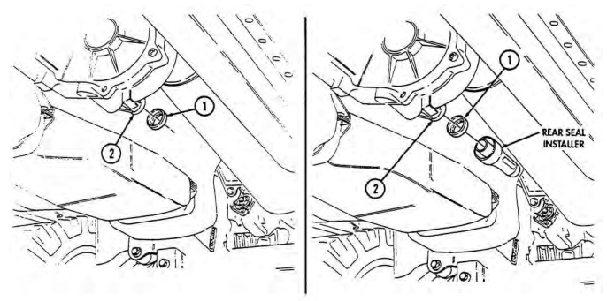 2. Install rear propeller shaft (para. 6-4).

FOLLOW-ON TASK: Fill transfer case fluid to proper level (TM 9-2320-387-10).

5-38/(5-38.1 blank) Change 6

# 5-18.1. Transfer Case Oil Seals Replacement (Serial Numbers 300000 And Above)

This task covers:

a. Front Oil Seal Removal c. Rear Oil Seal Removal b. Front Oil Seal Installation d. Rear Oil Seal Installation

## Initial Setup:

Tools General mechanic's tool kit:
automotive (Appendix B, Item 1)
Maintenance and repair shop equipment:
automotive (Appendix B, Item 2)
Special Tools Front seal installer (Appendix B, Item 96) Rear seal installer (Appendix B, Item 95) Drive handle (Appendix B, Item 60)

## Materials/Parts

Four lockwashers (Appendix A, Item 145) Seal, lockwasher (Appendix A, Item 298)
Manual References TM 9-2320-387-10 TM 9-2320-387-24P
Equipment Condition Rear propeller shaft removed 
(para. 6-4).

| .   | =   |    |
|-----|-----|----|

| Maintenance Level   |
|---------------------|

## A. Front Oil Seal Removal

1. Remove four nuts (3), lockwashers (2), two U-bolts (5), and front propeller shaft (1) from output yoke (4). Discard lockwashers (2).

Have drainage container ready to catch fluid.

2. Remove nut (6), lockwasher seal (7), output yoke (4), and output seal (8) from transfer case (9).

Discard lockwasher seal (7).

## B. Front Oil Seal Installation

1. Using front seal installer and drive handle, install output seal (8) on transfer case (9). 2. Install output yoke (4) on transfer case (9) with lockwasher seal (7) and nut (6). Tighten nut (6) to 110 lb-ft (149 N•m).

3. Install front propeller shaft (1) on output yoke (4) with two U-bolts (5), four lockwashers (2), and nuts (3). Tighten nuts (3) to 13–18 lb-ft (12–24 N•m).

c. Rear Oil Seal Removal Remove oil seal (10) from transfer case extension (11). d. Rear Oil Seal Installation Using rear seal installer, install oil seal (10) on transfer case extension (11).

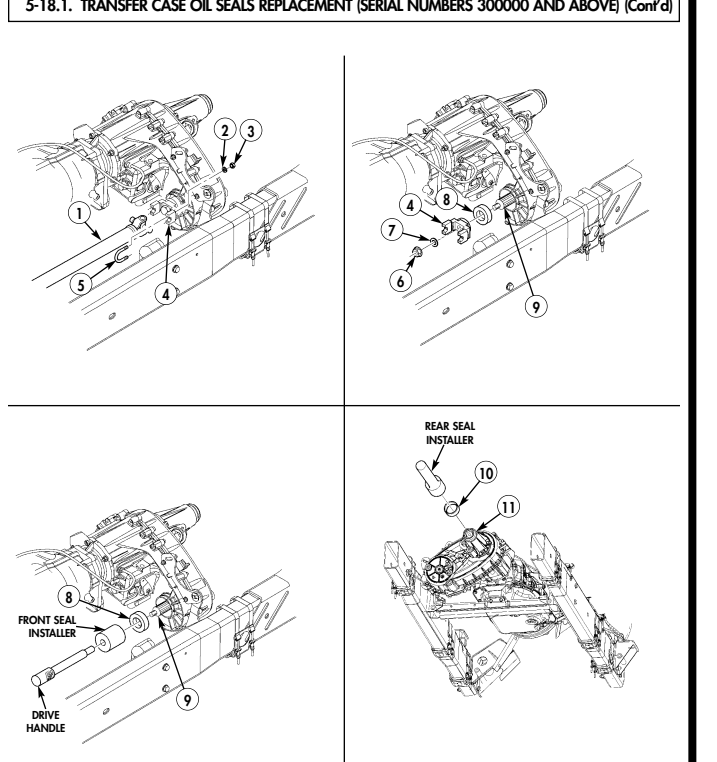

FOLLOW-ON TASKS: - Install rear propeller shaft (para. 6-4).

- Fill transfer case fluid to proper level (TM 9-2320-387-10).

# 5-19. Transfer Case Vent Line Replacement (Serial Numbers 299999 And Below)

This task covers:
INITIAL SETUP:
Tools General mechanic's tool kit:
automotive (Appendix B, Item 1)
a. Removal b. Installation 1. Install vent line (2) on tee fitting (3). 2. Connect vent line (2) to elbow (1) on transfer case (4).

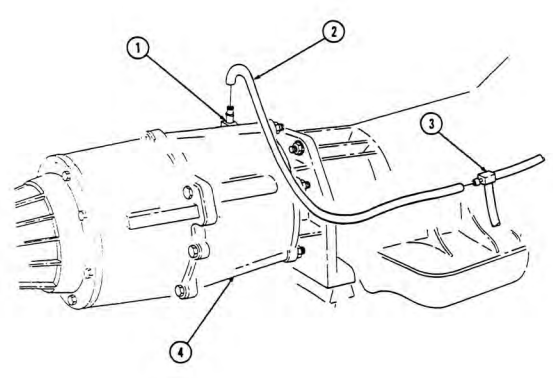

a. Removal b. Installation

| TM 9\-2320\-387\-10   |
|-----------------------|
| TM 9\-2320\-387\-24P  |
| Equipment Condition   |

1. Disconnect vent line (2) from elbow (1) on transfer case (4). 2. Remove vent line (2) from tee fitting (3).

# 5-20. Transfer Case Vent Line Replacement (Serial Numbers 300000 And Above)

| Tools                                   |
|-----------------------------------------|
| General mechanic's tool kit:            |
| automotive (Appendix B, Item 1)         |
| Materials/Parts                         |
| Five lockwashers (Appendix G, Item 187) |

This task covers:

a. Removal b. Installation

## A. Removal

| Manual References    |
|----------------------|
| TM 9\-2320\-387\-24P |
| Equipment Condition  |
| Maintenance Level    |

1. Disconnect vent line (2) from tee fitting (1) and vent line adapter (4). 2. Remove vent line adapter (4) from transfer case (3).

## B. Installation

1. Install vent line adapter (4) on transfer case (3). 2. Connect vent line (2) to vent line adapter (4) and tee fitting (1).

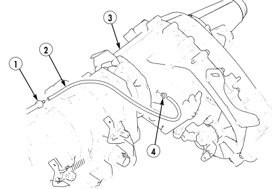

# Chapter 6 Propeller Shafts, Axles, And Suspension (Unit) Maintenance

Section I. PROPELLER SHAFTS MAINTENANCE

| Tools                                  | Materials/Parts (Cont'd)                  |         |
|----------------------------------------|-------------------------------------------|---------|
| General mechanic's tool kit:           | Lockwasher (Appendix G, Item 144)         |         |
| automotive (Appendix B, Item 1)        | Lockwasher (Appendix G, Item 148)         |         |
| Maintenance and repair shop equipment: | Assembled locknut (Appendix G, Item 134)  |         |
| automotive (Appendix B, Item 2)        | Manual References                         |         |
| Materials/Parts                        | TM 9\-2320\-387\-24P                      |         |
| Lockwasher (Appendix G, Item 174)      | Equipment Condition                       |         |
| Tiedown strap (Appendix G, Item 326)   |                                           | 4\-68). |
| Adhesive sealant (Appendix C, Item 12) | Battery ground cables disconnected (para. |         |
| Lockwasher (Appendix G, Item 167)      | Maintenance Level                         |         |
| Lockwasher (Appendix G, Item 187)      | Unit                                      |         |

# 6-2. Front Propeller Shaft Assembly Maintenance

This task covers:
a. Removal c. Installation b. Inspection INITIAL SETUP:
Tools General mechanic's tool kit:
automotive (Appendix B, Item 1)
Maintenance and repair shop equipment:
automotive (Appendix B, Item 2)

## Materials/Parts

Cotter pin (Appendix G, Item 21) Two locknuts (Appendix G, Item 128) Four lockwashers (Appendix G, Item 145)
(Serial numbers 300000 and above)

| TM 9\-2320\-387\-24P   |
|------------------------|

Propeller shaft bearing caps should be taped together to prevent loss of bearings.

a. Removal 1. Remove four capscrews (3) and two bearing straps (2) from front propeller shaft assembly (4) and differential pinion yoke (1).

2. Remove four nuts (7), lockwashers (8), and two U-bolts (11) from front propeller shaft assembly (4)
and transfer case output yoke (9). Discard lockwashers (8).

3. Remove cotter pin (14), washer (13), and transfer case shift rod (12) from transfer case shift lever (6).

Discard cotter pin (14).

4. Remove two locknuts (15), washers (16), capscrews (18), washers (16), and center bearing (17) from engine mount (19). Discard locknuts (15).

5. Move front propeller shaft assembly (4) forward, then rearward, over top of transfer case (5) and exhaust pipe (10), and remove front propeller shaft assembly (4).

b. Inspection 1. Inspect driveshaft (21) and coupling shaft (22) for cracks and damage. Replace either if cracked or damaged (para. 6-3).

2. Inspect grease fittings (23) and universal joints (20) for serviceability. Replace universal joints (20)
or grease fittings (23) if unserviceable (para. 6-3).

3. Inspect center bearing (17) for roughness or damage. Replace coupling shaft (22) if center bearing (17)

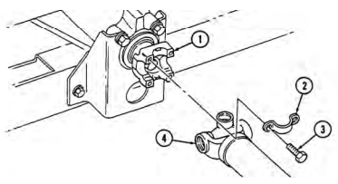

is rough or damaged (para. 6-3).

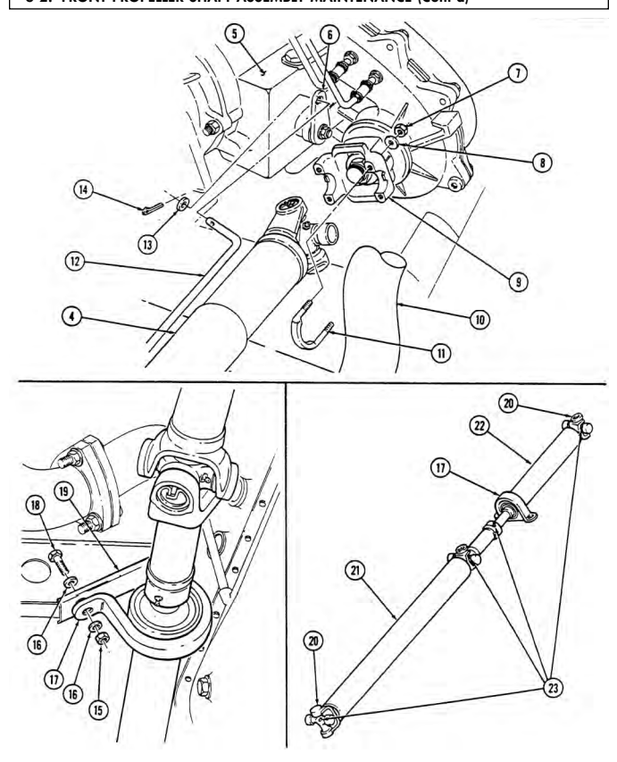

6-2. FRONT PROPELLER SHAFT ASSEMBLY MAINTENANCE (Cont'd)

# 6-2. Front Propeller Shaft Assembly Maintenance (Cont'D)

c. Installation 1. Position front propeller shaft assembly (4) over exhaust pipe (10) and over top of transfer case (5). 2. Install front propeller shaft assembly (4) on differential pinion yoke (1) with two bearing straps (2)
and four capscrews (3). Tighten capscrews (3) to 13-18 lb-ft (18-24 N•m).

3. Install center bearing (17) on engine mount (19) with two washers (16), capscrews (18), washers (16),
and locknuts (15). Tighten capscrews (18) to 60 lb-ft (81 N•m).

4. Install transfer case shift rod (12) on transfer case shift lever (6) with washer (13) and cotter pin (14).

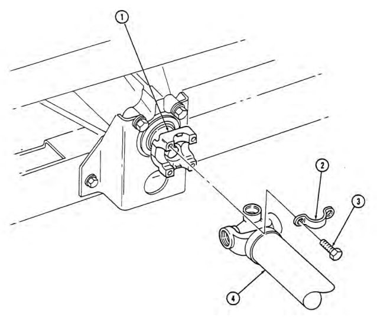 5. Install front propeller shaft assembly (4) on transfer case output yoke (9) with two U-bolts (11), four lockwashers (8), and nuts (7). Tighten nuts (7) to 13-18 lb-ft (18-24 N•m).

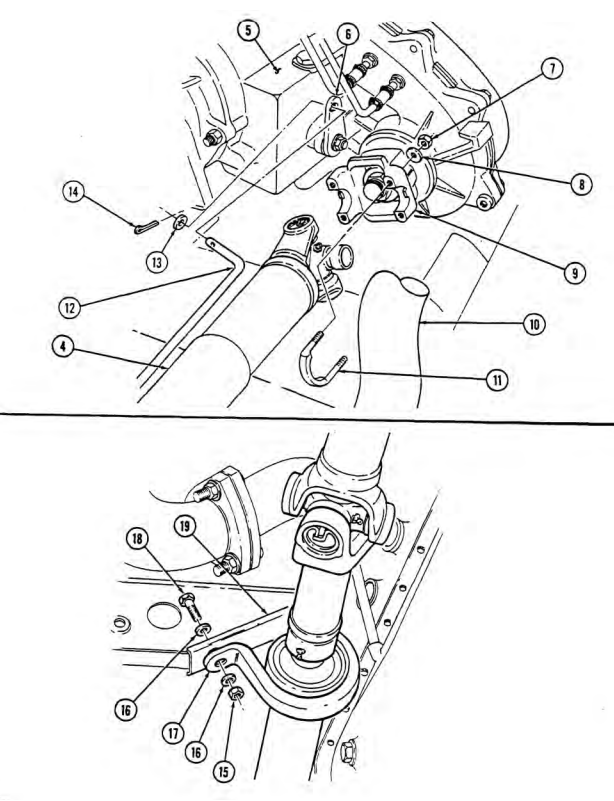

6-2.  FRONT PROPELLER SHAFT ASSEMBLY MAINTENANCE (Cont'd)

FOLLOW-ON TASK: Lubricate propeller shaft assembly (TM 9-2320-387-10).

# 6-3. Front Propeller Shaft Assembly Repair

This task covers:
a. Disassembly c. Assembly b. Cleaning and Inspection INITIAL SETUP:
Tools General mechanic's tool kit:
automotive (Appendix B, Item 1)
Maintenance and repair shop equipment:
automotive (Appendix B, Item 2)
Materials/Parts Dust cap (Appendix G, Item 31) Grease (Appendix C, Item 34) Drycleaning solvent (Appendix C, Item 26)
Manual References TM 9-2320-387-24P

## Equipment Condition

Front propeller shaft assembly removed
(para. 6-2).

General Safety Instructions Drycleaning solvent is flammable and will not be used near an open flame.

Maintenance Level Unit a. Disassembly

Prior to disassembly, mark slip yoke and coupling shaft for assembly.

1. Place slip yoke (2) in vise. 2. Pull coupling shaft (4) apart from slip yoke (2). 3. Pry dust cap (3) off slip yoke (2). Discard dust cap (3).

b. Cleaning and Inspection

Drycleaning solvent is flammable and will not be used near an open flame. A fire extinguisher will be kept nearby when solvent is used. Use only in well-ventilated places. Failure to do this may result in injury to personnel and/or damage to equipment.

Do not allow drycleaning solvent to come into contact with U-joint. Damage to equipment may result.

1. Use drycleaning solvent to clean all metallic parts. 2. Inspect driveshaft (1), coupling shaft (4), and slip yoke (2) for cracks or dents. Replace if cracked or dented.

3. Inspect splined end of coupling shaft (4) and slip yoke (2) for damage. Replace either if damaged. 4. Inspect center bearing (5) for looseness, vibration damage, rubber separation from bearing surface, and abnormal wear. If damaged, replace coupling shaft (4).

# 6-3. Front Propeller Shaft Assembly Repair (Cont'D)

c. Assembly

Ensure grease fitting on dust cap is aligned with wide spline in slip yoke.

1. Install dust cap (3) on coupling shaft (4). 2. Coat splines on coupling shaft (4) and slip yoke (2) with grease.

NOTE
Ensure wide spline on coupling shaft is aligned with grease fitting on slip yoke.

3. Install coupling shaft (4) and dust cap (3) on slip yoke (2).

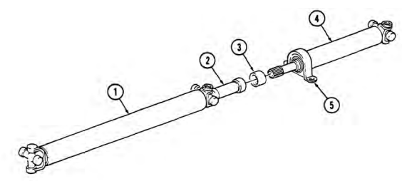

FOLLOW-ON TASK: Install front propeller shaft assembly (para. 6-2).

# 6-4. Rear Propeller Shaft Maintenance

This task covers:
b. Inspection a. Removal c. Installation

## Initial Setup:

|                                        | One mechanic         |
|----------------------------------------|----------------------|
| automotive (Appendix B, Item 1)        | One assistant        |
| Maintenance and repair shop equipment: |                      |
| automotive (Appendix B, Item 2)        | Manual References    |
|                                        | TM 9\-2320\-387\-24P |
| Materials/Parts                        |                      |
| Two lockwashers (Appendix G, Item 189) | Equipment Condition  |

a. Removal 1. Chock wheels and release parking brake (TM 9-2320-387-10). 2. Remove four capscrews (6), two straps (5), and disconnect propeller shaft (3) from differential pinion yoke (4).

3. Slide propeller shaft end yoke (1) out of transfer case extension (2) and remove propeller shaft (3).

## B. Inspection

1. Inspect propeller shaft (3) for cracks and dents. Replace if cracked or dented. 2. Inspect grease fittings and universal joints for serviceability. Replace universal joints (para. 6-5) or grease fittings if unserviceable.

3. Inspect splined end of end yoke (1) for damage. Replace end yoke (1) if damaged (para. 6-5).

## C. Installation

1. Slide propeller shaft end yoke (1) on transfer case extension (2) and install propeller shaft (3). 2. Connect propeller shaft (3) to differential pinion yoke (4) with two straps (5) and four capscrews (6).

Tighten capscrews (6) to 30-35 lb-ft (41-47 N•m).

3. Apply parking brake (TM 9-2320-387-10) and remove wheel chocks.

# 6-4.  Rear Propeller Shaft Maintenance (Cont'D)

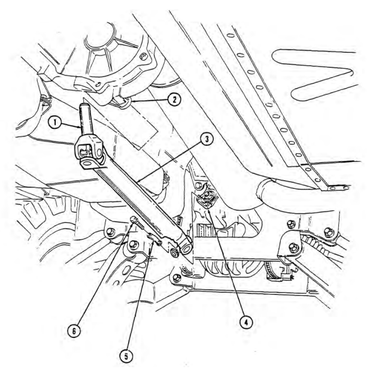

FOLLOW-ON TASK:   Lubricate propeller shaft (TM 9-2320-387-10).

# 6-5. Universal Joint Repair

This task covers:

| INITIAL SETUP:                           |                      |
|------------------------------------------|----------------------|
| Tools                                    | Manual References    |
| General mechanic's tool kit:             | TM 9\-2320\-387\-10  |
| automotive (Appendix B, Item 1)          | TM 9\-2320\-387\-24P |
| Materials/Parts                          | Equipment Condition  |
| Lockwasher (Appendix G, Item 144)        |                      |
| Antiseize compound (Appendix C, Item 16) |                      |
|                                          | Maintenance Level    |
|                                          | Unit                 |

a. Disassembly b. Assembly

Propeller shaft removed (para. 6-2 or 6-4).

All universal joint replacement procedures are basically the same. This procedure covers the rear universal joint.

a. Disassembly

Do not drop bearing cups. Needle bearings can be easily lost.

1. Remove grease fitting (7) from cross (5). 2. Remove two bearing cups (4) from cross (5). 3. Remove two snaprings (2) from yoke (6). 4. Position propeller shaft (3) in vise with 1-1/8 in. socket between vise jaw and bearing cup (1) being removed. Ensure open end of socket is facing bearing cup (1).

5. Place 11/16-in. socket between opposite bearing cup (1) and vise jaw. Ensure open end of socket is facing vise jaw.

6. Press bearing cup (1) out of yoke (6) and remove bearing cup (1) from cross (5). 7. Reverse position of sockets and press remaining bearing cup (1) out of yoke (6). 8. Remove cross (5) from yoke (6).

b. Assembly

Ensure grease fitting on cross faces yoke. Damage to equipment will result if improperly installed.

1. Install cross (5) into yoke (6). 2. Install bearing cup (1) into yoke (6).

Ensure bearing cup is aligned with yoke before pressing in with vise. Damage to cross and bearing cups will result if forced into yoke.

3. Place yoke (6) in vise with 11/16-in. socket between vise jaw and bearing cup (1). 4. Press bearing cup (1) into yoke (6) far enough to install snapring (2) and install snapring (2) into yoke 
(6).

5. Install bearing cup (1) into yoke (6). 6. Place yoke (6) in vise with 11/16-in. socket between bearing cup (1) and vise jaw. 7. Press bearing cup (1) into yoke (6) far enough to install snapring (2) and install snapring (2) into yoke 
(6).

8. Install two bearing cups (4) on cross (5). 9. Install grease fitting (7) into cross (5).

6-10 Change 2

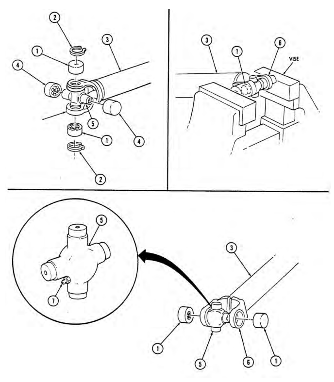

# 6-5.  Universal Joint Repair (Cont'D)

FOLLOW-ON TASK:  Install propeller shaft (para. 6-2 or 6-4).

# Section Ii. Front And Rear Axles Maintenance 6-6. Front And Rear Axles Maintenance Task Summary

|         | Section I. TRANSMISSION MAINTENANCE                                  |         |
|---------|----------------------------------------------------------------------|---------|
| 5\-1.   | TRANSMISSION MAINTENANCE TASK SUMMARY                                |         |
| TASK    | PROCEDURES                                                           | PAGE    |
| PARA.   |                                                                      | .NO.    |
| 5\-2.   | Transmission Service                                                 | 5\-2    |
| 5\-3.   | Transmission Oil Cooler Lines Replacement                            |         |
|         | (Serial Numbers 299999 and Below)                                    | 5\-6    |
| 5\-3.1. | Transmission Oil Cooler Lines Replacement                            |         |
|         | (Serial Numbers 300000 and Above)                                    | 5\-10.2 |
| 5\-4.   | Transmission Bypass Valve Replacement                                | 5\-12   |
| 5\-5.   | Transmission Oil Dipstick Tube Replacement                           | 5\-14   |
| 5\-6.   | Neutral Start Switch Replacement                                     | 5\-16   |
| 5\-7.   | Shift Controls Housing Assembly Replacement                          | 5\-18   |
| 5\-8.   | Shift Controls Housing Assembly Maintenance                          | 5\-20   |
| 5\-9.   | Transmission Shift Rod Maintenance                                   | 5\-22   |
| 5\-10.  | Transmission Vent Line Replacement (Serial Numbers 299999 and Below) | 5\-24   |
| 5\-10.1 | Transmission Vent Line Replacement (Serial Numbers 300000 and Above) | 5\-24.2 |
| 5\-11.  | Sealed Lower Converter Housing Cover Maintenance                     | 5\-26   |

# 6-7. Halfshaft Maintenance

This task covers:
b. Disassembly e. Assembly c. Cleaning and Inspection f. Installation

## Tools

General mechanic's tool kit:
automotive (Appendix B, Item 1)
Maintenance and repair shop equipment:
automotive (Appendix B, Item 2)

## Materials/Parts

Boot service kit (Appendix G, Item 4) Clip (Appendix G, Item 11) Cotter pin (Appendix G, Item 19) Six two-piece lockwashers 
(Appendix G, Item 191)
Lockwasher (Appendix G, Item 156) Drycleaning solvent (Appendix C, Item 26) Lithium grease (Appendix C, Item 36) Sealing compound (Appendix C, Item 63) Wear sleeve (Appendix G, Item 311.1)
a. Removal d. Wear Sleeve Installation Manual References TM 9-2320-387-24P
Equipment Condition
- Wheel removed (para. 8-3). - Brake protection guard removed 
(para. 7-11 or para. 7-11.1).

General Safety Instructions Drycleaning solvent is flammable and will not be used near an open flame.

Maintenance Level Unit

## A. Removal

1. Remove access plug (8) and washer (7) from geared hub (4). 2. Remove halfshaft retaining capscrew (6) and lockwasher (5) from halfshaft (9) and geared hub (4).

Discard lockwasher (5).

3. Remove six capscrews (3), two-piece lockwashers (2), and halfshaft (9) from rotor (1) and output flange (10). Discard two-piece lockwashers (2).

Perform steps 4 and 5 for rear halfshafts only.

4. Remove cotter pin (15), washer (16), clevis pin (18), and parking brake clevis (17) from lever (14).

Discard cotter pin (15).

5. Remove clip (13) and disconnect cable (11) from caliper cable bracket (12). Discard clip (13).

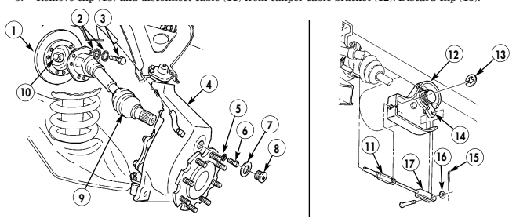

# 6-7. Halfshaft Maintenance (Cont'D)

## B. Disassembly

1. Loosen clamps (6) and (7) securing inner boot (5) to inner joint (1), insert (2), and shaft (4). 2. Clamp shaft (4) in soft-jawed vise. 3. Remove inner boot (5) from insert (2) and slide up on shaft (4). 4. Remove inner joint (1) and insert (2) from spider assembly (3) and shaft (4). 5. Remove insert (2) from inner joint (1). Discard insert (2).

5.1. Remove dirt deflector (9) from outer joint (8), if present.

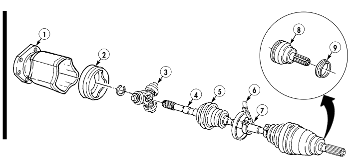

# 6-7. Halfshaft Maintenance (Cont'D)

6. Remove retainer ring (8) from shaft (4). Discard retainer ring (8). 7. Remove spider assembly (3) from shaft (4).

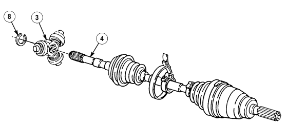

# 6-7. Halfshaft Maintenance (Cont'D)

8. Remove inner boot (1) and clamps (2) and (3) from shaft (7). Discard boot (1) and clamps (2) and (3). 9. Remove shaft (7) from soft-jawed vise.

10. Remove boot clamps (4) and (5) and outer boot (6) from outer joint (8) and shaft (7). Discard boot (6) and clamps (5) and (4).

c. Cleaning and Inspection

Drycleaning solvent is flammable and will not be used near an open flame. A fire extinguisher will be kept nearby when solvent is used. Use only in well-ventilated places. Failure to do this may result in injury to personnel and/or damage to equipment.

1. Clean all metallic parts with drycleaning solvent. 2. Inspect shaft (7) for cracks and distortion. Replace shaft (7) if cracked or distorted. 3. Inspect splined end of shaft (7) for damage. Replace shaft (7) if damaged. 4. Inspect inner joint (10) for pitting or rough joint operation. Replace inner joint (10) if pitted or unserviceable.

5. Clean output flange threaded holes (11) with a 10-mm tap to remove old sealing compound. 6. Inspect halfshaft end (9) for burrs or grooves. If burrs or grooves are present, carefully sand or grind down burrs on halfshaft end (9).

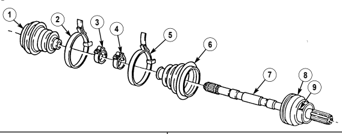

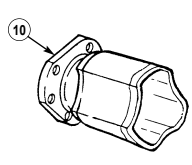

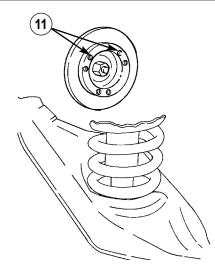

# 6-7. Halfshaft Maintenance (Cont'D)

d. Wear Sleeve Installation

When installing wear sleeve over halfshaft spline, ensure wear sleeve does not come into contact with splines.

Using a pipe or like item (11.4), slide wear sleeve (11.3) over halfshaft spline (11.2) until flange (11.5) of wear sleeve (11.3) contacts shoulder adjacent to halfshaft seal surface (11.1).

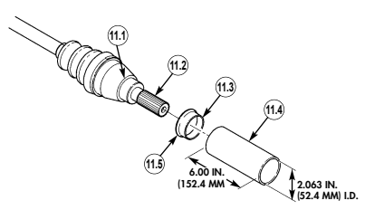

## E. Assembly

1. Pack outer joint (8) with lithium grease. 2. Install outer boot (6) on shaft (7). Ensure boot (6) seats in groove of shaft (7). 3. Secure outer boot (6) on shaft (7) with clamp (4). 4. Install outer boot (6) on joint (8). Ensure boot (6) seats in groove of joint (8). 5. Secure outer boot (6) on joint (8) with clamp (5). 6. Clamp shaft (7) in soft-jawed vise. 7. Position clamps (3) and (2) on shaft (7).

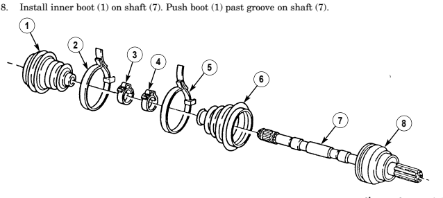

# 6-7. Halfshaft Maintenance (Cont'D)

Adhere spider assembly with lithium grease before installing on shaft.

9. Align splines of spider assembly (4) with spline on shaft (5). Use press to install spider assembly (4) on shaft (5) until spider assembly (4) seats into place.

10. Install retainer ring (3) in upper groove of shaft (5). 11. Pack inner joint (1) with lithium grease. 12. Install insert (2) on inner joint (1). 13. Install inner joint (1) and insert (2) on spider assembly (4) and shaft (5). 14. Move inner boot (6) on shaft (5) until inner boot (6) seats in groove of shaft (5). 15. Secure inner boot (6) on shaft (5) with clamp (8). 16. Install inner boot (6) on inner joint (1). Ensure boot (6) seats in groove of inner joint (1). 17. Secure inner boot (6) on inner joint (1) with clamp (7).

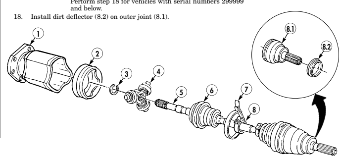

f. Installation

Ensure dirt deflector is removed prior to installing halfshaft on vehicles with serial number 300000 and above. Failure to do so will damage geared hub seal.

Perform step 1 when installing halfshaft on vehicles with serial numbers 300000 and above.

1. Remove dirt deflector (8.2) from outer joint (8.1), if present.

1.1. Install halfshaft (18) into geared hub (13).

2. Apply sealing compound to halfshaft retaining capscrew (15) and install halfshaft (18) on geared hub (13) with lockwasher (14) and halfshaft retaining capscrew (15). Tighten halfshaft retaining capscrew (15) to 37 lb-ft (50 N•m).

3. Install washer (16) and access plug (17) into geared hub (13). Tighten access plug (17) to 8-13 lb-ft 
(11-18 N•m).

# 6-7. Halfshaft Maintenance (Cont'D)

- Ensure all six capscrew holes in the rotor align with holes in output flange.

- New capscrews come with preapplied thread-locking compound, however, still apply sealing compound to threads of new capscrews. If old capscrews are to be used, mating threads must be cleaned and sealing compound applied to threads of capscrews.

- Two-piece lockwashers must be installed in sets of two with serrated sawtooth threads facing each other.

4. Apply sealing compound to six capscrews (12). Install halfshaft (18) on rotor (10) and output flange (19)
with six two-piece lockwashers (11) and capscrews (12). Tighten capscrews (12) to 58 lb-ft (79 N•m).

Perform steps 5 through 7 for rear halfshafts only.

5. Install parking brake cable (27) on caliper cable bracket (20) with clip (21).

- Ensure lever is in contact with caliper cable bracket stop. Damage to equipment and poor performance may result if not aligned properly.

- Ensure that clevis and clevis pin are aligned in lever. Do not move lever to accommodate misadjusted clevis. Damage to equipment and poor performance may result.

6. Install parking brake clevis (25) on lever (22) with clevis pin (26), washer (24), and cotter pin (23).

Check position of lever (22) and ensure it is in contact with caliper cable bracket stop (28).

7. If lever (22) is not in contact with caliper cable bracket stop (28), adjust rear dual service parking brake
(para. 7-19).

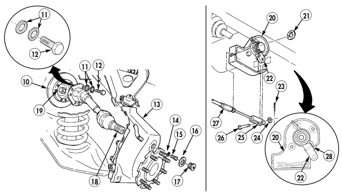

FOLLOW-ON TASKS: - Install brake protection guards (para. 7-11 or para. 7-11.1).

- Install wheel (para. 8-3).

# 6-8. Geared Hub Side Cover Maintenance

This task covers:
a. Removal c. Installation b. Cleaning and Inspection

## Initial Setup:

Tools General mechanic's tool kit:
automotive (Appendix B, Item 1)
Maintenance and repair shop equipment:
automotive (Appendix B, Item 2)
Materials/Parts Sealing compound (Appendix C, Item 63) RTV silicone compound (Appendix C, Item 74) Drycleaning solvent (Appendix C, Item 26)
Manual References TM 9-2320-387-24P
Equipment Condition Wheel removed (para. 8-3).

General Safety Instructions Drycleaning solvent is flammable and will not be used near an open flame.

Maintenance Level Unit

- Have drainage container ready to catch oil. - The replacement procedure for front and rear geared hub side covers is basically the same. This procedure covers the front side cover.

a. Removal 1. Remove drainplug (5) from geared hub (1) and drain geared hub (1). 2. Install drainplug (5) on geared hub (1). Tighten drainplug (5) to 8-13 lb-ft (11-18 N•m). 3. Remove eight capscrews (4), washers (3), and side cover (2) from geared hub (1).

b. Cleaning and Inspection

Drycleaning solvent is flammable and will not be used near an open flame. A fire extinguisher will be kept nearby when solvent is used. Use only in well-ventilated places. Failure to do this may result in injury to personnel and/or damage to equipment.

1. Using drycleaning solvent, clean side cover (2). 2. Inspect side cover (2) for damage. If damaged, replace.

c. Installation 1. Apply RTV sealant to side cover (2) and install side cover (2) on geared hub (1).

Sealing compound is fast drying. Assemble parts as quickly as possible.

2. Apply sealing compound to capscrews (4) and install eight washers (3) and capscrews (4) on side cover (2). Tighten capscrews (4) to 15 lb-ft (20 N•m).

# 6-8. Geared Hub Side Cover Maintenance (Cont'D)

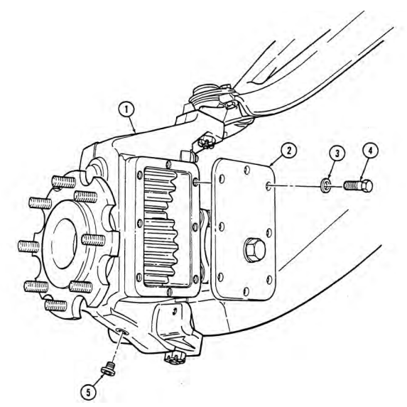

FOLLOW-ON TASKS: - Fill geared hub to proper level (para. 2-12).

- Install wheel (para. 8-3).

# 6-9. Geared Hub Replacement

This task covers:
a. Removal b. Installation INITIAL SETUP:

## Tools

General mechanic's tool kit:
automotive (Appendix B, Item 1)
Maintenance and repair shop equipment:
automotive (Appendix B, Item 2)
Puller, mechanical (Appendix B, Item 157)

## Materials/Parts

Three cotter pins (Appendix G, Item 22) Lockwasher (Appendix G, Item 169) Four locknuts (Appendix G, Item 113) Four locknuts (Appendix G, Item 128) Sealing compound (Appendix C, Item 62) Sealing compound, anaerobic (Appendix C, Item 58)

## Personnel Required

One mechanic One assistant

## Manual References

TM 9-2320-387-24P

## Equipment Condition

•Wheel removed (para. 8-3). •Steering stop removed (para. 6-17).

General Safety Instructions Geared hub must be supported during removal and installation.

Maintenance Level Unit

Use of a pickle fork instead of the puller kit may damage serviceable components (boots).

- Have drainage container ready to catch fluid. - The replacement procedure for front and rear geared hubs is basically the same. This procedure covers the front geared hub.

## A. Removal

1. Remove drainplug (29) from geared hub (12) and drain geared hub (12). 2. Install drainplug (29) in geared hub (12). 3. Remove capscrew (21), washer (20), and vent line bracket and clamp (19) from geared hub (12). 4. Loosen clamp (6) and disconnect vent line (22) from geared hub fitting (7). 5. Remove cotter pin (25), slotted nut (26), and washer (27) from tie rod end (28) and geared hub (12).

Discard cotter pin (25).

6. Using puller, disconnect tie rod end (28) from geared hub (12). 7. Remove access plug (11), washer (10), axle halfshaft retaining capscrew (9), lockwasher (8), and disconnect halfshaft (13) from geared hub (12). Discard lockwasher (8).

# 6-9. Geared Hub Replacement **(Cont'D)**

Geared hub must be supported during removal. Failure to support geared hub may cause injury to personnel or damage to equipment. 

Note direction of inner and outer capscrews for installation. 

8. 

Remove four locknuts (181, washers (141, capscrews (151, and washers (14) from lower ball joint (16) and lower control arm (17). Discard locknuts (18). 

9. 

Remove four locknuts (31, washers (21, capscrews (11, and washers (2) from upper ball joint (4) and upper control arm (5). Discard locknuts (3). 

10. 

Remove cotter pin (23), slotted nut (241, and upper ball joint (4) from upper control geared hub (12). Discard cotter pin (23). 

arm (5) and 11. 

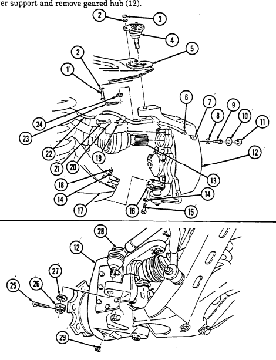

# 6-9. Geared Hub Replacement (Cont'D)

12. Place geared hub (3) in vise. 13. Remove cotter pin (1), slotted nut (2), and lower ball joint (4) from geared hub (3). Discard cotter pin (1).

b. Installation

Geared hub must be supported during installation. Failure to support geared hub may cause injury to personnel or damage to equipment.

- If geared hub is received with P/N 6005120 and left front or right rear installation is required, replace steering arm cover P/N 6005120 with P/N 6005121.

- If geared hub is received with P/N 6005121 and right front or left rear installation is required, replace steering arm cover P/N 6005121 with P/N 6005120.

- Use existing steering arm cover if serviceable. - Perform steps 1 through 1.2 for replacement of steering arm cover. Proceed to step 1.3 for geared hub installation.

1. Remove four capscrews (4.1), washers (4.2), and steering arm cover (4.3) from geared hub (3).

When installing steering arm cover, ensure seal in cover is aligned on spindle extension or damage to seal will result.

Immediately install steering arm cover after application of sealant. 

1.1. Clean sealing surfaces on geared hub (3) and steering arm cover (4.3), then apply anaerobic sealing compound to steering arm cover (4.3).

1.2. Apply sealing compound to threads on capscrews (4.1) and install steering arm cover (4.3) on geared hub (3) with four washers (4.2) and capscrews (4.1). Tighten capscrews (4.1) to 65 lb-ft (88 N•m).

Upper and lower ball joints have grease fittings.

1.3. Install lower ball joint (4) on geared hub (3) with slotted nut (2), but do not tighten. 2. Install upper ball joint (7) on upper control arm (8) and geared hub (3) with slotted nut (19).

3. Tighten slotted nut (19) on upper ball joint (7) to 65 lb-ft (88 N•m). Install cotter pin (18). 4. Install four washers (21), capscrews (20), washers (6), and locknuts (5) on upper ball joint (7) and upper control arm (8). Tighten locknuts (5) to 37 lb-ft (50 N•m).

5. Apply sealing compound to halfshaft retaining capscrew (10) and install halfshaft (15) on geared hub (3) with lockwasher (9) and halfshaft retaining capscrew (10). Tighten halfshaft retaining capscrew (10) to 37 lb-ft (50 N•m).

6. Install washer (11) and access plug (12) on geared hub (3). Tighten access plug (12) to 8-13 lb-ft 
(11-18 N•m).

7. Install lower ball joint (4) and geared hub (3) on lower control arm (16). Ensure lower ball joint (4)
is below lower control arm (16).

# 6-9. Geared Hub Replacement (Cont'D)

Ensure outer capscrews are installed from top down and inner capscrews are installed from bottom up.

8. Secure lower ball joint (4) to lower control arm (16) with four washers (13), capscrews (14),
washers (13), and locknuts (17). Tighten locknuts (17) to 60 lb-ft (81 N•m).

Do not loosen slotted nut to install cotter pin. Doing this may result in damage to equipment.

9. Tighten slotted nut (2) on lower ball joint (4) to 73 lb-ft (99 N•m) and install cotter pin (1).

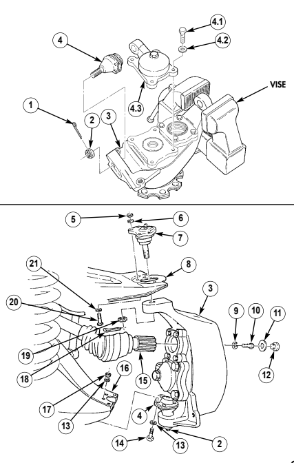

## 1 6-9. Geared Hub Replacement (Cont'D) I

10. 

Install tie rod end (4) on geared hub (5) with washer (3) and slotted nut (2). Tighten slotted nut (2) to 70 lb-ft (95 N-m) and install cotter pin (1). 

11. 

12. 

Connect vent line (6) to geared hub fitting (7) and tighten clamp (8). Install vent line (6) and vent line bracket and clamp (11) on geared hub (51 with washer (10) and capscrew (9). Tighten capscrew (9) to 38 lb-ft (52 Nom). 

13. 

Tighten drainplug (14) to 8-13 lb-ft (11-18 N-m). 

14. 

Remove fill plug (13) and washer (12) from geared hub (5). 

15. 

Fill geared hub (5) to proper level (para 2-12). 

16. 

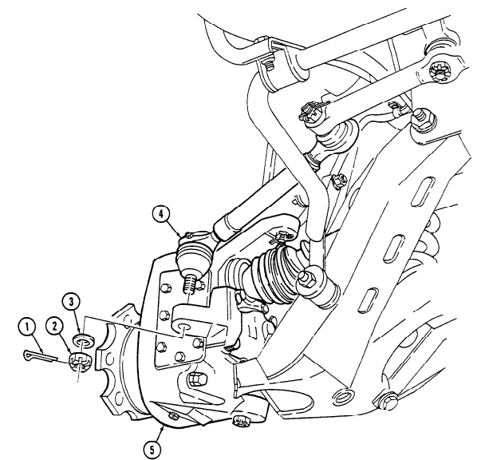

Install washer (12) and fill plug (13) on geared hub (5). Tighten fill plug (13) to 8-13 lb-ft (11-18 Nom). 

# 6-9. Geared Hub Replacement (Cont'D)

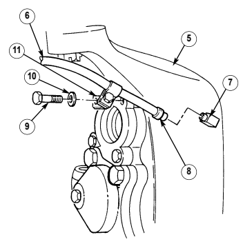

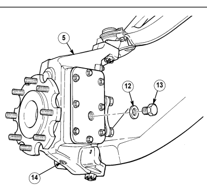

FOLLOW-ON TASKS: - Install steering stop (para. 6-17).

- Install wheel (para. 8-3). - Check alignment (paras. 8-9 and 8-10).

# 6-10. Geared Hub Input Seal Replacement

This task covers:
INITIAL SETUP:

| Special Tools   |
|-----------------|

## Tools

General mechanic's tool kit:
automotive (Appendix B, Item 1)
Maintenance and repair shop equipment:
automotive (Appendix B, Item 2)
Vise insert (Appendix B, Item 160)
Input seal installer (Appendix B, Item 107) Driver handle (Appendix B, Item 60)
a. Removal

a. Removal b. Installation

## Materials/Parts

Input seal (Appendix G, Item 297) Lubricating oil (Appendix C, Item 41)

| General Safety Instructions   |
|-------------------------------|
| this task.                    |
| Maintenance Level             |
| Unit                          |

Shim gaskets must be reused to maintain proper drive gear bearing adjustment.

3. Install drive gear retainer (4) in vise with inserts and remove input seal (7). Discard input seal (7).

b. Installation 1. Using driver handle and input seal installer, install input seal (7) in drive gear retainer (4). Ensure radius on outer diameter of input seal (7) faces toward inside of geared hub (6).

2. Install shim gasket(s) (5) and drive gear retainer (4) on geared hub (6) with three washers (2) and capscrews (1). Tighten capscrews (1) to 38 lb-ft (52 N•m).

3. Install vent line bracket (3) on drive gear retainer (4) with washer (2) and capscrew (1). Tighten capscrew (1) to 38 lb-ft (52 N•m).

4. Coat lip of input seal (7) with lubricating oil.

1. Remove capscrew (1), washer (2), and vent line bracket (3) from drive gear retainer (4). 2. Remove three capscrews (1), washers (2), drive gear retainer (4), and shim gasket(s) (5) from geared hub (6).

# 6-10. Geared Hub Input Seal Replacement (Cont'D)

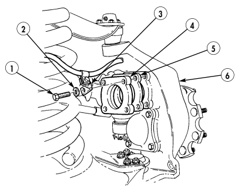

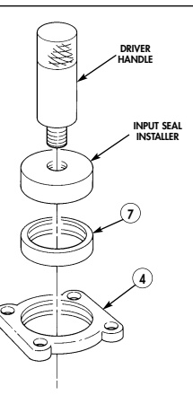

FOLLOW-ON TASK:  Install halfshaft (para. 6-7).

# 6-11. Geared Hub Spindle Seal Replacement

This task covers:
INITIAL SETUP:
Tools General mechanic's tool kit:
automotive (Appendix B, Item 1)
Maintenance and repair shop equipment:
automotive (Appendix B, Item 2)
Special Tools Spindle seal installer (Appendix B, Item 109) Driver handle (Appendix B, Item 60) Wrench (Appendix B, Item 108)
Materials/Parts Lockwasher (Appendix G, Item 170) Seal (Appendix G, Item 290) Grease (Appendix C, Item 34) Sealing compound, anaerobic 
(Appendix C, Item 58)
Lubricating oil (Appendix C, Item 42) Sealing compound (Appendix C, Item 62) Sealing compound (Appendix C, Item 64)
a. Removal b. Installation

| Manual References    |
|----------------------|
| TM 9\-2320\-387\-10  |
| TM 9\-2320\-387\-24P |

Wheel removed (para. 8-3).

General Safety Instructions Ensure locktab on lockwasher is bent completely into slot on retaining nut.

Maintenance Level Unit a. Removal

Have drainage container ready to catch oil.

1. Remove drainplug (2) from geared hub (1) and drain geared hub (1). Install drainplug (2) in geared hub (1) and tighten to 8–13 lb-ft (11–18 N•m).

Do not use sharp objects to aid in removing steering arm cover.

It may be necessary to lightly tap steering arm cover with mallet to loosen from geared hub.

2. Remove four capscrews (5), washers (4), and steering arm cover (3) from geared hub (1).

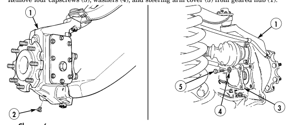

# 6-11. Geared Hub Spindle Seal Replacement (Cont'D)

For configuration 2, two locktabs on lockwasher must be bent away from retaining nut for removal.

3. Bend locktab on lockwasher (13) away from retaining nut (14).

If four-slotted retaining nut TN-07 is present, it is recommended to replace it with eight-slotted retaining nut 12342680.

4. Using retaining nut wrench, remove retaining nut (14), lockwasher (13), and keyed washer (12)
from spindle (7). Discard lockwasher (13)

For configuration 3 perform step 4.1.

4.1. Remove three screws (15) from retaining nut (14).

5. Remove spindle (7), outer spacer (6), bearing (11), and inner spacer (10) from geared hub (1). 6. Remove spindle seal (15) from geared hub (1). Discard spindle seal (15). 7. Inspect spindle (7) for rough or corroded sealing surface (8). Replace geared hub (1) (para. 6-9) if spindle (7) is damaged.

8. Inspect bearings (9) and (11) for damage. Replace geared hub (1) (para. 6-9) if bearing (9) or (11) is damaged.

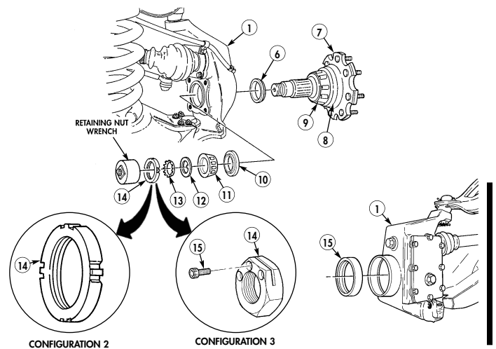

# 6-11. Geared Hub Spindle Seal Replacement (Cont'D)

b. Installation 1. Using driver handle and spindle seal installer, install spindle seal (1) in geared hub (2). 2. Coat spindle seal (1) with lubricating oil.

Ensure that large, flat surface of outer spacer faces drive gear.

3. Install outer spacer (3) and spindle (4) in geared hub (2). 4. Apply grease to face of retaining nut (9).

- If four-slotted retaining nut is present, it is recommended to replace it with eight-slotted retaining nut 12342680.

- Ensure that large, flat surface of inner spacer faces drive gear.

5. Install inner spacer (5), bearing (6), keyed washer (7), lockwasher (8), and retaining nut (9) on spindle (4).

For configuration 1 and 2 use a retaining wrench to perform step 6.

6. Tighten retaining nut (9) to 35–45 lb ft (47–61 N•m). 7. Rotate spindle (4) five full rotations clockwise and five full rotations counterclockwise to properly seat bearings.

8. Loosen retaining nut (9) until it is finger-tight, then retighten nut to 23–27 lb-ft (31–37 N•m).

NOTE
Perform steps 8.1, 8.2 and 8.3 for configuration 3.

8.1. Apply sealing compound to three screws (12). 8.2. Install three screws (12) on retaining nut (9).

When performing step 8.3 tighten center capscrew first.

8.3. Tighten three screws (12) to 65 lb-in. (7.3 N•m). 8.4. Repeat step 8.3 once.

Ensure locktab on lockwasher is bent completely into slot on retaining nut. Eight-slotted retaining nut provides additional security by enabling two locktabs on lockwasher to be bent into slots on retaining nut. Failure to do this may cause injury to personnel or damage to equipment.

- For configuration 2, two locktabs on lockwasher must be bent into slots on retaining nut.

- It may be necessary to slightly loosen or tighten retaining nut to gain proper alignment with locktabs.

- Perform step 9 for configurations 1 and 2.

9. Determine which locktab(s) (10) on lockwasher (8) aligns with slot(s) (11) in retaining nut (9). Bend locktab(s) (10) into slot(s) (11) on retaining nut (9).

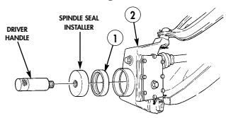

# 6-11. Geared Hub Spindle Seal Replacement (Cont'D)

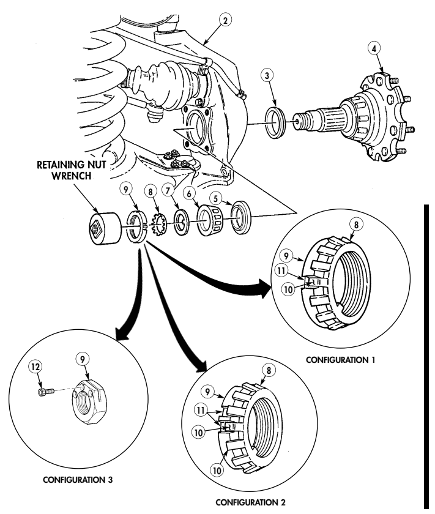

# 6-12. Geared Hub Spindle Bearing Adjustment

This task covers:
Adjustment

## Initial Setup:

Tools General mechanic's tool kit:
automotive (Appendix B, Item 1) Maintenance and repair shop equipment: automotive (Appendix B, Item 2)
Special Tools Wrench (Appendix B, Item 108)
Materials/Parts Lockwasher (Appendix G, Item 170) Sealing compound, anaerobic 
(Appendix C, Item 58)
Sealing compound (Appendix C, Item 62) Grease (Appendix C, Item 34)
Adjustment

## Manual References

TM 9-2320-387-10 TM 9-2320-387-24P
Equipment Condition Wheel removed (para. 8-3).

Maintenance Level Unit General Safety Instructions Ensure locktab on lockwasher is bent completely into slot on retaining nut.

- Have drainage container ready to catch oil. - Geared hub spindle bearing adjustment is not needed for vehicles S/N 300000 and above.

1. Remove drainplug (2) from geared hub (1) and drain geared hub (1). Install drainplug (2) in geared hub (1) and tighten to 8–13 lb-ft (11–18 N•m).

2. Remove four capscrews (5), washers (4), and steering arm cover (3) from geared hub (1).

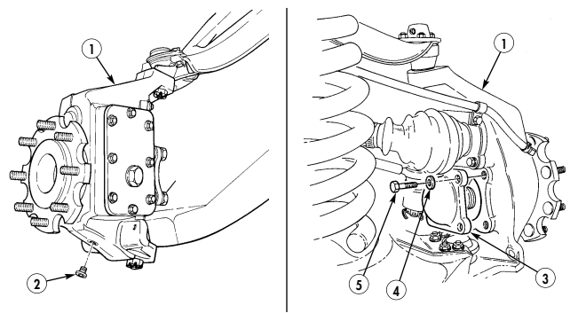

# 6-12. Geared Hub Spindle Bearing Adjustment

This task covers:
Adjustment

## Initial Setup:

Tools General mechanic's tool kit:
automotive (Appendix B, Item 1) Maintenance and repair shop equipment: automotive (Appendix B, Item 2)
Special Tools Wrench (Appendix B, Item 108)
Materials/Parts Lockwasher (Appendix G, Item 170) Sealing compound, anaerobic 
(Appendix C, Item 58)
Sealing compound (Appendix C, Item 62) Grease (Appendix C, Item 34)
Adjustment

## Manual References

TM 9-2320-387-10 TM 9-2320-387-24P
Equipment Condition Wheel removed (para. 8-3).

Maintenance Level Unit General Safety Instructions Ensure locktab on lockwasher is bent completely into slot on retaining nut.

- Have drainage container ready to catch oil. - Geared hub spindle bearing adjustment is not needed for configuration 3 retaining nut.

1. Remove drainplug (2) from geared hub (1) and drain geared hub (1). Install drainplug (2) in geared hub (1) and tighten to 8–13 lb-ft (11–18 N•m).

2. Remove four capscrews (5), washers (4), and steering arm cover (3) from geared hub (1).

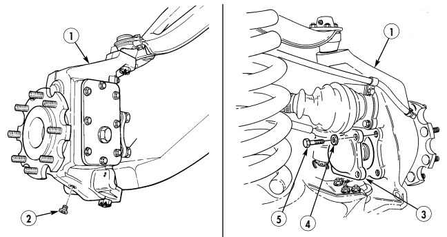

# 6-12. Geared Hub Spindle Bearing Adjustment (Cont'D)

For configuration 2, two locktabs on lockwasher must be bent away from retaining nut for removal.

3. Bend locktab(s) (5) on lockwasher (2) away from retaining nut (3). 4. Using retaining nut wrench, remove retaining nut (3) and lockwasher (2) from spindle (1). Discard lockwasher (2).

If four-slotted retaining nut TN-07 is present, it is recommended to replace it with eight-slotted retaining nut 12342680.

5. Apply grease to face of retaining nut (3) and install lockwasher (2) and retaining nut (3) on spindle (1).

6. Using retaining nut wrench, tighten retaining nut (3) to 35-45 lb-ft (47-61 N•m). 7. Rotate spindle (1) five full rotations clockwise and five full rotations counterclockwise to properly seat bearings.

8. Loosen retaining nut (3) until it is finger-tight, then retighten nut to 23-27 lb-ft (31-37 N•m).

Ensure locktab on lockwasher is bent completely into slot on retaining nut. Eight-slotted retaining nut provides additional security by enabling two locktabs on lockwasher to be bent into slots on retaining nut. Failure to do this may cause injury to personnel or damage to equipment.

- For configuration 2, two locktabs on lockwasher must be bent into slots on retaining nut.

- It may be necessary to slightly loosen or tighten retaining nut to gain proper alignment with locktabs.

9. Determine which locktab(s) (5) on lockwasher (2) aligns with slot(s) (4) in retaining nut (3). Bend locktab(s) (5) into slot(s) (4) on retaining nut (3).

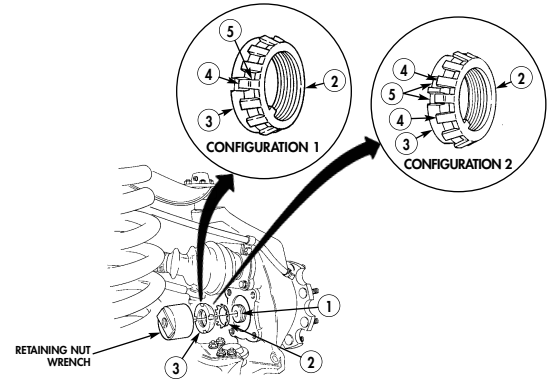

# 6-12. Geared Hub Spindle Bearing Adjustment (Cont'D)

When installing steering arm cover, ensure seal in cover is aligned on spindle extension. Damage to seal will result if not aligned.

NOTE
Immediately install steering arm cover after application of sealant.

10. Clean sealing surfaces on geared hub (6) and steering arm cover (9). Apply anaerobic sealant to steering arm cover (9) and install steering arm cover (9) on geared hub (6).

11. Apply sealing compound to threads of four capscrews (11) and install steering arm cover (9) on geared hub (6) with four washers (10) and capscrews (11). Tighten capscrews (11) to 65 lb-ft (88 N•m).

12. Remove fill plug (7) and washer (8) from geared hub (6). 13. Fill geared hub (6) to proper oil level (para. 2-12). 14. Install washer (8) and fill plug (7) on geared hub (6). Tighten fill plug (7) to 8-13 lb-ft (11-18 N•m).

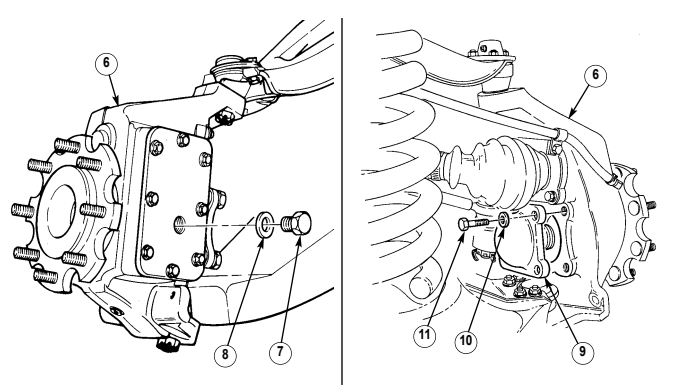

FOLLOW-ON TASK: Install wheel (para. 8-3).

# 6-13. Wheel Stud Replacement

This task covers:
INITIAL SETUP:
Tools General mechanic's tool kit:
automotive (Appendix B, Item 1)
Materials/Parts Hex-nut (Appendix G, Item 69) Three flat washers (Appendix G, Item 33.1)
Manual References TM 9-2320-387-24P

a. Removal b. Installation

Equipment Condition Wheel removed (para. 8-3).

General Safety Instructions Always wear eye protection when replacing wheel studs.

Maintenance Level Unit

Always wear eye protection when replacing wheel studs. Severe eye injury may result if metal chips contact eyes.

a. Removal 1. Rotate spindle (3) to allow clearance for removal of stud (4) from spindle (3). 2. Drive stud (4) from spindle (3). Discard stud (4).

b. Installation 1. Align splines on stud (4) with splines in spindle (3) and install stud (4) in spindle (3). 2. Install three washers (2) and hex-nut (1) on stud (4). 3. Tighten hex-nut (1) until head of stud (4) seats against spindle (3). 4. Remove hex-nut (1) and washers (2). Discard hex-nut (1) and washers (2).

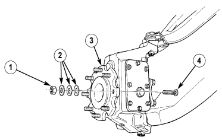

FOLLOW-ON TASK: Install wheel (para. 8-3).

# 6-14. Differential Vent Line Replacement

This task covers:
a. Removal b. Installation INITIAL SETUP:
Tools Maintenance Level Unit General mechanic's tool kit:
automotive (Appendix B, Item 1)
Manual References TM 9-2320-387-24P

The replacement procedure for differential vent lines is basically the same. This procedure covers the rear differential vent line.

a. Removal 1. Remove vent line (7) from differential fitting (6) and union fitting (1). 2. Remove two line clips (2) from vent line (3) and brake line (5). 3. Remove vent line (3) from union fittings (1) and (4).

b. Installation 1. Install vent line (3) on union fittings (1) and (4). 2. Install two line clips (2) on vent line (3) and brake line (5).

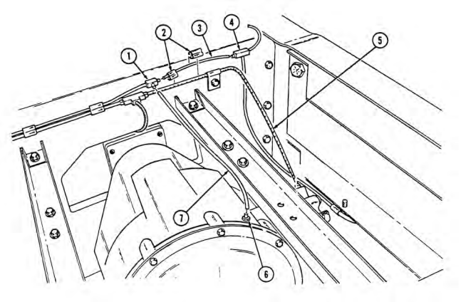 3. Install vent line (7) on differential fitting (6) and union fitting (1).

# 6-14.1. Front Differential Vent Line Replacement (Serial Numbers 300000 And Above)

This task covers:
a. Removal b. Installation

| Manual References    |
|----------------------|
| TM 9\-2320\-387\-10  |
| TM 9\-2320\-387\-24P |
| Maintenance Level    |

| Tools                           |
|---------------------------------|
| General mechanic's tool kit:    |
| automotive (Appendix B, Item 1) |
| Materials/Parts                 |

## A. Removal

1. Disconnect vent line (2) from tee fittings (1) and (5). 2. Pull vent line (2) through clamps (3) and (4). 3. Disconnect vent line (7) from tee fitting (5) and vent line adapter (8). 4. Remove vent line adapter (8) from differential (9). 5. Disconnect vent line (6) from tube adapter (14) and tee fitting (5). 6. Remove nut (10), lockwasher (11), clamp (12), and vent line (6) from crossmember (13).

Discard lockwasher (11).

## B. Installation

1. Install clamp (12) and vent line (6) on crossmember (13) with lockwasher (11) and nut (10). 2. Connect vent line (6) to tube adapter (14) and tee fitting (5). 3. Install vent line adapter (8) on differential (9). 4. Connect vent line (7) to vent line adapter (8) and tee fitting (5). 5. Pull vent line (2) through clamps (4) and (3). 6. Connect vent line (2) to tee fittings (5) and (1).

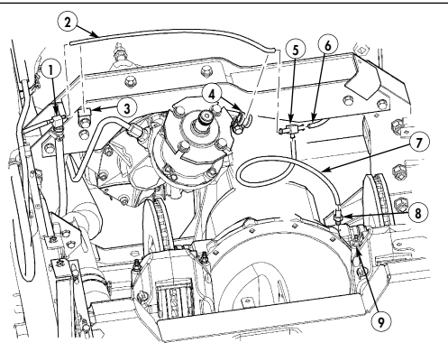

# 6-14.1.  Front Differential Vent Line Replacement (Serial Numbers 300000 And Above) (Cont'D)

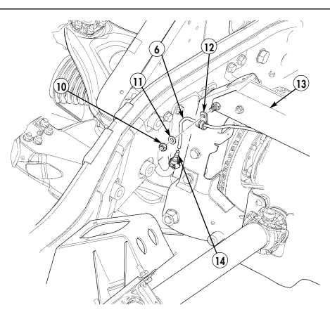

# 6-14.2. Rear Differential Vent Line Replacement (Serial Numbers 300000 And Above)

This task covers:

| General mechanic's tool kit:            |
|-----------------------------------------|
| automotive (Appendix B, Item 1)         |
| Materials/Parts                         |
| Silicone compound (Appendix C, Item 74) |

INITIAL SETUP:
a. Removal b. Installation

## A. Removal

| TM 9\-2320\-387\-24P   |
|------------------------|
| Maintenance Level      |
| Unit                   |

1. Disconnect vent line (5) from tee fittings (4) and (6). 2. Disconnect vent line (2) from vent line adapter (1) and tee fitting (4). 3. Remove vent line adapter (1) from differential (3). b. Installation 1. Install vent line adapter (1) on differential (3). 2. Connect vent line (2) to vent line adapter (1) and tee fitting (4). 3. Connect vent line (5) to tee fittings (6) and (4).

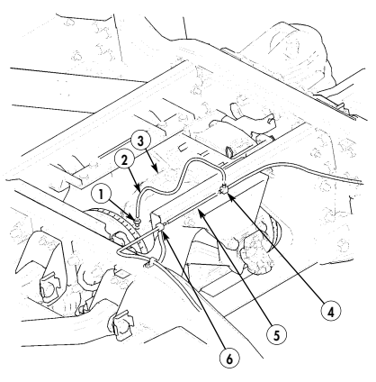

FOLLOW-ON TASK: Install parking brake pads (para. 7-22).

6-38.4/(6-39 blank) Change 6

# 6-15. Rear Geared Hub Vent Line Replacement

This task covers:
a. Removal b. Installation INITIAL SETUP:
Tools Maintenance Level Unit General mechanic's tool kit:
automotive (Appendix B, Item 1)
Manual References TM 9-2320-387-24P

The replacement procedure for each rear geared hub vent line is basically the same. This procedure covers the right rear geared hub vent line.

## A. Removal

1. Disconnect vent line (4) from geared hub fitting (3). 2. Remove capscrew (7), clamp (6), and vent line (4) from bracket (5). 3. Remove capscrew (8), clamp (1), and vent line (4) from control arm (2). 4. Remove capscrew (10), clamp (9), and vent line (4) from bracket (11). 5. Remove capscrew (15), clamp (14), and vent line (4) from frame (13). 6. Remove vent line (4) from tee fitting (12).

## B. Installation

1. Install vent line (4) on tee fitting (12) and geared hub fitting (3). 2. Install vent line (4) on frame (13) with clamp (14) and capscrew (15). 3. Install vent line (4) on bracket (11) with clamp (9) and capscrew (10). 4. Install vent line (4) on control arm (2) with clamp (1) and capscrew (8).

Position clamp at a 45° angle toward the wheel before securing with capscrew.

5. Install vent line (4) on bracket (5) with clamp (6) and capscrew (7).

6-15. REAR GEARED HUB VENT LINE REPLACEMENT (Cont'd)

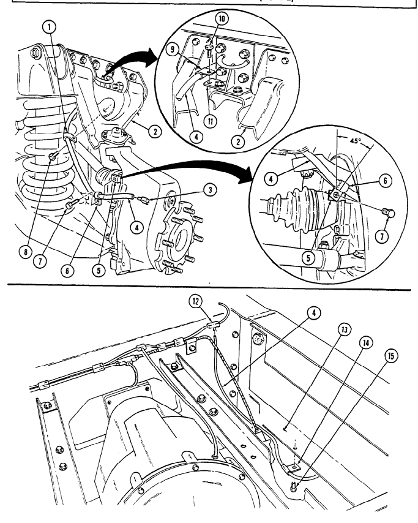

# I **6-16. Front Geared Hub Vent Line Replacement 1**

This task covers: 
INITIAL SETUP: 
Tools General mechanic's tool kit: 
automotive (Appendix B, Item 11 nlanual References TM 9-2320-387-24P 
1 a. Removal 1 

a. Removal b. Installation 

Equipment Condition Wheel removed (para. 8-3). 

Maintenance Level 

| Unit   |
|--------|

The replacement procedure for each front geared hub vent line is basically the same. This procedure covers the right front geared hub vent line. Mark clamp position before loosening to ensure clamps are properly positioned during installation. 

1. Remove four screws (7) and clamps (3) from frame (131, front control arm (21, and geared hub (8). 

2. Loosen two clamps (6) and disconnect front vent line (4) from elbow (5) and tee fitting (1). 

3. Remove nut (121, washer (ll), screw (lo), clamp (91, and front vent line (4) from control arm (2). 

#### B. Installation _

1. Install clamp (9) and front vent line (4) on control arm **(2)** with screw (lo), washer (111, and nut (12). 

2. Connect vent line (4) to elbow (5) and tee fitting (1) with two clamps (6). 

3. Install vent line (4) and four clamps (3) on geared hub W, control arm (21, and frame (13) with four screws (7). 

6-16.  FRONT GEARED HUB VENT LINE REPLACEMENT (Cont'd)

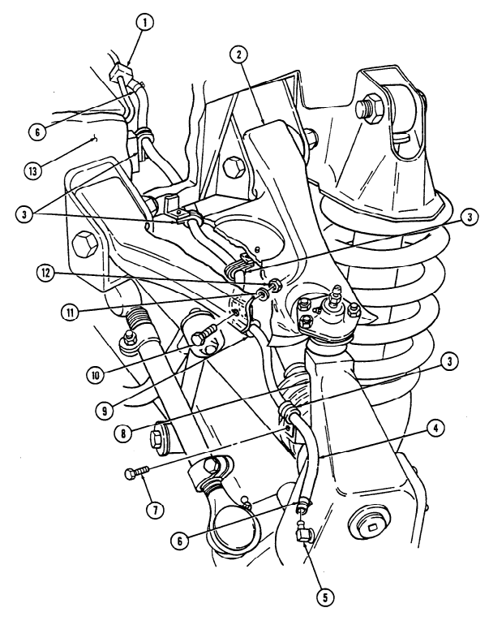

FOLLOW-ON TASK:  Install wheel (para. 8-3).

## 6- 17. Steering Stop Maintenance

This task covers: 
a. Removal b. Installation INITIAL SETUP: 
Tools General mechanic's tooi kit: 
automotive (Appendix B, Item 1) 
Maintenance and repair shop equipment: 
automotive (Appendix B, Item 2) 

| Gasket (Appendix G, Item 51)              |                   |
|-------------------------------------------|-------------------|
| Adhesive (Appendix C, Item 6)             |                   |
| Drycleaning solvent (Appendix C, Item 26) |                   |
| Manual References                         | Maintenance Level |

(1 c. Adjustment Personnel Required One mechanic One assistant 1. Loosen jamnut (2) and remove steering stop capscrew (3) and jamnut (2) from geared hub (1). 

2. Remove jamnut (2) from capscrew (3). 

b. Installation 1. Apply sealing compound to capscrew (3). 

2. Install jamnut (2) on capscrew (3). 3. Install capscrew (3) and jamnut (2) on geared hub (1). Tighten capscrew (3) finger-tight. 

c. Adjustment 

Prior to adjustment, ensure length of each tie rod is the same. If tie rod lengths are not the same * 1/E! in. (3 mm), check toe-in alignment (para. 8-9). 

Draw a reference chalk line (6) 30 R. long (9 m). Mark this line A. Position vehicle so that center of left rear and left front tires are positioned directly on reference line A (6). Using a protractor, draw a second reference line B (5) at 34". Mark this line B. 

Again, using a protractor, draw a third reference line C (4) at 36". Mark this line C. 

Roll vehicle forward until center of IeR front tire is over intersection of lines A, B, and C. 

1. 

2. 

3. 

4. 

5. 

6. 

7. 

8. 

9. 

10. 

11. 12. 

Turn steering wheel full left. 

If the centerline of tiont and rear of left front tire (7) is over area between lines B and C, no adjustment is necessary. If centerline of front and rear of left front is not over area between lines B and C, loosen jamnut (2) and turn capscrew (3) all the way in. 

Turn steering wheel until centerline of front and rear of tire (7) is over area between lines B and C. 

Loosen capscrew (3) until head makes contact with wheel stop (9) on lower control arm (8). 

Secure capscrew (3) with jamnut (2). 

Repeat adjustment procedure for opposite side. 

6-17. STEERING STOP MAINTENANCE (Cont'd)

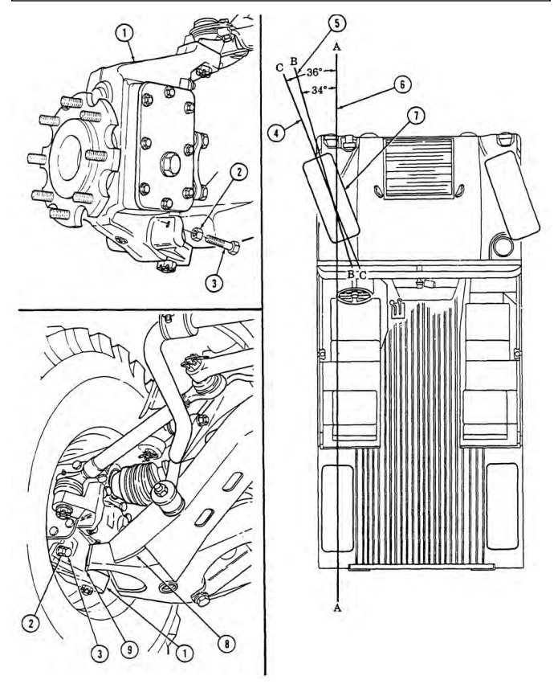

# 6-18. Differential Cover Maintenance (Serial Numbers 299999 And Below)

This task covers:
a. Removal c. Installation b. Cleaning and Inspection

## Initial Setup:

Tools General mechanic's tool kit:
automotive (Appendix B, Item 1)

## Materials/Parts

RTV silicone compound (Appendix C, Item 74) Drycleaning solvent (Appendix C, Item 26)
Manual References TM 9-2320-387-24P

## Equipment Condition

Rear cooler hoses removed (if applicable) (para. 3-84 or para. 3-85).

General Safety Instructions Drycleaning solvent is flammable and will not be used near an open flame.

Maintenance Level Unit

- Have drainage container ready to catch fluid. - All original differential covers without cooler assemblies will be replaced with new differential covers with cooler assemblies.

- This procedure covers differential covers with cooler assemblies. - Differential covers with cooler assemblies are serviced as an assembly only.

- Removal of old differential covers without cooler assemblies is basically the same.

## A. Removal

1. Remove drainplug (4) from differential assembly (5) and drain differential assembly (5).

1.1 Remove fill plug (2) if necessary.

2. Remove twelve capscrews (3) and cooler cover assembly (1) from differential assembly (5).

## B. Cleaning And Inspection Warning

Drycleaning solvent is flammable and will not be used near an open flame. A fire extinguisher will be kept nearby when the solvent is used. Use only in well-ventilated places. Failure to do this may result in injury to personnel or damage to equipment.

1. Using drycleaning solvent, clean cooler cover assembly (1), twelve capscrews (3), and differential assembly (5).

2. Inspect differential cooler cover assembly (1) and internal cooler for cracks, wear, or breaks. Replace cooler cover as an assembly (1) if cracked, worn, or broken.

# 6-18. Differential Cover Maintenance (Serial Numbers 299999 And Below) (Cont'D)

c. Installation 1. Apply RTV silicone compound to face of rear differential (6).

. 2. Install cooler cover assembly (1) on rear differential by rotating cooler cover assembly (1) upward from below and secure with twelve capscrews (3).

3. Install drainplug (4) on rear differential (5) and tighten to 13-18 lb-ft (18-24 N•m).

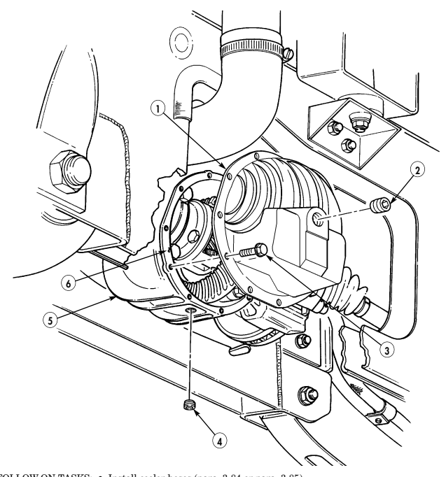

FOLLOW-ON TASKS: - Install cooler hoses (para. 3-84 or para. 3-85).
- Fill differential to proper level (para. 2-12).

# 6-18.1. Air Lifting Bracket Replacement

This task covers:
a. Removal b. Installation INITIAL SETUP:
Tools General mechanic's tool kit:
automotive (Appendix B, Item 1)
Manual References TM 9-2320-387-24P
Materials/Parts Four lockwashers (Appendix G, Item 101.10)
a. Removal Remove four capscrews (4), lockwashers (3), and lifting bracket (2) from geared hub (1). Discard lockwashers (3).

b. Installation Install lifting bracket (2) to geared hub (1) with four lockwashers (3) and capscrews (4). Tighten capscrews (4) to 43 lb-ft (58 N•m).

# 6-18.1. Air Lifting Bracket Replacement (Cont'D)

 Section Iii. Suspension Maintenance 6-19. Suspension Maintenance Task Summary

| INITIAL SETUP:                                                                                               |                                                                                                            |
|--------------------------------------------------------------------------------------------------------------|------------------------------------------------------------------------------------------------------------|
| Tools                                                                                                        | Equipment Condition                                                                                        |
| General mechanic's tool kit:                                                                                 | - Transmission fluid at proper level                                                                       |
| automotive (Appendix B, Item 1)                                                                              | (TM 9\-2320\-387\-10).                                                                                     |
| Manual References                                                                                            | - Adjust transmission shift linkage (para. 5\-9).                                                          |
| Maintenance Level                                                                                            | TM 9\-2320\-387\-10                                                                                        |
| Unit                                                                                                         |                                                                                                            |
| Road Test                                                                                                    |                                                                                                            |
| D                                                                                                            |                                                                                                            |
| 1.                                                                                                           | Position shift lever in  (overdrive), and accelerate vehicle. A 1\-2, 2\-3, and 3\-4 shift should occur at |
| all throttle openings. Allow vehicle to coast down to about 0 mph; 4\-3, 3\-2, and 2\-1 shifts should occur. |                                                                                                            |
| 2.                                                                                                           | Position shift lever in D (drive) and accelerate vehicle. A 1\-2 and 2\-3 shift should occur at all        |
| throttle openings. Allow vehicle to coast down to about 0 mph; 3\-2 and 2\-1 shifts should occur.            |                                                                                                            |
| 3.                                                                                                           | Position shift lever in 2 (low two), and accelerate vehicle. A 1\-2 shift should occur at all throttle     |
| openings. No 2\-3 shift can be obtained in this range. A 1\-2 shift in 2 is somewhat firmer than in D.       |                                                                                                            |
| This is normal.                                                                                              |                                                                                                            |

# 6-20. Stabilizer Bar Replacement (Serial Numbers 299999 And Below)

This task covers:
INITIAL SETUP:

## Tools

General mechanic's tool kit:
automotive (Appendix B, Item 1)
Maintenance and repair shop equipment:
automotive (Appendix B, Item 2)
Materials/Parts Two locknuts (Appendix G, Item 83)
a. Removal 1. Remove two locknuts (1), nuts (5), and six washers (2) from two bar links (3) and stabilizer bar (11).

Discard locknuts (1). Remove two bar links (3) and pins (4) from stabilizer bar (11).

2. Remove four nuts (9), washers (10), two clamps (8), and stabilizer bar (11) from two frame brackets (6). 3. Remove two stabilizer bar bushings (7) from stabilizer bar (11).

## B. Installation

1. Install two stabilizer bar bushings (7) on stabilizer bar (11). 2. Install stabilizer bar (11) on two frame brackets (6) with two clamps (8), four washers (10), and nuts (9).

Tighten nuts (9) to 39–47 lb-ft (53–63 N•m).

3. Install two pins (4) in bar links (3). 4. Install stabilizer bar (11) on two bar links (3) with six washers (2), two nuts (5), and locknuts (1).

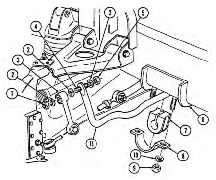

Tighten locknuts (1) to 75 lb-ft (102 N•m).

a. Removal b. Installation

| TM 9\-2320\-387\-10   |
|-----------------------|
| TM 9\-2320\-387\-24P  |

# 6-20.1. Stabilizer Bar Replacement (Serial Numbers 300000 And Above)

This task covers:

| INITIAL SETUP:   |
|------------------|

Tools General mechanic's tool kit:
automotive (Appendix B, Item 1)
Maintenance and repair shop equipment:
automotive (Appendix B, Item 2)

| O\-ring (Appendix G, Item 219)   |
|----------------------------------|

a. Removal b. Installation Manual References TM 9-2320-387-24P
a. Removal 1. Remove four capscrews (5), washers (4), two clamps (3), and stabilizer bar (6) from two frame brackets (1).

2. Remove two stabilizer bar bushings (2) from stabilizer bar (6). b. Installation 1. Install two stabilizer bar bushings (2) on stabilizer bar (6). 2. Install stabilizer bar (6) on two frame brackets (1) with two clamps (3), four washers (4), and capscrews (5). Tighten capscrews (5) to 39–47 lb-ft (53–63 N•m).

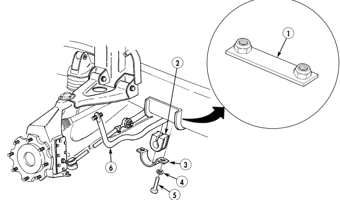

FOLLOW-ON TASK: Install stabilizer bar link (para. 6-21).

# 6-21. Stabilizer Bar Link Replacement

This task covers:
INITIAL SETUP:

## Tools

General mechanic's tool kit:
automotive (Appendix B, Item 1)
Maintenance and repair shop equipment:
automotive (Appendix B, Item 2)

## Materials/Parts

Locknut (Appendix G, Item 83) Sealing compound (Appendix C, Item 63)
a. Removal 1. Remove locknut (1) and two washers (2) from bar link (3) and stabilizer bar (4). Discard locknut (1). 2. Remove capscrew (5), two washers (6), and bar link (3) from lower control arm (7).

b. Installation 1. Apply sealing compound to threads of capscrew (5). Install bar link (3) on lower control arm (7) with two washers (6) and capscrew (5). Tighten capscrew (5) to 70 lb-ft (95 N•m).

2. Install bar link (3) on stabilizer bar (4) with two washers (2) and locknut (1). Tighten locknut (1) to

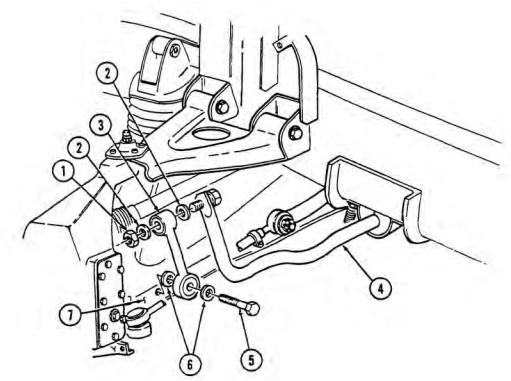

75 lb-ft (102 N•m).

a. Removal b. Installation

| TM 9\-2320\-387\-24P   |
|------------------------|

# 6-22. Radius Rod Replacement

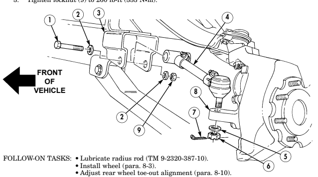

This task covers:

| INITIAL SETUP:   |
|------------------|

Tools General mechanic's tool kit:
automotive (Appendix B, Item 1)
Maintenance and repair shop equipment:
automotive (Appendix B, Item 2)
Cotter pin (Appendix G, Item 22) Locknut (Appendix G, Item 88)
a. Removal b. Installation

| Equipment Condition   |
|-----------------------|
| (para. 5\-17.1).      |

| Manual References   |
|---------------------|
| TM 9\-2320\-387\-10 |

a. Removal 1. Remove cotter pin (7), slotted nut (6), and washer (5) from radius rod (4) and geared hub (8).

Discard cotter pin (7).

2. Remove locknut (9), washer (2), capscrew (1), washer (2), and radius rod (4) from bracket (3) and geared hub (8). Discard locknut (9).

b. Installation 1. Install radius rod (4) on bracket (3) with washer (2), capscrew (1), washer (2), and locknut (9).

Do not loosen slotted nut to install cotter pin. Doing this may result in damage to equipment.

2. Install radius rod (4) on geared hub (8) with washer (5) and slotted nut (6). Tighten slotted nut (6)
to 70 lb-ft (95 N•m). Install cotter pin (7).

3. Tighten locknut (9) to 260 lb-ft (353 N•m).

# 6-23. Upper Ball Joint Maintenance

This task covers:
a. Inspection c. Installation b. Removal INITIAL SETUP:
Tools General mechanic's tool kit:
automotive (Appendix B, Item 1)
Maintenance and repair shop equipment:
automotive (Appendix B, Item 2)
Special Tools Socket adapter (Appendix B, Item 135) Crowfoot, 15/16 in. (Appendix B, Item 140)
Materials/Parts Cotter pin (Appendix G, Item 22) Four locknuts (Appendix G, Item 113)
a. Inspection 1. Chock rear wheels. 2. Raise and support front wheels 2 in. (5.1 cm) off ground.

If boot is ripped or torn, upper ball joint is unserviceable.

3. Visually inspect ball joint boot (7), and replace upper ball joint (2) if boot is ripped or torn. 4. Grasp top of tire and attempt to move tire in and out. Observe upper control arm (1) and gear hub (3) where upper ball joint (2) is mounted. If lateral movement is observed, upper ball joint (2) may be worn.

5. Replace upper ball joint (2) if movement is 1/8 in. (3 mm) or more (refer to para. 6-23). 6. Deleted. 7. Deleted. 8. Deleted. 9. Deleted.

10. Deleted.

Personnel Required One mechanic One assistant Manual References TM 9-2320-387-10 TM 9-2320-387-24P
Maintenance Level Unit

# 6-23.  Upper Ball Joint Maintenance (Cont'D)

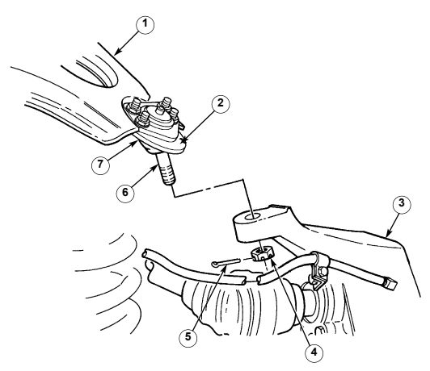

# 6-23. Upper Ball Joint Maintenance (Cont'D)

b. Removal 1. Remove wheel (para. 8-3). 2. Remove cotter pin (7) and slotted nut (6) from upper ball joint (4) and geared hub (5). Discard cotter pin (7).

3. Remove four locknuts (3), washers (2), capscrews (8), washers (2), upper ball joint (4), and upper control arm (1) from geared hub (5). Discard locknuts (3).

c. Installation 1. Install upper ball joint (4) and upper control arm (1) on geared hub (5) with four washers (2),
capscrews (8), washers (2), and locknuts (3). Tighten locknuts (3) to 37 lb-ft (41 N•m).

Do not loosen slotted nut to install cotter pin. Doing this may result in damage to equipment.

2. Install slotted nut (6) on upper ball joint (4). Using crowfoot and adapter, tighten slotted nut (6) to 73 lb-ft (99 N•m). Install cotter pin (7).

# 6-23.  Upper Ball Joint Maintenance (Cont'D)

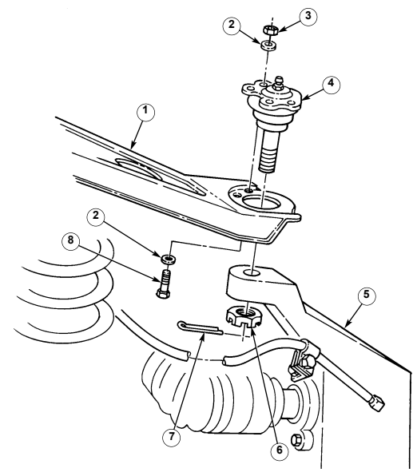

FOLLOW-ON TASKS: - Lubricate upper ball joint (TM 9-2320-387-10).

-  Install wheel (para. 8-3).

# 6-24. Lower Ball Joint Maintenance

This task covers:
a. Inspection c. Installation b. Removal

## Initial Setup:

Tools General mechanic's tool kit:
automotive (Appendix B, Item 1)
Maintenance and repair shop equipment:
automotive (Appendix B, Item 2)
Puller, mechanical (Appendix B, Item 157)
Special Tools Socket adapter (Appendix B, Item 135) Crowfoot, 15/16 in. (Appendix B, Item 140)

## Materials/Parts

Cotter pin (Appendix G, Item 22) Four locknuts (Appendix G, Item 128)

## A. Inspection

1. Chock rear wheels.

Personnel Required One mechanic One assistant Manual References TM 9-2320-387-10 TM 9-2320-387-24P
Maintenance Level Unit 2. Raise and support front wheels 2 in. (5.1 cm) off ground. 3. Mark a line across top screw (11) of steering arm cover (10). Mark should be parallel with lower control arm (9).

b. Removal 1. Remove wheel (para 8-3).

1.1. Raise and support lower control arm (9).

2. Remove cotter pin (7) and slotted nut (6) from ball joint (3) and geared hub (5). Discard cotter pin (7).

NOTE
Note direction of inner and outer capscrews for installation.

3. Remove four locknuts (2), washers (1), capscrews (8), and washers (1) from ball joint (3) and control arm (9). Discard locknuts (2).

4. Using puller, remove ball joint (3) with boot retainer (4) from geared hub (5). c. Installation

Ensure outer capscrews are installed from top down and inner capscrews are installed from bottom up.

1. Install ball joint (3) with boot retainer (4) on control arm (9), ensuring ball joint (3) is placed below control arm (9), with four washers (1), capscrews (8), washers (1), and locknuts (2). Tighten locknuts (2) to 60 lb-ft (81 N•m).

4. Set a 6-in. (15-cm) ruler upright between lower control arm (9) and marked screw (11). 5. Install prybar between lower control arm (9) and geared hub (5). Push down on prybar and try to move geared hub (5).

6. Measure any movement in geared hub (5). Replace lower ball joint (3) if any movement is more than 1/8 in. (3 mm) or more.

# 6-24. Lower Ball Joint Maintenance (Cont'D)

Do not loosen slotted nut to install cotter pin. Doing this may result in damage to equipment.

2. Install ball joint (3) on geared hub (5) with slotted nut (6). Tighten slotted nut (6) to 73 lb-ft (99 N•m).

Install cotter pin (7) in slotted nut (6).

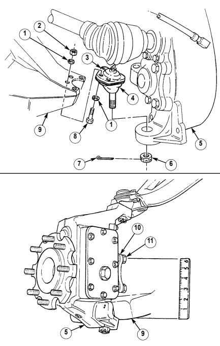

FOLLOW-ON TASKS: - Lubricate lower ball joint (TM 9-2320-387-10).

- Install wheel (para. 8-3).

# 6-25. Upper Control Arm Replacement

This task covers:
INITIAL SETUP:
Tools General mechanic's tool kit:
automotive (Appendix B, Item 1)
Maintenance and repair shop equipment:
automotive (Appendix B, Item 2)
Puller, mechanical (Appendix B, Item 157)

## Materials/Parts

Four locknuts (Appendix G, Item 128) Two cotter pins (Appendix G, Item 22) Lockwasher (Appendix G, Item 169) Two locknuts (Appendix G, Item 88) Sealing compound (Appendix C, Item 63) Locknut (Appendix G, Item 82)

## A. Removal B. Installation

Manual References TM 9-2320-387-10 TM 9-2320-387-24P
Equipment Condition - Wheel removed (para. 8-3). - Hood raised and secured (TM 9-2320-387-10)
(front upper control arm only).

Maintenance Level Unit

Replacement procedures for front and rear upper control arms are basically the same. This procedure covers the left front upper control arm.

a. Removal 1. Remove capscrew (1), washer (2), and vent line bracket (3) from geared hub (4). 2. Loosen clamp (6) and disconnect vent line (5) from fitting (7). 3. Remove capscrew (21), clamp (20), and vent line (5) from upper control arm (15). 4. Remove locknut (25), clamp (24), capscrew (23), washer (22), and vent line (5) from upper control arm (15). Discard locknut (25).

5. Remove cotter pin (31), slotted nut (32), and washer (33) from tie rod end (30). Discard cotter pin (31). 6. Using puller, disconnect tie rod end (30) from geared hub (4). 7. Remove access plug (8), washer (9), halfshaft retaining capscrew (10), and lockwasher (11) from halfshaft (29) and geared hub (4). Discard lockwasher (11).

8. Remove cotter pin (27), slotted nut (28), and disconnect upper ball joint (13) from geared hub (4).

Discard cotter pin (27).

9. Remove four locknuts (14), washers (12), capscrews (26), and washers (12) from upper ball joint (13)
and upper control arm (15). Discard locknuts (14).

10. Remove two locknuts (16), washers (17), capscrews (19), washers (17), and upper control arm (15)
from two brackets (18). Discard locknuts (16).

b. Installation

On front control arms, capscrew head is toward rear of vehicle. On rear control arms, capscrew head is toward front of vehicle.

1. Install upper control arm (15) on two brackets (18) with two washers (17), capscrews (19),
washers (17), and locknuts (16). Do not tighten locknuts (16) at this time.

2. Install upper ball joint (13) on upper control arm (15) with four washers (12), capscrews (26),
washers (12), and locknuts (14). Tighten locknuts (14) to 37 lb-ft (50 N•m). Retorque 15 minutes after inital torque.

# 6-25. Upper Control Arm Replacement (Cont'D)

3. Install upper ball joint (13) and upper control arm (15) on geared hub (4) with slotted nut (28).

CAUTION
Do not loosen slotted nut to install cotter pin. Doing this may result in damage to equipment.

4. Tighten slotted nut (28) on upper ball joint (13) to 73 lb-ft (99 N•m). Install cotter pin (27). 5. Tighten locknuts (16) to 260 lb-ft (353 N•m). 6. Apply sealing compound to halfshaft retaining capscrew (10) and install halfshaft (29) on geared hub (4) with lockwasher (11) and halfshaft retaining capscrew (10). Tighten capscrew (10) to 37 lb-ft (50 N•m).

7. Install washer (9) and access plug (8) on geared hub (4). Tighten access plug (8) to 8–13 lb-ft 
(11–18 N•m).

8. Install tie rod end (30) on geared hub (4) with washer (33) and slotted nut (32). Tighten slotted nut (32) to 63–77 lb-ft (85–104 N•m) and install cotter pin (31).

9. Connect vent line (5) to fitting (7) and tighten clamp (6).

If installing new vent line bracket on left front geared hub, bend bracket 30° (from standard 90° angle to 120°) before installation.

10. Install vent line bracket (3) on geared hub (4) with washer (2) and capscrew (1). Tighten capscrew (1)
to 30–40 lb-ft (41–54 N•m).

11. Install clamp (20) and vent line (5) on upper control arm (15) with capscrew (21). 12. Install clamp (24) and vent line (5) on upper control arm (15) with washer (22), capscrew (23), and

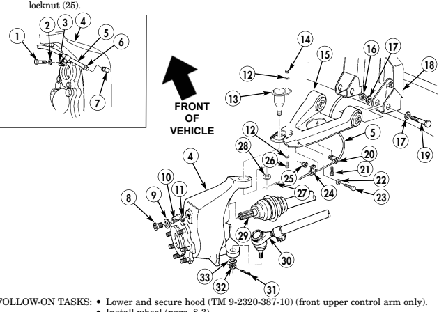

- Install wheel (para. 8-3).

# 6-26. Lower Control Arm Replacement

This task covers:
INITIAL SETUP:
Tools General mechanic's tool kit:
automotive (Appendix B, Item 1)
Maintenance and repair shop equipment:
automotive (Appendix B, Item 2)

## Materials/Parts

Four locknuts (Appendix G, Item 128) Two locknuts (Appendix G, Item 88) Sealing compound (Appendix C, Item 63)
Personnel Required One mechanic One assistant

## A. Removal B. Installation Manual References

TM 9-2320-387-24P
Equipment Condition
- Wheel removed (para. 8-3). - Shock absorber removed (para. 6-28).

General Safety Instructions Lower control arm is under extreme pressure and must be supported during removal and installation.

Maintenance Level Unit

Lower control arm is under extreme pressure and must be supported during removal and installation. Failure to support lower control arm may cause injury to personnel or damage to equipment.

Replacement procedures for front and rear lower control arms are basically the same. This procedure covers the left front lower control arm.

a. Removal

Note direction of inner and outer capscrews for installation.

1. Remove four locknuts (10), washers (9), capscrews (8), and washers (7) from lower ball joint (6),
geared hub (5), and lower control arm (11). Discard locknuts (10).

2. Remove capscrew (15), two washers (13), and bar link (14) from lower control arm (11). 3. Raise and support lower control arm (11) and pull geared hub (5) away. 4. Lower the lower control arm (11) and remove coil spring (4). 5. Remove two locknuts (3), washers (2), capscrews (1), washers (2), and lower control arm (11) from two crossmembers (12). Discard locknuts (3).

b. Installation

On lower control arms, capscrew heads are toward front of vehicle.

1. Install lower control arm (11) on two crossmembers (12) with two washers (2), capscrews (1),
washers (2), and locknuts (3).

2. Install coil spring (4) on lower control arm (11), ensuring end of coil spring (4) fits in spring pocket of lower control arm (11).

# 6-26. Lower Control Arm Replacement (Cont'D)

Lower control arm is under extreme pressure and must be supported during removal and installation. Failure to support lower control arm may cause injury to personnel or damage to equipment.

3. Raise lower control arm (11) to align with geared hub (5) and lower ball joint (6), ensuring lower ball joint (6) is placed below lower control arm (11).

Ensure outer capscrews are installed from top down and inner capscrews are installed from bottom up.

4. Install geared hub (5) and ball joint (6) on lower control arm (11) with four washers (7), capscrews
(8), washers (9), and locknuts (10). Tighten locknuts (10) to 60-65 lb-ft (81-88 N•m) and remove support. Retorque 15 minutes after initial torque.

5. Tighten two locknuts (3) to 260 lb-ft (353 N•m). Retorque 15 minutes after initial torque. 6. Install wheel (para. 8-3). 7. Apply sealing compound to threads of capscrew (15). Install bar link (14) on lower control arm (11)
with two washers (13) and capscrew (15). Tighten capscrew (15) to 70 lb-ft (95 N•m).

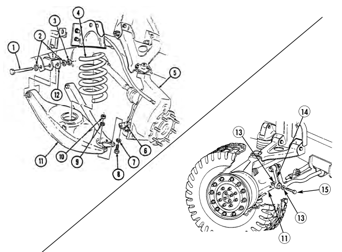

FOLLOW-ON TASKS: - Install shock absorber (para. 6-28).

- Check wheel alignment (para. 21-8).

# 6-27. Coil Spring Replacement

This task covers:
INITIAL SETUP:
Tools General mechanic's tool kit:
automotive (Appendix B, Item 1)

| Materials/Parts   |
|-------------------|

Locknut (Appendix G, Item 78) Four locknuts (Appendix G, Item 128) Sealing compound (Appendix C, Item 63)

| TM 9\-2320\-387\-10   |
|-----------------------|
| TM 9\-2320\-387\-24P  |

| Materials/Parts      | Seal, lockwasher (Appendix G, Item 298)   |
|----------------------|-------------------------------------------|
| Manual References    | TM 9\-2320\-387\-10                       |
| TM 9\-2320\-387\-24P | Maintenance Level                         |
| Unit                 |                                           |

Manual References

a. Removal b. Installation

Replacement procedures for all four coil springs are basically the same. This procedure covers the left front coil spring.

a. Removal 1. Remove capscrew (13), two washers (14), and stabilizer bar link (15) from lower control arm (12). 2. Remove wheel (para. 8-3).

Note direction of inner and outer capscrews for installation.

3. Remove four locknuts (10), washers (8), capscrews (9), and washers (8) from lower ball joint (7),
geared hub (6), and lower control arm (12). Discard locknuts (10).

## .Warning.

Lower control arm is under extreme pressure and must be supported during removal and installation. Failure to support lower control arm may cause injury to personnel or damage to equipment.

4. Place jack under lower control arm (12) and raise lower control arm (12) slightly to relieve tension on shock retaining pin (2).

For rear coil spring replacement, it may be necessary to spread frame from body by positioning prybar between hinge mount bracket and rear bumper to gain access to shock absorber retaining pin nut.

5. Remove locknut (5), retaining pin (2), washer (3), and shock absorber (11) from spring seat (4) and collapse shock absorber (11). Discard locknut (5).

NOTE
It may be necessary to loosen lower control arm capscrews to allow lower control arm to be lowered.

6. Pull geared hub (6) and ball joint (7) away from lower control arm (12), lower the control arm (12),
and remove coil spring (1) from lower control arm (12) and shock absorber (11).

# 6-27. Coil Spring Replacement (Cont'D)

b. Installation 1. Install coil spring (1) over shock absorber (11) and onto lower control arm (12), ensuring end of coil spring (1) fits in spring pocket of lower control arm (12).

2. Ensure coil spring (1) is aligned with flange of spring seat (4) and raise lower control arm (12). 3. Extend shock absorber (11) into spring seat (4) and install washer (3), retaining pin (2), and locknut (5). Tighten locknut (5) to 300 lb-ft (407 N•m).

NOTE
Ensure outer capscrews are installed from top down and inner capscrews are installed from bottom up.

4. Install lower ball joint (7) and geared hub (6) on lower control arm (12), ensuring lower ball joint (7)
is placed below lower control arm (12). Secure with four washers (8), capscrews (9), washers (8), and locknuts (10). Tighten locknuts (10) to 60 lb-ft (81 N•m).

5. Install wheel (para. 8-3). 6. Apply sealing compound to threads of capscrew (13). Install stabilizer bar link (15) to lower control

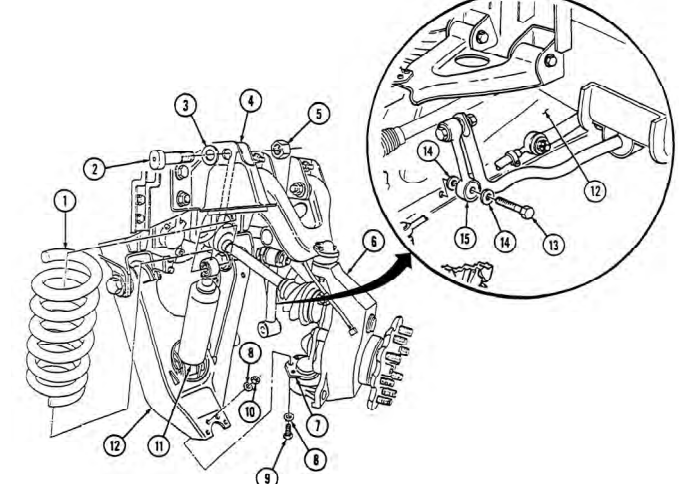

arm (12) with two washers (14) and capscrew (13). Tighten capscrew (13) to 70 lb-ft (95 N•m).

FOLLOW-ON TASKS: - Lower and secure hood (front springs only) (TM 9-2320-387-10).

- Install shelter (if applicable) (M1113, M1152, and M1152A1 only) (rear springs only) (para. 11-78).

# 6-28. Shock Absorber Replacement

This task covers:

## Initial Setup: Tools

General mechanic's tool kit:
automotive (Appendix B, Item 1)
Maintenance and repair shop equipment:
automotive (Appendix B, Item 2)
Drive socket, 3/4 in. (Appendix B, Item 158)

## Materials/Parts

Two locknuts (Appendix G, Item 85) Two lockwashers (Appendix G, Item 171) Two locknuts (Appendix G, Item 73) Cotter pin (Appendix G, Item 24)
Personnel Required One mechanic One assistant

## A. Removal B. Installation Manual References

TM 9-2320-387-10 TM 9-2320-387-24P
Equipment Condition
- Hood raised and secured (front shock absorbers only) (TM 9-2320-387-10).

- Shelter removed (if applicable) (M1113, M1152, and M1152A1 only) (rear shock absorbers only) (para. 11-78).

Maintenance Level Unit

- Replacement procedures for all shock absorbers are the same except rear lower shock pins must be installed with head of pin facing rearward. This procedure covers the left rear shock absorber.

- If shock absorber P/Ns 12480613-1 (Front) or 12480613-2 (Rear)
are used, they must be replaced in pairs.

a. Removal

For rear shock absorber replacement on M1113, M1152, and M1152A1 models, it may be necessary to spread frame from body by positioning prybar between hinge mount bracket and rear bumper to gain access to shock absorber retaining pin nut. Perform steps 1 and 2 only if required.

1. Remove cotter pin (9), slotted nut (8), washer (7), and shackle (4) from body mount bracket (3) and rear bumper (6). Discard cotter pin (9).

2. Remove two locknuts (1), washers (2), capscrews (5), washers (2), and body mount bracket (3) from rear bumper (6). Discard locknuts (1).

# 6-28.  Shock Absorber Replacement (Cont'D)

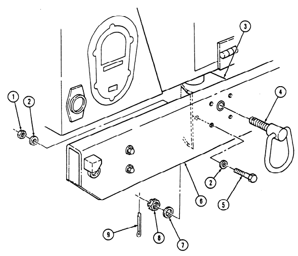

# 6-28. Shock Absorber Replacement (Cont'D)

3. Remove two capscrews (10), lockwashers (9), and washers (8) from bracket (11) and lower control arm (6). Discard lockwashers (9).

Note position of pin for installation.

locknut (5).

4. Remove locknut (5), pin (2), and washer (3) from shock absorber (1) and spring seat (4). Discard 5. Compress shock absorber (1) and remove shock absorber (1) and bracket (11).

Note alignment of shock absorber and bracket for installation.

6. Position shock absorber (1) in vise, and remove locknut (7), pin (13), washer (12), and bracket (11)
from shock absorber (1). Discard locknut (7).

b. Installation

- If shock absorber P/Ns 12480613-1 (Front) or 12480613-2 (Rear)
are used, they must be replaced in pairs.

- It may be necessary to spread spring seat to allow installation of shock absorber.

- Shock absorbers are marked FRONT or REAR to aid identification.

1. Position shock absorber (1) in vise, and install bracket (11) on shock absorber (1) with washer (12),
pin (13), and locknut (7). Tighten locknut (7) to 300 lb-ft (407 N•m).

Do not pry or use sharp tools on shock absorber position rod. A damaged rod will cause shock failure.

2. Install shock absorber (1) and bracket (11) through lower control arm (6). 3. Extend shock absorber (1) and install piston rod end of shock absorber (1) on spring seat (4) with washer (3), pin (2), and locknut (5). Tighten locknut (5) to 300 lb-ft (407 N•m).

4. Install bracket (11) on lower control arm (6) with two washers (8), lockwashers (9), and capscrews (10). Tighten capscrews (10) to 178 lb-ft (241 N•m).

# 6-28.  Shock Absorber Replacement (Cont'D)

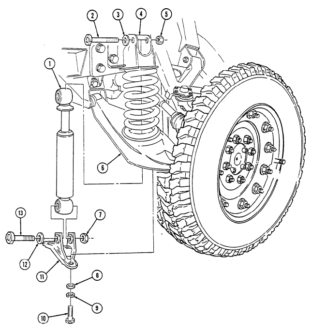

# 6-28. Shock Absorber Replacement (Cont'D)

Perform steps 5 through 8 if necessary to reassemble body mount bracket to frame and rear bumper.

5. Install shackle (4) and body mount bracket (3) on rear bumper (6) with washer (7) and slotted nut
(8).

6. Tighten slotted nut (8) and install cotter pin (9). 7. Secure body mount bracket (3) to rear bumper (6) with two washers (2), capscrews (5), washers (2),
and locknuts (1).

8. Tighten locknuts (1) to 90 lb-ft (122 N•m).

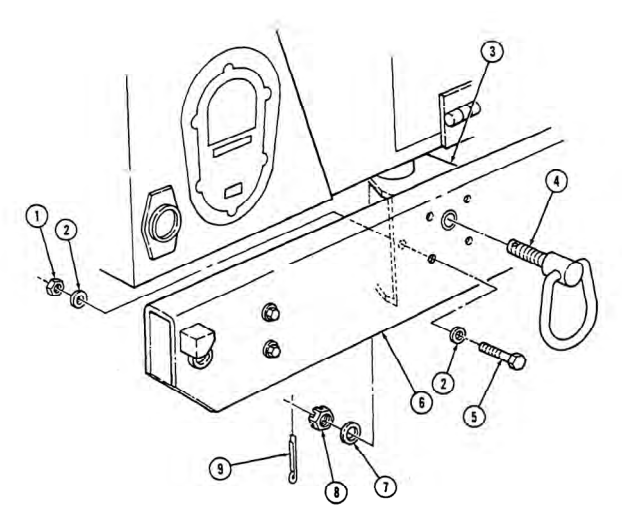

FOLLOW-ON TASKS: - Install shelter (if applicable) (M1113, M1152 and M1152A1 only) (rear shock absorbers only) (para. 11-78).

- Lower and secure hood (front shock absorbers only) (TM 9-2320-387-10).

6-66 Change 5

# Chapter 7 Brake System (Unit) Maintenance Section I. Service Brake System Maintenance

7-1. SERVICE BRAKE SYSTEM MAINTENANCE TASK SUMMARY

| Tools   | Materials/Parts                                                                                       |
|---------|-------------------------------------------------------------------------------------------------------|
|         | General mechanic's tool kit: Four lockwashers (Appendix A, Item 145)                                  |
|         | automotive (Appendix B, Item 1) Seal, lockwasher (Appendix A, Item 298)                               |
|         | Maintenance and repair shop equipment: Manual References                                              |
|         | automotive (Appendix B, Item 2) TM 9\-2320\-387\-10                                                   |
|         | Special Tools TM 9\-2320\-387\-24P                                                                    |
|         | Front seal installer (Appendix B, Item 96) Equipment Condition                                        |
|         | Rear seal installer (Appendix B, Item 95)                                                             |
|         | Rear propeller shaft removed  Drive handle (Appendix B, Item 60)                                      |
|         | (para. 6\-4).                                                                                         |
|         | Maintenance Level                                                                                     |
|         | Unit                                                                                                  |
|         | a. Front Oil Seal Removal                                                                             |
| 1.      | Remove four nuts (3), lockwashers (2), two U\-bolts (5), and front propeller shaft (1) from           |
|         | output yoke (4). Discard lockwashers (2).                                                             |
|         | NOTE                                                                                                  |
|         | Have drainage container ready to catch fluid.                                                         |
| 2.      | Remove nut (6), lockwasher seal (7), output yoke (4), and output seal (8) from transfer case (9).     |
|         | Discard lockwasher seal (7).                                                                          |
|         | b. Front Oil Seal Installation                                                                        |
| 1.      | Using front seal installer and drive handle, install output seal (8) on transfer case (9).            |
| 2.      | Install output yoke (4) on transfer case (9) with lockwasher seal (7) and nut (6). Tighten nut (6) to |
|         | 110 lb\-ft (149 N•m).                                                                                 |
| 3.      | Install front propeller shaft (1) on output yoke (4) with two U\-bolts (5), four lockwashers (2), and |
|         | nuts (3). Tighten nuts (3) to 13–18 lb\-ft (12–24 N•m).                                               |
| c. Rear | Oil Seal Removal                                                                                      |
|         | Remove oil seal (10) from transfer case extension (11).                                               |
| d. Rear | Oil Seal Installation                                                                                 |
|         | Using rear seal installer, install oil seal (10) on transfer case extension (11).                     |

# 7-2. Service Brake System Bleeding Instructions (Serial Numbers 299999 And Below)

This task covers:

| Tools   |
|---------|

| INITIAL SETUP:   |
|------------------|

b. Manual Bleeding General mechanic's tool kit:
automotive (Appendix B, Item 1)
Materials/Parts Brake fluid (Appendix C, Item 18)
Personnel Required One mechanic One assistant (task b. only)

| General Safety Instructions   |
|-------------------------------|
| Always wear eye protecti      |
| Maintenance Level             |

a. Pressure Bleeding c. Master Cylinder Bleeding
- Hood raised and secured (TM 9-2320-387-10). - Master cylinder filled to proper level
(para. 2-12, item 11).

Always wear eye protection when bleeding brakes.

| Manual References    |
|----------------------|
| TM 9\-2320\-387\-24P |
| Maintenance Level    |
| Unit                 |

Unit

Always wear eye protection when bleeding brakes. Failure to do this may cause injury if brake fluid comes in contact with eyes.

NOTE
- If only the front or rear half of the system has been serviced, it is usually necessary to bleed only that half of the system. However, if a firm brake pedal cannot be obtained after bleeding, it will be necessary to bleed the entire system. The brake hydraulic system can be bled manually or by using a pressure tank and adapters. Each method is outlined in the following procedures.

- Bleed brakes in the following order: right rear, left rear, right front, left front.

a. Pressure Bleeding

- When using a pressure bleeding tank, follow the manufacturer's instructions for its use. Do not exceed the recommended working pressure when pressurizing the tank. A tank pressure of 15-20 psi (103-138 kPa) is sufficient to bleed the brake hydraulic system. Release all air pressure from the tank after using it.

- After refilling pressure bleeding tank with silicone brake fluid, let tank sit undisturbed for 30 minutes minimum to ensure all visible as well as minute air bubbles are gone.

This procedure covers bleeding at one wheel. Repeat bleeding task for remaining wheels.

1. Remove cover from master cylinder (1). 2. Install pressure tank bleeder adapter (2) on master cylinder (1). 3. Connect line (3) from pressure tank to adapter (2).

# 7-2. Service Brake System Bleeding Instructions (Serial Numbers 299999 And Below) (Cont'D)

4. Remove protective cap (5) from bleeder screw (6) on caliper assembly (7). 5. Connect short piece of hose (8) to bleeder screw (6) and place other end of hose (8) in container 3/4-full of brake fluid.

6. Open valve (4) on line (3) from pressure tank to master cylinder (1), allowing pressurized brake fluid to enter system.

7. Open bleeder screw (6) 3/4-turn and observe brake fluid in container. Close bleeder screw (6) when brake fluid flows free of air bubbles.

8. Disconnect hose (8) from bleeder screw (6) and install protective cap (5) on bleeder screw (6). 9. Close valve (4) on line (3) from pressure tank to master cylinder (1).

10. Disconnect line (3) from adapter (2). 11. Remove adapter (2) from master cylinder (1). 12. Fill reservoirs with silicone brake fluid and install cover on master cylinder (1).

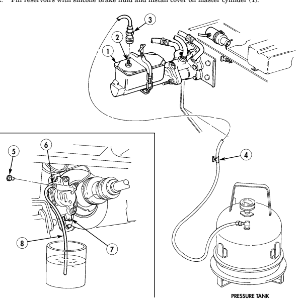

# 7-2. Service Brake System Bleeding Instructions (Serial Numbers 299999 And Below) (Cont'D)

b. Manual Bleeding

- This procedure covers bleeding at one wheel. Repeat bleeding task for remaining wheels.

- Assistant is required to depress the brake pedal when manually bleeding brakes while mechanic opens and closes bleeder screw.

1. Remove cover (6) from master cylinder (10) and fill reservoir (6) with silicone brake fluid.

1.1 Remove protective cap (1) from bleeder screw (2) on caliper assembly (3).

2. Connect short piece of hose (4) to bleeder screw (2) and place other end of hose (4) in container 3/4-full of brake fluid.

- Check the master cylinder fluid level frequently during the bleeding operation and refill the reservoir as necessary. Do not allow the master cylinder to run out of fluid at any time or additional air will be drawn into the system.

6. Disconnect hose (4) from bleeder screw (2) and install protective cap (1) on bleeder screw (2). 7. Refill reservoir (6) with silicone brake fluid and install cover (5) on master cylinder (10). c. Master Cylinder Bleeding

Perform this procedure prior to installing master cylinder on vehicle.

1. Secure master cylinder flange (9) in vise. 2. Remove cover (5) and fill reservoir (6) with silicone brake fluid. 3. Install threaded end of bleeder hose (7) into brake line port on master cylinder (10) and insert opposite end into reservoir (6). Repeat step for other bleecder hose (7).

4. Slowly push piston (8) into master cylinder (10). Do not release piston (8). While holding piston (8),
pinch bleeder hose (7) off and release piston (8). Piston (8) will return automatically.

Whenever the master cylinder is filled with silicone brake fluid, let cylinder sit undisturbed for 30 minutes minimum to ensure all visible as well as minute air bubbles are gone.

5. Refill reservoirs (6) with silicone brake fluid and repeat steps 3 and 4 until no air bubbles remain in brake fluid.

6. Remove two bleeder hose (7) from brake line ports on master cylinder (10). 7. Install cover (5) on master cylinder (10) and remove from vise. 8. Install master cylinder (10) (para. 7-5).

- After adding silicone brake fluid to master cylinder, let cylinder sit undisturbed for 30 minutes minimum to ensure all visible as well as minute air bubbles are gone.

3. Have assistant pump brake pedal toward floor and hold it there. Open bleeder screw (2) 3/4-turn. 4. When pedal reaches floor, tighten bleeder screw (2) and have assistant slowly release brake pedal. 5. Repeat steps 3 and 4 until fluid flows clear and free of air bubbles.

# 7-2. Service Brake System Bleeding Instructions (Serial Numbers 299999 And Below) (Cont'D)

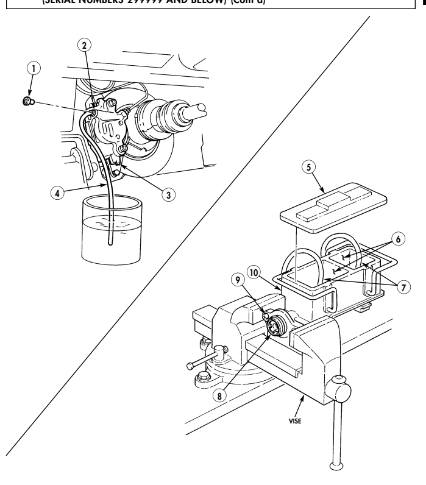

FOLLOW-ON TASKS: - Lower and secure hood (TM 9-2320-387-10).

- Operate vehicle (TM 9-2320-387-10) and check for proper operation.

# 7-2.1. Service Brake System Bleeding Instructions (Serial Numbers 300000 And Above)

This task covers:
b. Manual Bleeding INITIAL SETUP:
Tools General mechanic's tool kit:
automotive (Appendix B, Item 1)
Maintenance and repair shop equipment:
automotive (Appendix B, Item 2)
Materials/Parts Brake fluid (Appendix C, Item 18)
Personnel Required One mechanic One assistant (task b. only)
a. Pressure Bleeding c. Master Cylinder Bleeding Manual References TM 9-2320-387-10 TM 9-2320-387-24P
Equipment Condition
- Hood raised and secured (TM 9-2320-387-10). - Master cylinder filled to proper level 
(Table 2-1, Item 2).

General Safety Instructions Always wear eye protection when bleeding brakes.

Maintenance Level Unit

Always wear eye protection when bleeding brakes. Failure to do so may cause injury if brake fluid comes in contact with eyes.

CAUTION
Both sides of each caliper will need to be bled. Do not bleed only one side of brake caliper or brakes may not operate properly.

- If only the front or rear half of the system has been serviced, it is usually necessary to bleed only that half of the system. However, if a firm brake pedal cannot be obtained after bleeding, it will be necessary to bleed the entire system.

- Bleed brakes in the following order: right rear, left rear, right front, left front.

- Bleeding procedures for all four brake calipers are basically the same. These procedures cover bleeding of right rear caliper. Repeat procedure for each caliper, as necessary.

- Bleed calipers (pressure and manual) from top bleeder screws only, bottom bleeder screws are for universal caliper replacement.

a. Pressure Bleeding

- When using a pressure tank, follow the manufacturer's instructions for its use. Do not exceed the recommended working pressure when pressurizing the tank. A tank pressure of 12-15 psi (103-138 kPa) is sufficient to bleed the brake hydraulic system. Release all air pressure from the tank after using it.

- Check the master cylinder fluid level frequently during the pressure bleeding procedure and refill the reservoir as necessary. Do not allow the master cylinder to run out of fluid at any time or additional air will be drawn into the system.

# 7-2.1. Service Brake System Bleeding Instructions (Serial Numbers 300000 And Above) (Cont'D)

1. Install pressure tank hose (2) on master cylinder reservoir cap (3). 2. Connect short piece of hose (8) to bleeder screw (7) on brake caliper (10) and place other end of hose (8) in container ¾ full of brake fluid (9).

3. Open valve (4) on line (2) from pressure tank (5) to master cylinder reservoir (1) allowing pressurized brake fluid to enter system.

4. Open bleeder screw (7) ¾ turn and observe brake fluid in container (9). Close bleeder screw (7)
when brake fluid flows free of bubbles. Tighten bleeder screw to 60 lb-ft (81 N•m).

5. Disconnect hose (8) from bleeder screw (7). 6. Close valve (4) on line (2) from pressure tank (5) to master cylinder reservoir (1). 7. Disconnect pressure tank hose (2) from master cylinder reservoir cap (3). 8. Repeat pressure bleeding for opposite side (6) of same brake caliper (10). 9. Fill master cylinder reservoir (1) with silicone brake fluid to MAX line.

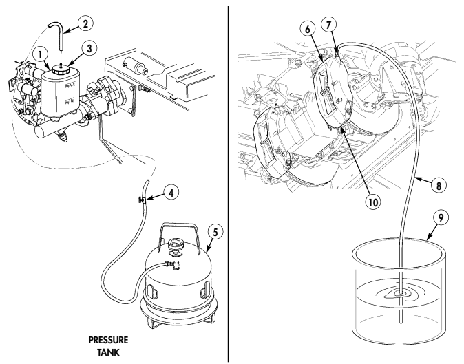

# 7-2.1. Service Brake System Bleeding Instructions (Serial Numbers 300000 And Above) (Cont'D)

b. Manual Bleeding

- Check the master cylinder fluid level frequently during the bleeding operation and refill the reservoir as necessary. Do not allow the master cylinder to run out of fluid at any time or additional air will be drawn into the system.

- After adding silicone brake fluid to master cylinder, let cylinder sit undisturbed for 30 minutes minimum to ensure all visible as well as minute air bubbles are gone.

- This procedure covers bleeding at one caliper. Repeat bleeding task for remaining calipers.

- Assistant is required to depress the brake pedal when manually bleeding brakes while mechanic opens and closes bleeder screw.

1. Connect short piece of hose (3) to bleeder screw (2) on brake caliper (5) and place other end of hose in container ¾ full of brake fluid (4).

2. Have assistant pump brake pedal toward floor and hold it there. Open bleeder screw (2) ¾ turn. 3. When pedal reaches floor, tighten bleeder screw (2) and have assistant slowly release brake pedal. 4. Repeat steps 2 and 3 until fluid flows clear and free of air bubbles. 5. Disconnect hose (3) from bleeder screw (2). Tighten bleeder screw to 60 lb-ft (81 N•m). 6. Repeat manual bleeding for opposite side (1) of same caliper (5). 7. Fill master cylinder reservoir with silicone brake fluid to MAX line.

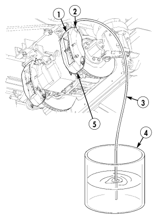

# 7-2.1. Service Brake System Bleeding Instructions (Serial Numbers 300000 And Above) (Cont'D)

c. Master Cylinder Bleeding

Perform this procedure prior to installing master cylinder on vehicle.

1. Secure master cylinder flange (7) in vise (5). 2. Install threaded plug (4) in brake line opening in master cylinder flange (7). 3. Attach threaded plug (3) to end of bleeder hose (2) and install in brake line opening in master cylinder flange (7).

4. Install opposite end of bleeder hose (2) in master cylinder reservoir (1). 5. Fill master cylinder reservoir (1) with silicone brake fluid to MAX line.

Whenever the master cylinder is filled with silicone brake fluid, let cylinder sit undisturbed for 30 minutes minimum to ensure all visible as well as minute air bubbles are gone.

6. Slowly push piston (6) into master cylinder flange (7). While holding piston (6) in master cylinder flange (7) pinch bleeder hose (2) off and release piston (6). Piston will return automatically.

7. Repeat step 6 until no air bubbles remain in brake fluid. 8. Remove bleeder hose (2) from master cylinder reservoir (1). 9. Install cover on master cylinder reservoir (1) and remove from vise (5).

10. Remove two threaded plugs (3) and (4) from brake line openings in master cylinder flange (7).

All calipers will need to be bled after installing master cylinder on vehicle to remove remaining air from brake system.

11. Install master cylinder on vehicle (para. 7-5.1).

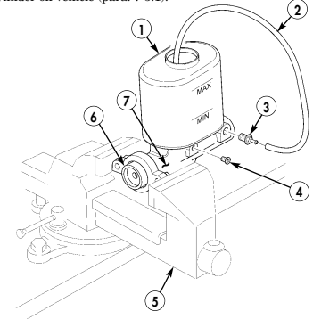

FOLLOW-ON TASKS: - Lower and secure hood (TM 9-2320-387-10).

- Operate vehicle (TM 9-2320-387-10) and check for proper operation.

# 7-3. Service Brake Pad Maintenance (Serial Numbers 299999 And Below)

This task covers:
b. Cleaning and Inspection

## Initial Setup:

Tools General mechanic's tool kit:
automotive (Appendix B, Item 1)
Maintenance and repair shop equipment:
automotive (Appendix B, Item 2)
Clamp (Appendix B, Item 153)
Special Tools Crowfoot, 14-mm (Appendix B, Item 141)
Materials/Parts Grease (Appendix C, Item 34) Sealing compound (Appendix C, Item 63) Six two-piece lockwashers 
(Appendix G, Item 191)
a. Removal a. Removal c. Installation

| Manual References    |
|----------------------|
| TM 9\-2320\-387\-24P |
| Maintenance Level    |

Brake protection guards removed (para. 7-11).

General Safety Instructions Ensure brake pads are installed with linings facing rotor.

Maintenance Level Unit

Caliper must be supported during removal to prevent damage to brake hose.

Perform steps 1 and 2 for right side. Perform steps 3, 4, and 5 for left side.

1. Using crowfoot, remove two capscrews (6), washers (5), clamp (6.1), caliper (3), and yoke (4) from adapter (2).

Note positioning of brake pad surfaces for installation.

2. Remove two brake pads (1) from adapter (2). 3. Remove six capscrews (10), two-piece lockwashers (9), and halfshaft (8) from rotor (7). Discard two-piece lockwashers (9).

4. Install two capscrews (10) to hold rotor (7).

Note positioning of brake pad surfaces for installation.

5. Remove two brake pads (1) from adapter (2).

# 7-3.  Service Brake Pad Maintenance (Serial Numbers 299999 And Below) (Cont'D)

■

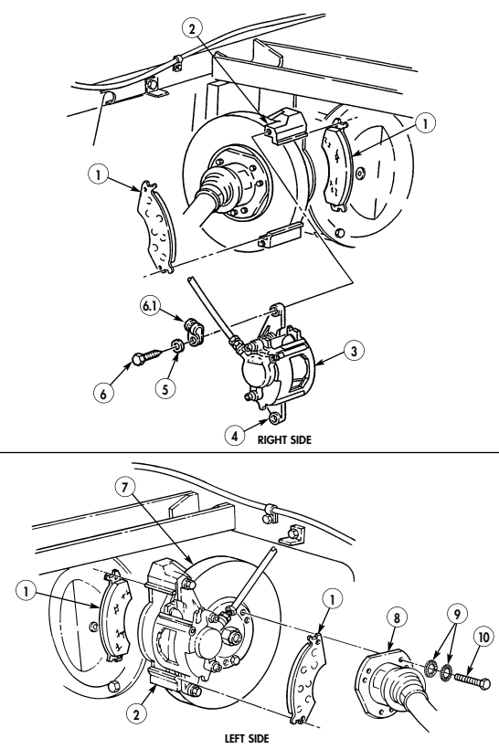

# 7-3. Service Brake Pad Maintenance (Serial Numbers 299999 And Below) (Cont'D)

## B. Cleaning And Inspection

1. Clean mating surfaces of caliper (1) and adapter (6) and lubricate with grease. 2. Inspect caliper (1) and caliper piston (2) for cracks, pitting, or damage. Replace caliper (1) if cracked, pitted, or damaged (para. 7-4).

3. Inspect dust boot (3) for tears or deterioration. Replace caliper (1) if dust boot (3) is torn or deteriorated (para. 7-4).

4. Inspect rotor (5) for heat cracks, discoloration, pitting, scoring, or wear. Replace rotor (5) if thickness of rotor (5) is less then 13/16 in. (20.7 mm), cracked, pitted, or scored (para. 7-12).

- To ensure proper brake function, replace brake pads in pairs on both sides of differential.

- Replace brake pads if thickness is less than 3/16 in. (4.8 mm)
and operation in wet and muddy conditions is expected.

5. Inspect brake pads (4) for glazing, oil saturation, or wear. If glazed, oil saturated, or if brake pad thickness is less than 1/8 in. (3.2 mm), replace both pads (4) and pads on opposite caliper.

6. Clean output flange threaded holes (5.1) behind rotor (5) with a 10-mm tap to remove old sealing compound.

c. Installation

Ensure brake pads are installed with linings facing rotor. Failure to do this may cause injury to personnel or damage to equipment.

Perform steps 1 and 2 for right side. Perform steps 3, 4, and 5 for left side.

1. Position two brake pads (4) on adapter (6).

When installing yoke and caliper, use a C-clamp and a block of wood to bottom out piston in caliper. If piston will not bottom out, replace caliper (para. 7-4).

2. Apply sealing compound to tapped holes of adapter (6). Using crowfoot, install yoke (7) and caliper (1)
on adapter (6) with clamp (8.1), two washers (8), and capscrews (9). Tighten capscrews (9) to 30-40 lb-ft (41-54 N•m).

3. Install two brake pads (4) on adapter (6). 4. Remove two capscrews (12) from rotor (5).

- Ensure all six capscrews holes in the rotor align with holes in output flange.

- New capscrews come with preapplied thread-locking compound, however, still apply sealing compound to threads of new capscrews. If old capscrews are to be used, mating threads must be cleaned and sealing compound applied to threads of capscrews.

- Two-piece lockwashers must be installed in sets of two with serrated sawtooth threads facing each other.

5. Apply sealing compound to six capscrews (12), and install halfshaft (10) on rotor (5) with six twopiece lockwashers (11) and capscrews (12). Tighten capscrews (12) to 58 lb-ft (79 N•m).

# 7-3.  Service Brake Pad Maintenance (Serial Numbers 299999 And Below) (Cont'D)

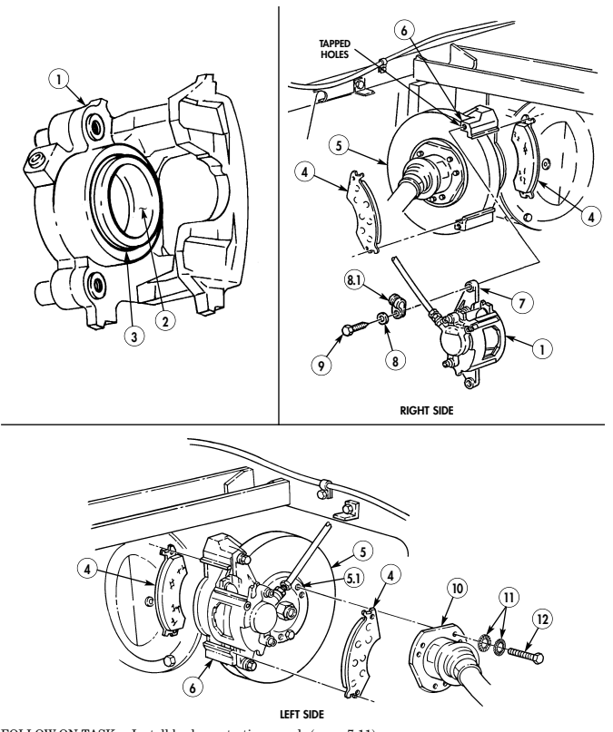

FOLLOW-ON TASK:
 Install brake protection guards (para. 7-11).

■

# 7-3.1. Service Brake Pad Maintenance (Serial Numbers 300000 And Above)

This task covers:
a. Removal c. Installation b. Cleaning and Inspection

## Initial Setup:

Tools General mechanic's tool kit:
automotive (Appendix B, Item 1)
Clamp (Appendix B, Item 153)
Manual References TM 9-2320-387-24P
General Safety Instructions Ensure brake pads are installed with linings facing rotor.

Maintenance Level Unit

Ensure master cylinder brake fluid is no higher than half full when seating caliper pistons or over-flow of master cylinder brake fluid may occur.

- Replacement procedures for service brake pads are basically the same. This procedure covers the right front service brake pads.

- To ensure proper brake function, replace brake pads in pairs on both sides of differential.

a. Removal 1. Remove spring clip (3) and guide pin (1) from brake pads (4) and brake caliper (2). 2. Remove inner and outer brake pads (4) from brake caliper (2).

## B. Cleaning And Inspection

Inspect brake pads for glazing, oil saturation, and excessive wear. If brake pad thickness is less than 3/16-in. (4.8 mm), replace brake pads and brake pads on opposite brake caliper.

c. Installation

Ensure brake pads are installed with linings facing rotor. Failure to do this may cause injury to personnel or damage to equipment.

When installing brake pads, use a C-clamp and a block of wood to seat caliper pistons.

1. Install inner and outer brake pads (4) in brake caliper (2). 2. Install guide pin (1) through brake caliper (2) and brake pads (4). Secure guide pin (1) with spring clip (3).

# 7-3.1. Service Brake Pad Maintenance (Serial Numbers 300000 And Above) (Cont'D)

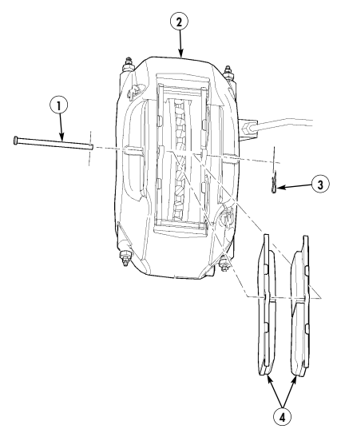

# 7-4. Service Brake Caliper Maintenance (Serial Numbers 299999 And Below)

This task covers:
a. Removal c. Installation b. Cleaning and Inspection

## Initial Setup: Tools

General mechanic's tool kit:
automotive (Appendix B, Item 1)
Maintenance and repair shop equipment:
automotive (Appendix B, Item 2)
Clamp (Appendix B, Item 153)

## Special Tools

Hex-head driver, 7-mm
(Appendix B, Item 151)
Crowfoot, 14-mm (Appendix B, Item 141) Materials/Parts Copper washer (Appendix G, Item 14) Grease (Appendix C, Item 34) Sealing compound (Appendix C, Item 63)

## Manual References

TM 9-2320-387-24P
Equipment Condition
- Brake pads removed (para. 7-3). - Brake protection guards removed (para. 7-11).

General Safety Instructions Ensure brake pads are installed with linings facing rotor.

Maintenance Level Unit

For replacement of rear dual service/parking brake caliper, refer to para. 7-15.

a. Removal

Cover or plug all open lines and connections immediately after disconnection to prevent contamination. Remove all covers or plugs prior to connection.

Perform steps 1 and 2 for right side. Perform steps 3 through 6 for left side.

1. Disconnect hose (1) from coupling (5). 2. Slide yoke (2) and locating pins (3) out from caliper (4). 3. Disconnect hose (1) from coupling (5). 4. Remove two capscrews (8) from rotor (7). 5. Remove rotor (7) from caliper (4) and adapter (6). 6. Using crowfoot, remove two capscrews (10), washers (11), yoke (2), and caliper (4) from adapter (6).

# 7-4.  Service Brake Caliper Maintenance (Serial Numbers 299999 And Below) (Cont'D)

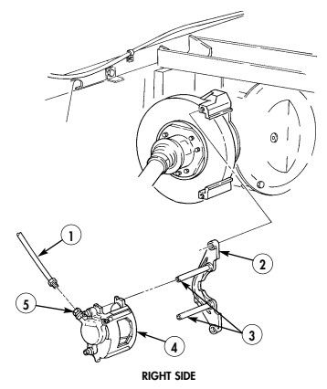

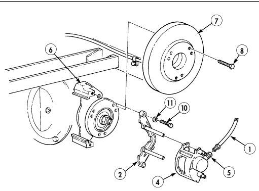

■

# 7-4. Service Brake Caliper Maintenance (Serial Numbers 299999 And Below) (Cont'D)

7. Remove coupling (1) and copper washer (2) from caliper (3). Discard copper washer (2).

## B. Cleaning And Inspection

1. Clean mating surfaces of caliper (3) and adapter (8) and lubricate with grease. 2. Clean cooling fins of rotor (12). 3. Inspect caliper (3) and caliper piston (4) for cracks, pitting, or damage. Replace caliper (3) if cracked, pitted, or damaged.

4. Inspect locating pin bearings and bushings (6) for tears or deterioration. Replace bearings and bushings (6) if torn or deteriorated.

5. Inspect dust boot (5) for tears or deterioration. Replace caliper (3) if dust boot (5) is torn or deteriorated.

6. Inspect yoke locating pins (10) for cracks or corrosion. Perform step 7 if cracked or corroded. 7. Using 7-mm hex-head driver, remove locating pins (10) from yoke (9). Discard locating pins (10). 8. Inspect rotor (12) for heat cracks, discoloration, pitting, or scoring. Replace rotor (12) if cracked, pitted, or scored (para. 7-12).

9. Clean output flange threaded holes (17) with a 10 mm tap to remove old sealing compound.

## C. Installation

1. Install copper washer (2) and coupling (1) on caliper (3).

NOTE
- Perform step 2 only if yoke locating pins were replaced. - Perform steps 3 and 4 for right side. Perform steps 6 through 9 for left side.

2. Apply sealing compound to threads of locating pins (10) and install locating pins (10) in yoke (9).

Tighten locating pins (10) to 25-35 lb-ft (34-47 N•m).

3. Install caliper (3) on yoke (9). 4. Connect hose (7) to coupling (11). 5. Deleted. 6. Install caliper (3) on yoke (9). 7. Position rotor (12) and caliper (3) on adapter (8) and hold rotor (12) with two capscrews (13).

NOTE
When installing yoke and caliper, use a C-clamp and a block of wood to bottom out piston in caliper.

8. Apply sealing compound to tapped holes of adapter (8). Using crowfoot, install yoke (9) and caliper (3) on adapter (8) with two washers (15) and capscrews (16). Tighten two capscrews (16) to 30-40 lb-ft (41-54 N•m).

9. Connect hose (7) to coupling (11).

# 7-4.  Service Brake Caliper Maintenance (Serial Numbers 299999 And Below) (Cont'D)

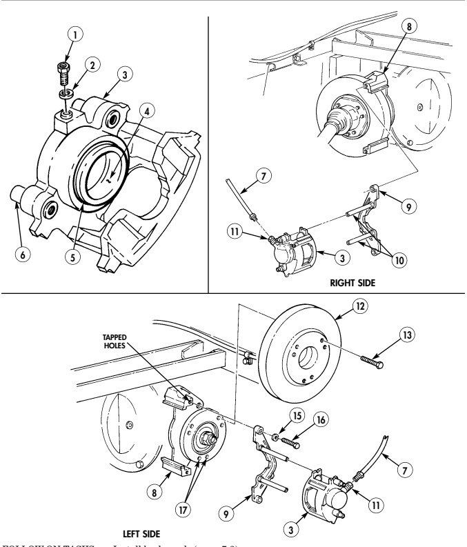

FOLLOW-ON TASKS: - •
■

# 7-4.1. Service Brake Caliper Maintenance (Serial Numbers 300000 And Above)

This task covers:
a. Removal c. Installation b. Cleaning and Inspection

## Initial Setup: Tools Manual References

TM 9-2320-387-24P
Equipment Condition General mechanic's tool kit:
automotive (Appendix B, Item 1)
Maintenance and repair equipment:
automotive (Appendix B, Item 2)
Clamp (Appendix B, Item 153)
Materials/Parts Sealing compound (Appendix C, Item 62)
- Brake pads removed (para. 7-3.1). - Brake protection guards removed (front only)
(para. 7-11.1).

- Horn removed (front only) (para. 4-26.1).

Maintenance Level Unit

Cover or plug all open brake lines and connections immediately after disconnection to prevent contamination. Remove all covers or plugs prior to connecting brake lines.

- Replacement procedures for brake calipers are basically the same. This procedure covers the right front brake caliper.

- Have drainage container ready to catch brake fluid. - Front calipers will need to be removed through front crossmember.

## A. Removal

1. Remove brake line (5) from fitting (4) on brake caliper (6). 2. Remove two capscrews (1) and washers (2) from brake caliper (6) on anchor plate (3). 3. Remove brake caliper (6) from rotor (7).

## B. Cleaning And Inspection

1. Inspect caliper (6) for cracks, pitting, or damage. Replace caliper (6) if necessary. 2. Inspect rotor (para. 7-12.1). 3. Inspect inside of brake caliper for rust. Remove all rust.

# 7-4.1. Service Brake Caliper Maintenance (Serial Numbers 300000 And Above) (Cont'D)

c. Installation 1. Install brake caliper (6) on rotor (7). 2. Apply sealing compound to capscrews (1) and secure brake caliper (6) to anchor plate (3) with two washers (2) and capscrews (1). Tighten capscrews (1) to 40 lb-ft (54 N•m).

3. Install brake line (5) on fitting (4) on brake caliper (6).

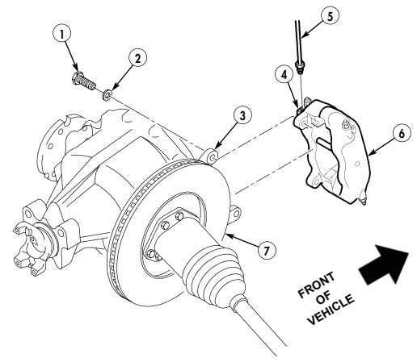

FOLLOW-ON TASKS: - Install horn (front only) (para. 4-26.1).

- Install brake protection guards (front only) (para. 7-11.1). - Install brake pads (para. 7-3.1). - Bleed brake system (para. 7-2.1).

# 7-5. Master Cylinder Maintenance (Serial Numbers 299999 And Below)

This task covers:
a. Removal c. Bleeding b. Installation

## Initial Setup:

Tools General mechanic's tool kit:
automotive (Appendix B, Item 1)
Maintenance and repair shop equipment:
automotive (Appendix B, Item 2)
Materials/Parts Four locknuts (Appendix G, Item 106)
Personnel Required One mechanic One assistant a. Removal Manual References TM 9-2320-387-24P

| 111 J\-2020\-001\-241             |
|-----------------------------------|
| Equipment Condition               |
| T . 0 . 1 . 1 . 1 . 1 . 1 . 1 . 1 |

Left splash shield removed (para. 10-23).

Maintenance Level Unit

Cover or plug all open lines and connections immediately after disconnection to prevent contamination. Remove all plugs prior to connection.

Perform step 1 for M1114 models only.

1. Remove locknut (10), washer (11), and bracket (12) from hydro-boost (1). Discard locknut (10).

Have drainage container ready to catch brake fluid.

2. Disconnect brake lines (5) and (6) from master cylinder (2). 3. Remove locknut (3), washer (4), and differential valve bracket (7) from right master cylinder mounting stud (9). Discard locknut (3).

Do not lean on master cylinder. Damage to master cylinder may result.

4. Remove two locknuts (8) and master cylinder (2) from hydro-boost (1). Discard locknuts (8).

b. Installation

Ensure O-ring is properly seated on master cylinder prior to installation. Damage to master cylinder may result if O-ring is not properly seated.

# 7-5. Master Cylinder Maintenance (Serial Numbers 299999 And Below) (Cont'D)

1. Install master cylinder (2) on hydro-boost (1) with two locknuts (8). Tighten locknuts (8) to 22 lb-ft (30 N•m).

2. Install differential valve bracket (7) on stud (9) with washer (4) and locknut (3). Tighten locknut (3) to 22 lb-ft (30 N•m).

3. Connect brake lines (5) and (6) to master cylinder (2).

Perform step 4 for M1114 models only.

4. Install bracket (12) on hydro-boost (1) with washer (11) and locknut (10) Tighten locknut (10) to 22 lb-ft (30 N•m).

c. Bleeding

Master cylinder must be filled (para. 2-12, item 11) and kept at least half full during bleeding operation.

1. Depress brake pedal slowly and hold. Loosen brake line (5) to purge air from the front reservoir. 2. Tighten brake line (5) and release brake pedal. 3. Repeat steps 1 and 2 until front reservoir is purged of air. 4. Repeat steps 1 through 3 for rear reservoir with brake line (6).

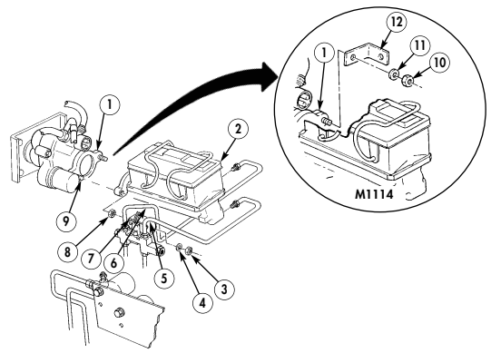

FOLLOW-ON TASKS: - Install left splash shield (para. 10-23).

- Bleed brake system (para. 7-2).

# 7-5.1. Master Cylinder Replacement (Serial Numbers 300000 And Above)

This task covers:
INITIAL SETUP:
Tools General mechanic's tool kit:
automotive (Appendix B, Item 1)
Maintenance and repair shop equipment:
automotive (Appendix B, Item 2)
Materials/Parts O-ring (Appendix G, Item 228.6) Lockwasher (Appendix G, Item 144) Two locknuts (Appendix G, Item 106) Two locknuts (Appendix G, Item 132.1)
Personnel Required One mechanic One assistant a. Removal b. Installation Manual References TM 9-2320-387-24-1 TM 9-2320-387-24P
Equipment Condition Left splash shield removed (para. 10-23.1).

Maintenance Level Unit

Cover or plug all open brake lines and connections immediately after disconnection to prevent contamination. Remove all covers or plugs prior to connecting brake lines.

a. Removal

Have drainage container ready to catch brake fluid.

1. Remove vent hose (2) from reservoir cap (3). 2. Loosen and remove left and right front brake lines (5) from proportioning valve (9) and master cylinder (4).

3. Remove capscrew (8), lockwasher (7), washer (6), and bracket (10) from bracket (13).

Discard lockwasher (7).

Do not lean on master cylinder or damage to master cylinder may occur.

O-ring may fall when master cylinder is removed from hydro-booster.

4. Remove two locknuts (11), washers (12), two locknuts (14), bracket (13), O-ring (16), splash shield bracket (1), and master cylinder (4) from hydro-booster (15). Discard locknuts (11) and (14), and O-ring (16).

# 7-5.1. Master Cylinder Replacement (Serial Numbers 300000 And Above) (Cont'D)

b. Installation

- Perform master cylinder bleeding procedure before installing master cylinder on vehicle. Damage to master cylinder may result if bleeding is not done properly (para. 7-2.1).

- Ensure O-ring is properly seated in master cylinder prior to installation or damage to master cylinder may occur.

1. Install master cylinder (4) on hydro-booster (15) with O-ring (16), splash shield bracket (1), two locknuts (14), bracket (13), two washers (12), and locknuts (11). Tighten locknuts (11) and (14) to 22 lb-ft (30 N•m).

2. Install bracket (10) on bracket (13) with capscrew (8), lockwasher (7), and washer (6). 3. Install left and right front brake lines (5) on proportioning valve (9) and master cylinder (4). 4. Install vent hose (2) on reservoir cap (3).

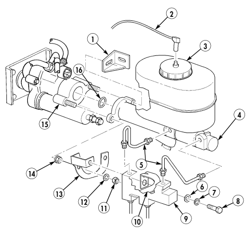

FOLLOW-ON TASKS: - Install left splash shield (para. 10-23.1).

- Bleed brake system master cylinder (para. 7-2.1).

# 7-6. Hydro-Booster Replacement

This task covers:
a. Removal b. Installation

| INITIAL SETUP:                          |       |                      |
|-----------------------------------------|-------|----------------------|
|                                         | Tools | Manual References    |
| General mechanic's tool kit:            |       | TM 9\-2320\-387\-10  |
| automotive (Appendix B, Item 1)         |       | TM 9\-2320\-387\-24P |
| Maintenance and repair shop equipment:  |       | Maintenance Level    |
| automotive (Appendix B, Item 2)         |       | Unit                 |
| Materials/Parts                         |       |                      |
| Cotter pin (Appendix G, Item 21)        |       |                      |
| Two locknuts (Appendix G, Item 128)     |       |                      |
| Four lockwashers (Appendix G, Item 145) |       |                      |
| (Serial numbers 300000 and above)       |       |                      |

## A. Removal Caution

Cover or plug all open lines and connections immediately after disconnection to prevent contamination. Remove all plugs prior to connection.

Have drainage container ready to catch brake fluid.

1. Mark and disconnect two high-pressure lines (4) and return line (5) from hydro-booster (6). 2. Remove cotter pin (3) and washer (2), and disconnect pushrod (7) from brake pedal bellcrank (13).

Remove spring washer (1) from brake pedal bellcrank (13). Discard cotter pin (3) and spring washer (1).

3. Remove four locknuts (12), lockwashers (11), washers (10), hydro-booster (6), and gasket (8) from cowl (9). Discard lockwashers (11) and locknuts (12).

## B. Installation

1. Install gasket (8) and hydro-booster (6) on cowl (9) with four washers (10), lockwashers (11), and locknuts (12). Do not tighten locknuts (12).

2. Install spring washer (1) on brake pedal bellcrank (13). Connect hydro-booster pushrod (7) to brake pedal bellcrank (13) with washer (2) and cotter pin (3).

3. Tighten locknuts (12) to 21 lb-ft (29 N•m). 4. Connect two high-pressure lines (4) and return line (5) to hydro-booster (6).

# 7-6. Hydro-Booster Replacement (Cont'D)

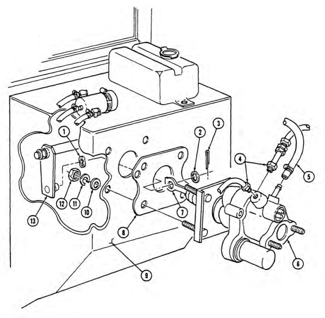

FOLLOW-ON TASK:
-  Install master cylinder (para. 7-5 or para. 7-5.1).

· Bleed power steering system (para. 8-27 or para. 8-27.1).

# 7-7. Brake Lines Replacement (Serial Numbers 299999 And Below)

This task covers:
a. Front Caliper-to-Intermediate Brake Line Removal b. Front Caliper-to-Intermediate Brake Line Installation c. Rear Caliper-to-Intermediate Brake Line Removal d. Rear Caliper-to-Intermediate Brake Line Installation e. Caliper-to-Intermediate Support Brackets Removal f. Caliper-to-Intermediate Support Brackets Installation

## Initial Setup:

Tools General mechanic's tool kit:
automotive (Appendix B, Item 1)
Materials/Parts Two tiedown straps (Appendix G, Item 324) Tube coupling (Appendix G, Item 27)
g. Rear Brake Line Removal h. Rear Brake Line Installation i. Intermediate Brake Line Removal j. Intermediate Brake Line Installation k. Proportioning Valve-to-Union Brake Line Removal l. Proportioning Valve-to-Union Brake Line Installation m.Pressure Limiter Valve-to-Differential Valve Removal n. Pressure Limiter Valve-to-Differential Valve Installation

## Manual References

TM 9-2320-387-10 TM 9-2320-387-24P
Equipment Condition Hood raised and secured (TM 9-2320-387-10).

Maintenance Level Unit

Cover or plug all open lines and connections immediately after disconnection to prevent contamination. Remove all plugs prior to connection.

- Have drainage container ready to catch brake fluid. - Brake line replacement procedures for service brake system and rear dual service/parking brake system are basically the same.

- Left side is shown, right side is similar.

## A. Front Caliper-To-Intermediate Brake Line Removal

1. Disconnect left front brake line (1) from tube coupling (13.2).

1.1. Remove tube coupling (13.2) and washer (13.1) from caliper (13). Discard tube coupling (13.2).

2. Remove capscrew (15), washer (14), and clamp (11) from yoke (12). 3. Remove capscrew (7), washer (6), and clamp (5) from bracket (8). 4. Remove two tiedown straps (10) from brake lines (9) and (1). Discard tiedown straps (10). 5. Remove clip (4) and left front brake line (1) from bracket (2) and intermediate brake line (3).

## B. Front Caliper-To-Intermediate Brake Line Installation

1. Install left front brake line (1) on intermediate brake line (3) and bracket (2) with clip (4). 2. Install clamp (5) and left front brake line (1) on bracket (8) with washer (6) and capscrew (7).

Secure brake lines (9) and (1) with two tiedown straps (10).

# 7-7. Brake Lines Replacement (Serial Numbers 299999 And Below) (Cont'D)

3. Install clamp (11) and brake line (1) on yoke (12) with washer (14) and capscrew (15). 4. Install washer (13.1) and tube coupling (13.2) on caliper (13). 5. Connect left front brake line (1) to tube coupling (13.2).

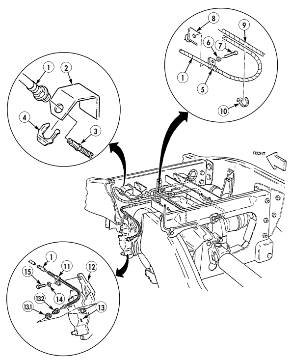

# 7-7. Brake Lines Replacement (Serial Numbers 299999 And Below) (Cont'D)

Left side shown, right side similar.

## C. Rear Caliper-To-Intermediate Brake Line Removal

1. Disconnect left rear brake line (1) from caliper adapter fitting (7.2).

1.1. Remove tube coupling (7.2) and washer (7.1) from caliper (7). Discard tube coupling (7.2).

2. Remove capscrew (9), washer (8), and clamp (5) from yoke (6). 3. Remove capscrew (10), clamp (11), and brake line (1) from bracket (12). 4. Remove clip (4) and left rear brake line (1) from bracket (2) and intermediate brake line (3).

## D. Rear Caliper-To-Intermediate Brake Line Installation

1. Install left rear brake line (1) on intermediate brake line (3) and bracket (2) with clip (4). 2. Install clamp (11) and brake line (1) on bracket (12) with capscrew (10). 3. Install clamp (5) on yoke (6) with washer (8) and capscrew (9). 4. Install washer (7.1) and tube coupling (7.2) on caliper (7). 5. Connect left rear brake line (1) to tube coupling (7.2).

# 7-7.  Brake Lines Replacement (Serial Numbers 299999 And Below) (Cont'D)

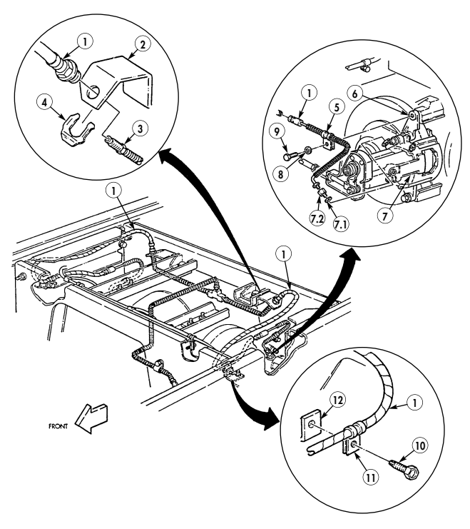

# 7-7. Brake Lines Replacement (Serial Numbers 299999 And Below) (Cont'D)

e. Caliper-to-Intermediate Support Brackets Removal

Perform steps 1 through 3 for front support bracket. Perform steps 4 through 6 for rear support bracket.

1. Remove two tiedown straps (8) from front brake lines (4) and intermediate brake line (11). 2. Remove two capscrews (7), washers (6), and clamps (5) from support bracket (2). 3. Remove nut (10), washer (9), capscrew (3), and support bracket (2) from crossmember (1). 4. Remove capscrew (13), clamp (14), and brake line (12) from left support bracket (15). 5. Remove capscrew (16), washer (17), and left support bracket (15) from frame bracket (18). 6. Repeat steps 4 and 5 for right support bracket.

f. Caliper-to-Intermediate Support Brackets Installation

Perform steps 1 through 3 for front support bracket. Perform steps 4 through 6 for rear support bracket.

1. Install support bracket (2) on crossmember (1) with capscrew (3), washer (9), and nut (10). 2. Install two clamps (5) on support bracket (2) with two washers (6) and capscrews (7). 3. Secure front brake lines (4) and intermediate brake line (11) with two tiedown straps (8). 4. Install left support bracket (15) on frame bracket (18) with washer (17) and capscrew (16). 5. Install brake line (12) and clamp (14) on support bracket (15) with capscrew (13). 6. Repeat steps 4 and 5 for right support bracket.

# 7-7.  Brake Lines Replacement

(SERIAL NUMBERS 299999 AND BELOW) (Cont'd)

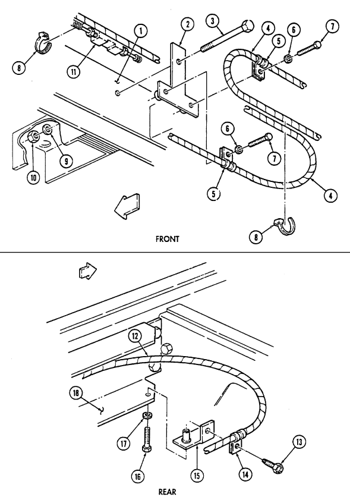

# 7-7. Brake Lines Replacement (Serial Numbers 299999 And Below) (Cont'D)

g. Rear Brake Line Removal 1. Disconnect rear brake line (2) from rear union (1). 2. Remove capscrew (5) and clamp (4) from rear brake line (2) and forward rear crossmember (3). 3. Disconnect rear brake line (2) from intermediate brake line (6).

## H. Rear Brake Line Installation

1. Connect rear brake line (2) to intermediate brake line (6). 2. Install rear brake line (2) on forward rear crossmember (3) with clamp (4) and capscrew (5). 3. Connect rear brake line (2) to rear union (1).

## I. Intermediate Brake Line Removal

1. Disconnect intermediate brake line (6) from rear brake line (2).

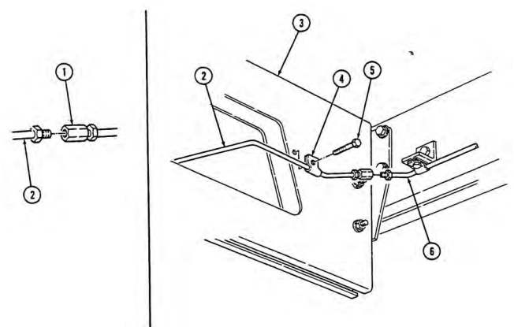 2. Remove five capscrews (8) and clamps (7) from intermediate brake line (6) and frame (9). 3. Disconnect coupling (11) from proportioning valve-to-union brake line (10).

# 7-7. Brake Lines Replacement (Serial Numbers 299999 And Below) (Cont'D)

j. Intermediate Brake Line Installation 1. Connect coupling (11) to proportioning valve-to-union brake line (10). 2. Connect intermediate brake line (6) to rear brake line (2). 3. Install intermediate brake line (6) on frame (9) with five clamps (7) and capscrews (8).

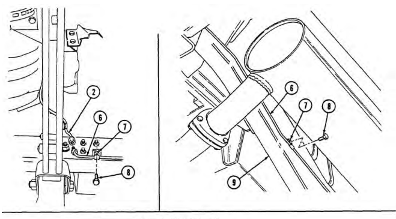

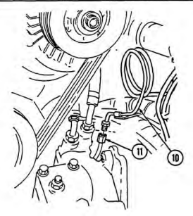

# 7-7. Brake Lines Replacement (Serial Numbers 299999 And Below) (Cont'D)

k. Proportioning Valve-to-Union Brake Line Removal 1. Disconnect brake line (2) from proportioning valve (3). 2. Remove nut (7), washer (6), capscrew (1), clamp (10), and brake line (2) from bracket (8). 3. Remove brake line (2) from coupling (9). 4. Disconnect brake line (4) from proportioning valve (3). 5. Remove brake line (4) from union (5).

## L. Proportioning Valve-To-Union Brake Line Installation

1. Install brake line (4) on union (5). 2. Connect brake line (4) to proportioning valve (3). 3. Install brake line (2) on coupling (9). 4. Install brake line (2) and clamp (10) on bracket (8) with capscrew (1), washer (6), and nut (7). 5. Connect brake line (2) to proportioning valve (3).

## M. Pressure Limiter Valve-To-Differential Valve Removal

1. Disconnect brake lines (13) and (14) from pressure limiter valves (11) and (15). 2. Remove brake lines (13) and (14) from differential valve (12).

n. Pressure Limiter Valve-to-Differential Valve Installation 1. Install brake lines (13) and (14) on differential valve (12). 2. Connect brake lines (13) and (14) to pressure limiter valves (11) and (15).

# 7-7.  Brake Lines Replacement (Serial Numbers 299999 And Below) (Cont'D)

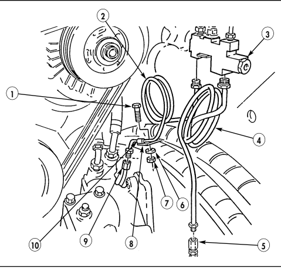

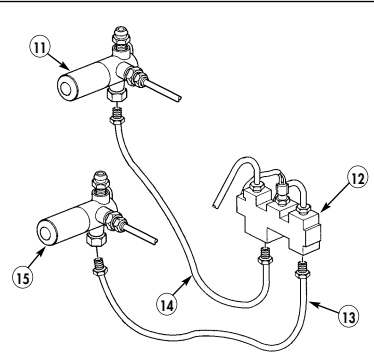

FOLLOW-ON TASK:  Bleed brake system (para. 7-2).

# 7-7.1. Brake Lines Replacement (Serial Numbers 300000 And Above)

This task covers:
a. Front Caliper Brake Line Removal b. Front Caliper Brake Line Installation c. Rear Caliper Brake Line Removal d. Rear Caliper Brake Line Installation e. Front Brake Line Removal f. Front Brake Line Installation

## Initial Setup:

Tools General mechanic's tool kit:
automotive (Appendix B, Item 1)
Maintenance and repair shop equipment:
automotive (Appendix B, Item 2)
g. Rear Brake Line Removal h. Rear Brake Line Installation i. Proportioning Valve Brake Line Removal j. Proportioning Valve Brake Line **Installation**
k. Differential Valve Brake Line Removal l. Differential Valve Brake Line Installation

## Equipment Condition

•Radiator removed (para. 3-62.1). •Parking brake access cover removed 
(para. 10-58.4).

Maintenance Level Unit Manual References TM 9-2320-387-24P

Cover or plug all open lines and connections immediately after disconnection to prevent contamination. Remove all plugs prior to connection.

Have drainage container ready to catch brake fluid.

## A. Front Caliper Brake Line Removal

1. Disconnect brake line (1) from caliper fitting (10) on right caliper (11). 2. Disconnect brake line (1) from tee fitting (4). 3. Remove capscrew (6), washer (5), clamp (2), and brake line (1) from front crossmember bracket (3). 4. Disconnect brake line (7) from tee fitting (4). 5. Disconnect brake line (7) from caliper fitting (9) on left caliper (8).

## B. Front Caliper Brake Line Installation

1. Connect brake line (7) to caliper fitting (9) of left caliper (8). Tighten to 8 lb-ft (11 N•m). 2. Connect brake line (7) to tee fitting (4). 3. Install brake line (1) on front crossmember bracket (3) with clamp (2), washer (5), and capscrew (6). 4. Connect brake line (1) to tee fitting (4). 5. Connect brake line (1) to caliper fitting (10) of right caliper (11). Tighten to 8 lb-ft (11 N•m).

# 7-7.1. Brake Lines Replacement (Serial Numbers 300000 And Above) (Cont'D)

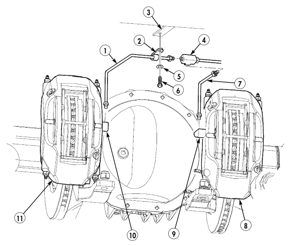

 FRONT OF VEHICLE

# 7-7.1. Brake Lines Replacement (Serial Numbers 300000 And Above) (Cont'D)

## C. Rear Caliper Brake Line Removal

1. Disconnect brake line (4) from caliper fitting (8) on right caliper (7). 2. Disconnect brake line (4) from tee fitting (12) on brake line (1). 3. Remove capscrew (6), washer (5), clamp (3), and brake line (4) from rear crossmember bracket (2). 4. Disconnect brake line (11) from caliper fitting (10) on left caliper (9). 5. Disconnect brake line (11) from tee fitting (12).

## D. Rear Caliper Brake Line Installation

1. Connect brake line (11) to tee fitting (12). 2. Connect brake line (11) to caliper fitting (10) of left caliper (9). Tighten to 8 lb-ft (11 N•m). 3. Install brake line (4) on rear crossmember bracket (2) with clamp (3), capscrew (6), and washer (5). 4. Connect brake line (4) to tee fitting (12) on brake line (1). 5. Connect brake line (4) to caliper fitting (8) of right caliper (7). Tighten to 8 lb-ft (11 N•m).

# 7-7.1. Brake Lines Replacement (Serial Numbers 300000 And Above) (Cont'D)

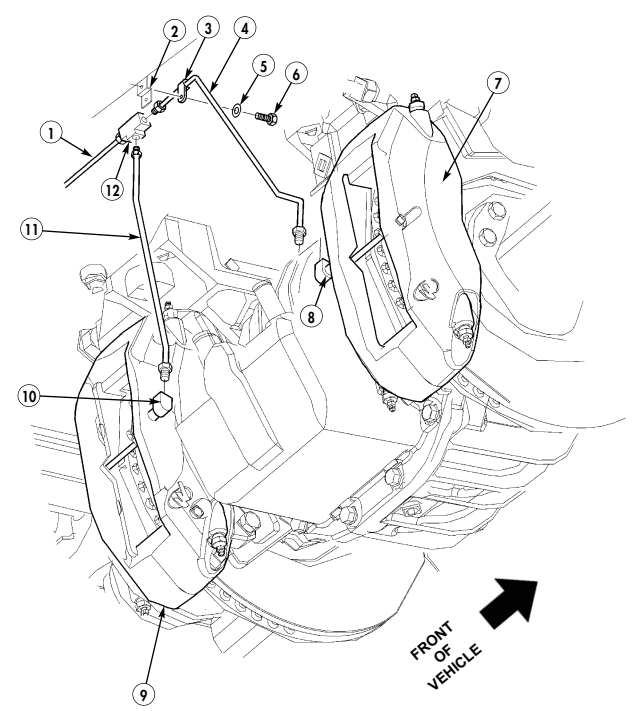

# 7-7.1. Brake Lines Replacement (Serial Numbers 300000 And Above) (Cont'D)

## E. Front Brake Line Removal

1. Disconnect front and rear brake lines (2) and (3) from proportioning valve (1). 2. Remove two capscrews (4) and (9), washers (5) and (10), clamps (6) and (11), and brake lines (2) and (8)
from two left-hand frame rail support brackets (13) on left-hand frame rail (12).

3. Disconnect brake line (8) from front tee union (14). 4. Disconnect brake lines (2) and (8) from front union (7). 5. Disconnect brake line (3) from front union (19). 6. Remove capscrew (15), washer (16), clamp (18), and brake line (3) from frame rail (17).

## F. Front Brake Line Installation

1. Install brake line (3) on frame rail (17) with clamp (18), washer (16) and capscrew (15). 2. Connect brake line (3) to front union (19). 3. Connect brake lines (2) and (8) to front union (7). 4. Connect brake line (8) to front tee union (14). 5. Install brake lines (2) and (8) on two left-hand frame rail support brackets (13) on left hand frame rail (12) with two clamps (6) and (11), washers (5) and (10), and capscrews (4) and (9).

6. Connect front and rear brake lines (2) and (3) to proportioning valve (1).

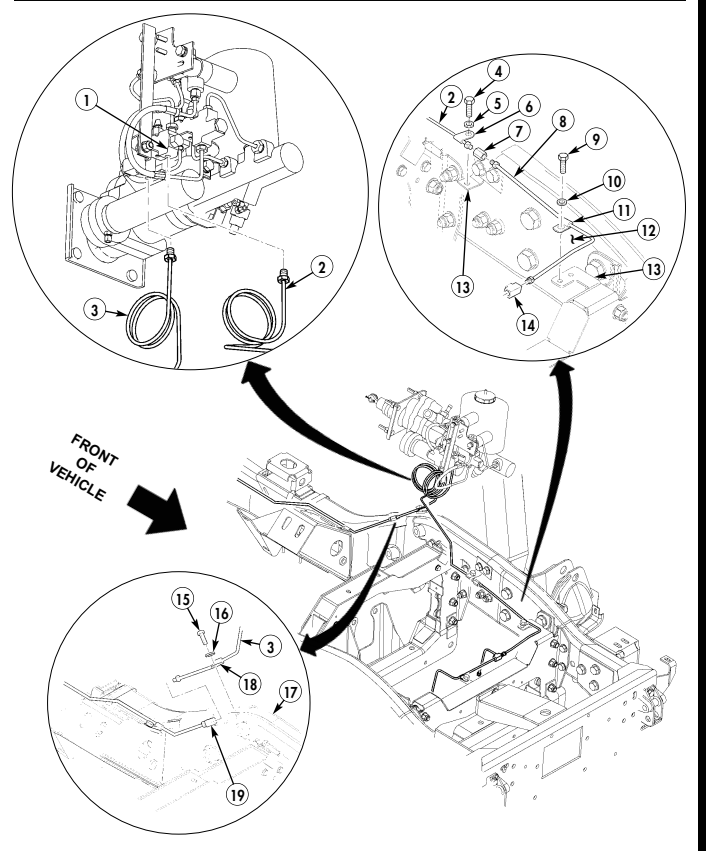

7-7.1. BRAKE LINES REPLACEMENT (SERIAL NUMBERS 300000 AND ABOVE) (Cont'd)

# 7-7.1. Brake Lines Replacement (Serial Numbers 300000 And Above)(Cont'D)

## G. Rear Brake Line Removal

1. Disconnect brake line (5) from rear tee union (1). 2. Disconnect brake line (5) from rear union (9). 3. Remove two capscrews (2) and (6), washers (3) and (7), clamps (4) and (8), and brake line (5) from left frame rail support bracket (15).

4. Disconnect brake line (13) from rear union (9). 5. Disconnect brake line (13) from rear union (29). 6. Remove capscrew (10), washer (11), clamp (12), and brake line (13) from left frame rail support bracket (14).

7. Remove three capscrews (25), (22), and (19), washers (24), (21), and (18), clamps (23), (20), and (17),
and brake line (13) from left frame rail (16).

8. Remove capscrew (27), washer (26), clamp (28), and brake line (13) from engine mount bracket (30).

## H. Rear Brake Line Installation

1. Install brake line (13) on engine mount bracket (30) with clamp (28), washer (26), and capscrew (27).

2. Install brake line (13) on left frame rail (16) with three clamps (23), (20), and (17),
washers (24), (21), and (18), and capscrews (25), (22), and (19).

3. Install brake line (13) on left frame rail support bracket (14) with clamp (12), washer (11),
and capscrew (10).

4. Connect brake line (13) to rear union (9). 5. Connect brake line (13) to rear union (29). 6. Install brake line (5) on left frame rail support bracket (15) with two clamps (4) and (8),
washers (3) and (7), and capscrews (2) and (6).

7. Connect brake line (5) to rear union (9). 8. Connect brake line (5) to rear tee union (1).

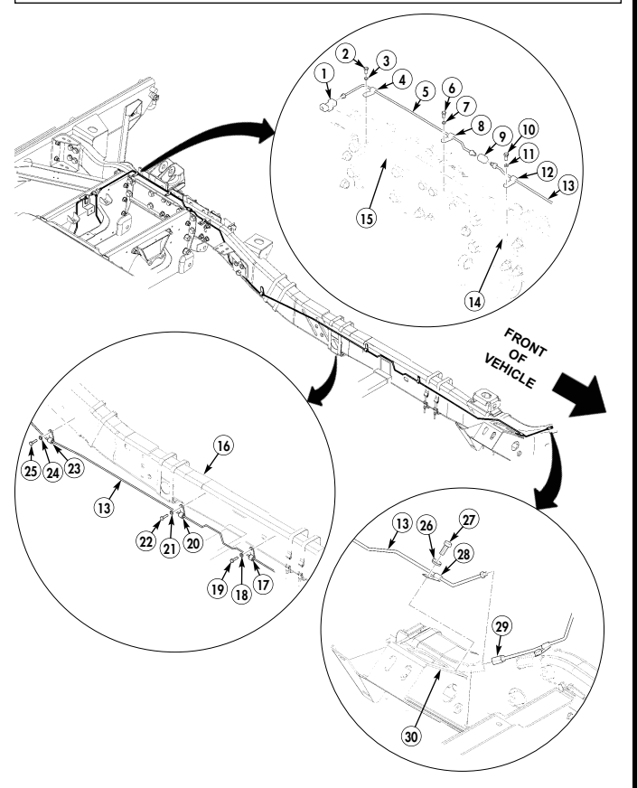

# 7-7.1. Brake Lines Replacement (Serial Numbers 300000 And Above) (Cont'D) 7-7.1. Brake Lines Replacement (Serial Numbers 300000 And Above)(Cont'D)

i. Proportioning Valve Brake Line Removal 1. Disconnect brake line (1) from proportioning valve (4) and pressure limiter valve (2). 2. Disconnect brake line (5) from proportioning valve (4) and pressure limiter valve (3).

j. Proportioning Valve Brake Line Installation 1. Connect brake line (5) to proportioning valve (4) and pressure limiter valve (3). 2. Connect brake line (1) to proportioning valve (4) and pressure limiter valve (2).

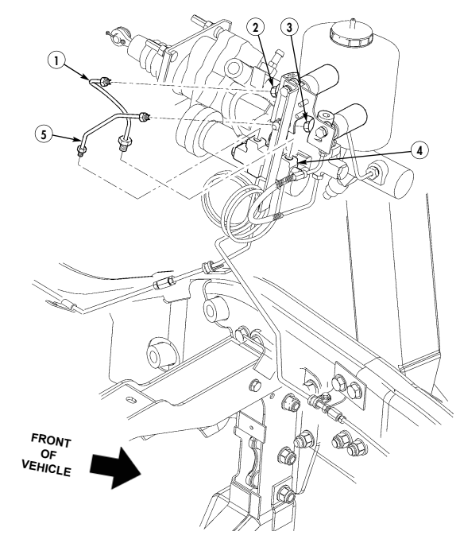

# 7-7.1. Brake Lines Replacement (Serial Numbers 300000 And Above) (Cont'D)

## K. Differential Valve Brake Line Removal

1. Disconnect brake line (18) from differential valve (24) and pressure limiter valve (19). 2. Disconnect brake line (25) from differential valve (24) and pressure limiter valve (21). 3. Disconnect brake line (20) from differential valve (24) and master cylinder (23). 4. Disconnect brake line (22) from differential valve (24) and master cylinder (23).

## L. Differential Valve Brake Line Installation

1. Connect brake line (22) to differential valve (24) and master cylinder (23). 2. Connect brake line (20) to differential valve (24) and master cylinder (23). 3. Connect brake line (25) to differential valve (24) and pressure limiter valve (21). 4. Connect brake line (18) to differential valve (24) and pressure limiter valve (19).

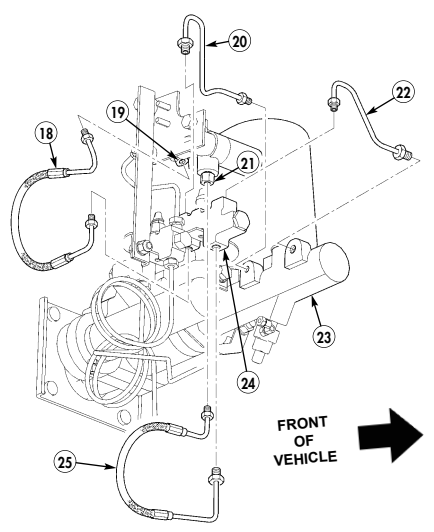

FOLLOW-ON TASKS: - Install parking brake access cover (para. 10-58.4).

- Install radiator (para. 3-62.1). - Bleed brake system (para. 7-2.1).

# 7-8. Brake Pressure Limiter Valve Replacement

This task covers:
INITIAL SETUP:
Tools General mechanic's tool kit:
automotive (Appendix B, Item 1)

## Materials/Parts

Two lockwashers (Appendix G, Item 185)
Manual References TM 9-2320-387-10 TM 9-2320-387-24P
a. Removal

a. Removal b. Installation

Equipment Condition
- Hood raised and secured (TM 9-2320-387-10). - Battery ground cables disconnected (para. 4-68).

Maintenance Level Unit

Cover or plug all open lines and connections immediately after disconnection to prevent contamination. Remove all covers or plugs prior to connection.

Have drainage container ready to catch brake fluid.

1. Disconnect brake lines (6) and (7) from adapter fittings (8) on brake pressure limiter valves (1). 2. Remove four adapter fittings (8) from two pressure limiter valves (1). 3. Remove two capscrews (3), lockwashers (4), washers (5), and pressure limiter valves (1) from bracket (2). Discard lockwashers (4).

b. Installation 1. Install two pressure limiter valves (1) on bracket (2) with two washers (5), lockwashers (4), and capscrews (3).

2. Install four adapter fittings (8) on two pressure limiter valves (1). 3. Connect brake lines (6) and (7) to adapter fittings (8) on brake pressure limiter valves (1).

# 7-8.  Brake Pressure Limiter Valve Replacement (Cont'D)

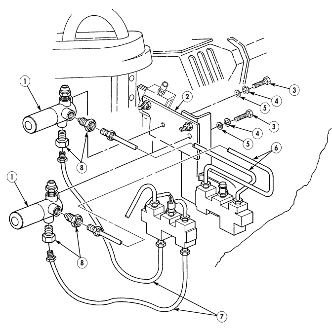

FOLLOW-ON TASKS: - Bleed brake system (para. 7-2 or para. 7-2.1).

- Lower and secure hood (TM 9-2320-387-10).

- Connect battery ground cables (para. 4-68).

■

# 7-9. Service Brake Pedal Replacement

This task covers:
INITIAL SETUP:
Tools General mechanic's tool kit:
automotive (Appendix B, Item 1)
Maintenance and repair shop equipment:
automotive (Appendix B, Item 2)

## Special Tools

Crowfoot, 7/8-in. (Appendix B, Item 142) Socket adapter (Appendix B, Item 135)

## Materials/Parts

Cotter pin (Appendix G, Item 23) Spring washer (Appendix G, Item 319) Two bearing sleeves (Appendix G, Item 3) Grease (Appendix C, Item 34)

a. Removal b. Installation

| Personnel Required   |
|----------------------|
| One mechanic         |

TM 9-2320-387-24P

## Equipment Condition

- Protective Control Box (PCB) removed (para. 4-4). - Stoplight switch removed (para. 4-60).

Maintenance Level Unit a. Removal 1. Disconnect return spring (4) from brake pedal bracket (12). 2. Remove cotter pin (7), washer (8), hydro-booster pushrod (5), and spring washer (9) from brake pedal bellcrank (10). Discard cotter pin (7) and spring washer (9).

3. Remove nut (6), washer (2), pivot pin (1), washer (2), and brake pedal assembly (11) from bracket (3). 4. Remove two bearing sleeves (13) from brake pedal assembly (11). Discard bearing sleeves (13).

## B. Installation

1. Apply grease to inside of two bearing sleeves (13) and install bearing sleeves (13) in brake pedal assembly (11).

2. Install brake pedal assembly (11) on bracket (3) with washer (2), pivot pin (1), washer (2), and nut (6).

Using adapter and crowfoot, tighten nut (6) to 60 lb-ft (81 N•m).

3. Install spring washer (9) and hydro-booster pushrod (5) on brake pedal bellcrank (10) with washer (8)
and cotter pin (7).

4. Connect return spring (4) to brake pedal bracket (12).

# 7-9.  Service Brake Pedal Replacement (Cont'D)

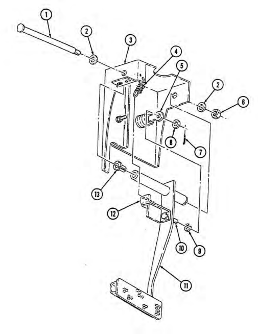

FOLLOW-ON TASKS: - Install stoplight switch (para. 4-60).

- Install protective control box (para. 4-4).

- Operate vehicle (TM 9-2320-387-10) and check brakes for proper operation.

# 7-10. Proportioning Valve And Differential Valve Replacement

This task covers:

## Initial Setup:)

Tools General mechanic's tool kit:
automotive (Appendix B, Item 1)
Maintenance and repair shop equipment:
automotive (Appendix B, Item 2)
Materials/Parts Locknut (Appendix G, Item 78) Locknut (Appendix G, Item 106) Lubricating oil (Appendix C, Item 46)
a. Differential Valve Removal c. Proportioning Valve Removal b. Differential Valve Installation d. Proportioning Valve Installation Manual References TM 9-2320-387-10 TM 9-2320-387-24P
Equipment Condition
- Battery ground cables disconnected (para. 4-68). - Hood raised and secured (TM 9-2320-387-10).

Maintenance Level Unit

- Cover or plug all open lines and connections immediately after disconnection to prevent contamination. Remove all covers or plugs prior to connection.

- Do not attempt to disassemble proportioning valve. Damage to equipment will result.

Have drainage container ready to catch brake fluid.

## A. Differential Valve Removal

1. Disconnect electrical connector (2) from differential valve (4). 2. Disconnect two brake lines (3) from differential valve (4). 3. Disconnect two brake lines (5) from differential valve (4). 4. Remove locknut (6), washer (7), and differential valve (4) with differential valve bracket (8) from hydro-boost (1). Discard locknut (6).

## B. Differential Valve Installation

1. Install differential valve (4) and differential valve bracket (8) on hydro-boost (1) with washer (7) and locknut (6). Tighten locknut (6) to 22 lb-ft (30 N•m).

2. Connect two brake lines (5) to bottom of differential valve (4). 3. Connect two brake lines (3) to top of differential valve (4). 4. Apply lubricating oil to pins (9) of differential valve (4). 5. Connect electrical connector (2) to differential valve (4).

## C. Proportioning Valve Removal

1. Disconnect two brake lines (17) from proportioning valve (16). 2. Disconnect two brake lines (15) from proportioning valve (16). 3. Remove locknut (14), washer (13), screw (11), and proportioning valve (16) with proportioning valve bracket (12) from bracket (10). Discard locknut (14).

7-10. PROPORTIONING VALVE AND DIFFERENTIAL VALVE REPLACEMENT (Cont'd)

## D. Proportioning Valve Installation

1. Install proportioning valve (16) and proportioning valve bracket (12) on bracket (10) with screw (11), washer (13), and locknut (14). Tighten locknut (14) to 22 lb-ft (30 N•m).

2. Connect two brake lines (15) to bottom of proportioning valve (16). 3. Connect two brake lines (17) to top of proportioning valve (16).

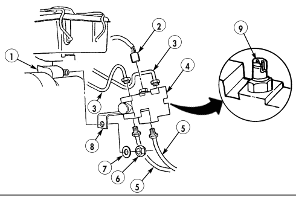

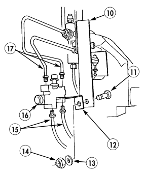

FOLLOW-ON TASKS: - Connect battery ground cables (para. 4-68).

- Bleed brake system (para. 7-2 or para. 7-2.1).

# 7-11. Brake Protection Guards Replacement (Serial Numbers 299999 And Below)

This task covers:
INITIAL SETUP:
Tools General mechanic's tool kit:
automotive (Appendix B, Item 1)
Materials/Parts Six locknuts (without 10,500 lb hydraulic winch) (Appendix G, Item 106)
Three locknuts (with 10,500 lb hydraulic winch) (Appendix G, Item 106)
Six locknuts (Appendix G, Item 82)
a. Removal **b. Installation**
Manual References TM 9-2320-387-24P
Equipment Condition Vehicle raised and supported (para. 8-2).

| Maintenance Level   |
|---------------------|
| Unit                |

## A. Removal Note

Perform steps 1 and 2 for vehicles equipped with 10,500 lb hydraulic winch only.

1. Remove two locknuts (3), washers (4), capscrews (8), washers (4), spacer (5), and left front brake protection guard (7) from bracket (9) and bumper (6). Discard locknuts (3).

2. Remove four locknuts (2), washers (1), capscrews (12), washers (1), two spacers (5), and right front brake protection guards (10) from bracket (11) and bumper (6). Discard locknuts (2).

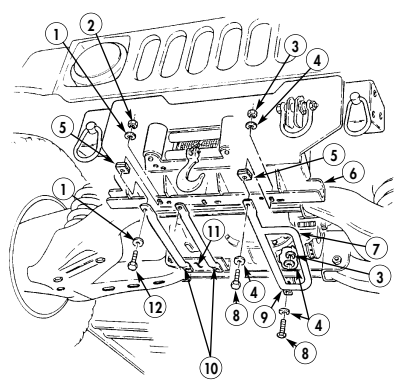

Equipped 10,500 LB Winch.

# 7-11. Brake Protection Guards Replacement (Serial Numbers 299999 And Below) (Cont'D)

Perform steps 3 through 6 for vehicles equipped with 9,000 lb electric winch only.

3. Remove two locknuts (15), washers (16), capscrews (30), washers (16), and left front brake protection guard (31) from brackets (32) and (29). Discard locknuts (15).

4. Remove four locknuts (20), washers (21), capscrews (28), washers (21), and right front brake protection guards (22) from brackets (19) and (25). Discard locknuts (20).

5. Remove two locknuts (13), washers (14), capscrews (18), washers (14), and brackets (32) and (29)
from front rear crossmember (17) and front crossmember (27). Discard locknuts (13).

6. Remove four locknuts (23), washers (24), capscrews (26), washers (24), and brackets (19) and (25)
from front rear crossmember (17) and front crossmember (27). Discard locknuts (23).

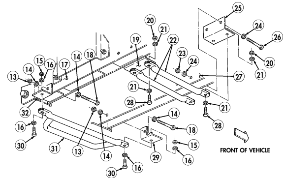

Equipped 9,000 LB Winch.

# 7-11. Brake Protection Guards Replacement (Serial Numbers 299999 And Below) (Cont'D)

b. Installation

Perform steps 1 and 2 for vehicles with 10,500 lb hydraulic winch only.

1. Install two spacers (5) and right front brake protection guards (10) on bumper (6) and bracket (11)
with four washers (1), capscrews (12), washers (1), and locknuts (2).

2. Install spacer (5) and left front brake protection guard (7) on bumper (6) and bracket (9) with two washers (4), capscrews (8), washers (4), and locknuts (3).

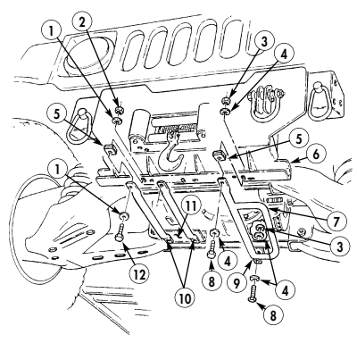

Equipped 10,500 LB Winch.

# 7-11. Brake Protection Guards Replacement (Serial Numbers 299999 And Below) (Cont'D)

Perform steps 3 through 6 for vehicles with 9,000 lb electric winch only.

3. Install brackets (25) and (19) on front rear crossmember (17) and front crossmember (27) with four washers (24), capscrew (26), washers (24), and locknuts (23).

4. Install brackets (31) and (29) on front rear crossmember (17) and front crossmember (27) with two washers (14), capscrew (18), washers (14), and locknuts (13).

5. Install right front brake protection guards (22) on brackets (25) and (19) with four washers (21),
capscrews (18), and locknuts (20).

6. Install left front brake protection guard (31) on brackets (32) and (29) with two washers (14), capscrews (30),
washers (14), and locknuts (15).

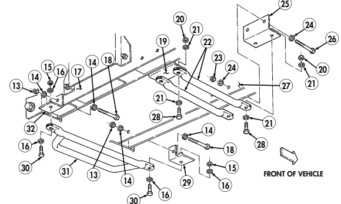

Equipped 9,000 LB Winch.

FOLLOW-ON TASK: Lower vehicle (para. 8-2).

# 7-11.1. Brake Protection Guards Replacement (Serial Numbers 300000 And Above)

This task covers:

| General mechanic's tool kit:   |
|--------------------------------|

| Tools   |
|---------|

Tools automotive (Appendix B, Item 1)
Maintenance and repair shop equipment:
automotive (Appendix B, Item 2)
Materials/Parts Ten locknuts (Appendix G, Item 82) Fourteen locknuts (Appendix G, Item 106) Locknut (Appendix G, Item 128) Three lockwashers (Appendix G, Item 145)
a. Removal a. Removal b. Installation

| Manual References    |
|----------------------|
| TM 9\-2320\-387\-24P |

Perform steps 1 and 2 for rear brake protection guards removal.

1. Remove eight locknuts (1), washers (2), capscrews (6), washers (5), and four brake guards (7) from brackets (10). Discard locknuts (1).

2. Remove eight locknuts (12), washers (11), capscrews (8), washers (9), and four brackets (10) from crossmembers (3) and (4). Discard locknuts (12).

Perform steps 3 through 8 for front brake protection guards removal.

3. Remove two locknuts (31), washers (32), capscrews (35), washers (34), and left front brake guard (36)
from brackets (33) and (40). Discard locknuts (31).

4. Remove four locknuts (23), washers (24), capscrews (27), washers (26), and two right front brake guards
(25) from brackets (16) and (19). Discard locknuts (23).

5. Remove two locknuts (14), washers (15), capscrews (18), washers (17), and bracket (16) from rear crossmember (13). Discard locknuts (14).

6. Remove two capscrews (22), lockwashers (21), washers (20), and bracket (19) from front crossmember (37). Discard lockwashers (21).

7. Remove locknut (42), washer (41), capscrew (38), washer (39), and bracket (40) from rear crossmember (13). Discard locknut (42).

8. Remove capscrew (30), lockwasher (29), washer (28), and bracket (33) from front crossmember (37).

Discard lockwasher (29).

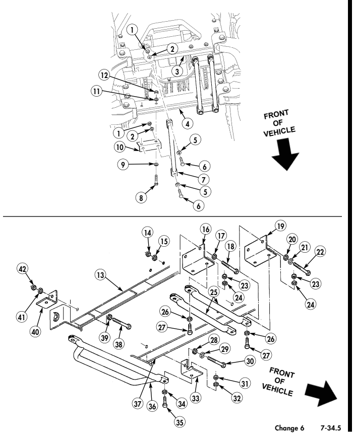

# 7-11.1. Brake Protection Guards Replacement (Serial Numbers 300000 And Above) (Cont'D) 7-11.1. Brake Protection Guards Replacement (Serial Numbers 300000 And Above) (Cont'D)

b. Installation

Perform steps 1 through 6 for front brake protection guards installation only.

1. Install bracket (21) on front crossmember (25) with washer (16), lockwasher (17), and capscrew (18). 2. Install bracket (28) on rear crossmember (1) with washer (27), capscrew (26), washer (29), and locknut (30).

3. Install bracket (7) on front crossmember (25) with two washers (8), lockwashers (9), and capscrews (10). 4. Install bracket (4) on rear crossmember (1) with two washers (5), capscrews (6), washers (3), and locknuts (2).

5. Install two right front brake guards (13) on brackets (7) and (4) with four washers (14),
capscrews (15), washers (12), and locknuts (11).

6. Install left front brake guard (24) on brackets (28) and (21) with two washers (22), capscrews (23),
washers (20), and locknuts (19).

Perform steps 7 and 8 for rear brake protection guards installation only.

7. Install four brackets (40) on crossmembers (34) and (33) with washers (39), capscrews (38), washers (41),
and locknuts (42).

8. Install four brake protection guards (37) on brackets (40) with eight washers (35), capscrews (36),
washers (32), and locknuts (31).

# 7-11.1. Brake Protection Guards Replacement (Serial Numbers 300000 And Above) (Cont'D)

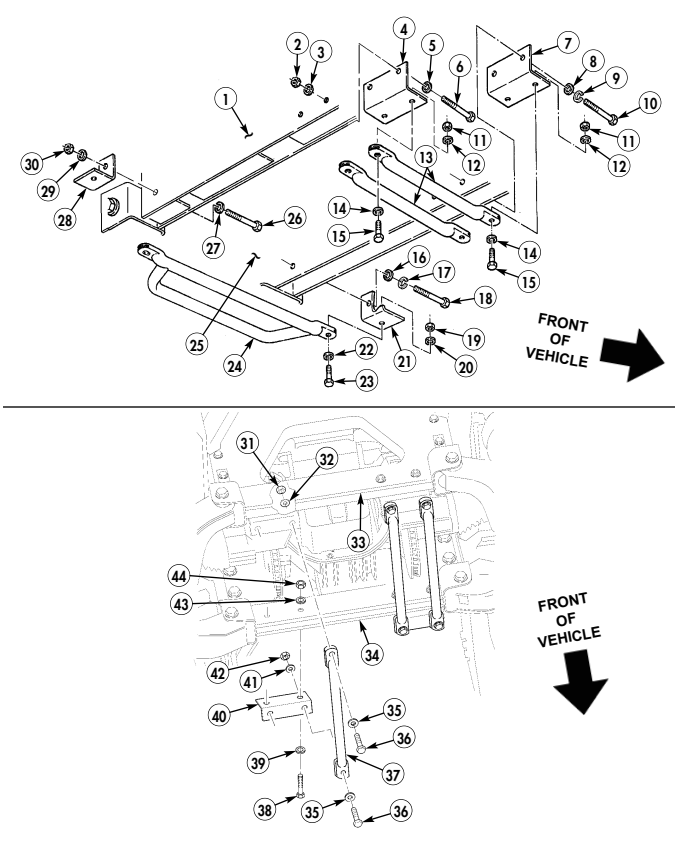

# 7-12. Service Brake Rotor Replacement (Serial Numbers 299999 And Below)

This task covers:
a. Removal b. Installation

## Initial Setup:

Tools General mechanic's tool kit:
automotive (Appendix B, Item 1)
Maintenance and repair shop equipment:
automotive (Appendix B, Item 2)
Materials/Parts Sealing compound (Appendix C, Item 63) Six two-piece lockwashers 
(Appendix G, Item 191)
a. Removal 1. Remove six capscrews (1) and two-piece lockwashers (2) from halfshaft (3), rotor (4), and output flange (5). Discard two-piece lockwashers (2).

Clean excess sealant from output flange threaded holes with a 10 mm tap.

2. Disconnect halfshaft (3) and remove rotor (4) from output flange (5). b. Installation

- New capscrews come with preapplied thread-locking compound, however, still apply sealing compound to threads of new capscrews. If old capscrews are to be used, mating threads must be cleaned and sealing compound applied to threads of capscrews.

- Two-piece lockwashers must be installed in sets of two with serrated sawtooth threads facing each other.

1. Apply sealing compound to threads of six capscrews (1). 2. Install rotor (4) on output flange (5). 3. Install halfshaft (3) on rotor (4) with six two-piece lockwashers (2) and capscrews (1).

Tighten capscrews (1) to 58 lb-ft (79 N•m).

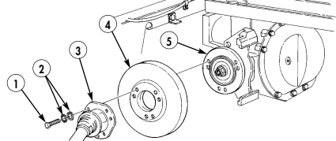

FOLLOW-ON TASK: Install service brake caliper (para. 7-4).

7-36/(7-36.1 blank) Change 6 Manual References TM 9-2320-387-24P
Equipment Condition Service brake caliper removed (para. 7-4).

Maintenance Level Unit

# 7-12.1. Service Brake Rotor Replacement (Serial Numbers 300000 And Above)

This task covers:
a. Removal b. Installation

## Initial Setup:

Tools General mechanic's tool kit:
automotive (Appendix B, Item 1)
Maintenance and repair shop equipment:
automotive (Appendix B, Item 2)
Materials/Parts Sealing compound (Appendix C, Item 62) Six two-piece lockwashers 
(Appendix G, Item 191)
Manual References TM 9-2320-387-24P
Equipment Condition
•Service brake caliper removed (para. 7-4.1). •Parking brake pad removed (para. 7-22).

Maintenance Level Unit

Replacement procedures for all rotors are basically the same. This procedure covers the front rotor.

## A. Removal

1. Remove six capscrews (5) and two-piece lockwashers (4) from halfshaft (3), rotor (2), and output flange (1). Discard two-piece lockwashers (4).

Clean excess sealant from output flange threaded holes with a 10 mm tap.

2. Disconnect halfshaft (3) and remove rotor (2) from output flange (1).

b. Installation

- Use capscrew to align rotor to mounting holes until halfshaft is installed.

- New capscrews come with pre-applied thread-locking compound, however, still apply sealing compound to threads of new capscrews. If old capscrews are to be used, mating threads must be cleaned and sealing compound applied to threads of capscrews.

- Two-piece lockwashers must be installed in sets of two with serrated sawtooth threads facing each other.

1. Install rotor (2) on output flange (1). 2. Install halfshaft (3) on rotor (2) with six two-piece lockwashers (4) and capscrews (5).

Tighten capscrews (5) to 58 lb-ft (79 N•m).

# 7-12.1. Service Brake Rotor Replacement (Serial Numbers 300000 And Above) (Cont'D)

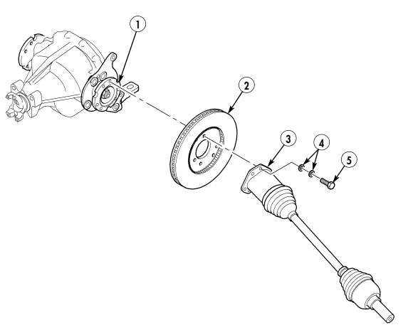

FOLLOW-ON TASKS: - Install parking brake pad (para. 7-22).

- Install service brake caliper (para. 7-4.1).

# Section Ii. Rear Dual Service/Parking Brake System Maintenance

| INITIAL SETUP:                                                                    |                                        |
|-----------------------------------------------------------------------------------|----------------------------------------|
| Tools                                                                             | Manual References                      |
| General mechanic's tool kit:                                                      | TM 9\-2320\-387\-24P                   |
| automotive (Appendix B, Item 1)                                                   | Equipment Condition                    |
| Maintenance and repair shop equipment: automotive (Appendix B, Item 2)            | Wheel removed (para. 8\-3).            |
| Special Tools                                                                     | General Safety Instructions            |
|                                                                                   | Ensure locktab on lockwasher is bent   |
| Spindle seal installer (Appendix B, Item 109) Driver handle (Appendix B, Item 60) | completely into slot on retaining nut. |
| Wrench (Appendix B, Item 108)                                                     | Maintenance Level                      |
| Materials/Parts                                                                   | Unit                                   |
| Lockwasher (Appendix G, Item 170)                                                 |                                        |

# 7-13. Rear Dual Service/Parking Brake System Maintenance Task Summary

# 7-14. Rear Dual Service/Parking Brake Pad Maintenance

This task covers:
a. Removal c. Installation b. Cleaning and Inspection

## Initial Setup:

| . Special Tools   |
|-------------------|

## Tools

General mechanic's tool kit:
automotive (Appendix B, Item 1)
Maintenance and repair shop equipment:
automotive (Appendix B, Item 2)
Crowfoot, 14-mm (Appendix B, Item 141)
Materials/Parts Clip (Appendix G, Item 11) Cotter pin (Appendix G, Item 19) Sealing compound (Appendix C, Item 63) Grease (Appendix C, Item 34)

| Unit   |
|--------|

Wheels chocked and parking brake released

| wheel studs.   |
|----------------|

| General Safety Instructions   |
|-------------------------------|

a. Removal 1. Remove cotter pin (4), washer (5), and clevis pin (7) from parking brake clevis (6) and lever (3).

Discard cotter pin (4).

2. Remove clip (2) and disconnect parking brake cable (8) from caliper cable bracket (1). Discard clip (2).

Caliper must be supported during removal to prevent damage to brake line.

3. Using crowfoot, remove two capscrews (12), washers (13), clamp (13.1), and pull yoke (14) and caliper
(15) away from rotor (10).

Note positioning of brake pad surfaces for installation.

4. Remove two brake pads (9) from adapter (11) and rotor (10).

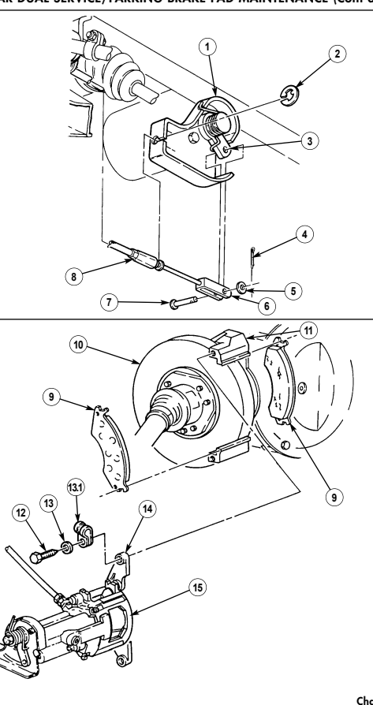

7-14. REAR DUAL SERVICE/PARKING BRAKE PAD MAINTENANCE (Cont'd)

# 7-14. Rear Dual Service/Parking Brake Pad Maintenance (Cont'D)

b. Cleaning and Inspection

Apply a light coat of grease on adapter slides.

1. Clean mating surfaces of caliper (1) and adapter (7) and lubricate adapter slides with grease. 2. Inspect caliper (1) and caliper piston (3) for cracks, pitting, or damage. Replace caliper assembly if cracked, pitted, or damaged (para. 7-15).

3. Inspect dust boot (4) for tears or deterioration. Replace caliper (1) if dust boot (4) is torn or deteriorated (para. 7-15).

4. Inspect caliper cable bracket (2) for looseness, damage, and rotation. If loose, damaged, or repositioned, replace caliper (1) (para. 7-15).

5. Thoroughly clean and inspect rotor (6) for heat cracks, discoloration, pitting, or scoring. Replace rotor (6) if cracked, pitted, or scored (para. 7-12).

Ensure grease and oil are not in contact with rotor and/or shoe and lining friction surface. Failure to do so will result in damage to equipment and poor performance.

- Replace brake pads in sets on both sides of differential. - Replace brake pads if thickness is less than 1/8 in. (3.2 mm)
and operation in wet and muddy conditions is expected.

6. Inspect brake pads (5) for glazing, oil saturation, or wear. If glazed, oil saturated, or if brake pad thickness is less than 1/8 in. (3.2 mm), replace both pads (5) and pads on opposite caliper.

c. Installation

Ensure brake pads are installed with linings facing rotor. Failure to do this may cause injury to personnel or damage to equipment.

1. Position two brake pads (5) facing rotor (6) in adapter (7). 2. Apply sealing compound to tapped holes of adapter (7).

Applying force to piston cap will result in piston cap damage.

3. Rotate caliper piston (3) in a clockwise direction and at the same time apply force on outer piston hex until caliper piston (3) is seated in piston bore.

4. Install caliper (1) and yoke (10) on adapter (7) and rotor (6) with clamp (9.1), two washers (9), and capscrews (8). Using crowfoot, tighten capscrews (8) to 30-40 lb-ft (41-54 N•m).

5. Install parking brake cable (18) on caliper cable bracket (11) with clip (12).

- Ensure lever is in contact with caliper cable bracket stop.

Damage to equipment and poor performance will result if not aligned properly.

- Ensure clevis and clevis pin are aligned to lever. Do not move lever to accommodate a misadjusted clevis. Damage to equipment and poor performance will result.

6. Check position of lever (13) and ensure it is in contact with caliper cable stop bracket (19). 

Install parking brake clevis (16) on lever (13) with clevis pin (17), washer (15), and cotter pin (14). 

# 7-14. Rear Dual Service/Parking Brake Pad Maintenance (Cont'D)

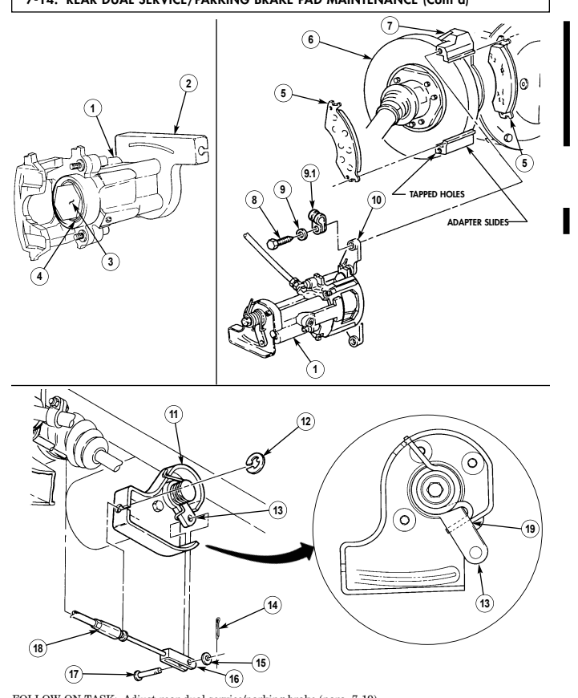

FOLLOW-ON TASK:  Adjust rear dual service/parking brake (para. 7-19).
# 7-15. Rear Dual Service/Parking Brake Caliper Maintenance

This task covers:
a. Removal c. Installation b. Cleaning and Inspection

## Initial Setup:

Tools General mechanic's tool kit:
automotive (Appendix B, Item 1)
Maintenance and repair shop equipment:
automotive (Appendix B, Item 2)
Special Tools Crowfoot, 14-mm (Appendix B, Item 141) Hex-head driver, 7-mm
(Appendix B, Item 151)

## Materials/Parts

Cotter pin (Appendix G, Item 19) Copper washer (Appendix G, Item 14) Clip (Appendix G, Item 11) Sealing compound (Appendix C, Item 63)
Manual References TM 9-2320-387-10 TM 9-2320-387-24P
Equipment Condition Wheels chocked and parking brake released (TM 9-2320-387-10).

Maintenance Level Unit a. Removal

Cover or plug all open lines and connections immediately after disconnection to prevent contamination. Remove all plugs prior to connection.

1. Remove cotter pin (4), washer (5), and clevis pin (7) from parking brake clevis (6) and lever (3).

Discard cotter pin (4).

2. Remove clip (2) and disconnect parking brake cable (8) from caliper cable bracket (1). Discard clip (2).

Have drainage container ready to catch brake fluid.

3. Disconnect brake line (17) from coupling (16). 4. Remove coupling (16) and copper washer (15) from caliper (14). Discard copper washer (15). 5. Using crawfoot, remove two capscrews (10), washers (11), clamp (11.1), and pull yoke (12) and caliper (14) away from adapter (9).

6. Slide yoke (12) and locating pins (13) out from caliper (14).

7-15.  REAR DUAL SERVICE/PARKING BRAKE CALIPER MAINTENANCE (Cont'd)

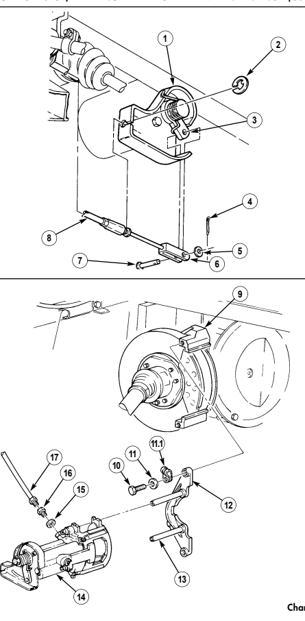

# 7-15. Rear Dual Service/Parking Brake Caliper Maintenance (Cont'D)

b. Cleaning and Inspection

Apply a light coat of grease on adapter slides.

1. Clean mating surfaces of caliper (1) and adapter (7) and lubricate adapter slides with grease. 2. Clean cooling fins of rotor (6). 3. Inspect caliper (1) and caliper piston (4) for cracks, pitting, or damage. Replace caliper (1) if cracked, pitted, or damaged.

4. Inspect caliper cable bracket (2) for looseness, damage, and rotation. If loose, damaged, or repositioned, replace caliper (1).

5. Inspect dust boot (5) for tears or deterioration. Replace caliper (1) if dust boot (5) is torn or deteriorated.

6. Inspect rotor (6) for heat cracks, discoloration, pitting, or damage. Replace rotor (6) if cracked, pitted, or scored (para. 7-12).

7. Inspect yoke locating pins (12) for cracks or corrosion. Perform step 8 if cracked or corroded. If not, perform step 9.

8. Using 7-mm hex-head driver, remove locating pins (12) from yoke (11). Discard locating pins (12).

NOTE
- Replace brake pads in sets on both sides of differential. - Replace brake pads if thickness is less than 1/8 in. (3.2 mm) 
and operation in wet and muddy conditions is expected.

9. Inspect brake pads (8) for glazing, oil saturation, or wear. If glazed, oil saturated, or if brake pad thickness is less than 1/8 in. (3.2 mm), replace both pads (8) and pads on opposite caliper (para. 7-14).

c. Installation

Ensure grease and oil are not in contact with rotor and/or brake pad friction surface. Failure to do so will result in damage to equipment and poor performance.

1. Open bleeder valve (3) and depress piston (4) into caliper (1) while rotating piston (4) in a clockwise direction and, at the same time, apply pressure until piston (4) is seated in piston bore.

Perform step 2 only if yoke locating pins were removed.

2. Apply sealing compound to threads of locating pins (12) and install locating pins (12) in yoke (11)
using 7-mm hex-head driver. Tighten locating pins (12) to 25-35 lb-ft (34-47 N•m).

3. Slide yoke (11) and two locating pins (12) into caliper (1). 4. Apply sealing compound to tapped holes of adapter (7). 5. Install caliper (1) and yoke (11) on adapter (7) with clamp (10.1), two washers (10), and capscrews (9). Using crowfoot, tighten capscrews (9) to 30-40 lb-ft (41-54 N•m).

6. Install copper washer (13) and coupling (14) on caliper (1) and connect brake line (15) to coupling (14). 7. Install parking brake cable (23) on caliper cable bracket (16) with clip (17).

- Ensure lever is in contact with caliper cable bracket stop.

Damage to equipment and poor performance will result if not aligned properly.

- Ensure clevis and clevis pin are aligned to lever. Do not move lever to accommodate a misadjusted clevis, or damage to equipment and poor performance will result.

8. Check position of lever (18) and ensure it is in contact with caliper cable bracket stop (24). 9. Install parking brake clevis (21) on lever (18) with clevis pin (22), washer (20), and cotter pin (19).

7-44 Change 1

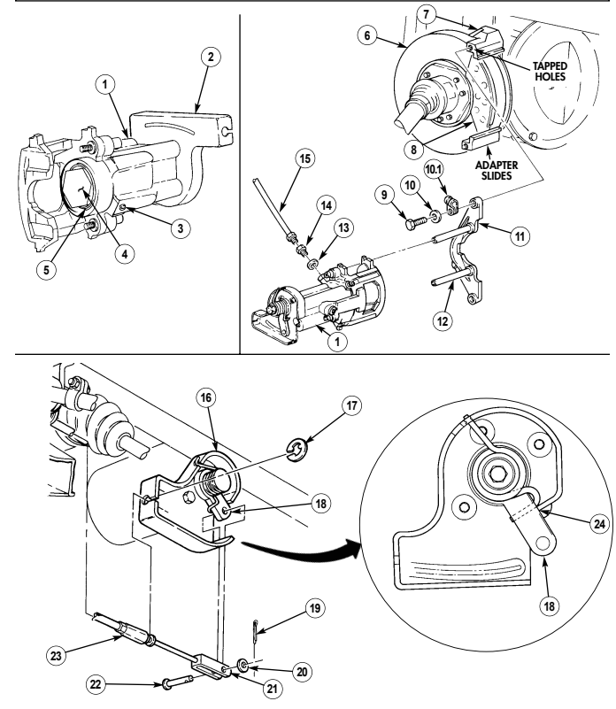

# 7-15. Rear Dual Service/Parking Brake Caliper Maintenance (Cont'D)

FOLLOW-ON TASKS: - Bleed brake system (para. 7-2).

· Adjust rear dual service/parking brake (para. 7-19).

# 7-16. Right Parking Brake Cable Replacement

This task covers:
INITIAL SETUP:
a. Removal b. Installation

| INITIAL SETUP:                                          |    |
|---------------------------------------------------------|----|
| Tools Manual References                                 |    |
| General mechanic's tool kit:  TM 9\-2320\-387\-24P      |    |
| automotive (Appendix B, Item 1)  Maintenance Level      |    |
| Materials/Parts Unit                                    |    |
| Lockwasher (Appendix G, Item 144)                       |    |
| a. Removal                                              |    |
| Disconnect vent line (2) from tee fittings (1) and (5). | 1. |

- Muffler and catalytic converter removed - Wheels chocked and parking brake released a. Removal 1. Remove cotter pin (29), washer (28), clevis pin (26), and brake clevis (27) from rear caliper lever
(30). Discard cotter pin (29).

2. Remove brake cable clip (1) and parking brake cable sleeve (25) from rear caliper cable bracket (2)
and remove cable assembly (4) from caliper cable bracket (2). Discard cable clip (1).

3. Remove parking brake cable clip (7) from parking brake cable sleeve (6) and C-beam (9). Disconnect parking brake cable (4) from parking brake equalizer bar (8). Discard cable clip (7).

4. Remove two capscrews (12), parking brake cable clamps (5), and parking brake cable assembly (4)
from body (11).

5. Remove locknut (15), capscrew (17), lockwasher (16), and parking brake cable clamp (18) from clamp bracket (22). Discard lockwasher (16) and locknut (15).

6. Remove capscrew (19), lockwasher (20), and parking brake cable clamp (21) from bracket (22).

Discard lockwasher (20).

Perform step 7 if replacing clamp bracket.

7. Remove locknut (24), washer (23), capscrew (13), washer (14), and clamp bracket (22) from support bracket (3). Discard locknut (24).

b. Installation

Perform step 1 if clamp bracket was removed.

1. Install clamp bracket (22) on support bracket (3) with washer (14), capscrew (13), washer (23), and locknut (24).

2. Slide parking brake cable clamp (21) onto parking brake cable assembly (4) and install on clamp bracket (22) with lockwasher (20) and capscrew (19).

3. Slide parking brake cable clamp (18) on parking brake cable assembly (4) and install on clamp bracket (22) with capscrew (17), lockwasher (16), and locknut (15).

4. Install two parking brake cable clamps (5) on parking brake cable assembly (4) and body (11) with capscrews (12).

5. Install parking brake cable sleeve (6) on C-beam (9) and parking brake cable (10) to parking brake equalizer bar (8) with parking brake cable clip (7).

# 7-16. Right Parking Brake Cable Replacement (Cont'D)

Ensure caliper cable bracket is secure with no signs of looseness and lever is in contact with caliper cable bracket stop. Damage to equipment and poor performance will result if not aligned properly.

6. Install parking brake cable sleeve (25) on rear caliper cable bracket (2) with brake cable clip (1). 7. Install brake clevis (27) on rear caliper lever (30) with clevis pin (26), washer (28), and cotter pin (29).

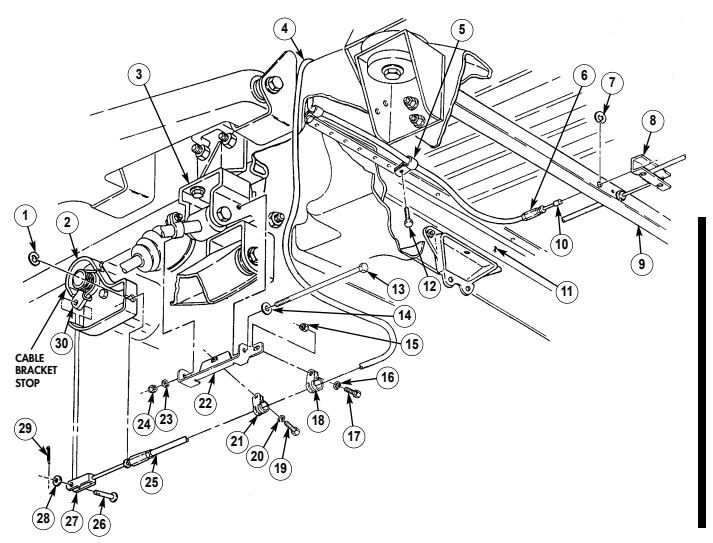

FOLLOW-ON TASKS: - Adjust parking brake lever (TM 9-2320-387-10).

- Install muffler and catalytic converter (para. 3-49).

# 7-17. **Left Parking Brake Cable/Mounting Bracket Replacement**

This task covers:
a. Removal b. Installation

## Initial Setup:

| Tools                           | Equipment Condition                       |
|---------------------------------|-------------------------------------------|
| General mechanic's tool kit:    | Parking brake pads removed (para. 7\-22). |
| automotive (Appendix B, Item 1) | Maintenance Level                         |
| Manual References               | Unit                                      |
| TM 9\-2320\-387\-24P            |                                           |
| a. Removal                      |                                           |

| Maintenance Level   |
|---------------------|
| Unit                |

Two locknuts (Appendix G, Item 133) Two locknuts (Appendix G, Item 106)

## A. Removal

1. Remove cotter pin (11), washer (12), clevis pin (14), and brake clevis (13) from rear caliper lever (10). Discard cotter pin (11).

2. Remove brake cable clip (9) and parking brake cable sleeve (2) from rear caliper cable bracket (8).

Discard cable clip (9).

3. Remove parking brake cable clip (23) and parking brake cable sleeve (2) from C-beam (24).

Disconnect parking brake cable (1) from parking brake equalizer bar (22). Discard cable clip (23).

4. Remove assembled locknut (3), capscrew (6), washer (4), and brake cable clamp (5) from mounting bracket (25) and parking brake cable assembly (15). Discard assembled locknut (3).

5. Remove locknut (21), capscrew (28), lockwasher (29), and parking brake cable clamp (19) from bracket (30). Discard lockwasher (29) and locknut (21).

6. Remove capscrew (18), lockwasher (17), and parking brake cable clamp (16) from bracket (30).

Discard lockwasher (17).

NOTE
Perform step 7 if replacing clamp bracket.

7. Remove locknut (32), washer (31), capscrew (27), washer (26), and clamp bracket (30) from support bracket (7). Discard locknut (32).

Perform step 8 if replacing parking cable mounting bracket.

8. Remove two locknuts (33), washers (35), capscrews (36), washers (35), mounting bracket (25), and tailpipe hanger (37) from rear body mount (38). Discard locknuts (33).

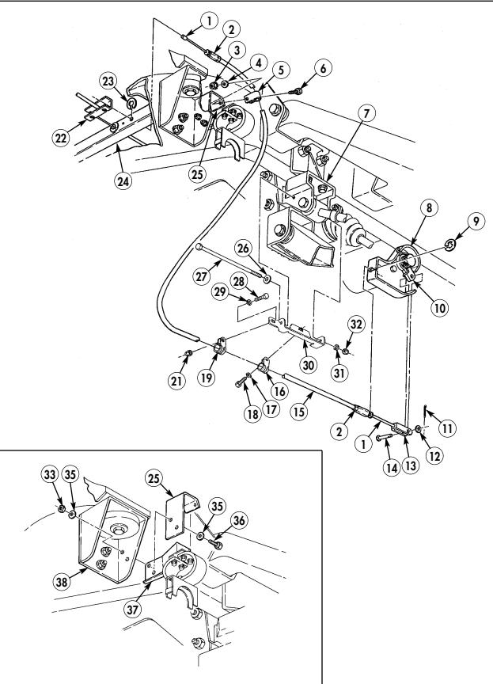

7-17. LEFT PARKING BRAKE CABLE/MOUNTING BRACKET REPLACEMENT (Cont'd)

# 7-17. **Left Parking Brake Cable/Mounting Bracket Replacement (Cont'D)**

b. Installation

Perform step 1 if parking brake cable mounting bracket was removed.

1. Install parking brake cable mounting bracket (4) and tailpipe hanger (6) on rear body mount (7)
with two washers (3), capscrews (5), washers (3), and locknuts (1).

Perform step 2 if clamp bracket was removed.

2. Install clamp bracket (35) on support bracket (14) with washer (32), capscrew (37), washer (34), and locknut (33).

3. Slide parking brake cable clamp (23) onto parking bracket cable assembly (22) and install on clamp bracket (35) with lockwasher (24) and capscrew (25).

4. Slide parking brake cable clamp (26) onto parking brake cable assembly (22) and install on clamp bracket (35) with lockwasher (36), capscrew (38), and locknut (28).

5. Install parking brake cable clamp (12) on parking brake cable assembly (22) and parking brake cable mounting bracket (4) with capscrew (13), washer (11), and assembled locknut (10).

6. Install parking brake cable sleeve (9) on C-beam (29) and parking brake cable (8) on equalizer bar (30)
with parking brake cable clip (31).

Ensure caliper cable bracket is secure with no signs of looseness and lever is in contact with the caliper cable bracket stop. Damage to equipment and poor performance will result if not aligned properly.

7. Install parking brake cable sleeve (9) on rear caliper cable bracket (15) with brake cable clip (16). 8. Install brake clevis (20) on rear caliper lever (17) with clevis pin (21), washer (19), and cotter pin (18).

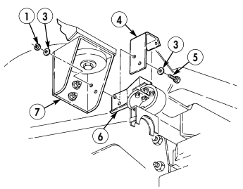

# 7-17. Left Parking Brake Cable/Mounting Bracket Replacement (Cont'D)

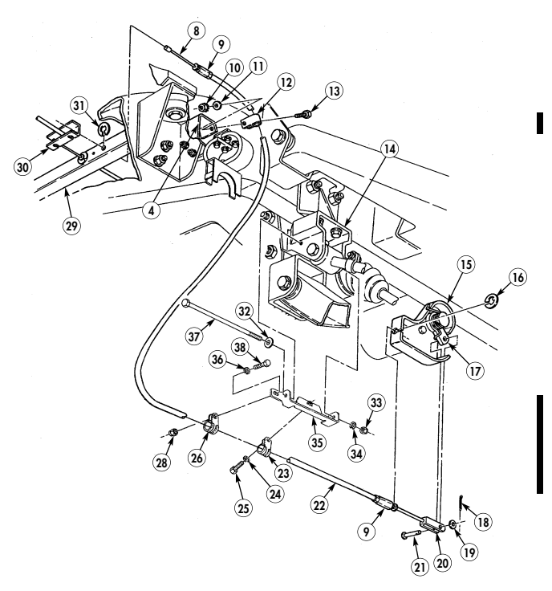

FOLLOW-ON TASKS: - Adjust parking brake lever (TM 9-2320-387-10).

- Install muffler and catalytic converter (para. 3-49).

# 7-18. Rear Dual Service/Parking Brake Rod Replacement

This task covers:
INITIAL SETUP:

## Tools

General mechanic's tool kit:
automotive (Appendix B, Item 1)
Materials/Parts Three cotter pins (Appendix G, Item 19) Locknut (Appendix G, Item 82) Locknut (Appendix G, Item 87)
Manual References TM 9-2320-387-10 TM 9-2320-387-24P

a. Removal b. Installation

Equipment Condition
- Muffler and catalytic converter removed 
(para. 3-49).

- Wheels chocked and parking brake released
(TM 9-2320-387-10).

Maintenance Level Unit

## A. Removal

1. Remove two cotter pins (left and right) (23), washers (22), clevis pins (20), and brake clevises (21)
from caliper levers (24). Discard cotter pins (23).

2. Remove clip (5) and spread boot (6) to allow access to cotter pin (12). 3. Remove cotter pin (12), washer (11), clevis pin (8), and clevis (9) from brake rod (14) and bellcrank
(7). Discard cotter pin (12).

4. Remove locknut (17), washer (16), spacer (15), washer (3), capscrew (4), and spring (2) from body
(13). Discard locknut (17).

5. Remove locknut (19) and convex washer (18) from brake rod (14) and brake cable equalizer bar (1).

Discard locknut (19).

6. Remove brake rod (14) from brake cable equalizer bar (1) by sliding brake rod (14) forward. 7. Remove clevis (9) and nut (10) from brake rod (14). 8. Remove brake rod insulator (17.1) from brake rod (14).

## B. Installation

3. Slide brake rod (14) rearward through spring (2). 4. Install brake rod (14) on brake cable equalizer bar (1) with convex washer (18) and locknut (19).

Tighten locknut (19) far enough to expose 3 to 5 threads on end of brake rod (14).

5. Spread boot (6) and install clevis (9) on bellcrank (7) with clevis pin (8), washer (11), and cotter pin (12). 6. Install clip (5) on boot (6).

Ensure caliper cable bracket is secure with no signs of looseness and lever is in contact with caliper cable bracket stop. Damage to equipment and poor performance will result if not aligned properly.

7. Install two brake clevises (21) on rear caliper levers (24) with clevis pins (20), washers (22), and cotter pins (23).

1. Install brake rod insulator (17.1) on brake rod (14).

1.1 Install spring (2) and spacer (15) on body (13) with washer (3), capscrew (4), washer (16), and locknut (17).

2. Install nut (10) and clevis (9) on brake rod (14).

# 7-18. Rear Dual Service/Parking Brake Rod Replacement (Cont'D)

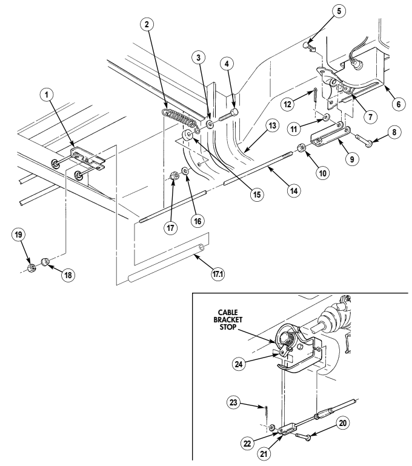

FOLLOW-ON TASKS: - Adjust rear dual service/parking brake (para. 7-19).

· Install muffler and catalytic converter (para. 3-49).

# 7-19. Rear Dual Service/Parking Brake Adjustment

This task covers:
Adjustment INITIAL SETUP:
Tools General mechanic's tool kit:
automotive (Appendix B, Item 1)
Maintenance and repair shop equipment:
automotive (Appendix B, Item 2)

## Materials/Parts

Cotter pin (Appendix G, Item 19)
Personnel Required One mechanic One assistant Manual References TM 9-2320-387-10 TM 9-2320-387-24P
Equipment Condition Wheels chocked and parking brake released (TM 9-2320-387-10).

Maintenance Level Unit

The Kelsey-Hayes parking brake mechanism has an automatic adjusting feature and does not require periodic manual adjustment. When parking brake components or rear brake pads are replaced, the parking brake linkage must be initially positioned to ensure proper parking brake system operation. The only additional adjustment necessary is accomplished with parking brake hand lever. Refer to TM 9-2320-387-10.

## Adjustment

1. Remove clip (1) and spread boot (2) to allow access to cotter pin (9). 2. Remove cotter pin (9), washer (8), and clevis pin (4) from clevis (5) and bellcrank (3). Discard cotter pin (9).

3. Repeatedly apply and adjust parking brake hand lever until bellcrank (3) linear travel is 0.75 in.

(19 mm).

Holes in parking brake clevis must align to holes in adjusting bellcrank without force for proper parking brake adjustment. Failure to do this may result in damage to equipment and poor performance.

4. Release parking brake. Loosen nut (6) and adjust clevis (5) so holes in clevis (5) align to holes in bellcrank (3). Install clevis (5) on bellcrank (3) with clevis pin (4), washer (8), and cotter pin (9).

Do not overtighten brake rod. Overtightening brake rod may result in dragging brakes.

5. If necessary, remove excess slack in parking brake cables by turning parking brake rod (7)
clockwise or counterclockwise into clevis (5).

# 7-19. Rear Dual Service/Parking Brake Adjustment (Cont'D)

Ensure caliper cable bracket is secure with no signs of looseness and lever is in contact with caliper cable bracket stop. Damage to equipment and poor performance will result if not aligned properly.

Perform step 6 on both sides.

6. Parking brake rod (7) is properly adjusted if lever (11) is in contact with caliper cable bracket stop (10).

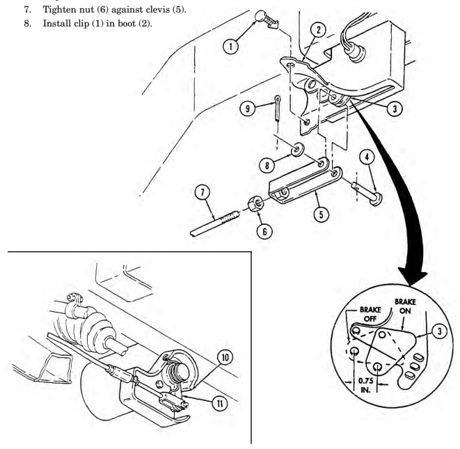

FOLLOW-ON TASK: Adjust parking brake lever (TM 9-2320-387-10).

# 7-20. Parking Brake Lever Replacement

This task covers:
INITIAL SETUP:

## Tools

General mechanic's tool kit:
automotive (Appendix B, Item 1)
Maintenance repair shop equipment:
automotive (Appendix B, Item 2)

## Materials/Parts

Two nut and lockwasher assemblies
(Appendix G, Item 194)
Five locknuts (Appendix G, Item 77) Cotter pin (Appendix G, Item 19)
Personnel Required One mechanic One assistant

## A. Removal

1. Remove clip (1) and open boot (2) to allow access to clevis pin (4).

5. Remove two locknuts (16), washers (15), capscrews (13), washers (14), and parking brake lever (8)
from body (20). Discard locknuts (16).

6. Remove upper boot (18) from parking brake lever (8). 7. Remove lower boot (2) from body (20).

## B. Installation

1. Install lower boot (2) on body (20). 2. Install upper boot (18) on parking brake lever (8). 3. Install parking brake lever (8) on body (20) with two washers (14), capscrews (13), washers (15),
and locknuts (16).

4. Install capscrew (19), nut and lockwasher assembly (9), wiring harness clamp (10), and nut and lockwasher assembly (9) on parking brake lever (8).

5. Secure parking brake lever (8) on body (20) with three capscrews (17), washers (12), and locknuts (11).

6. Install clevis (5) on bellcrank (3) with clevis pin (4), washer (6), and cotter pin (7). 7. Apply parking brake lever (8) and tighten capscrews (13), (17), and (19) to 8 lb-ft (11 N•m). 8. Close boot (2) and install clip (1).

Manual References TM-9-2320-387-10 TM 9-2320-387-24P
Equipment Condition - Wheels chocked and parking brake released
(TM 9-2320-387-10).

- Parking brake switch removed (para. 4-23). Maintenance Level Unit 2. Remove cotter pin (7), washer (6), and clevis pin (4) from clevis (5) and bellcrank (3). Discard cotter pin (7).

3. Remove nut and lockwasher assembly (9), wiring harness clamp (10), nut and lockwasher assembly (9),
and capscrew (19) from parking brake lever (8). Discard nut and lockwasher assemblies (9).

4. Remove three locknuts (11), washers (12), and capscrews (17) from parking brake lever (8) and body (20). Discard locknuts (11).

## A. Removal B. Installation

# 7-20.  Parking Brake Lever Replacement (Cont'D)

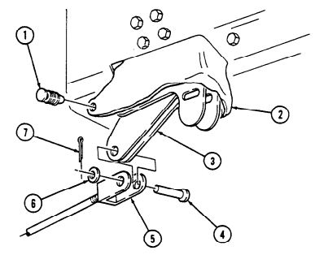

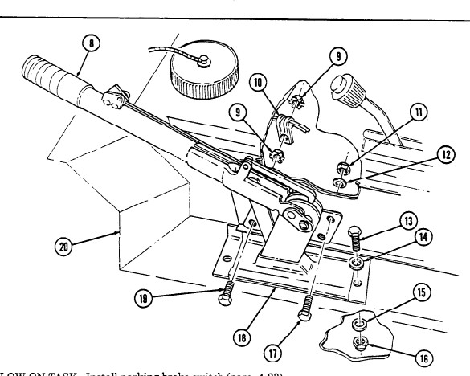

FOLLOW-ON TASK:  Install parking brake switch (para. 4-23).

# Section Iii. Rear Dual Parking Brake System Maintenance (Serial Numbers 300000 And Above)

7-21. REAR DUAL PARKING BRAKE SYSTEM MAINTENANCE TASK SUMMARY
(SERIAL NUMBERS 300000 AND ABOVE)

| INITIAL SETUP:                         |                      |
|----------------------------------------|----------------------|
| Tools                                  | Personnel Required   |
| General mechanic's tooi kit:           | One mechanic         |
| automotive (Appendix B, Item 1)        | One assistant        |
| Maintenance and repair shop equipment: |                      |
| automotive (Appendix B, Item 2)        | Manual References    |
|                                        | TM 9\-2320\-387\-24P |
| Materials/Parts                        |                      |
| Sealing compound (Appendix C, Item 62) | Maintenance Level    |
| Chalk (Appendix C, Item 20)            | Unit                 |

# 7-22. Parking Brake Pad Maintenance

This task covers:
b. Cleaning and Inspection INITIAL SETUP:
Tools General mechanic's tool kit:
automotive (Appendix B, Item 1)
Materials and Parts Two cotter pins (Appendix G, item 25.2) Four cotter pins (Appendix G, item 25.1)

## A. Removal

a. Removal c. Installation

| Manual References                      |
|----------------------------------------|
| TM 9\-2320\-387\-24P                   |
| Equipment Condition                    |
| Access cover removed (para. 10\-58.4). |
| Maintenance Level                      |
| Unit                                   |

1. Remove return spring (1) from caliper arm (2). 2. Remove cotter pin (8), clevis bolt (4), washers (5) and (9), and clevis (3) from caliper arm (2).

Discard cotter pin (8).

NOTE
Use 1/2 in. line wrench for removing parking brake cable from caliper bracket.

3. Remove parking brake cable (6) from cable bracket (7). 4. Remove two cotter pins (18), bars (17), and springs (10) from assembly mount (15).

Discard cotter pins (18).

5. Lift parking brake subassembly (13) up and away from vehicle (16). 6. Remove parking brake pads (14) from parking brake subassembly (13).

Perform step 4 if replacing parking brake cable bracket.

7. Remove two capscrews (12) and parking brake cable adapter (11) from parking brake subassembly (13). b. Cleaning and Inspection

- Replace brake pads in sets on both sides of differential. - Replace brake pads if thickness is less than 1/8 in. (3.2 mm) and operation in wet and muddy conditions is expected.

Inspect brake pads (14) for glazing, oil saturation, or wear. If glazed, oil saturated, or if brake pad thickness is less thank 1/8 in. (3.2 mm), replace both pads (14) and pads on opposite caliper. c. Installation

Perform step 1 if parking brake cable bracket (11) was replaced.

1. Install parking brake cable bracket (11) on parking brake subassembly (13) with two capscrews (12). 2. Install parking brake pads (14) on parking brake subassembly (13). 3. Install parking brake subassembly (13) on assembly mount (15) with two springs (10), bars (17), and cotter pins (18).

4. Install parking brake cable (6) on cable bracket (7). 5. Install clevis (3) on caliper arm (2) with washer (5), clevis bolt (4), washer (9), and cotter pin (8). 6. Install return spring (1) on caliper arm (2).

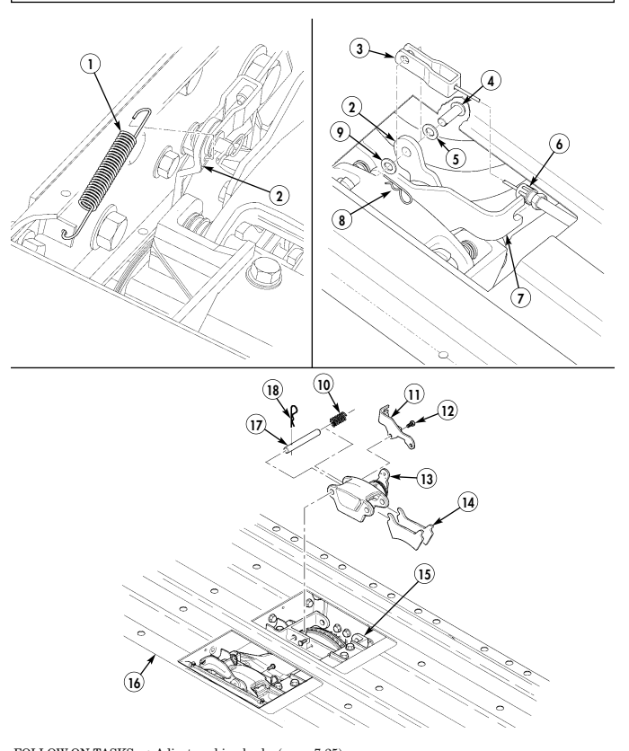

# 7-22. Parking Brake Pad Maintenance (Cont'D)

FOLLOW-ON TASKS:  - Adjust parking brake (para. 7-25).
- Install access cover (para. 10-58.4).

# 7-23. Parking Brake Cable Replacement

This task covers:

## Initial Setup:

Tools General mechanic's tool kit:
automotive (Appendix B, Item 1)
Manual References TM 9-2320-387-10 TM 9-2320-387-24P
a. Removal b. Installation

## Equipment Condition

- Wheels chocked and parking brake released 
(TM 9-2320-387-10).

- Access cover removed (para. 10-58.4). - Muffler and catalytic converter removed 
(para. 3-49).

- Rear propeller shaft removed (para. 6-4).

Maintenance Level Unit

Replacement procedures for left and right side parking brake cables are basically the same. This procedure covers the left side.

a. Removal 1. Remove clevis pin (6), clevis bolt (2), washers (3) and (7), and clevis (1) from caliper lever (8). 2. Remove parking brake cable (4) from cable bracket (5).

Use 1/2 in. line wrench for removing parking brake cable from caliper bracket.

3. Remove retaining ring (11) from parking brake cable (4). 4. Remove parking brake cable (4) from equalizer cable bar (9) and C-beam (10). 5. Pull parking brake cable (4) forward and remove from vehicle.

## B. Installation

1. Install parking brake cable (4) over rear front crossmember (13) and muffler bracket (12). 2. Slide parking brake cable (4) through C-beam (10) and install on equalizer cable bar (9). 3. Secure parking brake cable (4) to C-beam (10) with retaining ring (11). 4. Install parking brake cable (4) on cable bracket (5). 5. Install clevis (1) on caliper lever (8) with washer (3), clevis bolt (2), washer (7), and clevis pin (6).

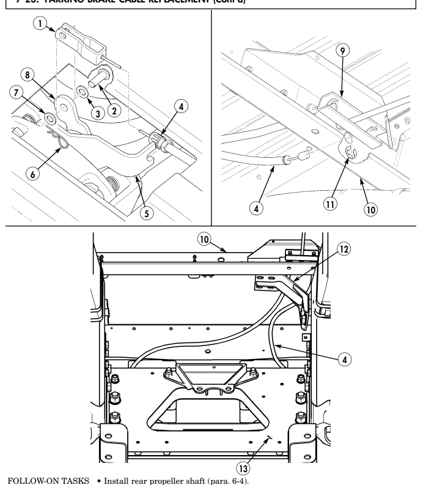

7-23. PARKING BRAKE CABLE REPLACEMENT (Cont'd)
- Install rear propeller shaft (para. 6-4).
- Install muffler and catalytic converter (para. 3-49).

- Adjust parking brake lever (TM 9-2320-387-10).

- Install access cover (para. 10-58.4).

- Unchock wheels (TM 9-2320-387-10).

# 7-24. Parking Brake Rod Replacement

This task covers:

## Initial Setup:

a. Removal b. Installation

| PARA.    |                                                              | .NO.    |
|----------|--------------------------------------------------------------|---------|
| 6\-20.   | Stabilizer Bar Replacement (Serial Numbers 299999 and Below) | 6\-48.1 |
| 6\-20.1. | Stabilizer Bar Replacement (Serial Numbers 300000 and Above) | 6\-49   |
| 6\-21.   | Stabilizer Bar Link Replacement                              | 6\-50   |
| 6\-22.   | Radius Rod Replacement                                       | 6\-51   |
| 6\-23.   | Upper Ball Joint Maintenance                                 | 6\-52   |
| 6\-24.   | Lower Ball Joint Maintenance                                 | 6\-54   |
| 6\-25.   | Upper Control Arm Replacement                                | 6\-56   |

## A. Removal

8. Remove clevis (17), nut (18), and insulator rod (26) from parking brake rod (22).

## B. Installation

1. Install spring (10) and spacer (23) on body (21) with washer (11), capscrew (12), washer (24), and locknut (25).

7. Install parking brake cable (4) on cable bracket (5). 8. Install clevis (1) on caliper lever (8) with washer (3), clevis bolt (2), washer (7), and clevis pin (6).

1. Remove clevis pin (6), clevis bolt (2), washers (3) and (7), and clevis (1) from caliper lever (8). 2. Remove parking brake cable (4) from cable bracket (5). 3. Remove clip (13) and spread boot (14) to allow access to cotter pin (20). 4. Remove cotter pin (20), washer (19), clevis bolt (16), and clevis (17) from bellcrank (15).

Discard cotter pin (20).

5. Remove locknut (25), washer (24), capscrew (12), washer (11), spring (10), and spacer (23) from body (21). Discard locknut (25).

6. Remove locknut (28) and convex washer (27) from parking brake rod (22) and brake cable equalizer bar (9). Discard locknut (27).

7. Remove parking brake rod (22) from brake cable equalizer bar (9) by sliding parking brake rod (22)
forward.

2. Install nut (18), clevis (17), and insulator rod (26) on parking brake rod (22). 3. Slide parking brake rod (22) rearward through spring (10). 4. Install parking brake rod (22) on brake cable equalizer bar (9) with convex washer (27) and locknut (28). Tighten locknut (27) far enough to expose 3 to 5 threads on end of parking brake rod (22).

5. Spread boot (14) and install clevis (17) on bellcrank (15) with clevis pin (16), washer (19), and cotter pin (20).

6. Install clip (13) on boot (14).

# 7-24. Parking Brake Rod Replacement (Cont'D)

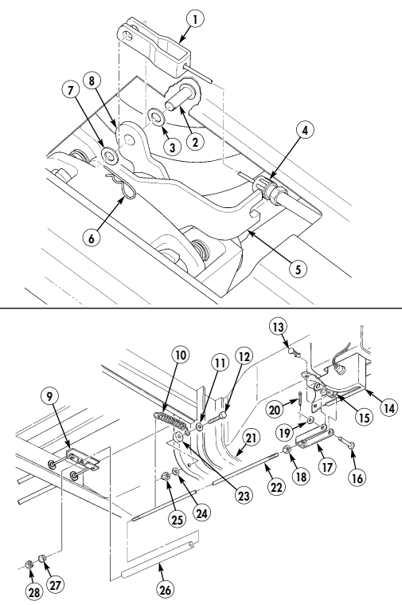

FOLLOW-ON TASKS: - Install rear propeller shaft (para. 6-4).

- Install muffler and catalytic converter (para. 3-49). - Adjust parking brake (para. 7-25). - Install access cover (para. 10-58.4). - Unchock wheels (TM 9-2320-387-10).

# 7-25. Parking Brake Adjustment

This task covers:
a. Adjustment

## Initial Setup:

Tools General mechanic's tool kit:
automotive (Appendix B, Item 1)
Manual References TM 9-2320-387-10 TM 9-2320-387-24P

## Equipment Condition

- Wheels chocked and parking brake released 
(TM 9-2320-387-10).

- Parking brake access cover removed
(para. 10-58.4).

Maintenance Level Unit

- Ensure parking brake lever is backed all the way out. - Parking brakes are adjusted semi-annually, when pads are replaced, or when running clearance reaches a total of 0.100 in. per side.

- It may require several attempts to properly adjust parking brake.

- Artwork shows right side parking brake caliper. Left side parking brake is similar.

## A. Adjustment

1. Remove cotter pin (5), washer (4), clevis pin (1), washer (2), and clevis (6) from caliper arm (3). 2. Back off stop bolt (9) counterclockwise from parking brake caliper (10).

Perform step 3 for right side of vehicle.

3. Rotate caliper arm (3) counterclockwise, toward rear of vehicle, until it stops and back off adjusting screw (14) counterclockwise ½ turns (3 flats), resulting in 0.025 in. of running clearance.

Perform step 4 for left side of vehicle.

4. Rotate caliper arm (3) clockwise, toward rear of vehicle, until it stops and back off adjusting screw (14)
counterclockwise ½ turns (3 flats), resulting in 0.025 in. of running clearance.

5. Rotate adjusting screw (14) clockwise until outboard pad (11) is lightly clamped on brake rotor (12). 6. Rotate stop bolt (9) clockwise until inboard pad (13) touches brake rotor (12). 7. Back off stop bolt (9) counterclockwise 1/6 turn (1 flat) resulting in 0.010 in. of running clearance. 8. Hole in clevis (6) should line up with hole in caliper arm (3).

Perform step 9 if clevis hole does not line up with caliper arm 9. Adjust nut (8) on parking brake rod (7) until hole in clevis (6) lines up with hole in caliper arm (3).

10. Install clevis (6) on caliper arm (3) with washer (2), clevis pin (1), washer (4), and cotter pin (5).

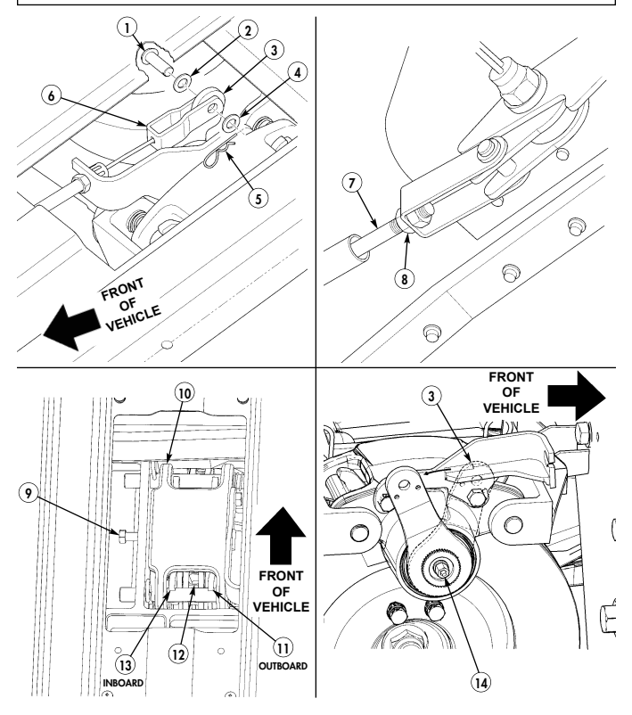

# 7-25. Parking Brake Adjustment (Cont'D)

FOLLOW-ON TASKS: - Adjust parking brake lever (TM 9-2320-387-10).

- Install parking brake access cover (para. 10-58.4). - Unchock wheels (TM 9-2320-387-10).

# Chapter 8 Wheels And Steering (Unit) Maintenance Section I. Wheel And Runflat System Maintenance 8-1. Wheel And Runflat System Maintenance Task Summary

|    | General mechanic's tool kit:  TM 9\-2320\-387\-24P                                                          |
|----|-------------------------------------------------------------------------------------------------------------|
|    | automotive (Appendix B, Item 1)  Maintenance Level Maintenance and repair shop equipment:                   |
|    | Unit automotive (Appendix B, Item 2)                                                                        |
|    | Materials/Parts                                                                                             |
|    | Two locknuts (Appendix G, Item 83)                                                                          |
| a. | Removal                                                                                                     |
| 1. | Remove two locknuts (1), nuts (5), and six washers (2) from two bar links (3) and stabilizer bar (11).      |
|    | Discard locknuts (1). Remove two bar links (3) and pins (4) from stabilizer bar (11).                       |
| 2. | Remove four nuts (9), washers (10), two clamps (8), and stabilizer bar (11) from two frame brackets (6).    |
| 3. | Remove two stabilizer bar bushings (7) from stabilizer bar (11).                                            |
| b. | Installation                                                                                                |
| 1. | Install two stabilizer bar bushings (7) on stabilizer bar (11).                                             |
| 2. | Install stabilizer bar (11) on two frame brackets (6) with two clamps (8), four washers (10), and nuts (9). |
|    | Tighten nuts (9) to 39–47 lb\-ft (53–63 N•m).                                                               |
| 3. | Install two pins (4) in bar links (3).                                                                      |
| 4. | Install stabilizer bar (11) on two bar links (3) with six washers (2), two nuts (5), and locknuts (1).      |
|    | Tighten locknuts (1) to 75 lb\-ft (102 N•m).                                                                |

# 8-2. Jacking Instructions (Vehicles Without Armor)

This task covers:
a. Raising Corner of Vehicle e. Raising Rear of Vehicle c. Raising Front of Vehicle g. Raising Entire Vehicle d. Lowering Front of Vehicle h. Lowering Entire Vehicle

## Initial Setup:

Tools General mechanic's tool kit:
automotive (Appendix B, Item 1)
Manual References TM 9-2320-387-24P
b. Lowering Corner of Vehicle f. Lowering Rear of Vehicle

## General Safety Instructions

Never work under vehicle unless wheels are blocked and it is properly supported.

Maintenance Level Unit

Hydraulic jacks are used for raising and lowering, and are not used to support vehicle. Never work under vehicle unless wheels are blocked and it is properly supported. Injury or damage to equipment may result if vehicle suddenly shifts or moves.

## A. Raising Corner Of Vehicle

1. Block wheels (2) or (4). 2. Place jack under lower control arm (5) on corner to be raised. 3. Raise vehicle (1) high enough to place trestle (3). 4. Place trestle (3) under flat portion of frame rail (7) and lower jack until weight is supported by trestle (3).

## B. Lowering Corner Of Vehicle

1. Raise vehicle (1) and remove trestle (3). 2. Lower vehicle (1). 3. Remove blocks from wheels (2) or (4).

## C. Raising Front Of Vehicle

1. Block rear wheels (2). 2. Center jack under front suspension front crossmember (6). Use a wood block between jack and crossmember (6).

3. Raise vehicle (1) high enough to place trestles (3). 4. Place trestles (3) under flat portion of frame rails (7) and lower jack until weight is supported by trestles (3).

## D. Lowering Front Of Vehicle

1. Raise vehicle (1) and remove trestles (3). 2. Lower vehicle (1). 3. Remove blocks from rear wheels (2).

# 8-2. Jacking Instructions (Vehicles Without Armor) (Cont'D)

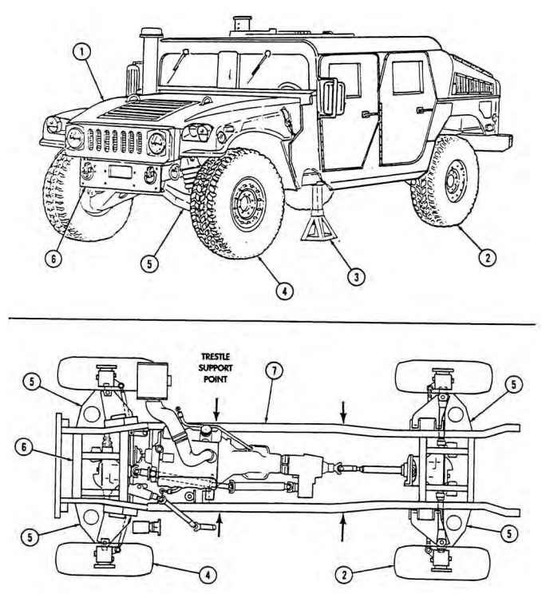

# 8-2. Jacking Instructions (Vehicles Without Armor) (Cont'D)

## E. Raising Rear Of Vehicle

1. Block front wheels (4). 2. Center jack under rear suspension rear crossmember (6). Use a wood block between jack and crossmember (6).

3. Raise vehicle (1) high enough to place trestles (3). 4. Place trestles (3) under flat portion of frame rails (5) and lower jack until weight is supported by trestles (3).

## F. Lowering Rear Of Vehicle

1. Raise vehicle (1) and remove trestles (3). 2. Lower vehicle (1). 3. Remove blocks from front wheels (4).

## G. Raising Entire Vehicle

1. Raise front of vehicle (task c.). 2. Center jack under rear suspension rear crossmember (6). Use a wood block between jack and crossmember (6).

3. Raise vehicle (1) high enough to place trestles (3). 4. Place trestles (3) under flat portion of frame rails (5) and lower jack until weight is supported by trestles (3).

5. Move wheel blocks aside.

## H. Lowering Entire Vehicle

1. Raise rear of vehicle (1) and remove trestles (3). 2. Lower rear of vehicle (1) and block rear wheels (2). 3. Lower front of vehicle (task d.).

# 8-2. Jacking Instructions (Vehicles Without Armor) (Cont'D)

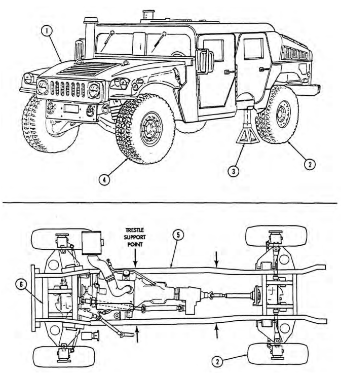

# 8-2.1. Jacking Instructions (M1151A1, M1152A1, M1165A1 W/Perimeter B Kit) (And All Vehicles Equipped With Frag Kit Armor)

This task covers:
b. Lowering Front of Vehicle e. Raising Entire Vehicle

## Initial Setup:

Tools General mechanic's tool kit:
automotive (Appendix B, Item 1)
Manual References TM 9-2320-387-24P
a. Raising Front of Vehicle d. Lowering Rear of Vehicle c. Raising Rear of Vehicle f. Lowering Entire Vehicle

## General Safety Instructions

Never work under vehicle unless wheels are blocked and it is properly supported.

Maintenance Level Unit

Hydraulic jacks are used for raising and lowering, and are not used to support vehicle. Never work under vehicle unless wheels are blocked and it is properly supported. Injury to personnel or damage to equipment may result if vehicle suddenly shifts or moves.

## A. Raising Front Of Vehicle

1. Block rear wheels (2). 2. Center hydraulic jack under front suspension front crossmember (4). Use wood block between hydraulic jack and crossmember (4).

3. Raise vehicle (1) high enough to clear trestle stand (3). 4. Place trestle stand (3) under first set of mending plates (1). 5. Lower hydraulic jack until the weight is supported by trestle stand (3).

## B. Lowering Front Of Vehicle

1. Raise vehicle (1) and remove trestle stands (3). 2. Lower vehicle (1). 3. Remove blocks from rear wheels (2).

## C. Raising Rear Of Vehicle

1. Block rear wheels (4). 2. Center hydraulic jack under rear suspension rear crossmember (3). Use wood block between hydraulic jack and crossmember (3).

3. Raise vehicle (1) high enough to clear trestle stand (3). 4. Place trestle stand (3) under rear bumper (2). 5. Lower hydraulic jack until weight is supported by trestle stand (3).

8-2.1. JACKING INSTRUCTIONS (M1151A1, M1152A1, M1165A1 W/PERIMETER B KITJ
(AND ALL VEHICLES EQUIPPED WITH FRAG KIT ARMOR) (Cont'd)

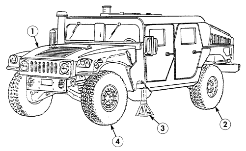

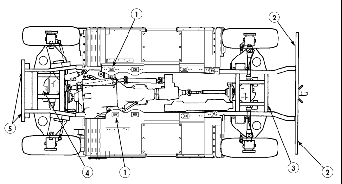

# 8-2.1. Jacking Instructions (M1151A1, M1152A1, M1165A1 W/Perimeter B Kit) (And All Vehicles Equipped With Frag Kit Armor) (Cont'D)

## D. Lowering Rear Of Vehicle

1. Raise vehicle (1) and remove trestle stands (3). 2. Lower vehicle (1). 3. Remove blocks from front wheels (4).

## E. Raising Entire Vehicle

1. Block rear wheels (2). 2. Center hydraulic jack under front suspension front crossmember (4). Use wood block between hydraulic jack and crossmember (4).

3. Raise vehicle (1) high enough to clear trestle stand (3). 4. Place trestle stand (3) under first set of mending plates (1). 5. Lower hydraulic jack until the weight is supported by trestle (3). 6. Center hydraulic jack under rear suspension rear crossmember (3). Use wood block between hydraulic jack and crossmember (3).

7. Raise vehicle (1) high enough to clear trestle stand (3). 9. Place trestle stand (3) under rear bumper (2).

10. Lower hydraulic jack until weight is supported by trestle stands (3). 11. For additional safety place two trestle stands (3) under front bumper (5).

## F. Lowering Entire Vehicle

1. Raise rear of vehicle (1) and remove trestle stands (3). 2. Lower rear of vehicle (1). 3. Block rear wheels (2). 4. Raise front of vehicle (1) and remove trestle stands (3) from first set of mending plates and under front bumper.

5. Lower vehicle (1). 6. Remove blocks from rear wheels (2).

8-2.1. JACKING INSTRUCTIONS (M1151A1, M1152A1, M1165A1 W/PERIMETER B KITJ
(AND ALL VEHICLES EQUIPPED WITH FRAG KIT ARMOR) (Cont'd)

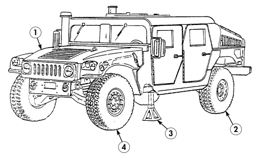

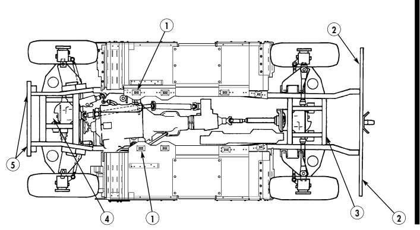

# 8-3. Wheel Replacement

This task covers:
INITIAL SETUP:
Tools General mechanic's tool kit:
automotive (Appendix B, Item 1)
Maintenance and repair shop equipment:
(automotive (Appendix B, Item 2)
Manual References TM 9-2320-387-24P

## A. Removal B. Installation General Safety Instructions

- Always apply parking brake and chock opposite wheel before removing wheel.

- Remove only inner group of nuts when removing a wheel from vehicle.

Maintenance Level Unit

- Always apply parking brake and chock opposite wheel before removing wheel. Avoid removing wheel when vehicle is on sloping terrain. Injury to personnel or damage to equipment may result.

- Remove only inner group of nuts when removing a wheel from vehicle. Removing outer nuts which hold the rim together while the assembly is inflated could result in serious injury or death.

- Do not mix Load Range D and Load Range E tires on the same vehicle. Failure to comply may result in damage to equipment and injury or death to personnel.

## A. Removal

1. Loosen eight lug nuts (2), but do not remove. 2. Raise and support corner of vehicle (para. 8-2). 3. Remove eight lug nuts (2) and wheel (1) from geared hub (3).

b. Installation

- Install lug nuts with fingers to full engagement. If nuts resist finger-tightening, discard nuts. Examine studs for damage and replace if damaged (para. 6-13).

- The radial tire is nondirectional and can be used in either position.

1. Install wheel (1) on geared hub (3) with eight lug nuts (2). 2. Remove support and lower corner of vehicle (para. 8-2). 3. Tighten eight lug nuts (2) to 90-110 lb-ft (122-149 N•m) in tightening sequence shown.

8-3.  WHEEL REPLACEMENT (Cont'd)

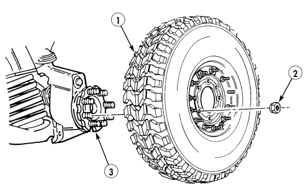

TIGHTENING SEQUENCE

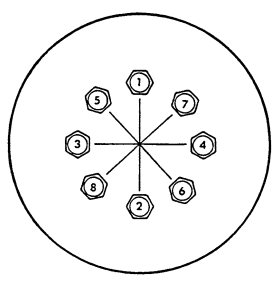

# 8-4. Radial Tire, Wheel, And Rubber Runflat Maintenance (12-Stud)

This task covers:
a. Disassembly c. Repair b. Inspection and cleaning d. Assembly

## Initial Setup: Tools

General mechanic's tool kit:
automotive (Appendix B, Item 1)
Maintenance and repair shop equipment:
automotive (Appendix B, Item 2)

## Special Tools

Runflat compressor (Appendix B, Item 115) Torque adapter, 9/16-in. (Appendix B,
Item 133)
Socket adapter (Appendix B, Item 135)

## Materials/Parts

| Manual References    |
|----------------------|
| TM 9\-2320\-387\-10  |
| TM 9\-2610\-200\-14  |
| TM 9\-2320\-387\-24P |

Twelve locknuts (Appendix G, Item 84) O-ring seal (Appendix G, Item 287) Locknut (Appendix G, Item 86) O-ring (Appendix G, Item 232) Lubricant (Appendix G, Item 192) Detergent (Appendix C, Item 25) Sealing compound, if required
(Appendix C, Item 61)

## Equipment Condition General Safety Instructions

| Maintenance Level   |
|---------------------|

- Do not use tire machine. - Ensure tire is totally deflated before removing wheel locknuts.

- Never use tubes in wheel assemblies. - Rim surfaces must be kept clean and free of rust and dirt.

- Never use wheel assemblies with damaged studs.

- Never inflate a wheel assembly with the wheel locknuts removed.

- Never inflate a wheel assembly without first checking wheel locknut torques.

- Do not exceed recommended tire inflation pressure.

- Always use an OSHA approved tire inflation cage and a clip-on air chuck for tire inflation.

- Ensure runflat compressor strap is centered around runflat.

- Never install radial tire on eight-bolt wheel.

Maintenance Level Unit

- Do not use tire machine. Injury to personnel or damage to equipment may result.

- In all disassembly operations, ensure the tire is totally deflated before removing wheel locknuts. Failure to follow proper safety precautions could cause serious injury or death.

- Load Range D valves and tires are not compatible with Load Range E wheels. Load Range E valves and tires are not compatible with Load Range D wheels. Failure to comply may result in damage to equipment and injury or death to personnel.

- Do not mix Load Range D and Load Range E tires on the same vehicle. Failure to comply may result in damage to equipment and injury or death to personnel.

## A. Disassembly

1. Remove valve core (7) from insert (8) and deflate tire (6). 2. Use a circular pattern and loosen twelve wheel locknuts (2) securing rim halves (1) and (5) together.

If you hear escaping air, do not proceed. Wait until sound stops. When tire (6) is fully deflated, remove wheel locknuts (2). Discard locknuts (2).

# 8-4. Radial Tire, Wheel, And Rubber Runflat Maintenance (12-Stud) (Cont'D)

Never inflate a wheel assembly with the wheel locknuts removed in an attempt to separate inner and outer rim halves. The assembly will separate under pressure, resulting in serious injury or death.

3. Remove outer rim half (1) from tire (6). 4. Remove insert (8) and locknut (10) from outer rim (1). Discard locknut (10). 5. Remove O-ring (9) from insert (8). Discard O-ring (9). 6. Remove O-ring seal (3) from inner rim half (5). Cut O-ring seal (3) in two to make sure it cannot be reused. Discard O-ring seal (3).

7. Remove tire (6) from inner rim half (5). 8. Remove balance weights (4) from rim halves (1) and (5), if present. Discard balance weights (4).

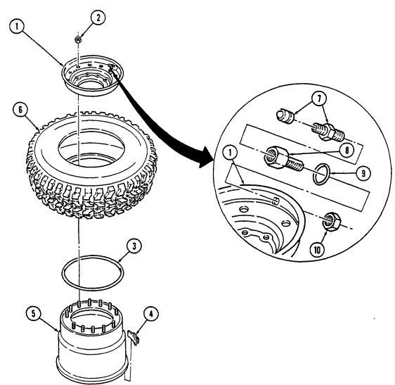

# 8-4. Radial Tire, Wheel, And Rubber Runflat Maintenance (12-Stud) (Cont'D)

9. Lay tire (1) flat.

Do not use compressor strap if it is frayed or damaged. Ensure runflat is free of grease and runflat compressor strap is centered around runflat. Failure to do so may cause injury to personnel.

NOTE
Perform steps 11 and 12 when using runflat compressor P/N J39250. Perform steps 13 and 14 when using runflat compressor P/N 528236.

10. Position runflat compressor (3) on runflat (2) so that runflat compressor hex-drive (4) is facing up and strap (5) is centered around runflat (2).

Compress runflat by rotating hex-drive in either direction. Rotate hex-drive the opposite direction to loosen.

11. Using runflat compressor (3), compress runflat (2). 12. Position runflat compressor (6) on an outer edge of runflat (2) with handle assembly (7) facing up and strap (8) centered around runflat (2).

Compress runflat by rotating handle assembly in a clockwise direction. Rotate handle assembly counterclockwise to loosen.

13. Using runflat compressor (6), compress runflat (2).

- It may be necessary to use a tire spoon and tire soap to remove runflat from tire.

- When using runflat compressor P/N 528236, handle may need to be removed before removing runflat.

14. Remove runflat (2) from tire (1) and remove runflat compressor (3) or (6) from runflat (2).

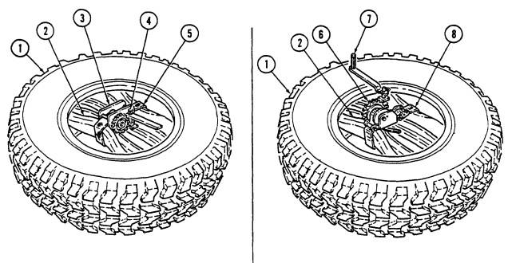

8-10 Change 6

# 8-4. Radial Tire, Wheel, And Rubber Runflat Maintenance (12-Stud) (Cont'D)

b. Inspection and Cleaning

Do not reuse a tire which has been run flat without thoroughly inspecting for damage. Failure to follow these instructions may result in damage to equipment.

1. Inspect inside of tire (1) for cord or belt separation and inner liner damage. Replace tire (1) if damaged.

2. Inspect tire bead (9) for abrasions caused from runflat (2). Replace tire (1) if damaged. 3. Check for protruding objects inside tire (1) which may not be visible from outside. Repair tire (1) if damaged.

4. Check tread depth on tire (1). Tread should not be worn below level of wear bars (10). Replace tire (1) if tread is worn below wear bars (10) or 1/16 in. (1.59 mm).

5. Clean all grease, dirt, and foreign material from the runflat (2) with soap and water and allow to air-dry. Inspect runflat (2) for splitting, wear, or excessive chafing. Replace runflat (2) if damaged.

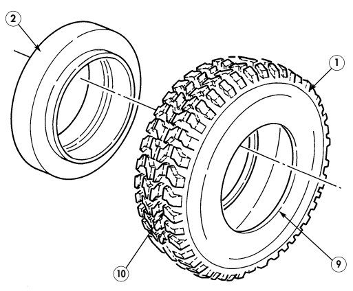

# 8-4. Radial Tire, Wheel, And Rubber Runflat Maintenance (12-Stud) (Cont'D)

O-ring sealing surfaces and pressure relief grooves must be kept clean and free of rust and dirt. Failure to do so may cause the wheel assembly to separate under pressure, causing serious injury or death.

6. Using wire brush, clean studs (4). Clean all dirt and foreign material from rim halves (1) and (2)
with soap and water and allow to air-dry. Ensure O-ring sealing surfaces (5) and pressure relief grooves (3) on rim halves (1) and (2) are smooth and clean.

7. Inspect rim halves (1) and (2) for cracks, bent sealing surfaces (5), or oversized mounting holes.

Replace rim halves (1) or (2) if cracked, bent, or if mounting holes are oversized.

Never use wheel assemblies with studs which are damaged, loose, or have damaged threads. Damaged studs can cause improper assembly, which may cause individual fasteners to fail. Any of these situations may cause serious injury or death.

8. Inspect inner rim half (2) for cracked, broken, rusted, pitted, bent, or loose studs (4) and studs (4)
with damaged, mutilated, or deformed threads. Replace studs (4) (para. 8-7) if damaged, loose, or threads are damaged.

9. Inspect insert (6) for damage. Replace insert (6) if damaged.

c. Repair Refer to TM 9-2610-200-14 for maintenance and repair of tires.

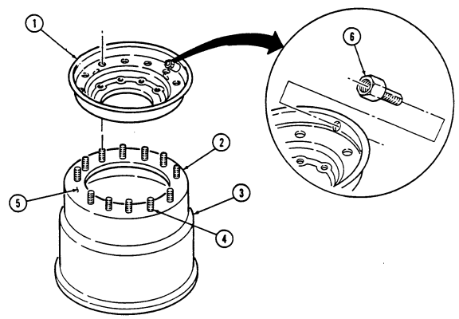

# 8-4. Radial Tire, Wheel, And Rubber Runflat Maintenance (12-Stud) (Cont'D)

d. Assembly

- Never use tubes in wheel assemblies. Use of a tube defeats built-in safety features, and may allow the wheel to come apart under pressure, resulting in serious injury or death.

- Use only replacement parts specified in TM 9-2320-387-24P for radial tires. Never install radial tire components on eight-bolt rims. Wheels assembled with components not specified for radial tires could cause the assembly to separate under pressure, resulting in serious injury or death.

- Do not use compressor strap if it is frayed or damaged. Ensure runflat is free of grease and runflat compressor strap is centered on runflat. Failure to do so could cause injury to personnel.

Perform steps 1 and 2 when using runflat compressor P/N J39250. Perform steps 3 and 4 when using runflat compressor P/N 528236.

1. Position runflat compressor (8) on runflat (7) so that runflat compressor hex-drive (9) is facing up and strap (10) is centered around runflat (7).

NOTE
Compress runflat by rotating hex-drive in either direction. Rotate hex-drive opposite to loosen.

2. Using runflat compressor (8), compress runflat (7). 3. Position runflat compressor (11) on an outer edge of runflat (7) with handle assembly (12) facing up and strap (13) centered around runflat (7).

Compress runflat by rotating the handle assembly in a clockwise direction. Rotate handle assembly counterclockwise to loosen.

4. Using runflat compressor (11), compress runflat (7).

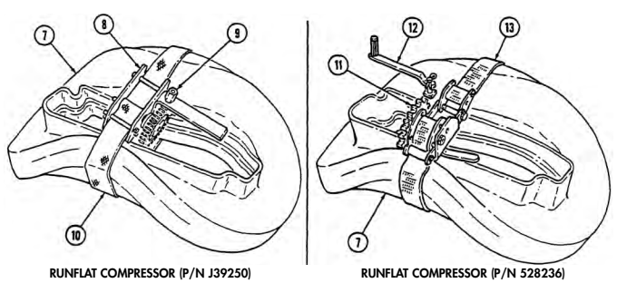

# 8-4. Radial Tire, Wheel, And Rubber Runflat Maintenance (12-Stud) (Cont'D)

Always wear eye protection and rubber gloves when applying runflat lubricant. Failure to do so may result in injury to personnel.

The radial tire is a bidirectional tire and the tread may be positioned in either direction.

5. Using a 2- to 6-inch paint brush, apply an entire 11-oz tube of lubricant evenly (a depth of 1/8 to 3/16 in. (.32 to .475 cm)) on inside of tire (1).

Runflat compressor belt and handle may be greasy, which could slip and cause damage to equipment or injury to personnel.

It may be necessary to remove handle assembly on runflat compressor P/N 528236 before inserting runflat into tire.

6. Insert runflat (2), compressor side first, as far as possible into tire (1). 7. Lay tire (1) flat on protruding runflat side. Loosen compressor (4). Runflat (2) should insert itself inside tire (1). If not, repeat steps 5 through 7 and/or use a tire spoon to assist in installation.

If required, clean and lubricate bearing assembly on runflat compressor P/N 528236 after removal.

8. Loosen runflat compressor (4) and remove from tire (1). 9. Lubricate tire bead (3) and rim bead seat areas with tire soap.

Never install radial tire on eight-bolt wheel. Damage to equipment may result, causing injury to personnel.

Before installing tire on inner rim half, inspect tire sidewalls for a paint dot. Paint dots are often painted on tires to indicate the tire's light spot for balancing purposes. If paint dot is present, position tire on rim halves so that paint dot is aligned with insert hole on outer rim half.

10. Center runflat (2) in tire (1). Carefully lower tire (1) over inner rim half (8). 11. Ensure runflat (2) is not binding on flat portion of inner rim half (8). Runflat (2) should clear inner rim half (8).

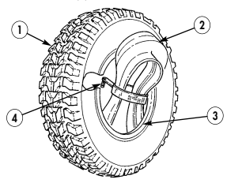

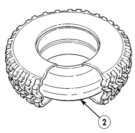

# 8-4. Radial Tire, Wheel, And Rubber Runflat Maintenance (12-Stud) (Cont'D)

- Ensure longer lip of runflat seats against outer rim half. - Align air notch in runflat with valve stem in the rim.

12. Lubricate O-ring seal (7) with tire soap. Install O-ring seal (7), in groove (9) on top of inner rim half (8), around studs (10). Ensure O-ring seal (7) is not twisted and that it is uniformly positioned in groove (9). Do not overstretch O-ring seal (7).

13. Install insert (12) and O-ring (13) on outer rim half (6) with locknut (14). Tighten locknut (14) to 40-60 lb-in. (5-7 N•m).

14. Install valve core (11) in insert (12). 15. Install outer rim half (6) on inner rim half (8).

Tighten locknuts gradually to avoid bent and broken studs or damage to wheel components.

16. Secure outer rim half (6) to inner rim half (8) with twelve locknuts (5). Do not tighten locknuts (5).

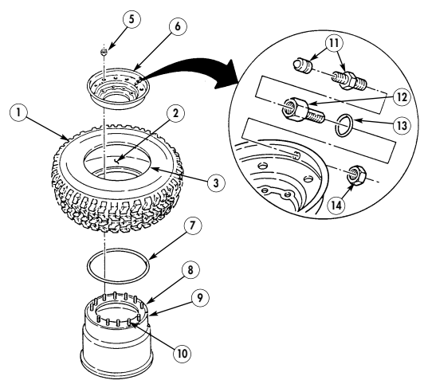

# 8-4. Radial Tire, Wheel, And Rubber Runflat Maintenance (12-Stud) (Cont'D)

17. Tighten locknuts (1) to 85 lb-ft (115 N•m) in tightening sequence shown. 18. Tighten locknuts (1) to 125 lb-ft (170 N•m) in tightening sequence shown. 19. Check wheel assembly (4) for gaps at each stud (2). Use a 0.0015 in. (0.038 mm) thickness gauge to detect gaps. If gaps are detected, disassemble and reassemble wheel assembly (4) and recheck for gaps. If gaps are still detected, replace outer rim half (3).

- Always use an OSHA approved tire inflation cage for inflation purposes. Stand on one side of the cage during inflation; never directly in front. Keep hands out of cage during inflation. Inflate assembly to recommended pressure using a clip-on air chuck. Do not exceed 50 psi (345 kPa) cold-inflation pressure. Failure to follow these instructions may result in serious injury or death.

- Never inflate a wheel assembly without having checked wheel

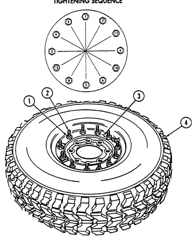

locknut torques to ensure the wheel locknuts are tightened to specifications. An assembly with improperly tightened locknuts could separate under pressure, resulting in serious injury or death.

20. Place wheel assembly (4) in safety cage and inflate tire to recommended tire pressure (TM 9-2320-387-10).

FOLLOW-ON TASKS: - Balance tire (para. 8-8).

# 8-4.1. Radial Tire, Wheel, And Rubber Runflat Maintenance (24-Stud)

This task covers:
a. Disassembly c. Repair b. Inspection and cleaning d. Assembly

## Initial Setup:

Tools General mechanic's tool kit:
automotive (Appendix B, Item 1)
Maintenance and repair shop equipment:
automotive (Appendix B, Item 2)

## Special Tools

Runflat compressor (Appendix B, Item 115) Torque adapter, 9/16-in. (Appendix B,
Item 133)
Socket adapter (Appendix B, Item 135)

## Materials/Parts

| 75 lb\-ft (102 N•m).   |
|------------------------|

Twenty-four locknuts (Appendix G, Item 84) O-ring seal (Appendix G, Item 280.3) Locknut (Appendix G, Item 86) O-ring (Appendix G, Item 232) Lubricant (Appendix G, Item 192) Detergent (Appendix C, Item 25) Sealing compound, if required
(Appendix C, Item 61)

## Equipment Condition General Safety Instructions

| Wheel removed (para. 8\-3).   |
|-------------------------------|

- Do not use tire machine. - Ensure tire is totally deflated before removing wheel locknuts.

- Never use tubes in wheel assemblies. - Rim surfaces must be kept clean and free of rust and dirt.

- Never use wheel assemblies with damaged studs.

- Never inflate a wheel assembly with the wheel locknuts removed.

- Never inflate a wheel assembly without first checking wheel locknut torques.

- Do not exceed recommended tire inflation pressure.

- Always use an OSHA approved tire inflation cage and a clip-on air chuck for tire inflation.

- Ensure runflat compressor strap is centered around runflat.

- Never install radial tire on eight-bolt wheel.

Maintenance Level Unit

- Do not use tire machine. Injury to personnel or damage to equipment may result.

- In all disassembly operations, ensure the tire is totally deflated before removing wheel locknuts. Failure to follow proper safety precautions could cause serious injury or death to personnel.

- Load Range D valves and tires are not compatible with Load Range E wheels. Load Range E valves and tires are not compatible with Load Range D wheels. Failure to comply may result in damage to equipment and injury or death to personnel.

- Do not mix Load Range D and Load Range E tires on the same vehicle. Failure to comply may result in damage to equipment and injury or death to personnel.

a. Disassembly 1. Remove valve core (7) from insert (8) and deflate tire (6). 2. Use a circular pattern and loosen twenty-four wheel locknuts (2) securing rim halves (1) and (5)
together. If you hear escaping air, do not proceed. Wait until sound stops. When tire (6) is fully deflated, remove wheel locknuts (2). Discard locknuts (2).

# 8-4.1. Radial Tire, Wheel, And Rubber Runflat Maintenance (24-Stud) (Cont'D)

Never inflate a wheel assembly with the wheel locknuts removed in an attempt to separate inner and outer rim halves. The assembly will separate under pressure, resulting in serious injury or death.

3. Remove outer rim half (1) from tire (6). 4. Remove insert (8) and locknut (10) from outer rim (1). Discard locknut (10). 5. Remove O-ring (9) from insert (8). Discard O-ring (9). 6. Remove O-ring seal (3) from inner rim half (5). Cut O-ring seal (3) in two to make sure it cannot be reused. Discard O-ring seal (3).

7. Remove tire (6) from inner rim half (5). 8. Remove balance weights (4) from rim halves (1) and (5), if present. Discard balance weights (4).

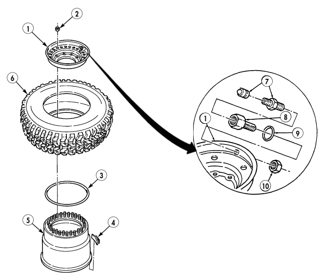

# 8-4.1. Radial Tire, Wheel, And Rubber Runflat Maintenance (24-Stud) (Cont'D)

9. Lay tire (1) flat.

Do not use compressor strap if it is frayed or damaged. Ensure runflat is free of grease and runflat compressor strap is centered around runflat. Failure to do so may cause injury to personnel.

NOTE
Perform steps 10 and 11 when using runflat compressor P/N J39250. Perform steps 12 and 13 when using runflat compressor P/N 528236.

10. Position runflat compressor (3) on runflat (2) so that runflat compressor hex-drive (4) is facing up and strap (5) is centered around runflat (2).

Compress runflat by rotating hex-drive in either direction. Rotate hex-drive the opposite direction to loosen.

11. Using runflat compressor (3), compress runflat (2). 12. Position runflat compressor (6) on outer edge of runflat (2) with handle assembly (7) facing up and strap (8) centered around runflat (2).

Compress runflat by rotating handle assembly in a clockwise direction. Rotate handle assembly counterclockwise to loosen.

13. Using runflat compressor (6), compress runflat (2).

NOTE
- It may be necessary to use a tire spoon and tire soap to remove runflat from tire.

- When using runflat compressor P/N 528236, handle may need to be removed before removing runflat.

14. Remove runflat (2) from tire (1) and remove runflat compressor (3) or (6) from runflat (2).

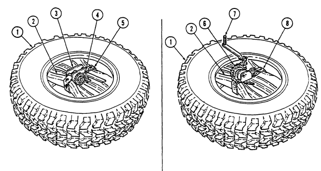

# 8-4.1. Radial Tire, Wheel, And Rubber Runflat Maintenance (24-Stud) (Cont'D)

b. Inspection and Cleaning

Do not reuse a tire which has been run flat without thoroughly inspecting for damage. Failure to follow these instructions may result in damage to equipment.

1. Inspect inside of tire (1) for cord or belt separation and inner liner damage. Replace tire (1) if damaged.

2. Inspect tire bead (9) for abrasions caused from runflat (2). Replace tire (1) if damaged. 3. Check for protruding objects inside tire (1) which may not be visible from outside. Repair tire (1) if damaged.

4. Check tread depth on tire (1). Tread should not be worn below level of wear bars (10). Replace tire (1) if tread is worn below wear bars (10) or 1/16 in. (1.59 mm).

5. Clean all grease, dirt, and foreign material from the runflat (2) with soap and water and allow to air-dry. Inspect runflat (2) for splitting, wear, or excessive chafing. Replace runflat (2) if damaged.

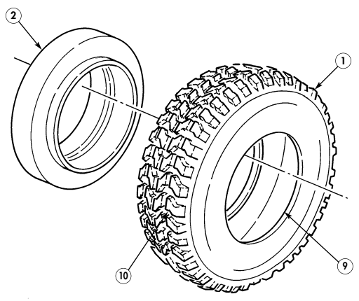

# 8-4.1. Radial Tire, Wheel, And Rubber Runflat Maintenance (24-Stud) (Cont'D)

O-ring sealing surfaces and pressure relief grooves must be kept clean and free of rust and dirt. Failure to do so may cause the wheel assembly to separate under pressure, causing serious injury or death.

6. Using wire brush, clean studs (4). Clean all dirt and foreign material from rim halves (1) and (2)
with soap and water and allow to air-dry. Ensure O-ring sealing surfaces (5) and pressure relief grooves (3) on rim halves (1) and (2) are smooth and clean.

7. Inspect rim halves (1) and (2) for cracks, bent sealing surfaces (5), or oversized mounting holes.

Replace rim halves (1) or (2) if cracked, bent, or if mounting holes are oversized.

Never use wheel assemblies with studs which are damaged, loose, or have damaged threads. Damaged studs can cause improper assembly, which may cause individual fasteners to fail. Any of these situations may cause serious injury or death.

8. Inspect inner rim half (2) for cracked, broken, rusted, pitted, bent, or loose studs (4) and studs (4)
with damaged, mutilated, or deformed threads. Replace studs (4) (para. 8-7) if damaged, loose, or threads are damaged.

9. Inspect insert (6) for damage. Replace insert (6) if damaged. c. Repair Refer to TM 9-2610-200-14 for maintenance and repair of tires.

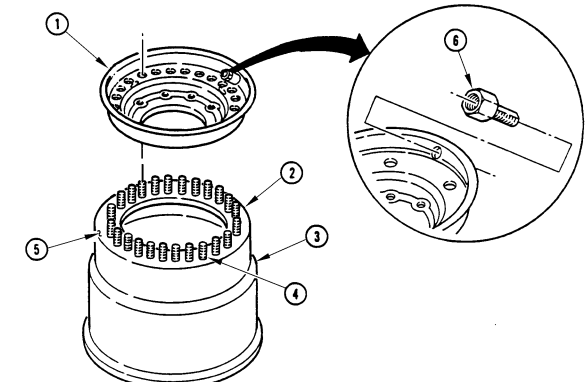

# 8-4.1. Radial Tire, Wheel, And Rubber Runflat Maintenance (24-Stud) (Cont'D)

d. Assembly

- Never use tubes in wheel assemblies. Use of a tube defeats builtin safety features, and may allow the wheel to come apart under pressure, resulting in serious injury or death.

- Use only replacement parts specified in TM 9-2320-387-24P for radial tires. Never install radial tire components on eight-bolt rims. Wheels assembled with components not specified for radial tires could cause the assembly to separate under pressure, resulting in serious injury or death.

- Do not use compressor strap if it is frayed or damaged. Ensure runflat is free of grease and runflat compressor strap is centered on runflat. Failure to do so could cause injury to personnel.

Perform steps 1 and 2 when using runflat compressor P/N J39250. Perform steps 3 and 4 when using runflat compressor P/N 528236.

1. Position runflat compressor (8) on runflat (7) so that runflat compressor hex-drive (9) is facing up and strap (10) is centered around runflat (7).

Compress runflat by rotating hex-drive in either direction. Rotate hex-drive opposite to loosen.

2. Using runflat compressor (8), compress runflat (7). 3. Position runflat compressor (11) on an outer edge of runflat (7) with handle assembly (12) facing up and strap (13) centered around runflat (7).

Compress runflat by rotating the handle assembly in a clockwise direction. Rotate handle assembly counterclockwise to loosen.

4. Using runflat compressor (11), compress runflat (7).

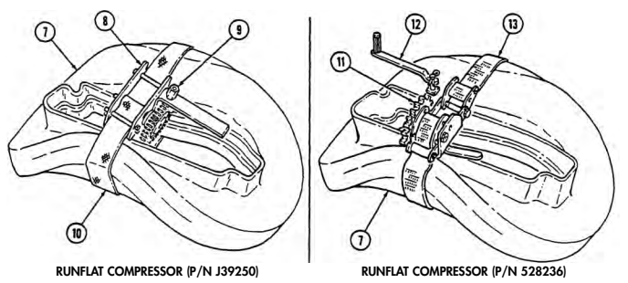

# 8-4.1. Radial Tire, Wheel, And Rubber Runflat Maintenance (24-Stud) (Cont'D)

Always wear eye protection and rubber gloves when applying runflat lubricant. Failure to do so may result in injury to personnel.

The radial tire is a bidirectional tire and the tread may be positioned in either direction.

5. Using 2- to 6-inch paint brush, apply entire 11-oz tube of lubricant evenly (depth of 1/8 to 3/16 in.

(0.32 to 0.475 cm) on inside of tire (1).

Runflat compressor belt and handle may be greasy, which could slip and cause damage to equipment or injury to personnel.

NOTE
It may be necessary to remove handle assembly on runflat compressor P/N 528236 before inserting runflat into tire.

6. Insert runflat (2), compressor side first, as far as possible into tire (1). 7. Lay tire (1) flat on protruding runflat side. Loosen compressor (4). Runflat (2) should insert itself inside tire (1). If not, repeat steps 5 through 7 and/or use a tire spoon to assist in installation.

If required, clean and lubricate bearing assembly on runflat compressor P/N 528236 after removal.

8. Loosen runflat compressor (4) and remove from tire (1). 9. Lubricate tire bead (3) and rim bead seat areas with tire soap.

Never install radial tire on eight-bolt wheel. Damage to equipment may result, causing injury to personnel.

Before installing tire on inner rim half, inspect tire sidewalls for a paint dot. Paint dots are often painted on tires to indicate the tire's light spot for balancing purposes. If paint dot is present, position tire on rim halves so that paint dot is aligned with insert hole on outer rim half.

10. Center runflat (2) in tire (1). Carefully lower tire (1) over inner rim half (8). 11. Ensure runflat (2) is not binding on flat portion of inner rim half (8). Runflat (2) should clear inner rim half (8).

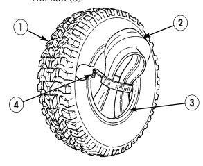

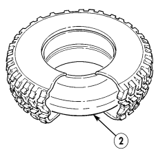

# 8-4.1. Radial Tire, Wheel, And Rubber Runflat Maintenance (24-Stud) (Cont'D)

- Ensure longer lip of runflat seats against outer rim half. - Align air notch in runflat with valve stem in the rim.

12. Lubricate O-ring seal (7) with tire soap. Install O-ring seal (7), in groove (9) on top of inner rim half (8), around studs (10). Ensure O-ring seal (7) is not twisted and that it is uniformly positioned in groove (9). Do not overstretch O-ring seal (7).

13. Install insert (12) and O-ring (13) on outer rim half (6) with locknut (14). Tighten locknut (14) to 40–60 lb-in. (5-7 N•m).

14. Install valve core (11) in insert (12). 15. Install outer rim half (6) on inner rim half (8).

Tighten locknuts gradually to avoid bent and broken studs or damage to wheel components.

16. Secure outer rim half (6) to inner rim half (8) with twenty-four locknuts (5). Do not tighten locknuts (5).

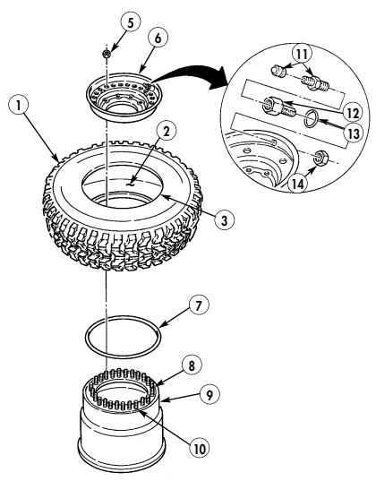

# 8-4.1. Radial Tire, Wheel, And Rubber Runflat Maintenance (24-Stud) (Cont'D)

17. Tighten locknuts (1) to 85 lb-ft (115 N•m) in tightening sequence shown. 18. Tighten locknuts (1) to 110 lb-ft (149 N•m) in tightening sequence shown. 19. Check wheel assembly (4) for gaps at each stud (2). Use 0.0015 in. (0.038 mm) thickness gauge to detect gaps. If gaps are detected, disassemble and reassemble wheel assembly (4) and recheck for gaps. If gaps are still detected, replace outer rim half (3).

- Always use an OSHA approved tire inflation cage for inflation purposes. Stand on one side of the cage during inflation; never directly in front. Keep hands out of cage during inflation. Inflate assembly to recommended pressure using a clip-on air chuck. Do not exceed 50 psi (345 kPa) cold-inflation pressure. Failure to follow these instructions may result in serious injury or death.

- Never inflate a wheel assembly without having checked wheel locknut torques to ensure the wheel locknuts are tightened to specifications. An assembly with improperly tightened locknuts could separate under pressure, resulting in serious injury or death.

20. Place wheel assembly (4) in safety cage and inflate tire to recommended tire pressure (TM 9-2320-387-10).

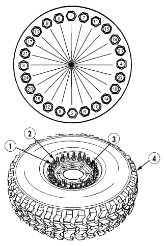

FOLLOW-ON TASKS: Balance tire (para. 8-8).

8-14.12/(8-14.13 blank) Change 6

# 8-4.2. Radial Tire, Wheel, And Rubber Runflat Maintenance (Paired 24-Stud)

This task covers:
a. Disassembly c. Repair b. Inspection and cleaning d. Assembly

## Initial Setup:

Tools General mechanic's tool kit:
automotive (Appendix B, Item 1)
Maintenance and repair shop equipment:
automotive (Appendix B, Item 2)
Torque wrench 1/2 in. drive 250 lb-ft

## Special Tools

Runflat compressor (Appendix B, Item 115) Torque adapter, 9/16-in. (Appendix B,
Item 133)
Socket adapter (Appendix B, Item 135)

## Materials/Parts

Twenty-four locknuts (Appendix G, Item 84) O-ring seal (Appendix G, Item 280.3) Locknut (Appendix G, Item 86) O-ring (Appendix G, Item 232) Lubricant (Appendix G, Item 192) Detergent (Appendix C, Item 25) Sealing compound, if required
(Appendix C, Item 61)

## Manual References

| TM 9\-2320\-387\-10   |
|-----------------------|
| TM 9\-2610\-200\-14   |
| TM 9\-2320\-387\-24P  |

## Equipment Condition

Wheel removed (para. 8-3).

## General Safety Instructions

| Maintenance Level   |
|---------------------|

- Do not use tire machine. - Ensure tire is totally deflated before removing wheel locknuts.

- Never use tubes in wheel assemblies. - Rim surfaces must be kept clean and free of rust and dirt.

- Never use wheel assemblies with damaged studs.

- Never inflate a wheel assembly with the wheel locknuts removed.

- Never inflate a wheel assembly without first checking wheel locknut torques.

- Do not exceed recommended tire inflation pressure.

- Always use an OSHA approved tire inflation cage and a clip-on air chuck for tire inflation.

- Ensure runflat compressor strap is centered around runflat.

- Never install radial tire on eight-bolt wheel.

Unit

- Do not use tire machine. Injury to personnel or damage to equipment may result.

- In all disassembly operations, ensure the tire is totally deflated before removing wheel locknuts. Failure to follow proper safety precautions could cause serious injury or death to personnel.

- Load Range D valves and tires are not compatible with Load Range E wheels. Load Range E valves and tires are not compatible with Load Range D wheels. Failure to comply may result in damage to equipment and injury or death to personnel.

- Do not mix Load Range D and Load Range E tires on the same vehicle. Failure to comply may result in damage to equipment and injury or death to personnel.

## A. Disassembly

1. Remove valve core (7) from insert (8) and deflate tire (6). 2. Use a circular pattern and loosen twenty-four wheel locknuts (2) securing rim halves (1) and (5)
together. If you hear escaping air, do not proceed. Wait until sound stops. When tire (6) is fully deflated, remove wheel locknuts (2). Discard locknuts (2).

# 8-4.2. Radial Tire, Wheel, And Rubber Runflat Maintenance (Paired 24-Stud) (Cont'D)

Never inflate a wheel assembly with the wheel locknuts removed in an attempt to separate inner and outer rim halves. The assembly will separate under pressure, resulting in serious injury or death.

3. Remove outer rim half (1) from tire (6). 4. Remove insert (8) and locknut (10) from outer rim (1). Discard locknut (10). 5. Remove O-ring (9) from insert (8). Discard O-ring (9). 6. Remove O-ring seal (3) from inner rim half (5). Cut O-ring seal (3) in two to make sure it cannot be reused. Discard O-ring seal (3).

7. Remove tire (6) from inner rim half (5). 8. Remove balance weights (4) from rim halves (1) and (5), if present. Discard balance weights (4).

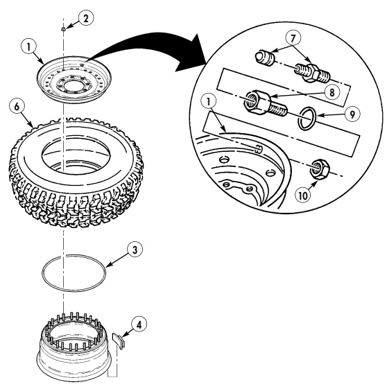

# 8-4.2. Radial Tire, Wheel, And Rubber Runflat Maintenance (Paired 24-Stud) (Cont'D)

9. Lay tire (1) flat.

Do not use compressor strap if it is frayed or damaged. Ensure runflat is free of grease and runflat compressor strap is centered around runflat. Failure to do so may cause injury to personnel.

NOTE
Perform steps 10 and 11 when using runflat compressor P/N J39250. Perform steps 12 and 13 when using runflat compressor P/N 528236.

10. Position runflat compressor (3) on runflat (2) so that runflat compressor hex-drive (4) is facing up and strap (5) is centered around runflat (2).

Compress runflat by rotating hex-drive in either direction. Rotate hex-drive the opposite direction to loosen.

11. Using runflat compressor (3), compress runflat (2). 12. Position runflat compressor (6) on outer edge of runflat (2) with handle assembly (7) facing up and strap (8) centered around runflat (2).

Compress runflat by rotating handle assembly in a clockwise direction. Rotate handle assembly counterclockwise to loosen.

13. Using runflat compressor (6), compress runflat (2).

NOTE
- It may be necessary to use a tire spoon and tire soap to remove runflat from tire.

- When using runflat compressor P/N 528236, handle may need to be removed before removing runflat.

14. Remove runflat (2) from tire (1) and remove runflat compressor (3) or (6) from runflat (2).

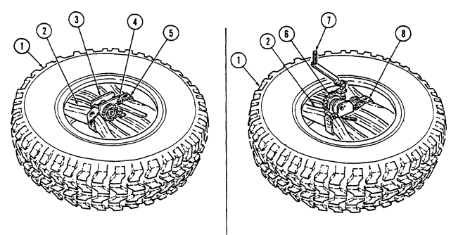

8-14.16 Change 6

# 8-4.2. Radial Tire, Wheel, And Rubber Runflat Maintenance (Paired 24-Stud) (Cont'D)

b. Inspection and Cleaning

Do not reuse a tire which has been run flat without thoroughly inspecting for damage. Failure to follow these instructions may result in damage to equipment.

1. Inspect inside of tire (1) for cord or belt separation and inner liner damage. Replace tire (1) if damaged.

2. Inspect tire bead (9) for abrasions caused from runflat (2). Replace tire (1) if damaged. 3. Check for protruding objects inside tire (1) which may not be visible from outside. Repair tire (1) if damaged.

4. Check tread depth on tire (1). Tread should not be worn below level of wear bars (10). Replace tire (1) if tread is worn below wear bars (10) or 1/16 in. (1.59 mm).

5. Clean all grease, dirt, and foreign material from the runflat (2) with soap and water and allow to air-dry. Inspect runflat (2) for splitting, wear, or excessive chafing. Replace runflat (2) if damaged.

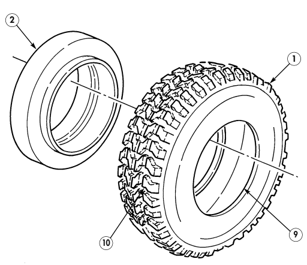

# 8-4.2. Radial Tire, Wheel, And Rubber Runflat Maintenance (Paired 24-Stud) (Cont'D)

O-ring sealing surfaces and pressure relief grooves must be kept clean and free of rust and dirt. Failure to do so may cause the wheel assembly to separate under pressure, causing serious injury or death.

6. Using wire brush, clean studs (4). Clean all dirt and foreign material from rim halves (1) and (2)
with soap and water and allow to air-dry. Ensure O-ring sealing surfaces (5) and pressure relief grooves (3) on rim halves (1) and (2) are smooth and clean.

7. Inspect rim halves (1) and (2) for cracks, bent sealing surfaces (5), or oversized mounting holes.

Replace rim halves (1) or (2) if cracked, bent, or if mounting holes are oversized.

Never use wheel assemblies with studs which are damaged, loose, or have damaged threads. Damaged studs can cause improper assembly, which may cause individual fasteners to fail. Any of these situations may cause serious injury or death.

8. Inspect inner rim half (2) for cracked, broken, rusted, pitted, bent, or loose studs (4) and studs (4)
with damaged, mutilated, or deformed threads. Replace studs (4) (para. 8-7) if damaged, loose, or threads are damaged.

9. Inspect insert (6) for damage. Replace insert (6) if damaged. c. Repair Refer to TM 9-2610-200-14 for maintenance and repair of tires.

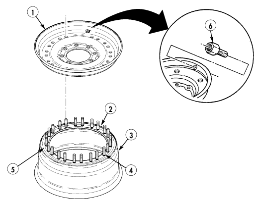

# 8-4.2. Radial Tire, Wheel, And Rubber Runflat Maintenance (Paired 24-Stud) (Cont'D)

d. Assembly

- Never use tubes in wheel assemblies. Use of a tube defeats builtin safety features, and may allow the wheel to come apart under pressure, resulting in serious injury or death.

- Use only replacement parts specified in TM 9-2320-387-24P for radial tires. Never install radial tire components on eight-bolt rims. Wheels assembled with components not specified for radial tires could cause the assembly to separate under pressure, resulting in serious injury or death.

- Do not use compressor strap if it is frayed or damaged. Ensure runflat is free of grease and runflat compressor strap is centered on runflat. Failure to do so could cause injury to personnel.

Perform steps 1 and 2 when using runflat compressor P/N J39250. Perform steps 3 and 4 when using runflat compressor P/N 528236.

1. Position runflat compressor (8) on runflat (7) so that runflat compressor hex-drive (9) is facing up and strap (10) is centered around runflat (7).

NOTE
Compress runflat by rotating hex-drive in either direction. Rotate hex-drive opposite to loosen.

2. Using runflat compressor (8), compress runflat (7). 3. Position runflat compressor (11) on an outer edge of runflat (7) with handle assembly (12) facing up and strap (13) centered around runflat (7).

Compress runflat by rotating the handle assembly in a clockwise direction. Rotate handle assembly counterclockwise to loosen.

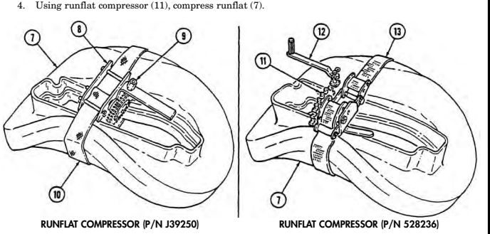

# 8-4.2. Radial Tire, Wheel, And Rubber Runflat Maintenance (Paired 24-Stud) (Cont'D)

Always wear eye protection and rubber gloves when applying runflat lubricant. Failure to do so may result in injury to personnel.

The radial tire is a bidirectional tire and the tread may be positioned in either direction.

5. Using 2- to 6-inch paint brush, apply entire 11-oz tube of lubricant evenly (depth of 1/8 to 3/16 in.

(0.32 to 0.475 cm) on inside of tire (1).

Runflat compressor belt and handle may be greasy, which could slip and cause damage to equipment or injury to personnel.

It may be necessary to remove handle assembly on runflat compressor P/N 528236 before inserting runflat into tire.

6. Insert runflat (2), compressor side first, as far as possible into tire (1). 7. Lay tire (1) flat on protruding runflat side. Loosen compressor (4). Runflat (2) should insert itself inside tire (1). If not, repeat steps 5 through 7 and/or use a tire spoon to assist in installation.

NOTE
If required, clean and lubricate bearing assembly on runflat compressor P/N 528236 after removal.

8. Loosen runflat compressor (4) and remove from tire (1). 9. Lubricate tire bead (3) and rim bead seat areas with tire soap.

Never install radial tire on eight-bolt wheel. Damage to equipment may result, causing injury to personnel.

Before installing tire on inner rim half, inspect tire sidewalls for a paint dot. Paint dots are often painted on tires to indicate the tire's light spot for balancing purposes. If paint dot is present, position tire on rim halves so that paint dot is aligned with insert hole on outer rim half.

10. Center runflat (2) in tire (1). Carefully lower tire (1) over inner rim half (8). 11. Ensure runflat (2) is not binding on flat portion of inner rim half (8). Runflat (2) should clear inner rim half (8).

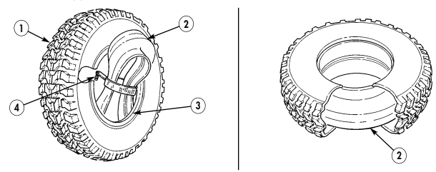

# 8-4.2. Radial Tire, Wheel, And Rubber Runflat Maintenance (Paired 24-Stud) (Cont'D)

- Ensure longer lip of runflat seats against outer rim half. - Align air notch in runflat with valve stem in the rim.

12. Lubricate O-ring seal (7) with tire soap. Install O-ring seal (7), in groove (9) on top of inner rim half (8), around studs (10). Ensure O-ring seal (7) is not twisted and that it is uniformly positioned in groove (9). Do not overstretch O-ring seal (7).

13. Install insert (12) and O-ring (13) on outer rim half (6) with locknut (14). Tighten locknut (14) to 40–60 lb-in. (5-7 N•m).

14. Install valve core (11) in insert (12). 15. Install outer rim half (6) on inner rim half (8).

Tighten locknuts gradually to avoid bent and broken studs or damage to wheel components.

16. Secure outer rim half (6) to inner rim half (8) with twenty-four locknuts (5). Do not tighten locknuts (5).

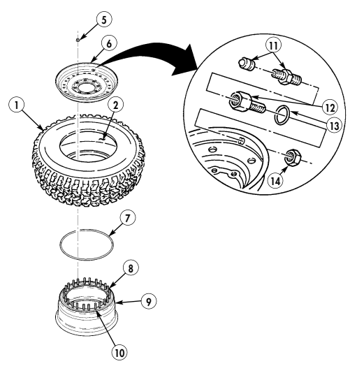

# 8-4.2. Radial Tire, Wheel, And Rubber Runflat Maintenance (Paired 24-Stud) (Cont'D)

17. Tighten locknuts (1) to 85 lb-ft (115 N•m) in tightening sequence shown. 18. Tighten locknuts (1) to 110 lb-ft (149 N•m) in tightening sequence shown. 19. Check wheel assembly (4) for gaps at each stud (2). Use 0.0015 in. (0.038 mm) thickness gauge to detect gaps. If gaps are detected, disassemble and reassemble wheel assembly (4) and recheck for gaps. If gaps are still detected, replace outer rim half (3).

- Always use an OSHA approved tire inflation cage for inflation purposes. Stand on one side of the cage during inflation; never directly in front. Keep hands out of cage during inflation. Inflate assembly to recommended pressure using a clip-on air chuck. Do not exceed 50 psi (345 kPa) cold-inflation pressure. Failure to follow these instructions may result in serious injury or death.

- Never inflate a wheel assembly without having checked wheel locknut torques to ensure the wheel locknuts are tightened to specifications. An assembly with improperly tightened locknuts could separate under pressure, resulting in serious injury or death.

20. Place wheel assembly (4) in safety cage and inflate tire to recommended tire pressure (TM 9-2320-387-10).

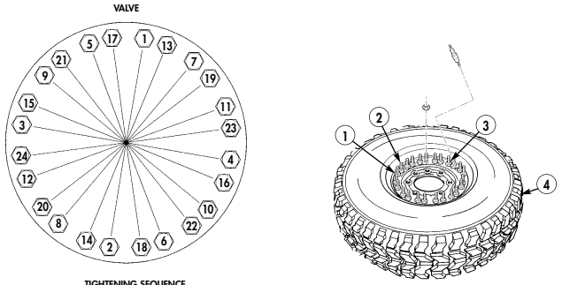

TIGHTENING SEQUENCE
FOLLOW-ON TASK: Balance tire (para. 8-8).

8-14.22/(8-14.23 blank) Change 6

# 8-4.3. Radial Tire, Wheel, And Rubber Runflat Maintenance (20-Stud)

This task covers:
a. Disassembly c. Repair b. Inspection and cleaning d. Assembly

## Initial Setup:

Tools General mechanic's tool kit:
automotive (Appendix B, Item 1)
Maintenance and repair shop equipment:
automotive (Appendix B, Item 2)
Torque wrench 1/2 in. drive, 250 lb-ft

## Special Tools

Runflat compressor (Appendix B, Item 115) Torque adapter, 9/16-in. (Appendix B,
Item 133)
Socket adapter (Appendix B, Item 135)

## Materials/Parts

Twenty locknuts (Appendix G, Item 84) O-ring seal (Appendix G, Item 280.3) Locknut (Appendix G, Item 86) O-ring (Appendix G, Item 232) Lubricant (Appendix G, Item 192) Detergent (Appendix C, Item 25) Sealing compound, if required
(Appendix C, Item 61)

| Manual References   |
|---------------------|

TM 9-2320-387-10 TM 9-2610-200-14 TM 9-2320-387-24P

## Equipment Condition

Wheel removed (para. 8-3).

## General Safety Instructions

- Do not use tire machine. - Ensure tire is totally deflated before removing wheel locknuts.

- Never use tubes in wheel assemblies. - Rim surfaces must be kept clean and free of rust and dirt.

- Never use wheel assemblies with damaged studs.

- Never inflate a wheel assembly with the wheel locknuts removed.

- Never inflate a wheel assembly without first checking wheel locknut torques.

- Do not exceed recommended tire inflation pressure.

- Always use an OSHA approved tire inflation cage and a clip-on air chuck for tire inflation.

- Ensure runflat compressor strap is centered around runflat.

- Never install radial tire on eight-bolt wheel.

Maintenance Level Unit

- Do not use tire machine. Injury to personnel or damage to equipment may result.

- In all disassembly operations, ensure the tire is totally deflated before removing wheel locknuts. Failure to follow proper safety precautions could cause serious injury or death to personnel.

- Load Range D valves and tires are not compatible with Load Range E wheels. Load Range E valves and tires are not compatible with Load Range D wheels. Failure to comply may result in damage to equipment and injury or death to personnel.

- Do not mix Load Range D and Load Range E tires on the same vehicle. Failure to comply may result in damage to equipment and injury or death to personnel.

## A. Disassembly

1. Remove valve core (7) from insert (8) and deflate tire (6). 2. Use a circular pattern and loosen twenty wheel locknuts (2) securing rim halves (1) and (5) together.

If you hear escaping air, do not proceed. Wait until sound stops. When tire (6) is fully deflated, remove wheel locknuts (2). Discard locknuts (2).

# 8-4.3. Radial Tire, Wheel, And Rubber Runflat Maintenance (20-Stud) (Cont'D)

Never inflate a wheel assembly with the wheel locknuts removed in an attempt to separate inner and outer rim halves. The assembly will separate under pressure, resulting in serious injury or death.

3. Remove outer rim half (1) from tire (6). 4. Remove insert (8) and locknut (10) from outer rim (1). Discard locknut (10). 5. Remove O-ring (9) from insert (8). Discard O-ring (9). 6. Remove O-ring seal (3) from inner rim half (5). Cut O-ring seal (3) in two to make sure it cannot be reused. Discard O-ring seal (3).

7. Remove tire (6) from inner rim half (5). 8. Remove balance weights from rim halves (1) and (5), if present. Discard balance weights.

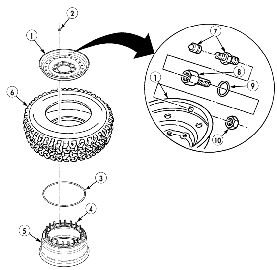

# 8-4.3. Radial Tire, Wheel, And Rubber Runflat Maintenance (20-Stud) (Cont'D)

9. Lay tire (1) flat.

Do not use compressor strap if it is frayed or damaged. Ensure runflat is free of grease and runflat compressor strap is centered around runflat. Failure to do so may cause injury to personnel.

NOTE
Perform steps 10 and 11 when using runflat compressor P/N J39250. Perform steps 12 and 13 when using runflat compressor P/N 528236.

10. Position runflat compressor (3) on runflat (2) so that runflat compressor hex-drive (4) is facing up and strap (5) is centered around runflat (2).

Compress runflat by rotating hex-drive in either direction. Rotate hex-drive the opposite direction to loosen.

11. Using runflat compressor (3), compress runflat (2). 12. Position runflat compressor (6) on outer edge of runflat (2) with handle assembly (7) facing up and strap (8) centered around runflat (2).

Compress runflat by rotating handle assembly in a clockwise direction. Rotate handle assembly counterclockwise to loosen.

13. Using runflat compressor (6), compress runflat (2).

NOTE
- It may be necessary to use a tire spoon and tire soap to remove runflat from tire.

- When using runflat compressor P/N 528236, handle may need to be removed before removing runflat.

14. Remove runflat (2) from tire (1) and remove runflat compressor (3) or (6) from runflat (2).

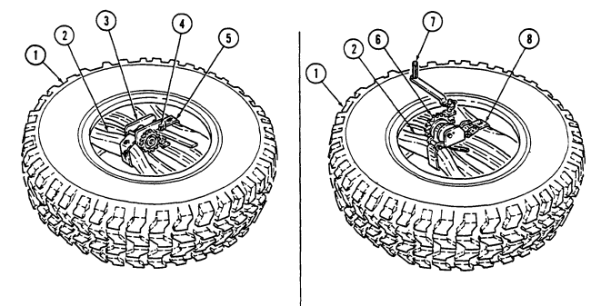

# 8-4.3. Radial Tire, Wheel, And Rubber Runflat Maintenance (20-Stud) (Cont'D)

b. Inspection and Cleaning

Do not reuse a tire which has been run flat without thoroughly inspecting for damage. Failure to follow these instructions may result in damage to equipment.

1. Inspect inside of tire (1) for cord or belt separation and inner liner damage. Replace tire (1) if damaged.

2. Inspect tire bead (9) for abrasions caused from runflat (2). Replace tire (1) if damaged. 3. Check for protruding objects inside tire (1) which may not be visible from outside. Repair tire (1) if damaged.

4. Check tread depth on tire (1). Tread should not be worn below level of wear bars (10). Replace tire (1) if tread is worn below wear bars (10) or 1/16 in. (1.59 mm).

5. Clean all grease, dirt, and foreign material from the runflat (2) with soap and water and allow to air-dry. Inspect runflat (2) for splitting, wear, or excessive chafing. Replace runflat (2) if damaged.

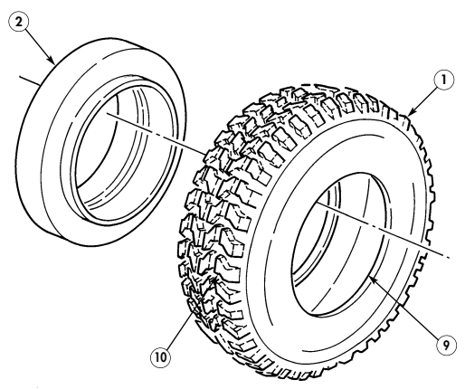

# 8-4.3. Radial Tire, Wheel, And Rubber Runflat Maintenance (20-Stud) (Cont'D)

O-ring sealing surfaces and pressure relief grooves must be kept clean and free of rust and dirt. Failure to do so may cause the wheel assembly to separate under pressure, causing serious injury or death.

6. Using wire brush, clean studs (4). Clean all dirt and foreign material from rim halves (1) and (2)
with soap and water and allow to air-dry. Ensure O-ring sealing surfaces (5) and pressure relief grooves (3) on rim halves (1) and (2) are smooth and clean.

7. Inspect rim halves (1) and (2) for cracks, bent sealing surfaces (5), or oversized mounting holes.

Replace rim halves (1) or (2) if cracked, bent, or if mounting holes are oversized.

Never use wheel assemblies with studs which are damaged, loose, or have damaged threads. Damaged studs can cause improper assembly, which may cause individual fasteners to fail. Any of these situations may cause serious injury or death.

8. Inspect inner rim half (2) for cracked, broken, rusted, pitted, bent, or loose studs (4) and studs (4)
with damaged, mutilated, or deformed threads. Replace studs (4) (para. 8-7) if damaged, loose, or threads are damaged.

9. Inspect insert (6) for damage. Replace insert (6) if damaged.

## C. Repair

Refer to TM 9-2610-200-14 for maintenance and repair of tires.

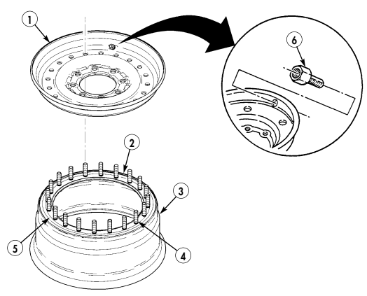

# 8-4.3. Radial Tire, Wheel, And Rubber Runflat Maintenance (20-Stud) (Cont'D)

d. Assembly

- Never use tubes in wheel assemblies. Use of a tube defeats builtin safety features, and may allow the wheel to come apart under pressure, resulting in serious injury or death.

- Use only replacement parts specified in TM 9-2320-387-24P for radial tires. Never install radial tire components on eight-bolt rims. Wheels assembled with components not specified for radial tires could cause the assembly to separate under pressure, resulting in serious injury or death.

- Do not use compressor strap if it is frayed or damaged. Ensure runflat is free of grease and runflat compressor strap is centered on runflat. Failure to do so could cause injury to personnel.

Perform steps 1 and 2 when using runflat compressor P/N J39250. Perform steps 3 and 4 when using runflat compressor P/N 528236.

1. Position runflat compressor (8) on runflat (7) so that runflat compressor hex-drive (9) is facing up and strap (10) is centered around runflat (7).

Compress runflat by rotating hex-drive in either direction. Rotate hex-drive opposite to loosen.

2. Using runflat compressor (8), compress runflat (7). 3. Position runflat compressor (11) on an outer edge of runflat (7) with handle assembly (12) facing up and strap (13) centered around runflat (7).

Compress runflat by rotating the handle assembly in a clockwise direction. Rotate handle assembly counterclockwise to loosen.

4. Using runflat compressor (11), compress runflat (7).

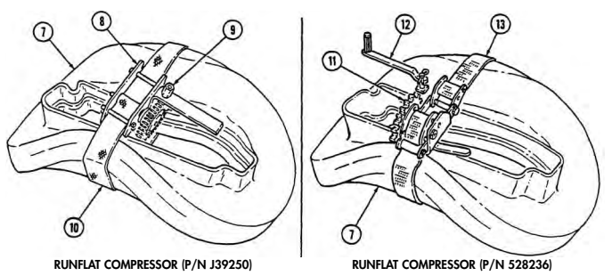

# 8-4.3. Radial Tire, Wheel, And Rubber Runflat Maintenance (20-Stud) (Cont'D)

Always wear eye protection and rubber gloves when applying runflat lubricant. Failure to do so may result in injury to personnel.

The radial tire is a bidirectional tire and the tread may be positioned in either direction.

5. Using 2- to 6-inch paint brush, apply entire 11-oz tube of lubricant evenly (depth of 1/8 to 3/16 in.

(0.32 to 0.475 cm) on inside of tire (1).

Runflat compressor belt and handle may be greasy, which could slip and cause damage to equipment or injury to personnel.

It may be necessary to remove handle assembly on runflat compressor P/N 528236 before inserting runflat into tire.

6. Insert runflat (2), compressor side first, as far as possible into tire (1). 7. Lay tire (1) flat on protruding runflat side. Loosen compressor (4). Runflat (2) should insert itself inside tire (1). If not, repeat steps 5 through 7 and/or use a tire spoon to assist in installation.

If required, clean and lubricate bearing assembly on runflat compressor P/N 528236 after removal.

8. Loosen runflat compressor (4) and remove from tire (1). 9. Lubricate tire bead (3) and rim bead seat areas with tire soap.

Never install radial tire on eight-bolt wheel. Damage to equipment may result, causing injury to personnel.

Before installing tire on inner rim half, inspect tire sidewalls for a paint dot. Paint dots are often painted on tires to indicate the tire's light spot for balancing purposes. If paint dot is present, position tire on rim halves so that paint dot is aligned with insert hole on outer rim half.

10. Center runflat (2) in tire (1). Carefully lower tire (1) over inner rim half (8). 11. Ensure runflat (2) is not binding on flat portion of inner rim half (8). Runflat (2) should clear inner rim half (8).

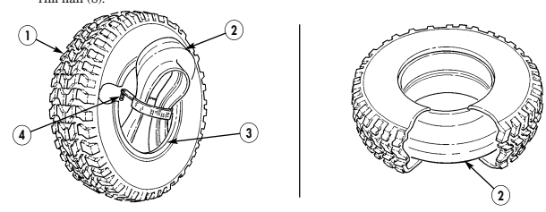

# 8-4.3. Radial Tire, Wheel, And Rubber Runflat Maintenance (20-Stud) (Cont'D)

- Ensure longer lip of runflat seats against outer rim half. - Align air notch in runflat with valve stem in the rim.

12. Lubricate O-ring seal (7) with tire soap. Install O-ring seal (7), in groove (9) on top of inner rim half (8), around studs (10). Ensure O-ring seal (7) is not twisted and that it is uniformly positioned in groove (9). Do not overstretch O-ring seal (7).

13. Install insert (12) and O-ring (13) on outer rim half (6) with locknut (14). Tighten locknut (14) to 40–60 lb-in. (5-7 N•m).

14. Install valve core (11) in insert (12). 15. Install outer rim half (6) on inner rim half (8).

Tighten locknuts gradually to avoid bent and broken studs or damage to wheel components.

16. Secure outer rim half (6) to inner rim half (8) with twenty locknuts (5). Do not tighten locknuts (5).

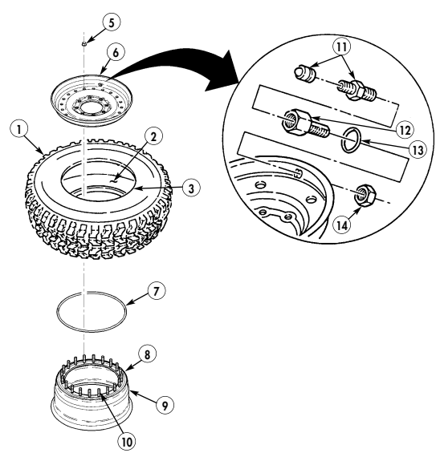

# 8-4.3. Radial Tire, Wheel, And Rubber Runflat Maintenance (20-Stud) (Cont'D)

17. Tighten locknuts (1) to 85 lb-ft (115 N•m) in tightening sequence shown. 18. Tighten locknuts (1) to 110 lb-ft (149 N•m) in tightening sequence shown. 19. Check wheel assembly (4) for gaps at each stud (2). Use 0.0015 in. (0.038 mm) thickness gauge to detect gaps. If gaps are detected, disassemble and reassemble wheel assembly (4) and recheck for gaps. If gaps are still detected, replace outer rim half (3).

- Always use an OSHA approved tire inflation cage for inflation purposes. Stand on one side of the cage during inflation; never directly in front. Keep hands out of cage during inflation. Inflate assembly to recommended pressure using a clip-on air chuck. Do not exceed 50 psi (345 kPa) cold-inflation pressure. Failure to follow these instructions may result in serious injury or death.

- Never inflate a wheel assembly without having checked wheel locknut torques to ensure the wheel locknuts are tightened to specifications. An assembly with improperly tightened locknuts could separate under pressure, resulting in serious injury or death.

20. Place wheel assembly (4) in safety cage and inflate tire to recommended tire pressure (TM 9-2320-387-10).

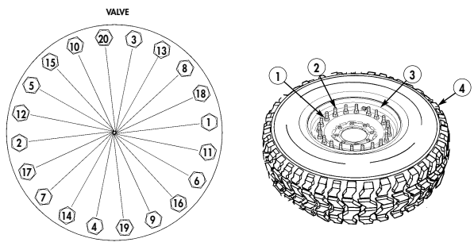

TIGHTENING SEQUENCE

# 8-5. Runflat Compressor (P/N J39250) Belt Replacement

This task covers:
INITIAL SETUP:
Tools General mechanic's tool kit:
automotive (Appendix B, Item 1)
Materials/Parts Runflat belt repair kit
(Appendix G, Item 275)
a. Removal

a. Removal b. Installation

Manual References TM 9-2320-387-24P
Maintenance Level Unit NOTE
Note position of belt for installation.

1. Remove small pin (8) from belt (4) and worm gear shaft assembly (1). Discard small pin (8). 2. Remove shaft pin (7) and worm gear shaft assembly (1) from compressor assembly (6). Discard shaft pin (7).

3. Remove two locknuts (5), socket-head screws (2), spacers (3), and belt (4) from compressor assembly
(6). Discard locknuts (5).

b. Installation

Belt overlap is to be positioned so there is an equal amount of belt

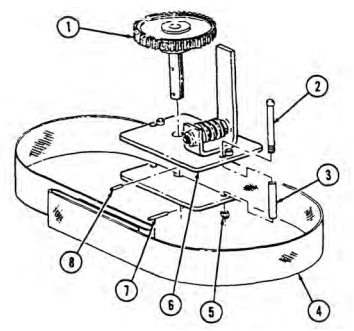 on each side of worm gear shaft assembly.

1. Install belt (4) on compressor assembly (6) with two spacers (3), socket-head screws (2), and locknuts (5). 2. Install worm gear shaft assembly (1) on compressor assembly (6) with shaft pin (7). 3. Install belt (4) to worm gear shaft assembly (1) with small pin (8).

# 8-6. Runflat Compressor (P/N 528236) Belt Replacement

This task covers:
INITIAL SETUP:
Tools General mechanic's tool kit:
automotive (Appendix B, Item 1)
Materials/Parts Runflat belt repair kit
(Appendix G, Item 276)
a. Removal b. Installation Manual References TM 9-2320-387-24P
Maintenance Level Unit a. Removal

Note position of belt for installation.

Remove locknut (1), capscrew (2), and belt (3) from compressor (4). Discard locknut (1).

b. Installation 1. Install belt (3) on compressor (4) with capscrew (2) and locknut (1).

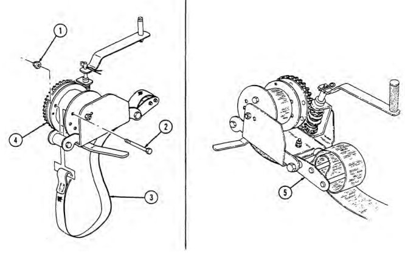 2. Loop free end of belt (3) around retaining bracket (5) as shown.

# 8-7. Inner Rim Stud Maintenance (12-Stud)

This task covers:
a. Removal c. Installation b. Cleaning and Inspection

## Initial Setup:

Tools General mechanic's tool kit:
automotive (Appendix B, Item 1)
Manual References TM 9-2320-387-10 TM 9-2320-387-24P
Equipment Condition Wheel removed (para. 8-3).

General Safety Instructions - Always wear eye protection when replacing wheel studs.

- Always wear eye protection when replacing wheel studs. Severe eye injury may result if metal chips contact eyes.

- Load Range D valves and tires are not compatible with Load Range E wheels. Load Range E valves and tires are not compatible with Load Range D wheels. Failure to comply may result in damage to equipment and injury or death to personnel.

- Do not mix Load Range D and Load Range E tires on the same vehicle. Failure to comply may result in damage to equipment and injury or death to personnel.

a. Removal

Perform steps 1 through 4 for stud removal without disassembly of wheel. Perform steps 5 and 6 for stud removal with disassembled wheel.

1. Place wheel assembly in tire inflation cage.

In all assembly operations, ensure the tire is totally deflated before removing wheel locknuts. Failure to follow proper safety precautions may result in serious injury or death.

2. Remove valve core (3) from valve bore (4) and deflate tire (1). Run a wire through valve bore (4) to ensure it is not plugged.

3. When tire (1) is fully deflated, loosen wheel locknut (2) from each side of the broken stud(s) (5). If you hear escaping air, do not proceed. Wait until the sound stops and recheck valve bore (4). When you are certain tire is fully deflated, proceed to remove wheel locknut (2). Discard locknut (2).

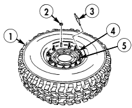

## General Safety Instructions (Cont'D)

- Ensure tire is totally deflated before removing wheel locknuts.

- Never use wheel assemblies with damaged studs. - Never inflate a wheel assembly without first checking wheel locknut torques.

- Always use an OSHA approved tire inflation cage and a clip-on air chuck for tire inflation.

Maintenance Level Unit

# 8-7. Inner Rim Stud Maintenance (12-Stud) (Cont'D)

When replacing broken rim stud(s), replace studs on both sides of the broken stud(s).

4. Drive studs (1) out of inner rim (2). Discard studs (1). 5. Disassemble wheel and runflat (para. 8-4). 6. Drive stud (3) out of inner rim half (4). Discard stud (3). b. Cleaning and Inspection 1. Using wire brush, clean studs. Clean all dirt and foreign material from rim with soap and water and allow to air-dry.

Never use wheel assemblies with studs which are damaged, loose, or have damaged threads. Damaged studs can cause improper assembly, which could cause individual fasteners to fail. Any of these situations may result in serious injury or death.

2. Inspect inner rim (4) for cracked, broken, rusted, pitted, bent, or loose studs (3), and studs (3) with damaged, mutilated, or deformed threads.

c. Installation

Perform steps 1 and 2 for stud installation with disassembled wheel. Perform steps 3 through 11 for stud installation without disassembly of wheel.

1. Align splines on stud (3) with splines in inner rim (4) and drive stud (3) into inner rim (4) until stud shoulder seats against inner rim (4).

2. Assemble wheel and runflat (para. 8-4). 3. Align splines on stud (1) with splines in inner rim (2) and drive stud (1) into inner rim (2) until shoulder of stud (1) seats against inner rim (2).

4. Repeat step 3 for all studs (1) being replaced.

Tighten locknuts gradually to avoid bent and broken studs or damage to wheel components will result.

5. Install locknuts (6) on studs (1).

After replacing broken stud(s), all rim nuts must be retorqued.

6. Tighten locknuts (6) to 85 lb-ft (115 N•m) in sequence shown. 7. Tighten locknuts (6) to 125 lb-ft (170 N•m) in sequence shown. 8. Check wheel assembly for gaps at each stud. Use a 0.0015 in. (0.038 mm) thickness gauge to detect gaps. If gaps are detected, disassemble and reassemble wheel assembly and recheck for gaps. If gaps are still detected, replace outer rim half (para. 8-4).

9. Install valve core (7) in valve bore (8).

# 8-7. Inner Rim Stud Maintenance (12-Stud) (Cont'D)

- Never inflate a wheel assembly before checking wheel locknut torques to ensure the wheel locknuts are tightened to specifications. An assembly with improperly tightened locknuts could separate under pressure, resulting in serious injury or death.

- Always use an OSHA approved tire inflation cage for inflation purposes. Stand on one side of the cage during inflation, never directly in front. Keep hands out of cage during inflation. Inflate assembly to recommended pressure, using a clip-on air chuck. Do not exceed 50 psi (345 kPa) cold inflation pressure. Failure to follow these instructions may result in serious injury or death.

10. Place tire assembly (5) in safety cage and inflate front and rear tires to recommended tire pressure 
(TM 9-2320-387-10).

11. Check for leaks around rim edges, insert, and valve bore (8) with soapy solution.

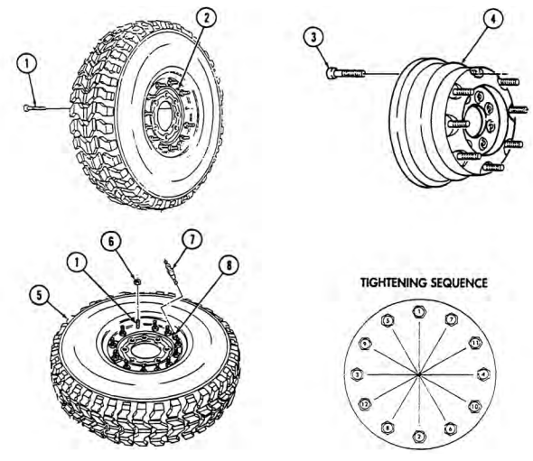

# 8-7.1. Inner Rim Stud Maintenance (24-Stud)

This task covers:
a. Removal c. Installation b. Cleaning and Inspection

## Initial Setup:

Tools General mechanic's tool kit:
automotive (Appendix B, Item 1)
Materials/Parts Twenty-four locknuts (Appendix G, Item 84)
Manual References TM 9-2320-387-10 TM 9-2320-387-24P
Equipment Condition Wheel removed (para. 8-3).

## General Safety Instructions

- Always wear eye protection when replacing wheel studs.

- Ensure tire is totally deflated before removing wheel locknuts.

- Never use wheel assemblies with damaged studs.

- Never inflate a wheel assembly without first checking wheel locknut torques.

- Always use an OSHA approved tire inflation cage and a clip-on air chuck for tire inflation.

## Maintenance Level

Unit

- Always wear eye protection when replacing wheel studs. Severe eye injury may result if metal chips contact eyes.

- Load Range D valves and tires are not compatible with Load Range E wheels. Load Range E valves and tires are not compatible with Load Range D wheels. Failure to comply may result in damage to equipment and injury or death to personnel.

- Do not mix Load Range D and Load Range E tires on the same vehicle. Failure to comply may result in damage to equipment and injury or death to personnel.

a. Removal

Perform steps 1 through 4 for stud removal without disassembly of wheel. Perform steps 5 and 6 for stud removal with disassembled wheel.

1. Place wheel assembly in OSHA approved tire inflation cage.

In all assembly operations, ensure the tire is totally deflated before removing wheel locknuts. Failure to follow proper safety precautions may result in serious injury or death.

2. Remove valve core (3) from valve bore (4) and deflate tire (1). Run a wire through valve bore (4) to ensure it is not plugged.

3. When tire (1) is fully deflated, loosen wheel locknut (2) from each side of the broken stud(s) (5). If you hear escaping air, do not proceed. Wait until the sound stops and recheck valve bore (4). When you are certain tire is fully deflated, proceed to remove wheel locknut (2). Discard locknut (2).

# 8-7.1. Inner Rim Stud Maintenance (24-Stud) (Cont'D)

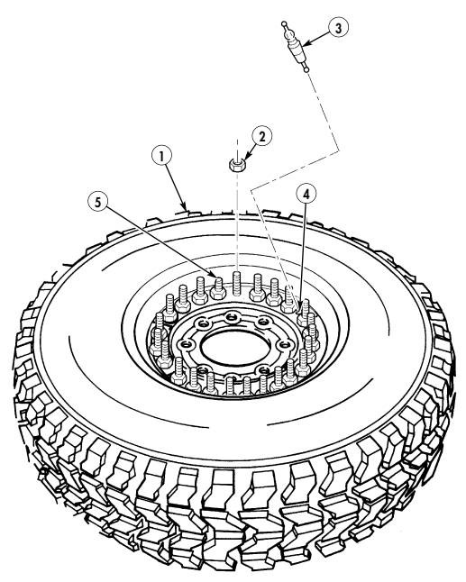

# 8-7.1. Inner Rim Stud Maintenance (24-Stud) (Cont'D)

When replacing broken rim stud(s), replace studs on both sides of the broken stud(s).

4. Drive studs (1) out of inner rim (2). Discard studs (1). 5. Disassemble wheel and runflat (para. 8-4.1). 6. Drive stud (3) out of inner rim half (4). Discard stud (3). b. Cleaning and Inspection 1. Using wire brush, clean studs. Clean all dirt and foreign material from rim with soap and water and allow to air-dry.

Never use wheel assemblies with studs which are damaged, loose, or have damaged threads. Damaged studs can cause improper assembly, which could cause individual fasteners to fail. Any of these situations may result in serious injury or death.

2. Inspect inner rim (4) for cracked, broken, rusted, pitted, bent, or loose studs (3), and studs (3) with damaged, mutilated, or deformed threads.

c. Installation

Perform steps 1 and 2 for stud installation with disassembled wheel. Perform steps 3 through 11 for stud installation without disassembly of wheel.

1. Align splines on stud (3) with splines in inner rim (4) and drive stud (3) into inner rim (4) until stud shoulder seats against inner rim (4).

2. Assemble wheel and runflat (para. 8-4.1). 3. Align splines on stud (1) with splines in inner rim (2) and drive stud (1) into inner rim (2) until shoulder of stud (1) seats against inner rim (2).

4. Repeat step 3 for all studs (1) being replaced.

Tighten locknuts gradually to avoid bent and broken studs or damage to wheel components will result.

5. Install locknuts (6) on studs (1).

After replacing broken stud(s), all rim nuts must be retorqued.

6. Tighten locknuts (6) to 85 lb-ft (115 N•m) in sequence shown. 7. Tighten locknuts (6) to 110 lb-ft (149 N•m) in sequence shown. 8. Check wheel assembly for gaps at each stud. Use a 0.0015 in. (0.038 mm) thickness gauge to detect gaps. If gaps are detected, disassemble and reassemble wheel assembly and recheck for gaps. If gaps are still detected, replace outer rim half (para. 8-4.1).

9. Install valve core (7) in valve bore (8).

# 8-7.1. Inner Rim Stud Maintenance (24-Stud) (Cont'D)

- Never inflate a wheel assembly before checking wheel locknut torques to ensure the wheel locknuts are tightened to specifications. An assembly with improperly tightened locknuts could separate under pressure, resulting in serious injury or death.

- Always use an OSHA approved tire inflation cage for inflation purposes. Stand on one side of the cage during inflation, never directly in front. Keep hands out of cage during inflation. Inflate assembly to recommended pressure, using a clip-on air chuck. Do not exceed 50 psi (345 kPa) cold inflation pressure. Failure to follow these instructions may result in serious injury or death.

10. Place tire assembly (5) in safety cage and inflate front and rear tires to recommended tire pressure 
(TM 9-2320-387-10).

11. Check for leaks around rim edges, insert, and valve bore (8) with soapy solution.

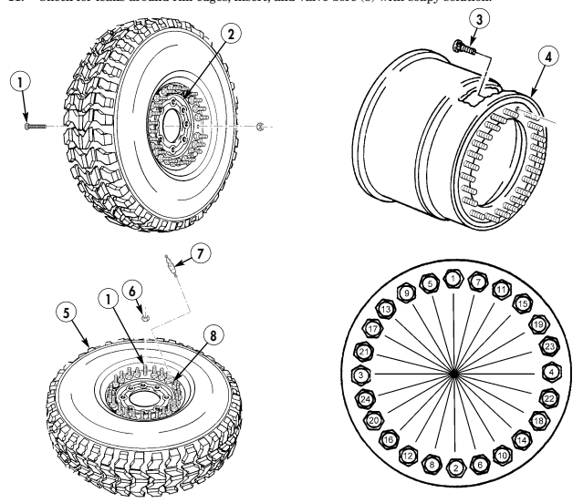

FOLLOW-ON TASKS: - Balance tire (para. 8-8).

# 8-7.2. Inner Rim Stud Maintenance (Paired 24-Stud)

This task covers:
a. Removal c. Installation b. Cleaning and Inspection

## Initial Setup:

Tools General mechanic's tool kit:
automotive (Appendix B, Item 1)
Torque wrench 1/2 in. drive, 250 lb-ft Materials/Parts Twenty-four locknuts (Appendix G, Item 84)
Manual References TM 9-2320-387-10 TM 9-2320-387-24P
Equipment Condition Wheel removed (para. 8-3).

## General Safety Instructions

- Always wear eye protection when replacing wheel studs.

- Ensure tire is totally deflated before removing wheel locknuts.

- Never use wheel assemblies with damaged studs.

- Never inflate a wheel assembly without first checking wheel locknut torques.

- Always use an OSHA approved tire inflation cage and a clip-on air chuck for tire inflation.

## Maintenance Level

Unit

- Always wear eye protection when replacing wheel studs. Severe eye injury may result if metal chips contact eyes.

- Load Range D valves and tires are not compatible with Load Range E wheels. Load Range E valves and tires are not compatible with Load Range D wheels. Failure to comply may result in damage to equipment and injury or death to personnel.

- Do not mix Load Range D and Load Range E tires on the same vehicle. Failure to comply may result in damage to equipment and injury or death to personnel.

a. Removal

Perform steps 1 through 4 for stud removal without disassembly of wheel. Perform steps 5 and 6 for stud removal with disassembled wheel.

1. Place wheel assembly in OSHA approved tire inflation cage.

In all assembly operations, ensure the tire is totally deflated before removing wheel locknuts. Failure to follow proper safety precautions may result in serious injury or death.

2. Remove valve core (3) from valve bore (4) and deflate tire (1). Run a wire through valve bore (4) to ensure it is not plugged.

3. When tire (1) is fully deflated, loosen wheel locknut (2) from each side of the broken stud(s) (5). If you hear escaping air, do not proceed. Wait until the sound stops and recheck valve bore (4). When you are certain tire is fully deflated, proceed to remove wheel locknut (2). Discard locknut (2).

8-7.2. INNER RIM STUD MAINTENANCE (PAIRED 24-STUD) (Cont'd)

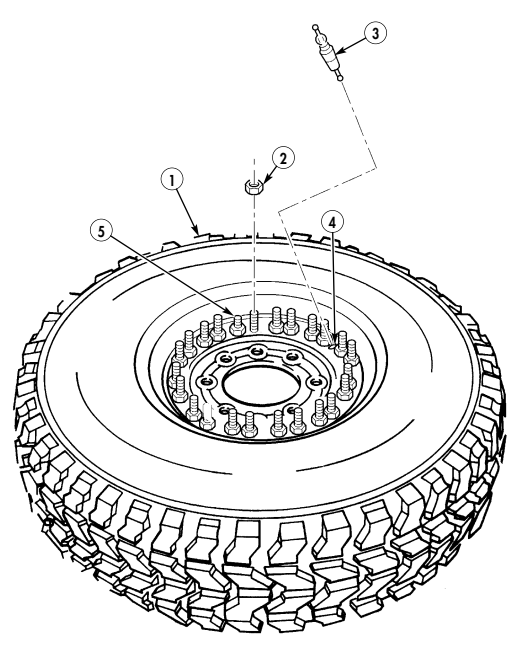

# 8-7.2. Inner Rim Stud Maintenance (Paired 24-Stud) (Cont'D)

When replacing broken rim stud(s), replace studs on both sides of the broken stud(s).

4. Drive studs (1) out of inner rim (2). Discard studs (1). 5. Disassemble wheel and runflat (para. 8-4.1). 6. Drive stud (3) out of inner rim half (4). Discard stud (3). b. Cleaning and Inspection 1. Using wire brush, clean studs. Clean all dirt and foreign material from rim with soap and water and allow to air-dry.

Never use wheel assemblies with studs which are damaged, loose, or have damaged threads. Damaged studs can cause improper assembly, which could cause individual fasteners to fail. Any of these situations may result in serious injury or death.

2. Inspect inner rim (4) for cracked, broken, rusted, pitted, bent, or loose studs (3), and studs (3) with damaged, mutilated, or deformed threads.

c. Installation

Perform steps 1 and 2 for stud installation with disassembled wheel. Perform steps 3 through 11 for stud installation without disassembly of wheel.

1. Align splines on stud (3) with splines in inner rim (4) and drive stud (3) into inner rim (4) until stud shoulder seats against inner rim (4).

2. Assemble wheel and runflat (para. 8-4.1). 3. Align splines on stud (1) with splines in inner rim (2) and drive stud (1) into inner rim (2) until shoulder of stud (1) seats against inner rim (2).

4. Repeat step 3 for all studs (1) being replaced.

Tighten locknuts gradually to avoid bent and broken studs or damage to wheel components will result.

5. Install locknuts (6) on studs (1).

After replacing broken stud(s), all rim nuts must be retightened to torque limits.

6. Tighten locknuts (6) to 85 lb-ft (115 N•m) in sequence shown. 7. Tighten locknuts (6) to 110 lb-ft (149 N•m) in sequence shown. 8. Check wheel assembly for gaps at each stud. Use a 0.0015 in. (0.038 mm) thickness gauge to detect gaps. If gaps are detected, disassemble and reassemble wheel assembly and recheck for gaps. If gaps are still detected, replace outer rim half (para. 8-4.1).

9. Install valve core (7) in valve bore (8).

# 8-7.2. Inner Rim Stud Maintenance (Paired 24-Stud) (Cont'D)

- Never inflate a wheel assembly before checking wheel locknut torques to ensure the wheel locknuts are tightened to specifications. An assembly with improperly tightened locknuts could separate under pressure, resulting in serious injury or death.

- Always use an OSHA approved tire inflation cage for inflation purposes. Stand on one side of the cage during inflation, never directly in front. Keep hands out of cage during inflation. Inflate assembly to recommended pressure, using a clip-on air chuck. Do not exceed 50 psi (345 kPa) cold inflation pressure. Failure to follow these instructions may result in serious injury or death.

10. Place tire assembly (5) in safety cage and inflate front and rear tires to recommended tire pressure 
(TM 9-2320-387-10).

11. Check for leaks around rim edges, insert, and valve bore (8) with soapy solution.

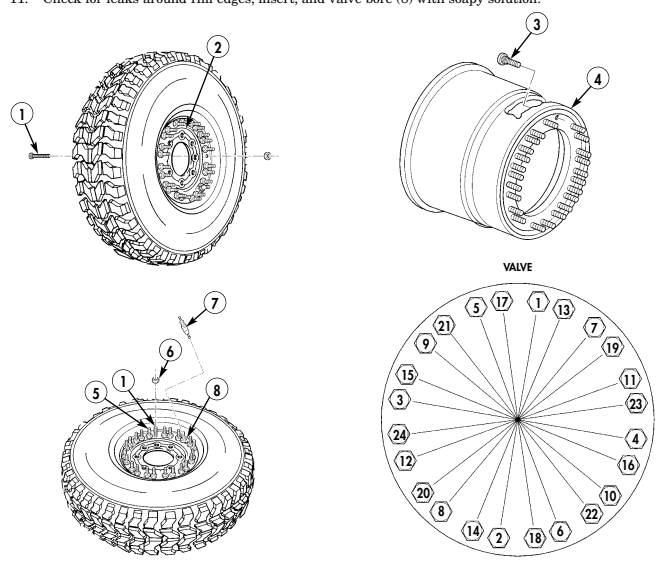

FOLLOW-ON TASK: Balance tire (para. 8-8).

TIGHTENING SEQUENCE

# 8-7.3. Inner Rim Stud Maintenance (20-Stud)

This task covers:
a. Removal c. Installation b. Cleaning and Inspection

## Initial Setup: Tools

General mechanic's tool kit:
automotive (Appendix B, Item 1)
Torque wrench 1/2 in. drive, 250 lb-ft Materials/Parts Twenty locknuts (Appendix G, Item 84)
Manual References TM 9-2320-387-10 TM 9-2320-387-24P
Equipment Condition Wheel removed (para. 8-3).

## General Safety Instructions

- Always wear eye protection when replacing wheel studs.

- Ensure tire is totally deflated before removing wheel locknuts.

- Never use wheel assemblies with damaged studs.

- Never inflate a wheel assembly without first checking wheel locknut torques.

- Always use an OSHA approved tire inflation cage and a clip-on air chuck for tire inflation.

Maintenance Level Unit

- Always wear eye protection when replacing wheel studs. Severe eye injury may result if metal chips contact eyes.

- Load Range D valves and tires are not compatible with Load Range E wheels. Load Range E valves and tires are not compatible with Load Range D wheels. Failure to comply may result in damage to equipment and injury or death to personnel.

- Do not mix Load Range D and Load Range E tires on the same vehicle. Failure to comply may result in damage to equipment and injury or death to personnel.

a. Removal

Perform steps 1 through 4 for stud removal without disassembly of wheel. Perform steps 5 and 6 for stud removal with disassembled wheel.

1. Place wheel assembly in OSHA approved tire inflation cage.

WARNING
In all assembly operations, ensure the tire is totally deflated before removing wheel locknuts. Failure to follow proper safety precautions may result in serious injury or death.

2. Remove valve core (3) from valve bore (4) and deflate tire (1). Run a wire through valve bore (4) to ensure it is not plugged.

3. When tire (1) is fully deflated, loosen wheel locknut (2) from each side of the broken stud(s) (5). If you hear escaping air, do not proceed. Wait until the sound stops and recheck valve bore (4). When you are certain tire is fully deflated, proceed to remove wheel locknut (2). Discard locknut (2).

# 8-7.3. Inner Rim Stud Maintenance (20-Stud) (Cont'D)

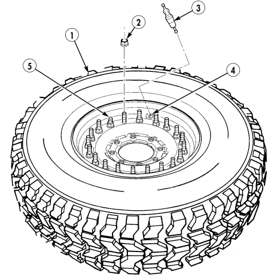

# 8-7.3. Inner Rim Stud Maintenance (20-Stud) (Cont'D)

When replacing broken rim stud(s), replace studs on both sides of the broken stud(s).

4. Drive studs (1) out of inner rim (2). Discard studs (1). 5. Disassemble wheel and runflat (para. 8-4.1). 6. Drive stud (3) out of inner rim half (4). Discard stud (3). b. Cleaning and Inspection 1. Using wire brush, clean studs. Clean all dirt and foreign material from rim with soap and water and allow to air-dry.

Never use wheel assemblies with studs which are damaged, loose, or have damaged threads. Damaged studs can cause improper assembly, which could cause individual fasteners to fail. Any of these situations may result in serious injury or death.

2. Inspect inner rim (4) for cracked, broken, rusted, pitted, bent, or loose studs (3), and studs (3) with damaged, mutilated, or deformed threads.

c. Installation

Perform steps 1 and 2 for stud installation with disassembled wheel. Perform steps 3 through 11 for stud installation without disassembly of wheel.

1. Align splines on stud (3) with splines in inner rim (4) and drive stud (3) into inner rim (4) until stud shoulder seats against inner rim (4).

2. Assemble wheel and runflat (para. 8-4.1). 3. Align splines on stud (1) with splines in inner rim (2) and drive stud (1) into inner rim (2) until shoulder of stud (1) seats against inner rim (2).

4. Repeat step 3 for all studs (1) being replaced.

Tighten locknuts gradually to avoid bent and broken studs or damage to wheel components will result.

5. Install locknuts (6) on studs (1).

After replacing broken stud(s), all rim nuts must be retightened to torque limits.

6. Tighten locknuts (6) to 85 lb-ft (115 N•m) in sequence shown. 7. Tighten locknuts (6) to 110 lb-ft (149 N•m) in sequence shown. 8. Check wheel assembly for gaps at each stud. Use a 0.0015 in. (0.038 mm) thickness gauge to detect gaps. If gaps are detected, disassemble and reassemble wheel assembly and recheck for gaps. If gaps are still detected, replace outer rim half (para. 8-4.1).

9. Install valve core (7) in valve bore (8).

# 8-7.3. Inner Rim Stud Maintenance (20-Stud) (Cont'D)

- Never inflate a wheel assembly before checking wheel locknut torques to ensure the wheel locknuts are tightened to specifications. An assembly with improperly tightened locknuts could separate under pressure, resulting in serious injury or death.

- Always use an OSHA approved tire inflation cage for inflation purposes. Stand on one side of the cage during inflation, never directly in front. Keep hands out of cage during inflation. Inflate assembly to recommended pressure, using a clip-on air chuck. Do not exceed 50 psi (345 kPa) cold inflation pressure. Failure to follow these instructions may result in serious injury or death.

10. Place tire assembly (5) in safety cage and inflate front and rear tires to recommended tire pressure 
(TM 9-2320-387-10).

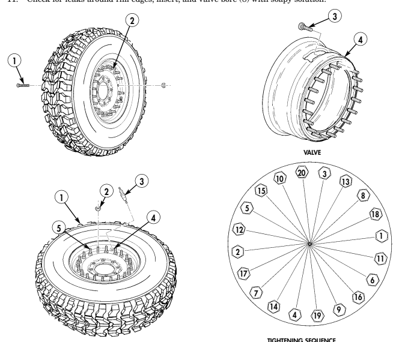

11. Check for leaks around rim edges, insert, and valve bore (8) with soapy solution.

TIGHTENING SEQUENCE
FOLLOW-ON TASK: Balance tire (para. 8-8).

# 8-8. Wheel Balancing

This task covers:
Balancing INITIAL SETUP:

| INITIAL SETUP:                    | Manual References                        |
|-----------------------------------|------------------------------------------|
| Tools                             | TM 9\-2320\-387\-10                      |
| General mechanic's tool kit:      | TM 9\-2320\-387\-24P                     |
| automotive (Appendix B, Item 1)   | Equipment Condition                      |
| Materials/Parts                   |                                          |
| Brake fluid (Appendix C, Item 18) | - Master cylinder filled to proper level |

Balancing For wheel balancing requirements, refer to TM 9-4910-785-10, Operating Instructions for Computer Truck Wheel Balancer.

# 8-9. Front Wheel Toe-In Alignment

This task covers:
a. Preliminary Inspection c. Toe-in Adjustment b. Toe-in Check

## Initial Setup:

Tools General mechanic's tool kit:
automotive (Appendix B, Item 1)
Materials/Parts Chalk (Appendix C, Item 20)
Personnel Required One mechanic One assistant Manual References TM 9-2320-387-10 TM 9-2320-387-24P
Equipment Condition
- Tires inflated to proper pressure (TM 9-2320-387-10). - Vehicle on level ground.

Maintenance Level Unit

- It is not necessary to perform front wheel toe-in alignment prior to the scheduled semiannual or 3,000 mile (4,827 km) maintenance interval unless abnormal vehicle handling or control is reported, or it is directed by another maintenance task.

- Front wheel alignment adjustments other than toe-in are performed by GS maintenance (Chapter 34).

- Ensure M1113, M1152, M1152A1 (if equipped) models have S250 shelter installed before performing front wheel toe-in alignment.

a. Preliminary Inspection 1. Check all tires (6) for uniform tread wear. 2. Raise vehicle and place support under lower control arms (8). 3. Check geared hubs (4) for output spindle end play by grasping edges of tires (6) and attempting to move tires (6) up and down. Adjust spindle bearings (para. 6-12) if any spindle movement is apparent.

4. Inspect for looseness of upper ball joint (3) by visually inspecting ball joint boot, and replace upper ball joint (3) if boot is ripped or torn.

4.1. Grasp top of tire (6) and attempt to move tire IN and OUT. Observe upper control arm (2) and geared hub (4) where upper ball joint (3) is mounted. If lateral movement is observed, upper ball joint (3) may be worn. Replace upper ball joint (3) if movement is 1/8 in. (3 mm) or more (refer to para. 6-23).

5. Check for looseness of lower ball joint (7) by visually inspecting ball joint boot, and replace lower ball joint (7) if boot is ripped or torn.

5.1. Grasp top of tire (6) and attempt to move tire IN and OUT. Observe lower control arm (8) and gear hub (4) where lower ball joint (7) is mounted. If lateral movement is observed, lower ball joint (7) may be worn. Replace lower ball joint (7) if movement is 1/8 in. (3 mm) or more (refer to para. 6-24).

6. Lower vehicle. 7. Check for looseness of tie rod ends (5) by attempting to move tie rods (9) vertically and horizontally.

Replace tie rod end(s) (5) (para. 8-16) if any movement is apparent.

8. Check for damaged control arm bushings (1). Replace upper control arms (2) (para. 6-25) or lower control arms (8) (para. 6-26) if bushings (1) are damaged.

# 8-9.  Front Wheel Toe-In Alignment (Cont'D)

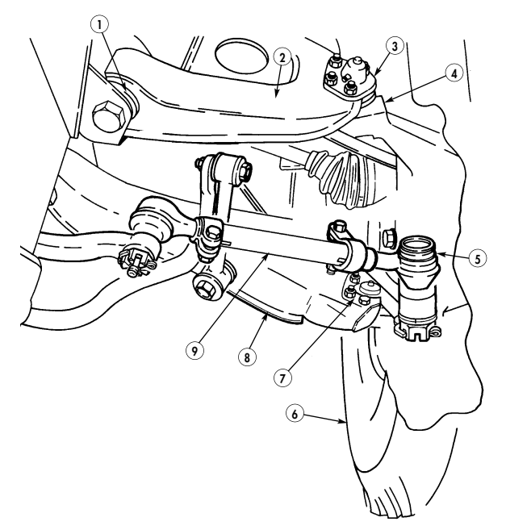

# 8-9. Front Wheel Toe-In Alignment (Cont'D)

b. Toe-in Check

- To ensure proper alignment, vehicle must be at curb weight or gross vehicle weight.

- Vehicle must be on level ground with wheels set straight ahead. - Steps 1 through 3 will determine centerline of tire. - Point of measurement for checking toe-in will be where lines marked in steps 1 and 3 intersect.

1. Mark line (4) on center tread (1) of tire (2) 16-1/2 in. (42 cm) from ground. 2. Measure total width of tire tread (3) and record. 3. Mark line (5) on center tread (1) at one-half total tread width (3). 4. Repeat steps 1 through 3 for opposite tire. 5. Measure distance between points of measurement on front side of tires (2) and record. 6. Rotate tires (2) by moving vehicle forward until points of measurement are 16-1/2-in. (42 cm) above the ground at rear side of tires (2).

7. Measure distance between points of measurement on rear side of tires (2) and record.

NOTE
- If measurement is larger on front side of tires than measurement on rear side of tires, tires have toe-out.

- If toe-in alignment does not meet specifications, repeat checking procedures to eliminate any possible reading errors.

8. Subtract measurement for front side of tires (2), obtained in step 5, from measurement for rear side of tires (2), step 7. The result of this subtraction represents inches of toe-in. Refer to table 8-1 for toe-in specifications. If toe-in does not meet specifications, adjust toe-in (task c.). 

| left side.   |                                                          |
|--------------|----------------------------------------------------------|
| NOTE         | Note positioning of brake pad surfaces for installation. |
| NOTE         |                                                          |

Table 8-1. Toe-in Alignment Adjustment Specifications.

9. If toe-in is within specifications, refer to task c. and perform step 5.

8-9.  FRONT WHEEL TOE-IN ALIGNMENT (Cont'd)

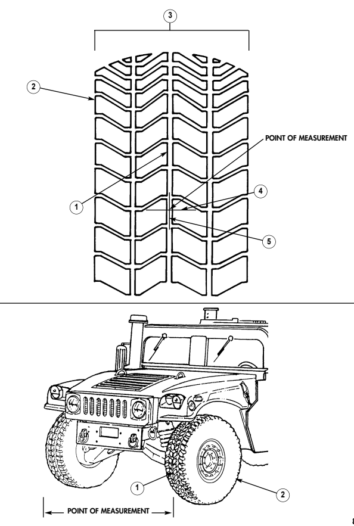

# 8-9. Front Wheel Toe-In Alignment (Cont'D)

c. Toe-in Adjustment 1. Loosen two locknuts (3) and screws (1.1) securing clamps (1) on each adjusting sleeve (2).

Toe-in can be increased or decreased by changing length of tie rods. A threaded sleeve is provided for this purpose. Both tie rods must be the same length ± 1/8 in. (3 mm) after adjustment.

2. Turn each adjusting sleeve (2) equally, but in opposite directions. 3. Roll vehicle rearward, then forward, to original position. 4. Repeat toe-in check and adjustment procedures until correct adjustment is indicated.

Ensure bolt and nut on adjusting sleeve clamp nearest to geared hub is facing halfshaft. Bolt and nut on adjusting sleeve clamp nearest to frame must be facing 180° away from stabilizer bar to prevent damage to equipment.

5. Secure two clamps (1) on each adjusting sleeve (2) with two screws (1.1) and locknuts (3). Tighten locknuts (3) to 30 lb-ft (40 N•m).

# 8-9.  Front Wheel Toe-In Alignment (Cont'D)

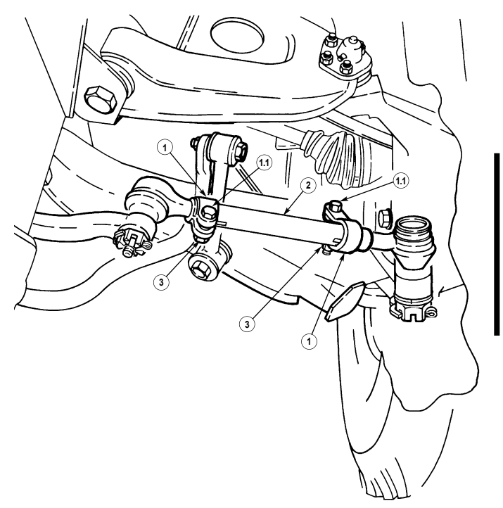

FOLLOW-ON TASK:  Operate vehicle (TM 9-2320-387-10) and check for pull or wander.

# 8-10. Rear Wheel Toe-Out Alignment

This task covers:
a. Preliminary Inspection c. Toe-out Adjustment b. Toe-out Check

## Initial Setup:

Tools General mechanic's tool kit:
automotive (Appendix B, Item 1)
Maintenance and repair shop equipment:
automotive (Appendix B, Item 2)
Personnel Required One mechanic One assistant

## Manual References

TM 9-2320-387-10 TM 9-2320-387-24P

## Equipment Condition

- Tires inflated to proper pressure
(TM 9-2320-387-10).

- Vehicle on level ground. - Ensure all tires have the same pressure.

## Maintenance Level

Unit

- It is not necessary to perform rear wheel toe-out alignment prior to the scheduled semiannual or 3,000 mile (4,827 km) maintenance interval unless abnormal vehicle handling or control is reported, or it is directed by another maintenance task.

- Rear wheel alignment adjustments other than toe-out are performed by DS maintenance (chapter 21).

- Ensure M1113 models have S250 shelter installed before performing rear wheel toe-out alignment.

## A. Preliminary Inspection

1. Check all tires (7) for uniform tread wear. 2. Raise vehicle and place support under lower control arms (11). 3. Check geared hubs (5) for output spindle end play by grasping edges of tires (7) and attempting to move tires (7) up and down. Adjust spindle bearings (para. 6-12) if any spindle movement is apparent.

4. Inspect for looseness of upper ball joint (3) by visually inspecting ball joint boot, and replace upper ball joint (3) if boot is ripped or torn.

4.1. Grasp top of tire (6) and attempt to move tire IN and OUT. Observe upper control arm (2) and gear hub (4) where upper ball joint (3) is mounted. If lateral movement is observed, upper ball joint (3) may be worn.

4.2. Replace upper ball joint (3) if movement is 1/8 in. (3 mm) or more (refer to para. 6-23)
5. Check for looseness of lower ball joint (7) by visually inspecting ball joint boot, and replace lower ball joint (7) if boot is ripped or torn.

5.1. Grasp top of tire (6) and attempt to move tire IN and OUT. Observe lower control arm (9) and gear hub (4) where lower ball joint (7) is mounted. If lateral movement is observed, lower ball joint (7) may be worn.

5.2. Replace lower ball joint (7) if movement is 1/8 in. (3 mm) or more (refer to para. 6-24).

6. Lower vehicle. 7. Check for looseness of radius rod ends (6) by attempting to move adjusting sleeves (10) vertically and horizontally. Replace radius rod end(s) (6) (para. 6-22) if any movement is apparent.

8. Check for damaged control arm bushings (1). Replace upper control arms (3) (para. 6-25) or lower control arms (11) (para. 6-26) if bushings (1) are damaged.

9. Proceed to task b.

# 8-10. Rear Wheel Toe-Out Alignment (Cont'D)

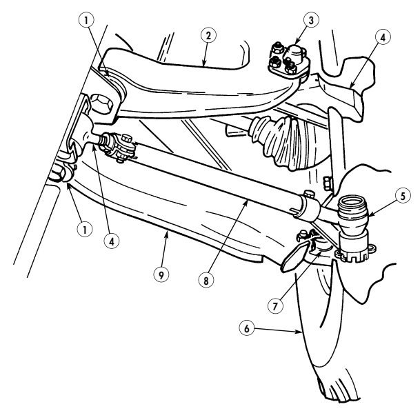

# 8-10. Rear Wheel Toe-Out Alignment (Cont'D)

b. Toe-out Check

- To ensure proper alignment, vehicle must be at curb weight, or gross vehicle weight.

- Vehicle should not be moved during alignment checks. - Vehicle must be on level ground with wheels set straight ahead. - Steps 1 through 3 will determine centerline of tire. - Point of measurement for checking toe-out will be where lines marked in steps 1 and 3 intersect.

1. Mark line (4) on center tread (1) of tire (2) 16-1/2-in. (42 cm) from ground. 2. Measure total width of tire tread (3) and record. 3. Mark line (5) on center tread (1) at one-half total tread width (3). 4. Repeat steps 1 through 3 for opposite tire. 5. Measure distance between points of measurement on front side of tires (2) and record. 6. Rotate tires (2) by moving vehicle forward until points of measurement are 16-1/2 in. (42 cm) above the ground at rear side of tires (2). Repeat steps 1 through 4 for side of tires.

7. Measure distance between points of measurement on rear side of tires (2) and record.

- If measurement is larger on rear side of tires than measurement on front side of tires, tires have toe-in.

- If toe-out alignment does not meet specifications, repeat checking procedures to eliminate any possible reading errors.

8. Subtract meaurement obtained in step 7 for rear side of tires (2) from measurement obtained in step 5 for front side of tires (2). The result of this subtraction represents inches of toe-out. Refer to table 8-2 for toe-out specifications. If toe-out does not meet the specifications, adjust toe-out (task c.).

Table 8-2. Toe-out Alignment Adjustment Specifications.

| Have drainage container ready to catch brake fluid.   |                                                               |
|-------------------------------------------------------|---------------------------------------------------------------|
| CAUTION                                               | Do not lean on master cylinder. Damage to master cylinder may |
| result.                                               |                                                               |

Maximum side-to-side difference 1/4 in. (6mm).

9. If toe-out is within specifications, refer to task c. and perform step 5.

# 8-10. Rear Wheel Toe-Out Alignment (Cont'D)

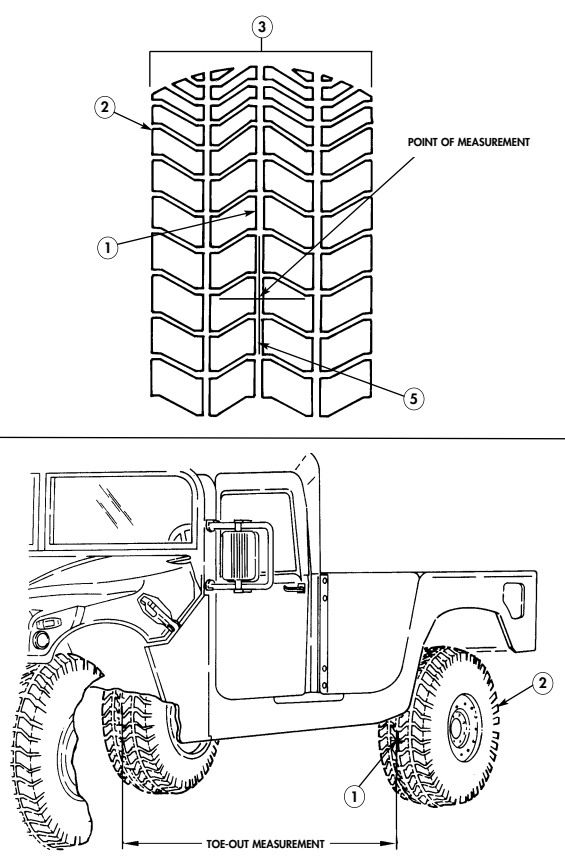

# 8-10. Rear Wheel Toe-Out Alignment (Cont'D)

c. Toe-out Adjustment 1. Loosen two locknuts (1) and screws (1.1) securing clamps (3) on each adjusting sleeve (2).

Toe-out can be increased or decreased by changing length of tie rods. A threaded sleeve is provided for this purpose. Both tie rods must be the same length ± 1/8 in. (3 mm) after adjustment.

2. Turn each adjusting sleeve (2) equally, but in opposite directions. 3. Roll vehicle rearward, then forward, to original position. 4. Repeat toe-out check and adjustment procedures until correct adjustment is indicated.

Ensure bolt and nut on adjusting sleeve clamp nearest to geared hub is facing halfshaft. Bolt and nut on adjusting sleeve clamp nearest to frame must be facing 180° away from stabilizer bar to prevent damage to equipment.

5. Secure two clamps (3) on each adjusting sleeve (2) with two screws (1.1) and locknuts (1). Tighten locknuts (1) to 30 lb-ft (40 N•m).

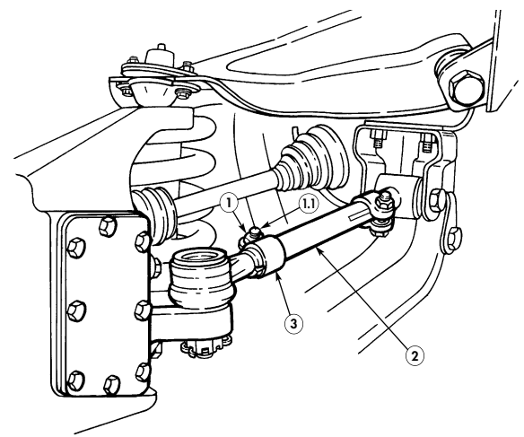

FOLLOW-ON TASK: Operate vehicle (TM 9-2320-387-10) and check for pull or wander.

8-34/(8-34.1 blank) Change 6

# 8-10.1. Steering Radius Adjustment (Serial Numbers 246890 And Above)

This task covers:
Adjustment INITIAL SETUP:
Tools

| Materials/Parts   |
|-------------------|

General mechanic's tool kit: automotive (Appendix B, Item 1)
Adjustment

| One mechanic One assistant                                                |
|---------------------------------------------------------------------------|
| Manual References                                                         |
| TM 9\-2320\-387\-24P                                                      |
| Equipment Condition Master cylinder removed (para. 7\-5 or para. 7\-5.1). |

Adjustment procedures for left and right turn radius are the same. This procedure covers the left side.

1. Place the transmission in neutral and start the engine, allowing the engine to operate at idle speed.

If the stop bolt hits the axle under pressure, release the wheel immediately. Damage to steering components may result.

2. Turn the steering wheel to a full left turn. 3. Check clearance between stop bolt and axle. If clearance is not 1/8", plunger adjustment will be necessary.

4. Turn the steering wheel so tires are straight ahead.

- Turning the plunger in will increase the clearance between the stop bolt and axle.

- Turning the plunger out will decrease the clearance between the stop bolt and axle.

Never adjust the plunger beyond flush with the end cap. Leakage or personal injury may result.

Do not adjust the plunger with pressure on the steering wheel, seal damage can result.

5. Adjust the plunger for left turn. 6. Turn the steering wheel to a full left turn. Check the clearance between the stop bolt and axle. If clearance is not 1/8", repeat steps 4 through 6.

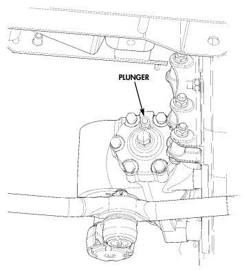

# 8-10.1. Steering Radius Adjustment (Serial Numbers 246890 And Above) (Cont'D)

LEFT SIDE ADJUSTMENT

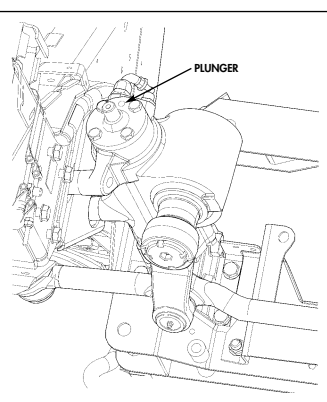

RIGHT SIDE ADJUSTMENT

# Section Ii. Steering Components Maintenance 8-11. Steering Components Maintenance Task Summary

| INITIAL SETUP:                                                 |                                                                                                    |
|----------------------------------------------------------------|----------------------------------------------------------------------------------------------------|
| Tools                                                          | Equipment Condition                                                                                |
| General mechanic's tool kit:                                   | - Hood raised and secured (TM 9\-2320\-387\-10).                                                   |
| automotive (Appendix B,                                        | Item 1) - Battery ground cables disconnected (para. 4\-68).                                        |
| Materials/Parts                                                | Maintenance Level                                                                                  |
| Unit                                                           | Two lockwashers (Appendix G, Item 185)                                                             |
| Manual References                                              |                                                                                                    |
| TM 9\-2320\-387\-10                                            |                                                                                                    |
| TM 9\-2320\-387\-24P                                           |                                                                                                    |
| a. Removal                                                     |                                                                                                    |
| CAUTION                                                        |                                                                                                    |
| Cover or plug all open lines and connections immediately after |                                                                                                    |
| disconnection to prevent contamination. Remove all covers or   | plugs prior to connection.                                                                         |
| NOTE                                                           |                                                                                                    |
| Have drainage container ready to catch brake fluid.            |                                                                                                    |
| 1.                                                             | Disconnect brake lines (6) and (7) from adapter fittings (8) on brake pressure limiter valves (1). |
| 2.                                                             | Remove four adapter fittings (8) from two pressure limiter valves (1).                             |
| 3.                                                             | Remove two capscrews (3), lockwashers (4), washers (5), and pressure limiter valves (1) from       |
| bracket (2). Discard lockwashers (4).                          |                                                                                                    |
| b. Installation                                                |                                                                                                    |
| 1.                                                             | Install two pressure limiter valves (1) on bracket (2) with two washers (5), lockwashers (4), and  |
| capscrews (3).                                                 |                                                                                                    |
| 2.                                                             | Install four adapter fittings (8) on two pressure limiter valves (1).                              |
| 3.                                                             | Connect brake lines (6) and (7) to adapter fittings (8) on brake pressure limiter valves (1).      |

# 8-12. Steering Wheel Replacement

This task covers:
INITIAL SETUP:

## Tools

General mechanic's tool kit:
automotive (Appendix B, Item 1)
Maintenance and repair shop equipment:
automotive (Appendix B, Item 2)
Steering wheel puller (Appendix D, Fig. 108)
Materials/Parts Nut (Appendix G, Item 69)
a. Removal b. Installation Manual References TM 9-2320-387-24P
Equipment Condition
- Horn switch removed (para. 4-24). - Cancelling ring removed (para 4-64).

Maintenance Level Unit a. Removal 1. Remove nut (2) from steering wheel (1) and shaft (3). Discard nut (2). 2. Install capscrews (4) of steering wheel puller (5) in steering wheel (1) and equally tighten capscrews
(4) until steering wheel (1) can be removed from shaft (3).

b. Installation 1. Align splines on steering wheel (1) with splines on shaft (3). 2. Install steering wheel (1) on shaft (3) with nut (2). Tighten nut (2) to 35 lb-ft (47 N•m). 3. Peen nut (2).

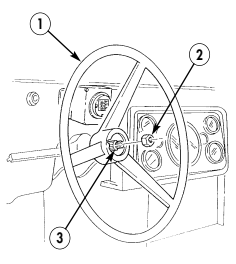

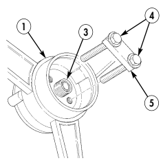

FOLLOW-ON TASKS: - Install horn switch (para. 4-24).

- Install cancelling ring (para. 4-64).

# 8-13. Tie Rod Maintenance

This task covers:

a. Removal c. Assembly b. Disassembly d. Installation

## Initial Setup:

Tools General mechanic's tool kit:
automotive (Appendix B, Item 1)
Maintenance and repair shop equipment:
automotive (Appendix B, Item 2)
Puller kit (Appendix B, Item 157)
Materials/Parts Two cotter pins (Appendix G, Item 22) Two locknuts (Appendix G, Item 125)
Manual References TM 9-2320-387-10 TM 9-2320-387-24P

| Equipment Condition                                  |
|------------------------------------------------------|
| - Protective Control Box (PCB) removed (para. 4\-4). |
| - Stoplight switch removed (para. 4\-60).            |

Maintenance Level Unit

Using a pickle fork instead of puller kit may damage serviceable components (boots).

a. Removal 1. Remove cotter pin (8) and slotted nut (7) from tie rod (2) and center link (1). Discard cotter pin (8).

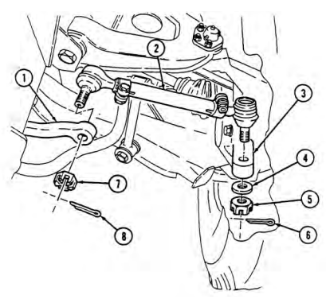 2. Remove cotter pin (6), slotted nut (5), washer (4), and tie rod (2) from geared hub (3). Discard cotter pin (6).

# 8-13. Tie Rod Maintenance (Cont'D)

b. Disassembly

- Disassembly procedures for tie rod and radius rod are basically the same. One tie rod end of the radius rod is different.

- Scribe locating marks on adjusting sleeve and clamps for installation.

1. Loosen two capscrews (10), locknuts (13), and clamps (11) securing tie rod ends (9) to adjusting sleeve
(12).

Note number of threads exposed on each tie rod end for installation. Approximately the same number of threads should be exposed on each tie rod end.

2. Remove two tie rod ends (9) from adjusting sleeve (12). 3. Remove two locknuts (13), capscrews (10), and clamps (11) from adjusting sleeve (12). Discard locknuts (13).

c. Assembly 1. Install two clamps (11), capscrews (10), and nuts (13) on adjusting sleeve (12). 2. Install two tie rod ends (9) into adjusting sleeve (12), turning tie rod ends (9) equally but in opposite directions.

d. Installation 1. Install tie rod (2) on center link (1) with slotted nut (7). Tighten slotted nut (7) to 70 lb-ft (95 N•m).

Do not loosen slotted nut to install cotter pin. Doing this may result in damage to equipment.

2. Install tie rod (2) on geared hub (3) with washer (4) and slotted nut (5). Tighten slotted nut (5) to 70 lb-ft (95 N•m).

3. Install cotter pin (8) in slotted nut (7). 4. Install cotter pin (6) in slotted nut (5).

Ensure the outboard clamp faces the halfshaft and the inboard clamp faces away from the stabilizer bar (front only) or damage to equipment may result.

5. Tighten two locknuts (13).

# 8-13.  Tie Rod Maintenance (Cont'D)

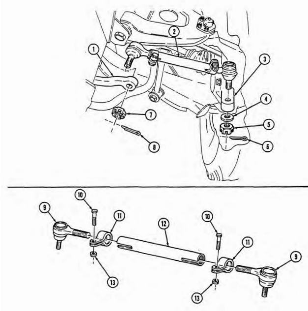

FOLLOW-ON TASKS: - • Lubricate tie rod end (TM 9-2320-387-10).
- • Remove supports and lower front of vehicle (para. 8-2).
- • - • - • - • - • - Align toe-in (para. 8-9).

# 8-14. Pitman Arm Replacement (Serial Numbers 246889 And Below)

This task covers:
a. Removal b. Installation

## Initial Setup:

| INITIAL SETUP:                            |                                            |
|-------------------------------------------|--------------------------------------------|
| Tools                                     | Manual References                          |
| General mechanic's tool kit:              | TM 9\-2320\-387\-24P                       |
| automotive (Appendix B, Item 1)           | Equipment Condition                        |
| Materials/Parts                           | Vehicle raised and supported (para. 8\-2). |
| Six locknuts (without 10,500 lb hydraulic | Maintenance Level                          |
| winch) (Appendix G, Item 106)             | Unit                                       |
| Three locknuts (with 10,500 lb hydraulic  |                                            |

Cotter pin (Appendix G, Item 22) Lockwasher (Appendix G, Item 186)

Ensure front wheels are in straight-ahead position while pitman arm is removed and installed.

## A. Removal

1. Remove nut (1) and lockwasher (2) from steering gear shaft (4). Discard lockwasher (2). 2. Using puller, remove pitman arm (3) from steering gear shaft (4). 3. Remove cotter pin (6) and slotted nut (7) from pitman arm (3) and center link (5). Discard cotter pin (6). 4. Using puller, remove pitman arm (3) from center link (5).

## B. Installation

1. Install pitman arm (3) on steering gear shaft (4) with lockwasher (2) and nut (1). 2. Install pitman arm (3) on center link (5) with slotted nut (7). Tighten slotted nut (7) to 80 lb-ft 
(108 N•m).

3. Tighten nut (1) to 185 lb-ft (251 N•m).

Do not loosen slotted nut to install cotter pin. Doing this may result in damage to equipment.

4. Install cotter pin (6) in slotted nut (7).

# 8-14. Pitman Arm Replacement (Serial Numbers 246889 And Below) (Cont'D)

 - 

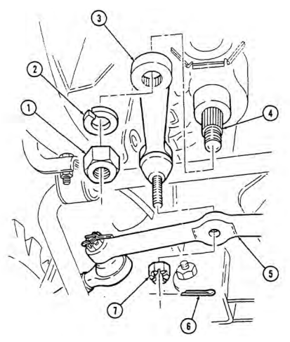

FOLLOW-ON TASKS: - Lubricate pitman arm (TM 9-2320-387-10).

· Remove supports and lower front of vehicle (para. 8-2).

# 8-15. Center Link Replacement (Serial Numbers 246889 And Below)

This task covers:

## Initial Setup:

Tools General mechanic's tool kit:
automotive (Appendix B, Item 1)
Maintenance and repair shop equipment:
automotive (Appendix B, Item 2)
Puller kit (Appendix B, Item 157)
Materials/Parts Four cotter pins (Appendix G, Item 22)
a. Removal b. Installation

| Manual References    |
|----------------------|
| TM 9\-2320\-387\-24P |
| Maintenance Level    |
| Unit                 |

Unit

Using a pickle fork instead of puller kit may damage serviceable components (boots).

## A. Removal

1. Remove cotter pin (5) and slotted nut (4) from idler arm (8) and center link (3).

Discard cotter pin (5).

2. Remove cotter pin (9) and slotted nut (10) from pitman arm (2) and center link (3).

Discard cotter pin (9).

3. Remove two cotter pins (1) and slotted nuts (6) from two tie rods (7) and center link (3).

Discard cotter pins (1).

4. Using puller, remove center link (3) from two tie rods (7), idler arm (8), and pitman arm (2).

## B. Installation Caution

Do not loosen slotted nut to install cotter pin. Doing this may result in damage to equipment 1. Install center link (3) on pitman arm (2) and idler arm (8) with slotted nuts (4) and (10). Tighten slotted nuts (4) and (10) to 80 lb-ft (108 N•m).

2. Install cotter pins (5) and (9) in slotted nuts (4) and (10). 3. Install two tie rods (7) on center link (3) with two slotted nuts (6). Tighten slotted nuts (6) to 70 lb-ft (95 N•m).

4. Install two cotter pins (1) in slotted nuts (6).

# 8-15. Center Link Replacement (Serial Numbers 246889 And Below) (Cont'D)

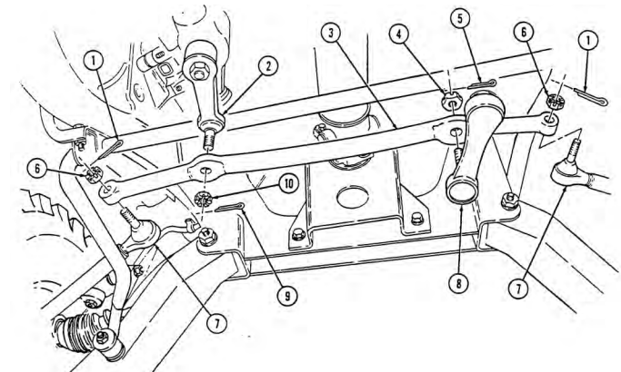

FOLLOW-ON TASK:  Remove supports and lower front of vehicle (para. 8-2).

■

# 8-16. Tie Rod End Replacement

This task covers:

a. Removal b. Installation

| TASK   |                                                       | PAGE   |
|--------|-------------------------------------------------------|--------|
| PARA.  | PROCEDURES                                            | NO.    |
| 7\-14. | Rear Dual Service/Parking Brake Pad Maintenance       | 7\-38  |
| 7\-15. | Rear Dual Service/Parking Brake Caliper Maintenance   | 7\-42  |
| 7\-16. | Right Parking Brake Cable Replacement                 | 7\-46  |
| 7\-17. | Left Parking Brake Cable/Mounting Bracket Replacement | 7\-48  |
| 7\-18. | Rear Dual Service/Parking Brake Rod Replacement       | 7\-52  |

a. Removal 1. Remove cotter pin (8), slotted nut (7), and washer (6) from tie rod end (4) and geared hub (5).

Discard cotter pin (8).

2. Using puller, remove tie rod end (4) from geared hub (5).

Note number of threads exposed on each tie rod end for installation. Approximately the same number of threads should be exposed on each tie rod end.

3. Loosen nut (9), capscrew (3), clamp (2), and tie rod end (4) from adjusting sleeve (1).

b. Installation

Ensure clamp faces halfshaft or damage to equipment may result.

1. Install tie rod end (4) into sleeve (1) with clamp (2), capscrew (3), and nut (9).

Do not loosen slotted nut to install cotter pin. Doing this may result in damage to equipment.

2. Install tie rod end (4) on geared hub (5) with washer (6) and slotted nut (7). Tighten slotted nut (7)
to 70 lb-ft (95 N•m).

3. Install cotter pin (8) in slotted nut (7).

# 8-16. Tie Rod End Replacement (Cont'D)

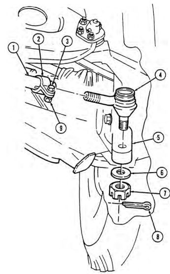

FOLLOW-ON TASKS: - Lubricate tie rod end (TM 9-2320-387-10).

- Remove supports and lower front of vehicle (para. 8-2).
- Align toe-in (para. 8-9).

# 8-17. Idler Arm Maintenance

This task covers:
a. Inspection c. Installation b. Removal

## Initial Setup: Tools

General mechanic's tool kit:
automotive (Appendix B, Item 1)
Maintenance and repair shop equipment:
automotive (Appendix B, Item 2)
Puller kit (Appendix B, Item 157) Spring scale, dial indicating
(Appendix B, Item 2)

## Materials/Parts

Cotter pin (Appendix G, Item 22)
a. Inspection Manual References TM 9-2320-387-10 TM 9-2320-387-24P
Equipment Condition Front of vehicle raised and supported (para. 8-2).

Maintenance Level Unit

Set front wheels in a straight-ahead position.

loose.

1. Check idler arm (5) for visible damage, such as breaks and cracks. If damaged, replace idler arm (5).

2. Check capscrews (4) for looseness of idler arm bracket (3) on frame (6). Tighten capscrews (4) if

A flat steel plate or piece of scrap metal is required for step 3.

3. Secure a flat steel plate or piece of scrap metal to front crossmember (2). 4. Pull center link (1) downward to seat ball and socket of idler arm (5).

metal, as shown in figure A. reading on spring scale (7).

5. Using flat surface on center link (1) as a guide, mark first reference line on steel plate or scrap 6. Position spring scale (7) on center link (1) and pull in an upward direction to obtain a 25 lb (11 kg)

Maintain 25 lb (11 kg) reading on spring scale to perform step 7.

7. Using flat surface on center link (1) as a guide, mark second reference line on steel plate or scrap metal, as shown in figure B.

8. Remove spring scale (7) from center link (1). 9. Remove clamp and steel plate or scrap metal from front crossmember (2).

10. Measure distance between first and second reference lines on steel plate or scrap metal. If measurement exceeds 0.25 in. (6mm), replace idler arm (5).

# 8-17. Idler Arm Maintenance (Cont'D)

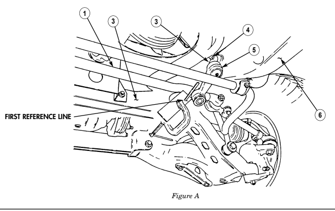

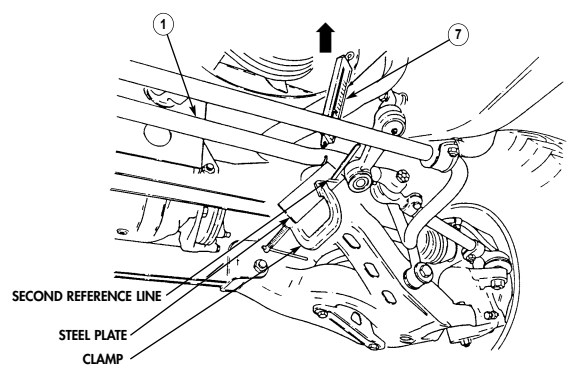

Figure B

# 8-17. Idler Arm Maintenance (Cont'D)

b. Removal 1. Remove cotter pin (1) and slotted nut (8) from idler arm (7) and center link (2). Discard cotter pin (1).

2. Using puller, disconnect center link (2) from idler arm (7). 3. Remove two nuts (6), washers (4), capscrews (3), washers (4), and idler arm (7) from frame (5). 

## C. Installation

1. Install idler arm (7) on frame (5) with two washers (4), capscrews (3), washers (4), and nuts (6).

Tighten nuts (6) to 60 lb-ft (81 N•m).

2. Install idler arm (7) on center link (2) with slotted nut (8). Tighten slotted nut (8) to 80 lb-ft (108 N•m).

Do not loosen slotted nut to install cotter pin. Doing this may result in damage to equipment.

3. Install cotter pin (1) in slotted nut (8).

# 8-17. Idler Arm Maintenance (Cont'D)

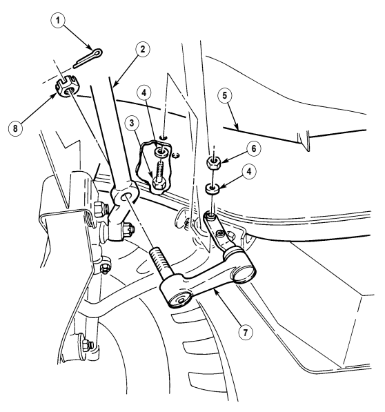

FOLLOW-ON TASKS: - Lubricate idler arm (TM 9-2320-387-10).

· Remove supports and lower front of vehicle (para. 8-2).

# 8-18. Steering Column Replacement

This task covers:
INITIAL SETUP:
Tools

| automotive (Appendix B, Item 1)        |
|----------------------------------------|
| Maintenance and repair shop equipment: |

General mechanic's tool kit:
automotive (Appendix B, Item 1)

## Materials/Parts

Two locknuts (Appendix G, Item 82) Locknut (Appendix G, Item 106) Locknut (Appendix G, Item 101) Locknut (Appendix G, Item 90) Lockwasher (Appendix G, Item 144) Nut and lockwasher assembly 
(Appendix G, Item 197)

a. Removal b. Installation

Equipment Condition

| Manual References    |
|----------------------|
| TM 9\-2320\-387\-24P |

- Steering wheel removed (para. 8-12). - Directional signal control removed 
(para. 4-63).

Maintenance Level Unit

## A. Removal

1. Remove locknut (1), lockwasher (2), washer (3), and pin (5) from steering column (6) and mounting bracket (4). Discard lockwasher (2) and locknut (1).

2. Remove nut and lockwasher assembly (17), screw (7), and ground wire 57C (8) from steering column (6).

Discard nut and lockwasher assembly (17).

3. Remove locknut (10), washer (11), capscrew (13), washer (11), and two brackets (9) from steering column (6). Discard locknut (10).

4. Disconnect lead 25A (21) from steering column (6).

When performing step 5, temporarily install steering wheel and turn steering column to gain access to steering column intermediate shaft mounting hardware.

5. Remove locknut (12), washer (14), capscrew (15), washer (14), and intermediate shaft (16) from steering column (6). Discard locknut (12).

6. Remove two locknuts (20), washers (18), screws (19), washers (18), and steering column (6) from mounting bracket (4). Discard locknuts (20).

# 8-18. Steering Column Replacement (Cont'D)

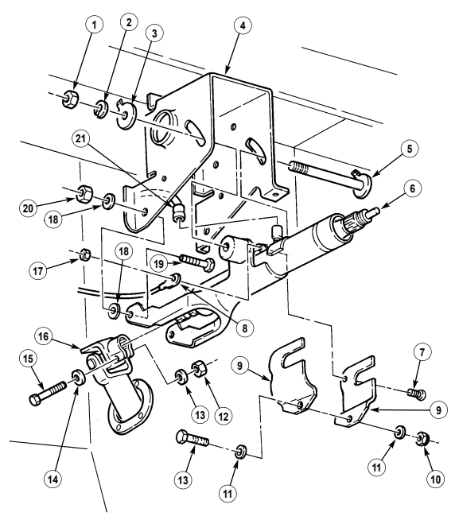

# 8-18. Steering Column Replacement (Cont'D)

b. Installation 1. Install steering column (6) on mounting bracket (4) with two washers (18), screws (19), washers
(18), and locknuts (20). Tighten locknuts (20) finger-tight.

2. Install intermediate shaft (16) on steering column (6) with washer (14), capscrew (15), washer (14),
and locknut (12). Tighten locknut (12) to 40-50 lb-ft (54-68 N•m).

3. Connect lead 25A (21) to steering column (6). 4. Install two brackets (9) on steering column (6) with washer (11), capscrew (13), washer (11), and locknut (10).

5. Install ground wire 57C (8) on steering column (6) with screw (7) and nut and lockwasher assembly (17).

Ensure washer and pin locking tabs are in the UP position.

6. Install steering column (6) on mounting bracket (4) with pin (5), washer (3), lockwasher (2), and locknut (1). Tighten locknut (1) finger-tight.

7. Position steering column (6) in upright position and tighten locknut (1) to 12-15 lb-ft (16-20 N•m). 8. Tighten two locknuts (20) to 12-15 lb-ft (16-20 N•m).

# 8-18. Steering Column Replacement (Cont'D)

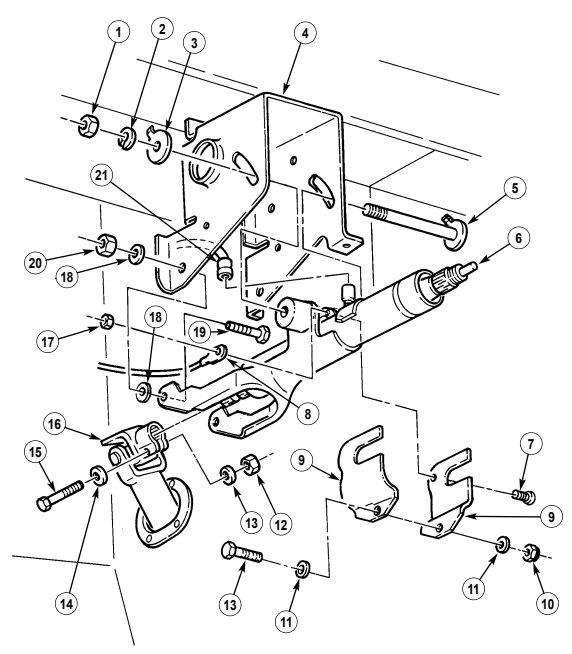

FOLLOW-ON TASKS: - Install directional signal control (para. 4-63).

- Install steering wheel (para. 8-12).

# 8-19. Intermediate Steering Shaft Replacement

This task covers:
INITIAL SETUP:
Tools General mechanic's tool kit:
automotive (Appendix B, Item 1)
Maintenance and repair shop equipment:
automotive (Appendix B, Item 2)

## Materials/Parts

Two locknuts (Appendix G, Item 90)

a. Removal b. Installation

| TM 9\-2320\-387\-10   |
|-----------------------|
| TM 9\-2320\-387\-24P  |
| Equipment Condition   |

Ensure front wheels are in straight-ahead position while removing and installing intermediate steering shaft.

a. Removal 1. Remove locknut (6), washer (5), capscrew (8), and washer (5) from intermediate steering shaft (4)
and steering gear (7). Discard locknut (6).

2. Remove locknut (2), washer (3), capscrew (9), washer (3), and steering shaft (4) from steering column (1).

Discard locknut (2).

b. Installation 1. Install intermediate steering shaft (4) on steering gear (7) with washer (5), capscrew (8), washer (5),
and locknut (6). Tighten locknut (6) to 40-50 lb-ft (54-68 N•m).

2. Install steering shaft (4) on steering column (1) with washer (3), capscrew (9), washer (3), and locknut (2).

Tighten locknut (2) to 40-50 lb-ft (54-68 N•m).

# 8-19. Intermediate Steering Shaft Replacement (Cont'D)

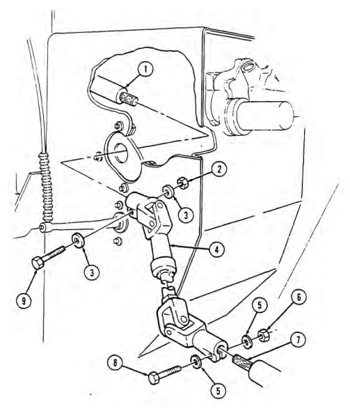

FOLLOW-ON TASK:  Lubricate steering shaft (TM 9-2320-387-10).

# 8-20. Steering Gear Maintenance (Serial Numbers 246889 And Below)

This task covers:
a. Removal b. Installation a.1. Steering Gear Mounting Area Inspection (M1114 only)

## Initial Setup:

Tools General mechanic's tool kit:
automotive (Appendix B, Item 1)
Maintenance and repair shop equipment:
automotive (Appendix B, Item 2)
Materials/Parts Locknut (Appendix G, Item 133.17) Three lockwashers (Appendix G, Item 182) Lockwasher (Appendix G, Item 186)
Manual References TM 9-2320-387-10 TM 9-2320-387-24P TM 43-0139 Equipment Condition
- Hood raised and secured 
(TM 9-2320-387-10).

- Battery ground cables disconnected 
(para. 4-68).

Maintenance Level Unit a. Removal

Cover or plug all open lines and connections immediately after disconnection to prevent contamination. Remove all covers or plugs prior to connection.

- Ensure front wheels are in the straight-ahead position. - Have drainage container ready to catch fluid.

1. Disconnect two power steering lines (4) from steering gear (10). 2. Turn steering wheel left and right several times to bleed off power steering fluid. 3. Remove intermediate shaft locknut (1), washer (2), capscrew (5), and washer (2) and disconnect intermediate shaft (3) from steering gear (10). Discard locknut (1).

4. Remove nut (14) and lockwasher (13) from pitman arm (12). Discard lockwasher (13). 5. Remove pitman arm (12) from shaft (11). 6. Remove three capscrews (8), lockwashers (7), washers (6), and steering gear (10) from frame (9).

Discard lockwashers (7).

8-20.  STEERING GEAR MAINTENANCE (SERIAL NUMBERS 246889 AND BELOW) (Cont'd)

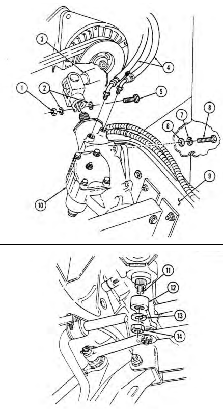

# 8-20. Steering Gear Maintenance (Serial Numbers 246889 **And Below) (Cont'D)**

## A.1. Steering Gear Mounting Area Inspection (M1114 Only) Note

The inspection is focused on the area surrounding the steering gear mounting tubes, commonly referred to as bosses. They are located on the front left-hand frame rail. Tubes are welded in holes through the frame rail, accommodating the steering gear mounting bolts. Inside and outside frame rails have experienced stress-cracking stemming from the steering gear mounting tubes. Stress cracks can be radial, tangential, transverse, and/or longitudinal. In some cases, stress cracks can be in the boss welds themselves.

Inspect steering gear mounting area as follows:

It may be necessary to remove all paint on suspected area.

(a) Inspect all welds around bosses on inside and outside frame rails. (b) Inspect for cracks on all surfaces between all bosses on inside, outside, top, and bottom of frame rails.

Most cracks in boss welds and frame rails are repairable. Upon identification, notify general support maintenance for repairs.

(c) Unless follow-on repairs are required, if paint was removed during inspection, spot-paint using Chemical Agent Resistant Coating (CARC). Follow TM 43-0139, Painting Instructions for Field Use.

8-20. STEERING GEAR MAINTENANCE (SERIAL NUMBERS 246889 **AND BELOW) (Cont'd)**

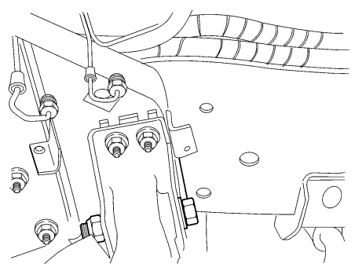

OUTSIDE OF FRAME RAIL

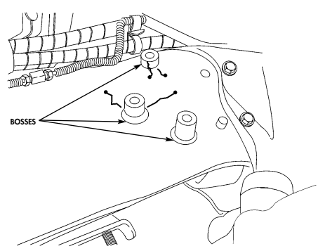

INSIDE OF FRAME RAIL

# 8-20. Steering Gear Maintenance (Serial Numbers 246889 And Below) (Cont'D)

b. Installation 1. Install steering gear (12) on frame (11) with three washers (8), lockwashers (9), and capscrews (10).

Tighten capscrews (10) to 54–66 lb-ft (73–89 N•m).

2. Align hole in yoke (3) with notch on steering gear splines (7) and slide intermediate shaft (4) on steering gear splines (7).

3. Install intermediate shaft (4) to steering gear splines (7) with washer (2), capscrew (6), washer (2),
and locknut (1). Tighten locknut (1) to 40–50 lb-ft (54–68 N•m).

4. Connect two power steering lines (5) to steering gear (12).

Ensure front wheels are in the straight-ahead position.

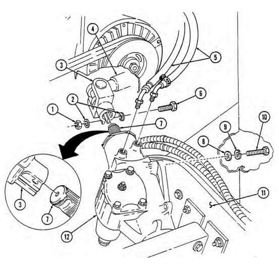

5. Install pitman arm (14) on shaft (13) with lockwasher (15) and nut (16). Tighten nut (16) to 185 lb-ft (251 N•m).

# 8-20. Steering Gear Maintenance (Serial Numbers 246889 And Below) (Cont'D)

FOLLOW-ON TASKS: - Fill power steering reservoir (TM 9-2320-387-10).

- Connect battery ground cables (para. 4-68). - Bleed power steering system (para. 8-27).

# 8-20.1. Steering Gear, Center Link, And Pitman Arm Replacement (Serial Numbers 246890 **And Above)**

This task covers:

## Initial Setup:

Tools General mechanic's tool kit:
automotive (Appendix B, Item 1)
Maintenance and repair shop equipment:
automotive (Appendix B, Item 2)

## Materials/Parts

Four cotter pins (Appendix G, Item 22) Two locknuts (Appendix G, Item 114.4) Locknut (Appendix G, Item 133.17) Three lockwashers (Appendix G, Item 190.8) Two O-rings (Appendix G, Item 220) Sealing compound 
(Appendix C, Item 63)
Anti-seize compound (Appendix C, Item 16)
Personnel Required One mechanic One assistant a. Removal a. Removal b. Installation

## Manual References

TM 9-2320-387-10 TM 9-2320-387-24P

## Equipment Condition

- Hood raised and secured 
(TM 9-2320-387-10).

- Left splash shield removed (para. 10-23.1). - Left front wheel removed (para. 8-3). - Stabilizer bar removed (para. 6-20.1).

## General Safety Instructions

- Do not use hammer or apply heat to the pitman arm.

- Proper pitman arm installation is critical to safe operation of vehicle.

- Do not back off torque value to align locking tabs.

Maintenance Level Unit

- Cover or plug all hoses and connections immediately after disconnection to prevent contamination. Remove all covers or plugs prior to connection.

- Using a pickle fork instead of a puller may damage serviceable components.

Use suitable container to catch power steering fluid.

1. Remove two cotter pins (2) and slotted nuts (3) from two tie rods (4) and center link (1). Discard cotter pins (2).

2. Disconnect two tie rods (4) from center link (1). 3. Remove two locknuts (6), washers (5), capscrews (10), washers (9), and idler arm (8) from frame (7).

Discard locknuts (6).

4. Remove two power steering lines (15) from steering gear (24). 5. Remove two power steering lines adapters (17) and O-rings (18) from steering gear (24).

Discard O-rings (18).

6. Remove lower steering shaft locknut (11), washer (12), capscrew (16), and washer (14) and disconnect lower steering shaft (13) from steering gear (24). Discard locknut (11).

7. Remove three capscrews (22), lockwashers (21), washers (20), bracket (19), and steering gear (24)
from frame (23). Discard lockwashers (20).

8-20.1.  STEERING GEAR, CENTER LINK, AND PITMAN ARM REPLACEMENT
(SERIAL NUMBERS 246890 AND ABOVE) (Cont'd)

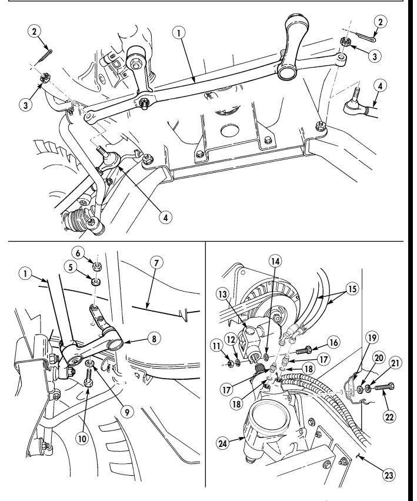

# 8-20.1. Steering Gear, Center Link, And Pitman Arm Replacement (Serial Numbers 246890 And Above) (Cont'D)

Do not use a hammer or apply heat to the pitman arm. Failure to comply may result in injury to personnel or damage to equipment.

8. Remove two cotter pins (2) and slotted nuts (3) from idler arm (5), pitman arm (4), and center link (1). Discard cotter pins (2).

9. Disconnect center link (1) from idler arm (5) and pitman arm (4).

10. Using screwdriver, bend locking tab (9) on lock ring (10) away from slot (7) in bolt (8). 11. Remove bolt (8) and lock ring (10) from pitman arm (4). 12. Using press (11) and support plate (12) remove pitman arm (4) from steering gear (13).

## B. Installation Warning

Proper pitman arm installation is critical to safe operation of vehicle.

1. Install pitman arm (4) onto the steering gear (13) taking care to match alignment marks (14).

Do not back off torque value to align locking tabs.

2. Secure pitman arm (4) to steering gear (13) with bolt (8) and lock ring (10). Tighten bolt (8) to 225 lb-ft (305 N•m),
3. Continue to torque bolt (8) past specified value until one locking tab (9) aligns with pitman arm (4)
and one locking tab (9) aligns with bolt (8).

4. Bend locking tabs (9) into the slot (7) of bolt (8). 5. Install center link (1) on pitman arm (4) and idler arm (5) with two slotted nuts (3). Tighten slotted nuts (3) to 110–130 lb-ft (149–176 N•m).

Do not loosen slotted nuts to install cotter pins. Doing this may result in damage to equipment.

6. Install two cotter pins (2) in slotted nuts (3).

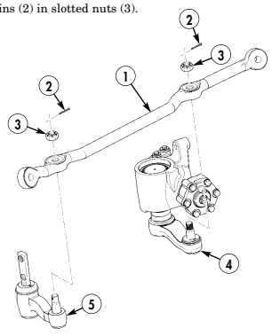

8-20.1.  STEERING GEAR, CENTER LINK, AND PITMAN ARM REPLACEMENT
(SERIAL NUMBERS 246890 AND ABOVE) (Cont'd)

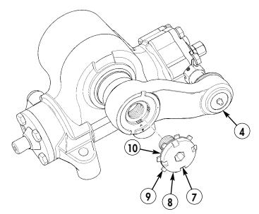

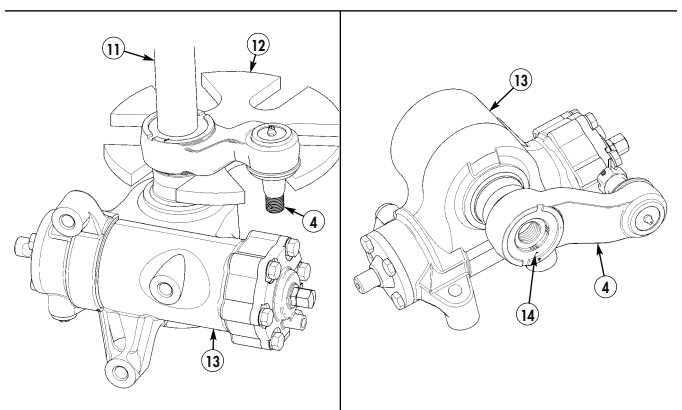

# 8-20.1. Steering Gear, Center Link, And Pitman Arm Replacement (Serial Numbers 246890 And Above) (Cont'D)

7. Apply sealing compound to three capscrews (12). 8. Install steering gear (14) on frame (13) with three washers (10), lockwashers (11), bracket (9), and capscrews (12). Tighten capscrews (12) to 160–195 lb-ft (217–264 N•m).

9. Install idler arm (21) on frame (20) with two washers (22), capscrews (23), washers (18), and locknuts (19). Tighten capscrews (23) to 85 lb-ft (115 N•m).

10. Install two tie rods (26) on center link (17) with two slotted nuts (25). Tighten slotted nuts (25) to 70 lb-ft (95 N•m).

11. Install two cotter pins (24) on slotted nuts (25). 12. Align hole in yoke (16) with notch on steering gear splines (15) and slide lower steering shaft (3) on steering gear splines (15).

13. Install lower steering shaft (3) on steering gear (14) with washer (4), capscrew (6), washer (2), and lower steering shaft locknut (1). Tighten locknut (1) to 40–50 lb-ft (54–68 N•m).

14. Install two power steering lines adapters (7) on steering gear (14). 15. Install two power steering lines (5) and O-rings (8) on two adapters (8).

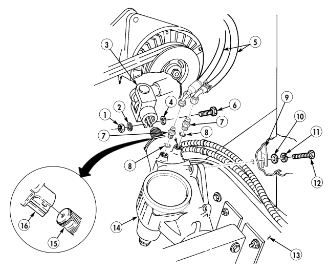

# 8-20.1. Steering Gear, Center Link, And Pitman Arm Replacement (Serial Numbers 246890 And Above) (Cont'D)

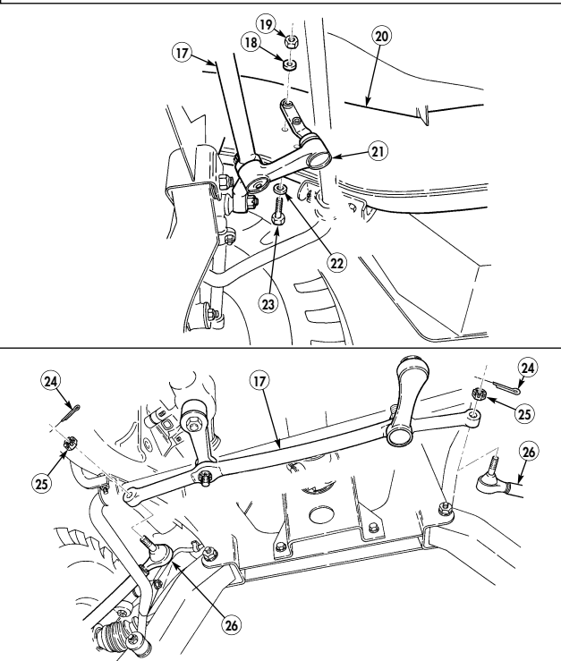

FOLLOW-ON TASKS: - Fill power steering reservoir (TM 9-2320-387-10).

- Bleed power steering system (para. 8-27.1). - Install stabilizer bar (para. 6-20.1). - Install front wheel (para. 8-3). - Install left splash shield (para. 10-23.1). - Close and secure hood (TM 9-2320-387-10).

# 8-21. Steering Shaft U-Joint Replacement

This task covers:

| a.  Removal                              | Installation   | b.                                          |
|------------------------------------------|----------------|---------------------------------------------|
| INITIAL SETUP:                           |                |                                             |
| Tools                                    |                | Manual References                           |
| General mechanic's tool kit:             |                | TM 9\-2320\-387\-10                         |
| automotive (Appendix B, Item 1)          |                | TM 9\-2320\-387\-24P                        |
| Materials/Parts                          |                | Equipment Condition                         |
| Assembled locknut (Appendix G, Item 134) |                | - Wheels chocked and parking brake released |
| Two lockwashers (Appendix G, Item 146)   |                | (TM 9\-2320\-387\-10).                      |
| Cotter pin (Appendix G, Item 19)         |                | - Muffler and catalytic converter removed   |
| Two clips (Appendix G, Item 11)          |                | (para. 3\-49).                              |

a. Removal

Do not drop bearing cups. Needle bearings can be easily lost.

Removal and installation procedures are basically the same for both U-joints. This procedure covers the U-joint attached to steering gear.

1. Remove grease fitting (6) from cross (1). 2. Remove two snaprings (3) from bearing cups (4) in steering gear yoke (5). 3. Position steering gear yoke (5) in vise with 1-1/8-in. socket between vise jaw and bearing cup (4)
being removed. Ensure open end of socket is facing bearing cup (4).

4. Place 11/16-in. socket between opposite bearing cup (4) and vise jaw. Ensure open end of socket is facing vise jaw.

5. Press bearing cup (4) out of steering gear yoke (5) and remove bearing cup (4) from cross (1). 6. Reverse position of sockets and press remaining bearing cup (4) out of steering gear yoke (5). 7. Remove steering gear yoke (5) from cross (1). 8. Repeat steps 2 through 6 for steering shaft yoke (2). 9. Remove cross (1) from steering shaft yoke (2). b. Installation 1. Install cross (1) into steering shaft yoke (2). 2. Install bearing cup (4) into steering shaft yoke (2).

Ensure bearing cup is aligned with steering shaft yoke before pressing in with vise. Damage to cross and bearing cups will result if forced into yoke.

3. Place steering shaft yoke (2) in vise with 11/16-in. socket between vise jaw and bearing cup (4). 4. Press bearing cup (4) into steering shaft yoke (2) far enough to install snapring (3) and install snapring (3) on bearing cup (4).

5. Install other bearing cup (4) into steering shaft yoke (2). 6. Place steering shaft yoke (2) in vise with 11/16-in. socket between bearing cup (4) and vise jaw. 7. Press bearing cup (4) into steering shaft yoke (2) far enough to install snapring (3) and install snapring (3) on bearing cup (4).

# 8-21. Steering Shaft U-Joint Replacement (Cont'D)

8. Repeat steps 2 through 7 to install steering gear yoke (5) on cross (1).

Ensure grease fitting on cross faces steering shaft. Damage to equipment will result if improperly installed.

9. Install grease fitting (6) into cross (1).

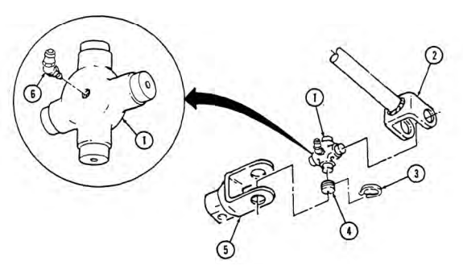

FOLLOW-ON TASK: Install intermediate steering shaft (para. 8-19).

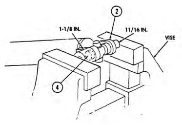

# 8-22. Intermediate Steering Shaft Close-Off And Retainer Replacement

This task covers:

| INITIAL SETUP:   |
|------------------|

| Tools                                   | Equipment Condition    |
|-----------------------------------------|------------------------|
| General mechanic's tool kit:            |                        |
| automotive (Appendix B, Item 1)         | (para. 3\-49).         |
| Materials/Parts                         | (TM 9\-2320\-387\-10). |
| Three cotter pins (Appendix G, Item 19) |                        |
| Locknut (Appendix G, Item 82)           | Maintenance Level      |
| Locknut (Appendix G, Item 87)           | Unit                   |
| Manual References                       |                        |

a. Removal b. Installation

Perform steps a.1 and b.2 only when replacing close-off retainer. Close-off may be replaced without disconnecting intermediate steering shaft.

a. Removal 1. Remove locknut (8), washer (9), capscrew (11), and washer (9) and disconnect intermediate steering shaft (10) from steering column (2). Discard locknut (8).

2. Remove four locknuts (12), washers (6), capscrews (5), and washers (6) from hand throttle bracket (7), close-off retainer (4), close-off (3), and cowl panel (1). Remove close-off retainer (4) and close-off (3) from steering shaft (10). Discard locknuts (12).

b. Installation 1. Install close-off (3) and close-off retainer (4) on cowl panel (1) and hand throttle bracket (7) with four washers (6), capscrews (5), washers (6), and locknuts (12). Tighten locknuts (12) to 8 lb-ft (11 N•m).

2. Install intermediate steering shaft (10) through close-off (3) on steering column (2) with washer (9),
capscrew (11), washer (9), and locknut (8). Tighten locknut (8) to 40-50 lb-ft (54-68 N•m).

8-22. INTERMEDIATE STEERING SHAFT CLOSE-OFF AND RETAINER REPLACEMENT (Cont'd)

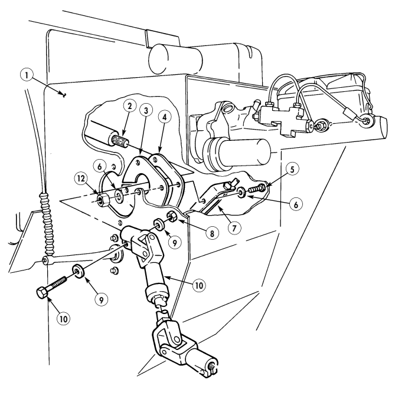

# 8-23. Power Steering Pump And Pulley Replacement (Serial Numbers 196900 And Below)

This task covers:
INITIAL SETUP:
Tools General mechanic's tool kit:
automotive (Appendix B, Item 1)
Maintenance and repair shop equipment:
automotive (Appendix B, Item 2)
Special Tools Pulley installer (Appendix B, Item 121)
Materials/Parts Lockwasher (Appendix G, Item 183) O-ring (Appendix G, Item 220)
a. Removal a. Removal b. Installation Manual References TM 9-2320-387-24P
Equipment Condition Serpentine drivebelt removed (para. 3-81).

|                   |
|-------------------|
| Maintenance Level |

Unit

Cover or plug all hoses and connections immediately after disconnection to prevent contamination. Remove all plugs prior to connection.

b. Installation 2. Remove nut (7), clamp (8), and wiring harness (6) from power steering pump (3). 3. Remove nut (15), lockwasher (14), washer (13), capscrew (9), washer (10), and idler pulley (11) from bracket (12). Discard lockwasher (14).

4. Remove two capscrews (17), capscrew (18), and power steering pump (3) from mounting bracket (16). 5. Remove capscrew (19), washer (20), and power steering pulley (21) from power steering pump (3).

Serpentine belt failure (abnormal wear or drive belt dislodgement) can be caused by misalignment of pulleys, improper installation, or foreign objects introduced into belt path. Inspect power steering pump pulley for proper installation and ease of rotation. Any wobble or misalignment will cause belt failure. Refer to para. 3-81 for pulley alignment procedures.

Ensure flat surface of pulley is facing out and is flush with pump shaft.

1. Using pulley installer, install pulley (21) on power steering pump (3). 2. Secure pulley (21) to power steering pump (3) with washer (20) and capscrew (19). Tighten capscrew
(19) to 37 lb-ft (50 N•m).

3. Install power steering pump (3) on mounting bracket (16) with capscrew (18) and two capscrews (17). 4. Install idler pulley (11) on bracket (12) with washer (10), capscrew (9), washer (13), lockwasher (14),
and nut (15).

5. Install O-ring (4) on high-pressure line (5) and install high-pressure line (5) on power steering pump (3). 6. Install two return lines (1) on power steering pump (3) and tighten clamps (2). 7. Install wiring harness (6) and clamp (8) on power steering pump (3) with nut (7).

1. Loosen two clamps (2) and disconnect return lines (1) and high-pressure line (5) from power steering pump (3). Remove O-ring (4) from high-pressure line (5). Discard O-ring (4).

# 8-23. Power Steering Pump And Pulley Replacement

■

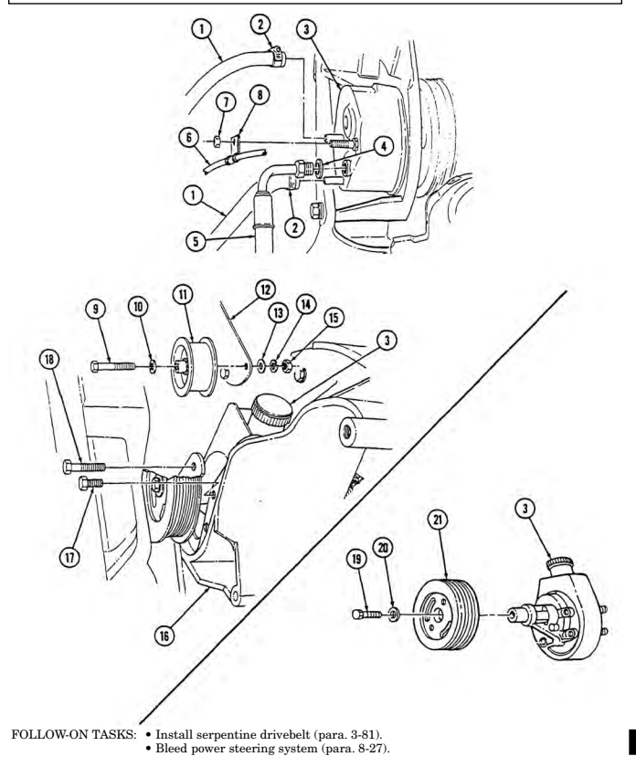

# 8-23.1. Power Steering Pump And Pulley Replacement (Serial Numbers 196901 And Above)

This task covers:
a. Removal b. Installation

| INITIAL SETUP:                           |                                        |
|------------------------------------------|----------------------------------------|
| Tools                                    | Manual References                      |
| General mechanic's tool kit:             | TM 9\-2320\-387\-24P                   |
| automotive (Appendix B, Item 1)          | Equipment Condition                    |
| Materials and Parts                      | Access cover removed (para. 10\-58.4). |
| Two cotter pins (Appendix G, item 25.2)  | Maintenance Level                      |
| Four cotter pins (Appendix G, item 25.1) | Unit                                   |

## A. Removal

1. Remove screw (10), spacer (12), lockwasher (11), and pulley (9) from power steering pump (5).

Discard lockwasher (11).

Use a suitable container to catch power steering fluid.

2. Disconnect hose (13) from elbow (1) on power steering pump (5). 3. Loosen two hose clamps (3) and slide hose (2) off tube (4) on power steering pump (5). 4. Remove three screws (8), lockwashers (7), and power steering pump (5) from alternator/pump support (6). Discard lockwashers (7).

## B. Installation

1. Position power steering pump (5) on alternator/pump support (6) and secure with three lockwashers (7) and screws (8). Tighten screws (8) to 21-25 lb-ft (28-34 N•m).

2. Slide hose (2) with two hose clamps (3) on tube (4) on power steering pump (5) and tighten hose clamps (3).

3. Connect hose (13) to elbow (1) on power steering pump (5). 4. Install pulley (9) on shaft of power steering pump (5) with spacer (12), lockwasher (11), and screw (10). Tighten screw (10) to 21-25 lb-ft (28-34 N•m).

# 8-23.1. Power Steering Pump And Pulley Replacement (Serial Numbers 196901 And Above) (Cont'D)

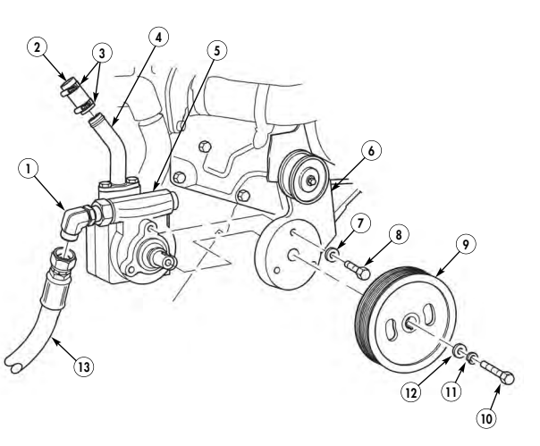

FOLLOW-ON TASKS: - Install serpentine belt (para. 3-81.1 or para. 3-81.2).

- Bleed power steering system (para. 8-27.1).

# 8-23.2 8-24.1. Power Steering Hydraulic System Pressure Hose Replacement (Serial Numbers 196901 Through 299999)

This task covers:

| General mechanic's tool kit:     |
|----------------------------------|
| automotive (Appendix B, Item 1)  |
| Materials/Parts                  |
| Cotter pin (Appendix G, Item 19) |

INITIAL SETUP:
Power steering fluid (Appendix C, Item 37)
a. Removal b. Installation

| - Wheels chocked and parking brake released   |
|-----------------------------------------------|
| (TM 9\-2320\-387\-10).                        |
| - Muffler and catalytic converter removed     |
| (para. 3\-49).                                |
| - Rear propeller shaft removed (para. 6\-4).  |
| - Access cover removed (para. 10\-58.4).      |

Cover or plug all open lines and connections immediately after disconnection to prevent contamination. Remove all covers or plugs prior to connection.

Use suitable container to catch power steering fluid.

## A. Removal

1. Disconnect pressure hose (3) from elbow (1) on power steering pump (2). Drain power steering fluid. 2. Disconnected pressure hose (3) from adapter (4) on hydro-boost (6). 3. Remove adapter (4) and O-ring (5) from hydro-boost (6). Discard O-ring (5). b. Installation 1. Lubricate O-ring (5) with power steering fluid and install O-ring (5) on adapter (4). 2. Install adapter (4) with O-ring (5) on hydro-boost (6). 3. Connect pressure hose (3) to adapter (4) on hydro-boost (6). Do not tighten nut on hose (3). 4. Connect pressure hose (3) to elbow (1) on power steering pump (2). Tighten nuts on hose (3).

8-23.2. POWER STEERING PUMP PRESSURE RELIEF VALVE REPLACEMENT 
(SERIAL NUMBERS 196901 AND ABOVE) (Cont'd)

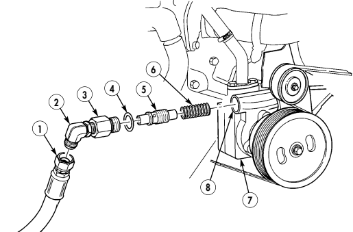

FOLLOW-ON TASKS: - Install serpentine belt (para. 3-81).

- Bleed power steering system (para. 8-27.1). - Close and secure hood (TM 9-2320-387-10).

# 8-24. Power Steering Hydraulic System Pressure And Return Hose Replacement (Serial Numbers 196900 And Below)

This task covers:
INITIAL SETUP:
Tools General mechanic's tool kit:
automotive (Appendix B, Item 1)
Materials/Parts Locknut (Appendix G, Item 77) Six O-rings (Appendix G, Item 220) Nut and lockwasher assembly 
(Appendix G, Item 197)
Manual References TM 9-2320-387-10 TM 9-2320-387-24P
a. Removal b. Installation

## Equipment Condition

- Hood raised and secured (TM 9-2320-387-10). - Battery ground cables disconnected (para. 4-68).

General Safety Instructions Do not drain fluid when engine is hot.

Maintenance Level Unit

The replacement procedure is basically the same for all hydraulic system pressure and return hoses.

a. Removal

Do not drain fluid when engine is hot. Severe injury to personnel will result.

Cover or plug all hoses and connections immediately after disconnection to prevent contamination. Remove all covers or plugs prior to connection.

Have drainage container ready to catch fluid.

1. Remove locknut (1), washer (2), and bolt (4) from clamp (3). Discard locknut (1). 2. Remove clamp (3) from bypass hose (5). 3. Loosen three clamps (6) on tee (7). 4. Disconnect two bypass hoses (5) and return hose (8) from tee (7). 5. Remove nut and lockwasher assembly (19), capscrew (15), washer (16), two clamps (18), harness clamp (17), return hose (9), and O-ring (17.1) from power steering lines bracket (20). Discard nut and lockwasher assembly (19).

6. Loosen clamp (12) on return hose (8) and remove return hose (8) and clamp (12) from hydro-boost (11).

7. Remove pressure hose (13) from hydro-boost (11) and steering gear (21). 8. Remove two O-rings (10) from pressure hose (13). Discard O-rings (10). 9. Remove pressure hose (9) from hydro-boost (11) and power steering pump (14).

10. Remove two O-rings (10) from pressure hose (9). Discard O-rings (10).

8-24.

# Power Steering Hydraulic System Pressure And Return Hose Replacement (Serial Numbers 196900 And Below) (Cont'D)

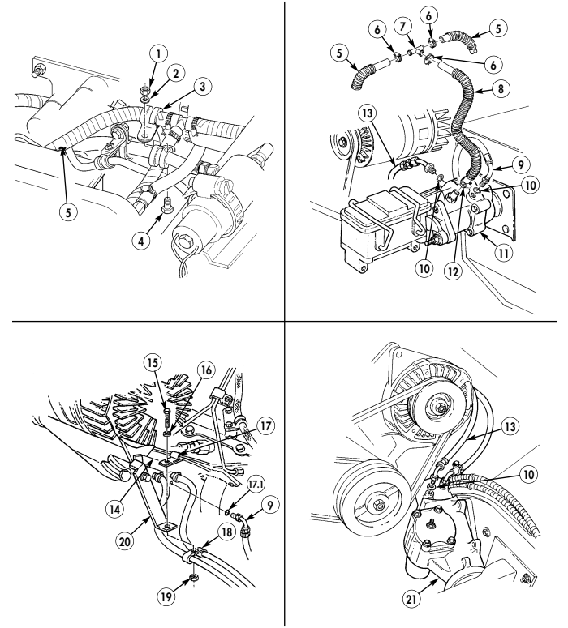

■

# 8-24. Power Steering Hydraulic System Pressure And Return Hose Replacement (Serial Numbers 196900 And Below) (Cont'D)

Perform steps 11 thru 14 if vehicle is equipped with winch.

11. Disconnect pressure hose (3) from hydro-boost (5) and valve assembly (2). 12. Remove O-ring (4) from pressure hose (3). Discard O-ring (4). 13. Disconnect pressure hose (1) from valve assembly (2) and steering gear (6). 14. Remove O-ring (4) from pressure hose (1). Discard O-ring (4).

b. Installation

Perform steps 1 thru 4 if vehicle is equipped with winch.

1. Install O-ring (4) on pressure hose (1). 2. Connect pressure hose (1) to valve assembly (2) and steering gear (6). 3. Install O-ring (4) on pressure hose (3). 4. Connect pressure hose (3) to hydro-boost (5) and valve assembly (2). 5. Install two O-rings (4) on pressure hose (10). 6. Install pressure hose (10) on hydro-boost (5) and power steering pump (14). 7. Install two O-rings (4) on pressure (1). 8. Install pressure hose (1) on hydro-boost (5) and steering gear (6). 9. Install return hose (22) and clamp (23) on hydro-boost (5) and tighten clamp (23).

10. Install washer (8), capscrew (7), two clamps (11), harness clamp (9), return hose (10), O-ring (9.1),
and nut and lockwasher assembly (12) on power steering lines bracket (13).

11. Connect two bypass hoses (19) and return hose (22) to tee (21). 12. Tighten three clamps (20) and tee (21). 13. Install clamp (17) on bypass hose (19). 14. Install bolt (18), washer (16), and locknut (15) on clamp (17).

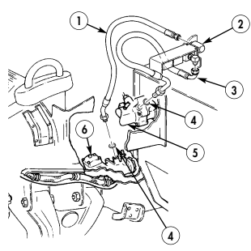

# 8-24. Power Steering Hydraulic System Pressure And Return Hose

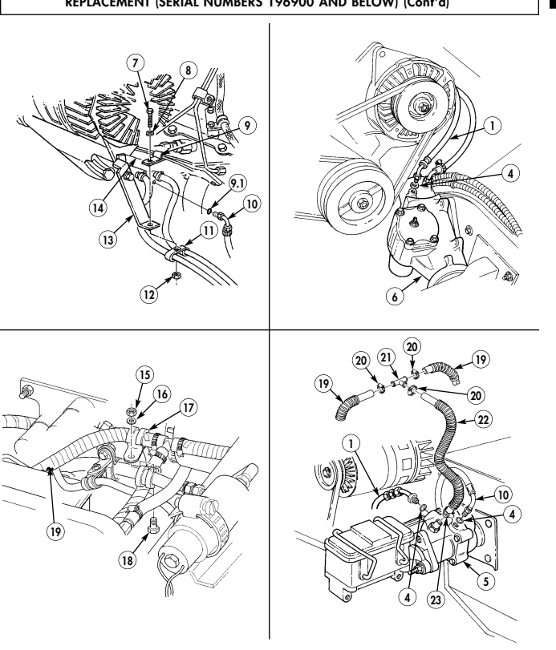

FOLLOW-ON TASKS: - Connect battery ground cables (para. 4-68).

- Bleed power steering system (para. 8-27). - Lower and secure hood (TM 9-2320-387-10).

# 8-24.1. Power Steering Hydraulic System Pressure Hose Replacement (Serial Numbers 196901 Through 299999)

This task covers:

| Tools                           |
|---------------------------------|
| General mechanic's tool kit:    |
| automotive (Appendix B, Item 1) |
| Materials/Parts                 |
| O\-ring (Appendix G. Item 220)  |

INITIAL SETUP:
Power steering fluid (Appendix C, Item 37)
a. Removal b. Installation

| Manual References                              |
|------------------------------------------------|
| TM 9\-2320\-387\-10                            |
| TM 9\-2320\-387\-24P                           |
| Equipment Condition                            |
| Hood raised and secured (TM 9\-2320\-387\-10). |
| Maintenance Level                              |
| Unit                                           |

Cover or plug all open lines and connections immediately after disconnection to prevent contamination. Remove all covers or plugs prior to connection.

Use suitable container to catch power steering fluid.

## A. Removal

1. Disconnect pressure hose (3) from elbow (1) on power steering pump (2). Drain power steering fluid. 2. Disconnected pressure hose (3) from adapter (4) on hydro-boost (6). 3. Remove adapter (4) and O-ring (5) from hydro-boost (6). Discard O-ring (5). b. Installation 1. Lubricate O-ring (5) with power steering fluid and install O-ring (5) on adapter (4). 2. Install adapter (4) with O-ring (5) on hydro-boost (6). 3. Connect pressure hose (3) to adapter (4) on hydro-boost (6). Do not tighten nut on hose (3). 4. Connect pressure hose (3) to elbow (1) on power steering pump (2). Tighten nuts on hose (3).

8-24.1.  POWER STEERING HYDRAULIC SYSTEM PRESSURE HOSE REPLACEMENT
 
■■

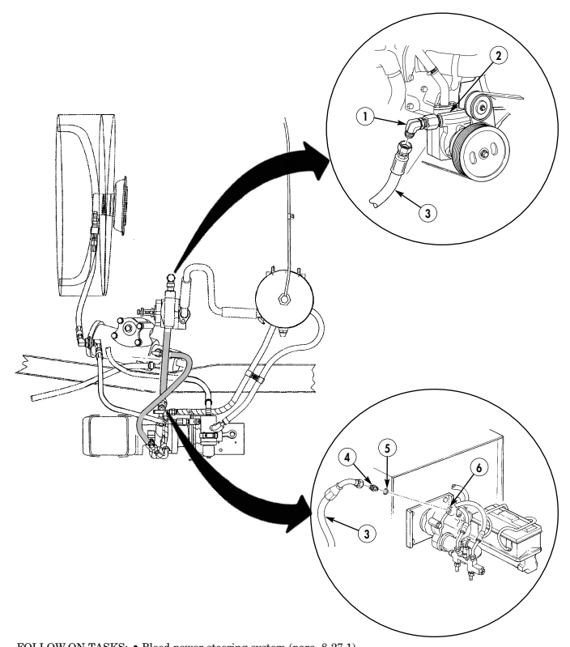

FOLLOW-ON TASKS: - Bleed power steering system (para. 8-27.1).
- Lower and secure hood (TM 9-2320-387-10).

# 8-24.2. Power Steering Hydraulic System Pressure And Return Hoses Replacement (Serial Numbers 300000 And Above)

This task covers:

## Initial Setup: Tools

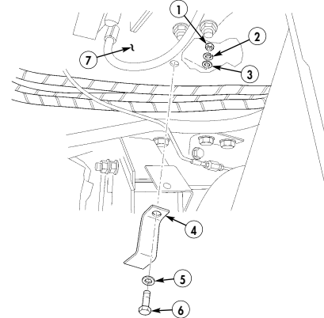

General mechanic's tool kit:
automotive (Appendix B, Item 1)
Maintenance and repair shop equipment:
automotive (Appendix B, Item 2)
Four O-rings (Appendix G, Item 220) Two lockwashers (Appendix G, Item 145) Nut and washer assembly 
(Appendix G, Item 194)
a. Removal b. Installation a. Removal

| Wheel removed (para. 8\-3).                   |
|-----------------------------------------------|
| General Safety Instructions                   |
| - Do not use tire machine.                    |
| - Ensure tire is totally deflated before      |
| removing wheel locknuts.                      |
| - Never use tubes in wheel assemblies.        |
| - Rim surfaces must be kept clean and free of |
| rust and dirt.                                |
| - Never use wheel assemblies with damaged     |
| studs.                                        |

1. Remove nut (1), lockwasher (2), washer (3), capscrew (6), washer (5), and bracket (4) from airlift bracket (7). Discard lockwasher (2).

2. Remove capscrew (14) and clamp (13) from frame (8). 3. Remove capscrew (12), lockwasher (11), washer (10), and bracket (9) from frame (8).

Discard lockwasher (11).

4. Remove nut and washer assembly (15), capscrew (21), washers (16) and (20), and clamps (17), (18),
and (19) from bracket (9).

8-24.2. POWER STEERING HYDRAULIC SYSTEM PRESSURE AND RETURN HOSES
REPLACEMENT (SERIAL NUMBERS 300000 AND ABOVE) (Cont'd)

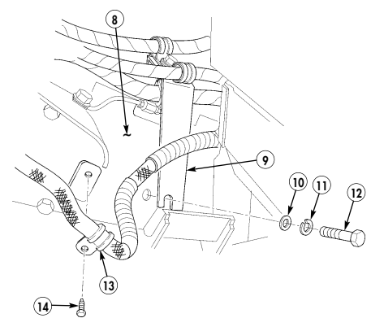

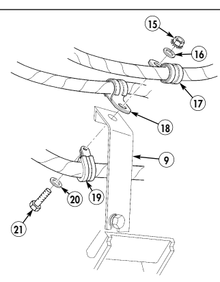

# 8-24.2. Power Steering Hydraulic System Pressure And Return Hoses Replacement (Serial Numbers 300000 And Above) (Cont'D)

Do not drain fluid when engine is hot. Severe injury to personnel may result.

Cover or plug all hoses and connections immediately after disconnection to prevent contamination. Remove all covers or plugs prior to connection.

- Use suitable container to catch power steering fluid. - Mark return hoses for installation.

5. Loosen nut (7) and disconnect pressure hose (6) from elbow (8) on power steering pump (5).

Drain power steering fluid.

6. Loosen clamp (3) and disconnect return hose (2) from tube (4) on power steering pump (5). 7. Loosen clamp (1) and disconnect return hose (2) from return tube (17). 8. Loosen clamp (10) and remove return hose (11) from reservoir (9). 9. Loosen clamp (15) and remove return hose (14) from reservoir (9).

10. Loosen clamps (16) and (19) and remove return hose (18) from reservoir (9) and return tube (17). 11. Remove tie strap (13) from return hose (11), return hose (14), and wiring harness (12). 12. Loosen nut (20) and disconnect pressure hose (6) from hydro-boost (25). 13. Remove tie strap (27) from pressure hoses (6) and (22). 14. Remove adapter (21) and O-ring (28) from hydro-boost (25). Discard O-ring (28). 15. Loosen nut (23) and disconnect pressure hose (22) from hydro-boost (25). 16. Remove O-ring (24) from hydro-boost (25). Discard O-ring (24). 17. Loosen clamp (26) and remove return hose (14) from hydro-boost (25).

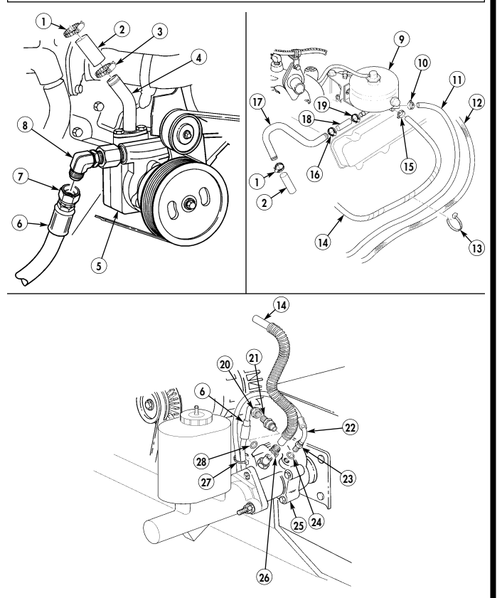

8-24.2. POWER STEERING HYDRAULIC SYSTEM PRESSURE AND RETURN HOSES
REPLACEMENT (SERIAL NUMBERS 300000 AND ABOVE) (Cont'd)

# 8-24.2. Power Steering Hydraulic System Pressure And Return Hoses Replacement (Serial Numbers 300000 And Above) (Cont'D)

18. Loosen clamp (2) and remove return hose (3) from outlet tube (1) of oil cooler (7). 19. Loosen clamp (5) and remove return hose (4) from inlet tube (6) of oil cooler (7). 20. Loosen nut (17) and disconnect pressure hose (8) from steering gear inlet adapter (16). 21. Remove steering gear inlet adapter (16) and O-ring (15) from steering gear (14). Discard O-ring (15). 22. Loosen nut (11) and disconnect return hose (3) from steering gear outlet adapter (12). 23. Remove steering gear outlet adapter (12) and O-ring (13) from steering gear (14). Discard O-ring (13). 24. Loosen clamp (9) and disconnect return hose (3) from 90° fitting (10).

## B. Installation

1. Connect return hose (3) on 90° fitting (10) with clamp (9). 2. Install steering gear outlet adapter (12) and O-ring (13) on steering gear (14). 3. Connect return hose (3) on steering gear outlet adapter (12) and tighten nut (11). 4. Install steering gear inlet adapter (16) and O-ring (15) on steering gear (14). 5. Connect pressure hose (8) on steering gear inlet adapter (16) and tighten nut (17). 6. Install return hose (4) on inlet tube (6) of oil cooler (7) and tighten clamp (5). 7. Install return hose (3) on outlet tube (1) of oil cooler (7) and tighten clamp (2).

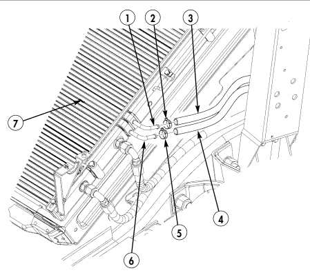

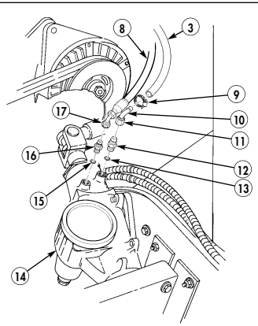

8-24.2. POWER STEERING HYDRAULIC SYSTEM PRESSURE AND RETURN HOSES
REPLACEMENT (SERIAL NUMBERS 300000 AND ABOVE) (Cont'd)

# 8-24.2. Power Steering Hydraulic System Pressure And Return Hoses Replacement (Serial Numbers 300000 And Above) (Cont'D)

8. Install return hose (4) on hydro-boost (8) and tighten clamp (9). 9. Install O-ring (7) on hydro-boost (8).

10. Connect pressure hose (5) on hydro-boost (8) and tighten nut (6). 11. Install O-ring (11) and adapter (3) on hydro-boost (8). 12. Connect pressure hose (1) on adapter (3) and tighten nut (2). 13. Install tie strap (10) on pressure hoses (1) and (5). 14. Install tie strap (15) on return hoses (4) and (17) and harness (14). 15. Install return hose (22) on reservoir (12) and return tube (21) and tighten clamps (18) and (23). 16. Install return hose (4) on reservoir (12) and tighten clamp (13). 17. Install return hose (17) on reservoir (12) and tighten clamp (16). 18. Connect return hose (19) to return tube (21) and return tube (25) of power steering pump (26) and tighten clamps (20) and (24).

19. Connect pressure hose (1) to elbow (28) of power steering pump (26) and tighten nut (27).

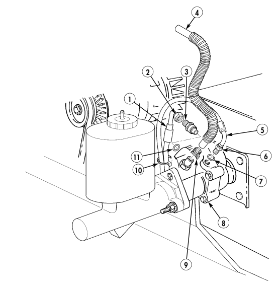

8-24.2. POWER STEERING HYDRAULIC SYSTEM PRESSURE AND RETURN HOSES
REPLACEMENT (SERIAL NUMBERS 300000 AND ABOVE) (Cont'd)

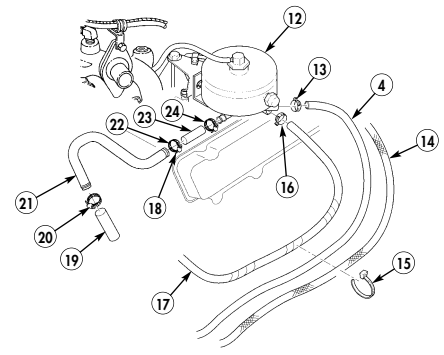

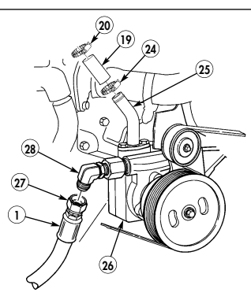

8-24.2. POWER STEERING HYDRAULIC SYSTEM PRESSURE AND RETURN HOSES
REPLACEMENT (SERIAL NUMBERS 300000 AND ABOVE) (Cont'd)
20. Install clamps (6), (4), and (3) on bracket (5) with capscrew (8), washers (7) and (2), and nut and washer assembly (1).

21. Install bracket (5) on frame (4) with washer (10), lockwasher (11), and capscrew (12). 22. Install clamp (13) on frame (9) with capscrew (14). 13. Install bracket (18) on airlift bracket (21) with washer (19), capscrew (20), washer (17),
lockwasher (16), and nut (15).

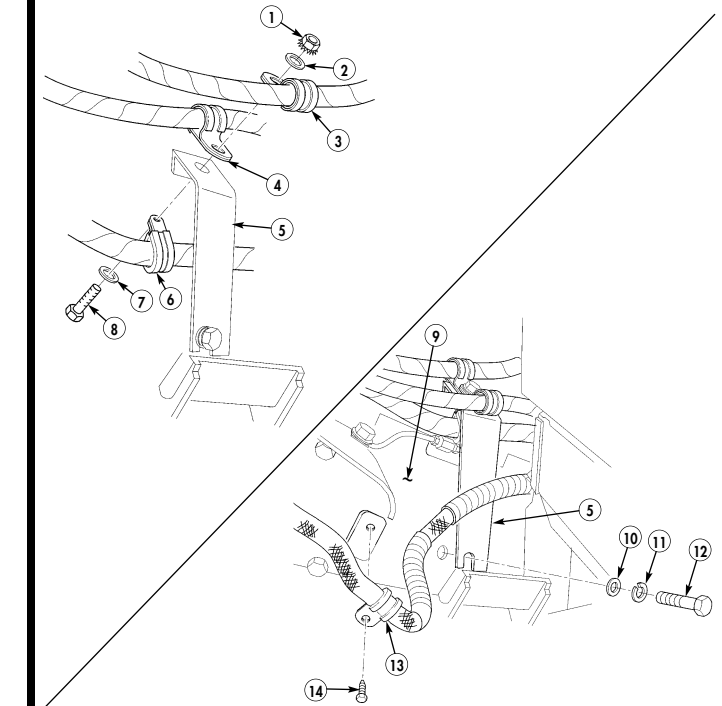

8-66.14 Change 6

8-24.2. POWER STEERING HYDRAULIC SYSTEM PRESSURE AND RETURN HOSES
REPLACEMENT (SERIAL NUMBERS 300000 AND ABOVE) (Cont'd)

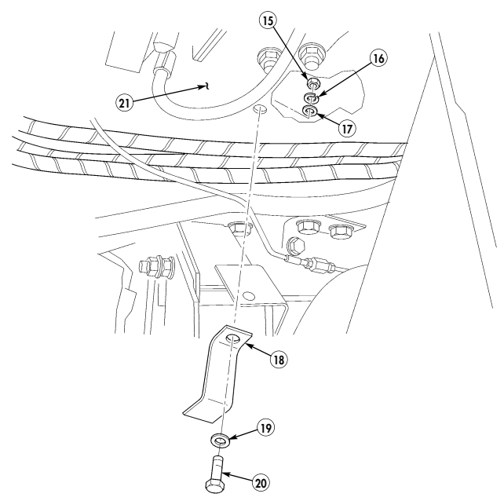

FOLLOW-ON TASKS:  Bleed power steering system (para. 8-27).

# 8-25. Power Steering System Hydraulic Control Valve Maintenance

This task covers:
a. Removal c. Inspection b. Back Flush Procedure d. Installation INITIAL SETUP:
Tools General mechanic's tool kit:
automotive (Appendix B, Item 1)
Maintenance and repair shop equipment:
automotive (Appendix B, Item 2)
Manual References TM 9-2320-387-10 TM 9-2320-387-24P

## Equipment Condition

- Battery ground cables disconnected (para. 4-68).

- Hood raised and secured (TM 9-2320-387-10).

General Safety Instructions **______________________**
Do not drain fluid when engine is hot.

Maintenance Level Unit

If referred here from chapter 2 troubleshooting instructions to perform back flush procedure, follow steps 1 through 4 and then proceed to task b.

a. Removal

Do not drain fluid when engine is hot. Severe injury to personnel will result.

Cover or plug all hoses and connections immediately after disconnection to prevent contamination. Remove all plugs prior to connection.

- Note location of hoses for installation 3. Loosen clamp (14) and disconnect steering gear hose (13) from control valve elbow (3). 4. Disconnect time-delay module connector (6) from control valve connector (7). 5. Loosen clamp (5) and remove control valve (8) from bracket (9).

## B. Back Flush Procedure Note

If vehicle is equipped with bleeder tee, perform steps 1.1 and 1.2.

1. Connect battery ground cables (para. 4-68).

1.1. Remove bleeder tee (10.1) from control valve (8). 1.2. Install control valve fitting (10) on control valve (8).

2. Install steering gear hose (13) on control valve fitting (10). 3. Remove control valve elbow (4) from control valve (8) and install pipe plug (15) (NSN 4730-00-011-2578)
on control valve (8).

4. Install drain hose (16) (make from NSN 4720-01-186-2358, 36 in. (91.4 cm) long) on control valve elbow (3).

- Have drainage container ready to catch fluid.

1. Loosen clamp (2) and disconnect power steering return line hose (1) from control valve elbow (4). 2. Loosen clamp (11) and disconnect fan clutch hose (12) from control valve fitting (10).

8-25. POWER STEERING SYSTEM HYDRAULIC CONTROL VALVE MAINTENANCE (Cont'd)

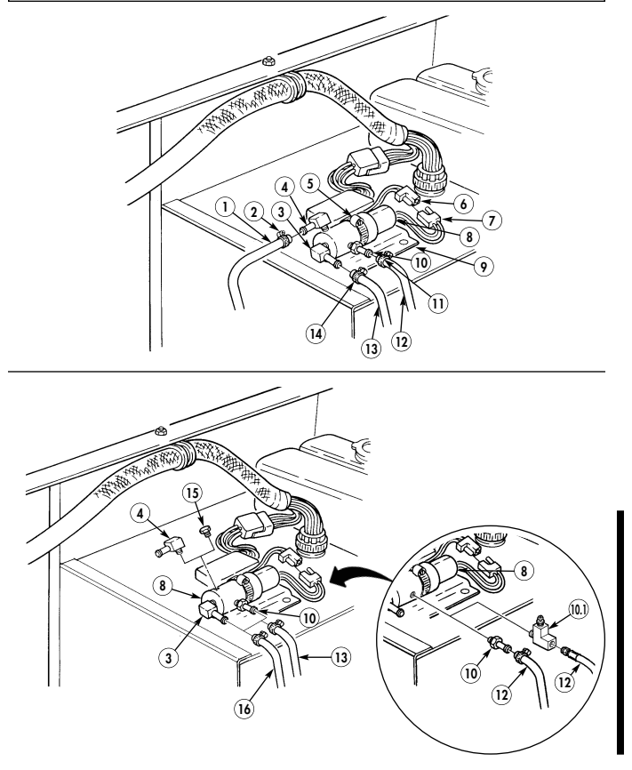

Change 2

(4 14 44 14.12)
# 8-25. Power Steering System Hydraulic Control Valve Maintenance (Cont'D)

5. Place drainage container underneath drain hose (16) to catch fluid.

- To ensure there is no load on the steering gear, position front wheels straight ahead before starting engine. Failure to do this may cause damage to the control valve.

- Maintain power steering fluid level at all times while performing back flush procedure to prevent air from entering power steering system. Failure to do this may result in damage to equipment.

6. Start engine and allow to run for about two or three seconds and stop, check, and fill power steering reservoir. Repeat the process once.

7. Remove pipe plug (2) from control valve (7). 8. Install control valve elbow (1) on control valve (7). 9. Remove steering gear hose (4) from control valve fitting (3) and install on control valve elbow (1). 10. Remove control valve fitting (3) from control valve (7) and install pipe plug (2) on control valve (7).

- To ensure there is no load on the steering gear, position front wheels straight ahead before starting engine. Failure to do this may cause damage to the control valve.

- Maintain power steering fluid level at all times while performing back flush procedure to prevent air from entering power steering system. Failure to do this may result in damage to equipment.

11. Start engine and allow to run for about two to three seconds and stop, check, and fill power steering reservoir. Repeat the process once.

12. Remove drain hose (5) from control valve elbow (6). 13. Remove steering gear hose (4) from control valve elbow (1). 14. Remove pipe plug (2) from control valve (7).

If vehicle is equipped with bleeder tee, perform step 14.1.

14.1. Install bleeder tee (7.1) on control valve (7). 15. Install control valve fitting (3) on control valve (7). 16. Disconnect battery ground cables (para. 4-68).

c. Inspection 1. Inspect elbows (6) and (1) for damage. Replace elbows (6) or (1) if damaged. 2. Inspect valve fitting (3) for damage. Replace valve fitting (3) if damaged.

d. Installation

Perform step 1 if hydraulic control valve was removed.

1. Install control valve (7) on bracket (13) with clamp (10). 2. Connect steering gear hose (4) to control valve elbow (6) and tighten clamp (16) to 30-40 lb-in. (3.4-4.5 N•m). 3. Connect fan clutch hose (15) to control valve fitting (3) and tighten clamp (14) to 30-40 lb-in. (3.4-4.5 N•m).

If vehicle is equipped with bleeder tee, perform step 3.1.

3.1 Connect fan clutch hose (15) to bleeder tee (7.1). 4. Connect power steering return line hose (8) to control valve elbow (1) and tighten clamp (9) to 30-40 lb-in. (3.4-4.5 N•m).

8-70 Change 2 8-25. POWER STEERING SYSTEM HYDRAULIC CONTROL VALVE MAINTENANCE (Cont'd)

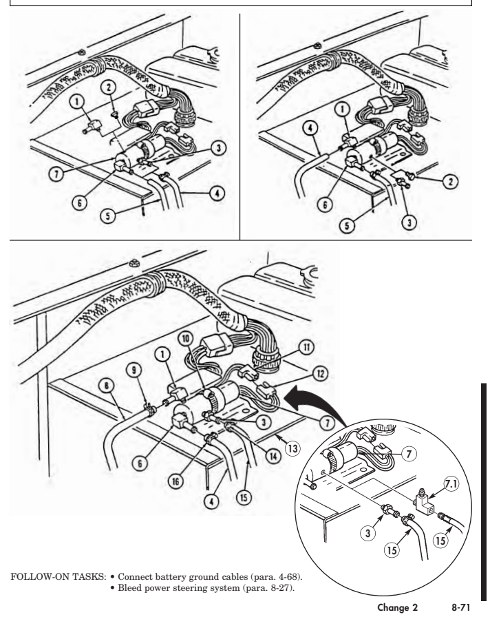

# 8-26. Power Steering Cooler Hose And Manifold Valve Hoses Replacement

This task covers:
INITIAL SETUP:

| 415   | ls   | 00   |
|-------|------|------|

| 1 \- 10 \- 10 \-   |
|--------------------|
| Manual References  |

General mechanic's tool kit:
automotive (Appendix B, Item 1)
Materials/Parts Two O-rings (Appendix G, Item 221) Tiedown strap (Appendix G, Item 323)
TM 9-2320-387-10 TM 9-2320-387-24P

| Maintenance Level   |
|---------------------|
| Unit                |

a. Removal

a. Removal b. Installation

| Equipment Condition                      |
|------------------------------------------|
| Wheel removed (para. 8\-3).              |
| General Safety Instructions              |
| - Do not use tire machine.               |
| - Ensure tire is totally deflated before |

Do not drain fluid when engine is hot. Severe injury to personnel will result.

Cover or plug all hoses and connections immediately after disconnection to prevent contamination. Remove all covers or plugs prior to connection.

Have drainage container ready to catch fluid.

1. Remove tiedown strap (1) from hose (3) and elbow (4) on fan shroud (2). Discard tiedown strap (1). 2. Remove clamp (11) from hose (6), and disconnect hose (6) from tee (12). 3. Remove clamp (11) from hose (13), and disconnect hose (13) from tee (12). 4. Remove two clamps (11) from hose (14) and disconnect hose (14) from tee (12) and hydro-boost (15). 5. Disconnect hose (3) from adapter (5). 6. Disconnect hose (6) from adapter (5). 7. Remove two adapters (5) and O-rings (8) from manifold valve (18). Discard O-rings (8). 8. Remove two screws (10), washers (9), manifold valve (18), and reinforcement plate (17) from left splash shield (16).

8-26. POWER STEERING COOLER HOSE AND MANIFOLD VALVE HOSES
REPLACEMENT (Cont'd)

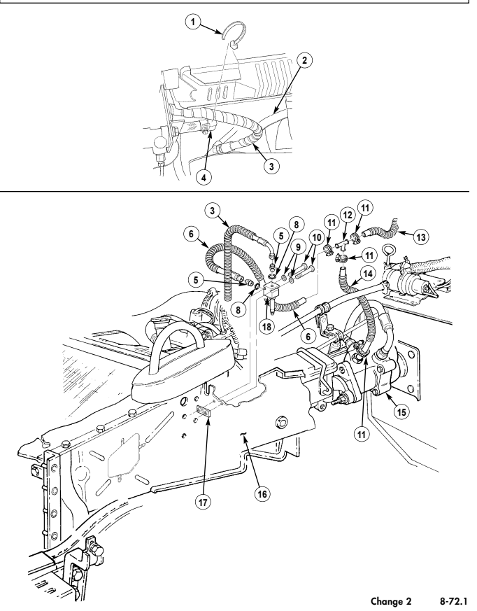

8-26. POWER STEERING COOLER HOSE AND MANIFOLD VALVE HOSES

# Replacement (Cont'D)

b. Installation 1. Install manifold valve (14) on left splash shield (12) with two screws (6), washers (5), and reinforcement plate (13).

2. Install two O-rings (4) and adapters (3) on manifold valve (14). 3. Connect hose (1) to adapter (3). 4. Connect hose (2) to adapter (3). 5. Connect hose (10) to hydro-boost (11) and tee (8) with two clamps (7). 6. Install clamp (7) and hose (9) on tee (8). 7. Install clamp (7) and hose (1) on tee (8). 8. Secure hose (2) to elbow (17) on fan shroud (16) with tiedown strap (15).

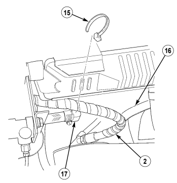

8-26. POWER STEERING COOLER HOSE AND MANIFOLD VALVE HOSES

# Replacement (Cont'D)

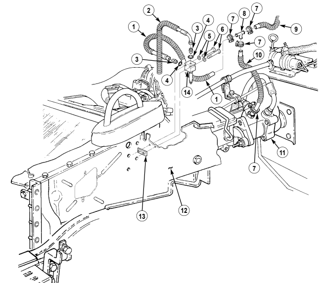

FOLLOW-ON TASKS: - Connect battery ground cables (para. 4-68).

- Install brake protection guards (para. 7-11). - Install rear propeller shaft (para. 6-4). - Bleed power steering system (para. 8-27). - Install left splash shield (para. 10-23). - Lower and secure hood (TM 9-2320-387-10).

# 8-27. Power Steering System Bleeding (Rcsk18330)

This task covers:
Bleeding INITIAL SETUP:

| INITIAL SETUP:                          |                                          |
|-----------------------------------------|------------------------------------------|
| Tools                                   | Equipment Condition                      |
| General mechanic's tool kit:            | Wheel removed (para. 8\-3).              |
| automotive (Appendix B, Item 1)         | General Safety Instructions              |
| Maintenance and repair shop equipment:  |                                          |
| automotive (Appendix B, Item 2)         | - Do not use tire machine.               |
| Torque wrench 1/2 in. drive, 250 lb\-ft | - Ensure tire is totally deflated before |
|                                         | removing wheel locknuts.                 |
| Special Tools                           | - Never use tubes in wheel assemblies.   |

## Bleeding

1. Ensure engine is shut off (TM 9-2320-387-10) and turn wheels all the way to the left. 2. Add power steering fluid (TM 9-2320-387-10) to FULL COLD level on reservoir. Leave reservoir cap off.

3. Raise front wheels off ground (para. 8-2). 4. Turn steering wheel left and right, holding wheels at steering stops for five seconds, for at least 40 times.

- Power steering fluid must be free of bubbles and foam. If bubbles or foam are noted, it could be an indication of a loose connection or leaky O-ring.

- Fluid with air in it will have a milky appearance. Air must be eliminated from system before normal steering action can be obtained.

7. Turn wheels to center, shut off engine, and lower front wheels to ground (para. 8-2). 8. Start engine (TM 9-2320-387-10) and run engine for two or three minutes, turning wheels left and right.

If pump is noisy, recheck hoses for possible contact with vehicle body or engine. If no contact is found and noise continues, turn engine off and repressurize system by following steps 9 and/or 10.

9. Remove reservoir cap. Wait for system to cool. Reinstall reservoir cap. Start engine (TM 9-2320387-10) and check pump for noise. If noise is still present, continue to step 10. If noise stopped, proceed to step 11.

10. Turn engine off (TM 9-2320-387-10). Remove fluid from reservoir using a suction device. Refill reservoir with clean, cool fluid. Install reservoir cap. Start engine (TM 9-2320-387-10) and check pump for noise. If noise is still present, replace power steering pump (para. 8-23).

11. Turn engine off (TM 9-2320-387-10). 

FOLLOW-ON TASKS: - Check power steering fluid level (TM 9-2320-387-10).

- Lower and secure hood (TM 9-2320-387-10). - Operate vehicle and check for proper steering operation (TM 9-2320-387-10).

5. Check power steering fluid level (TM 9-2320-387-10). If any bubbles are seen, repeat step 4. 6. Start engine (TM 9-2320-387-10) and with engine idling, add power steering fluid 
(TM 9-2320-387-10) if necessary. Install reservoir cap.

# 8-27.1. Power Steering System Bleeding (P/N 94252A)

This task covers:
Bleeding INITIAL SETUP:

| Tools                           | Manual References    |
|---------------------------------|----------------------|
| General mechanic's tool kit:    | TM 9\-2320\-387\-24P |
| automotive (Appendix B, Item 1) |                      |
|                                 | Maintenance Level    |
| Materials/Parts                 | Unit                 |
| Runflat belt repair kit         |                      |
| (Appendix G, Item 275)          |                      |
| a. Removal                      |                      |

Hood raised and secured (TM 9-2320-387-10).

Bleeding 1. Remove fill cap (1) on power steering reservoir (2) and fill with power steering fluid 
(TM 9-2320-387-10) until fluid is in center of sightglass (3) and replace fill cap (1) on power steering reservoir (2).

2. Start and shut off engine several times to remove air from power steering system. 3. Disconnect glow plug controller (para. 4-33).

- Inspect power steering fluid in sightglass for bubbles or foam.

Fluid must be free of bubbles and foam. If bubbles or foam are noted, it could be an indication of a loose connection.

- Inspect power steering fluid in sightglass for air. Fluid with air in it will have a milky appearance. Air must be eliminated from system before normal steering action can be obtained.

4. Start and run engine (TM 9-2320-387-10) until fluid level is below sightglass (3). 5. Shut off engine (TM 9-2320-387-10). 6. Check power steering fluid level. Add power steering fluid as necessary until fluid level is at center of sightglass (3) when cold and top of sightglass (3) when hot. Do not overfill.

7. Raise front wheels off ground (para. 8-2). 8. Start engine and check power steering system for leaks. Turn steering wheel full left and then full right.

9. Repeat steps 6 through 8 until power steering system fluid is at proper fluid level and is free of air.

10. If proper fluid level cannot be obtained through this procedure, refer to para. 8-27.1, task b.

# 8-27.1. Power Steering System Bleeding (P/N 94252A) (Cont'D)

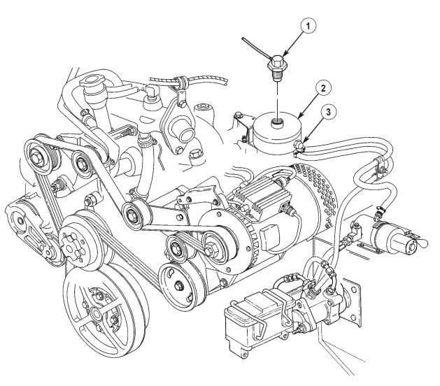

FOLLOW-ON TASK:   Lower and secure hood (TM 9-2320-387-10).

# 8-28. Power Steering Relief Valve Cartridge Maintenance

This task covers:
a. Removal c. Installation b. Inspection INITIAL SETUP:
Tools General mechanic's tool kit:
automotive (Appendix B, Item 1)
Materials/Parts O-ring (Appendix G, Item 222) O-ring (Appendix G, Item 236)
Manual References TM 9-2320-387-10 TM 9-2320-387-24P
a. Removal Equipment Condition
- Hood raised and secured (TM 9-2320-387-10). - Battery ground cables disconnected (para. 4-68).

Maintenance Level Unit support

Cover or plug all hoses and connections immediately after disconnection to prevent contamination. Remove all covers or plugs prior to connection.

Have drainage container ready to catch fluid.

1. Disconnect high-pressure line (1) from power steering pump (7). Remove O-ring (2) from highpressure line (1). Discard O-ring (2).

NOTE
Fitting assembly is spring-loaded. Remove carefully to avoid losing parts.

2. Remove fitting assembly (3) and O-ring (4) from pump (7). Discard O-ring (4). 3. Remove relief valve (5) and valve spring (6) from pump (7).

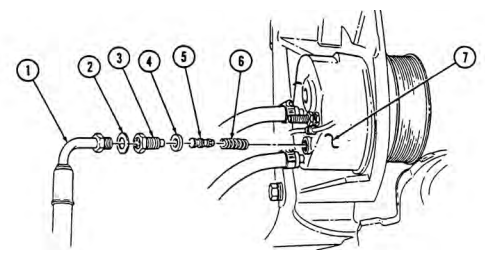

# 8-28. Power Steering Relief Valve Cartridge Maintenance (Cont'D)

## B. Inspection

Inspect external surface of relief valve (5) for burrs, nicks, or damage. Inspect relief valve (5) bore and screen for damage or debris. Inspect valve spring (6) for damage. Replace both relief valve (5) and valve spring (6) if either is damaged.

## C. Installation

1. Install valve spring (6) and relief valve (5) in pump (7). 2. Install O-ring (4) and fitting (3) in pump (7). Tighten fitting (3) in pump (7) to 37 lb-ft (50 N•m).

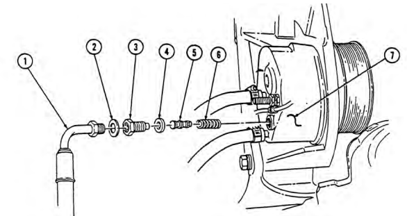 3. Install O-ring (2) on high-pressure line (1) and install high-pressure line (1) on pump (7).

FOLLOW-ON TASKS: - Connect battery ground cables (para. 4-68).

- Bleed power steering system (para. 8-27).

# 8-29. Power Steering Reservoir And Bracket Replacement (P/N 94252A)

| Maintenance Level   |
|---------------------|

This task covers:
INITIAL SETUP:

| General mechanic's tool kit:   | automotive (Appendix B, item 1)   |
|--------------------------------|-----------------------------------|
| Personnel Required             | One mechanic                      |
| One assistant                  |                                   |
| Unit                           |                                   |

a. Removal b. Installation

Hood raised and secured (TM 9-2320-387-10).

a. Removal

Have drainage container ready to catch power steering fluid.

1. Loosen clamps (18) and (21) from hoses (19) and (20) on power steering reservoir (16). 2. Disconnect hoses (19) and (20) from front and rear ports (22) and (17) on power steering reservoir (16). Drain power steering reservoir (16).

3. Loosen two clamps (24) on hose (25) and remove from lower port (23) on power steering reservoir (16) and hose (30).

4. Disconnect vent tube (14) and fill cap (15) on power steering reservoir (16). 5. Remove screw (7), lockwasher (6), clamp (8), and fuel inlet tube (5) from bracket (3). Discard lockwasher (6).

6. Remove screw (9), clamp (10), fuel return tube (11), spacer (12), and lockwasher (13) from stud (26)
on intake manifold (27). Discard lockwasher (13).

7. Remove screw (4), nut (29), lockwasher (28), bracket (3), and power steering reservoir (16) from intake manifold (27). Discard lockwasher (28).

8. Remove two nuts (1), lockwashers (2), and power steering reservoir (16) from bracket (3). Discard lockwashers (2).

POWER STEERING RESERVOIR AND BRACKET REPLACEMENT
(P/N 94252A) (Cont'd)
8-29.

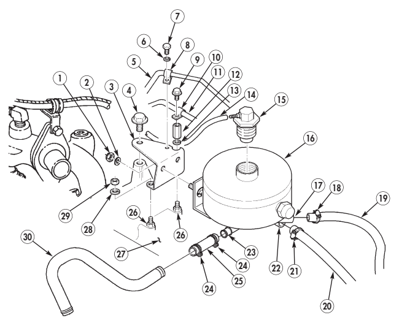

8-29. POWER STEERING RESERVOIR AND BRACKET REPLACEMENT 

# (P/N 94252A) (Cont'D)

b. Installation 1. Position power steering reservoir (16) on bracket (3) and secure with two lockwashers (2) and nuts (1).

2. Install bracket (3) and power steering reservoir (16) on two intake manifold studs (26) with lockwasher (28), nut (29), lockwasher (13), and spacer (12).

3. Secure bracket (3) on intake manifold (27) with screw (4). 4. Install fuel return tube (11) on spacer (12) with clamp (10) and screw (9). 5. Install fuel inlet tube (5) on bracket (3) with clamp (8), lockwasher (6), and screw (7). 6. Install fill cap (15) on power steering reservoir (16), and connect vent tube (14) to fill cap (15). 7. Connect hose (25) to lower front port (23) of power steering reservoir (16) and hose (30) and tighten two clamps (24).

8. Connect hoses (20) and (19) to front port (22) and rear port (17) on power steering reservoir (16)
and tighten clamps (21) and (18).

# 8-29. Power Steering Reservoir And Bracket Replacement (P/N 94252A) (Cont'D)

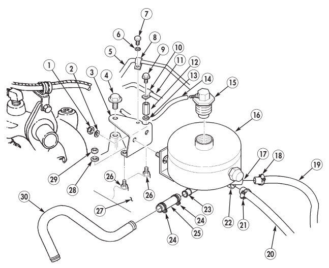

# 8-30. Power Steering Reservoir Filter Replacement (P/N 94252A)

This task covers:
INITIAL SETUP:
Tools General mechanic's tool kit:
automotive (Appendix B, Item 1)
Materials/Parts Filter (Appendix G, Item 32.1)
Manual References TM 9-2320-387-24-1 TM 9-2320-387-24P

a. Removal b. Installation

Equipment Condition Hood raised and secured (TM 9-2320-387-10).

Maintenance Level Unit a. Removal

Use suitable container to catch power steering fluid.

1. Loosen band clamp (1) and remove lid (2), band clamp (1), and spring (5) from power steering reservoir (4).

2. Remove filter (3) from power steering reservoir (4). Discard filter (3). b. Installation 1. Install filter (3) inside power steering reservoir (4). 2. Position spring (5), band clamp (1), and lid (2) on power steering reservoir (4) and secure lid (2) with band clamp (1) on power steering reservoir (4).

8-30.

# Power Steering Reservoir Filter Replacement (P/N 94252A) (Cont'D)

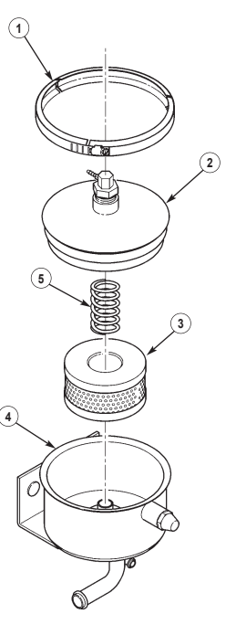

FOLLOW-ON TASK: 
 Bleed power steering system (para. 8-27.1).

# Chapter 9 Frame (Unit) Maintenance

|    | NOTE                                                                                                 |
|----|------------------------------------------------------------------------------------------------------|
|    | - To ensure proper alignment, vehicle must be at curb weight, or                                     |
|    | gross vehicle weight.                                                                                |
|    | - Vehicle should not be moved during alignment checks.                                               |
|    | - Vehicle must be on level ground with wheels set straight ahead.                                    |
|    | - Steps 1 through 3 will determine centerline of tire.                                               |
|    | - Point of measurement for checking toe\-out will be where lines                                     |
|    | marked in steps 1 and 3 intersect.                                                                   |
| 1. | Mark line (4) on center tread (1) of tire (2) 16\-1/2\-in. (42 cm) from ground.                      |
| 2. | Measure total width of tire tread (3) and record.                                                    |
| 3. | Mark line (5) on center tread (1) at one\-half total tread width (3).                                |
| 4. | Repeat steps 1 through 3 for opposite tire.                                                          |
| 5. | Measure distance between points of measurement on front side of tires (2) and record.                |
| 6. | Rotate tires (2) by moving vehicle forward until points of measurement are 16\-1/2 in. (42 cm) above |
|    | the ground at rear side of tires (2). Repeat steps 1 through 4 for side of tires.                    |
| 7. | Measure distance between points of measurement on rear side of tires (2) and record.                 |
|    | NOTE                                                                                                 |
|    | - If measurement is larger on rear side of tires than                                                |
|    | measurement on front side of tires, tires have toe\-in.                                              |

# 9-2. Front Bumper And Towing Brackets Replacement

| L   | ools   |
|-----|--------|

This task covers:

| Adjustment   |
|--------------|

Two spring washers (Appendix G, Item 318.1) Ten locknuts (Appendix G, Item 85) Two cotter pins (Appendix G, Item 22)

## A. Removal

1. Remove two cotter pins (12), nuts (11), spring washers (10), capscrews (8), and shackles (9) from towing brackets (7). Discard cotter pins (12) and spring washers (10).

2. Remove four locknuts (5), washers (6), capscrews (13), washers (6), and two towing brackets (7) from bumper (1). Discard locknuts (5).

3. Remove six locknuts (3), washers (4), capscrews (14), washers (4), and front bumper (1) from two mounting brackets (2). Discard locknuts (3).

## B. Installation

1. Install front bumper (1) on two mounting brackets (2) with six washers (4), capscrews (14),
washers (4), and locknuts (3). Tighten locknuts (3) to 90 lb-ft (122 N•m).

2. Install two towing brackets (7) on bumper (1) with four washers (6), capscrews (13), washers (6), and locknuts (5). Tighten locknuts (5) to 90 lb-ft (122 N•m).

3. Install two shackles (9) on towing brackets (7) with two capscrews (8), spring washers (10), nuts (11),
and cotter pins (12).

FOLLOW-ON TASK: Install winch (all except M1114) (para. 12-27).

a. Removal b. Installation

General mechanic's tool kit:
automotive (Appendix B, Item 1)
Maintenance and repair shop equipment:
automotive (Appendix B, Item 2)

| Equipment Condition                            |
|------------------------------------------------|
| Wheels chocked and parking brake on            |
| (TM 9\-2320\-387\-10).                         |
| Steering stop adjusted properly (para. 6\-17). |
| Maintenance Level                              |

# 9-3. Frame Extension Replacement

This task covers:
INITIAL SETUP:

## Tools

General mechanic's tool kit:
automotive (Appendix B, Item 1)
Maintenance and repair shop equipment:
automotive (Appendix B, Item 2)
Materials/Parts Three locknuts (Appendix G, Item 83)
Manual References TM 9-2320-387-24P
a. Removal b. Installation

## Equipment Condition

- Front bumper removed (para. 9-2). - Hood and hinge removed (para. 10-7). - Headlight housing removed (para. 10-18). - Tiedown ring removed (para. 9-4).

Maintenance Level Unit

## A. Removal

Remove three locknuts (2), washers (3), capscrews (5), washers (3), mounting bracket (1), and frame extension (6) from frame (4). Discard locknuts (2).

b. Installation Install mounting bracket (1) and frame extension (6) on frame (4) with three washers (3), capscrews (5),

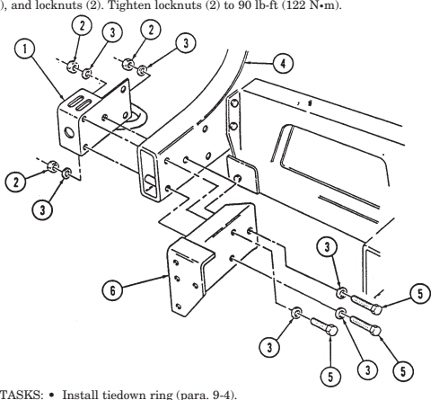

FOLLOW-ON TASKS: - Install tiedown ring (para. 9-4).
- Install headlight housing (para. 10-18). - Install hood and hinge (para. 10-7). - Install front bumper (para. 9-2).

# 9-4. Tiedown Ring Replacement

This task covers:
INITIAL SETUP:

## Tools

General mechanic's tool kit:
automotive (Appendix B, Item 1)
Maintenance and repair shop equipment:
automotive (Appendix B, Item 2)

## Materials/Parts

Cotter pin (Appendix G, Item 24)
a. Removal Remove cotter pin (2), nut (3), and tiedown ring (1) from mounting bracket (4). Discard cotter pin (2).

b. Installation Install tiedown ring (1) on mounting bracket (4) with nut (3). Tighten nut (3) to 16 lb-ft (22 N•m),

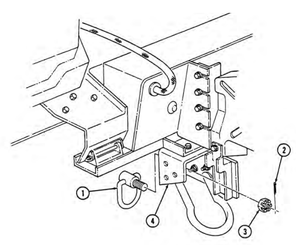 back off to nearest cotter pin (2) slot, and install cotter pin (2).

a. Removal b. Installation Manual References TM 9-2320-387-24P
Maintenance Level Unit

# 9-5. Radiator Front Mount Bracket Replacement (Serial Numbers 299999 And Below)

This task covers:

## Initial Setup:

Tools General mechanic's tool kit:
automotive (Appendix B, Item 1)
Maintenance and repair shop equipment:
automotive (Appendix B, Item 2)
Materials/Parts Two locknuts (Appendix G, Item 85) Locknut (Appendix G, Item 92)
a. Removal a. Removal b. Installation

| Manual References                      |
|----------------------------------------|
| TM 9\-2320\-387\-24P                   |
| Equipment Condition                    |
| Headlight housing removed (para. 10\-1 |
| Maintenance Level                      |
| Unit                                   |

Headlight housing removed (para. 10-18).

1. Remove locknut (2), two washers (3), capscrew (11), washer (3), spacer (10), mount (4), and radiator (1) from front mount bracket (9). Discard locknut (2).

2. Remove two locknuts (12), washers (7), capscrews (6), washers (7), spacers (5), and bracket (9) from front suspension crossmember (8). Discard locknuts (12).

## B. Installation

1. Install bracket (9) on front suspension crossmember (8) with two spacers (5), washers (7),

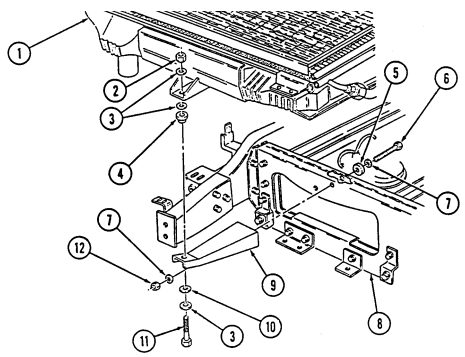

capscrews (6), washers (7), and locknuts (12). Tighten locknuts (12) to 90 lb-ft (122 N•m).

2. Install mount (4) and radiator (1) on front mount bracket (9) with washer (3), spacer (10),
capscrew (11), two washers (3), and locknut (2). Tighten locknut (2) to 30 lb-ft (41 N•m).

FOLLOW-ON TASK: Install headlight housing (para. 10-18).

# 9-5.1. Radiator Front Mount Bracket Replacement (Serial Numbers 300000 And Above)

This task covers:
a. Removal b. Installation

| INITIAL SETUP:                         |                      |
|----------------------------------------|----------------------|
| Tools                                  | Manual References    |
| General mechanic's tool kit:           | TM 9\-2320\-387\-10  |
| automotive (Appendix B, Item 1)        | TM 9\-2320\-387\-24P |
| Maintenance and repair shop equipment: | Equipment Condition  |
| automotive (Appendix B, Item 2)        |                      |
| Puller kit (Appendix B, Item 157)      |                      |
| Materials/Parts                        | Maintenance Level    |
|                                        | Unit                 |

Locknut (Appendix G, Item 114.3)

## A. Removal

1. Remove locknut (15), capscrew (7), washer (8), washer (9), insulator (10), washer (14), and insulator (13) from radiator (1) and front mount bracket (6). Discard locknut (15).

2. Remove two locknuts (11), washers (12), capscrews (2), washers (3), front mount bracket (6), and bracket (4) from front suspension crossmember (5). Discard locknuts (11).

## B. Installation

1. Install bracket (4) and front mount bracket (6) on front suspension crossmember (5) with two washers (3), capscrews (2), washers (12), and locknuts (11). Tighten locknut (11) to 90 lb-ft (122 N•m).

2. Secure front mount bracket (6) to radiator (1) with insulator (10), washer (9), washer (8),
capscrew (7), insulator (13), washer (14), and locknut (15). Tighten locknut (15) to 30 lb-ft (41 N•m).

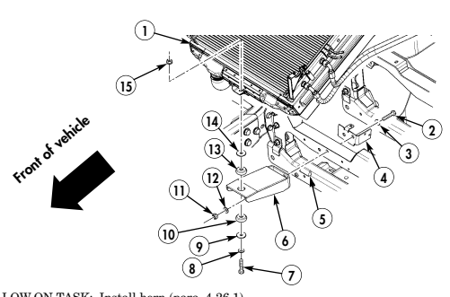

FOLLOW-ON TASK: Install horn (para. 4-26.1).
# 9-6. Rear Bumper Brace Replacement

This task covers:

| Tools                           |
|---------------------------------|
| General mechanic's tool kit:    |
| automotive (Appendix B, Item 1) |

## A. Removal B. Installation

| INITIAL SETUP:   |
|------------------|

automotive (Appendix B, Item 2)

## Materials/Parts

| Manual References    |
|----------------------|
| TM 9\-2320\-387\-10  |
| TM 9\-2320\-387\-24P |
| Equipment Condition  |

Three locknuts (Appendix G, Item 114.4)

Replacement procedures for inner and outer bumper braces are basically the same. This procedure covers the outer bumper brace.

a. Removal 1. Remove locknut (5), washer (2), capscrew (1), and washer (2) from rear bumper brace (3) and frame rail (4). Discard locknut (5).

2. Remove two locknuts (9), washers (7), capscrews (6), washers (7), and rear bumper brace (3) from rear bumper (8). Discard locknuts (9).

## B. Installation

1. Install rear bumper brace (3) on rear bumper (8) with two washers (7), capscrews (6), washers (7),
and locknuts (9).

2. Install rear bumper brace (3) on frame rail (4) with washer (2), capscrew (1), washer (2), and locknut (5).

Tighten locknuts (5) and (9) to 90 lb-ft (122 N•m).

# 9-6.  Rear Bumper Brace Replacement (Cont'D)

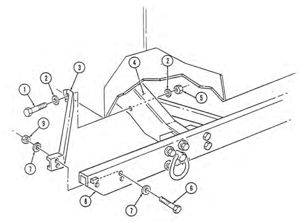

# 9-7. Rear Bumper Replacement

This task covers:

| a. Removal                             | b. Installation                                     |
|----------------------------------------|-----------------------------------------------------|
| INITIAL SETUP:                         |                                                     |
| Tools                                  | Manual References                                   |
| General mechanic's tool kit:           | TM 9\-2320\-387\-24P                                |
| automotive (Appendix B, Item 1)        | Equipment Condition                                 |
| Maintenance and repair shop equipment: | Front of vehicle raised and supported (para. 8\-2). |
| automotive (Appendix B, Item 2)        | Maintenance Level                                   |
| Puller kit (Appendix B, Item 157)      |                                                     |
| Materials/Parts                        | Unit                                                |
| Four cotter pins (Appendix G, Item 22) |                                                     |
|                                        | CAUTION                                             |

## A. Removal

1. Remove four assembled locknuts (7), capscrews (13), and trailer receptacle cover (14) from trailer receptacle (8). Discard assembled locknuts (7).

2. Remove two assembled locknuts (9), capscrews (12), plate (11), and trailer receptacle (8) from rear bumper (10). Discard assembled locknuts (9).

3. Remove four locknuts (23), washers (20), capscrews (19), and washers (20) from rear bumper (10)
and two braces (22). Discard locknuts (23).

4. Remove two cotter pins (1), nuts (2), and tiedown rings (16) from rear bumper (10) and two mounting brackets (3). Discard cotter pins (1).

5. Remove two cotter pins (28), nuts (27), spring washers (24), capscrews (26), and shackles (25) from rear bumper (10). Discard cotter pins (28) and spring washers (24).

6. Remove eight locknuts (21), washers (18), capscrews (17), and washers (18) from rear bumper (10)
and two mounting brackets (3). Discard locknuts (21).

7. Remove four locknuts (4), washers (5), capscrews (15), washers (5), and rear bumper (10) from two inner mounting brackets (6). Discard locknuts (4).

## B. Installation

1. Install rear bumper (10) on two inner mounting brackets (6) with four washers (5), capscrews (15),
washers (5), and locknuts (4). Tighten locknuts (4) to 90 lb-ft (122 N•m).

2. Install rear bumper (10) on two mounting brackets (3) with eight washers (18), capscrews (17),
washers (18), and locknuts (21). Tighten locknuts (21) to 90 lb-ft (122 N•m).

3. Install two shackles (25) on rear bumper (10) with two capscrews (26), spring washers (24), and slotted nuts (27). Tighten slotted nuts (27) to 15-20 lb-ft (20-27 N•m).

4. Back off two slotted nuts (27) to align with hole in capscrews (26) and install two cotter pins (28) in slotted nuts (27).

# 9-7. Rear Bumper Replacement (Cont'D)

5. Install two tiedown rings (16) on rear bumper (10) and two mounting brackets (3) with nuts (2).

Tighten nuts (2) to 16 lb-ft (22 N•m), back off to the nearest cotter pin (1) slot, and install two cotter pins (1).

6. Install rear bumper (10) on two braces (22) with four washers (20), capscrews (19), washers (20),
and locknuts (23). Tighten locknuts (23) to 90 lb-ft (122 N•m).

7. Install plate (11) and trailer receptacle (8) on rear bumper (10) with two capscrews (12) and assembled locknuts (9). Tighten assembled locknuts (9) to 8 lb-ft (11 N•m).

8. Install trailer receptacle cover (14) on trailer receptacle (8) and rear bumper (10) with four cap-

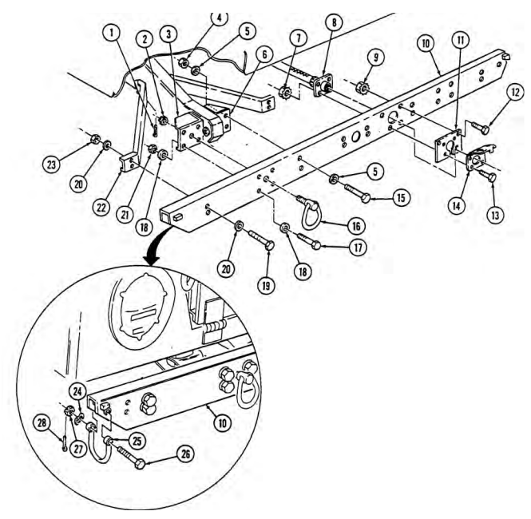

screws (13) and assembled locknuts (7). Tighten assembled locknuts (7) to 8 lb-ft (11 N•m).

FOLLOW-ON TASKS: - Install towing pintle (para 9-9 or para. 9-9.1).

- Install spare tire carrier (para. 10-96).

# 9-8. Rear Bumper Inner Mounting Bracket Replacement

This task covers:
INITIAL SETUP:
Tools General mechanic's tool kit:
automotive (Appendix B, Item 1)
Maintenance and repair shop equipment:
automotive (Appendix B, Item 2)

a. Removal b. Installation

| Manual References   |
|---------------------|

| Maintenance Level   |
|---------------------|

TM 9-2320-387-24P
Unit

## Materials/Parts

Six locknuts (Appendix G, Item 85)
a. Removal 1. Remove two locknuts (3), washers (4), capscrews (9), and washers (4) from bracket (7) and rear bumper (1). Discard locknuts (3).

Spacer is present on M1114 vehicle only.

2. Remove four locknuts (10), washers (6), capscrews (5), washers (6), bracket (7), and spacer (8)
from frame rail (2). Discard locknuts (10).

b. Installation

- Spacer is present on M1114 vehicle only.

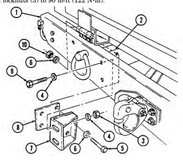 - Ensure spacer on outer side of frame rail is in position before installing spacer and bracket.

1. Install spacer (8) and bracket (7) on frame rail (2) with four washers (6), capscrews (5), washers (6),
and locknuts (10). Tighten capscrews (5) to 90 lb-ft (122 N•m).

2. Install bracket (7) on rear bumper (1) with two washers (4), capscrews (9), washers (4), and locknuts (3). Tighten locknuts (3) to 90 lb-ft (122 N•m).

# 9-9. Towing Pintle Maintenance (Serial Numbers 299999 And Below)

This task covers:
a. Removal d. Assembly b. Disassembly e. Installation c. Cleaning

## Initial Setup: Tools

General mechanic's tool kit:
automotive (Appendix B, Item 1)
Maintenance and repair shop equipment:
automotive (Appendix B, Item 2)

## Materials/Parts

Two cotter pins (Appendix G, Item 25) Drivescrew (Appendix G, Item 30) Two locknuts (Appendix G, Item 86) Four locknuts (Appendix G, Item 133.1) Drycleaning solvent (Appendix C, Item 26)

## Manual References

TM 9-2320-387-10 TM 9-2320-387-24P
General Safety Instructions Drycleaning solvent is flammable and will not be used near an open flame.

Maintenance Level Unit

Contact DS maintenance for fabrication instructions of optional towing pintle.

a. Removal

- Perform steps 1 and 2 for rear-mounted towing pintle. - Perform steps 3 and 4 for optional towing pintle mounted to the front bumper.

1. Remove cotter pin (3), slotted nut (2), washer (4), and towing pintle (9) from rear bumper (7).

Discard cotter pin (3).

2. Remove four nuts (1), washers (11), capscrews (10), washers (11), two support plates (6),

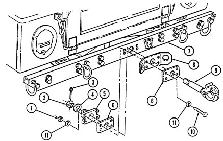

backing plate (5), and safety chain plate (8) from rear bumper (7).

# 9-9. Towing Pintle Maintenance (Serial Numbers 299999 And Below) (Cont'D)

3. Remove cotter pin (4), slotted nut (6), washer (5), and towing pintle (3) from front bumper (1).

Discard cotter pin (4).

4. Remove four locknuts (9), washers (8), capscrews (10), washers (8), front plate (2), and

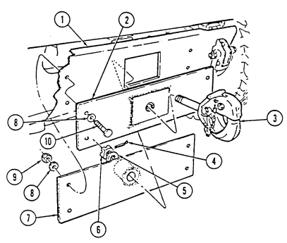

back plate (7) from front bumper (1). Discard locknuts (9).

b. Disassembly

Perform step 1 for rear-mounted towing pintle.

1. Remove grease fitting (12) from backing plate (11). 2. Remove cotter pin (15) from towing pintle latch (20). 3. Remove locknut (21), capscrew (19), pintle latch lock (17), and spring (16) from towing pintle latch (20).

Discard locknut (21).

4. Remove locknut (24), capscrew (18), and towing pintle latch (20) from towing pintle hook (22).

Discard locknut (24).

5. Remove cotter pin (15) from pintle lock chain hook (14). Discard cotter pin (15). 6. Remove drivescrew (23) and pintle lock chain (13) from towing pintle hook (22). Discard drivescrew (23).

## C. Cleaning Warning

Drycleaning solvent is flammable and will not be used near an open flame. A fire extinguisher will be kept nearby when the solvent is used. Use only in well-ventilated places. Failure to do this may result in injury to personnel and/or damage to equipment.

Clean all metallic parts with drycleaning solvent.

# 9-9. Towing Pintle Maintenance (Serial Numbers 299999 And Below) (Cont'D)

## D. Assembly

1. Install pintle lock chain (13) on towing pintle hook (22) with drivescrew (23). 2. Install cotter pin (15) on pintle lock chain (13) with pintle lock chain hook (14). 3. Install towing pintle latch (20) on towing pintle hook (22) with capscrew (18) and locknut (24).

Tighten locknut (24) to 15 lb-ft (20 N•m).

4. Install spring (16) and pintle latch lock (17) on towing pintle latch (20) with capscrew (19) and locknut (21). Tighten locknut (21) to 15 lb-ft (20 N•m).

5. Install cotter pin (15) in pintle latch (20).

Perform step 6 for rear-mounted towing pintle.

6. Install grease fitting (12) in backing plate (11).

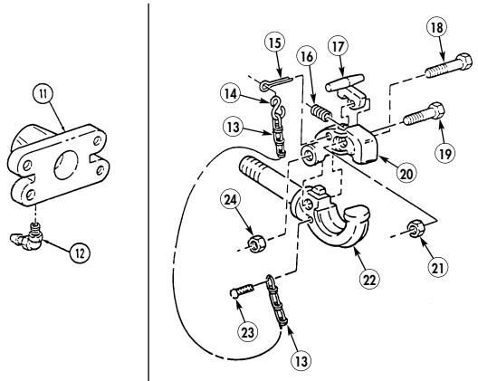

# 9-9. Towing Pintle Maintenance (Serial Numbers 299999 And Below) (Cont'D)

e. Installation

- Perform steps 1 through 3 for rear-mounted towing pintle. - Perform steps 4 through 6 for optional towing pintle mounted to the front bumper.

- Grease fitting on backing plate must face downward.

1. Install safety chain plate (8), two support plates (6), and backing plate (11) on rear bumper (7) with four washers (2), capscrews (10), washers (2), and nuts (1).

2. Install towing pintle (9) on rear bumper (7) and tighten nuts (1) to 90 lb-ft (122 N•m). 3. Secure towing pintle (9) to backing plate (11) with washer (5) and slotted nut (3). Loosen slotted nut (3) slightly if towing pintle (9) will not rotate easily. Install cotter pin (4) in slotted nut (3).

4. Install front plate (13) and back plate (18) on front bumper (12) with four washers (19),
capscrews (21), washers (19), and locknuts (20). Tighten locknuts (20) to 90 lb-ft (122 N•m).

5. Install towing pintle (14) on front plate (13) and back plate (18) with washer (16) and slotted nut (17).

6. Tighten slotted nut (17) until towing pintle (14) is tight. Back off nut (17) until towing pintle (14)
rotates freely and hole in towing pintle (14) shaft aligns with slot in nut (17). Install cotter pin (15).

9-9. TOWING PINTLE MAINTENANCE (SERIAL NUMBERS 299999 AND BELOW) (Cont'd)
1

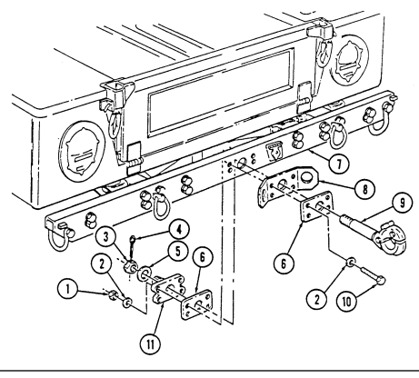

OPTIONAL

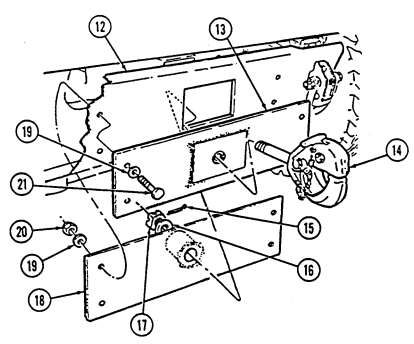

FOLLOW-ON TASK:

Lubricate rear-mounted towing pintle (TM 9-2320-387-10).

# 9-9.1. Towing Pintle Maintenance (Serial Numbers 300000 And Above)

This task covers:
a. Removal d. Assembly b. Disassembly e. Installation c. Cleaning

## Initial Setup:

Tools General mechanic's tool kit:
automotive (Appendix B, Item 1)
Maintenance and repair shop equipment:
automotive (Appendix B, Item 2)
Materials/Parts Two locknuts (Appendix G, Item 86) Two cotter pins (Appendix G, Item 25) Drivescrew (Appendix G, Item 30) Eight locknuts (Appendix G, Item 114.4) Drycleaning solvent (Appendix C, Item 26)

| Manual References    |
|----------------------|
| TM 9\-2320\-387\-24P |

General Safety Instructions Drycleaning solvent is flammable and will not be used near an open flame.

Maintenance Level Unit

## A. Removal

1. Remove cotter pin (18), slotted nut (17), washer (16), and towing pintle (7) from rear bumper (3).

Discard cotter pin (18).

2. Remove four locknuts (15), washers (14), capscrews (8), washers (9), two support plates (12) and (6),
backing plate (13), and safety chain plate (5) from rear bumper (3). Discard locknuts (15).

3. Remove four locknuts (1), washers (2), capscrews (10), washers (11), and reinforcement plate (4)
from rear bumper (3). Discard locknuts (1).

## B. Disassembly

1. Remove grease fitting (19) from backing plate (13). 2. Remove cotter pin (21) from towing pintle latch (26). 3. Remove locknut (27), capscrew (25), pintle latch lock (23), and spring (22) from towing pintle latch (26). Discard locknut (27).

4. Remove locknut (31), capscrew (24), and pintle latch (26) from towing pintle hook (28).

Discard locknut (31).

5. Remove cotter pin (21) from pintle lock chain hook (20). Discard cotter pin (21). 6. Remove drivescrew (30) and pintle lock chain (29) from towing pintle hook (28).

Discard drivescrew (30).

c. Cleaning

Drycleaning solvent is flammable and must not be used near an open flame. A fire extinguisher must be kept nearby when the solvent is used. Use only in well-ventilated places. Failure to comply may result in injury to personnel or damage to equipment.

Clean all metallic parts with drycleaning solvent.

9-9.1. TOWING PINTLE MAINTENANCE (SERIAL NUMBERS 300000 AND ABOVE) (Cont'd)

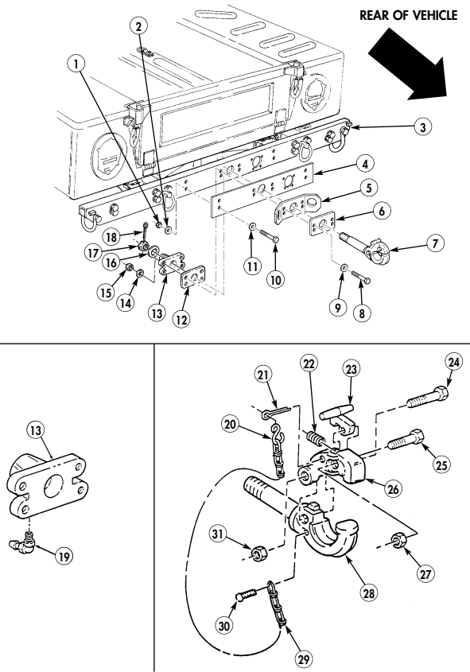

# 9-9.1. Towing Pintle Maintenance (Serial Numbers 300000 And Above) (Cont'D)

## D. Assembly

1. Install pintle lock chain (12) on towing pintle hook (11) with drivescrew (13). 2. Install cotter pin (4) on pintle lock chain hook (3).

## E. Installation

3. Install towing pintle latch (9) on towing pintle hook (11) with capscrew (8) and locknut (14).

Tighten locknut (14) to 15 lb-ft (20 N•m).

4. Install pintle latch lock (6) on towing pintle latch (9) with spring (5), capscrew (7), and locknut (10).

Tighten locknut (10) to 15 lb-ft (20 N•m).

5. Install pintle lock chain hook (3) on towing pintle latch (9) with cotter pin (4). 6. Install grease fitting (2) on backing plate (1).

1. Install reinforcement plate (18) on rear bumper (17) with four washers (25), capscrews (24),
washers (16), and locknuts (15).

2. Install safety chain plate (19), support plate (20), support plate (26), and backing plate (1) on rear bumper (17) with four washers (25), capscrews (24), washers (27), and locknuts (28). Tighten locknuts (28) to 90 lb-ft (122 N•m).

3. Install towing pintle (21) on rear bumper (17) with washer (29), and slotted nut (30). 4. Loosen slotted nut (30) if towing pintle (21) will not rotate easily. Install cotter pin (31) in slotted nut (30).

9-9.1. TOWING PINTLE MAINTENANCE (SERIAL NUMBERS 300000 AND ABOVE) (Conr'd)

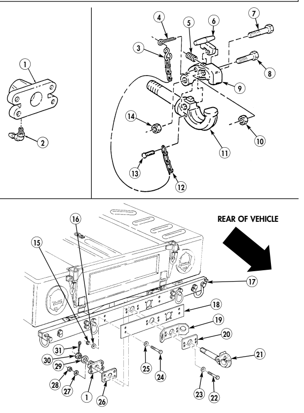

FOLLOW-ON TASK:  Lubricate rear-mounted towing pintle (TM 9-2320-387-10).

# 9-10. Transmission Mount Crossmember Replacement

This task covers:

| Tools                                  |
|----------------------------------------|
| General mechanic's tool kit:           |
| automotive (Appendix B, Item 1)        |
| Maintenance and repair shop equipment: |
| automotive (Appendix B, Item 2)        |

| INITIAL SETUP:   |
|------------------|

a. Removal b. Installation

| Manual References    |
|----------------------|
| TM 9\-2320\-387\-10  |
| TM 9\-2320\-387\-24P |
| Maintenance Level    |

## Materials/Parts

Two locknuts (Appendix G, Item 102) Two locknuts (Appendix G, Item 106)

Transmission must be supported during removal and installation of transmission mount crossmember to prevent damage to equipment.

## A. Removal

1. Place support under transmission (2) and remove two locknuts (6), washers (5), capscrew (4), and washer (5) from crossmember (7) and two support brackets (1). Discard locknuts (6).

2. Remove two locknuts (9), washers (8), and crossmember (7) from transmission mount (3). Discard locknuts (9).

## B. Installation

1. Install crossmember (7) on transmission mount (3) with two washers (8) and locknuts (9). Tighten locknuts (9) to 28 lb-ft (38 N•m).

2. Install crossmember (7) on two support brackets (1) with washer (5), capscrew (4), two washers (5),
and locknuts (6). Tighten locknuts (6) to 90 lb-ft (122 N•m).

3. Remove support from under transmission (2).

9-10. TRANSMISSION MOUNT CROSSMEMBER REPLACEMENT (Cont'd)

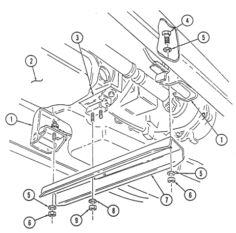

INDEX

| This task covers:                                                                                        |
|----------------------------------------------------------------------------------------------------------|
| a. Removal b. Installation                                                                               |
| INITIAL SETUP:                                                                                           |
| Tools Manual References                                                                                  |
| General mechanic's tool kit: TM 9\-2320\-387\-24P                                                        |
| automotive (Appendix B, Item 1) Equipment Condition                                                      |
| Universal joint bearing kit                                                                              |
| Intermediate steering shaft removed (Appendix B, Item 19)                                                |
| (para. 8\-19). Materials/Parts                                                                           |
| Maintenance Level                                                                                        |
| Center parts kit (Appendix G, Item 10)                                                                   |
| Unit                                                                                                     |
| a. Removal                                                                                               |
| CAUTION                                                                                                  |
| Do not drop bearing cups. Needle bearings can be easily lost.                                            |
| NOTE                                                                                                     |
| Removal and installation procedures are basically the same for                                           |
| both U\-joints. This procedure covers the U\-joint attached to                                           |
| steering gear.                                                                                           |
| 1.  Remove grease fitting (6) from cross (1).                                                            |
| 2.  Remove two snaprings (3) from bearing cups (4) in steering gear yoke (5).                            |
| 3.  Position steering gear yoke (5) in vise with 1\-1/8\-in. socket between vise jaw and bearing cup (4) |
| being removed. Ensure open end of socket is facing bearing cup (4).                                      |
| 4.  Place 11/16\-in. socket between opposite bearing cup (4) and vise jaw. Ensure open end of socket is  |
| facing vise jaw.                                                                                         |
| 5.  Press bearing cup (4) out of steering gear yoke (5) and remove bearing cup (4) from cross (1).       |
| 6.  Reverse position of sockets and press remaining bearing cup (4) out of steering gear yoke (5).       |
| 7. Remove steering gear yoke (5) from cross (1).                                                         |
| 8. Repeat steps 2 through 6 for steering shaft yoke (2).                                                 |
| 9.  Remove cross (1) from steering shaft yoke (2).                                                       |
| b. Installation                                                                                          |
| 1.  Install cross (1) into steering shaft yoke (2).                                                      |
| 2.  Install bearing cup (4) into steering shaft yoke (2).                                                |
| CAUTION                                                                                                  |
| Ensure bearing cup is aligned with steering shaft yoke before                                            |
| pressing in with vise. Damage to cross and bearing cups will                                             |
| result if forced into yoke.                                                                              |
| 3.  Place steering shaft yoke (2) in vise with 11/16\-in. socket between vise jaw and bearing cup (4).   |
| 4.  Press bearing cup (4) into steering shaft yoke (2) far enough to install snapring (3) and install    |
| snapring (3) on bearing cup (4).                                                                         |
| 5.  Install other bearing cup (4) into steering shaft yoke (2).                                          |
| 6.  Place steering shaft yoke (2) in vise with 11/16\-in. socket between bearing cup (4) and vise jaw.   |

# Index (Cont'D)

| This task covers:                                                                              | a.                                                                                                      | Removal                                                                                                      | b.           | Installation   |
|------------------------------------------------------------------------------------------------|---------------------------------------------------------------------------------------------------------|--------------------------------------------------------------------------------------------------------------|--------------|----------------|
| INITIAL SETUP:                                                                                 |                                                                                                         |                                                                                                              |              |                |
| Tools                                                                                          | Personnel Required                                                                                      | General mechanic's tool kit:                                                                                 | One mechanic |                |
| automotive (Appendix B, Item 1)                                                                | One assistant                                                                                           | Maintenance and repair shop equipment:                                                                       |              |                |
| Manual References                                                                              | automotive (Appendix B, Item 2)                                                                         | TM 9\-2320\-387\-24P                                                                                         |              |                |
| Materials/Parts                                                                                | Four locknuts (Appendix G, Item 77)                                                                     | Maintenance Level                                                                                            |              |                |
| Locknut (Appendix G, Item 90)                                                                  | Unit                                                                                                    |                                                                                                              |              |                |
| NOTE                                                                                           | Perform steps a.1 and b.2 only when replacing close\-off retainer.                                      |                                                                                                              |              |                |
| Close\-off may be replaced without disconnecting intermediate                                  | steering shaft.                                                                                         |                                                                                                              |              |                |
| a. Removal                                                                                     |                                                                                                         |                                                                                                              |              |                |
| 1.                                                                                             | Remove locknut (8), washer (9), capscrew (11), and washer (9) and disconnect intermediate steering      | shaft (10) from steering column (2). Discard locknut (8).                                                    |              |                |
| 2.                                                                                             | Remove four locknuts (12), washers (6), capscrews (5), and washers (6) from hand throttle               | bracket (7), close\-off retainer (4), close\-off (3), and cowl panel (1). Remove close\-off retainer (4) and |              |                |
| close\-off (3) from steering shaft (10). Discard locknuts (12).                                |                                                                                                         |                                                                                                              |              |                |
| b. Installation                                                                                |                                                                                                         |                                                                                                              |              |                |
| 1.                                                                                             | Install close\-off (3) and close\-off retainer (4) on cowl panel (1) and hand throttle bracket (7) with | four washers (6), capscrews (5), washers (6), and locknuts (12). Tighten locknuts (12) to 8 lb\-ft           |              |                |
| (11 N•m).                                                                                      | 2.                                                                                                      | Install intermediate steering shaft (10) through close\-off (3) on steering column (2) with washer (9),      |              |                |
| capscrew (11), washer (9), and locknut (8). Tighten locknut (8) to 40\-50 lb\-ft (54\-68 N•m). |                                                                                                         |                                                                                                              |              |                |

# Index (Cont'D)

| (SERIAL NUMBERS 196900 AND BELOW)                                                                                  |
|--------------------------------------------------------------------------------------------------------------------|
| This task covers: a. Removal b. Installation                                                                       |
| INITIAL SETUP:                                                                                                     |
| Tools Manual References                                                                                            |
| General mechanic's tool kit: TM 9\-2320\-387\-24P                                                                  |
| automotive (Appendix B, Item 1) Equipment Condition                                                                |
| Maintenance and repair shop equipment: Serpentine drivebelt removed (para. 3\-81).                                 |
| automotive (Appendix B, Item 2)                                                                                    |
| Maintenance Level Special Tools                                                                                    |
| Unit                                                                                                               |
| Pulley installer (Appendix B, Item 121)                                                                            |
| Materials/Parts                                                                                                    |
| Lockwasher (Appendix G, Item 183)                                                                                  |
| O\-ring (Appendix G, Item 220)                                                                                     |
| a. Removal                                                                                                         |
| CAUTION                                                                                                            |
| Cover or plug all hoses and connections immediately after                                                          |
| disconnection to prevent contamination. Remove all plugs prior to                                                  |
| connection.                                                                                                        |
| 1.  Loosen two clamps (2) and disconnect return lines (1) and high\-pressure line (5) from power                   |
| steering pump (3). Remove O\-ring (4) from high\-pressure line (5). Discard O\-ring (4).                           |
| 2.  Remove nut (7), clamp (8), and wiring harness (6) from power steering pump (3).                                |
| 3.  Remove nut (15), lockwasher (14), washer (13), capscrew (9), washer (10), and idler pulley (11) from           |
| bracket (12). Discard lockwasher (14).                                                                             |
| 4.  Remove two capscrews (17), capscrew (18), and power steering pump (3) from mounting bracket (16).              |
| 5.  Remove capscrew (19), washer (20), and power steering pulley (21) from power steering pump (3).                |
| b. Installation                                                                                                    |
| CAUTION                                                                                                            |
| Serpentine belt failure (abnormal wear or drive belt dislodgement)                                                 |
| can be caused by misalignment of pulleys, improper installation,                                                   |
| or foreign objects introduced into belt path. Inspect power steering                                               |
| pump pulley for proper installation and ease of rotation. Any                                                      |
| wobble or misalignment will cause belt failure. Refer to para. 3\-81                                               |
| for pulley alignment procedures.                                                                                   |
| NOTE                                                                                                               |
| Ensure flat surface of pulley is facing out and is flush with pump shaft.                                          |
| 1.  Using pulley installer, install pulley (21) on power steering pump (3).                                        |
| 2.  Secure pulley (21) to power steering pump (3) with washer (20) and capscrew (19). Tighten capscrew             |
| (19) to 37 lb\-ft (50 N•m).                                                                                        |
| 3.  Install power steering pump (3) on mounting bracket (16) with capscrew (18) and two capscrews (17).            |
| 4.  Install idler pulley (11) on bracket (12) with washer (10), capscrew (9), washer (13), lockwasher (14),        |
| and nut (15).                                                                                                      |
| 5.  Install O\-ring (4) on high\-pressure line (5) and install high\-pressure line (5) on power steering pump (3). |
| 6.  Install two return lines (1) on power steering pump (3) and tighten clamps (2).                                |

# Index (Cont'D)

| (SERIAL NUMBERS 196901 AND ABOVE)                                                                                                                                                                                                |                          |                              |
|----------------------------------------------------------------------------------------------------------------------------------------------------------------------------------------------------------------------------------|--------------------------|------------------------------|
| This task covers: a.  Removal  b.  Installation                                                                                                                                                                                  |                          |                              |
| INITIAL SETUP: Tools Manual References                                                                                                                                                                                           |                          |                              |
| General mechanic's tool kit: TM 9\-2320\-387\-24P automotive (Appendix B, Item 1) Equipment Condition                                                                                                                            |                          |                              |
| Maintenance and repair shop equipment: automotive (Appendix B, Item 2) (para. 3\-81.1 or 3\-81.2). Materials/Parts                                                                                                               |                          | Serpentine drivebelt removed |
| Maintenance Level Three lockwashers (Appendix G, Item 162) Unit Lockwasher (Appendix G, Item 190.1)                                                                                                                              |                          |                              |
| a. Removal                                                                                                                                                                                                                       |                          |                              |
| 1.  Remove screw (10), spacer (12), lockwasher (11), and pulley (9) from power steering pump (5). NOTE                                                                                                                           | Discard lockwasher (11). |                              |
| Use a suitable container to catch power steering fluid. 2.  Disconnect hose (13) from elbow (1) on power steering pump (5).                                                                                                      |                          |                              |
| 3.  Loosen two hose clamps (3) and slide hose (2) off tube (4) on power steering pump (5). 4.  Remove three screws (8), lockwashers (7), and power steering pump (5) from alternator/pump  support (6). Discard lockwashers (7). |                          |                              |
| b. Installation 1.  Position power steering pump (5) on alternator/pump support (6) and secure with three                                                                                                                        |                          |                              |
| lockwashers (7) and screws (8). Tighten screws (8) to 21\-25 lb\-ft (28\-34 N•m). 2.  Slide hose (2) with two hose clamps (3) on tube (4) on power steering pump (5) and tighten hose clamps (3).                                |                          |                              |
| 3.  Connect hose (13) to elbow (1) on power steering pump (5). 4.  Install pulley (9) on shaft of power steering pump (5) with spacer (12), lockwasher (11), and  screw (10). Tighten screw (10) to 21\-25 lb\-ft (28\-34 N•m).  |                          |                              |

# Index (Cont'D)

| (SERIAL NUMBERS 196901 THROUGH 299999)                       |                                                                                                     |                                 |                                                                                              |              |
|--------------------------------------------------------------|-----------------------------------------------------------------------------------------------------|---------------------------------|----------------------------------------------------------------------------------------------|--------------|
| This task covers:                                            | a.                                                                                                  | Removal                         | b.                                                                                           | Installation |
| INITIAL SETUP:                                               | Tools                                                                                               | Manual References               |                                                                                              |              |
| General mechanic's tool kit:                                 | TM 9\-2320\-387\-10                                                                                 | automotive (Appendix B, Item 1) | TM 9\-2320\-387\-24P                                                                         |              |
| Materials/Parts                                              | Equipment Condition                                                                                 | O\-ring (Appendix G, Item 220)  | Hood raised and secured (TM 9\-2320\-387\-10).                                               |              |
| Power steering fluid (Appendix C, Item 37)                   | Maintenance Level                                                                                   |                                 |                                                                                              |              |
| Unit                                                         |                                                                                                     |                                 |                                                                                              |              |
| CAUTION                                                      | Cover or plug all open lines and connections immediately after                                      |                                 |                                                                                              |              |
| disconnection to prevent contamination. Remove all covers or | plugs prior to connection.                                                                          |                                 |                                                                                              |              |
| NOTE                                                         | Use suitable container to catch power steering fluid.                                               |                                 |                                                                                              |              |
| a.                                                           | Removal                                                                                             |                                 |                                                                                              |              |
| 1.                                                           | Disconnect pressure hose (3) from elbow (1) on power steering pump (2). Drain power steering fluid. | 2.                              | Disconnected pressure hose (3) from adapter (4) on hydro\-boost (6).                         |              |
| 3.                                                           | Remove adapter (4) and O\-ring (5) from hydro\-boost (6). Discard O\-ring (5).                      |                                 |                                                                                              |              |
| b.                                                           | Installation                                                                                        |                                 |                                                                                              |              |
| 1.                                                           | Lubricate O\-ring (5) with power steering fluid and install O\-ring (5) on adapter (4).             | 2.                              | Install adapter (4) with O\-ring (5) on hydro\-boost (6).                                    |              |
| 3.                                                           | Connect pressure hose (3) to adapter (4) on hydro\-boost (6). Do not tighten nut on hose (3).       | 4.                              | Connect pressure hose (3) to elbow (1) on power steering pump (2). Tighten nuts on hose (3). |              |

# Index (Cont'D)

| (SERIAL NUMBERS 196901 THROUGH 299999)                       |                                                                                                     |                                 |                                                                                              |              |
|--------------------------------------------------------------|-----------------------------------------------------------------------------------------------------|---------------------------------|----------------------------------------------------------------------------------------------|--------------|
| This task covers:                                            | a.                                                                                                  | Removal                         | b.                                                                                           | Installation |
| INITIAL SETUP:                                               | Tools                                                                                               | Manual References               |                                                                                              |              |
| General mechanic's tool kit:                                 | TM 9\-2320\-387\-10                                                                                 | automotive (Appendix B, Item 1) | TM 9\-2320\-387\-24P                                                                         |              |
| Materials/Parts                                              | Equipment Condition                                                                                 | O\-ring (Appendix G, Item 220)  | Hood raised and secured (TM 9\-2320\-387\-10).                                               |              |
| Power steering fluid (Appendix C, Item 37)                   | Maintenance Level                                                                                   |                                 |                                                                                              |              |
| Unit                                                         |                                                                                                     |                                 |                                                                                              |              |
| CAUTION                                                      | Cover or plug all open lines and connections immediately after                                      |                                 |                                                                                              |              |
| disconnection to prevent contamination. Remove all covers or | plugs prior to connection.                                                                          |                                 |                                                                                              |              |
| NOTE                                                         | Use suitable container to catch power steering fluid.                                               |                                 |                                                                                              |              |
| a.                                                           | Removal                                                                                             |                                 |                                                                                              |              |
| 1.                                                           | Disconnect pressure hose (3) from elbow (1) on power steering pump (2). Drain power steering fluid. | 2.                              | Disconnected pressure hose (3) from adapter (4) on hydro\-boost (6).                         |              |
| 3.                                                           | Remove adapter (4) and O\-ring (5) from hydro\-boost (6). Discard O\-ring (5).                      |                                 |                                                                                              |              |
| b.                                                           | Installation                                                                                        |                                 |                                                                                              |              |
| 1.                                                           | Lubricate O\-ring (5) with power steering fluid and install O\-ring (5) on adapter (4).             | 2.                              | Install adapter (4) with O\-ring (5) on hydro\-boost (6).                                    |              |
| 3.                                                           | Connect pressure hose (3) to adapter (4) on hydro\-boost (6). Do not tighten nut on hose (3).       | 4.                              | Connect pressure hose (3) to elbow (1) on power steering pump (2). Tighten nuts on hose (3). |              |

# Index (Cont'D)

| REPLACEMENT (SERIAL NUMBERS 300000 AND ABOVE)                                                                                    |                                                     |
|----------------------------------------------------------------------------------------------------------------------------------|-----------------------------------------------------|
| This task covers:                                                                                                                |                                                     |
| a.  Removal  b.                                                                                                                  | Installation                                        |
| INITIAL SETUP:                                                                                                                   |                                                     |
| Tools                                                                                                                            | Manual References                                   |
| General mechanic's tool kit:                                                                                                     | TM 9\-2320\-387\-10                                 |
| automotive (Appendix B, Item 1)                                                                                                  | TM 9\-2320\-387\-24P                                |
| Maintenance and repair shop equipment:                                                                                           | Equipment Condition                                 |
| automotive (Appendix B, Item 2)                                                                                                  | Engine left splash shield removed (para. 10\-23.1). |
| Materials/Parts                                                                                                                  |                                                     |
| Four O\-rings (Appendix G, Item 220)                                                                                             | General Safety Instructions                         |
| Two lockwashers (Appendix G, Item 145)                                                                                           | Do not drain fluid when engine is hot.              |
| Nut and washer assembly                                                                                                          | Maintenance Level                                   |
| (Appendix G, Item 194) Unit                                                                                                      |                                                     |
| a. Removal                                                                                                                       |                                                     |
| 1.  Remove nut (1), lockwasher (2), washer (3), capscrew (6), washer (5), and bracket (4) from airlift                           |                                                     |
| bracket (7). Discard lockwasher (2).                                                                                             |                                                     |
| 2.  Remove capscrew (14) and clamp (13) from frame (8).                                                                          |                                                     |
| 3.  Remove capscrew (12), lockwasher (11), washer (10), and bracket (9) from frame (8).                                          |                                                     |
| Discard lockwasher (11).                                                                                                         |                                                     |
| 4.  Remove nut and washer assembly (15), capscrew (21), washers (16) and (20), and clamps (17), (18), and (19) from bracket (9). |                                                     |
| 1                                                                                                                                |                                                     |
|                                                                                                                                  | 2                                                   |
| ~  7                                                                                                                             |                                                     |
|                                                                                                                                  | 3                                                   |
| 4  5                                                                                                                             |                                                     |

# Index (Cont'D)

| This task covers:                                                                                              |               |
|----------------------------------------------------------------------------------------------------------------|---------------|
| a. Removal                                                                                                     | c. Inspection |
| b. Back Flush Procedure d. Installation                                                                        |               |
| INITIAL SETUP:                                                                                                 |               |
| Equipment Condition Tools                                                                                      |               |
| General mechanic's tool kit: - Battery ground cables disconnected (para. 4\-68).                               |               |
| automotive (Appendix B, Item 1) - Hood raised and secured (TM 9\-2320\-387\-10).                               |               |
| Maintenance and repair shop equipment:                                                                         |               |
| General Safety Instructions ______________________ automotive (Appendix B, Item 2)                             |               |
| Do not drain fluid when engine is hot.                                                                         |               |
| Manual References                                                                                              |               |
| Maintenance Level TM 9\-2320\-387\-10                                                                          |               |
| Unit TM 9\-2320\-387\-24P                                                                                      |               |
| NOTE                                                                                                           |               |
| If referred here from chapter 2 troubleshooting instructions to                                                |               |
| perform back flush procedure, follow steps 1 through 4 and then                                                |               |
| proceed to task b.                                                                                             |               |
| a. Removal                                                                                                     |               |
| WARNING                                                                                                        |               |
| Do not drain fluid when engine is hot. Severe injury to personnel                                              |               |
| will result.                                                                                                   |               |
| CAUTION                                                                                                        |               |
| Cover or plug all hoses and connections immediately after                                                      |               |
| disconnection to prevent contamination. Remove all plugs prior to                                              |               |
| connection.                                                                                                    |               |
| NOTE                                                                                                           |               |
| - Note location of hoses for installation                                                                      |               |
| - Have drainage container ready to catch fluid.                                                                |               |
| 1.  Loosen clamp (2) and disconnect power steering return line hose (1) from control valve elbow (4).          |               |
| 2.  Loosen clamp (11) and disconnect fan clutch hose (12) from control valve fitting (10).                     |               |
| 3.  Loosen clamp (14) and disconnect steering gear hose (13) from control valve elbow (3).                     |               |
| 4.  Disconnect time\-delay module connector (6) from control valve connector (7).                              |               |
| 5.  Loosen clamp (5) and remove control valve (8) from bracket (9).                                            |               |
| b. Back Flush Procedure                                                                                        |               |
| NOTE                                                                                                           |               |
| If vehicle is equipped with bleeder tee, perform steps 1.1 and 1.2.                                            |               |
| 1. Connect battery ground cables (para. 4\-68).                                                                |               |
| 1.1.  Remove bleeder tee (10.1) from control valve (8).                                                        |               |
| 1.2.  Install control valve fitting (10) on control valve (8).                                                 |               |
| 2.  Install steering gear hose (13) on control valve fitting (10).                                             |               |
| 3.  Remove control valve elbow (4) from control valve (8) and install pipe plug (15) (NSN 4730\-00\-011\-2578) |               |
| on control valve (8).                                                                                          |               |
| 4.  Install drain hose (16) (make from NSN 4720\-01\-186\-2358, 36 in. (91.4 cm) long) on control valve        |               |

TM 9-2320-387-24-1

# Index (Cont'D)

| This task covers:                                         | a.                                                                                                  | Removal                                                                                            | b.                                                                                       | Installation   |
|-----------------------------------------------------------|-----------------------------------------------------------------------------------------------------|----------------------------------------------------------------------------------------------------|------------------------------------------------------------------------------------------|----------------|
| INITIAL SETUP:                                            |                                                                                                     |                                                                                                    |                                                                                          |                |
| Tools                                                     | Equipment Condition                                                                                 | General mechanic's tool kit:                                                                       | - Hood raised and secured (TM 9\-2320\-387\-10).                                         |                |
| automotive (Appendix B, Item 1)                           | - Brake protection guards removed (para. 7\-11).                                                    | - Rear propeller shaft removed (para. 6\-4).                                                       |                                                                                          |                |
| Materials/Parts                                           | - Left splash shield removed (para. 10\-23).                                                        | Two O\-rings (Appendix G, Item 221)                                                                |                                                                                          |                |
| General Safety Instructions                               | Tiedown strap (Appendix G, Item 323)                                                                | Do not drain fluid when engine is hot.                                                             |                                                                                          |                |
| Manual References                                         | Maintenance Level                                                                                   | TM 9\-2320\-387\-10                                                                                |                                                                                          |                |
| TM 9\-2320\-387\-24P                                      | Unit                                                                                                |                                                                                                    |                                                                                          |                |
| a. Removal                                                |                                                                                                     |                                                                                                    |                                                                                          |                |
| WARNING                                                   | Do not drain fluid when engine is hot. Severe injury to personnel                                   |                                                                                                    |                                                                                          |                |
| will result.                                              | CAUTION                                                                                             |                                                                                                    |                                                                                          |                |
| Cover or plug all hoses and connections immediately after | disconnection to prevent contamination. Remove all covers or                                        |                                                                                                    |                                                                                          |                |
| plugs prior to connection.                                | NOTE                                                                                                |                                                                                                    |                                                                                          |                |
| Have drainage container ready to catch fluid.             | 1.                                                                                                  | Remove tiedown strap (1) from hose (3) and elbow (4) on fan shroud (2). Discard tiedown strap (1). |                                                                                          |                |
| 2.                                                        | Remove clamp (11) from hose (6), and disconnect hose (6) from tee (12).                             | 3.                                                                                                 | Remove clamp (11) from hose (13), and disconnect hose (13) from tee (12).                |                |
| 4.                                                        | Remove two clamps (11) from hose (14) and disconnect hose (14) from tee (12) and hydro\-boost (15). | 5.                                                                                                 | Disconnect hose (3) from adapter (5).                                                    |                |
| 6.                                                        | Disconnect hose (6) from adapter (5).                                                               | 7.                                                                                                 | Remove two adapters (5) and O\-rings (8) from manifold valve (18). Discard O\-rings (8). |                |
| 8.                                                        | Remove two screws (10), washers (9), manifold valve (18), and reinforcement plate (17) from left    | splash shield (16).                                                                                |                                                                                          |                |

# Index (Cont'D)

| This task covers:                                                                                       |
|---------------------------------------------------------------------------------------------------------|
| Bleeding                                                                                                |
| INITIAL SETUP:                                                                                          |
| Tools Manual References                                                                                 |
| General mechanic's tool kit:  TM 9\-2320\-387\-10                                                       |
| automotive (Appendix B, Item 1)  TM 9\-2320\-387\-24P                                                   |
| Personnel Required  Equipment Condition                                                                 |
| One mechanic Hood raised and secured (TM 9\-2320\-387\-10).                                             |
| One assistant                                                                                           |
| Maintenance Level                                                                                       |
| Unit                                                                                                    |
| Bleeding                                                                                                |
| 1.  Ensure engine is shut off (TM 9\-2320\-387\-10) and turn wheels all the way to the left.            |
| 2.  Add power steering fluid (TM 9\-2320\-387\-10) to FULL COLD level on reservoir. Leave reservoir cap |
| off.                                                                                                    |
| 3.  Raise front wheels off ground (para. 8\-2).                                                         |
| 4.  Turn steering wheel left and right, holding wheels at steering stops for five seconds, for at least |
| 40 times.                                                                                               |
| NOTE                                                                                                    |
| - Power steering fluid must be free of bubbles and foam. If bubbles                                     |
| or foam are noted, it could be an indication of a loose connection or                                   |
| leaky O\-ring.                                                                                          |
| - Fluid with air in it will have a milky appearance. Air must be                                        |
| eliminated from system before normal steering action can be                                             |
| obtained.                                                                                               |
| 5.  Check power steering fluid level (TM 9\-2320\-387\-10). If any bubbles are seen, repeat step 4.     |
| 6.  Start engine (TM 9\-2320\-387\-10) and with engine idling, add power steering fluid                 |
| (TM 9\-2320\-387\-10) if necessary. Install reservoir cap.                                              |
| 7. Turn wheels to center, shut off engine, and lower front wheels to ground (para. 8\-2).               |
| 8. Start engine (TM 9\-2320\-387\-10) and run engine for two or three minutes, turning wheels left and  |
| right.                                                                                                  |
| NOTE                                                                                                    |
| If pump is noisy, recheck hoses for possible contact with vehicle                                       |
| body or engine. If no contact is found and noise continues, turn                                        |
| engine off and repressurize system by following steps 9 and/or 10.                                      |
| 9.  Remove reservoir cap. Wait for system to cool. Reinstall reservoir cap. Start engine (TM 9\-2320\-  |
| 387\-10) and check pump for noise. If noise is still present, continue to step 10. If noise stopped,    |
| proceed to step 11.                                                                                     |
| 10.  Turn engine off (TM 9\-2320\-387\-10). Remove fluid from reservoir using a suction device. Refill  |
| reservoir with clean, cool fluid. Install reservoir cap. Start engine (TM 9\-2320\-387\-10) and check   |
| pump for noise. If noise is still present, replace power steering pump (para. 8\-23).                   |
| 11.  Turn engine off (TM 9\-2320\-387\-10).                                                             |

# Index (Cont'D)

| This task covers:                                            | Bleeding                                                                                               |                                                                                                         |                                                                                                     |
|--------------------------------------------------------------|--------------------------------------------------------------------------------------------------------|---------------------------------------------------------------------------------------------------------|-----------------------------------------------------------------------------------------------------|
| INITIAL SETUP:                                               |                                                                                                        |                                                                                                         |                                                                                                     |
| Tools                                                        | Manual References                                                                                      | General mechanic's tool kit:                                                                            | TM 9\-2320\-387\-10                                                                                 |
| automotive (Appendix B, Item 1)                              | TM 9\-2320\-387\-24P                                                                                   |                                                                                                         |                                                                                                     |
| Personnel Required                                           | Equipment Condition                                                                                    | One mechanic                                                                                            | Hood raised and secured (TM 9\-2320\-387\-10).                                                      |
| One assistant                                                | Maintenance Level                                                                                      |                                                                                                         |                                                                                                     |
| Unit                                                         |                                                                                                        |                                                                                                         |                                                                                                     |
| Bleeding                                                     |                                                                                                        |                                                                                                         |                                                                                                     |
| 1.                                                           | Remove fill cap (1) on power steering reservoir (2) and fill with power steering fluid                 | (TM 9\-2320\-387\-10) until fluid is in center of sightglass (3) and replace fill cap (1) on power      |                                                                                                     |
| steering reservoir (2).                                      | 2.                                                                                                     | Start and shut off engine several times to remove air from power steering system.                       |                                                                                                     |
| 3.                                                           | Disconnect glow plug controller (para. 4\-33).                                                         | NOTE                                                                                                    |                                                                                                     |
| -                                                            | Inspect power steering fluid in sightglass for bubbles or foam.                                        | Fluid must be free of bubbles and foam. If bubbles or foam are                                          |                                                                                                     |
| noted, it could be an indication of a loose connection.      | -                                                                                                      | Inspect power steering fluid in sightglass for air. Fluid with air in                                   |                                                                                                     |
| it will have a milky appearance. Air must be eliminated from | system before normal steering action can be obtained.                                                  |                                                                                                         |                                                                                                     |
| 4.                                                           | Start and run engine (TM 9\-2320\-387\-10) until fluid level is below sightglass (3).                  | 5.                                                                                                      | Shut off engine (TM 9\-2320\-387\-10).                                                              |
| 6.                                                           | Check power steering fluid level. Add power steering fluid as necessary until fluid level is at center | of sightglass (3) when cold and top of sightglass (3) when hot. Do not overfill.                        |                                                                                                     |
| 7.                                                           | Raise front wheels off ground (para. 8\-2).                                                            | 8.                                                                                                      | Start engine and check power steering system for leaks. Turn steering wheel full left and then full |
| right.                                                       | 9.                                                                                                     | Repeat steps 6 through 8 until power steering system fluid is at proper fluid level and is free of air. |                                                                                                     |
| 10.                                                          | If proper fluid level cannot be obtained through this procedure, refer to para. 8\-27.1, task b.       |                                                                                                         |                                                                                                     |

# Index (Cont'D)

| (P/N 94252A)                                         |                                                                                                      |                                                                                       |                                                                                          |              |
|------------------------------------------------------|------------------------------------------------------------------------------------------------------|---------------------------------------------------------------------------------------|------------------------------------------------------------------------------------------|--------------|
| This task covers:                                    | a.                                                                                                   | Removal                                                                               | b.                                                                                       | Installation |
| INITIAL SETUP:                                       |                                                                                                      |                                                                                       |                                                                                          |              |
| Tools                                                | Manual References                                                                                    | General mechanic's tool kit:                                                          | TM 9\-2320\-387\-10                                                                      |              |
| automotive (Appendix B, Item 1)                      | TM 9\-2320\-387\-24P                                                                                 |                                                                                       |                                                                                          |              |
| Materials/Parts                                      | Equipment Condition                                                                                  | Two lockwashers (Appendix G, Item 190.1)                                              | Hood raised and secured (TM 9\-2320\-387\-10).                                           |              |
| Two lockwashers (Appendix G, Item 185)               | Maintenance Level                                                                                    | Lockwasher (Appendix G, Item 190.3)                                                   |                                                                                          |              |
| Unit                                                 |                                                                                                      |                                                                                       |                                                                                          |              |
| a. Removal                                           |                                                                                                      |                                                                                       |                                                                                          |              |
| NOTE                                                 | Have drainage container ready to catch power steering fluid.                                         |                                                                                       |                                                                                          |              |
| 1.                                                   | Loosen clamps (18) and (21) from hoses (19) and (20) on power steering reservoir (16).               | 2.                                                                                    | Disconnect hoses (19) and (20) from front and rear ports (22) and (17) on power steering |              |
| reservoir (16). Drain power steering reservoir (16). | 3.                                                                                                   | Loosen two clamps (24) on hose (25) and remove from lower port (23) on power steering |                                                                                          |              |
| reservoir (16) and hose (30).                        | 4.                                                                                                   | Disconnect vent tube (14) and fill cap (15) on power steering reservoir (16).         |                                                                                          |              |
| 5.                                                   | Remove screw (7), lockwasher (6), clamp (8), and fuel inlet tube (5) from bracket (3). Discard       | lockwasher (6).                                                                       |                                                                                          |              |
| 6.                                                   | Remove screw (9), clamp (10), fuel return tube (11), spacer (12), and lockwasher (13) from stud (26) | on intake manifold (27). Discard lockwasher (13).                                     |                                                                                          |              |
| 7.                                                   | Remove screw (4), nut (29), lockwasher (28), bracket (3), and power steering reservoir (16) from     | intake manifold (27). Discard lockwasher (28).                                        |                                                                                          |              |
| 8.                                                   | Remove two nuts (1), lockwashers (2), and power steering reservoir (16) from bracket (3). Discard    | lockwashers (2).                                                                      |                                                                                          |              |

INDEX (Cont'd)

| This task covers:                                     | a.                                                      | Removal                                                                                      | b.                                                                                                       | Installation   |
|-------------------------------------------------------|---------------------------------------------------------|----------------------------------------------------------------------------------------------|----------------------------------------------------------------------------------------------------------|----------------|
| INITIAL SETUP:                                        |                                                         |                                                                                              |                                                                                                          |                |
| Tools                                                 | Equipment Condition                                     | General mechanic's tool kit:                                                                 | Hood raised and secured (TM 9\-2320\-387\-10).                                                           |                |
| automotive (Appendix B, Item 1)                       | Maintenance Level                                       |                                                                                              |                                                                                                          |                |
| Materials/Parts                                       | Unit                                                    | Filter (Appendix G, Item 32.1)                                                               |                                                                                                          |                |
| Manual References                                     | TM 9\-2320\-387\-24\-1                                  |                                                                                              |                                                                                                          |                |
| TM 9\-2320\-387\-24P                                  |                                                         |                                                                                              |                                                                                                          |                |
| a. Removal                                            | NOTE                                                    |                                                                                              |                                                                                                          |                |
| Use suitable container to catch power steering fluid. | 1.                                                      | Loosen band clamp (1) and remove lid (2), band clamp (1), and spring (5) from power steering |                                                                                                          |                |
| reservoir (4).                                        | 2.                                                      | Remove filter (3) from power steering reservoir (4). Discard filter (3).                     |                                                                                                          |                |
| b. Installation                                       |                                                         |                                                                                              |                                                                                                          |                |
| 1.                                                    | Install filter (3) inside power steering reservoir (4). | 2.                                                                                           | Position spring (5), band clamp (1), and lid (2) on power steering reservoir (4) and secure lid (2) with |                |
| band clamp (1) on power steering reservoir (4).       |                                                         |                                                                                              |                                                                                                          |                |

# Index (Cont'D)

| FRAME (UNIT) MAINTENANCE          |                                                             |            |                                          |                                                             |         |
|-----------------------------------|-------------------------------------------------------------|------------|------------------------------------------|-------------------------------------------------------------|---------|
| 9\-1.                             | FRAME MAINTENANCE TASK SUMMARY                              |            |                                          |                                                             |         |
| TASK                              | PAGE                                                        | PROCEDURES | PARA.                                    | NO.                                                         |         |
| 9\-2.                             | Front Bumper and Towing Brackets Replacement                | 9\-2       | 9\-3.                                    | Frame Extension Replacement                                 | 9\-3    |
| 9\-4.                             | Tiedown Ring Replacement                                    | 9\-4       | 9\-5.                                    | Radiator Front Mount Bracket Replacement                    |         |
| (Serial Numbers 299999 and Below) | 9\-4.1                                                      | 9\-5.1.    | Radiator Front Mount Bracket Replacement |                                                             |         |
| (Serial Numbers 300000 and Above) | 9\-5                                                        | 9\-6.      | Rear Bumper Brace Replacement            | 9\-6                                                        |         |
| 9\-7.                             | Rear Bumper Replacement                                     | 9\-8       | 9\-8.                                    | Rear Bumper Inner Mounting Bracket Replacement              | 9\-10   |
| 9\-9.                             | Towing Pintle Maintenance (Serial Numbers 299999 and Below) | 9\-11      | 9\-9.1.                                  | Towing Pintle Maintenance (Serial Numbers 300000 and Above) | 9\-14.2 |
| 9\-10.                            | Transmission Mount Crossmember Replacement                  |            |                                          |                                                             |         |

# Index (Cont'D)

| This task covers:                                                                                           |
|-------------------------------------------------------------------------------------------------------------|
| a.  Removal  b.  Installation                                                                               |
| INITIAL SETUP:                                                                                              |
| Tools Manual References General mechanic's tool kit:                                                        |
| TM 9\-2320\-387\-24P automotive (Appendix B, Item 1)                                                        |
| Equipment Condition Maintenance and repair shop equipment:                                                  |
| automotive (Appendix B, Item 2) Winch removed (all except M1114) (para. 12\-27).                            |
| Materials/Parts Maintenance Level                                                                           |
| Two spring washers (Appendix G, Item 318.1) Unit                                                            |
| Ten locknuts (Appendix G, Item 85) Two cotter pins (Appendix G, Item 22)                                    |
| a. Removal                                                                                                  |
| 1.  Remove two cotter pins (12), nuts (11), spring washers (10), capscrews (8), and shackles (9) from       |
| towing brackets (7). Discard cotter pins (12) and spring washers (10).                                      |
| 2.  Remove four locknuts (5), washers (6), capscrews (13), washers (6), and two towing brackets (7) from    |
| bumper (1). Discard locknuts (5).                                                                           |
| 3.  Remove six locknuts (3), washers (4), capscrews (14), washers (4), and front bumper (1) from two        |
| mounting brackets (2). Discard locknuts (3).                                                                |
| b. Installation                                                                                             |
| 1.  Install front bumper (1) on two mounting brackets (2) with six washers (4), capscrews (14),             |
| washers (4), and locknuts (3). Tighten locknuts (3) to 90 lb\-ft (122 N•m).                                 |
| 2.  Install two towing brackets (7) on bumper (1) with four washers (6), capscrews (13), washers (6), and   |
| locknuts (5). Tighten locknuts (5) to 90 lb\-ft (122 N•m).                                                  |
| 3.  Install two shackles (9) on towing brackets (7) with two capscrews (8), spring washers (10), nuts (11), |
| and cotter pins (12).                                                                                       |
| FOLLOW\-ON TASK: Install winch (all except M1114) (para. 12\-27).                                           |

# Index (Cont'D)

| (SERIAL NUMBERS 299999 AND BELOW)      |                                                                                                      |                                                                                              |                     |              |
|----------------------------------------|------------------------------------------------------------------------------------------------------|----------------------------------------------------------------------------------------------|---------------------|--------------|
| This task covers:                      | a.                                                                                                   | Removal                                                                                      | b.                  | Installation |
| INITIAL SETUP:                         | Tools                                                                                                | Manual References                                                                            |                     |              |
| General mechanic's tool kit:           | TM 9\-2320\-387\-24P                                                                                 | automotive (Appendix B, Item 1)                                                              | Equipment Condition |              |
| Maintenance and repair shop equipment: | Headlight housing removed (para. 10\-18).                                                            | automotive (Appendix B, Item 2)                                                              |                     |              |
| Maintenance Level                      | Materials/Parts                                                                                      | Unit                                                                                         |                     |              |
| Two locknuts (Appendix G, Item 85)     | Locknut (Appendix G, Item 92)                                                                        |                                                                                              |                     |              |
| a. Removal                             |                                                                                                      |                                                                                              |                     |              |
| 1.                                     | Remove locknut (2), two washers (3), capscrew (11), washer (3), spacer (10), mount (4), and          | radiator (1) from front mount bracket (9). Discard locknut (2).                              |                     |              |
| 2.                                     | Remove two locknuts (12), washers (7), capscrews (6), washers (7), spacers (5), and bracket (9) from | front suspension crossmember (8). Discard locknuts (12).                                     |                     |              |
| b. Installation                        |                                                                                                      |                                                                                              |                     |              |
| 1.                                     | Install bracket (9) on front suspension crossmember (8) with two spacers (5), washers (7),           | capscrews (6), washers (7), and locknuts (12). Tighten locknuts (12) to 90 lb\-ft (122 N•m). |                     |              |
| 2.                                     | Install mount (4) and radiator (1) on front mount bracket (9) with washer (3), spacer (10),          | capscrew (11), two washers (3), and locknut (2). Tighten locknut (2) to 30 lb\-ft (41 N•m).  |                     |              |

| (SERIAL NUMBERS 300000 AND ABOVE)                                                                         |
|-----------------------------------------------------------------------------------------------------------|
| This task covers:                                                                                         |
| a.  Removal  b.  Installation                                                                             |
| INITIAL SETUP:                                                                                            |
| Tools Manual References                                                                                   |
| General mechanic's tool kit: TM 9\-2320\-387\-24P                                                         |
| automotive (Appendix B, Item 1) Equipment Condition                                                       |
| Maintenance and repair shop equipment:                                                                    |
| Horn removed (para. 4\-26.1). automotive (Appendix B, Item 2)                                             |
| Materials/Parts Maintenance Level                                                                         |
| Two locknuts (Appendix G, Item 114.4) Unit                                                                |
| Locknut (Appendix G, Item 114.3)                                                                          |
| a. Removal                                                                                                |
| 1.  Remove locknut (15), capscrew (7), washer (8), washer (9), insulator (10), washer (14), and           |
| insulator (13) from radiator (1) and front mount bracket (6). Discard locknut (15).                       |
| 2.  Remove two locknuts (11), washers (12), capscrews (2), washers (3), front mount bracket (6), and      |
| bracket (4) from front suspension crossmember (5). Discard locknuts (11).                                 |
| b. Installation                                                                                           |
| 1.  Install bracket (4) and front mount bracket (6) on front suspension crossmember (5) with two          |
| washers (3), capscrews (2), washers (12), and locknuts (11). Tighten locknut (11) to 90 lb\-ft (122 N•m). |
| 2.  Secure front mount bracket (6) to radiator (1) with insulator (10), washer (9), washer (8),           |
| capscrew (7), insulator (13), washer (14), and locknut (15). Tighten locknut (15) to                      |
| 30 lb\-ft (41 N•m).                                                                                       |
| 1                                                                                                         |
| 15                                                                                                        |
| 14  2  of vehicle 13                                                                                      |
| 3                                                                                                         |
| Front                                                                                                     |
| 12 4  ➡                                                                                                   |
| 11                                                                                                        |
| 5                                                                                                         |
| 10                                                                                                        |
| 6  9                                                                                                      |
| 8  7                                                                                                      |

INDEX (Cont'd)

# Index (Cont'D)

| This task covers:                                                 | a.                                                                                                          | Removal                                              | b.                | Installation   |
|-------------------------------------------------------------------|-------------------------------------------------------------------------------------------------------------|------------------------------------------------------|-------------------|----------------|
| INITIAL SETUP:                                                    | Tools                                                                                                       | Manual References                                    |                   |                |
| General mechanic's tool kit:                                      | TM 9\-2320\-387\-24P                                                                                        | automotive (Appendix B, Item 1)                      | Maintenance Level |                |
| Maintenance and repair shop equipment:                            | Unit                                                                                                        | automotive (Appendix B, Item 2)                      |                   |                |
| Materials/Parts                                                   | Three locknuts (Appendix G, Item 114.4)                                                                     |                                                      |                   |                |
| NOTE                                                              | Replacement procedures for inner and outer bumper braces are                                                |                                                      |                   |                |
| basically the same. This procedure covers the outer bumper brace. |                                                                                                             |                                                      |                   |                |
| a. Removal                                                        |                                                                                                             |                                                      |                   |                |
| 1.                                                                | Remove locknut (5), washer (2), capscrew (1), and washer (2) from rear bumper brace (3) and                 | frame rail (4). Discard locknut (5).                 |                   |                |
| 2.                                                                | Remove two locknuts (9), washers (7), capscrews (6), washers (7), and rear bumper brace (3) from            | rear bumper (8). Discard locknuts (9).               |                   |                |
| b. Installation                                                   |                                                                                                             |                                                      |                   |                |
| 1.                                                                | Install rear bumper brace (3) on rear bumper (8) with two washers (7), capscrews (6), washers (7),          | and locknuts (9).                                    |                   |                |
| 2.                                                                | Install rear bumper brace (3) on frame rail (4) with washer (2), capscrew (1), washer (2), and locknut (5). | Tighten locknuts (5) and (9) to 90 lb\-ft (122 N•m). |                   |                |

# Index (Cont'D)

| This task covers:                                                                                                                                                                                                                                                                                                                                                                              |
|------------------------------------------------------------------------------------------------------------------------------------------------------------------------------------------------------------------------------------------------------------------------------------------------------------------------------------------------------------------------------------------------|
| a. Removal b. Installation                                                                                                                                                                                                                                                                                                                                                                     |
| INITIAL SETUP:  Tools                                                                                                                                                                                                                                                                                                                                                                          |
| General mechanic's tool kit: One mechanic                                                                                                                                                                                                                                                                                                                                                      |
| automotive (Appendix B, Item 1) One assistant                                                                                                                                                                                                                                                                                                                                                  |
| Maintenance and repair shop equipment: Manual References                                                                                                                                                                                                                                                                                                                                       |
| automotive (Appendix B, Item 2) TM 9\-2320\-387\-24P                                                                                                                                                                                                                                                                                                                                           |
| Materials/Parts Equipment Condition                                                                                                                                                                                                                                                                                                                                                            |
| Sixteen locknuts (Appendix G, Item 85) - Spare tire carrier removed (para. 10\-96). Six assembled locknuts (Appendix G, Item 134)                                                                                                                                                                                                                                                              |
| - Towing pintle removed (para. 9\-9 or para. 9\-9.1).                                                                                                                                                                                                                                                                                                                                          |
| Two cotter pins (Appendix G, Item 22) Maintenance Level Two cotter pins (Appendix G, Item 24)                                                                                                                                                                                                                                                                                                  |
| Two spring washers (Appendix G, Item 318.1) Unit                                                                                                                                                                                                                                                                                                                                               |
| a. Removal                                                                                                                                                                                                                                                                                                                                                                                     |
| 1.  Remove four assembled locknuts (7), capscrews (13), and trailer receptacle cover (14) from trailer                                                                                                                                                                                                                                                                                         |
| receptacle (8). Discard assembled locknuts (7).                                                                                                                                                                                                                                                                                                                                                |
| 2.  Remove two assembled locknuts (9), capscrews (12), plate (11), and trailer receptacle (8) from rear                                                                                                                                                                                                                                                                                        |
| bumper (10). Discard assembled locknuts (9).                                                                                                                                                                                                                                                                                                                                                   |
| 3.  Remove four locknuts (23), washers (20), capscrews (19), and washers (20) from rear bumper (10)                                                                                                                                                                                                                                                                                            |
| 4.  Remove two cotter pins (1), nuts (2), and tiedown rings (16) from rear bumper (10) and two                                                                                                                                                                                                                                                                                                 |
| 5.  Remove two cotter pins (28), nuts (27), spring washers (24), capscrews (26), and shackles (25) from                                                                                                                                                                                                                                                                                        |
| rear bumper (10). Discard cotter pins (28) and spring washers (24).                                                                                                                                                                                                                                                                                                                            |
| 6.  Remove eight locknuts (21), washers (18), capscrews (17), and washers (18) from rear bumper (10)                                                                                                                                                                                                                                                                                           |
| and two mounting brackets (3). Discard locknuts (21).                                                                                                                                                                                                                                                                                                                                          |
| 7.  Remove four locknuts (4), washers (5), capscrews (15), washers (5), and rear bumper (10) from two                                                                                                                                                                                                                                                                                          |
| inner mounting brackets (6). Discard locknuts (4).                                                                                                                                                                                                                                                                                                                                             |
| b. Installation                                                                                                                                                                                                                                                                                                                                                                                |
| 1.                                                                                                                                                                                                                                                                                                                                                                                             |
| 2.                                                                                                                                                                                                                                                                                                                                                                                             |
| washers (18), and locknuts (21). Tighten locknuts (21) to 90 lb\-ft (122 N•m).                                                                                                                                                                                                                                                                                                                 |
| 3.  Install two shackles (25) on rear bumper (10) with two capscrews (26), spring washers (24), and                                                                                                                                                                                                                                                                                            |
| slotted nuts (27). Tighten slotted nuts (27) to 15\-20 lb\-ft (20\-27 N•m).                                                                                                                                                                                                                                                                                                                    |
| 4.  Back off two slotted nuts (27) to align with hole in capscrews (26) and install two cotter pins (28) in                                                                                                                                                                                                                                                                                    |
| slotted nuts (27).                                                                                                                                                                                                                                                                                                                                                                             |
| Personnel Required and two braces (22). Discard locknuts (23). mounting brackets (3). Discard cotter pins (1).  Install rear bumper (10) on two inner mounting brackets (6) with four washers (5), capscrews (15), washers (5), and locknuts (4). Tighten locknuts (4) to 90 lb\-ft (122 N•m).  Install rear bumper (10) on two mounting brackets (3) with eight washers (18), capscrews (17), |

# Index (Cont'D)

| This task covers:                                                 | a.                                                                                                      | Removal                                                          | b.                   | Installation   |
|-------------------------------------------------------------------|---------------------------------------------------------------------------------------------------------|------------------------------------------------------------------|----------------------|----------------|
| INITIAL SETUP:                                                    |                                                                                                         |                                                                  |                      |                |
| Tools                                                             | Manual References                                                                                       | General mechanic's tool kit:                                     | TM 9\-2320\-387\-24P |                |
| automotive (Appendix B, Item 1)                                   | Maintenance Level                                                                                       | Maintenance and repair shop equipment:                           |                      |                |
| automotive (Appendix B, Item 2)                                   | Unit                                                                                                    |                                                                  |                      |                |
| Materials/Parts                                                   | Six locknuts (Appendix G, Item 85)                                                                      |                                                                  |                      |                |
| a. Removal                                                        |                                                                                                         |                                                                  |                      |                |
| 1.                                                                | Remove two locknuts (3), washers (4), capscrews (9), and washers (4) from bracket (7) and               | rear bumper (1). Discard locknuts (3).                           |                      |                |
| NOTE                                                              | Spacer is present on M1114 vehicle only.                                                                |                                                                  |                      |                |
| 2.                                                                | Remove four locknuts (10), washers (6), capscrews (5), washers (6), bracket (7), and spacer (8)         | from frame rail (2). Discard locknuts (10).                      |                      |                |
| b. Installation                                                   |                                                                                                         |                                                                  |                      |                |
| NOTE                                                              | - Spacer is present on M1114 vehicle only.                                                              |                                                                  |                      |                |
| - Ensure spacer on outer side of frame rail is in position before | installing spacer and bracket.                                                                          |                                                                  |                      |                |
| 1.                                                                | Install spacer (8) and bracket (7) on frame rail (2) with four washers (6), capscrews (5), washers (6), | and locknuts (10). Tighten capscrews (5) to 90 lb\-ft (122 N•m). |                      |                |
| 2.                                                                | Install bracket (7) on rear bumper (1) with two washers (4), capscrews (9), washers (4), and            | locknuts (3). Tighten locknuts (3) to 90 lb\-ft (122 N•m).       |                      |                |

# Index (Cont'D)

| This task covers:                                                                                 |                               |                   |                                                                                                    |                                                                                                       |                              |                                        |
|---------------------------------------------------------------------------------------------------|-------------------------------|-------------------|----------------------------------------------------------------------------------------------------|-------------------------------------------------------------------------------------------------------|------------------------------|----------------------------------------|
| b.                                                                                                | Disassembly  e.  Installation |                   |                                                                                                    |                                                                                                       |                              |                                        |
| c.  Cleaning                                                                                      |                               |                   |                                                                                                    |                                                                                                       |                              |                                        |
| Manual References                                                                                 |                               |                   |                                                                                                    |                                                                                                       |                              |                                        |
| INITIAL SETUP:                                                                                    |                               |                   |                                                                                                    |                                                                                                       |                              |                                        |
| TM 9\-2320\-387\-10  Tools                                                                        |                               |                   |                                                                                                    |                                                                                                       |                              |                                        |
| TM 9\-2320\-387\-24P                                                                              |                               |                   |                                                                                                    |                                                                                                       | General mechanic's tool kit: |                                        |
| General Safety Instructions automotive (Appendix B, Item 1)                                       |                               |                   |                                                                                                    |                                                                                                       |                              |                                        |
| Drycleaning solvent is flammable and will not be                                                  |                               |                   |                                                                                                    |                                                                                                       |                              | Maintenance and repair shop equipment: |
| automotive (Appendix B, Item 2)                                                                   |                               |                   |                                                                                                    |                                                                                                       |                              |                                        |
| Materials/Parts                                                                                   |                               | Maintenance Level |                                                                                                    |                                                                                                       |                              |                                        |
| Two locknuts (Appendix G, Item 86)                                                                |                               |                   |                                                                                                    |                                                                                                       |                              |                                        |
| Two cotter pins (Appendix G, Item 25)                                                             |                               |                   |                                                                                                    |                                                                                                       |                              |                                        |
| Drivescrew (Appendix G, Item 30)                                                                  |                               |                   |                                                                                                    |                                                                                                       |                              |                                        |
| Eight locknuts (Appendix G, Item 114.4)                                                           |                               |                   |                                                                                                    |                                                                                                       |                              |                                        |
| Drycleaning solvent (Appendix C, Item 26)                                                         |                               |                   |                                                                                                    |                                                                                                       |                              |                                        |
| a. Removal                                                                                        |                               |                   |                                                                                                    |                                                                                                       |                              |                                        |
| 1.                                                                                                |                               |                   | Remove cotter pin (18), slotted nut (17), washer (16), and towing pintle (7) from rear bumper (3). |                                                                                                       |                              |                                        |
| Discard cotter pin (18).                                                                          |                               |                   |                                                                                                    |                                                                                                       |                              |                                        |
| 2.                                                                                                |                               |                   |                                                                                                    | Remove four locknuts (15), washers (14), capscrews (8), washers (9), two support plates (12) and (6), |                              |                                        |
| backing plate (13), and safety chain plate (5) from rear bumper (3). Discard locknuts (15).       |                               |                   |                                                                                                    |                                                                                                       |                              |                                        |
| 3.                                                                                                |                               |                   |                                                                                                    |                                                                                                       |                              |                                        |
| from rear bumper (3). Discard locknuts (1).                                                       |                               |                   |                                                                                                    |                                                                                                       |                              |                                        |
| b. Disassembly                                                                                    |                               |                   |                                                                                                    |                                                                                                       |                              |                                        |
| 1.  Remove grease fitting (19) from backing plate (13).                                           |                               |                   |                                                                                                    |                                                                                                       |                              |                                        |
| 2.  Remove cotter pin (21) from towing pintle latch (26).                                         |                               |                   |                                                                                                    |                                                                                                       |                              |                                        |
| 3. Remove locknut (27), capscrew (25), pintle latch lock (23), and spring (22) from towing pintle |                               |                   |                                                                                                    |                                                                                                       |                              |                                        |
| latch (26). Discard locknut (27).                                                                 |                               |                   |                                                                                                    |                                                                                                       |                              |                                        |
| 4. Remove locknut (31), capscrew (24), and pintle latch (26) from towing pintle hook (28).        |                               |                   |                                                                                                    |                                                                                                       |                              |                                        |
| Discard locknut (31).                                                                             |                               |                   |                                                                                                    |                                                                                                       |                              |                                        |
| 5.  Remove cotter pin (21) from pintle lock chain hook (20). Discard cotter pin (21).             |                               |                   |                                                                                                    |                                                                                                       |                              |                                        |
| 6.  Remove drivescrew (30) and pintle lock chain (29) from towing pintle hook (28).               |                               |                   |                                                                                                    |                                                                                                       |                              |                                        |
| Discard drivescrew (30).                                                                          |                               |                   |                                                                                                    |                                                                                                       |                              |                                        |
| c. Cleaning                                                                                       |                               |                   |                                                                                                    |                                                                                                       |                              |                                        |
| WARNING                                                                                           |                               |                   |                                                                                                    |                                                                                                       |                              |                                        |
| Drycleaning solvent is flammable and must not be used near an                                     |                               |                   |                                                                                                    |                                                                                                       |                              |                                        |
| open flame. A fire extinguisher must be kept nearby when the                                      |                               |                   |                                                                                                    |                                                                                                       |                              |                                        |
| solvent is used. Use only in well\-ventilated places. Failure to                                  |                               |                   |                                                                                                    |                                                                                                       |                              |                                        |
| comply may result in injury to personnel or damage to equipment.                                  |                               |                   |                                                                                                    |                                                                                                       |                              |                                        |
| Clean all metallic parts with drycleaning solvent.                                                |                               |                   |                                                                                                    |                                                                                                       |                              |                                        |
| a.  Removal  d.  Assembly                                                                         |                               |                   |                                                                                                    |                                                                                                       |                              |                                        |
| used near an open flame.                                                                          |                               |                   |                                                                                                    |                                                                                                       |                              |                                        |
| Unit                                                                                              |                               |                   |                                                                                                    |                                                                                                       |                              |                                        |
| Remove four locknuts (1), washers (2), capscrews (10), washers (11), and reinforcement plate (4)  |                               |                   |                                                                                                    |                                                                                                       |                              |                                        |

# Index (Cont'D)

| This task covers:                                      | a.                                                                                                  | Removal                                                                             | b.                | Installation   |
|--------------------------------------------------------|-----------------------------------------------------------------------------------------------------|-------------------------------------------------------------------------------------|-------------------|----------------|
| INITIAL SETUP:                                         | Tools                                                                                               | Manual References                                                                   |                   |                |
| General mechanic's tool kit:                           | TM 9\-2320\-387\-24P                                                                                | automotive (Appendix B, Item 1)                                                     | Maintenance Level |                |
| Maintenance and repair shop equipment:                 | Unit                                                                                                | automotive (Appendix B, Item 2)                                                     |                   |                |
| Materials/Parts                                        | Two locknuts (Appendix G, Item 102)                                                                 |                                                                                     |                   |                |
| Two locknuts (Appendix G, Item 106)                    |                                                                                                     |                                                                                     |                   |                |
| CAUTION                                                | Transmission must be supported during removal and installation                                      |                                                                                     |                   |                |
| of transmission mount crossmember to prevent damage to | equipment.                                                                                          |                                                                                     |                   |                |
| a.                                                     | Removal                                                                                             |                                                                                     |                   |                |
| 1.                                                     | Place support under transmission (2) and remove two locknuts (6), washers (5), capscrew (4), and    | washer (5) from crossmember (7) and two support brackets (1). Discard locknuts (6). |                   |                |
| 2.                                                     | Remove two locknuts (9), washers (8), and crossmember (7) from transmission mount (3). Discard      | locknuts (9).                                                                       |                   |                |
| b. Installation                                        |                                                                                                     |                                                                                     |                   |                |
| 1.                                                     | Install crossmember (7) on transmission mount (3) with two washers (8) and locknuts (9). Tighten    | locknuts (9) to 28 lb\-ft (38 N•m).                                                 |                   |                |
| 2.                                                     | Install crossmember (7) on two support brackets (1) with washer (5), capscrew (4), two washers (5), | and locknuts (6). Tighten locknuts (6) to 90 lb\-ft (122 N•m).                      |                   |                |
| 3.                                                     | Remove support from under transmission (2).                                                         |                                                                                     |                   |                |

INDEX (Cont'd)

| Para.                             | Page     | Para.                                    | Page    |
|-----------------------------------|----------|------------------------------------------|---------|
| A                                 |          | A (Cont'd)                               |         |
| AB\-652/GR antenna:               |          | A/C coolant line covers (M1114):         |         |
| Installation 12\-23b              | 12\-39   | Inspection 25\-32b                       | 25\-84  |
| Removal 12\-23a                   | 12\-39   | Installation 25\-32c                     | 25\-86  |
| A\-beam left side armor:          |          | Removal 25\-32a                          | 25\-84  |
| Installation 11\-42b              | 11\-86   | A/C evaporator assembly (rear)           |         |
| Removal 11\-42a                   | 11\-86   | M1114):                                  |         |
| A\-beam right side armor:         |          | Assembly 25\-27b                         | 25\-72  |
| Installation 11\-43b              | 11\-88   | Disassembly 25\-27a                      | 25\-72  |
| Removal 11\-43a                   | 11\-88   | Inspection 25\-22a.1                     | 25\-62  |
| A/C and de\-ice relays (M1114):   |          | Installation 25\-22b                     | 25\-62  |
| Installation 25\-34b              | 25\-92   | Removal 25\-22a                          | 25\-62  |
| Removal 25\-34a                   | 25\-90   | A/C evaporator assembly (rear)           |         |
| A/C and fan toggle switches and   |          | (all models except M1113,                |         |
| jumper wires:                     |          | M1114):                                  |         |
| Installation 11\-99b              | 11\-192  | Inspection 25\-44b                       | 25\-134 |
| Removal 11\-99a                   | 11\-192  | Installation 25\-44c                     | 25\-136 |
| A/C blower motor (M1114):         |          | Removal 25\-44a                          | 25\-134 |
| Installation 25\-25b              | 25\-67   | A/C evaporator (rear) supply and         |         |
| Removal 25\-25a                   | 25\-67   | return line (M1114):                     |         |
| A/C compressor (M1114):           |          | Installation 25\-29b                     | 25\-76  |
| Installation 25\-20b              | 25\-56   | Removal 25\-29a                          | 25\-76  |
| Removal 25\-20a                   | 25\-56   | A/C front air distribution duct (M1114): |         |
| A/C compressor hose (M1114):      |          | Installation 11\-81b                     | 11\-146 |
| Inspection 25\-30a.1              | 25\-78   | Removal 11\-81a                          | 11\-146 |
| Installation 25\-30b              | 25\-78.2 | A/C front air distribution duct          |         |
| Removal 25\-30a                   | 25\-78   | (all models except M1113,                |         |
| A/C compressor manifold (M1114):  |          | M1114):                                  |         |
| Installation 25\-20.1b            | 25\-56.2 | Installation 11\-100b                    | 11\-194 |
| Removal 25\-20.1a                 | 25\-56.2 | Removal 11\-100a                         | 11\-194 |
| A/C condenser (M1114):            |          | A/C front air distribution duct          |         |
| Inspection 25\-18a.1              | 25\-52   | registers (M1114):                       |         |
| Installation 25\-18b              | 25\-52   | Installation 11\-82b                     | 11\-148 |
| Removal 25\-18a                   | 25\-52   | Removal 11\-82a                          | 11\-148 |
| A/C condenser                     |          | A/C front blower motor                   |         |
| (all models except M1113, M1114): |          | (M1151/M1152):                           |         |
| Installation 25\-40b              | 25\-122  | Installation 11\-98b                     | 11\-190 |
| Removal 25\-40a                   | 25\-124  | Removal 11\-98a                          | 11\-190 |
| A/C condenser assembly (M1114):   |          | A/C front evaporator drain hose          |         |
| Assembly 25\-28b                  | 25\-74   | (M1114):                                 |         |
| Disassembly 25\-28a               | 25\-74   | Installation 11\-83b                     | 11\-149 |
| A/C condenser fan and             |          | Removal 11\-83a                          | 11\-149 |
| shroud (M1114):                   |          | A/C front evaporator drain hose          |         |
| Installation 25\-19b              | 25\-54   | (M1151/M1152):                           |         |
| Removal 25\-19a                   | 25\-54   | Installation 11\-101b                    | 11\-196 |
| A/C condenser fan wiring harness: |          | Removal 11\-101a                         | 11\-196 |
| Installation 25\-47b              | 25\-156  | A/C hard line (front)                    |         |
| Removal 25\-47a                   | 25\-152  | (M1152/M1152):                           |         |
| A/C condenser hose assemblies     |          | Installation 25\-49b                     | 25\-164 |
| (M1114):                          |          | Removal 25\-49a                          | 25\-162 |
| Installation 25\-33b              | 25\-88   |                                          |         |
| Removal 25\-33a                   | 25\-88   |                                          |         |

# Index (Cont'D)

| Para.                             | Page     | Para.                                      | Page     |
|-----------------------------------|----------|--------------------------------------------|----------|
| A (Cont'd)                        |          | A (Cont'd)                                 |          |
| A/C hard line (rear)              |          | A/C rear air distribution duct             |          |
| (M1152/M1152):                    |          | and register (M1114):                      |          |
| Installation 25\-50b              | 25\-166  | Inspection 11\-87b                         | 11\-156  |
| Removal 25\-50a                   | 25\-166  | Installation 11\-87c                       | 11\-156  |
| A/C heater/evaporator assembly    |          | Removal 11\-87a                            | 11\-156  |
| (front) (M1114):                  |          | A/C rear evaporator drain hose             |          |
| Assembly 25\-26b                  | 25\-70   | (M1114):                                   |          |
| Disassembly 25\-26a               | 25\-68   | Installation 11\-88b                       | 11\-158  |
| Installation 25\-21b              | 25\-60   | Removal 11\-88a                            | 11\-158  |
| Removal 25\-21a                   | 25\-58   | A/C rear evaporator drain hose             |          |
| A/C heater/evaporator assembly    |          | (all models except M1113, M1114):          |          |
| (front) (M1151/M1152):            |          | Inspection 11\-102b                        | 11\-198  |
| Installation 25\-43b              | 25\-132  | Installation 11\-88c                       | 11\-198  |
| Removal 25\-43a                   | 225\-130 | Removal 11\-88a                            | 11\-198  |
| A/C high and low pressure         |          | A/C receiver/dryer (all models             |          |
| switches (M1151/M1152):           |          | except M1113, M1114):                      |          |
| Installation 11\-104.1b 11\-202.2 |          | Installation 25\-39b                       | 25\-120  |
| Removal 11\-104.1a 11\-202.2      |          | Removal 25\-39a                            | 25\-120  |
| A/C hoses (front) (all models     |          | A/C receiver/dryer (front) (M1114):        |          |
| except M1113, M1114):             |          | Inspection 25\-16b                         | 25\-48   |
| Installation 25\-45b              | 25\-140  | Installation 25\-16c                       | 25\-48   |
| Removal 25\-45a                   | 25\-138  | Removal 25\-16a                            | 25\-48   |
| A/C hoses (middle) (all models    |          | A/C receiver/dryer (rear) (M1114):         |          |
| except M1113, M1114):             |          | Installation 25\-17b                       | 25\-50   |
| Installation 25\-48b              | 25\-160  | Removal 25\-17a                            | 25\-50   |
| Removal 25\-48a                   | 25\-160  | A/C receiver/dryer (rear) lines            |          |
| A/C hoses (rear) (all models      |          | (M1114):                                   |          |
| except M1113, M1114):             |          | Installation 25\-17.1b                     | 25\-50.2 |
| Installation 25\-46b              | 25\-146  | Removal 25\-17.1a                          | 25\-50.2 |
| Removal 25\-46a                   | 25\-142  | A/C relay (all models except               |          |
| A/C manifold and compressor       |          | M1113, M1114):                             |          |
| (all models except M1113,         |          | Installation 11\-94b                       | 11\-168  |
| M1114):                           |          | Removal 11\-94a                            | 11\-168  |
| Installation 25\-41b              | 25\-126  | A/C relay (four\-man)                      |          |
| Removal 25\-41a                   | 25\-126  | (M1151, M1151A1, M1165,                    |          |
| A/C module (all models            |          | M1165A1):                                  |          |
| except M1113, M1114):             |          | Installation 11\-92b                       | 11\-164  |
| Installation 11\-93b              | 11\-166  | Removal 11\-92a                            | 11\-164  |
| Removal 11\-93a                   | 11\-166  | A/C seal plate (all models                 |          |
| A/C pressure hoses (M1114):       |          | except M1113, M1114):                      |          |
| Inspection 25\-31a.1              | 25\-80   | Installation 25\-42b                       | 25\-128  |
| Installation 25\-31b              | 25\-82   | Removal 25\-42a                            | 25\-128  |
| Removal 25\-31a                   | 25\-80   | A/C system servicing:                      |          |
| Air conditioning system operation |          | Adding refrigerant oil 25\-15g             | 25\-47   |
| (M1114): 1\-29                    | 1\-38.1  | Charging system 25\-15f                    | 25\-46   |
| Air conditioning system           |          | Discharging system 25\-15c                 | 25\-40   |
| operation (two\-man) 1\-29.1      | 1\-38.2  | Evacuating system 25\-15e                  | 25\-44   |
| Air conditioning system           |          | Flushing system 25\-15d                    | 25\-42   |
| operation (four\-man) 1\-29.2     | 1\-38.4  | Manifold gauge set installation .. 25\-15a | 25\-39   |
|                                   |          | Manifold gauge set removal 25\-15b         | 25\-40   |

# Index (Cont'D)

| Para.                             | Page      |                                        | Para.  Page   |
|-----------------------------------|-----------|----------------------------------------|---------------|
| A (Cont'd)                        |           | A (Cont'd)                             |               |
| A/C thermostat (M1114):           |           | Additional terminal boards replacement |               |
| Installation 25\-24b              | 25\-66    | replacement                            |               |
| Removal 25\-24a                   | 25\-66    | Installation 4\-71.1b                  | 4\-120.6      |
| A/C toggle switch and harness     |           | Removal 4\-71.1a                       | 4\-120.2      |
| (M1114):                          |           | Adjustable gunner stand:               |               |
| Installation 11\-84b              | 11\-150   | Installation 11\-71.3b                 | 11\-132.6     |
| Removal 11\-84a                   | 11\-150   | Removal 11\-71.3a                      | 11\-132.6     |
| A/C trinary switch (M1114):       |           | Air cleaner assembly and dust          |               |
| Installation 25\-23b              | 25\-64    | unloader:                              |               |
| Removal 25\-23a                   | 25\-64    | Inspection 3\-12b                      | 3\-22         |
| A/C wiring harness (M1151/M1152): |           | Installation 3\-12c                    | 3\-22         |
| Installation 11\-95b              | 11\-176   | Removal 3\-12a                         | 3\-22         |
| Removal 11\-95a                   | 11\-170   | Air cleaner dust cap:                  |               |
| A/C wiring harness and cable      |           | Installation 12\-40b                   | 12\-74        |
| (M1114):                          |           | Removal 12\-40a                        | 12\-74        |
| Inspection 25\-35b                | 25\-102   | Air cleaner filter element:            |               |
| Installation 25\-35c              | 25\-104   | Cleaning 3\-13d                        | 3\-26         |
| Removal 25\-35a                   | 25\-94    | Emergency cleaning 3\-13c              | 3\-24         |
| Accelerator cable mounting        |           | Inspection 3\-13b                      | 3\-24         |
| bracket:                          |           | Installation 3\-13e                    | 3\-26         |
| Inspection 16\-10b                | 16\-20    | Removal 3\-13a                         | 3\-24         |
| Installation 16\-10c              | 16\-20    | Air cleaner shield:                    |               |
| Removal 16\-10a                   | 16\-20    | Inspection 12\-39b                     | 12\-72        |
| Accelerator linkage:              |           | Installation 12\-39c                   | 12\-72        |
| Adjustment 3\-43d                 | 3\-84     | Removal 12\-39a                        | 12\-72        |
| Inspection 3\-43b                 | 3\-83     | Air cleaner\-to\-selector              |               |
| Installation 3\-43c               | 3\-84     | valve vent line:                       |               |
| Removal 3\-43a                    | 3\-82     | Installation 12\-41b                   | 12\-74.1      |
| Accelerator pedal:                |           | Removal 12\-41a                        | 12\-74.1      |
| Installation 3\-44b               | 3\-86     | Air conditioning maintenance           |               |
| Removal 3\-44a                    | 3\-86     | task summary 11\-80                    | 11\-145       |
| Accelerator system maintenance    |           | Air conditioning maintenance task      |               |
| task summary 3\-42                | 3\-81     | summary 25\-14                         | 25\-37        |
| Access cover, cargo floor:        |           | Air conditioning system operation      |               |
| Installation 10\-58.3             | 10\-98.20 | (M1114) 1\-29                          | 1\-38.1       |
| Access hole cover plate:          |           | Air conditioning system operation      |               |
| Inspection 25\-36b                | 25\-114   | (two\-man) 1\-29.1                     | 1\-38.2       |
| Installation 25\-36c              | 25\-114   | Air conditioning system operation,     |               |
| Removal 25\-36a                   | 25\-114   | (four\-man) 1\-29                      | 1\-38.4       |
| Access panel, fixed rear door:    |           | Air conditioning troubleshooting       |               |
| Installation 10\-20.1b            | 10\-32.2  | instructions (DS/GS) 14\-4             | 14\-17        |
| Removal 10\-20.1a                 | 10\-32.2  | Air distribution duct, A/C front:      |               |
| Actuator assembly, parking lock   |           | Installation 11\-81b                   | 11\-146       |
| (pawl and:                        |           | Removal 11\-81a                        | 11\-146       |
| Inspection 28\-6                  | 28\-24    | Air distribution duct registers,       |               |
| Actuator, wastegate:              |           | A/C front:                             |               |
| Installation 15\-19b              | 15\-36    | Installation 11\-82b                   | 11\-148       |
| Removal 15\-19a                   | 15\-36    | Removal 11\-82a                        | 11\-148       |
| Adapter plate, water pump and:    |           | Air duct assembly:                     |               |
| Inspection 3\-78b                 | 3\-134    | Installation 10\-74b                   | 10\-126       |

# Index (Cont'D)

| Para.                                  | Page      |                                  | Para.  Page   |
|----------------------------------------|-----------|----------------------------------|---------------|
| A (Cont'd)                             |           | A (Cont'd)                       |               |
| Air horn:                              |           | Removal 4\-8.3a                  | 4\-18.12      |
| Installation 3\-14b                    | 3\-28     | Static testing 18\-3.1c          | 18\-10.10     |
| Removal 3\-14a                         | 3\-28     | Alternator cable, 200\-ampere    |               |
| Air horn support bracket (M1113):      |           | dual voltage:                    |               |
| Installation 3\-16b                    | 3\-31     | Installation 4\-6b               | 4\-12         |
| Removal 3\-16a                         | 3\-31     | Removal 4\-6a                    | 4\-12         |
| Air horn support bracket (M1114):      |           | Alternator cable, 400\-ampere    |               |
| Installation 25\-13.1b                 | 25\-36.1  | dual voltage:                    |               |
| Removal 25\-13.1a                      | 25\-36.1  | Installation 4\-8.2b             | 4\-18.8       |
| Air horn\-to\-air cleaner elbow:       |           | Removal 4\-8.2a                  | 4\-18.4       |
| Installation 3\-15b                    | 3\-30     | Alternator/power steering        |               |
| Removal 3\-15a                         | 3\-30     | mounting bracket:                |               |
| Air intake and fuel pump               |           | Installation 4\-3b               | 4\-4          |
| vent lines:                            |           | Removal 4\-3a                    | 4\-4          |
| Installation 3\-21b                    | 3\-37     | Alternator clutch pulley (serial |               |
| Removal 3\-21a                         | 3\-37     | numbers 196901 and above):       |               |
| Air intake assembly and bracket:       |           | Installation 4\-2.1b             | 4\-2.2        |
| Installation 3\-19b                    | 3\-34     | Removal 4\-2.1a                  | 4\-2.2        |
| Removal 3\-19a                         | 3\-34     | Alternator pulley:               |               |
| Air intake/exhaust tests 2\-29         | 2\-141    | Installation 4\-2b               | 4\-2          |
| Airlift bracket\-to\-hood seal:        |           | Removal 4\-2a                    | 4\-2          |
| Installation 10\-55b                   | 10\-90    | Alternator/power steering        |               |
| Removal 10\-55a                        | 10\-90    | mounting bracket (serial numbers |               |
| Airlift\-to\-shroud shield assembly:   |           | (196901 and above):              |               |
| Installation 3\-63b                    | 3\-118    | Installation 4\-3.1b             | 4\-4          |
| Removal 3\-63a                         | 3\-118    | Removal 4\-3.1a                  | 4\-4          |
| Air restriction gauge:                 |           | Alternator tests 2\-33           | 2\-199        |
| Installation 3\-17b                    | 3\-32     | Ammo box tray (40 mm)            |               |
| Removal 3\-17a                         | 3\-32     | (M1114), triple:                 |               |
| Air restriction gauge hose:            |           | Installation 11\-69b             | 11\-130       |
| Installation 3\-20b                    | 3\-36     | Removal 11\-69a                  | 11\-130       |
| Removal 3\-20a                         | 3\-36     | Ammo box tray (40 mm)            |               |
| Alignment instructions, suspension:    |           | (M1151, M1151A1, M1165,          |               |
| Caster and camber adjustment... 34\-3b | 34\-2     | M1165A1), triple:                |               |
| Caster and camber check 34\-3a         | 34\-1     | Inspection 11\-69.1b             | 11\-130.2     |
| Toe check and adjustment 34\-3c        | 34\-3     | Installation 11\-69.1c           | 11\-130.2     |
| Alternator, 200\-ampere dual           |           | Removal 11\-69.1a                | 11\-130.2     |
| voltage:                               |           | Ammo box tray (caliber .50),     |               |
| Assembly 18\-3e                        | 18\-10    | double:                          |               |
| Cleaning 18\-3d                        | 18\-6     | Inspection 11\-68a.1             | 11\-129       |
| Disassembly 18\-3b                     | 18\-6     | Installation 11\-68b             | 11\-129       |
| Installation 4\-5b                     | 4\-10     | Removal 11\-68a                  | 11\-129       |
| Output testing 18\-3a                  | 18\-2     | Antenna, AB\-652/GR:             |               |
| Removal 4\-5a                          | 4\-8      | Installation 12\-23b             | 12\-39        |
| Static testing 18\-3c                  | 18\-8     | Removal 12\-23a                  | 12\-39        |
| Alternator, 400\-ampere dual voltage:  |           | Antenna, AS 1729/VRC:            |               |
| Assembly 18\-3.1e                      | 18\-10.11 | Installation 12\-21b             | 12\-37        |
| Cleaning 18\-3.1d                      | 18\-10.11 | Removal 12\-21a                  | 12\-37        |
| Disassembly 18\-3.1b                   | 18\-10.8  | Antenna blast shield (TOW ITAS): |               |
| Installation 4\-8.3b                   | 4\-18.12  | Installation 11\-166b            | 11\-346       |
| Output testing 18\-3.1a                | 18\-10.2  | Removal 11\-166a                 | 11\-346       |

INDEX (Cont'd)

| Para.                             | Page     | Para.                              | Page    |
|-----------------------------------|----------|------------------------------------|---------|
| A (Cont'd)                        |          | A (Cont'd)                         |         |
| Antenna cables, rear:             |          | Arctic curtain angle assembly:     |         |
| Installation 12\-24b              | 12\-43   | Installation 12\-57b               | 12\-92  |
| Removal 12\-24a                   | 12\-40   | Removal 12\-57a                    | 12\-92  |
| Antenna ground strap:             |          | Arctic curtain assembly:           |         |
| Installation 12\-20b              | 12\-36   | Installation 12\-56b               | 12\-91  |
| Removal 12\-20a                   | 12\-35   | Removal 12\-56a                    | 12\-91  |
| Antenna mount and gasket          |          | Arctic curtain channel assembly    |         |
| Installation 25\-8.3b             | 25\-22.6 | (2\-man crew):                     |         |
| Removal 25\-8.3a                  | 25\-22.6 | Installation 12\-59b               | 12\-94  |
| Antenna mounting bracket, rear:   |          | Removal 12\-59a                    | 12\-94  |
| Installation 12\-22b              | 12\-38   | Arctic curtain channel assembly    |         |
| Removal 12\-22a                   | 12\-38   | (4\-man crew):                     |         |
| A\-pillar armor, left side:       |          | Inspection 12\-60b                 | 12\-96  |
| Inspection 11\-32b                | 11\-58   | Installation 12\-60c               | 12\-96  |
| Installation 11\-32c              | 11\-58   | Removal 12\-60a                    | 12\-96  |
| Removal 11\-32a                   | 11\-58   | Arctic curtain fastener tape hook: |         |
| A\-pillar armor, right side:      |          | Installation 12\-61b               | 12\-98  |
| Inspection 11\-33b                | 11\-60   | Removal 12\-61a                    | 12\-98  |
| Installation 11\-33c              | 11\-60   | Arctic foam insulation:            |         |
| Removal 11\-33a                   | 11\-60   | Installation 12\-62b               | 12\-99  |
| A\-pillar former assembly:        |          | Removal 12\-62a                    | 12\-99  |
| Inspection 10\-90b                | 10\-152  | Arctic top cover assembly:         |         |
| Installation 10\-90c              | 10\-152  | Installation 12\-55b               | 12\-90  |
| Removal 10\-90a                   | 10\-152  | Removal 12\-55a                    | 12\-90  |
| A\-pillar gap armor and A\-pillar |          | Arctic window:                     |         |
| assembly (perimeter):             |          | Installation 12\-58b               | 12\-93  |
| Inspection J\-25b                 | J\-48    | Removal 12\-58a                    | 12\-93  |
| Installation J\-25c               | J\-48    | Armament carrier maintenance       |         |
| Removal J\-25a                    | J\-48    | task summary 25\-2                 | 25\-1   |
| A\-pillar gap armor bracket       |          | Armor, B\-pillar:                  |         |
| (Perimeter):                      |          | Installation 11\-44b               | 11\-90  |
| Inspection J\-24b                 | J\-46    | Removal 11\-44a                    | 11\-90  |
| Installation J\-24c               | J\-46    | Armor brush seal, turret:          |         |
| Removal J\-24a                    | J\-46    | Installation 11\-51b               | 11\-102 |
| A\-pillar IED overlay\- LH        |          | Removal 11\-51a                    | 11\-102 |
| (frag 1) (M1114):                 |          | Armor, C\-pillar (perimeter):      |         |
| Installation 11\-122.1b 11\-240   |          | Inspection J\-30b                  | J\-56   |
| Removal 11\-122.1a 11\-240        |          | Installation J\-30c                | J\-56   |
| A\-pillar IED overlay\-RH         |          | Removal J\-30a                     | J\-56   |
| (Frag 1) (M1114):                 |          | Armor, cargo hatch (perimeter):    |         |
| Installation 11\-123b             | 11\-242  | Inspection J\-33b                  | J\-62   |
| Removal 11\-123a                  | 11\-242  | Installation J\-33c                | J\-62   |
| A\-pillar IED overlay\-LH         |          | Removal J\-33a                     | J\-62   |
| (frag 1A) (M1114):                |          | Armor, cowl:                       |         |
| Installation 11\-133b             | 11\-264  | Inspection 11\-49b                 | 11\-98  |
| Removal 11\-133a                  | 11\-262  | Installation 11\-49c               | 11\-98  |
| A\-pillar IED overlay\-RH         |          | Removal 11\-49a                    | 11\-98  |
| (frag 1A) (M1114):                |          | Armor, firewall:                   |         |
| Installation 11\-134b             | 11\-269  | Inspection 11\-48b                 | 11\-96  |
| Removal 11\-134a                  | 11\-266  | Installation 11\-48c               | 11\-96  |
|                                   |          | Removal 11\-48a                    | 11\-96  |

# Index (Cont'D)

| Para.                                       | Page     |                                      | Para.  Page   |
|---------------------------------------------|----------|--------------------------------------|---------------|
| A (Cont'd)                                  |          | A (Cont'd)                           |               |
| Armor, header (perimeter)                   |          | Armor, left rear upper underbody     |               |
| (M1151A1, M1165A1):                         |          | (integrated) (S/N 241953 and below): |               |
| Inspection J\-57b                           | J\-104   | Inspection 11\-110b                  | 11\-216       |
| Installation J\-57c                         | J\-104   | Installation 11\-110c                | 11\-216       |
| Removal J\-57a                              | J\-104   | Removal 11\-110a                     | 11\-216       |
| Armor, header gap bracket                   |          | Armor, left rear upper underbody     |               |
| (perimeter):                                |          | (integrated) (S/N 241954 and above): |               |
| Installation J\-58b                         | J\-106   | Inspection 11\-110.1b 11\-216.2      |               |
| Removal J\-58a                              | J\-106   | Installation 11\-110.1c 11\-217      |               |
| Armor, left front underbody:                |          | Removal 11\-110.1a 11\-16.2          |               |
| Inspection 11\-36b                          | 11\-67   | Armor, left rear underbody and       |               |
| Installation 11\-36c                        | 11\-68   | left rear rocker (integrated)        |               |
| Removal 11\-36a                             | 11\-66   | (S/N 241953 and below):              |               |
| Armor, left front underbody:                |          | Inspection 11\-117b                  | 11\-230       |
| New driver's side footwell                  |          | Installation 11\-117c                | 11\-230       |
| inner armor installation 11\-36.1b 11\-68.4 |          | Removal 11\-117a                     | 11\-230       |
| New driver's side footwell                  |          | Armor, left rear underbody and       |               |
| outer armor installation 11\-36.1a 11\-68.2 |          | left rear rocker (integrated)        |               |
| New front underbody armor                   |          | (S/N 241954 and above):              |               |
| installation 11\-36.1c                      | 11\-68.5 | Inspection 11\-117.1b 11\-230.2      |               |
| Armor, left front underbody                 |          | Installation 11\-117.1c 11\-230.2    |               |
| (integrated) (S/N 241953 and below):        |          | Removal 11\-117.1a 11\-230.2         |               |
| Inspection 11\-106b                         | 11\-208  | Armor, left underbody extension      |               |
| Installation 11\-106c                       | 11\-208  | (integrated) (S/N 241953 and below): |               |
| Removal 11\-106a                            | 11\-206  | Inspection 11\-115b                  | 11\-226       |
| Armor, left front underbody                 |          | Installation 11\-115c                | 11\-226       |
| (integrated) (S/N 241954 and above):        |          | Removal 11\-115a                     | 11\-226       |
| Inspection 11\-106.1b 11\-208.3             |          | Armor, left underbody extension      |               |
| Installation 11\-106.1c 11\-208.4           |          | (integrated) (S/N 241954 and above): |               |
| Removal 11\-106.1a 11\-208.2                |          | Inspection 11\-115.1b 11\-226.2      |               |
| Armor, left front wheelwell                 |          | Installation 11\-115.1c 11\-226.2    |               |
| (Frag 2):                                   |          | Removal 11\-115.1a 11\-226.2         |               |
| Installation L\-4b                          | L\-2     | Armor, left upper cowl (integrated): |               |
| Removal L\-4a                               | L\-2     | Inspection 11\-111b                  | 11\-218       |
| Armor, left lower A\-pillar                 |          | Installation 11\-111c                | 11\-218       |
| (integrated) (S/N 241953 and below):        |          | Removal 11\-111a                     | 11\-218       |
| Installation 11\-119b                       | 11\-234  | Armor, lower windshield              |               |
| Removal 11\-119a                            | 11\-234  | capping ring (integrated):           |               |
| Armor, left lower A\-pillar                 |          | Inspection 11\-121b                  | 11\-238       |
| (Integrated) (S/N 241954 and above):        |          | Installation 11\-121c                | 11\-238       |
| Installation 11\-119.1b 11\-234.2           |          | Removal 11\-121a                     | 11\-238       |
| Removal 11\-119.1a 11\-234.2                |          | Armor plate, tailgate:               |               |
| Armor, left rear seat back                  |          | Installation 11\-47b                 | 11\-95        |
| (perimeter):                                |          | Removal 11\-47a                      | 11\-95        |
| Inspection J\-29b                           | J\-54    | Armor rear plate (perimeter):        |               |
| Installation J\-29c                         | J\-54    | Installation J\-60b                  | J\-112        |
| Removal J\-29a                              | J\-54    | Removal… J\-60a                      | J\-112        |
| Armor, left rear underbody:                 |          | Armor, right front underbody:        |               |
| Inspection 11\-37b                          | 11\-70   | Inspection 25\-13.4b                 | 25\-36.35     |
| Installation 11\-37c                        | 11\-72   | Installation 25\-13.4c               | 25\-36.36     |
| Removal 11\-37a                             | 11\-70   | Removal 25\-13.4a                    | 25\-36.34     |

# Index (Cont'D)

| Para.                                        | Page      | Para.  Page                          |
|----------------------------------------------|-----------|--------------------------------------|
| A (Cont'd)                                   |           | A (Cont'd)                           |
| Armor, right front underbody                 |           | Armor, right upper cowl (integrated) |
| (integrated)                                 |           | (S/N 241953 and below):              |
| (S/N 241953 and below):                      |           | Installation 25\-55b  25\-178        |
| Inspection 25\-52b                           | 25\-172   | Removal 25\-55a  25\-178             |
| Installation 25\-52c                         | 25\-172   | Armor, right upper cowl              |
| Removal 25\-52a                              | 25\-170   | (integrated) (S/N 241954             |
| Armor, right front underbody                 |           | and above):                          |
| (integrated)                                 |           | Installation 25\-55.1b  25\-180      |
| (S/N 241954 and above):                      |           | Removal 25\-55.1a  25\-180           |
| Inspection 25\-52.1b                         | 25\-172.4 | Armor, right rear seat back          |
| Installation 25\-52.1c                       | 25\-172.4 | (perimeter):                         |
| Removal 25\-52.1a                            | 25\-172.2 | Inspection J\-28b  J\-53             |
| Armor, right front underbody:                |           | Installation J\-28c  J\-52           |
| New passenger side footwell                  |           | Removal J\-28a  J\-52                |
| inner armor and inner/                       |           | Armor, right rear underbody:         |
| outer cowl reinforcement                     |           | Inspection 11\-39b  11\-78           |
| installation 25\-13.3c                       | 25\-36.24 | Installation 11\-39c  11\-80         |
| New passenger side footwell                  |           | Removal 11\-39a  11\-78              |
| outer armor installation 25\-13.3b 25\-36.22 |           | Armor, right rear upper              |
| New passenger side footwell                  |           | underbody (integrated)               |
| upper armor installation 25\-13.3a 25\-36.21 |           | (S/N 241953 and below):              |
| New right front underbody                    |           | Inspection 11\-109b  11\-214         |
| armor installation 25\-13.3d 25\-36.26       |           | Installation 11\-109c  11\-214.1     |
| Armor, right front wheelwell                 |           | Removal 11\-109a  11\-214            |
| (frag 2):                                    |           | Armor, right rear upper              |
| Inspection L\-5b                             | L\-4      | underbody (integrated)               |
| Installation L\-5c                           | L\-4      | (S/N 241954 and above):              |
| Removal L\-5a                                | L\-4      | Inspection 11\-109.1b 11\-214.2      |
| Armor, right lower A\-pillar                 |           | Installation 11\-109.1c 11\-215      |
| (integrated) (S/N 241953                     |           | Removal 11\-109.1a 11\-214.2         |
| and below):                                  |           | Armor, right rear underbody          |
| Inspection 11\-118b                          | 11\-232   | and right rear rocker (integrated)   |
| Installation 11\-118c                        | 11\-232   | (S/N 241953 and below):              |
| Removal 11\-118a                             | 11\-232   | Inspection 11\-116b  11\-228         |
| Armor, right lower A\-pillar                 |           | Installation 11\-116c  11\-228       |
| (integrated) (S/N 241954                     |           | Removal 11\-116a  11\-228            |
| and above):                                  |           | Armor, right rear underbody and      |
| Inspection 11\-118.1b 11\-232.2              |           | right rear rocker (integrated)       |
| Installation 11\-118.1c 11\-232.2            |           | (S/N 241954 and above):              |
| Removal 11\-118.1a 11\-232.2                 |           | Inspection 11\-116.1b 11\-228.2      |
| Armor, right outer kick liner                |           | Installation 11\-116.1c 11\-228.2    |
| (integrated) (S/N 241953                     |           | Removal 11\-116.1a 11\-228.2         |
| and below):                                  |           | Armor, right rear underbody          |
| Installation 25\-53b                         | 25\-174   | extension (integrated)               |
| Removal 25\-53a                              | 25\-174   | (S/N 241953 and below):              |
| Armor, right outer kick liner                |           | Inspection 11\-114b  11\-224         |
| (integrated) (S/N 241954                     |           | Installation 11\-114c  11\-224       |
| and above):                                  |           | Removal 11\-114a  11\-224            |
| Installation 25\-53.1b                       | 25\-174.2 |                                      |
| Removal 25\-53.1a                            | 25\-174.2 |                                      |

# Index (Cont'D)

| Para.                                                            | Page    |                                     | Para.  Page   |
|------------------------------------------------------------------|---------|-------------------------------------|---------------|
| A (Cont'd)                                                       |         | A (Cont'd)                          |               |
| Armor, right rear underbody                                      |         | Automatic fire extinguishing        |               |
| extension (integrated)                                           |         | system (AFES) cargo bottle          |               |
| (S/N 241954 and above):                                          |         | bracket (M1114):                    |               |
| Inspection 11\-114.1b 11\-224.2                                  |         | Installation 12\-149b               | 12\-246       |
| Installation 11\-114.1c 11\-224.2                                |         | Removal 12\-149a                    | 12\-246       |
| Removal 11\-114.1a 11\-224.2                                     |         | Automatic fire extinguishing        |               |
| Armor, roof (perimeter):                                         |         | system (AFES) cargo bottle          |               |
| Installation J\-59b                                              | J\-110  | bracket (M1151A1):                  |               |
| Removal J\-59a                                                   | J\-108  | Inspection 12\-148b                 | 12\-244       |
| Armor, side rocker plate (perimeter)                             |         | Installation 12\-148c               | 12\-244       |
| Inspection J\-56b                                                | J\-102  | Removal 12\-148a                    | 12\-244       |
| Installation J\-56c                                              | J\-102  | Automatic fire extinguishing        |               |
| Removal J\-56a                                                   | J\-102  | system (AFES) cargo sensor          |               |
| Armor, upper C\-pillar (perimeter):                              |         | (M1114):                            |               |
| Inspection J\-32b                                                | J\-60   | Inspection 12\-151b                 | 12\-250       |
| Installation J\-32c                                              | J\-60   | Installation 12\-151c               | 12\-250       |
| Removal J\-32a                                                   | J\-60   | Removal 12\-151a                    | 12\-250       |
| Armor, vent cover (integrated)                                   |         | Automatic fire extinguishing system |               |
| (S/N 241953 and below):                                          |         | (AFES) cargo sensor bracket         |               |
| Inspection 11\-120b                                              | 11\-236 | (M1151A1, M1167):                   |               |
| Installation 11\-120c                                            | 11\-236 | Inspection 12\-150b                 | 12\-248       |
| Removal 11\-120a                                                 | 11\-236 | Installation 12\-150c               | 12\-248       |
| Armor, vent cover (integrated)                                   |         | Removal 12\-150a                    | 12\-248       |
| (S/N 241954 and above):                                          |         | Automatic fire extinguishing        |               |
| Inspection 11\-120.1b 11\-236.2                                  |         | system (AFES) control               |               |
| Installation 11\-120.1c 11\-236.2                                |         | module (M1114):                     |               |
| Removal 11\-120.1a 11\-236.2                                     |         | Installation 12\-141b               | 12\-230       |
| Armor and seal, turret:                                          |         | Removal 12\-141a                    | 12\-230       |
| Installation 11\-52b                                             | 11\-103 | Automatic fire extinguishing        |               |
| Removal 11\-52a                                                  | 11\-103 | system (AFES) crew                  |               |
| Army equipment, destruction of,                                  |         | bottle bracket (M1114):             |               |
| to prevent enemy use 1\-3                                        | 1\-1    | Installation 12\-147b               | 12\-242       |
| AS 1729/VRC antenna:                                             |         | Removal 12\-147a                    | 12\-242       |
| Installation 12\-21b                                             | 12\-37  | Automatic fire extinguishing        |               |
| Removal 12\-21a                                                  | 12\-37  | system (AFES) crew bottle bracket   |               |
| Assembly:                                                        |         | (M1151A1, M1152A1):                 |               |
| General maintenance 2\-17                                        | 2\-33   | Inspection 12\-146b                 | 12\-240       |
| Automatic fire extinguishing                                     |         | Installation 12\-146c               | 12\-240       |
| system (AFES) B\-pillar bracket                                  |         | Removal 12\-146a                    | 12\-240       |
| (M1151A1, M1165A1, M1167):                                       |         | Automatic fire extinguishing        |               |
| Installation 12\-142b                                            | 12\-232 | system (AFES) crew                  |               |
| Removal 12\-142a                                                 | 12\-232 | sensor (M1151A1):                   |               |
|                                                                  |         | Inspection 12\-143b                 | 12\-234       |
| Automatic fire extinguishing                                     |         |                                     |               |
| system (AFES) bottle:                                            |         | Installation 12\-143c               | 12\-234       |
| Installation 12\-144b                                            | 12\-236 | Removal 12\-143a                    | 12\-234       |
| Removal 12\-144a                                                 | 12\-236 | Automatic fire extinguishing        |               |
|                                                                  |         | system (AFES) crew                  |               |
| Automatic fire extinguishing                                     |         | sensor (M1152A1):                   |               |
| system (AFES) bottle (M1114):  Installation 12\-144.1b 12\-236.2 |         | Inspection 12\-143b                 | 12\-234       |
| Removal 12\-144.1a 12\-236.2                                     |         | Installation 12\-143c               | 12\-234       |

# Index (Cont'D)

| Para.                               | Page      | Para.                             | Page     |
|-------------------------------------|-----------|-----------------------------------|----------|
| A (Cont'd)                          |           | B                                 |          |
| Automatic fire extinguishing        |           | B\-pillar padding                 |          |
| system (AFES) crew sensor           |           | Installation 11\-44.1b            | 11\-90.2 |
| bracket (M1151A1, M1152A1):         |           | Removal 11\-44.1a                 | 11\-90.2 |
| Installation 12\-146b               | 12\-240   | Backrest, turret:                 |          |
| Removal 12\-146a                    | 12\-240   | Installation 11\-54b              | 11\-106  |
| Automatic fire extinguishing        |           | Removal 11\-54a                   | 11\-106  |
| system (AFES) crew                  |           | Backup light switch:              |          |
| sensor bracket (M1114)              |           | Installation 4\-36b               | 4\-62    |
| Installation 12\-145b               | 12\-238   | Removal 4\-36a                    | 4\-62    |
| Removal 12\-145a                    | 12\-238   | Balancing, tire 8\-8              | 8\-22    |
| Automatic fire extinguishing system |           | Ball joint, lower:                |          |
| (AFES) master controller            |           | Inspection 6\-24a                 | 6\-54    |
| (integrated radio rack) (M1151A1,   |           | Installation 6\-24c               | 6\-54    |
| M1152A1, M1165A1, M1167):           |           | Removal 6\-24b                    | 6\-54    |
| Installation 12\-140b               | 12\-228   | Ball joint, upper:                |          |
| Removal 12\-140a                    | 12\-228   | Inspection 6\-23a                 | 6\-50.2  |
| Automatic fire extinguishing system |           | Installation 6\-23c               | 6\-52    |
| (AFES) master controller            |           | Removal 6\-23b                    | 6\-52    |
| (standard radio rack) (M1151A1,     |           | Ballistic cargo shell door:       |          |
| M1152A1, M1165A1, M1167):           |           | Adjustment 11\-12.13c 11\-24.22   |          |
| Installation 12\-139b               | 12\-226   | Installation 11\-12.13b 11\-24.20 |          |
| Removal 12\-139a                    | 12\-226   | Removal 11\-12.13a 11\-24.18      |          |
| Automatic fire extinguishing        |           | Ballistic crew door:              |          |
| system (AFES) maintenance           |           | Adjustment 11\-12.2d 11\-4.4      |          |
| task summary 12\-138                | 12\-225   | Inspection 11\-12.2c              | 11\-24.4 |
| Automatic fire extinguishing system |           | Installation 11\-12.2b            | 11\-24.3 |
| (AFES) wiring harness (M1114):      |           | Removal 11\-12.2a                 | 11\-24.3 |
| Installation 12\-153b               | 12\-268   | Ballistic crew door hinge:        |          |
| Removal 12\-153a                    | 12\-264   | Installation 11\-12.3b            | 11\-24.6 |
| Automatic fire extinguishing system |           | Removal 11\-12.3a                 | 11.24.6  |
| (AFES) wiring harness               |           | Ballistic crew door front         |          |
| (M1151A1, M1152A1, M1167):          |           | striker plate:                    |          |
| Installation 12\-152b               | 12\-258   | Installation 11\-12.5b            | 11\-24.8 |
| Removal 12\-152a                    | 12\-252   | Removal 11\-12.5a                 | 11\-24.8 |
| Automatic fire extinguishing system |           | Ballistic crew door latch:        |          |
| (AFES) wiring harness               |           | Installation 11\-12.11b 11\-24.16 |          |
| (M1152A1):                          |           | Removal 11\-12.11a 11\-24.16      |          |
| Installation 12\-154b               | 12\-270.6 | Ballistic crew door latch tube:   |          |
| Removal 12\-154a                    | 12\-270.2 | Installation 11\-12.12b 11\-24.17 |          |
| Auxiliary fuel pickup and return    |           | Removal 11\-12.12a 11\-24.17      |          |
| lines:                              |           | Ballistic crew door paddle lock:  |          |
| Installation 3\-27b                 | 3\-54     | Installation 11\-12.6b            | 11\-24.9 |
| Removal 3\-27a                      | 3\-54     | Removal 11\-12.6a                 | 12\-24.9 |
| Axle free play tolerance,           |           | Ballistic crew door rear          |          |
| differential and:                   |           | striker plate:                    |          |
| Inspection 21\-9                    | 21\-20    | Installation 11\-12.4b            | 11\-24.7 |
| Axles, and suspension, propeller    |           | Removal 11\-12.4a                 | 11\-24.7 |
| shafts, maintenance task            |           | Ballistic crew door seal:         |          |
| summary 21\-2                       | 21\-1     | Installation 11\-12.10b 11\-24.15 |          |
| Axles, front and rear,              |           | Removal 11\-12.10a 11\-24.15      |          |
| maintenance task summary 6\-6       | 6\-12     |                                   |          |

INDEX (Cont'd)

| Para.                                    | Page      | Para.                             | Page     |
|------------------------------------------|-----------|-----------------------------------|----------|
| B (Cont'd)                               |           | B (Cont'd)                        |          |
| Ballistic crew door window               |           | Battery (O\-GPK):                 |          |
| assembly:                                |           | Installation 12\-160b             | 12\-310  |
| Assembly 11\-12.7c                       | 11\-24.10 | Removal 12\-160a                  | 12\-312  |
| Disassembly 11\-12.7b                    | 11\-24.10 | Battery powered motorized         |          |
| Installation 11\-12.7d 11\-24.10         |           | traversing unit (BPMTU)           |          |
| Removal 11\-12.7a                        | 11\-24.10 | (O\-GPK):                         |          |
| Ballistic crew door window               |           | Adjustment 12\-172a               | 12\-348  |
| protective shield:                       |           | Battery powered motorized         |          |
| Initial Installation 11\-12.8a 11\-24.12 |           | traversing unit (BPMTU) (O\-GPK): |          |
| Installation 11\-12.8c                   | 11\-24.13 | Installation 12\-162b             | 12\-318  |
| Removal 11\-12.8b                        | 11\-24.13 | Removal 12\-162a                  | 12\-316  |
| Ballistic crew door window stop:         |           | Battery system maintenance        |          |
| Installation 11\-12.9b                   | 11\-24.14 | task summary 4\-66                | 4\-107   |
| Removal 11\-12.9a                        | 11\-24.14 | Battery system operation 1\-23    | 1\-30    |
| Battery:                                 |           | Battery tray:                     |          |
| Installation 4\-74c                      | 4\-128    | Cleaning and inspection 4\-75b    | 4\-130   |
| Removal 4\-74a                           | 4\-128    | Inspection 4\-75c.1               | 4\-130   |
| Servicing 4\-74b                         | 4\-128    | Installation 4\-75d               | 4\-130   |
| Battery box cover catch:                 |           | Preventive modification 4\-75c    | 4\-130   |
| Installation 10\-42b                     | 10\-72    | Removal 4\-75a                    | 4\-130   |
| Removal 10\-42a                          | 10\-72    | Bearing adjustment, geared hub    |          |
| Battery box cover, companion             |           | spindle 6\-12                     | 6\-35    |
| seat assembly and:                       |           | Belt, runflat compressor          |          |
| Installation 10\-43b                     | 10\-73    | (P/N 528236):                     |          |
| Removal 10\-43a                          | 10\-73    | Installation 8\-6b                | 8\-18    |
| Battery box (O\-GPK):                    |           | Removal 8\-6a                     | 8\-18    |
| Installation 12\-160b                    | 12\-310   | Belt, runflat compressor          |          |
| Removal 12\-160a                         | 12\-312   | (P/N J39250):                     |          |
| Battery box (TOW ITAS):                  |           | Installation 8\-5b                | 8\-17    |
| Inspection 11\-170b                      | 11\-360   | Removal 8\-5a                     | 8\-17    |
| Installation 11\-170c                    | 11\-360   | Blackout drive light assembly:    |          |
| Removal 11\-170a                         | 11\-360   | Installation 4\-51b               | 4\-86    |
| Battery cable:                           |           | Removal 4\-51a                    | 4\-86    |
| Cleaning and inspection 4\-68a           | 4\-110    | Blackout drive light lamp:        |          |
| Ground cable installation 4\-68e         | 4\-112    | Installation 4\-52b               | 4\-88    |
| Ground cable removal 4\-68d              | 4\-112    | Removal 4\-52a                    | 4\-88    |
| Ground cables disconnection 4\-68b       | 4\-111    | Blade and arm,                    |          |
| Ground cables reconnection 4\-68c        | 4\-111    | windshield wiper:                 |          |
| Interconnecting cable                    |           | Installation 10\-62c              | 10\-104  |
| installation 4\-68g                      | 4\-113    | Removal 10\-62a                   | 10\-104  |
| Interconnecting cable removal 4\-68f     | 4\-113    | Repair (optional) 10\-62b         | 10\-104  |
| Positive cable installation 4\-68i       | 4\-114    | Bleeding, power steering          |          |
| Positive cable removal 4\-68h            | 4\-114    | system (P/N 1200359) 8\-27.1      | 8\-74.1  |
| Battery cable terminal clamp:            |           | Bleeding, power steering          |          |
| Installation 4\-67b                      | 4\-108    | system (RCSK 18330) 8\-27         | 8\-74    |
| Removal 4\-67a                           | 4\-108    | Body accessories maintenance      |          |
| Battery circuit tests 2\-35              | 2\-237    | task summary 10\-59               | 10\-100  |
| Battery holddown:                        |           | Body hinge mount (M1113):         |          |
| Installation 4\-73b                      | 4\-126    | Installation 10\-54b              | 10\-88.1 |
| Removal 4\-73a                           | 4\-126    | Removal 10\-54a                   | 10\-88.1 |

# Index (Cont'D)

| Para.                              | Page     |                                    | Para.  Page   |
|------------------------------------|----------|------------------------------------|---------------|
| B (Cont'd)                         |          | B (Cont'd)                         |               |
| Body hinge mount                   |          | B\-pillar assembly and             |               |
| (M1151, M1152, M1165):             |          | B\-pillar gap armor bracket        |               |
| Installation 10\-54.1b 10\-88.2    |          | (perimeter) (M1151A1, M1152A1,     |               |
| Removal… 10\-54.1a                 | 10\-88.2 | M1165A1 S/N 239991 and above),     |               |
| Body maintenance task              |          | M1167:                             |               |
| summary 10\-1                      | 10\-1    | Inspection J\-27.1b                | J\-50.2       |
| Body mount:                        |          | Installation J\-27.1c              | J\-50.2       |
| Installation 33\-3b                | 33\-2    | Removal J\-27.1a                   | J\-50.2       |
| Removal 33\-3a                     | 33\-2    | B\-pillar deflector plate          |               |
| Body repair (GS):                  |          | (frag 1A) (M1114):                 |               |
| Aluminum repair 33\-8              | 33\-10   | Installation 11\-135b              | 11\-273       |
| Fiberglass repair 33\-9            | 33\-16   | Removal 11\-135a                   | 11\-273       |
| General 33\-5                      | 33\-5    | B\-pillar, IED overlay (frag 1)    |               |
| Inspection 33\-6                   | 33\-5    | (M1114):                           |               |
| Maintenance task summary 33\-2     | 33\-1    | Installation 11\-124b              | 11\-244       |
| Repair task summary 33\-4          | 33\-4    | Removal 11\-124a                   | 11\-244       |
| Rivet replacement 33\-7            | 33\-7    | B\-pillar, IED overlay (frag 1)    |               |
| Body repair materials:             |          | (M1151A1, M1165A1):                |               |
| appendix F                         | F\-1     | Inspection K\-9b                   | K\-12         |
| Body repair (unit):                |          | Installation K\-9c                 | K\-12         |
| General 10\-56a                    | 10\-91   | Removal K\-9a                      | K\-12         |
| Inspection 10\-56b                 | 10\-92   | B\-pillar, IED overlay (frag 1)    |               |
| Rivet replacement 10\-56c          | 10\-92   | (M1152A1, M1165A1                  |               |
| Body wiring harness:               |          | [serial numbers 239991 and above], |               |
| Installation 27\-3b                | 27\-22   | M1167 w/B perimeter kit):          |               |
| Removal 27\-3a                     | 27\-22   | Inspection K\-10b                  | K\-14         |
| Body wiring maintenance task       |          | Installation K\-10c                | K\-14         |
| summary 27\-2                      | 27\-1    | Removal K\-10a                     | K\-14         |
| Boot, fuel injection pump:         |          | Brace, rear bumper:                |               |
| Installation 3\-23b                | 3\-39    | Installation 9\-6b                 | 9\-6          |
| Removal 3\-23a                     | 3\-39    | Removal 9\-6a                      | 9\-6          |
| Boot, heater:                      |          | Bracket, A\-pillar gap armor       |               |
| Installation 10\-85b               | 10\-147  | (perimeter):                       |               |
| Removal 10\-85a                    | 10\-147  | Inspection J\-24b                  | J\-46         |
| Bottom left side armor, C\-pillar: |          | Installation J\-24c                | J\-46         |
| Inspection 11\-46a.1               | 11\-94   | Removal J\-24a                     | J\-46         |
| Installation 11\-46b               | 11\-94   | Bracket, safety strap              |               |
| Removal 11\-46a                    | 11\-94   | (frag 1A) (M1114):                 |               |
| B\-pillar:                         |          | Installation 11\-132b              | 11\-260       |
| Installation 10\-57b               | 10\-96.1 | Removal 11\-132a                   | 11\-260       |
| Removal 10\-57a                    | 10\-96.1 | Bracket, airlifting:               |               |
| B\-pillar armor:                   |          | Installation 6\-18.1b              | 6\-46.2       |
| Installation 11\-44b               | 11\-90   | Removal 6\-18.1a                   | 6\-46.2       |
| Removal 11\-44a                    | 11\-90   | Bracket, airlift,\-to\-hood seal:  |               |
| B\-pillar assembly and             |          | Installation 10\-55b               | 10\-90        |
| B\-pillar gap armor bracket        |          | Removal 10\-55a                    | 10\-90        |
| (perimeter)                        |          | Bracket, alternator/power          |               |
| (S/N 239990 and below):            |          | steering mounting:                 |               |
| Inspection J\-27b                  | J\-50    | Installation 4\-3b                 | 4\-4          |

# Index (Cont'D)

| Para.                                 | Page     | Para.                             | Page     |
|---------------------------------------|----------|-----------------------------------|----------|
| B (Cont'd)                            |          | B (Cont'd)                        |          |
| Bracket, B\-pillar assembly           |          | Bracket, left rear underbody      |          |
| and B\-pillar gap armor               |          | (integrated)                      |          |
| (perimeter):                          |          | (S/N 241953 and below):           |          |
| Inspection J\-27b                     | J\-50    | Installation 11\-113b             | 11\-222  |
| Installation J\-27c                   | J\-50    | Removal 11\-113a                  | 11\-222  |
| Removal J\-27a                        | J\-50    | Bracket, left rear underbody      |          |
| Bracket, C\-partition isolator        |          | (integrated)                      |          |
| (perimeter):                          |          | (S/N 241954 and above):           |          |
| Adjustment J\-37d                     | J\-70    | Installation 11\-113.1b 11\-222.2 |          |
| Inspection J\-37b                     | J\-70    | Removal 11\-113.1a 11\-222.2      |          |
| Installation J\-37c                   | J\-70    | Bracket, muffler support:         |          |
| Removal J\-37a                        | J\-70    | Assembly 3\-55c                   | 3\-100   |
| Bracket, C\-pillar gap (perimeter):   |          | Disassembly 3\-55b                | 3\-100   |
| Inspection J\-31b                     | J\-58    | Installation 3\-55d               | 3\-100   |
| Installation J\-31c                   | J\-58    | Removal 3\-55a                    | 3\-100   |
| Removal J\-31a                        | J\-58    | Bracket, Precision Lightweight    |          |
| Bracket, C\-pillar reinforcement      |          | Global Positioning Receiver       |          |
| Installation 10\-57.1b                | 10\-96.2 | (PLGR) mounting:                  |          |
| Bracket, cargo shell door             |          | Installation 12\-17.1b            | 12\-30.2 |
| gas spring mounting:                  |          | Removal 12\-17.1a                 | 12\-30.2 |
| Installation 11\-29.1b                | 11\-52.2 | Bracket, radiator front mount:    |          |
| Removal 11\-29.1a                     | 11\-52.2 | Installation 9\-5b                | 9\-5     |
| Bracket, field glasses:               |          | Removal 9\-5a                     | 9\-5     |
| Installation 11\-65b                  | 11\-125  | Bracket, rear antenna mounting:   |          |
| Removal 11\-65a                       | 11\-125  | Installation 12\-22b              | 12\-38   |
| Bracket, fire extinguisher:           |          | Removal 12\-22a                   | 12\-38   |
| Inspection 10\-53b                    | 10\-88   | Bracket, rear bumper inner        |          |
| Installation 10\-53c                  | 10\-88   | mounting:                         |          |
| Removal 10\-53a                       | 10\-88   | Installation 9\-8b                | 9\-10    |
| Bracket, fuel injection lines, left:  |          | Removal 9\-8a                     | 9\-10    |
| Installation 3\-41b                   | 3\-80    | Bracket, right rear underbody     |          |
| Removal 3\-41a                        | 3\-80    | (integrated)                      |          |
| Bracket, fuel injection lines, right: |          | (S/N 241953 and below):           |          |
| Installation 3\-40b                   | 3\-79    | Installation 11\-112b             | 11\-220  |
| Removal 3\-40a                        | 3\-79    | Removal 11\-112a                  | 11\-220  |
| Bracket, headphone mounting:          |          | Bracket, right rear underbody     |          |
| Installation 12\-19b                  | 12\-34   | (integrated)                      |          |
| Removal 12\-19a                       | 12\-34   | (S/N 241954 and above):           |          |
| Bracket, hood latch:                  |          | Installation 11\-112.1b 11\-220.2 |          |
| Installation 10\-6b                   | 10\-10   | Removal 11\-112.1a 11\-220.2      |          |
| Removal 10\-6a                        | 10\-9    | Bracket, shelter mounting:        |          |
| Bracket, hood prop rod and:           |          | Installation 11\-73b              | 11\-134  |
| Assembly 10\-8d                       | 10\-12   | Removal 11\-73a                   | 11\-134  |
| Disassembly 10\-8b                    | 10\-12   | Brackets, cargo bulkhead          |          |
| Inspection 10\-8c                     | 10\-12   | mounting:                         |          |
| Installation 10\-8e                   | 10\-13   | Installation 10\-51b              | 10\-86   |
| Removal 10\-8a                        | 10\-12   | Removal 10\-51a                   | 10\-86   |
| Bracket, horn mounting:               |          | Brackets, intercom and:           |          |
| Installation 4\-27b                   | 4\-50.3  | Installation 11\-63b              | 11\-122  |
| Removal 4\-27a                        | 4\-50.3  | Removal 11\-63a                   | 11\-122  |

# Index (Cont'D)

| Para.                                 | Page     | Para.                                               | Page     |
|---------------------------------------|----------|-----------------------------------------------------|----------|
| B (Cont'd)                            |          | B (Cont'd)                                          |          |
| Brackets, M13 decontamination:        |          | Brake lever, parking:                               |          |
| Installation 10\-58                   | 10\-98   | Installation 7\-20b                                 | 7\-56    |
| Brackets, radio rack and              |          | Removal 7\-20a                                      | 7\-56    |
| mounting (M1113/M1114):               |          | Brake lines                                         |          |
| Installation 12\-17b                  | 12\-30   | (serial numbers 299999 and below):                  |          |
| Removal 12\-17a                       | 12\-28   | Caliper\-to\-intermediate                           |          |
| Brackets, radio rack and              |          | support bracket installation 7\-7f                  | 7\-22    |
| mounting (M1151/M1152):               |          | Caliper\-to\-intermediate                           |          |
| Installation 12\-17.2b                | 12\-30.6 | support bracket removal 7\-7e                       | 7\-22    |
| Removal 12\-17.2a                     | 12\-30.4 | Front caliper\-to\-intermediate                     |          |
| Brackets, tailgate chain and:         |          | brake line installation 7\-7b                       | 7\-18    |
| Installation 10\-35b                  | 10\-62   | Front caliper\-to\-intermediate                     |          |
| Removal 10\-35a                       | 10\-61   | brake line removal 7\-7a                            | 7\-18    |
| Brackets, 10,500 lb hydraulic         |          | Intermediate brake line                             |          |
| winch and (M1113):                    |          | installation 7\-7j                                  | 7\-25    |
| Brackets installation 12\-27.1c       | 12\-54.4 | Intermediate brake line                             |          |
| Brackets removal 12\-27.1b            | 12\-54.4 | removal 7\-7i                                       | 7\-24    |
|                                       |          | Pressure limiter valve\-to                          |          |
| Winch installation 12\-27.1d 12\-54.4 |          |                                                     |          |
| Winch removal 12\-27.1a               | 12\-54.2 | differential valve                                  |          |
| Brackets, 10,500 lb rear hydraulic    |          | installation 7\-7n                                  | 7\-26    |
| winch and (M1114):                    |          | Pressure limiter valve\-to\-differential            |          |
| Brackets installation 12\-36.1c       | 12\-68.2 | valve removal 7\-7m                                 | 7\-26    |
|                                       |          | Proportioning valve\-to\-union                      |          |
| Brackets removal 12\-36.1b            | 12\-68.2 |                                                     |          |
| Winch installation 12\-36.1d 12\-68.2 |          | brake line installation 7\-7l                       | 7\-26    |
| Winch removal 12\-36.1a               | 12\-68.1 | Proportioning valve\-to\-union                      |          |
| Brake adjustment, rear dual           |          | brake line removal 7\-7k                            | 7\-26    |
| service/parking 7\-19                 | 7\-54    | Rear brake line installation 7\-7h                  | 7\-24    |
|                                       |          | Rear brake line removal 7\-7g                       | 7\-24    |
| Brake and base, turret:               |          | Rear caliper\-to\-intermediate                      |          |
| Adjustment 11\-55c                    | 11\-108  |                                                     |          |
| Installation 11\-55b                  | 11\-108  | brake line installation 7\-7d                       | 7\-20    |
| Removal 11\-55a                       | 11\-108  | Rear caliper\-to\-intermediate                      |          |
|                                       |          | brake line removal 7\-7c                            | 7\-20    |
| Brake cable/mounting bracket,         |          |                                                     |          |
| parking, left:                        |          | Brake lines                                         |          |
| Installation 7\-17b                   | 7\-50    | (serial numbers 300000 and below):                  |          |
| Removal 7\-17a                        | 7\-48    | Differential valve                                  |          |
| Brake cable, parking, right:          |          | brake line installation 7\-7.1l                     | 7\-27    |
|                                       |          | Differential valve                                  |          |
| Installation 7\-16b                   | 7\-46    | brake line removal 7\-7.1k                          | 7\-27    |
| Removal 7\-16a                        | 7\-46    |                                                     |          |
|                                       |          | Front brake                                         |          |
| Brake caliper, disc:                  |          | line installation 7\-7.1f                           | 7\-26.6  |
| Assembly 22\-4d                       | 22\-6    | Front brake                                         |          |
| Cleaning 22\-4b                       | 22\-4    |                                                     |          |
| Disassembly 22\-4a                    | 22\-4    | line removal 7\-7.1e                                | 7\-26.6  |
|                                       |          | Front caliper                                       |          |
| Inspection 22\-4c                     | 22\-5    | brake line installation 7\-7.1b                     | 7\-26.2  |
| Brake caliper, rear parking:          |          | Front caliper                                       |          |
| Assembly 22\-5d                       | 22\-10   | brake line removal 7\-7.1a                          | 7\-26.2  |
| Cleaning 22\-5b                       | 22\-9    |                                                     |          |
| Disassembly 22\-5a                    | 22\-8    | Proportioning valve                                 |          |
| Inspection 22\-5c                     | 22\-9    | brake line installation 7\-7.1j Proportioning valve | 7\-26.10 |
| Brake caliper, service:               |          | brake line removal 7\-7.1i                          | 7\-26.10 |
| Cleaning and inspection 7\-4b         | 7\-12    | Rear brake                                          |          |
| Installation 7\-4c                    | 7\-12    | line installation 7\-7.1h                           | 7\-26.8  |
| Removal 7\-4a                         | 7\-10    |                                                     |          |

INDEX (Cont'd)

| Para.                                    | Page    | Para.                            | Page      |
|------------------------------------------|---------|----------------------------------|-----------|
| B (Cont'd)                               |         | B (Cont'd)                       |           |
| Brake lines                              |         | Brake switch, parking            |           |
| (serial numbers 300000 and below) con't: |         | Installation 4\-23b              | 4\-46     |
| Rear brake                               |         | Removal 4\-23a                   | 4\-46     |
| line removal 7\-7.1g                     | 7\-26.8 | Brake system bleeding, service:  |           |
| Rear caliper                             |         | Manual bleeding 7\-2b            | 7\-4      |
| brake line installation 7\-7.1d          | 7\-26.4 | Master cylinder bleeding 7\-2c   | 7\-4      |
| Rear caliper                             |         | Pressure bleeding 7\-2a          | 7\-2      |
| brake line removal 7\-7.1c               | 7\-26.4 | Brake system, rear               |           |
| Brake pad, rear dual                     |         | dual service/parking             |           |
| service/parking:                         |         | maintenance task summary 7\-13   | 7\-37     |
| Cleaning and inspection 7\-14b           | 7\-40   | Brake system, service            |           |
| Installation 7\-14c                      | 7\-40   | maintenance task summary 7\-1    | 7\-1      |
| Removal 7\-14a                           | 7\-38   | Brake system tests 2\-41         | 2\-419    |
| Brake pad, service:                      |         | Brake warning lamp:              |           |
| Cleaning and inspection 7\-3b            | 7\-8    | Installation 4\-21b              | 4\-44     |
| Installation 7\-3c                       | 7\-8    | Removal 4\-21a                   | 4\-44     |
| Removal 7\-3a                            | 7\-6    | Break\-in procedure 1\-9         | 1\-2      |
| Brake pedal, service:                    |         | Brushguard bracket:              |           |
| Installation 7\-9b                       | 7\-30   | Installation 12\-36.7c           | 12\-68.30 |
| Removal 7\-9a                            | 7\-30   | Removal 12\-36.7b                | 12\-68.30 |
| Brake pressure limiter valve:            |         | Brushguard:                      |           |
| Installation 7\-8b                       | 7\-28   | Installation 12\-36.7d 12\-68.30 |           |
| Removal 7\-8a                            | 7\-28   | Removal 12\-36.7a                | 12\-68.30 |
| Brake protection guards                  |         | Brush, horn control:             |           |
| (serial numbers 299999 and below):       |         | Installation 4\-25b              | 4\-48     |
| Installation 7\-11b                      | 7\-34.2 | Removal 4\-25a                   | 4\-48     |
| Removal 7\-11a                           | 7\-34   | Bulkhead, cargo:                 |           |
| Brake protection guards                  |         | Installation 10\-49b             | 10\-83    |
| (serial numbers 300000 and above):       |         | Removal 10\-49a                  | 10\-83    |
| Installation 7\-11.1b                    | 7\-34.6 | Bulkhead extension, cargo:       |           |
| Removal 7\-11.1a                         | 7\-34.4 | Assembly 10\-50c                 | 10\-84    |
| Brake rod, rear dual service/            |         | Disassembly 10\-50b              | 10\-84    |
| parking:                                 |         | Installation 10\-50d             | 10\-84    |
| Installation 7\-18b                      | 7\-52   | Removal 10\-50a                  | 10\-84    |
| Removal 7\-18a                           | 7\-52   | Bumper and bracket,              |           |
| Brake rotor:                             |         | night vision lid:                |           |
| Checking lateral runout 22\-3b           | 22\-2   | Installation 11\-58b             | 11\-112   |
| Checking thickness variation 22\-3c      | 22\-2   | Removal 11\-58a                  | 11\-112   |
| Inspection 22\-3a                        | 22\-2   | Bumper and towing brackets,      |           |
| Refinishing 22\-3d                       | 22\-2   | front:                           |           |
| Brake rotor, service                     |         | Installation 9\-2b               | 9\-2      |
| (serial numbers 299999 and below):       |         | Removal 9\-2a                    | 9\-2      |
| Installation 7\-12b                      | 7\-36   | Bumper brace, rear:              |           |
| Removal 7\-12a                           | 7\-36   | Installation 9\-6b               | 9\-6      |
| Brake rotor, service                     |         | Removal 9\-6a                    | 9\-6      |
| (serial numbers 300000 and above):       |         | Bumper inner mounting bracket,   |           |
| Installation 7\-12.1b                    | 7\-36.2 | rear:                            |           |
| Removal 7\-12.1a                         | 7\-36.2 | Installation 9\-8b               | 9\-10     |
| Brake, service/parking,                  |         | Removal 9\-8a                    | 9\-10     |
| system operation 1\-25                   | 1\-32   | Bumper, rear:                    |           |
|                                          |         | Installation 9\-7b  9\-8         |           |

# Index (Cont'D)

| Para.                                             | Page      |                                    | Para.  Page   |
|---------------------------------------------------|-----------|------------------------------------|---------------|
| B (Cont'd)                                        |           | C (Cont'd)                         |               |
| Bumper, water can:                                |           | Cable, power:                      |               |
| Inspection 11\-70.2b                              | 11\-130.6 | Installation 12\-25b               | 12\-48        |
| Installation 11\-70.2c                            | 11\-130.6 | Removal 12\-25a                    | 12\-47        |
| Removal 11\-70.2a                                 | 11\-130.6 | Cable, slave receptacle and:       |               |
| Bushing, control arm:                             |           | Inspection 4\-76b                  | 4\-132        |
| Installation 21\-7b                               | 21\-18    | Installation 4\-76c                | 4\-132        |
| Removal 21\-7a                                    | 21\-18    | Removal 4\-76a                     | 4\-132        |
| Buss bar:                                         |           | Cable, speedometer:                |               |
| Installation 4\-71b                               | 4\-121    | Installation 4\-18b                | 4\-38         |
| Removal 4\-71a                                    | 4\-121    | Removal 4\-18a                     | 4\-38         |
|                                                   |           | Cables, rear antenna:              |               |
| C                                                 |           | Installation 12\-24b               | 12\-43        |
|                                                   |           | Removal 12\-24a                    | 12\-40        |
| Cab enclosure panel                               |           |                                    |               |
| Installation 11\-79.1b                            | 11\-144   | Cables, starter power:             |               |
| Removal 11\-79.1a                                 | 11\-144   | Installation 4\-72b                | 4\-124        |
|                                                   |           | Removal 4\-72a                     | 4\-122        |
| Cable, 12\-volt regulator                         |           | Cable, transfer case guide:        |               |
| Installation 4\-70b                               | 4\-120    |                                    |               |
| Removal 4\-70a                                    | 4\-118    | Installation 20\-4b                | 20\-8         |
|                                                   |           | Removal 20\-4a                     | 20\-8         |
| Cable, 200\-ampere dual voltage                   |           | Cable, winch:                      |               |
| alternator:                                       |           |                                    |               |
|                                                   |           | Installation 12\-28b               | 12\-56        |
| Installation 4\-6b                                | 4\-12     | Removal 12\-28a                    | 12\-56        |
| Removal 4\-6a                                     | 4\-12     |                                    |               |
| Cable, 200\-ampere dual voltage                   |           | Cable, 10,500 lb hydraulic winch   |               |
|                                                   |           | (M1113):                           |               |
| umbilical power:                                  |           |                                    |               |
| Installation 4\-7b                                | 4\-16     | Installation 12\-28.1b             | 12\-56.2      |
| Removal 4\-7a                                     | 4\-14     | Removal 12\-28.1a                  | 12\-56.2      |
| Cable, 400\-amp dual voltage                      |           | Cable, 10,500 lb rear hydraulic    |               |
|                                                   |           | winch (M1114):                     |               |
| alternator:                                       |           | Installation 12\-36.2b             | 12\-68.4      |
| Installation 4\-8.2b                              | 4\-18.8   |                                    |               |
|                                                   |           | Removal 12\-36.2a                  | 12\-68.4      |
| Removal 4\-8.2a                                   | 4\-18.4   | Caliper, rear dual service/parking |               |
| Cable, battery:                                   |           |                                    |               |
| Cleaning and inspection 4\-68a                    | 4\-110    | brake:                             |               |
|                                                   |           | Cleaning and inspection 7\-15b     | 7\-44         |
| Ground cable installation 4\-68e                  | 4\-112    |                                    |               |
|                                                   |           | Installation 7\-15c                | 7\-44         |
| Ground cable removal 4\-68d                       | 4\-112    | Removal 7\-15a                     | 7\-42         |
| Ground cables disconnection 4\-68b                | 4\-111    |                                    |               |
| Ground cables reconnection 4\-68c                 | 4\-111    | Caliper, service brake:            |               |
|                                                   |           | Cleaning and inspection 7\-4b      | 7\-12         |
| Interconnecting cable                             |           | Installation 7\-4c                 | 7\-12         |
| installation 4\-68g                               | 4\-113    |                                    |               |
| Interconnecting cable removal 4\-68f              | 4\-113    | Removal 7\-4a                      | 7\-10         |
| Positive cable installation 4\-68i                | 4\-114    | Camouflage screen stowage straps:  |               |
| Positive cable removal 4\-68h                     | 4\-114    | Installation 10\-36b               | 10\-63        |
|                                                   |           | Removal 10\-36a                    | 10\-63        |
| Cable, hand throttle control,                     |           |                                    |               |
| and bracket:                                      |           | Can tray, water (M1114):           |               |
|                                                   |           | Installation 11\-70b               | 11\-130.4     |
| Installation 3\-46b                               | 3\-88     | Removal 11\-70a                    | 11\-130.4     |
| Removal 3\-46a                                    | 3\-88     |                                    |               |
|                                                   |           | Can tray, water (M1151):           |               |
| Cable, heater control, and                        |           |                                    |               |
| shutoff valve:                                    |           | Installation 11\-70.1b             | 11\-130.5     |
| Adjustment 10\-79                                 | 10\-136   | Removal 11\-70.1a                  | 11\-130.5     |
|                                                   |           | Capacitor, Transmission Control    |               |
| Cable, parking brake, right:  Installation 7\-16b | 7\-46     | Module (TCM):                      |               |

# Index (Cont'D)

| Para.                                  | Page      | Para.                             | Page     |
|----------------------------------------|-----------|-----------------------------------|----------|
| C (Cont'd)                             |           | C (Cont'd)                        |          |
| Cargo bulkhead (M1113):                |           | Cargo shell door blast shield     |          |
| Installation 10\-49b                   | 10\-83    | (TOW ITAS):                       |          |
| Removal 10\-49a                        | 10\-83    | Inspection 11\-167b               | 11\-348  |
| Cargo bulkhead (M1152):                |           | Installation 11\-167c             | 11\-348  |
| Installation 11\-29.2b                 | 11\-53    | Removal 11\-167a                  | 11\-348  |
| Removal 10\-29.2a                      | 11\-53    | Cargo shell door dovetail         |          |
| Cargo bulkhead extension:              |           | assembly:                         |          |
| Assembly 10\-50c                       | 10\-84    | Adjustment 11\-20c                | 11\-38   |
| Disassembly 10\-50b                    | 10\-84    | Installation 11\-20b              | 11\-38   |
| Installation 10\-50d                   | 10\-84    | Removal 11\-20a                   | 11\-38   |
| Removal 10\-50a                        | 10\-84    | Cargo shell door dovetail spring: |          |
| Cargo bulkhead mounting                |           | Installation 11\-28b              | 11\-51   |
| brackets:                              |           | Removal 11\-28a                   | 11\-51   |
| Installation 10\-51b                   | 10\-86    | Cargo shell door front striker:   |          |
| Removal 10\-51a                        | 10\-86    | Installation 11\-25b              | 11\-48   |
| Cargo door access, rear:               |           | Removal 11\-25a                   | 11\-48   |
| Lifting 11\-90a                        | 11\-160   | Cargo shell door gas spring:      |          |
| Lowering 11\-90b                       | 11\-160   | Assembly 11\-22d                  | 11\-44   |
| Cargo door strap (TOW ITAS):           |           | Disassembly 11\-22c               | 11\-44   |
| Installation 11\-184.1b 11\-410        |           | Inspection 11\-22c.1              | 11\-44   |
| Removal 11\-184.1a 11\-410             |           | Installation 11\-22e              | 11\-44   |
| Cargo floor access cover:              |           | Removal 11\-22b                   | 11\-43   |
| Installation 10\-58.3                  | 10\-98.20 | Rotating 11\-22a                  | 11\-41   |
| Cargo hatch armor (perimeter):         |           | Cargo shell door gas spring       |          |
| Inspection J\-33b                      | J\-62     | mounting bracket:                 |          |
| Installation J\-33c                    | J\-62     | Installation 11\-29.1b            | 11\-52.2 |
| Removal J\-33a                         | J\-62     | Removal 11\-29.1a                 | 11\-52.2 |
| Cargo shell:                           |           | Cargo shell door grab handle:     |          |
| Inspection 25\-7b                      | 25\-19    | Installation 11\-16b              | 11\-33   |
| Installation 25\-7c                    | 25\-19    | Removal 11\-16a                   | 11\-33   |
| Repair 25\-8                           | 25\-22    | Cargo shell door handle latch:    |          |
| Removal 25\-7a                         | 25\-16    | Installation 11\-17b              | 11\-34   |
| Cargo shell center support and bracket |           | Removal 11\-17a                   | 11\-34   |
| Installation 25\-8.6b                  | 25\-22.12 | Cargo shell door latch:           |          |
| Removal 25\-8.6a                       | 25\-22.12 | Adjustment 11\-18c                | 11\-35   |
| Cargo shell door:                      |           | Installation 11\-18b              | 11\-35   |
| Adjustment 11\-14c                     | 11\-30    | Removal 11\-18a                   | 11\-35   |
| Inspection 11\-14a.1                   | 11\-26    | Cargo shell door latch rod:       |          |
| Installation 11\-14b                   | 11\-28    | Adjustment 11\-19c                | 11\-36   |
| Removal 11\-14a                        | 11\-26    | Installation 11\-19b              | 11\-36   |
| Seal cleaning 11\-14d                  | 11\-30    | Removal 11\-19a                   | 11\-36   |
| Cargo shell door armor:                |           | Cargo shell door left side gas    |          |
| Inspection 11\-13b                     | 11\-25    | spring mounting bracket:          |          |
| Installation 11\-13c                   | 11\-25    | Inspection 11\-29b                | 11\-52   |
| Removal 11\-13a                        | 11\-25    | Installation 11\-29c              | 11\-52   |
| Cargo shell door ballistic:            |           | Removal 11\-29a                   | 11\-52   |
| Adjustment 11\-12.13c 11\-24.22        |           | Cargo shell door liner:           |          |
|                                        |           | Installation 11\-31b              |          |
| Installation 11\-12.13b 11\-24.20      |           |                                   | 11\-56   |
| Removal 11\-12.13a 11\-24.18           |           | Removal 11\-31a                   | 11\-56   |

# Index (Cont'D)

| Para.                             | Page      | Para.                                 | Page    |
|-----------------------------------|-----------|---------------------------------------|---------|
| C (Cont'd)                        |           | C (Cont'd)                            |         |
| Cargo shell door rear striker:    |           | CDR valve and bracket:                |         |
| Installation 11\-26b              | 11\-49    | Cleaning and inspection 3\-9c         | 3\-18   |
| Removal 11\-26a                   | 11\-49    | Installation 3\-9d                    | 3\-18   |
| Cargo shell door rear striker     |           | Removal 3\-9b                         | 3\-16   |
| mounting plate:                   |           | Testing 3\-9a                         | 3\-16   |
| Installation 11\-27b              | 11\-50    | CDR valve hoses:                      |         |
| Removal 11\-27a                   | 11\-50    | Installation 3\-10b                   | 3\-20   |
|                                   |           | Removal 3\-10a                        | 3\-20   |
| Cargo shell door retention cable: |           |                                       |         |
| Inspection 11\-21b                | 11\-40    | CDR valve vent line:                  |         |
| Installation 11\-21c              | 11\-40    | Installation 12\-44b                  | 12\-79  |
| Removal 11\-21a                   | 11\-40    | Removal 12\-44a                       | 12\-79  |
| Cargo shell door seal:            |           | Center hood stop:                     |         |
| Installation 11\-24b              | 11\-46.1  | Installation 10\-12b                  | 10\-21  |
| Removal 11\-24a                   | 11\-46.1  | Removal 10\-12a                       | 10\-21  |
| Cargo shell door seal protector:  |           | Center hood stop guide:               |         |
| Installation 11\-24.1b            | 11\-46.2  | Installation 10\-14b                  | 10\-23  |
| Removal 11\-24.1a                 | 11\-46.2  | Removal 10\-14a                       | 10\-23  |
| Cargo shell door strap:           |           | Center link                           |         |
| Inspection 11\-23a.1              | 11\-46    | (serial numbers 246889 and below):    |         |
| Installation 11\-23b              | 11\-46    | Installation 8\-15b                   | 8\-42   |
| Removal 11\-23a                   | 11\-46    | Removal 8\-15a                        | 8\-42   |
| Cargo shell door support          |           | Center support:                       |         |
| Adjustment 11\-24.2d 11\-46.4     |           | Assembly 28\-9d                       | 28\-35  |
| Inspection 11\-24.2b              | 11\-46.4  | Cleaning 28\-9b                       | 28\-32  |
| Installation 11\-24.2c            | 11\-46.4  | Disassembly 28\-9a                    | 28\-32  |
| Removal 11\-24.2a                 | 11\-46.4  | Inspection 28\-9c                     | 28\-32  |
| Cargo shell door wire             |           | Chain, shelter carrier tailgate:      |         |
| handle lock:                      |           | Assembly 11\-77c                      | 11\-138 |
| Installation 11\-15b              | 11\-32    | Disassembly 11\-77b                   | 11\-138 |
| Removal 11\-15a                   | 11\-32    | Installation 11\-77d                  | 11\-138 |
| Cargo shell, replacement:         |           | Removal 11\-77a                       | 11\-138 |
| Inspection 25\-8.5b               | 25\-22.10 | Channel, door window (Perimeter):     |         |
| Installation 25\-8.5c             | 25\-22.10 | Inspection J\-5b                      | J\-8    |
| Removal 25\-8.5a                  | 25\-22.10 | Installation J\-5c                    | J\-8    |
| Cargo shell stop plate            |           | Removal J\-5a                         | J\-8    |
| Inspection 25\-8.4b               | 25\-22.8  | Characteristics, capabilities,        |         |
| Installation 25\-8.4c             | 25\-22.8  | and features, equipment 1\-10         | 1\-2    |
| Removal 25\-8.4a                  | 25\-22.8  | Circuit breaker:                      |         |
| Cargo tiedown:                    |           | Installation 4\-12b                   | 4\-26   |
| Installation 10\-52b              | 10\-87    | Removal 4\-12a                        | 4\-26   |
| Removal 10\-52a                   | 10\-87    | Circuit breaker, windshield de\-icer, |         |
| Catalytic converter, muffler and: |           | defroster switch, and:                |         |
|                                   |           | Installation 10\-67b                  | 10\-114 |
| Installation 3\-49b               | 3\-92     |                                       |         |
| Removal 3\-49a                    | 3\-92     | Removal 10\-67a                       | 10\-114 |
|                                   |           | Circuit breakers, transmission:       |         |
| Catch, battery box cover:         |           |                                       |         |
| Installation 10\-42b              | 10\-72    | Installation 4\-43b                   | 4\-70   |
|                                   |           | Removal 4\-43a                        | 4\-70   |
| Removal 10\-42a                   | 10\-72    | Clamp, battery cable terminal:        |         |
| Catch, fuel door:                 |           | Installation 4\-67b                   | 4\-108  |
| Installation 10\-4b               | 10\-6     |                                       |         |

INDEX (Cont'd)

| Para.                                             | Page          |                                      | Para.  Page   |
|---------------------------------------------------|---------------|--------------------------------------|---------------|
| C (Cont'd)                                        |               | C (Cont'd)                           |               |
| Cleaning:                                         |               | Condenser fan access panel           |               |
| General maintenance 2\-14                         | 2\-30         | (M1114):                             |               |
| Close\-off and retainer,                          |               | Inspection 11\-86b                   | 11\-154       |
| intermediate steering shaft:                      |               | Installation 11\-86c                 | 11\-154       |
| Installation 8\-22b                               | 8\-62         | Removal 11\-86a                      | 11\-154       |
| Removal 8\-22a                                    | 8\-62         | Condenser fan access panel           |               |
| Coil spring:                                      |               | (all models except M1113, M1114):    |               |
| Installation 6\-27b                               | 6\-61         | Installation 11\-103b                | 11\-200       |
| Removal 6\-27a                                    | 6\-60         | Removal 11\-103a                     | 11\-200       |
| Cold\-advance solenoid, fuel                      |               | Condenser fan exhaust and supply     |               |
| injection pump:                                   |               | vent (M1114):                        |               |
| Inspection 16\-9b                                 | 16\-18        | Exhaust vents installation 11\-85d   | 11\-152       |
| Installation 16\-9c                               | 16\-18        | Exhaust vents removal 11\-85a        | 11\-152       |
| Removal 16\-9a                                    | 16\-18        | Inspection 11\-85c                   | 11\-152       |
| Cold\-advance switch:                             |               | Supply vents installation 11\-85e    | 11\-152       |
| Installation 4\-31b                               | 4\-55         | Supply vents removal 11\-85b         | 11\-152       |
| Removal 4\-31a                                    | 4\-55         | Condenser fan supply vent            |               |
| Column, steering:                                 |               | (all models except M1113,            |               |
| Installation 8\-18b                               | 8\-52         | M1114):                              |               |
| Removal 8\-18a                                    | 8\-50         | Inspection 11\-104b                  | 11\-202       |
| Combat lock and linkage,                          |               | Installation 11\-104c                | 11\-202       |
|                                                   |               | Removal 11\-104a                     | 11\-202       |
| door (frag 5):                                    |               | Connecting rod, locking pawl and:    |               |
| Installation M\-11b                               | M\-18         |                                      |               |
| Removal M\-11a                                    | M\-16         | Installation 11\-7b                  | 11\-14        |
| Commander's control box                           |               | Removal 11\-7a                       | 11\-14        |
| mounting bracket:                                 |               | Connector and grommet, service       |               |
| Installation 11\-64b                              | 11\-124       | headlight and blackout drive         |               |
| Removal 11\-64a                                   | 11\-124       | light electrical:                    |               |
| Common tools and equipment 2\-1                   | 2\-1          | Installation 4\-65b                  | 4\-106        |
| Communication kits maintenance                    |               | Removal 4\-65a                       | 4\-106        |
| task summary 12\-16                               | 12\-27        | Connector, wiring harness:           |               |
| Companion seat assembly:                          |               | Connector assembly repair 4\-80d     | 4\-147        |
| Assembly 10\-44b                                  | 10\-74        | Female cable connector repair 4\-80c | 4\-147        |
| Disassembly 10\-44a                               | 10\-74        | Male cable connector repair 4\-80b   | 4\-146        |
|                                                   |               | Protective control box lower         |               |
| Companion seat assembly and  battery box cover:   |               | cannon plug assembly repair 4\-80f   | 4\-148        |
| Installation 10\-43b                              | 10\-73        | Receptacle assembly repair 4\-80e    | 4\-148        |
|                                                   |               | Terminal\-type cable connector       |               |
| Removal 10\-43a Composite light assembly, front:  | 10\-73        | Repair 4\-80a                        | 4\-146        |
|                                                   |               | Control arm bracket, rear upper:     |               |
| Installation 4\-53b Removal 4\-53a                | 4\-90   4\-90 | Installation 24\-11b                 | 24\-14        |
|                                                   |               | Removal 24\-11a                      | 24\-14        |
| Composite light assembly, rear:                   |               |                                      |               |
| Installation 4\-57b                               | 4\-96         | Control arm bushing:                 |               |
| Removal 4\-57a                                    | 4\-96         | Installation 21\-7b                  | 21\-18        |
|                                                   |               | Removal 21\-7a                       | 21\-18        |
| Composite light lamp, front:  Installation 4\-54b | 4\-92         | Control arm, lower:                  |               |
| Removal 4\-54a                                    | 4\-92         | Installation 6\-26b                  | 6\-58         |
|                                                   |               | Removal 6\-26a                       | 6\-58         |
| Composite light lamp, rear:                       |               |                                      |               |
| Installation 4\-55b                               | 4\-93         | Control arm, upper:                  |               |
| Removal 4\-55a                                    | 4\-93         | Installation 6\-25b                  | 6\-56         |
|                                                   |               | Removal 6\-25a                       | 6\-56         |

# Index (Cont'D)

| Para.                                   | Page      |                                      | Para.  Page   |
|-----------------------------------------|-----------|--------------------------------------|---------------|
| C (Cont'd)                              |           | C (Cont'd)                           |               |
| Control box assembly (O\-GPK):          |           | Cooler hose, power steering:         |               |
| Installation 12\-166b                   | 12\-328   | Installation 8\-26b                  | 8\-72         |
| Removal 12\-166a                        | 12\-326   | Removal 8\-26a                       | 8\-72         |
| Control box assembly cover (O\-GPK):    |           | Cooler lines, differential (serial   |               |
| Installation 12\-165b                   | 12\-324   | numbers 188974 and below):           |               |
| Removal 12\-165a                        | 12\-324   | Front hoses and relief valve         |               |
| Control box, protective:                |           | Installation 3\-84d                  | 3\-165        |
| Installation 4\-4b                      | 4\-6      | Front hoses and relief valve         |               |
| Removal 4\-4a                           | 4\-6      | Removal 3\-84a                       | 3\-148        |
| Controller, glow plug:                  |           | Oil cooler hoses and tubes           |               |
| Installation 4\-33b                     | 4\-58     | Installation 3\-84c                  | 3\-159        |
| Removal 4\-33a                          | 4\-58     | Oil cooler hoses and tubes           |               |
| Controller plug, 10,500 lb              |           | Removal 3\-84b                       | 3\-153        |
| hydraulic winch (M1113):                |           | Cooler lines, differential           |               |
| Installation 12\-32.1b                  | 12\-62.5  | (serial numbers 188975               |               |
| Removal 12\-32.1a                       | 12\-62    | \- 299999):                          |               |
|                                         |           | Drilling hole locations in           |               |
| Controller plug, 10,500 lb rear         |           |                                      |               |
| hydraulic winch (M1114):                |           | tunnel support braces 3\-85c         | 3\-177        |
| Installation 12\-36.6b                  | 12\-36.28 | Front hoses and relief valve         |               |
| Removal 12\-36.6a                       | 12\-36.26 | installation 3\-85f                  | 3\-185        |
| Control valve and accumulator           |           | Front hoses and relief valve         |               |
|                                         |           | Removal 3\-85a                       | 3\-170        |
| housing repair:                         |           | Oil cooler tubes installation 3\-85e |               |
| Accumulator housing assembly .. 28\-17h | 28\-64    |                                      | 3\-183        |
| Accumulator housing cleaning 28\-17a    | 28\-60    | Oil cooler tubes removal 3\-85b      | 3\-175        |
|                                         |           | Rear oil cooler hoses and tubes      |               |
| Accumulator housing                     |           |                                      |               |
| disassembly 28\-17b                     | 28\-60    | Installation 3\-85d                  | 3\-179        |
| Accumulator housing                     |           | Cooler lines, transfer case          |               |
| inspection 28\-17g                      | 28\-64    | (serial numbers 300000 and above):   |               |
|                                         |           | Assembly 3\-85.1c                    | 3\-192        |
| Control valve assembly 28\-17f          | 28\-62    |                                      |               |
| Control valve cleaning 28\-17d          | 28\-62    | Disassembly 3\-85.1b                 | 3\-192        |
|                                         |           | Installation 3\-85.1d                | 3\-192        |
| Control valve disassembly 28\-17c       | 28\-62    | Removal 3\-85.1a                     | 3\-192        |
| Control valve inspection 28\-17e        | 28\-62    | Cooler lines, differential rear      |               |
| Control valve, power steering           |           | (serial numbers 188975 and above)    |               |
| system hydraulic:                       |           |                                      |               |
| Back flush procedure 8\-25b             |           | Rear lines installation 30\-4b       | 30\-28        |
|                                         | 8\-68     | Rear lines removal 30\-4a            | 30\-26        |
| Inspection 8\-25d                       | 8\-70     |                                      |               |
| Installation 8\-25e                     | 8\-70     | Cooling system:                      |               |
|                                         |           | Maintenance task summary             |               |
| Removal 8\-25a                          | 8\-68     |                                      |               |
| Converter housing cover (2\-piece),     |           | (DS) 17\-2                           | 17\-1         |
|                                         |           | Maintenance task summary             |               |
| sealed lower:                           |           | (unit) 3\-60                         | 3\-109        |
| Inspection 5\-11b                       | 5\-26     |                                      |               |
| Installation 5\-11c                     | 5\-26     | Cooling system operation 1\-20       | 1\-26         |
| Removal 5\-11a                          | 5\-26     | Cooling system servicing:            |               |
|                                         |           | Depressurizing 3\-61a                | 3\-110        |
| Converter housing cover, sealed         |           |                                      |               |
| upper:                                  |           | Draining system 3\-61b               | 3\-110        |
|                                         |           | Filling system 3\-61d                | 3\-110.1      |
| Inspection 5\-12b                       | 5\-28     |                                      |               |
|                                         |           | Preventive cleaning 3\-61c           | 3\-110        |
| Installation 5\-12c                     | 5\-28     |                                      |               |
| Removal 5\-12a                          | 5\-28     | Cooling system tests 2\-25           | 2\-61         |
| Converter, torque:                      |           | Cover, differential:                 |               |
| Cleaning 28\-4a                         | 28\-20    | Cleaning and inspection 6\-18b       | 6\-46         |
|                                         |           | Installation 6\-18c                  | 6\-47         |
| Inspection 28\-4b                       | 28\-20    | Removal 6\-18a                       | 6\-46         |

# Index (Cont'D)

| Para.                             | Page    | Para.                               | Page    |
|-----------------------------------|---------|-------------------------------------|---------|
| C (Cont'd)                        |         | C (Cont'd)                          |         |
| Cover, control box assembly       |         | C\-partition door assembly          |         |
| (O\-GPK):                         |         | (perimeter)(new configuration):     |         |
| Installation 12\-165b             | 12\-324 | Installation J\-40b                 | J\-75   |
| Removal 12\-165a                  | 12\-324 | Removal J\-40a                      | J\-75   |
| Cover, door latch:                |         | C\-partition door assembly          |         |
| Installation 11\-6b               | 11\-13  | (perimeter) (old configuration):    |         |
| Removal 11\-6a                    | 11\-13  | Installation J\-40b                 | J\-74   |
| Cover, engine access:             |         | Removal J\-40a                      | J\-74   |
| Assembly 10\-22c                  | 10\-36  | C\-partition door gap plate         |         |
| Disassembly 10\-22b               | 10\-36  | (perimeter):                        |         |
| Installation 10\-22d              | 10\-36  | Installation J\-39b                 | J\-73   |
| Removal 10\-22a                   | 10\-35  | Removal J\-39a                      | J\-73   |
| Cover, geared hub side:           |         | C\-partition door handle and        |         |
| Cleaning and inspection 6\-8b     | 6\-20   | lock assembly (perimeter):          |         |
| Installation 6\-8c                | 6\-20   | Installation J\-38b                 | J\-72   |
| Removal 6\-8a                     | 6\-20   | Removal J\-38a                      | J\-72   |
| Covers, A/C coolant line:         |         | C\-partition isolator bracket       |         |
| Inspection 25\-32b                | 25\-84  | (perimeter):                        |         |
| Installation 25\-32c              | 25\-86  | Adjustment J\-37d                   | J\-70   |
| Removal 25\-32a                   | 25\-84  | Inspection J\-37b                   | J\-70   |
| Cowl armor:                       |         | Installation J\-37c                 | J\-70   |
| Inspection 11\-49b                | 11\-98  | Removal J\-37a                      | J\-70   |
| Installation 11\-49c              | 11\-98  | C\-pillar, armor (perimeter)        |         |
| Removal 11\-49a                   | 11\-98  | (M1151A1, M1165A1, M1167):          |         |
| Cowl IED overlay (frag 2)         |         | Inspection J\-30b                   | J\-56   |
| Inspection 11\-161b               | 11\-336 | Installation J\-30c                 | J\-56   |
| Installation 11\-161c             | 11\-336 | Removal J\-30a                      | J\-56   |
| Removal 11\-161a                  | 11\-336 | C\-pillar, right armor (perimeter): |         |
| Cowl insulation, left front:      |         | Inspection J\-30.2b                 | J\-56.4 |
| Inspection 10\-31b                | 10\-56  | Installation J\-30.2c               | J\-56.4 |
| Installation 10\-31c              | 10\-56  | Removal J\-30.2a                    | J\-56.4 |
| Removal 10\-31a                   | 10\-56  | C\-pillar, left armor (perimeter)   |         |
| Cowl insulation, left outer:      |         | (M1151A1, M1165A1, M1167):          |         |
| Installation 10\-30b              | 10\-55  | Inspection J\-30.1b                 | J\-56.2 |
| Removal 10\-30a                   | 10\-55  | Installation J\-30.1c               | J\-56.2 |
| Cowl insulation, right front:     |         | Removal J\-30.1a                    | J\-56.2 |
| Inspection 10\-32b                | 10\-58  | C\-pillar bottom left side armor:   |         |
| Installation 10\-32c              | 10\-58  | Inspection 11\-46a.1                | 11\-94  |
| Removal 10\-32a                   | 10\-58  | Installation 11\-46b                | 11\-94  |
| C\-partition assembly (perimeter) |         | Removal 11\-46a                     | 11\-94  |
| (M1151A1, M1167):                 |         | C\-pillar door, guides, track, and  |         |
| Inspection J\-35b                 | J\-66   | door stop:                          |         |
| Installation J\-35c               | J\-68   | Inspection 25\-12b                  | 25\-32  |
| Removal J\-35a                    | J\-66   | Installation 25\-12c                | 25\-34  |
| C\-partition assembly (perimeter) |         | Removal 25\-12a                     | 25\-32  |
| (M1165A1):                        |         | C\-pillar, IED overlay (frag 1)     |         |
| Inspection J\-36b                 | J\-68.2 | (M1114), LH:                        |         |
| Installation J\-36c               | J\-69   | Installation 11\-125b               | 11\-246 |
| Removal J\-36a                    | J\-68.2 | Removal 11\-125a                    | 11\-246 |

# Index (Cont'D)

| Para.                                 | Page    | Para.                              | Page     |
|---------------------------------------|---------|------------------------------------|----------|
| C (Cont'd)                            |         | C (Cont'd)                         |          |
| C\-pillar, IED overlay (frag 1)       |         | Crossmember, rear,                 |          |
| (M1114), RH:                          |         | rear suspension                    |          |
| Installation 11\-126b                 | 11\-248 | (serial numbers 299999 and below): |          |
| Removal 11\-126a                      | 11\-248 | Installation 24\-19b               | 24\-34   |
| C\-pillar, IED overlay (frag 1)       |         | Removal 24\-19a                    | 24\-34   |
| (M1151A1):                            |         | Crossmember, rear,                 |          |
| Inspection K\-11b                     | K\-16   | rear suspension                    |          |
| Installation K\-11c                   | K\-16   | (serial numbers 300000 and above): |          |
| Removal K\-11a                        | K\-16   | Installation 24\-19.1b             | 24\-34.2 |
| C\-pillar, IED overlay (frag 1A)      |         | Removal 24\-19.1a                  | 24\-34.2 |
| (M1114):                              |         | Crossmember, suspension:           |          |
| Installation 11\-138b                 | 11\-278 | Inspection 24\-20a                 | 24\-36   |
| Removal 11\-138a                      | 11\-278 | Repair 24\-20b                     | 24\-36   |
| C\-pillar, IED overlay, left (frag 1) |         | Crossmember, transmission          |          |
| (M1151A1, M1165A1, M1167              |         | mount:                             |          |
| w/perimeter b kit):                   |         | Installation 9\-10b                | 9\-16    |
| Inspection K\-12b                     | K\-18   | Removal 9\-10a                     | 9\-16    |
| Installation K\-12c                   | K\-18   | Crossover, intake:                 |          |
| Removal K\-12a                        | K\-18   | Installation 15\-20b               | 15\-37   |
| C\-pillar gap bracket (perimeter):    |         | Removal 15\-20a                    | 15\-37   |
| Inspection J\-31b                     | J\-58   | Crossover, water:                  |          |
| Installation J\-31c                   | J\-58   | Inspection 3\-79b                  | 3\-138   |
| Removal J\-31a                        | J\-58   | Installation 3\-79c                | 3\-138   |
| C\-pillar partition:                  |         | Removal 3\-79a                     | 3\-138   |
| Assembly 25\-9c                       | 25\-26  | Cylinder head, left:               |          |
| Disassembly 25\-9b                    | 25\-24  | Installation 15\-4c                | 15\-10   |
| Inspection 25\-9b.1                   | 25\-26  | Removal 15\-4a                     | 15\-8    |
| Installation 25\-9d                   | 25\-26  | Repair 15\-4b                      | 15\-8    |
| Removal 25\-9a                        | 25\-24  | Cylinder head, right:              |          |
| C\-pillar top armor:                  |         | Installation 15\-5c                | 15\-12   |
| Inspection 11\-45b                    | 11\-92  | Removal 15\-5a                     | 15\-12   |
| Installation 11\-45c                  | 11\-92  | Repair 15\-5b                      | 15\-12   |
| Removal 11\-45a                       | 11\-92  |                                    |          |
| Crankcase depression regulator        |         | D                                  |          |
| (CDR) valve and bracket:              |         | Damper, torsional:                 |          |
| Cleaning and inspection 3\-9c         | 3\-18   | Installation 15\-7b                | 15\-16   |
| Installation 3\-9d                    | 3\-18   | Removal 15\-7a                     | 15\-15   |
| Removal 3\-9b                         | 3\-16   | Data, tabulated 1\-15              | 1\-19    |
| Testing 3\-9a                         | 3\-16   |                                    |          |
| Crankshaft pulley:                    |         | DCA troubleshooting 2\-45          | 2\-479   |
|                                       |         | Decontamination brackets (M13):    |          |
| Installation 15\-6b                   | 15\-14  | Installation 10\-58                | 10\-98   |
| Removal 15\-6a                        | 15\-14  | Deep water fording kit exhaust     |          |
| Crossmember bracket, rear, and        |         |                                    |          |
|                                       |         | assembly:                          |          |
| rear body mount bracket:              |         | Inspection 12\-38b                 | 12\-70   |
| Installation 24\-21b                  | 24\-38  |                                    |          |
| Removal 24\-21a                       | 24\-38  | Installation 12\-38c               | 12\-70   |
|                                       |         | Removal 12\-38a                    | 12\-70   |
| Crossmember, front, rear              |         | Deep water fording kit             |          |
| suspension:                           |         |                                    |          |
| Installation 24\-18b                  | 24\-32  | maintenance task summary 12\-37    | 12\-69   |
|                                       |         | Deep water fording sensor cup:     |          |
| Removal 24\-18a                       | 24\-30  | Installation 12\-46b               | 12\-81   |
|                                       |         | Removal 12\-46a                    | 12\-81   |

# Index (Cont'D)

| Para.                                | Page    | Para.                                     | Page    |
|--------------------------------------|---------|-------------------------------------------|---------|
| D (Cont'd)                           |         | D (Cont'd)                                |         |
| Defrost control:                     |         | Rear oil cooler hoses and                 |         |
| Installation 10\-77b                 | 10\-132 | tubes installation 3\-85d                 | 3\-179  |
| Removal 10\-77a                      | 10\-132 | Differential cooler lines (serial         |         |
| Defroster ducting:                   |         | Numbers 300000 and above):                |         |
| Installation 10\-82b                 | 10\-142 | Assembly: 17\-4c                          | 17\-4   |
| Removal 10\-82a                      | 10\-142 | Disassembly: 17\-4b                       | 17\-4   |
| Defroster nozzle, left:              |         | Installation: 17\-4d                      | 17\-6   |
| Installation 10\-83b                 | 10\-144 | Removal: 17\-4a                           | 17\-2   |
| Removal 10\-83a                      | 10\-144 |                                           |         |
| Defroster nozzle, right:             |         | Differential cover                        |         |
|                                      |         | (serial numbers 299999 and below):        |         |
| Installation 10\-84b                 | 10\-146 | Cleaning and inspection 6\-18b            | 6\-46.1 |
| Removal 10\-84a                      | 10\-146 | Installation 6\-18c                       | 6\-47   |
| Defroster switch, and circuit        |         | Removal 6\-18a                            | 6\-46   |
| breaker, windshield de\-icer:        |         | Differential, front alignment 21\-5.1     | 21\-8.2 |
| Installation 10\-67b                 | 10\-114 |                                           |         |
| Removal 10\-67a                      | 10\-114 | Differential output shaft seal            |         |
|                                      |         | (serial numbers 299999 and below):        |         |
| Destruction of Army equipment        |         | Installation 21\-3b                       | 21\-2   |
| to prevent enemy use 1\-3            | 1\-1    |                                           |         |
|                                      |         | Removal 21\-3a                            | 21\-2   |
| Differences between models 1\-14     | 1\-18   | Differential rear cooler lines            |         |
| Differential:                        |         |                                           |         |
| Assembly 30\-3d                      | 30\-11  | (serial numbers 188975                    |         |
|                                      |         | and above)                                |         |
| Cleaning 30\-3b                      | 30\-9   | Rear lines installation 30\-4b            | 30\-28  |
| Disassembly 30\-3a                   | 30\-2   |                                           |         |
|                                      |         | Rear lines removal 30\-4a                 | 30\-26  |
| Inspection 30\-3c                    | 30\-9   |                                           |         |
| Differential                         |         | Differential repair task                  |         |
|                                      |         | summary (GS) 30\-2                        |         |
|                                      |         |                                           | 30\-1   |
| (serial numbers 299999 and below):   |         | Differential support bracket and          |         |
| Installation 21\-5b                  | 21\-8   |                                           |         |
| Removal 21\-5a                       | 21\-6   | side mounting bracket                     |         |
|                                      |         | (serial numbers 299999 and below):        |         |
| Differential and axle free play      |         | Installation 24\-15b                      | 24\-22  |
| tolerance inspection 21\-9           | 21\-20  |                                           |         |
| Differential cooler lines (serial    |         | Removal 24\-15a                           | 24\-20  |
| numbers 188974 and below):           |         | Differential/transfer case cooler lines   |         |
|                                      |         | (serial numbers 300000 and above):        |         |
| Front hoses and relief valve         |         |                                           |         |
|                                      |         | Installation: 17\-5b                      | 17\-10  |
| installation 3\-84d                  | 3\-165  |                                           |         |
| Front hoses and relief valve         |         | Removal: 17\-5a                           | 17\-8   |
| removal 3\-84a                       | 3\-148  | Differential valve, proportioning         |         |
| Oil cooler hoses and tubes           |         | valve and:                                |         |
|                                      | 3\-159  | Differential valve installation 7\-10b    | 7\-32   |
| installation 3\-84c                  |         | Differential valve removal 7\-10a         | 7\-32   |
| Oil cooler hoses and tubes           |         |                                           |         |
| removal 3\-84b                       | 3\-153  | Proportioning valve installation . 7\-10d | 7\-33   |
| Differential cooler lines (serial    |         | Proportioning valve removal 7\-10c        | 7\-32   |
| numbers 188975 and above):           |         | Differential vent line:                   |         |
| Drilling hole locations in           |         | Installation 6\-14b                       | 6\-38.1 |
| tunnel support braces 3\-85c         | 3\-177  | Removal 6\-14a                            | 6\-38.1 |
| Front hoses and relief valve         |         | Differential vent line                    |         |
| installation 3\-85f                  | 3\-185  | (serial numbers 300000 and above):        |         |
| Front hoses and relief valve         |         | Installation 6\-14.1b                     | 6\-38.2 |
| removal 3\-85a                       | 3\-170  | Removal 6\-14.1a                          | 6\-38.2 |
| Oil cooler tubes installation 3\-85e | 3\-183  | Dipstick tube, engine oil:                |         |
| Oil cooler tubes removal 3\-85b      | 3\-175  | Installation 3\-2b                        | 3\-2    |
|                                      |         | Removal 3\-2a                             | 3\-2    |

INDEX (Cont'd)

| Para.                                 | Page    | Para.                                                      | Page    |
|---------------------------------------|---------|------------------------------------------------------------|---------|
| D (Cont'd)                            |         | D (Cont'd)                                                 |         |
| Dipstick tube, transmission oil:      |         | Door hinge adjustment 11\-160a                             | 11\-326 |
| Installation 5\-5b                    | 5\-14   | Door latch adjustment 11\-160f                             | 11\-330 |
| Removal 5\-5a                         | 5\-14   | Final door adjustment 11\-160h                             | 11\-332 |
| Direct clutch assembly:               |         | Final linkage adjustment 11\-160d                          | 11\-328 |
| Assembly 28\-10d                      | 28\-40  | Ramp block adjustment 11\-160e                             | 11\-328 |
| Cleaning 28\-10b                      | 28\-38  | Window adjustment 11\-160i                                 | 11\-334 |
| Direct clutch piston movement         |         | Door and hinge, front:                                     |         |
| measurement 28\-10e                   | 28\-40  | Installation 11\-2b                                        | 11\-4   |
| Disassembly 28\-10a                   | 28\-38  | Removal 11\-2a                                             | 11\-4   |
| Inspection 28\-10c                    | 28\-38  | Door and hinge, rear:                                      |         |
| Directional signal control:           |         | Installation 11\-2.1b                                      | 11\-4.2 |
| Installation 4\-63b                   | 4\-104  | Removal 11\-2.1a                                           | 11\-4.2 |
| Removal 4\-63a                        | 4\-104  | Door armor, cargo shell:                                   |         |
| Directional signal control            |         | Inspection 11\-13b                                         | 11\-25  |
| canceling ring:                       |         | Installation 11\-13c                                       | 11\-25  |
| Installation 4\-64b                   | 4\-105  | Removal 11\-13a                                            | 11\-25  |
| Removal 4\-64a                        | 4\-105  | Door assembly, C\-partition                                |         |
| Directional signal control            |         | (perimeter):                                               |         |
| indicator lamp:                       |         | Installation J\-40b                                        | J\-74   |
| Installation 4\-62b                   | 4\-103  | Removal J\-40a                                             | J\-74   |
| Removal 4\-62a                        | 4\-103  | Door, ballistic cargo shell:                               |         |
| Directional signal flasher            |         | Adjustment 11\-12.13c 11\-24.22                            |         |
| maintenance:                          |         | Installation 11\-12.13b 11\-24.20                          |         |
| Inspection 4\-61a.1                   | 4\-102  | Removal 11\-12.13a 11\-24.18                               |         |
| Installation 4\-61b                   | 4\-102  | Door and hinge, front (frag 5)                             |         |
| Removal 4\-61a                        | 4\-102  | (M1114):                                                   |         |
| Disc brake caliper:                   |         | Installation 11\-158b  11\-320                             |         |
| Assembly 22\-4d                       | 22\-6   | Removal 11\-158a  11\-320                                  |         |
| Cleaning 22\-4b                       | 22\-4   | Door and hinge, rear (Frag 5)                              |         |
| Disassembly 22\-4a                    | 22\-4   | (M1114):                                                   |         |
| Inspection 22\-4c                     | 22\-5   | Installation 11\-159b  11\-324                             |         |
| Diverter box:                         |         | Removal 11\-159a  11\-322                                  |         |
| Assembly 10\-81c                      | 10\-140 | Door, ballistic crew:                                      |         |
| Disassembly 10\-81b                   | 10\-140 | Adjustment 11\-12.2d 11\-24.4                              |         |
| Installation 10\-81d                  | 10\-140 | Inspection 11\-12.2c  11\-24.4                             |         |
| Removal 10\-81a                       | 10\-140 | Installation 11\-12.2b  11\-24.3                           |         |
| Diverter box cover:                   |         | Removal 11\-12.2a  11\-24.3                                |         |
| Installation 10\-89b                  | 10\-151 | Door bracket (standard threat)                             |         |
| Removal 10\-89a                       | 10\-151 | Installation J\-70b  J\-138                                |         |
| Diverter ducting:                     |         | Removal J\-70a  J\-138                                     |         |
| Installation 10\-86b                  | 10\-148 | Door, cargo shell:                                         |         |
| Removal 10\-86a                       | 10\-148 | Adjustment 11\-14c  11\-30                                 |         |
| Diverter manifold and housing:        |         |                                                            |         |
| Installation 10\-95b                  | 10\-160 | Inspection 11\-14a.1  11\-26  Installation 11\-14b  11\-28 |         |
| Removal 10\-95a                       | 10\-159 | Removal 11\-14a  11\-26                                    |         |
| Door (Frag 5):                        |         |                                                            |         |
|                                       |         | Seal cleaning 11\-14d  11\-30                              |         |
| Adjustment M15a                       | M\-28   | Door combat lock and                                       |         |
| Door assembly adjustments (Frag 5)    |         | linkage (frag 5):                                          |         |
| Baseline exterior adjustment 11\-160b | 11\-328 | Installation M\-11b  M\-16                                 |         |
| Baseline interior adjustment 11\-160c | 11\-328 | Removal M\-11a  M\-16                                      |         |
| Door adjustment 11\-160g              | 11\-332 |                                                            |         |

INDEX (Cont'd)

| Para.                              | Page    | Para.                               | Page     |
|------------------------------------|---------|-------------------------------------|----------|
| D (Cont'd)                         |         | D (Cont'd)                          |          |
| Door combat slam latches (frag 5): |         | Door glass and handle (frag 5):     |          |
| Installation 11\-149b              | 11\-302 | Installation M\-6b                  | M\-6     |
| Removal 11\-149a                   | 11\-302 | Removal M\-6a                       | M\-6     |
| Door/door hinge and check          |         | Door grab handle, cargo shell:      |          |
| strap (Perimeter):                 |         | Installation 11\-16b                | 11\-33   |
| Inspection J\-4b                   | J\-6    | Removal 11\-16a                     | 11\-33   |
| Installation J\-4c                 | J\-6    | Door guide mount                    |          |
| Removal J\-4a                      | J\-4    | (frag 1A) (M1114):                  |          |
| Door/door hinge and check strap    |         | Inspection 11\-137b                 | 11\-276  |
| (standard threat):                 |         | Installation 11\-137c               | 11\-276  |
| Inspection J\-61b                  | J\-116  | Removal 11\-137a                    | 11\-276  |
| Installation J\-61c                | J\-116  | Door handle and lock assembly,      |          |
| Removal J\-61a                     | J\-114  | C\-partition (perimeter):           |          |
| Door/door hinge (frag 5):          |         | Installation J\-38b                 | J\-72    |
| Installation M\-4b                 | M\-2    | Removal J\-38a                      | J\-72    |
| Removal M\-4a                      | M\-2    | Door handle:                        |          |
| Door dovetail assembly,            |         | Installation 11\-5b                 | 11\-12   |
| cargo shell:                       |         | Removal 11\-5a                      | 11\-12   |
| Adjustment 11\-20c                 | 11\-38  | Door handle (perimeter):            |          |
| Installation 11\-20b               | 11\-38  | Installation J\-7b                  | J\-14    |
| Removal 11\-20a                    | 11\-38  | Removal J\-7a                       | J\-14    |
|                                    |         | Door handle (exterior) (Frag 5):    |          |
| Door dovetail spring, cargo shell: |         |                                     |          |
| Installation 11\-28b               | 11\-51  | Installation M\-9b                  | M\-12    |
| Removal 11\-28a                    | 11\-51  | Removal M\-9a                       | M\-12    |
| Door, fixed rear:                  |         | Door handle (exterior) (frag 5):    |          |
| Installation 10\-20b               | 10\-33  | Installation 11\-154b               | 11\-312  |
| Removal 10\-20a                    | 10\-33  | Removal 11\-154a                    | 11\-312  |
|                                    |         | Door handle (interior) (frag 5):    |          |
| Door (frag 5) kit                  |         |                                     |          |
| maintenance task summary: M\-3     | M\-1    | Installation M\-8b                  | M\-10    |
| Door front striker, cargo shell:   |         | Removal M\-8a                       | M\-10    |
| Installation 11\-25b               | 11\-48  | Door handle (with locking feature): |          |
| Removal 11\-25a                    | 11\-48  | Installation 11\-5.1b               | 11\-12.2 |
| Door, fuel:                        |         | Removal 11\-5.1a                    | 11\-12.2 |
| Installation 10\-3b                | 10\-5   | Door handle assembly:               |          |
| Removal 10\-3a                     | 10\-5   | Installation 10\-19c                | 10\-32   |
| Door gap plate, C\-partition       |         | Removal 10\-19a                     | 10\-30   |
| (Perimeter)                        |         | Repair 10\-19b                      | 10\-30   |
| Installation J\-39b                | J\-73   | Door handle (exterior), winch       |          |
| Removal J\-39a                     | J\-73   | access cover, and tiedown           |          |
| Door gas spring, cargo shell:      |         | (standard threat):                  |          |
| Assembly 11\-22d                   | 11\-44  | Installation J\-66b                 | J\-128   |
| Disassembly 11\-22c                | 11\-44  | Removal J\-66a                      | J\-126   |
| Inspection 11\-22c.1               | 11\-44  | Door handle (interior), linkage     |          |
| Installation 11\-22e               | 11\-44  | access panel, and pull strap        |          |
| Removal 11\-22b                    | 11\-43  | (standard threat):                  |          |
| Rotating 11\-22a                   | 11\-41  | Installation J\-65b                 | J\-124   |
| Door glass and handle              |         | Removal J\-65a                      | J\-124   |
| (standard threat):                 |         | Door handle latch, cargo shell:     |          |
| Inspection J\-63b                  | J\-120  | Installation 11\-17b                | 11\-34   |
| Installation J\-63c                | J\-121  | Removal 11\-17a                     | 11\-34   |
| Removal J\-63a                     | J\-120  |                                     |          |

INDEX (Cont'd)

| Para.                              | Page    |                                    | Para.  Page   |
|------------------------------------|---------|------------------------------------|---------------|
| D (Cont'd)                         |         | D (Cont'd)                         |               |
| Door header (frag 1) (M1114):      |         | Door lock and linkage              |               |
| Installation 11\-127b              | 11\-250 | (standard threat):                 |               |
| Removal 11\-127a                   | 11\-250 | Installation J\-67b                | J\-132        |
| Door hinge, soft top:              |         | Removal J\-67a                     | J\-130        |
| Installation 10\-91b               | 10\-153 | Door lock assembly (frag 5):       |               |
| Removal 10\-91a                    | 10\-153 | Installation 11\-152b              | 11\-308       |
| Door insulation (frag 5):          |         | Removal 11\-152a                   | 11\-308       |
| Installation M\-12b                | M\-22   | Door lock guides (front) (frag 5): |               |
| Removal M\-12a                     | M\-22   | Installation 11\-150b              | 11\-304       |
| Door insulation (frag 5) (M1114):  |         | Removal 11\-150a                   | 11\-304       |
| Installation 11\-156b              | 11\-316 | Door lock guides (rear) (frag 5):  |               |
| Removal 11\-156a                   | 11\-316 | Installation 11\-151b              | 11\-306       |
| Door insulation (perimeter):       |         | Removal 11\-151a                   | 11\-306       |
| Installation J\-9b                 | J\-18   | Door lock release (frag 5):        |               |
| Removal J\-9a                      | J\-18   | Installation M\-10b                | M\-14         |
| Door latch:                        |         | Removal M\-10a                     | M\-14         |
| Adjustment J\-6.1a                 | J\-12   | Door lock release handle           |               |
| Inspection 11\-4b                  | 11\-10  | (Perimeter):                       |               |
| Installation 11\-4c                | 11\-10  | Installation J\-8b                 | J\-16         |
| Removal 11\-4a                     | 11\-10  | Removal J\-8a                      | J\-16         |
| Door latch adjustment:             |         | Door pull strap (frag 5):          |               |
| Exterior handle adjustment 11\-9a  | 11\-18  | Installation M\-14b                | M\-26         |
| Interior handle adjustment 11\-9b  | 11\-18  | Removal M\-14a                     | M\-26         |
| Locking rod adjustment 11\-9c      | 11\-18  | Door pull strap (perimeter):       |               |
| Door latch, cargo shell:           |         | Installation J\-11b                | J\-20         |
| Adjustment 11\-18c                 | 11\-35  | Removal J\-11a                     | J\-20         |
| Installation 11\-18b               | 11\-35  | Door rear striker, cargo shell:    |               |
| Removal 11\-18a                    | 11\-35  | Installation 11\-26b               | 11\-49        |
| Door latch cover:                  |         | Removal 11\-26a                    | 11\-49        |
| Installation 11\-6b                | 11\-13  | Door rear striker mounting plate,  |               |
| Removal 11\-6a                     | 11\-13  | cargo shell:                       |               |
| Door latch (perimeter):            |         | Installation 11\-27b               | 11\-50        |
| Inspection J\-6b                   | J\-10   | Removal 11\-27a                    | 11\-50        |
| Installation J\-6c                 | J\-10   | Door release handle, locking       |               |
| Removal J\-6a                      | J\-10   | rod and:                           |               |
| Door latch rod, cargo shell:       |         | Installation 11\-8b                | 11\-16        |
| Adjustment 11\-19c                 | 11\-36  | Removal 11\-8a                     | 11\-16        |
| Installation 11\-19b               | 11\-36  | Door retention cable, cargo shell: |               |
| Removal 11\-19a                    | 11\-36  | Inspection 11\-21a.1               | 11\-40        |
| Door latch tube (perimeter):       |         | Installation 11\-21b               | 11\-40        |
| Installation J\-13b                | J\-24   | Removal 11\-21a                    | 11\-40        |
| Removal J\-13a                     | J\-24   | Door, right rear striker           |               |
| Door left side gas spring mounting |         | reinforcement:                     |               |
| bracket, cargo shell:              |         | Installation 11\-12.1b             | 11\-24.2      |
| Inspection 11\-29b                 | 11\-52  | Removal 11\-12.1a                  | 11\-24.2      |
| Installation 11\-29c               | 11\-52  | Door pull strap (frag 5)           |               |
| Removal 11\-29a                    | 11\-52  | Installation 11\-153b              | 11\-310       |
| Door liner, cargo shell:           |         | Removal 11\-153a                   | 11\-310       |
| Installation 11\-31b               | 11\-56  |                                    |               |
| Removal 11\-31a                    | 11\-56  |                                    |               |
|                                    |         | Change 6                           | INDEX 25      |

INDEX (Cont'd)

| Para.                                | Page     |                               | Para.  Page   |
|--------------------------------------|----------|-------------------------------|---------------|
| D (Cont'd)                           |          | D (Cont'd)                    |               |
| Door seal and pull strap:            |          | Door window box (frag 5)      |               |
| Door pull strap installation 11\-11d | 11\-22   | Installation 11\-143b         | 11\-290       |
| Door pull strap removal 11\-11c      | 11\-22   | Removal 11\-143a              | 11\-290       |
| Door seal installation 11\-11b       | 11\-22   | Door window channel           |               |
| Door seal removal 11\-11a            | 11\-22   | (Perimeter):                  |               |
| Door seal, cargo shell:              |          | Inspection J\-5b              | J\-8          |
| Installation 11\-24b                 | 11\-46.1 | Installation J\-5c            | J\-8          |
| Removal 11\-24a                      | 11\-46.1 | Removal J\-5a                 | J\-8          |
| Door seal (frag 5):                  |          | Door window handle and latch  |               |
| Installation M\-13b                  | M\-24    | assembly (frag 5):            |               |
| Removal M\-13a                       | M\-24    | Installation 11\-145b         | 11\-294       |
| Door seal (frag 5) (M1114):          |          | Removal 11\-145a              | 11\-294       |
| Installation 11\-157b                | 11\-318  | Door window roller (frag 5):  |               |
| Removal 11\-157a                     | 11\-318  | Installation M\-7b            | M\-8          |
| Door seal (perimeter):               |          | Removal M\-7a                 | M\-8          |
| Installation J\-10b                  | J\-19    | Door window and roller        |               |
| Removal J\-10a                       | J\-19    | assist (frag 5):              |               |
| Door skirts (frag 5)                 |          | Installation 11\-144b         | 11\-292       |
| Installation 11\-155b                | 11\-314  | Removal 11\-144a              | 11\-292       |
| Removal 11\-155a                     | 11\-314  | Door window rollers           |               |
| Door, soft top, adjustment 10\-92    | 10\-154  | (standard threat):            |               |
| Door (standard threat):              |          | Installation J\-64b           | J\-122        |
| Adjustment J\-71a                    | J\-140   | Removal J\-64a                | J\-122        |
| Door strap, cargo shell:             |          | Door window seal:             |               |
| Inspection 11\-23a.1                 | 11\-46   | Installation 11\-10b          | 11\-20        |
| Installation 11\-23b                 | 11\-46   | Removal 11\-10a               | 11\-20        |
| Removal 11\-23a                      | 11\-46   | Door window (standard threat) |               |
| Door striker:                        |          | Installation J\-62b           | J\-118        |
| Installation 11\-12b                 | 11\-24   | Removal J\-62a                | J\-118        |
| Removal 11\-12a                      | 11\-24   | Door wire handle lock,        |               |
| Door striker (perimeter):            |          | cargo shell:                  |               |
| Inspection J\-12b                    | J\-22    | Installation 11\-15b          | 11\-32        |
| Installation J\-12c                  | J\-22    | Removal 11\-15a               | 11\-32        |
| Removal J\-12a                       | J\-22    | Double ammo box tray          |               |
| Door striker, soft top:              |          | (caliber .50):                |               |
| Installation 10\-94b                 | 10\-158  | Inspection 11\-68a.1          | 11\-129       |
| Removal 10\-94a                      | 10\-158  | Installation 11\-68b          | 11\-129       |
| Door, turret:                        |          | Removal 11\-68a               | 11\-129       |
| Installation 11\-53b                 | 11\-104  | Drainage bracket:             |               |
| Removal 11\-53a                      | 11\-104  | Installation 3\-22b           | 3\-38         |
| Door window:                         |          | Removal 3\-22a                | 3\-38         |
| Installation 11\-3b                  | 11\-8    | Drivebelt, serpentine (serial |               |
| Removal 11\-3a                       | 11\-6    | numbers 196900 and below):    |               |
| Door window (frag 5):                |          | Alignment 3\-81c              | 3\-142.2      |
| Installation M\-5b                   | M\-4     | Installation 3\-81b           | 3\-142        |
| Removal M\-5a                        | M\-4     | Removal 3\-81a                | 3\-142        |
| Door window (perimeter):             |          | Drivebelt, serpentine (serial |               |
| Installation J\-16b                  | J\-28    | numbers 196901 and above):    |               |
| Removal J\-16a                       | J\-28    | Alignment 3\-81.1c            | 3\-142.6      |
|                                      |          | Installation 3\-81.1b         | 3\-142.4      |

INDEX (Cont'd)

| Para.                                | Page   | Para.                                | Page     |
|--------------------------------------|--------|--------------------------------------|----------|
| D (Cont'd)                           |        | E (Cont'd)                           |          |
| Driven gear, speedometer:            |        | Electrical circuit description 2\-22 | 2\-43    |
| Installation 5\-17b  5\-34           |        | Electrical gauge:                    |          |
| Removal 5\-17a  5\-34                |        | Installation 4\-16b                  | 4\-34    |
| Drive, oil pump:                     |        | Removal 4\-16a                       | 4\-34    |
| Installation 15\-14b  15\-29         |        | Electrical/mechanical systems        |          |
| Removal 15\-14a  15\-29              |        | troubleshooting 2\-19                | 2\-35    |
| Driver's footwell inner armor:       |        | Electrical speedometer system test   |          |
| Inspection 11\-41b  11\-84           |        | (serial numbers 300000               |          |
| Installation 11\-41c  11\-84         |        | and above): 2\-45.1                  | 2\-488.1 |
| Removal 11\-41a  11\-84              |        | Electrical system maintenance        |          |
| Driver's footwell outer armor:       |        | task summary 18\-2                   | 18\-1    |
| Inspection 11\-40b  11\-82           |        | Electrical tests 2\-27               | 2\-75    |
| Installation 11\-40c  11\-82         |        | Electromagnetic interference         |          |
| Removal 11\-40a  11\-82              |        | (EMI) capacitor assembly:            |          |
| Driver's rearview mirror bracket:    |        | Installation 4\-47.2b                | 4\-80.2  |
| Inspection 10\-69a.1  10\-120        |        | Removal 4\-47.2a                     | 4\-80.2  |
| Installation 10\-69b  10\-120        |        | Element, air cleaner filter:         |          |
| Removal 10\-69a  10\-120             |        | Cleaning 3\-13d                      | 3\-26    |
| Driver's seat assembly:              |        | Elevation and depression             |          |
| Assembly 10\-41b  10\-70             |        | stop assembly                        |          |
| Disassembly 10\-41a  10\-70          |        | Installation 11\-184.2b 11\-412      |          |
| Installation 10\-40b  10\-69         |        |                                      |          |
| Removal 10\-40a  10\-69              |        | Removal 11\-184.2a 11\-412           |          |
|                                      |        | Emergency cleaning 3\-13c            | 3\-24    |
| Drive sprockets, timing chain        |        |                                      |          |
|                                      |        | Inspection 3\-13b                    | 3\-24    |
| cover, timing chain, and:            |        | Installation 3\-13e                  | 3\-26    |
| Inspection 15\-10b  15\-21           |        |                                      |          |
|                                      |        | Removal 3\-13a                       | 3\-24    |
| Installation 15\-10c  15\-22         |        | Element, fuel filter:                |          |
| Removal 15\-10a  15\-20              |        |                                      |          |
|                                      |        | Cleaning and inspection 3\-34b       | 3\-66    |
| Driver's closeout panel replacement: |        |                                      |          |
| Installation 11\-104.2b 11\-202.4    |        | Element installation 3\-34c          | 3\-67    |
| Removal 11\-104.2a 11\-202.4         |        | Element removal 3\-34a               | 3\-66    |
|                                      |        | Engine/crew compartment heater       |          |
| Drivetrain operation 1\-18  1\-24    |        | assembly:                            |          |
| Drivetrain tests 2\-43  2\-453       |        |                                      |          |
|                                      |        | Installation 12\-10b                 | 12\-18   |
| Ducting, defroster:                  |        | Removal 12\-10a                      | 12\-18   |
| Installation 10\-82b  10\-142        |        |                                      |          |
|                                      |        | Engine/crew compartment heater       |          |
| Removal 10\-82a  10\-142             |        | circuit breaker:                     |          |
| Ducting, heater:                     |        |                                      |          |
|                                      |        | Installation 12\-12b                 | 12\-22   |
| Installation 10\-80b  10\-138        |        | Removal 12\-12a                      | 12\-22   |
| Removal 10\-80a  10\-138             |        | Engine/crew compartment heater       |          |
| Dust unloader, air cleaner           |        | controller:                          |          |
| assembly and:                        |        | Installation 12\-13b                 | 12\-23   |
| Inspection 3\-12b  3\-22             |        |                                      |          |
| Installation 3\-12c  3\-22           |        | Removal 12\-13a                      | 12\-23   |
|                                      |        | Engine/crew compartment heater       |          |
| Removal 3\-12a  3\-22                |        | exhaust muffler:                     |          |
|                                      |        | Installation 12\-3b                  | 12\-2.2  |
| E                                    |        | Removal 12\-3a                       | 12\-2.2  |
| Elbow, air cleaner extension:        |        | Engine/crew compartment heater       |          |
| Inspection 12\-41.1b  12\-75         |        | exhaust pipe:                        |          |
| Installation 12\-41.1c  12\-75       |        | Installation 12\-4b                  | 12\-3    |
| Removal 12\-41.1a  12\-74.2          |        | Removal 12\-4a                       | 12\-3    |

INDEX (Cont'd)

| Para.                                | Page   |                                           | Para.  Page   |
|--------------------------------------|--------|-------------------------------------------|---------------|
| E (Cont'd)                           |        | E (Cont'd)                                |               |
| Engine/crew compartment heater       |        | Engine cooling tests                      |               |
| fuel lines:                          |        | (serial numbers 299999                    |               |
| Heater fuel line installation 12\-8b | 12\-12 | and below): 2\-31                         | 2\-159        |
| Heater fuel line removal 12\-8a      | 12\-12 | Engine cooling tests                      |               |
| Tank fuel line and supply            |        | (serial numbers 300000                    |               |
| tube installation 12\-8d             | 12\-14 | and above): 2\-31.1                       | 2\-190.1      |
| Tank fuel line and supply            |        | Engine idle speed adjustment 3\-45        | 3\-87         |
| tube removal 12\-8c                  | 12\-14 |                                           |               |
| Engine/crew compartment heater       |        | Engine injection pump timing:             |               |
|                                      |        | Timing adjustment 15\-23b                 | 15\-45        |
| fuel pump:                           |        | Timing check 15\-23a                      | 15\-42        |
| Installation 12\-9b                  | 12\-16 |                                           |               |
| Removal 12\-9a                       | 12\-16 | Engine installation                       |               |
|                                      |        | (serial numbers 299999                    |               |
| Engine/crew compartment heater       |        | and below): 15\-28                        | 15\-98        |
| fuel system bleeding 12\-14          | 12\-24 |                                           |               |
| Engine/crew compartment heater       |        | Engine installation                       |               |
| wiring harness:                      |        | (serial numbers 300000                    |               |
| Installation 12\-11b                 | 12\-20 | and above): 15\-28.1                      | 15\-124.2     |
| Removal 12\-11a                      | 12\-20 | Engine left splash shield                 |               |
| Engine/crew compartment heater       |        | (serial numbers 299999 and below):        |               |
|                                      |        | Assembly 10\-23c                          | 10\-38.2      |
| heat shield:                         |        | Disassembly 10\-23b                       | 10\-38.2      |
| Installation 12\-2b                  | 12\-2  |                                           |               |
| Removal 12\-2a                       | 12\-2  | Installation 10\-23d                      | 10\-40        |
|                                      |        | Removal 10\-23a                           | 10\-38        |
| Engine/crew compartment heater       |        | Engine left splash shield                 |               |
| inlet pipe:                          |        |                                           |               |
| Installation 12\-4.1b                | 12\-4  | (serial numbers 300000 and above):        |               |
| Removal 12\-4.1a                     | 12\-4  | Assembly 10\-23.1c                        | 10\-40.4      |
| Engine/crew compartment              |        | Disassembly 10\-23.1b                     | 10\-40.4      |
| heater maintenance                   |        | Installation 10\-23.1d 10\-40.6           |               |
|                                      |        | Removal 10\-23.1a                         | 10\-40.2      |
| task summary 12\-1                   | 12\-1  |                                           |               |
| Engine/crew compartment heater       |        | Engine left splash shield                 |               |
| outlet hose assembly:                |        | access cover:                             |               |
| Installation 12\-6b                  | 12\-8  | Installation 10\-25b                      | 10\-46        |
|                                      |        | Removal 10\-25a                           | 10\-46        |
| Removal 12\-6a                       | 12\-8  |                                           |               |
| Engine/crew compartment heater       |        | Engine lubrication tests 2\-32            | 2\-191        |
| circulating pump:                    |        | Engine maintenance task                   |               |
| Installation 12\-7b                  | 12\-10 | summary, general 15\-2                    | 15\-1         |
| Removal 12\-7a                       | 12\-10 | Engine mount and insulator:               |               |
| Engine/crew compartment heater       |        | Assembly 15\-3c                           | 15\-4         |
| lower hose assembly:                 |        | Disassembly 15\-3b                        | 15\-4         |
| Installation 12\-5b                  | 12\-6  | Installation 15\-3d                       | 15\-6         |
| Removal 12\-5a                       | 12\-6  | Removal 15\-3a                            | 15\-2         |
| Engine access cover:                 |        | Engine mount bracket, left:               |               |
| Assembly 10\-22c                     | 10\-36 | Installation 24\-10b                      | 24\-12        |
|                                      |        | Removal 24\-10a                           | 24\-12        |
| Disassembly 10\-22b                  | 10\-36 |                                           |               |
| Installation 10\-22d                 | 10\-36 | Engine mount bracket, right:              |               |
| Removal 10\-22a                      | 10\-35 | Installation 24\-9b                       | 24\-10        |
| Engine access cover                  |        | Removal 24\-9a                            | 24\-10        |
|                                      |        | Engine oil cooler supply and return lines |               |
| flexible latch and                   |        |                                           |               |
| holddown strike:                     |        | (serial numbers 299999 and below):        |               |
| Installation 10\-21b                 | 10\-34 | Inspection 3\-7b                          | 3\-10         |
| Removal 10\-21a                      | 10\-34 | Supply line installation 3\-7c            | 3\-10         |
|                                      |        | Supply line removal 3\-7a                 | 3\-10         |

INDEX (Cont'd)

| Para.                              | Page      | Para.                              | Page     |
|------------------------------------|-----------|------------------------------------|----------|
| E (Cont'd)                         |           | E (Cont'd)                         |          |
| Engine oil cooler supply           |           | Engine right splash shield         |          |
| and return lines                   |           | (serial numbers 300000 and above): |          |
| (serial numbers 300000 and above): |           | Assembly 10\-24.1c                 | 10\-44.4 |
| Inspection 3\-7.1b                 | 3\-10.2   | Disassembly 10\-24.1b              | 10\-44.4 |
| Supply line installation 3\-7.1c   | 3\-11     | Installation 10\-24.1d 10\-44.6    |          |
| Supply line removal 3\-7.1a        | 3\-10.2   | Removal 10\-24.1a                  | 10\-44.2 |
| Engine oil dipstick tube:          |           | Engine rpm sensor:                 |          |
| Installation 3\-2b                 | 3\-2      | Installation 4\-37b                | 4\-64    |
| Removal 3\-2a                      | 3\-2      | Removal 4\-37a                     | 4\-64    |
| Engine oil filler tube:            |           | Engine run\-in:                    |          |
| Inspection 3\-3b                   | 3\-4      | In\-chassis run\-in 15\-24         | 15\-46   |
| Installation 3\-3c                 | 3\-4      | Engine running tests 2\-24         | 2\-51    |
| Removal 3\-3a                      | 3\-4      | Engine temperature sending unit:   |          |
| Engine oil filter adapter:         |           | Installation 4\-28b                | 4\-51    |
| Inspection 3\-4b                   | 3\-4.1    | Removal 4\-28a                     | 4\-51    |
| Installation 3\-4c                 | 3\-4.1    | Engine, transmission, and          |          |
| Removal 3\-4a                      | 3\-4.1    | power steering oil cooler assembly |          |
| Engine oil filter adapter, dual:   |           | (serial numbers 299999 and below): |          |
| Inspection 3\-4.1b                 | 3\-4.2    | Cleaning and inspection 3\-8c      | 3\-14    |
| Installation 3\-4.1c               | 3\-4.2    | Installation 3\-8b                 | 3\-14    |
| Removal 3\-4.1a                    | 3\-4.2    | Removal 3\-8a                      | 3\-12    |
| Engine oil service:                |           | Engine, transmission, and          |          |
| Filter installation 3\-5c          | 3\-6      | power steering oil cooler assembly |          |
| Filter removal 3\-5b               | 3\-6      | (serial numbers 300000 and above): |          |
| Oil draining 3\-5a                 | 3\-6      | Installation 3\-8.1b               | 3\-14.2  |
| Oil replenishing 3\-5d             | 3\-6      | Removal 3\-8.1a                    | 3\-14.2  |
| Engine preparation                 |           | Engine wiring harness:             |          |
| (serial numbers 299999 and below): |           | Installation 18\-6b                | 18\-40   |
| Assembly 15\-27b                   | 15\-88    | Removal 18\-6a                     | 18\-34   |
| Disassembly 15\-27a                | 15\-78    | E\-Prom replacement:               |          |
| Engine preparation                 |           | Installation 4\-45.1b              | 4\-74.2  |
| (serial numbers 300000 and above): |           | Removal 4\-45.1a                   | 4\-74.2  |
| Assembly 15\-27.1b                 | 15\-96.12 | Equipment description and data:    |          |
| Disassembly 15\-27.1a              | 15\-96.2  | Differences between models 1\-14   | 1\-18    |
| Engine removal                     |           | Equipment characteristics,         |          |
| (serial numbers 299999             |           | capabilities, and features 1\-10   | 1\-2     |
| and below) 15\-26                  | 15\-48    | Location and contents of warning,  |          |
| Engine removal                     |           | caution, and data plates 1\-13     | 1\-8     |
| (serial numbers 300000             |           | Location and description of        |          |
| and above) 15\-26.1                | 15\-76.2  | major exterior components 1\-11    | 1\-5     |
| Engine replacement in shipping/    |           | Location and description of major  |          |
| storage container:                 |           | interior components 1\-12          | 1\-6     |
| Installation 15\-29b               | 15\-126   | Tabulated data 1\-15               | 1\-19    |
| Removal 15\-29a                    | 15\-126   | Equipment Improvement              |          |
| Engine replacement task            |           | Recommendations (EIR),             |          |
| summary 15\-25                     | 15\-47    | reporting 1\-5                     | 1\-1     |
| Engine right splash shield         |           | Equipment Improvement Report       |          |
| (serial numbers 299999 and below): |           | and Maintenance Digest             |          |
| Assembly 10\-24c                   | 10\-42.2  | (EIR MD) 1\-6                      | 1\-1.2   |
| Disassembly 10\-24b                | 10\-42.2  |                                    |          |
| Installation 10\-24d               | 10\-44    |                                    |          |

INDEX (Cont'd)

| Para.                                | Page     | Para.                                | Page      |
|--------------------------------------|----------|--------------------------------------|-----------|
| e (Cont'd)                           |          | F (Cont'd)                           |           |
| Evaporator drain hose, A/C front:    |          | Fan blade and fan                    |           |
| Installation 11\-83b                 | 11\-149  | (serial numbers 300000 and above):   |           |
| Removal 11\-83a                      | 11\-149  | Inspection 3\-80.1b                  | 3\-140.2  |
| Evaporator drain hose, A/C rear:     |          | Installation 3\-80.1c                | 3\-140.2  |
| Installation 11\-88b                 | 11\-158  | Removal 3\-80.1a                     | 3\-140.2  |
| Removal 11\-88a                      | 11\-158  | Fan cut\-off switch:                 |           |
| Evaporator stowage plate (TOW ITAS): |          | Installation 4\-42b                  | 4\-69     |
| Inspection 11\-169b                  | 11\-356  | Removal 4\-42a                       | 4\-69     |
| Installation 11\-169c                | 11\-356  | Fan drive and fan blade              |           |
| Removal 11\-1691a 11\-352            |          | (serial numbers 299999 and below):   |           |
| Exhaust assembly, deep water         |          | Inspection 3\-80b                    | 3\-140    |
| fording kit:                         |          | Installation 3\-80c                  | 3\-140    |
| Inspection 12\-38b                   | 12\-70   | Removal 3\-80a                       | 3\-140    |
| Installation 12\-38c                 | 12\-70   | Fan drive and upper front            |           |
| Removal 12\-38a                      | 12\-70   | rear crossmember, geared             |           |
| Exhaust manifold heat                |          | (serial numbers 300000 and above):   |           |
| shield, right:                       |          | Installation 3\-80.2b                | 3\-140.4  |
| Installation 3\-56b                  | 3\-102   | Removal 3\-80.2a                     | 3\-140.4  |
| Removal 3\-56a                       | 3\-102   | Fan drive friction lining:           |           |
| Exhaust manifolds:                   |          | Installation 3\-83b                  | 3\-147    |
| Installation 3\-57b                  | 3\-104   | Removal 3\-83a                       | 3\-147    |
| Removal 3\-57a                       | 3\-104   | Fan drive hose and quick disconnect: |           |
| Exhaust pipe:                        |          | Installation 3\-69b                  | 3\-124    |
| Installation 3\-50b                  | 3\-94    | Removal 3\-69a                       | 3\-124    |
| Removal 3\-50a                       | 3\-94    | Fan driveshaft, geared               |           |
| Exhaust pipe, manifold turbocharger: |          | (serial numbers 300000 and above):   |           |
| Installation 3\-51b                  | 3\-96    | Inspection 3\-80.3b                  | 3\-140.4  |
| Removal 3\-51a                       | 3\-96    | Installation 3\-80.3c                | 3\-140.4  |
| Exhaust reinforcement bracket:       |          | Removal 3\-80.3a                     | 3\-140.4  |
| Installation 12\-49b                 | 12\-84   | Fan exhaust and supply vent,         |           |
| Removal 12\-49a                      | 12\-84   | condenser:                           |           |
| Exhaust system maintenance           |          | Exhaust vents installation 11\-85d   | 11\-152   |
| task summary 3\-47                   | 3\-90    | Exhaust vents removal 11\-85a        | 11\-152   |
| Expendable/durable supplies and      |          | Inspection 11\-85c                   | 11\-152   |
| materials list: appendix C           | C\-1     | Supply vents installation 11\-85e    | 11\-152   |
| Exterior components, location        |          | Supply vents removal 11\-85b         | 11\-152   |
| and description of major 1\-11       | 1\-5     | Fan shroud replacement, upper        |           |
|                                      |          | Installation 3\-62.2b                | 3\-116.12 |
| F                                    |          | Removal 3\-62.2a                     | 3\-116.12 |
| Fabricated tools 2\-3                | 2\-1     | Fan shroud assembly, radiator and:   |           |
| Fairlead roller bracket assembly,    |          | Cleaning and inspection 3\-62b       | 3\-114    |
| 10,500 lb rear hydraulic             |          | Installation 3\-62c                  | 3\-114    |
| winch (M1114):                       |          | Removal 3\-62a                       | 3\-112    |
| Installation 12\-36.3b               | 12\-68.6 | Fan temperature switch:              |           |
| Removal 12\-36.3a                    | 12\-68.6 | Installation 4\-34b                  | 4\-60     |
| Fan access panel, condenser          |          | Removal 4\-34a                       | 4\-60     |
| Inspection 11\-86b                   | 11\-154  | Features, characteristics,           |           |
| Installation 11\-86c                 | 11\-154  | capabilities, and equipment 1\-10    | 1\-2      |
| Removal 11\-86a                      | 11\-154  |                                      |           |

INDEX (Cont'd)

| Para.                                  | Page    |                                        | Para.  Page   |
|----------------------------------------|---------|----------------------------------------|---------------|
| F (Cont'd)                             |         | F (Cont'd)                             |               |
| Field glasses bracket:                 |         | Fixed rear door access panel:          |               |
| Installation 11\-65b                   | 11\-125 | Installation 10\-20.1a                 | 10\-32.2      |
| Removal 11\-65a                        | 11\-125 | Removal 10\-20.1b                      | 10\-32.2      |
| Filler cap and spout, fuel tank:       |         | Flasher, directional signal:           |               |
| Inspection 3\-29b                      | 3\-58   | Installation 4\-61b                    | 4\-102        |
| Installation 3\-29c                    | 3\-58   | Removal 4\-61a                         | 4\-102        |
| Removal 3\-29a                         | 3\-58   | Flexible latch and holddown strike,    |               |
| Filler spout hose:                     |         | engine access cover:                   |               |
| Installation 3\-31b                    | 3\-62   | Installation 10\-21b                   | 10\-34        |
| Removal 3\-31a                         | 3\-62   | Removal 10\-21a                        | 10\-34        |
| Filler tube, engine oil:               |         | Floor drain hole plate:                |               |
| Inspection 3\-3b                       | 3\-4    | Installation 10\-58.1                  | 10\-98.2      |
| Installation 3\-3c                     | 3\-4    | Floor insulation, rear seat:           |               |
| Removal 3\-3a                          | 3\-4    | Installation 10\-34b                   | 10\-60        |
| Filter adapter, engine oil:            |         | Removal 10\-34a                        | 10\-60        |
| Inspection 3\-4b                       | 3\-5    | Floor panel repair 33\-10              | 33\-18        |
| Installation 3\-4c                     | 3\-5    | Floor panel repair, left front:        |               |
| Removal 3\-4a                          | 3\-5    | Insert panel and left front            |               |
| Filter element, air cleaner:           |         | floor panel installation 33\-11i       | 33\-36        |
| Cleaning 3\-13d                        | 3\-26   | Left front floor panel and             |               |
| Emergency cleaning 3\-13c              | 3\-24   | insert panel drilling 33\-11h          | 33\-32        |
| Inspection 3\-13b                      | 3\-24   | Left front floor panel removal 33\-11c | 33\-24        |
| Installation 3\-13e                    | 3\-26   | Left front insert panel                |               |
| Removal 3\-13a                         | 3\-24   | fabrication 33\-11a                    | 33\-19        |
| Filter, fuel:                          |         | Metal strip A and insert               |               |
| Bleeding 3\-33c                        | 3\-65   | panel assembly 33\-11d                 | 33\-26        |
| Installation 3\-33b                    | 3\-64   | Metal strip B and insert               |               |
| Removal 3\-33a                         | 3\-64   | panel assembly 33\-11g                 | 33\-30        |
| Filter, power steering reservoir       |         | Metal strip C and insert               |               |
| (P/N 94252A):                          |         | panel assembly 33\-11e                 | 33\-28        |
| Installation 8\-30b                    | 8\-82   | Metal strip D and insert               |               |
| Removal 8\-30a                         | 8\-82   | panel assembly 33\-11f                 | 33\-30        |
| Fire control system (FCS) tray latches |         | Metal strips fabrication 33\-11b       | 33\-20        |
| (TOW ITAS)                             |         | Floor panel repair, left rear:         |               |
| Installation 11\-180b                  | 11\-390 | Insert panel and left rear             |               |
| Removal 11\-180a                       | 11\-390 | floor panel installation 33\-12l       | 33\-64        |
| Fire control system (FCS) tray         |         | Left rear floor panel and              |               |
|                                        |         | insert panel drilling 33\-12k          | 33\-62        |
| (TOW ITAS)                             |         | Left rear floor panel removal 33\-12d  | 33\-47        |
| Installation 11\-179b                  | 11\-388 | Left rear insert panel                 |               |
| Removal 11\-179a                       | 11\-388 | fabrication 33\-12a                    | 33\-40        |
| Fire extinguisher bracket:             |         | Metal strip C and insert               |               |
| Inspection 10\-53b                     | 10\-88  | panel assembly 33\-12g                 | 33\-54        |
| Installation 10\-53c                   | 10\-88  | Metal strip D and insert               |               |
| Removal 10\-53a                        | 10\-88  | panel assembly 33\-12h                 | 33\-56        |
| Firewall armor:                        |         | Metal strip E and insert               |               |
| Inspection 11\-48b                     | 11\-96  | panel assembly 33\-12i                 | 33\-58        |
| Installation 11\-48c                   | 11\-96  | Metal strip F and insert               |               |
| Removal 11\-48a                        | 11\-96  | panel assembly 33\-12j                 | 33\-60        |
| Fixed rear door:                       |         | Metal strips fabrication 33\-12c       | 33\-44        |
| Installation 10\-20b                   | 10\-33  |                                        |               |
| Removal 10\-20a                        | 10\-33  |                                        |               |

INDEX (Cont'd)

| Para.                            | Page    | Para.                                | Page    |
|----------------------------------|---------|--------------------------------------|---------|
| F (Cont'd)                       |         | F (Cont'd)                           |         |
| Reinforcement strip A and        |         | Footwell inner armor, passenger      |         |
| insert panel assembly 33\-12e    | 33\-50  | side:                                |         |
| Reinforcement strip B and        |         | Inspection 25\-11a.1                 | 25\-30  |
| insert panel assembly 33\-12f    | 33\-52  | Installation 25\-11b                 | 25\-30  |
| Reinforcement strips             |         | Removal 25\-11a                      | 25\-30  |
| fabrication 33\-12b              | 33\-42  | Footwell outer armor, passenger      |         |
| Floor panel repair, right front: |         | side:                                |         |
| Battery tray and right front     |         | Inspection 25\-10a.1                 | 25\-28  |
| floor panel installation 33\-13i | 33\-84  | Installation 25\-10b                 | 25\-28  |
| Insert panel and right front     |         | Removal 25\-10a                      | 25\-28  |
| floor panel installation 33\-13j | 33\-86  | Former, A\-pillar, assembly:         |         |
|                                  |         | Installation 10\-90b                 | 10\-152 |
| Metal strip A and insert panel   |         |                                      |         |
| assembly 33\-13d                 | 33\-74  | Removal 10\-90a                      | 10\-152 |
| Metal strip B and insert panel   |         | Forward clutch assembly:             |         |
| assembly 33\-13e                 | 33\-76  | Assembly 28\-11d                     | 28\-44  |
| Metal strip C and insert panel   |         | Cleaning 28\-11b                     | 28\-42  |
| assembly 33\-13f                 | 33\-78  | Disassembly 28\-11a                  | 28\-42  |
| Metal strips fabrication 33\-13b | 33\-70  | Inspection 28\-11c                   | 28\-42  |
| Right front floor panel and      |         | Fourth clutch assembly:              |         |
| battery tray drilling 33\-13g    | 33\-80  | Assembly 28\-12d                     | 28\-46  |
| Right front floor panel and      |         | Cleaning 28\-12b                     | 28\-46  |
| insert panel drilling 33\-13h    | 33\-82  | Disassembly 28\-12a                  | 28\-46  |
| Right front floor panel          |         | End play measurement 28\-12e         | 28\-47  |
| removal 33\-13c                  | 33\-72  | Inspection 28\-12c                   | 28\-46  |
| Right front insert panel         |         | Frame:                               |         |
| fabrication 33\-13a              | 33\-68  | Maintenance task summary             |         |
| Floor panel repair, right rear:  |         | (DS) 24\-3                           | 24\-1   |
| Insert panel and right rear      |         | Maintenance task summary             |         |
| floor panel installation 33\-14k | 33\-104 | (GS) 32\-3                           | 32\-1   |
| Metal strip C and insert         |         | Maintenance task summary             |         |
| panel assembly 33\-14g           | 33\-99  | (unit) 9\-1                          | 9\-1    |
| Metal strip D and insert         |         | Frame extension:                     |         |
| panel assembly 33\-14i           | 33\-101 | Installation 9\-3b                   | 9\-3    |
| Metal strip E and insert         |         | Removal 9\-3a                        | 9\-3    |
| panel assembly 33\-14h           | 33\-100 | Frame, grille:                       |         |
| Metal strips fabrication 33\-14c | 33\-92  |                                      |         |
| Reinforcement strip A and        |         | Installation 10\-16b                 | 10\-26  |
| insert panel assembly 33\-14e    | 33\-97  | Removal 10\-16a                      | 10\-25  |
| Reinforcement strip B and        |         | Frame inspection and repair:         |         |
|                                  |         | General information 32\-4a           | 32\-2   |
| insert panel assembly 33\-14f    | 33\-98  | Inspection 32\-4c                    | 32\-4   |
| Reinforcement strips             |         | Powertrain lift sling                |         |
| fabrication 33\-14b              | 33\-90  | Installation 32\-4b                  | 32\-3   |
| Right rear floor panel           |         | Powertrain lift sling removal 32\-4f | 32\-10  |
| removal 33\-14d                  | 33\-94  | Preparation and materials 32\-4d     | 32\-8   |
| Right rear floor panel and       |         | Repair procedures 32\-4e             | 32\-8   |
| insert panel drilling 33\-14j    | 33\-102 | Steering gear mounting area          |         |
| Right rear insert panel          |         | inspection 32\-4c.1                  | 32\-6.2 |
| fabrication 33\-14a              | 33\-88  | Frame, turret:                       |         |
| Footman loop and strap:          |         | Installation 25\-4b                  | 25\-6   |
| Inspection 10\-13b               | 10\-22  | Removal 25\-4a                       | 25\-4   |
| Installation 10\-13c             | 10\-22  |                                      |         |
| Removal 10\-13a                  | 10\-22  |                                      |         |

INDEX (Cont'd)

| Para.                                | Page     | Para.                               | Page     |
|--------------------------------------|----------|-------------------------------------|----------|
| F (Cont'd)                           |          | F (Cont'd)                          |          |
| Front and rear axles maintenance     |          | Front grille screen:                |          |
| task summary 6\-6                    | 6\-12    | Installation 10\-15b                | 10\-24   |
| Front bumper and towing brackets:    |          | Removal 10\-15a                     | 10\-24   |
| Installation 9\-2b                   | 9\-2     | Front propeller shaft:              |          |
| Removal 9\-2a                        | 9\-2     | Assembly 21\-8b                     | 21\-19   |
| Front composite light assembly:      |          | Disassembly 21\-8a                  | 21\-19   |
| Installation 4\-53b                  | 4\-90    | Front propeller shaft assembly:     |          |
| Removal 4\-53a                       | 4\-90    | Assembly 6\-3c                      | 6\-7     |
| Front composite light lamp:          |          | Cleaning and inspection 6\-3b       | 6\-6     |
| Installation 4\-54b                  | 4\-92    | Disassembly 6\-3a                   | 6\-6     |
| Removal 4\-54a                       | 4\-92    | Inspection 6\-2b                    | 6\-2     |
| Front cover oil seal:                |          | Installation 6\-2c                  | 6\-4     |
| Installation 15\-13b                 | 15\-28   | Removal 6\-2a                       | 6\-2     |
| Removal 15\-13a                      | 15\-28   | Front restraint mounting bracket,   |          |
| Front differential:                  |          | improved personal restraint system: |          |
| Alignment 21\-5.1                    | 21\-8.2  | Installation 10\-47.2b              | 10\-82.2 |
| Installation 21\-4.1b                | 21\-4.2  | Removal 10\-47.2a                   | 10\-82.2 |
|                                      |          | Front servo:                        |          |
| Removal 21\-4.1a                     | 21\-4.2  | Assembly 28\-15d                    | 28\-57   |
| Front differential cover             |          |                                     |          |
|                                      |          | Cleaning 28\-15b                    | 28\-57   |
| (serial numbers 300000 and above):   |          |                                     |          |
| Cleaning and inspection 21\-4.3      | 21\-4.12 | Disassembly 28\-15a                 | 28\-57   |
| Installation 21\-4.3                 | 21\-4.12 | Inspection 28\-15c                  | 28\-57   |
|                                      |          | Front shield (O\-GPK):              |          |
| Removal 21\-4.3                      | 21\-4.12 | Installation 12\-159b               | 12\-306  |
| Front differential output shaft seal |          | Removal 12\-159a                    | 12\-302  |
| (serial numbers 300000 and above):   |          | Front suspension brace:             |          |
| Installation 21\-3.2b                | 21\-2.4  |                                     |          |
|                                      |          | Installation 24\-6b                 | 24\-4    |
| Removal 21\-3.2a                     | 21\-2.4  | Removal 24\-6a                      | 24\-4    |
| Front differential support bracket/  |          | Front suspension brace:             |          |
| brake adapter                        |          | Installation 24\-6b                 | 24\-4    |
|                                      |          | Removal 24\-6a                      | 24\-4    |
| (serial numbers 300000 and above)    |          |                                     |          |
| Installation 24\-15.1                | 24\-22.2 | Front suspension front              |          |
| Removal 24\-15.1                     | 24\-22.2 | crossmember:                        |          |
| Front door and hinge:                |          | Installation 24\-16b                | 24\-24   |
|                                      |          | Removal 24\-16a                     | 24\-24   |
| Installation 11\-2b                  | 11\-4    | Front suspension rear               |          |
| Removal 11\-2a                       | 11\-4    |                                     |          |
| Front door insulation, seal, and     |          | crossmember                         |          |
| return (standard threat):            |          | (serial numbers 299999 and below):  |          |
| Inspection J\-68b                    | J\-134   | Installation 24\-17b                | 24\-28   |
| Installation J\-68c                  | J\-135   | Removal 24\-17a                     | 24\-26   |
|                                      |          | Front suspension rear               |          |
| Removal J\-68a                       | J\-134   |                                     |          |
|                                      |          | crossmember                         |          |
| Front fairlead roller bracket        |          | (serial numbers 300000 and above):  |          |
| assembly:                            |          | Installation 24\-17.1b              | 24\-28.4 |
| Installation 12\-30b                 | 12\-59   |                                     |          |
|                                      |          | Removal 24\-17.1a                   | 24\-28.2 |
| Removal 12\-30a                      | 12\-59   |                                     |          |
| Front geared hub vent line:          |          |                                     |          |
| Installation 6\-16b                  | 6\-42    |                                     |          |
| Removal 6\-16a                       | 6\-42    |                                     |          |

INDEX (Cont'd)

| Para.                                     | Page     | Para.                                | Page    |
|-------------------------------------------|----------|--------------------------------------|---------|
| F (Cont'd)                                |          | F (Cont'd)                           |         |
| Front upper control arm brackets,         |          | Front winch receptacle bracket:      |         |
| left airlift bracket and                  |          | Installation 12\-32b                 | 12\-61  |
| (serial numbers 299999 and below):        |          | Removal 12\-32a                      | 12\-61  |
| Installation 24\-7b                       | 24\-6    | Fuel door:                           |         |
| Removal 24\-7a                            | 24\-6    | Installation 10\-3b                  | 10\-5   |
| Front upper control arm brackets,         |          | Removal 10\-3a                       | 10\-5   |
| left airlift bracket and                  |          | Fuel door catch:                     |         |
| (serial numbers 299999 and below):        |          | Installation 10\-4b                  | 10\-6   |
| Installation 24\-7.1b                     | 24\-6.2  | Removal 10\-4a                       | 10\-6   |
| Removal 24\-7.1a                          | 24\-6.2  | Fuel door IED overlay (frag 1)       |         |
| Front upper control arm brackets,         |          | (M1114):                             |         |
| right airlift bracket and                 |          | Installation 11\-128b                | 11\-252 |
| (serial numbers 299999 and below):        |          | Removal 11\-128a                     | 11\-252 |
| Installation 24\-8b                       | 24\-8    | Fuel drain\-back tube:               |         |
| Removal 24\-8a                            | 24\-8    | Installation 3\-38b                  | 3\-76   |
| Front upper control arm brackets,         |          | Removal 3\-38a                       | 3\-76   |
| right airlift bracket and                 |          | Fuel filler housing:                 |         |
| (serial numbers 300000 and above):        |          | Inspection 10\-2b                    | 10\-4   |
| Installation 24\-8.1b                     | 24\-8.2  | Installation 10\-2c                  | 10\-4   |
| Removal 24\-8.1a                          | 24\-8.2  | Removal 10\-2a                       | 10\-3   |
| Front wheel toe\-in alignment:            |          | Fuel filter maintenance, primary:    |         |
| Preliminary inspection 8\-9a              | 8\-24    | Bleeding 3\-33c                      | 3\-65   |
| Toe\-in adjustment 8\-9c                  | 8\-28    | Installation 3\-33b                  | 3\-64   |
| Toe\-in check 8\-9b                       | 8\-26    | Removal 3\-33a                       | 3\-64   |
| Front wheelwell armor (frag 2) kit        |          | Fuel filter maintenance, secondary:  |         |
| maintenance task summary: L\-3            | L\-1     | Installation 3\-33.1b                | 3\-64.2 |
| Front 10,500 lb hydraulic winch           |          | Removal 3\-33.1a                     | 3\-64.2 |
| cable replacement (M1113):                |          | Fuel filter drain hose and valve:    |         |
|                                           |          | Installation 3\-35b                  | 3\-68   |
| Installation 12\-28.1b                    | 12\-56.2 | Removal 3\-35a                       | 3\-68   |
| Removal 12\-28.1a                         | 12\-56.2 | Fuel filter element:                 |         |
| Front winch:                              |          | Cleaning and inspection 3\-34b       | 3\-66   |
| Installation 12\-27b                      | 12\-54   |                                      |         |
| Removal 12\-27a                           | 12\-52   | Element installation 3\-34c          | 3\-67   |
| Front winch, 10,500 lb hydraulic (M1113): |          | Element removal 3\-34a               | 3\-66   |
| Brackets installation 12\-27.1c           | 12\-54.4 | Fuel injection lines:                |         |
| Brackets removal 12\-27.1b                | 12\-54.4 | Bleeding 16\-4d                      | 16\-5   |
| Winch installation 12\-27.1d 12\-54.4     |          | Inspection 16\-4b                    | 16\-4   |
| Winch removal 12\-27.1a                   | 12\-54.2 | Installation 16\-4c                  | 16\-5   |
| Front winch clutch rod:                   |          | Removal 16\-4a                       | 16\-4   |
| Installation 12\-31b                      | 12\-60   | Fuel injection lines bracket, left:  |         |
| Removal 12\-31a                           | 12\-60   | Installation 3\-41b                  | 3\-80   |
| Front winch, 10,500 lb hydraulic          |          | Removal 3\-41a                       | 3\-80   |
| hose replacement (M1113):                 |          | Fuel injection lines bracket, right: |         |
| Installation 12\-31.1b                    | 12\-60.4 | Installation 3\-40b                  | 3\-79   |
| Removal 12\-31.1a                         | 12\-60.2 | Removal 3\-40a                       | 3\-79   |
| Front winch, 10,500 lb hydraulic          |          | Fuel injection nozzle:               |         |
| winch controller plug (M1113):            |          | Installation 16\-3b                  | 16\-3   |
| Installation 12\-32.1b                    | 12\-62.5 | Removal 16\-3a                       | 16\-2   |
| Removal 12\-32.1a                         | 12\-62   |                                      |         |

INDEX (Cont'd)

| Para.                                | Page   |                                       | Para.  Page   |
|--------------------------------------|--------|---------------------------------------|---------------|
| F (Cont'd)                           |        | F (Cont'd)                            |               |
| Fuel injection pump:                 |        | Fuel pump vent lines, air intake and: |               |
| Installation 16\-6c                  | 16\-10 | Installation 3\-21b                   | 3\-37         |
| Removal 16\-6a                       | 16\-8  | Removal 3\-21a                        | 3\-37         |
| Repair 16\-6b                        | 16\-10 | Fuel system:                          |               |
| Fuel injection pump boot:            |        | Maintenance task summary              |               |
| Installation 3\-23b                  | 3\-39  | (DS) 16\-2                            | 16\-1         |
| Removal 3\-23a                       | 3\-39  | Maintenance task summary              |               |
| Fuel injection pump cold\-advance    |        | (unit) 3\-11                          | 3\-21         |
| solenoid:                            |        | Fuel system bleeding,                 |               |
| Inspection 16\-9b                    | 16\-18 | vehicular heater 12\-14               | 12\-24        |
| Installation 16\-9c                  | 16\-18 | Fuel system operation 1\-19           | 1\-25         |
| Removal 16\-9a                       | 16\-18 | Fuel system tests 2\-28               | 2\-99         |
| Fuel injection pump cover:           |        | Fuel tank and shield:                 |               |
| Installation 16\-7b                  | 16\-14 | Assembly 3\-25e                       | 3\-48         |
| Removal 16\-7a                       | 16\-12 | Cleaning and inspection 3\-25d        | 3\-46         |
| Fuel injection pump return hose      |        | Disassembly 3\-25c                    | 3\-46         |
| check valve:                         |        | Draining 3\-25a                       | 3\-42         |
| Cleaning and inspection 3\-36b       | 3\-70  | Installation 3\-25f                   | 3\-50         |
| Installation 3\-36c                  | 3\-70  | Removal 3\-25b                        | 3\-42         |
| Removal 3\-36a                       | 3\-70  | Fuel tank filler cap and spout:       |               |
| Fuel injection pump shutoff          |        | Inspection 3\-29b                     | 3\-58         |
| solenoid:                            |        | Installation 3\-29c                   | 3\-58         |
| Inspection 16\-8b                    | 16\-16 | Removal 3\-29a                        | 3\-58         |
| Installation 16\-8c                  | 16\-16 | Fuel tank filler spout vent line:     |               |
| Removal 16\-8a                       | 16\-16 | Installation 3\-30b                   | 3\-60.2       |
| Fuel injection return hoses:         |        | Removal 3\-30a                        | 3\-60         |
| Fuel drain\-back hose                |        | Fuel tank hangers:                    |               |
| installation 3\-37b                  | 3\-72  | Installation 3\-32b                   | 3\-63         |
| Fuel drain\-back hose                |        | Removal 3\-32a                        | 3\-63         |
| removal 3\-37a                       | 3\-72  | Fuel tank supply and return lines:    |               |
| Nozzle cap installation 3\-37h       | 3\-74  | Installation 3\-26b                   | 3\-52         |
| Nozzle cap removal 3\-37g            | 3\-74  | Removal 3\-26a                        | 3\-52         |
| Nozzle\-to\-nozzle hose              |        |                                       |               |
|                                      |        | Fuel tank vent line and filter:       |               |
| installation 3\-37f                  | 3\-74  | Installation 3\-28b                   | 3\-56         |
| Nozzle\-to\-nozzle hose              |        | Removal 3\-28a                        | 3\-56         |
| removal 3\-37e                       | 3\-74  | Fuel tank vent stack tube:            |               |
| Tube\-to\-nozzle hose                |        | Installation 12\-42b                  | 12\-76        |
| installation 3\-37d                  | 3\-72  | Removal 12\-42a                       | 12\-76        |
| Tube\-to\-nozzle hose removal 3\-37c | 3\-72  |                                       |               |
| Fuel level sending unit:             |        | Fuse (O\-GPK):                        |               |
| Installation 4\-32b                  | 4\-56  | Installation 12\-169b                 | 12\-336       |
|                                      |        | Removal 12\-169a                      | 12\-334       |
| Removal 4\-32a                       | 4\-56  |                                       |               |
| Fuel pickup and return lines,        |        |                                       |               |
| auxiliary:                           |        |                                       |               |
| Installation 3\-27b                  | 3\-54  | G                                     |               |
| Removal 3\-27a                       | 3\-54  | Gauge, air restriction:               |               |
| Fuel pressure transducer:            |        | Installation 3\-17b                   | 3\-32         |
| Installation 4\-30b                  | 4\-54  | Removal 3\-17a                        | 3\-32         |
| Removal 4\-30a                       | 4\-54  | Gauge, electrical:                    |               |
| Fuel pump:                           |        | Installation 4\-16b                   | 4\-34         |
| Installation 3\-24b                  | 3\-40  | Removal 4\-16a                        | 4\-34         |

INDEX (Cont'd)

| Para.                              | Page     |                                   | Para.  Page   |
|------------------------------------|----------|-----------------------------------|---------------|
| G (Cont'd)                         |          | G (Cont'd)                        |               |
| Geared hub:                        |          | Reporting Equipment               |               |
| Assembly 21\-6d                    | 21\-14   | Improvement                       |               |
| Cleaning 21\-6b                    | 21\-12   | Recommendations (EIR) 1\-5        | 1\-2          |
| Disassembly 21\-6a                 | 21\-10   | Scope of manual 1\-1              | 1\-1          |
| Inspection 21\-6c                  | 21\-12   | General instructions, preparation |               |
| Installation 6\-9b                 | 6\-24    | for stowage and shipment:         |               |
| Removal 6\-9a                      | 6\-22    | Administrative storage 13\-2      | 13\-1         |
| Geared hub input seal:             |          | Cleaning 13\-6                    | 13\-2         |
| Installation 6\-10b                | 6\-28    | General storage and shipping      |               |
| Removal 6\-10a                     | 6\-28    | information 13\-5                 | 13\-2         |
| Geared hub side cover:             |          | Inspections, stowage, and         |               |
| Cleaning and inspection 6\-8b      | 6\-20    | inventory 13\-7                   | 13\-2         |
| Installation 6\-8c                 | 6\-20    | Lubrication 13\-9                 | 13\-3         |
| Removal 6\-8a                      | 6\-20    | Records and reports 13\-10        | 13\-3         |
| Geared hub spindle bearing         |          | Repair, painting, and             |               |
| adjustment 6\-12                   | 6\-35    | preservation 13\-8                | 13\-3         |
| Geared hub spindle seal:           |          | Scope 13\-1                       | 13\-1         |
| Installation 6\-11b                | 6\-32    | Security 13\-3                    | 13\-1         |
| Removal 6\-11a                     | 6\-30    | Special packaging and             |               |
| Geared hub vent line, front:       |          | shipping requirements 13\-4       | 13\-1         |
| Installation 6\-16b                | 6\-42    | General maintenance               |               |
| Removal 6\-16a                     | 6\-42    | instructions task summary 2\-13   | 2\-30         |
| Geared hub vent line, rear:        |          | Generating and protective         |               |
|                                    |          | control box system                |               |
| Installation 6\-15b                | 6\-40    |                                   |               |
| Removal 6\-15a                     | 6\-40    | maintenance task summary 4\-1     | 4\-1          |
| Gear, steering:                    |          | Generating system operation 1\-22 | 1\-29         |
| Installation 8\-20b                | 8\-58    | Generator (Electronic), sender    |               |
| Removal 8\-20a                     | 8\-56    | Installation 5\-17.1b             | 5\-34.2       |
| Gear unit and output               |          | Removal 5\-17.1a                  | 5\-34.2       |
| assemblies:                        |          | Glass (O\-GPK):                   |               |
| Assembly (1995) 28\-8d             | 28\-30   | Installation 12\-158b             | 12\-300       |
| Assembly (1996\-1998) 28\-8d.1     | 28\-30.2 | Removal 12\-158a                  | 12\-300       |
| Cleaning 28\-8b                    | 28\-28   | Glass, windshield (Perimeter):    |               |
| Disassembly (1995) 28\-8a          | 28\-26   | Inspection J\-14b                 | J\-26         |
| Disassembly (1996\-1998) 28\-8a.1  | 28\-26.2 | Installation J\-14c               | J\-26         |
| Inspection 28\-8c                  | 28\-28   | Removal J\-14a                    | J\-26         |
| General engine maintenance         |          | Glossary of abbreviations and     |               |
| task summary 15\-2                 | 15\-1    | commonly used terms 2\-21         | 2\-42         |
| General information, introduction: |          | Glow plug:                        |               |
| Break\-in procedures 1\-9          | 1\-2.9   | Installation 3\-39b               | 3\-78         |
| Destruction of Army equipment      |          | Removal 3\-39a                    | 3\-78         |
| to prevent enemy use 1\-3          | 1\-1     | Glow plug circuit tests 2\-37     | 2\-289        |
| Equipment Improvement Report       |          | Glow plug controller:             |               |
| and Maintenance Digest             |          | Installation 4\-33b               | 4\-58         |
| (EIR MD) 1\-6                      | 1\-2     | Removal 4\-33a                    | 4\-58         |
| Maintenance forms, records,        |          |                                   |               |
| and reports 1\-2                   | 1\-1     | Glow plug tip removal             |               |
| Mandatory replacement parts 1\-8   | 1\-2     | (damaged or broken) 15\-22        | 15\-40        |
| Metric system 1\-7                 | 1\-2     | Grille and screen, hood:          |               |
| Preparation for storage and        |          | Installation 10\-17b              | 10\-27        |
| shipment 1\-4                      | 1\-2     | Removal 10\-17a                   | 10\-27        |

# Index (Cont'D)

| Para.                               |                                     | Page      | Para.                               | Page      |
|-------------------------------------|-------------------------------------|-----------|-------------------------------------|-----------|
| G (Cont'd)                          |                                     |           | H                                   |           |
| Grille frame:                       |                                     |           | Gunner's restraint turret brackets: |           |
| Installation 10\-16b                |                                     | 10\-26    | Installation 12\-135b               | 12\-218   |
| Removal 10\-16a                     |                                     | 10\-25    | Removal 12\-135a                    | 12\-218   |
| Grille screen, front:               |                                     |           | Gunner's sling and hook:            |           |
| Installation 10\-15b                |                                     | 10\-24    | Installation 11\-56b                | 11\-109   |
| Removal 10\-15a                     |                                     | 10\-24    | Removal 11\-56a                     | 11\-109   |
| Grommet, service headlight and      |                                     |           | Gunner's sling (O\-GPK):            |           |
| blackout drive light electrical     |                                     |           | Installation 12\-167b               | 12\-330   |
| connector and:                      |                                     |           | Removal 12\-167a                    | 12\-330   |
| Installation 4\-65b                 |                                     | 4\-106    | Gunner's platform,                  |           |
| Removal 4\-65a                      |                                     | 4\-106    | stowage pedestal and:               |           |
| Grooved idler pulley and            |                                     |           | Inspection 11\-71a.1                | 11\-132   |
| support (serial numbers             |                                     |           | Installation 11\-71b                | 11\-132   |
| 196901 and above):                  |                                     |           | Removal 11\-71a                     | 11\-132   |
| Installation 3\-82.3b               |                                     | 3\-144.2  | Gunner platform:                    |           |
| Removal 3\-82.3a                    |                                     | 3\-144.2  | Inspection 11\-71.2b                | 11\-132.4 |
| Ground strap, antenna:              |                                     |           | Installation 11\-71.2c              | 11\-132.4 |
| Installation 12\-20b                |                                     | 12\-36    | Removal 11\-71.2a                   | 11\-132.4 |
| Removal 12\-20a                     |                                     | 12\-35    | Gunner's platform and restraint     |           |
| Guards, brake protection:           |                                     |           | (TOW ITAS):                         |           |
| Installation 7\-11b                 |                                     | 7\-34     | Inspection 11\-172b                 | 11\-368   |
| Removal 7\-11a                      |                                     | 7\-34     | Installation 11\-172c               | 11\-368   |
| Gunner, adjustable stand:           |                                     |           | Removal 11\-172a                    | 11\-366   |
| Installation 11\-71.3b              |                                     | 11\-132.6 | Gunner's sling and hood             |           |
| Removal 11\-71.3a                   |                                     | 11\-132.6 | (new configuration):                |           |
| Gunner shield:                      |                                     |           | Installation 11\-192b               | 11\-428   |
| Installation 11\-71.1b              |                                     | 11\-132.2 |                                     |           |
| Removal 11\-192a                    | Removal 11\-71.1a                   | 11\-132.2 |                                     | 11\-428   |
| Gunner's sling and hood             |                                     |           |                                     |           |
| Gunner's protection kit, objective  |                                     |           |                                     |           |
| (old configuration):                | (O\-GPK) (M1114):                   |           |                                     |           |
| Installation 11\-191b               | Installation 12\-156b               | 12\-278   |                                     | 11\-426   |
| Removal 11\-191a                    | Removal 12\-156a                    | 12\-272   |                                     | 11\-426   |
| Halfshaft:                          | Gunner's protection kit, objective  |           |                                     |           |
| Assembly 6\-7e                      | (O\-GPK) (M1151A1                   |           |                                     | 6\-17     |
| Cleaning and inspection 6\-7c       | w/perimeter B Kit):                 |           |                                     | 6\-16     |
| Disassembly 6\-7b                   | Installation 12\-157b               | 12\-292   |                                     | 6\-14     |
| Installation 6\-7f                  | Removal 12\-157a                    | 12\-284   |                                     | 6\-18     |
| Removal 6\-7a                       | Gunner's restraint kit maintenance  |           |                                     | 6\-13     |
| Wear sleeve installation 6\-7d      | task summary: 12\-134               | 12\-217   |                                     | 6\-17     |
| Handle assembly, door:              | Gunner's restraint, lower retractor |           |                                     |           |
| Installation 10\-19c                |                                     |           |                                     | 10\-32    |
| (M1114):                            |                                     |           |                                     |           |
| Removal 10\-19a                     | Inspection 12\-137b                 | 12\-222   |                                     | 10\-30    |
| Repair 10\-19b                      | Installation 12\-137c               | 12\-222   |                                     | 10\-30    |
| Handle, door:                       | Removal 12\-137a                    | 12\-222   |                                     |           |
| Installation 11\-5b                 |                                     |           |                                     | 11\-12    |
| Gunner's restraint, lower retractor |                                     |           |                                     |           |
| Removal 11\-5a                      | and mounting plate                  |           |                                     | 11\-12    |
| Handle, door (perimeter):           | (M1151, M1151A1):                   |           |                                     |           |
| Installation J\-7b                  |                                     |           |                                     | J\-14     |
| Inspection 12\-136b                 |                                     | 12\-220   | Removal J\-7a                       | J\-14     |
| Removal 12\-136a                    |                                     | 12\-220   |                                     |           |
| Installation 12\-136c               |                                     | 12\-220   |                                     |           |

INDEX (Cont'd)

| Para.                               | Page      |                                | Para.  Page   |
|-------------------------------------|-----------|--------------------------------|---------------|
| H (Cont'd)                          |           | H (Cont'd)                     |               |
| Handle, door lock release           |           | Header, door (frag 1) (M1114): |               |
| (Perimeter):                        |           | Installation 11\-127b          | 11\-250       |
| Installation J\-8b                  | J\-16     | Removal 11\-127a               | 11\-250       |
| Removal J\-8a                       | J\-16     | Header, IED overlay door       |               |
| Handle (O\-GPK):                    |           | (frag 1A) (M1114):             |               |
| Installation 12\-164b               | 12\-322   | Installation 11\-139b          | 11\-281       |
| Removal 12\-164a                    | 12\-322   | Removal 11\-139a               | 11\-280       |
| Handle, soft top door               |           | Header gap bracket, armor      |               |
| Installation 10\-92.1c              | 10\-154.4 | (perimeter):                   |               |
| Removal 10\-92.1a                   | 10\-154.2 | Installation J\-22b            | J\-40         |
| Repair 10\-92.1b                    | 10\-154.2 | Removal J\-22a                 | J\-40         |
| Hand throttle control cable         |           | Headlight assembly, service:   |               |
| and bracket:                        |           | Installation 4\-50b            | 4\-84         |
| Installation 3\-46b                 | 3\-88     | Removal 4\-50a                 | 4\-84         |
| Removal 3\-46a                      | 3\-88     | Headlight beam selector switch |               |
| Hanger, muffler:                    |           | and bracket:                   |               |
| Installation 3\-59b                 | 3\-107    | Installation 4\-59b            | 4\-99         |
| Removal 3\-59a                      | 3\-107    | Removal 4\-59a                 | 4\-99         |
| Hangers, fuel tank:                 |           | Headlight housing:             |               |
| Installation 3\-32b                 | 3\-63     | Installation 10\-18b           | 10\-28        |
| Removal 3\-32a                      | 3\-63     | Removal 10\-18a                | 10\-28        |
| Hanger, tailpipe:                   |           | Headlight lamp, service:       |               |
| Installation 3\-53b                 | 3\-98     | Adjustment 4\-49c              | 4\-83         |
| Removal 3\-53a                      | 3\-98     | Installation 4\-49b            | 4\-82         |
| Hatch assembly components, turret:  |           | Removal 4\-49a                 | 4\-82         |
| Hatch support rod clip              |           | Headphone mounting bracket:    |               |
| installation 11\-61g                | 11\-118   | Installation 12\-19b           | 12\-34        |
| Hatch support rod clip              |           | Removal 12\-19a                | 12\-34        |
| removal 11\-61d                     | 11\-117   | Heater assembly, rear:         |               |
| Pivot lug installation 11\-61i      | 11\-118   | Inspection 10\-75.1b           | 10\-128.3     |
| Pivot lug removal 11\-61b           | 11\-116   | Installation 10\-75.1c         | 10\-128.4     |
| Pivot rod installation 11\-61j      | 11\-118   | Removal 10\-75.1a              | 10\-128.2     |
| Pivot rod removal 11\-61a           | 11\-116   | Heater assembly:               |               |
| Protective bumper                   |           | Inspection 10\-76b             | 10\-130       |
| installation 11\-61f                | 11\-118   | Installation 10\-76c           | 10\-130       |
| Protective bumper removal 11\-61e   | 11\-117   | Removal 10\-76a                | 10\-129       |
| Strap fastener loop                 |           | Heater assembly, engine/crew   |               |
| installation 11\-61h                | 11\-118   | compartment:                   |               |
| Strap fastener loop removal 11\-61c | 11\-116   | Installation 12\-10b           | 12\-18        |
| Hatch pivot base, turret:           |           | Removal 12\-10a                | 12\-18        |
| Installation 11\-59b                | 11\-113   | Heater boot:                   |               |
| Removal 11\-59a                     | 11\-113   | Installation 10\-85b           | 10\-147       |
| Header:                             |           | Removal 10\-85a                | 10\-147       |
| Inspection 25\-5b                   | 25\-8     | Heater circuit breaker,        |               |
| Installation 25\-5c                 | 25\-8     | engine/crew compartment:       |               |
| Removal 25\-5a                      | 25\-8     | Installation 12\-12b           | 12\-22        |
| Header, armor (perimeter):          |           | Removal 12\-12a                | 12\-22        |
| Inspection J\-21b                   | J\-38     | Heater control:                |               |
| Installation J\-21c                 | J\-38     | Installation 10\-78b           | 10\-134       |
| Removal J\-21a                      | J\-38     | Removal 10\-78a                | 10\-134       |

INDEX (Cont'd)

| Para.                                | Page       | Para.                              | Page       |
|--------------------------------------|------------|------------------------------------|------------|
| H (Cont'd)                           |            | H (Cont'd)                         |            |
| Heater control cable and             |            | Heater heat shield, engine/crew    |            |
| shutoff valve adjustment 10\-79      | 10\-136    | compartment:                       |            |
| Heater controller, engine/crew       |            | Installation 12\-2b                | 12\-2      |
| compartment:                         |            | Removal 12\-2a                     | 12\-2      |
| Installation 12\-13b                 | 12\-23     | Heater hose:                       |            |
| Removal 12\-13a                      | 12\-23     | Installation 10\-88b               | 10\-150    |
| Heater deflector:                    |            | Removal 10\-88a                    | 10\-150    |
| Installation 10\-87b                 | 10\-149    | Heater hoses and tubes, rear:      |            |
| Removal 10\-87a                      | 10\-149    | Inspection 10\-75.2b               | 10\-128.9  |
| Heater ducting:                      |            | Installation 10\-75.2c             | 10\-128.10 |
| Installation 10\-80b                 | 10\-138    | Removal 10\-75.2a                  | 10\-128.6  |
| Removal 10\-80a                      | 10\-138    | Heater inlet pipe,                 |            |
| Heater exhaust muffler,              |            | engine/crew compartment:           |            |
| engine/crew compartment:             |            | Installation 12\-4.1b              | 12\-4      |
| Installation 12\-3b                  | 12\-2.2    | Removal 12\-4.1a                   | 12\-4      |
| Removal 12\-3a                       | 12\-2.2    | Heater outlet hose assembly,       |            |
| Heater exhaust pipe,                 |            | engine/crew compartment:           |            |
| engine/crew compartment:             |            | Installation 12\-6b                | 12\-8      |
| Installation 12\-4b                  | 12\-3      | Removal 12\-6a                     | 12\-8      |
| Removal 12\-4a                       | 12\-3      | Heater outlet/inlet piping:        |            |
| Heater fan motor resistor assembly:  |            | Inspection 10\-71b                 | 10\-122    |
| Installation 10\-75b                 | 10\-128    | Installation 10\-71c               | 10\-122    |
| Removal 10\-75a                      | 10\-127    | Removal 10\-71a                    | 10\-122    |
| Heater fan motor resistor            |            | Heater circulating pump,           |            |
| assembly (electronic):               |            | engine/crew compartment:           |            |
| Installation 10\-75.3b               | 10\-128.16 | Installation 12\-7b                | 12\-10     |
| Removal 10\-75.3a                    | 10\-128.16 | Removal 12\-7a                     | 12\-10     |
| Heater fan switch:                   |            | Heater line guard and cover, rear: |            |
| Installation 10\-73b                 | 10\-125    | Inspection 10\-88.1b               | 10\-150.2  |
| Removal 10\-73a                      | 10\-125    | Installation 10\-88.1c             | 10\-150.2  |
| Heater fuel lines, engine/crew       |            | Removal 10\-88.1a                  | 10\-150.2  |
| compartment:                         |            | Heater lower hose assembly,        |            |
| Heater fuel line installation 12\-8b | 12\-12     | engine/crew compartment:           |            |
| Heater fuel line removal 12\-8a      | 12\-12     | Installation 12\-5b                | 12\-6      |
| Tank fuel line and supply            |            | Removal 12\-5a                     | 12\-6      |
| tube installation 12\-8d             | 12\-12     | Heater manifolds, rear:            |            |
| Tank fuel line and supply tube       |            | Inspection 10\-88.2b               | 10\-150.4  |
| removal 12\-8c                       | 12\-14     | Installation 10\-88.2c             | 10\-150.6  |
| Heater fuel pump, engine/crew        |            | Removal 10\-88.2a                  | 10\-150.4  |
| compartment:                         |            | Heater shutoff valve:              |            |
| Installation 12\-9b                  | 12\-16     | Installation 10\-72b               | 10\-124    |
| Removal 12\-9a                       | 12\-16     | Removal 10\-72a                    | 10\-124    |
| Heater fuel system bleeding,         |            | Heat shield, rear:                 |            |
| engine/crew compartment 12\-14       | 12\-24     | Installation 3\-52b                | 3\-97      |
| Heater harness, engine/crew          |            | Removal 3\-52a                     | 3\-97      |
| compartment:                         |            | Heat shield, right exhaust         |            |
| Installation 12\-11b                 | 12\-20     | manifold:                          |            |
| Removal 12\-11a                      | 12\-20     | Installation 3\-56b                | 3\-102     |
|                                      |            | Removal 3\-56a                     | 3\-102     |

INDEX (Cont'd)

| Para.                          | Page     | Para.                       | Page    |
|--------------------------------|----------|-----------------------------|---------|
| H (Cont'd)                     |          | H (Cont'd)                  |         |
| Heat shield, right rear:       |          | Hood grille and screen:     |         |
| Installation 3\-58b            | 3\-106   | Installation 10\-17b        | 10\-27  |
| Removal 3\-58a                 | 3\-106   | Removal 10\-17a             | 10\-27  |
| High\-beam lamp:               |          | Hood jumper wiring harness: |         |
| Installation 4\-22b            | 4\-45    | Installation 4\-79b         | 4\-143  |
| Removal 4\-22a                 | 4\-45    | Removal 4\-79a              | 4\-140  |
| Hinge, ballistic crew door:    |          | Hood latch:                 |         |
| Installation 11\-12.3          | 11\-24.6 | Assembly 10\-5c             | 10\-8   |
| Removal 11\-12.3               | 11\-24.6 | Disassembly 10\-5b          | 10\-7   |
| Hinge, front door (frag 5)     |          | Installation 10\-5d         | 10\-8   |
| (M1114):                       |          | Removal 10\-5a              | 10\-7   |
| Installation 11\-142b          | 11\-286  | Hood latch bracket:         |         |
| Removal 11\-142a               | 11\-286  | Installation 10\-6b         | 10\-10  |
| Hinge, rear door (frag 5)      |          | Removal 10\-6a              | 10\-9   |
| (M1114):                       |          | Hood latch tapping plate:   |         |
| Installation 11\-143b          | 11\-290  | Installation 10\-7b         | 10\-11  |
| Removal 11\-143a               | 11\-288  | Removal 10\-7a              | 10\-11  |
| Hinge, door (frag 5):          |          | Hood prop rod and bracket:  |         |
| Installation M\-4b             | M\-2     | Assembly 10\-8d             | 10\-12  |
| Removal M\-4a                  | M\-2     | Disassembly 10\-8b          | 10\-12  |
| Hinge, front door and:         |          | Inspection 10\-8c           | 10\-12  |
| Installation 11\-2b            | 11\-4    | Installation 10\-8e         | 10\-13  |
| Removal 11\-2a                 | 11\-4    | Removal 10\-8a              | 10\-12  |
| Hinge, hood and:               |          | Hood seal, outer:           |         |
| Alignment 10\-9c               | 10\-18   | Installation 10\-10b        | 10\-19  |
| Installation 10\-9b            | 10\-16   | Removal 10\-10a             | 10\-19  |
| Removal 10\-9a                 | 10\-14   | Hood stop, center:          |         |
| Hinge mount, body:             |          | Installation 10\-12b        | 10\-21  |
| Installation 10\-54b           | 10\-89   | Removal 10\-12a             | 10\-21  |
| Removal 10\-54a                | 10\-89   | Hood stop guide, center:    |         |
| Hinge, rear door and:          |          | Installation 10\-14b        | 10\-23  |
| Installation 11\-2.1b          | 11\-4.2  | Removal 10\-14a             | 10\-23  |
| Removal 11\-2.1a               | 11\-4.2  | Hood stop, side:            |         |
| Hinge, soft top door:          |          | Installation 10\-11b        | 10\-20  |
| Installation 10\-91b           | 10\-153  | Removal 10\-11a             | 10\-20  |
| Removal 10\-91a                | 10\-153  | Horn                        |         |
| Hinge, tailgate upper:         |          | Installation 4\-26.1b       | 4\-50.3 |
| Installation 10\-39b           | 10\-68   | Removal 4\-26.1a            | 4\-50.3 |
| Removal 10\-39a                | 10\-67   | Horn with EESS:             |         |
| Holddown, battery:             |          | Installation 4\-26b         | 4\-50.1 |
| Installation 4\-73b            | 4\-126   | Removal 4\-26a              | 4\-50   |
| Removal 4\-73a                 | 4\-126   | Horn without EESS           |         |
| Holddown strike, engine access |          | Installation 4\-26d         | 4\-50.2 |
| cover flexible latch and:      |          | Removal 4\-26c              | 4\-50.2 |
| Installation 10\-21b           | 10\-34   | Horn control brush:         |         |
| Removal 10\-21a                | 10\-34   | Installation 4\-25b         | 4\-48   |
| Hood and hinge:                |          | Removal 4\-25a              | 4\-48   |
| Alignment 10\-9c               | 10\-18   | Horn mounting bracket:      |         |
| Installation 10\-9b            | 10\-16   | Installation 4\-27b         | 4\-50.3 |
| Removal 10\-9a                 | 10\-14   | Removal 4\-27a              | 4\-50.3 |

INDEX (Cont'd)

| Para.                                  | Page      |                                       | Para.  Page   |
|----------------------------------------|-----------|---------------------------------------|---------------|
| H (Cont'd)                             |           | H (Cont'd)                            |               |
| Horn switch:                           |           | Hose, thermostat bypass:              |               |
| Installation 4\-24b                    | 4\-47     | Installation 3\-68b                   | 3\-123        |
| Removal 4\-24a                         | 4\-47     | Removal 3\-68a                        | 3\-123        |
| Hose, air restriction gauge:           |           | Hose, vent, surge tank\-to\-radiator: |               |
| Installation 3\-20b                    | 3\-36     | Installation 3\-66b                   | 3\-121        |
| Removal 3\-20a                         | 3\-36     | Removal 3\-67a                        | 3\-121        |
| Hose, filler spout:                    |           | Hose, vent, surge tank\-to                                       |               |
| Installation 3\-31b                    | 3\-62     | water crossover:                      |               |
| Removal 3\-31a                         | 3\-62     | Installation 3\-67b                   | 3\-122        |
| Hose, fuel filter drain and valve:     |           | Removal 3\-67a                        | 3\-122        |
| Installation 3\-35b                    | 3\-68     | Hose, water pump inlet:               |               |
| Removal 3\-35a                         | 3\-68     | Installation 3\-73b                   | 3\-129        |
| Hose, 10,500 lb hydraulic              |           | Removal 3\-73a                        | 3\-129        |
| winch (M1113):                         |           | Housing, diverter manifold and:       |               |
| Installation 12\-31.1b                 | 12\-60.4  | Installation 10\-95b                  | 10\-160       |
| Removal 12\-31.1a                      | 12\-60.2  | Removal 10\-95a                       | 10\-159       |
| Hose, 10,500 lb rear hydraulic         |           | Housing, fuel filter:                 |               |
| winch (M1114):                         |           | Inspection 10\-2b                     | 10\-4         |
| Installation 12\-36.4b                 | 12\-68.14 | Installation 10\-2c                   | 10\-4         |
| Removal 12\-36.4a                      | 12\-68.8  | Removal 10\-2a                        | 10\-3         |
| Hose, overflow, surge tank:            |           | Housing, headlight:                   |               |
| Installation 3\-75b                    | 3\-131    | Installation 10\-18b                  | 10\-28        |
| Removal 3\-75a                         | 3\-131    | Removal 10\-18a                       | 10\-28        |
| Hose, power steering hydraulic         |           | Housing, wastegate:                   |               |
| system pressure and return:            |           | Installation 15\-18b                  | 15\-35        |
| Installation 8\-24b                    | 8\-66.2   | Removal 15\-18a                       | 15\-35        |
| Removal 8\-24a                         | 8\-66     | How to use this manual vii            |               |
| Hose, radiator inlet:                  |           | How to use this troubleshooting       |               |
| Installation 3\-70b                    | 3\-126    | guide 2\-20                           | 2\-36         |
| Removal 3\-70a                         | 3\-126    | Hub, geared:                          |               |
| Hose, radiator, lower:                 |           | Assembly 21\-6d                       | 21\-14        |
| Installation 3\-72b                    | 3\-128    | Cleaning 21\-6b                       | 21\-12        |
| Removal 3\-72a                         | 3\-128    | Disassembly 21\-6a                    | 21\-10        |
| Hoses, return, fuel injection:         |           | Inspection 21\-6c                     | 21\-12        |
| Fuel drain\-back hose                  |           | Installation 6\-9b                    | 6\-24         |
| installation 3\-37b                    | 3\-72     | Removal 6\-9a                         | 6\-22         |
| Fuel drain\-back hose removal 3\-37a   | 3\-72     | Hydraulic system pressure and         |               |
| Nozzle cap installation 3\-37h         | 3\-74     | return hose, power steering:          |               |
| Nozzle cap removal 3\-37g              | 3\-74     | Installation 8\-24b                   | 8\-66.2       |
| Nozzle\-to\-nozzle hose                |           | Removal 8\-24a                        | 8\-66         |
| installation 3\-37f                    | 3\-74     | Hydraulic system pressure hose,       |               |
| Nozzle\-to\-nozzle hose removal 3\-37e | 3\-74     | power steering (serial numbers        |               |
| Tube\-to\-nozzle hose                  |           | 196901 and above):                    |               |
| installation 3\-37d                    | 3\-72     | Installation 8\-24.1b                 | 8\-66.4       |
| Tube\-to\-nozzle hose removal 3\-37c   | 3\-72     | Removal 8\-24.1a                      | 8\-66.4       |
| Hose, surge tank\-to\-lower            |           | Hydraulic valve lifter:               |               |
| radiator tube:                         |           | Installation 15\-9b                   | 15\-18        |
| Installation 3\-74b                    | 3\-130    | Removal 15\-9a                        | 15\-18        |
| Removal 3\-74a                         | 3\-130    | Hydraulic winch system tests: 2\-44.1 | 2\-478.1      |
| Hoses, windshield washer:              |           | Hydro\-booster:                       |               |
| Installation 10\-65b                   | 10\-110   | Installation 7\-6b                    | 7\-16         |
| Removal 10\-65a                        | 10\-110   | Removal 7\-6a                         | 7\-16         |

INDEX (Cont'd)

| Para.                                            | Page     | Para.                                 | Page    |
|--------------------------------------------------|----------|---------------------------------------|---------|
| H (Cont'd)                                       |          | I (Cont'd)                            |         |
| Hydro\-boost vent line:                          |          | IED overlay, B\-pillar (frag 1)       |         |
| Installation 12\-45b                             | 12\-80   | (M1114):                              |         |
| Removal 12\-45a                                  | 12\-80   | Installation 11\-124b                 | 11\-244 |
|                                                  |          | Removal 11\-124a                      | 11\-244 |
| I                                                |          | IED overlay, B\-pillar (frag 1)       |         |
| Idler arm:                                       |          | (M1151A1, M1165A1):                   |         |
| Inspection 8\-17a                                | 8\-46    | Inspection K\-9b                      | K\-12   |
| Installation 8\-17c                              | 8\-48    | Installation K\-9c                    | K\-12   |
| Removal 8\-17b                                   | 8\-48    | Removal K\-9a                         | K\-12   |
| Idler pulley and support,                        |          | IED overlay, B\-pillar (frag 1)       |         |
| grooved:                                         |          | (M1152A1):                            |         |
| Installation 3\-82.3b                            | 3\-144.2 | Inspection K\-10b                     | K\-14   |
| Removal 3\-82.3a                                 | 3\-144.2 | Installation K\-10c                   | K\-14   |
| Idler pulleys, and mounting                      |          | Removal K\-10a                        | K\-14   |
| hardware, tensioner:                             |          | IED overlay, C\-pillar (frag 1)       |         |
| Installation 3\-82b                              | 3\-144   | (M1151A1):                            |         |
| Removal 3\-82a                                   | 3\-144   | Inspection K\-11b                     | K\-16   |
| Idler pulley bracket (serial                     |          | Installation K\-11c                   | K\-16   |
| numbers 196901 and above):                       |          | Removal K\-11a                        | K\-16   |
| Installation 3\-82.7b                            | 3\-146   | IED overlay, C\-pillar (frag 1A)      |         |
| Removal 3\-82.7a                                 | 3\-146   | (M1114):                              |         |
| Idler pulley (serial numbers                     |          | Installation 11\-138b                 | 11\-278 |
| 196901 and above):                               |          | Removal 11\-138a                      | 11\-278 |
| Installation 3\-82.6b                            | 3\-145   | IED overlay, door header (frag 1)     |         |
| Removal 3\-82.6a                                 | 3\-145   | (M1114):                              |         |
| Idler pulley and support vehicles                |          | Installation 11\-127b                 | 11\-250 |
| w/o A/C (serial numbers                          |          | Removal 11\-127a                      | 11\-250 |
| 196901 and above):                               |          | Header, IED overlay door              |         |
| Installation 3\-82.2b                            | 3\-144.1 | (frag 1A) (M1114):                    |         |
| Removal 3\-82.2a                                 | 3\-144.1 | Installation 11\-139b                 | 11\-281 |
| Idle speed adjustment, engine 3\-45              | 3\-87    | Removal 11\-139a                      | 11\-280 |
| IED overlay (M1114)                              |          | IED overlay, fuel door                |         |
| maintenance task summary: 11\-122                | 11\-239  | (frag 1) (M1114)                      |         |
| IED overlay kit maintenance                      |          | Inspection 11\-128b                   | 11\-252 |
| task summary: K\-3                               | K\-1     | Installation 11\-128c                 | 11\-252 |
|                                                  |          | Removal 11\-128a                      | 11\-252 |
| IED overlay, A\-pillar\-LH                       |          | IED overlay, left C\-pillar (frag 1)  |         |
| (frag 1) (M1114):                                |          |                                       |         |
| Installation 11\-122.1b 11\-240                  |          | (M1165A1):                            |         |
| Removal 11\-122.1a 11\-240                       |          | Inspection K\-12b                     | K\-18   |
|                                                  |          | Installation K\-12c                   | K\-18   |
| IED overlay, A\-pillar \-LH   (frag 1A) (M1114): |          | Removal K\-12a                        | K\-18   |
| Installation 11\-133b                            | 11\-264  | IED overlay, C\-pillar\-LH (frag 1)   |         |
| Removal 11\-133a                                 | 11\-262  | (M1114):                              |         |
|                                                  |          | Inspection 11\-125b                   | 11\-246 |
| IED overlay, A\-pillar\-RH                       |          | Installation 11\-125c                 | 11\-246 |
| (frag 1) (M1114):                                |          | Removal 11\-125a                      | 11\-246 |
| Inspection 11\-123b                              | 11\-242  |                                       |         |
| Installation 11\-123c                            | 11\-242  | IED overlay, left front cowl (frag 2) |         |
| Removal 11\-123a                                 | 11\-242  | (M1114):                              |         |
| IED overlay, A\-pillar \-RH                      |          | Installation 11\-146b                 | 11\-306 |
| (frag 1A) (M1114):                               |          | Removal 11\-146a                      | 11\-306 |
| Installation 11\-134b                            | 11\-269  |                                       |         |

INDEX (Cont'd)

| Para.                                   | Page    |            | Para.                                   | Page      |
|-----------------------------------------|---------|------------|-----------------------------------------|-----------|
| I (Cont'd)                              |         |            | I (Cont'd)                              |           |
| IED overlay, left lower                 |         |            | IED overlay, rocker panel\-RH (frag 1)  |           |
| A\-pillar (frag 1) (M1151A1,            |         | (M1114):   |                                         |           |
| M1152A1, M1165A1):                      |         |            | Installation 11\-131b                   | 11\-259   |
| Inspection K\-4b                        | K\-2    |            | Removal 11\-131a                        | 11\-258   |
| Installation K\-4c                      | K\-2    |            | IED overlay, rocker panel\-RH           |           |
| Removal K\-4a                           | K\-2    |            | (Frag 1A) (M1114):                      |           |
| IED overlay, left upper A\-pillar       |         |            | Installation 11\-141b                   | 11\-284   |
| (frag 1) (M1151A1):                     |         |            | Removal 11\-141a                        | 11\-284   |
| Inspection K\-5b                        | K\-4    |            | IED overlay, rocker plate (frag 1)      |           |
| Installation K\-5c                      | K\-4    |            | (M1151A1, M1152A1, M1165A1,             |           |
| Removal K\-5a                           | K\-4    |            | M1167 w/ perimeter b kit):              |           |
| IED overlay, left upper A\-pillar       |         |            | Inspection K\-14b  K\-22                |           |
| (frag 1) (M1152A1, M1165A1,             |         |            | Installation K\-14c  K\-22              |           |
| M1167 w/perimeter B kit):               |         |            | Removal K\-14a  K\-22                   |           |
| Inspection K\-6b                        | K\-6    |            | IED overlay, rocker plate (Frag 1)      |           |
| Installation K\-6c                      | K\-6    | (M1165A1): |                                         |           |
| Removal K\-6a                           | K\-6    |            | Inspection K\-15b  K\-24                |           |
| IED overlay, mirror (frag 1)            |         |            | Installation K\-15c  K\-24              |           |
| (M1114):                                |         |            | Removal K\-15a  K\-24                   |           |
| Inspection 11\-129b                     | 11\-254 |            | IED overlay, rocker plate (frag 1)      |           |
| Installation 11\-129c                   | 11\-254 | (M1152A1): |                                         |           |
| Removal 11\-129a                        | 11\-254 |            | Inspection K\-16b  K\-26                |           |
| IED overlay, right A\-pillar            |         |            | Installation K\-16c  K\-26              |           |
| (frag 1) (M1151A1):                     |         |            | Removal K\-16a  K\-26                   |           |
| Inspection K\-7b                        | K\-8    |            | IED overlay, underbody wheelwell                                         |           |
| Installation K\-7c                      | K\-8    |            | LH front lower (frag 2) (M1114):        |           |
| Removal K\-7a                           | K\-8    |            | Installation 11\-147b                   | 11\-308   |
| IED overlay, right A\-pillar            |         |            | Removal 11\-147a                        | 11\-308   |
| (frag 1) (M1152A1, M1165A1,             |         |            | IED overlay, underbody wheelwell                                         |           |
| M1167 w/perimeter B kit):               |         |            | RH front (frag 2) (M1114):              |           |
| Inspection K\-8b                        | K\-10   |            | Installation 11\-149b                   | 11\-312   |
| Installation K\-8c                      | K\-10   |            | Removal 11\-149a                        | 11\-312   |
| Removal K\-8a                           | K\-10   |            | IED overlay, underbody wheelwell                                         |           |
| IED overlay, right C\-pillar (frag 1)   |         |            | LH front upper (frag 2) (M1114):        |           |
| (M1151A1, M1165A1, M1167                |         |            | Installation 11\-148b                   | 11\-310   |
| w/ perimeter B kit):                    |         |            | Removal 11\-148a                        | 11\-310   |
| Inspection K\-13b                       | K\-20   |            | Illustrated list of manufactured items: |           |
| Installation K\-13c                     | K\-20   |            | appendix D D\-1                         |           |
| Removal K\-13a                          | K\-20   |            | Improved personal restraint system      |           |
| IED overlay, right C\-pillar (Frag 1)   |         |            | front restraint mounting bracket:       |           |
| (M1114):                                |         |            | Installation 10\-47.2b                  | 10\-82.2  |
| Installation 11\-126b                   | 11\-248 |            | Removal 10\-47.2a                       | 10\-82.2  |
| Removal 11\-126a                        | 11\-248 |            | Improved personal restraint             |           |
| IED overlay, rocker panel\-LH (Frag 1)  |         |            | system front buckle assembly            |           |
| (M1114):                                |         |            | (M1151A1, M1152A1, M1165A1,             |           |
| Installation 11\-130b                   | 11\-256 | M1167):    |                                         |           |
| Removal 11\-130a                        | 11\-256 |            | Installation 10\-47.7b                  | 10\-82.12 |
| IED overlay, rocker panel\-LH (frag 1A) |         |            | Removal 10\-47.7a                       | 10\-82.12 |
| (M1114):                                |         |            |                                         |           |
| Installation 11\-140b                   | 11\-282 |            |                                         |           |
| Removal 11\-140a                        | 11\-282 |            |                                         |           |

INDEX (Cont'd)

| Para.                              | Page      | Para.                               | Page     |
|------------------------------------|-----------|-------------------------------------|----------|
| I (Cont'd)                         |           | I (Cont'd)                          |          |
| Improved personal restraint        |           | Removal 8\-7a                       | 8\-19    |
| system front lap strap assembly:   |           | Inner rim stud (24\-stud):          |          |
| Installation 10\-47.4b             | 10\-82.6  | Cleaning and inspection 8\-7.1b     | 8\-20.2  |
| Removal 10\-47.4a                  | 10\-82.6  | Installation 8\-7.1c                | 8\-20.4  |
| Improved personal restraint        |           | Removal 8\-7.1a                     | 8\-20.2  |
| system rear lap strap assembly     |           | Inner rim stud (paired 24\-stud):   |          |
| (M1151A1, M1152A1, M1165A1,        |           | Cleaning and inspection 8\-7.2b     | 8\-20.8  |
| M1167):                            |           | Installation 8\-7.2c                | 8\-20.8  |
| Installation 10\-47.5b             | 10\-82.8  | Removal 8\-7.2a                     | 8\-20.6  |
| Removal 10\-47.5a                  | 10\-82.8  | Inner rim stud (20\-stud):          |          |
| Improved personal restraint        |           | Cleaning and inspection 8\-7.3b     | 8\-20.12 |
| system rear lap strap assembly     |           | Installation 8\-7.3c                | 8\-20.12 |
| (M1114):                           |           | Removal 8\-7.3a                     | 8\-20.10 |
| Installation 10\-47.6b             | 10\-82.10 | Inside protection plate, left side  |          |
| Removal 10\-47.6a                  | 10\-82.10 | rocker panel armor and:             |          |
| Improved personal restraint system |           | Inspection 11\-34b                  | 11\-62   |
| front shoulder strap assembly      |           | Installation 11\-34c                | 11\-62   |
| (M1151A1, M1152A1, M1165A1,        |           | Removal 11\-34a                     | 11\-62   |
| M1167):                            |           | Inside protection plate, right side |          |
| Installation 10\-47.1b             | 10\-82    | rocker panel armor and:             |          |
| Removal 10\-47.1a                  | 10\-82    | Inspection 11\-35b                  | 11\-64   |
| Improved personal restraint system |           | Installation 11\-35c                | 11\-64   |
| front shoulder strap assembly      |           | Removal 11\-35a                     | 11\-64   |
| (M1114):                           |           | Inspection:                         |          |
| Installation 10\-47.2b             | 10\-82.2  | General maintenance 2\-15           | 2\-31    |
| Removal 10\-47.2a                  | 10\-82.2  | Instrument cluster:                 |          |
| Improved personal restraint system |           | Installation 4\-14b                 | 4\-30.1  |
| rear shoulder strap assembly:      |           | Removal 4\-14a                      | 4\-30    |
| Installation 10\-47.3b             | 10\-82.4  | Instrument cluster (electronic):    |          |
| Removal 10\-47.3a                  | 10\-82.4  | Installation 4\-14.1b               | 4\-30.2  |
| Injection lines, fuel:             |           | Removal 4\-14.1a                    | 4\-30.2  |
| Bleeding 16\-4d                    | 16\-5     | Instrument cluster light:           |          |
| Inspection 16\-4b                  | 16\-4     | Lamp installation 4\-19b            | 4\-40    |
| Installation 16\-4c                | 16\-5     | Lamp removal 4\-19a                 | 4\-40    |
| Removal 16\-4a                     | 16\-4     | Light assembly installation 4\-19d  | 4\-41    |
| Injection nozzle, fuel:            |           | Light assembly removal 4\-19c       | 4\-41    |
| Installation 16\-3b                | 16\-3     | Instrument panel maintenance:       |          |
| Removal 16\-3a                     | 16\-2     | Inspection 4\-15b                   | 4\-32    |
| Injection pump cover, fuel:        |           | Installation 4\-15c                 | 4\-32    |
| Installation 16\-7b                | 16\-14    | Removal 4\-15a                      | 4\-32    |
| Removal 16\-7a                     | 16\-12    | Instruments, sending units,         |          |
| Injection pump, fuel:              |           | switches, and horn maintenance      |          |
| Installation 16\-6c                | 16\-10    | task summary 4\-13                  | 4\-29    |
| Removal 16\-6a                     | 16\-8     | Instrument tests 2\-38              | 2\-305   |
| Repair 16\-6b                      | 16\-10    | Insulation, arctic foam:            |          |
| Inner armor, driver's footwell:    |           | Installation 12\-62b                | 12\-99   |
| Inspection 11\-41a.1               | 11\-84    | Removal 12\-62a                     | 12\-99   |
| Installation 11\-41b               | 11\-84    | Insulation, door (frag 5):          |          |
| Removal 11\-41a                    | 11\-84    | Installation M\-12b                 | M\-22    |
| Inner rim stud (12\-stud):         |           | Removal M\-12a                      | M\-22    |

INDEX (Cont'd)

| Para.                               | Page     | Para.                                                                                               | Page     |
|-------------------------------------|----------|-----------------------------------------------------------------------------------------------------|----------|
| I (Cont'd)                          |          | I (Cont'd)                                                                                          |          |
| Insulation, door (perimeter):       |          | Intake manifold, right:                                                                             |          |
| Installation J\-9b                  | J\-18    | Installation 15\-17b                                                                                | 15\-34   |
| Removal J\-9a                       | J\-18    | Removal 15\-17a                                                                                     | 15\-34   |
| Insulation, left front cowl:        |          | Integrated armor protection                                                                         |          |
| Installation 10\-31b                | 10\-56   | maintenance task summery 25\-51                                                                     | 25\-169  |
| Removal 10\-31a                     | 10\-56   | Intercom and brackets:                                                                              |          |
| Insulation, left outer cowl:        |          | Installation 11\-63b                                                                                | 11\-122  |
| Installation 10\-30b                | 10\-55   | Removal 11\-63a                                                                                     | 11\-122  |
| Removal 10\-30a                     | 10\-55   | Interior components, location                                                                       |          |
| Insulation, left side interior:     |          | and description of major 1\-12                                                                      | 1\-6     |
| Installation 25\-37b                | 25\-116  | Intermediate body mount bracket,                                                                    |          |
| Removal 25\-37a                     | 25\-116  | left:                                                                                               |          |
| Insulation panel:                   |          | Installation 32\-7b                                                                                 | 32\-13   |
| Inspection 10\-31.2.b 10\-56.8      |          | Removal 32\-7a                                                                                      | 32\-13   |
| Installation 10\-31.2.c 10\-56.8    |          | Intermediate body mount bracket,                                                                    |          |
| Removal 10\-31.2a                   | 10\-56.8 | right:                                                                                              |          |
| Insulation panel, left inner cowl:  |          | Installation 32\-6b                                                                                 | 32\-12   |
| Installation 10\-31.1b              | 10\-56.4 | Removal 32\-6a                                                                                      | 32\-12   |
| Removal 10\-31.1a                   | 10\-56.2 | Intermediate clutch assembly and                                                                    |          |
| Insulation panel, right inner cowl: |          | front band:                                                                                         |          |
| Installation 10\-32.1b              | 10\-58.1 | Inspection 28\-14                                                                                   | 28\-56   |
| Removal 10\-32.1a                   | 10\-58.1 | Intermediate steering shaft:                                                                        |          |
| Insulation, rear seat floor:        |          | Installation 8\-19b                                                                                 | 8\-54    |
| Installation 10\-34b                | 10\-60   | Removal 8\-19a                                                                                      | 8\-54    |
| Removal 10\-34a                     | 10\-60   | Intermediate steering shaft                                                                         |          |
| Insulation, right front cowl:       |          | close\-off and retainer:                                                                            |          |
| Inspection 10\-32b                  | 10\-58   | Installation 8\-22b                                                                                 | 8\-62    |
| Installation 10\-32c                | 10\-58   | Removal 8\-22a                                                                                      | 8\-62    |
| Removal 10\-32a                     | 10\-58   |                                                                                                     |          |
|                                     |          | J                                                                                                   |          |
| Insulation, tunnel interior side:   |          | Jack retaining strap:                                                                               |          |
| Installation 10\-33b                | 10\-59   |                                                                                                     |          |
| Removal 10\-33a                     | 10\-59   | Installation 10\-9.1b                                                                               | 10\-18.1 |
| Insulation, tunnel top:             |          | Removal 10\-9.1a                                                                                    | 10\-18.1 |
| Front installation 11\-97d          | 11\-188  | Jacking instructions (vehicles without armor):                                                      |          |
| Front removal 11\-97a               | 11\-186  | Lowering corner of vehicle 8\-2b                                                                    | 8\-2     |
|                                     |          | Lowering entire vehicle 8\-2h                                                                       | 8\-4     |
| Inspection 11\-97c                  | 11\-186  | Lowering front of vehicle 8\-2d                                                                     | 8\-2     |
| Rear installation 11\-97e           | 11\-188  |                                                                                                     |          |
| Rear removal 11\-97b                | 11\-186  | Lowering rear of vehicle 8\-2f                                                                      | 8\-4     |
|                                     |          | Raising corner of vehicle 8\-2a                                                                     | 8\-2     |
| Insulator, engine mount and:        |          | Raising entire vehicle 8\-2g                                                                        | 8\-4     |
| Assembly 15\-3c                     | 15\-4    | Raising front of vehicle 8\-2c                                                                      | 8\-2     |
| Disassembly 15\-3b                  | 15\-4    | Raising rear of vehicle 8\-2e                                                                       | 8\-4     |
| Installation 15\-3d                 | 15\-6    |                                                                                                     |          |
| Removal 15\-3a                      | 15\-2    | Jacking instructions (M1151A1, M1152A1, M1165A1  w/perimeter B kit) (and all vehicles equipped with |          |
| Insulator, tailpipe:                |          | frag kit armor):                                                                                    |          |
| Installation 3\-54b                 | 3\-99    |                                                                                                     |          |
| Removal 3\-54a                      | 3\-99    | Lowering entire vehicle 8\-2.1f                                                                     | 8\-4.4   |
|                                     |          | Lowering front of vehicle 8\-2.1b                                                                   | 8\-4.2   |
| Intake crossover:                   |          | Lowering rear of vehicle 8\-2.1d                                                                    | 8\-4.4   |
| Installation 15\-20b                | 15\-37   | Raising entire vehicle 8\-2.1e                                                                      | 8\-4.4   |
| Removal 15\-20a                     | 15\-37   | Raising front of vehicle 8\-2.1a                                                                    | 8\-4.2   |
| Intake manifold, left:              |          | Raising rear of vehicle 8\-2.1c                                                                     | 8\-4.2   |
| Installation 15\-16b                | 15\-32   |                                                                                                     |          |
| Removal 15\-16a                     | 15\-32   |                                                                                                     |          |

INDEX (Cont'd)

| Para.                             | Page    |                                    | Para.  Page   |
|-----------------------------------|---------|------------------------------------|---------------|
| J (Cont'd)                        |         | L (Cont'd)                         |               |
| Joystick (O\-GPK):                |         | Latch cover, door:                 |               |
| Installation 12\-168b             | 12\-332 | Installation 11\-6b                | 11\-13        |
| Removal 12\-168a                  | 12\-332 | Removal 11\-6a                     | 11\-13        |
|                                   |         | Latch, door:                       |               |
| K                                 |         | Inspection 11\-4b                  | 11\-10        |
| Kits, task summary, special       |         | Installation 11\-4c                | 11\-10        |
| purpose 26\-2                     | 26\-1   | Removal 11\-4a                     | 11\-10        |
| L                                 |         | Latch ramp (frag 1A) (M1114):      |               |
| Lamp assembly, transfer case      |         | Installation 11\-136b              | 11\-274       |
| indicator:                        |         | Removal 11\-136a                   | 11\-274       |
| Installation 4\-40b               | 4\-67   | Left airlift bracket and front     |               |
| Removal 4\-40a                    | 4\-67   | upper control arm brackets         |               |
| Lamp assembly, transmission       |         | (serial numbers 299999 and below): |               |
| indicator:                        |         | Installation 24\-7b                | 24\-6         |
| Installation 4\-41b               | 4\-68   | Removal 24\-7a                     | 24\-6         |
| Removal 4\-41a                    | 4\-68   | Left airlift bracket and front     |               |
| Lamp, blackout drive light:       |         | upper control arm brackets         |               |
| Installation 4\-52b               | 4\-88   | (serial numbers 300000 and above): |               |
| Removal 4\-52a                    | 4\-88   | Installation 24\-7.1b              | 24\-6.2       |
| Lamp, brake warning:              |         | Removal 24\-7.1a                   | 24\-6.2       |
| Installation 4\-21b               | 4\-44   | Left cylinder head:                |               |
| Removal 4\-21a                    | 4\-44   | Installation 15\-4c                | 15\-10        |
| Lamp, directional signal control  |         | Removal 15\-4a                     | 15\-8         |
| indicator:                        |         | Repair 15\-4b                      | 15\-8         |
| Installation 4\-62b               | 4\-103  | Left defroster nozzle:             |               |
| Removal 4\-62a                    | 4\-103  | Installation 10\-83b               | 10\-144       |
| Lamp, front composite light:      |         | Removal 10\-83a                    | 10\-144       |
| Installation 4\-54b               | 4\-92   | Left engine mount bracket:         |               |
| Removal 4\-54a                    | 4\-92   | Installation 24\-10b               | 24\-12        |
| Lamp, high\-beam:                 |         | Removal 24\-10a                    | 24\-12        |
| Installation 4\-22b               | 4\-45   | Left footwell outer armor:         |               |
| Removal 4\-22a                    | 4\-45   | Installation 11\-40.1              | 11\-82.2      |
| Lamp, rear composite light:       |         | Left front cowl insulation:        |               |
| Installation 4\-55b               | 4\-93   | Inspection 10\-31b                 | 10\-56        |
| Removal 4\-55a                    | 4\-93   | Installation 10\-31c               | 10\-56        |
| Lamp, service headlight:          |         | Removal 10\-31a                    | 10\-56        |
| Adjustment 4\-49c                 | 4\-83   | Left front floor panel repair:     |               |
| Installation 4\-49b               | 4\-82   | Insert panel and left front        |               |
| Removal 4\-49a                    | 4\-82   | floor panel installation 33\-11i   | 33\-36        |
| Lamp, wait\-to\-start:            |         | Left front floor panel and         |               |
| Installation 4\-20b               | 4\-42   | insert panel drilling 33\-11h      | 33\-32        |
| Removal 4\-20a                    | 4\-42   | Left front floor panel             |               |
| Latch adjustment, door:           |         | removal 33\-11c                    | 33\-24        |
| Exterior handle adjustment 11\-9a | 11\-18  | Left front insert panel            |               |
| Interior handle adjustment 11\-9b | 11\-18  | fabrication 33\-11a                | 33\-19        |
| Locking rod adjustment 11\-9c     | 11\-18  | Metal strip A and insert           |               |
| Latch ballistic crew door:        |         | panel assembly 33\-11d             | 33\-26        |
|                                   |         | Metal strip B and insert           |               |
| Installation 11\-12.11b 11\-24.16 |         |                                    |               |
| Removal 11\-12.11a 11\-24.16      |         | panel assembly 33\-11g             | 33\-30        |
| Latch bracket, hood:              |         | Metal strip C and insert           |               |
| Installation 10\-6b  10\-10       |         | panel assembly 33\-11e             | 33\-28        |
|                                   |         | Metal strip D and insert           |               |

# Index (Cont'D)

| Para.                                | Page    | Para.                                  | Page     |
|--------------------------------------|---------|----------------------------------------|----------|
| L (Cont'd)                           |         | L (Cont'd)                             |          |
| Metal strips fabrication 33\-11b     | 33\-20  | L119 rear tiedown bracket:             |          |
| Left rocker panel IED overlay        |         | Installation 12\-73b                   | 12\-112  |
| (frag 1) (M1114)                     |         | Removal 12\-73a                        | 12\-112  |
| Installation 11\-130b                | 11\-256 | L119 section chest strap:              |          |
| Removal 11\-130a                     | 11\-256 | Installation 12\-77b                   | 12\-116  |
| L119 ammo divider:                   |         | Removal 12\-77a                        | 12\-116  |
| Installation 12\-75b                 | 12\-114 | L119 sight box straps:                 |          |
| Removal 12\-75a                      | 12\-114 | Installation 12\-80b                   | 12\-119  |
| L119 ammo rack:                      |         | Removal 12\-80a                        | 12\-119  |
| Assembly 12\-82b                     | 12\-122 | L119 telephone strap:                  |          |
| Disassembly 12\-82c                  | 12\-122 | Installation 12\-76b                   | 12\-115  |
| Installation 12\-82d                 | 12\-123 | Removal 12\-76a                        | 12\-115  |
| Removal 12\-82a                      | 12\-121 | L119 trailer connector and             |          |
| L119 ammo tiedown strap:             |         | wiring harness:                        |          |
| Installation 12\-74b                 | 12\-113 | Installation 12\-64b                   | 12\-102  |
| Removal 12\-74a                      | 12\-113 | Removal 12\-64a                        | 12\-102  |
| L119 camouflage rack:                |         | L119 tripod strap:                     |          |
| Assembly 12\-84b                     | 12\-127 | Installation 12\-78b                   | 12\-117  |
| Disassembly 12\-84c                  | 12\-126 | Removal 12\-78a                        | 12\-117  |
| Installation 12\-84d                 | 12\-128 | L119 water/fuel can strap:             |          |
| Removal 12\-84a                      | 12\-125 | Installation 12\-81b                   | 12\-120  |
| L119 gun display unit battery strap: |         | Removal 12\-81a                        | 12\-120  |
| Installation 12\-79b                 | 12\-118 | Lap strap assembly, improved           |          |
| Removal 12\-79a                      | 12\-118 | personal restraint system:             |          |
| L119 M60 machine gun strap:          |         | Front lap strap installation 10\-47.3a | 10\-82.4 |
| Installation 12\-83b                 | 12\-124 | Front lap strap removal 10\-47.3b      | 10\-82.4 |
| Removal 12\-83a                      | 12\-124 | Rear lap strap installation 10\-47.3c  | 10\-82.1 |
| L119 pioneer tool stowage            |         | Rear lap strap removal 10\-47.3d       | 10\-82.1 |
| rack latch striker:                  |         | Latch, door (perimeter):               |          |
| Installation 12\-71b                 | 12\-110 | Adjustment J\-6.1a                     | J\-12    |
| Removal 12\-71a                      | 12\-110 | Inspection J\-6b                       | J\-10    |
| L119 rear bumper:                    |         | Installation J\-6c                     | J\-10    |
| Installation 12\-65b                 | 12\-104 | Removal J\-6a                          | J\-10    |
| Removal 12\-65a                      | 12\-104 | Left front underbody armor:            |          |
| L119 rear bumper brace bracket:      |         | Inspection 11\-36b                     | 11\-67   |
| Installation 12\-66b                 | 12\-105 | Installation 11\-36c                   | 11\-68   |
| Removal 12\-66a                      | 12\-105 | Removal 11\-36a                        | 11\-66   |
| L119 rear bumper inner brace:        |         | Left front underbody armor:            |          |
| Installation 12\-69b                 | 12\-108 | New driver's side footwell             |          |
| Removal 12\-69a                      | 12\-108 | inner armor installation 11\-36.1b     | 11\-68.4 |
| L119 rear bumper inner               |         | New driver's side footwell             |          |
| mounting bracket:                    |         | outer armor installation 11\-36.1a     | 11\-68.2 |
| Installation 12\-70b                 | 12\-109 | New front underbody                    |          |
| Removal 12\-70a                      | 12\-109 | armor installation 11\-36.1c           | 11\-68.5 |
| L119 rear bumper lifting shackle:    |         | Left fuel injection lines bracket:     |          |
| Installation 12\-72b                 | 12\-111 | Installation 3\-41b                    | 3\-80    |
| Removal 12\-72a                      | 12\-111 | Removal 3\-41a                         | 3\-80    |
| L119 rear bumper outer brace:        |         | Left intake manifold:                  |          |
| Installation 12\-67b                 | 12\-106 | Installation 15\-16b                   | 15\-32   |
| Removal 12\-67a                      | 12\-106 | Removal 15\-16a                        | 15\-32   |
| L119 rear bumper outer               |         | Left intermediate body mount           |          |
| mounting bracket:                    |         | bracket:                               |          |

INDEX (Cont'd)

| Para.                            | Page      |                                       | Para.  Page   |
|----------------------------------|-----------|---------------------------------------|---------------|
| L (Cont'd)                       |           | L (Cont'd)                            |               |
| Left outer cowl insulation:      |           | Left side rocker panel armor          |               |
| Installation 10\-30b             | 10\-55    | and inside protection plate:          |               |
| Removal 10\-30a                  | 10\-55    | Inspection 11\-34b                    | 11\-62        |
| Left parking brake cable/        |           | Installation 11\-34c                  | 11\-62        |
| mounting bracket:                |           | Removal 11\-34a                       | 11\-62        |
| Installation 7\-17b              | 7\-50     | Left side tunnel insulation:          |               |
| Removal 7\-17a                   | 7\-48     | Installation 25\-37b                  | 25\-116       |
| Left rear door striker           |           | Removal 25\-37a                       | 25\-116       |
| reinforcement                    |           | Light assembly, blackout drive:       |               |
| Installation 25\-13.7b           | 25\-36.42 | Installation 4\-51b                   | 4\-86         |
| Removal 25\-13.7a                | 25\-36.42 | Removal 4\-51a                        | 4\-86         |
| Left rear floor panel repair:    |           | Light assembly, front composite:      |               |
| Insert panel and left rear       |           | Installation 4\-53b                   | 4\-90         |
| floor panel installation 33\-12l | 33\-64    | Removal 4\-53a                        | 4\-90         |
| Left rear floor panel and        |           | Light assembly, rear composite:       |               |
| insert panel drilling 33\-12k    | 33\-62    | Installation 4\-57b                   | 4\-96         |
|                                  |           | Removal 4\-57a                        | 4\-96         |
| Left rear floor panel            |           |                                       |               |
| removal 33\-12d                  | 33\-47    | Light assembly, side marker:          |               |
| Left rear insert panel           |           | Installation 4\-56b                   | 4\-94         |
| fabrication 33\-12a              | 33\-40    | Removal 4\-56a                        | 4\-94         |
| Metal strip C and insert         |           | Lighting system maintenance           |               |
| panel assembly 33\-12g           | 33\-54    | task summary 4\-48                    | 4\-81         |
| Metal strip D and insert         |           | Light, instrument cluster:            |               |
| panel assembly 33\-12h           | 33\-56    | Lamp installation 4\-19b              | 4\-40         |
| Metal strip E and insert         |           | Lamp removal 4\-19a                   | 4\-40         |
| panel assembly 33\-12i           | 33\-58    | Light assembly installation 4\-19d    | 4\-41         |
| Metal strip F and insert         |           | Light assembly removal 4\-19c         | 4\-41         |
| panel assembly 33\-12j           | 33\-60    | Light switch, backup:                 |               |
| Metal strips fabrication 33\-12c | 33\-44    |                                       |               |
| Reinforcement strip A and        |           | Installation 4\-36b                   | 4\-62         |
|                                  |           | Removal 4\-36a                        | 4\-62         |
| insert panel assembly 33\-12e    | 33\-50    | Lights tests 2\-39                    | 2\-375        |
| Reinforcement strip B and        |           | Liner and A\-pillar, left outer kick  |               |
| insert panel assembly 33\-12f    | 33\-52    | (integrated)                          |               |
| Reinforcement strips             |           |                                       |               |
| fabrication 33\-12b              | 33\-42    | (S/N 241953 and below):               |               |
|                                  |           | Inspection 11\-107b                   | 11\-210       |
| Left rear underbody armor:       |           | Installation 11\-107c                 | 11\-210       |
| Inspection 11\-37b               | 11\-70    | Removal 11\-107a                      | 11\-210       |
| Installation 11\-37c             | 11\-72    |                                       |               |
| Removal 11\-37a                  | 11\-70    | Liner and A\-pillar, left outer kick  |               |
|                                  |           | (integrated)                          |               |
| Left rocker arm cover:           |           | (S/N 241954 and above):               |               |
| Installation 15\-11b             | 15\-24    | Inspection 11\-107.1b 11\-210.2       |               |
| Removal 15\-11a                  | 15\-24    | Installation 11\-107.1c 11\-210.2     |               |
| Left side A\-pillar armor:       |           | Removal 11\-107.1a 11\-210.2          |               |
| Inspection 11\-32b               | 11\-58    | Liner, left inner kick (Integrated):  |               |
| Installation 11\-32c             | 11\-58    |                                       | 11\-212       |
| Removal 11\-32a                  | 11\-58    | Inspection 11\-108b                   |               |
|                                  |           | Installation 11\-108c                 | 11\-212       |
| Left side armor, A\-beam:        |           | Removal 11\-108a                      | 11\-212       |
| Installation 11\-42b             | 11\-86    | Liner, right inner kick (integrated): |               |
| Removal 11\-42a                  | 11\-86    | Installation 25\-54b                  | 25\-176       |
|                                  |           | Removal 25\-54a                       | 25\-176       |

INDEX (Cont'd)

| Para.                                    | Page     | Para.                          | Page    |
|------------------------------------------|----------|--------------------------------|---------|
| L (Cont'd)                               |          | L (Cont'd)                     |         |
| Linkage, accelerator:                    |          | Locking rod and door release   |         |
| Adjustment 3\-43d                        | 3\-84    | handle:                        |         |
| Inspection 3\-43b                        | 3\-83    | Installation 11\-8b            | 11\-16  |
| Installation 3\-43c                      | 3\-84    | Removal 11\-8a                 | 11\-16  |
| Removal 3\-43a                           | 3\-82    | Lower ball joint:              |         |
| Linkage rod assembly (frag 5):           |          | Inspection 6\-24a              | 6\-54   |
| Installation 11\-147b                    | 11\-298  | Installation 6\-24c            | 6\-54   |
| Removal 11\-147a                         | 11\-298  | Removal 6\-24b                 | 6\-54   |
| Linkage rod covers (frag 5):             |          | Lower control arm:             |         |
| Exterior (lower) cover                   |          | Installation 6\-26b            | 6\-58   |
| installation 11\-146d                    | 11\-296  | Removal 6\-26a                 | 6\-58   |
| Exterior (lower) cover                   |          | Lower radiator hose:           |         |
| removal 11\-146c                         | 11\-296  | Installation 3\-72b            | 3\-128  |
| Exterior (upper) cover                   |          | Removal 3\-72a                 | 3\-128  |
| installation 11\-146b                    | 11\-296  | Lubrication system             |         |
| Exterior (upper) cover                   |          | maintenance task summary 3\-1  | 3\-1    |
| removal 11\-146a                         | 11\-296  | Lubrication system tests 2\-26 | 2\-69   |
| Interior linkage cover                   |          |                                |         |
| installation 11\-146f                    | 11\-296  | M                              |         |
| Interior linkage cover                   |          | M13 decontamination brackets:  |         |
| removal 11\-146e                         | 11\-296  | Installation 10\-58            | 10\-98  |
| Linkage rod assembly                     |          | M1114 air\-conditioning system |         |
| (Interior) (frag 5):                     |          | operation 1\-29                | 1\-38.1 |
| Installation 11\-148b                    | 11\-300  | M4 Gun Brackets (O\-GPK):      |         |
| Removal 11\-148a                         | 11\-300  | Installation 12\-170b          | 12\-338 |
| Linkage, windshield wiper:               |          | Removal 12\-170a               | 12\-338 |
| Installation 10\-61b                     | 10\-103  | Main light switch:             |         |
| Removal 10\-61a                          | 10\-103  | Installation 4\-58b            | 4\-98   |
| Link, center:                            |          | Removal 4\-58a                 | 4\-98   |
| Installation 8\-15b                      | 8\-42    | Maintenance allocation chart:  |         |
| Removal 8\-15a                           | 8\-42    | appendix B                     | B\-1    |
| Link, stabilizer bar:                    |          | Maintenance forms, records,    |         |
| Installation 6\-21b                      | 6\-50    | and reports 1\-2               | 1\-2.8  |
| Removal 6\-21a                           | 6\-50    | Mandatory replacement parts:   |         |
| Location and contents of warning,        |          | appendix G                     | G\-1    |
| caution, and data plates 1\-13           | 1\-8     | Mandatory replacement parts,   |         |
| Location and description                 |          | general 1\-8                   | 1\-2    |
| of major exterior components . . . 1\-11 | 1\-5     | Manifold, diverter, housing:   |         |
| Location and description                 |          | Installation 10\-95b           | 10\-160 |
| of major interior components . . . 1\-12 | 1\-6     | Removal 10\-95a                | 10\-159 |
| Lock, ballistic crew door paddle:        |          | Manifold, intake, left:        |         |
| Installation 11\-12.6b                   | 11\-24.9 | Installation 15\-16b           | 15\-32  |
| Removal 11\-12.6a                        | 12\-24.9 | Removal 15\-16a                | 15\-32  |
| Lock release, door (frag 5):             |          | Manifold, intake, right:       |         |
| Installation M\-10b                      | M\-6     | Installation 15\-17b           | 15\-34  |
| Removal M\-10a                           | M\-6     | Removal 15\-17a                | 15\-34  |
| Lock, steering wheel:                    |          | Manifolds, exhaust:            |         |
| Installation 10\-48b                     | 10\-82   | Installation 3\-57b            | 3\-104  |
| Removal 10\-48a                          | 10\-82   | Removal 3\-57a                 | 3\-104  |
| Locking pawl and connecting rod:         |          |                                |         |
| Installation 11\-7b                      | 11\-14   |                                |         |

INDEX (Cont'd)

| Para.                                | Page    | Para.                               | Page     |
|--------------------------------------|---------|-------------------------------------|----------|
| M (Cont'd)                           |         | M (Cont'd)                          |          |
| Manifold\-to\-turbocharger exhaust   |         | Upper support assembly 11\-181g     | 11\-400  |
| pipe:                                |         | Upper support disassembly 11\-181d  | 11\-397  |
| Installation 3\-51b                  | 3\-96   | Webbing straps assembly 11\-181h    | 11\-400  |
| Removal 3\-51a                       | 3\-96   | Webbing straps disassembly 11\-181c | 11\-396  |
| Manual traversing unit:              |         | Models, differences between 1\-14   | 1\-18    |
| Installation 11\-210b                | 11\-462 | Module, time\-delay:                |          |
| Removal 11\-210a                     | 11\-462 | Installation 4\-35b                 | 4\-61    |
| Manual traversing unit (O\-GPK):     |         | Removal 4\-35a                      | 4\-61    |
| Installation 12\-161b                | 12\-314 | Mount, body hinge:                  |          |
| Removal 12\-161a                     | 12\-314 | Installation 10\-54b                | 10\-89   |
| Master cylinder                      |         | Removal 10\-54a                     | 10\-89   |
| (serial numbers 299999 and below):   |         | Mount, door guide                   |          |
| Bleeding 7\-5c                       | 7\-14.1 | (frag 1A) (M1114):                  |          |
| Installation 7\-5b                   | 7\-14   | Installation 11\-137b               | 11\-276  |
| Removal 7\-5a                        | 7\-14   | Removal 11\-137a                    | 11\-276  |
| Master cylinder                      |         | Mounting bracket, commander's       |          |
| (serial numbers 300000 and above):   |         | control box:                        |          |
| Installation 7\-5.1b                 | 7\-15   | Installation 11\-64b                | 11\-124  |
| Removal 7\-5.1a                      | 7\-14.2 | Removal 11\-64a                     | 11\-124  |
| Mechanical troubleshooting           |         | Mounting bracket (TOW ITAS):        |          |
| instructions (DS/GS) 14\-2           | 14\-1   | Installation 11\-168b               | 11\-350  |
| Metric system 1\-7                   | 1\-1.2  | Removal 11\-168a                    | 11\-350  |
| Mirror (O\-GPK):                     |         | Mounting bracket vehicles           |          |
| Installation 12\-163b                | 12\-320 | w/o A/C (serial numbers             |          |
| Removal 12\-163a                     | 12\-320 | 196901 and above):                  |          |
| Mirror IED overlay (frag 1) (M1114): |         | Installation 3\-82.4b               | 3\-144.3 |
| Installation 11\-129b                | 11\-254 | Removal 3\-82.4a                    | 3\-144.3 |
| Removal 11\-129a                     | 11\-254 | Mounting bracket vehicles           |          |
| Mirror, rearview:                    |         | w/A/C (serial numbers 196901        |          |
| Assembly 10\-68d                     | 10\-118 | and above):                         |          |
| Disassembly 10\-68c                  | 10\-118 | Installation 3\-82.5b               | 3\-144.4 |
| Inspection 10\-68b                   | 10\-116 | Removal 3\-82.5a                    | 3\-144.4 |
| Installation 10\-68e                 | 10\-118 | Mounting clamp, rifle:              |          |
| Removal 10\-68a                      | 10\-116 | Installation 11\-67b                | 11\-128  |
| Mirror, rearview (frag 5, M1114):    |         | Removal 11\-67a                     | 11\-128  |
| Assembly 11\-142c                    | 11\-288 | Mounting hardware, tensioner,       |          |
| Disassembly… 11\-142b                | 11\-286 | idler pulleys, and:                 |          |
| Installation 11\-142d                | 11\-288 | Installation 3\-82b                 | 3\-144   |
| Removal 11\-142a                     | 11\-186 | Removal 3\-82a                      | 3\-144   |
| Mirror, rearview (Perimeter):        |         | Mount, night vision:                |          |
| Assembly J\-23c                      | J\-44   | Installation 11\-60b                | 11\-114  |
| Disassembly J\-23b                   | J\-42   | Removal 11\-60a                     | 11\-114  |
| Installation J\-23d                  | J\-44   | Mount pedestal adapter spacer       |          |
| Removal J\-23a                       | J\-42   | Plate (TOW ITAS):                   |          |
| Missile guidance rack (TOW ITAS):    |         | Installation 11\-177b               | 11\-384  |
| Base frame assembly 11\-181i         | 11\-402 | Removal 11\-177a                    | 11\-384  |
| Base frame disassembly 11\-181b      | 11\-394 | Mount pedestal (TOW ITAS):          |          |
| Lower support assembly 11\-181f      | 11\-398 | Installation 11\-175b               | 11\-380  |
| Lower support disassembly 11\-181e   | 11\-398 | Removal 11\-175a                    | 11\-380  |
| Missile rack installation 11\-181j   | 11\-403 |                                     |          |

INDEX (Cont'd)

| Para.                                      |               | Page    | Para.                            | Page   |
|--------------------------------------------|---------------|---------|----------------------------------|--------|
| M (Cont'd)                                 |               |         | O (Cont'd)                       |        |
| Mud flap maintenance                       |               |         | Oil cooler assembly, engine,     |        |
| Assembly 10\-97c                           |               | 10\-164 | transmission,                    |        |
| Disassembly 10\-97b                        |               | 10\-164 | and power steering:              |        |
| Installation 10\-97d                       |               | 10\-164 | Cleaning and inspection 3\-8c    | 3\-14  |
| Removal 10\-97a                            |               | 10\-164 | Installation 3\-8b               | 3\-14  |
| Muffler and catalytic converter:           |               |         | Removal 3\-8a                    | 3\-12  |
| Installation 3\-49b                        |               | 3\-92   | Oil cooler lines, transmission:  |        |
| Removal 3\-49a                             |               | 3\-92   | Front lines installation 5\-3d   | 5\-10  |
| Muffler hanger:                            |               |         | Front lines removal 5\-3c        | 5\-10  |
| Installation 3\-59b                        |               | 3\-107  | Rear lines installation 5\-3b    | 5\-8   |
| Removal 3\-59a                             |               | 3\-107  | Rear lines removal 5\-3a         | 5\-6   |
| Muffler support bracket:                   |               |         | Oil cooler maintenance,          |        |
| Assembly 3\-55c                            |               | 3\-100  | radiator and 17\-3               | 17\-1  |
| Disassembly 3\-55b                         |               | 3\-100  | Oil cooler supply and            |        |
| Installation 3\-55d                        |               | 3\-100  | return lines, engine:            |        |
| Removal 3\-55a                             |               | 3\-100  | Inspection 3\-7b                 | 3\-10  |
|                                            |               |         | Supply line installation 3\-7c   | 3\-10  |
| N                                          |               |         | Supply line removal 3\-7a        | 3\-10  |
| Neutral start switch:                      |               |         |                                  |        |
| Installation 5\-6b                         |               | 5\-16   | Oil dipstick tube, engine:       |        |
|                                            |               |         | Installation 3\-2b               | 3\-2   |
| Removal 5\-6a                              |               | 5\-16   | Removal 3\-2a                    | 3\-2   |
| Night vision lid bumper and                |               |         | Oil dipstick tube, transmission: |        |
| bracket:                                   |               |         |                                  |        |
| Installation 11\-58b                       |               | 11\-112 | Installation 5\-5b               | 5\-14  |
|                                            |               |         | Removal 5\-5a                    | 5\-14  |
| Removal 11\-58a                            |               | 11\-112 |                                  |        |
|                                            |               |         | Oil filler tube, engine:         |        |
| Night vision mount:                        |               |         |                                  |        |
| Installation 11\-60b                       |               | 11\-114 | Inspection 3\-3b                 | 3\-4   |
|                                            |               |         | Installation 3\-3c               | 3\-4   |
| Removal 11\-60a                            |               | 11\-114 | Removal 3\-3a                    | 3\-4   |
| Nozzle, left defroster:                    |               |         |                                  |        |
| Installation 10\-83b                       |               | 10\-144 | Oil filter adapter, engine:      |        |
|                                            |               |         | Inspection 3\-4b                 | 3\-5   |
| Removal 10\-83a                            |               | 10\-144 |                                  |        |
|                                            |               |         | Installation 3\-4c               | 3\-5   |
| Nozzle, right defroster:                   |               |         | Removal 3\-4a                    | 3\-5   |
| Installation 10\-84b                       |               | 10\-146 |                                  |        |
| Removal 10\-84a                            |               | 10\-146 | Oil pan:                         |        |
|                                            |               |         | Installation 3\-6b               | 3\-8   |
| Nozzle, windshield washer:                 |               |         | Removal 3\-6a                    | 3\-8   |
| Installation 10\-66b                       |               | 10\-112 |                                  |        |
| Removal 10\-66a                            |               | 10\-112 | Oil pressure sending unit:       |        |
|                                            |               |         | Inspection 4\-29b                | 4\-52  |
| O                                          |               |         | Installation 4\-29c              | 4\-52  |
| Objective gunner's protection kit          |               |         | Removal 4\-29a                   | 4\-52  |
| (O\-GPK) (M1114):                          |               |         | Oil pump:                        |        |
| Installation 12\-156b                      |               | 12\-272 | Inspection 15\-15b               | 15\-30 |
| Removal 12\-156b                           |               | 12\-278 | Installation 15\-15c             | 15\-30 |
| Objective gunner's protection kit (O\-GPK) |               |         | Removal 15\-15a                  | 15\-30 |
| (M1151 w/perimeter B kit):                 |               |         | Oil pump assembly:               |        |
| Installation 12\-157b                      |               | 12\-184 | Assembly 28\-18d                 | 28\-70 |
|                                            |               |         | Cleaning 28\-18b                 | 28\-66 |
| Removal 12\-157b                           |               | 12\-292 |                                  |        |
| Objective gunner's protection kit (O\-GPK) |               |         | Disassembly 28\-18a              | 28\-66 |
| maintenance task summary:                  | . . . 12\-155 | 12\-271 | Inspection 28\-18c               | 28\-68 |
| Odometer/speedometer:                      |               |         | Oil pump drive:                  |        |
| Installation 4\-17b                        |               | 4\-36   | Installation 15\-14b             | 15\-29 |
|                                            |               |         | Removal 15\-14a                  | 15\-29 |

INDEX (Cont'd)

| Para.                           | Page      | Para.                                   | Page     |
|---------------------------------|-----------|-----------------------------------------|----------|
| O (Cont'd)                      |           | P (Cont'd)                              |          |
| Oil seal, front cover:          |           | Parking brake caliper,                  |          |
| Installation 15\-13b            | 15\-28    | rear dual service:                      |          |
| Removal 15\-13a                 | 15\-28    | Cleaning and inspection 7\-15b          | 7\-44    |
| Oil service, engine:            |           | Installation 7\-15c                     | 7\-44    |
| Filter installation 3\-5c       | 3\-6      | Removal 7\-15a                          | 7\-42    |
| Filter removal 3\-5b            | 3\-6      | Parking brake lever:                    |          |
| Oil draining 3\-5a              | 3\-6      | Installation 7\-20b                     | 7\-56    |
| Oil replenishing 3\-5d          | 3\-6      | Removal 7\-20a                          | 7\-56    |
| Outer armor, driver's footwell: |           | Parking brake pad,                      |          |
| Inspection 11\-40b              | 11\-82    | rear dual service:                      |          |
| Installation 11\-40c            | 11\-82    | Cleaning and inspection 7\-14b          | 7\-40    |
| Removal 11\-40a                 | 11\-82    | Installation 7\-14c                     | 7\-40    |
| Outer armor, passenger side     |           | Removal 7\-14a                          | 7\-38    |
| footwell:                       |           | Parking brake rod,                      |          |
| Inspection 25\-10a.1            | 25\-28    | rear dual service/:                     |          |
| Installation 25\-10b            | 25\-28    | Installation 7\-18b                     | 7\-52    |
| Removal 25\-10a                 | 25\-28    | Removal 7\-18a                          | 7\-52    |
| Outer hood seal:                |           | Parking brake switch:                   |          |
| Installation 10\-10b            | 10\-19    | Installation 4\-23b                     | 4\-46    |
| Removal 10\-10a                 | 10\-19    | Removal 4\-23a                          | 4\-46    |
| Output Speed Sensor (TOSS),     |           | Parking lock pawl and                   |          |
| Transmission Input Speed        |           | actuator assembly:                      |          |
| Sensor (TISS) and:              |           | Inspection 28\-6                        | 28\-24   |
| Inspection 4\-47b               | 4\-78     | Parking, service/brake                  |          |
| Installation 4\-47c             | 4\-78     | system operation 1\-25                  | 1\-32    |
| Removal 4\-47a                  | 4\-78     | Partition, C\-pillar:                   |          |
|                                 |           | Assembly 25\-9c                         | 25\-26   |
| P                               |           | Disassembly 25\-9b                      | 25\-24   |
| Padding, "B" pillar             |           | Inspection 25\-9b.1                     | 25\-26   |
| Installation 11\-44.1b          | 11\-90.2  | Installation 25\-9d                     | 25\-26   |
| Removal 11\-44.1a               | 11\-90.2  |                                         |          |
|                                 |           | Removal 25\-9a                          | 25\-24   |
| Panel, instrument:              |           | Parts, mandatory replacement . . . 1\-8 | 1\-1\-2  |
| Installation 4\-15b             | 4\-32     | Passenger seat:                         |          |
| Removal 4\-15a                  | 4\-32     |                                         |          |
|                                 |           | Assembly 10\-45.1b                      | 10\-76.1 |
| Panel, insulation:              |           | Disassembly 10\-45.1a                   | 10\-76.1 |
| Installation 11\-30b            | 11\-54    | Installation 10\-45b                    | 10\-76   |
| Removal 11\-30a                 | 11\-54    | Removal 10\-45a                         | 10\-76   |
| Parking brake access cover      |           | Passenger side footwell                 |          |
| (serial numbers 300000          |           | inner armor:                            |          |
| and above):                     |           | Inspection 25\-11a.1                    | 25\-30   |
| Inspection 10\-58.4b            | 10\-98.22 | Installation 25\-11b                    | 25\-30   |
| Installation 10\-58.4c          | 10\-98.22 | Removal 25\-11a                         | 25\-30   |
| Removal 10\-58.4a               | 10\-98.22 |                                         |          |
| Parking brake adjustment,       |           | Passenger side footwell                 |          |
| rear dual service 7\-19         | 7\-54     | outer armor:                            |          |
|                                 |           | Inspection 25\-10a.1                    | 25\-28   |
| Parking brake cable/            |           | Installation 25\-10b                    | 25\-28   |
| mounting bracket, left:         |           | Removal 25\-10a                         | 25\-28   |
| Installation 7\-17b             | 7\-50     | Passenger side upper cowl liner:        |          |
| Removal 7\-17a                  | 7\-48     | Installation 25\-13b                    | 25\-36   |

# Index (Cont'D)

| Para.                         | Page    |                                    | Para.  Page   |
|-------------------------------|---------|------------------------------------|---------------|
| P (Cont'd)                    |         | P (Cont'd)                         |               |
| Pedal, accelerator:           |         | Power cable, 200\-ampere           |               |
| Installation 3\-44b           | 3\-86   | dual voltage umbilical:            |               |
| Removal 3\-44a                | 3\-86   | Installation 4\-7b                 | 4\-16         |
| Pedal, service brake:         |         | Removal 4\-7a                      | 4\-14         |
| Installation 7\-9b            | 7\-30   | Power cable, winch:                |               |
| Removal 7\-9a                 | 7\-30   | Front power cable                  |               |
| Pedestal, stowage, and        |         | Installation 4\-77b                | 4\-134        |
| gunner's platform:            |         | Removal 4\-77a                     | 4\-134        |
| Inspection 11\-71a.1          | 11\-132 | Rear power cable                   |               |
| Installation 11\-71b          | 11\-132 | Installation 4\-77d                | 4\-136        |
| Removal 11\-71a               | 11\-132 | Removal 4\-77c                     | 4\-136        |
| Perimeter armor kit           |         | Power feed\-through stud:          |               |
| maintenance task summary J\-3 | J\-1    | Installation 4\-69b                | 4\-116        |
| Pinion seal:                  |         | Removal 4\-69a                     | 4\-116        |
| Installation 21\-4b           | 21\-4   | Power steering/alternator          |               |
| Removal 21\-4a                | 21\-4   | mounting bracket                   |               |
| Pintle (O\-GPK):              |         | (serial numbers 196901 and above): |               |
| Installation 12\-159b         | 12\-306 | Installation 4\-3.1b               | 4\-4          |
| Removal 12\-159a              | 12\-302 | Removal 4\-3.1a                    | 4\-4          |
| Pintle mount, turret:         |         | Power steering cooler hose and     |               |
| Inspection 11\-62b            | 11\-120 | manifold valve hoses:              |               |
| Installation 11\-62c          | 11\-120 | Installation 8\-26b                | 8\-72.2       |
| Removal 11\-62a               | 11\-120 | Removal 8\-26a                     | 8\-72         |
| Pintle, towing:               |         | Power steering hydraulic system    |               |
| Assembly 9\-9d                | 9\-13   | pressure and return hose           |               |
| Cleaning 9\-9c                | 9\-12   | (serial numbers 196900             |               |
| Disassembly 9\-9b             | 9\-12   | and below):                        |               |
| Installation 9\-9e            | 9\-14   | Installation 8\-24b                | 8\-66.2       |
| Removal 9\-9a                 | 9\-11   | Removal 8\-24a                     | 8\-66         |
| Pipe, exhaust:                |         | Power steering hydraulic           |               |
| Installation 3\-50b           | 3\-94   | system pressure hose               |               |
| Removal 3\-50a                | 3\-94   | (serial number 196901 \-299999):   |               |
| Piping, heater outlet/inlet:  |         | Installation 8\-24.1b              | 8\-66.4       |
| Inspection 10\-71b            | 10\-122 | Removal 8\-24.1a                   | 8\-66.4       |
| Installation 10\-71c          | 10\-122 | Power steering hydraulic           |               |
| Removal 10\-71a               | 10\-122 | system pressure hose               |               |
| Pitman arm                    |         | (serial number 300000 and above):  |               |
| (serial numbers 246889        |         | Installation 8\-24.2b              | 8\-66.10      |
| and below):                   |         | Removal 8\-24.2a                   | 8\-66.6       |
| Installation 8\-14b           | 8\-40   | Power steering oil cooler          |               |
| Removal 8\-14a                | 8\-40   | assembly, engine,                  |               |
| Pivot, windshield wiper arm:  |         | transmission, and:                 |               |
| Installation 10\-60c          | 10\-102 | Cleaning and inspection 3\-8c      | 3\-14         |
| Removal 10\-60b               | 10\-102 | Installation 3\-8b                 | 3\-14         |
| Repair (optional) 10\-60a     | 10\-101 | Removal 3\-8a                      | 3\-12         |
| Plates, warning, caution,     |         | Power steering pump:               |               |
| and data, location and        |         | Assembly 23\-3d                    | 23\-4         |
| contents of 1\-13             | 1\-8    | Cleaning 23\-3b                    | 23\-4         |
| Power cable:                  |         | Disassembly 23\-3a                 | 23\-2         |
| Installation 12\-25b          | 12\-48  | Inspection 23\-3c                  | 23\-4         |

# Index (Cont'D)

| Para.                             | Page     |                                             | Para.  Page   |
|-----------------------------------|----------|---------------------------------------------|---------------|
| P (Cont'd)                        |          | P (Cont'd)                                  |               |
| Power steering pump and pulley    |          | Preparation for shipment 1\-4               | 1\-2          |
| (serial numbers 196900            |          | Preparation for storage                     |               |
| and below):                       |          | or shipment:                                |               |
| Installation 8\-23b               | 8\-64    | Administrative storage 13\-2                | 13\-1         |
| Removal 8\-23a                    | 8\-64    | Cleaning 13\-6                              | 13\-2         |
| Power steering pump and pulley    |          | General storage and                         |               |
| (serial numbers 196901            |          | shipping information 13\-5                  | 13\-2         |
| and above):                       |          | Inspections, stowage,                       |               |
| Installation 8\-23.1b             | 8\-64.2  | and inventory 13\-7                         | 13\-2         |
| Removal 8\-23.1a                  | 8\-64.2  | Lubrication 13\-9                           | 13\-3         |
| Power steering pump and pulley    |          | Records and reports 13\-10                  | 13\-3         |
| (serial numbers 196901            |          | Repair, painting, and                       |               |
| and above):                       |          | preservation 13\-8                          | 13\-3         |
| Installation 8\-23.1b             | 8\-64.2  | Scope 13\-1                                 | 13\-1         |
| Removal 8\-23.1a                  | 8\-64.2  | Security 13\-3                              | 13\-1         |
| Power steering pump and           |          | Special packaging and                       |               |
| steering gear leak test 23\-4     | 23\-6    | shipping requirements 13\-4                 | 13\-1         |
| Power steering relief valve       |          | Pressure limiter valve, brake:              |               |
| cartridge:                        |          | Installation 7\-8b                          | 7\-28         |
| Inspection 8\-28b                 | 8\-76    | Removal 7\-8a                               | 7\-28         |
| Installation 8\-28c               | 8\-76    | Preventive maintenance                      |               |
| Removal 8\-28a                    | 8\-75    | checks and services:                        |               |
| Power steering pump               |          | General 2\-8                                | 2\-2          |
| pressure relief valve             |          | General service and                         |               |
| (serial number 196901 and above): |          | inspection procedures 2\-11                 | 2\-3          |
| Installation 8\-23.2b             | 8\-64.4  | Intervals 2\-9                              | 2\-3          |
|                                   |          | Reporting repairs 2\-10                     | 2\-3          |
| Removal 8\-23.2a                  | 8\-64.4  |                                             |               |
| Power steering reservoir and      |          | Specific PMCS procedures 2\-12              | 2\-4          |
| bracket (P/N 94252A):             |          | Principles of operation, general. . . 1\-16 | 1\-23         |
| Installation 8\-29b               | 8\-80    | Principles of operation reference           |               |
|                                   |          | index:                                      |               |
| Removal 8\-29a                    | 8\-78    |                                             |               |
| Power steering reservoir filter   |          | 200\-ampere umbilical power                 |               |
| (P/N 94252A):                     |          | cable 1\-30                                 | 1\-40         |
| Installation 8\-30b               | 8\-82    | Battery system operation 1\-23              | 1\-30         |
| Removal 8\-30a                    | 8\-82    | Cooling system operation                    |               |
| Power steering system             |          | (serial numbers 299999                      |               |
| bleeding (RCSK 18330) 8\-27       | 8\-74.1  | and below) 1\-20                            | 1\-26         |
| Power steering system             |          | Cooling system operation                    |               |
| bleeding (P/N 94252A) 8\-27.1     | 8\-74.2  | (serial numbers                             |               |
|                                   |          | 300000 and above) 1\-20.1                   | 1\-26.2       |
| Power steering system             |          | Drivetrain operation 1\-18                  | 1\-24         |
| hydraulic control valve:          |          | Fuel system operation 1\-19                 | 1\-25         |
| Back flush procedure 8\-25b       | 8\-68    | Generating system operation . . . 1\-22     | 1\-29         |
| Inspection 8\-25a                 | 8\-70    | M1114 air\-conditioning                     |               |
| Installation 8\-25d               | 8\-70    |                                             |               |
| Removal 8\-25c                    | 8\-68    | system operation 1\-29                      | 1\-39         |
|                                   |          | Service brake system                        |               |
| Power steering vent line:         |          | operation 1\-26                             | 1\-33         |
| Installation 12\-48b              | 12\-83   | Service/parking brake system                |               |
| Removal 12\-48a                   | 12\-83   |                                             |               |
|                                   |          | operation 1\-25                             | 1\-32         |
| Precision Lightweight             |          | Starting system operation 1\-21             | 1\-28         |
| Global Positioning Receiver       |          | Steering control system operation           |               |
| (PLGR) mounting bracket:          |          | (serial numbers 299999                      |               |
| Installation 12\-17.1b            | 12\-30.2 | and below) 1\-27                            | 1\-35         |
| Removal 12\-17.1a                 | 10\-30.2 |                                             |               |

INDEX (Cont'd)

| Para.                                        | Page    |                                      | Para.  Page   |
|----------------------------------------------|---------|--------------------------------------|---------------|
| P (Cont'd)                                   |         | P (Cont'd)                           |               |
| Steering control system operation            |         | Pulley, power steering pump and:     |               |
| (serial numbers 300000                       |         | Installation 8\-23b                  | 8\-64         |
| and above) 1\-27.1                           | 1\-36.1 | Removal 8\-23a                       | 8\-64         |
| Suspension system operation . . . 1\-28      | 1\-37   | Pulley, water pump:                  |               |
| Windshield wiper/washer                      |         | Installation 3\-77b                  | 3\-133        |
| system operation 1\-24                       | 1\-31   | Removal 3\-77a                       | 3\-133        |
| Propeller shaft assembly, front:             |         | Pull strap, door seal and:           |               |
| Assembly 6\-3c                               | 6\-7    | Door pull strap installation 11\-11d | 11\-22        |
| Cleaning and inspection 6\-3b                | 6\-6    | Door pull strap removal 11\-11c      | 11\-22        |
| Disassembly 6\-3a                            | 6\-6    | Door seal installation 11\-11b       | 11\-22        |
| Inspection 6\-2b                             | 6\-2    | Door seal removal 11\-11a            | 11\-22        |
| Installation 6\-2c                           | 6\-4    | Pump and pulley, power steering:     |               |
| Removal 6\-2a                                | 6\-2    | Installation 8\-23b                  | 8\-64         |
| Propeller shaft, front:                      |         | Removal 8\-23a                       | 8\-64         |
| Assembly 21\-8b                              | 21\-19  | Pump and pulley,                     |               |
| Disassembly 21\-8a                           | 21\-19  | power steering                       |               |
| Propeller shaft, rear:                       |         | (serial numbers 196901 and above):   |               |
| Inspection 6\-4b                             | 6\-8    | Installation 8\-23.1b                | 8\-64.2       |
| Installation 6\-4c                           | 6\-8    | Removal 8\-23.1a                     | 8\-64.2       |
| Removal 6\-4a                                | 6\-8    | Pump assembly, windshield            |               |
| Propeller shafts, axles, and                 |         | washer reservoir and:                |               |
| suspension maintenance                       |         | Inspection 10\-64a.1                 | 10\-108       |
| task summary 21\-2                           | 21\-1   | Installation 10\-64b                 | 10\-108       |
| Propeller shafts maintenance                 |         | Removal 10\-64a                      | 10\-108       |
| task summary 6\-1                            | 6\-1    | Pushrods, rocker arm shafts and:     |               |
| Proportioning valve and                      |         | Installation 15\-8b                  | 15\-17        |
| differential valve:                          |         | Removal 15\-8a                       | 15\-17        |
| Differential valve installation . . . 7\-10b | 7\-32   |                                      |               |
| Differential valve removal 7\-10a            | 7\-32   | R                                    |               |
| Proportioning valve installation . . 7\-10d  | 7\-33   | Radial tire, wheel, and rubber       |               |
| Proportioning valve removal 7\-10c           | 7\-32   | runflat (12\-stud):                  |               |
|                                              |         | Assembly 8\-4d                       | 8\-13         |
| Prop rod and bracket, hood:                  |         | Disassembly 8\-4a                    | 8\-8          |
| Assembly 10\-8d                              | 10\-12  | Inspection and cleaning 8\-4b        | 8\-11         |
| Disassembly 10\-8b                           | 10\-12  | Repair 8\-4c                         | 8\-12         |
| Inspection 10\-8c                            | 10\-12  |                                      |               |
| Installation 10\-8e                          | 10\-13  | Radial tire, wheel, and rubber       |               |
|                                              |         | runflat (24\-stud):                  |               |
| Removal 10\-8a                               | 10\-12  | Assembly 8\-4.1d                     | 8\-14.9       |
| Protective control box:                      |         | Disassembly 8\-4.1a                  | 8\-14.4       |
| Installation 4\-4b                           | 4\-6    | Inspection and cleaning 8\-4.1b      | 8\-14.7       |
| Removal 4\-4a                                | 4\-6    | Repair 8\-4.1c                       | 8\-14.8       |
| Protective control box tests 2\-34           | 2\-213  | Radial tire, wheel, and rubber       |               |
| Pulley, alternator:                          |         | runflat (paired 24\-stud):           |               |
| Installation 4\-2b                           | 4\-2    | Assembly 8\-4.2d                     | 8\-14.19      |
| Removal 4\-2a                                | 4\-2    | Disassembly 8\-4.2a                  | 8\-14.14      |
| Pulley, alternator clutch (serial            |         | Inspection and cleaning 8\-4.2b      | 8\-14.7       |
| numbers 196901 and above):                   |         | Repair 8\-4.2c                       | 8\-14.18      |
| Installation 4\-2.1b                         | 4\-2.2  | Radial tire, wheel, and rubber       |               |
| Removal 4\-2.1a                              | 4\-2.2  | runflat (20\-stud):                  |               |
| Pulley, crankshaft:                          |         | Assembly 8\-4.3                      | 8\-14.29      |
| Installation 15\-6b                          | 15\-14  | Disassembly 8\-4.3a                  | 8\-14.24      |
| Removal 15\-6a                               | 15\-14  | Inspection and cleaning 8\-4.3b      | 8\-14.27      |

INDEX (Cont'd)

| Para.                              | Page     | Para.                              | Page     |
|------------------------------------|----------|------------------------------------|----------|
| R (Cont'd)                         |          | R (Cont'd)                         |          |
| Radiator and fan shroud assembly   |          | Removal 6\-22a                     | 6\-50.1  |
| (serial numbers 299999             |          | Ramp block, rear door (perimeter)  |          |
| and below):                        |          | (M1151A1, serial numbers           |          |
| Cleaning and inspection 3\-62b     | 3\-114   | 239990 and below):                 |          |
| Installation 3\-62c                | 3\-114   | Installation J\-34b                | J\-64    |
| Removal 3\-62a                     | 3\-112   | Removal J\-34a                     | J\-64    |
| Radiator and fan shroud assembly   |          | Rear antenna cables:               |          |
| (serial numbers 300000 and above): |          | Installation 12\-24b               | 12\-43   |
| Cleaning and inspection 3\-62.1b   | 3\-116.4 | Removal 12\-24a                    | 12\-40   |
| Installation 3\-62.1c              | 3\-116.4 | Rear antenna mounting              |          |
| Removal 3\-62.1a                   | 3\-116.2 | bracket:                           |          |
| Radiator and oil cooler            |          | Installation 12\-22b               | 12\-38   |
| maintenance 17\-3                  | 17\-1    | Removal 12\-22a                    | 12\-38   |
| Radiator front mount bracket       |          | Rear band and selective            |          |
| (serial numbers 299999             |          | thrust washer:                     |          |
| and below):                        |          | Inspection 28\-7                   | 28\-25   |
| Installation 9\-5b                 | 9\-4.1   | Rear bumper:                       |          |
| Removal 9\-5a                      | 9\-5     | Installation 9\-7b                 | 9\-8     |
| Radiator front mount bracket       |          | Removal 9\-7a                      | 9\-8     |
| (serial numbers 300000             |          | Rear bumper brace:                 |          |
| and above):                        |          | Installation 9\-6b                 | 9\-6     |
| Installation 9\-5.1b               | 9\-5     | Removal 9\-6a                      | 9\-6     |
| Removal 9\-5.1a                    | 9\-5     | Rear bumper inner                  |          |
| Radiator hose, lower:              |          | mounting bracket:                  |          |
| Installation 3\-72b                | 3\-128   | Installation 9\-8b                 | 9\-10    |
| Removal 3\-72a                     | 3\-128   | Removal 9\-8a                      | 9\-10    |
| Radiator inlet hose:               |          | Rear bumper mounting bracket       |          |
| Installation 3\-70b                | 3\-126   | and tiedown bracket                |          |
| Removal 3\-70a                     | 3\-126   | (serial numbers 299999 and below): |          |
| Radiator lower tube assembly:      |          | Installation 24\-22b               | 24\-38.2 |
| Installation 3\-71b                | 3\-127   | Removal 24\-22a                    | 24\-38.2 |
| Removal 3\-71a                     | 3\-127   | Rear bumper mounting bracket       |          |
| Radiator support                   |          | and tiedown bracket                |          |
| (serial numbers 29999              |          | (serial numbers 300000 and above): |          |
| and below):                        |          | Installation 24\-23b               | 24\-40   |
| Installation 3\-64b                | 3\-118.1 | Removal 24\-23a                    | 24\-40   |
| Removal 3\-64a                     | 3\-118.1 | Rear cargo door access:            |          |
| Radiator support                   |          | Lifting 11\-90a                    | 11\-160  |
| (serial numbers 300000 and above): |          | Lowering 11\-90b                   | 11\-160  |
| Installation 3\-64.1b              | 3\-118.2 | Rear cargo door access task        |          |
| Removal 3\-64.1a                   | 3\-118.2 | summary 11\-89                     | 11\-159  |
| Radiator tube hose,                |          | Rear composite light assembly:     |          |
| surge tank\-to\-lower:             |          | Installation 4\-57b                | 4\-96    |
| Installation 3\-74b                | 3\-130   | Removal 4\-57a                     | 4\-96    |
| Removal 3\-74a                     | 3\-130   | Rear composite light lamp:         |          |
| Radio rack and                     |          | Installation 4\-55b                | 4\-93    |
| mounting brackets:                 |          | Removal 4\-55a                     | 4\-93    |
| Installation 12\-17b               | 12\-30   | Rear crossmember bracket           |          |
| Removal 12\-17a                    | 12\-28   | and rear body mount bracket:       |          |
| Radius rod:                        |          | Installation 24\-21b               | 24\-38   |
| Installation 6\-22b                | 6\-50.1  | Removal 24\-21a                    | 24\-38   |

# Index (Cont'D)

| Para.                                  | Page      | Para.                             | Page       |
|----------------------------------------|-----------|-----------------------------------|------------|
| R (Cont'd)                             |           | R (Cont'd)                        |            |
| Rear crossmember, rear suspension      |           | Rear dual service/parking         |            |
| (serial numbers 299999 and below):     |           | brake rod:                        |            |
| Installation 24\-19b                   | 24\-34    | Installation 7\-18b               | 7\-52      |
| Removal 24\-19a                        | 24\-34    | Removal 7\-18a                    | 7\-52      |
| Rear crossmember, rear suspension      |           | Rear dual service/parking brake   |            |
| (serial numbers 300000 and above):     |           | system maintenance task           |            |
| Installation 24\-19.1b                 | 24\-34.2  | summary 7\-13                     | 7\-37      |
| Removal 24\-19.1a                      | 24\-34.2  | Rear fairlead roller bracket      |            |
| Rear differential and support brackets |           | assembly:                         |            |
| (serial numbers 300000 and above):     |           | Installation 12\-35b              | 12\-67     |
| Installation 21\-4.2                   | 21\-4.6   | Removal 12\-35a                   | 12\-67     |
| Removal 21\-4.2                        | 21\-4.8   | Rear\-front tiedown bracket:      |            |
| Rear differential cover                |           | Installation 24\-14b              | 24\-18     |
| (serial numbers 300000 and above):     |           | Removal 24\-14a                   | 24\-18     |
| Cleaning and inspection 21\-4.4b       | 21\-4.14  | Rear geared hub vent line:        |            |
| Installation 21\-4.4c                  | 21\-4.14  | Installation 6\-15b               | 6\-40      |
| Removal 21\-4.4a                       | 21\-4.14  | Removal 6\-15a                    | 6\-40      |
| Rear differential output shaft seal    |           | Rear half door and hinge:         |            |
| (serial numbers 300000 and above):     |           | Assembly 11\-71.4c                | 11\-132.10 |
| Installation 21\-3.1b                  | 21\-2.2   | Disassembly 11\-71.4b             | 11\-132.10 |
| Removal 21\-3.1a                       | 21\-2.2   | Installation 11\-71.4d            | 11\-132.12 |
| Rear door and hinge:                   |           | Removal 11\-71.4a                 | 11\-132.8  |
| Installation 11\-2.1b                  | 11\-4.2   | Rear heat shield:                 |            |
| Removal 11\-2.1a                       | 11\-4.2   | Installation 3\-52b               | 3\-97      |
| Rear door insulation, seal,            |           | Removal 3\-52a                    | 3\-97      |
| and return (standard threat):          |           | Rear heat shield, right:          |            |
| Inspection: J\-69b                     | J\-136    | Installation 3\-58b               | 3\-106     |
| Installation J\-69c                    | J\-137    | Removal 3\-58a                    | 3\-106     |
| Removal J\-69a                         | J\-136    | Rear heater assembly:             |            |
| Rear door ramp block (Perimeter):      |           | Inspection 10\-75.1b              | 10\-128.3  |
| Installation J\-34b                    | J\-64     | Installation 10\-75.1c            | 10\-128.4  |
| Removal J\-34a                         | J\-64     | Removal 10\-75.1a                 | 10\-128.2  |
| Rear door striker nut plate            |           | Rear heater hoses and tubes:      |            |
| Installation 25\-13.5b                 | 25\-36.38 | Inspection 10\-75.2b              | 10\-128.9  |
| Removal 25\-13.5a                      | 25\-36.38 | Installation 10\-75.2c            | 10\-28.10  |
| Rear door striker tapping plate        |           | Removal 10\-75.2a                 | 10\-128.6  |
| Installation 25\-13.6b                 | 25\-36.40 | Rear heater line guard and cover: |            |
| Removal 25\-13.6a                      | 25\-36.40 | Inspection 10\-88.1b              | 10\-150.2  |
| Rear dual service/parking brake        |           | Installation 10\-88.1c            | 10\-150.2  |
| adjustment 7\-19                       | 7\-54     | Removal 10\-88.1a                 | 10\-150.2  |
| Rear dual service/parking brake        |           | Rear heater manifolds:            |            |
| caliper:                               |           | Inspection 10\-88.2b              | 10\-150.4  |
| Cleaning and inspection 7\-15b         | 7\-44     | Installation 10\-88.2c            | 10\-150.6  |
| Installation 7\-15c                    | 7\-44     | Removal 10\-88.2a                 | 10\-150.4  |
| Removal 7\-15a                         | 7\-42     | Rear mounting plate/brake adapter |            |
| Rear dual service/parking              |           | (serial number 300000 and above)  |            |
| brake pad:                             |           | Installation 24\-15.2b            | 24\-22.4   |
| Cleaning and inspection 7\-14b         | 7\-40     | Removal 24\-15.2a                 | 24\-22.4   |
| Installation 7\-14c                    | 7\-40     |                                   |            |
| Removal 7\-14a                         | 7\-38     |                                   |            |

# Index (Cont'D)

| Para.                              | Page     |                                      | Para.  Page   |
|------------------------------------|----------|--------------------------------------|---------------|
| R (Cont'd)                         |          | R (Cont'd)                           |               |
| Rear parking brake caliper:        |          | Rear winch, 10,500 lb hydraulic      |               |
| Assembly 22\-5d                    | 22\-10   | (M1114):                             |               |
| Cleaning 22\-5b                    | 22\-9    | Brackets installation 12\-36.1c      | 12\-68.2      |
| Inspection 22\-5c                  | 22\-8    | Brackets removal 12\-36.1b           | 12\-68.2      |
| Disassembly 22\-5a                 | 22\-8    | Winch installation 12\-36.1d         | 12\-68.2      |
| Rear propeller shaft:              |          | Winch removal 12\-36.1a              | 12\-68.1      |
| Inspection 6\-4b                   | 6\-8     | Rear, 10,500 lb hydraulic winch      |               |
| Installation 6\-4c                 | 6\-8     | cable replacement (M1114):           |               |
| Removal 6\-4a                      | 6\-8     | Installation 12\-36.2b               | 12\-68.4      |
| Rear tiedown bracket:              |          | Removal 12\-36.2a                    | 12\-68.4      |
| Installation 24\-12b               | 24\-16   | Rear winch, 10,500 lb                |               |
| Removal 24\-12a                    | 24\-16   | hydraulic winch controller plug      |               |
| Rear seat floor insulation:        |          | (M1114):                             |               |
| Installation 10\-34b               | 10\-60   | Installation 12\-36.6b               | 12\-36.28     |
| Removal 10\-34a                    | 10\-60   | Removal 12\-36.6a                    | 12\-36.26     |
| Rear servo repair (1995):          |          | Rear winch, 10,500 lb hydraulic      |               |
| Assembly 28\-16d                   | 28\-58   | fairlead roller bracket assembly     |               |
| Cleaning 28\-16b                   | 28\-58   | (M1114):                             |               |
| Disassembly 28\-16a                | 28\-58   | Installation 12\-36.3b               | 12\-68.6      |
| Inspection 28\-16c                 | 28\-58   | Removal 12\-36.3a                    | 12\-68.6      |
| Rear servo repair (1996\-1998):    |          | Rear winch, 10,500 lb rear hydraulic |               |
| Assembly 28\-16.1d                 | 28\-58.2 | hose replacement (M1114):            |               |
| Cleaning 28\-16.1b                 | 28\-58.2 | Installation 12\-36.4b               | 12\-68.14     |
| Disassembly 28\-16.1a              | 28\-58.2 | Removal 12\-36.4a                    | 12\-68.8      |
| Inspection 28\-16.1c               | 28\-58.2 | Rear winch clutch cable:             |               |
| Rear suspension front crossmember  |          | Installation 12\-36b                 | 12\-68        |
|                                    |          | Removal 12\-36a                      | 12\-68        |
| (serial numbers 299999 and below): |          |                                      |               |
| Installation 24\-18b               | 24\-32   | Rear winch vent line:                |               |
| Removal 24\-18a                    | 24\-30   | Installation 12\-34b                 | 12\-66        |
| Rear suspension front crossmember  |          | Removal 12\-34a                      | 12\-66        |
| (serial numbers 300000 and above): |          | Rearview mirror:                     |               |
| Installation 24\-18.1b             | 24\-32.4 | Assembly 10\-68d                     | 10\-118       |
| Removal 24\-18.1a                  | 24\-32.2 | Disassembly 10\-68c                  | 10\-118       |
| Rear suspension rear crossmember:  |          | Inspection 10\-68b                   | 10\-116       |
| Installation 24\-19b               | 24\-34   | Installation 10\-68e                 | 10\-118       |
| Removal 24\-19a                    | 24\-34   | Removal 10\-68a                      | 10\-116       |
| Rear upper control arm bracket:    |          | Rearview mirror bracket, driver's:   |               |
| Installation 24\-11b               | 24\-14   | Inspection 10\-69a.1                 | 10\-120       |
| Removal 24\-11a                    | 24\-14   | Installation 10\-69b                 | 10\-120       |
| Rearview mirror                    |          | Removal 10\-69a                      | 10\-120       |
| (standard threat):                 |          | Rearview, mirror (perimeter):        |               |
| Assembly J\-72c                    | J\-144   | Assembly J\-23c                      | J\-44         |
| Disassembly J\-72b                 | J\-143   | Disassembly J\-23b                   | J\-42         |
| Installation J\-72d                | J\-145   | Installation J\-23d                  | J\-44         |
|                                    |          | Removal J\-23a                       | J\-42         |
| Removal J\-72a                     | J\-142   |                                      |               |
| Rear wheel toe\-out alignment:     |          | Rearview, mirror (frag 5) (M1114):   |               |
| Preliminary inspection 8\-10a      | 8\-30    | Assembly 11\-142c                    | 11\-288       |
|                                    |          | Disassembly… 11\-142b                | 11\-286       |
| Toe\-out adjustment 8\-10c         | 8\-34    |                                      |               |
|                                    |          | Installation 11\-142d                | 11\-288       |
| Toe\-out check 8\-10b              | 8\-32    | Removal 11\-142a                     | 11\-186       |
| Rear winch:                        |          |                                      |               |
| Installation 12\-33b               | 12\-64   |                                      |               |

INDEX (Cont'd)

| Para.                                   | Page      |                                      | Para.  Page   |
|-----------------------------------------|-----------|--------------------------------------|---------------|
| R (Cont'd)                              |           | R (Cont'd)                           |               |
| Rearview, mirror (frag 5)               |           | Reservoir and pump assembly,         |               |
| (M1151A1, M1152A1, M1165A1):            |           | windshield washer:                   |               |
| Assembly M\-16c                         | M\-32     | Inspection 10\-64a.1                 | 10\-108       |
| Disassembly M\-16b                      | M\-30     | Installation 10\-64b                 | 10\-108       |
| Installation M\-16d                     | M\-32     | Removal 10\-64a                      | 10\-108       |
| Removal M\-16a                          | M\-30     | Resilient mount,                     |               |
| Records, maintenance forms,             |           | roof panel and:                      |               |
| reports, and 1\-2                       | 1\-2.8    | Cleaning and inspection 25\-3b       | 25\-2         |
| References, appendix A                  | A\-1      | Installation 25\-3c                  | 25\-2         |
| Regulating valve hydraulic hose         |           | Removal 25\-3a                       | 25\-2         |
| (serial numbers 246890 and above):      |           | Resistor assembly, heater fan motor: |               |
| Installation 12\-32.2b                  | 12\-62.12 | Installation 10\-75b                 | 10\-128       |
| Removal 12\-32.2a                       | 12\-62.9  | Removal 10\-75a                      | 10\-127       |
| Regulator, 200\-ampere                  |           | Retainer, intermediate steering      |               |
| dual voltage:                           |           | shaft close\-off:                    |               |
| Installation 4\-8b                      | 4\-18     | Installation 8\-22b                  | 8\-62         |
| Removal 4\-8a                           | 4\-18     | Removal 8\-22a                       | 8\-62         |
| Regulator, 400\-ampere                  |           | Retention bracket, windshield:       |               |
| dual voltage:                           |           | Installation 10\-29b                 | 10\-54        |
| Installation 4\-8.1b                    | 4\-18.2   | Removal 10\-29a                      | 10\-54        |
| Removal 4\-8.1a                         | 4\-18.2   | Rifle mounting clamp:                |               |
| Regulator cable, 12\-volt:              |           | Installation 11\-67b                 | 11\-128       |
| Installation 4\-70b                     | 4\-120    | Removal 11\-67a                      | 11\-128       |
|                                         |           | Rifle support:                       |               |
| Removal 4\-70a                          | 4\-118    |                                      |               |
| Reinforcement, shelter support:         |           | Inspection 11\-66a.1                 | 11\-126       |
| Installation 11\-76b                    | 11\-137   | Installation 11\-66b                 | 11\-126       |
| Removal 11\-76a                         | 11\-137   | Removal 11\-66a                      | 11\-126       |
| Relay, transmission:                    |           | Right airlift bracket and front      |               |
| Installation 4\-44b                     | 4\-72     | upper control arm brackets           |               |
| Removal 4\-44a                          | 4\-72     | (serial numbers 299999 and below):   |               |
| Relief valve cartridge, power steering: |           | Installation 24\-8b                  | 24\-8         |
| Inspection 8\-28b                       | 8\-76     | Removal 24\-8a                       | 24\-8         |
| Installation 8\-28c                     | 8\-76     | Right airlift bracket and front      |               |
| Removal 8\-28a                          | 8\-75     | upper control arm brackets           |               |
| Repair:                                 |           | (serial numbers 300000 and above):   |               |
| General maintenance 2\-16               | 2\-32     | Installation 24\-8.1b                | 24\-8.2       |
| Repair parts, special tools,            |           | Removal 24\-8.1a                     | 24\-8.2       |
| Test, Measurement,                      |           | Right cylinder head:                 |               |
| Diagnostic Equipment (TMDE),            |           | Installation 15\-5c                  | 15\-12        |
| and support equipment:                  |           | Removal 15\-5a                       | 15\-12        |
| Common tools and equipment. . . 2\-1    | 2\-1      | Repair 15\-5b                        | 15\-12        |
| Fabricated tools 2\-3                   | 2\-1      | Right defroster nozzle:              |               |
| Repair parts 2\-4                       | 2\-1      | Installation 10\-84b                 | 10\-146       |
| Special tools, TMDE, and                |           | Removal 10\-84a                      | 10\-146       |
| support equipment 2\-2                  | 2\-1      | Right engine mount bracket:          |               |
| Reporting equipment                     |           | Installation 24\-9b                  | 24\-10        |
| improvement                             |           | Removal 24\-9a                       | 24\-10        |
| recommendations (EIR) 1\-5              | 1\-2      | Right exhaust manifold heat shield:  |               |
| Reservoir and bracket, power            |           | Installation 3\-56b                  | 3\-102        |
| steering (P/N 94252A):                  |           | Removal 3\-56a                       | 3\-102        |
| Installation 8\-29b                     | 8\-80     |                                      |               |

INDEX (Cont'd)

| Para.                                      | Page      | Para.                                        | Page     |
|--------------------------------------------|-----------|----------------------------------------------|----------|
| R (Cont'd)                                 |           | R (Cont'd)                                   |          |
| Right front body mount bracket:            |           | Right parking brake cable:                   |          |
| Installation 32\-5b                        | 32\-11    | Installation 7\-16b                          | 7\-46    |
| Removal 32\-5a                             | 32\-11    | Removal 7\-16a                               | 7\-46    |
| Right front cowl insulation:               |           | Right rear door striker                      |          |
| Inspection 10\-32b                         | 10\-58    | reinforcement:                               |          |
| Installation 10\-32c                       | 10\-58    | Installation 11\-12.1b                       | 11\-24.2 |
| Removal 10\-32a                            | 10\-58    | Removal 11\-12.1a                            | 11\-24.2 |
| Right front floor panel repair:            |           | Right rear floor panel repair:               |          |
| Battery tray panel and right front         |           | Insert panel and right rear                  |          |
| floor panel installation 33\-13i           | 33\-84    | floor panel installation 33\-14k             | 33\-104  |
| Insert panel and right front               |           | Metal strip C and insert                     |          |
| floor panel installation 33\-13j           | 33\-86    | panel assembly 33\-14g                       | 33\-99   |
| Metal strip A and insert                   |           | Metal strip D and insert                     |          |
| panel assembly 33\-13d                     | 33\-74    | panel assembly 33\-14i                       | 33\-101  |
| Metal strip B and insert                   |           | Metal strip E and insert                     |          |
| panel assembly 33\-13e                     | 33\-76    | panel assembly 33\-14h                       | 33\-100  |
| Metal strip C and insert                   |           | Metal strips fabrication 33\-14c             | 33\-92   |
| panel assembly 33\-13f                     | 33\-78    | Reinforcement strip A and                    |          |
| Metal strips fabrication 33\-13b           | 33\-70    | insert panel assembly 33\-14e                | 33\-97   |
| Right front floor panel and                |           | Reinforcement strip B and                    |          |
| battery tray drilling 33\-13g              | 33\-80    | insert panel assembly 33\-14f                | 33\-98   |
| Right front floor panel and                |           | Reinforcement strips                         |          |
| insert panel drilling 33\-13h              | 33\-82    | fabrication 33\-14b                          | 33\-90   |
| Right front floor panel removal. . 33\-13c | 33\-72    | Right rear floor panel removal . . . 33\-14d | 33\-94   |
| Right front insert panel                   |           | Right rear floor panel and                   |          |
| fabrication 33\-13a                        | 33\-68    | insert panel drilling 33\-14j                | 33\-102  |
| Right front underbody armor:               |           | Right rear insert panel                      |          |
| Inspection 25\-13.4b                       | 25\-36.35 | fabrication 33\-14a                          | 33\-88   |
| Installation 25\-13.4c                     | 25\-36.36 |                                              |          |
| Removal 25\-13.4a                          | 25\-36.34 | Right rear heat shield:                      |          |
|                                            |           | Installation 3\-58b                          | 3\-106   |
| Right front underbody armor:               |           | Removal 3\-58a                               | 3\-106   |
| New passenger side footwell                |           | Right rear underbody armor:                  |          |
| inner armor and inner/outer                |           |                                              |          |
| armor reinforcement                        |           | Inspection 11\-39b                           | 11\-78   |
| installation: 25\-13.3c                    | 25\-36.24 | Installation 11\-39c                         | 11\-80   |
|                                            |           | Removal 11\-39a                              | 11\-78   |
| New passenger side footwell                |           | Right rocker arm cover:                      |          |
| outer armor installation 25\-13.3b         | 25\-36.22 |                                              |          |
| New passenger side footwell                |           | Installation 15\-12b                         | 15\-26   |
| upper armor installation 25\-13.3a         | 25\-36.21 | Removal 15\-12a                              | 15\-26   |
| New right front underbody                  |           | Right rocker panel IED overlay               |          |
|                                            |           | (frag 1) (M1114)                             |          |
| armor installation 25\-13.3d               | 25\-36.26 | Installation 11\-131b                        | 11\-259  |
| Right fuel injection lines bracket:        |           |                                              |          |
| Installation 3\-40b                        | 3\-79     | Removal 11\-131a                             | 11\-258  |
| Removal 3\-40a                             | 3\-79     | Right side A\-pillar armor:                  |          |
| Right intake manifold:                     |           | Inspection 11\-33b                           | 11\-60   |
|                                            | 15\-34    | Installation 11\-33c                         | 11\-60   |
| Installation 15\-17b                       |           | Removal 11\-33a                              | 11\-60   |
| Removal 15\-17a                            | 15\-34    |                                              |          |
| Right intermediate body mount              |           | Right side armor, A\-beam:                   |          |
|                                            |           | Installation 11\-43b                         | 11\-88   |
| bracket:  Installation 32\-6b              | 32\-12    | Removal 11\-43a                              | 11\-88   |

INDEX (Cont'd)

| Para.                           | Page    |
|---------------------------------|---------|
| R (Cont'd)                      |         |
| Right side rocker panel armor   |         |
| and inside protection plate:    |         |
| Inspection 11\-35b              | 11\-64  |
| Installation 11\-35c            | 11\-64  |
| Removal 11\-35a                 | 11\-64  |
| Rim stud, inner:                |         |
| Cleaning and inspection 8\-7b   | 8\-20   |
| Installation 8\-7c              | 8\-20   |
| Removal 8\-7a                   | 8\-19   |
| Ring, tiedown:                  |         |
| Installation 9\-4b              | 9\-4    |
| Removal 9\-4a                   | 9\-4    |
| Road test, transmission 5\-14   | 5\-31   |
| Rocker arm cover, left:         |         |
| Installation 15\-11b            | 15\-24  |
| Removal 15\-11a                 | 15\-24  |
| Rocker arm cover, right:        |         |
| Installation 15\-12b            | 15\-26  |
| Removal 15\-12a                 | 15\-26  |
| Rocker arm shafts and pushrods: |         |
| Installation 15\-8b             | 15\-17  |
| Removal 15\-8a                  | 15\-17  |
| Rocker panel, IED overlay\-LH   |         |
| (frag 1) (M1114)                |         |
| Installation 11\-130b           | 11\-256 |

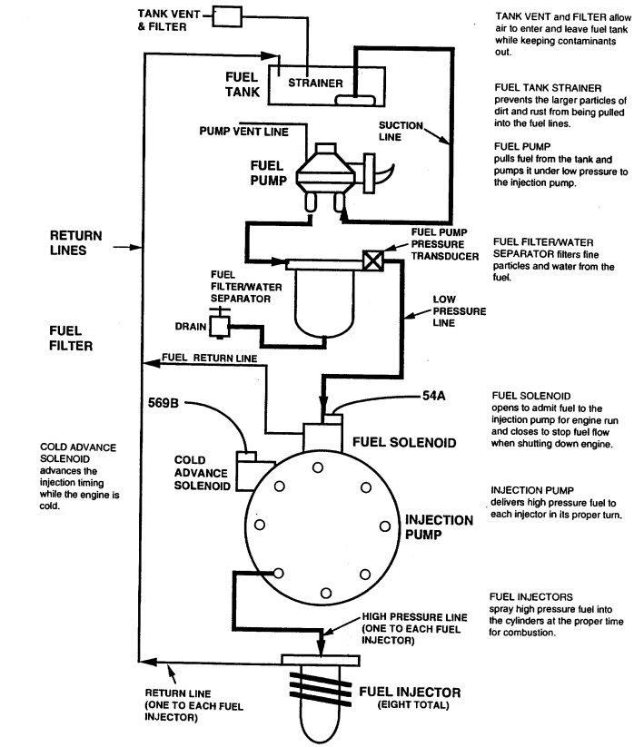

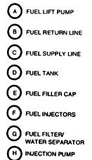

 DRAWS FUEL FROM FUEL TANK THROUGH THE SUPPLY LINE
AND PUMPS IT TO THE FUEL FILTER
DIRECTS UNUSED FUEL FROM THE INJECTION PUMP BACK TO THE FUEL TANK
DIRECTS FUEL FROM FUEL TANK TO THE SYSTEM
STORES 25 GALLONS OF DIESEL FUEL
located at right rear side of vehicle. The cap is REMOVED TO PERMIT FUEL TANK SERVICING
RECEIVE METERED FUEL FROM THE INJECTION PUMP AND
SPRAYS FUE. INTO THE COMBUSTION CHAMBER
FILTERS WATER AND SEDIMENT FROM FUEL
BEFORE FUEL ENTERS THE INJECTION PUMP
DIRECTS ME TERED AND PRESSURIZED FUEL TO THE EIGHT
INJECTOR NOZZLES. IT IS MOUNTED ON TOP OF THE
ENGINE UNDER THE INTAKE MANIFOLD

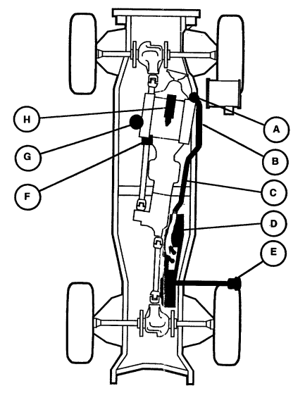

FO-1 Fuel System Functional Flow and Locations of Parts Diagrams FP-1/(FP-2 Blank)
 .

 NOT APPLICABLE TO THIS SYSTEM
:  

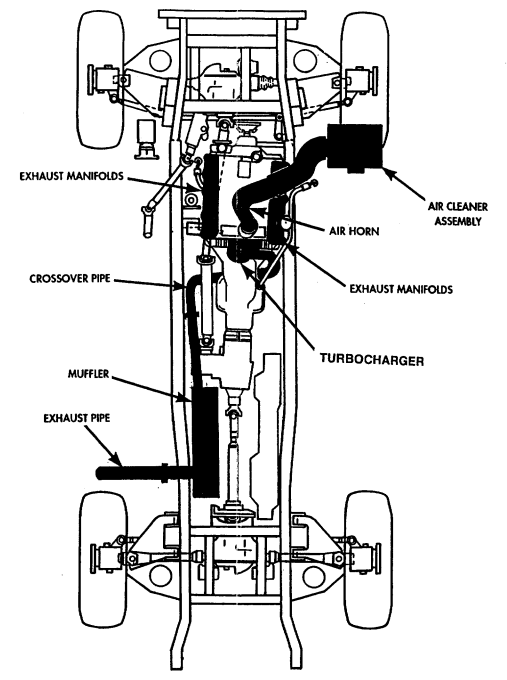

:
 FO-2 Intake Air/Exhaust Functional Flow and Location of Parts Diagrams FP-3/(FP-4 Blank)

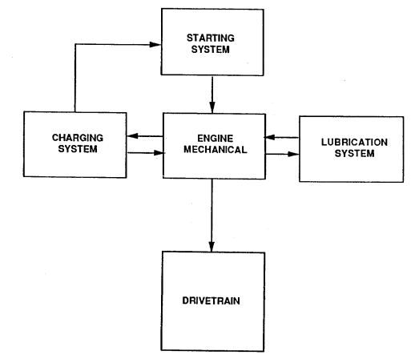

:
NOT APPLICABLE TO THIS SYSTEM
 FO-3 Compression/Mechanical Function Flow and Location of Parts Diagrams FP-5/(FP-6 Blank)

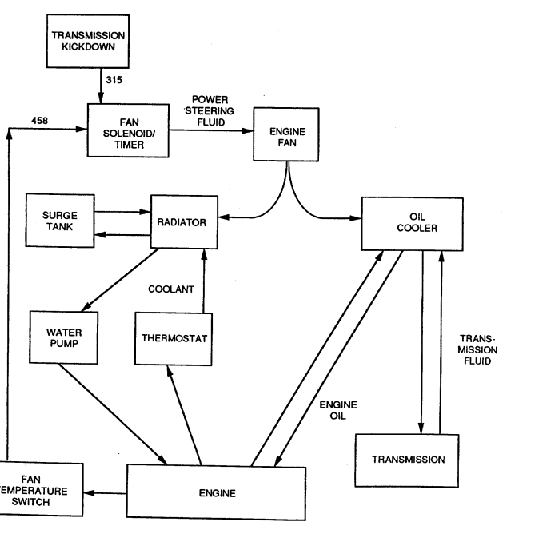

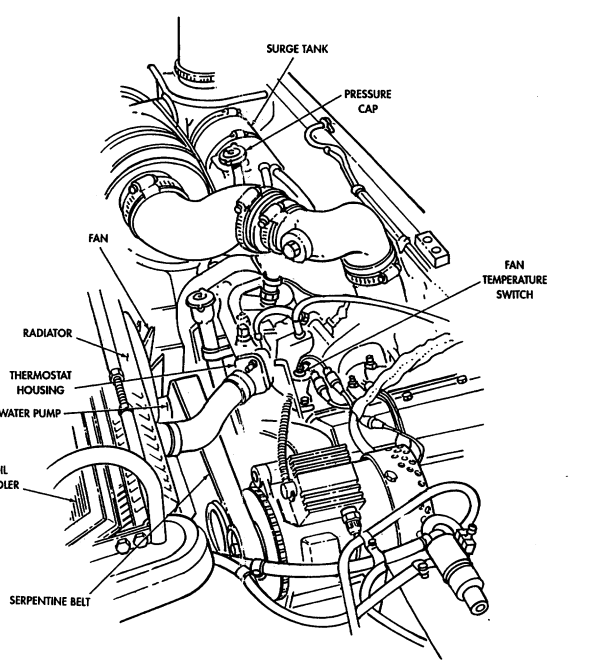

ଠା
COOLER
FO-4 Cooling Functional Flow
 
(Serial Numbers 299999 and Below)
 ■

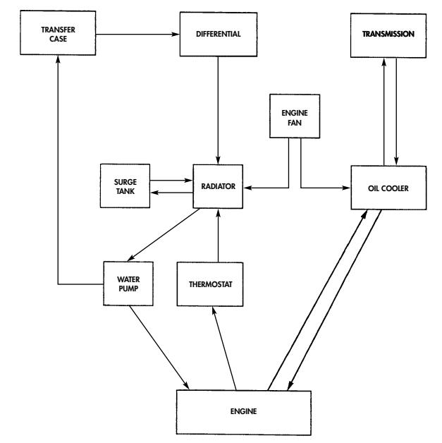

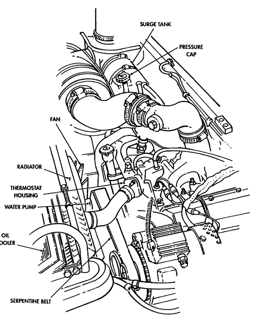

COOLER
FO-4.1 Cooling Functional Flow
 

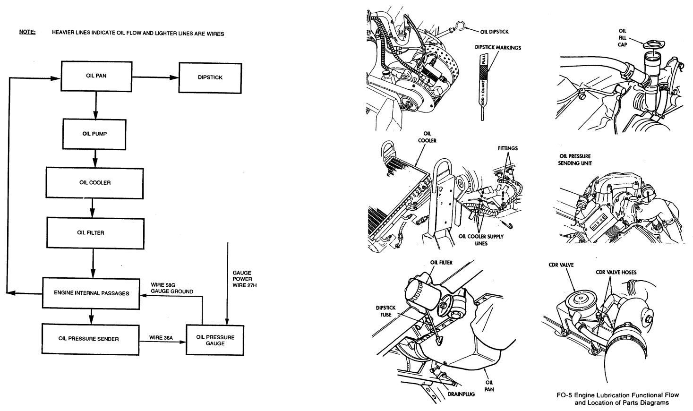

FP-9/(FP-10 Blank)

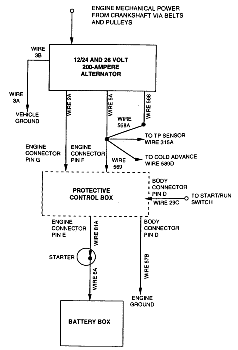

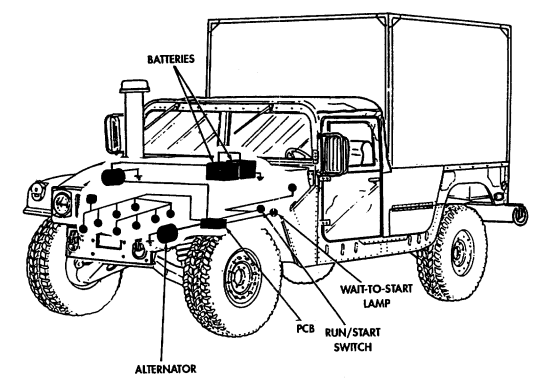

FO-6 Alternator Functional Flow and Location of Parts Diagrams FP-11/(FP-12 Blank)

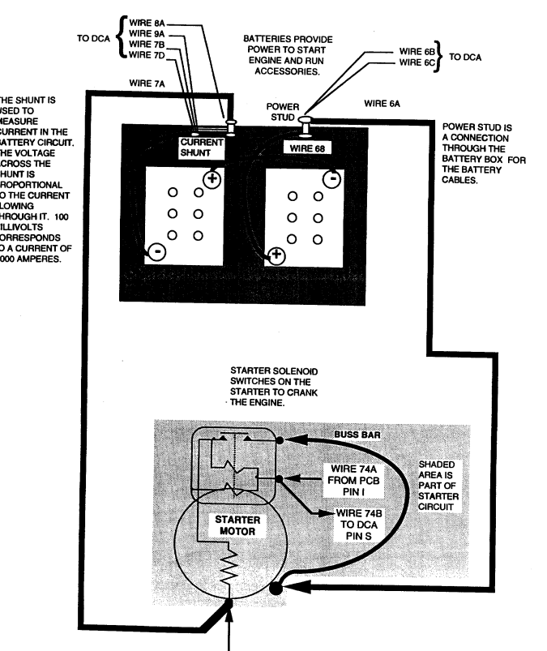

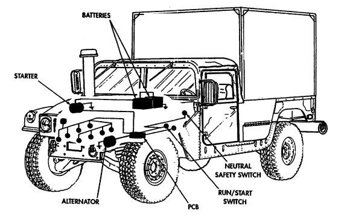

ALL CIRCUITS MUST RETURN
THROUGH VEHICLE GROUND.

FO-7 Battery Functional Flow and Location of Parts Diagrams FP-13/(FP-14 Blank)

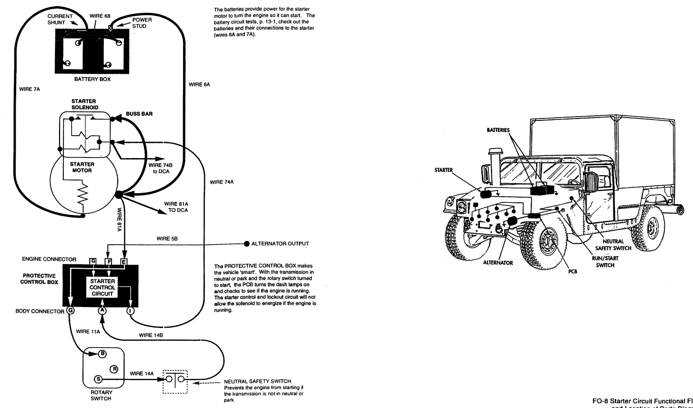

and Location of Parts Diagrams

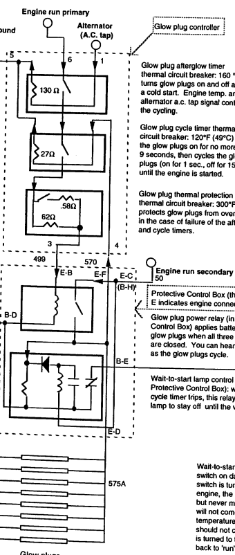

Ground Glow plug power relay (in the Protective Control Box) applies battery power to glow plugs when all three thermal breakers are closed.  You can hear this relay clicking Wait-to-start lamp control relay (in the Protective Control Box): when the glow plug cycle timer trips, this relay forces the wait-to-start lamp to stay off  until the vehicle is turned off.
NOTES ABOUT THERMAL
CIRCUIT BREAKERS
Thermal circuit breakers act like switches that open when their temperature goes above a set temperature.  They are closed below that temperature.

Each of these thermal circuit breakers also has a small heater, shown as a resistor.

The temperature the breaker feels is the heat of the engine coolant plus the heat of the heater.

0 Instrument power Protective Control Box (the whole box is not shown):
E indicates engine connector, B indicates body connector

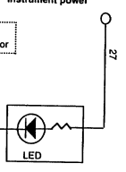

571A
Wait-to-start lamp  (next to the rotary switch on dash): comes on when the rotary switch is turned to 'run'.  The colder the engine, the longer the lamp will stay on, but never more than 9 seconds.  The lamp will not come on at all if the engine temperature is above 120° F (49°C).  The lamp should not come on again unless the switch is turned to the 'stop' position and then

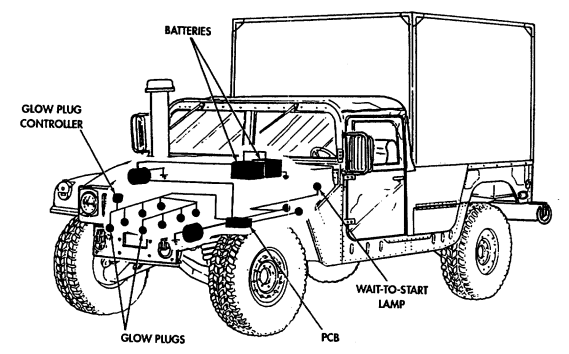

Glow plugs

FO-9 Glow Plugs Functional Flow and Location of Parts Diagrams O
FP-17/(FP-18 Blank)

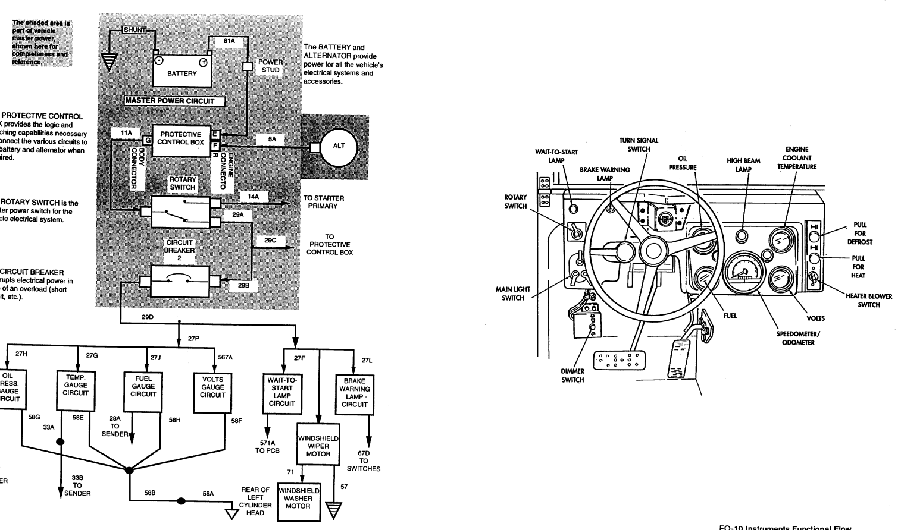

circuit, etc.).
required.

FO-10 Instruments Functional Flow and Location of Parts Diagram FP-19/(FP-20 Blank)
36A
 TO
SENDER

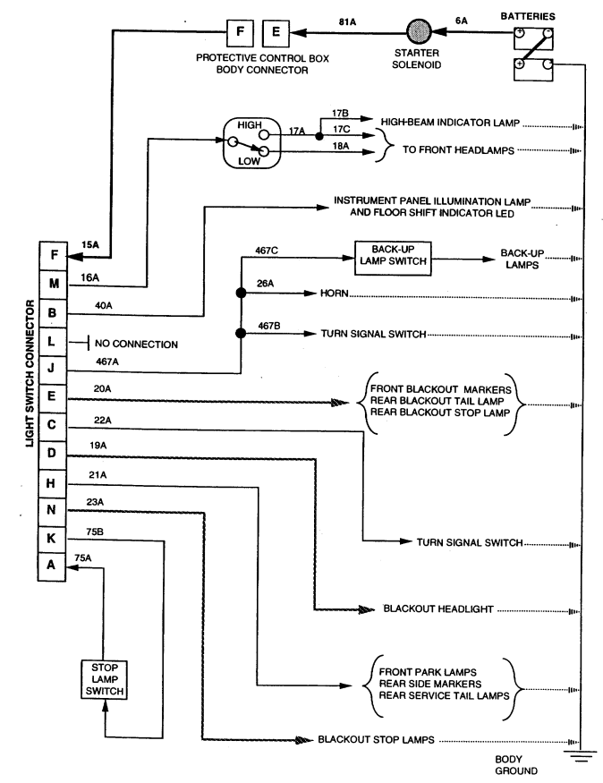

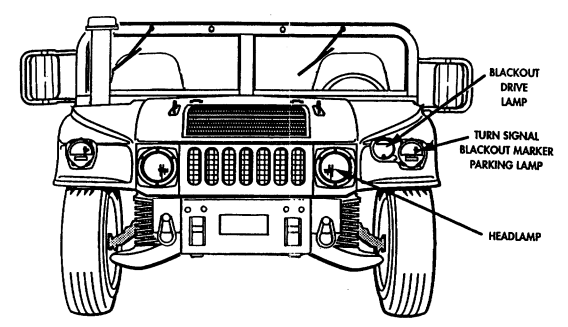

FRONT VIEW

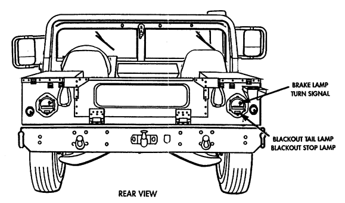

 FO-11 Lights Functional Flow and Location of Parts Diagrams FP-21/FP(FP-22 Blank)

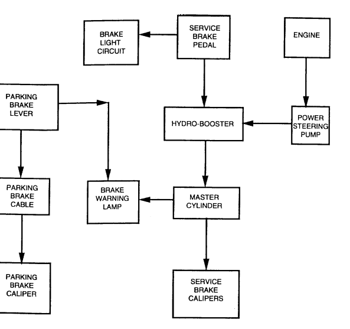

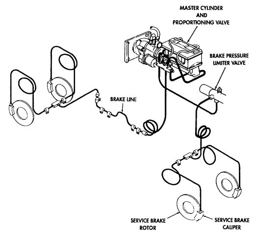

FO-12 Brakes Functional Flow
 
■
Change 6

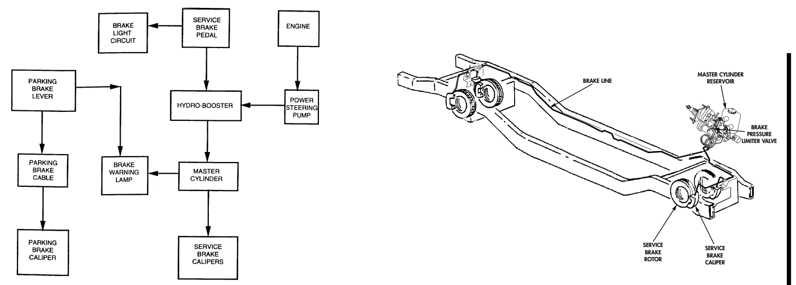

FO-12.1 Brakes Functional Flow
 
 Change 6

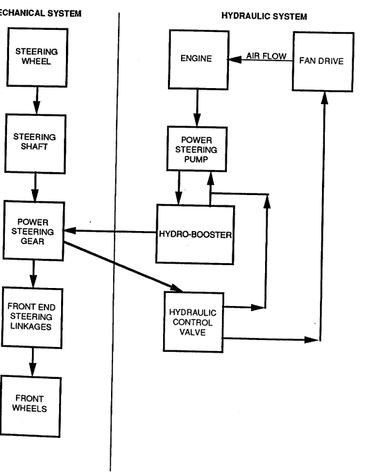

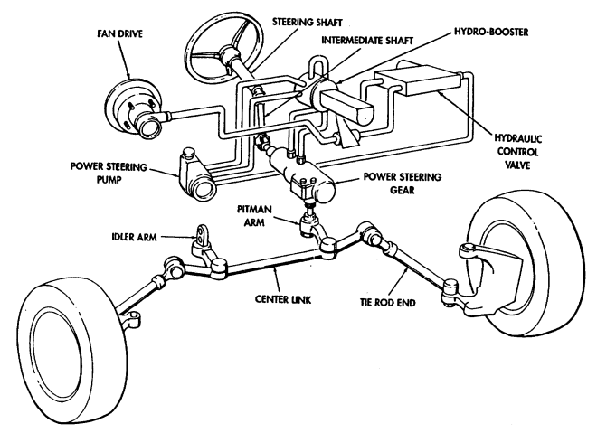

FO-13 Steering Functional Flow
 
(Serial Numbers 299999 and Below
 ■

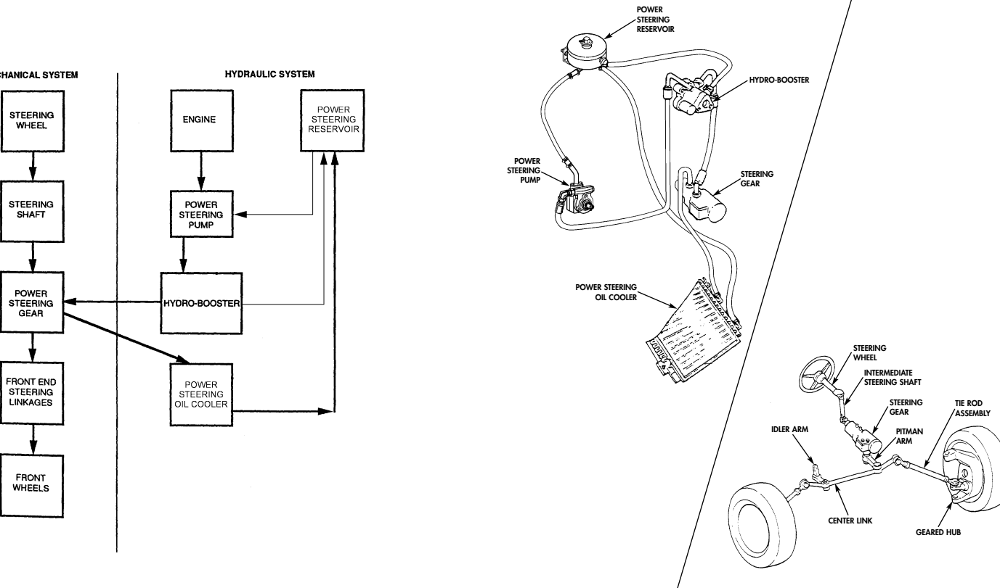

FO-13.1 Steering functional flow and Location of Parts Diagrams (Serial Numbers 300000 and Above.)

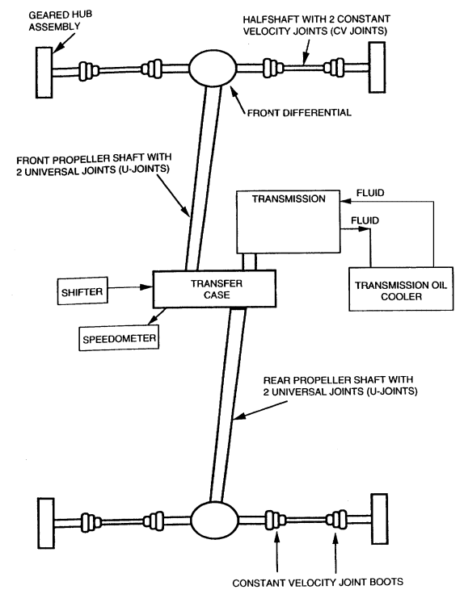

NOT APPLICABLE TO THIS SYSTEM
FO-14 Drivetrain Functional Flow and
 

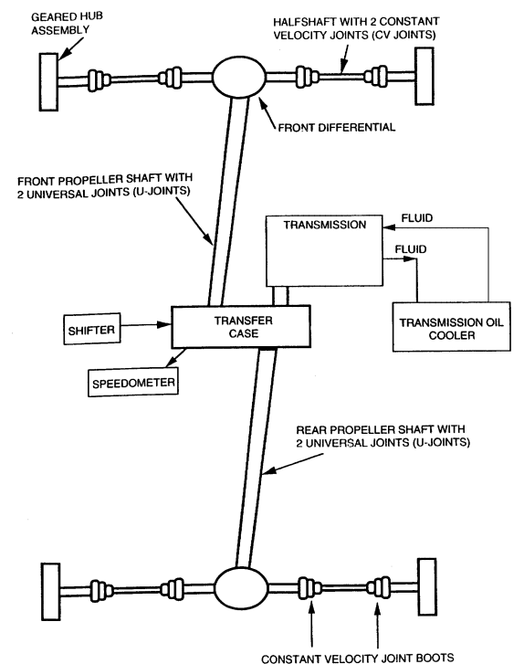

NOT APPLICABLE TO THIS SYSTEM

FO-14.1 Drivetrain Functional Flow and Location of Parts Diagram
(Serial Numbers 300000 and Above)
This table assumes that the VTM is powered by  the W5 cable.  For additional information on any of these tests, see para. 2-41 or TM 9-4910-571-12&P.  Tests 72,73,74, and 75 are known as a first peak series, and data for all four of these tests are taken simultaneously.

| DCA TEST   | PARAMETER       | USE TK ITEM                     | TEST   | MEASUREMENT                                   |
|------------|-----------------|---------------------------------|--------|-----------------------------------------------|
|            |                 |                                 | NO.    | POINTS                                        |
| 10         | RPM             | 34\-PULSE TACH. WITH A W4 CABLE | 10     | PUT IN PLACE OF VEHICLE TACH.                 |
| 12         | POWER           | 34\-PULSE TACH.                 | 12     | PUT IN PLACE OF VEHICLE TACH.                 |
|            | (RPM/SEC)       | WITH A W4 CABLE                 |        |                                               |
| 13         | POWER           | 34\-PULSE TACH.                 | 13     | PUT IN PLACE OF VEHICLE TACH.                 |
|            | (PERCENT)       | WITH A W4 CABLE                 |        |                                               |
| 14         | COMPRESSION     | NONE                            | 14     | VTM TAKES DATA THROUGH W5 (POWER) CABLE.      |
|            | UNBALANCE       | REQUIRED                        |        |                                               |
| 24         | FUEL            | 22\-RED PRESSURE                | 49     | INSTALL IN PLACE OF VEHICLE FUEL PRESSURE     |
|            | PRESSURE        | TRANSDUCER                      |        | TRANSDUCER.                                   |
| 67         | BATTERY         | NONE                            | 67     | VTM TAKES DATA THROUGH W5 (POWER) CABLE.      |
|            | VOLTAGE         | REQUIRED                        |        |                                               |
| ୧୫         | STARTER         | W2 CABLE                        | 88     | ATTACH RED CLIP TO STARTER POSITIVE TERMINAL  |
|            | MOTOR VOLTS     |                                 |        | (WIRE 6A), BLACK TO BATTERY SIDE OF SHUNT.    |
| 69         | STARTER NEG.    | W2 CABLE                        | 89     | ATTACH RED CLIP TO STARTER GROUND TERMINAL    |
|            | CABLE DROP      |                                 |        | (WIRE 7A), BLACK TO BATTERY SIDE OF SHUNT.    |
| 70         | STARTER         | W2 CABLE                        | 89     | ATTACH RED CLIP TO STARTER SOLENOID TERMINAL  |
|            | SOL. VOLTS      |                                 |        | (WIRE 74A), BLACK TO STARTER GROUND TERMINAL. |
| 71         | STARTER         | 11\- CURRENT                    | 90     | PUT PROBE AROUND NEGATIVE BATTERY CABLE       |
|            | CURRENT         | PROBE                           |        | BETWEEN THE SHUNT AND THE BATTERY PACK.       |
| 72         | CURRENT         | 11\- CURRENT                    | 72     | PUT PROBE AROUND NEGATIVE BATTERY CABLE       |
|            | FIRST PEAK      | PROBE                           |        | BETWEEN THE SHUNT AND THE BATTERY PACK.       |
| 73         | BATTERY         | 11\- CURRENT                    | 73     | PUT PROBE AROUND NEGATIVE BATTERY CABLE       |
|            | RESISTANCE      | PROBE                           |        | BETWEEN THE SHUNT AND THE BATTERY PACK.       |
| 74         | STARTER CIRCUIT | 11\- CURRENT PROBE              | 74     | PUT PROBE AROUND NEGATIVE BATTERY CABLE       |
|            | RESISTANCE      |                                 |        | BETWEEN THE SHUNT AND THE BATTERY PACK.       |
| 75         | BATTERY         | 11\- CURRENT                    | 75     | PUT PROBE AROUND NEGATIVE BATTERY CABLE       |
|            | RESISTANCE      | PROBE                           |        | BETWEEN THE SHUNT AND THE BATTERY PACK.       |
|            | CHANGE          |                                 |        |                                               |
| 80         | BATTERY         | 11\- CURRENT                    | 90     | PUT PROBE AROUND NEGATIVE BATTERY CABLE       |
|            | CURRENT         | PROBE                           |        | BETWEEN THE SHUNT AND THE BATTERY PACK.       |

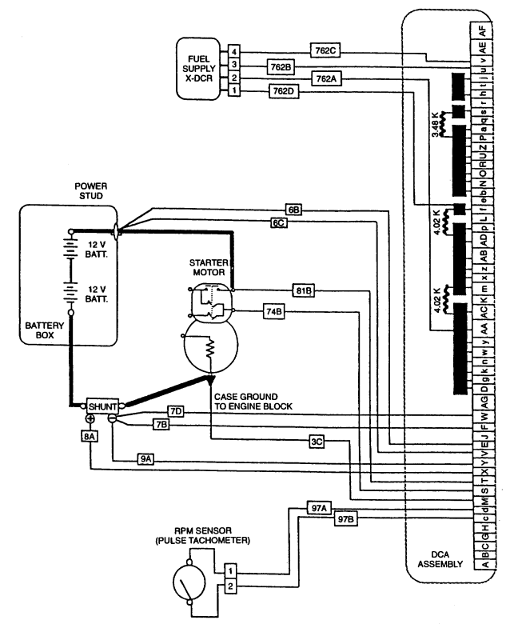

FO-15 DCA Functional Flow and Location of Parts Diagrams

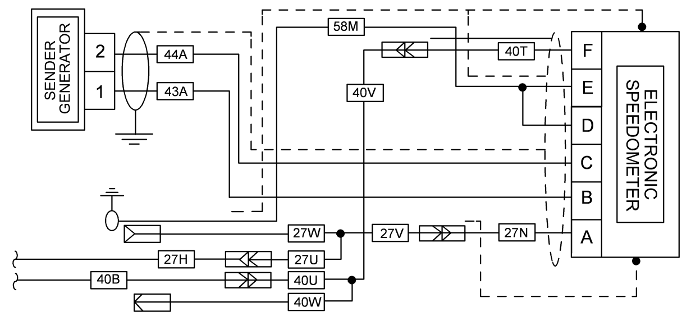

FO-16 Electronic Speedometer Wiring Chart

m&B%& 

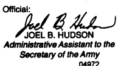

04072 
DENNIS J. REIMER 
General, UnitedSt~te~Am~' 
chiaf0fstaR 
Byo&roftheSeux4aryoftheAirFonx: 
RONALD R. FDGLEMAN 
Gerwai, UMedstetesAkFonu, chi8fofsfaff OfllOid: 
HENRY VICCELLIO, JR. 

CWC@LmsdshlsSAcFora, COfWWdW,A&FOtWMhdBtcormvnd DISTRIBUTIDN: To be distributed in accordance with the initial disbibution number (IDN) 381020, requirements for TM 9-232&387-24-l. 

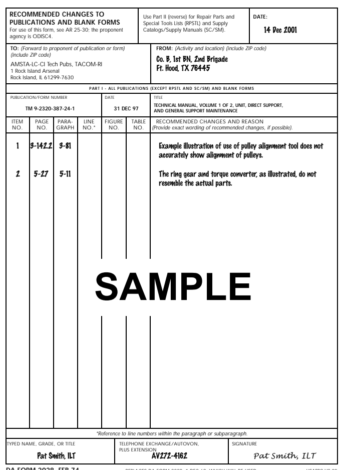

DA FORM 2028, FEB 74 REPLACES DA FORM 2028, 1 DEC 68, WHICH WILL BE USED. USAPPC V3.00
TO: (Forward direct to addressee listed in publication)

| FROM: (Activity and location)   |
|---------------------------------|
| (include ZIP code)              |

DATE:
AMSTA-LC-CI Tech Pubs, TACOM-RI
1 Rock Island Arsenal Rock Island, IL 61299-7630

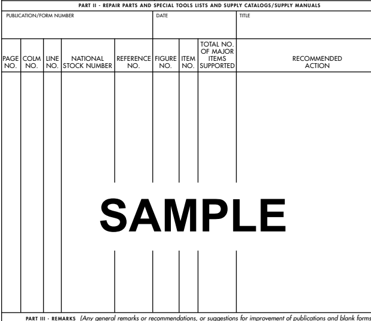

Additional blank sheets may be used if more space is needed.)

| SIGNATURE   |
|-------------|

TYPED NAME, GRADE, OR TITLE TELEPHONE EXCHANGE/AUTOVON, 
PLUS EXTENSION

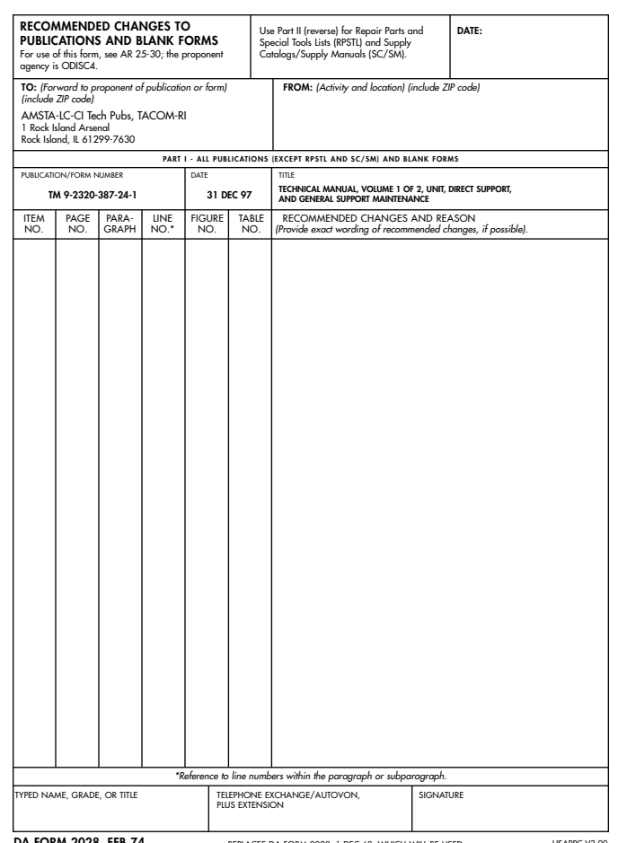

DA FORM 2028, FEB 74 REPLACES DA FORM 2028, 1 DEC 68, WHICH WILL BE USED. USAPPC V3.00

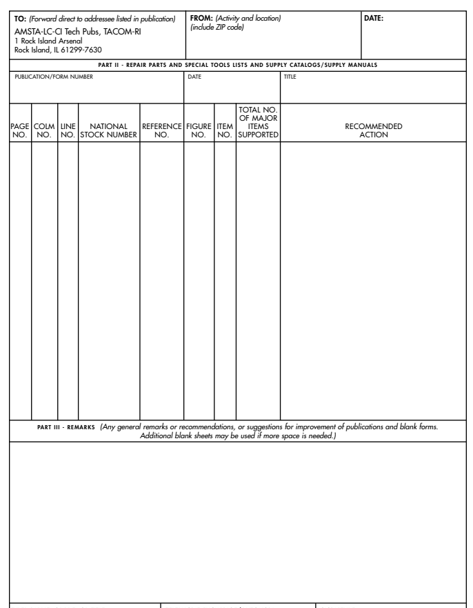

TYPED NAME, GRADE, OR TITLE TELEPHONE EXCHANGE/AUTOVON, 

PLUS EXTENSION

SIGNATURE

# The Metric System And Equivalents

#### Linear Measure

1 Centimeter = 10 Millimeters = 0.01 Meters = 
0.3937 Inches 1 Meter = 100 Centimeters = 1,000 Millimeters = 
39.37 Inches 1 Kilometer = 1,000 Meters = 0.621 Miles SQUARE MEASURE
1 Sq Centimeter = 100 Sq Millimeters = 0.155 Sq Inches 1 Sq Meter = 10,000 Sq Centimeters = 10.76 Sq Feet 1 Sq Kilometer = 1,000,000 Sq Meters = 0.386 Sq Miles

#### Cubic Measure

1 Cu Centimeter = 1,000 Cu Millimeters = 0.06 Cu Inches 1 Cu Meter = 1,000,000 Cu Centimeters = 35.31 Cu Feet LIQUID MEASURE 1 Milliliter = 0.001 Liters = 0.0338 Fluid Ounces 1 Liter = 1,000 Milliliters = 33.82 Fluid Ounces TEMPERATURE Degrees Fahrenheit (F) = °C - 9 ÷ 5 + 32 Degrees Celsius (C) = F° - 32 - 5 ÷ 9 212° Fahrenheit is equivalent to 100° Celsius 90° Fahrenheit is equivalent to 32.2° Celsius 32° Fahrenheit is equivalent to 0° Celsius WEIGHTS
1 Gram = 0.001 Kilograms = 1,000 Milligrams =
0.035 Ounces 1 Kilogram = 1,000 Grams = 2.2 Lb 1 Metric Ton = 1,000 Kilograms = 1 Megagram = 1.1 Short Tons

| Servo advance seal:               |          |                     |
|-----------------------------------|----------|---------------------|
| Installation 16\-5b               | 16\-6    |                     |
| Removal 16\-5a                    | 16\-6    |                     |
| Servo, front:                     |          |                     |
| Assembly 28\-15d                  | 28\-57   |                     |
| Cleaning 28\-15b                  | 28\-57   |                     |
| Disassembly 28\-15a               | 28\-57   | Shield, rear heat:  |
| Inspection 28\-15c                | 28\-57   |                     |
| Servo, rear (1995):               |          |                     |
| Assembly 28\-16d                  | 28\-58   |                     |
| Cleaning 28\-16b                  | 28\-58   |                     |
| Disassembly 28\-16a               | 28\-58   |                     |
| Inspection 28\-16c                | 28\-58   |                     |
| Servo, rear (1996\-1998)          |          |                     |
| Assembly 28\-16.1d                | 28\-58.2 |                     |
| Cleaning 28\-16.1b                | 28\-58.2 |                     |
| Disassembly 28\-16.1a             | 28\-58.2 |                     |
| Inspection 28\-16.1c              | 28\-58.2 |                     |
| Shaft assembly, front propeller:  |          |                     |
| Assembly 6\-3c                    | 6\-7     |                     |
| Cleaning and inspection 6\-3b     | 6\-6     |                     |
| Disassembly 6\-3a                 | 6\-6     |                     |
| Inspection 6\-2b                  | 6\-2     |                     |
| Installation 6\-2c                | 6\-4     | Shock absorber:     |
| Removal 6\-2a                     | 6\-2     |                     |
| Shaft, intermediate steering:     |          |                     |
| Installation 8\-19b               | 8\-54    |                     |
| Removal 8\-19a                    | 8\-54    |                     |
| Shaft, rear propeller:            |          |                     |
| Inspection 6\-4b                  | 6\-8     |                     |
| Installation 6\-4c                | 6\-8     |                     |
| Removal 6\-4a                     | 6\-8     | Rear shoulder strap |
| Shelter:                          |          |                     |
| Installation 11\-78b              | 11\-140  |                     |
| Removal 11\-78a                   | 11\-140  |                     |
| Shelter carrier body              |          |                     |
| maintenance task summary 11\-72   | 11\-133  |                     |
| Shelter carrier tailgate:         |          | Shunt:              |
| Installation 11\-75b              | 11\-136  |                     |
| Removal 11\-75a                   | 11\-136  |                     |
| Shelter carrier tailgate bracket: |          |                     |
| Installation 11\-74b              | 11\-135  |                     |
| Removal 11\-74a                   | 11\-135  |                     |

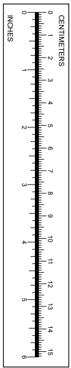

## Approximate Conversion Factors
